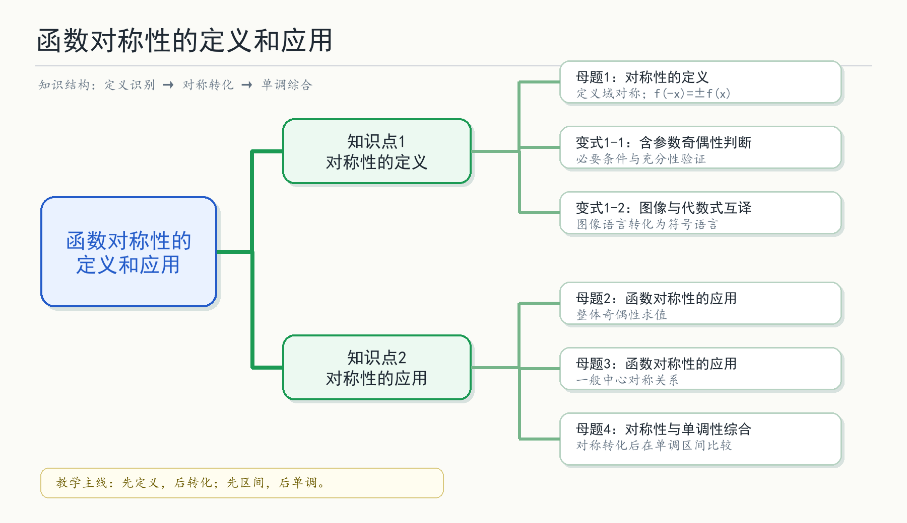

## 函数对称性的定义和应用

## 知识讲解

## 导学说明

函数对称性是研究函数性质的基本工具. 本讲从偶函数、奇函数的定义出发, 引导学生把“图像对称”转化为“符号关系”, 再利用对称性求函数值、确定参数、补全函数表达式, 并与单调性结合解决综合问题.

本讲题目优先选用本地真题、模考题与已整理题集; 对定义与方法说明部分, 依据沪教版必修第一册第 5 章“函数的概念、性质及应用”及配套教参生成.

## 1. 教学目标

(1)理解偶函数、奇函数的定义, 能先检查定义域是否关于原点对称, 再验证 $f(-x)=f(x)$ 或 $f(-x)=-f(x)$.

(2)能将图像关于 $y$ 轴、关于原点、关于直线 $x=a$、关于点 $(a,b)$ 的对称关系转化为代数式.

(3)能利用函数对称性求函数值、确定参数、补全函数解析式, 并能在综合题中结合单调性比较大小或解不等式.

(4)能区分含参数奇偶性中的必要性与充分性, 形成“先找必要条件, 再回代验证”的解题习惯.

## 2. 课程重难点

(1)重点:偶函数、奇函数的定义及其图像意义; 一般对称关系 $f(a+x)=f(a-x)$、$f(a+x)+f(a-x)=2b$ 的识别与应用.

(2)难点:含参数奇偶性问题的必要性与充分性验证; 对称性与单调性综合题中区间的对应关系.

## 3. 考查形式与分值占比

(1)题型:选择题、填空题为主, 也可作为解答题中的函数性质条件.

(2)占比:常作为函数性质模块的基础题或综合题条件出现, 与单调性、最值、不等式、解析式求法联合考查.

\newpage

## 知识导图

{width=100%}

## 教法备注

## 1. 三类知识点

(1)事实性知识:

偶函数图像关于 $y$ 轴对称, 奇函数图像关于原点中心对称.

(2)概念性知识:

偶函数、奇函数的定义, 以及一般对称轴、对称中心的符号刻画.

(3)程序性知识:

判断奇偶性、利用对称性求值、利用对称性把未知区间转化到已知区间、结合单调性解不等式.

## 2. 本切片知识点标签

知识点1 对称性的定义:概念性知识

知识点2 对称性的应用:程序性知识

## 3. 教材与教参依据

(1)教材依据:

沪教版必修第一册第 5 章指出, 若函数图像关于 $y$ 轴成轴对称, 则对定义域中任意 $x$, 都有 $-x$ 也在定义域中, 且 $f(-x)=f(x)$; 这就是偶函数. 类似地, 若对定义域中任意 $x$, 都有 $-x$ 也在定义域中, 且 $f(-x)=-f(x)$, 则称函数为奇函数, 其图像关于原点成中心对称.

(2)教参依据:

教参强调,“图像关于 $y$ 轴成轴对称”与“定义域关于原点对称且 $f(-x)=f(x)$”是同一性质的直观表述与符号表述; “图像关于原点成中心对称”与“定义域关于原点对称且 $f(-x)=-f(x)$”也是同一性质的两种表述.

(3)教学提醒:

含参数奇偶性题不能只由特殊值推出答案, 还要回代验证充分性; 单调性是区间性质, 与对称性综合时必须说明已知区间、目标区间和对称后的区间是否一致.

## 知识点1: 对称性的定义

## 知识笔记

## 1. 偶函数

设函数 $y=f(x)$ 的定义域为 $D$. 若对于任意 $x\in D$, 都有 $-x\in D$, 且

$$
f(-x)=f(x),
$$

则称 $f(x)$ 为偶函数.

图像意义:偶函数图像关于 $y$ 轴对称.

教学关键词:先看定义域, 再看解析式.

## 2. 奇函数

设函数 $y=f(x)$ 的定义域为 $D$. 若对于任意 $x\in D$, 都有 $-x\in D$, 且

$$
f(-x)=-f(x),
$$

则称 $f(x)$ 为奇函数.

图像意义:奇函数图像关于原点中心对称.

教学关键词:若 $0\in D$ 且 $f$ 为奇函数, 则必有 $f(0)=0$.

## 3. 一般对称关系

(1)图像关于直线 $x=a$ 对称:

$$
f(a+x)=f(a-x)
$$

或等价写成

$$
f(x)=f(2a-x).
$$

(2)图像关于点 $(a,b)$ 中心对称:

$$
f(a+x)+f(a-x)=2b.
$$

特别地, 关于原点中心对称就是 $a=0,b=0$, 即 $f(-x)=-f(x)$.

## 4. 对称性与单调性

(1)偶函数在 $[0,+\infty)$ 上的增减性会在 $(-\infty,0]$ 上反向对应.

(2)奇函数在对称区间上的增减方向保持一致.

(3)若 $f(x)$ 关于直线 $x=a$ 对称, 则可把 $a$ 左侧的自变量 $x$ 转化为右侧的 $2a-x$, 再在同一单调区间中比较.

## 本讲教法备注

知识标签:概念性知识与程序性知识结合

教学步骤:先让学生观察图像对称, 再抽象为符号关系; 判断奇偶性时固定使用“定义域是否对称 $\rightarrow$ 计算 $f(-x)$ $\rightarrow$ 与 $f(x)$ 比较”的流程; 进入综合题时, 强调“对称转化后必须落入已知单调区间”.

对应知识层级:理解、应用

## 母题1: 对称性的定义

\begin{QuestionBox}

母题说明:考查奇函数定义, 属于对称性定义的直接应用.

来源:2011-2025 上海真题汇编.

已知 $f(x)=x^3+a$ 为奇函数, 则 $a=$ \underline{\hspace{2.5em}}.

\end{QuestionBox}\begin{AnswerBox}

$0$

\end{AnswerBox}\begin{AnalysisBox}

由奇函数定义, 对任意 $x\in \mathbf{R}$,

$$
f(-x)=-f(x).
$$

因为

$$
f(-x)=(-x)^3+a=-x^3+a,\quad -f(x)=-x^3-a,
$$

所以 $a=-a$, 得 $a=0$.

故答案为: $0$.

\end{AnalysisBox}\begin{TeachBox}

1.【选题原因】

本题是奇函数定义的最直接题型, 适合放在第一道母题中建立标准流程:先确认定义域为 $\mathbf{R}$, 再计算 $f(-x)$, 最后与 $-f(x)$ 比较.

2.【错因预设】

(1)只看到 $x^3$ 是奇函数, 忽略常数项 $a$ 对奇偶性的影响;

(2)误把奇函数条件写成 $f(-x)=f(x)$;

(3)只代入 $x=1$ 得到 $a=0$, 但没有说明这是对任意 $x$ 的恒等关系.

3.【讲法建议】

本题可强调“常数项破坏奇函数”的直观理解:奇函数图像关于原点对称, 若整体上下平移, 对称中心随之改变, 不再关于原点对称.

\end{TeachBox}

---

## 变式题1-1

\begin{QuestionBox}

变式说明:考查含参数分段函数的奇偶性判断, 要求学生同时处理定义、分段对应和充分性验证.

来源:上海高中数学知识点再现能力训练题集.

若函数

$$
f(x)=
\begin{cases}
a^2x-1, & x<0,\\
0, & x=0,\\
x+a, & x>0
\end{cases}
$$

为奇函数, 则 $a=$ \underline{\hspace{2.5em}}.

\end{QuestionBox}\begin{AnswerBox}

$1$

\end{AnswerBox}\begin{AnalysisBox}

对 $x>0$, 由奇函数条件 $f(-x)=-f(x)$, 得

$$
-a^2x-1=-(x+a)=-x-a.
$$

比较系数与常数项, 得 $a^2=1$ 且 $a=1$, 所以 $a=1$.

故答案为: $1$.

\end{AnalysisBox}\begin{TeachBox}

1.【变式价值】

母题只含一个表达式, 本题增加了“正负自变量落入不同分段”的处理, 是从定义题过渡到分段函数题的典型变式.

2.【错因预设】

(1)把 $f(-x)$ 仍代入 $x>0$ 的表达式;

(2)只由 $a^2=1$ 得 $a=\pm1$, 忽略常数项还给出 $a=1$;

(3)忘记检查 $x=0$ 处是否满足奇函数必要条件 $f(0)=0$.

\end{TeachBox}

---

## 变式题1-2

\begin{QuestionBox}

变式说明:考查图像对称与代数式关系互译, 训练“先由图像语言转成 $f(-x)=f(x)$, 再验证参数”的思路.

来源:沪教版必修第一册第 5 章教材例题改编.

是否存在正数 $a$, 使函数

$$
f(x)=\frac{a^x+1}{2^x}
$$

是偶函数? 若存在, 求 $a$.

\end{QuestionBox}\begin{AnswerBox}

存在, $a=4$.

\end{AnswerBox}\begin{AnalysisBox}

若 $f(x)$ 为偶函数, 则必要地有 $f(1)=f(-1)$, 即

$$
\frac{a+1}{2}=\frac{2}{a}+2.
$$

解得 $a=-1$ 或 $a=4$. 因为 $a$ 为正数, 所以只可能 $a=4$.

当 $a=4$ 时,

$$
f(x)=\frac{4^x+1}{2^x}=2^x+2^{-x},
$$

于是 $f(-x)=2^{-x}+2^x=f(x)$, 因此 $f(x)$ 为偶函数.

故答案为: $a=4$.

\end{AnalysisBox}\begin{TeachBox}

1.【变式价值】

本题体现教参中强调的“必要性与充分性”问题:由 $f(1)=f(-1)$ 只能得到候选参数, 最终必须回代验证对任意 $x$ 成立.

2.【错因预设】

(1)由 $f(1)=f(-1)$ 得到 $a=4$ 后直接结束, 未证明充分性;

(2)解方程时保留 $a=-1$, 忽略题设 $a>0$;

(3)化简 $\frac{4^x+1}{2^x}$ 时误写成 $2^x+1$.

\end{TeachBox}

## 知识点2: 对称性的应用

## 知识笔记

## 1. 利用奇偶性求函数值

若已知 $F(x)$ 是奇函数或偶函数, 而 $F(x)$ 又由 $f(x)$ 与其他函数组合而成, 则应先把奇偶性施加在整体 $F(x)$ 上, 再求目标函数值.

典型形式:

$$
F(x)=f(x)+x^2,\quad F(-x)=-F(x).
$$

此时不能直接断定 $f(x)$ 是奇函数.

## 2. 利用一侧信息推出另一侧信息

若 $f$ 为偶函数, 则 $x<0$ 一侧可由 $x>0$ 一侧通过 $f(-x)=f(x)$ 得到.

若 $f$ 为奇函数, 则 $x<0$ 一侧可由 $x>0$ 一侧通过 $f(-x)=-f(x)$ 得到.

若图像关于 $x=a$ 对称, 则 $a$ 左右两侧通过 $x\leftrightarrow 2a-x$ 对应.

## 3. 对称性与单调性综合的基本步骤

(1)识别对称中心或对称轴;

(2)把目标自变量转化到已知单调区间;

(3)用单调性把函数值不等式转化为自变量不等式;

(4)求解并检查定义域.

\newpage

## 母题2: 函数对称性的应用

\begin{QuestionBox}

母题说明:考查利用奇函数性质求函数值, 重点是“整体函数”的奇偶性.

来源:2011-2025 上海真题汇编; 上海高中数学知识点再现能力训练题集收录.

已知 $y=f(x)+x^2$ 是奇函数, 且 $f(1)=1$. 若 $g(x)=f(x)+2$, 则 $g(-1)=$ \underline{\hspace{2.5em}}.

\end{QuestionBox}\begin{AnswerBox}

$-1$

\end{AnswerBox}\begin{AnalysisBox}

令

$$
F(x)=f(x)+x^2.
$$

由题意 $F(x)$ 是奇函数, 所以

$$
F(-1)=-F(1).
$$

因为

$$
F(1)=f(1)+1=2,
$$

所以 $F(-1)=-2$, 即

$$
f(-1)+1=-2.
$$

因此 $f(-1)=-3$, 从而

$$
g(-1)=f(-1)+2=-1.
$$

故答案为: $-1$.

\end{AnalysisBox}\begin{TeachBox}

1.【选题原因】

本题是“整体奇函数”的经典小题. 它能有效区分学生是否真正理解题设:奇函数是 $f(x)+x^2$, 不是 $f(x)$.

2.【错因预设】

(1)误认为 $f(x)$ 是奇函数, 直接写 $f(-1)=-f(1)=-1$;

(2)忽略 $x^2$ 在 $x=-1$ 与 $x=1$ 处均为 $1$;

(3)最后求的是 $g(-1)$, 不是 $f(-1)$.

3.【讲法建议】

建议把 $F(x)=f(x)+x^2$ 单独设出, 让学生先在整体函数上使用奇函数关系, 再回到 $f$ 与 $g$. 这一步能减少错误迁移.

\end{TeachBox}

---

## 变式题2-1

\begin{QuestionBox}

变式说明:考查利用奇偶性补全另一侧解析式, 强化“一侧已知, 另一侧由对称性推出”的思想.

来源:沪教版必修第一册第 5 章教材例题改编.

已知函数 $f(x)$ 是定义在 $\mathbf{R}$ 上的奇函数, 且当 $x\geq 0$ 时,

$$
f(x)=x^2+x.
$$

求 $x<0$ 时 $f(x)$ 的表达式.

\end{QuestionBox}\begin{AnswerBox}

当 $x<0$ 时,

$$
f(x)=-x^2+x.
$$

\end{AnswerBox}\begin{AnalysisBox}

当 $x<0$ 时, 有 $-x>0$, 所以

$$
f(-x)=(-x)^2+(-x)=x^2-x.
$$

又因为 $f$ 是奇函数, $f(x)=-f(-x)$, 所以

$$
f(x)=-(x^2-x)=-x^2+x.
$$

故当 $x<0$ 时,

$$
f(x)=-x^2+x.
$$

\end{AnalysisBox}\begin{TeachBox}

1.【勘误提示】

本题答案应为 $f(x)=-x^2+x$. 若学生写成 $x^2-x$, 说明只完成了 $f(-x)$ 的代入, 没有再使用奇函数的负号关系.

2.【讲法建议】

可以让学生固定三步:设 $x<0$ $\rightarrow$ 代入已知侧 $-x>0$ $\rightarrow$ 用 $f(x)=-f(-x)$ 变回目标函数值.

\end{TeachBox}

\newpage

## 母题3: 函数对称性的应用

\begin{QuestionBox}

母题说明:考查一般中心对称关系, 将“函数图像关于点成中心对称”转化为代数恒等式.

来源:上海高中数学知识点再现能力训练题集.

已知函数

$$
f(x)=\frac{2-x}{x+1}.
$$

证明:函数 $y=f(x)$ 的图像关于点 $(-1,-1)$ 中心对称.

\end{QuestionBox}\begin{AnswerBox}

证明见解析.

\end{AnswerBox}\begin{AnalysisBox}

设 $x=-1+t$, 则 $t\neq 0$. 有

$$
f(-1+t)+1=\frac{2-(-1+t)}{-1+t+1}+1
=\frac{3-t}{t}+1=\frac{3}{t}.
$$

又

$$
f(-1-t)+1=\frac{2-(-1-t)}{-1-t+1}+1
=\frac{3+t}{-t}+1=-\frac{3}{t}.
$$

所以

$$
\bigl[f(-1+t)+1\bigr]+\bigl[f(-1-t)+1\bigr]=0,
$$

即

$$
f(-1+t)+f(-1-t)=-2.
$$

因此函数 $y=f(x)$ 的图像关于点 $(-1,-1)$ 中心对称.

\end{AnalysisBox}\begin{TeachBox}

1.【选题原因】

本题用于把奇偶性推广到一般中心对称. 当把中心 $(-1,-1)$ 平移到原点后, 函数值的变化量呈现“奇函数式”的相反数关系.

2.【错因预设】

(1)只证明 $f(-1+t)=-f(-1-t)$, 忘记中心的纵坐标是 $-1$, 需要比较的是 $f(x)+1$;

(2)忽略定义域 $x\neq -1$, 即 $t\neq 0$;

(3)把中心对称误判为轴对称, 写成 $f(-1+t)=f(-1-t)$.

3.【讲法建议】

建议先给出通用判定:

图像关于点 $(a,b)$ 中心对称, 当且仅当

$$
f(a+t)+f(a-t)=2b.
$$

再代入 $a=-1,b=-1$, 让学生看到公式与计算之间的对应.

\end{TeachBox}

---

## 变式题3-1

\begin{QuestionBox}

变式说明:考查对称轴关系 $f(a+x)=f(a-x)$ 的识别, 为母题4的单调性综合做铺垫.

来源:自编题, 依据教材“图像直观与符号语言互译”的教学要求生成.

若函数 $f(x)$ 的图像关于直线 $x=2$ 对称, 且 $f(5)=7$, 则 $f(-1)=$ \underline{\hspace{2.5em}}.

\end{QuestionBox}\begin{AnswerBox}

$7$

\end{AnswerBox}\begin{AnalysisBox}

图像关于直线 $x=2$ 对称, 等价于

$$
f(x)=f(4-x).
$$

因为 $-1$ 关于直线 $x=2$ 的对称点是 $5$, 所以

$$
f(-1)=f(5)=7.
$$

故答案为: $7$.

\end{AnalysisBox}\begin{TeachBox}

1.【变式价值】

本题不涉及复杂运算, 只训练对称轴的自变量对应关系 $x\leftrightarrow 2a-x$. 这是后续不等式转化的基础.

2.【错因预设】

学生容易写成 $x\leftrightarrow -x$, 仍停留在关于 $y$ 轴对称的旧模型中. 讲解时要强调“对称轴变为 $x=a$ 时, 中点是 $a$”.

\end{TeachBox}

\newpage

## 母题4: 函数对称性与单调性综合

\begin{QuestionBox}

母题说明:考查函数对称性与单调性的综合应用, 重点是先通过对称轴把自变量转化到已知单调区间, 再比较函数值.

来源:上海高中数学知识点再现能力训练题集.

已知 $f(x+2)$ 是定义在 $\mathbf{R}$ 上的偶函数, 当 $x_1,x_2\in [2,+\infty)$ 且 $x_1\neq x_2$ 时, 总有

$$
\frac{x_1-x_2}{f(x_1)-f(x_2)}<0.
$$

则不等式

$$
f(-3^{x+1}+1)<f(12)
$$

的解集为 \underline{\hspace{2.5em}}.

\end{QuestionBox}\begin{AnswerBox}

$(1,+\infty)$.

\end{AnswerBox}\begin{AnalysisBox}

因为 $f(x+2)$ 是偶函数, 令 $h(x)=f(x+2)$, 则 $h(-x)=h(x)$.

所以对任意 $t$, 有

$$
f(2-t)=f(2+t),
$$

即函数 $f(x)$ 的图像关于直线 $x=2$ 对称.

又由

$$
\frac{x_1-x_2}{f(x_1)-f(x_2)}<0
$$

可知:当 $x_1<x_2$ 且 $x_1,x_2\in[2,+\infty)$ 时, 必有 $f(x_1)>f(x_2)$. 因此 $f(x)$ 在 $[2,+\infty)$ 上严格递减.

对目标自变量作关于 $x=2$ 的对称转化:

$$
-3^{x+1}+1 \quad \longleftrightarrow \quad 4-(-3^{x+1}+1)=3^{x+1}+3.
$$

所以

$$
f(-3^{x+1}+1)=f(3^{x+1}+3).
$$

注意 $3^{x+1}+3>3$, 已落在已知单调区间 $[2,+\infty)$ 内. 于是原不等式等价于

$$
f(3^{x+1}+3)<f(12).
$$

因为 $f(x)$ 在 $[2,+\infty)$ 上严格递减, 所以

$$
3^{x+1}+3>12.
$$

解得

$$
3^{x+1}>9=3^2,
$$

即

$$
x+1>2,\quad x>1.
$$

故解集为 $(1,+\infty)$.

\end{AnalysisBox}\begin{TeachBox}

1.【选题原因】

本题完整覆盖“对称性与单调性综合”的核心流程:识别对称轴 $x=2$、把左侧自变量翻到右侧、确认转化后的自变量落入单调区间、再由严格递减转化不等号方向.

2.【错因预设】

(1)把 $f(x+2)$ 是偶函数误判为 $f(x)$ 是偶函数, 进而写成 $f(-u)=f(u)$;

(2)没有把 $-3^{x+1}+1$ 关于 $x=2$ 对称到 $3^{x+1}+3$;

(3)知道 $f$ 递减, 但把 $f(A)<f(12)$ 错转成 $A<12$;

(4)忽略转化后的 $3^{x+1}+3>3$, 没有说明它在 $[2,+\infty)$ 上, 导致单调性使用不严谨.

3.【讲法建议】

建议板书使用三栏:

左栏写“对称性: $f(x)=f(4-x)$”;

中栏写“单调性: $[2,+\infty)$ 上严格递减”;

右栏写“不等式转化: $f(-3^{x+1}+1)=f(3^{x+1}+3)<f(12)$”.

学生只要把这三栏对应清楚, 综合题的逻辑就会稳定很多.

\end{TeachBox}

---

## 变式题4-1

\begin{QuestionBox}

变式说明:考查奇偶性与单调性的基础识别, 可作为母题4前的热身题或课后基础练习.

来源:2011-2025 上海真题汇编.

下列函数中, 既是偶函数, 又是在区间 $(0,+\infty)$ 上单调递减的函数是 ( ).

A. $y=\ln \dfrac{1}{|x|}$

B. $y=x^3$

C. $y=2^{|x|}$

D. $y=\cos x$

\end{QuestionBox}\begin{AnswerBox}

A.

\end{AnswerBox}\begin{AnalysisBox}

A 中函数定义域为 $(-\infty,0)\cup(0,+\infty)$, 关于原点对称, 且

$$
\ln\frac{1}{|-x|}=\ln\frac{1}{|x|},
$$

故为偶函数. 当 $x>0$ 时,

$$
y=\ln\frac{1}{x}=-\ln x,
$$

在 $(0,+\infty)$ 上严格递减. 故选 A.

\end{AnalysisBox}\begin{TeachBox}

本题用于快速检查学生是否能同时判断函数奇偶性与指定区间上的单调性, 可作为母题4前的铺垫题.

\end{TeachBox}

\newpage

## 分层练习

## 基础

### 练习1

\begin{QuestionBox}

判断函数 $f(x)=2x^4-3x^2$ 的奇偶性.

\end{QuestionBox}\begin{AnswerBox}

偶函数.

\end{AnswerBox}\begin{AnalysisBox}

因为

$$
f(-x)=2(-x)^4-3(-x)^2=f(x),
$$

所以 $f(x)$ 为偶函数.

\end{AnalysisBox}

---

### 练习2

\begin{QuestionBox}

已知函数 $f(x)$ 是奇函数, 且 $f(2)=5$, 则 $f(-2)=$ \underline{\hspace{2.5em}}.

\end{QuestionBox}\begin{AnswerBox}

$-5$.

\end{AnswerBox}\begin{AnalysisBox}

奇函数满足 $f(-x)=-f(x)$, 所以 $f(-2)=-f(2)=-5$.

\end{AnalysisBox}

---

## 巩固

### 练习3

\begin{QuestionBox}

若函数 $f(x)$ 的图像关于直线 $x=3$ 对称, 且 $f(1)=4$, 则 $f(5)=$ \underline{\hspace{2.5em}}.

\end{QuestionBox}\begin{AnswerBox}

$4$.

\end{AnswerBox}\begin{AnalysisBox}

$1$ 与 $5$ 关于直线 $x=3$ 对称, 所以 $f(5)=f(1)=4$.

\end{AnalysisBox}

---

### 练习4

\begin{QuestionBox}

设 $f(x)$ 图像关于点 $(1,2)$ 中心对称, 且 $f(4)=7$, 则 $f(-2)=$ \underline{\hspace{2.5em}}.

\end{QuestionBox}\begin{AnswerBox}

$-3$.

\end{AnswerBox}\begin{AnalysisBox}

图像关于点 $(1,2)$ 中心对称, 等价于

$$
f(1+t)+f(1-t)=4.
$$

取 $t=3$, 得 $f(4)+f(-2)=4$, 所以 $f(-2)=-3$.

\end{AnalysisBox}

---

## 综合

### 练习5

\begin{QuestionBox}

已知 $f(x)$ 关于直线 $x=1$ 对称, 且在 $[1,+\infty)$ 上严格递增, 解不等式

$$
f(-x)<f(4).
$$

\end{QuestionBox}\begin{AnswerBox}

$(-4,2)$.

\end{AnswerBox}\begin{AnalysisBox}

当 $x\leq -1$ 时, $-x\in[1,+\infty)$, 由严格递增得

$$
f(-x)<f(4)\Longleftrightarrow -x<4,
$$

所以 $-4<x\leq -1$.

当 $x>-1$ 时, $-x<1$, 利用关于直线 $x=1$ 对称,

$$
f(-x)=f(2+x).
$$

此时 $2+x\in[1,+\infty)$, 由严格递增得

$$
f(2+x)<f(4)\Longleftrightarrow 2+x<4,
$$

所以 $-1<x<2$.

综上, 解集为 $(-4,2)$.

\end{AnalysisBox}\begin{TeachBox}

第 5 题用于提醒学生:目标自变量可能本身就在已知单调区间内, 也可能需要通过对称性转化后才落入已知单调区间. 因此综合题常需要分类讨论, 不能机械地只做一次对称替换.

\end{TeachBox}

\newpage

## 题源索引

(1)2011-2025 上海真题汇编:母题1、母题2、变式4-1.

(2)上海高中数学知识点再现能力训练题集:变式1-1、母题3、母题4.

(3)沪教版必修第一册第 5 章教材例题与练习:变式1-2、变式2-1、知识笔记与教材依据.

(4)沪教版必修第一册第 5 章教参:图像直观与符号语言互译、含参数奇偶性必要性与充分性、对称性作为研究函数性质的工具、单调性是区间性质.

## 自检清单

(1)框架覆盖:母题1、母题2、母题3、母题4均已设置.

(2)题源标注:每个母题均标明来源, 变式题也标明来源或生成依据.

(3)数学检查:奇偶性题均先考虑定义域或题设定义域; 含参数题包含必要性与充分性验证; 单调性综合题明确了对称轴、转化区间和单调区间.

(4)Markdown 检查:公式使用 LaTeX 语法; 本讲未使用外部图片, 不存在图片路径失效问题.

