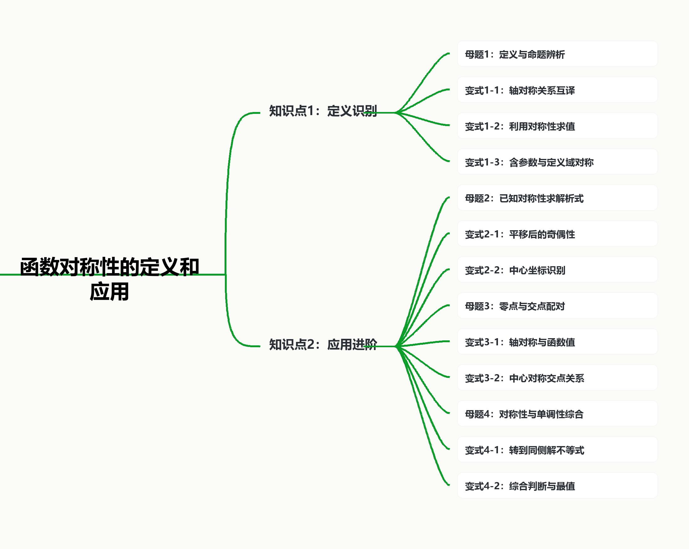

# 函数对称性的定义和应用

## 知识讲解

### 导学说明

本讲从函数图像的对称直观出发，建立“图像语言 $\leftrightarrow$ 符号语言 $\leftrightarrow$ 运算语言”的转化链。题目来源以学生版切片中的题目为主，并结合沪教版必修第一册第 5 章“函数的奇偶性”及教参中关于“图像直观与符号语言互译”的教学建议进行重排。

原学生版题目中既有基础定义题，也有交点求和、零点、单调性综合等高阶题。本教师版不按原顺序罗列，而按下面的能力阶梯重编：

1. 先判断对称对象：轴对称、中心对称、平移后的奇偶性；
2. 再写出符号关系：$f(a+x)=f(a-x)$，$f(a+x)+f(a-x)=2b$；
3. 再利用配对：函数值配对、交点配对、零点配对；
4. 最后与单调性结合：把不同侧的点转到同一单调区间比较。

### 教学目标

- 会从图像对称性写出对应的函数关系式；
- 会把奇偶性看作特殊的轴对称或中心对称；
- 会利用对称性求函数值、参数、解析式或交点坐标和；
- 会在“对称性 + 单调性”综合题中先转化区间，再比较大小或解不等式；
- 能区分“必要条件”和“充分条件”，尤其是含参数奇偶性问题。

### 教学重难点

**重点：** 轴对称与中心对称的符号表达，以及奇偶性与平移变换的关系。

**难点：** 对称性与单调性、零点、交点关系综合时，如何进行配对与转化。

### 知识导图

### 本讲题目重排逻辑

| 进阶层级 | 对应题型 | 本讲安排 | 来源说明 |
|---|---|---|---|
| 识别定义 | 命题辨析、轴对称式互译 | 母题1、变式1-1 至 1-3 | 学生版题源第 3、4、9、10 题 |
| 代数转化 | 奇偶性定参数、中心坐标识别 | 母题2、变式2-1 至 2-3 | 学生版题源第 18、17、27、28 题 |
| 配对应用 | 函数值、交点、零点、最值配对 | 母题3、变式3-1 至 3-3 | 学生版题源第 12、21、22、29 题 |
| 综合提升 | 对称性与单调性、不等式、求和 | 母题4、变式4-1 至 4-2、分层练习 | 学生版题源第 13、14、15、5、11、23、24 题 |

### 知识笔记

#### 1. 轴对称的一般形式

函数 $y=f(x)$ 的图像关于直线 $x=a$ 对称，当且仅当对定义域中关于 $a$ 对称的点，都有

$f(a+x)=f(a-x),$

等价地写成

$f(x)=f(2a-x).$

特别地，当 $a=0$ 时，$f(-x)=f(x)$，函数为偶函数，图像关于 $y$ 轴对称。

#### 2. 中心对称的一般形式

函数 $y=f(x)$ 的图像关于点 $(a,b)$ 成中心对称，当且仅当

$f(a+x)+f(a-x)=2b,$

等价地写成

$f(x)+f(2a-x)=2b.$

特别地，当 $(a,b)=(0,0)$ 时，$f(-x)=-f(x)$，函数为奇函数，图像关于原点成中心对称。

#### 3. 平移视角

- $f(x+a)$ 是把 $f(x)$ 的图像向左平移 $a$ 个单位；
- 若 $f(x-a)$ 为偶函数，则 $f(x)$ 的图像关于 $x=a$ 对称；
- 若 $f(x-a)-b$ 为奇函数，则 $f(x)$ 的图像关于点 $(a,b)$ 成中心对称。

#### 4. 与单调性结合的核心方法

若 $f(x)$ 关于 $x=a$ 对称，并且在 $[a,+\infty)$ 上单调，则研究 $f(u)$ 与 $f(v)$ 时，应先把 $u,v$ 都转化到 $a$ 的同一侧。常用等价量是“到对称轴的距离”：

$f(x)=f(2a-x),\quad x\le a \Rightarrow 2a-x\ge a.$

若右侧单调递增，则距离 $|x-a|$ 越大，函数值越大；若右侧单调递减，则距离 $|x-a|$ 越大，函数值越小。

### 教法备注

1. **教材依据：** 沪教版必修第一册第 5 章由图像关于 $y$ 轴、原点的对称性引入偶函数、奇函数，强调定义域对称和符号关系。
2. **教参依据：** 图像直观与符号语言是同一性质的两种表达；含参数奇偶性应先由必要条件求参数，再回代验证充分性。
3. **本讲提升：** 在奇偶性基础上扩展到一般轴 $x=a$ 与中心 $(a,b)$，再连接上海题中常见的交点配对、函数值求和和单调性综合。

\newpage

## 知识点1：对称性的定义

## 母题1：对称性的定义与命题辨析

\begin{QuestionBox}

判断下列命题的真假，并写出正确命题的序号。

(1) 若函数 $y=f(x)$ 的图像关于原点成中心对称，则函数 $y=f(x-1)$ 的图像关于点 $(1,0)$ 成中心对称；

(2) 若函数 $y=f(x)$ 满足 $f(x+1)=f(x-1)$，则函数 $y=f(x)$ 的图像关于直线 $x=1$ 对称；

(3) 若函数 $y=f(1-x)$ 的图像关于直线 $x=1$ 对称，则函数 $y=f(x)$ 为偶函数；

(4) 函数 $y=f(1+x)$ 与 $y=f(1-x)$ 的图像关于直线 $x=1$ 对称。

\end{QuestionBox}

\begin{AnswerBox}

正确命题为 (1)(3)。

\end{AnswerBox}

\begin{AnalysisBox}

(1) $f(x)$ 关于原点成中心对称，等价于 $f(-x)=-f(x)$。令 $g(x)=f(x-1)$，则

$g(1+t)=f(t),\qquad g(1-t)=f(-t)=-f(t),$

所以 $g(1+t)+g(1-t)=0$，图像关于点 $(1,0)$ 成中心对称，(1)正确。

(2) $f(x+1)=f(x-1)$ 只能推出 $f(x+2)=f(x)$，表示周期为 $2$，不能推出关于 $x=1$ 对称，(2)错误。

(3) 设 $g(x)=f(1-x)$。若 $g(x)$ 关于 $x=1$ 对称，则

$g(1+t)=g(1-t).$

即 $f(-t)=f(t)$，所以 $f(x)$ 为偶函数，(3)正确。

(4) $y=f(1+x)$ 与 $y=f(1-x)$ 的图像关于 $y$ 轴对称，不是关于直线 $x=1$ 对称，(4)错误。

\end{AnalysisBox}

\begin{TeachBox}

【选题原因】本题把“奇偶性、平移、周期、两图像互为对称”放在一起辨析，适合作为定义课的母题。

【错因预设】学生容易把 $f(x+1)=f(x-1)$ 误认为“关于 $x=1$ 对称”。应提醒：关于 $x=1$ 对称应写成 $f(1+t)=f(1-t)$，即 $f(x)=f(2-x)$。

【讲法建议】先让学生把每个命题翻译成 $a+t$ 与 $a-t$ 的形式，再判断对称中心或对称轴。

\end{TeachBox}

\vspace{0.45em}
\hrule
\vspace{0.95em}

## 变式1-1：轴对称关系互译

\begin{QuestionBox}

设函数 $y=f(x)$ 的图像关于直线 $x=1$ 对称，则下列结论中不一定正确的是（ ）

A. $f(2-x)=f(x)$

B. $f(1-x)=f(1+x)$

C. 函数 $y=f(x+1)$ 为偶函数

D. 函数 $y=f(x-1)$ 为偶函数

\end{QuestionBox}

\begin{AnswerBox}

D。

\end{AnswerBox}

\begin{AnalysisBox}

图像关于 $x=1$ 对称，等价于

$f(1+t)=f(1-t),$

也等价于 $f(x)=f(2-x)$。因此 A、B 正确。

令 $g(x)=f(x+1)$，则

$g(-x)=f(1-x)=f(1+x)=g(x),$

所以 C 正确。

令 $h(x)=f(x-1)$，则 $h(-x)=f(-x-1)$，一般不能推出 $h(-x)=h(x)$，D 不一定正确。

\end{AnalysisBox}

\begin{TeachBox}

【变式说明】本题是母题1中“轴对称式互译”的直接变式，从命题辨析转为选择题。

【讲法建议】强调“把对称轴移到原点”时，$x=1$ 对称对应的是 $f(x+1)$ 为偶函数，而不是 $f(x-1)$。

\end{TeachBox}

\vspace{0.45em}
\hrule
\vspace{0.95em}

## 变式1-2：利用对称性求值

\begin{QuestionBox}

已知函数 $f(x)$ 满足

$f(1+x)=f(1-x),$

则函数 $y=f(x)$ 的图像关于直线 $\\underline{\\hspace{2.6cm}}$ 对称。

\end{QuestionBox}

\begin{AnswerBox}

$x=1$。

\end{AnswerBox}

\begin{AnalysisBox}

轴对称的标准形式为

$f(a+x)=f(a-x).$

与题目比较可知 $a=1$，所以对称轴为 $x=1$。

\end{AnalysisBox}

\begin{TeachBox}

【变式说明】本题是定义公式的最基础识别题，适合用来检查学生是否能从符号关系直接读出对称轴。

【讲法建议】先不让学生背结论，而是用“中心量相同，左右偏移相反”的语言解释 $1+x$ 与 $1-x$。

\end{TeachBox}

\vspace{0.45em}
\hrule
\vspace{0.95em}

## 变式1-3：含参数与定义域对称

\begin{QuestionBox}

函数

$f(x)=x^2+(a+2)x+3,\quad x\in [a,b]$

的图像关于直线 $x=1$ 对称，求 $b$ 的值。

\end{QuestionBox}

\begin{AnswerBox}

$b=6$。

\end{AnswerBox}

\begin{AnalysisBox}

二次函数图像的对称轴为

$x=-\frac{a+2}{2}.$

由题意

$-\frac{a+2}{2}=1,$

得 $a=-4$。

函数定义域 $[a,b]$ 也要关于直线 $x=1$ 对称，因此

$\frac{a+b}{2}=1.$

代入 $a=-4$，得

$\frac{-4+b}{2}=1,\quad b=6.$

\end{AnalysisBox}

\begin{TeachBox}

【变式说明】本题在图像对称轴之外加入定义域对称，是含参数奇偶性题的常见失分点。

【错因预设】学生只用二次函数对称轴求出 $a=-4$，忘记检查定义域 $[a,b]$ 是否同步对称。

【讲法建议】板书时分成两列：解析式决定“图像轴”，定义域决定“左右端点”。

\end{TeachBox}

\newpage

## 知识点2：对称性的应用

## 母题2：已知对称性求参数与解析式

\begin{QuestionBox}

已知函数

$f(x)=\frac{a-2^x}{2^x+1}$

为奇函数，求实数 $a$ 的值，并说明验证思路。

\end{QuestionBox}

\begin{AnswerBox}

$a=1$。

\end{AnswerBox}

\begin{AnalysisBox}

若 $f(x)$ 为奇函数，则必须满足 $f(0)=0$。由题意

$f(0)=\frac{a-1}{2}=0,$

得 $a=1$。

回代验证：

$f(x)=\frac{1-2^x}{2^x+1}.$

于是

$f(-x)=\frac{1-2^{-x}}{2^{-x}+1} =\frac{2^x-1}{2^x+1} =-f(x),$

所以 $f(x)$ 确为奇函数。

\end{AnalysisBox}

\begin{TeachBox}

【选题原因】本题体现教参强调的“先必要、后充分”：奇函数若在 $0$ 处有定义，必有 $f(0)=0$，但求出的参数必须回代验证。

【错因预设】学生常用 $f(0)=0$ 求出参数后直接结束，忽略必要条件不一定充分。

【讲法建议】把本题作为“含参数奇偶性”规范书写模板：求参、回代、验证三步缺一不可。

\end{TeachBox}

\vspace{0.45em}
\hrule
\vspace{0.95em}

## 变式2-1：平移后的奇偶性

\begin{QuestionBox}

已知函数

$y=2^{|x+a|}+1$

的图像关于直线 $x=1$ 对称，求 $a$ 的值。

\end{QuestionBox}

\begin{AnswerBox}

$a=-1$。

\end{AnswerBox}

\begin{AnalysisBox}

$2^{|x+a|}+1$ 的对称轴为

$x=-a.$

由题意 $-a=1$，所以

$a=-1.$

\end{AnalysisBox}

\begin{TeachBox}

【变式说明】本题把绝对值函数的“内层零点”与轴对称联系起来，是母题2的低门槛变式。

【讲法建议】提醒学生不要把 $+1$ 当作影响横向对称轴的量，它只产生纵向平移。

\end{TeachBox}

\vspace{0.45em}
\hrule
\vspace{0.95em}

## 变式2-2：中心坐标识别

\begin{QuestionBox}

函数

$f(x)=\frac{2x+3}{x-1}$

的图像的对称中心为 $\\underline{\\hspace{2.6cm}}$。

\end{QuestionBox}

\begin{AnswerBox}

$(1,2)$。

\end{AnswerBox}

\begin{AnalysisBox}

将函数拆成

$f(x)=2+\frac{5}{x-1}.$

函数 $y=\frac{5}{x}$ 的图像关于原点成中心对称，向右平移 $1$ 个单位、向上平移 $2$ 个单位后，对称中心变为

$(1,2).$

\end{AnalysisBox}

\begin{TeachBox}

【变式说明】本题训练“拆常数 + 平移”的中心识别方法。

【讲法建议】讲授时可补充一般结论：$y=\frac{k}{x-a}+b$ 的对称中心为 $(a,b)$。

\end{TeachBox}

\vspace{0.45em}
\hrule
\vspace{0.95em}

## 变式2-3：中心对称函数的结构识别

\begin{QuestionBox}

求函数

$f(x)=\frac{1}{x+1}+\frac{1}{x+3}$

图像的对称中心。

\end{QuestionBox}

\begin{AnswerBox}

$(-2,0)$。

\end{AnswerBox}

\begin{AnalysisBox}

令 $t=x+2$，则

$x+1=t-1,\qquad x+3=t+1.$

于是

$f(x)=\frac{1}{t-1}+\frac{1}{t+1} =\frac{2t}{t^2-1}.$

该式关于 $t$ 为奇函数，因此原函数图像关于点 $(-2,0)$ 成中心对称。

\end{AnalysisBox}

\begin{TeachBox}

【变式说明】本题从“直接拆分”升级到“整体换元”，帮助学生把中心对称转化为平移后的奇函数。

【讲法建议】抓住两条竖直渐近线 $x=-1$、$x=-3$ 的中点 $x=-2$，再验证纵坐标中心为 $0$。

\end{TeachBox}

\newpage

## 母题3：函数对称性与零点、交点配对

\begin{QuestionBox}

已知函数 $f(x)$ 的图像关于点 $(2,0)$ 成中心对称，函数

$g(x)=\frac{1}{x-2}$

的图像与 $y=f(x)$ 的图像共有 $20$ 个交点。求这 $20$ 个交点的横、纵坐标之和。

\end{QuestionBox}

\begin{AnswerBox}

$40$。

\end{AnswerBox}

\begin{AnalysisBox}

$g(x)=\frac{1}{x-2}$ 的图像也关于点 $(2,0)$ 成中心对称。

若两图像都关于同一点 $(2,0)$ 成中心对称，则它们的交点也成对关于 $(2,0)$ 对称。设一对交点为

$(x_1,y_1),\quad (x_2,y_2),$

则

$x_1+x_2=4,\qquad y_1+y_2=0.$

所以每一对交点的横、纵坐标总和为

$(x_1+y_1)+(x_2+y_2)=4.$

共有 $20$ 个交点，即 $10$ 对，因此总和为

$10\times 4=40.$

\end{AnalysisBox}

\begin{TeachBox}

【选题原因】本题体现对称性的高效用法：不求交点，直接配对求和。

【错因预设】学生可能试图联立方程求交点，既无必要也不可行。应引导其先观察两个图像是否共用同一对称中心。

【讲法建议】可把“交点也配对”单独做成板书结论：若两个图像关于同一点成中心对称，则交点集合关于该点成中心对称。

\end{TeachBox}

\vspace{0.45em}
\hrule
\vspace{0.95em}

## 变式3-1：轴对称与函数值配对

\begin{QuestionBox}

已知函数 $f(x)$ 为奇函数，且图像关于直线 $x=3$ 对称。若 $f(-1)=5$，求 $f(5)$。

\end{QuestionBox}

\begin{AnswerBox}

$f(5)=-5$。

\end{AnswerBox}

\begin{AnalysisBox}

图像关于 $x=3$ 对称，故

$f(3+t)=f(3-t).$

取 $t=2$，得

$f(5)=f(1).$

又 $f(x)$ 为奇函数，所以

$f(1)=-f(-1)=-5.$

因此

$f(5)=-5.$

\end{AnalysisBox}

\begin{TeachBox}

【变式说明】本题把“轴对称配对”和“奇函数配对”连续使用，是母题3的函数值版本。

【讲法建议】引导学生画数轴：$5$ 先关于 $x=3$ 对到 $1$，再关于原点对到 $-1$。

\end{TeachBox}

\vspace{0.45em}
\hrule
\vspace{0.95em}

## 变式3-2：中心对称与偶函数联动

\begin{QuestionBox}

已知函数 $f(x)$ 为偶函数，且图像关于点 $(1,0)$ 成中心对称。若 $f(4)=2$，求 $f(2)$。

\end{QuestionBox}

\begin{AnswerBox}

$f(2)=-2$。

\end{AnswerBox}

\begin{AnalysisBox}

图像关于点 $(1,0)$ 成中心对称，故

$f(1+t)+f(1-t)=0.$

取 $t=3$，得

$f(4)+f(-2)=0.$

由 $f(4)=2$，得 $f(-2)=-2$。

又因为 $f(x)$ 为偶函数，所以

$f(2)=f(-2)=-2.$

\end{AnalysisBox}

\begin{TeachBox}

【变式说明】本题训练“中心对称先求相反点，再用偶函数折回”的复合配对。

【错因预设】学生可能直接把 $(1,0)$ 当成原点使用，写出 $f(-4)=-f(4)$。需强调中心坐标发生平移。

\end{TeachBox}

\vspace{0.45em}
\hrule
\vspace{0.95em}

## 变式3-3：中心对称函数的最值配对

\begin{QuestionBox}

已知函数 $f(x)$ 满足

$f(x+y)=f(x)+f(y)+2.$

设

$g(x)=f(x)+\frac{3x}{x^2+1}.$

若 $g(x)$ 的最小值为 $-5$，求 $g(x)$ 的最大值。

\end{QuestionBox}

\begin{AnswerBox}

$1$。

\end{AnswerBox}

\begin{AnalysisBox}

令

$h(x)=f(x)+2.$

由题意

$h(x+y)=h(x)+h(y),$

因此 $h(x)$ 是加法型函数，在本题语境下可利用其奇函数性质：

$h(-x)=-h(x).$

于是

$f(x)=h(x)-2.$

又 $\frac{3x}{x^2+1}$ 为奇函数，所以

$g(x)+2=h(x)+\frac{3x}{x^2+1}$

为奇函数。故 $g(x)$ 的图像关于点 $(0,-2)$ 成中心对称。

中心对称函数的最大值与最小值关于中心纵坐标配对：

$M+m=2(-2)=-4.$

已知 $m=-5$，所以

$M=1.$

\end{AnalysisBox}

\begin{TeachBox}

【变式说明】本题将抽象函数关系转化为中心对称，再用最值配对求最大值。

【讲法建议】不要展开讨论抽象函数所有性质，只抓住 $f(x)+2$ 的奇函数结构即可。

\end{TeachBox}

\newpage

## 母题4：函数对称性与单调性综合

\begin{QuestionBox}

已知定义在 $\mathbb{R}$ 上的函数 $f(x)$ 满足

$f(x+3)=f(1-x),$

且 $f(x)$ 在 $[2,+\infty)$ 上严格单调递减。判断下列命题的真假。

(1) 对任意实数 $a$，都有

$f(-a^2+a+1)\le f\left(\frac54\right);$

(2) $f(x)$ 的最大值为 $f(2)$；

(3) $f(0)>f(3)$；

(4) 若 $f(m)>f(-1)$，则 $-1<m<5$。

\end{QuestionBox}

\begin{AnswerBox}

(1)(2)(4)正确，(3)错误。

\end{AnswerBox}

\begin{AnalysisBox}

由

$f(x+3)=f(1-x)$

令 $u=x+3$，则 $1-x=4-u$，所以

$f(u)=f(4-u).$

故函数图像关于直线 $x=2$ 对称。

(1) 因为

$-a^2+a+1=-\left(a-\frac12\right)^2+\frac54\le \frac54.$

设 $u=-a^2+a+1$，则 $u\le \frac54<2$。把左侧点关于 $x=2$ 对称到右侧：

$f(u)=f(4-u),\qquad f\left(\frac54\right)=f\left(\frac{11}{4}\right).$

又

$u\le \frac54 \Rightarrow 4-u\ge \frac{11}{4}.$

因为 $f(x)$ 在 $[2,+\infty)$ 上严格单调递减，所以

$f(4-u)\le f\left(\frac{11}{4}\right).$

故(1)正确。

(2) 由对称性，任意 $x$ 都可转化到 $[2,+\infty)$ 上。右侧区间上严格递减，所以距离对称轴越远，函数值越小，最大值为 $f(2)$，(2)正确。

(3) 由对称性

$f(0)=f(4).$

因为 $3<4$ 且 $f(x)$ 在 $[2,+\infty)$ 上严格递减，所以

$f(3)>f(4)=f(0).$

故(3)错误。

(4) $f(-1)=f(5)$。由右侧递减可知

$f(m)>f(5)$

等价于 $m$ 到对称轴 $x=2$ 的距离小于 $5$ 到对称轴的距离，即

$|m-2|<3.$

所以

$-1<m<5.$

(4)正确。

\end{AnalysisBox}

\begin{TeachBox}

【选题原因】本题完整体现“先找对称轴，再转到单调区间，最后比较距离”的综合思路，是本讲的压轴母题。

【错因预设】学生常在左右两侧直接套用单调性，忽略单调性只给在 $[2,+\infty)$ 上。

【讲法建议】建议先画数轴，把 $0,-1,\frac54$ 等点关于 $x=2$ 的对称点标出，再进入代数推理。

\end{TeachBox}

\vspace{0.45em}
\hrule
\vspace{0.95em}

## 变式4-1：转到同侧解不等式

\begin{QuestionBox}

已知定义在 $\mathbb{R}$ 上的函数 $f(x)$ 满足

$f(x+1)=f(1-x),$

且 $f(x)$ 在 $[1,+\infty)$ 上单调递增。求满足

$f(m)>f(-1)$

的实数 $m$ 的取值范围。

\end{QuestionBox}

\begin{AnswerBox}

$(-\infty,-1)\cup(3,+\infty).$

\end{AnswerBox}

\begin{AnalysisBox}

由

$f(x+1)=f(1-x)$

可知函数图像关于直线 $x=1$ 对称。

又

$f(-1)=f(3).$

因为 $f(x)$ 在 $[1,+\infty)$ 上单调递增，所以函数值随到对称轴 $x=1$ 的距离增大而增大。于是

$f(m)>f(-1)$

等价于

$|m-1|>|-1-1|=2.$

故

$m<-1\quad \text{或}\quad m>3.$

\end{AnalysisBox}

\begin{TeachBox}

【变式说明】本题与母题4同为“对称性 + 单调性”，但单调方向改为递增，结论由“距离小于”变为“距离大于”。

【讲法建议】让学生用一句话总结：右侧递增时，离轴越远值越大；右侧递减时，离轴越远值越小。

\end{TeachBox}

\vspace{0.45em}
\hrule
\vspace{0.95em}

## 变式4-2：二次式输入与对称转化

\begin{QuestionBox}

已知定义在 $\mathbb{R}$ 上的函数 $f(x)$ 满足

$f(x+1)=f(1-x),$

且 $f(x)$ 在 $[1,+\infty)$ 上单调递减。求不等式

$f(-x^2)>f(-1)$

的解集。

\end{QuestionBox}

\begin{AnswerBox}

$(-1,1).$

\end{AnswerBox}

\begin{AnalysisBox}

函数图像关于直线 $x=1$ 对称，因此

$f(-x^2)=f(2+x^2),\qquad f(-1)=f(3).$

由于 $f(x)$ 在 $[1,+\infty)$ 上单调递减，

$f(2+x^2)>f(3)$

等价于

$2+x^2<3.$

所以

$x^2<1,$

解得

$-1<x<1.$

\end{AnalysisBox}

\begin{TeachBox}

【变式说明】本题在输入端加入 $-x^2$，训练学生先对称转化，再用单调性解不等式。

【错因预设】学生若直接比较 $-x^2$ 与 $-1$，会误用单调区间，因为 $-x^2$ 不一定在 $[1,+\infty)$ 上。

\end{TeachBox}

\newpage

## 分层练习

## 基础练习1：对称轴求函数值

\begin{QuestionBox}

已知函数 $f(x)$ 在 $(-\infty,2)$ 上单调递增，且函数 $y=f(x+2)$ 的图像关于直线 $x=1$ 对称。下列等式中正确的是（ ）

A. $f(1)=f(3)$

B. $f(1)=f(4)$

C. $f(1)=f(5)$

D. $f(2)=f(5)$

\end{QuestionBox}

\begin{AnswerBox}

C。

\end{AnswerBox}

\begin{AnalysisBox}

设 $g(x)=f(x+2)$。$g(x)$ 关于 $x=1$ 对称，所以

$g(1+t)=g(1-t).$

即

$f(3+t)=f(3-t).$

故 $f(x)$ 的图像关于直线 $x=3$ 对称。取 $x=1$，其关于 $x=3$ 的对称点为 $5$，所以

$f(1)=f(5).$

\end{AnalysisBox}

\begin{TeachBox}

【练习定位】基础题，用来检测学生能否处理“先平移、再读对称轴”的问题。

\end{TeachBox}

\vspace{0.45em}
\hrule
\vspace{0.95em}

## 基础练习2：绝对值函数的对称轴参数

\begin{QuestionBox}

若函数

$f(x)=|x+1|+|x-1|+|x-a|$

的图像关于某条竖直直线对称，求实数 $a$ 的所有可能取值。

\end{QuestionBox}

\begin{AnswerBox}

$a\in\{-3,0,3\}.$

\end{AnswerBox}

\begin{AnalysisBox}

三个绝对值项的“折点”分别为

$-1,\quad 1,\quad a.$

若图像关于竖直直线对称，则这三个折点构成关于某点对称的集合。

分类讨论：

- 若 $a$ 是中间点，则 $-1$ 与 $1$ 关于 $a$ 对称，得 $a=0$；
- 若 $-1$ 是中间点，则 $1$ 与 $a$ 关于 $-1$ 对称，得 $a=-3$；
- 若 $1$ 是中间点，则 $-1$ 与 $a$ 关于 $1$ 对称，得 $a=3$。

因此

$a\in\{-3,0,3\}.$

\end{AnalysisBox}

\begin{TeachBox}

【练习定位】基础提升题，训练学生从图像折点集合判断整体对称。

\end{TeachBox}

\vspace{0.45em}
\hrule
\vspace{0.95em}

## 综合练习1：多重对称关系求和

\begin{QuestionBox}

已知函数 $g(x)$ 的图像关于直线 $x=2$ 对称，且 $g(2)=4$。函数 $f(x)$ 与 $g(x)$ 满足

$f(x)+g(2-x)=5,\qquad g(x)-f(x-4)=7.$

求

$\sum_{k=1}^{22}f(k).$

\end{QuestionBox}

\begin{AnswerBox}

$-24$。

\end{AnswerBox}

\begin{AnalysisBox}

由

$g(x)=f(x-4)+7$

及 $g(2)=4$，得

$f(-2)=-3.$

又因为 $g(x)$ 关于 $x=2$ 对称，所以

$g(2+t)=g(2-t).$

代入 $g(x)=f(x-4)+7$，得

$f(t-2)=f(-t-2).$

因此 $f(x)$ 关于直线 $x=-2$ 对称。

另一方面，

$f(x)+g(2-x)=5$

化为

$f(x)+f(-x-2)=-2.$

这说明 $f(x)$ 关于点 $(-1,-1)$ 成中心对称。

将中心对称关系中的 $x$ 换为 $x+2$：

$f(x+2)+f(-x-4)=-2.$

由轴对称关系 $f(-x-4)=f(x)$，得

$f(x+2)+f(x)=-2.$

所以

$f(x+4)=f(x).$

再由 $f(-2)=-3$ 和 $f(0)+f(-2)=-2$，得

$f(0)=1,\qquad f(2)=-3.$

由 $f(-1)+f(-1)=-2$ 得 $f(-1)=-1$。轴对称关于 $x=-2$ 给出 $f(1)=f(-5)$，结合周期可得

$f(1)=f(-1)=-1.$

对 $1$ 到 $22$ 分组：

$f(k+2)+f(k)=-2.$

前 $20$ 项可分成 $10$ 对，和为 $-20$。余下

$f(21)+f(22)=f(1)+f(2)=-1-3=-4.$

因此

$\sum_{k=1}^{22}f(k)=-20-4=-24.$

\end{AnalysisBox}

\begin{TeachBox}

【练习定位】综合题，重点训练学生把多个函数关系转化为轴对称、中心对称、周期关系。

【讲法建议】本题不宜从求单项函数值入手，应先整理出两个结构：$f(x)=f(-4-x)$ 与 $f(x)+f(-x-2)=-2$。

\end{TeachBox}

\vspace{0.45em}
\hrule
\vspace{0.95em}

## 挑战练习：对称性与零点个数

\begin{QuestionBox}

已知函数 $f(x)$ 是定义在 $\mathbb{R}$ 上的奇函数，且图像关于直线 $x=1$ 对称。当 $x\in(0,1]$ 时，

$f(x)=\ln x.$

设正数列 $\{x_n\}$ 为方程

$f(x)=x+1$

的所有正根从小到大排列。求

$\lim_{n\to\infty}(x_{n+1}-x_n).$

\end{QuestionBox}

\begin{AnswerBox}

$4$。

\end{AnswerBox}

\begin{AnalysisBox}

函数 $f(x)$ 为奇函数，故

$f(-x)=-f(x).$

图像关于直线 $x=1$ 对称，故

$f(1+t)=f(1-t).$

由轴对称关系可得

$f(x+2)=f(-x).$

结合奇函数性质，

$f(x+2)=-f(x).$

再平移一次：

$f(x+4)=f(x).$

因此 $f(x)$ 具有周期 $4$。方程 $f(x)=x+1$ 的正根在大范围内按周期结构重复地出现，对相邻正根的间隔趋向一个完整周期，因此

$\lim_{n\to\infty}(x_{n+1}-x_n)=4.$

\end{AnalysisBox}

\begin{TeachBox}

【练习定位】挑战题，核心不是求根，而是由“奇函数 + 轴对称”推出反周期 $f(x+2)=-f(x)$ 和周期 $f(x+4)=f(x)$。

【风险提示】本题对学生的函数整体结构意识要求较高，课堂上可只作为拓展题处理。

\end{TeachBox}

\newpage

## 题源索引与审核清单

### 题源索引

| 本讲题目 | 对应学生版题源 |
|---|---|
| 母题1 | 第 3 题改编 |
| 变式1-1 | 第 4 题 |
| 变式1-2 | 第 9 题 |
| 变式1-3 | 第 10 题 |
| 母题2 | 第 18 题改编 |
| 变式2-1 | 第 17 题 |
| 变式2-2 | 第 27 题 |
| 变式2-3 | 第 28 题 |
| 母题3 | 第 12 题 |
| 变式3-1 | 第 21 题 |
| 变式3-2 | 第 22 题 |
| 变式3-3 | 第 29 题 |
| 母题4 | 第 13 题 |
| 变式4-1 | 第 14 题 |
| 变式4-2 | 第 15 题 |
| 基础练习1 | 第 5 题 |
| 基础练习2 | 第 11 题 |
| 综合练习1 | 第 24 题 |
| 挑战练习 | 第 23 题 |

### 教师审核清单

- 是否先检查定义域或输入范围的对称性；
- 是否把 $f(a+x)=f(a-x)$ 与 $f(x)=f(2a-x)$ 对应起来；
- 是否把 $f(a+x)+f(a-x)=2b$ 与中心 $(a,b)$ 对应起来；
- 含参数奇偶性是否完成了“必要条件求参 + 回代验证”；
- 单调性综合题是否先把点转到已知单调区间；
- 交点、零点、最值问题是否优先考虑对称配对，避免无效计算。

