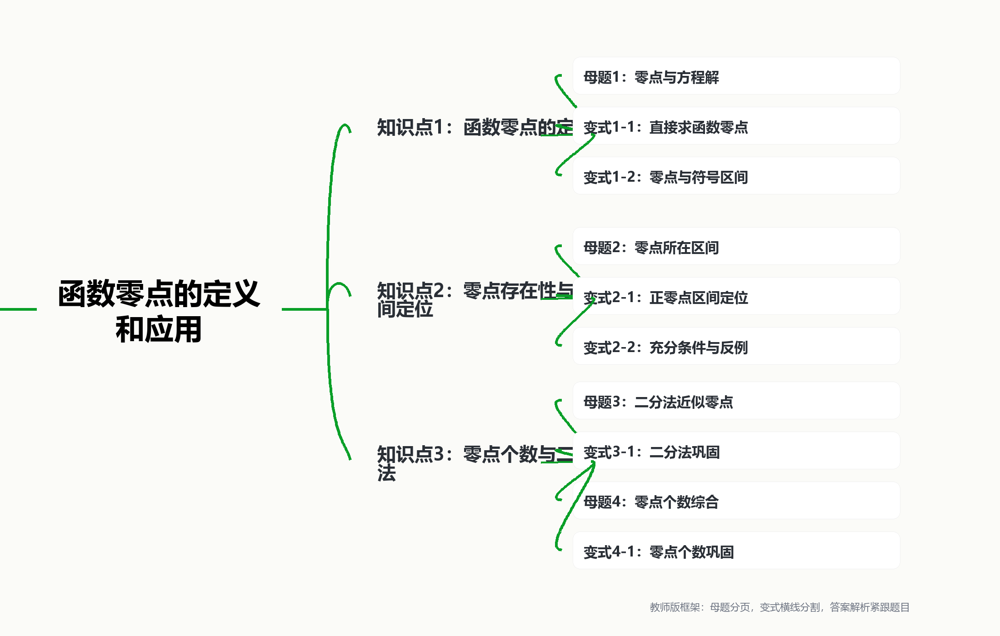

## 函数零点的定义和应用

## 知识讲解

## 导学说明

函数零点是把“方程的解”“函数图像与 $x$ 轴的交点横坐标”“函数值符号变化”统一起来的核心概念。本讲按照“定义识别 - 区间定位 - 个数判断 - 二分逼近”的顺序组织，题目优先选用教材、上海真题和本地题集，并保持教师版讲义中“题目、答案、解析、教法备注”就近呈现的格式。

本讲不追求繁复技巧，而强调三个教学动作：先把方程改写为 $f(x)=0$，再用函数性质判断零点，最后用图像或区间语言解释结论。

## 1. 教学目标

(1) 理解函数零点的定义，能说清零点不是点，而是满足 $f(c)=0$ 的自变量 $c$。

(2) 能在“函数零点、方程根、图像交点横坐标”三种语言之间互相转化。

(3) 能利用连续函数零点存在定理判断零点所在区间，并知道 $f(a)f(b)<0$ 是充分条件，不是必要条件。

(4) 能结合单调性判断零点唯一性，能用二分法求简单函数零点的近似值。

(5) 能在零点个数问题中分清“因式为零”“定义域限制”“端点是否计入”。

## 2. 课程重难点

(1) 重点：零点定义，方程解与零点的关系，连续函数零点存在定理，二分法基本流程。

(2) 难点：零点存在定理的条件辨析；用单调性保证唯一性；零点个数题中端点、周期和定义域的处理。

## 3. 考查形式与分值占比

(1) 题型：选择题、填空题常考零点所在区间、零点个数；解答题中常作为函数、方程、不等式综合的入口。

(2) 分值：基础小题多为 4 到 5 分；若与函数单调性、参数讨论、实际建模结合，可进入 8 到 12 分综合题。

\newpage

## 知识导图

{width=100%}

## 教材与教参定位

## 1. 教材依据

沪教版必修第一册第 5 章“函数的概念、性质及应用”给出零点定义：对于函数 $y=f(x),x\in D$，若存在 $c\in D$，使得 $f(c)=0$，则 $c$ 是该函数的零点。教材同时指出，函数零点就是方程 $f(x)=0$ 在集合 $D$ 中的解，也是图像与 $x$ 轴交点的横坐标。

教材随后用方程 $x^3+2x=99$ 说明如何用函数单调性研究方程整数解，并在“用二分法求函数的零点”中给出连续函数零点存在定理和二分法思想。

## 2. 教参依据

教参强调：零点本质上不是点，而是数；函数的零点与相应方程的解是同一个对象的两种说法。教参还提醒，零点存在定理中 $f(a)f(b)<0$ 只是存在零点的充分条件，不是必要条件；二分法教学应突出“不断重复类似过程，逐步逼近”的算法思想。

## 3. 教学提醒

(1) 先看定义域。零点必须在函数定义域内。

(2) 先判断连续性和端点符号，再使用零点存在定理。

(3) 只由 $f(a)f(b)<0$ 能推出“至少一个零点”，不能直接推出“唯一零点”；唯一性通常需要单调性或图像结构补充。

(4) 二分法停止的依据不是“算到某一步就停”，而是目标精度已经能够确定近似值。

\newpage

## 知识点1: 函数零点的定义

## 知识笔记

## 1. 零点的三种语言

设函数 $y=f(x)$ 的定义域为 $D$。若 $c\in D$ 且

$$
f(c)=0,
$$

则 $c$ 叫做函数 $y=f(x)$ 的零点。

同一件事可以写成三种语言：

(1) 数值语言：$c$ 是函数 $f(x)$ 的零点。

(2) 方程语言：$c$ 是方程 $f(x)=0$ 的解。

(3) 图像语言：点 $(c,0)$ 在函数 $y=f(x)$ 的图像上，$c$ 是图像与 $x$ 轴交点的横坐标。

## 2. 零点与函数性质

若直接解方程困难，可以构造函数 $f(x)$，通过单调性、图像、端点符号来研究方程 $f(x)=0$ 的解。

常用判断链条：

$$
\text{方程} \Rightarrow \text{函数} \Rightarrow \text{零点} \Rightarrow \text{解的范围或个数}.
$$

## 母题1: 零点与方程解

\begin{QuestionBox}

【来源】教材改编：沪教版必修第一册第 5 章例 5。

方程

$$
x^3+2x=99
$$

是否有整数解？说明理由。

\end{QuestionBox}

\begin{AnswerBox}

没有整数解。

\end{AnswerBox}

\begin{AnalysisBox}

令

$$
f(x)=x^3+2x-99.
$$

当 $x_1<x_2$ 时，有 $x_1^3<x_2^3$ 且 $2x_1<2x_2$，所以 $f(x_1)<f(x_2)$，即 $f(x)$ 在 $\mathbb R$ 上严格增。

计算得

$$
f(4)=64+8-99=-27<0,\qquad f(5)=125+10-99=36>0.
$$

因此 $f(x)$ 的零点位于 $(4,5)$ 内。由于 $f$ 严格增，$n\le 4$ 时 $f(n)<0$，$n\ge 5$ 时 $f(n)>0$，所以不存在整数 $n$ 使 $f(n)=0$。

故原方程没有整数解。

\end{AnalysisBox}

\begin{TeachBox}

这道题的价值不在于“试根”，而在于把方程转为函数零点问题。课堂上要追问学生：为什么只检查 $4$ 和 $5$ 就够了？答案是单调性把所有整数都控制住了。

\end{TeachBox}

\vspace{0.45em}
\hrule
\vspace{0.95em}

## 变式题1-1: 直接求函数零点

\begin{QuestionBox}

【来源】教材习题改编：沪教版必修第一册第 5 章“用二分法求函数的零点”练习。

求函数

$$
f(x)=\sqrt{2x+1}-x+1
$$

的零点。

\end{QuestionBox}

\begin{AnswerBox}

零点为 $x=4$。

\end{AnswerBox}

\begin{AnalysisBox}

函数定义域为 $x\ge -\frac12$。令 $f(x)=0$，得

$$
\sqrt{2x+1}=x-1.
$$

右端必须非负，所以 $x\ge 1$。两边平方：

$$
2x+1=(x-1)^2=x^2-2x+1,
$$

即

$$
x^2-4x=0,\qquad x=0\ \text{或}\ x=4.
$$

由 $x\ge 1$，只有 $x=4$ 满足原方程。

\end{AnalysisBox}

\begin{TeachBox}

根式方程求零点时要强调“定义域”和“平方前的非负条件”。本题适合提醒学生：由平方得到的候选值必须回代或检查限制。

\end{TeachBox}

\vspace{0.45em}
\hrule
\vspace{0.95em}

## 变式题1-2: 零点与符号区间

\begin{QuestionBox}

【来源】自编补位题，用于衔接零点与不等式。

已知

$$
f(x)=(x-1)(x+2).
$$

(1) 求 $f(x)$ 的零点；

(2) 写出 $f(x)>0$ 的解集。

\end{QuestionBox}

\begin{AnswerBox}

(1) 零点为 $x=-2,1$。

(2) $f(x)>0$ 的解集为 $(-\infty,-2)\cup(1,+\infty)$。

\end{AnswerBox}

\begin{AnalysisBox}

令

$$
(x-1)(x+2)=0,
$$

得 $x=1$ 或 $x=-2$。

两个零点把数轴分成

$$
(-\infty,-2),\quad (-2,1),\quad (1,+\infty).
$$

二次项系数为正，开口向上，所以零点外侧函数值为正，零点之间函数值为负。

\end{AnalysisBox}

\begin{TeachBox}

这道题不是为了训练二次不等式技巧，而是让学生形成“零点划分区间，符号在区间内稳定”的意识，为后面函数不等式和导数符号表做铺垫。

\end{TeachBox}

\newpage

## 知识点2: 零点存在性与区间定位

## 知识笔记

## 1. 零点存在定理

若函数 $y=f(x)$ 在区间 $[a,b]$ 上的图像是一段连续曲线，且

$$
f(a)f(b)<0,
$$

则函数 $y=f(x)$ 在区间 $(a,b)$ 上至少有一个零点。

## 2. 判断零点所在区间的基本步骤

(1) 确认函数在所考察区间上连续。

(2) 计算端点或特殊点的函数值。

(3) 找到相邻两个点使函数值异号。

(4) 若要判断唯一性，还需补充单调性或图像结构。

## 3. 易错提醒

从 $f(a)f(b)<0$ 可以推出至少一个零点，但不能推出只有一个零点；从 $f(a)f(b)>0$ 也不能推出一定没有零点。

## 母题2: 零点所在区间

\begin{QuestionBox}

【来源】上海真题汇编：2011-2025 上海真题试卷第二版本。

设 $x_0$ 为函数

$$
f(x)=2^x+x-2
$$

的零点，则 $x_0\in$ ( )

A. $(-2,-1)$

B. $(-1,0)$

C. $(0,1)$

D. $(1,2)$

\end{QuestionBox}

\begin{AnswerBox}

C。

\end{AnswerBox}

\begin{AnalysisBox}

计算

$$
f(0)=2^0+0-2=-1<0,\qquad f(1)=2+1-2=1>0.
$$

函数 $2^x+x-2$ 在 $\mathbb R$ 上连续，因此由零点存在定理，$f(x)$ 在 $(0,1)$ 内至少有一个零点。

若进一步说明唯一性：$2^x$ 与 $x$ 都是严格增函数，所以 $f(x)$ 严格增，零点唯一。

\end{AnalysisBox}

\begin{TeachBox}

选择题中学生容易直接估算。教师应引导学生形成标准表达：先算端点符号，再用连续性说明存在，最后用单调性说明唯一。即使题目只问区间，也要让学生知道这三步的区别。

\end{TeachBox}

\vspace{0.45em}
\hrule
\vspace{0.95em}

## 变式题2-1: 正零点区间定位

\begin{QuestionBox}

【来源】本地题集：上海高中数学知识点再现能力训练。

函数

$$
f(x)=\ln(x+1)-\frac{2}{x}
$$

在正半轴上的零点所在的区间是 ( )

A. $\left(\frac12,1\right)$

B. $(1,e-1)$

C. $(e-1,2)$

D. $(2,e)$

\end{QuestionBox}

\begin{AnswerBox}

C。

\end{AnswerBox}

\begin{AnalysisBox}

在 $x>0$ 上，

$$
f'(x)=\frac1{x+1}+\frac2{x^2}>0,
$$

所以 $f(x)$ 在 $(0,+\infty)$ 上严格增，正零点至多一个。

计算两个关键端点：

$$
f(e-1)=\ln e-\frac{2}{e-1}=1-\frac{2}{e-1}<0,
$$

因为 $e-1<2$，所以 $\frac{2}{e-1}>1$。

又

$$
f(2)=\ln 3-1>0.
$$

因此正零点位于 $(e-1,2)$。

\end{AnalysisBox}

\begin{TeachBox}

原题选项均在正半轴，讲解时要主动补一句“本题定位正零点”。若不说明范围，函数在 $(-1,0)$ 上还涉及另一支，容易造成概念歧义。

\end{TeachBox}

\vspace{0.45em}
\hrule
\vspace{0.95em}

## 变式题2-2: 零点存在定理的充分性

\begin{QuestionBox}

【来源】教材习题改编：沪教版必修第一册第 5 章练习。

对于在 $[a,b]$ 上图像连续的函数 $y=f(x)$，若

$$
f(a)f(b)>0,
$$

是否可以断定函数在 $(a,b)$ 上一定没有零点？说明理由。

\end{QuestionBox}

\begin{AnswerBox}

不能断定。

\end{AnswerBox}

\begin{AnalysisBox}

反例：

$$
f(x)=x^2-1,\qquad [a,b]=[-2,2].
$$

此时

$$
f(-2)=3,\qquad f(2)=3,\qquad f(-2)f(2)>0.
$$

但是

$$
f(-1)=0,\qquad f(1)=0,
$$

所以函数在 $(-2,2)$ 上有两个零点。

\end{AnalysisBox}

\begin{TeachBox}

本题专门纠正“异号有零点，同号无零点”的错误记忆。准确说法是：连续函数端点异号是存在零点的充分条件，不是必要条件。

\end{TeachBox}

\newpage

## 知识点3: 零点个数与二分法

## 知识笔记

## 1. 二分法的基本流程

在已知函数 $f(x)$ 在 $[a,b]$ 上连续，且 $f(a)f(b)<0$ 的前提下：

(1) 取中点 $m=\frac{a+b}{2}$。

(2) 计算 $f(m)$ 的符号。

(3) 保留端点函数值异号的半区间。

(4) 重复上述过程，直到区间长度或近似值满足精度要求。

## 2. 零点个数题的基本入口

(1) 因式分解：积为零时，逐个因式讨论。

(2) 图像交点：把 $f(x)=g(x)$ 转为两个图像交点个数。

(3) 单调性：严格单调函数在一个区间内至多一个零点。

(4) 周期与端点：三角函数零点个数要特别检查端点是否计入。

## 母题3: 二分法近似零点

\begin{QuestionBox}

【来源】教材习题改编：沪教版必修第一册第 5 章“用二分法求函数的零点”。

已知函数

$$
f(x)=2x^3-3x^2-18x+28
$$

在区间 $(1,2)$ 上有且仅有一个零点。试用二分法求出该零点的近似值，结果精确到 $0.1$。

\end{QuestionBox}

\begin{AnswerBox}

零点的近似值为 $1.6$。

\end{AnswerBox}

\begin{AnalysisBox}

先计算端点：

$$
f(1)=9>0,\qquad f(2)=-4<0,
$$

所以零点在 $(1,2)$ 内。

二分过程如下：

(1) 取 $1.5$，有 $f(1.5)=1>0$，故零点在 $(1.5,2)$。

(2) 取 $1.75$，有 $f(1.75)<0$，故零点在 $(1.5,1.75)$。

(3) 取 $1.625$，有 $f(1.625)<0$，故零点在 $(1.5,1.625)$。

(4) 取 $1.5625$，有 $f(1.5625)>0$，故零点在 $(1.5625,1.625)$。

(5) 取 $1.59375$，有 $f(1.59375)<0$，故零点在 $(1.5625,1.59375)$。

区间 $(1.5625,1.59375)$ 内的数精确到 $0.1$ 均为 $1.6$，所以零点近似值为

$$
1.6.
$$

\end{AnalysisBox}

\begin{TeachBox}

这道题要让学生写清“保留哪一半区间”的理由，而不是只列中点。二分法的核心是端点异号区间不断缩短，精度要求决定停止时刻。

\end{TeachBox}

\vspace{0.45em}
\hrule
\vspace{0.95em}

## 变式题3-1: 二分法巩固

\begin{QuestionBox}

【来源】教材习题改编：沪教版必修第一册第 5 章练习。

已知函数

$$
f(x)=x^3+x^2+x-1
$$

在区间 $(0,1)$ 上有且仅有一个零点。用二分法求该零点的近似值，结果精确到 $0.1$。

\end{QuestionBox}

\begin{AnswerBox}

零点的近似值为 $0.5$。

\end{AnswerBox}

\begin{AnalysisBox}

计算：

$$
f(0)=-1<0,\qquad f(1)=2>0,
$$

零点在 $(0,1)$。

取 $0.5$：

$$
f(0.5)=0.125+0.25+0.5-1=-0.125<0,
$$

零点在 $(0.5,1)$。

取 $0.75$：

$$
f(0.75)=0.421875+0.5625+0.75-1>0,
$$

零点在 $(0.5,0.75)$。

取 $0.625$，有 $f(0.625)>0$，零点在 $(0.5,0.625)$。

取 $0.5625$，有 $f(0.5625)>0$，零点在 $(0.5,0.5625)$。

取 $0.53125$，有 $f(0.53125)<0$，零点在 $(0.53125,0.5625)$。

继续取 $0.546875$，有 $f(0.546875)>0$，零点在 $(0.53125,0.546875)$。该区间内的数精确到 $0.1$ 均为 $0.5$，故近似值为 $0.5$。

\end{AnalysisBox}

\begin{TeachBox}

学生可能觉得真实零点接近 $0.54$，为什么精确到 $0.1$ 是 $0.5$。这里要讲清“按四舍五入到一位小数”的精度标准，而不是凭直觉写 $0.6$。

\end{TeachBox}

\newpage

## 母题4: 零点个数综合

\begin{QuestionBox}

【来源】本地题集：上海高中数学知识点再现能力训练。

函数

$$
f(x)=x\cos 2x
$$

在区间 $[0,2\pi]$ 上的零点个数为 ( )

A. 2

B. 3

C. 4

D. 5

\end{QuestionBox}

\begin{AnswerBox}

D。

\end{AnswerBox}

\begin{AnalysisBox}

由

$$
x\cos 2x=0
$$

得

$$
x=0
$$

或

$$
\cos 2x=0.
$$

在 $[0,2\pi]$ 上，$x=0$ 是一个零点。

又

$$
\cos 2x=0
\Longleftrightarrow
2x=\frac{\pi}{2}+k\pi
\Longleftrightarrow
x=\frac{\pi}{4}+\frac{k\pi}{2}.
$$

当 $x\in[0,2\pi]$ 时，$k=0,1,2,3$，对应

$$
\frac{\pi}{4},\quad \frac{3\pi}{4},\quad \frac{5\pi}{4},\quad \frac{7\pi}{4}.
$$

因此共有

$$
1+4=5
$$

个零点。

\end{AnalysisBox}

\begin{TeachBox}

本题适合强调两点：一是乘积为零要分因式讨论；二是区间端点 $x=0$ 被包含在 $[0,2\pi]$ 内，不能漏数。

\end{TeachBox}

\vspace{0.45em}
\hrule
\vspace{0.95em}

## 变式题4-1: 零点个数巩固

\begin{QuestionBox}

【来源】自编补位题，用于巩固乘积型三角函数的零点计数。

函数

$$
f(x)=\sin x\cos x
$$

在区间 $[0,2\pi]$ 上的零点个数为多少？

\end{QuestionBox}

\begin{AnswerBox}

共有 $5$ 个零点。

\end{AnswerBox}

\begin{AnalysisBox}

由

$$
\sin x\cos x=0
$$

得

$$
\sin x=0
$$

或

$$
\cos x=0.
$$

在 $[0,2\pi]$ 上，

$$
\sin x=0
$$

对应

$$
x=0,\pi,2\pi;
$$

而

$$
\cos x=0
$$

对应

$$
x=\frac{\pi}{2},\frac{3\pi}{2}.
$$

两类解没有重复，所以共有 $5$ 个零点。

\end{AnalysisBox}

\begin{TeachBox}

本题与母题4结构相似，但去掉了 $x=0$ 因式的干扰，适合让学生独立处理端点计数和两类三角方程零点的合并。

\end{TeachBox}

\newpage

## 分层练习

## 基础题1: 求零点

\begin{QuestionBox}

【来源】自编补位题。

求函数 $f(x)=x^2-4$ 的零点。

\end{QuestionBox}

\begin{AnswerBox}

$x=-2,2$。

\end{AnswerBox}

\begin{AnalysisBox}

令 $x^2-4=0$，得 $(x-2)(x+2)=0$，所以 $x=-2$ 或 $x=2$。

\end{AnalysisBox}

\begin{TeachBox}

基础题重点是让学生说完整：“零点是自变量的值”，不要把答案写成 $(-2,0),(2,0)$。

\end{TeachBox}

\vspace{0.45em}
\hrule
\vspace{0.95em}

## 基础题2: 指数函数零点

\begin{QuestionBox}

【来源】自编补位题。

求函数

$$
f(x)=2^x-1
$$

的零点。

\end{QuestionBox}

\begin{AnswerBox}

$x=0$。

\end{AnswerBox}

\begin{AnalysisBox}

令 $2^x-1=0$，得 $2^x=1=2^0$，所以 $x=0$。

\end{AnalysisBox}

\begin{TeachBox}

本题可快速回扣指数方程，说明“解方程”与“求零点”只是语言不同。

\end{TeachBox}

\vspace{0.45em}
\hrule
\vspace{0.95em}

## 巩固题3: 存在性与唯一性

\begin{QuestionBox}

【来源】自编补位题。

证明函数

$$
f(x)=x^3+x-1
$$

在区间 $(0,1)$ 上有且仅有一个零点。

\end{QuestionBox}

\begin{AnswerBox}

在 $(0,1)$ 上有且仅有一个零点。

\end{AnswerBox}

\begin{AnalysisBox}

因为

$$
f(0)=-1<0,\qquad f(1)=1>0,
$$

且 $f(x)=x^3+x-1$ 在 $[0,1]$ 上连续，所以由零点存在定理知，$f(x)$ 在 $(0,1)$ 上至少有一个零点。

又 $x^3$ 与 $x$ 在 $\mathbb R$ 上均严格增，所以 $f(x)$ 在 $\mathbb R$ 上严格增。因此 $f(x)$ 在 $(0,1)$ 上至多有一个零点。

综上，在 $(0,1)$ 上有且仅有一个零点。

\end{AnalysisBox}

\begin{TeachBox}

本题是“存在性”和“唯一性”的标准组合。要提醒学生：端点异号解决“至少一个”，单调性解决“至多一个”。

\end{TeachBox}

\vspace{0.45em}
\hrule
\vspace{0.95em}

## 综合题4: 零点与图像交点

\begin{QuestionBox}

【来源】自编补位题。

已知函数 $f(x)=|x-1|-2$。求 $f(x)$ 的零点，并解释其图像意义。

\end{QuestionBox}

\begin{AnswerBox}

零点为 $x=-1,3$；图像与 $x$ 轴交于 $(-1,0)$ 和 $(3,0)$。

\end{AnswerBox}

\begin{AnalysisBox}

令

$$
|x-1|-2=0,
$$

得

$$
|x-1|=2.
$$

所以

$$
x-1=2\quad \text{或}\quad x-1=-2,
$$

解得

$$
x=3\quad \text{或}\quad x=-1.
$$

从图像看，$y=|x-1|-2$ 是由 $y=|x|$ 向右平移 1 个单位、向下平移 2 个单位得到的图像，它与 $x$ 轴的两个交点横坐标就是零点。

\end{AnalysisBox}

\begin{TeachBox}

这道题适合让学生把代数解与图像交点对应起来，避免把“零点”和“交点”混为同一个对象。

\end{TeachBox}

\newpage

## 题源索引

(1) 教材《沪教版必修第一册2026/05 第5章 函数的概念、性质及应用.md》：零点定义见约第 1044-1053 行；例 5 见约第 1055-1072 行；零点存在定理与二分法见约第 1126-1172 行；相关练习见约第 1399-1438 行。

(2) 教参《数学教学参考资料必修第一册/05 第5章 函数的概念、性质及应用/02 教材分析与教学建议.md》：零点教学定位、零点与方程解的关系、充分非必要提醒、二分法教学建议见约第 133-177 行。

(3) 真题汇编《2011-2025【真题】上海真题试卷第二版本》：第 19 题，函数 $2^x+x-2$ 的零点区间题，见约第 6237-6245 行。

(4) 本地题集《上海高中数学知识点再现能力训练》：第 14 题 $\ln(x+1)-\frac{2}{x}$ 正零点区间题，见约第 3587 行；第 15 题 $x\cos 2x$ 零点个数题，见约第 4251 行。

(5) 自编补位题：用于补足定义巩固、零点与符号区间、三角零点个数和分层练习，不作为真题来源。

## 自检清单

(1) 框架完整：已覆盖母题1、母题2、母题3、母题4。

(2) 答案位置：每道题均采用“题目 - 答案 - 解析 - 教法备注”就近排列。

(3) 数学检查：已区分“至少一个零点”和“唯一零点”；已注明零点存在定理的充分非必要；二分法题已按精度控制停止。

(4) 题源检查：母题优先来自教材、上海真题、本地题集；自编题已明确标注。

(5) 排版检查：知识导图使用 PNG，公式均采用可渲染的 LaTeX 形式。

