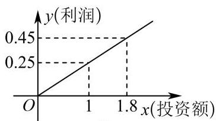
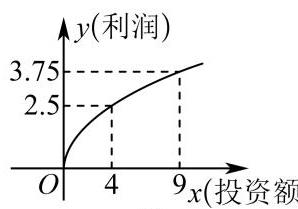

# 研发切片模板利润最值模型

## 知识讲解

## 导学说明

## 1. 教学目标

(1) 会从销售量、售价、成本、利润等文字条件中设定变量，建立利润函数或平均成本函数。

(2) 会根据分段规则、整数售价、成本约束和恒成立条件确定定义域，并在相应区间内求最值或参数范围。

(3) 能用二次函数、基本不等式、换元和单调性等高中方法解释“利润最大”“成本最低”“方案可行”的实际含义。

## 2. 课程重难点

(1)重点: 把“总利润、单件利润、平均成本、报价竞争、奖励方案”等实际语言转化为函数表达式和约束条件。

(2)难点: 正确处理分段定义域、整数取值、参数恒成立和形如 $x+\frac{a}{x}$ 的最值结构。

## 3. 考查形式与分值占比

(1)题型: 主要以函数应用解答题出现，也可拆成选择填空压轴小题，常见设问包括建模、求最值、求参数范围、判断方案是否满足约束。

(2)占比: 通常对应 8-12 分解答题；若嵌入综合题，核心分值集中在函数模型建立、定义域约束和最值判断。

## 知识导图

知识点:函数的应用

## ＥＵ 知识笔记

利润最值模型的一般步骤:

(1) 设变量: 明确售价、销量、成本、利润或处理量等变量，并写清单位与取值范围。

(2) 建模型: 根据“利润=收入-成本”“总利润=单件利润×销量”“平均成本=总成本÷数量”等关系写出函数。

(3) 定范围: 将售价整数、销量为正、处理量区间、奖金上下限等条件落实为定义域或不等式。

(4) 求最值: 按模型类型选择二次函数、基本不等式、换元、单调性或分段比较。

(5) 回情境: 判断最值点是否符合实际约束，并用原题单位回答。

## 教法备注

知识标签: 程序性知识；函数应用；利润最值；平均成本；参数恒成立。

教学步骤:

(1) 先让学生圈出“收入、成本、利润、约束”四类信息。

(2) 再要求学生写出目标函数和定义域，特别注意整数售价、销量为正、区间端点。

(3) 最后比较不同分段或不同约束下的最值，回到实际问题作答。

对应知识层级: 操作 + 迁移。

## 母题1

### 母题说明

母题1是本组“利润最大”基准题，与变式1-1、1-2都把经济关系转化为函数最值问题；不同在于母题由售价同时影响销量和供货价，核心考点是分段定义域、销量为正和基本不等式求最大值。

## 教法备注

【选题原因】这道题适合作为“利润最大”母题，因为它同时出现售价、销量、供货价和利润四个经济量，能完整训练学生从文字关系建立目标函数，并意识到售价变化会牵动销量与成本。

【错因预设】学生容易只写“利润=售价-成本”而漏乘销售量；容易忽略 $x>100$ 后销量 $30-0.2x$ 必须为正；也容易把总利润最大和单件利润最大混淆，导致目标函数选错。

【讲法建议】建议先用表格列出“售价区间、销量、供货价、目标量”，再强调本题第(2)问问的是“单件利润”而不是“总利润”；推荐方法是分段建立函数，低价段直接比较，高价段令 $150-x>0$ 后用基本不等式求最值。

一般2025上海市上海中学东校高一上期末

2024年8月12日，为期16天的巴黎奥运会落下帷幕，回顾这一届奥运会，中国元素在这里随处可见，令游客驻足欣赏；据调查，国内某公司生产的一款巴黎奥运会吉祥物的供货价格=固定价格+浮动价格，其中固定价格为60元， 浮动价格 $= \frac{5}{\text{ 销售量 }}$ (浮动价格单位: 元,销售量单位: 万件),假设每件吉祥物的售价为整数,当每件吉祥物售价不超过100元时，销售量为10万件:当每件吉祥物售价超过100元时，售价每增加1元，销售量就减小0.2万件，总利润=(售价-供货价格)×销售量;

(1) 当每件吉祥物的售价为85元时, 获得的总利润是多少万元?

(2)每件吉祥物的售价为多少元时，单件吉祥物的利润最大，最大为多少元？

## 答案

(1) 245万元

(2)每件吉祥物的售价为145元时，单件吉祥物的利润最大，最大为80元

## 解析

(1) 由题意,当单价售价为85元时,销售量为10万件,浮动价格为0.5元,供货价格为 ${60} + {0.5} = {60.5}$ 元, 故总利润为: ${10} \times  \left( {{85} - {60.5}}\right)  = {245}$ 万元;

(2) 当 $x \leq  {100}$ 时，销售量为 10 万件，供货价为 60.5 元，

则 ${60.5} < x \leq  {100}$ ,且 $x \in  \mathrm{N}$ ,

因而,当 $x \leq  {100}$ 时,单价利润 $x - {60.5} \leq  {39.5}$ ,

即单价利润最大为39.5元;

当 $x > {100}$ 时，销售量为 ${10} - {0.2}\left( {x - {100}}\right)  = {30} - {0.2x}$ (万件)，

同时, ${30} - {0.2x} > 0$ ,解得 ${100} < x < {150}$ ,且 $x \in  \mathrm{N}$ ,

此时单价利润为: $x - {60} - \frac{5}{{30} - {0.2x}} = x - {60} - \frac{25}{{150} - x}$

$=  - \left\lbrack  {\left( {{150} - x}\right)  + \frac{25}{{150} - x}}\right\rbrack   + {90} \leq   - 2\sqrt{\left( {{150} - x}\right)  \cdot  \frac{25}{{150} - x}} + {90} = {80},$

当且仅当 ${150} - x = \frac{25}{{150} - x}$ ,即 $x = {145}$ 时,取等号

因为 ${80} > {39.5}$ ,

故当每件吉祥物的售价为 145 元时，单件吉祥物的利润最大，最大为 80 元.

## 变式题1-1

### 变式说明

变式1-1与母题1同属资源配置下的收益最大模型，不同在于由售价-销量关系改为两类产品投资分配，核心考点是由图像建函数并用换元配方求最大利润。

## 3 教法备注

母题相似题 (更换函数类型)

一般上海市上海大学市北附属中学2025-2026学年高一上学期12月诊断测试数学试题

某创业团队拟生产 $A\text{ 、 }B$ 两种产品，根据市场预测， $A$ 产品的利润与投资额成正比(如图1)， $B$ 产品的利润与投资额的算术平方根成正比 (如图2), (注: 利润与投资额的单位均为万元)

图 1

图 2

(1)分别将 $A\text{ 、 }B$ 两种产品的利润 $f\left( x\right) \text{ 、 }g\left( x\right)$ 表示为投资额 $x$ 的函数；

(2)该团队已筹集到10万元资金，并打算全部投入 $A$ 、 $B$ 两种产品的生产.设投入 $B$ 产品 $x$ 万元，求:生产 $A$ 、 $B$ 两种产品能获得的利润 $h\left( x\right)$ 的最大值.

答案

(1) $f\left( x\right)  = \frac{1}{4}x,\;g\left( x\right)  = \frac{5\sqrt{x}}{4}$ ；

(2) 最大利润为4.0625万元.

解析

(1)由已知设 $f\left( x\right)  = {kx} + b, g\left( x\right)  = m\sqrt{x} + n$ ,

又函数 $f\left( x\right)$ 过点 $\left( {1,{0.25}}\right) ,\left( {{1.8},{0.45}}\right)$ ,

则 $\left\{  \begin{array}{l} k + b = {0.25} \\  {1.8k} + b = {0.45} \end{array}\right.$ ,解得 $\left\{  \begin{array}{l} k = \frac{1}{4} \\  b = 0 \end{array}\right.$ ,即 $f\left( x\right)  = \frac{1}{4}x$

函数 $g\left( x\right)$ 过点 $\left( {4,{2.5}}\right) ,\left( {9,{3.75}}\right)$ ,

则 $\left\{  \begin{array}{l} m\sqrt{4} + n = {2.5} \\  m\sqrt{9} + n = {3.75} \end{array}\right.$ ，解得 $\left\{  \begin{array}{l} m = \frac{5}{4} \\  n = 0 \end{array}\right.$ ，即 $g\left( x\right)  = \frac{5\sqrt{x}}{4}$ ；

(2)设投入 $B$ 产品 $x$ 万元，投入 $A$ 产品 ${10} - x$ 万元， $0 \leq  x \leq  {10}$ ，

则利润 $y = f\left( {{10} - x}\right)  + g\left( x\right)  = \frac{1}{4}\left( {{10} - x}\right)  + \frac{5\sqrt{x}}{4} =  - \frac{1}{4}{\left( \sqrt{x} - \frac{5}{2}\right) }^{2} + \frac{65}{16}$ ,

所以当 $\sqrt{x} = \frac{5}{2}$ ，即 $x = {6.25}$ 时利润 $y$ 取最大值为 $\frac{65}{16} = {4.0625}$ ，

即最大利润为 4.0625 万元.

## 变式题1-2

### 变式说明

变式1-2与母题1同样追求经济量最优，不同在于目标由利润最大变为平均成本最低，核心考点是分段函数中分别求最值再跨段比较。

## 3 教法备注

利润最值模型 (分段函数)

一般2026上海市上海市风华中学高一上期末

某公司为了节约成本，新设了一个从生活垃圾中提炼生物柴油的项目，经测算，该项目月处理成本y(元)与月处理量 $\mathrm{x}$ (吨)之间的函数关系可近似表示为: $y = \left\{  \begin{array}{l} \frac{1}{4}{x}^{3} - {55}{x}^{2} + {3105x}, x \in  \lbrack {100},{140}) \\  \frac{1}{2}{x}^{2} - {200x} + {45000}, x \in  \lbrack {140},{400}\rbrack  \end{array}\right.$ .

(1)设 $x \in  \left\lbrack  {{140},{400}}\right\rbrack$ ，求月处理量 $\mathrm{x}$ 的取值范围，使得月处理成本不超过30000元；

(2) 该项目月处理量为多少吨时，才能使每吨的平均处理成本最低？

## 答案

(1) $\left\lbrack  {{140},{300}}\right\rbrack$

(2) 110吨

解析

(1) 由题意可得 $x \in  \left\lbrack  {{140},{400}}\right\rbrack$ ,月处理成本不超过 ${30000}\mathrm{\;h}$ ,

即为 $\frac{1}{2}{x}^{2} - {200x} + {45000} \leq  {30000}$ ,解得 ${100} \leq  x \leq  {300}$ ,

可得月处理量x的取值范围为 $\left\lbrack  {{140},{300}}\right\rbrack$ ;

由题意可得每吨的平均处理成本为 $\frac{y}{x} = \left\{  \begin{array}{l} \frac{1}{4}{x}^{2} - {55x} + {3105}, x \in  \lbrack {100},{140}) \\  \frac{1}{2}x + \frac{45000}{x} - {200}, x \in  \left\lbrack  {{140},{400}}\right\rbrack   \end{array}\right.$ ,

当 $x \in  \lbrack {100},{140})$ 时， $\frac{y}{x} = \frac{1}{4}{x}^{2} - {55x} + {3105} = \frac{1}{4}{\left( x - {110}\right) }^{2} + {80}$ ，

当 $x = {110}$ 时，取得最小值 80 ；

当 $x \in  \left\lbrack  {{140},{400}}\right\rbrack$ 时, $\frac{y}{x} = \frac{1}{2}x + \frac{45000}{x} - {200} \geq  2\sqrt{\frac{1}{2}x \cdot  \frac{45000}{x}} - {200} = {100}$ ,

当且仅当 $\frac{1}{2}x = \frac{45000}{x}$ ,即 $x = {300}$ 时取等号,取得最小值100 ;

综上, 当月处理量为110吨时, 才能使每吨的平均处理成本最低.

## 母题2

### 母题说明

母题2是本组“方案约束恒成立”基准题，与变式2-1、2-2都把经济方案可行性转化为参数范围；不同在于母题比较甲乙报价并要求竞标始终成功，核心考点是报价函数建模、等价变形和区间最大值控制。

## 教法备注

【选题原因】这道题适合作为“方案约束恒成立”母题，因为它把报价建模、单位换算、几何约束和竞标成功条件合在一起，能把学生从“求一个最值”推进到“让不等式对整个区间都成立”。

【错因预设】学生容易漏掉左右墙长度是 $\frac{24}{x}$；容易把元和百元单位混用；也容易把“确保竞标成功”理解成只在某个 $x$ 下成立，而不是对所有 $4\leq x\leq6$ 恒成立。

【讲法建议】建议先画仓库俯视示意图，明确前墙长 $x$、侧墙长 $\frac{24}{x}$；再把“甲价 < 乙价”化为关于 $k$ 的恒成立不等式，最后用换元 $t=x+2$ 把表达式整理成 $t+\frac{16}{t}+8$，通过区间单调性取最大值。

一般2026上海市上海市杨浦高级中学高一上期末

某物流公司为了扩大业务量，计划改造一间高为6米，底面积为24平方米，且背面靠墙的长方体形状的仓库. 因仓库的背面靠墙，无须建造费用，设仓库前面墙体的长为 $x$ 米( $4 \leq  x \leq  6$ ). 现有甲、乙两支工程队参加竞标，甲队的报价方案为:仓库前面新建墙体每平方米400元，左右两面新建墙体每平方米300元，屋顶和地面以及其他共计28800 元.

(1)请写出甲队整体报价 $y$ (单位:百元)关于前面墙体长 $x$ (单位:米)的函数解析式；

(2)已知乙队给出的整体报价为 $\left( {1 + \frac{2}{x}}\right)  \times  {6k} \times  {10}^{4}$ 元( $k > 0$ )，不考虑其他因素，若甲队要确保竞标成功，求实数 $k$ 的取值范围.

答案

(1) $y = {24x} + \frac{864}{x} + {288}\left( {4 \leq  x \leq  6}\right)$

(2) $\left( {\frac{18}{25}, + \infty }\right)$

解析

(1)前面墙体长 $x$ 米( $4 \leq  x \leq  6$ )，则左右两面墙体长为 $\frac{24}{x}$ 米.

所以新建前面墙体的费用为: ${400} \times  {6x} = {2400x}$ 元,即 ${24x}$ 百元.

新建左右两面墙体的费用为: $2 \times  {300} \times  6 \times  \frac{24}{x} = \frac{86400}{x}$ 元,即 $\frac{864}{x}$ 百元.

又屋顶和地面以及其他共计28800元，即288百元，

所以总费用 $y = {24x} + \frac{864}{x} + {288}\left( {4 \leq  x \leq  6}\right)$ .

(2)乙队给出的整体报价为 $\left( {1 + \frac{2}{x}}\right)  \times  {6k} \times  {10}^{4}$ 元，即 $\left( {1 + \frac{2}{x}}\right)  \times  {600k}$ 百元( $k > 0$ ).

甲队要确保竞标成功，需甲队报价小于乙队报价对任意 $4 \leq  x \leq  6$ 恒成立，

即 ${24x} + \frac{864}{x} + {288} < \left( {1 + \frac{2}{x}}\right)  \times  {600k}$ 对任意 $4 \leq  x \leq  6$ 恒成立.

化简得 $x + \frac{36}{x} + {12} < \left( {1 + \frac{2}{x}}\right)  \times  {25k}$ ,

因为 $4 \leq  x \leq  6$ ,所以 ${x}^{2} + {36} + {12x} < \left( {x + 2}\right)  \times  {25k}$ ,

整理得 ${25k} > \frac{{x}^{2} + {36} + {12x}}{x + 2}$ 对任意 $4 \leq  x \leq  6$ 恒成立.

设 $t = x + 2$ ,则 $6 \leq  t \leq  8,\frac{{x}^{2} + {36} + {12x}}{x + 2} = \frac{{t}^{2} + {8t} + {16}}{t} = t + \frac{16}{t} + 8$ .

又 $f\left( t\right)  = t + \frac{16}{t} + 8$ 在 $\left\lbrack  {6,8}\right\rbrack$ 上为增函数,所以 $f{\left( t\right) }_{\max } = f\left( 8\right)  = {18}$ ,

则 ${25k} > {18}$ ，即 $k > \frac{18}{25}$ ，又 $k > 0$ ，所以 $k > \frac{18}{25}$ .

故实数 $k$ 的取值范围为 $\left( {\frac{18}{25}, + \infty }\right)$ .

## 变式题2-1

### 变式说明

变式2-1与母题2同样考查方案约束下的参数范围，不同在于约束来自奖金上下限和收益比例，核心考点是把方案要求翻译成多条恒成立不等式。

一般 2026上海市上海市控江中学高一上期末

某创业投资公司拟投资开发某种新能源产品，估计能获得36万元~1600万元的投资收益(包含36万元和1600万元)， 现准备制定一个对科研课题组的奖励方案:奖金 $y$ (单位:万元)随投资收益x(单位:万元)的增加而增加，奖金不低于5万元，不超过95万元，同时奖金不超过投资收益的20%.

(1)请用数学语言列出该公司对奖励方案函数模型 $y = f\left( x\right)$ 的要求，判断函数 $f\left( x\right)  = \frac{x}{40} + {10}$ 是否能作为奖励方案, 并说明理由;

(2)已知函数 $g\left( x\right)  = a\sqrt{x} - 5\left( {a \geq  1}\right)$ 符合该公司奖励方案函数模型要求，求实数 $a$ 的取值范围.

## 答案

(1)要求见解析; 不能, 理由见解析

(2) $\left\lbrack  {\frac{5}{3},\frac{61}{30}}\right\rbrack$

解析

(1)解:根据题意，该公司对奖励方案函数模型 $y = f\left( x\right)$ 的要求:

①定义域为 $\left\lbrack  {{36},{1600}}\right\rbrack$ ; ② $f\left( x\right)$ 在 $\left\lbrack  {{36},{1600}}\right\rbrack$ 上单调递增；

③对于任意 $x \in  \left\lbrack  {{36},{1600}}\right\rbrack$ ，都有 $5 \leq  f\left( x\right)  \leq  {95}$ 恒成立；

④对于任意 $x \in  \left\lbrack  {{36},{1600}}\right\rbrack$ ，有 $f\left( x\right)  \leq  {0.2x}$ (即奖金不超过投资收益的 20%)

对于函数模型 $f\left( x\right)  = \frac{x}{40} + {10}$ ,当 $x \in  \left\lbrack  {{36},{1600}}\right\rbrack$ 时,函数 $f\left( x\right)$ 为单调递增函数,

且 $f{\left( x\right) }_{\min } = f\left( {36}\right)  = \frac{36}{40} + {10} = {10.9}, f{\left( x\right) }_{\max } = f\left( {1600}\right)  = \frac{1600}{40} + {10} = {50}$ ,

此时满足 $5 \leq  f\left( x\right)  \leq  {95}$ 恒成立;

当 $x = {36}$ 时， $f\left( {36}\right)  = \frac{36}{40} + {10} = {10.9} > {36} \times  {0.2} = {7.2}$ ，不满足 $f\left( x\right)  \leq  {0.2x}$ 恒成立，

所以函数 $f\left( x\right)  = \frac{x}{40} + {10}$ 不符合奖金方案要求.

(2)解:由函数 $g\left( x\right)  = a\sqrt{x} - 5\left( {a \geq  1}\right)$ 符合该公司奖励方案函数模型要求，

当 $x \in  \left\lbrack  {{36},{1600}}\right\rbrack$ 时,函数 $g\left( x\right)  = a\sqrt{x} - 5\left( {a \geq  1}\right)$ 为单调递增函数,

所以 $g{\left( x\right) }_{\max } = g\left( {1600}\right)  = a\sqrt{1600} - 5 = {40a} - 5$ ,则 ${40a} - 5 \leq  {95}$ ,解得 $a \leq  \frac{5}{2}$ ,

$g{\left( x\right) }_{\min } = g\left( {36}\right)  = a\sqrt{36} - 5 = {6a} - 5$ ,则 ${6a} - 5 \geq  5$ ,解得 $a \geq  \frac{5}{3},$

又由任意 $x \in  \left\lbrack  {{36},{1600}}\right\rbrack$ ,有 $g\left( x\right)  \leq  {0.2x}$ 恒成立,即 $a\sqrt{x} - 5 \leq  \frac{x}{5}$ 恒成立,

令 $t = \sqrt{x}$ ,则 $t \in  \left\lbrack  {6,{40}}\right\rbrack$ ,不等式即为 ${at} - 5 \leq  \frac{{t}^{2}}{5}$ 恒成立,所以 $a \leq  \frac{t}{5} + \frac{5}{t}$ 恒成立,

因为 $h\left( t\right)  = \frac{t}{5} + \frac{5}{t}$ 在 $t \in  \left\lbrack  {6,{40}}\right\rbrack$ 上为递增函数,所以 $h{\left( t\right) }_{\min } = h\left( 6\right)  = \frac{61}{30}$ ,所以 $a \leq  \frac{61}{30}$ ,

综上可得, $\frac{5}{3} \leq  a \leq  \frac{61}{30}$ ,即实数 $a$ 的取值范围为 $\left\lbrack  {\frac{5}{3},\frac{61}{30}}\right\rbrack$ .

## 变式题2-2

### 变式说明

变式2-2与母题2同样考查参数恒成立，不同在于情境变为人员调整后的利润比较，核心考点是先确定可行调整人数，再用恒成立不等式限制参数 $a$。

一般 2026上海市上海外国语大学附属大境中学高一上期末

某单位有员工1000名，平均每人每年创造利润10万元，为了增加企业竞争力，决定优化产业结构，调整出 $x\left( {x \in  {\mathrm{N}}^{ * }}\right)$ 名员工从事第三产业，调整出的员工平均每人每年创造利润为 ${10}\left( {a - \frac{3x}{500}}\right)$ 万元 $\left( {a > 0}\right)$ ，剩余员工平均每人每年创造的利润可以提高 ${0.2x}\%$ .

(1) 若要保证剩余员工创造的年总利润不低于原来1000名员工创造的年总利润，则最多调整出多少名员工从事第三产业?

(2)在(1)的条件下，若调整出的员工创造的年总利润始终不高于剩余员工创造的年总利润，则 $a$ 的取值范围是多少?

## 答案

(1) 500

(2) $(0,5\rbrack$

解析

(1) 由题意得: ${10}\left( {{1000} - x}\right) \left( {1 + {0.2x}\% }\right)  \geq  {10} \times  {1000}$ ,

即 ${x}^{2} - {500x} \leq  0$ ,又 $x > 0$ ,

所以 $0 < x \leq  {500}$ . 即最多调整500名员工从事第三产业.

(2)从事第三产业的员工创造的年总利润为 ${10}\left( {a - \frac{3x}{500}}\right) x$ 万元，

从事原来产业的员工的年总利润为 ${10}\left( {{1000} - x}\right) \left( {1 + \frac{1}{500}x}\right)$ 万元,

则 ${10}\left( {a - \frac{3x}{500}}\right) x \leq  {10}\left( {{1000} - x}\right) \left( {1 + \frac{1}{500}x}\right)$ ,

所以 ${ax} - \frac{3{x}^{2}}{500} \leq  {1000} + {2x} - x - \frac{1}{500}{x}^{2}$ ,

所以 ${ax} \leq  \frac{2{x}^{2}}{500} + {1000} + x$ ，

即 $a \leq  \frac{2x}{500} + \frac{1000}{x} + 1$ 恒成立，

因为 $\frac{2}{500}x + \frac{1000}{x} \geq  2\sqrt{\frac{2x}{500}\frac{1000}{x}} = 4$ ,当且仅当 $\frac{2x}{500} = \frac{1000}{x}$ ,即 $x = {500}$ 时等号成立.

所以 $a \leq  5$ ,又 $a > 0$ ,所以 $0 < a \leq  5$ ,

即 $a$ 的取值范围为 $(0,5\rbrack$ .

变式题2-3

爱母题3

变式题3-1

变式题3-2

## 分层练习

基础

综合

函数的应用

## 对本讲义的深度理解

这份讲义表面上是“利润最值模型”，本质上训练的是把经济情境压缩成函数优化问题: 先识别收入、成本、利润和约束，再建立目标函数，最后在真实定义域中求最值或参数范围。母题1及其变式围绕“利润/成本最优”，重点是建函数后求最值；母题2及其变式围绕“方案必须始终可行”，重点是把实际要求转化为恒成立不等式。整份讲义的主线不是某个固定公式，而是“经济关系-函数模型-约束范围-最值/恒成立-情境解释”的应用题思维链。

---
版本号：v1
生成日期：2026-06-16
说明：基于原始 dollar Markdown 生成教师版美化排版版本，修正导学主线，补充一句话母题说明、变式说明和讲义深度理解；未修改原始文件。

版本号：v2
生成日期：2026-06-16
说明：按“基准模型、与变式相似点、不同点、核心考点”的要求重写两处母题说明，保留一句话表达。

版本号：v3
生成日期：2026-06-16
说明：按三段式要求重写母题1、母题2的教法备注，包含【选题原因】、【错因预设】、【讲法建议】。

