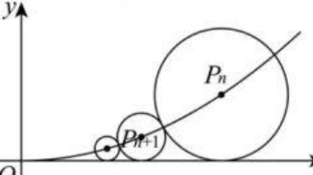
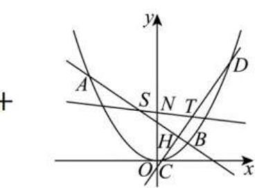

<!-- page 1 -->

文卫星数学生态课堂公众号 wwxwxgzk

# 复旦附中最新一道解析几何与数列融合题压轴题

20.如图，在平面直角坐标系xOy上，有一系列点$P_1(x_1,y_1)$, $P_{2}(x_{2},y_{2}),...,P_{n}(x_{n},y_{n})$,其中$n$为正整数，每一个点均位于抛物线$\Gamma{:}y=x^2(x\geq0)$ 的图像上，点 $F$为抛物线的焦点，以点$P_n$为圆心的$\odot P_n$都与$x$轴相切，且$\odot P_n$与$\odot P_n+1$外切；若$|P_1F|=\frac54,且x_{n+1}<x_n,所有幂函数均与抛物线\Gamma 交于点M$

(1)设点$Q$是抛物线$\Gamma{:}y=x^2(x\geq0)$上不与点$M$重合的动点， $R$是线段$MQ$上一点，且满足$\overrightarrow{MR}=2\overrightarrow{RQ}$,求：动点$R$的轨迹方程；
(2)设$T_n=x_nx_{n+1}$,求：数列$\{T_n\}$前 2026 项的和$S_{_{2026}}$
(3)已知直线$y= t$与 某 个 以 点 $P_n$为圆心的$\odot P_n$相切，当$t$最大时，设$AB$,$CD$是抛物线$\Gamma{:}y=x^2(x\in R)$的两条经过切点的动弦，满足$AB\bot CD$,点 S与点$T$分别为弦$AB$,$CD$的中点，是否存在定点$N$,使得点$N$,$T$,$S$始终三点共线，若存在，求出点 $N$ 的坐标；若不存在，请说明理由.
[详解](1)所有幂函数均过点(1,1),点(1,1)在抛物线$\Gamma$上，
故$M(1,1)$,

文卫星数学生态课堂公众号 w

设点$R(x,y),Q(x^{\prime},y^{\prime}),则\overrightarrow{MR}=(x-1,y-1),\overrightarrow{RQ}=$
$(x^{\prime}-x,y^{\prime}-y)$,
由$\overrightarrow{MR}=2\overrightarrow{RQ}$得$(x-1,y-1)=2\bigl(x^{\prime}-x,y^{\prime}-y\bigr)$,故

$\begin{cases}x-1=2(x^{\prime}-x)\\y-1=2(y^{\prime}-y)\end{cases}$,所以$\begin{cases}x^{\prime}=\frac{3x-1}{2}\\y^{\prime}=\frac{3y-1}{2}\end{cases}$,
又$Q(x^{\prime},y^{\prime})$在抛物线$\Gamma$上，且与点$M(1,1)$不重合，所以$y^\prime=x^{\prime2}$,且

$x^{\prime }\geq 0$, $x^{\prime }\neq 1$, $即 \frac {3y- 1}2= \left ( \frac {3x- 1}2\right ) ^{2}$, $\frac {3x- 1}2\geq 0且 \frac {3x- 1}2\neq 1$, $化 简$
得$y= \frac {3x^{2}- 2x+ 1}2$, $x\geq \frac 13$且$x\neq1;$
(2)由题意得$F\left(0,\frac14\right)$,设点$P_n(x_n,x_n^2),x_n>0,n\in N^*$, 则$\odot P_n$的半径为$r_n= x_n^2$, $| P_1F| = \chi _1^2+ \frac 14= \frac 54$,解得$x_1=1$, 因为$\odot P_n$与$\odot P_n+1$外切，则$|P_nP_{n+1}|=r_n+r_{n+1}$,
即$\sqrt(x_{n+1}-x_n)^2+(x_{n+1}^2-x_n^2)^2=x_{n+1}^2+x_n^2$,整理可得
$(x_{n+1}-x_{n})^{2}=4x_{n+1}^{2}x_{n}^{2}$,
$\sum x_{n+ 1}< x_{n}$ ,所 以 $x_{n}- x_{n+ 1}= 2x_{n}x_{n+ 1}$ ,即 $\frac 1{x_{n+ 1}}- \frac 1{x_{n}}= 2$ , $\sum x_{n+ 1}< x_{n}$ ,所 以 $x_{n}- x_{n+ 1}= 2x_{n}x_{n+ 1}$ ,即 $\frac 1{x_{n+ 1}}- \frac 1{x_{n}}= 2$ ,
故数列$\left\{\frac{1}{x_{n}}\right\}$是$\frac{1}{x_{1}}=1$为首项，公差为2 的等差数列，则$\frac{1}{x_{n}}=1+$
$2( n- 1) = 2n- 1$, $x_{n}= \frac 1{2n- 1}$,
$T_{n}=x_{n}x_{n+1}=\frac{1}{(2n-1)(2n+1)}=\frac{1}{2}\left(\frac{1}{2n-1}-\frac{1}{2n+1}\right)$,
$S_{2026}=T_1+T_2+\cdots+T_{2026}$
$=\frac{1}{2}\left(1-\frac{1}{3}\right)+\frac{1}{2}\left(\frac{1}{3}-\frac{1}{5}\right)+\cdots+\frac{1}{2}\left(\frac{1}{4051}-\frac{1}{4053}\right)$

$=\frac{1}{2}\left(1-\frac{1}{3}+\frac{1}{3}-\frac{1}{5}+\cdots+\frac{1}{4051}-\frac{1}{4053}\right)=\frac{1}{2}\times\left(1-\frac{1}{4053}\right)=\frac{2026}{4053};$ (3)存在定点$N\left(0,\frac52\right)$, 使得点 $N,T,S$始终三点共线，理由

文卫星数学生态课堂公众号 wwx

如下：
$\odot P_n$的方程为$( x- x_n) ^2+ ( y- x_n^2) ^2= x_n^2$, 显然$y=0$与$y=2x_n^2$为两切线，$t$最大时，$t=2x_n^2$,由(2)知，$x_n=\frac1{2n-1}$,其单调递减故最大值为$x_1=1$,故切点坐标为$H(1,2)$,
若过点(1,2)的其中一条直线斜率不存在，此时直线与抛物线只有 1 个交点，不合要求，故过点(1,2)的直线斜率也不为 0,设过(1,2)的直线AB方程为y-2=k(x-1),
联立$y-2=k(x-1)$与$y=x^2$得$x^2- kx+ k- 2= 0$ ,
设$A( x_{A}, y_{A}) , B( x_{B}, y_{B})$, 则$x_{A}+ x_{B}= k, x_{A}x_{B}= k- 2$, 则$\frac{x_{A}+x_{B}}{2}=\frac{k}{2}$,
故$S$点横坐标为$\frac k2$,
将$x=\frac{k}{2}$代入$y-2=k(x-1)$中得$y=$
$k\left(\frac{k}{2}-1\right)+2=\frac{k^{2}}{2}+2-k$,

故 $S\left ( \frac k2, \frac {k^{2}}2+ 2- k\right )$, 同 理 可 得 $T\left ( - \frac 1{2k}, \frac 1{2k^{2}}- \frac 1{2k}\right )$, $2+\frac{1}{k}\Big)$, 由对称性可知$N$在$y$轴上，不妨设$N(0,m)$, 则$\overrightarrow {NS}= \left ( \frac k2, \frac {k^2}2+ 2- k- m\right )$, $\overrightarrow {NT}= \left ( - \frac 1{2k}, \frac 1{2k^2}+ 2+ \frac 1k- m\right )$, 点$N,T,S$始终三点共线，故$\overrightarrow{NS}//\overrightarrow{NT},\left(\frac k2,\frac{k^2}2+2-k-m\right)//$ $\left(-\frac{1}{2k},\frac{1}{2k^{2}}+2+\frac{1}{k}-m\right)$,
$\frac k2\left ( \frac 1{2k^{2}}+ 2+ \frac 1k- m\right ) - \left ( - \frac 1{2k}\right ) \left ( \frac {k^{2}}2+ 2- k- m\right ) = 0$,化 简 得  $\left(5\:m\right)\left(-1\right)$
$\left(\frac{5}{4}-\frac{m}{2}\right)\left(k+\frac{1}{k}\right)=0$,显然$k+\frac1{k}\neq0$,所以$\frac5{4}-\frac{m}{2}=0$,即$m=\frac5{2}$
时，上式恒成立，
故存在定点$N\left(0,\frac52\right)$,使得点$N,T,S$始终三点共线.
