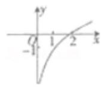
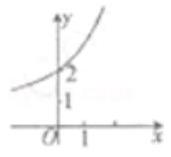
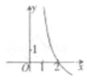
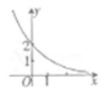
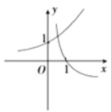
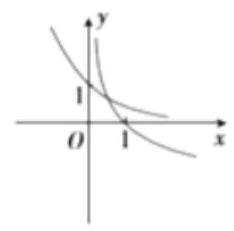
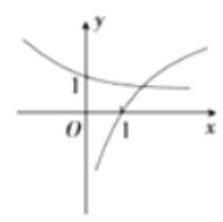
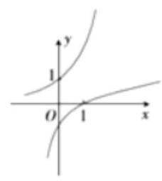
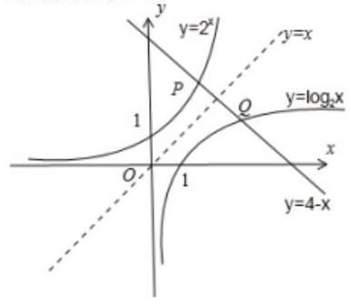
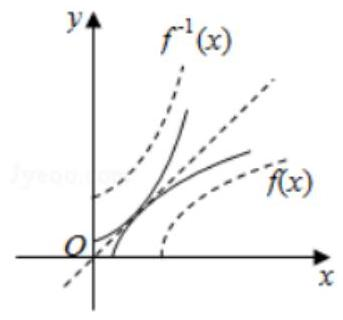

## 反函数

<table><tr><td>教学目标</td><td>1、理解反函数的概念，并能判定一个函数是否存在反函数   2、掌握求反函数的基本步骤，并能理解原函数和反函数之间的内在联系</td></tr><tr><td>重点</td><td>理解函数与其反函数的图像和性质关系, 能熟练求解已知函数的反函数</td></tr><tr><td>难 点</td><td>抽象函数反函数的应用</td></tr></table>

## (一) 反函数概念与反函数存在性问题

## 知识梳理

## 1、反函数的概念:

一般地,对于函数 $y = f\left( x\right)$ ,设它的定义域是 $\mathrm{D}$ ,值域是 $\mathrm{A}$ 。如果对 $\mathrm{A}$ 中的任意一个值 $y$ ,在 $\mathrm{D}$ 中总有唯一确定的 $x$ 值与它对应,且满足 $y = f\left( x\right)$ 。这样得到的 $x$ 关于 $y$ 的函数叫做 $y = f\left( x\right)$ 的反函数,记作 $x = {f}^{-1}\left( y\right)$ 。

习惯上,自变量常用 $x$ 表示,而函数常用 $y$ 表示,所以把它改写为 $y = {f}^{-1}\left( x\right) \left( {x \in  A}\right)$ 。

## 2、说明:

①并非所有函数都有反函数，只有 $x, y$ 一一对应的函数才有反函数。如 $y = {x}^{2}$ 就没有反函数。

②如果函数 $y = f\left( x\right)$ 有反函数 $y = {f}^{-1}\left( x\right)$ ，那么函数 $y = {f}^{-1}\left( x\right)$ 的反函数就是 $y = f\left( x\right)$ 。这就是说，函数 $y = f\left( x\right)$ 与函数 $y = {f}^{-1}\left( x\right)$ 互为反函数。

③函数 $y = f\left( x\right)$ 的定义域是它的反函数 $y = {f}^{-1}\left( x\right)$ 的值域；函数 $y = f\left( x\right)$ 的值域是它的反函数 $y = {f}^{-1}\left( x\right)$ 的定义域。

④ 求反函数时一定要写定义域。

## 例题精讲

【例 1】判断下列函数是否存在反函数:

① $y = {x}^{2} - a\left( {x <  - 2}\right)$ ； ② $y = {2}^{\left| x - 1\right| }\left( {x \geq  2}\right)$ ；

③ $y = \left\{  \begin{array}{ll} {2x} & x \geq  2 \\  a & x = 1\left( {a \geq  4}\right)  \end{array}\right.$ .

【难度】★★

【答案】①存在; ②存在; ③不存在

【解析】反函数定义

【例 2】若 $f\left( x\right)  = {2}^{x} + 3\left( {x \in  R}\right)$ ,则 $y = {f}^{-1}\left( x\right)$ 的定义域是( )

A. $R$ B. $\left( {5, + \infty }\right)$ C. $\left( {3, + \infty }\right)$ D. $\left( {0, + \infty }\right)$

【难度】★★

【答案】 $C$

【解析】解: $y = {f}^{-1}\left( x\right)$ 的定义域即为函数 $f\left( x\right)$ 的值域,

因为 ${2}^{x} > 0$ ,则 $f\left( x\right)  > 3$ ,故 $f\left( x\right)$ 的值域为 $\left( {3, + \infty }\right)$ ,所以 $y = {f}^{-1}\left( x\right)$ 的定义域是 $\left( {3, + \infty }\right)$ .

故选: $C$ .

【例 3】(1) 函数 $f\left( x\right)  = 2{x}^{2} - {ax} - 1$ 在区间 $\left\lbrack  {1,2}\right\rbrack$ 上存在反函数的条件是___.

【难度】 $\star   \star$

【答案】 $8 \leq  a$ 或 $a \leq  4$

(2)若函数 $f\left( x\right)  = x + \frac{a}{x}\left( {a\text{ 为正实数 }}\right)$ 在 $\left( {2,4}\right)$ 上不存在反函数，则实数 $a$ 的取值范围为___.

【难度】 $\star   \star   \star$

【答案】 $4 < a < {16}$

【解析】解: $\because$ 函数 $f\left( x\right)  = x + \frac{a}{x}\left( {a\text{ 为正实数 }}\right)$ 在 $\left( {2,4}\right)$ 上不存在反函数, $\therefore$ 函数 $f\left( x\right)  = x + \frac{a}{x}(a$ 为正实数) 在 $\left( {2,4}\right)$ 上是不单调函数,即 $2 < \sqrt{a} < 4 \Rightarrow  4 < a < {16}$ . 故答案为: $4 < a < {16}$ .

(3) 若函数 $f\left( x\right)  = \left| x\right|  - 1 + {ax}\left( {x \in  R}\right)$ 存在反函数，则 $a$ 的取值范围为___.

【难度】 ${\bigstar \bigstar \bigstar }$

【答案】 $a > 1$ 或 $a <  - 1$

【解析】依题意 $f\left( x\right)  = \left\{  \begin{array}{l} \left( {a + 1}\right) x - 1, x \geq  0 \\  \left( {a - 1}\right) x - 1, x < 0 \end{array}\right.$ .

当 $a <  - 1$ 时, $f\left( x\right)  = \left( {a + 1}\right) x - 1\left( {x \geq  0}\right)$ 为单调递减函数, $f\left( x\right)  = \left( {a - 1}\right) x - 1\left( {x < 0}\right)$ 为单调递减函数, 且 $f\left( 0\right)  =  - 1$ ,所以函数 $f\left( x\right)$ 为一一对应,所以 $f\left( x\right)$ 存在反函数.

当 $a =  - 1$ 时, $f\left( x\right)  = \left\{  {\begin{array}{l}  - 1, x \geq  0 \\   - {2x} - 1, x < 0 \end{array}, f\left( x\right)  =  - 1\left( {x \geq  0}\right) }\right.$ 不是一一对应,所以 $f\left( x\right)$ 不存在反函数.

当 $- 1 < a < 1$ 时, $f\left( x\right)  = \left( {a + 1}\right) x - 1\left( {x \geq  0}\right)$ 为单调递增函数, $f\left( x\right)  = \left( {a - 1}\right) x - 1\left( {x < 0}\right)$ 为单调递减函数, 且 $f\left( 0\right)  =  - 1, f\left( x\right)$ 不是一一对应,所以 $f\left( x\right)$ 不存在反函数.

当 $a = 1$ 时, $f\left( x\right)  = \left\{  \begin{array}{l} {2x} - 1, x \geq  0 \\   - 1, x < 0 \end{array}\right.$ , $f\left( x\right)  =  - 1\left( {x < 0}\right)$ 不是一一对应,所以 $f\left( x\right)$ 不存在反函数.

当 $a > 1$ 时, $f\left( x\right)  = \left( {a + 1}\right) x - 1\left( {x \geq  0}\right)$ 为单调递增函数, $f\left( x\right)  = \left( {a - 1}\right) x - 1\left( {x < 0}\right)$ 为单调递增函数,且 $f\left( 0\right)  =  - 1$ ,所以函数 $f\left( x\right)$ 为一一对应,所以 $f\left( x\right)$ 存在反函数.

综上所述, $a$ 的取值范围是 $a > 1$ 或 $a <  - 1$ . 故答案为: $a > 1$ 或 $a <  - 1$

(4)已知函数 $f\left( x\right)  = {x}^{2} - {3tx} + 1$ ，其定义域为 $\left\lbrack  {0,3}\right\rbrack   \cup  \left\lbrack  {{12},{15}}\right\rbrack$ ，如果函数 $y = f\left( x\right)$ 在其定义域内有反函数,求实数 $t$ 的取值范围.

【难度】 $\star   \star   \star$

【答案】 $t \in  \left( {-\infty ,0\rbrack \cup \lbrack 2,4}\right)  \cup  \left( {6,8\rbrack \cup \lbrack {10}, + \infty }\right)$

【解析】 ${1}^{ \circ  }$ 若 $\frac{3t}{2} \leq  0$ ,即 $t \leq  0$ ,则 $y = f\left( x\right)$ 在定义域上单调递增,所以具有反函数;

${2}^{ \circ  }$ 若 $\frac{3t}{2} \geq  {15}$ ,即 $t \geq  {10}$ ,则 $y = f\left( x\right)$ 在定义域上单调递减,所以具有反函数;

${3}^{ \circ  }$ 当 $3 \leq  \frac{3t}{2} \leq  {12}$ ,即 $2 \leq  t \leq  8$ 时,由于区间 $\left\lbrack  {0,3}\right\rbrack$ 关于对称轴 $\frac{3t}{2}$ 的对称区间是

$\left\lbrack  {{3t} - 3,{3t}}\right\rbrack$ ,于是当 $\left\{  \begin{array}{l} {3t} < {12} \\  \frac{3t}{2} \geq  3 \end{array}\right.$ 或 $\left\{  \begin{matrix} {3t} - 3 > {15} \\  \frac{3t}{2} \leq  {12} \end{matrix}\right.$ ,即 $t \in  \lbrack 2,4)$ 或 $t \in  (6,8\rbrack$ 时,

函数 $y = f\left( x\right)$ 在定义域上满足 1-1 对应关系,具有反函数.

综上, $t \in  \left( {-\infty ,0\rbrack  \cup  \left\lbrack  {2,4)\cup (6,8}\right\rbrack  \cup \lbrack {10}, + \infty }\right)$ .

## 巩固训练

1、若函数 $y = f\left( x\right)$ 存在反函数，则方程 $f\left( x\right)  = c$ ( $c$ 为常数) ( )

C. 至多有一个实根 D. 没有实数根

【难度】★★

【答案】C

【解析】反函数定义

2、设 $f\left( x\right)  = {\log }_{2}\left( {\frac{1}{x + a} + 1}\right)$ 是奇函数,若函数 $g\left( x\right)$ 图象与函数 $f\left( x\right)$ 图象关于直线 $y = x$ 对称,则 $g\left( x\right)$ 的值域为( )

A. $\left( {-\infty , - \frac{1}{2}}\right)  \cup  \left( {\frac{1}{2}, + \infty }\right)$ B. $\left( {-\frac{1}{2},\frac{1}{2}}\right)$ C. $\left( {-\infty , - 2}\right)  \cup  \left( {2, + \infty }\right)$ D. $\left( {-2,2}\right)$

【难度】 $\star   \star   \star$

【答案】 $A$

【解析】解: 因为 $f\left( x\right)  = {\log }_{2}\left( {\frac{1}{x + a} + 1}\right)$ ,所以 $f\left( x\right)$ 的定义域为 $\{ x \mid  x <  - a - 1$ 或 $x >  - a\}$ ,

因为 $f\left( x\right)$ 是奇函数,所以 $- a - 1 = a$ ,解得 $a =  - \frac{1}{2}$ ,

因为函数 $g\left( x\right)$ 图象与函数 $f\left( x\right)$ 图象关于直线 $y = x$ 对称,所以 $g\left( x\right)$ 与 $f\left( x\right)$ 互为反函数,

故 $g\left( x\right)$ 的值域为 $\left( {-\infty , - \frac{1}{2}}\right)  \cup  \left( {\frac{1}{2}, + \infty }\right)$ . 故选: $A$ .

3、若函数 $y = {x}^{2} + \left( {a - 4}\right) x + 3 - a$ ， $x \in  \left\lbrack  {0\text{ ， }1}\right\rbrack$ 没有反函数，则 $a$ 的取值范围是___

【难度】 $\star   \star   \star$

【答案】 $\left( {2,4}\right)$

【解析】解: 因为函数 $y = {x}^{2} + \left( {a - 4}\right) x + 3 - a, x \in  \left\lbrack  {0,1}\right\rbrack$ 没有反函数,

则函数在定义域内不单调,又函数的对称轴为 $x = \frac{4 - a}{2}$ ,所以 $0 < \frac{4 - a}{2} < 1$ ,解得 $2 < a < 4$ ,故答案为: $\left( {2,4}\right)$ .

4、函数 $f\left( x\right)  = {\log }_{a}\left( {{x}^{2} - {4x} + 3}\right) \left( {a > 0, a \neq  1}\right)$ 在区间 $\lbrack m, + \infty )$ 上存在反函数，则实数 $m$ 的取值范围是

【难度】 $\star   \star   \star$

【答案】 $\left( {3, + \infty }\right)$

【解析】由题得 $f\left( x\right)$ 的定义域为 $\left( {-\infty ,1}\right)  \cup  \left( {3, + \infty }\right) , y = {x}^{2} - {4x} + 3$ 的对称轴为 $x = 2$ ,

故 $\mathrm{m}$ 的取值范围是 $m \in  \left( {3, + \infty }\right)$ .

5、已知函数 $f\left( x\right)  = \frac{1}{x}\left( {x > 0}\right)$ ，若将函数图像绕原点逆时针旋转 $\alpha$ 角( $0 < \alpha  \leq  \pi$ )后得到的函数 $y = g\left( x\right)$ 存在反函数，则 $\alpha$ 的取值集合是___

【难度】 $\star   \star   \star$

【答案】 $\left\{  {\frac{\pi }{2},\pi }\right\}$

【解析】由题意 $g\left( x\right)$ 有反函数,因此它为一一对应关系,

而函数 $f\left( x\right)  = \frac{1}{x}\left( {x > 0}\right)$ ,在第一象限,单调递减,逆时针旋转 $\alpha$ 角后,要满足题意只有 $\alpha  = \frac{\pi }{2}$ 或 $\pi$ .

故答案为: $\left\{  {\frac{\pi }{2},\pi }\right\}$ .

6、已知 $a\text{ 、 }b\text{ 、 }c$ 都是实数,若函数 $f\left( x\right)  = \left\{  \begin{matrix} {x}^{2} & x \leq  a \\  \frac{1}{x} + b & a < x < c \end{matrix}\right.$ 的反函数的定义域是 $\left( {-\infty , + \infty }\right)$ ,则 $c$ 的所有取值构成的集合是___

【难度】 $\star   \star   \star$

【答案】 $\{ 0\}$

【解析】由 $f\left( x\right)  = \left\{  \begin{matrix} {x}^{2} & x \leq  a \\  \frac{1}{x} + b & a < x < c \end{matrix}\right.$ 其定义域为 $\left( {-\infty , c}\right)$ ,因为 $x \neq  0$ ,所以 $a < c \leq  0$ ,

(1)当 $c < 0$ ，由解析式可得，当 $x \leq  a$ 时， $f\left( x\right)  \geq  {a}^{2}$ ；

当 $a < x < c$ 时, $\frac{1}{c} + b < f\left( x\right)  < \frac{1}{a} + b$ ,即 $f\left( x\right)$ 的值域为 $\left( {\frac{1}{c} + b,\frac{1}{a} + b}\right)  \cup  \left( {{a}^{2}, + \infty }\right)$ ;

又函数 $f\left( x\right)  = \left\{  \begin{matrix} {x}^{2} & x \leq  a \\  \frac{1}{x} + b & a < x < c \end{matrix}\right.$ 的反函数的定义域是 $\left( {-\infty , + \infty }\right)$ ,

所以函数 $f\left( x\right)$ 的值域为 $\left( {-\infty , + \infty }\right)$ ,因为 $a\text{ 、 }b\text{ 、 }c$ 都是实数, $\frac{1}{a} + b$ 可以大于 ${a}^{2}$ ;

因此值域可以为 $\left( {\frac{1}{c} + b, + \infty }\right)$ ,不满足题意;

(2)当 $c = 0$ 时，由解析式可得:当 $x \leq  a$ 时， $f\left( x\right)  \geq  {a}^{2}$ ；

当 $a < x < c = 0$ 时, $- \infty  < f\left( x\right)  < \frac{1}{a} + b$ ,即 $f\left( x\right)$ 的值域为 $\left( {-\infty ,\frac{1}{a} + b}\right)  \cup  \left( {{a}^{2}, + \infty }\right)$ ;

同(1)可知:函数 $f\left( x\right)$ 的值域必须为 $\left( {-\infty , + \infty }\right)$ ，因为 $a\text{ 、 }b\text{ 、 }c$ 都是实数， $\frac{1}{a} + b$ 可以大于 ${a}^{2}$ ，因此 $c = 0$ 符合题意;

综上: $c$ 的所有取值构成的集合是 $\{ 0\}$ . 故答案为 $\{ 0\}$

## (二)求函数的反函数问题

## 知识梳理

## 3、总结:求函数反函数的步骤:

(1)将函数 $y = f\left( x\right)$ 看作为关于变量 $x$ 的方程,解出 $x = {f}^{-1}\left( y\right)$ ;

(2)对调 $x$ 与 $y$ ,得到 $y = {f}^{-1}\left( x\right)$ ;

(3)确定出反函数的定义域(注意:反函数的定义域是原函数的值域)。

## 例题精讲

【例 4】求下列函数的反函数:

(1) $f\left( x\right)  =  - \sqrt{1 - x},\left( {x \leq  1}\right) ;\;$ (2) $f\left( x\right)  = 1 + {\log }_{2}x\;\left( {x \geq  1}\right) \;$ (3) $f\left( x\right)  = \left\{  \begin{array}{l} {x}^{2} - 1\left( {x \geq  0}\right) \\  {2x} - 1\left( {x < 0}\right)  \end{array}\right.$

【难度】 $\star   \star   \star$

【答案】见解析

【解析】(1) $y =  - \sqrt{1 - x},\left( {x \leq  1}\right)$ ,则 ${y}^{2} = 1 - x,\therefore x = 1 - {y}^{2}, y \leq  0,\therefore$ 函数 $y =  - \sqrt{1 - x},\left( {x \leq  1}\right)$ 的反函数为 $y = 1 - {x}^{2},\left( {x \leq  0}\right)$ ,故答案为: $y = 1 - {x}^{2},\left( {x \leq  0}\right)$ .

(2) $\because x \geq  1$ ， $x = 1 + {\log }_{2}x \geq  1$ ，由 $y = 1 + {\log }_{2}x$ ，解得 $x = {2}^{y - 1}$ ，故 ${f}^{-1}\left( x\right)  = {2}^{x - 1}\left( {x \geq  1}\right)$ . 故答案为: ${2}^{x - 1}\left( {x \geq  1}\right)$ .

(3)由 $y = {x}^{2} - 1\left( {x \geq  0}\right)  \Rightarrow  y \geq   - 1$ ，由 ${x}^{2} - 1 \Rightarrow  {x}^{2} = y + 1 \Rightarrow  x = \sqrt{y + 1} \Rightarrow  y = {x}^{2} - 1\left( {x \geq  0}\right)$ 的反函数是 $y = \sqrt{x + 1}\left( {x \geq   - 1}\right)$

由 $y = {2x} - 1\left( {x < 0}\right)  \Rightarrow  y <  - 1$ ,由 $y = {2x} - 1 \Rightarrow  x = \frac{y + 1}{2} \Rightarrow  y = {2x} - 1\left( {x \geq  0}\right)$ 的反函数为 $y = \frac{1}{2}\left( {x + 1}\right) \left( {x <  - 1}\right)$ 故原函数的反函数为 ${f}^{-1}\left( x\right)  = \left\{  \begin{array}{l} \sqrt{x + 1}\left( {x \geq   - 1}\right) \\  \frac{1}{2}\left( {x + 1}\right) \left( {x <  - 1}\right)  \end{array}\right.$

【例 5】( 1 )已知函数 $y = f\left( x\right)$ 与 $y = {f}^{-1}\left( x\right)$ 互为反函数，又 $y = {f}^{-1}\left( {x + 1}\right)$ 与 $y = g\left( x\right)$ 的图像关于直线 $y = x$ 对称,若 $f\left( x\right)  = {\log }_{\frac{1}{2}}\left( {{x}^{2} + 2}\right) \left( {x > 0}\right)$ ,则 $g\left( x\right)  =$ ___.

【难度】 $\star   \star$

【答案】 ${\log }_{\frac{1}{2}}\left( {{x}^{2} + 2}\right)  - 1\left( {x > 0}\right)$

【解析】由题知函数 $y = f\left( x\right)$ 与 $y = {f}^{-1}\left( x\right)$ 互为反函数,

所以函数 $y = f\left( x\right)$ 与 $y = {f}^{-1}\left( x\right)$ 的图像关于直线 $y = x$ 对称,

又因为 $y = {f}^{-1}\left( x\right)$ 的图像向左平移 1 个单位得到 $y = {f}^{-1}\left( {x + 1}\right)$ ,

所以 $y = f\left( x\right)$ 向下平移 1 个单位的图像与 $y = {f}^{-1}\left( {x + 1}\right)$ 的图像关于直线 $y = x$ 对称,

即 $g\left( x\right)  = f\left( x\right)  - 1 = {\log }_{\frac{1}{2}}\left( {{x}^{2} + 2}\right)  - 1\left( {x > 0}\right)$ .

故答案为: ${\log }_{\frac{1}{2}}\left( {{x}^{2} + 2}\right)  - 1\left( {x > 0}\right)$ .

(2)已知 $f\left( x\right)  = {3x} - 2$ ，则 ${f}^{-1}\left\lbrack  {f\left( x\right) }\right\rbrack   =$ ___； $f\left\lbrack  {{f}^{-1}\left( x\right) }\right\rbrack   =$ ___.

【难度】 $\star   \star$

【答案】 $x\;x$

【解析】因为 $f\left( x\right)  = {3x} - 2$ ,所以 ${f}^{-1}\left( x\right)  = \frac{x + 2}{3}$ ,

所以 ${f}^{-1}\left\lbrack  {f\left( x\right) }\right\rbrack   = \frac{f\left( x\right)  + 2}{3} = \frac{{3x} - 2 + 2}{3} = x, f\left\lbrack  {{f}^{-1}\left( x\right) }\right\rbrack   = 3{f}^{-1}\left( x\right)  - 2 = 3 \cdot  \frac{x + 2}{3} - 2 = x$ .

故答案为: $x;x$

【例 6】已知函数 $f\left( x\right)  = \frac{{2x} + 1}{x + a}\left( {a \neq  \frac{1}{2}}\right)$ 的图像与它的反函数的图像重合,则实数 $a =$ ___.

【难度】 $\star   \star   \star$

【答案】 -2

【解析】令 $y = \frac{{2x} + 1}{x + a}$ ,则 ${xy} + {ay} = {2x} + 1$ ,所以 $x = \frac{1 - {ay}}{y - 2}$ ,故 ${f}^{-1}\left( x\right)  = \frac{1 - {ax}}{x - 2}$ ,

因为 $f\left( x\right)$ 的图像与它的反函数的图像重合,根据 ${f}^{-1}\left( x\right)  = f\left( x\right)$ ,

所以 $\frac{{2x} + 1}{x + a} = \frac{1 - {ax}}{x - 2}$ ,整理得到恒等式 $2{x}^{2} - {3x} - 2 =  - a{x}^{2} + \left( {1 - {a}^{2}}\right) x + a$ ,

故 $a =  - 2$ . 故答案为: -2 .

## 巩固训练

1、函数 $y = {x}^{2} + {2x} - 1\left( {x \leq   - 1}\right)$ 的反函数是___.

【难度】★★

【答案】 ${f}^{-1}\left( x\right)  =  - 1 - \sqrt{x + 2}\left( {x \geq   - 2}\right)$

【解析】由 $y = {x}^{2} + {2x} - 1\left( {x \leq   - 1}\right)$ ,可知 $y \geq   - 2$

由 $y = {x}^{2} + {2x} - 1$ 变形得: ${\left( x + 1\right) }^{2} = 2 + y, y \geq   - 2$ ,解得 $x =  - 1 - \sqrt{2 + y}$ 或 $x =  - 1 + \sqrt{2 + y}$ (舍去),

所以函数的反函数是 $y =  - 1 - \sqrt{2 + x}\left( {x \geq   - 2}\right)$

故答案为: ${f}^{-1}\left( x\right)  =  - 1 - \sqrt{x + 2}\left( {x \geq   - 2}\right)$

2、函数 $y = \sqrt{{2x} - {x}^{2}}\left( {1 \leq  x \leq  2}\right)$ 的反函数是___.

【难度】 $\star   \star$

【答案】 $y = 1 + \sqrt{1 - {x}^{2}}, x \in  \left\lbrack  {0,1}\right\rbrack$

【解析】解: $y = \sqrt{{2x} - {x}^{2}} = \sqrt{-{\left( x - 1\right) }^{2} + 1}$

$\therefore y = \sqrt{{2x} - {x}^{2}}\left( {1 \leq  x \leq  2}\right)$ 的值域为 $\left\lbrack  {0,1}\right\rbrack  , x - 1 = \sqrt{1 - {y}^{2}}$ ;

$\therefore x, y$ 互换,得 $y - 1 = \sqrt{1 - {x}^{2}}, x \in  \left\lbrack  {0,1}\right\rbrack$ . 即 $y = 1 + \sqrt{1 - {x}^{2}}, x \in  \left\lbrack  {0,1}\right\rbrack$ .

故答案为: $y = 1 + \sqrt{1 - {x}^{2}}, x \in  \left\lbrack  {0,1}\right\rbrack$ .

3、已知函数 $f\left( x\right)  = {2}^{x + 3}$ ， ${f}^{-1}\left( x\right)$ 是 $f\left( x\right)$ 的反函数，若 ${mn} = {16}\left( {m, n \in  {\mathbf{R}}^{ + }}\right)$ ，则 ${f}^{-1}\left( m\right)  + {f}^{-1}\left( n\right)$ 的值为___.

【难度】 $\bigstar \bigstar \bigstar$

【答案】 -2

【解析】函数 $y = f\left( x\right)  = {2}^{x + 3}$ ,故 $x = {\log }_{2}y - 3,{f}^{-1}\left( x\right)$ 是 $f\left( x\right)$ 的反函数,

则 ${f}^{-1}\left( x\right)  = {\log }_{2}x - 3, x > 0,{f}^{-1}\left( m\right)  + {f}^{-1}\left( n\right)  = {\log }_{2}m - 3 + {\log }_{2}n - 3 = {\log }_{2}{mn} - 6 = {\log }_{2}{16} - 6 =  - 2$ 故答案为:-2

4、已知 $f\left( {x + 1}\right)  = {\left( x - 1\right) }^{2}\left( {x \leq  1}\right)$ ，则 ${f}^{-1}\left( {x + 1}\right)  =$ ___.

【难度】 $\star   \star   \star$

【答案】 $2 - \sqrt{x + 1}\left( {x \geq   - 1}\right)$

【解析】由于 $f\left( {x + 1}\right)  = {\left( x + 1 - 2\right) }^{2}\left( {x + 1 \leq  2}\right)$ ,所以 $f\left( x\right)  = {\left( x - 2\right) }^{2}\left( {x \leq  2}\right)$ . 令 $y = {\left( x - 2\right) }^{2}\left( {x \leq  2}\right)$ ①, 其中 ${\left( x - 2\right) }^{2} \geq  0$ . 由①得 $x - 2 =  - \sqrt{y}, x = 2 - \sqrt{y}$ ,交换 $x, y$ 位置得 $y = 2 - \sqrt{x}\left( {x \geq  0}\right)$ ,即

$f\left( x\right)  = 2 - \sqrt{x}\left( {x \geq  0}\right)$ . 所以 ${f}^{-1}\left( {x + 1}\right)  = 2 - \sqrt{x + 1}\left( {x \geq   - 1}\right)$ . 故答案为: $2 - \sqrt{x + 1}\left( {x \geq   - 1}\right)$

5、已知 $f\left( x\right)$ 存在反函数 ${f}^{-1}\left( x\right)$ ，则 $y = {2f}\left( {{2x} + 1}\right)$ 的反函数为___；

【难度】 $\star   \star   \star$

【答案】 $y = \frac{1}{2}{f}^{-1}\left( \frac{x}{2}\right)  - \frac{1}{2}$

【解析】解: $f\left( x\right)$ 存在反函数 ${f}^{-1}\left( x\right)$ ,又 $y = {2f}\left( {{2x} + 1}\right)$ ,所以 $\frac{y}{2} = f\left( {{2x} + 1}\right)$ ,

所以 ${f}^{-1}\left( \frac{y}{2}\right)  = {f}^{-1}\left\lbrack  {f\left( {{2x} + 1}\right) }\right\rbrack$ ,所以 ${2x} + 1 = {f}^{-1}\left( \frac{y}{2}\right)$ ,即 $x = \frac{1}{2}{f}^{-1}\left( \frac{y}{2}\right)  - \frac{1}{2}$ ,

即 $y = {2f}\left( {{2x} + 1}\right)$ 的反函数为 $y = \frac{1}{2}{f}^{-1}\left( \frac{x}{2}\right)  - \frac{1}{2}$ ,故答案为: $y = \frac{1}{2}{f}^{-1}\left( \frac{x}{2}\right)  - \frac{1}{2}$ .

6、关于函数 $f\left( x\right)  = x\left| x\right|  + {4x}\left( {x \in  R}\right)$ 的反函数，正确的是( )

A. 有反函数 ${f}^{-1}\left( x\right)  = \left\{  \begin{array}{l} \sqrt{x + 4} + 2, x \geq  0 \\  \sqrt{4 - x} - 2, x < 0 \end{array}\right.$ B. 有反函数 ${f}^{-1}\left( x\right)  = \left\{  \begin{array}{l} \sqrt{x + 4} - 2, x \geq  0 \\  2 - \sqrt{4 - x}, x < 0 \end{array}\right.$

C. 有反函数 ${f}^{-1}\left( x\right)  = \left\{  \begin{array}{l} \sqrt{x + 4} - 2, x \geq  0 \\  \sqrt{4 - x} + 2, x < 0 \end{array}\right.$ D. 无反函数

【难度】 $\star   \star   \star$

【答案】B

【解析】解: 因为 $f\left( x\right)  = \left\{  \begin{array}{ll} {x}^{2} + {4x} & x \geq  0 \\   - {x}^{2} + {4x} & x < 0 \end{array}\right.$ ,由 $y = {x}^{2} + {4x}$ 得 $x =  - 2 + \sqrt{y + 4}$ ; 由 $y =  - {x}^{2} + {4x}$ ,得 $x = 2 - \sqrt{4 - y}$ , $\therefore {f}^{-1}\left( x\right)  = \left\{  {\begin{array}{ll}  - 2 + \sqrt{x + 4} & x \geq  0 \\  2 - \sqrt{4 - x} & x < 0 \end{array}\text{ ,故选: }B}\right.$ .

7、已知函数 $f\left( x\right)  = \lg \left( {x + 1}\right)$ ， $g\left( x\right)$ 是以 2 为周期的偶函数，且当 $0 \leq  x \leq  1$ 时，有 $g\left( x\right)  = f\left( x\right)$ ，则函数 $y = g\left( x\right) \left( {x \in  \left\lbrack  {1,2}\right\rbrack  }\right)$ 的反函数是 $y =$ ___.

【难度】★★★

【答案】 $y = 3 - {10}^{x}\left( {x \in  \left\lbrack  {0,\lg 2}\right\rbrack  }\right)$

【解析】解: 当 $x \in  \left\lbrack  {1,2}\right\rbrack$ 时, $2 - x \in  \left\lbrack  {0,1}\right\rbrack  ,\therefore y = g\left( x\right)  = g\left( {x - 2}\right)  = g\left( {2 - x}\right)  = f\left( {2 - x}\right)  = {lg}\left( {3 - x}\right)$ ;

由单调性可知 $y \in  \left\lbrack  {0,\lg 2}\right\rbrack$ ,又 $\because x = 3 - {10}^{y}$ , $\therefore$ 所求反函数是 $y = 3 - {10}^{x}$ , $x \in  \left\lbrack  {0,\lg 2}\right\rbrack$ .

故答案为: $3 - {10}^{x}$ ， $x \in  \left\lbrack  {0\text{ ， }\lg 2}\right\rbrack$ .

8、我们规定:当 $k$ ， $b$ 为常数且 $k \neq  0$ 时，一次函数 $y = {kx} + b$ 与 $y = \frac{1}{k}x - \frac{b}{k}$ 互为反函数. 例如: $y = {2x} + 3$ 的反函数为 $y = \frac{1}{2}x - \frac{3}{2}$ . 当一次函数 $y = {kx}$ 与它的反函数图象重合时，则 $k$ 的值为___.

【难度】 $\star   \star   \star$

【答案】 $\pm  1$

【解析】解: $\because$ 一次函数 $y = {kx}$ 的反函数为 $y = \frac{1}{k}\left( {k \neq  0}\right)$ ,一次函数 $y = {kx}$ 与它的反函数图象重合, $\therefore k = \frac{1}{k},\therefore k =  \pm  1$ . 故答案为: $\pm  1$ .

## (三)反函数的性质应用

## 知识梳理

4、互为反函数的两个函数图像间的关系:

(1)函数 $y = f\left( x\right)$ 的图像与其反函数 $y = {f}^{-1}\left( x\right)$ 的图像关于直线 $y = x$ 对称；

(2)若函数 $y = f\left( x\right)$ 的图像与函数 $y = g\left( x\right)$ 的图像关于直线 $y = x$ 对称，则函数 $y = f\left( x\right)$ 与函数 $y = g\left( x\right)$ 是互为反函数。

5、原函数与反函数的性质关系:

①函数图像关系:

原函数和反函数图像关于 $y = x$ 对称;

②点关系:

若 $M\left( {a, b}\right)$ 在 $y = f\left( x\right)$ 图像上,则 ${M}^{\prime }\left( {b, a}\right)$ 必在 $y = {f}^{-1}\left( x\right)$ 图像上;

③单调性关系:

函数 $y = f\left( x\right)$ 的定义域是 $\mathrm{D}$ ,值域是 $\mathrm{A}$ ,反函数为 $y = {f}^{-1}\left( x\right)$ 。

若 $y = f\left( x\right)$ 是 $\mathrm{D}$ 上的增函数,则 $y = {f}^{-1}\left( x\right)$ 是 $\mathrm{A}$ 上的增函数。

④ 奇偶性关系:

若原函数 $y = f\left( x\right)$ 是奇函数,则其反函数 $y = {f}^{-1}\left( x\right)$ 也是奇函数。

思考: 偶函数是否存在反函数? 说明理由。

注意: 一般情况下,偶函数是不存在反函数的。但对于定义域仅为集合 $\{ 0\}$ 这样的偶函数是存在反函数的。 如 $f\left( x\right)  = 1\left( {x = 0}\right)$ 是偶函数,它的反函数是 ${f}^{-1}\left( x\right)  = 0\left( {x = 1}\right)$ 。

⑤值域与定义域的转化:

反函数的 $x$ 即为原函数的 $y$ ,所以: 若 $y = f\left( x\right)$ ,求 ${f}^{-1}\left( a\right)$ ,可利用 $f\left( x\right)  = a$ ,从中求出 $x$ ,即是: ${f}^{-1}\left( a\right)$ ;

## 例题精讲

【例 7】函数 $y = {2}^{x + 1}$ 的反函数的图象大致是( )

A.

B.

C.

D.

【难度】 $\star   \star$

【答案】 $A$

【解析】解: $\because y = {2}^{x + 1},\therefore x + 1 = {\log }_{2}y$ ,即 $x = {\log }_{2}y - 1$ ,故函数 $y = {2}^{x + 1}$ 的反函数为 $y = {\log }_{2}x - 1$

它是图象是由对数函数 $y = {\log }_{2}x$ 的图象向下平移一个单位得到的,故选: $A$ .

【例 8】( 1 )已知 $f\left( x\right)  = 4 - \sqrt{x + 1}\left( {x \geq   - 1}\right)$ ，则 ${f}^{-1}$ ( 1 )的值等于___.

【难度】★★

【答案】8

【解析】解: 依题意, $y = 4 - \sqrt{x + 1}$ ,所以 $x = {\left( 4 - y\right) }^{2} - 1$ ,

所以 ${f}^{-1}\left( x\right)  = {\left( 4 - x\right) }^{2} - 1,\left( {x \leq  4}\right)$ ,所以 ${f}^{-1}\left( 1\right)  = {\left( 4 - 1\right) }^{2} - 1 = 9 - 1 = 8$ . 故答案为:8 .

(2)已知函数 $f\left( x\right)  = \left\{  \begin{array}{l} {2}^{x},\;x < 0 \\  {2x} + 1, x \geq  0 \end{array}\right.$ 的反函数是 ${f}^{-1}\left( x\right)$ ，则 ${f}^{-1}\left\lbrack  {{f}^{-1}\left( 2\right) }\right\rbrack   =$ ___.

【难度】 $\star   \star   \star$

【答案】 -1

【解析】解: $\because$ 函数 $f\left( x\right)  = \left\{  \begin{array}{l} {2}^{x},\;x < 0 \\  {2x} + 1, x \geq  0 \end{array}\right.$ 的反函数是 ${f}^{-1}\left( x\right)$ ,

$\therefore f\left( x\right)  = 2$ 时, $x = \frac{1}{2};f\left( x\right)  = \frac{1}{2}$ 时, $x =  - 1$ ; 故 ${f}^{-1}\left\lbrack  {{f}^{-1}\left( 2\right) }\right\rbrack   = {f}^{-1}\left\lbrack  \frac{1}{2}\right\rbrack   =  - 1$ ; 故答案为: -1 .

(3)已知函数 $y = f\left( x\right)$ 与 $y = {f}^{-1}\left( x\right)$ 互为反函数，若函数 ${f}^{-1}\left( x\right)  = \frac{x - a}{x + 1}\left( {x \neq   - a, x \in  R}\right)$ 的图象过点 $\left( {2,3}\right)$ ，则 $f$ (4)=___.

【难度】 $\star   \star$

【答案】 1

【解析】解: 因为 ${f}^{-1}\left( x\right)$ 过 $\left( {2,3}\right)$ ,所以 ${f}^{-1}\left( 2\right)  = 3$ ,所以 $\frac{2 - a}{2 + 1} = 3$ ,解得 $a =  - 7$ ,所以 ${f}^{-1}\left( x\right)  = \frac{x + 7}{x + 1}$ , 由 $\frac{x + 7}{x + 1} = 4$ 解得 $x = 1$ ,所以 $f\left( 4\right)  = 1$ ,故答案为: 1 .

(4) 设 $f\left( x\right)  = \frac{{2x} + 3}{x - 1}, y = g\left( x\right)$ 的图像与 $y = {f}^{-1}\left( {x + 1}\right)$ 的图像关于直线 $y = x$ 对称，则 $g\left( {11}\right)  =$ ___.

【难度】 $\star   \star   \star$

【答案】 $\frac{3}{2}$

【例 9】(1) 若函数 $f\left( x\right)  = {\log }_{a}\left( {x + b}\right)$ 的图象过点 $\left( {1,2}\right)$ ，则 ${f}^{-1}\left( x\right)  - 1$ 的图象经过点___.

【难度】 $\star   \star$

【答案】 $\left( {2,0}\right)$ .

【解析】解: 因为函数 $f\left( x\right)$ 的图象过点 $\left( {1,2}\right)$ ,所以 $f\left( 1\right)  = 2$ ,所以 ${f}^{-1}\left( 2\right)  = 1$ ,

所以 ${f}^{-1}\left( 2\right)  - 1 = 0$ ,即函数 ${f}^{-1}\left( x\right)  - 1$ 经过点 $\left( {2,0}\right)$ . 故答案为: $\left( {2,0}\right)$ .

(2)已知函数 $f\left( x\right)  = \frac{a - x}{x - a - 1}$ 的反函数图象的对称中心是 $\left( {-1,3}\right)$ ，则实数 $a$ 的值是( )

A. 2 B. 3 C. -3 D. -4

【难度】★★

【答案】 $A$

【解析】解: 函数 $f\left( x\right)  = \frac{a - x}{x - a - 1}$ 的反函数图象的对称中心是 $\left( {-1,3}\right)$ ,所以原函数的对称中心为 $\left( {3, - 1}\right)$ , 函数化为 $f\left( x\right)  = \frac{a - x}{x - a - 1} =  - 1 + \frac{-1}{x - a - 1}$ ,所以 $a + 1 = 3$ ,所以 $a = 2$ . 故选: $A$ .

【例 10】(1)若函数 $y = f\left( x\right)$ 与 $y = {10}^{x}$ 互为反函数，则 $y = f\left( {{x}^{2} - {2x}}\right)$ 的单调递减区间是( )

A. $\left( {2, + \infty }\right)$ B. $\left( {-\infty ,1}\right)$ C. $\left( {1, + \infty }\right)$ D. $\left( {-\infty ,0}\right)$

【难度】★★★

【答案】D

【解析】: 函数 $y = f\left( x\right)$ 与 $y = {10}^{x}$ 互为反函数, $\therefore y = f\left( x\right)  = \lg x$ ,

则 $y = f\left( {{x}^{2} - {2x}}\right)  = \lg \left( {{x}^{2} - {2x}}\right)$ ,根据同增异减的性质,可设 $f\left( t\right)  = \lg t, t = {x}^{2} - {2x}$ ,可知外层函数为增函数,则内层函数应在定义域内取对应的减区间,即 ${x}^{2} - {2x} > 0 \Rightarrow  x > 2$ 或 $x < 0$ ,应取 $x < 0$

故选: D

(2)设 ${f}^{-1}\left( x\right)$ 为 $f\left( x\right)  = {4}^{x - 2} + x - 1, x \in  \left\lbrack  {0,2}\right\rbrack$ 的反函数，则 $y = f\left( x\right)  + {f}^{-1}\left( x\right)$ 的最大值为___.

【难度】 $\star   \star   \star$

【答案】 4

【解析】由 $f\left( x\right)  = {4}^{x - 2} + x - 1$ 在 $x \in  \left\lbrack  {0,2}\right\rbrack$ 上为增函数,得其值域为 $\left\lbrack  {-\frac{15}{16},2}\right\rbrack$ ,

可得 $y = {f}^{-1}\left( x\right)$ 在 $\left\lbrack  {-\frac{15}{16},2}\right\rbrack$ 上为增函数,因此 $y = f\left( x\right)  + {f}^{-1}\left( x\right)$ 在 $\left\lbrack  {0,2}\right\rbrack$ 上为增函数,

$\therefore y = f\left( x\right)  + {f}^{-1}\left( x\right)$ 的最大值为 $f\left( 2\right)  + {f}^{-1}\left( 2\right)  = 2 + 2 = 4$ . 故答案为 4 .

(3)已知函数 $f\left( x\right)$ 为 $R$ 上的单调函数， ${f}^{-1}\left( x\right)$ 是它的反函数，点 $A\left( {-2,3}\right)$ 和点 $B\left( {2,1}\right)$ 均在函数 $f\left( x\right)$ 的图像上,则不等式 $\left| {{f}^{-1}\left( {3}^{x}\right) }\right|  < 2$ 的解集为 ( )

A. $\left( {0,1}\right)$ B. $\left( {1,3}\right)$ C. $\left( {-1,1}\right)$ D. $\left( {0,3}\right)$

【难度】★★★

【答案】A

【解析】由 ${k}_{AB} = \frac{3 - 1}{-2 - 2} =  - \frac{1}{2}$ 和 $f\left( x\right)$ 为 $R$ 上的单调函数,可得 $f\left( x\right)$ 为 $R$ 上的单调递减函数,

则 ${f}^{-1}\left( x\right)$ 在定义域内也为单调递减函数;

原函数过点 $A\left( {-2,3}\right)$ 和点 $B\left( {2,1}\right)$ ,则 ${f}^{-1}\left( x\right)$ 过 $\left( {1,2}\right) ,\left( {3, - 2}\right)$

则 $\left| {{f}^{-1}\left( {3}^{x}\right) }\right|  < 2 \Leftrightarrow   - 2 < {f}^{-1}\left( {3}^{x}\right)  < 2 \Leftrightarrow  1 < {3}^{x} < 3$ ,解得 $x \in  \left( {0,1}\right)$

故选: A

【例 11】已知函数 $f\left( x\right)  = {2}^{x} - a \cdot  {2}^{-x}$ 的反函数是 ${f}^{-1}\left( x\right) ,{f}^{-1}\left( x\right)$ 在定义域上是奇函数,则正实数 $a =$ ___.

【难度】 $\star   \star   \star$

【答案】 1

【解析】由于函数 $f\left( x\right)  = {2}^{x} - a \cdot  {2}^{-x}$ 的反函数 $y = {f}^{-1}\left( x\right)$ 在定义域上是奇函数,

则函数 $f\left( x\right)  = {2}^{x} - a \cdot  {2}^{-x}$ 为 $R$ 上的奇函数,所以, $f\left( 0\right)  = 1 - a = 0$ ,解得 $a = 1$ ,

此时, $f\left( x\right)  = {2}^{x} - {2}^{-x}$ ,定义域为 $R$ ,关于原点对称,

$f\left( {-x}\right)  = {2}^{-x} - {2}^{x} =  - \left( {{2}^{x} - {2}^{-x}}\right)  =  - f\left( x\right)$ ,则函数 $f\left( x\right)  = {2}^{x} - {2}^{-x}$ 为奇函数,因此, $a = 1$ .

故答案为: 1 .

【例 12】已知 ${x}_{1}$ 是函数 $f\left( x\right)  = x{\log }_{2}x - {2020}$ 的一个零点, ${x}_{2}$ 是函数 $f\left( x\right)  = x \cdot  {2}^{x} - {2020}$ 的一个零点, 则 ${x}_{1} \cdot  {x}_{2}$ 的值为( )

A. 4040 B. 2020 C. 2020 D. 1

【难度】 $\star   \star   \star$

【答案】C

【解析】因为 ${x}_{1}$ 是函数 $f\left( x\right)  = x{\log }_{2}x - {2020}$ 的一个零点, ${x}_{2}$ 是函数 $f\left( x\right)  = x \cdot  {2}^{x} - {2020}$ 的一个零点, 所以 ${\log }_{2}{x}_{1} = \frac{2020}{{x}_{1}},{2}^{{x}_{2}} = \frac{2020}{{x}_{2}}$ ,

$\because$ 函数 $y = {\log }_{2}x$ 与 $y = {2}^{x}$ 互为反函数,所以 $y = {\log }_{2}x$ 与 $y = {2}^{x}$ 的图像关于 $y = x$ 对称,

又因为 $y = \frac{2020}{x}$ 的图像关于 $y = x$ 对称,所以 $y = \frac{2020}{x}$ 的图像与 $y = {\log }_{2}x\text{ 、 }y = {2}^{x}$ 的图像交点 $\left( {{x}_{1},{\log }_{2}{x}_{1}}\right) ,\left( {{x}_{2},{2}^{{x}_{2}}}\right)$ 关于 $y = x$ 对称,

$\therefore {x}_{1} = {2}^{{x}_{2}},\therefore {\log }_{2}{x}_{1} = {\log }_{2}{2}^{{x}_{2}} = \frac{2020}{{x}_{1}},\therefore {x}_{2} = \frac{2020}{{x}_{1}},\therefore {x}_{1} \cdot  {x}_{2} = {2020}$ ,故选: C.

## 巩固训练

1、在同一平面直角坐标系中,函数 ${y}_{1} = {a}^{-x},{y}_{2} =  - {\log }_{a}x$ (其中 $a > 0$ 且 $a \neq  1$ ) 的图像只可能是( )

A.

B.

C.

D.

【难度】★★

【答案】B

【解析】函数的解析式即: ${y}_{1} = {\left( \frac{1}{a}\right) }^{x},{y}_{2} = {\log }_{\frac{1}{a}}x$ ,据此可得两函数互为反函数,函数图像关于直线 $y = x$ 对称. 观察可得,只有 $B$ 选项符合题意. 本题选择 $B$ 选项.

2、若函数 $y = f\left( x\right)$ 的图象位于第一、二象限，则它的反函数 $y = {f}^{-1}\left( x\right)$ 的图象位于( )

A. 第一、二象限 B. 第三、四象限 C. 第二、三象限 D. 第一、四象限

【难度】★★

【答案】D

【解析】因为原函数与它的反函数得图象关于 $y = x$ 对称,所以将 $y = f\left( x\right)$ 的图象沿 $y = x$ 翻折后,会落在第一，四象限.

故选: $D$ .

3、已知函数 $f\left( x\right)  = 1 + 2\lg x$ ，则 $f\left( 1\right)  + {f}^{-1}\left( 1\right)  =$ ( )

A. 0 B. 1 C. 2 D. 3

【难度】★★

【答案】C

【解析】根据题意: $f\left( 1\right)  = 1 + 2\lg 1 = 1$ ,若 $f\left( x\right)  = 1 + 2\lg x = 1$ ,解可得 $x = 1$ ,则 ${f}^{-1}\left( 1\right)  = 1$ 故 $f\left( 1\right)  + {f}^{-1}\left( 1\right)  = 1 + 1 = 2$ ; 本题正确选项: $C$

4、函数 $y = \sin x, x \in  \left\lbrack  {\frac{\pi }{2},\pi }\right\rbrack$ 的反函数记为 $g\left( x\right)$ ，则 $g\left( \frac{1}{2}\right)  =$ ___.

【难度】 $\star   \star$

【答案】 $\frac{5\pi }{6}$

【解析】解: $\because$ 函数 $y = \sin x, x \in  \left\lbrack  {\frac{\pi }{2},\pi }\right\rbrack$ 的反函数记为 $g\left( x\right)$ ,

令函数 $y = \sin x = \frac{1}{2}$ ,解得 $x = \frac{5\pi }{6}$ ,故 $g\left( \frac{1}{2}\right)  = \frac{5\pi }{6}$ ,故答案为: $\frac{5\pi }{6}$ .

5、定义在 $\left( {0, + \infty }\right)$ 上的函数 $y = f\left( x\right)$ 的反函数为 $y = {f}^{-1}\left( x\right)$ ,若 $g\left( x\right)  = \left\{  \begin{array}{l} {3}^{x} - 1, x \leq  0 \\  f\left( x\right) , x > 0 \end{array}\right.$ 为奇函数,则 ${f}^{-1}\left( x\right)  = 2$ 的解为___.

【难度】 $\star   \star   \star$

【答案】 $\frac{8}{9}$

【解析】解: 若 $g\left( x\right)  = \left\{  \begin{array}{l} {3}^{x} - 1, x \leq  0 \\  f\left( x\right) , x > 0 \end{array}\right.$ 为奇函数,可得当 $x > 0$ 时, $- x < 0$ ,即有 $g\left( {-x}\right)  = {3}^{-x} - 1$ ,

由 $g\left( x\right)$ 为奇函数,可得 $g\left( {-x}\right)  =  - g\left( x\right)$ ,则 $g\left( x\right)  = f\left( x\right)  = 1 - {3}^{-x}, x > 0$ ,

由定义在 $\left( {0, + \infty }\right)$ 上的函数 $y = f\left( x\right)$ 的反函数为 $y = {f}^{-1}\left( x\right)$ ,且 ${f}^{-1}\left( x\right)  = 2$ ,

可由 $f\left( 2\right)  = 1 - {3}^{-2} = \frac{8}{9}$ ,可得 ${f}^{-1}\left( x\right)  = 2$ 的解为 $x = \frac{8}{9}$ . 故答案为: $\frac{8}{9}$ .

6、设函数 $f\left( x\right)  = \frac{x + m}{x + 1}$ 的反函数为 ${f}^{-1}\left( x\right)$ ,若 ${f}^{-1}\left( 2\right)  = 1$ ,则实数 $m =$ ___.

【难度】 $\star   \star   \star$

【答案】 3

【解析】解: $\because {f}^{-1}\left( 2\right)  = 1,\therefore f\left( 1\right)  = 2,\therefore \frac{1 + m}{1 + 1} = 2$ ,解得 $m = 3$ ,故答案为: 3 .

7、若点 $\left( {1,2}\right)$ 既在 $y = \sqrt{{ax} + b}$ 上，又在其反函数的图像上，求 $a, b$ 的值

【难度】 $\star   \star   \star$

【答案】 $a =  - 3, b = 7$

【解析】由已知点 $\left( {1,2}\right)$ 在 $y = \sqrt{{ax} + b}$ 的图像上,则 $\sqrt{a + b} = 2$ ,即 $a + b = 4$ ,

又因为互为反函数的函数图像关于 $y = x$ 对称; $\therefore$ 点 $\left( {2,1}\right)$ 也在函数 $y = \sqrt{{ax} + b}$ 的图像上

由此得: $\sqrt{{2a} + b} = 1$ ,即: ${2a} + b = 1$ ,将此与 $a + b = 4$ 联立解得: $a =  - 3, b = 7$ ,

8、已知函数 $y = f\left( x\right)$ 存在反函数 $y = {f}^{-1}\left( x\right)$ ,若函数 $y = f\left( x\right)  + {2}^{x}$ 的图象经过点 $\left( {1,6}\right)$ ,则函数 $y = {f}^{-1}\left( x\right)  + {\log }_{2}x$ 的图象必经过点___.

【难度】 $\star   \star   \star$

【答案】 $\left( {4,3}\right)$

【解析】解: $y = f\left( x\right)  + {2}^{x}$ 图象经过点 $\left( {1,6}\right)$ ,得 $6 = f\left( 1\right)  + 2, f\left( 1\right)  = 4$ ,故 $f\left( x\right)$ 反函数经过 $\left( {4,1}\right)$ 点, 所以 $y = {f}^{-1}\left( 4\right)  + {\log }_{2}4 = 1 + 2 = 3$ ,故答案为: $\left( {4,3}\right)$

9、设函数 $f\left( x\right)  = {\log }_{a}\left( {x + 4}\right) \left( {a > 0\text{ 且 }a \neq  1}\right)$ ，若其反函数的零点为 2，则 $a =$ ___.

【难度】 $\star   \star   \star$

【答案】 2

【解析】解: 函数 $f\left( x\right)  = {\log }_{a}\left( {x + 4}\right) \left( {a > 0\text{ 且 }a \neq  1}\right)$ ,若其反函数的零点为 2,即函数过 $\left( {0,2}\right)$ ,

代入 $2 = {\log }_{a}\left( {0 + 4}\right) ,{a}^{2} = 4, a = 2\left( {a > 0}\right)$ ,故答案为: 2 .

10、已知定义域为 $R$ 的奇函数 $y = f\left( x\right)$ 有反函数 $y = {f}^{-1}\left( x\right)$ ，那么必在函数 $y = {f}^{-1}\left( {x + 1}\right)$ 图像上的点是( ). A. $\left( {-f\left( {t - 1}\right) , - t}\right)$ B. $\left( {-f\left( {t + 1}\right) , - t}\right)$ c. $\left( {-f\left( \mathrm{t}\right)  - 1, - t}\right)$ D. $\left( {-f\left( t\right)  + 1, - t}\right)$

【难度】★★★

【答案】C

【解析】 $\because f\left( x\right)$ 定义在 $R$ 上的奇函数, $\therefore f\left( {-t}\right)  =  - f\left( t\right) ,\therefore {f}^{-1}\left( {-f\left( t\right) }\right)  =  - t$ ,即 $\left( {-f\left( t\right) , - t}\right)$ 在 $y = {f}^{-1}\left( x\right)$ 的图像上,

$\because y = {f}^{-1}\left( {x + 1}\right)$ 图像是由 $y = {f}^{-1}\left( x\right)$ 的图像向左平移 1 个单位得到的,

$\therefore \left( {-f\left( t\right)  - 1, - t}\right)$ 在 $y = {f}^{-1}\left( {x + 1}\right)$ 图像上. 故选: $C$ .

11、设 ${f}^{-1}\left( x\right)$ 为 $f\left( x\right)  = {3}^{x - 1} + x - 1$ ， $x \in  \left\lbrack  {0\text{ ，1 }}\right\rbrack$ 的反函数，则 $y = f\left( x\right)  + {f}^{-1}\left( x\right)$ 的最大值为___.

【难度】

【答案】 2

【解析】解: $f\left( x\right)  = {3}^{x - 1} + x - 1, x \in  \left\lbrack  {0,1}\right\rbrack$ ,则 $f\left( x\right)$ 在此区间上单调递增, $\therefore f\left( x\right)  \in  \left\lbrack  {-\frac{2}{3},1}\right\rbrack$ ,

同理可得 ${f}^{-1}\left( x\right)$ 在 $x \in  \left\lbrack  {-\frac{2}{3},1}\right\rbrack$ 上单调递增, $\therefore {f}^{-1}\left( x\right)  \in  \left\lbrack  {0,1}\right\rbrack  .\therefore y = f\left( x\right)  + {f}^{-1}\left( x\right)$ 的最大值为 2 . 故答案为: 2.

12、已知函数 $f\left( x\right)  = {a}^{x - 1} - 2\left( {a > 0\text{ 且 }a \neq  1}\right)$ 的反函数为 ${f}^{-1}\left( x\right)$ ,若 $y = {f}^{-1}\left( x\right)$ 在 $\left\lbrack  {0,1}\right\rbrack$ 上的最大值和最小值互为相反数，则 $a$ 的值为___

【难度】 $\star   \star   \star$

【答案】 $\frac{\sqrt{6}}{6}$

【解析】解: 设 $y = {a}^{x - 1} - 2$ ,解得 $x = {\log }_{a}\left( {y + 2}\right)  + 1$ . 则 ${f}^{-1}\left( x\right)  = {\log }_{a}\left( {x + 2}\right)  + 1$ ,

由 $y = {f}^{-1}\left( x\right)$ 在 $\left\lbrack  {0,1}\right\rbrack$ 上的最大值和最小值互为相反数,所以 ${f}^{-1}\left( 0\right)  + {f}^{\prime }\left( 1\right)  = 0$ ,

即 $\left( {{\log }_{a}2 + 1}\right)  + \left( {{\log }_{a}3 + 1}\right)  = 0$ ,解得 $a = \frac{\sqrt{6}}{6}$ . 故答案为: $\frac{\sqrt{6}}{6}$ .

13、已知函数 $f\left( x\right)  = {a}^{x}\left( {a > 0\text{ 且 }a \neq  1}\right)$ 满足 $f\left( 2\right)  > f\left( 3\right)$ ,若 $y = {f}^{-1}\left( x\right)$ 是 $y = f\left( x\right)$ 的反函数,则关于 $x$ 的不等式 ${f}^{-1}\left( {1 - \frac{1}{x}}\right)  > 1$ 的解集是___

【难度】 $\star   \star   \star$

【答案】 $\left( {1,\frac{1}{1 - a}}\right)$

【解析】 $\because f\left( x\right)  = {a}^{x}\left( {a > 0\text{ 且 }a \neq  1}\right)$ 是单调函数,且 $f\left( 2\right)  > f\left( 3\right) ,\therefore f\left( x\right)$ 单调递减, $\therefore 0 < a < 1$ , ${f}^{-1}\left( x\right)  = {\log }_{a}x\left( {a > 0\text{ 且 }a \neq  1}\right) ,\;{f}^{-1}\left( {1 - \frac{1}{x}}\right)  > 1 \Leftrightarrow  {\log }_{a}\left( {1 - \frac{1}{x}}\right)  > {\log }_{a}a$ ,

$\because 0 < a < 1,\therefore \left\{  \begin{array}{l} 1 - \frac{1}{x} < a \\  1 - \frac{1}{x} > 0 \end{array}\right.$ ,解得: $1 < x < \frac{1}{1 - a}$ ,

所以不等式的解集为 $\left( {1,\frac{1}{1 - a}}\right)$ . 故答案为: $\left( {1,\frac{1}{1 - a}}\right)$

14、给出下列命题:

(1)若奇函数存在反函数，则其反函数也是奇函数；

(2)函数 $f\left( x\right)$ 在区间 $\left\lbrack  {a, b}\right\rbrack$ 上存在反函数的充要条件是 $f\left( x\right)$ 在区间 $\left\lbrack  {a, b}\right\rbrack$ 上是单调函数；

(3)函数 $f\left( x\right)$ 在定义域 $D$ 上的反函数为 ${f}^{-1}\left( x\right)$ ，则对于任意的 ${x}_{0} \in  D$ 都有 $f\left( {{f}^{-1}\left( {x}_{0}\right) }\right)  = {f}^{-1}\left( {f\left( {x}_{0}\right) }\right)  = {x}_{0}$ 成立;

其中正确的命题为( )

A. (1) B. (1)(2) C. (1) (3) D. (1) (2) (3)

【难度】★★★

【答案】A

【解析】若 $f\left( x\right)$ 为奇函数,则 $\left( {{x}_{0},{y}_{0}}\right) ,\left( {-{x}_{0}, - {y}_{0}}\right)$ 在 $y = f\left( x\right)$ 上,则 $\left( {{y}_{0},{x}_{0}}\right) ,\left( {-{y}_{0}, - {x}_{0}}\right)$ 在 $y = {f}^{-1}\left( x\right)$ 上,因此其反函数也是奇函数; 所以 (1) 正确;

因为在区间 $\left\lbrack  {a, b}\right\rbrack$ 上不单调函数 $f\left( x\right)$ 也可存在反函数,所以 (2) 错误;

因为原函数与其反函数的交点不一定在 $y = x$ 上,所以 (3) 错误。

故选: A

15、定义在实数集 $R$ 上函数 $y = f\left( x\right)$ 的反函数为 $y = {f}^{-1}\left( x\right)$ . 若函数 $y = f\left( {-x}\right)$ 的反函数是 $y = {f}^{-1}\left( {-x}\right)$ ,则 $y = f\left( {-x}\right)$ 是( )

A. 是奇函数，不是偶函数 B. 是偶函数，不是奇函数

C. 既是奇函数数, 又是偶函数 D. 既不是奇函数, 也不是偶函数

【难度】 $\star   \star   \star$

【答案】A

【解析】因为函数 $y = f\left( {-x}\right)$ 的反函数是 $y = {f}^{-1}\left( {-x}\right)$ ,所以 $- x = f\left( y\right)$ ,即 $y =  - f\left( x\right)$ ,

所以 $f\left( {-x}\right)  =  - f\left( x\right)$ ,即 $y = f\left( {-x}\right)$ 是奇函数. 因为 $y = f\left( {-x}\right)$ 存在反函数,所以一定不是偶函数. 故选: A.

16、设 $\alpha ,\beta$ 分别是关于 $x$ 的方程 ${\log }_{2}\left( {x - 1}\right)  + x - 5 = 0$ 和 ${2}^{x} + x - 4 = 0$ 的根,则 $\alpha  + \beta  =$ ___. 【难度】 $\star   \star   \star$

【答案】 5

【解析】解: 分别作出函数 $y = {\log }_{2}x, y = {2}^{x}, y = 4 - x$ 的图象,相交于点 $P, Q$ .

$\because {\log }_{2}\left( {\alpha  - 1}\right)  = 4 - \left( {\alpha  - 1}\right) ,{2}^{\beta } = 4 - \beta$ . 而 $y = {\log }_{2}x\left( {x > 0}\right)$ 与 $y = {2}^{x}$ 互为反函数,

直线 $y = 4 - x$ 与直线 $y = x$ 互相垂直，

$\therefore$ 点 $P$ 与 $Q$ 关于直线 $y = x$ 对称. $\therefore \alpha  - 1 = {2}^{\beta } = 4 - \beta ,\therefore \alpha  + \beta  = 5$ .

故答案为: 4 .

## (四) 反函数与其他知识综合

## 例题精讲

【例 13】已知函数 $y = {2}^{x + 1}$ 的图象与函数 $y = f\left( x\right)$ 的图象关于直线 $x + y = 0$ 对称,则函数 $y = f\left( x\right)$ 的反函数是( )

A. $y = 1 - {\log }_{2}\left( {-x}\right)$ B. $y =  - {\log }_{2}\left( {1 - x}\right)$ C. $y =  - {2}^{-x + 1}$ D. $y = {2}^{-x + 1}$

【难度】★★★

【答案】C

【解析】解: 设 $P\left( {x, y}\right)$ 为 $y = f\left( x\right)$ 的反函数图象上的任意一点,

则 $P$ 关于 $y = x$ 的对称点 ${P}^{\prime }\left( {y, x}\right)$ 一点在 $y = f\left( x\right)$ 的图象上,

又 $\because$ 函数 $y = f\left( x\right)$ 的图象与函数 $y = {2}^{x + 1}$ 的图象关于直线 $x + y = 0$ 对称,

$\therefore {P}^{\prime }\left( {y, x}\right)$ 关于直线 $x + y = 0$ 的对称点 ${P}^{\prime \prime }\left( {-x, - y}\right)$ 在函数 $y = {2}^{x + 1}$ 的图象上,

$\therefore$ 必有 $- y = {2}^{-x + 1}$ ,即 $y =  - {2}^{-x + 1},\therefore y = f\left( x\right)$ 的反函数为: $y =  - {2}^{-x + 1}$ ;

故选: $C$ .

【例 14】已知函数 $y = \sqrt{\frac{{b}^{2}}{{a}^{2}}{x}^{2} - {b}^{2}},\left( {x \geq  a, a > 0, b > 0}\right)$ 与其反函数有交点,则下列结论正确的是 ( )

A. $a = b$ B. $a < b$ C. $a > b$ D. $a$ 与 $b$ 的大小关系不确定

【难度】★★★

【答案】B

【解析】解: 依题意得: 函数 $y = \sqrt{\frac{{b}^{2}}{{a}^{2}}{x}^{2} - {b}^{2}}\left( {x \geq  a, a > 0, b > 0}\right)$ 与函数 $y = x$ 有交点,

即 $\frac{{b}^{2}}{{a}^{2}}{x}^{2} - {b}^{2} = {x}^{2},{x}^{2} = \frac{{b}^{2}}{\frac{{b}^{2}}{{a}^{2}} - 1} = \frac{{a}^{2}{b}^{2}}{{b}^{2} - {a}^{2}} \geq  {a}^{2} > 0,\therefore {b}^{2} > {a}^{2},\therefore b > a$ ,故选: $B$ .

【例 15】已知函数 $f\left( x\right)  = {\log }_{2}\left( {{2}^{x} + 1}\right)$ .

(1)求证:函数 $f\left( x\right)$ 在 $\left( {-\infty , + \infty }\right)$ 内单调递增；

(2)记 ${f}^{-1}\left( x\right)$ 为函数 $f\left( x\right)$ 的反函数. 若关于 $x$ 的方程 ${f}^{-1}\left( x\right)  = m + f\left( x\right)$ 在 $\left\lbrack  {1,2}\right\rbrack$ 上有解，求 $m$ 的取值范围；

(3)若 $f\left( {x + t}\right)  > {2x}$ 对于 $x \in  \left\lbrack  {1,2}\right\rbrack$ 恒成立，求 $t$ 的取值范围.

【难度】 $\star   \star   \star$

【答案】(1)证明见解析; (2) $\left\lbrack  {{\log }_{2}\frac{1}{3},{\log }_{2}\frac{3}{5}}\right\rbrack$ ; (3) $\left( {{\log }_{2}\frac{15}{4}, + \infty }\right)$

【解析】解: (1) 任取 ${x}_{1} < {x}_{2}$ ,则 $f\left( {x}_{1}\right)  - f\left( {x}_{2}\right)  = {\log }_{2}\left( {{2}^{{x}_{1}} + 1}\right)  - {\log }_{2}\left( {{2}^{{x}_{2}} + 1}\right)  = {\log }_{2}\frac{{2}^{{x}_{1}} + 1}{{2}^{{x}_{2}} + 1}$ ,

$\because {x}_{1} < {x}_{2},\therefore 0 < {2}^{{x}_{1}} + 1 < {2}^{{x}_{2}} + 1,\therefore 0 < \frac{{2}^{{x}_{1}} + 1}{{2}^{{x}_{2}} + 1} < 1,{\log }_{2}\frac{{2}^{{x}_{1}} + 1}{{2}^{{x}_{2}} + 1} < 0\therefore f\left( {x}_{1}\right)  < f\left( {x}_{2}\right)$ ,

即函数 $f\left( x\right)$ 在 $\left( {-\infty , + \infty }\right)$ 内单调递增

(2) $\because {f}^{-1}\left( x\right)  = {\log }_{2}\left( {{2}^{x} - 1}\right) \left( {x > 0}\right)$ ，

$\therefore m = {f}^{-1}\left( x\right)  - f\left( x\right)  = {\log }_{2}\left( {{2}^{x} - 1}\right)  - {\log }_{2}\left( {{2}^{x} + 1}\right)  = {\log }_{2}\frac{{2}^{x} - 1}{{2}^{x} + 1} = {\log }_{2}\left( {1 - \frac{2}{{2}^{x} + 1}}\right)$

当 $1 \leq  x \leq  2$ 时, $\frac{2}{5} \leq  \frac{2}{{2}^{x} + 1} \leq  \frac{2}{3},\therefore \frac{1}{3} \leq  1 - \frac{2}{{2}^{x} + 1} \leq  \frac{3}{5},\therefore m$ 的取值范围是 $\left\lbrack  {{\log }_{2}\frac{1}{3},{\log }_{2}\frac{3}{5}}\right\rbrack$ .

(3) $\because f\left( {x + t}\right)  > {2x}$ 对于 $x \in  \left\lbrack  {1,2}\right\rbrack$ 恒成立， $\therefore {\log }_{2}\left( {{2}^{x + t} + 1}\right)  > {2x} = {\log }_{2}{2}^{2x}$ ，

$\because y = {\log }_{2}x$ 在定义域上单调递增, $\therefore {2}^{x + t} + 1 > {2}^{2x}, x \in  \left\lbrack  {1,2}\right\rbrack$ 上恒成立

即 ${2}^{t} > \frac{{2}^{2x} - 1}{{2}^{x}} = {2}^{x} - \frac{1}{{2}^{x}}$ 在 $x \in  \left\lbrack  {1,2}\right\rbrack$ 上恒成立,令 $g\left( x\right)  = {2}^{x} - \frac{1}{{2}^{x}}, x \in  \left\lbrack  {1,2}\right\rbrack$

$\because y = {2}^{x}$ 在定义域上单调递增,且 $y = x - \frac{1}{x}$ 在 $\left( {0, + \infty }\right)$ 上也单调递增,由复合函数的单调性可知

$g\left( x\right)  = {2}^{x} - \frac{1}{{2}^{x}}$ 在 $x \in  \left\lbrack  {1,2}\right\rbrack$ 上单调递增, $\therefore g{\left( x\right) }_{\max } = g\left( 2\right)  = {2}^{2} - \frac{1}{{2}^{2}} = \frac{15}{4},\therefore {2}^{t} > \frac{15}{4}$ 解得 $t > {\log }_{2}\frac{15}{4}$ . 故 $t$ 的取值范围为 $\left( {{\log }_{2}\frac{15}{4}, + \infty }\right)$ .

## 巩固训练

1、若函数 $y = f\left( x\right)$ 的图象与函数 $y = {3}^{x + a}$ 的图象关于直线 $y =  - x$ 对称,且 $f\left( {-1}\right)  + f\left( {-3}\right)  = 3$ ,则实数 $a$ 等于 ( )

A. -1 B. 1 C. 2 D. 4

【难度】 $\star   \star   \star$

【答案】

【解析】解: 设 $\left( {x, y}\right)$ 为函数 $y = f\left( x\right)$ 的图象上的一点,则关于直线 $y =  - x$ 对称的点为 $\left( {-y, - x}\right)$ .

代入函数 $y = {3}^{x + a}$ 可得: $- x = {3}^{-y + a},\therefore  - y + a = {\log }_{3}\left( {-x}\right)$ ,即 $f\left( x\right)  = a - {\log }_{3}\left( {-x}\right)$ .

$\because f\left( {-1}\right)  + f\left( {-3}\right)  = 3,\therefore a - 0 + a - {\log }_{3}3 = 3$ ,解得 $a = 2$ . 故选: $C$ .

2、已知 $f\left( x\right)  = \sqrt{x - 1}$ ，其反函数为 ${f}^{-1}\left( x\right)$ ，若 ${f}^{-1}\left( x\right)  - a = f\left( {x + a}\right)$ 有实数根，则 $a$ 的取值范围为___.

【难度】

【答案】 $\left\lbrack  {\frac{3}{4}, + \infty }\right)$

【解析】解: 因为 $y = {f}^{-1}\left( x\right)  - a$ 与 $y = f\left( {x + a}\right)$ 互为反函数,

若 $y = {f}^{-1}\left( x\right)  - a$ 与 $y = f\left( {x + a}\right)$ 有实数根,则 $y = f\left( {x + a}\right)$ 与 $y = x$ 有交点,所以 $\sqrt{x + a - 1} = x$ ,

即 $a = {x}^{2} - x + 1 = {\left( x - \frac{1}{2}\right) }^{2} + \frac{3}{4} \geq  \frac{3}{4}$ ,故答案为: $\left\lbrack  {\frac{3}{4}, + \infty }\right)$ .

3、设 $f\left( x\right)  = \frac{{a}^{x} + 1}{1 - {a}^{x}}\left( {a > 0, a \neq  1}\right)$ .

(1)求 $f\left( x\right)$ 的反函数 ${f}^{-1}\left( x\right)$ ；

(2)讨论 ${f}^{-1}\left( x\right)$ 在 $\left( {1, + \infty }\right)$ 上的单调性,并加以证明;

(3)令 $g\left( x\right)  = 1 + {\log }_{a}x$ ，当 $\left\lbrack  {m, n}\right\rbrack   \subset  \left( {1, + \infty }\right) \left( {m < n}\right)$ 时， ${f}^{-1}\left( x\right)$ 在 $\left\lbrack  {m, n}\right\rbrack$ 上的值域是 $\left\lbrack  {g\left( n\right) , g\left( m\right) }\right\rbrack$ ， 求 $a$ 的取值范围.

【难度】 $\star   \star   \star   \star$

【答案】(1) ${f}^{-1}\left( x\right)  = {\log }_{a}\frac{x - 1}{x + 1}\left( {x > 1\text{ 或 }x <  - 1}\right)$ ；(2)见解析；(3) $0 < a < 3 - 2\sqrt{2}$

【解析】(1) 令 $y = f\left( x\right)  = \frac{{a}^{x} + 1}{1 - {a}^{x}}\left( {a > 0, a \neq  1}\right)$ ,解得 ${f}^{-1}\left( x\right)  = {\log }_{a}\frac{x - 1}{x + 1}\left( {x > 1\text{ 或 }x <  - 1}\right)$

(2) 令 $F\left( x\right)  = \frac{x - 1}{x + 1}$ ,设 $1 < {x}_{1} < {x}_{2}\because F\left( {x}_{1}\right)  - F\left( {x}_{2}\right)  = \frac{{x}_{1} - 1}{{x}_{1} + 1} - \frac{{x}_{2} - 1}{{x}_{2} + 1} = \frac{2\left( {{x}_{1} - {x}_{2}}\right) }{\left( {{x}_{1} + 1}\right) \left( {{x}_{2} + 1}\right) } < 0\;F\left( x\right)  = \frac{x + 1}{x - 1}$ 在 $\left( {1, + \infty }\right)$ 上单调递增.

当 $0 < a < 1$ 时,根据复合函数单调性得到 ${f}^{-1}\left( x\right)$ 在 $\left( {1. + \infty }\right)$ 上是减函数.

当 $a > 1$ 时,根据复合函数单调性得到 ${f}^{-1}\left( x\right)$ 在 $\left( {1. + \infty }\right)$ 上是增函数.

综上所述: 当 $0 < a < 1$ 时, ${f}^{-1}\left( x\right)$ 在 $\left( {1. + \infty }\right)$ 上是减函数; 当 $a > 1$ 时, ${f}^{-1}\left( x\right)$ 在 $\left( {1. + \infty }\right)$ 上是增函数.

(3)当 $0 < a < 1$ 时， $\because {f}^{-1}\left( x\right)$ 在 $\left( {1, + \infty }\right)$ 上是减函数， $\therefore \left\{  \begin{array}{l} {f}^{-1}\left( m\right)  = g\left( m\right) \\  {f}^{-1}\left( n\right)  = g\left( n\right)  \end{array}\right.$

即有 ${\log }_{a}\frac{x - 1}{x + 1} = 1 + {\log }_{a}x$ 得 $\frac{x - 1}{x + 1} = {ax}$ ,即 $a{x}^{2} + \left( {a - 1}\right) x + 1 = 0$ ,

可知方程的两个根均大于 1,故有 $\left\{  \begin{array}{l} \Delta  > 0 \\  f\left( 1\right)  > 0\therefore 0 < a < 3 - 2\sqrt{2} \\  \frac{1 - a}{2a} > 1 \end{array}\right.$

当 $a > 1$ 时, $\because {f}^{-1}\left( x\right)$ 在 $\left( {1, + \infty }\right)$ 上是增函数,

$\therefore \left\{  {\begin{array}{l} {f}^{-1}\left( m\right)  = g\left( n\right) \\  {f}^{-1}\left( n\right)  = g\left( m\right)  \end{array} \Rightarrow  \left\{  {\begin{array}{l} m - 1 = {amn} + {an} \\  n - 1 = {amn} + {am} \end{array} \Rightarrow  a =  - 1}\right. }\right.$ (舍去).

综上所述: $0 < a < 3 - 2\sqrt{2}$ .

## 实战演练

一、填空题

1、设函数 $f\left( x\right)  = {\log }_{2}\left( {1 - x}\right)$ 的反函数为 ${f}^{-1}\left( x\right)$ ，则 ${f}^{-1}\left( 3\right)  =$ ___.

【难度】 $\star   \star$

【答案】 -7

【解析】解: 由题意令 ${\log }_{2}\left( {1 - x}\right)  = 3$ ,

则 $1 - x = {2}^{3} = 8$ ,所以 $x =  - 7$ ,

根据反函数的定义可得: ${f}^{-1}\left( 3\right)  =  - 7$ ，

故答案为: -7 .

2、已知函数 $f\left( x\right)  = \frac{\pi }{2} + \arcsin \left( {2x}\right)$ ，则 ${f}^{-1}\left( \frac{\pi }{3}\right)  =$ ___.

【难度】 $\star   \star$

【答案】 $- \frac{1}{4}$

【解析】解: 令 $f\left( x\right)  = \frac{\pi }{2} + \arcsin \left( {2x}\right)  = \frac{\pi }{3}$ ,得 $\arcsin \left( {2x}\right)  =  - \frac{\pi }{6}$ ,

$\therefore {2x} =  - \frac{1}{2}$ ,解得 $x =  - \frac{1}{4},\therefore {f}^{-1}\left( \frac{\pi }{3}\right)  =  - \frac{1}{4}$ . 故答案为: $- \frac{1}{4}$ .

3、函数 $y = {x}^{2} + 1\left( {x \leq   - 1}\right)$ 的反函数为___.

【难度】★★

【答案】 $y =  - \sqrt{x - 1}\left( {x \geq  2}\right)$

【解析】解: 由 $y = {x}^{2} + 1\left( {x \leq   - 1}\right)$ ,得 ${x}^{2} = y - 1,\therefore x =  - \sqrt{y - 1}\left( {y \geq  2}\right)$ ,

$x, y$ 互换得: $y =  - \sqrt{x - 1}\left( {x \geq  2}\right)$ ,

$\therefore$ 函数 $y = {x}^{2} + 1\left( {x \leq   - 1}\right)$ 的反函数为 $y =  - \sqrt{x - 1}\left( {x \geq  2}\right)$ ,

故答案为: $y =  - \sqrt{x - 1}\left( {x \geq  2}\right)$ .

4、若函数 $y = f\left( x\right)$ 存在反函数 $y = {f}^{-1}\left( x\right)$ ,且函数 $y = \tan \frac{\pi x}{6} - f\left( x\right)$ 图像过 $\left( {2,\sqrt{3} - \frac{1}{3}}\right)$ ,则函数 $y = {f}^{-1}\left( x\right)  - \frac{\pi }{2}$ 的图像一定过___.

【难度】★★

【答案】 $\left( {\frac{1}{3},2 - \frac{\pi }{2}}\right)$

【解析】解: $\because$ 函数 $y = \tan \frac{\pi x}{6} - f\left( x\right)$ 的图像过点 $\left( {2,\sqrt{3} - \frac{1}{3}}\right)$ ,

$\therefore \sqrt{3} - \frac{1}{3} = \tan \frac{\pi }{3} - f\left( 2\right)$ ,即 $f\left( 2\right)  = \frac{1}{3}$ ,即函数 $y = f\left( x\right)$ 的图像过点 $\left( {2,\frac{1}{3}}\right)$ ,

则函数 $y = f\left( x\right)$ 的反函数 $y = {f}^{-1}\left( x\right)$ 过 $\left( {\frac{1}{3},2}\right)$ 点,

$\therefore$ 函数 $y = {f}^{-1}\left( x\right)  - \frac{\pi }{2}$ 的图像一定过点 $\left( {\frac{1}{3},2 - \frac{\pi }{2}}\right)$ ,

故答案为: $\left( {\frac{1}{3},2 - \frac{\pi }{2}}\right)$ .

5、已知函数 $f\left( x\right)  = {x}^{2}, x \in  \left\lbrack  {1,2}\right\rbrack$ 的反函数为 ${f}^{-1}\left( x\right)$ ，则 ${\left\lbrack  {f}^{-1}\left( x\right) \right\rbrack  }^{2} + {f}^{-1}\left( {2x}\right)$ 的值域是___.

【难度】 $\star   \star   \star$

【答案】 $\left\lbrack  {1 + \sqrt{2},4}\right\rbrack$

【解析】解: 依题意, ${f}^{-1}\left( x\right)  = \sqrt{x},\;\left( {x \in  \left\lbrack  {1,4}\right\rbrack  }\right)$ ,

所以函数 $y = {\left\lbrack  {f}^{-1}\left( x\right) \right\rbrack  }^{2} + {f}^{-1}\left( {2x}\right)  = x + \sqrt{2x}$ ,其中 $x$ 满足 $\left\{  \begin{array}{l} 1 \leq  x \leq  4 \\  1 \leq  {2x} \leq  4 \end{array}\right.$ ,即 $1 \leq  x \leq  2$ ,

又 $y = x + \sqrt{2x}$ 为 $\left\lbrack  {1,2}\right\rbrack$ 上的增函数,所以函数 $y = {\left\lbrack  {f}^{-1}\left( x\right) \right\rbrack  }^{2} + {f}^{-1}\left( {2x}\right)$ 的值域是 $\left\lbrack  {1 + \sqrt{2},4}\right\rbrack$ ,

故选: $C$ .

6、已知 $f\left( x\right)  = \frac{1}{2}\left( {{3}^{x} - {3}^{-x}}\right)$ 的反函数为 ${f}^{-1}\left( x\right)$ ,当 $x \in  \left\lbrack  {-3,5}\right\rbrack$ 时,函数 $F\left( x\right)  = {f}^{-1}\left( {x - 1}\right)  + 1$ 的最大值为 $M$ , 最小值为 $m$ ,则 $M + m =$ ___.

【难度】 $\star   \star   \star$

【答案】 2

【解析】解: 由题意可得 $f\left( {-x}\right)  = \frac{1}{2}\left( {{3}^{-x} - {3}^{x}}\right)  =  - f\left( x\right)$ ,即函数 $f\left( x\right)$ 在 $R$ 上为奇函数,

当 $x \in  \left\lbrack  {-3,5}\right\rbrack$ ,令 $t = x - 1 \in  \left\lbrack  {-4,4}\right\rbrack$ ,则 $f\left( {x - 1}\right)  = f\left( t\right)  = \frac{1}{2}\left( {{3}^{t} - {3}^{-t}}\right)$ 为奇函数且单调递增

所以反函数 ${f}^{-1}\left( t\right)$ 也是单调递增的奇函数,

所以 $F\left( x\right)  = {f}^{-1}\left( t\right)$ 是 $y = {f}^{-1}\left( t\right)$ 向上平行移动 1 个单位也为单调递增,对称中心 $\left( {0,1}\right)$ ,

由互为反函数的性质可得 $M + m =  - 3 + 5 = 2$ ,

## 故答案为: 2

## 二、选择题

7、若函数 $y = f\left( x\right)$ 存在反函数 $y = {f}^{-1}\left( x\right)$ ，则函数 $y = f\left( x\right)$ 和 $y = {f}^{-1}\left( x\right)$ ( )

A. 不能关于原点对称

B. 单调性不可能相反

C. 不可能同时是奇函数

D. 如果图象存在交点,则交点一定在 $y = x$ 直线

【难度】★★

【答案】B

【解析】解: 若 $f\left( x\right)  = x$ 存在反函数 ${f}^{-1}\left( x\right)  = x$ ,

此时 $y = f\left( x\right)$ 与 $y = {}^{-1}\left( x\right)$ 的图象关于原点对称,排除 $A$ ;

此时 $y = f\left( x\right)$ 与 $y = {}^{-1}\left( x\right)$ 同时为奇函数,排除 $C$ ;

若 $f\left( x\right)  = \frac{1}{x}$ 存在反函数 ${f}^{-1}\left( x\right)  = \frac{1}{x}$ ,

此时 $y = f\left( x\right)$ 与 $y = {f}^{-1}\left( x\right)$ 的图象重合,它们有无数个交点不在直线 $y = x$ 上,排除 $D$ . 故选: $B$ .

8、已知函数 $f\left( x\right)  = \frac{a - x}{x - a - 1}$ 的反函数图象的对称中心是 $\left( {-1,3}\right)$ ，则实数 $a$ 的值是( )

A. 2 B. 3 C. -3 D. -4

【难度】★★

【答案】A

【解析】解: 函数 $f\left( x\right)  = \frac{a - x}{x - a - 1}$ 的反函数图象的对称中心是 $\left( {-1,3}\right)$ ,所以原函数的对称中心为 $\left( {3, - 1}\right)$ , 函数化为 $f\left( x\right)  = \frac{a - x}{x - a - 1} =  - 1 + \frac{-1}{x - a - 1}$ ,所以 $a + 1 = 3$ ,所以 $a = 2$ . 故选: $A$ .

9、若函数 $f\left( x\right)$ 的图象与函数 $y = {2}^{x + a}$ 的图象关于直线 $y = x$ 对称，且 $f\left( \frac{1}{2}\right)  + f\left( 2\right)  = 2$ ，则实数 $a$ 等于( )

A. $\frac{1}{2}$ B. -1 C. 2 D. 4

【难度】 $\star   \star   \star$

【答案】B

【解析】解: 因为函数 $f\left( x\right)$ 的图象与函数 $y = {2}^{x + a}$ 的图象关于直线 $y = x$ 对称,

所以 $f\left( x\right)  = {\log }_{2}x - a$ ,又因为 $f\left( \frac{1}{2}\right)  + f\left( 2\right)  = 2$ ,所以 ${\log }_{2}\frac{1}{2} - a + {\log }_{2}2 - a = 2$ ,故 $a =  - 1$ .

故选: $B$ .

10、已知函数 $f\left( x\right)$ 为 $R$ 上的单调函数， ${f}^{-1}\left( x\right)$ 是它的反函数，点 $A\left( {-1,3}\right)$ 和点 $B\left( {1,1}\right)$ 均在函数 $f\left( x\right)$ 的图象上， 则不等式 $\left| {{f}^{-1}\left( {2}^{x}\right) }\right|  < 1$ 的解集为( )

A. $\left( {-1,1}\right)$ B. $\left( {1,3}\right)$ C. $\left( {0,{\log }_{2}3}\right)$ D. $\left( {1,{\log }_{2}3}\right)$

【难度】 $\star   \star   \star$

【答案】C

【解析】解: $\because$ 点 $A\left( {-1,3}\right)$ 和点 $B\left( {1,1}\right)$ 在图象上,

$\therefore f\left( {-1}\right)  = 3, f\left( 1\right)  = 1$ ,又 ${f}^{-1}\left( x\right)$ 是 $f\left( x\right)$ 的反函数,

$\therefore {f}^{-1}\left( 3\right)  =  - 1,{f}^{-1}\left( 1\right)  = 1$ ,

由 $\left| {{f}^{-1}\left( {2}^{x}\right) }\right|  < 1$ ,得 $- 1 < {f}^{-1}\left( {2}^{x}\right)  < 1$ ,

即 ${f}^{-1}\left( 3\right)  < {f}^{-1}\left( {2}^{x}\right)  < {f}^{-1}\left( 1\right)$ ,

函数 $f\left( x\right)$ 为 $R$ 的减函数, $\therefore {f}^{-1}\left( x\right)$ 是定义域上的减函数,

则 $1 < {2}^{x} < 3$ ,解得: $0 < x < {\log }_{2}3$ .

$\therefore$ 不等式 $\left| {{f}^{-1}\left( {2}^{x}\right) }\right|  < 1$ 的解集为 $\left( {0,{\log }_{2}3}\right)$ .

故选: $C$ .

## 三、解答题

11、已知函数 $f\left( x\right)  = {2}^{x} + k$ ( $k$ 为常数), $A\left( {-k,2}\right)$ 是函数 $y = {f}^{-1}\left( x\right)$ 图象上的点.

(1)求实数 $k$ 的值及函数 $y = {f}^{-1}\left( x\right)$ 的解析式；

( 2 )将 $y = {f}^{-1}\left( x\right)$ 按向量 $\overrightarrow{a} = \left( {2,0}\right)$ 平移，得到函数 $y = g\left( x\right)$ 的图象，若不等式 ${f}^{-1}\left( x\right)  - g\left( \sqrt{x}\right)  \leq  m$ 有解， 试求实数 $m$ 的取值范围.

【难度】 $\star   \star   \star$

【答案】见解析

【解析】(1) $k =  - 2,{f}^{-1}\left( x\right)  = {\log }_{2}\left( {x + 2}\right) ;\left( 2\right) g\left( x\right)  = {\log }_{2}x, m \geq  \frac{3}{2}$ .

解: (1) 依题意, $\left( {2, - k}\right)$ 在函数 $y = f\left( x\right)$ 的图象上,

$\therefore  - k = {2}^{2} + k$ ,解得 $k =  - 2$ ,

$\therefore y = {2}^{x} - 2$ ,

$x = {\log }_{2}\left( {y + 2}\right)$ ,

$\therefore {f}^{-1}\left( x\right)  = {\log }_{2}\left( {x + 2}\right)$ ;

(2)根据题意， $g\left( x\right)  = {f}^{-1}\left( {x - 2}\right)  = \log \left\lbrack  {\left( {x - 2}\right)  + 2}\right\rbrack   = {\log }_{2}x$ ，

$\therefore {f}^{-1}\left( x\right)  - g\left( \sqrt{x}\right)  \leq  m$ 有解,即 ${\log }_{2}\left( {x + 2}\right)  - {\log }_{2}\sqrt{x} \leq  m$ 有解,

设 $h\left( x\right)  = {\log }_{2}\left( {x + 2}\right)  - {\log }_{2}\sqrt{x},\left( {x > 0}\right)$ ,则 $h\left( x\right)$ 的最小值 $\leq  m$ ,

又 $h\left( x\right)  = {\log }_{2}\left( {x + 2}\right)  - {\log }_{2}\sqrt{x} = {\log }_{2}\frac{x + 2}{\sqrt{x}} = {\log }_{2}\left( {\sqrt{x} + \frac{2}{\sqrt{x}}}\right)$ ,

$\because y = \sqrt{x} + \frac{2}{\sqrt{x}}$ 在 $\left( {0,2\rbrack \text{ 上单调递减,在 }\lbrack 2, + \infty }\right)$ 上单调递增,

$\therefore h\left( x\right)$ 在 $\left( {0,2}\right\rbrack$ 上单调递减,在 $\lbrack 2, + \infty )$ 上单调递增,

$\therefore h\left( x\right)$ 在 $\left( {0, + \infty }\right)$ 上的最小值为 $h{\left( x\right) }_{\min } = h\left( 2\right)  = {\log }_{2}4 - {\log }_{2}\sqrt{2} = \frac{3}{2}$ ,

所以 $m \geq  \frac{3}{2}$ .

12、已知函数 $f\left( x\right)  = {\log }_{a}\left( {8 - {2}^{x}}\right) \left( {a > 0,\text{ 且 }a \neq  1}\right)$ .

(1) 求定义域;

( 2 )若函数 $f\left( x\right)$ 的反函数是其本身，求 $a$ 的值；

(3) 求函数 $y = f\left( x\right)  + f\left( {-x}\right)$ 的值域.

【难度】 $\star   \star   \star$

【答案】(1) $\left( {-\infty ,3}\right)$ ; (2) $a = 2$ ; (3) 当 $a > 1$ 时,函数的值域是 $\left( {-\infty ,{\log }_{a}{49}}\right\rbrack$ ; 当 $0 < a < 1$ 时,函数的值域是 $\left\lbrack  {{\log }_{a}{49}, + \infty }\right)$ .

【解析】(1) 由 $8 - {2}^{x} > 0$ ,得 ${2}^{x} < 8$ ,解得 $x < 3$ ; 所以函数的定义域为 $\left( {-\infty ,3}\right)$ .

(2)由 $f\left( x\right)  = {\log }_{a}\left( {8 - {2}^{x}}\right) \left( {a > 0,\text{ 且 }a \neq  1}\right)$ ，解得 $x = {\log }_{2}\left( {8 - {a}^{y}}\right)$ ，互换 $x, y$ ，得 $y = {\log }_{2}\left( {8 - {a}^{x}}\right)$ ， 所以函数的反函数为 $y = {\log }_{2}\left( {8 - {a}^{x}}\right)$ .

由于函数 $f\left( x\right)$ 的反函数是其本身,所以 $a = 2$ .

(3)由题意得 $y = f\left( x\right)  + f\left( {-x}\right)  = {\log }_{a}\left( {8 - {2}^{x}}\right)  + {\log }_{a}\left( {8 - {2}^{-x}}\right)  = {\log }_{a}\left\lbrack  {{65} - 8\left( {{2}^{x} + {2}^{-x}}\right) }\right\rbrack$ ,

由 $\left\{  \begin{matrix} x < 3 \\   - x < 3 \end{matrix}\right.$ ,得 $- 3 < x < 3,\therefore$ 函数 $y = {\log }_{a}\left\lbrack  {{65} - 8\left( {{2}^{x} + {2}^{-x}}\right) }\right\rbrack$ 的定义域为 $\left( {-3,3}\right)$ .

$\because {2}^{x} + {2}^{-x} \geq  2\sqrt{{2}^{x} \cdot  {2}^{-x}} = 2$ ,当且仅当 $x = 0$ 时等号成立, $\therefore 0 < {65} - 8\left( {{2}^{x} + {2}^{-x}}\right)  \leq  {49}$ ,

故 ${65} - 8\left( {{2}^{x} + {2}^{-x}}\right)$ 的取值范围是 $(0,{49}\rbrack$ .

① 当 $a > 1$ 时， ${\log }_{a}\left\lbrack  {{65} - 8\left( {{2}^{x} + {2}^{-x}}\right) }\right\rbrack   \leq  {\log }_{a}{49}$ ，

$\therefore$ 函数 $y = f\left( x\right)  + f\left( {-x}\right)$ 的值域是 $\left( {-\infty ,{\log }_{a}{49}}\right\rbrack$ .

② 当 $0 < a < 1$ 时， ${\log }_{a}\left\lbrack  {{65} - 8\left( {{2}^{x} + {2}^{-x}}\right) }\right\rbrack   \geq  {\log }_{a}{49}$ ，

$\therefore$ 函数 $y = f\left( x\right)  + f\left( {-x}\right)$ 的值域是 $\left\lbrack  {{\log }_{a}{49}, + \infty }\right)$ .

综上可得,当 $a > 1$ 时,函数的值域是 $\left( {-\infty ,{\log }_{a}{49}}\right\rbrack$ ; 当 $0 < a < 1$ 时,函数的值域是 $\left\lbrack  {{\log }_{a}{49}, + \infty }\right)$ .
