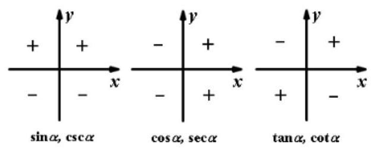
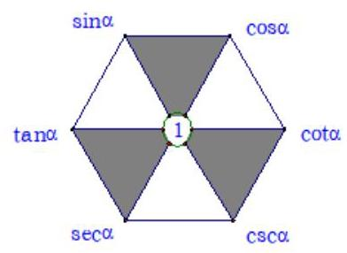
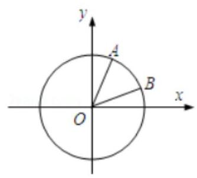
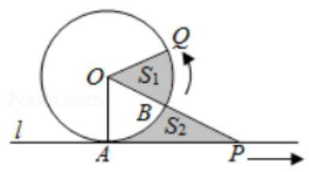
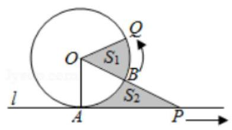

## 三角比与三角恒等变换

<table><tr><td>教学目标</td><td>1、理解象限角、轴线角有关概念，会进行弧度制与角度制的互化；掌握扇形弧长公式与面积公式;   2、掌握同角三角比的关系式;   3、熟练掌握每个象限三角比的符号; 熟练掌握诱导公式;   4、熟练掌握两角和与差的正弦、余弦、正切公式;   5、掌握二倍角、升幂、降幂、半角、万能公式。</td></tr><tr><td>重点</td><td>1、理解象限角、轴线角有关概念，会进行弧度制与角度制的互化; 掌握扇形弧长公式与面积公式;   2、掌握同角三角比的关系式;   3、熟练掌握每个象限三角比的符号；熟练掌握诱导公式；   4、熟练掌握两角和与差的正弦、余弦、正切公式;   5、掌握二倍角、升幂、降幂、半角、万能公式。</td></tr><tr><td>难 点</td><td>1、掌握两角和与差的正弦、余弦、正切公式;   2、掌握二倍角、升幂、降幂、半角、万能公式。</td></tr></table>

## (一) 任意角及三角比

## 知识梳理

1、角度制:圆周角 ${2\pi }$ 的 $\frac{1}{360}$ 为 1 度的角,这种用度做单位来度量角的单位制叫做角度制.

弧度制: 我们把弧长等于半径的弧所对的圆心角叫做 1 弧度的角, 用弧度做单位来度量角的单位制叫做弧度. 它的单位符号是 ${rad}A$ ，读作弧度.

角度制与弧度制的换算:

(1) ${360}^{ \circ  } = {2\pi }\mathrm{{rad}}$ ；

(2) ${1}^{ \circ  } = \frac{\pi }{180}\mathrm{{rad}} = {0.017453}\mathrm{{rad}}$ ； (3) $1\mathrm{{rad}} = {\left( \frac{180}{\pi }\right) }^{ \circ  } \approx  {57.30}^{ \circ  } = {57}^{ \circ  }{18}^{\prime }$

【不必强记公式,只要牢牢把握 ${180}^{ \circ  } = \pi$ 的关系即可】

2、扇形弧长公式: $l = \left| \alpha \right| r$ ，扇形面积公式: $S = \frac{1}{2}{lr} = \frac{1}{2}\alpha {r}^{2}$ .

3、在直角坐标系中，使角的顶点与坐标原点重合，角的始边与 $x$ 轴的正半轴重合，角的终边落在第几象限， 就说这个角是第几象限的角(或说这个角属于第几象限)；角的终边落在坐标轴上时，且不属于任何象限， 我们称它为轴线角.

4、终边相同的角: 两个角的始边重合,终边也重合时,称这两个角为终边相同的角,与 $\alpha$ 角终边相同的角的集合可记为 $\left\{  {\beta  \mid  \beta  = k \cdot  {360}^{ \circ  } + \alpha , k \in  \mathbf{Z}}\right\}$ .

注意: 终边相同的角不一定相等,它们之间相差 ${360}^{ \circ  }$ 的整数倍. 相等的角终边一定相同.

5、任意角 $\alpha$ 的三角比可以用其终边上的点的坐标来定义.

设 $P$ 是角 $\alpha$ 终边上任意一点 (点 $P$ 不能是角的顶点),它的坐标为 $\left( {x, y}\right)$ ,则 $P$ 到坐标原点 $O$ 的距离 $r = {OP} = \sqrt{{x}^{2} + {y}^{2}}$ ,定义正弦 $\sin \alpha  = \frac{y}{r}$ ,余弦 $\cos \alpha  = \frac{x}{r}$ ,正切 $\tan \alpha  = \frac{y}{x}$ ,余切 $\cot \alpha  = \frac{x}{y}$ ,正割 $\sec \alpha  = \frac{r}{x}$ ,余割 $\csc \alpha  = \frac{r}{y}$ .

当 $\alpha  = {k\pi } + \frac{\pi }{2}, k \in  \mathbf{Z}$ 时, $\tan \alpha ,\sec \alpha$ 无意义; 当 $\alpha  = {k\pi }, k \in  \mathbf{Z}$ 时, $\cot \alpha ,\csc \alpha$ 无意义.

6、三角函数的符号:

7、特殊角的三角函数值表:

<table><tr><td rowspan="2">$\alpha$   函数值函数</td><td>${0}^{ \circ  }$</td><td>${30}^{ \circ  }$</td><td>${45}^{ \circ  }$</td><td>${60}^{ \circ  }$</td><td>${90}^{ \circ  }$</td><td>180°</td><td>270°</td><td>360°</td></tr><tr><td>0</td><td>$\frac{\pi }{6}$</td><td>$\frac{\pi }{4}$</td><td>$\frac{\pi }{3}$</td><td>$\frac{\pi }{2}$</td><td>$\pi$</td><td>$\frac{3\pi }{2}$</td><td>${2\pi }$</td></tr><tr><td>$\sin \alpha$</td><td>0</td><td>1 2</td><td>$\frac{\sqrt{2}}{2}$</td><td>$\frac{\sqrt{3}}{2}$</td><td>1</td><td>0</td><td>-1</td><td>0</td></tr><tr><td>$\cos \alpha$</td><td>1</td><td>$\frac{\sqrt{3}}{2}$</td><td>$\frac{\sqrt{2}}{2}$</td><td>1 2</td><td>0</td><td>-1</td><td>0</td><td>1</td></tr><tr><td>$\tan \alpha$</td><td>0</td><td>$\frac{\sqrt{3}}{3}$</td><td>1</td><td>✓</td><td>不存在</td><td>0</td><td>不存在</td><td>0</td></tr><tr><td>$\cot \alpha$</td><td>不存在</td><td>$\sqrt{3}$</td><td>1</td><td>$\frac{\sqrt{3}}{3}$</td><td>0</td><td>不存在</td><td>0</td><td>不存在</td></tr></table>

## 例题精讲

【例 1】手表时针走过 1 小时, 时针转过的角度 ( )

A. 60° B. –60° C. 30° D. –30°

【难度】★★

【答案】 $D$

【解析】解: 由于时针顺时针旋转,故时针转过的角度为负数. $- \frac{1}{12} \times  {360}^{ \circ  } =  - {30}^{ \circ  }$ ,故选: $D$ .

【例 2】已知 $\alpha$ 锐角,那么 ${2\alpha }$ 是( )

A. 小于 ${180}^{ \circ  }$ 的正角 B. 第一象限角

C. 第二象限角 D. 第一或二象限角

【难度】★★

【答案】 $A$

【解析】解: $\because \alpha$ 锐角, $\therefore {0}^{ \circ  } < \alpha  < {90}^{ \circ  },\therefore {0}^{ \circ  } < {2\alpha } < {180}^{ \circ  }$ ,故选: $A$ .

【例 3】已知扇形的周长是 $6\mathrm{\;{cm}}$ ,面积是 $2{\mathrm{\;{cm}}}^{2}$ ,试求扇形的圆心角的弧度数(   )

A. 1 B. 4 C. 1 或 4 D. 1 或 2

【难度】★★

【答案】 $C$

【解析】解: 设扇形的圆心角为 $\alpha$ rad,半径为 $R\mathrm{\;{cm}}$ ,则 $\left\{  \begin{array}{l} {2R} + \alpha  \cdot  R = 6 \\  \frac{1}{2}{R}^{2} \cdot  \alpha  = 2 \end{array}\right.$ ,解得 $\alpha  = 1$ 或 $\alpha  = 4$ . 故选: $C$ .

【例 4】已知扇形的圆心角是 $\alpha$ ,半径为 $R$ ,弧长为 $l$ .

(1)若 $\alpha  = {75}^{ \circ  }$ ， $R = {12}\mathrm{\;{cm}}$ ，求扇形的弧长 $l$ 和面积；

(2)若扇形的周长为 ${20}\mathrm{\;{cm}}$ ，当扇形的圆心角 $\alpha$ 为多少弧度时，这个扇形的面积最大？

【难度】★★★

【答案】见解析

【解析】解: (1) $\alpha  = {75}^{ \circ  } = \frac{5\pi }{12}, l = {12} \times  \frac{5\pi }{12} = {5\pi }\left( \mathrm{\;{cm}}\right)$ . 所以 $S = \frac{1}{2}{lR} = {30\pi }\left( {\mathrm{\;{cm}}}^{2}\right)$

(2)由已知得， $l + {2R} = {20}$ ，所以 $S = \frac{1}{2}{lR} = \frac{1}{2}\left( {{20} - {2R}}\right) R = {10R} - {R}^{2} =  - {\left( R - 5\right) }^{2} + {25}$ ，

所以当 $R = 5$ 时, $S$ 取得最大值 25,此时 $l = {10}\left( \mathrm{\;{cm}}\right) ,\alpha  = 2\mathrm{\;{rad}}$ .

【例 5】( 1 )角 $\alpha$ 的终边上一点 $P\left( {a,{2a}}\right) \left( {a \neq  0}\right)$ ，则 $2\sin \alpha  - \cos \alpha  =$ ( )

A. $\frac{\sqrt{5}}{5}$ B. $- \frac{\sqrt{5}}{5}$ C. $\frac{\sqrt{5}}{5}$ 或 $- \frac{\sqrt{5}}{5}$ D. $\frac{3\sqrt{5}}{5}$ 或 $- \frac{3\sqrt{5}}{5}$

【难度】 $\bigstar \bigstar$

【答案】 $D$

【解析】解: $\because \alpha$ 的终边上一点 $P\left( {a,{2a}}\right) \left( {a \neq  0}\right)$ ,

当 $a > 0$ 时, $\cos \alpha  = \frac{a}{\sqrt{5} \cdot  a} = \frac{\sqrt{5}}{5},\sin \alpha  = \frac{2a}{\sqrt{5} \cdot  a} = \frac{2\sqrt{5}}{5},2\sin \alpha  - \cos \alpha  = \frac{3\sqrt{5}}{5}$ ;

当 $a < 0$ 时, $\cos \alpha  = \frac{a}{-\sqrt{5} \cdot  a} =  - \frac{\sqrt{5}}{5},\sin \alpha  = \frac{2a}{-\sqrt{5} \cdot  a} =  - \frac{2\sqrt{5}}{5},2\sin \alpha  - \cos \alpha  =  - \frac{3\sqrt{5}}{5}$ ,故选: $D$ .

(2)已知点 $P\left( {\sin \alpha ,\tan \alpha }\right)$ 在第二象限，角 $\alpha$ 顶点为坐标原点，始边为 $x$ 轴的非负半轴，则角 $\alpha$ 的终边落在 ( )

A. 第一象限 B. 第二象限 C. 第三象限 D. 第四象限

【难度】★★

【答案】 $C$

【解析】解: $\because$ 点 $P\left( {\sin \alpha ,\tan \alpha }\right)$ 在第二象限, $\therefore \sin \alpha  < 0,\tan \alpha  > 0$ ,若角 $\alpha$ 顶点为坐标原点,始边为 $x$ 轴的非负半轴,则 $\alpha$ 的终边落在第三象限,故选: $C$ .

(3)已知角 $\alpha$ 的顶点为坐标原点，始边与 $x$ 轴的非负半轴重合，终边上一点 $A\left( {2\sin \alpha ,3}\right)$ ，则 $\cos \alpha  =$ (   )

A. $\frac{1}{2}$ B. $- \frac{1}{2}$ C. $\frac{\sqrt{3}}{2}$ D. $- \frac{\sqrt{3}}{2}$

【难度】 $\star   \star$

【答案】 $A$

【解析】解: $\because$ 由题意可得: $x = 2\sin \alpha , y = 3$ ,可得: $r = \sqrt{4{\sin }^{2}\alpha  + 9}$ ,

$\therefore \cos \alpha  = \frac{x}{r} = \frac{2\sin \alpha }{\sqrt{4{\sin }^{2}\alpha  + 9}}$ ,可得: ${\cos }^{2}\alpha  = \frac{4{\sin }^{2}\alpha }{4{\sin }^{2}\alpha  + 9} = \frac{4\left( {1 - {\cos }^{2}\alpha }\right) }{4\left( {1 - {\cos }^{2}\alpha }\right)  + 9}$ ,整理可得: $4{\cos }^{4}\alpha  - {17}{\cos }^{2}\alpha  + 4 = 0$ ,

$\therefore$ 解得: ${\cos }^{2}\alpha  = \frac{1}{4}$ ,或 $\frac{33}{8}$ (舍去), $\therefore \cos \alpha  = \frac{1}{2}$ . 故选: $A$ .

【例 6】设点 $P$ 是以原点为圆心的单位圆上的一个动点,它从初始位置 ${P}_{0}\left( {0,1}\right)$ 出发,沿单位圆顺时针方向旋转角 $\theta \left( {0 < \theta  < \frac{\pi }{2}}\right)$ 后到达点 ${P}_{1}$ ,然后继续沿单位圆顺时针方向旋转角 $\frac{\pi }{3}$ 到达点 ${P}_{2}$ ,若点 ${P}_{2}$ 的纵坐标是 $- \frac{1}{2}$ , 则点 ${P}_{1}$ 的坐标是 ___.

【难度】 $\star   \star   \star$

【答案】 $\left( {\frac{\sqrt{3}}{2},\frac{1}{2}}\right)$

【解析】解: 初始位置 ${P}_{0}\left( {0,1}\right)$ 在 $\frac{\pi }{2}$ 的终边上, ${P}_{1}$ 所在射线对应的角为 $\frac{\pi }{2} - \theta ,{P}_{2}$ 所在射线对应的角为 $\frac{\pi }{6} - \theta$ , 由题意可知, $\sin \left( {\frac{\pi }{6} - \theta }\right)  =  - \frac{1}{2}$ ,又 $\frac{\pi }{6} - \theta  \in  \left( {-\frac{\pi }{3},\frac{\pi }{6}}\right)$ ,

则 $\frac{\pi }{6} - \theta  =  - \frac{\pi }{6}$ ,解得 $\theta  = \frac{\pi }{3},{P}_{1}$ 所在的射线对应的角为 $\frac{\pi }{2} - \theta  = \frac{\pi }{6}$ ,

由任意角的三角函数的定义可知,点 ${P}_{1}$ 的坐标是 $\left( {\cos \frac{\pi }{6},\sin \frac{\pi }{6}}\right)$ ,即 $\left( {\frac{\sqrt{3}}{2},\frac{1}{2}}\right)$ . 故答案为: $\left( {\frac{\sqrt{3}}{2},\frac{1}{2}}\right)$ .

巩固训练

1、与 ${2019}^{ \circ  }$ 终边相同的角是(   )

A. ${37}^{ \circ  }$ B. ${141}^{ \circ  }$ C. -37° D. $- {141}^{ \circ  }$

【难度】★★

【答案】 $D$

【解析】解: 终边相同的角相差了 ${360}^{ \circ  }$ 的整数倍,设与 ${2019}^{ \circ  }$ 角的终边相同的角是 $\alpha$ ,则 $\alpha  = {2019}^{ \circ  } + k \cdot  {360}^{ \circ  }$ , $k \in  Z,$

当 $k =  - 6$ 时, $\alpha  =  - {141}^{ \circ  }$ . 故选: $D$ .

2、下列说法正确的是( )

A. 小于 ${90}^{ \circ  }$ 的角是锐角 B. 钝角必是第二象限角, 第二象限角必是钝角

C. 第三象限的角大于第二象限的角 D. 角 $\alpha$ 与角 $\beta$ 的终边相同,角 $\alpha$ 与角 $\beta$ 可能不相等

【难度】★★

【答案】 $D$

【解析】解: 对于 $A$ ,小于 ${90}^{ \circ  }$ 的角可以是负角,负角不是锐角, $A$ 不正确.

对于 $B$ ,钝角是第二象限的角,正确, ${451}^{ \circ  }$ 角是第二象限角但不是钝角,

对于 $C$ ,如: ${480}^{ \circ  }$ 是第二象限角, ${210}^{ \circ  }$ 是第三象限角,显然判断是不正确的.

若角 $\alpha$ 与角 $\beta$ 的终边相同,那么 $\alpha  = \beta  + {2k\pi }, k \in  Z$ ,可得角 $\alpha$ 与角 $\beta$ 可能不相等, $D$ 正确. 故选: $D$ .

3、若扇形的周长为 $4\mathrm{\;{cm}}$ ，半径为 $1\mathrm{\;{cm}}$ ，则其圆心角的大小为(   )

A. ${2}^{ \circ  }$ B. ${4}^{ \circ  }$ C. 2 D. 4

【难度】★★

【答案】 $C$

【解析】解: 设扇形的周长为 $C$ ,弧长为 $l$ ,圆心角为 $\alpha$ ,根据题意可知周长 $C = 2 + l = 4,\therefore l = 2$ , 而 $l = \left| \alpha \right| r = \alpha  \times  1,\therefore \alpha  = 2$ ,故选: $C$ .

4、已知扇形 ${AOB}$ 的周长为 $8\mathrm{\;{cm}}$ .

(1)若这个扇形的面积为 $3{\mathrm{\;{cm}}}^{2}$ ，求扇形的半径；

(2)求这个扇形的面积取得最大值时圆心角的大小.

【难度】 $\star   \star   \star$

【答案】见解析

【解析】解: (1) 设扇形 ${AOB}$ 的半径为 $r$ ,圆心角为 $\alpha$ ,则周长为 $l = {2r} + {r\alpha } = 8$ ①; 扇形的面积为 $\frac{1}{2}\alpha {r}^{2} = 3$ ②,

由①②解得 $\left\{  \begin{array}{l} r = 1 \\  \alpha  = 6 \end{array}\right.$ 或 $\left\{  \begin{array}{l} r = 3 \\  \alpha  = \frac{2}{3} \end{array}\right.$ ， $\therefore$ 扇形的半径为 1 或 3 ;

(2)根据扇形的面积为 ${S}_{\text{ 扇形 }} = \frac{1}{2}a{r}^{2}$ ，周长为 ${2r} + {\alpha r} = 8$ ，得到 $r = \frac{8}{2 + \alpha }$ ，且 $0 < \alpha  < {2\pi }$ ； $\therefore {S}_{\text{ 扇形 }} = \frac{1}{2}\alpha  \cdot  {\left( \frac{8}{2 + \alpha }\right) }^{2} = \frac{32\alpha }{4 + {4\alpha } + {\alpha }^{2}} = \frac{32}{\alpha  + \frac{4}{\alpha } + 4}$ ,又 $\alpha  + \frac{4}{\alpha } \geq  2\sqrt{\alpha  \cdot  \frac{4}{\alpha }} = 4$ ,当且仅当 $\alpha  = 2$ 时,“ $=$ ”成立, 此时 ${S}_{\text{ 表形 }}$ 取得最大值为 $\frac{32}{4 + 4} = 4$ ,对应圆心角为 $\alpha  = 2$ .

5、角 $\alpha$ 的终边上一点 $P\left( {a,{2a}}\right) \left( {a \neq  0}\right)$ ，则 $2\sin \alpha  - \cos \alpha  =$ ( )

A. $\frac{\sqrt{5}}{5}$ B. $- \frac{\sqrt{5}}{5}$ C. $\frac{\sqrt{5}}{5}$ 或 $- \frac{\sqrt{5}}{5}$ D. $\frac{3\sqrt{5}}{5}$ 或 $- \frac{3\sqrt{5}}{5}$

【难度】★★

【答案】 $D$

【解析】解: $\because \alpha$ 的终边上一点 $P\left( {a,{2a}}\right) \left( {a \neq  0}\right)$ ,

当 $a > 0$ 时, $\cos \alpha  = \frac{a}{\sqrt{5} \cdot  a} = \frac{\sqrt{5}}{5},\sin \alpha  = \frac{2a}{\sqrt{5} \cdot  a} = \frac{2\sqrt{5}}{5},2\sin \alpha  - \cos \alpha  = \frac{3\sqrt{5}}{5}$ ;

当 $a < 0$ 时， $\cos \alpha  = \frac{a}{-\sqrt{5} \cdot  a} =  - \frac{\sqrt{5}}{5}$ ， $\sin \alpha  = \frac{2a}{-\sqrt{5} \cdot  a} =  - \frac{2\sqrt{5}}{5}$ ， $2\sin \alpha  - \cos \alpha  =  - \frac{3\sqrt{5}}{5}$ ，故选: $D$ .

6、若点 $\left( {\sin \frac{\pi }{6},\cos \frac{2\pi }{3}}\right)$ 在角 $\alpha$ 的终边上，则 $\tan \alpha$ 的值为( )

A. 1 B. -1 C. $\sqrt{3}$ D. $- \sqrt{3}$

【难度】★★

【答案】 $B$

【解析】解: $\because$ 点 $\left( {\sin \frac{\pi }{6},\cos \frac{2\pi }{3}}\right)$ 在角 $\alpha$ 的终边上,则 $\tan \alpha  = \frac{\cos \frac{2\pi }{3}}{\sin \frac{\pi }{6}} = \frac{-\frac{1}{2}}{\frac{1}{2}} =  - 1$ ,故选: $B$ .

## (二)同角三角比

## 知识梳理

1、同角三角比的 3 个关系:

(1)倒数关系: $\sin \alpha  \cdot  \csc \alpha  = 1;\cos \alpha  \cdot  \sec \alpha  = 1;\tan \alpha  \cdot  \cot \alpha  = 1$ ;

(2)商数关系: $\tan \alpha  = \frac{\sin \alpha }{\cos \alpha }\left( {\cos \alpha  \neq  0}\right)$ ; $\cot \alpha  = \frac{\cos \alpha }{\sin \alpha }\left( {\sin \alpha  \neq  0}\right)$ ;

(3)平方关系: ${\sin }^{2}\alpha  + {\cos }^{2}\alpha  = 1;1 + {\tan }^{2}\alpha  = {\sec }^{2}\alpha ;1 + {\cot }^{2}\alpha  = {\csc }^{2}\alpha$ .

## 2、这些关系式还可以如图样加强形象记忆:

(1)对角线上两个函数的乘积为 1(倒数关系)。

(2)任一角的函数等于与其相邻的两个函数的积(商数关系)。

(3)阴影部分，顶角两个函数的平方和等于底角函数的平方(平方关系)。

注意:1)“同角”的概念与角的表达形式无关，如: ${\sin }^{2}{3\alpha } + {\cos }^{2}{3\alpha } = 1,\frac{\sin \frac{\alpha }{2}}{\cos \frac{\alpha }{2}} = \tan \frac{\alpha }{2}$ 。

2)上述关系(公式)都必须在定义域允许的范围内成立。

3)由一个角的任一三角函数值可求出这个角的其余各三角函数值，且因为利用“平方关系”公式，最终需求平方根, 会出现两解, 因此应尽可能少用, 若使用时, 要注意讨论符号。

## 例题精讲

【例 7】已知 $\sin \theta  = \frac{4}{5},\frac{\pi }{2} < \theta  < \pi$

(1)求 $\tan \theta$ 的值；

(2)求 $\frac{\sin {2\theta } + 2\sin \theta \cos \theta }{3{\sin }^{2}\theta  + {\cos }^{2}\theta }$ 的值.

【难度】 $\star   \star$

【答案】见解析

【解析】解: (1) $\because \sin \theta  = \frac{4}{5},\frac{\pi }{2} < \theta  < \pi ,\therefore \cos \theta  =  - \sqrt{1 - {\sin }^{2}\theta } =  - \frac{3}{5},\therefore \tan \theta  = \frac{\sin \theta }{\cos \theta } =  - \frac{4}{3}$ .

(2) $\frac{\sin {2\theta } + 2\sin \theta \cos \theta }{3{\sin }^{2}\theta  + {\cos }^{2}\theta } = \frac{4\sin \theta \cos \theta }{3{\sin }^{2}\theta  + {\cos }^{2}\theta } = \frac{4\tan \theta }{3{\tan }^{2}\theta  + 1} =  - \frac{16}{19}$ .

【例 8】已知 $0 < \theta  < \pi$ ,且 $\sin \theta  + \cos \theta  = \frac{1}{5}$ ,求

(1) $\sin \theta  - \cos \theta$ 的值；

(2) $\tan \theta$ 的值.

【难度】★★

【答案】见解析

【解析】解: (1) $\because \sin \theta  + \cos \theta  = \frac{1}{5},$ ① $\therefore {\left( \sin \theta  + \cos \theta \right) }^{2} = \frac{1}{25}$ ,解得 $\sin \theta \cos \theta  =  - \frac{12}{25}$ .

$\because 0 < \theta  < \pi$ ,且 $\sin \theta \cos \theta  < 0,\therefore \sin \theta  > 0,\cos \theta  < 0,\therefore \sin \theta  - \cos \theta  > 0$ .

又 $\because {\left( \sin \theta  - \cos \theta \right) }^{2} = 1 - 2\sin \theta \cos \theta  = \frac{49}{25},\therefore \sin \theta  - \cos \theta  = \frac{7}{5}$ ②,

(2)由①② $\sin \theta  + \cos \theta  = \frac{1}{5},\sin \theta  - \cos \theta  = \frac{7}{5}$ . 解得 $\sin \theta  = \frac{4}{5},\cos \theta  =  - \frac{3}{5},\therefore \tan \theta  = \frac{\sin \theta }{\cos \theta } =  - \frac{4}{3}$ .

【例 9】若关于 $x$ 方程 $2{x}^{2} + \left( {\sqrt{3} - 1}\right) x + t = 0$ 的根分别为 $\sin \alpha ,\cos \alpha$ 且 $\alpha  \in  \left( {-\pi ,0}\right)$ ,求: $\frac{\sin \alpha \tan \alpha }{\tan \alpha  - 1} - \frac{\cos \alpha }{1 - \tan \alpha }$ 及 $t$ 的值.

【难度】 $\star   \star$

【答案】见解析

【解析】解: $\because$ 关于 $x$ 方程 $2{x}^{2} + \left( {\sqrt{3} - 1}\right) x + t = 0$ 的根分别为 $\sin \alpha ,\cos \alpha$ ,

故有 $\left\{  \begin{array}{l} \sin \alpha  + \cos \alpha  = \frac{1 - \sqrt{3}}{2} < 0 \\  \sin \alpha \cos \alpha  = \frac{t}{2} \end{array}\right.$ ,得 $t =  - \frac{\sqrt{3}}{2}.\because \alpha  \in  \left( {-\pi ,0}\right)$ ,可得 $\alpha  \in  \left( {-\frac{\pi }{2}, - \frac{\pi }{4}}\right)$ ,

$\therefore \frac{\sin \alpha \tan \alpha }{\tan \alpha  - 1} - \frac{\cos \alpha }{1 - \tan \alpha } = \frac{1}{\sin \alpha  - \cos \alpha } = 1 - \sqrt{3}$ .

【例 10】已知 $\alpha  \in  \left( {0,\frac{\pi }{2}}\right)$ ,且 $f\left( a\right)  = \cos \alpha  \cdot  \sqrt{\frac{1 - \sin \alpha }{1 + \sin \alpha }} + \sin \alpha  \cdot  \sqrt{\frac{1 - \cos \alpha }{1 + \cos \alpha }}$ .

(1)化简 $f\left( a\right)$ ；

(2)若 $f\left( a\right)  = \frac{3}{5}$ ，求 $\frac{\sin \alpha }{1 + \cos \alpha } + \frac{\cos \alpha }{1 + \sin \alpha }$ 的值.

【难度】 $\star   \star   \star$

【答案】见解析

【解析】解: (1) $\because \alpha  \in  \left( {0,\frac{\pi }{2}}\right) ,\therefore \sin \alpha  \in  \left( {0,1}\right) ,\cos \alpha  \in  \left( {0,1}\right)$ ,

$\therefore f\left( a\right)  = \cos \alpha  \cdot  \sqrt{\frac{1 - \sin \alpha }{1 + \sin \alpha }} + \sin \alpha  \cdot  \sqrt{\frac{1 - \cos \alpha }{1 + \cos \alpha }} = \cos \alpha  \cdot  \sqrt{\frac{{\left( 1 - \sin \alpha \right) }^{2}}{1 - {\sin }^{2}\alpha }} + \sin \alpha  \cdot  \sqrt{\frac{{\left( 1 - \cos \alpha \right) }^{2}}{1 - {\cos }^{2}\alpha }} = 1 - \sin \alpha  + 1 - \cos \alpha  = 2 - \sin \alpha  - \cos \alpha$ .

(2) $\because f\left( a\right)  = \frac{3}{5} = 2 - \sin \alpha  - \cos \alpha ,\therefore \sin \alpha  + \cos \alpha  = \frac{7}{5}$ ,

$\therefore$ 两边平方可得: $1 + 2\sin \alpha \cos \alpha  = \frac{49}{25}$ ,解得: $\sin \alpha \cos \alpha  = \frac{12}{25}$ , $\therefore \frac{\sin \alpha }{1 + \cos \alpha } + \frac{\cos \alpha }{1 + \sin \alpha } = \frac{\sin \alpha \left( {1 + \sin \alpha }\right)  + \cos \alpha \left( {1 + \cos \alpha }\right) }{\left( {1 + \cos \alpha }\right) \left( {1 + \sin \alpha }\right) } = \frac{1 + \sin \alpha  + \cos \alpha }{1 + \sin \alpha  + \cos \alpha  + \sin \alpha \cos \alpha } = \frac{1 + \frac{7}{5}}{1 + \frac{7}{5} + \frac{12}{25}} = \frac{5}{6}.$

## 巩固训练

1、(1)已知 $\cos b =  - \frac{3}{5}$ ，且 $b$ 为第二象限角，求 $\sin b$ 的值.

(2)已知 $\tan \alpha  = 2$ ，计算 $\frac{4\sin \alpha  - 2\cos \alpha }{5\cos \alpha  + 3\sin \alpha }$ 的值.

【难度】 $\star   \star$

【答案】见解析

【解析】解: (1) $\because \cos b =  - \frac{3}{5}$ ,且 $b$ 为第二象限角, $\therefore \sin b = \sqrt{1 - {\cos }^{2}b} = \frac{4}{5}$ ,

(2) $\because$ 已知 $\tan \alpha  = 2,\therefore \frac{4\sin \alpha  - 2\cos \alpha }{5\cos \alpha  + 3\sin \alpha } = \frac{4\tan \alpha  - 2}{5 + 3\tan \alpha } = \frac{4 \cdot  2 - 2}{5 + 3 \cdot  2} = \frac{6}{11}$ .

2、已知 $\sin \theta  + \cos \theta  = \frac{1}{5}$ .

(1)求 $\sin \theta  \cdot  \cos \theta$ 的值；

(2)当 $0 < \theta  < \pi$ 时，求 $\tan \theta$ 的值.

【难度】 $\star   \star$

【答案】见解析

【解析】解: (1) $\because$ 已知 $\sin \theta  + \cos \theta  = \frac{1}{5},\therefore 1 + 2\sin \theta \cos \theta  = \frac{1}{25}$ ,求得 $\sin \theta \cos \theta  =  - \frac{12}{25}$ .

(2)当 $0 < \theta  < \pi$ 时, $\because \sin \theta \cos \theta  =  - \frac{12}{25} < 0,\therefore \theta$ 为钝角，由 $\left\{  \begin{array}{l} \sin \theta  + \cos \theta  = \frac{1}{5} \\  \sin \theta \cos \theta  =  - \frac{12}{25} \end{array}\right.$ ,

求得 $\sin \theta  = \frac{4}{5},\cos \theta  = \frac{3}{5},\tan \theta  = \frac{\sin \theta }{\cos \theta } =  - \frac{4}{3}$ .

3、已知 $\sin \theta  = \frac{1 - a}{1 + a},\cos \theta  = \frac{{3a} - 1}{1 + a}$ ,若 $\theta$ 是第二象限角,求实数 $a$ 的值.

【难度】 $\star   \star   \star$

【答案】 $a = \frac{1}{9}$

【解析】解: 依题意得 $\left\{  \begin{array}{l} 0 < \frac{1 - a}{1 + a} < 1 \\   - 1 < \frac{{3a} - 1}{1 + a} < 0 \\  {\left( \frac{1 - a}{1 + a}\right) }^{2} + {\left( \frac{{3a} - 1}{1 + a}\right) }^{2} = 1. \end{array}\right.$ 解得 $a = \frac{1}{9}$ 或 $a = 1$ (舍去). 故实数 $a = \frac{1}{9}$ .

4、已知 $\sin \alpha \text{ 、 }\sin \beta$ 是方程 $8{x}^{2} - {6kx} + {2k} + 1 = 0$ 的两根,且 $\alpha \text{ 、 }\beta$ 终边互相垂直. 求 $k$ 的值.

【难度】 $\star   \star   \star$

【答案】见解析

【解析】解: 设 $\beta  = \alpha  + \frac{\pi }{2} + {k\pi }, k \in  Z$ ,则 $\sin \beta  =  \pm  \cos \alpha ,\because \sin \alpha \text{ 、 }\sin \beta$ 是方程 $8{x}^{2} - {6kx} + {2k} + 1 = 0$ 的两根,

$\therefore \left\{  \begin{array}{l} \Delta  = {\left( -6k\right) }^{2} - 4 \times  8\left( {{2k} + 1}\right)  \geq  0 \\  {x}_{1} + {x}_{2} = \sin \alpha  + \cos \alpha  = \frac{3}{4}k \\  {x}_{1} \cdot  {x}_{2} = \sin \alpha \cos \alpha  = \frac{{2k} + 1}{8} \\  {x}_{1}^{2} + {x}_{2}^{2} = {\sin }^{2}\alpha  + {\cos }^{2}\alpha  = 1 \end{array}\right.$ ,或 $\left\{  \begin{array}{l} \Delta  = {\left( -6k\right) }^{2} - 4 \times  8\left( {{2k} + 1}\right)  \geq  0 \\  {x}_{1} + {x}_{2} = \sin \alpha  - \cos \alpha  = \frac{3}{4}k \\  {x}_{1} \cdot  {x}_{2} =  - \sin \alpha \cos \alpha  = \frac{{2k} + 1}{8} \\  {x}_{1}^{2} + {x}_{2}^{2} = {\sin }^{2}\alpha  + {\cos }^{2}\alpha  = 1 \end{array}\right.$ 解得 $k =  - \frac{10}{9}$

5、已知角 $\alpha$ 的终边过点 $P\left( {1, - 3}\right)$ ,

( I ) 求 $\sin \alpha ,\cos \alpha ,\tan \alpha$ 的值

(II) 求 $\frac{\sin \alpha }{\cos \alpha \sqrt{1 + {\tan }^{2}\alpha }}$ 的值.

【难度】 $\star   \star   \star$

【答案】见解析

【解析】解: (1) $\because$ 角 $\alpha$ 的终边过点 $P\left( {1, - 3}\right) ,\therefore x = 1, y =  - 3, r = \left| {OP}\right|  = \sqrt{10}$ ,

$\therefore \sin \alpha  = \frac{y}{r} =  - \frac{3}{\sqrt{10}} =  - \frac{3\sqrt{10}}{10},\cos \alpha  = \frac{x}{r} = \frac{1}{\sqrt{10}} = \frac{\sqrt{10}}{10},\tan \alpha  = \frac{y}{x} =  - 3$ .

(II) 由 (I) 可得 $\frac{\sin \alpha }{\cos \alpha \sqrt{1 + {\tan }^{2}\alpha }} = \frac{\tan \alpha }{\sqrt{1 + {\tan }^{2}\alpha }} = \frac{-3}{\sqrt{1 + 9}} =  - \frac{3\sqrt{10}}{10}$ .

## (三)诱导公式

## 知识梳理

1、诱导公式

(1)第一组: $\sin \left( {{2k\pi } + \alpha }\right)  = \sin \alpha , k \in  \mathbf{Z}$ ; $\cos \left( {{2k\pi } + \alpha }\right)  = \cos \alpha , k \in  \mathbf{Z}$ ;

$\tan \left( {{2k\pi } + \alpha }\right)  = \tan \alpha , k \in  \mathbf{Z};\cot \left( {{2k\pi } + \alpha }\right)  = \cot \alpha , k \in  \mathbf{Z}$ .

(2)第二组: $\sin \left( {-\alpha }\right)  =  - \sin \alpha ;\cos \left( {-\alpha }\right)  = \cos \alpha ;\tan \left( {-\alpha }\right)  =  - \tan \alpha ;\cot \left( {-\alpha }\right)  =  - \cot \alpha$ .

(3)第三组: $\sin \left( {\pi  + \alpha }\right)  =  - \sin \alpha$ ; $\cos \left( {\pi  + \alpha }\right)  =  - \cos \alpha$ ; $\tan \left( {\pi  + \alpha }\right)  = \tan \alpha$ ; $\cot \left( {\pi  + \alpha }\right)  = \cot \alpha$ .

(4)第四组: $\sin \left( {\pi  - \alpha }\right)  = \sin \alpha ;\cos \left( {\pi  - \alpha }\right)  =  - \cos \alpha ;\tan \left( {\pi  - \alpha }\right)  =  - \tan \alpha ;\cot \left( {\pi  - \alpha }\right)  =  - \cot \alpha$

(5) 第五组: $\sin \left( {\frac{\pi }{2} - \alpha }\right)  = \cos \alpha ;\cos \left( {\frac{\pi }{2} - \alpha }\right)  = \sin \alpha ;\tan \left( {\frac{\pi }{2} - \alpha }\right)  = \cot \alpha ;\cot \left( {\frac{\pi }{2} - \alpha }\right)  = \tan \alpha$ .

(6) 第六组: $\sin \left( {\frac{\pi }{2} + \alpha }\right)  = \cos \alpha ;\cos \left( {\frac{\pi }{2} + \alpha }\right)  =  - \sin \alpha ;\tan \left( {\frac{\pi }{2} + \alpha }\right)  =  - \cot \alpha ;\cot \left( {\frac{\pi }{2} + \alpha }\right)  =  - \tan \alpha$ .

## 2、记忆技巧:奇变偶不变，符号看象限

$\frac{\pi }{2}$ 的 “奇” 数倍加、减 $\alpha$ 化成 $\alpha$ 的三角比时,函数名称要 “变”。

【正弦(切)的变为余弦(切)，余弦(切)的变为正弦(切)】

$\frac{\pi }{2}$ 的 “偶” 数倍加、减 $\alpha$ 化成 $\alpha$ 的三角比时,函数名称 “不变”.

然后按 “符号看象限” 的规定，前面加上一个把 $\alpha$ 看成锐角时，原函数在相应象限内的符号.

这个方法可以概括为: “奇变偶不变, 符号看象限”.

## 例题精讲

【例 11】设 $\cos {2019}^{ \circ  } = a$ ,则(   )

A. $a \in  \left( {-\frac{\sqrt{3}}{2}, - \frac{\sqrt{2}}{2}}\right) \;$ B. $a \in  \left( {-\frac{\sqrt{2}}{2}, - \frac{1}{2}}\right) \;$ C. $a \in  \left( {\frac{1}{2},\frac{\sqrt{2}}{2}}\right) \;$ D. $a \in  \left( {\frac{\sqrt{2}}{2},\frac{\sqrt{3}}{2}}\right)$

【难度】 $\star   \star$

【答案】 $A$

【解析】解: $\because {39}^{ \circ  } \in  \left( {{30}^{ \circ  },{45}^{ \circ  }}\right) ,\therefore \cos {39}^{ \circ  } \in  \left( {\frac{\sqrt{2}}{2},\frac{\sqrt{3}}{2}}\right)$ ,可得: $- \cos {39}^{ \circ  } \in  \left( {-\frac{\sqrt{3}}{2}, - \frac{\sqrt{2}}{2}}\right)$ , $\therefore a = \cos {2019}^{ \circ  } = \cos \left( {{360}^{ \circ  } \times  5 + {180}^{ \circ  } + {39}^{ \circ  }}\right)  =  - \cos {39}^{ \circ  } \in  \left( {-\frac{\sqrt{3}}{2}, - \frac{\sqrt{2}}{2}}\right)$ . 故选: $A$ .

【例 12】已知 $f\left( \alpha \right)  = \frac{\sin \left( {\pi  - \alpha }\right) \cos \left( {{2\pi } - \alpha }\right) \sin \left( {-\alpha  + \frac{3\pi }{2}}\right) }{\cos \left( {-\pi  - \alpha }\right) \cos \left( {-\alpha  + \frac{3\pi }{2}}\right) }$

(1)化简 $f\left( \alpha \right)$ ；

(2)若 $\alpha$ 是第三象限角，且 $\cos \left( {\alpha  - \frac{3\pi }{2}}\right)  = \frac{1}{5}$ ，求 $f\left( \alpha \right)$ 的值.

【难度】 $\star   \star   \star$

【答案】见解析

【解析】解: (1) $f\left( \alpha \right)  = \frac{\sin \left( {\pi  - \alpha }\right) \cos \left( {{2\pi } - \alpha }\right) \sin \left( {-\alpha  + \frac{3\pi }{2}}\right) }{\cos \left( {-\pi  - \alpha }\right) \cos \left( {-\alpha  + \frac{3\pi }{2}}\right) } = \frac{\sin \alpha \cos \alpha \sin \left( {\alpha  - \frac{\pi }{2}}\right) }{\cos \alpha \cos \left( {\alpha  - \frac{\pi }{2}}\right) } = \sin \alpha \frac{-\cos \alpha }{\sin \alpha } =  - \cos \alpha$ ;

(2) $\because \cos \left( {\alpha  - \frac{3\pi }{2}}\right)  = \cos \left( {\alpha  + \frac{\pi }{2}}\right)  =  - \sin \alpha  = \frac{1}{5},\therefore \sin \alpha  =  - \frac{1}{5}$ 又 $\alpha$ 是第三象限角，则

$\cos \alpha  =  - \sqrt{1 - {\sin }^{2}\alpha } =  - \frac{2\sqrt{6}}{5},\therefore f\left( \alpha \right)  = \frac{2\sqrt{6}}{5}$ .

【例 13】(1) 化简 $\frac{\sin \left\lbrack  {\alpha  + \left( {{2n} + 1}\right) \pi }\right\rbrack   + \sin \left\lbrack  {\alpha  - \left( {{2n} + 1}\right) \pi }\right\rbrack  }{\sin \left( {\alpha  + {2n\pi }}\right)  \cdot  \cos \left( {\alpha  - {2n\pi }}\right) }\left( {n \in  Z}\right)$ .

【难度】 $\star   \star   \star$

【答案】见解析

【解析】原式 $= \frac{-\sin \alpha  - \sin \alpha }{\sin \alpha \cos \alpha } = \frac{-2\sin \alpha }{\sin \alpha \cos \alpha } =  - \frac{2}{\cos \alpha }$ .

(2) $\bigtriangleup  {ABC}$ 中，若 $\sin \frac{A}{2} = \sin \frac{B + C}{2}$ ，则 $\bigtriangleup  {ABC}$ 形状是___.

【难度】 $\star   \star   \star$

【答案】直角三角形

【解析】解: $\because A + B + C = \pi ,\therefore \frac{A}{2} = \frac{\pi }{2} - \frac{B + C}{2},\therefore \sin \frac{A}{2} = \sin \left( {\frac{\pi }{2} - \frac{B + C}{2}}\right)  = \cos \frac{B + C}{2} = \sin \frac{B + C}{2}$ ,即 $\tan \frac{B + C}{2} = 1,$

$\therefore \frac{B + C}{2} = \frac{\pi }{4}$ ,即 $A = B + C = \frac{\pi }{2}$ ,则 $\bigtriangleup {ABC}$ 为直角三角形. 故答案为: 直角三角形

(3)若 $\sin \left( {\frac{\pi }{6} - \alpha }\right)  = a$ ，则 $\sin \left( {\frac{5\pi }{6} + \alpha }\right)  =$ ___.

【难度】 $\star   \star   \star$

【答案】 $a$

【解析】解: 因为 $\sin \left( {\frac{5\pi }{6} + \alpha }\right)  = \sin \left( {\pi  - \frac{5\pi }{6} - \alpha }\right)  = \sin \left( {\frac{\pi }{6} - \alpha }\right)  = a$ . 故答案为: $a$ .

【例 14】已知 $A, B, C$ 为 $\bigtriangleup {ABC}$ 的三个内角,求证:

(1) $\sin \left( {A + B}\right)  = \sin C$ ；

(2) $\cos \frac{A + B}{2} = \sin \frac{C}{2}$ .

(3) $\cos \left( {\frac{\pi }{4} - \frac{A}{2}}\right)  = \sin \left( {\frac{\pi }{4} + \frac{A}{2}}\right)$ .

【难度】 $\star   \star   \star$

【答案】见解析

【解析】证明: (1) 在 ${\Delta BAC}$ 中, $A + B = \pi  - C,\therefore \sin \left( {A + B}\right)  = \sin \left( {\pi  - C}\right)  = \sin C$

(2)在 $\bigtriangleup {BAC}$ 中， $A + B = \pi  - C$ ， $\therefore \cos \frac{A + B}{2} = \cos \frac{\pi  - C}{2} = \cos \left( {\frac{\pi }{2} - \frac{C}{2}}\right)  = \sin \frac{C}{2}$ ，

(3) $\cos \left( {\frac{\pi }{4} - \frac{A}{2}}\right)  = \sin \left\lbrack  {\frac{\pi }{2} - \left( {\frac{\pi }{4} - \frac{A}{2}}\right) }\right\rbrack   = \sin \left( {\frac{\pi }{4} + \frac{A}{2}}\right)$ .

## 巩固训练

1、化简: $\frac{\sin \left( {\pi  - \alpha }\right) \sin \left( {{3\pi } - \alpha }\right)  + \sin \left( {-\alpha  - \pi }\right) \sin \left( {\alpha  - {2\pi }}\right) }{\sin \left( {{4\pi } - \alpha }\right) \sin \left( {{5\pi } + \alpha }\right) }$ .

【难度】 $\star   \star   \star$

【答案】 2

【解析】解: $\frac{\sin \left( {\pi  - \alpha }\right) \sin \left( {{3\pi } - \alpha }\right)  + \sin \left( {-\alpha  - \pi }\right) \sin \left( {\alpha  - {2\pi }}\right) }{\sin \left( {{4\pi } - \alpha }\right) \sin \left( {{5\pi } + \alpha }\right) } = \frac{\sin \alpha  \cdot  \sin \alpha  + \sin \alpha  \cdot  \sin \alpha }{-\sin \alpha  \cdot  \left( {-\sin \alpha }\right) } = 2$ .

2、已知 $\sin \left( {\pi  + \alpha }\right)  =  - \frac{1}{2}$ ,计算:

(1) $\sin \left( {{5\pi } - \alpha }\right)$ ; (2) $\sin \left( {\frac{\pi }{2} + \alpha }\right)$ ；

(3) $\cos \left( {\alpha  - \frac{3\pi }{2}}\right)$ ； (4) $\tan \left( {\frac{\pi }{2} - \alpha }\right)$ .

【难度】 $\star   \star$

【答案】见解析

【解析】解: 因为 $\sin \left( {\pi  + \alpha }\right)  =  - \frac{1}{2}$ ,所以 $- \sin \alpha  =  - \frac{1}{2}$ ,即 $\sin \alpha  = \frac{1}{2}$ ,

(1) $\sin \left( {{5\pi } - \alpha }\right)  = \sin \left( {\pi  - \alpha }\right)  = \sin \alpha  = \frac{1}{2}$ ; (2) $\sin \left( {\frac{\pi }{2} + \alpha }\right)  = \cos \alpha  =  \pm  \sqrt{1 - {\sin }^{2}\alpha } =  \pm  \frac{\sqrt{3}}{2}$ ;

(3) $\cos \left( {\alpha  - \frac{3\pi }{2}}\right)  = \cos \left( {\frac{\pi }{2} + \alpha }\right)  =  - \sin \alpha  =  - \frac{1}{2}$ ;

(4) $\tan \left( {\frac{\pi }{2} - \alpha }\right)  = \frac{\sin \left( {\frac{\pi }{2} - \alpha }\right) }{\cos \left( {\frac{\pi }{2} - \alpha }\right) } = \frac{\cos \alpha }{\sin \alpha } =  \pm  \sqrt{3}$ .

3、已知: $f\left( \alpha \right)  = \frac{\sin \left( {\frac{\pi }{2} - \alpha }\right)  \cdot  \cos \left( {\frac{3\pi }{2} - \alpha }\right)  \cdot  \tan \left( {{5\pi } + \alpha }\right) }{\tan \left( {-\alpha  - \pi }\right)  \cdot  \sin \left( {\alpha  - {3\pi }}\right) }$

(1)化简 $f\left( \alpha \right)$ ；

(2)若 $\cos \left( {\alpha  - \frac{3\pi }{2}}\right)  = \frac{1}{5},\alpha$ 为第四象限的角，求 $f\left( \alpha \right)$ 的值.

【难度】 $\star   \star   \star$

【答案】见解析

【解析】解: (1) 由诱导公式可得:

$f\left( \alpha \right)  = \frac{\sin \left( {\frac{\pi }{2} - \alpha }\right)  \cdot  \cos \left( {\frac{3\pi }{2} - \alpha }\right)  \cdot  \tan \left( {{5\pi } + \alpha }\right) }{\tan \left( {-\alpha  - \pi }\right)  \cdot  \sin \left( {\alpha  - {3\pi }}\right) } = \frac{\cos \alpha \left( {-\sin \alpha }\right) \tan \alpha }{-\tan \alpha \left( {-\sin \alpha }\right) } = \frac{-{\sin }^{2}\alpha }{\frac{{\sin }^{2}\alpha }{\cos \alpha }} =  - \cos \alpha ;$

( 2 )由 $\cos \left( {\alpha  - \frac{3\pi }{2}}\right)  = \frac{1}{5}$ 可得 $\sin \alpha  =  - \frac{1}{5}$ ，又 $\alpha$ 为第四象限的角，

由同角三角函数的关系式可得 $\cos \alpha  = \sqrt{1 - {\left( -\frac{1}{5}\right) }^{2}} = \frac{2\sqrt{6}}{5}$ ，由( 1 )可知 $f\left( \alpha \right)  =  - \cos \alpha  =  - \frac{2\sqrt{6}}{5}$

4、已知 $A, B, C$ 为 ${\Delta ABC}$ 的三个内角,求证: $\cos \left( {\frac{\pi }{4} - \frac{A}{2}}\right)  = \sin \left( {\frac{\pi }{4} + \frac{A}{2}}\right)  = \cos \left( {\frac{\pi }{4} - \frac{B + C}{2}}\right)$ .

【难度】 $\star   \star   \star$

【答案】见解析

【解析】证明: $\because A, B, C$ 为 $\bigtriangleup {ABC}$ 的三个内角,

$\therefore A + B + C = \pi$ ,即 $\frac{A}{2} = \frac{\pi }{2} - \frac{B + C}{2}$ ,

$\therefore \cos \left( {\frac{\pi }{4} - \frac{A}{2}}\right)  = \cos \left\lbrack  {\frac{\pi }{2} - \left( {\frac{\pi }{4} + \frac{A}{2}}\right) }\right\rbrack   = \sin \left( {\frac{\pi }{4} + \frac{A}{2}}\right)  = \sin \left\lbrack  {\frac{\pi }{2} + \left( {\frac{\pi }{4} - \frac{B + C}{2}}\right) }\right\rbrack   = \cos \left( {\frac{\pi }{4} - \frac{B + C}{2}}\right)$ ,

则 $\cos \left( {\frac{\pi }{4} - \frac{A}{2}}\right)  = \sin \left( {\frac{\pi }{4} + \frac{A}{2}}\right)  = \cos \left( {\frac{\pi }{4} - \frac{B + C}{2}}\right)$ .

## (四) 两角和差公式以及辅助角公式

## 知识梳理

1、两角差的余弦、正弦和正切

$\cos \left( {\alpha  - \beta }\right)  = \cos \alpha \cos \beta  + \sin \alpha \sin \beta \; \sin \left( {\alpha  - \beta }\right)  = \sin \alpha \cos \beta  - \cos \alpha \sin \beta$

$\tan \left( {\alpha  - \beta }\right)  = \frac{\tan \alpha  - \tan \beta }{1 + \tan \alpha \tan \beta }$

2、两角和的余弦、正弦和正切

$\cos \left( {\alpha  + \beta }\right)  = \cos \alpha \cos \beta  - \sin \alpha \sin \beta$

$\tan \left( {\alpha  + \beta }\right)  = \frac{\tan \alpha  + \tan \beta }{1 - \tan \alpha \tan \beta }$

3、 $f\left( x\right)  = a\sin {\omega x} + b\cos {\omega x} = \sqrt{{a}^{2} + {b}^{2}}\sin \left( {{\omega x} + \theta }\right)$

(其中 $\theta$ 角所在的象限由 $a, b$ 的符号确定, $\theta$ 角的值由 $\tan \theta  = \frac{b}{a}$ 确定) 在求最值、化简时起着重要作用。

## 例题精讲

【例 15】( 1 )计算 $\sin {47}^{ \circ  }\cos {17}^{ \circ  } - \cos {47}^{ \circ  }\sin {17}^{ \circ  }$ 的结果为___.

【难度】★★

【答案】 $\frac{1}{2}$

【解析】解: $\sin {47}^{ \circ  }\cos {17}^{ \circ  } - \cos {47}^{ \circ  }\sin {17}^{ \circ  } = \sin \left( {{47}^{ \circ  } - {17}^{ \circ  }}\right)  = \sin {30}^{ \circ  } = \frac{1}{2}$ . 故答案为: $\frac{1}{2}$ .

(2) $\cos {346}^{ \circ  } \cdot  \cos {419}^{ \circ  } + \sin {14}^{ \circ  } \cdot  \sin {121}^{ \circ  } =$ ___.

【难度】★★

【答案】 $\frac{\sqrt{2}}{2}$

【解析】解: $\cos {346}^{ \circ  } \cdot  \cos {419}^{ \circ  } + \sin {14}^{ \circ  } \cdot  \sin {121}^{ \circ  } = \cos \left( {{360}^{ \circ  } - {14}^{ \circ  }}\right)  \cdot  \cos \left( {{360}^{ \circ  } + {59}^{ \circ  }}\right)  + \sin {14}^{ \circ  } \cdot  \sin \left( {{180}^{ \circ  } - {59}^{ \circ  }}\right) \; = \cos {14}^{ \circ  } \cdot  \cos {59}^{ \circ  } + \sin {14}^{ \circ  } \cdot  \sin {59}^{ \circ  } = \cos \left( {{14}^{ \circ  } - {59}^{ \circ  }}\right)  = \cos \left( {-{45}^{ \circ  }}\right)  = \cos {45} = \frac{\sqrt{2}}{2}$ ,故答案为: $\frac{\sqrt{2}}{2}$ .

(3) $\tan {23}^{ \circ  } + \tan {22}^{ \circ  } + \tan {23}^{ \circ  }\tan {22}^{ \circ  } =$ ___.

【难度】 $\star   \star   \star$

【答案】 1

【解析】解: $\because {23}^{ \circ  } + {22}^{ \circ  } = {45}^{ \circ  },\tan {45}^{ \circ  } = 1,\therefore \tan \left( {{23}^{ \circ  } + {23}^{ \circ  }}\right)  = \frac{\tan {23}^{ \circ  } + \tan {22}^{ \circ  }}{1 - \tan {23}^{ \circ  }\tan {22}^{ \circ  }} = 1$ ,

去分母整理,得 $\tan {23}^{ \circ  } + \tan {23}^{ \circ  } = 1 - \tan {23}^{ \circ  }\tan {22}^{ \circ  },\therefore$ 原式 $= 1 - \tan {23}^{ \circ  }\tan {22}^{ \circ  } + \tan {23}^{ \circ  }\tan {22}^{ \circ  } = 1$ . 故答案为: 1.

【例 16】( 1 )已知 $\alpha ,\beta$ 均为锐角，且 $\sin \alpha  = \frac{\sqrt{5}}{5},\cos \beta  = \frac{\sqrt{10}}{10}$ ，则 $\alpha  - \beta$ 的值为___.

【难度】 $\star   \star   \star$

【答案】 $- \frac{\pi }{4}$

【解析】解: 已知 $\alpha ,\beta$ 均为锐角,且 $\sin \alpha  = \frac{\sqrt{5}}{5},\cos \beta  = \frac{\sqrt{10}}{10}$ ,则 $\cos \alpha  = \frac{2\sqrt{5}}{5},\sin \beta  = \frac{3\sqrt{10}}{10}$ ,

所以: $\frac{\pi }{2} > \beta  > \alpha  > 0$ ,所以: $- \frac{\pi }{2} < \alpha  - \beta  < 0$ ,故: $\cos \left( {\alpha  - \beta }\right)  = \cos \alpha \cos \beta  + \sin \alpha \sin \beta  = \frac{{10}\sqrt{2}}{50} + \frac{{15}\sqrt{2}}{50} = \frac{\sqrt{2}}{2}$ ,

所以: $\alpha  - \beta  =  - \frac{\pi }{4}$ . 故答案为: $- \frac{\pi }{4}$

(2)设角 $\alpha$ 、 $\beta$ 是锐角，若 $\left( {1 + \tan \alpha }\right) \left( {1 + \tan \beta }\right)  = 2$ ，则 $\alpha  + \beta  =$ ___.

【难度】 $\star   \star$

【答案】 $\frac{\pi }{4}$

【解析】解: $\because \left( {1 + \tan \alpha }\right) \left( {1 + \tan \beta }\right)  = 2,\therefore 1 + \tan \alpha  + \tan \beta  + \tan \alpha \tan \beta  = 2$ , $\therefore \tan \left( {\alpha  + \beta }\right) \left( {1 - \tan \alpha \tan \beta }\right)  + \tan \alpha \tan \beta  = 1\therefore \tan \left( {\alpha  + \beta }\right)  = 1,\because \alpha ,\beta$ 都是锐角, $\therefore 0 < \alpha  + \beta  < \pi ,\therefore \alpha  + \beta  = \frac{\pi }{4}$ , 故答案为: $\frac{\pi }{4}$ .

【例 17】(1)若 $2\sin \alpha  - 3\cos \beta  =  - \frac{6}{5},2\cos \alpha  - 3\sin \beta  =  - \frac{1}{5}$ ，则 $\sin \left( {\alpha  + \beta }\right)  =$ ___.

【难度】 $\star   \star   \star$

【答案】 $\frac{24}{25}$

【解析】解: 若 $2\sin \alpha  - 3\cos \beta  =  - \frac{6}{5},2\cos \alpha  - 3\sin \beta  =  - \frac{1}{5}$ ,

则 $4{\sin }^{2}\alpha  + 9{\cos }^{2}\beta  - {12}\sin \alpha \cos \beta  = \frac{36}{25}$ ①,

$4{\cos }^{2}\alpha  + 9{\sin }^{2}\beta  - {12}\cos \alpha \sin \beta  = \frac{1}{25}$ ②,

① + ②可得 $4 + 9 - {12}\sin \left( {\alpha  + \beta }\right)  = \frac{37}{25}$ ，求得 $\sin \left( {\alpha  + \beta }\right)  = \frac{24}{25}$ ，故答案为: $\frac{24}{25}$ .

(2) $\cos \left( {{2\alpha } - \beta }\right)  =  - \frac{1}{9},\sin \left( {\alpha  - {2\beta }}\right)  = \frac{2}{3}$ ，且 $\alpha$ ， $\beta  \in  \left( {0,\frac{\pi }{2}}\right)$ ，则 $\cos \left( {\alpha  + \beta }\right)  =$ ___.

【难度】 $\star   \star   \star$

【答案】 $\frac{7\sqrt{5}}{27}$

【解析】解: $\because \alpha ,\beta  \in  \left( {0,\frac{\pi }{2}}\right) ,\therefore {2\alpha } - \beta  \in  \left( {-\frac{\pi }{2},\pi }\right) ,\alpha  - {2\beta } \in  \left( {-\pi ,\frac{\pi }{2}}\right)$ ,又 $\cos \left( {{2\alpha } - \beta }\right)  =  - \frac{1}{9}$ ,

$\therefore {2\alpha } - \beta  \in  \left( {\frac{\pi }{2},\pi }\right) ,\therefore \sin \left( {{2\alpha } - \beta }\right)  = \frac{4\sqrt{5}}{9},\sin \left( {\alpha  - {2\beta }}\right)  = \frac{2}{3},\therefore \alpha  - {2\beta } \in  \left( {0,\frac{\pi }{2}}\right)$ ,

$\therefore \cos \left( {\alpha  - {2\beta }}\right)  = \frac{\sqrt{5}}{3}$ .

$\therefore \cos \left( {\alpha  + \beta }\right)  = \cos \left\lbrack  {\left( {{2\alpha } - \beta }\right)  - \left( {\alpha  - {2\beta }}\right) }\right\rbrack   = \cos \left( {{2\alpha } - \beta }\right) \cos \left( {\alpha  - {2\beta }}\right)  + \sin \left( {{2\alpha } - \beta }\right) \sin \left( {\alpha  - {2\beta }}\right)$

$=  - \frac{1}{9} \times  \frac{\sqrt{5}}{3} + \frac{4\sqrt{5}}{9} \times  \frac{2}{3} = \frac{7\sqrt{5}}{27}$ . 故答案为: $\frac{7\sqrt{5}}{27}$ .

(3)若锐角 $\alpha ,\beta$ ，满足如 $\sin \alpha  = \frac{4}{5},\tan \left( {\alpha  - \beta }\right)  = \frac{1}{7}$ ，则 $\tan \beta  =$ ___.

【难度】 $\star   \star   \star$

【答案】 1

【解析】解: $\because$ 锐角 $\alpha ,\beta$ ,满足如 $\sin \alpha  = \frac{4}{5},\therefore \cos \alpha  = \sqrt{1 - {\sin }^{2}\alpha } = \frac{3}{5},\therefore \tan \alpha  = \frac{\sin \alpha }{\cos \alpha } = \frac{4}{3}$ ,

$\because \tan \left( {\alpha  - \beta }\right)  = \frac{1}{7},\therefore \tan \beta  = \tan \left\lbrack  {\alpha  - \left( {\alpha  - \beta }\right) }\right\rbrack   = \frac{\tan \alpha  - \tan \left( {\alpha  - \beta }\right) }{1 + \tan \alpha  \cdot  \tan \left( {\alpha  - \beta }\right) } = 1$ ,故答案为: 1 .

(4)已知 $\sin \theta  + \cos \theta  = \frac{2\sqrt{10}}{5}$ ，则 $\tan \left( {\theta  + \frac{\pi }{4}}\right)  =$ ___.

【难度】 $\star   \star   \star$

【答案】 $\pm  2$

【解析】解: $\because \sin \theta  + \cos \theta  = \sqrt{2}\sin \left( {\theta  + \frac{\pi }{4}}\right)  = \frac{2\sqrt{10}}{5},\therefore \sin \left( {\theta  + \frac{\pi }{4}}\right)  = \frac{2\sqrt{5}}{5}$ ,

$\therefore \cos \left( {\theta  + \frac{\pi }{4}}\right)  = \sqrt{1 - {\sin }^{2}\left( {\theta  + \frac{\pi }{4}}\right) } =  \pm  \frac{\sqrt{5}}{5},\therefore \tan \left( {\theta  + \frac{\pi }{4}}\right)  = \frac{\sin \left( {\theta  + \frac{\pi }{4}}\right) }{\cos \left( {\theta  + \frac{\pi }{4}}\right) } =  \pm  2$ ,故答案为: $\pm  2$ .

【例 18】( 1 )若函数 $y = a\sin x + b\cos x$ (其中 $a, b \in  \mathbf{R}$ ，且 $a, b > 0$ )可化为 $y = \sqrt{{a}^{2} + {b}^{2}}\cos \left( {x - \varphi }\right)$ ， 则 $\varphi$ 应满足条件 ( )

A. $\tan \varphi  = \frac{b}{a}$ B. $\cos \varphi  = \frac{a}{\sqrt{{a}^{2} + {b}^{2}}}$ C. $\tan \varphi  = \frac{a}{b}$ D. $\sin \varphi  = \frac{b}{\sqrt{{a}^{2} + {b}^{2}}}$

【难度】 $\star   \star$

【答案】C

【解析】 $y = a\sin x + b\cos x = \sqrt{{a}^{2} + {b}^{2}}\left( {\frac{a}{\sqrt{{a}^{2} + {b}^{2}}}\sin x + \frac{b}{\sqrt{{a}^{2} + {b}^{2}}}\cos x}\right) \; = \sqrt{{a}^{2} + {b}^{2}}\sin \left( {x + \theta }\right)$ ,其中 $\tan \theta  = \frac{b}{a}$ ,

$\because$ 函数 $y = a\sin x + b\cos x$ (其中 $a, b \in  \mathbf{R}$ ,且 $a, b > 0$ ) 可化为 $y = \sqrt{{a}^{2} + {b}^{2}}\cos \left( {x - \varphi }\right)$ ,

$\therefore \sin \left( {x + \theta }\right)  = \cos \left( {x - \varphi }\right)$ ,即 $\sin \left( {x + \theta }\right)  = \sin \left( {\frac{\pi }{2} + x - \varphi }\right) ,\therefore \frac{\pi }{2} - \varphi  = \theta  + {2\pi k}\left( {k \in  Z}\right)$ ,

$\therefore \tan \left( {\frac{\pi }{2} - \varphi }\right)  = \tan \left( {\theta  + {2\pi k}}\right)$ ,即 $\cot \varphi  = \tan \theta ,\therefore \tan \varphi  = \frac{1}{\tan \theta } = \frac{a}{b}$ ,

故选: C.

(2)化下列各式为 $A\sin \left( {{\omega x} + \varphi }\right) \left( {A > 0,\omega  > 0}\right)$ 的形式:

$\frac{1}{2}\sin \alpha  + \frac{\sqrt{3}}{2}\cos \alpha  =$ ___； $\cos \alpha  - \sqrt{3}\sin \alpha  =$ ___.

【难度】 $\star   \star$

【答案】

【解析】根据三角比的和差角公式即可得到

## 巩固训练

1、 $\cos {18}^{ \circ  } \cdot  \cos {42}^{ \circ  } - \cos {72}^{ \circ  } \cdot  \sin {42}^{ \circ  } =$ ___.

【难度】 $\star   \star$

【答案】 $\frac{1}{2}$

【解析】解: $\cos {18}^{ \circ  } \cdot  \cos {42}^{ \circ  } - \cos {72}^{ \circ  } \cdot  \sin {42}^{ \circ  } = \cos {18}^{ \circ  } \cdot  \cos {42}^{ \circ  } - \sin {18}^{ \circ  } \cdot  \sin {42}^{ \circ  } = \cos {60}^{ \circ  } = \frac{1}{2}$ ,故答案为: $\frac{1}{2}$ .

2、若 $\alpha  + \beta  = \frac{\pi }{4}$ ，则 $\tan \alpha  + \tan \beta  + \tan \alpha \tan \beta  =$ ___.

【难度】★★

【答案】 1

【解析】解: $\because \alpha  + \beta  = \frac{\pi }{4},\therefore 1 = \tan \left( {\alpha  + \beta }\right)  = \frac{\tan \alpha  + \tan \beta }{1 - \tan \alpha \tan \beta },\therefore \tan \alpha  + \tan \beta  = 1 - \tan \alpha \tan \beta$ ,

则 $\tan \alpha  + \tan \beta  + \tan \alpha \tan \beta  = 1$ . 故答案为: 1

3、若 $\tan \left( {\alpha  - \frac{\pi }{4}}\right)  =  - \frac{1}{3}$ ，则 $\sin \alpha \cos \alpha$ 等于___.

【难度】 $\star   \star$

【答案】 $\frac{2}{5}$

【解析】解: $\because \tan \left( {\alpha  - \frac{\pi }{4}}\right)  =  - \frac{1}{3},\therefore \tan \alpha  = \tan \left\lbrack  {\left( {\alpha  - \frac{\pi }{4}}\right)  + \frac{\pi }{4}}\right\rbrack   = \frac{\tan \left( {\alpha  - \frac{\pi }{4}}\right)  + 1}{1 - \tan \left( {\alpha  - \frac{\pi }{4}}\right) } = \frac{-\frac{1}{3} + 1}{1 - \left( {-\frac{1}{3}}\right) } = \frac{1}{2}$ , 则 $\sin \alpha \cos \alpha  = \frac{\sin \alpha \cos \alpha }{{\sin }^{2}\alpha  + {\cos }^{2}\alpha } = \frac{\frac{\sin \alpha }{\cos \alpha }}{\frac{{\sin }^{2}\alpha }{{\cos }^{2}\alpha } + 1} = \frac{\tan \alpha }{1 + {\tan }^{2}\alpha } = \frac{\frac{1}{2}}{1 + \frac{1}{4}} = \frac{2}{5}$ ,故答案为: $\frac{2}{5}$ .

4、已知 $\sin \left( {x + y}\right)  = \frac{1}{3},\sin \left( {x - y}\right)  = 1$ ，则 $\tan x + 2\tan y =$ ___.

【难度】 $\star   \star   \star$

【答案】0

【解析】解: 由 $\sin \left( {x + y}\right)  = \frac{1}{3},\sin \left( {x - y}\right)  = 1$ ,得 $\sin x\cos y + \cos x\sin y = \frac{1}{3}$ ,① $\sin x\cos y - \cos x\sin y = 1$ ,② ①+②得: $2\sin x\cos y = \frac{4}{3}$ ，即 $\sin x\cos y = \frac{2}{3}$ ， $\therefore \cos x\sin y =  - \frac{1}{3}$ 。

$\therefore \tan x =  - 2\tan y$ ,则 $\tan x + 2\tan y = 0$ . 故答案为: 0 .

5、若 $\alpha$ ， $\beta$ 均为锐角，且满足 $\cos \alpha  = \frac{4}{5}$ ， $\cos \left( {\alpha  + \beta }\right)  = \frac{3}{5}$ ，则 $\sin \beta$ 的值是___.

【难度】 $\star   \star   \star$

【答案】 $\frac{7}{25}$

【解析】解: $\because$ 锐角 $\alpha \text{ 、 }\beta$ 满足 $\cos \alpha  = \frac{4}{5},\cos \left( {\alpha  + \beta }\right)  = \frac{3}{5},\therefore \sin \alpha  = \sqrt{1 - {\cos }^{2}\alpha } = \frac{3}{5}$ ,

$\therefore \alpha  + \beta  \in  \left( {0,\pi }\right) ,\;\sin \left( {\alpha  + \beta }\right)  = \sqrt{1 - {\cos }^{2}\left( {\alpha  + \beta }\right) } = \frac{4}{5}$ ,

$\therefore \sin \beta  = \sin \left\lbrack  {\left( {\alpha  + \beta }\right)  - \alpha }\right\rbrack   = \sin \left( {\alpha  + \beta }\right) \cos \alpha  - \cos \left( {\alpha  + \beta }\right) \sin \alpha  = \frac{4}{5} \times  \frac{4}{5} - \frac{3}{5} \times  \frac{3}{5} = \frac{7}{25}$ . 故答案为: $\frac{7}{25}$ .

6、如图，在平面直角坐标系 ${xOy}$ 中，以 ${Ox}$ 轴为始边作两个锐角 $\alpha$ ， $\beta$ ，它们的终边分别交单位圆于 $A$ ， $B$ 两点. 已知 $A, B$ 两点的横坐标分别是 $\frac{\sqrt{5}}{5},\frac{\sqrt{10}}{10}$ .

(1)求 $\tan \alpha$ 和 $\tan \beta$ 的值；

(2)求 $\alpha  + \beta$ 的值.

【难度】 $\star   \star   \star$

【答案】见解析

【解析】解: 由题意,得 $A\left( {\frac{\sqrt{5}}{5},\frac{2\sqrt{5}}{5}}\right) , B\left( {\frac{\sqrt{10}}{10},\frac{3\sqrt{10}}{10}}\right) \ldots$

(1) $\tan \alpha  = \frac{\frac{2\sqrt{5}}{5}}{\frac{\sqrt{5}}{5}} = 2,\tan \beta  = \frac{\frac{3\sqrt{10}}{10}}{\frac{\sqrt{10}}{10}} = 3\ldots$

(2)由(1)得 $\tan \left( {\alpha  + \beta }\right)  = \frac{\tan \alpha  + \tan \beta }{1 - \tan \alpha \tan \beta } = \frac{2 + 3}{1 - 2 \times  3} =  - 1\ldots$

又 $\alpha  \in  \left( {0,\frac{\pi }{2}}\right) ,\beta  \in  \left( {0,\frac{\pi }{2}}\right)$ ，则 $\alpha  + \beta  \in  \left( {0,\pi }\right) \ldots$

$\therefore \alpha  + \beta  = \frac{3}{4}\pi \ldots$

## (五)二倍角公式及半角公式

## 知识梳理

一、二倍角公式: $\sin {2\alpha } = 2\sin \alpha \cos \alpha ;\cos {2\alpha } = {\cos }^{2}\alpha  - {\sin }^{2}\alpha ;\tan {2\alpha } = \frac{2\tan \alpha }{1 - {\tan }^{2}\alpha }$ ;

(1)升幂公式: $\cos {2\alpha } = 2{\cos }^{2}\alpha  - 1\;\cos {2\alpha } = 1 - 2{\sin }^{2}\alpha$

(2)降幂公式: ${\cos }^{2}\alpha  = \frac{1 + \cos {2\alpha }}{2}\;{\sin }^{2}\alpha  = \frac{1 - \cos {2\alpha }}{2}$

二、半角公式: $\sin \frac{\alpha }{2} =  \pm  \sqrt{\frac{1 - \cos \alpha }{2}},\;\cos \frac{\alpha }{2} =  \pm  \sqrt{\frac{1 + \cos \alpha }{2}}$ ,

$\tan \frac{\alpha }{2} =  \pm  \sqrt{\frac{1 - \cos \alpha }{1 + \cos \alpha }} = \frac{\sin \alpha }{1 + \cos \alpha } = \frac{1 - \cos \alpha }{\sin \alpha }$

三、万能公式: $\sin \alpha  = \frac{2\tan \frac{\alpha }{2}}{1 + {\tan }^{2}\frac{\alpha }{2}},\cos \alpha  = \frac{1 - {\tan }^{2}\frac{\alpha }{2}}{1 + {\tan }^{2}\frac{\alpha }{2}},\tan \alpha  = \frac{2\tan \frac{\alpha }{2}}{1 - {\tan }^{2}\frac{\alpha }{2}}$ .

## 例题精讲

【例 19】(1)已知 $\sin \alpha  = \frac{3}{4}$ ，则 $\cos {2\alpha } =$ ___.

【难度】 $\star   \star$

【答案】 $- \frac{1}{8}$

【解析】解: $\sin \alpha  = \frac{3}{4}$ ,则 $\cos {2\alpha } = 1 - 2{\sin }^{2}\alpha  = 1 - 2 \times  {\left( \frac{3}{4}\right) }^{2} =  - \frac{1}{8}$ . 故答案为: $- \frac{1}{8}$ .

(2)设 $\alpha$ 为钝角，且 $3\sin {2\alpha } = \cos \alpha$ ，则 $\sin \alpha  =$ ___.

【难度】★★

【答案】 $\frac{1}{6}$

【解析】解: $\because \alpha$ 为钝角, $\therefore \cos \alpha  \neq  0,\because 3\sin {2\alpha } = \cos \alpha$ ,即 $6\sin \alpha \cos \alpha  = \cos \alpha$ ,则 $\sin \alpha  = \frac{1}{6}$ ,故答案为: $\frac{1}{6}$ .

(3)若 $\tan \alpha  =  - 3$ ，则 $\tan \left( {{2\alpha } + \frac{\pi }{4}}\right)  =$ ___.

【难度】 $\star   \star$

【答案】7

【解析】解: $\because \tan \alpha  =  - 3,\therefore \tan {2\alpha } = \frac{2\tan \alpha }{1 - {\tan }^{2}\alpha } = \frac{-3 \times  2}{1 - {\left( -3\right) }^{2}} = \frac{3}{4},\therefore \tan \left( {{2\alpha } + \frac{\pi }{4}}\right)  = \frac{\tan {2\alpha } + 1}{1 - \tan {2\alpha }} = \frac{\frac{3}{4} + 1}{1 - \frac{3}{4}} = 7$ . 故答案为: 7 .

(4)化简: $\sqrt{\frac{1}{2} + \frac{1}{2}\sqrt{\frac{1}{2} - \frac{1}{2}\cos {2\alpha }}}\left( {\alpha  \in  \left( {\frac{3\pi }{2},{2\pi }}\right) }\right)$ 的结果为___

【难度】 $\star   \star   \star$

【答案】 $\frac{\sqrt{2}}{2}\left( {\sin \frac{\alpha }{2} - \cos \frac{\alpha }{2}}\right)$

【例 20】( 1 )若 $\sin \theta  = \frac{3}{5},\frac{5\pi }{2} < \theta  < {3\pi }$ ，那么 $\sin \frac{\theta }{2} =$ ___.

【难度】★★

【答案】 $- \frac{3\sqrt{10}}{10}$

【解析】解: 若 $\sin \theta  = \frac{3}{5},\frac{5\pi }{2} < \theta  < {3\pi },\therefore \frac{\theta }{2} \in  \left( {\frac{5\pi }{4},\frac{3\pi }{2}}\right) ,\cos \theta  =  - \sqrt{1 - {\sin }^{2}\theta } =  - \frac{4}{5}$ ,

那么 $\sin \frac{\theta }{2} =  - \sqrt{\frac{1 - \cos \theta }{2}} =  - \frac{3\sqrt{10}}{10}$ ,故答案为: $- \frac{3\sqrt{10}}{10}$ .

(2)已知 $2\sin \theta  = 1 - \cos \theta$ ，则 $\tan \frac{\theta }{2} =$ ___.

【难度】 $\star   \star   \star$

【答案】0 或 2

【解析】半角公式或者万能公式

【例 21】已知 $- \frac{\pi }{2} < x < 0,\sin x + \cos x = \frac{1}{5}$ ,求:

(1) $\sin x - \cos x$ 的值；(2)求 $\frac{3{\sin }^{2}\frac{x}{2} - 2\sin \frac{x}{2}\cos \frac{x}{2} + {\cos }^{2}\frac{x}{2}}{\tan x + \frac{1}{\tan x}}$ 的值.

【难度】 $\star   \star   \star$

【答案】(1) $\sin x - \cos x =  - \frac{7}{5}\;\left( 2\right)  - \frac{108}{125}$

【解析】解: (1) 由题可知, $\sin x + \cos x = \frac{1}{5}$ ,则 ${\left( \sin x + \cos x\right) }^{2} = \frac{1}{25}$ ,

得 ${\sin }^{2}x + 2\sin x\cos x + {\cos }^{2}x = \frac{1}{25}$ ,即 $1 + 2\sin x\cos x = \frac{1}{25}$ ,得 $2\sin x\cos x =  - \frac{24}{25}$ ,

$\because {\left( \sin x - \cos x\right) }^{2} = 1 - 2\sin x\cos x = \frac{49}{25},\because  - \frac{\pi }{2} < x < 0,\therefore \sin x < 0,\cos x > 0$ ,

$\therefore \sin x - \cos x < 0$ ,故 $\sin x - \cos x =  - \frac{7}{5}$ .

(2) $\frac{3{\sin }^{2}\frac{x}{2} - 2\sin \frac{x}{2}\cos \frac{x}{2} + {\cos }^{2}\frac{x}{2}}{\tan x + \frac{1}{\tan x}} = \frac{2{\sin }^{2}\frac{x}{2} + {\sin }^{2}\frac{x}{2} - 2\sin \frac{x}{2}\cos \frac{x}{2} + {\cos }^{2}\frac{x}{2}}{\tan x + \frac{1}{\tan x}}$

$= \frac{2{\sin }^{2}\frac{x}{2} - \sin x + 1}{\frac{\sin x}{\cos x} + \frac{\cos x}{\sin x}} = \frac{2{\sin }^{2}\frac{x}{2} - \sin x + 1}{\frac{{\sin }^{2}x + {\cos }^{2}x}{\sin x\cos x}} = \sin x\cos x\left( {2{\sin }^{2}\frac{x}{2} - \sin x + 1}\right)$

$= \sin x\cos x\left\lbrack  {2\left( {1 - {\cos }^{2}\frac{x}{2}}\right)  - \sin x + 1}\right\rbrack   = \sin x\cos x\left( {1 - 2{\cos }^{2}\frac{x}{2} + 2 - \sin x}\right)$

$= \sin x\cos x\left( {-\cos x + 2 - \sin x}\right)  = \frac{1}{2} \times  2\sin x\cos x\left\lbrack  {2 - \left( {\sin x + \cos x}\right) }\right\rbrack \; = \frac{1}{2} \times  \left( {-\frac{24}{25}}\right)  \times  \left( {2 - \frac{1}{5}}\right)  =  - \frac{108}{125}$ .

## 巩固训练

1、化简下列各式:

(1) $4\sin \frac{\alpha }{4}\cos \frac{\alpha }{4} =$ ___. (2) $\frac{\tan {40}^{ \circ  }}{1 - {\tan }^{2}{40}^{ \circ  }} =$ ___.

(3) $2{\sin }^{2}{157.5}^{ \circ  } - 1 =$ ___.

(4) $\sin \frac{\pi }{12}\sin \frac{5\pi }{12} =$ ___.

【难度】 $\star   \star$

【答案】( 1 ) $4\sin \frac{\alpha }{4}\cos \frac{\alpha }{4} = 2 \cdot  2\sin \frac{\alpha }{4}\cos \frac{\alpha }{4} = 2\sin \frac{\alpha }{2}$ ；

(2) $\frac{\tan {40}^{ \circ  }}{1 - {\tan }^{2}{40}^{ \circ  }} = \frac{1}{2} \cdot  \frac{2\tan {40}^{ \circ  }}{1 - {\tan }^{2}{40}^{ \circ  }} = \frac{1}{2}\tan {80}^{ \circ  }$ ；

(3) $2{\sin }^{2}{157.5}^{ \circ  } - 1 =  - \left( {1 - 2{\sin }^{2}{157.5}^{ \circ  }}\right)  =  - \cos \left( {315}^{ \circ  }\right)  =  - \frac{\sqrt{2}}{2}$ ;

(4) $\sin \frac{\pi }{12}\sin \frac{5\pi }{12} = \sin \frac{\pi }{12}\cos \frac{\pi }{12} = \frac{1}{2}\sin \frac{\pi }{6} = \frac{1}{4}$ 。

2、求值: (1) $\sin {10}^{ \circ  }\sin {30}^{ \circ  }\sin {50}^{ \circ  }\sin {70}^{ \circ  }$ ;

(2) $\frac{1}{\sin {10}^{ \circ  }} - \frac{\sqrt{3}}{\cos {10}^{ \circ  }}$ .

【难度】 $\star   \star   \star$

【答案】见解析

【解析】(1) $\because \sin {10}^{ \circ  } = \cos {80}^{ \circ  },\sin {50}^{ \circ  } = \cos {40}^{ \circ  },\sin {70}^{ \circ  } = \cos {20}^{ \circ  }$ .

$\therefore$ 原式 $= \frac{1}{2}\cos {80}^{ \circ  }\cos {40}^{ \circ  }\cos {20}^{ \circ  } = \frac{1}{2} \times  \frac{\cos {80}^{ \circ  }\cos {40}^{ \circ  }\cos {20}^{ \circ  }\sin {20}^{ \circ  }}{\sin {20}^{ \circ  }}$

$= \frac{1}{2} \times  \frac{\cos {80}^{ \circ  }\cos {40}^{ \circ  }\sin {40}^{ \circ  } \times  \frac{1}{2}}{\sin {20}^{ \circ  }}$

$= \frac{1}{2} \times  \frac{\cos {80}^{ \circ  }\sin {80}^{ \circ  } \times  \frac{1}{2} \times  \frac{1}{2}}{\sin {20}^{ \circ  }} = \frac{1}{2} \times  \frac{\sin {160}^{ \circ  } \times  \frac{1}{2} \times  \frac{1}{2} \times  \frac{1}{2}}{\sin {20}^{ \circ  }} = \frac{1}{16}$ .

(2)原式 $= \frac{\cos {10}^{ \circ  } - \sqrt{3}\sin {10}^{ \circ  }}{\sin {10}^{ \circ  }\cos {10}^{ \circ  }} = \frac{4\left( {\frac{1}{2}\cos {10}^{ \circ  } - \frac{\sqrt{3}}{2}\sin {10}^{ \circ  }}\right) }{2\sin {10}^{ \circ  }\cos {10}^{ \circ  }}$

$= \frac{4\left( {\sin {30}^{ \circ  }\cos {10}^{ \circ  } - \cos {30}^{ \circ  }\sin {10}^{ \circ  }}\right) }{2\sin {10}^{ \circ  }\cos {10}^{ \circ  }} = \frac{4\sin \left( {{30}^{ \circ  } - {10}^{ \circ  }}\right) }{\sin {20}^{ \circ  }} = \frac{4\sin {20}^{ \circ  }}{\sin {20}^{ \circ  }} = 4$ .

3、化简: $\sqrt{\frac{1}{2} - \frac{1}{2}\sqrt{\frac{1}{2} + \frac{1}{2}\cos {2\alpha }}}\left( {\alpha  \in  \left( {\frac{3\pi }{2},{2\pi }}\right) }\right)$ 。

【难度】 $\star   \star   \star$

【答案】因为 $\frac{3\pi }{2} < \alpha  < {2\pi }$ ,所以, $\sqrt{\frac{1}{2} + \frac{1}{2}\cos {2\alpha }} = \left| {\cos \alpha }\right|  = \cos \alpha$

又因 $\frac{3\pi }{4} < \frac{\alpha }{2} < \pi$ ,所以 $\sqrt{\frac{1}{2} - \frac{1}{2}\cos \alpha } = \left| {\sin \frac{\alpha }{2}}\right|  = \sin \frac{\alpha }{2}$ ,所以,原式 $= \sin \frac{\alpha }{2}$ 。

4、(1)若 $\cos \alpha  = \frac{1}{5}$ ，且 $\alpha  \in  \left( {0,\pi }\right)$ ，则 $\cos \frac{\alpha }{2} =$ ___.

【难度】★★

【答案】 $\frac{\sqrt{15}}{5}$

【解析】解: $\because \alpha  \in  \left( {0,\pi }\right) ,\therefore \frac{\alpha }{2} \in  \left( {0,\frac{\pi }{2}}\right)$ ,可得: $\cos \frac{\alpha }{2} > 0,\because \cos \alpha  = \frac{1}{5} = 2{\cos }^{2}\frac{\alpha }{2} - 1$ ,

$\therefore$ 解得 $\cos \frac{\alpha }{2} = \frac{\sqrt{15}}{5}$ . 故答案为: $\frac{\sqrt{15}}{5}$ .

( 2 )若 $\alpha  \in  \left( {0,\pi }\right)$ ，且 $3\sin \alpha  + 2\cos \alpha  = 2$ ，则 $\tan \frac{\alpha }{2}$ 等于( )

A. $\frac{2}{3}$ B. $\frac{1}{2}$ C. $\frac{\sqrt{3}}{2}$ D. $\frac{3}{2}$

【难度】 $\star   \star   \star$

【答案】 $D$

【解析】解: $\because \alpha  \in  \left( {0,\pi }\right)$ ,且 $3\sin \alpha  + 2\cos \alpha  = 6\sin \frac{\alpha }{2}\cos \frac{\alpha }{2} + 2\left( {2{\cos }^{2}\frac{\alpha }{2} - 1}\right)  = 2,\therefore 6\sin \frac{\alpha }{2}\cos \frac{\alpha }{2} + 4{\cos }^{2}\frac{\alpha }{2} = 4$ , 即 $3\sin \frac{\alpha }{2}\cos \frac{\alpha }{2} + 2{\cos }^{2}\frac{\alpha }{2} = 2,\therefore \frac{3\sin \frac{\alpha }{2}\cos \frac{\alpha }{2} + 2{\cos }^{2}\frac{\alpha }{2}}{{\sin }^{2}\frac{\alpha }{2} + {\cos }^{2}\frac{\alpha }{2}} = \frac{3\tan \frac{\alpha }{2} + 2}{{\tan }^{2}\frac{\alpha }{2} + 1} = 2$ ,解得 $\tan \frac{\alpha }{2} = \frac{3}{2}$ ,或 $\tan \frac{\alpha }{2} = 0$ (舍去),

故选: $D$ .

## 实战演练

一、填空题

1、若扇形的面积是 ${4c}{m}^{2}$ ，它的周长是 ${10cm}$ ，则扇形圆心角的弧度数为___.

【难度】★★

【答案】 $\frac{1}{2}$

【解析】: 设扇形的半径为 $r$ ,圆心角为 $\alpha$ ,由题意, $\left\{  \begin{array}{l} \frac{1}{2}{r}^{2}\alpha  = 4\text{ ① } \\  {2r} + {r\alpha } = {10}\text{ ② } \end{array}\right.$ ,

由②得, $r = \frac{10}{2 + \alpha }$ ③,把③代入①,得 $2{\alpha }^{2} - {17\alpha } + 8 = 0$ .

解得 $\alpha  = \frac{1}{2}$ 或 $\alpha  = 8$ (舍).

$\therefore$ 扇形圆心角的弧度数为 $\frac{1}{2}$ .

2、若 $\alpha  + \beta  = \frac{\pi }{4}$ ，则 $\tan \alpha  + \tan \beta  + \tan \alpha \tan \beta  =$ ___.

【难度】 $\star   \star$

【答案】 1

【解析】解: $\because \alpha  + \beta  = \frac{\pi }{4},\therefore 1 = \tan \left( {\alpha  + \beta }\right)  = \frac{\tan \alpha  + \tan \beta }{1 - \tan \alpha \tan \beta },\therefore \tan \alpha  + \tan \beta  = 1 - \tan \alpha \tan \beta$ ,

则 $\tan \alpha  + \tan \beta  + \tan \alpha \tan \beta  = 1$ . 故答案为: 1

3、 $\cos \left( {{2\alpha } - \beta }\right)  =  - \frac{1}{9},\sin \left( {\alpha  - {2\beta }}\right)  = \frac{2}{3}$ ，且 $\alpha ,\beta  \in  \left( {0,\frac{\pi }{2}}\right)$ ，则 $\cos \left( {\alpha  + \beta }\right)  =$ ___.

【难度】 $\star   \star   \star$

【答案】 $\frac{7\sqrt{5}}{27}$

【解析】解: $\because \alpha ,\beta  \in  \left( {0,\frac{\pi }{2}}\right) ,\therefore {2\alpha } - \beta  \in  \left( {-\frac{\pi }{2},\pi }\right) ,\alpha  - {2\beta } \in  \left( {-\pi ,\frac{\pi }{2}}\right)$ ,又 $\cos \left( {{2\alpha } - \beta }\right)  =  - \frac{1}{9}$ ,

$\therefore {2\alpha } - \beta  \in  \left( {\frac{\pi }{2},\pi }\right) ,\therefore \sin \left( {{2\alpha } - \beta }\right)  = \frac{4\sqrt{5}}{9},\sin \left( {\alpha  - {2\beta }}\right)  = \frac{2}{3},\therefore \alpha  - {2\beta } \in  \left( {0,\frac{\pi }{2}}\right)$ ,

$\therefore \cos \left( {\alpha  - {2\beta }}\right)  = \frac{\sqrt{5}}{3}$ .

$\therefore \cos \left( {\alpha  + \beta }\right)  = \cos \left\lbrack  {\left( {{2\alpha } - \beta }\right)  - \left( {\alpha  - {2\beta }}\right) }\right\rbrack   = \cos \left( {{2\alpha } - \beta }\right) \cos \left( {\alpha  - {2\beta }}\right)  + \sin \left( {{2\alpha } - \beta }\right) \sin \left( {\alpha  - {2\beta }}\right)$

$=  - \frac{1}{9} \times  \frac{\sqrt{5}}{3} + \frac{4\sqrt{5}}{9} \times  \frac{2}{3} = \frac{7\sqrt{5}}{27}.$ 故答案为: $\frac{7\sqrt{5}}{27}$ .

4、已知点 $A$ 的坐标为 $\left( {1,2}\right)$ ，将 ${OA}$ 绕坐标原点 $O$ 逆时针旋转 $\frac{\pi }{4}$ 至 $O{A}^{\prime }$ ，则点 ${A}^{\prime }$ 的坐标为___.

【难度】 $\star   \star   \star$

【答案】 $\left( {-\frac{\sqrt{2}}{2},\frac{3\sqrt{2}}{2}}\right)$ .

【解析】解; 设点 ${A}^{\prime }$ 的坐标 $\left( {x, y}\right)$ ,则 ${OA} = O{A}^{\prime } = \sqrt{5}$ ,

设 $A$ 为 $\alpha$ 终边上的一点,则 $\sin \alpha  = \frac{2}{\sqrt{5}},\cos \alpha  = \frac{1}{\sqrt{5}}$ ,

则 $\cos \left( {\alpha  + \frac{\pi }{4}}\right)  = \frac{\sqrt{2}}{2}\left( {\cos \alpha  - \sin \alpha }\right)  =  - \frac{\sqrt{10}}{10} = \frac{x}{\sqrt{5}},\sin \left( {\alpha  + \frac{\pi }{4}}\right)  = \frac{\sqrt{2}}{2}\left( {\sin \alpha  + \cos \alpha }\right)  = \frac{3\sqrt{10}}{10} = \frac{y}{\sqrt{5}}$ ,

即 $x =  - \frac{\sqrt{2}}{2}, y = \frac{3\sqrt{2}}{2}$ ,故点 ${A}^{\prime }$ 的坐标为 $\left( {-\frac{\sqrt{2}}{2},\frac{3\sqrt{2}}{2}}\right)$ .

故答案为: $\left( {-\frac{\sqrt{2}}{2},\frac{3\sqrt{2}}{2}}\right)$ .

5、如果 $\tan \alpha ,\tan \beta$ 是方程 ${x}^{2} - {3x} - 3 = 0$ 的两根，则 $\frac{\sin \left( {\alpha  + \beta }\right) }{\cos \left( {\alpha  - \beta }\right) } =$ ___.

【难度】 $\star   \star   \star$

【答案】 $- \frac{3}{2}$

【解析】 $\tan \alpha  + \tan \beta  = 3,\tan \alpha  \cdot  \tan \beta  =  - 3$

则 $\frac{\sin \left( {\alpha  + \beta }\right) }{\cos \left( {\alpha  - \beta }\right) } = \frac{\sin \alpha \cos \beta  + \cos \alpha \sin \beta }{\cos \alpha \cos \beta  + \sin \alpha \sin \beta } = \frac{\tan \alpha  + \tan \beta }{1 + \tan \alpha \tan \beta } = \frac{3}{1 - 3} =  - \frac{3}{2}$ .

6、若 $0 < \theta  < \frac{\pi }{2}$ ，则 $\cos \theta$ ， $\cos \left( {\sin \theta }\right)$ ， $\sin \left( {\cos \theta }\right)$ 的大小顺序为___ $\cos \left( {\sin \theta }\right)  > \cos \theta  > \sin \left( {\cos \theta }\right)$ ___.

【难度】 $\star   \star   \star   \star$

【答案】 $\cos \left( {\sin \theta }\right)  > \cos \theta  > \sin \left( {\cos \theta }\right)$ .

【解析】解: 因为 $\sin x < x$ ,所以 $0 < \theta  < \frac{\pi }{2},\sin \theta  < \theta$ ,所以 $\cos \left( {\sin \theta }\right)  > \cos \theta$ ,令 $x = \cos \theta$ ,所以 $\cos \theta  > \sin \left( {\cos \theta }\right) ,$

故答案为: $\cos \left( {\sin \theta }\right)  > \cos \theta  > \sin \left( {\cos \theta }\right)$ ；

## 二、选择题

7、在平面直角坐标系中，若角 $\alpha$ 的顶点在原点，始边在 $x$ 轴的正半轴，终边在第二象限，则下列三角函数值中大于零的是( )

A. $\sin \left( {\alpha  + \frac{\pi }{2}}\right)$ B. $\cos \left( {\alpha  + \frac{\pi }{2}}\right)$ C. $\sin \left( {\pi  + \alpha }\right)$ D. $\cos \left( {\pi  + \alpha }\right)$

【难度】★★

【答案】

【解析】解: 因为角 $\alpha$ 的顶点在原点,始边在 $x$ 轴的正半轴,终边在第二象限,

所以 $\sin \alpha  > 0,\cos \alpha  < 0$ ,所以 $\sin \left( {\alpha  + \frac{\pi }{2}}\right)  = \cos \alpha  < 0$ ,

$\cos \left( {\alpha  + \frac{\pi }{2}}\right)  =  - \sin \alpha  < 0,\;\sin \left( {\pi  + \alpha }\right)  =  - \sin \alpha  < 0,\;\cos \left( {\pi  + \alpha }\right)  =  - \cos \alpha  > 0.$

故选: $D$ .

8、已知 $\sin \left( {\alpha  + \frac{\pi }{6}}\right)  = \frac{\sqrt{3}}{3}$ ，则 $\cos \left( {\frac{2\pi }{3} - {2\alpha }}\right)$ 的值为( )

A. $- \frac{1}{9}$ B. $\frac{1}{9}$ C. $- \frac{1}{3}$ D. $\frac{1}{3}$

【难度】★★

【答案】C

【解析】由 $\cos \left( {\frac{2\pi }{3} - {2\alpha }}\right)  =  - \cos \left\lbrack  {\pi  - \left( {\frac{2\pi }{3} - {2\alpha }}\right) }\right\rbrack   =  - \cos \left( {\frac{\pi }{3} + {2\alpha }}\right)  =  - \cos \left\lbrack  {2\left( {\frac{\pi }{6} + \alpha }\right) }\right\rbrack \; = 2{\sin }^{2}\left( {\alpha  + \frac{\pi }{6}}\right)  - 1 = 2 \times  {\left( \frac{\sqrt{3}}{3}\right) }^{2} - 1 =  - \frac{1}{3}$ . 故选:C.

9、已知 $\alpha$ 终边与单位圆的交点 $P\left( {-\frac{4}{5},\frac{3}{5}}\right)$ ，则 $\sqrt{1 - \sin {2\alpha }} + \sqrt{2 + 2\cos {2\alpha }}$ 的值等于( )

A. $\frac{1}{5}$ B. $- \frac{1}{5}$ C. 3 D. -3

【难度】 $\bigstar \bigstar \bigstar$

【答案】C

【解析】解: $\alpha$ 终边与单位圆的交点 $P\left( {-\frac{4}{5},\frac{3}{5}}\right)$ ,可知 $\alpha$ 为第二象限角,

则 $\sin \alpha  = \frac{3}{5},\cos \alpha  =  - \frac{4}{5}$ ，由于 $\sqrt{1 - \sin {2\alpha }} + \sqrt{2 + 2\cos {2\alpha }}$

$= \sqrt{{\left( \sin \alpha  - \cos \alpha \right) }^{2}} + \sqrt{2 + 2\left( {2{\cos }^{2}\alpha  - 1}\right) } = \left| {\sin \alpha  - \cos \alpha }\right|  + 2\left| {\cos \alpha }\right|$

$= \sin \alpha  - 3\cos \alpha  = \frac{3}{5} - 3 \times  \left( {-\frac{4}{5}}\right)  = 3$ . 故选: C.

10、已知圆 $O$ 与直线 $l$ 相切于点 $A$ ，点 $P$ ， $Q$ 同时从 $A$ 点出发， $P$ 沿着直线 $l$ 向右、 $Q$ 沿着圆周按逆时针以相同的速度运动,当 $Q$ 运动到点 $A$ 时,点 $P$ 也停止运动,连接 ${OQ},{OP}$ (如图),则阴影部分面积 ${S}_{1},{S}_{2}$ 的大小关系是( )

A. ${S}_{1} = {S}_{2}$ B. ${S}_{1} \leq  {S}_{2}$ C. ${S}_{1} \geq  {S}_{2}$ D. 先 ${S}_{1} < {S}_{2}$ ,再 ${S}_{1} = {S}_{2}$ ,最后 ${S}_{1} > {S}_{2}$

【难度】 $\star   \star   \star   \star$

【答案】 $A$

【解析】解: 如图所示, $\because$ 直线 $l$ 与圆 $O$ 相切, $\therefore {OA} \bot  {AP}$ ,

$\therefore {S}_{\text{ 角形 }{AOQ}} = \frac{1}{2} \cdot  \overset{\text{ ⏜ }}{AQ} \cdot  r = \frac{1}{2} \cdot  \overset{\text{ ⏜ }}{AQ} \cdot  {OA},{S}_{\Delta AOP} = \frac{1}{2} \cdot  {OA} \cdot  {AP}$ ,

$\because \overset{\text{ ⏜ }}{AQ} = {AP},\therefore {S}_{\text{ 扇形 }{AOQ}} = {S}_{\Delta AOP}$ ,即 ${S}_{\text{ 扇形 }{AOQ}} - {S}_{\text{ 扇形 }{AOB}} = {S}_{\Delta AOP} - {S}_{\text{ 扇形 }{AOB}}$ ,

$\therefore {S}_{1} = {S}_{2}$ . 故选: $A$ .

## 三、解答题

11、已知 $\alpha  \in  \left( {0,\frac{\pi }{2}}\right) ,\beta  \in  \left( {0,\frac{\pi }{2}}\right) ,\sin \alpha  = \frac{4\sqrt{3}}{7},\cos \left( {\alpha  + \beta }\right)  =  - \frac{11}{14}$ .

(1)求 $\tan {2\alpha }$ 的值；

(2)求 $\cos \beta$ 的值.

【难度】 $\star   \star   \star$

【答案】( 1 ) $- \frac{8\sqrt{3}}{47}\;\left( 2\right) \frac{1}{2}$

【解析】(1) 由同角三角函数关系式 ${\sin }^{2}\alpha  + {\cos }^{2}\alpha  = 1,\sin \alpha  = \frac{4\sqrt{3}}{7}$

代入可得 $\cos \alpha  =  \pm  \sqrt{1 - {\sin }^{2}\alpha } =  \pm  \sqrt{1 - {\left( \frac{4\sqrt{3}}{7}\right) }^{2}} =  \pm  \frac{1}{7}$

而 $\alpha  \in  \left( {0,\frac{\pi }{2}}\right)$ ,所以 $\cos \alpha  = \frac{1}{7}$ ,则 $\tan \alpha  = \frac{\sin \alpha }{\cos \alpha } = \frac{\frac{4\sqrt{3}}{7}}{\frac{1}{7}} = 4\sqrt{3}$

所以由正切二倍角公式可得 $\tan {2\alpha } = \frac{2\tan \alpha }{1 - {\tan }^{2}\alpha } = \frac{2 \times  4\sqrt{3}}{1 - {\left( 4\sqrt{3}\right) }^{2}} =  - \frac{8\sqrt{3}}{47}$

(2)由同角三角函数关系式 ${\sin }^{2}\alpha  + {\cos }^{2}\alpha  = 1$ 及 ${\sin }^{2}\left( {\alpha  + \beta }\right)  + {\cos }^{2}\left( {\alpha  + \beta }\right)  = 1$ 且 $\sin \alpha  = \frac{4\sqrt{3}}{7},\cos \left( {\alpha  + \beta }\right)  =  - \frac{11}{14}.\alpha  \in  \left( {0,\frac{\pi }{2}}\right) ,\beta  \in  \left( {0,\frac{\pi }{2}}\right)$

则可求得 $\cos \alpha  = \frac{1}{7},\sin \left( {\alpha  + \beta }\right)  = \frac{5\sqrt{3}}{14}$

则由余弦差角公式化简可得

$\cos \beta  = \cos \left\lbrack  {\left( {\alpha  + \beta }\right)  - \alpha }\right\rbrack   = \cos \left( {\alpha  + \beta }\right) \cos \alpha  + \sin \left( {\alpha  + \beta }\right) \sin \alpha  =  - \frac{11}{14} \times  \frac{1}{7} + \frac{5\sqrt{3}}{14} \times  \frac{4\sqrt{3}}{7} = \frac{1}{2}$

12、在平面直角坐标系 ${xOy}$ 中, $\alpha ,\beta$ 是位于不同象限的任意角，它们的终边交单位圆(圆心在坐标原点 $O\text{ ) }$ 于 $A, B$ 两点.

(1)已知点 $A\left( {\frac{1}{2},\frac{\sqrt{3}}{2}}\right)$ ，将 ${OA}$ 绕原点顺时针旋转 $\frac{\pi }{2}$ 到 ${OB}$ ，求点 $B$ 的坐标；

(2)若角 $\alpha$ 为锐角,且终边绕原点逆时针转过 $\frac{\pi }{6}$ 后,终边交单位圆于 $P\left( {-\frac{1}{3}, y}\right)$ ,求 $\sin \alpha$ 的值；

(3)若 $A, B$ 两点的纵坐标分别为正数 $a, b$ ，且 $\cos \left( {\alpha  - \beta }\right)  \leq  0$ ，求 $a + b$ 的最大值.

【难度】 $\star   \star   \star$

【答案】见解析

【解析】解: (1) $\because$ 点 $A\left( {\frac{1}{2},\frac{\sqrt{3}}{2}}\right)$ ,将 ${OA}$ 绕原点顺时针旋转 $\frac{\pi }{2}$ 到 ${OB}$ ,

设 $\angle {xOA} = \alpha ,\angle {xOB} = \beta$ ,所以 $\beta  = \alpha  - \frac{\pi }{2}$ ,

可得 ${x}_{B} = \cos \beta  = \cos \left( {\alpha  - \frac{\pi }{2}}\right)  = \sin \alpha  = \frac{\sqrt{3}}{2}$ , ${y}_{B} = \sin \beta  = \sin \left( {\alpha  - \frac{\pi }{2}}\right)  =  - \cos \alpha  =  - \frac{1}{2},$

$\therefore B$ 的坐标为 $\left( {\frac{\sqrt{3}}{2}, - \frac{1}{2}}\right)$ .

(2) $\because$ 角 $\alpha$ 为锐角,且终边绕原点逆时针转过 $\frac{\pi }{6}$ 后,终边交单位圆于 $P\left( {-\frac{1}{3}, y}\right)$ ,

$\therefore y > 0$ ,且 $O{P}^{2} = \frac{1}{9} + {y}^{2} = 1$ ,求得 $y = \frac{2\sqrt{2}}{3}$ ,则 $\sin \left( {\alpha  + \frac{\pi }{6}}\right)  = y = \frac{2\sqrt{2}}{3},\cos \left( {\alpha  + \frac{\pi }{6}}\right)  =  - \frac{1}{3}$ ,

则 $\sin \alpha  = \sin \left\lbrack  {\left( {\alpha  + \frac{\pi }{6}}\right)  - \frac{\pi }{6}}\right\rbrack   = \sin \left( {\alpha  + \frac{\pi }{6}}\right) \cos \frac{\pi }{6} - \cos \left( {\alpha  + \frac{\pi }{6}}\right) \sin \frac{\pi }{6} = \frac{2\sqrt{2}}{3} \times  \frac{\sqrt{3}}{2} + \frac{1}{3} \times  \frac{1}{2} = \frac{2\sqrt{6} + 1}{6}$ .

(3)角 $\alpha$ 和角 $\beta$ 一个在第一象限，另一个在第二象限，

不妨假设 $\alpha$ 在第一象限,则 $\beta$ 在第二象限,

根据题意可得 $A\left( {\cos \alpha , a}\right) \text{ 、 }B\left( {\cos \beta , b}\right)$ ,且 $a = \sin \alpha  > 0, b = \sin \beta  > 0$ ,

$\therefore \cos \alpha  = \sqrt{1 - {a}^{2}},\cos \beta  =  - \sqrt{1 - {b}^{2}}$ ,

$\therefore \cos \left( {\alpha  - \beta }\right)  = \cos \alpha \cos \beta  + \sin \alpha \sin \beta  =  - \sqrt{1 - {a}^{2}} \cdot  \sqrt{1 - {b}^{2}} + {ab} \leq  0$ ,

即 $\sqrt{1 - {a}^{2}} \cdot  \sqrt{1 - {b}^{2}} \geq  {ab}$ ,

平方可得, ${a}^{2} + {b}^{2} \leq  1$ ,当且仅当 $a = b$ 时,取等号.

$\therefore a + b = \sqrt{{\left( a + b\right) }^{2}} = \sqrt{{a}^{2} + {b}^{2} + {2ab}} \leq  \sqrt{2\left( {{a}^{2} + {b}^{2}}\right) } \leq  \sqrt{2}$ ,当且仅当 $a = b$ 时,取等号,

故当 $a = b$ 时, $a + b$ 取得最大值为 $\sqrt{2}$ .
