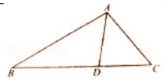
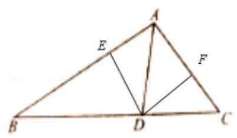
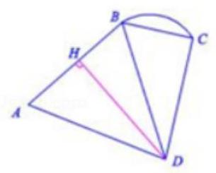
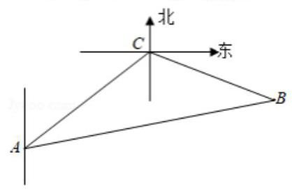
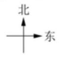
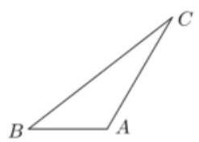
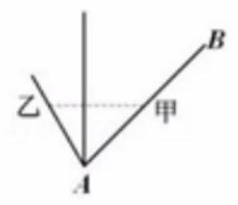
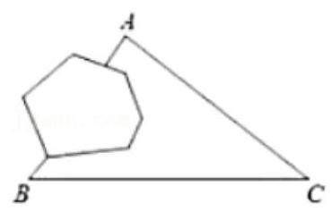
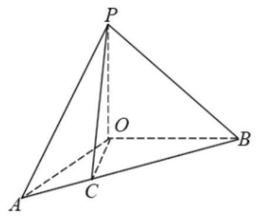
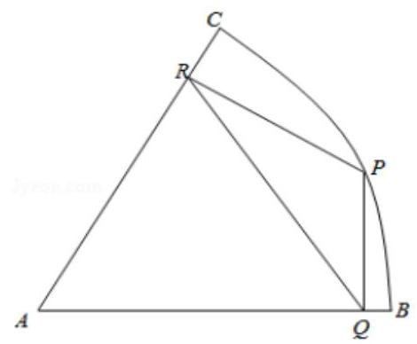

## 解斜三角形

<table><tr><td>教学目标</td><td>1、掌握正弦定理、余弦定理、三角形面积公式，并能求解三角形未知角、未知边的值；   2、运用正弦定理，余弦定理，内角和，面积公式判断三角形形状；   3、应用正余弦定理解决应用题。</td></tr><tr><td>重点</td><td>1、三角形内角和定理的灵活应用、正弦定理、余弦定理、三角形面积公式;   2、正弦定理和余弦定理的应用条件、三角形角与边的灵活转换。</td></tr><tr><td>难 点</td><td>正余弦定理与其它知识的综合应用</td></tr></table>

## 知识梳理

一、三角形面积公式

(1) ${S}_{\bigtriangleup {ABC}} = \frac{1}{2}{ab}\sin C = \frac{1}{2}{ac}\sin B = \frac{1}{2}{bc}\sin A$

(2) $S = \frac{1}{2}a \cdot  {h}_{a}$ ( ${h}_{a}$ 表示 $a$ 边上的高)

(3) $S = \frac{1}{2}{ab}\sin C = \frac{1}{2}{ac}\sin B = \frac{1}{2}{bc}\sin A = \frac{abc}{4R}\left( {R\text{ 为外接圆半径 }}\right)  = 2{R}^{2}\sin A\sin B\sin C$

## 二、正余弦定理

(1)正弦定理: $\frac{a}{\sin A} = \frac{b}{\sin B} = \frac{c}{\sin C} = {2R}$

$$
{a}^{2} = {b}^{2} + {c}^{2} - {2bc} \cdot  \cos A,
$$

(2)余弦定理: ${b}^{2} = {c}^{2} + {a}^{2} - {2ac}\cos B$ ，；

$$
{c}^{2} = {a}^{2} + {b}^{2} - {2ab}\cos C.
$$

(3)变形形式:

① $a = {2R}\sin A;b = {2R}\sin B;c = {2R}\sin C$ ;

② $\sin A = \frac{a}{2R};\sin B = \frac{b}{2R};\sin C = \frac{c}{2R}$ ;

③ $a : b : c = \sin A : \sin B : \sin C$

④ $\frac{a + b + c}{\sin A + \sin B + \sin C} = \frac{a}{\sin A}$

⑤ $\cos A = \frac{{b}^{2} + {c}^{2} - {a}^{2}}{2bc};\cos B = \frac{{a}^{2} + {c}^{2} - {b}^{2}}{2ac};\cos C = \frac{{b}^{2} + {a}^{2} - {c}^{2}}{2ab}$ ;

## 解决的问题类型:

①正弦定理已知两角和任一边，求另一角和其他两条边；已知两边和其中一边的对角，求另一边和其他两角

②余弦定理已知三边，求各角；已知两边和它们的夹角，求第三边和其他两个角。

## 三、三角形中常见的结论

(1)在 $\bigtriangleup {ABC}$ 中 $\sin A > \sin B$ 是 $A > B$ 的充要条件 $\sin A > \sin B \Leftrightarrow  \frac{a}{2R} > \frac{b}{2R} \Leftrightarrow  a > b \Leftrightarrow  A > B$

(2) $\sin {2A} = \sin {2B} \Leftrightarrow  A = B$ 或 $A + B = {90}^{ \circ  };\cos {2A} = \cos {2B} \Leftrightarrow  A = B$

(3) $A, B, C$ 成等差数列 $\Leftrightarrow  B = {60}^{ \circ  }$

(4) $A, B, C$ 成等差数列， $a, b, c$ 成等比数列 $\Leftrightarrow  \bigtriangleup {ABC}$ 为等边三角形

(5) $\sin \left( {A + B}\right)  = \sin C;\cos \left( {A + B}\right)  =  - \cos C;\tan \left( {A + B}\right)  =  - \tan C;\sin \frac{A + B}{2} = \cos \frac{C}{2};\cos \frac{A + B}{2} = \sin \frac{C}{2}$ .

(6)在 $\bigtriangleup  {ABC}$ 中， $\tan A + \tan B + \tan C = \tan A \cdot  \tan B \cdot  \tan C$

## (一)利用三角形面积公式、正弦定理、余弦定理求解三角形

## 例题精讲

【例 1】在 $\bigtriangleup {ABC}$ 中,角 $A, B, C$ 的对边分别为 $a, b, c$ ,若 $A = \frac{\pi }{4}, a = \sqrt{2}, b = \sqrt{3}$ ,则 $B =$ (   )

A. $\frac{\pi }{6}$ B. $\frac{\pi }{3}$ C. $\frac{2\pi }{3}$ D. $\frac{\pi }{3}$ 或 $\frac{2\pi }{3}$

【难度】 $\star   \star$

【答案】 $D$

【解析】解: $\because A = \frac{\pi }{4}, a = \sqrt{2}, b = \sqrt{3},\therefore$ 由正弦定理 $\frac{a}{\sin A} = \frac{b}{\sin B}$ ,可得: $\frac{\sqrt{2}}{\frac{\sqrt{2}}{2}} = \frac{\sqrt{3}}{\sin B}$ ,解得: $\sin B = \frac{\sqrt{3}}{2}$ , $\because b > a, B \in  \left( {\frac{\pi }{4},\pi }\right) ,\therefore B = \frac{\pi }{3}$ ,或 $\frac{2\pi }{3}$ . 故选: $D$ .

【例 2】在 $\bigtriangleup {ABC}$ 中,角 $A\text{ 、 }B\text{ 、 }C$ 的对边分别为 $a\text{ 、 }b\text{ 、 }c$ ,其面积 $S = \frac{1}{3}\left( {{a}^{2} + {c}^{2} - {b}^{2}}\right)$ ,则 $\tan B =$

【难度】 $\star   \star$

【答案】 $\frac{4}{3}$

【解析】解: 因为 $S = \frac{1}{3}\left( {{a}^{2} + {c}^{2} - {b}^{2}}\right)$ ,由 $S = \frac{1}{2}{ac}\sin B,{a}^{2} + {c}^{2} - {b}^{2} = {2ac}\cos B$ ,

所以: $\frac{1}{2}{ac}\sin B = \frac{1}{3} \times  {2ac}\cos B$ ,所以: $3\sin B = 4\cos B$ ,所以: $\tan B = \frac{4}{3}$ . 故答案为: $\frac{4}{3}$ .

【例 3】在 $\bigtriangleup {ABC}$ 中,已知边 $a = 2\sqrt{3}$ ,角 $B = {45}^{ \circ  }$ ,面积 ${S}_{\bigtriangleup {ABC}} = 3 + \sqrt{3}$ . 求:

(1)边 $c$ ；

( 2 )角 $C$ .

【难度】 $\star   \star$

【答案】见解析

【解析】解: (1) 根据题意, ${\Delta ABC}$ 中, $a = 2\sqrt{3}, B = {45}^{ \circ  }$ ,面积 ${S}_{\bigtriangleup {ABC}} = 3 + \sqrt{3}$ , 则有 $\frac{1}{2}{ac}\sin B = 3 + \sqrt{3}$ ,则 $c = \sqrt{2} + \sqrt{6}$ ;

(2)根据题意， ${b}^{2} = {a}^{2} + {c}^{2} - {2ac}\cos B = {\left( 2\sqrt{3}\right) }^{2} + {\left( \sqrt{2} + \sqrt{6}\right) }^{2} - 2 \times  2\sqrt{3}\left( {\sqrt{2} + \sqrt{6}}\right) \cos {45}^{ \circ  } = 8$ ， 则 $b = 2\sqrt{2}$ ,则 $\cos A = \frac{{b}^{2} + {c}^{2} - {a}^{2}}{2bc} = \frac{1}{2}$ ,则 $A = {60}^{ \circ  }, C = {180}^{ \circ  } - A - B = {75}^{ \circ  }$ .

【例 4】在 $\bigtriangleup {ABC}$ 中,角 $A, B, C$ 的对边分别是 $a, b, c$ ,且 $2\cos {2A} + 4\cos \left( {B + C}\right)  + 3 = 0$ .

(1)求角 $A$ 的大小；

(2)若 $a = \sqrt{3}, b + c = 3$ ，求 $b$ 和 $c$ 的值.

【难度】 $\star   \star   \star$

【答案】见解析

【解析】解: (1) $\because 2\cos {2A} + 4\cos \left( {B + C}\right)  + 3 = 0.\therefore 2\left( {2{\cos }^{2}A - 1}\right)  + 4\cos \left( {\pi  - A}\right)  + 3 = 0$ ,

$\therefore$ 可得: $4{\cos }^{2}A - 4\cos A + 1 = 0$ ,可得: ${\left( 2\cos A - 1\right) }^{2} = 0,\therefore$ 解得: $\cos A = \frac{1}{2},\because A \in  \left( {0,\pi }\right) ,\therefore A = \frac{\pi }{3}$ .

(2)由题意可得: $b + c = 3$ ，可得: $b = 3 - c$ ，又由 ${a}^{2} = {b}^{2} + {c}^{2} - {2bc}\cos A$ ，可得:

${\left( \sqrt{3}\right) }^{2} = {\left( 3 - c\right) }^{2} + {c}^{2} - 2 \times  \left( {3 - c}\right)  \times  c \times  \frac{1}{2}$ ,可得: ${c}^{2} - {3c} + 2 = 0$ ,解得: $\left\{  \begin{array}{l} b = 2 \\  c = 1 \end{array}\right.$ ,或 $\left\{  \begin{array}{l} b = 1 \\  c = 2 \end{array}\right.$ .

【例 5】如图，在 $\bigtriangleup  {ABC}$ 中， ${BD} \cdot  \sin B = {CD} \cdot  \sin C$ ， ${BD} = {2DC} = 2\sqrt{2}$ ， ${AD} = 2$ ，则 $\bigtriangleup  {ABC}$ 的面积为 ( )

A. $\frac{3\sqrt{3}}{2}$ B. $\frac{3\sqrt{7}}{2}$ C. $3\sqrt{3}$ D. $3\sqrt{7}$

【难度】 $\star   \star   \star$

【答案】 $B$

【解析】解: 过点 $D$ 分别作 ${AB}$ 和 ${AC}$ 的垂线,垂足分别为 $E, F$ ,

$\because$ 由 ${BD} \cdot  \sin B = {CD} \cdot  \sin C$ ，可得: ${DE} = {DF}$ ，则 ${AD}$ 为 $\angle {BAC}$ 的平分线，

$\therefore \frac{AB}{AC} = \frac{BD}{DC} = 2$ ,又 $\cos \angle {ADB} + \cos \angle {ADC} = 0$ ,即 $\frac{8 + 4 - A{B}^{2}}{2 \times  2 \times  2\sqrt{2}} =  - \frac{2 + 4 - A{C}^{2}}{2 \times  2 \times  \sqrt{2}}$ ,

$\therefore$ 解得 ${AC} = 2$ ， $\therefore$ 在 $\bigtriangleup  {ABC}$ 中， $\cos \angle {BAC} = \frac{{4}^{2} + {2}^{2} - {\left( 3\sqrt{2}\right) }^{2}}{2 \times  4 \times  2} = \frac{1}{8}$ ，

$\therefore \sin \angle {BAC} = \frac{3\sqrt{7}}{8},\;\therefore {S}_{\bigtriangleup {ABC}} = \frac{1}{2}{AB} \cdot  {AC} \cdot  \sin \angle {BAC} = \frac{3\sqrt{7}}{2}$ . 故选: $B$ .

【例 6】在 $\bigtriangleup {ABC}$ 中,已知 $2{\sin }^{2}\frac{A + B}{2} + \cos {2C} = 1$ ,外接圆半径 $R = 2$ .

(1)求角 $C$ ；

(2)求 $\bigtriangleup  {ABC}$ 面积的最大值.

【难度】 $\star   \star   \star$

【答案】见解析

【解析】解: (1) $\because$ 在 $\bigtriangleup {ABC}$ 中,已知 $2{\sin }^{2}\frac{A + B}{2} + \cos {2C} = 1\therefore$ 由三角函数公式可得 $1 - \cos \left( {A + B}\right)  + \cos {2C} = 1$ , $\because A + B + C = \pi ,\therefore \cos \left( {A + B}\right)  =  - \cos C,\therefore 2{\cos }^{2}C + \cos C - 1 = 0$ ,解得 $\cos C =  - 1$ (舍),或 $\cos C = \frac{1}{2}$ , $\therefore C = \frac{\pi }{3}$ ;

(2)由正弦定理可得 $\frac{c}{\sin C} = {2R} = 4$ ， $\therefore c = 4\sin C = 4 \times  \frac{\sqrt{3}}{2} = 2\sqrt{3}$ ，

由余弦定理可得 ${12} = {c}^{2} = {a}^{2} + {b}^{2} - {2ab}\cos C \geq  {2ab} - {ab} = {ab}$ ,当且仅当 $a = b = 2\sqrt{3}$ 时取等号, $\therefore {ab} \leq  {12}$ , $\therefore {S}_{\bigtriangleup {ABC}} = \frac{1}{2}{ab}\sin C \leq  \frac{1}{2} \times  {12} \times  \frac{\sqrt{3}}{2} = 3\sqrt{3}$ ,故 $\bigtriangleup {ABC}$ 面积的最大值为 $3\sqrt{3}$ .

## 巩固训练

1、已知 $\bigtriangleup  {ABC}$ 周长为 4， $\sin A + \sin B = 3\sin C$ ，则 ${AB} =$ ___.

【难度】 $\star   \star$

【答案】1

【解析】解: $\because \sin A + \sin B = 3\sin C,\therefore$ 由正弦定理可得 $a + b = {3c}$ ,又 $\bigtriangleup {ABC}$ 的周长为 $4,\therefore a + b + c = {4c} = 4$ , 解得 $c = 1$ ,即 ${AB} = 1$ . 故答案为: 1 .

2、在 $\bigtriangleup  {ABC}$ 中， ${\sin }^{2}A = {\sin }^{2}B + {\sin }^{2}C - \sin B \cdot  \sin C$ ，则 $\angle A =$ ___.

【难度】 $\star   \star$

【答案】 $\frac{\pi }{3}$

【解析】解: 由正弦定理化简 ${\sin }^{2}A = {\sin }^{2}B + {\sin }^{2}C - \sin B \cdot  \sin C$ 得: ${a}^{2} = {b}^{2} + {c}^{2} - {bc}$ ,即 ${b}^{2} + {c}^{2} - {a}^{2} = {bc}$ , $\therefore \cos A = \frac{{b}^{2} + {c}^{2} - {a}^{2}}{2bc} = \frac{bc}{2bc} = \frac{1}{2}$ ,又 $\angle A$ 为三角形的内角,则 $\angle A = \frac{\pi }{3}$ . 故答案为: $\frac{\pi }{3}$

3、在 $\bigtriangleup {ABC}$ 中，角 $A, B, C$ 所对应的边分别为 $a, b, c$ 若 $\left( {a + b - c}\right) \left( {a - b + c}\right)  = {bc}$ ，则 $A =$ (   )

A. $\frac{\pi }{6}$ B. $\frac{\pi }{3}$ C. $\frac{2\pi }{3}$ D. $\frac{5\pi }{6}$

【难度】 $\star   \star$

【答案】 $B$

【解析】解: 因为 $\left( {a + b - c}\right) \left( {a - b + c}\right)  = {bc}$ ,所以 ${b}^{2} + {c}^{2} - {a}^{2} = {bc}$ ,所以 $\cos A = \frac{{b}^{2} + {c}^{2} - {a}^{2}}{2bc} = \frac{bc}{2bc} = \frac{1}{2}$ ,因为 $A \in  \left( {0,\pi }\right)$ ,所以 $A = \frac{\pi }{3}$ . 故选: $B$ .

4、在 $\bigtriangleup {ABC}$ 中， ${AC} = 3$ ， $3\sin A = 2\sin B$ ，且 $\cos C = \frac{1}{4}$ ，则 ${AB} =$ ___.

【难度】 $\star   \star$

【答案】 $\sqrt{10}$

【解析】解: $\because 3\sin A = 2\sin B,\therefore$ 由正弦定理可得: ${3BC} = {2AC},\therefore$ 由 ${AC} = 3$ ,可得: ${BC} = 2$ , $\because \cos C = \frac{1}{4},\therefore$ 由余弦定理可得: $- \frac{1}{4} = \frac{{3}^{2} + {2}^{2} - A{B}^{2}}{2 \times  3 \times  2},\therefore$ 解得: ${AB} = \sqrt{10}$ . 故答案为: $\sqrt{10}$ .

5、 $\bigtriangleup {ABC}$ 的内角 $A, B, C$ 的对边分别为 $a, b, c$ ，已知 ${2b}\sin C = a\cos C + c\cos A, B = \frac{2\pi }{3}, c = \sqrt{3}$ .

(1)求角 $C$ ；

( 2 )若点 $E$ 满足 $\overrightarrow{AE} = 2\overrightarrow{EC}$ ，求 ${BE}$ 的长.

【难度】 $\star   \star   \star$

【答案】见解析

【解析】解: (1) $\because {2b}\sin C = a\cos C + c\cos A$ , $\therefore$ 由正弦定理可得: $2\sin B\sin C = \sin A\cos C + \sin C\cos A$ , 又 $\because \sin A\cos C + \sin C\cos A = \sin \left( {A + C}\right)  = \sin B,\therefore 2\sin B\sin C = \sin B,\because \sin B > 0$ ,

$\therefore$ 解得: $\sin C = \frac{1}{2},\because 0 < C < \frac{\pi }{3},\therefore C = \frac{\pi }{6}$

(2) $\because$ 在 $\bigtriangleup {ABC}$ 中， $B = \frac{2\pi }{3}$ ， $C = \frac{\pi }{6}$ ， $\therefore A = \frac{\pi }{6}$ ， $a = c = \sqrt{3}$ ，

$\therefore$ 由余弦定理可得: $b = \sqrt{{a}^{2} + {c}^{2} - {2ac}\cos B} = \sqrt{3 + 3 - 2 \times  \sqrt{3} \times  \sqrt{3} \times  \left( {-\frac{1}{2}}\right) } = 3$ ,

$\because \overrightarrow{AE} = 2\overrightarrow{EC},\therefore {EC} = \frac{1}{3}{AC} = 1,\therefore$ 在 ${\Delta BCE}$ 中, $C = \frac{\pi }{6},{BC} = \sqrt{3},{CE} = 1$ ,

$\therefore$ 由余弦定理可得: ${BE} = \sqrt{B{C}^{2} + E{C}^{2} - {2BC} \cdot  {EC} \cdot  \cos \frac{\pi }{6}} = \sqrt{3 + 1 - 2 \times  \sqrt{3} \times  1 \times  \frac{\sqrt{3}}{2}} = 1$

6、已知 $\bigtriangleup {ABC}$ 中, $\tan A = \frac{1}{4},\tan B = \frac{3}{5},{AB}$ 的长为 $\sqrt{17}$ ,试求:

(1)内角 $C$ 的大小；

(2)最小边的边长.

【难度】 $\star   \star   \star$

【答案】见解析

【解析】解: (1) $\because C = \pi  - \left( {A + B}\right) ,\tan A = \frac{1}{4},\tan B = \frac{3}{5},\therefore \tan C =  - \tan \left( {A + B}\right)  =  - \frac{\frac{1}{4} + \frac{3}{5}}{1 - \frac{1}{4} \times  \frac{3}{5}} =  - 1$ ,又 $\because 0 < C < \pi$ , $\therefore C = \frac{3\pi }{4}$ ;

(2)由 $\tan A = \frac{\sin A}{\cos A} = \frac{1}{4},{\sin }^{2}A + {\cos }^{2}A = 1$ 且 $A \in  \left( {0,\frac{\pi }{2}}\right)$ ，

得 $\sin A = \frac{\sqrt{17}}{17}.\because \frac{AB}{\sin C} = \frac{BC}{\sin A},\therefore {BC} = {AB} \cdot  \frac{\sin A}{\sin C} = \sqrt{2}$ . 即最小边的边长为 $\sqrt{2}$ .

## (二)正余弦定理的应用

## 例题精讲

【例 7】( 1 ) $\bigtriangleup  \mathrm{{ABC}}$ 中，若 $\mathrm{b} = 6,\mathrm{c} = {10},\mathrm{\;B} = {30}^{ \circ  }$ ，则解此三角形的结果为( )

A. 无解 B. 有一解 C. 有两解 D. 一解或两解

【难度】 $\star   \star   \star$

【答案】C

【解析】直接利用正弦定理求出角C的大小，即可判断三角形解的个数. 在 $\bigtriangleup {ABC}$ 中，

若 $\mathrm{b} = 6,\mathrm{c} = {10},\mathrm{\;B} = {30}^{ \circ  }$ ,由正弦定理 $\frac{\mathrm{c}}{\sin C} = \frac{\mathrm{b}}{\sin B}\therefore \sin C = \frac{\mathrm{c}\sin B}{b} = \frac{5}{6} > \frac{\sqrt{3}}{2}$

所以 ${60}^{ \circ  } < \mathrm{C} < {120}^{ \circ  },\mathrm{C}$ 有两个解,一个锐角,一个钝角; 所以三角形有两个解,

故选 C.

(2)张老师整理旧资料时发现一题部分字迹模糊不清，只能看到:在 $\bigtriangleup  {ABC}$ 中， $a$ ， $b$ ， $c$ 分别是角 $A$ ， $B$ ， $C$ 的对边,已知 $b = 2\sqrt{2}\text{ ， }\angle A = {45}^{ \circ  }$ ，求边 $c$ ，显然缺少条件，若他打算补充 $a$ 的大小，并使得 $c$ 只有一解， $a$ 的可能取值是___(只需填写一个适合的答案)

【难度】 $\star   \star   \star$

【答案】 $2\sqrt{2}$

【解析】解: 由已知及正弦定理 $\frac{a}{\sin A} = \frac{b}{\sin B}$ ,可得 $\frac{a}{\frac{\sqrt{2}}{2}} = \frac{2\sqrt{2}}{\sin B}$ ,可得 $\sin B = \frac{2}{a} \in  \{ 1\}  \cup  \left( {0,\frac{\sqrt{2}}{2}}\right\rbrack$ ,

可得: $a = \{ 2\}  \cup  \lbrack 2\sqrt{2}, + \infty )$ . 可得 $a$ 的可能取值是 $2\sqrt{2}$ . 故答案为: $2\sqrt{2}$ .

(3)已知 $\bigtriangleup  {ABC}$ 中，满足 $b = 2, B = {60}^{ \circ  }$ 的三角形有两解，则边长 $a$ 的取值范围是( )

A. $\frac{\sqrt{3}}{2} < a < 2$ B. $\frac{1}{2} < a < 2$

C. $2 < a < \frac{4\sqrt{3}}{3}$ D. $2 < a < 2\sqrt{3}$

【难度】 $\star   \star   \star$

【答案】C

【解析】解: 由三角形有两解,则满足 $\left\{  \begin{matrix} a\sin B < b \\  a > b \end{matrix}\right.$ ,即 $\left\{  \begin{matrix} a\sin {60}^{ \circ  } < 2 \\  a > 2 \end{matrix}\right.$

解得: $2 < a < \frac{4\sqrt{3}}{3}$ ,所以边长 $a$ 的取值范围 $\left( {2,\frac{4\sqrt{3}}{3}}\right)$ ,故选 C.

【例 8】在 $\bigtriangleup {ABC}$ 中,角 $A, B, C$ 所对的边分别为 $a, b, c$ ,若 $a - c = b\cos C - b\cos A$ ,则 $\bigtriangleup {ABC}$ 的形状为( )

A. 等腰三角形 B. 直角三角形

C. 等腰三角形或直角三角形 D. 等腰直角三角形

【难度】 $\star   \star   \star$

【答案】 $C$

【解析】解: $\because a - c = b\cos C - b\cos A,\therefore$ 由正弦定理可得: $\sin A - \sin C = \sin B\cos C - \sin B\cos A$ ,

可得: $\sin A - \sin A\cos B - \cos A\sin B = \sin B\cos C - \sin B\cos A$ ,

$\therefore \sin A - \sin A\cos B = \sin B\cos C$ ,可得: $\sin A = \sin B\cos C + \sin A\cos B$ ,

$\therefore \sin B\cos C + \cos B\sin C = \sin B\cos C + \sin A\cos B$ ,可得: $\cos B\sin C = \sin A\cos B$ ,

$\therefore \cos B = 0$ ,或 $\sin A = \sin C,\therefore B$ 为直角,或 $A = C,\therefore \bigtriangleup {ABC}$ 的形状为等腰三角形或直角三角形. 故选: $C$ .

【例 9】在 $\bigtriangleup {ABC}$ 中,内角 $A, B, C$ 的对边分别为 $a, b, c$ ,若 $b = a\sin C, c = a\cos B$ ,则 $\bigtriangleup {ABC}$ 一定是( )

A. 等腰三角形非直角三角形 B. 直角三角形非等腰三角形

C. 等边三角形 D. 等腰直角三角形

【难度】 $\star   \star   \star$

【答案】 $D$

【解析】解: 在 $\bigtriangleup {ABC}$ 中, $\because b = a\sin C, c = a\cos B$ ,故由正弦定理可得 $\sin B = \sin A\sin C,\sin C = \sin A\sin B$ , $\therefore \sin B = \sin A\sin A\sin B,\therefore \sin A = 1,\therefore A = \frac{\pi }{2},\therefore \sin C = \sin A\sin B$ 即 $\sin C = \sin B$ ,

$\therefore$ 由正弦定理可得 $c = b$ ,故 $\bigtriangleup {ABC}$ 的形状为等腰直角三角形,故选: $D$ .

【例 10】在 $\bigtriangleup {ABC}$ 中, ${BC} = a,{CA} = b,{AB} = c$ ,下列说法中正确的是(   )

A. 用 $\sqrt{a}\text{ 、 }\sqrt{b}\text{ 、 }\sqrt{c}$ 为边长不可以作成一个三角形

B. 用 $\sqrt{a}\text{ 、 }\sqrt{b}\text{ 、 }\sqrt{c}$ 为边长一定可以作成一个锐角三角形

C. 用 $\sqrt{a}\text{ 、 }\sqrt{b}\text{ 、 }\sqrt{c}$ 为边长一定可以作成一个直角三角形

D. 用 $\sqrt{a}\text{ 、 }\sqrt{b}\text{ 、 }\sqrt{c}$ 为边长一定可以作成一个钝角三角形

【难度】 $\star   \star   \star$

【答案】 $B$

【解析】解: 对于 $A$ . 取 $\sqrt{3},\sqrt{4},\sqrt{5}$ ,可以作成三角形,因此不正确.

对于 $B$ ,不妨设 $a \leq  b \leq  c$ ,则 $a + b > c,\sqrt{a} \leq  \sqrt{b} \leq  \sqrt{c}$ . 则 $0 < A \leq  B \leq  C < \pi ,\cos C = \frac{a + b - c}{2\sqrt{ab}} > 0$ ,可得: $C$ 为锐角,因此 $\bigtriangleup {ABC}$ 必然为锐角三角形. 正确. 对于 $C.D$ . 由 $B$ 可知 $C, D$ 不正确. 因此只有 $B$ 正确. 故选: $B$ .

## 巩固训练

1、在 $\bigtriangleup  {ABC}$ 中，三条边分别为 $a$ ， $b$ ， $c$ ，若 $a = 4$ ， $b = 5$ ， $c = 6$ ，则三角形的形状( )

A. 锐角三角形 B. 钝角三角形 C. 直角三角形 D. 不能确定

【难度】★★

【答案】 $A$

【解析】解: $\because a = 4, b = 5, c = 6,\therefore c$ 为三角形最大边, $C$ 为三角形最大角,由余弦定理可得: $\cos C = \frac{{a}^{2} + {b}^{2} - {c}^{2}}{2ab} = \frac{{16} + {25} - {36}}{2 \times  4 \times  5} = \frac{1}{8} > 0,\therefore C$ 为锐角,可得三角形为锐角三角形. 故选: $A$ .

2、 $\bigtriangleup {ABC}$ 中，若 $\frac{\cos A}{a} = \frac{\sin B}{b} = \frac{\cos C}{c}$ ，则 $\bigtriangleup {ABC}$ 为___三角形.

【难度】 $\star   \star$

【答案】等腰直角三角形

【解析】解: $\because \frac{\cos A}{a} = \frac{\sin B}{b} = \frac{\cos C}{c},\therefore$ 由题意得, $\frac{a}{\cos A} = \frac{b}{\sin B} = \frac{c}{\cos C},\therefore$ 由正弦定理得,

$\frac{\sin A}{\cos A} = \frac{\sin B}{\sin B} = \frac{\sin C}{\cos C} = 1,$

$\therefore \tan A = \tan C = 1,\because A\text{ 、 }C \in  \left( {0,\pi }\right) ,\therefore A = C = \frac{\pi }{4}, B = \pi  - A - B = \frac{\pi }{2},\therefore \bigtriangleup {ABC}$ 是等腰直角三角形. 故答案为:等腰直角三角形.

3、已知,在 $\bigtriangleup {ABC}$ 中,三个内角 $A\text{ 、 }B\text{ 、 }C$ 所对的边分别是 $a\text{ 、 }b\text{ 、 }c$ ,分别给出下列四个条件:

(1) $\tan \left( {A - B}\right) \cos C = 0$ ; (2) $\sin \left( {B + C}\right) \cos \left( {B - C}\right)  = 1$ ; (3) $a\cos A = b\cos B$ ; (4) ${\sin }^{2}\left( {A - B}\right)  + {\cos }^{2}C = 0$ . 若满足条件___，则 $\bigtriangleup  {ABC}$ 是等腰直角三角形. (只需填写其中一个序号)

【难度】 $\star   \star   \star$

【答案】(2)或(4)

【解析】解: $\because {\sin }^{2}\left( {A - B}\right)  + {\cos }^{2}C = 0.\therefore {\sin }^{2}\left( {A - B}\right)  = 0,{\cos }^{2}C = 0.\therefore \sin \left( {A - B}\right)  = 0,\cos C = 0$ , $\therefore A = B, C = {90}^{ \circ  },\therefore$ 三角形是一个等腰三角形. 故答案为: (4)

4、在 $\bigtriangleup {ABC}$ 中,角 $A, B, C$ 的对边分别为 $a, b, c$ ,其中 $c$ 边最长,并且 ${\sin }^{2}A + {\sin }^{2}B = 1$ ,则 $\bigtriangleup {ABC}$ 的形状为___.

【难度】 $\star   \star   \star$

【答案】直角三角形

【解析】解: 因为: ${\sin }^{2}A + {\sin }^{2}B = 1$ 而 ${\sin }^{2}A + {\cos }^{2}A = 1$ ; 所以; ${\sin }^{2}B = {\cos }^{2}A;\because c$ 边最长 $\therefore A, B$ 均为锐角

故: $\sin B = \cos A = \sin \left( {\frac{\pi }{2} - A}\right)  \Rightarrow  B = \frac{\pi }{2} - A \Rightarrow  A + B = \frac{\pi }{2}.\therefore \bigtriangleup {ABC}$ 是直角三角形. 故答案为: 直角三角形.

5、我们知道，在 $\bigtriangleup  {ABC}$ 中，若 ${c}^{2} = {a}^{2} + {b}^{2}$ ，则 $\bigtriangleup  {ABC}$ 是直角三角形. 若 ${c}^{n} = {a}^{n} + {b}^{n}\left( {n > 2}\right)$ ，则 $\bigtriangleup  {ABC}$ 是___ 三角形. (填 “锐角”、“钝角”、“直角” )

【难度】 $\star   \star   \star$

【答案】锐角

【解析】解: $\because {c}^{n} = {a}^{n} + {b}^{n},\therefore c > a, c > b$ ,即 $c$ 为最大边, $\therefore {c}^{n - 2} > {a}^{n - 2},{c}^{n - 2} > {b}^{n - 2}$ ,

即 ${c}^{n - 2} - {a}^{n - 2} > 0,{c}^{n - 2} - {b}^{n - 2} > 0$ ,

$\therefore \left( {{a}^{2} + {b}^{2}}\right) {c}^{n - 2} - {c}^{n} = \left( {{a}^{2} + {b}^{2}}\right) {c}^{n - 2} - {a}^{n} - {b}^{n} = {a}^{2}\left( {{c}^{n - 2} - {a}^{n - 2}}\right)  + {b}^{2}\left( {{c}^{n - 2} - {b}^{n - 2}}\right)  > 0$ ,

即 $\left( {{a}^{2} + {b}^{2}}\right) {c}^{n - 2} > {c}^{n},\therefore {a}^{2} + {b}^{2} > {c}^{2},\therefore \cos C = \frac{{a}^{2} + {b}^{2} - {c}^{2}}{2ab} > 0$ ,则 $\bigtriangleup {ABC}$ 也是锐角三角形,故答案为: 锐角

6、在 $\bigtriangleup {ABC}$ 中， $a\text{ 、 }b\text{ 、 }c$ 分别为三个内角 $A\text{ 、 }B\text{ 、 }C$ 的对边，且 ${b}^{2} - \frac{2\sqrt{3}}{3}{bc}\sin A + {c}^{2} = {a}^{2}$ .

(1)求角 $A$ ；

(2)若 $4\sin B\sin C = 3$ ，且 $a = 2$ ，求 $\bigtriangleup  {ABC}$ 的面积.

【难度】 $\star   \star   \star$

【答案】见解析

【解析】解: (1) 由题意可得 ${b}^{2} + {c}^{2} - {a}^{2} = {2bc}\cos A = \frac{2\sqrt{3}}{3}{bc}\sin A,\therefore \tan A = \sqrt{3},\therefore A = \frac{\pi }{3}$ ,

(2)由正弦定理可得 $\frac{a}{\sin A} = {2R}$ ，则 $R = \frac{2\sqrt{3}}{3}$ ，由正弦定理可得: $a = {2R}\sin A$ ， $b = {2R}\sin B$ ，

$\therefore {S}_{\bigtriangleup {ABC}} = \frac{1}{2}{ab}\sin C = \frac{1}{2} \times  {2R}\sin A \times  {2R}\sin B \times  \sin C = 2{R}^{2}\sin A\sin B\sin C$ .

$\therefore {S}_{\bigtriangleup {ABC}} = 2{R}^{2}\sin A\sin B\sin C = 2 \times  {\left( \frac{2\sqrt{3}}{3}\right) }^{2} \times  \frac{\sqrt{3}}{2} \times  \frac{3}{4} = \sqrt{3}$

7、在 $\bigtriangleup {ABC}$ 中，已知 $2{\sin }^{2}\frac{A + B}{2} + \cos {2C} = 1$ ，外接圆半径 $R = 2$ .

(1)求角 $C$ ；

(2)求 $\bigtriangleup  {ABC}$ 面积的最大值.

【难度】 $\star   \star   \star$

【答案】见解析

【解析】解: (1) $\because$ 在 $\bigtriangleup {ABC}$ 中,已知 $2{\sin }^{2}\frac{A + B}{2} + \cos {2C} = 1$

$\therefore$ 由三角函数公式可得 $1 - \cos \left( {A + B}\right)  + \cos {2C} = 1,\because A + B + C = \pi$ , $\therefore \cos \left( {A + B}\right)  =  - \cos C$ ,

$\therefore 2{\cos }^{2}C + \cos C - 1 = 0$ ,解得 $\cos C =  - 1$ (舍),或 $\cos C = \frac{1}{2},\therefore C = \frac{\pi }{3}$ ;

(2)由正弦定理可得 $\frac{c}{\sin C} = {2R} = 4$ ， $\therefore c = 4\sin C = 4 \times  \frac{\sqrt{3}}{2} = 2\sqrt{3}$ ，

由余弦定理可得 ${12} = {c}^{2} = {a}^{2} + {b}^{2} - {2ab}\cos C \geq  {2ab} - {ab} = {ab}$ ,当且仅当 $a = b = 2\sqrt{3}$ 时取等号,

$\therefore {ab} \leq  {12},\therefore {S}_{\bigtriangleup {ABC}} = \frac{1}{2}{ab}\sin C \leq  \frac{1}{2} \times  {12} \times  \frac{\sqrt{3}}{2} = 3\sqrt{3}$ ，故 ${\Delta ABC}$ 面积的最大值为3 $\sqrt{3}$ .

## (三)解三角形的综合运用

## 例题精讲

【例 11】 $\bigtriangleup {ABC}$ 的内角 $A, B, C$ 的对边分别为 $a, b, c$ ,设 $\sqrt{3}b\sin A = a\left( {2 + \cos B}\right)$ .

(1)求 $B$ ；

(2)若 $\bigtriangleup  {ABC}$ 的面积等于 $\sqrt{3}$ ，求 $\bigtriangleup  {ABC}$ 的周长的小值.

【难度】 $\star   \star   \star$

【答案】(1) $\frac{2\pi }{3};$ (2) $4 + 2\sqrt{3}$ .

【解析】(1) 因为 $\sqrt{3}b\sin A = a\left( {2 + \cos B}\right)$ ,

由正弦定理得 $\sqrt{3}\sin B\sin A = \sin A\left( {2 + \cos B}\right)$ .

因为 $A \in  \left( {0,\pi }\right)$ ,所以 $\sin A > 0$ ,所以 $\sqrt{3}\sin B - \cos B = 2$ ,

所以 $2\sin \left( {B - \frac{\pi }{6}}\right)  = 2$ ,因为 $B \in  \left( {0,\pi }\right)$ ,所以 $B - \frac{\pi }{6} = \frac{\pi }{2}$ ,即 $B = \frac{2\pi }{3}$ .

( 2 )依题意 $\frac{\sqrt{3}{ac}}{4} = \sqrt{3}$ ，即 ${ac} = 4$ . 所以 $a + c \geq  2\sqrt{ac} = 4$ ，当且仅当 $a = c = 2$ 时取等号.

又由余弦定理得 ${b}^{2} = {a}^{2} + {c}^{2} - {2ac}\cos B = {a}^{2} + {c}^{2} + {ac} \geq  {3ac} = {12}$

$\therefore b \geq  2\sqrt{3}$ ,当且仅当 $a = c = 2$ 时取等号. 所以 $\bigtriangleup {ABC}$ 的周长最小值为 $4 + 2\sqrt{3}$ .

【例 12】如图, $A - B - C$ 为海岸线, ${AB}$ 为线段, $\overset{\text{ ⏜ }}{BC}$ 为四分之一圆弧, ${BD} = {39.2}\mathrm{\;{km}},\angle {BDC} = {22}^{ \circ  }$ , $\angle {CBD} = {68}^{ \circ  },\angle {BDA} = {58}^{ \circ  }$ .

(1)求 $\overset{\text{ ⏜ }}{BC}$ 的长度；

(2)若 ${AB} = {40km}$ ，求 $D$ 到海岸线 $A - B - C$ 的最短距离. (精确到 ${0.001km})$

【难度】 $\star   \star   \star$

【答案】见解析

【解析】解: (1) 由题意可得, ${BC} = {BD}\sin {22}^{ \circ  }$ ,弧 ${BC}$ 所在的圆的半径 $R = {BC}\sin \frac{\pi }{4}$ ,

弧 ${BC}$ 的长度为 $\frac{1}{2}{\pi R} = \frac{1}{2}\pi  \cdot  {BC} \cdot  \frac{\sqrt{2}}{2} = \frac{\sqrt{2}}{4} \times  {3.141} \times  {39.2} \times  \sin {22}^{ \circ  } = {16.310}\mathrm{{km}}$ ;

(2)根据正弦定理可得， $\frac{BD}{\sin A} = \frac{AB}{\sin {58}^{ \circ  }}$ ， $\therefore \sin A = \frac{39.2}{40} \times  \sin {58}^{ \circ  } = {0.831}$ ， $A = {56.2}^{ \circ  }$ ，

$\therefore \angle {ABD} = {180}^{ \circ  } - {56.2}^{ \circ  } - {58}^{ \circ  } = {65.8}^{ \circ  }$ ，

${DH} = {BD} \times  \sin \angle {ABD} = {35.725}\mathrm{{km}} < {CD} = {36.346}\mathrm{{km}}$

$\therefore D$ 到海岸线 $A - B - C$ 的最短距离为 ${35.752}\mathrm{\;{km}}$

【例13】一缉私艇发现在北偏东 ${45}^{ \circ  }$ 方向,距离 ${12}\mathrm{{nmile}}$ 的海面上有一走私船正以 ${10}\mathrm{{nmile}}/\mathrm{h}$ 的速度沿东偏南 ${15}^{ \circ  }$ 方向逃窜. 缉私艇的速度为 ${14}\mathrm{{nmile}}/\mathrm{h}$ ，若要在最短的时间内追上该走私船，缉私艇应沿北偏东 ${45}^{ \circ  } + \alpha$ 的方向去追,求追击所需的时间和 $\alpha$ 角的正弦值.

【难度】 $\star   \star   \star$

【答案】见解析

【解析】解: 设 $A, C$ 分别表示缉私艇,走私船的位置,设经过 $x$ 小时后在 $B$ 处追上,

则有 ${AB} = {14x},{BC} = {10x},\angle {ACB} = {120}^{ \circ  }.\therefore {\left( {14}x\right) }^{2} = {12}^{2} + {\left( {10}x\right) }^{2} - {240x}\cos {120}^{ \circ  }\ldots$

$\therefore x = 2,{AB} = {28},{BC} = {20},\ldots \therefore \sin \alpha  = \frac{{BC}\sin {120}^{ \circ  }}{AB} = \frac{{20}\sin {120}^{ \circ  }}{28} = \frac{5\sqrt{3}}{14}$ .

所以所需时间 2 小时, $\sin \alpha  = \frac{5\sqrt{3}}{14}.\ldots$

【例 14】如图,某小区要建四边形的花坛 ${ABCD}$ ,两邻边用夹角为 ${150}^{ \circ  }$ 的两面墙,另两边是长度均为 8 米的篱笆 ${AB}\text{ 、 }{BC}$ .

(1)若 $\angle {ACD} = {20}^{ \circ  },{S}_{{\Delta AC}D} = 6$ 平方米，求 ${AC}$ 的长(结果精确到 0.01 米)；

(2)若要求 ${AD} = {CD}$ ，求花坛 ${ABCD}$ 面积的最大值(结果精确到 0.01 平方米).

【难度】 $\star   \star   \star$

【答案】见解析

【解析】解: (1) 设 ${CD} = x$ ,由正弦定理得 $\frac{x}{\sin {10}^{ \circ  }} = \frac{AD}{\sin {20}^{ \circ  }}$ ,

$\therefore {AD} = {2x}\cos {10}^{ \circ  }$ ，①，因为 ${S}_{\bigtriangleup {ACD}} = 6$ ，所以: $\frac{1}{2}x \cdot  \frac{1}{2}{AD} = 6$ ，可得: ${AD} = \frac{24}{x}$ ，②，

解①②得 $x \approx  {3.4907}$ . 所以由正弦定理得: ${AC} = \frac{x}{2\sin {10}^{ \circ  }} \approx  {10.05}$ .

(2)连接 ${BD}$ ，显然 $\bigtriangleup {ABD} \cong  \bigtriangleup {BDC}$ ， $\therefore \angle {ADB} = {75}^{ \circ  }$ ，

由余弦定理得: $\cos {75}^{ \circ  } = \frac{A{D}^{2} + B{D}^{2} - {64}}{{2AD} \cdot  {BD}} \geq  \frac{{2AD} \cdot  {BD} - {64}}{{2AD} \cdot  {BD}}$ ，可得: ${AD} \cdot  {BD} \leq  {43.174}$ .

$\therefore$ 花坛 ${ABCD}$ 面积 $S = {AD} \cdot  {BD} \cdot  \sin {75}^{ \circ  } \cdot  2 \leq  {41.70}$ ,即最大值为 41.70 平方米.

1、在 $\bigtriangleup {ABC}$ 中，已知 $c = 2, C = \frac{\pi }{3}$ .

(1)求 $\bigtriangleup  {ABC}$ 周长的最大值；

(2)若 $2\sin {2A} + \sin \left( {{2B} + C}\right)  = \sin C$ ，求 $\bigtriangleup  {ABC}$ 的面积.

【难度】 $\star   \star   \star$

【答案】见解析

【解析】解: (1) $\because c = 2, C = \frac{\pi }{3}$ ,

$\therefore$ 由余弦定理,得 ${c}^{2} = {a}^{2} + {b}^{2} - {2ab}\cos C = {a}^{2} + {b}^{2} - {ab} = {\left( a + b\right) }^{2} - {3ab} \geq  {\left( a + b\right) }^{2} - 3 \cdot  \frac{{\left( a + b\right) }^{2}}{4}$ ,

$\therefore$ 得 $a + b \leq  4$ ,当且仅当 $a = b = 2$ 时,等号成立, $\therefore {C}_{\bigtriangleup {ABC}} = a + b + c \leq  6$ ,即 $\bigtriangleup {ABC}$ 周长的最大值为 6;

(2) $\because 2\sin {2A} + \sin \left( {{2B} + C}\right)  = \sin C$ ，

$\therefore 2\sin {2A} + \sin \left\lbrack  {\left( {B + C}\right)  + B}\right\rbrack   - \sin \left\lbrack  {\left( {B + C}\right)  - B}\right\rbrack   = 2\sin {2A} + 2\cos \left( {B + C}\right) \sin B = 0$ ,

$\therefore 2\sin A\cos A - \cos A\sin B = 0,\therefore \cos A = 0$ 或 $\sin B = 2\sin A$ ,

$\therefore$ ① $\cos A = 0$ 时， $A = \frac{\pi }{2}$ ，此时 $b = \frac{2}{\sqrt{3}}$ ， ${S}_{\bigtriangleup {ABC}} = \frac{1}{2}{bc} = \frac{2\sqrt{3}}{3}$ ，

② $\sin B = 2\sin A$ 时，由正弦定理，知 $b = {2a}$ ，

$\because {c}^{2} = {a}^{2} + {b}^{2} - {ab} = 3{a}^{2} = 4,\therefore a = \frac{2\sqrt{3}}{3}, b = \frac{4\sqrt{3}}{3},{S}_{\bigtriangleup {ABC}} = \frac{1}{2}{ab}\sin C = \frac{2\sqrt{3}}{3}$ ,

综上， $\bigtriangleup {ABC}$ 的面积为 $\frac{2\sqrt{3}}{3}$ .

2、在 $\bigtriangleup  {ABC}$ 中，角 $A$ 、 $B$ 、 $C$ 所对的边分别是 $a$ 、 $b$ 、 $c$ ，且 ${2B} = A + C$ ， $b = \sqrt{13}$ .

(1)若 $3\sin C = 4\sin A$ ，求 $c$ 的值；

(2) 求 $a + c$ 的最大值

【难度】★★★

【答案】(1)4；(2) $2\sqrt{13}$ .

【解析】(1)因为 ${2B} = A + C$ ，又 $A + B + C = \pi$ ，得 $B = \frac{\pi }{3}$ .

又 $3\sin C = 4\sin A$ ,由正弦定理得 ${3c} = {4a}$ ,即 $a = \frac{3}{4}c$ ,

由余弦定理 ${b}^{2} = {a}^{2} + {c}^{2} - {2ac}\cos B$ ,得 ${13} = {\left( \frac{3c}{4}\right) }^{2} + {c}^{2} - 2 \times  \frac{3}{4}c \times  c \times  \frac{1}{2}$ ，解得 $c = 4$ 或 $c =  - 4$ (舍).

( 2 )由正弦定理得 $\frac{a}{\sin A} = \frac{c}{\sin C} = \frac{b}{\sin B} = \frac{2\sqrt{13}}{\sqrt{3}}$ ，

$\therefore a = \frac{2\sqrt{13}}{\sqrt{3}}\sin A, c = \frac{2\sqrt{13}}{\sqrt{3}}\sin C,$

$\therefore a + c = \frac{2\sqrt{13}}{\sqrt{3}}\left( {\sin A + \sin C}\right)  = \frac{2\sqrt{13}}{\sqrt{3}}\left\lbrack  {\sin A + \sin \left( {A + B}\right) }\right\rbrack$

$= \frac{2\sqrt{13}}{\sqrt{3}}\left\lbrack  {\sin A + \sin \left( {A + \frac{\pi }{3}}\right) }\right\rbrack   = \frac{2\sqrt{13}}{\sqrt{3}}\left\lbrack  {\sin A + \frac{1}{2}\sin A + \frac{\sqrt{3}}{2}\cos A}\right\rbrack   = 2\sqrt{13}\sin \left( {A + \frac{\pi }{6}}\right)$ ,

由 $0 < A < \frac{2\pi }{3}$ ,得 $\frac{\pi }{6} < A + \frac{\pi }{6} = \frac{5\pi }{6}$ ,

当 $A + \frac{\pi }{6} = \frac{\pi }{2}$ ,即 $A = \frac{\pi }{3}$ 时, ${\left( a + c\right) }_{\text{ max }} = 2\sqrt{13}$ .

3、如图，一智能扫地机器人在 $A$ 处发现位于它正西方向的 $B$ 处和北偏东 ${30}^{ \circ  }$ 方向上的 $C$ 处分别有需要清扫的垃圾,红外线感应测量发现机器人到 $B$ 的距离比到 $C$ 的距离少 0.4 米,于是选择沿 $A \rightarrow  B \rightarrow  C$ 路线清扫, 已知智能扫地机器人的直线行走速度为 ${0.2}\mathrm{\;m}/\mathrm{s}$ ，忽略机器人吸入垃圾及在 $B$ 处旋转所用时间，10 秒钟完成了清扫任务.

(1) $B$ 、 $C$ 两处垃圾的距离是多少？

(2)智能扫地机器人此次清扫行走路线的夹角 $\angle B$ 的正弦值是多少？

【难度】 $\star   \star   \star$

【答案】(1) $B\text{ 、 }C$ 两处垃圾的距离是 1.4 米; (2) $\frac{5\sqrt{3}}{14}$ .

【解析】(1) 设 ${AB} = x > 0$ ，依题意可知 ${AC} = x + {0.4},\angle {BAC} = {90}^{ \circ  } + {30}^{ \circ  } = {120}^{ \circ  }$ ，由余弦定理得

${BC} = \sqrt{{x}^{2} + {\left( x + {0.4}\right) }^{2} - 2 \cdot  x \cdot  \left( {x + {0.4}}\right)  \cdot  \cos {120}^{ \circ  }} = \sqrt{3{x}^{2} + {1.2x} + {0.16}}.$

所以 $\frac{{AB} + {BC}}{0.2} = {10}$ ,即 $x + \sqrt{3{x}^{2} + {1.2x} + {0.16}} = 2$ ,

即 $\sqrt{3{x}^{2} + {1.2x} + {0.16}} = 2 - x$ ,两边平方并化简得 $\left( {{5x} - 3}\right) \left( {{5x} + {16}}\right)  = 0$ ,解得 $x = \frac{3}{5}$ 或 $x =  - \frac{16}{5}$ (舍去).

所以 ${BC} = \sqrt{3 \times  {\left( \frac{3}{5}\right) }^{2} + {1.2} \times  \left( \frac{3}{5}\right)  + {0.16}} = \frac{7}{5} = {1.4}$ 米.

( 2 )由( 1 )可知 ${BC} = {{1.4},{AB}} = {{0.6},{AC}} = 1$ ，由余弦定理得 $\cos B = \frac{{1.4}^{2} + {0.6}^{2} - {1}^{2}}{2 \times  {1.4} \times  {0.6}} = \frac{11}{14}$ . 由于 $0 < B < {180}^{ \circ  }$ ,所以 $\sin B = \sqrt{1 - {\left( \frac{11}{14}\right) }^{2}} = \frac{5\sqrt{3}}{14}$ .

4、已知海岛 $B$ 在海岛 $A$ 北偏东 ${45}^{ \circ  }$ ，且与 $A$ 相距 20 海里，物体甲从海盗 $B$ 以 2 海里/小时的速度沿直线向海岛 $A$ 移动,同时物体乙从海岛 $A$ 以 4 海里/小时的速度沿直线向北偏西 ${15}^{ \circ  }$ 方向移动.

(1)求经过多长时间，物体甲在物体乙的正东方向；

(2)求甲从海岛 $B$ 到达海岛 $A$ 的过程中，甲乙两物体的最短距离.

【难度】 $\star   \star   \star$

【答案】见解析

【解析】解: (1) 设经过 $t\left( {0 < t < {10}}\right)$ 小时,物体甲移动到 $E$ 的位置,物体乙移动到 $F$ 的位置,

物体甲与海岛 $A$ 的距离为 ${AE} = {20} - {2t}$ 海里,物体乙与海岛 $A$ 距离为 ${AF} = {4t}$ 海里,

当甲在乙正东方时， $\angle {AFE} = {75}^{ \circ  }$ ， $\angle {AEF} = {45}^{ \circ  }$ ，

在 $\bigtriangleup {AEF}$ 中,由正弦定理得: $\frac{AE}{\sin \angle {AFE}} = \frac{AF}{\sin \angle {AEF}}$ ,即 $\frac{{20} - {2t}}{\sin {75}^{ \circ  }} = \frac{4t}{\sin {45}^{ \circ  }}$ ,则 $t = {20} - {10}\sqrt{3}$ ,

所以，经过 ${20} - {10}\sqrt{3}$ 小时，物体甲在物体乙的正东方向.

(2)由(1)题设， ${AE} = {{20} - {2t}}$ ， ${AF} = {4t}$ ，由余弦定理得: $E{F}^{2} = A{E}^{2} + A{F}^{2} - {2AE} \cdot  {AF}\cos \angle {EAF} \; = {\left( {20} - 2t\right) }^{2} + {\left( 4t\right) }^{2} - 2 \times  \left( {{20} - {2t}}\right)  \times  {4t} \times  \frac{1}{2} = {28}{\left( t - \frac{20}{7}\right) }^{2} + \frac{1200}{7}$ ,由 $0 < t < 5$ ,得当 $t = \frac{20}{7}$ 时, $E{F}_{\min } = \frac{{20}\sqrt{21}}{7}$ 海里. 所以,甲乙两物体之间的距离最短为 $\frac{{20}\sqrt{21}}{7}$ 海里.

## 实战演练

一、填空题

1、在 $\bigtriangleup {ABC}$ 中， $a = 2$ ， $B = {60}^{ \circ  }$ ， ${S}_{\bigtriangleup {ABC}} = \frac{\sqrt{3}}{2}$ ，则 $b =$ ___.

【难度】 $\star   \star$

【答案】 $\sqrt{3}$

【解析】解: $\because a = 2, B = {60}^{ \circ  },{S}_{\bigtriangleup {ABC}} = \frac{\sqrt{3}}{2},\therefore \frac{1}{2}{ac}\sin B = \frac{1}{2} \times  {2c} \times  \frac{\sqrt{3}}{2} = \frac{\sqrt{3}}{2},\therefore c = 1$ ,

则由余弦定理可得, $\cos B = \frac{{a}^{2} + {c}^{2} - {b}^{2}}{2ac},\therefore \frac{1}{2} = \frac{4 + 1 - {b}^{2}}{4}$ ,解可得, $b = \sqrt{3}$

2、如图，在高速公路建设中，要确定隧道 ${AB}$ 的长度，工程人员测得隧道两端的 $A$ ， $B$ 两点到 $C$ 点的距离分别为 ${AC} = {3km}$ ， ${BC} = {4km}$ ，且 $\angle {ACB} = {60}^{ \circ  }$ ，则隧道 ${AB}$ 长度为___ ${km}$ .

【难度】★★

【答案】 $\sqrt{13}$

【解析】解: 由余弦定理可得:

${AB} = \sqrt{A{C}^{2} + B{C}^{2}?{2AC} \cdot  {AC} \cdot  \cos C} = \sqrt{9 + {16}?2 \times  3 \times  4 \times  \frac{1}{2}} = \sqrt{13}\mathrm{\;{km}}$ .

故答案为: $\sqrt{13}$ .

3、钝角三角形 ${ABC}$ 的面积是 $\frac{1}{2},{AB} = 1,{BC} = \sqrt{2}$ ，则 ${AC}$ 等于___.

【难度】 $\star   \star$

【答案】 $\sqrt{5}$ .

【解析】解: 由题意,钝角 $\bigtriangleup {ABC}$ 的面积是

$S = \frac{1}{2} \cdot  {AB} \cdot  {BC} \cdot  \sin B = \frac{1}{2} \times  1 \times  \sqrt{2} \times  \sin B = \frac{\sqrt{2}}{2}\sin B = \frac{1}{2},\therefore \sin B = \frac{\sqrt{2}}{2}$ ,

$\therefore B = \frac{3\pi }{4}$ 或 $\frac{\pi }{4}$ (不合题意,舍去); $\therefore \cos B =  - \frac{\sqrt{2}}{2}$ ,

由余弦定理得: $A{C}^{2} = A{B}^{2} + C{B}^{2} - {2AB} \cdot  {CB} \cdot  \cos B = 1 + 2 - 2 \times  1 \times  \sqrt{2} \times  \left( {-\frac{\sqrt{2}}{2}}\right)  = 5$ ，

解得 ${AC}$ 的值为 $\sqrt{5}$ .

4、若长度为 ${x}^{2} + 4$ ， ${4x}$ ， ${x}^{2} + 6$ 的三条线段可以构成一个锐角三角形，则 $x$ 取值范围是___.

【难度】 $\star   \star   \star$

【答案】 $x > \frac{\sqrt{15}}{3}$ .

【解析】解: $\because {x}^{2} + 6 > {x}^{2} + 4 \geq  {4x} > 0$ ,可得 ${x}^{2} + 6$ 为最大边.

由于此三角形为锐角三角形, $\therefore \cos \theta  = \frac{{\left( {x}^{2} + 4\right) }^{2} + {\left( 4x\right) }^{2} - {\left( {x}^{2} + 6\right) }^{2}}{2 \times  {4x} \times  \left( {{x}^{2} + 4}\right) } > 0$ ,

化为: ${x}^{2} > \frac{5}{3}, x > 0$ ,解得 $x > \frac{\sqrt{15}}{3}$ .

故答案为: $x > \frac{\sqrt{15}}{3}$ .

5、设三角形 ${ABC}$ 的内角 $A, B, C$ 所对的边长分别是 $a, b, c$ ,且 $B = \frac{\pi }{3}$ ,若 $\bigtriangleup {ABC}$ 不是钝角三角形, 则 $\frac{2a}{c}$ 的取值范围是___.

【难度】 $\star   \star   \star$

【答案】 $(1,4\rbrack$ .

【解析】解: 三角形 ${ABC}$ 中, $\because B = \frac{\pi }{3}$ ,若 $\bigtriangleup {ABC}$ 不是钝角三角形,由 $A + C = \frac{2\pi }{3}$ ,

可得 $\frac{\pi }{6} \leq  C \leq  \frac{\pi }{2}$ .

利用正弦定理可得 $\frac{2a}{c} = \frac{2\sin A}{\sin C} = \frac{2\sin \left( {B + C}\right) }{\sin C} = \frac{\sin C + \sqrt{3}\cos C}{\sin C} = 1 + \frac{\sqrt{3}\cos C}{\sin C}$ ,

显然,角 $C$ 越大, $\frac{2a}{c}$ 越小.

当 $C = \frac{\pi }{2}$ 时, $\cos C = 0$ ,则 $\frac{2a}{c} = 1$ ; 当 $\frac{\pi }{6} \leq  C < \frac{\pi }{2}$ 时, $\frac{2a}{c} = 1 + \frac{\sqrt{3}}{\tan C} \in  (1,4\rbrack$ .

综上可得, $\frac{2a}{c} \in  (1,4\rbrack$ ,

故答案为: $(1,4\rbrack$ .

6、在 $\bigtriangleup {ABC}$ 中,设角 $A, B, C$ 对应的边分别为 $a, b, c$ ,记 $\bigtriangleup {ABC}$ 的面积为 $S$ ,且 $4{a}^{2} = {b}^{2} + 2{c}^{2}$ ,则 $\frac{S}{{a}^{2}}$ 的最大值为___.

【难度】

【答案】 $\frac{\sqrt{10}}{6}$ .

【解析】解: $4{a}^{2} = {b}^{2} + 2{c}^{2},{a}^{2} = \frac{1}{4}\left( {{b}^{2} + 2{c}^{2}}\right)$ ,

$\cos A = \frac{{b}^{2} + {c}^{2} - {a}^{2}}{2bc} = \frac{{b}^{2} + {c}^{2} - \frac{1}{4}\left( {{b}^{2} + 2{c}^{2}}\right) }{2bc} = \frac{\frac{3}{4}{b}^{2} + \frac{1}{2}{c}^{2}}{2bc} = \frac{3{b}^{2} + 2{c}^{2}}{8bc},$

$\frac{{S}^{2}}{{a}^{4}} = \frac{\frac{1}{4}{b}^{2}{c}^{2}\left( {1 - {\cos }^{2}A}\right) }{{a}^{4}} = 4 \cdot  \frac{{b}^{2}{c}^{2}\left\lbrack  {1 - \frac{{\left( 3{b}^{2} + 2{c}^{2}\right) }^{2}}{{64}{b}^{2}{c}^{2}}}\right\rbrack  }{{\left( {b}^{2} + 2{c}^{2}\right) }^{2}} = \frac{1}{16} \cdot  \frac{{52}{b}^{2}{c}^{2} - 9{b}^{4} - 4{c}^{4}}{{b}^{4} + 4{c}^{4} + 4{b}^{2}{c}^{2}}$ ,令 $t = \frac{{c}^{2}}{{b}^{2}}$ ,

则 $\frac{{S}^{2}}{{a}^{4}} = \frac{1}{16} \cdot  \left\lbrack  {\frac{8\left( {{7t} - 1}\right) }{4{t}^{2} + {4t} + 1} - 1}\right\rbrack$ ,令 $g\left( t\right)  = \frac{{7t} - 1}{4{t}^{2} + {4t} + 1}$ ,所以 $g{\left( t\right) }_{\max } = g\left( \frac{11}{14}\right)  = \frac{49}{72}$ ,

所以 $\frac{S}{{a}^{2}}$ 的最大值为 $\frac{1}{4}\sqrt{8 \times  \frac{49}{72} - 1} = \frac{\sqrt{10}}{6}$ ,当且仅当 ${11}{b}^{2} = {14}{c}^{2}$ 时,取等号,故答案为: $\frac{\sqrt{10}}{6}$

## 二、选择题

7、在三角形 ${ABC}$ 中，分别根据下列条件解三角形，其中有两个解的是 ( )

A. $a = 8\;b = {16}\;A = {30}^{ \circ  }$ B. $a = {25}\;b = {30}\;A = {150}^{ \circ  }$

C. $a = {30}\;b = {40}\;A = {30}^{ \circ  }$ D. $a = {72}\;b = {60}\;A = {135}^{ \circ  }$

【难度】 $\bigstar \bigstar \bigstar$

【答案】 $C$

【解析】解: 由正弦定理可得 $\frac{a}{\sin A} = \frac{b}{\sin B}$ ,若 $A$ 成立, $a = 8, b = {16}, A = {30}^{ \circ  }$ ,有 $\frac{8}{\frac{1}{2}} = \frac{16}{\sin B},\therefore \sin B = 1$ , $\therefore B = {90}^{ \circ  }$ ,故 $\bigtriangleup {ABC}$ 有唯一解.

若 $B$ 成立, $a = {25}, b = {30}, A = {150}^{ \circ  }$ ,有 $\frac{25}{\frac{1}{2}} = \frac{30}{\sin B},\therefore \sin B = \frac{3}{5}$ ,又 $b > a$ ,故 $B > {150}^{ \circ  }$ ,故 $\bigtriangleup {ABC}$ 无解. 若 $C$ 成立, $a = {30}, b = {40}, A = {30}^{ \circ  }$ ,有 $\frac{30}{\frac{1}{2}} = \frac{40}{\sin B},\therefore \sin B = \frac{2}{3}$ ,又 $b > a$ ,故 $B > A$ ,故 $B$ 可以是锐角, 也可以是钝角,故 $\bigtriangleup {ABC}$ 有两个解.

若 $D$ 成立, $a = {72}, b = {60}, A = {135}^{ \circ  }$ ,有 $\frac{72}{\frac{\sqrt{2}}{2}} = \frac{60}{\sin B},\therefore \sin B = \frac{5\sqrt{2}}{12}$ ,由于 $B < A$ ,故 $B$ 为锐角,故 $\bigtriangleup {ABC}$ 有唯一解. 故选: $C$ .

8、在 $\bigtriangleup  {ABC}$ 中，“ $\cos A < \cos B$ ” 是 “ $\sin A > \sin B$ ” 的( )条件

A. 充分非必要 B. 必要非充分 C. 充要 D. 非充分非必要

【难度】 $\star   \star   \star$

【答案】C

【解析】 $\because \bigtriangleup {ABC}$ 中,由正弦定理 $\frac{a}{\sin A} = \frac{b}{\sin B}$ ,

$\therefore$ 当 $\sin A > \sin B$ 必有 $a > b$ ,根据三角形中大边对大角知: $A > B$ ;

当 $\cos A < \cos B$ 时,在三角形中由 $0 < A + B < \pi$ ,有 $\pi  > A > \frac{\pi }{2} > B > 0$ 或 $\frac{\pi }{2} > A > B > 0$ 成立,即 $A > B;\therefore \mu \cos A < \cos B$ ” 是 “ $\sin A > \sin B$ ” 的充要条件. 故选: C

9、已知 $\bigtriangleup  {ABC}$ 三个内角 $A, B, C$ 的对边分别为 $a, b, c$ ，若其三边与三角满足关系式 ${a}^{2} + 2\left( {{b}^{2} - 2{c}^{2}}\right) \cos A = {b}^{2} + {c}^{2}, a = {2c}$ ，则 $\bigtriangleup  {ABC}$ 的形状是( )

A. 等腰三角形 B. 直角三角形 C. 等边三角形 D. 等腰或直角三角形

【难度】 $\star   \star   \star$

【答案】D

【解析】由题 $2\left( {{b}^{2} - 2{c}^{2}}\right)  \times  \frac{{b}^{2} + {c}^{2} - {a}^{2}}{2bc} = {b}^{2} + {c}^{2} - {a}^{2}$

当 ${b}^{2} + {c}^{2} - {a}^{2} = 0$ ，三角形为直角三角形

当 ${b}^{2} + {c}^{2} - {a}^{2} \neq  0$ ,则 ${b}^{2} - 2{c}^{2} - {bc} = 0 \Rightarrow  b = {2c}$ ,又 $a = {2c}$ ,则三角形为等腰三角形

故选: D

10、在一座尖塔的正南方地面某点 $\mathrm{A}$ ,测得塔顶的仰角为 ${22}^{ \circ  }{30}^{\prime }$ ,又在此尖塔正东方地面某点 $B$ ,测得塔项的仰角为 ${67}^{ \circ  }{30}^{\prime }$ ，且 $\mathrm{A}$ ， $B$ 两点距离为 ${540}\mathrm{\;m}$ ，在线段 ${AB}$ 上的点 $C$ 处测得塔顶的仰角为最大，则 $C$ 点到塔底 $O$ 的距离为( )

A. ${90}\mathrm{\;m}$ B. ${100}\mathrm{\;m}$ C. ${110}\mathrm{\;m}$ D. 270m

【难度】 $\star   \star   \star   \star$

【答案】A

【解析】如下图所示,设 ${OA} = x,{OB} = y,\mathrm{{OC}} = z$ ,则 ${x}^{2} + {y}^{2} = {540}^{2},\angle {OAP} = {22.5}^{ \circ  },\angle {OBP} = {67.5}^{ \circ  }$ ,

则 $\tan {45}^{ \circ  } = \frac{2\tan {22.5}^{ \circ  }}{1 - {\tan }^{2}{22.5}^{ \circ  }} = 1$ ,解得 $\tan {22.5}^{ \circ  } = \sqrt{2} - 1$ ,

$\tan {135}^{ \circ  } = \frac{2\tan {67.5}^{ \circ  }}{1 - {\tan }^{2}{67.5}^{ \circ  }} =  - 1$ ,解得 $\tan {67.5}^{ \circ  } = \sqrt{2} + 1$ ,

所以 ${\left( \frac{z}{\sqrt{2} - 1}\right) }^{2} + {\left( \frac{z}{\sqrt{2} + 1}\right) }^{2} = {540}^{2}$ ,解得 $z = {90}\sqrt{6}$ ,

所以 $x = {90}\sqrt{6}\left( {\sqrt{2} - 1}\right)  = {180}\sqrt{3} - {90}\sqrt{6}, y = {90}\sqrt{6}\left( {\sqrt{2} + 1}\right)  = {180}\sqrt{3} + {90}\sqrt{6}$ ,

要使点 $C$ 处测得塔顶的仰角为最大,则需 $\tan \angle {PCO}$ 最大,也即需 ${OC}$ 最小,所以 ${OC}\bot {AB}$ ,

又 ${S}_{\bigtriangleup {ABO}} = \frac{1}{2} \times  {OA} \times  {OB} = \frac{1}{2} \times  {AB} \times  {OC}$ ，即 ${OC} = \frac{{OA} \times  {OB}}{AB} = \frac{\left( {{180}\sqrt{3} - {90}\sqrt{6}}\right) \left( {{180}\sqrt{3} + {90}\sqrt{6}}\right) }{540} = {90}$ ，

所以 $C$ 点到塔底 $O$ 的距离为 ${90}\mathrm{\;m}$ ,故选: A.

## 三、解答题

11、在 $\bigtriangleup {ABC}$ 中， ${a}^{2} + {c}^{2} = {b}^{2} + \sqrt{2}{ac}$ .

(1)求角 $B$ 的大小；

(2)求 $\sqrt{2}\cos A + \cos C$ 的最大值；

(3)若 $b = 4$ ，求 $\bigtriangleup  {ABC}$ 面积的最大值与周长的范围.

【难度】 $\star   \star   \star$

【答案】(1) $B = \frac{\pi }{4}$ ；(2)1；

(3) ${S}_{\bigtriangleup {ABC}}$ 的最大值为 $4\left( {\sqrt{2} + 1}\right)$ ，周长的范围为 $(8,4\sqrt{4 + 2\sqrt{2}} + 4\rbrack$ .

【解析】解: (1) 由余弦定理及题设得, $\cos B = \frac{{a}^{2} + {c}^{2} - {b}^{2}}{2ac} = \frac{\sqrt{2}{ac}}{2ac} = \frac{\sqrt{2}}{2}$ ,又 $0 < B < \pi ,\therefore B = \frac{\pi }{4}$ ;

(2)由(1)知 $A + C = \frac{3\pi }{4}$ ，则

$\sqrt{2}\cos A + \cos C = \sqrt{2}\cos A + \cos \left( {\frac{3\pi }{4} - A}\right)  = \sqrt{2}\cos A - \frac{\sqrt{2}}{2}\cos A + \frac{\sqrt{2}}{2}\sin A = \frac{\sqrt{2}}{2}\cos A + \frac{\sqrt{2}}{2}\sin A = \cos \left( {A - \frac{\pi }{4}}\right) . \; \because 0 < A < \frac{3\pi }{4},\therefore$ 当 $A = \frac{\pi }{4}$ 时, $\sqrt{2}\cos A + \cos C$ 取得最大值 1 ;

(3)由题意知，

${a}^{2} + {c}^{2} - \sqrt{2}{ac} = {16}$ ,由基本不等式得 ${16} \geq  \left( {2 - \sqrt{2}}\right) {ac}.\therefore {ac} \leq  \frac{16}{2 - \sqrt{2}} = 8\left( {2 + \sqrt{2}}\right)$ ,当且仅当 $a = c = 2\sqrt{4 + 2\sqrt{2}}$ 时取等号. $\therefore {S}_{\bigtriangleup {ABC}} = \frac{1}{2}{ac}\sin B \leq  \frac{1}{2} \times  8\left( {2 + \sqrt{2}}\right)  \times  \frac{\sqrt{2}}{2} = 4\left( {\sqrt{2} + 1}\right)$ ，

即当 $a = c = 2\sqrt{4 + 2\sqrt{2}}$ 时， ${S}_{{\Delta 4}{BC}}$ 的最大值为 $4\left( {\sqrt{2} + 1}\right)$ . 又由 ${a}^{2} + {c}^{2} - \sqrt{2}{ac} = {16}$ ，得 ${\left( a + c\right) }^{2} - \left( {2 + \sqrt{2}}\right) {ac} = {16}$ .

由均值不等式 $\frac{a + c}{2} \geq  \sqrt{ac}$ 知 ${ac} \leq  \frac{1}{4}{\left( a + c\right) }^{2}$ ,当且仅当 $a = c$ 时取等号, $\therefore \frac{{\left( a + c\right) }^{2} - {16}}{2 + \sqrt{2}} \leq  \frac{1}{4}{\left( a + c\right) }^{2}$ ,

$\therefore {\left( a + c\right) }^{2} \leq  {32}\left( {2 + \sqrt{2}}\right)$ ,则 $a + c \leq  4\sqrt{4 + 2\sqrt{2}}$ ,

当且仅当 $a = c = 2\sqrt{4 + 2\sqrt{2}}$ 时,取等号. 又 $a + c > b = 4,\therefore a + b + c > {2b}$ ,

$\therefore 8 < a + b + c \leq  4\left( {\sqrt{4 + 2\sqrt{2}} + 1}\right)$ ,即周长的范围为 $(8,4\sqrt{4 + 2\sqrt{2}} + 4\rbrack$ .

12、如图，扇形 ${ABC}$ 是一块半径为 2 千米，圆心角为 ${60}^{ \circ  }$ 的风景区， $P$ 点在弧 ${BC}$ 上，现欲在风景区中规划三条商业街道,要求街道 ${PQ}$ 与 ${AB}$ 垂直,街道 ${PR}$ 与 ${AC}$ 垂直,线段 ${RQ}$ 表示第三条街道.

(1)如果 $P$ 位于弧 ${BC}$ 的中点，求三条街道的总长度；

(2)由于环境的原因，三条街道 ${PQ}$ 、 ${PR}$ 、 ${RQ}$ 每年能产生的经济效益分别为每千米 300 万元、200 万元、200 万元及 400 万元，问:这三条街道每年能产生的经济总效益最高为多少？(精确到 1 万元)

【难度】 $\star   \star   \star$

【答案】见解析

【解析】解: (1) 由 $P$ 位于弧 ${BC}$ 的中点,在 $P$ 位于 $\angle {BAC}$ 的角平分线上,

则 $\left| {PQ}\right|  = \left| {PR}\right|  = \left| {PA}\right| \sin \angle {PAB} = 2 \times  \sin {30}^{ \circ  } = 2 \times  \frac{1}{2} = 1,\left| {AQ}\right|  = \left| {PA}\right| \cos \angle {PAB} = 2 \times  \frac{\sqrt{3}}{2} = \sqrt{3}$ ,

由 $\angle {BAC} = {60}^{ \circ  }$ ,且 $\left| {AQ}\right|  = \left| {AR}\right| ,\therefore \bigtriangleup {QAB}$ 为等边三角形,

则 $\left| {RQ}\right|  = \left| {AQ}\right|  = \sqrt{3}$ ，三条街道的总长度 $l = \left| {PQ}\right|  + \left| {PR}\right|  + \left| {RQ}\right|  = 1 + 1 + \sqrt{3} = 2 + \sqrt{3}$ ;

(2)设 $\angle {PAB} = \theta ,0 < \theta  < {60}^{ \circ  }$ ，

则 $\left| {PQ}\right|  = \left| {AP}\right| \sin \theta  = 2\sin \theta ,\left| {PR}\right|  = \left| {AP}\right| \sin \left( {{60}^{ \circ  } - \theta }\right)  = 2\sin \left( {{60}^{ \circ  } - \theta }\right)  = \sqrt{3}\cos \theta  - \sin \theta$ ，

$\left| {AQ}\right|  = \left| {AP}\right| \cos \theta  = 2\cos \theta ,\left| {AR}\right|  = \left| {AP}\right| \cos \left( {{60}^{ \circ  } - \theta }\right)  = 2\cos \left( {{60}^{ \circ  } - \theta }\right)  = \cos \theta  + \sqrt{3}\sin \theta$

由余弦定理可知: ${\left| RQ\right| }^{2} = {\left| AQ\right| }^{2} + {\left| AR\right| }^{2} - 2\left| {AQ}\right| \left| {AR}\right| \cos {60}^{ \circ  }$ ,

$= {\left( 2\cos \theta \right) }^{2} + {\left( \cos \theta  + \sqrt{3}\sin \theta \right) }^{2} - 2 \times  2\cos \theta \left( {\cos \theta  + \sqrt{3}\sin \theta }\right) \cos {60}^{ \circ  }$ ,

$= 3$ ,

则 $\left| {RQ}\right|  = \sqrt{3}$ ,

三条街道每年能产生的经济总效益 $W, W = \left| {PQ}\right|  \times  {300} + \left| {PR}\right|  \times  {200} + \left| {RQ}\right|  \times  {400}$

$= {300} \times  2\sin \theta  + \left( {\sqrt{3}\cos \theta  - \sin \theta }\right)  \times  {200} + {400}\sqrt{3} = {400}\sin \theta  + {200}\sqrt{3}\cos \theta  + {400}\sqrt{3}$ ,

$= {200}\left( {2\sin \theta  + \sqrt{3}\cos \theta }\right)  + {400}\sqrt{3}$ ,

$= {200}\sqrt{7}\sin \left( {\theta  + \varphi }\right)  + {400}\sqrt{3},\tan \varphi  = \frac{\sqrt{3}}{2},$

当 $\sin \left( {\theta  + \varphi }\right)  = 1$ 时, $W$ 取最大值,最大值为 ${200}\sqrt{7} + {400}\sqrt{3} \approx  {1222}$ ,

三条街道每年能产生的经济总效益最高约为 1222 万元.
