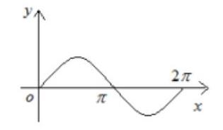
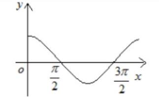
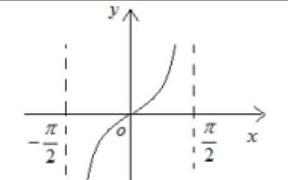
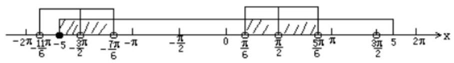
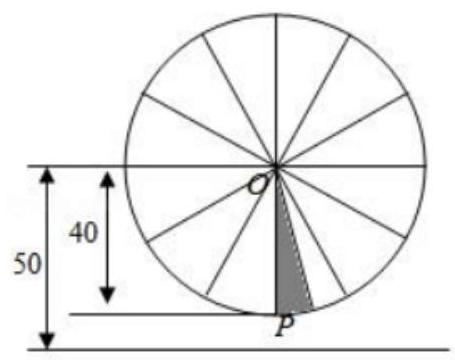
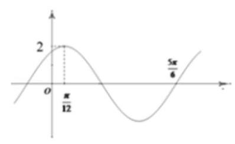
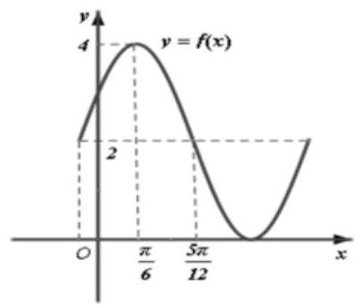
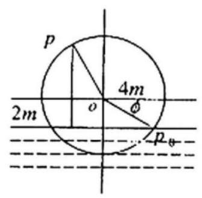
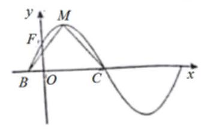
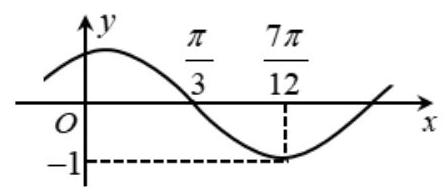

## 三角函数的图像与性质

<table><tr><td>教学目标</td><td>1、熟练掌握正弦、余弦函数的图像与性质，并能用它研究复合函数的性质；   2、能数形结合，通过图像来研究正弦函数、余弦函数的性质；   3、掌握三角函数图像的平移、伸缩变换问题;   4、掌握三角函数的最值问题；</td></tr><tr><td>重点</td><td>1、三角函数的化简、单调性与最值；   2、三角函数的应用；</td></tr><tr><td>难 点</td><td>1、三角函数的化简、单调性与最值;   2、三角函数综合.</td></tr></table>

## 知识梳理

一、三角函数的图像与性质

<table id="cross-table-1"><tr><td>函数</td><td>$y = \sin x$</td><td>$y = \cos x$</td><td>$y = \tan x$</td></tr><tr><td>图像</td><td></td><td></td><td></td></tr><tr><td>定义域</td><td colspan="2">$R$</td><td>$\left\{  {x\left| {\;x \neq  {k\pi } + \frac{\pi }{2}}\right. , k \in  Z}\right\}$</td></tr><tr><td>值域</td><td colspan="2">$\left\lbrack  {-1,1}\right\rbrack$</td><td>$R$</td></tr><tr><td>有界性</td><td>$\left| {\sin x}\right|  \leq  1$</td><td>$\left| {\cos x}\right|  \leq  1$</td><td>无</td></tr><tr><td>最小正周期</td><td colspan="2">${2\pi }$</td><td>$\pi$</td></tr><tr><td>单调性</td><td>增区间: $\left\lbrack  {{2k\pi } - \frac{\pi }{2},{2k\pi } + \frac{\pi }{2}}\right\rbrack  k \in  Z$ 减区间: $\left\lbrack  {{2k\pi } + \frac{\pi }{2},{2k\pi } + \frac{3\pi }{2}}\right\rbrack  k \in  Z$</td><td>增区间: $\left\lbrack  {{2k\pi } - \pi ,{2k\pi }}\right\rbrack  k \in  Z$    减区间: $\left\lbrack  {{2k\pi } - \pi ,{2k\pi }}\right\rbrack  k \in  Z$</td><td>增区间:    $\left( {{k\pi } - \frac{\pi }{2},{k\pi } + \frac{\pi }{2}}\right) k \in  Z$</td></tr><tr><td>奇偶性</td><td>奇</td><td>偶</td><td>奇</td></tr><tr><td>最值</td><td>$x = {2k\pi } + \frac{\pi }{2}$ 时, ${y}_{\max } = 1 \; x = {2k\pi } - \frac{\pi }{2}$ 时, ${y}_{\min } =  - 1 \; k \in  Z$</td><td>$x = {2k\pi }$ 时, ${y}_{\max } = 1 \; x = {2k\pi } + \pi$ 时, ${y}_{\min } =  - 1 \; k \in  Z$</td><td>无</td></tr><tr><td>对称轴</td><td>$x = {k\pi } + \frac{\pi }{2}, k \in  Z$</td><td>$x = {k\pi }, k \in  Z$</td><td>无</td></tr><tr><td>对称中心</td><td>$\left( {{k\pi },0}\right) , k \in  Z$</td><td>$\left( {{k\pi } + \frac{\pi }{2},0}\right) , k \in  Z$</td><td>$\left( {\frac{k\pi }{2},0}\right) , k \in  Z$</td></tr></table>

## 二、三角函数的解析式

1. 函数 $y = A\sin \left( {{\omega x} + \varphi }\right)  + B$ (其中 $A > 0,\omega  > 0$ ) 最大值是 $A + B$ ,最小值是 $- A + B$ ,振幅是 $A$ ,周期是 $T = \frac{2\pi }{\omega }$ ,频率是 $f = \frac{\omega }{2\pi }$ ,相位是 ${\omega x} + \varphi$ ,初相是 $\varphi$ ; 其图像的对称轴是直线 ${\omega x} + \varphi  = {k\pi } + \frac{\pi }{2}\left( {k \in  Z}\right)$ ，凡是该图像与直线 $y = B$ 的交点都是该图像的对称中心；

2. 由 $y = A\sin \left( {{\omega x} + \varphi }\right)$ 的图像求其函数式:

给出图像确定解析式 $y = A\sin \left( {{\omega x} + \varphi }\right)$ 的题型,有时从寻找 “五点” 中的第一个零点 $\left( {-\frac{\varphi }{\omega },0}\right)$ 作为突破口, 要从图像的升降情况找准第一个零点的位置;

3. 函数 $y = A\sin \left( {{\omega x} + \varphi }\right)  + B$ 的图像与函数 $y = \sin x$ 的图像之间可以通过变化 $A,\omega ,\varphi , B$ 来相互转化;

$A,\omega$ 影响图像的形状, $\varphi , B$ 影响图像与 $x$ 轴交点的位置; 由 $A$ 引起的变换称振幅变换,由 $\omega$ 引起的变换称周期变换,它们都是伸缩变换; 由 $\varphi$ 引起的变换称相位变换,由 $B$ 引起的变换称上下平移变换,它们都是平移变换;

既可以将三角函数的图像先平移后伸缩也可以将其先伸缩后平移;

变换方法如下:

先平移后伸缩:

$y = \sin x$ 的图像 $\xrightarrow[]{\text{ 向左 }\left( {\varphi  > 0}\right) \text{ 或向右 }\left( {\varphi  < 0}\right) }$ 得 $y = \sin \left( {x + \varphi }\right)$ 的图像 横坐标件: $\left( {0 < \varphi  < 1}\right)$ 或缩短 $\left( {\omega  > 1}\right)$ , 得 $y = \sin \left( {{\omega x} + \varphi }\right)$ 的图像 $\xrightarrow[]{\text{ 纵坐标伸长 }\left( {A > 1}\right) \text{ 或缩短 }\left( {0 < A < 1}\right) }$ 得 $y = A\sin \left( {{\omega x} + \varphi }\right)$ 的图像 $\frac{\text{ 向上 }\left( {k > 0}\right) \text{ 或向下 }\left( {k < 0}\right) }{\text{ 平移 }\left| k\right| \text{ 个单位长度 }} \rightarrow$ 得 $y = A\sin \left( {{\omega x} + \varphi }\right)  + k$ 的图像;

## 先伸缩后平移:

$y = \sin x$ 的图像 $\xrightarrow[]{\text{ 纵坐标伸长 }\left( {A > 1}\right) \text{ 或缩短 }\left( {0 < A < 1}\right) }$ 得 $y = A\sin x$ 的图像 $\xrightarrow[]{\text{ 横坐标伸长 }\left( {0 < \omega  < 1}\right) \text{ 或缩短 }\left( {\omega  > 1}\right) }$ 判断正得 $y = A\sin \left( {\omega x}\right)$ 的图像 $\xrightarrow[{\text{ 平移 }\left| \frac{\varphi }{\omega }\right| \text{ 个单位 }}]{\text{ 向左 }\left( {\varphi  > 0}\right) \text{ 或向右 }\left( {\varphi  < 0}\right) }$ 得 $y = A\sin \left( {{\omega x} + \varphi }\right)$ 的图像 $\xrightarrow[{\text{ 平移 }R\text{ 个单位长度 }}]{\text{ 向上 }\left( {k > 0}\right) \text{ 或向下 }\left( {k < 0}\right) }$ 得 $y = A\sin \left( {{\omega x} + \varphi }\right)  + k$ 的图像;

## (一)三角函数的三要素

## 例题精讲

【例 1】求函数 $y = \sqrt{{25} - {x}^{2}} + {\log }_{\sin x}\left( {2\sin x - 1}\right)$ 的定义域.

【难度】 $\star   \star   \star$

【答案】 $\left\lbrack  {-5, - \frac{3\pi }{2}}\right)  \cup  \left( {-\frac{3\pi }{2}, - \frac{7\pi }{6}}\right)  \cup  \left( {\frac{\pi }{6},\frac{\pi }{2}}\right)  \cup  \left( {\frac{\pi }{2},\frac{5\pi }{6}}\right)$

【解析】由题有 $\left\{  {\begin{array}{l} {25} - {x}^{2} \geq  0 \\  \sin x > 0 \\  \sin x \neq  1 \\  2\sin x - 1 > 0 \end{array} \Rightarrow  \left\{  \begin{array}{l}  - 5 \leq  x \leq  5 \\  {2k\pi } + \frac{\pi }{6} < x < {2k\pi } + \frac{5\pi }{6}\left( {k \in  Z}\right) \\  x \neq  {2k\pi } + \frac{\pi }{2}\left( {k \in  Z}\right)  \end{array}\right. }\right.$

将上面的每个不等式的范围在数轴上表示出来,然后取公共部分,由于 $\mathrm{x} \in  \left\lbrack  {-5,5}\right\rbrack$ ,故下面的不等式的范围只取落入[-5, 5]之内的值,

即:

$\therefore$ 因此函数的定义域为: $\left\lbrack  {-5, - \frac{3\pi }{2}}\right)  \cup  \left( {-\frac{3\pi }{2}, - \frac{7\pi }{6}}\right)  \cup  \left( {\frac{\pi }{6},\frac{\pi }{2}}\right)  \cup  \left( {\frac{\pi }{2},\frac{5\pi }{6}}\right)$

【例 2】、求下列函数的值域:

(1) $y = 1 + \sin x\cos x$

(2) $y = \cos x + \sqrt{3}\sin x\left( {x \in  \left\lbrack  {\frac{\pi }{6},\frac{2\pi }{3}}\right\rbrack  }\right)$ (3) $f\left( x\right)  = 3\sin x + \cos {2x}$ ；

(4) $y = \frac{2 + \cos x}{2 - \cos x}$ ; (5) $y = \sin x - \left| {\sin x}\right|$ . (6) $y = \frac{\sin x\cos x}{1 + \sin x + \cos x}$

【难度】★★★

【答案】见解析

【解析】(1) 根据 $\left| {\sin x\cos x}\right|  = \left| {\frac{1}{2}\sin {2x}}\right|  \leq  \frac{1}{2}$ 可知 $\frac{1}{2} \leq  y \leq  \frac{3}{2}$ ,故函数的值域为 $\left\{  {y\left| {\;\frac{1}{2} \leq  y \leq  \frac{3}{2}}\right. }\right\}$ .

(2) $y = \cos x + \sqrt{3}\sin x = 2\sin \left( {\frac{\pi }{6} + x}\right)$ ，由 $\frac{\pi }{6} \leq  x \leq  \frac{2\pi }{3}$ 知 $\frac{\pi }{3} \leq  \frac{\pi }{6} + x \leq  \frac{5\pi }{6}$ ，由正弦函数的单调性可知 $\frac{1}{2} \leq  \sin \left( {\frac{\pi }{6} + x}\right)  \leq  1$ ,故函数的值域为 $\{ y \mid  1 \leq  y \leq  2\}$ .

(3) $f\left( x\right)  = 3\sin x + 1 - 2{\sin }^{2}x =  - 2{\left( \sin x - \frac{3}{4}\right) }^{2} + \frac{17}{8}\therefore$ 当 $\sin x = \frac{3}{4}$ 时， $f\left( x\right)$ 有最大值 $\frac{17}{8}$ ；

当 $\sin x =  - 1$ 时, $f\left( x\right)$ 有最小值 $- 4.\therefore$ 值域为 $\left\lbrack  {-4,\frac{17}{8}}\right\rbrack$

(4) $\because y\left( {2 - \cos x}\right)  = 2 + \cos x,\therefore \cos x = \frac{{2y} - 2}{y + 1}$ ,即 $- 1 \leq  \frac{{2y} - 2}{y + 1} \leq  1$ ,解得 $\frac{1}{3} \leq  y \leq  3$ , $\therefore$ 值域为 $\left\lbrack  {\frac{1}{3},3}\right\rbrack$ .

(5) $\because y = \sin x - \left| {\sin x}\right|  = \left\{  \begin{array}{l} 0\;,\sin x > 0 \\  2\sin x,\sin x \leq  0 \end{array}\right. ,\therefore$ 值域为 $\left\lbrack  {-2,0}\right\rbrack$ .

(6) 令 $t = \sin x + \cos x = \sqrt{2}\sin \left( {x + \frac{\pi }{4}}\right)  \in  \left\lbrack  {-\sqrt{2}, - 1}\right\rbrack   \cup  \left\lbrack  {-1,\sqrt{2}}\right\rbrack  \therefore \sin x\cos x = \frac{{t}^{2} - 1}{2}, y = \frac{t - 1}{2} \; \therefore$ 值域是 $\left\lbrack  {-\frac{\sqrt{2} + 1}{2}, - 1)\cup ( - 1,\frac{\sqrt{2} - 1}{2}}\right\rbrack  y = \frac{\frac{{t}^{2} - 1}{2}}{t + 1} = \frac{t - 1}{2} \Rightarrow$ 值域是 $\left\lbrack  {-\frac{\sqrt{2} + 1}{2}, - 1)\cup ( - 1,\frac{\sqrt{2} - 1}{2}}\right\rbrack$

【例 3】如图,摩天轮的半径为 ${40m}, O$ 点距地面的高度为 ${50m}$ ,摩天轮作匀速转动,每 12 分钟转一圈, 摩天轮上 $P$ 点的起始位置在最低处,那么在 $t$ 分钟时, $P$ 点距地面的高度 $h =$ ___ $\left( m\right)$ .

【难度】 $\star   \star   \star$

【答案】 ${50} - {40}\cos \frac{\pi }{6}t$

【解析】解: 设在 $t$ 分钟时, $P$ 点距地面的高度 $h = {50} - {40}\cos \left( {{\omega x} + \varphi }\right)$ , $\because$ 摩天轮的半径为 ${40m}, O$ 点距地面的高度为 ${50m}$ ,摩天轮作匀速转动,每 12 分钟转一圈, $\therefore \frac{2\pi }{\omega } = {12}$ , $\omega  = \frac{\pi }{6}.$

且振幅为 ${40m}$ ,摩天轮上 $P$ 点的起始位置在最低处, $\varphi  = 0, h = {50} - {40} = {10m}$ ,

由题意可得,在 $t$ 分钟时, $P$ 点距地面的高度 $h = {50} - {40}\cos \frac{\pi }{6}t$ ,单位 $m$ ,故答案为: ${50} - {40}\cos \frac{\pi }{6}t$ .

## 巩固训练

1、求函数的定义域:

(1) $y = \sqrt{2 + {\log }_{\frac{1}{2}}x} + \sqrt{\tan x}$ ; (2) $y = \frac{\tan \left( {x - \frac{\pi }{4}}\right) \sqrt{\sin x}}{\lg \left( {2\cos x - 1}\right) }$ .

【难度】 $\star   \star   \star$

【答案】见解析

【解析】(1) 要使得函数有意义,需满足 $\left\{  {\begin{array}{l} 2 + {\log }_{\frac{1}{2}}x \geq  0 \\  \tan x \geq  0 \end{array} \Rightarrow  \left\{  \begin{array}{l} 0 < x \leq  4 \\  {k\pi } \leq  x < {k\pi } + \frac{\pi }{2} \end{array}\right. }\right.$ , 解得 $0 < x < \frac{\pi }{2}$ 或 $\pi  \leq  x \leq  4,\therefore$ 定义域为: $x \in  \left( {0,\frac{\pi }{2}}\right)  \cup  \left\lbrack  {\pi ,4}\right\rbrack$ .

( 2 )要使得函数有意义，需满足 $\left\{  \begin{array}{l} x - \frac{\pi }{4} \neq  {k\pi } + \frac{\pi }{2} \\  \sin x \geq  0 \\  2\cos x - 1 > 0 \\  2\cos x - 1 \neq  1 \end{array}\right.$ 解得 ${2k\pi } < x < {2k\pi } + \frac{\pi }{3}, k \in  Z$

$\therefore$ 定义域为: $\left\{  {x\left| {\;{2k\pi } < x < {2k\pi } + \frac{\pi }{3}}\right. , k \in  Z}\right\}$ .

2、求下列函数的值域:

(1) $y = \frac{\sin x + 2}{2 - \sin x}, x \in  \left\lbrack  {0,\frac{\pi }{2}}\right\rbrack$ ; (2) $y = \frac{\sin x + 2}{2 - \cos x}$ ；

【难度】 $\star   \star   \star$

【答案】(1) $\left\lbrack  {1,3}\right\rbrack$ ；(2) $\left\lbrack  {\frac{4 - \sqrt{7}}{3},\frac{4 + \sqrt{7}}{3}}\right\rbrack$

【解析】(1) 常数分离, 或者反解根据三角有解性 (2) 数形结合, 看成两点的斜率或者反解根据三角有解性

3、函数 $f\left( x\right)  = A\sin \left( {{\omega x} + \varphi }\right) \left( {A > 0,\omega  > 0,\left| \varphi \right|  < \frac{\pi }{2}}\right)$ 的部分图象如图所示，则 $f\left( x\right)  =$ ___.

【难度】 $\star   \star   \star$

【答案】 $2\sin \left( {{2x} + \frac{\pi }{3}}\right)$

【解析】解: 由图可知, $A = 2,\frac{3}{4}T = \frac{5\pi }{6} - \frac{\pi }{12}$ ,解得: $T = \pi$ .

$\therefore \omega  = \frac{2\pi }{\pi } = 2.\therefore f\left( x\right)  = 2\sin \left( {{2x} + \varphi }\right) ,\therefore$ 由 $f\left( \frac{\pi }{12}\right)  = 2\sin \left( {2 \times  \frac{\pi }{12} + \varphi }\right)  = 2$ ,可得: $2 \times  \frac{\pi }{12} + \varphi  = {2k\pi } + \frac{\pi }{2}, k \in  Z$ ,解得: $\varphi  = {2k\pi } + \frac{\pi }{3}, k \in  Z,\because \left| \varphi \right|  < \frac{\pi }{2}$ ,可得: $\varphi  = \frac{\pi }{3}$ ,可得: $f\left( x\right)  = 2\sin \left( {{2x} + \frac{\pi }{3}}\right)$ .

故答案为: $2\sin \left( {{2x} + \frac{\pi }{3}}\right)$ .

## (二)三角函数的图像与性质

## 例题精讲

【例 4】求函数的最小正周期.

(1) $y = \sin \left( {\frac{\pi }{3} - \frac{\pi }{2}x}\right)$ ; (2) $y = \sin x + \cos x$ ； (3) $y = {\left( \sin x + \cos x\right) }^{2} + 2{\cos }^{2}x$

【难度】★★

【答案】见解析

【解析】(1) $T = \frac{2\pi }{\left| -\frac{\pi }{2}\right| } = 4,\therefore$ 周期为 4;

(2) $y = \cos x + \sin x = \sqrt{2}\sin \left( {x + \frac{\pi }{4}}\right)$ ， $\therefore$ 周期为 ${2\pi }$ ；

(3) $y = 2 + \sin {2x} + \cos {2x} = 2 + \sqrt{2}\sin \left( {{2x} + \frac{\pi }{4}}\right)$ ， $\therefore$ 周期为 $\pi$ .

【例 5】函数 $y = 2\sin \left( {{2x} - \frac{\pi }{3}}\right)$ 的单调递减区间为___.

【难度】 $\star   \star$

【答案】 $\left\lbrack  {{k\pi } + \frac{5\pi }{12},{k\pi } + \frac{11\pi }{12}}\right\rbrack  , k \in  Z$

【解析】解: 对于函数 $y = 2\sin \left( {{2x} - \frac{\pi }{3}}\right)$ ,令 ${2k\pi } + \frac{\pi }{2} \leq  {2x} - \frac{\pi }{3} \leq  {2k\pi } + \frac{3\pi }{2}$ ,求得 ${k\pi } + \frac{5\pi }{12} \leq  x \leq  {k\pi } + \frac{11\pi }{12}$ , 可得它的单调递减区间为 $\left\lbrack  {{k\pi } + \frac{5\pi }{12},{k\pi } + \frac{11\pi }{12}}\right\rbrack  , k \in  Z$ ,故答案为: $\left\lbrack  {{k\pi } + \frac{5\pi }{12},{k\pi } + \frac{11\pi }{12}}\right\rbrack  , k \in  Z$ .

( 2 )函数 $y = \sin \left( {\frac{\pi }{6} - x}\right)$ ， $x \in  \left\lbrack  {0,\frac{3\pi }{2}}\right\rbrack$ 的单调递减区间是___.

【难度】 $\star   \star   \star$

【答案】 $\left\lbrack  {0,\frac{2}{3}\pi }\right\rbrack$

【解析】解: 由函数 $y = \sin \left( {\frac{\pi }{6} - x}\right)  =  - \sin \left( {x - \frac{\pi }{6}}\right)$ ,令 $- \frac{\pi }{2} + {2k\pi } \leq  x - \frac{\pi }{6} \leq  \frac{\pi }{2} + {2k\pi }, k \in  Z$

得: $- \frac{\pi }{3} + {2k\pi } \leq  x \leq  \frac{2\pi }{3} + {2k\pi },\because x \in  \left\lbrack  {0,\frac{3\pi }{2}}\right\rbrack$ ,当 $k = 0$ 时,可得单调递减区间为 $\left\lbrack  {0,\frac{2}{3}\pi }\right\rbrack$ . 故答案为: $\left\lbrack  {0,\frac{2}{3}\pi }\right\rbrack$ .

(3)已知函数 $f\left( x\right)  = \left| {\sin \left( {{\omega x} + \frac{\pi }{6}}\right) }\right| \left( {\omega  > 0}\right)$ 在区间 $\left\lbrack  {0,\frac{\pi }{2}}\right\rbrack$ 上是单调递增函数，则正实数 $\omega$ 的取值范围是___.

【难度】 $\star   \star   \star$

【答案】 $(0,\frac{2}{3}\rbrack$

【解析】解: $\because y = \left| {\sin x}\right|$ 在 $\left\lbrack  {0,\frac{\pi }{2}}\right\rbrack$ 上递增,周期为 $\pi$ ,令 ${k\pi } \leq  {\omega x} + \frac{\pi }{6} \leq  \frac{\pi }{2} + {k\pi }\left( {k \in  Z}\right)$ ,则 $- \frac{\pi }{6\omega } + \frac{k\pi }{\omega } \leq  x \leq  \frac{\pi }{3\omega } + \frac{k\pi }{\omega }\left( {k \in  Z}\right) ,\therefore$ 当 $k = 0$ 时, $f\left( x\right)$ 的增区间为 $\left\lbrack  {-\frac{\pi }{6\omega },\frac{\pi }{3\omega }}\right\rbrack  ,\because f\left( x\right)$ 在 $\left\lbrack  {0,\frac{\pi }{2}}\right\rbrack$ 上单调递, $\therefore \frac{\pi }{2} \leq  \frac{\pi }{3\omega },\therefore 0 < \omega  \leq  \frac{2}{3},\therefore$ 正实数 $\omega$ 的取值范围为: $\left( {0,\frac{2}{3}}\right\rbrack$ . 故答案为: $\left( {0,\frac{2}{3}}\right\rbrack$ .

【例 6】函数 $f\left( x\right)  = \sqrt{2}\sin \left( {\frac{\pi }{4} + x}\right) \cos x$ 的图象相邻的两条对称轴之间的距离是___

【难度】 $\star   \star   \star$

【答案】 $\frac{\pi }{2}$

【解析】解: $f\left( x\right)  = \sqrt{2}\sin \left( {\frac{\pi }{4} + x}\right) \cos x = \left( {\sin x + \cos x}\right) \cos x = \frac{1}{2}\sin {2x} + \frac{1}{2}\left( {1 + \cos {2x}}\right)  = \frac{\sqrt{2}}{2}\sin \left( {{2x} + \frac{\pi }{4}}\right)  + \frac{1}{2}$ , 所以 $f\left( x\right)$ 的周期 $T = \pi$ ,所以 $f\left( x\right)$ 的图象相邻的两条对称轴之间的距离为 $\frac{1}{2}T = \frac{\pi }{2}$ ,故答案为: $\frac{\pi }{2}$ .

【例 7】已知函数 $f\left( x\right)  = 2\sin {\omega x}$ 在区间 $\left\lbrack  {-\frac{\pi }{3},\frac{\pi }{4}}\right\rbrack$ 上的最小值是 -2,则实数 $\omega$ 的取值范围为( )

C. $\left( {-\infty , - \frac{9}{2}}\right\rbrack$ D. $\left( {-\infty , - \frac{9}{2}}\right)  \cup  \lbrack 6, + \infty )$

【难度】 $\star   \star   \star$

【答案】A

【解析】根据三角函数图像

【例 8】设函数 $f\left( x\right)  = \sin \left( {{2x} + \frac{\pi }{3}}\right)$ ,若 ${x}_{1}{x}_{2} < 0$ ,且 $f\left( {x}_{1}\right)  + f\left( {x}_{2}\right)  = 0$ ,则 $\left| {{x}_{2} - {x}_{1}}\right|$ 的取值范围是___.

【难度】 $\star   \star   \star$

【答案】 $\left( {\frac{\pi }{3}, + \infty }\right)$ .

【解析】解: 根据函数 $f\left( x\right)  = \sin \left( {{2x} + \frac{\pi }{3}}\right) ,\because f\left( {x}_{1}\right)  + f\left( {x}_{2}\right)  = 0$ ,可得 $f\left( {x}_{1}\right)  =  - f\left( {x}_{2}\right)$ ,

令 ${x}_{2} > {x}_{1}$ ,根据图象,可得 ${x}_{2},{x}_{1}$ 关于点 $\left( {-\frac{\pi }{6},0}\right)$ 对称时, $\left| {{x}_{2} - {x}_{1}}\right|$ 最小, $\because {x}_{1}{x}_{2} < 0$ ,令 ${x}_{2} > 0$ ,则 ${x}_{1} <  - \frac{\pi }{3}$ . $\therefore$ 可得 $\left| {{x}_{2} - {x}_{1}}\right|  > \frac{\pi }{3},\therefore \left| {{x}_{2} - {x}_{1}}\right|$ 的取值范围为: $\left( {\frac{\pi }{3}, + \infty }\right)$ .

【例 9】函数 $y = \sin x$ 的定义域为 $\left\lbrack  {a, b}\right\rbrack$ ,值域为 $\left\lbrack  {-1,\frac{1}{2}}\right\rbrack$ ,则 $b - a$ 的最大值为( )

A. $\pi$ B. $\frac{4}{3}\pi$ C. $\frac{5}{3}\pi$ D. ${2\pi }$

【难度】★★★

【答案】B

【解析】根据三角函数图像

【例 10】将函数 $f\left( x\right)  = \sin \left( {{2x} + \frac{\pi }{3}}\right)$ 向左平移 $\varphi$ 个单位 $\left( {0 < \phi  < \frac{\pi }{2}}\right)$ 得函数 $g\left( x\right)$ 图象; 若 $g\left( x\right)$ 为偶函数,那么 $\varphi  =$ ___；若 $g\left( x\right)$ 为奇函数，那么 $\varphi  =$ ___.

【难度】 $\star   \star   \star$

【答案】 $\frac{\pi }{12},\frac{\pi }{3}$

【解析】解: 函数 $f\left( x\right)  = \sin \left( {{2x} + \frac{\pi }{3}}\right)$ 向左平移 $\varphi$ 个单位 $\left( {0 < \phi  < \frac{\pi }{2}}\right)$ 得函数 $g\left( x\right)$ 图象;

故: $g\left( x\right)  = \sin \left( {{2x} + {2\varphi } + \frac{\pi }{3}}\right)$ . ①由于函数的图象为偶函数,

故: ${2\varphi } + \frac{\pi }{3} = {k\pi } + \frac{\pi }{2}\left( {k \in  Z}\right)$ ,解得: $\varphi  = \frac{k\pi }{2} + \frac{\pi }{12}\left( {k \in  Z}\right)$ ,由于: $0 < \varphi  < \frac{\pi }{2}$ ,

当 $k = 0$ 时, $\varphi  = \frac{\pi }{12}$ . ②当 $g\left( x\right)$ 为奇函数时, ${2\varphi } + \frac{\pi }{3} = {k\pi }\left( {k \in  Z}\right)$ ,解得: $\varphi  = \frac{k\pi }{2} - \frac{\pi }{6}\left( {k \in  Z}\right)$ ,

由于: $0 < \phi  < \frac{\pi }{2}$ ,故: 当 $k = 1$ 时, $\varphi  = \frac{\pi }{3}$ . 故答案为: $\frac{\pi }{12},\frac{\pi }{3}$

【例 11】函数 $y = \sin x - \sqrt{3}\cos x$ 的图象可由函数 $y = \cos x + \sqrt{3}\sin x$ 的图象至少向左平移___个单位长度得到.

【难度】 $\star   \star   \star$

【答案】 $\frac{3\pi }{2}$

【解析】解: $\because$ 函数 $y = \cos x + \sqrt{3}\sin x = 2\sin \left( {\frac{\pi }{6} + x}\right) , y = \sin x - \sqrt{3}\cos x = 2\sin \left( {x - \frac{\pi }{3}}\right)  = 2\sin \left( {x + \frac{5\pi }{3}}\right)$ , 故把函数 $y = \cos x + \sqrt{3}\sin x$ 的图象至少向左平移 $\frac{5\pi }{3} - \frac{\pi }{6} = \frac{3\pi }{2}$ 个单位,可得 $y = \sin x - \sqrt{3}\cos x$ 的图象, 故答案为: $\frac{3\pi }{2}$ .

【例 12】函数 $y = 3\tan \left( {{2x} + \frac{\pi }{3}}\right)  - 1$ 的对称中心坐标是___.

【难度】 $\star   \star$

【答案】 $\left( {\frac{k\pi }{4} - \frac{\pi }{6}, - 1}\right) , k \in  Z$

【解析】解: 函数 $y = 3\tan \left( {{2x} + \frac{\pi }{3}}\right)  - 1$ 中,令 ${2x} + \frac{\pi }{3} = \frac{k\pi }{2}, k \in  Z$ ,解得 $x = \frac{k\pi }{4} - \frac{\pi }{6}, k \in  Z$ ; 所以函数 $y$ 的对称中心坐标为 $\left( {\frac{k\pi }{4} - \frac{\pi }{6}, - 1}\right) , k \in  Z$ . 故答案为: $\left( {\frac{k\pi }{4} - \frac{\pi }{6}, - 1}\right) , k \in  Z$ .

【例 13】已知函数 $f\left( x\right)  = \sin {\omega x}\left( {\omega  > 0}\right)$ ,将 $f\left( x\right)$ 的图象向左平移 $\frac{\pi }{2\omega }$ 个单位得到函数 $g\left( x\right)$ 的图象,令 $h\left( x\right)  = f\left( x\right)  + g\left( x\right)$ ,如果存在实数 $m$ ,使得对任意的实数 $x$ ,都有 $h\left( m\right)  \leq  h\left( x\right)  \leq  h\left( {m + 1}\right)$ 成立,则 $\omega$ 的最小值为___.

【难度】 $\star   \star   \star$

【答案】 $\pi$

【解析】解: 函数 $f\left( x\right)  = \sin {\omega x}\left( {\omega  > 0}\right)$ ,将 $f\left( x\right)$ 的图象向左平移 $\frac{\pi }{2\omega }$ 个单位得到函数 $g\left( x\right)  = \sin \left( {{\omega x} + \frac{\pi }{2}}\right)$

$= \cos {\omega x}$ 的图象,令 $h\left( x\right)  = f\left( x\right)  + g\left( x\right)  = \sin {\omega x} + \cos {\omega x} = \sqrt{2}\sin \left( {{\omega x} + \frac{\pi }{4}}\right)$ ,

如果存在实数 $m$ ,使得对任意的实数 $x$ ,都有 $h\left( m\right)  \leq  h\left( x\right)  \leq  h\left( {m + 1}\right)$ 成立,

$\therefore \frac{1}{2} \cdot  \frac{2\pi }{\omega } \leq  1,\therefore \omega  \geq  \pi$ ,则 $\omega$ 的最小值为 $\pi$ ,故答案为: $\pi$ .

## 巩固训练

1、函数 $y = \tan \left( {{\omega x} - \frac{\pi }{4}}\right)$ 的最小正周期为 4，则 $\omega  =$ ___.

【难度】 $\star   \star$

【答案】 $\pm  \frac{\pi }{4}$

【解析】 $y = \tan \left( {{\omega x} - \frac{\pi }{4}}\right)$ ,故 $T = \left| \frac{\pi }{\omega }\right|  = 4$ ,故 $\omega  =  \pm  \frac{\pi }{4}$ . 故答案为: $\pm  \frac{\pi }{4}$ .

2、若函数 $f\left( x\right)  = 2{\cos }^{2}x \cdot  \sin {2x} - 2\sin x\cos x\left( {x \in  \mathbf{R}}\right)$ ，则 $f\left( x\right)$ 是( )

A. 最小正周期为 $\pi$ 的偶函数 B. 最小正周期为 $\pi$ 的奇函数

C. 最小正周期为 ${2\pi }$ 的偶函数

D. 最小正周期为 $\frac{\pi }{2}$ 的奇函数

【难度】 $\star   \star$

【答案】D

【解析】解: $f\left( x\right)  = 2{\cos }^{2}x \cdot  \sin {2x} - 2\sin x\cos x = 2{\cos }^{2}x \cdot  \sin {2x} - \sin {2x}$

$= \left( {2{\cos }^{2}x - 1}\right) \sin {2x} = \sin {2x}\cos {2x} = \frac{1}{2}\sin {4x}$ ,所以最小正周期为 $T = \frac{2\pi }{4} = \frac{\pi }{2}$ 且为奇函数,故选: D.

3、已知 $f\left( x\right)  = a\sin {2x} + b\tan x + 1$ ，且 $f\left( {-3}\right)  = 5$ ，则 $f\left( {\pi  + 3}\right)  =$ ___.

【难度】 $\star   \star   \star$

【答案】 -3

【解析】由三角函数的奇偶性和周期性可知: $f\left( {\pi  + 3}\right)  =  - 5 + 2 =  - 3$ .

4、函数 $y = \sin \left( {\frac{\pi }{6} - x}\right) , x \in  \left\lbrack  {0,\frac{3\pi }{2}}\right\rbrack$ 的单调递减区间是___.

【难度】 $\star   \star   \star$

【答案】 $\left\lbrack  {0,\frac{2}{3}\pi }\right\rbrack$

【解析】解: 由函数 $y = \sin \left( {\frac{\pi }{6} - x}\right)  =  - \sin \left( {x - \frac{\pi }{6}}\right)$ ,令 $- \frac{\pi }{2} + {2k\pi } \leq  x - \frac{\pi }{6} \leq  \frac{\pi }{2} + {2k\pi }, k \in  Z$

得: $- \frac{\pi }{3} + {2k\pi } \leq  x \leq  \frac{2\pi }{3} + {2k\pi },\because x \in  \left\lbrack  {0,\frac{3\pi }{2}}\right\rbrack$ ,当 $k = 0$ 时,可得单调递减区间为 $\left\lbrack  {0,\frac{2}{3}\pi }\right\rbrack$ . 故答案为: $\left\lbrack  {0,\frac{2}{3}\pi }\right\rbrack$ .

5、函数 $y = 2\sin \left( {{3x} - \frac{\pi }{4}}\right)$ 的图像的相邻两对称中心的距离是___.

【难度】

【答案】 $\frac{\pi }{3}$

【解析】正弦型函数的对称中心为函数与 $x$ 轴的交点,函数相邻零点间的距离为 $\frac{T}{2}, T = \frac{2\pi }{3} \Rightarrow  \frac{T}{2} = \frac{\pi }{3}$ .

6、已知函数 $f\left( x\right)  = 2{\sin }^{2}{\omega x}\left( {\omega  > 0}\right)$ 的最小正周期为 $\pi$ ，若将其图象沿 $x$ 轴向右平移 $m\left( {m > 0}\right)$ 个单位， 所得图象关于 $x = \frac{\pi }{3}$ 对称,则实数 $m$ 的最小值为(   )

A. $\frac{\pi }{4}$ B. $\frac{\pi }{3}$ C. $\frac{3\pi }{4}$ D. $\pi$

【难度】★★★

【答案】B

【解析】化简得 $f\left( x\right)  =  - \cos {2\omega x} + 1,\because$ 函数 $f\left( x\right)$ 的最小正周期为 $\pi \therefore \omega  = 1$ ,所以 $f\left( x\right)  =  - \cos {2x} + 1$ , 将其图象沿 $x$ 轴向右平移 $m\left( {m > 0}\right)$ 个单位,所得图象对应函数为 $y =  - \cos \left( {{2x} - {2m}}\right)  + 1$ ,

因为其图象关于 $x = \frac{\pi }{3}$ 对称,则有 $\cos \left( {\frac{2\pi }{3} - {2m}}\right)  =  \pm  1,\therefore \frac{2\pi }{3} - {2m} = {k\pi }, k \in  Z$ ,解得 $m = \frac{\pi }{3} - \frac{k\pi }{2}, k \in  Z$ 由 $m > 0$ ，实数 $m$ 的最小值为 $\frac{\pi }{3}$ . 故选: B.

7、把函数 $f\left( x\right)  = 2\sqrt{3}\sin x\cos x + \cos {2x}$ 的图像先向右平移 $\frac{\pi }{6}$ 个单位，得到函数 $g\left( x\right)$ 的图像，再将 $g\left( x\right)$ 的图像上的所有点的横坐标变成原来的 $\frac{1}{2}$ ，得到函数 $h\left( x\right)$ 的图像，则下列说法正确的是( )

A. 函数的最小正周期为 ${2\pi }$

B. $\left( {\frac{5\pi }{6},0}\right)$ 是函数 $h\left( x\right)$ 图像的一个对称中心

C. 函数 $h\left( x\right)$ 图像的一条对称轴方程为 $x = \frac{\pi }{6}$

D. 函数 $h\left( x\right)$ 在区间 $\left\lbrack  {-\frac{\pi }{6},\frac{\pi }{3}}\right\rbrack$ 上单调递增

【难度】 $\star   \star   \star$

【答案】C

【解析】解: $f\left( x\right)  = 2\sqrt{3}\sin x\cos x + \cos {2x} = \sqrt{3}\sin {2x} + \cos {2x} = 2\sin \left( {{2x} + \frac{\pi }{6}}\right)$ ,

则 $g\left( x\right)  = 2\sin \left\lbrack  {2\left( {x - \frac{\pi }{6}}\right)  + \frac{\pi }{6}}\right\rbrack   = 2\sin \left( {{2x} - \frac{\pi }{6}}\right) , h\left( x\right)  = 2\sin \left( {{4x} - \frac{\pi }{6}}\right)$ ,此时 $T = \frac{2\pi }{4} = \frac{\pi }{2}$ ,故 A 错误;

当 $x = \frac{5\pi }{6}$ 时, $h\left( \frac{5\pi }{6}\right)  = 2\sin \left( {4 \times  \frac{5\pi }{6} - \frac{\pi }{6}}\right)  =  - 1$ ,故 B 错误;

当 $x = \frac{\pi }{6}$ 时, $h\left( \frac{\pi }{6}\right)  = 2\sin \left( {4 \times  \frac{\pi }{6} - \frac{\pi }{6}}\right)  = 2$ ,故 $\mathrm{C}$ 正确; 当 $x \in  \left\lbrack  {-\frac{\pi }{6},\frac{\pi }{3}}\right\rbrack$ ,则 $- \frac{5\pi }{6} \leq  {4x} - \frac{\pi }{6} \leq  \frac{7\pi }{6}$ ,

因为函数 $y = \sin x$ 在 $\left\lbrack  {-\frac{5\pi }{6},\frac{7\pi }{6}}\right\rbrack$ 上不是单调函数,则函数 $h\left( x\right)$ 在区间 $\left\lbrack  {-\frac{\pi }{6},\frac{\pi }{3}}\right\rbrack$ 上单不是单调函数,故 $\mathrm{D}$ 错误.故选: C.

8、若函数 $f\left( x\right)  = {\cos }^{2}x + a\sin x + b$ 在 $\left\lbrack  {0,\frac{\pi }{2}}\right\rbrack$ 上的最大值为 $M$ ，最小值为 $m$ ，则 $M - m$ 的值( ).

A. 与 $a$ 有关，且与 $b$ 有关 B. 与 $a$ 有关，且与 $b$ 无关

C. 与 $a$ 无关，且与 $b$ 有关 D. 与 $a$ 无关,且与 $b$ 无关

【难度】★★★

【答案】B

【解析】由题意 $f\left( x\right)  = {\cos }^{2}x + a\sin x + b =  - {\sin }^{2}x + a\sin x + b + 1$ ,

因为 $x \in  \left\lbrack  {0,\frac{\pi }{2}}\right\rbrack$ ,令 $t = \sin x \in  \left\lbrack  {0,1}\right\rbrack$ ,则 $h\left( t\right)  =  - {t}^{2} + {at} + b + 1 =  - {\left( t - \frac{a}{2}\right) }^{2} + \frac{{a}^{2}}{4} + b + 1\left( {t \in  \left\lbrack  {0,1}\right\rbrack  }\right)$ ,

则 $M\text{ 、 }m$ 分别为 $h\left( t\right)$ 在 $t \in  \left\lbrack  {0,1}\right\rbrack$ 上的最大值与最小值,

由二次函数的性质可得最大值 $M$ 与最小值 $m$ 的差 $M - m$ 的值与 $a$ 有关,但与 $b$ 无关. 故选: B.

9、已知函数 $f\left( x\right)  = 2\cos \left( {{\pi x} + \varphi }\right) \left( {0 < \varphi  < \frac{\pi }{2}}\right)$ 的图象过点 $\left( {0,\sqrt{2}}\right)$ .

(1)求函数 $f\left( x\right)$ 的解析式，并求出 $f\left( x\right)$ 的最大值、最小值及对应的 $x$ 的值；

(2)把 $y = f\left( x\right)$ 的图象向右平移 1 个单位长度后得到函数 $g\left( x\right)$ 的图象，求 $g\left( x\right)$ 的单调递减区间.

【难度】 $\star   \star   \star$

【答案】(1) $f\left( x\right)  = 2\cos \left( {{\pi x} + \frac{\pi }{4}}\right) ;x = {2k} - \frac{1}{4}\left( {k \in  Z}\right)$ 时, $f{\left( x\right) }_{\max } = 2;x = {2k} + \frac{3}{4}\left( {k \in  Z}\right)$ 时, $f{\left( x\right) }_{\min } =  - 2;\left( 2\right) \left\lbrack  {{2k} + \frac{3}{4},{2k} + \frac{7}{4}}\right\rbrack  \left( {k \in  Z}\right)$

【解析】(1) 代入点 $\left( {0,\sqrt{2}}\right)$ ,得 $2\cos \left( {0 + \varphi }\right)  = \sqrt{2},\cos \varphi  = \frac{\sqrt{2}}{2}$ .

因为 $0 < \varphi  < \frac{\pi }{2}$ ,所以 $\varphi  = \frac{\pi }{4}$ ,则 $f\left( x\right)  = 2\cos \left( {{\pi x} + \frac{\pi }{4}}\right)$ .

当 ${\pi x} + \frac{\pi }{4} = {2k\pi }$ ,即 $x = {2k} - \frac{1}{4}\left( {k \in  Z}\right)$ 时, $f{\left( x\right) }_{\max } = 2$ ;

当 ${\pi x} + \frac{\pi }{4} = \pi  + {2k\pi }$ ,即 $x = {2k} + \frac{3}{4}\left( {k \in  Z}\right)$ 时, $f{\left( x\right) }_{\min } =  - 2$ .

( 2 )由( 1 )知 $f\left( x\right)  = 2\cos \left( {{\pi x} + \frac{\pi }{4}}\right)$ ，所以 $g\left( x\right)  = 2\cos \left\lbrack  {\pi \left( {x - 1}\right)  + \frac{\pi }{4}}\right\rbrack   = 2\cos \left( {{\pi x} - \frac{3\pi }{4}}\right)$ .

当 ${2k\pi } \leq  {\pi x} - \frac{3\pi }{4} \leq  \pi  + {2k\pi }\left( {k \in  Z}\right)$ 时, $g\left( x\right)$ 单调递减,所以 $\frac{3}{4} + {2k} \leq  x \leq  \frac{7}{4} + {2k}\left( {k \in  Z}\right)$ ,

所以 $g\left( x\right)$ 的单调递减区间为 $\left\lbrack  {{2k} + \frac{3}{4},{2k} + \frac{7}{4}}\right\rbrack  \left( {k \in  Z}\right)$ .

## (三)三角函数的综合

## 例题精讲

【例 14】函数 $f\left( x\right)  = A\sin \left( {{\omega x} + \varphi }\right)  + B$ 的一部分图象如图所示,其中 $A > 0,\omega  > 0,\left| \varphi \right|  < \frac{\pi }{2}$ .

(1)求函数 $y = f\left( x\right)$ 解析式;

(2)求 $x \in  \left\lbrack  {0,\pi }\right\rbrack$ 时，函数 $y = f\left( x\right)$ 的值域；

(3)将函数 $y = f\left( x\right)$ 的图象向右平移 $\frac{\pi }{4}$ 个单位长度，得到函数 $y = g\left( x\right)$ 的图象，求函数 $y = g\left( x\right)$ 的单调递减区间.

【难度】 $\star   \star   \star$

【答案】(1) $f\left( x\right)  = 2\sin \left( {{2x} + \frac{\pi }{6}}\right)  + 2$ ；(2) $\left\lbrack  {0,4}\right\rbrack$ ；(3)单调减区间为 $\left\lbrack  {{k\pi } + \frac{5\pi }{12},{k\pi } + \frac{11\pi }{12}}\right\rbrack  , k \in  \mathbf{Z}$ .

【解析】(1) 根据函数 $f\left( x\right)  = A\sin \left( {{\omega x} + \varphi }\right)  + B$ 的一部分图象,其中 $A > 0,\omega  > 0,\left| \varphi \right|  < \frac{\pi }{2}$ ,

$\because \left\{  {\begin{array}{l} A + B = 4 \\   - A + B = 0 \end{array},\therefore \left\{  {\begin{array}{l} A = 2 \\  B = 2 \end{array};\because \frac{T}{4} = \frac{1}{4} \cdot  \frac{2\pi }{\omega } = \frac{5\pi }{12} - \frac{\pi }{6},\therefore \omega  = 2,}\right. }\right.$

再根据 $f\left( \frac{\pi }{6}\right)  = 4$ ,可得 $2 \times  \frac{\pi }{6} + \varphi  = \frac{\pi }{2} + {2k\pi }, k \in  \mathbf{Z}$ ,

$\therefore \varphi  = \frac{\pi }{6} + {2k\pi }, k \in  \mathbf{Z},\because \left| \varphi \right|  < \frac{\pi }{2},\therefore \varphi  = \frac{\pi }{6}$ ,

$\therefore$ 函数 $y = f\left( x\right)$ 的解析式为 $f\left( x\right)  = 2\sin \left( {{2x} + \frac{\pi }{6}}\right)  + 2$ ;

(2) $\because x \in  \left\lbrack  {0,\pi }\right\rbrack$ ， $\therefore {2x} + \frac{\pi }{6} \in  \left\lbrack  {\frac{\pi }{6},\frac{13\pi }{6}}\right\rbrack$ ， $\therefore \sin \left( {{2x} + \frac{\pi }{6}}\right)  \in  \left\lbrack  {-1,1}\right\rbrack$ ， $\therefore$ 函数 $y = f\left( x\right)$ 的值域为 $\left\lbrack  {0,4}\right\rbrack$ ；

(3)将函数 $y = f\left( x\right)$ 的图象向右平移 $\frac{\pi }{4}$ 个单位长度，

得到函数 $g\left( x\right)  = 2\sin \left\lbrack  {2\left( {x - \frac{\pi }{4}}\right)  + \frac{\pi }{6}}\right\rbrack   + 2 = 2\sin \left( {{2x} - \frac{\pi }{3}}\right)  + 2$ 的图象,

对于函数 $g\left( x\right)  = 2\sin \left( {{2x} - \frac{\pi }{3}}\right)  + 2$ ,令 ${2k\pi } + \frac{\pi }{2} \leq  {2x} - \frac{\pi }{3} \leq  {2k\pi } + \frac{3\pi }{2}, k \in  \mathbf{Z}$ ,

求得 ${k\pi } + \frac{5\pi }{12} \leq  x \leq  {k\pi } + \frac{11\pi }{12}, k \in  \mathbf{Z}$ ,故函数 $g\left( x\right)$ 的单调减区间为 $\left\lbrack  {{k\pi } + \frac{5\pi }{12},{k\pi } + \frac{11\pi }{12}}\right\rbrack  , k \in  \mathbf{Z}$ .

【例 15】已知函数 $f\left( x\right)  = \left\lbrack  {2\sin \left( {x + \frac{\pi }{3}}\right)  + \sin x}\right\rbrack  \cos x - \sqrt{3}{\sin }^{2}x$ .

(1)求函数 $f\left( x\right)$ 的值域与周期;

(2)求当 $x \in  \left\lbrack  {0,\frac{\pi }{2}}\right\rbrack$ 时， $f\left( x\right)$ 的单调递减区间；

(3)若函数 $y = f\left( x\right)$ 的图像关于直线 $x = a\left( {a > 0}\right)$ 对称，求 $a$ 的最小值；

(4)若存在 ${x}_{0} \in  \left\lbrack  {0,\frac{5\pi }{12}}\right\rbrack$ ,使 ${mf}\left( {x}_{0}\right)  - 2 = 0$ 成立,求实数 $m$ 的取值范围.

【难度】 $\star   \star   \star$

【答案】见解析

【解析】解: (1) $f\left( x\right)  = \sin {2x} + \sqrt{3}\cos {2x} = 2\sin \left( {{2x} + \frac{\pi }{3}}\right)$ . 所以值域为 $\left\lbrack  {-2,2}\right\rbrack$ ,周期 $T = \pi$

(2) $x \in  \left\lbrack  {0,\frac{\pi }{2}}\right\rbrack   \Rightarrow  {2x} + \frac{\pi }{3} \in  \left\lbrack  {\frac{\pi }{3},\frac{4\pi }{3}}\right\rbrack$ ，又单减性得到 ${2x} + \frac{\pi }{3} \in  \left\lbrack  {\frac{\pi }{2},\frac{4\pi }{3}}\right\rbrack   \Rightarrow  x \in  \left\lbrack  {\frac{\pi }{12},\frac{\pi }{2}}\right\rbrack$

(3) ${2a} + \frac{\pi }{3} = {k\pi } + \frac{\pi }{2}$ ，即 $a = \frac{k\pi }{2} + \frac{\pi }{12}\left( {k \in  Z}\right)$ .

$\because a > 0$ ,则当 $k = 0$ 时, ${a}_{\min } = \frac{\pi }{12}$ .

(4)当 ${x}_{0} \in  \left\lbrack  {0,\frac{5x}{12}}\right\rbrack$ 时, $2{x}_{0} + \frac{\pi }{3} \in  \left\lbrack  {\frac{\pi }{3},\frac{7\pi }{6}}\right\rbrack  ,\sin \left( {2{x}_{0} + \frac{\pi }{3}}\right)  \in  \left\lbrack  {-\frac{1}{2},1}\right\rbrack$ .

$\therefore f\left( {x}_{0}\right)  \in  \left\lbrack  {-1,2}\right\rbrack$ .

由 ${mf}\left( {x}_{0}\right)  - 2 = 0$ ,得 $f\left( {x}_{0}\right)  = \frac{2}{m}\ldots  - 1 \leq  \frac{2}{m} \leq  2$ ,即 $m \leq   - 2$ 或 $m \geq  1$ .

故 $m$ 的取值范围是 $\left( {-\infty , - 2\rbrack \cup \lbrack 1, + \infty }\right)$ .

【例 16】已知函数 $f\left( x\right)  = 2\sin \left( {{\omega x} + \varphi }\right) \left( {0 < \omega  < 6,\left| \varphi \right|  < \frac{\pi }{2}}\right) , f\left( x\right)$ 的图象的一条对称轴是 $x = \frac{\pi }{3}$ , 一个对称中心是 $\left( {\frac{7\pi }{12},0}\right)$ .

(1)求 $f\left( x\right)$ 的解析式;

(2)已知 $A, B, C$ 是 $\bigtriangleup  {ABC}$ 的三个内角，且 $f\left( {B + \frac{\pi }{12}}\right)  = \frac{48}{25}$ ， $\cos C = \frac{5}{13}$ ，求 $\cos A$ .

【难度】 $\star   \star   \star$

【答案】(1) $f\left( x\right)  = 2\sin \left( {{2x} - \frac{\pi }{6}}\right)$ ; (2) $\frac{33}{65}$ 或 $\frac{16}{65}$

【解析】(1) 设 $f\left( x\right)$ 的最小正周期为 $T,\because f\left( x\right)$ 的图象的一条对称轴是 $x = \frac{\pi }{3}$ ,一个对称中心是 $\left( {\frac{7\pi }{12},0}\right)$ ,

$\therefore \frac{7\pi }{12} - \frac{\pi }{3} = \frac{T}{4} \times  \left( {{2k} - 1}\right) , k \in  {N}^{ * },\therefore T = \frac{\pi }{{2k} - 1}, k \in  {N}^{ * }$ ,

$\therefore \frac{\pi }{{2k} - 1} = \frac{2\pi }{\omega }, k \in  {N}^{ * },\therefore \omega  = {4k} - 2, k \in  {N}^{ * },\because 0 < \omega  < 6,\therefore \omega  = 2$

$\because f\left( x\right)$ 图象的一条对称轴是 $x = \frac{\pi }{3},\therefore \frac{2\pi }{3} + \varphi  = \frac{\pi }{2} + {k\pi }, k \in  Z,\therefore \varphi  =  - \frac{\pi }{6} + {k\pi }, k \in  Z$ .

$\because \left| \varphi \right|  < \frac{\pi }{2},\therefore \varphi  =  - \frac{\pi }{6},\therefore f\left( x\right)  = 2\sin \left( {{2x} - \frac{\pi }{6}}\right)$ .

(2)由(1)知 $f\left( {B + \frac{\pi }{12}}\right)  = 2\sin {2B} = \frac{48}{25}$ ，所以 $\sin {2B} = \frac{24}{25}$ ，即 $\sin B\cos B = \frac{12}{25}$ . ①

因为 $A, B, C$ 是 $\bigtriangleup  {ABC}$ 的三个内角， $0 < B < \pi$ ，所以 $\sin B > 0,\cos B > 0$ . 又因为 ${\sin }^{2}B + {\cos }^{2}B = 1$ ，②

联立①②，得 $\left\{  \begin{array}{l} \sin B = \frac{4}{5}, \\  \cos B = \frac{3}{5} \end{array}\right.$ 或 $\left\{  \begin{array}{l} \sin B = \frac{3}{5}, \\  \cos B = \frac{4}{5}. \end{array}\right.$

当 $\sin B = \frac{4}{5},\cos B = \frac{3}{5}$ 时, $\cos A =  - \cos \left( {B + C}\right)  =  - \cos B\cos C + \sin B\sin B =  - \frac{3}{5} \times  \frac{5}{13} + \frac{4}{5} \times  \frac{12}{13} = \frac{33}{65}$ ;

当 $\sin B = \frac{3}{5},\cos B = \frac{4}{5}$ 时， $\cos A =  - \cos \left( {B + C}\right)  =  - \cos B\cos C + \sin B\sin B =  - \frac{4}{5} \times  \frac{5}{13} + \frac{3}{5} \times  \frac{12}{13} = \frac{16}{65}$ .

## 巩固训练

1、已知函数 $f\left( x\right)  = \sin \left( {{2x} + \frac{\pi }{3}}\right)  + \sin \left( {{2x} - \frac{\pi }{3}}\right)  + \sqrt{3}\cos {2x} - m, x \in  R$ ，且 $f\left( x\right)$ 的最大值为1；

(1)求 $m$ 的值，并求 $f\left( x\right)$ 的单调递增区间；

(2)在 $\bigtriangleup  {ABC}$ 中，角 $A, B, C$ 的对边 $a, b, c$ ，若 $f\left( B\right)  = \sqrt{3} - 1$ ，且 $\sqrt{3}a = b + c$ ，试判断 $\bigtriangleup  {ABC}$ 的形状；

【难度】 $\star   \star   \star$

【答案】见解析

【解析】解: (1) $f\left( x\right)  = \sin {2x} + \sqrt{3}\cos {2x} - m = 2\sin \left( {{2x} + \frac{\pi }{3}}\right)  - m$

因为 $f{\left( x\right) }_{\max } = 2 - m$ ,所以 $m = 1$ ,

令 $- \frac{\pi }{2} + {2k\pi } \leq  {2x} + \frac{\pi }{3} \leq  \frac{\pi }{2} + {2k\pi }$ 得到: 单调增区间为 $\left\lbrack  {{k\pi } - \frac{5\pi }{12},{k\pi } + \frac{\pi }{12}}\right\rbrack  \left( {\mathrm{k} \in  \mathrm{Z}}\right)$

(无 $\left( {\mathrm{k} \in  \mathrm{Z}}\right)$ 扣 1 分)

(2)因为 $f\left( B\right)  = \sqrt{3} - 1$ ，则 $2\sin \left( {{2B} + \frac{\pi }{3}}\right)  - 1 = \sqrt{3} - 1$ ，所以 $B = \frac{\pi }{6}$

又 $\sqrt{3}a = b + c$ ,则 $\sqrt{3}\sin A = \sin B + \sin C,\sqrt{3}\sin A = \frac{1}{2} + \sin \left( {\frac{5\pi }{6} - A}\right)$

化简得 $\sin \left( {A - \frac{\pi }{6}}\right)  = \frac{1}{2}$ ,所以 $A = \frac{\pi }{3}$ ,所以 $C = \frac{\pi }{2}$ ,故 $\bigtriangleup \mathrm{{ABC}}$ 为直角三角形.

2、已知向量 $\overrightarrow{a} = \left( {\cos {\omega x} - \sin {\omega x},\sin {\omega x}}\right) ,\overrightarrow{b} = \left( {-\cos {\omega x} - \sin {\omega x},2\sqrt{3}\cos {\omega x}}\right)$ ,设函数 $y = f\left( x\right)  = \bar{a} \cdot  \bar{b} + \lambda , x \in  R$ 的图像关于直线 $x = \pi$ 对称,其中 $\omega ,\lambda$ 为常数,且 $\omega  \in  \left( {\frac{1}{2},1}\right)$ ;

(1)求函数 $f\left( x\right)$ 的最小正周期；

( 2 )若 $y = f\left( x\right)$ 的图像经过点 $\left( {\frac{\pi }{4},0}\right)$ ，求函数 $f\left( x\right)$ 在区间 $\left\lbrack  {0,\frac{3}{5}\pi }\right\rbrack$ 上的取值范围；

【难度】 $\star   \star   \star$

【答案】见解析

【解析】(1) 因为 $f\left( x\right)  = {\sin }^{2}{\omega x} - {\cos }^{2}{\omega x} + 2\sqrt{3}\sin {\omega x} \cdot  \cos {\omega x} + \lambda \; =  - \cos {2\omega x} + \sqrt{3}\sin {2\omega x} + \lambda  = 2\sin \left( {{2\omega x} - \frac{\pi }{6}}\right)  + \lambda$ . 由直线 $x = \pi$ 是 $y = f\left( x\right)$ 图像的一条对称轴,可得 $\sin \left( {{2\omega \pi } - \frac{\pi }{6}}\right)  =  \pm  1$ ,

所以 ${2\omega \pi } - \frac{\pi }{6} = {k\pi } + \frac{\pi }{2}\left( {k \in  \mathbf{Z}}\right)$ ,即 $\omega  = \frac{k}{2} + \frac{1}{3}\left( {k \in  \mathbf{Z}}\right)$ . 又 $\omega  \in  \left( {\frac{1}{2},1}\right) , k \in  \mathbf{Z}$ ,所以 $k = 1$ ,故 $\omega  = \frac{5}{6}$ . 所以 $f\left( x\right)$ 的最小正周期是 $\frac{6\pi }{5}$ .

(II) 由 $y = f\left( x\right)$ 的图像过点 $\left( {\frac{\pi }{4},0}\right)$ ,得 $f\left( \frac{\pi }{4}\right)  = 0$ ,即 $\lambda  =  - 2\sin \left( {\frac{5}{6} \times  \frac{\pi }{2} - \frac{\pi }{6}}\right)  =  - 2\sin \frac{\pi }{4} =  - \sqrt{2}$ ,即 $\lambda  =  - \sqrt{2}$ .

故 $f\left( x\right)  = 2\sin \left( {\frac{5}{3}x - \frac{\pi }{6}}\right)  - \sqrt{2}$ ，由 $0 \leq  x \leq  \frac{3\pi }{5}$ ，有 $- \frac{\pi }{6} \leq  \frac{5}{3}x - \frac{\pi }{6} \leq  \frac{5\pi }{6}$ ，

所以 $- \frac{1}{2} \leq  \sin \left( {\frac{5}{3}x - \frac{\pi }{6}}\right)  \leq  1$ ,得 $- 1 - \sqrt{2} \leq  2\sin \left( {\frac{5}{3}x - \frac{\pi }{6}}\right)  - \sqrt{2} \leq  2 - \sqrt{2}$ ,

故函数 $f\left( x\right)$ 在 $\left\lbrack  {0,\frac{3\pi }{5}}\right\rbrack$ 上的取值范围为 $\left\lbrack  {-1 - \sqrt{2},2 - \sqrt{2}}\right\rbrack$ .

3、如图，一个水轮的半径为 4 米，水轮圆心 $O$ 距离水面 2 米，已知水轮每分钟转动 5 圈，如果当水轮上点 $P$ 从水中浮现时 (图中点 ${P}_{0}$ ) 开始计算时间;

(1)将点 $P$ 距离水面的高度 $z$ (米)表示为时间 $t$ (秒)的函数，求其解析式；

(2)求点 $P$ 第一次到达最高点时所需要的时间；

【难度】★★★

【答案】见解析

【解析】(1) 如图建立直角坐标系,设角 $\phi \left( {-\frac{\pi }{2} < \phi  < 0}\right)$ 是以 ${ox}$ 为始边, $O{P}_{0}$ 为终边的角， ${OP}$ 每分钟内所转过的角为 $\left( \frac{5 \times  {2\pi }}{60}\right)  = \frac{\pi }{6}t$ ，

得 $z = 4\sin \left( {\frac{\pi }{6}t + \phi }\right)  + 2$ ,当 $t = 0$ 时, $z = 0$ ,

得 $\sin \phi  =  - \frac{1}{2}$ ,即 $\phi  =  - \frac{\pi }{6}$ ,故所求的函数关系式为 $z = 4\sin \left( {\frac{\pi }{6}t - \frac{\pi }{6}}\right)  + 2$

(2)令 $z = 4\sin \left( {\frac{\pi }{6}t - \frac{\pi }{6}}\right)  + 2 = 6$ ，得 $\sin \left( {\frac{\pi }{6}t - \frac{\pi }{6}}\right)  = 1$ ，

取 $\frac{\pi }{6}t - \frac{\pi }{6} = \frac{\pi }{2}$ ,得 $t = 4$ ,故点 $P$ 第一次到达最高点大约需要 4 秒

## 实战演练

一、填空题

1、函数 $f\left( x\right)  = {\cos }^{2}x$ 的最小正周期为___.

【难度】★★

【答案】 $\pi$

【解析】 $f\left( x\right)  = {\cos }^{2}x = \frac{1 + \cos {2x}}{2} = \frac{1}{2}\cos {2x} + \frac{1}{2}$ 函数的最小正周期 $T = \frac{2\pi }{2} = \pi$ .

2、函数 $y = \sin \left( {\frac{1}{2}x + \varphi }\right) \left( {0 < \varphi  < \pi }\right)$ 的图像经过函数 $y = \tan x$ 的图像在 $y$ 轴右边的第一个对称点,则 $\varphi  =$

【难度】 $\star   \star$

【答案】 $\frac{3\pi }{4}$

【解析】由题可知, $y = \sin \left( {\frac{1}{2}x + \varphi }\right) \left( {0 < \varphi  < \pi }\right)$ 过点 $\left( {\frac{\pi }{2},0}\right)$ ,

故可得 $\sin \left( {\frac{\pi }{4} + \varphi }\right)  = 0$ ,解得 $\frac{\pi }{4} + \varphi  = {k\pi }, k \in  Z$ ,解得 $\varphi  = {k\pi } - \frac{\pi }{4}, k \in  Z$ ; 又因为 $\varphi  \in  \left( {0,\pi }\right)$ , 故可得 $\varphi  = \frac{3\pi }{4}$ .

3、若函数 $y = \sin x$ 的定义域为 $\left\lbrack  {a, b}\right\rbrack$ ，值域为 $\left\lbrack  {-1,\frac{1}{2}}\right\rbrack$ ，则 $b - a$ 的取值范围是___.

【难度】 $\star   \star   \star$

【答案】 $\left\lbrack  {\frac{2}{3}\pi ,\frac{4}{3}\pi }\right\rbrack$

【解析】

如图,根据函数的值域为 $\left\lbrack  {-1,\frac{1}{2}}\right\rbrack$ ,由图像可知, $b - a$ 的最大值为 $\frac{13\pi }{6} - \frac{5\pi }{6} = \frac{8\pi }{6} = \frac{4\pi }{3}, b - a$ 的最小值为 $\frac{3\pi }{2} - \frac{5\pi }{6} = \frac{4\pi }{6} = \frac{2\pi }{3}$ ,故 $b - a$ 的取值范围是 $\left\lbrack  {\frac{2}{3}\pi ,\frac{4}{3}\pi }\right\rbrack$

故答案为: $\left\lbrack  {\frac{2}{3}\pi ,\frac{4}{3}\pi }\right\rbrack$

4、函数 $y = 1 - \cos x$ 的单调减区间是___.

【难度】★★

【答案】 $\left\lbrack  {-\pi  + {2k\pi },{2k\pi }}\right\rbrack  \left( {k \in  \mathbf{Z}}\right)$

【解析】设 $t = \cos x \in  \left\lbrack  {-1,1}\right\rbrack$ ,则 $y = 1 - t$ ,因为函数 $y = 1 - t$ 在 $\left\lbrack  {-1,1}\right\rbrack$ 上单调递减,所以函数 $y = 1 - \cos x$ 的单调减区间即是函数 $t = \cos x$ 的单调增区间,即为 $\left\lbrack  {-\pi  + {2k\pi },{2k\pi }}\right\rbrack  \left( {k \in  \mathbf{Z}}\right)$ . 故答案为: $\left\lbrack  {-\pi  + {2k\pi },{2k\pi }}\right\rbrack  \left( {k \in  \mathbf{Z}}\right)$ .

5、函数 $f\left( x\right)  = 2\sin \left( {{\omega x} + \varphi }\right)$ ( $\omega  > 0$ ， $0 < \varphi  < \frac{\pi }{2}$ ) 的部分图像如下图所示，该图像与 $y$ 轴相交于点 $F\left( {0,1}\right)$ ， 与 $x$ 轴相交于点 $B$ 、 $C$ ,点 $M$ 为最高点,且三角形 ${MBC}$ 的面积为 $\pi$ ,则 $y = f\left( x\right)$ 图像的一个对称中心是 ___. (写出一个符合题意的即可)

【难度】 $\star   \star   \star$

【答案】 $\left( {{k\pi } - \frac{\pi }{6},0}\right) , k \in  Z$ (写成一个即可)

【解析】解: $\because {S}_{\bigtriangleup {MBC}} = \frac{1}{2} \times  2 \times  {BC} = {BC} = \pi ,\therefore$ 周期 $T = {2\pi } = \frac{2\pi }{\omega },\omega  = 1$ .

由 $f\left( 0\right)  = 2\sin \varphi  = 1$ ,得 $\sin \varphi  = \frac{1}{2}$ ,又 $\because 0 < \varphi  < \frac{\pi }{2},\therefore \varphi  = \frac{\pi }{6},\therefore f\left( x\right)  = 2\sin \left( {x + \frac{\pi }{6}}\right)$ .

令 $x + \frac{\pi }{6} = {k\pi }, k \in  Z$ ,解得 $x =  - \frac{\pi }{6} + {k\pi }, k \in  Z$

故函数的对称中心为 $\left( {{k\pi } - \frac{\pi }{6},0}\right) , k \in  Z$ ; 故答案为: $\left( {{k\pi } - \frac{\pi }{6},0}\right) , k \in  Z$

6、设函数 $f\left( x\right)  = \sin \left( {{\omega x} + \frac{\pi }{3}}\right)$ ，其中 $\omega  > 0$ . 若函数 $f\left( x\right)$ 在 $\left\lbrack  {0,{2\pi }}\right\rbrack$ 上恰有 2 个零点，则 $\omega$ 的取值范围是 ___.

【难度】 $\star   \star   \star$

【答案】 $\left\lbrack  {\frac{5}{6},\frac{4}{3}}\right)$

【解析】由题, $f\left( x\right)  = \sin \left( {{\omega x} + \frac{\pi }{3}}\right)$ 取零点时, ${\omega x} + \frac{\pi }{3} = {k\pi }\left( {k \in  Z}\right)$ ,即 $x =  - \frac{\pi }{3\omega } + \frac{k\pi }{\omega }\left( {k \in  Z}\right)$ ,则当 $x > 0$ 时, ${x}_{1} = \frac{2\pi }{3\omega },{x}_{2} = \frac{5\pi }{3\omega },{x}_{3} = \frac{8\pi }{3\omega }$ ,所以满足 $\left\{  \begin{array}{l} \frac{5\pi }{3\omega } \leq  {2\pi } \\  \frac{8\pi }{3\omega } > {2\pi } \end{array}\right.$ ,解得 $\omega  \in  \left\lbrack  {\frac{5}{6},\frac{4}{3}}\right)$ 故答案为: $\left\lbrack  {\frac{5}{6},\frac{4}{3}}\right)$

二、选择题

7、函数 $y = \sin \frac{x}{2} + \sqrt{3}\cos \frac{x}{2}$ 的图象的一条对称轴方程是( )

A. $x = \frac{11}{3}\pi$ B. $x = \frac{5\pi }{3}$ C. $x =  - \frac{5\pi }{3}$ D. $x =  - \frac{\pi }{3}$

【难度】★★

【答案】C

【解析】由题意得, $y = \sin \frac{x}{2} + \sqrt{3}\cos \frac{x}{2} = 2\left( {\frac{1}{2}\sin \frac{x}{2} + \frac{\sqrt{3}}{2}\cos \frac{x}{2}}\right)  = 2\sin \left( {\frac{x}{2} + \frac{\pi }{3}}\right)$ .

$\because y = \sin x$ 的对称轴为 $x = {k\pi } + \frac{\pi }{2}, k \in  Z$

$\therefore \frac{x}{2} + \frac{\pi }{3} = {k\pi } + \frac{\pi }{2}, k \in  Z$ ,可以解得为 $x = {2k\pi } + \frac{\pi }{3}, k \in  Z\therefore$ 当 $k =  - 1$ 时, $x =  - \frac{5\pi }{3}$ . 故选: C.

8、下列函数中为奇函数的是( )

A. $y = \left| {\sin x}\right|$ B. $y = x\sin x$

C. $y = \sin \left( {x + \frac{\pi }{4}}\right)$ D. $y = \sin x - x$

【难度】 $\star   \star$

【答案】D

【解析】记每个函数为 $y = f\left( x\right)$ , A 中 $f\left( {-x}\right)  = \left| {\sin \left( {-x}\right) }\right|  = \left| {\sin x}\right|  = f\left( x\right)$ ,是偶函数,错; B 中 $f\left( {-x}\right)  =  - x\sin \left( {-x}\right)  = x\sin x = f\left( x\right)$ ,是偶函数,错;

C 中函数原点不是对称中心, $y$ 轴不是对称轴,既不是奇函数也不是偶函数,错;

D 中函数 $f\left( {-x}\right)  = \sin \left( {-x}\right)  - \left( {-x}\right)  =  - \sin x + x =  - f\left( x\right)$ ,是奇函数,正确. 故选: D.

9、设函数 $f\left( x\right)  = A\sin \left( {{\omega x} + \phi }\right)$ ( $A > 0,\omega  > 0,\left| \phi \right|  < \frac{\pi }{2}$ ) 的图象关于直线 $x = \frac{\pi }{3}$ 对称,它的最小正周期是 $\frac{\pi }{2}$ , 则下列说法正确的个数是( )

① $f\left( x\right)$ 的图象过点 $\left( {0,\frac{1}{2}}\right)$ ；② $f\left( x\right)$ 在 $\left\lbrack  {\frac{\pi }{6},\frac{\pi }{3}}\right\rbrack$ 上是减函数；③ $f\left( x\right)$ 的最大值是 A.

A. 0 B. 1 C. 2 D. 3

【难度】★★★

【答案】C

【解析】 $f\left( x\right)$ 的最小正周期是 $\frac{\pi }{2},\frac{2\pi }{\omega } = \frac{\pi }{2},\therefore \omega  = 4, f\left( x\right)$ 关于直线 $x = \frac{\pi }{3}$ 对称, $4 \times  \frac{\pi }{3} + \phi  = \frac{\pi }{2} + {k\pi }, k \in  Z,$

$\therefore \phi  =  - \frac{5\pi }{6} + {k\pi }, k \in  Z,\because \left| \phi \right|  < \frac{\pi }{2},\therefore \phi  = \frac{\pi }{6},\therefore f\left( x\right)  = A\sin \left( {{4x} + \frac{\pi }{6}}\right)$ ,

对于①，当 $x = 0$ 时， $f\left( x\right)  = \frac{A}{2}$ ， $f\left( x\right)$ 的图象过点 $\left( {0,\frac{A}{2}}\right)$ ，所以①不正确；

对于②，当 $x \in  \left\lbrack  {\frac{\pi }{6},\frac{\pi }{3}}\right\rbrack$ ， ${4x} + \frac{\pi }{6} \in  \left\lbrack  {\frac{5\pi }{6},\frac{3\pi }{2}}\right\rbrack$ ， $f\left( x\right)$ 单调递减，所以②正确；

对于③， $\because A > 0$ ， $f\left( x\right)$ 的最大值为 $A$ ，所以③正确. 故选:C.

10、将函数 $f\left( x\right)  = \sin \left( {{3x} + \frac{\pi }{6}}\right)$ 的图像向右平移 $m\left( {m > 0}\right)$ 个单位长度，再将图像上各点的横坐标伸长到原来的 6 倍 (纵坐标不变),得到函数 $g\left( x\right)$ 的图像,若 $g\left( x\right)$ 为奇函数,则 $m$ 的最小值为( )

A. $\frac{\pi }{9}$ B. $\frac{2\pi }{9}$ C. $\frac{\pi }{18}$ D. $\frac{\pi }{24}$

【难度】 $\star   \star   \star$

【答案】C

【解析】解: 由题意知,将函数 $f\left( x\right)  = \sin \left( {{3x} + \frac{\pi }{6}}\right)$ 的图像向右平移 $m\left( {m > 0}\right)$ 个单位长度,得 $y = \sin \left\lbrack  {3\left( {x - m}\right)  + \frac{\pi }{6}}\right\rbrack$ ,再将 $y = \sin \left\lbrack  {{3x} - {3m} + \frac{\pi }{6}}\right\rbrack$ 图像上各点的横坐标伸长到原来的 6 倍 (纵坐标不变), 得到函数 $g\left( x\right)$ 的图像, $\therefore g\left( x\right)  = \sin \left( {\frac{1}{2}x - {3m} + \frac{\pi }{6}}\right)$ ,因为 $g\left( x\right)$ 是奇函数, 所以 $- {3m} + \frac{\pi }{6} = {k\pi }, k \in  Z$ ,解得 $m = \frac{\pi }{18} - \frac{k\pi }{3}, k \in  Z$ ,因为 $m > 0$ ,所以 $m$ 的最小值为 $\frac{\pi }{18}$ .

故选: $C$

## 三、解答题

11、已知函数 $f\left( x\right)  = A\sin \left( {{\omega x} + \varphi }\right)$ (其中 $A > 0,\omega  > 0,\left| \varphi \right|  < \frac{\pi }{2}$ )的图象如下图所示.

(1)求 $A,\omega$ 及 $\varphi$ 的值；

( 2 )若 $\alpha  \in  \left( {-\frac{\pi }{2},0}\right)$ ，且 $f\left( {\frac{\alpha }{2} + \frac{\pi }{12}}\right)  = \frac{5}{13}$ ，求 $\tan \alpha$ 的值.

【难度】 $\star   \star   \star$

【答案】(1) $A = 1,\omega  = 2,\varphi  = \frac{\pi }{3},\left( 2\right)  - \frac{12}{5}$ .

【解析】解: (1) 由函数的图象可得 $A = 1, T = 4 \times  \left( {\frac{7\pi }{12} - \frac{\pi }{3}}\right)  = \pi , T = \frac{2\pi }{\omega }$ ,解得 $\omega  = 2$ .

图象经过 $\left( {\frac{\pi }{3},0}\right) ,0 = \sin \left( {2 \times  \frac{\pi }{3} + \varphi }\right) ,\left| \varphi \right|  < \frac{\pi }{2}),\varphi  = \frac{\pi }{3}$ ,

(2)由(1)得 $f\left( x\right)  = \sin \left( {{2x} + \frac{\pi }{3}}\right)$ ，

12、在 $\bigtriangleup  {ABC}$ 中， $A, B, C$ 所对的边为 $a, b, c$ ，已知 $a = {2b}\sin$  $A, b < c$ .

(1)求角 $B$ ；

( 2 )已知函数 $f\left( x\right)  = \sin x + 2\cos x$ ，当 $f\left( A\right)$ 最大值时，求 $\sin C$ .

【难度】 $\star   \star   \star$

【答案】(1) $B = {30}^{ \circ  }$ ；(2) $\frac{2\sqrt{5} + \sqrt{15}}{10}$ .

【解析】(1) $a = {2b}\sin A$ ,即 $\sin A = 2\sin B\sin A$ ,

$\because 0 < A < \pi ,\therefore \sin A \neq  0$ ,故 $\sin B = \frac{1}{2}$ ,

$\because b < c,\therefore 0 < B < \frac{\pi }{2}$ ,则 $B = {30}^{ \circ  }$ ;

(2) $\because f\left( A\right)  = \sin A + 2\cos A = \sqrt{5}\left( {\frac{\sqrt{5}}{5}\sin A + \frac{2\sqrt{5}}{5}\cos A}\right)$

$= \sqrt{5}\sin \left( {A + \varphi }\right) \left( {\cos \varphi  = \frac{\sqrt{5}}{5},\sin \varphi  = \frac{2\sqrt{5}}{5}}\right)$

因为 $A \in  \left( {0,\frac{5}{6}\pi }\right)$ ,所以当 $f\left( A\right)$ 最大值时,

有 $A = \frac{\pi }{2} - \varphi$ ,故 $\sin A = \frac{\sqrt{5}}{5},\cos A = \frac{2\sqrt{5}}{5}$

则 $\sin C = \sin \left( {A + B}\right)  = \sin A\cos B + \cos A\sin B$

$= \frac{\sqrt{5}}{5} \times  \frac{\sqrt{3}}{2} + \frac{2\sqrt{5}}{5} \times  \frac{1}{2} = \frac{2\sqrt{5} + \sqrt{15}}{10}$ .
