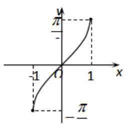
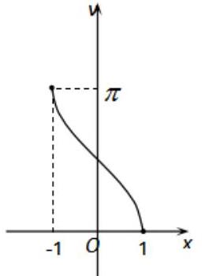
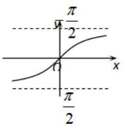
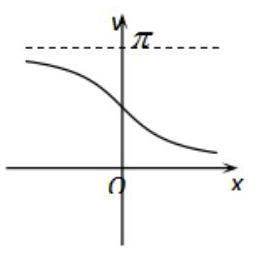
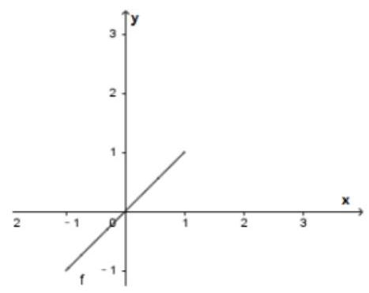
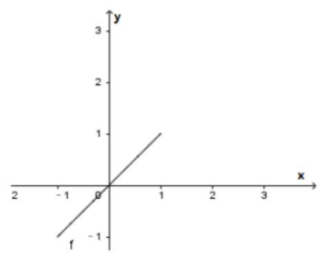
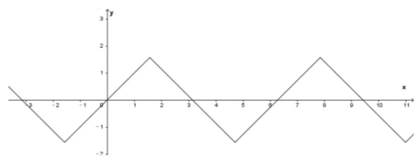
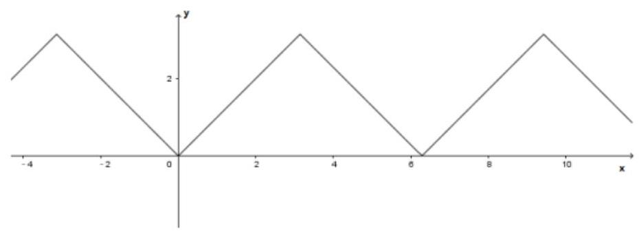

## (一) 反三角函数

## 反三角函数与最简三角方程

<table><tr><td>教学目标</td><td>1、掌握反三角函数的图像与性质   2、会写出三角方程 $\sin x = a,\cos x = a,\tan x = a$ 的解集；会求三角方程 $A\sin \left( {{\omega x} + \varphi }\right)  = a$ ， $A\cos \left( {{\omega x} + \varphi }\right)  = a,\;A\tan \left( {{\omega x} + \varphi }\right)  = a$ 的解集;</td></tr><tr><td>重点</td><td>反三角函数的的求法、图像、性质; 三角方程的求法</td></tr><tr><td>难点</td><td>三角方程的综合</td></tr></table>

## 知识梳理

## 反三角函数的定义

(1)反正弦函数:函数 $y = \sin x\left( {-\frac{\pi }{2} \leq  x \leq  \frac{\pi }{2}}\right)$ 的反函数叫做反正弦函数，记作 $y = \arcsin x$ ；

(2)反余弦函数:函数 $y = \cos x\left( {0 \leq  x \leq  \pi }\right)$ 的反函数叫做反余弦函数，记作 $y = \arccos x$ ；

(3)反正切函数:函数 $y = \tan x\left( {-\frac{\pi }{2} < x < \frac{\pi }{2}}\right)$ 的反函数叫做反正切函数，记作 $y = \arctan x$ ；

(4)反余切函数:函数 $y = \cot x\left( {0 < x < \pi }\right)$ 的反函数叫做反余切函数，记作 $y = \operatorname{arccot}x$ ；

反三角函数是比较难理解的概念, 由于三角函数在其整个定义域内并不存在反函数, 只有在某一特定区间才存在反函数, 因此, 反三角函数的值域也就被限制在某一区间内, 这个区间常称为反三角函数的主值区间;

## 二、反三角函数的图像与性质

<table id="cross-table-1"><tr><td>函数</td><td>$y = \arcsin x$</td><td>$y = \arccos x$</td><td>$y = \arctan x$</td><td>$y = \operatorname{arccot}x$</td></tr><tr><td>定义域</td><td>$\left\lbrack  {-1,1}\right\rbrack$</td><td>$\left\lbrack  {-1,1}\right\rbrack$</td><td>$\left( {-\infty , + \infty }\right)$</td><td>$\left( {-\infty , + \infty }\right)$</td></tr><tr><td>值域 (主值区间)</td><td>$\left\lbrack  {-\frac{\pi }{2},\frac{\pi }{2}}\right\rbrack$</td><td>$\left\lbrack  {0,\pi }\right\rbrack$</td><td>$\left( {-\frac{\pi }{2},\frac{\pi }{2}}\right)$</td><td>$\left( {0,\pi }\right)$</td></tr><tr><td>最值</td><td>$x =  - 1,{y}_{\min } =  - \frac{\pi }{2} \; x = 1,{y}_{\max } = \frac{\pi }{2}$</td><td>$x = 1,{y}_{\min } = 0 \; x =  - 1,{y}_{\max } = \pi$</td><td colspan="2">无</td></tr><tr><td>有界性</td><td colspan="2">有界函数</td><td colspan="2">非有界函数</td></tr><tr><td>单调性</td><td>单调递增</td><td>单调递减</td><td>单调递增</td><td>单调递减</td></tr><tr><td>奇偶性</td><td>奇函数</td><td>非奇非偶函数</td><td>奇函数</td><td>非奇非偶函数</td></tr><tr><td>周期性</td><td colspan="4">非周期函数</td></tr><tr><td>恒等式 1</td><td>$\arcsin \left( {\sin x}\right)  = x \; \left( {-\frac{\pi }{2} \leq  x \leq  \frac{\pi }{2}}\right)$</td><td>$\arccos \left( {\cos x}\right)  = x \; \left( {0 \leq  x \leq  \pi }\right)$</td><td>$\arctan \left( {\tan x}\right)  = x$    $\left( {-\frac{\pi }{2} < x < \frac{\pi }{2}}\right)$</td><td>$\operatorname{arccot}\left( {\cot x}\right)  = x \; \left( {0 < x < \pi }\right)$</td></tr><tr><td>恒等式 2</td><td>$\sin \left( {\arcsin x}\right)  = x \; \left( {-1 \leq  x \leq  1}\right)$</td><td>$\cos \left( {\arccos x}\right)  = x \; \left( {-1 \leq  x \leq  1}\right)$</td><td>$\tan \left( {\arctan x}\right)  = x \; \left( {x \in  R}\right)$</td><td>$\cot \left( {\operatorname{arccot}x}\right)  = x \; \left( {x \in  R}\right)$</td></tr><tr><td>恒等式 3</td><td>$\arcsin \left( {-x}\right) \; =  - \arcsin x \; \left( {-1 \leq  x \leq  1}\right)$</td><td>$\arccos \left( {-x}\right)$    $= \pi  - \arccos x$    $\left( {-1 \leq  x \leq  1}\right)$</td><td>$\arctan \left( {-x}\right)$    $=  - \arctan x$    $\left( {x \in  R}\right)$</td><td>$\operatorname{arccot}\left( {-x}\right)$    $= \pi  - \operatorname{arccot}x$    $\left( {x \in  R}\right)$</td></tr><tr><td>互余恒等式</td><td colspan="2">$\arcsin x + \arccos x = \frac{\pi }{2}\left( {-1 \leq  x \leq  1}\right)$</td><td colspan="2">$\arctan x + \operatorname{arccot}x = \frac{\pi }{2}\left( {x \in  R}\right)$</td></tr><tr><td>图像</td><td></td><td></td><td></td><td></td></tr></table>

## 例题精讲

【例 1】用反三角函数的形式表示下列角:

(1)已知 $\sin x =  - \frac{1}{4}\left( {\pi  < x < \frac{3\pi }{2}}\right)$ ，用反正弦的形式表示 $x$ ；

( 2 )已知 $\cos x = \frac{1}{4}\left( {-\frac{\pi }{2} < x < 0}\right)$ ，用反余弦的形式表示 $x$ ；

(3)已知 $\tan x = \frac{1}{4}\left( {\pi  < x < \frac{3\pi }{2}}\right)$ ，用反正切的形式表示 $x$ ；

【难度】 $\star   \star   \star$

【答案】( 1 ) $\pi  + \arcsin \frac{1}{4}$ ; ( 2 ) $x =  - \arccos \frac{1}{4};$ ( 3 ) $x = \pi  + \arctan \frac{1}{4}$

【解析】(1) $\sin x =  - \frac{1}{4} \Rightarrow  \sin \left( {x - \pi }\right)  = \frac{1}{4}, x - \pi  \in  \left( {0,\frac{\pi }{2}}\right)  \Rightarrow  x = \pi  + \arcsin \frac{1}{4}$

(2) $\cos x = \frac{1}{4} \Rightarrow  \cos \left( {x + \pi }\right)  =  - \frac{1}{4} \Rightarrow  x = \arccos \left( {-\frac{1}{4}}\right)  - \pi  =  - \arccos \frac{1}{4}$ 或者 $\cos \left( {-x}\right)  = \frac{1}{4} \Rightarrow  x =  - \arccos \frac{1}{4}$

(3) $\tan x = \frac{1}{4} \Rightarrow  \tan \left( {x - \pi }\right)  = \frac{1}{4} \Rightarrow  x = \pi  + \arctan \frac{1}{4}$

【例2】求下列各式的值:

(1) arcsin1;

(2) $\arccos \left( {-\frac{\sqrt{2}}{2}}\right)$ ; (3) $\arctan \left( {-\sqrt{3}}\right)$ .

(4) $\arcsin \left( {\sin \frac{5\pi }{6}}\right)$ ; (5) $\sin \left( {\arccos \frac{1}{2}}\right)$ ; (6) $\cos \left\lbrack  {\arcsin \left( {-\frac{12}{13}}\right) }\right\rbrack$ .

【难度】 $\star   \star$

【答案】(1) $\frac{\pi }{2};\;\left( 2\right) \frac{3\pi }{4};\;\left( 3\right)  - \frac{\pi }{3}.\;\left( 4\right) \frac{\pi }{6}\;\left( 5\right) \frac{\sqrt{3}}{2}\;\left( 6\right) \frac{5}{13}$

【解析】(1) (2) (3)直接利用定义

(4) 因为 $\frac{5\pi }{6} \notin  \left\lbrack  {-\frac{\pi }{2},\frac{\pi }{2}}\right\rbrack$ ,而 $\frac{\pi }{6} \in  \left\lbrack  {-\frac{\pi }{2},\frac{\pi }{2}}\right\rbrack$ ,且 $\sin \frac{\pi }{6} = \sin \frac{5\pi }{6}$ ,

设 $\sin \frac{\pi }{6} = \sin \frac{5\pi }{6} = a$ ,所以 $\arcsin \left( {\sin \frac{5\pi }{6}}\right)  = \arcsin \left( {\sin \frac{\pi }{6}}\right)  = \arcsin a = \frac{\pi }{6}$ .

(5) 因为 $\arccos \frac{1}{2} = \frac{\pi }{3}$ ,所以 $\sin \left( {\arccos \frac{1}{2}}\right)  = \sin \left( \frac{\pi }{3}\right)  = \frac{\sqrt{3}}{2}$ .

(6) 因为 $\cos \left\lbrack  {\arcsin \left( {-\frac{12}{13}}\right) }\right\rbrack   = \sqrt{1 - {\left( -\frac{12}{13}\right) }^{2}} = \frac{5}{13}$ .

【例 3】若函数 $y = f\left( x\right)$ 存在反函数 $y = {f}^{-1}\left( x\right)$ ,且函数 $y = \tan \frac{\pi x}{6} - f\left( x\right)$ 的图像过点 $\left( {2,\sqrt{3} - \frac{1}{3}}\right)$ , 则函数 $y = {f}^{-1}\left( x\right)  - \left( {\arcsin x + \arccos x}\right)$ 的图像一定过点___.

【难度】 $\star   \star   \star$

【答案】 $\left( {\frac{1}{3},2 - \frac{\pi }{2}}\right)$

【解析】由题意: $\sqrt{3} - \frac{1}{3} = \tan \frac{\pi }{3} - f\left( 2\right)  \Rightarrow  f\left( 2\right)  = \frac{1}{3}$

$\therefore f{\left( \frac{1}{3}\right) }^{-1} = 2$ ,又 $\because \arcsin \frac{1}{3} + \arccos \frac{1}{3} = \frac{\pi }{2}$ 得出答案

【例4】求下列各式的值:

(1) $\cos \left\lbrack  {\arccos \frac{4}{5} + \arccos \left( {-\frac{5}{13}}\right) }\right\rbrack$ (2) $\sin \left\lbrack  {\frac{\pi }{3} + \frac{1}{2}\arctan \left( {-2\sqrt{2}}\right) }\right\rbrack$

【难度】 $\star   \star   \star$

【答案】 $- \frac{56}{65},\frac{3\sqrt{2} - \sqrt{3}}{6}$

【解析】(1) 令 $\arccos \frac{4}{5} = \alpha$ ,则 $0 < \alpha  < \frac{\pi }{2}$ ,且 $\cos \alpha  = \frac{4}{5},\therefore \sin \alpha  = \sqrt{1 - {\cos }^{2}\alpha } = \frac{3}{5}$ ,

令 $\arccos \left( {-\frac{5}{13}}\right)  = \beta$ ,则 $\frac{\pi }{2} < \beta  < \pi$ ,且 $\cos \beta  =  - \frac{5}{13},\therefore \sin \beta  = \sqrt{1 - {\cos }^{2}\beta } = \frac{12}{13}$ ,

$\therefore$ 原式 $= \cos \left( {\alpha  + \beta }\right)  = \cos \alpha \cos \beta  - \sin \alpha \sin \beta  = \frac{4}{5} \times  \left( {-\frac{5}{13}}\right)  - \frac{3}{5} \times  \frac{12}{13} =  - \frac{56}{65}$

(2)令 $\arctan \left( {-{2\sqrt{2}}}\right)  = \alpha$ ，则 $- \frac{\pi }{2} < \alpha  < 0$ 且 $\tan \alpha  =  - {2\sqrt{2}}$ ， $\therefore \cos \alpha  = \sqrt{\frac{1}{1 + {\tan }^{2}\alpha }} = \frac{1}{3}$ ， $- \frac{\pi }{4} < \frac{\alpha }{2} < 0$ ，

$\therefore \sin \frac{\alpha }{2} =  - \sqrt{\frac{1 - \cos \alpha }{2}} =  - \frac{\sqrt{3}}{3},\cos \frac{\alpha }{2} = \sqrt{\frac{1 + \cos \alpha }{2}} = \frac{\sqrt{6}}{3}$ ,

$\therefore$ 原式 $\sin i\left( {\frac{\pi }{3} + \frac{\alpha }{2}}\right)  = \sin \frac{\pi }{3}\cos \frac{\alpha }{2} + \cos \frac{\pi }{3}\sin \frac{\alpha }{2} = \frac{\sqrt{3}}{2} \cdot  \frac{\sqrt{6}}{3} + \frac{1}{2} \cdot  \left( {-\frac{\sqrt{3}}{3}}\right)  = \frac{3\sqrt{2} - \sqrt{3}}{6}$

【例 5】给出下列函数: ① $y = \sin \left( {\arcsin x}\right)$ ; ② $y = \cos \left( {\arccos x}\right)$ ; ③ $y = \arcsin \left( {\sin x}\right)$ ; ④ $y = \arccos \left( {\cos x}\right)$ . 它们的图象 ( )

A. 彼此不同 B. 有两个相同 C. 有三个相同 D. 都相同

【难度】 $\star   \star   \star$

【答案】B

【解析】①作出函数 $y = \sin \left( {\arcsin x}\right)  = x, x \in  \left\lbrack  {-1,1}\right\rbrack$ 的图象,

②作出函数 $y = \cos \left( {\arccos x}\right)  = x, x \in  \left\lbrack  {-1,1}\right\rbrack$ 的图象，

③作出函数 $y = \arcsin \left( {\sin x}\right) , y \in  \left\lbrack  {-\frac{\pi }{2},\frac{\pi }{2}}\right\rbrack$ 的图象，

④作出函数 $y = \arccos \left( {\cos x}\right) , y \in  \left\lbrack  {0,\pi }\right\rbrack$ 的图象,

由图可知，①与②的图象相同，故选:B

【例 6】( 1 )函数 $y = \frac{1}{3}\arcsin \frac{1}{x}$ 的定义域为___，值域为___.

【难度】 $\left. {\star  \star   \star  }\right)$

【答案】 $\left( {-\infty , - 1\rbrack \cup \lbrack 1, + \infty }\right) \;\left\lbrack  {-\frac{\pi }{6},0) \cup  \left( {0,\frac{\pi }{6}}\right\rbrack  }\right\rbrack$

【解析】解: 由函数 $y = \frac{1}{3}\arcsin \frac{1}{x}$ ,可得 $- 1 \leq  \frac{1}{x} \leq  1$ ,求得 $x \leq   - 1$ 或 $x \geq  1$ , 故函数的定义域为 $\{ x \mid  x \leq   - 1$ 或 $x \geq  1\}$ .

由 $- 1 \leq  \frac{1}{x} \leq  1$ ,且 $\frac{1}{x} \neq  0$ ,求得 $\arcsin \frac{1}{x} \in  \left\lbrack  {-\frac{\pi }{2},\frac{\pi }{2}}\right\rbrack$ ,且 $\arcsin \frac{1}{x} \neq  0$ ,

故函数的值域为 $\left\lbrack  {-\frac{\pi }{6},0}\right)  \cup  \left( {0,\frac{\pi }{6}}\right\rbrack$ ,

故答案为: $\{ x \mid  x \leq   - 1$ 或 $x \geq  1\} ;\left\lbrack  {-\frac{\pi }{6},0}\right)  \cup  \left( {0,\frac{\pi }{6}}\right\rbrack$ .

(2)函数 $y = \arccos {x}^{2}$ 的值域是___.

【难度】 $\star   \star   \star$

【答案】 $\left\lbrack  {0,\frac{\pi }{2}}\right\rbrack$

【解析】因为 $- 1 \leq  {x}^{2} \leq  1$ ,故 $- 1 \leq  x \leq  1$ .

令 $t = {x}^{2}$ ,则 $t \in  \left\lbrack  {0,1}\right\rbrack$ ,此时 $y = \arccos t$ 的值域为 $\left\lbrack  {0,\frac{\pi }{2}}\right\rbrack$ . 故函数 $y = \arccos {x}^{2}$ 的值域是 $\left\lbrack  {0,\frac{\pi }{2}}\right\rbrack$ .

故答案为: $\left\lbrack  {0,\frac{\pi }{2}}\right\rbrack$ .

【例 7】求下列函数的反函数:

(1) $y = 2\sin \frac{x}{2}, x \in  \left\lbrack  {0,\frac{\pi }{3}}\right\rbrack$ ; (2) $y = \arccos \left( {{2x} - 1}\right) , x \in  \left( {0,\frac{1}{2}}\right\rbrack$ ;

【难度】 $\star   \star   \star$

【答案】(1) ${f}^{-1}\left( x\right)  = 2\arcsin \frac{x}{2}\left( {0 \leq  x \leq  1}\right)$ ; (2) ${f}^{-1}\left( x\right)  = \frac{1 + \cos x}{2}\left( {x \in  \left\lbrack  {\frac{\pi }{2},\pi }\right) }\right)$ ;

【解析】(1) $\because x \in  \left\lbrack  {0,\frac{\pi }{3}}\right\rbrack  \therefore 0 \leq  x \leq  \frac{\pi }{6}\therefore 0 \leq  2\sin \frac{x}{2} \leq  1$ ; 又 $y = 2\sin \frac{x}{2}\therefore x = 2\arcsin \frac{y}{2}$ ,

即 ${f}^{-1}\left( x\right)  = 2\arcsin \frac{x}{2}$ ,故答案为: ${f}^{-1}\left( x\right)  = 2\arcsin \frac{x}{2}\left( {0 \leq  x \leq  1}\right)$ ;

(2) $\because x \in  \left( {0,\frac{1}{2}}\right\rbrack  \therefore  - 1 < {2x} - 1 \leq  0\therefore \frac{\pi }{2} \leq  \arccos \left( {{2x} - 1}\right)  \leq  \pi$ ；又 $y = \arccos \left( {{2x} - 1}\right) \therefore x = \frac{\cos y + 1}{2}$ 即原函的反函数为 ${f}^{-1}\left( x\right)  = \frac{1 + \cos x}{2}\left( {x \in  \left\lbrack  {\frac{\pi }{2},\pi }\right) }\right)$ ;

【例 8】( 1 )函数 $y = \arccos x - \operatorname{arccot}x$ 是___函数. (填“奇”或“偶”)

【难度】 $\star   \star   \star$

【答案】奇

【解析】令 $f\left( x\right)  = y = \arccos x - \operatorname{arccot}x, x \in  \left\lbrack  {-1,1}\right\rbrack$ ,则 $f\left( {-x}\right)  = y = \arccos \left( {-x}\right)  - \operatorname{arccot}\left( {-x}\right)$

$= \pi  - \arccos x - \left( {\pi  - \operatorname{arccot}x}\right)  = \operatorname{arccot}x - \arccos x =  - f\left( x\right)$ ,

所以函数 $y = \arccos x - \operatorname{arccot}x$ 是奇函数,故答案为: 奇函数.

(2)函数 $y = \frac{\pi }{2} - \arccos x$ 是( ).

A. 递减奇函数 B. 递增奇函数 C. 递减偶函数 D. 递增偶函数

【难度】 $\star   \star   \star$

【答案】B

【解析】解: 由题可知, $f\left( x\right)  = \frac{\pi }{2} - \arccos x$ ,则 $f\left( x\right)$ 的定义域 $x \in  \left\lbrack  {-1,1}\right\rbrack$ ,所以定义域关于原点对称,

而 $f\left( {-x}\right)  = \frac{\pi }{2} - \arccos \left( {-x}\right)  = \frac{\pi }{2} - \left( {\pi  - \arccos x}\right)  =  - \frac{\pi }{2} + \arccos x =  - \left( {\frac{\pi }{2} - \arccos x}\right)  =  - f\left( x\right)$ ,

即 $f\left( {-x}\right)  =  - f\left( x\right)$ ,所以 $f\left( x\right)$ 为奇函数,

由于函数 $y = \arccos x$ 的定义域为 $\left\lbrack  {-1,1}\right\rbrack$ ,值域为 $\left\lbrack  {0,\pi }\right\rbrack$ ,是单调递减函数,

则 $y = \frac{\pi }{2} - \arccos x$ 是单调递增函数,所以 $y = \frac{\pi }{2} - \arccos x$ 是递增奇函数. 故选: B.

【例 9】求函数 $y = \arccos \left( {{x}^{2} - {2x}}\right)$ 的递减区间.

【难度】 $\star   \star   \star$

【答案】 $\left\lbrack  {1,1 + \sqrt{2}}\right\rbrack$

【解析】令 $- 1 \leq  {x}^{2} - {2x} \leq  1$ ,故 $\left\{  \begin{array}{l} {x}^{2} - {2x} + 1 \geq  0 \\  {x}^{2} - {2x} - 1 \leq  0 \end{array}\right.$ ,解得 $1 - \sqrt{2} \leq  x \leq  1 + \sqrt{2}$ . 当 $x \in  \left\lbrack  {1 - \sqrt{2},1}\right\rbrack$ 时, $t = {x}^{2} - {2x}$ 为减函数,故 $y = \arccos \left( {{x}^{2} - {2x}}\right)$ 在 $\left\lbrack  {1 - \sqrt{2},1}\right\rbrack$ 为增函数; 当 $x \in  \left\lbrack  {1,1 + \sqrt{2}}\right\rbrack$ 时, $t = {x}^{2} - {2x}$ 为增函数,故 $y = \arccos \left( {{x}^{2} - {2x}}\right)$ 在 $\left\lbrack  {1,1 + \sqrt{2}}\right\rbrack$ 为减函数; 故 $y = \arccos \left( {{x}^{2} - {2x}}\right)$ 的减区间为 $\left\lbrack  {1,1 + \sqrt{2}}\right\rbrack$ .

【例 10】已知 $\arcsin x > \arcsin \left( {1 - x}\right)$ ,求 $x$ 的取值范围.

【难度】 $\star   \star   \star$

【答案】 $\frac{1}{2} < x \leq  1$

【解析】因为 $y = \arcsin x$ 在 $\left\lbrack  {-1,1}\right\rbrack$ 上是增函数,已知 $\arcsin x > \arcsin \left( {1 - x}\right)$ ,

所以 $\left\{  \begin{array}{l}  - 1 \leq  x \leq  1 \\   - 1 \leq  1 - x \leq  1 \\  x > 1 - x \end{array}\right.$ ,所以 $\left\{  \begin{array}{l}  - 1 \leq  x \leq  1 \\  0 \leq  x \leq  2 \\  0 \leq  x \leq  2 \\  x > \frac{1}{2} \end{array}\right.$ ,解得 $\frac{1}{2} < x \leq  1$ ,所以 $x$ 的取值范围为 $\frac{1}{2} < x \leq  1$ . 故答案为: $\frac{1}{2} < x \leq  1$

【例 11】若 $\arccos \left( {x - 1}\right)  \geq  \frac{\pi }{3}$ ,求 $f\left( x\right)  = {x}^{2} + x + 1$ 的最值.

【难度】 $\star   \star   \star$

【答案】 $f{\left( x\right) }_{\min } = 1, f{\left( x\right) }_{\max } = \frac{19}{4}$

【解析】因为 $\arccos \left( {x - 1}\right)  \geq  \frac{\pi }{3}$ ,所以 $\arccos \left( {x - 1}\right)  \geq  \arccos \frac{1}{2}$ ,所以 $- 1 \leq  x - 1 \leq  \frac{1}{2}$ ,所以 $x \in  \left\lbrack  {0,\frac{3}{2}}\right\rbrack$ , 又因为 $f\left( x\right)  = {x}^{2} + x + 1$ 的对称轴为 $x =  - \frac{1}{2}$ 且开口向上,所以 $f\left( x\right)$ 在 $\left\lbrack  {0,\frac{3}{2}}\right\rbrack$ 上单调递增,

所以 $f{\left( x\right) }_{\min } = f\left( 0\right)  = 1, f{\left( x\right) }_{\max } = f\left( \frac{3}{2}\right)  = \frac{19}{4}$ .

## 巩固训练

1、若 $\cos \alpha  = \frac{1}{3},\alpha  \in  \left( {0,\frac{\pi }{2}}\right)$ ，则 $\alpha$ 的值为___

【难度】 $\star   \star$

【答案】 $\arccos \frac{1}{3}$

【解析】因为 $\cos \alpha  = \frac{1}{3},\alpha  \in  \left( {0,\frac{\pi }{2}}\right)$ ,所以 $\alpha  = \arccos \frac{1}{3}$ ,故答案为: $\arccos \frac{1}{3}$ .

2、在 $\bigtriangleup  {ABC}$ 中，若 $A = {120}^{ \circ  }$ ， $c = 5$ ， $a = 7$ ，则 $C =$ ___.

【难度】 $\star   \star$

【答案】 $\arcsin \frac{5}{14}\sqrt{3}$

【解析】由正弦定理 $\frac{a}{\sin A} = \frac{c}{\sin C}$ ,可得 $\sin C = \frac{c\sin A}{a} = \frac{5 \times  \sin {120}^{ \circ  }}{7} = \frac{5\sqrt{3}}{14}$ ,所以 $C = \arcsin \frac{5}{14}\sqrt{3}$ . 故答案为: $\arcsin \frac{5}{14}\sqrt{3}$ .

3、下列等式中正确的是___. (填序号)

① $\arccos \frac{\pi }{3} = \frac{1}{2}$ ; ② $\arccos \left( {\cos \frac{4\pi }{3}}\right)  = \frac{4\pi }{3}$ ; ③ $\arcsin \left( {-\frac{1}{2}}\right)  = \frac{5\pi }{6}$ ; ④ $\cos \left( {\arccos \frac{\pi }{4}}\right)  = \frac{\pi }{4}$ ;

⑤ $\arccos \left( {-\frac{1}{2}}\right)  =  - \frac{\pi }{3}$ ; ⑥ $\tan \left( {\arctan \frac{\pi }{2}}\right)  = \frac{\pi }{2}$ .

【难度】 $\star   \star   \star$

【答案】④⑥

【解析】①因为 $\frac{\pi }{3} > 1$ ，所以 $\arccos \frac{\pi }{3}$ 不存在，故①错误；

②因为 $\cos \frac{4\pi }{3} =  - \frac{1}{2}$ ; 所以 $\arccos \left( {-\frac{1}{2}}\right)  = \frac{2\pi }{3}$ ，故②错误；

③ $\arcsin \left( {-\frac{1}{2}}\right)  =  - \frac{\pi }{6}$ ，故③错误；

④ 令 $\arccos \frac{\pi }{4} = m$ ，所以 $\cos m = \frac{\pi }{4}$ ，则 $\cos \left( {\arccos \frac{\pi }{4}}\right)  = \frac{\pi }{4}$ ，则故④正确；

⑤因为 $\arccos \left( {-\frac{1}{2}}\right)  = \frac{2\pi }{3}$ ，所以⑤错误；

⑥ 令 $\arctan \frac{\pi }{2} = m,\tan m = \frac{\pi }{2}$ ，则 $\tan \left( {\arctan \frac{\pi }{2}}\right)  = \frac{\pi }{2}$ ，所以⑥正确.

故答案为:④⑥

4、计算: $\sin \left\lbrack  {2\arcsin \left( {-\frac{3}{5}}\right) }\right\rbrack$ 等于( )

A. $\frac{24}{25}$ B. $- \frac{24}{25}$ C. $\frac{7}{25}$ D. $- \frac{7}{25}$

【难度】 $\star   \star   \star$

【答案】B

【解析】 $\sin \left\lbrack  {2\arcsin \left( {-\frac{3}{5}}\right) }\right\rbrack   = 2\sin \left( {\arcsin \left( {-\frac{3}{5}}\right) }\right) \cos \left( {\arcsin \left( {-\frac{3}{5}}\right) }\right)  = 2 \times  \left( {-\frac{3}{5}}\right)  \times  \sqrt{1 - {\left( -\frac{3}{5}\right) }^{2}} =  - \frac{24}{25}$ .

故选: B

5、若 $0 < \alpha  < \frac{\pi }{2}$ ，则 $\arcsin \left\lbrack  {\cos \left( {\frac{\pi }{2} + \alpha }\right) }\right\rbrack   + \arccos \left\lbrack  {\sin \left( {\pi  + \alpha }\right) }\right\rbrack$ 等于( ).

A. $\frac{\pi }{2}$ B. $- \frac{\pi }{2}$ C. $\frac{\pi }{2} - {2\alpha }$ D. $- \frac{\pi }{2} - {2\alpha }$

【难度】★★★

【答案】A

【解析】解: 由题可知, $0 < \alpha  < \frac{\pi }{2}$ ,

$\because \arcsin \left\lbrack  {\cos \left( {\frac{\pi }{2} + \alpha }\right) }\right\rbrack   = \frac{\pi }{2} - \arccos \left\lbrack  {\cos \left( {\frac{\pi }{2} + \alpha }\right) }\right\rbrack   = \frac{\pi }{2} - \left( {\frac{\pi }{2} + \alpha }\right)  =  - \alpha$ ,

$\because \arccos \left\lbrack  {\sin \left( {\pi  + \alpha }\right) }\right\rbrack   = \arccos \left( {-\sin \alpha }\right)  = \pi  - \arccos \left( {\sin \alpha }\right)  = \pi  - \left\lbrack  {\frac{\pi }{2} - \arcsin \left( {\sin \alpha }\right) }\right\rbrack   = \frac{\pi }{2} + \alpha$ ,

$\therefore \arcsin \left\lbrack  {\cos \left( {\frac{\pi }{2} + \alpha }\right) }\right\rbrack   + \arccos \left\lbrack  {\sin \left( {\pi  + \alpha }\right) }\right\rbrack   = \left( {-\alpha }\right)  + \left( {\frac{\pi }{2} + \alpha }\right)  = \frac{\pi }{2}$ . 故选: A.

6、函数 $y = \lg \left( {\frac{\pi }{4} - \arctan x}\right)$ 的定义域为___.

【难度】 $\star   \star   \star$

【答案】 $\left( {-\infty ,1}\right)$

【解析】由题意得 $\frac{\pi }{4} - \arctan x > 0$ ,所以 $\arctan x < \frac{\pi }{4}$ ,即 $x < 1$ ,所以定义域为 $\left( {-\infty ,1}\right)$ . 故答案为: $\left( {-\infty ,1}\right)$ .

7、当 $- \frac{\sqrt{3}}{2} \leq  x \leq  \frac{1}{2}$ 时， $\frac{1}{2}\arcsin x$ 的取值范围是___.

【难度】 $\star   \star$

【答案】 $\left\lbrack  {-\frac{\pi }{6},\frac{\pi }{12}}\right\rbrack$

【解析】由于 $- \frac{\sqrt{3}}{2} \leq  x \leq  \frac{1}{2}$ ,所以 $- \frac{\pi }{3} \leq  \arcsin x \leq  \frac{\pi }{6}$ ,所以 $- \frac{\pi }{6} \leq  \frac{1}{2}\arcsin x \leq  \frac{\pi }{12}$ . 故答案为: $\left\lbrack  {-\frac{\pi }{6},\frac{\pi }{12}}\right\rbrack$

8、求函数 $y = \arcsin \left( {{x}^{2} - x}\right)$ 的定义域、值域和单调递增区间.

【难度】 $\star   \star   \star$

【答案】定义域 $\left\lbrack  {\frac{1 - \sqrt{5}}{2},\frac{1 + \sqrt{5}}{2}}\right\rbrack$ ,值域 $\left\lbrack  {-\arcsin \frac{1}{4},\frac{\pi }{2}}\right\rbrack$ ,递增区间 $\left\lbrack  {\frac{1}{2},\frac{1 + \sqrt{5}}{2}}\right\rbrack$

【解析】令 $- 1 \leq  {x}^{2} - x \leq  1$ ,解得 $\frac{1 - \sqrt{5}}{2} \leq  x \leq  \frac{1 + \sqrt{5}}{2}$ ,所以函数 $y = \arcsin \left( {{x}^{2} - x}\right)$ 的定义域为 $\left\lbrack  {\frac{1 - \sqrt{5}}{2},\frac{1 + \sqrt{5}}{2}}\right\rbrack$

令 $f\left( x\right)  = {x}^{2} - x, x \in  \left\lbrack  {\frac{1 - \sqrt{5}}{2},\frac{1 + \sqrt{5}}{2}}\right\rbrack$ ,则 $f\left( x\right)  = {x}^{2} - x = {\left( x - \frac{1}{2}\right) }^{2} - \frac{1}{4} \in  \left\lbrack  {-\frac{1}{4},1}\right\rbrack$ ,

所以 $\arcsin \left( {{x}^{2} - x}\right)  \in  \left\lbrack  {\arcsin \left( {-\frac{1}{4}}\right) ,\frac{\pi }{2}}\right\rbrack$ 即 $\arcsin \left( {{x}^{2} - x}\right)  \in  \left\lbrack  {-\arcsin \frac{1}{4},\frac{\pi }{2}}\right\rbrack$

所以函数 $y = \arcsin \left( {{x}^{2} - x}\right)$ 的值域为 $\left\lbrack  {-\arcsin \frac{1}{4},\frac{\pi }{2}}\right\rbrack$ ;

又因为函数 $f\left( x\right)$ 的单调递增区间为 $\left\lbrack  {\frac{1}{2},\frac{1 + \sqrt{5}}{2}}\right\rbrack$ ,所以函数 $y = \arcsin \left( {{x}^{2} - x}\right)$ 的单调递增区间为 $\left\lbrack  {\frac{1}{2},\frac{1 + \sqrt{5}}{2}}\right\rbrack$

9、函数 $y = \frac{\pi }{2} - \arcsin x$ 是___函数. (填“奇”或“偶”)

【难度】 $\star   \star   \star$

【答案】非奇非偶

【解析】记 $f\left( x\right)  = \frac{\pi }{2} - \arcsin x$ ,故 $f\left( 1\right)  = \frac{\pi }{2} - \arcsin 1 = \frac{\pi }{2} - \frac{\pi }{2} = 0, f\left( {-1}\right)  = \frac{\pi }{2} - \arcsin \left( {-1}\right)  = \frac{\pi }{2} + \frac{\pi }{2} = \pi$

$f\left( 1\right)  \neq  f\left( {-1}\right) , f\left( 1\right)  \neq   - f\left( {-1}\right)$ ; 故 $f\left( x\right)  = \frac{\pi }{2} - \arcsin x$ 为非奇非偶函数；故答案为:非奇非偶 10、不等式 $\arccos x > \frac{\pi }{4}$ 的解集是___.

【难度】 $\star   \star   \star$

【答案】 $\left\lbrack  {-1,\frac{\sqrt{2}}{2}}\right)$

【解析】令 $\alpha  = \arccos x$ ,则 $\frac{\pi }{4} < \alpha  \leq  \pi$ ,

$\therefore \cos \pi  \leq  \cos \alpha  < \cos \frac{\pi }{4} \Rightarrow  \cos \pi  \leq  \cos \left( {\arccos x}\right)  < \cos \frac{\pi }{4} \Rightarrow  x \in  \left\lbrack  {-1,\frac{\sqrt{2}}{2}}\right)$ ,故答案为: $\left\lbrack  {-1,\frac{\sqrt{2}}{2}}\right)$ .

11、已知 $y = \sin x$ 与函数 $y = \arcsin x$ ，下列说法正确的是( )

A. 互为反函数 B. 都是增函数 C. 都是奇函数 D. 都是周期函数

【难度】 $\star   \star   \star$

【答案】C

【解析】解: 对于正弦函数 $y = \sin x$ ,当 $x \in  \left\lbrack  {-\frac{\pi }{2},\frac{\pi }{2}}\right\rbrack$ 时存在反函数 $y = \arcsin x$ ,

具有相同的奇偶性和单调性,故选项 $A$ 错误;

选项 $B$ ,函数 $y = \sin x$ 不单调,故错误; 选项 $C$ 正确;

选项 $D$ ,函数 $y = \arcsin x$ 的定义为 $\left\lbrack  {-1,1}\right\rbrack$ ,故不是周期函数,故错误.

故选: $C$ .

## (二)最简三角方程

## 知识梳理

(1) $\sin x = a,\left| a\right|  < 1$ 的解集是 $\left\{  {x\left| {\;x = {k\pi } + {\left( -1\right) }^{k} \cdot  \arcsin a}\right. , k \in  Z}\right\}$ ；

特殊的,当 $a = 1$ 时,解集是 $\left\{  {x\left| {\;x = {2k\pi } + \frac{\pi }{2}}\right. , k \in  Z}\right\}$ ; 当 $a =  - 1$ 时,解集是 $\left\{  {x\left| {\;x = {2k\pi } - \frac{\pi }{2}}\right. , k \in  Z}\right\}$ ;

( 2 ) $\cos x = a,\left| a\right|  < 1$ 的解集是 $\left\{  {x\left| {\;x = {2k\pi } \pm  \arccos a}\right. , k \in  Z}\right\}$ ；

特殊的,当 $a = 1$ 时,解集是 $\{ x \mid  x = {2k\pi }, k \in  Z\}$ ; 当 $a =  - 1$ 时,解集是 $\{ x \mid  x = {2k\pi } + \pi , k \in  Z\}$ ;

(3) $\tan x = a$ 的解集是 $\{ x \mid  x = {k\pi } + \arctan a, k \in  Z\}$ ；

(4) $\cot x = a$ 的解集是 $\{ x \mid  x = {k\pi } + \operatorname{arccot}a, k \in  Z\}$ ；

## 例题精讲

【例 12】( 1 )方程 $\sin x = \frac{1}{3}$ 在 $\left\lbrack  {\frac{\pi }{2},\pi }\right\rbrack$ 上的解是___

【难度】★★

【答案】 $\pi  - \arcsin \frac{1}{3}$

【解析】由 $\sin \alpha  = \frac{1}{3}$ 可得 $\alpha  = \arcsin \frac{1}{3},\alpha  \in  \left\lbrack  {-\frac{\pi }{2},\frac{\pi }{2}}\right\rbrack$ ,因为 $x \in  \left\lbrack  {\frac{\pi }{2},\pi }\right\rbrack$ ,且 $\sin \alpha  = \sin \left( {\pi  - \alpha }\right)$ ,

所以 $x = \pi  - \arcsin \frac{1}{3}$ ,故答案为: $\pi  - \arcsin \frac{1}{3}$

(2) $\cos x = \frac{3}{4}, x \in  \left\lbrack  {0,\pi }\right\rbrack$ ；

【难度】★★

【答案】 $x = \arccos \frac{3}{4}$

【解析】 $\because \cos x = \frac{3}{4}, x \in  \left\lbrack  {0,\pi }\right\rbrack  ,\therefore x = \arccos \frac{3}{4}$ ;

(3) $\tan x =  - \frac{2}{3}, x \in  \left( {\frac{\pi }{2},\pi }\right)$

【难度】 $\star   \star$

【答案】 $x = \pi  - \arctan \frac{2}{3}$

【解析】 $\because \tan x =  - \frac{2}{3}, x \in  \left( {\frac{\pi }{2},\pi }\right) ,\arctan \frac{2}{3} \in  \left( {0,\frac{\pi }{2}}\right) ,\pi  - \arctan \frac{2}{3} \in  \left( {\frac{\pi }{2},\pi }\right)$ ,

再根据 $\tan \left( {\pi  - \arctan \frac{2}{3}}\right)  =  - \tan \left( {\arctan \frac{2}{3}}\right)  =  - \frac{2}{3},\therefore x = \pi  - \arctan \frac{2}{3}$ .

【例 13】解下列三角方程:

(1) $2\sin x + \sqrt{3} = 0$ ； (2) $1 - 3{\tan }^{2}{2x} = 0$ ； (3) $- 3{\cos }^{2}x + 5\sin x + 1 = 0$ ；

(4) $4\sin x - \cot x - 2\csc x + \sin {2x} = 0$ .

【难度】 $\star   \star   \star$

【答案】(1) $x = {2k\pi } - \frac{\pi }{3}$ 或 ${2k\pi } - \frac{2\pi }{3}, k \in  \mathbf{Z}$ ；(2) $x = \frac{k\pi }{2} \pm  \frac{\pi }{12}, k \in  \mathbf{Z}$ ；(3) $\left\{  {x\left| {\;x = \arcsin \frac{1}{3} + {2k\pi }}\right. }\right.$ 或 $x =  - \arcsin \frac{1}{3} + \left( {{2k} + 1}\right) \pi \left( {k \in  Z}\right) \} ;\left( 4\right) x = {k\pi } \pm  \frac{\pi }{4}, k \in  \mathbf{Z}$

【解析】(1) 因为 $2\sin x + \sqrt{3} = 0$ ,解得 $\sin x =  - \frac{\sqrt{3}}{2}$ ,由正弦函数的的图象与性质可知 $x = {2k\pi } - \frac{\pi }{3}$ 或 ${2k\pi } - \frac{2\pi }{3}, k \in  \mathbf{Z};$

( 2 )因为 $1 - 3{\tan }^{2}{2x} = 0$ ，所以 $\tan {2x} =  \pm  \frac{\sqrt{3}}{3}$ ，

由正切函数的图象与性质可得 ${2x} = {k\pi } \pm  \frac{\pi }{6}, k \in  \mathbf{Z}$ ,所以 $x = \frac{k\pi }{2} \pm  \frac{\pi }{12}, k \in  \mathbf{Z}$ ;

(3) $- 3{\cos }^{2}x + 5\sin x + 1 = 0$ 化为 $3{\sin }^{2}x + 5\sin x - 2 = 0$ ，解得 $\sin x = \frac{1}{3}$ 或 $\sin x =  - 2$ (舍去)，

$\therefore x = \arcsin \frac{1}{3} + {2k\pi }$ 或 $x =  - \arcsin \frac{1}{3} + \left( {{2k} + 1}\right) \pi \left( {k \in  Z}\right)$ ,

方程的解集为 $\left\{  {x\left| {\;x = \arcsin \frac{1}{3} + {2k\pi }\text{ 或 }x =  - \arcsin \frac{1}{3} + \left( {{2k} + 1}\right) \pi \left( {k \in  Z}\right) }\right. }\right\}$ .

故答案为: $\left\{  {x \mid  x = \arcsin \frac{1}{3} + {2k\pi }}\right.$ 或 $\left. {x =  - \arcsin \frac{1}{3} + \left( {{2k} + 1}\right) \pi \left( {k \in  Z}\right) }\right\}$ .

(4)因为 $4\sin x - \cot x - 2\csc x + \sin {2x} = 0$ ,所以 $4\sin x - \frac{\cos x}{\sin x} - \frac{2}{\sin x} + 2\sin x\cos x = 0$ , 化简可得 $\frac{\left( {2{\sin }^{2}x - 1}\right) \left( {\cos x + 2}\right) }{\sin x} = 0$ ,即 ${\sin }^{2}x = \frac{1}{2}$ 或 $\cos x =  - 2$ (舍),所以 $\sin x =  \pm  \frac{\sqrt{2}}{2}$ , 由正弦函数的图象与性质可得 $x = {k\pi } \pm  \frac{\pi }{4}, k \in  \mathbf{Z}$ .

【例 14】关于 $x$ 的方程 $\sqrt{5\cos x + \cos {2x}} + \sin x = 0$ 的解集为___.

【难度】 $\star   \star   \star$

【答案】 $x = {2k\pi } - \arccos \frac{1}{3}, k \in  \mathbf{Z}$ .

【解析】因为 $\sqrt{5\cos x + \cos {2x}} + \sin x = 0$ ,则 $\sqrt{5\cos x + 2{\cos }^{2}x - 1} =  - \sin x,\sin x \leq  0$ ,

即 $\sqrt{5\cos x + 2{\cos }^{2}x - 1} = \sqrt{1 - {\cos }^{2}x},\sin x \leq  0$ ,

所以 $5\cos x + 2{\cos }^{2}x - 1 = 1 - {\cos }^{2}x$ ,化简可得 $\left( {3\cos x - 1}\right) \left( {\cos x - 2}\right)  = 0$ ,解得 $\cos x = \frac{1}{3},\cos x =  - 2$ (舍),

因为 $\sin x \leq  0$ ,所以 $x = {2k\pi } - \arccos \frac{1}{3}, k \in  \mathbf{Z}$ ;

【例 15】已知函数,若 $f\left( x\right)  = \sqrt{2}\cos x\left( {x \in  \left( {0,\pi }\right) }\right)$ 的图象与函数 $y = \tan x$ 的图象交于 $A, B$ 两点,则 $\bigtriangleup {OAB}(O$ 为坐标原点)的面积为( )

A. $\frac{\sqrt{2}\pi }{2}$ B. $\frac{\pi }{2}$ C. $\frac{2\pi }{3}$ D. $\frac{\sqrt{2}\pi }{4}$

【难度】 $\star   \star   \star$

【答案】B

【解析】由题意有 $\sqrt{2}\cos x = \tan x$ ,有 $\sqrt{2}\cos x = \frac{\sin x}{\cos x}$ ,有 $\sqrt{2}\left( {1 - {\sin }^{2}x}\right)  = \sin x$ ,解得 $\sin x = \frac{\sqrt{2}}{2}$ 或 $- \sqrt{2}$ (舍去),

由 $x \in  \left( {0,\pi }\right)$ 可得 $x = \frac{\pi }{4}$ 或 $\frac{3\pi }{4}$ ,则点 $A$ 的坐标为 $\left( {\frac{\pi }{4},1}\right)$ ,点 $B$ 的坐标为 $\left( {\frac{3\pi }{4}, - 1}\right)$ .

线段 ${AB}$ 中点的坐标为 $\left( {\frac{\pi }{2},0}\right)$ ，则 $\bigtriangleup  {OAB}$ 的面积为 $\frac{1}{2} \times  \frac{\pi }{2} \times  2 = \frac{\pi }{2}$ . 故选:B.

## 巩固训练

1、方程 ${\cot }^{2}x = 1$ 的解集是___.

【难度】★★

【答案】 $\left\{  {x\left| {\;x = {k\pi } \pm  \frac{\pi }{4}}\right. , k \in  Z}\right\}$

【解析】 ${\cot }^{2}x = 1$ ,则 $\cot x =  \pm  1$ ,

当 $\cot x = 1$ 时, $x = {k\pi } + \frac{\pi }{4}, k \in  Z$ ; 当 $\cot x =  - 1$ 时, $x = {k\pi } - \frac{\pi }{4}, k \in  Z$ ; 故 $x = {k\pi } \pm  \frac{\pi }{4}, k \in  Z$ .

故答案为: $\left\{  {x\left| {\;x = {k\pi } \pm  \frac{\pi }{4}}\right. , k \in  Z}\right\}$ .

2、三角方程 $\tan \left( {x - \frac{\pi }{6}}\right)  = 3$ 的解集为___.

【难度】 $\star   \star$

【答案】 $\left\{  {x\left| {\;x = \arctan 3 + \frac{\pi }{6} + {k\pi }}\right. , k \in  \mathbf{Z}}\right\}$

【解析】由于 $\{ x \mid  x = \arctan 3 + \frac{\pi }{6} + {k\pi }, k \in  \mathbf{Z}\}$ ,

所以 $x - \frac{\pi }{6} = \arctan 3 + {k\pi }$ ,得 $x = \arctan 3 + \frac{\pi }{6} + {k\pi }, k \in  \mathbf{Z}$ ,

即三角方程 $\tan \left( {x - \frac{\pi }{6}}\right)  = 3$ 的解集为 $\left\{  {x\left| {\;x = \arctan 3 + \frac{\pi }{6} + {k\pi }}\right. , k \in  \mathbf{Z}}\right\}$ ,

故答案为: $\left\{  {x\left| {\;x = \arctan 3 + \frac{\pi }{6} + {k\pi }}\right. , k \in  \mathbf{Z}}\right\}$ .

3、方程 $3\sin x - 2\cos x = 0$ 的解集为___.

【难度】 $\star   \star   \star$

【答案】 $\left\{  {x\left| {\;x = {k\pi } + \arctan \frac{2}{3}}\right. , k \in  Z}\right\}$

【解析】解: 由 $3\sin x - 2\cos x = 0$ ,得 $\tan x = \frac{2}{3}$ ,解得 $x = {k\pi } + \arctan \frac{2}{3}, k \in  Z$ ,

即方程的解为 $\left\{  {x\left| {\;x = {k\pi } + \arctan \frac{2}{3}}\right. , k \in  Z}\right\}$ . 故答案为: $\left\{  {x\left| {\;x = {k\pi } + \arctan \frac{2}{3}}\right. , k \in  Z}\right\}$

4、方程 $8{\sin }^{2}x + 3\sin {2x} - 4 = 0$ 的解集为___.

【难度】 $\star   \star   \star$

【答案】 $\{ x \mid  x = {k\pi } + \arctan \frac{1}{2}$ 或 $x = {k\pi } - \arctan 2, k \in  Z\}$

【解析】 $\because 8{\sin }^{2}x + 3\sin {2x} - 4 = 0,\therefore 8 \cdot  \frac{1 - \cos {2x}}{2} + 3\sin {2x} - 4 = 0$ 即 $3\sin {2x} - 4\cos {2x} = 0$ ,

$\therefore \sin {2x} = \frac{4}{3}\cos {2x}$ 即 $\tan {2x} = \frac{4}{3},\therefore \tan {2x} = \frac{2\tan x}{1 - {\tan }^{2}x} = \frac{4}{3}$ ,解得 $\tan x = \frac{1}{2}$ 或 $\tan x =  - 2$ ,

$\therefore x = {k\pi } + \arctan \frac{1}{2}, k \in  Z$ 或 $x = {k\pi } + \arctan \left( {-2}\right) , k \in  Z$ ,

$\therefore x = {k\pi } + \arctan \frac{1}{2}, k \in  Z$ 或 $x = {k\pi } - \arctan 2, k \in  Z$ ,

$\therefore$ 原方程的解集为 $\left\{  {x \mid  x = {k\pi } + \arctan \frac{1}{2}}\right.$ 或 $\left. {x = {k\pi } - \arctan 2, k \in  Z}\right\}$ .

故答案为: $\{ x \mid  x = {k\pi } + \arctan \frac{1}{2}$ 或 $x = {k\pi } - \arctan 2, k \in  Z\}$ .

## 实战演练

一、填空题

1、 $\arcsin \left( {-\frac{1}{2}}\right)  + \arccos \left( {-\frac{\sqrt{3}}{2}}\right)  + \arctan \left( {-\sqrt{3}}\right)  =$ ___。

【难度】 $\star   \star$

【答案】 $\frac{\pi }{3}$

【解析】

$\arcsin \left( {-\frac{1}{2}}\right)  + \arccos \left( {-\frac{\sqrt{3}}{2}}\right)  + \arctan \left( {-\sqrt{3}}\right)  =  - \arcsin \left( \frac{1}{2}\right)  + \pi  - \arccos \left( \frac{\sqrt{3}}{2}\right)  - \arctan \left( \sqrt{3}\right) \; =  - \frac{\pi }{6} + \left( {\pi  - \frac{\pi }{6}}\right)  - \frac{\pi }{3} = \frac{\pi }{3}$  。

故答案为: $\frac{\pi }{3}$ 。

2、方程 $\frac{\sin x + \cos x}{\sin x - \cos x} = \frac{1}{2}$ 的解集为___。

【难度】★★

【答案】 $\{ x \mid  x = {k\pi } - \arctan 3\left( {k \in  Z}\right) \}$

【解析】 $\frac{\sin x + \cos x}{\sin x - \cos x} = \frac{1}{2} \Rightarrow  2\left( {\sin x + \cos x}\right)  = \sin x - \cos x \Rightarrow  \sin x =  - 3\cos x \Rightarrow  \tan x =  - 3$ ,

所以 $x = {k\pi } + \arctan \left( {-3}\right)  = {k\pi } - \arctan 3\left( {k \in  Z}\right)$ ;

3、函数 $y = \arccos \left( {4{x}^{2} - 1}\right)$ 的定义域为___。

【难度】★★

【答案】 $\left\lbrack  {-\frac{\sqrt{2}}{2},\frac{\sqrt{2}}{2}}\right\rbrack$

【解析】由题意得 $- 1 \leq  4{x}^{2} - 1 \leq  1,\therefore 0 \leq  {x}^{2} \leq  \frac{1}{2},\therefore  - \frac{\sqrt{2}}{2} \leq  x \leq  \frac{\sqrt{2}}{2}$

则该函数的定义域为 $\left\lbrack  {-\frac{\sqrt{2}}{2},\frac{\sqrt{2}}{2}}\right\rbrack$ ; 故答案为: $\left\lbrack  {-\frac{\sqrt{2}}{2},\frac{\sqrt{2}}{2}}\right\rbrack$

4、方程 $2\cos \left( {x + \frac{\pi }{4}}\right)  = 1$ 的解集为___。

【难度】 $\star   \star$

【答案】 $\left\{  {x\left| {\;x = \frac{\pi }{12} + {2k\pi }}\right. }\right.$ 或 $\left. {x =  - \frac{7\pi }{12} + {2k\pi }, k \in  Z}\right\}$

【解析】由于 $2\cos \left( {x + \frac{\pi }{4}}\right)  = 1$ ,所以 $\cos \left( {x + \frac{\pi }{4}}\right)  = \frac{1}{2}$ ,故 $x + \frac{\pi }{4} =  \pm  \frac{\pi }{3} + {2k\pi }, k \in  Z$

所以 $x = \frac{\pi }{12} + {2k\pi }$ 或 $x =  - \frac{7\pi }{12} + {2k\pi }, k \in  Z$ 。

5、若函数 $f\left( x\right)  = 2\arcsin \left( {2 - x}\right)$ 的值域是 $\left\lbrack  {-\frac{\pi }{3},\pi }\right\rbrack$ ，则它的定义域为___。

【难度】 $\star   \star   \star$

【答案】 $\left\lbrack  {1,\frac{5}{2}}\right\rbrack$

【解析】由于函数 $f\left( x\right)  = 2\arcsin \left( {2 - x}\right)$ 的值域是 $\left\lbrack  {-\frac{\pi }{3},\pi }\right\rbrack$ ,所以 $\arcsin \left( {2 - x}\right)  \in  \left\lbrack  {-\frac{\pi }{6},\frac{\pi }{2}}\right\rbrack$ ,所以 $- \frac{1}{2} \leq  2 - x \leq  1, - \frac{5}{2} \leq   - x \leq   - 1 \Rightarrow  1 \leq  x \leq  \frac{5}{2}$ ,所以 $f\left( x\right)$ 的定义域为 $\left\lbrack  {1,\frac{5}{2}}\right\rbrack$ . 故答案为: $\left\lbrack  {1,\frac{5}{2}}\right\rbrack$ 。

6、函数 $y = \arcsin \left( {-x}\right)  + \arccos \left( {\sqrt{2}x}\right)$ 的值域是___。

【难度】 $\star   \star   \star$

【答案】 $\left\lbrack  {-\frac{\pi }{4},\frac{5\pi }{4}}\right\rbrack$ .

【解析】由题意知 $\left\{  \begin{array}{l}  - 1 \leq   - x \leq  1 \\   - 1 \leq  \sqrt{2}x \leq  1 \end{array}\right.$ ,解得 $- \frac{\sqrt{2}}{2} \leq  x \leq  \frac{\sqrt{2}}{2}$ ,即函数 $y$ 的定义域为 $\left\lbrack  {-\frac{\sqrt{2}}{2},\frac{\sqrt{2}}{2}}\right\rbrack$ ; $y = \arcsin \left( {-x}\right)$ 是减函数, $y = \arccos \left( {\sqrt{2}x}\right)$ 也是减函数,

所以函数 $y = \arcsin \left( {-x}\right)  + \arccos \left( {\sqrt{2}x}\right)$ 是定义域上的减函数.

所以当 $x =  - \frac{\sqrt{2}}{2}$ 时,函数 $y$ 有最大值,为 $\frac{\pi }{4} + \pi  = \frac{5\pi }{4}$ ;

当 $x = \frac{\sqrt{2}}{2}$ 时,函数 $y$ 有最小值,为 $- \frac{\pi }{4} + 0 =  - \frac{\pi }{4}$ ,所以 $y$ 的值域为 $\left\lbrack  {-\frac{\pi }{4},\frac{5\pi }{4}}\right\rbrack$ .

故答案为: $\left\lbrack  {-\frac{\pi }{4},\frac{5\pi }{4}}\right\rbrack$ 。

二、选择题

7、已知 $a = \arccos \left( {-\frac{1}{4}}\right) , b = \arcsin \left( {-\frac{1}{3}}\right) , c = \arctan \left( {-1}\right)$ ，则 $a, b, c$ 大小关系是( )

A. $a < b < c$ B. $b < c < a$ C. $c < b < a$ D. $a < c < b$

【难度】 $\star   \star   \star$

【答案】C

【解析】 $a = \arccos \left( {-\frac{1}{4}}\right)  \in  \left( {\frac{\pi }{2},\pi }\right) , b = \arcsin \left( {-\frac{1}{3}}\right)  \in  \left( {-\frac{\pi }{4},0}\right) , c = \arctan \left( {-1}\right)  =  - \frac{\pi }{4}$

则 $c < b < a$ ；故选:C

8、下列各式中不成立的是( )

A. $\arcsin \left\lbrack  {\sin \left( {-\frac{3\pi }{4}}\right) }\right\rbrack   =  - \frac{\pi }{4}$ B. $\tan \left\lbrack  {\arctan \left( {-\frac{1}{2}}\right) }\right\rbrack   =  - \frac{1}{2}$

C. $\arccos \left\lbrack  {\cos \left( {-\frac{\pi }{4}}\right) }\right\rbrack   =  - \frac{\pi }{4}$ D. $\sin \left\lbrack  {\arcsin \left( {-\frac{4}{5}}\right) }\right\rbrack   =  - \frac{4}{5}$

【难度】 $\star   \star   \star$

【答案】C

【解析】对于 $\mathrm{A},\arcsin \left\lbrack  {\sin \left( {-\frac{3\pi }{4}}\right) }\right\rbrack   = \arcsin \left( {-\frac{\sqrt{2}}{2}}\right)  =  - \frac{\pi }{4}$ ,故 $\mathrm{A}$ 正确;

对于 $\mathrm{B}$ ,由反三角函数的概念可得 $\tan \left\lbrack  {\arctan \left( {-\frac{1}{2}}\right) }\right\rbrack   =  - \frac{1}{2}$ ,故 $\mathrm{B}$ 正确;

对于 $\mathrm{C},\arccos \left\lbrack  {\cos \left( {-\frac{\pi }{4}}\right) }\right\rbrack   = \arccos \frac{\sqrt{2}}{2} = \frac{\pi }{4}$ ,故 $\mathrm{C}$ 错误;

对于 $\mathrm{D}$ ,由反三角函数的概念可得 $\sin \left\lbrack  {\arcsin \left( {-\frac{4}{5}}\right) }\right\rbrack   =  - \frac{4}{5}$ ,故 $\mathrm{D}$ 正确. 故选: $\mathrm{C}$ 。

9、已知 $\sin x =  - \frac{12}{13}, x \in  \left( {\pi ,\frac{3\pi }{2}}\right)$ ，则 $x$ 等于( )

C. $\pi  + \arcsin \frac{12}{13}$ D. $\frac{3\pi }{2} - \arcsin \frac{12}{13}$

【难度】 $\star   \star   \star$

【答案】C

【解析】因为 $x \in  \left( {\pi ,\frac{3\pi }{2}}\right)$ ,所以 $\pi  - x \in  \left( {-\frac{\pi }{2},0}\right)$ ,

又 $\sin x =  - \frac{12}{13}$ ,所以 $\sin \left( {\pi  - x}\right)  =  - \frac{12}{13}$ ,所以 $\pi  - x = \arcsin \left( {-\frac{12}{13}}\right)  =  - \arcsin \frac{12}{13}$

所以 $x = \pi  + \arcsin \frac{12}{13}$ ; 故选: C。

10、若 ${12}\sin x - 5\cos x = {13}\sin \left( {x - \theta }\right)$ ，则 $\csc \theta$ 等于( )

A. $- \frac{13}{5}$ B. $- \frac{5}{13}$ C. $\frac{5}{13}$ D. $\frac{13}{5}$

【难度】 $\star   \star   \star$

【答案】D

【解析】因为 ${12}\sin x - 5\cos x = {13}\left( {\frac{12}{13}\sin x - \frac{5}{13}\cos x}\right)  = {13}\sin \left( {x - \varphi }\right)$ ,其中 $\cos \varphi  = \frac{12}{13},\sin \varphi  = \frac{5}{13}$ . 又 ${12}\sin x - 5\cos x = {13}\sin \left( {x - \theta }\right)$ ,所以 $\sin \left( {x - \theta }\right)  = \sin \left( {x - \varphi }\right)$ ,有 $\theta  = \varphi$ 或 $\theta  = \varphi  + {2k\pi }, k \in  Z$ 当 $\theta  = \varphi$ 时, $\csc \theta  = \csc \varphi  = \frac{1}{\sin \varphi } = \frac{13}{5}$ ; 当 $\theta  = \varphi  + {2k\pi }, k \in  Z$ 时, $\csc \theta  = \csc \left( {\varphi  + {2k\pi }}\right)  = \frac{1}{\sin \left( {\varphi  + {2k\pi }}\right) } = \frac{1}{\sin \varphi } = \frac{13}{5}$ . 综上可知， $\csc \theta  = \frac{13}{5}$ . 故选:D.

## 三、解答题

11、已知 $\cos {2\alpha } = \frac{7}{25},\alpha  \in  \left( {0,\frac{\pi }{2}}\right) ,\sin \beta  =  - \frac{5}{13},\beta  \in  \left( {\pi ,\frac{3\pi }{2}}\right)$ ,求 $\alpha  + \beta$ 。(用反三角函数表示)

【难度】 $\star   \star   \star$

【答案】 $\pi  + \arccos \frac{33}{65}$

【解析】因为 $\cos {2\alpha } = \frac{7}{25}$ ,故 $1 - 2{\sin }^{2}\alpha  = \frac{7}{25}$ ,因为 $\alpha  \in  \left( {0,\frac{\pi }{2}}\right)$ ,故 $\sin \alpha  = \frac{3}{5}$ ,所以 $\cos \alpha  = \frac{4}{5}$ . 因为 $\sin \beta  =  - \frac{5}{13},\beta  \in  \left( {\pi ,\frac{3\pi }{2}}\right)$ ,所以 $\cos \beta  =  - \frac{12}{13}$ ,

故 $\cos \left( {\alpha  + \beta }\right)  = \cos \alpha \cos \beta  - \sin \alpha \sin \beta  =  - \frac{33}{65}$ ,因为 $\alpha  + \beta  \in  \left( {\pi ,{2\pi }}\right)$ ,

故 $\alpha  + \beta  = {2\pi } - \arccos \left( {-\frac{33}{65}}\right)  = {2\pi } - \pi  + \arccos \frac{33}{65} = \pi  + \arccos \frac{33}{65}$ 。

12、求函数 $y = \arcsin \left( {{x}^{2} - {3x} + 3}\right)$ 的定义域、单调区间、值域。

【难度】 $\star   \star   \star$

【答案】定义域: $\left\lbrack  {1,2}\right\rbrack$ ; 单调增区间是 $\left\lbrack  {\frac{3}{2},2}\right\rbrack$ ,单调减区间是 $\left\lbrack  {1,\frac{3}{2}}\right\rbrack$ ; 值域是 $\left\lbrack  {\arcsin \frac{3}{4},\frac{\pi }{2}}\right\rbrack$ .

【解析】因为 $\left\{  \begin{array}{l} {x}^{2} - {3x} + 3 \geq   - 1 \\  {x}^{2} - {3x} + 3 \leq  1 \end{array}\right.$ ,所以 $\left\{  \begin{array}{l} {x}^{2} - {3x} + 4 \geq  0 \\  {x}^{2} - {3x} + 2 \leq  0 \end{array}\right.$ ,即 $\left\{  \begin{array}{l} {x}^{2} - {3x} + 4 \geq  0 \\  \left( {x - 1}\right) \left( {x - 2}\right)  \leq  0 \end{array}\right.$ ,

解得 $1 \leq  x \leq  2$ . 所以定义域: $\left\lbrack  {1,2}\right\rbrack$ .

令 $t = {x}^{2} - {3x} + 3 = {\left( x - \frac{3}{2}\right) }^{2} + \frac{3}{4}$ ,

因为 $t$ 在 $\left\lbrack  {1,\frac{3}{2}}\right\rbrack$ 上递减,在 $\left\lbrack  {\frac{3}{2},2}\right\rbrack$ 上递增, $y = \arcsin x$ 在 $\left\lbrack  {-1,1}\right\rbrack$ 上递增,

由复合函数的单调性得 $y = \arcsin \left( {{x}^{2} - {3x} + 3}\right)$ 在 $\left\lbrack  {1,\frac{3}{2}}\right\rbrack$ 上递减,在 $\left\lbrack  {\frac{3}{2},2}\right\rbrack$ 上递增,

故单调增区间是 $\left\lbrack  {\frac{3}{2},2}\right\rbrack$ ,单调减区间是 $\left\lbrack  {1,\frac{3}{2}}\right\rbrack$ ;

因为 $t = {\left( x - \frac{3}{2}\right) }^{2} + \frac{3}{4} \in  \left\lbrack  {\frac{3}{4},1}\right\rbrack  , y = \arcsin x$ 在 $\left\lbrack  {\frac{3}{4},1}\right\rbrack$ 上递增,

所以 $y = \arcsin t \in  \left\lbrack  {\arcsin \frac{3}{4},\frac{\pi }{2}}\right\rbrack$ ,故值域为 $\left\lbrack  {\arcsin \frac{3}{4},\frac{\pi }{2}}\right\rbrack$ .

故答案为: 定义域: $\left\lbrack  {1,2}\right\rbrack$ ; 单调增区间是 $\left\lbrack  {\frac{3}{2},2}\right\rbrack$ ,单调减区间是 $\left\lbrack  {1,\frac{3}{2}}\right\rbrack$ ; 值域是 $\left\lbrack  {\arcsin \frac{3}{4},\frac{\pi }{2}}\right\rbrack$ 。
