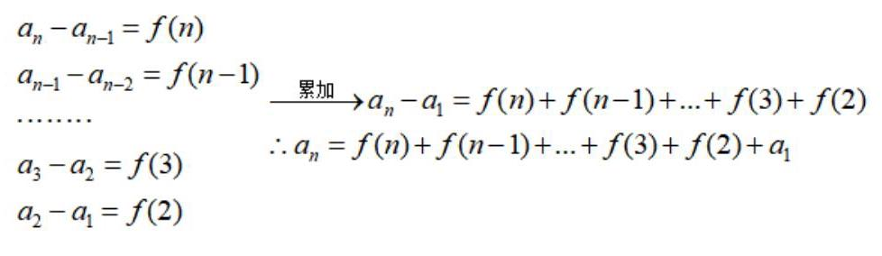

## 数列的通项与求和

<table><tr><td>教学目标</td><td>1、掌握由常见数列递推关系式求通项公式的方法，由数列递推关系式的特点，选择合适的方法;   2、掌握等差数列与等比数列前 $\mathrm{n}$ 项和公式，并能够应用这些知识解决一些简单的问题</td></tr><tr><td>重点</td><td>1、根据数列的递推公式求解数列通项公式；   2、掌握求一些特殊数列前 $n$ 项和的方法: 公式、分组、倒序相加、裂项、错位;   3、理解求数列通项及数列求和中蕴含的数学思想方法.</td></tr><tr><td>难 点</td><td>理解求数列通项及数列求和中蕴含的数学思想方法</td></tr></table>

## (一) 数列的通项

## 知识梳理

1、等差数列的通项公式: ${a}_{n} = {a}_{1} + \left( {n - 1}\right) d$

2、等比数列的通项公式: ${a}_{n} = {a}_{1}{q}^{n - 1}$

※3、用观察法(不完全归纳法)求数列的通项.

## 二、根据递推关系求通项

## 1、累加法(叠加法)

形如 ${a}_{n} - {a}_{n - 1} = f\left( n\right) \left( {n \geq  2}\right)$ 或 ${a}_{n} = {a}_{n - 1} + f\left( n\right) \left( {n \geq  2}\right)$ ,且 $f\left( n\right)$ 不为常数,则求 ${a}_{n}$ 可用累加法.

①若 $f\left( n\right)$ 是关于 $n$ 的一次函数,累加后可转化为等差数列求和;

②若 $f\left( n\right)$ 是关于 $n$ 的指数函数,累加后可转化为等比数列求和;

③若 $f\left( n\right)$ 是关于 $n$ 的特殊分式函数，累加后可裂项求和.

【知识注释】

2、累乘法(叠乘法)

形如 $\frac{{a}_{n}}{{a}_{n - 1}} = f\left( n\right) \left( {n \geq  2}\right)$ 或 ${a}_{n} = f\left( n\right) {a}_{n - 1}\left( {n \geq  2}\right)$ ,且 $f\left( n\right)$ 不为常数 (一般情况下为分式形式),求 ${a}_{n}$ 用累乘法.

【知识注释】

$$
{a}_{n} = \frac{{a}_{n}}{{a}_{n - 1}} \times  \frac{{a}_{n - 1}}{{a}_{n - 2}}\cdots \frac{{a}_{3}}{{a}_{2}} \times  \frac{{a}_{2}}{{a}_{1}} \times  {a}_{1} = f\left( n\right) f\left( {n - 1}\right) \cdots f\left( 2\right) {a}_{1}
$$

## 3、待定系数法

形如 ${a}_{n + 1} = k{a}_{n} + b,\left( {k \neq  0\text{ ,其中 }{a}_{1} = a \neq  0}\right)$ 型

(1)若 $k = 1$ 时，数列 $\left\{  {a}_{n}\right\}$ 为等差数列；

(2)若 $b = 0$ 时，数列 $\left\{  {a}_{n}\right\}$ 为等比数列；

(3)若 $k \neq  1$ 且 $b \neq  0$ 时，数列 $\left\{  {a}_{n}\right\}$ 为线性递推数列，其通项可通过待定系数法构造辅助数列来求解. 见下

【知识注释】

设 ${a}_{n + 1} + \lambda  = k\left( {{a}_{n} + \lambda }\right)$ ,得 ${a}_{n + 1} = k{a}_{n} + \left( {k - 1}\right) \lambda$ ,可得 $\lambda  = \frac{b}{k - 1}$ 。

【知识补充】

形如 ${a}_{n + 1} = p{a}_{n} + {q}^{n}$ ,可以有三种方法进行求解:

①同时除以 ${q}^{n + 1}$ ，可得 $\frac{{a}_{n + 1}}{{q}^{n + 1}} = \frac{p}{q} \times  \frac{{a}_{n}}{{q}^{n}} + \frac{1}{q}$ ，令 $\frac{{a}_{n}}{{q}^{n}} \rightarrow  {b}_{n}$ ，得 ${b}_{n + 1} = \frac{p}{q}{b}_{n} + \frac{1}{q}$ ，利用待定系数法进行求解 ②同时除以 ${p}^{n + 1}$ ，可得 $\frac{{a}_{n + 1}}{{p}^{n + 1}} = \frac{{a}_{n}}{{p}^{n}} + \frac{{q}^{n}}{{p}^{n + 1}}$ ，令 $\frac{{a}_{n}}{{p}^{n}} \rightarrow  {b}_{n}$ ，得 ${b}_{n + 1} = {b}_{n} + \frac{{q}^{n}}{{p}^{n + 1}}$ ，利用累加法进行转化求解 ③ 当 $p \neq  q$ 时，可以构造 ${a}_{n + 1} + \lambda {q}^{n + 1} = p\left( {{a}_{n} + \lambda {q}^{n}}\right)$ ，令 ${a}_{n} + \lambda {q}^{n} \rightarrow  {b}_{n}$ ，可得 ${b}_{n + 1} = p{b}_{n}\cdots$

这三种方法比较下来, 第一种方法相对运算会简单一些, 第二种方法要利用累加求和, 有可能会计算错误; 第三哪种方法使用的前提是 $p \neq  q$ ,所以适用范围会有限制。

## 4、倒数法

形如 ${a}_{n + 1} = \frac{c{a}_{n}}{{a}_{n} + d}$ 型,取倒数变成 $\frac{1}{{a}_{n + 1}} = \frac{d}{c}\frac{1}{{a}_{n}} + \frac{1}{c}$ 的形式的方法叫倒数变换法.

【知识注释】

形如 ${a}_{n + 1} = \frac{c{a}_{n}}{{a}_{n} + d}$ 型,其实就是高一所学习的一次函数模型,要学会数列和知识点之间的勾连. 取倒数后有两种类型:一是直接转化为等差数列；二是再借助于待定系数法去求解.

## 5、对数变换法

形如 ${a}_{n + 1} = p{a}_{n}^{r}\left( {p > 0,{a}_{n} > 0}\right)$

这种类型一般是等式两边取对数后转化为 ${a}_{n + 1} = p{a}_{n} + q$ 型,再利用待定系数法求解.

【知识注释】

形如 ${a}_{n + 1} = p{a}_{n}^{r}\left( {p > 0,{a}_{n} > 0}\right)$ ,此时最好的方法就是两边同时取 ${\log }_{p}^{ \times  }$ ,这样可以很好的降低难度,具体如下: ${\log }_{p}^{{a}_{n + 1}} = r{\log }_{p}^{{a}_{n}} + 1$ ,令 ${\log }_{p}^{{a}_{n}} = {b}_{n}$ ,可得 ${b}_{n + 1} = r{b}_{n} + 1$ ,然后再利用待定系数法进行求解

6、和 ${S}_{n}$ 有关型

已知数列 $\left\{  {a}_{n}\right\}$ 前 $n$ 项和 ${S}_{n}$ ，则用公式 ${a}_{n} = \left\{  \begin{array}{ll} {S}_{1} & n = 1 \\  {S}_{n} - {S}_{n - 1} & n \geq  2 \end{array}\right.$ (注意:不能忘记讨论 $n = 1$ ).

【知识注释】

由于 ${S}_{n}$ 和 ${a}_{n}$ 在数列中是不同的属种,所以一般情况下,我们要对它们之间进行同类型的转化,可以利用公式 ${a}_{n} = \left\{  \begin{array}{ll} {S}_{1} & n = 1 \\  {S}_{n} - {S}_{n - 1} & n \geq  2 \end{array}\right.$ ,把递推关系中的 ${S}_{n} \rightarrow  {a}_{n}$ ,也可以把 ${a}_{n} \rightarrow  {S}_{n}$ ,这两种思维我们要学会融合贯通. 可以以 2019 年上海高考题为例 “已知数列 $\left\{  {a}_{n}\right\}$ 前 $n$ 项和为 ${S}_{n}$ ，且满足 ${S}_{n} + {a}_{n} = 2$ ，则 ${S}_{5} =$ ___. ”

## 7、奇偶讨论型

①形如 ${a}_{n + 1} + {a}_{n} = f\left( n\right)$ 型

(1)若 ${a}_{n + 1} + {a}_{n} = d$ ( $d$ 为常数)，则数列 $\left\{  {a}_{n}\right\}$ 为一等和数列”，它是一个周期数列，周期为2，其通项分奇数项和偶数项来讨论；

(2)若 $f\left( n\right)$ 为 $n$ 的函数(非常数)时，可通过构造转化为 ${a}_{n + 1} - {a}_{n} = f\left( n\right)$ 型(详见知识注释)，通过累加来求出通项; 或用降阶法 (两式相减) 得 ${a}_{n + 1} - {a}_{n - 1} = f\left( n\right)  - f\left( {n - 1}\right) \left( {n \geq  2}\right)$ ,分奇偶项来分求通项.

【知识注释】

$$
{a}_{n + 1} + {a}_{n} = f\left( n\right)  \rightarrow  \frac{{a}_{n + 1}}{{\left( -1\right) }^{n + 1}} - \frac{{a}_{n}}{{\left( -1\right) }^{n}} = \frac{f\left( n\right) }{{\left( -1\right) }^{n + 1}} \rightarrow  \text{ 累加法求解 }
$$

② 形如 ${a}_{n + 1} \cdot  {a}_{n} = f\left( n\right)$ 型

(1)若 ${a}_{n + 1} \cdot  {a}_{n} = p$ ( $p$ 为常数)，则数列 $\left\{  {a}_{n}\right\}$ 为“等积数列”，它是一个周期数列，周期为2，其通项分奇数项和偶数项来讨论;

(2)若 $f\left( n\right)$ 为 $n$ 的函数(非常数)时，可通过降阶法得 ${a}_{n} \cdot  {a}_{n - 1} = f\left( {n - 1}\right) \left( {n \geq  2}\right)$ ，两式相除后，分奇偶项来分求通项.

## 例题精讲

① 累加法

【例1】若数列 $\left\{  {a}_{n}\right\}$ 由 ${a}_{1} = 2,{a}_{n + 1} = {a}_{n} + n\left( {n \geq  1}\right)$ 确定,求通项公式 ${a}_{n} =$ ___.

【难度】 $\star   \star$

【答案】 ${n}^{2} - n + 2$

【解析】解: 由 ${a}_{1} = 2,{a}_{n + 1} = {a}_{n} + n\left( {n \geq  1}\right)$ ,可得

${a}_{n} = \left( {{a}_{n} - {a}_{n - 1}}\right)  + \left( {{a}_{n - 1} - {a}_{n - 2}}\right)  + \ldots  + \left( {{a}_{2} - {a}_{1}}\right)  + {a}_{1} = \left( {n - 1}\right)  + \left( {n - 2}\right)  + \ldots  + 2 + 1 + 2 = \frac{\left( {n - 1}\right) n}{2} + 2 = \frac{{n}^{2}}{2} - \frac{n}{2} + 2.$

故答案为 $\frac{{n}^{2}}{2} - \frac{n}{2} + 2$ .

【例2】数列 $\left\{  {a}_{n}\right\}$ 满足 ${a}_{1} = 2,{a}_{n + 1} = {a}_{n} + {2}^{n}, n \in  {N}^{ * }$ ,则数列 $\left\{  {a}_{n}\right\}$ 的通项公式 ${a}_{n} =$ ___.

【难度】 $\star   \star$

【答案】 ${2}^{n}$

【解析】解: ${a}_{1} = 4,{a}_{n + 1} = {a}_{n} + {2}^{n}, n \in  {N}^{ * }$ ,可得 ${a}_{n} = {a}_{1} + \left( {{a}_{2} - {a}_{1}}\right)  + \left( {{a}_{3} - {a}_{2}}\right)  + \ldots  + \left( {{a}_{n} - {a}_{n - 1}}\right) \; = 2 + 2 + 4 + \ldots  + {2}^{n - 1} = 4 + \frac{2\left( {1 - {2}^{n - 1}}\right) }{1 - 2} = {2}^{n}$ . 故答案为: ${2}^{n}$ .

【例 3】已知数列 $\left\{  {a}_{n}\right\}$ 中 ${a}_{1} = \frac{1}{3},{a}_{n} = \frac{{2n} - 3}{{2n} + 1} \cdot  {a}_{n - 1}\left( {n \geq  2}\right)$ ,求数列 $\left\{  {a}_{n}\right\}$ 的通项公式.

【难度】 $\star   \star$

【答案】 ${a}_{n} = \frac{1}{4{n}^{2} - 1}$

【解析】当 $n \geq  2$ 时, $\frac{{a}_{2}}{{a}_{1}} = \frac{1}{5},\frac{{a}_{3}}{{a}_{2}} = \frac{3}{7},\frac{{a}_{4}}{{a}_{3}} = \frac{5}{9},\ldots ,\frac{{a}_{n}}{{a}_{n - 1}} = \frac{{2n} - 3}{{2n} + 1}$ ,将这 $n - 1$ 个式子累乘,得到 $\frac{{a}_{n}}{{a}_{1}} = \frac{1 \times  3}{\left( {{2n} - 1}\right) \left( {{2n} + 1}\right) }$ ,从而 ${a}_{n} = \frac{1 \times  3}{\left( {{2n} - 1}\right) \left( {{2n} + 1}\right) } \times  \frac{1}{3} = \frac{1}{4{n}^{2} - 1}$ ,当 $n = 1$ 时, $\frac{1}{4{n}^{2} - 1} = \frac{1}{3} = {a}_{1}$ ,所以 ${a}_{n} = \frac{1}{4{n}^{2} - 1}$

【例4】数列 $\left\{  {a}_{n}\right\}$ 中, ${a}_{1} = 1,{a}_{n} = \frac{1}{2}{a}_{n - 1} + 1\left( {n \geq  2}\right)$ ,求通项公式 ${a}_{n}$ .

【难度】 $\star   \star   \star$

【答案】 ${a}_{n} = 2 - \frac{1}{{2}^{n - 1}}$

【解析】解: 由 ${a}_{n} = \frac{1}{2}{a}_{n - 1} + 1$ ,得 ${a}_{n} - 2 = \frac{1}{2}\left( {{a}_{n - 1} - 2}\right)$ .

令 ${b}_{n} = {a}_{n} - 2$ ,则 ${b}_{n - 1} = {a}_{n - 1} - 2,\therefore$ 有 ${b}_{n} = \frac{1}{2}{b}_{n - 1}$ .

$\therefore {b}_{n} = \frac{1}{2}{b}_{n - 1} = \frac{1}{2} \cdot  \frac{1}{2}{b}_{n - 2} = \frac{1}{2} \cdot  \frac{1}{2} \cdot  \frac{1}{2}{b}_{n - 3} = \frac{1}{2} \times  \frac{1}{2} \times  \frac{1}{2}\ldots  \times  \frac{1}{2}{b}_{1} = {\left( \frac{1}{2}\right) }^{n - 1} \cdot  {b}_{1}$ .

$\because {a}_{1} = 1,\therefore {b}_{1} = {a}_{1} - 2 =  - 1.\therefore {b}_{n} =  - {\left( \frac{1}{2}\right) }^{n - 1}.\therefore {a}_{n} = 2 - \frac{1}{{2}^{n - 1}}$ .

【例5】已知数列 $\left\{  {a}_{n}\right\}$ 满足 ${a}_{n + 1} = 2{a}_{n} + 3 \times  {2}^{n},{a}_{1} = 2$ ; 数列 $\left\{  {b}_{n}\right\}$ 满足 ${b}_{n + 1} = {b}_{n} + {2n} + 1,{b}_{1} = 1$ .

(1)证明:数列 $\left\{  \frac{{a}_{n}}{{2}^{n}}\right\}$ 是等差数列.

(2)求数列 $\left\{  {b}_{n}\right\}$ 的通项公式.

【难度】★★★

【答案】见解析

【解析】解: (1) 证明: 根据题意,数列 $\left\{  {a}_{n}\right\}$ 满足 ${a}_{n + 1} = 2{a}_{n} + 3 \times  {2}^{n}$ ,

等式两边除以 ${2}^{n + 1}$ 得 $\frac{{a}_{n + 1}}{{2}^{n + 1}} = \frac{{a}_{n}}{{2}^{n}} + \frac{3}{2}$ ;

故数列 $\left\{  \frac{{a}_{n}}{{2}^{n}}\right\}$ 是以 $\frac{{a}_{1}}{2} = 1$ 为首项, $\frac{3}{2}$ 为公差的等差数列;

(2)根据题意，由 ${b}_{n + 1} = {b}_{n} + {2n} + 1$ 得 ${b}_{n + 1} - {b}_{n} = {2n} + 1$ ，则 ${b}_{n} - {b}_{n - 1} = 2\left( {n - 1}\right)  + 1 = {2n} - 1$ ， 则 ${b}_{n} = \left( {{b}_{n} - {b}_{n - 1}}\right)  + \left( {{b}_{n - 1} - {b}_{n - 2}}\right)  + \ldots \ldots  + \left( {{b}_{2} - {b}_{1}}\right)  + {b}_{1} = \left( {{2n} - 1}\right)  + \left( {{2n} - 3}\right)  + \ldots \ldots  + 3 + 1 = \frac{n \times  \left\lbrack  {1 + \left( {{2n} - 1}\right) }\right\rbrack  }{2} = {n}^{2}$

【例 6】在数列 $\left\{  {a}_{n}\right\}$ 中, ${a}_{1} = 1,{a}_{n + 1} = \frac{{a}_{n}}{{a}_{n} + 1}$ 设 ${b}_{n} = \frac{1}{{a}_{n}}, n \in  {N}^{ * }$ .

求证: 数列 $\left\{  {b}_{n}\right\}$ 是等差数列,并求通项公式 ${b}_{n}$ ;

【难度】 $\star   \star   \star$

【答案】 ${b}_{n} = n$

【解析】解: 证明: 在数列 $\left\{  {a}_{n}\right\}$ 中, ${a}_{1} = 1,{a}_{n + 1} = \frac{{a}_{n}}{{a}_{n} + 1}$ ,可得 $\frac{1}{{a}_{n + 1}} = \frac{1}{{a}_{n}} + 1$ ,

设 ${b}_{n} = \frac{1}{{a}_{n}}, n \in  {N}^{ * }$ ,可得 ${b}_{n + 1} = {b}_{n} + 1$ ,可得数列 $\left\{  {b}_{n}\right\}$ 是首项和公差均为 1 的等差数列,

即有 ${b}_{n} = 1 + n - 1 = n$ ;

【例7】(1)已知数列 $\left\{  {a}_{n}\right\}$ 的前 $n$ 项和 ${S}_{n} = 2{n}^{2}$ ，则该数列的通项公式 ${a}_{n} =$ ___.

【难度】 $\star   \star$

【答案】 ${4n} - 2$

【解析】解: 当 $n = 1$ 时, ${a}_{1} = {S}_{1} = 2 \times  {1}^{2} = 2$ ,

当 $n \geq  2$ 时, ${a}_{n} = {S}_{n} - {S}_{n - 1} = 2\left\lbrack  {{n}^{2} - {\left( n - 1\right) }^{2}}\right\rbrack   = {4n} - 2$ ,

应验证当 $n = 1$ 时,上式也适合,故此数列的通项公式为: ${a}_{n} = {4n} - 2$ ,故答案为: ${4n} - 2$

(2)已知数列 $\left\{  {a}_{n}\right\}$ 的前 $n$ 项和 ${S}_{n} = 2{n}^{2} + 1$ ，则该数列的通项公式 ${a}_{n} =$ ___.

【难度】 $\star   \star   \star$

【答案】 ${a}_{n} = \left\{  \begin{matrix} 3, n > 1 \\  {4n} - 2, n \geq  2 \end{matrix}\right.$ .

【解析】解: 当 $n = 1$ 时, ${a}_{1} = {S}_{1} = 2 \times  {1}^{2} = 2$ ,

当 $n \geq  2$ 时, ${a}_{n} = {S}_{n} - {S}_{n - 1} = 2\left\lbrack  {{n}^{2} - {\left( n - 1\right) }^{2}}\right\rbrack   = {4n} - 2$ ,

应验证当 $n = 1$ 时, ${a}_{1} = {S}_{1} = 3$ ,不符合上式,故此数列的通项公式为: ${a}_{n} = \left\{  \begin{matrix} 3, n > 1 \\  {4n} - 2, n \geq  2 \end{matrix}\right.$ ,故答案为: ${a}_{n} = \left\{  {\begin{matrix} 3, n > 1 \\  {4n} - 2, n \geq  2 \end{matrix}.}\right.$

【例8】(1)设数列 $\left\{  {a}_{n}\right\}$ 前 $n$ 项的和为 ${S}_{n}$ ， ${a}_{n + 1} = 2{S}_{n}$ ， ${a}_{1} = 1$ ，求通项 ${a}_{n} =$ ___.

【难度】 $\star   \star   \star$

【答案】 $\left\{  \begin{array}{l} 1, n = 1 \\  2 \times  {3}^{n - 2}, n \geq  2 \end{array}\right.$

【解析】解: $\because {a}_{n + 1} = 2{S}_{n},{a}_{1} = 1$ ,

当 $n \geq  2$ 时, ${a}_{n} = 2{S}_{n - 1},\therefore {a}_{n + 1} - {a}_{n} = 2{a}_{n}$ ,即 ${a}_{n + 1} = 3{a}_{n}$ . 又 ${a}_{2} = 2{a}_{1} = 2$ ,故列 $\left\{  {a}_{n}\right\}$ 从第2项起是等比数列, $\therefore {a}_{n} = 2 \times  {3}^{n - 2}\left( {n \geq  2}\right) .\therefore {a}_{n} = \left\{  \begin{array}{l} 1, n = 1 \\  2 \times  {3}^{n - 2}, n \geq  2 \end{array}\right.$ ,故答案为: $\left\{  \begin{array}{l} 1, n = 1 \\  2 \times  {3}^{n - 2}, n \geq  2 \end{array}\right.$ .

(2)设 ${S}_{n}$ 为数列 $\left\{  {a}_{n}\right\}$ 的前 $n$ 项和，且 ${a}_{1} = 4$ ， ${a}_{n + 1} = {S}_{n}$ ， $n \in  {N}^{ * }$ ，则数列 $\left\{  {S}_{n}\right\}$ 的通项公式为___.

【难度】 $\star   \star$

【答案】 ${S}_{n} = {2}^{n + 1}\left( {n \in  {N}^{ * }}\right)$

【解析】解: 由 ${a}_{n + 1} = {S}_{n + 1} - {S}_{n}$ 及 ${a}_{n + 1} = {S}_{n}$ 得 ${S}_{n + 1} - {S}_{n} = {S}_{n}$ ,所以 ${S}_{n + 1} = 2{S}_{n}$ ,

所以数列 $\left\{  {S}_{n}\right\}$ 是以 ${S}_{1} = {a}_{1} = 4$ 为首项,2为公比的等比数列,所以 ${S}_{n} = {2}^{n + 1}\left( {n \in  {N}^{ * }}\right)$ .

故答案为: ${S}_{n} = {2}^{n + 1}\left( {n \in  {N}^{ * }}\right)$ .

【例9】(1)已知数列 $\left\{  {a}_{n}\right\}$ 中， ${a}_{1} + {a}_{2} + {a}_{3} + \ldots  + {a}_{n} = n{a}_{n}$ ， ${a}_{1} = \frac{1}{2}$ ，求通项 ${a}_{n}$ .

【难度】 $\star   \star   \star$

【答案】 $\therefore {a}_{n} = \frac{1}{2}$

【解析】解: 设数列 $\left\{  {a}_{n}\right\}$ 的前 $n$ 项和为 ${S}_{n},\because {a}_{1} + {a}_{2} + {a}_{3} + \ldots  + {a}_{n} = n{a}_{n},{a}_{1} = \frac{1}{2},\therefore {S}_{n} = n{a}_{n}$ ,

当 $n \geq  2$ 时, ${a}_{n} = {S}_{n} - {S}_{n - 1} = n{a}_{n} - \left( {n - 1}\right) {a}_{n - 1}$ ,化为 ${a}_{n} = {a}_{n - 1} \cdot  \therefore {a}_{n} = {a}_{1} = \frac{1}{2}$ .

(2)设数列 $\left\{  {a}_{n}\right\}$ 满足 ${a}_{1} \cdot  2{a}_{2} \cdot  3{a}_{3} \cdot  \ldots  \cdot  n{a}_{n} = {2}^{n}$ ，则 ${a}_{n} =$ ___.

【难度】 $\star   \star   \star$

【答案】 $\frac{2}{n}$

【解析】解: $\because {a}_{1} \cdot  2{a}_{2} \cdot  3{a}_{3} \cdot  \ldots  \cdot  n{a}_{n} = {2}^{n}$ ,①,

$\therefore n \geq  2$ 时, ${a}_{1} \cdot  2{a}_{2} \cdot  3{a}_{3} \cdot  \ldots  \cdot  \left( {n - 1}\right) {a}_{n - 1} = {2}^{n - 1}$ ②

$\therefore$ ① $\div$ ②可得 $n{a}_{n} = 2,\therefore {a}_{n} = \frac{2}{n}\left( {n \geq  2}\right)$ ，又 ${a}_{1} = 1$ 也满足上式， $\therefore$ 数列 $\left\{  {a}_{n}\right\}$ 的通项为 ${a}_{n} = \frac{2}{n}$ ；故答案为: $\frac{2}{n}$ .

【例10】(1)数列 $\left\{  {a}_{n}\right\}$ 满足: ${a}_{1} = a$ ,对任意 $n \in  {N}^{ * }$ 有 ${a}_{n + 1} + {a}_{n} = {2n} + 1$ 成立.

求数列 $\left\{  {a}_{n}\right\}$ 的通项公式 ${a}_{n}$ ;

【难度】 $\star   \star   \star$

【答案】见解析

【解析】解: (1) ${a}_{n + 1} + {a}_{n} = {2n} + 1$ ①,

$\therefore {a}_{n + 2} + {a}_{n + 1} = {2n} + 3$ ②

②-①得: ${a}_{n + 2} - {a}_{n} = 2, n \in  {N}^{ * }\therefore {a}_{{2k} - 1} = {a}_{1} + \left( {k - 1}\right)  \times  2 = {2k} + a - 2\because {a}_{1} + {a}_{2} = 3,\therefore {a}_{2} = 3 - {a}_{1} = 3 - a$ ，

$\therefore {a}_{2k} = {a}_{2} + \left( {k - 1}\right)  \times  2 = {2k} + 1 - a\therefore {a}_{n} = \left\{  \begin{array}{l} n + a - 1, n\text{ 为奇数 } \\  n + 1 - a, n\text{ 为偶数 } \end{array}\right.$

(2)已知数列 $\left\{  {a}_{n}\right\}$ 中， ${a}_{1} = 1$ ， ${a}_{n}{a}_{n + 1} = {2}^{n}\left( {n \in  {N}^{ * }}\right)$ ，求数列 $\left\{  {a}_{n}\right\}$ 通项 ${a}_{n}$

【难度】 $\star   \star   \star$

【答案】见解析

【解析】解: $\because {a}_{n}{a}_{n + 1} = {2}^{n}\therefore {a}_{n}{a}_{n - 1} = {2}^{n - 1}$ ,两式相比, $\therefore \frac{{a}_{n + 1}}{{a}_{n - 1}} = 2,\therefore$ 数列 $\left\{  {a}_{n}\right\}$ 的奇数项成等比数列,偶数项成等比数列, $\therefore {a}_{n} = {2}^{\frac{n - 1}{2}}, n$ 为奇数; ${a}_{n} = {2}^{\frac{n}{2}}, n$ 为偶数;

## 巩固训练

1、已知数列 $\left\{  {a}_{n}\right\}$ 中， ${a}_{1} = 2$ ， ${a}_{n + 1} - {a}_{n} = n - 1$ ， $n \in  {N}^{ * }$ ，则数列 $\left\{  {a}_{n}\right\}$ 的通项公式 ${a}_{n} =$ ___.

【难度】 $\star   \star$

【答案】 $\frac{{n}^{2}}{2} - \frac{3n}{2} + 3$

【解析】解: 因为数列 $\left\{  {a}_{n}\right\}$ 中, ${a}_{1} = 2,{a}_{n + 1} = {a}_{n} + n - 1, n \in  {N}^{ * }$ ,

所以 ${a}_{2} = {a}_{1} + 0$ ,

${a}_{3} = {a}_{2} + 1$ ,

${a}_{4} = {a}_{3} + 2$ ,

...

${a}_{n} = {a}_{n - 1} + n - 2$

上式累加可得:

${a}_{n} = {a}_{1} + 1 + 2 + 3 + \ldots  + \left( {n - 2}\right)  = 2 + \frac{\left( {n - 1}\right) \left( {n - 2}\right) }{2} = \frac{{n}^{2}}{2} - \frac{3n}{2} + 3$ . 故答案为: $\frac{{n}^{2}}{2} - \frac{3n}{2} + 3$ .

2、已知数列 $\left\{  {a}_{n}\right\}$ 满足 ${a}_{1} = 1,{a}_{n + 1} - {a}_{n} = {\left( \frac{1}{2}\right) }^{n}, n \in  {N}^{ * }$ ,求数列 $\left\{  {a}_{n}\right\}$ 的通项公式.

【难度】 $\star   \star$

【答案】 ${a}_{n} = 2 - \frac{1}{{2}^{n - 1}}$

【解析】解: $\because {a}_{n + 1} - {a}_{n} = {\left( \frac{1}{2}\right) }^{n},\therefore {a}_{n} - {a}_{n - 1} = {\left( \frac{1}{2}\right) }^{n - 1},{a}_{n - 1} - {a}_{n - 2} = {\left( \frac{1}{2}\right) }^{n - 2},\ldots ,{a}_{2} - {a}_{1} = {\left( \frac{1}{2}\right) }^{1}$ , 累加得: ${a}_{n} - {a}_{1} = \frac{\frac{1}{2}\left( {1 - \frac{1}{{2}^{n - 1}}}\right) }{1 - \frac{1}{2}} = 1 - \frac{1}{{2}^{n - 1}}$ ,又 $\because {a}_{1} = 1,\therefore {a}_{n} = 2 - \frac{1}{{2}^{n - 1}}$ .

3、已知在数列 $\left\{  {a}_{n}\right\}$ 中， ${a}_{1} = 2$ ， ${a}_{n + 1} = 2{a}_{n} + 3$ ，求通项 ${a}_{n}$ .

【难度】 $\star   \star$

【答案】 ${a}_{n} = 5 \times  {2}^{n - 1} - 3$

【解析】解: 在数列 $\left\{  {a}_{n}\right\}$ 中, ${a}_{1} = 2,{a}_{n + 1} = 2{a}_{n} + 3,\therefore {a}_{n + 1} + 3 = 2\left( {{a}_{n} + 3}\right)$ ,又 ${a}_{1} + 3 = 5$ ,

$\therefore$ 数列 $\left\{  {{a}_{n} + 3}\right\}$ 是首项为5,公比为2的等比数列, $\therefore {a}_{n} + 3 = 5 \times  {2}^{n - 1},\therefore$ 通项 ${a}_{n} = 5 \times  {2}^{n - 1} - 3$ .

4、已知数列 $\left\{  {a}_{n}\right\}$ 中， ${a}_{1} = 1$ ， ${a}_{n}{a}_{n + 1} + 2{a}_{n + 1} - {2{a}_{n}} = 0\left( {n \in  {N}_{ + }}\right)$ ，求通项 ${a}_{n}$ .

【难度】 $\star   \star   \star$

【答案】 ${a}_{n} = \frac{2}{n + 1}$

【解析】解: $\because {a}_{n + 1} = \frac{2{a}_{n}}{{a}_{n} + 2}\left( {n \in  {N}^{ * }}\right) ,\therefore \frac{1}{{a}_{n + 1}} = \frac{{a}_{n} + 2}{2{a}_{n}} = \frac{1}{2} + \frac{1}{{a}_{n}}$ ,又 $\because \frac{1}{{a}_{1}} = 1,\therefore$ 数列 $\left\{  \frac{1}{{a}_{n}}\right\}$ 是以 1 为首项、 $\frac{1}{2}$ 为公差的等差数列, $\therefore \frac{1}{{a}_{n}} = 1 + \frac{1}{2}\left( {n - 1}\right)  = \frac{n + 1}{2},\therefore {a}_{n} = \frac{2}{n + 1}$ .

5、若数列 $\left\{  {a}_{n}\right\}$ 中， ${a}_{1} = 3$ ，且 ${a}_{n + 1} = {a}_{n}^{3}\left( {n \in  {N}^{ * }}\right)$ ，则数列的通项 ${a}_{n} =$ ___.

【难度】 $\star   \star   \star$

【答案】 ${a}_{n} = {3}^{{3}^{n - 1}}$

【解答】解: 因为 ${a}_{1} = 3$ ,两边同时取对数,得 $\lg {a}_{n + 1} = 3\lg {a}_{n},\frac{\lg {a}_{n + 1}}{\lg {a}_{n}} = 3,\therefore \lg {a}_{n} = {3}^{n - 1}\lg 3,\therefore {a}_{n} = {3}^{{3}^{n - 1}}$

6、已知数列 $\left\{  {a}_{n}\right\}$ 的前 $n$ 项和 ${S}_{n} = 2{a}_{n} - 1, n \in  {N}^{ * }$ ，则 $\left\{  {a}_{n}\right\}$ 的通项公式为___.

【难度】 $\star   \star$

【答案】 ${a}_{n} = {2}^{n - 1}$

【解析】解: 由 ${S}_{n} = 2{a}_{n} - 1$ ,得 ${a}_{1} = {S}_{1} = 2{a}_{1} - 1$ ,解得: ${a}_{1} = 1$ ,

当 $n \geq  2$ 时, ${S}_{n - 1} = 2{a}_{n - 1} - 1,\therefore {a}_{n} = 2{a}_{n} - 2{a}_{n - 1}$ ,即 ${a}_{n} = 2{a}_{n - 1}\left( {n \geq  2}\right)$ ,

$\therefore$ 数列 $\left\{  {a}_{n}\right\}$ 是以 1 为首项,以 2 为公比的等比数列,则 ${a}_{n} = 1 \times  {2}^{n - 1} = {2}^{n - 1}$ . 故答案为: ${a}_{n} = {2}^{n - 1}$ .

7、数列 $\left\{  {a}_{n}\right\}$ 满足 ${a}_{1} + 2{a}_{2} + 3{a}_{3} + \ldots  + n{a}_{n} = {n}^{2}$ ，则通项公式 ${a}_{n} =$ ___.

【难度】 $\star   \star   \star$

【答案】 $\frac{{2n} - 1}{n}$

【解析】解: 当 $n = 1$ 时, ${a}_{1} = 1$ ;

当 $n \geq  2$ 时, ${a}_{1} + 2{a}_{2} + 3{a}_{3} + \ldots  + \left( {n - 1}\right) {a}_{n - 1} = {\left( n - 1\right) }^{2}$ ,

${a}_{1} + 2{a}_{2} + 3{a}_{3} + \ldots  + n{a}_{n} = {n}^{2},$

作差可得, $n{a}_{n} = {n}^{2} - {\left( n - 1\right) }^{2} = {2n} - 1$ ,故 ${a}_{n} = \frac{{2n} - 1}{n},{a}_{1} = 1$ 也满足上式; 故 ${a}_{n} = \frac{{2n} - 1}{n}$ ,

故答案为: $\frac{{2n} - 1}{n}$ .

8、已知数列 $\left\{  {a}_{n}\right\}$ 满足 ${a}_{1} = 1,{a}_{n + 1} \cdot  {a}_{n} = {\left( \frac{1}{2}\right) }^{n}\left( {n \in  {N}^{ * }}\right)$ ，则 ${a}_{2020}$ 等于( )

A. $\frac{1}{{2}^{1013}}$ B. $\frac{1}{{2}^{2011}}$ C. $\frac{1}{{2}^{2012}}$ D. $\frac{1}{{2}^{1010}}$

【难度】 $\star   \star   \star$

【答案】 $D$

【解析】解: (1) $\because {a}_{n + 2}{a}_{n + 1} = {\left( \frac{1}{2}\right) }^{n + 1}$ ,两式相比, $\therefore \frac{{a}_{n + 2}}{{a}_{n}} = \frac{1}{2},\therefore$ 数列 $\left\{  {a}_{n}\right\}$ 的奇数项成等比数列,偶数项成等比数列, $\therefore {a}_{n} = {\left( \frac{1}{2}\right) }^{\frac{n - 1}{2}}, n$ 为奇数; ${a}_{n} = {\left( \frac{1}{2}\right) }^{\frac{n}{2}}, n$ 为偶数; 所以 ${a}_{2020} = {\left( \frac{1}{2}\right) }^{1010}$ ,所以答案选 $D$ .

## (二) 数列求和

## 知识梳理

求数列前 $n$ 项和:

## 1、公式法求和

① 等差数列求和公式: ${S}_{n} = \frac{n\left( {{a}_{1} + {a}_{n}}\right) }{2} = n{a}_{1} + \frac{n\left( {n - 1}\right) }{2}d$

② 等比数列求和公式: ${S}_{n} = \left\{  \begin{array}{ll} \begin{matrix} n{a}_{1} \\  \frac{{a}_{1}\left( {1 - {q}^{n}}\right) }{1 - q} = \frac{{a}_{1} - {a}_{n}q}{1 - q} \end{matrix} & \begin{matrix} \left( {q = 1}\right) \\  \left( {q \neq  1}\right)  \end{matrix} \end{array}\right.$

③ ${S}_{n} = \mathop{\sum }\limits_{{k = 1}}^{n}k = \frac{1}{2}n\left( {n + 1}\right) \;$ ④ ${S}_{n} = \mathop{\sum }\limits_{{k = 1}}^{n}{k}^{2} = \frac{1}{6}n\left( {n + 1}\right) \left( {{2n} + 1}\right) \;$ ⑤ ${S}_{n} = \mathop{\sum }\limits_{{k = 1}}^{n}{k}^{3} = {\left\lbrack  \frac{1}{2}n\left( n + 1\right) \right\rbrack  }^{2}$

公式法求和注意事项:(1)弄准求和项数 $n$ 的值；

(2)等比数列公比 $q$ 未知时，运用前 $n$ 项和公式要分类.

## 2、分组求和法

分组求和有两种情况，一种是将数列适当拆开，可分为几个等差、等比或常见的数列，然后分别求和， 再将其合并即可; 另一种是将数列相邻的两项(或若干项)并成一项(或一组)得到一个新数列(容易求和).

## 3、裂项相消法

裂项法的实质是将数列中的每项(通项)分解，然后重新组合，使之能消去一些项，最终达到求和的目的, 如:

(1) ${a}_{n} = f\left( {n + 1}\right)  - f\left( n\right)$

(2) ${a}_{n} = \frac{1}{n\left( {n + 1}\right) } = \frac{1}{n} - \frac{1}{n + 1}\xrightarrow[]{\text{ 推广 }}\frac{1}{n\left( {n + k}\right) } = \frac{1}{k}\left( {\frac{1}{n} - \frac{1}{n + k}}\right)$

(3) $\frac{1}{\sqrt{n + 1} + \sqrt{n}} = \sqrt{n + 1} - \sqrt{n}\xrightarrow[]{\text{ 推广 }}\frac{1}{\sqrt{n + k} + \sqrt{n}} = \frac{1}{k}\left( {\sqrt{n + k} - \sqrt{n}}\right)$

(4) $\frac{{a}^{n}}{\left( {{a}^{n} - b}\right) \left( {{a}^{n + 1} - b}\right) } = \frac{1}{a - 1}\left( {\frac{1}{{a}^{n} - b} - \frac{1}{{a}^{n + 1} - b}}\right)$

(5) ${a}_{n} = \frac{{\left( 2n\right) }^{2}}{\left( {{2n} - 1}\right) \left( {{2n} + 1}\right) } = 1 + \frac{1}{2}\left( {\frac{1}{{2n} - 1} - \frac{1}{{2n} + 1}}\right)$

(6) ${a}_{n} = \frac{1}{n\left( {n + 1}\right) \left( {n + 2}\right) } = \frac{1}{2}\left\lbrack  {\frac{1}{n\left( {n + 1}\right) } - \frac{1}{\left( {n + 1}\right) \left( {n + 2}\right) }}\right\rbrack$

用裂项相消法求和时,要对通项进行变换,如: $\frac{1}{\sqrt{n + k} + \sqrt{n}} = \frac{1}{k}\left( {\sqrt{n + k} - \sqrt{n}}\right) ,\frac{1}{n\left( {n + k}\right) } = \frac{1}{k}\left( {\frac{1}{n} - \frac{1}{n + k}}\right)$ 裂项后可以产生连续可以相互抵消的项. 抵消后并不一定只剩下第一项和最后一项, 也有可能前面剩两项, 后面也剩两项.

## 4、倒序相加法

这是推导等差数列的前 $n$ 项和公式时所用的方法,就是将一个数列倒过来排列 (倒序),再把它与原数列相加,就可以得到 $n$ 个 $\left( {{a}_{1} + {a}_{n}}\right)$ .

## 5、错位相减法

这种方法是在推导等比数列的前 $n$ 项和公式时所用的方法,这种方法主要用于求数列 $\left\{  {{a}_{n} \cdot  {b}_{n}}\right\}$ 的前 $n$ 项和,其中 $\left\{  {a}_{n}\right\}  \text{ 、 }\left\{  {b}_{n}\right\}$ 分别是等差数列和等比数列.

用错位相减法求和时, 应注意:

(1)要善于识别题目类型，特别是等比数列公比为负数的情形;

(2)在写出 “ ${S}_{n}$ ” 与 “ $q{S}_{n}$ ” 的表达式时应特别注意将两式 “错项对齐” 以便下一步准确写出 “ ${S}_{n} - q{S}_{n}$ ” 的表达式; (3)在应用错位相减法求和时，若等比数列的公比为参数，应分公比等于 1 和不等于 1 两种情况求解.

## 例题精讲

【例 11】已知数列 $\left\{  {a}_{n}\right\}$ 为等比数列,函数 $y = {\log }_{a}\left( {{2x} - 1}\right)  + 2$ 过定点 $\left( {{a}_{1},{a}_{2}}\right) ,{b}_{n} = {\log }_{2}{a}_{n}$ ,数列 $\left\{  {b}_{n}\right\}$ 的前 $n$ 项和为 ${S}_{n}$ ,则 ${S}_{10} =$ (   )

A. 44 B. 45 C. 46 D. 50

【难度】★★

【答案】 $B$

【解析】解: $\because$ 函数 $y = {\log }_{a}\left( {{2x} - 1}\right)  + 2$ 过定点 $\left( {1,2}\right) ,\therefore {a}_{1} = 1,{a}_{2} = 2,\therefore$ 等比数列 $\left\{  {a}_{n}\right\}$ 的公比 $q = 2$ ,

$\therefore {a}_{n} = {2}^{n - 1},\therefore {b}_{n} = {\log }_{2}{a}_{n} = n - 1$ ,数列 $\left\{  {b}_{n}\right\}$ 的前 $n$ 项和为 ${S}_{n}$ ,则 ${S}_{10} = \frac{{10} \times  \left( {0 + 9}\right) }{2} = {45}$ ,

故选: $B$ .

【例 12】已知数列 $\left\{  {b}_{n}\right\}$ 满足 ${b}_{n} = {2n} + {2}^{n - 1}$ ,求 $\left\{  {b}_{n}\right\}$ 的前 $n$ 项和 ${S}_{n}$ .

【难度】 $\star   \star$

【答案】 ${S}_{n} = {n}^{2} + n + {2}^{n} - 1$ .

【解析】

${S}_{n} = {b}_{1} + {b}_{2} + {b}_{3} + \cdots  + {b}_{n} = \left( {2 + {2}^{0}}\right)  + \left( {4 + {2}^{1}}\right)  + \left( {6 + {2}^{2}}\right)  + \cdots  + \left( {{2n} + {2}^{n - 1}}\right)$

$= \left( {2 + 4 + 6 + \cdots  + {2n}}\right)  + \left( {1 + 2 + {2}^{2} + \cdots  + {2}^{n - 1}}\right)  = \frac{n\left( {2 + {2n}}\right) }{2} + \frac{1 - {2}^{n}}{1 - 2} = {n}^{2} + n + {2}^{n} - 1$ .

【例 13】已知数列 $\left\{  {a}_{n}\right\}$ 的通项公式为 ${a}_{n} = {\left( -1\right) }^{n} \cdot  \left( {{2n} + 1}\right) \left( {n \in  {N}^{ * }}\right)$ ,其前 $n$ 项和为 ${S}_{n}$ ,求 ${S}_{n}$ .

【难度】 $\star   \star   \star$

【答案】 ${S}_{n} = \left\{  \begin{matrix} n, n\text{ 为偶数 } \\   - n - 2, n\text{ 为奇数 } \end{matrix}\right.$

【解析】

设 ${a}_{n} = {\left( -1\right) }^{n} \cdot  \left( {{2n} + 1}\right)$ ,则 ${a}_{n} + {a}_{n + 1} =  - \left( {{2n} + 1}\right)  + \left( {{2n} + 3}\right)  = 2, n$ 为正奇数,

当 $n$ 为偶数时, ${S}_{n} =  - 3 + 5 - 7 + 9 - \cdots  - \left( {{2n} - 1}\right)  + {2n} + 1 = 2 \times  \frac{n}{2} = n$ ;

当 $n$ 为奇数时, ${S}_{n} = {S}_{n - 1} + {a}_{n} = n - 1 - \left( {{2n} + 1}\right)  =  - n - 2$ 。

所以 ${S}_{n} = \left\{  \begin{matrix} n, n\text{ 为偶数 } \\   - n - 2, n\text{ 为奇数 } \end{matrix}\right.$ 。

【例 14】已知数列 $\left\{  {a}_{n}\right\}$ 的通项 ${a}_{n} = \frac{1}{n\left( {n + 1}\right) }$ ,求其前 $n$ 项和 ${S}_{n}$

【难度】 $\star   \star   \star$

【答案】 ${S}_{n} = \frac{n}{n + 1}, n \in  {N}^{ * }$

【解析】 $\because \frac{1}{n\left( {n + 1}\right) } = \frac{1}{n} - \frac{1}{n + 1}$

$\therefore$ 原式 $= \left( {1 - \frac{1}{2}}\right)  + \left( {\frac{1}{2} - \frac{1}{3}}\right)  + \left( {\frac{1}{3} - \frac{1}{4}}\right)  + \cdots  + \left( {\frac{1}{n} - \frac{1}{n + 1}}\right)  = 1 - \frac{1}{n + 1} = \frac{n}{n + 1}, n \in  {N}^{ * }$

【例 15】求数列 $\frac{1}{1 + \sqrt{2}},\frac{1}{\sqrt{2} + \sqrt{3}},\cdots ,\frac{1}{\sqrt{n} + \sqrt{n + 1}},\cdots$ 的前 $\mathrm{n}$ 项和.

【难度】 $\star   \star$

【答案】见解析

【解析】: 设 ${a}_{n} = \frac{1}{\sqrt{n} + \sqrt{n + 1}} = \sqrt{n + 1} - \sqrt{n}$ ,

则 ${S}_{n} = \frac{1}{1 + \sqrt{2}} + \frac{1}{\sqrt{2} + \sqrt{3}} + \cdots  + \frac{1}{\sqrt{n} + \sqrt{n + 1}}$

$= \left( {\sqrt{2} - \sqrt{1}}\right)  + \left( {\sqrt{3} - \sqrt{2}}\right)  + \cdots  + \left( {\sqrt{n + 1} - \sqrt{n}}\right)  = \sqrt{n + 1} - 1$

【例 16】已知函数 $y = f\left( x\right)$ 满足 $f\left( x\right)  + f\left( {1 - x}\right)  = 1$ ,若数列 $\left\{  {a}_{n}\right\}$ 满足

${a}_{n} = f\left( 0\right)  + f\left( \frac{1}{n}\right)  + f\left( \frac{2}{n}\right)  + \cdots  + f\left( \frac{n - 1}{n}\right)  + f\left( 1\right)$ ,则数列 $\left\{  {a}_{n}\right\}$ 的前 20 项和为 ( )

A. 100 B. 105 C. 110 D. 115

【难度】★★

【答案】D

【解析】解: $\because$ 函数 $y = f\left( x\right)$ 满足 $f\left( x\right)  + f\left( {1 - x}\right)  = 1,{a}_{n} = f\left( 0\right)  + f\left( \frac{1}{n}\right)  + f\left( \frac{2}{n}\right)  + \ldots \ldots  + f\left( \frac{n - 1}{n}\right)  + f\left( 1\right)$ ①，

$\therefore {a}_{n} = f\left( 1\right)  + f\left( \frac{n - 1}{n}\right)  + f\left( \frac{n - 2}{n}\right)  + \ldots \ldots  + f\left( \frac{1}{n}\right)  + f\left( 0\right)$ ②，由① + ②可得 $2{a}_{n} = n + 1$ ， $\therefore {a}_{n} = \frac{n + 1}{2}$ ，所以数列

$\left\{  {a}_{n}\right\}$ 是首项为 1,公差为 $\frac{1}{2}$ 的等差数列,其前 20 项和为 $\frac{{20}\left( {1 + \frac{{20} + 1}{2}}\right) }{2} = {115}$ .

故选: D.

【例 17】(1)已知数列 $\left\{  {a}_{n}\right\}$ 的通项 ${a}_{n} = \left( {{2n} - 1}\right)  \cdot  {3}^{n}$ ，求此数列的前 $n$ 项和 ${S}_{n}$

【难度】 $\star   \star   \star$

【答案】 ${S}_{n} = \left( {n - 1}\right)  \cdot  {3}^{n + 1} + 3, n \in  {N}^{ * }$

【解析】 $\because {S}_{n} = 1 \times  3 + 3 \times  {3}^{2} + 5 \times  {3}^{3} + \cdots  + \left( {{2n} - 1}\right)  \cdot  {3}^{n}$ ,

$\therefore 3{S}_{n} = 1 \times  {3}^{2} + 3 \times  {3}^{3} + 5 \times  {3}^{4} + \cdots  + \left( {{2n} - 1}\right)  \cdot  {3}^{n + 1}$

①-②，得: $- 2{S}_{n} = 1 \times  3 + 2 \times  {3}^{2} + 2 \times  {3}^{3} + 2 \times  {3}^{4} + \cdots  + 2 \times  {3}^{n} - \left( {{2n} - 1}\right)  \cdot  {3}^{n + 1}$

$= 1 \times  3 + 2\left( {{3}^{2} + {3}^{3} + {3}^{4} + \cdots  + {3}^{n}}\right)  - \left( {{2n} - 1}\right)  \cdot  {3}^{n + 1} = \left( {2 - {2n}}\right)  \cdot  {3}^{n + 1} - 6$ .

$\therefore {S}_{n} = \left( {n - 1}\right)  \cdot  {3}^{n + 1} + 3, n \in  {N}^{ * }$

(2)求数列 $\frac{2}{2},\frac{4}{{2}^{2}},\frac{6}{{2}^{3}},\cdots ,\frac{2n}{{2}^{n}},\ldots$ 前 $\mathrm{n}$ 项的和.

【难度】★★★

【答案】见解析

【解析】由题可知, $\left\{  \frac{2n}{{2}^{n}}\right\}$ 的通项是等差数列 $\{ {2n}\}$ 的通项与等比数列 $\left\{  \frac{1}{{2}^{n}}\right\}$ 的通项之积

设 ${S}_{n} = \frac{2}{2} + \frac{4}{{2}^{2}} + \frac{6}{{2}^{3}} + \cdots  + \frac{2n}{{2}^{n}}$.①

$\frac{1}{2}{S}_{n} = \frac{2}{{2}^{2}} + \frac{4}{{2}^{3}} + \frac{6}{{2}^{4}} + \cdots  + \frac{2n}{{2}^{n + 1}}$.②

①-② 得 $\left( {1 - \frac{1}{2}}\right) {S}_{n} = \frac{2}{2} + \frac{2}{{2}^{2}} + \frac{2}{{2}^{3}} + \frac{2}{{2}^{4}} + \cdots  + \frac{2}{{2}^{n}} - \frac{2n}{{2}^{n + 1}}$

$= 2 - \frac{1}{{2}^{n - 1}} - \frac{2n}{{2}^{n + 1}}$

$\therefore \;{S}_{n} = 4 - \frac{n + 2}{{2}^{n - 1}}$

【例 18】已知数列 $\left\{  {a}_{n}\right\}$ 的首项 ${a}_{1} = 2$ ,前 $n$ 项和为 ${S}_{n}$ ,且 $- {a}_{2},{S}_{n},2{a}_{n + 1}$ 成等差.

( I )求数列 $\left\{  {a}_{n}\right\}$ 的通项公式；

(II) 记 ${b}_{n} = \frac{{a}_{n}}{\left( {{a}_{n} - 1}\right) \left( {{a}_{n + 1} - 1}\right) }$ ,求数列 $\left\{  {b}_{n}\right\}$ 的前 $n$ 项和 ${T}_{n}$ .

【难度】 $\star   \star   \star$

【答案】见解析

【解析】( 1 ) ${a}_{n} = {2}^{n}$

(II) ${b}_{n} = \frac{{a}_{n}}{\left( {{a}_{n} - 1}\right) \left( {{a}_{n + 1} - 1}\right) } = \frac{{2}^{n}}{\left( {{2}^{n} - 1}\right) \left( {{2}^{n + 1} - 1}\right) } = \frac{1}{{2}^{n} - 1} - \frac{1}{{2}^{n + 1} - 1}$

$\therefore {T}_{n} = {b}_{1} + {b}_{2} + \cdots  + {b}_{n} = \left( {\frac{1}{{2}^{1} - 1} - \frac{1}{{2}^{2} - 1}}\right)  + \left( {\frac{1}{{2}^{2} - 1} - \frac{1}{{2}^{3} - 1}}\right)  + \cdots  + \left( {\frac{1}{{2}^{n} - 1} - \frac{1}{{2}^{n + 1} - 1}}\right)$

$= 1 - \frac{1}{{2}^{n + 1} - 1} = \frac{{2}^{n + 1} - 2}{{2}^{n + 1} - 1}$

## 巩固训练

1、朱世杰是历史上最伟大的数学家之一，他所著的《四元玉鉴》卷中“如像招数”五问有如下表述:“今有官司差夫一千八百六十四人筑堤，只云初日差六十四人，次日转多七人，每人日支米三升”. 其大意为“官府陆续派遣 1864 人前往修筑堤坝, 第一天派出 64 人，从第二天开始每天比前一天多派出 7 人，修筑堤坝的每人每天分发大米 3 升"，则前 3 天共分发大米()

A. 234 升 B. 468 升 C. 639 升 D. 903 升

【难度】★★★

【答案】C

【解析】由题意可知每天派出的人数构成等差数列,记为 $\left\{  {a}_{n}\right\}$ ,且 ${a}_{1} = {64}$ ,公差 $d = 7$ ,

则前 3 项和 ${S}_{3} = 3 \times  {64} + \frac{3 \times  2}{2} \times  7 = {213}$ ,则前 3 天共分发大米 ${213} \times  3 = {639}$ (升),故选: C.

2、数列 $\frac{1}{2},\frac{1}{2} + \frac{1}{4},\frac{1}{2} + \frac{1}{4} + \frac{1}{8},\ldots ,\frac{1}{2} + \frac{1}{4} + \ldots  + \frac{1}{{2}^{n}}$ 的前 $n$ 项和为 ( )

A. $n + \frac{1}{2n}$ B. $n - 1 + \frac{1}{{2}^{n}}$ C. $n - 1 + \frac{1}{{2}^{n} + 1}$ D. $n + \frac{1}{{2}^{n - 1}}$

【难度】 $\star   \star   \star$

【答案】B

【解析】解: 根据得出数列的求和公式,可得 $\frac{1}{2} + \frac{1}{4} + \ldots  + \frac{1}{{2}^{n}} = \frac{\frac{1}{2} \times  \left( {1 - \frac{1}{{2}^{n}}}\right) }{1 - \frac{1}{2}} = 1 - \frac{1}{{2}^{n}}$ ,

即所求数列的通项公式为 ${a}_{n} = 1 - \frac{1}{{2}^{n}}$ ,

所以所求数列的前 $n$ 项和为: ${S}_{n} = \left( {1 - \frac{1}{2}}\right)  + \left( {1 - \frac{1}{{2}^{2}}}\right)  + \ldots  + \left( {1 - \frac{1}{{2}^{n}}}\right)  = n - 1 + \frac{1}{{2}^{n}}$ ,

故选: $B$ .

3、已知数列 $\left\{  {a}_{n}\right\}$ 的前 $n$ 项和为 ${S}_{n} = {11n} - {n}^{2}$ ,求数列 $\left\{  \left| {a}_{n}\right| \right\}$ 的前 $n$ 项和 ${T}_{n}$ 。

【难度】 $\star   \star   \star$

【答案】 ${T}_{n} = \left\{  \begin{matrix} {11n} - {n}^{2}, n \leq  6 \\  {60} - {11n} + {n}^{2}, n \geq  7 \end{matrix}\right.$

【解析】当 $n \geq  2$ 时, ${a}_{n} = {S}_{n} - {S}_{n - 1} = {12} - {2n}$ ,当 $\mathrm{n} = 1$ 时, ${a}_{1} = {10}$ 也满足上式;

所以 ${a}_{n} = {12} - {2n}\left( {n \in  {N}^{ * }}\right)$ ,所以数列前 5 项为正数,第 6 项为零,第 7 项开始都为负数;

当 $n \leq  6$ 时, ${T}_{n} = {S}_{n} = {11n} - {n}^{2}$ ;

当 $n \geq  7$ 时, ${T}_{n} = 2{S}_{6} - {S}_{n} = {60} - {11n} + {n}^{2}$ ;

所以 ${T}_{n} = \left\{  \begin{matrix} {11n} - {n}^{2}, n \leq  6 \\  {60} - {11n} + {n}^{2}, n \geq  7 \end{matrix}\right.$

4、等差数列 $\left\{  {a}_{n}\right\}$ 的前 $n$ 项和为 ${S}_{n},{a}_{3} = 3,{S}_{4} = {10}$ ，则数列 $\left\{  \frac{1}{{S}_{n}}\right\}$ 的前 $n$ 项和为(   )

A. $\frac{1}{n + 1}$ B. $\frac{n}{2\left( {n + 1}\right) }$ C. $\frac{n + 1}{2}$ D. $\frac{2n}{n + 1}$

【难度】 $\star   \star$

【答案】 $D$

【解析】解: 设等差数列 $\left\{  {a}_{n}\right\}$ 的公差为 $d$ ,由 ${a}_{3} = 3,{S}_{4} = {10}$ ,可得 ${a}_{1} + {2d} = 3,4{a}_{1} + {6d} = {10}$ ,解得 ${a}_{1} = d = 1$ , 则 ${S}_{n} = n + \frac{1}{2}n\left( {n - 1}\right)  = \frac{1}{2}n\left( {n + 1}\right)$ ,可得 $\frac{1}{{S}_{n}} = \frac{2}{n\left( {n + 1}\right) } = 2\left( {\frac{1}{n} - \frac{1}{n + 1}}\right)$ ,

所以数列 $\left\{  \frac{1}{{S}_{n}}\right\}$ 的前 $n$ 项和为 $2\left( {1 - \frac{1}{2} + \frac{1}{2} - \frac{1}{3} + \ldots  + \frac{1}{n} - \frac{1}{n + 1}}\right)  = 2\left( {1 - \frac{1}{n + 1}}\right)  = \frac{2n}{n + 1}$ .

故选: $D$ .

5、已知等差数列 $\left\{  {a}_{n}\right\}$ 的前 $n$ 项和为 ${S}_{n}$ ,公差为 $\frac{1}{3},{a}_{n} > 0,\frac{1}{{a}_{1}{a}_{2}} + \frac{1}{{a}_{2}{a}_{3}} + \cdots  + \frac{1}{{a}_{9}{a}_{10}} = \frac{1}{2}$ ,当 $\frac{{S}_{n} + {10}}{n}$ 取最小值时， $n$ 的值为( )

A. 7 B. 8 C. 9 D. 10

【难度】★★

【答案】B

【解析】解: $\frac{1}{{a}_{1}{a}_{2}} + \frac{1}{{a}_{2}{a}_{3}} + \ldots  + \frac{1}{{a}_{9}{a}_{10}} = 3\left\lbrack  {\left( {\frac{1}{{a}_{1}} - \frac{1}{{a}_{2}}}\right)  + \left( {\frac{1}{{a}_{2}} - \frac{1}{{a}_{3}}}\right)  + \ldots  + \left( {\frac{1}{{a}_{9}} - \frac{1}{{a}_{10}}}\right) }\right\rbrack   = 3\left( {\frac{1}{{a}_{1}} - \frac{1}{{a}_{10}}}\right)  = 3\left( {\frac{1}{{a}_{1}} - \frac{1}{{a}_{1} + 9 \times  \frac{1}{3}}}\right)  = 3\left( {\frac{1}{{a}_{1}} - \frac{1}{{a}_{1} + 3}}\right)  = \frac{1}{2}$ ,

整理得 ${a}_{1}^{2} + 3{a}_{1} - {18} = 0$ ,解得 ${a}_{1} = 3$ 或 ${a}_{1} =  - 6$ (舍去),

即 ${S}_{n} = {3n} + \frac{n\left( {n - 1}\right) }{2} \times  \frac{1}{3} = \frac{{n}^{2} + {17n}}{6}$ ,则 $\frac{{S}_{n} + {10}}{n} = \frac{{n}^{2} + {17n} + {60}}{6n} = \frac{1}{6}\left( {n + \frac{60}{n} + {17}}\right)$ ,

当 $n \leq  7$ 时,数列单调递减,当 $n \geq  8$ 时,数列单调递增,

当 $n = 7$ 时, $\frac{{S}_{n} + {10}}{n} = \frac{38}{7}$ ; 当 $n = 8$ 时, $\frac{{S}_{n} + {10}}{n} = \frac{65}{12}$ ,故当 $n = 8$ 时, $\frac{{S}_{n} + {10}}{n}$ 取最小值.

6、已知数列 $\left\{  {a}_{n}\right\}$ 中， ${a}_{1} = 2$ ， ${a}_{n + 1} = 2{a}_{n} + 3 \cdot  {2}^{n + 1}$ .

(1)设 ${b}_{n} = \frac{{a}_{n}}{{2}^{n}}$ ，证明数列 $\left\{  {b}_{n}\right\}$ 是等差数列，并求数列 $\left\{  {a}_{n}\right\}$ 的通项公式；

(2)求数列 $\left\{  {a}_{n}\right\}$ 的前 $n$ 项和 ${S}_{n}$ .

【难度】 $\star   \star   \star$

【答案】(1)证明见解析; ${a}_{n} = \left( {{3n} - 2}\right)  \cdot  {2}^{n}$ ; (2) ${S}_{n} = {10} + \left( {{3n} - 5}\right)  \cdot  {2}^{n + 1}$

【解析】

(1)将 ${a}_{n + 1} = 2{a}_{n} + 3 \cdot  {2}^{n + 1}$ 的两边同时除以 ${2}^{n + 1}$ ，可得 $\frac{{a}_{n + 1}}{{2}^{n + 1}} - \frac{{a}_{n}}{{2}^{n}} = 3$ ，即 ${b}_{n + 1} - {b}_{n} = 3$ ，

又 ${a}_{1} = 2$ ，故数列 $\left\{  {b}_{n}\right\}$ 是以 1 为首项，3 为公差的等差数列. 所以 ${b}_{n} = {3n} - 2$ ，则 ${a}_{n} = \left( {{3n} - 2}\right)  \cdot  {2}^{n}$ .

(2) ${S}_{n} = 1 \times  {2}^{1} + 4 \times  {2}^{2} + \cdots  + \left( {{3n} - 2}\right) {2}^{n}$ ，①

则 $2{S}_{n} = 1 \times  {2}^{2} + 4 \times  {2}^{3} + \cdots  + \left( {{3n} - 2}\right) {2}^{n + 1}$ ,②

①②相减得:

$- {S}_{n} = 1 \times  {2}^{1} + 3\left( {{2}^{2} + {2}^{3} + {2}^{4} + \cdots  + {2}^{n}}\right)  - \left( {{3n} - 2}\right) {2}^{n + 1} = 2 + \frac{3 \times  4\left( {1 - {2}^{n - 1}}\right) }{1 - 2} - \left( {{3n} - 2}\right) {2}^{n + 1}$

$=  - {10} + 3 \times  {2}^{n + 1} - \left( {{3n} - 2}\right) {2}^{n + 1} =  - {10} - \left( {{3n} - 5}\right) {2}^{n + 1}$ ,

所以 ${S}_{n} = {10} + \left( {{3n} - 5}\right)  \cdot  {2}^{n + 1}$ .

## 实战演练

一、填空题

1、在数列 $\left\{  {a}_{n}\right\}$ 中， ${a}_{1} = 3$ ， ${a}_{n + 1} = {a}_{n} + {2}^{2n}$ ，则 ${a}_{n} =$ ___

【难度】★★

【答案】 $\frac{{4}^{n} + 5}{3}$

【解析】解: $\because {a}_{n + 1} = {a}_{n} + {2}^{2n}$ ,

$\therefore {a}_{n + 1} - {a}_{n} = {2}^{2n}$ ,

$\therefore {a}_{2} - {a}_{1} = {2}^{2}$ ,

${a}_{3} - {a}_{2} = {2}^{4}$ ,

${a}_{4} - {a}_{3} = {2}^{6},$

......

${a}_{n + 1} - {a}_{n} = {2}^{2n},$

累加得: ${a}_{n + 1} - {a}_{1} = {2}^{2} + {2}^{4} + \ldots \ldots  + {2}^{2n} = \frac{4\left( {1 - {4}^{n}}\right) }{1 - 4} = \frac{4\left( {{4}^{n} - 1}\right) }{3}$ ,

$\therefore {a}_{n + 1} = \frac{4\left( {{4}^{n} - 1}\right) }{3} + 3 = \frac{{4}^{n + 1} + 5}{3}$ ,

$\therefore {a}_{n} = \frac{{4}^{n} + 5}{3}$ ,

故答案为: $\frac{{4}^{n} + 5}{3}$ .

2、已知数列 $\left\{  {a}_{n}\right\}$ 满足点 $\left( {n,{a}_{n}}\right)$ 在直线 ${4x} - y + 2 = 0$ 上，则数列 $\left\{  {a}_{n}\right\}$ 的前 $n$ 项和 ${S}_{n} =$ ___.

【难度】 $\star   \star$

【答案】 $2{n}^{2} + {4n}$

【解析】解: 数列 $\left\{  {a}_{n}\right\}$ 满足点 $\left( {n,{a}_{n}}\right)$ 在直线 ${4x} - y + 2 = 0$ 上,

可得 ${a}_{n} = {4n} + 2,{a}_{n + 1} - {a}_{n} = 4,{a}_{1} = 6$ ,

所以数列 $\left\{  {a}_{n}\right\}$ 是等差数列,首项为 6,公差为 4,

所以数列 $\left\{  {a}_{n}\right\}$ 的前 $n$ 项和 ${S}_{n} = {6n} + \frac{n\left( {n - 1}\right) }{2} \times  4 = 2{n}^{2} + {4n}$ .

故答案为: $2{n}^{2} + {4n}$ .

3、已知 $\left\{  {a}_{n}\right\}$ 满足 ${a}_{1} = 1,{a}_{n + 1} - {a}_{n} = {2n}$ ，则数列 $\left\{  {a}_{n}\right\}$ 的通项公式为___.

【难度】 $\bigstar \bigstar$

【答案】 ${a}_{n} = {n}^{2} - n + 1, n \in  {N}^{ * }$

【解析】解: ${a}_{1} = 1,{a}_{n + 1} - {a}_{n} = {2n}$ ,可得 ${a}_{n} = {a}_{1} + \left( {{a}_{2} - {a}_{1}}\right)  + \left( {{a}_{3} - {a}_{2}}\right)  + \ldots  + \left( {{a}_{n} - {a}_{n - 1}}\right)$

$= 1 + 2 + 4 + 6 + \ldots  + 2\left( {n - 1}\right)  = 1 + \frac{1}{2}\left( {n - 1}\right) \left( {2 + {2n} - 2}\right)  = {n}^{2} - n + 1$ ,

故答案为: ${a}_{n} = {n}^{2} - n + 1, n \in  {N}^{ * }$ .

4、已知数列 $\left\{  {a}_{n}\right\}$ 满足 ${a}_{1} = 0,{a}_{2} = 1,{a}_{n} = \left\{  \begin{array}{l} 2 + {a}_{n - 2}, n\text{ 为奇数,则数列 }\left\{  {a}_{n}\right\}  \text{ 的前 10 项和为\_\_\_. } \\  2 \times  {a}_{n - 2}, n\text{ 为偶数, } \end{array}\right.$

【难度】 $\star   \star   \star$

【答案】 51

【解析】解: 数列 $\left\{  {a}_{n}\right\}$ 满足 ${a}_{1} = 0,{a}_{2} = 1,{a}_{n} = \left\{  \begin{array}{l} 2 + {a}_{n - 2}, n\text{ 为奇数, } \\  2 \times  {a}_{n - 2}, n\text{ 为偶数, } \end{array}\right.$

当 $n = 3$ 时, ${a}_{3} = 2 + 0 = 2$ ,当 $n = 4$ 时, ${a}_{4} = 2 \times  1 = 2$ ,当 $n = 5$ 时, ${a}_{5} = 2 + 2 = 4$ ,

当 $n = 6$ 时， ${a}_{6} = 2 \times  2 = 4$ ，当 $n = 7$ 时， ${a}_{7} = 2 + 4 = 6$ ，当 $n = 8$ 时， ${a}_{8} = 2 \times  4 = 8$ ，

当 $n = 9$ 时. ${a}_{9} = 2 + 6 = 8$ ,当 $n = {10}$ 时, ${a}_{10} = 2 \times  8 = {16}$ ,

所以 ${S}_{10} = {a}_{1} + {a}_{2} + \ldots  + {a}_{10} = 1 + 2 + 2 + 4 + 4 + 6 + 8 + 8 + {16} = {51}$ .

故答案为:51.

5、已知数列 $\left\{  {a}_{n}\right\}$ 中， ${a}_{1} = 1$ ， ${a}_{n + 1} = 3{a}_{n} + 3 \cdot  {2}^{n}$ ，求通项公式 ${a}_{n} =$ ___.

【难度】 $\star   \star   \star$

【答案】 $7 \times  {3}^{n - 1} - 3 \cdot  {2}^{n}$

【解析】解: $\because$ 数列 $\left\{  {a}_{n}\right\}$ 中, ${a}_{1} = 1,{a}_{n + 1} = 3{a}_{n} + 3 \cdot  {2}^{n},\therefore {a}_{n + 1} + 3 \times  {2}^{n + 1} = 3\left( {{a}_{n} + 3 \cdot  {2}^{n}}\right)$ ,

$\therefore$ 数列 $\left\{  {{a}_{n} + 3 \cdot  {2}^{n}}\right\}$ 是等比数列,首项为 7,公比为3. $\therefore {a}_{n} + 3 \cdot  {2}^{n} = 7 \times  {3}^{n - 1},\therefore {a}_{n} = 7 \times  {3}^{n - 1} - 3 \cdot  {2}^{n}$ , 故答案为: $7 \times  {3}^{n - 1} - 3 \cdot  {2}^{n}$

6、已知数列 $\left\{  {a}_{n}\right\}$ 中. ${a}_{1} = \frac{3}{5},{a}_{n + 1} = \frac{{a}_{n}}{2{a}_{n} + 1}$ ，则数列 $\left\{  {a}_{n}\right\}$ 的通项公式为___.

【难度】 $\star   \star   \star$

【答案】 ${a}_{n} = \frac{3}{{6n} - 1}$

【解析】解: 由题意得 ${a}_{n + 1} = \frac{{a}_{n}}{2{a}_{n} + 1}$ ,则 $- 2{a}_{n + 1} \cdot  {a}_{n} = {a}_{n + 1} - {a}_{n}$ ,两边除以 ${a}_{n + 1} \cdot  {a}_{n}$ 得, $\frac{1}{{a}_{n + 1}} - \frac{1}{{a}_{n}} = 2$ ,

$\therefore$ 数列 $\left\{  \frac{1}{{a}_{n}}\right\}$ 是以 $\frac{5}{3}$ 为首项,2为公差的等差数列, $\therefore \frac{1}{{a}_{n}} = \frac{5}{3} + \left( {n - 1}\right)  \times  2 = {2n} - \frac{1}{3}$ ,

则 ${a}_{n} = \frac{1}{{2n} - \frac{1}{3}} = \frac{3}{{6n} - 1}$ ,故答案为: ${a}_{n} = \frac{3}{{6n} - 1}$ .

## 二、选择题

7、数列 $\left\{  {a}_{n}\right\}$ 中， ${a}_{1} = 1$ ， ${a}_{n + 1} =  - 2{a}_{n}$ ，数列 $\left\{  {b}_{n}\right\}$ 满足 ${b}_{n} = \left| {a}_{n}\right|$ ，则数列 $\left\{  {b}_{n}\right\}$ 的前 $n$ 项和 ${S}_{n} =$ (   ).

A. $\frac{\left| 1 - {\left( -2\right) }^{n}\right| }{3}$ B. $\frac{1 + {2}^{n}}{3}$ C. ${2}^{n} - 1$ D. ${\left( -2\right) }^{n} - 1$

【难度】★★

【答案】 $C$

【解析】解: 由题设可知: ${b}_{1} = \left| {a}_{1}\right|  = 1,\frac{{b}_{n + 1}}{{b}_{n}} = \frac{\left| {a}_{n + 1}\right| }{\left| {a}_{n}\right| } = 2$ ,

$\therefore$ 数列 $\left\{  {b}_{n}\right\}$ 是首项为 1,公比为 2 的等比数列, $\therefore {S}_{n} = \frac{1 - {2}^{n}}{1 - 2} = {2}^{n} - 1$ ,故选: $C$ .

8、已知正项数列 $\left\{  {a}_{n}\right\}$ 满足， ${S}_{n}$ 是 $\left\{  {a}_{n}\right\}$ 的前 $n$ 项和，且 ${S}_{n} = {a}_{n}^{2} + \frac{1}{2}{a}_{n} - {14}$ ，则 ${S}_{n} =$ ( )

A. $\frac{{n}^{2}}{4} + \frac{15n}{4}$ B. $\frac{{n}^{2}}{3} + \frac{15n}{3}$ C. $\frac{3}{2}{n}^{2} + \frac{5}{2}n$ D. ${n}^{2} + {3n}$

【难度】★★

【答案】A

【解析】解: 由于 ${S}_{n} = {a}_{n}^{2} + \frac{1}{2}{a}_{n} - {14}$ ①,当 $n = 1$ 时,整理得 ${S}_{1} = {a}_{1} = {a}_{1}^{2} + \frac{1}{2}{a}_{1} - {14}$ ,即 $\left( {2{a}_{1} + 7}\right) \left( {{a}_{1} - 4}\right)  = 0$ , 故 ${a}_{1} = 4\left( {-\frac{7}{2}\text{ 舍去 }}\right)$ ,当 $n \geq  2$ 时, ${S}_{n - 1} = {a}_{n - 1}^{2} + \frac{1}{2}{a}_{n - 1} - {14}$ ,②

①-②得: ${a}_{n}{}^{2} - {a}_{n - 1}{}^{2} = \frac{1}{2}\left( {{a}_{n} + {a}_{n + 1}}\right)$ ，故 ${a}_{n} - {a}_{n - 1} = \frac{1}{2}$ (常数).

所以数列 $\left\{  {a}_{n}\right\}$ 是以 4 为首项, $\frac{1}{2}$ 为公差的等差数列; 所以 ${a}_{n} = 4 + \frac{1}{2}\left( {n - 1}\right)  = \frac{1}{2}n + \frac{7}{2}$ .

故 ${S}_{n} = {\left( \frac{1}{2}n + \frac{7}{2}\right) }^{2} + \frac{1}{2} \cdot  \left( {\frac{1}{2}n + \frac{7}{2}}\right)  - {14} = \frac{1}{4}{n}^{2} + \frac{15}{4}n$ . 故选: $A$ .

9、已知数列 $\left\{  {a}_{n}\right\}$ 的前 $n$ 项和 ${S}_{n} = 2{a}_{n} - 1$ ，则数列 $\left\{  {a}_{n}\right\}$ 的通项公式为( )

A. ${a}_{n} = {2}^{n}$ B. ${a}_{n} = {2}^{n} - 1$ C. ${a}_{n} = {2}^{n - 1}$ D. ${a}_{n} = {2}^{n - 1} - 1$

【难度】★★

【答案】 $C$

【解析】解: $\because {S}_{n} = 2{a}_{n} - 1,\therefore n = 1$ 时, ${a}_{1} = {S}_{1} = 2{a}_{1} - 1$ ,解得 ${a}_{1} = 1$ .

$n \geq  2$ 时, ${a}_{n} = {S}_{n} - {S}_{n - 1} = 2{a}_{n} - 1 - \left( {2{a}_{n - 1} - 1}\right) ,\therefore {a}_{n} = 2{a}_{n - 1}.\therefore$ 数列 $\left\{  {a}_{n}\right\}$ 是等比数列,公比为2,首项为1.

第 17 页共 19 页 $\therefore {a}_{n} = {2}^{n - 1}$ . 故选: $C$ .

10、已知数列 $\left\{  {a}_{n}\right\}$ 满足 ${a}_{1} = 1,{a}_{n + 1} \cdot  {a}_{n} = {\left( \frac{1}{2}\right) }^{n}\left( {n \in  {N}^{ * }}\right)$ ，则 ${a}_{2017}$ 等于( )

A. $\frac{1}{{2}^{1009}}$ B. $\frac{1}{{2}^{2016}}$ C. $\frac{1}{{2}^{2017}}$ D. $\frac{1}{{2}^{1008}}$

【难度】 $\star   \star   \star$

【答案】 $D$

【解析】解: ${a}_{1} = 1,{a}_{n + 1} \cdot  {a}_{n} = {\left( \frac{1}{2}\right) }^{n}\left( {n \in  {N}^{ * }}\right) ,\therefore {a}_{n + 1} = {\left( \frac{1}{2}\right) }^{n} \cdot  \frac{1}{{a}_{n}},\therefore {a}_{2} = \frac{1}{2} \times  1 = \frac{1}{2},{a}_{3} = {\left( \frac{1}{2}\right) }^{2} \times  2 = \frac{1}{2}$ ,

${a}_{4} = {\left( \frac{1}{2}\right) }^{3} \times  2 = {\left( \frac{1}{2}\right) }^{2},\;{a}_{5} = {\left( \frac{1}{2}\right) }^{4} \times  {2}^{2} = {\left( \frac{1}{2}\right) }^{2},\;{a}_{6} = {\left( \frac{1}{2}\right) }^{5} \times  {2}^{2} = {\left( \frac{1}{2}\right) }^{3},\;{a}_{7} = {\left( \frac{1}{2}\right) }^{6} \times  {2}^{3} = {\left( \frac{1}{2}\right) }^{3}$ ,

${a}_{8} = {\left( \frac{1}{2}\right) }^{7} \times  {2}^{3} = {\left( \frac{1}{2}\right) }^{4},\;{a}_{9} = {\left( \frac{1}{2}\right) }^{8} \times  {2}^{4} = {\left( \frac{1}{2}\right) }^{4},\ldots$

$\therefore {a}_{2017} = \frac{1}{{2}^{1008}}$ . 故选: $D$ .

## 三、解答题

11、设数列 $\left\{  {a}_{n}\right\}$ 满足 ${a}_{1} + 3{a}_{2} + \ldots  + \left( {{2n} - 1}\right) {a}_{n} = {2n}$ .

(1)求 $\left\{  {a}_{n}\right\}$ 的通项公式；

(2)求数列 $\left\{  \frac{{a}_{n}}{{2n} + 1}\right\}$ 的前 $n$ 项和.

【难度】 $\star   \star   \star$

【答案】(1) ${a}_{n} = \frac{2}{{2n} - 1};\left( 2\right) \frac{2n}{{2n} + 1}$ .

【解析】(1) 数列 $\left\{  {a}_{n}\right\}$ 满足 ${a}_{1} + 3{a}_{2} + \ldots  + \left( {{2n} - 1}\right) {a}_{n} = {2n}$

$n \geq  2$ 时, ${a}_{1} + 3{a}_{2} + \ldots  + \left( {{2n} - 3}\right) {a}_{n - 1} = 2\left( {n - 1}\right) ,\therefore \left( {{2n} - 1}\right) {a}_{n} = 2,\therefore {a}_{n} = \frac{2}{{2n} - 1}$

当 $n = 1$ 时， ${a}_{1} = 2$ ，上式也成立， $\therefore {a}_{n} = \frac{2}{{2n} - 1}$

(2) $\frac{{a}_{n}}{{2n} + 1} = \frac{2}{\left( {{2n} - 1}\right) \left( {{2n} + 1}\right) } = \frac{1}{{2n} - 1} - \frac{1}{{2n} + 1}$

$\therefore$ 数列 $\left\{  \frac{{a}_{n}}{{2n} + 1}\right\}$ 的前 $n$ 项和 $= \left( {1 - \frac{1}{3}}\right)  + \left( {\frac{1}{3} - \frac{1}{5}}\right)  + \cdots  + \left( {\frac{1}{{2n} - 1} - \frac{1}{{2n} + 1}}\right)  = 1 - \frac{1}{{2n} + 1} = \frac{2n}{{2n} + 1}$

12、甲、乙两人用农药治虫s，由于计算错误，在 $A$ 、 $B$ 两个喷雾器中分别配制成 12% 和 6% 的药水各 10 千克，实际要求两个喷雾器中的农药的浓度是一样的，现在只有两个容量为 1 千克的药瓶，他们从 $A$ 、 $B$ 两个喷雾器中分别取 1 千克的药水，将 $A$ 中取得的倒入 $B$ 中， $B$ 中取得的倒入 $A$ 中，这样操作进行了 $n$ 次后， $A$ 喷雾器中药水的浓度为 ${a}_{n}\% , B$ 喷雾器中药水的浓度为 ${b}_{n}\%$ .

(1)证明: ${a}_{n} + {b}_{n}$ 是一个常数；

(2)求 ${a}_{n}$ 与 ${a}_{n - 1}$ 的关系式；

(3)求 ${a}_{n}$ 的表达式.

【难度】 $\star   \star   \star$

【答案】见解析

【解析】解: (1) 开始时 $A$ 中含有 ${10} \times  {12}\%  = {1.2}$ 千克的农药, $B$ 中含有 ${10} \times  6\%  = {0.6}$ 千克的农药, $A$ 中含有 ${10} \times  {a}_{n}\%$ 千克的农药,他们的和应与开始时农药的重量和相等,

从而 ${0.1}{a}_{n} + {0.1}{b}_{n} = {1.2} + {0.6}$ ,所以 ${a}_{n} + {b}_{n} = {18}$ (常数).

(2)第 $n$ 次操作后， $A$ 中 10 千克的药水中农药的重量具有关系式: $9{a}_{n - 1} + {b}_{n - 1} = {10}{a}_{n}$ ，由 (1) 知 ${b}_{n - 1} = {18} - {a}_{n - 1}$ ， 化简得 ${a}_{n} = \frac{4}{5}{a}_{n - 1} + \frac{9}{5}$ .

(3)把 ${a}_{n} = \frac{4}{5}{a}_{n - 1} + \frac{9}{5}$ ①整理得 ${a}_{n} - 9 = \frac{4}{5}\left( {{a}_{n - 1} - 9}\right)$ ，即数列 $\left\{  {{a}_{n} - 9}\right\}$ 是以 ${a}_{1} - 9$ 为首项 $\frac{4}{5}$ 为公比的等比数列， 由①得 ${a}_{1} = \frac{4}{5}{a}_{0} + \frac{9}{5} = \frac{4}{5} \times  {12} + \frac{9}{5} = \frac{57}{5}$ ，所以 ${a}_{n} - 9 = \left( {{a}_{1} - 9}\right)  \cdot  {\left( \frac{4}{5}\right) }^{n - 1}$ ，整理得 ${a}_{n} = 3{\left( \frac{4}{5}\right) }^{n} + 9$ .
