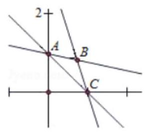
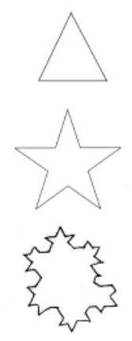
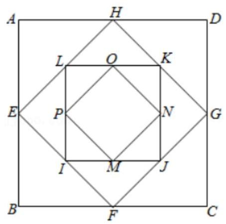

## (一) 数列的极限

## 数列的极限与数学归纳法

<table><tr><td>教学目标</td><td>1、知道用数学归纳法的基本原理，掌握数学归纳法的一般步骤;   2、会用数学归纳法解决整除问题及证明某些与正整数有关的等式;   3、理解数列极限的概念, 掌握数列极限的运算法则和常用的数列极限;   4、掌握公比 $\left| \mathbf{q}\right|  < 1$ 时，无穷等比数列前 $n$ 项和的极限公式即无穷等比数列各项和公式，并能用于解决简单问题</td></tr><tr><td>重点</td><td>1、用数学归纳法证明命题的步骤，数学归纳法的应用   2、极数列极限的运算法则, 常用的数列极限, 无穷等比数列各项和公式;   3、无穷等比数列各项和公式的应用，突破难点的关键在于由实际问题出发建立起等比数列模型.</td></tr><tr><td>难 点</td><td>数列极限的综合问题</td></tr></table>

## 知识梳理

## 1、数列的极限

在 $n$ 无限增大的变化过程中，如果数列 $\left\{  {a}_{n}\right\}$ 中的项 ${a}_{n}$ 无限趋向于某个常数 $A$ ，那么称 $A$ 为数列 $\left\{  {a}_{n}\right\}$ 的极限,记作 $\mathop{\lim }\limits_{{n \rightarrow  \infty }}{a}_{n} = A$ . 换句话说,即: 对于数列 $\left\{  {a}_{n}\right\}$ ,如果存在一个常数 $A$ ,对于任意给定的 $\varepsilon  > 0$ , 总存在自然数 $N$ ,当 $n > N$ 时,不等式 $\left| {{a}_{n} - A}\right|  < \varepsilon$ 恒成立,把 $A$ 叫做数列 $\left\{  {a}_{n}\right\}$ 的极限,记为 $\mathop{\lim }\limits_{{n \rightarrow  \infty }}{a}_{n} = A$ . 注意:①理解数列极限的关键在于弄清什么是无限增大，什么是无限趋近；

②有限项的数列不存在极限问题, 只有无穷项数列才存在极限问题;

③这里的常数 $A$ 是唯一的，每个无穷数列不一定都有极限，例如: $\left\{  {\left( -1\right) }^{n}\right\}$ ；

④研究一个数列的极限，关注的是数列后面无限项的问题，改变该数列前面任何有限多个项，都不能改变这个数列的极限;

⑤“无限趋近于 $A$ ”是指数列 $\left\{  {a}_{n}\right\}$ 后面的项与 $A$ 的“距离”可以无限小到“零”.

2、几个常见的极限:

(1) $\mathop{\lim }\limits_{{n \rightarrow  \infty }}C = C\left( {C\text{ 为常数 }}\right)$ ； (2) $\mathop{\lim }\limits_{{n \rightarrow  \infty }}\frac{1}{n} = 0$ ; (3) $\mathop{\lim }\limits_{{n \rightarrow  \infty }}{q}^{n} = 0\left( {\left| q\right|  < 1}\right)$ ；

(4) $\mathop{\lim }\limits_{{n \rightarrow  \infty }}\frac{a{n}^{k} + b}{c{n}^{k} + d} = \frac{a}{c}\left( {k \in  {N}^{ * }, a\text{ 、 }b\text{ 、 }c\text{ 、 }d \in  \mathrm{R}\text{ 且 }c \neq  0}\right)$ ;

(5) $\mathop{\lim }\limits_{{n \rightarrow  \infty }}\frac{{a}^{n} - {b}^{n}}{{a}^{n} + {b}^{n}} = \left\{  \begin{array}{l} 1,\left| a\right|  > \left| b\right| \\   - 1,\left| a\right|  < \left| b\right| \\  0, a = b \\  \text{ 不存在, }a =  - b \end{array}\right.$ .

3、数列极限的四则运算法则: 设数列 $\left\{  {a}_{n}\right\}  ,\left\{  {b}_{n}\right\}$ ,当 $\mathop{\lim }\limits_{{n \rightarrow  \infty }}{a}_{n} = A,\mathop{\lim }\limits_{{n \rightarrow  \infty }}{b}_{n} = B$ 时,

$\mathop{\lim }\limits_{{n \rightarrow  \infty }}\left( {{a}_{n} \pm  {b}_{n}}\right)  = A \pm  B;\;\mathop{\lim }\limits_{{n \rightarrow  \infty }}\left( {{a}_{n} \cdot  {b}_{n}}\right)  = A \cdot  B;\;\mathop{\lim }\limits_{{n \rightarrow  \infty }}\frac{{a}_{n}}{{b}_{n}} = \frac{A}{B}\left( {B \neq  0}\right) ;$

特别地。如果 $\mathrm{c}$ 是常数,那么 $\mathop{\lim }\limits_{{n \rightarrow  \infty }}\left( {c \cdot  {a}_{n}}\right)  = c \cdot  \mathop{\lim }\limits_{{n \rightarrow  \infty }}\left( {a}_{n}\right)  = c \cdot  A$ .

注意:(1)公式成立的条件:公式成立的前提是 $\left\{  {a}_{n}\right\}$ 与 $\left\{  {b}_{n}\right\}$ 都存在极限；

(2)公式的实质:是四则运算与取极限这两种运算可以变换顺序；

(3)公式的推广:公式中的两项的和，差，积可以推广到有限个项，但是它们都不能推广到无限个.

## 例题精讲

【例 1】判断下列结论正确与否:

(1)若 $\mathop{\lim }\limits_{{n \rightarrow  \infty }}{a}_{n} = 0$ ，则 ${a}_{n}$ 越来越小；

( 2 )若 $\mathop{\lim }\limits_{{n \rightarrow  \infty }}{a}_{n} = A$ ，且 $\left\{  {a}_{n}\right\}$ 不是常数数列，则 ${a}_{n}$ 无限接近 $A$ ，但总不能达到 $A$ ；

(3)在数列 $\left\{  {a}_{n}\right\}$ 中，如果对一切 $n \in  {N}^{ * }$ 总有 ${a}_{n + 1} > {a}_{n}$ ，则 $\left\{  {a}_{n}\right\}$ 没有极限；

(4)若 $\mathop{\lim }\limits_{{n \rightarrow  \infty }}{a}_{n} = A$ ，则 $\mathop{\lim }\limits_{{n \rightarrow  \infty }}\left| {{a}_{n} - A}\right|  = 0$ 。

【难度】★★

【答案】见解析

【解析】(1)不正确,例如 ${a}_{n} =  - \frac{1}{n}\;$ (2)不正确,例如 ${a}_{n} = \left\{  \begin{array}{l} 2\left( {n\text{ 为偶数 }}\right) \\  \frac{2n}{n + 1}\left( {n\text{ 为奇数 }}\right)  \end{array}\right.$ , $\mathop{\lim }\limits_{{n \rightarrow  \infty }}{a}_{n} = 2$

(3)不正确，例如 ${a}_{n} = 1 - \frac{1}{n}$

【例 2】求下列极限: (1) $\mathop{\lim }\limits_{{n \rightarrow  \infty }}\left( {1 - {0.9}^{n}}\right)$ (2) $\mathop{\lim }\limits_{{n \rightarrow  \infty }}\frac{2{n}^{2} + n + 7}{5{n}^{2} + 7}$ (3) $\mathop{\lim }\limits_{{n \rightarrow  \infty }}\frac{{3}^{n + 1} - 1}{{3}^{n} + {2}^{n}}$ ;

(4) $\mathop{\lim }\limits_{{n \rightarrow  \infty }}\left( {\frac{2}{{n}^{2}} + \frac{4}{{n}^{2}} + \ldots  + \frac{2n}{{n}^{2}}}\right)$ (5) $\mathop{\lim }\limits_{{n \rightarrow  \infty }}\left( {\frac{3n}{{2n} - 1} + \frac{n}{n + 1}}\right)$ (6) $\mathop{\lim }\limits_{{n \rightarrow  \infty }}\left\lbrack  {\frac{1}{1 \times  3} + \frac{1}{2 \times  4} + \frac{1}{3 \times  5} + \ldots  + \frac{1}{n\left( {n + 2}\right) }}\right\rbrack$

【难度】 $\star   \star$

【答案】(1) $1\left( 2\right) \frac{2}{5}\left( 3\right) 3\left( 4\right) 1\left( 5\right) \frac{5}{2}\left( 6\right) \frac{3}{4}$

【解析】(1) $\mathop{\lim }\limits_{{n \rightarrow  \infty }}\left( {1 - {0.9}^{n}}\right)  = 1 - \mathop{\lim }\limits_{{n \rightarrow  \infty }}0 \cdot  {9}^{n} = 1 - 0 = 1$ .

(2) $\mathop{\lim }\limits_{{n \rightarrow  \infty }}\frac{2{n}^{2} + n + 7}{5{n}^{2} + 7} = \mathop{\lim }\limits_{{n \rightarrow  \infty }}\frac{2 + \frac{1}{n} + \frac{7}{{n}^{2}}}{5 + \frac{7}{{n}^{2}}} = \frac{2}{5}$ .

(3)解: $\mathop{\lim }\limits_{{n \rightarrow  \infty }}\frac{{3}^{n + 1} - 1}{{3}^{n} + {2}^{n}} = \mathop{\lim }\limits_{{n \rightarrow  \infty }}\frac{3 - {\left( \frac{1}{3}\right) }^{n}}{1 + {\left( \frac{2}{3}\right) }^{n}} = 3$ .

(4)原式 $= \mathop{\lim }\limits_{{n \rightarrow  \infty }}\frac{2 + 4 + 6 + \cdots  + {2n}}{{n}^{2}} = \mathop{\lim }\limits_{{n \rightarrow  \infty }}\frac{n\left( {n + 1}\right) }{{n}^{2}} = 1$ .

(5) 解 $\because \frac{3n}{{2n} - 1} + \frac{n}{n + 1} = \frac{{3n}\left( {n + 1}\right)  + n\left( {{2n} - 1}\right) }{\left( {{2n} - 1}\right) \left( {n + 1}\right) } = \frac{5{n}^{2} + {2n}}{2{n}^{2} + n - 1}$ ,

$\therefore \mathop{\lim }\limits_{{n \rightarrow  \infty }}\left( {\frac{3n}{{2n} - 1} + \frac{n}{n + 1}}\right)  = \mathop{\lim }\limits_{{n \rightarrow  \infty }}\frac{5{n}^{2} + {2n}}{2{n}^{2} + n - 1} = \mathop{\lim }\limits_{{n \rightarrow  \infty }}\frac{5 + \frac{2}{n}}{2 + \frac{n}{2} - \frac{1}{{n}^{2}}} = \frac{5}{2}$ .

解法二: $\mathop{\lim }\limits_{{n \rightarrow  \infty }}\left( {\frac{3n}{{2n} - 1} + \frac{n}{n + 1}}\right)  = \mathop{\lim }\limits_{{n \rightarrow  \infty }}\frac{3n}{{2n} - 1} + \mathop{\lim }\limits_{{n \rightarrow  \infty }}\frac{n}{n + 1} = \frac{3}{2} + 1 = \frac{5}{2}$

(6) $\because 2\left\lbrack  {\frac{1}{1 \times  3} + \frac{1}{2 \times  4} + \ldots  + \frac{1}{n\left( {n + 2}\right) }}\right\rbrack$

$= 1 - \frac{1}{3} + \frac{1}{2} - \frac{1}{4} + \ldots  + \frac{1}{n} - \frac{1}{n + 2}$

$= 1 + \frac{1}{2} - \frac{1}{n + 1} - \frac{1}{n + 2} = \frac{3}{2} - \frac{{2n} + 3}{\left( {n + 1}\right) \left( {n + 2}\right) }$

$\therefore \frac{1}{1 \times  3} + \frac{1}{2 \times  4} + \ldots  + \frac{1}{n\left( {n + 2}\right) } = \frac{3}{4} - \frac{{2n} + 3}{2\left( {n + 1}\right) \left( {n + 2}\right) }$

$\therefore \mathop{\lim }\limits_{{n \rightarrow  \infty }}\left\lbrack  {\frac{1}{1 \times  3} + \frac{1}{2 \times  4} + \ldots  + \frac{1}{n\left( {n + 2}\right) }}\right\rbrack   = \mathop{\lim }\limits_{{n \rightarrow  \infty }}\left\lbrack  {\frac{3}{4} - \frac{{2n} + 3}{2\left( {n + 1}\right) \left( {n + 2}\right) }}\right\rbrack   = \frac{3}{4}$

【例 3】已知数列 ${a}_{n} = \left\{  {\begin{array}{l} \frac{1}{{2}^{n}},1 \leq  n \leq  {10000} \\  2, n > {10000} \end{array}\left( {n \in  {N}^{ * }}\right) }\right.$ ,则 $\mathop{\lim }\limits_{{n \rightarrow  \infty }}{a}_{n} =$ (   )

A. 0

B. $\frac{1}{2}$ C. 1 D. 2

【难度】 $\star   \star$

【答案】D

【解析】解: 由数列 ${a}_{n} = \left\{  {\begin{array}{l} \frac{1}{{2}^{n}},1 \leq  n \leq  {10000} \\  2, n > {10000} \end{array}\left( {n \in  {N}^{ * }}\right) }\right.$ ,则 $\mathop{\lim }\limits_{{n \rightarrow  \infty }}{a}_{n} = \mathop{\lim }\limits_{{n \rightarrow  \infty }}2 = 2$ . 故选: $D$ .

【例 4】( 1 )已知 $a, b$ 为常数，若 $\mathop{\lim }\limits_{{n \rightarrow  \infty }}\frac{a{n}^{2} + {bn} + 4}{{2n} + 3} = 1$ ，则 $a + b =$ ___.

【难度】 $\star   \star   \star$

【答案】 2

【解析】解: $a, b$ 为常数,若 $\mathop{\lim }\limits_{{n \rightarrow  \infty }}\frac{a{n}^{2} + {bn} + 4}{{2n} + 3} = 1$ ,

可得: $a = 0$ ,并且 $\mathop{\lim }\limits_{{n \rightarrow  \infty }}\frac{a{n}^{2} + {bn} + 4}{{2n} + 3} = \mathop{\lim }\limits_{{n \rightarrow  \infty }}\frac{b + \frac{4}{n}}{2 + \frac{3}{n}} = \frac{b}{2} = 1$ ,

所以 $b = 2$ ,所以 $a + b = 2$ . 故答案为: 2 .

(2)已知数列 $\left\{  {a}_{n}\right\}$ 和 $\left\{  {b}_{n}\right\}$ 的通项公式分别是 ${a}_{n} = \frac{a{n}^{2} + 3}{b{n}^{2} - {2n} + 2}$ ， ${b}_{n} = b - a{\left( \frac{1}{3}\right) }^{n - 1}$ ，其中 $a$ 、 $b$ 是实常数， 若 $\mathop{\lim }\limits_{{x \rightarrow  \infty }}{a}_{n} = 3,\mathop{\lim }\limits_{{x \rightarrow  \infty }}{b}_{n} =  - \frac{1}{4}$ ，且 $a$ 、 $b$ 、 $c$ 成等差数列，则 $c$ 的值是___；

【难度】 $\star   \star   \star$

【答案】 $\frac{1}{4}$

【解析】 $\frac{a}{b} = 3, b =  - \frac{1}{4} \Rightarrow  a =  - \frac{3}{4}$

【例 5】已知 $\mathop{\lim }\limits_{{n \rightarrow  \infty }}\left\lbrack  {\left( {{2n} + 1}\right) {a}_{n}}\right\rbrack   = \mathop{\lim }\limits_{{n \rightarrow  \infty }}\left\lbrack  {\left( {{3n} - 1}\right) {b}_{n}}\right\rbrack   = 1$ ,求 $\mathop{\lim }\limits_{{n \rightarrow  \infty }}\left( {{n}^{2}{a}_{n} \cdot  {b}_{n}}\right)$

【难度】 $\star   \star   \star$

【答案】 $\frac{1}{6}$

【解析】 $\mathop{\lim }\limits_{{n \rightarrow  \infty }}\left( {{n}^{2}{a}_{n} \cdot  {b}_{n}}\right)  = \mathop{\lim }\limits_{{n \rightarrow  \infty }}\left( {n{a}_{n}}\right)  \cdot  \mathop{\lim }\limits_{{n \rightarrow  \infty }}\left( {n{b}_{n}}\right)  = \mathop{\lim }\limits_{{n \rightarrow  \infty }}\left\lbrack  {\frac{n}{{2n} + 1} \cdot  \left( {{2n} + 1}\right) {a}_{n}}\right\rbrack   \cdot  \mathop{\lim }\limits_{{n \rightarrow  \infty }}\left\lbrack  {\frac{n}{{3n} - 1} \cdot  \left( {{3n} - 1}\right) {b}_{n}}\right\rbrack$

$= \mathop{\lim }\limits_{{n \rightarrow  \infty }}\frac{n}{{2n} + 1} \cdot  \lim \left\lbrack  {\left( {{2n} + 1}\right) {a}_{n}}\right\rbrack   \cdot  \mathop{\lim }\limits_{{n \rightarrow  \infty }}\frac{n}{{3n} - 1} \cdot  \mathop{\lim }\limits_{{n \rightarrow  \infty }}\left\lbrack  {\left( {{3n} - 1}\right) {b}_{n}}\right\rbrack   = \frac{1}{6}$

【例 6】若 $\mathop{\lim }\limits_{{n \rightarrow  \infty }}\frac{{2}^{n + 1} - {t}^{n}}{{2}^{n} + {t}^{n - 1}} = 2$ ,则实数 $t$ 的取值范围是___.

【难度】 $\star   \star   \star$

【答案】 $\lbrack  - 2,2)$

【解析】解: 当 $\left| t\right|  > 2$ 时, $\mathop{\lim }\limits_{{n \rightarrow  \infty }}\frac{{2}^{n + 1} - {t}^{n}}{{2}^{n} + {t}^{n - 1}} = 2$ ,可得 $\mathop{\lim }\limits_{{n \rightarrow  \infty }}\frac{2 \times  {\left( \frac{2}{t}\right) }^{n} - 1}{{\left( \frac{2}{t}\right) }^{n} + \frac{1}{t}} = \frac{-1}{\frac{1}{t}} = 2$ ,可得 $t =  - 2$ . 舍去. 当 $t =  - 2$ 时, $\mathop{\lim }\limits_{{n \rightarrow  \infty }}\frac{{2}^{n + 1} - {t}^{n}}{{2}^{n} + {t}^{n - 1}} = 2$ ,成立. 当 $\left| t\right|  < 2$ 时, $\mathop{\lim }\limits_{{n \rightarrow  \infty }}\frac{{2}^{n + 1} - {t}^{n}}{{2}^{n} + {t}^{n - 1}} = 2$ ,可得: $\mathop{\lim }\limits_{{n \rightarrow  \infty }}\frac{2 + {\left( \frac{t}{2}\right) }^{2}}{1 + \frac{1}{t} \cdot  {\left( \frac{t}{2}\right) }^{n}} = 2$ ,

综上可得: 实数 $t$ 的取值范围是: $\lbrack  - 2,2)$ .

故答案为: $\lbrack  - 2,2)$ .

【例 7】若将直线 $x + y - 1 = 0,{nx} + y - n = 0, x + {ny} - n = 0\left( {n \in  {N}^{ * }, n \geq  2}\right)$ 围成的三角形面积记为 ${S}_{n}$ ,则 $\mathop{\lim }\limits_{{n \rightarrow  \infty }}{S}_{n} =$ ___.

【难度】 $\star   \star   \star$

【答案】 $\frac{1}{2}$

【解析】解: ${l}_{2} : {nx} + y - n = 0\text{ 、 }{l}_{3} : x + {ny} - n = 0$ 的交点为 $B\left( {\frac{n}{n + 1},\frac{n}{n + 1}}\right)$ ,

所以 ${BO} \bot  {AC}$ ,

$\because {l}_{1} : x + y - 1 = 0$ 与 $x$ 轴、 $y$ 轴的交点分别为: $\left( {1,0}\right) \text{ 、 }\left( {0,1}\right)$ ,

$\therefore {AC} = \sqrt{2},{S}_{n} = \frac{1}{2} \times  \sqrt{2} \times  \left( {\frac{\sqrt{2}n}{n + 1} - \frac{\sqrt{2}}{2}}\right)  = \frac{n - 1}{2\left( {n + 1}\right) }$ ,

所以 $\mathop{\lim }\limits_{{n \rightarrow  \infty }}{S}_{n} = \frac{1}{2}$ ,故答案为: $\frac{1}{2}$ .

## 巩固训练

1、 $\mathop{\lim }\limits_{{n \rightarrow  \infty }}\frac{5 + {3}^{n + 1}}{4 + {3}^{n}} =$ ___.

【难度】 $\star   \star$

【答案】 3

【解析】解: $\mathop{\lim }\limits_{{n \rightarrow  \infty }}\frac{5 + {3}^{n + 1}}{4 + {3}^{n}} = \mathop{\lim }\limits_{{n \rightarrow  \infty }}\frac{\frac{5}{{3}^{n}} + 3}{\frac{4}{{3}^{n}} + 1} = 3$ ,故答案为: 3 .

2、计算: $\mathop{\lim }\limits_{{n \rightarrow  \infty }}\frac{n + {20}}{{3n} + {13}} =$

【难度】★★

【答案】 $\frac{1}{3}$

【解析】解: $\mathop{\lim }\limits_{{n \rightarrow  \infty }}\frac{n + {20}}{{3n} + {13}} = \mathop{\lim }\limits_{{n \rightarrow  \infty }}\frac{1 + \frac{20}{n}}{3 + \frac{13}{n}} = \frac{1}{3}$ . 故答案为: $\frac{1}{3}$ .

3、 $\mathop{\lim }\limits_{{n \rightarrow  \infty }}\left( {\frac{2}{{n}^{2}} + \frac{3}{{n}^{2}} + \frac{4}{{n}^{2}} + \cdots  + \frac{n + 1}{{n}^{2}}}\right)  =$ ___.

【难度】★★

【答案】 $\frac{1}{2}$

【解析】解: $\mathop{\lim }\limits_{{n \rightarrow  \infty }}\left( {\frac{2}{{n}^{2}} + \frac{3}{{n}^{2}} + \frac{4}{{n}^{2}} + \cdots  + \frac{n + 1}{{n}^{2}}}\right)  = \mathop{\lim }\limits_{{n \rightarrow  \infty }}\frac{\frac{n\left( {2 + n + 1}\right) }{2}}{{n}^{2}} = \mathop{\lim }\limits_{{n \rightarrow  \infty }}\frac{{n}^{2} + {3n}}{2{n}^{2}} = \frac{1}{2}$ .

故答案为: $\frac{1}{2}$ .

4、若 $\mathop{\lim }\limits_{{n \rightarrow  \infty }}\left( {{2n} + \frac{a{n}^{2} - {2n} + 1}{{bn} + 2}}\right)  = 1$ ,求 $\frac{a}{b}$ 的值

【难度】 $\star   \star$

【答案】-2

【解析】 ${2n} + \frac{a{n}^{2} - {2n} + 1}{{bn} + 2} = \frac{\left( {{2b} + a}\right) {n}^{2} + {2n} + 1}{{bn} + 2}$ ,且 $\mathop{\lim }\limits_{{n \rightarrow  \infty }}\left( {{2n} + \frac{a{n}^{2} - {2n} + 1}{{bn} + 2}}\right)  = 1$ ,

所以 $\left\{  \begin{array}{l} {2b} + a = 0 \\  \frac{2}{b} = 1 \end{array}\right.$ ,即 $\frac{a}{b} =  - 2$ .

5、在数列 $\left\{  {a}_{n}\right\}$ 中， ${a}_{n} = \left\{  {\begin{array}{l} \frac{1}{{3}^{n}}, n = {2k} - 1 \\  \frac{{n}^{2} + 1}{3{n}^{2} + 1}, n = {2k} \end{array}\left( {k \in  {N}^{ * }}\right) }\right.$ ，则数列 $\left\{  {a}_{n}\right\}$ 的极限为( )

A. 0

B. $\frac{1}{3}$ C. 0 或 $\frac{1}{3}$ D. 不存在

【难度】 $\star   \star   \star$

【答案】D

【解析】解: ① 当 $n = {2k} - 1$ 时, $\mathop{\lim }\limits_{{n \rightarrow  \infty }}\frac{1}{{3}^{n}} = 0$ ,

② 当 $n = {2k}$ 时， $\mathop{\lim }\limits_{{n \rightarrow  \infty }}\frac{{n}^{2} + 1}{3{n}^{2} + 1} = \frac{1}{3}$ ，所以数列 $\left\{  {a}_{n}\right\}$ 的极限不存在. 故选: $D$ .

6、已知 ${a}_{n} = \left\{  \begin{array}{l} {2n} - 1, n < {2020} \\  {\left( -\frac{1}{2}\right) }^{n - 1}, n \geq  {2020} \end{array}\right.$ ， ${S}_{n}$ 是数列 $\left\{  {a}_{n}\right\}$ 的前 $n$ 项和( )

A. $\mathop{\lim }\limits_{{n \rightarrow  \infty }}{a}_{n}$ 存在, $\mathop{\lim }\limits_{{n \rightarrow  \infty }}{S}_{n}$ 不存在 B. $\mathop{\lim }\limits_{{n \rightarrow  \infty }}{a}_{n}$ 不存在, $\mathop{\lim }\limits_{{n \rightarrow  \infty }}{S}_{n}$ 存在

C. $\mathop{\lim }\limits_{{n \rightarrow  \infty }}{a}_{n}$ 和 $\mathop{\lim }\limits_{{n \rightarrow  \infty }}{S}_{n}$ 都存在 D. $\mathop{\lim }\limits_{{n \rightarrow  \infty }}{a}_{n}$ 和 $\mathop{\lim }\limits_{{n \rightarrow  \infty }}{S}_{n}$ 都不存在

【难度】 $\star   \star   \star$

【答案】 $C$

【解析】解: ${a}_{n} = \left\{  \begin{array}{l} {2n} - 1, n < {2020} \\  {\left( -\frac{1}{2}\right) }^{n - 1}, n \geq  {2020} \end{array}\right.$ ,所以 $\mathop{\lim }\limits_{{n \rightarrow  \infty }}{a}_{n} = \mathop{\lim }\limits_{{n \rightarrow  \infty }}{\left( -\frac{1}{2}\right) }^{n - 1} = 0$ ,

当 $n = {2019}$ 时, ${S}_{2019}$ 是定值, $n \geq  {2020}$ 时,数列是等比数列,公比为 $- \frac{1}{2}$ ,

所以 $\mathop{\lim }\limits_{{n \rightarrow  \infty }}{S}_{n} = {S}_{{2019}^{ + }}\frac{-\frac{1}{2}}{1 + \frac{1}{2}} =$ 常数. 所以 $\mathop{\lim }\limits_{{n \rightarrow  \infty }}{a}_{n}$ 和 $\mathop{\lim }\limits_{{n \rightarrow  \infty }}{S}_{n}$ 都存在. 故选: $C$ .

7、若 $\mathop{\lim }\limits_{{n \rightarrow  \infty }}\frac{{2}^{n}}{{2}^{n + 1} + {a}^{n}} = 0$ ，则实数 $a$ 的取值范围是___

【难度】 $\star   \star   \star$

【答案】 $\left( {-\infty , - 2}\right)  \cup  \left( {2, + \infty }\right)$

【解析】 $\left| a\right|  > 2$

8、已知数列 $\left\{  {a}_{n}\right\}$ 中， ${a}_{n} = {\left( 1 - 2a\right) }^{n}$ . 若 $\mathop{\lim }\limits_{{n \rightarrow  \infty }}{a}_{n}$ 存在，则 $a$ 的取值范围为___

【难度】 $\star   \star   \star$

【答案】 $0 \leq  a < 1$

【解析】当 $1 - {2a} > 1$ 时, $\mathop{\lim }\limits_{{n \rightarrow  \infty }}{a}_{n} =  + \infty$ ,此时极限不存在; 当 $1 - {2a} = 1$ 时, $\mathop{\lim }\limits_{{n \rightarrow  \infty }}{a}_{n} = 1$ ,此时极限为 1,满

足条件,此时 $a = 0$ ; 当 $- 1 < 1 - {2a} < 1$ 时, $\mathop{\lim }\limits_{{n \rightarrow  \infty }}{a}_{n} = 0$ ,此时极限为 0,满足条件,解得 $0 < a < 1$ ; 当 $1 - {2a} =  - 1$ 时，此时极限不存在；当 $1 - {2a} < 1$ 时， $\mathop{\lim }\limits_{{n \rightarrow  \infty }}{a}_{n} = \infty$ ，此时极限不存在.

综上得 $0 < a < 1$ 或 $a = 0$ ,即 $0 \leq  a < 1$ 时, $\mathop{\lim }\limits_{{n \rightarrow  \infty }}{a}_{n}$ 存在. 故答案为: $0 \leq  a < 1$

## (二)无穷等比数列求和

## 知识梳理

## 无穷等比数列各项的和

把公比 $q$ 满足 $\left| q\right|  < 1$ 的无穷等比数列 $\left\{  {a}_{n}\right\}$ 的前 $n$ 项和 ${S}_{n} = \frac{{a}_{1}\left( {1 - {q}^{n}}\right) }{1 - q}$ ,当 $n \rightarrow  \infty$ 时的极限叫做无穷等比数列各项的和,并用符号 $S$ 表示,即 $S = \mathop{\lim }\limits_{{n \rightarrow  \infty }}{S}_{n} = \frac{{a}_{1}}{1 - q}\left( {0 < \left| q\right|  < 1}\right)$ .

## 例题精讲

【例 8】( 1 )设 ${a}_{n} = {3}^{-n}\left( {n \in  {N}^{ * }}\right)$ 则数列 $\left\{  {a}_{n}\right\}$ 的各项和为___

【难度】★★

【答案】 $\frac{1}{2}$

【解析】由题意,数列 $\left\{  {a}_{n}\right\}$ 的通项公式为 ${a}_{n} = {3}^{-n} = {\left( \frac{1}{3}\right) }^{n}$ ,且 ${a}_{1} = \frac{1}{3}$ ,所以数列 $\left\{  {a}_{n}\right\}$ 的各项和为 $\frac{{a}_{1}}{1 - q} = \frac{\frac{1}{3}}{1 - \frac{1}{3}} = \frac{1}{2}$

故答案为: $\frac{1}{2}$ .

(2)设无穷等比数列 $\left\{  {a}_{n}\right\}  \left( {n \in  {N}^{ * }}\right)$ 的公比 $q =  - \frac{1}{3},{a}_{1} = 1$ ，则 $\mathop{\lim }\limits_{{n \rightarrow  \infty }}\left( {{a}_{2} + {a}_{4} + {a}_{6} + \cdots  + {a}_{2n}}\right)  =$

【难度】 $\star   \star$

【答案】 $- \frac{3}{8}$

【解析】 $\left\{  {a}_{2n}\right\}$ 的首项为 ${a}_{2} = {a}_{1}q =  - \frac{1}{3}$ ,公比为 ${q}^{2} = \frac{1}{9}$ ,所以

${a}_{2} + {a}_{4} + {a}_{6} + \cdots  + {a}_{2n} = \frac{\left( {-\frac{1}{3}}\right) \left( {1 - \frac{1}{{9}^{n}}}\right) }{1 - \frac{1}{9}} =  - \frac{3}{8} \cdot  \left( {1 - \frac{1}{{9}^{n}}}\right) ,$

所以 $\mathop{\lim }\limits_{{n \rightarrow  \infty }}\left( {{a}_{2} + {a}_{4} + {a}_{6} + \cdots  + {a}_{2n}}\right)  = \mathop{\lim }\limits_{{n \rightarrow  \infty }}\left\lbrack  {-\frac{3}{8} \cdot  \left( {1 - \frac{1}{{9}^{n}}}\right) }\right\rbrack   =  - \frac{3}{8}$ . 故答案为: $- \frac{3}{8}$

【例 9】( 1 )已知无穷等比数列中的首项1，各项的和 2 ，则公比 $q =$ ___.

【难度】 $\star   \star$

【答案】 $q = \frac{1}{2}$

【解析】因为 $s = \frac{{a}_{1}}{1 - q}$ ,带入得 $2 = \frac{1}{1 - q}$ ,所以 $q = \frac{1}{2}$

( 2 )已知无穷等比数列中的每一项都等于它后面所有各项的和，则公 $q =$ ___.

【难度】 $\star   \star$

【答案】 $q = \frac{1}{2}$

【解析】根据题意 ${a}_{n} = {a}_{n + 1} + {a}_{n = 2} + \cdots$ ,所以 ${a}_{n} = \frac{{a}_{n + 1}}{1 - q}$ ,两边约掉 ${a}_{n}$ ,得到 $1 = \frac{q}{1 - q}$ ,所以 $q = \frac{1}{2}$

【例 10】数列 $\left\{  {a}_{n}\right\}$ 满足: ${a}_{n} = \left\{  \begin{array}{l} \frac{1}{{2}^{n}}, n = {2k} + 1, k \in  Z \\  \frac{1}{{3}^{n}}, n = {2k}, k \in  Z \end{array}\right.$ ,它的前 $n$ 项和记为 ${S}_{n}$ ,则 $\mathop{\lim }\limits_{{n \rightarrow  \infty }}{S}_{n} = \mathop{\lim }\limits_{{n \rightarrow   + \infty }}$ .

【难度】 $\star   \star   \star$

【答案】 $\frac{19}{24}$

【解析】解: 当 $n = {2k}$ 时, ${S}_{n} = \frac{\frac{1}{2}\left\lbrack  {1 - {\left( \frac{1}{4}\right) }^{\frac{n}{2}}}\right\rbrack  }{1 - \frac{1}{4}} + \frac{\frac{1}{9}\left\lbrack  {1 - {\left( \frac{1}{9}\right) }^{\frac{n}{2}}}\right\rbrack  }{1 - \frac{1}{9}}$

当 $n = {2k} + 1$ 时, ${S}_{n} = \frac{\frac{1}{2}\left\lbrack  {1 - {\left( \frac{1}{4}\right) }^{\frac{n + 1}{2}}}\right\rbrack  }{1 - \frac{1}{4}} + \frac{\frac{1}{9}\left\lbrack  {1 - {\left( \frac{1}{9}\right) }^{\frac{n}{2}}}\right\rbrack  }{1 - \frac{1}{9}}$ ; $\therefore \mathop{\lim }\limits_{{n \rightarrow  \infty }}{S}_{n} = \frac{2}{3} + \frac{1}{8} = \frac{19}{24}$ ; 故答案为: $\frac{19}{24}$ .

【例 11】(1) 若 $\left\{  {a}_{n}\right\}$ 是无穷等比数列,且 $\mathop{\lim }\limits_{{n \rightarrow  \infty }}\left( {{a}_{1} + {a}_{2} + \ldots  + {a}_{n}}\right)  = 2$ ,则 ${a}_{1}$ 的取值范围为___.

【难度】 $\star   \star   \star$

【答案】 $\left( {0,2}\right)  \cup  \left( {2,4}\right)$

【解析】解: $\left\{  {a}_{n}\right\}$ 是无穷等比数列,且 $\mathop{\lim }\limits_{{n \rightarrow  \infty }}\left( {{a}_{1} + {a}_{2} + \ldots  + {a}_{n}}\right)  = 2$ ,

所以 $\left| q\right|  \in  \left( {0,1}\right)$ ,

所以 $\mathop{\lim }\limits_{{n \rightarrow  \infty }}\left( {{a}_{1} + {a}_{2} + \ldots  + {a}_{n}}\right)  = \mathop{\lim }\limits_{{n \rightarrow  \infty }}\frac{{a}_{1}\left( {1 - {q}^{n}}\right) }{1 - q} = \frac{{a}_{1}}{1 - q} = 2$ ,

所以 ${a}_{1} = 2\left( {1 - q}\right)  \in  \left( {0,2}\right)  \cup  \left( {2,4}\right)$ .

故答案为: $\left( {0,2}\right)  \cup  \left( {2,4}\right)$ .

(2) $\left\{  {a}_{n}\right\}$ 是无穷等比数列，且所有项和存在，若 ${a}_{1} + {a}_{2} + \cdots  + {a}_{n} + \cdots  > 2{a}_{1}$ ，求公比 $q$ 的范围。

【难度】 $\star   \star   \star$

【答案】 $q \in  \left( {-1,0}\right)  \cup  \left( {0,\frac{1}{2}}\right)$

【解析】根据 $s = \frac{{a}_{1}}{1 - q}$ ,有 $\frac{{a}_{1}}{1 - q} > 2{a}_{1}$ ,所以 ${a}_{1}\left( {{2q} - 1}\right)  > 0$ ,所以当 ${a}_{1} > 0$ 时, $q \in  \left( {\frac{1}{2},1}\right)$ ;

当 ${a}_{1} < 0$ 时, $q \in  \left( {-1,0}\right)  \cup  \left( {0,\frac{1}{2}}\right)$

【例 12】化下列循环小数为分数:

(1)0.53 (2)1.43 (3) ${1.7}\dot{3}\dot{2}\dot{8}$

【难度】★★★

【答案】(1) $\frac{53}{99}$ (2) $\frac{43}{30}$ (3) $1\frac{7321}{9990}$

【提示】如: ${0.5}\dot{3} = {0.53} + {0.0053} + {0.000053} + \cdots  + {0.00}\cdots {53} + \cdots$ 相应的无穷等比数列为 ${0.53},{0.0053},\ldots$ , ${0.00}\ldots {53},\ldots$ 它的首项为 0.53,公比为 ${0.01},\therefore {0.5}\dot{3} = \frac{0.53}{1 - {0.01}} = \frac{53}{99}$ . (其实计算器可以直接输入然后可得到答案)

【例 13】设 ${T}_{1},{T}_{2},{T}_{3},\cdots$ 为一组多边形,其作法如下:

${T}_{1}$ 是边长为 1 的三角形以 ${T}_{n}$ 的每一边中间 $\frac{1}{3}$ 的线段为一边向外作正三角形,然后将该 $\frac{1}{3}$ 线段抹去所得的多边形为 ${T}_{n + 1}$ ,如图所示。令 ${a}_{n}$ 表示 ${T}_{n}$ 的周长, $A\left( {T}_{n}\right)$ 表示 ${T}_{n}$ 的面积。

(1)计算 ${T}_{1},{T}_{2},{T}_{3}$ 的面积 $A\left( {T}_{1}\right) , A\left( {T}_{2}\right) , A\left( {T}_{3}\right)$ ;

( 2 )求 $\mathop{\lim }\limits_{{n \rightarrow  \infty }}\left( {\frac{1}{{a}_{1}} + \frac{1}{{a}_{2}}\ldots  + \frac{1}{{a}_{n}}}\right)$ 的值

【难度】 $\star   \star   \star$

【答案】见解析

【解析】(1) $A\left( {T}_{1}\right)  = \frac{1}{2} \cdot  1 \cdot  1 \cdot  \sin {60}^{ \circ  } = \frac{\sqrt{3}}{4}$ ,

$A\left( {T}_{2}\right)  = 3 \cdot  \frac{1}{2} \cdot  \frac{1}{3} \cdot  \frac{1}{3} \cdot  \sin {60}^{ \circ  } + A\left( {T}_{1}\right)  = \frac{\sqrt{3}}{3}, A\left( {T}_{3}\right)  = {12} \cdot  \frac{1}{2} \cdot  \frac{1}{9} \cdot  \frac{1}{9} \cdot  \sin {60}^{ \circ  } + A\left( {T}_{2}\right)  = \frac{10}{27}\sqrt{3}$ ( 2 )由分析知: ${a}_{n} = \frac{4}{3}{a}_{n - 1}\left( {T}_{n}\right.$ 的边数是 ${T}_{n - 1}$ 边数的 4 倍且每边是原来的 $\left. \frac{1}{4}\right)$

故 ${a}_{n} = 3 \cdot  {\left( \frac{4}{3}\right) }^{n - 1},\because \frac{1}{{a}_{n}} = \frac{1}{3} \cdot  {\left( \frac{3}{4}\right) }^{n - 1} : \mathop{\lim }\limits_{{n \rightarrow  \infty }}\left( {\frac{1}{{a}_{1}} + \frac{1}{{a}_{2}} + \cdots  + \frac{1}{{a}_{n}}}\right)  = \frac{\frac{1}{3}}{1 - \frac{3}{4}} = \frac{4}{3}$

## 巩固训练

1、在数列 $\left\{  {a}_{n}\right\}$ 中， ${a}_{1} = 2$ ，且满足 $3{a}_{n + 1} - {a}_{n} = 0$ ，则 $\mathop{\lim }\limits_{{n \rightarrow  \infty }}\left( {{a}_{1} + {a}_{2} + \cdots  + {a}_{n}}\right)  =$

【难度】 $\star   \star$

【答案】 3

【解析】无穷等比数列求和

2、已知无穷等比数列中的首项1，各项的和 2，则公比 $q =$ ___.

【难度】 $\star   \star$

【答案】 $q = \frac{1}{2}$

【解析】因为 $s = \frac{{a}_{1}}{1 - q}$ ,带入得 $2 = \frac{1}{1 - q}$ ,所以 $q = \frac{1}{2}$

3、若 $\left\{  {a}_{n}\right\}$ 是等比数列,且 $\mathop{\lim }\limits_{{n \rightarrow  \infty }}\left( {{a}_{1} + {a}_{2} + \ldots  + {a}_{n}}\right)  = \mathop{\lim }\limits_{{n \rightarrow  \infty }}\left( {{a}_{1}^{2} + {a}_{2}^{2} + \ldots  + {a}_{n}^{2}}\right)  = 2$ ,则 ${a}_{1} =$ ___.

【难度】 $\star   \star   \star$

【答案】 $\frac{4}{3}$

【解析】解: 设等比数列 $\left\{  {a}_{n}\right\}$ 的公比为 $q,0 < q \mid   < 1$ ,

由 $\mathop{\lim }\limits_{{n \rightarrow  \infty }}\left( {{a}_{1} + {a}_{2} + \ldots  + {a}_{n}}\right)  = \mathop{\lim }\limits_{{n \rightarrow  \infty }}\left( {{a}_{1}^{2} + {a}_{2}^{2} + \ldots  + {a}_{n}^{2}}\right)  = 2$ ,可得 $\mathop{\lim }\limits_{{n \rightarrow  \infty }}\frac{{a}_{1}\left( {1 - {q}^{n}}\right) }{1 - q} = \mathop{\lim }\limits_{{n \rightarrow  \infty }}\frac{{a}_{1}^{2}\left( {1 - {q}^{2n}}\right) }{1 - {q}^{2}} = 2$ ,

则有 $\frac{{a}_{1}}{1 - q} = \frac{{a}_{1}{}^{2}}{1 - {q}^{2}} = 2$ ,由 $q = 1 - \frac{1}{2}{a}_{1}$ 代入 ${a}_{1}^{2} = 2 - 2{q}^{2}$ ,解得 ${a}_{1} = \frac{4}{3}$ ,故答案为: $\frac{4}{3}$ .

4、已知等比数列 $\left\{  {a}_{n}\right\}$ 的首项为 ${a}_{1}$ ，公比为 $q$ ，且有 $\mathop{\lim }\limits_{{n \rightarrow  \infty }}\left( {\frac{{a}_{1}}{1 + q} - {q}^{n}}\right)  = \frac{1}{2}$ ，求首项 ${a}_{1}$ 的取值范围是___.

【难度】 $\star   \star   \star$

【答案】 ${a}_{1} \in  \left( {0,\frac{1}{2}}\right)  \cup  \left( {\frac{1}{2},1}\right)  \cup  \{ 3\}$

【解析】注意分两种情况 $q = 1$ 和 $q \in  \left( {-1,0}\right)  \cup  \left( {0,1}\right)$

5、无穷等比数列 $\left\{  {a}_{n}\right\}$ 的通项公式 ${a}_{n} = {\left( \sin x\right) }^{n}$ ，前 $n$ 项的和为 ${S}_{n}$ ，若 $\mathop{\lim }\limits_{{n \rightarrow  \infty }}{S}_{n} = 1, x \in  \left( {0,\pi }\right)$ 则 $x =$ ___

【难度】 $\star   \star   \star$

【答案】 $\frac{\pi }{6}$ 或 $\frac{5\pi }{6}$

【解析】 $\because x \in  \left( {0,\pi }\right) ;\therefore \sin x \in  (0,1\rbrack$

$\because$ 数列 $\left\{  {a}_{n}\right\}$ 为无穷等比数列; $\therefore {a}_{1} = \sin x, q = \sin x$

$\because \mathop{\lim }\limits_{{n \rightarrow  \infty }}{S}_{n} = 1;\therefore q \neq  1$ ,即 $\mathop{\lim }\limits_{{n \rightarrow  \infty }}{S}_{n} = \frac{{a}_{1}\left( {1 - {q}^{n}}\right) }{1 - q} = 1;\therefore \frac{{a}_{1}}{1 - q} = 1$ ,即 $\frac{\sin x}{1 - \sin x} = 1$ .

$\therefore \sin x = \frac{1}{2};\therefore x = \frac{\pi }{6}$ 或 $x = \frac{5\pi }{6}$ 故答案为 $\frac{\pi }{6}$ 或 $\frac{5\pi }{6}$ .

6、新型冠状病毒蔓延以来，世界各国都在研制疫苗，某专家认为，某种抗病毒药品对新型冠状病毒具有抗病毒、抗炎作用，假如规定每天早上 7:00 和晚上 7:00 各服药一次，每次服用该药药量 700 毫克具有抗病毒功效，若人的肾脏每 12 小时从体内滤出这种药的 70%，该药在人体内含量超过 1000 毫克，就将产生副作用，若人长期服用这种药，则这种药___(填“会”或者“不会”)对人体产生副作用。

【难度】 $\star   \star   \star$

【答案】不会

【解析】由题意第一次服药后,经过 12 小时后,体内药物含量 ${700} \times  \left( {1 - {70}\% }\right)  = {700} \times  {30}\%$ ,经过 24 小时后，体内药物含量 ${700} \times  {\left( {30}\% \right) }^{2}$ ，以此类推，一次服药后体内药物含量构成以 ${a}_{1} = {700}, q = {30}\%$ 为公比的等比数列,即 ${a}_{n} = {700} \times  {\left( {30}\% \right) }^{n - 1}$ ,

所以第 $n$ 次服药后，体内药物的含量为:

${700} + {700} \times  {0.3} + {700} \times  {0.3}^{2} + \ldots  + {700} \times  {0.3}^{n - 1}$

$= \frac{{700} \times  \left\lbrack  {1 - {\left( {0.3}\right) }^{n}}\right\rbrack  }{1 - {0.3}} = {1000} \times  \left\lbrack  {1 - {\left( {0.3}\right) }^{n}}\right\rbrack  ,$

当 $n \rightarrow   + \infty$ 时,药在体内的含量无限接近 1000 ,该药在人体内含量不超过 1000 毫克，不会产生副作用.

故答案为:不会

## (三) 数学归纳法

## 知识梳理

一般地,证明一个与正整数 $n$ 有关的命题,可按下列步骤进行:

(1)(归纳奠基)证明当 $n$ 取第一个值 ${n}_{0}\left( {{n}_{0} \in  {\mathbf{N}}^{ * }}\right)$ 时命题成立；

(2)(归纳递推)假设 $n = k\left( {k \geq  {n}_{0}, k \in  {\mathbf{N}}^{ * }}\right)$ 时命题成立，证明当 $n = k + 1$ 时命题也成立.

只要完成这两个步骤,就可以断定命题对从 ${n}_{0}$ 开始的所有正整数 $n$ 都成立.

注意:①应用数学归纳法要运用“归纳假设”，没有运用“归纳假设”的证明不是数学归纳法。

②由 $k$ 到 $k + 1$ 的证明，实际问题中由 $k$ 到 $k + 1$ 的变化规律是数学归纳法的难点，突破难点的关键是掌握由 $k$ 到 $k + 1$ 的推论方法,在运用归纳假设时,应分析 $P\left( k\right)$ 与 $P\left( {k + 1}\right)$ 的差异及联系。利用拆、添、并、放、 缩等手段，或从归纳假设出发；或从 $P\left( {k + 1}\right)$ 从分离出 $P\left( k\right)$ ，再进行局部调整；也可考虑寻求二者的“结合点”， 以便顺利过渡。

3、用数学归纳法证明与正整数有关的等式，常采用从一边开始并以另一边为目标进行推证的办法；用数学归纳法证明整除性问题，常采用配凑的办法；用数学归纳法证明与正整数有关的不等式时，常常需要运用不等式的性质以及比较法、放缩法、分析法、综合法等基本方法; 用数学归纳法证明与正整数有关的几何问题, 常常要运用几何图形的性质。

## 四、归纳 猜想 一论证

“归纳、猜想、证明”就是运用“检验有限个 $n$ 的值,寻找一定规律,猜想一个结论,然后用数学归纳法证明所猜想的结论正确”的解题方法.

理解一个完整的思维过程, 往往是既要发现结论, 又要证明结论的正确性. 这就需要掌握运用由特殊到一般的思维方法, 也就是通过观察、归纳, 提出猜想, 探求结论, 且运用严密的逻辑推理, 即数学归纳法证明结论(猜想)的正确. 领会“归纳、猜想、证明”的思想方法，非常有助于提高观察分析能力.

## 例题精讲

【例 14】判断下面结论是否正确(请在括号中打“√”或“×”).

(1)用数学归纳法证明问题时，第一步是验证当 $n = 1$ 时结论成立.()

(2)所有与正整数有关的数学命题都必须用数学归纳法证明.()

(3)用数学归纳法证明问题时，归纳假设可以不用.( )

(4)不论是等式还是不等式，用数学归纳法证明时，由 $n = k$ 到 $n = k + 1$ 时，项数都增加了一项.( )

(5)用数学归纳法证明等式: $1 + 2 + {2}^{2} + \ldots  + {2}^{{n}^{ + }2} = {2}^{{n}^{ + }3} - {1}^{n}$ ，验证 $n = 1$ 时，左边式子应为 $1 + 2 + {2}^{2} + {2}^{3}$ .

( )

(6)用数学归纳法证明凸 $n$ 边形的内角和公式时， ${n}_{0} = 3$ .()

【难度】★★

【答案】 $\left( 1\right)  \times  \left( 2\right)  \times  \left( 3\right)  \times  \left( 4\right)  \times  \left( 5\right) \sqrt{}\left( 6\right) \sqrt{}$

【解析】数学归纳法定义

【例 15】( 1 )用数学归纳法证明 ${2}^{n} > {n}^{2}n \in  N, n \geq  5$ ，则第一步应验证 $n =$ ___.

【难度】★★

【答案】 5

【解析】 $n = 5$ (注: 跟学生说明 ${n}_{0}$ 不一定都是 1 或 2,要看题目)

(2)利用数学归纳法证明凸多边形的对角线的条数是 $f\left( n\right)  = \frac{1}{2}n\left( {n - 3}\right)$ 时,第一个可以取到的自然数 ${n}_{0} =$ ___.

【难度】 $\star   \star$

【答案】 3

【解析】多边形中三角形的对角线条数可认为是 0,四边形有两条对角线,因此第一个自然数可以是 ${n}_{0} = 3$ .

故答案为: 3

【例 16】设 $f\left( x\right)$ 是定义在正整数集上的函数,且 $f\left( x\right)$ 满足: “当 $f\left( k\right)  > {k}^{2}$ 成立时,总可推出 $f\left( {k + 1}\right)  > {\left( k + 1\right) }^{2}$ 成立”. 那么, 下列命题总成立的是( )

A. 若 $f\left( 1\right)  \leq  1$ 成立,则 $f\left( 9\right)  \leq  {81}$ 成立

B. 若 $f\left( 2\right)  \leq  4$ 成立,则 $f\left( 1\right)  > 1$ 成立

C. 若 $f\left( 3\right)  > 9$ 成立,则当 $k \geq  1$ 时,均有 $f\left( k\right)  > {k}^{2}$ 成立

D. 若 $f\left( 3\right)  > {16}$ 成立,则当 $k \geq  3$ 时,均有 $f\left( k\right)  > {k}^{2}$ 成立

【难度】 $\star   \star   \star$

【答案】D

【解析】解: 对于 $A,\because$ 原命题成立,否命题不一定成立,

$\therefore f\left( 1\right)  \leq  1$ 成立不能推出 $f\left( 2\right)  \leq  4$ ,更不能推出 $k = 3\text{ 、 }4\text{ 、 }\ldots$ 的情况,则不一定有 $f\left( 9\right)  \leq  {81}$ 成立, 故 $A$ 不正确；

对于 $B,\cdots$ 原命题成立,则逆否命题一定成立,

$\therefore$ 由 $f\left( 2\right)  \leq  4$ 成立,得 $f\left( 1\right)  \leq  1$ 成立,不一定有 $f\left( 1\right)  > 1$ 成立,故 $B$ 不正确;

对于 $C$ ,若 $f\left( 3\right)  > 9$ 成立,则根据题意可得“当 $k \geq  3$ 时,均有 $f\left( k\right)  > {k}^{2}$ 成立”,而不能得到 $k = 1\text{ 、 }2$ 的情况，故 $C$ 不正确；

对于 $D$ ,若 $f\left( 3\right)  > {16}$ 成立,则 $f\left( 3\right)  > 9$ 成立,可推出 $f\left( 4\right)  > {4}^{2}$ 成立,接着可出 $f\left( 5\right)  > {5}^{2}$ 成立, ...,

依此类推可得: 当 $k \geq  3$ 时,均有 $f\left( k\right)  > {k}^{2}$ 成立,故 $D$ 正确.

故选: $D$ .

【例 17】( 1 )用数学归纳法证明命题:若 $n$ 是大于 1 的自然数，求证: $1 + \frac{1}{2} + \frac{1}{3} + \cdots  + \frac{1}{{2}^{n} - 1} < n$ ，从 $k$ 到 $k + 1$ ，不等式左边添加的项的项数为___.

【难度】 $\star   \star   \star$

【答案】 ${2}^{k}$

【解析】当 $n = k$ 时,左边为 $1 + \frac{1}{2} + \frac{1}{3} + \frac{1}{4} + \cdots  + \frac{1}{{2}^{k} - 1}$ .

当 $n = k + 1$ 时,左边为 $1 + \frac{1}{2} + \frac{1}{3} + \frac{1}{4} + \cdots  + \frac{1}{{2}^{k} - 1} + \frac{1}{{2}^{k}} + \frac{1}{{2}^{k} + 1} + \frac{1}{{2}^{k} + 2} + \cdots  + \frac{1}{{2}^{k + 1} - 1}$ .

左边需要添的项为 $\frac{1}{{2}^{k}} + \frac{1}{{2}^{k} + 1} + \frac{1}{{2}^{k} + 2} + \cdots  + \frac{1}{{2}^{k + 1} - 1}$ ,项数为 ${2}^{k + 1} - 1 - {2}^{k} + 1 = {2}^{k}$ .

(2)已知 $f\left( n\right)  = 1 + \frac{1}{2} + \frac{1}{3} + \cdots \cdots  + \frac{1}{n}\left( {n \in  {\mathrm{N}}^{ * }}\right)$ . 用数学归纳法证明 $f\left( {2}^{n}\right)  > \frac{n}{2}$ ,请补全证明过程:(1)当 $n = 1$ 时, $f\left( {2}^{1}\right)  = 1 + \frac{1}{2} > \frac{1}{2}$ ; (2)假设 $n = k$ 时命题成立,即 $f\left( {2}^{k}\right)  > \frac{k}{2}$ ,则当 $n = k + 1$ 时,

$f\left( {2}^{k + 1}\right)  = f\left( {2}^{k}\right)  +$ ___ $> \frac{k + 1}{2}$ ，即当 $n = k + 1$ 时，命题成立. 综上所述，对任意 $n \in  {\mathrm{N}}^{ * }$ ，都有 $f\left( {2}^{n}\right)  > \frac{n}{2}$ 成立.

【难度】 $\star   \star   \star$

【答案】 $\frac{1}{{2}^{k} + 1} + \frac{1}{{2}^{k} + 2} + \cdots  + \frac{1}{{2}^{k + 1}}$

【解析】因为 $f\left( n\right)  = 1 + \frac{1}{2} + \frac{1}{3} + \cdots \cdots  + \frac{1}{n}\left( {n \in  {\mathrm{N}}^{ * }}\right)$ ,所以 $f\left( {2}^{n}\right)  = 1 + \frac{1}{2} + \frac{1}{3} + \cdots  + \frac{1}{n} + \cdots  + \frac{1}{{2}^{n}}$

所以当 $n = k$ 时, $f\left( {2}^{k}\right)  = 1 + \frac{1}{2} + \frac{1}{3} + \cdots  + \frac{1}{k} + \cdots  + \frac{1}{{2}^{k}} > \frac{k}{2}$

当 $n = k + 1$ 时, $f\left( {2}^{k + 1}\right)  = 1 + \frac{1}{2} + \frac{1}{3} + \cdots  + \frac{1}{k} + \cdots  + \frac{1}{{2}^{k}} + \frac{1}{{2}^{k} + 1} + \frac{1}{{2}^{k} + 2} + \cdots  + \frac{1}{{2}^{k + 1}}$

$= f\left( {2}^{k}\right)  + \frac{1}{{2}^{k} + 1} + \frac{1}{{2}^{k} + 2} + \cdots  + \frac{1}{{2}^{k + 1}} > \frac{k + 1}{2}$

故答案为: $\frac{1}{{2}^{k} + 1} + \frac{1}{{2}^{k} + 2} + \cdots  + \frac{1}{{2}^{k + 1}}$

【例 18】观察下列式子: $1 + \frac{1}{{2}^{2}} < \frac{3}{2},1 + \frac{1}{{2}^{2}} + \frac{1}{{3}^{2}} < \frac{5}{3},1 + \frac{1}{{2}^{2}} + \frac{1}{{3}^{2}} + \frac{1}{{4}^{2}} \leq  \frac{7}{4},\ldots$ ,根据上述规律,第 $n$ 个不等式应该为___.

【难度】 $\star   \star   \star$

【答案】 $1 + \frac{1}{{2}^{2}} + \frac{1}{{3}^{2}} + \ldots  + \frac{1}{{\left( n + 1\right) }^{2}} < \frac{{2n} + 1}{n + 1}$

【解析】不等式的左边为连续自然数的平方的倒数和,即 $1 + \frac{1}{{2}^{2}} + \frac{1}{{3}^{2}} + \ldots  + \frac{1}{{\left( n + 1\right) }^{2}}$

不等式的右边为 $\frac{{2n} + 1}{n + 1}$ ,所以第 $n$ 个不等式应该为 $1 + \frac{1}{{2}^{2}} + \frac{1}{{3}^{2}} + \ldots  + \frac{1}{{\left( n + 1\right) }^{2}} < \frac{{2n} + 1}{n + 1}$

故答案为: $1 + \frac{1}{{2}^{2}} + \frac{1}{{3}^{2}} + \ldots  + \frac{1}{{\left( n + 1\right) }^{2}} < \frac{{2n} + 1}{n + 1}$

【例 19】已知数列 ${a}_{n} = 1 + \frac{1}{2} + \frac{1}{3} + \cdots  + \frac{1}{n}$ ,又 ${S}_{n} = {a}_{1} + {a}_{2} + {a}_{3} + \cdots  + {a}_{n}$ ,用数学归纳法证明 ${S}_{n} = \left( {n + 1}\right) {a}_{n} - n$ .

【难度】 $\star   \star   \star$

【答案】见解析

【解析】证明: (1)当 $n = 1$ 时, ${a}_{1} = 1,{S}_{1} = {a}_{1} = 1$ 满足条件.

(2)假设 $n = k$ 时, $\left( {k > 1, k \in  N}\right)$ 时 ${S}_{k} = \left( {k + 1}\right) {a}_{k} - k$ 等式成立.

当 $n = k + 1$ 时, $\because {a}_{k} = 1 + \frac{1}{2} + \frac{1}{3} + \cdots  + \frac{1}{k} = 1 + \frac{1}{2} + \frac{1}{3} + \cdots  + \frac{1}{k} + \frac{1}{k + 1} - \frac{1}{k + 1} = {a}_{k + 1} - \frac{1}{k + 1}$

则 ${S}_{k + 1} = {S}_{K} + {a}_{k + 1} = \left( {k + 1}\right) {a}_{k} - k + {a}_{k + 1} = \left( {k + 1}\right) \left( {{a}_{k + 1} - \frac{1}{k + 1}}\right)  - k + {a}_{k + 1}$

$= \left( {k + 1}\right) {a}_{k + 1} - 1 - k + {a}_{k + 1} = \left( {k + 1 + 1}\right) {a}_{k + 1} - \left( {k + 1}\right)$

由 $\left( 1\right) \left( 2\right)$ 可知 ${S}_{n} = \left( {n + 1}\right) {a}_{n} - n$ 成立. 故得证.

【例 20】用数学归纳法证明: $\frac{1}{n + 1} + \frac{1}{n + 2} + \ldots  + \frac{1}{n + n} > \frac{13}{24}\left( {n \geq  2, n \in  \mathbf{N}}\right)$ .

【难度】 $\star   \star   \star$

【答案】见解析

【解析】证明: (1)当 $n = 2$ 时,左边 $= \frac{1}{2 + 1} + \frac{1}{2 + 2} = \frac{7}{12} > \frac{13}{24}$ 成立.

(2)假设 $n = k\left( {k \geq  2, k \in  \mathbf{N}}\right)$ 时不等式成立,即 $\frac{1}{k + 1} + \frac{1}{k + 2} + \ldots  + \frac{1}{k + k} > \frac{13}{24}$ 成立,则当 $n = k + 1$ 时,

左边 $= \frac{1}{k + 2} + \ldots  + \frac{1}{k + k} + \frac{1}{{2k} + 1} + \frac{1}{{2k} + 2} = \frac{1}{k + 1} + \frac{1}{k + 2} + \ldots  + \frac{1}{k + k} + \frac{1}{{2k} + 1} + \frac{1}{{2k} + 2} + \frac{1}{k + 1} > \frac{13}{24} + \frac{1}{{2k} + 1} + \frac{1}{{2k} + 2}$

$- \frac{1}{k + 1}$ ,而 $\frac{1}{{2k} + 1} + \frac{1}{{2k} + 2} - \frac{1}{k + 1} - \frac{1}{{2k} + 1} = \frac{1}{\left( {{2k} + 1}\right) \left( {{2k} + 2}\right) } > 0$ .

综合(1)(2)知, 原不等式成立.

【例 21】试证: $n$ 为正整数时, $f\left( n\right)  = {3}^{2{n}^{ + }2} - {8n} - 9$ 能被 64 整除.

【难度】 $\star   \star   \star$

【答案】见解析

【解析】证明: (1)当 $n = 1$ 时, $f\left( 1\right)  = {3}^{4} - 8 - 9 = {64}$ 能被 64 整除.

(2)假设当 $n = k\left( {k \in  {N}^{ * }}\right)$ 时， $f\left( k\right)  = {3}^{2{k}^{ + }2} - {8k} - 9$ 能被 64 整除，

则当 $n = k + 1$ 时， $f\left( {k + 1}\right)  = {3}^{2{\left( {k}^{ + }1\right) }^{ + }2} - 8\left( {k + 1}\right)  - 9 = 9 \cdot  {3}^{2{k}^{ + }2} - {8k} - {17} = 9\left( {{3}^{2{k}^{ + }2} - {8k} - 9}\right)  + {64k} + {64}$ .

由归纳假设知 $f\left( {k + 1}\right)$ 也能被 64 整除. 综合 (1)(2) 知，当 $n$ 为正整数时， $f\left( n\right)  = {3}^{2{n}^{ + }2} - {8n} - 9$ 能被 64 整除.

【例 22】已知数列 $\left\{  {a}_{n}\right\}$ 的前 $n$ 项和 ${S}_{n}$ 满足: ${S}_{n} = \frac{{a}_{n}}{2} + \frac{1}{{a}_{n}} - 1$ ,且 ${a}_{n} > 0, n \in  {\mathbf{N}}^{ * }$ .

(1)求 ${a}_{1},{a}_{2},{a}_{3}$ ，并猜想 $\left\{  {a}_{n}\right\}$ 的通项公式；

(2)证明通项公式的正确性.

【难度】 $\star   \star   \star$

【答案】见解析

【解析】(1)解: 当 $n = 1$ 时,由已知得 ${a}_{1} = \frac{{a}_{1}}{2} + \frac{1}{{a}_{1}} - 1,{a}_{1}^{2} + 2{a}_{1} - 2 = 0,\therefore {a}_{1} = \sqrt{3} - 1\left( {{a}_{n} > 0}\right)$ .

当 $n = 2$ 时,由已知得 ${a}_{1} + {a}_{2} = \frac{{a}_{2}}{2} + \frac{1}{{a}_{2}} - 1$ ,将 ${a}_{1} = \sqrt{3} - 1$ 代入并整理得 ${a}_{2}^{2} + 2\sqrt{3}{a}_{2} - 2 = 0$ .

$\therefore {a}_{2} = \sqrt{5} - \sqrt{3}\left( {{a}_{n} > 0}\right)$ . 同理可得 ${a}_{3} = \sqrt{7} - \sqrt{5}$ . 猜想 ${a}_{n} = \sqrt{{2n} + 1} - \sqrt{{2n} - 1}\left( {n \in  {\mathrm{N}}^{ * }}\right)$ .

(2)证明:①由(1)知，当 $n = 1,2,3$ 时，通项公式成立.

②假设当 $n = k\left( {k \geq  3, k \in  {\mathrm{N}}^{ * }}\right)$ 时，通项公式成立，即 ${a}_{k} = \sqrt{{2k} + 1} - \sqrt{{2k} - 1}$ .

由 ${a}_{k + 1} = {S}_{k + 1} - {S}_{k} = \frac{{a}_{k + 1}}{2} + \frac{1}{{a}_{k + 1}} - \frac{{a}_{k}}{2} - \frac{1}{{a}_{k}}$ ,将 ${a}_{k} = \sqrt{{2k} + 1} - \sqrt{{2k} - 1}$ 代入上式并整理得

${a}_{k + 1}^{2} + 2\sqrt{{2k} + 1}{a}_{k + 1} - 2 = 0$ ,解得: ${a}_{k + 1} = \sqrt{{2k} + 3} - \sqrt{{2k} + 1}\left( {{a}_{n} > 0}\right)$ .

即当 $n = k + 1$ 时,通项公式也成立.

由①和②可知，对所有 $n \in  {\mathbf{N}}^{ * }$ ， ${a}_{n} = \sqrt{{2n} + 1} - \sqrt{{2n} - 1}$ 都成立.

## 巩固训练

1、用数学归纳法证明 $1 + a + {a}^{2} + \ldots  + {a}^{n + 1} = \frac{1 - {a}^{n + 2}}{1 - a}\left( {a \neq  1}\right)$ ,在验证 $n = 1$ 时,左端计算所得项为___.

【难度】 $\star   \star$

【答案】 $1 + a + {a}^{2}$

【解析】 $n = 1$ 代入左式即可得到答案

2、对于不等式 $\sqrt{{n}^{2} + n} < n + 1\left( {n \in  {\mathbf{N}}^{ * }}\right)$ ,某同学用数学归纳法的证明过程如下:

(1)当 $n = 1$ 时, $\sqrt{{1}^{2} + 1} < 1 + 1$ ,不等式成立.

(2)假设当 $n = k\left( {k \in  {\mathbf{N}}^{ * }\text{ 且 }k \geq  1}\right)$ 时，不等式成立，即 $\sqrt{{k}^{2} + k} < k + 1$ ，则当 $n = k + 1$ 时， $\sqrt{{k + 1}^{2} + k + 1} =$

$\sqrt{{k}^{2} + {3k} + 2} < \sqrt{{k}^{2} + {3k} + 2 + k + 2} = \sqrt{k + {2}^{2}} = \left( {k + 1}\right)  + 1$ .

所以当 $n = k + 1$ 时，不等式成立，则上述证法( )

A.过程全部正确 B. $n = 1$ 验得不正确

C. 归纳假设不正确 D. 从 $n = k$ 到 $n = k + 1$ 的推理不正确

【难度】 $\star   \star   \star$

【答案】D

【解析】在 $n = k + 1$ 时,没有应用 $n = k$ 时的假设,所以不是数学归纳法,故选 D.

3、求证: $\left( {n + 1}\right) \left( {n + 2}\right)  \cdot  \ldots  \cdot  \left( {n + n}\right)  = {2}^{n} \cdot  1 \cdot  3 \cdot  5 \cdot  \ldots  \cdot  \left( {{2n} - 1}\right) \left( {n \in  {\mathbf{N}}^{ * }}\right)$ .

【难度】 $\star   \star   \star$

【答案】见解析

【解析】证明: (1)当 $n = 1$ 时,等式左边 $= 2$ ,右边 $= 2$ ,故等式成立;

(2)假设当 $n = k\left( {k \in  {\mathbf{N}}^{ * }}\right)$ 时等式成立，即 $\left( {k + 1}\right) \left( {k + 2}\right)  \cdot  \ldots  \cdot  \left( {k + k}\right)  = {2}^{k} \cdot  1 \cdot  3 \cdot  5 \cdot  \ldots  \cdot  \left( {{2k} - 1}\right)$ ，

那么当 $n = k + 1$ 时,左边 $= \left( {k + 1 + 1}\right) \left( {k + 1 + 2}\right) \cdots \left( {k + 1 + k + 1}\right)  = \left( {k + 2}\right) \left( {k + 3}\right) \cdots \left( {k + k}\right) \left( {{2k} + 1}\right) ({2k}$

$+ 2)$

$$
= {2}^{k} \cdot  1 \cdot  3 \cdot  5 \cdot  \ldots  \cdot  \left( {{2k} - 1}\right) \left( {{2k} + 1}\right)  \cdot  2 = {2}^{{k}^{ + }1} \cdot  1 \cdot  3 \cdot  5 \cdot  \ldots  \cdot  \left( {{2k} - 1}\right) \left( {{2k} + 1}\right) \text{ , }
$$

所以当 $n = k + 1$ 时等式也成立. 由 (1)(2)可知,对所有 $n \in  {\mathbf{N}}^{ * }$ 等式成立.

4、用数学归纳法证明: ${3}^{{4n} + 2} + {5}^{{2n} + 1}$ 能被 14 整除 $\left( {n \in  {N}^{ * }}\right)$ .

【难度】 $\star   \star   \star$

【答案】见解析

【解析】当 $n = 1$ 时, ${3}^{{4n} + 2} + {5}^{{2n} + 1} = {3}^{6} + {5}^{3} = {854}$ 能被 14 整除.

假设当 $n = k$ 时原命题成立,即 ${3}^{{4n} + 2} + {5}^{{2n} + 1}$ 能被 14 整除 $\left( {n \in  {N}^{ * }}\right)$ .

当 $n = k + 1$ 时，原式为 ${3}^{4\left( {k + 1}\right)  + 2} + {5}^{2\left( {k + 1}\right)  + 1} = {3}^{4} \cdot  {3}^{{4k} + 2} + {5}^{2} \cdot  {5}^{{2k} + 1}$

$= {3}^{4}\left( {{3}^{{4k} + 2} + {5}^{{2k} + 1}}\right)  - {5}^{{2k} + 1}\left( {{3}^{4} - {5}^{2}}\right)  = {3}^{4}\left( {{3}^{{4k} + 2} + {5}^{{2k} + 1}}\right)  - {56} \cdot  {5}^{{2k} + 1}$ .

${3}^{{4n} + 2} + {5}^{{2n} + 1}$ 能被 14 整除,56 也能被 14 整除,所以上式能被 14 整除,所以当 $n = k + 1$ 时原命题成立. 多

上所述, 原命题成立.

5、已知 ${a}_{1} = 1,{S}_{n} = {n}^{2}{a}_{n}\left( {n \in  {N}^{ * }}\right)$

(1)求 ${a}_{2},{a}_{3},{a}_{4},{a}_{5}$ ；

(2)猜想它的通项公式 ${a}_{n}$ ，并用数学归纳法加以证明

【难度】 $\star   \star   \star$

【答案】见解析

【解析】解: (1) ${a}_{2} = \frac{1}{3},{a}_{3} = \frac{1}{6},{a}_{4} = \frac{1}{10},{a}_{5} = \frac{1}{15}$ (2) ${a}_{n} = \frac{2}{n\left( {n + 1}\right) }$ ,

证明:(1)当 $n = 1$ 时， ${a}_{1} = 1$ 成立；

(2)当 $n \geq  1$ 时，假设 $n = k$ 时，命题成立，即 ${a}_{k} = \frac{2}{k\left( {k + 1}\right) }$ ，则当 $n = k + 1$ 时， ${S}_{k + 1} = {\left( k + 1\right) }^{2}{a}_{k + 1} \Rightarrow  {k}^{2}{a}_{k} = \left\lbrack  {{\left( k + 1\right) }^{2} - 1}\right\rbrack  {a}_{k + 1} \Rightarrow  {a}_{k + 1} = \frac{{k}^{2}{a}_{k}}{{k}^{2} + {2k}} = \frac{k}{k + 2} \bullet  \frac{2}{{k}^{2} + k} = \frac{2}{\left( {k + 1}\right) \left( {k + 2}\right) }$ 综上所述,对于所有自然数 $n \in  {N}^{ * },{a}_{n} = \frac{2}{n\left( {n + 1}\right) }$ 成立。

6、是否存在常数 $a\text{ 、 }b\text{ 、 }c$ 使等式 $1 \cdot  \left( {{n}^{2} - {1}^{2}}\right)  + 2\left( {{n}^{2} - {2}^{2}}\right)  + \ldots  + n\left( {{n}^{2} - {n}^{2}}\right)  = a{n}^{4} + b{n}^{2} + c$ 对一切正整数 $n$ 成立? 证明你的结论.

【难度】 $\star   \star   \star$

【答案】见解析

【解析】解: 分别用 $n = 1,2,3$ 代入解方程组 $\left\{  {\begin{array}{l} a + b + c = 0 \\  {16a} + {4b} + c = 3 \\  {81a} + {9b} + c = {18} \end{array} \Rightarrow  \left\{  \begin{array}{l} a = \frac{1}{4} \\  b =  - \frac{1}{4} \\  c = 0. \end{array}\right. }\right.$

下面用数学归纳法证明.

(1)当 $n = 1$ 时，由上可知等式成立;

(2)假设当 $n = k$ 时，等式成立，

则当 $n = k + 1$ 时,左边 $= 1 \cdot  \left\lbrack  {{\left( k + 1\right) }^{2} - {1}^{2}}\right\rbrack   + 2\left\lbrack  {{\left( k + 1\right) }^{2} - {2}^{2}}\right\rbrack   + \ldots  + k\left\lbrack  {{\left( k + 1\right) }^{2} - {k}^{2}}\right\rbrack   + \left( {k + 1}\right) \left\lbrack  {{\left( k + 1\right) }^{2} - {\left( k + 1\right) }^{2}}\right\rbrack$

$= 1 \cdot  \left( {{k}^{2} - {1}^{2}}\right)  + 2\left( {{k}^{2} - {2}^{2}}\right)  +  + k\left( {{k}^{2} - {k}^{2}}\right)  + 1 \cdot  \left( {{2k} + 1}\right)  + 2\left( {{2k} + 1}\right)  + \ldots  + k\left( {{2k} + 1}\right)$

$= \frac{1}{4}{k}^{4} + \left( {-\frac{1}{4}}\right) {k}^{2} + \left( {{2k} + 1}\right)  + 2\left( {{2k} + 1}\right)  +  + k\left( {{2k} + 1}\right)  = \frac{1}{4}{\left( k + 1\right) }^{4} - \frac{1}{4}{\left( k + 1\right) }^{2}$ .

$\therefore$ 当 $n = k + 1$ 时,等式成立. 由(1)(2)得等式对一切的 $n \in  {N}^{ * }$ 均成立.

## 实战演练

一、填空题

1、计算: $\mathop{\lim }\limits_{{n \rightarrow  \infty }}\frac{{3}^{n + 1} - 1}{{3}^{n} + {2}^{n}} =$

【难度】★★

【答案】 3

【解析】解: $\mathop{\lim }\limits_{{n \rightarrow  \infty }}\frac{{3}^{n + 1} - 1}{{3}^{n} + {2}^{n}} = \mathop{\lim }\limits_{{n \rightarrow  \infty }}\frac{3 - {\left( \frac{1}{3}\right) }^{n}}{1 + {\left( \frac{2}{3}\right) }^{n}} = 3$ . 故答案为: 3 .

2、 $\mathop{\lim }\limits_{{n \rightarrow   + \infty }}\left\lbrack  {\left( {2 + \frac{2}{n}}\right) \left( {5 + \frac{3}{n}}\right) }\right\rbrack   =$ ___.

【难度】 $\star   \star$

【答案】 10

【解析】解: $\mathop{\lim }\limits_{{n \rightarrow   + \infty }}\left\lbrack  {\left( {2 + \frac{2}{n}}\right) \left( {5 + \frac{3}{n}}\right) }\right\rbrack   = \mathop{\lim }\limits_{{n \rightarrow   + \infty }}\left( {{10} + \frac{16}{n} + \frac{6}{{n}^{2}}}\right)  = {10}$ .

故答案为:10.

3、若首项为 1、公比为 $\frac{1}{3}$ 的无穷等比数列的各项和为 $S,{S}_{n}$ 表示该数列的前 $n$ 项和,则 $\mathop{\lim }\limits_{{n \rightarrow  \infty }}\left( {{S}_{1} + {S}_{2} + \ldots  + {S}_{n} - {nS}}\right)$ 的值为___.

【难度】★★

【答案】 $- \frac{3}{4}$

【解析】解: 首项为 1 、公比为 $\frac{1}{3}$ 的无穷等比数列的各项和为 $S = \frac{{a}_{1}}{1 - q} = \frac{1}{1 - \frac{1}{3}} = \frac{3}{2}$ ,

${S}_{n}$ 表示该数列的前 $n$ 项和, ${S}_{n} = \frac{1 - {\left( \frac{1}{3}\right) }^{n}}{1 - \frac{1}{3}} = \frac{3}{2} - \frac{3}{2 \cdot  {3}^{n}}$ ,

${S}_{1} + {S}_{2} + \ldots  + {S}_{n} - {nS} = \frac{3}{2}n - \frac{3}{2}\left( {\frac{1}{3} + \frac{1}{{3}^{2}} + \ldots  + \frac{1}{{3}^{n}}}\right)  - \frac{3}{2}n =  - \frac{3}{2} \times  \frac{\frac{1}{3}\left( {1 - {\left( \frac{1}{3}\right) }^{n}}\right) }{1 - \frac{1}{3}} =  - \frac{3}{4}\left( {1 - \frac{1}{{3}^{n}}}\right)$ ,

所以 $\mathop{\lim }\limits_{{n \rightarrow  \infty }}\left( {{S}_{1} + {S}_{2} + \ldots  + {S}_{n} - {nS}}\right)  = \mathop{\lim }\limits_{{n \rightarrow  \infty }}\left\lbrack  {-\frac{3}{4}\left( {1 - \frac{1}{{3}^{n}}}\right) }\right\rbrack   =  - \frac{3}{4}$ .

故答案为: $- \frac{3}{4}$ .

4、已知 ${S}_{n} = \frac{1}{n} + \frac{1}{n + 1} + \frac{1}{n + 2} + \ldots \ldots  + \frac{1}{2n}$ ，则 $\mathop{\lim }\limits_{{n \rightarrow  \infty }}{n}^{2}\left( {{S}_{n + 1} - {S}_{n}}\right)  =$ ___.

【难度】 $\star   \star   \star$

【答案】 $- \frac{3}{4}$

【解析】解: ${S}_{n} = \frac{1}{n} + \frac{1}{n + 1} + \frac{1}{n + 2} + \ldots \ldots  + \frac{1}{2n}$ ,

可得 ${S}_{n + 1} - {S}_{n} = \frac{1}{{2n} + 1} + \frac{1}{{2n} + 2} - \frac{1}{n} = \frac{-{3n} - 2}{n\left( {{2n} + 1}\right) \left( {{2n} + 2}\right) }$ ,

$\mathop{\lim }\limits_{{n \rightarrow  \infty }}{n}^{2}\left( {{S}_{n + 1} - {S}_{n}}\right)  = \mathop{\lim }\limits_{{n \rightarrow  \infty }}\frac{-3{n}^{3} - 2{n}^{2}}{n\left( {{2n} + 1}\right) \left( {{2n} + 2}\right) } =  - \frac{3}{4}.$

故答案为: $- \frac{3}{4}$ .

5、给出数列 $\left\{  {a}_{n}\right\}$ 如:1，2，2，3，3，3，4，4，4，4，……，n，n，⋯，n，该数列的第 2021 项为 ___.

【难度】 $\star   \star   \star$

【答案】64

【解析】解: 将相同的数字分为一组,则每组数字个数构成等差数列 ${a}_{n} = n$ ,

因为 $\frac{n\left( {n + 1}\right) }{2} \leq  {2021} \Rightarrow  n \leq  {63} \Rightarrow  \frac{{63} \times  {64}}{2} = {2016}$ ,

前 2021 项共包含 63 个完整组, 且第 63 组最后一个数字为第 2016 项,

故 2021 项为第 64 组第 5 个数字, 其为 64.

故答案为: 64 .

6、如图所示，正方形 ${ABCD}$ 的边长为 $5\mathrm{\;{cm}}$ ，取正方形 ${ABCD}$ 各边的中点 $E$ ， $F$ ， $G$ ， $H$ ，作第 2 个正方形 EFGH，然后再取正方形 EFGH 各边的中点 $I$ ， $J$ ， $K$ ， $L$ ，作第 3 个正方形 ${IJKL}$ ，依此方法一直继续下去. 如果这个作图过程可以一直继续下去,那么所有这些正方形的面积之和将趋近于 ${\_ \_ \_ }{cm}^{2}$ .

【难度】 $\star   \star   \star$

【答案】 50

【解析】解: 记第 1 个正方形的面积为 ${S}_{1}$ ,第 2 个正方形的面积为 ${S}_{2},\ldots \ldots$ ,第 $n$ 个正方形的面积为 ${S}_{n}$ , 设第 $n$ 个正方形的边长为 ${a}_{n}$ ,则第 $n$ 个正方形的对角线长为 $\sqrt{2}{a}_{n}$ ,

所以第 $n + 1$ 个正方形的边长为 ${a}_{n + 1} = \frac{\sqrt{2}}{2}{a}_{n}$ ,

所以 $\frac{{a}_{n + 1}}{{a}_{n}} = \frac{\sqrt{2}}{2}$ ,

即数列 $\left\{  {a}_{n}\right\}$ 是首项为 ${a}_{1} = 5$ ,公比为 $\frac{\sqrt{2}}{2}$ 的等比数列,

所以 ${a}_{n} = 5 \times  {\left( \frac{\sqrt{2}}{2}\right) }^{n - 1}$ ,

数列 $\left\{  {S}_{n}\right\}$ 是首项为 ${S}_{1} = {25}$ ,公比为 $\frac{1}{2}$ 的等比数列,

${S}_{1} + {S}_{2} + \ldots  + {S}_{n} = \frac{{25} \times  \left( {1 - \frac{1}{{2}^{n}}}\right) }{1 - \frac{1}{2}} = {50} \times  \left( {1 - \frac{1}{{2}^{n}}}\right) .$

所以如果这个作图过程可以一直继续下去, 那么所有这些正方形的面积之和将趋近于 50 ,

故答案为: 50

## 二、选择题

7、计算: $\mathop{\lim }\limits_{{n \rightarrow  \infty }}\frac{{3}^{n} + {5}^{n}}{{3}^{n - 1} + {5}^{n - 1}} =$ (   )

A. 3

B. $\frac{5}{3}$ C. $\frac{3}{5}$ D. 5

【难度】 $\star   \star$

【答案】 $D$

【解析】解: $\mathop{\lim }\limits_{{n \rightarrow  \infty }}\frac{{3}^{n} + {5}^{n}}{{3}^{n - 1} + {5}^{n - 1}} = \mathop{\lim }\limits_{{n \rightarrow  \infty }}\frac{3{\left( \frac{3}{5}\right) }^{n - 1} + 5}{{\left( \frac{3}{5}\right) }^{n - 1} + 1} = 5$ . 故选: $D$ .

8、下列命题正确的是( )

A. 若 $\mathop{\lim }\limits_{{n \rightarrow  \infty }}\left( {{a}_{n} \cdot  {b}_{n}}\right)  = a \neq  0$ ,则 $\mathop{\lim }\limits_{{n \rightarrow  \infty }}{a}_{n} \neq  0$ 且 $\mathop{\lim }\limits_{{n \rightarrow  \infty }}{b}_{n} \neq  0$

B. 若 $\mathop{\lim }\limits_{{n \rightarrow  \infty }}\left( {{a}_{n} \cdot  {b}_{n}}\right)  = 0$ ,则 $\mathop{\lim }\limits_{{n \rightarrow  \infty }}{a}_{n} = 0$ 且 $\mathop{\lim }\limits_{{n \rightarrow  \infty }}{b}_{n} = 0$

C. 若无穷数列 $\left\{  {a}_{n}\right\}$ 有极限,且它的前 $n$ 项和为 ${S}_{n}$ ,则 $\mathop{\lim }\limits_{{n \rightarrow  \infty }}{S}_{n} = \mathop{\lim }\limits_{{n \rightarrow  \infty }}{a}_{1} + \mathop{\lim }\limits_{{n \rightarrow  \infty }}{a}_{2} + \ldots  + \mathop{\lim }\limits_{{n \rightarrow  \infty }}{a}_{n}$

D. 若无穷数列 $\left\{  {a}_{n}\right\}$ 有极限,则 $\mathop{\lim }\limits_{{n \rightarrow  \infty }}{a}_{n} = \mathop{\lim }\limits_{{n \rightarrow  \infty }}{a}_{n + 1}$

【难度】 $\star   \star   \star$

【答案】 $D$

【解析】解: 对于 $A$ ,若 $\mathop{\lim }\limits_{{n \rightarrow  \infty }}\left( {{a}_{n} \cdot  {b}_{n}}\right)  = a \neq  0$ ,可举 ${a}_{n} = n,{b}_{n} = \frac{1}{n}$ ,

即有 $\mathop{\lim }\limits_{{n \rightarrow  \infty }}{a}_{n}$ 不存在, $\mathop{\lim }\limits_{{n \rightarrow  \infty }}\frac{1}{n} = 0$ ,故 $A$ 错;

对于 $B$ ,若 $\mathop{\lim }\limits_{{n \rightarrow  \infty }}\left( {{a}_{n} \cdot  {b}_{n}}\right)  = 0$ ,可举 ${a}_{n} = n,{b}_{n} = \frac{1}{{n}^{2}}$ ,则 $\mathop{\lim }\limits_{{n \rightarrow  \infty }}{a}_{n}$ 不存在, $\mathop{\lim }\limits_{{n \rightarrow  \infty }}{b}_{n} = 0$ ,故 $B$ 错;

对于 $C$ ,若无穷数列 $\left\{  {a}_{n}\right\}$ 有极限,且它的前 $n$ 项和为 ${S}_{n}$ ,可举 ${a}_{n} = {\left( \frac{1}{2}\right) }^{n - 1},{S}_{n} = \frac{1 - \frac{1}{{2}^{n}}}{1 - \frac{1}{2}}$ ,

即有 $\mathop{\lim }\limits_{{n \rightarrow  \infty }}{a}_{n} = 0,\mathop{\lim }\limits_{{n \rightarrow  \infty }}{S}_{n} = 2$ ,显然 $\mathop{\lim }\limits_{{n \rightarrow  \infty }}{S}_{n} = \mathop{\lim }\limits_{{n \rightarrow  \infty }}{a}_{1} + \mathop{\lim }\limits_{{n \rightarrow  \infty }}{a}_{2} + \ldots  + \mathop{\lim }\limits_{{n \rightarrow  \infty }}{a}_{n}$ 不成立,故 $C$ 错;

对于 $D$ ,若无穷数列 $\left\{  {a}_{n}\right\}$ 有极限,可举 ${a}_{n} = \frac{1}{n},\mathop{\lim }\limits_{{n \rightarrow  \infty }}\frac{1}{n} = 0$ ,显然 $\mathop{\lim }\limits_{{n \rightarrow  \infty }}\frac{1}{n + 1} = 0$ ,故 $D$ 正确.

故选: $D$ .

9、以下哪个不是 $\mathop{\lim }\limits_{{n \rightarrow  \infty }}\frac{2 - 5{q}^{n}}{2{q}^{n} + 1}$ 可能的取值 ( )

A. 2 B. -1

C. $- \frac{5}{2}$ D. -7

【难度】★★★

【答案】D

【解析】解: 当 $- 1 < q < 1$ 时, $\mathop{\lim }\limits_{{n \rightarrow  \infty }}\frac{2 - 5{q}^{n}}{2{q}^{n} + 1} = \underset{\frac{2 - 0}{2 \times  0 + 1}}{ = }2$ ,所以 $A$ 正确;

当 $q = 1$ 时, $\mathop{\lim }\limits_{{n \rightarrow  \infty }}\frac{2 - 5{q}^{n}}{2{q}^{n} + 1} = \mathop{\lim }\limits_{{n \rightarrow  \infty }}\frac{2 - 5}{2 + 1} =  - 1$ ,所以 $B$ 正确;

当 $\left| q\right|  > 1$ 时, $\mathop{\lim }\limits_{{n \rightarrow  \infty }}\frac{2 - 5{q}^{n}}{2{q}^{n} + 1} = \mathop{\lim }\limits_{{n \rightarrow  \infty }}\frac{\frac{2}{{q}^{n}} - 5}{2 + \frac{1}{{q}^{n}}} = \frac{0 - 5}{2 + 0} =  - \frac{5}{2}$ ,所以 $C$ 正确;

当 $q =  - 1$ 不存在极限.

故选: $D$ .

10、“数列 $\left\{  {a}_{n}\right\}$ 和数列 $\left\{  {b}_{n}\right\}$ 极限都存在”是“数列 $\left\{  {{a}_{n} + {b}_{n}}\right\}$ 和数列 $\left\{  {{a}_{n} - {b}_{n}}\right\}$ 极限都存在”的 ( ) 条件

A. 充分非必要 B. 必要非充分 C. 充分必要 D. 非充分非必要

【难度】 $\star   \star   \star$

【答案】C

【解析】解: 根据题意,数列 $\left\{  {a}_{n}\right\}$ 和数列 $\left\{  {b}_{n}\right\}$ 极限都存在,设 $\mathop{\lim }\limits_{{n \rightarrow  \infty }}{a}_{n} = A,\mathop{\lim }\limits_{{n \rightarrow  \infty }}{b}_{n} = B$ ,

则 $\mathop{\lim }\limits_{{n \rightarrow  \infty }}\left( {{a}_{n} + {b}_{n}}\right)  = \mathop{\lim }\limits_{{n \rightarrow  \infty }}{a}_{n} + \mathop{\lim }\limits_{{n \rightarrow  \infty }}{b}_{n} = A + B,\mathop{\lim }\limits_{{n \rightarrow  \infty }}\left( {{a}_{n} - {b}_{n}}\right)  = \mathop{\lim }\limits_{{n \rightarrow  \infty }}{a}_{n} - \mathop{\lim }\limits_{{n \rightarrow  \infty }}{b}_{n} = A - B$ ,

故数列 $\left\{  {a}_{n}\right\}$ 和数列 $\left\{  {b}_{n}\right\}$ 极限都存在” 是 “数列 $\left\{  {{a}_{n} + {b}_{n}}\right\}$ 和数列 $\left\{  {{a}_{n} - {b}_{n}}\right\}$ 极限都存在”的充分条件,

反之,“数列 $\left\{  {{a}_{n} + {b}_{n}}\right\}$ 和数列 $\left\{  {{a}_{n} - {b}_{n}}\right\}$ 极限都存在,设 $\mathop{\lim }\limits_{{n \rightarrow  \infty }}\left( {{a}_{n} + {b}_{n}}\right)  = M,\mathop{\lim }\limits_{{n \rightarrow  \infty }}\left( {{a}_{n} - {b}_{n}}\right)  = N$ ,

则 $\mathop{\lim }\limits_{{n \rightarrow  \infty }}{a}_{n} = \frac{1}{2}\mathop{\lim }\limits_{{n \rightarrow  \infty }}\left\lbrack  {\left( {{a}_{n} + {b}_{n}}\right)  + \left( {{a}_{n} - {b}_{n}}\right) }\right\rbrack   = \frac{1}{2}\mathop{\lim }\limits_{{n \rightarrow  \infty }}\left( {{a}_{n} + {b}_{n}}\right)  + \frac{1}{2}\mathop{\lim }\limits_{{n \rightarrow  \infty }}\left( {{a}_{n} - {b}_{n}}\right)  = \frac{1}{2}\left( {M + N}\right)$ ,

$\mathop{\lim }\limits_{{n \rightarrow  \infty }}{b}_{n} = \frac{1}{2}\mathop{\lim }\limits_{{n \rightarrow  \infty }}\left\lbrack  {\left( {{a}_{n} + {b}_{n}}\right)  - \left( {{a}_{n} - {b}_{n}}\right) }\right\rbrack   = \frac{1}{2}\mathop{\lim }\limits_{{n \rightarrow  \infty }}\left( {{a}_{n} + {b}_{n}}\right)  - \frac{1}{2}\mathop{\lim }\limits_{{n \rightarrow  \infty }}\left( {{a}_{n} - {b}_{n}}\right)  = \frac{1}{2}\left( {M - N}\right)$ ,

故数列 $\left\{  {a}_{n}\right\}$ 和数列 $\left\{  {b}_{n}\right\}$ 极限都存在” 是 “数列 $\left\{  {{a}_{n} + {b}_{n}}\right\}$ 和数列 $\left\{  {{a}_{n} - {b}_{n}}\right\}$ 极限都存在”的必要条件,

综合可得: 数列 $\left\{  {a}_{n}\right\}$ 和数列 $\left\{  {b}_{n}\right\}$ 极限都存在"是"数列 $\left\{  {{a}_{n} + {b}_{n}}\right\}$ 和数列 $\left\{  {{a}_{n} - {b}_{n}}\right\}$ 极限都存在"的充分必要条件, 故选: $C$ .

## 三、解答题

11、观察下列等式.

$1 = 1$ 第一个式子

$2 + 3 + 4 = 9$ 第二个式子

$3 + 4 + 5 + 6 + 7 = {25}$ 第三个式子

照此规律下去.

(1)写出第 4 个和第 5 个式子;

(2)试写出第 $n$ 个等式，并用数学归纳法验证是否成立.

【难度】 $\star   \star   \star$

【答案】见解析

【解析】解: (1) 第 4 个式子 $4 + 5 + 6 + 7 + 8 + 9 + {10} = {49}$ ,

第 5 个式子 $5 + 6 + 7 + \cdots  + {13} = {81}$ .

(2)猜测第 $n$ 个等式为 $n + \left( {n + 1}\right)  + \left( {n + 2}\right)  + \cdots  + \left( {{3n} - 2}\right)  = {\left( 2n - 1\right) }^{2}$ ，

证明: ① 当 $n = 1$ 时,显然成立,

② 假设 $n = k\left( {k \geq  2, k \in  {N}^{ * }}\right)$ 时,等式成立,即 $k + \left( {k + 1}\right)  + \left( {k + 2}\right)  + \cdots  + \left( {{3k} - 2}\right)  = {\left( 2k - 1\right) }^{2}$ ,

当 $n = k + 1$ 时,

左边 $= \left( {k + 1}\right)  + \left( {k + 2}\right)  + \cdots  + \left( {{3k} - 2}\right)  + \left( {{3k} - 1}\right)  + \left( {3k}\right)  + \left( {{3k} + 1}\right)$

$= k + \left( {k + 1}\right)  + \left( {k + 2}\right)  + \cdots  + \left( {{3k} - 2}\right)  + \left( {{3k} - 1}\right)  + \left( {3k}\right)  + \left( {{3k} + 1}\right)  - k$

$= {\left( 2k - 1\right) }^{2} + \left( {{3k} - 1}\right)  + \left( {3k}\right)  + \left( {{3k} + 1}\right)  - k$

$= {\left( 2k + 1\right) }^{2}$

$= {\left\lbrack  2\left( k + 1\right)  - 1\right\rbrack  }^{2}$ ,

而右边 $= {\left\lbrack  2\left( k + 1\right)  - 1\right\rbrack  }^{2}$ ,即 $n = k + 1$ 时,等式也成立,

根据①②可得，等式对任何 $n \in  {N}^{ * }$ 都成立.

12、设数列 $\left\{  {a}_{n}\right\}$ 的前 $n$ 项和为 ${S}_{n}$ ,对任意正整数 $n$ ,皆满足 ${S}_{n} + {a}_{n} = {2a}$ (实常数 $a > 0$ ). 在等差数 $\left\{  {b}_{n}\right\}  \left( {n \in  {N}^{ * }}\right)$ ) 中, ${b}_{1} = {a}_{1},{b}_{2} = 2{S}_{2}$ .

(1)求数列 $\left\{  {b}_{n}\right\}$ 的通项公式；

(2)试判断数列 $\left\{  {{a}_{n} + 1}\right\}$ 能否成等比数列，并说明理由；

(3)若 $a = \frac{1}{3},{c}_{n} = {a}_{n} \cdot  {b}_{n}$ ，求数列 $\left\{  {c}_{n}\right\}$ 的前 $n$ 项和 ${T}_{n}$ ，并计算: $\mathop{\lim }\limits_{{n \rightarrow  \infty }}{T}_{n}$ (已知 $\mathop{\lim }\limits_{{n \rightarrow  \infty }}\frac{n}{{2}^{n}} = 0$ ).

【难度】 $\star   \star   \star$

【答案】见解析

【解析】解: (1) 由 ${S}_{n} + {a}_{n} = {2a}\left( {a > 0}\right)$ ,令 $n = 1$ 得, $2{a}_{1} = {2a}$ ,所以 ${b}_{1} = {a}_{1} = a,{S}_{2} = {2a} - {a}_{2}$ ,所以 ${a}_{2} = \frac{1}{2}a$ , ${b}_{2} = 2{S}_{2} = {3a}$ . (2 分)

等差数列 $\left\{  {b}_{n}\right\}$ 的公差 $d = {2a}$ . (3 分)

所以数列 $\left\{  {b}_{n}\right\}$ 的通项公式 ${b}_{n} = {2an} - a$ . (5 分)

(2)因为对任意正整数 $n$ ，皆满足 ${S}_{n} + {a}_{n} = {2a}\left( {a > 0}\right)$ ，

所以当 $n \geq  2$ 时， ${S}_{n - 1} + {a}_{n - 1} = {2a}$ ，两式相减得: $2{a}_{n} - {a}_{n - 1} = 0$ .

即 ${a}_{n} = \frac{1}{2}{a}_{n - 1}$ ,所以数列 $\left\{  {a}_{n}\right\}$ 是等比数列,公比为 $\frac{1}{2}{a}_{n} = a \cdot  {\left( \frac{1}{2}\right) }^{n - 1},{a}_{n} + 1 = a{\left( \frac{1}{2}\right) }^{n - 1} + 1$ . (7

分)

假设数列 $\left\{  {{a}_{n} + 1}\right\}$ 能成等比数列,则对任意正整数 $k,{\left( {a}_{k + 1} + 1\right) }^{2} = \left( {{a}_{k} + 1}\right) \left( {{a}_{k + 2} + 1}\right)$ ,即 ${a}^{2}{\left( \frac{1}{2}\right) }^{2k} + {2a}{\left( \frac{1}{2}\right) }^{k} = {a}^{2}{\left( \frac{1}{2}\right) }^{k - 1} \cdot  {\left( \frac{1}{2}\right) }^{k + 1} + a{\left( \frac{1}{2}\right) }^{k - 1} + a{\left( \frac{1}{2}\right) }^{k + 1},$

因为 $a > 0$ ,所以 $2{\left( \frac{1}{2}\right) }^{k} = {\left( \frac{1}{2}\right) }^{k - 1} + {\left( \frac{1}{2}\right) }^{k + 1}$ ,即 $1 = 1 + \frac{1}{4}$ . 显然不成立.

因此数列 $\left\{  {{a}_{n} + 1}\right\}$ 不可能为成等比数列. (10 分)

(用特殊的项加以说理亦可: 例如,假设数列 $\left\{  {{a}_{n} + 1}\right\}$ 能成等比数列,则数列前 3 项也成等比,即 ${\left( \frac{1}{2}a + 1\right) }^{2} = \left( {a + 1}\right) \left( {\frac{1}{4}a + 1}\right) ,\;0 = \frac{1}{4}a$ ,因为 $a > 0$ ,所以不成立)

( 3 ) ${c}_{n} = {a}_{n} \cdot  {b}_{n} = \frac{1}{9}\left( {{2n} - 1}\right) {\left( \frac{1}{2}\right) }^{n - 1}$ 分 )

${T}_{n} = \frac{1}{9}\left\lbrack  {1 + 3 \times  {\left( \frac{1}{2}\right) }^{1} + 5 \times  {\left( \frac{1}{2}\right) }^{2} + 7 \times  {\left( \frac{1}{2}\right) }^{3} + \ldots  + \left( {{2n} - 1}\right) {\left( \frac{1}{2}\right) }^{n - 1}}\right\rbrack$

$\frac{1}{2}{T}_{n} = \frac{1}{9}\left\lbrack  {\frac{1}{2} + 3 \times  {\left( \frac{1}{2}\right) }^{2} + 5 \times  {\left( \frac{1}{2}\right) }^{3} + \ldots  + \left( {{2n} - 3}\right) {\left( \frac{1}{2}\right) }^{n - 1} + \left( {{2n} - 1}\right) {\left( \frac{1}{2}\right) }^{n}}\right\rbrack  ,$

上述两式相减得: $\frac{1}{2}{T}_{n} = \frac{1}{9}\left\lbrack  {1 + 2 \times  \frac{1}{2} + 2 \times  {\left( \frac{1}{2}\right) }^{2} + 5 \times  {\left( \frac{1}{2}\right) }^{3} + \ldots  + 2 \times  {\left( \frac{1}{2}\right) }^{n - 1} - \left( {{2n} - 1}\right) {\left( \frac{1}{2}\right) }^{n}}\right\rbrack$ ,

所以 ${T}_{n} = \frac{2}{9}\left\lbrack  {1 + 2 \cdot  \left( {1 - {\left( \frac{1}{2}\right) }^{n - 1}}\right)  - \left( {{2n} - 1}\right) {\left( \frac{1}{2}\right) }^{n}}\right\rbrack$ . (15 分) ${T}_{n} = 2 \cdot  \frac{1}{9}\left\lbrack  {3 - 2 \cdot  {\left( \frac{1}{2}\right) }^{n - 1} - \left( {{2n} - 1}\right) {\left( \frac{1}{2}\right) }^{n}}\right\rbrack$ ,

$\mathop{\lim }\limits_{{n \rightarrow  \infty }}{T}_{n} = \frac{2}{3} - \frac{4}{9} \cdot  \mathop{\lim }\limits_{{n \rightarrow  \infty }}{\left( \frac{1}{2}\right) }^{n - 1} - \frac{4}{9}\mathop{\lim }\limits_{{n \rightarrow  \infty }}\frac{n}{{2}^{n}} + \frac{2}{9}\mathop{\lim }\limits_{{n \rightarrow  \infty }}\frac{1}{{2}^{n}} = \frac{2}{3}.$ (18 分)
