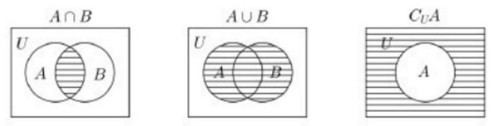
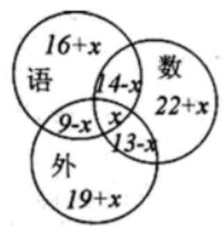
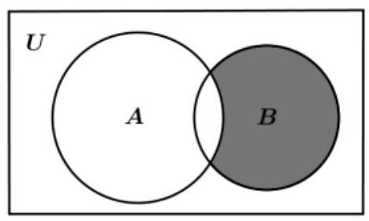
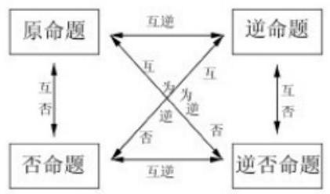
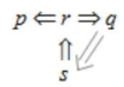
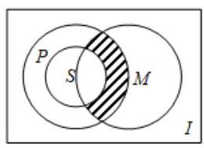

## 集合与命题

<table><tr><td>教学目标</td><td>1、理解集合及其表示法，掌握子集、全集、补集，交集及并集的概念；   2、理解逻辑连接词的含义，会熟练转化四种命题；   3、理解充分条件、必要条件及充要条件的意义，会判断两个命题的关系； 会用定义解题, 理解数形结合, 分类讨论及等价变换等数学思想.</td></tr><tr><td>重点</td><td>集合之间的关系及集合的运算</td></tr><tr><td>难 点</td><td>集合与其它知识点的结合</td></tr></table>

## (一) 集合的概念和性质

## 知识梳理

## 1、集合概念

能够确切指定的一些对象组成的整体叫做集合，简称集.

集合中的各个对象叫做这个集合的元素. 对于一个给定的集合, 集合中的元素具有确定性、互异性、无序性.

集合常用大写字母 $A\text{ 、 }B\text{ 、 }C\cdots$ 来表示，集合中的元素用 $a\text{ 、 }b\text{ 、 }c\cdots$ 表示，如果 $a$ 是集合 $A$ 的元素， 就记作 $a \in  A$ ,读作 “ $a$ 属于 $A$ ” ; 如果 $a$ 不是集合 $A$ 的元素,就记作 $a \notin  A$ ,读作 “ $a$ 不属于 $A$ ”

数的集合简称数集: 全体自然数组成的集合,即自然数集,记作 $\mathrm{N}$ ,不包含零的自然数组成的集合, 记作 ${\mathrm{N}}^{ * }$ ; 全体整数组成的集合,即整数集,记作 $\mathrm{Z}$ ; 全体有理数组成的集合,即有理数集,记作 $\mathrm{Q}$ . 全体实数组成的集合，即实数集，记作 $\mathbf{R}$ ；常用的集合的特殊表示法:实数集 $\mathbf{R}$ (正实数集 ${\mathbf{R}}^{ + }$ )、有理数集 $\mathbf{Q}$ (负有理数集 ${\mathbf{Q}}^{ - }$ )、整数集 $\mathbf{Z}$ (正整数集 ${\mathbf{Z}}^{ + }$ )、自然数集 $\mathbf{N}$ (包含零)、不包含零的自然数集 ${\mathbf{N}}^{ * }$ ；

点的集合简称点集, 即以直角坐标平面内的点作为元素构成的集合

含有有限个元素的集合叫做有限集，含有无限个元素的集合叫做无限集

规定空集不含元素，记作 $\varnothing$

## 2、集合的表示法

集合的表示方法常用列举法和描述法

将集合中的元素一一列举出来(不考虑元素的顺序)，并且写在大括号内，这种表示集合的方法叫做

## 列举法

在大括号内先写出这个集合的元素的一般形式, 再划一条竖线, 在竖线后面写上集合中元素所共同具有的特性,即: $A = \{ x \mid  x$ 满足性质 $p\}$ (集合 $A$ 中的元素都具有性质 $p$ ,而且凡具有性质 $p$ 的元素都在集合 $A$ 中)，这种表示集合的方法叫做描述法

## 例题精讲

【例 1】下列各选项中的 $M$ 与 $P$ 表示同一集合的是( )

A. $M = \{ 0\} , P = \varnothing$

B. $M = \{ \left( {3, - 7}\right) \} , P = \{ \left( {-7,3}\right) \}$

C. $M = \left\{  {\left( {x, y}\right)  \mid  y = {x}^{2} + 3, x \in  R}\right\}  ,\;P = \left\{  {y \mid  y = {x}^{2} + 3, x \in  R}\right\}$

D. $M = \{ y \mid  y = {t}^{2} + 1, t \in  R\} , P = \left\{  {t \mid  t = {\left( y - 1\right) }^{2} + 1, y \in  R}\right\}$

【难度】★★

【答案】D

【解析】根据相等集合定义易得正确选项为D

【例 2】设集合 $A = \{ 0,1,2\} , B = \{ 1,2\} , C = \{ x \mid  x = {ab}, a \in  A, b \in  B\}$ ,则集合 $C$ 中元素的个数为 ( )

A. 3 B. 4 C. 5 D. 6

【难度】★★

【答案】B

【解析】解: $\because A = \{ 0,1,2\} , B = \{ 1,2\} ;\therefore C = \{ x \mid  x = {ab}, a \in  A, b \in  B\}  = \{ 0,1,2,4\}$ ; $\therefore$ 集合 $C$ 中元素的个数为4 . 故选: $B$ .

【例 3】已知集合 $A = \left\{  {x \mid  k{x}^{2} - {8x} + {16} = 0}\right\}$ 只有一个元素,试求实数 $k$ 的值,并用列举法表示集合 $A$ .

【难度】 $\star   \star$

【答案】见解析

【解析】解: 当 $k = 0$ 时,原方程变为 $- {8x} + {16} = 0, x = 2$ ,此时集合 $A = \{ 2\}$ ;

当 $k \neq  0$ 时要使一元二次方程 $k{x}^{2} - {8x} + {16} = 0$ 有一个实根,需 $\Delta  = {64} - {64k} = 0$ ,即 $k = 1$ . 此时方程的解为 ${x}_{1} = {x}_{2} = 4$ . 集合 $A = \{ 4\}$ ，满足题意.

综上所述，实数 $k$ 的值为 0 或 1，当 $k = 0$ 时，集合 $A = \{ 2\}$ ；当 $k = 1$ 时，集合 $A = \{ 4\}$ .

【例 4】已知集合 $M = \left\{  {x \mid  \left( {x - a}\right) \left( {{x}^{2} - {ax} + a - 1}\right)  = 0}\right\}$ 中各元素之和为 3,则实数 $a$ 的值为___.

【难度】 $\star   \star   \star$

【答案】 2 或 $\frac{3}{2}$

【解析】解: ${x}^{2} - {ax} + a - 1 = \left\lbrack  {x - \left( {a - 1}\right) }\right\rbrack  \left( {x - 1}\right)  = 0;\therefore$ 方程 $\left( {x - a}\right) \left( {{x}^{2} - {ax} + a - 1}\right)  = 0$ 的解为:

${x}_{1} = a,{x}_{2} = a - 1,{x}_{3} = 1$ ; 若 $a = 1$ ,则 $A = \{ 1,0\}$ ,不满足 $A$ 中元素之和为 3 ;

若 $a - 1 = 1$ ,则 $A = \{ 2,1\}$ ,元素和为3; 若 $a \neq  1$ ,且 $a \neq  2$ ,则 $A = \{ a, a - 1,1\} ,\therefore a + a - 1 + 1 = 3$ ,解得 $a = \frac{3}{2}.\therefore a = 2$ 或 $a = \frac{3}{2}$ . 故答案为:2 或 $\frac{3}{2}$ .

## 巩固训练

1、若 $a \in  \left\{  {{a}^{2} - a,0}\right\}$ ，则实数 $a =$ ___.

【答案】 2

【解析】由题设,当 $a = 0$ 时, ${a}^{2} - a = 0$ ,不符合集合的互异性,排除;

$\therefore a \neq  0$ ,则 ${a}^{2} - a = a$ ,解得 $a = 2$ . 综上, $a = 2$ . 故答案为: 2

2、用列举法表示集合 $A = \left\{  {a\left| {\;\frac{6}{5 - a} \in  {\mathrm{N}}^{ * }}\right. , a \in  \mathrm{Z}}\right\}   =$ ___.

【答案】 $\{  - 1,2,3,4\}$

【解析】要使 $\frac{6}{5 - a} \in  {\mathrm{N}}^{ * }$ ,则 $5 - a = 1,2,3,6$ ,即 $a = 4,3,2, - 1$ ,所以 $A = \{  - 1,2,3,4\}$

3、下列各组中的 $M\text{ 、 }P$ 表示同一集合的是( )

① $M = \{ 3, - 1\} , P = \{ \left( {3, - 1}\right) \}$ ；

② $M = \{ \left( {3,1}\right) \} , P = \{ \left( {1,3}\right) \}$ ；

③ $M = \left\{  {y \mid  y = {x}^{2} - 1}\right\}  ,\;P = \left\{  {t \mid  t = {x}^{2} - 1}\right\}$ ;

④ $M = \left\{  {y \mid  y = {x}^{2} - 1}\right\}  ,\;P = \left\{  {\left( {x, y}\right)  \mid  y = {x}^{2} - 1}\right\}$

A. ① B. ② C. ③ D. ④

【答案】 $C$

【解析】解: 在①中, $M = \{ 3, - 1\}$ 是数集, $P = \{ \left( {3, - 1}\right) \}$ 是点集,二者不是同一集合,故①错误;

在②中， $M = \{ \left( {3,1}\right) \}$ ， $P = \{ \left( {1,3}\right) \}$ 表示的不是同一个点，故②错误；

在③中， $M = \left\{  {y\left| {\;y = {x}^{2} - 1}\right. }\right\}   = \left\lbrack  {-1,\infty }\right)$ ， $P = \left\{  {t\left| {\;t = {x}^{2} - 1}\right. }\right\}   = \left\lbrack  {-1, + \infty }\right)$ ，二者表示同一集合，故③正确；

在④中， $M = \left\{  {y \mid  y = {x}^{2} - 1}\right\}$ 表示数集， $P = \left\{  {\left( {x, y}\right)  \mid  y = {x}^{2} - 1}\right\}$ 表示一条抛物线，故④错误. 故选: $C$ .

4、一元二次方程 ${x}^{2} - {4x} + 4 - {a}^{2} = 0, a$ 属于实数，在实数范围内的根所组成的集合为 $A$ ，则集合 $A$ 中元素之和为___.

【答案】2 或 4,

【解析】当方程 ${x}^{2} - {4x} + 4 - {a}^{2} = 0$ 有两个相等实根时, $\Delta  = 0 \Rightarrow  a = 0$ ,此时 $A = \{ 2\}$ ,集合 $A$ 中元素之和为 2; 当方程 ${x}^{2} - {4x} + 4 - {a}^{2} = 0$ 有两个不相等实根时, $\Delta  > 0 \Rightarrow  a \neq  0$ ,由韦达定理,两根之和为 4, 集合 $A$ 中元素之和为 4 .

## (二)集合之间的关系与运算

## 知识梳理

1、集合之间的关系

对于两个集合 $A$ 和 $B$ ,如果集合 $A$ 中任何一个元素都属于集合 $B$ ,那么集合 $A$ 叫做集合 $B$ 的子集,记作: $A \subseteq  B$ 或 $B \supseteq  A$ ,读作 “ $A$ 包含于 $B$ 或 $B$ 包含 $A$ ”.

空集是任何集合的子集,是任何非空集合的真子集,所以 $A \subseteq  B$ 不要忘记 $A = \Phi$

若集合 $A$ 中有 $n$ 个元素,则有 ${2}^{n}$ 个子集, ${2}^{n} - 1$ 个非空子集, ${2}^{n} - 1$ 个真子集, ${2}^{n} - 2$ 个非空真子集

用封闭曲线 (平面区域) 直观地表示集合及其关系的图形成为文氏图

对于两个集合 $A$ 和 $B$ ,若 $A \subseteq  B$ 且 $B \subseteq  A$ 则称集合 $A$ 与集合 $B$ 相等,记作 $A = B$ . 也就是说,集合 $A$ 和集合 $B$ 含有完全相同的元素

对于两个集合 $A$ 和 $B$ ,如果集合 $A \subseteq  B$ ,并且 $B$ 中至少有一个元素不属于 $A$ ,那么集合 $A$ 叫做集合 $B$ 的真子集,记作 $\mathrm{A} \subset  B$ 或 $\mathrm{B} \supset  A$ ,读作 “ $A$ 真包含于 $B$ 或 $B$ 真包含 $A$ ”

## 2、集合的运算

由集合 $A$ 与集合 $B$ 的所有公共元素组成的集合叫做 $A$ 与 $B$ 的交集，记作 “ $A \cap  B$ ”，读作 “ $A$ 交 $B$ ”， 即 $A \cap  B = \{ x \mid  x \in  A$ 且 $x \in  B\}$

由所有属于集合 $A$ 或者属于集合 $B$ 的元素组成的集合叫做集合 $A$ 与 $B$ 的并集,记作 “ $A \cup  B$ ”,读作 “ $\mathrm{A}$ 并 $\mathrm{B}$ ”,即 $A \cup  B = \{ x \mid  x \in  A$ 或 $x \in  B\}$

在研究集合之间关系的时候,这些集合往往是某个给定的集合的子集,这个确定的集合称为全集 $U$ , 即全集含有我们所要研究的各个集合的全部元素,设 $U$ 为全集, $A$ 是 $U$ 的子集,则由 $U$ 中所有不属于集合 $A$ 的元素组成的集合叫做集合 $A$ 在全集 $U$ 中的补集,记作 “ ${\mathrm{C}}_{U}A$ ”,读作 “ $\mathrm{A}$ 补”,即 ${\mathrm{C}}_{U}A = \left\{  {x \mid  x \in  U\text{ 且 }x \notin  A}\right\}  ,$

## 3、集合运算的性质

(1) $A \cap  A = A, A \cap  \varnothing  = \varnothing , A \cap  B = B \cap  A$ ；

(2) $A \cup  \varnothing  = A, A \cup  B = B \cup  A$ ；

(3) $A \cap  B \subseteq  \left( {A \cup  B}\right)$ ；

(4) $A \cap  B = A \Leftrightarrow  A \subseteq  B;A \cup  B = A \Leftrightarrow  B \subseteq  A$ ；

(5)德摩根定律:已知全集 $U$ ,若 $A \subseteq  U\text{ 、 }B \subseteq  U$ ,则

$$
{C}_{U}\left( {A \cup  B}\right)  = {C}_{U}A \cap  {C}_{U}B\;{C}_{U}\left( {A \cap  B}\right)  = {C}_{U}A \cup  {C}_{U}B
$$

## 例题精讲

【例 5】已知集合 $M = \left\{  {x\left| {\;x = m + \frac{1}{6}}\right. , m \in  \mathbf{Z}}\right\}  , N = \left\{  {x\left| {\;x = \frac{n}{2} - \frac{1}{3}}\right. , n \in  \mathbf{Z}}\right\}  , P = \left\{  {x\left| {\;x = \frac{p}{2} + \frac{1}{6}}\right. , p \in  \mathbf{Z}}\right\}$ ,则 $M$ 、 $N\text{ 、 }P$ 的关系是( )

A. $M = N \subsetneqq  P$ B. $M \subsetneqq  N = P$ C. $M \subsetneqq  N \subsetneqq  P$ D. $N \subsetneqq  P \subsetneqq  M$

【难度】★★

【答案】B

【解析】可以通过列举法,连续列举出部分集合 $\mathrm{M},\mathrm{N},\mathrm{P}$ 中的元素即可看出三集合之间的关系

【例 6】( 1 )若非空集合 $A = \{ x \mid  {2a} + 1 \leq  x \leq  {3a} - 5\} , B = \{ x \mid  3 \leq  x \leq  {22}\}$ ,则能使 $A \subseteq  A \cap  B$ 成立的所有 $a$ 的集合是 ( ).

A. $\{ a \mid  1 \leq  a \leq  9\}$ B. $\{ a \mid  6 \leq  a \leq  9\}$ C. $\{ a \mid  a \leq  9\}$ D. $\varnothing$

【难度】★★

【答案】C

【解析】① $A = \varnothing$ ，则 ${2a} + 1 > {3a} - 5$ ，得 $a < 6$ ；

② $A \neq  \varnothing$ ，则 $\left\{  \begin{array}{l} a \geq  6 \\  {2a} + 1 \geq  3 \\  {3a} - 5 \leq  {22} \end{array}\right.$ ，得 $6 \leq  a \leq  9$ ， 综上， $a \leq  9$ ，故选 C.

(2)设 $A = \{ 1,2,3,4,5,6,7,8\} , B = \{ 1,2\}$ ，则满足 $B \subseteq  C \subseteq  A$ 的集合 $C$ 有___个.

【难度】 $\star   \star$

【答案】 ${2}^{6}$

【解析】根据一个含 $\mathrm{n}$ 个元素的集合的子集的个数是 ${2}^{n}$ ,又 $B \subseteq  C \subseteq  A$ ,所以集合 $C$ 中一定含有1,2, 但是对于3,4,5,6,7,8可能有可能无,故集合 $C$ 共有 ${2}^{6}$ 种情况;

【例 7】已知集合 $A = \{ a, a + b, a + {2b}\} , B = \left\{  {a,{ac}, a{c}^{2}}\right\}$ ,若 $A = B$ ,求实数 $c$ 的值.

【难度】 $\star   \star   \star$

【答案】 $c =  - \frac{1}{2}$

【解析】解: 由 $A = B$ ,可得: $\left\{  \begin{array}{l} a + b = {ac} \\  a + {2b} = a{c}^{2} \end{array}\right.$ 或 $\left\{  \begin{array}{l} a + b = a{c}^{2} \\  a + {2b} = {ac} \end{array}\right.$ .

若 $\left\{  {\begin{array}{l} a + b = {ac} \\  a + {2b} = a{c}^{2} \end{array} \Rightarrow  a + a{c}^{2} - {2ac} = 0}\right.$ ,所以 $a{\left( c - 1\right) }^{2} = 0$ ,即 $a = 0$ 或 $c = 1$ .

当 $a = 0$ 时,集合 $B$ 中的元素均为 0,故舍去;

当 $c = 1$ 时,集合 $B$ 中的元素均相同,故舍去.

若 $\left\{  {\begin{array}{l} a + b = a{c}^{2} \\  a + {2b} = {ac} \end{array} \Rightarrow  {2a}{c}^{2} - {ac} - a = 0}\right.$ . 因为 $a \neq  0$ ,所以 $2{c}^{2} - c - 1 = 0$ ,

即 $\left( {c - 1}\right) \left( {{2c} + 1}\right)  = 0$ . 又 $c \neq  1$ ,所以只有 $c =  - \frac{1}{2}$ . 经检验,此时 $A = B$ 成立. 综上所述 $c =  - \frac{1}{2}$ .

【例 8】(1)若集合 $A = \left\{  {x \mid  {y}^{2} = {4x}, y \in  R}\right\}  , B = \left\{  {x\left| {\;\frac{1 - x}{2 + x} \geq  0}\right. }\right\}$ ，则 $A \cap  B =$ ( )

A. $\left\lbrack  {0,1}\right\rbrack$ . $B.( - 2,1\rbrack$ . C. $\left( {-2, + \infty }\right)$ . D. $\lbrack 1, + \infty )$ .

【难度】★★

【答案】 $A$

【解析】 $A = \left\{  {x \mid  {y}^{2} = {4x}, y \in  R}\right\}   = \lbrack 0, + \infty ), B = \left\{  {x\left| {\;\frac{1 - x}{2 + x} \geq  0}\right. }\right\}   = ( - 2,1\rbrack$ ,所以 $A \cap  B = \left\lbrack  {0,1}\right\rbrack$

(2)集合 $A = \{ x\left| \right| x - a \mid   \leq  1, x \in  R\}$ ，集合 $B = \{ x \mid  1 \leq  x \leq  3\}$ ，若 $A \cap  B = \phi$ ，则实数 $a$ 的取值范围是___.

【难度】 $\star   \star$

【答案】 $\left( {-\infty ,0}\right)  \cup  \left( {4, + \infty }\right)$

【解析】 $A = \{ x\parallel x - a \mid   \leq  1, x \in  R\}  = \left\lbrack  {a - 1, a + 1}\right\rbrack$ ,若 $A \cap  B = \phi$ ,则 $a + 1 < 1$ 或 $a - 1 > 3$ ,即 $a < 0$ 或 $a > 4$ 【例 9】( 1 )已知集合 $A = \{ x \mid  \lg x \leq  0\} , B = \left\{  {x \mid  {2}^{x} \leq  1}\right\}$ ，则 $A \cup  B =$ ___.

【难度】★★

【答案】 $( - \infty ,1\rbrack$

【解析】解: 解不等式 $\lg x \leq  0$ 得 $x \leq  1$ ,解不等式 ${2}^{x} \leq  1$ 得 $( - \infty ,0\rbrack$ ,所以 $A \cup  B = ( - \infty ,1\rbrack$ .

(2)集合 $A = \left\{  {x\left| {\;{x}^{2} - {3x} + 2 = 0}\right. }\right\}$ ，集合 $B = \left\{  {x\left| {\;{x}^{2} - {ax} + a - 1 = 0}\right. , a \in  R}\right\}$ ，且 $A \cup  B = A$ ，则 $a$ 的值___.

【难度】 $\star   \star$

【答案】 2 或 3

【解析】解: $A = \left\{  {x\left| {\;{x}^{2} - {3x} + 2 = 0}\right. }\right\}   = \{ 1,2\} , A \cup  B = A \Rightarrow  B \subseteq  A$ ,所以 $B = \varnothing ,\{ 1\} ,\{ 2\} ,\{ 1,2\}$

分情况讨论即可得到 $a$ 的值为 2 或 3 .

(3)已知全集 $U = R$ ，集合 $A = \left\{  {x \mid  {x}^{2} - {3x} - {10} > 0}\right\}$ ， $B = \left\{  {x \mid  {x}^{2} - {ax} - 2{a}^{2} \leq  0}\right\}$ ， $C = \{ x \mid  b + 1 \leq  x \leq  {2b} - 1\}$ ,其中 $a, b \in  R$ .

(1)若 $A \cup  B = U$ ，求实数 $a$ 的取值范围；

(2)若 $C \subseteq  {C}_{U}A$ ，求实数 $b$ 的取值范围.

【难度】 $\star   \star$

【答案】( 1 ) $\left( {-\infty , - 5\rbrack \cup \left\lbrack  {\frac{5}{2}, + \infty }\right. }\right)$ ；( 2 ) $b \in  ( - \infty ,3\rbrack$

【解析】略

【例 10】(1)已知全集 $U = \{ 1,2,3,4,5,6,7,8\} , A \subseteq  U, B \subseteq  U$ ,且 $A \cap  B = \{ 3,5\} , A \cap  {\complement }_{U}B = \{ 4,8\}$ , ${\complement }_{U}A \cap  {\complement }_{U}B = \{ 1\}$ ,求集合 $A, B$ .

【难度】 $\star   \star   \star$

【答案】 $A = \{ 3,4,5,8\} , B = \{ 2,3,5,6,7\}$

【解析】因为 $A \cap  B = \{ 3,5\}$ ,所以 $3,5 \in  A$ 且 $3,5 \in  B$ ,因为 $A \cap  {\complement }_{U}B = \{ 4,8\}$ ,所以 $4,8 \in  A$ 且 $4,8 \notin  B$ , 因为 ${\complement }_{U}A \cap  {\complement }_{U}B = \{ 1\}$ ,所以 $A \cup  B = \{ 2,3,4,5,6,7,8\}$ ,因此有 $A = \{ 3,4,5,8\} , B = \{ 2,3,5,6,7\}$ .

(2)某学校 100 名学生在一次语数外三科竞赛中，参加语文竞赛的有 39 人，参加数学竞赛的有 49 人，参加外语竞赛的有 41 人，既参加语文竞赛又参加数学竞赛的有 14 人，既参加数学竞赛又参加外语竞赛的有 13 人，既参加语文竞赛又参加外语竞赛的有 9 人，1 人三项都没有参加，则三项都参加的有___人。

【难度】 $\star   \star$

【答案】 6

【解析】解: 如图,设三科都参加的人有 $x$ 人,

由题意得 ${39} + \left( {{22} + x}\right)  + \left( {{13} - x}\right)  + \left( {{19} + x}\right)  + 1 = {100}$ ,解得 $x = 6$ . 故答案为: 6

## 巩固训练

1、已知全集 $U = \mathbf{R}$ ，集合 $A = \left\{  {y \mid  y = {x}^{2} + 3, x \in  R}\right\}$ ， $B = \{ x \mid   - 2 < x < 4\}$ ，则图中阴影部分表示的集合为( )

A. $\left\lbrack  {-2,3}\right\rbrack$ B. $\left( {-2,3}\right)$ C. $( - 2,3\rbrack$ D. $\lbrack  - 2,3)$

【答案】B

【解析】 $y = {x}^{2} + 3 \geq  3$ ,所以 $A = \lbrack 3, + \infty )$ ,图象表示集合为 $\left( {{\complement }_{\mathrm{U}}A}\right)  \cap  B,{\complement }_{\mathrm{U}}A = \left( {-\infty ,3}\right) ,\left( {{\complement }_{\mathrm{U}}A}\right)  \cap  B = \left( {-2,3}\right)$ . 故选: B

2、若集合 $M = \left\{  {x \mid  {x}^{2} + x - 6 = 0}\right\}  , N = \{ x \mid  {ax} - 1 = 0\}$ ，且 $N \subseteq  M$ ，则实数 $a$ 的值为___.

【答案】0 或 $\frac{1}{2}$ 或 $- \frac{1}{3}$ .

【解析】考查集合间的关系及分类讨论思想, 后略.

3、已知 $A = \{ x \mid   - 2 \leq  x \leq  5\} , B = \{ x \mid  m + 1 \leq  x \leq  {2m} - 1\}$ ,且 $B \subseteq  A$ ,求 $m$ 的取值范围.

【答案】见解析

【解析】 $\because B \subseteq  A\therefore \mathrm{B}$ 的情况如下当 $B = \varnothing$ ,即 $m + 1 > {2m} - 1, m < 2\;\therefore \varnothing  \subseteq  A$ 成立.

当 $B \neq  \varnothing$ ,由题意得 $\left\{  \begin{array}{l} m + 1 \leq  {2m} - 1 \\   - 2 \leq  m + 1 \\  5 \geq  {2m} - 1 \end{array}\right.$ 得 $2 \leq  m \leq  3\therefore m < {2}^{\text{ 或 2 }}2 \leq  m \leq  3$ 即 $m \leq  3$ 为取值范围.

4、已知下列两集合 $A\text{ 、 }B$ ,求 $A \cap  B$ ;

(1) $A = \left\{  {y \mid  y = {x}^{2} - {2x} - 3, x \in  \mathbf{R}}\right\}  , B = \left\{  {y \mid  y =  - {x}^{2} + {2x} + {13}, x \in  \mathbf{R}}\right\}$ ;

(2) $A = \left\{  {\left( {x, y}\right)  \mid  y = {x}^{2} - {2x} - 3, x \in  \mathbf{R}}\right\}  , B = \left\{  {\left( {x, y}\right)  \mid  y =  - {x}^{2} + {2x} + {13}, x \in  \mathbf{R}}\right\}$ ;

(3)已知 $A = \{ y \mid  y = {3k} + 1, k \in  Z\} , B = \{ y \mid  y = {2n}, n \in  Z\}$ ，则 $A \cap  B =$ ___.

【答案】( 1 ) $\left\lbrack  {-4,{14}}\right\rbrack  ;\;\left( 2\right) \{ \left( {-2,5}\right) ,\left( {4,5}\right) \} ,\;\left( 3\right) \{ y \mid  y = {6k} + 4, k \in  Z\}$

5、已知全集 $U = R, A = \left\{  {y \mid  y = 3{x}^{2} - 1, x \in  R}\right\}  , B = \left\{  {y\left| {\;y =  - {x}^{2}}\right. , - 1 \leq  x \leq  2}\right\}$ ，则 $\left( {{C}_{U}A}\right)  \cup  \left( {{C}_{U}B}\right)  =$ ___. 【答案】 $\left( {-\infty , - 1}\right)  \cup  \left( {0, + \infty }\right)$

6、已知集合 $A = \{ x\left| \right| x - 2 \mid   < 3, x \in  R\} , B = \left\{  {x \mid  {2}^{x} > {2}^{a}, x \in  R}\right\}$ ，且 $A \cap  B = A$ ，那么实数 $a$ 的取值范围是 ___.

【答案】 $( - \infty , - 1\rbrack$

7、(1)设全集为 $R$ ，集合 $A = \{ x \mid  3 \leq  x < 6\}$ ， $B = \{ x \mid  2 < x < 9\}$ ， $C = \{ x \mid  a < x < a + 1\}$ .

① 求 $\left( {{\complement }_{U}B}\right)  \cup  A$ ；

②若 $C \subseteq  B$ ，求实数 $a$ 取值构成的集合.

(2)若 $A = \{ x\parallel x - a \mid   < 4\} , B = \left\{  {x \mid  {x}^{2} - {4x} - 5 > 0}\right\}$ ，若 $A \cup  B = R$ ，求实数 $a$ 的取值范围.

【答案】(1) ① $\left( {{\complement }_{U}B}\right)  \cup  A = \left\{  {x\left| {\;x \leq  2\text{ 或 }3 \leq  x < 6\text{ 或 }x \geq  9}\right. }\right\}$ ; ② $\left\lbrack  {2,8}\right\rbrack$ ；(2) $\left( {1,3}\right)$ .

【解析】(1) ①: 因为集合 $B = \{ x \mid  2 < x < 9\}$ ,全集为 $R$ ,所以 ${\complement }_{U}B = \{ x \mid  x \leq  2$ 或 $x \geq  9\}$ , 因为集合 $A = \{ x \mid  3 \leq  x < 6\}$ ,所以 $\left( {{\complement }_{U}B}\right)  \cup  A = \{ x \mid  x \leq  2$ 或 $3 \leq  x < 6$ 或 $x \geq  9\}$ ,

②:因为 $C = \{ x \mid  a < x < a + 1\} , C \subseteq  B$ ，所以易知 $C \neq  \varnothing$ ，则 $\left\{  \begin{array}{l} a \geq  2 \\  a + 1 \leq  9 \end{array}\right.$ ，解得 $2 \leq  a \leq  8$ ， 故实数 $a$ 取值构成的集合是 $\left\lbrack  {2,8}\right\rbrack$ .

(2)因为 $\left| {x - a}\right|  < 4$ ，即 $- 4 < x - a < 4$ ，解得 $a - 4 < x < a + 4$ ，所以 $A = \{ x \mid  a - 4 < x < a + 4\}$ ，

因为 ${x}^{2} - {4x} - 5 > 0$ ,即 $\left( {x - 5}\right) \left( {x + 1}\right)  > 0$ ,解得 $x > 5$ 或 $x <  - 1$ ,所以 $B = \{ x \mid  x > 5$ 或 $x <  - 1\}$ , 因为 $A \cup  B = R$ ,所以 $\left\{  \begin{array}{l} a - 4 <  - 1 \\  4 + a > 5 \end{array}\right.$ ,解得 $1 < a < 3$ ,故实数 $a$ 的取值范围为 $\left( {1,3}\right)$ .

## (三)命题和充要条件、子集与推出关系

## 知识梳理

## 1、命题

可以判断真假的语句叫做命题，命题通常用陈述句表述，正确的命题叫做真命题，错误的命题叫做假命题

如果命题 $\alpha$ 成立可以推出命题 $\beta$ 也成立,那么就说由 $\alpha$ 可以推出 $\beta$ ,并用记号 $\alpha  \Rightarrow  \beta$ 表示,读作 “ $\alpha$ 推出 $\beta$ ”. 换言之, $\alpha  \Rightarrow  \beta$ 表示以 $\alpha$ 为条件, $\beta$ 为结论的命题是真命题

如果 $\alpha  \Rightarrow  \beta$ ,并且 $\beta  \Rightarrow  \alpha$ ,那么记作 “ $\alpha  \Leftrightarrow  \beta$ ”,叫做 $\alpha$ 与 $\beta$ 等价

推出关系满足传递性: $a \Rightarrow  \beta ,\beta  \Rightarrow  \gamma$ ,则 $a \Rightarrow  \gamma$

一个数学命题用条件 $\alpha$ ,结论 $\beta$ 表示就是 “如果 $\alpha$ ,那么 $\beta$ ”,如果把结论和条件互相交换,就得到一个新命题:“如果 $\beta$ ，那么 $\alpha$ ” 我们把这个命题叫做原命题的逆命题，它们互为逆命题

一个命题的条件和结论分别是另一个命题的条件的否定和结论的否定, 我们把这样两个命题叫做互否命题,如果其中一个叫原命题,那么另一个命题就叫做原命题的否命题. 我们把 $\alpha ,\beta$ 的否定分别记作 $\overline{\alpha },\overline{\beta }$ 那么命题 “如果 $\alpha$ ,那么 $\beta$ ” 的否命题为 “如果 $\overline{\alpha }$ ,那么 $\overline{\beta }$ ”

如果将命题 “如果 $\alpha$ ,那么 $\beta$ ” 结论的否定作条件,把条件的否定作结论,那么就可以得到一个新命题,我们将它叫做原命题的逆否命题,如果 $\overline{\beta }$ ,那么 $\overline{\alpha }$

如果 $A, B$ 是两个命题, $A \Rightarrow  B, B \Rightarrow  A$ ,那么 $A, B$ 叫做等价命题

原命题和逆否命题就是等价命题

<table><tr><td>原结论</td><td>反设词</td><td>原结论</td><td>反设词</td><td>原结论</td><td>反设词</td></tr><tr><td>是</td><td>不是</td><td>$p$ 或 $q$</td><td>非 $p$ 且非 $q$</td><td>对所有 $x$ 成立</td><td>存在某个 $x$ 不成立</td></tr><tr><td>都是</td><td>不都是</td><td>$p$ 且 $q$</td><td>非 $p$ 或非 $q$</td><td>对任何 $x$ 不成立</td><td>存在某个 $x$ 成立</td></tr><tr><td>大于</td><td>不大于</td><td>至少有一个</td><td>一个也没有</td><td>至少有 $n$ 个</td><td>至多有 $n - 1$ 个</td></tr><tr><td>小于</td><td>不小于</td><td>至多有一个</td><td>至少有两个</td><td>至多有n个</td><td>至少有 $n + 1$ 个</td></tr></table>

## 2、充要条件

一般地,用 $\alpha \text{ 、 }\beta$ 分别表示两个命题,如果命题 $\alpha$ 成立,可以推出 $\beta$ 也成立,即 $\alpha  \Rightarrow  \beta$ ,那么 $\alpha$ 叫做 $\beta$ 的充分条件, $\beta$ 叫做 $\alpha$ 的必要条件; 如果既有 $\alpha  \Rightarrow  \beta$ ,又有 $\beta  \Rightarrow  \alpha$ ,即 $\alpha  \Leftrightarrow  \beta$ ,那么 $\alpha$ 既是 $\beta$ 的充分条件,又是 $\beta$ 的必要条件,这时我们就说, $\alpha$ 是 $\beta$ 的充分必要条件,简称充要条件

3、子集与推出关系:设具有性质 $p$ 的对象组成集合 $A$ ，具有性质 $q$ 的对象组成集合 $B$ ，则

(1)若 $A \subseteq  B$ ，则 $p$ 是 $q$ 的充分条件

(2)若 $A \subseteq  B$ ，则 $p$ 是 $q$ 的充分非必要条件

(3)若 $A \supseteq  B$ ，则 $p$ 是 $q$ 的必要条件

(4)若 $A \supseteq  B$ ，则 $p$ 是 $q$ 的必要非充分条件

(5)若 $A = B$ ， $p$ 与 $q$ 互为充要条件

$p \Rightarrow  q \Leftrightarrow  A \subseteq  B \Leftrightarrow  A \cap  B = A \Leftrightarrow  A \cup  B = B \Leftrightarrow  {C}_{U}B \subseteq  {C}_{U}A \Leftrightarrow  A\bigcap {C}_{U}B = \Phi  \Leftrightarrow  {C}_{U}A \cup  B = U$

## 例题精讲

【例 11】(1)下列命题为真命题的为( )

$A$ 、若 $\frac{1}{x} = \frac{1}{y}$ ,则 $x = y \; B$ 、若 ${x}^{2} = 1$ ,则 $x = 1$

$C$ 、若 $x = y$ ,则 $\sqrt{x} = \sqrt{y} \; D$ 、若 $x < y$ ,则 ${x}^{2} < {y}^{2}$

【难度】★★

【答案】A

【解析】对 $\mathrm{B}$ 而言, ${\left( -1\right) }^{2} = 1$ ,所以 $x$ 的值不一定是 1; 对 $\mathrm{C}$ 而言, $x = y < 0$ ,此时 $\sqrt{x},\sqrt{y}$ 无意义,对 $\mathrm{D}$ 而言,取 $x =  - 4, y = 1$ 满足 $x < y$ ,但 ${x}^{2} > {y}^{2}$ .

(2)下列说法:

① 若一个命题的否命题是真命题，则这个命题不一定是真命题；

② 若一个命题的逆否命题是真命题，则这个命题是真命题；

③ 若一个命题的逆命题是真命题，则这个命题不一定是真命题；

④ 若一个命题的逆命题和否命题都是真命题，则这个命题一定是真命题.

其中正确的说法是( )

A. ①② B. ①③④ C. ②③④ D. ①②③

【难度】★★

【答案】D

【解析】考查等价命题真假性间的关系

【例 12】( 1 )“ $\left| x\right|  < 1$ ” 是 “ ${x}^{2} - {2x} - 3 < 0$ ” 的( )

A. 充分不必要条件 B. 必要不充分条件

C. 充要条件 D. 既不充分又不必要条件

【难度】★★

【答案】A

【解析】 $\left| x\right|  < 1 \Leftrightarrow   - 1 < x < 1,{x}^{2} - {2x} - 3 < 0 \Leftrightarrow   - 1 < x < 3$ ，所以 $\left| x\right|  < 1$ 时 ${x}^{2} - {2x} - 3 < 0$ 成立，

但 ${x}^{2} - {2x} - 3 < 0$ 时, $\left| x\right|  < 1$ 不一定成立,因此应是充分不必要条件. 故选: A.

(2)已知 $a, b$ 为正实数，则 “ $\frac{ab}{a + b} \leq  2$ ” 是 “ ${ab} \leq  {16}^{\prime \prime }$ 的( )

A. 充要条件 B. 必要不充分条件

C. 充分不必要条件 D. 既不充分也不必要条件

【难度】 $\star   \star$

【答案】B

【解析】由 $a, b$ 为正实数, $\therefore a + b \geq  2\sqrt{ab}$ ,当且仅当 $a = b$ 时等号成立

若 ${ab} \leq  {16}$ ,可得 $\frac{ab}{a + b} \leq  \frac{ab}{2\sqrt{ab}} = \frac{\sqrt{ab}}{2} \leq  \frac{1}{2}\sqrt{16} = 2$ ,故必要性成立;

当 $a = 2, b = {10}$ ,此时 $\frac{ab}{a + b} \leq  2$ ,但 ${ab} = {20} > {16}$ ,故充分性不成立; 因此 “ $\frac{ab}{a + b} \leq  2$ ” 是 “ ${ab} \leq  {16}^{\prime \prime }$ 的必要不充分条件; 故选: B

(3)在 $\bigtriangleup  {ABC}$ 中， $A = {B}^{\prime \prime }$ 是 “ $\sin A = \sin {B}^{\prime \prime }$ 的( )

A. 充分而不必要条件 B. 必要而不充分条件

C. 充要条件 D. 既不充分也不必要条件

【难度】★★

【答案】C

【解析】 $A = B \Rightarrow  \sin A = \sin B$ ,充分性成立; $\sin A = \sin B \Rightarrow  a = b \Rightarrow  A = B$ ,必要性成立; “ $A = B$ ” 是 “ $\sin A = \sin B$ ” 的充要条件. 故选:C.

【例 13】已知 $p, q$ 都是 $r$ 的必要条件, $s$ 是 $r$ 的充分条件, $q$ 是 $s$ 的充分条件,那么:

(1) $s$ 是 $q$ 的什么条件?

(2) $r$ 是 $q$ 的什么条件?

(3) $p$ 是 $q$ 的什么条件?

【难度】 $\star   \star$

【答案】( 1 )s 是 $q$ 的充要条件；( 2 )r 是 $q$ 的充要条件；( 3 )p 是 $q$ 的必要不充分条件.

【解析】解: $p, q, r, s$ 的关系如图所示:

(1)由关系图，知 $q \Rightarrow  s$ ，且 $s \Rightarrow  r \Rightarrow  q$ ，所以 $s$ 是 $q$ 的充要条件.

(2)因为 $r \Rightarrow  q, q \Rightarrow  s \Rightarrow  r$ ，所以 $r$ 是 $q$ 的充要条件.

(3)由关系图，知 $q \Leftrightarrow  r \Rightarrow  p$ ，但 $p$ 推不出 $q$ ，所以 $p$ 是 $q$ 的必要不充分条件.

【例 14】( 1 )不等式 $x - \frac{1}{x} > 0$ 成立的一个充分不必要条件是___.

【难度】★★

【答案】 $\left( {1, + \infty }\right)$

【解析】解: $\because$ 不等式 $x - \frac{1}{x} > 0,\therefore \frac{{x}^{2} - 1}{x} > 0$ ,解得: $x > 1$ 或 $- 1 < x < 0$ ,

故答案为: $\left( {1, + \infty }\right)$ .

( 2 )若关于 $x$ 的不等式 $\left| {x - m}\right|  < 1$ 成立的充分不必要条件是 $\frac{1}{3} < x < \frac{1}{2}$ ，则实数 $m$ 的取值范围是___.

【难度】★★

【答案】 $\left\lbrack  {-\frac{1}{2},\frac{4}{3}}\right\rbrack$

【解析】 $\because \left| {x - m}\right|  < 1$ 的解集为 $\left( {m - 1, m + 1}\right)$ ,

由题意 $\Leftrightarrow  \left( {\frac{1}{3},\frac{1}{2}}\right)  \subsetneqq  \left( {m - 1, m + 1}\right)$

$\Leftrightarrow  \left\{  {\begin{array}{l} m - 1 \leq  \frac{1}{3} \\  m + 1 \geq  \frac{1}{2} \\  m - 1 = \frac{1}{3}\text{ 和 }m + 1 = \frac{1}{2}\text{ 不同时成立 } \end{array} \Leftrightarrow   - \frac{1}{2} \leq  m \leq  \frac{4}{3} \Rightarrow  m}\right.$ 值范围是 $\left\lbrack  {-\frac{1}{2},\frac{4}{3}}\right\rbrack$ .

## 巩固训练

1、命题 “若一个数是负数，则他的平方是正数” 的逆命题是( )

A、“若一个数是负数，则它的平方不是正数”

B、“若一个数的平方是正数，则它是负数”

C、“若一个数不是负数，则它的平方不是正数”

D、“若一个数的平方不是正数，则它不是负数”

【答案】B

2、(1)设 $a, b, c \in  R$ ，则 “ $a = b$ ” 是 “ ${ac} = {bc}$ ” 的___条件.

(2) “ $x + 2 = 0$ ” 是 “ ${x}^{2} - 4 = 0$ ” 的___ 条件.

(3)定义:若对定义域 $D$ 上的任意实数 $x$ 都有 $f\left( x\right)  = 0$ ，则称函数 $f\left( x\right)$ 为 $D$ 上的零函数. 根据以上定义,“ $f\left( x\right)$ 是 $D$ 上的零函数或 $g\left( x\right)$ 是 $D$ 上的零函数” 为 “ $f\left( x\right)$ 与 $g\left( x\right)$ 的积函数是 $D$ 上的零函数” 的 ___条件.

【答案】(1)充分非必要; (2) 充分非必要; (3) 充分非必要

3、“ $a = 2$ ”是“函数 $f\left( x\right)  = \left| {x - a}\right|$ 在 $\lbrack 3 + \infty )$ 上是增函数”的( )

A. 充分非必要条件; B. 必要非充分条件; C. 充要条件; D. 非充分非必要条件.

【答案】A

4、设集合 $M = \{ x \mid  x > 2\} , P = \{ x \mid  x < 3\}$ ，那么 " $x \in  M$ 或 $x \in  {P}^{\prime \prime }$ 是 " $x \in  M \cap  {P}^{\prime \prime }$ ( )

A、充分不必要条件 B、必要不充分条件 C、充要条件 D、既不充分又不必要条件

【答案】B

5、如果 $A$ 是 $B$ 的必要条件, $B$ 是 $C$ 的充要条件, $D$ 是 $C$ 的充分条件,则 $D$ 是 $A$ 的( )

A. 充分不必要条件 B. 必要不充分条件 【答案】A

6、设命题 $P$ : 关于 $x$ 的不等式 ${a}_{1}x + {b}_{1} > 0$ 与 ${a}_{2}x + {b}_{2} > 0$ 的解集相同; 命题 $Q : \frac{{a}_{1}}{{a}_{2}} = \frac{{b}_{1}}{{b}_{2}}$ ,则 $P$ 是 $Q$ 的( )

A、充分不必要条件 B、必要不充分条件

C、充要条件 D、既不充分又不必要条件

【答案】 $D$

7、设 $I = \mathbf{R}$ ,集合 $A = \left\{  {x \mid  {x}^{2} + {4ax} - {4a} + 3 = 0}\right\}  , B = \left\{  {x \mid  {x}^{2} + \left( {a - 1}\right) x + {a}^{2} = 0}\right\}  , C = \left\{  {x \mid  {x}^{2} + {2ax} - {2a} = 0}\right\}$ . 若 $A, B, C$ 中至少有一个不是空集,求实数 $a$ 的取值范围.

【答案】 $a \leq   - \frac{3}{2}$ 或 $a \geq   - 1$

## 实战演练

一、填空题

1、若集合 $A = \left\{  {y\left| {y = {x}^{\frac{1}{3}}, - 1 \leq  x \leq  1}\right. }\right\}  , B = \left\{  {y\left| {y = 2 - \frac{1}{x}}\right. ,0 < x \leq  1}\right\}$ ，则 $A \cap  B =$ ___.

【答案】 $\left\lbrack  {-1,1}\right\rbrack$

2、命题 “若 ${x}^{2} + {y}^{2} > 2$ ，则 $\left| x\right|  > 1$ 或 $\left| y\right|  > 1$ ” 的否命题是___。

【答案】若 ${x}^{2} + {y}^{2} \leq  2$ ,则 $\left| x\right|  \leq  1$ 且 $\left| y\right|  \leq  1$

3、已知命题 $p : a \leq  x \leq  a + 1$ ，命题 $q : {x}^{2} - {4x} < 0$ ，若 $p$ 是 $q$ 成立的充分不必要条件，则实数 $a$ 的取值范围是___.

【答案】 $\left( {0,3}\right)$

【解析】因为命题 $p : a \leq  x \leq  a + 1$ ,设集合 $A = \{ x \mid  a \leq  x \leq  a + 1\}$ ,

由 ${x}^{2} - {4x} < 0$ 可得 $0 < x < 4$ ,设集合 $B = \{ x \mid  0 < x < 4\}$ ,

因为 $p$ 是 $q$ 成立的充分不必要条件,所以 $\mathrm{A}$ 是 $B$ 的真子集,所以 $\left\{  \begin{array}{l} a > 0 \\  a + 1 < 4 \end{array}\right.$ 解得: $0 < a < 3$ ,

所以实数 $a$ 的取值范围是 $\left( {0,3}\right)$ ,故答案为: $\left( {0,3}\right)$ .

4、设 ${a}_{1},{a}_{2},{b}_{1},{b}_{2},{c}_{1},{c}_{2}$ 均为非零实数,不等式 ${a}_{1}{x}^{2} + {b}_{1}x + {c}_{1} > 0$ 和 ${a}_{2}{x}^{2} + {b}_{2}x + {c}_{2} > 0$ 解集分别为 $M, N$ ，那么 $\frac{{a}_{1}}{{a}_{2}} = \frac{{b}_{1}}{{b}_{2}} = \frac{{c}_{1}}{{c}_{2}}$ 是 $M = N$ 的___，___

【答案】既不充分也不必要

5、集合 $A$ 满足:若 $a \in  A$ ，则 $\frac{1}{1 - a} \in  A$ 。若 $2 \in  A$ ，则满足条件的元素个数最少的集合 $A$ 为___. 【答案】 $\left\{  {\frac{1}{2},2, - 1}\right\}$

6、已知 $A = \{ x,{xy},\lg \left( {xy}\right) \} \text{ 、 }B = \{ 0,\left| x\right| , y\}$ ,若 $A = B$ ,

则 $\left( {x + \frac{1}{y}}\right)  + \left( {{x}^{2} + \frac{1}{{y}^{2}}}\right)  + \left( {{x}^{3} + \frac{1}{{y}^{3}}}\right)  + \cdots  + \left( {{x}^{2019} + \frac{1}{{y}^{2019}}}\right)  =$

【答案】-2

【解析】依题意,只能 $\lg \left( {xy}\right)  = 0 \Rightarrow  \left\{  \begin{array}{l} {xy} = 1 \\  x = \left| x\right| \\  {xy} = y \end{array}\right.$ ,或 $\left\{  \begin{array}{l} {xy} = 1 \\  {xy} = \left| x\right| \\  x = y \end{array}\right.$ .

互异性 $\Rightarrow  x = y = 1$ 不合要求,故只能 $x = y =  - 1 \Rightarrow  A = \{  - 1,1,0\}  = B$

$\Rightarrow  \left( {x + \frac{1}{y}}\right)  + \left( {{x}^{2} + \frac{1}{{y}^{2}}}\right)  + \left( {{x}^{3} + \frac{1}{{y}^{3}}}\right)  + \cdots  + \left( {{x}^{2019} + \frac{1}{{y}^{2019}}}\right)  =  - 2$

二、选择题

7、“ $0 \leq  k < {3}^{\prime \prime }$ 是“方程 $\frac{{x}^{2}}{k + 1} + \frac{{y}^{2}}{k - 5} = 1$ 表示双曲线”的( )

A. 充分不必要条件 B. 必要不充分条件

C. 充要条件 D. 既不充分又不必要条件

【答案】A

【解析】解: $\because 0 \leq  k < 3,\therefore \left\{  \begin{array}{l} k + 1 > 0 \\  k - 5 < 0 \end{array}\right.$ , $\therefore$ 方程 $\frac{{x}^{2}}{k + 1} + \frac{{y}^{2}}{k - 5} = 1$ 表示双曲线; 反之, $\because$ 方程 $\frac{{x}^{2}}{k + 1} + \frac{{y}^{2}}{k - 5} = 1$ 表示双曲线, $\therefore \left( {k + 1}\right) \left( {k - 5}\right)  < 0$ ,解得 $- 1 < k < 5$ . 故 “ $0 \leq  k < 3$ ” 是 “方程 $\frac{{x}^{2}}{k + 1} + \frac{{y}^{2}}{k - 5} = 1$ 表示双曲线” 的充分不必要条件. 故选: A.

8、如图， $U$ 为全集， $M$ 、 $P$ 、 $S$ 是 $U$ 的三个子集，则阴影部分所表示的集合是 ( ).

A. $\left( {M \cap  P}\right)  \cap  S$ B. $\left( {M \cap  P}\right)  \cup  S$

C. $\left( {M \cap  P}\right)  \cap  {\complement }_{U}S$ D. $\left( {M \cap  P}\right)  \cup  {C}_{U}S$

【答案】C

9、若函数 $f\left( x\right)$ 和 $g\left( x\right)$ 的定义域、值域都是 $R$ ，则 $f\left( x\right)  > g\left( x\right) \left( {x \in  R}\right)$ 成立的充要条件是( )

A、存在一个 $x\left( {x \in  R}\right)$ ,使得 $f\left( x\right)  > g\left( x\right)$ B、有无穷多个 $x\left( {x \in  R}\right)$ ,使得 $f\left( x\right)  > g\left( x\right)$

C、对于任意的 $x\left( {x \in  R}\right)$ ,使得 $f\left( x\right)  > g\left( x\right)  + 1$ D、 $x \notin  \{ x \mid  f\left( x\right)  \leq  g\left( x\right) \}$

【答案】D

10、设所有被 4 除余数为 $k\left( {k = 0,1,2,3}\right)$ 的整数组成的集合为 ${A}_{k}$ ,即 ${A}_{k} = \{ x \mid  x = {4n} + k, n \in  Z\}$ ,则下列结论中错误的是( )

A. ${2020} \in  {A}_{0}$ B. $a + b \in  {A}_{3}$ ,则 $a \in  {A}_{1}, b \in  {A}_{2}$

C. $- 1 \in  {A}_{3}$ D. $a \in  {A}_{k}, b \in  {A}_{k}$ ,则 $a - b \in  {A}_{0}$

【答案】B

【解析】

A. ${2020} = 4 \times  {505} + 0$ ,所以 ${2020} \in  {A}_{0}$ ,正确;

B. 若 $a + b \in  {A}_{3}$ ,则 $a \in  {A}_{1}, b \in  {A}_{2}$ ,或 $a \in  {A}_{2}, b \in  {A}_{1}$ 或 $a \in  {A}_{0}, b \in  {A}_{3}$ 或 $a \in  {A}_{3}, b \in  {A}_{0}$ ,故 B 不正确;

C. $- 1 = 4 \times  \left( {-1}\right)  + 3$ ，所以 $- 1 \in  {A}_{3}$ ，故 C 正确；

D. $a = {4n} + k, b = {4m} + k, m, n \in  Z$ ，则 $a - b = 4\left( {n - m}\right)  + 0,\left( {n - m}\right)  \in  Z$ ，故 $a - b \in  {A}_{0}$ ，故 D 正确. 故选: B

## 三、解答题

11、若集合 $A = \left\{  {x\left| {\;{x}^{2} + {mx} - 3 = 0}\right. , x \in  R}\right\}  , B = \left\{  {x\left| {\;{x}^{2} - x + n = 0}\right. , x \in  R}\right\}$ ,

且 $A \cup  B = \{  - 3,0,1\}$ ,求实数 $m, n$ 的值。

【答案】 $m = 2, n = 0$

【解析】 $\begin{array}{l} 0 \in  A \cup  B = \{  - 3,0,1\} ,0 \notin  A \Rightarrow  0 \in  B \Rightarrow  n = 0 \\   \Rightarrow  B = \{ 1,0\}  \Rightarrow   - 3 \in  A \Rightarrow  m = 2 \Rightarrow  A = \{  - 3,1\}  \end{array}$

12、已知集合 $\mathrm{A}$ 是函数 $y = \lg \left( {6 + {5x} - {x}^{2}}\right)$ 的定义域,集合 $B$ 是不等式 ${x}^{2} - {2x} + 1 - {a}^{2} \geq  0\left( {a > 0}\right)$ 的解集. $P$ : $x \in  A, q : x \in  B.$

(1)若 $A \cap  B = \varnothing$ ，求 $a$ 的取值范围；

(2)若 $r : x \notin  A$ ，且 $r$ 是 $q$ 的充分不必要条件，求 $a$ 的取值范围.

【答案】(1) $\left\lbrack  {5, + \infty }\right)$ ; (2) $(0,2\rbrack$ .

【解析】解: (1) 由条件得: $A = \{ x \mid   - 1 < x < 6\} , B = \left\{  {x\left| {\;x \geq  1 + a\text{ 或 }x \leq  1 - a}\right. }\right\}$ ,

若 $A \cap  B = \varnothing$ ,则必须满足 $\left\{  \begin{array}{l} 1 + a \geq  6 \\  1 - a \leq   - 1 \\  a > 0 \end{array}\right.$ ,解得 $a \geq  5$ ,所以 $a$ 的取值范围为: $\lbrack 5, + \infty )$ ;

(2)由 $r : x \notin  A$ ，可得: $r : \left\{  {x \mid  x \leq   - 1\text{ 或 }x \geq  6}\right\}$ ，

$\because r$ 是 $q$ 的充分不必要条件, $\therefore \{ x \mid  x \leq   - 1$ 或 $x \geq  6\}$ 是 $\{ x \mid  x \geq  1 + a$ 或 $x \leq  1 - a\}$ 的真子集,

则 $\left\{  \begin{array}{l} 6 \geq  1 + a \\   - 1 \leq  1 - a \\  a > 0 \end{array}\right.$ 且等号不同时成立,解得 $0 < a \leq  2,\therefore a$ 的取值范围为: $(0,2\rbrack$ .
