## 平面向量的概念及其运算、向量的数量积

<table><tr><td>教学目标</td><td>1、理解向量的概念，掌握向量的几何表示，了解共线向量的概念；   2、掌握向量的加法和减法;   3、掌握实数与向量的积, 理解两个向量共线的充要条件;   4、理解平面向量的坐标的概念，掌握平面向量的坐标运算;   5、掌握平面向量的数量积及其几何意义，了解用平面向量的数量积可以处理有关长度、角度和垂直的问题，掌握向量垂直的条件。</td></tr><tr><td>重点</td><td>向量的数量积</td></tr><tr><td>难 点</td><td>向量的模运算、向量的数量积</td></tr></table>

## (一) 向量的概念及线性运算

## 知识梳理

## 向量的概念与线性运算

1、平面向量的有关概念:

(1)向量的定义:既有大小又有方向的量叫做向量。

(2)表示方法:用有向线段来表示向量。有向线段的长度表示向量的大小，用箭头所指的方向表示向量的方向. 用字母 $\overrightarrow{a},\overrightarrow{b},\cdots$ 或用 $\overrightarrow{AB}, B\overrightarrow{C},\cdots$ 表示。

*向量常用有向线段来表示，注意不能说向量就是有向线段，为什么？(向量可以平移)

(3)模:向量的长度叫向量的模，记作 $\left| \overrightarrow{a}\right|$ 或 $\left| \overrightarrow{AB}\right|$ 。

(4)零向量:长度为零的向量叫做零向量，记作 $\overrightarrow{0}$ ；零向量的方向是任意的。

(5)单位向量:长度为 1 个长度单位的向量叫做单位向量(与 $\overrightarrow{AB}$ 共线的单位向量是 $\pm  \frac{\overrightarrow{AB}}{\left| \overrightarrow{AB}\right| }$ )

(6)共线(平行)向量:方向相同或相反的向量叫共线(平行)向量，规定零向量与任何向量共线。

(7)相等向量:长度相等且方向相同的两个向量叫相等向量，相等向量有传递性。

(8)相反向量:长度相等方向相反的向量叫做相反向量， $\overrightarrow{a}$ 的相反向量是 $- \overrightarrow{a}$ 。

提醒:①相等向量一定是共线向量，但共线向量不一定相等；

②两个向量平行与与两条直线平行是不同的两个概念:两个向量平行包含两个向量共线，

但两条直线平行不包含两条直线重合;

③平行向量无传递性(因有 $\overrightarrow{0}$ )；

④三点 $A\text{ 、 }B\text{ 、 }C$ 共线 $\Leftrightarrow  \overrightarrow{AB}\text{ 、 }\overrightarrow{AC}$ 共线;

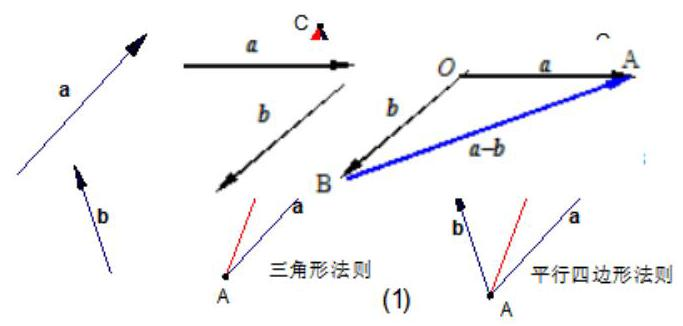

## 2、向量的线性运算

1、向量的加法:

(1)对于零向量与任一向量 $\overrightarrow{a}$ ,有 $\overrightarrow{a} + \overrightarrow{0} = \overrightarrow{0} + \overrightarrow{a} = \overrightarrow{a}$

(2)法则:三角形法则，平行四边形法则

(3)运算律: $\overrightarrow{a} + \overrightarrow{b} = \overrightarrow{b} + \overrightarrow{a};\left( {\overrightarrow{a} + \overrightarrow{b}}\right)  + \overrightarrow{c} = \overrightarrow{a} + \left( {\overrightarrow{b} + \overrightarrow{c}}\right)$ .

2、向量的减法:

(1) $\overrightarrow{a} - \overrightarrow{b}$ 可以表示为从向量 $\overrightarrow{b}$ 的终点指向向量 $\overrightarrow{a}$ 的终点的向量。

3、实数与向量的积:

(1)定义:实数 $\lambda$ 与向量 $\overrightarrow{a}$ 的积是一个向量，记作 $\lambda \overrightarrow{a}$ ，规定: $\left| {\lambda \overrightarrow{a}}\right|  = \left| \lambda \right| \left| \overrightarrow{a}\right|$ . 当 $\lambda  > 0$ 时， $\lambda \overrightarrow{a}$ 的方向与 $\overrightarrow{a}$ 的方向相同; 当 $\lambda  < 0$ 时, $\lambda \overrightarrow{a}$ 的方向与 $\overrightarrow{a}$ 的方向相反; 当 $\lambda  = 0$ 时, $\lambda \overrightarrow{a}$ 与 $\overrightarrow{a}$ 平行。

(2)运算律: $\lambda \left( {\mu \overrightarrow{a}}\right)  = \left( {\lambda \mu }\right) \overrightarrow{a},\left( {\lambda  + \mu }\right) \overrightarrow{a} = \lambda \overrightarrow{a} + \mu \overrightarrow{a},\lambda \left( {\overrightarrow{a} + \overrightarrow{b}}\right)  = \lambda \overrightarrow{a} + \lambda \overrightarrow{b}$ 。

重要定理:

向量共线定理: 向量 $\overrightarrow{b}$ 与非零向量 $\overrightarrow{a}$ 共线的充要条件是有且仅有一个实数 $\lambda$ ,使得 $\overrightarrow{b} = \lambda \overrightarrow{a}$ ,即 $\overrightarrow{b}//\overrightarrow{a} \Leftrightarrow  \overrightarrow{b} = \; \lambda \overrightarrow{a}\left( {\overrightarrow{a} \neq  \overrightarrow{0}}\right)$ 。

推论: 如果 $l$ 为经过已知点 $A$ 且平行于已知非零向量 $\overrightarrow{a}$ 的直线,那么对于任意一点0,点 $P$ 在直线 $l$ 上的充要条件是存在实数 $t$ 满足等式 $\overrightarrow{OP} = \overrightarrow{OA} + t\overrightarrow{a}$ 。

$\overrightarrow{OP} = \overrightarrow{OA} + t\left( {\overrightarrow{OB} - \overrightarrow{OA}}\right)  = \left( {1 - t}\right) \overrightarrow{OA} + t\overrightarrow{OB}$ . 注: 中点公式 $\overrightarrow{OP} = \frac{1}{2}\left( {\overrightarrow{OA} + \overrightarrow{OB}}\right)$

## 例题精讲

【例 1】( 1 )判断下列各命题是否正确:

(1)零向量没有方向 ( 2 )若 $\left| \overrightarrow{a}\right|  = \left| \overrightarrow{b}\right|$ ，则 $\overrightarrow{a} = \overrightarrow{b}$

(3)单位向量都相等 (4)向量就是有向线段

(5)两相等向量若共起点，则终点也相同 (6) 若 $\overrightarrow{a} = \overrightarrow{b},\overrightarrow{b} = \overrightarrow{c}$ ,则 $\overrightarrow{a} = \overrightarrow{c}$

(7) 若 $\overrightarrow{a}//\overrightarrow{b},\overrightarrow{b}//\overrightarrow{c}$ ,则 $\overrightarrow{a}//\overrightarrow{c}$ (8) $\overrightarrow{a} = \overrightarrow{b}$ 的充要条件是 $\left| \overrightarrow{a}\right|  = \left| \overrightarrow{b}\right|$ 且 $\overrightarrow{a}//\overrightarrow{b}$

(9)若四边形 ABCD 是平行四边形,则 $\overrightarrow{AB} = \overrightarrow{CD},\overrightarrow{BC} = \overrightarrow{DA}$

【难度】 $\star   \star$

【答案】见解析

【解析】(1)不正确, 零向量方向任意; (2) 不正确, 模相等, 还有方向; (3)不正确, 单位向量的模为 1 , 方

第 2 页共 26 页

向很多;

(4)不正确，有向线段是向量的一种表示形式; (5)正确; (6)正确，向量相等有传递性; (7)不正确，因若 $\overrightarrow{b} = \overrightarrow{0}$ ,则不共线的向量 $\overrightarrow{a},\overrightarrow{c}$ 也有 $\overrightarrow{a}//\overrightarrow{0},\overrightarrow{0}//\overrightarrow{c}$ ; (8)不正确,当 $\overrightarrow{a}//\overrightarrow{b}$ ,且方向相反时,即使 $\left| \overrightarrow{a}\right|  = \left| \overrightarrow{b}\right|$ , 也不能得到 $\overrightarrow{a} = \overrightarrow{b}$ ;

(9) 不正确, $\overrightarrow{\mathbf{A}B} = \overrightarrow{CD},\overrightarrow{BC} \neq  \overrightarrow{DA}$

(2)对于向量 $\overrightarrow{a}$ ， $\overrightarrow{b}$ ， $\overrightarrow{c}$ 和实数 $\lambda$ ，下列命题中正确的是( )

A. 若 $\overrightarrow{a} \cdot  \overrightarrow{b} = 0$ ，则 $\overrightarrow{a} = \overrightarrow{0}$ 或 $\overrightarrow{b} = \overrightarrow{0}$ B. 若 $\lambda \bar{a} = \overline{0}$ ,则 $\lambda  = 0$ 或 $\bar{a} = \overline{0}$

C. 若 ${\bar{a}}^{2} = {\bar{b}}^{2}$ ,则 $\bar{a} = \bar{b}$ 或 $\bar{a} =  - \bar{b}$ D. 若 $\overrightarrow{a} \cdot  \overrightarrow{b} = \overrightarrow{a} \cdot  \overrightarrow{c}$ ,则 $\overrightarrow{b} = \overrightarrow{c}$

【难度】 $\star   \star$

【答案】B

【解析】对于 $\mathrm{A}$ 中,若 $\overrightarrow{a} \cdot  \overrightarrow{b} = 0$ ,则 $\overrightarrow{a} = \overrightarrow{0}$ 或 $\overrightarrow{b} = \overrightarrow{0}$ 或 $\overrightarrow{a} \bot  \overrightarrow{b}$ ,所以不正确;

对于 $\mathrm{B}$ 中,若 $\lambda \overrightarrow{a} = \overrightarrow{0}$ ,则 $\lambda  = 0$ 或 $\overrightarrow{a} = \overrightarrow{0}$ 是正确的;

对于 $\mathrm{C}$ 中,若 ${\overrightarrow{a}}^{2} = {\overrightarrow{b}}^{2}$ ,则 $\left| \overrightarrow{a}\right|  = \left| \overrightarrow{b}\right|$ ,不能得到 $\overrightarrow{a} = \overrightarrow{b}$ 或 $\overrightarrow{a} =  - \overrightarrow{b}$ ,所以不正确;

对于 $\mathrm{D}$ 中,若 $\overrightarrow{a} \cdot  \overrightarrow{b} = \overrightarrow{a} \cdot  \overrightarrow{c}$ ,则 $\overrightarrow{a}\left( {\overrightarrow{b} - \overrightarrow{c}}\right)  = 0$ ,不一定得到 $\overrightarrow{b} = \overrightarrow{c}$ ,可能是 $\overrightarrow{a} \bot  \left( {\overrightarrow{b} - \overrightarrow{c}}\right)$ ,所以不正确,

综上可知，故选 B

【例 2】( 1 )设 $\overrightarrow{{e}_{1}}\text{ 、 }\overrightarrow{{e}_{2}}$ 是平面内两个不平行的向量，若 $\overrightarrow{a} = \overrightarrow{{e}_{1}} + \overrightarrow{{e}_{2}}$ 与 $\overrightarrow{b} = m\overrightarrow{{e}_{1}} - \overrightarrow{{e}_{2}}$ 平行，则实数 $m =$ ___.

【难度】★★

【答案】 -1

【解析】向量平行的定理

(2)设 $\overrightarrow{{e}_{1}},\overrightarrow{{e}_{2}}$ 是平面内两个不共线的向量， $\overrightarrow{AB} = \left( {a - 1}\right) \overrightarrow{{e}_{1}} + \overrightarrow{{e}_{2}}$ ， $\overrightarrow{AC} = b\overrightarrow{{e}_{1}} - 2\overrightarrow{{e}_{2}}$ ， $a > 0, b > 0$ . 若 $A, B, C$ 三点共线,则 $\frac{1}{a} + \frac{2}{b}$ 的最小值是___.

【难度】 $\star   \star   \star$

【答案】 4

【解析】共线定理和基本不等式

【例 3】在 $\bigtriangleup {ABC}$ 中,点 $O$ 满足 $3\overrightarrow{AO} = \overrightarrow{AB} + \overrightarrow{AC}$ ,则 $\bigtriangleup {OBC}$ 与 $\bigtriangleup {ABC}$ 的面积比为 ( )

A. $\frac{1}{2}$ B. $\frac{1}{3}$ C. $\frac{2}{3}$ D. $\frac{3}{4}$

【难度】 $\star   \star   \star$

【答案】 $B$

【解析】解: 如图,根据题意,延长 ${AO}$ 交 ${BC}$ 的中点 $D$ ;

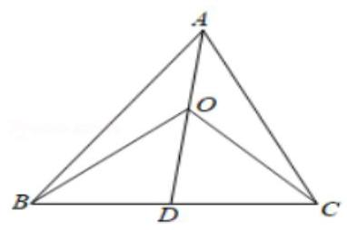

$\because \overrightarrow{AB} + \overrightarrow{AC} = 2\overrightarrow{AD}$ ,且 $3\overrightarrow{AO} = \overrightarrow{AB} + \overrightarrow{AC}$ ; $\therefore 3\overrightarrow{AO} = 2\overrightarrow{AD}$ ; $\therefore \overrightarrow{AO} = \frac{2}{3}\overrightarrow{AD}$ ; $\therefore \overrightarrow{OD} = \frac{1}{3}\overrightarrow{AD}$ ;

$\therefore \bigtriangleup {OBC}$ 与 $\bigtriangleup {ABC}$ 的面积比为 $\frac{1}{3}$ . 故选: $B$ .

## 巩固训练

1、判断下列命题是否正确，若不正确，请简述理由。

①向量 $\overrightarrow{AB}$ 与 $\overrightarrow{CD}$ 是共线向量，则 $A$ 、 $B$ 、 $C$ 、 $D$ 四点必在一直线上；

②任一向量与它的相反向量不相等;

③四边形 ${ABCD}$ 是平行四边形的充要条件是 $\overrightarrow{AB} = \overrightarrow{DC}$ ；

④模为 0 是一个向量方向不确定的充要条件;

⑤共线的向量，若起点不同，则终点一定不同.

【难度】 $\star   \star$

【答案】见解析

【解析】① 不正确. 共线向量即平行向量,只要求方向相同或相反即可,并不要求两向量 $\overrightarrow{AB}\text{ 、 }\overrightarrow{AC}$ 在同一直线上.

②不正确.零向量的相反向量仍是零向量，但零向量与零向量是相等的.

③、④正确⑤不正确.若 $\overrightarrow{AC}$ 与 $\overrightarrow{BC}$ 共线，虽起点不同，但其终点却相同.

2、下列说法中正确的是( )

A. 单位向量都相等

B. 若 $\overrightarrow{a},\overrightarrow{b}$ 满足 $\left| \overrightarrow{a}\right|  > \left| \overrightarrow{b}\right|$ 且 $\overrightarrow{a}$ 与 $\overrightarrow{b}$ 同向，则 $\overrightarrow{a} > \overrightarrow{b}$

C. 对于任意向量 $\overrightarrow{a},\overrightarrow{b}$ ,必有 $\left| {\overrightarrow{a} + \overrightarrow{b}}\right|  \leq  \left| \overrightarrow{a}\right|  + \left| \overrightarrow{b}\right|$

D. 平行向量不一定是共线向量

【难度】 $\star   \star$

【答案】 $C$

【解析】解: $A$ 选项,单位向量的模相等,但方向可以不同,故错误;

$B$ 选项，向量是既有大小，又有方向的量，不能比较大小，故错误；

$C$ 选项，由向量的三角形法则和三角形两边之和大于第三边得 $\left| {\overrightarrow{a} + \overrightarrow{b}}\right|  \leq  \left| \overrightarrow{a}\right|  + \left| \overrightarrow{b}\right|$ ，故正确；

$D$ 选项，平行向量又称共线向量，故错误；

故选: $C$ .

## (二) 向量的坐标运算

## 知识梳理

## 平面向量分解定理与坐标表示

1、平面向量分解定理: 如果 $\overrightarrow{{e}_{1}},\overrightarrow{{e}_{2}}$ 是同一平面内的两个不共线向量,那么对于这一平面内的任一向量 $\overrightarrow{a}$ , 有且只有一对实数 ${\lambda }_{1},{\lambda }_{2}$ 使 $\overrightarrow{a} = {\lambda }_{1}\overrightarrow{{e}_{1}} + {\lambda }_{2}\overrightarrow{{e}_{2}}$ 。

特别提醒:

(1)我们把不共线向量 $\overrightarrow{{e}_{1}}\text{ 、 }\overrightarrow{{e}_{2}}$ 叫做表示这一平面内所有向量的一组基底;

(2)基底不惟一,关键是不共线;

(3)由定理可将任一向量 $\overrightarrow{a}$ 在给出基底 $\overrightarrow{{e}_{1}}\text{ 、 }\overrightarrow{{e}_{2}}$ 的条件下进行分解;

(4)基底给定时,分解形式惟一. ${\lambda }_{1},{\lambda }_{2}$ 是被 $\overrightarrow{a},\overrightarrow{{e}_{1}},\overrightarrow{{e}_{2}}$ 唯一确定的数量;

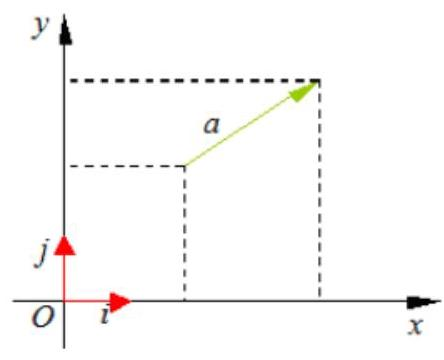

2、平面向量的坐标表示

如图，在直角坐标系内，我们分别取与 $x$ 轴、 $y$ 轴方向相同的两个单位向量 $\overrightarrow{i}\text{ 、 }\overrightarrow{j}$ 作为基底。任作一个向量 $\overrightarrow{a}$ ，由平面向量基本定理知，有且只有一对实数 $x\text{ 、 }y$ ,使得 $\overrightarrow{a} = {xi} + {yj}$

我们把 $\left( {x, y}\right)$ 叫做向量 $\overrightarrow{a}$ 的 (直角) 坐标,记作 $\overrightarrow{a} = \left( {x, y}\right)$②

其中 $x$ 叫做 $\bar{a}$ 在 $x$ 轴上的坐标, $y$ 叫做 $\bar{a}$ 在 $y$ 轴上的坐标,②式叫做向量的坐标表示。

与 $\overrightarrow{a}$ 相等的向量的坐标也为 $\left( {x, y}\right)$ 。

特别地, $\bar{i} = \left( {1,0}\right) ,\bar{j} = \left( {0,1}\right) ,\bar{0} = \left( {0,0}\right)$ 。

特别提醒: 设 $\overrightarrow{OA} = {xi} + {yj}$ ,则向量 $\overrightarrow{OA}$ 的坐标 $\left( {x, y}\right)$ 就是点 $A$ 的坐标; 反过来,点 $A$ 的坐标 $\left( {x, y}\right)$ 也就是向量 $\overrightarrow{OA}$ 的坐标. 因此,在平面直角坐标系内,每一个平面向量都是可以用一对实数唯一表示。

3、平面向量的坐标运算

(1)若 $\overrightarrow{a} = \left( {{x}_{1},{y}_{1}}\right) ,\overrightarrow{b} = \left( {{x}_{2},{y}_{2}}\right)$ ,则 $\overrightarrow{a} + \overrightarrow{b} = \left( {{x}_{1} + {x}_{2},{y}_{1} + {y}_{2}}\right) ,\overrightarrow{a} - \overrightarrow{b} = \left( {{x}_{1} - {x}_{2},{y}_{1} - {y}_{2}}\right)$ 。 两个向量和与差的坐标分别等于这两个向量相应坐标的和与差。

(2)若 $A\left( {{x}_{1},{y}_{1}}\right) , B\left( {{x}_{2},{y}_{2}}\right)$ ，则 $\overrightarrow{AB} = \left( {{x}_{2} - {x}_{1},{y}_{2} - {y}_{1}}\right)$ 。 一个向量的坐标等于表示此向量的有向线段的终点坐标减去始点的坐标。

(3)若 $\overrightarrow{a} = \left( {x, y}\right)$ 和实数 $\lambda$ ，则 $\lambda \overrightarrow{a} = \left( {{\lambda x},{\lambda y}}\right)$ 。

实数与向量的积的坐标等于用这个实数乘原来向量的相应坐标。

4、向量平行的充要条件的坐标表示: 设 $\overrightarrow{a} = \left( {{x}_{1},{y}_{1}}\right) ,\overrightarrow{b} = \left( {{x}_{2},{y}_{2}}\right)$ 其中 $\overrightarrow{b} \neq  \overrightarrow{a}$

$\overrightarrow{a}//\overrightarrow{b}\;\left( {\overrightarrow{b} \neq  \overrightarrow{0}}\right)$ 的充要条件是 ${x}_{1}{y}_{2} - {x}_{2}{y}_{1} = 0$ 。

## 例题精讲

【例 4】已知 $A\left( {-2,2}\right) , B\left( {3, - 3}\right) , C\left( {-3, - 1}\right)$ ,且 $\overline{CM} = 2\overline{CA},\overline{CN} = \frac{1}{2}\overline{CB}$ ,则 $\overline{MN} =$ (   )

A. $\left( {-4,2}\right)$ B. $\left( {4, - 2}\right)$ C. $\left( {-1,7}\right)$ D. $\left( {1, - 7}\right)$

【难度】 $\star   \star$

【答案】 $D$

【解答】解: $\because A\left( {-2,2}\right) , B\left( {3, - 3}\right) , C\left( {-3, - 1}\right) ,\therefore 2\overrightarrow{CA} = \left( {2,6}\right) ,\frac{1}{2}\overrightarrow{CB} = \left( {3, - 1}\right)$ ,

又 $\because \overrightarrow{CM} = 2\overrightarrow{CA},\overrightarrow{CN} = \frac{1}{2}\overrightarrow{CB},\therefore \overrightarrow{MN} = \overrightarrow{CN} - \overrightarrow{CM} = \left( {1, - 7}\right)$ ,故选: $D$ .

【例 5】已知 $A\left( {-2,1}\right) , B\left( {3, - 2}\right)$ 两点,且 $\overrightarrow{AP} = 4\overrightarrow{PB}$ ,则点 $P$ 的坐标为(   )

A. $\left( {2,\frac{7}{5}}\right)$ B. $\left( {\frac{7}{5},2}\right)$ C. $\left( {2, - \frac{7}{5}}\right)$ D. $\left( {-\frac{7}{5},2}\right)$

【难度】 $\star   \star$

【答案】 $C$

【解析】解: 设 $P\left( {x, y}\right)$ ,则 $\overrightarrow{AP} = \left( {x + 2, y - 1}\right) ,\overrightarrow{PB} = \left( {3 - x, - 2 - y}\right)$ ,

$\because \overrightarrow{AP} = 4\overrightarrow{PB},\therefore \left( {x + 2, y - 1}\right)  = 4\left( {-3 - x, - 2 - y}\right)$ ,即 $\left( {x + 2, y - 1}\right)  = \left( {{12} - {4x}, - 8 - {4y}}\right)$ ,

故 $\left\{  \begin{array}{l} x + 2 = {12} - {4x} \\  y - 1 =  - 8 - {4y} \end{array}\right.$ ,解得 $x = 2, y =  - \frac{7}{5}$ ,

所以 $P\left( {2, - \frac{7}{5}}\right)$ . 故选: $C$ .

【例 6】已知点 $A\left( {3,4}\right)$ ，向量 $\overrightarrow{OA}$ 绕原点 $O$ 逆时针旋转 $\frac{\pi }{3}$ 后等于 $\overrightarrow{OB}$ ，则点 $B$ 的坐标为( )

A. $\left( {\frac{4 + 3\sqrt{3}}{2},\frac{3 + 4\sqrt{3}}{2}}\right)$ B. $\left( {\frac{4 - 3\sqrt{3}}{2},\frac{3 + 4\sqrt{3}}{2}}\right)$

C. $\left( {\frac{3 - 4\sqrt{3}}{2},\frac{4 - 3\sqrt{3}}{2}}\right)$ D. $\left( {\frac{3 - 4\sqrt{3}}{2},\frac{4 + 3\sqrt{3}}{2}}\right)$

【难度】 $\star   \star$

【答案】 $D$

【解析】解: 由题意知,点 $A$ 对应的复数为 $3 + {4i} = 5\left( {\cos \theta  + i\sin \theta }\right)$ (其中 $\cos \theta  = \frac{3}{5},\sin \theta  = \frac{4}{5}$ )

向量 $\overrightarrow{OA}$ 绕原点 $O$ 逆时针旋转 $\frac{\pi }{3}$ 后等于 $\overrightarrow{OB}$ ，

则点 $B$ 对应的复数为 $5\left\lbrack  {\cos \left( {\theta  + \frac{\pi }{3}}\right)  + i\sin \left( {\theta  + \frac{\pi }{3}}\right) }\right\rbrack$ ,

$\cos \left( {\theta  + \frac{\pi }{3}}\right)  = \cos \theta \cos \frac{\pi }{3} - \sin \theta \sin \frac{\pi }{3} = \frac{3}{5} \times  \frac{1}{2} - \frac{4}{5} \times  \frac{\sqrt{3}}{2} = \frac{3 - 4\sqrt{3}}{10}$ ,

$\sin \left( {\theta  + \frac{\pi }{3}}\right)  = \sin \theta \cos \frac{\pi }{3} + \cos \theta \sin \frac{\pi }{3} = \frac{4}{5} \times  \frac{1}{2} + \frac{3}{5} \times  \frac{\sqrt{3}}{2} = \frac{4 + 3\sqrt{3}}{10}$ ,

故点 $B$ 对应的复数为 $5 \times  \left( {\frac{3 - 4\sqrt{3}}{10} + \frac{4 + 3\sqrt{3}}{10}i}\right)  = \frac{3 - 4\sqrt{3}}{2} + \frac{4 + 3\sqrt{3}}{2}i$ ,

故点 $B$ 的坐标为 $\left( {\frac{3 - 4\sqrt{3}}{2},\frac{4 + 3\sqrt{3}}{2}}\right)$ ,

故选: $D$ .

【例 7】(1)设向量 $\overrightarrow{a} = \left( {x - 1,1}\right) ,\overrightarrow{b} = \left( {3, x + 1}\right)$ ，则 “ $\overrightarrow{a}//\overrightarrow{b}$ ” 是 “ $x = 2$ ” 的... ( )

A. 充分非必要条件 B. 必要非充分条件

C. 充分必要条件 D. 既非充分又非必要条件

【难度】★★

【答案】B

【解析】 ${x}^{2} - 1 = 3 \Rightarrow  x =  \pm  2$

(2)已知向量 $\mathbf{a} = \left( {3,5}\right) ,\mathbf{b} = \left( {2,4}\right) ,\mathbf{c} = \left( {-3, - 2}\right) ,\mathbf{a} + \lambda \mathbf{b}$ 与 $\mathbf{c}$ 垂直，则实数 $\lambda  =$ ___.

【难度】★★

【答案】 $- \frac{19}{14}$

【解析】向量垂直数量积等于零

【例 8】( 1 )已知 $\left| \overrightarrow{a}\right|  = 1,\left| \overrightarrow{b}\right|  = 2,\overrightarrow{a} + \overrightarrow{b} = \left( {-2,\sqrt{3}}\right)$ ，则 $\left| {2\overrightarrow{a} - \overrightarrow{b}}\right|  =$ ___.

【难度】 $\star   \star$

【答案】 2

【解析】解: $\because \left| \overrightarrow{a}\right|  = 1,\left| \overrightarrow{b}\right|  = 2,\overrightarrow{a} + \overrightarrow{b} = \left( {-2,\sqrt{3}}\right)$ ,

$\therefore {\left( \overrightarrow{a} + \overrightarrow{b}\right) }^{2} = {\overrightarrow{a}}^{2} + {\overrightarrow{b}}^{2} + 2\overrightarrow{a} \cdot  \overrightarrow{b} = 1 + 4 + 2\overrightarrow{a} \cdot  \overrightarrow{b} = 7$ ,解得 $\overrightarrow{a} \cdot  \overrightarrow{b} = 1$ ,

$\therefore \left| {2\overrightarrow{a} - \overrightarrow{b}}\right|  = \sqrt{{\left( 2\overrightarrow{a} - \overrightarrow{b}\right) }^{2}} = \sqrt{4{\overrightarrow{a}}^{2} + {\overrightarrow{b}}^{2} - 4\overrightarrow{a} \cdot  \overrightarrow{b}} = \sqrt{4 + 4 - 4} = 2$ . 故答案为:2 .

(2)已知平面向量 $\overrightarrow{a},\overrightarrow{b}$ 满足 $\overrightarrow{b} = \left( {\sqrt{3},1}\right) ,\left| {2\overrightarrow{a} - \overrightarrow{b}}\right|  = 1$ ，则 $\left| \overrightarrow{a}\right|$ 的取值范围为( )

A. $\left\lbrack  {\frac{3}{2},\frac{5}{2}}\right\rbrack$ B. $\left( {1,3}\right)$ C. $\left\lbrack  {\frac{1}{2},\frac{3}{2}}\right\rbrack$ D. $\left( {2,4}\right)$

【难度】 $\star   \star   \star$

【答案】 $C$

【解析】解: 平面向量 $\overrightarrow{a},\overrightarrow{b}$ 满足 $\overrightarrow{b} = \left( {\sqrt{3},1}\right)$ ,可得 $\left| \overrightarrow{b}\right|  = 2,\left| {2\overrightarrow{a} - \overrightarrow{b}}\right|  = 1$ ,

$\left| \overrightarrow{b}\right|  - \left| {2\overrightarrow{a} - \overrightarrow{b}}\right|  \leq  2\left| \overrightarrow{a}\right|  \leq  \left| \overrightarrow{b}\right|  + \left| {2\overrightarrow{a} - \overrightarrow{b}}\right|$ ,所以 $1 \leq  2\left| \overrightarrow{a}\right|  \leq  3$ ,可得 $\left| \overrightarrow{a}\right|  \in  \left\lbrack  {\frac{1}{2},\frac{3}{2}}\right\rbrack$ ,

故选: $C$ .

【例 9】已知向量 $\overrightarrow{a},\overrightarrow{b}$ 满足 $\left| \overrightarrow{a}\right|  = 1,\overrightarrow{b} = \left( {-1,\sqrt{3}}\right)$ ，且 $\overrightarrow{a}\bot \left( {\overrightarrow{a} - \overrightarrow{b}}\right)$ ，则 $\overrightarrow{a}$ 与 $\overrightarrow{b}$ 的夹角为( )

A. ${30}^{ \circ  }$ B. ${60}^{ \circ  }$ C. ${120}^{ \circ  }$ D. ${150}^{ \circ  }$

【难度】 $\star   \star$

【答案】 $B$

【解析】解: 向量 $\overrightarrow{a},\overrightarrow{b}$ 满足 $\left| \overrightarrow{a}\right|  = 1,\overrightarrow{b} = \left( {-1,\sqrt{3}}\right)$ ,且 $\overrightarrow{a} \bot  \left( {\overrightarrow{a} - \overrightarrow{b}}\right)$ ,

$\therefore \overrightarrow{a} \cdot  \left( {\overrightarrow{a} - \overrightarrow{b}}\right)  = {\overrightarrow{a}}^{2} - \overrightarrow{a} \cdot  \overrightarrow{b} = 1 - 1 \cdot  2\cos  < \overrightarrow{a},\overrightarrow{b} >  = 0,\therefore \cos  < \overrightarrow{a},\overrightarrow{b} >  = \frac{1}{2}$ ,

$\therefore \overrightarrow{a}$ 与 $\overrightarrow{b}$ 的夹角为 ${60}^{ \circ  }$ . 故选: $B$ .

## 巩固训练

1、已知向量 $\overrightarrow{a} = \left( {5, - 2}\right) ,\overrightarrow{b} = \left( {-4, - 3}\right) ,\overrightarrow{c} = \left( {x, y}\right)$ . 若 $\overrightarrow{a} - 2\overrightarrow{b} - \overrightarrow{c} = \overrightarrow{0}$ ,则 $\overrightarrow{c} =$ (   )

A. $\left( {3,4}\right)$ B. $\left( {{13},4}\right)$ C. $\left( {-3, - 4}\right)$ D. $\left( {9,8}\right)$

【难度】★★

【答案】 $B$

【解析】解: $\because ,\therefore \overrightarrow{a} - 2\overrightarrow{b} - \overrightarrow{c} = \left( {{13} - x,4 - y}\right)  = \left( {0,0}\right)$ ,

$\therefore x = {13}, y = 4,\therefore \overrightarrow{c} = \left( {{13},4}\right)$ . 故选: $B$ .

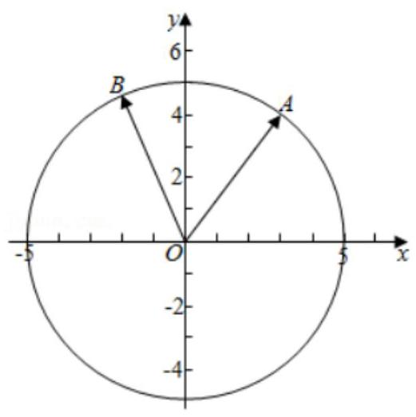

2、已知向量 $\overrightarrow{a} = \left( {1,2}\right) ,\overrightarrow{b} = \left( {3, m}\right)$ . 若 $\overrightarrow{a}//\overrightarrow{b}$ ，则 $m =$ (   )

A. 6 B. -6

C. $\frac{3}{2}$ D. $- \frac{3}{2}$

【难度】 $\star   \star$

【答案】 $A$

【解析】解: $\because \overrightarrow{a}//\overrightarrow{b}$ ,且 $\overrightarrow{a} = \left( {1,2}\right) ,\overrightarrow{b} = \left( {3, m}\right) ,\therefore m - 6 = 0,\therefore m = 6$ . 故选: $A$ .

3、已知 $A\left( {2, - 1}\right) , B\left( {1,4}\right) , C\left( {\sin \frac{3\pi }{2},\cos \frac{5\pi }{3}}\right) , O$ 为坐标原点，则下列说法正确的是( )

A. $\overrightarrow{AB} = \left( {1, - 5}\right)$ B. $A, O, C$ 三点共线

C. $A, B, C$ 三点共线 D. $\overrightarrow{OA} + \overrightarrow{OB} = 3\overrightarrow{OC}$

【难度】★★

【答案】 $B$

【解析】解: $\because \sin \frac{3\pi }{2} =  - 1,\cos \frac{5\pi }{3} = \frac{1}{2},\therefore C\left( {-1,\frac{1}{2}}\right)$ ,

对于选项 $A : \overrightarrow{AB} = \left( {1 - 2,4 - \left( {-1}\right) }\right)  = \left( {-1,5}\right)$ ,故选项 $A$ 错误,

对于选项 $B : \overrightarrow{OA} = \left( {2, - 1}\right) ,\overrightarrow{OC} = \left( {-1,\frac{1}{2}}\right)$ ,则 $\overrightarrow{OA} =  - 2\overrightarrow{OC}$ ,所以 $A, O, C$ 三点共线,故选项 $B$ 正确,

对于选项 $C : \overrightarrow{AB} = \left( {-1,5}\right) ,\overrightarrow{BC} = \left( {-2, - \frac{7}{2}}\right)$ ,不存在实数 $k$ ,使得 $\overrightarrow{AB} = k\overrightarrow{BC}$ ,则 $A, B, C$ 三点不共线,故选项 $C$ 错误,

对于选项 $D : \overrightarrow{OA} + \overrightarrow{OB} = \left( {3,3}\right) ,\overrightarrow{OC} = \left( {-1,\frac{1}{2}}\right)$ ,所以: $\overrightarrow{OA} + \overrightarrow{OB} \neq  3\overrightarrow{OC}$ ,故选项 $D$ 错误,

故选: $B$ .

4、已知向量 $\overrightarrow{a} = \left( {x, - 2}\right) ,\overrightarrow{b} = \left( {2,4}\right)$ ，且 $\overrightarrow{a}//\left( {\overrightarrow{a} + \overrightarrow{b}}\right)$ ，则 $\overrightarrow{a} \cdot  \overrightarrow{b} =$ (   )

A. -8 B. -9 C. -10 D. -11

【难度】★★

【答案】C

【解析】解: 因为 $\overrightarrow{a} = \left( {x, - 2}\right) ,\overrightarrow{b} = \left( {2,4}\right)$ ,可得 $\overrightarrow{a} + \overrightarrow{b} = \left( {x + 2,2}\right)$ ,

又因为 $\overrightarrow{a}//\left( {\overrightarrow{a} + \overrightarrow{b}}\right)$ ,所以 $x \cdot  2 =  - 2\left( {x + 2}\right)$ ,解得: $x =  - 1$ ,

可得 $\overrightarrow{a} = \left( {-1, - 2}\right)$ ,所以 $\overrightarrow{a} \cdot  \overrightarrow{b} = \left( {-1}\right)  \times  2 + \left( {-2}\right)  \times  4 =  - {10}$ ,故选: $C$ .

5、已知向量 $\overrightarrow{a} = \left( {\cos \frac{5\pi }{12},\sin \frac{5\pi }{12}}\right) ,\overrightarrow{b} = \left( {\cos \frac{\pi }{12},\sin \frac{\pi }{12}}\right)$ ，那么 $\overrightarrow{a} \cdot  \overrightarrow{b}$ 等于( )

A. $\frac{1}{2}$ B. $\frac{\sqrt{3}}{2}$ C. 1 D. 0

【难度】★★

【答案】 $A$

【解析】解: $\overrightarrow{a} \cdot  \overrightarrow{b} = \cos \frac{5\pi }{12}\cos \frac{\pi }{12} + \sin \frac{5\pi }{12}\sin \frac{\pi }{12} = \cos \left( {\frac{5\pi }{12} - \frac{\pi }{12}}\right)  = \cos \frac{\pi }{3} = \frac{1}{2}$ .

故选: $A$ .

6、已知向量 $\overrightarrow{OA} = \left( {2,1}\right) ,\overrightarrow{OB} = \left( {-1,2}\right)$ ， $\overrightarrow{OC} = m\overrightarrow{OA} + n\overrightarrow{OB}\left( {m, n > 0}\right)$ . 若 $m + {2n} = 7$ ，则 $\left| \overrightarrow{OC}\right|$ 的最小值为___. 【难度】 $\star   \star   \star$

【答案】7

【解析】解: $\because \overrightarrow{OA} = \left( {2,1}\right) ,\overrightarrow{OB} = \left( {-1,2}\right)$ ,

$\therefore \overrightarrow{OC} = m\overrightarrow{OA} + n\overrightarrow{OB} = \left( {{2m} - n, m + {2n}}\right)$ ,则 $\left| \overrightarrow{OC}\right|  = \sqrt{5\left( {{m}^{2} + {n}^{2}}\right) }$ ,

$\because m + {2n} = 7$ ， $\therefore$ 由柯西不等式得， $\left( {{1}^{2} + {2}^{2}}\right) \left( {{m}^{2} + {n}^{2}}\right)  \geq  {\left( m + 2n\right) }^{2} = {49}$ ，当 $\frac{m}{1} = \frac{n}{2}$ ，即 $m = \frac{7}{5}, n = \frac{14}{5}$ 时，等号成立, $\therefore \left| \overline{OC}\right|$ 的最小值为: 7 .

## (三) 向量的数量积

## 知识梳理

## 平面向量的数量积

1、两个非零向量夹角的概念

已知非零向量 $\bar{a}$ 与 $\overrightarrow{b}$ ，作 $O\dot{A} = \bar{a},\overline{OB} = \overrightarrow{b}$ ，则 $\angle {AOB} = \theta \;\left( {0 \leq  \theta  \leq  \pi }\right)$ 叫 $\bar{a}$ 与 $\overrightarrow{b}$ 的夹角。

2、平面向量数量积 (内积) 的定义: 已知两个非零向量 $\overrightarrow{a}$ 与 $\overrightarrow{b}$ ,它们的夹角是 $\theta$ ,则数量 $\left| \overrightarrow{a}\right| \left| \overrightarrow{b}\right| \cos \theta$ 叫 $\bar{a}$ 与 $\overrightarrow{b}$ 的数量积,记作 $\bar{a} \cdot  \overrightarrow{b}$ ,即有 $\bar{a} \cdot  \overrightarrow{b} = \left| \bar{a}\right| \left| \overrightarrow{b}\right| \cos \theta$ 。

提醒:

1、 $\left( {0 \leq  \theta  \leq  \pi }\right)$ ，并规定 $\overline{0}$ 与任何向量的数量积为 0；

2、两个向量的数量积的性质:设 $\overrightarrow{a}$ 、 $\overrightarrow{b}$ 为两个非零向量， $\overrightarrow{e}$ 是与 $\overrightarrow{b}$ 同向的单位向量；

1) $\overrightarrow{e} \cdot  \overrightarrow{a} = \overrightarrow{a} \cdot  \overrightarrow{e} = \left| \overrightarrow{a}\right| \cos \theta$ ; 2) $\overrightarrow{a} \bot  \overrightarrow{b} \Leftrightarrow  \bar{a} \cdot  \overrightarrow{b} = 0$ ;

3) 当 $\overrightarrow{a}$ 与 $\overrightarrow{b}$ 同向时, $\overrightarrow{a} \cdot  \overrightarrow{b} = \left| \overrightarrow{a}\right| \left| \overrightarrow{b}\right|$ ; 当 $\overrightarrow{a}$ 与 $\overrightarrow{b}$ 反向时, $\overrightarrow{a} \cdot  \overrightarrow{b} =  - \left| \overrightarrow{a}\right|  \mid  \overrightarrow{b}$ ;

特别的 $\bar{a} \cdot  \bar{a} = {\left| \bar{a}\right| }^{2}$ 或 $\left| \overrightarrow{a}\right|  = \sqrt{\bar{a} \cdot  \bar{a}}$ ;

4) 当 $\theta$ 为锐角时, $\overrightarrow{a} \cdot  \overrightarrow{b} > 0$ ,且 $\overrightarrow{a}\text{ 、 }\overrightarrow{b}$ 不同向, $\overrightarrow{a} \cdot  \overrightarrow{b} > 0$ 是 $\theta$ 为锐角的必要非充分条件;

当 $\theta$ 为钝角时, $\overrightarrow{a} \cdot  \overrightarrow{b} < 0$ ,且 $\overrightarrow{a}$ 、 $\overrightarrow{b}$ 不反向, $\overrightarrow{a} \cdot  \overrightarrow{b} < 0$ 是 $\theta$ 为钝角的必要非充分条件;

5) $\cos \theta  = \frac{\overrightarrow{a} \cdot  \overrightarrow{b}}{\left| \overrightarrow{a}\right| \left| \overrightarrow{b}\right| };\;6)\left| {\overrightarrow{a} \cdot  \overrightarrow{b}}\right|  \leq  \left| \overrightarrow{a}\right| \left| \overrightarrow{b}\right|$ 。

3、“投影”的概念:如图

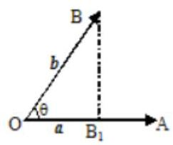

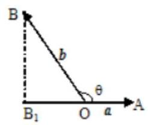

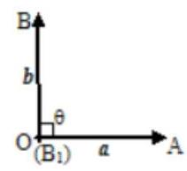

定义: $\left| b\right| \cos \theta$ 叫做向量 $b$ 在 $a$ 方向上的投影。

提醒:

投影也是一个数量，不是向量; 当θ为锐角时投影为正值; 当θ为钝角时投影为负值; 当θ为直角时投影为 0; 当 $\theta  = {0}^{ \circ  }$ 时投影为 $\left| b\right|$ ; 当 $\theta  = {180}^{ \circ  }$ 时投影为 $- \left| b\right|$ 。

4、平面向量数量积的运算律

交换律: $\overrightarrow{a} \cdot  \overrightarrow{b} = \overrightarrow{b} \cdot  \overrightarrow{a}$ ;

数乘结合律: $\left( {\lambda \overrightarrow{a}}\right)  \cdot  \overrightarrow{b} = \lambda \left( {\overrightarrow{a} \cdot  \overrightarrow{b}}\right)  = \overrightarrow{a} \cdot  \left( {\lambda \overrightarrow{b}}\right)$ ;

分配律: $\left( {\overrightarrow{a} + \overrightarrow{b}}\right)  \cdot  \overrightarrow{c} = \overrightarrow{a} \cdot  \overrightarrow{c} + \overrightarrow{b} \cdot  \overrightarrow{c}$ 。

## 5、平面两向量数量积的坐标表示

已知两个非零向量 $\overrightarrow{a} = \left( {{x}_{1},{y}_{1}}\right) ,\overrightarrow{b} = \left( {{x}_{2},{y}_{2}}\right)$ ,设 $\overrightarrow{i}$ 是 $x$ 轴上的单位向量, $\overrightarrow{j}$ 是 $y$ 轴上的单位向量,那么 $\overrightarrow{a} = \overrightarrow{{x}_{1}i} + {y}_{1}\overrightarrow{j},\;\overrightarrow{b} = \overrightarrow{{x}_{2}i} + {y}_{2}\overrightarrow{j}$ 所以 $\overrightarrow{a} \cdot  \overrightarrow{b} = \underline{{x}_{1}{x}_{2} + {y}_{1}{y}_{2}}$ 。

## 6、平面内两点间的距离公式

如果表示向量 $\overrightarrow{a}$ 的有向线段的起点和终点的坐标分别为 $\left( {{x}_{1},{y}_{1}}\right) \text{ 、 }\left( {{x}_{2},{y}_{2}}\right)$ ,

那么: $\left| \overrightarrow{a}\right|  = \sqrt{{\left( {x}_{1} - {x}_{2}\right) }^{2} + {\left( {y}_{1} - {y}_{2}\right) }^{2}}$ 。

7、向量垂直的判定: 设 $\overrightarrow{a} = \left( {{x}_{1},{y}_{1}}\right) ,\overrightarrow{b} = \left( {{x}_{2},{y}_{2}}\right)$ ,则 $\overrightarrow{a} \bot  \overrightarrow{b} \Leftrightarrow  \underline{{x}_{1}{x}_{2} + {y}_{1}{y}_{2} = 0}$ 。

8、两向量夹角的余弦 $\left( {0 \leq  \theta  \leq  \pi }\right) \;\frac{\cos \theta  = \frac{\overrightarrow{a} \cdot  \overrightarrow{b}}{\left| \overrightarrow{a}\right|  \cdot  \left| \overrightarrow{b}\right| } = \frac{{x}_{1}{x}_{2} + {y}_{1}{y}_{2}}{\sqrt{{x}_{1}^{2} + {y}_{1}^{2}}\sqrt{{x}_{2}^{2} + {y}_{2}^{2}}}}{{\cos }^{2}\sqrt{{x}_{1}^{2} + {y}_{1}^{2}}\sqrt{{x}_{2}^{2} + {y}_{2}^{2}}}$ 。

## 例题精讲

【例10】下列命题:(1) $m\left( {\overrightarrow{a} + \overrightarrow{b}}\right)  = m\overrightarrow{a} + m\overrightarrow{b}\left( {m \in  R}\right)$ ；(2) $\left( {\overrightarrow{a} \cdot  \overrightarrow{b}}\right)  \cdot  \overrightarrow{c} = \overrightarrow{a} \cdot  \left( {\overrightarrow{b} \cdot  \overrightarrow{c}}\right)$ ；

(3) ${\left( \overrightarrow{a} - \overrightarrow{b}\right) }^{2} = {\overrightarrow{a}}^{2} - 2 \cdot  \overrightarrow{a} \cdot  \overrightarrow{b} + {\overrightarrow{b}}^{2}$ ；(4) $\left| {\overrightarrow{a} + \overrightarrow{b}}\right|  \cdot  \left| {\overrightarrow{a} - \overrightarrow{b}}\right|  = \left| {{\overrightarrow{a}}^{2} - {\overrightarrow{b}}^{2}}\right|$ . 其中真命题的个数为( ).

A. 1 B. 2 C. 3 D. 4

【难度】 $\bigstar \bigstar \bigstar$

【答案】B

【解析】解: (1) 根据平面向量的乘法分配律,可知 $m\left( {\overrightarrow{a} + \overrightarrow{b}}\right)  = m\overrightarrow{a} + m\overrightarrow{b}\left( {m \in  R}\right)$ ,则 (1) 正确;

(2)由于平面向量不满足结合律，则 $\left( {\overrightarrow{a} \cdot  \overrightarrow{b}}\right)  \cdot  \overrightarrow{c} \neq  \overrightarrow{a} \cdot  \left( {\overrightarrow{b} \cdot  \overrightarrow{c}}\right)$ ，故(2)错误；

(3)根据平面向量的乘法运算，可知 ${\left( \overrightarrow{a} - \overrightarrow{b}\right) }^{2} = {\overrightarrow{a}}^{2} - 2 \cdot  \overrightarrow{a} \cdot  \overrightarrow{b} + {\overrightarrow{b}}^{2}$ ，则(3)正确；

(4)设 $\left| \overrightarrow{a}\right|  = \left| \overrightarrow{b}\right|  = 1$ ，且 $\overrightarrow{a} \bot  \overrightarrow{b}$ ，则 $\left| {\overrightarrow{a} + \overrightarrow{b}}\right|  = \left| {\overrightarrow{a} - \overrightarrow{b}}\right|  = \sqrt{2}$ ，而 $\left| {\overrightarrow{a} - \overrightarrow{b}}\right|  = 0$ ，

此时 $\left| {\overrightarrow{a} + \overrightarrow{b}}\right|  \cdot  \left| {\overrightarrow{a} - \overrightarrow{b}}\right|  \neq  \left| {\overrightarrow{a} - \overrightarrow{b}}\right|  \neq$ 故 (4) 错误; 综上得,真命题的个数为 2 . 故选: B.

【例 11】( 1 )已知向量 $\overrightarrow{a},\overrightarrow{b}$ 满足 $\overrightarrow{a} \cdot  \left( {\overrightarrow{a} + \overrightarrow{b}}\right)  = 5$ 且 $\left| \overrightarrow{a}\right|  = 2,\left| \overrightarrow{b}\right|  = 1$ ，则向量 $\overrightarrow{a}$ 在向量 $\overrightarrow{b}$ 方向的投影为( )

A. $\frac{1}{2}$ B. 1

C. $\frac{3}{2}$ D. 2

【难度】★★

【答案】B

【解析】设向量 $\overrightarrow{a}$ 与向量 $\overrightarrow{b}$ 的夹角为 $\theta$ ,则向量 $\overrightarrow{a}$ 在向量 $\overrightarrow{b}$ 方向的投影为 $\left| \overrightarrow{a}\right| \cos \theta$ ,

因为 $\overrightarrow{a} \cdot  \left( {\overrightarrow{a} + \overrightarrow{b}}\right)  = 5,\left| \overrightarrow{a}\right|  = 2,\left| \overrightarrow{b}\right|  = 1$ ,所以 $\overrightarrow{a} \cdot  \left( {\overrightarrow{a} + \overrightarrow{b}}\right)  = {\left( \overrightarrow{a}\right) }^{2} + \overrightarrow{a} \cdot  \overrightarrow{b} = {\left| \overrightarrow{a}\right| }^{2} + \left| \overrightarrow{a}\right| \left| \overrightarrow{b}\right| \cos \theta  = 5$

(2)已知 $\bigtriangleup  {ABC}$ ，于点 $O$ ，于点 $B$ ，于且2， ${AD}$ 是 ${BC}$ 边上的高，则 $\overrightarrow{BD} \cdot  \overrightarrow{BA} =$ ___.

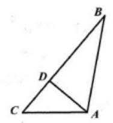

【难度】 $\star   \star$

【答案】 3

【解析】投影或者分解

【例 12】若向量 $\overrightarrow{a},\overrightarrow{b}$ 的夹角为 $\frac{\pi }{3}$ ，且 $\left| \overrightarrow{a}\right|  = 2$ ， $\left| \overrightarrow{b}\right|  = 1$ ，则向量 $\overrightarrow{a} + 2\overrightarrow{b}$ 与向量 $\overrightarrow{a}$ 的夹角为___.

【难度】★★

【答案】 $\frac{\pi }{6}$

【解析】设向量 $\overrightarrow{a} + 2\overrightarrow{b}$ 与向量 $\overrightarrow{a}$ 的夹角为 $\theta ,\because$ 向量 $\overrightarrow{a},\overrightarrow{b}$ 的夹角为 $\frac{\pi }{3}$ ,且 $\left| \overrightarrow{a}\right|  = 2,\left| \overrightarrow{b}\right|  = 1$ ,

则 $\overrightarrow{a} \cdot  \overrightarrow{b} = 2 \times  1 \times  \cos \frac{\pi }{3} = 1;\because {\left| \overrightarrow{a} + 2\overrightarrow{b}\right| }^{2} = {\overrightarrow{a}}^{2} + 4\overrightarrow{a} \cdot  \overrightarrow{b} + 4{\overrightarrow{b}}^{2} = {12};\therefore \left| {\overrightarrow{a} + 2\overrightarrow{b}}\right|  = 2\sqrt{3}$

又 $\because \left( {\overrightarrow{a} + 2\overrightarrow{b}}\right)  \cdot  \overrightarrow{a} = {\overrightarrow{a}}^{2} + 2\overrightarrow{a} \cdot  \overrightarrow{b} = 6;\cos \theta  = \frac{\left( {\overrightarrow{a} + 2\overrightarrow{b}}\right)  \cdot  \overrightarrow{a}}{\left| \overrightarrow{a}\right| \left| {\overrightarrow{a} + 2\overrightarrow{b}}\right| } = \frac{6}{2\sqrt{3} \times  2} = \frac{\sqrt{3}}{2}$

$\because 0 \leq  \theta  \leq  \pi ;\therefore \theta  = \frac{\pi }{6}$ ; 故答案为: $\frac{\pi }{6}$ .

【例 13】已知向量 $\overrightarrow{a} = \left( {\sqrt{3},1}\right) ,\overrightarrow{b} = \left( {m - 1,3}\right)$ ，若向量 $\overrightarrow{a}$ ， $\overrightarrow{b}$ 的夹角为锐角，则实数 $m$ 的取值范围为( )

A. $\left( {1 - \sqrt{3}, + \infty }\right)$ B. $\left( {1 + 3\sqrt{3}, + \infty }\right)$

C. $\left( {1 - \sqrt{3},1 + 3\sqrt{3}}\right)  \cup  \left( {1 + 3\sqrt{3}, + \infty }\right)$ D. $\left( {1 + \sqrt{3},1 + 3\sqrt{3}}\right)  \cup  \left( {1 + 3\sqrt{3}, + \infty }\right)$

【难度】 $\star   \star   \star$

【答案】C

【解析】因为 $\overrightarrow{a} = \left( {\sqrt{3},1}\right) ,\overrightarrow{b} = \left( {m - 1,3}\right)$ ,所以 $\overrightarrow{a} \cdot  \overrightarrow{b} = \sqrt{3}\left( {m - 1}\right)  + 3$ ;

因为向量 $\overrightarrow{a},\overrightarrow{b}$ 的夹角为锐角,所以有 $\sqrt{3}\left( {m - 1}\right)  + 3 > 0$ ,解得 $m > 1 - \sqrt{3}$ .

又当向量 $\overrightarrow{a},\overrightarrow{b}$ 共线时, $3\sqrt{3} - \left( {m - 1}\right)  = 0$ ,解得: $m = 1 + 3\sqrt{3}$ ,

所以实数 $m$ 的取值范围为 $\left( {1 - \sqrt{3},1 + 3\sqrt{3}}\right)  \cup  \left( {1 + 3\sqrt{3}, + \infty }\right)$ . 故选: C.

【例 14】(1)已知向量 $\overrightarrow{a},\overrightarrow{b}$ 满足: $\left| \overrightarrow{a}\right|  = \left| \overrightarrow{b}\right|  = 1$ ，且 $\left| {k\overrightarrow{a} + \overrightarrow{b}}\right|  = \sqrt{3}\left| {\overrightarrow{a} - k\overrightarrow{b}}\right| \left( {k > 0}\right)$ . 则向量 $\overrightarrow{a}$ 与向量 $\overrightarrow{b}$ 的夹角的最大值为( )

A. $\frac{\pi }{6}$ ; B. $\frac{\pi }{3}$ ; C. $\frac{5\pi }{6}$ ; D. $\frac{2\pi }{3}$ .

【难度】 $\star   \star   \star$

【答案】B

【解析】平方

( 2 )已知向量 $\overrightarrow{OB} = \left( {2,0}\right) ,\left| \overrightarrow{CA}\right|  = \sqrt{2},\overrightarrow{OC} = \left( {2,2}\right)$ ，则 $\overrightarrow{OA}$ 与 $\overrightarrow{OB}$ 夹角的最小值和最大值依次是 ( )

A. $0,\frac{\pi }{4}$ B. $\frac{\pi }{4},\frac{5\pi }{12}$ C. $\frac{\pi }{12},\frac{5\pi }{12}$ D. $\frac{5\pi }{12},\frac{\pi }{2}$

【难度】 $\star   \star   \star$

【答案】C

【解析】数形结合

【例 15】( 1 )如图,在矩形 ${ABCD}$ 中, ${AB} = \sqrt{2},{BC} = 2$ ,点 $E$ 为 ${BC}$ 中点,点 $F$ 在边 ${CD}$ 上,若 $\overrightarrow{AB} \cdot  \overrightarrow{AF} = \sqrt{2}$ ，则 $\overrightarrow{AE} \cdot  \overrightarrow{BF}$ 的值是___

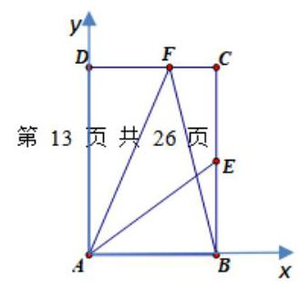

【难度】 $\star   \star   \star$

【答案】 $\overrightarrow{AE} \cdot  \overrightarrow{BF} = \sqrt{2}$

平面向量的概念及运算、向量的数量积一教师版

【解析】: 本题的图型为矩形,且边长已知,故考虑建立直角坐标系求解,以 $A$ 为坐标原点如图建系: $B\left( {\sqrt{2},0}\right)$ ,设 $F\left( {x, y}\right)$ ,由 $F$ 在 ${CD}$ 上可得 $y = 2$ ,再由 $\overrightarrow{AB} \cdot  \overrightarrow{AF} = \sqrt{2}$ 解 出 $x : \overrightarrow{AB} = \left( {\sqrt{2},0}\right) ,\overrightarrow{AF} = \left( {x,2}\right) ,\therefore \overrightarrow{AB} \cdot  \overrightarrow{AF} = \sqrt{2}x = \sqrt{2} \Rightarrow  x = 1\therefore F\left( {1,2}\right) , E\left( {\sqrt{2},1}\right)$

$\therefore \overrightarrow{AE} = \left( {\sqrt{2},1}\right) ,\overrightarrow{BF} = \left( {1 - \sqrt{2},2}\right) ,\therefore \overrightarrow{AE} \cdot  \overrightarrow{BF} = \sqrt{2}\left( {1 - \sqrt{2}}\right)  + 2 = \sqrt{2}$

(2)在直角三角形 ${ABC}$ 中， ${AC} = \sqrt{3},{BC} = 1$ ，点 $M$ ， $N$ 分别是 ${AB}$ ， ${BC}$ 的中点，点 $P$ 是 $\vartriangle  {ABC}$ 内及边界上的任一点，则 $\overrightarrow{AN} \cdot  \overrightarrow{MP}$ 的取值范围是___.

【难度】 $\star   \star   \star$

【答案】 $\left\lbrack  {-\frac{7}{4},\frac{7}{4}}\right\rbrack$

【解析】直角三角形直角边已知,且 $P$ 为图形内动点,所求 $\overrightarrow{MP}$ 不便于用已知向量表示,所以考虑建系处理。

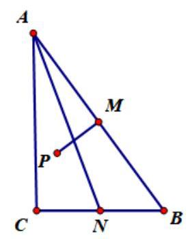

而 $P$ 所在范围是一块区域,所以联想到用线性规划求解.

以 ${AC},{BC}$ 为轴建立直角坐标系 $A\left( {0,\sqrt{3}}\right) , B\left( {1,0}\right) , M\left( {\frac{1}{2},\frac{\sqrt{3}}{2}}\right) , N\left( {\frac{1}{2},0}\right)$ ,设 $P\left( {x, y}\right)$

$\therefore \overrightarrow{AN} = \left( {\frac{1}{2}, - \sqrt{3}}\right) ,\overrightarrow{MP} = \left( {x - \frac{1}{2}, y - \frac{\sqrt{3}}{2}}\right)$

$\therefore \overrightarrow{AN} \cdot  \overrightarrow{MP} = \frac{1}{2}\left( {x - \frac{1}{2}}\right)  - \sqrt{3}\left( {y - \frac{\sqrt{3}}{2}}\right)  = \frac{1}{2}x - \sqrt{3}y + \frac{5}{4}$

数形结合可得: $\overrightarrow{AN} \cdot  \overrightarrow{MP} \in  \left\lbrack  {-\frac{7}{4},\frac{7}{4}}\right\rbrack$

【例 16】( 1 )如图，在 $\bigtriangleup  {ABC}$ 中， ${AB} = {BC} = 4,\angle {ABC} = {30}^{ \circ  },{AD}$ 是边 ${BC}$ 上的高，则 $\overrightarrow{AD} \cdot  \overrightarrow{AC}$ 的值等于( )

A. 0 B. 4 C. 8 D. -4

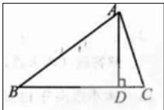

【难度】★★★

【答案】B

【解析】思路: 由图中垂直可得: $\overrightarrow{AC}$ 在 $\overrightarrow{AD}$ 上的投影为 $\left| \overrightarrow{AD}\right|$ ,所以 $\overrightarrow{AD} \cdot  \overrightarrow{AC} = {\left| \overrightarrow{AD}\right| }^{2}$ ,只需求出 $\bigtriangleup  {ABC}$ 的高即可。由已知可得 $\left| {AD}\right|  = \left| {AB}\right|  \cdot  \sin {ABC} = 2$ ,所以 $\overline{AD} \cdot  \overline{AC} = {\left| \overline{AD}\right| }^{2} = 4$

(2)已知点 $P$ 是边长为 1 的菱形 ${ABCD}$ 内一动点(包括边界)， $\angle {DAB} = {60}^{ \circ  }$ ，则 $\overrightarrow{AP} \cdot  \overrightarrow{AB}$ 的最大值为( )

A. $\sqrt{3}$ B. $\frac{3}{2}$ C. 1

D. $\frac{3}{4}$

【难度】 $\star   \star   \star$

【答案】 $B$

【解析】解: 以菱形 ${ABCD}$ 的对角线 ${BD}$ 所在直线为 $x$ 轴,中点为坐标原点,建立直角坐标系,可得 $A\left( {0,\frac{\sqrt{3}}{2}}\right)$ , $B\left( {-\frac{1}{2},0}\right) ,\;C\left( {0, - \frac{\sqrt{3}}{2}}\right) ,\;D\left( {\frac{1}{2},0}\right) ,$

则 $\overrightarrow{AB} = \left( {-\frac{1}{2}, - \frac{\sqrt{3}}{2}}\right)$ ,设 $P\left( {x, y}\right) ,\overrightarrow{AP} = \left( {x, y - \frac{\sqrt{3}}{2}}\right)$ ,

$\overrightarrow{AP} \cdot  \overrightarrow{AB} =  - \frac{1}{2}x - \frac{\sqrt{3}}{2}y + \frac{3}{4},$

作出直线 $y =  - \frac{\sqrt{3}}{3}x$ ,平移,经过点 $C$ 时, $- \frac{1}{2}x - \frac{\sqrt{3}}{2}y$ 取得最大值 $\frac{3}{4}$ ,

则 $=  - \frac{1}{2}x - \frac{\sqrt{3}}{2}y$ 的最大值为 $\frac{3}{2}$ .

故选: $B$ .

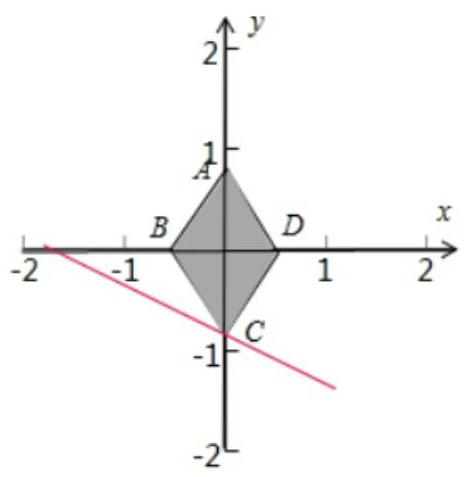

【例 17】(1)已知正三角形 ${ABC}$ 的边长为 $2,\overrightarrow{AD} = \frac{1}{3}\overrightarrow{AB} + \frac{2}{3}\overrightarrow{AC}$ ， $E$ 是 ${AB}$ 的中点，则 $\overrightarrow{AD} \cdot  \overrightarrow{CE}$ 等于( )

A. 3 B. 2 C. -2 D. -3

【难度】 $\star   \star   \star$

【答案】 $C$

【解析】解: 因为正三角形 ${ABC}$ 的边长为 2,令 $\overrightarrow{a} = \overrightarrow{AB},\overrightarrow{b} = \overrightarrow{AC}$ ,

则 $\left| \overrightarrow{a}\right|  = \left| \overrightarrow{b}\right|  = 2,\langle \overrightarrow{a},\overrightarrow{b}\rangle  = {60}^{ \circ  }$ ,故 $\overrightarrow{a} \cdot  \overrightarrow{b} = 2 \times  2 \cdot  \cos {60}^{ \circ  } = 2,{\overrightarrow{a}}^{2} = {\overrightarrow{b}}^{2} = 4$ ,

又 $\overrightarrow{AD} = \frac{1}{3}\overrightarrow{a} + \frac{2}{3}\overrightarrow{b},\overrightarrow{CE} = \overrightarrow{AE} - \overrightarrow{AC} = \frac{1}{2}\overrightarrow{a} - \overrightarrow{b}$ ,

所以 $\overrightarrow{AD} \cdot  \overrightarrow{CE} = \left( {\frac{1}{3}\overrightarrow{a} + \frac{2}{3}\overrightarrow{b}}\right)  \cdot  \left( {\frac{1}{2}\overrightarrow{a} - \overrightarrow{b}}\right)  = \frac{1}{6}{\overrightarrow{a}}^{2} - \frac{2}{3}{\overrightarrow{b}}^{2} = \frac{1}{6} \times  4 - \frac{2}{3} \times  4 =  - 2$ .

故选: $C$ .

(2)将一副三角板中的两个直角三角板按如图所示的位置摆放，若 ${BC} = 8\sqrt{6}$ ，则 $\overrightarrow{AC} \cdot  \overrightarrow{DB} =$ ( )

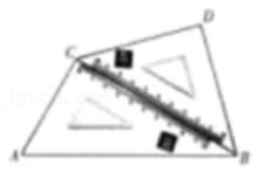

A. -192 B. $- {64}\sqrt{3}$ C. ${64}\sqrt{3}$ D. 192

【难度】 $\star   \star   \star$

【答案】 $B$

【解析】解: 在直角 $\bigtriangleup {ABC}$ 中, $\because \angle {ABC} = {30}^{ \circ  },{BC} = 8\sqrt{6},\therefore {AC} = 8\sqrt{6} \times  \tan {30}^{ \circ  } = 8\sqrt{2}$ ,

在直角 ${DDBC}$ 中, $\because \angle {DBC} = {45}^{ \circ  },{BC} = 8\sqrt{6},\therefore {DC} = 8\sqrt{6} \times  \sin {45}^{ \circ  } = 8\sqrt{3}$ ,

$\because \angle {ACD} = {90}^{ \circ  } + {45}^{ \circ  } = {135}^{ \circ  }$ ,

$\therefore \overrightarrow{AC} \cdot  \overrightarrow{DB} = \overrightarrow{AC} \cdot  \left( {\overrightarrow{DC} + \overrightarrow{CB}}\right)  = \overrightarrow{AC} \cdot  \overrightarrow{DC} + \overrightarrow{AC} \cdot  \overrightarrow{CB} = \overrightarrow{AC} \cdot  \overrightarrow{DC} = 8\sqrt{2} \times  8\sqrt{3} \times  \cos {135}^{ \circ  } =  - {64}\sqrt{3}$ .

故选: $B$ .

【例 18】(1)已知点 $P$ 是棱长为 2 的正方体 ${ABCD} - {A}_{1}{B}_{1}{C}_{1}{D}_{1}$ 的底面 ${A}_{1}{B}_{1}{C}_{1}{D}_{1}$ 上一点 (包括边界),则 $\overrightarrow{PA} \cdot  \overrightarrow{PC}$ 的取值范围是( )

A. $\left\lbrack  {\frac{1}{2},2}\right\rbrack$ B. $\left\lbrack  {2,4}\right\rbrack$ C. $\left\lbrack  {\frac{1}{2},4}\right\rbrack$ D. $\left\lbrack  {1,4}\right\rbrack$

【难度】 $\star   \star   \star$

【答案】 $B$

【解析】解: 法一: 如图所示, 建立空间直角坐标系.

${A}_{1}\left( {0,0,0}\right) , A\left( {0,0,1}\right) , C\left( {2,2,2}\right)$ ,

设 $P\left( {x, y,0}\right) ,\left( {x, y \in  \left\lbrack  {0,2}\right\rbrack  }\right)$ .

$\overrightarrow{PA} = \left( {-x, - y,2}\right) ,\overrightarrow{PC} = \left( {2 - x,2 - y,2}\right) ,$

$\therefore \overrightarrow{PA} \cdot  \overrightarrow{PC} =  - x\left( {2 - x}\right)  - y\left( {2 - y}\right)  + 4 = {x2} - {2x} + {y2} - {2y} + 4 = \left( {x - 1}\right) 2 + \left( {y - 1}\right) 2 + 2 = f\left( {x, y}\right)$ .

当 $x = 1, y = 1$ 时, $f\left( {x, y}\right)$ 取得最小值 2 .

当点 $P$ 取 $\left( {0,0,0}\right) ,\left( {2,0,0}\right) ,\left( {0,2,0}\right) ,\left( {2,2,0}\right) , f\left( {x, y}\right)$ 取得最大值 4 .

$\therefore f\left( {x, y}\right)  \in  \left\lbrack  {2,4}\right\rbrack$ .

故选: $B$ .

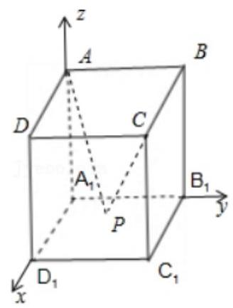

法二:分解(积化恒等式)

(2)设 ${PQ}$ 是圆 $C : {\left( x - 2\right) }^{2} + {y}^{2} = 1$ 的一条动直径， $O$ 是坐标原点，则 $\overrightarrow{OP} \cdot  \overrightarrow{OQ} =$ ( )

A. 1 B. 2 C. 3 D. 4

【难度】 $\star   \star   \star$

【答案】C

【解析】解: 由题意知, $C\left( {2,0}\right)$ ,圆 $C$ 的半径为 1,且 $C$ 为 ${PQ}$ 的中点,

$\overrightarrow{OP} \cdot  \overrightarrow{OQ} = \frac{1}{4}\left\lbrack  {{\left( \overrightarrow{OP} + \overrightarrow{OQ}\right) }^{2} - {\left( \overrightarrow{OP} - \overrightarrow{OQ}\right) }^{2}}\right\rbrack   = \frac{1}{4}\left\lbrack  {{\left( 2\overrightarrow{OC}\right) }^{2} - {\overrightarrow{QP}}^{2}}\right\rbrack   = {\overrightarrow{OC}}^{2} - \frac{1}{4}{\overrightarrow{QP}}^{2} = {2}^{2} - \frac{1}{4} \times  {2}^{2} = 3$ .

故选: $C$ .

## 巩固训练

1、已知向量 $\overrightarrow{a},\overrightarrow{b}$ 满足 $\left| \overrightarrow{a}\right|  = \sqrt{3},\left| \overrightarrow{b}\right|  = 2$ ，且 $\overrightarrow{a}\bot \left( {\overrightarrow{a} - \overrightarrow{b}}\right)$ ，则 $\overrightarrow{a}$ 在 $\overrightarrow{b}$ 方向上的投影为( )

A. $\sqrt{3}$ B. 3 C. $- \sqrt{3}$ D. $\frac{3}{2}$

【难度】★★

【答案】 $D$

【解析】解: 因为 $\overrightarrow{a} \bot  \left( {\overrightarrow{a} - \overrightarrow{b}}\right)$ ,所以 $\overrightarrow{a} \cdot  \left( {\overrightarrow{a} - \overrightarrow{b}}\right)  = {\overrightarrow{a}}^{2} - \overrightarrow{a} \cdot  \overrightarrow{b} = 0$ ,

即 ${\left| \overrightarrow{a}\right| }^{2} - \overrightarrow{a} \cdot  \overrightarrow{b} = 0$ ,因为 $\left| \overrightarrow{a}\right|  = \sqrt{3}$ ,所以 $\overrightarrow{a} \cdot  \overrightarrow{b} = 3$ ,

设 $\overrightarrow{a},\overrightarrow{b}$ 的夹角为 $\alpha$ ,则 $\overrightarrow{a}$ 在 $\overrightarrow{b}$ 方向上的投影为 $\left| \overrightarrow{a}\right| \cos \alpha  = \left| \overrightarrow{a}\right|  \cdot  \frac{\overrightarrow{a} \cdot  \overrightarrow{b}}{\left| \overrightarrow{a}\right| \left| \overrightarrow{b}\right| } = \frac{3}{2}$ . 故选: $D$ .

2、已知 $\overrightarrow{a},\overrightarrow{b}$ 为单位向量，向量 $\overrightarrow{c}$ 满足 $\left| {2\overrightarrow{c} + \overrightarrow{a}}\right|  = \left| {\overrightarrow{a} \cdot  \overrightarrow{b}}\right|$ ，则 $\left| {\overrightarrow{c} - \overrightarrow{b}}\right|$ 的最大值为( )

A. $\sqrt{2}$ B. 2 C. $\sqrt{3}$ D. 3

【难度】 $\star   \star   \star$

【答案】 $B$

【解析】解: 设 $\overrightarrow{a}$ 与 $\overrightarrow{b}$ 的夹角 $\theta$ ,由 $\left| {2\overrightarrow{c} + \overrightarrow{a}}\right|  = \left| {\overrightarrow{a} \cdot  \overrightarrow{b}}\right|$ 可知 $\left| {\overrightarrow{c} - \left( {-\frac{\overrightarrow{a}}{2}}\right) }\right|  = \frac{1}{2}\left| {\overrightarrow{a} \cdot  \overrightarrow{b}}\right|$ ,

所以 $\overrightarrow{c}$ 的终点的轨迹是以 $- \frac{\overrightarrow{a}}{2}$ 的终点为圆心, $\frac{1}{2}\left| {\overrightarrow{a} \cdot  \overrightarrow{b}}\right|$ 为半径的圆,

$\left| {\overrightarrow{c} - \overrightarrow{b}}\right|$ 的最大值是圆心与 $\overrightarrow{b}$ 的终点之间的距离加上半径,即为 $\left| {\overrightarrow{b} - \left( {-\frac{\overrightarrow{a}}{2}}\right) }\right|  + \frac{1}{2}\left| {\overrightarrow{a} \cdot  \overrightarrow{b}}\right|$ .

$\because \left| {\overrightarrow{b} + \frac{\overrightarrow{a}}{2}}\right|  + \frac{1}{2}\left| {\overrightarrow{a} \cdot  \overrightarrow{b}}\right|  = \sqrt{{\left( \overrightarrow{b} + \frac{\overrightarrow{a}}{2}\right) }^{2}} + \frac{1}{2}\left| {\overrightarrow{a} \cdot  \overrightarrow{b}}\right|  = \sqrt{1 + \frac{1}{4} + \overrightarrow{a} \cdot  \overrightarrow{b}} + \frac{1}{2}\left| {\overrightarrow{a} \cdot  \overrightarrow{b}}\right|  = \sqrt{\frac{5}{4} + \cos \theta } + \frac{1}{2}\left| {\cos \theta }\right|$

$\leq  \sqrt{\frac{5}{4} + 1} + \frac{1}{2} = 2$ . 故选: $B$ .

3、如图，平行四边形 ${ABCD}$ 的两条对角线相交于 $M$ ，点 $P$ 是 ${MD}$ 的中点，若 $\left| \overrightarrow{AB}\right|  = 2$ ， $\left| \overrightarrow{AD}\right|  = 1$ ，且 $\angle {BAD} = {60}^{ \circ  }$ ，则 $\overrightarrow{AP} \cdot  \overrightarrow{CP} =$ ___

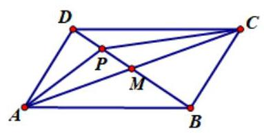

【难度】 $\star   \star   \star$

【答案】 $- \frac{17}{8}$

【解析】思路: 本题抓住 $\angle {BAD} = {60}^{ \circ  }$ 这个特殊角,可以考虑建立坐标系,同时由 $\left| \overrightarrow{AB}\right|  = 2,\left| \overrightarrow{AD}\right|  = 1$ 可以写出各点坐标,从而将所求向量坐标化后即可求解

解: 以 ${AB}$ 为 $x$ 轴,过 $A$ 的垂线作为 $y$ 轴可得: $B\left( {2,0}\right) , D\left( {\frac{1}{2},\frac{\sqrt{3}}{2}}\right) , C\left( {\frac{5}{2},\sqrt{3}}\right)$

$M\left( {\frac{5}{4},\frac{\sqrt{3}}{4}}\right) , P\left( {\frac{7}{8},\frac{3\sqrt{3}}{8}}\right) \therefore \overrightarrow{AP} = \left( {\frac{7}{8},\frac{3\sqrt{3}}{8}}\right) ,\overrightarrow{CP} = \left( {-\frac{13}{8}, - \frac{5\sqrt{3}}{8}}\right)$

$\therefore \overrightarrow{AP} \cdot  \overrightarrow{CP} = \frac{7}{8} \cdot  \left( {-\frac{13}{8}}\right)  + \frac{3\sqrt{3}}{8} \cdot  \left( {-\frac{5\sqrt{3}}{8}}\right)  =  - \frac{17}{8}$

4、如图， $O$ 为 $\bigtriangleup  {ABC}$ 的外心， ${AB} = 4,{AC} = 2,\angle {BAC}$ 为钝角， $M$ 是边 ${BC}$ 的中点，则 $\overrightarrow{AM} \cdot  \overrightarrow{AO}$ 的值为 ( )

A. 4 B. 5 C. 6 D. 7

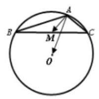

【难度】 $\star   \star   \star$

【答案】B

【解析】思路: 外心 $O$ 在 ${AB},{AC}$ 上的投影恰好为它们的中点,分别设为 $P, Q$ ,所以 $\overline{AO}$ 在 ${AB},{AC}$ 上的投影为 $\left| \overline{AP}\right|  = \frac{1}{2}\left| \overline{AB}\right| ,\left| \overline{AQ}\right|  = \frac{1}{2}\left| \overline{AC}\right|$ ,而 $M$ 恰好为 ${BC}$ 中点,故考虑 $\overline{AM} = \frac{1}{2}\left( {\overline{AB} + \overline{AC}}\right)$ , 所以 $\overrightarrow{AM} \cdot  \overrightarrow{AO} = \frac{1}{2}\left( {\overrightarrow{AB} + \overrightarrow{AC}}\right)  \cdot  \overrightarrow{AO} = \frac{1}{2}\left( {\overrightarrow{AB} \cdot  \overrightarrow{AO} + \overrightarrow{AC} \cdot  \overrightarrow{AO}}\right)  = \frac{1}{2}\left( {\frac{1}{2}{\left| \overrightarrow{AB}\right| }^{2} + \frac{1}{2}{\left| \overrightarrow{AC}\right| }^{2}}\right)  = 5$

5、如图，在由 5 个边长为 1 ，一个内角为 60° 的菱形组成的图形中， $\overrightarrow{AB} \cdot  \overrightarrow{CD} =$ ___.

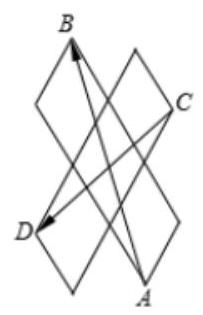

【难度】 $\star   \star   \star$

【答案】-4

【解析】如图: $\overrightarrow{AB} \cdot  \overrightarrow{CD} = \left( {\overrightarrow{AE} + \overrightarrow{EB}}\right)  \cdot  \left( {\overrightarrow{CF} + \overrightarrow{FD}}\right)  = \overrightarrow{AE} \cdot  \overrightarrow{CF} + \overrightarrow{AE} \cdot  \overrightarrow{FD} + \overrightarrow{EB} \cdot  \overrightarrow{CF} + \overrightarrow{EB} \cdot  \overrightarrow{FD} \; =  - 1 \times  3 + 1 \times  1 \times  \frac{1}{2} + 3 \times  3 \times  \left( {-\frac{1}{2}}\right)  + 1 \times  3 =  - 4$ . 故答案为:-4.

6、已知平面向量 $\overrightarrow{a} = \left( {1,0}\right) ,\overrightarrow{b} = \left( {-\frac{1}{2},\frac{\sqrt{3}}{2}}\right)$ ，则 $\overrightarrow{a}$ 与 $\overrightarrow{a} + \overrightarrow{b}$ 的夹角为___.

【难度】 $\star   \star   \star$

【答案】 $\frac{\pi }{3}$

【解析】 $\because \overrightarrow{a} = \left( {1,0}\right) ,\overrightarrow{b} = \left( {-\frac{1}{2},\frac{\sqrt{3}}{2}}\right) ,\therefore \overrightarrow{a} + \overrightarrow{b} = \left( {\frac{1}{2},\frac{\sqrt{3}}{2}}\right) ,\overrightarrow{a} \cdot  \left( {\overrightarrow{a} + \overrightarrow{b}}\right)  = 1 \times  \frac{1}{2} + 0 \times  \frac{\sqrt{3}}{2} = \frac{1}{2}$ .

设 $\overrightarrow{a}$ 与 $\overrightarrow{a} + \overrightarrow{b}$ 的夹角为 $\theta$ ,则 $\cos \theta  = \frac{\overrightarrow{a} \cdot  \left( {\overrightarrow{a} + \overrightarrow{b}}\right) }{\left| \overrightarrow{a}\right|  \cdot  \left| {\overrightarrow{a} + \overrightarrow{b}}\right| } = \frac{1}{2},\because 0 \leq  \theta  \leq  \pi ,\therefore \theta  = \frac{\pi }{3}$ ,

因此, $\overrightarrow{a}$ 与 $\overrightarrow{a} + \overrightarrow{b}$ 的夹角为 $\frac{\pi }{3}$ . 故答案为: $\frac{\pi }{3}$ .

7、如图，已知在 $\bigtriangleup  {ABC}$ 中， ${AD}\bot {AB},\overrightarrow{BC} = \sqrt{3BD},\left| \overrightarrow{AD}\right|  = 1$ ，则 $\overrightarrow{AC} \cdot  \overrightarrow{AD} =$ ___

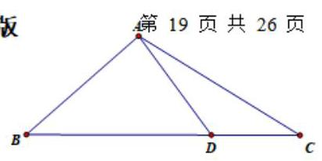

【难度】 $\star   \star   \star$

【答案】 $\overrightarrow{AC} \cdot  \overrightarrow{AD} = \sqrt{3}$

【解析】思路: 观察条件, $\overrightarrow{AC},\overrightarrow{AD}$ 很难直接利用公式求解. 考虑选择两个向量表示 $\overrightarrow{AC},\overrightarrow{AD}$ ,条件中 ${AD} \bot  {AB} \Rightarrow  \overrightarrow{AD} \cdot  \overrightarrow{AB} = 0$ (数量积有了), $\left| \overrightarrow{AD}\right|  = 1$ (模长有了),所以考虑用 $\overrightarrow{AB},\overrightarrow{AD}$ 作为基底。下一步只需将 $\overrightarrow{AC}$ 表示出来， $\overrightarrow{BC} = \sqrt{3}\overrightarrow{BD} \Rightarrow  {BD} : {CD} = 1 : \left( {\sqrt{3} - 1}\right)$ (底边比值——联想到 “爪” 字型图) $\overrightarrow{AD} = \frac{\sqrt{3} - 1}{\sqrt{3}}\overrightarrow{AB} + \frac{1}{\sqrt{3}}\overrightarrow{AC}$ ,解得: $\overrightarrow{AC} = \sqrt{3AD} - \left( {\sqrt{3} - 1}\right) \overrightarrow{AB}$

所以 $\overrightarrow{AC} \cdot  \overrightarrow{AD} = \left( {\sqrt{3AD} - \left( {\sqrt{3} - 1}\right) \overrightarrow{AB}}\right)  \cdot  \overrightarrow{AD} = \sqrt{3}{\overrightarrow{AD}}^{2} = \sqrt{3}$

## 实战演练

一、填空题

1、已知 $\bigtriangleup {ABC}$ 中， ${AC} = {AB} = 3$ ， ${BC} = 4$ ，点 $M$ 是线段 ${AB}$ 的中点，则 $\overrightarrow{CM} \cdot  \overrightarrow{CA} =$ ___.

【难度】 $\star   \star$

【答案】 $\frac{17}{2}$

【解析】解: 如图,以 ${BC}$ 的中点 $O$ 为坐标原点, ${BC}$ 所在直线为 $x$ 轴, ${BC}$ 的中垂线为 $y$ 轴建立平面直角坐标系.

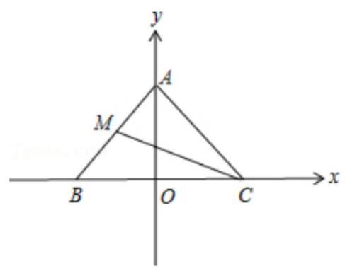

则 $B\left( {-2,0}\right) , C\left( {2,0}\right) , A\left( {0,\sqrt{5}}\right)$ ,故 $\overrightarrow{CA} = \left( {-2,\sqrt{5}}\right)$ ,又 $M$ 为 ${AB}$ 的中点,

$\therefore M\left( {-1,\frac{\sqrt{5}}{2}}\right)$ ,则 $\overrightarrow{CM} = \left( {-3,\frac{\sqrt{5}}{2}}\right) .\therefore \overrightarrow{CM} \cdot  \overrightarrow{CA} = 6 + \frac{5}{2} = \frac{17}{2}$ . 故答案为: $\frac{17}{2}$ .

2、如图，在直角梯形 ${ABCD}$ 中， ${AB}//{DC}$ ， ${AD} \bot  {DC}$ ， ${AD} = {DC} = {2AB}$ ， $E$ 为 ${AD}$ 的中点，若 $\overrightarrow{CA} = \lambda \overrightarrow{CE} + \mu \overrightarrow{DB}$ ，则 $\lambda  + \mu$ 的值为 ___.

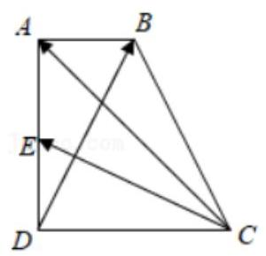

【难度】 $\star   \star$

【答案】 $\frac{8}{5}$

【解析】解: 如图所示,建立直角坐标系. 不妨设 ${AB} = 1$ ,则 $D\left( {0,0}\right) , C\left( {2,0}\right) , A\left( {0,2}\right)$ ,

$B\left( {1,2}\right) ,\;E\left( {0,1}\right) .\overrightarrow{CA} = \left( {-2,2}\right) ,\;\overrightarrow{CE} = \left( {-2,1}\right) ,\;\overrightarrow{DB} = \left( {1,2}\right)$ ,

$\because$ 若 $\overrightarrow{CA} = \lambda \overrightarrow{CE} + \mu \overrightarrow{DB},\therefore \left( {-2,2}\right)  = \lambda \left( {-2,1}\right)  + \mu \left( {1,2}\right)$ ,

$\therefore \left\{  \begin{array}{l}  - {2\lambda } + \mu  =  - 2 \\  \lambda  + {2\mu } = 2 \end{array}\right.$ ,解得 $\lambda  = \frac{6}{5},\mu  = \frac{2}{5}$ . 则 $\lambda  + \mu  = \frac{8}{5}$ . 故答案为: $\frac{8}{5}$ .

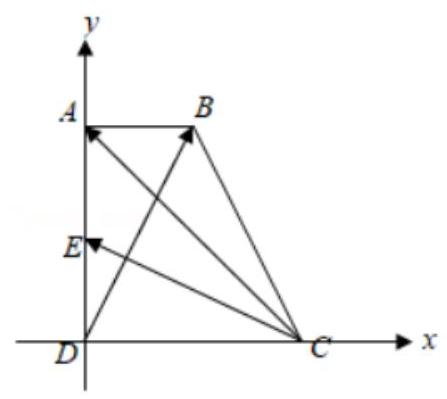

3、已知向量 $\overrightarrow{a} = \left( {-2,4}\right)$ ， $\overrightarrow{b} = \left( {t, - 1}\right)$ ，且 $\overrightarrow{a}$ 在 $\overrightarrow{b}$ 上的投影等于 $- \sqrt{10}$ ，则 $t$ 的值为___.

【难度】 $\star   \star$

【答案】3 或 $- \frac{1}{3}$

【解析】解: 由题意知, $\overrightarrow{a} \cdot  \overrightarrow{b} =  - {2t} - 4,\left| \overrightarrow{b}\right|  = \sqrt{{t}^{2} + 1}$ ,而 $\overrightarrow{a}$ 在 $\overrightarrow{b}$ 上的投影为 $\frac{\overrightarrow{a} \cdot  \overrightarrow{b}}{\left| \overrightarrow{b}\right| } = \frac{-{2t} - 4}{\sqrt{{t}^{2} + 1}} =  - \sqrt{10}$ ,整理得 $3{t}^{2} - {8t} - 3 = 0,$

解得 $t = 3$ 或 $- \frac{1}{3}$ . 故答案为: 3 或 $- \frac{1}{3}$ .

4、如图，在菱形 ${ABCD}$ 中， ${AB} = 2,\angle {BAD} = {60}^{ \circ  }$ . 已知 $\overline{BE} = \frac{1}{3}\overline{BC},\overline{DF} = \overline{FC},\overline{EG} = \frac{1}{2}\overline{EF}$ ，则 $\overrightarrow{AG} \cdot  \overrightarrow{EF} =$ ___.

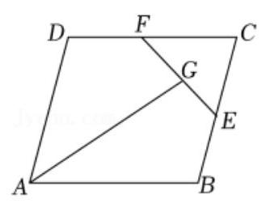

【难度】★★★

【答案】 $\frac{11}{18}$

【解析】解: 因为 $\overrightarrow{BE} = \frac{1}{3}\overrightarrow{BC},\overrightarrow{DF} = \overrightarrow{FC}$ ,

所以 $\overrightarrow{AE} = \overrightarrow{AB} + \overrightarrow{BE} = \overrightarrow{AB} + \frac{1}{3}\overrightarrow{AD},\overrightarrow{AF} = \overrightarrow{AD} + \overrightarrow{DF} = \frac{1}{2}\overrightarrow{AB} + \overrightarrow{AD}$ ,

所以 $\overrightarrow{EF} = \overrightarrow{AF} - \overrightarrow{AE} =  - \frac{1}{2}\overrightarrow{AB} + \frac{2}{3}\overrightarrow{AD}$ . 又因为 $\overrightarrow{EG} = \frac{1}{2}\overrightarrow{EF}$ ,

所以 $\overrightarrow{AG} = \frac{1}{2}\left( {\overrightarrow{AE} + \overrightarrow{AF}}\right)  = \frac{3}{4}\overrightarrow{AB} + \frac{2}{3}\overrightarrow{AD}$ .

因为 ${AB} = 2,\angle {BAD} = {60}^{ \circ  }$ ，

所以 $\overrightarrow{AG} \cdot  \overrightarrow{EF} = \left( {\frac{3}{4}\overrightarrow{AB} + \frac{2}{3}\overrightarrow{AD}}\right)  \cdot  \left( {-\frac{1}{2}\overrightarrow{AB} + \frac{2}{3}\overrightarrow{AD}}\right)  =  - \frac{3}{8}{\overrightarrow{AB}}^{2} + \frac{1}{6}\overrightarrow{AB} \cdot  \overrightarrow{AD} + \frac{4}{9}{\overrightarrow{AD}}^{2} = \frac{11}{8}$ .

故答案为: $\frac{11}{8}$ .

5、已知 $\overrightarrow{a}$ ， $\overrightarrow{b}$ 是单位向量， $\overrightarrow{a} \cdot  \overrightarrow{b} = 0$ . 若向量 $\overrightarrow{c}$ 满足 $\left| {\overrightarrow{c} - \overrightarrow{a} - \overrightarrow{b}}\right|  = 1$ ，则 $\left| \overrightarrow{c}\right|$ 的最大值为 ___.

【难度】 $\star   \star   \star$

【答案】 $\sqrt{2} + 1$

【解析】解: 因为向量 $\overrightarrow{c}$ 满足 $\left| {\overrightarrow{c} - \overrightarrow{a} - \overrightarrow{b}}\right|  = 1$ ,即 $\left| {\overrightarrow{c} - \left( {\overrightarrow{a} + \overrightarrow{b}}\right) }\right|  = 1$ ,

设 $\overrightarrow{c} = \overrightarrow{OC}$ ,则点 $C$ 的轨迹是以 $\left( {1,1}\right)$ 为圆心,1为半径的圆,

$\left| \overrightarrow{c}\right|$ 表示圆上的点到原点的距离,

则 $\left| \overrightarrow{c}\right|$ 的最大值等于圆心到原点的距离加上半径,即 $\sqrt{{1}^{2} + {1}^{2}} + 1 = \sqrt{2} + 1$ .

故答案为: $\sqrt{2} + 1$ .

6、设 $O$ 为 $\bigtriangleup {ABC}$ 内一点，且满足关系式 $\overrightarrow{OA} + 2\overrightarrow{OB} + 3\overrightarrow{OC} = 3\overrightarrow{AB} + 2\overrightarrow{BC} + \overrightarrow{CA}$ ，则 ${S}_{\bigtriangleup {BOC}} : {S}_{\bigtriangleup {AOB}} : {S}_{\bigtriangleup {COA}} =$ ___.

【难度】 $\star   \star   \star$

【答案】3:2:1

【解答】解: 由题可得 $\overrightarrow{OA} + 2\overrightarrow{OB} + 3\overrightarrow{OC} = 3\left( {\overrightarrow{OB} - \overrightarrow{OA}}\right)  + 2\left( {\overrightarrow{OC} - \overrightarrow{OB}}\right)  + \left( {\overrightarrow{OA} - \overrightarrow{OC}}\right)$ ,则 $3\overrightarrow{OA} + \overrightarrow{OB} + 2\overrightarrow{OC} = \overrightarrow{0}$ , 即 $\left( {\overrightarrow{OA} + \overrightarrow{OB}}\right)  + 2\left( {\overrightarrow{OA} + \overrightarrow{OC}}\right)  = \overrightarrow{0}$ ,

设 $M, N$ 分别为 ${AB}\text{ 、 }{AC}$ 的中点, $\because \overrightarrow{OA} + \overrightarrow{OB} = 2\overrightarrow{OM},\overrightarrow{OA} + \overrightarrow{OC} = 2\overrightarrow{ON}$

则 $\overrightarrow{OM} =  - 2\overrightarrow{ON}$ ,设 ${S}_{\bigtriangleup {ABC}} = S,\because {MN}$ 为 $\bigtriangleup {ABC}$ 的中位线, $\therefore {S}_{\bigtriangleup {BOC}} = \frac{1}{2}S,\because M$ 是 ${AB}$ 的中点, $\therefore {S}_{\bigtriangleup {CAM}} = \frac{1}{2}S$ ,

又 ${ON} : {OM} = 1 : 2,\therefore {S}_{\Delta COA} = \frac{1}{3}{S}_{\Delta CAM} = \frac{1}{6}S,\because N$ 是 ${AC}$ 的中点, $\therefore {S}_{\Delta ANB} = \frac{1}{2}S$ ,

又 ${ON} : {OM} = 1 : 2,\therefore {S}_{\bigtriangleup {AOB}} = \frac{2}{3}{S}_{\bigtriangleup {ANB}} = \frac{1}{3}S$ ,故 ${S}_{\bigtriangleup {BOC}} : {S}_{\bigtriangleup {AOB}} : {S}_{\bigtriangleup {COA}} = 3 : 2 : 1$ .

## 二、选择题

7、已知向量 $\overrightarrow{a} = \left( {x, - 2}\right) ,\overrightarrow{b} = \left( {2,4}\right)$ ，且 $\overrightarrow{a}//\left( {\overrightarrow{a} + \overrightarrow{b}}\right)$ ，则 $\overrightarrow{a} \cdot  \overrightarrow{b} =$ (   )

A. -8 B. -9 C. -10 D. -11

【难度】★★

【答案】C

【解析】解: 因为 $\overrightarrow{a} = \left( {x, - 2}\right) ,\overrightarrow{b} = \left( {2,4}\right)$ ,可得 $\overrightarrow{a} + \overrightarrow{b} = \left( {x + 2,2}\right)$ ,

又因为 $\overrightarrow{a}//\left( {\overrightarrow{a} + \overrightarrow{b}}\right)$ ,所以 $x \cdot  2 =  - 2\left( {x + 2}\right)$ ,解得: $x =  - 1$ ,可得 $\overrightarrow{a} = \left( {-1, - 2}\right)$ ,

所以 $\overrightarrow{a} \cdot  \overrightarrow{b} = \left( {-1}\right)  \times  2 + \left( {-2}\right)  \times  4 =  - {10}$ ,故选: $C$ .

8、已知平面向量 $\overrightarrow{a},\overrightarrow{b}$ 满足 $\overrightarrow{a} = \left( {\sqrt{3},1}\right) ,\left| \overrightarrow{b}\right|  = \sqrt{3},\left| {\overrightarrow{a} + \overrightarrow{b}}\right|  = \sqrt{13}$ ，则 $\overrightarrow{a}$ 与 $\overrightarrow{b}$ 的夹角为( )

A. $\frac{2\pi }{3}$ B. $\frac{\pi }{3}$ C. $\frac{\pi }{4}$ D. $\frac{\pi }{6}$

【难度】★★

【答案】 $D$

【解析】解: 因为 $\overrightarrow{a} = \left( {\sqrt{3},1}\right)$ ,所以 $\left| \overrightarrow{a}\right|  = 2$ ,

因为 $\left| {\overrightarrow{a} + \overrightarrow{b}}\right|  = \sqrt{13}$ ,所以 ${\left( \overrightarrow{a} + \overrightarrow{b}\right) }^{2} = {13}$ ,即: ${\overrightarrow{a}}^{2} + 2\overrightarrow{a} \cdot  \overrightarrow{b} + {\overrightarrow{b}}^{2} = {13}$ ,

所以 ${\left| \overrightarrow{a}\right| }^{2} + 2\left| \overrightarrow{a}\right| \left| \overrightarrow{b}\right| \cos  < \overrightarrow{a},\overrightarrow{b} >  + {\left| \overrightarrow{b}\right| }^{2} = {13}$ ,所以 $4 + 2 \times  2 \times  \sqrt{3}\cos  < \overrightarrow{a},\overrightarrow{b} >  + 3 = {13}$ ,

解得: $\cos  < \overrightarrow{a},\overrightarrow{b} >  = \frac{\sqrt{3}}{2}$ ,所以 $< \overrightarrow{a},\overrightarrow{b} >  = \frac{\pi }{6}$ ,故选: $D$ .

9、在 $\bigtriangleup {ABC}$ 中， $D$ 为三角形所在平面内一点，且 $\overrightarrow{AD} = \frac{1}{3}\overrightarrow{AB} + \frac{1}{2}\overrightarrow{AC}$ ，则 $\frac{{S}_{\bigtriangleup {BCD}}}{{S}_{\bigtriangleup {ACD}}} =$ (   )

A. $\frac{1}{2}$ B. $\frac{1}{6}$ C. $\frac{1}{3}$ D. $\frac{2}{3}$

【难度】 $\star   \star   \star$

【答案】 $C$

【解析】解: 由已知,在 $\bigtriangleup {ABC}$ 中, $D$ 为三角形所在平面内一点,且 $\overrightarrow{AD} = \frac{1}{3}\overrightarrow{AB} + \frac{1}{2}\overrightarrow{AC}$ ,

点 $D$ 在 ${AB}$ 边的中位 3 线上,且为靠近 ${BC}$ 边的三等分点处,

从而有 ${S}_{\bigtriangleup {ABD}} = \frac{1}{2}{S}_{\bigtriangleup {ABC}},{S}_{\bigtriangleup {ACD}} = \frac{1}{3}{S}_{\bigtriangleup {ABC}},{S}_{\Delta BCD} = \left( {1 - \frac{1}{2} - \frac{1}{3}}\right) {S}_{\bigtriangleup {ABC}} = \frac{1}{6}{S}_{\bigtriangleup {ABC}}$ ,所以 $\frac{{S}_{\bigtriangleup {BCD}}}{{S}_{\bigtriangleup {ABD}}} = \frac{1}{3}$

故选: $C$ .

10、如图,四个棱长为 1 的正方体排成一个正四棱柱, ${AB}$ 是一条侧棱, ${P}_{i}\left( {i = 1,2,\ldots 8}\right)$ 是上底面上其余的八个点,则 $\overrightarrow{AB} \cdot  \overrightarrow{A{P}_{i}}\left( {i = 1,2,\ldots ,8}\right)$ 的不同值的个数为( )

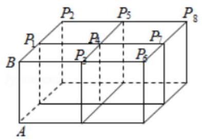

A. 1 B. 2 C. 3 D. 4

【难度】 $\star   \star   \star$

【答案】 $A$

【解析】解: $\overrightarrow{A{P}_{i}} = \overrightarrow{AB} + \overrightarrow{B{P}_{i}}$ ,则 $\overrightarrow{AB} \cdot  \overrightarrow{A{P}_{i}} = \overrightarrow{AB}\left( {\overrightarrow{AB} + \overrightarrow{B{P}_{i}}}\right)  = {\left| \overrightarrow{AB}\right| }^{2} + \overrightarrow{AB} \cdot  \overrightarrow{B{P}_{i}}$ ,

$\because \overrightarrow{AB} \bot  \overrightarrow{B{P}_{i}},\therefore \overrightarrow{AB} \cdot  \overrightarrow{A{P}_{i}} = {\left| \overrightarrow{AB}\right| }^{2} = 1,\therefore \overrightarrow{AB} \cdot  \overrightarrow{A{P}_{i}}\left( {i = 1,2,\ldots ,8}\right)$ 的不同值的个数为 1,

故选: $A$ .

## 三、解答题

11、已知向量 $\overrightarrow{a}$ 与 $\overrightarrow{b}$ 的夹角为 $\frac{\pi }{6},\left| \overrightarrow{a}\right|  = \sqrt{3},\left| \overrightarrow{b}\right|  = 2$ .

(1)求 $\left| {\overrightarrow{a} + \overrightarrow{b}}\right|$ ；

(2)若向量 $\overrightarrow{a} + \overrightarrow{b}$ 与 $\lambda \overrightarrow{a} + \overrightarrow{b}$ 共线，求实数 $\lambda$ 的值；

(3)若向量 $\overrightarrow{a} + \overrightarrow{b}$ 与 $\lambda \overrightarrow{a} + \overrightarrow{b}$ 夹角为锐角，求实数 $\lambda$ 的取值范围.

【难度】 $\star   \star   \star$

【答案】见解析

【解析】解: (1) $\left| {\overrightarrow{a} + \overrightarrow{b}}\right|  = \sqrt{{\overrightarrow{a}}^{2} + {\overrightarrow{b}}^{2} + 2\overrightarrow{a} \cdot  \overrightarrow{b}} = \sqrt{3 + 4 + 2 \times  \sqrt{3} \times  2 \times  \frac{\sqrt{3}}{2}} = \sqrt{13}$ ;

(2)若向量 $\overrightarrow{a} + \overrightarrow{b}$ 与 $\lambda \overrightarrow{a} + \overrightarrow{b}$ 共线，则存在实数 $\mu$ ，使得 $\lambda \overrightarrow{a} + \overrightarrow{b} = \mu \left( {\overrightarrow{a} + \overrightarrow{b}}\right)$ ，即 $\left( {\lambda  - \mu }\right) \overrightarrow{a} + \left( {1 - \mu }\right) \overrightarrow{b} = 0$ ， 因为 $\overrightarrow{a},\overrightarrow{b}$ 不共线,所以 $\left\{  \begin{array}{l} \lambda  - \mu  = 0 \\  1 - \mu  = 0 \end{array}\right.$ ,解得 $\lambda  = \mu  = 1$ ,故 $\lambda  = 1$ ;

(3)若向量 $\overrightarrow{a} + \overrightarrow{b}$ 与 $\lambda \overrightarrow{a} + \overrightarrow{b}$ 夹角为锐角,设夹角为 $\theta$ ,则 $0 < \cos \theta  < 1$ ，

因为 $\left| {\lambda \overrightarrow{a} + \overrightarrow{b}}\right|  = \sqrt{{\lambda }^{2}{\overrightarrow{a}}^{2} + {\overrightarrow{b}}^{2} + {2\lambda }\overrightarrow{a} \cdot  \overrightarrow{b}} = \sqrt{3{\lambda }^{2} + 4 + {6\lambda }},\left( {\overrightarrow{a} + \overrightarrow{b}}\right)  \cdot  \left( {\lambda \overrightarrow{a} + \overrightarrow{b}}\right)  = \lambda {\overrightarrow{a}}^{2} + \left( {1 + \lambda }\right) \overrightarrow{a} \cdot  \overrightarrow{b} + {\overrightarrow{b}}^{2} = {6\lambda } + 7$ ,

则 $0 < \cos \theta  = \frac{{6\lambda } + 7}{\sqrt{13} \cdot  \sqrt{3{\lambda }^{2} + {6\lambda } + 4}} < 1$ ,解得 $\lambda  >  - \frac{7}{6}$ 且 $\lambda  \neq  1$ ,

所以 $\lambda$ 的取值范围为 $\left( {-\frac{7}{6},1}\right)  \cup  \left( {1, + \infty }\right)$ .

12、如图，在矩形 ${ABCD}$ 中，点 $E$ 在边 ${AB}$ 上，且 $\overrightarrow{AE} = \frac{1}{2}\overrightarrow{EB}$ ， $M$ 是线段 ${CE}$ 上一动点.

( I ) 若 $M$ 是线段 ${CE}$ 的中点， $\overrightarrow{AM} = m\overrightarrow{AB} + n\overrightarrow{AD}$ ，求 $m + n$ 的值；

(II) 若 ${AD} = 2,\overrightarrow{CA} \cdot  \overrightarrow{CE} = {10}$ ,求 $\left( {2\overrightarrow{MA} + \overrightarrow{MB}}\right)  \cdot  \overrightarrow{MC}$ 的最小值.

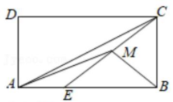

【难度】 $\star   \star   \star$

【答案】见解析

【解析】解: (1) 因为 $M$ 是线段 ${CE}$ 的中点,所以 $\overrightarrow{AM} = \frac{1}{2}\overrightarrow{AC} + \frac{1}{2}\overrightarrow{AE} = \frac{1}{2}\left( {\overrightarrow{AB} + \overrightarrow{AD}}\right)  + \frac{1}{6}\overrightarrow{AB} = \frac{2}{3}\overrightarrow{AB} + \frac{1}{2}\overrightarrow{AD}$ , 则 $m + n = \frac{2}{3} + \frac{1}{2} = \frac{7}{6}$ ;

(II) $\overrightarrow{CA} =  - \overrightarrow{AB} - \overrightarrow{AD},\overrightarrow{CE} = \overrightarrow{CA} + \overrightarrow{AE} =  - \frac{2}{3}\overrightarrow{AB} - \overrightarrow{AD}$ ,

因为 ${AB} \bot  {AD}$ ,即 $\overrightarrow{AB} \cdot  \overrightarrow{AD} = 0$ ,

所以 ${10} = \overrightarrow{CA} \cdot  \overrightarrow{CE} = \frac{2}{3}{\overrightarrow{AB}}^{2} + {\overrightarrow{AD}}^{2}$ ,则 $A{B}^{2} = \frac{3}{2}\left( {{10} - {AD2}}\right)  = 9$ ,故 ${AB} = 3$ ,

则 ${\overrightarrow{CE}}^{2} = \frac{4}{9}{\overrightarrow{AB}}^{2} + {\overrightarrow{AD}}^{2} = 8$ ,故 ${CE} = 2\sqrt{2}$ ,

因为 $\overrightarrow{AE} = \frac{1}{2}\overrightarrow{EB}$ ,所以 $\overrightarrow{ME} - \overrightarrow{MA} = \frac{1}{2}\left( {\overrightarrow{MB} - \overrightarrow{ME}}\right)$ ,故 $\overrightarrow{ME} = \frac{2}{3}\overrightarrow{MA} + \frac{1}{3}\overrightarrow{MB}$ ,

因此 $2\overrightarrow{MA} + \overrightarrow{MB} = 3\overrightarrow{ME}$ ,

则 $\left( {2\overrightarrow{MA} + \overrightarrow{MB}}\right)  \cdot  \overrightarrow{MC} = 3\overrightarrow{ME} \cdot  \overrightarrow{MC} =  - {3ME} \cdot  {MC} \geq   - 3\left( \frac{{ME} + {MC}}{2}\right) 2 =  - 6$ ,当仅当 $M$ 为 ${EC}$ 中点时取等号, 即 $\left( {2\overrightarrow{MA} + \overrightarrow{MB}}\right)  \cdot  \overrightarrow{MC}$ 的最小值为 -6 .
