平面向量的分解定理和向量的应用

<table><tr><td>教学目标</td><td>向量的分解定理、向量的应用</td></tr><tr><td>重点</td><td>1. 理解和掌握平面向量的分解定理, 能写出任一向量关于给定两不平行的向量的分解式;   2. 利用平面向量分解定理去解决一些复杂问题。   3、理解平面向量与三角形“四心”的关系   4、掌握向量的综合应用</td></tr><tr><td>难 点</td><td>向量的分解定理</td></tr></table>

## (一) 平面向量的分解定理

## 知识梳理

## 平面向量分解定理

平面向量分解定理: 如果 $\overrightarrow{{e}_{1}},\overrightarrow{{e}_{2}}$ 是同一平面内的两个不共线向量,那么对于这一平面内的任一向量 $\overrightarrow{a}$ ,有且只有一对实数 ${\lambda }_{1},{\lambda }_{2}$ 使 $\overrightarrow{a} = {\lambda }_{1}\overrightarrow{{e}_{1}} + {\lambda }_{2}\overrightarrow{{e}_{2}}$ 。

特别提醒:

(1)我们把不共线向量 $\overrightarrow{{e}_{1}}\text{ 、 }\overrightarrow{{e}_{2}}$ 叫做表示这一平面内所有向量的一组基底；

(2)基底不惟一，关键是不共线；

(3)由定理可将任一向量 $\overrightarrow{a}$ 在给出基底 $\overrightarrow{{e}_{1}}$ 、 $\overrightarrow{{e}_{2}}$ 的条件下进行分解；

(4)基底给定时,分解形式惟一. ${\lambda }_{1},{\lambda }_{2}$ 是被 $\overrightarrow{a},\overrightarrow{{e}_{1}},\overrightarrow{{e}_{2}}$ 唯一确定的数量;

## 例题精讲

【例 1】若 $\overrightarrow{{e}_{1}},\overrightarrow{{e}_{2}}$ 是平面内的一组基底,则下列四组向量能作为平面向量的基底的是( )

A. $\overrightarrow{{e}_{1}} - \overrightarrow{{e}_{2}},\overrightarrow{{e}_{2}} - \overrightarrow{{e}_{1}}$ B. $2\overrightarrow{{e}_{1}} - \overrightarrow{{e}_{2}},\overrightarrow{{e}_{1}} - \frac{1}{2}\overrightarrow{{e}_{2}}$

C. $2\overrightarrow{{e}_{2}} - 3\overrightarrow{{e}_{1}},6\overrightarrow{{e}_{1}} - 4\overrightarrow{{e}_{2}}$ D. $\overrightarrow{{e}_{1}} + \overrightarrow{{e}_{2}},\overrightarrow{{e}_{1}} - \overrightarrow{{e}_{2}}$

【难度】 $\star   \star$

【答案】D

【解析】满足基本的条件是不共线

【例 2】( 1 )在 $\bigtriangleup {ABC}$ 中， ${AD}$ 为 ${BC}$ 边上的中线， $E$ 为 ${AD}$ 的中点，则 $\overline{EB} =$ ( )

A. $\frac{3}{4}\overrightarrow{AB} - \frac{1}{4}\overrightarrow{AC}$ B. $\frac{1}{4}\overrightarrow{AB} - \frac{3}{4}\overrightarrow{AC}$

C. $\frac{3}{4}\overrightarrow{AB} + \frac{1}{4}\overrightarrow{AC}$ D. $\frac{1}{4}\overrightarrow{AB} + \frac{3}{4}\overrightarrow{AC}$

【难度】 $\star   \star$

【答案】A

【解析】根据向量的运算法则, 可得

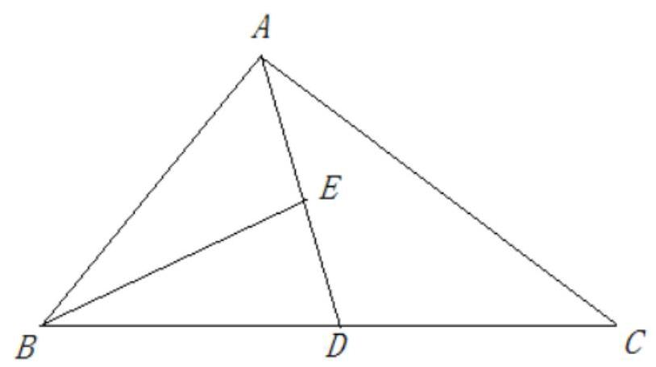

$\overline{BE} = \frac{1}{2}\overline{BA} + \frac{1}{2}\overline{BD} = \frac{1}{2}\overline{BA} + \frac{1}{4}\overline{BC} = \frac{1}{2}\overline{BA} + \frac{1}{4}\left( {\overline{BA} + \overline{AC}}\right)  = \frac{1}{2}\overline{BA} + \frac{1}{4}\overline{BA} + \frac{1}{4}\overline{AC} = \frac{3}{4}\overline{BA} + \frac{1}{4}\overline{AC}$ , 所以 $\overline{EB} = \frac{3}{4}\overline{AB} - \frac{1}{4}\overline{AC}$ ,故选A.

(2)如图，在平行四边形 ${ABCD}$ 中， $E$ 为 ${BC}$ 中点， ${AE}$ 交 ${BD}$ 于点 $F$ ，且 $\overrightarrow{AF} = x\overrightarrow{AB} + y\overrightarrow{AD}$ 则 $x + y =$ ___.

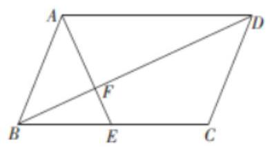

【难度】 $\star   \star$

【答案】 1

【解析】因为在平行四边形 ${ABCD}$ 中, $E$ 为 ${BC}$ 中点,所以 $\overrightarrow{AE} = \overrightarrow{AB} + \overrightarrow{BE} = \overrightarrow{AB} + \frac{1}{2}\overrightarrow{BD}$ ,

又为 $\bigtriangleup {AFD} \cong  \bigtriangleup {EFB}$ ,所以 $\frac{AF}{FE} = \frac{AD}{EB} = 2$ ,所以 ${AF} = {2FE},{AF} = \frac{2}{3}{AE}$ ,

所以 $\overrightarrow{AF} = \frac{2}{3}\overrightarrow{AE} = \frac{2}{3}\left( {\overrightarrow{AB} + \frac{1}{2}\overrightarrow{BD}}\right)  = \frac{2}{3}\overrightarrow{AB} + \frac{1}{3}\overrightarrow{BD}$ ,

又已知 $\overrightarrow{AF} = x\overrightarrow{AB} + y\overrightarrow{AD}$ ,根据平面向量基本定理可得 $x = \frac{2}{3}, y = \frac{1}{3}$ ,所以 $x + y = \frac{2}{3} + \frac{1}{3} = 1$ ,

故答案为: 1 .

【例 3】( 1 )已知 $\bigtriangleup  {ABC}$ 是边长 $\sqrt{3}$ 的等边三角形，点 $D$ ， $E$ 分别是 ${AB},{BC}$ 上的点，且 ${AD} = \frac{1}{3}{AB}$ ， ${BE} = \frac{2}{3}{BC}$ ，连接 ${DE}$ 并延长到点 $F$ ，使得 ${DE} = {EF}$ ，则 $\overline{AF} \cdot  \overline{BC}$ 的值为( )

A. $- \frac{3}{2}$ B. $\frac{9}{2}$ C. $\frac{3}{2}$ D. $- \frac{9}{2}$

【难度】 $\star   \star$

【答案】C

【解析】作示意图如图所示:

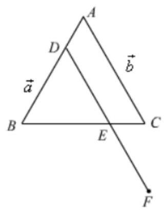

设 $\overrightarrow{a} = \overrightarrow{AB},\overrightarrow{b} = \overrightarrow{AC}$ ,则 $\left| \overrightarrow{a}\right|  = \sqrt{3},\left| \overrightarrow{b}\right|  = \sqrt{3},\overrightarrow{a} \cdot  \overrightarrow{b} = \sqrt{3} \times  \sqrt{3} \times  \frac{1}{2} = \frac{3}{2}$ ,

由 ${AD} = \frac{1}{3}{AB},{BE} = \frac{2}{3}{BC}$ ,得 ${DE}//{AC}$ ,且 ${DE} = \frac{2}{3}{AC}$ ,又 ${DE} = {EF}$ ,

则 ${DF} = \frac{4}{3}{AC}$ ,即 $\overline{DF} = \frac{4}{3}\overrightarrow{b}$ ,又 $\overline{AD} = \frac{1}{3}\overrightarrow{a}$ ,得 $\overline{AF} = \overrightarrow{AD} + \overrightarrow{DF} = \frac{1}{3}\overrightarrow{a} + \frac{4}{3}\overrightarrow{b}$ ,

$\overrightarrow{BC} = \overrightarrow{AC} - \overrightarrow{AB} = \overrightarrow{b} - \overrightarrow{a}$ ,则

$\overrightarrow{AF} \cdot  \overrightarrow{BC} = \left( {\frac{1}{3}\overrightarrow{a} + \frac{4}{3}\overrightarrow{b}}\right)  \cdot  \left( {\overrightarrow{b} - \overrightarrow{a}}\right)  =  - \frac{1}{3}{\overrightarrow{a}}^{2} - \overrightarrow{a} \cdot  \overrightarrow{b} + \frac{4}{3}{\overrightarrow{b}}^{2} =  - \frac{1}{3} \times  3 - \frac{3}{2} + \frac{4}{3} \times  3 = \frac{3}{2}$ .

故选: C.

(2)如图所示在平行四边形 ${ABCD}$ 中，已知 ${AB} = 3,{AD} = 2,\overline{CP} = 2\overrightarrow{PD},\overrightarrow{AP} \cdot  \overrightarrow{BP} = 1$ ，则 $\overrightarrow{AB} \cdot  \overrightarrow{AD} =$ ( )

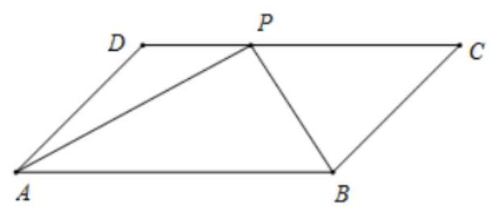

A. 6 B. -6 C. 3 D. -3

【难度】★★

【答案】c

【解析】解: $\because \overrightarrow{CP} = 2\overrightarrow{PD}$ ,

$\therefore$ 点 $P$ 为 ${CD}$ 靠近 $D$ 点的三等分点,

$\therefore \overrightarrow{AP} = \overrightarrow{AD} + \overrightarrow{DP} = \overrightarrow{AD} + \frac{1}{3}\overrightarrow{AB},\overrightarrow{BP} = \overrightarrow{BC} + \overrightarrow{CP} = \overrightarrow{AD} - \frac{2}{3}\overrightarrow{AB}$ ,

$\therefore \overrightarrow{AP} \cdot  \overrightarrow{BP} = \left( {\overrightarrow{AD} + \frac{1}{3}\overrightarrow{AB}}\right)  \cdot  \left( {\overrightarrow{AD} - \frac{2}{3}\overrightarrow{AB}}\right)  = 1$ ,整理得 ${\overrightarrow{AD}}^{2} - \frac{1}{3}\overrightarrow{AB} \cdot  \overrightarrow{AD} - \frac{2}{9}{\overrightarrow{AB}}^{2} = 1$ ,

$\because {AB} = 3,{AD} = 2,\therefore 4 - \frac{1}{3}\overrightarrow{AB} \cdot  \overrightarrow{AD} - \frac{2}{9} \times  9 = 1$ ,解得 $\overrightarrow{AB} \cdot  \overrightarrow{AD} = 3$ 。故选: C.

【例 4】( 1 )如图，在矩形 ${OABC}$ 中，点 $E$ 、 $F$ 分别在线段 ${AB}$ 、 ${BC}$ 上， 且满足 ${AB} = {3AE},{BC} = {3CF}$ ,若 $\overrightarrow{OB} = \lambda \overrightarrow{OE} + \mu \overrightarrow{OF}\left( {\lambda ,\mu  \in  R}\right)$ , 则 $\lambda  + \mu  =$ ___.

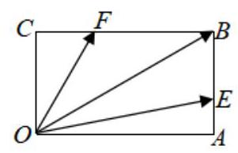

【难度】 $\star   \star$

【答案】 $\frac{3}{2}$

【解析】法一: 建系解: 如图所示,建立直角坐标系. 设 $A\left( {a,0}\right) , C\left( {0, b}\right)$ ,则 $B\left( {a, b}\right)$ .

$\because {AB} = {3AE},{BC} = {3CF},\therefore E\left( {a,\frac{b}{3}}\right) , F\left( {\frac{a}{3}, b}\right)$ .

$\because \overrightarrow{OB} = \lambda \overrightarrow{OE} + \mu \overrightarrow{OF},\therefore \left( {a, b}\right)  = \lambda \left( {a,\frac{b}{3}}\right)  + \mu \left( {\frac{a}{3}, b}\right)$ ,

$\therefore \left\{  \begin{array}{l} a = {\lambda a} + \frac{\mu }{3}a \\  b = \frac{\lambda }{3}b + {\mu b} \end{array}\right.$ ,解得 $\lambda  + \mu  = \frac{3}{2}$ . 故答案为: $\frac{3}{2}$ .

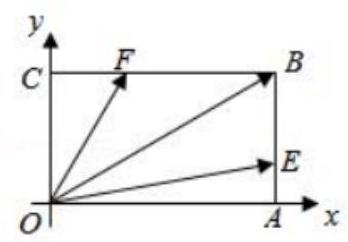

法二: 分解

(2)如图，平面内有三个向量 $\overrightarrow{OA}$ ， $\overrightarrow{OB}$ ， $\overrightarrow{OC}$ ，其中与 $\overrightarrow{OA}$ 与 $\overrightarrow{OB}$ 的夹角为 ${120}^{ \circ  }$ ， $\overrightarrow{OA}$ 与 $\overrightarrow{OC}$ 的夹角为 ${30}^{ \circ  }$ ， 且 $\left| \overrightarrow{OA}\right|  = \left| \overrightarrow{OB}\right|  = 1$ ， $\left| \overrightarrow{OC}\right|  = 3\sqrt{3}$ ，若 $\overrightarrow{OC} = \lambda \overrightarrow{OA} + \mu \overrightarrow{OB}\left( {\lambda ,\mu  \in  R}\right)$ ，则 $\lambda  + \mu$ 的值为___.

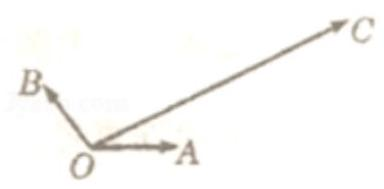

【难度】★★

【答案】 9

【解析】解: 如图所示:

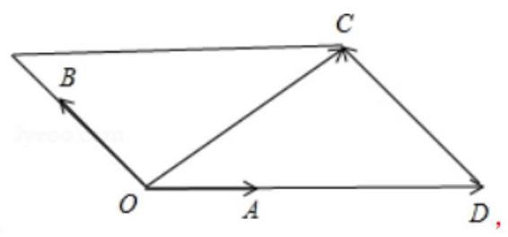

过点 $C$ 作 $\overrightarrow{OA}$ 和 $\overrightarrow{OB}$ 的平行线,与它们的延长线相交,可得平行四边形,

$\because \overrightarrow{OA}$ 与 $\overrightarrow{OB}$ 的夹角为 ${120}^{ \circ  },\overrightarrow{OA}$ 与 $\overrightarrow{OC}$ 的夹角为 ${30}^{ \circ  },\therefore \angle {BOC} = {90}^{ \circ  },\therefore \angle {OCD} = {90}^{ \circ  }$ ，

在 Rt $\bigtriangleup {OCD}$ 中, $\left| \overrightarrow{CD}\right|  = \left| \overrightarrow{OC}\right| \tan {30}^{ \circ  } = 3\sqrt{3} \times  \frac{\sqrt{3}}{3} = 3,\left| \overrightarrow{OD}\right|  = 2\left| \overrightarrow{CD}\right|  = 6$ ,

又 $\overrightarrow{OC} = \lambda \overrightarrow{OA} + \mu \overrightarrow{OB} = \overrightarrow{OD} + \overrightarrow{DC},\therefore \overrightarrow{OD} = \lambda \overrightarrow{OA},\overrightarrow{DC} = \mu \overrightarrow{OB},\therefore \left| \overrightarrow{OD}\right|  = \lambda \left| \overrightarrow{OA}\right| ,\left| \overrightarrow{DC}\right|  = \mu \left| \overrightarrow{OB}\right|$ ,

$\therefore 6 = \lambda ,3 = \mu ,\therefore \lambda  + \mu  = 9$ ,故选: $C$ .

【例 5】在平面向量中有如下定理: 设点 $O\text{ 、 }P\text{ 、 }Q\text{ 、 }R$ 为同一平面内的点,则 $P\text{ 、 }Q\text{ 、 }R$ 三点共线的充要条件是: 存在实数 $t$ ,使 $\overline{OP} = \left( {1 - t}\right) \overline{OQ} + t\overline{OR}$ . 试利用该定理解答下列问题: 如图,在 $\bigtriangleup {ABC}$ 中,点 $E$ 为 ${AB}$ 边的中点,点 $F$ 在 ${AC}$ 边上,且 ${CF} = {2FA},{BF}$ 交 ${CE}$ 于点 $M$ ,设 $\overline{AM} = x\overline{AE} + y\overline{AF}$ ,则 $x + y =$ ___.

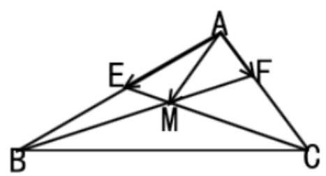

【难度】 $\star   \star   \star$

【答案】 $\frac{7}{5}$

【解析】因为点 $\mathrm{B}\text{ 、 }\mathrm{M}\text{ 、 }\mathrm{\;F}$ 三点共线,则存在实数 $\mathrm{t}$ ,使 $\overline{\mathrm{{AM}}} = \left( {1 - t}\right) \overline{AB} + t\overline{AF}$ . 又 $\overline{AB} = 2\overline{AE},\overline{AF} = \frac{1}{3}\overline{AC}$ , 则 $\overline{\mathrm{{AM}}} = 2\left( {1 - t}\right) \overrightarrow{AE} + \frac{t}{3}\overrightarrow{AC}$ . 因为点 $\mathrm{C}\text{ 、 }\mathrm{M}\text{ 、 }\mathrm{E}$ 三点共线,则 $2\left( {1 - t}\right)  + \frac{t}{3} = 1$ ,所以 $t = \frac{3}{5}$ . 故 $x = \frac{4}{5}, y = \frac{3}{5}$ , $x + y = \frac{7}{5}.$

【例 6】( 1 )给定两个长度为 1 的平面向量 $\overrightarrow{OA}$ 和 $\overrightarrow{OB}$ ，它们的夹角为 ${120}^{ \circ  }$ . 如图所的圆弧 $\overset{\text{ ⏜ }}{AB}$ 上变动. 若 $\overline{OC} = x\overline{OA} + y\overline{OB}$ ,其中 $x, y \in  R$ ,则 $\mathrm{x} + \mathrm{y}$ 的最大值是___

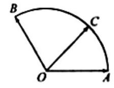

第(1)题图

【难度】 $\star   \star   \star$

【答案】 2

【解析】解: 如图,以 $O$ 为坐标原点,直线 ${OA}$ 为 $x$ 轴,建立平面直角坐标系,则: $A\left( {1,0}\right) ,\;B\left( {-\frac{1}{2},\frac{\sqrt{3}}{2}}\right)$ ,设 $\angle {AOC} = \theta ,{0}^{ \circ  } \leq  \theta  \leq  {120}^{ \circ  },\therefore C\left( {\cos \theta ,\sin \theta }\right)$ ;

$\therefore \overrightarrow{OC} = x\overrightarrow{OA} + y\overrightarrow{OB} = \left( {x,0}\right)  + \left( {-\frac{y}{2},\frac{\sqrt{3}y}{2}}\right)  = \left( {x - \frac{y}{2},\frac{\sqrt{3}y}{2}}\right)  = \left( {\cos \theta ,\sin \theta }\right)$ ;

$\therefore \left\{  {\begin{array}{l} x - \frac{y}{2} = \cos \theta \\  \frac{\sqrt{3}y}{2} = \sin \theta  \end{array};\;\left\{  {\begin{array}{l} x = \frac{\sqrt{3}}{3}\sin \theta  + \cos \theta \\  y = \frac{2\sqrt{3}}{3}\sin \theta  \end{array};\;\therefore x + y = \sqrt{3}\sin \theta  + \cos \theta  = 2\sin \left( {\theta  + {30}^{ \circ  }}\right) ;}\right. }\right.$

$\because {0}^{ \circ  } \leq  \theta  \leq  {120}^{ \circ  };\therefore {30}^{ \circ  } \leq  \theta  + {30}^{ \circ  } \leq  {150}^{ \circ  };\therefore \theta  + {30}^{ \circ  } = {90}^{ \circ  }$ ,即 $\theta  = {60}^{ \circ  }$ 时 $x + y$ 取最大值 2 .

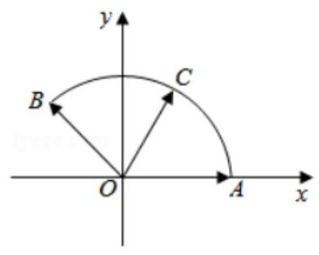

(2)在直角 $\bigtriangleup {ABC}$ 中， $\angle A = \frac{\pi }{2},{AB} = 2,{AC} = 4, M$ 是 $\bigtriangleup {ABC}$ 内一点，且 ${AM} = \frac{1}{2}$ ，若 $\overrightarrow{AM} = \lambda \overrightarrow{AB} + \mu \overrightarrow{AC}\left( {\lambda ,\mu  \in  R}\right)$ ，则 $\lambda  + {2\mu }$ 的最大值为___.

【难度】 $\star   \star   \star$

【答案】 $\frac{\sqrt{2}}{4}$

【解析】解: 建立如图平面直角坐标系,则 $A\left( {0,0}\right) , B\left( {0,2}\right) , C\left( {4,0}\right)$ ,

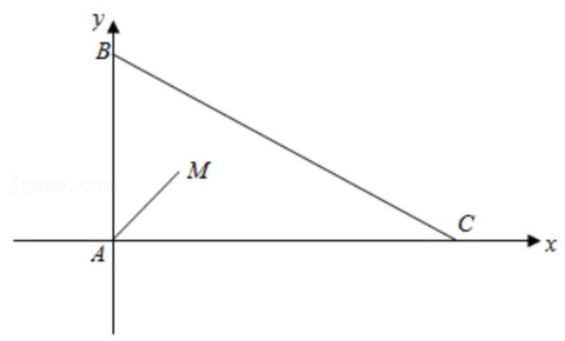

$M\left( {\frac{1}{2}\cos \theta ,\frac{1}{2}\sin \theta }\right) ,\;\left( {0 < \theta  < \frac{\pi }{2}}\right) ,$

$\because \overrightarrow{AM} = \lambda \overrightarrow{AB} + \mu \overrightarrow{AC}\left( {\lambda ,\mu  \in  R}\right) ,\therefore \left( {\frac{1}{2}\cos \theta ,\frac{1}{2}\sin \theta }\right)  = \lambda \left( {0,2}\right)  + \mu \left( {4,0}\right)$ ,

$\therefore \frac{1}{2}\cos \theta  = {4\mu },\frac{1}{2}\sin \theta  = {2\lambda },\therefore \lambda  + {2\mu } = \frac{1}{4}\left( {\sin \theta  + \cos \theta }\right)  = \frac{\sqrt{2}}{4}\sin \left( {\theta  + \frac{\pi }{4}}\right)$ ,

由 $0 < \theta  < \frac{\pi }{2}$ 得 $\frac{\pi }{4} < \theta  + \frac{\pi }{4} < \frac{3\pi }{4},\therefore \frac{\sqrt{2}}{2} < \sin \left( {\theta  + \frac{\pi }{4}}\right)  \leq  1,\therefore \frac{1}{4} < \lambda  + {2\mu } \leq  \frac{\sqrt{2}}{4}$ ,

则 $\lambda  + {2\mu }$ 的最大值为 $\frac{\sqrt{2}}{4}$ ，故答案为: $\frac{\sqrt{2}}{4}$ .

## 巩固训练

1、已知向量 $\overrightarrow{a} = \left( {1, - 2}\right) ,\overrightarrow{b} = \left( {-1,2}\right)$ ，则下列结论不正确的是( )

A. $\overrightarrow{a}//\overrightarrow{b}$ B. $\overrightarrow{a}$ 与 $\overrightarrow{b}$ 可以作为基底 C. $\overrightarrow{a} + \overrightarrow{b} = \overrightarrow{0}$ D. $\overrightarrow{b} - \overrightarrow{a}$ 与 $\overrightarrow{a}$ 方向相反

【难度】 $\star   \star$

【答案】B

【解析】因为 $\overrightarrow{a} = \left( {1, - 2}\right) ,\overrightarrow{b} = \left( {-1,2}\right)$ ,所以 $\overrightarrow{a} =  - \overrightarrow{b}$ ,则 $\bar{a}//\bar{b},{\overrightarrow{a}}^{ + }\overrightarrow{b} = \overrightarrow{0},\overrightarrow{a}$ 与 $\overrightarrow{b}$ 不可以作为基底, $\overrightarrow{b} - \overrightarrow{a} = \left( {-2,4}\right)  =  - 2\overrightarrow{a}$ ,所以 $\overrightarrow{b} - \overrightarrow{a}$ 与 $\overrightarrow{a}$ 方向相反. 故选: B

2、有下列说法:

①若 $\bar{p} = x\bar{a} + y\bar{b}$ ，则 $\bar{p}$ 与 $\bar{a}$ ， $\bar{b}$ 共面；②若 $\bar{p}$ 与 $\bar{a}$ ， $\bar{b}$ 共面，则 $\bar{p} = x\bar{a} + y\bar{b}$ ；

③若 $\overrightarrow{MP} = x\overrightarrow{MA} + y\overrightarrow{MB}$ ，则 $P, M, A, B$ 共面；④若 $P, M, A, B$ 共面，则 $\overrightarrow{MP} = x\overrightarrow{MA} + y\overrightarrow{MB}$ . 其中正确的是( )

A. ①②③④ B. ①③④ C. ①③ D. ②④

【难度】 $\star   \star   \star$

【答案】C

【解析】①若 $\overrightarrow{p} = x\overrightarrow{a} + y\overrightarrow{b}\left( {x, y \in  R}\right)$ ,则由平面向量基本定理得 $\overrightarrow{p}$ 与 $\overrightarrow{a},\overrightarrow{b}$ 共面. ①正确

②若 $\overrightarrow{p}$ 与 $\overrightarrow{a},\overrightarrow{b}$ 共面，则 $\overrightarrow{p} = x\overrightarrow{a} + y\overrightarrow{b}\left( {x, y \in  R}\right)$ 不一定成立，如 $\overrightarrow{a} = \overrightarrow{b} = \overrightarrow{0}$ ，而 $\overrightarrow{p} \neq  \overrightarrow{0}$ . ②错误；

③④同理

3、已知平面直角坐标系内的两个向量 $\overrightarrow{a} = \left( {3, - {2m}}\right) ,\overrightarrow{b} = \left( {1, m - 2}\right)$ ，且平面内的任一向量 $\overrightarrow{c}$ 都可以唯一表示成 $\bar{c} = \lambda \bar{a} + \mu \bar{b}\left( {\lambda ,\mu \text{ 为实数 }}\right)$ ,则实数 $m$ 的取值范围是(   )

A. $\left( {\frac{6}{5}, + \infty }\right)$ B. $\left( {-\infty ,\frac{6}{5}}\right)  \cup  \left( {\frac{6}{5}, + \infty }\right)$ C. $\left( {-\infty ,2}\right)$ D. $\left( {-\infty , - 2}\right)  \cup  \left( {-2, + \infty }\right)$

【难度】★★

【答案】B

【解析】不共线

4、如图，正方形 ${ABCD}$ 中， $M$ 、 $N$ 分别是 ${BC}$ 、 ${CD}$ 的中点，若 $\overline{AC} = \lambda \overline{AM} + \mu \overline{BN}$ ，则 $\lambda  + \mu  =$ ( )

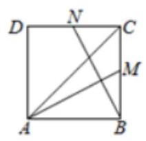

A. 2

B. $\frac{8}{3}$ C. $\frac{6}{5}$ D. $\frac{8}{5}$

【难度】★★

【答案】D

【解析】取向量 $\overrightarrow{AB},\overrightarrow{BC}$ 作为一组基底,则有

$\overrightarrow{AM} = \overrightarrow{AB} + \overrightarrow{BM} = \overrightarrow{AB} + \frac{1}{2}\overrightarrow{BC},\overrightarrow{BN} = \overrightarrow{BC} + \overrightarrow{CN} = \overrightarrow{BC} - \frac{1}{2}\overrightarrow{AB}$ ,所以

$\overrightarrow{AC} = \lambda \overrightarrow{AM} + \mu \overrightarrow{BN} = \lambda \left( {\overrightarrow{AB} + \frac{1}{2}\overrightarrow{BC}}\right)  + \mu \left( {\overrightarrow{BC} - \frac{1}{2}\overrightarrow{AB}}\right)  = \left( {\lambda  - \frac{1}{2}}\right) \overrightarrow{AB} + \left( {\mu  + \frac{1}{2}}\right) \overrightarrow{BC}$

又 $\overrightarrow{AC} = \overrightarrow{AB} + \overrightarrow{BC}$ ,所以 $\lambda  - \frac{1}{2}\mu  = 1,\mu  + \frac{1}{2}\lambda  = 1$ ,即 $\lambda  = \frac{6}{5},\mu  = \frac{2}{5},\lambda  + \mu  = \frac{8}{5}$ .

5、已知正六边形 ${ABCDEF}$ 中， $G$ 是 ${AF}$ 的中点，则 $\overline{CG} =$ ( )

A. $\frac{5}{8}\overrightarrow{CE} + \frac{3}{4}\overrightarrow{DA}$ B. $\frac{2}{3}\overrightarrow{CE} + \frac{5}{6}\overrightarrow{DA}$ c. $\frac{3}{4}\overrightarrow{CE} + \frac{5}{8}\overrightarrow{DA}$ D. $\frac{5}{6}\overrightarrow{CE} + \frac{2}{3}\overrightarrow{DA}$

【难度】 $\star   \star$

【答案】C

【解析】作出图形如下图所示,设直线 ${AD}\text{ 、 }{CF}$ 相交于点 $O$ ,则点 $O$ 为这两条线段的中点,

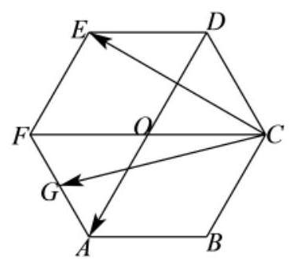

由图形可知, $\overrightarrow{CB} = \overrightarrow{OA} = \overrightarrow{OF} + \overrightarrow{FA} =  - \overrightarrow{AB} - \overrightarrow{AF}$ ,

所以, $\overrightarrow{CG} = \overrightarrow{CB} + \overrightarrow{BA} + \overrightarrow{AG} =  - \overrightarrow{AB} - \overrightarrow{AF} - \overrightarrow{AB} + \frac{1}{2}\overrightarrow{AF} =  - 2\overrightarrow{AB} - \frac{1}{2}\overrightarrow{AF}$ ,①

$\overrightarrow{DA} = 2\overrightarrow{CB} =  - 2\overrightarrow{AB} - 2\overrightarrow{AF}$ ,②

$\overrightarrow{CE} = \overrightarrow{CD} + \overrightarrow{DE} = \overrightarrow{AF} - \overrightarrow{AB}$ ，③

联立②③，得 $\left\{  \begin{array}{l} \overline{DA} =  - 2\overline{AB} - 2\overline{AF} \\  \overline{CE} =  - \overline{AB} + \overline{AF} \end{array}\right.$ ，解得 $\left\{  \begin{array}{l} \overline{AB} =  - \frac{1}{2}\overline{CE} - \frac{1}{4}\overline{DA} \\  \overline{AF} = \frac{1}{2}\overline{CE} - \frac{1}{4}\overline{DA} \end{array}\right.$ ，

代入①，得 $\overrightarrow{CG} =  - 2\overrightarrow{AB} - \frac{1}{2}\overrightarrow{AF} =  - 2\left( {-\frac{1}{2}\overrightarrow{CE} - \frac{1}{4}\overrightarrow{DA}}\right)  - \frac{1}{2}\left( {\frac{1}{2}\overrightarrow{CE} - \frac{1}{4}\overrightarrow{DA}}\right)  = \frac{3}{4}\overrightarrow{CE} + \frac{5}{8}\overrightarrow{DA}$ ，故选 C.

6、如图所示，已知 $\bigtriangleup  {OAB}$ ，由射线 ${OA}$ 和射线 ${OB}$ 及线段 ${AB}$ 构成如图所示的阴影区(不含边界).

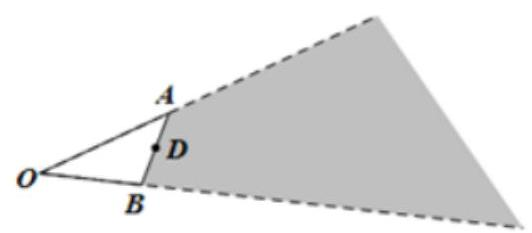

(1)若 $D$ 为 ${AB}$ 中点， $\overline{OD} =$ ___(用 $\overline{OA}$ ， $\overline{OB}$ 表示)

(2)已知下列四个向量:

① $\overrightarrow{O{M}_{1}} = \overrightarrow{OA} + 2\overrightarrow{OB}$ ； ② $\overrightarrow{O{M}_{2}} = \frac{3}{4}\overrightarrow{OA} + \frac{1}{3}\overrightarrow{OB}$ ；

③ $\overrightarrow{O{M}_{3}} = \frac{1}{2}\overrightarrow{OA} + \frac{1}{3}\overrightarrow{OB}$ ；

对于点 ${M}_{1}$ ， ${M}_{2}$ ， ${M}_{3}$ ， ${M}_{4}$ ，落在阴影区域内(不含边界)的点有___(把所有符合条件点都填上)

【难度】 $\star   \star   \star$

【答案】 $\frac{1}{2}\left( {\overrightarrow{OA} + \overrightarrow{OB}}\right) \;{M}_{1},{M}_{2}$

【解析】若 $D$ 为 ${AB}$ 中点,则由向量的加法法则可得 $\overline{OD} = \frac{1}{2}\left( {\overline{OA} + \overline{OB}}\right)$ ;

设 $M$ 在阴影区域内，则射线 ${OM}$ 与线段 ${AB}$ 有公共点，记为 $N$ ，

则存在实数 $t \in  (0,1\rbrack$ ,使得 (1) $\overline{ON} = t\overline{OA} + \left( {1 - t}\right) \overline{OB}$ ,

且存在实数 $r \geq  1$ ,使得 $\overline{OM} = r\overline{ON}$ ,从而 $\overline{OM} = {rt}\overline{OA} + r\left( {1 - t}\right) \overline{OB}$ ,

且 ${rt} + r\left( {1 - t}\right)  = r \geq  1$ . 又由于 $0 \leq  t \leq  1$ ,故 $r\left( {1 - t}\right)  \geq  0$ . 对于①中 ${rt} = 1, r\left( {1 - t}\right)  = 2$ ,解得 $r = 3, t = \frac{2}{3}$ ,满足 $r \geq  1$ 也满足 $r\left( {1 - t}\right)  \geq  0$ . 故①满足条件.

对于② ${rt} = \frac{3}{4}$ ， $r\left( {1 - t}\right)  = \frac{1}{3}$ ，解得 $r = \frac{13}{12}$ ， $t = \frac{9}{13}$ ，满足 $r \geq  1$ 也满足 $r\left( {1 - t}\right)  \geq  0$ . 故②满足条件，

对于 ③ ${rt} = \frac{1}{2}, r\left( {1 - t}\right)  = \frac{1}{3}$ ，解得 $r = \frac{5}{6}, t = \frac{3}{5}$ ，不满足 $r \geq  1$ ，故③不满足条件，

对于④ ${rt} = \frac{3}{4}, r\left( {1 - t}\right)  = \frac{1}{5}$ ，

解得 $r = \frac{19}{20}, t = \frac{15}{19}$ ,不满足 $r \geq  1$ ,故④不满足条件,

故答案为(1). $\frac{1}{2}\left( {\overrightarrow{OA} + \overrightarrow{OB}}\right)$

7、已知 $O, A, B, C$ 为平面 $a$ 内的四点,其中 $A, B, C$ 三点共线,点 $O$ 在直线 ${AB}$ 外,且满足 $\overrightarrow{OA} = \frac{1}{x}\overrightarrow{OB} + \frac{2}{y}\overrightarrow{OC}$ . 其中 $x > 0, y > 0$ ,则 $x + {8y}$ 的最小值为 ( )

A. 21 B. 25 C. 27 D. 34

【难度】★★★

【答案】B

【解析】解: 根据题意, $A, B, C$ 三点共线,点 $O$ 在直线 ${AB}$ 外, $\overrightarrow{OA} = \frac{1}{x}\overrightarrow{OB} + \frac{2}{y}\overrightarrow{OC}$ .

设 $\overrightarrow{BA} = \lambda \overrightarrow{BC},\left( {\lambda  \neq  0,\lambda  \neq  1}\right)$ ,

则 $\overrightarrow{OA} = \overrightarrow{OB} + \overrightarrow{BA} = \overrightarrow{OB} + \lambda \overrightarrow{BC} = \overrightarrow{OB} + \lambda \left( {\overrightarrow{OC} - \overrightarrow{OB}}\right)  = \lambda \overrightarrow{OC} + \left( {1 - \lambda }\right) \overrightarrow{OB}$ ,

$\therefore \left\{  \begin{array}{l} 1 - \lambda  = \frac{1}{x} \\  \lambda  = \frac{2}{y} \end{array}\right.$ ,消去 $\lambda$ 得 $\frac{1}{x} + \frac{2}{y} = 1$ ,

$\therefore x + {8y} = \left( {x + {8y}}\right)  \cdot  \left( {\frac{1}{x} + \frac{2}{y}}\right)  = 1 + \frac{2x}{y} + \frac{8y}{x} + {16} \geq  {17} + 2\sqrt{\frac{2x}{y} \cdot  \frac{8y}{x}} = {25}$

(当且仅当 $x = 5, y = \frac{5}{2}$ 时等式成立). 故选: B.

8、如图，在 $\bigtriangleup  {OAB}$ 中， $P$ 为边 ${AB}$ 上的一点 $\overrightarrow{BP} = 2\overrightarrow{PA}$ ， $\left| \overrightarrow{OA}\right|  = 6$ ， $\left| \overrightarrow{OB}\right|  = 2$ 且 $\overrightarrow{OA}$ 与 $\overrightarrow{OB}$ 的夹角为 ${60}^{ \circ  }$ .

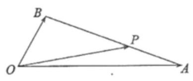

(1)设 $\overrightarrow{OP} = x\overrightarrow{OA} + y\overrightarrow{OB}$ ，求 $x, y$ 的值；

(2)求 $\overrightarrow{OP} \cdot  \overrightarrow{AB}$ 的值.

【难度】 $\star   \star   \star$

【答案】(1) $x = \frac{2}{3}, y = \frac{1}{3};\left( 2\right)  - \frac{62}{3}$ .

【解析】(1) 因为 $\overrightarrow{BP} = 2\overrightarrow{PA}$ ,所以 $\overrightarrow{BP} = \frac{2}{3}\overrightarrow{BA}$ .

$\overrightarrow{OP} = \overrightarrow{OB} + \overrightarrow{BP} = \overrightarrow{OB} + \frac{2}{3}\overrightarrow{BA} = \overrightarrow{OB} + \frac{2}{3}\left( {\overrightarrow{OA} - \overrightarrow{OB}}\right)  = \frac{2}{3}\overrightarrow{OA} + \frac{1}{3}\overrightarrow{OB}$ .

又 $\overrightarrow{OP} = x\overrightarrow{OA} - x\overrightarrow{OB}$ ,又因为 $\overrightarrow{OA}\text{ 、 }\overrightarrow{OB}$ 不共线,所以, $x = \frac{2}{3}, y = \frac{1}{3}$

(2)结合(1)可得:

$\overrightarrow{OP} \cdot  \overrightarrow{AB} = \left( {\frac{2}{3}\overrightarrow{OA} + \frac{1}{3}\overrightarrow{OB}}\right)  \cdot  \left( {\overrightarrow{OB} - \overrightarrow{OA}}\right) .$

$= \frac{2}{3}\overrightarrow{OA} \cdot  \overrightarrow{OB} - \frac{2}{3}{\overrightarrow{OA}}^{2} + \frac{1}{3}{\overrightarrow{OB}}^{2} - \frac{1}{3}\overrightarrow{OA} \cdot  \overrightarrow{OB} = \frac{1}{3}\overrightarrow{OA} \cdot  \overrightarrow{OB} - \frac{2}{3}{\overrightarrow{OA}}^{2} + \frac{1}{3}{\overrightarrow{OB}}^{2}$ ,

因为 $\left| \overrightarrow{OA}\right|  = 6,\left| \overrightarrow{OB}\right|  = 2$ ,且 $\overrightarrow{OA}$ 与 $\overrightarrow{OB}$ 的夹角为 ${60}^{ \circ  }$ .

所以 $\overrightarrow{OP} \cdot  \overrightarrow{AB} = \frac{1}{3} \times  6 \times  2 \times  \frac{1}{2} - \frac{2}{3} \times  {6}^{2} + \frac{1}{3} \times  {2}^{2} =  - \frac{62}{3}$ .

## (二)平面向量与三角形 “四心”

## 知识梳理

## 平面向量与三角形 “四心”

1、三角形的四 “心”

1. 重心: 三角形三条中线交点.

2. 外心: 三角形三边垂直平分线相交于一点. 这一点为三角形外接圆的圆心, 称外心。

3. 内心: 三角形三内角的平分线相交于一点. 是三角形的内切圆的圆心, 称内心。

4. 垂心: 三角形三边上的高相交于一点.

2、重心的性质:

(1)在 $\bigtriangleup  \mathrm{{ABC}}$ 中，中线 $\mathrm{{AD}}$ 交 $\mathrm{{BC}}$ 于 $\mathrm{D}$ ， $\mathrm{G}$ 是重心，则 $\mathrm{{AG}} = 2\mathrm{{GD}}$

(2)在 $\bigtriangleup  {ABC}$ 中， $\mathrm{A}\left( {{x}_{1},{y}_{1}}\right) \;\mathrm{B}\left( {{x}_{2},{y}_{2}}\right) \;\mathrm{C}\left( {{x}_{3},{y}_{3}}\right)$ 的重心 $\mathrm{G}$ 坐标公式 $\left\{  \begin{array}{l} x = \frac{{x}_{1} + {x}_{2} + {x}_{3}}{3} \\  y = \frac{{y}_{1} + {y}_{2} + {y}_{3}}{3} \end{array}\right.$

(3)若0是三角形 ${ABC}$ 的重心，则 ${S}_{\Delta BOC} = {S}_{\Delta AOC} = {S}_{\Delta AOB} = \frac{1}{3}{S}_{\Delta ABC}$

(4)内角平分线定理:主 $\bigtriangleup {ABC}$ 中， ${AD}$ 是交 $A$ 的平分线 ${BC}$ 于 $D$ ，则 $\frac{BD}{CD} = \frac{AB}{AC}$

3、三角形五 “心” 向量形式的充要条件

设 $O$ 为 $\bigtriangleup {ABC}$ 所在平面上一点,角 $A, B, C$ 所对边长分别为 $a, b, c$ ,则

(1) $O$ 为 $\bigtriangleup {ABC}$ 的外心 $\Leftrightarrow  {\overrightarrow{OA}}^{2} = {\overrightarrow{OB}}^{2} = {\overrightarrow{OC}}^{2}$ .

(2) $O$ 为 $\bigtriangleup {ABC}$ 的重心 $\Leftrightarrow  \overrightarrow{OA} + \overrightarrow{OB} + \overrightarrow{OC} = \overrightarrow{0}$ .

(3) $O$ 为 $\bigtriangleup {ABC}$ 的垂心 $\Leftrightarrow  \overrightarrow{OA} \cdot  \overrightarrow{OB} = \overrightarrow{OB} \cdot  \overrightarrow{OC} = \overrightarrow{OC} \cdot  \overrightarrow{OA}$ .

(4)O为 $\bigtriangleup {ABC}$ 的内心

$$
\Leftrightarrow  \overrightarrow{OA} \bullet  \left( {\frac{\overrightarrow{AB}}{\left| \overrightarrow{AB}\right| } - \frac{\overrightarrow{AC}}{\left| \overrightarrow{AC}\right| }}\right)  = \overrightarrow{OB} \bullet  \left( {\frac{\overrightarrow{BA}}{\left| \overrightarrow{BA}\right| } - \frac{\overrightarrow{BC}}{\left| \overrightarrow{BC}\right| }}\right)  = \overrightarrow{OC} \bullet  \left( {\frac{\overrightarrow{CA}}{\left| \overrightarrow{CA}\right| } - \frac{\overrightarrow{CB}}{\left| \overrightarrow{CB}\right| }}\right)  = \overrightarrow{0}
$$

$$
\Leftrightarrow  a\overrightarrow{OA} + b\overrightarrow{OB} + c\overrightarrow{OC} = \overrightarrow{0}\text{ . }
$$

## 例题精讲

【例 7】点 $O$ 在 $\bigtriangleup  {ABC}$ 所在平面内，给出下列关系式:(1) $\overrightarrow{OA} + \overrightarrow{OB} + \overrightarrow{OC} = \overrightarrow{0}$ ；(2)

$\overrightarrow{OA} \cdot  \overrightarrow{OB} = \overrightarrow{OB} \cdot  \overrightarrow{OC} = \overrightarrow{OC} \cdot  \overrightarrow{OA};\left( 3\right) \overrightarrow{OA} \cdot  \left( {\frac{\overrightarrow{AC}}{\left| \overrightarrow{AC}\right| } - \frac{\overrightarrow{AB}}{\left| \overrightarrow{AB}\right| }}\right)  = \overrightarrow{OB} \cdot  \left( {\frac{\overrightarrow{BC}}{\left| \overrightarrow{BC}\right| } - \frac{\overrightarrow{BA}}{\left| \overrightarrow{BA}\right| }}\right)  = 0;\left( 4\right)$

$\left( {\overrightarrow{OA} + \overrightarrow{OB}}\right)  \cdot  \overrightarrow{AB} = \left( {\overrightarrow{OB} + \overrightarrow{OC}}\right)  \cdot  \overrightarrow{BC} = 0$ . 则点 $O$ 依次为 $\bigtriangleup  {ABC}$ 的 ( )

A. 内心、外心、重心、垂心 B. 重心、外心、内心、垂心

C. 重心、垂心、内心、外心 D. 外心、内心、垂心、重心

【难度】★★★

【答案】C

【解析】解: 由三角形 “五心” 的定义, 我们可得:

(1) $\overrightarrow{OA} + \overrightarrow{OB} + \overrightarrow{OC} = \overrightarrow{0}$ 时，得 $\overrightarrow{OC} + \overrightarrow{OB} =  - \overrightarrow{OA} = \overrightarrow{AO}$ 在三角形 ${ABC}$ 中， $E$ 是边 ${BC}$ 的中点，则 $\overrightarrow{AO} = 2\overrightarrow{OE}$ ,即 $O$ 是三角形 ${ABC}$ 的重心, $O$ 为 $\bigtriangleup {ABC}$ 的重心;

(2) $\overrightarrow{OA} \cdot  \overrightarrow{OB} = \overrightarrow{OB} \cdot  \overrightarrow{OC} = \overrightarrow{OC} \cdot  \overrightarrow{OA}$ 时，得 $\left( {\overrightarrow{OA} - \overrightarrow{OC}}\right)  \cdot  \overrightarrow{OB} = 0$ ，即 $\overrightarrow{AC} \cdot  \overrightarrow{OB} = 0$ ，所以 $\overrightarrow{AC} \bot  \overrightarrow{OB} = 0$ . 同理可知 $\overrightarrow{AB} \bot  \overrightarrow{OC} = 0$ ，所以 $O$ 为 $\bigtriangleup {ABC}$ 的垂心；

(3) $\overrightarrow{OA} \cdot  \left( {\frac{\overrightarrow{AC}}{\left| \overrightarrow{AC}\right| } - \frac{\overrightarrow{AB}}{\left| \overrightarrow{AB}\right| }}\right)  = \overrightarrow{OB} \cdot  \left( {\frac{\overrightarrow{BC}}{\left| \overrightarrow{BC}\right| } - \frac{\overrightarrow{BA}}{\left| \overrightarrow{BA}\right| }}\right)  = 0$ ，

$\therefore \frac{\overrightarrow{OA} \cdot  \overrightarrow{AC}}{\left| \overrightarrow{AC}\right| } - \frac{\overrightarrow{OA} \cdot  \overrightarrow{AB}}{\left| \overrightarrow{AB}\right| } = \frac{\overrightarrow{OB} \cdot  \overrightarrow{BC}}{\left| \overrightarrow{BC}\right| } - \frac{\overrightarrow{OB} \cdot  \overrightarrow{BA}}{\left| \overrightarrow{BA}\right| } = 0$ ,

当 $\frac{\overrightarrow{OA} \cdot  \overrightarrow{AC}}{\left| \overrightarrow{AC}\right| } - \frac{\overrightarrow{OA} \cdot  \overrightarrow{AB}}{\left| \overrightarrow{AB}\right| } = 0$ 时, $\frac{\overrightarrow{OA} \cdot  \overrightarrow{AC}}{\left| \overrightarrow{AC}\right| } = \frac{\overrightarrow{OA} \cdot  \overrightarrow{AB}}{\left| \overrightarrow{AB}\right| }$ ,

即 $\frac{\left| \overline{OA}\right|  \times  \left| \overline{AC}\right|  \times  \cos \angle {DAC}}{\left| \overline{AC}\right| } = \frac{\left| \overline{OA}\right|  \times  \left| \overline{AB}\right|  \times  \cos \angle {DAB}}{\left| \overline{AB}\right| }$ ,

$\therefore \cos \angle {DAC} = \cos \angle {DAB}\therefore \angle {DAC} = \angle {DAB}$ ,

$\therefore O$ 点在三角形的角 $A$ 平分线上; 同理, $O$ 点在三角形的角 $B$ ,角 $C$ 平分线上;

$\therefore$ 点定 $O$ 的一定是 ${\Delta ABC}$ 的内心;

(4) $\left( {\overrightarrow{OA} + \overrightarrow{OB}}\right)  \cdot  \overrightarrow{AB} = \left( {\overrightarrow{OB} + \overrightarrow{OC}}\right)  \cdot  \overrightarrow{BC} = 0$ 时， $D$ 是边 ${BA}$ 的中点，则 $2\overrightarrow{DO}2\overrightarrow{AB} = 0$ ，故 ${0D}$ 为 ${AB}$ 的中垂线,同理 $E$ 是边 ${BC}$ 的中点, $2\overline{EO}\overline{CB} = 0$ ,故 ${OE}$ 为 ${CB}$ 的中垂线,所以 $O$ 为 $\bigtriangleup {ABC}$ 的外心. 故选 $C$ .

【例 8】已知 $M$ 为 $\bigtriangleup {ABC}$ 的重心， $D$ 为 ${BC}$ 的中点，则下列等式不成立的是( )

A. $\overrightarrow{AD} = \frac{1}{2}\overrightarrow{AB} + \frac{1}{2}\overrightarrow{AC}$ B. $\overrightarrow{MA} + \overrightarrow{MB} + \overrightarrow{MC} = \overrightarrow{0}$

C. $\overrightarrow{BM} = \frac{2}{3}\overrightarrow{BA} + \frac{1}{3}\overrightarrow{BD}$ D. $\overrightarrow{CM} = \frac{1}{3}\overrightarrow{CA} + \frac{2}{3}\overrightarrow{CD}$

【难度】 $\star   \star   \star$

【答案】C

【解析】解: 如图,根据题意得 $M$ 为 ${AD}$ 三等分点靠近 $D$ 点的点.

对于 $\mathrm{A}$ 选项,根据向量加法的平行四边形法则易得 $\overrightarrow{AD} = \frac{1}{2}\overrightarrow{AB} + \frac{1}{2}\overrightarrow{AC}$ ,故 $\mathrm{A}$ 正确;

对于 $\mathrm{B}$ 选项， $\overrightarrow{MB} + \overrightarrow{MC} = 2\overrightarrow{MD}$ ，由于 $M$ 为 ${AD}$ 三等分点靠近 $D$ 点的点， $\overrightarrow{MA} =  - 2\overrightarrow{MD}$ ，所以 $\overrightarrow{MA} + \overrightarrow{MB} + \overrightarrow{MC} = \overrightarrow{0}$ ，故正确；

对于 $\mathrm{C}$ 选项， $\overrightarrow{BM} = \overrightarrow{BA} + \frac{2}{3}\overrightarrow{AD} = \overrightarrow{BA} + \frac{2}{3}\left( {\overrightarrow{BD} - \overrightarrow{BA}}\right)  = \frac{1}{3}\overrightarrow{BA} + \frac{2}{3}\overrightarrow{BD}$ ，故 $\mathrm{C}$ 错误；

对于 $\mathrm{D}$ 选项， $\overrightarrow{CM} = \overrightarrow{CA} + \frac{2}{3}\overrightarrow{AD} = \overrightarrow{CA} + \frac{2}{3}\left( {\overrightarrow{CD} - \overrightarrow{CA}}\right)  = \frac{1}{3}\overrightarrow{CA} + \frac{2}{3}\overrightarrow{CD}$ ,故 $\mathrm{D}$ 正确.

故选: $\mathbf{C}$

【例 9】已知 $O$ 是 $\bigtriangleup  {ABC}$ 的外心，且 $A = \frac{\pi }{3},{AB} = 5,{AC} = 3$ ，若 $\overline{AO} = m\overline{AB} + n\overline{AC}$ ，则 $m + n =$ ___.

【难度】 $\star   \star   \star$

【答案】 $\frac{26}{45}$

【解析】 $\overrightarrow{AO} \cdot  \overrightarrow{AB} = \left| \overrightarrow{AO}\right|  \cdot  \left| \overrightarrow{AB}\right| \cos \angle {BAO} = \left| \overrightarrow{AO}\right|  \cdot  \left| \overrightarrow{AB}\right|  \cdot  \frac{\left| \overrightarrow{AB}\right| }{2\left| \overrightarrow{AO}\right| } = \frac{{\left| \overrightarrow{AB}\right| }^{2}}{2} = \frac{25}{2}$ ,同理 $\overrightarrow{AO} \cdot  \overrightarrow{AC} = \frac{9}{2}$ .

$\overrightarrow{AB} \cdot  \overrightarrow{AC} = \left| \overrightarrow{AB}\right|  \cdot  \left| \overrightarrow{AC}\right| \cos A = \frac{15}{2},$

故 $\overrightarrow{AO} \cdot  \overrightarrow{AB} = \left( {m\overrightarrow{AB} + n\overrightarrow{AC}}\right)  \cdot  \overrightarrow{AB} = {25m} + \frac{15}{2}n = \frac{25}{2}$ ,

$\overrightarrow{AO} \cdot  \overrightarrow{AC} = \left( {m\overrightarrow{AB} + n\overrightarrow{AC}}\right)  \cdot  \overrightarrow{AC} = \frac{15}{2}m + {9n} = \frac{9}{2}$ ,解得 $m = \frac{7}{15}, n = \frac{1}{9}$ ,故 $m + n = \frac{26}{45}$ . 故答案为: $\frac{26}{45}$ .

## 巩固训练

1、已知 0 是 $\bigtriangleup  \mathrm{{ABC}}$ 所在平面上的一点,若 $\overrightarrow{PO} = \frac{1}{3}\left( {\overrightarrow{PA} + \overrightarrow{PB} + \overrightarrow{PC}}\right)$ (其中 $\mathrm{P}$ 为平面上任意一点),则 0 点是 $\bigtriangleup  \mathrm{{ABC}}$ 的 (   )

A. 外心 B. 内心 C. 重心 D. 垂心

【难度】 $\star   \star   \star$

【解析】由已知得 $3\overrightarrow{PO} = \overrightarrow{OA} - \overrightarrow{OP} + \overrightarrow{OB} - \overrightarrow{OP} + \overrightarrow{OC} - \overrightarrow{OP}$ ,

$\therefore 3\overrightarrow{PO} + 3\overrightarrow{OP} = \overrightarrow{OA} + \overrightarrow{OB} + \overrightarrow{OC}$ ,即 $\overrightarrow{OA} + \overrightarrow{OB} + \overrightarrow{OC} = 0$ ,由上题的结论知0点是 $\bigtriangleup  \mathrm{{ABC}}$ 的重心. 故选 $\mathrm{C}$ .

2、已知 $O$ 为 $\bigtriangleup {ABC}$ 的外心，且 $\left| \overline{AC}\right|  = 4,\left| \overline{AB}\right|  = 2\sqrt{3}$ ，则 $\overline{AO} \cdot  \left( {\overline{AC} - \overline{AB}}\right)$ 等于( )

A. 2 B. 4 C. 6 D. 8

【难度】★★★

【答案】A

【解析】因为点 $O$ 为 $\bigtriangleup {ABC}$ 的外心,且 $\left| \overrightarrow{AC}\right|  = 4,\left| \overrightarrow{AB}\right|  = 2\sqrt{3}$ ,

所以 $\overrightarrow{AO} \cdot  \left( {\overrightarrow{AC} - \overrightarrow{AB}}\right)  = \overrightarrow{AO} \cdot  \overrightarrow{AC} - \overrightarrow{AO} \cdot  \overrightarrow{AB} = \left| \overrightarrow{AC}\right| \left| \overrightarrow{AO}\right| \cos  < \overrightarrow{AC},\overrightarrow{AO} >  - \left| \overrightarrow{AB}\right| \left| \overrightarrow{AO}\right| \cos  < \overrightarrow{AB},\overrightarrow{AO} > \; = \left| \overrightarrow{AC}\right|  \cdot  \frac{1}{2}\left| \overrightarrow{AC}\right|  - \left| \overrightarrow{AB}\right|  \cdot  \frac{1}{2}\left| \overrightarrow{AB}\right|  = \frac{1}{2}\left( {4 \times  4 - 2\sqrt{3} \times  2\sqrt{3}}\right)  = 2$ ,故选 A.

3、点 $O$ 为 $\bigtriangleup  {ABC}$ 所在平面内一点， $\overrightarrow{OA} \cdot  \overrightarrow{OB} = \overrightarrow{OA} \cdot  \overrightarrow{OC},\overrightarrow{AO} = \lambda \left( {\frac{\overrightarrow{AB}}{\left| \overrightarrow{AB}\right| } + \frac{\overrightarrow{AC}}{\left| \overrightarrow{AC}\right| }}\right)$ 则 $\bigtriangleup  {ABC}$ 的形状为( )

A. 直角三角形 B. 等腰三角形

C. 等腰直角三角形 D. 等边三角形

【难度】★★★

【答案】B

【解析】: $\overrightarrow{OA} \cdot  \overrightarrow{OB} = \overrightarrow{OA} \cdot  \overrightarrow{OC},\therefore \overrightarrow{OA} \cdot  \left( {\overrightarrow{OB} - \overrightarrow{OC}}\right)  = \overrightarrow{OA} \cdot  \overrightarrow{CB} = 0$ ,所以 ${OA} \bot  {BC}$ .

$\because \overrightarrow{AO} = \lambda \left( {\frac{\overrightarrow{AB}}{\left| \overrightarrow{AB}\right| } + \frac{\overrightarrow{AC}}{\left| \overrightarrow{AC}\right| }}\right) \therefore \mathrm{{AO}}$ 在 $\angle \mathrm{{BAC}}$ 的角平分线上,

所以 $\mathrm{{AO}}$ 既在 $\mathrm{{BC}}$ 边的高上,也是 $\angle \mathrm{{BAC}}$ 的平分线,所以 $\bigtriangleup \mathrm{{ABC}}$ 是等腰三角形. 故选 $\mathrm{B}$

4、已知 0 为 $\bigtriangleup  \mathrm{{ABC}}$ 所在平面内一点,满足 ${\left| \overrightarrow{OA}\right| }^{2} + {\left| \overrightarrow{BC}\right| }^{2} = {\left| \overrightarrow{OB}\right| }^{2} + {\left| \overrightarrow{CA}\right| }^{2} = {\left| \overrightarrow{OC}\right| }^{2} + {\left| \overrightarrow{AB}\right| }^{2}$ ,则 0 点是 $\bigtriangleup$ ABC 的( )

A. 垂心 B. 重心 C. 内心 D. 外心

【难度】★★★

【答案】A

【解析】由已知得 ${\left| \overrightarrow{OA}\right| }^{2} - {\left| \overrightarrow{OB}\right| }^{2} = {\left| \overrightarrow{CA}\right| }^{2} - {\left| \overrightarrow{BC}\right| }^{2}$

$\Rightarrow  \left( {\overrightarrow{OA} - \overrightarrow{OB}}\right)  \cdot  \left( {\overrightarrow{OA} + \overrightarrow{OB}}\right)  = \left( {\overrightarrow{CA} - \overrightarrow{BC}}\right)  \cdot  \left( {\overrightarrow{CA} + \overrightarrow{BC}}\right)$

$\Rightarrow  \overrightarrow{BA} \cdot  \left( {\overrightarrow{OA} + \overrightarrow{OB}}\right)  = \left( {\overrightarrow{CA} + \overrightarrow{CB}}\right)  \cdot  \overrightarrow{BA} \Rightarrow  \overrightarrow{BA} \cdot  \left( {\overrightarrow{OA} + \overrightarrow{OB} + \overrightarrow{AC} + \overrightarrow{BC}}\right)  = 0$

$\Rightarrow  \overrightarrow{BA} \cdot  2\overrightarrow{OC} = 0,\therefore \overrightarrow{OC} \bot  \overrightarrow{BA}$ .

同理 $\overrightarrow{OA} \bot  \overrightarrow{CB},\overrightarrow{OB} \bot  \overrightarrow{AC}$ . 故选 A .

## (三)平面向量的综合

## 例题精讲

【例 10】若在 $\bigtriangleup  {ABC}$ 中， ${AB} = {AC} = 1,\left| {\overrightarrow{AB} + \overrightarrow{AC}}\right|  = \sqrt{2}$ ，则 $\bigtriangleup  {ABC}$ 的形状是( )

A. 正三角形 B. 锐角三角形 C. 斜三角形 D. 等腰直角三角形

【难度】★★★

【答案】D

【解析】 $\left| {\overrightarrow{AB} + \overrightarrow{AC}}\right|  = \sqrt{2}$ ,则 ${\left| \overrightarrow{AB} + \overrightarrow{AC}\right| }^{2} = {\overrightarrow{AB}}^{2} + {\overrightarrow{AC}}^{2} + 2\overrightarrow{AB} \cdot  \overrightarrow{AC} = 2$ ,故 $\overrightarrow{AB} \cdot  \overrightarrow{AC} = 0$ ,

故 ${AB}\bot {AC}$ ，故三角形为等腰直角三角形.

故选: D.

【例 11】在平面直角坐标系中, $O\left( {0,0}\right) , P\left( {4,3}\right)$ ,将向量 $\overrightarrow{OP}$ 按逆时针旋转 $\frac{\pi }{3}$ 后,得向量 $\overrightarrow{OQ}$ ,则点 $Q$ 的横坐标是( )

A. $2 + \frac{3\sqrt{3}}{2}$ B. $2 - \frac{3\sqrt{3}}{2}$

【难度】 $\star   \star   \star$

【答案】 $B$

【解析】解: 如图,设 $\overrightarrow{OP}$ 和 $x$ 正半轴的夹角为 $\theta$ ,则 $\overrightarrow{OQ}$ 和 $x$ 正半轴的夹角为 $\theta  + \frac{\pi }{3}$ ,则:

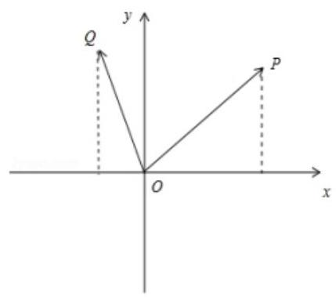

$5\cos \theta  = 4,5\sin \theta  = 3,\therefore \cos \theta  = \frac{4}{5},\sin \theta  = \frac{3}{5}$ ,

$\therefore 5\cos \left( {\theta  + \frac{\pi }{3}}\right)  = \frac{5}{2}\cos \theta  - \frac{5\sqrt{3}}{2}\sin \theta  = 2 - \frac{3\sqrt{3}}{2}$ ,即 $Q$ 点的横坐标是 $2 - \frac{3\sqrt{3}}{2}$ . 故选: $B$ .

【例 12】设椭圆 $\frac{{x}^{2}}{16} + \frac{{y}^{2}}{12} = 1$ 的左、右焦点分别为 ${F}_{1},{F}_{2}$ ,点 $P$ 在椭圆上,且满足 $\overrightarrow{P{F}_{1}} \cdot  \overrightarrow{P{F}_{2}} = 9$ ,则 $\left| {P{F}_{1}}\right|  \cdot  \left| {P{F}_{2}}\right|$ 的值为( )

A. 7 B. 10 C. 12 D. 15

【难度】★★★

【答案】D

【解析】由椭圆标准方程知 $a = 4, b = 2\sqrt{3}, c = 2$ ,

当点 $P$ 为椭圆的左、右顶点时 (不妨令 $P$ 为右顶点),

$\left| {\overline{PF}}_{1}\right|  = a + c = 6,\left| {\overline{PF}}_{2}\right|  = a - c = 2,$

则 $\overrightarrow{P{F}_{1}} \cdot  \overrightarrow{P{F}_{2}} = 6 \times  2 \times  \cos {0}^{ \circ  } = {12}$ ，故点 $P$ 不为椭圆的左、右顶点，

设 $\overrightarrow{P{F}_{1}}$ 和 $\overrightarrow{P{F}_{2}}$ 的夹角为 $\theta$ ,因为 ${\overrightarrow{PF}}_{1} \cdot  {\overrightarrow{PF}}_{2} = 9$ ,

所以 $\left| {P{F}_{1}}\right|  \cdot  \left| {P{F}_{2}}\right| \cos \theta  = 9$ ,

在 $\bigtriangleup P{F}_{1}{F}_{2}$ 中,由余弦定理得 $2\left| {P{F}_{1}}\right|  \cdot  \left| {P{F}_{2}}\right|  \cdot  \cos \theta  = {\left| P{F}_{1}\right| }^{2} + {\left| P{F}_{2}\right| }^{2} - {\left| {F}_{1}{F}_{2}\right| }^{2}$ ,

即 $2\left| {P{F}_{1}}\right|  \cdot  \left| {P{F}_{2}}\right| \cos \theta  = {\left( \left| P{F}_{1}\right|  + \left| P{F}_{2}\right| \right) }^{2} - {\left| {F}_{1}{F}_{2}\right| }^{2} - 2\left| {P{F}_{1}}\right|  \cdot  \left| {P{F}_{2}}\right|$ ,

即 $2 \times  9 = {\left( 2 \times  4\right) }^{2} - {\left( 2 \times  2\right) }^{2} - {21P}{F}_{1}\left| \cdot \right| P{F}_{2} \mid$ ,所以 $\left| {P{F}_{1}}\right|  \cdot  \left| {P{F}_{2}}\right|  = {15}$ .

故选: D.

【例 13】已知 $\bigtriangleup {ABC},\overrightarrow{AB} = \left( {k - 1,2}\right) ,\overrightarrow{AC} = \left( {-1,2}\right)$ .

(1)若 $k = 4$ ，求 ${S}_{\Delta {ABC}}$ ；

(2)若三角形为直角三角形,求 ${S}_{\Delta {ABC}}$ .

【难度】★★

【答案】见解析

【解析】(1) $\overrightarrow{AB} = \left( {3,2}\right)$ ,设 $\overrightarrow{AB}$ 与 $\overrightarrow{AC}$ 为 $\theta ,\cos \theta  = \frac{\overrightarrow{AB} \cdot  \overrightarrow{AC}}{\left| \overrightarrow{AB}\right| \left| \overrightarrow{AC}\right| } = \frac{1}{\sqrt{65}}$ ,则 $\sin \theta  = \frac{8}{\sqrt{65}}$

$\therefore {S}_{\bigtriangleup {ABC}} = \frac{1}{2}\left| \overrightarrow{AB}\right| \left| \overrightarrow{AC}\right| \sin \theta  = 4$

(2)若 $\angle A = {90}^{ \circ  },\overrightarrow{AB} \cdot  \overrightarrow{AC} = 0$ 得 $k = 5\therefore {S}_{\bigtriangleup {ABC}} = 5$

若 $\angle B = {90}^{ \circ  },\overrightarrow{AB} \cdot  \overrightarrow{CB} = 0$ 得 $k = 1$ 或 0 (舍) $\therefore {S}_{\bigtriangleup {ABC}} = 1$

若 $\angle C = {90}^{ \circ  },\overrightarrow{AC} \cdot  \overrightarrow{CB} = 0$ ,得 $k = 0$ (舍)

【例 14】若 $\left| \overrightarrow{a}\right|  = 2,\left| \overrightarrow{b}\right|  = 1$ ,且 $\overrightarrow{a}$ 与 $\overrightarrow{b}$ 的夹角为 ${60}^{ \circ  }$ ,当 $\left| {\overrightarrow{a} - x\overrightarrow{b}}\right|$ 取得最小值时,实数 $x$ 的值为( )

A. 2 B. -2 C. 1 D. -1

【难度】★★★

【答案】C

【解析】试题分析: ${\left( \dot{a} - x\dot{b}\right) }^{2} = 4 - {2x}\dot{a} \cdot  \dot{b} + {x}^{2} = {x}^{2} - {2x} + 4 = {\left( x - 1\right) }^{2} + 3$ ,可知当 $x = 1$ 时, $\left| {\dot{a} - x\dot{b}}\right|$ 取得最小值.

## 巩固训练

1、下列命题中，正确的是___( )

A. 若 $\left| \overrightarrow{a}\right|  = \left| \overrightarrow{b}\right|$ ,则 $\overrightarrow{a} = \overrightarrow{b}$ 或 $\overrightarrow{a} =  - \overrightarrow{b}$ ; B. 若 $\overrightarrow{a} \cdot  \overrightarrow{b} = 0$ ,则 $\overrightarrow{a} = \overrightarrow{0}$ 或 $\overrightarrow{b} = \overrightarrow{0}$ ;

C. 若 $k\overrightarrow{a} = \overrightarrow{0}$ ，则 $k = 0$ 或 $\overrightarrow{a} = \overrightarrow{0}$ ； D. 若 $\overrightarrow{a}\text{ 、 }\overrightarrow{b}$ 都是非零向量,则 $\left| {\overrightarrow{a} + \overrightarrow{b}}\right|  > \left| {\overrightarrow{a} - \overrightarrow{b}}\right|$ .

【难度】 $\star   \star$

【答案】C

【解析】A 方向不一定共线 B 夹角可能是 90 度 D 三角形法则大小不确定

2、在四边形 ${ABCD}$ 中， $\overrightarrow{AB} = \overrightarrow{DC}$ ，且 $\overrightarrow{AC} \cdot  \overrightarrow{BD} = 0$ ，则四边形 ${ABCD}$ 是( )

A. 菱形; B. 矩形; C. 直角梯形; D. 等腰梯形.

【难度】 $\star   \star$

【答案】A

【解析】四边形 ${ABCD}$ 平行且对角线垂直

3、在 $\bigtriangleup  {ABC}$ 中， $\overrightarrow{AB} = \overrightarrow{c},\overrightarrow{BC} = \overrightarrow{a},\overrightarrow{CA} = \overrightarrow{b}$ ，则下列正确命题的个数是( ).

①若 $\overrightarrow{a} \cdot  \overrightarrow{b} < 0$ ，则 $\bigtriangleup  {ABC}$ 是钝角三角形；

②若 $\overrightarrow{a} \cdot  \overrightarrow{b} = 0$ ，则 $\bigtriangleup  {ABC}$ 是直角三角形；

③ 若 $\overrightarrow{a} \cdot  \overrightarrow{b} = \overrightarrow{b} \cdot  \overrightarrow{c}$ ，则 $\bigtriangleup  {ABC}$ 是等腰三角形；

④若 $\left( {\overrightarrow{a} + \overrightarrow{b} + \overrightarrow{c}}\right)  \cdot  \overrightarrow{c} = 0$ ，则 $\bigtriangleup  {ABC}$ 是正三角形.

A. 1 B. 2 C. 3 D. 4

【难度】 $\star   \star   \star$

【答案】B

【解析】对于①,若 $\overrightarrow{a} \cdot  \overrightarrow{b} < 0$ ,则 $\angle {BCA}$ 为锐角,不能推出 $\bigtriangleup  {ABC}$ 是钝角三角形，故①不正确； 对于②,若 $\overrightarrow{a} \cdot  \overrightarrow{b} = 0$ ，则 $\angle {BCA}$ 为直角，所以 $\bigtriangleup  {ABC}$ 是直角三角形，故②正确；

对于③，若 $\overrightarrow{a} \cdot  \overrightarrow{b} = \overrightarrow{b} \cdot  \overrightarrow{c}$ ，则 $\overrightarrow{b} \cdot  \left( {\overrightarrow{a} - \overrightarrow{c}}\right)  = 0$ ，即 $\overrightarrow{AC} \cdot  \left( {\overrightarrow{BC} - \overrightarrow{AB}}\right)  = 0$ ，所以 $\overrightarrow{AC} \cdot  \left( {\overrightarrow{BC} + \overrightarrow{BA}}\right)  = 0$ ，取 ${AC}$ 的中点为 $E$ ,则 $2\overrightarrow{BE} \cdot  \overrightarrow{AC} = 0$ ,所以 $\overrightarrow{BE} \bot  \overrightarrow{AC}$ ,所以 ${BE} \bot  {AC}$ ,所以 ${BC} = {BA}$ ,所以 $\bigtriangleup  {ABC}$ 是等腰三角

形, 故③正确；

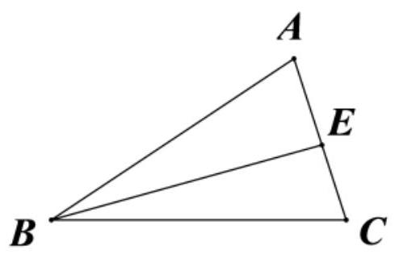

对于④,若 $\left( {\overrightarrow{a} + \overrightarrow{b} + \overrightarrow{c}}\right)  \cdot  \overrightarrow{c} = 0$ ,则 $\left( {\overrightarrow{AB} + \overrightarrow{BC} + \overrightarrow{CA}}\right)  \cdot  \overrightarrow{CA} = 0$ ,则 $\overrightarrow{0} \cdot  \overrightarrow{CA} = 0$ 恒成立,不能推出 $\vartriangle  {ABC}$ 是正三角形, 故④不正确.

故选: B. 4、已知 $\bigtriangleup  \mathrm{{ABC}}$ 的外接圆半径为 2，D 为该圆上一点，且 $\overline{AB} + \overline{AC} = \overline{AD}$ ，则 $\bigtriangleup  \mathrm{{ABC}}$ 的面积的最大值为( )

A. $4\sqrt{3}$ B. $3\sqrt{3}$ C. 4 D. 3

【难度】 $\star   \star   \star$

【答案】C

【解析】由 $\overrightarrow{AB} + \overrightarrow{AC} = \overrightarrow{AD}$ 知, ${ABDC}$ 为平行四边形,又 $A, B, C, D$ 四点共圆,

$\therefore {ABDC}$ 为矩形，即 ${BC}$ 为圆的直径，设 $\mathrm{h}$ 为三角形 $\mathrm{{ABC}}$ 的高，以 $\mathrm{{BC}}$ 为底，

$\bigtriangleup {ABC}$ 的面积 $= \frac{1}{2} \times  {BC} \times  h, h \leq  r = 2$ ；

此时 ${AB} = {AC},\bigtriangleup {ABC}$ 的面积取得最大值 $\frac{1}{2} \times  2 \times  4 = 4$ .

故选 C.

5、已知 $\bigtriangleup  {ABC}$ 的面积为1、在 $\bigtriangleup  {ABC}$ 所在的平面内有两点 $P$ 、 $Q$ ，满足 $\overrightarrow{PA} + \overrightarrow{PC} = \overrightarrow{0},\overrightarrow{QA} + \overrightarrow{QB} + \overrightarrow{QC} = \overrightarrow{BC}$ ， 则 $\bigtriangleup  {APQ}$ 的面积为___.

【难度】 $\star   \star   \star$

【答案】 $\frac{1}{3}$

【解析】分解定理, 三角形法则

6、如图，在 $\bigtriangleup  {ABC}$ 中，已知 $\overline{BD} = \frac{1}{2}\overline{DC}$ ， $P$ 为 ${AD}$ 上一点，且满足 $\overline{CP} = m\overline{CA} + \frac{4}{9}\overline{CB}$ ，若 $\bigtriangleup  {ABC}$ 的面积为 $\sqrt{3}$ ， $\angle {ACB} = \frac{\pi }{3}$ ，则 $\left| \overline{CP}\right|$ 的最小值为___.

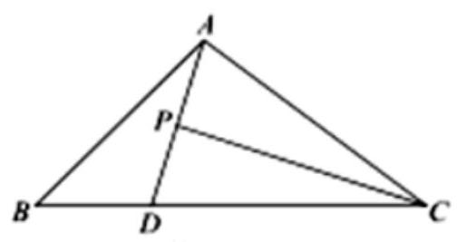

【难度】 $\star   \star   \star$

【答案】 $\frac{4}{3}$

【解析】设 $\overrightarrow{AP} = \lambda \overrightarrow{AD}$ ,则 $\overrightarrow{CP} = \overrightarrow{CA} + \lambda \overrightarrow{AD} = \overrightarrow{CA} + \lambda \left( {\overrightarrow{CD} - \overrightarrow{CA}}\right)  = \left( {1 - \lambda }\right) \overrightarrow{CA} + \frac{2}{3}\lambda \overrightarrow{CB}$ .

由平面向量基本定理可得: $\left\{  \begin{array}{l} 1 - \lambda  = m \\  \frac{4}{9} = \frac{2}{3}\lambda  \end{array}\right.$ ,解得: $m = \frac{1}{3}$ ,

$\therefore \overline{CP} = \frac{1}{3}\overline{CA} + \frac{4}{9}\overline{CB}$ ,令 $\left| \overline{CA}\right|  = x,\left| \overline{CB}\right|  = y$ ,则 ${S}_{\bigtriangleup {ABC}} = \frac{1}{2}\left| \overline{CA}\right|  \times  \left| \overline{CB}\right|  \times  \sin \angle {ACB} = \frac{\sqrt{3}}{4}{xy} = \sqrt{3}$ , $\therefore {xy} = 4$ ,且 $x > 0, y > 0$ .

$\therefore {\left| \overrightarrow{CP}\right| }^{2} = \frac{1}{9}{x}^{2} + \frac{16}{81}{y}^{2} + \frac{4}{27}{xy} = \frac{1}{9}{x}^{2} + \frac{16}{81}{y}^{2} + \frac{16}{27} \geq  2\sqrt{\frac{1}{9}{x}^{2} \times  \frac{16}{81}{y}^{2}} + \frac{16}{27} = \frac{16}{9}$ ,

当且仅当 $\frac{1}{9}{x}^{2} = \frac{16}{81}{y}^{2}$ ,即 ${3x} = {4y}$ ,即 $3\left| \overrightarrow{CA}\right|  = 4\left| \overrightarrow{CB}\right|$ 时等号成立. 即 ${\left| \overrightarrow{CP}\right| }_{\min } = \frac{4}{3}$ .

## 实战演练

## 一、填空题(共6小题)

1、如图，在 $\bigtriangleup  {ABC}$ 中， $\overrightarrow{AN} = 2\overrightarrow{NC}$ ， $P$ 是 ${BN}$ 上一点，若 $\overrightarrow{AP} = t\overrightarrow{AB} + \frac{1}{3}\overrightarrow{AC}$ ，则实数 $t$ 的值为___.

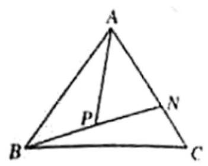

【难度】 $\star   \star$

【答案】 $\frac{1}{2}$

【解析】由题意, $P$ 是 ${BN}$ 上一点,设 $\overline{BP} = \lambda \overline{BN}$ ,

则 $\overrightarrow{AP} = \overrightarrow{AB} + \overrightarrow{BP} = \overrightarrow{AB} + \lambda \overrightarrow{BN} = \overrightarrow{AB} + \lambda \left( {\overrightarrow{AN} - \overrightarrow{AB}}\right)  = \left( {1 - \lambda }\right) \overrightarrow{AB} + \lambda \overrightarrow{AN}$ ,

又 $\overrightarrow{AN} = 2\overrightarrow{NC}$ ,所以 $\overrightarrow{AN} = \frac{2}{3}\overrightarrow{AC}$ ,

所以 $\overrightarrow{AP} = \left( {1 - \lambda }\right) \overrightarrow{AB} + \frac{2}{3}\lambda \overrightarrow{AC} = t\overrightarrow{AB} + \frac{1}{3}\overrightarrow{AC}$ ,所以 $\left\{  \begin{array}{l} 1 - \lambda  = t \\  \frac{2}{3}\lambda  = \frac{1}{3} \end{array}\right.$ ,解得 $t = \frac{1}{2}$ .

2、已知向量 $\overrightarrow{a},\overrightarrow{b}$ 是平面内的一组基底，若 $\overrightarrow{m} = x\overrightarrow{a} + y\overrightarrow{b}$ ，则称有序实数对 $\left( {x, y}\right)$ 为向量 $\overrightarrow{m}$ 在基底 $\overrightarrow{a},\overrightarrow{b}$ 下的坐标. 给定一个平面向量 $\overrightarrow{p}$ ，已知 $\overrightarrow{p}$ 在基底 $\overrightarrow{a},\overrightarrow{b}$ 下的坐标为 $\left( {1,2}\right)$ ，那么 $\overrightarrow{p}$ 在基底 $\overrightarrow{a} - \overrightarrow{b},\overrightarrow{a} + \overrightarrow{b}$ 下的坐标为 ___.

【难度】 $\star   \star$

【答案】 $\left( {-\frac{1}{2},\frac{3}{2}}\right)$

【解析】解: 由 $\overrightarrow{p}$ 在基底 $\overrightarrow{a},\overrightarrow{b}$ 下的坐标为 $\left( {1,2}\right)$ ,得 $\overrightarrow{p} = \overrightarrow{a} + 2\overrightarrow{b}$ ,

设 $\overrightarrow{p}$ 在基底 $\overrightarrow{a} - \overrightarrow{b},\overrightarrow{a} + \overrightarrow{b}$ 下的坐标为 $\left( {m, n}\right)$ ,则 $\overrightarrow{p} = m\left( {\overrightarrow{a} - \overrightarrow{b}}\right)  + n\left( {\overrightarrow{a} + \overrightarrow{b}}\right)$

所以 $\overrightarrow{p} = \left( {m + n}\right) \overrightarrow{a} + \left( {n - m}\right) \overrightarrow{b}$ ,所以 $\left\{  \begin{array}{l} m + n = 1 \\  n - m = 2 \end{array}\right.$ ,解得 $\left\{  \begin{array}{l} m =  - \frac{1}{2} \\  n = \frac{3}{2} \end{array}\right.$ ,

所以 $\overrightarrow{p}$ 在基底 $\overrightarrow{a} - \overrightarrow{b},\overrightarrow{a} + \overrightarrow{b}$ 下的坐标为 $\left( {-\frac{1}{2},\frac{3}{2}}\right)$ ,故答案为: $\left( {-\frac{1}{2},\frac{3}{2}}\right)$

3、在平面直角坐标系 ${xOy}$ 中,坐标原点 $O\left( {0,0}\right)$ 、点 $P\left( {1,2}\right)$ ,将向量 $\overline{OP}$ 绕点 $O$ 按逆时针方向旋转 $\frac{5\pi }{6}$ 后得向量 $\overline{OQ}$ ，则点 $Q$ 的横坐标是___.

【难度】 $\star   \star$

【答案】 $- \frac{\sqrt{3}}{2} - 2\sqrt{5}$

【解析】 $\because P\left( {1,2}\right) ,\therefore {OP} = \sqrt{5},\overrightarrow{OP} = \left( {1,2}\right) ,\because {OP}$ 绕原点按逆时针方向旋转 $\frac{5\pi }{6}$ 得 ${OQ}$ ,

$\therefore \angle {POQ} = \frac{5\pi }{6},{OP} = {OQ} = \sqrt{5}$ ,且 $Q$ 在第三象限,

设 $\overrightarrow{OQ} = \left( {x, y}\right)$ ,则 $\cos \frac{5\pi }{6} = \frac{\overrightarrow{OP} \cdot  \overrightarrow{OQ}}{\left| \overrightarrow{OP}\right|  \cdot  \left| \overrightarrow{OQ}\right| } = \frac{x + {2y}}{5} =  - \frac{\sqrt{3}}{2}$ ①,结合 ${x}^{2} + {y}^{2} = 5$ ②,

由①②得: $x =  - \frac{\sqrt{3}}{2} - 2\sqrt{5}$ ，故答案为: $- \frac{\sqrt{3}}{2} - 2\sqrt{5}$ .

4、如图，在平行四边形 ${ABCD}$ 中， $E$ 为 ${BC}$ 中点， ${AE}$ 交 ${BD}$ 于点 $F$ ，且 $\overrightarrow{AF} = x\overrightarrow{AB} + y\overrightarrow{AD}$ 则 $x + y =$ ___.

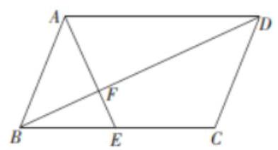

【难度】★★

【答案】 1

【解析】因为在平行四边形 ${ABCD}$ 中, $E$ 为 ${BC}$ 中点,所以 $\overrightarrow{AE} = \overrightarrow{AB} + \overrightarrow{BE} = \overrightarrow{AB} + \frac{1}{2}\overrightarrow{BD}$ ,

又为 $\bigtriangleup {AFD} \cong  \bigtriangleup {EFB}$ ,所以 $\frac{AF}{FE} = \frac{AD}{EB} = 2$ ,所以 ${AF} = {2FE},{AF} = \frac{2}{3}{AE}$ ,

所以 $\overrightarrow{AF} = \frac{2}{3}\overrightarrow{AE} = \frac{2}{3}\left( {\overrightarrow{AB} + \frac{1}{2}\overrightarrow{BD}}\right)  = \frac{2}{3}\overrightarrow{AB} + \frac{1}{3}\overrightarrow{BD}$ ,

又已知 $\overrightarrow{AF} = x\overrightarrow{AB} + y\overrightarrow{AD}$ ,

根据平面向量基本定理可得 $x = \frac{2}{3}, y = \frac{1}{3}$ ,所以 $x + y = \frac{2}{3} + \frac{1}{3} = 1$ ,

故答案为:1.

5、在平行四边形 ${ABCD}$ 中， ${AD} = 1$ ， ${AB} = 2$ ， $\angle {BAD} = {60}^{ \circ  }$ ， $E$ 是 ${CD}$ 的中点，则 $\overline{AC} \cdot  \overline{BE} =$ ___.

【难度】★★

【答案】 $- \frac{1}{2}$

【解析】

如下图所示:

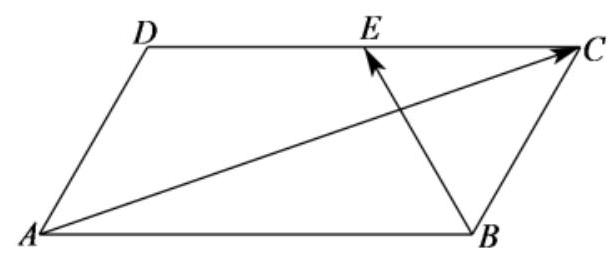

由题意可得 $\overrightarrow{AC} = \overrightarrow{AB} + \overrightarrow{AD},\overrightarrow{BE} = \overrightarrow{BC} + \overrightarrow{CE} = \overrightarrow{AD} - \frac{1}{2}\overrightarrow{AB}$ ,

$\because {AD} = 1,{AB} = 2,\angle {BAD} = {60}^{ \circ  },\therefore \overrightarrow{AB} \cdot  \overrightarrow{AD} = \left| \overrightarrow{AB}\right|  \cdot  \left| \overrightarrow{AD}\right| \cos \angle {BAD} = 1$ ,

因此, $\overrightarrow{AC} \cdot  \overrightarrow{BE} = \left( {\overrightarrow{AD} + \overrightarrow{AB}}\right)  \cdot  \left( {\overrightarrow{AD} - \frac{1}{2}\overrightarrow{AB}}\right)  = {\overrightarrow{AD}}^{2} + \frac{1}{2}\overrightarrow{AB} \cdot  \overrightarrow{AD} - \frac{1}{2}{\overrightarrow{AB}}^{2} = {1}^{2} + \frac{1}{2} \times  1 - \frac{1}{2} \times  {2}^{2} =  - \frac{1}{2}$ . 故答案为: $- \frac{1}{2}$ .

6、已知点 $O$ 是 $\bigtriangleup  {ABC}$ 的重心，内角 $A$ 、 $B$ 、 $C$ 所对的边长分别为 $a$ 、 $b$ 、 $c$ ，且 ${2a} \cdot  \overrightarrow{OA} + b \cdot  \overrightarrow{OB} + \frac{2\sqrt{3}}{3}c \cdot  \overrightarrow{OC} = \overrightarrow{0}$ ，则角 $C$ 的大小是___.

【难度】 $\star   \star   \star$

【答案】 $\frac{\pi }{3}$

【解析】

试题分析: $\because$ 点 $O$ 是 $\bigtriangleup {ABC}$ 的重心, $\therefore \overrightarrow{OA} + \overrightarrow{OB} + \overrightarrow{OC} = \overrightarrow{0}$

又 $\because {2a} \cdot  \overrightarrow{OA} + b \cdot  \overrightarrow{OB} + \frac{2\sqrt{3}}{3}c \cdot  \overrightarrow{OC} = \overrightarrow{0},\therefore {2a} = b = \frac{2\sqrt{3}}{3}c = k\;\left( {\mathrm{k} > 0}\right)$

从而 $a = \frac{k}{2}, b = k, c = \frac{\sqrt{3}}{2}k$ ,由余弦定理得: $\cos C = \frac{{a}^{2} + {b}^{2} - {c}^{2}}{2ab} = \frac{\frac{{k}^{2}}{4} + {k}^{2} - \frac{3}{4}{k}^{2}}{2 \cdot  \frac{k}{2} \cdot  k} = \frac{1}{2}$

又 $\because C \in  \left( {0,\pi }\right) ,\therefore C = \frac{\pi }{3}\therefore$ 角 $C$ 的大小是 $\frac{\pi }{3}$ ; 故答案为 $\frac{\pi }{3}$

## 二、选择题(共4小题)

7、如果 $\overline{{e}_{1}},\overline{{e}_{2}}$ 是平面 $\alpha$ 内两个不共线的向量，那么下列说法中正确的是( )

A. $\lambda \overline{{e}_{1}} + \mu \overline{{e}_{2}}\left( {\lambda ,\mu  \in  \mathbf{R}}\right)$ ,可以表示平面 $\alpha$ 内的所有向量

B. 对于平面 $\alpha$ 内任一向量 $\bar{a}$ ,使 $\bar{a} = \lambda \overline{{e}_{1}} + \mu \overline{{e}_{2}}$ ,的实数对 $\left( {\lambda ,\mu }\right)$ 有无穷多个

C. 若向量 ${\lambda }_{1}\overline{{e}_{1}} + {\mu }_{1}\overline{{e}_{2}}$ 与 ${\lambda }_{2}\overline{{e}_{1}} + {\mu }_{2}\overline{{e}_{2}}$ 共线,则有且只有一个实数 $\lambda$ ,使得 ${\lambda }_{1}\overline{{e}_{1}} + {\mu }_{1}\overline{{e}_{2}} = \lambda \left( {{\lambda }_{2}\overline{{e}_{1}} + {\mu }_{2}\overline{{e}_{2}}}\right)$

D. 不存在实数 $\lambda ,\mu$ 使得 $\lambda \overrightarrow{{e}_{1}} + \mu \overrightarrow{{e}_{2}} = 0$ ,则 $\lambda  = \mu  = 0$

【难度】 $\star   \star$

【答案】A

【解析】由平面向量基本定理可知, $A$ 、 $D$ 是正确的. 对于 $B$ ，由平面向量基本定理可知，如果一个平面的基底确定, 那么任意一个向量在此基底下的实数对是唯一的, 所以不正确;

对于 $C$ ,当两向量的系数均为零,即 ${\lambda }_{1} = {\lambda }_{2} = {\mu }_{1} = {\mu }_{2} = 0$ 时,

这样的 $\lambda$ 有无数个，所以不正确. 对于 $D$ ，存在 $\lambda  = \mu  = 0$ 使得 $\lambda \overline{{e}_{1}} + \mu \overline{{e}_{2}} = 0$ 。

故选: $A$ .

8、若已知 $\overrightarrow{{e}_{1}}$ 、 $\overrightarrow{{e}_{2}}$ 是平面上的一组基底,则下列各组向量中不能作为基底的一组是( )

A、 $\overrightarrow{{e}_{1}}$ 与 $- \overrightarrow{{e}_{2}}$ B、 $3\overrightarrow{{e}_{1}}$ 与 $2\overrightarrow{{e}_{2}}$ C、 $\overrightarrow{{e}_{1}} + \overrightarrow{{e}_{2}}$ 与 $\overrightarrow{{e}_{1}} - \overrightarrow{{e}_{2}}$ D、 $\overrightarrow{{e}_{1}}$ 与 $2\overrightarrow{{e}_{1}}$

【难度】 $\star   \star$

【答案】D

【解析】满足基底的条件

9、设 $\overrightarrow{a},\overrightarrow{b}$ 是单位向量，且 $\overrightarrow{a} \cdot  \overrightarrow{b} = \frac{1}{3}$ ，向量 $\overrightarrow{c}$ 满足 $\overrightarrow{c} \cdot  \overrightarrow{a} = \overrightarrow{c} \cdot  \overrightarrow{b} = 2$ ，则 $\left| \overrightarrow{c}\right|  =$ ( )

A. $\frac{2\sqrt{6}}{3}$ B. $\sqrt{6}$

C. $\frac{3\sqrt{6}}{2}$ D. $2\sqrt{6}$

【难度】★★

【答案】B

【解析】解法 1、由题意可设 $\overrightarrow{c} = \lambda \overrightarrow{a} + \mu \overrightarrow{b}\left( {\lambda ,\mu  \in  R}\right)$ ,则 $\overrightarrow{c} \cdot  \overrightarrow{a} = \lambda  + \frac{1}{3}\mu  = 2,\overrightarrow{c} \cdot  \overrightarrow{b} = \frac{1}{3}\lambda  + \mu  = 2$ , 所以 $\lambda  = \mu  = \frac{3}{2}$ ,所以 $\left| \overrightarrow{c}\right|  = \frac{3}{2}\left| {\overrightarrow{a} + \overrightarrow{b}}\right|  = \frac{3}{2}\sqrt{{\overrightarrow{a}}^{2} + 2\overrightarrow{a} \cdot  \overrightarrow{b} + {\overrightarrow{b}}^{2}} = \sqrt{6}$ .

解法 2、因为 $\overrightarrow{c} \cdot  \overrightarrow{a} = \overrightarrow{c} \cdot  \overrightarrow{b}$ ，所以 $\overrightarrow{a},\overrightarrow{b}$ 在 $\overrightarrow{c}$ 方向上的投影相等，从而 $\overrightarrow{c}$ 在 $\overrightarrow{a},\overrightarrow{b}$ 夹角的平分线上，

由 $\overrightarrow{a} \cdot  \overrightarrow{b} = \frac{1}{3}$ ，且 $\overrightarrow{a},\overrightarrow{b}$ 为单位向量，可得 $\overrightarrow{a},\overrightarrow{b}$ 的夹角 $\theta$ 的余弦值 $\cos \theta  = \frac{1}{3}$ ，

由 $\cos \theta  = 2{\cos }^{2}\frac{\theta }{2} - 1$ 可得, $\cos \frac{\theta }{2} = \frac{\sqrt{2}}{\sqrt{3}} = \frac{\sqrt{6}}{3}$ ,

即 $\overrightarrow{a},\overrightarrow{b}$ 在 $\overrightarrow{c}$ 方向上的投影均为 $\frac{\sqrt{6}}{3}$ ,所以 $\left| \overrightarrow{c}\right|  = \frac{2}{\frac{\sqrt{6}}{3}} = \sqrt{6}$ .

故选: $B$ .

10、在矩形 ${ABCD}$ 中， ${AB} = 3$ ， ${AD} = 4$ ，点 $P$ 是以点 $C$ 为圆心，2 为半径的圆上的动点，设 $\overrightarrow{AP} = \lambda \overrightarrow{AB} + \mu \overrightarrow{AD}$ ，则 $\lambda  + \mu$ 的最小值为( )

A. 1

B. $\frac{7}{6}$ C. 2

D. $\frac{8}{3}$

【难度】 $\star   \star   \star$

【答案】B

【解析】

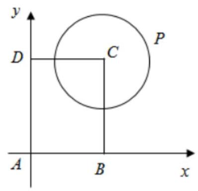

如图，以点 $A$ 为坐标圆，以 ${AB}$ 所在直线为 $x$ 轴，以 ${AD}$ 所在直线为 $y$ 轴，

则 $A\left( {0,0}\right)$ , $B\left( {3,0}\right)$ , $D\left( {0,4}\right)$ , $C\left( {3,4}\right)$ ,

点 $P$ 是以点 $C$ 为圆心,2 为半径的圆上的动点,

所以圆 $C$ 的方程为: ${\left( x - 3\right) }^{2} + {\left( y - 4\right) }^{2} = 4$ ,

设 $P\left( {2\cos \theta  + 3,2\sin \theta  + 4}\right)$ ,

又 $\overrightarrow{AP} = \lambda \overrightarrow{AB} + \mu \overrightarrow{AD}$ ,所以 $\left\{  \begin{array}{l} 2\cos \theta  + 3 = {3\lambda } \\  2\sin \theta  + 4 = {4\mu } \end{array}\right.$ ,

从而 $\lambda  + \mu  = \frac{2}{3}\cos \theta  + \frac{1}{2}\sin \theta  + 2 = \frac{5}{6}\sin \left( {\theta  + \varphi }\right)  + 2 \geq  \frac{7}{6}$ .

故选: B.

## 三、解答题(共2小题)

11、已知 $\bigtriangleup  {ABC}$ 内一点 $P$ 满足 $\overline{AP} = \lambda \overline{AB} + \mu \overline{AC}$ ，若 $\bigtriangleup  {PAB}$ 的面积与 $\bigtriangleup  {ABC}$ 的面积之比为1:3， $\bigtriangleup  {PAC}$ 的面积与 $\bigtriangleup  {ABC}$ 的面积之比为1:4，求实数 $\lambda ,\mu$ 的值.

【难度】 $\star   \star$

【答案】 $\lambda  = \frac{1}{4},\mu  = \frac{1}{3}$

【解析】如图,过点 $P$ 作 ${PM}//{AC},{PN}//{AB}$ ,则 $\overrightarrow{AP} = \overrightarrow{AM} + \overrightarrow{AN}$ ,所以 $\overrightarrow{AM} = \lambda \overrightarrow{AB},\overrightarrow{AN} = \mu \overrightarrow{AC}$ . 作 ${PG} \bot  {AC}$ 于点 $G$ , ${BH} \bot  {AC}$ 于点 $H$ .

因为 $\frac{{S}_{\bigtriangleup {PAC}}}{{S}_{\bigtriangleup {ABC}}} = \frac{1}{4}$ ,所以 $\frac{PG}{BH} = \frac{1}{4}$ .

又因为 $\bigtriangleup {PNG} \sim  \bigtriangleup {BAH}$ ,所以 $\frac{PG}{BH} = \frac{PN}{AB} = \frac{1}{4}$ ,

即 $\frac{AM}{AB} = \frac{1}{4}$ ,所以 $\lambda  = \frac{1}{4}$ ,同理 $\mu  = \frac{1}{3}$ .

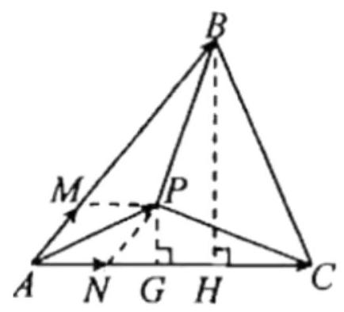

12、如图所示，在 $\bigtriangleup  {ABC}$ 中，已知 ${CA} = 3,{CB} = 4$ ， $\angle {ACB} = {60}^{ \circ  }$ ， ${CH}$ 为 ${AB}$ 边上的高.

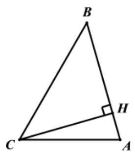

(1)求 $\overrightarrow{CA} \cdot  \overrightarrow{AB}$ ；

(2)设 $\overrightarrow{CH} = m\overrightarrow{CB} + n\overrightarrow{CA}$ ，其中 $m$ ， $n \in  \mathbf{R}$ ，求 $m$ ， $n$ 的值.

【难度】 $\star   \star   \star$

【答案】(1) $- 3,\left( 2\right) m = \frac{3}{13}, n = \frac{10}{13}$

【解析】解: (1) 因为 $\overrightarrow{AB} = \overrightarrow{CB} - \overrightarrow{CA},{CA} = 3,{CB} = 4,\angle {ACB} = {60}^{ \circ  }$ ,

所以 $\overrightarrow{CA} \cdot  \overrightarrow{AB} = \overrightarrow{CA} \cdot  \left( {\overrightarrow{CB} - \overrightarrow{CA}}\right)  = \overrightarrow{CA} \cdot  \overrightarrow{CB} - {\overrightarrow{CA}}^{2}$

$= \left| \overrightarrow{CA}\right| \left| \overrightarrow{CB}\right| \cos {60}^{ \circ  } - {\left| \overrightarrow{CA}\right| }^{2}$

$= 3 \times  4 \times  \frac{1}{2} - {3}^{2} =  - 3$ ,

(2)因为 ${CH} \bot  {AB}$ ,所以 $\overrightarrow{CH} \cdot  \overrightarrow{AB} = 0$ ，即 $\left( {m\overrightarrow{CB} + n\overrightarrow{CA}}\right)  \cdot  \overrightarrow{AB} = 0$ ，

所以 $\left( {m\overrightarrow{CB} + n\overrightarrow{CA}}\right)  \cdot  \left( {\overrightarrow{CB} - \overrightarrow{CA}}\right)  = 0, m{\overrightarrow{CB}}^{2} + \left( {n - m}\right) \overrightarrow{CB} \cdot  \overrightarrow{CA} - n{\overrightarrow{CA}}^{2} = 0$ ,

所以 ${16m} + 6\left( {n - m}\right)  - {9n} = 0$ ,即 ${10m} - {3n} = 0$ ,

因为 $A, B, H$ 三点共线,所以 $m + n = 1$ ,所以 $m = \frac{3}{13}, n = \frac{10}{13}$
