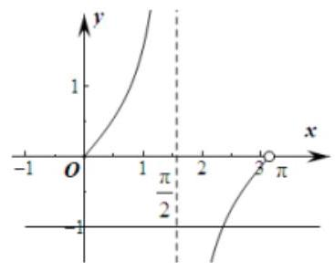
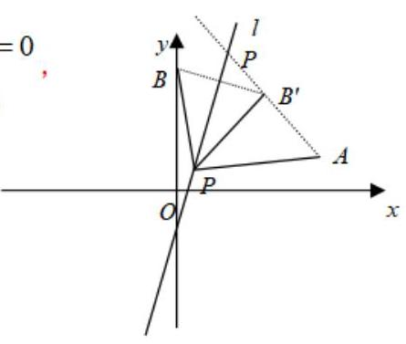
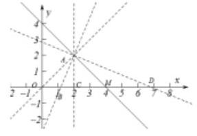
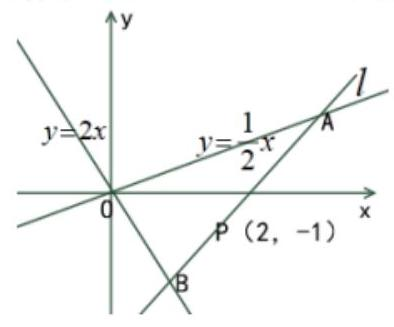

直线方程

<table><tr><td>教学目标</td><td>1. 掌握求直线方程的方法, 并能熟练转化确定直线方向的不同条件;   2. 掌握直线的斜率和倾斜角之间的关系, 会确定斜率的取值范围;   3. 会建立直线的方程, 从中体会向量知识的应用和坐标法的含义, 进一步认识数形结合思想的作用，逐步确立事物之间的相互联系和相互转化的观点.   4. 掌握两条直线平行与垂直的条件, 能够根据方程判定两条直线的位置关系;   5. 会求两直线交点坐标与夹角掌握两直线夹角、点到直线间的距离公式及其应用;   6. 掌握对称问题的基本处理方法, 能运用两条直线位置关系理论解决实际问题.</td></tr><tr><td>重点</td><td>1、根据两个独立条件求出直线方程, 待定系数法的熟练运用;   2、直线的倾斜角和斜率;   3、两条直线平行与垂直的条件求解及位置关系的判断；   4、有关直线的对称问题</td></tr><tr><td>难 点</td><td>1、直线的倾斜角和斜率   2、有关直线的对称问题</td></tr></table>

## (一) 直线方程

## 知识梳理

## 一、直线方程的几种形式

<table id="cross-table-1"><tr><td>名称</td><td>方程</td><td>说明</td><td>适用范围</td></tr><tr><td>点方向式</td><td>$\frac{x - {x}_{0}}{u} = \frac{y - {y}_{0}}{v}$</td><td>$\left( {{x}_{0},{y}_{0}}\right)$ ——直线上已知点， $\overrightarrow{d} = \left( {u, v}\right)$ ——直线方向向量</td><td>$u \neq  0, v \neq  0$</td></tr><tr><td>斜截式</td><td>$y = {kx} + b$</td><td>$k$ 、 $b$ 分别表示直线的斜率和在纵轴上的截距</td><td>直线斜率存在</td></tr><tr><td>点法向式</td><td>$a\left( {x - {x}_{0}}\right)  + b\left( {y - {y}_{0}}\right)  = 0$</td><td>$\left( {{x}_{0},{y}_{0}}\right)$ ——直线上已知点，    $\overrightarrow{n} = \left( {a, b}\right)$ ——直线的法向量</td><td>平面直角坐标系内的直线都适用</td></tr><tr><td>点斜式</td><td>$y - {y}_{0} = k\left( {x - {x}_{0}}\right)$</td><td>$\left( {{x}_{0},{y}_{0}}\right)$ ——直线上已知点， $k$ ——斜率</td><td>斜率存在的直线，即不含直线 $x = {x}_{0}$</td></tr><tr><td>一般式</td><td>${ax} + {by} + c = 0$    $\left( {{a}^{2} + {b}^{2} \neq  0}\right)$</td><td>$\overrightarrow{n} = \left( {a, b}\right)$ 为直线的法向量    $\overrightarrow{d} = \left( {b, - a}\right)$ 为直线方向向量</td><td>平面直角坐标系内的直线都适用</td></tr><tr><td>截距式</td><td>$\frac{x}{a} + \frac{y}{b} = 1$</td><td>$a$ 为 $x$ 轴上截距 $b$ 为 $y$ 轴上截距</td><td>不过原点且不与坐标轴平行的直线</td></tr></table>

二、倾斜角与斜率

(1)倾斜角:在平面直角坐标系中，把 x 轴绕直线 L 与 x 轴的交点按逆时针方向旋转到和直线重合时所转的最小正角。当直线和 $x$ 轴平行或重合时,我们规定直线的倾斜角为 ${0}^{ \circ  }$ ,故倾斜角的范围是 $\lbrack 0,\pi )$ .

(2)斜率:不是 ${90}^{ \circ  }$ 的倾斜角的正切值叫做直线的斜率，即 $k = \tan \alpha$ 。( ${90}^{ \circ  }$ 的倾斜角的斜率不存在)

(3)求直线斜率的方法

①定义法:已知直线的倾斜角为 $\alpha$ ，且，则斜率 $k = \tan \alpha$ .

②公式法:已知直线过两点 ${P}_{1}\left( {{x}_{1},{y}_{1}}\right)$ 、 ${P}_{2}\left( {{x}_{2},{y}_{2}}\right)$ ，且 ${x}_{1} \neq  {x}_{2}$ ，则斜率 $k = \frac{{y}_{2} - {y}_{1}}{{x}_{2} - {x}_{1}}$ .

③方向向量法:若 $\dot{\alpha } = \left( {m, n}\right)$ 为直线的方向向量，则直线的斜率 $k = \frac{n}{m}$ .

(4)求直线倾斜角的方法

直线斜率 $k$ 不存在,倾斜角 $\alpha  = {90}^{ \circ  }$ ; 当 ${x}_{1} \neq  {x}_{2}$ 时,直线斜率存在,是一实数,并且 $k \geq  0$ 时, $\alpha  = \arctan k, k < 0$ 时, $\alpha  = \pi  + \arctan k$ .

三、直线的一般式方程

我们已经介绍了直线方程的几种特殊形式,它们都是关于x和y的二元一次方程. 事实上,在平面直角坐标系中，任何一个关于x，y的二元一次方程 ${ax} + {by} + c = 0$ (a，b不同时为0)都表示一条直线.

方程 ${ax} + {by} + c = 0$ ( $a, b$ 不同时为0) 叫做直线的一般式方程.

我们可以将这个方程化为 $a\left( {x - 0}\right)  + b\left( {y + \frac{c}{b}}\right)  = 0$ 的形式,所以 $\mathrm{x}\text{ 、 }\mathrm{y}$ 的系数 $a\text{ 、 }b$ 组成的向量 $\overrightarrow{n} = \left( {a, b}\right)$ 是直线 $l$ 的一个法向量,易推得 $\left( {b, - a}\right)$ 是直线 $l$ 的一个方向向量.

## 例题精讲

【例 1】根据下列条件写出直线的方程

(1)直线 I 过点 $A\left( {4,0}\right) , B\left( {3, - 1}\right)$

【难度】★★

【答案】(1) $\frac{x - 2}{2} = \frac{y + 1}{4}\;$ (2) $\frac{x - 4}{-1} = \frac{y}{-1}$

【解析】点斜式或点方向式方

(2)已知点 $A\left( {-1,2}\right)$ ， $B\left( {3,4}\right)$ ，求 ${AB}$ 的垂直平分线 $l$ 的点法向式方程.

【难度】★★

【答案】 $4\left( {x - 1}\right)  + 2\left( {y - 3}\right)  = 0$

【解析】解: 由中点公式,可以得到 ${AB}$ 的中点坐标为 $\left( {1,3}\right) ,\overrightarrow{AB} = \left( {4,2}\right)$ 是直线 $l$ 的法向量,

所以 ${AB}$ 的垂直平分线 $l$ 的点法向式方程. $4\left( {x - 1}\right)  + 2\left( {y - 3}\right)  = 0$

【例 2】(1)若直线 $y - {3x} - 1 = 0$ 的倾斜角是 $\theta$ ，则 $\theta  =$ ___(结果用反三角函数值表示).

【难度】★★

【答案】arctan 3

【解析】 $\tan \theta  = 3$

【答案】 $\pi  + \arctan \left( {-\frac{a}{b}}\right)$

【解析】 $\tan \theta  =  - \frac{b}{a} < 0$

【例 3】直线 ${4x} - {3y} - 8 = 0$ 的倾斜角的角平分线所在的直线的方程是___.

【难度】 $\star   \star$

【答案】 $x - {2y} - 2 = 0$

【解析】设直线 ${4x} - {3y} - 8 = 0$ 的倾斜角为 $\alpha$ ,

则 $\tan \alpha  = k = \frac{4}{3}$ ,直线过点 $\left( {2,0}\right)$ ,则 $\tan \alpha  = \frac{2\tan \frac{\alpha }{2}}{1 - {\tan }^{2}\frac{\alpha }{2}} = \frac{4}{3}$ ,解得 $\tan \frac{\alpha }{2} = \frac{1}{2}$ 或 $\tan \frac{\alpha }{2} =  - 2$ (舍去), 故直线方程为 $y = \frac{1}{2}\left( {x - 2}\right)$ ,即 $x - {2y} - 2 = 0$ . 故答案为: $x - {2y} - 2 = 0$ .

【例 4】直线 $x + \left( {{a}^{2} + 1}\right) y + 1 = 0$ 的倾斜角的取值范围是___.

【难度】 $\star   \star   \star$

【答案】 $\left\lbrack  {\frac{3\pi }{4},\pi }\right)$

【解析】 $x + \left( {{a}^{2} + 1}\right) y + 1 = 0$ 可化为: $y =  - \frac{1}{{a}^{2} + 1}x - \frac{1}{{a}^{2} + 1}$ ,所以 $k =  - \frac{1}{{a}^{2} + 1} \in  \lbrack  - 1,0)$ ,由于 $k = \tan \alpha$ , 结合函数 $y = \tan x$ 在 $\left\lbrack  {0,\frac{\pi }{2}}\right)  \cup  \left( {\frac{\pi }{2},\pi }\right)$ 上的图象,可知 $\alpha  \in  \left\lbrack  {\frac{3\pi }{4},\pi }\right)$ .

故答案为: $\left\lbrack  {\frac{3\pi }{4},\pi }\right)$ .

【例 5】已知直线 $l$ 过点 $P\left( {-1,2}\right)$ ，且它与以 $A\left( {-2, - 3}\right)$ 、 $B\left( {3,0}\right)$ 为端点的线段 ${AB}$ 有公共点，则直线 $l$ 的斜率的取值范围是___.

【难度】 ${\bigstar \bigstar \bigstar }$

【答案】 $\left( {-\infty , - \frac{1}{2}}\right\rbrack   \cup  \lbrack 5, + \infty )$

【解析】法一: ${k}_{AP} = 5,{k}_{BP} =  - \frac{1}{2}$ ,中间有 90 度的直线,取两边

法二: 设直线一般式 $a\left( {x + 1}\right)  + b\left( {y - 2}\right)  = 0$ ,利用线性规划 $\left\lbrack  {a\left( {-2 + 1}\right)  + b\left( {-3 - 2}\right) }\right\rbrack  \left\lbrack  {a\left( {3 + 1}\right)  + b\left( {0 - 2}\right) }\right\rbrack   \leq  0$ 【例 6】对任意的实数 $a$ ， $b$ ，直线 $\left( {a + {2b}}\right) x + \left( {{2b} - a}\right) y + a - {6b} = 0$ 恒经过的一个定点的坐标是___. 【难度】 $\star   \star   \star$ 【答案】(1,2)

【解析】由直线 $\left( {a + {2b}}\right) x + \left( {{2b} - a}\right) y + a - {6b} = 0$ 整理得 $a\left( {x - y + 1}\right)  + {2b}\left( {x + y - 3}\right)  = 0$

对任意的实数 $a, b$ ,直线 $\left( {a + {2b}}\right) x + \left( {{2b} - a}\right) y + a - {6b} = 0$ 恒经过的一个定点.

所以 $\left\{  \begin{array}{l} x - y + 1 = 0 \\  x + y - 3 = 0 \end{array}\right.$ ,解得 $\left\{  \begin{array}{l} x = 1 \\  y = 2 \end{array}\right.$

由点 $\left( {1,2}\right)$ 代入直线 $\left( {a + {2b}}\right) x + \left( {{2b} - a}\right) y + a - {6b} = 0$ ,满足 $\left( {a + {2b}}\right)  \times  1 + \left( {{2b} - a}\right)  \times  2 + a - {6b} = 0$

所以点 $\left( {1,2}\right)$ 在直线 $\left( {a + {2b}}\right) x + \left( {{2b} - a}\right) y + a - {6b} = 0$ 上,

即直线 $\left( {a + {2b}}\right) x + \left( {{2b} - a}\right) y + a - {6b} = 0$ 恒过定点 $\left( {1,2}\right)$ ；故答案为: $\left( {1,2}\right)$

【例 7】两平行直线分别经过点 $A\left( {-1,7}\right) , B\left( {-3, - 1}\right)$ ,若这两平行线间距离取最大时,两直线的方程分别是___.

【难度】★★★

【答案】 $x + {4y} - {27} = 0, x + {4y} + 7 = 0$

【解析】 ${k}_{AB} = \frac{7 + 1}{-1 + 3} = 4$ ,当这两平行线间距离取最大时,平行直线斜率为 $k =  - \frac{1}{4}$ .

故直线方程为 $y =  - \frac{1}{4}\left( {x + 1}\right)  + 7$ 和 $y =  - \frac{1}{4}\left( {x + 3}\right)  - 1$ ,

即 $x + {4y} - {27} = 0$ 和 $x + {4y} + 7 = 0$ . 故答案为: $x + {4y} - {27} = 0, x + {4y} + 7 = 0$ .

【例 8】过点 $P\left( {3,2}\right)$ 的直线 $l$ 与 $x$ 轴的正半轴和 $y$ 的正半轴分别交与 $A, B$ 两点,

(1)若 $P$ 点为 ${AB}$ 的中点时，求 $l$ 的方程；(2)当 $\left| {PA}\right|  \bullet  \left| {PB}\right|$ 最小时，求 $l$ 的方程.

【难度】 $\star   \star   \star$

【答案】 ${2x} + {3y} - {12} = 0;x + y - 5 = 0$ .

【解析】因为 $P$ 点为 ${AB}$ 的中点,所以 $A\left( {6,0}\right) , B\left( {0,4}\right)$ ,于是 $l$ 的方程为: ${2x} + {3y} - {12} = 0$ . 设 $\angle {PAO} = \alpha$ , 于是 $\left| {PA}\right|  = \frac{2}{\sin \alpha },\left| {PB}\right|  = \frac{3}{\cos \alpha }$ ,所以 $\left| {PA}\right|  \cdot  \left| {PB}\right|  = \frac{6}{\sin \alpha  \cdot  \cos \alpha } = \frac{12}{\sin {2\alpha }} \geq  {12}$ ,当且仅当 $\alpha  = \frac{\pi }{4}$ 时取等号,

此时 $A = \left( {5,0}\right)$ ,于是直线 $l$ 的方程: $x + y - 5 = 0$ .

【例 9】已知数列 $\left\{  {a}_{n}\right\}$ 的通项公式为 ${a}_{n} = \frac{1}{n\left( {n + 1}\right) }\left( {n \in  {N}_{ + }}\right)$ ,其前 $n$ 项和 ${S}_{n} = \frac{9}{10}$ ,则直线 $\frac{x}{n + 1} + \frac{y}{n} = 1$ 与坐标轴所围成的三角形的面积为( )

A. 36 B. 45 C. 50 D. 55

【难度】 $\star   \star   \star$

【答案】B

【解析】由 ${a}_{n} = \frac{1}{n\left( {n + 1}\right) } = \frac{1}{n} - \frac{1}{n + 1}$ ,所以 ${S}_{n} = \left( {1 - \frac{1}{2}}\right)  + \left( {\frac{1}{2} - \frac{1}{3}}\right)  + \cdots  + \left( {\frac{1}{n} - \frac{1}{n + 1}}\right)  = 1 - \frac{1}{n + 1} = \frac{n}{n + 1}$ , 又知 ${S}_{n} = \frac{9}{10}$ ,所以 $\frac{n}{n + 1} = \frac{9}{10}$ ,解得 $n = 9$ ,所以直线方程为 $\frac{x}{10} + \frac{y}{9} = 1$ ,且与坐标轴的交点为 $\left( {{10},0}\right)$ 和 $\left( {0,9}\right)$ ,

所以直线与坐标轴所围成的三角形的面积为 $\frac{1}{2} \times  {10} \times  9 = {45}$ . 故选: $B$

## 巩固训练

1、过点 $\left( {-1,0}\right)$ ，且与直线 $\frac{x + 1}{5} = \frac{y + 1}{-3}$ 有相同方向向量的直线的方程为( )

A. ${3x} + {5y} - 3 = 0$ B. ${3x} + {5y} + 3 = 0$

C. ${3x} + {5y} - 1 = 0$ D. ${5x} - {3y} + 5 = 0$

【难度】★★

【答案】B

【解析】由 $\frac{x + 1}{5} = \frac{y + 1}{-3}$ 可得, ${3x} + {5y} + 8 = 0$ ,即直线的斜率 $- \frac{3}{5}$ ,

由题意可知所求直线的斜率 $k =  - \frac{3}{5}$ ，故所求的直线方程为 $y =  - \frac{3}{5}\left( {x + 1}\right)$ 即 ${3x} + {5y} + 3 = 0$ .

故选: $B$ .

2、已知直线 $l$ 过点 $A\left( {3,5}\right)$ ，且 $\overrightarrow{a} = \left( {1,6}\right)$ 是直线 $l$ 的一个法向量，求直线 $l$ 的一般式方程.

【难度】★★

【答案】 $x + {6y} - {33} = 0$

【解析】因为 $\overrightarrow{a} = \left( {1,6}\right)$ 是直线 $l$ 的一个法向量,所以设直线 $l$ 的方程为 $x + {6y} + C = 0$ .

代入点 $A\left( {3,5}\right)$ ，得 $3 + 6 \times  5 + C = 0$ ，解得 $C =  - {33}$ ，

所以直线 $l$ 的一般式方程为 $x + {6y} - {33} = 0$ .

3、在直角坐标系中，下列直线的倾斜角为钝角的是( )

A. $x =  - 2$ B. $y = 2$

C. $\frac{x}{2} + \frac{y}{3} = 1$ D. ${2x} - y + 1 = 0$

【难度】★★

【答案】C

【解析】解: 对于 $\mathbf{A}$ 选项,直线与 $x$ 轴垂直,所以倾斜角为 $\frac{\pi }{2}$ ,故 $\mathbf{A}$ 错误;

对于 $\mathbf{B}$ 选项，直线与 $x$ 轴平行，所以直线的倾斜角为 ${0}^{ \circ  }$ ，故 $\mathbf{B}$ 错误；

对于 $\mathrm{C}$ 选项,根据直线的截距式方程得直线过 $\left( {2,0}\right) ,\left( {0,3}\right)$ 点,故斜率 $k =  - \frac{3}{2} < 0$ ,所以倾斜角为钝角, 故 C 正确;

对于 $\mathbf{D}$ 选项，化为斜截式得 $y = {2x} + 1$ ，所以 $k = 2 > 0$ ，所以倾斜角为锐角，故 $\mathbf{D}$ 错误. 故选: $\mathbf{C}$ .

4、直线 $x\cos \theta  + \sqrt{3}y + 2 = 0$ 的倾斜角的取值范围是___

【难度】 $\star   \star   \star$

【答案】 $\left\lbrack  {0,\frac{\pi }{6}}\right\rbrack   \cup  \left\lbrack  {\frac{5\pi }{6},\pi }\right)$

【解析】 $\tan \alpha  =  - \frac{\sqrt{3}}{3}\cos \theta  \in  \left\lbrack  {-\frac{\sqrt{3}}{3},\frac{\sqrt{3}}{3}}\right\rbrack$

5、已知直线 $l$ 的一个法向量为 $\left( {\sqrt{3},1}\right)$ ，则直线 $l$ 的倾斜角为___.

【难度】★★

【答案】 ${120}^{ \circ  }$

【解析】因为直线 $l$ 的一个法向量为 $\left( {\sqrt{3},1}\right)$ ,

所以直线 $l$ 的一个方向向量为 $\left( {1, - \sqrt{3}}\right)$ ,所以直线 $l$ 的斜率为 $- \sqrt{3}$ ,

倾斜角为 ${120}^{ \circ  }$ . 故答案为: ${120}^{ \circ  }$

6、直线 $x - {2y} + b = 0$ 与两坐标轴所围成的三角形的面积不大于 1,那么 $b$ 的取值范围是( )

A. $\left\lbrack  {-2,2}\right\rbrack$ B. $\left( {-\infty , - 2\rbrack \cup \lbrack 2, + \infty }\right)$ C. $\left\lbrack  {-2,0)\bigcup (0,2}\right\rbrack$ D. $\left( {-\infty , + \infty }\right)$

【难度】★★★

【答案】C

【解析】解: 令 $x = 0$ ,可得 $y = \frac{b}{2}$ ; 令 $y = 0$ ,可得 $x =  - b$ ,

$\therefore \frac{1}{2}\left| {\frac{b}{2} \times  \left( {-b}\right) }\right|  \leq  1, b \neq  0$ ,解得 $- 2 \leq  b \leq  2$ ,且 $b \neq  0$ .

故选: $C$ .

7、设 $m \in  R$ ，过定点 $\mathrm{A}$ 的动直线 $x + {my} = 0$ 和过定点 $\mathrm{B}$ 的动直线 ${mx} - y - m + 3 = 0$ 交于点 $P\left( {x, y}\right)$ ，则 $\left| {PA}\right|  \cdot  \left| {PB}\right|$ 的最大值是___.

【难度】 $\star   \star   \star$

【答案】 5

【解析】易得 $A\left( {0,0}\right) , B\left( {1,3}\right)$ . 设 $P\left( {x, y}\right)$ ,则消去 $m$ 得: ${x}^{2} + {y}^{2} - x - {3y} = 0$ ,所以点 $\mathrm{P}$ 在以 $\mathrm{{AB}}$ 为直径的圆上, ${PA} \bot  {PB}$ ,所以 ${\left| PA\right| }^{2} + {\left| PB\right| }^{2} = {\left| AB\right| }^{2} = {10},\left| {PA}\right|  \times  \left| {PB}\right|  \leq  \frac{{\left| AB\right| }^{2}}{2} = 5$ .

法二、因为两直线的斜率互为负倒数,所以 ${PA} \bot  {PB}$ ,点 $\mathrm{P}$ 的轨迹是以 $\mathrm{{AB}}$ 为直径的圆. 以下同法一.

8、已知直线 $l$ 被平行直线 ${l}_{1} : {3x} + {4y} - 7 = 0$ 与 ${l}_{2} : {3x} + {4y} + 8 = 0$ 截得的线段长为 $\frac{15}{4}$ ，且直线 $l$ 经过点 $P\left( {2,3}\right)$ ,求直线 $l$ 的方程.

【难度】★★★

【答案】 $x - 2 = 0$ 或 ${7x} - {24y} + {58} = 0$ .

【解析】若直线 $l$ 斜率不存在,直线 $l$ 方程为 $x = 2$ ,

则直线 $l$ 交直线 ${l}_{1}$ 于 $A\left( {2,\frac{1}{4}}\right)$ ,交直线 ${l}_{2}$ 于 $B\left( {2, - \frac{7}{2}}\right)$ ,此时, $\left| {AB}\right|  = \frac{15}{4}$ 满足条件.

设直线 $l$ 斜率为 $k$ ,则直线 $l$ 的方程为 $y - 3 = k\left( {x - 2}\right)$ ,

则由 $\left\{  \begin{array}{l} y - 3 = k\left( {x - 2}\right) \\  {3x} + {4y} - 7 = 0 \end{array}\right.$ 解得 $\left\{  \begin{array}{l} x = \frac{{8k} - 5}{{4k} + 3} \\  y = \frac{k + 9}{{4k} + 3} \end{array}\right.$ ,由 $\left\{  \begin{array}{l} y - 3 = k\left( {x - 2}\right) \\  {3x} + {4y} + 8 = 0 \end{array}\right.$ ,解得 $\left\{  \begin{array}{l} x = \frac{{8k} - {20}}{{4k} + 3} \\  y = \frac{-{14k} + 9}{{4k} + 3} \end{array}\right.$ ,

即直线 $l$ 交直线 ${l}_{1}$ 于点 $A\left( {\frac{{8k} - 5}{{4k} + 3},\frac{k + 9}{{4k} + 3}}\right)$ ,交直线 ${l}_{2}$ 于点 $B\left( {\frac{{8k} - {20}}{{4k} + 3},\frac{-{14k} + 9}{{4k} + 3}}\right)$ ,

由于 $\left| {AB}\right|  = \sqrt{{\left( \frac{{8k} - 5}{{4k} + 3} - \frac{{8k} - {20}}{{4k} + 3}\right) }^{2} + {\left( \frac{k + 9}{{4k} + 3} - \frac{-{14k} + 9}{{4k} + 3}\right) }^{2}} = \frac{15}{4}$ ,解得 $k = \frac{7}{24}$ ,

所以直线 $l$ 的方程为 $y - 3 = \frac{7}{24}\left( {x - 2}\right)$ ,即 ${7x} - {24y} + {58} = 0$ .

综上可得,直线 $l$ 的方程为 $x - 2 = 0$ 或 ${7x} - {24y} + {58} = 0$ .

9、已知直线 $l$ 过点 $\left( {1,3}\right)$ ，且与 $x$ 轴、 $y$ 轴都交于正半轴，求:

(1)直线 $l$ 与坐标轴围成面积的最小值及此时直线 $l$ 的方程；

(2)直线 $l$ 与两坐标轴截距之和的最小值及此时直线 $l$ 的方程.

【难度】 $\star   \star   \star$

【答案】(1) ${S}_{\min } = 6, l : {3x} + y - 6 = 0$ ; (2) ${S}_{\min } = 4 + 2\sqrt{3}, l : \frac{x}{1 + \sqrt{3}} + \frac{y}{3 + \sqrt{3}} = 1$ .

【解析】(1) 设直线方程为 $\frac{x}{a} + \frac{y}{b} = 1\left( {a > 0, b > 0}\right)$ ,则 $\frac{1}{a} + \frac{3}{b} = 1$ ,所以 $1 = \frac{1}{a} + \frac{3}{b} \geq  2\sqrt{\frac{1}{a} \cdot  \frac{3}{b}} = \frac{2\sqrt{3}}{\sqrt{ab}}$ ,所以 $\sqrt{ab} \geq  2\sqrt{3},{ab} \geq  {12}$ ,当且仅当 $\frac{1}{a} = \frac{3}{b} = \frac{1}{2}, a = 2, b = 6$ 时等号成立,直线 $l$ 与坐标轴围成面积为 $S = \frac{1}{2}{ab} = \frac{1}{2}{ab} \geq  \frac{1}{2} \times  {12} = 6$ ,此时直线方程为 $\frac{x}{2} + \frac{y}{6} = 1$ ,即 ${3x} + y - 6 = 0$ .

( 2 )设直线方程为 $\frac{x}{a} + \frac{y}{b} = 1\left( {a > 0, b > 0}\right)$ ，则 $\frac{1}{a} + \frac{3}{b} = 1$ ，所以

$a + b = \left( {a + b}\right) \left( {\frac{1}{a} + \frac{3}{b}}\right)  = 4 + \frac{b}{a} + \frac{3a}{b} \geq  4 + 2\sqrt{\frac{b}{a} \cdot  \frac{3a}{b}} = 4 + 2\sqrt{3}$ . 当且仅当 $\frac{b}{a} = \frac{3a}{b}$ ,

即 $a = 1 + \sqrt{3}, b = 3 + \sqrt{3}$ 时等号成立,此时直线方程为 $\frac{x}{1 + \sqrt{3}} + \frac{y}{3 + \sqrt{3}} = 1$ .

## (二)直线的位置关系

## 知识梳理

## 1、直线与直线的位置关系

平面内两条直线的位置关系有三种:重合、平行、相交。

判别方法:

方法一:系数行列式

设直角坐标系平面上两条直线方程为:

${l}_{1} : {a}_{1}x + {b}_{1}y + {c}_{1} = 0\;{l}_{2} : {a}_{2}x + {b}_{2}y + {c}_{2} = 0$

联立方程组为: $\left\{  \begin{array}{l} {a}_{1}x + {b}_{1}y + {c}_{1} = 0 \\  {a}_{2}x + {b}_{2}y + {c}_{2} = 0 \end{array}\right.$

对于方程组的解情况取决于系数构成的行列式的值:

$D = \left| \begin{array}{ll} {a}_{1} & {b}_{1} \\  {a}_{2} & {b}_{2} \end{array}\right| \;{D}_{x} = \left| \begin{array}{ll}  - {c}_{1} & {b}_{1} \\   - {c}_{2} & {b}_{2} \end{array}\right| \;{D}_{y} = \left| \begin{array}{ll} {a}_{1} &  - {c}_{1} \\  {a}_{2} &  - {c}_{2} \end{array}\right|$

当 $D \neq  0$ ,方程组有唯一解为 $\left\{  \begin{array}{l} x = \frac{{D}_{x}}{D} \\  y = \frac{{D}_{y}}{D} \end{array}\right.$ ,此时直线 ${l}_{1},{l}_{2}$ 相交于一点,坐标为 $\left( {\frac{{D}_{x}}{D},\frac{{D}_{y}}{D}}\right)$ 。 当 $D = 0$ ,方程组的解情况要根据 ${D}_{x},{D}_{y}$ 的情况分类讨论

(i) 当 ${D}_{x} \neq  0$ 或 ${D}_{y} \neq  0$ 时,方程组无解,此时直线 ${l}_{1},{l}_{2}$ 没有公共点,即两直线平行。

(ii) 当 ${D}_{x} = {D}_{y} = 0$ 时,方程组无穷解,此时直线 ${l}_{1},{l}_{2}$ 重合

方法二: 当直线不平行于坐标轴时, 直线与直线的位置关系可根据下表判定

<table id="cross-table-2"><tr><td>条</td><td>${l}_{1} : y = {k}_{1}x + {b}_{1}$    ${l}_{2} : y = {k}_{2}x + {b}_{2}$</td><td>${l}_{1} : {a}_{1}x + {b}_{1}y + {c}_{1} = 0$    ${l}_{2} : {a}_{2}x + {b}_{2}y + {c}_{2} = 0$</td></tr><tr><td>平 行</td><td>${k}_{1} = {k}_{2}$ 且 ${b}_{1} \neq  {b}_{2}$</td><td>$\frac{{a}_{1}}{{a}_{2}} = \frac{{b}_{1}}{{b}_{2}} \neq  \frac{{c}_{1}}{{c}_{2}}$</td></tr><tr></tr><tr><td>相 交</td><td>${k}_{1} \neq  {k}_{2}$</td><td>$\frac{{a}_{1}}{{a}_{2}} \neq  \frac{{b}_{1}}{{b}_{2}}$</td></tr><tr><td>垂 直</td><td>${k}_{1} \cdot  {k}_{2} =  - 1$</td><td>${a}_{1}{a}_{2} + {b}_{1}{b}_{2} = 0$</td></tr></table>

注:当直线平行于坐标轴时可结合图形进行考虑其位置关系。

## 2、相交直线的夹角

设直角坐标系平面上两条直线方程为: ${l}_{1} : {a}_{1}x + {b}_{1}y + {c}_{1} = 0\;{l}_{2} : {a}_{2}x + {b}_{2}y + {c}_{2} = 0$ 其夹角为 $\alpha$ ,因为 $\alpha  \in  \left\lbrack  {0,\frac{\pi }{2}}\right\rbrack$ ,所以有

向量表示: $\cos \alpha  = \left| {\cos \theta }\right|  = \left| \frac{{\overrightarrow{d}}_{1} \cdot  {\overrightarrow{d}}_{2}}{\left| {\overrightarrow{d}}_{1}\right|  \cdot  \left| {\overrightarrow{d}}_{2}\right| }\right|  = \frac{\left| {a}_{1}{a}_{2} + {b}_{1}{b}_{2}\right| }{\sqrt{{a}_{1}^{2} + {b}_{1}^{2}} \cdot  \sqrt{{a}_{2}^{2} + {b}_{2}^{2}}}$

因为 $\alpha  \in  \left\lbrack  {0,\frac{\pi }{2}}\right\rbrack$ ,余弦函数在 $\left\lbrack  {0,\frac{\pi }{2}}\right\rbrack$ 上单调递减,所以此时 $\alpha$ 是唯一确定的

特别地,当 $\cos \alpha  = 0$ 时,即 $\alpha  = \frac{\pi }{2}$ ,此时直线 ${l}_{1},{l}_{2}$ 垂直。

斜率表示:

同样地, 由于不是所有的直线都有斜率, 因此需要按 “斜率存在、斜率不存在” 分类讨论。

(1)若两直线的斜率都存在,当 $\alpha  \neq  \frac{\pi }{2}$ 时,有公式 $\tan \alpha  = \left| \frac{{k}_{2} - {k}_{1}}{1 + {k}_{1}{k}_{2}}\right|$

(2)如果直线 ${l}_{1}$ 和 ${l}_{2}$ 中有一条斜率不存在，“夹角”可借助于图形，通过直线的倾斜角求出。

## 3、点到直线的距离公式及两条平行线间的距离公式

1、 ${p}_{ \circ  }\left( {{x}_{ \circ  }{y}_{ \circ  }}\right)$ 到 ${l}_{1} : {Ax} + {By} + C = 0$ 的距离: $d = \frac{1{Ax}_{ \circ  } + {By}_{ \circ  } + {C1}}{\sqrt{{A}^{2} + {B}^{2}}}$

2、 ${l}_{1} : {Ax} + {By} + {C}_{1} = 0\;{l}_{2} : {Ax} + {By} + {C}_{2} = 0 : \;d = \frac{\left| {C}_{1} - {C}_{2}\right| }{\sqrt{{A}^{2} + {B}^{2}}}$

3、点与直线的位置关系:

设直线 ${Ax} + {By} + C = 0$ ,点 ${p}_{ \circ  }\left( {{x}_{ \circ  }{y}_{ \circ  }}\right)$ ,则 $\delta  = \frac{A{x}_{0} + B{y}_{0} + C}{\sqrt{{A}^{2} + {B}^{2}}}$ ,有:

(1)在直线同侧的所有点， $\delta$ 的符号是相同的；(2)在直线异侧的所有点， $\delta$ 的符号是相反的。

## 4、直线系方程

直线系方程: ${l}_{1} : {A}_{1}x + {B}_{1}y + {C}_{1} = 0,{l}_{2} : {A}_{2}x + {B}_{2}y + {C}_{2} = 0,\left( {{A}_{i}^{2} + {B}_{i}^{2} \neq  0}\right) , i = 1,2$

直线 $l : \left( {{A}_{1}x + {B}_{1}y + {C}_{1}}\right)  + \lambda \left( {{A}_{2}x + {B}_{2}y + {C}_{2}}\right)  = 0$ 表示过 ${l}_{1}\text{ 、 }{l}_{2}$ 交点 $\left( {l}_{2}\right.$ 除外) 的一切直线, ${l}_{1}\text{ 、 }{l}_{2}$ 的交点为定点。

## 5、直线中的对称问题

(1)点关于点的对称

①若 $A\left( {{x}_{1},{y}_{1}}\right)$ ， $B\left( {{x}_{2},{y}_{2}}\right)$ ，则 ${AB}$ 的中点坐标是 $\left( {\frac{{x}_{1} + {x}_{2}}{2},\frac{{y}_{1} + {y}_{2}}{2}}\right)$ ；

② $P\left( {x, y}\right)$ 关于 $M\left( {a, b}\right)$ 的对称点坐标是 $\left( {{2a} - x,{2b} - y}\right)$ .

(2)点关于线的对称问题

① $P\left( {x, y}\right)$ 关于 $x = a$ 的对称点为 $\left( {{2a} - x, y}\right)$

② $P\left( {x, y}\right)$ 关于 $y = b$ 的对称点为 $\left( {x,{2b} - y}\right)$

③ $P\left( {x, y}\right)$ 关于 $y = x + b$ 的对称点为 $\left( {y - b, x + b}\right)$ (巧记:代入 $x$ 求 $y$ ，代入 $y$ 求 $x$ )

④ $P\left( {x, y}\right)$ 关于 $y =  - x + b$ 的对称点为 $\left( {b - y, - x + b}\right)$ (巧记:代入 $x$ 求 $y$ ，代入 $y$ 求 $x$ )

⑤ 求解 $P\left( {x, y}\right)$ 关于 $l : {Ax} + {By} + C = 0$ 的对称点一般步骤:

i 设对称点 ${P}^{\prime }\left( {a, b}\right)$

ii 列方程 $\left\{  \begin{array}{ll} A \cdot  \frac{a + x}{2} + B \cdot  \frac{b + y}{2} + C = 0 & \left( {P{P}^{\prime }\text{ 中点在 }l\text{ 上 }}\right) \\  B\left( {a - x}\right)  - A\left( {b - y}\right)  = 0 & \left( {P{P}^{\prime }\text{ 与 }l\text{ 垂直 }}\right)  \end{array}\right.$

iii求解 $a, b$

(3)线关于线的对称

①思路:转化为点关于线的对称问题.

②求解 ${l}_{1} : {A}_{1}x + {B}_{1}y + C = 0$ 关于 $l : {Ax} + {By} + C = 0$ 的对称直线一般步骤:

i 在 ${l}_{1}$ 上取一点 $P\left( {x, y}\right)$

ii 设 $P\left( {x, y}\right)$ 关于 $l : {Ax} + {By} + C = 0$ 对称点为 ${P}^{\prime }\left( {a, b}\right)$

iii列方程 $\left\{  \begin{array}{ll} A \cdot  \frac{a + x}{2} + B \cdot  \frac{b + y}{2} + C = 0 & \left( {P{P}^{\prime }\text{ 中点在 }l\text{ 上 }}\right) \\  B\left( {a - x}\right)  - A\left( {b - y}\right)  = 0 & \left( {P{P}^{\prime }\text{ 与 }l\text{ 垂直 }}\right)  \end{array}\right.$

iv 求解 $a, b$

## 例题精讲

【例 10】已知直线 ${l}_{1} : x + \left( {m + 1}\right) y + m - 2 = 0,{l}_{2} : {2mx} + {4y} + {16} = 0$ ; 当 $m$ 为何值时， ${l}_{1}$ 与 ${l}_{2}$ (1)相交；(2)平行；(3)重合；(4)垂直。

【难度】★★

【答案】见解析

【解析】 $\left\{  {\begin{array}{l} x + \left( {m + 1}\right) y + m - 2 = 0 \\  {2mx} + {4y} + {16} = 0 \end{array}, D = \left| \begin{matrix} 1 & m + 1 \\  {2m} & 4 \end{matrix}\right|  = 4 - {2m}\left( {m + 1}\right)  =  - 2\left( {m + 2}\right) \left( {m - 1}\right) }\right.$ ,

${D}_{x} = \left| \begin{matrix} m - 2 & m + 1 \\  {16} & 4 \end{matrix}\right|  = 4\left( {m - 2}\right)  - {16}\left( {m + 1}\right)  =  - {12}\left( {m + 2}\right) ,$

${D}_{y} = \left| \begin{matrix} 1 & m - 2 \\  {2m} & {16} \end{matrix}\right|  = {16} - {2m}\left( {m - 2}\right)  =  - 2\left( {m + 2}\right) \left( {m - 4}\right) \text{ 。 }$

(1)当 $D \neq  0, m \neq  2$ and $m \neq  1$ 两直线相交;

(2) $D = 0,\operatorname{and}{D}_{x} \neq  0$ or ${D}_{y} \neq  0$ 即 $m = 1$ ，两直线平行；

(3) $D = 0,{D}_{x} = {D}_{y} = 0$ ，即 $m =  - 2$ 时，两直线重合。

【例 11】已知直线 $l : \sqrt{3}x - {3y} = 0$

(1)若直线 ${l}_{1}$ 过点 $\left( {0,1}\right)$ ，且 ${l}_{1}//l$ . 求直线 ${l}_{1}$ 的方程.

(2)若直线 ${l}_{2}$ 过点 $A\left( {2,0}\right)$ ，且 ${l}_{2} \bot  l$ ，求直线 ${l}_{2}$ 的方程及直线 ${l}_{2}, l, x$ 轴围成的三角形的面积.

【难度】 $\star   \star$

【答案】(1) $\sqrt{3}x - {3y} + 3 = 0$ ; (2) $\sqrt{3}x + y - 2\sqrt{3} = 0$ ; $\frac{\sqrt{3}}{2}$

【解析】解: (1) $\because {l}_{1}//l,\therefore$ 直线 ${l}_{1}$ 的斜率是 $\frac{\sqrt{3}}{3}$ ,又直线 ${l}_{1}$ 过点 $\left( {0,1}\right)$ ,

$\therefore$ 直线 ${l}_{1}$ 的方程为 $y = \frac{\sqrt{3}}{3}x + 1$ ,即 $\sqrt{3}x - {3y} + 3 = 0$

(2) $\because {l}_{2} \bot  l$ ， $\therefore$ 直线 ${l}_{2}$ 的斜率是 $- \sqrt{3}$ ，又直线 ${l}_{2}$ 过点 $A\left( {2,0}\right)$ ，

$\therefore$ 直线 ${l}_{2}$ 的方程为 $y =  - \sqrt{3}\left( {x - 2}\right)$ 即 $\sqrt{3}x + y - 2\sqrt{3} = 0$

由 $\left\{  \begin{matrix} \sqrt{3}x - {3y} = 0 \\  \sqrt{3}x + y - 2\sqrt{3} = 0 \end{matrix}\right.$ 得 ${l}_{1}$ 与 ${l}_{2}$ 的交点为 $\left( {\frac{3}{2},\frac{\sqrt{3}}{2}}\right)$

$\therefore$ 直线 ${l}_{2}, l, x$ 轴围成的三角形的面积是 $\frac{1}{2} \times  2 \times  \frac{\sqrt{3}}{2} = \frac{\sqrt{3}}{2}$

【例 12】若三条直线 ${l}_{1} : {3x} - y + 2 = 0,{l}_{2} : {2x} + y + 3 = 0,{l}_{3} : {mx} + y = 0$ ,当 $m$ 为何值时,三条直线不能构成三角形?

【难度】 $\star   \star   \star$

【答案】 $m =  - 1$ 或 $m =  - 3$ 或 $m = 2$

【解析】三条直线不能构成三角形 $\Leftrightarrow$ 三条直线交于同一点或其中至少有两条直线平行.

(1)若三条直线交于同一点时,解方程组 $\left\{  \begin{array}{l} {3x} - y + 2 = 0 \\  {2x} + y + 3 = 0 \end{array}\right.$ ,得 $\left\{  \begin{array}{l} x =  - 1 \\  y =  - 1 \end{array}\right.$ ,

即 ${l}_{1}$ 与 ${l}_{2}$ 的交点是 $\left( {-1, - 1}\right)$ ,把点 $\left( {-1, - 1}\right)$ 代入直线 ${l}_{3}$ 的方程得 $m =  - 1$ .

(2)若其中至少有两条直线平行时,由 ${l}_{1}//{l}_{3}$ 得: $m =  - 3$ ；由 ${l}_{2}//{l}_{3}$ 得: $m = 2$ ，

综上: 当 $m =  - 1$ 或 $m =  - 3$ 或 $m = 2$ 时三条直线不能构成三角形.

【例 13】( 1 )求 ${l}_{1} : {3x} - {4y} - {12} = 0,{l}_{2} : x = 3$ 的夹角

【难度】 $\star   \star$

【答案】 $\alpha  = \arccos \frac{3}{5}$

【解析】设 ${l}_{1}$ 与 ${l}_{2}$ 的夹角为 $\alpha$ ,则由两条直线的夹角公式得

$\cos \alpha  = \frac{\left| 3 \times  1 + \left( -4\right)  \times  0\right| }{\sqrt{{3}^{2} + {4}^{2}} \cdot  \sqrt{{1}^{2} + {0}^{2}}} = \frac{3}{5},\therefore \alpha  = \arccos \frac{3}{5}$ 即为所求.

( 2 )已知直线 $l$ 过点 $P\left( {-4,1}\right)$ ，且与直线 $m : {3x} - y + 1 = 0$ 夹角为 $\arccos \frac{3\sqrt{10}}{10}$ ，求直线 $l$ 的方程。

【难度】 $\star   \star$

【答案】 $x =  - 4$ 或 ${4x} - {3y} + {19} = 0$

【解析】设 $l$ 的方程为 $a\left( {x + 4}\right)  + b\left( {y - 1}\right)  = 0$ (其中 $\overrightarrow{n} = \left( {a, b}\right)$ 为 $l$ 的一法向量),

则 $\frac{\left| 3a - b\right| }{\sqrt{{a}^{2} + {b}^{2}}\sqrt{{3}^{2} + {\left( -1\right) }^{2}}} = \frac{3\sqrt{10}}{10}$ ,即 $3\sqrt{{a}^{2} + {b}^{2}} = \left| {{3a} - b}\right|$

化简为 $b\left( {{3a} + {4b}}\right)  = 0$ 解方程,得 $b = 0,{3a} =  - {4b}$

当 $b = 0$ 时,则 $a \neq  0$ ,此时方程为 $x =  - 4$

当 ${3a} =  - {4b} \neq  0$ 时,方程为 $4\left( {x + 4}\right)  - 3\left( {y - 1}\right)  = 0$ ,即 ${4x} - {3y} + {19} = 0$

综上, $l$ 的方程是 $x =  - 4$ 或 ${4x} - {3y} + {19} = 0$ .

【例 14】(1)求点 ${P}_{0}\left( {-1,2}\right)$ 到直线 ${2x} + y - {10} = 0$ 的距离.

【难度】★★

【答案】 $2\sqrt{5}$

【解析】由点到直线间的距离公式得 $d = \frac{\left| 2 \times  \left( -1\right)  + 1 \times  2 - {10}\right| }{\sqrt{{2}^{2} + 1}} = 2\sqrt{5}$

(2)求两平行线 ${l}_{1} : {2x} + {3y} - 8 = 0$ 和 ${l}_{2} : {2x} + {3y} - {10} = 0$ 间的距离.

【难度】 $\star   \star$

【答案】 $\frac{2\sqrt{3}}{13}$

【解析】由两平行线间的距离公式得 $d = \frac{\left| -8 - \left( -{10}\right) \right| }{\sqrt{{2}^{2} + {3}^{2}}} = \frac{2\sqrt{3}}{13}$ .

【例 15】已知 $\bigtriangleup  {ABC}$ 的顶点 $A\left( {3, - 1}\right)$ ， ${AB}$ 边上的中线所在直线的方程为 ${{6x} + {10y} - {59}} = 0$ ， $\angle B$ 的平分线所在直线的方程为 $x - {4y} + {10} = 0$ ,求 ${BC}$ 所在直线的方程。

【难度】 $\star   \star   \star$

【答案】 ${2x} + {9y} - {65} = 0$

【解析】设点 $B\left( {a, b}\right)$ ,则 ${AB}$ 中点 $D\left( {\frac{a + 3}{2},\frac{b - 1}{2}}\right)$ 。因为中点 $D$ 在中线所在直线 ${6x} + {10y} - {59} = 0$ 上,

所以 $6 \cdot  \frac{a + 3}{2} + {10} \cdot  \frac{b - 1}{2} - {59} = 0$ ,即 ${3a} + {5b} - {55} = 0$ 。又点 $B$ 在 $\angle B$ 的平分线所在的直线 $x - {4y} + {10} = 0$ 上,所以 $a - {4b} + {10} = 0$ 。由此 $\left\{  \begin{array}{l} a - {4b} + {10} = 0 \\  {3a} + {5b} - {55} = 0 \end{array}\right.$ ,即 $B\left( {{10},5}\right)$ 。故直线 ${AB}$ 的方程为 ${6x} - {7y} - {25} = 0$ 。

设 ${BC}$ 所在直线方程为 $y - 5 = k\left( {x - {10}}\right)$ ,即 ${kx} - y + 5 - {10k} = 0$ 。

因为 $\angle B$ 的平分线所在的直线为 $x - {4y} + {10} = 0$ ,所以 $\frac{\left| 6 + {28}\right| }{\sqrt{85} \cdot  \sqrt{17}} = \frac{\left| k + 4\right| }{\sqrt{17} \cdot  \sqrt{{k}^{2} + 1}}$ ,

解得 $k =  - \frac{2}{9}, k = \frac{6}{7}$ (舍去),所以 ${BC}$ 直线所在方程为 ${2x} + {9y} - {65} = 0$ 。

【例 16】光线由点 $P\left( {2,3}\right)$ 射到直线 $x + y =  - 1$ 上,反射后过点 $Q\left( {1,1}\right)$ ,求反射光线的方程

A、 $x - y = 0$ B、 ${4x} - {5y} + {31} = 0$ C、 ${4x} - {5y} + 1 = 0$ D、 ${4x} - {5y} + {16} = 0$

【难度】 $\star   \star   \star$

【答案】C

【解析】设点 $P$ 关于直线 $x + y =  - 1$ 的对称点为 $\left( {a, b}\right)$ ,

则 $\left\{  \begin{array}{l} \frac{a + 2}{2} + \frac{b + 3}{2} =  - 1 \\  \frac{3 - b}{2 - a} \cdot  \left( {-1}\right)  =  - 1 \end{array}\right.$ ,解得 $a =  - 4, b =  - 3$ ,即对称点为 $\left( {-4, - 3}\right)$

则反射光线所在直线方程 $\frac{y + 3}{x + 4} = \frac{-3 - 1}{-4 - 1}$ ,即 ${4x} - {5y} + 1 = 0$ .

【例17】已知点 $A\left( {4,1}\right) , B\left( {0,4}\right)$ ,试在直线 $l : {3x} - y - 1 = 0$ 上找一点 $P$ ,使 $\left| {PA}\right|  - \left| {PB}\right|$ 的绝对值最大, 并求出这个最大值.

【难度】★★★

【答案】 $\sqrt{5}$

【解析】如图,作 $B$ 关于 $l$ 的对称点 ${B}^{\prime }$ ,设 ${B}^{\prime }\left( {a, b}\right)$ ,则 $\left\{  \begin{array}{l} 3 \cdot  \frac{a}{2} - \frac{b + 4}{2} - 1 = 0 \\  a + 3\left( {b - 4}\right)  = 0 \end{array}\right.$ ,

求得 $\left\{  \begin{array}{l} a = 3 \\  b = 3 \end{array}\right.$ ,所以 ${B}^{\prime }\left( {3,3}\right)$ ,由于 ${B}^{\prime }$ 与 $B$ 关于 $l$ 对称,所以有 $\left| {PB}\right|  = \left| {P{B}^{\prime }}\right|$

所以 $\parallel {PA}\left| -\right| {PB}\parallel  = \parallel {PA}\left| -\right| P{B}^{\prime }\parallel$

根据三角形的两边之差小于第三边,有 $\begin{Vmatrix}{PA}\end{Vmatrix} - \left| {P{B}^{\prime }}\right|  \leq  \left| {A{B}^{\prime }}\right|  = \sqrt{5}$

(当且仅当 $P$ 为 $A{B}^{\prime }$ 与 $l$ 的交点时取等号,求得 $P\left( {2,5}\right)$ ), $\parallel {PA}\left| -\right| {PB}\parallel  \leq  \sqrt{5}$ ,最大值为 $\sqrt{5}$ .

【例 18】求直线 ${l}_{1} : x - y - 2 = 0$ 关于直线 $l : {3x} - y + 3 = 0$ 的对称直线 ${l}_{2}$ 的方程。

【难度】★★★

【答案】 $y =  - {7x} - {22}$

【解析】解法一: 求得 ${l}_{1}$ 与 $l$ 的交点 $M\left( {-\frac{5}{2}, - \frac{9}{2}}\right)$ ,

设 ${l}_{2}$ 的斜率 $k$ ,且已知直线 ${l}_{1}$ 斜率1,直线 $l$ 斜率3,由于 ${l}_{1}$ 和 ${l}_{2}$ 关于 $l$ 对称,所以 $l$ 与 ${l}_{1}$ 和 ${l}_{2}$ 的夹角相等所以 $\left| \frac{k - 3}{1 + {3k}}\right|  = \left| \frac{1 - 3}{1 + 3}\right|$ ,解得 $k =  - 7$ ,所以 $y + \frac{9}{2} =  - 7\left( {x + \frac{5}{2}}\right)$ ,即 $y =  - {7x} - {22}$

解法二: 求得 ${l}_{1}$ 与 $l$ 的交点 $M\left( {-\frac{5}{2}, - \frac{9}{2}}\right)$ ,

取 ${l}_{1}$ 上一点 $P\left( {2,0}\right)$ ,设其关于关于直线 $l$ 的对称点为 ${P}^{\prime }\left( {a, b}\right)$ ,则

$\left\{  \begin{array}{l} 3 \cdot  \frac{a + 2}{2} - \frac{b}{2} + 3 = 0 \\  \left( {a - 2}\right)  + {3b} = 0 \end{array}\right.$ 解得 $\left\{  \begin{array}{l} a =  - \frac{17}{5} \\  b = \frac{9}{5} \end{array}\right.$ 所以直线 $k$ 的斜率 $k = \frac{\frac{9}{5} + \frac{9}{2}}{-\frac{17}{5} + \frac{5}{2}} =  - 7$

所以 $y + \frac{9}{2} =  - 7\left( {x + \frac{5}{2}}\right)$ ,即 $y =  - {7x} - {22}$

解法三: 设所求的对称直线上任意一点坐标为 $\left( {x, y}\right)$ 关于直线 $l$ 的对称点为 $\left( {{x}_{0},{y}_{0}}\right)$ ,则

$\left\{  {\begin{array}{l} 3 \cdot  \frac{{x}_{0} + x}{2} - \frac{{y}_{0} + y}{2} + 3 = 0 \\  \frac{y - {y}_{0}}{x - {x}_{0}} \cdot  3 =  - 1 \end{array}\text{ 解得 }\left\{  {\begin{array}{l} {x}_{0} =  - \frac{4}{5}x + \frac{3}{5}y - \frac{9}{5} \\  {y}_{0} = \frac{3}{5}x + \frac{4}{5}y + \frac{3}{5} \end{array}\text{ 因为 }\left( {{x}_{0},{y}_{0}}\right) \text{ 在直线 }x - y - 2 = 0\text{ 上 }}\right. }\right.$

所以 ${x}_{0} - {y}_{0} - 2 = 0,\left( {-\frac{4}{5}x + \frac{3}{5}y - \frac{9}{5}}\right)  - \left( {\frac{3}{5}x + \frac{4}{5}y + \frac{3}{5}}\right)  - 2 = 0$ ,即 ${7x} + y + {22} = 0$

【例题19】设 $M\left( {{x}_{1},{y}_{1}}\right) \text{ 、 }N\left( {{x}_{2},{y}_{2}}\right)$ 为不同的两点,直线 $l : {ax} + {by} + c = 0,\delta  = \frac{a{x}_{1} + b{y}_{1} + c}{a{x}_{2} + b{y}_{2} + c}$ , 以下命题中正确的序号为___.

(1)不论 $\delta$ 为何值，点 $N$ 都不在直线 $l$ 上；

(2)若 $\delta  = 1$ ，则过 $M$ 、 $N$ 的直线与直线 $l$ 平行；

(3)若 $\delta  =  - 1$ ，则直线 $l$ 经过 ${MN}$ 的中点；

(4)若 $\delta  > 1$ ，则点 $M\text{ 、 }N$ 在直线 $l$ 的同侧且直线 $l$ 与线段 ${MN}$ 的延长线相交.

【难度】 $\star   \star   \star$

【答案】(1)(2)(3)(4)

【解析】解: (1) 因为 $\delta  = \frac{a{x}_{1} + b{y}_{1} + c}{a{x}_{2} + b{y}_{2} + c}$ 中, $a{x}_{2} + b{y}_{2} + c \neq  0$ ,所以点 $N\left( {{x}_{2},{y}_{2}}\right)$ 不在直线 $l$ 上,本选项正确; (2)当 $b \neq  0$ 时，根据 $\delta  = 1$ ，得到 $\frac{a{x}_{1} + b{y}_{1} + c}{a{x}_{2} + b{y}_{2} + c} = 1$ ，化简得: $\frac{{y}_{2} - {y}_{1}}{{x}_{2} - {x}_{1}} =  - \frac{a}{b}$ ，即直线 ${MN}$ 的斜率为 $- \frac{a}{b}$ ， 又直线 $l$ 的斜率为 $- \frac{a}{b}$ ，由( 1 )知点 $N$ 不在直线 $l$ 上，得到直线 ${MN}$ 与直线 $l$ 平行；

当 $b = 0$ 时,根据 $\delta  = 1$ ,得到 $\frac{a{x}_{1} + b{y}_{1} + c}{a{x}_{2} + b{y}_{2} + c} = 1$ ,化简得: ${x}_{1} = {x}_{2}$ ,直线 ${MN}$ 与直线 $l$ 的斜率不存在,都与 $y$ 轴平行,由 (1) 知点 $N$ 不在直线 $l$ 上,得到直线 ${MN}$ 与直线 $l$ 平行,

综上,当 $\delta  = 1$ ,直线 ${MN}$ 与直线 $l$ 平行,本选项正确;

(3)当 $\delta  =  - 1$ 时,得到 $\frac{a{x}_{1} + b{y}_{1} + c}{a{x}_{2} + b{y}_{2} + c} =  - 1$ ，化简得: $a \cdot  \frac{{x}_{1} + {x}_{2}}{2} + b \cdot  \frac{{y}_{1} + {y}_{2}}{2} + c = 0$ ，而线段 ${MN}$ 的中点坐标为 $\left( {\frac{{x}_{1} + {x}_{2}}{2},\frac{{y}_{1} + {y}_{2}}{2}}\right)$ ,所以直线 $l$ 经过 ${MN}$ 的中点,本选项正确;

(4)当 $\delta  > 1$ 时，得到 $\frac{a{x}_{1} + b{y}_{1} + c}{a{x}_{2} + b{y}_{2} + c} > 1$ ，即 $\left( {a{x}_{1} + b{y}_{1} + c}\right) \left( {a{x}_{2} + b{y}_{2} + c}\right)  > 0$ ，所以点 $M$ 、 $N$ 在直线 $l$ 的同侧， 且 $\left| {a{x}_{1} + b{y}_{1} + c}\right|  > \left| {a{x}_{2} + b{y}_{2} + c}\right|$ ,得到点 $M$ 与点 $N$ 到直线 $l$ 的距离不等,所以延长线与直线 $l$ 相交,本选项正确. 所以命题中正确的序号为:(1)、(2)、(3)、(4) 故答案为:(1)、(2)、(3)、(4)

## 巩固训练

1、设三条直线 ${2x} - 3{a}^{2}y + {18} = 0,{2ax} - {3y} + {12} = 0$ 和 ${3x} + {2y} + 6 = 0$ 能围成直角三角形,求实数 $a$ .

【难度】 $\star   \star   \star$

【答案】 $a = 0, - \frac{4}{9}, - 1$

【解析】三条直线的法向量分别为 ${\overrightarrow{n}}_{1} = \left( {2, - 3{a}^{2}}\right) ,{\overrightarrow{n}}_{2} = \left( {{2a}, - 3}\right) ,{\overrightarrow{n}}_{3} = \left( {3,2}\right)$ ,

当 ${\overrightarrow{n}}_{1} \cdot  {\overrightarrow{n}}_{2} = 0$ ,即 ${4a} + 9{a}^{2} = 0$ ,解得 $a = 0$ 或 $a =  - \frac{4}{9}$ ;

当 ${\overrightarrow{n}}_{1} \cdot  {\overrightarrow{n}}_{3} = 0$ ,即 $6 - 6{a}^{2} = 0$ ,解得 $a =  \pm  1$ ;

当 ${\overrightarrow{n}}_{3} \cdot  {\overrightarrow{n}}_{2} = 0$ ,即 $6\mathrm{a} - 6 = 0$ ,解得 $a = 1$ .

当 $a = 1$ 时, ${2x} - {3y} + {18} = 0$ 和 ${2x} - {3y} + {12} = 0$ 平行,不能构成三角形,排除,

经检验,当 $a = 0, - \frac{4}{9}, - 1$ 时能围成直角三角形.

2、设直线 ${l}_{1} : \left( {m + 1}\right) x - \left( {m - 3}\right) y - 8 = 0\left( {m \in  R}\right)$ ,则直线 ${l}_{1}$ 恒过定点___；若过原点作直线 ${l}_{2}//{l}_{1}$ ，则当直线 ${l}_{1}$ 与 ${l}_{2}$ 间的距离最大时，直线 ${l}_{2}$ 的方程为___.

【难度】 $\star   \star   \star$

【答案】 $\left( {2,2}\right) \;x + y = 0$

【解析】: 直线 ${l}_{1} : \left( {m + 1}\right) x - \left( {m - 3}\right) y - 8 = 0\left( {m \in  R}\right)$ ,可化为 $m\left( {x - y}\right)  + \left( {x + {3y} - 8}\right)  = 0$ , $\therefore \left\{  \begin{array}{l} x - y = 0, \\  x + {3y} - 8 = 0, \end{array}\right.$ 解得 $\left\{  \begin{array}{l} x = 2, \\  y = 2, \end{array}\right. \therefore$ 直线 ${l}_{1}$ 恒过定点 $P\left( {2,2}\right)$ .

当 ${l}_{2}$ 与 ${OP}$ 垂直时,直线 ${l}_{1}$ 与 ${l}_{2}$ 间的距离最大,又 ${k}_{OP} = \frac{2 - 0}{2 - 0} = 1$ ,则 ${k}_{{l}_{2}} =  - 1$

又 ${l}_{2}$ 过原点 $O,\therefore$ 直线 ${l}_{2}$ 的方程为 $x + y = 0$ .

故答案为: $\left( {2,2}\right)$ ； $x + y = 0$ .

3、用行列式判断下列两条直线的位置关系(如果相交，则求出交点坐标):

(1) ${l}_{1} : x - y + 1 = 0,{l}_{2} : {2x} + y - 3 = 0$ ; (2) ${l}_{1} : x + y = 0,{l}_{2} : {3x} + {3y} - 7 = 0$ ;

(3) ${l}_{1} : {2x} - y - 1 = 0,{l}_{2} :  - {4x} + {2y} + 2 = 0$

【难度】 $\star   \star   \star$

【答案】( 1 ) ${l}_{1}$ 、 ${l}_{2}$ 相交， $\left( {\frac{2}{3},\frac{5}{3}}\right)$ ( 2 ) ${l}_{1}//{l}_{2}$ ___( 3 )， ${l}_{1}$ 、 ${l}_{2}$ 重

【解析】(1) 解方程组 $\left\{  \begin{array}{l} x - y + 1 = 0 \\  {2x} + y - 3 = 0 \end{array}\right.$ ,因为 $D = \left| \begin{array}{ll} 1 &  - 1 \\  2 & 1 \end{array}\right|  = 3,{D}_{x} = \left| \begin{array}{ll}  - 1 &  - 1 \\  3 & 1 \end{array}\right|  = 2,{D}_{y} = \left| \begin{array}{ll} 1 &  - 1 \\  2 & 3 \end{array}\right|  = 5$ ,所以方程组的解是 $\left\{  \begin{array}{l} x = \frac{{D}_{x}}{D} \\  y = \frac{{D}_{y}}{D} \end{array}\right.$ ,即 $\left\{  \begin{array}{l} x = \frac{2}{3} \\  y = \frac{5}{3} \end{array}\right.$ 。 因此,两直线相交,交点坐标是 $\left( {\frac{2}{3},\frac{5}{3}}\right)$ 。

( 2 )解方程组 $\left\{  \begin{array}{l} x + y = 0 \\  {3x} + {3y} - 7 = 0 \end{array}\right.$ ，因为 $D = \left| \begin{array}{ll} 1 & 1 \\  3 & 3 \end{array}\right|  = 0$ ， ${D}_{x} = \left| \begin{array}{ll} 0 & 1 \\  7 & 3 \end{array}\right|  =  - 7 \neq  0$ (此时无需求 ${D}_{y}$ )，所以方程组无解,即直线 ${l}_{1}//$ 直线 ${l}_{2}$ ;

(3)解方程组 $\left\{  \begin{array}{l} {2x} - y - 1 = 0 \\   - {4x} + {2y} + 2 = 0 \end{array}\right.$ ，因为 $D = \left| \begin{array}{ll} 2 &  - 1 \\   - 4 & 2 \end{array}\right|  = 0$ ， ${D}_{x} = \left| \begin{array}{ll} 1 &  - 1 \\   - 2 & 2 \end{array}\right|  = 0$ ， ${D}_{y} = \left| \begin{array}{ll} 2 & 1 \\   - 4 &  - 2 \end{array}\right|  = 0$ ，

所以方程组有无穷多组解,即直线 ${l}_{1}$ 与直线 ${l}_{2}$ 重合。

4、(1)求直线 $x + {3y} + 2 = 0$ 与 ${4x} + {2y} - 1 = 0$ 的夹角。

【难度】 $\star   \star$

【答案】 $\frac{\pi }{4}$

【解析】夹角公式

(2)在 $\bigtriangleup  {ABC}$ 中， $A\left( {-1,5}\right)$ 、 $B\left( {0, - 1}\right)$ ， $\angle C$ 的平分线方程为: $x + y - 2 = 0$ ，求 ${AC}$ 所在的直线方程；

【难度】 $\star   \star   \star$

【答案】 ${3x} + {4y} - {17} = 0$

【解析】设 ${AC}$ 直线方程,利用夹角公式,注意取舍

5、已知直线 $l$ 经过点 $A\left( {2,3}\right)$ ,且被两直线 ${l}_{1} : {3x} + {4y} - 7 = 0$ 和 ${l}_{2} : {3x} + {4y} + 8 = 0$ 截得的线段长为 $3\sqrt{2}$ , 求 $l$ 的方程。

【难度】 $\bigstar \bigstar$

【答案】 ${7x} + y - {17} = 0$ 或 $x - {7y} + {19} = 0$

【解析】通过平行线之间的距离和截的线段长度求出直线 $l$ 与平行线之间的夹角,利用夹角公式

6、已知两直线 ${l}_{1} : x - y = 0,{l}_{2} : {ax} - y = 0$ ，其中 $a$ 为实数，当两条直线的夹角在 $\left( {0,\frac{\pi }{12}}\right)$ 内变动时，求实数 $a$ 的取值范围。

【难度】 $\star   \star   \star$

【答案】 $\left( {\frac{\sqrt{3}}{3},1}\right)  \cup  \left( {1,\sqrt{3}}\right)$

【解析】利用夹角公式

7、(1)求与直线 $l : {3x} + {4y} + 1 = 0$ 平行且到 $l$ 距离为 3 的直线的方程

【难度】 $\star   \star$

【答案】 ${3x} + {4y} + {16} = 0$ 或 ${3x} + {4y} - {14} = 0$

【解析】设所求直线为 ${3x} + {4y} + c = 0$ 利用两平行线间距离得 $d = \frac{\left| c - 1\right| }{\sqrt{{3}^{2} + {4}^{2}}} = 3$ 。

解得 $c = {16}$ 或 -14 ; 所以,所求直线为 ${3x} + {4y} + {16} = 0$ 或 ${3x} + {4y} - {14} = 0$

( 2 )求两平行线 ${l}_{1} : x - {2y} + 1 = 0$ 和 ${l}_{2} : x - {2y} - 1 = 0$ 间的距离。

【难度】 $\star   \star$

【答案】 $\frac{2\sqrt{5}}{5}$

【解析】由两平行线间的距离公式得 $d = \frac{\left| 1 - \left( -1\right) \right| }{\sqrt{{1}^{2} + {2}^{2}}} = \frac{2\sqrt{5}}{5}$

8、已知 $P$ 为直线 $l : {2x} + y - 3 = 0$ 上的动点， $P$ 关于 $M\left( {3,2}\right)$ 的对称点为 ${P}^{\prime }$ ，记 $N\left( {2, - 1}\right)$ ，当线段 $N{P}^{\prime }$ 的长度为 5 的时候,求 $P$ 的坐标。

【难度】 $\star   \star$

【答案】 $\left( {1,1}\right)$ 或 $\left( {-1,5}\right)$

【解析】设 $P\left( {x,3 - {2x}}\right)$ ,则 ${P}^{\prime }\left( {6 - x,1 + {2x}}\right) ,\therefore \left| {N{P}^{\prime }}\right|  = \sqrt{{\left( 4 - x\right) }^{2} + {\left( 2 + 2x\right) }^{2}} = 5$ ,求得 $x =  \pm  1$ 所以 $P$ 的坐标为 $\left( {1,1}\right)$ 或 $\left( {-1,5}\right)$

9、已知直线 $l$ 的方程为 ${2x} - y - 3 = 0$ ，点 $A\left( {1,4}\right)$ 与点 $B$ 关于直线 $l$ 对称，则点 $B$ 的坐标为___.

【难度】 $\star   \star$

【答案】 $\left( {5,2}\right)$

【解析】设 $B\left( {a, b}\right)$ ,则 $\overrightarrow{AB} = \left( {a - 1, b - 4}\right) , P{P}^{\prime }$ 中点 $M\left( {\frac{a + 1}{2},\frac{b + 4}{2}}\right)$

$\therefore \left\{  \begin{array}{l} 2 \cdot  \frac{a + 1}{2} - \frac{b + 4}{2} - 3 = 0 \\  \left( {a - 1}\right)  + 2\left( {b - 4}\right)  = 0 \end{array}\right.$ ,解得 $\left\{  \begin{array}{l} a = 5 \\  b = 2 \end{array}\right.$ ,所以 $B$ 的坐标为 $\left( {5,2}\right)$

10、若点 $P\left( {a, b}\right)$ 与 $Q\left( {\mathrm{\;b} - 1, a + 1}\right)$ 关于直线 $l$ 对称，则 $l$ 的方程为___

【难度】 $\star   \star$

【答案】 $x + y - 1 = 0$

【解析】直线 $l$ 斜率为-1,经过 ${PQ}$ 的中点 $\left( {\frac{a + b - 1}{2},\frac{a + b + 1}{2}}\right)$ ,方程为 $x + y - 1 = 0$

11、已知点 $P\left( {2, - 1}\right)$ ,求:

(1)过 $P$ 点与原点距离为 2 的直线 $l$ 的方程；

(2)过 $P$ 点与原点距离最大的直线 $l$ 的方程，最大距离是多少？

(3)是否存在过 $P$ 点与原点距离为 6 的直线？若存在，求出方程，若不存在，请说明理由.

【难度】★★★

【答案】见解析

【解析】(1) 过 $P$ 点的直线 $l$ 与原点距离为 2,而 $P$ 点坐标为 $\left( {2, - 1}\right)$ ,

可见,过 $P\left( {2, - 1}\right)$ 垂直于 $x$ 轴的直线满足条件,此时 $l$ 的斜率不存在,其方程为 $x = 2$ .

若斜率存在,设 $l$ 的方程为 $y + 1 = k\left( {x - 2}\right)$ ,即 ${kx} - y - {2k} - 1 = 0$ .

由已知,得 $\frac{\left| -2k - 1\right| }{\sqrt{{k}^{2} + 1}} = 2$ ,解之得 $k = \frac{3}{4}$ .

此时 $l$ 的方程为 ${3x} - {4y} - {10} = 0$ . 综上,可得直线 $l$ 的方程为 $x = 2$ 或 ${3x} - {4y} - {10} = 0$ .

(2)作图可证过 $P$ 点与原点 $O$ 距离最大的直线是过 $P$ 点且与 ${PO}$ 垂直的直线，

由 $l \bot  {OP}$ ,得 ${k}_{l} \cdot  {k}_{OP} =  - 1$ ,

所以 ${k}_{l} =  - \frac{1}{{k}_{OP}} = 2$ ,由直线方程的点斜式得 $y + 1 = 2\left( {x - 2}\right)$ ,即 ${2x} - y - 5 = 0$ ,

即直线 ${2x} - y - 5 = 0$ 是过 $P$ 点且与原点 $O$ 距离最大的直线,最大距离为 $\frac{\left| -5\right| }{\sqrt{5}} = \sqrt{5}$ .

(3)由(2)可知，过 $P$ 点不存在到原点距离超过 $\sqrt{5}$ 的直线，因此不存在过 $P$ 点且到原点距离为 6 的直线.

## 实战演练

一、填空题

1、已知直线 ${l}_{1} : \left( {k - 3}\right) x + \left( {5 - k}\right) y + 1 = 0$ 与 ${l}_{2} : 2\left( {k - 3}\right) x - {2y} + 3 = 0$ 垂直，则 $k$ 的值是___.

【难度】 $\star   \star$

【答案】 1 或 4

【解析】 $\because$ 直线 ${l}_{1} : \left( {k - 3}\right) x + \left( {5 - k}\right) y + 1 = 0$ 与 ${l}_{2} : 2\left( {k - 3}\right) x - {2y} + 3 = 0$ 垂直,

$\therefore \left( {k - 3}\right)  \times  2\left( {k - 3}\right)  + \left( {5 - k}\right)  \times  \left( {-2}\right)  = 0$ ,化简可得 ${k}^{2} - {5k} + 4 = 0$ ,解得 $\mathrm{k} = 1$ 或 $\mathrm{k} = 4$ .

2、若直线 $\left( {{m}^{2} - 1}\right) x - y + 1 - {2m} = 0$ 不过第一象限，则实数 $m$ 取值范围是___.

【难度】 $\star   \star   \star$

【答案】 $\left\lbrack  {\frac{1}{2},1}\right\rbrack$

【解析】由题,整理直线为 $y = \left( {{m}^{2} - 1}\right) x + \left( {1 - {2m}}\right)$ ,因为直线不过第一象限,则 $\left\{  \begin{array}{l} {m}^{2} - 1 \leq  0 \\  1 - {2m} \leq  0 \end{array}\right.$ , 解得 $\frac{1}{2} \leq  m \leq  1$ ,故答案为: $\left\lbrack  {\frac{1}{2},1}\right\rbrack$

3、直线过点 $A\left( {2,2}\right)$ ，且与直线 $x + y - 4 = 0$ 和 $x$ 轴围成等腰三角形，直线 $l$ 的方程___.

【难度】 $\star   \star   \star$

【答案】 $y = x;x = 2;y = \left( {\sqrt{2} + 1}\right) x - 2\sqrt{2};y = \left( {1 - \sqrt{2}}\right) x + 2\sqrt{2}$

【解析】如图所示: 易知直线 $l$ 为 $y = x$ 和 $x = 2$ 时,形成等腰三角形;

当 $\bigtriangleup {ABM}$ 是等腰三角形时: $\angle {ABM} = {67.5}^{ \circ  }\therefore k = \tan {67.5}^{ \circ  } = \frac{AC}{BC} = \sqrt{2} + 1$

此时直线方程为: $y = \left( {\sqrt{2} + 1}\right) x - 2\sqrt{2}$

当 $\bigtriangleup {ADM}$ 是等腰三角形时: $\angle {ADM} = {22.5}^{ \circ  }\therefore k =  - \tan {22.5}^{ \circ  } =  - \frac{AC}{CD} = 1 - \sqrt{2}$

此时直线方程为: $y = \left( {1 - \sqrt{2}}\right) x + 2\sqrt{2}$

综上所述: $y = x;x = 2;y = \left( {\sqrt{2} + 1}\right) x - 2\sqrt{2};y = \left( {1 - \sqrt{2}}\right) x + 2\sqrt{2}$

4、已知 $\bigtriangleup  {ABC}$ 的顶点 $A\left( {2,3}\right)$ ， ${AC}$ 、 ${AB}$ 边中线方程分别为 $x - {3y} = 0$ 、 ${5x} + {6y} - {14} = 0$ ，则直线 ${BC}$ 的方程为___.

【难度】 $\star   \star   \star$

【答案】 $x + {4y} = 0$

【解析】由题意可知,点 $B$ 在直线 $x - {3y} = 0$ 上,设点 $B\left( {{3b}, b}\right)$ ,则线段 ${AB}$ 的中点为 $M\left( {\frac{{3b} + 2}{2},\frac{b + 3}{2}}\right)$ , 易知点 $M$ 在直线 ${5x} + {6y} - {14} = 0$ 上,则 $\frac{5\left( {{3b} + 2}\right)  + 6\left( {b + 3}\right) }{2} - {14} = 0$ ,解得 $b = 0$ ,

所以,点 $B$ 的坐标为 $\left( {0,0}\right)$ .

点 $C$ 在直线 ${5x} + {6y} - {14} = 0$ 上,可设点 $C\left( {c,\frac{{14} - {5c}}{6}}\right)$ ,则线段 ${AC}$ 的中点为点 $N\left( {\frac{c + 2}{2},\frac{{32} - {5c}}{12}}\right)$ ,

易知点 $N$ 在直线 $x - {3y} = 0$ 上,则 $\frac{c + 2}{2} - \frac{{32} - {5c}}{4} = 0$ ,解得 $c = 4$ ,所以,点 $C$ 的坐标为 $\left( {4, - 1}\right)$ .

直线 ${BC}$ 的斜率为 $k = \frac{-1 - 0}{4 - 0} =  - \frac{1}{4}$ ,因此,直线 ${BC}$ 的方程为 $y =  - \frac{1}{4}x$ ,即 $x + {4y} = 0$ .

5、在平面直角坐标系 ${xOy}$ 中,直线 ${l}_{1} : {kx} - y + 4 = 0$ 与直线 ${l}_{2} : x + {ky} - 3 = 0$ 相交于点 $P$ ,则当实数 $k$ 变化时,点 $P$ 到直线 ${4x} - {3y} + {10} = 0$ 的距离的最大值为___.

【难度】 $\star   \star   \star$

【答案】 $\frac{9}{2}$

【解析】设直线 ${l}_{1}$ 与 $y$ 轴交于 $A\left( {0,4}\right)$ ,直线 ${l}_{2}$ 与 $x$ 轴交于 $B\left( {3,0}\right) ,\left| {AB}\right|  = \sqrt{{3}^{2} + {4}^{2}} = 5$ .

当 $k = 0$ 时,直线 ${l}_{1}$ 为 $y = 4$ ,直线 ${l}_{2}$ 为 $x = 3$ ,所以两条直线的交点为 ${P}_{1}\left( {3,4}\right)$ .

当 $k \neq  0$ 时,两条直线的斜率分别为 $k\text{ 、 } - \frac{1}{k}$ ,斜率乘积为 -1,故 ${l}_{1} \bot  {l}_{2}$ ,所以 $P$ 点的轨迹是以 ${AB}$ 为直径的圆 (除 $A, B$ 两点外).

设以 ${AB}$ 为直径的圆的圆心为 $C\left( {\frac{3}{2},2}\right)$ ,半径 $r = \frac{\left| AB\right| }{2} = \frac{5}{2}$ ,圆的方程为 ${\left( x - \frac{3}{2}\right) }^{2} + {\left( y - 2\right) }^{2} = {\left( \frac{5}{2}\right) }^{2}$ .

点 ${P}_{1}\left( {3,4}\right)$ 满足圆的方程. 综上所述，点 $P$ 点的轨迹是以 ${AB}$ 为直径的圆(除 $A, B$ 两点外).

圆心 $C$ 到直线 ${4x} - {3y} + {10} = 0$ 的距离为 $d = \frac{\left| 4 \times  \frac{3}{2} - 3 \times  2 + {10}\right| }{\sqrt{{4}^{2} + {\left( -3\right) }^{2}}} = 2$ .

所以点 $P$ 到直线 ${4x} - {3y} + {10} = 0$ 的距离的最大值为 $d + r = 2 + \frac{5}{2} = \frac{9}{2}$ . 故答案为: $\frac{9}{2}$ .

6、设动点 $M$ 在 $x$ 轴正半轴上,过动点 $M$ 与定点 $P\left( {2,1}\right)$ 的直线 $l$ 交 $y = x\left( {x > 0}\right)$ 于点 $Q$ ,那么 $\frac{1}{\left| PM\right| } + \frac{1}{\left| PQ\right| }$ 的最大值为___.

【难度】 $\star   \star   \star$

【答案】 $\sqrt{5}$

【解析】设直线 $l : y = k\left( {x - 2}\right)  + 1$ 要它与 $y = x\left( {x > 0}\right)$ 相交,则 $k > 1$ 或 $\mathrm{k} < 0$ ,

令 $y = 0\therefore M\left( {2 - \frac{1}{k},0}\right)$ ,令 $y = x\therefore Q\left( {\frac{{2k} - 1}{k - 1},\frac{{2k} - 1}{k - 1}}\right)$

$\therefore \left| {MP}\right|  = \sqrt{\frac{1 + {k}^{2}}{{k}^{2}}},\left| {PQ}\right|  = \sqrt{\frac{1 + {k}^{2}}{{\left( 1 - k\right) }^{2}}};\therefore u = \frac{1}{\left| PM\right| } + \frac{1}{\left| PQ\right| } = \frac{\left| k\right|  + \left| {1 - k}\right| }{\sqrt{1 + {k}^{2}}}$

$\therefore {u}^{2} = \frac{{\left( 2k - 1\right) }^{2}}{1 + {k}^{2}} = g\left( k\right) \left( {k > 1\text{ 或 }k < 0}\right)$ ,可得 $k =  - 2$ 时,函数 $g\left( k\right)$ 取得最大值 $g\left( {-2}\right)  = 5$

所以 $u = \frac{1}{\left| PM\right| } + \frac{1}{\left| PQ\right| }$ 的最大值为 $\sqrt{5}$ . 故答案为: $\sqrt{5}$

## 二、选择题(共4小题)

7、过点 $P\left( {1,2}\right)$ ，且与原点距离最大的直线方程是( )

A. $x + {2y} - 5 = 0$ B. ${2x} + y - 4 = 0$

C. $x + {3y} - 7 = 0$ D. ${3x} + y - 5 = 0$

【难度】★★

【答案】A

【解析】将 $P\left( {1,2}\right)$ 代入选项,排除 $\mathrm{C},{d}_{A} = \frac{5}{\sqrt{5}} = \sqrt{5},{d}_{B} = \frac{4}{\sqrt{5}},{d}_{D} = \frac{5}{\sqrt{10}}$ ,故 $\mathrm{A}$ 选项正确.

8、若直线 $\frac{x}{a} + \frac{y}{b} = 1$ 经过点 $M\left( {\cos \alpha ,\sin \alpha }\right)$ ，则( )

A. ${a}^{2} + {b}^{2} \leq  1$ B. ${a}^{2} + {b}^{2} \geq  1$ C. $\frac{1}{{a}^{2}} + \frac{1}{{b}^{2}} \leq  1$ D. $\frac{1}{{a}^{2}} + \frac{1}{{b}^{2}} \geq  1$

【难度】★★★

【答案】D

【解析】根据题意点 $M$ 在单位圆: ${x}^{2} + {y}^{2} = 1$ 上,所以直线与单位圆有交点,所以圆心 (即原点) 到直线 $\frac{x}{a} + \frac{y}{b} = 1$ 的距离小于圆的半径 1,根据点到直线的距离公式: $\frac{1}{\sqrt{\frac{1}{{a}^{2}} + \frac{1}{{b}^{2}}}} \leq  1$ 即 $\frac{1}{{a}^{2}} + \frac{1}{{b}^{2}} \geq  1$ ,

所以答案为D.

9、设 $m \in  R$ ，过定点 $A$ 的动直线 $x + {my} = 0$ 和过定点 $B$ 的动直线 ${mx} - y - m + 3 = 0$ 交于点 $P\left( {x, y}\right)$ ，(点 $P$ 与点 $A, B$ 不重合),则 $\bigtriangleup {PAB}$ 的面积最大值是 ( )

A. $2\sqrt{5}$ B. 5

C. $\frac{5}{2}$ D. $\sqrt{5}$

【难度】★★★

【答案】C

【解析】解: 动直线 $x + {my} = 0$ ,令 $y = 0$ ,解得 $x = 0$ ,因此此直线过定点 $A\left( {0,0}\right)$ .

动直线 ${mx} - y - m + 3 = 0$ ,即 $m\left( {x - 1}\right)  + 3 - y = 0$ ,令 $x - 1 = 0,3 - y = 0$ ,解得 $x = 1, y = 3$ ,

因此此直线过定点 $B\left( {1,3}\right)$ .

$m = 0$ 时,两条直线分别为 $x = 0, y = 3$ ,交点 $P\left( {0,3}\right) ,{S}_{\bigtriangleup {PAB}} = \frac{1}{2} \times  1 \times  3 = \frac{3}{2}$ .

$m \neq  0$ 时,两条直线的斜率分别为: $- \frac{1}{m}, m$ ,则 $- \frac{1}{m} \times  m =  - 1$ ,因此两条直线相互垂直.

设 $\left| {PA}\right|  = a,\left| {PB}\right|  = b,\because {AB} = \sqrt{{1}^{2} + {3}^{2}} = \sqrt{10}$

$\therefore {a}^{2} + {b}^{2} = {10}$ 又 ${a}^{2} + {b}^{2} \geq  {2ab}$ ； $\because {ab} \leq  5$ ，当且仅当 $a = b = \sqrt{5}$ 时等号成立

$\therefore {S}_{\bigtriangleup {PAB}} = \frac{1}{2}\left| {PA}\right|  \cdot  \left| {PB}\right|  = \frac{1}{2}{ab} \leq  \frac{5}{2}$ . 综上可得: $\bigtriangleup {PAB}$ 的面积最大值是 $\frac{5}{2}$ . 故选: $C$ .

10、若点 $M\left( {a,\frac{1}{b}}\right)$ 和 $N\left( {b,\frac{1}{c}}\right)$ 都在直线 $l : x + y = 1$ 上,又点 $P\left( {c.\frac{1}{a}}\right)$ 和点 $Q\left( {\frac{1}{c}, b}\right)$ ,则( )

A. 点 $P$ 和 $Q$ 都不在直线 $l$ 上 B. 点 $P$ 和 $Q$ 都在直线 $l$ 上

C. 点 $P$ 在直线 $l$ 上且 $Q$ 不在直线 $l$ 上 D. 点 $P$ 不在直线 $l$ 上且 $Q$ 在直线 $l$ 上

【难度】 $\star   \star   \star$

【答案】B

【解析】由题意得: $\left\{  \begin{array}{l} a + \frac{1}{b} = 1 \\  b + \frac{1}{c} = 1 \end{array}\right.$ ,易得点 $Q\left( {\frac{1}{c}, b}\right)$ 满足 $\frac{1}{c} + b = 1$ ,由方程组得 $\left\{  \begin{array}{l} \frac{1}{a} = \frac{b}{b - 1} \\  c = \frac{1}{1 - b} \end{array}\right.$ , 两式相加得 $c + \frac{1}{a} = 1$ ,即点 $P\left( {c,\frac{1}{a}}\right)$ 在直线 $l : x + y = 1$ 上,故选 B.

## 三、解答题(共2小题)

11、已知直线 $l : {kx} - y + 1 - {2k} = 0\left( {k \in  R}\right)$ .

(1)求证:无论 $k$ 取何值，直线 $l$ 始终经过第一象限；

(2)若直线 $l$ 与 $x$ 轴正半轴交于 $A$ 点，与 $y$ 轴正半轴交于 $B$ 点， $O$ 为坐标原点，设 $\bigtriangleup  {AOB}$ 的面积为 $S$ ，求 $S$ 的最小值及此时直线 $l$ 的方程.

【难度】 $\star   \star   \star$

【答案】(1)证明见解析；(2)面积 $S$ 的最小值为 4，直线 $l$ 的方程为 $x + {2y} - 4 = 0$ .

【解析】(1) 因为直线 $l : {kx} - y + 1 - {2k} = 0$ ,即 $y - 1 = k\left( {x - 2}\right)$ ,令 $x - 2 = 0$ ,求得 $x = 2, y = 1$ ,

即直线 $l$ 过定点 $\left( {2,1}\right)$ 且在第一象限,所以无论 $k$ 取何值,直线 $l$ 始终经过第一象限.

(2)方法一:因为直线 $l$ 与 $x$ 轴， $y$ 轴正半轴分别交于 $A$ ， $B$ 两点，所以 $\mathrm{k} < 0$ ，

令 $y = 0$ ,解得 $x = \frac{{2k} - 1}{k}$ ; 令 $x = 0$ ,得 $y = 1 - {2k}$ ,即 $A\left( {\frac{{2k} - 1}{k},0}\right) , B\left( {0,1 - {2k}}\right)$ ,

$\therefore S = \frac{1}{2}\left| {OA}\right|  \cdot  \left| {OB}\right|  = \frac{1}{2}\left( {1 - {2k}}\right) \left( \frac{{2k} - 1}{k}\right)  = \frac{1}{2}\left( {-{4k} - \frac{1}{k} + 4}\right) ,\because \mathrm{k} < 0,\therefore  - k > 0$ ,

则 $- {4k} + \frac{1}{-k} \geq  2\sqrt{\left( {-{4k}}\right) \left( \frac{1}{-k}\right) } = 4$ ,当且仅当 $- {4k} = \frac{1}{-k}$ ,也即 $k =  - \frac{1}{2}$ 时,取得等号,

则 $S = \frac{1}{2}\left( {-{4k} - \frac{1}{k} + 4}\right)  \geq  \frac{1}{2} \times  \left( {4 + 4}\right)  = 4,\therefore S \geq  4$ ,从而 $S$ 的最小值为 4,

此时直线 $l$ 的方程为 $y =  - \frac{1}{2}x + 2$ ,即 $x + {2y} - 4 = 0$ .

方法二: 因为直线 $l$ 与 $x$ 轴, $y$ 轴正半轴分别交于 $A, B$ 两点,设 $A\left( {a,0}\right) , B\left( {0, b}\right)$ ,

设直线的方程为 $\frac{x}{a} + \frac{y}{b} = 1\left( {a > 0, b > 0}\right)$ ,则 $S = \frac{1}{2}{ab}$ ,又直线 $l$ 过定点 $\left( {2,1}\right)$ ,所以 $\frac{2}{a} + \frac{1}{b} = 1$ ,

又因为 $a > 0, b > 0$ ,所以 $1 = \frac{2}{a} + \frac{1}{b} \geq  2\sqrt{\frac{2}{a} \cdot  \frac{1}{b}} = 2\sqrt{\frac{2}{ab}}$ ,

即: $2\sqrt{\frac{2}{ab}} \leq  1$ ,所以 ${ab} \geq  8,\therefore S \geq  4$ ,即 $S$ 的最小值为 4,

此时 $\frac{2}{a} = \frac{1}{b}$ ,解得 $a = 4, b = 2$ ,所以直线 $l$ 的方程为 $\frac{x}{4} + \frac{y}{2} = 1$ ,即: $x + {2y} - 4 = 0$ .

12、过点 $P\left( {2, - 1}\right)$ 的直线 $l$ 分别交 $y = \frac{1}{2}x\left( {x \geq  0}\right)$ 与 $y =  - {2x}\left( {x \geq  0}\right)$ 于 $A, B$ 两点.

(1)设 $\bigtriangleup  {AOB}$ 的面积为 $\frac{24}{5}$ ，求直线 $l$ 的方程；

(2)当 $\left| {PA}\right|  \cdot  \left| {PB}\right|$ 最小时，求直线 $l$ 的方程.

【难度】 $\star   \star   \star$

【答案】(1) $y = \frac{11}{2}x - {12};\left( 2\right) {3x} - y - 7 = 0$ .

【解析】(1) 设 $A\left( {{x}_{1}{y}_{1}}\right) , B\left( {{x}_{2},{y}_{2}}\right)$ ,直线 $l : x = {my} + m + 2$ ,

由 $\left\{  \begin{matrix} x = {my} + m + 2 \\  y = \frac{1}{2}x \end{matrix}\right.$ 化简得 $A$ 点的纵坐标 ${y}_{1} = \frac{m + 2}{2 - m} > 0\left( {\because x > 0}\right)$ ,

由 $\left\{  \begin{matrix} x = {my} + m + 2 \\  y =  - {2x} \end{matrix}\right.$ ,化简得 $B$ 点的纵坐标 ${y}_{2} =  - \frac{{2m} + 4}{1 + {2m}} < 0\left( {\because x > 0}\right)$ ,

所以, ${S}_{\bigtriangleup \mathrm{{AOB}}} = \frac{1}{2}\left( {m + 2}\right) \left( {\frac{m + 2}{2 - m} + \frac{{2m} + 4}{1 + {2m}}}\right)  = \frac{24}{5}$ ,化简得 ${\left( {11}m - 2\right) }^{2} = 0, m = \frac{2}{11}$ ,

故直线 $l$ 的方程为: $y = \frac{11}{2}x - {12}$ ；

(2)设直线 $l$ 的倾斜角为 $\theta$ ，所以直线 $l$ 的参数方程为: $\left\{  \begin{array}{l} x = 2 + t\cos \theta \\  y =  - 1 + t\sin \theta  \end{array}\right.$ ( $t$ 为参数)，

将直线 $l$ 的参数方程分别代入 $y = \frac{1}{2}x$ 与 $y =  - {2x}$ 得:

$\left| {PA}\right|  = {t}_{1}\left|  = \right| \frac{4}{2\sin \theta  - \cos \theta }\left| ,\right| {PB}\left|  = \right| {t}_{2}\left|  = \right| \frac{-3}{\sin \theta  + 2\cos \theta } \mid  ,$

$\left| {PA}\right|  \cdot  \left| {PB}\right|  = \frac{4}{2\sin \theta  - \cos \theta } \times  \frac{-3}{\sin \theta  + 2\cos \theta }\left|  = \right| \frac{12}{\left| 3\sin \theta \cos \theta  - 2\cos 2\theta \right| },$

所以 $\left| {PA}\right|  \cdot  \left| {PB}\right|  = \frac{24}{5\sin \left( {{2\theta } + \varphi }\right) } \geq  \frac{24}{5}$ ,

由 (1) 得 $\left| {PA}\right|  = \sqrt{{\left( m{y}_{1} + m + 2 - 2\right) }^{2} + {\left( {y}_{1} + 1\right) }^{2}} = \sqrt{1 + {m}^{2}}\left| {{y}_{1} + 1}\right|  = \frac{4\sqrt{1 + {m}^{2}}}{\left| 2 - m\right| }$ ,

$\left| {PB}\right|  = \sqrt{1 + {m}^{2}}\left| {{y}_{2} + 1}\right|  = \frac{3\sqrt{1 + {m}^{2}}}{\left| 1 + 2m\right| },$

当 $\left| {PA}\right|  \cdot  \left| {PB}\right|  = \frac{{12}\left( {1 + {m}^{2}}\right) }{\left| -2{m}^{2} + 3m + 2\right| } = \frac{24}{5}$ 时,化简得 ${\left( m + 3\right) }^{2} = 0$ 或 ${\left( 3m - 1\right) }^{2} = 0$ ,解得 $m = \frac{1}{3}$ 或 $m =  - 3$ .

因为点 $A$ 在第一象限,所以 ${y}_{1} = \frac{m + 2}{2 - m} > 0$ ,所以 $- 2 < m < 2$ ,所以 $m = \frac{1}{3}$ ,

所以直线 $l : {3x} - y - 7 = 0$ . 故得解.

