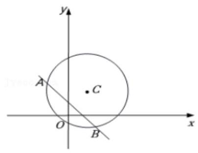
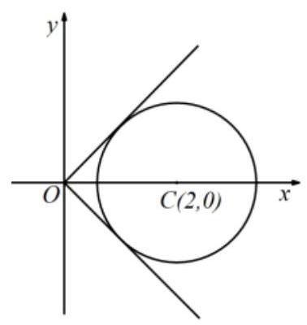
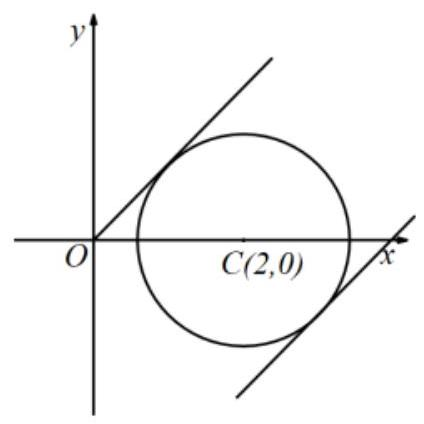
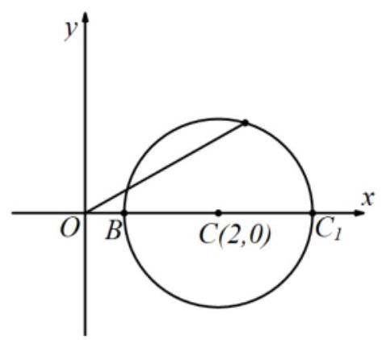
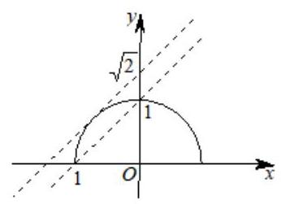
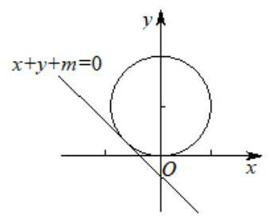
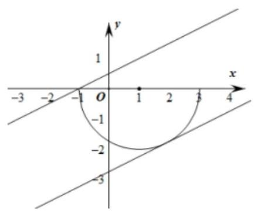
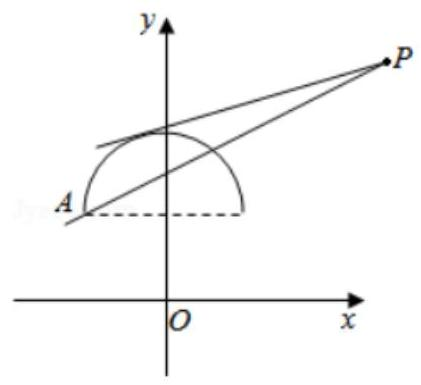
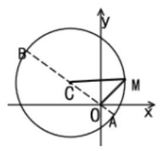
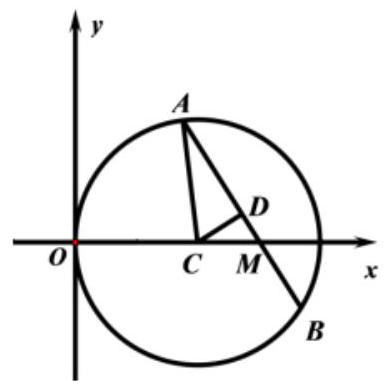

## 圆与圆的方程

<table><tr><td>教学目标</td><td>1、掌握圆的不同方程和性质;   2、掌握直线与圆的综合题目;   3、从中体会向量知识的应用和坐标法的含义，进一步认识数形结合思想的作用，逐步确立事物之间的相互联系和相互转化的观点, 为复习椭圆双曲线抛物线做准备.</td></tr><tr><td>重点</td><td>1、掌握代数法、几何法，并理解他们之间的联系与不同；   2、直线与圆的关系</td></tr><tr><td>难 点</td><td>圆的综合问题</td></tr></table>

## (一) 圆的方程

## 知识梳理

## 1、确定圆方程的条件

圆的标准方程 ${\left( x - a\right) }^{2} + {\left( y - b\right) }^{2} = {r}^{2}$ 中,有三个参数 $a, b, r$ ,只要求出 $a, b, r$ 这时圆的方程就被确定. 因此确定圆方程, 需三个独立条件, 其中圆心是圆的定位条件, 半径是圆的定形条件.

确定圆的方程的主要方法有两种: 一是定义法, 二是待定系数法。定义法是指用定义求出圆心坐标和半径长,从而得到圆的标准方程; 待定系数法即列出关于 $D, E, F$ 的方程组,求 $D, E, F$ 而得到圆的一般方程, 一般步骤为:

(1)根据题意，没所求的圆的标准方程为 ${x}^{2} + {y}^{2} + {Dx} + {Ey} + F = 0$

(2)根据已知条件，建立关于 $D, E, F$ 的方程组；

(3)解方程组。求出 $D, E, F$ 的值，并把它们代入所设的方程中去，就得到所求圆的一般方程.

2、点 $P\left( {{x}_{0},{y}_{0}}\right)$ 与圆的位置关系:

若 ${\left( {x}_{0} - a\right) }^{2} + {\left( {y}_{0} - b\right) }^{2} = {r}^{2}$ ,则点 $\mathrm{P}$ 在圆上;

若 ${\left( {x}_{0} - a\right) }^{2} + {\left( {y}_{0} - b\right) }^{2} > {r}^{2}$ ,则点 $\mathrm{P}$ 在圆外;

若 ${\left( {x}_{0} - a\right) }^{2} + {\left( {y}_{0} - b\right) }^{2} < {r}^{2}$ ,则点 $\mathrm{P}$ 在圆内;

3、二元二次方程 ${x}^{2} + {y}^{2} + {Dx} + {Ey} + F = 0$ 是否表示圆的条件:

先将二元二次方程配方得 ${\left( x + \frac{D}{2}\right) }^{2} + {\left( y + \frac{E}{2}\right) }^{2} = \frac{{D}^{2} + {E}^{2} - {4F}}{4}$ ①，(1)当 ${D}^{2} + {E}^{2} - {4F} > 0$ 时，方程①表示以 $\left( {-\frac{D}{2},\frac{E}{2}}\right)$ 为圆心， $\frac{1}{2}\sqrt{{D}^{2} + {E}^{2} - {4F}}$ 为半径的圆；(2)当 ${D}^{2} + {E}^{2} - {4F} = 0$ 时，方程①表示点 $\left( {-\frac{D}{2},\frac{E}{2}}\right)$ ；(3) 当 ${D}^{2} + {E}^{2} - {4F} < 0$ 时，方程①没有实根，因此它不表示任何图形. 当方程①表示圆时， 我们把它叫做圆的一般方程,确定它需三个独立条件 $D, E, F$ ,且 ${D}^{2} + {E}^{2} - {4F} > 0$ ,这就确定了求它的方程的方法——待定系数法，注意用待定系数法求圆的方程，用一般形式比用标准形式在运算上简单，前者解的是三元一次方程组，后者解的是三元二次方程组.

4、线段 AB 为直径的圆的方程: 若 $A\left( {{x}_{1},{y}_{1}}\right) , B\left( {{x}_{2},{y}_{2}}\right)$ ,则以线段 $\mathrm{{AB}}$ 为直径的圆的方程是

$$
\left( {x - {x}_{1}}\right) \left( {x - {x}_{2}}\right)  + \left( {y - {y}_{1}}\right) \left( {y - {y}_{2}}\right)  = 0.
$$

## 例题精讲

【例 1】( 1 )圆心为 $\left( {1,1}\right)$ 且过原点的圆的方程是( )

A. ${\left( x - 1\right) }^{2} + {\left( y - 1\right) }^{2} = 1\;$ B. ${\left( x + 1\right) }^{2} + {\left( y + 1\right) }^{2} = 1\;$ C. ${\left( x + 1\right) }^{2} + {\left( y + 1\right) }^{2} = 2\;$ D. ${\left( x - 1\right) }^{2} + {\left( y - 1\right) }^{2} = 2$

【难度】★★

【答案】D

【解析】设圆的方程为 ${\left( x - 1\right) }^{2} + {\left( y - 1\right) }^{2} = m\left( {m > 0}\right)$ ,且圆过原点,即 ${\left( 0 - 1\right) }^{2} + {\left( 0 - 1\right) }^{2} = m\left( {m > 0}\right)$ ,得 $m = 2$ ,所以圆的方程为 ${\left( x - 1\right) }^{2} + {\left( y - 1\right) }^{2} = 2$ . 故选 D.

(2)求圆心在直线 $y = {2x} + 3$ 上，且过点 $A\left( {1,2}\right)$ ， $B\left( {-2,3}\right)$ 的圆的方程___.

【难度】★★

【答案】 ${\left( x + 1\right) }^{2} + {\left( y - 1\right) }^{2} = 5$ .

【解析】圆心在直线 $y = {2x} + 3$ 上并且在 $\mathrm{{AB}}$ 垂直平分线上

【例 2】已知三点 $A\left( {1,3}\right) , B\left( {4,2}\right) , C\left( {1, - 7}\right)$ ,则 $\bigtriangleup  {ABC}$ 外接圆的圆心到原点的距离为( )

A. 10 B. $4\sqrt{6}$ C. 5 D. $\sqrt{5}$

【难度】★★

【答案】D

【解析】设圆的方程为 ${x}^{2} + {y}^{2} + {dx} + {ey} + f = 0\left( {{d}^{2} + {e}^{2} - {4f} > 0}\right.$ ,圆 $M$ 过三点 $A\left( {1,3}\right) , B\left( {4,2}\right) , C\left( {1, - 7}\right)$ , 可得 $\left\{  \begin{array}{l} {10} + d + {3e} + f = 0, \\  {20} + {4d} + {2e} + f = 0\text{ 解方程可得 }\mathrm{d} = 2, e = 4, f = {20},\text{ 即圆的方程为 }{\mathrm{x}}^{2} + {\mathrm{y}}^{2} - 2\mathrm{x} + 4\mathrm{y} - {20} = 0,\text{ 即为 }{\left( \mathrm{x} - 1\right) }^{2} + \\  {50} + d - {7e} + f = 0 \end{array}\right.$

${\left( y + 2\right) }^{2} = {25}$ ,圆心 $\left( {1, - 2}\right)$ 到原点的距离为 $\sqrt{5}$ .

故选 D.

【例 3】设 $A$ 为圆 ${\left( x - 1\right) }^{2} + {y}^{2} = 1$ 上的动点， ${PA}$ 是圆的切线且 $\left| {PA}\right|  = 1$ ，则点 $P$ 的轨迹方程是___.

【难度】 $\star   \star   \star$

【答案】 ${\left( x - 1\right) }^{2} + {y}^{2} = 2$ .

【解析】设 $P\left( {x, y}\right)$ ,易知圆 ${\left( x - 1\right) }^{2} + {y}^{2} = 1$ 的圆心 $B\left( {1,0}\right)$ ,半径 $r = 1$ ,

因为 ${PA}$ 是圆的切线且 $\left| {PA}\right|  = 1$ ,所以 ${\left| PA\right| }^{2} + {r}^{2} = {\left| PB\right| }^{2}$ ,所以 ${\left| PB\right| }^{2} = 2$ ,即 $\left| {PB}\right|  = \sqrt{2}$ ,

所以点 $P$ 的轨迹是以 $\left( {1,0}\right)$ 为圆心, $\sqrt{2}$ 为半径的圆.

所以点 $P$ 的轨迹方程是 ${\left( x - 1\right) }^{2} + {y}^{2} = 2$ .

【例 4】( 1 )方程 ${x}^{2} + {y}^{2} - 2\left( {t + 3}\right) x + 2\left( {1 - 4{t}^{2}}\right) y + {16}{t}^{4} + 9 = 0\left( {t \in  R}\right)$ 表示圆方程，则 $t$ 的取值范围是 ( )

A. $- 1 < t < \frac{1}{7}$ B. $- 1 < t < \frac{1}{2}$

C. $- \frac{1}{7} < t < 1$ D. $1 < t < 2$

【难度】★★

【答案】C

【解析】满足圆的要求

(2)方程 ${x}^{2} + {y}^{2} + {Dx} + {Ey} + F = 0$ 表示以(-2,3)为圆心，4 为半径的圆，则 $D, E, F$ 的值分别为( )

A. $4, - 6,3$ B.-4,6,3 C. $- 4, - 6,3$ D. $4, - 6, - 3$

【难度】 $\star   \star$

【答案】D

【解析】解: 由题意得, $- \frac{D}{2} =  - 2, - \frac{E}{2} = 3,\frac{1}{2}\sqrt{{D}^{2} + {E}^{2} - {4F}} = 4$ ,解得 $D = 4, E =  - 6, F =  - 3$ . 故选 $D$ .

【例 5】已知圆 $C : {x}^{2} + {y}^{2} - {4x} - {14y} + {45} = 0$ 及点 $Q\left( {-2,3}\right)$ .

(1)若 $P\left( {a, a + 1}\right)$ 在圆上，求线段 ${PQ}$ 的长及直线 ${PQ}$ 的斜率；

(2)若 $M$ 为圆 $C$ 上的任一点，求 $\left| {MQ}\right|$ 的最大值和最小值.

【难度】 $\star   \star   \star$

【答案】(1) $2\sqrt{10}$ ， $\frac{1}{3}$ ；(2) $6\sqrt{2}$ ， $2\sqrt{2}$ .

【解析】(1) 因为点 $P\left( {a, a + 1}\right)$ 在圆上,所以 ${a}^{2} + {\left( a + 1\right) }^{2} - {4a} - {14}\left( {a + 1}\right)  + {45} = 0$ ,所以 $a = 4, P\left( {4,5}\right)$ , 因此 $\left| {PQ}\right|  = \sqrt{{\left( 4 + 2\right) }^{2} + {\left( 5 - 3\right) }^{2}} = 2\sqrt{10}$ ,直线 ${PQ}$ 的斜率 ${k}_{PQ} = \frac{3 - 5}{-2 - 4} = \frac{1}{3}$ .

(2)因为圆心 $C$ 的坐标为 $\left( {2,7}\right)$ ，所以 $\left| {CQ}\right|  = \sqrt{{\left( 2 + 2\right) }^{2} + {\left( 7 - 3\right) }^{2}} = 4\sqrt{2}$ ，

又圆的半径是 $2\sqrt{2}$ ,所以点 $Q$ 在圆外,

所以 ${\left| MQ\right| }_{\max } = 4\sqrt{2} + 2\sqrt{2} = 6\sqrt{2},{\left| MQ\right| }_{\min } = 4\sqrt{2} - 2\sqrt{2} = 2\sqrt{2}$ .

## 巩固训练

1、已知以点 $A\left( {2, - 3}\right)$ 为圆心,半径长等于 5 的圆 $O$ ,则点 $M\left( {5, - 7}\right)$ 与圆 $O$ 的位置关系是( )

A. 在圆内 B. 在圆上

C. 在圆外 D. 无法判断

【难度】 $\star   \star$

【答案】B

【解析】因为 $\left| {AM}\right|  = \sqrt{{3}^{2} + {4}^{2}} = 5 = r$ ,所以点 $M$ 在圆上,选 B.

2、已知圆的圆心为(-2,1)，其一条直径的两个端点恰好在两坐标轴上，则这个圆的方程是( )

A. ${x}^{2} + {y}^{2} + {4x} - {2y} - 5 = 0$ B. ${x}^{2} + {y}^{2} - {4x} + {2y} - 5 = 0$

C. ${x}^{2} + {y}^{2} + {4x} - {2y} = 0$ D. ${x}^{2} + {y}^{2} - {4x} + {2y} = 0$

【难度】★★

【答案】C

【解析】设直径的两个端点分别 $A\left( {a,0}\right) \text{ 、 }B\left( {0, b}\right)$ ,圆心 $C$ 为点 $\left( {-2,1}\right)$ ,由中点坐标公式得 $\frac{a + 0}{2} =  - 2,\frac{0 + b}{2} = 1$ 解得 $\mathrm{a} =  - 4,\mathrm{\;b} = 2.\therefore$ 半径 $\mathrm{r} = \sqrt{{\left( -2 + 4\right) }^{2} + {\left( 1 - 0\right) }^{2}} = \sqrt{5}\therefore$ 圆的方程是: $\left( {\mathrm{x} + 2}\right) 2 + \left( {\mathrm{y} - 1}\right) \; 2 = 5$ ,即 ${x}^{2} + {y}^{2} + {4x} - {2y} = 0$ .

故选 C.

3、“ $m > \frac{1}{2}$ ” 是 “ ${x}^{2} + {y}^{2} - {2mx} - {m}^{2} - {5m} + 3 = 0$ 为圆方程” 的( )

A. 充分不必要条件 B. 必要不充分条件

C. 充要条件 D. 既不充分又不必要条件

【难度】★★

【答案】A

【解析】方程 ${x}^{2} + {y}^{2} - {2mx} - {m}^{2} - {5m} + 3 = 0$ 表示圆需满足 ${\left( -2m\right) }^{2} - 4\left( {-{m}^{2} - {5m} + 3}\right)  > 0,\therefore m <  - 3$ 或 $m > \frac{1}{2},$

所以 “ $m > \frac{1}{2}$ ” 是 “ ${x}^{2} + {y}^{2} - {2mx} - {m}^{2} - {5m} + 3 = 0$ 为圆方程” 的充分不必要条件,

故选: A.

4、一束光线从点 $A\left( {-1,1}\right)$ 出发，经 $x$ 轴反射到圆 $C : {\left( x - 2\right) }^{2} + {\left( y - 3\right) }^{2} = 1$ 上的最短路程是( )

A. $3\sqrt{2} - 1$ B. $2\sqrt{6}$ C. 4 D. 5

【难度】 $\star   \star   \star$

【答案】C

【解析】由反射定律得点 $\mathrm{A}\left( {-1,1}\right)$ 关于 $\mathrm{x}$ 轴的对称点 $\mathrm{B}\left( {-1, - 1}\right)$ 在反射光线上,当反射光线过圆心 $(2$ , 3) 时,最短距离为 $\left| \mathrm{{BC}}\right|  - \mathrm{R} = \sqrt{{\left( 2 + 1\right) }^{2} + {\left( 3 + 1\right) }^{2}} - 1 = 5 - 1 = 4$ 故光线从点 $\mathrm{A}$ 经 $\mathrm{x}$ 轴反射到圆周 $\mathrm{C}$ 的最短路程为 4 .

故选 C.

## (二)直线与圆

## 知识梳理

5、直线与圆的位置关系有三种, 即相交、相切和相离, 判定的方法有两种:

(1)代数法:通过直线方程与圆的方程所组成的方程组，根据解的个数来研究。若有两组不同的实数解，即 $\Delta  > 0$ ，则相交；若有两组相同的实数解，即 $\Delta  = 0$ ，则相切；若无实数解，即 $\Delta  < 0$ ，则相离.

(2)几何法:由圆心到直线的距离 $d$ 与半径 $r$ 的大小来判断:

当 $d < r$ 时，直线与圆相交；当 $d = r$ 时，直线与圆相切；当 $d > r$ 时，直线与圆相离.

以上两种方法比较: 为避免运算量过大, 一般不用代数法, 而是用几何法.

6、直线与圆相切，切线的求法

(1)当点 $P\left( {{x}_{0},{y}_{0}}\right)$ 在圆 ${x}^{2} + {y}^{2} = {r}^{2}$ 上时，切线方程为 ${x}_{0}x + {y}_{0}y = {r}^{2}$ ;

(2) 若点 $P\left( {{x}_{0},{y}_{0}}\right)$ 在圆 ${\left( x - a\right) }^{2} + {\left( y - b\right) }^{2} = {r}^{2}$ 上,则切线方程为 $\left( {{x}_{0} - a}\right) \left( {x - a}\right)  + \left( {{y}_{0} - b}\right) \left( {y - b}\right)  = {r}^{2};$

(3)斜率为 $k$ 且与圆 ${x}^{2} + {y}^{2} = {r}^{2}$ 相切的切线方程为: $y = {kx} \pm  r\sqrt{1 + {k}^{2}}$ ；斜率为 $k$ 且与圆 ${\left( x - a\right) }^{2} + {\left( y - b\right) }^{2} = {r}^{2}$ 相切的切线方程的求法,可以设切线为 $y = {kx} + m$ ,然后变成一般式 ${kx} - y + m = 0$ ,利用圆心到切线的距离等于半径列出方程求 $m$ .

(4) 点 $P\left( {{x}_{0},{y}_{0}}\right)$ 在圆外面,则设切线方程为 $y - {y}_{0} = k\left( {x - {x}_{0}}\right)$ ,变成一般式后,利用圆心到直线距离等于半径,解出 $k$ ,注意若此方程只有一个实根,则还有一条斜率不存在的直线,务必要补上.

7、经过两个圆交点的圆系方程:

经过 ${x}^{2} + {y}^{2} + {D}_{1}x + {E}_{1}y + {F}_{1} = 0,{x}^{2} + {y}^{2} + {D}_{2}x + {E}_{2}y + {F}_{2} = 0$ 的交点的圆系方程是:

$$
{x}^{2} + {y}^{2} + {D}_{1}x + {E}_{1}y + {F}_{1} + \lambda \left( {{x}^{2} + {y}^{2} + {D}_{2}x + {E}_{2}y + {F}_{2}}\right)  = 0.
$$

在过两圆公共点的图象方程中,若 $\lambda  =  - 1$ ,可得两圆公共弦所在的直线方程.

8、经过直线与圆交点的圆系方程:

经过直线 $l : {Ax} + {By} + C = 0$ 与圆 ${x}^{2} + {y}^{2} + {Dx} + {Ey} + F = 0$ 的交点的圆系方程是:

$$
{x}^{2} + {y}^{2} + {Dx} + {Ey} + F + \lambda \left( {{Ax} + {By} + C}\right)  = 0
$$

## 思维误区警示

(1)、本章节易犯的错误是圆的性质掌握不够熟练，从而导致在求方程时，方程列不出来或列不全. 因此, 建议同学们复习一下初中圆的有关性质.

(2)、本章节的题目，其方法一般不止一种，因此方法的选取尤为重要，方法得当，则思路清晰，解法简明。方法不好, 计算量大, 且易出错, 建议同学们多注意总结.

## 例题精讲

【例 6】已知直线 $l : {2x} - y - 2 = 0$ ，点 $P$ 是圆 $C : {\left( x + 1\right) }^{2} + {\left( y - 1\right) }^{2} = 4$ 上的动点，则点 $P$ 到直线 $l$ 的最大距离为___.

【难度】 $\star   \star   \star$

【答案】 $\sqrt{5} + 2$

【解析】由题意,圆 $C : {\left( x + 1\right) }^{2} + {\left( y - 1\right) }^{2} = 4$ 的圆心坐标为 $C\left( {-1,1}\right)$ ,半径 $r = 2$ ,

则圆心到直线 $l : {2x} - y - 2 = 0$ 的距离为 $d = \frac{\left| -2 - 1 - 2\right| }{\sqrt{5}} = \sqrt{5}$

所以点 $P$ 到直线 $l$ 的最大距离为 $d + r = \sqrt{5} + 2$ .

故答案为: $\sqrt{5} + 2$ .

【例 7】直线 $l$ 经过点 $P\left( {-3, - \frac{3}{2}}\right)$ 被圆 ${x}^{2} + {y}^{2} = {25}$ 所截得的弦长为 8,求直线 $l$ 的直线方程。

【难度】 $\bigstar \bigstar$

【答案】 $x =  - 3$ 或 ${3x} + {4y} + {15} = 0$

【解析】设直线方程,圆心到直线的距离 $= \sqrt{{25} - {16}} = 3$

【例 8】已知圆 $M : {x}^{2} + {y}^{2} - {2ay} = 0\left( {a > 0}\right)$ 截直线 $x + y = 0$ 所得线段的长度是 $2\sqrt{2}$ ,则圆 $M$ 与圆 $N : {\left( x - 1\right) }^{2} + {\left( y - 1\right) }^{2} = 1$ 的位置关系是( )

A. 内切 B. 相交 C. 外切 D. 相离

【难度】 $\star   \star$

【答案】B

【解析】化简圆 $M : {x}^{2} + {\left( y - a\right) }^{2} = {a}^{2} \Rightarrow  M\left( {0, a}\right) ,{r}_{1} = a \Rightarrow  M$ 到直线 $x + y = 0$ 的距离 $d = \frac{a}{\sqrt{2}} \Rightarrow \; {\left( \frac{a}{\sqrt{2}}\right) }^{2} + 2 = {a}^{2} \Rightarrow  a = 2 \Rightarrow  M\left( {0,2}\right) ,{r}_{1} = 2$ ,

又 $N\left( {1,1}\right) ,{r}_{2} = 1 \Rightarrow  \left| {MN}\right|  = \sqrt{2} \Rightarrow  \left| {{r}_{1} - {r}_{2}}\right|  < \left| {MN}\right|  < \left| {{r}_{1} + {r}_{2}}\right|  \Rightarrow$ 两圆相交. 选 B

【例 9】由直线 $y = x + 1$ 上的点向圆 $C : {\left( x - 3\right) }^{2} + {\left( y + 2\right) }^{2} = 1$ 引切线,则切线长的最小值为( )

A. $\sqrt{17}$ B. $3\sqrt{2}$ C. $\sqrt{19}$ D.2 $\sqrt{5}$

【难度】 $\star   \star   \star$

【答案】A

【解析】圆心到直线的距离等于 $3\sqrt{2}$ ,切线长等于 $\sqrt{{18} - 1} = \sqrt{17}$ 此时最小

【例 10】已知圆 $C : {\left( x - 1\right) }^{2} + {\left( y - 2\right) }^{2} = {25}$ ,直线 $l : \left( {{2m} + 1}\right)  \cdot  \mathrm{x} + \left( {m + 1}\right)  \cdot  \mathrm{y} - {7m} - 4 = 0,\left( {m \in  \mathrm{R}}\right)$ , (1)证明:不论 $m$ 取什么实数，直线 $l$ 与圆恒交于两点；

(2)求直线被圆 $C$ 截得的弦长最小时 $l$ 的方程.

【难度】 $\bigstar \bigstar \bigstar$

【答案】见解析

【解析】(1) 证明: $l$ 的方程 $\left( {x + y - 4}\right)  + m \cdot  \left( {{2x} + y - 7}\right)  = 0$

$\because m \in  \mathrm{R},\therefore \left\{  \begin{array}{l} {2x} + y - 7 = 0 \\  x + y - 4 = 0 \end{array}\right.$ 得 $\left\{  \begin{array}{l} x = 3 \\  y = 1 \end{array}\right.$

即 $l$ 恒过定点 $A\left( {3,1}\right)$ .

$\because$ 圆心 $C\left( {1,2}\right) \left| {AC}\right|  \leq  5$ (半径),

$\therefore$ 点 $A$ 在圆 $C$ 内,从而直线 $l$ 恒与圆 $C$ 相交于两点.

(2)解:弦长最小时， $l \bot  {AC}$ ，由 ${k}_{AC} =  - \frac{1}{2}$ ，

$\therefore l$ 的方程为 ${2x} - y - 5 = 0$

【例 11】已知圆 $C : {x}^{2} + {y}^{2} = {16}$ .

(1)求过点 $P\left( {4,2}\right)$ 且与圆 $C$ 相切的直线 $l$ 方程；

(2)点 $A\left( {0,6}\right)$ ，在直线 ${OA}$ 上( $O$ 为坐标原点)，存在定点 $B$ (不同于点 $A$ )，满足对于圆 $C$ 上任一点 $P$ ， 都有 $\frac{\left| PB\right| }{\left| PA\right| }$ 为一常数,试求所有满足条件的点 $B$ 的坐标.

【难度】 $\star   \star   \star$

【答案】(1) $x = 4$ 或 $y =  - \frac{3}{4}x + 5;\left( 2\right) \left( {0,\frac{8}{3}}\right)$ .

【解析】解: (1) 因为圆 $C : {x}^{2} + {y}^{2} = {16}$ ,过点 $P\left( {4,2}\right)$ 且与圆 $C$ 相切,

当斜率不存在时直线方程为 $x = 4$ ,显然成立;

当斜率存在时,设直线方程为 $y - 2 = k\left( {x - 4}\right)$ ,即 ${kx} - y - {4k} + 2 = 0$ ,因为直线与圆相切,所以圆心到直线的距离等于半径,即 $d = \frac{\left| -4k + 2\right| }{\sqrt{{k}^{2} + {\left( -1\right) }^{2}}} = 4$ ,解得 $k =  - \frac{3}{4}$ 即 $y =  - \frac{3}{4}x + 5$

( 2 )假设存在这样的点 $B\left( {0, m}\right)$ ，都有 $\frac{\left| PB\right| }{\left| PA\right| } = k$ (常数) 则有 $\frac{\left| PB\right| }{\left| PA\right| } = \frac{\sqrt{{x}^{2} + {\left( y - m\right) }^{2}}}{\sqrt{{x}^{2} + {\left( y - 6\right) }^{2}}} = k$

$\therefore {x}^{2} + {\left( y - m\right) }^{2} = {k}^{2}{x}^{2} + {k}^{2}{\left( y - 6\right) }^{2}$ 又 $P$ 点在圆上, $\therefore {x}^{2} = {16} - {y}^{2}$

$\therefore {16} - {y}^{2} + {\left( y - m\right) }^{2} = {k}^{2}\left( {{16} - {y}^{2}}\right)  + {k}^{2}{\left( y - 6\right) }^{2}$ 化简得: $\left( {{12}{k}^{2} - {2m}}\right) y - {52}{k}^{2} + {m}^{2} + {16} = 0$

$\therefore \left\{  \begin{array}{l} {12}{k}^{2} - {2m} = 0 \\   - {52}{k}^{2} + {m}^{2} + {16} = 0 \end{array}\right.$ 消去 ${k}^{2}$ 得: ${m}^{2} - \frac{26}{3}m + {16} = 0$

$\therefore m = \frac{8}{3}$ 或 $m = 6$ ,又定点 $B$ 不同于 $A$ 点 $\therefore m = \frac{8}{3}, k = \frac{2}{3}\therefore$ 满足条件的点 $B$ 的坐标为 $\left( {0,\frac{8}{3}}\right)$ .

## 巩固训练

1、圆 ${x}^{2} + {y}^{2} - {4x} - {4y} + 6 = 0$ 上的点到直线 $x + y - 8 = 0$ 的最大距离与最小距离的差是( )

A. $\sqrt{2}$ B. $2\sqrt{2}$ C. 4 D. $4\sqrt{2}$

【难度】★★

【答案】B

【解析】: 圆 ${x}^{2} + {y}^{2} - {4x} - {4y} + 6 = 0,\therefore {\left( x - 2\right) }^{2} + {\left( y - 2\right) }^{2} = 2,\therefore$ 圆心 $\left( {2,2}\right)$ ,半径 $r = \sqrt{2}$ ,先求圆心到直线的距离: $d = \frac{\left| 2 + 2 - 8\right| }{\sqrt{2}} = 2\sqrt{2},\therefore$ 圆 ${x}^{2} + {y}^{2} - {4x} - {4y} + 6 = 0$ 上的点到直线 $x + y - 1 = 0$ 的最大距离与最小距离之差 $= \left( {d + r}\right)  - \left( {d - r}\right)  = {2r} = 2\sqrt{2}$ ,故选 $B$ .

2、直线 $y = {kx} + 3$ 与圆 ${\left( x - 3\right) }^{2} + {\left( y - 2\right) }^{2} = 4$ 相交于 M, N 两点,若 $\left| {MN}\right|  \geq  2\sqrt{3}$ ,则 $k$ 的取值范围是( )

A. $\left\lbrack  {-\frac{3}{4},0}\right\rbrack$ B. $\left( {-\infty , - \frac{3}{4}}\right\rbrack   \cup  \lbrack 0, + \infty )$

C. $\left\lbrack  {-\frac{\sqrt{3}}{3},\frac{\sqrt{3}}{3}}\right\rbrack$ D. $\left\lbrack  {-\frac{2}{3},0}\right\rbrack$

【难度】 $\star   \star   \star$

【答案】A

【解析】解: 当弦长 $\left| {MN}\right|  = 2\sqrt{3}$ 时,弦心距 $d = 1$

若 $\left| {MN}\right|  \geq  2\sqrt{3}$ ,则 $d \leq  1$ ,即圆心 $\left( {2,0}\right)$ 到直线 ${kx} - y + 2 = 0$ 的距离 $d = \frac{\left| 2k + 1\right| }{\sqrt{1 + {k}^{2}}} \leq  1$ ,

求得 $k \in  \left\lbrack  {-\frac{4}{3},0}\right\rbrack$ ,故选: $D$ .

3、圆 ${x}^{2} + {y}^{2} + {2x} + {4y} - 3 = 0$ 上到直线 $x + y + 1 = 0$ 的距离为 $\sqrt{2}$ 的点共有( ).

A、 1 个 B、 2 个 C、 3 个 D、 4 个

【难度】 $\star   \star   \star$

【答案】C

【解析】解: 如图,由圆 $C : {\left( x - 1\right) }^{2} + {\left( y - 2\right) }^{2} = 8$ ,可得圆心 $C\left( {1,2}\right)$ ,半径 $r = 2\sqrt{2}$ , 又圆心 $C\left( {1,2}\right)$ 到直线 $x + y - 1 = 0$ 的距离 $d = \frac{\left| 1 + 2 - 1\right| }{\sqrt{2}} = \sqrt{2}$ ,因为圆的半径为 $2\sqrt{2}$ , 圆 $C$ 上到 $l$ 的距离为 $\sqrt{2}$ 的点一共有 3 个.

故选: $C$ .

4、过点 $\left( {3,1}\right)$ 作圆 ${\left( x - 1\right) }^{2} + {y}^{2} = {r}^{2}$ 的切线有且只有一条,则该切线的方程为( )

A. ${2x} + y - 5 = 0$ B. ${2x} + y - 7 = 0$

C. $x - {2y} - 5 = 0$ D. $x - {2y} - 7 = 0$

【难度】★★★

【答案】B

【解析】依题意,点 $\left( {3,1}\right)$ 在圆 ${\left( x - 1\right) }^{2} + {y}^{2} = {r}^{2}$ 上,且为切点,因为圆心 $\left( {1,0}\right)$ 与切点 $\left( {3,1}\right)$ 连线的斜率为 $\frac{1}{2}$ , 所以切线的斜率 $k =  - 2$ ,故圆的切线方程为 $y - 1 =  - 2\left( {x - 3}\right)$ ,即 ${2x} + y - 7 = 0$ ,故选 B.

5、若点 $A\left( {1,0}\right)$ 和点 $B\left( {4,0}\right)$ 到直线 $l$ 的距离依次为 1 和 2，则这样的直线有( )

A. 1 条 B. 2 条 C. 3 条 D. 4 条

【难度】 $\star   \star   \star$

【答案】C

【解析】以点 $A$ 为圆心,以1为半径长的圆的方程为 ${\left( x - 1\right) }^{2} + {y}^{2} = 1$ ,以点 $B$ 为圆心,且以 2 为半径的圆的方程为 ${\left( x - 4\right) }^{2} + {y}^{2} = 4$ ,则直线 $l$ 为两圆的公切线, $\because \left| {AB}\right|  = 3 = 1 + 2$ ,即圆 $A$ 与圆 $B$ 外切,因此两圆的公切线有 3 条,即直线 $l$ 有三条,故选 $\mathrm{C}$ .

6、已知直线 $x + y = a$ 与圆 ${x}^{2} + {y}^{2} = 4$ 交于两点 $A\text{ 、 }B$ ,且 $\overrightarrow{OA} \cdot  \overrightarrow{OB} = 0$ ,其中 $O$ 为坐标原点,则实数 $a$ 的值为( )

A. 2 B. $\pm  2$ C. -2 D. $\pm  \sqrt{2}$

【难度】 $\star   \star   \star$

【答案】B

【解答】解: 设 $A\left( {{x}_{1},{y}_{1}}\right) , B\left( {{x}_{2},{y}_{2}}\right)$ .

联立 $\left\{  \begin{array}{l} x + y = a \\  {x}^{2} + {y}^{2} = 4 \end{array}\right.$ ，化为 $2{x}^{2} - {2ax} + {a}^{2} - 4 = 0.\;\Delta  = 4{a}^{2} - 8\left( {{a}^{2} - 4}\right)  = 4\left( {8 - {a}^{2}}\right)  > 0.\;\left( *\right) .$

$\therefore {x}_{1} + {x}_{2} = a,{x}_{1}{x}_{2} = \frac{{a}^{2} - 4}{2}.\because \overrightarrow{OA} \cdot  \overrightarrow{OB} = 0.\therefore {x}_{1}{x}_{2} + {y}_{1}{y}_{2} = {x}_{1}{x}_{2} + \left( {a - {x}_{1}}\right) \left( {a - {x}_{2}}\right)  = 2{x}_{1}{x}_{2} - a\left( {{x}_{1} + {x}_{2}}\right)  + {a}^{2} = 0$ , $\therefore {a}^{2} - 4 - {a}^{2} + {a}^{2} = 0$ ,解得 $a =  \pm  2$ ,满足(*). 故选: $B$ .

7、已知圆 ${C}_{1} : {x}^{2} + {y}^{2} - {4x} + {2y} = 0$ 与圆 ${C}_{2} : {x}^{2} + {y}^{2} - {2y} - 4 = 0$ .

(1)求证两圆相交；

(2)求两圆公共弦所在直线的方程；

(3)求过两圆的交点且圆心在直线 ${2x} + {4y} = 1$ 上的圆的方程.

【难度】 $\star   \star   \star$

【答案】(1) 证明见解析; (2) $x - y - 1 = 0$ ; (3) ${\left( x - \frac{3}{2}\right) }^{2} + {\left( y + \frac{1}{2}\right) }^{2} = \frac{7}{2}$ .

【解析】(1) 证明: 圆 ${C}_{1} : {x}^{2} + {y}^{2} - {4x} + {2y} = 0$ 与圆 ${C}_{2} : {x}^{2} + {y}^{2} - {2y} - 4 = 0$ 化为标准方程分别为圆 ${C}_{1} : {\left( x - 2\right) }^{2} + {\left( y + 1\right) }^{2} = 5$ 与圆 ${C}_{2} : {x}^{2} + {\left( y - 1\right) }^{2} = 5\therefore {C}_{1}\left( {2, - 1}\right)$ 与圆 ${C}_{2}\left( {0,1}\right)$ ,半径都为 $\sqrt{5}$

$\therefore$ 圆心距为 $0 < \sqrt{{\left( 2 - 0\right) }^{2} + {\left( -1 - 1\right) }^{2}} = 2\sqrt{2} < 2\sqrt{5}\therefore$ 两圆相交;

(2)解:将两圆的方程作差即可得出两圆的公共弦所在的直线方程，即

$\left( {{x}^{2} + {y}^{2} - {4x} + {2y}}\right)  - \left( {{x}^{2} + {y}^{2} - {2y} - 4}\right)  = 0$ ,即 $x - y - 1 = 0$

(3)解:由(2)得 $y = x - 1$ 代入圆 ${C}_{1} : {x}^{2} + {y}^{2} - {4x} + {2y} = 0$ ，化简可得 $2{x}^{2} - {4x} - 1 = 0 \; \therefore x = \frac{2 \pm  \sqrt{6}}{2}$

当 $x = \frac{2 + \sqrt{6}}{2}$ 时, $y = \frac{\sqrt{6}}{2}$ ; 当 $x = \frac{2 - \sqrt{6}}{2}$ 时, $y =  - \frac{\sqrt{6}}{2}$

设所求圆的圆心坐标为 $\left( {a, b}\right)$ ,则

$$
\left\{  {\begin{array}{l} {\left( a - \frac{2 + \sqrt{6}}{2}\right) }^{2} + {\left( b - \frac{\sqrt{6}}{2}\right) }^{2} = {\left( a - \frac{2 - \sqrt{6}}{2}\right) }^{2} + {\left( b + \frac{\sqrt{6}}{2}\right) }^{2} \\  {2a} + {4b} = 1 \end{array}\therefore \left\{  {\begin{array}{l} a = \frac{3}{2} \\  b =  - \frac{1}{2} \end{array}\therefore {r}^{2} = {\left( \frac{3}{2} - \frac{2 + \sqrt{6}}{2}\right) }^{2} + {\left( -\frac{1}{2} - \frac{\sqrt{6}}{2}\right) }^{2} = \frac{7}{2}}\right. }\right.
$$

$\therefore$ 过两圆的交点且圆心在直线 ${2x} + {4y} = 1$ 上的圆的方程为 ${\left( x - \frac{3}{2}\right) }^{2} + {\left( y + \frac{1}{2}\right) }^{2} = \frac{7}{2}$

## (三) 圆的综合

## 例题精讲

【例 12】已知实数对 $\left( {x, y}\right)$ 满足 ${x}^{2} + {y}^{2} - {4x} + 2 = 0$ .

(1)求 $\frac{y}{x}$ 的最大值和最小值;

(2)求 $y - x$ 的最小值；

(3)求 ${x}^{2} + {y}^{2}$ 的最值

【难度】 $\star   \star   \star$

【答案】(1) ${\left( \frac{y}{x}\right) }_{\max } = 1$ ， ${\left( \frac{y}{x}\right) }_{\min } =  - 1$ ；(2) ${\left( y - x\right) }_{\min } =  - 4$ ；(3)

${\left( {x}^{2} + {y}^{2}\right) }_{\max } = 6 + 4\sqrt{2},\;{\left( {x}^{2} + {y}^{2}\right) }_{\min } = 6 - 4\sqrt{2}$

【解析】解: (1) 方程 ${x}^{2} + {y}^{2} - {4x} + 2 = 0$ ,即 ${\left( x - 2\right) }^{2} + {y}^{2} = 2$

表示以点 $\left( {2,0}\right)$ 为圆心,以 $\sqrt{2}$ 为半径的圆.

设 $\frac{y}{x} = k$ ,即 $y = {kx}$ ,

当圆心 $\left( {2,0}\right)$ 到 $y = {kx}$ 的距离为半径时直线与圆相切，此时斜率分别取得最大、最小值，

由 $\frac{\left| 2k - 0\right| }{\sqrt{{k}^{2} + 1}} = \sqrt{2}$ ,解得 ${k}^{2} = 1$ ,所以 ${\left( \frac{y}{x}\right) }_{\max } = 1,{\left( \frac{y}{x}\right) }_{\min } =  - 1$ ;

(2)设 $y - x = b$ ，则 $y = x + b$ ，仅当直线 $y = x + b$ 与圆切于第四象限时，纵轴截距 $b$ 取最小值. 由点到直线的距离公式,得 $\frac{\left| 2 - 0 + b\right| }{\sqrt{2}} = \sqrt{2}$ ,即 $b = 0$ 或 $b =  - 4$ ,故 ${\left( y - x\right) }_{\min } =  - 4$ ;

(3) ${x}^{2} + {y}^{2}$ 是圆上点与原点距离之平方，故连接 ${OC}$ ，与圆交于 $B$ 点，并延长交圆于 ${C}_{1}$ ，可知 $B$ 到原点的距离最近,点 ${C}_{1}$ 到原点的距离最大,

此时有 $\left| {OB}\right|  = 2 - \sqrt{2},\left| {O{C}_{1}}\right|  = 2 + \sqrt{2}$ ,

则 ${\left( {x}^{2} + {y}^{2}\right) }_{\max } = {\left| O{C}_{1}\right| }^{2} = 6 + 4\sqrt{2},{\left( {x}^{2} + {y}^{2}\right) }_{\min } = {\left| OB\right| }^{2} = 6 - 4\sqrt{2}$ .

【例 13】若直线 $y = x - m$ 与曲线 $y = \sqrt{1 - {x}^{2}}$ 有两个不同的交点，则实数 $m$ 的取值范围是___.

【难度】 $\star   \star   \star$

【答案】 $m \in  ( - \sqrt{2}, - 1\rbrack$

【解析】

$y = x - m$ 表示倾斜角为 ${45}^{ \circ  }$ ,纵截距为 $- m$ 的直线,而 $y = \sqrt{1 - {x}^{2}}$ 则表示以 $\left( {0,0}\right)$ 为圆心,以 1 为半径的圆在 $x$ 轴上方的部分(包括圆与 $x$ 轴的交点)，如图所示，显然，欲使直线与半圆有两个不同交点，只需直线的纵截距 $- m \in  \left\lbrack  {1,\sqrt{2}}\right)$ ,即 $m \in  ( - \sqrt{2}, - 1\rbrack$ .

明确方程的几何意义, 在同一坐标系中画出相应的几何图形, 根据直线系的特点, 由图形研究直线与半圆的位置关系.

【例 14】已知对于圆 ${x}^{2} + {\left( y - 1\right) }^{2} = 1$ 上任一点 $P\left( {x, y}\right)$ ,不等式 $x + y + m \geq  0$ 恒成立,求实数 $m$ 的取值范围.

【难度】 $\star   \star   \star$

【答案】 $m \geq  \sqrt{2} - 1$

【解析】方法一 $\because x + y + m = 0$ 右上方面的点满足: $x + y + m > 0$ ,

结合图象知,要圆上的任一点的坐标都满足 $x + y + m \geq  0$ ,

只需直线在如图所示的切线的左下方，

图中切线的纵截距 $- m =  - \sqrt{2} + 1$ ，

故只需 $- m \leq   - \sqrt{2} + 1$ ,即 $m \geq  \sqrt{2} - 1$ 即可.

方法二 分析 设圆上一点 $P\left( {\cos \theta ,1 + \sin \theta }\right)$ ,问题转化为利用三角函数求范围.

解 设圆 ${x}^{2} + {\left( y - 1\right) }^{2} = 1$ 上任一点 $P\left( {\cos \theta ,1 + \sin \theta }\right) ,\theta  \in  \lbrack 0,{2\pi })$

$\therefore x = \cos \theta , y = 1 + \sin \theta$ ,

$\because x + y + m \geq  0$ 恒成立, $\therefore \cos \theta  + 1 + \sin \theta  + m \geq  0$ 恒成立,

即 $m \geq   - \left( {1 + \cos \theta  + \sin \theta }\right)$ 恒成立.

$\therefore$ 只须 $m$ 不小于 $- \left( {1 + \cos \theta  + \sin \theta }\right)$ 的最大值.

设 $u =  - \left( {\sin \theta  + \cos \theta }\right)  - 1 =  - \sqrt{2}\sin \left( {\theta  + \frac{\pi }{4}}\right)  - 1$ ,

$\therefore {u}_{\max } = \sqrt{2} - 1$ 即 $m \geq  \sqrt{2} - 1$ .

## 巩固训练

1、已知点 $P\left( {x, y}\right)$ 在圆 ${x}^{2} + {\left( y - 1\right) }^{2} = 1$ 上运动.

(1)求 $\frac{y - 1}{x - 2}$ 的最大值与最小值；

(2) ${2x} + y$ 的最大值与最小值.

【难度】 $\star   \star   \star$

【答案】见解析

【解析】(1) 设 $\frac{y - 1}{x - 2} = k$ ,则 $k$ 表示点 $P\left( {x, y}\right)$ 与点 $\left( {2,1}\right)$ 连线的斜率. 当该直线与圆相切时,

$k$ 取得最大值

与最小值. 由 $\frac{\left| 2k\right| }{\sqrt{{k}^{2} + 1}} = 1$ ,解得 $k =  \pm  \frac{\sqrt{3}}{3},\therefore \frac{y - 1}{x - 2}$ 的最大值为 $\frac{\sqrt{3}}{3}$ ,最小值为 $- \frac{\sqrt{3}}{3}$ .

(2)设 ${2x} + y = m$ ，则 $m$ 表示直线 ${2x} + y = m$ 在 $y$ 轴上的截距. 当该直线与圆相切时， $m$ 取得最大值与最小值. 由 $\frac{\left| 1 - m\right| }{\sqrt{5}} = 1$ ,解得 $m = 1 \pm  \sqrt{5},\therefore {2x} + y$ 的最大值为 $1 + \sqrt{5}$ ,最小值为 $1 - \sqrt{5}$ .

2、若函数 $y =  - \sqrt{4 - {\left( x - 1\right) }^{2}}$ 的图象与直线 $x - {2y} + m = 0$ 有公共点,则实数 $m$ 的取值范围为( )

A. $\left\lbrack  {-2\sqrt{5} - 1, - 2\sqrt{5} + 1}\right\rbrack$ B. $\left\lbrack  {-2\sqrt{5} - 1,1}\right\rbrack$ . C. $\left\lbrack  {-2\sqrt{5} + 1, - 1}\right\rbrack$ D. $\left\lbrack  {-3,1}\right\rbrack$

【难度】 $\star   \star   \star$

【答案】B

【解析】函数 $y =  - \sqrt{4 - {\left( x - 1\right) }^{2}}$ 可化简为: ${\left( x - 1\right) }^{2} + {y}^{2} = 4\left( {y \leq  0}\right)$ ,表示的是以 $\left( {1,0}\right)$ 为圆心,2 为半径的圆的下半部分,与直线 $x - {2y} + m = 0$ 有公共点,根据题意画出图像:

一个临界是和圆相切,即圆心到直线的距离等于半径, $\frac{\left| 1 + m\right| }{\sqrt{5}} = 2 \Rightarrow  m =  - 2\sqrt{5} - 1$ 正值舍去;

另一个临界是过点 $\left( {-1,0}\right)$ 代入得到 $\mathrm{m} = 1$ .

故答案为B.

3、曲线 $y = 1 + \sqrt{4 - {x}^{2}}\left( {-2 \leq  x \leq  2}\right)$ 与直线 $\mathrm{y} = \mathrm{k}\left( {\mathrm{x} - 2}\right)  + 4$ 有两个交点，则实数 $\mathrm{k}$ 的取值范围是___.

【难度】★★★

【答案】 $\left( {\frac{5}{12},\frac{3}{4}}\right\rbrack$

【解答】解: $y = 1 + \sqrt{4 - {x}^{2}}$ 可化为 ${x}^{2} + {\left( y - 1\right) }^{2} = 4, y \geq  1$ ,所以曲线为以 $\left( {0,1}\right)$ 为圆心,2 为半径的圆 $y \geq  1$ 的部分.

直线 $y = k\left( {x - 2}\right)  + 4$ 过定点 $p\left( {2,4}\right)$ ，由图知，当直线经过 $A\left( {-2,1}\right)$ 点时恰与曲线有两个交点，顺时针旋转到与曲线相切时交点变为一个.

且 ${k}_{AP} = \frac{4 - 1}{2 + 2} = \frac{3}{4}$ ,由直线与圆相切得 $d = \frac{\left| -1 + 4 - 2k\right| }{\sqrt{{k}^{2} + 1}} = 2$ ,解得 $k = \frac{5}{12}$

则实数 $k$ 的取值范围为 $\left( {\frac{5}{12},\frac{3}{4}}\right\rbrack$ ，故答案为: $\left( {\frac{5}{12},\frac{3}{4}}\right\rbrack$

## 实战演练

一、填空题

1、圆心在 $y$ 轴上，半径为 1，且过点 $\left( {1,2}\right)$ 的圆的方程是___.

【难度】 $\star   \star$

【答案】 ${x}^{2} + {\left( y - 2\right) }^{2} = 1$

【解析】因为圆心在 $y$ 轴上,所以可设所求圆的圆心坐标为 $\left( {0, b}\right)$ ,则圆的方程为 ${x}^{2} + {\left( y - b\right) }^{2} = 1$ ,又点 (1.2) 在圆上,所以 $1 + {\left( 2 - b\right) }^{2} = 1$ ,解得 $b = 2$ .

2、已知点 $M\left( {3,0}\right)$ 与圆 ${x}^{2} + {y}^{2} - {8x} - {4y} + {10} = 0$ ,则过点 $M\left( {3,0}\right)$ 的最长的弦所在的直线方程是 ___.

【难度】 $\star   \star$

【答案】 ${2x} - y - 6 = 0$

【解析】圆 ${x}^{2} + {y}^{2} - {8x} - {4y} + {10} = 0$ 的圆心坐标为 $\left( {4,2}\right)$ ,

则过点 $M\left( {3,0}\right)$ 且过圆心 $\left( {4,2}\right)$ 的弦最长.

则最长弦所在直线的斜率 $k = \frac{2 - 0}{4 - 3} = 2$ ,直线方程是 $y = 2\left( {x - 3}\right) \therefore {2x} - y - 6 = 0$ .

3、若圆 ${x}^{2} + {y}^{2} = 1$ 与圆 ${x}^{2} + {y}^{2} - {6x} - {8y} - m = 0$ 相切，则 $\mathrm{m}$ 的值为___.

【难度】 $\star   \star$

【答案】 -9或11

【解析】因为 ${x}^{2} + {y}^{2} - {6x} - {8y} - m = 0$ ,所以 ${\left( x - 3\right) }^{2} + {\left( y - 4\right) }^{2} = {25} + m$ ,

因为两圆相切,所以 $\sqrt{{3}^{2} + {4}^{2}} = 1 + \sqrt{{25} + m}$ 或 $\sqrt{{3}^{2} + {4}^{2}} = \left| {1 - \sqrt{{25} + m}}\right|$ ,

解得 $m =  - 9$ 或 11 .

4、若实数 $x$ ， $y$ 满足方程 ${\left( x + 5\right) }^{2} + {\left( y - {12}\right) }^{2} = {14}^{2}$ ，则 ${x}^{2} + {y}^{2}$ 的最小值为___.

【难度】 $\star   \star$

【答案】 1

【解析】 ${\left( x + 5\right) }^{2} + {\left( y - {12}\right) }^{2} = {196} = {14}^{2}$ 表示圆心在 $C\left( {-5,{12}}\right)$ ，半径 $r = {14}$ 的圆，如下图所示，

$M\left( {x, y}\right)$ 是圆上的动点， $\sqrt{{x}^{2} + {y}^{2}}$ 表示动点 $M$ 到原点 $O\left( {0,0}\right)$ 的距离，结合图形，可知:

在 $\bigtriangleup {OMC}$ 中, $\left| {OM}\right|  \geq  \left| {CM}\right|  - \left| {CO}\right|$ ,即 $\left| {OM}\right|  \geq  r - \left| {CO}\right|  = {14} - \sqrt{{\left( -5\right) }^{2} + {12}^{2}} = {14} - {13} = 1$ (当且仅当 $O$ 在 ${CM}$ 上时,取等号)

$\therefore \sqrt{{x}^{2} + {y}^{2}} \geq  1$ ,即 ${x}^{2} + {y}^{2} \geq  1$ ,故 ${x}^{2} + {y}^{2}$ 的最小值为: 1 .

5、如果圆 ${\left( x - a\right) }^{2} + {\left( y - a\right) }^{2} = 8$ 上总存在到原点的距离为 $\sqrt{2}$ 的点,则实数 $a$ 的取值范围是 ___.

【难度】 $\star   \star   \star$

【答案】 $\left\lbrack  {-3, - 1}\right\rbrack   \cup  \left\lbrack  {1,3}\right\rbrack$

【解析】

圆心 $\left( {a, a}\right)$ 到原点的距离为 $\left| {\sqrt{2}a}\right|$ ,半径 $r = 2\sqrt{2}$ ,圆上点到原点距离为 $d$ ,因为圆 ${\left( x - a\right) }^{2} + {\left( y - a\right) }^{2} = 8$ 上总存在点到原点距离为 $\sqrt{2}$ ，则圆 ${\left( x - a\right) }^{2} + y{\left( y - a\right) }^{2} = 8$ 与圆 ${x}^{2} + {y}^{2} = 2$ 有公共点，

$\therefore {r}^{\prime } = \sqrt{2},\therefore r - {r}^{\prime } \leq  \left| {\sqrt{2}a}\right|  \leq  r + {r}^{\prime }$ ,即 $1 \leq  \left| a\right|  \leq  3$ ,解得 $1 \leq  a \leq  3$ 或 $- 3 \leq  a \leq   - 1$ ,所以实数 $a$ 的取值范围是 $\left\lbrack  {-3, - 1}\right\rbrack   \cup  \left\lbrack  {1,3}\right\rbrack$ .

6、过点 $M\left( {3,0}\right)$ 的直线与圆 ${x}^{2} + {y}^{2} - {4x} = 0$ 交于 $A, B$ 两点,若 $C$ 为圆心,则 $\overrightarrow{AB} \cdot  \overrightarrow{AC}$ 的最小值等于 ___.

【难度】 $\star   \star   \star$

【答案】 6

【解析】由已知得圆的半径为 2,圆心坐标为 $\left( {2,0}\right)$ ,

设 ${AB}$ 中点为 $D$ ，则 ${CD}\bot {AB}$ ，所以 $\overrightarrow{AB} \cdot  \overrightarrow{AC} = \overrightarrow{AB} \cdot  \left( {\overrightarrow{AD} + \overrightarrow{DC}}\right)  = \overrightarrow{AB} \cdot  \overrightarrow{AD} = \frac{1}{2}{\overrightarrow{AB}}^{2}$ ，

要使 $\overrightarrow{AB} \cdot  \overrightarrow{AC}$ 最小,即为 $\left| {AB}\right|$ 最小,

因为直线过点 $M\left( {3,0}\right)$ ,所以当该直线与 ${CM}$ 垂直时,

$\left| {AB}\right|$ 最小,此时圆心 $C$ 到直线 ${AB}$ 的距离为 1 ,

即 ${\left| AB\right| }_{\min } = 2\sqrt{4 - 1} = 2\sqrt{3}$ ,所以 $\overrightarrow{AB} \cdot  \overrightarrow{AC}$ 的最小值 $\frac{1}{2}{\overrightarrow{AB}}^{2} = \frac{1}{2}{\left| \overrightarrow{AB}\right| }^{2} = 6$ .

## 二、选择题

7、圆 ${x}^{2} + {y}^{2} = 4$ 上的点到直线 $l : {4x} + {3y} - {12} = 0$ 的最小距离是( )

A. $\frac{2}{5}$ B. $\frac{22}{5}$ C. $\frac{12}{5}$ D. $\frac{24}{5}$

【难度】★★

【答案】A

【解析】因为圆心 $\left( {0,0}\right)$ 到直线 $l : {4x} + {3y} - {12} = 0$ 的距离 $d = \frac{12}{5}$ ，

故可得圆上的点到直线 $l$ 距离的最小值为 $\frac{12}{5} - 2 = \frac{2}{5}$ .

故选: A.

8、过点 $\left( {3,1}\right)$ 作圆 ${\left( \mathrm{x} - 1\right) }^{2} + {\mathrm{y}}^{2} = {\mathrm{r}}^{2}$ 的切线有且只有一条,则该切线的方程为( )

A. ${2x} + y - 5 = 0$ B. ${2x} + y - 7 = 0$

C. $x - {2y} - 5 = 0$ D. $x - {2y} - 7 = 0$

【难度】★★

【答案】B

【解析】依题意,点 $\left( {3,1}\right)$ 在圆 ${\left( x - 1\right) }^{2} + {y}^{2} = {r}^{2}$ 上,且为切点,因为圆心 $\left( {1,0}\right)$ 与切点 $\left( {3,1}\right)$ 连线的斜率为 $\frac{1}{2}$ , 所以切线的斜率 $k =  - 2$ ,故圆的切线方程为 $y - 1 =  - 2\left( {x - 3}\right)$ ,即 ${2x} + y - 7 = 0$ ,故选 B.

9、点 $P$ 在圆 ${C}_{1} : {x}^{2} + {y}^{2} = 1$ 上，点 $Q$ 在圆 ${C}_{2} : {x}^{2} + {y}^{2} - {8x} - {6y} + {21} = 0$ 上，则()

A. $\left| {PQ}\right|$ 的最小值为 1 B. 两圆相交

C. 两个圆心所在的直线斜率为 $\frac{3}{4}$

D. 两个圆的圆心所在的直线斜率为 $\frac{4}{3}$

【难度】 $\star   \star$

【答案】C

【解析】解: 圆 ${C}_{1} : {x}^{2} + {y}^{2} = 1$ 的圆心为 $\left( {0,0}\right)$ ,半径为 1 ;

圆 ${C}_{2}$ 的标准方程为 ${\left( x - 4\right) }^{2} + {\left( y - 3\right) }^{2} = 4$ ,圆心为 $\left( {4,3}\right)$ ,半径为 2 .

当 ${C}_{1}\text{ 、 }P\text{ 、 }Q$ 和 ${C}_{2}$ 按照该顺序四点共线时, $\left| {PQ}\right|$ 取得最小值,为 $\left| {{C}_{1}{C}_{2}}\right|  - 2 - 1 = \sqrt{{4}^{2} + {3}^{2}} - 3 = 2$ ,即选项 A 不正确;

两个圆心所在的直线斜率为 $\frac{3 - 0}{4 - 0} = \frac{3}{4}$ ,即选项 $C$ 正确.

10、若直线 $y = {kx} + 4 + {2k}$ 与曲线 $y = \sqrt{4 - {x}^{2}}$ 有两个不同的交点，则实数 $k$ 的取值范围是( )

A. $\lbrack 1, + \infty )$ B. $\left\lbrack  {-1, - \frac{3}{4}}\right)$ C. $\left( {\frac{3}{4},1}\right\rbrack$ D. $( - \infty , - 1\rbrack$

【难度】 $\star   \star   \star$

【答案】B

【解析】: $\because y = {kx} + 4 + {2k} = k\left( {x + 2}\right)  + 4$ ,所以直线过定点 $\left( {-2,4}\right)$ ,曲线 $y = \sqrt{4 - {x}^{2}}$ 变形为 ${x}^{2} + {y}^{2} = 4\left( {y \geq  0}\right)$ ,表示圆的上半部分,，当直线与半圆相切时直线斜率为 $k =  - \frac{3}{4}$ ，当直线过点 $\left( {2,0}\right)$ 时斜率为 -1,结合图像可知实数 $k$ 的取值范围是 $\left\lbrack  {-1, - \frac{3}{4}}\right)$

## 三、解答题

11、已知圆 $C : {x}^{2} + {y}^{2} + {2x} - {4y} + m = 0$ 与 $y$ 轴相切， $O$ 为坐标原点，动点 $P$ 在圆外，过 $P$ 作圆 $C$ 的切线,切点为 $M$ .

(1)求圆 $C$ 的圆心坐标及半径；

(2)若点 $P$ 运动到 $\left( {-2,4}\right)$ 处，求此时切线 $l$ 的方程；

(3)求满足条件 $\left| {PM}\right|  = 2\left| {PO}\right|$ 的点 $P$ 的轨迹方程.

【难度】★★

【答案】(1)圆心 $C\left( {-1,2}\right)$ ,半径为1; (2) $x =  - 2$ 或 ${3x} + {4y} - {10} = 0$ ; (3) $3{x}^{2} + 3{y}^{2} - {2x} + {4y} - 4 = 0$

【解析】(1) 由题意,圆 $C$ 的方程可化为 ${\left( x + 1\right) }^{2} + {\left( y - 2\right) }^{2} = 5 - m$ ,

因为圆 $C$ 与 $y$ 轴相切,所以 $5 - m = 1$ ,得 $m = 4$ ,所以圆 $C : {\left( x + 1\right) }^{2} + {\left( y - 2\right) }^{2} = 1$ ,

圆 $C$ 的圆心 $C\left( {-1,2}\right)$ ,半径为 1 ;

(2)由题意，当直线斜率不存在时,直线 $l : x =  - 2$ ，

圆心到直线 $l$ 的距离 $- 1 - \left( {-2}\right)  = 1$ ,此时直线与圆 $C$ 相切;

当直线斜率存在时,设直线 $l : y = k\left( {x + 2}\right)  + 4$ ,

圆心到直线 $l$ 的距离 $d = \frac{\left| k\left( -1 + 2\right)  - 2 + 4\right| }{\sqrt{{k}^{2} + 1}} = 1$ ,解得 $k =  - \frac{3}{4}$ ,

所以直线 $l : {3x} + {4y} - {10} = 0$ ;

综上,切线 $l$ 的方程为 $x =  - 2$ 或 ${3x} + {4y} - {10} = 0$ ;

(3)设点 $P\left( {x, y}\right)$ ，

${\left| PM\right| }^{2} = {\left| PC\right| }^{2} - {\left| MC\right| }^{2} = {\left( x + 1\right) }^{2} + {\left( y - 2\right) }^{2} - 1,$

${\left| PO\right| }^{2} = {x}^{2} + {y}^{2},$

由 $\left| {PM}\right|  = 2\left| {PO}\right|$ ,得 ${\left| PM\right| }^{2} = 4{\left| PO\right| }^{2}$ ,所以 ${\left( x + 1\right) }^{2} + {\left( y - 2\right) }^{2} - 1 = 4\left( {{x}^{2} + {y}^{2}}\right)$ ,

整理得, $3{x}^{2} + 3{y}^{2} - {2x} + {4y} - 4 = 0$ ,

即点 $P$ 的轨迹方程: $3{x}^{2} + 3{y}^{2} - {2x} + {4y} - 4 = 0$

12、已知 $M$ 为圆 $C : {x}^{2} + {y}^{2} - {4x} - {14y} + {45} = 0$ 上任一点,且点 $Q\left( {-2,3}\right)$ .

(1)若 $P\left( {a, a + 1}\right)$ 在圆 $C$ 上，求线段 ${PQ}$ 的长及直线 ${PQ}$ 的斜率；

(2)求 $\left| {MQ}\right|$ 的最大值和最小值；

(3)若 $M\left( {m, n}\right)$ ，求 $\frac{n - 3}{m + 2}$ 的最大值和最小值.

【难度】 $\star   \star   \star$

【答案】(1) $\frac{1}{3};\left( 2\right) 2 + \sqrt{3}$

【解析】(1) 将 $P\left( {a, a + 1}\right)$ 代入,圆 $C : {x}^{2} + {y}^{2} - {4x} - {14y} + {45} = 0$ ,得 $a = 4$ ,所以 $P\left( {4,5}\right)$ , $\left| {PQ}\right|  = \sqrt{{\left( 4 + 2\right) }^{2} + {\left( 5 - 3\right) }^{2}} = 2\sqrt{10},\;{k}_{PQ} = \frac{5 - 3}{4 - \left( {-2}\right) } = \frac{1}{3}.$

(2)圆 $C : {\left( x - 2\right) }^{2} + {\left( y - 7\right) }^{2} = {\left( 2\sqrt{2}\right) }^{2}$ ，圆心 $C\left( {2,7}\right)$ ， $\left| {QC}\right|  - R \leq  \left| {MQ}\right|  \leq  \left| {QC}\right|  + R$ ， $\because \left| {QC}\right|  = 4\sqrt{2}$ ，

$\therefore 2\sqrt{2} \leq  \left| {MQ}\right|  \leq  6\sqrt{2},\therefore \left| {MQ}\right|$ 最小值为 $2\sqrt{2}$ ,最大值为 $6\sqrt{2}$ .

(3)由题意知 ${m}^{2} + {n}^{2} - {4m} - {14n} + {45} = 0$ ，即 ${\left( m - 2\right) }^{2} + {\left( y - 7\right) }^{2} = {\left( 2\sqrt{2}\right) }^{2}$ ，分析可得 $K = \frac{n - 3}{m + 2}$ 表示该圆上的任意一点与 $Q\left( {-2,3}\right)$ 相连所得直线的斜率,设该直线斜率为 $k$ ,则其方程为 $y - 3 = k\left( {x + 2}\right)$ ,又由 $d = \frac{\left| 2k - 7 + 2k + 3\right| }{\sqrt{{k}^{2} + 1}} = 2\sqrt{2}$ ,得 $k = 2 \pm  \sqrt{3}$ ,即 $2 - \sqrt{3} \leq  K \leq  2 + \sqrt{3}$ . 所以 $K = \frac{n - 3}{m + 2}$ 的最小值为 $2 - \sqrt{3}$ ，最大值为 $2 + \sqrt{3}$ .
