## 椭圆的标准方程与几何性质

<table><tr><td>教学目标</td><td>1. 理解椭圆的定义,会推导椭圆的标准方程   2. 掌握两种类型的椭圆的标准方程 (焦点位于 $x$ 轴或 $y$ 轴)   3. 掌握椭圆标准方程中 $a\text{ 、 }b\text{ 、 }c$ 之间的关系: ${c}^{2} = {a}^{2} - {b}^{2}$   4. 掌握椭圆的几何性质和应用</td></tr><tr><td>重点</td><td>1. 椭圆的定义以及标准方程中字母间的关系;   2. 椭圆的几何性质和应用   3、直线与椭圆</td></tr><tr><td>难 点</td><td>直线与椭圆综合</td></tr></table>

## (一) 椭圆的定义与标准方程

## 知识梳理

## 1. 基本概念

椭圆定义: 平面内到两个定点 ${F}_{1},{F}_{2}\left( {\mid {F}_{1}{F}_{2} \mid   = {2c}}\right.$ ) 的距离的和等于常数 ${2a}\left( {a > c > 0}\right)$ 的点的轨迹叫做椭圆. 这两个定点 ${F}_{1},{F}_{2}$ 叫做椭圆的焦点,两个焦点的距离 $\left| {{F}_{1}{F}_{2}}\right|  = {2c}$ 叫做焦距.

注意: 若设动点为 $P$ ,则

(1)当 $\left| {P{F}_{1}}\right|  + \left| {P{F}_{2}}\right|  > \left| {{F}_{1}{F}_{2}}\right|$ 时，动点 $P$ 的轨迹是椭圆.

(2)当 $\left| {P{F}_{1}}\right|  + \left| {P{F}_{2}}\right|  = \left| {{F}_{1}{F}_{2}}\right|$ 时，动点 $P$ 的轨迹是线段.

(3)当 $\left| {P{F}_{1}}\right|  + \left| {P{F}_{2}}\right|  < \left| {{F}_{1}{F}_{2}}\right|$ 时，动点 $P$ 的轨迹不存在.

## 2. 椭圆的标准方程及性质

椭圆的标准方程及性质列于下表中.

<table id="cross-table-1"><tr><td></td><td>焦点在 $x$ 轴上</td><td>焦点在 $y$ 轴上</td></tr><tr><td>标准方程</td><td>$\frac{{x}^{2}}{{a}^{2}} + \frac{{y}^{2}}{{b}^{2}} = 1\left( \begin{array}{l} a > b > 0 \\  {b}^{2} + {c}^{2} = {a}^{2} \end{array}\right)$</td><td>$\frac{{y}^{2}}{{a}^{2}} + \frac{{x}^{2}}{{b}^{2}} = 1\left( \begin{array}{l} a > b > 0 \\  {b}^{2} + {c}^{2} = {a}^{2} \end{array}\right)$</td></tr><tr><td>图形</td><td>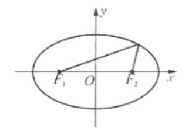</td><td>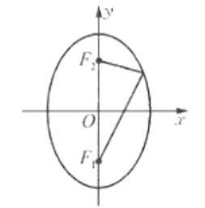</td></tr><tr></tr><tr><td>焦距</td><td>${2c}$</td><td>${2c}$</td></tr><tr><td>范围</td><td>$- a \leq  x \leq  a, - b \leq  y \leq  b$</td><td>$- b \leq  x \leq  b, - a \leq  y \leq  a$</td></tr><tr><td>对称性</td><td colspan="2">$x$ 轴、 $y$ 轴和原点对称</td></tr><tr><td>顶点坐标</td><td>$\left( {a,0}\right) ,\left( {-a,0}\right) ,\left( {0, b}\right) ,\left( {0, - b}\right)$</td><td>$\left( {b,0}\right) ,\left( {-b,0}\right) ,\left( {0, a}\right) ,\left( {0, - a}\right)$</td></tr><tr><td>两轴</td><td colspan="2">长轴长 ${2a}$ ，短轴长 ${2b}$</td></tr></table>

## 例题精讲

【例 1】下列说法正确的是( )

A. 已知 ${F}_{1}\left( {-4,0}\right)$ ， ${F}_{2}\left( {4,0}\right)$ ，到两点 ${F}_{1}$ ， ${F}_{2}$ 的距离之和大于 8 的点的轨迹是椭圆

B. 已知 ${F}_{1}\left( {-4,0}\right) ,{F}_{2}\left( {4,0}\right)$ ,到两点 ${F}_{1},{F}_{2}$ 的距离之和等于 6 的点的轨迹是椭圆

C. 到点 ${F}_{1}\left( {-4,0}\right) ,{F}_{2}\left( {4,0}\right)$ 的距离之和等于从点 $\left( {5,3}\right)$ 到 ${F}_{1},{F}_{2}$ 的距离之和的点的轨迹是椭圆

D. 到点 ${F}_{1}\left( {-4,0}\right) ,{F}_{2}\left( {4.0}\right)$ 距离相等的点的轨迹是椭圆

【难度】 $\star   \star$

【答案】 $C$

【解析】椭圆是指平面内到两定点 ${F}_{1},{F}_{2}$ 的距离之和为定值 ${2a}$ ,且 ${2a} > \left| {{F}_{1}{F}_{2}}\right|$ 的点的轨迹,

在 $A$ 中,到两点 ${F}_{1},{F}_{2}$ 的距离之和大于 8,虽然满足 ${2a} > \left| {{F}_{1}{F}_{2}}\right|  = 8$ ,但距离之和不是定值,故 $A$ 不是椭圆;

在 $B$ 中,到两点 ${F}_{1},{F}_{2}$ 的距离之和等于 6,不满足 ${2a} > \left| {{F}_{1}{F}_{2}}\right|  = 8$ ,故 $B$ 不是椭圆;

在 $C$ 中,点 $\left( {5,3}\right)$ 到 ${F}_{1},{F}_{2}$ 的距离之和 ${2a} = \sqrt{{81} + 9} + \sqrt{1 + 9} = 4\sqrt{10} > \left| {{F}_{1}{F}_{2}}\right|$ ,故 $C$ 是椭圆;

在 $D$ 中,到点 ${F}_{1}\left( {-4,0}\right) ,{F}_{2}\left( {4,0}\right)$ 距离相等的点的轨迹不是椭圆,故 $D$ 错误.

【例 2】已知圆 ${\left( x + 2\right) }^{2} + {y}^{2} = {36}$ 的圆心为 $M$ ,设 $A$ 为圆上任一点, $N\left( {2,0}\right)$ ,线段 ${AN}$ 的垂直平分线交 ${MA}$ 于点 $P$ ,则动点 $P$ 的轨迹是(   )

A. 圆 B. 椭圆 C. 双曲线 D. 抛物线

【难度】 $\star   \star   \star$

【答案】 $B$

【解析】解: $\because \left| {PA}\right|  = \left| {PN}\right| ,\therefore \left| {PM}\right|  + \left| {PN}\right|  = \left| {PM}\right|  + \left| {PA}\right|  = \left| {MA}\right|  = 6 > \left| {MN}\right|$ .

故动点 $P$ 的轨迹是椭圆. 故选: $B$ .

【例 3】方程 $\frac{{x}^{2}}{2 - a} + \frac{{y}^{2}}{a + 1} = 1$ 表示椭圆,则 $a \in$ ___.

【难度】★★★

【答案】 $\left( {-1,\frac{1}{2}}\right)  \cup  \left( {\frac{1}{2},2}\right)$

【解析】解: $\because \frac{{x}^{2}}{2 - a} + \frac{{y}^{2}}{a + 1} = 1$ 表示椭圆, $\therefore \left\{  {\begin{array}{l} 2 - a > 0 \\  a + 1 > 0 \\  2 - a \neq  a + 1 \end{array},\therefore  - 1 < a < \frac{1}{2}\text{ 或 }\frac{1}{2} < a < 2}\right.$ ; 故答案为: $\left( {-1,\frac{1}{2}}\right)  \cup  \left( {\frac{1}{2},2}\right)$ .

【例 4】( 1 )若椭圆的焦点在 $x$ 轴上，焦距为 2，且经过 $\left( {\sqrt{5},0}\right)$ ，则椭圆的标准方程为___.

【难度】 $\star   \star$

【答案】 $\frac{{x}^{2}}{5} + \frac{{y}^{2}}{4} = 1$

【解析】解: 由题意知,椭圆的焦点在 $x$ 轴上, $c = 1, a = \sqrt{5}$ ,

$\therefore {b}^{2} = 4$ ,故椭圆的方程为 $\frac{{x}^{2}}{5} + \frac{{y}^{2}}{4} = 1$ ,故答案为: $\frac{{x}^{2}}{5} + \frac{{y}^{2}}{4} = 1$ .

(2)已知椭圆 $\frac{{x}^{2}}{{a}^{2}} + \frac{{y}^{2}}{{b}^{2}} = 1\left( {a > b > 0}\right)$ 右顶点与右焦点的距离为 $\sqrt{3} - 1$ ，短轴长为 $2\sqrt{2}$ ，椭圆方程为___.

【难度】 $\star   \star$

【答案】 $\frac{{x}^{2}}{3} + \frac{{y}^{2}}{2} = 1$

【解析】解: $\because$ 椭圆 $\frac{{x}^{2}}{{a}^{2}} + \frac{{y}^{2}}{{b}^{2}} = 1\left( {a > b > 0}\right)$ 右顶点与右焦点的距离为 $\sqrt{3} - 1$ ,短轴长为 $2\sqrt{2}$ ,

$\therefore a - c = \sqrt{3} - 1, b = \sqrt{2},\therefore a = \sqrt{3},\therefore$ 椭圆方程为 $\frac{{x}^{2}}{3} + \frac{{y}^{2}}{2} = 1$ . 故答案为: $\frac{{x}^{2}}{3} + \frac{{y}^{2}}{2} = 1$ .

(3)与椭圆 $9{x}^{2} + 4{y}^{2} = {36}$ 有相同焦点，且短轴长为 $4\sqrt{5}$ 的椭圆方程是___.

【难度】 $\star   \star   \star$

【答案】 $\frac{{y}^{2}}{25} + \frac{{x}^{2}}{20} = 1$

【解析】解: 椭圆 $9{x}^{2} + 4{y}^{2} = {36},\therefore c = \sqrt{5}$ ,

一椭圆的焦点与椭圆 $9{x}^{2} + 4{y}^{2} = {36}$ 有相同焦点 $\therefore$ 椭圆的半焦距 $c = \sqrt{5}$ ,即 ${a}^{2} - {b}^{2} = 5$

$\because$ 短轴长为 $4\sqrt{5}\therefore b = 2\sqrt{5}, a = 5\therefore$ 椭圆的标准方程为 $\frac{{y}^{2}}{25} + \frac{{x}^{2}}{20} = 1$ ,故答案为: $\frac{{y}^{2}}{25} + \frac{{x}^{2}}{20} = 1$ .

(4)若椭圆两焦点为 ${F}_{1}\left( {-4,0}\right)$ ， ${F}_{2}\left( {4,0}\right)$ 点 $P$ 在椭圆上，且 $\bigtriangleup  P{F}_{1}{F}_{2}$ 的面积的最大值为 12，则此椭圆的方程是___.

【难度】 $\star   \star   \star$

【答案】 $\frac{{x}^{2}}{25} + \frac{{y}^{2}}{9} = 1$

【解析】解: 设 $P$ 点坐标为 $\left( {x, y}\right)$ ,则 ${S}_{ \bot  P{F}_{1}{F}_{2}} = \frac{1}{2}\left| {{F}_{1}{F}_{2}}\right| \left| y\right|  = 4\left| y\right|$ ,

显然当 $\left| y\right|$ 取最大时,三角形面积最大. 因为 $P$ 点在椭圆上,所以当 $P$ 在 $y$ 轴上,此时 $\left| y\right|$ 最大,所以 $P$ 点的坐标为 $\left( {0, \pm  3}\right)$ ,所以 $b = 3.\because {a}^{2} = {b}^{2} + {c}^{2}$ ,所以 $a = 5$

$\therefore$ 椭圆方程为 $\frac{{x}^{2}}{25} + \frac{{y}^{2}}{9} = 1$ . 故答案为 $\frac{{x}^{2}}{25} + \frac{{y}^{2}}{9} = 1$

(5)如图，已知椭圆 $C$ 的中心为原点 $O$ ， $F\left( {-2\sqrt{5}\text{ ， }0}\right)$ 为 $C$ 的左焦点， $P$ 为 $C$ 上一点，满足 $\left| {OP}\right|  = \left| {OF}\right|$ ， 且 $\left| {PF}\right|  = 4$ ，则椭圆 $C$ 的方程为( )

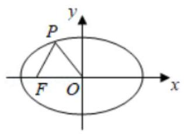

A. $\frac{{x}^{2}}{25} + \frac{{y}^{2}}{5} = 1$ B. $\frac{{x}^{2}}{30} + \frac{{y}^{2}}{10} = 1$

C. $\frac{{x}^{2}}{36} + \frac{{y}^{2}}{16} = 1$ D. $\frac{{x}^{2}}{45} + \frac{{y}^{2}}{25} = 1$

【难度】★★★

【答案】 $C$

【解析】解: 由题意可得 $c = 2\sqrt{5}$ ,设右焦点为 ${F}^{\prime }$ ,由 $\left| {OP}\right|  = \left| {OF}\right|  = \left| {O{F}^{\prime }}\right|$ 知,

$\angle {PF}{F}^{\prime } = \angle {FPO},\angle O{F}^{\prime }P = \angle {OP}{F}^{\prime }$ ,所以 $\angle {PF}{F}^{\prime } + \angle O{F}^{\prime }P = \angle {FPO} + \angle {OP}{F}^{\prime }$ ,

由 $\angle {PF}{F}^{\prime } + \angle O{F}^{\prime }P + \angle {FPO} + \angle {OP}{F}^{\prime } = {180}^{ \circ  }$ 知, $\angle {FPO} + \angle {OP}{F}^{\prime } = {90}^{ \circ  }$ ,即 ${PF} \bot  P{F}^{\prime }$ .

在 $\mathrm{{Rt}}\Delta {\mathrm{{PFF}}}^{\prime }$ 中,由勾股定理,得 $\left| {P{F}^{\prime }}\right|  = \sqrt{F{F}^{\prime 2} - P{F}^{2}} = \sqrt{{\left( 4\sqrt{5}\right) }^{2} - {4}^{2}} = 8$ ,

由椭圆定义,得 $\left| {PF}\right|  + \left| {P{F}^{\prime }}\right|  = {2a} = 4 + 8 = {12}$ ,从而 $a = 6$ ,得 ${a}^{2} = {36}$ ,

于是 ${b}^{2} = {a}^{2} - {c}^{2} = {36} - {\left( 2\sqrt{5}\right) }^{2} = {16}$ ,所以椭圆的方程为 $\frac{{x}^{2}}{36} + \frac{{y}^{2}}{16} = 1$ . 故选: $C$ .

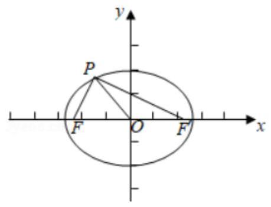

## 巩固训练

1、已知坐标平面上的两点 $A\left( {-1,0}\right)$ 和 $B\left( {1,0}\right)$ ，动点 $P$ 到 $A$ 、 $B$ 两点距离之和为常数 2，则动点 $P$ 的轨迹是 ( )

A. 椭圆 B. 双曲线 C. 抛物线 D. 线段

【难度】 $\star   \star   \star$

【答案】 $D$

【解析】解: 由题意可得: $A\left( {-1,0}\right) \text{ 、 }B\left( {1,0}\right)$ 两点之间的距离为 2,

又因为动点 $P$ 到 $A\text{ 、 }B$ 两点距离之和为常数 2,所以 $\left| {AB}\right|  = \left| {AP}\right|  + \left| {AP}\right|$ ,即动点 $P$ 在线段 ${AB}$ 上运动, 所以动点 $P$ 的轨迹是线段. 故选: $D$ .

2、方程 $\sqrt{{\left( x - 1\right) }^{2} + {y}^{2}} + \sqrt{{\left( x + 1\right) }^{2} + {y}^{2}} = 2$ 表示的轨迹是( )

A. 线段 B. 圆 C. 椭圆 D. 双曲线

【难度】 $\star   \star   \star$

【答案】 $A$

【解析】解: $\because \sqrt{{\left( x - 1\right) }^{2} + {y}^{2}} + \sqrt{{\left( x + 1\right) }^{2} + {y}^{2}} = 2$ ,

$\therefore$ 方程可表示平面内点 $P\left( {x, y}\right)$ 到点 $A\left( {-1,0}\right)$ 与点 $B\left( {1,0}\right)$ 的距离之和为 2 的图形,

此时 $\left| {PA}\right|  + \left| {PB}\right|  = \left| {AB}\right|$ , $\therefore$ 方程 $\sqrt{{\left( x - 1\right) }^{2} + {y}^{2}} + \sqrt{{\left( x + 1\right) }^{2} + {y}^{2}} = 2$ 表示的轨迹是线段 ${AB}$ ,故选: $A$ .

3、已知实数 $A, B, C$ 满足 ${ABC} \neq  0$ ，则 “ ${ABC} > 0$ ” 是 “方程 $A{x}^{2} + B{y}^{2} = C$ 表示的曲线为椭圆” 的( )

A. 充分非必要条件 B. 必要非充分条件

C. 充要条件 D. 非充分非必要条件

【难度】★★

【答案】 $D$

【解析】解: 若方程 $A{x}^{2} + B{y}^{2} = C$ 表示的曲线为椭圆,则椭圆的标准方程为: $\frac{{x}^{2}}{\frac{C}{A}} + \frac{{y}^{2}}{\frac{C}{B}} = 1$ ,

则 $\frac{C}{A} > 0,\frac{C}{B} > 0,\frac{C}{A} \neq  \frac{C}{B}$ ; 即 $\left\{  \begin{array}{l} A > 0 \\  B > 0 \\  C > 0 \\  A \neq  B \end{array}\right.$ 或 $\left\{  \begin{array}{l} A < 0 \\  B < 0 \\  C < 0 \\  A \neq  B \end{array}\right.$ ;

故 “ ${ABC} > 0$ ” 推不出 “方程 $A{x}^{2} + B{y}^{2} = C$ 表示的曲线为椭圆”,

“方程 $A{x}^{2} + B{y}^{2} = C$ 表示的曲线为椭圆” 推不出 “ ${ABC} > 0$ ”,

$\therefore$ 实数 “ ${ABC} > 0$ ” 是 “方程 $A{x}^{2} + B{y}^{2} = C$ 表示的曲线为椭圆的非充分非必要条件.

故选: $D$ .

4、 $x = \sqrt{1 - 3{y}^{2}}$ 表示的曲线是( )

A. 双曲线 B. 椭圆

C. 双曲线的一部分 D. 椭圆的一部分

【难度】★★★

【答案】 $D$

【解析】解: $\because x = \sqrt{1 - 3{y}^{2}}k > 1,\therefore {x}^{2} + 3{y}^{2} = 1\left( {x \geq  0}\right)$

即 $\frac{{y}^{2}}{1} + \frac{{x}^{2}}{\frac{1}{3}} = 1$ ,表示实轴在 $x$ 轴上的椭圆一部分,故选: $D$ .

5、椭圆的焦距为 8，且椭圆上的点到两个焦点距离之和为 10，则该椭圆的标准方程是()

A. $\frac{{x}^{2}}{25} + \frac{{y}^{2}}{9} = 1$ B. $\frac{{x}^{2}}{9} + \frac{{y}^{2}}{25} = 1$ 或 $\frac{{x}^{2}}{25} + \frac{{y}^{2}}{9} = 1$

C. $\frac{{x}^{2}}{9} + \frac{{y}^{2}}{25} = 1$ D. $\frac{{x}^{2}}{16} + \frac{{y}^{2}}{25} = 1$ 或 $\frac{{x}^{2}}{16} + \frac{{y}^{2}}{9} = 1$

【难度】 $\star   \star   \star$

【答案】 $B$

【解析】解: 由题意可知: 焦距为 ${2c} = 8$ ,则 $c = 4,{2a} = {10}, a = 5,{b}^{2} = {a}^{2} - {c}^{2} = 9$ ,

$\therefore$ 当椭圆的焦点在 $x$ 轴上时,椭圆的标准方程: $\frac{{x}^{2}}{25} + \frac{{y}^{2}}{9} = 1$ ,

当椭圆的焦点在 $y$ 轴上时,椭圆的标准方程: $\frac{{x}^{2}}{9} + \frac{{y}^{2}}{25} = 1$ ,故椭圆的标准方程为: $\frac{{x}^{2}}{25} + \frac{{y}^{2}}{9} = 1$ 或 $\frac{{x}^{2}}{9} + \frac{{y}^{2}}{25} = 1$ , 故选: $B$ .

6、椭圆的长轴长是短轴长的 2 倍，它的一个焦点为 $\left( {\sqrt{3},0}\right)$ ，则椭圆的标准方程是___.

【难度】 $\star   \star$

【答案】 $\frac{{x}^{2}}{4} + {y}^{2} = 1$

【解析】解: 依题意得 ${2a} = {4b}, c = \sqrt{3}$ ,又 ${a}^{2} = {b}^{2} + {c}^{2},\therefore a = 2, b = 1$ ,

故答案为: $\frac{{x}^{2}}{4} + {y}^{2} = 1$ .

7、若椭圆的两个焦点为 ${F}_{1}\left( {-3,0}\right) \text{ 、 }{F}_{2}\left( {3,0}\right)$ ,椭圆的弦 ${AB}$ 过点 ${F}_{1}$ ，且 $\bigtriangleup {AB}{F}_{2}$ 的周长等于 20，该椭圆的标准方程为___.

【难度】 $\star   \star$

【答案】 $\frac{{x}^{2}}{25} + \frac{{y}^{2}}{16} = 1$

【解析】解: 如图, $\because \bigtriangleup {AB}{F}_{2}$ 的周长等于 ${20},\therefore {4a} = {20}$ ,即 $a = 5$ , 又 $c = 3\text{ ， }\therefore {b}^{2} = {a}^{2} - {c}^{2} = {5}^{2} - {3}^{2} = {14}.\therefore$ 椭圆的标准方程为: $\frac{{x}^{2}}{25} + \frac{{y}^{2}}{16} = 1$ . 故答案为: $\frac{{x}^{2}}{25} + \frac{{y}^{2}}{16} = 1$ .

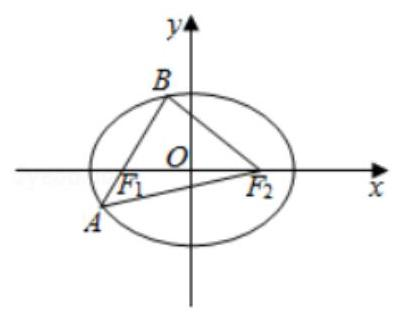

## (二)椭圆的几何性质

## 知识梳理

## 1. 椭圆的其他性质

① 椭圆上到中心的距离最小的点是短轴的两个端点，到中心距离最大的点是长轴的两个端点.

② 椭圆上到焦点距离最大、最小的点是长轴的两个端点,最大距离是 $a + c$ ,最小距离是 $a - c$ .

③ 设椭圆的两个焦点为 ${F}_{1},{F}_{2}, P$ 是椭圆上的点,当点 $P$ 在短轴的端点时 $\angle {F}_{1}P{F}_{2}$ 最大.

④ 椭圆的焦点的光学性质: 从任一焦点发出的光线通过椭圆面反射后, 反射光线经过另一焦点.

## 2. 椭圆的参数方程

$\left\{  {\begin{array}{l} x = a\cos \varphi , \\  y = b\sin \varphi . \end{array}\left( {0 \leq  \varphi  < {2\pi }}\right) }\right.$

## 3. 点与椭圆的位置关系

已知点 $P\left( {{x}_{0},{y}_{0}}\right)$ 与椭圆 $\frac{{x}^{2}}{{a}^{2}} + \frac{{y}^{2}}{{b}^{2}} = 1\left( {a > b > 0}\right)$ ( ${F}_{1},{F}_{2}$ 为椭圆的焦点),则

(1)点 $P$ 在椭圆上 $\Leftrightarrow  \frac{{x}_{0}^{2}}{{a}^{2}} + \frac{{y}_{0}^{2}}{{b}^{2}} = 1 \Leftrightarrow  \left| {P{F}_{1}}\right|  + \left| {P{F}_{2}}\right|  = {2a}$ ；

(2)点 $P$ 在椭圆外 $\Leftrightarrow  \frac{{x}_{0}^{2}}{{a}^{2}} + \frac{{y}_{0}^{2}}{{b}^{2}} > 1 \Leftrightarrow  \left| {P{F}_{1}}\right|  + \left| {P{F}_{2}}\right|  > {2a}$ ；

(3)点 $P$ 在椭圆内 $\Leftrightarrow  \frac{{x}_{0}^{2}}{{a}^{2}} + \frac{{y}_{0}^{2}}{{b}^{2}} < 1 \Leftrightarrow  \left| {P{F}_{1}}\right|  + \left| {P{F}_{2}}\right|  < {2a}$ .

4、焦点三角形(椭圆或双曲线上的一点与两焦点所构成的三角形)问题

常利用定义和正弦、余弦定理求解。

设椭圆或双曲线上的一点 $P\left( {{x}_{0},{y}_{0}}\right)$ 到两焦点 ${F}_{1},{F}_{2}$ 的距离分别为 ${r}_{1},{r}_{2}$ ,焦点 $\Delta {F}_{1}P{F}_{2}$ 的面积为 $S$ ,则在椭圆 $\frac{{x}^{2}}{{a}^{2}} + \frac{{y}^{2}}{{b}^{2}} = 1$ 中， 切 $\theta  = \arccos \left( {\frac{2{b}^{2}}{{r}_{1}{r}_{2}} - 1}\right)$ ，且当 ${r}_{1} = {r}_{2}$ 即 $P$ 为短轴端点时， $\theta$ 最大为 ${\theta }_{\max } = \; \arccos \frac{{b}^{2} - {c}^{2}}{{a}^{2}};\text{ ② }S = {b}^{2}\tan \frac{\theta }{2} = c\left| {y}_{0}\right|$ ,当 $\left| {y}_{0}\right|  = b$ 即 $P$ 为短轴端点时, ${S}_{\max }$ 的最大值为 $\mathrm{{bc}}$ ;

对于双曲线 $\frac{{x}^{2}}{{a}^{2}} - \frac{{y}^{2}}{{b}^{2}} = 1$ 的焦点三角形有: $\left( {1,\theta }\right)  = \arccos \left( {1 - \frac{2{b}^{2}}{{r}_{1}{r}_{2}}}\right) ;\text{ ② }S = \frac{1}{2}{r}_{1}{r}_{2}\sin \theta  = {b}^{2}\cot \frac{\theta }{2}$ 。

## 例题精讲

【例 5】如图,把椭圆 $\frac{{x}^{2}}{25} + \frac{{y}^{2}}{16} = 1$ 的长轴 ${AB}$ 分成 8 等份,过每个分点作 $x$ 轴的垂线交椭圆的上半部分于 ${P}_{1}$ 、 ${P}_{2}\text{ 、 }{P}_{3}\text{ 、 }{P}_{4}\text{ 、 }{P}_{5}\text{ 、 }{P}_{6}\text{ 、 }{P}_{7}$ 七个点, $F$ 是椭圆的一个焦点,则 $\left| {{P}_{1}F}\right|  + \left| {{P}_{2}F}\right|  + \left| {{P}_{3}F}\right|  + \left| {{P}_{4}F}\right|  + \left| {{P}_{5}F}\right|  + \left| {{P}_{6}F}\right|  + \left| {{P}_{7}F}\right|  =$ ___.

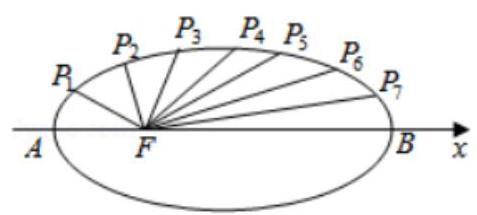

【难度】

【答案】35

【解析】解: 将椭圆 $\frac{{x}^{2}}{25} + \frac{{y}^{2}}{16} = 1$ 的长轴 ${AB}$ 分成 8 等份,过每个分点作 $x$ 轴的垂线交椭圆的上半部分于 ${P}_{1}\text{ 、 }{P}_{2}\text{ 、 }{P}_{3}\text{ 、 }{P}_{4}\text{ 、 }{P}_{5}\text{ 、 }{P}_{6}\text{ 、 }{P}_{7}$ 七个点, $F$ 是椭圆的一个焦点,设椭圆的另一个焦点为 ${F}^{\prime }$ , 根据椭圆的对称性,得 $\left| {{P}_{1}F}\right|  + \left| {{P}_{7}F}\right|  = \left| {{P}_{1}F}\right|  + \left| {{P}_{1}{F}^{\prime }}\right|  = {2a} = {10}$ 同理可得: $\left| {{P}_{2}F}\right|  + \left| {{P}_{6}F}\right|  = {2a} = {10}$ 且 $\left| {{P}_{3}F}\right|  + \left| {{P}_{5}F}\right|  = {2a} = {10}$ 又 $\because \left| {{P}_{4}F}\right|  = \sqrt{{c}^{2} + {b}^{2}} = a = 5$

$\therefore \left| {{P}_{1}F}\right|  + \left| {{P}_{2}F}\right|  + \left| {{P}_{3}F}\right|  + \left| {{P}_{4}F}\right|  + \left| {{P}_{5}F}\right|  + \left| {{P}_{6}F}\right|  + \left| {{P}_{7}F}\right|  = {7a} = {35}$ ,故答案为: 35

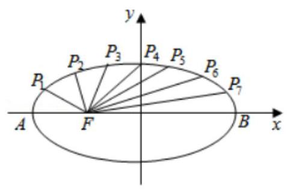

【例 6】( 1 )已知椭圆 $\frac{{x}^{2}}{9} + \frac{{y}^{2}}{4} = 1$ 的左、右焦点分别为 ${F}_{1}\text{ 、 }{F}_{2}$ ,若椭圆上的点 $P$ 满足 $\left| {P{F}_{1}}\right|  = 2\left| {P{F}_{2}}\right|$ ,则 $\angle {F}_{1}P{F}_{2}$ 的大小为___.

【难度】 $\star   \star   \star$

【答案】 $\frac{\pi }{2}$

【解析】依题意椭圆 $\frac{{x}^{2}}{9} + \frac{{y}^{2}}{4} = 1$ 的 $a = 3, b = 2, c = \sqrt{{a}^{2} - {b}^{2}} = \sqrt{5},\left| {{F}_{1}{F}_{2}}\right|  = {2c} = 2\sqrt{5}$ .

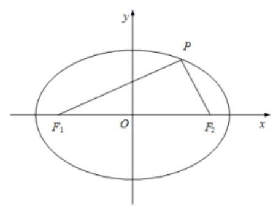

所以 $\left\{  \begin{array}{l} \left| {P{F}_{1}}\right|  = 2\left| {P{F}_{2}}\right| \\  \left| {P{F}_{1}}\right|  + \left| {P{F}_{2}}\right|  = {2a} = 6 \end{array}\right.$ ,解得 $\left| {P{F}_{1}}\right|  = 4,\left| {P{F}_{2}}\right|  = 2$ ,

所以 ${\left| P{F}_{1}\right| }^{2} + {\left| P{F}_{2}\right| }^{2} = {4}^{2} + {2}^{2} = {20} = {\left| {F}_{1}{F}_{2}\right| }^{2}$ ,

所以三角形 ${F}_{1}P{F}_{2}$ 是直角三角形,且 $\angle {F}_{1}P{F}_{2} = \frac{\pi }{2}$ .

故答案为: $\frac{\pi }{2}$

(2)已知 $P$ 是椭圆 $\frac{{x}^{2}}{10} + {y}^{2} = 1$ 上的一点， ${F}_{1},{F}_{2}$ 是椭圆的两个焦点，当 $\angle {F}_{1}P{F}_{2} = \frac{2\pi }{3}$ 时，则 $\bigtriangleup  P{F}_{1}{F}_{2}$ 的面积为___.

【难度】 $\star   \star   \star$

【答案】 $\sqrt{3}$

【解析】如图,由椭圆 $\frac{{x}^{2}}{10} + {y}^{2} = 1$ ,得 $a = \sqrt{10}, b = 1, c = \sqrt{{a}^{2} - {b}^{2}} = 3$ ,

则 ${2a} = 2\sqrt{10},\therefore \left| {P{F}_{1}}\right|  + \left| {P{F}_{2}}\right|  = {2a} = 2\sqrt{10}$ ,

法一: 由余弦定理可得: ${\left| {F}_{1}{F}_{2}\right| }^{2} = {\left| P{F}_{1}\right| }^{2} + {\left| P{F}_{2}\right| }^{2} - 2\left| {P{F}_{1}}\right| \left| {P{F}^{2}}\right| \cos {120}^{ \circ  }$ ,

$\therefore 4{c}^{2} = {\left( \left| P{F}_{1}\right|  + \left| P{F}_{2}\right| \right) }^{2} - \left| {P{F}_{1}}\right| \left| {P{F}_{2}}\right|$ ,即 $\left| {P{F}_{1}}\right| \left| {P{F}_{2}}\right|  = 4$ .

$\therefore \bigtriangleup {F}_{1}P{F}_{2}$ 的面积 $S = \frac{1}{2}\left| {P{F}_{1}}\right| \left| {P{F}_{2}}\right| \sin {120}^{ \circ  } = \sqrt{3}$ . 故答案为: $\sqrt{3}$ .

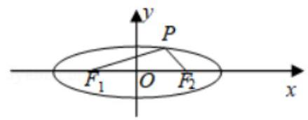

法二:焦点三角形面积公式

(3)已知椭圆 $C : \frac{{x}^{2}}{{a}^{2}} + \frac{{y}^{2}}{4} = 1\left( {a > 2}\right)$ 左、右焦点分别为 ${F}_{1},{F}_{2}$ ，若椭圆 $C$ 上存在四个不同的点 $P$ 满足 ${S}_{\bigtriangleup P{F}_{1}{F}_{2}} = 4\sqrt{3}$ ，则 $a$ 的取值范围是___.

【难度】 $\star   \star   \star$

【答案】 $\left( {4, + \infty }\right)$

【解析】解: 由题意: 椭圆 $C : \frac{{x}^{2}}{{a}^{2}} + \frac{{y}^{2}}{4} = 1\left( {a > 2}\right)$ ,可得 $b = 2$ ,

又椭圆 $C$ 上存在四个不同的点 $P$ 满足 ${S}_{\bigtriangleup P{F}_{1}{F}_{2}} = 4\sqrt{3}$ ，

可得: $\frac{1}{2} \times  b \times  {2c} > 4\sqrt{3}$ ，即 $c > 2\sqrt{3}$ ， ${c}^{2} > {12}$ ，可得: ${a}^{2} = {b}^{2} + {c}^{2} > {16}$ ， $a > 4$ ，故答案为: $\left( {4, + \infty }\right)$ .

【例 7】已知动点 $P\left( {x, y}\right)$ 在椭圆 $\frac{{x}^{2}}{25} + \frac{{y}^{2}}{16} = 1$ 上，若 $A\left( {3,0}\right)$ ，点 $M$ 满足 $\left| {AM}\right|  = 1$ ，且 $\overrightarrow{PM} \cdot  \overrightarrow{AM} = 0$ ，则 $\left| {PM}\right|$ 的最小值是___.

【难度】 $\star   \star   \star$

【答案】 $\sqrt{3}$

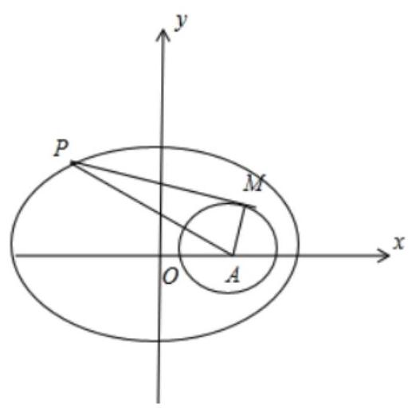

【解析】解: $\because \overrightarrow{PM} \cdot  \overrightarrow{AM} = 0,\therefore \overrightarrow{PM} \bot  \overrightarrow{AM},\therefore {\left| \overrightarrow{PM}\right| }^{2} = {\left| \overrightarrow{AP}\right| }^{2} \; - {\left| \overrightarrow{AM}\right| }^{2} = {\left| \overrightarrow{AP}\right| }^{2} - 1,$

$\therefore$ 点 $M$ 的轨迹为以为以点 $A$ 为圆心,1 为半径的圆, $\because {\left| \overrightarrow{PM}\right| }^{2} = {\left| \overrightarrow{AP}\right| }^{2} - 1,\left| \overrightarrow{AP}\right|$ 越小, $\left| \overrightarrow{PM}\right|$ 越小, 结合图形知,当 $P$ 点为椭圆的右顶点时, $\left| \overrightarrow{AP}\right|$ 取最小值 $a - c \; = 5 - 3 = 2,\therefore \left| \overrightarrow{PM}\right|$ 最小值是 $\sqrt{4 - 1} = \sqrt{3}$ .

【例 8】( 1 )在平面直角坐标系 ${xOy}$ 中，点 $A\left( {-1,0}\right)$ ，点 $P$ 是椭圆 $\frac{{x}^{2}}{4} + {y}^{2} = 1$ 上的一个动点，则 $\left| {PA}\right|$ 的最大值与最小值的积为___.

【难度】 $\star   \star   \star$

【答案】 $\sqrt{6}$

【解析】设点 $P$ 的坐标为 $\left( {x, y}\right)$ ,则 $- 2 \leq  x \leq  2,{y}^{2} = 1 - \frac{{x}^{2}}{4}$ ,

$\therefore \left| {PA}\right|  = \sqrt{{\left( x + 1\right) }^{2} + {y}^{2}} = \sqrt{{x}^{2} + {2x} + 1 + 1 - \frac{{x}^{2}}{4}} = \sqrt{\frac{3{x}^{2}}{4} + {2x} + 2} = \sqrt{\frac{3}{4}{\left( x + \frac{4}{3}\right) }^{2} + \frac{2}{3}}$ .

当 $x =  - \frac{4}{3}$ 时, $\left| {PA}\right|$ 取最小值 $\frac{\sqrt{6}}{3}$ ; 当 $x = 2$ 时, $\left| {PA}\right|$ 取最大值 3 .

因此, $\left| {PA}\right|$ 的最大值与最小值的积为 $3 \times  \frac{\sqrt{6}}{3} = \sqrt{6}$ . 故答案为: $\sqrt{6}$ .

(2)已知直线 $l$ 的普通方程为 $x + y + 1 = 0$ ，点 $P$ 是曲线 $C : \frac{{x}^{2}}{3} + {y}^{2} = 1$ 上的任意一点，则点 $P$ 到直线 $l$ 的距离的最大值为___.

【难度】 $\star   \star   \star$

【答案】 $\frac{3\sqrt{2}}{2}$

【解析】作直线 $l$ 的平行线 $x + y + t = 0$ ,使得该直线与椭圆 $C$ 相切,

联立 $\left\{  \begin{array}{l} x + y + t = 0 \\  \frac{{x}^{2}}{3} + {y}^{2} = 1 \end{array}\right.$ ,消去 $y$ 得 $4{x}^{2} + {6tx} + 3\left( {{t}^{2} - 1}\right)  = 0$ ,

$\Delta  = {36}{t}^{2} - 4 \times  4 \times  3\left( {{t}^{2} - 1}\right)  = {48} - {12}{t}^{2} = 0$ ,解得 $t =  \pm  2$ .

因此,点 $P$ 到直线 $l$ 的距离的最大值等于直线 $x + y - 2 = 0$ 与直线 $l$ 之间的距离 $d = \frac{3}{\sqrt{2}} = \frac{3\sqrt{2}}{2}$ ,故答案为 $\frac{3\sqrt{2}}{2}$

【例 9】已知椭圆的方程为 $\frac{{x}^{2}}{25} + \frac{{y}^{2}}{16} = 1,{F}_{1},{F}_{2}$ 分别是椭圆的左、右焦点, $A$ 点的坐标为 $\left( {2,1}\right) , P$ 为椭圆上一点,则 $\left| {PA}\right|  + \left| {P{F}_{2}}\right|$ 的最大值是___.

【难度】★★★

【答案】 ${10} + \sqrt{26}$

【解析】解: : 椭圆的方程为 $\frac{{x}^{2}}{25} + \frac{{y}^{2}}{16} = 1,\therefore {a}^{2} = {25},{c}^{2} = {a}^{2} - {b}^{2} = 9$ ,则 ${2a} = {10}, c = 3$ ,

$\because A\left( {2,1}\right) ,{F}_{1}\left( {-3,0}\right) ,\therefore \left| {A{F}_{1}}\right|  = \sqrt{{\left( 2 + 3\right) }^{2} + {\left( 1 - 0\right) }^{2}} = \sqrt{26}$ ,

$\because \left| {P{F}_{1}}\right|  + \left| {P{F}_{2}}\right|  = {2a} = {10}$ ,

$\therefore \left| {PA}\right|  + \left| {P{F}_{2}}\right|  = {10} + \left| {PA}\right|  - \left| {P{F}_{1}}\right|  \leq  {10} + \left| {A{F}_{1}}\right|  = {10} + \sqrt{26}$ 故答案为: ${10} + \sqrt{26}$

【例 10】已知椭圆 $E : \frac{{x}^{2}}{4} + \frac{{y}^{2}}{3} = 1$ 的一个顶点为 $H\left( {2,0}\right)$ ,对于 $x$ 轴上的点 $P\left( {t,0}\right)$ ,椭圆 $E$ 上存在点 $M$ , 使得 ${MP}\bot {MH}$ ，则实数 $t$ 的取值范围是___.

【难度】 $\star   \star   \star$

【答案】 $\left( {-2, - 1}\right)$

【解析】设 $M\left( {{x}_{0},{y}_{0}}\right) \left( {-2 < {x}_{0} < 2}\right)$ ,则 $\frac{{x}_{0}^{2}}{4} + \frac{{y}_{0}^{2}}{3} = 1$ ,①

$\overrightarrow{MP} = \left( {t - {x}_{0}, - {y}_{0}}\right) ,\overrightarrow{MH} = \left( {2 - {x}_{0}, - {y}_{0}}\right) ,$

由 ${MP} \bot  {MH}$ 可得 $\overrightarrow{MP} \cdot  \overrightarrow{MH} = 0$ ,即 $\left( {t - {x}_{0}}\right) \left( {2 - {x}_{0}}\right)  + {y}_{0}^{2} = 0$ ,②

由①②消去 ${y}_{0}$ ，整理得 $t\left( {2 - {x}_{0}}\right)  =  - \frac{1}{4}{x}_{0}^{2} + 2{x}_{0} - 3$ ，因为 ${x}_{0} \neq  2$ ，所以 $t = \frac{1}{4}{x}_{0} - \frac{3}{2}$ ，

因为 $- 2 < {x}_{0} < 2$ ,所以 $- 2 < t <  - 1$ ,所以实数 $t$ 的取值范围为 $\left( {-2, - 1}\right)$ .

## 巩固训练

1、已知 ${F}_{1},{F}_{2}$ 为椭圆 $\frac{{x}^{2}}{9} + \frac{{y}^{2}}{16} = 1$ 的两个焦点，过 ${F}_{1}$ 的直线交椭圆于 $A, B$ 两点，若 $\left| {{F}_{2}A}\right|  + \left| {{F}_{2}B}\right|  = {10}$ ，则 $\left| {AB}\right|  =$ (   )

A. 2 B. 4 C. 6 D. 10

【难度】★★

【答案】C

【解析】解: 根据椭圆的定义 $\left| {{F}_{1}A}\right|  + \left| {{F}_{2}A}\right|  + \left| {{F}_{1}B}\right|  + \left| {{F}_{2}B}\right|  = {4a} = {16}$ ,

所以 $\left| {AB}\right|  = \left| {{F}_{1}A}\right|  + \left| {{F}_{2}B}\right|  = 6$ . 故选: $C$ . 2、椭圆 $\frac{{x}^{2}}{9} + \frac{{y}^{2}}{4} = 1$ 的焦点 ${F}_{1},{F}_{2}$ ，点 $P$ 为其上的动点，当 $\angle {F}_{1}P{F}_{2}$ 为钝角时，点 $P$ 横坐标的取值范围是( )

A. $\left( {-\frac{\sqrt{5}}{5},\frac{\sqrt{5}}{5}}\right)$ B. $\left( {-\frac{2\sqrt{5}}{5},\frac{2\sqrt{5}}{5}}\right)$ C. $\left( {-\frac{3\sqrt{5}}{5},\frac{3\sqrt{5}}{5}}\right)$ D. $\left( {-\frac{6\sqrt{5}}{5},\frac{6\sqrt{5}}{5}}\right)$

【难度】 $\star   \star   \star$

【答案】 $C$

【解析】解: 如图,设 $P\left( {x, y}\right)$ ,则 ${F}_{1}\left( {-\sqrt{5},0}\right) ,{F}_{2}\left( {\sqrt{5},0}\right)$ ,

且 $\angle {F}_{1}P{F}_{2}$ 是钝角 $\Leftrightarrow  P{F}_{1}^{2} + P{F}_{2}^{2} < {\left| {F}_{1}{F}_{2}\right| }^{2} \Leftrightarrow  {\left( x + \sqrt{5}\right) }^{2} + {y}^{2} + {\left( x - \sqrt{5}\right) }^{2} + {y}^{2} < {20}$

$\Leftrightarrow  {x}^{2} + 5 + {y}^{2} < {10} \Leftrightarrow  {x}^{2} + 4\left( {1 - \frac{{x}^{2}}{9}}\right)  < 5 \Leftrightarrow  {x}^{2} < \frac{9}{5}$ . 所以 $- \frac{3\sqrt{5}}{5} < x < \frac{3\sqrt{5}}{5}$ . 故选: $C$ .

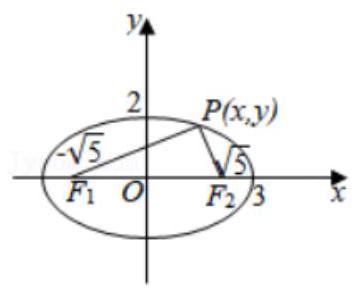

3、若点 $O$ 和点 $F$ 分别为椭圆 $\frac{{x}^{2}}{4} + \frac{{y}^{2}}{3} = 1$ 的中心和左焦点,点 $P$ 为椭圆上的任意一点,则 $\overrightarrow{OP} \cdot  \overrightarrow{FP}$ 的取值范围___

【难度】 $\star   \star   \star$

【答案】 $\left\lbrack  {2,6}\right\rbrack$

【解析】解: $\because \frac{{x}^{2}}{4} + \frac{{y}^{2}}{3} = 1,\therefore F\left( {-1,0}\right)$

设 $P\left( {x, y}\right)$ ,则 $\overrightarrow{OP} = \left( {x, y}\right) ,\overrightarrow{FP} = \left( {x + 1, y}\right)$ ,则 $\therefore \overrightarrow{OP} \cdot  \overrightarrow{FP} = \left( {x, y}\right)  \cdot  \left( {x + 1, y}\right)  = {x}^{2} + x + {y}^{2}$ ,

又点 $P$ 在椭圆上,所以 ${x}^{2} + x + {y}^{2} = {x}^{2} + x + \left( {3 - \frac{3}{4}{x}^{2}}\right)  = \frac{1}{4}{x}^{2} + x + 3 = \frac{1}{4}{\left( x + 2\right) }^{2} + 2$ ,

又 $- 2 \leq  x \leq  2$ ,所以当 $x = 2$ 时, $\frac{1}{4}{\left( x + 2\right) }^{2} + 2$ 取得最大值为 6,

当 $x =  - 2$ 时, $\frac{1}{4}{\left( x + 2\right) }^{2} + 2$ 取得最小值为 $2,\therefore 2 \leq  \overline{OP} \cdot  \overline{FP} \leq  6$ ,即 $\overline{OP} \cdot  \overline{FP} \in  \left\lbrack  {2,6}\right\rbrack$

故答案为: $\left\lbrack  {2,6}\right\rbrack$ .

4、 $P$ 是椭圆 $\frac{{x}^{2}}{2} + {y}^{2} = 1$ 上的一动点.

(1)定点 $A\left( {1,0}\right)$ ，求 $\left| {PA}\right|$ 的最小值；

(2)求 $P$ 到 ${3x} + {4y} - 2\sqrt{34} = 0$ 距离的取值范围.

【难度】 $\star   \star   \star$

【答案】(1) $\sqrt{2} - 1$ ; (2) $\left\lbrack  {\frac{\sqrt{34}}{5},\frac{3\sqrt{34}}{5}}\right\rbrack$ .

【解析】解: (1) $P$ 是椭圆 $\frac{{x}^{2}}{2} + {y}^{2} = 1$ 上的一动点. 把椭圆的方程转换为参数方程为 $\left\{  \begin{matrix} x = \sqrt{2}\cos \theta \\  y = \sin \theta  \end{matrix}\right.$ ( $\theta$ 为参数).

故: $P\left( {\sqrt{2}\cos \theta ,\sin \theta }\right)$ 则: $\left| {PA}\right|  = \sqrt{{\left( \sqrt{2}\cos \theta  - 1\right) }^{2} + {\sin }^{2}\theta } = \left| {\cos \theta  - \sqrt{2}}\right|$ ,当 $\cos \theta  = 1$ 时, $\left| {PA}\right|$ 的最小值为 $\sqrt{2} - 1$ .

( 2 )把点 $P\left( {\sqrt{2}\cos \theta ,\sin \theta }\right)$ 代入直线 ${3x} + {4y} - 2\sqrt{34} = 0$ ，得到 $d = \frac{\left| 3\sqrt{2}\cos \theta  + 4\sin \theta  - 2\sqrt{34}\right| }{\sqrt{{3}^{2} + {4}^{2}}} = \frac{\left| \sqrt{34}\sin \left( \theta  + \alpha \right)  - 2\sqrt{34}\right| }{5}$ ,当 $\sin \left( {\theta  + \alpha }\right)  = 1$ 时, ${d}_{\min } = \frac{\sqrt{34}}{5}$ , 当 $\sin \left( {\theta  + \alpha }\right)  =  - 1$ 时, ${d}_{\max } = \frac{3\sqrt{34}}{5}$ ,则: 点 $P$ 到直线的距离的范围为 $\left\lbrack  {\frac{\sqrt{34}}{5},\frac{3\sqrt{34}}{5}}\right\rbrack$ .

5、已知点 $\mathrm{P}$ 是椭圆 $\mathrm{C} : \frac{{x}^{2}}{9} + {y}^{2} = 1$ 上的一个动点,点 $\mathrm{Q}$ 是圆 $\mathrm{E} : {x}^{2} + {\left( y - 4\right) }^{2} = 3$ 上的一个动点,则 $\left| \mathrm{{PQ}}\right|$ 的最大值是___.

【难度】 $\star   \star   \star$

【答案】 $4\sqrt{3}$

【解析】由圆 $E : {x}^{2} + {\left( y - 4\right) }^{2} = 3$ 可得圆心为 $E\left( {0,4}\right)$ ,又点 $Q$ 在圆 $E$ 上,

$\therefore \left| {PQ}\right|  \leq  \left| {EP}\right|  + \left| {EQ}\right|  = \left| {EP}\right|  + \sqrt{3}$ (当且仅当直线 ${PQ}$ 过点 $E$ 时取等号).

设 $P\left( {{x}_{1},{y}_{1}}\right)$ 是椭圆 $C$ 上的任意一点,则 $\frac{{x}_{1}^{2}}{9} + {y}_{1}^{2} = 1$ ,即 ${x}_{1}^{2} = 9 - 9{y}_{1}^{2}$ .

$\therefore {\left| EP\right| }^{2} = {x}_{1}^{2} + {\left( {y}_{1} - 4\right) }^{2} = 9 - 9{y}_{1}^{2} + {\left( {y}_{1} - 4\right) }^{2} =  - 8{\left( {y}_{1} + \frac{1}{2}\right) }^{2} + {27}$ .

$\because {y}_{1} \in  \left\lbrack  {-1,1}\right\rbrack  ,\therefore$ 当 ${y}_{1} =  - \frac{1}{2}$ 时, ${\left| EP\right| }^{2}$ 取得最大值 27,即 $\left| {PQ}\right|  \leq  3\sqrt{3} + \sqrt{3} = 4\sqrt{3}$ .

$\therefore \left| {PQ}\right|$ 的最大值为 $4\sqrt{3}$ . 故答案为 $4\sqrt{3}$ .

6、已知椭圆 $\frac{{x}^{2}}{25} + \frac{{y}^{2}}{16} = 1,{F}_{1},{F}_{2}$ 为焦点， $M$ 为椭圆上的点，若 ${\Delta M}{F}_{1}{F}_{2}$ 的内切圆的面积为 $\frac{9}{4}\pi$ ，则这样的点 $M$ 的个数为( )

A. 0 B. 1 C. 2 D. 4

【难度】★★★

【答案】C

【解析】选 C. 由已知得 $\bigtriangleup  M{F}_{1}{F}_{2}$ 的内切圆的半径为 $r = \frac{3}{2}$ ,又因为 $a = 5, c = \sqrt{{25} - {16}} = 3$ ,所以 $\bigtriangleup  M{F}_{1}{F}_{2}$ 的周长为 ${2a} + {2c} = {16}$ ,所以 $\bigtriangleup  M{F}_{1}{F}_{2}$ 的面积 $S = \frac{1}{2}\left( {{2a} + {2c}}\right) r = \frac{1}{2} \times  {16} \times  \frac{3}{2} = {12}$ ,设 $M\left( {{x}_{0},{y}_{0}}\right)$ ,则 $S = \frac{1}{2} \cdot  {2c} \cdot  \left| {y}_{0}\right|  = \frac{1}{2} \times \; 6 \times  \left| {y}_{0}\right|  = {12}$ ，解得 ${y}_{0} =  \pm  4$ ，由于 $M$ 为椭圆上的点，所以 $- 4 \leq  {y}_{0} \leq  4$ ，故 $M$ 应恰好为短轴的两个端点，即这样的点 $M$ 有 2

## (三) 直线与椭圆

## 知识梳理

## 1. 直线与椭圆的位置关系

联立方程,看 $\Delta$ .

$\Delta  > 0$ ,直线与椭圆有两个交点,弦长为 $\sqrt{1 + {k}^{2}}\frac{\sqrt{\Delta }}{\left| a\right| }$ (其中 $a$ 为二次项系数);

$\Delta  = 0$ ，直线与椭圆相切，也即直线与椭圆只有一个公共点；

$\Delta  < 0$ ，直线与椭圆无交点.

## 2. 椭圆的切线或切点弦, 直线和椭圆相切的条件

(1)若 ${P}_{0}\left( {{x}_{0},{y}_{0}}\right)$ 在椭圆 $\frac{{x}^{2}}{{a}^{2}} + \frac{{y}^{2}}{{b}^{2}} = 1$ 上，则过 ${P}_{0}$ 的椭圆的切线方程是 $\frac{{x}_{0}x}{{a}^{2}} + \frac{{y}_{0}y}{{b}^{2}} = 1$ ；

(2)若 ${P}_{0}\left( {{x}_{0},{y}_{0}}\right)$ 在椭圆 $\frac{{x}^{2}}{{a}^{2}} + \frac{{y}^{2}}{{b}^{2}} = 1$ 外，则过 ${P}_{0}$ 作椭圆的两条切线切点为 ${P}_{1}\text{ 、 }{P}_{2}$ ，则切点弦 ${P}_{1}{P}_{2}$ 的直线方程是 $\frac{{x}_{0}x}{{a}^{2}} + \frac{{y}_{0}y}{{b}^{2}} = 1$ ;

(3)直线 ${Ax} + {By} + C = 0$ 与椭圆 $\frac{{x}^{2}}{{a}^{2}} + \frac{{y}^{2}}{{b}^{2}} = 1$ 相切的条件为 ${A}^{2}{a}^{2} + {B}^{2}{b}^{2} = {C}^{2}$ 。

## 3. 弦长公式

若直线 $y = {kx} + b$ 与圆锥曲线相交于两点 $A\text{ 、 }B$ ,且 ${x}_{1},{x}_{2}$ 分别为 $A\text{ 、 }B$ 的横坐标,则 $\left| {AB}\right|  = \; \sqrt{1 + {k}^{2}}\left| {{x}_{1} - {x}_{2}}\right|  = \sqrt{1 + {k}^{2}}\frac{\sqrt{\Delta }}{\left| a\right| }$ ,若 ${y}_{1},{y}_{2}$ 分别为 $A\text{ 、 }B$ 的纵坐标,则 $\left| {AB}\right|  = \sqrt{1 + \frac{1}{{k}^{2}}}\left| {{y}_{1} - {y}_{2}}\right|  = \sqrt{1 + \frac{1}{{k}^{2}}}\frac{\sqrt{\Delta }}{\left| a\right| }$ , 若弦 ${AB}$ 所在直线方程设为 $x = {my} + b$ ,则 $\left| {AB}\right|  = \sqrt{1 + {m}^{2}}\left| {{y}_{1} - {y}_{2}}\right|  = \sqrt{1 + {m}^{2}}\frac{\sqrt{\Delta }}{\left| a\right| }$ 。

## 例题精讲

【例 11】已知椭圆 $E : \frac{{x}^{2}}{{a}^{2}} + \frac{{y}^{2}}{{b}^{2}} = 1\left( {a > b > 0}\right)$ 的右焦点为 $F\left( {3,0}\right)$ ，过点 $F$ 的直线交椭圆于 $A$ ， $B$ 两点，若 ${AB}$ 的中点坐标为 $\left( {1, - 1}\right)$ ，则 $E$ 的方程为( )

A. $\frac{{x}^{2}}{18} + \frac{{y}^{2}}{9} = 1$ B. $\frac{{x}^{2}}{27} + \frac{{y}^{2}}{18} = 1$

C. $\frac{{x}^{2}}{36} + \frac{{y}^{2}}{27} = 1$ D. $\frac{{x}^{2}}{45} + \frac{{y}^{2}}{36} = 1$

【难度】 $\star   \star   \star$

【答案】 $A$

【解析】解: 设 $A\left( {{x}_{1},{y}_{1}}\right) , B\left( {{x}_{2},{y}_{2}}\right)$ ,代入椭圆方程可得: $\left\{  \begin{array}{l} \frac{{x}_{1}^{2}}{{a}^{2}} + \frac{{y}_{1}^{2}}{{b}^{2}} = 1 \\  \frac{{x}_{2}^{2}}{{a}^{2}} + \frac{{y}_{2}^{2}}{{b}^{2}} = 1 \end{array}\right.$ ,两式作差可得: $\frac{\left( {{x}_{1} - {x}_{2}}\right) \left( {{x}_{1} + {x}_{2}}\right) }{{a}^{2}} + \frac{\left( {{y}_{1} - {y}_{2}}\right) \left( {{y}_{1} + {y}_{2}}\right) }{{b}^{2}} = 0,$

又 ${AB}$ 的中点坐标为 $\left( {1, - 1}\right)$ ,所以 ${x}_{1} + {x}_{2} = 2,{y}_{1} + {y}_{2} =  - 2$ ,则 $\frac{{y}_{1} - {y}_{2}}{{x}_{1} - {x}_{2}} = \frac{{b}^{2}}{{a}^{2}}$ ,又直线 ${AB}$ 的斜率为 ${k}_{AB} = \frac{-1 - 0}{1 - 3} = \frac{1}{2}$ ,所以 $\frac{{b}^{2}}{{a}^{2}} = \frac{1}{2}$ ,而 ${a}^{2} - {b}^{2} = {c}^{2} = 9$ ,所以 ${a}^{2} = {18},{b}^{2} = 9$ ,所以椭圆的方程为: $\frac{{x}^{2}}{18} + \frac{{y}^{2}}{9} = 1$ , 故选: $A$ .

【例 12】已知椭圆 $C : \frac{{x}^{2}}{{a}^{2}} + \frac{{y}^{2}}{{b}^{2}} = 1\left( {a > b > 0}\right)$ 的左、右焦点分别为 ${F}_{1}\text{ 、 }{F}_{2}$ ,上顶点为 $A,\angle {F}_{1}A{F}_{2} = \frac{2\pi }{3}$ ,长轴的长为 4 . 过右焦点 ${F}_{2}$ 的直线 $l$ 与椭圆交于 $M\text{ 、 }N$ 两点 (非长轴端点).

(1)求椭圆的方程；

(2)若直线 $l$ 过椭圆的上顶点 $A$ ，求 ${\Delta MN}{F}_{1}$ 的面积；

(3)延长 ${MO}(O$ 为坐标原点 $)$ 交椭圆 $C$ 于 $P$ 点，求 ${\Delta PMN}$ 面积的最大值，并求此时直线 $l$ 的方程.

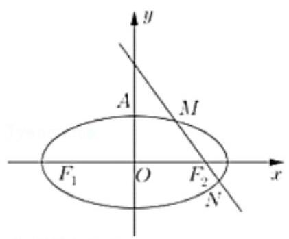

【难度】 $\star   \star   \star$

【答案】见解析

【解析】解: (1) 因为 $\angle {F}_{1}A{F}_{2} = \frac{2\pi }{3}$ ,长轴的长为 4,所以 $a = 2, c = \sqrt{3}, b = 1$ ,

所以椭圆的方程为 $\frac{{x}^{2}}{4} + {y}^{2} = 1$ .

(2)因为 ${F}_{2}\left( {\sqrt{3},0}\right) , A\left( {0,1}\right)$ ，所以 ${MN} : y =  - \frac{\sqrt{3}}{3}x + 1$ ，

则点 ${F}_{1}$ 到直线 ${MN} : y =  - \frac{\sqrt{3}}{3}x + 1$ 的距离为 $d = \frac{\left| -\frac{\sqrt{3}}{3} \times  \left( -\sqrt{3}\right)  + 1\right| }{\sqrt{{\left( -\frac{\sqrt{3}}{3}\right) }^{2} + 1}} = \sqrt{3}$ ，

联立直线方程和椭圆方程得 $7{x}^{2} - 8\sqrt{3}x = 0$ ,所以 $M\left( {0,1}\right) , N\left( {\frac{8}{7}\sqrt{3}, - \frac{1}{7}}\right)$ ,

则 $\left| {MN}\right|  = \sqrt{{\left( \frac{8\sqrt{3}}{7}\right) }^{2} + {\left( -\frac{1}{7} - 1\right) }^{2}} = \frac{16}{7}$ ,所以 ${S}_{\bigtriangleup {MN}{F}_{1}} = \frac{1}{2}\left| {MN}\right|  \cdot  d = \frac{1}{2} \times  \frac{16}{7} \times  \sqrt{3} = \frac{8\sqrt{3}}{7}$ ;

(3)根据题意，设直线 $l$ 方程为 $x = {my} + \sqrt{3}$ ，

联立直线方程和椭圆方程得 $\left( {{m}^{2} + 4}\right) {y}^{2} + 2\sqrt{3}{my} - 1 = 0$ ，所以 ${y}_{1} + {y}_{2} =  - \frac{2\sqrt{3}m}{{m}^{2} + 4},{y}_{1} \cdot  {y}_{2} = \frac{-1}{{m}^{2} + 4}$ ，

所以 $\left| {MN}\right|  = \sqrt{1 + {m}^{2}}\left| {{y}_{1} - {y}_{2}}\right|  = \sqrt{1 + {m}^{2}}\sqrt{{\left( {y}_{1} + {y}_{2}\right) }^{2} - 4{y}_{1}{y}_{2}} = \frac{4\left( {{m}^{2} + 1}\right) }{{m}^{2} + 4}$ ,

原点到直线 $x = {my} + \sqrt{3}$ 的距离为 $d = \frac{\sqrt{3}}{\sqrt{{m}^{2} + 1}}$ ，所以点 $P$ 到直线 $x = {my} + \sqrt{3}$ 的距离为 ${2d} = \frac{2\sqrt{3}}{\sqrt{{m}^{2} + 1}}$ ，

所以 ${S}_{\bigtriangleup {MNP}} = \frac{1}{2}\left| {MN}\right|  \cdot  {2d} = \frac{4\sqrt{3}\sqrt{{m}^{2} + 1}}{{m}^{2} + 4}$ ,令 $\sqrt{{m}^{2} + 1} = t, t \geq  1$ ,

则 ${S}_{\bigtriangleup {MNP}} = \frac{4\sqrt{3}t}{{t}^{2} + 3} = \frac{4\sqrt{3}}{t + \frac{3}{t}} \leq  2$ ,当且仅当 $t = \sqrt{3}$ 时,面积取得最大值 2,此时 $\sqrt{{m}^{2} + 1} = \sqrt{3}$ ,解得 $m =  \pm  \sqrt{2}$ ,

所以直线 $l$ 方程为 $x - \sqrt{2}y - \sqrt{3} = 0$ 或 $x + \sqrt{2}y - \sqrt{3} = 0$ .

【例 13】若曲线 $C\frac{{x}^{2}}{4} + {y}^{2} = 1$ 与 $y$ 轴的正半轴的交点为 $M$ ,且曲线 $C$ 上的相异两点 $A\text{ 、 }B$ 满足: $\overline{MA} \cdot  \overline{MB} = 0$

(1)证明直线 ${AB}$ 恒经过一定点，并求此定点的坐标；

(2)求 $\bigtriangleup  {ABM}$ 面积 $S$ 的最大值.

【难度】 $\star   \star   \star   \star$

【答案】(1)见解析；(2) $\frac{64}{25}$ .

【解析】(1) 由题意可知: $M\left( {0,1}\right)$ ,设 $A\left( {{x}_{1},{y}_{1}}\right) , B\left( {{x}_{2},{y}_{2}}\right)$ ,

当 ${AB}$ 的斜率存在时,设直线 ${AB} : y = {kx} + m$ ,联立方程组:

$\left\{  \begin{array}{l} \frac{{x}^{2}}{4} + {y}^{2} = 1 \\  y = {kx} + m \end{array}\right.$

${x}_{1} + {x}_{2} = \frac{-{8km}}{1 + 4{k}^{2}}$ ③， ${x}_{1} \cdot  {x}_{2} = \frac{4{m}^{2} - 4}{1 + 4{k}^{2}}$ ④，

因为 $\overrightarrow{MA} \cdot  \overrightarrow{MB} = 0$ ,所以有 ${x}_{1} \cdot  {x}_{2} + \left( {k{x}_{1} + m - 1}\right) \left( {k{x}_{2} + m - 1}\right)  = 0$ ,

$\left( {1 + {k}^{2}}\right) {x}_{1} \cdot  {x}_{2} + k\left( {m - 1}\right) \left( {{x}_{1} + {x}_{2}}\right)  + {\left( m - 1\right) }^{2} = 0$ ,把③④代入整理:

$\left( {1 + {k}^{2}}\right) \frac{4{m}^{2} - 4}{1 + 4{k}^{2}} + k\left( {m - 1}\right) \frac{-{8km}}{1 + 4{k}^{2}} + {\left( m - 1\right) }^{2} = 0$ ,(有公因式 $m - 1$ ) 继续化简得:

$\left( {m - 1}\right) \left( {{5m} + 3}\right)  = 0, m =  - \frac{3}{5}$ 或 $m = 1$ (舍),

当 ${AB}$ 的斜率不存在时,易知满足条件 $\overrightarrow{MA} \cdot  \overrightarrow{MB} = 0$ 的直线 ${AB}$ 为: $x = 0$

过定点 $N\left( {0, - \frac{3}{5}}\right)$ ,综上,直线 ${AB}$ 恒过定点 $N\left( {0, - \frac{3}{5}}\right)$ ;

(2) $\bigtriangleup {ABM}$ 面积 $S = {S}_{\bigtriangleup {AMN}} + {S}_{\bigtriangleup {BMN}} = \frac{1}{2}\left| {MN}\right| \left| {{x}_{1} - {x}_{2}}\right|  = \frac{4}{5}\sqrt{{\left( {x}_{1} + {x}_{2}\right) }^{2} - 4{x}_{1} \cdot  {x}_{2}}$ ，

由第( 1 )小题的③④代入，整理得: $S = \frac{32}{25} \cdot  \frac{\sqrt{{25}{k}^{2} + 4}}{1 + 4{k}^{2}}$ ，

因 $N$ 在椭圆内部,所以 $k \in  \mathbf{R}$ ,可设 $t = \sqrt{{25}{k}^{2} + 4} \geq  2$ ,

$S = \frac{32t}{4{t}^{2} + 9} = \frac{32}{{4t} + \frac{9}{t}}\left( {t \geq  2}\right) ,\because {4t} + \frac{9}{t} \geq  \frac{25}{2},\therefore S \leq  \frac{64}{25}$ ( $k = 0$ 时取到最大值).

所以 $\bigtriangleup {ABM}$ 面积 $S$ 的最大值为 $\frac{64}{25}$ .

【例 14】如图,已知椭圆 $\Gamma  : \frac{{x}^{2}}{4} + {y}^{2} = 1$ 的左、右顶点分别为 $A\text{ 、 }B, P$ 是椭圆 $\Gamma$ 上异于 $A\text{ 、 }B$ 的一点,直线 $l : x = 4$ ,直线 ${AP}\text{ 、 }{BP}$ 分别交直线 $l$ 于两点 $C\text{ 、 }D$ ,线段 ${CD}$ 的中点为 $E$ .

(1)设直线 ${AP}\text{ 、 }{BP}$ 的斜率分别为 ${k}_{AP}\text{ 、 }{k}_{BP}$ ，求 ${k}_{AP} \cdot  {k}_{BP}$ 的值；

(2)设 $\bigtriangleup {ABP}\text{ 、 }\bigtriangleup {ABC}$ 的面积分别为 ${S}_{1}\text{ 、 }{S}_{2}$ ，如果 ${S}_{2} = 2{S}_{1}$ ，求直线 ${AP}$ 的方程；

(3)在 $x$ 轴上是否存在定点 $N\left( {n,0}\right)$ ，使得当直线 ${NP}\text{ 、 }{NE}$ 的斜率 ${k}_{NP}\text{ 、 }{k}_{NE}$ 存在时， ${k}_{NP} \cdot  {k}_{NE}$ 为定值？若存在,求出 ${k}_{NP} \cdot  {k}_{NE}$ 的值; 若不存在,请说明理由.

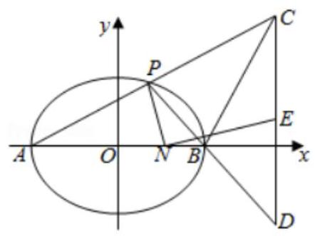

【难度】 $\star   \star   \star   \star$

【答案】见解析

【解析】解: (1) 可求点 $A$ 、 $B$ 的坐标分别为 $\left( {-2,0}\right)$ 、 $\left( {2,0}\right)$ ， $\left( {2, f}\right)$

设 $P\left( {x, y}\right)$ ,则 ${y}^{2} = 1 - \frac{{x}^{2}}{4}$ ,所以 ${k}_{AP} \cdot  {k}_{BP} = \frac{y}{x + 2} \cdot  \frac{y}{x - 2} = \frac{{y}^{2}}{{x}^{2} - 4} = \frac{1 - \frac{{x}^{2}}{4}}{{x}^{2} - 4} =  - \frac{1}{4};\ldots$ (4 分)

( 2 )设点 $P\left( {2\cos \theta ,\sin \theta }\right) \left( {\sin \theta  \neq  0}\right)$ ，则直线 ${AP}$ 的方程为 $y = \frac{\sin \theta }{2\cos \theta  + 2}\left( {x + 2}\right)$

令 $x = 4$ 得 $y = \frac{3\sin \theta }{\cos \theta  + 1}$ ,所以点 $C$ 的坐标为 $\left( {4,\frac{3\sin \theta }{\cos \theta  + 1}}\right)$ .

由 ${S}_{2} = 2{S}_{1}$ 得 $\frac{3\left| {\sin \theta }\right| }{\cos \theta  + 1} = 2\left| {\sin \theta }\right|$ ,所以 $\cos \theta  = \frac{1}{2},\sin \theta  =  \pm  \frac{\sqrt{3}}{2}$ ,所以直线 ${AP}$ 的方程为 $y =  \pm  \frac{\sqrt{3}}{6}\left( {x + 2}\right)$ .

(3)同(2)，设点 $P\left( {2\cos \theta ,\sin \theta }\right) \left( {\sin \theta  \neq  0}\right)$ ，直线 ${AP}$ 的方程为 $y = \frac{\sin \theta }{2\cos \theta  + 2}\left( {x + 2}\right)$

同理可求直线 ${BP}$ 的方程为: $y = \frac{\sin \theta }{2\cos \theta  - 2}\left( {x - 2}\right)$ ,

令 $x = 4$ 得 $y = \frac{\sin \theta }{\cos \theta  - 1}$ ,所以点 $D$ 的坐标为 $\left( {4,\frac{\sin \theta }{\cos \theta  - 1}}\right) ,{CD}$ 中点 $E\left( {4,\frac{1 - 2\cos \theta }{\sin \theta }}\right)$ (12 分)

${k}_{NP} \cdot  {k}_{NE} = \frac{\sin \theta }{2\cos \theta  - n} \cdot  \frac{\frac{1 - 2\cos \theta }{\sin \theta }}{4 - n} = \frac{1 - 2\cos \theta }{\left( {2\cos \theta  - n}\right) \left( {4 - n}\right) } = \frac{1 - 2\cos \theta }{n\left( {n - 4}\right)  + 2\left( {4 - n}\right) \cos \theta }$ (14 分)

要使 ${k}_{NP} \cdot  {k}_{NE}$ 为定值,只需 $\frac{1}{n\left( {n - 4}\right) } = \frac{-2}{2\left( {4 - n}\right) }$ ,解得 $n = 1$ ,此时 ${k}_{NP} \cdot  {k}_{NE} =  - \frac{1}{3}$ ,

所以在 $x$ 轴上存在定点 $N\left( {1,0}\right)$ ,使得 ${k}_{NP} \cdot  {k}_{NE}$ 为定值 $- \frac{1}{3}$ . (16 分)

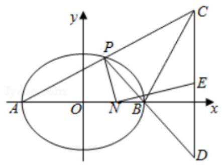

## 巩固训练

1、 $P$ ， $Q$ 椭圆 $C : \frac{{x}^{2}}{4} + \frac{{y}^{2}}{3} = 1$ 上的动点，则 $\left| {PQ}\right|$ 的最大值为___.

【难度】★★

【答案】 4

【解答】解: $P, Q$ 椭圆 $C : \frac{{x}^{2}}{4} + \frac{{y}^{2}}{3} = 1$ 上的动点,则 $\left| {PQ}\right|$ 的最大值为 ${2a} = 4$ . 故答案为: 4 .

2、已知椭圆 $C : \frac{{x}^{2}}{{a}^{2}} + \frac{{y}^{2}}{{b}^{2}} = 1\left( {a > b > 0}\right)$ 经过点 $P\left( {1,\frac{\sqrt{3}}{2}}\right)$ ，且短轴的两个端点与右焦点构成等边三角形.

(1)求椭圆 $C$ 的方程；

(2)设过点 $M\left( {1,0}\right)$ 的直线 $l$ 交椭圆 $C$ 于 $A$ 、 $B$ 两点，求 $\left| {MA}\right|  \cdot  \left| {MB}\right|$ 的取值范围.

【难度】 $\star   \star   \star$

【答案】见解析

【解析】解: (1) 短轴的两个端点与右焦点构成等边三角形可得 $c = \sqrt{3}b$ ,所以 ${a}^{2} = {b}^{2} + {c}^{2} = 4{b}^{2}$ ,设椭圆的方程为 $\frac{{x}^{2}}{4{b}^{2}} + \frac{{y}^{2}}{{b}^{2}} = 1$ ,将 $P$ 的坐标代入可得 $\frac{1}{4{b}^{2}} + \frac{3}{4{b}^{2}} = 1$ ,

可得 ${b}^{2} = 1$ ,所以椭圆的方程为 $\frac{{x}^{2}}{4} + {y}^{2} = 1$ ;

(2)当直线 $l$ 的方程斜率为 0 时，则可得直线 $l$ 为 $x$ 轴，可得 $A\left( {-2,0}\right)$ ， $B\left( {2,0}\right)$ ，

则 $\left| {MA}\right|  \cdot  \left| {MB}\right|  = \left| {1 + 2}\right|  \cdot  \left| {1 - 2}\right|  = \left| {1 - 4}\right|  = 3$ ,

当直线的斜率不为 0 时,设直线 $l$ 的方程为 $x = {my} + 1$ ,

设 $A\left( {{x}_{1},{y}_{1}}\right) , B\left( {{x}_{2},{y}_{2}}\right)$ ,联立 $\left\{  \begin{array}{l} x = {my} + 1 \\  \frac{{x}^{2}}{4} + {y}^{2} = 1 \end{array}\right.$ ,整理可得 $\left( {4 + {m}^{2}}\right) {y}^{2} + {2my} - 3 = 0$ ,

则 ${y}_{1} + {y}_{2} = \frac{-{2m}}{4 + {m}^{2}},{y}_{1}{y}_{2} =  - \frac{3}{4 + {m}^{2}}$ ,所以

$\left| {MA}\right|  \cdot  \left| {MB}\right|  = \sqrt{{\left( {x}_{1} - 1\right) }^{2} + {y}_{1}^{2}} \cdot  \sqrt{{\left( {x}_{2} - 1\right) }^{2} + {y}_{2}^{2}} = \sqrt{{\left( 1 + {m}^{2}\right) }^{2}{\left| {y}_{1}{y}_{2}\right| }^{2}} = \frac{3\left( {1 + {m}^{2}}\right) }{4 + {m}^{2}} = \frac{3\left( {4 + {m}^{2}}\right)  - 9}{4 + {m}^{2}} = 3 - \frac{9}{4 + {m}^{2}} \in  \left\lbrack  {\frac{3}{4},3}\right)$ ,

综上所述 $\left| {MA}\right|  \cdot  \left| {MB}\right|$ 的取值范围为 $\left\lbrack  {\frac{3}{4},3}\right\rbrack$ .

3、如图,已知椭圆 $\Gamma  : \frac{{x}^{2}}{{a}^{2}} + \frac{{y}^{2}}{{b}^{2}} = 1\left( {a > b > 0}\right)$ 的长轴长为 4,焦距为 $2\sqrt{2}$ ,矩形 ${ABCD}$ 的顶点 $A, B$ 在 $x$ 轴上, $C\text{ 、 }D$ 在椭圆 $\Gamma$ 上,点 $D$ 在第一象限, ${CB}$ 的延长线交椭圆 $\Gamma$ 于点 $E$ ,直线 ${AE}$ 与椭圆 $\Gamma \text{ 、 }y$ 轴分别交于点 $F\text{ 、 }G$ ,直线 ${CG}$ 交椭圆于点 $H$ ,联结 ${FH}$ .

(1)求椭圆 $\Gamma$ 的方程；

(2)设直线 ${AB}\text{ 、 }{CG}$ 的斜率分别为 ${k}_{1},{k}_{2}$ ，求证: $\frac{{k}_{1}}{{k}_{2}}$ 为定值；

(3)求直线 ${FH}$ 的斜率 $k$ 的最小值.

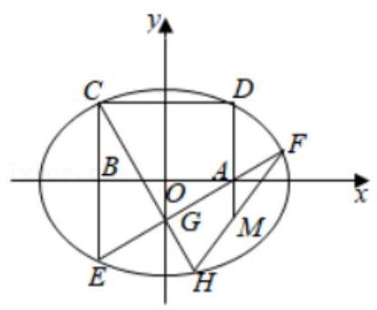

【难度】 $\star   \star   \star   \star$

【答案】见解析

【解析】解: (1) 因为椭圆的长轴长为 4,焦距为 $2\sqrt{2}$ ,所以 ${2a} = 4,{2c} = 2\sqrt{2}$ ,

解得 $a = 2, c = \sqrt{2}$ ,所以 ${b}^{2} = {a}^{2} - {c}^{2} = 2$ ,所以椭圆的方程为 $\frac{{x}^{2}}{4} + \frac{{y}^{2}}{2} = 1$ .

(2)证明:设 $A\left( {{x}_{0},0}\right)$ ， $B\left( {-{x}_{0},0}\right)$ ， $C\left( {-{x}_{0},{y}_{0}}\right)$ ， $D\left( {{x}_{0},{y}_{0}}\right)$ ， $E\left( {-{x}_{0}, - {y}_{0}}\right)$ ，

所以 ${k}_{1} = {k}_{AE} = \frac{-{y}_{0}}{-{x}_{0} - {x}_{0}} = \frac{{y}_{0}}{2{x}_{0}}$ ,直线 ${AE}$ 的方程为 $y = \frac{{y}_{0}}{2{x}_{0}}x - \frac{{y}_{0}}{2}$ ,

令 $x = 0$ ,得 ${y}_{G} =  - \frac{{y}_{0}}{2},{k}_{2} = {k}_{CG} = \frac{{y}_{0} - \left( {-\frac{{y}_{0}}{2}}\right) }{-{x}_{0} - 0} =  - \frac{3{y}_{0}}{2{x}_{0}}$ ,所以 $\frac{{k}_{1}}{{k}_{2}} = \frac{\frac{{y}_{0}}{2{x}_{0}}}{-\frac{3{y}_{0}}{2{x}_{0}}} =  - \frac{1}{3}$ ,故 $\frac{{k}_{1}}{{k}_{2}}$ 为定值 $- \frac{1}{3}$ .

(3)由(2)知直线 ${CG}$ 的方程为 $y =  - \frac{3{y}_{0}}{2{x}_{0}}x - \frac{{y}_{0}}{2}$ ，

将直线 ${CG}$ 与椭圆联立,得 $\left( {1 + \frac{9{y}_{0}^{2}}{2{x}_{0}^{2}}}\right) {x}^{2} + \frac{3{y}_{0}^{2}}{{x}_{0}}x + \frac{1}{2}{y}_{0}^{2} - 4 = 0$ ,所以 ${x}_{H} + \left( {-{x}_{0}}\right)  =  - \frac{\frac{3{y}_{0}^{2}}{{x}_{0}}}{1 + \frac{9{y}_{0}^{2}}{2{x}_{0}^{2}}}$ ,

得 ${x}_{H} = \frac{\left( {2{x}_{0}^{2} + 3{y}_{0}^{2}}\right) {x}_{0}}{2{x}_{0}^{2} + 9{y}_{0}^{2}}$ ,所以 $H\left( {\frac{\left( {2{x}_{0}^{2} + 3{y}_{0}^{2}}\right) {x}_{0}}{2{x}_{0}^{2} + 9{y}_{0}^{2}}, - \frac{\left( {4{x}_{0}^{2} + 9{y}_{0}^{2}}\right) {y}_{0}}{2{x}_{0}^{2} + 9{y}_{0}^{2}}}\right)$ ,

同理,将直线 ${AE}$ 的方程与椭圆的方程联立,可得

$\left( {1 + \frac{{y}_{0}{}^{2}}{2{x}_{0}{}^{2}}}\right) {x}^{2} - \frac{{y}_{0}{}^{2}}{{x}_{0}}x + \frac{1}{2}{y}_{0}^{2} - 4 = 0$ ,所以 $- {x}_{0} + {x}_{F} = \frac{\frac{{y}_{0}{}^{2}}{{x}_{0}}}{1 + \frac{{y}_{0}{}^{2}}{2{x}_{0}{}^{2}}}$ ,

解得 ${x}_{F} = \frac{\left( {2{x}_{0}{}^{2} + 3{y}_{0}{}^{2}}\right) {x}_{0}}{2{x}_{0}{}^{2} + {y}_{0}{}^{2}}$ ,所 $F\left( {\frac{\left( {2{x}_{0}{}^{2} + 3{y}_{0}{}^{2}}\right) {x}_{0}}{2{x}_{0}{}^{2} + {y}_{0}{}^{2}},\frac{{y}_{0}{}^{3}}{2{x}_{0}{}^{2} + {y}_{0}{}^{2}}}\right)$ ,

所以 $k = \frac{{y}_{H} - {y}_{F}}{{x}_{H} - {x}_{F}} = \frac{-\frac{\left( {4{x}_{0}^{2} + 9{y}_{0}^{2}}\right) {y}_{0}}{2{x}_{0}^{2} + 9{y}_{0}^{2}} - \frac{{y}_{0}^{2}{}^{2}}{2{x}_{0}^{2} + {y}_{0}^{2}}}{\frac{\left( {2{x}_{0}^{2} + 3{y}_{0}^{2}}\right) {x}_{0}}{2{x}_{0}^{2} + 9{y}_{0}^{2}} - \frac{\left( {2{x}_{0}^{2} + 3{y}_{0}^{2}}\right) {}^{2}}{2{x}_{0}^{2} + {y}_{0}^{2}}} = \frac{2{x}_{0}^{2} + 3{y}_{0}^{2}}{4{y}_{0}^{2}} \cdot  \frac{{y}_{0}}{{x}_{0}} \geq  \frac{2\sqrt{6{x}_{0}^{2}{y}_{0}^{2}}}{4{y}_{0}^{2}} \cdot  \frac{{y}_{0}}{{x}_{0}} = \frac{\sqrt{6}}{2}$ ,

当且仅当 $2{x}_{0}^{2} = 3{y}_{0}^{2}$ 时,取等号,所以 ${k}_{\min } = \frac{\sqrt{6}}{2}$ .

## 实战演练

一、填空题

1、椭圆 ${x}^{2} + 3{y}^{2} = 1$ 的短轴长为___.

【难度】★★

【答案】 $\frac{2\sqrt{3}}{3}$

【解析】解: 椭圆 ${x}^{2} + 3{y}^{2} = 1$ 的标准方程为: ${x}^{2} + \frac{{y}^{2}}{\frac{1}{3}} = 1$ ,所以椭圆 ${x}^{2} + 3{y}^{2} = 1$ 的短轴长为 ${2b} = \frac{2\sqrt{3}}{3}$ . 故答案为: $\frac{2\sqrt{3}}{3}$ .

2、若椭圆的两个焦点为 ${F}_{1}\left( {-3,0}\right) \text{ 、 }{F}_{2}\left( {3,0}\right)$ ,椭圆的弦 ${AB}$ 过点 ${F}_{1}$ ，且 ${\Delta AB}{F}_{2}$ 的周长等于 20，该椭圆的标准方程为___.

【难度】★★

【答案】 $\frac{{x}^{2}}{25} + \frac{{y}^{2}}{16} = 1$

【解析】解: 如图, $\because \bigtriangleup {AB}{F}_{2}$ 的周长等于 ${20},\therefore {4a} = {20}$ ,即 $a = 5$ ,又 $c = 3$ ,

$\therefore {b}^{2} = {a}^{2} - {c}^{2} = {5}^{2} - {3}^{2} = {14}$ . 椭圆的标准方程为: $\frac{{x}^{2}}{25} + \frac{{y}^{2}}{16} = 1$ . 故答案为: $\frac{{x}^{2}}{25} + \frac{{y}^{2}}{16} = 1$ .

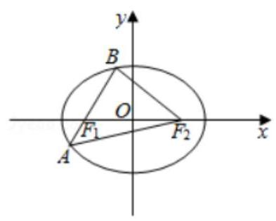

3、已知中心在原点，焦点坐标为 $\left( {0, \pm  5\sqrt{2}}\right)$ 的椭圆截直线 ${3x} - y - 2 = 0$ 所得的弦的中点的横坐标为 $\frac{1}{2}$ ， 则该椭圆的方程为___.

【难度】 $\star   \star$

【答案】 $\frac{{y}^{2}}{75} + \frac{{x}^{2}}{25} = 1$

【解析】设椭圆方程为 $\frac{{y}^{2}}{{a}^{2}} + \frac{{x}^{2}}{{b}^{2}} = 1\left( {a > b > 0}\right)$ ,则 ${a}^{2} = {b}^{2} + {c}^{2} = {b}^{2} + {50}$ ①

设直线 ${3x} - y - 2 = 0$ 与椭圆相交的弦的端点为 $A\left( {{x}_{1},{y}_{1}}\right) , B\left( {{x}_{2},{y}_{2}}\right)$

则 $\left\{  {\begin{array}{l} {b}^{2}{y}_{1}^{2} + {a}^{2}{x}_{1}^{2} = {a}^{2}{b}^{2} \\  {b}^{2}{y}_{2}^{2} + {a}^{2}{x}_{2}^{2} = {a}^{2}{b}^{2} \end{array}\therefore {b}^{2}\left( {{y}_{1} - {y}_{2}}\right) \left( {{y}_{1} + {y}_{2}}\right)  + {a}^{2}\left( {{x}_{1} - {x}_{2}}\right) \left( {{x}_{1} + {x}_{2}}\right)  = 0}\right.$

而弦的中点的横坐标为 $\frac{1}{2}$ ,则纵坐标为 $- \frac{1}{2}$ ,即 ${x}_{1} + {x}_{2} = 2 \times  \frac{1}{2} = 1,{y}_{1} + {y}_{2} = 2 \times  \left( {-\frac{1}{2}}\right)  =  - 1,\frac{{y}_{1} - {y}_{2}}{{x}_{1} - {x}_{2}} = 3$

$\therefore {b}^{2} \times  3 \times  \left( {-1}\right)  + {a}^{2} \times  1 = 0$ ,即 ${a}^{2} = 3{b}^{2}$ ② 联立①②得: ${a}^{2} = {75},{b}^{2} = {25}$ .

故该椭圆的方程为 $\frac{{y}^{2}}{75} + \frac{{x}^{2}}{25} = 1$ 故答案为: $\frac{{y}^{2}}{75} + \frac{{x}^{2}}{25} = 1$

4、设 $B$ 是椭圆 $C : \frac{{x}^{2}}{5} + {y}^{2} = 1$ 的上顶点，点 $P$ 在 $C$ 上，则 $\left| {PB}\right|$ 的最大值为 ___.

【难度】 $\star   \star   \star$

【答案】 $\frac{5}{2}$

【解答】解: $\because B$ 是椭圆 $C : \frac{{x}^{2}}{5} + {y}^{2} = 1$ 的上顶点, $\therefore B\left( {0,1}\right)$ ,

$\because$ 点 $P$ 在 $C$ 上, $\therefore$ 可设 $P\left( {\sqrt{5}\cos \theta ,\sin \theta }\right) ,\theta  \in  \lbrack 0,{2\pi })$ ,

$\left| {PB}\right|  = \sqrt{{\left( \sqrt{5}\cos \theta  - 0\right) }^{2} + {\left( \sin \theta  - 1\right) }^{2}} = \sqrt{4{\cos }^{2}\theta  - 2\sin \theta  + 2} = \sqrt{-4{\left( \sin \theta  + \frac{1}{4}\right) }^{2} + \frac{25}{4}},$

当 $\sin \theta  =  - \frac{1}{4},\left| {PB}\right|$ 取得最大值,最大值为 $\frac{5}{2}$ . 故答案为: $\frac{5}{2}$ .

5、若方程 $a{x}^{2} + b{y}^{2} = c$ 的系数 $a$ 、 $b$ 、 $c$ 可以从 -1，0，1，2，3，4 这 6 个数中任取 3 个不同的数而得到， 则这样的方程表示焦点在 $x$ 轴上的椭圆的概率是___. (结果用数值表示)

【难度】 $\star   \star   \star$

【答案】0.1

【解析】解: $\because$ 方程 $\underset{a}{\underline{\frac{{x}^{2}}{c}}} + \underset{b}{\underline{\frac{{y}^{2}}{b}}} = 1$ 表示椭圆, $\therefore \frac{c}{a} > \frac{c}{b} > 0, b > a > 0$ , $a\text{ 、 }b\text{ 、 }c$ 从1,2,3,4中任意选取 3 个,所有的选法 ${A}_{6}^{3} = 6 \times  5 \times  4 = {120}$ ,

满足条件的选法 ${C}_{4}^{1} \cdot  {C}_{3}^{2} = {12}$ ,方程表示焦点在 $x$ 轴上的椭圆的概率是 $\frac{12}{120} = {0.1}$ ;

故答案为 0.1 .

6、设椭圆 $\frac{{x}^{2}}{4} + \frac{{y}^{2}}{3} = 1$ 的左焦点为 $F$ ，过 $\left( {0,1}\right)$ 的直线 $l$ 与椭圆交于点 $A$ ， $B$ . 当 ${\Delta FAB}$ 的周长最大时， ${\Delta FAB}$ 的面积为___.

【难度】 $\star   \star   \star$

【答案】 $\frac{{12}\sqrt{2}}{7}$

【解析】解: 设 $M$ 为椭圆的右焦点,由椭圆的方程可得 $c = 1$ ,所以 $F\left( {-1,0}\right) , M\left( {1,0}\right)$ ,

则 ${FA} + {FB} + {AB} = {2a} - {AM} + {2a} - {BM} + {AB} = {4a} - \left( {{AM} + {BM} - {AB}}\right)  \leq  {4a}$ ,

当且仅当直线 $l$ 经过点 $M$ 时取等号,此时直线 $l$ 过点 $M\left( {1,0}\right) ,\left( {0,1}\right)$ ,

所以直线 $l$ 的斜率为 -1,则直线 $l$ 的方程为 $y =  - x + 1$ ,

联立方程 $\left\{  \begin{array}{l} y =  - x + 1 \\  \frac{{x}^{2}}{4} + \frac{{y}^{2}}{3} = 1 \end{array}\right.$ ,消去 $y$ 整理可得 $7{x}^{2} - {8x} - 8 = 0$ ,设 $A\left( {{x}_{1},{y}_{1}}\right) , B\left( {{x}_{2},{y}_{2}}\right)$ ,

则 ${x}_{1} + {x}_{2} = \frac{8}{7},{x}_{1}{x}_{2} =  - \frac{8}{7}$ ,所以 $\left| {AB}\right|  = \sqrt{1 + {\left( -1\right) }^{2}} \cdot  \sqrt{{\left( \frac{8}{7}\right) }^{2} + 4 \times  \frac{8}{7}} = \frac{24}{7}$ ,

点 $F$ 到直线 $l$ 的距离为 $d = \frac{\left| 1 + 1\right| }{\sqrt{1 + {\left( -1\right) }^{2}}} = \sqrt{2}$ ,

所以三角形 ${FAB}$ 的面积为 $S = \frac{1}{2} \cdot  d \cdot  \left| {AB}\right|  = \frac{1}{2} \times  \sqrt{2} \times  \frac{24}{7} = \frac{{12}\sqrt{2}}{7}$ ,

故答案为: $\frac{{12}\sqrt{2}}{7}$ .

二、选择题

7、设 ${F}_{1}\text{ 、 }{F}_{2}$ 分别是椭圆 $E : {x}^{2} + \frac{{y}^{2}}{{b}^{2}} = 1\left( {0 < b < 1}\right)$ 的左、右焦点,过 ${F}_{1}$ 的直线 $l$ 与椭圆 $E$ 相交于 $A\text{ 、 }B$ 两点, 且 $2\left| {AB}\right|  = \left| {A{F}_{2}}\right|  + \left| {B{F}_{2}}\right|$ ,则 $\left| {AB}\right|$ 的长为 ( )

A. $\frac{2}{3}$ B. 1

C. $\frac{4}{3}$ D. $\frac{5}{3}$

【难度】★★

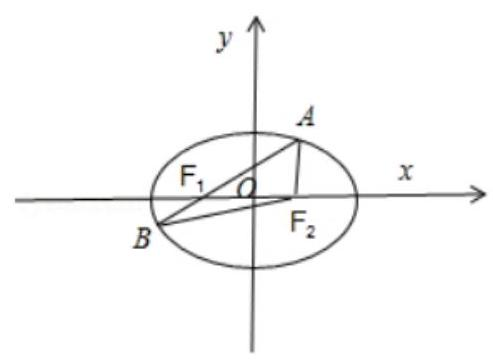

【答案】 $C$

【解析】解: 由 椭 圆 的 定 义 可 得

$\left| {AB}\right|  = \left| {A{F}_{1}}\right|  + \left| {B{F}_{1}}\right|  = {2a} - \left| {A{F}_{2}}\right|  + {2a} - \left| {B{F}_{2}}\right|  = {4a} - \left( {\left| {A{F}_{2}}\right|  + \left| {B{F}_{2}}\right| }\right) ,$

再由题意可得 $a = 1,\left| {AB}\right|  = {4a} - 2\left| {AB}\right|$ ,所以 $\left| {AB}\right|  = \frac{4a}{3} = \frac{4}{3}$ , 故选: $C$ .

8、已知定点 $M\left( {2,0}\right)$ ， $N\left( {-2,0}\right)$ ， $P$ 是椭圆 $\frac{{x}^{2}}{9} + \frac{{y}^{2}}{5} = 1$ 上的动点，则 $\frac{9}{\left| PM\right| } + \frac{1}{\left| PN\right| }$ 的最小值为( )

A. 2

B. $\frac{7}{3}$ C. $\frac{8}{3}$ D. 3

【难度】★★★

【答案】c

【解析】由题可知: 点 $M\left( {2,0}\right) , N\left( {-2,0}\right)$ 是椭圆 $\frac{{x}^{2}}{9} + \frac{{y}^{2}}{5} = 1$ 的焦点所以 $\left| {PM}\right|  + \left| {PN}\right|  = {2a} = 6$

所以 $\frac{9}{\left| PM\right| } + \frac{1}{\left| PN\right| } = \left( {\frac{9}{\left| PM\right| } + \frac{1}{\left| PN\right| }}\right)  \cdot  \frac{\left| {PM}\right|  + \left| {PN}\right| }{6}$

即 $\frac{9}{\left| PM\right| } + \frac{1}{\left| PN\right| } = \frac{11}{6} + \frac{3\left| {PN}\right| }{2\left| {PM}\right| } + \frac{\left| PM\right| }{6\left| {PN}\right| } \geq  \frac{5}{3} + 2\sqrt{\frac{3\left| {PN}\right| }{2\left| {PM}\right| } \cdot  \frac{\left| PM\right| }{6\left| {PN}\right| }} = \frac{8}{3}$

当且仅当 $\frac{3\left| {PN}\right| }{2\left| {PM}\right| } = \frac{\left| PM\right| }{6\left| {PN}\right| }$ ,即 $3\left| {PN}\right|  = \left| {PM}\right|$ ,所以 $\frac{9}{\left| PM\right| } + \frac{1}{\left| PN\right| }$ 的最小值为 $\frac{8}{3}$

9、椭圆 $\frac{{x}^{2}}{16} + \frac{{y}^{2}}{8} = 1$ 上有 10 个不同的点 ${P}_{1},{P}_{2},\ldots {P}_{10}$ ,若点 $T$ 坐标为 $\left( {1,0}\right)$ ,数列 $\left\{  \left| {T{P}_{n}}\right| \right\}  \left( {n = 1,2,\ldots ,{10}}\right)$ 是公差为 $d$ 的等差数列,则 $d$ 的最大值为 ( )

A. $\frac{2}{9}$ B. $\frac{8}{9}$ C. $\frac{5 - \sqrt{7}}{9}$ D. $\frac{5 + \sqrt{7}}{9}$

【难度】 $\star   \star   \star$

【答案】 $C$

【解析】解: 设椭圆上任意一点 $P\left( {4\cos \alpha ,2\sqrt{2}\sin \alpha }\right)$ ,

则 $\left| {TP}\right|  = \sqrt{{\left( 4\cos \alpha  - 1\right) }^{2} + 8{\sin }^{2}\alpha } = \sqrt{7 + 8{\left( \cos \alpha  - \frac{1}{2}\right) }^{2}}$ ,

$\because  - 1 \leq  \cos \alpha  \leq  1,\therefore \sqrt{7} \leq  \left| {TP}\right|  \leq  5$ ， $\therefore$ 当 $\left| {T{P}_{1}}\right|  = \sqrt{7}$ ， $\left| {T{P}_{10}}\right|  = 5$ 时，数列 $\left\{  \left| {T{P}_{n}}\right| \right\}$ 的公差 $d$ 最大，

故 $d$ 的最大值为 $\frac{5 - \sqrt{7}}{9}$ . 故选: $C$ .

10、椭圆 $C : \frac{{x}^{2}}{16} + \frac{{y}^{2}}{9} = 1$ 与直线 $l : \left( {{2m} + 1}\right) x + \left( {m + 1}\right) y = {7m} + 4, m \in  R$ 的交点情况是( )

A. 没有交点 B. 有一个交点

C. 有两个交点 D. 由 $m$ 的取值而确定

【难度】 $\star   \star   \star$

【答案】 $C$

【解析】解: 直线 $l : \left( {{2m} + 1}\right) x + \left( {m + 1}\right) y = {7m} + 4$ ,

$\therefore \left( {{2x} + y - 7}\right) m =  - x - y + 4$ ,令 $\left\{  \begin{array}{l} {2x} + y - 7 = 0 \\   - x - y + 4 = 0 \end{array}\right.$ 得: $\left\{  \begin{array}{l} x = 3 \\  y = 1 \end{array}\right.$ ,

$\therefore$ 直线 $l$ 过定点 $\left( {3,1}\right)$ ,又 $\because \frac{{3}^{2}}{16} + \frac{1}{9} = \frac{97}{144} < 1,\therefore$ 点 $\left( {3,1}\right)$ 在椭圆内,

$\therefore$ 直线 $l$ 与椭圆有 2 个交点,故选: $C$ .

## 三、解答题

11、11、已知直线 $l : y = \frac{1}{3}x + t$ 与椭圆 $C : \frac{{x}^{2}}{36} + \frac{{y}^{2}}{4} = 1$ 交于 $A, B$ 两点,且 $P\left( {3\sqrt{2},\sqrt{2}}\right)$ 在直线 $l$ 的上方(如图所示).

(1)求常数 $t$ 的取值范围;

(2)若 $\bigtriangleup  {APB}$ 的面积最大，求直线 ${PA}$ 的斜率的大小.

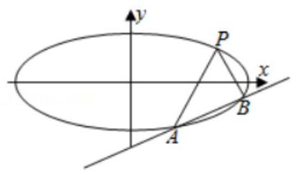

【难度】 $\star   \star   \star$

【答案】见解析

【解析】解: (1) 联立直线 $l$ 和椭圆 $C$ ,

即 $\left\{  \begin{array}{l} y = \frac{1}{3}x + t \\  \frac{{x}^{2}}{36} + \frac{{y}^{2}}{4} = 1 \end{array}\right.$ ,消去 $y$ 得 $2{x}^{2} + {6tx} + 9{t}^{2} - {36} = 0$ ,

因为直线 $l$ 与椭圆有两个交点,所以 $\bigtriangleup  = {\left( 6t\right) }^{2} - 4 \times  2 \times  \left( {9{t}^{2} - {36}}\right)  > 0$ ,解得 $- 2\sqrt{2} < t < 2\sqrt{2}$ ,

又因为点 $P\left( {3\sqrt{2},\sqrt{2}}\right)$ 在直线 $l$ 的上方,所以 $\frac{1}{3} \times  3\sqrt{2} - \sqrt{2} + t < 0$ ,解得 $t < 0$ ,

所以常数 $t$ 的取值范围为 $\left( {-2\sqrt{2},0}\right)$ .

(2)设 $A\left( {{x}_{1},{y}_{1}}\right) , B\left( {{x}_{2},{y}_{2}}\right)$ ，由韦达定理可得 ${x}_{1} + {x}_{2} =  - {3t},{x}_{1}{x}_{2} = \frac{9{t}^{2} - {36}}{2}$ ，所以 $\left| {AB}\right|  = \sqrt{1 + {k}^{2}}\left| {{x}_{1} - {x}_{2}}\right|  = \sqrt{1 + {k}^{2}}\sqrt{{\left( {x}_{1} + {x}_{2}\right) }^{2} - 4{x}_{1}{x}_{2}} = \sqrt{1 + {\left( \frac{1}{3}\right) }^{2}}\sqrt{{\left( -3t\right) }^{2} - 4 \times  \frac{9{t}^{2} - {36}}{2}} = \sqrt{10}\sqrt{8 - {t}^{2}}$ 点 $P$ 到直线 $l$

的距离为 $d = \frac{\left| \frac{1}{3} \times  3\sqrt{2} - \sqrt{2} + t\right| }{\sqrt{1 + {\left( \frac{1}{3}\right) }^{2}}} = \frac{3\left| t\right| }{\sqrt{10}}$ ,

所以 $\bigtriangleup {PAB}$ 的面积为 $S = \frac{1}{2} \cdot  \left| {AB}\right|  \cdot  d = \frac{1}{2} \cdot  \sqrt{10}\sqrt{8 - {t}^{2}} \cdot  \frac{3\left| t\right| }{\sqrt{10}} = \frac{3\sqrt{{t}^{2}\left( {8 - {t}^{2}}\right) }}{2} \leq  \frac{3 \cdot  \frac{{t}^{2} + 8 - {t}^{2}}{2}}{2} = 6$ ,

当 $t =  - 2$ 时,不等式取等号,所以当 $t =  - 2$ 时, $\bigtriangleup {PAB}$ 的面积最大,

此时由 (1) 可知直线 $l$ 与椭圆 $C$ 联立消去 $y$ 所得的方程为 ${x}^{2} - {6x} = 0$ ,解得 $x = 0$ 或 $x = 6$ ,

所以 $A\left( {0, - 2}\right)$ ,所以直线 ${PA}$ 的斜率大小为 $k = \frac{\sqrt{2} + 2}{3\sqrt{2}} = \frac{\sqrt{2} + 1}{3}$ .

12、已知过椭圆方程 $\frac{{x}^{2}}{2} + {y}^{2} = 1$ 右焦点 $F$ 、斜率为 $k$ 的直线 $l$ 交椭圆于 $P$ 、 $Q$ 两点.

(1)求椭圆的两个焦点和短轴的两个端点构成的四边形的面积；

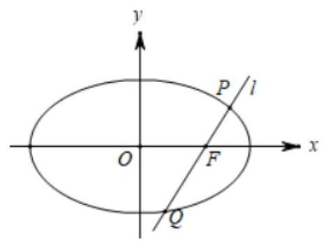

(2)当直线 $l$ 的斜率为 1 时,求 $\bigtriangleup {POQ}$ 的面积;

(3)在线段 ${OF}$ 上是否存在点 $M\left( {m,0}\right)$ ，使得以 ${MP}$ 、 ${MQ}$ 为邻边的平行四边形是菱形? 若存在,求出 $m$ 的取值范围; 若不存在,说明理由.

【难度】 $\star   \star   \star   \star$

【答案】(1)2; (2) $\frac{2}{3}$ ; (3) 存在, $0 < m < \frac{1}{2}$ .

【解析】(1) 由椭圆方程 $\frac{{x}^{2}}{2} + {y}^{2} = 1$ 得 ${a}^{2} = 2,{b}^{2} = 1$ ,则 ${c}^{2} = {a}^{2} - {b}^{2} = 1$ ,

所以椭圆的两个焦点和短轴的两个端点构成的四边形的面积 $S = \frac{1}{2} \times  {2b} \times  {2c} = \frac{1}{2} \times  2 \times  2 = 2$ ;

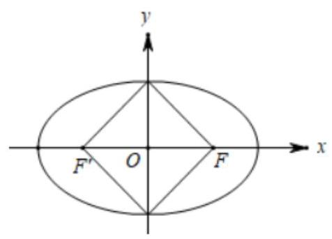

(2)右焦点 $F\left( {1,0}\right)$ ，直线 $l$ 的方程为 $y = x - 1$ ，

设 $P\left( {{x}_{1},{y}_{1}}\right) , Q\left( {{x}_{2},{y}_{2}}\right)$ ,由 $\left\{  \begin{array}{l} y = x - 1 \\  \frac{{x}^{2}}{2} + {y}^{2} = 1 \end{array}\right.$ 得 $3{y}^{2} + {2y} - 1 = 0$ ,解得 ${y}_{1} =  - 1,{y}_{2} = \frac{1}{3}$ ,

所以 ${S}_{\bigtriangleup {POQ}} = \frac{1}{2}\left| {OF}\right|  \cdot  \left| {{y}_{1} - {y}_{2}}\right|  = \frac{1}{2}\left| {-1 - \frac{1}{3}}\right|  = \frac{2}{3}$ ；

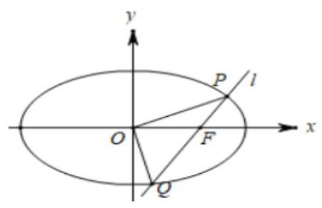

(3)假设在线段 ${OF}$ 上是否存在点 $M\left( {m,0}\right) \left( {0 < m < 1}\right)$ ，

使得以 ${MP}\text{ 、 }{MQ}$ 为邻边的平行四边形是菱形,

因为直线与 $x$ 轴不垂直,所以设直线 $l$ 的方程为 $y = k\left( {x - 1}\right) \left( {k \neq  0}\right)$ ,

由 $\left\{  \begin{array}{l} y = k\left( {x - 1}\right) \\  \frac{{x}^{2}}{2} + {y}^{2} = 1 \end{array}\right.$ ,可得 $\left( {1 + 2{k}^{2}}\right) {x}^{2} - 4{k}^{2}x + 2{k}^{2} - 2 = 0$ ,所以 ${x}_{1} + {x}_{2} = \frac{4{k}^{2}}{1 + 2{k}^{2}},{x}_{1}{x}_{2} = \frac{2{k}^{2} - 2}{1 + 2{k}^{2}}$ ,

设 ${PQ}$ 中点为 $D\left( {{x}_{0},{y}_{0}}\right)$ ,则 ${MD} \bot  {PQ}$ ,

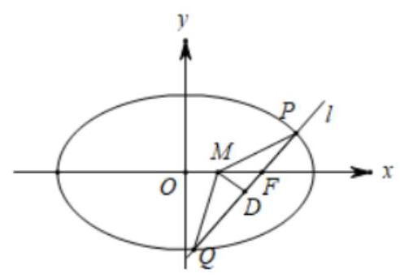

${x}_{0} = \frac{{x}_{1} + {x}_{2}}{2} = \frac{2{k}^{2}}{1 + 2{k}^{2}},{y}_{0} = k\left( {{x}_{0} - 1}\right)  =  - \frac{k}{1 + 2{k}^{2}},$

即 $D\left( {\frac{2{k}^{2}}{1 + 2{k}^{2}}, - \frac{k}{1 + 2{k}^{2}}}\right)$ ,

${k}_{MD} = \frac{-\frac{k}{1 + 2{k}^{2}}}{\frac{2{k}^{2}}{1 + 2{k}^{2}} - m} = \frac{-k}{2{k}^{2}\left( {1 - m}\right)  - m} =  - \frac{1}{k},$

整理得 ${k}^{2}\left( {1 - {2m}}\right)  = m$ ，关于 $k$ 的方程有解，

所以 $\left( {1 - {2m}}\right) m > 0,0 < m < \frac{1}{2}$ .

所以满足条件的点 $M$ 存在,且 $m$ 的取值范围是 $0 < m < \frac{1}{2}$ .
