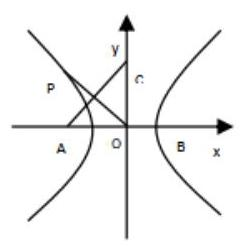
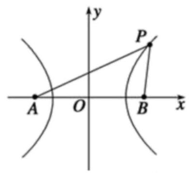
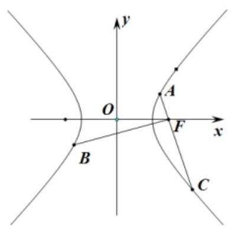
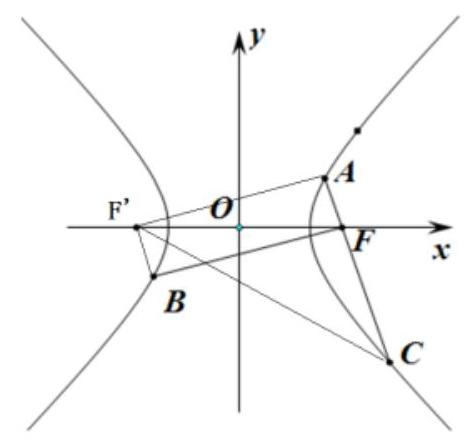
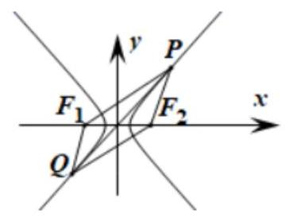
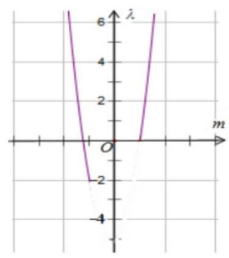
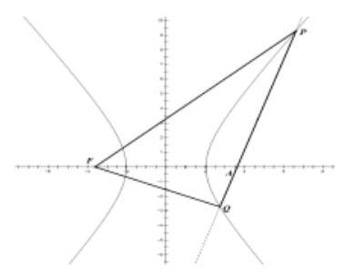
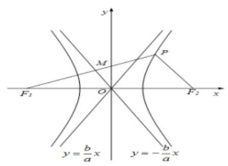
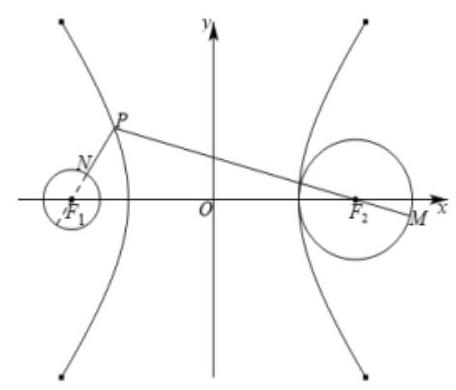
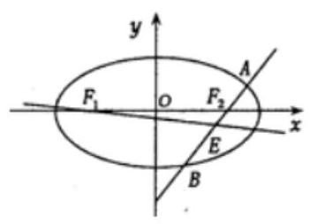

双曲线的标准方程与几何性质

<table><tr><td>教学目标</td><td>双曲线的标准方程及其性质</td></tr><tr><td>重点</td><td>1、理解双曲线的定义，会推到双曲线的标准方程；   2、掌握双曲线的标准方程及其几何性质;   3、掌握直线和双曲线相关问题的解题方法:</td></tr><tr><td>难 点</td><td>1、双曲线的定义以及标准方程中字母的含义及彼此等量关系；   2、双曲线的几何性质和应用;   3、直线与双曲线综合</td></tr></table>

## (一) 双曲线的定义与标准方程

## 知识梳理

## 1、双曲线的定义

到两个定点 ${F}_{1}$ 与 ${F}_{2}$ 的距离之差的绝对值等于定长 $\left( { < \left| {{F}_{1}{F}_{2}}\right| }\right)$ 的点的轨迹.

当 $\begin{Vmatrix}{P{F}_{1}\left| -\right| P{F}_{2}}\end{Vmatrix} = {2a} < \left| {{F}_{1}{F}_{2}}\right|$ 时, $P$ 的轨迹为双曲线;

当 $\begin{Vmatrix}{P{F}_{1}\left| -\right| P{F}_{2}}\end{Vmatrix} = {2a} > \left| {{F}_{1}{F}_{2}}\right|$ 时， $P$ 的轨迹不存在;

当 $\begin{Vmatrix}{P{F}_{1}\left| -\right| P{F}_{2}}\end{Vmatrix} = {2a} = \left| {{F}_{1}{F}_{2}}\right|$ 时, $P$ 的轨迹为以 ${F}_{1}\text{ 、 }{F}_{2}$ 为端点的两条射线

## 2、双曲线的标准方程与几何性质

<table><tr><td colspan="2">标准方程</td><td>$\frac{{x}^{2}}{{a}^{2}} - \frac{{y}^{2}}{{b}^{2}} = 1\left( {a, b > 0}\right)$</td><td>$\frac{{y}^{2}}{{a}^{2}} - \frac{{x}^{2}}{{b}^{2}} = 1\left( {a, b > 0}\right)$</td></tr><tr><td rowspan="6">性质</td><td>焦点</td><td>$\left( {c,0}\right) ,\left( {-c,0}\right)$ ,</td><td>$\left( {0, c}\right) ,\left( {0, - c}\right)$</td></tr><tr><td>焦距</td><td colspan="2">${2c}$</td></tr><tr><td>范围</td><td>$\left| x\right|  \geq  a, y \in  R$</td><td>$\left| y\right|  \geq  a, x \in  R$</td></tr><tr><td>顶点</td><td>$\left( {a,0}\right) ,\left( {-a,0}\right)$</td><td>$\left( {0, - a}\right) ,\left( {0, a}\right)$</td></tr><tr><td>对称性</td><td colspan="2">关于 x 轴、y 轴和原点对称</td></tr><tr><td>渐近线</td><td>$y =  \pm  \frac{b}{a}x$</td><td>$y =  \pm  \frac{a}{b}x$</td></tr></table>

特别: 与双曲线 $\frac{{x}^{2}}{\lambda } - \frac{{y}^{2}}{u} = m\left( {\lambda , u < 0, m \neq  0}\right)$ 共渐近线的双曲线的方程为: $\frac{{x}^{2}}{\lambda } - \frac{{y}^{2}}{u} = n$ (左边相同,区别仅在于右边的常数)

例题精讲

【例 1】已知平面内两定点 ${F}_{1}\left( {-2,0}\right) ,{F}_{2}\left( {2,0}\right)$ ,下列条件中满足动点 $P$ 的轨迹为双曲线的是 ( )

A. $\left| {P{F}_{1}}\right|  - \left| {P{F}_{2}}\right|  =  \pm  3$ B. $\left| {P{F}_{1}}\right|  - \left| {P{F}_{2}}\right|  =  \pm  4$ C. $\left| {P{F}_{1}}\right|  - \left| {P{F}_{2}}\right|  =  \pm  5$ D. ${\left| P{F}_{1}\right| }^{2} - {\left| P{F}_{2}\right| }^{2} =  \pm  4$

【答案】A

【解析】当 $\left| {P{F}_{1}}\right|  - \left| {P{F}_{2}}\right|  =  \pm  3$ 时, $\begin{Vmatrix}{P{F}_{1}}\end{Vmatrix} - \left| {P{F}_{2}}\right|  = 3 < \left| {{F}_{1}{F}_{2}}\right|  = 4$ ,满足双曲线的定义,所以点 $P$ 的轨迹是双曲线. 故选: $A$

【例 2】在平面直角坐标系 ${xOy}$ 中,已知点 $A\left( {-1,1}\right)$ ,点 $B\left( {1, - 1}\right)$ ,点 $\mathbf{P}$ 是动点,且直线 ${AP}$ 与 ${BP}$ 的斜之积等于 $\frac{1}{3}$ ，则动点 $P$ 的轨迹方程为( )

A. ${x}^{2} - 3{y}^{2} =  - 2$ B. ${x}^{2} - 3{y}^{2} =  - 2\left( {x \neq   \pm  1}\right)$ C. ${x}^{2} - 3{y}^{2} = 2$ D. ${x}^{2} - 3{y}^{2} = 2\left( {x \neq   \pm  1}\right)$

【答案】B

【解析】设 $\mathrm{P}\left( {\mathrm{x},\mathrm{y}}\right) ,\because$ 直线 $\mathrm{{AP}}$ 与 $\mathrm{{BP}}$ 的斜率之积等于 $\frac{1}{3},\therefore \frac{y - 1}{x + 1} \cdot  \frac{y + 1}{x - 1} = \frac{1}{3}$ 即 $\frac{{y}^{2} - 1}{{x}^{2} - 1} = \frac{1}{3}\therefore \; {x}^{2} - 3{y}^{2} =  - 2\left( {x \neq   \pm  1}\right)$ . 故选 B.

【例 3】双曲线 $\frac{{x}^{2}}{25} - \frac{{y}^{2}}{9} = 1$ 上的点到一个焦点的距离为 12,则到另一个焦点的距离为( )

A. 22 或 2 B. 7 C. 22 D. 2

【答案】A

【解析】设双曲线 $\frac{{x}^{2}}{25} - \frac{{y}^{2}}{9} = 1$ 的左右焦点分别为 ${F}_{1},{F}_{2}$ ,则 $a = 5, b = 3, c = \sqrt{34}$ ,

设 $P$ 为双曲线上一点,不妨令 $\left| {P{F}_{1}}\right|  = {12}\left( {{12} > a + c = 5 + \sqrt{34}}\right) ,\therefore$ 点 $P$ 可能在左支,也可能在右支,

由 $\begin{Vmatrix}{P{F}_{1}}\end{Vmatrix} - \left| {P{F}_{2}}\right|  = {2a} = {10}$ ,得 $\left| {{12} - }\right| P{F}_{2}\parallel  = {10}$ ,所以 $\left| {P{F}_{2}}\right|  = {22}$ 或 2 .

所以点 $P$ 到另一个焦点的距离是 22 或 2 . 故选: A.

【例 4】根据下列条件, 求双曲线方程:

(1)已知双曲线 $\frac{{x}^{2}}{{a}^{2}} - \frac{{y}^{2}}{{b}^{2}} = 1\left( {a > 0, b > 0}\right)$ 的实轴的长度比虚轴的长度大 2，焦距为 10；

【答案】 $\frac{{x}^{2}}{16} - \frac{{y}^{2}}{9} = 1$

【解析】依题意可得 $\left\{  \begin{array}{l} {2a} - {2b} = 2 \\  {a}^{2} + {b}^{2} = {25} \\  a > 0, b > 0 \end{array}\right.$ ,得 $\left\{  \begin{array}{l} a = 4 \\  b = 3 \end{array}\right.$ ,所以双曲线的方程为 $\frac{{x}^{2}}{16} - \frac{{y}^{2}}{9} = 1$ .

(2)已知双曲线 $\mathrm{C} : \frac{{x}^{2}}{{a}^{2}} - \frac{{y}^{2}}{{b}^{2}} = 1$ 的焦距为10，点 $\mathrm{P}\left( {2,1}\right)$ 在 $\mathrm{C}$ 的渐近线上；

【答案】 $\frac{{x}^{2}}{20} - \frac{{y}^{2}}{5} = 1$

【解析】由题意得,双曲线的焦距为10,即 ${a}^{2} + {b}^{2} = {c}^{2} = {25}$ ,

又双曲线的渐近线方程为 $y = \frac{b}{a}x \Rightarrow  {bx} - {ay} = 0$ ,点 $P\left( {2,1}\right)$ 在 $C$ 的渐近线上,

所以 $a = {2b}$ ,联立方程组可得 ${a}^{2} = {20},{b}^{2} = 5$ ,所以双曲线的方程为 $\frac{{x}^{2}}{20} - \frac{{y}^{2}}{5} = 1$ .

(3)与双曲线 $\frac{{x}^{2}}{9} - \frac{{y}^{2}}{16} = 1$ 有共同渐近线，且过点 $\left( {-3,2\sqrt{3}}\right)$ ；

【答案】 $\frac{{x}^{2}}{9} - \frac{{y}^{2}}{16} = \frac{1}{4}$

【解析】: 设所求双曲线方程为 $\frac{{x}^{2}}{9} - \frac{{y}^{2}}{16} = \lambda \left( {\lambda  \neq  0}\right)$ ,将点 $\left( {-3,2\sqrt{3}}\right)$ 代入得 $\lambda  = \frac{1}{4}$ , 所以双曲线方程为 $\frac{{x}^{2}}{9} - \frac{{y}^{2}}{16} = \frac{1}{4}$ 。

【例 5】( 1 )若方程 $\frac{{y}^{2}}{4} - \frac{{x}^{2}}{m + 1} = 1$ 表示双曲线，则实数 $m$ 的取值范围是( )

A. $- 1 < m < 3$ B. $m >  - 1$ C. $m > 3$ D. $m <  - 1$

【答案】B

【解析】依题意有 $m + 1 > 0$ ,所以 $m >  - 1$ . 故选: B.

( 2 )若方程 $\frac{{x}^{2}}{3 - t} + \frac{{y}^{2}}{t - 1} = 1$ 所表示的曲线为 $C$ ，则下面四个命题中正确的是( )

A. 若 $C$ 为椭圆，则 $1 < t < 3$ B. 若 $C$ 为双曲线，则 $t > 3$ 或 $t < 1$

C. 曲线 $C$ 不可能是圆 D. 若 $C$ 为椭圆,且长轴在 $y$ 轴上,则 $1 < t < 2$

【答案】B

【解析】若 $t > 3$ ,则方程可变形为 $\frac{{y}^{2}}{t - 1} - \frac{{x}^{2}}{t - 3} = 1$ ,它表示焦点在 $y$ 轴上的双曲线;

若 $t < 1$ ,则方程可变形为 $\frac{{x}^{2}}{3 - t} - \frac{{y}^{2}}{1 - t} = 1$ ,它表示焦点在 $x$ 轴上的双曲线;

若 $2 < t < 3$ ,则 $0 < 3 - t < t - 1$ ,故方程 $\frac{{x}^{2}}{3 - t} + \frac{{y}^{2}}{t - 1} = 1$ 表示焦点在 $y$ 轴上的椭圆;

若 $1 < t < 2$ ,则 $0 < t - 1 < 3 - t$ ,故方程 $\frac{{x}^{2}}{3 - t} + \frac{{y}^{2}}{t - 1} = 1$ 表示焦点在 $x$ 轴上的椭圆;

若 $t = 2$ ,方程 $\frac{{x}^{2}}{3 - t} + \frac{{y}^{2}}{t - 1} = 1$ 即为 ${x}^{2} + {y}^{2} = 1$ ,它表示圆,综上,选 B.

【例 6】某中心接到其正东、正西、正北方向三个观测点的报告: 正西、正北两个观测点同时听到了一声巨响,正东观测点听到的时间比其他两观测点晚 4s. 已知各观测点到该中心的距离都是 ${1020}\mathrm{\;m}$ . 试确定该巨响发生的位置. (假定当时声音传播的速度为 ${340}\mathrm{\;m}/\mathrm{s}$ : 相关各点均在同一平面上)

【答案】见解析

【解析】: 时间差即为距离差, 到两定点距离之差为定值的点的轨迹是双曲线型的.

如图，以接报中心为原点 $\mathrm{O}$ ，正东、正北方向为 $\mathrm{x}$ 轴、 $\mathrm{y}$ 轴正向，建立直角坐标系. 设 $\mathrm{A}$ 、 $\mathrm{B}$ 、 $\mathrm{C}$ 分别是西、 东、北观测点,则 $\mathrm{A}\left( {-{1020},0}\right) ,\mathrm{B}\left( {{1020},0}\right) ,\mathrm{C}\left( {0,{1020}}\right)$

设 $P\left( {x, y}\right)$ 为巨响为生点,由 $A\text{ 、 }C$ 同时听到巨响声,得 $\left| {PA}\right|  = \left| {PC}\right|$ ,故 $P$ 在 ${AC}$ 的垂直平分线 ${PO}$ 上, ${PO}$ 的方程为 $y =  - x$ ,因 $B$ 点比 $A$ 点晚 ${4s}$ 听到爆炸声,故 $\left| {PB}\right|  - \left| {PA}\right|  = {340} \times  4 = {1360}$

由双曲线定义知 $\mathbf{P}$ 点在以 $\mathbf{A}\text{ 、 }\mathbf{B}$ 为焦点的双曲线 $\frac{{x}^{2}}{{a}^{2}} - \frac{{y}^{2}}{{b}^{2}} = 1$ 上, 依题意得 $\mathrm{a} = {680},\mathrm{c} = {1020}$ ,

$\therefore {b}^{2} = {c}^{2} - {a}^{2} = {1020}^{2} - {680}^{2} = 5 \times  {340}^{2}$

故双曲线方程为 $\frac{{x}^{2}}{{680}^{2}} - \frac{{y}^{2}}{5 \times  {340}^{2}} = 1$

用 $y =  - x$ 代入上式，得 $x =  \pm  {680}\sqrt{5}$ ， $\because \left| \mathrm{{PB}}\right|  > \left| \mathrm{{PA}}\right|$ ,

$\therefore x =  - {680}\sqrt{5}, y = {680}\sqrt{5}$ ,即 $P\left( {-{680}\sqrt{5},{680}\sqrt{5}}\right)$ ,故 ${PO} = {680}\sqrt{10}$

答: 巨响发生在接报中心的西偏北 450 距中心 ${680}\sqrt{10}\mathrm{\;m}$ 处.

## 巩固训练

1、设 ${\mathrm{F}}_{1},{\mathrm{\;F}}_{2}$ 分别是双曲线 ${\mathrm{x}}^{2} - \frac{{\mathrm{y}}^{2}}{9} = 1$ 的左、右焦点. 若点 $P$ 在双曲线上,且 $\overrightarrow{P{F}_{1}} \cdot  \overrightarrow{P{F}_{2}} = 0$ ,则 $\overrightarrow{P{F}_{1}} + \overrightarrow{P{F}_{2}} \mid   =$ ( )

A. $\sqrt{10}$ B. $2\sqrt{10}$ C. $\sqrt{5}$ D. $2\sqrt{5}$

【答案】B

【解析】根据题意, ${\mathrm{F}}_{1}\text{ 、 }{\mathrm{\;F}}_{2}$ 分别是双曲线 ${x}^{2} - \frac{{y}^{2}}{9} = 1$ 的左、右焦点. $\because$ 点 $\mathbf{P}$ 在双曲线上,且 $\overline{P{F}_{1}} \cdot  \overline{P{F}_{2}} = 0$ , 根据直角三角形斜边中线是斜边的一半, $\therefore \left| {\overline{P{F}_{1}} + \overline{P{F}_{2}}}\right|  = 2\left| \overline{PO}\right|  = \left| \overline{{F}_{1}{F}_{2}}\right|  = 2\sqrt{10}$ . 故选 B.

2、已知 $A, B$ 两地相距 ${800}\mathrm{\;m}$ ，在 $A$ 地听到炮弹爆炸声比在 $B$ 地晚 ${2s}$ ，且声速为 ${340}\mathrm{\;m}/\mathrm{s}$ ，求炮弹爆炸点的轨迹方程.

【答案】 $\frac{{x}^{2}}{115600} - \frac{{y}^{2}}{44400} = 1\left( {x \geq  {340}}\right)$

【解析】如图以 ${AB}$ 为 $x$ 轴, ${AB}$ 的垂直平分线为 $y$ 轴,建立坐标系,

设炮弹爆炸点为 $P\left( {x, y}\right)$ ，由题知: $\left| {PA}\right|  - \left| {PB}\right|  = {340} \times  2 = {680} < {800}$ . 所以 $P$ 的轨迹是以 $A, B$ 为焦点， ${2a} = {680}$ 的抛物线的右支; 即 $a = {340}, c = {400},{b}^{2} = {c}^{2} - {a}^{2} = {44400}$ .

所以 $P$ 的轨迹方程为 $\frac{{x}^{2}}{115600} - \frac{{y}^{2}}{44400} = 1\left( {x \geq  {340}}\right)$ .

3、已知双曲线 $\frac{{x}^{2}}{{a}^{2}} - \frac{{y}^{2}}{{b}^{2}} = 1\left( {a > 0, b > 0}\right)$ 的焦距为 $2\sqrt{5}$ ，且双曲线的一条渐近线与直线 ${2x} + y = 0$ 平行，则双曲线的方程为( )

A. $\frac{{x}^{2}}{4} - {y}^{2} = 1$ B. ${x}^{2} - \frac{{y}^{2}}{4} = 1$ C. $\frac{{x}^{2}}{16} - \frac{{y}^{2}}{4} = 1$ D. $\frac{3{x}^{2}}{5} - \frac{3{y}^{2}}{20} = 1$

【答案】B

【解析】 $\because$ 双曲线 $\frac{{x}^{2}}{{a}^{2}} - \frac{{y}^{2}}{{b}^{2}} = 1\left( {a > 0, b > 0}\right)$ 的焦距为 $2\sqrt{5}$ ,且双曲线的一条渐近线与直线 ${2x} + y = 0$ 平行, $\therefore \frac{b}{a} =  - 2,\therefore b =  - {2a},\because {c}^{2} = {a}^{2} + {b}^{2},\therefore a = 1, b = 2,\therefore$ 双曲线的方程为 ${x}^{2} - \frac{{y}^{2}}{4} = 1$ . 故选 B.

4、已知 $A, B, C$ 是双曲线 $\frac{{x}^{2}}{{a}^{2}} - \frac{{y}^{2}}{{b}^{2}} = 1\left( {a > 0, b > 0}\right)$ 上的三个点， ${AB}$ 经过原点 $O$ ， ${AC}$ 经过右焦点 $F$ ，若 ${BF}\bot {AC}$ 且 $2\left| {AF}\right|  = \left| {CF}\right|$ ，则双曲线 $C$ 的渐近线方程为___.

【答案】 $y =  \pm  \frac{2}{3}\sqrt{2}x$

【解析】

设左焦点为 ${F}^{\prime },{AF} = m$ ，连接 $A{F}^{\prime }, C{F}^{\prime }$ ，则 ${FC} = {2m}$ ， ${A{F}^{\prime }} = {2a} + m$ ， $C{F}^{\prime } = {2a} + {2m}$ ， $F{F}^{\prime } = {2c}$ 因为 ${BF} \bot  {AC}$ ,且 ${AB}$ 经过原点 $O$ ,所以四边形 ${FA}{F}^{\prime }B$ 为矩形

在 Rt $\bigtriangleup A{F}^{\prime }C$ 中, $A{F}^{\prime 2} + A{C}^{2} = {F}^{\prime }{C}^{2}$ ,代入 ${\left( 2a + m\right) }^{2} + {\left( 3m\right) }^{2} = {\left( 2a + 2m\right) }^{2}$

化简得 $m = \frac{2a}{3}$ ,所以在 $\operatorname{Rt}\bigtriangleup A{F}^{\prime }F$ 中, $A{F}^{\prime 2} + A{F}^{2} = {F}^{\prime }{F}^{2}$ ,代入

${\left( 2a + \frac{2a}{3}\right) }^{2} + {\left( \frac{2a}{3}\right) }^{2} = {\left( 2c\right) }^{2}$ ,化简得 $\frac{{c}^{2}}{{a}^{2}} = \frac{17}{9}$ ,即 ${c}^{2} = \frac{17}{9}{a}^{2},{b}^{2} = \frac{8}{9}{a}^{2}$ ,

所以双曲线 $C$ 的渐近线方程为 $y =  \pm  \frac{2}{3}\sqrt{2}x$

## (二) 双曲线的几何性质

## 知识梳理

1、双曲线焦点三角形面积公式:若 $\angle {F}_{1}P{F}_{2} = \theta$ ，则 ${S}_{\Delta {F}_{1}P{F}_{2}} = {b}^{2}\cot \frac{\theta }{2}$ 。

## 2、点与双曲线的位置关系及距离

## 例题精讲

【例 7】(1)已知点 ${F}_{2}$ 为双曲线 $C : \frac{{x}^{2}}{{a}^{2}} - \frac{{y}^{2}}{{b}^{2}} = 1\left( {a > 0, b > 0}\right)$ 的右焦点,直线 $y = {kx}$ 交 $C$ 于 $A, B$ 两点，若 $\angle A{F}_{2}B = \frac{2\pi }{3},{S}_{\bigtriangleup A{F}_{2}B} = 2\sqrt{3}$ ，则 $C$ 的虚轴长为( )

A. 1 B. 2 C. $2\sqrt{2}$ D. $2\sqrt{3}$

【答案】C

【解析】设双曲线 $C$ 的左焦点为 ${F}_{1}$ ,连接 $A{F}_{1}, B{F}_{1}$ ,

由对称性可知四边形 $A{F}_{1}B{F}_{2}$ 是平行四边形,所以 ${S}_{\bigtriangleup A{F}_{1}B} = 2\sqrt{3},\angle {F}_{1}A{F}_{2} = \frac{\pi }{3}$ ,

设 $\left| {A{F}_{1}}\right|  = {r}_{1},\left| {A{F}_{2}}\right|  = {r}_{2}$ ,则 $4{c}^{2} = {r}_{1}^{2} + {r}_{2}^{2} - 2{r}_{1}{r}_{2}\cos \frac{\pi }{3}$ ,

又 $\left| {{r}_{1} - {r}_{2}}\right|  = {2a}$ ，故 ${r}_{1}{r}_{2} = 4{b}^{2}$ ，又 ${S}_{{\Delta A}{F}_{1}B} = \frac{1}{2}{r}_{1}{r}_{2}\sin \frac{\pi }{3} = 2\sqrt{3}$ ，所以 ${b}^{2} = 2$ ，则该双曲线的虚轴长为 $2\sqrt{2}$ . 故选 C

(2)若椭圆 $\frac{{x}^{2}}{m} + {y}^{2} = 1\left( {m > 1}\right)$ 与双曲线 $\frac{{x}^{2}}{n} - {y}^{2} = 1\left( {n > 0}\right)$ 有相同的焦点 ${F}_{1}\text{ 、 }{F}_{2}, P$ 是两曲线的一个交点,则 $\Delta {F}_{1}P{F}_{2}$ 的面积是___.

【答案】1

【解析】因为两曲线的焦点相同,所以 ${c}^{2} = m - 1 = n + 1$ ,即 $m - n = 2$ . 设 $P$ 是两曲线在第一象限内的交点,则由椭圆与双曲线的定义,有 $\left\{  \begin{array}{l} \left| {P{F}_{1}}\right|  + \left| {P{F}_{2}}\right|  = 2\sqrt{m} \\  \left| {P{F}_{1}}\right|  - \left| {P{F}_{2}}\right|  = 2\sqrt{n} \end{array}\right.$ ,解得 $\left\{  \begin{array}{l} \left| {P{F}_{1}}\right|  = \sqrt{m} + \sqrt{n} \\  \left| {P{F}_{2}}\right|  = \sqrt{m} - \sqrt{n} \end{array}\right.$ ,所以 $\left| {P{F}_{1}}\right|  \cdot  \left| {P{F}_{2}}\right|  = 2$ . 在 $\Delta {F}_{1}P{F}_{2}$ 中,由余弦定理,得 $\cos \angle {F}_{1}P{F}_{2} = \frac{{\left| P{F}_{1}\right| }^{2} + {\left| P{F}_{2}\right| }^{2} - {\left| {F}_{1}{F}_{2}\right| }^{2}}{2\left| {P{F}_{1}}\right|  \cdot  \left| {P{F}_{2}}\right| } = \; \frac{{\left( \sqrt{m} + \sqrt{n}\right) }^{2} + {\left( \sqrt{m} - \sqrt{n}\right) }^{2} - 4\left( {m - 1}\right) }{2 \times  2} = \frac{2\left( {n - m}\right)  + 4}{4} = 0$ ,所以 $\angle {F}_{1}P{F}_{2} = \frac{\pi }{2}$ ,所以 ${S}_{\Delta {F}_{1}P{F}_{2}} = \; \frac{1}{2}\left| {P{F}_{1}}\right|  \cdot  \left| {P{F}_{2}}\right|  = 1.$

【例 8】设双曲线 $C : \frac{{x}^{2}}{4} - \frac{{y}^{2}}{3} = 1$ 的左、右焦点分别为 ${F}_{1},{F}_{2}, P$ 为双曲线 $C$ 上一点, $P$ 关于原点的对称点为 $Q$ ，若四边形 $P{F}_{1}Q{F}_{2}$ 面积为 $6\sqrt{3}$ ，则这个四边形的周长为___.

【答案】 16

【解析】如图,设点 $P\left( {x, y}\right)$ 在第一象限,由 ${S}_{P{F}_{1}Q{F}_{2}} = \left| {{F}_{1}{F}_{2}}\right|  \cdot  y = 6\sqrt{3} \Rightarrow  y = \frac{6\sqrt{3}}{\left| {F}_{1}{F}_{2}\right| } = \frac{6\sqrt{3}}{2\sqrt{7}} = \frac{6\sqrt{3}}{\sqrt{7}}$ ,

将 $y = \frac{3\sqrt{3}}{\sqrt{7}}$ 代入 $\frac{{x}^{2}}{4} - \frac{{y}^{2}}{3} = 1$ 得 $x = \frac{8}{\sqrt{7}}$ ，则 $P\left( {\frac{8}{\sqrt{7}},\frac{3\sqrt{3}}{\sqrt{7}}}\right)$ ，

$\left| {P{F}_{1}}\right|  = \sqrt{{\left( \frac{8}{\sqrt{7}} + \sqrt{7}\right) }^{2} + {\left( \frac{3\sqrt{3}}{\sqrt{7}}\right) }^{2}} = 6,\left| {P{F}_{2}}\right|  = \sqrt{{\left( \frac{8}{\sqrt{7}} - \sqrt{7}\right) }^{2} + {\left( \frac{3\sqrt{3}}{\sqrt{7}}\right) }^{2}} = 2$

则四边形 $P{F}_{1}Q{F}_{2}$ 的周长为: $2 \times  \left( {6 + 2}\right)  = {16}$

故答案为:16

【例 9】设双曲线 $C : {x}^{2} - \frac{{y}^{2}}{3} = 1$ 的左焦点为 $F$ ,右顶点为 $A$ . 若在双曲线 $C$ 上,有且只有 3 个不同的点 $P$ 使得 $\overrightarrow{PF} \cdot  \overrightarrow{PA} = \lambda$ 成立,则 $\lambda  =$ (   )

A. -2 B. -1

c. $\frac{1}{2}$ D. 0

【答案】D

【解析】解: 双曲线 $C : {x}^{2} - \frac{{y}^{2}}{3} = 1$ 的左焦点为 $F\left( {-2,0}\right)$ ,右顶点为 $A\left( {1,0}\right)$ . 设 $P\left( {m, n}\right)$ ,可得: ${m}^{2} - \frac{{n}^{2}}{3} = 1$ , 推出 ${n}^{2} = 3{m}^{2} - 3$ ,

$\overrightarrow{PF} = \left( {-2 - m, - n}\right) ,\overrightarrow{PA} = \left( {1 - m, - n}\right) ,\overrightarrow{PF} \cdot  \overrightarrow{PA} = \lambda$ ,

可得 $\lambda  = \left( {m + 2}\right) \left( {m - 1}\right)  + {n}^{2} = 4{m}^{2} + m - 5, m \in  ( - \infty , - 1\rbrack  \cup  \lbrack 1, + \infty )$ , 如图:

当 $\lambda  = 0$ 时,有且只有 3 个不同的点 $P$ 使得 $\overrightarrow{PF} \cdot  \overrightarrow{PA} = \lambda$ 成立,故选 $D$ .

## 巩固训练

1、已知双曲线 $C : \frac{{x}^{2}}{{a}^{2}} - \frac{{y}^{2}}{{b}^{2}} = 1\left( {a > 0, b > 0}\right)$ 的一个焦点为 $F$ ,点 $A, B$ 是 $C$ 的一条渐近线上关于原点对称的两点,以 ${AB}$ 为直径的圆过 $F$ 且交 $C$ 的左支于 $M, N$ 两点,若 $\left| \mathrm{{MN}}\right|  = 2,{\Delta ABF}$ 的面积为 8,则 $C$ 的渐近线方程为( )

A. $y =  \pm  \sqrt{3}x$ B. $y =  \pm  \frac{\sqrt{3}}{3}x$ C. $y =  \pm  {2x}$ D. $y =  \pm  \frac{1}{2}x$

【答案】B

【解析】设双曲线的另一个焦点为 ${F}^{\prime }$ ,由双曲线的对称性,四边形 ${AFB}{F}^{\prime }$ 是矩形,所以 ${S}_{\bigtriangleup {ABF}} = {S}_{\bigtriangleup {AF}{F}^{\prime }}$ , 即 ${bc} = 8$ ,由 $\left\{  \begin{array}{l} {x}^{2} + {y}^{2} = {c}^{2} \\  \frac{{x}^{2}}{{a}^{2}} - \frac{{y}^{2}}{{b}^{2}} = 1 \end{array}\right.$ ,得: $y =  \pm  \frac{{b}^{2}}{c}$ ,所以 $\left| {MN}\right|  = \frac{2{b}^{2}}{c} = 2$ ,所以 ${b}^{2} = c$ ,所以 $b = 2, c = 4$ , 所以 $a = 2\sqrt{3}, C$ 的渐近线方程为 $y =  \pm  \frac{\sqrt{3}}{3}x$ . 故选 B

2、若点 $\left( {x, y}\right)$ 在双曲线 $\frac{{x}^{2}}{4} - {y}^{2} = 1$ 上，则 $3{x}^{2} - {2y}$ 的最小值是___.

【答案】 $\frac{143}{12}$

【解析】点 $\left( {x, y}\right)$ 在双曲线 $\frac{{x}^{2}}{4} - {y}^{2} = 1$ 上,故 $\frac{{x}^{2}}{4} = 1 + {y}^{2}$ ,

进而得到: $3{x}^{2} - {2y} = 3\left( {1 + {y}^{2}}\right)  \times  4 - {2y} = {12}{y}^{2} - {2y} + {12}$ ,二次函数对称轴为 $y = \frac{1}{12}$ ,结合二次函数图像及性质可知最小值为 $y = \frac{1}{12}$ 时对应的值为 $\frac{143}{12}$ . 故答案为 $\frac{143}{12}$ .

3、设 ${F}_{1},{F}_{2}$ 为双曲线 $\frac{{x}^{2}}{4} - {y}^{2} = 1$ 的两个焦点，点 $P$ 在双曲线上，且满足 $\angle {F}_{1}P{F}_{2} = {90}^{ \circ  }$ ，则 $\bigtriangleup {F}_{1}P{F}_{2}$ 的面积为( )

A. $\sqrt{5}$ B. 2

C. $\frac{\sqrt{5}}{2}$ D. 1

【答案】D

【解析】设 $\left| {P{F}_{1}}\right|  = x,\left| {P{F}_{2}}\right|  = y\left( {x > y}\right) ,\because {F}_{1},{F}_{2}$ 为双曲线的两个焦点,点 $P$ 在双曲线上, $\therefore x - y = 4$ , $\because \angle {F}_{1}P{F}_{2} = {90}^{ \circ  },\therefore {x}^{2} + {y}^{2} = {20},\therefore {2xy} = {x}^{2} + {y}^{2} - {\left( x - y\right) }^{2} = 4,\therefore {xy} = 2,\therefore \bigtriangleup {F}_{1}P{F}_{2}$ 的面积为 $\frac{1}{2}{xy} = 1$ . 故选: D

4、(1)点 $\mathrm{P}$ 在双曲线 ${16}{x}^{2} - 9{y}^{2} = {144}$ 上， ${F}_{1},{F}_{2}$ 是双曲线的焦点，若 $\left| {P{F}_{1}\parallel P{F}_{2}}\right|  = {32}$ ，求 $\angle {F}_{1}P{F}_{2}$

(2)已知 ${F}_{1},{F}_{2}$ 为双曲线 $C : {x}^{2} - {y}^{2} = 1$ 的左右焦点，点 $\mathrm{P}$ 在 $\mathrm{C}$ 上， $\angle {F}_{1}P{F}_{2} = {60}^{ \circ  }$ ，求 $\left| {P{F}_{1}\parallel P{F}_{2}}\right|$ 的值。

【解析】(1) 双曲线方程是 $\frac{{x}^{2}}{9} - \frac{{y}^{2}}{16} = 1, a = 3, b = 4, c = 5$ ,由双曲线定义 $\begin{Vmatrix}{P{F}_{1}\left| -\right| P{F}_{2}}\end{Vmatrix} = 6$ ,又由 $\left| {P{F}_{1}\parallel P{F}_{2}}\right|  = {32}$ ,得 ${\left| P{F}_{1}\right| }^{2} + {\left| P{F}_{2}\right| }^{2} = {\left( \left| P{F}_{1}\right|  - \left| P{F}_{2}\right| \right) }^{2} + 2\left| {P{F}_{1}\parallel P{F}_{2}}\right|  = {100}$ ,由 $\left| {{F}_{1}{F}_{2}}\right|  = {2c} = {10}$ ,得 ${\left| P{F}_{1}\right| }^{2} + {\left| P{F}_{2}\right| }^{2} = {\left| {F}_{1}{F}_{2}\right| }^{2}$ ，因此 $\angle {F}_{1}P{F}_{2} = {90}^{ \circ  }$

(2)由余弦定理，得

$\cos \angle {F}_{1}P{F}_{2} = \frac{{\left| P{F}_{1}\right| }^{2} + {\left| P{F}_{2}\right| }^{2} - {\left| {F}_{1}{F}_{2}\right| }^{2}}{2\left| {P{F}_{1}}\right| \left| {P{F}_{2}}\right| } \Rightarrow  \cos {60}^{ \circ  } = \frac{{\left( \left| P{F}_{1}\right|  - \left| P{F}_{2}\right| \right) }^{2} + 2\left| {P{F}_{1}}\right| \left| {P{F}_{2}}\right|  - {\left| {F}_{1}{F}_{2}\right| }^{2}}{2\left| {P{F}_{1}}\right| \left| {P{F}_{2}}\right| }$ ,解得 $\left| {P{F}_{1}\parallel P{F}_{2}}\right|  = 4$

5、若椭圆 $\frac{{x}^{2}}{m} + \frac{{y}^{2}}{2} = 1\left( {m > 2}\right)$ 与双曲线 $\frac{{x}^{2}}{n} - \frac{{y}^{2}}{2} = 1\left( {n > 0}\right)$ 有相同的焦点 ${F}_{1},{F}_{2}, P$ 是椭圆与双曲线的一个交点,则 $\bigtriangleup {F}_{1}P{F}_{2}$ 的面积是( )

A 4 B 2 C 1 D 3

【答案】B

【解析】由题意设两个圆锥曲线的焦距为 $2\mathrm{c}$ ,椭圆的长轴长 $2\sqrt{m}$ ,双曲线的实轴长为 $2\sqrt{n}$ , 由它们有相同的焦点,得到 $\mathrm{m} - \mathrm{n} = 4$ . 不妨设 $\mathrm{m} = 5,\mathrm{n} = 1$ ,

不妨令 $\mathrm{P}$ 在双曲线的右支上,由双曲线的定义 $\left| {\mathrm{{PF}}1}\right|  - \left| {\mathrm{{PF}}2}\right|  = 2$ ,①

由椭圆的定义 $\left| {\mathrm{{PF}}1}\right|  + \left| {\mathrm{{PF}}2}\right|  = 2\sqrt{5}$ ②

①2+②2得 $\left| {PF1}\right| 2 + \left| {PF2}\right| 2 = {12}$ ， $\therefore {PF1} \cdot  {PF2} = 4$ ， $\bigtriangleup {F}_{1}P{F}_{2}$ 的面积为 $\frac{1}{2} \cdot  P{F}_{1} \cdot  P{F}_{2} = \frac{1}{2} \times  4 = 2$ 故选 B.

## (三)直线与双曲线

## 知识梳理

1、直线与双曲线的位置关系:

(1)若得到关于 $\mathrm{x}$ (或 $\mathrm{y}$ )的一元二次方程， $\left\{  \begin{array}{l} \Delta  > 0 \Leftrightarrow  \text{ 有两个公共点 } \\  \Delta  = 0 \Leftrightarrow  \text{ 有一个公共点 } \\  \Delta  < 0 \Leftrightarrow  \text{ 没有公共点 } \end{array}\right.$

(2)若得到关于 $\mathrm{x}$ (或 $\mathrm{y}$ )的一元一次方程，则直线与双曲线相交于一点，此时直线平行于双曲线的一条渐近线。

注意: 一解不一定相切, 相交不一定两解, 两解不一定同支。

## 2、弦长公式(注意中点弦的运用，检验直线是否与双曲线相交)

若直线 $y = {kx} + b$ 与圆锥曲线相交于两点 $\mathrm{A}\text{ 、 }\mathrm{\;B}$ ，且 ${x}_{1},{x}_{2}$ 分别为 $\mathrm{A}\text{ 、 }\mathrm{\;B}$ 的横坐标，则 $\left| {AB}\right|  = \; \sqrt{1 + {k}^{2}}\left| {{x}_{1} - {x}_{2}}\right|  = \sqrt{1 + {k}^{2}}\frac{\sqrt{\Delta }}{\left| a\right| }$ ,若 ${y}_{1},{y}_{2}$ 分别为 $\mathrm{A}\text{ 、 }\mathrm{\;B}$ 的纵坐标,则 $\left| {AB}\right|  = \sqrt{1 + \frac{1}{{k}^{2}}}\left| {{y}_{1} - {y}_{2}}\right|  = \sqrt{1 + \frac{1}{{k}^{2}}}\frac{\sqrt{\Delta }}{\left| a\right| }$ , 若弦 $\mathbf{{AB}}$ 所在直线方程设为 $x = {my} + b$ ,则 $\left| {AB}\right|  = \sqrt{1 + {m}^{2}}\left| {{y}_{1} - {y}_{2}}\right|  = \sqrt{1 + {m}^{2}}\frac{\sqrt{\Delta }}{\left| a\right| }$ 。

## 例题精讲

【例 10】已知直线 $y = {kx} - 1$ 与双曲线 ${x}^{2} - {y}^{2} = 4$ ,试讨论实数 $k$ 的取值范围,使直线与双曲线

(1)没有公共点

(2)有两个公共点

(3)只有一个公共点

(4)交于异支两点

(5)交于右支两点.

【难度】★★★

【答案】见解析

【解析】解: 由题意,直线 $y = {kx} - 1$ 代入双曲线 ${x}^{2} - {y}^{2} = 4$ ,可得 ${x}^{2} - {\left( kx - 1\right) }^{2} = 4$ ,整理得 $\left( {1 - {k}^{2}}\right) {x}^{2} + {2kx} - 5 = 0.$

(1)没有公共点， $\bigtriangleup  = {20} - {16}{k}^{2} < 0$ ，解得 $k > \frac{\sqrt{5}}{2}$ 或 $k <  - \frac{\sqrt{5}}{2}$ ；

(2)有两个公共点， $1 - {k}^{2} \neq  0$ ， $\bigtriangleup  = {20} - {16}{k}^{2} > 0$ ，解得 $- \frac{\sqrt{5}}{2} < k < \frac{\sqrt{5}}{2}\left( {k \neq   \pm  1}\right)$

(3)只有一个公共点，当 $1 - {k}^{2} = 0, k =  \pm  1$ 时，符合条件，当 $1 - {k}^{2} \neq  0$ 时，由 $\bigtriangleup  = {20} - {16}{k}^{2} = 0$ ，解得 $k =  \pm  \frac{\sqrt{5}}{2}$ ；

(4)交于异支两点， $\frac{-5}{1 - {k}^{2}} < 0$ ，解得 $- 1 < k < 1$ ；

(5)交于右支两点， $\bigtriangleup  = {20} - {16}{k}^{2} > 0$ 且 $\frac{-5}{1 - {k}^{2}} > 0$ ， $\frac{-{2k}}{1 - {k}^{2}} > 0$ ，解得 $1 < k < \frac{\sqrt{5}}{2}$ .

【例 11】设 ${F}_{1}\text{ 、 }{F}_{2}$ 分别为椭圆 $C : \frac{{x}^{2}}{{a}^{2}} + \frac{{y}^{2}}{{b}^{2}} = 1\left( {a > b > 0}\right)$ 的左、右两个焦点.

(1)若椭圆 $C$ 上的点 $A\left( {1,\frac{3}{2}}\right)$ 到 ${F}_{1}$ 、 ${F}_{2}$ 两点的距离之和等于 4，写出椭圆 $C$ 的方程和焦点坐标；

(2)设点 $K$ 是(1)中所得椭圆上的动点，求线段 ${F}_{1}K$ 的中点的轨迹方程；

(3)已知椭圆具有性质: 若 $M$ 、 $N$ 是椭圆 $C$ 上关于原点对称的两个点，点 $P$ 是椭圆上任意一点，当直线 ${PM}$ 、 ${PN}$ 的斜率都存在,并记为 ${k}_{PM}\text{ 、 }{k}_{PN}$ 时,那么 ${k}_{PM}$ 与 ${k}_{PN}$ 之积是与点 $P$ 位置无关的定值. 试对双曲线 $\frac{{x}^{2}}{{a}^{2}} - \frac{{y}^{2}}{{b}^{2}} = 1$ 写出具有类似特性的性质,并加以证明.

【答案】见解析

【解析】解: (1)椭圆 $C$ 的焦点在 $x$ 轴上,由椭圆上的点 $A$ 到 ${F}_{1}\text{ 、 }{F}_{2}$ 两点的距离之和是 4,得 ${2a} = 4$ ,即 $a = 2$ . 又点 $A\left( {1,\frac{3}{2}}\right)$ 在椭圆上,因此 ${b}^{2} = 3$ ,于是 ${c}^{2} = 1$ .

所以椭圆 $C$ 的方程为 $\frac{{x}^{2}}{4} + \frac{{y}^{2}}{3} = 1$ ,焦点 ${F}_{1}\left( {-1,0}\right) ,{F}_{2}\left( {1,0}\right)$ .

(2)设椭圆 $C$ 上的动点为 $K\left( {{x}_{1},{y}_{1}}\right)$ ，线段 ${F}_{1}K$ 的中点 $Q\left( {x, y}\right)$ ， $\therefore {x}_{1} = {2x} + 1,{y}_{1} = {2y}$ . 因此 $\frac{{\left( 2x + 1\right) }^{2}}{4} + \frac{{\left( 2y\right) }^{2}}{3} = 1$ . 即 ${\left( x + \frac{1}{2}\right) }^{2} + \frac{4{y}^{2}}{3} = 1$ 为所求的轨迹方程.

(3)类似的性质为若 ${MN}$ 是双曲线 $\frac{{x}^{2}}{{a}^{2}} - \frac{{y}^{2}}{{b}^{2}} = 1$ 上关于原点对称的两个点，

点 $P$ 是双曲线上任意一点,当直线 ${PM}\text{ 、 }{PN}$ 的斜率都存在,

并记为 ${k}_{PM}\text{ 、 }{k}_{PN}$ 时,那么 ${k}_{PM}$ 与 ${k}_{PN}$ 之积是与点 $P$ 位置无关的定值.

设点 $M$ 的坐标为 $\left( {m, n}\right)$ ,则点 $N$ 的坐标为 $\left( {-m, - n}\right)$ ,

其中 $\frac{{m}^{2}}{{a}^{2}} - \frac{{n}^{2}}{{b}^{2}} = 1$ 、又设点 $P$ 的坐标为 $\left( {x, y}\right)$ ,由 ${k}_{PM} = \frac{y - n}{x - m},{k}_{PN} = \frac{y + n}{x + m}$ ,

得,将 ${y}^{2} = \frac{{b}^{2}}{{a}^{2}}{x}^{2} - {b}^{2},{n}^{2} = \frac{{b}^{2}}{{a}^{2}}{m}^{2} - {b}^{2}$ ,代入得 ${k}_{PM} \cdot  {k}_{PN} = \frac{{b}^{2}}{{a}^{2}} \cdot  {k}_{PM} \cdot  {k}_{PN} = \frac{y - n}{x - m} \cdot  \frac{y + n}{x + m} = \frac{{y}^{2} - {n}^{2}}{{x}^{2} - {m}^{2}}$

【例 12】已知双曲线 $\frac{{x}^{2}}{4} - \frac{{y}^{2}}{2} = 1$

(1)过 $M\left( {1,1}\right)$ 的直线交双曲线于 $A$ ， $B$ 两点，若 $M$ 为 ${AB}$ 的中点，求直线 ${AB}$ 的方程.

(2)是否存在直线 $L$ ，使 $N\left( {1,\frac{1}{2}}\right)$ 为 $L$ 被双曲线所截弦的中点，若存在，求出 $L$ 的方程，若不存在，说明理由.

【答案】见解析

【解析】解: (1) 设过 $M\left( {1,1}\right)$ 的直线方程为: $y - 1 = k\left( {x - 1}\right)$ ,

$A, B$ 两点的坐标为 $\left( {{x}_{1},{y}_{1}}\right) ,\left( {{x}_{2},{y}_{2}}\right)$ ,则 ${x}_{1}^{2} - 2{y}_{1}^{2} = 4,{x}_{2}^{2} - 2{y}_{2}^{2} = 4$ ,

相减可得, $\left( {{x}_{1} - {x}_{2}}\right) \left( {{x}_{1} + {x}_{2}}\right)  = 2\left( {{y}_{1} - {y}_{2}}\right) \left( {{y}_{1} + {y}_{2}}\right)$

由 $M$ 为 ${AB}$ 的中点,则 ${x}_{1} + {x}_{2} = 2,{y}_{1} + {y}_{2} = 2$ ,则 $k = \frac{{y}_{1} - {y}_{2}}{{x}_{1} - {x}_{2}} = \frac{1}{2}$ ,

即有直线 ${AB}$ 的方程: $y - 1 = \frac{1}{2}\left( {x - 1}\right)$ ,即有 $y = \frac{1}{2}x + \frac{1}{2}$ ,

代入双曲线方程 ${x}^{2} - 2{y}^{2} = 4$ ,检验判别式大于 0,成立,则所求直线方程为: 有 $y = \frac{1}{2}x + \frac{1}{2}$ ;

(2)假设存在直线 $l$ ，使 $N\left( {1,\frac{1}{2}}\right)$ 为 $l$ 被双曲线所截弦的中点.

则设弦 ${CD}$ 的 $C\text{ 、 }D$ 两点的坐标为 $\left( {{x}_{3},{y}_{3}}\right) ,\left( {{x}_{4},{y}_{4}}\right)$ ,则 ${x}_{3}^{2} - 2{y}_{3}^{2} = 4,{x}_{4}^{2} - 2{y}_{4}^{2} = 4$ ,

相减可得, $\left( {{x}_{3} - {x}_{4}}\right) \left( {{x}_{3} + {x}_{4}}\right)  = 2\left( {{y}_{3} - {y}_{4}}\right) \left( {{y}_{3} + {y}_{4}}\right)$

由 $N$ 为 ${CD}$ 的中点,则 ${x}_{3} + {x}_{4} = 2,{y}_{3} + {y}_{4} = 1$ ,则 $k = \frac{{y}_{3} - {y}_{4}}{{x}_{3} - {x}_{4}} = 1$ ,

则直线 ${CD}$ 的方程为: $y - \frac{1}{2} = x - 1$ ,即 $y = x - \frac{1}{2}$ ,

代入双曲线方程 ${x}^{2} - 2{y}^{2} = 4$ ,可得, ${x}^{2} - {2x} + \frac{9}{4} = 0$ ,由于判别式为 $4 - 9 < 0$ ,则该直线 $l$ 不存在.

【例 13】已知点 $D\left( {1,\sqrt{2}}\right)$ 在双曲线 $C : \frac{{x}^{2}}{{a}^{2}} - \frac{{y}^{2}}{{b}^{2}} = 1\left( {a > 0, b > 0}\right)$ 上,且双曲线的一条渐近线的方程是 $\sqrt{3}x + y = 0.$

(1)求双曲线 $C$ 的方程；

(2)若过点 $\left( {0,1}\right)$ 且斜率为 $k$ 的直线 $l$ 与双曲线 $C$ 有两个不同交点，求实数 $k$ 的取值范围；

(3)设(2)中直线 $l$ 与双曲线 $C$ 交于 $A$ 、 $B$ 两个不同点，若以线段 ${AB}$ 为直径的圆经过坐标原点，求实数 $k$ 的值.

【答案】见解析

【解析】(1) 由题知,有 $\left\{  \begin{array}{l} \frac{1}{{a}^{2}} - \frac{2}{{b}^{2}} = 1, \\  \frac{b}{a} = \sqrt{3}. \end{array}\right.$ 解得 $\left\{  \begin{array}{l} {a}^{2} = \frac{1}{3}, \\  {b}^{2} = 1. \end{array}\right.$ 所求双曲线 $C$ 的方程是 $\frac{{x}^{2}}{\frac{1}{3}} - \frac{{y}^{2}}{1} = 1$

(2) $\because$ 直线 $l$ 过点 $\left( {0,1}\right)$ 且斜率为 $k$ ， $\therefore$ 直线 $l : y = {kx} + 1$ .

联立方程组 $\left\{  \begin{array}{l} 3{x}^{2} - {y}^{2} = 1, \\  y = {kx} + 1 \end{array}\right.$ 得 $\left( {3 - {k}^{2}}\right) {x}^{2} - {2kx} - 2 = 0$ . 又直线 $l$ 与双曲线 $C$ 有两个不同交点,

$\therefore \left\{  \begin{array}{l} 3 - {k}^{2} \neq  0, \\  \Delta  = {\left( -2k\right) }^{2} - 4\left( {3 - {k}^{2}}\right) \left( {-2}\right)  > 0. \end{array}\right.$ 解得 $k \in  \left( {-\sqrt{6}, - \sqrt{3}}\right)  \cup  \left( {-\sqrt{3},\sqrt{3}}\right)  \cup  \left( {\sqrt{3},\sqrt{6}}\right)$ .

(3)设交点为 $A\left( {{x}_{1},{y}_{1}}\right)$ 、 $B\left( {{x}_{2},{y}_{2}}\right)$ ，由(2)可得 $\left\{  \begin{array}{l} {x}_{1} + {x}_{2} = \frac{2k}{3 - {k}^{2}}, \\  {x}_{1}{x}_{2} = \frac{-2}{3 - {k}^{2}}. \end{array}\right.$

又以线段 ${AB}$ 为直径的圆经过坐标原点,因此, $\overrightarrow{OA} \bot  \overrightarrow{OB}$ ( $O$ 为坐标原点).

于是, $\overrightarrow{OA} \cdot  \overrightarrow{OB} = 0$ ,即 ${x}_{1}{x}_{2} + {y}_{1}{y}_{2} = 0,\left( {1 + {k}^{2}}\right) {x}_{1}{x}_{2} + k\left( {{x}_{1} + {x}_{2}}\right)  + 1 = 0$ ,

$\frac{-2\left( {1 + {k}^{2}}\right) }{3 - {k}^{2}} + \frac{2{k}^{2}}{3 - {k}^{2}} + 1 = 0$ , 解得 $k =  \pm  1$ . 又 $k =  \pm  1$ 满足 $3 - {k}^{2} \neq  0$ ,且 $\Delta  > 0$ ,

所以，所求实数 $k =  \pm  1$ .

【例 14】已知双曲线 $C : \frac{{x}^{2}}{4} - \frac{{y}^{2}}{3} = 1$ ,其右顶点为 $P$ .

(1)求以 $P$ 为圆心，且与双曲线 $C$ 的两条渐近线都相切的圆的标准方程；

(2)设直线 $l$ 过点 $P$ ，其法向量为 $\overrightarrow{n} = \left( {1, - 1}\right)$ ，若在双曲线 $C$ 上恰有三个点 ${P}_{1},{P}_{2},{P}_{3}$ 到直线 $l$ 的距离均为 $d$ ,求 $d$ 的值.

【答案】见解析

【解析】(1) 由题意, $P\left( {2,0}\right)$ ,渐近线方程: $y =  \pm  \frac{\sqrt{3}}{2}x$ ,即 $\sqrt{3}x \pm  {2y} = 0$

则半径 $r = d = \frac{\left| 2\sqrt{3}\right| }{\sqrt{3 + 4}} = \frac{2\sqrt{21}}{7}$ ,所以圆方程为: ${\left( x - 2\right) }^{2} + {y}^{2} = \frac{12}{7}$

( 2 )若在双曲线 $C$ 上恰有三个点 ${P}_{1},{P}_{2},{P}_{3}$ 到直线 $l$ 的距离均为 $d$ ，则其中一点必定是与

直线 $l : y = x - 2$ 平行的直线与双曲线其中一支的切点

设直线 $l$ 与双曲线 $C$ 相切,并且与直线 $l$ 平行,则 $l : y = x + b$ ,即有

$\left\{  \begin{array}{l} y = x + b \\  3{x}^{2} - 4{y}^{2} = {12} \end{array}\right.$ ,消去 $y$ ,得到 ${x}^{2} + {8bx} + {12} + 4{b}^{2} = 0$

则 $\Delta  = {64}{b}^{2} - {16}\left( {3 + {b}^{2}}\right)  = 0$ ,解得 $b =  \pm  1$ ,所以 ${l}^{\prime } : y = x \pm  1$

又 $d$ 是 $l$ 与 ${l}^{\prime }$ 之间的距离,所以 $d = \frac{\left| 1 + 2\right| }{\sqrt{2}} = \frac{3\sqrt{2}}{2}$ 或者 $d = \frac{\left| 1 - 2\right| }{\sqrt{2}} = \frac{\sqrt{2}}{2}$

【例 15】已知反比例函数 $y = \frac{1}{x}$ 的图像 $C$ 是以 $x$ 轴与 $y$ 轴为渐近线的等轴双曲线.

(1)求双曲线 $C$ 的顶点坐标与焦点坐标；

(2)设 ${A}_{1}$ 、 ${A}_{2}$ 为双曲线 $C$ 的两个顶点，点 $M\left( {{x}_{0},{y}_{0}}\right)$ 、 $N\left( {{y}_{0},{x}_{0}}\right)$ 是双曲线 $C$ 上不同的两个动点. 求直线 ${A}_{1}M$ 与 ${A}_{2}N$ 交点的轨迹 $E$ 的方程;

(3)设直线 $l$ 过点 $P\left( {0,4}\right)$ ，且与双曲线 $C$ 交于 $A$ 、 $B$ 两点，与 $x$ 轴交于点 $Q$ . 当 $\overrightarrow{PQ} = {\lambda }_{1}\overrightarrow{QA} = {\lambda }_{2}\overrightarrow{QB}$ ， 且 ${\lambda }_{1} + {\lambda }_{2} =  - 8$ 时，求点 $Q$ 的坐标.

【答案】见解析

【解析】(1) 顶点: ${A}_{1}\left( {-1, - 1}\right) \text{ 、 }{A}_{2}\left( {1,1}\right)$ ,

焦点: ${F}_{1}\left( {-\sqrt{2}, - \sqrt{2}}\right) \text{ 、 }{F}_{2}\left( {\sqrt{2},\sqrt{2}}\right)$ 为焦点.

(2)解一: ${A}_{1}M : y + 1 = \frac{{y}_{0} + 1}{{x}_{0} + 1}\left( {x + 1}\right) ,{A}_{2}N : y - 1 = \frac{{x}_{0} - 1}{{y}_{0} - 1}\left( {x - 1}\right)$

两式相乘,得 ${y}^{2} - 1 = \frac{{y}_{0} + 1}{{x}_{0} + 1} \cdot  \frac{{x}_{0} - 1}{{y}_{0} - 1}\left( {{x}^{2} - 1}\right)$ .

将 ${y}_{0} = \frac{1}{{x}_{0}}$ 代入上式,得 ${y}^{2} - 1 =  - \left( {{x}^{2} - 1}\right)$ ,即 ${x}^{2} + {y}^{2} = 2$ .

即直线 ${A}_{1}M$ 与 ${A}_{2}N$ 交点的轨迹 $E$ 的方程为 ${x}^{2} + {y}^{2} = 2\left( {x \neq   \pm  1}\right)$ .

解二: 联立直线方程,解得 $\left\{  \begin{array}{l} {x}_{0} = \frac{x - y + 2}{x + y}, \\  {y}_{0} = \frac{y - x + 2}{x + y}. \end{array}\right.$

$\because {y}_{0} = \frac{1}{{x}_{0}}$ ,即 $\frac{x - y + 2}{x + y} \cdot  \frac{y - x + 2}{x + y} = 1$ ,化简,得 ${x}^{2} + {y}^{2} = 2$ .

所以,直线 ${A}_{1}M$ 与 ${A}_{2}N$ 交点的轨迹 $E$ 的方程为 ${x}^{2} + {y}^{2} = 2\left( {x \neq   \pm  1}\right)$ .

(3)直线 $l$ 斜率不存在或为 0 时显然不满足条件;

设直线 $l : y = {kx} + 4, A\left( {{x}_{1},{y}_{1}}\right) , B\left( {{x}_{2},{y}_{2}}\right)$ ,则 $Q\left( {-\frac{4}{k},0}\right)$

将 $y = {kx} + 4$ 代入 $y = \frac{1}{x}$ ，得 $k{x}^{2} + {4x} - 1 = 0$ ，

${x}_{1} + {x}_{2} =  - \frac{4}{k},\;{x}_{1} \cdot  {x}_{2} =  - \frac{1}{k}.$

$\because \overrightarrow{PQ} = {\lambda }_{1}\overrightarrow{QA} = {\lambda }_{2}\overrightarrow{QB},\therefore \left( {-\frac{4}{k}, - 4}\right)  = {\lambda }_{1}\left( {{x}_{1} + \frac{4}{k},{y}_{1}}\right)  = {\lambda }_{2}\left( {{x}_{2} + \frac{4}{k},{y}_{2}}\right)$ ,

${\lambda }_{1} + {\lambda }_{2} = \frac{-4}{k{x}_{1} + 4} + \frac{-4}{k{x}_{2} + 4} =  - 8$ ,即 $k\left( {{x}_{1} + {x}_{2}}\right)  + 8 = 2\left( {k{x}_{1} + 4}\right) \left( {k{x}_{2} + 4}\right)$ ,

解得 $k =  - 2,\;\therefore Q\left( {2,0}\right)$ .

解二: 将 $x = \frac{y - 4}{k}$ 代入 $y = \frac{1}{x}$ ,得 ${y}^{2} - {4y} - k = 0$ ,

${y}_{1} + {y}_{2} = 4,\;{y}_{1} \cdot  {y}_{2} =  - k$

$\because \overrightarrow{PQ} = {\lambda }_{1}\overrightarrow{QA} = {\lambda }_{2}\overrightarrow{QB}$

$\therefore \left( {-\frac{4}{k}, - 4}\right)  = {\lambda }_{1}\left( {{x}_{1} + \frac{4}{k},{y}_{1}}\right)  = {\lambda }_{2}\left( {{x}_{2} + \frac{4}{k},{y}_{2}}\right)$

$\therefore  - 4 = {\lambda }_{1}{y}_{1} = {\lambda }_{2}{y}_{2},\therefore {\lambda }_{1} =  - \frac{4}{{y}_{1}},{\lambda }_{2} =  - \frac{4}{{y}_{2}}$ .

又 ${\lambda }_{1} + {\lambda }_{2} =  - 8,\frac{1}{{y}_{1}} + \frac{1}{{y}_{2}} = 2$ ,即 ${y}_{1} + {y}_{2} = 2{y}_{1}{y}_{2}$ .

$\therefore 4 = 2\left( {-k}\right)  \Rightarrow  k =  - 2,\;\therefore Q\left( {2,0}\right)$ .

## 巩固训练

1、已知双曲线 $C$ 以 ${F}_{1}\left( {-2,0}\right)$ 、 ${F}_{2}\left( {2,0}\right)$ 为焦点,且过点 $P\left( {7,{12}}\right)$ ;

(1)求双曲线 $C$ 与其渐近线的方程；

(2)若斜率为 1 的直线 $l$ 与双曲线 $C$ 相交于 $A$ 、 $B$ 两点，且 $\overrightarrow{OA} \bot  \overrightarrow{OB}$ ( $O$ 为坐标原点)， 求直线 $l$ 的方程；

【答案】见解析

【解析】(1) 设双曲线 $C$ 的方程为 $\frac{{x}^{2}}{{a}^{2}} - \frac{{y}^{2}}{{b}^{2}} = 1\left( {a > 0, b > 0}\right)$ ,半焦距为 $c$ ,

则 $c = 2,{2a} = \begin{Vmatrix}{P{F}_{1}}\end{Vmatrix} - \left| {P{F}_{2}}\right|  = \left| {\sqrt{{9}^{2} + {12}^{2}} - \sqrt{{5}^{2} + {12}^{2}}}\right|  = 2, a = 1$ , 2 分

所以 ${b}^{2} = {c}^{2} - {a}^{2} = 3$ ,

故双曲线 $C$ 的方程为 ${x}^{2} - \frac{{y}^{2}}{3} = 1$ . 4 分

双曲线 $C$ 的渐近线方程为 $y =  \pm  \sqrt{3}x$ . 6 分

(2)设直线 $l$ 的方程为 $y = x + t$ ,将其代入方程 ${x}^{2} - \frac{{y}^{2}}{3} = 1$ ,

可得 $2{x}^{2} - {2tx} - {t}^{2} - 3 = 0$(*)8 分

$\Delta  = 4{t}^{2} + 8\left( {{t}^{2} + 3}\right)  = {12}{t}^{2} + {24} > 0$ ,若设 $A\left( {{x}_{1},{y}_{1}}\right) , B\left( {{x}_{2},{y}_{2}}\right)$ ,

则 ${x}_{1},{x}_{2}$ 是方程 (*) 的两个根,所以 ${x}_{1} + {x}_{2} = t,{x}_{1}{x}_{2} =  - \frac{{t}^{2} + 3}{2}$ ,

又由 $\overrightarrow{OA} \bot  \overrightarrow{OB}$ ,可知 ${x}_{1}{x}_{2} + {y}_{1}{y}_{2} = 0$ , 11 分

即 ${x}_{1}{x}_{2} + \left( {{x}_{1} + t}\right) \left( {{x}_{2} + t}\right)  = 0$ ,可得 $2{x}_{1}{x}_{2} + t\left( {{x}_{1} + {x}_{2}}\right)  + {t}^{2} = 0$ ,

故 $- \left( {{t}^{2} + 3}\right)  + {t}^{2} + {t}^{2} = 0$ ,解得 $t =  \pm  \sqrt{3}$ ,

所以直线 $l$ 方程为 $y = x \pm  \sqrt{3}$ .

2、已知双曲线 $C : \frac{{x}^{2}}{{a}^{2}} - \frac{{y}^{2}}{{b}^{2}} = 1$ 经过点 $\left( {2,3}\right)$ ，两条渐近线的夹角为 ${60}^{ \circ  }$ ，直线 $l$ 交双曲线于 $A$ 、 $B$ 两点；

(1)求双曲线 $C$ 的方程；

(2)若 $l$ 过原点， $P$ 为双曲线上异于 $A$ 、 $B$ 的一点，且直线 ${PA}$ 、 ${PB}$ 的斜率为 ${k}_{PA}$ 、 ${k}_{PB}$ 均存在，求证: ${k}_{PA} \cdot  {k}_{PB}$ 为定值;

(3)若 $l$ 过双曲线的右焦点 ${F}_{1}$ ，是否存在 $x$ 轴上的点 $M\left( {m,0}\right)$ ，使得直线 $l$ 绕点 ${F}_{1}$ 无论怎样转动，都有 $\overrightarrow{MA} \cdot  \overrightarrow{MB} = 0$ 成立？若存在,求出 $M$ 的坐标; 若不存在,请说明理由;

【答案】见解析

【解析】(1) 由题意得 $\left\{  \begin{matrix} \frac{4}{{a}^{2}} - \frac{9}{{b}^{2}} = 1 \\  \frac{b}{a} = \sqrt{3} \end{matrix}\right.$ 解得 $\left\{  {\begin{array}{l} {a}^{2} = 1 \\  {b}^{2} = 3 \end{array}\;\therefore }\right.$ 双曲线 $C$ 的方程为 ${x}^{2} - \frac{{y}^{2}}{3} = 1$ .

(2)证明:设 $A$ 点坐标为 $A\left( {{x}_{0},{y}_{0}}\right)$ ，则由对称性知 $B$ 点坐标为 $B\left( {-{x}_{0}, - {y}_{0}}\right)$ .5 分

设 $P\left( {x, y}\right)$ ,则 ${k}_{PA} \cdot  {k}_{PB} = \frac{y - {y}_{0}}{x - {x}_{0}} \cdot  \frac{y + {y}_{0}}{x + {x}_{0}} = \frac{{y}^{2} - {y}_{0}^{2}}{{x}^{2} - {x}_{0}^{2}}$ .7 分

$\left\{  {\begin{array}{l} {x}_{0}^{2} - \frac{{y}_{0}^{2}}{3} = 1 \\  {x}^{2} - \frac{{y}^{2}}{3} = 1 \end{array}\text{ 得 }{y}^{2} - {y}_{0}^{2} = 3\left( {{x}^{2} - {x}_{0}^{2}}\right) }\right.$ .8 分

所以 ${k}_{PA} \cdot  {k}_{PB} = \frac{{y}^{2} - {y}_{0}^{2}}{{x}^{2} - {x}_{0}^{2}} = 3$ 10 分

(3)当直线 $l$ 的斜率存在时,设直线 $l$ 方程为 $y = k\left( {x - 2}\right)$ ,

与双曲线方程联立消 $y$ 得 $\left( {{k}^{2} - 3}\right) {x}^{2} - 4{k}^{2}x + 4{k}^{2} + 3 = 0$ ,

$\therefore \left\{  \begin{matrix} {k}^{2} - 3 \neq  0 \\  \Delta  > 0 \end{matrix}\right.$ 得 ${k}^{2} \neq  3$ 且 $\left\{  \begin{matrix} {x}_{1} + {x}_{2} = \frac{4{k}^{2}}{{k}^{2} - 3} \\  {x}_{1} \cdot  {x}_{2} = \frac{4{k}^{2} + 3}{{k}^{2} - 3} \end{matrix}\right.$ .12 分

设 $A\left( {{x}_{1},{y}_{1}}\right) \text{ 、 }B\left( {{x}_{2},{y}_{2}}\right)$

$\because \overrightarrow{MA} \cdot  \overrightarrow{MB} = \left( {{x}_{1} - m}\right) \left( {{x}_{2} - m}\right)  + {y}_{1}{y}_{2}$

$= \left( {{x}_{1} - m}\right) \left( {{x}_{2} - m}\right)  + {k}^{2}\left( {{x}_{1} - 2}\right) \left( {{x}_{2} - 2}\right)$

$= \left( {{k}^{2} + 1}\right) {x}_{1}{x}_{2} - \left( {2{k}^{2} + m}\right) \left( {{x}_{1} + {x}_{2}}\right)  + {m}^{2} + 4{k}^{2}$

$= \frac{\left( {{k}^{2} + 1}\right) \left( {4{k}^{2} + 3}\right) }{{k}^{2} - 3} - \frac{4{k}^{2}\left( {2{k}^{2} + m}\right) }{{k}^{2} - 3} + {m}^{2} + 4{k}^{2}$

$= \frac{3 - \left( {{4m} + 5}\right) {k}^{2}}{{k}^{2} - 3} + {m}^{2}$ 14 分

假设存在实数 $m$ ,使得 $\overrightarrow{MA} \cdot  \overrightarrow{MB} = 0$ ,

故得 $3\left( {1 - {m}^{2}}\right)  + {k}^{2}\left( {{m}^{2} - {4m} - 5}\right)  = 0$ 对任意的 ${k}^{2} \neq  3$ 恒成立,

$\therefore \left\{  \begin{array}{l} 1 - {m}^{2} = 0 \\  {m}^{2} - {4m} - 5 = 0 \end{array}\right.$ ,解得 $m =  - 1$ .

$\therefore$ 当 $m =  - 1$ 时, $\overrightarrow{MP} \cdot  \overrightarrow{MQ} = 0$ .

当直线 $l$ 的斜率不存在时,由 $P\left( {2,3}\right) , Q\left( {2, - 3}\right)$ 及 $M\left( {-1,0}\right)$ 知结论也成立

综上,存在 $m =  - 1$ ,使得 $\overrightarrow{MA} \cdot  \overrightarrow{MB} = 0$ . 16 分

3、已知椭圆 ${x}^{2} + \frac{{y}^{2}}{4} = 1$ 的左、右两个顶点分别为 $A\text{ 、 }B$ ，曲线 $C$ 是以 $A\text{ 、 }B$ 两点为顶点，焦距为 $2\sqrt{5}$ 的双曲线,设点 $P$ 在第一象限且在曲线 $C$ 上,直线 ${AP}$ 与椭圆相交于另一点 $T$ .

(1)求曲线 $C$ 的方程；

(2)设 $P\text{ 、 }T$ 两点的横坐标分别为 ${x}_{1}\text{ 、 }{x}_{2}$ ，求证 ${x}_{1} \cdot  {x}_{2}$ 为一定值；

(3)设 $\bigtriangleup {TAB}$ 与 $\bigtriangleup {POB}$ (其中 $O$ 为坐标原点)的面积分别为 ${S}_{1}$ 与 ${S}_{2}$ ，且 $\overrightarrow{PA} \cdot  \overrightarrow{PB} \leq  {15}$ ，求 ${S}_{1}^{2} - {S}_{2}^{2}$ 的取值范围.

【答案】(1) ${x}^{2} - \frac{{y}^{2}}{4} = 1$ ; (2) 证明见解析, ${x}_{1} \cdot  {x}_{2} = 1$ ; (3) ${S}_{1}^{2} - {S}_{2}^{2} \in  \left\lbrack  {0,1}\right\rbrack$ .

【解析】(1) 由椭圆方程可得: $A\left( {-1,0}\right) , B\left( {1,0}\right)$ ,即双曲线 $C$ 中, $a = 1$

又双曲线焦距为 $2\sqrt{5}\;\therefore c = \sqrt{5}\;\therefore b = \sqrt{{c}^{2} - {a}^{2}} = 2$

$\therefore$ 曲线 $C$ 的方程为: ${x}^{2} - \frac{{y}^{2}}{4} = 1$

( 2 )由题意可知，直线 ${AP}$ 斜率存在，则可设 ${AP} : y = k\left( {x + 1}\right)$ ，联立 $\left\{  \begin{array}{l} y = k\left( {x + 1}\right) \\  {x}^{2} - \frac{{y}^{2}}{4} = 1 \end{array}\right.$ 得:

$\left( {4 - {k}^{2}}\right) {x}^{2} - 2{k}^{2}x - \left( {4 + {k}^{2}}\right)  = 0$

$\therefore {x}_{A} \cdot  {x}_{1} =  - {x}_{1} = \frac{4 + {k}^{2}}{{k}^{2} - 4}\;\therefore {x}_{1} = \frac{4 + {k}^{2}}{4 - {k}^{2}}$ ,

椭圆与直线联立得: $\left( {4 + {k}^{2}}\right) {x}^{2} + 2{k}^{2}x - \left( {4 - {k}^{2}}\right)  = 0$ 可得: ${x}_{2} = \frac{4 - {k}^{2}}{4 + {k}^{2}}$

$\therefore {x}_{1}{x}_{2} = \frac{4 + {k}^{2}}{4 - {k}^{2}} \cdot  \frac{4 - {k}^{2}}{4 + {k}^{2}} = 1$ ,即 ${x}_{1} \cdot  {x}_{2}$ 为定值 1

(3)由(2)可设 $P\left( {{x}_{1},{y}_{1}}\right) , T\left( {\frac{1}{{x}_{1}},{y}_{2}}\right)$

则 $\overrightarrow{PA} = \left( {-1 - {x}_{1}, - {y}_{1}}\right) ,\overrightarrow{PB} = \left( {1 - {x}_{1}, - {y}_{1}}\right) \;\therefore \overrightarrow{PA} \cdot  \overrightarrow{PB} = {x}_{1}^{2} - 1 + {y}_{1}^{2} \leq  {15};\therefore {x}_{1}^{2} + {y}_{1}^{2} \leq  {16}$

又点 $P$ 在双曲线 ${x}^{2} - \frac{{y}^{2}}{4} = 1$ 上 $\;\therefore {x}_{1}^{2} - \frac{{y}_{1}^{2}}{4} = 1\;\therefore {x}_{1}^{2} + 4{x}_{1}^{2} - 4 \leq  {16}$ ,解得: ${x}_{1}^{2} \leq  4$

又 $P$ 位于第一象限 $\;\therefore 1 < {x}_{1} \leq  2$

$\because {S}_{1} = \frac{1}{2}\left| {AB}\right|  \cdot  \left| {y}_{2}\right|  = \left| {y}_{2}\right| ,{S}_{2} = \frac{1}{2}\left| {OB}\right|  \cdot  \left| {y}_{1}\right|  = \frac{1}{2}\left| {y}_{1}\right|$

$\therefore {S}_{1}^{2} - {S}_{2}^{2} = {y}_{2}^{2} - \frac{1}{4}{y}_{1}^{2} = 4 - 4{\left( \frac{1}{{x}_{1}}\right) }^{2} - \frac{1}{4}\left( {4{x}_{1}^{2} - 4}\right)  = 5 - {x}_{1}^{2} - \frac{4}{{x}_{1}^{2}}$

令 $t = {x}_{1}^{2} \in  (1,4\rbrack \;\therefore {S}_{1}^{2} - {S}_{2}^{2} = 5 - t - \frac{4}{t}$

$\because t + \frac{4}{t}$ 在 $\left( {1,2}\right\rbrack$ 上单调递减,在 $\left\lbrack  {2,4}\right\rbrack$ 上单调递增

$\therefore {\left( {S}_{1}^{2} - {S}_{2}^{2}\right) }_{\max } = 5 - 2 - 2 = 1,{\left( {S}_{1}^{2} - {S}_{2}^{2}\right) }_{\min } = 5 - 4 - 1 = 0$

$\therefore {S}_{1}^{2} - {S}_{2}^{2}$ 的取值范围为 $\left\lbrack  {0,1}\right\rbrack$

## 实战演练

一、填空题

1、点 $P$ 是双曲线 $\frac{{x}^{2}}{16} - \frac{{y}^{2}}{9} = 1$ 左支上的一点,其右焦点为 $F$ ,若 $M$ 为线段 ${FP}$ 的中点,且 $M$ 到坐标原点的距离为 7,则 $\left| {PF}\right|  =$ ___.

【难度】★★

【答案】 22

【解析】设双曲线的左焦点为 ${F}^{\prime }$ ,连接 $P{F}^{\prime }$ ,则 ${OM}$ 是 $\Delta {F}^{\prime }{PF}$ 的中位线,

$\therefore {OM}//P{F}^{\prime },\left| {OM}\right|  = \frac{1}{2}\left| {P{F}^{\prime }}\right|$

$\because M$ 到坐标原点的距离为 $7,\therefore \left| {P{F}^{\prime }}\right|  = {14}$

又由双曲线的定义 $\left| {PF}\right|  - \left| {P{F}^{\prime }}\right|  = {2a} = 8$ ,得 $\left| {PF}\right|  = 8 + \left| {P{F}^{\prime }}\right|  = {22}$ 故答案为 22 .

2、过点 $P\left( {3, - 4}\right)$ 的等轴双曲线的标准方程为___.

【难度】★★

【答案】 $\frac{{y}^{2}}{7} - \frac{{x}^{2}}{7} = 1$

【解析】设双曲线方程为 ${x}^{2} - {y}^{2} = k$ ,因为双曲线过点 $P\left( {3, - 4}\right)$ ,所以 ${3}^{2} - {\left( -4\right) }^{2} = k$ ,即 $k =  - 7$ , 所以双曲线方程为 ${x}^{2} - {y}^{2} =  - 7$ ,即 $\frac{{y}^{2}}{7} - \frac{{x}^{2}}{7} = 1$ . 故答案为: $\frac{{y}^{2}}{7} - \frac{{x}^{2}}{7} = 1$ .

3、已知 $F$ 为双曲线 $C : \frac{{x}^{2}}{4} - \frac{{y}^{2}}{9} = 1$ 的左焦点, $P, Q$ 为双曲线 $C$ 同一支上的两点. 若 ${PQ}$ 的长等于虚轴长的 2 倍,点 $A\left( {\sqrt{13},0}\right)$ 在线段 ${PQ}$ 上,则 $\bigtriangleup {PQF}$ 的周长为___.

【难度】 $\star   \star   \star$

【答案】 32

【解析】根据题意,双曲线 $C : \frac{{x}^{2}}{4} - \frac{{y}^{2}}{9} = 1$ 的左焦点 $F\left( {-\sqrt{13},0}\right)$ ,所以点 $A\left( {\sqrt{13},0}\right)$ 是双曲线的右焦点, 虚轴长为:6；

双曲线图象如图:

$\left| {PF}\right|  - \left| {AP}\right|  = {2a} = 4$ ①

$\left| {QF}\right|  - \left| {QA}\right|  = {2a} = 4$ ②

而 $\left| {PQ}\right|  = {12}$ ,① 十②得: $\left| {PF}\right|  + \left| {QF}\right|  - \left| {PQ}\right|  = 8$ , $\therefore$ 周长为 $\left| {PF}\right|  + \left| {QF}\right|  + \left| {PQ}\right|  = 8 + 2\left| {PQ}\right|  = {32}$ . 故答案为 32 .

4、已知点 $P$ 是双曲线 $\frac{{x}^{2}}{{a}^{2}} - \frac{{y}^{2}}{{b}^{2}} = 1$ 右支上一点， ${F}_{1}$ 是双曲线的左焦点，且双曲线的一条渐近线恰是线段 $P{F}_{1}$ 的中垂线，则该双曲线的渐近线方程是___.

【难度】 $\star   \star   \star$

【答案】 $y =  \pm  {2x}$

【解析】如图所示,双曲线的渐近线为 $y =  \pm  \frac{b}{a}x$ ,

对于 $\left| {O{F}_{1}}\right|  = c,{F}_{1}\left( {-c,0}\right)$ ,直线 $P{F}_{1}$ 与直线 $y =  - \frac{b}{a}x$ 垂直,

所以直线 $P{F}_{1}$ 的斜率为 $\frac{a}{b}$ ,

所以直线 $P{F}_{1}$ 的方程为 $y = \frac{a}{b}\left( {x + c}\right)$ ,即 ${ax} - {by} + {ac} = 0$ .

设直线 $P{F}_{1}$ 与直线 $y =  - \frac{b}{a}x$ 相交于 $M$

原点 $O\left( {0,0}\right)$ 到直线 $P{F}_{1} : {ax} - {by} + {ac} = 0$ 的距离得 $d = \frac{ac}{\sqrt{{a}^{2} + {b}^{2}}} = a$ ，因此

$\left| {OM}\right|  = a,\left| {{F}_{1}M}\right|  = \sqrt{{c}^{2} - {a}^{2}} = b,$

由于 $O$ 是线段 ${F}_{1}{F}_{2}$ 的中点, $y =  - \frac{b}{a}x$ 是线段 $P{F}_{1}$ 的中垂线,

则根据几何图形的性质可得 $\left| {P{F}_{1}}\right|  = {2b},\left| {P{F}_{2}}\right|  = {2a}$ ，

根据双曲线的定义得 $\left| {P{F}_{1}}\right|  - \left| {P{F}_{2}}\right|  = {2a} = {2b} - {2a}$ ,

因此可得 $b = {2a},\frac{b}{a} = 2$ ,则双曲线的线近线为 $y =  \pm  {2x}$ .

5、过双曲线 $C : \frac{{x}^{2}}{{a}^{2}} - \frac{{y}^{2}}{4} = 1$ 的右焦点 $F$ 作一条垂直于 $x$ 轴的垂线交双曲线 $C$ 的两条渐近线于 $A\text{ 、 }B$ 两点, $O$ 为坐标原点，则 $\bigtriangleup  {OAB}$ 的面积的最小值为___.

【难度】 $\star   \star   \star$

【答案】 8

【解析】解: 双曲线 $C : \frac{{x}^{2}}{{a}^{2}} - \frac{{y}^{2}}{4} = 1$ 的 $b = 2,{c}^{2} = {a}^{2} + 4,\left( {a > 0}\right)$ ,

设 $F\left( {c,0}\right)$ ,双曲线的渐近线方程为 $y =  \pm  \frac{2}{a}x$ ,

由 $x = c$ 代入可得交点 $A\left( {c,\frac{2c}{a}}\right) , B\left( {c, - \frac{2c}{a}}\right)$ ,

即有 $\bigtriangleup {OAB}$ 的面积为 $S = \frac{1}{2}c \cdot  \frac{4c}{a}$

$= 2 \cdot  \frac{{a}^{2} + 4}{a} = 2\left( {a + \frac{4}{a}}\right)  \geq  4\sqrt{a \cdot  \frac{4}{a}} = 8$ ,当且仅当 $a = 2$ 时, $\bigtriangleup {OAB}$ 的面积取得最小值 8 .

故答案为:8.

6、设 $P$ 是双曲线 $\frac{{x}^{2}}{9} - \frac{{y}^{2}}{16} = 1$ 上一点， $M\text{ 、 }N$ 分别是两圆 ${\left( x - 5\right) }^{2} + {y}^{2} = 4$ 和 ${\left( x + 5\right) }^{2} + {y}^{2} = 1$ 上的点， 则 $\left| {PM}\right|  - \left| {PN}\right|$ 的最大值为___.

【难度】 $\star   \star   \star$

【答案】 9

【解析】如下图所示:

设双曲线 $\frac{{x}^{2}}{9} - \frac{{y}^{2}}{16} = 1$ 的左、右焦点分别为 ${F}_{1}\text{ 、 }{F}_{2}$ ,则点 ${F}_{1}\left( {-5,0}\right)$ 为圆 ${\left( x + 5\right) }^{2} + {y}^{2} = 1$ 的圆心,点 ${F}_{2}\left( {5,0}\right)$ 为圆 ${\left( x - 5\right) }^{2} + {y}^{2} = 4$ 的圆心,

当 $\left| {PM}\right|  - \left| {PN}\right|$ 取最大值时,点 $P$ 在该双曲线的左支上,由双曲线的定义可得 $\left| {P{F}_{2}}\right|  - \left| {P{F}_{1}}\right|  = 6$ .

由圆的几何性质得 $\left| {PM}\right|  \leq  \left| {P{F}_{2}}\right|  + 2$ , $\left| {PN}\right|  \geq  \left| {P{F}_{1}}\right|  - 1$ ,

所以, $\left| {PM}\right|  - \left| {PN}\right|  \leq  \left| {P{F}_{2}}\right|  - \left| {P{F}_{1}}\right|  + 3 = 6 + 3 = 9$ . 故答案为: 9 .

## 二、选择题

7、已知双曲线方程为 $2{x}^{2} - {y}^{2} = 2$ ，则以点 $A\left( {2,3}\right)$ 为中点的双曲线的弦所在的直线方程为( )

A. ${4x} - {3y} + 1 = 0$ B. ${2x} - y - 1 = 0$

C. ${3x} - {4y} + 6 = 0$ D. $x - y + 1 = 0$

【难度】 $\star   \star   \star$

【答案】A

【解析】以点 $A\left( {2,3}\right)$ 为中点的双曲线的弦的端点的坐标分别为 $\left( {{x}_{1},{y}_{1}}\right) ,\left( {{x}_{2},{y}_{2}}\right)$ ,

可得 $2{x}_{1}^{2} - {y}_{1}^{2} = 2,2{x}_{2}^{2} - {y}_{2}^{2} = 2$ ,

相减可得 $2\left( {{x}_{1} - {x}_{2}}\right) \left( {{x}_{1} + {x}_{2}}\right)  = \left( {{y}_{1} - {y}_{2}}\right) \left( {{y}_{1} + {y}_{2}}\right)$ ,

且 ${x}_{1} + {x}_{2} = 4,{y}_{1} + {y}_{2} = 6$ ,

则弦所在直线的斜率 $k = \frac{{y}_{1} - {y}_{2}}{{x}_{1} - {x}_{2}} = \frac{2\left( {{x}_{1} + {x}_{2}}\right) }{{y}_{1} + {y}_{2}} = \frac{2 \times  4}{6} = \frac{4}{3}$ ,

可得弦所在的直线方程为 $y - 3 = \frac{4}{3}\left( {x - 2}\right)$ ,即为 ${4x} - {3y} + 1 = 0$ . 故选 A.

8、已知双曲线 $C : \frac{{x}^{2}}{{a}^{2}} - \frac{{y}^{2}}{{b}^{2}} = 1\left( {a > 0, b > 0}\right)$ 的实轴长为 4，且两条渐近线夹角为 ${60}^{ \circ  }$ ，则该双曲线的焦距为( )

A. $\frac{4\sqrt{3}}{3}$ B. 8

C. 4 或 $\frac{4\sqrt{3}}{3}$ D. 8 或 $\frac{8\sqrt{3}}{3}$

【难度】 $\star   \star   \star$

【答案】D

【解析】令 $\frac{{x}^{2}}{{a}^{2}} - \frac{{y}^{2}}{{b}^{2}} = 0$ ,则 $\frac{{y}^{2}}{{b}^{2}} = \frac{{x}^{2}}{{a}^{2}}, y =  \pm  \frac{b}{a}x$ ,

故双曲线 $C : \frac{{x}^{2}}{{a}^{2}} - \frac{{y}^{2}}{{b}^{2}} = 1$ 的渐近线方程为 $y =  \pm  \frac{b}{a}x$ ,因为两条渐近线夹角为 ${60}^{ \circ  }$ ,

所以其中一条渐近线的切斜角为 ${30}^{ \circ  }$ 或 ${60}^{ \circ  }$ , $\frac{b}{a} = \frac{\sqrt{3}}{3}$ 或 $\frac{b}{a} = \sqrt{3}$ ,

因为实轴长为 4,所以 $a = 2$ ,

当 $\frac{b}{a} = \frac{\sqrt{3}}{3}$ 时, $b = \frac{2\sqrt{3}}{3}, c = \sqrt{{a}^{2} + {b}^{2}} = \sqrt{4 + \frac{4}{3}} = \frac{4\sqrt{3}}{3}$ ,焦距 ${2c} = \frac{8\sqrt{3}}{3}$ ;

当 $\frac{b}{a} = \sqrt{3}$ 时, $b = 2\sqrt{3}, c = \sqrt{{a}^{2} + {b}^{2}} = \sqrt{4 + {12}} = 4$ ,焦距 ${2c} = 8$ ,

综上所述，该双曲线的焦距为8或 $\frac{8\sqrt{3}}{3}$ ，故选:D.

9、若 $a{x}^{2} + b{y}^{2} = b\left( {{ab} < 0}\right)$ ，则这个曲线是( )

A. 双曲线,焦点在 $x$ 轴上 B. 双曲线,焦点在 $y$ 轴上

C. 椭圆,焦点在 $x$ 轴上 D. 椭圆,焦点在 $y$ 轴上

【难度】 $\star   \star   \star$

【答案】B

【解析】解: 将方程 $a{x}^{2} + b{y}^{2} = b$ 两边同除以 $b$ 可化为 $\frac{{x}^{2}}{\frac{b}{a}} + {y}^{2} = 1$ ,

因为 ${ab} < 0$ ,所以 $\frac{b}{a} < 0$ ,所以方程表示的曲线是双曲线,且焦点在 $y$ 轴上故选: B.

10、已知曲线 ${C}_{1} : \left| y\right|  - x = 2$ 与曲线 ${C}_{2} : \lambda {x}^{2} + {y}^{2} = 4$ 恰好有两个不同的公共点,则实数 $\lambda$ 的取值范围是 ( )

A. $\left( {-\infty , - 1\rbrack \cup \lbrack 0,1}\right)$ B. $( - 1, - 1\rbrack$ D. $\left\lbrack  {-1,0}\right\rbrack   \cup  \left( {1, + \infty }\right)$

【难度】★★★

【答案】C

【解析】双曲线 ${C}_{1}$ 的方程为 $x = \left| y\right|  - 2 = \left\{  \begin{array}{l} y - 2, y \geq  0 \\   - y - 2, y < 0 \end{array}\right.$ ,

所以,曲线 ${C}_{1}$ 的图象与曲线 ${C}_{2}$ 的图象必相交于点 $\left( {0, \pm  2}\right)$ ,

为了使曲线 ${C}_{1}$ 与曲线 ${C}_{2}$ 恰好有两个公共点,

将 $x = y - 2$ 代入方程 ${y}^{2} + \lambda {x}^{2} = 4$ ,整理可得 $\left( {1 + \lambda }\right) {y}^{2} - {4\lambda y} + {4\lambda } - 4 = 0$ .

① 当 $\lambda  =  - 1$ 时， $y = 2$ 满足题意；

②当 $\lambda  \neq   - 1$ 时，由于曲线 ${C}_{1}$ 与曲线 ${C}_{2}$ 恰好有两个公共点，

$\therefore \Delta  = {16}{\lambda }^{2} - {16}\left( {\lambda  + 1}\right) \left( {\lambda  - 1}\right)  = {16} > 0$ ,且 2 是方程 $\left( {1 + \lambda }\right) {y}^{2} - {4\lambda y} + {4\lambda } - 4 = 0$ 的根,

则 $\frac{4\left( {\lambda  - 1}\right) }{\lambda  + 1} < 0$ ,解得 $- 1 < \lambda  < 1$ . 所以,当 $y \geq  0$ 时, $- 1 \leq  \lambda  < 1$ .

根据对称性可知,当 $y < 0$ 时,可求得 $- 1 \leq  \lambda  < 1$ . 因此,实数 $\lambda$ 的取值范围是 $\lbrack  - 1,1)$ . 故选 $\mathbf{C}$ .

## 三、解答题

11、已知双曲线 $C$ 的焦点在 $y$ 轴上,虚轴长为 4,且与双曲线 $\frac{{x}^{2}}{4} - \frac{{y}^{2}}{3} = 1$ 有相同渐近线.

(1)求双曲线 $C$ 的方程.

(2)过点 $M\left( {2,0}\right)$ 的直线 $l$ 与双曲线的异支相交于 $A$ 、 $B$ 两点，若 ${S}_{\bigtriangleup {AOB}} = 4\sqrt{15}$ ，求直线 $l$ 的方程.

【难度】 $\star   \star   \star$

【答案】(1) $\frac{{y}^{2}}{3} - \frac{{x}^{2}}{4} = 1$ (2) $x - y - 2 = 0$ 或 $x + y - 2 = 0$

【解析】(1) $\because$ 与双曲线 $\frac{{x}^{2}}{4} - \frac{{y}^{2}}{3} = 1$ 有相同渐近线,

$\therefore$ 设所求双曲线为 $\frac{{x}^{2}}{4} - \frac{{y}^{2}}{3} = \lambda$ ,即 $\frac{{x}^{2}}{4\lambda } - \frac{{y}^{2}}{3\lambda } = 1$ ,

$\because$ 焦点在 $y$ 轴上,虚轴长为 $4,\therefore  - {4\lambda } = 4$ ,解得 $\lambda  =  - 1$ ,故双曲线 $C$ 的方程为 $\frac{{y}^{2}}{3} - \frac{{x}^{2}}{4} = 1$

(2)由题意知直线斜率不为 0 ，

设直线方程为 $x = {my} + 2$ ,联立 $\left\{  \begin{array}{l} \frac{{y}^{2}}{3} - \frac{{x}^{2}}{4} = 1 \\  x = {my} + 2 \end{array}\right.$ ,消元得: $\left( {4 - 3{m}^{2}}\right) {y}^{2} - {12my} - {24} = 0$ ,

$\because$ 直线 $l$ 与双曲线的异支相交于 $A\text{ 、 }B$ 两点,

$\therefore \Delta  = {144}{m}^{2} + {96}\left( {9 - 3{m}^{2}}\right)  > 0$ ,

设 $A\left( {{x}_{1},{y}_{1}}\right) B\left( {{x}_{2},{y}_{2}}\right)$ ,则 ${y}_{1} + {y}_{2} = \frac{12m}{4 - 3{m}^{2}},{y}_{1}{y}_{2} =  - \frac{24}{4 - 3{m}^{2}}$ ,

且 ${y}_{1}{y}_{2} =  - \frac{24}{4 - 3{m}^{2}} < 0$ ,即 $4 - 3{m}^{2} > 0$ ,

$\because {S}_{\bigtriangleup {AOB}} = {S}_{\bigtriangleup {AOM}} + {S}_{\bigtriangleup {BOM}} = \frac{1}{2} \times  2 \times  \left| {{y}_{1} - {y}_{2}}\right|  = \left| {{y}_{1} - {y}_{2}}\right|  = \sqrt{{\left( {y}_{1} + {y}_{2}\right) }^{2} - 4{y}_{1}{y}_{2}}$ ,

$= \sqrt{\frac{{\left( {12}m\right) }^{2}}{{\left( 4 - 3{m}^{2}\right) }^{2}} + \frac{96}{4 - 3{m}^{2}}} = 4\sqrt{15}$ ,

$\therefore \frac{{12}{m}^{2}}{{\left( 4 - 3{m}^{2}\right) }^{2}} + \frac{96}{4 - 3{m}^{2}} = {16} \times  {15}$ ,化简得: $8 - 3{m}^{2} = 5{\left( 4 - 3{m}^{2}\right) }^{2}$ ,

$\therefore 4 + 4 - 3{m}^{2} = 5{\left( 4 - 3{m}^{2}\right) }^{2}$ ,

令 $t = 4 - 3{m}^{2}$ ,则 $5{t}^{2} - t - 4 = 0$ ,得: $t = 1$ 或 $t =  - \frac{4}{5}$ ,

由 ${y}_{1}{y}_{2} =  - \frac{24}{4 - 3{m}^{2}} < 0$ ,即 $4 - 3{m}^{2} > 0$ 知, $t =  - \frac{4}{5}$ 不符合题意,

$\therefore t = 1$ ,即 $4 - 3{m}^{2} = 1$ 解得: $m =  \pm  1$ ,此时 ${m}^{2} = 1$ 满足 $\Delta  > 0,{y}_{1}{y}_{2} < 0$ ,

故所求直线方程为 $x - y - 2 = 0$ 或 $x + y - 2 = 0$ .

12、已知椭圆 $C$ 的方程为 $\frac{{x}^{2}}{{a}^{2}} + \frac{{y}^{2}}{{b}^{2}} = 1\left( {a > b > 0}\right)$ ,双曲线 $\frac{{x}^{2}}{{a}^{2}} - \frac{{y}^{2}}{{b}^{2}} = 1$ 的一条渐近线与 $x$ 轴所成的夹角为 ${30}^{ \circ  }$ ,且双曲线的焦距为 $4\sqrt{2}$ .

(1)求椭圆 $C$ 的方程；

(2)设 ${F}_{1}$ ， ${F}_{2}$ 分别为椭圆 $C$ 的左，右焦点，过 ${F}_{2}$ 作直线 $l$ (与 $x$ 轴不重合)交椭圆于 $A$ ， $B$ 两点，线段 ${AB}$ 的中点为 $E$ ,记直线 ${F}_{1}E$ 的斜率为 $k$ ,求 $k$ 的取值范围.

【难度】 $\star   \star   \star$

【答案】(1) $\frac{{x}^{2}}{6} + \frac{{y}^{2}}{2} = 1$ ；(2) $\left\lbrack  {-\frac{\sqrt{6}}{12},\frac{\sqrt{6}}{12}}\right\rbrack$ .

【解析】(1)一条渐近线与 $x$ 轴所成的夹角为 ${30}^{ \circ  }$ 知 $\frac{b}{a} = \tan {30}^{ \circ  } = \frac{\sqrt{3}}{3}$ ,即 ${a}^{2} = 3{b}^{2}$ ,

又 $c = 2\sqrt{2}$ ,所以 ${a}^{2} + {b}^{2} = 8$ ,解得 ${a}^{2} = 6,{b}^{2} = 2$ ,

所以椭圆 $C$ 的方程为 $\frac{{x}^{2}}{6} + \frac{{y}^{2}}{2} = 1$ .

(2) 由 (1) 知 ${F}_{2}\left( {2,0}\right)$ ,设 $A\left( {{x}_{1},{y}_{1}}\right) , B\left( {{x}_{2},{y}_{2}}\right)$ ,设直线 ${AB}$ 的方程为 $x = {ty} + 2$ .

联立 $\left\{  \begin{array}{l} \frac{{x}^{2}}{6} + \frac{{y}^{2}}{2} = 1 \\  x = {ty} + 2 \end{array}\right.$ 得 $\left( {{t}^{2} + 3}\right) {y}^{2} + {4ty} - 2 = 0$ ,

由 ${y}_{1} + {y}_{2} = \frac{-{4t}}{{t}^{2} + 3}$ 得 ${x}_{1} + {x}_{2} = \frac{12}{{t}^{2} + 3}$ ,

$\therefore E\left( {\frac{6}{{t}^{2} + 3},\frac{-{2t}}{{t}^{2} + 3}}\right)$ ,

又 ${F}_{1}\left( {-2,0}\right)$ ,所以直线 ${F}_{1}E$ 的斜率 $k = \frac{2t}{-2 - \frac{6}{{t}^{2} + 3}} = \frac{-t}{{t}^{2} + 6}$ .

① 当 $t = 0$ 时， $k = 0$ ；

② 当 $t \neq  0$ 时， $\left| k\right|  = \frac{\left| t\right| }{{\left| t\right| }^{2} + 6} = \frac{1}{\left| t\right|  + \frac{6}{\left| t\right| }} \leq  \frac{1}{2\sqrt{6}}$ ，即 $\left| k\right|  \in  \left( {0,\frac{\sqrt{6}}{12}}\right\rbrack$ .

综合①②可知，直线 ${F}_{1}E$ 的斜率 $k$ 的取值范围是 $\left\lbrack  {-\frac{\sqrt{6}}{12},\frac{\sqrt{6}}{12}}\right\rbrack$ .
