抛物线的标准方程与几何性质

<table><tr><td>教学目标</td><td>1、掌握抛物线的定义   2、抛物线的标准方程形式及其相应的焦点和准线   3、根据已知条件熟练的求出抛物线的标准方程</td></tr><tr><td>重点</td><td>1、抛物线的定义及标准方程   2、抛物线的基本性质   3、直线和抛物线的位置关系</td></tr><tr><td>难点</td><td>直线与抛物线综合</td></tr></table>

## (一) 抛物线的定义与几何性质

## 知识梳理

1、定义: 平面内到一个定点 $F$ 和一条定直线 $l$ 的距离相等的点的轨迹叫抛物线, $\left| {PF}\right|  = \left| {PL}\right| , F \notin  l$

2、抛物线的标准方程、类型及其几何性质:

<table><tr><td></td><td>${y}^{2} = {2px}$</td><td>${y}^{2} =  - {2px}$</td><td>${x}^{2} = {2py}$</td><td>${x}^{2} =  - {2py}$</td></tr><tr><td>图形</td><td>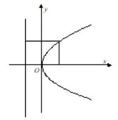</td><td>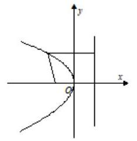</td><td>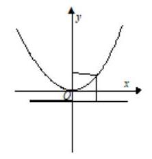</td><td>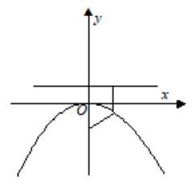</td></tr><tr><td>焦点</td><td>$F\left( {\frac{p}{2},0}\right)$</td><td>$F\left( {-\frac{p}{2},0}\right)$</td><td>$F\left( {0,\frac{p}{2}}\right)$</td><td>$F\left( {0, - \frac{p}{2}}\right)$</td></tr><tr><td>准线</td><td>$x =  - \frac{p}{2}$</td><td>$x = \frac{p}{2}$</td><td>$y =  - \frac{p}{2}$</td><td>$y = \frac{p}{2}$</td></tr><tr><td>范围</td><td>$x \geq  0, y \in  R$</td><td>$x \leq  0, y \in  R$</td><td>$x \in  R, y \geq  0$</td><td>$x \in  R, y \leq  0$</td></tr><tr><td>对称轴</td><td>$x$ 轴</td><td>$x$ 轴</td><td>$y$ 轴</td><td>$y$ 轴</td></tr></table>

<table><tr><td>顶点</td><td>(0,0)</td><td>$\left( {0,0}\right)$</td><td>$\left( {0,0}\right)$</td><td>$\left( {0,0}\right)$</td></tr><tr><td>焦点</td><td>$\left| {PF}\right|  = \frac{p}{2} + {x}_{1}$</td><td>$\left| {PF}\right|  = \frac{p}{2} + \left| {x}_{1}\right|$</td><td>$\left| {PF}\right|  = \frac{p}{2} + {y}_{1}$</td><td>$\left| {PF}\right|  = \frac{p}{2} + \left| {y}_{1}\right|$</td></tr></table>

## 例题精讲

【例 1】(1)已知动点 $M\left( {x, y}\right)$ 到直线 $x =  - 3$ 的距离比它到点 $F\left( {2,0}\right)$ 的距离大 1,求动点 $M$ 的轨迹 $E$ 的方程;

【难度】 $\star   \star   \star$

【答案】 ${y}^{2} = {8x}$ ;

【解析】由已知得动点 $M\left( {x, y}\right)$ 到直线 $x =  - 2$ 的距离与到点 $F\left( {2,0}\right)$ 的距离相等,

$\therefore$ 动点 $M$ 的轨迹 $C$ 为抛物线,设 $C : {y}^{2} = {2px}\left( {p > 0}\right)$ ,

$\because \frac{p}{2} = 2 \Rightarrow  p = 4,\therefore$ 动点 $M$ 的轨迹 $C$ 的方程为 ${y}^{2} = {8x}$ .

(2)动圆 $P$ 与定圆 $A : {\left( x + 2\right) }^{2} + {y}^{2} = 1$ 外切，且与直线 $l : x = 1$ 相切，求动圆圆心 $P$ 的轨迹方程.

【难度】 $\star   \star   \star$

【答案】 ${y}^{2} =  - {8x}$ .

【解析】如图,设动圆圆心 $P\left( {x, y}\right)$ ,过点 $P$ 作 ${PD} \bot  l$ 于点 $D$ ,

作直线 ${l}^{\prime } : x = 2$ ,过点 $P$ 作 $P{D}^{\prime } \bot  {l}^{\prime }$ 于点 ${D}^{\prime }$ ,连接 ${PA}$ .

设动圆 $P$ 的半径为 $R$ ,由题知圆 $A$ 的半径为 1 .

$\because$ 圆 $P$ 与圆 $A$ 外切, $\therefore \left| {PA}\right|  = R + 1$ .

又 $\because$ 圆 $P$ 与直线 $l : x = 1$ 相切, $\therefore \left| {P{D}^{\prime }}\right|  = \left| {PD}\right|  + \left| {D{D}^{\prime }}\right|  = R + 1$ .

$\because \left| {PA}\right|  = \left| {P{D}^{\prime }}\right|$ ,即动点 $P$ 到定点 $A$ 与到定直线 ${l}^{\prime }$ 的距离相等,

$\therefore$ 点 $P$ 的轨迹是以 $A$ 为焦点,以 ${l}^{\prime }$ 为准线的抛物线.

设抛物线的方程为 ${y}^{2} =  - {2px}\left( {p > 0}\right)$ ,可知 $p = 4$ ,

$\therefore$ 所求动圆圆心 $P$ 的轨迹方程为 ${y}^{2} =  - {8x}$ .

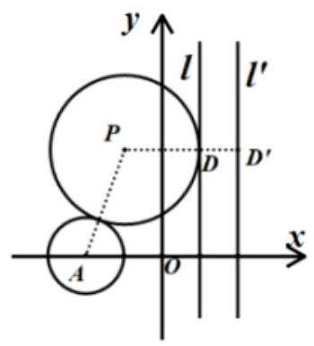

例 2、(1)过抛物线 ${y}^{2} = {4x}$ 的焦点作直线，交抛物线于 $A\left( {{x}_{1},{y}_{1}}\right)$ ， $B\left( {{x}_{2},{y}_{2}}\right)$ 两点，如果 ${x}_{1} + {x}_{2} = 6$ ， 那么 $\left| {AB}\right|  =$ ( )

A. 8 B. 10 C. 6 D. 4

【难度】★★

【答案】A

【解析】通过抛物线的定义,弦长转化成横坐标和的关系

(2)已知 $F$ 为抛物线 $C : {y}^{2} = {8x}$ 的焦点， $M$ 为 $C$ 上一点，且 $\left| {MF}\right|  = 4$ ，则 $M$ 到 $x$ 轴的距离为( )

A. 4 B. $4\sqrt{2}$ C. 8 D. 16

【难度】★★

【答案】A

【解析】因为 $F$ 为抛物线 $C : {y}^{2} = {8x}$ 的焦点,所以 $F\left( {2,0}\right)$ ,

设 $M\left( {{x}_{1},{y}_{1}}\right)$ ,由抛物线的性质得: ${x}_{1} = 4 - 2 = 2$ ,

$\therefore {y}_{1}^{2} = 8 \times  2 = {16} \Rightarrow  \left| {y}_{1}\right|  = 4$ ,故 $M$ 到 $x$ 的距离为 4 . 故选: A.

例 3、设 $F$ 为抛物线 ${y}^{2} = {4x}$ 的焦点.

(1)过焦点 $F$ 的直线交抛物线于 $A$ ， $B$ 两点，若 $\left| {AB}\right|  = {10}$ ，则 ${AB}$ 的中点 $P$ 到 $y$ 轴的距离等于___.

【难度】 $\star   \star$

【答案】 4

【解析】由题意,焦点,准线为 $x =  - 1$ ,设 $A\left( {{x}_{1},{y}_{1}}\right) , B\left( {{x}_{2},{y}_{2}}\right)$ ,过 $A, B$ 向 $y$ 轴作垂线交于 ${A}^{\prime },{B}^{\prime }$ ,

则 $P$ 到 $y$ 轴的距离可转化为:

$\frac{1}{2}\left( {A{A}^{\prime } + B{B}^{\prime }}\right)  = \frac{1}{2}\left( {{x}_{1} + {x}_{2}}\right)  = \frac{1}{2}\left\lbrack  {\left( {{x}_{1} + 1}\right)  + \left( {{x}_{2} + 1}\right)  - 2}\right\rbrack   = \frac{1}{2}\left( {{AF} + {BF} - 2}\right)  = 4$ . (往定义方向化归)

(2)点 $A\left( {2,2}\right)$ ，若点 $P$ 在抛物线上移动，则 $\left| {PA}\right|  + \left| {PF}\right|$ 的最小值是___.

【难度】 $\star   \star   \star$

【答案】 3

【解析】过 $P$ 向准线作垂线交于 ${P}^{\prime }$ ,则 $\left| {PA}\right|  + \left| {PF}\right|  = \left| {PA}\right|  + \left| {P{P}^{\prime }}\right|$ ,所以

显然,当 $P, A,{P}^{\prime }$ 三点共线时,距离之和最小,此时距离为 $\left| {A{P}^{\prime }}\right|  = 2 + 1 = 3$ . $\left| {PA}\right|  + \left| {PF}\right|$ 最小值为 3 .

(3)点 $B\left( {2,3}\right)$ ，若点 $P\left( {{x}_{0},{y}_{0}}\right)$ 在抛物线上移动，则 ${x}_{0} + \left| {PB}\right|$ 的最小值是___.

【难度】 $\star   \star   \star$

【答案】 $\sqrt{10} - 1$

【解析】过 $P$ 向准线作垂线交于 ${P}^{\prime }$ ,

则 ${x}_{0} + \left| {PB}\right|  = \left( {{x}_{0} + 1 + \left| {PB}\right| }\right)  - 1 = \left| {P{P}^{\prime }}\right|  + \left| {PB}\right|  - 1 = \left| {PF}\right|  + \left| {PB}\right|  - 1$ ,

显然当 $P, F, B$ 三点共线时,距离之和最小,此时 ${x}_{0} + \left| {PB}\right|  = \left| {PF}\right|  + \left| {PB}\right|  - 1 = \left| {BF}\right|  - 1 = \sqrt{10} - 1$ .

(4)若点 $P$ 在抛物线上移动，点 $Q$ 在 ${\left( x - 1\right) }^{2} + {y}^{2} = \frac{1}{9}$ 上移动，则 $\left| {PQ}\right|$ 的最小值为___.

【难度】 $\star   \star   \star$

【答案】 $\frac{2}{3}$

【解析】圆心即为焦点 $F\left( {1,0}\right)$ ,所以 $\left| {PQ}\right|$ 取到最小值时, $P, Q, F$ 一定共线,且 $Q$ 一定在 $P$ 和 $F$ 之间, 过 $P$ 向准线作垂线交于 ${P}^{\prime }$ ,所以 $\left| {PQ}\right|  = \left| {PF}\right|  - \frac{1}{3} = \left| {P{P}^{\prime }}\right|  - \frac{1}{3}$ ,显然 $P$ 在顶点时最小,

所以 ${\left| PQ\right| }_{\min } = 1 - \frac{1}{3} = \frac{2}{3}$ . (可以类比到圆中的最值问题,另外,两个点都在动时,不妨先固定一个)

【例 4】(1)已知抛物线的焦点在直线 $x - {2y} - 4 = 0$ 上，则此抛物线的标准方程是( )

A. ${y}^{2} = {16x}$ B. ${x}^{2} =  - {8y}$

C. ${y}^{2} = {16x}$ 或 ${x}^{2} =  - {8y}$ D. ${y}^{2} = {16x}$ 或 ${x}^{2} = {16y}$

【难度】★★

【答案】C

【解析】当焦点在 $x$ 轴上时,根据 $y = 0, x - {2y} - 4 = 0$ 可得焦点坐标为得 $\left( {4,0}\right)$ , 则抛物线的标准方程为 ${y}^{2} = {16x}$ ,

当焦点在 $y$ 轴上时,根据 $x = 0, x - {2y} - 4 = 0$ 可得焦点坐标为 $\left( {0, - 2}\right)$ ,

则抛物线的标准方程为 ${x}^{2} =  - {8y}$ . 故选: C.

(2)已知抛物线 ${y}^{2} = {2px}\left( {p > 0}\right)$ 的焦点为 $F$ ， $A$ 为抛物线上一点， $O$ 为坐标原点，且 $\overrightarrow{OA} + \overrightarrow{OF} = \left( {2,2}\right)$ ， 则 $p =$ (   )

A. 4 B. 2 C. $\sqrt{2}$ D. $2\sqrt{2}$

【难度】★★★

【答案】B

【解析】依题意可得 $F\left( {\frac{p}{2},0}\right)$ ,设 $A\left( {{x}_{0},{y}_{0}}\right)$ ,由 $\overrightarrow{OA} + \overrightarrow{OF} = \left( {2,2}\right)$ 得 $\left( {{x}_{0},{y}_{0}}\right)  + \left( {\frac{p}{2},0}\right)  = \left( {2,2}\right)$ ,

所以 ${x}_{0} + \frac{p}{2} = 2,{y}_{0} = 2$ ,所以 ${x}_{0} = 2 - \frac{p}{2},{y}_{0} = 2$ ,因为 $A$ 为抛物线上一点,所以 ${2}^{2} = {2p}\left( {2 - \frac{p}{2}}\right)$ , 解得 $p = 2$ . 故选: B.

【例 5】( 1 )对抛物线 $\frac{1}{8}{x}^{2} = y$ ,下列描述正确的是( )

A. 开口向上,焦点为 $\left( {0,\frac{1}{4}}\right)$

B. 开口向上,焦点为 $\left( {0,\frac{1}{16}}\right)$

C. 开口向右，焦点为 $\left( {2,0}\right)$

D. 开口向上,焦点为 $\left( {0,\frac{1}{4}}\right)$

【难度】★★

【答案】A

【解析】抛物线方程 $\frac{1}{8}{x}^{2} = y$ ,化成标准方程形式 ${x}^{2} = {8y}$ ,可得其开口向上,焦点坐标为 $\left( {0,2}\right)$ . 故选A 项.

(2)已知抛物线 $a{x}^{2} = y$ 的焦点到准线的距离为 $\frac{1}{2}$ ，则实数 $a$ 等于( )

A. $\pm  1$ B. ±2

C. $\pm  \frac{1}{4}$ D. $\pm  \frac{1}{2}$

【难度】★★

【答案】A

【解析】把抛物线方程 $a{x}^{2} = y$ 化为标准式得 ${x}^{2} = \frac{1}{a}y,\because$ 抛物线的焦点到准线的距离为 $\frac{1}{2}$ , $\therefore \frac{1}{2\left| a\right| } = \frac{1}{2},\therefore a =  \pm  1$ . 故选: $A$ .

【例 6】已知抛物线 $C : {y}^{2} = {8x}$ 的焦点为 $F$ ，准线与 $x$ 轴的交点为 $K$ ，点 $A$ 在 $C$ 上且 $\left| {AK}\right|  = \sqrt{2}\left| {AF}\right|$ ，则 ${\Delta AFK}$ 的面积为___.

【难度】 $\star   \star   \star$

【答案】8

【解析】由题意,设 $P\left( {x, y}\right) , K\left( {-2,0}\right) , F\left( {2,0}\right) ,\because \left| {PK}\right|  = \sqrt{2}\left| {PF}\right|$ ,

$\therefore \sqrt{{\left( x + 2\right) }^{2} + {y}^{2}} = \sqrt{2} \cdot  \sqrt{{\left( x - 2\right) }^{2} + {y}^{2}}$ ,整理可得, ${x}^{2} + {y}^{2} - {12x} + 4 = 0$ ,

$\because {y}^{2} = {8x},\therefore {x}^{2} - {4x} + 4 = 0,\therefore x = 2,\left| y\right|  = 4,\therefore {S}_{\Delta PFK} = \frac{1}{2}\left| {FK}\right| \left| y\right|  = \frac{1}{2} \times  4 \times  4 = 8$ .

【例 7】已知圆 ${x}^{2} + {y}^{2} = 1$ 与抛物线 ${y}^{2} = {2px}\left( {p > 0}\right)$ 交于 $A, B$ 两点,与抛物线的准线交于 $C, D$ 两点, 且坐标原点 $O$ 是 ${AC}$ 的中点，则 $p$ 的值等于___.

【难度】 $\star   \star   \star$

【答案】 $\frac{2\sqrt{5}}{5}$

【解析】因为抛物线的准线方程为 $x =  - \frac{p}{2}$ ,所以由对称性得点 $A\left( {\frac{p}{2}, \pm  p}\right)$ ,

代入圆的方程得 ${\left( \frac{p}{2}\right) }^{2} + {\left( \pm p\right) }^{2} = 1$ ,解得 $p = \frac{2\sqrt{5}}{5}$ . 故答案为: $\frac{2\sqrt{5}}{5}$

【例 8】已知抛物线 $y = \frac{1}{2}{x}^{2}$ 上距离点 $A\left( {0, a}\right) \left( {a > 0}\right)$ 最近的点恰好是其顶点,则 $a$ 的取值范围是 ___.

【难度】 $\star   \star   \star$

【答案】 $0 < a \leq  1$

【解析】设点 $\mathrm{P}\left( {\mathrm{x},\mathrm{y}}\right)$ 为抛物线上的任意一点,则点 $\mathrm{P}$ 离点 $\mathrm{A}\left( {0,\mathrm{a}}\right)$ 的距离的平方为

${\left| AP\right| }^{2} = {x}^{2} + {\left( y - a\right) }^{2} = {x}^{2} + {y}^{2} - {2ay} + {a}^{2}$ ,

$\because {x}^{2} = {2y},\therefore {\left| AP\right| }^{2} = {2y} + {y}^{2} - {2ay} + {a}^{2}\left( {y \geq  0}\right)  = {y}^{2} + 2\left( {1 - a}\right) y + {a}^{2}\left( {y \geq  0}\right) ,\therefore$ 对称轴为 $a - 1$ ,

$\because$ 离点 $A\left( {0, a}\right)$ 最近的点恰好是顶点, $\therefore a - 1 \leq  0$ 解得 $a \leq  1$ ,

又 $\mathrm{a} > 0,\therefore 0 < \mathrm{a} \leq  1$ ,故答案为: $0 < a \leq  1$ .

## 巩固训练

1、已知动点 $\mathrm{P}\left( {\mathrm{x},\mathrm{y}}\right)$ 满足 $5\sqrt{{\left( x - 1\right) }^{2} + {\left( y - 2\right) }^{2}} = \left| {{3x} + {4y} - {11}}\right|$ ，则点 $\mathrm{P}$ 的轨迹是( )

A. 直线 B. 抛物线 C. 双曲线 D. 椭圆

【难度】★★★

【答案】A

【解析】点 $\left( {1,2}\right)$ 在直线上

2、抛物线 ${y}^{2} = {8x}$ 的焦点为 $F$ ， $A\left( {4, - 2}\right)$ 为一定点，在抛物线上找一点 $M$ ，当 $\left| {MA}\right|  + \left| {MF}\right|$ 为最小时， 则 $M$ 点的坐标___，当 ${\left. { \parallel  {MA}}\right. \left| -\right| {MF}} \parallel$ 为最大时，则 $M$ 点的坐标___.

【难度】 $\star   \star   \star$

【答案】见解析

【解析】过 $M$ 向准线作垂线交于 ${M}^{\prime }$ ,则 $\left| {MA}\right|  + \left| {MF}\right|  = \left| {MA}\right|  + \left| {M{M}^{\prime }}\right|$ ,所以当 $A, M,{M}^{\prime }$ 三点共线时, 距离之和最小,此时 $M$ 的纵坐标为-2,代入抛物线得横坐标为 $\frac{1}{2}$ ,所以此时 $M\left( {\frac{1}{2}, - 2}\right)$ .

当 $M, A, F$ 三点共线时, $\parallel {MA}\left| -\right| {MF}\parallel$ 取到最大值,此时直线 ${AF} : y =  - x + 2$ ,

联立 $\left\{  \begin{array}{l} y =  - x + 2 \\  {y}^{2} = {8x} \end{array}\right.$ ,得 $M\left( {6 + 4\sqrt{2}, - 4 - 4\sqrt{2}}\right)$ 或 $\left( {6 - 4\sqrt{2}, - 4 + 4\sqrt{2}}\right)$ .

3、已知抛物线 ${y}^{2} = {4x}$ 的焦点为 $F$ ， $P$ 为抛物线上一动点，定点 $A\left( {1,1}\right)$ ，当 $\bigtriangleup  {PAF}$ 周长最小时， ${PF}$ 所在直线的斜率为___.

【难度】 $\star   \star   \star$

【答案】 $- \frac{4}{3}$

【解析】抛物线 ${y}^{2} = {4x}$ 的焦点为 $F\left( {1,0}\right)$ ,准线为 $x =  - 1$ ,从点 $P$ 向准线作垂线,垂足为 $B$ ,从点 $A$ 向准线作垂线,垂足为 ${A}_{1}$ ,则 $\bigtriangleup {PAF}$ 周长 $= \left| {PF}\right|  + \left| {PA}\right|  + \left| {AF}\right|  = \left| {PB}\right|  + \left| {PA}\right|  + 1 \geq  \left| {A{A}_{1}}\right|  + 1 = 3$ ,当且仅当 $A, P$ , ${A}_{1}$ 三点共线时,取到最小值,此时 $P\left( {\frac{1}{4},1}\right) ,{k}_{PF} =  - \frac{4}{3}$ . 故答案为: $- \frac{4}{3}$ .

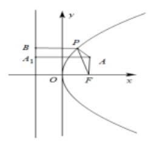

4、已知直线 ${l}_{1} : x = 1,{l}_{2} : x - y + 1 = 0$ ，点 $\mathrm{P}$ 为抛物线 ${y}^{2} = {4x}$ 上的任一点，则 $\mathrm{P}$ 到直线 ${\mathrm{l}}_{1},{\mathrm{l}}_{2}$ 的距离之和的最小值为( )

A. 2 B. $\sqrt{2}$ C. 1

D. $\frac{\sqrt{2}}{2}$

【难度】 $\star   \star   \star$

【答案】B

【解析】抛物线 ${y}^{2} = {4x}$ ,其焦点坐标 $F\left( {1,0}\right)$ ,准线为 $x =  - 1$ 也就是直线 ${l}_{1}$ ,故 $P$ 到直线 ${l}_{1}$ 的距离就是 $P$ 到 $F$ 的距离.如图所示,

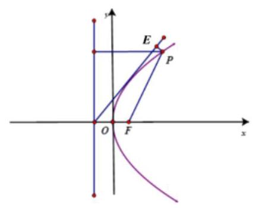

设 $P$ 到直线 ${l}_{2}$ 的距离为 $d$ ,则 $d + \left| {PF}\right|  \geq  \frac{\left| 1 - 0 + 1\right| }{\sqrt{2}} = \sqrt{2}$ ,当且仅当 $P, E, F$ 三点共线时等号成立,故选 B.

5、抛物线 ${y}^{2} = {2px}\left( {p > 0}\right)$ 上的点 $M$ 到点 $A\left( {3,2}\right)$ 和焦点 $\mathrm{F}$ 的距离之和的最小值为 5 ，求此抛物线的方程。

【难度】 $\star   \star   \star$

【答案】 ${y}^{2} = {8x}$

【解析】若 $A\left( {3,2}\right)$ 在抛物线内,设 $l$ 为准线,作 ${AN} \bot  l$ 于点 $N$ ,交抛物线于点 $\mathrm{M}$ ,

则 $\left| {MN}\right|  + \left| {MA}\right|  = \left| {MA}\right|  + \left| {MF}\right|  = 5\;\therefore \left| {{x}_{M} + \frac{p}{2}}\right|  + \left( {3 - {x}_{M}}\right)  = 5$ ,所以 $p = 4$

若 $A\left( {3,2}\right)$ 在抛物线外,连接 ${AF}$ 交抛物线于点 $\mathrm{M}$ ,则

$$
\left| {MA}\right|  + \left| {MF}\right|  = \left| {AF}\right|  = \sqrt{{\left( 3 - \frac{p}{2}\right) }^{2} + {2}^{2}} = 5 \Rightarrow  p = 6 \pm  2\sqrt{21}
$$

又 $A\left( {3,2}\right)$ 在抛物线外, $\therefore 4 > {y}^{2} = {6p}\therefore 0 < p < \frac{2}{3}$ ,所以 $p = 6 \pm  2\sqrt{21}$ 不合题意

综上, $p = 4$ ,所求抛物线方程为: ${y}^{2} = {8x}$

6、已知定点 $A\left( {-3,0}\right)$ ， $B\left( {3,0}\right)$ ，动点 $P$ 在抛物线 ${y}^{2} = {2x}$ 上移动，则 $\overline{PA} \cdot  \overline{PB}$ 的最小值等于___.

【难度】 $\star   \star   \star$

【答案】 -9

【解析】设 $P\left( {x, y}\right)$ ,则 ${y}^{2} = {2x}$ ,因为 $A\left( {-3,0}\right) , B\left( {3,0}\right)$ ,所以

$\overrightarrow{PA} \cdot  \overrightarrow{PB} = \overrightarrow{AP} \cdot  \overrightarrow{BP} = \left( {x + 3, y}\right)  \cdot  \left( {x - 3, y}\right)  = {x}^{2} + {y}^{2} - 9 = {x}^{2} + {2x} - 9 = {\left( x + 1\right) }^{2} - {10}\left( {x \geq  0}\right)$ ,故当 $x = 0$ 时, 取得最小值为-9 .

7、抛物线 $C$ 的顶点在坐标原点,对称轴为 $y$ 轴, $C$ 上动点 $P$ 到直线 $l : {3x} + {4y} - {12} = 0$ 的最短距离为 1,求抛物线 $C$ 的方程.

【难度】★★★

【答案】 ${x}^{2} =  - \frac{112}{9}y$

【解析】显然, 过抛物线开口向上, 最小距离就可以为 0 了, 所以抛物线一定开口向下, 设为 ${x}^{2} =  - {2py}\left( {p > 0}\right)$ ,

设点 $P\left( {{x}_{0},{y}_{0}}\right)$ ,则 ${x}_{0}^{2} =  - {2p}{y}_{0}$ ,所以 $d = \frac{\left| 3{x}_{0} + 4{y}_{0} - {12}\right| }{5} = \frac{\left| -\frac{2}{p}{x}_{0}^{2} + 3{x}_{0} - {12}\right| }{5}$ ,

所以 $d = \frac{\frac{2}{p}{x}_{0}^{2} - 3{x}_{0} + {12}}{5}$ ,当 ${x}_{0} = \frac{3}{4}p$ 时, ${d}_{\min } = \frac{1}{5}\left( {\frac{9}{8}p - \frac{9}{4}p + {12}}\right)  = 1 \Rightarrow  p = \frac{56}{9}$ ,

所以抛物线方程为 ${x}^{2} =  - \frac{112}{9}y$ .

## (二) 直线与抛物线

## 知识梳理

$1.P\left( {p > 0}\right)$ 的几何意义是抛物线的焦准距 (焦点到准线的距离); ${2p}$ 表示通径 (通过焦点且垂直于对称轴的直线与抛物线交于两点,连接这两点的线段) 长, $\frac{p}{2}$ 表示焦点到顶点的距离.

2.抛物线的通径:通过焦点并且垂直于对称轴的直线与抛物线两交点之间的线段叫做抛物线的通径. 通径的长为 ${2p}$ ,通径是过焦点最短的弦.

3. 若抛物线 ${y}^{2} = {2px}\left( {p > 0}\right)$ 的焦点弦为 $\mathrm{{AB}}$ ， $A\left( {{x}_{1},{y}_{1}}\right)$ ， $B\left( {{x}_{2},{y}_{2}}\right)$ ，则

(1) $\left| {AB}\right|  = {x}_{1} + {x}_{2} + p,{x}_{1}{x}_{2} = \frac{{p}^{2}}{4},{y}_{1}{y}_{2} =  - {p}^{2}$ ；若 $\mathrm{{OA}}$ 、 $\mathrm{{OB}}$ 是过抛物线 ${y}^{2} = {2px}\left( {p > 0}\right)$ 顶点 $\mathrm{O}$ 的两条互相垂直的弦,则直线 $\mathrm{{AB}}$ 恒经过定点 $\left( {{2p},0}\right)$ .

(2) $\left| {AB}\right|  = \frac{2p}{{\sin }^{2}\theta }$ ；

(3)以AB为直径的圆与准线相切；

证明: 设 $\mathrm{{AB}}$ 为抛物线的焦点弦, $\mathrm{F}$ 为抛物线的焦点,点 ${A}^{\prime },{B}^{\prime }$ 分别是点 $A, B$ 在准线上的射影,弦 $\mathrm{{AB}}$ 的中点为 $\mathrm{M}$ ,则 ${AB} = {AF} + {BF} = {A{A}^{\prime }} + {B{B}^{\prime }}$ ，点 $\mathrm{M}$ 到准线的距离为 $\frac{1}{2}\left( {{A{A}^{\prime }} + {B{B}^{\prime }}}\right)  = \frac{1}{2}{AB}$ ， $\therefore$ 以抛物线焦点弦为直径的圆总与抛物线的准线相切. (4) $\frac{1}{\left| FA\right| } + \frac{1}{\left| FB\right| } = \frac{2}{p}$ .

4.直线与抛物线的位置关系:

方法一是方程的观点, 即把曲线方程和直线的方程联立成方程组, 利用判别式 $\Delta$ 来讨论位置关系.

(1)相交: $\Delta  > 0 \Rightarrow$ 直线与抛物线相交，但直线与抛物线相交不一定有 $\Delta  > 0$ ，当直线与抛物线的对称轴平行时,直线与抛物线相交且只有一个交点,故 $\Delta  > 0$ 也仅是直线与抛物线相交的充分条件,但不是必要条件 (2)相切: $\Delta  = 0 \Leftrightarrow$ 直线与抛物线相切；

(3)相离: $\Delta  < 0 \Leftrightarrow$ 直线与抛物线相离。

【注:a. 直线与抛物线只有一个公共点时的位置关系有两种情形:相切和相交。如果直线与抛物线的轴平行时，直线与抛物线相交，也只有一个交点；b.过抛物线外一点总有三条直线和抛物线有且只有一个公共点；两条切线和一条平行于对称轴的直线。】

5.a.遇到中点弦问题常用“韦达定理”或“点差法”求解。

在抛物线 ${y}^{2} = {2px}\left( {p > 0}\right)$ 中,以 $P\left( {{x}_{0},{y}_{0}}\right)$ 为中点的弦所在直线的斜率 $k = \frac{p}{{y}_{0}}$

b. 在求直线与抛物线的相交弦的弦长时, 直线与抛物线相交通过联立方程应用韦达定理来求解 $\left| {AB}\right|  = \sqrt{1 + {k}^{2}}\left| {{x}_{1} - {x}_{2}}\right|$ ; 若 ${y}_{1},{y}_{2}$ 分别为 $\mathrm{A}\text{ 、 }\mathrm{\;B}$ 的纵坐标,则 $\left| {AB}\right|  = \sqrt{1 + {\left( \frac{1}{k}\right) }^{2}}\left| {{y}_{1} - {y}_{2}}\right|$

## 例题精讲

【例 9】( 1 )若直线 $y = {kx} + 2$ 与抛物线 ${y}^{2} = {4x}$ 仅有一个公共点，则实数 $k =$ ___.

【难度】 $\star   \star   \star$

【答案】0或 $\frac{1}{2}$

【解析】直线与对称轴平行或者与抛物线相切

( 2 )点 $P$ 到点 $A\left( {\frac{1}{2},0}\right) , B\left( {a,2}\right)$ 及到直线 $x =  - \frac{1}{2}$ 的距离都相等，如果这样的点恰好只有一个，那么 $a$ 的值 ( )

A. $\frac{1}{2}$ B. $\frac{3}{2}$ C. $\frac{1}{2}$ 或 $\frac{3}{2}$ D. $- \frac{1}{2}$ 或 $\frac{1}{2}$

【难度】 $\star   \star   \star$

【答案】D

【解析】平面上到点 $A\left( {\frac{1}{2},0}\right)$ 及直线 $x =  - \frac{1}{2}$ 的距离都相等, 故点 $P$ 的应该落在抛物线 ${y}^{2} = {2x}$ 上. 又由 $P$ 到点 $A\left( {\frac{1}{2},0}\right) , B\left( {a,2}\right)$ 及直线 $x =  - \frac{1}{2}$ 的距离都相等,

有两种情况:一是线段 ${AB}$ 的垂直平分线与抛物线相切，

一是线段 ${AB}$ 的垂直平分线与抛物线的对称轴平行.

可得结果实数 $a$ 的值为 $\frac{1}{2}$ 或 $- \frac{1}{2}$ .

【例 10】过抛物线 ${y}^{2} = {4x}$ 的焦点作一条直线与抛物线相交于 $A, B$ 两点,它们的横坐标之和等于 5,则这样的直线 ( )

A. 有且仅有一条 B. 有且仅有两条

C. 有无穷多条 D. 不存在

【难度】 $\star   \star   \star$

【答案】B

【解析】过抛物线 ${y}^{2} = {4x}$ 的焦点作一条直线与抛物线相交于 $A$ 、 $B$ 两点,

若直线 ${AB}$ 的斜率不存在,则横坐标之和等于 2,不适合.

故设直线 ${AB}$ 的斜率为 $k$ ,则直线 ${AB}$ 为 $y = k\left( {x - 1}\right)$ ,代入抛物线 ${y}^{2} = {4x}$ 得, ${k}^{2}{x}^{2} - 2\left( {{k}^{2} + 2}\right) x + {k}^{2} = 0$

$\because \mathrm{A}\text{ 、 }\mathrm{\;B}$ 两点的横坐标之和等于 $5,\therefore \frac{2\left( {{\mathrm{k}}^{2} + 2}\right) }{{\mathrm{k}}^{2}} = 5,{\mathrm{k}}^{2} = \frac{4}{3}$ ,则这样的直线有且仅有两条,故选 B.

【例 11】已知抛物线 $C : {y}^{2} = {4x}$ 的准线为 $l$ ,过 $M\left( {1,0}\right)$ 且斜率为 $k$ 的直线与 $l$ 相交于点 $A$ ,与抛物线 $C$ 的一个交点为 $B$ . 若 $\overrightarrow{AM} = 2\overrightarrow{MB}$ ,则 $k =$ ___.

【难度】 $\star   \star   \star$

【答案】 $\pm  2\sqrt{2}$

【解析】由题意, $M$ 到准线的距离为 $2,\because \overrightarrow{AM} = 2\overrightarrow{MB},\therefore B$ 的横坐标为 2,

代入抛物线 $C : {y}^{2} = {4x}$ ,可得 $y =  \pm  2\sqrt{2},\therefore B$ 的坐标为 $\left( {2, \pm  2\sqrt{2}}\right) ,\therefore k = \frac{\pm 2\sqrt{2}}{2 - 1} =  \pm  2\sqrt{2}$ 故答案为: $\pm  2\sqrt{2}$ .

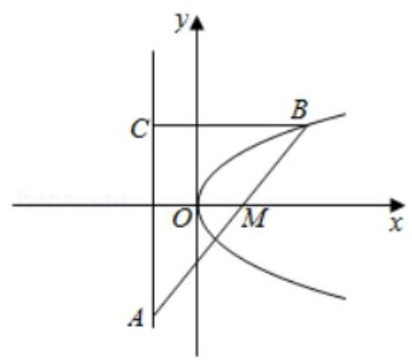

【例 12】已知直线 $l : {2x} - y + 2 = 0$ 与抛物线 $C : {y}^{2} = {2px}\left( {p > 0}\right)$ 有一个公共点.

(1)求抛物线方程；

(2)斜率不为 0 的直线 ${l}^{\prime }$ 经过抛物线 $C$ 的焦点 $F$ ，交抛物线于两点 $A, B$ . 抛物线 $C$ 上是否存在两点 $D$ ， $E$ 关于直线 ${l}^{\prime }$ 对称? 若存在,求出 ${l}^{\prime }$ 的斜率的取值范围; 若不存在,请说明理由.

【难度】 $\star   \star   \star$

【答案】( 1 ) ${y}^{2} = {16x}$ ( 2 )抛物线 $C$ 上不存在两点 $D$ ， $E$ 关于过焦点的直线 ${l}^{\prime }$ 对称；详见解析

【解析】(1) 由题联立方程组 $\left\{  \begin{array}{l} {y}^{2} = {2px} \\  {2x} - y + 2 = 0 \end{array}\right.$ 消去 $x$ 得 ${y}^{2} - {py} + {2p} = 0$

因为直线 $l$ 与抛物 $C$ 相切,所以 $\Delta  = {p}^{2} - {8p} = 0$ 解得 $p = 8$ 或 0 (舍)

所以抛物线 $C$ 的方程为 ${y}^{2} = {16x}$ .

(2)由(1)可知 $F\left( {4,0}\right)$ ，所以可设直线 ${l}^{\prime }$ 的方程为 $y = k\left( {x - 4}\right) \left( {k \neq  0}\right)$ .

假设抛物线 $C$ 上存在两点 $D, E$ 关于直线 ${l}^{\prime }$ 对称,

可设直线 ${DE}$ 的方程为 $y =  - \frac{1}{k}x + m$ ,

联立方程组 $\left\{  \begin{array}{l} {y}^{2} = {16x} \\  y =  - \frac{1}{k}x + m \end{array}\right.$ 消去 $y$ 得 ${x}^{2} - \left( {{2mk} + {16}{k}^{2}}\right) x + {m}^{2}{k}^{2} = 0$

由 $\Delta  = {\left( 2mk + {16}{k}^{2}\right) }^{2} - 4{m}^{2}{k}^{2} > 0$ ,得 $4{k}^{2} + {mk} > 0$ ,

设 $D\left( {{x}_{1},{y}_{1}}\right) , E\left( {{x}_{2},{y}_{2}}\right) ,{DE}$ 中点为 $G\left( {{x}_{0},{y}_{0}}\right)$ .

则 ${x}_{0} = \frac{{x}_{1} + {x}_{2}}{2} = {km} + 8{k}^{2} > 0,{y}_{0} =  - \frac{1}{k}{x}_{0} + m =  - {8k}$ ,

因为 $G\left( {{x}_{0},{y}_{0}}\right)$ 在直线上 ${l}^{\prime }$ ,所以将其代入方程 $y = k\left( {x - 4}\right)$ ,

得 $8{k}^{2} + {km} + 4 = 0$ ,即 $m =  - \frac{4}{k} - {8k}$ ,代入 $4{k}^{2} + {mk} > 0$ ,得 ${k}^{2} <  - 1$ ,

所以 $k$ 无解,故不存在.

即抛物线 $C$ 上不存在两点 $D, E$ 关于过焦点的直线 ${l}^{\prime }$ 对称.

【例 13】已知抛物线 ${y}^{2} = {2px}\left( {p > 0}\right)$ 的焦点为 $F, A$ 是抛物线上横坐标为 4、且位于 $x$ 轴上方的点， $A$ 到抛物线准线的距离等于 5 . 过 $A$ 作 ${AB}$ 垂直于 $y$ 轴,垂足为 $B,{OB}$ 的中点为 $M$ .

(1)求抛物线方程；

(2)过 $M$ 作 ${MN}\bot {FA}$ ，垂足为 $N$ ，求点 $N$ 的坐标；

(3)以 $M$ 为圆心， ${MB}$ 为半径作圆 $M$ ，当 $K\left( {m,0}\right)$ 是 $x$ 轴上一动点时，讨论直线 ${AK}$ 与圆 $M$ 的位置关系.

【难度】 $\star   \star   \star$

【答案】见解析

【解析】(1) 抛物线 ${y}^{2} = {2px}$ 的准线为 $x =  - \frac{p}{2}$ ,于是 $4 + \frac{p}{2} = 5 = 5,\therefore p = 2$ .

$\therefore$ 抛物线方程为 ${y}^{2} = {4x}$ . (简单问题,一带而过)

(2) $\because$ 点 $A\left( {4,4}\right)$ ，由题意得 $B\left( {0,4}\right)$ ， $M\left( {0,2}\right)$ ，

又 $\because F\left( {1,0}\right) ,\therefore {k}_{FA} = \frac{4}{3};{MN} \bot  {FA},\therefore {k}_{MN} =  - \frac{3}{4}$ ,

则 ${FA}$ 的方程为 $y = \frac{4}{3}\left( {x - 1}\right) ,{MN}$ 的方程为 $y - 2 =  - \frac{3}{4}x$ ,解方程组得 $x = \frac{8}{5}, y = \frac{4}{5}$ ,

$\therefore N$ 的坐标 $\left( {\frac{8}{5},\frac{4}{5}}\right)$ .

(3)由题意得圆 $M$ 的圆心是点 $\left( {0,2}\right)$ ，半径为 2，

当 $m = 4$ 时,直线 ${AK}$ 的方程为 $x = 4$ ,此时,直线 ${AK}$ 与圆 $M$ 相离.

当 $m \neq  4$ 时,直线 ${AK}$ 的方程为 $y = \frac{4}{4 - m}\left( {x - m}\right)$ ,即为 ${4x} - \left( {4 - m}\right) y - {4m} = 0$ ,

圆心 $M\left( {0,2}\right)$ 到直线 ${AK}$ 的距离 $d = \frac{\left| 2m + 8\right| }{\sqrt{{16} + {\left( m - 4\right) }^{2}}}$ ,令 $d > 2$ ,解得 $m > 1$ .

$\therefore$ 当 $m > 1$ 时, ${AK}$ 与圆 $M$ 相离; 当 $m = 1$ 时, ${AK}$ 与圆 $M$ 相切; 当 $m < 1$ 时, ${AK}$ 与圆 $M$ 相交.

【例 14】已知抛物线 ${y}^{2} = {2px},\left( {p > 0}\right)$ ,焦点为 $\mathrm{F}$ ,一直线 $l$ 与抛物线交于 $\mathrm{A}\text{ 、 }\mathrm{\;B}$ 两点,且 $\left| {AF}\right|  + \left| {BF}\right|  = 8$ ,且 AB 的垂直平分线恒过定点 $\mathrm{S}\left( {6,0}\right)$ ,

① 求抛物线方程；② 求 $\bigtriangleup  {ABS}$ 面积的最大值.

【难度】★★★

【答案】见解析

【解析】①设 $A\left( {{x}_{1},{y}_{1}}\right) , B\left( {{x}_{2},{y}_{2}}\right) ,\mathrm{{AB}}$ 中点 $M\left( {{x}_{0},{y}_{0}}\right)$

由 $\left| {AF}\right|  + \left| {BF}\right|  = 8$ 得 ${x}_{1} + {x}_{2} + p = 8,\therefore {x}_{0} = 4 - \frac{p}{2}$

又 $\left\{  \begin{array}{l} {y}_{1}^{2} = {2p}{x}_{1} \\  {y}_{2}^{2} = {2p}{x}_{2} \end{array}\right.$ 得 ${y}_{1}^{2} - {y}_{2}^{2} = {2p}\left( {{x}_{1} - {x}_{2}}\right) ,\therefore {y}_{0} = \frac{p}{k}$

所以 $M\left( {4 - \frac{p}{2},\frac{p}{k}}\right)$ 依题意 $\frac{\frac{p}{k}}{4 - \frac{p}{2} - 6} \cdot  k =  - 1,\therefore p = 4$ ,抛物线方程为 ${y}^{2} = {8x}$

② 由 $M\left( {2,{y}_{0}}\right)$ 及 ${k}_{l} = \frac{4}{{y}_{0}},{l}_{AB} : y - {y}_{0} = \frac{4}{{y}_{0}}\left( {x - 2}\right)$

令 $y = 0$ 得 ${x}_{K} = 2 - \frac{1}{4}{y}_{0}^{2}$

又由 ${y}^{2} = {8x}$ 和 ${l}_{AB} : y - {y}_{0} = \frac{4}{{y}_{0}}\left( {x - 2}\right)$ 得: ${y}^{2} - 2{y}_{0}y + 2{y}_{0}^{2} - {16} = 0$

$\therefore {S}_{\bigtriangleup {ABS}} = \frac{1}{2} \cdot  \left| {KS}\right|  \cdot  \left| {{y}_{2} - {y}_{1}}\right|  = \frac{1}{2}\left( {4 + \frac{1}{4}{y}_{0}^{2}}\right) \sqrt{4{y}_{0}^{2} - 4\left( {2{y}_{0}^{2} - {16}}\right) }$

$\therefore {S}_{\bigtriangleup {ABS}} = \frac{1}{4\sqrt{2}}\sqrt{\left( {{16} + {y}_{0}^{2}}\right) \left( {{32} - 2{y}_{0}^{2}}\right) } \leq  \frac{\sqrt{2}}{8}\sqrt{{\left( \frac{64}{3}\right) }^{3}} = \frac{64}{9}\sqrt{6}$

【例 15】过抛物线 $C : {y}^{2} = {8x}$ 的焦点 $F$ 的直线交抛物线于点 $A\text{ 、 }B$ 两点(点 $A$ 在 $x$ 轴上方).

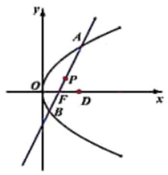

(1)若 $\left| {AF}\right|  = 4$ ，求点 $A$ 的坐标；

(2)当 $\left| {AF}\right|  \neq  \left| {BF}\right|$ 时，求 $\frac{\left| OF\right| }{\left| AF\right| } + \frac{\left| OF\right| }{\left| BF\right| }$ 的值；

(3)对于 $x$ 轴上给定的点 $D\left( {4,0}\right)$ ，若过点 $D$ 和 $B$ 两点的直线交抛物线 $C$ 的准线于点 $P$ ，问直线 ${AP}$ 是否经过一定点, 如果存在, 求出此定点.

【难度】 $\star   \star   \star$

【答案】(1) $A\left( {2,4}\right)$ ; (2) 1; (3) 过定点, $\left( {1,0}\right)$ ..

【解析】解: (1) 设 $A\left( {{x}_{1},{y}_{1}}\right) \left( {{y}_{1} > 0}\right)$ ,则 $\left| {AF}\right|  = {x}_{1} + 2 = 4$ ,得 ${x}_{1} = 2$ ,故 $A\left( {2,4}\right)$ .

(2)由 $F\left( {2,0}\right)$ ，设直线 ${AB}$ 为 $x = {my} + 2$ ，设 $A\left( {{x}_{1},{y}_{1}}\right)$ ， $B\left( {{x}_{2},{y}_{2}}\right)$ ，

由 $\left\{  \begin{array}{l} {y}^{2} = {8x} \\  x = {my} + 2 \end{array}\right.$ ,得 ${y}^{2} - {8my} - {16} = 0$ ,则 $\left\{  \begin{array}{l} {y}_{1} + {y}_{2} = {8m} \\  {y}_{1}{y}_{2} =  - {16} \end{array}\right.$ ,

显然 $\left| {OF}\right|  = 2,\left| {AF}\right|  = {x}_{1} + \frac{p}{2} = {x}_{1} + 2,\left| {BF}\right|  = {x}_{2} + \frac{p}{2} = {x}_{2} + 2$ ,

所以 $\frac{\left| OF\right| }{\left| AF\right| } + \frac{\left| OF\right| }{\left| BF\right| } = \frac{2}{{x}_{1} + 2} + \frac{2}{{x}_{2} + 2} = \frac{2}{m{y}_{1} + 4} + \frac{2}{m{y}_{2} + 4} = \frac{2\left\lbrack  {m\left( {{y}_{1} + {y}_{2}}\right)  + 8}\right\rbrack  }{{m}^{2}{y}_{1}{y}_{2} + {4m}\left( {{y}_{1} + {y}_{2}}\right)  + {16}} = \frac{{16}\left( {{m}^{2} + 1}\right) }{{16}\left( {{m}^{2} + 1}\right) } = 1$

(3)设 $A\left( {{x}_{1},{y}_{1}}\right)$ ， $B\left( {{x}_{2},{y}_{2}}\right)$ ，由题意知直线 ${BD}$ 与 $x$ 轴不垂直，所以 ${x}_{2} \neq  4$ ，所以 ${l}_{BD} : y = \frac{{y}_{2}}{{x}_{2} - 4}\left( {x - 4}\right)$ .

设 ${l}_{AB} : x = {my} + 2$ ,代入 ${y}^{2} = {8x}$ ,得 ${y}^{2} - {8my} - {16} = 0$ ,所以 ${y}_{1}{y}_{2} =  - {16}$ ,

又抛物线的准线方程为 $x =  - 2,{y}_{1}{y}_{2} =  - {16}$ ,所以 $P\left( {-2,\frac{{24}{y}_{1}}{8 - {y}_{1}^{2}}}\right)$ ,所以

${k}_{AP} = \frac{{y}_{p} - {y}_{1}}{{x}_{p} - {x}_{1}} = \frac{\frac{{24}{y}_{1}}{8 - {y}_{1}^{2}} - {y}_{1}}{-2 - \frac{{y}_{1}^{2}}{8}} = \frac{8{y}_{1}}{{y}_{1}^{2} - 8}$ ,所以 ${l}_{AP} : y - {y}_{1} = \frac{8{y}_{1}}{{y}_{1}^{2} - 8}\left( {x - {x}_{1}}\right)$ ,令 $y = 0$ ,所以

$x =  - {y}_{1} \times  \frac{{y}_{1}^{2} - 8}{8{y}_{1}} + {x}_{1} =  - \frac{{y}_{1}^{2} - 8}{8} + \frac{{y}_{1}^{2}}{8} = 1$ ,所以直线 ${AP}$ 与 $x$ 轴交于一定点 $\left( {1,0}\right)$ .

## 巩固训练

1、过点 $\left( {0,2}\right)$ 与抛物线 ${y}^{2} = {8x}$ 只有一个交点的直线有___条.

【难度】 $\star   \star$

【答案】3

【解析】当直线的斜率不存在时,该直线方程为 $x = 0$ 与抛物线相切,只有一个交点,

当直线的斜率存在时,设直线方程为 $y = {kx} + 2$ ,代入抛物线 ${y}^{2} = {8x}$ ,消去 $y$ 得: ${k}^{2}{x}^{2} + \left( {{4k} - 8}\right) x + 4 = 0$ , 当 $k = 0$ 时,直线方程为 $y = 2$ ,与抛物线只有一个交点 $\left( {\frac{1}{2},2}\right)$ ,

当 $k \neq  0$ 时, $\Delta  = {\left( 4k - 8\right) }^{2} - {16}{k}^{2} = 0$ ,解得 $k = 1$ ,此时直线与抛物线相切,只有一个交点,

所以过点 $\left( {0,2}\right)$ 与抛物线 ${y}^{2} = {8x}$ 只有一个交点的直线有 3 条；故答案为:3

2、若直线 ${mx} - y + m = 0$ 与抛物线 $y = {x}^{2} - {4x} + 3$ 的两个不同交点都在第一象限,则实数 $m$ 的取值范围为

___.

【难度】★★★

【答案】 $\left( {0,3}\right)$

【解析】解: $\because y = {x}^{2} - {4x} + 3 = {\left( x - 2\right) }^{2} - 1$ ,

由 ${mx} - y + m = 0$ ,得 $y = m\left( {x + 1}\right)$ ,则直线 ${mx} - y + m = 0$ 过定点 $\left( {-1,0}\right)$ ,

在同一平面直角坐标系中画出直线与抛物线的大致图象如图,

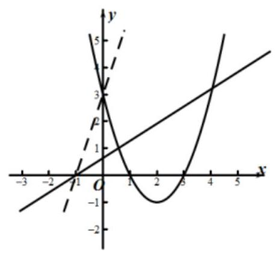

$\because$ 若直线与抛物线的两个不同交点都在第一象限, $\therefore$ 由图可知, $0 < m < \frac{3 - 0}{0 - \left( {-1}\right) }$ ,即 $0 < m < 3$ , 故答案为: $\left( {0,3}\right)$ .

3、已知点 $P\left( {1,2}\right)$ 在抛物线 $C : {y}^{2} = {2px}\left( {p > 0}\right)$ 上，点 $P$ 关于原点 $O$ 的对称点为点 $Q$ ，过点 $Q$ 作不经过点 $O$ 的直线与抛物线 $C$ 交于 $A\text{ 、 }B$ 两点,则直线 ${PA}$ 与 ${PB}$ 的斜率之积为( )

A. $\frac{1}{2}$ B. 1 C. 2 D. -2

【难度】★★★

【答案】C

【解析】由点 $P\left( {1,2}\right)$ 在抛物线 $C : {y}^{2} = {2px}$ 上,可得 ${2p} = 4,\therefore p = 2,\therefore$ 抛物线方程为: ${y}^{2} = {4x}$ , 由已知得 $Q\left( {-1, - 2}\right)$ ,设点 $A\left( {{x}_{1},{y}_{1}}\right) , B\left( {{x}_{2},{y}_{2}}\right)$ ,由题意直线 ${AB}$ 斜率存在且不为 0,

设直线 ${AB}$ 的方程为 $y = k\left( {x + 1}\right)  - 2 \cdot  \left( {k \neq  0}\right)$ ,

联立方程 $\left\{  \begin{array}{l} y = k\left( {x + 1}\right)  - 2 \\  {y}^{2} = {4x} \end{array}\right.$ ，消去 $x$ 得: $k{y}^{2} - {4y} + {4k} - 8 = 0$ ， $\therefore {y}_{1} + {y}_{2} = \frac{4}{k},{y}_{1}{y}_{2} = 4 - \frac{8}{k}$ ，

因为点 $A, B$ 在抛物线 $C$ 上,所以 ${y}_{1}^{2} = 4{x}_{1},{y}_{2}^{2} = 4{x}_{2}$ ,

$\therefore {k}_{PA} = \frac{{y}_{1} - 2}{{x}_{1} - 1} = \frac{{y}_{1} - 2}{\frac{{y}_{1}^{2} - 1}{4} - 1} = \frac{4}{{y}_{1} + 2},{k}_{PB} = \frac{{y}_{2} - 2}{{x}_{2} - 1} = \frac{4}{{y}_{2} + 2}$ ,

$\therefore {k}_{PA} \cdot  {k}_{PB} = \frac{4}{{y}_{1} + 2} \cdot  \frac{4}{{y}_{2} + 2} = \frac{16}{{y}_{1}{y}_{2} + 2\left( {{y}_{1} + {y}_{2}}\right)  + 4} = \frac{16}{4 - \frac{8}{k} + 2 \times  \frac{4}{k} + 4} = 2$ ,故选: C.

4、已知抛物线 $C$ 的顶点在原点，焦点为 $F\left( {-1,0}\right)$ .

(1)求 $C$ 的方程；

(2)设 $P$ 为 $C$ 的准线上一点， $Q$ 为直线 ${PF}$ 与 $C$ 的一个交点且 $F$ 为 ${PQ}$ 的中点，求 $Q$ 的坐标及直线 ${PQ}$ 的方程.

【难度】 $\star   \star   \star$

【答案】(1) ${y}^{2} =  - {4x}$ ; (2) 点 $P\left( {1,2\sqrt{3}}\right)$ 或 $\left( {1, - 2\sqrt{3}}\right)$ ; $\sqrt{3}x + y - 3\sqrt{3} = 0$ 或 $\sqrt{3}x + y + \sqrt{3} = 0$ .

【解析】(1) 由题可设抛物线方程为 ${y}^{2} =  - {2px}$ ,又 $\because$ 焦点 $\left( {-1,0}\right)$ 可得 $- \frac{p}{2} =  - 1$

$\therefore p = 2,\therefore {y}^{2} =  - {4x}$

(2)设点 $P$ 坐标为 $\left( {1,{y}_{1}}\right) , Q\left( {{x}_{2},{y}_{2}}\right)$ ，

$\because F$ 为 ${PQ}$ 中点, $\therefore \frac{1 + {x}_{2}}{2} =  - 1,\therefore {x}_{2} =  - 3$

$\because Q$ 在抛物线上,将 ${x}_{2} =  - 3$ 代入得 ${y}_{2} =  \pm  2\sqrt{3},\therefore Q\left( {-3,2\sqrt{3}}\right)$ 或 $\left( {-3, - 2\sqrt{3}}\right)$

当 ${y}_{2} = 2\sqrt{3}$ 时,由 $\frac{{y}_{1} + {y}_{2}}{2} = 0$ 得 ${y}_{1} =  - 2\sqrt{3}$ ; 当 ${y}_{2} =  - 2\sqrt{3}$ 时,由 $\frac{{y}_{1} + {y}_{2}}{2} = 0$ 得 ${y}_{1} = 2\sqrt{3}$ ;

$\therefore$ 点 $P\left( {1,2\sqrt{3}}\right)$ 或 $\left( {1, - 2\sqrt{3}}\right) ;\therefore {k}_{PQ} = \frac{{y}_{2} - {y}_{1}}{{x}_{2} - {x}_{1}} =  - \sqrt{3}$

$\therefore$ 直线方程 $\sqrt{3}x + y - 3\sqrt{3} = 0$ 或 $\sqrt{3}x + y + \sqrt{3} = 0$

5、已知抛物线 $C : {y}^{2} = {4x}$ 的焦点为 $F, O$ 为坐标原点. 过点 $F$ 的直线 $l$ 与抛物线 $C$ 交于 $A, B$ 两点.

(1)若直线 $l$ 与圆 $O : {x}^{2} + {y}^{2} = \frac{1}{9}$ 相切，求直线 $l$ 的方程；

(2)若直线 $l$ 与 $y$ 轴的交点为 $D$ . 且 $\overrightarrow{DA} = \lambda \overrightarrow{AF}$ ， $\overrightarrow{DB} = \mu \overrightarrow{BF}$ ，试探究: $\lambda  + \mu$ 是否为定值？若为定值， 求出该定值; 若不为定值, 试说明理由.

【难度】 $\star   \star   \star$

【答案】(1) $y =  \pm  \frac{\sqrt{2}}{4}\left( {x - 1}\right)$ ; (2) $\lambda  + \mu  =  - 1$ ,理由见解析;

【解析】(1) 由题意知: $F\left( {1,0}\right)$ 且圆 $O$ 的半径为 $r = \frac{1}{3}$ ,圆心 $O\left( {0,0}\right)$ ,即有 $F$ 在圆 $O$ 外,

$\therefore$ 设直线 $l$ 为 $y = k\left( {x - 1}\right)$ ,则圆心 $O$ 到直线 $l$ 的距离 $d = \frac{\left| -k\right| }{\sqrt{1 + {k}^{2}}} = \frac{1}{3}$ ,

解之得: $k =  \pm  \frac{\sqrt{2}}{4}$ ,即直线 $l$ 的方程为 $y =  \pm  \frac{\sqrt{2}}{4}\left( {x - 1}\right)$ .

(2)由过 $F\left( {1,0}\right)$ 的直线 $l$ 与抛物线 $C$ 交于 $A, B$ 两点，与 $y$ 轴的交点为 $D$ ，即斜率存在且 $k \neq  0$ ，设直线 $l$ 为 $y = k\left( {x - 1}\right)$ ,有 $D\left( {0, - k}\right)$ ,

联立直线方程与椭圆方程,有 $\left\{  \begin{array}{l} {y}^{2} = {4x} \\  y = k\left( {x - 1}\right)  \end{array}\right.$ ,可得 ${k}^{2}{x}^{2} - 2\left( {{k}^{2} + 2}\right) x + {k}^{2} = 0$ ,

设 $A\left( {{x}_{1},{y}_{1}}\right) , B\left( {{x}_{2},{y}_{2}}\right)$ ,即有 ${x}_{1}{x}_{2} = 1$ ,

$\overrightarrow{DA} = \left( {{x}_{1},{y}_{1} + k}\right) ,\lambda \overrightarrow{AF} = \left( {\lambda  - \lambda {x}_{1}, - \lambda {y}_{1}}\right) ,\overrightarrow{DB} = \left( {{x}_{2},{y}_{2} + k}\right) ,\mu \overrightarrow{BF} = \left( {\mu  - \mu {x}_{2}, - \mu {y}_{2}}\right) ,$

由 $\overrightarrow{DA} = \lambda \overrightarrow{AF},\overrightarrow{DB} = \mu \overrightarrow{BF}$ ,可得 ${x}_{1} = \frac{\lambda }{\lambda  + 1},{x}_{2} = \frac{\mu }{\mu  + 1}$ ,

$\therefore {x}_{1}{x}_{2} = \frac{\lambda \mu }{\left( {\lambda  + 1}\right) \left( {\mu  + 1}\right) } = 1$ ,即可得 $\lambda  + \mu  =  - 1$ 为定值

6、设常数 $t > 2$ . 在平面直角坐标系 ${xOy}$ 中,已知点 $F\left( {2,0}\right)$ ,直线 $l : x = t$ ,曲线 $\Gamma  : \; {y}^{2} = {8x}\left( {0 \leq  x \leq  t, y \geq  0}\right) .l$ 与 $x$ 轴交于点 $A$ 、与 $\Gamma$ 交于点 $B.P\text{ 、 }Q$ 分别是曲线 $\Gamma$ 与线段 ${AB}$ 上的动点.

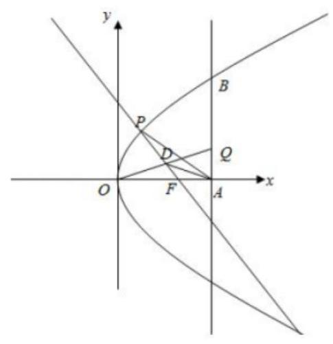

(1)用 $t$ 表示点 $B$ 到点 $F$ 距离；

(2)设 $t = 3,\left| {FQ}\right|  = 2$ ，线段 ${OQ}$ 的中点在直线 ${FP}$ ，求 $\bigtriangleup  {AQP}$ 的面积；

(3)设 $t = 8$ ，是否存在以 ${FP}\text{ 、 }{FQ}$ 为邻边的矩形 ${FPEQ}$ ，使得点 $E$ 在 $\Gamma$ 上? 若存在，求点 $P$ 的坐标； 若不存在, 说明理由.

【难度】 $\star   \star   \star$

【答案】(1) $\left| {BF}\right|  = t + 2$ ; (2) $S = \frac{1}{2} \times  \sqrt{3} + \frac{7}{3} = \frac{7\sqrt{3}}{6}$ ; (3) 见解析.

【解析】(1) 方法一:由题意可知:设 $B\left( {t,2\sqrt{2}t}\right)$ ，则 $\left| {BF}\right|  = \sqrt{{\left( t - 2\right) }^{2} + {8t}} = t + 2$ ， $\therefore \left| {BF}\right|  = t + 2$ ； 方法二: 由题意可知: 设 $B\left( {t,2\sqrt{2}t}\right)$ ,由抛物线的性质可知: $\left| {BF}\right|  = t + \frac{p}{2} = t + 2,\therefore \left| {BF}\right|  = t + 2$ ;

(2) $F\left( {2,0}\right) ,\left| {FQ}\right|  = 2, t = 3$ ，则 $\left| {FA}\right|  = 1$ ， $\therefore \left| {AQ}\right|  = \sqrt{3}$ ， $\therefore Q\left( {3,\sqrt{2}}\right)$ ，设 ${OQ}$ 的中点 $D$ ，

$D\left( {\frac{3}{2},\frac{\sqrt{2}}{2}}\right) ,{k}_{QF} = \frac{\frac{\sqrt{3}}{2} - 0}{\frac{3}{2} - 2} =  - \sqrt{3}$ ,则直线 ${PF}$ 方程: $y =  - \sqrt{3}\left( {x - 2}\right)$ ,

联立 $\left\{  \begin{matrix} y =  - \sqrt{3}\left( {x - 2}\right) \\  {y}^{2} = {8x} \end{matrix}\right.$ ,整理得: $3{x}^{2} - {20x} + {12} = 0$ ,解得: $x = \frac{2}{3}, x = 6$ (舍去),

$\therefore \bigtriangleup {AQP}$ 的面积 $S = \frac{1}{2} \times  \sqrt{3} + \frac{7}{3} = \frac{7\sqrt{3}}{6}$ ;

(3)存在，设 $P\left( {\frac{{y}^{2}}{8}, y}\right) , E\left( {\frac{{m}^{2}}{8}, m}\right)$ ，则 ${k}_{PF} = \frac{y}{\frac{{y}^{2}}{8} - 2} = \frac{8y}{{y}^{2} - {16}}$ ， ${k}_{FQ} = \frac{{16} - {y}^{2}}{8y}$ ， 直线 ${QF}$ 方程为 $y = \frac{{16} - {y}^{2}}{8y}\left( {x - 2}\right) ,\therefore {y}_{Q} = \frac{{16} - {y}^{2}}{8y}\left( {8 - 2}\right)  = \frac{{48} - 3{y}^{2}}{4y}, Q\left( {8,\frac{{48} - 3{y}^{2}}{4y}}\right)$ , 根据 $\overrightarrow{FP} + \overrightarrow{FQ} = \overrightarrow{FE}$ ,则 $E\left( {\frac{{y}^{2}}{8} + 6,\frac{{48} + {y}^{2}}{4y}}\right)$ , $\therefore {\left( \frac{{48} + {y}^{2}}{4y}\right) }^{2} = 8\left( {\frac{{y}^{2}}{8} + 6}\right)$ ,解得: ${y}^{2} = \frac{16}{5}$ ,

$\therefore$ 存在以 ${FP}\text{ 、 }{FQ}$ 为邻边的矩形 ${FPEQ}$ ,使得点 $E$ 在 $\Gamma$ 上,且 $P\left( {\frac{2}{5},\frac{4\sqrt{5}}{5}}\right)$ .

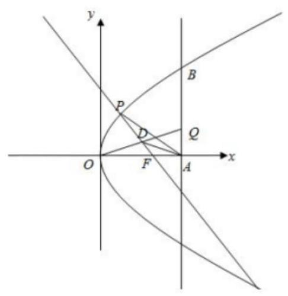

## 实战演练

## 一、填空题

1、抛物线 $C$ 的顶点为原点 $O$ ,焦点 $F$ 在 $x$ 轴正半轴,过焦点且倾斜角为 $\frac{\pi }{4}$ 的直线 $l$ 交抛物线于点 $A, B$ , 若 ${AB}$ 中点的横坐标为 3,则抛物线 $C$ 的方程为___.

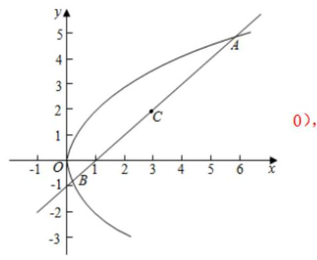

【难度】 $\star   \star   \star$

【答案】 ${\mathrm{y}}^{2} = 4\mathrm{x}$

【解析】由题可设抛物线 $C$ 方程为: ${y}^{2} = {2px}\left( {p > 0}\right)$ ,则 $F\left( \frac{p}{2}\right.$ , $\because$ 直线 $l$ 过焦点且倾斜角为 $\frac{\pi }{4}$ ,

$\therefore$ 直线 $l$ 方程为: $y = x - \frac{p}{2}$ ,

联立直线 $l$ 与椭圆方程,消去 $y$ 整理得: $x - {3px} + \frac{{p}^{2}}{4} = 0$ ,

$\because {AB}$ 中点的横坐标为 $3,\therefore 3 \times  2 = {3p}$ ,即 $p = 2,\therefore$ 抛物线方程为: ${y}^{2} = {4x}$ ,故答案为: ${y}^{2} = {4x}$ .

2、设 $F$ 为抛物线 ${y}^{2} = {2x}$ 的焦点， $A$ 、 $B$ 、 $C$ 为抛物线上三点，若 $F$ 为 $\bigtriangleup {ABC}$ 的重心，则 $\left| \overrightarrow{FA}\right|  + \left| \overrightarrow{FB}\right|  + \left| \overrightarrow{FC}\right|$ 的值为___.

【难度】 $\star   \star   \star$

【答案】 3

【解析】设 $A\left( {{x}_{1},{y}_{1}}\right) , B\left( {{x}_{2},{y}_{2}}\right) , C\left( {{x}_{3},{y}_{3}}\right)$ ,抛物线 ${y}^{2} = {2x}$ 的焦点坐标 $F\left( {\frac{1}{2},0}\right)$ ,准线方程 $x =  - \frac{1}{2}$ ,

由于 $F$ 是 $\bigtriangleup  {ABC}$ 的重心， $\therefore \left\{  \begin{array}{l} {x}_{1} + {x}_{2} + {x}_{3} = \frac{3}{2} \\  {y}_{1} + {y}_{2} + {y}_{3} = 0 \end{array}\right.$ ，由抛物线的性质得 $\left| \overrightarrow{FA}\right|  = {x}_{1} + \frac{1}{2}$ ， $\left| \overrightarrow{FB}\right|  = {x}_{2} + \frac{1}{2}$ ， $\left| \overrightarrow{FC}\right|  = {x}_{3} + \frac{1}{2},\;\therefore \left| \overrightarrow{FA}\right|  + \left| \overrightarrow{FB}\right|  + \left| \overrightarrow{FC}\right|  = {x}_{1} + \frac{1}{2} + {x}_{2} + \frac{1}{2} + {x}_{3} + \frac{1}{2} = 3$

3、已知抛物线 $C : {y}^{2} = {4x}$ 的焦点为 $F$ ，准线为 $l, P$ 是 $l$ 上一点，直线 ${PF}$ 与抛物线 $C$ 交于 $M, N$ 两点， 若 $\overrightarrow{PF} = 4\overrightarrow{MF}$ ,则 $\left| {MN}\right|  =$ ___.

【难度】 $\star   \star   \star$

【答案】 $\frac{9}{2}$

【解析】由题意,抛物线 $C : {y}^{2} = {4x}$ 的焦点为 $F\left( {1,0}\right)$ ,

因为 $\overrightarrow{PF} = 4\overrightarrow{MF}$ ,可得 $\overrightarrow{PM} = 3\overrightarrow{MF}$ ,

如图所示，过点 $M$ 作 ${MQ} \bot$ 直线 $l$ 于点 $Q$ ，则 $\left| {MF}\right|  = \left| {MQ}\right|$ ，

所以在直角 $\bigtriangleup {PQM}$ 中, $\cos \angle {PQM} = \frac{\left| MQ\right| }{\left| PM\right| } = \frac{\left| MF\right| }{\left| PM\right| } = \frac{1}{3}$ ,所以 $\tan \angle {PQM} = 2\sqrt{2}$ ,

所以直线 ${MN}$ 的方程为 $y = 2\sqrt{2}\left( {x - 1}\right)$ ,

联立 $\left\{  \begin{array}{l} y = 2\sqrt{2}\left( {x - 1}\right) \\  {y}^{2} = {4x} \end{array}\right.$ ,整理得 $2{x}^{2} - {5x} + 2 = 0$ ,解得 $x = 2$ 或 $x = \frac{1}{2}$ ,

由抛物线的定义可知 $\left| {MN}\right|  = 2 + \frac{1}{2} + 2 = \frac{9}{2}$ .

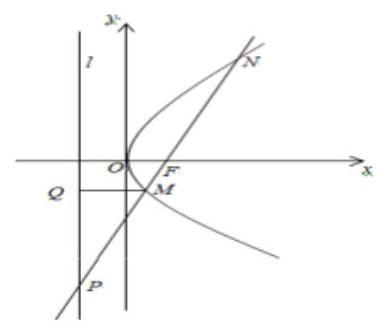

4、试在抛物线 ${\mathrm{y}}^{2} =  - 4\mathrm{x}$ 上求一点 $P$ ,使其到焦点 $F$ 的距离与到 $\mathrm{A}\left( {-2,1}\right)$ 的距离之和最小,则该点坐标为 ___.

---

【难度】 $\star   \star   \star$

---

【答案】 $\left( {-\frac{1}{4},1}\right)$

【解析】由题意得抛物线的焦点为 $F\left( {-1,0}\right)$ ,准线方程为 $l : x = 1$ .

过点 $\mathrm{P}$ 作 ${PM} \bot  l$ 于点 $M$ ，由定义可得 $\left| {PM}\right|  = \left| {PF}\right|$ ，所以 $\left| {PA}\right|  + \left| {PF}\right|  = \left| {PA}\right|  + \left| {PM}\right|$ ，

由图形可得,当 $P, A, M$ 三点共线时, $\left| {PA}\right|  + \left| {PM}\right|$ 最小,此时 ${PA} \bot  l$ .

故点 $P$ 的纵坐标为 1,所以横坐标 $x =  - \frac{1}{4}$ . 即点 $\mathrm{P}$ 的坐标为 $\left( {-\frac{1}{4},1}\right)$ .

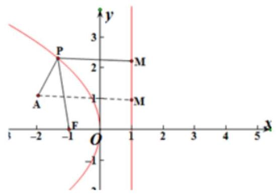

5、以抛物线 $C$ 的顶点为圆心的圆交 $C$ 于 $A$ 、 $B$ 两点，交 $C$ 的准线于 $D$ 、 $E$ 两点. 已知 $\left| {AB}\right|  = {4\sqrt{2}}$ ， $\left| {DE}\right|  = {2\sqrt{5}}$ ， 则 $C$ 的焦点到准线的距离为___.

【难度】 $\star   \star   \star$

【答案】 4

【解析】如图,设抛物线方程为 ${y}^{2} = {2px},{AB},{DE}$ 交 $x$ 轴于 $C, F$ 点,则 ${AC} = 2\sqrt{2}$ ,即 $A$ 点纵坐标为 $2\sqrt{2}$ , 则 $A$ 点横坐标为 $\frac{4}{p}$ ，即 ${OC} = \frac{4}{p}$ ，由勾股定理知 $D{F}^{2} + O{F}^{2} = D{O}^{2} = {r}^{2}$ ， $A{C}^{2} + O{C}^{2} = A{O}^{2} = {r}^{2}$ ，即 ${\left( \sqrt{5}\right) }^{2} + {\left( \frac{p}{2}\right) }^{2} = {\left( 2\sqrt{2}\right) }^{2} + {\left( \frac{4}{p}\right) }^{2}$ ,解得 $p = 4$ ,即 $C$ 的焦点到准线的距离为 4 .

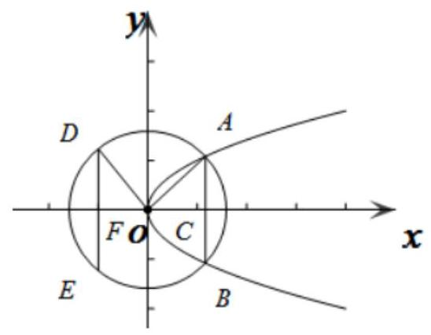

6、抛物线 $E : {y}^{2} = {2px}\left( {p > 0}\right)$ 的焦点为 $F$ ，已知点 $A, B$ 为抛物线 $E$ 上的两个动点，且满足 $\angle {AFB} = \frac{2\pi }{3}$ . 过弦 ${AB}$ 的中点 $M$ 作抛物线 $E$ 准线的垂线 ${MN}$ ,垂足为 $N$ ,则 $\frac{\left| MN\right| }{\left| AB\right| }$ 的最大值为 ___.

【难度】 $\star   \star   \star$

【答案】 $\frac{\sqrt{3}}{3}$

【解析】设 $\left| {AF}\right|  = a,\left| {BF}\right|  = b$ ,连接 ${AF}\text{ 、 }{BF}$ 由抛物线定义,得 $\left| {AF}\right|  = \left| {AQ}\right| ,\left| {BF}\right|  = \left| {BP}\right|$ 在梯形 ${ABPQ}$ 中, $2\left| {MN}\right|  = \left| {AQ}\right|  + \left| {BP}\right|  = a + b$ . 由余弦定理得, ${\left| AB\right| }^{2} = {a}^{2} + {b}^{2} - {2ab}\cos {120}^{ \circ  } = {a}^{2} + {b}^{2} + {ab}$ 配方得, ${\left| AB\right| }^{2} = {\left( a + b\right) }^{2} - {ab}$ ,又 $\because {ab} \leq  {\left( \frac{a + b}{2}\right) }^{2}\therefore {\left( a + b\right) }^{2} - {ab} \geq  {\left( a + b\right) }^{2} - \frac{1}{4}{\left( a + b\right) }^{2} = \frac{3}{4}{\left( a + b\right) }^{2}$ 得到 $\left| {AB}\right|  \geq  \frac{\sqrt{3}}{2}\left( {a + b}\right)$ . 所以 $\frac{\left| MN\right| }{\left| AB\right| } \leq  \frac{\frac{1}{2}\left( {a + b}\right) }{\frac{\sqrt{3}}{2}\left( {a + b}\right) } = \frac{\sqrt{3}}{3}$ ,即 $\frac{\left| MN\right| }{\left| AB\right| }$ 的最大值为 $\frac{\sqrt{3}}{3}$ .

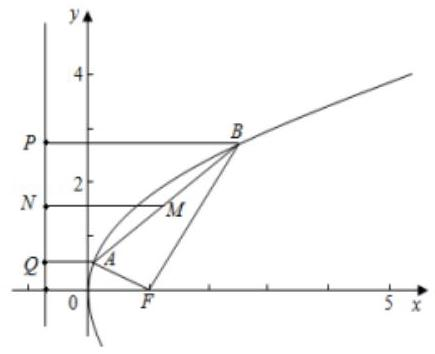

## 二、选择题

7、设抛物线 ${y}^{2} = {4x}$ 的焦点为 $F$ ，准线为 $l$ . $P$ 是抛物线上的一点，过 $P$ 作 ${PQ} \bot  x$ 轴于 $Q$ ，若 ${PF} = 3$ ， 则线段 ${PQ}$ 的长为( )

A. $\sqrt{2}$ B. 2 C. $2\sqrt{2}$ D. $3\sqrt{2}$

【难度】 $\star   \star   \star$

【答案】C

【解析】抛物线的准线方程为 $x =  - 1$ ,由于 ${PF} = 3$ ，根据抛物线的定义可知 ${x}_{P} = 2$ ，

将 ${x}_{P} = 2$ 代入抛物线方程得 ${y}^{2} = 8,{y}_{P} =  \pm  2\sqrt{2}$ ，所以 ${PQ} = 2\sqrt{2}$ . 故选:C

8、设抛物线的顶点为 $O$ ,焦点为 $F$ ,准线为 $l.P$ 是抛物线上异于 $O$ 的一点,过 $P$ 作 ${PQ} \bot  l$ 于 $Q$ ,则线

段 ${FQ}$ 的垂直平分线 ( ).

A. 经过点 $O$ B. 经过点 $P$

C. 平行于直线 ${OP}$ D. 垂直于直线 ${OP}$

【难度】 $\star   \star   \star$

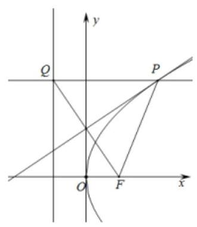

【答案】B

【解析】如图所示:

因为线段 ${FQ}$ 的垂直平分线上的点到 $F, Q$ 的距离相等,又点 $P$ 在抛物线上,根据定义可知, $\left| {PQ}\right|  = \left| {PF}\right|$ ,所以线段 ${FQ}$ 的垂直平分线经过点 $P$ . 故选: B.

9、《九章算术》是我国古代内容极为丰富的数学名著，第九章 “勾股”，讲述了“勾股定理” 及一些应用， 还提出了一元二次方程的解法问题直角三角形的三条边长分别称 “勾” “股” “弦”. 设点 $\mathrm{F}$ 是抛物线 y2=2px 的焦点，1 是该抛物线的准线，过抛物线上一点 $\mathrm{A}$ 作准线的垂线 $\mathrm{{AB}}$ ，垂足为 $\mathrm{B}$ ，射线 $\mathrm{{AF}}$ 交准线 1 于点 $\mathrm{C}$ ，若 ${Rt} \bigtriangleup  {ABC}$ 的“勾” $\left| {AB}\right|  = 3$ 、“股” $\left| {CB}\right|  = 3\sqrt{3}$ ，则抛物线方程为( ).

A. ${y}^{2} = {2x}$ B. ${y}^{2} = {3x}$ C. ${y}^{2} = {4x}$ D. ${y}^{2} = {6x}$

【难度】 $\star   \star   \star$

【答案】B

【解析】由题意可知,抛物线的图形如图: ${AB} = 3,{BC} = 3\sqrt{3}$ ,可得 ${AC} = \sqrt{{3}^{2} + {\left( 3\sqrt{3}\right) }^{2}} = 6$ , 所以 $\angle \mathrm{{CAB}} = {60}^{ \circ  }, \bigtriangleup  \mathrm{{ABF}}$ 是正三角形,并且 $F$ 是 $\mathrm{{AC}}$ 的中点,所以 $\mathrm{{AB}} = 3$ ,则 $\mathrm{P} = \frac{3}{2}$ , 所以抛物线方程为: ${y}^{2} = {3x}$ . 故选 B.

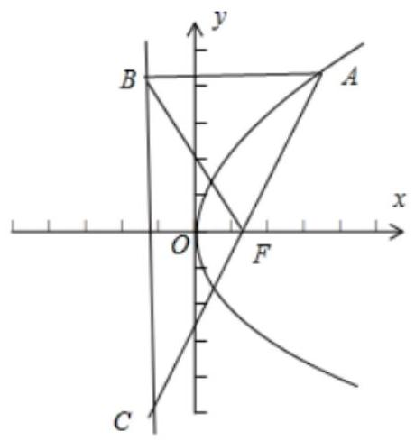

10、已知抛物线 $C : {x}^{2} = {8y}$ 的焦点为 $F, O$ 为原点，点 $P$ 是抛物线 $C$ 的准线上的一动点，点 $A$ 在抛物线 $C$

上,且 $\left| {AF}\right|  = 4$ ,则 $\left| {PA}\right|  + \left| {PO}\right|$ 的最小值为( )

A. $4\sqrt{2}$ B. $2\sqrt{13}$ C. $3\sqrt{13}$ D. $4\sqrt{6}$

【难度】 $\star   \star   \star$

【答案】B

【解析】解: 抛物线的准线方程为 $y =  - 2$ ,

$\because \left| {AF}\right|  = 4$ ， $\therefore A$ 到准线的距离为 4，故 $A$ 点纵坐标为 2，把 $y = 2$ 代入抛物线方程可得 $x =  \pm  4$ .

不妨设 $A$ 在第一象限,则 $A\left( {4,2}\right)$ ,点 $O$ 关于准线 $y =  - 2$ 的对称点为 $M\left( {0, - 4}\right)$ ,连接 ${AM}$ ,

则 $\left| {PO}\right|  = \left| {PM}\right|$ ,于是 $\left| {PA}\right|  + \left| {PO}\right|  = \left| {PA}\right|  + \left| {PM}\right|  \geq  \left| {AM}\right|$

故 $\left| {PA}\right|  + \left| {PO}\right|$ 的最小值为 $\left| {AM}\right|  = \sqrt{{4}^{2} + {6}^{2}} = 2\sqrt{13}$ .

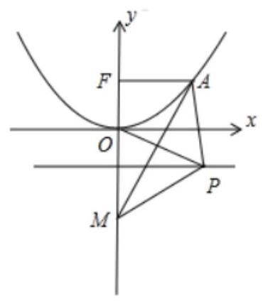

## 三、解答题

11、已知抛物线 $C : {y}^{2} = {2px}$ ( $p > 0$ ) 的焦点为 $F$ ，直线 $l$ 过点 $F$ 且与 $C$ 相交于 $A$ 、 $B$ 两点，当直线 $l$ 的倾斜角为 $\frac{\pi }{4}$ 时, $\left| {AB}\right|  = 8$ .

(1)求 $C$ 的方程；

(2)若点 $P$ 是抛物线上 $A$ 、 $B$ 之间一点，当点 $P$ 到直线 $l$ 的距离最大时，求 $\bigtriangleup  {ABC}$ 面积的最小值；

(3)若 ${AB}$ 的垂直平分线 ${l}^{\prime }$ 与 $C$ 相交于 $M\text{ 、 }N$ 两点，且 $A\text{ 、 }M\text{ 、 }B\text{ 、 }N$ 四点在同一圆上，求 $l$ 的方程.

【难度】 $\star   \star   \star$

【答案】(1) ${y}^{2} = {4x}$ ; (2)2; (3) $x - y - 1 = 0$ 或 $x + y - 1 = 0$ .

【解析】解: (1) 由已知 $F\left( {\frac{p}{2},0}\right)$ ,设 $A\left( {{x}_{1},{y}_{1}}\right) , B\left( {{x}_{2},{y}_{2}}\right)$ ,

设直线 $l$ 的方程为 $y = x - \frac{p}{2}$ ,代入 ${y}^{2} = {2px}$ ,得 ${x}^{2} - {3px} + \frac{{p}^{2}}{4} = 0$ ,则 ${x}_{1} + {x}_{2} = {3p}$ ,

于是 $\left| {AB}\right|  = {x}_{1} + {x}_{2} + p = {4p} = 8$ ,得 $p = 2,\therefore C$ 的方程为 ${y}^{2} = {4x}$ ;

(2)设直线 $l$ 的方程为 $x = {my} + 1$ ， $A\left( {{x}_{1},{y}_{1}}\right)$ ， $B\left( {{x}_{2},{y}_{2}}\right)$

联立 $\left\{  \begin{array}{l} x = {my} + 1 \\  {y}^{2} = {4x} \end{array}\right.$ ,消去 $y$ ,得 ${x}^{2} - \left( {4{m}^{2} + 2}\right) x + 1 = 0$ ,于是 $\left| {AB}\right|  = {x}_{1} + {x}_{2} + p = 4{m}^{2} + 4$ ,

由题意,抛物线 $C$ 过点 $P$ 的切线与直线 $l$ 平行,可设该切线的方程为 $x = {my} + b$ ,

代入 ${y}^{2} = {4x}$ ，得 ${y}^{2} - {4my} - {4b} = 0$ ，由 $\Delta  = {16}{m}^{2} + {16b} = 0$ ，可得 $b =  - {m}^{2}$ ，

从而可得点 $P$ 到直线 $l$ 的距离为 $d = \frac{{m}^{2} + 1}{\sqrt{{m}^{2} + 1}} = \sqrt{{m}^{2} + 1}$ ,

$\therefore {S}_{\bigtriangleup {ABP}} = \frac{1}{2} \cdot  \left| {AB}\right|  \cdot  d = 2\left( {{m}^{2} + 1}\right) \sqrt{{m}^{2} + 1} = 2{\left( {m}^{2} + 1\right) }^{\frac{3}{2}} \geq  2{\left( 0 + 1\right) }^{\frac{3}{2}} = 2$ ,当且仅当 $m = 0$ 时等号成立,

即 $\bigtriangleup {ABP}$ 面积的最小值为 2 ;

(3)由题意知 $l$ 与坐标轴不垂直，

$\therefore$ 可设 $l$ 的方程为 $x = {my} + 1\left( {m \neq  0}\right)$ ,代入 ${y}^{2} = {4x}$ ,得 ${y}^{2} - {4my} - 4 = 0$ ,

设 $A\left( {{x}_{1},{y}_{1}}\right) \text{ 、 }B\left( {{x}_{2},{y}_{2}}\right)$ ,则 ${y}_{1} + {y}_{2} = {4m},{y}_{1}{y}_{2} =  - 4$ .

$\therefore {AB}$ 的中点为 $D\left( {2{m}^{2} + 1,{2m}}\right) ,\left| {AB}\right|  = 4{m}^{2} + 4$ ,

又 ${l}^{\prime }$ 的斜率为 $- m,\therefore {l}^{\prime }$ 的方程为 $x =  - \frac{1}{m}y + 2{m}^{2} + 3$ ,

将上式代入 ${y}^{2} = {4x}$ ，并整理得 ${y}^{2} + \frac{4}{m}y - 4\left( {2{m}^{2} + 3}\right)  = 0$ ，

设 $M\left( {{x}_{3},{y}_{3}}\right) \text{ 、 }N\left( {{x}_{4},{y}_{4}}\right)$ ,则 ${y}_{3} + {y}_{4} =  - \frac{4}{m},{y}_{3}{y}_{4} =  - 4\left( {2{m}^{2} + 3}\right)$ ,

$\therefore {MN}$ 的中点为 $E\left( {\frac{2}{{m}^{2}} + 2{m}^{2} + 3, - \frac{2}{m}}\right) ,\left| {MN}\right|  = \sqrt{1 + \frac{1}{{m}^{2}}}\left| {{y}_{3} - {y}_{4}}\right|  = \frac{4\left( {{m}^{2} + 1}\right) \sqrt{2{m}^{2} + 1}}{{m}^{2}}$ ,

由于 ${MN}$ 垂直平分 ${AB}$ ,

$\therefore A\text{ 、 }M\text{ 、 }B\text{ 、 }N$ 四点在同一圆上等价于 $\left| {AE}\right|  = \left| {BE}\right|  = \frac{1}{2}\left| {MN}\right|$ ,

从而 $\frac{1}{4}{\left| AB\right| }^{2} + {\left| DE\right| }^{2} = \frac{1}{4}{\left| MN\right| }^{2}$ ,

即 $4{\left( {m}^{2} + 1\right) }^{2} + {\left( 2m + \frac{2}{m}\right) }^{2} + {\left( \frac{2}{{m}^{2}} + 2\right) }^{2} = \frac{4{\left( {m}^{2} + 1\right) }^{2}\left( {2{m}^{2} + 1}\right) }{{m}^{4}}$ ,

化简得: ${m}^{2} - 1 = 0$ ,解得: $m = 1$ 或 $m =  - 1$ ,所求直线 $l$ 的方程为 $x - y - 1 = 0$ 或 $x + y - 1 = 0$ .

12、设抛物线 $\Gamma  : {y}^{2} = {2px}\left( {p > 0}\right) , D\left( {{x}_{0},{y}_{0}}\right)$ 满足 ${y}_{0}{}^{2} > {2p}{x}_{0}$ ,过点 $D$ 作抛物线 $\Gamma$ 的切线,切点分别为 $A\left( {{x}_{1},{y}_{1}}\right) , B\left( {{x}_{2},{y}_{2}}\right)$ .

(1)求证:直线 $y{y}_{1} = p\left( {x + {x}_{1}}\right)$ 与抛物线 $\Gamma$ 相切;

( 2 )若点 $A$ 坐标为 $\left( {4,4}\right)$ ，点 $D$ 在抛物线 $\Gamma$ 的准线上，求点 $B$ 的坐标；

(3)设点 $D$ 在直线 $x + p = 0$ 上运动，直线 ${AB}$ 是否恒过定点？若恒过定点，求出定点坐标；若不存在， 请说明理由;

【难度】 $\star   \star   \star$

【答案】(1) 证明见详解; (2) $\left( {\frac{1}{4}, - 1}\right)$ (3) 是, $\left( {p,0}\right)$

【解析】(1) 联立直线 $y{y}_{1} = p\left( {x + {x}_{1}}\right)$ 与抛物线方程 ${y}^{2} = {2px}$ ,消去 $x$

可得 $\frac{1}{2}{y}^{2} - {y}_{1}y + p{x}_{1} = 0$ 故 $\Phi  = {y}_{1}^{2} - {2p}{x}_{1}$ ,因为点 $A\left( {{x}_{1},{y}_{1}}\right)$ 在抛物线上,

故 $\Phi  = {y}_{1}^{2} - {2p}{x}_{1} = 0$ 则直线 $y{y}_{1} = p\left( {x + {x}_{1}}\right)$ 与抛物线 ${y}^{2} = {2px}$ 只有一个交点

又因为 $p > 0$ ,故该直线不与 $x$ 轴平行,即证直线 $y{y}_{1} = p\left( {x + {x}_{1}}\right)$ 与抛物线相切.

(2)因为点 $A\left( {4,4}\right)$ 在抛物线 ${y}^{2} = {2px}$ 上，故可得 ${16} = {2p} \times  4$ ，解得 $p = 2$

由(1)可知过点 $A$ 的切线方程为 $y{y}_{1} = p\left( {x + {x}_{1}}\right)$ ,即 $x - {2y} + 4 = 0$

又抛物线的准线方程为 $x =  - 1$ ,故令 $x =  - 1$ ,解得 $y = \frac{3}{2}$ ,

即点 $D$ 的坐标为 $\left( {-1,\frac{3}{2}}\right)$ .

因为过点 $B\left( {{x}_{2},{y}_{2}}\right)$ 的切线方程为 $y{y}_{2} = 2\left( {x + {x}_{2}}\right)$ ,其过点 $D\left( {-1,\frac{3}{2}}\right)$

故可得 $\frac{3}{2}{y}_{2} = 2\left( {-1 + {x}_{2}}\right)$ ,又因为点 $B\left( {{x}_{2},{y}_{2}}\right)$ 满足抛物线方程,

故可得 ${y}_{2}^{2} = 4{x}_{2}$ ,联立方程组可得 ${y}_{2}^{2} - 3{y}_{2} - 4 = 0$ 解得 ${y}_{2} =  - 1,{y}_{2} = 4$ (舍去,与 $A$ 点重合), ${x}_{2} = \frac{1}{4}$ ,故点 $B$ 的坐标为 $\left( {\frac{1}{4}, - 1}\right)$ .

(3)由(1)得过 $A$ 点的切线方程为 ${y}_{1}y = p\left( {x + {x}_{1}}\right)$ 令 $x =  - p$ ，可解得 $y = \frac{-{p}^{2} + p{x}_{1}}{{y}_{1}}$

过 $B$ 点的切线方程为 ${y}_{2}y = p\left( {x + {x}_{2}}\right)$ 令 $x =  - p$ ,可解的 $y = \frac{-{p}^{2} + p{x}_{2}}{{y}_{2}}$

因为两直线交于点 $D$ ,故可得 $\frac{-{p}^{2} + p{x}_{1}}{{y}_{1}} = \frac{-{p}^{2} + p{x}_{2}}{{y}_{2}}$ 整理得 ${x}_{2}{y}_{1} - {x}_{1}{y}_{2} = p\left( {{y}_{1} - {y}_{2}}\right)$ ①

当过 $A, B$ 两点的直线斜率存在,则设其方程为: $y - {y}_{1} = \frac{{y}_{2} - {y}_{1}}{{x}_{2} - {x}_{1}}\left( {x - {x}_{1}}\right)$

整理得 $y = \frac{{y}_{2} - {y}_{1}}{{x}_{2} - {x}_{1}}x + \frac{{x}_{2}{y}_{1} - {x}_{1}{y}_{2}}{{x}_{2} - {x}_{1}}$ ,将①代入可得

故直线方程为 $y = \frac{{y}_{2} - {y}_{1}}{{x}_{2} - {x}_{1}}x + \frac{p\left( {{y}_{1} - {y}_{2}}\right) }{{x}_{2} - {x}_{1}} = \frac{{y}_{2} - {y}_{1}}{{x}_{2} - {x}_{1}}\left( {x - p}\right)$ 故该直线恒过定点 $\left( {p,0}\right)$ ;

当过 $A, B$ 两点的直线斜率不存在时, ${x}_{1} = {x}_{2},{y}_{1} =  - {y}_{2}$ ,代入①可得 ${x}_{1} = {x}_{2} = p$

过此时直线 ${AB} : x = {x}_{1} = p$ ,也经过点 $\left( {p,0}\right)$ 综上所述,直线恒过定点 $\left( {p,0}\right)$ ,即证.
