## (一) 认识平面及平面的基本性质

空间直线与平面

<table><tr><td>教学目标</td><td>1、理解并掌握斜线在平面内的射影、直线和平面所成角的概念，根据概念先找直线射影后确定线面夹角从而熟练求解直线和平面所成角;   2、空间直线和平面平行的判定定理、性质定理; 空间平面和平面平行的性质定理; 空间直线和平面垂直的定义、定理及其表示法;   3、掌握空间距离的确定与计算;   4、培养化归能力、分析能力、观察思考能力和空间想象能力等;   5、理解几何推理证明的思考方法，基本规则和严谨性。</td></tr><tr><td>重点</td><td>1. 掌握求角的计算题步骤是 “一作、二证、三计算”，思想方法是将空间图形转化为平面图形即“降维”的思想方法；   2. 空间距离向平面距离的转化过程中, 重点是确定垂足, 作出辅助图形解三角形.</td></tr><tr><td>难 点</td><td>1. 掌握求角的计算题步骤是 “一作、二证、三计算”，思想方法是将空间图形转化为平面图形即“降维”的思想方法；   2. 空间距离向平面距离的转化过程中, 重点是确定垂足, 作出辅助图形解三角形.</td></tr></table>

## 知识梳理

(1)点、线、面的符号表示:

点: $A, B, C\ldots$ .

线: $l, m, n\ldots \ldots$

面: $\alpha ,\beta ,\gamma$ ......

(2)点、线、面之间关系的符号表示:

点 $\mathrm{A}$ 在直线 $l$ 上: $A \in  l$ 点 $\mathrm{A}$ 不在直线 $l$ 上: $A \notin  l$

点 $\mathrm{A}$ 在平面 $\alpha$ 上: $A \in  \alpha$ 点 $\mathrm{A}$ 不在平面 $\alpha$ 上: $A \notin  \alpha$

直线 $m$ 与直线 $n$ 平行: $m//n$ 直线 $m$ 与直线 $n$ 相交于点 $A : m \cap  n = A$

直线 $m$ 与平面 $\alpha$ 平行: $m//\alpha$ 直线 $m$ 与平面 $\alpha$ 相交于点 $A : m \cap  \alpha  = A$

直线 $m$ 与平面 $\alpha$ 垂直: $m\bot \alpha$ 直线 $m$ 在平面 $\alpha$ 内 (平面 $\alpha$ 经过直线 $m$ ): $m \subsetneqq  \alpha$

平面 $\alpha$ 与平面 $\beta$ 平行: $\alpha //\beta$ 平面 $\alpha$ 与平面 $\beta$ 相交于直线 $l : \alpha  \cap  \beta  = l$

平面 $\alpha$ 与平面 $\beta$ 垂直: $\alpha  \bot  \beta$

【注意】平面的特征: 无限延展, 无厚度.

(3)三个公理、三个推论:

公理1:若一条直线上有两个点在一个平面内，则该直线上所有的点都在这个平面内.

即: $\left. \begin{array}{ll} A \in  l, & B \in  l \\  A \in  \alpha , & \mathrm{B} \in  \alpha  \end{array}\right\}   \Rightarrow  l \subsetneqq  \alpha$

公理2:如果两个平面有一个公共点，那么它们有且只有一条通过这个点的公共直线.

即: $\mathrm{A} \in  \alpha  \cap  \beta  \Rightarrow  \alpha  \cap  \beta  = l$ 且 $\mathrm{A} \in  l$

公理3:经过不在同一条直线上的三点，有且只有一个平面.

推论1: 经过一条直线和这条直线外一点有且只有一个平面.

推论2: 两条相交直线确定一个平面.

推论3: 两条平行直线确定一个平面.

【注意】搞清楚公理及其推论的基本应用:

公理1 是判定直线在平面内的依据;

公理 2 是判定两个平面相交的依据, 同时应注意其内容的完整性, 即当两个平面有一个公共点时, 首先可得到这两个平面相交, 其次是这两个平面有且只有一条公共直线 (即交线), 还有就是这个公共点在公共直线上或称公共直线经过公共点;

公理 3 以及三个推论都是确定平面的依据, 应注意由于三点共线时, 经过他们可以作无数个平面, 因此公理 3 中 “三点不共线” 的条件必不可少.

## 例题精讲

【例 1】( 1 )设 $\alpha ,\beta$ 表示平面， $l$ 表示直线， $A, B, C$ 表示三个不同的点，给出下列命题:①若 $A \in  l$ ， $A \in  \alpha$ ， $B \in  l, B \in  \alpha$ ,则 $l \subsetneqq  \alpha$ ; ②若 $A \in  \alpha , A \in  \beta , B \in  \alpha , B \in  \beta$ ,则 $\alpha  \cap  \beta  = {AB}$ ; ③若 $l \text{ ⊄ } \alpha , A \in  l$ , 则 $A \notin  \alpha$ ；④若 $A, B, C \in  \alpha , A, B, C \in  \beta$ ，则 $\alpha$ 与 $\beta$ 重合，其中，正确的有( )

A. 1 个 B. 2 个 C. 3 个 D. 4 个

【难度】 $\star   \star$

【答案】B

【解析】若 $A \in  l, A \in  \alpha , B \in  l, B \in  \alpha$ ,根据公里 1,得 $l \subset  \alpha$ ,①正确；

若 $A \in  \alpha , A \in  \beta , B \in  \alpha , B \in  \beta$ ,则直线 ${AB}$ 既在平面 $\alpha$ 内,又在平面 $\beta$ 内,所以 $\alpha  \cap  \beta  = {AB}$ ,② 正确;

若 $l \text{ ⊄ } \alpha$ ,则直线 $l$ 可能与平面 $\alpha$ 相交于点 $A$ ,所以 $A \in  l$ 时, $A \in  \alpha$ ,③不正确;

若 $A, B, C \in  \alpha , A, B, C \in  \beta$ ,当 $A, B, C$ 共线时, $\alpha$ 与 $\beta$ 可能不重合,④不正确;

故选: B. (2)如图所示， $\alpha  \cap  \beta  = l, A \in  \alpha , B \in  \alpha ,{AB} \cap  l = D, C \in  \beta , C \notin  l$ ，则平面 ${ABC}$ 与平面 $\beta$ 的交线是( )

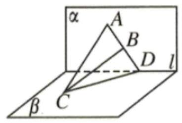

A. 直线 ${AC}$ B. 直线 ${AB}$ C. 直线 ${CD}$ D. 直线 ${BC}$

【难度】★★

【答案】C

【解析】由题意知, $D \in  l, l \subset  \beta ,\therefore D \in  \beta$ ,又 $\because D \in  {AB},\therefore D \in$ 平面 ${ABC}$ ,即 $D$ 在平面 ${ABC}$ 与平面 $\beta$ 的交线上,又 $C \in$ 平面 ${ABC}, C \in  \beta ,\therefore$ 点 $C$ 在平面 ${ABC}$ 与平面 $\beta$ 的交线上,

$\therefore$ 平面 ${ABC} \cap$ 平面 $\beta  = {CD}$ ,故选 C.

【例 2】空间 5 点, 其中有 4 点共面, 它们没有任何 3 点共线, 这 5 个点最多可以确定___个平面. 【难度】 $\star   \star   \star$

【答案】 7

【解析】: 空间中有五个点, 其中有四个点在同一平面内, 但没有任何三点共线,

$\therefore$ 同一平面的四个点一定能两两连线,最多可连 6 条线,

$\because$ 由三点确定一平面知任意一条线加上第五个点都会形成一个面,因此有 6 个面,

再加上 4 点确定的面总共是 7 个面.

故答案为:7

【例 3】( 1 )如图,在正方体 ${ABCD} - {A}_{1}{B}_{1}{C}_{1}{D}_{1}$ 中, $O$ 为正方形 ${ABCD}$ 的中心, $H$ 为直线 ${B}_{1}D$ 与平面 ${AC}{D}_{1}$ 的交点. 求证: ${D}_{1}\text{ 、 }H\text{ 、 }O$ 三点共线.

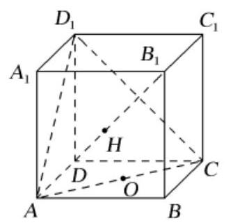

【难度】 $\star   \star   \star$

【答案】证明见解析

【解析】证明: 如图,连接 ${BD}\text{ 、 }{B}_{1}{D}_{1}$ ,则 ${BD} \cap  {AC} = O$

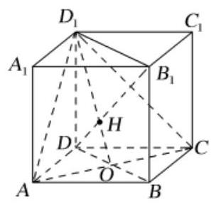

$\because B{B}_{1}//D{D}_{1} : \therefore$ 四边形 $B{B}_{1}{D}_{1}D$ 为平行四边形.

又 $H \in  {B}_{1}D,{B}_{1}D \subset$ 平面 $B{B}_{1}{D}_{1}D$ ,则 $H \in$ 平面 $B{B}_{1}{D}_{1}D$

$\because$ 平面 ${AC}{D}_{1} \cap$ 平面 $B{B}_{1}{D}_{1}D = O{D}_{1},\therefore H \in  O{D}_{1}$ ,故 ${D}_{1}\text{ 、 }H\text{ 、 }O$ 三点共线.

(2)空间四边形 ${ABCD}$ ， $E$ ， $F$ 点分别是 ${AB}$ ， ${BC}$ 的中点， $G$ ， $H$ 分别在 ${CD}$ 和 ${AD}$ 上，且满足 $\frac{CG}{GD} = \frac{AH}{HD} = 2.$

(1)证明: $E$ ， $F$ ， $G$ ， $H$ 四点共面；

(2)证明: ${EH}\text{ ， }{FG}$ ， ${BD}$ 三线共点.

【难度】★★★

【答案】(1)见解析；(2)见解析.

【解析】(1) 由题意, $E, F$ 分别为 ${AB},{BC}$ 的中点,所以 ${EF}//{AC}$ ,

又由 $\frac{CG}{GD} = \frac{AH}{HD}$ ,根据平行线段成比例,可得 ${GH}//{AC}$ ,

所以 ${EF}//{GH}$ ,所以四点 $E, F, G, H$ 在同一平面内,即 $E, F, G, H$ 四点共面.

(2)由题意， $E, F$ 分别为 ${AB},{BC}$ 的中点，所以 ${EF}//{AC}$ ，且 $\frac{CG}{GD} = \frac{AH}{HD}$ ，

假设直线 ${EH}$ 和 ${FG}$ 交于点 $M$ ,即 ${EH} \cap  {FG} = M$ ,

因为 ${EG} \subset$ 平面 ${ABD}$ ,可得点 $M \subset$ 平面 ${ABD}$ ,

同理可得 $M \subset$ 平面 ${BCD}$ ,

又因为平面 ${ABD} \cap$ 平面 ${BCD} = {BD}$ ,即点 $M \subset$ 直线 ${BD}$ ,

所以直线 ${EH},{FG},{BD}$ 三线共点.

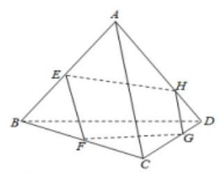

## 巩固训练

1、给出下列四个命题，其中正确的是( )

①空间四点共面，则其中必有三点共线；②空间四点不共面，则其中任何三点不共线；③空间四点中存在三点共线, 则此四点共面; ④空间四点中任何三点不共线

A. ②③ B. ①②③ C. ①② D. ②③④

【难度】★★

【答案】A

【解析】对于命题①，如下图所示:

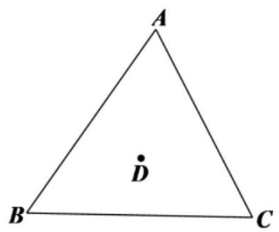

点 $D$ 为 $\bigtriangleup  {ABC}$ 内一点，则 $A$ 、 $B$ 、 $C$ 、 $D$ 四点共面，但这四点中无任何三点共线，①错误；

对于命题②，空间四点不共面，如三棱锥 $A - {BCD}$ 的四个顶点， $A$ 、 $B$ 、 $C$ 、 $D$ 四点中无任何三点共线， ②正确；

对于命题③，如果 $A$ 、 $B$ 、 $C$ 三点共线，且 $D \in  {AC}$ ，则这四点共面；

如果 $A$ 、 $B$ 、 $C$ 三点共线，且 $D \notin  {AC}$ ，则过点 $D$ 与直线 ${AC}$ 有且只有一个平面. 所以，③正确； 对于命题④，取 $\bigtriangleup  {ABC}$ 及 ${AB}$ 的中点 $D$ ，则 $A$ 、 $B$ 、 $D$ 共线，④错误. 故选:A.

2、下面四个说法中，正确说法的个数为( )

(1)如果两个平面有三个公共点，那么这两个平面重合；

(2)两条直线可以确定一个平面；

(3)若 $M \in  \alpha$ ， $M \in  \beta$ ， $\alpha  \cap  \beta  = l$ ，则 $M \in  l$ ；

(4)空间中，两两相交的三条直线在同一平面内.

A. 1 B. 2 C. 3 D. 4

【难度】★★

【答案】A

【解析】如果两个平面有三个公共点, 那么这两个平面重合或者是相交, 故 (1) 不正确;

两条异面直线不能确定一个平面，故 (2) 不正确；

利用平面的基本性质中的公理 3 判断 (3) 正确；

空间中, 若两两相交的三条直线相交于同一点, 则相交于同一点的三直线不一定在同一平面内 (如棱锥的 3 条侧棱), 故 (4) 不正确,

综上所述只有一个说法是正确的，故选: A.

3、如图，直四棱柱 ${ABCD} - {A}_{1}{B}_{1}{C}_{1}{D}_{1}$ 的底面是菱形， $A{A}_{1} = 4$ ， ${AB} = 2$ ， $\angle {BAD} = \frac{\pi }{3}$ ， $E$ ， $M$ 分别是 ${BC}$ ， $B{B}_{1}$ 的中点.

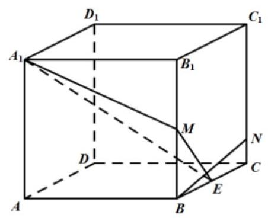

证明: 点 $D$ 在平面 ${A}_{1}{ME}$ 内;

【难度】 $\star   \star   \star$

【答案】证明见解析;

【解析】连接 ${A}_{1}D,{B}_{1}C$ .

$\because {A}_{1}{B}_{1}//{DC}$ 且 ${A}_{1}{B}_{1} = {DC},\therefore$ 四边形 ${A}_{1}{B}_{1}{CD}$ 是平行四边形, $\therefore {A}_{1}D//{B}_{1}C$

又因为 $E, M$ 分别为 ${BC}, B{B}_{1}$ 中点， $\therefore {ME}//{B}_{1}C,\;\therefore {ME}//{A}_{1}D$

$\therefore M, E,{A}_{1}, D$ 四点共面, $\therefore$ 点 $D$ 在平面 ${A}_{1}{ME}$ 内

4、如图，在四面体 ${ABCD}$ 中作截面 ${PQR}$ ，若 ${PQ}$ 与 ${CB}$ 的延长线交于点 $M$ ， ${RQ}$ 与 ${DB}$ 的延长线交于点 $N$ ， ${RP}$ 与 ${DC}$ 的延长线交于点 $K$ .

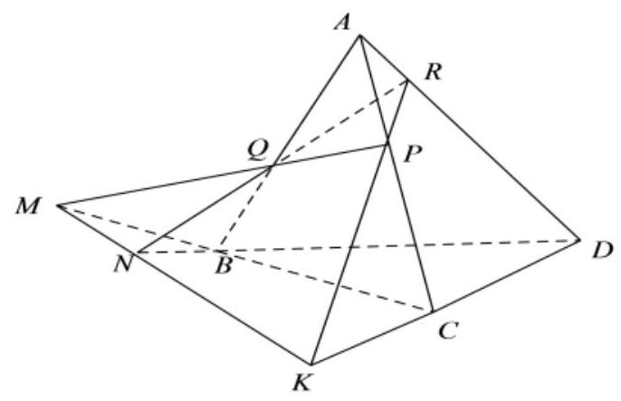

(1)求证:直线 ${MN} \subset$ 平面 ${PQR}$ ；

(2)求证:点 $K$ 在直线 ${MN}$ 上.

【难度】 $\star   \star   \star$

【答案】(1)证明见解析；(2)证明见解析

【解析】证明(1) $\because {PQ} \subset$ 平面 ${PQR}, M \in$ 直线 ${PQ},\therefore M \in$ 平面 ${PQR}$ .

$\because {RQ} \subset$ 平面 ${PQR}, N \in$ 直线 ${RQ},\therefore N \in$ 平面 ${PQR}$ .

$\therefore$ 直线 ${MN} \subset$ 平面 ${PQR}$ .

(2) $\because M \in$ 直线 ${CB},{CB} \subset$ 平面 ${BCD},\therefore M \in$ 平面 ${BCD}$ .

由(1)知 $M \in$ 平面 ${PQR}$ ,

$\therefore M$ 在平面 ${PQR}$ 与平面 ${BCD}$ 的交线上,

同理,可知 $N, K$ 也在平面 ${PQR}$ 与平面 ${BCD}$ 的交线上,

$\therefore M, N, K$ 三点共线,

$\therefore$ 点 $K$ 在直线 ${MN}$ 上.

## (二)空间点、直线、平面的位置关系

## 知识梳理

## 1. 空间直线与直线的位置关系

## (1)两条直线的位置关系

$\left\{  \begin{array}{l} \text{ 共面直线 }\left\{  \begin{array}{l} \text{ 平行直线: 在同一平面内,没有公共点; } \\  \text{ 相交直线: 有且只有一个公共点; } \end{array}\right. \\  \text{ 异面直线: 不能同在任何平面内的两条直线,没有公共点. } \end{array}\right.$

空间两条异面直线的画法:

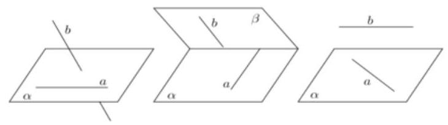

异面直线的判定:不平行、不相交的直线.

【注意】证明两条直线异面一般采用反证法.

(2)公理4:平行于同一直线的两条直线相互平行.

(3)等角定理:如果一个角的两边与另一个角的两边分别平行，那么这两个角相等或互补. 推论:如果两条相交直线和另两条相交直线分别平行，那么这两组直线所成的锐角(或直角)

相等.

(4)异面直线定理:

连结平面内一点与平面外一点的直线, 和这个平面内不经过此点的直线是异面直线.

(5)异面直线垂直:如果两条异面直线所成的角是直角，则叫两条异面直线垂直. 两条异面直线 $a, b$ 垂直， 记作 $a \bot  b$ .

【注意】空间直线与直线垂直, 是不平行的两条直线的特殊位置情况, 这时这两条直线所成的角等于 $\frac{\pi }{2}$ ,而它们可能是相交直线,也可能是异面直线.

## 2. 空间直线与平面的位置关系

直线和平面 $\left\{  \begin{array}{l} \text{ 直线在平面内一一有无数个公共点 } \\  \text{ 直线在平面外 }\left\{  \begin{array}{l} \text{ 直线与平面平行一一没有公共点 } \\  \text{ 直线与平面相交一一有且只有一. } \end{array}\right.  \end{array}\right.$

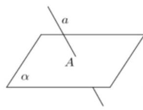

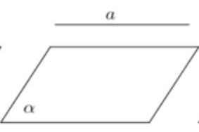

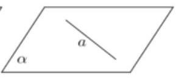

$a \cap  \alpha  = A \; a//\alpha \; a \subseteq  \alpha$

## (1)直线与平面平行:

直线和平面平行的判定定理: 如果平面外一条直线和这个平面内一条直线平行, 那么这条直线和这个平面平行,即 $a \text{ ⊄ } \alpha , b \subseteq  \alpha , a//b \Rightarrow  a//\alpha$ .

*直线和平面平行的性质定理: 如果一条直线和一个平面平行, 经过这条直线的平面和这个平面相交, 那么这条直线和交线平行. ,即 $a//\alpha ,\alpha  \text{ ⊄ } \beta ,\beta  \cap  \alpha  = b \Rightarrow  a//b$ .

(2)直线与平面垂直:

定义:一般地，如果一条直线 $l$ 与平面 $\alpha$ 上的任何直线都垂直，那么我们就说直线 $l$ 与平面 $\alpha$ 垂直， 记作: $l \bot  \alpha$ ,直线 $l$ 叫做平面 $\alpha$ 的垂线,平面 $\alpha$ 叫做直线 $l$ 的垂面, $l$ 与面 $\alpha$ 的交点叫做垂足.

直线和平面垂直的判定定理: 如果一条直线和一个平面内的两条相交直线都垂直, 那么这条直线垂直于这个平面,即 $m, n \subsetneqq  \alpha , m \cap  n = O, l \bot  m, l \bot  n \Rightarrow  l \bot  \alpha$ .

直线和平面垂直的性质定理: 如果两条直线同垂直于一个平面, 那么这两条直线平行.

即 $m \bot  \alpha , n \bot  \alpha  \Rightarrow  m//n$ .

3. 空间平面和平面的位置关系 $\left\{  \begin{array}{l} \text{ 两平面平行 } - \text{ 一没有公共点 } \\  \text{ 两平面相交 } - \text{ 一有一条公共直线 } \end{array}\right.$

* (1)平面与平面平行:

平面和平面平行的判定定理: 如果一个平面内有两条相交直线都平行于另一个平面, 那么这两个平面平行,若 $a \subsetneqq  \alpha , b \subsetneqq  \alpha , a \cap  b = A$ ,且 $a//\alpha , b//\alpha$ ,则 $\alpha //\beta$ .

平面和平面平行的性质定理: 如果两个平行平面同时和第三个平面相交,那么它们的交线平行,若 $\alpha \; //\beta ,\;\gamma  \cap  \beta  = b,\;\gamma  \cap  \alpha  = a$ ,则 $a//b$ .

* (2) 平面与平面垂直:

平面和平面垂直的判定定理: 如果一个平面经过另一个平面的一条垂线, 那么这两个平面互相垂直, 若 $l \bot  \alpha , l \subsetneqq  \beta$ ,则 $\alpha  \bot  \beta$ .

平面和平面垂直的性质定理: 如果两个平面垂直, 那么在一个平面内垂直于它们交线的直线垂直于另一平面,若 $\alpha  \bot  \beta ,\alpha  \cap  \beta  = l, m \subsetneqq  \alpha$ . 且 $m \bot  l$ ,则 $m \bot  \beta$ .

## 例题精讲

【例 4】已知下列命题:

①若直线与平面有两个公共点，则直线在平面内；

②若直线 $l$ 上有无数个点不在平面 $\alpha$ 内,则 $l//\alpha$ ;

③若直线 $l$ 与平面 $\alpha$ 相交，则 $l$ 与平面 $\alpha$ 内的任意直线都是异面直线；

④如果两条异面直线中的一条与一个平面平行, 则另一条直线一定与该平面相交;

⑤若直线 $l$ 与平面 $\alpha$ 平行,则 $l$ 与平面 $\alpha$ 内的直线平行或异面；

⑥若平面 $\alpha //$ 平面 $\beta$ ，直线 $a \subset  \alpha$ ，直线 $b \subset  \beta$ ，则直线 $a//b$ .

上述命题正确的是___. (请把所有正确命题的序号填在横线上)

【难度】 $\star   \star$

【答案】①⑤

【解析】由公理 2 , ①正确; 当直线与平面相交时, 直线上只有一个点在平面内, ②错误; 当直线与平面相交时, 直线与平面内过交点的直线相交不异面, ③错误; 如果两条异面直线中的一条与一个平面平行, 另一条也可能与此平面平行,④错误; 若直线 $l$ 与平面 $\alpha$ 平行,则 $l$ 与平面 $\alpha$ 内的直线无公共点,是平行或异面，⑤正确；分别在两平行平面内的两条直线可能异面，⑥错误，故答案为①⑤.

【例 5】(1)已知 $\alpha ,\beta$ 是两个不重合的平面， $m, n$ 是两条不重合的直线，则下列命题不正确的是( )

A. 若 $m \bot  n, m \bot  \alpha , n//\beta$ ,则 $\alpha  \bot  \beta$ B. 若 $m \bot  \alpha , n//\alpha$ ,则 $m \bot  n$

C. 若 $\alpha //\beta , m \subset  \alpha$ ,则 $m//\beta$ D. 若 $m//n,\alpha //\beta$ ,则 $m$ 与 $\alpha$ 所成的角和 $n$ 与 $\beta$ 所成的角

相等

【难度】 $\star   \star   \star$

【答案】A

【解析】选项A:若 $m\bot n, m\bot \alpha$ ，则 $n \subset  \alpha$ 或 $n//\alpha$ ，

又 $n//\beta$ ，并不能得到 $\alpha  \bot  \beta$ 这一结论，故选项 A 错误；

选项 B: 若 $m \bot  \alpha , n//\alpha$ ,则由线面垂直的性质定理和线面平行的

性质定理可得 $m \bot  n$ ,故选项 B 正确;

选项 C: 若 $\alpha //\beta , m \subset  \alpha$ ,则有面面平行的性质定理可知 $m//\beta$ ,故选项 C 正确;

选项D: 若 $m//n,\alpha //\beta$ ,则由线面角的定义和等角定理知, $m$ 与 $\alpha$

所成的角和 $n$ 与 $\beta$ 所成的角相等,故选项 $\mathrm{D}$ 正确.

故选: A.

(2)下列命题中，

(1)若 ${OA}//{ME}$ ， ${OB}//{MF}$ ，则 $\angle {AOB} = \angle {EMF}$ ；

(2)空间中， $\alpha ,\beta$ 为平面， $m, n$ 为直线，若 $m \subset  \alpha , n \subset  \alpha , m//\beta , n//\beta$ ，则 $\alpha //\beta$ ；

(3)空间中， $\alpha$ ， $\beta$ 为平面， $m$ ， $n$ 为直线，若 $\alpha  \bot  \beta$ ， $\alpha  \cap  \beta  = m$ ， $n \cap  \alpha  = A$ ， $n \bot  m$ ，则 $n \bot  \beta$ ； 其中正确的个数为( )

A. 0 个 B. 1 个 C. 2 个 D. 3 个

【难度】 $\star   \star   \star$

【答案】A

【解析】(1)若 ${OA}//{ME}$ ， ${OB}//{MF}$ ，由等角定理可得 $\angle {AOB}$ 与 $\angle {EMF}$ 相等或互补，故错误；

(2)若 $m \subset  \alpha , n \subset  \alpha , m//\beta , n//\beta$ ，由面面的位置关系得 $\alpha //\beta$ 或 $\alpha ,\beta$ 相交，故错误；

(3)若 $\alpha  \bot  \beta ,\alpha  \cap  \beta  = m, n \cap  \alpha  = A, n \bot  m$ ，则 $n \subset  \beta$ 或 $n//\beta$ 或 $n$ 交 $\beta$ 于一点，故错误；

故选: A

【例 6】若直线 ${l}_{1}$ 和 ${l}_{2}$ 是异面直线， ${l}_{1}$ 在平面 $\alpha$ 内， ${l}_{2}$ 在平面 $\beta$ 内，1是平面 $\alpha$ 与平面 $\beta$ 的交线，则下列命题正确的是( )

A. $l$ 与 ${l}_{1},{l}_{2}$ 都相交 B. $l$ 与 ${l}_{1},{l}_{2}$ 都不相交

C. $l$ 至少与 ${l}_{1},{l}_{2}$ 中的一条相交 D. $l$ 至多与 ${l}_{1},{l}_{2}$ 中的一条相交

【难度】★★★

【答案】C

【解析】试题分析: $A.l$ 与 ${l}_{1},{l}_{2}$ 可以相交,如图:

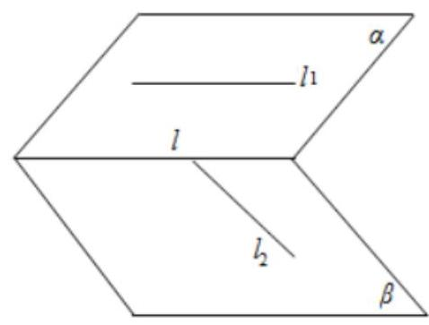

$\therefore$ 该选项错误;

B. $l$ 可以和 ${l}_{1},{l}_{2}$ 中的一个平行,如上图, $\therefore$ 该选项错误;

C. $l$ 可以和 ${l}_{1},{l}_{2}$ 都相交,如下图:

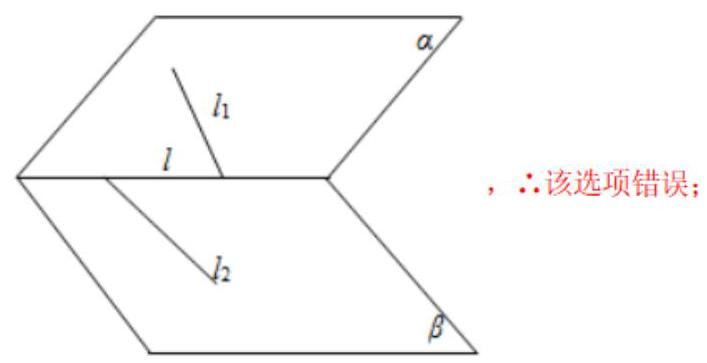

D. “ $l$ 至少与 ${l}_{1},{l}_{2}$ 中的一条相交” 正确,假如 $l$ 和 ${l}_{1},{l}_{2}$ 都不相交;

$\because l$ 和 ${l}_{1},{l}_{2}$ 都共面; $\therefore l$ 和 ${l}_{1},{l}_{2}$ 都平行; $\therefore {l}_{1}//{l}_{2},{l}_{1}$ 和 ${l}_{2}$ 共面,这样便不符合已知的 ${l}_{1}$ 和 ${l}_{2}$ 异面; $\therefore$ 该选项正确. 故选 $D$ .

【例 7】( 1 )如图,四边形 ${ABCD}$ 为正方形, ${PD} \bot$ 平面 ${ABCD},{PD} = {DC} = 2$ ,点 $E, F$ 分别为 ${AD}$ , ${PC}$ 的中点. 证明: ${DF}//$ 平面 ${PBE}$ ;

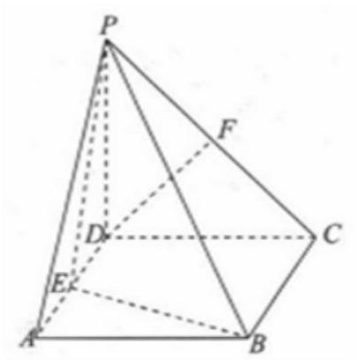

【难度】 $\bigstar \bigstar  \star$

【答案】见解析;

【解析】证明: 取点 $G$ 是 ${PB}$ 的中点,连接 ${EG},{FG}$ ,则 ${FG}//{BC}$ ,且 ${FG} = \frac{1}{2}{BC}$ ,

$\because {DE}//{BC}$ 且 ${DE} = \frac{1}{2}{BC},\therefore {DE}//{FG}$ 且 ${DE} = {FG}$ ,

$\therefore$ 四边形 ${DEGF}$ 为平行四边形, $\therefore {DF}//{EG},\therefore {DF}//$ 平面 ${PBE}$ .

(2)如图，四棱锥 $P - {ABCD}$ 中， $M$ ， $N$ 分别为 ${AC}$ ， ${PC}$ 上的点，且 ${MN}//$ 平面 ${PAD}$ ，则()

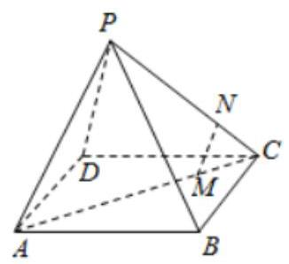

B. MN//PA B. MN//PA C. MN//PD D. 以上均有可能

【难度】 $\star   \star$

【答案】B

【解析】四棱锥 $P - {ABCD}$ 中, $M, N$ 分别为 ${AC},{PC}$ 上的点,且 ${MN}//$ 平面 ${PAD}$ ,

${MN} \subset$ 平面 ${PAC}$ ,平面 ${PAC} \cap$ 平面 ${PAD} = {PA}$ ,

由直线与平面平行的性质定理可得: ${MN}//{PA}$ .

故选: $B$ .

【例 8】如图,已知正方形 ${ABCD}$ 所在平面和平行四边形 ${ACEF}$ 所在平面互相垂直,平面 ${ECB} \bot$ 平面 ${ABCD},{AB} = \sqrt{2}, M$ 是线段 ${EF}$ 上的一点且 ${AM}//$ 平面 ${BDE}$ .

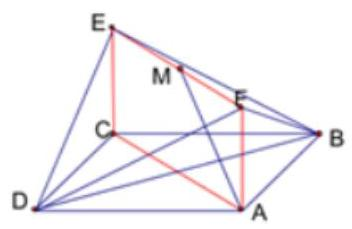

(1)求证:平面 ${ABF}//$ 平面 ${CDE}$ ；

(2)求证: $M$ 是线段 ${EF}$ 的中点；

(3)求证: ${EC}\bot$ 平面 ${ABCD}$ .

【难度】★★★

【答案】(1)证明见解析; (2) 证明见解析; (3) 证明见解析.

【解析】证明: (1) $\because$ 平行四边形 ${ACEF},\therefore {AF}//{CE}$ ,

$\because {CE} \subset$ 面 ${CDE},{AF} \text{ ⊄ }$ 面 ${CDE},\therefore {AF}//$ 面 ${CDE}$ ,

$\because {ABCD}$ 为正方形, $\therefore {AB}//{CD}$ ,

$\because {CD} \subset$ 面 ${CDE}$ , ${AB} \text{ ⊄ }$ 面 ${CDE}$ , $\therefore {AB}//$ 面 ${CDE}$ ,

又 ${AF} \cap  {AB} = A$ ， $\therefore$ 平面 ${ABF}//$ 平面 ${CDE}$ .

(2)设 ${AC} \cap  {BD} = O$ ，连接 ${OE}$ ，则 $O$ 为 ${AC}$ 的中点，

$\because {AM}//$ 平面 ${BDE}$ ， ${AM} \subset$ 平面 ${ACEF}$ ，平面 ${ACEF} \cap$ 平面 ${BDE} = {OE}$ ， $\therefore {AM}//{OE}$ .

又 $O$ 为 ${AC}$ 的中点, $\therefore M$ 为线段 ${EF}$ 的中点.

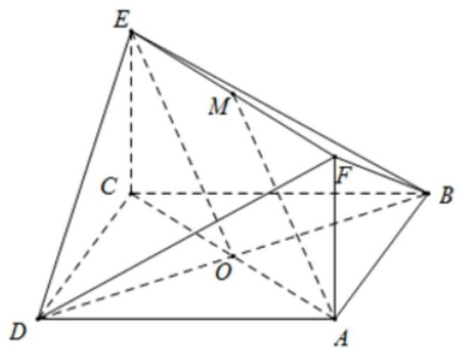

(3) $\because$ 平面 ${ABCD} \bot$ 平面 ${ACEF}$ ,平面 ${ABCD} \cap$ 平面 ${ACEF} = {AC},{BD} \bot  {AC}$ ,

$\therefore {BD} \bot$ 平面 ${ACEF},\therefore {BD} \bot  {EC}$ .

$\because$ 平面 ${ECB} \bot$ 平面 ${ABCD}$ ,平面 ${ECB} \cap$ 平面 ${ABCD} = {BC},{AB} \bot  {BC}$ ,

$\therefore {AB} \bot$ 平面 ${ECB},\therefore {AB} \bot  {EC}$ .

又 ${BD} \cap  {AB} = B,{BD}\text{ 、 }{AB} \subset$ 平面 ${ABCD},\therefore {EC} \bot$ 平面 ${ABCD}$ .

## 巩固训练

1、设 $m, n$ 是两条不同的直线， $\alpha ,\beta$ 是两个不同的平面，则下列命题正确的是( )

A. 若 $m//\alpha , n \bot  \beta$ 且 $m \bot  n$ 则 $\alpha  \bot  \beta$ B. 若 $m \bot  \alpha , n \bot  \beta$ 且 $m//n$ 则 $\alpha //\beta$

C. 若 $\alpha  \bot  \beta , m//n$ 且 $m//\alpha$ 则 $n \bot  \beta$ D. 若 $m \subset  \alpha , n \subset  \beta$ 且 $m//n$ 则 $\alpha //\beta$

【难度】 $\star   \star$

【答案】B

【解析】对于 $\mathrm{A}$ 中,若 $m//\alpha , n \bot  \beta$ 且 $m \bot  n$ 则 $\alpha$ 与 $\beta$ 可能是平行的,所以不正确; 对于 $\mathrm{C}$ 中, $\alpha  \bot  \beta , m//n$ 且 $m//\alpha$ 则可能 $n//\beta$ ,所以不正确; 对于 $\mathrm{D}$ 中,若 $m \subset  \alpha , n \subset  \beta$ 且 $m//n$ 则 $\alpha$ 与 $\beta$ 可能是相交的，所以不正确，故选 B.

2、若 $a$ 、 $b$ 表示直线， $\alpha$ 表示平面，则以下命题为正确命题的个数是( )

① 若 $a//b, b \subset  \alpha$ ，则 $a//\alpha$ ； ② 若 $a//\alpha , b//\alpha$ ，则 $a//b$ ；

③ 若 $a//b, b//\alpha$ ，则 $a//\alpha$ ； ④若 $a//\alpha , b \subset  \alpha$ ，则 $a//b$ ；

A. 0 B. 1 C. 2 D. 3

【难度】★★

【答案】A

【解析】对于①,直线 $a$ 可能在平面 $\alpha$ 内,故错误. 对于②, $a, b$ 两条直线可以相交,故错误. 对于③,直线 $a$ 可能在平面 $\alpha$ 内,故错误. 对于④, $a, b$ 两条直线可以异面. 故没有正确的命题,所以选 A.

3、在正方体 ${ABCD} - {A}_{1}{B}_{1}{C}_{1}{D}_{1}$ 中， $E$ 、 $F$ 分别是棱 ${AB}$ 、 $A{A}_{1}$ 的中点， $M$ 、 $N$ 分别是线段 ${D}_{1}E$ 与 ${C}_{1}F$ 上的点，则与平面 ${ABCD}$ 平行的直线 ${MN}$ 有( )

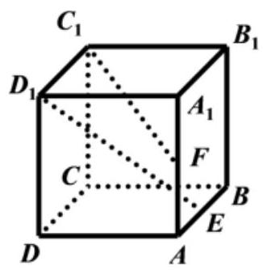

A. 0 条 B. 1 条 C. 2 条 D. 无数条

【难度】 $\star   \star   \star$

【答案】D

【解析】如图:

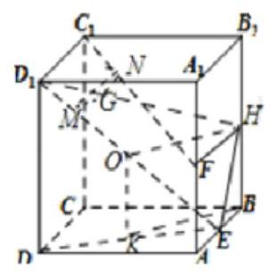

取 $B{B}_{1}$ 的中点 $H$ ，连接 ${FH}$ ，则 ${FH}//{C}_{1}{D}_{1}$ ，连接 ${HE}$ ，在 ${D}_{1}E$ 上任取一点 $M$ ，

过 $M$ 在面 ${D}_{1}{HE}$ 中,作 ${MG}$ 平行于 ${HO}$ ,其中 $O$ 为线段 ${D}_{1}E$ 的中点,交 ${D}_{1}H$ 于 $G$ ,

再过 $G$ 作 ${GN}//{FH}$ ,交 ${C}_{1}F$ 于 $N$ ,连接 ${MN}$ ,

$O$ 在平面 ${ABCD}$ 的正投影为 $K$ ,连接 ${KB}$ ,则 ${OH}//{KB}$ ,

由于 ${GM}//{HO}$ ， ${HO}//{KB}$ ， ${KB} \subset$ 平面 ${ABCD}$ ，

${GM} \text{ ⊄ }$ 平面 ${ABCD}$ ,所以 ${GM}//$ 平面 ${ABCD}$ ,

同理由 ${NG}//{FH}$ ,可推得 ${NG}//$ 平面 ${ABCD}$ ,由面面平行的判定定理得,平面 ${MNG}//$ 平面 ${ABCD}$ , 则 ${MN}//$ 平面 ${ABCD}$ . 由于 $M$ 为 ${D}_{1}E$ 上任一点,故这样的直线 ${MN}$ 有无数条. 故选: $D$ .

4、如图，在正方体 ${ABCD} - {A}_{1}{B}_{1}{C}_{1}{D}_{1}$ 中， $P$ 为线段 ${A}_{1}B$ 上的动点(不含端点)，则下列结论不正确的为( )

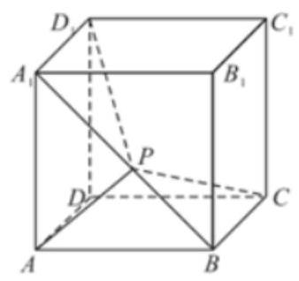

A. 平面 ${CBP} \bot$ 平面 $B{B}_{1}P$ B. ${AP} \bot$ 平面 ${CP}{D}_{1}$

C. ${AP} \bot  {BC}$ D. ${AP}//$ 平面 $D{D}_{1}{C}_{1}C$

【难度】 $\star   \star   \star$

【答案】B

【解析】因为在正方体 ${ABCD} - {A}_{1}{B}_{1}{C}_{1}{D}_{1}$ 中,易知 ${BC} \bot  B{B}_{1},{BC} \bot  {BP}, B{B}_{1} \subset$ 平面 $B{B}_{1}P,{BP} \subset$ 平面 $B{B}_{1}P, B{B}_{1} \cap  {BP} = B$ ,所以 ${BC} \bot$ 平面 $B{B}_{1}P$ ,又 ${BC} \subset$ 平面 ${CBP}$ ,从而平面 ${CBP} \bot$ 平面 $B{B}_{1}P$ , A 正确;

因为平面 ${CP}{D}_{1}$ 即为平面 ${A}_{1}{BC}{D}_{1}$ ,而点 $P$ 为线段 ${A}_{1}B$ 上的动点,所以不能满足 ${AP} \bot  {A}_{1}B$ 恒成立,因此 ${AP}$ 不一定垂直平面 ${A}_{1}{BC}{D}_{1}$ ,即 ${AP} \bot$ 平面 ${CP}{D}_{1}$ 不一定成立; 故 $\mathbf{B}$ 错;

因为正方体 ${ABCD} - {A}_{1}{B}_{1}{C}_{1}{D}_{1}$ 中， ${BC} \bot$ 平面 ${AB}{B}_{1}{A}_{1}$ ，所以 ${BC} \bot  {A}_{1}B$ ，所以当点 $P$ 在线段 ${A}_{1}B$ 上运动时,始终有 ${AP} \bot  {BC}$ ,所以 $\mathrm{C}$ 正确;

因为在正方体 ${ABCD} - {A}_{1}{B}_{1}{C}_{1}{D}_{1}$ 中,平面 ${AB}{B}_{1}{A}_{1}//$ 平面 $D{D}_{1}{C}_{1}C$ ,而 ${AP} \subset$ 平面 ${AB}{B}_{1}{A}_{1}$ ,所以 ${AP}//$ 平面 $D{D}_{1}{C}_{1}C$ ， $\mathbf{D}$ 选项正确；故选: $\mathbf{B}$ .

5、如果一条直线与一个平面垂直，那么称此直线与平面构成一个“垂直线面组”，在一个正方体中，由两个顶点确定的直线与含有三个顶点的平面构成的 “垂直线面组” 的个数是( )

A. 36 B. 44 C. 48 D. 24

【难度】 $\star   \star   \star$

【答案】B

【解析】对于每一条棱,都可以与两个侧面构成 “垂直线面组”,这样的 “垂直线面组” 有 $2 \times  {12} = {24}$ 个; 对于每一条面对角线都可以与一个对角面构成 “垂直线面组”, 这样的 “垂直线面组” 有 12 个; 对于每一条体对角线都可以与有两个面与其构成 “垂直线面组”,这样的 “垂直线面组” 有 $4 \times  2 = 8$ 个,所以共为 24 $+ {12} + 8 = {44}$ 个,故选 B.

6、如图，在直三棱柱 ${A}_{1}{B}_{1}{C}_{1} - {ABC}$ 中 ${AC}\bot {BC},{AC} = {BC} = A{A}_{1}, D$ 为 ${AB}$ 的中点，求证: ${B}_{1}C\bot {A}_{1}B$ ；

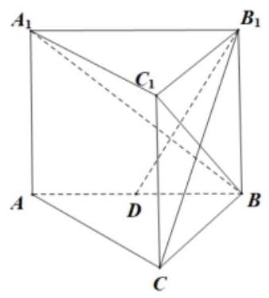

【难度】 $\star   \star   \star$

【答案】证明见解析;

【解析】因为在直三棱柱 ${A}_{1}{B}_{1}{C}_{1} - {ABC}$ 中， ${AC} \bot  {BC}$ ，所以 ${A}_{1}{C}_{1} \bot  {B}_{1}{C}_{1}$ ，

因为 $C{C}_{1} \bot$ 平面 ${A}_{1}{B}_{1}{C}_{1}$ ,所以 $C{C}_{1} \bot  {A}_{1}{C}_{1}$ ,

因为 $C{C}_{1} \cap  {B}_{1}{C}_{1} = {C}_{1}$ ,所以 ${A}_{1}{C}_{1} \bot$ 平面 ${BC}{C}_{1}{B}_{1}$ ,

因为 ${B}_{1}C \subset$ 平面 ${BC}{C}_{1}{B}_{1}$ ,所以 ${A}_{1}{C}_{1} \bot  {B}_{1}C$ ,

因为 ${AC} = {BC} = {A{A}_{1}}$ ，所以四边形 ${BC}{C}_{1}{B}_{1}$ 为正方形， ${B}_{1}C \bot  B{C}_{1}$  ，

因为 ${A}_{1}{C}_{1} \cap  B{C}_{1} = {C}_{1}$ ,所以 ${B}_{1}C \bot$ 平面 ${A}_{1}B{C}_{1}$ ,

因为 ${A}_{1}B \subset$ 平面 ${A}_{1}B{C}_{1}$ ,所以 ${B}_{1}C \bot  {A}_{1}B$ .

## (三)空间中角的计算

## 知识梳理

① 异面直线所成的角:已知两条异面直线 $a, b$ ，经过空间任一点 $O$ 作直线 ${a}^{\prime }//a,{b}^{\prime }//b,{a}^{\prime },{b}^{\prime }$ 所成的角的大小与点 $O$ 的选择无关,把 ${a}^{\prime },{b}^{\prime }$ 所成的锐角 (或直角) 叫异面直线 $a, b$ 所成的角 (或夹角). 为了简便, 点 $O$ 通常取在异面直线的一条上.

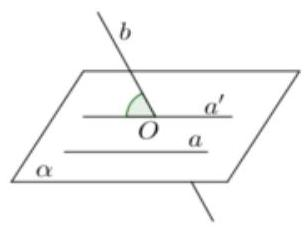

异面直线所成的角的范围: $\left( {0,\frac{\pi }{2}}\right\rbrack$ .

② 求异面直线所成的角的方法:

(1)范围: $\theta  \in  \left( {0,\frac{\pi }{2}}\right\rbrack$ ；

(2)求法:计算异面直线所成角的关键是平移(中点平移，顶点平移以及补形法:把空间图形补成熟悉的或完整的几何体，如正方体、平行六面体、长方体等，以便易于发现两条异面直线间的关系)转化为相交两直线的夹角。

③直线与平面所成的角:

如图， $l$ 是平面 $\alpha$ 的一条斜线，点 $O$ 是斜足， $A$ 是 $l$ 上任意一点， ${AB}$ 是 $\alpha$ 的垂线，点 $B$ 是垂足，所以直线 ${OB}$ (记作 $l$ ) 是 $l$ 在 $\alpha$ 内的射影, $\angle {AOB}$ (记作 $\theta$ ) 是 $l$ 与 $\alpha$ 所成的角.

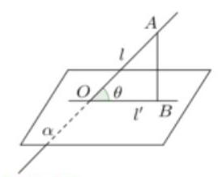

【注意】

(1)直线 $l$ 与平面 $\alpha$ 所成的角的大小与点 $A$ 在 $l$ 上的取法无关；

(2)直线和平面所成角的范围是 $\left\lbrack  {0,\frac{\pi }{2}}\right\rbrack$ ；

(3)斜线和平面所成角的范围是 $\left( {0,\frac{\pi }{2}}\right)$ .

## ④直线与平面所成角求解方法:

第一步:作出斜线在平面上的射影，找到斜线与射影所成的角 $\theta$ ；

第二步: 解含 $\theta$ 的三角形,求出其大小.

二面角: 平面内的一条直线把平面分为两个部分, 其中的每一部分叫做半平面; 从一条直线出发的两个半平面所组成的图形叫做二面角, 这条直线叫做二面角的棱, 每个半平面叫做二面角的面

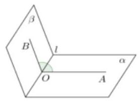

若棱为 $l$ ,两个面分别为 $\alpha ,\beta$ 的二面角记为 $\alpha  - l - \beta$ ;

## ⑤二面角的平面角:

(1)过二面角的棱上的一点 $O$ 分别在两个半平面内作棱的两条垂线 ${OA},{OB}$ ,则 $\angle {AOB}$ 叫做二面角 $\alpha  - l - \beta$ 的平面角.

(2)一个平面垂直于二面角 $\alpha  - l - \beta$ 的棱 $l$ ，且与两半平面交线分别为 ${OA},{OB}, O$ 为垂足，则 $\angle {AOB}$ 也是 $\alpha  - l - \beta$ 的平面角.

【说明】

(1)二面角的平面角范围是 $\left\lbrack  {{0}^{ \circ  },{180}^{ \circ  }}\right\rbrack$ ;

(2)二面角平面角为直角时，则称为直二面角，组成直二面角的两个平面互相垂直；

(3)二面角的求法:① 几何法；② 向量法.

## 例题精讲

【例 9】如图是一个正方体的表面展开图, $M, N, E$ 均为棱中点, $D$ 是顶点,则在正方体中,直线 ${MN}$ 和 ${DE}$ 的位置关系为___(填“平行”，“异面”或“相交”)，直线 ${MN}$ 和 ${DE}$ 的夹角的余弦值为___.

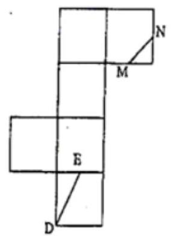

【难度】 $\star   \star   \star$

【答案】异面 $\frac{\sqrt{10}}{5}$

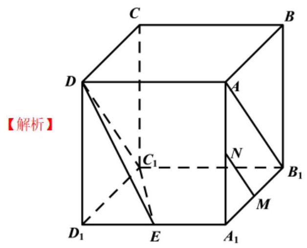

如图,还原正方体,可知 ${MN}$ 与 ${DE}$ 是异面直线,连接 $A{B}_{1}, D{C}_{1},{C}_{1}E$ ,

在正方体中, ${AD} \parallel  {BC} \parallel  {B}_{1}{C}_{1},\therefore$ 四边形 $A{B}_{1}{C}_{1}D$ 是平行四边形, $\therefore A{B}_{1}\left.\parallel  {{C}_{1}D}\right.$ ,

$\because \bigtriangleup A{A}_{1}{B}_{1}$ 中, $M, N$ 是 ${A}_{1}{B}_{1}, A{A}_{1}$ 中点, $\therefore {MN}\parallel A{B}_{1}$ ,

$\therefore {MN}\parallel D{C}_{1},\therefore \angle {ED}{C}_{1}$ 即为 ${MN}$ 和 ${DE}$ 的夹角,

设正方体棱长为 2 ,

则 $D{C}_{1} = 2\sqrt{2},{DE} = \sqrt{{2}^{2} + {1}^{2}} = \sqrt{5},{C}_{1}E = \sqrt{{2}^{2} + {1}^{2}} = \sqrt{5}$ ,

$\therefore \cos \angle {ED}{C}_{1} = \frac{{\left( 2\sqrt{2}\right) }^{2} + {\left( \sqrt{5}\right) }^{2} - {\left( \sqrt{5}\right) }^{2}}{2 \times  2\sqrt{2} \times  \sqrt{5}} = \frac{\sqrt{10}}{5}$ . 故答案为:异面； $\frac{\sqrt{10}}{5}$ .

【例 10】( 1 )如图,四棱锥 $P - {ABCD}$ 的底面是边长为 1 的正方形，侧棱 ${PA}$ 是四棱锥 $P - {ABCD}$ 的高, 且 ${PA} = 2, E$ 是侧棱 ${PA}$ 上的中点. 求异面直线 ${EB}$ 与 ${PC}$ 所成的角;

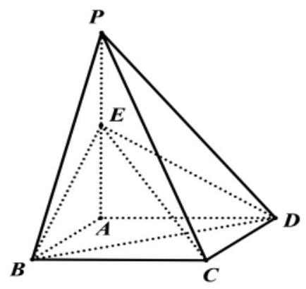

【难度】 $\star   \star   \star$

【答案】 $\frac{\pi }{6}$ .

【解析】连结 ${AC}$ 交 ${BD}$ 于 $O$ ,连结 ${OE}$ ,因为四边形 ${ABCD}$ 是正方形,所以 $O$ 是 ${AC}$ 的中点,

又因为 $E$ 是 ${PA}$ 的中点,所以 ${PC}//{OE}$ ,所以 $\angle {BEO}$ (或补角)为异面直线 ${EB}$ 与 ${PC}$ 所成的角,

因为 ${AB} = {AD} = 1,{EA} = \frac{1}{2}{PA} = 1$ ，可得 ${EB} = {ED} = {BD} = \sqrt{2}$ ，所以 $\bigtriangleup  {BDE}$ 为等边三角形，所以 $\angle {BED} = \frac{\pi }{3}$ ,

又因为 $O$ 为 ${BD}$ 的中点,所以 $\angle {BEO} = \frac{\pi }{6}$ ,即异面直线 ${EB}$ 与 ${PC}$ 所成的角 $\frac{\pi }{6}$ .

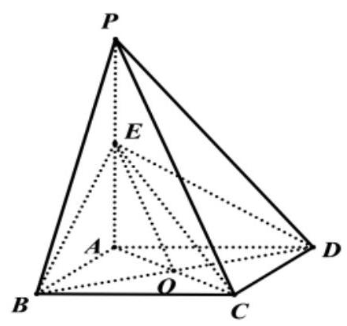

(2)已知四面体 ${ABCD}$ 中， ${AB} = {CD} = 2$ ， $E$ ， $F$ 分别为 ${BC}$ ， ${AD}$ 的中点，且异面直线 ${AB}$ 与 ${CD}$ 所成的角为 $\frac{\pi }{3}$ ，则 ${EF} =$ ___.

【难度】 $\star   \star   \star$

【答案】1 或 $\sqrt{3}$

【解析】取 BD 中点 0,连结 E0、F0,

$\because$ 四面体 $\mathrm{{ABCD}}$ 中， $\mathrm{{AB}} = \mathrm{{CD}} = 2,\mathrm{E}\text{ 、 }\mathrm{\;F}$ 分别为 $\mathrm{{BC}}\text{ 、 }\mathrm{{AD}}$ 的中点，且异面直线 $\mathrm{{AB}}$ 与 $\mathrm{{CD}}$ 所成的角为 $\frac{\pi }{3}$ ，

$\therefore \mathrm{E}O//\mathrm{{CD}}$ ,且 $\mathrm{E}0 = \frac{1}{2}\mathrm{{CD}} = 1,\mathrm{F}0//\mathrm{{AB}}$ ,且 $\mathrm{F}0 = \frac{1}{2}\mathrm{{AB}} = 1$ ,

$\therefore \angle \mathrm{{EOF}}$ 是异面直线 $\mathrm{{AB}}$ 与 $\mathrm{{CD}}$ 所成的角或其补角,

$\therefore \angle \mathrm{{EOF}} = \frac{\pi }{3}$ ,或 $\angle \mathrm{{EOF}} = \frac{2\pi }{3}$ ,

当 $\angle \mathrm{{EOF}} = \frac{\pi }{3}$ 时, $\Delta \mathrm{{EOF}}$ 是等边三角形, $\therefore \mathrm{{EF}} = 1$ .

当 $\angle \mathrm{{EOF}} = \frac{2\pi }{3}$ 时, $\mathrm{{EF}} = \sqrt{{1}^{2} + {1}^{2} - \frac{1}{2} \times  1 \times  1 \times  \cos \frac{2\pi }{3}} = \sqrt{3}$ . 故答案为 1 或 $\sqrt{3}$ .

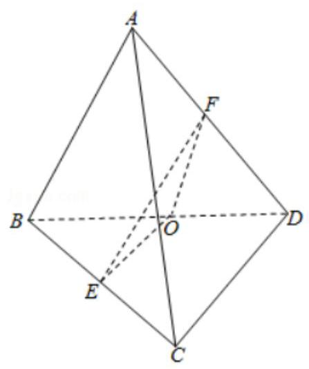

【例 11】 $a\text{ 、 }b$ 两条异面直线成 ${60}^{ \circ  }$ 角,过空间中的任一点 $A$ 可作出与 $a\text{ 、 }b$ 都成的 ${45}^{ \circ  }$ 角的平面的个数为 ( )

A. 1 B. 2 C. 3 D. 4

【难度】 $\star   \star   \star$

【答案】B

【解析】将两条异面直线 $a\text{ 、 }b$ 平移到 $A$ 点,记此时直线 ${a}^{\prime }//a,{b}^{\prime }//b$ ,直线 ${a}^{\prime }$ 与 ${b}^{\prime }$ 成 ${60}^{ \circ  }$ 的角, ${a}^{\prime }\text{ 、 }{b}^{\prime }$ 所确定的平面为 $\alpha$ ,令 $l\text{ 、 }{l}^{\prime }$ 分别为平面 $\alpha$ 内 ${a}^{\prime }\text{ 、 }{b}^{\prime }$ 相交所成的钝角和锐角的角平分线, 则与 $a\text{ 、 }b$ 所成角相等的平面 $\beta$ 必过直线 $l$ 或 ${l}^{\prime }$ ,

而过 ${l}^{\prime }$ 的平面与 ${a}^{\prime }\text{ 、 }{b}^{\prime }$ 所成角的最大值为 ${30}^{ \circ  }$ ,这种情况不符合要求;

过 $l$ 的平面与 ${a}^{\prime }\text{ 、 }{b}^{\prime }$ 所成角 $\theta$ 的取值范围是 ${0}^{ \circ  } < \theta  \leq  {60}^{ \circ  }$ ,绕 $l$ 适当转动平面 $\beta$ ,由对称性可知,符合要求的平面有且仅有两个.故选: B.

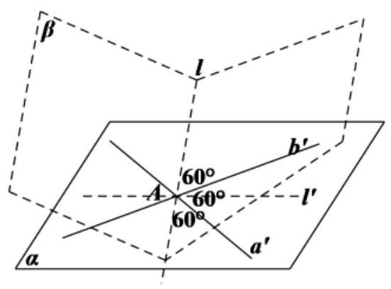

## 2、直线与平面所成的角

【例 12】如图,在正四棱柱 ${ABCD} - {A}_{1}{B}_{1}{C}_{1}{D}_{1}$ 中,底面 ${ABCD}$ 的边长为 $3, B{D}_{1}$ 与底面所成角的大小为 $\arctan \sqrt{2}$ .

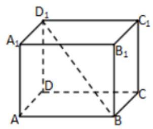

(1)求该正四棱柱的高；

(2)求 $B{D}_{1}$ 与平面 $A{A}_{1}{C}_{1}C$ 所成角的大小.

【难度】 $\star   \star   \star$

【答案】(1)6; (2) $\arctan \frac{\sqrt{2}}{2}$ .

【解析】(1) 设正四棱柱 ${ABCD} - {A}_{1}{B}_{1}{C}_{1}{D}_{1}$ 高为 $h$ .连接 ${BD}$ ，由于 $D{D}_{1} \bot$ 平面 ${ABCD}$ ，故 $\angle {D}_{1}{BD}$ 是 $B{D}_{1}$ 与底面所成角. 在 ${Rt\Delta BD}{D}_{1}$ 中, $\tan \angle {D}_{1}{BD} = \frac{D{D}_{1}}{BD} = \frac{h}{3\sqrt{2}} = \sqrt{2}$ ,解得 $h = 6$ . 即正四棱柱的高为 6 .

(2)连接 ${AC}$ ，角 ${BD}$ 于 $E$ ，连接 $A{C}_{1}$ ，交 $B{D}_{1}$ 于 $F$ ，连接 ${EF}$ . 由于 $E$ ， $F$ 分别是 ${BD}$ ， $B{D}_{1}$ 的中点，故 ${EF}//D{D}_{1}$ ,所以 ${EF} \bot  {BE}$ ,而 ${BE} \bot  {AC}$ ,故 ${BE} \bot$ 平面 ${AC}{C}_{1}{A}_{1}$ ,所以 $B{D}_{1}$ 与平面 $A{A}_{1}{C}_{1}C$ 所成角为 $\angle {BFE}$ ，在 ${Rt\Delta BEF}$ 中， $\tan \angle {BFE} = \frac{BE}{EF} = \frac{\frac{3\sqrt{2}}{2}}{3} = \frac{\sqrt{2}}{2}$ ，所以 $\angle {BFE} = \arctan \frac{\sqrt{2}}{2}$ . 即 $B{D}_{1}$ 与平面 $A{A}_{1}{C}_{1}C$ 所成角的大小为 $\arctan \frac{\sqrt{2}}{2}$ .

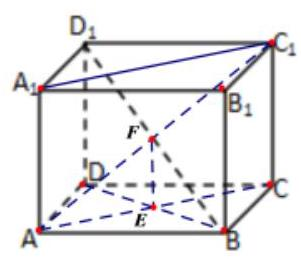

【例 13】如图,四棱锥 $P - {ABCD}$ 中, ${PC} \bot$ 平面 ${ABCD},{AB} \bot  {AD},{AB}//{CD}$ ,

${PD} = {AB} = {2AD} = {2CD} = 2, E$ 为 ${PB}$ 的中点.

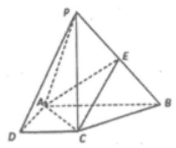

(1)证明:平面 ${EAC} \bot$ 平面 ${PBC}$ ；

(2)求直线 ${PA}$ 与平面 ${AEC}$ 所成角的正弦值.

【难度】 $\star   \star   \star$

【答案】(1)证明见解析；(2) $\frac{\sqrt{6}}{5}$ .

【解析】(1) $\because {PC} \bot$ 平面 ${ABCD},{AC} \subset$ 平面 ${ABCD},\therefore {AC} \bot  {PC}$ ,

$\because {AB} = 2,{AD} = {CD} = 1,\therefore {AC} = {BC} = \sqrt{2}$ ， $\therefore {AC}^{2} + {BC}^{2} = {AB}^{2},\therefore {AC}\bot {BC}$ ，

又 ${BC} \cap  {PC} = C\therefore {AC} \bot$ 平面 ${PBC}$ ,

$\because {AC} \subset$ 平面 ${EAC}$ , $\therefore$ 平面 ${EAC} \bot$ 平面 ${PBC}$ ;

(2)

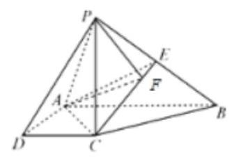

作 ${PF} \bot  {CE}$ ， $F$ 为垂足. 由 ( I ) 知平面 ${EAC} \bot$ 平面 ${PBC}$ ，

$\because$ 平面 ${EAC} \cap$ 平面 ${PBC} = {CE},\therefore {PF} \bot$ 平面 ${EAC}$ ,连接 ${AF}$ ,则 $\angle {PAF}$ 就是直线 ${PA}$ 与平面 ${EAC}$ 所成角,在 $\bigtriangleup {PCE}$ 中, ${PC} = \sqrt{3},{PE} = {CE} = \frac{\sqrt{5}}{2},\therefore {PF} = \frac{\sqrt{30}}{5},\therefore \sin \angle {PAF} = \frac{PF}{PA} = \frac{\sqrt{6}}{5}$ , 即直线 ${PA}$ 与平面 ${EAC}$ 所成角的正弦值为 $\frac{\sqrt{6}}{5}$ .

## 3、二面角的平面角

【例 14】(1)如图正方形 ${A}_{1}{BCD}$ 折成直二面角 $A - {BD} - C$ ，则二面角 $A - {CD} - B$ 的余弦值为( )

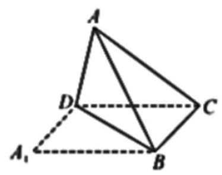

A. $\frac{1}{3}$ B. $\frac{\sqrt{3}}{3}$ C. $\frac{1}{2}$ D. $\frac{\sqrt{2}}{2}$

【难度】★★

【答案】B

【解析】: 正方形 ${A}_{1}{BCD}$ 的对角线 ${BD}$ 为棱折成直二面角, $\therefore$ 平面 ${ABD} \bot$ 平面 ${BCD}$ ,

连接 ${BD}\text{ 、 }{A}_{1}C$ 相交于 $O$ ,则 ${AO} \bot  {BD}$ ,

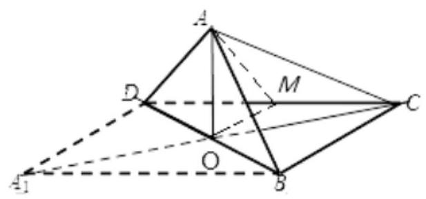

$\because$ 平面 ${ABD} \cap$ 平面 ${BCD} = {BD},{AO} \subset$ 平面 ${ABD},\therefore {AO} \bot$ 平面 ${BCD}$ ,

取 ${CD}$ 的中点 $M$ ,则 ${OM}//{BC}$ ,有 ${OM} \bot  {CD}$ ,所以 $\angle {AMO}$ 即为所求.

不妨设正方形 ${A}_{1}{BCD}$ 的边长为 2,则 ${AO} = \sqrt{2},{OM} = 1$ ,所以 ${AM} = \sqrt{2 + 1} = \sqrt{3}$ .

$\cos \angle {AMO} = \frac{OM}{AM} = \frac{\sqrt{3}}{3}$ . 故选: B.

(2)点 $O$ 是边长为 4 的正方形 ${ABCD}$ 的中心，点 $E$ ， $F$ 分别是 ${AD}$ ， ${BC}$ 的中点. 沿对角线 ${AC}$ 把正方形 ${ABCD}$ 折成直二面角 $D - {AC} -$ 求二面角 $E - {OF} - A$ 的正切值.

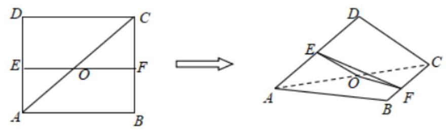

【难度】 $\star   \star   \star$

【答案】见解析

【解析】过点 $G$ 作 ${GM}$ 垂直于 ${FO}$ 的延长线于点 $M$ , 连 ${EM}$ .

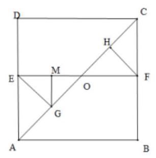

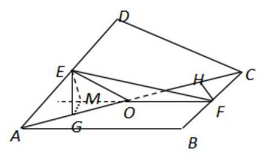

$\because$ 二面角 $D - {AC} - B$ 为直二面角, $\therefore$ 平面 ${DAC} \bot$ 平面 ${BAC}$ ,交线为 ${AC}$ ,又 $\because {EG} \bot  {AC},\therefore {EG} \bot$ 平面 ${BAC}.\because \; {GM} \bot  {OF}$ ,由三垂线定理,得 ${EM} \bot  {OF}$ .

$\therefore \angle {EMG}$ 就是二面角 $E - {OF} - A$ 的平面角.

在 Rt ${\Delta EGM}$ 中, $\angle {EGM} = {90}^{ \circ  },{EG} = \sqrt{2}$ , ${GM} = \frac{1}{2}{OE} = 1,\therefore \tan \angle {EMG} = \frac{EG}{GM} = \sqrt{2}$ .

所以，二面角 $E - {OF} - A$ 的正切值为 $\sqrt{2}$ .

## 巩固训练

1、如图，在直三棱柱 ${ABC} - {A}_{1}{B}_{1}{C}_{1}$ 中，侧棱 $A{A}_{1} \bot$ 底面 ${ABC}$ ， ${AB} \bot  {BC}$ ， $D$ 为 ${AC}$ 的中点， ${A}_{1}A = {AB} = 2,{BC} = 3.$

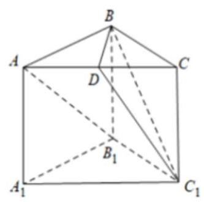

(1)证明: $A{B}_{1}//$ 平面 $B{C}_{1}D$

(2)求异面直线 $A{B}_{1}$ 与 $B{C}_{1}$ 所成角的余弦值；

【难度】 $\star   \star   \star$

【答案】(1)证明见解析；(2) $\frac{\sqrt{26}}{13}$ ；

【解析】(1) 证明: 连接 ${B}_{1}C$ 交 $B{C}_{1}$ 于点 $O$ ,连接 ${OD}$ ,

$\because$ 四边形 ${BC}{C}_{1}{B}_{1}$ 是平行四边形, $\therefore$ 点 $O$ 为 ${B}_{1}C$ 的中点,

$\because D$ 为 ${AC}$ 的中点, $\therefore {OD}$ 为 $\bigtriangleup A{B}_{1}C$ 的中位线,

$\therefore {OD}//A{B}_{1}$ .

$\because {OD} \subset$ 平面 $B{C}_{1}D, A{B}_{1} \text{ ⊄ }$ 平面 $B{C}_{1}D$ ,

$\therefore A{B}_{1}//$ 平面 $B{C}_{1}D$ .

(2)由(1)知， ${OD}//{A{B}_{1}}$ ，则 $\angle {BOD}$ 为异面直线 $A{B}_{1}$ 与 $B{C}_{1}$ 所成角或其补角，

在正方形 ${AB}{B}_{1}{A}_{1}$ 中,由已知求得 ${A}_{1}B = 2\sqrt{2}$ 则 ${OD} = \sqrt{2}$ ,

在长方形 $B{B}_{1}{C}_{1}C$ 中,由已知求得 $B{C}_{1} = \sqrt{13}$ ,则 ${OB} = \frac{\sqrt{13}}{2}$ ,

在 Rt $\bigtriangleup {ABC}$ 中, ${AC} = \sqrt{A{B}^{2} + B{C}^{2}} = \sqrt{4 + 9} = \sqrt{13}$ ,则 ${BD} = \frac{\sqrt{13}}{2}$ ,

$\therefore \cos \angle {BOD} = \frac{2 + \frac{13}{4} - \frac{13}{4}}{2 \times  \sqrt{2} \times  \frac{\sqrt{13}}{2}} = \frac{\sqrt{26}}{13}$ .

$\therefore$ 异面直线 $A{B}_{1}$ 与 $B{C}_{1}$ 所成角的余弦值为 $\frac{\sqrt{26}}{13}$ ;

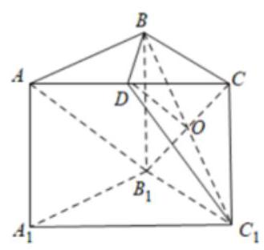

2、在四面体 ${ABCD}$ 中， ${AB} \bot$ 平面 ${BCD}$ ， ${BC} \bot  {BD}$ ， ${AB} = {BD} = 2$ ， $E$ 为 ${CD}$ 的中点，若异面直线 ${AC}$ 与 ${BE}$ 所成的角为 ${60}^{ \circ  }$ ,则 ${BC} =$ (   )

A. $\sqrt{2}$ B. 2 C. $2\sqrt{2}$ D. 4

【难度】 $\star   \star   \star$

【答案】B

【解析】取 ${AD}$ 的中点 $F$ ,连接 ${EF},{BF}$ ,如下图所示:

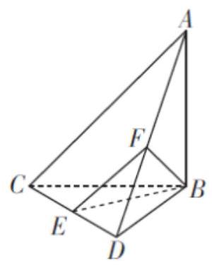

则 ${EF}//{AC}$ ， $\angle {BEF}$ 为异面直线 ${AC}$ 与 ${BE}$ 所成的角，所以 $\angle {BEF} = {60}^{ \circ  }$ .

设 ${BC} = x$ ,则 ${BE} = {EF} = \frac{\sqrt{{x}^{2} + 4}}{2},{BF} = \sqrt{2}$ ,

从而 $\bigtriangleup  {BEF}$ 为等边三角形，则 $\frac{\sqrt{{x}^{2} + 4}}{2} = \sqrt{2}$ ，解得 $x = 2$ . 故 ${BC} = 2$ . 故选:B.

3、如图，在长方体 ${ABCD} - {A}_{1}{B}_{1}{C}_{1}{D}_{1}$ 中， ${AB} = 8,{BC} = 5$ ， $A{A}_{1} = 4$ ，平面 $\alpha$ 截长方体得到一个矩形 ${EFGH}$ ,且 ${A}_{1}E = {D}_{1}F = 2,{AH} = {DG} = 5$ . 求直线 ${AF}$ 与平面 $\alpha$ 所成角的正弦值.

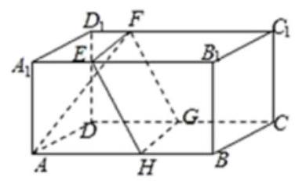

【难度】 $\star   \star   \star$

【答案】 $\frac{4\sqrt{5}}{15}$

【解析】作 ${AM} \bot  {EH}$ ,足为 $M$ ,题意, ${HG} \bot$ 平面 ${AB}{B}_{1}{A}_{1}$ ,故 ${HG} \bot  {AM}$ ,

所以 ${AM} \bot$ 平面 ${EFGH}$ ,因为 ${S}_{\text{ 梯形 }{AA},{EH}} = {14},{S}_{{\bigtriangleup {AA}}E} = 4$ ，所以 ${S}_{\bigtriangleup {AEH}} = {10}$ ，因为 ${EH} = 5$ ，

所以 ${AM} = 4$ . 又 ${AF} = \sqrt{A{A}_{1}^{2} + {A}_{1}{D}_{1}^{2} + {D}_{1}{F}^{2}} = {3\sqrt{5}}$ ，

设直线 ${AF}$ 与平面 $\alpha$ 所成角为 $\theta$ ,则 $\sin \theta  = \frac{AM}{AF} = \frac{4\sqrt{5}}{15}$ . 所以,直线 ${AF}$ 与平面 $\alpha$ 所成角的正弦值为 $\frac{4\sqrt{5}}{15}$

4、如图，在棱长为 1 的正方体 ${ABCD} - {A}_{1}{B}_{1}{C}_{1}{D}_{1}$ 中， $P$ 是侧棱 $C{C}_{1}$ 上的一点， ${CP} = m$ .

(1)试确定 $m$ ，使直线 ${AP}$ 与平面 ${BD}{D}_{1}{B}_{1}$ 所成角的正切值为 $3\sqrt{2}$ ；

(2)在线段 ${A}_{1}{C}_{1}$ 上是否存在一个定点 $Q$ ，使得对任意的 $m$ ， ${D}_{1}Q$ 在平面 ${AP}{D}_{1}$ 上的射影垂直于 ${AP}$ ，并证明你的结论.

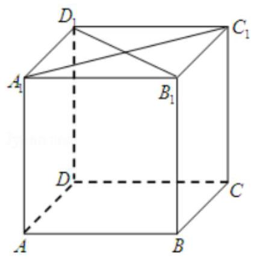

【难度】 $\star   \star   \star$

【答案】(1) $\mathrm{m} = \frac{1}{3}$ ；(2)点 $\mathrm{Q}$ 是 ${C}_{1}{A}_{1}$ 的中点.

【解析】(1) 连 $\mathrm{{AC}}$ ,设 $\mathrm{{AC}}$ 与 $\mathrm{{BD}}$ 相交于点 $\mathrm{O},\mathrm{{AP}}$ 与平面 ${\mathrm{{BDD}}}_{1}{\mathrm{\;B}}_{1}$ 相交于点 $\mathrm{G}$ ,连接 $\mathrm{{OG}}$ ,因为 $\mathrm{{PC}}//$ 平面 ${\mathrm{{BDD}}}_{1}{\mathrm{\;B}}_{1}$ ,平面 ${\mathrm{{BDD}}}_{1}{\mathrm{\;B}}_{1} \cap$ 平面 $\mathrm{{APC}} = \mathrm{{OG}}$ ,故 $\mathrm{{OG}}//\mathrm{{PC}}$ ,所以, $\mathrm{{OG}} = \frac{1}{2}\mathrm{{PC}} = \frac{\mathrm{m}}{2}$ . 又 $\mathrm{{AO}} \bot  \mathrm{{BD}},\mathrm{{AO}} \bot  {\mathrm{{BB}}}_{1}$ , 所以 $\mathrm{{AO}} \bot$ 平面 $\mathrm{{BD}{D}_{1}{B}_{1}}$ ,故 $\angle \mathrm{{AGO}}$ 是 $\mathrm{{AP}}$ 与平面 $\mathrm{{BD}{D}_{1}{B}_{1}}$ 所成的角. 在 $\mathrm{{Rt}}\bigtriangleup \mathrm{{AOG}}$ 中, $\tan \angle \mathrm{{AGO}} = \; \frac{\mathrm{{OA}}}{\mathrm{{GO}}} = \frac{\frac{\sqrt{2}}{2}}{\frac{\mathrm{m}}{2}} = 3\sqrt{2}$ ,即 $\mathrm{m} = \frac{1}{3}$ . 所以,当 $\mathrm{m} = \frac{1}{3}$ 时,直线 $\mathrm{{AP}}$ 与平面 ${\mathrm{{BDD}}}_{1}{\mathrm{B}}_{1}$ 所成的角的正切值为 $3\sqrt{2}$ .

(2)可以推测,点 $Q$ 应当是 ${C}_{1}{A}_{1}$ 的中点,当是中点时因为 ${D}_{1}{O}_{1} \bot  {A}_{1}{C}_{1}$ ,且 ${D}_{1}{O}_{1} \bot  {A}_{1}A,{A}_{1}{C}_{1} \cap  {A}_{1}A = \; {\mathrm{A}}_{1}$ ，所以 ${\mathrm{D}}_{1}{\mathrm{O}}_{1}\bot$ 平面 $\mathrm{{ACC}}{}_{1}{\mathrm{A}}_{1}$ ，又 $\mathrm{{AP}} \subset$ 平面 $\mathrm{{ACC}}{}_{1}{\mathrm{A}}_{1}$ ，故 ${\mathrm{D}}_{1}{\mathrm{O}}_{1}\bot \mathrm{{AP}}$ . 那么根据三垂线定理知， ${\mathrm{D}}_{1}{\mathrm{O}}_{1}$ 在平面 $\mathrm{{APD}}$ 的射影与 $\mathrm{{AP}}$ 垂直.

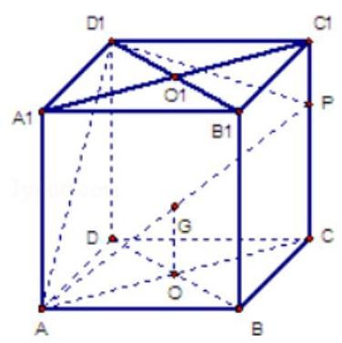

5、已知二面角 $\alpha  - l - \beta$ 的大小为 ${50}^{0}, P$ 为空间中任意一点,则过点 $P$ 且与平面 $\alpha$ 和平面 $\beta$ 所成的角都

是 ${25}^{ \circ  }$ 的直线的条数为( )

A. 2 B. 3 C. 4 D. 5

【难度】 $\star   \star   \star$

【答案】B

【解析】设 $\angle {AFE}$ 是度数为 ${50}^{ \circ  }$ 的二面角的一个平面角， ${FG}$ 为 $\angle {AFE}$ 的平分线，当过 $\mathrm{P}$ 的直线与 ${FG}$ 平行时,满足条件,第二条作与 $\angle {AFE}$ 在同一平面内且与 ${FG}$ 垂直的直线 $\mathrm{{FC}}$ ,此时 $\mathrm{{FC}}$ 与直线 $\mathrm{{FA}}$ 和直线 $\mathrm{{FB}}$ 所成角都为 65 度, 将 FC 向外旋转, 所成角递减到与棱重合时是 0 度, 在重合之前必有一条与两面都成 25 度的直线, 第三条: 向内旋转得到, 过 P 的直线与它们分别平行, 所以满足条件共有 3 条.

6、如图，在五面体 ${ABCDEF}$ 中， ${AB} \bot$ 平面 ${ADE}$ ， ${EF} \bot$ 平面 ${ADE}$ ， ${AB} = {CD} = 2$ .

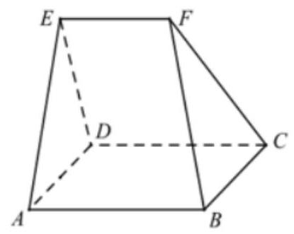

(1)求证: ${AB}//{CD}$ ；

(2)若 ${AD} = {AE} = 2$ ， ${EF} = 1$ ，且二面角 $E - {DC} - A$ 的大小为 ${60}^{ \circ  }$ ，求二面角 $F - {BC} - D$ 的大小.

【难度】 $\star   \star   \star$

【答案】(1)证明见详解；(2) ${60}^{ \circ  }$ .

【解析】(1) $\because {AB} \bot$ 面 ${ADE}$ ， ${EF} \bot$ 面 ${ADE}$ ， $\therefore {AB}//{EF}$

又 ${EF} \subset$ 面 ${CDEF}$ , ${AB} \text{ ⊄ }$ 面 ${CDEF}$ , $\therefore {AB}//$ 面 ${CDEF}$

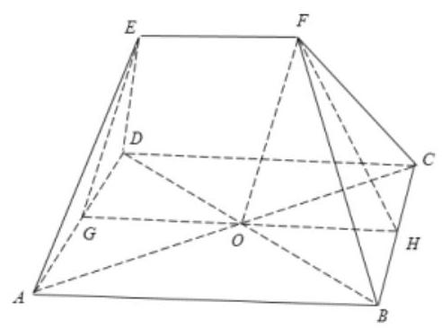

又 ${AB} \subset$ 面 ${ABCD}$ ,面 ${ABCD} \cap$ 面 ${CDEF} = {CD},\therefore {AB}//{CD}$

(2)设 ${AD}$ 的中点为 $G$ ，连接 ${EG},{AC},{BD}$ ，

设 ${AC}$ 与 ${BD}$ 的交点为 $O$ ,连接 ${OF},{OG}$ ,

$\because {AB} \bot$ 面 ${ADE}$ ， ${DA},{DE} \subset$ 面 ${ADE}$ ， $\therefore {{AB} \bot  {DA}}$ ， ${{AB} \bot  {DE}}$ .

$\because {AB}//{CD}$ ， $\therefore {CD} \bot  {DA}$ ， ${CD} \bot  {DE}$ .

又 ${DA} \subset$ 面 ${ABCD},{DE} \subset$ 面 ${CDEF}$ ,且面 ${ABCD} \cap$ 面 ${CDEF} = {CD}$ .

$\therefore$ 二面角 $A - {DC} - E$ 的平面角 $\angle {ADE} = {60}^{ \circ  }$ .

又在 $\bigtriangleup {ADE}$ 中, ${AD} = {AE} = 2,\therefore \bigtriangleup {ADE}$ 是边长为 2 的正三角形, $\therefore {EG} \bot  {AD}$ ,

$\because {AB} \bot$ 平面 ${ADE},\therefore {AB} \bot  {EG}$ ,

$\because {AD} \cap  {AB} = A$ ， $\therefore {EG} \bot$ 面 ${ABCD}$ ，

由( 1 )知 ${AB}//{CD}$ ， ${XCD}\bot {DA}$ ， ${AB} = {CD} = {AD}$ ， $\therefore$ 四边形 ${ABCD}$ 为正方形，

$\therefore {OG} = \frac{1}{2}{AB} = 1 = {EF}$ ，又 $\mathrm{{OG}}//\mathrm{{AB}}$ ， $\therefore \mathrm{{OG}}//\mathrm{{EF}}$ ， $\therefore$ 四边形 ${OGEF}$ 为平行四边形， $\therefore \mathrm{{OF}}//\mathrm{{EG}}$ ，

$\therefore {OF} \bot$ 面 ${ABCD},\therefore {OF} \bot  {BC}$ ,

取 ${BC}$ 的中点为 $H$ ,连接 ${OH},{FH},\therefore {OH} \bot  {BC}$ ,

$\because {OF} \cap  {OH} = O$ ， $\therefore {BC} \bot$ 面 ${OFH}$ ， $\therefore {BC} \bot  {FH}$ ， $\therefore \angle {OHF}$ 即为二面角 $F - {BC} - D$ 所成的平面角，

$\because \bigtriangleup {ADE}$ 是边长为 2 的正三角形,四边形 ${ABCD}$ 为正方形, $\therefore {OF} = \sqrt{3},{OH} = 1$ ,

$\therefore \tan \angle {OHF} = \frac{\sqrt{3}}{1} = \sqrt{3}$ ， $\therefore \angle {OHF} = {60}^{ \circ  }$ ， $\therefore \square$ 面角 $F - {BC} - D$ 的平面角大小为 ${60}^{ \circ  }$ .

## (四)空间中距离的计算

## 知识梳理

1. 空间中的距离主要指以下七种:

(1)两点之间的距离；

(2)点到直线的距离；

(3)点到平面的距离；

(4)两条平行线间的距离；

(5)两条异面直线间的距离；

(6)平面的平行直线与平面之间的距离；

(7)两个平行平面之间的距离。

七种距离都是指它们所在的两个点集之间所含两点的距离中最小的距离, 七种距离之间有密切联系, 有些可以相互转化, 如两条平行线的距离可转化为求点到直线的距离, 平行线面间的距离或平行平面间的距离都可转化成点到平面的距离。

在七种距离中, 求点到平面的距离是重点, 求两条异面直线间的距离是难点;

求点到平面的距离: (1) 直接法, 即直接由点作垂线, 求垂线段的长; (2) 转移法, 转化成求另一点到该平面的距离；(3)体积法；(3)向量法；

2、求异面直线的距离:(1)定义法，即求公垂线段的长. (2)转化成求直线与平面的距离. (3)函数最值法， 依据是两条异面直线的距离是分别在两条异面直线上两点间距离中最小的。

## 例题精讲

【例 15】在三棱锥 $D - {ABC}$ 中, ${AB} = {DC} = 4,{BC} = {AD} = 3,{AD} \bot  {DC},{AD} \bot  {BC},{AB} \bot  {BC}$ , 则异面直线 ${AD}$ 和 ${BC}$ 的距离为___.

【难度】★★★

【答案】 $\sqrt{7}$ .

【解析】

画出草图,

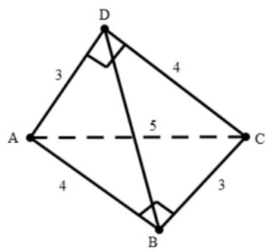

$\because {AD} \bot  {DC},{AD} \bot  {BC}$

$\therefore {AD} \bot$ 平面 ${BCD},\therefore {AD} \bot  {BD}$

又 ${AB} \bot  {BC},{AD} \bot  {BC},\therefore {BC} \bot$ 平面 ${ABD},\therefore {BC} \bot  {BD}$

所以BD是异面直线 ${AD}$ 和 ${BC}$ 的公垂线，所以异面直线 ${AD}$ 和 ${BC}$ 的距离为 ${BD}$

$\because {AD} \bot  {BD}$ ， $\therefore  \bigtriangleup  {ABD}$ 是直角三角形。 $\therefore {BD} = \sqrt{{AB}^{2} - {AD}^{2}} = \sqrt{{4}^{2} - {3}^{2}} = \sqrt{7}$ ，故答案为: $\sqrt{7}$

【例 16】如图: 长方体 ${ABCD} - {A}_{1}{B}_{1}{C}_{1}{D}_{1},{AB} = {12}, B{B}_{1} = 5$ ,则直线 ${B}_{1}{C}_{1}$ 到平面 ${A}_{1}{BC}{D}_{1}$ 的距离___。

【难度】 $\star   \star$

【答案】 $\frac{60}{13}$

【解析】直线 ${B}_{1}{C}_{1}$ 到平面 ${A}_{1}{BC}{D}_{1}$ 的距离可以转化成 ${B}_{1}$ 点到平面 ${A}_{1}{BC}{D}_{1}$ 的距离,过 ${B}_{1}$ 作 ${B}_{1}E \bot  {A}_{1}B$ ,可证 ${B}_{1}E \bot$ 平面 ${A}_{1}{BC}{D}_{1}$ ,所以 ${B}_{1}E$ 的长度即为直线 ${B}_{1}{C}_{1}$ 到平面 ${A}_{1}{BC}{D}_{1}$ 的距离,利用等面积法可求出 ${B}_{1}E$ 的长度为 $\frac{60}{13}$ .

【例 17】如图,在直角梯形 ${ABCD}$ 中, ${AD}//{BC},\angle {ADC} = {90}^{ \circ  }$ ,平面 ${ABCD}$ 外一点 $P$ 在平 ${ABCD}$ 内的射影 $Q$ 恰在边 ${AD}$ 的中点 $Q$ 上， ${PA} = {AD} = {2BC} = {2CD} = \sqrt{3}$ .

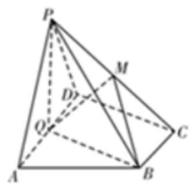

(1)求证:平面 ${PQB} \bot$ 平面 ${PAD}$ ；

(2)若 $M$ 在线段 ${PC}$ 上，且 ${PA}//$ 平面 ${BMQ}$ ，求点 $M$ 到平面 ${PAB}$ 的距离.

【难度】 $\star   \star   \star$

【答案】(1)证明见解析; (2) $\frac{\sqrt{15}}{10}$ .

【解析】(1) $\because P$ 在平面 ${ABCD}$ 内的射影 $Q$ 恰在边 ${AD}$ 上， $\therefore {PQ} \bot$ 平面 ${ABCD}$ ，

$\because {AD} \subset$ 平面 ${ABCD}$ ， $\therefore {PQ}\bot {AD}$ ，

$\because Q$ 为线段 ${AD}$ 中点， $\therefore {CD}//{BQ}$ ， $\therefore {BQ}\bot {AD}$ ， $\therefore {AD}\bot$ 平面 ${PBQ}$ ， ${AD} \subset$ 平面 ${PAD}$ ，

$\therefore$ 平面 ${PQB} \bot$ 平面 ${PAD}$ .

(2)连接 ${AC}$ 与 ${BQ}$ 交于点 $N$ ，则 $N$ 为 ${AC}$ 中点，

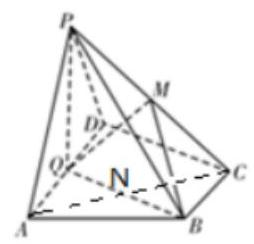

$\therefore$ 点 $M$ 到平面 ${PAB}$ 的距离是点 $C$ 到平面 ${PAB}$ 的距离的 $\frac{1}{2}$ ，

在三棱锥 $P - {ABC}$ 中,高 ${PQ} = \sqrt{3}$ ,底面积为 $\frac{\sqrt{3}}{2},\therefore$ 三棱锥 $P - {ABC}$ 的体积 $V = \frac{1}{3} \times  \frac{\sqrt{3}}{2} \times  \sqrt{3} = \frac{1}{2}$ ,

又 $\bigtriangleup  {PAB}$ 中， ${PA} = {AB} = 2,{PB} = \sqrt{6}$ ， $\therefore  \bigtriangleup  {PAB}$ 的面积为 $\frac{\sqrt{15}}{2}$ ，

设点 $M$ 到平面 ${PAB}$ 的距离为 $d$ ,由 ${V}_{C.{PAB}} = {V}_{PABC}$ ,得 $\frac{1}{3} \times  {2d} \times  \frac{\sqrt{15}}{2} = \frac{1}{2}$ ,解得 $d = \frac{\sqrt{15}}{10}$ ,

$\therefore$ 点 $M$ 到平面 ${PAB}$ 的距离为 $\frac{\sqrt{15}}{10}$ .

## 巩固训练

1、已知正方形 ${ABCD}$ 的边长为 1， ${PD} \bot$ 平面 ${ABCD}$ ，且 ${PD} = 1$ ， $E$ ， $F$ 分别为 ${AB}$ ， ${BC}$ 的中点.

(1)求点 $D$ 到平面 ${PEF}$ 的距离；

(2)求直线 ${AC}$ 到平面 ${PEF}$ 的距离.

【难度】 $\star   \star   \star$

【答案】(1) $\frac{3}{17}\sqrt{17}$ ; (2) $\frac{\sqrt{17}}{17}$ .

【解析】(1)建立以点 $D$ 为坐标原点， $\overrightarrow{DA}$ ， $\overrightarrow{DC}$ ， $\overrightarrow{DP}$ 分别为 $x$ 轴， $y$ 轴， $z$ 轴正方向的空间直角坐标系， 如图所示，

$\because {PD} = 1, E, F$ 分别为 ${AB}$ , ${BC}$ 的中点,

$\therefore P\left( {0,0,1}\right) , A\left( {1,0,0}\right) , C\left( {0,1,0}\right) , E\left( {1,\frac{1}{2},0}\right) , F\left( {\frac{1}{2},1,0}\right)$ ,

所以 $\overrightarrow{EF} = \left( {-\frac{1}{2},\frac{1}{2},0}\right) ,\overrightarrow{PE} = \left( {1,\frac{1}{2}, - 1}\right) ,\overrightarrow{DE} = \left( {1,\frac{1}{2},0}\right)$ ,

设平面 ${PEF}$ 的法向量为 $\overrightarrow{n} = \left( {x, y, z}\right)$ ,

则 $\left\{  \begin{array}{l} \overrightarrow{n} \cdot  \overrightarrow{EF} = 0 \\  \overrightarrow{n} \cdot  \overrightarrow{PE} = 0 \end{array}\right.$ ,即 $\left\{  \begin{array}{l}  - \frac{1}{2}x + \frac{1}{2}y = 0 \\  x + \frac{1}{2}y - z = 0 \end{array}\right.$ ,

令 $x = 2$ ,则 $y = 2, z = 3$ ,所以 $\overrightarrow{n} = \left( {2,2,3}\right)$ ,

所以点 $D$ 到平面 ${PEF}$ 的距离 $d = \frac{\left| \overrightarrow{DE} \cdot  \overrightarrow{n}\right| }{\left| \overrightarrow{n}\right| } = \frac{\left| 2 + 1\right| }{\sqrt{4 + 4 + 9}} = \frac{3}{17}\sqrt{17}$ ,故答案为: $\frac{3}{17}\sqrt{17}$ .

(2)因为 $\overrightarrow{AE} = \left( {0,\frac{1}{2},0}\right)$ ，

所以点 $A$ 到平面 ${PEF}$ 的距离 ${d}^{\prime } = \frac{\left| \overrightarrow{AE} \cdot  \overrightarrow{n}\right| }{\left| \overrightarrow{n}\right| } = \frac{1}{\sqrt{17}} = \frac{\sqrt{17}}{17}$ ,

$\because E, F$ 分别为 ${AB},{BC}$ 的中点, $\therefore {AC}//{EF}$ ,

$\because {AC} \text{ ⊄ }$ 面 ${PEF},{EF} \subset$ 面 ${PEF},\therefore {AC}//$ 面 ${PEF}$ ,

$\therefore$ 直线 ${AC}$ 到平面 ${PEF}$ 的距离等于点 $A$ 到平面 ${PEF}$ 的距离,

$\therefore$ 直线 ${AC}$ 到平面 ${PEF}$ 的距离为 $\frac{\sqrt{17}}{17}$ ,故答案为: $\frac{\sqrt{17}}{17}$ .

2、如图，在长方体 ${ABCD} - {A}_{1}{B}_{1}{C}_{1}{D}_{1}$ 中， ${AD} = A{A}_{1} = 4,{AB} = 2, E$ 、 $M$ 、 $N$ 分别是 ${BC}$ 、 $B{B}_{1}$ 、 ${A}_{1}D$ 的中点.

(1)证明: ${MN}//$ 平面 ${C}_{1}{DE}$ ；

(2)求点 $C$ 到平面 ${C}_{1}{DE}$ 的距离；

(3)设 $P$ 为边 ${AB}$ 上的一点，当直线 ${PN}$ 与平面 ${A}_{1}{AD}{D}_{1}$ 所成角的正切值为 $\frac{\sqrt{2}}{4}$ 时，求二面角 $N - {A}_{1}P - M$ 的余弦值.

【难度】 $\star   \star   \star$

【答案】(1)证明见解析; (2) $\frac{4}{3};$ (3) $- \frac{\sqrt{2}}{6}$ .

【解析】(1)证明:连接 ${B}_{1}C$ ， ${ME}$ ，如图，

因为 $E\text{ 、 }M$ 分别是 ${BC}\text{ 、 }B{B}_{1}$ 的中点,所以 ${ME}//{B}_{1}C$ 且 ${ME} = \frac{1}{2}{B}_{1}C$ ,

又 $N$ 是 ${A}_{1}D$ 的中点,所以 ${ND} = \frac{1}{2}{A}_{1}D$ ,

结合长方体的性质可得 ${ME}//{ND}$ 且 ${ME} = {ND}$ ，

所以四边形 ${MEDN}$ 为平行四边形,所以 ${MN}//{ED}$ ,

又 ${MN} \text{ ⊄ }$ 平面 ${C}_{1}{DE},{ED} \subset$ 平面 ${C}_{1}{DE}$ ,所以 ${MN}//$ 平面 ${C}_{1}{DE}$ ;

(2)因为 ${AD} = A{A}_{1} = 4,{AB} = 2,{ABCD} - {A}_{1}{B}_{1}{C}_{1}{D}_{1}$ 为长方体，

$E\text{ 、 }M\text{ 、 }N$ 分别是 ${BC}\text{ 、 }B{B}_{1}\text{ 、 }{A}_{1}D$ 的中点,

所以 ${C}_{1}E = \sqrt{C{E}^{2} + {C}_{1}{C}^{2}} = 2\sqrt{5},{C}_{1}D = \sqrt{C{D}^{2} + {C}_{1}{C}^{2}} = 2\sqrt{5},{ED} = \sqrt{C{D}^{2} + E{C}^{2}} = 2\sqrt{2}$ ,

所以 $\bigtriangleup {C}_{1}{ED}$ 为等腰三角形,其底边上的高为 $\sqrt{{C}_{1}{E}^{2} - {\left( \frac{DE}{2}\right) }^{2}} = 3\sqrt{2}$ ,

所以 ${S}_{\bigtriangleup {C}_{1}{ED}} = \frac{1}{2} \times  2\sqrt{2} \times  3\sqrt{2} = 6$ ,

设点 $C$ 到平面 ${C}_{1}{DE}$ 的距离为 $h$ ,则 ${V}_{C - {C}_{1}{DE}} = \frac{1}{3}{S}_{\bigtriangleup {C}_{1}{ED}} \cdot  h = {2h}$ ,

又 ${V}_{C - C,{DE}} = {V}_{{C}_{1} - {DCE}} = \frac{1}{3}{S}_{\bigtriangleup {DCE}} \cdot  {C}_{1}C = \frac{1}{3} \times  \frac{1}{2} \times  2 \times  2 \times  4 = \frac{8}{3}$ ,

所以 ${2h} = \frac{8}{3}$ ,解得 $h = \frac{4}{3}$ ,

所以点 $C$ 到平面 ${C}_{1}{DE}$ 的距离为 $\frac{4}{3}$ ;

(3)连接 ${AN}$ ，如图，

由 ${PA} \bot$ 平面 ${A}_{1}{AD}{D}_{1}$ 可得 $\angle {ANP}$ 即为直线 ${PN}$ 与平面 ${A}_{1}{AD}{D}_{1}$ 所成角,

又 ${AN} = \frac{1}{2}{A}_{1}D = \frac{1}{2}\sqrt{A{D}^{2} + A{A}_{1}^{2}} = 2\sqrt{2}$ ,所以 ${AP} = \frac{\sqrt{2}}{4}{AN} = 1$ ,

分别以 ${DA}\text{ 、 }{DC}\text{ 、 }D{D}_{1}$ 作为 $x$ 轴、 $y$ 轴、 $z$ 轴,建立如图所示空间直角坐标系,

则 ${A}_{1}\left( {4,0,4}\right) , P\left( {4,1,0}\right) , N\left( {2,0,2}\right)$ ,所以 $\overrightarrow{{A}_{1}P} = \left( {0,1, - 4}\right) ,\overrightarrow{{A}_{1}N} = \left( {-2,0, - 2}\right)$ ,

设平面 $N{A}_{1}P$ 的一个法向量为 $\overrightarrow{m} = \left( {x, y, z}\right)$ ,则 $\left\{  \begin{array}{l} \overrightarrow{m} \cdot  \overrightarrow{{A}_{1}P} = y - {4z} = 0 \\  \overrightarrow{m} \cdot  \overrightarrow{{A}_{1}N} =  - {2x} - {2z} = 0 \end{array}\right.$ ,令 $z = 1$ 则 $\overrightarrow{m} = \left( {-1,4,1}\right)$ ,

易得平面 ${A}_{1}{PM}$ 的一个法向量 $\overrightarrow{n} = \left( {1,0,0}\right)$ ,所以 $\cos \langle \overrightarrow{m},\overrightarrow{n}\rangle  = \frac{\overrightarrow{m} \cdot  \overrightarrow{n}}{\left| \overrightarrow{m}\right|  \cdot  \left| \overrightarrow{n}\right| } = \frac{-1}{\sqrt{1 + {16} + 1} \times  1} =  - \frac{\sqrt{2}}{6}$ ,

因为二面角 $N - {A}_{1}P - M$ 为钝角，所以二面角 $N - {A}_{1}P - M$ 的余弦值为 $- \frac{\sqrt{2}}{6}$ .

## 实战演练

## 一、填空题

1、给出下列判断:①一条直线和一点确定一个平面；②两条直线确定一个平面；③三角形和梯形一定是平面图形; ④三条互相平行的直线一定共面其中正确的是___. (写出所有正确判断的序号)

【难度】 $\star   \star   \star$

【答案】 ⑧

【解析】一条直线与直线外一点能确定一个平面, 所以①不正确;

两条相交直线或两条平行直线可以确定一个平面, 所以②不正确, ③正确;

对于④, 三条互相平行的直线一定共面也不正确, 例如三棱柱的三条侧棱.

## 故答案为③.

2、在正方体 ${ABCD} - {A}_{1}{B}_{1}{C}_{1}{D}_{1}$ 中， $P$ 为线段 $A{B}_{1}$ 上的任意一点，有下面三个命题:① ${PB}//$ 平面 $C{C}_{1}{D}_{1}D$ ； ② $B{D}_{1} \bot  {AC}$ ；③ $B{D}_{1} \bot  {PC}$ . 上述命题中正确命题的序号为___ (写出所有正确命题的序号).

【难度】 $\star   \star   \star$

【答案】①②③

【解析】①如下图所示:

因为平面 ${AB}{B}_{1}{A}_{1}//$ 平面 $C{C}_{1}{D}_{1}D,{BP} \subset$ 平面 ${AB}{B}_{1}{A}_{1}$ ,所以 ${PB}//$ 平面 $C{C}_{1}{D}_{1}D$ ,故①正确；

②连接 ${AC},{BD}$ ，如下图所示:

因为 $D{D}_{1} \bot$ 平面 ${ABCD}$ ,所以 $D{D}_{1} \bot  {AC}$ ,

又因为 ${AC} \bot  {BD}$ 且 $D{D}_{1} \cap  {BD} = D$ ,所以 ${AC} \bot$ 平面 ${DB}{D}_{1}$ ,

又因为 $B{D}_{1} \subset$ 平面 ${DB}{D}_{1}$ ,所以 $B{D}_{1} \bot  {AC}$ ,故②正确；

③连接 ${AC},{PC},{B}_{1}C, B{C}_{1}$ ，如下图所示:

因为 ${D}_{1}{C}_{1} \bot$ 平面 ${BC}{C}_{1}{B}_{1}$ ,所以 ${D}_{1}{C}_{1} \bot  {B}_{1}C$ ,又因为 $B{C}_{1} \bot  {B}_{1}C$ ,且 ${D}_{1}{C}_{1} \cap  B{C}_{1} = {C}_{1}$ ,

所以 ${B}_{1}C \bot$ 平面 $B{D}_{1}{C}_{1}$ ,又 $B{D}_{1} \subset$ 平面 $B{D}_{1}{C}_{1}$ ,所以 ${B}_{1}C \bot  B{D}_{1}$ ,

由②的证明可知 $B{D}_{1} \bot  {AC}$ ,且 ${AC} \cap  {B}_{1}C = C$ ,所以 $B{D}_{1} \bot$ 平面 $A{B}_{1}C$ ,

又因为 ${PC} \subset$ 平面 $A{B}_{1}C$ ,所以 $B{D}_{1} \bot  {PC}$ ,故③正确,

故答案为: ①②③.

3、有一种多面体的饰品，其表面由 6 个正方形和 8 个正三角形组成(如图)，AB 与 CD 所成的角的大小是 ___

【难度】 $\star   \star   \star$

【答案】 $\frac{\pi }{3}$

【解析】

法一: 如图因为 ${AB}//{GH},{CD}//{FH}$ ,所以 ${GH}$ 和 ${FH}$ 所成角即为 ${AB}$ 与 ${CD}$ 所成的角,

又因为 $\bigtriangleup {GHF}$ 为等边三角形,故 ${GH}$ 和 ${FH}$ 所成角为 $\frac{\pi }{3}$ ,即 ${AB}$ 与 ${CD}$ 所成的角为 $\frac{\pi }{3}$ .

法二:该饰品实际上就是正方体的 8 个顶角被切掉，切线经过正方体每条棱边的中点，如图

可得 ${AB}$ 与 ${CD}$ 所成的角即为 ${ED}$ 与 ${CD}$ 所成角,

设正方体的棱长为 2,在 $\bigtriangleup {CDE}$ 中,可得 ${CD} = {DE} = \sqrt{2},{EC} = \sqrt{6}$ ,

由余弦定理可得 $\cos \angle {CDE} = \frac{C{D}^{2} + D{E}^{2} - E{C}^{2}}{2 \times  {CD} \times  {DE}} =  - \frac{1}{2}$ ,

故 $\angle {CDE} = \frac{2\pi }{3}$ ,

因为异面直线所成的角是锐角或直角,

所以 ${AB}$ 与 ${CD}$ 所成的角为 $\frac{\pi }{3}$ .

4、已知正四棱锥 $P - {ABCD}$ 的棱长都相等，侧棱 ${PB}$ 、 ${PD}$ 的中点分别为 $M$ 、 $N$ ，则截面 ${AMN}$ 与底面 ${ABCD}$ 所成的二面角的余弦值是___.

【难度】 $\star   \star   \star$

【答案】 $\frac{2\sqrt{5}}{5}$

【解析】如图,

正四棱锥 P - ABCD 中, 0 为正方形 ABCD 的两对角线的交点, 则 PO⊥面 ABCD, PO 交 MN 于 E，则 PE=EO，

又BD⊥AC，∴BD⊥面 PAC，

过 A 作直线 1 / BD，则 1 LEA，1 ⊥ AO，

$\therefore \angle {EAO}$ 为所求二面角的平面角.

又 $\mathrm{{EO}} = \frac{1}{2}\mathrm{{AO}} = \frac{\sqrt{2}}{4}\mathrm{a},\mathrm{{AO}} = \frac{\sqrt{2}}{2}\mathrm{a},\therefore \mathrm{{AE}} = \frac{\sqrt{10}}{4}\mathrm{a}$

$\therefore \cos \angle \mathrm{{EAO}} = \frac{2\sqrt{5}}{5}$ . $\therefore$ 截面 AMN 与底面 ABCD 所成的二面角的余弦值是 $\frac{2\sqrt{5}}{5}$ .

5、如图所示， ${ABCD} - {A}_{1}{B}_{1}{C}_{1}{D}_{1}$ 为正方体，给出以下五个结论:

① ${BD}//$ 平面 $C{B}_{1}{D}_{1}$ ；

② $A{C}_{1} \bot$ 平面 $C{B}_{1}{D}_{1}$ ；

③ $A{C}_{1}$ 与底面 ${ABCD}$ 所成角的正切值是 $\sqrt{2}$ ；

④ 二面角 $C - {B}_{1}{D}_{1} - {C}_{1}$ 的正切值是 $\sqrt{2}$ ；

⑤ 过点 ${A}_{1}$ 且与异面直线 ${AD}$ 和 $C{B}_{1}$ 均成 ${70}^{ \circ  }$ 角的直线有 4 条.

其中，所有正确结论的序号为___.

【难度】 $\star   \star   \star$

【答案】①②④⑤

【解析】因 ${BD}\parallel {B}_{1}{D}_{1},{BD} \text{ ⊄ }$ 平面 $C{B}_{1}{D}_{1},{B}_{1}{D}_{1} \subset$ 平面 $C{B}_{1}{D}_{1}$ ,故 ${BD}//$ 平面 $C{B}_{1}{D}_{1}$ . ①对.

$A{C}_{1} \bot  {B}_{1}C, A{C}_{1} \bot  {D}_{1}C,{D}_{1}C \cap  {B}_{1}C = C$ ,故 $A{C}_{1} \bot$ 平面 $C{B}_{1}{D}_{1}$ ,故②正确.

作 ${B}_{1}{D}_{1}$ 的中点 ${O}_{1}$ ,连接 ${C}_{1}{O}_{1}, C{O}_{1}$ ,则 $\angle {C}_{1}{OC}$ 是二面角 ${C}_{1} - {B}_{1}{D}_{1} - C$ 的平面角,又 $\tan \angle {C}_{1}{OC} = \sqrt{2}$ , 故④正确.

$A{C}_{1}$ 与平面 ${ABCD}$ 所成的角为 $\angle {C}_{1}{AC}$ ,而 $\tan \angle {C}_{1}{AC} = \frac{{C}_{1}C}{AC} = \frac{\sqrt{2}}{2}$ ,故③错误.

${AD}$ 与 $C{B}_{1}$ 所成的角为 ${45}^{ \circ  }$ ,因 ${22.5}^{ \circ  } < {70}^{ \circ  },{67.5} < {70}^{ \circ  }$ ,故过 ${A}_{1}$ 且与它们所成的角均为 ${70}^{ \circ  }$ 的直线有 4 条, 故⑤正确.

综上, 填①②④⑤.

6、四面体 ${ABCD}$ 中， ${\Delta BCD}$ 为等腰直角三角形， $\angle {BDC} = {90}^{ \circ  }$ ， ${BD} = 6$ ，且 $\angle {ADB} = \angle {ADC} = {60}^{ \circ  }$ ， 则异面直线 ${AD}$ 与 ${BC}$ 的距离为___

【难度】 $\star   \star   \star$

【答案】 3

【解析】根据题意,取 ${BC}$ 中点 $\mathrm{M}$ ,连接 ${AM}\text{ 、 }{DM}$ ,作 ${MN} \bot  {AD}$ 交 ${AD}$ 于 $\mathrm{N}$ ,空间几何图形如下图所示:

${BD} = {CD} = 6,\angle {BDC} = {90}^{ \circ  }$ 所以 ${BC} = 6\sqrt{2}$

因为 $M$ 为 ${BC}$ 中点,所以 ${AM} \bot  {BC},{DM} \bot  {BC}$ ,且 ${DM} \cap  {AM} = M$

则 ${BC} \bot$ 平面 ${ADM}$ ,所以 ${BC} \bot  {MN}$ 且 ${BM} = {DM} = {CM} = 3\sqrt{2}$ ,设 ${AD} = x$

因为 $\angle {ADB} = \angle {ADC} = {60}^{ \circ  }$

所以由余弦定理可得 $A{B}^{2} = A{D}^{2} + B{D}^{2} - 2 \times  {AD} \times  {BD} \times  \cos \angle {ADB}$

$A{C}^{2} = A{D}^{2} + C{D}^{2} - 2 \times  {AD} \times  {CD} \times  \cos \angle {ADC}$

代入可解得 $A{B}^{2} = A{C}^{2} = {x}^{2} - {6x} + {36}$

在 ${Rt\Delta AMB}$ 中,可得 $A{M}^{2} = A{B}^{2} - B{M}^{2} = {x}^{2} - {6x} + {18}$

在 $\bigtriangleup {ADM}$ 中,由余弦定理可得 $\cos \angle {ADM} = \frac{A{D}^{2} - D{M}^{2} - A{M}^{2}}{2 \times  {AD} \times  {DM}}$

代入可得 $\cos \angle {ADM} = \frac{{x}^{2} + {18} - \left( {{x}^{2} - {6x} + {18}}\right) }{2 \times  x \times  3\sqrt{2}} = \frac{\sqrt{2}}{2}$

所以 $\sin \angle {ADM} = \sqrt{1 - {\left( \frac{\sqrt{2}}{2}\right) }^{2}} = \frac{\sqrt{2}}{2}$ ,而 ${MN} \bot  {AD}$

所以 ${MN}$ 即为异面直线 ${AD}$ 与 ${BC}$ 的距离

则 ${MN} = {DM} \times  \sin \angle {ADM} = 3\sqrt{2} \times  \frac{\sqrt{2}}{2} = 3$ ,故答案为: 3

## 二、选择题

7、在空间中，下列结论正确的是( )

A. 三角形确定一个平面 B. 四边形确定一个平面

C. 一个点和一条直线确定一个平面 D. 两条直线确定一个平面

【难度】 $\star   \star   \star$

【答案】A

【解析】三角形有且仅有 3 个不在同一条直线上的顶点,故其可以确定一个平面,即 $A$ 正确;

当四边形为空间四边形时不能确定一个平面,故 $B$ 错误;

当点在直线上时,一个点和一条直线不能确定一个平面,故 $C$ 错误;

当两条直线异面时,不能确定一个平面,即 $D$ 错误;

故选: $A$ .

8、在正方体 ${ABCD} - {A}_{1}{B}_{1}{C}_{1}{D}_{1}$ 中， $E, F, G, H$ 分别为 $A{A}_{1},{B}_{1}{C}_{1},{C}_{1}{D}_{1},{BC}$ 的中点，则下列直线中与直线 ${EF}$ 相交的是( )

A. 直线 $B{B}_{1}$ B. 直线 ${CD}$ C. 直线 ${AH}$ D. 直线 ${GH}$

【难度】 $\star   \star   \star$

【答案】C

【解析】解: 如图,连接 ${FH}$ , 因为 $F, H$ 分别为 ${B}_{1}{C}_{1},{BC}$ 的中点,所以 ${FH}//B{B}_{1},{FH} = B{B}_{1}$ ,

因为 $E$ 为 $A{A}_{1}$ 的中点,所以 ${AE} = \frac{1}{2}{A{A}_{1}} = \frac{1}{2}{B{B}_{1}},{AE}//{B{B}_{1}}$ ,所以 ${AE}//{FH}$ , ${AE} = \frac{1}{2}{FH}$ ,所以四边形 ${AEFH}$ 为梯形,所以直线 ${EF}$ 与直线 ${AH}$ 相交. 故选: $\mathbf{C}$

9、已知 $a, b, c$ 是两两不同的三条直线，下列说法正确的是( )

A. 若直线 $a, b$ 异面， $b, c$ 异面，则 $a, c$ 异面

B. 若直线 $a, b$ 相交， $b, c$ 相交，则 $a, c$ 相交

C. 若 $a//b$ ,则 $a, b$ 与 $c$ 所成的角相等

D. 若 $a \bot  b, b \bot  c$ ,则 $a//c$

【难度】★★★

【答案】C

【解析】对 $A$ ,若直线 $a, b$ 异面, $b, c$ 异面,则 $a, c$ 相交、平行或异面; 错误

对 $B$ ,若 $a, b$ 相交, $b, c$ 相交,则 $a, c$ 相交、平行或异面; 错误

对 $C$ ,若 $a//b$ ,则 $a, b$ 与 $c$ 所成的角相等; 正确;

对 $D$ ,若 $a \bot  b, b \bot  c$ ,则 $a//c$ 或异面或相交,错误

故选 C

10、设 $P$ 是正方体 ${ABCD} - {A}_{1}{B}_{1}{C}_{1}{D}_{1}$ 的对角面 ${BD}{D}_{1}{B}_{1}$ (含边界)内的点，若点 $P$ 到平面 ${ABC}$ 、平面 ${AB}{A}_{1}$ 、平面 ${AD}{A}_{1}$ 的距离相等，则符合条件的点 $P$ ( )

A. 仅有一个 B. 有有限多个 C. 有无限多个 D. 不存在

【难度】 $\star   \star   \star$

【答案】A

【解析】解: 与平面 ${ABC},{AB}{A}_{1}$ 距离相等的点位于平面 ${A}_{1}{B}_{1}{C}_{1}{D}_{1}$ 上;

与平面 ${ABC},{AD}{A}_{1}$ 距离相等的点位于平面 $A{B}_{1}{C}_{1}D$ 上；

与平面 ${AB}{A}_{1},{AD}{A}_{1}$ 距离相等的点位于平面 ${A}_{1}C{C}_{1}{A}_{1}$ 上;

据此可知，满足题意的点位于上述平面 ${A}_{1}{B}_{1}{C}_{1}{D}_{1}$ ,平面 $A{B}_{1}{C}_{1}D$ ,平面 ${A}_{1}C{C}_{1}{A}_{1}$ 的公共点处，结合题意可知， 满足题意的点仅有一个.

本题选择A 选项.

## 三、解答题

11、如图，立方体 ${ABCD} - {A}_{1}{B}_{1}{C}_{1}{D}_{1}$ 的棱长为 $a, E, F, G$ 分别是 $B{B}_{1}, C{C}_{1}, D{D}_{1}$ 的中点，求:

(1) ${A}_{1}{D}_{1}$ 到截面 ${AEFD}$ 的距离；

(2)点 ${B}_{1}$ 到截面 ${AE}{C}_{1}G$ 的距离.

【难度】 $\star   \star   \star$

【答案】(1) $\frac{2\sqrt{5}}{5}a$ (2) $\frac{\sqrt{6}}{6}a$

【解析】解: (1) ${A}_{1}{D}_{1}$ 到平面 ${AEFD}$ 的距离即为 ${A}_{1}$ 到平面 ${AEFD}$ 的距离在平面 ${AB}{B}_{1}{A}_{1}$ 中,

作 ${A}_{1}H \bot  {AE}$ ,如图所示,连接 ${A}_{1}E$ ,

又 ${DA} \bot$ 面 ${AB}{B}_{1}{A}_{1},{A}_{1}H \subset$ 面 ${AB}{B}_{1}{A}_{1}$ ,则 ${DA} \bot  {A}_{1}H$ ,

又 ${DA} \cap  {AE} = A$ ,得 ${A}_{1}H \bot$ 面 ${AEFD}$ ,即 ${A}_{1}H$ 的长度即为所求的距离,

则 ${S}_{\bigtriangleup {A}_{1}{AE}} = \frac{1}{2}{a}^{2} = \frac{1}{2}{AE} \cdot  {A}_{1}H$ ,又 ${AE} = \frac{\sqrt{5}a}{2}$ ,得 ${A}_{1}H = \frac{2\sqrt{5}}{5}a$

即 ${A}_{1}{D}_{1}$ 到平面 ${AEFD}$ 的距离为 $\frac{2\sqrt{5}}{5}a$ .

(2)连接 ${EG}$ ， ${B}_{1}G$ ，设 ${B}_{1}$ 到平面 ${AE}{C}_{1}G$ 的距离为 $h$ ，

则 ${S}_{\bigtriangleup {B}_{1}E{C}_{1}} = \frac{1}{2}a \cdot  \frac{a}{2} = \frac{{a}^{2}}{4}$ ,则 ${V}_{G - E{B}_{1}{C}_{1}} = \frac{1}{3}{S}_{\bigtriangleup {B}_{1}E{C}_{1}} \cdot  {C}_{1}{D}_{1} = \frac{{a}^{3}}{12}$ ,

又 $E{C}_{1} = {C}_{1}G = \frac{\sqrt{5}}{2}a,{GE} = \sqrt{2}a$ ,则 ${S}_{{\Delta E}{C}_{1}G} = \frac{\sqrt{6}}{4}{a}^{2}$ ,故 ${V}_{{B}_{1} - E{C}_{1}G} = \frac{\sqrt{6}}{12}{a}^{2}h$

由 ${V}_{{B}_{1} - E{C}_{1}G} = {V}_{G - E{B}_{1}{C}_{1}}$ ,得 $h = \frac{\sqrt{6}}{6}a$ . 即点 ${B}_{1}$ 到截面 ${AE}{C}_{1}G$ 的距离为 $\frac{\sqrt{6}}{6}a$ .

12、如图甲，在 $\bigtriangleup  {ABC}$ 中， ${AB}\bot {BC}$ ， ${AB} = 6,{BC} = 3, D, E$ 分别在 ${AC},{AB}$ 上，且满足 $\frac{AE}{BE} = \frac{AD}{DC} = 2$ ， 将 $\bigtriangleup  {ADE}$ 沿 ${DE}$ 折到 $\bigtriangleup  {PDE}$ 位置，得到四棱锥 $P - {BCDE}$ ，如图乙.

甲

乙

(1)已知 $M$ ， $N$ 为 ${PB}$ ， ${PE}$ 上的动点，求证: ${MN} \bot  {DE}$ ；

(2)在翻折过程中，当二面角 $P - {ED} - B$ 为 ${60}^{ \circ  }$ 时，求直线 ${CE}$ 与平面 ${PCD}$ 所成角的正弦值.

【难度】 $\bigstar \bigstar \bigstar$

【答案】(1)证明见解析; (2) $\frac{\sqrt{26}}{13}$ .

【解析】(1) 证明: 在图甲中,

$\because \frac{AE}{BE} = \frac{AD}{DC} = 2,\therefore {DE}//{BC}$ ,

又 $\because {AB} \bot  {BC},\therefore {DE} \bot  {BE}$ 且 ${DE} \bot  {AE}$ ，

即在图乙中, ${DE} \bot  {BE},{DE} \bot  {PE}$ ,又 ${BE} \cap  {PE} = E$ ,

故有 ${DE} \bot$ 平面 ${PBE}$ ,

而 ${MN} \subset$ 平面 ${PBE}$ ,故有 ${MN} \bot  {DE}$ ;

(2)解: $\because {DE} \bot  {BE}$ ， ${DE} \bot  {PE}$ ，

所以 $\angle {PEB}$ 为二面角 $P - {ED} - B$ 的平面角，则 $\angle {PEB} = {60}^{ \circ  }$ ，

在 $\bigtriangleup {PBE}$ 中, ${BE} = 2,{PE} = 4,\angle {PEB} = {60}^{ \circ  }$ ,

由余弦定理,可知 ${PB} = 2\sqrt{3}$ ,满足 $P{B}^{2} + B{E}^{2} = P{E}^{2}$ ,则有 ${PB} \bot  {BE}$ ,

由( 1 )知， ${BC} \bot$ 平面 ${PBE}$ ，则 ${PB} \bot  {BC}$ ，

如图,以点 $B$ 为坐标原点,分别以 ${BE},{BC},{BP}$ 为 $x, y, z$ 轴正方向建立坐标系,

则 $E\left( {2,0,0}\right) , P\left( {0,0,2\sqrt{3}}\right) , C\left( {0,3,0}\right) , D\left( {2,2,0}\right)$ ,

则 $\overrightarrow{PC} = \left( {0,3, - 2\sqrt{3}}\right) ,\overrightarrow{CD} = \left( {2, - 1,0}\right) ,\overrightarrow{CE} = \left( {2, - 3,0}\right)$ ,

设平面 ${PCD}$ 的法向量为 $\overrightarrow{n} = \left( {x, y, z}\right)$ ,

则 $\left\{  \begin{array}{l} \overrightarrow{PC} \cdot  \overrightarrow{n} = {3y} - 2\sqrt{3}z = 0 \\  \overrightarrow{CD} \cdot  \overrightarrow{n} = {2x} - y = 0 \end{array}\right.$ ,取 $\overrightarrow{n} = \left( {1,2,\sqrt{3}}\right)$ ,

所以直线 ${CE}$ 与平面 ${PCD}$ 所成角 $\theta$ 满足 $\sin \theta  = \frac{\left| \overrightarrow{CE} \cdot  \overrightarrow{n}\right| }{\left| \overrightarrow{CE}\right|  \cdot  \left| \overrightarrow{n}\right| } = \frac{4}{\sqrt{13} \cdot  2\sqrt{2}} = \frac{\sqrt{26}}{13}$ .
