简单几何体

<table><tr><td>教学目标</td><td>1、掌握柱、锥、球的体积与面积的计算;   2、会画出几何体的截面，并能处理简单问题；   3、会画平面图形的斜二侧直观图；   4、会求简单的球面距离   5、掌握几何体的分解和组合、割补等思想   6、掌握平面图形与立体图形的相互转化</td></tr><tr><td>重点</td><td>柱、锥、球的体积与面积的计算</td></tr><tr><td>难点</td><td>平面图形和立体图形的转化</td></tr></table>

## (一) 简单几何体的结构特征

## 知识梳理

## 1、多面体的概念

(1)由平面多边形(或三角形)围成的封闭体叫做多面体；

构成多面体的各平面多边形(或三角形)叫做多面体的面；

其相邻多边形(或三角形)的公共边叫做多面体的棱；

棱与棱的交点叫做多面体的顶点.

(2)棱柱:如果一个多面体有两个全等的多边形的面互相平行，且不在这两个面上的棱都相互平行，那么这个多面体叫做棱柱;

棱柱的两个相互平行的面叫做棱柱的底面, 其他的面叫做棱柱的侧面;

棱柱的侧面都是平行四边形;

不在底面上的棱叫做棱柱的侧棱;

两个底面间的距离叫做棱柱的高.

(3)特殊的棱柱

平行六面体: 底面是平行四边形的棱柱有六个面, 且六个面都是平行四边形直棱柱: 侧棱与底面垂直的棱柱叫做直棱柱

<table><tr><td>名称</td><td>定义</td><td>图形</td><td>性质</td></tr><tr><td>平行六面体</td><td>底面是平行四边形的四棱柱</td><td>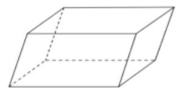</td><td>(1)相对的面是全等的平行四边形   (2)对角面是平行四边形</td></tr><tr><td>直平行六面体</td><td>侧棱垂直于底的平行六面体</td><td>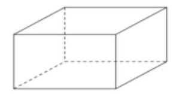</td><td>(1)侧面、对角面都是矩形   (2)底面是平行四边形</td></tr></table>

<table><tr><td>长方体</td><td>底面是矩形的直平行六面体</td><td>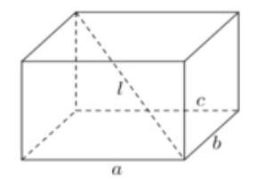</td><td>(1)六个面、对角面都是矩形   (2) ${l}^{2} = {a}^{2} + {b}^{2} + {c}^{2}$   (3) ${S}_{\text{ 全 }} = 2\left( {{ab} + {bc} + {ca}}\right)$</td></tr><tr><td>正四棱柱</td><td>底面是正方形的长方体</td><td>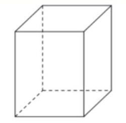</td><td>(1)侧面、对角面都是矩形   (2)底面是正方形</td></tr><tr><td>正方体</td><td>长、宽、高相等的长方体</td><td>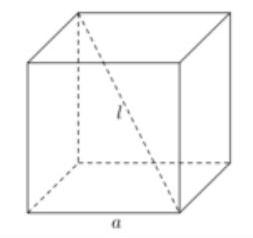</td><td>(1)六个面都是全等的正方形   (2) $l = \sqrt{3}a;{S}_{\text{ 全 }} = 6{a}^{2}$</td></tr></table>

(4)棱锥:如果一个多面体有一个多边形的面，且不在这个面上的棱都有一个公共点，那么这个多面体叫做棱锥;

棱锥的多边形的面叫做棱锥的底面, 其他的面叫做棱锥的侧面, 棱锥侧面都是三角形;

不在底面上的棱叫做棱锥的侧棱; 侧棱的公共点叫做棱锥的顶点;

顶点与底面之间的距离叫做棱锥的高.

(5)特殊的棱锥

正棱锥: 棱锥的底面是正多边形, 且底面中心与顶点的连线垂直于底面

【注意】区分正棱锥中的角:

① 侧棱与底边所成的角

② 侧棱与底面所成的角

③ 侧面与底面所成的角

④ 相邻侧面所成的角

在解正棱锥问题时，如果能够记住正多边形的边长 $a$ 与外接圆半径 $R$ 、内切圆半径 $r$ 和面积 $S$ 之间的关系, 将会给计算带来很大的便利, 如下表:

<table id="cross-table-1"><tr><td></td><td colspan="2">图形</td><td colspan="2">$R$</td><td>$r$</td><td>$S$</td></tr><tr><td>正三角形</td><td colspan="2">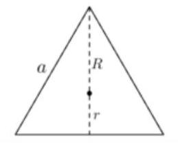</td><td colspan="2">$\frac{\sqrt{3}}{3}a$</td><td>$\frac{\sqrt{3}}{6}a$</td><td>$\frac{\sqrt{3}}{4}{a}^{2}$</td></tr><tr><td>正方形</td><td>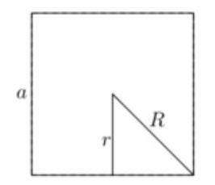</td><td colspan="2">$\frac{\sqrt{2}}{2}a$</td><td colspan="2">$\frac{a}{2}$</td><td>${a}^{2}$</td></tr><tr><td>正六边形</td><td>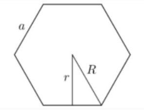</td><td colspan="2">$a$</td><td colspan="2">$\frac{\sqrt{3}}{2}a$</td><td>$\frac{3\sqrt{3}}{2}{a}^{2}$</td></tr></table>

【补充】三棱锥顶点在底面上射影的位置

已知在三棱锥 $P - {ABC}$ 中，顶点 $P$ 在底面上的射影为 $O$ ( $O$ 在 $\bigtriangleup {ABC}$ 内部)

②_x0001_ 若 ${PA} = {PB} = {PC}$ ，或 ${PA},{PB},{PC}$ 与底面成等角，则 $O$ 是 $\bigtriangleup \; {ABC}$ 的外心;

② 若三棱锥的三个侧面与底面成等角,或 $P$ 到底面三边等距离,则 $O$ 是 $\bigtriangleup \; {ABC}$ 的内心;

## 2、旋转体的概念

(1)平面上一条封闭曲线所围成的区域绕着它所在平面上的一条定直线旋转而形成的几何体叫做旋转体, 该定直线叫做旋转体的轴；

(2)圆柱:将矩形 ${ABCD}$ 绕其一边 ${AB}$ 所在直线旋转一周，所形成的的几何体叫做圆柱； ${AB}$ 所在直线叫做圆柱的轴;

线段 ${AD}$ 和 ${BC}$ 旋转而成的圆面叫做圆柱的底面；

线段 ${CD}$ 旋转而成的曲面叫做圆柱的侧面； ${CD}$ 叫做圆柱侧面的一条母线；

圆柱的两个底面间的距离 (即 ${AB}$ 的长度) 叫做圆柱的高

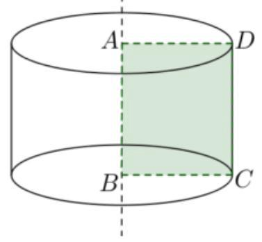

【性质】根据圆柱的形成过程易知:

① 圆柱有无穷多条母线，且所有母线都与轴平行;

② 圆柱有两个相互平行的底面.

(3)圆锥:将直角三角形 ${ABC}$ (及其内部)绕其一条直角边 ${AB}$ 所在直线旋转一周，所形成的几何体叫做圆锥; ${AB}$ 所在直线叫做圆锥的轴; 点 $A$ 叫做圆锥的顶点;

直角边 ${BC}$ 旋转而成的圆面叫做圆锥的底面；

斜边 ${AC}$ 旋转而成的曲面叫做圆锥的侧面；

斜边 ${AC}$ 叫做圆锥侧面的一条母线;

圆锥的顶点到底面间的距离叫做圆锥的高.

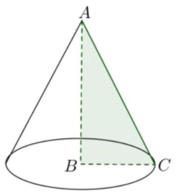

【性质】根据圆锥的形成过程易知:

① 圆锥有无穷多条母线，且所有母线相交于圆锥的顶点;

② 每条母线与轴的夹角都相等.

(4)球:将圆心为 $O$ 的半圆绕其直径 ${AB}$ 所在直线旋转一周，所形成的几何体叫做球；半圆的圆弧所形成的曲面叫做球面，把点 $O$ 称为球心，把原半圆的半径和直径分别称为球的半径和球的直径.

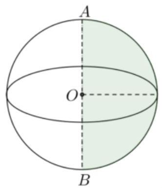

【补充】

① 球心到球面上任意点的距离都相等;

② 任意平面与球面的交线都是圆; 当平面通过球心时, 所得交线是大圆; 当平面不通过球心时, 所得交线是小圆.

## 例题精讲

【例 1】( 1 )下列说法正确的是( )

A、底面是正多边形，侧面都是正三角形的棱锥是正棱锥

B、各个侧面都是正方形的棱柱一定是正棱柱

C、对角面是全等的矩形的直棱柱是长方体

D、两底面为相似多边形，且其余各面均为梯形的多面体必为棱台

【难度】★★

【答案】A

【解析】由正棱锥的定义可知 $\mathrm{A}$ 正确;

B 不正确, 例如各个侧面都是正方形的四棱柱的底面一定是菱形, 但不一定是正方形, 所以此时的四棱柱不一定是正四棱柱;

C 不正确, 对角面是全等的矩形的直棱柱的底面可能是等腰梯形;

D 不正确, 不能保证此多面体的各侧棱交于一点.

(2)以下说法不正确的是___.(写出所有不正确说法的序号)

(1)有一个面是多边形，其余各面都是三角形的几何体叫棱锥.

(2)各侧面都是正方形的四棱柱一定是正方体.

(3)以直角梯形的一腰为轴旋转所得的旋转体是圆台.

(4)圆锥的侧面展开图为扇形，这个扇形所在圆的半径等于圆锥底面圆的半径.

【难度】 $\star   \star$

【答案】(1)(2)(3)(4)

【解析】有一个面是多边形, 其余各面都是有公共顶点三角形的几何体叫棱锥, 故 (1) 错误;

所有侧面都是正方形的四棱柱不一定是正方体,

因为各相邻侧面并不一定都互相垂直，所以(2)错误；

以直角梯形的垂直于底边的腰为轴旋转所得的旋转体才是圆台，以另一腰为轴所得旋转体不是圆台，故(3) 错误;

圆锥侧面展开图为扇形, 这个扇形所在圆的半径等于圆锥的母线长, 故 (4) 错误,

故答案为:(1)(2)(3)(4).

【例 2】《九章算术》中，称底面为矩形而有一侧棱垂直于底面的四棱锥为阳马，设 $A{A}_{1}$ 是正六棱柱的一条侧棱，如图，若阳马以该正六棱柱的顶点为顶点，以 $A{A}_{1}$ 为底面矩形的一边，则这样的阳马的个数是___.

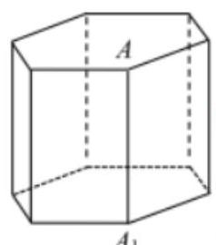

【难度】 $\star   \star   \star$

【答案】 16

【解析】如图所示:

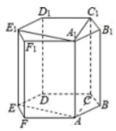

根据正六边形的性质可知,

当另一条边取 $B{B}_{1}$ 时，顶点可取 $D$ 或 ${D}_{1}$ 或 $E$ 或 ${E}_{1}$ 共4种情况，

当另一条边取 $C{C}_{1}$ ， $E{E}_{1}$ ， $F{F}_{1}$ 时，顶点也各有 4 种情况，

因此这样的阳马的个数是 $4 \times  4 = {16}$ 种.

故答案为: 16

【例 3】(1)已知正方体 ${ABCD} - {A}_{1}{B}_{1}{C}_{1}{D}_{1}$ 的棱长为 $4, E\text{ 、 }F$ 分别为 ${A}_{1}{D}_{1}\text{ 、 }A{A}_{1}$ 的中点，过 ${C}_{1}\text{ 、 }E\text{ 、 }F$ 的正方体的截面周长为___.

【难度】 $\star   \star   \star$

【答案】 $6\sqrt{2} + 4\sqrt{5}$ .

【解析】 $\because$ 正方体 ${ABCD} - {A}_{1}{B}_{1}{C}_{1}{D}_{1}$ 的棱长为 4,

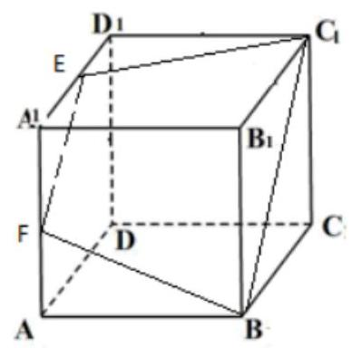

$E\text{ 、 }F$ 分别为 ${A}_{1}{D}_{1}\text{ 、 }A{A}_{1}$ 的中点, $\therefore {EF}//B{C}_{1},\therefore$ 梯形 ${EF}B{C}_{1}$ 是过 ${C}_{1}\text{ 、 }E\text{ 、 }F$ 的正方体的截面,

$\therefore$ 过 ${C}_{1}\text{ 、 }E\text{ 、 }F$ 的正方体的截面周长为:

${EF} + {BF} + B{C}_{1} + E{C}_{1} = \sqrt{{2}^{2} + {2}^{2}} + \sqrt{{2}^{2} + {4}^{2}} + \sqrt{{4}^{2} + {4}^{2}} + \sqrt{{2}^{2} + {4}^{2}} = 6\sqrt{2} + 4\sqrt{5}$ .

故答案为: $6\sqrt{2} + 4\sqrt{5}$

(2)已知正方体 ${ABCD} - {A}_{1}{B}_{1}{C}_{1}{D}_{1}$ 的棱 ${AB},{BC}$ 的中点分别为 $E, F$ ，过点 $E, F$ 作正方体 $A{C}_{1}$ 的截面，则截面的形状可能是几边形?

【难度】 $\star   \star   \star$

【答案】截面可能是三角形、四边形、五边形、六边形

画出图像如下图所示,其中 $H, J, I, G$ 分别是 $A{A}_{1},{A}_{1}{D}_{1},{C}_{1}{D}_{1}, C{C}_{1}$ 的中点. 截面可能是三角形 ${EF}{B}_{1}$ ,四边形 ${EF}{C}_{1}{A}_{1}$ ,五边形 ${EFG}{D}_{1}H$ ,六边形 ${EFGIJH}$ .因为正方体有 6 个面,故最多是六边形.

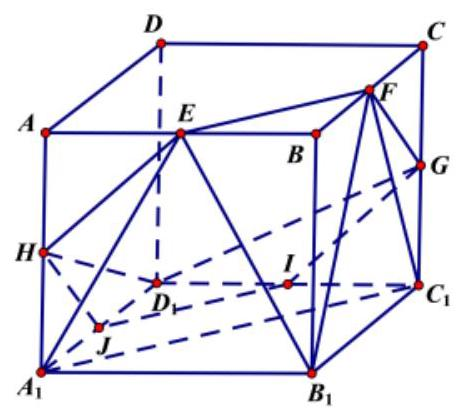

## 巩固训练

1、有下列命题:①在圆柱的上、下底面的圆周上各取一点，则这两点连线的长度是母线的长度；②圆锥顶点与底面圆周上任意一点连线的长度是母线的长度；③圆柱的任意两条母线所在直线互相平行；④过球上任意两点有且只有一个大圆; 其中正确命题的序号是___.

【难度】 $\star   \star$

【答案】②③

【解析】①若上下项面两点连线不垂直于底面,则两点连线长度不是母线的长度,①错误;

②由圆锥的特点可知，圆锥顶点到底面圆周上任意一点长度相等，均为母线长度，②正确；

③圆柱的母线均垂直于底面，所以任意两条母线所在直线互相平行，③正确；

④若两点连线为球的直径, 则过两点有两个大圆, ④ 错误.

故答案为②③

2、若空间中 $n$ 个不同的点两两距离都相等，则正整数 $n$ 的取值 ( ).

A. 至多等于 4 B. 至多等于 5 C. 至多等于 6 D. 至多等于 8

【难度】★★

【答案】A

【解析】当 $n = 3$ 时,空间三个点构成等边三角形时,可使两两距离相等.

当 $n = 4$ 时,空间四个点构成正四面体时,可使两两距离相等.

不存在 $n$ 为 4 以上的情况满足条件,故 $n$ 至多等于 4 .故选: A.

3、用一个平面去截正方体，其截面是一个多边形，则这个多边形的边数最多是___条。

【难度】 $\star   \star   \star$

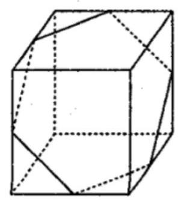

【答案】 6

【解析】正方体共有 6 个表面,

当截面与 6 个表面都相交时多边形的边数最多是 6 ,

如图

## (二)直观图(斜二测画法)

## 知识梳理

## 多面体的直观图

斜二测画图法: 画直观图时, 规定在铅垂方向和左右方向上线段的长度与其表示的真实长度相等, 而在前后方向上，线段的长度是其表示的真实长度的二分之一，根据这样的规定，我们可以画出空间图形的直观图，这样的画图方法简称“斜二测”画图法.

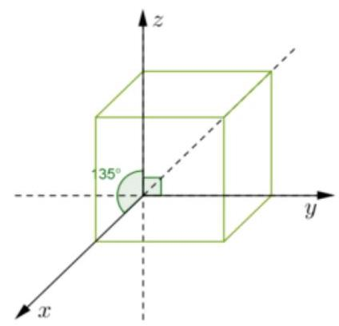

如左图, 是一个用斜二测方法画的正方体的直观图， $y$ 轴与 $z$ 轴方向上的长度等于正方体边长， $x$ 轴方向上的长度等于边长。半 【注意】“斜二测” 画图法有两条重要性质:

① 平行直线的直观图仍是平行直线；

② 线段及其线段上定比分点的直观图保持原比例不变.

## 例题精讲

【例 4】有一多边形 ${ABCD}$ 水平放置的斜二测直观图 ${\underline{A}}^{\prime }{B}^{\prime }{C}^{\prime }{D}^{\prime }$ 是直角梯形 (如图所示),其中 ${A}^{\prime }{B}^{\prime }{C}^{\prime } = {45}^{ \circ  }$ , ${B}^{\prime }{C}^{\prime } \bot  {C}^{\prime }{D}^{\prime },{A}^{\prime }{D}^{\prime } = {D}^{\prime }{C}^{\prime } = 1$ ，则原四边形 ${ABCD}$ 的面积为___.

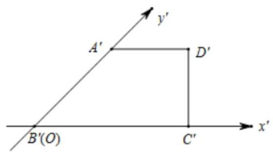

【难度】 $\star   \star   \star$

【答案】 $3\sqrt{2}$

【解析】四边形 ${ABCD}$ 水平放置的直观图是直角梯形,且 ${A}^{\prime }{B}^{\prime }{C}^{\prime } = {45}^{ \circ  },{B}^{\prime }{C}^{\prime } \bot  {C}^{\prime }{D}^{\prime },{A}^{\prime }{D}^{\prime } = {D}^{\prime }{C}^{\prime } = 1$ , $\therefore {B}^{\prime }{C}^{\prime } = 2{A}^{\prime }{D}^{\prime } = 2,{A}^{\prime }{B}^{\prime } = \sqrt{2}$

$\therefore$ 四边形 ${ABCD}$ 中, ${AB} = 2{A}^{\prime }{B}^{\prime } = 2\sqrt{2},{AD} = {A}^{\prime }{D}^{\prime } = 1,{BC} = {B}^{\prime }{C}^{\prime } = 2$ ,且 ${AB} \bot  {BC},{AD}//{BC}$ ,

所以四边形 ${ABCD}$ 的面积为 $S = \frac{1}{2} \times  \left( {1 + 2}\right)  \times  2\sqrt{2} = 3\sqrt{2}$ ,

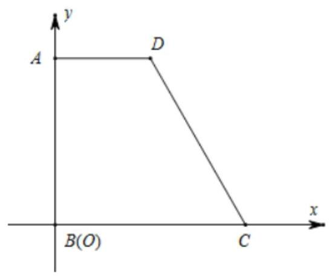

故答案为: $3\sqrt{2}$

【例 5】图 1 是某储蓄罐的平面展开图,其中 $\angle {GCD} = \angle {EDC} = \angle F = {90}^{ \circ  }$ ,且 ${AD} = {CD} = {DE} = {CG}$ , ${FG} = {FE}$ ,图 2 为面 ${ABCD}$ 的直观图,请以此为底面将该储蓄罐的直观图画完整.

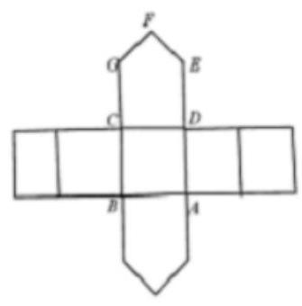

图1

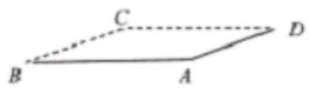

图2

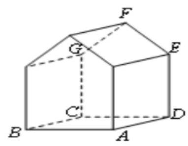

【难度】

【答案】见解析

【解析】储蓄罐的直观图如下图所示;

## 巩固训练

1、如果正三角形 ${ABC}$ 的边长为 $a$ ，那么 $\bigtriangleup {ABC}$ 的水平放置的直观图 $\bigtriangleup {A}^{\prime }{B}^{\prime }{C}^{\prime }$ 的面积为___.

【难度】 $\star   \star$

【答案】 $\frac{\sqrt{6}}{16}{a}^{2}$

【解析】

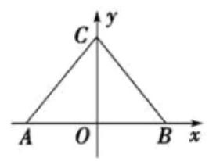

①

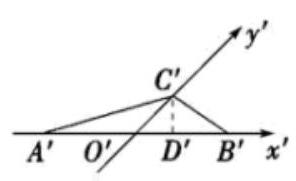

②

如图所示分别为正三角形 ${ABC}$ 平面图和直观图 $\Delta {A}^{\prime }{B}^{\prime }{C}^{\prime }$ ,

过 ${C}^{\prime }$ 作 ${C}^{\prime }{D}^{\prime } \bot  {A}^{\prime }{B}^{\prime }$ ,垂足为 ${D}^{\prime }$ ,

根据斜二测法可得 $\left| {{A}^{\prime }{B}^{\prime }}\right|  = \left| {AB}\right|  = a,\left| {{O}^{\prime }{C}^{\prime }}\right|  = \frac{1}{2}\left| {OC}\right|  = \frac{1}{2} \times  \frac{\sqrt{3}}{2}a = \frac{\sqrt{3}}{4}a$ ,

$\left| {{C}^{\prime }{D}^{\prime }}\right|  = \left| {{O}^{\prime }{C}^{\prime }}\right| \sin \frac{\pi }{4} = \frac{\sqrt{3}}{4}a \times  \frac{\sqrt{2}}{2} = \frac{\sqrt{6}}{8}a,$

直观图 $\Delta {A}^{\prime }{B}^{\prime }{C}^{\prime }$ 的面积为 ${S}^{\prime } = \frac{1}{2}\left| {{A}^{\prime }{B}^{\prime }}\right| \left| {{C}^{\prime }{D}^{\prime }}\right|  = \frac{1}{2} \times  a \times  \frac{\sqrt{6}}{8}a = \frac{\sqrt{6}}{16}{a}^{2}$ . 故答案为: $\frac{\sqrt{6}}{16}{a}^{2}$

2、将边长为 10 的正三角形 ${ABC}$ ,按 “斜二测” 画法在水平放置的平面上画出为 $\Delta {A}^{\prime }{B}^{\prime }{C}^{\prime }$ ,则 $\Delta {A}^{\prime }{B}^{\prime }{C}^{\prime }$ 中最短边的边长为___. (精确到 0.01 )

【难度】 $\star   \star   \star$

【答案】 3.62

【解析】按照 “斜二测” 画法的规则: $x =$ 与平行 $x$ 轴的线段长度不变, $y$ 轴与平行 $y$ 轴的线段长度减半, 画出正三角形 ${ABC}$ 和 $\bigtriangleup {A}^{\prime }{B}^{\prime }{C}^{\prime }$ ,如下图:

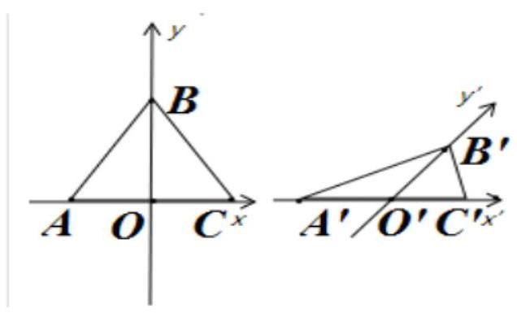

由题意，正三角形 ${ABC}$ 的边长为10，高 ${OB}$ 为 $5\sqrt{3}$ ，

由图可知，在 $\bigtriangleup {A}^{\prime }{B}^{\prime }{C}^{\prime }$ 中，显然 ${B}^{\prime }{C}^{\prime }$ 最短，

在 $\bigtriangleup {B}^{\prime }{O}^{\prime }{C}^{\prime }$ 中, ${O}^{\prime }{B}^{\prime } = \frac{5\sqrt{3}}{2},{O}^{\prime }{C}^{\prime } = 5,\angle {B}^{\prime }{O}^{\prime }{C}^{\prime } = {45}^{ \circ  }$ ,

故: ${B}^{\prime }{C}^{\prime } = \sqrt{{\left( {O}^{\prime }{B}^{\prime }\right) }^{2} + {\left( {O}^{\prime }{C}^{\prime }\right) }^{2} - 2 \cdot  {O}^{\prime }{B}^{\prime } \cdot  {O}^{\prime }{C}^{\prime } \cdot  \cos \angle {B}^{\prime }{O}^{\prime }{C}^{\prime }} \; = \sqrt{{\left( \frac{5\sqrt{3}}{2}\right) }^{2} + {5}^{2} - 2 \cdot  \frac{5\sqrt{3}}{2} \cdot  5 \cdot  \frac{\sqrt{2}}{2}} \approx  {3.62}$ . 故答案为:3.62 .

## (三)空间几何体的表面积和体积

## 知识梳理

## 几何体的表面积

(1)直柱体的表面积: ${S}_{\text{ 全 }} = {S}_{\text{ 侧 }} + 2{S}_{\text{ 底 }} = {ch} + 2{S}_{\text{ 底 }}$ ( $h, c$ 分别为直棱柱的高和底面周长) 圆柱的表面积: ${S}_{\text{ 全 }} = {S}_{\text{ 侧 }} + 2{S}_{\text{ 底 }} = {2\pi rh} + {2\pi }{r}^{2}$ ( $h, r$ 分别为圆柱的高和底面半径)

(2)锥体的表面积: ${S}_{\text{ 全 }} = {S}_{\text{ 侧 }} + {S}_{\text{ 底 }} = \frac{1}{2}c{h}^{\prime } + {S}_{\text{ 底 }}$ ( ${h}^{\prime }, c$ 分别为斜高和底面周长)

正锥体的表面积: ${S}_{\text{ 全 }} = {S}_{\text{ 侧 }} + {S}_{\text{ 底 }} = \frac{1}{2}c{h}^{\prime } + {S}_{\text{ 底 }}\left( {{h}^{\prime }, c}\right.$ 分别为斜高和底面周长 $)$

圆锥的表面积: ${S}_{\text{ 全 }} = {S}_{\text{ 侧 }} + {S}_{\text{ 底 }} = {\pi r}{h}^{\prime } + \pi {r}^{2}\;\left( {{h}^{\prime }, r}\right.$ 分别为母线长和底面半径)

(3)球的表面积: $S = {4\pi }{r}^{2}$ ( $r$ 是球的半径)

## 5、几何体的体积

(1)柱体的体积: ${V}_{\text{ 柱 }} = {S}_{\text{ 底 }} \times  h$ ( $h$ 为柱体的高)

圆柱的体积: ${V}_{\text{ 圆柱 }} = {S}_{\text{ 底 }} \times  h = \pi {r}^{2}h(h, r$ 分别为圆柱的高和底面半径)

(2)锥体的体积: ${V}_{\text{ 锥 }} = \frac{1}{3} \times  {S}_{\text{ 底 }} \times  h$ ( $h$ 为锥体的高)

圆锥的体积: ${V}_{\text{ 圆锥 }} = \frac{1}{3} \times  {S}_{\text{ 底 }} \times  h = \frac{1}{3}\pi {r}^{2}h\;(h, r$ 分别为圆锥的高和底面半径)

(3)球的体积: ${V}_{\text{ 球 }} = \frac{4}{3}\pi {r}^{3}$ ( $r$ 是球的半径)

【补充】求体积的常见方法有:①直接法(公式法)；②割补法；③转化法(等体积法); 割补思想和转化思想是解决体积问题的常用技巧. 其中, 等体积法还经常用来求点到平面的距离或几何体的高.

## 例题精讲

1、多面体

【例 6】斜三棱柱 ${ABC} - {A}_{1}{B}_{1}{C}_{1}$ 中，每条棱长都为 $a,\angle {C}_{1}{CB} = \angle {C}_{1}{CA} = \angle {ACB} = {60}^{ \circ  }$ .

(1)求证: ${AB}{B}_{1}{A}_{1}$ 是矩形；

(2)求棱柱的侧面积与体积.

【难度】★★★

【答案】(1)证明见解析; (2)侧面积为 $\left( {\sqrt{3} + 1}\right) {a}^{2}$ ,体积为 $\frac{\sqrt{2}}{4}{a}^{3}$ .

【解析】(1) 设 $\overrightarrow{CB} = \overrightarrow{x},\overrightarrow{CA} = \overrightarrow{y},{\overrightarrow{CC}}_{1} = \overrightarrow{z}$ ,

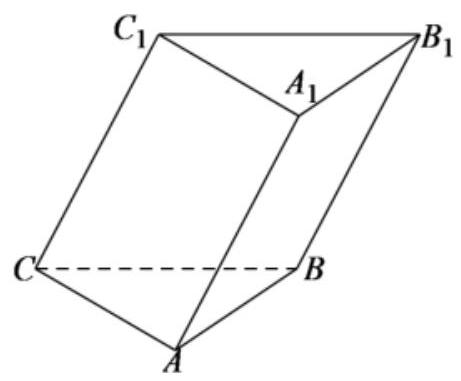

$\overrightarrow{A{A}_{1}} \cdot  \overrightarrow{AB} = \overrightarrow{C{C}_{1}} \cdot  \overrightarrow{AB} = \overrightarrow{C{C}_{1}} \cdot  \left( {\overrightarrow{CB} - \overrightarrow{CA}}\right)  = \overrightarrow{C{C}_{1}} \cdot  \overrightarrow{CB} - \overrightarrow{C{C}_{1}} \cdot  \overrightarrow{CA} = {a}^{2}\cos {60}^{ \circ  } - {a}^{2}\cos {60}^{ \circ  } = 0.$

$\therefore A{A}_{1} \bot  {AB}$ ,在斜三棱柱 ${ABC} - {A}_{1}{B}_{1}{C}_{1}$ 中，四边形 ${AB}{B}_{1}{A}_{1}$ 为平行四边形.

$\because A{A}_{1} \bot  {AB}$ ,所以,四边形 ${AB}{B}_{1}{A}_{1}$ 为矩形;

(2)由题意可知，四边形 ${CB}{B}_{1}{C}_{1}$ 与 ${CA}{A}_{1}{C}_{1}$ 均为一锐角为 ${60}^{ \circ  }$ 的菱形，

${S}_{\text{ 菱形 }{CAA},{C}_{1}} = {S}_{\text{ 菱形 }{CB}{B}_{1}{C}_{1}} = {a}^{2}\sin {60}^{ \circ  } = \frac{\sqrt{3}}{2}{a}^{2},{S}_{\text{ 矩形 }{AB}{B}_{1}{A}_{1}} = {a}^{2}$

所以，该棱柱的侧面积为 $2 \times  \frac{\sqrt{3}}{2}{a}^{2} + {a}^{2} = \left( {\sqrt{3} + 1}\right) {a}^{2}$ .

易知 ${C}_{1} - {ABC}$ 为正四面体，可知点 ${C}_{1}$ 在底面 ${ABC}$ 的射影点为正 $\bigtriangleup  {ABC}$ 的中心，

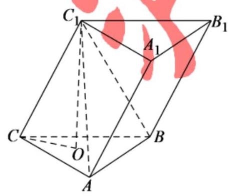

$\because O{C}_{1} \bot$ 平面 ${ABC},{OC} \subset$ 平面 ${ABC},\therefore O{C}_{1} \bot  {OC}$ ,

$\because {OC} = \frac{2}{3} \times  \frac{\sqrt{3}}{2}a = \frac{\sqrt{3}}{3}a,\therefore O{C}_{1} = \sqrt{C{C}_{1}^{2} - O{C}^{2}} = \frac{\sqrt{6}}{3}a,{S}_{\bigtriangleup {ABC}} = \frac{1}{2}{a}^{2}\sin {60}^{ \circ  } = \frac{\sqrt{3}}{4}{a}^{2}$ ,故

${V}_{{C}_{1} - {ABC}} = \frac{1}{3}{S}_{\bigtriangleup {ABC}} \cdot  O{C}_{1} = \frac{1}{3} \times  \frac{\sqrt{3}}{4}{a}^{2} \times  \frac{\sqrt{6}}{3}a = \frac{\sqrt{2}}{12}{a}^{3}$ ,

因此,该棱柱的体积为 ${V}_{{ABC} - A,{B}_{1}{C}_{1}} = 3{V}_{{C}_{1} - {ABC}} = 3 \times  \frac{\sqrt{2}}{12}{a}^{3} = \frac{\sqrt{2}}{4}{a}^{3}$ .

【例 7】正三棱锥的一个侧面与底面的面积之比为 2:3, 则这个三棱锥的侧面和底面所成二面角的大小为 ___.

【难度】 $\star   \star   \star$

【答案】 ${60}^{ \circ  }$

【解析】如图在正三棱锥 $S - {ABC}$ 中,设 $O$ 为底面 $\bigtriangleup  {ABC}$ 的中心，连接 ${SO}$ ，则 ${SO} \bot$ 平面 ${ABC}$ .

过 $S$ 作 ${SE} \bot  {AB}$ 交 ${AB}$ 于点 $E$ ，连接 ${EO}$

则 ${SO} \bot  {AB}$ ,又 ${SE} \bot  {AB}$ ,且 ${SE} \cap  {SO} = S$ ,所以 ${AB} \bot$ 平面 ${SEO}$

则 ${OE}\bot {AB}$ ，所以 $\angle {SEO}$ 为侧面和底面所成二面角的平面角.

在正三角形 $\bigtriangleup {ABC}$ 中, $O$ 为中心, ${S}_{\bigtriangleup {ABC}} = {S}_{\bigtriangleup {OBC}} + {S}_{\bigtriangleup {OAB}} + {S}_{\bigtriangleup {OAC}} = 3{S}_{\bigtriangleup {OAB}} = \frac{3}{2}\left| {AB}\right| \left| {OE}\right|$

由条件有 $\frac{{S}_{\bigtriangleup {SAB}}}{{S}_{\bigtriangleup {ABC}}} = \frac{\frac{1}{2}\left| {AB}\right|  \cdot  \left| {SE}\right| }{\frac{3}{2}\left| {AB}\right|  \cdot  \left| {OE}\right| } = \frac{2}{3}$ ,可得 $\frac{\left| SE\right| }{\left| OE\right| } = 2$

在直角三角形 ${SOE}$ 中, $\cos \angle {SEO} = \frac{\left| EO\right| }{\left| ES\right| } = \frac{1}{2}$ ,所以 $\angle {SEO} = {60}^{ \circ  }$ ,故答案为: ${60}^{ \circ  }$

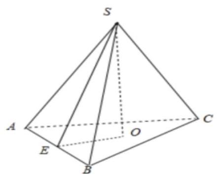

【例 8】用长度分别是2,3,5,6,9(单位: ${cm}$ ) 的五根木棒连接 (只允许连接,不允许折断),组成共顶点的长方体的三条棱, 则能够得到的长方体的最大表面积为 ( )

A. ${258}{\mathrm{\;{cm}}}^{2}$ B. ${414}{\mathrm{\;{cm}}}^{2}$ C. ${416}{\mathrm{\;{cm}}}^{2}$ D. ${418}{\mathrm{\;{cm}}}^{2}$

【难度】 $\star   \star   \star$

【答案】C

【解析】设长方体的三条棱的长度为 $a, b, c$ ,

所以长方体表面积 $S = 2\left( {{ab} + {bc} + {ac}}\right)  \leq  {\left( a + b\right) }^{2} + {\left( b + c\right) }^{2} + {\left( a + c\right) }^{2}$ ,

取等号时有 $a = b = c$ ,又由题意可知 $a = b = c$ 不可能成立,

所以考虑当 $a, b, c$ 的长度最接近时,此时对应的表面积最大,此时三边长:8,8,9,

用 2 和 6 连接在一起形成 8 ，用 3 和 5 连接在一起形成 8 ，剩余一条棱长为 9 ，

所以最大表面积为: $2\left( {8 \times  8 + 8 \times  9 + 8 \times  9}\right)  = {416}{\mathrm{\;{cm}}}^{2}$ . 故选 C.

## 2、旋转体

【例 9】已知等边圆锥 (轴截面为等边三角形的圆锥) 的内接正三棱柱的侧面是边长为 $\sqrt{3}$ 的正方形,求此圆锥的全面积.

【难度】 $\star   \star   \star$

【答案】 ${12\pi }$

【解析】如图所示,由对称性,圆锥顶点 $S$ 在正三棱柱上、下底面上的射影 ${O}_{1}\text{ 、 }O$ 分别为 $\bigtriangleup {A}_{1}{B}_{1}{C}_{1}\text{ 、 }\bigtriangleup {ABC}$ 的中心.

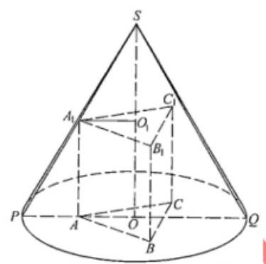

设此等边圆锥周面半径为 $R$ ,则 ${SO} = \sqrt{3}R$ ,圆锥的母线长为 ${2R}$ ,

又正三棱柱的底面边长及高切为 $\sqrt{3}$ ,由正弦定理得 ${A}_{1}{O}_{1} = \frac{\sqrt{3}}{2\sin {60}^{ \circ  }} = \frac{\sqrt{3}}{2 \times  \frac{\sqrt{3}}{2}} = 1$ .

在轴截面 ${SPQ}$ 中,有 $\frac{{A}_{1}{O}_{1}}{PO} = \frac{S{O}_{1}}{SO}$ ,即 $\frac{1}{R} = \frac{\sqrt{3}R - \sqrt{3}}{\sqrt{3}R}$ ,解方程,得 $R = 2$ .

所以,该圆锥的表面积为 $S = {\pi R} \cdot  {2R} + \pi {R}^{2} = {3\pi }{R}^{2} = {12\pi }$ .

【例 10】如图①，有一个圆柱形状的玻璃水杯，底面圆的直径为 ${20}\mathrm{\;{cm}}$ ，高为 ${30}\mathrm{\;{cm}}$ ，杯内有 ${20}\mathrm{\;{cm}}$ 深的溶液，现将水杯倾斜，且倾斜时点 $B$ 始终在桌面上，设直径 ${AB}$ 所在直线与桌面所成的角为 $\alpha$ (图②).

(1)求图②圆柱的母线与液面所在平面所成的角(用 $\alpha$ 表示)；

(2)要使倾斜后容器内的溶液不会溢出，求角 $\alpha$ 的最大值；

(3)现需要倒出的溶液体积不少于 ${3000}{\mathrm{\;{cm}}}^{3}$ ，当 $\alpha  = {60}^{ \circ  }$ 时，能实现要求吗？请说明理由.

【难度】 $\star   \star   \star$

【答案】(1) $\frac{\pi }{2} - \alpha$ ; (2) $\alpha  = \frac{\pi }{4}$ ; (3) 不能实现.

【解析】(1) 在图 (1) 中,过点 $F$ 作 ${FQ} \bot  {BC}$ ,交 ${BC} \bot  Q$ ,

过点 $C$ 作 ${CM} \bot  {PB}$ ,交 ${PQ}$ 延长线于点 $M$ ,

过点 $M$ 作 ${MN}//{PB}$ ,交 ${BC}$ 于 $N$ ,则 $\angle {CFQ} = \alpha$ ,

所以图②圆柱的母线与液面所在平面所成的角 $\angle {DFC} = \angle {FCQ} = \frac{\pi }{2} - \alpha$ .

(2)根据题意，画出图形，如图①所示，过 $C$ 作 ${CF}//{BP}$ ，交 ${AD}$ 所在的直线于 $F$ ，

在直角 ${\Delta CDF}$ 中, $\angle {FCD} = \alpha ,{CD} = {20}\mathrm{\;{cm}},{DF} = {20}\tan \alpha$ ,

且点 $F$ 在线段 ${AD}$ 上， ${AF} = {{30} - {20}\tan \alpha }$

此时容器内能。纳的溶液量为:

${S}_{ABCD} \cdot  {20} = \frac{\left( {{AF} + {BC}}\right)  \cdot  {AB}}{2} \cdot  {20} = \left( {{30} - {20}\tan \alpha  + {30}}\right)  \times  {10} \times  {20} = {2000}\left( {6 - 2\tan \alpha }\right) {\mathrm{{cm}}}^{3}$ ,

而容器内原有溶液量为 ${20} \times  {20} \times  {20} = {8000}{\mathrm{\;{cm}}}^{3}$ ,

令 ${2000}\left( {6 - 2\tan \alpha }\right)  \geq  {8000}$ ,解得 $\tan \alpha  \leq  1$ ,所以 $\alpha  \leq  {45}^{ \circ  }$ ,即 $\alpha$ 的最大角为 ${45}^{ \circ  }$ 时,溶液不会溢出.

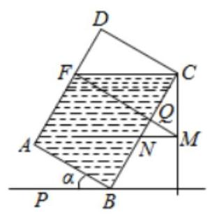

(3)如图②，当 $\alpha  = {60}^{ \circ  }$ 时，

过 $C$ 作 ${CF}//{BP}$ ，交 ${AB}$ 于 $F$ ，在直角 ${\Delta CBF}$ 中， ${BC} = {30cm},\angle {BCF} = {30}^{ \circ  },{BF} = {{10}\sqrt{3}}$ ，所以点 $F$ 在线段 ${AB}$ 上,故溶液纵截面为直角 ${\Delta CBF}$ ,因为 ${S}_{\bigtriangleup {ABF}} = \frac{1}{2} \times  {BC} \times  {BF} = {150}\sqrt{3}c{m}^{2}$ ,容器内溶液量为 ${150}\sqrt{3} \times  {20} = {3000}\sqrt{3}{\mathrm{\;{cm}}}^{3}$ ,

倒出的溶液量为 $\left( {{8000} - {3000}\sqrt{3}}\right)  < {3000}$ ,所以不能实现要求.

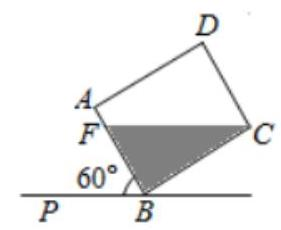

【例 11】如图,实心铁制几何体 ${AEFCBD}$ 由一个直三棱柱与一个三棱锥构成,已知 ${BC} = {EF} = \pi \mathrm{{cm}}$ ， ${AE} = {2\mathrm{\;{cm}}}$ ， ${BE} = {CF} = {4\mathrm{\;{cm}}}$ ， ${AD} = {7\mathrm{\;{cm}}}$ ，且 ${AE}\bot {EF}$ ， ${AD}\bot$ 底面 ${AEF}$ . 某工厂要将其铸成一个实心铁球，假设在铸球过程中原材料将损耗 20%，则铸得的铁球的半径为___cm.

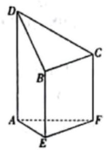

【难度】 $\star   \star   \star$

【答案】 $\sqrt[3]{3}$

【解析】设铸得的铁球的半径为 $r\mathrm{\;{cm}}$ ,

依题意,可得该几何体的体积为 $\frac{1}{2} \times  2 \times  \pi  \times  4 + \frac{1}{3} \times  \frac{1}{2} \times  2 \times  \pi  \times  \left( {7 - 4}\right)  = {5\pi }$ ,

则 ${5\pi } \times  \left( {1 - {20}\% }\right)  = \frac{4}{3}\pi {r}^{3}$ ，解得 $r = \sqrt[3]{3}$ . 故答案为: $\sqrt[3]{3}$

## 3、简单组合体

【例 12】某工艺品厂要生产如图所示的一种工艺品, 该工艺品由: 一个实心圆柱体和一个实心半球体组成, 要求半球的半径和圆柱的底面半径之比为3 : 2,工艺品的体积为 ${34\pi }{\mathrm{{cm}}}^{3}$ . 现设圆柱的底面半径为 ${2x}\mathrm{\;{cm}}$ , 工艺品的表面积为 $S{\mathrm{\;{cm}}}^{2}$ ,半球与圆柱的接触面积忽略不计. 试写出 $S$ 关于 $x$ 的函数关系式及 $x$ 的取值范围 ___.

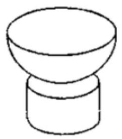

【难度】 $\star   \star   \star$

【答案】 $S = {17\pi }\left( {{x}^{2} + \frac{2}{x}}\right) , x \in  \left( {0,\frac{\sqrt[3]{51}}{3}}\right)$

【解析】解: 设圆柱的高为 $h$ ,因为圆柱的底面半径为 ${2x}$ ,

而半球的半径和圆柱的底面半径之比为 $3 : 2$ ,

所以半球的半径为 ${3x}$ ,设球的体积为 ${V}_{1}$ ,圆柱的体积为 ${V}_{2}$ ,则由题意可得

$V = \frac{1}{2}{V}_{1} + {V}_{2} = \frac{1}{2} \times  \frac{4}{3}\pi  \cdot  {\left( 3x\right) }^{3} + \pi  \cdot  {\left( 2x\right) }^{2} \cdot  h = {34\pi }$ ,

解得 $h = \frac{{17} - 9{x}^{3}}{2{x}^{2}} > 0$ ,得 $x \in  \left( {0,\frac{\sqrt[3]{51}}{3}}\right)$ ,

所以表面积为

$2 \cdot  \pi  \cdot  {\left( 2x\right) }^{2} + {2\pi } \cdot  {2x} \cdot  h + \frac{1}{2} \cdot  {4\pi } \cdot  {\left( 3x\right) }^{2} + \pi  \cdot  {\left( 3x\right) }^{2} = {35\pi }{x}^{2} + {4\pi x}\left( {\frac{17}{2{x}^{2}} - \frac{9x}{2}}\right)  = {17\pi }\left( {{x}^{2} + \frac{2}{x}}\right)$ ,

$x \in  \left( {0,\frac{\sqrt[3]{51}}{3}}\right)$ ,故答案为: $S = {17\pi }\left( {{x}^{2} + \frac{2}{x}}\right) , x \in  \left( {0,\frac{\sqrt[3]{51}}{3}}\right)$

【例 13】某艺术品公司欲生产一款迎新春工艺礼品，该礼品是由玻璃球面和该球的内接圆锥组成，圆锥的侧面用于艺术装饰，如图 1. 为了便于设计，可将该礼品看成是由圆 $O$ 及其内接等腰三角形 ${ABC}$ 绕底边 ${BC}$ 上的高所在直线 ${AO}$ 旋转 ${180}^{ \circ  }$ 而成,如图 2. 已知圆 $O$ 的半径为 ${10}\mathrm{\;{cm}}$ ,设 $\angle {BAO} = \theta ,0 < \theta  < \frac{\pi }{2}$ 圆锥的侧面积为 $S{\mathrm{\;{cm}}}^{2}$ .

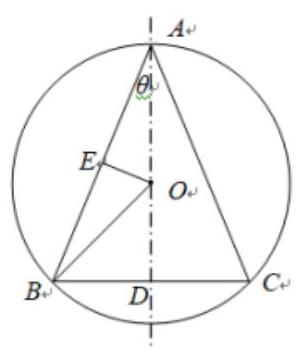

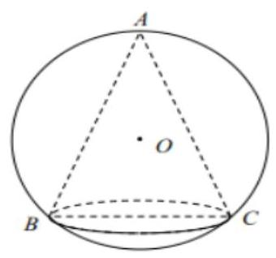

图 1

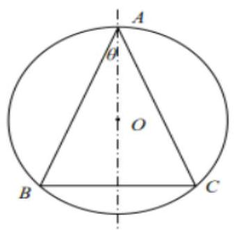

图 2

(1)求 $S$ 关于 $\theta$ 的函数关系式；

(2)为了达到最佳观赏效果，要求 $k = \frac{S}{{\sin }^{2}\left( {\frac{\theta }{2} + \frac{\pi }{4}}\right) }$ 最大，求 $k$ 的最大值并求此时腰 ${AB}$ 的长度.

【难度】 $\star   \star   \star$

【答案】(1) $S = {400\pi }\sin \theta {\cos }^{2}\theta ,\left( {0 < \theta  < \frac{\pi }{2}}\right)$ ；(2) $k$ 的最大值为 ${200\pi },{AB}$ 的长度为 ${10}\sqrt{3}\mathrm{{cm}}$ 。

【解析】解: 设 ${AO}$ 交 ${BC}$ 于点 $D$ ,过 $O$ 作 ${OE} \bot  {AB}$ ,垂足为 $E$ ,

在 $\bigtriangleup {AOE}$ 中, ${AE} = {10}\cos \theta ,{AB} = {2AE} = {20}\cos \theta$ ,

在 $\bigtriangleup {ABD}$ 中, ${BD} = {AB} \cdot  \sin \theta  = {20}\cos \theta  \cdot  \sin \theta$ ,

所以 $S = \frac{1}{2} \cdot  {2\pi } \cdot  {20}\sin \theta \cos \theta  \cdot  {20}\cos \theta  = {400\pi }\sin \theta {\cos }^{2}\theta ,\left( {0 < \theta  < \frac{\pi }{2}}\right)$

(2)由(1)得:

$k = \frac{S}{{\sin }^{2}\left( {\frac{\theta }{2} + \frac{\pi }{4}}\right) } = \frac{{400\pi }\sin \theta {\cos }^{2}\theta }{\frac{1 + \sin \theta }{2}} = \frac{{800\pi }\sin \theta \left( {1 + \sin \theta }\right) \left( {1 - \sin \theta }\right) }{1 + \sin \theta }$

$= {800\pi }\sin \theta \left( {1 - \sin \theta }\right)  = {800\pi }\left\lbrack  {-{\left( \sin \theta  - \frac{1}{2}\right) }^{2} + \frac{1}{4}}\right\rbrack$

当 $\sin \theta  = \frac{1}{2}$ 时, $k$ 的最大值为 ${200\pi }$ .

此时, $\theta  = \frac{\pi }{6},\bigtriangleup {ABC}$ 对于 角形. 此时 $\cos \theta  = \frac{\sqrt{3}}{2},{AB} = {10}\sqrt{3}$ .

答: $k$ 的最大值为 ${200\pi }$ ,此时 ${AB}$ 的长度为 ${10}\sqrt{3}\mathrm{\;{cm}}$ .

## 巩固训练

1、三棱锥 V-ABC 中，AB=AC=10，BC=12，各侧面与底面成的二面角都是 ${45}^{ \circ  }$ ， 求三棱锥的侧面积和高。

【难度】★★★

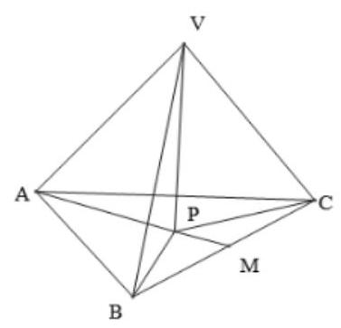

【答案】见解析

【解析】取 ${BC}$ 中点 $M$ ,连接 ${AM},\because {AB} = {AC} = {10},\therefore {AM} \bot  {BC},{AM} = 8$ , ${S}_{\bigtriangleup {ABC}} = \frac{1}{2}{BC} \cdot  {AM} = {48}$ ,各侧面与底面成的二面角都是 ${45}^{ \circ  }$ ,设二面角

$\theta ,\cos \theta  = \frac{{S}_{\bigtriangleup {ABC}}}{{S}_{\text{ 侧 }}},\therefore {S}_{\text{ 侧 }} = {48}\sqrt{2}$ ; 设 ${VP} \bot$ 面 ${ABC}$ 于 $P$ ,各侧面与底面成的二面角都是 ${45}^{ \circ  }$ ,即 $P$ 是 $\bigtriangleup {ABC}$ 的内心,设半径为 $R$ ,则 ${S}_{\bigtriangleup {ABC}} = \frac{1}{2}\left( {{BC} + {AB} + {AC}}\right) R = {16R} = {48},\therefore R = 3,\therefore {VP} = R\tan {45}^{ \circ  } = 3$

2、斜三棱柱 ${ABC} - {A}_{1}{B}_{1}{C}_{1}$ 的底面是正三角形,侧棱 $A{A}_{1}$ 和棱 ${AB},{AC}$ 所成的角都是 ${60}^{ \circ  }$ ，若 ${AB} = \sqrt{3}, A{A}_{1} = 3$ ，则此三棱柱的全面积为___.

【难度】 $\star   \star   \star$

【答案】 $\frac{{27} + 3\sqrt{3}}{2}$

【解析】 ${S}_{\text{ 全 }} = 3 \times  3 \times  \sqrt{3} \times  \sin {60}^{ \circ  } + 2 \times  \frac{1}{2} \times  \sqrt{3} \times  \sqrt{3} \times  \sin {60}^{ \circ  } = \frac{{27} + 3\sqrt{3}}{2}$

3、一个正三棱柱形容器 ${ABC} - {A}_{1}{B}_{1}{C}_{1}$ ，以 $\bigtriangleup  {ABC}$ 为底面成水平放置，其高为 ${2a}$ ，内盛水若干，水面高度为 $x$ . 若将此容器放倒，使它的一个侧面为底面成水平放置，这时水面恰为中截面，则 $x =$ ___.

【难度】 $\star   \star   \star$

【答案】 $\frac{3}{2}a$

【解析】如图

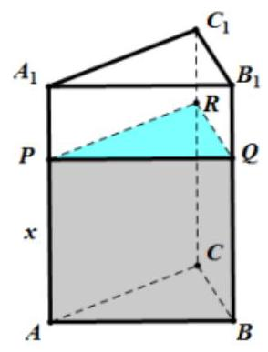

放倒前

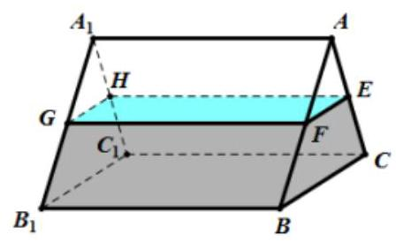

放倒后

记 $\bigtriangleup  {ABC}$ 的面积为 $S$ ，

由将此容器放倒，使它的一个侧面为底面成水平放置，这时水面恰为中截面

所以 $E, F$ 分别为 ${AC},{AB}$ 的中点,则 ${\mathrm{S}}_{\bigtriangleup {AEF}} = \frac{1}{4}S$ ,故 ${\mathrm{S}}_{EFBC} = \frac{3}{4}S$

所以 $S \cdot  x = {\mathrm{S}}_{EFBC} \cdot  {2a} = \frac{3}{4}S \cdot  {2a} \Rightarrow  x = \frac{3}{2}a$ ,故答案为: $\frac{3}{2}a$

4、若某圆锥的侧面展开图是一个半径为 1 的半圆, 求圆锥的表面积___.

【难度】 $\star   \star   \star$

【答案】 $\frac{3\pi }{4}$

【解析】解: 由题意可得,圆锥的底面周长是 $\pi$ ,设圆锥的底面半径是 $r$ ,则 ${2\pi r} = \pi$ ,解得 $r = \frac{1}{2}$ ,

$\because$ 圆锥的母线长为 $l = 1\text{ ， }\therefore$ 圆锥的表面积是 $S = {\pi rl} + \pi {r}^{2} = \frac{1}{2}\pi  + \frac{\pi }{4} = \frac{3\pi }{4}$ ，故答案为: $\frac{3\pi }{4}$ .

5、已知圆锥的母线长为 $5\mathrm{\;{cm}}$ ，侧面积为 ${15\pi }{\mathrm{{cm}}}^{2}$ ，则此圆锥的体积为___ ${\mathrm{{cm}}}^{3}$ .

【难度】 $\star   \star   \star$

【答案】 ${12\pi }$

【解析】设圆锥的底面半径为 ${rcm}$ ,高为 ${hcm}$ ,

已知圆锥的母线长为 $5\mathrm{\;{cm}}$ ，侧面积为 ${15\pi }{\mathrm{{cm}}}^{2}$ ，则 $\pi  \times  5 \times  r = {15\pi }$ ，得 $r = 3$ ，所以，圆锥的高为 $h = \sqrt{{5}^{2} - {r}^{2}} = 4,$

因此,该圆锥的体积为 $V = \frac{1}{3}\pi {r}^{2}h = \frac{1}{3}\pi  \times  {3}^{2} \times  4 = {12\pi }\left( {\mathrm{{cm}}}^{3}\right)$ .

故答案为: ${12\pi }$ .

6、若 $y = \left| x\right|$ 和 $y = 3$ 围成的封闭平面图形绕 $y$ 轴旋转一周,则所得体积与绕 $x$ 轴旋转一周所得体积之比是 ( ).

A. 1:4 B. 4:1

C. $\left( {1 + \sqrt{2}}\right)  : \left( {4 + 2\sqrt{2}}\right)$ D. $\left( {4 + 2\sqrt{2}}\right)  \cdot  \left( {1 + \sqrt{2}}\right)$

【难度】 $\star   \star   \star$

【答案】A

【解析】由 $\left\{  \begin{array}{l} y = \left| x\right| \\  y = 3 \end{array}\right.$ 解得 $\left\{  \begin{array}{l} x = 3 \\  y = 3 \end{array}\right.$ 或 $\left\{  \begin{array}{l} x =  - 3 \\  y = 3 \end{array}\right.$ .

$y = \left| x\right|$ 和 $y = 3$ 围成的封闭平面图形绕 $y$ 轴旋转一周所得几何体为圆锥,图形如下图所示,

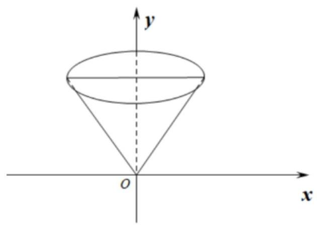

故体积为 $\frac{1}{3} \times  \pi  \times  {3}^{2} \times  3 = {9\pi }$ .

$y = \left| x\right|$ 和 $y = 3$ 围成的封闭平面图形绕 $x$ 轴旋转一周所得几何体为圆柱挖掉两个圆锥,图形如下图所示,

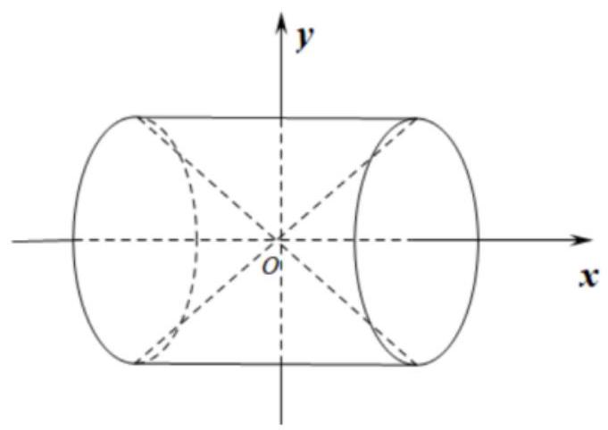

故体积为 $\pi  \times  {3}^{2} \times  6 - \frac{1}{3} \times  \pi  \times  {3}^{2} \times  3 - \frac{1}{3} \times  \pi  \times  {3}^{2} \times  3 = {36\pi }$ .

所以两个图形的体积比为 ${9\pi } : {36\pi } = 1 : 4$ . 故选: A

7、已知 $A$ 是圆锥的顶点， ${BD}$ 是圆锥底面的直径， $C$ 是底面圆周上一点， ${BD} = 2$ ， ${BC} = 1$ ， ${AC}$ 与底面所成角的大小为 $\frac{\pi }{3}$ ，过点 $A$ 作截面 ${ABC},{ACD}$ ，截去部分后的几何体如图所示.

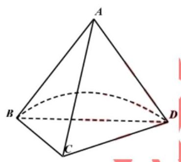

(1)求原来圆锥的侧面积；

(2)求该几何体的体积.

【难度】 $\star   \star   \star$

【答案】(1) ${2\pi }$ (2) $\frac{3 + \sqrt{3}\pi }{6}$

【解析】(1)设 ${BD}$ 的中点为 $O$ ,连结 ${OA},{OC}$ ,

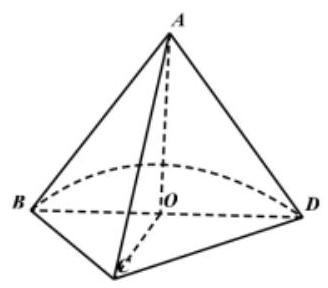

$\because A$ 是圆锥的顶点, ${BD}$ 是圆锥底面的直径, $\therefore {OA} \bot$ 平面 ${BCD}$ .

$\because {BD} = 2,{BC} = 1,{AC}$ 与底面所成角的大小为 $\frac{\pi }{3}$ ,过点 $A$ 作截面 ${ABC},{ACD}$ ,

$\therefore$ 在 ${Rt\Delta AOC}$ 中, ${OC} = 1,\angle {ACO} = \frac{\pi }{3},{AC} = 2,{AO} = \sqrt{3}$ ,

$\therefore {S}_{\text{ 圆锥侧 }} = {\pi rl} = \pi  \times  \frac{2}{2} \times  2 = {2\pi }$ .

(2)该几何体为三棱锥与半个圆锥的组合体

$\because {AO} = \sqrt{3},\angle {BCD} = {90}^{ \circ  },\therefore {CD} = \sqrt{3}$ ,

该几何体的体积 $V = \frac{1}{3}\left( {{S}_{\bigtriangleup {BCD}} + {S}_{\text{ 半圆 }}}\right)  \cdot  {AO} = \frac{1}{3} \times  \left( {\frac{1}{2} \times  1 \times  \sqrt{3} + \frac{\pi }{2}}\right)  \times  \sqrt{3} = \frac{3 + \sqrt{3}\pi }{6}$ .

8、已知 $A, B, C$ 为球 $O$ 的球面上的三个点， $\odot  {O}_{1}$ 为 $\bigtriangleup  {ABC}$ 的外接圆，若 $\odot  {O}_{1}$ 的面积为 ${4\pi }$ ， ${AB} = {BC} = {AC} = {OO}_{1}$ ，则球 $O$ 的表面积为( )

A. ${64\pi }$ B. ${48\pi }$ C. ${36\pi }$ D. ${32\pi }$

【难度】 $\star   \star   \star$

【答案】A

【解析】设圆 ${O}_{1}$ 半径为 $r$ ,球的半径为 $R$ ,依题意,得 $\pi {r}^{2} = {4\pi },\therefore r = 2,\because \bigtriangleup {ABC}$ 为等边三角形, 由正弦定理可得 ${AB} = {2r}\sin {60}^{ \circ  } = 2\sqrt{3}$ ，

$\therefore O{O}_{1} = {AB} = 2\sqrt{3}$ ,根据球的截面性质 $O{O}_{1} \bot$ 平面 ${ABC}$ ,

$\therefore O{O}_{1} \bot  {O}_{1}A, R = {OA} = \sqrt{O{O}_{1}^{2} + {O}_{1}{A}^{2}} = \sqrt{O{O}_{1}^{2} + {r}^{2}} = 4$ ,

$\therefore$ 球 $O$ 的表面积 $S = {4\pi }{R}^{2} = {64\pi }$ . 故选: A

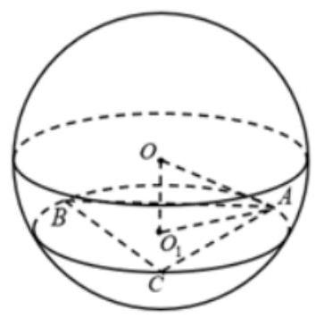

9、如果球、正方体与等边圆柱(轴截面为正方形的圆柱)的体积相等，那么它们的表面积 ${S}_{\text{ 球 }}$ ， ${S}_{\text{ 正方体 }}$ ， ${S}_{\text{ 柱 }}$ 的大小关系为( ).

A. ${S}_{\text{ 球 }} < {S}_{\text{ 正方体 }} < {S}_{\text{ 柱 }}$ B. ${S}_{\text{ 球 }} < {S}_{\text{ 柱 }} < {S}_{\text{ 正方体 }}$

C. ${S}_{\text{ 柱 }} < {S}_{\text{ 球 }} < {S}_{\text{ 正方体 }}$ D. ${S}_{\text{ 正方体 }} < {S}_{\text{ 柱 }} < {S}_{\text{ 球 }}$

【难度】 $\star   \star   \star$

【答案】B

【解析】设球的半径为 $r$ ,正方体的棱长为 $a$ ,等边圆柱的底面半径为 $R$ ,母线长为 ${2R}$ ,

则它们的体积分别为 ${V}_{\text{ 球 }} = \frac{4\pi }{3} \times  {r}^{3},{V}_{\text{ 正方体 }} = {a}^{3},{V}_{\text{ 柱 }} = \pi  \times  {R}^{2} \times  {2R} = {2\pi }{R}^{3}$ ,

依题意可知 $\frac{4\pi }{3}{r}^{3} = {a}^{3} = {2\pi }{R}^{3}$ ①.

它们的表面积分别为 ${S}_{\text{ 球 }} = {4\pi }{r}^{2},{S}_{\text{ 正方体 }} = 6{a}^{2},{S}_{\text{ 柱 }} = {2\pi }{R}^{2} + {2\pi R} \times  {2R} = {6\pi }{R}^{2}$ ②.

由①得 ${r}^{3} = \frac{3{a}^{3}}{4\pi } \Rightarrow  r = \sqrt[3]{\frac{3}{4\pi }}a,{R}^{3} = \frac{{a}^{3}}{2\pi } \Rightarrow  R = \sqrt[3]{\frac{1}{2\pi }}a$ ,代入 ②得

${S}_{\text{ 球 }} = {4\pi }{r}^{2} = {4\pi } \times  {\left( \sqrt[3]{\frac{3}{4\pi }}a\right) }^{2} = {4\pi } \times  {\left( \frac{3}{4\pi }\right) }^{\frac{2}{3}} \times  {a}^{2} = {\left( 4\pi \right) }^{\frac{1}{3}} \times  {3}^{\frac{2}{3}} \times  {a}^{2} = {\left( {36}\pi \right) }^{\frac{1}{3}} \times  {a}^{2},$

${S}_{\text{ 正方体 }} = 6{a}^{2} = {\left( {216}\right) }^{\frac{1}{3}} \times  {a}^{2},$

${S}_{\text{ 柱 }} = {6\pi }{R}^{2} = {6\pi } \times  {\left( \sqrt[3]{\frac{1}{2\pi }}a\right) }^{2} = {6\pi } \times  {\left( \frac{1}{2\pi }\right) }^{\frac{2}{3}} \times  {a}^{2} = 3 \times  {\left( 2\pi \right) }^{\frac{1}{3}} \times  {a}^{2} = {\left( {54}\pi \right) }^{\frac{1}{3}} \times  {a}^{2},$

由于 ${36\pi } < {54\pi } < {216}$ ,所以 ${S}_{\text{ 球 }} < {S}_{\text{ 柱 }} < {S}_{\text{ 正方体 }}$ . 故选: B

10、某小区楼顶成一种“楔体”形状，该“楔体”两端成对称结构，其内部为钢架结构(未画出全部钢架， 如图 1 所示，俯视图如图 2 所示)，底面 ${ABCD}$ 是矩形， ${AB} = {10}$ 米， ${AD} = {50}$ 米，屋脊 ${EF}$ 到底面 ${ABCD}$ 的距离即楔体的高为 1.5 米，钢架所在的平面 ${FGH}$ 与 ${EF}$ 垂直且与底面的交线为 ${GH}\text{ ， }{AG} = 5$ 米， ${FO}$ 为立柱且 $O$ 是 ${GH}$ 的中点.

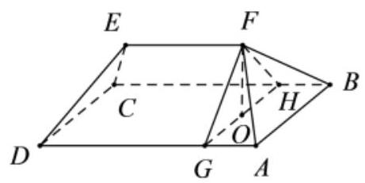

图1

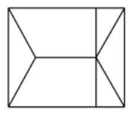

图2

(1)求斜梁 ${FB}$ 与底面 ${ABCD}$ 所成角的大小(结果用反三角函数值表示);

(2)求此模体 ${ABCDEF}$ 的体积.

【难度】 $\star   \star   \star$

【答案】(1) $\arctan \frac{3\sqrt{2}}{20}$ ；(2)350(立方米)

【解析】(1)如下图,连接 ${BO}$ ,依题意 ${FO}$ 为立柱,即 ${FO} \bot$ 平面 ${ABCD}$

则 $\angle {FBO}$ 是直线 ${FB}$ 与底面 ${ABCD}$ 所成角,

由俯视图可知， ${GH} \bot  {BC}$ ，则 ${BO} = \sqrt{{OH}^{2} + {HB}^{2}} = 5\sqrt{2}$ ，

在 ${Rt}\bigtriangleup {FOB}$ 中, $\tan \angle {FOB} = \frac{FO}{BO} = \frac{1.5}{5\sqrt{2}} = \frac{3\sqrt{2}}{20}$ ,

即 $\angle {FBO} = \arctan \frac{3\sqrt{2}}{20}$ ，则斜梁 ${FB}$ 与底面 ${ABCD}$ 所成角的大小为 $\arctan \frac{3\sqrt{2}}{20}$ ；

(2)依题意，该“楔体”两端成对称结构，钢架所在的平面 ${FGH}$ 与 ${EF}$ 垂直，结合俯视图可知，可将该 “楔体” 分割成一个直三棱柱和两个相同的四棱锥,

则直三棱柱的体积

${V}_{1} = {S}_{\bigtriangleup {FGH}} \cdot  {EF} = \frac{1}{2}{GH} \cdot  {FO} \cdot  \left( {{AD} - {2AG}}\right)  = \frac{1}{2} \times  {10} \times  \frac{3}{2} \times  {40} = {300}$ (立方米),

两个四棱锥的体积

${V}_{2} = 2{V}_{F - {GABH}} = \frac{2}{3}{S}_{GABH} \cdot  {FO} = \frac{2}{3}{AG} \cdot  {AB} \cdot  {FO} = \frac{2}{3} \times  5 \times  {10} \times  \frac{3}{2} = {50}$ (立方米),

则所求的楔体 ${ABCDEF}$ 的体积 $V = {V}_{1} + {V}_{2} = {350}$ (立方米).

## (四) 球面距离

## 知识梳理

概念: 球面上联结两点最短路径的长度就是球面上两点的球面距离;

【补充】在联结球面上两点的路径中, 通过该两点的大圆劣弧最短, 因此该弧的长度就是这两点的球面距离；所以，求两点之间的球面距离，首先要找到经过这两点的大圆，然后求大圆的劣弧长，而这往往需要求出两点之间的线段距离.

## 例题精讲

【例 14】(1)在北纬 ${45}^{ \circ  }$ 圈上有 $A$ 、 $B$ 两点，若该纬度圈上 $A$ 、 $B$ 两点间的劣弧长为 $\frac{\sqrt{2}}{4}{\pi R}$ ( $R$ 为地球的半径),则 $A\text{ 、 }B$ 两点间的球面距离是___

【难度】 $\star   \star   \star$

【答案】 $\frac{\pi }{3}R$

【解析】北纬 ${45}^{ \circ  }$ 圈所在圆的半径为 $\frac{\sqrt{2}}{2}R$ ,它们在纬度圈上所对应的劣弧长等于 $\frac{\sqrt{2}}{4}{\pi R}$ ( $R$ 为地球半径), $\therefore \frac{\sqrt{2}}{4}{\pi R} = \theta  \times  \frac{\sqrt{2}}{2}R\left( {\theta  = A \cdot  B\text{ 两地在北纬 }{45}^{ \circ  }\text{ 画上对应的圆心角 }}\right)$ ,故 $\theta  = \frac{\pi }{2},\therefore$ 线段 ${AB} = R$ ,

$\therefore \angle {AOB} = \frac{\pi }{3},\therefore A$ ， $B$ 这两地的球面距离是 $\frac{\pi R}{3}$ ，故答案为: $\frac{\pi R}{3}$ .

(2)设球 $O$ 的表面积为 ${16\pi }$ ，圆 ${O}_{1}$ 是球 $O$ 的一小圆， $O{O}_{1} = \sqrt{2}, A$ 、 $B$ 是圆 ${O}_{1}$ 上的两点，若 $A$ 、 $B$ 两点间的球面距离为 $\frac{2\pi }{3}$ ，则 $\angle {A{O}_{1}B} =$ ___.

【难度】 $\star   \star   \star$

【答案】 $\frac{\pi }{2}$

【解析】解: 设球的半径为 $R$ ,由题意可得 ${4\pi }{R}^{2} = {16\pi }$ ,解得 $R = 2$ ,

由 $A\text{ 、 }B$ 两点间的球面距离为 $\frac{2\pi }{3}$ ,设 $\angle {AOB} = \alpha$ ,则 $\frac{2}{3}\pi  = R \cdot  \alpha$ ,所以可得 $\alpha  = \frac{\pi }{3}$ ,

在 $\bigtriangleup  {AOB}$ 中由等腰三角形的性质可得 ${AB} = {2R} \cdot  \sin \frac{\angle {AOB}}{2} = 2 \times  2 \cdot  \frac{1}{2} = 2$ ，由球的性质可得 $O{O}_{1}\bot$ 圆 ${O}_{1}$ ，所以

$O{O}_{1} \bot  {O}_{1}A$ ,因为 ${OA} = R = 2, O{O}_{1} = \sqrt{2}$ ,所以可得 ${O}_{1}A = {O}_{1}B = \sqrt{2},{AB} = 2$

在 $\bigtriangleup A{O}_{1}B$ 中,因为 ${O}_{1}{A}^{2} + {O}_{1}{B}^{2} = {\left( \sqrt{2}\right) }^{2} + {\left( \sqrt{2}\right) }^{2} = 4 = A{B}^{2}$ ,所以 $\angle A{O}_{1}B = \frac{\pi }{2}$ ,故答案为: $\frac{\pi }{2}$ .

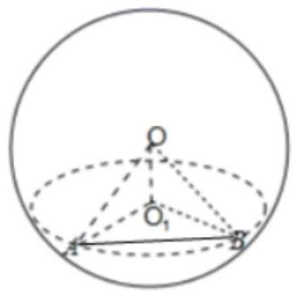

【例 15】( 1 )在北纬 ${45}^{ \circ  }$ 圈上有甲、乙两地，经度相差 ${90}^{ \circ  }$ ，那么甲、乙两地的球面距离与地球半径的比值是( )

A. 1

B. $\frac{1}{3}$ c. $\frac{\sqrt{2}}{4}\pi$ D. $\frac{\pi }{3}$

【难度】 $\star   \star   \star$

【答案】D

【解析】如下图所示,设球心为 $O$ ,北纬 ${45}^{ \circ  }$ 圈所在圆的圆心为点 ${O}_{1}$ ,设球 $O$ 的半径为 $R$ ,

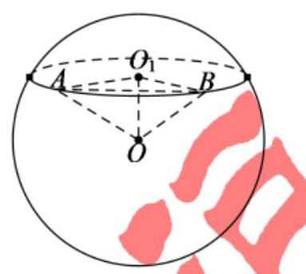

$O{O}_{1} = {OA} \cdot  \cos {45}^{ \circ  } = \frac{\sqrt{2}}{2}R$ ,所以,圆 ${O}_{1}$ 的半径为 ${O}_{1}A = \sqrt{{R}^{2} - O{O}_{1}^{2}} = \frac{\sqrt{2}}{2}R$ ,

$\because \angle A{O}_{1}B = {90}^{ \circ  },\therefore {AB} = \sqrt{2}{O}_{1}A = R$ ,

又 ${OA} = {OB} = R$ ,则 $\bigtriangleup  {AOB}$ 为等边三角形， $\therefore \angle {AOB} = {60}^{ \circ  }$ ，所以，甲、乙两地的球面距离为 $\frac{\pi }{3}R$ ，

因此,甲、乙两地的球面距离与地球半径的比值是 $\frac{\frac{\pi R}{3}}{R} = \frac{\pi }{3}$ . 故选: D.

(2) $A\text{ 、 }B\text{ 、 }C$ 三点在体积为 ${36\pi }$ 的球面上， ${BA} = {BC} = \frac{\sqrt{2}}{2}{AC}$ ，若 $A\text{ 、 }C$ 两点间的球面距离是 $\frac{3\pi }{2}$ ， 则球心 $O$ 的到平面 ${ABC}$ 的距离是___.

【难度】 $\star   \star   \star$

【答案】 $\frac{3\sqrt{2}}{2}$

【解析】

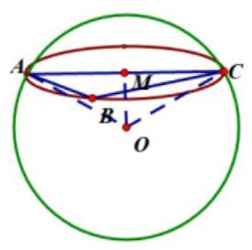

因为球的体积为 ${36\pi }$ ,所以 $\frac{4}{3}\pi {R}^{3} = {36\pi }$ ,解得球的半径 $\mathrm{R} = 3$ 。因为 ${BA} = {BC} = \frac{\sqrt{2}}{2}{AC}$ ,所以 $B{A}^{2} + B{C}^{2} = A{C}^{2}$ ，所以 $\angle {ABC} = {90}^{ \circ  }$ ，所以 $\overset{\text{ ⏜ }}{AC}$ 为截面圆的直径，设截面圆圆心为 $M$ ，因为 $A$ 、 $C$ 两点间的球面距离是 $\frac{3\pi }{2}$ ，所以 $\angle {AOC} = \frac{\frac{3\pi }{2}}{R} = \frac{\frac{3\pi }{2}}{3} = \frac{\pi }{2}$ 。在 Rt $\Delta$ OMC 中， ${OM} = \frac{\sqrt{2}}{2}{OC} = \frac{\sqrt{2}}{2} \times  3 = \frac{3\sqrt{2}}{2}$ ,因为 ${OM} \bot$ 平面 ${ABC}$ ,所以球心 $O$ 的到平面 ${ABC}$ 的距离是 $\frac{3\sqrt{2}}{2}$ 。

## 巩固训练

1、已知 $A\text{ 、 }B$ 是球心为 $O$ 的球面上的两点，在空间直角坐标系中，它们的坐标分别为 $O\left( {0,0,0}\right)$ ， $A\left( {\sqrt{2}, - 1,1}\right) , B\left( {0,\sqrt{2},\sqrt{2}}\right)$ ，则 $A$ 、 $B$ 两点的球面距离为___.

【难度】 $\star   \star   \star$

【答案】 $\pi$

【解析】解: 由题意,球的半径 $R = \left| {OA}\right|  = \left| {OB}\right|  = \sqrt{2 + 1 + 1} = 2$ ,

$\because O\left( {0,0,0}\right) , A\left( {\sqrt{2}, - 1,1}\right) , B\left( {0,\sqrt{2},\sqrt{2}}\right)$ ,

$\therefore \overrightarrow{OA} = \left( {\sqrt{2}, - 1,1}\right) ,\overrightarrow{OB} = \left( {0,\sqrt{2},\sqrt{2}}\right) ,\therefore \cos \alpha  = \frac{\overrightarrow{OA} \cdot  \overrightarrow{OB}}{\left| \overrightarrow{OA}\right|  \cdot  \left| \overrightarrow{OB}\right| } = \frac{-1 \times  \sqrt{2} + 1 \times  \sqrt{2}}{2 \times  2} = 0,\therefore \alpha  = \frac{\pi }{2}$ ,

$\therefore A\text{ 、 }B$ 两点的球面距离 $L = \alpha  \cdot  R = \frac{\pi }{2} \times  2 = \pi$ ,故答案为: $\pi$ .

2、地球上北纬 ${30}^{ \circ  }$ 圈上有 $A, B$ 两点，点 $A$ 在西经 ${10}^{ \circ  }$ ，点 $B$ 在东经 ${110}^{ \circ  }$ ，求 $A, B$ 两点的球面距离. (设地球半径为 $R$

【难度】 $\star   \star   \star$

【答案】 $\arccos \left( {-\frac{1}{8}}\right)  \cdot  R$

【解析】解: 由已知可得, $\angle {AO}{O}^{\prime } = {60}^{ \circ  }$ ,则 $A{O}^{\prime } = \frac{\sqrt{3}}{2}R$ ,

同理 $B{O}^{\prime } = \frac{\sqrt{3}}{2}R$ ,而 $\angle A{O}^{\prime }B = {120}^{ \circ  }$ ,

所以 $A{B}^{2} = A{O}^{\prime 2} + B{O}^{\prime 2} - {2A}{O}^{\prime }B{O}^{\prime }\cos \angle A{O}^{\prime }B$

即 $A{B}^{2} = {\left( \frac{\sqrt{3}}{2}R\right) }^{2} + {\left( \frac{\sqrt{3}}{2}R\right) }^{2} - 2 \times  \frac{\sqrt{3}}{2}R \times  \frac{\sqrt{3}}{2}R \times  \left( {-\frac{1}{2}}\right) \therefore {AB} = \frac{3}{2}R$

在 $\bigtriangleup {AOB}$ 中,由 ${OA} = {OB} = R,{AB} = \frac{3}{2}R$ ,可得 $\cos \angle {AOB} = \frac{{R}^{2} + {R}^{2} - \frac{9}{4}{R}^{2}}{2{R}^{2}} =  - \frac{1}{8}$ ,

则 $\angle {AOB} = \arccos \left( {-\frac{1}{8}}\right) .\therefore A, B$ 两地的球面距离为 $\arccos \left( {-\frac{1}{8}}\right) R$ .

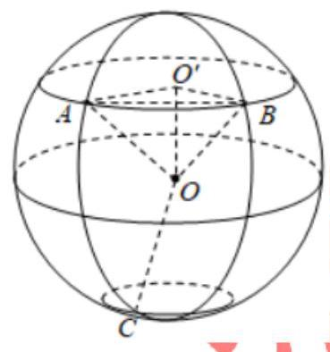

3、设球 $O$ 的半径为 $1, A, B, C$ 是球面上三点，已知 $A$ 到 $B, C$ 两点的球面距离都是 $\frac{3\pi }{4}$ ，且平面 ${BOA} \bot$ 平面 ${OAC}$ ，则从 $A$ 点沿球面经 $B$ ， $C$ 两点再回到 $A$ 点的最短距离是( )

A. ${2\pi }$

B. $\frac{11\pi }{6}$ C. $\frac{7\pi }{4}$ D. $\frac{8\pi }{3}$

【难度】★★★

【答案】B

【解析】如图,设 $B, C$ 所在小圆面与 ${AO}$ 垂直,延长 ${AO}$ 与这个小圆面相交,交点为小圆圆心 $M$ ,连接 ${MB},{MC},{BC}$ ,

$\because {A\text{ 到 }B}, C$ 两点的球面距离都是 $\frac{3\pi }{4}$ ,球半径为 $1\text{ 、 }\therefore \angle {AOB} = \angle {AOC} = \frac{3\pi }{4}$ , $\therefore \angle {BOM} = \angle {COM} = \frac{\pi }{4}$ ,

因为 ${AM} \bot$ 平面 ${BMC},{MB} \subset$ 平面 ${BMC},{MC} \subset$ 平面 ${BMC},\therefore {AM} \bot  {BM},{AM} \bot  {MC}$ ,所以 $\angle {BMC}$ 为二面角 $B - {AM} - C$ 的平面角,

而平面 ${BOA} \bot$ 平面 ${OAC}$ . $\therefore \angle {BMC} = \frac{\pi }{2}$ ，又 ${MC} = {MB} = {OC}\sin \frac{\pi }{4} = \frac{\sqrt{2}}{2}$ ， $\therefore {BC} = 1$ ，

$\therefore \angle {BOC} = \frac{\pi }{3},\;B, C$ 间的球面距离为 $\frac{\pi }{3} \times  1 = \frac{\pi }{3}$ ，

$\therefore$ 所求最短距离是 $\frac{3\pi }{4} + \frac{3\pi }{4} + \frac{\pi }{3} = \frac{11\pi }{6}$ .

故选: B.

(五)几何体展开求最小值问题(空间问题转化为平面问题)

## 例题精讲

【例 16】边长为 1 的正方体 ${ABCD} - {A}_{1}{B}_{1}{C}_{1}{D}_{1}$ 中， $P$ 在线段 $B{C}_{1}$ 上， $Q$ 在线段 ${BC}$ 上，则 ${D}_{1}P + {PQ}$ 的最小值为___.

【难度】 $\star   \star   \star$

【答案】 $1 + \frac{\sqrt{2}}{2}$

【解析】把 ${\Delta CB}{C}_{1}$ 沿 $B{C}_{1}$ 上转 ${90}^{ \circ  }$ ，与平面 $B{C}_{1}{D}_{1}$ 共面，当 ${D}_{1}Q \bot  {BC}$ 时， ${D}_{1}P + {PQ} = {D}_{1}Q$ 最小， 此时, $P{D}_{1} = \sqrt{2},{PQ} = \left( {\sqrt{2} - 1}\right)  \times  \frac{\sqrt{2}}{2} = 1 - \frac{\sqrt{2}}{2}$ ,所以 ${D}_{1}P + {PQ}$ 的最小值为 $1 + \frac{\sqrt{2}}{2}$ ,故答案为: $1 + \frac{\sqrt{2}}{2}$ .

【例 17】如图,已知正三棱柱 ${ABC} - {A}_{1}{B}_{1}{C}_{1}$ 的底面边长为 $1\mathrm{\;{cm}}$ ，高为 $5\mathrm{\;{cm}}$ ，一质点自 $A$ 点出发，沿着三棱柱的侧面绕行两周到达 ${A}_{1}$ 点的最短路线的长为( )

A. 12 B. 13 C. $\sqrt{61}$ D. 15

【难度】 $\star   \star   \star$

【答案】C

【解析】将正三棱柱 ${ABC} - {A}_{1}{B}_{1}{C}_{1}$ 沿侧棱展开，再拼接一次，其侧面展开图如图所示。

在展开图中,最短距离是六个矩形对角线的连线的长度,也即为三棱柱的侧面上所求距离的最小值.

由已知求得矩形的长等于 $6 \times  1 = 6$ ,宽等于 5,由勾股定理 $\mathrm{d} = \sqrt{{6}^{2} + {5}^{2}} = \sqrt{61}$ .

故选:C.

## 巩固训练

1、如图，正三棱锥 $S - {ABC}$ 中， $\angle {BSA} = {30}^{ \circ  }$ ， ${SB} = 2$ ，一质点自点 $B$ 出发，沿着三棱锥的侧面绕行一周回到点 $B$ 的最短路线的长为( )

A. 2 B. 4 C. $2\sqrt{2}$ D. $2\sqrt{3}$

【难度】★★★

【答案】C

【解析】将三棱锥 $S - {ABC}$ 沿侧棱 ${SB}$ 展开,其侧面展开图如图所示,则 $B{B}^{\prime }$ 即为最短路线. 因为 $\angle {BSA} = {30}^{ \circ  },{SB} = 2$ ，所以 $\bigtriangleup  {B{B}^{\prime }S}$ 为等腰直角三角形，故沿着三棱锥的侧面绕行一周回到点 $B$ 的最短路线的长为 $B{B}^{\prime } = \sqrt{4 + 4} = 2\sqrt{2}$ .

故选: $C$ .

2、如图，一竖立在水平对面上的圆锥形物体的母线长为 ${4m}$ ，一只小虫从圆锥的底面圆上的点 $P$ 出发，绕圆锥表面爬行一周后回到点 $P$ 处，则该小虫爬行的最短路程为 $4\sqrt{3}m$ ，则圆锥底面圆的半径等于( )

A. ${1m}$

B. $\frac{3}{2}m$ C. $\frac{4}{3}m$ D. ${2m}$

【难度】★★★

【答案】C

【解析】作出该圆锥的侧面展开图,如下图所示: 该小虫爬行的最短路程为 $P{P}^{\prime }$ ,由余弦定理可得 $\cos \angle {P}^{\prime }{OP} = \frac{O{P}^{2} + O{P}^{\prime 2} - P{P}^{\prime 2}}{{2OP} \cdot  O{P}^{\prime }} =  - \frac{1}{2},\therefore \angle {P}^{\prime }{OP} = \frac{2\pi }{3}$ . 设底面圆的半径为 $r$ ,则有 ${2\pi r} = \frac{2\pi }{3} \times  4$ , $\therefore r = \frac{4}{3}$ . 故 C 项正确.

3、如图，在直三棱柱 ${ABC} - {A}_{1}{B}_{1}{C}_{1}$ 中，底面为直角三角形， $\angle {ACB} = {90}^{ \circ  },{AC} = 6,{BC} = {CC}_{1} = \sqrt{2}, P$ 是 $B{C}_{1}$ 上一动点，则 ${CP} + {P{A}_{1}}$ 的最小值为___。

【难度】 $\star   \star   \star$

【答案】 $5\sqrt{2}$

【解析】连结 ${A}_{1}B$ ,沿 $B{C}_{1}$ 将 $\bigtriangleup {CB}{C}_{1}$ 展开与 $\bigtriangleup {A}_{1}B{C}_{1}$ 在同一个平面内,

如图所示,连 ${A}_{1}C$ ,则 ${A}_{1}C$ 的长度就是所求的最小值. 通过计算可得 $\angle {A}_{1}{C}_{1}C = {90}^{ \circ  }$ ,又 $\angle B{C}_{1}C = {45}^{ \circ  }$ 故 $\angle {A}_{1}{C}_{1}C = {135}^{ \circ  }$ ,由余弦定理可求得 ${A}_{1}C = 5\sqrt{2}$

(六)轨迹问题

## 例题精讲

【例 18】给定正三棱锥 $P - {ABC}, M$ 点为底面正三角形 ${ABC}$ 内(含边界)一点，且 $M$ 到三个侧面 ${PAB}$ 、 ${PBC}$ 、 ${PAC}$ 的距离依次成等差数列，则点 $M$ 的轨迹为 (   )

A. 双曲线的一部分 B. 圆的一部分 C. 一条线段 D. 抛物线的一部分

【难度】 $\star   \star   \star$

【答案】C

【解析】设点 $M$ 到三个侧面 ${PAB}$ 、 ${PBC}$ 、 ${PCA}$ 的距离为 $d - a, d, d + a$

正三棱锥 $P - {ABC}$ 中各侧面的面积为 $S$ ,体积为 $V$ ,

则 $\frac{1}{3}S\left( {d - a}\right)  + \frac{1}{3}{Sd} + \frac{1}{3}S\left( {d + a}\right)  = V$ ,即 ${Sd} = V$ ,

所以 $d$ 为常数.

作平面 $\alpha$ 使 $\alpha //$ 面 ${PBC}$ 且它们的距离为 $d$ ，则 $\alpha$ 与面 ${ABC}$ 的交线即为点 $M$ 的轨迹.

又 $M$ 点为底面正三角形 ${ABC}$ 内(含边界)一点，所以 $M$ 的轨迹为一条线段. 故选 $C$ .

【例 19】如图所示,已知正方体 ${ABCD} - {A}_{1}{B}_{1}{C}_{1}{D}_{1}$ 的棱长为 2,长为 2 的线段 ${MN}$ 的一个端点 $M$ 在棱 $D{D}_{1}$ 上运动，另一端点 $N$ 在正方形 ${ABCD}$ 内运动，则 ${MN}$ 的中点的轨迹的面积为( )

A. ${4\pi }$ B. ${2\pi }$ C. $\pi$

D. $\frac{\pi }{2}$

【难度】 $\star   \star   \star$

【答案】D

【解析】

如图可得,端点 $N$ 在正方形 ${ABCD}$ 内运动,连接 ${ND}$ ,且 ${ND},{DM},{MN}$ 构成一个直角三角形,

设 $P$ 为 ${MN}$ 的中点，根据直角三角形斜边上的中线长度为斜边的一半可得，

不论 $\bigtriangleup  {MDN}$ 相同变化， $P$ 点到 $D$ 点的距离始终等于 1 . 故 $P$ 点的轨迹是一个以 $D$ 为中心，半径为 1 的球的 $\frac{1}{8}$ 球面积,所以答案为 $\frac{\pi }{2}$ . 故选 D

【例 20】如图为正方体 ${ABCD} - {A}_{1}{B}_{1}{C}_{1}{D}_{1}$ ,动点 $M$ 从 ${B}_{1}$ 点出发,在正方体表面沿逆时针方向运动一周后, 再回到 ${B}_{1}$ 的运动过程中,点 $M$ 与平面 ${A}_{1}D{C}_{1}$ 的距离保持不变,运动的路程 $x$ 与 $l = M{A}_{1} + M{C}_{1} + {MD}$ 之间满足函数关系 $l = f\left( x\right)$ ,则此函数图象大致是(   )

A.

B.

C.

D.

【难度】 $\star   \star   \star$

【答案】C

【解析】由题意可知: 点 $M$ 在 $\Delta {B}_{1}{AC}$ 的边上沿逆时针方向运动,

设正方体 ${ABCD} - {A}_{1}{B}_{1}{C}_{1}{D}_{1}$ 的棱长为 1,取线段 ${B}_{1}A$ 的中点为 $N$ ，则当动点 $M$ 运动到点 $N$ 时，

${l}_{N} = N{A}_{1} + N{C}_{1} + {ND} = \sqrt{6} + \frac{\sqrt{2}}{2} < 2 + \sqrt{3} = {l}_{A} = {l}_{{B}_{1}} = {l}_{C},$

同理,当动点 $M$ 运动到线段 ${AC}$ 或 $C{B}_{1}\left\lbrack  1\right\rbrack$ 中点时,

计算得 $l = M{A}_{1} + M{C}_{1} + {MD} = \sqrt{6} + \frac{\sqrt{2}}{2} < 2 + \sqrt{3} = {l}_{A} = {l}_{{B}_{1}} = {l}_{C}$ . 符合 $\mathrm{C}$ 选项的图像特征. 故选 $\mathrm{C}$

## 巩固训练

1、正方体 $\mathrm{{ABCD}} \rightarrow  {\mathrm{A}}_{1}{\mathrm{\;B}}_{1}{\mathrm{C}}_{1}{\mathrm{D}}_{1}$ 中, $\mathrm{P}$ 是面 $\mathrm{A}{\mathrm{A}}_{1}{\mathrm{\;B}}_{1}\mathrm{\;B}$ 上点, $\mathrm{P}$ 到平面 ${\mathrm{A}}_{1}{\mathrm{\;B}}_{1}{\mathrm{C}}_{1}{\mathrm{D}}_{1}$ 距离是 $\mathrm{P}$ 到 $\mathrm{{BC}}$ 距离的 2 倍,则 $\mathrm{P}$ 轨迹所在曲线是( )

A. 直线 B. 椭圆 C. 抛物线 D. 双曲线

【难度】 $\star   \star   \star$

【答案】B

2、如图，正方体 ${ABCD} - {A}_{1}{B}_{1}{C}_{1}{D}_{1}$ 的棱长为 $\sqrt{3}$ ，以顶点 $\mathrm{A}$ 为球心，2 为半径作一个球，则图中球面与正方体的表面相交所得到的两段弧长之和等于( )

A. $\frac{5\pi }{6}$ B. $\frac{2\pi }{3}$ C. $\pi$ D. $\frac{7\pi }{6}$

【难度】 $\star   \star   \star$

【答案】A

【解析】由题得,圆弧 $\overset{\text{ ⏜ }}{GF}$ 在以 $\mathrm{B}$ 为圆心,半径为 $\mathrm{{BG}}$ 的圆上,而圆弧 $\overset{\text{ ⏜ }}{EF}$ 在以 $\mathrm{A}$ 为圆心半径为 $\mathrm{{AE}} = 2$ 的圆上. 故 $\overset{\text{ ⏜ }}{GF} = \frac{1}{4} \cdot  {2\pi } \cdot  {BG} = \frac{1}{4} \cdot  {2\pi } \cdot  \sqrt{A{G}^{2} - A{B}^{2}} = \frac{\pi }{2}$ ,由于 $\cos \angle {A}_{1}{AE} = \frac{A{A}_{1}}{AE} = \frac{\sqrt{3}}{2} \Rightarrow  \angle {A}_{1}{AE} = {30}^{ \circ  }$ ，故 $\angle {EAF} = {30}^{ \circ  }$ ，则 $\overset{\text{ ⏜ }}{EF} = \frac{{30}^{ \circ  }}{{360}^{ \circ  }} \cdot  {2\pi } \cdot  2 = \frac{\pi }{3}$ ，所以 $\overset{\text{ ⏜ }}{GF} + \overset{\text{ ⏜ }}{EF} = \frac{5\pi }{6}$ . 故选 A.

3、在正方体 ${ABCD} - {A}_{1}{B}_{1}{C}_{1}{D}_{1}$ 的侧面 ${AB}{B}_{1}{A}_{1}$ 内有一动点 $P$ 到直线 ${A}_{1}{B}_{1}$ 与直线 ${BC}$ 的距离相等,则动点 $P$ 所在的曲线的形状 ( )

A.

B.

C.

D.

【难度】 $\bigstar \bigstar  \star$

【答案】B

【解析】

依题意可知 $\mathbf{P}$ 到点 $\mathbf{B}$ 的距离等于到直线 $\mathbf{A}1\mathbf{B}1$ 的距离,

根据抛物线的定义可知,动点 $\mathbf{P}$ 的轨迹是以 $\mathbf{B}$ 为焦点,以 $\mathbf{A}1\mathbf{B}1$ 为准线的 $\mathbf{A}$ 的抛物线的一部分.

A 的图象为直线的图象, 排除 A.

C 项中 B 不是抛物线的焦点, 排除 C.

D 项不过 A 点, D 排除.

故选 B.

## 实战演练

一、填空题

1、如图所示， $R{t}_{ \bigtriangleup  }{A}^{\prime }{B}^{\prime }{C}^{\prime }$ 为水平放置的 $\bigtriangleup  {ABC}$ 的直观图，其中 ${A}^{\prime }{C}^{\prime }\bot {B}^{\prime }{C}^{\prime }$ ， ${B}^{\prime }{O}^{\prime } = {O}^{\prime }{C}^{\prime } = 1$ ，则 $\bigtriangleup  {ABC}$ 的面积是___.

【难度】★★

【答案】 $2\sqrt{2}$

【解析】由直观图画法规则将 $R{t}_{ \bigtriangleup  }{A}^{\prime }{B}^{\prime }{C}^{\prime }$ 还原为 $\bigtriangleup  {ABC}$ ，如图所示， $\bigtriangleup  {ABC}$ 是一个等腰三角形，则有 ${BO} = {OC} = {B}^{\prime }{O}^{\prime } = {O}^{\prime }{C}^{\prime } = 1,\;{AO} = 2{A}^{\prime }{O}^{\prime } = 2\sqrt{2}$

所以 ${S}_{\bigtriangleup {ABC}} = \frac{1}{2}{BC} \cdot  {AO} = \frac{1}{2} \times  2 \times  2\sqrt{2} = 2\sqrt{2}$

故答案为: $2\sqrt{2}$

2、小明有一卷纸，纸非常的薄且紧紧缠绕着一个圆柱体轴心卷成一卷，它的整体外貌如图所示，纸卷的直径 12 厘米，轴的直径为 4 厘米. 当小明用掉 $\frac{3}{4}$ 的纸后，则剩下的这卷纸的直径最接近于___ 厘米(精确到厘米).

【难度】 $\star   \star   \star$

【答案】 7

【解析】使用卷纸的过程中, 卷纸的高不变,

用之前卷纸的底面积 $\pi  \times  {\left( \frac{12}{2}\right) }^{2} - \pi  \times  {\left( \frac{4}{2}\right) }^{2} = {32\pi }$ ,

设用后纸的半径为 $r$ 厘米,当小明用掉 $\frac{3}{4}$ 的纸后卷纸的底面积 $\pi {r}^{2} - \pi {\left( \frac{4}{2}\right) }^{2} = \frac{1}{4} \times  {32\pi }$ ,

解得 $r = 2\sqrt{3}$ 厘米,所以剩下的这卷纸的直径为 $4\sqrt{3}$ 厘米,最接近于 7 厘米.

故答案为: 7

3、如图，在三棱柱 ${ABC} - {A}_{1}{B}_{1}{C}_{1}$ 中，侧棱 $C{C}_{1}$ 的长为 1， ${AC}\bot {BC}$ ， $\angle {{AC}{C}_{1}} = {60}^{ \circ  }$ ， $\angle {{BC}{C}_{1}} = {45}^{ \circ  }$ ， 则该三棱柱的高等于___.

【难度】 $\star   \star   \star$

【答案】 $\frac{1}{2}$

【解析】如图所示: 过 ${C}_{1}$ 作面 ${ACB}$ 、线 ${BC}$ 、 ${AC}$ 的垂线,交点分别为 $O, D, E$ 、连接 ${OD},{OC}$ 、 ${OE}$ ,则 ${C}_{1}O$ 即为三棱柱的高，

由三垂线定理可知 ${OE} \bot  {AC},{OD} \bot  {BE}$ ,又因为 ${AC} \bot  {BC}$ ,所以四边形 ${OECD}$ 为矩形.

在直角三角形 ${EC}{C}_{1}$ 和 ${DC}{C}_{1}$ 中， $\because \angle {{AC}{C}_{1}} = {60}^{ \circ  }$ ， $\angle {{BC}{C}_{1}} = {45}^{ \circ  }$ ，侧棱 $C{C}_{1}$ 的长为 1，

则 ${CE} = \frac{1}{2}C{C}_{1} = \frac{1}{2},{CD} = \frac{\sqrt{2}}{2}$ ,在直角三角形 ${OCD}$ 中,由勾股定理得 ${OC} = \frac{\sqrt{3}}{2}$ ,

在直角三角形 ${CO}{C}_{1}$ 中 $0{C}_{1} = \sqrt{C{C}_{1}^{2} - O{C}^{2}} = \frac{1}{2}$ .

故答案为: $\frac{1}{2}$

4、如图，实心铁制几何体 ${AEFCBD}$ 由一个直三棱柱与一个三棱锥构成，已知 ${BC} = {EF} = \pi \mathrm{{cm}}$ ， ${AE} = {2\mathrm{\;{cm}}}$ ， ${BE} = {CF} = {4\mathrm{\;{cm}}}$ ， ${AD} = {7\mathrm{\;{cm}}}$ ，且 ${AE}\bot {EF}$ ， ${AD}\bot$ 底面 ${AEF}$ . 某工厂要将其铸成一个实心铁球，假设在铸球过程中原材料将损耗 20%，则铸得的铁球的半径为___ $\mathrm{{cm}}$ .

【难度】★★★

【答案】 $\sqrt[3]{3}$

【解析】设铸得的铁球的半径为 $r\mathrm{\;{cm}}$ ,

依题意,可得该几何体的体积为 $\frac{1}{2} \times  2 \times  \pi  \times  4 + \frac{1}{3} \times  \frac{1}{2} \times  2 \times  \pi  \times  \left( {7 - 4}\right)  = {5\pi }$

则 ${5\pi } \times  \left( {1 - {20}\% }\right)  = \frac{4}{3}\pi {r}^{3}$ ，解得 $r = \sqrt[3]{3}$ . 故答案为: $\sqrt[3]{3}$

5、边长为 1 的正方体 ${ABCD} - {A}^{\prime }{B}^{\prime }{C}^{\prime }{D}^{\prime }$ ，点 $P$ 为面对角线 $C{D}^{\prime }$ 上一点，则 ${AP} + {BP}$ 的最小值为___ 【难度】 $\star   \star   \star$

【答案】 $\sqrt{3 + \sqrt{6}}$

【解析】如图甲，将等边 $\bigtriangleup  {{AC}{D}^{\prime }}$ 沿 $C{D}^{\prime }$ 向后旋转到与面 ${A}^{\prime }{BC}{D}^{\prime }$ 共面，得到等边 $\bigtriangleup  {{A}_{1}C{D}^{\prime }}$ ，则 ${AP} + {BP}$ 的最小值即为图乙中线段 ${A}_{1}B$ 的长,取 ${A}^{\prime }B$ 的中点 $I$ ,由题意知: 等边 $\bigtriangleup {AC}{D}^{\prime }$ 的边长为 $\sqrt{2}$ ,四边形 ${A}^{\prime }{BC}{D}^{\prime }$ 是以 ${BC} = 1,{A}^{\prime }B = \sqrt{2}$ 的矩形,所以 ${A}_{1}B = \sqrt{B{I}^{2} + {A}_{1}{I}^{2}} = \sqrt{{\left( \frac{\sqrt{2}}{2}\right) }^{2} + {\left( 1 + \frac{\sqrt{6}}{2}\right) }^{2}} = \sqrt{3 + \sqrt{6}}$ .

甲

乙

6、有一个六个面分别标上数字1、2、3、4、5、6 的正方体，甲、乙、丙三位同学从不同的角度观察的结果如图所示.如果记 2 的对面的数字为 $m$ ，3 的对面的数字为 $n$ ，则方程 ${m}^{x + 1} = n$ 的解 $x$ 满足 $k < x < k + 1$ ， $k$ 为整数，则 $k =$ ___

甲. 乙丙

【难度】★★★

【答案】 0

【解析】由图知,2 和6,1,3,2都相邻,所以 2 的对面的数字为 4,即 $m = 4$ ,

3 的对面的数字为 $6, n = 6$ ,所以方程 ${m}^{x + 1} = n$ ,即为 ${4}^{x + 1} = 6$ ,

解得 $x + 1 = {\log }_{4}6$ ,即 $x = {\log }_{4}6 - 1 = {\log }_{4}\frac{3}{2} \in  \left( {0,1}\right)$ ,

因为 $x$ 满足 $k < x < k + 1$ ， $k$ 为整数，所以 $k = 0$ 故答案为:0

## 二、选择题

7、平面 $\alpha$ 与球 $O$ 相交于周长为 ${2\pi }$ 的 $\odot  {O}^{\prime }$ ， $A$ ， $B$ 为 $\odot  {O}^{\prime }$ 上两点，若 $\angle {AOB} = \frac{\pi }{4}$ ，且 $A$ ， $B$ 的球面距离为 $\frac{\sqrt{2}}{4}\pi$ ,则 $O{O}^{\prime }$ 的长度为 ( ).

A. 1 B. $\sqrt{2}$ C. $\pi$ D. 2

【难度】 $\star   \star   \star$

【答案】A

【解析】因为 $O$ 为球心 $\angle {AOB} = \frac{\pi }{4}$ ,

所以设球半径 ${OB} = R$ ,可得 $A, B$ 的球面距离为 $\frac{\pi }{4}R = \frac{\sqrt{2}}{4}\pi$ ,所以 ${OB} = R = \sqrt{2}$ ,

又因为 $\odot  {O}^{\prime }$ 的周长为 ${2\pi }$ ,所以 ${2\pi } \cdot  O{B}^{\prime } = {2\pi } \Rightarrow  {O}^{\prime }B = 1$ ,

根据球的截面圆性质,可得 ${Rt\Delta BO}{O}^{\prime }$ 中, $O{O}^{\prime } = \sqrt{O{B}^{2} - {O}^{\prime }{B}^{2}} = 1$ ,

故选: A.

8、如图，正三角形 ${ABC}$ 为圆锥的轴截面， $D$ 为 ${AB}$ 的中点， $E$ 为弧 ${BC}$ 的中点，则直线 ${DE}$ 与 ${AC}$ 所成角的余弦值为( )

A. $\frac{1}{3}$ B. $\frac{1}{2}$ C. $\frac{\sqrt{2}}{2}$ D. $\frac{3}{4}$

【难度】 $\star   \star   \star$

【答案】C

【解析】如图所示,取 ${BC}$ 中点 $O,{BO}$ 中点 $F$ ,连接 ${OD},{OE},{FE},{DF}$ ,则 ${OD}//{AC}$ ,

所以 $\angle {ODE}$ 就是直线 ${DE}$ 与 ${AC}$ 所成角,

设 ${AB} = 4$ ,则 ${OD} = 2,{OF} = 1,{OE} = 2$ ,

可得 ${DF} = \sqrt{O{D}^{2} - O{F}^{2}} = \sqrt{3},{EF} = \sqrt{O{E}^{2} + O{F}^{2}} = \sqrt{5}$ ,

则 ${DE} = \sqrt{D{F}^{2} + E{F}^{2}} = 2\sqrt{2}$ ,

因为 $E$ 为弧 ${BC}$ 的中点，可得 ${OE}\bot {BC}$ ,进而可得 ${OE}\bot$ 平面 ${ABC}$ ,

因为 ${OD} \subset$ 平面 ${ABC}$ ,所以 ${OE} \bot  {OD}$ ,

在直角 ${\Delta ODE}$ 中,可得 $\cos \angle {ODE} = \frac{OD}{DE} = \frac{\sqrt{2}}{2}$ ,

即直线 ${DE}$ 与 ${AC}$ 所成角的余弦值为 $\frac{\sqrt{2}}{2}$ ，故选:C.

9、如图，一张纸的长、宽分别为 $2\sqrt{3}a,\sqrt{6}a$ ，四条边的中点分别是 $A, B, C, D$ ，现将其沿图中虚线折起,使得 ${M}_{1},{M}_{2},{M}_{3},{M}_{4}$ 四点重合为一点 $M$ ,从而得到一个多面体,关于该多面体有下述四个结论:

① 该多面体是六面体；

② 点 $M$ 到棱 ${AC}$ 的距离为 $\frac{\sqrt{6}}{2}a$ ；

③ ${BD}\bot$ 平面 ${AMC}$ ；

④ 该多面体外接球的直径为 $\frac{\sqrt{30}}{2}a$ ，

其中所有正确结论的序号是( )

A. ①④ B. ③④ C. ②③ D. ②③④

【难度】 $\star   \star   \star$

【答案】D

【解析】解: 结论①中,长、宽分别为 $2\sqrt{3}a,\sqrt{6}a, A, B, C, D$ 分别是其四条边的中点,

现将其沿图中虚线折扣， ${AB} = {BC} = {AD} = {CD} = \sqrt{{\left( \sqrt{3}a\right) }^{2} + {\left( \frac{\sqrt{6}a}{2}\right) }^{2}} = \frac{3\sqrt{2}a}{2}$ ，

${M}_{1},{M}_{2},{M}_{3},{M}_{4}$ 四点重合为一点 $M$ ,从而得到一个多面体,

如图，以 $A, B, C, D$ 为顶点的三棱锥，

故①错误；

结论②中， $\because {AM} = {CM} = \sqrt{3}a$ ， ${AC} = \sqrt{6}a$ ，三角形 ${AMC}$ 是等腰直角三角形，

所以点 $M$ 到棱 ${AC}$ 的距离为 $\frac{\sqrt{6}}{2}a$ ,故②正确；

结论③中， $\because {AM} \bot  {BM}$ ， ${BM} \bot  {CM}$ ， ${AM} \cap  {CM} = M$ ，所以 ${BD} \bot$ 平面 ${ACM}$ ，故③正确；

结论④中，三棱锥扩展为长方体，

三棱锥的外接球就是长方体的外接球, 长方体的外接球直径是长方体的体对角线.

设长方体的三边为: $d, c, b$ ,

可得 $\left\{  \begin{array}{l} {d}^{2} + {b}^{2} = 6{a}^{2} \\  {d}^{2} + {c}^{2} = \frac{9}{2}{a}^{2}, \\  {b}^{2} + {c}^{2} = \frac{9}{2}{a}^{2} \end{array}\right.$

相加可得 $2\left( {{d}^{2} + {b}^{2} + {c}^{2}}\right)  = {15}{a}^{2}$ ,

该多面体外接球的直径为 $\sqrt{{d}^{2} + {b}^{2} + {c}^{2}} = \sqrt{\frac{15}{2}{a}^{2}} = \frac{\sqrt{30}}{2}a$ ,故④正确.

所有正确结论的序号是:②③④.故选，D.

10、已知正方体 ${ABCD} = {A}_{1}{B}_{1}{C}_{1}{D}_{1}$ 的棱长为 $2\sqrt{3}$ ， $M$ ， $N$ 为体对角线 $B{D}_{1}$ 的三等分点，动点 $P$ 在三角形 ${AC}{B}_{1}$ 内，且三角形 ${PMN}$ 的面积 ${S}_{\bigtriangleup {PMN}} = \frac{2\sqrt{6}}{3}$ ，则点 $P$ 的轨迹长度为( )

A. $\frac{2\sqrt{6}}{9}\pi$ B. $\frac{4\sqrt{6}}{9}\pi$ C. $\frac{2\sqrt{6}}{3}\pi$ D. $\frac{4\sqrt{6}}{3}\pi$

【难度】 $\star   \star   \star$

【答案】C

【解析】连接 ${A}_{1}B,{A}_{1}{D}_{1} \bot$ 平面 ${AB}{B}_{1}{A}_{1}$ ，所以 ${A}_{1}{D}_{1} \bot  {A}_{1}B$ ，又 $A{B}_{1} \bot  {A}_{1}B$ ， ${A}_{1}{D}_{1} \cap  {A}_{1}B = {A}_{1}$ ，所以 $A{B}_{1} \bot$ 平面 ${A}_{1}B{D}_{1}$ ,所以 $A{B}_{1} \bot  B{D}_{1}$ ,同理 ${B}_{1}C \bot  B{D}_{1}$ ,且 $A{B}_{1} \cap  {B}_{1}C = {B}_{1}$ ,所以 $B{D}_{1} \bot$ 平面 $A{B}_{1}C$ ,

三棱锥 ${B}_{1} - {ABC}$ 中，利用等体积转化 ${V}_{{B}_{1} - {ABC}} = {V}_{B - {AC}{B}_{1}}$ ，因为棱长为 $2\sqrt{3}$ ，所以 $A{B}_{1} = 2\sqrt{6}$ ，设点 $B$ 到平面 ${AC}{B}_{1}$ 的距离为 $h$ ，

则 $\frac{1}{3} \times  \frac{1}{2} \times  2\sqrt{3} \times  2\sqrt{3} \times  2\sqrt{3} = \frac{1}{3} \times  \frac{1}{2} \times  2\sqrt{6} \times  2\sqrt{6} \times  \frac{\sqrt{3}}{2} \times  h$ ,解得: $h = 2$

$\because B{D}_{1} = \sqrt{{\left( 2\sqrt{3}\right) }^{2} \times  3} = 6,\therefore \frac{h}{B{D}_{1}} = \frac{1}{3}$ ,

即点 $N$ 在平面 ${AC}{B}_{1}$ 内,由条件可知 ${MN} \bot  {PN}$

所以 ${S}_{\bigtriangleup {MNP}} = \frac{1}{2} \times  {NP} \times  {MN} = \frac{1}{2} \times  2 \times  {NP} = \frac{2}{3}\sqrt{6}$ ,解得: ${NP} = \frac{2}{3}\sqrt{6}$ ,

即点 $P$ 是以点 $N$ 为圆心,半径为 $\frac{2}{3}\sqrt{6}$ 的圆,圆的周长为 $\frac{4}{3}\sqrt{6}\pi$ ,

如图点 $P$ 的轨迹为圆在三角形内部的弧长,如图,

点 $N$ 到底面的距离为 $\sqrt{2},{NE} = \frac{2\sqrt{6}}{3},\cos \angle {ENO} = \frac{NO}{NE} = \frac{\sqrt{3}}{2}$

所以 $\angle {ENO} = {30}^{ \circ  },\angle {ENF} = {60}^{ \circ  }$ ,根据对称性可知圆内的弧长占圆周长的 $\frac{1}{2}$ 所以点 $P$ 的轨迹周长为 $\frac{2\sqrt{6}}{3}\pi$ . 故选: $\mathrm{C}$

## 三、解答题

11、如图，几何体上半部分是母线长为 5，底面圆半径为 3 的圆锥，下半部分是下底面圆半径为 2，母线长为 2 的圆台, 计算该几何体的表面积和体积.

【难度】★★★

【答案】 ${29\pi },{12\pi } + \frac{{19}\sqrt{3}\pi }{3}$

【解析】圆锥侧面积为 ${S}_{1} = {\pi rl} = {15\pi }$ ,圆台的侧面积为 ${S}_{2} = \pi \left( {r + {r}^{\prime }}\right) {l}^{\prime } = {10\pi }$ ,圆台的底曲面积为 ${S}_{\text{ 紫 }} = \pi {r}^{\prime 2} = {4\pi }$ ，所以表面积为 $S = {S}_{1} + {S}_{2} + {S}_{\text{ 紫 }} = {15\pi } + {10\pi } + {4\pi } = {29\pi }$ . 圆锥的体积 ${V}_{1} = \frac{1}{3}\pi {r}^{2}{h}_{1} = {12\pi }$ , 圆台的体积 ${V}_{2} = \frac{1}{3}\pi {h}_{2}\left( {{r}^{2} + r{r}^{\prime } + {r}^{\prime 2}}\right)  = \frac{{19}\sqrt{3}}{3}\pi$ ,所以,积为 $V = {V}_{1} + {V}_{2} = {12\pi } + \frac{{19}\sqrt{3}}{3}\pi$ .

12、如图，正三棱柱 ${ABC} - {A}^{\prime }{B}^{\prime }{C}^{\prime }$ 中底面边长为 $a, D\text{ 、 }E$ 分别在 $B{B}^{\prime }$ 与 $C{C}^{\prime }$ 上，且 ${BD} = \frac{1}{2}{a,{CE}} = a$ .

(1)求截面 $\bigtriangleup  {ADE}$ 的面积；

(2) ${AE}$ 上是否存在一点 $P$ ，使得 ${DP}\bot$ 面 ${AC}{C}^{\prime }{A}^{\prime }$ ? 若不存在，说明理由；若存在，指出 $P$ 的位置.

【难度】 $\star   \star   \star$

【答案】(1) ${S}_{\bigtriangleup {ADE}} = \frac{\sqrt{6}}{4}{a}^{2}$ ; (2) 存在, $P$ 为 ${AE}$ 中点.

【解析】(1)如图所示，取 ${EC}$ 的中点 $F$ ，连接 ${DF}$ ，

$\because {BD} = \frac{1}{2}a,{CE} = a,\therefore {DF} \bot  {EF},{DF} = a$ ,

$\therefore {DE} = \sqrt{{a}^{2} + \frac{1}{4}{a}^{2}} = \frac{\sqrt{5}}{2}a,{AE} = \sqrt{{a}^{2} + {a}^{2}} = \sqrt{2}a,{AD} = \sqrt{{a}^{2} + \frac{1}{4}{a}^{2}} = \frac{\sqrt{5}}{2}a$ ,

在等腰三角形 ${ADE}$ 中,高为 $h = \sqrt{\frac{5}{4}{a}^{2} - \frac{1}{2}{a}^{2}} = \frac{\sqrt{3}}{2}a$ ,

$\therefore {S}_{\bigtriangleup {ADE}} = \frac{1}{2} \times  \sqrt{2}a \times  \frac{\sqrt{3}}{2}a = \frac{\sqrt{6}}{4}{a}^{2}$ .

(2)存在， $P$ 为 ${AE}$ 中点，证明如下:取 ${AE},{AC}$ ，点 $P, H$ ，连接 ${PD},{PH},{HB}$ ，

$\because {PH}//{EC},{PH} = \frac{1}{2}a,{DB}//{EC},{DB} = \frac{1}{2}a,\therefore {PH} = {DB},{PH}//{DB}$ ,

$\therefore$ 四边形 ${BDPH}$ 为平行四边形,

由正三棱柱的性质可得 $A{A}^{\prime } \bot  {BH},{AC} \bot  {BH}$ ,

$\because {AC} \cap  A{A}^{\prime } = A,\therefore {BH} \bot$ 面 ${AC}{C}^{\prime }{A}^{\prime },\because {DP} \bot$ 面 ${AC}{C}^{\prime }{A}^{\prime }$
