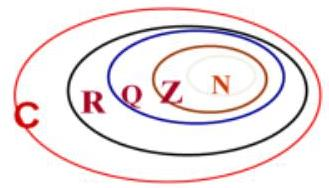
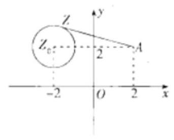

## (一) 复数

## 复数、矩阵、行列式

<table><tr><td>教学目标</td><td>1、理解复数及其概念; 掌握复数的坐标表示、复数的模、共轭复数、相等复数等概念;   2、掌握复数的四则运算、乘方以及复数的积和商的模的运算;   3、掌握待定系数法求解复数的平方根和立方根; 掌握 1 的立方根的相关性质, 并能利用其进行化简与求值;   4、理解复数的模的几何意义，体会数形结合的思想;   5、掌握实系数一元二次方程的解法，并会结合根的情况加以讨论。   6、掌握系数矩阵、增广矩阵、行列式的概念;   7、求二元一次线性方程组中相关问题，计算行列式的值。掌握行列式与多元一次方程的关系，分类讨论行列式中有解情况。   8、求行列式的值，求简单的余子式，与代数余子式，并进行简单计算；</td></tr><tr><td>重点</td><td>1、复数的概念与运算；   2、实系数一元二次方程的解法与根的情况分析.   3、复数模的几何意义;   4、线性方程组的系数矩阵、增广矩阵及会对含字母系数的二元、三元线性方程组的解的情况进行讨论;   5、求行列式的值，求简单的余子式，与代数余子式，并进行简单计算；</td></tr><tr><td>难 点</td><td>1、复数模的几何意义；   2、实系数一元二次方程的解法与根的情况分析.   3、分类讨论行列式中有解情况。</td></tr></table>

## 知识梳理

## 一、复数的概念与运算

1、理解复数的有关概念

(1)虚数单位 $i$ : 它的平方等于-1，即 ${i}^{2} =  - 1$ .

(2)复数的定义与表示:

形如 $z = a + {bi}\left( {a, b \in  R}\right)$ 的数叫复数， $a$ 叫复数的实部，记作 $\operatorname{Rez}$ ； $b$ 叫复数的虚部，

记作 $\operatorname{Im}z$ ; 全体复数所成的集合叫做复数集,用字母 $C$ 表示.

复数的代数形式: 复数通常用字母 $\mathrm{z}$ 表示,即 $z = a + {bi}\left( {a, b \in  R}\right)$ ,把复数表示成 $a + {bi}$ 的形式,叫做复数的代数形式.

(3)复数的分类以及复数与实数、虚数、纯虚数及 0 的关系:

对于复数 $a + {bi}\left( {a, b \in  R}\right)$ ,当且仅当 $b = 0$ 时,复数 $a + {bi}\left( {a, b \in  R}\right)$ 是实数 $a,$ ;

当 $b \neq  0$ 时，复数 $z = a + {bi}$ 叫做虚数；当 $a = 0$ 且 $b \neq  0$ 时， $z = {bi}$ 叫做纯虚数；

当且仅当 $a = b = 0$ 时， $z$ 就是实数 0 .

(4)两个复数相等的定义:

如果两个复数的实部和虚部分别相等，那么我们就说这两个复数相等.

这就是说,如果 $a\text{ 、 }b\text{ 、 }c\text{ 、 }d \in  R$ ,那么 $a + {bi} = c + {di} \Leftrightarrow  a = c, b = d$

(5)复数集与其它数集之间的关系: $N \subseteq  Z \subseteq  Q \subseteq  R \subseteq  C$ .

(6)共轭复数:

实部相等而虚部互为相反数的两个复数,叫做共轭复数,也称这两个复数互相共轭. 复数 $z$ 的共轭复数用 $\bar{z}$ 表示,也就是当 $z = a + {bi}$ 时, $\bar{z} = a - {bi}$ . 虚部不等于 0 的两个共轭复数也叫做共轭虚数.

(7)复数的模:

复数 $z = a + {bi}$ 在复平面内所对应的点 $Z\left( {a, b}\right)$ 到坐标原点的距离叫做复数 $z$ 的模,记作 $\left| z\right|$ . 由模的定义,可知 $\left| z\right|  = \left| {a + {bi}}\right|  = \sqrt{{a}^{2} + {b}^{2}}$ .

## 2、理解复数的有关运算及性质

(1)复数的四则运算:设 ${z}_{1} = a + {bi},{z}_{2} = c + {di}\left( {a, b, c, d \in  R}\right)$ ，则

①加减: ${z}_{1} \pm  {z}_{2} = \left( {a \pm  c}\right)  + \left( {b \pm  d}\right) i$ ；②乘法: ${z}_{1} \cdot  {z}_{2} = \left( {{ac} - {bd}}\right)  + \left( {{ad} + {bc}}\right) i$ ；

③除法: $\frac{{z}_{1}}{{z}_{2}} = \frac{{z}_{1} \cdot  \overline{{z}_{2}}}{{z}_{2} \cdot  \overline{{z}_{2}}} = \frac{{ac} + {bd}}{{c}^{2} + {d}^{2}} + \frac{{bc} - {ad}}{{c}^{2} + {d}^{2}} \cdot  i$ .

(2)共轭复数的运算:

① $\overline{{z}_{1} \pm  {z}_{2}} = \overline{{z}_{1}} \pm  \overline{{z}_{2}};\;$ ② $\overline{{z}_{1} \cdot  {z}_{2}} = \overline{{z}_{1}} \cdot  \overline{{z}_{2}};\;$ ③ $\overline{\left( \frac{{z}_{1}}{{z}_{2}}\right) } = \frac{\overline{{z}_{1}}}{\overline{{z}_{2}}};\;$ ④ $\overline{{z}^{n}} = {\left( \bar{z}\right) }^{n}\left( {n \in  \mathrm{Z}}\right)$ ;

⑤ $\bar{z} = z$ ； ⑥ $z \in  \mathrm{R} \Leftrightarrow  \bar{z} = z$ ； ⑦若 $\mathrm{z}$ 为纯虚数 $\Leftrightarrow  \bar{z} =  - z$ ； ⑧ $z \cdot  \bar{z} = {\left| z\right| }^{2} = {\left| \bar{z}\right| }^{2}$ .

(3)模的运算:

① $\left| z\right|  = \left| \bar{z}\right| \;;\;$ ② $z \cdot  \bar{z} = {\left| z\right| }^{2} = {\left| \bar{z}\right| }^{2}\;;\;$ ③ $\left| {{z}_{1}{z}_{2}}\right|  = \left| {z}_{1}\right|  \cdot  \left| {z}_{2}\right| \;;\;$ ④ $\left| \frac{{z}_{1}}{{z}_{2}}\right|  = \frac{\left| {z}_{1}\right| }{\left| {z}_{2}\right| }\left( {{z}_{2} \neq  0}\right)$ ;

⑤ $\left| {z}^{n}\right|  = {\left| z\right| }^{n}$ (当 $z \neq  0$ 时， $n \in  Z$ ); * ⑥ $\left| {z}_{1}\right|  - \left| {z}_{2}\right|  \leq  \left| {{z}_{1} \pm  {z}_{2}}\right|  \leq  \left| {z}_{1}\right|  + \left| {z}_{2}\right|$ ;

⑦ ${\left| {z}_{1} + {z}_{2}\right| }^{2} + {\left| {z}_{1} - {z}_{2}\right| }^{2} = 2\left( {{\left| {z}_{1}\right| }^{2} + {\left| {z}_{2}\right| }^{2}}\right)$ ;

⑧非零复数 ${z}_{1} = a + b\mathrm{i},{z}_{2} = c + d\mathrm{i}\left( {a\text{ 、 }b\text{ 、 }c\text{ 、 }d \in  \mathrm{R}}\right)$ ,

对应向量 $\overline{O{Z}_{1}} \bot  \overline{O{Z}_{2}} \Leftrightarrow  {ac} + {bd} = 0 \Leftrightarrow  \left| {{z}_{1} - {z}_{2}}\right|  = \left| {{z}_{1} + {z}_{2}}\right|$ (矩形的对角线相等).

(4)重要结论:

①对复数 ${z}_{1},{z}_{2}$ 和自然数 $m\text{ 、 }n$ 有 ${z}^{m} \cdot  {z}^{n} = {z}^{m + n},{\left( {z}^{m}\right) }^{n} = {z}^{mn},{\left( {z}_{1} \cdot  {z}_{2}\right) }^{n} = {z}_{1}^{m} \cdot  {z}_{2}^{n}$ ;

② ${i}^{1} = i,{i}^{2} =  - 1,{i}^{3} =  - i,{i}^{4} = 1;{i}^{{4n} + 1} = 1,{i}^{{4n} + 2} =  - 1,{i}^{{4n} + 3} =  - i,{i}^{4n} = 1$ ;

③ ${\left( 1 \pm  i\right) }^{2} =  \pm  {2i},\frac{1 \pm  i}{1 \mp  i} =  \pm  i;$ ④ $\left( {a + b\mathrm{i}}\right) \left( {a - b\mathrm{i}}\right)  = \left( {{a}^{2} + {b}^{2}}\right) , a + b\mathrm{i} = \mathrm{i}\left( {b - a\mathrm{i}}\right)$ ;

3、理解复数的几何意义

(1)复平面的有关概念:实轴是 $x$ 轴,虚轴是 $y$ 轴；与复数 $z = a + {bi}\left( {a, b \in  R}\right)$ 一一对应的点是 $\left( {a, b}\right)$ ；非零复数 $z = a + {bi}\left( {a, b \in  R,{a}^{2} + {b}^{2} \neq  0}\right)$ 与复平面上自原点出发以点 $Z\left( {a, b}\right)$ 为终点的向量 $\overline{OZ}$ 一一对应；复数模的几何意义是: 复数对应复平面上的点到原点的距离.

(2)另外，要熟悉如下复数式的几何意义:

①两点间的距离公式: $d = \left| {{z}_{1} - {z}_{2}}\right|$ ；

②线段的中垂线: $\left| {z - {z}_{1}}\right|  = \left| {z - {z}_{2}}\right|$ ；

③圆的方程: $\left| {z - p}\right|  = r$ (以点 $p$ 为圆心， $r$ 为半径)；

④圆的内部: $\left| {z - p}\right|  < r$ (以点 $p$ 为圆心， $r$ 为半径)；

⑤闭圆环: ${r}_{1} \leq  \left| {z - p}\right|  \leq  {r}_{2}$ (以点 $p$ 为圆心， ${r}_{1}$ ， ${r}_{2}$ 为半径)；

⑥ 椭圆: $\left| {z - {z}_{1}}\right|  + \left| {z - {z}_{2}}\right|  = {2a}$ (2a为正常数， ${2a} > \left| {{z}_{1} - {z}_{2}}\right|$ )；

线段: $\left| {z - {z}_{1}}\right|  + \left| {z - {z}_{2}}\right|  = {2a}$ (2a为正常数, ${2a} = \left| {{z}_{1} - {z}_{2}}\right|$ );

无轨迹: $\left| {z - {z}_{1}}\right|  + \left| {z - {z}_{2}}\right|  = {2a}$ (2a为正常数, ${2a} < \left| {{z}_{1} - {z}_{2}}\right|$ );

⑦ 双曲线: $\begin{Vmatrix}{z - {z}_{1}}\end{Vmatrix} - \left| {z - {z}_{2}}\right|  = {2a}$ (2a 为正常数， ${2a} < \left| {{z}_{1} - {z}_{2}}\right|$ )；

射线: $\begin{Vmatrix}{z - {z}_{1}\left| -\right| z - {z}_{2}}\end{Vmatrix} = {2a}$ (2a为正常数, ${2a} = \left| {{z}_{1} - {z}_{2}}\right|$ );

无轨迹: $\begin{Vmatrix}{z - {z}_{1}\left| -\right| z - {z}_{2}}\end{Vmatrix} = {2a}$ (2a为正常数, ${2a} > \left| {{z}_{1} - {z}_{2}}\right|$ ).

## 二、复数的平方根与立方根

## 1、复数的平方根的定义

若复数 ${z}_{1},{z}_{2}$ 满足 ${z}_{1}^{2} = {z}_{2}$ ,则称 ${z}_{1}$ 是 ${z}_{2}$ 的平方根.

## 2、复数的平方根的求法

${\left( a + bi\right) }^{2} = c + {di}\left( {a, b, c, c \in  R}\right)$ ,即利用复数相等,把复数平方根问题转化为实数方程组来求.

## 3、复数的平方根的性质

复数 $z\left( {z \neq  0}\right)$ 总有两个平方根 ${z}_{1},{z}_{2}$ ,且 ${z}_{1} + {z}_{2} = 0$

4、复数的立方根的定义

类似的,若复数 ${z}_{1},{z}_{2}$ 满足 ${z}_{1}^{3} = {z}_{2}$ ,则称 ${z}_{1}$ 是 ${z}_{2}$ 的立方根.

5、1 的立方根

设复数 $\omega  =  - \frac{1}{2} + \frac{\sqrt{3}}{2}i$ ,则 $1,\omega ,{\omega }^{2}$ 都是 1 的立方根.

6、 $\omega$ 的性质

① $1 + \omega  + {\omega }^{2} = 0$ ，② ${\omega }^{3} = 1$ ，③ ${\omega }^{2} = \overline{\omega } =  - \frac{1}{2} - \frac{\sqrt{3}}{2}i$ .

## 可运用这些性质化简相关问题

7、其他有用结论

${\left( 1 - i\right) }^{2} =  - {2i},\;{\left( 1 + i\right) }^{2} = {2i}$

三、实系数一元二次方程

实系数一元二次方程 $a{x}^{2} + {bx} + c = 0\left( {a, b, c \in  R, a \neq  0}\right)$ 中的 $\Delta  = {b}^{2} - {4ac}$ 为根的判别式,那么

(1) $\Delta  > 0 \Leftrightarrow$ 方程有两个不相等的实根 $\frac{-b \pm  \sqrt{{b}^{2} - {4ac}}}{2a}$ ；

(2) $\Delta  = 0 \Leftrightarrow$ 方程有两个相等的实根 $- \frac{b}{2a}$ ；

(3) $\Delta  < 0 \Leftrightarrow$ 方程有两个共轭虚根 $\frac{-b \pm  \sqrt{{4ac} - {b}^{2}}i}{2a}$ ，

在(3)的情况下，方程的根与系数关系(韦达定理)仍然成立.

【注意】

(1)在复数集 $C$ 中的一元二次方程的求根公式和韦达定理仍适用，但根的判别式仅在实数集上有效；

(2)实系数一元二次方程在复数集中一定有根，若是虚根则一定成对出现；

(3)齐二次实系数二次方程 $a{z}_{1}{}^{2} + b{z}_{1}{z}_{2} + c{z}_{2}{}^{2} = 0\left( {a, b, c \in  R}\right)$ ，将等式两端除以 ${z}_{2}$ 后，将得到一个关于 $\frac{{z}_{1}}{{z}_{2}}$ 得实系数一元二次方程; (不作要求)

(4)虚系数一元二次方程 $a{x}^{2} + {bx} + c = 0\left( {a \neq  0, a, b, c}\right)$ 至少有一个为虚数

①判别式判断实根情况失效； ②虚根成对出现的性质失效；

如 ${x}^{2} - {ix} - 2 = 0$ ,虽然 $\Delta  = 7 > 0$ ,但该方程并无实根,不过韦达定理仍适用.

## 例题精讲

【例 1】实数 $m$ 取什么数值时,复数 $z = m + 1 + \left( {m - 1}\right) i$ 是:

(1)实数； (2)虚数； (3)纯虚数.

【难度】★★

【答案】(1) $m = 1$ (2) $m \neq  1$ (3) $m =  - 1$ .

【解析】复数定义

【例 2】若 $\frac{2}{1 + i} = a + {bi}\left( {a, b \in  \mathbf{R}}\right)$ ,则 ${a}^{2019} + {b}^{2020} =$ ( )

A. -1 B. 0 C. 1 D. 2

【难度】 $\star   \star$

【答案】D

【解析】因为 $\frac{2}{1 + i} = a + {bi}$ ,所以 $1 - i = a + {bi}$ ,所以 $a = 1, b =  - 1$ ,所以 ${a}^{2019} + {b}^{2020} = 2$ ,故选: D. 【例 3】已知复数 $z$ 满足 $z =  - 1 + \sqrt{3}i$ (其中 $\mathrm{i}$ 为虚数单位),则 $\frac{\bar{z}}{\left| z\right| } =$ (   )

A. $- \frac{1}{2} + \frac{\sqrt{3}}{2}i$ B. $- \frac{1}{2} - \frac{\sqrt{3}}{2}i$ C. $\frac{1}{2} + \frac{\sqrt{3}}{2}i$ D. $\frac{1}{2} - \frac{\sqrt{3}}{2}i$

【难度】★★

【答案】B

【解析】 $\because z =  - 1 + \sqrt{3}i,\therefore \left| z\right|  = \sqrt{{\left( -1\right) }^{2} + {\left( \sqrt{3}\right) }^{2}} = 2$ ,因此, $\frac{\bar{z}}{\left| z\right| } = \frac{-1 - \sqrt{3}i}{2} =  - \frac{1}{2} - \frac{\sqrt{3}}{2}i$ . 故选: B.

【例 4】若复数满足 $\left( {2 + i}\right) z = 5$ ,则在复平面内与复数 $z$ 对应的点 $Z$ 位于( )

A. 第一象限 B. 第二象限 C. 第三象限 D. 第四象限

【难度】★★

【答案】D

【解析】由 $\left( {2 + i}\right) z = 5$ 得 $z = \frac{5}{2 + i} = \frac{5\left( {2 - i}\right) }{\left( {2 + i}\right) \left( {2 - i}\right) } = \frac{{10} - {5i}}{5} = 2 - i$ ,

所以复数 $z$ 对应的点 $Z$ 的坐标为 $\left( {2, - 1}\right)$ ,其位于第四象限. 故选: D.

【例 5】(1)若复数 $z = {\left( \frac{1 + i}{1 - i}\right) }^{2018} + {3i}$ ，则 $\left| z\right|  =$ ( )

A. $\sqrt{10}$ B. $2\sqrt{2}$ C. 4 D. 2018

【难度】★★

【答案】A

【解析】 $\because z = {\left( \frac{1 + i}{1 - i}\right) }^{2018} + {3i} = {\left\lbrack  \frac{\left( {1 + i}\right)  \cdot  \left( {1 + i}\right) }{\left( {1 - i}\right)  \cdot  \left( {1 + i}\right) }\right\rbrack  }^{2018} + {3i} = {i}^{2018} + {3i} = {i}^{4 \times  {504} + 2} + {3i} =  - 1 + {3i}$ ,

$\therefore \left| z\right|  = \sqrt{{\left( -1\right) }^{2} + {3}^{2}} = \sqrt{10}$ ,故本题选 A.

(2) $\frac{1 - i}{{\left( 1 + i\right) }^{2}} + \frac{1 + i}{{\left( 1 - i\right) }^{2}} =$

【难度】 $\star   \star$

【答案】 -1

【解析】分母实数化

【例 6】( 1 )若复数 ${z}_{1}{z}_{2} \neq  0$ ，则 ${z}_{1}{z}_{2} = \left| {{z}_{1}{z}_{2}}\right|$ 是 ${z}_{2} = \overline{{z}_{1}}$ 成立的( )；

$A$ . 充要条件; $B$ . 既不充分又不必要条件;

$C$ . 充分不必要条件; $D$ . 必要不充分条件.

【难度】 $\star   \star$

【答案】D

【解析】复数的运算

(2)已知 ${z}_{1},{z}_{2},{z}_{3} \in  C$ ，下列结论正确的是( ).

A. 若 ${z}_{1}^{2} + {z}_{2}^{2} + {z}_{3}^{2} = 0$ ,则 ${z}_{1} = {z}_{2} = {z}_{3} = 0$

B. 若 ${z}_{1}^{2} + {z}_{2}^{2} + {z}_{3}^{2} > 0$ ,则 ${z}_{1}^{2} + {z}_{2}^{2} >  - {z}_{3}^{2}$

C. 若 ${z}_{1}^{2} + {z}_{2}^{2} >  - {z}_{3}^{2}$ ,则 ${z}_{1}^{2} + {z}_{2}^{2} + {z}_{3}^{2} > 0$

D. 若 $\overline{{z}_{1}} =  - {z}_{1}$ ( $\bar{z}$ 为复数 $z$ 的共轭复数),则 ${z}_{1}$ 是纯虚数

【难度】 $\star   \star   \star$

【答案】 $C$

【解析】虚数不能比较大小

【例 7】在复平面内复数 ${z}_{1}\text{ 、 }{z}_{2}$ 所对应的点为 ${Z}_{1}\text{ 、 }{Z}_{2}, O$ 为坐标原点, $\mathrm{i}$ 是虚数单位.

(1) ${z}_{1} = 1 + {2i}$ ， ${z}_{2} = 3 - {4i}$ ，计算 ${z}_{1} \cdot  {z}_{2}$ 与 $\overline{O{Z}_{1}} \cdot  \overline{O{Z}_{2}}$ ；

(2)设 ${z}_{1} = a + {bi},{z}_{2} = c + {di}\left( {a, b, c, d \in  \mathbf{R}}\right)$ ，求证: $\left| {\overline{O{Z}_{1}} \cdot  \overline{O{Z}_{2}}}\right|  \leq  \left| {{z}_{1} \cdot  {z}_{2}}\right|$ ，并指出向量 $\overline{O{Z}_{1}}$ 、 $\overline{O{Z}_{2}}$ 满足什么条件时该不等式取等号.

【难度】 $\star   \star   \star$

【答案】( 1 ) ${z}_{1} \cdot  {z}_{2} = {11} + {2i}$ ， $\overline{O{Z}_{1}} \cdot  \overline{O{Z}_{2}} =  - 5$ ；( 2 )证明详见解析，当 ${ab} = {cd}$ 时.

【解析】解: (1) ${z}_{1} \cdot  {z}_{2} = \left( {1 + {2i}}\right)  \cdot  \left( {3 - {4i}}\right)  = {11} + {2i}$

$\overrightarrow{O{Z}_{1}} = \left( {1,2}\right) ,\overrightarrow{O{Z}_{2}} = \left( {3, - 4}\right)$ ，所以 $\overrightarrow{O{Z}_{1}} \cdot  \overrightarrow{O{Z}_{2}} =  - 5$

证明 (2) $\because {z}_{1} = a + {bi},{z}_{2} = c + {di},\therefore {z}_{1} \cdot  {z}_{2} = \left( {{ac} - {bd}}\right)  + \left( {{ad} + {bc}}\right) i$ ,

$\therefore {\left| {z}_{1} \cdot  {z}_{2}\right| }^{2} = {\left( ac - bd\right) }^{2} + {\left( ad + bc\right) }^{2}$

$\because \overrightarrow{O{Z}_{1}} = \left( {a, b}\right) ,\overrightarrow{O{Z}_{2}} = \left( {c, d}\right) ,\therefore \overrightarrow{O{Z}_{1}} \cdot  \overrightarrow{O{Z}_{2}} = {ac} + {bd},{\left| \overrightarrow{O{Z}_{1}} \cdot  \overrightarrow{O{Z}_{2}}\right| }^{2} = {\left( ac + bd\right) }^{2}$

$\therefore {\left| {z}_{1} \cdot  {z}_{2}\right| }^{2} - {\left| \overrightarrow{O{Z}_{1}} \cdot  \overrightarrow{O{Z}_{2}}\right| }^{2} = {\left( ac - bd\right) }^{2} + {\left( ad + bc\right) }^{2} - {\left( ac + bd\right) }^{2} = {\left( ad + bc\right) }^{2} - {4ac} \cdot  {bd} = {\left( ad - cb\right) }^{2} \geq  0$

所以 $\left| {{\overrightarrow{OZ}}_{1} \cdot  {\overrightarrow{OZ}}_{2}}\right|  \leq  \left| {{z}_{1} \cdot  {z}_{2}}\right|$ ,当且仅当 ${ad} = {cb}$ 时取 “ $=$ ”,此时 ${\overrightarrow{OZ}}_{1}//{\overrightarrow{OZ}}_{2}$ .

【例 8】已知复数 $z$ 满 $\left| {z - 1 - {2i}}\right|  - \left| {z + 2 + i}\right|  = 2\sqrt{2}$ ( $i$ 是虚数单位)，若在复平面内复数 $z$ 对应的点为 $Z$ ， 则点 $Z$ 的轨迹为( )

A. 双曲线 B. 双曲线的一支 C. 两条射线 D. 一条射线

【难度】★★★

【答案】B

【解析】因为复数 $z$ 满 $\left| {z - 1 - {2i}}\right|  - \left| {z + 2 + i}\right|  = 2\sqrt{2}$ ( $i$ 是虚数单位),在复平面内复数 $z$ 对应的点为 $Z$ , 则点 $Z$ 到点 $\left( {1,2}\right)$ 的距离减去到点 $\left( {-2, - 1}\right)$ 的距离之差等于 $2\sqrt{2}$ ，而点 $\left( {1,2}\right)$ 与点 $\left( {-2, - 1}\right)$ 之间的距离为 $3\sqrt{2}$ ，根据双曲线的定义，可得点 $Z$ 表示 $\left( {1,2}\right)$ 和 $\left( {-2, - 1}\right)$ 为焦点的双曲线的一支. 故选:B.

【例 9】若复数 $z$ 满足 $\left| {z + 1}\right|  + \left| {z - 1}\right|  = 2$ ，则 $\left| {z + i - 1}\right|$ 的最小值是___.

【难度】 $\star   \star   \star$

【答案】 1

【解析】复数 $Z$ 的几何意义是线段

【例 10】( 1 ) ${x}^{2} + x + 1 = 0$ ，则 ${x}^{2007} + {x}^{2008} + {x}^{2009} =$ ___.

【难度】 $\star   \star   \star$

【答案】0

【解析】由 ${x}^{2} + x + 1 = 0,{x}^{2007} + {x}^{2008} + {x}^{2009} = {x}^{2007}\left( {{x}^{2} + x + 1}\right)  = 0$ ,故答案为: 0

(2)记 $\omega  =  - \frac{1}{2} + \frac{\sqrt{3}}{2}i$ ，求 $\omega  + \frac{1}{\omega }$ ， ${\omega }^{2} + \frac{1}{{\omega }^{2}}$ .

【难度】 $\star   \star$

【答案】 $\omega  + \frac{1}{\omega } =  - 1,{\omega }^{2} + \frac{1}{{\omega }^{2}} =  - 1$

【解析】运算

【例 15】(1)已知 $0 < m < 1\left( {m \in  R}\right) ,\alpha$ 是方程 ${x}^{2} + {mx} + 1 = 0$ 的根，则 $\left| \alpha \right|  =$ ___.

【难度】★★

【答案】 1

【解析】 $\Delta  < 0,{\left| \alpha \right| }^{2} = {x}_{1}{x}_{2} = 1$

( 2 )关于 $x$ 的方程 ${x}^{2} + {mx} + 2 = 0\left( {m \in  R}\right)$ 的一个根是 $1 + {ni}\left( {n \in  {R}^{ + }}\right)$ ，则 $m + n =$ ___.

【难度】 $\star   \star$

【答案】 -1

【解析】韦达定理

(3)设 $m \in  R$ ，若 $z$ 是关于 $x$ 的方程 ${x}^{2} + {mx} + {m}^{2} - 1 = 0$ 的一个虚根，则 $\left| \bar{z}\right|$ 的取值范围是___.

【难度】 $\star   \star   \star$

【答案】 $\left( {\frac{\sqrt{3}}{3}, + \infty }\right)$

【解析】 $\Delta  = {m}^{2} - 4\left( {{m}^{2} - 1}\right)  < 0 \Rightarrow  {m}^{2} > \frac{4}{3},\because {\left| \overrightarrow{z}\right| }^{2} = {m}^{2} - 1 > \frac{1}{3}$

【例 12】已知 ${x}_{1},{x}_{2}$ 是实系数方程 ${x}^{2} + x + p = 0$ 的两个根,且满足 $\left| {{x}_{1} - {x}_{2}}\right|  = 3$ ,求实数 $p$ 的值.

【难度】 $\star   \star   \star$

【答案】 $p =  - 2$ 或 $\frac{5}{2}$ .

【解析】 $\Delta  = 1 - {4p}$ ,

(1)当 $\Delta  \geq  0$ 时，即 $p \leq  \frac{1}{4}$ 时， ${x}_{1},{x}_{2}$ 是实根， $\therefore \left| {{x}_{1} - {x}_{2}}\right|  = \sqrt{{\left( {x}_{1} + {x}_{2}\right) }^{2} - 4{x}_{1}{x}_{2}} = 3$ ，即 $\sqrt{1 - {4p}} = 3 \Rightarrow  p =  - 2$ ;

(2)当 $\Delta  < 0$ 时，即 $p > \frac{1}{4}$ 时， ${x}_{1},{x}_{2}$ 是共轭虚根，设 ${x}_{1} = a + {bi}\left( {a, b \in  \mathbf{R}}\right)$ ，则 ${x}_{2} = a - {bi}$ ， $\therefore \left| {{x}_{1} - {x}_{2}}\right|  = \left| {2bi}\right|  = 2\left| b\right|  = 3 \Rightarrow  b =  \pm  \frac{3}{2}$ ,由 ${x}_{1} + {x}_{2} = {2a} =  - 1$ ,得 $a =  - \frac{1}{2}$ . 从而 $p = {x}_{1}{x}_{2} = {\left| {x}_{1}\right| }^{2} = \frac{5}{2}$ . 综上, $p =  - 2$ 或 $\frac{5}{2}$ .

## 巩固训练

1、设 ${z}_{1},{z}_{2}$ 是复数，则下列命题中的假命题是( )

A. 若 $\left| {{z}_{1} - {z}_{2}}\right|  = 0$ ,则 $\overline{{z}_{1}} = \overline{{z}_{2}}$ B. 若 ${z}_{1} = \overline{{z}_{2}}$ ,则 $\overline{{z}_{1}} = {z}_{2}$

C. 若 $\left| {z}_{1}\right|  = \left| {z}_{2}\right|$ ,则 ${z}_{1} \cdot  \overline{{z}_{1}} = {z}_{2} \cdot  \overline{{z}_{2}}$ D. 若 $\left| {z}_{1}\right|  = \left| {z}_{2}\right|$ ,则 ${z}_{1}^{2} = {z}_{2}^{2}$

【难度】★★

【答案】D

【解析】对 (A),若 $\left| {{z}_{1} - {z}_{2}}\right|  = 0$ ,则 ${z}_{1} - {z}_{2} = 0,{z}_{1} = {z}_{2}$ ,所以 $\overline{{z}_{1}} = \overline{{z}_{2}}$ 为真;

对 (B) 若 ${z}_{1} = \overline{{z}_{2}}$ ,则 ${z}_{1}$ 和 ${z}_{2}$ 互为共轭复数,所以 $\overline{{z}_{1}} = {z}_{2}$ 为真;

对 (c) 设 ${z}_{1} = {a}_{1} + {b}_{1}i,{z}_{2} = {a}_{2} + {b}_{2}i$ ,若 $\left| {z}_{1}\right|  = \left| {z}_{2}\right|$ ,则 $\sqrt{{a}_{1}^{2} + {b}_{1}^{2}} = \sqrt{{a}_{2}^{2} + {b}_{2}^{2}}$ ,

${z}_{1} \cdot  \overline{{z}_{1}} = {a}_{1}^{2} + {b}_{1}^{2},{z}_{2} \cdot  \overline{{z}_{2}} = {a}_{2}^{2} + {b}_{2}^{2}$ ,所以 ${z}_{1} \cdot  \overline{{z}_{1}} = {z}_{2} \cdot  \overline{{z}_{2}}$ 为真;

对 (D) 若 ${z}_{1} = 1,{z}_{2} = i$ ,则 $\left| {z}_{1}\right|  = \left| {z}_{2}\right|$ 为真,而 ${z}_{1}{}^{2} = 1,{z}_{2}{}^{2} =  - 1$ ,所以 ${z}_{1}{}^{2} = {z}_{2}{}^{2}$ 为假故选 D.

2、若复数 $z$ 满足 $z = \frac{\left| {1 - i}\right|  + i}{1 - i}$ ，则 $z$ 的虚部为( )

A. $\frac{\sqrt{2} - 1}{2}$ B. $\frac{\sqrt{2} + 1}{2}$ C. 1 D. $\sqrt{2} - 1$

【难度】 $\star   \star$

【答案】B

【解析】解: $z = \frac{\left| {1 - i}\right|  + i}{1 - i} = \frac{\sqrt{2} + i}{1 - i} = \frac{\left( {\sqrt{2} + i}\right)  \cdot  \left( {1 + i}\right) }{\left( {1 - i}\right)  \cdot  \left( {1 + i}\right) } = \frac{\sqrt{2} - 1}{2} + \frac{\sqrt{2} + 1}{2}i$ ,故选: B

3、已知复数 $z$ 的共轭复数为 $\bar{z}$ ，且满足 ${2z} + \bar{z} = 3 + {2i}$ ，则 $\left| z\right|  =$ ( )

A. $\sqrt{3}$ B. $\sqrt{5}$ C. 3 D. 5

【难度】★★

【答案】B

【解析】设 $z = a + {bi}\left( {a, b \in  R}\right)$ ,则 $\bar{z} = a - {bi}$ ,

又因为 ${2z} + \bar{z} = 3 + {2i}$ ,即 ${3a} + {bi} = 3 + {2i}$ ,所以 $a = 1, b = 2$ ,所以 $\left| z\right|  = \sqrt{5}$ ,故选: B.

4、 $i$ 为虚数单位,且 $\left| {z + 2 - {2i}}\right|  = 1$ ,求 $\left| {z - 2 - {2i}}\right|$ 的最小值.

【难度】 $\star   \star   \star$

【答案】 3

【解析】由 $\left| {z + 2 - {2i}}\right|  = 1$ 得 $\left| {z - \left( {-2 + {2i}}\right) }\right|  = 1$ ,因此复数 $z$ 对应的点 $Z$ 在以 ${z}_{0} =  - 2 + {2i}$ 对应的点 ${Z}_{0}$ 为圆心, 1 为半径的圆上, 如图所示.

设 $y = \left| {z - 2 - {2i}}\right|$ ,则 $y$ 是 $Z$ 点到 $2 + {2i}$ 对应的点 $A$ 的距离. 又 $\left| {A{Z}_{0}}\right|  = 4$ , $\therefore$ 由图知 ${y}_{\min } = \left| {A{Z}_{0}}\right|  - 1 = 3$ .

5、已知复数 ${z}_{1}$ 满足 $\left( {1 - \mathrm{i}}\right) {z}_{1} = 1 + 3\mathrm{i},{z}_{2} = a - \mathrm{i}\left( {a \in  \mathbf{R}}\right)$ (其中 $\mathrm{i}$ 是虚数单位),若 $\left| {{z}_{1} - \overline{{z}_{2}}}\right|  > \sqrt{2}\left| {z}_{1}\right|$ ,求 $a$ 的取值范围.

【难度】 $\star   \star   \star$

【答案】见解析

【解析】 ${z}_{1} = \frac{1 + 3\mathrm{i}}{1 - \mathrm{i}} =  - 1 + 2\mathrm{i},\left| {z}_{1}\right|  = \sqrt{5},{z}_{1} - \overline{{z}_{2}} = \left( {-1 + 2\mathrm{i}}\right)  - \left( {a + \mathrm{i}}\right)  =  - 1 - a + \mathrm{i}$ ,

由 $\left| {{z}_{1} - \overline{{z}_{2}}}\right|  > \sqrt{2}\left| {z}_{1}\right|$ 得 ${\left( a + 1\right) }^{2} + 1 > {10}$ 解得 $a \in  \left( {-\infty , - 4}\right)  \cup  \left( {2, + \infty }\right)$

6、已知: 复数 ${z}_{1} = b\cos C + \left( {a + c}\right) i,{z}_{2} = \left( {{2a} - c}\right) \cos B + {4i}$ ,且 ${z}_{1} = {z}_{2}$ ,其中 $B\text{ 、 }C$ 为 $\bigtriangleup {ABC}$ 的内角, $a\text{ 、 }b\text{ 、 }c$ 为角 $A\text{ 、 }B\text{ 、 }C$ 所对的边.

(1)求角 $B$ 的大小；

(2)若 $b = 2\sqrt{2}$ ，求 $\bigtriangleup  \mathrm{{ABC}}$ 的面积.

【难度】 $\star   \star   \star$

【答案】见解析

【解析】(1) $\because {z}_{1} = {z}_{2}\;\therefore b\cos C = \left( {{2a} - c}\right) \cos B - 0, a + c = 4 -$

由①得 ${2a}\cos B = b\cos C + c\cos B -$

在 $\bigtriangleup  \mathrm{{ABC}}$ 中,由正弦定理得 $2\sin A\cos B = \sin B\cos C + \sin C\cos B$

$2\sin A\cos B = \sin \left( {B + C}\right)  = \sin \left( {\pi  - A}\right)  = \sin A$

$\because 0 < A < \pi \;\therefore \sin A > 0\;\therefore \cos B = \frac{1}{2},\because 0 < B < \pi \;\therefore B = \frac{\pi }{3}$

(2) $\because b = 2\sqrt{2}$ ，由余弦定理得 ${b}^{2} = {a}^{2} + {c}^{2} - {2ac}\cos B \Rightarrow  {a}^{2} + {c}^{2} - {ac} = 8$ ， -④

由②得 ${a}^{2} + {c}^{2} + {2ac} = {16}$ -⑤ 由④⑤得 ${ac} = \frac{8}{3},\therefore {S}_{\bigtriangleup {ABC}} = \frac{1}{2}{ac}\sin B = \frac{1}{2} \times  \frac{8}{3} \times  \frac{\sqrt{3}}{2} = \frac{2\sqrt{3}}{3}$ .

7、设 $z \in  \mathbf{C},{z}^{2} + 9 = 0$ ，则 $\left| {z - 4}\right|  =$ ___.

【难度】★★

【答案】 5 .

【解析】由 ${z}^{2} + 9 = 0 \Rightarrow  z =  \pm  {3i}$ ,则 $\left| {z - 4}\right|  = \left| {\pm {3i} - 4}\right|  = 5$ . 故答案为: 5

8、在复数范围内方程 ${x}^{5} = x$ 的解是___.

【难度】 $\star   \star   \star$

【答案】 $x = 0$ 或 $\pm  1$ 或 $\pm  i$

【解析】在复数范围内解方程 ${x}^{5} = x$ ,

即 $x\left( {{x}^{2} + 1}\right) \left( {{x}^{2} - 1}\right)  = 0$ ,所以 $x = 0$ 或 ${x}^{2} = 1$ 或 ${x}^{2} =  - 1$ ,所以 $x = 0$ 或 $x =  \pm  1$ 或 $x =  \pm  i$ .

故答案为: $x = 0$ 或 $\pm  1$ 或 $\pm  i$

9、从 $\{ 1,2,3,4,5\}$ 中随机选取一个数 $a$ ，从 $\{ 1,2,3\}$ 中随机选取一个数 $b$ ，使得关于 $x$ 的方程 ${x}^{2} + {2ax} + {b}^{2} = 0$ 有两个虚根，则不同的选取方法有___种

【难度】 $\star   \star   \star$

【答案】 3

【解析】 $\because$ 关于 $x$ 的方程 ${x}^{2} + {2ax} + {b}^{2} = 0$ 有两个虚根, $\therefore  \bigtriangleup   = 4{a}^{2} - 4{b}^{2} < 0,\therefore a < b$ .

所有的 $\left( {a, b}\right)$ 中满足 $a < b$ 的 $\left( {a, b}\right)$ 共有 $\left( {1,2}\right) \text{ 、 }\left( {1,3}\right) \text{ 、 }\left( {2,3}\right)$ ,共计 3 个,故答案为3.

10、已知复数 ${z}_{1},{z}_{2}$ 满足 $\left| {z}_{1}\right|  = 2,\left| {z}_{2}\right|  = 1,\left| {{z}_{1} - {z}_{2}}\right|  = 2$ ,求 $\frac{{z}_{1}}{{z}_{2}}$ .

【难度】 $\star   \star   \star$

【答案】见解析

【解析】 ${\left| {z}_{1} - {z}_{2}\right| }^{2} = \left( {{z}_{1} - {z}_{2}}\right) \left( {\overline{{z}_{1}} - \overline{{z}_{2}}}\right)  = {z}_{1} \cdot  \overline{{z}_{1}} - {z}_{1} \cdot  \overline{{z}_{2}} - \overline{{z}_{1}} \cdot  {z}_{2} + {z}_{2} \cdot  \overline{{z}_{2}} = 4$ ,

$\therefore {z}_{1} \cdot  \overline{{z}_{2}} + \overline{{z}_{1}} \cdot  {z}_{2} = 1,\therefore \frac{{z}_{1}}{{z}_{2}} \cdot  {z}_{2} \cdot  \overline{{z}_{2}} + \frac{{z}_{2}}{{z}_{1}} \cdot  {z}_{1} \cdot  \overline{{z}_{1}} = 1,\therefore \frac{{z}_{1}}{{z}_{2}} + 4\frac{{z}_{2}}{{z}_{1}} = 1$ .

令 $t = \frac{{z}_{1}}{{z}_{2}}$ ,则 $t + 4\frac{1}{t} = 1,\therefore {t}^{2} - t + 4 = 0,\therefore t = \frac{1}{2} \pm  \frac{\sqrt{15}}{2}i$ ,即 $\frac{{z}_{1}}{{z}_{2}} = \frac{1}{2} \pm  \frac{\sqrt{15}}{2}i$ .

11、已知复数 $z$ 满足 $\left| {z - 1 - {2i}}\right|  - \left| {z + 2 + i}\right|  = 3\sqrt{2}$ (i 是虚数单位)，若在复平面内复数 $z$ 对应的点为 $z$ ，则点 $Z$ 的轨迹为( )

A. 双曲线的一支 B. 双曲线 C. 一条射线 D. 两条射线

【难度】★★★

【答案】C

【解析】复数几何意义

12、关于 $x$ 的方程 ${x}^{2} - \left( {{2a} - b\mathrm{i}}\right) x + a - b\mathrm{i} = 0$ 有实根，且一个根的模是 2,求实数 $a\text{ 、 }b$ 的值.

【难度】 $\star   \star   \star$

【答案】节能解析

【解析】设 $t\left( {t \in  \mathbf{R}}\right)$ 是方程的一实根,则 $\left( {{t}^{2} - {2at} + a}\right)  + \left( {{bt} - b}\right) \mathrm{i} = 0$ . 则 $\left\{  \begin{array}{l} {t}^{2} - {2at} + a = 0, \\  {bt} - b = 0. \end{array}\right.$

(1)当 $b = 0$ 时,此方程为 ${x}^{2} - {2ax} + a = 0$ .

① 有实根， $\Delta  \geq  0$ 即 $a \geq  1$ 或 $a \leq  0$ .

当根为 2 时, $4 - {4a} + a = 0$ . 得 $a = \frac{4}{3}$ . 当根为 -2 时, $4 + {4a} + a = 0$ . 得 $a =  - \frac{4}{5}$ .

②有一对共轭虚根即 $0 < a < 1$ . 模为 2,即有 $a = 4$ (舍).

(2)当 $b \neq  0$ 时，则 $t = 1$ ，此时 $a = 1$ . 又因为模为 2，所以 $b =  \pm  \sqrt{3}$ .

所以 $\left\{  \begin{array}{l} a = \frac{4}{3}, \\  b = 0 \end{array}\right.$ 或 $\left\{  \begin{array}{l} a =  - \frac{4}{5}, \\  b = 0 \end{array}\right.$ 或 $\left\{  \begin{array}{l} a = 1, \\  b = \sqrt{3} \end{array}\right.$ 或 $\left\{  \begin{array}{l} a = 1, \\  b =  - \sqrt{3}. \end{array}\right.$

13、设 $\alpha$ 、 $\beta$ 为方程 ${x}^{2} + {2x} + t = 0$ ， $\left( {t \in  \mathbf{R}}\right)$ 的两个根， $f\left( t\right)  = \left| \alpha \right|  + \left| \beta \right|$ ，

(1)求 $f\left( t\right)$ 的解析式；

(2)证明关于 $t$ 的方程 $f\left( t\right)  = m$ ，当 $m > 2$ 时恰有两个不等的根，且两根之和为定值.

【难度】 $\star   \star   \star$

【答案】见解析

【解析】(1) $f\left( t\right)  = \left\{  \begin{array}{l} 2\sqrt{t}, t < 0. \\  2,0 < t \leq  1. \\  2\sqrt{1 - t}, t < 0. \end{array}\right.$

(2)证明:函数 $y = f\left( t\right)$ 的图像关于直线 $t = \frac{1}{2}$ 对称(证略)

当 $t \in  \left( {1, + \infty }\right)$ 时, $f\left( t\right)$ 为增函数,且 $f\left( t\right)  \in  \left( {2, + \infty }\right)$ ;

当 $t \in  \left( {-\infty ,0}\right)$ 时, $f\left( t\right)$ 为减函数,且 $f\left( t\right)  \in  \left( {2, + \infty }\right)$ .

所以当 $m > 2$ ,方程 $f\left( t\right)  = m$ 在区间 $\left( {1, + \infty }\right)$ 上有唯一解 ${t}_{1}$ ,在区间 $\left( {-\infty ,0}\right)$ 上也有唯一解 ${t}_{2}$ , 则 ${t}_{1} + {t}_{2} = 2 \times  \frac{1}{2} = 1$ .

## (二) 矩阵、行列式

## 知识梳理

## 一、矩阵

1、矩阵的相关定义:

(1)由 $m$ 个行向量与 $n$ 个列向量组成的矩阵称为 $m \times  n$ 阶矩阵记做 ${A}_{m \times  n}$ ，如矩阵 $\left( \begin{array}{l} 1 \\  3 \end{array}\right)$ 为 $2 \times  1$ 阶矩阵，可记做 ${A}_{2 \times  1}$ ; 矩阵 $\left( \begin{matrix} {51} & {21} & {28} \\  {36} & {38} & {36} \\  {23} & {21} & {28} \end{matrix}\right)$ 为 $3 \times  3$ 阶矩阵;

(2)矩阵中的每一个数字叫做矩阵的元素；

(3)零矩阵:当一个矩阵中所有元素均为 0 时，我们称这个矩阵为零矩阵；

(4)方阵:当一个矩阵的行数与列数相等时，这个矩阵称为方矩阵，简称方阵；特别的，若一个 $n$ 阶方阵从左上角到右下角的对角线上的所有元素均为 1, 其余均为 0, 这样的方阵叫做单位矩阵;

(5)相等的矩阵:如果矩阵 $A$ 与矩阵 $B$ 是同阶矩阵，当且仅当它们对应位置的元素都相等时，那么矩阵 $A$ 与矩阵 $B$ 叫做相等的矩阵,记为 $A = B$ ;

(6)系数矩阵和增广矩阵

注:增广矩阵中最后一列数字一定是线性方程中等于号右边的常数，同时注意有系数为 0 以及系数颠倒的情形.

2、矩阵的运算

(1)矩阵的加减法:两个同阶的矩阵相加减就是把两个矩阵的对应元素相加减得到的一个新矩阵。

(2)矩阵的数乘:一个数乘以一个矩阵等于这个矩阵的所有元素都乘以这个数字从而得到的一个新矩阵。

(3)矩阵的乘积:一般，设 $A$ 是 $m \times  k$ 阶矩阵， $B$ 是 $k \times  n$ 阶矩阵，设 $C$ 为 $m \times  n$ 矩阵如果矩阵 $C$ 中第 $i$ 行第 $j$ 列元素 ${C}_{ij}$ 是矩阵 $A$ 第 $i$ 个行向量与矩阵 $B$ 的第 $j$ 个列向量的数量积,那么 $C$ 矩阵叫做 $A$ 与 $B$ 的乘积. 记作: $C = {AB}$ .

分配律: $A\left( {B + C}\right)  = {AB} + {AC},\left( {B + C}\right) A = {BA} + {CA}$

结合律: $\gamma \left( {AB}\right)  = \left( {\gamma A}\right) B = A\left( {\gamma B}\right) ,\left( {AB}\right) C = A\left( {BC}\right)$

注: 交换律不成立,即 ${AB} \neq  {BA}$

(4)用矩阵初等行变换求解方程组的解:①互换两行；②某一行乘以一个非零常数；③将某一行乘以一个非零常数加到另一行上。最终的目的在于将增广矩阵前面的系数矩阵变成单位矩阵，最后一列数即为方程组的解。

(5) 点 $P\left( {x, y}\right)$ 经过矩阵 $A = \left( \begin{array}{ll} a & b \\  c & d \end{array}\right)$ 变换后得到新的点 $Q$ 的坐标为 $\left( {{ax} + {by},{cx} + {dy}}\right)$ 即

$$
\left( \begin{array}{ll} a & b \\  c & d \end{array}\right)  \times  \left( \begin{array}{l} x \\  y \end{array}\right)  = \left( \begin{array}{l} {ax} + {by} \\  {cx} + {dy} \end{array}\right)
$$

二、行列式

1、二阶行列式: $\left| \begin{array}{ll} {a}_{1} & {b}_{1} \\  {a}_{2} & {b}_{2} \end{array}\right|  = {a}_{1}{b}_{2} - {a}_{2}{b}_{1}$ ;

## 2、二元一次方程组的行列式解法

二元一次方程组: $\left\{  \begin{array}{l} {a}_{1}x + {b}_{1}y = {c}_{1} \\  {a}_{2}x + {b}_{2}y = {c}_{2} \end{array}\right.$ 其中 $x, y$ 是未知数, ${a}_{1},{a}_{2},{b}_{1},{b}_{2}$ 不全为零

系数行列式: $D = \left| \begin{array}{ll} {a}_{1} & {b}_{1} \\  {a}_{2} & {b}_{2} \end{array}\right| ,{D}_{x} = \left| \begin{array}{ll} {c}_{1} & {b}_{1} \\  {c}_{2} & {b}_{2} \end{array}\right| ,{D}_{y} = \left| \begin{array}{ll} {a}_{1} & {c}_{1} \\  {a}_{2} & {c}_{2} \end{array}\right|$ .

(1)当 $D \neq  0$ 时,方程组有唯一解 $\left\{  \begin{array}{l} x = \frac{{D}_{x}}{D} \\  y = \frac{{D}_{y}}{D} \end{array}\right.$

(2)当 $D = 0,{D}_{x} = {D}_{y} = 0$ 时,方程组有无穷多解;

(3)当 $D = 0,{D}_{x},{D}_{y}$ 中至少有一个不为零，方程组无解.

3、三阶行列式的几种算法

(1)对角线法则:如图，也可在行列式后面补上两列来解决；

$\left| \begin{array}{lll} {a}_{1} & {b}_{1} & {c}_{1} \\  {a}_{2} & {b}_{2} & {c}_{2} \\  {a}_{3} & {b}_{3} & {c}_{3} \end{array}\right|  = {a}_{1}{b}_{2}{c}_{3} + {a}_{2}{b}_{3}{c}_{1} + {a}_{3}{b}_{1}{c}_{2} - {a}_{3}{b}_{2}{c}_{1} - {a}_{2}{b}_{1}{c}_{3} - {a}_{1}{b}_{3}{c}_{2}$

(2)按照某一行或者某一列展开:三阶行列式的值等于某一行(列)的所有元素乘以它们的代数余子式相加。注意区分余子式和代数余子式的概念.

(3)计算器

5、已知 ${xOy}$ 平面上三点 $A\left( {{x}_{1},{y}_{1}}\right) , B\left( {{x}_{2},{y}_{2}}\right) , C\left( {{x}_{3},{y}_{3}}\right)$ ,以 $A, B, C$ 为顶点的三角形 ${ABC}$ 的面积为 $\frac{1}{2}\begin{Vmatrix} {x}_{1} & {y}_{1} & 1 \\  {x}_{2} & {y}_{2} & 1 \\  {x}_{3} & {y}_{3} & 1 \end{Vmatrix}$

6、一类特殊的行列式: 三阶范德蒙德行列式

$$
\left| \begin{matrix} 1 & 1 & 1 \\  a & b & c \\  {a}^{2} & {b}^{2} & {c}^{2} \end{matrix}\right|  = \left| \begin{matrix} 1 & a & {a}^{2} \\  1 & b & {b}^{2} \\  1 & c & {c}^{2} \end{matrix}\right|  = \left( {b - a}\right) \left( {c - b}\right) \left( {c - a}\right)
$$

## 例题精讲

【例 13】(1)已知 $A = \left( \begin{array}{lll} 7 & 5 & 4 \\  3 & 1 & 2 \\  5 & 4 & 1 \end{array}\right) , B = \left( \begin{array}{lll} 1 & 2 & 1 \\  1 & 1 & 1 \\   - 1 & 1 & 1 \end{array}\right)$ ,则 ${2A} + B =$ ___， $A - {3B} =$ ___.

【难度】 $\star   \star$

【答案】 $\left( \begin{matrix} {15} & {12} & 9 \\  7 & 3 & 5 \\  9 & 9 & 3 \end{matrix}\right) ;\left( \begin{matrix} 4 &  - 1 & 1 \\  0 &  - 2 &  - 1 \\  8 & 1 &  - 2 \end{matrix}\right)$ .

(2)已知 $A = \left( \begin{array}{llll} 1 & 2 & 3 & 4 \end{array}\right) , B = \left( \begin{array}{l} 1 \\  2 \\  3 \\  4 \end{array}\right)$ ，则 ${AB} =$ ___； ${BA} =$ ___.

【难度】 $\star   \star$

【答案】(30) $\left( \begin{array}{llll} 1 & 2 & 3 & 4 \\  2 & 4 & 6 & 8 \\  3 & 6 & 9 & {12} \\  4 & 8 & {12} & {16} \end{array}\right)$

【解析】解: 因为 $A = \left( \begin{array}{llll} 1 & 2 & 3 & 4 \end{array}\right) , B = \left( \begin{array}{l} 1 \\  2 \\  3 \\  4 \end{array}\right)$

所以 ${AB} = \left( \begin{array}{llll} 1 & 2 & 3 & 4 \end{array}\right) \left( \begin{array}{l} 1 \\  2 \\  3 \\  4 \end{array}\right)  = \left( {1 \times  1 + 2 \times  2 + 3 \times  3 + 4 \times  4}\right)  = \left( {30}\right)$

${BA} = \left( \begin{array}{l} 1 \\  2 \\  3 \\  4 \end{array}\right) \left( \begin{array}{llll} 1 & 2 & 3 & 4 \end{array}\right)  = \left( \begin{array}{llll} 1 \times  1 & 2 \times  1 & 3 \times  1 & 4 \times  1 \\  2 \times  1 & 2 \times  2 & 2 \times  3 & 2 \times  4 \\  3 \times  1 & 3 \times  2 & 3 \times  3 & 3 \times  4 \\  4 \times  1 & 4 \times  2 & 4 \times  3 & 4 \times  4 \end{array}\right)  = \left( \begin{array}{llll} 1 & 2 & 3 & 4 \\  2 & 4 & 6 & 8 \\  3 & 6 & 9 & {12} \\  4 & 8 & {12} & {16} \end{array}\right)$

故答案为: $\left( \begin{matrix} {30} \\  2 \end{matrix}\right) ;\left( \begin{matrix} 1 & 2 & 3 & 4 \\  2 & 4 & 6 & 8 \\  3 & 6 & 9 & {12} \\  4 & 8 & {12} & {16} \end{matrix}\right)$

(3)已知 $A = \left( \begin{matrix} x + 3 \\  {2y} - 1 \end{matrix}\right)$ ， $B = \left( \begin{matrix} 4 - y \\  x - 1 \end{matrix}\right)$ ，若 $A = {2B}$ ，则 $x, y$ 的值分别为( ).

A. 1,2

B. $2,\frac{3}{2}$ C. 2,1 D. 不存在

【难度】★★

【答案】B

【解析】解: 因为 $A = {2B}$ ,所以 $\left\{  \begin{array}{l} x + 3 = 2\left( {4 - y}\right) \\  {2y} - 1 = 2\left( {x - 1}\right)  \end{array}\right.$ , $\left\{  \begin{array}{l} x = 2 \\  y = \frac{3}{2} \end{array}\right.$ ,故选: B

【例 14】将方程组 $\left\{  \begin{array}{l} {2x} = 0, \\  {3y} + z = 2, \\  {5x} + y = 3 \end{array}\right.$ 的系数写成矩阵形式为___.

【难度】 $\star   \star$

【答案】 $\left( \begin{array}{lll} 2 & 0 & 0 \\  0 & 3 & 1 \\  5 & 1 & 0 \end{array}\right)$

【解析】由系数矩阵概念得方程组 $\left\{  \begin{array}{l} {2x} + 0 \times  y + 0 \times  z = 0, \\  0 \times  x + {3y} + z = 2 \\  {5x} + y + 0 \times  z = 3 \end{array}\right.$ 的系数矩阵为 $\left( \begin{array}{lll} 2 & 0 & 0 \\  0 & 3 & 1 \\  5 & 1 & 0 \end{array}\right)$ ,

【例 15】若关于 $x, y$ 的线性方程组的增广矩阵为 $\left( \begin{matrix} m & 0 & 6 \\  0 & 3 & n \end{matrix}\right)$ ,该方程组的解为 $\left\{  \begin{array}{l} x =  - 3, \\  y = 4. \end{array}\right.$ 则 ${mn}$ 的值为 ___.

【难度】 $\star   \star$

【答案】 24

【解析】由增广矩阵写出线性方程组为 $\left\{  \begin{array}{l} {mx} = 6, \\  {3y} = n. \end{array}\right.$

又因为方程组的解为 $\left\{  \begin{array}{l} x =  - 3, \\  y = 4. \end{array}\right.$ 所以, $\left\{  \begin{array}{l} m \times  \left( {-3}\right)  = 6, \\  3 \times  4 = n. \end{array}\right.$ 解得, $\left\{  \begin{array}{l} m =  - 2, \\  n = {12}. \end{array}\right.$ ,故, ${mn} = \left( {-2}\right)  \times  {12} = {24}$ .

【例 16】给出方程组 $\left\{  \begin{array}{l} {ax} - {2y} =  - 3, \\  {2x} + {6y} + 1 = 0 \end{array}\right.$ 有唯一解的充要条件.

【难度】★★

【答案】 $a \neq   - \frac{2}{3}$

【解析】解: 由 $\left\{  \begin{array}{l} {ax} - {2y} =  - 3, \\  {2x} + {6y} =  - 1. \end{array}\right.$ ,所以它的增广矩阵为 $\left( \begin{matrix} a &  - 2 &  - 3 \\  2 & 6 &  - 1 \end{matrix}\right)$ .

又 $\left( \begin{matrix} a &  - 2 &  - 3 \\  2 & 6 &  - 1 \end{matrix}\right)  \Rightarrow  \left( \begin{matrix} a &  - 2 &  - 3 \\  2 + {3a} & 0 & 8 \end{matrix}\right)  \Rightarrow  \left( \begin{matrix} 0 &  - 2 &  - 3 - \frac{8}{2 + {3a}} \\  2 + {3a} & 0 & 8 \end{matrix}\right)$ ,

即 $\left\{  \begin{array}{l}  - {2y} =  - 3 - \frac{8}{2 + {3a}}, \\  \left( {2 + {3a}}\right) x = 8 \end{array}\right.$ 所以当且仅当 $2 + {3a} \neq  0,\therefore a \neq   - \frac{2}{3}$ 时有唯一解

【例 17】在 $n$ 行 $n$ 列矩阵 $\left( \begin{matrix} 1 & 2 & 3 & \cdots & n - 2 & n - 1 & n \\  2 & 3 & 4 & \cdots & n - 1 & n & 1 \\  3 & 4 & 5 & \cdots & n & 1 & 2 \\  \cdots & \cdots & \cdots & \cdots & \cdots & \cdots & \cdots \\  n & 1 & 2 & \cdots & n - 3 & n - 2 & n - 1 \end{matrix}\right)$ 中,记位于第 $\mathrm{i}$ 行第 $j$ 列的数为

${a}_{ij}\left( {i, j = 1,2,\cdots , n}\right)$ . 当 $n = 9$ 时, ${a}_{11} + {a}_{22} + {a}_{33} + \cdots  + {a}_{99} =$ ___.

【难度】 $\star   \star   \star$

【答案】 45

【解析】

由题意可知,当 $\mathbf{n} = \mathbf{9}$ 时,矩阵为 $\left( \begin{array}{llllllllll} 1 & 2 & 3 & 4 & 5 & 6 & 7 & 8 & 9 & 1 \\  2 & 3 & 4 & 5 & 6 & 7 & 8 & 9 & 1 & 2 \\  3 & 4 & 5 & 6 & 7 & 8 & 9 & 1 & 2 & 3 \\  4 & 5 & 6 & 7 & 8 & 9 & 1 & 2 & 3 & 4 \\  5 & 6 & 7 & 8 & 9 & 1 & 2 & 3 & 4 & 5 \\  6 & 7 & 8 & 9 & 1 & 2 & 3 & 4 & 5 & 6 \\  7 & 8 & 9 & 1 & 2 & 3 & 4 & 5 & 6 & 7 \\  8 & 9 & 1 & 2 & 3 & 4 & 5 & 6 & 7 & 8 \end{array}\right)$ ,

所以 ${a}_{11} + {a}_{22} + {a}_{33} + \ldots  + {a}_{99} = 1 + 3 + 5 + 7 + 9 + 2 + 4 + 6 + 8 = {45}$ . 故答案为: 45 .

【例 18】( 1 )若 $\left| \begin{matrix} x + 1 & 3 \\  1 & x \end{matrix}\right|  = 3$ ,则 $x =$

【难度】 $\star   \star$

【答案】见解析

【解析】由二阶行列式的定义可知 $\left| \begin{matrix} x + 1 & 3 \\  1 & x \end{matrix}\right|  = x\left( {x + 1}\right)  - 3 = {x}^{2} + x - 3 = 0$ ,解得 $x = 2$ 或 -3 .

(2)已知 $\left| \begin{matrix} 1 & 2 & 4 \\  1 & 5 & {25} \\  1 & x & {x}^{2} \end{matrix}\right|  = 0$ ,求 $x$ 的值.

【难度】 $\star   \star$

【答案】见解析

【解析】化简行列式得 ${x}^{2} - {7x} + {10} = 0$ ,解得 $x = 2$ 或 5 .

【例 19】(1)按第二行展开行列式 $\left| \begin{matrix} 2\cos \theta & 1 & 0 \\  1 & 2\cos \theta & 1 \\  0 & 1 & 2\cos \theta  \end{matrix}\right|$ ,并化简.

【难度】 $\star   \star$

【答案】见解析

【解析】 $\left| \begin{matrix} 2\cos \theta & 1 & 0 \\  1 & 2\cos \theta & 1 \\  0 & 1 & 2\cos \theta  \end{matrix}\right|  =  - \left| \begin{matrix} 1 & 0 \\  1 & 2\cos \theta  \end{matrix}\right|  + {\left. 2\cos \theta \right| }^{2\cos \theta }\left| \begin{matrix} 2\cos \theta & 0 \\  0 & 2\cos \theta  \end{matrix}\right|  - \left| \begin{matrix} 2\cos \theta & 0 \\  0 & 1 \end{matrix}\right|$

$=  - 2\cos \theta  + 2\cos \theta  \cdot  4{\cos }^{2}\theta  - 2\cos \theta  = 4\cos \theta \left( {2{\cos }^{2}\theta  - 1}\right)  = 4\cos \theta \cos {2\theta }$

(2)计算: $\left| \begin{array}{ll} b & c \\  e & f \end{array}\right|  - \left| \begin{array}{ll} a & c \\  d & f \end{array}\right|  + \left| \begin{array}{ll} a & b \\  d & e \end{array}\right|  - \left| \begin{array}{lll} 1 & 1 & 1 \\  a & b & c \\  d & e & f \end{array}\right|$ .

【难度】 $\star   \star   \star$

【答案】见解析

【解析】原式 $= \left( {{bf} - {ce}}\right)  - \left( {{af} - {cd}}\right)  + \left( {{ae} - {bd}}\right)  - {bf} - {ae} - {cd} + {bd} + {af} + {ce} = 0$

【例 20】若在行列式 $\left| \begin{matrix} 3 & a & 5 \\  0 &  - 4 & 1 \\   - 2 & 1 & 3 \end{matrix}\right|$ 中,元素 $a$ 的余子式的值是 ___. 代数余子式的值是___.

【难度】★★

【答案】见解析

【解析】 $a$ 的余子式: $\left| \begin{matrix} 0 & 1 \\   - 2 & 3 \end{matrix}\right|$ ; $a$ 的代数余子式: ${\left( -1\right) }^{1 + 2}\left| \begin{matrix} 0 & 1 \\   - 2 & 3 \end{matrix}\right|$ ;

故 $a$ 的余子式的值为 2 ; 代数余子式的值为 -2 ;

【例 21】在 $\bigtriangleup  {ABC}$ 中，角 $A$ 、 $B$ 、 $C$ 、所对边分别为 $a$ 、 $b$ 、 $c$ ，已知 $a = 2\sqrt{3}$ ， $c = 2$ ， $\left| \begin{matrix} \sin C & \sin B & 0 \\  0 & b &  - {2c} \\  \cos A & 0 & 1 \end{matrix}\right|  = 0$ ， 则 $\bigtriangleup  {ABC}$ 的面积为___.

【难度】★★★

【答案】 $2\sqrt{3}$

【解析】因为 $\left| \begin{matrix} \sin C & \sin B & 0 \\  0 & b &  - {2c} \\  \cos A & 0 & 1 \end{matrix}\right|  = 0$ ,即 $b\sin C - {2c}\sin B\cos A = 0$ ,

由正弦定理得: $\sin B\sin C - 2\sin C\sin B\cos A = 0$ ，

又因为在 $\bigtriangleup  {ABC}$ 中， $\sin B\sin C \neq  0$ ，所以 $\cos A = \frac{1}{2}$ ，由 $0 < A < \pi$ 得 $A = \frac{\pi }{3}$ ，

由余弦定理得 $\frac{1}{2} = \frac{{b}^{2} + 4 - {12}}{2 \times  2 \times  b}$ ,解得 $b = 4$ 或 $b =  - 2$ (舍去)

所以 $\bigtriangleup  {ABC}$ 的面积为: $\frac{1}{2}{bc}\sin A = \frac{1}{2} \times  4 \times  2 \times  \frac{\sqrt{3}}{2} = 2\sqrt{3}$ ，故答案为: $2\sqrt{3}$ .

【例 22】关于 $x, y$ 的方程组 $\left\{  \begin{array}{l} {ax} + \left( {{2a} - 1}\right) y = {a}^{2} + {2a} - 1 \\  x + {ay} = {2a} \end{array}\right.$ ,则下列说法错误的是 ( ).

A. 一定有解 B. 可能有唯一解

C. 可能有无穷多解 D. 可能无解

【难度】 $\star   \star   \star$

【答案】D

【解析】关于 $x, y$ 的方程组 $\left\{  \begin{array}{l} {ax} + \left( {{2a} - 1}\right) y = {a}^{2} + {2a} - 1 \\  x + {ay} = {2a} \end{array}\right.$(1) (2)

由 $x + {ay} = {2a}$ ,可得 ${ax} + {a}^{2}y = 2{a}^{2}\left( 3\right)$

(3) $- \left( 1\right)  : \left( {{a}^{2} - {2a} + 1}\right) y = {a}^{2} - {2a} + 1$

当 $a = 1$ 时,为恒等式,有无穷多解;

当 $a \neq  1$ 时, $\mathbf{y} = \mathbf{1},\mathbf{x} = \mathbf{a}$ ,有唯一解

故选: D

【例 23】在直角坐标平面内,顶点分别为 $A\left( {{x}_{1},{y}_{1}}\right) , B\left( {{x}_{2},{y}_{2}}\right) , C\left( {{x}_{3},{y}_{3}}\right)$ 的 $\bigtriangleup {ABC}$ 的面积 $S = \frac{1}{2}\left| D\right|$ ,其中, $D = \left| \begin{array}{lll} {x}_{1} & {y}_{1} & 1 \\  {x}_{2} & {y}_{2} & 1 \\  {x}_{3} & {y}_{3} & 1 \end{array}\right|$ . 利用这个结论解答下面问题:

(1)若 $A\left( {3,5}\right) , B\left( {-1, - 2}\right) , C\left( {4, - 1}\right)$ ,求 $\bigtriangleup {ABC}$ 的面积;

(2)若 $A\left( {3,5}\right) , B\left( {0, - 1}\right) , C\left( {-2, - 5}\right)$ ，求证 $A, B, C$ 三点共线；

(3)若 $A\left( {1,2}\right) , B\left( {\lambda ,3}\right) , C\left( {-1,5}\right)$ ，当 $\lambda$ 为何值时，三点共线？当 $\lambda$ 为何值时， $\bigtriangleup  {ABC}$ 的面积是 10.

【难度】 $\star   \star   \star$

【答案】见解析

【解析】(1) $D = \left| \begin{matrix} 3 & 5 & 1 \\   - 1 &  - 2 & 1 \\  4 &  - 1 & 1 \end{matrix}\right|  = {31}$ ,由 $\bigtriangleup {ABC}$ 的面积公式可得, $S = \frac{1}{2}\left| D\right|  = \frac{1}{2} \times  {31} = {15.5}$ ;

(2) $D = \left| \begin{matrix} 3 & 5 & 1 \\  0 &  - 1 & 1 \\   - 2 &  - 5 & 1 \end{matrix}\right|  = 0$ ，此时三角形面积为零，所以 $A, B, C$ 三点共线.

(3) $D = \left| \begin{matrix} 1 & 2 & 1 \\  \lambda & 3 & 1 \\   - 1 & 5 & 1 \end{matrix}\right|  = {3\lambda } - 1$ ，令 $D = 0$ ，得 $\lambda  = \frac{1}{3}$ ，此时 $A, B, C$ 三点共线；令 $S = \frac{1}{2}\left| D\right|  = {10}$ ，得 $\lambda  = 7$ 或 $\lambda  =  - \frac{19}{3}$ 时,面积为 10 .

## 巩固训练

1、线性方程组 $\left\{  \begin{matrix} {2x} - z =  - 1 \\  x + {2y} = 0 \\  y + z = 2 \end{matrix}\right.$ 的增广矩阵是___.

【难度】 $\star   \star$

【答案】 $\left( \begin{matrix} 2 & 0 &  - 1 &  - 1 \\  1 & 2 & 0 & 0 \\  0 & 1 & 1 & 2 \end{matrix}\right)$

【解析】方程组 $\left\{  \begin{array}{l} {2x} - z =  - 1 \\  x + {2y} = 0 \\  y + z = 2 \end{array}\right.$ 化为 $\left\{  \begin{matrix} {2x} + 0 \times  y - z =  - 1 \\  x + {2y} + 0 \times  z = 0 \\  0 \times  x + y + z = 2 \end{matrix}\right.$ ,

所以性方程组 $\left\{  \begin{matrix} {2x} - z =  - 1 \\  x + {2y} = 0 \\  y + z = 2 \end{matrix}\right.$ 的增广矩阵是 $\left( \begin{matrix} 2 & 0 &  - 1 &  - 1 \\  1 & 2 & 0 & 0 \\  0 & 1 & 1 & 2 \end{matrix}\right)$ .

2、求矩阵 $A$ ,满足 ${2A} - 3\left( \begin{array}{rr} 2 & 5 \\  0 & 1 \\   - 1 & 2 \end{array}\right)  = \left( \begin{array}{rr} 7 & 0 \\  3 &  - 1 \\   - 2 & 5 \end{array}\right)$ .

【难度】 $\star   \star$

【答案】 $A = \left( \begin{matrix} \frac{13}{2} & \frac{15}{2} \\  \frac{3}{2} & 1 \\   - \frac{5}{2} & \frac{11}{2} \end{matrix}\right)$

【解析】 ${2A} - 3\left( \begin{array}{rr} 2 & 5 \\  0 & 1 \\   - 1 & 2 \end{array}\right)  = \left( \begin{array}{rr} 7 & 0 \\  3 &  - 1 \\   - 2 & 5 \end{array}\right)$ ,

则 $A = \frac{1}{2}\left( {3\left( \begin{array}{rr} 2 & 5 \\  0 & 1 \\   - 1 & 2 \end{array}\right)  + \left( \begin{array}{rr} 7 & 0 \\  3 &  - 1 \\   - 2 & 5 \end{array}\right) }\right)  = \frac{1}{2}\left( {\left( \begin{array}{rr} 6 & {15} \\  0 & 3 \\   - 3 & 6 \end{array}\right)  + \left( \begin{array}{rr} 7 & 0 \\  3 &  - 1 \\   - 2 & 5 \end{array}\right) }\right)  = \frac{1}{2}\left( \begin{array}{rr} {13} & {15} \\  3 & 2 \\   - 5 & {11} \end{array}\right)  = \left( \begin{array}{rr} \frac{13}{2} & \frac{15}{2} \\  \frac{3}{2} & 1 \\   - \frac{5}{2} & \frac{11}{2} \end{array}\right)$ .

3、已知 $A = \left( \begin{matrix} a + b & 3 \\  3 & a - b \end{matrix}\right) , B = \left( \begin{matrix} 7 & {2c} + d \\  c - d & 3 \end{matrix}\right)$ 而且 $A = B$ ,求 $a, b, c, d$ .

【难度】 $\star   \star$

【答案】 $a = 5;b = 2;c = 2;d =  - 1$

【解析】由题知: $\left\{  \begin{array}{l} a + b = 7 \\  {2c} + d = 3 \\  c - d = 3 \\  a - b = 3 \end{array}\right.$ ,解得 $\left\{  \begin{array}{l} a = 5 \\  b = 2 \\  c = 2 \\  d =  - 1 \end{array}\right.$ . 所以 $a = 5, b = 2, c = 2, d =  - 1$ .

4、定义 $\left( \begin{array}{l} {x}_{n + 1} \\  {y}_{n + 1} \end{array}\right)  = \left( \begin{array}{ll} 1 & 0 \\  1 & 1 \end{array}\right) \left( \begin{array}{l} {x}_{n} \\  {y}_{n} \end{array}\right)$ 为向量 ${\overline{OP}}_{n} = \left( {{x}_{n},{y}_{n}}\right)$ 到向量 ${\overline{OP}}_{n + 1} = \left( {{x}_{n + 1},{y}_{n + 1}}\right)$ 的一个矩阵变换,其中 $O$ 是坐标原点, $n \in  {N}^{ * }$ . 已知 ${\overrightarrow{OP}}_{1} = \left( {2,0}\right)$ . 试求 ${\overrightarrow{OP}}_{2011}$ 的坐标.

【难度】 $\star   \star   \star$

【答案】 $\left( \begin{matrix} 2 \\  {4020} \end{matrix}\right)$

【解析】解: 因为 $\left( \begin{array}{l} {x}_{n + 1} \\  {y}_{n + 1} \end{array}\right)  = \left( \begin{array}{ll} 1 & 0 \\  1 & 1 \end{array}\right) \left( \begin{array}{l} {x}_{n} \\  {y}_{n} \end{array}\right)  = \left( \begin{array}{l} {x}_{n} \\  {x}_{n} + {y}_{n} \end{array}\right)$ ,所以 $\left\{  \begin{array}{l} {x}_{n + 1} = {x}_{n} \\  {y}_{n + 1} = {x}_{n} + {y}_{n} \end{array}\right.$

$\therefore$ 向量的横坐标不变,纵坐标构成以 0 为首项,2 为公差的等差数列, $\therefore \overline{O{P}_{2011}}$ 的坐标为 $\left( {2,{4020}}\right)$ 故答案为: (2,4020)

5、已知 $\bigtriangleup  {ABC}$ 的三边长为 $a, b, c$ ，且 $\left| \begin{array}{lll} a & c & 1 \\  b & a & 1 \\  c & b & 1 \end{array}\right|  = 0$ ，则 $\bigtriangleup  {ABC}$ 的形状为( ).

A. 等腰三角形 B. 等边三角形 C. 直角三角形 D. 等腰直角三角形

【难度】★★★

【答案】B

【解析】 $\left| \begin{array}{lll} a & c & 1 \\  b & a & 1 \\  c & b & 1 \end{array}\right|  = {a}^{2} + {b}^{2} + {c}^{2} - {ac} - {ab} - {bc} = 0$ ,所以 ${\left( a - b\right) }^{2} + {\left( b - c\right) }^{2} + {\left( c - a\right) }^{2} = 0$ ,

所以 $a = b = c$ ,所以 $\bigtriangleup {ABC}$ 是等边三角形.

故选: B.

6、在行列式 $\left| \begin{array}{rrr}  - 2 & 1 & x \\   - 4 & 0 & 6 \\  5 & 3 & {2020} \end{array}\right|$ 中，第三行第二列的元素 3 的代数余子式的值为4，则实数 $x$ 的值为___.

【难度】 $\star   \star$

【答案】 2

【解析】在行列式 $\left| \begin{matrix}  - 2 & 1 & x \\   - 4 & 0 & 6 \\  5 & 3 & {2020} \end{matrix}\right|$ 中,第三行第二列的元素 3 的代数余子式的值为 4,则 $- \left| \begin{array}{ll}  - 2 & x \\   - 4 & 6 \end{array}\right|  = {12} - {4x} = 4$ ,解得 $x = 2$ .

故答案为:2

7、已知空间向量 $\overrightarrow{a} = \left( {{x}_{1},{y}_{1},{z}_{1}}\right)$ 和 $\overrightarrow{b} = \left( {{x}_{2},{y}_{2},{z}_{2}}\right)$ ,设 ${D}_{1} = \left| \begin{array}{ll} {x}_{1} & {x}_{2} \\  {y}_{1} & {y}_{2} \end{array}\right|$ 和 ${D}_{2} = \left| \begin{array}{ll} {x}_{1} & {x}_{2} \\  {z}_{1} & {z}_{2} \end{array}\right|$ ,则 “ $\overrightarrow{a}//\overrightarrow{b}$ ” 是 " ${D}_{1} = {D}_{2} = 0$ " 的( )

A. 充分非必要条件 B. 必要非充分条件

C. 充分必要条件 D. 既非充分又非必要条件

【难度】 $\star   \star   \star$

【答案】A

【解析】充分性: 若 $\overrightarrow{a} = \overrightarrow{b} = \overrightarrow{0}$ ,则 ${D}_{1} = {D}_{2} = 0$ ;

若 $\overrightarrow{a}\text{ 、 }\overrightarrow{b}$ 至少有一个非零向量,可设 $\overrightarrow{a} \neq  \overrightarrow{0}$ ,则存在实数 $\lambda$ ,使得 $\overrightarrow{b} = \lambda \overrightarrow{a}$ ,

则 $\left\{  {\begin{array}{l} {x}_{2} = \lambda {x}_{1} \\  {y}_{2} = \lambda {y}_{1} \\  {z}_{2} = \lambda {z}_{1} \end{array},\therefore {D}_{1} = \left| \begin{array}{ll} {x}_{1} & {x}_{2} \\  {y}_{1} & {y}_{2} \end{array}\right|  = \left| \begin{array}{ll} {x}_{1} & \lambda {x}_{1} \\  {y}_{1} & \lambda {y}_{1} \end{array}\right|  = 0,{D}_{2} = \left| \begin{array}{ll} {x}_{1} & {x}_{2} \\  {z}_{1} & {z}_{2} \end{array}\right|  = \left| \begin{array}{ll} {x}_{1} & \lambda {x}_{1} \\  {z}_{1} & \lambda {z}_{1} \end{array}\right|  = 0}\right.$ . 充分性成立;

必要性: 取 $\overrightarrow{a} = \left( {0,1,2}\right) ,\overrightarrow{b} = \left( {0,2,1}\right)$ ,则 ${D}_{1} = \left| \begin{array}{ll} 0 & 1 \\  0 & 2 \end{array}\right|  = 0,{D}_{2} = \left| \begin{array}{ll} 0 & 2 \\  0 & 1 \end{array}\right|  = 0$ ,但 $\overrightarrow{a}$ 与 $\overrightarrow{b}$ 不共线,必要性不成立. 因此,“ $\overrightarrow{a}//\overrightarrow{b}$ ” 是 “ ${D}_{1} = {D}_{2} = 0$ ” 的充分非必要条件. 故选: A.

8、已知互不相同的三个实数 $x, y, z \in  \{ 1,2,3\}$ ,则行列式 $\left| \begin{array}{ll} x & 0 \\  y & z \end{array}\right|$ 可能的值有 ( ) .

A. 3 个 B. 4 个 C. 5 个 D. 6 个

【难度】★★★

【答案】A

【解析】: $\left| \begin{array}{ll} x & 0 \\  y & z \end{array}\right|  = {xz}$ ,而互不相同的三个实数 $x, y, z \in  \{ 1,2,3\}$ 所以 ${xz} = 2,3,6$ ,即可能的值有 3 个故选: A.

9、关于 $x, y$ 的二元一次方程组,并对解得情况进行讨论: $\left\{  \begin{matrix} {mx} + {4y} = m + 2, \\  x + {my} = m. \end{matrix}\right.$

【难度】 $\star   \star   \star$

【答案】见解析

【解析】 $D = 0,{D}_{x} = 8 \neq  0$ ,原方程组无解;

当 $m = 2$ 时, $D = {D}_{x} = {D}_{y} = 0$ ,原方程组有无穷多解。 $y = 2 - x$ . 【无穷多解要写出具体的解】 10、直线 $y = \frac{\sqrt{3}}{2}x$ 与双曲线 ${x}^{2} - {y}^{2} = 1$ 交于点 $B, C$ ,点 $A$ 的坐标为 $\left( {1,\sqrt{3} + 1}\right)$ ,求 $\bigtriangleup {ABC}$ 的面积.

【难度】 $\star   \star   \star$

【答案】 $2 + \sqrt{3}$

【解析】由 $\left\{  \begin{array}{l} y = \frac{\sqrt{3}}{2}x \\  {x}^{2} - {y}^{2} = 1 \end{array}\right.$ ,得 $\frac{1}{4}{x}^{2} = 1$ ,解得 $x =  \pm  2$ ,不妨设 $B\left( {2,\sqrt{3}}\right) , C\left( {-2, - \sqrt{3}}\right)$ ,

则 $\overrightarrow{AB} = \left( {1, - 1}\right) ,\overrightarrow{AC} = \left( {-3, - 2\sqrt{3} - 1}\right)$ ,

$\therefore {S}_{\bigtriangleup {ABC}} = \frac{1}{2}\begin{Vmatrix} 1 &  - 1 \\   - 3 &  - 2\sqrt{3} - 1 \end{Vmatrix} = \frac{2\sqrt{3} + 4}{2} = 2 + \sqrt{3}$ .

11、已知 $a, b, c$ 是 $\bigtriangleup {ABC}$ 的三边长,且 $\left| \begin{array}{lll} a & c & 1 \\  b & a & 1 \\  c & b & 1 \end{array}\right|  = 0$ ,试确定 $\bigtriangleup {ABC}$ 的形状.

【难度】 $\star   \star   \star$

【答案】见解析

【解析】 $\left| \begin{array}{lll} a & c & 1 \\  b & a & 1 \\  c & b & 1 \end{array}\right|  = 0$ ,得 ${a}^{2} + {b}^{2} + {c}^{2} - {ab} - {ac} - {bc} = 0$ ,配方得 ${\left( a - b\right) }^{2} + {\left( a - c\right) }^{2} + {\left( b - c\right) }^{2} = 0$ ,从而得 $a = b = c$ ,可以确定 $\bigtriangleup {ABC}$ 为等边三角形.

## 实战演练

一、填空题

1、直线 $l$ 的方程为 $\left| \begin{matrix} 1 & 0 & 2 \\  x & 2 & 3 \\  y &  - 1 & 2 \end{matrix}\right|  = 0$ ，则直线 $l$ 的一个法向量是___.

【难度】 $\star   \star$

【答案】 $\left( {1,2}\right)$

【解析】由 $\left| \begin{array}{lll} 1 & 0 & 2 \\  x & 2 & 3 \\  y &  - 1 & 2 \end{array}\right|  = 0$ 得直线的一般式方程为: ${2x} + {4y} - 7 = 0$ ,所以直线 $l$ 的一个法向量为 $\left( {1,2}\right)$ . 故答案为: $\left( {1,2}\right)$ .

2、已知方程 $\left| \begin{matrix} x &  - 1 \\  b & x - 2 \end{matrix}\right|  = 0$ 的一个根是 $a + {2i}$ (其中 $a \in  R$ ， $\mathrm{i}$ 是虚数单位)，则实数 $b =$ ___.

【难度】★★

【答案】 5

【解析】解: $\left| \begin{matrix} x &  - 1 \\  b & x - 2 \end{matrix}\right|  = x\left( {x - 2}\right)  + b = {x}^{2} - {2x} + b = 0$ ,因为 $a + {2i}$ 是方程的一个根,

所以 ${\left( a + 2i\right) }^{2} - 2\left( {a + {2i}}\right)  + b = 0$ ,即 ${a}^{2} - {2a} + b - 4 + \left( {{4a} - 4}\right) i = 0$ ,

所以 $\left\{  \begin{matrix} {a}^{2} - {2a} + b - 4 = 0 \\  {4a} - 4 = 0 \end{matrix}\right.$ ,解得 $\left\{  \begin{array}{l} b = 5 \\  a = 1 \end{array}\right.$ ,

故答案为:5.

3、关于 $x$ 、 $y$ 的二元线性方程组 $\left\{  \begin{matrix} {2x} + {my} = 5 \\  {nx} - y = 2 \end{matrix}\right.$ 的增广矩阵经过变换,最后得到的矩阵为 $\left( \begin{array}{lll} 1 & 0 & 3 \\  0 & 1 & 1 \end{array}\right)$ ,则二阶行列式 $\left| \begin{matrix} 2 & m \\  n &  - 1 \end{matrix}\right|  =$ ___.

【难度】 $\star   \star$

【答案】-1

【解析】解: 矩阵为 $\left( \begin{array}{lll} 1 & 0 & 3 \\  0 & 1 & 1 \end{array}\right)$ ,对应的方程组为: $\left\{  \begin{array}{l} x = 3 \\  y = 1 \end{array}\right.$ ,

由题意得: 关于 $x\text{ 、 }y$ 的二元线性方程组 $\left\{  \begin{array}{l} {2x} + {my} = 5 \\  {nx} - y = 2 \end{array}\right.$ 的解为: $\left\{  \begin{array}{l} x = 3 \\  y = 1 \end{array}\right.$ ,

$\therefore \left\{  {\begin{array}{l} 2 \times  3 + m = 5 \\  {3n} - 1 = 2 \end{array} \Rightarrow  \left\{  {\begin{array}{l} m =  - 1 \\  n = 1 \end{array}\therefore \text{ 则二阶行列式 }\left| \begin{matrix} 2 & m \\  n &  - 1 \end{matrix}\right|  =  - 2 - {mn} =  - 1}\right. }\right.$ ,故答案为: -1 .

4、行列式 $\left| \begin{array}{rrr} {2}^{x} & 7 & {4}^{x} \\  4 &  - 3 & 4 \\  3 & 5 & 8 \end{array}\right|$ 中,第 3 行第 2 列的元素的代数余子式记作 $f\left( x\right)$ . 则函数 $y = 1 + f\left( x\right)$ 的零点是 ___.

【难度】★★

【答案】-1

【解析】由第 3 行第 2 列的元素的代数余子式 ${A}_{32} =  - \left| \begin{matrix} {2}^{x} & {4}^{x} \\  4 & 4 \end{matrix}\right|  =  - 4 \times  {2}^{x} + 4 \times  {4}^{x} =  - {2}^{x + 2}\left( {1 - {2}^{x}}\right)$ ,

所以 $f\left( x\right)  =  - {2}^{x + 2}\left( {1 - {2}^{x}}\right)$ ,则 $y = 1 + f\left( x\right)  = 1 - {2}^{x + 2}\left( {1 - {2}^{x}}\right)$

令 $y = 0$ ,即 ${2}^{x + 2}\left( {1 - {2}^{x}}\right)  = 1$ ,即 ${2}^{x} = \frac{1}{2}$ ,解得 $x =  - 1$ . 故答案为:-1.

5、对于任意 $a \in  \left( {0,1}\right)  \cup  \left( {1, + \infty }\right)$ ,函数 $f\left( x\right)  = \left| \begin{matrix} 1 &  - 1 \\  1 & {\log }_{a}\left( {x - 1}\right)  \end{matrix}\right|$ 的反函数 ${f}^{-1}\left( x\right)$ 的图像经过的定点的坐标是___.

【难度】 $\star   \star$

【答案】 $\left( {1,2}\right)$

【解析】 $f\left( x\right)  = \left| \begin{matrix} 1 &  - 1 \\  1 & {\log }_{a}\left( {x - 1}\right)  \end{matrix}\right|  = {\log }_{a}\left( {x - 1}\right)  + 1$ ,当 $x = 2$ 时, $y = 1$ ,所以反函数 ${f}^{-1}\left( x\right)$ 的图像经过 $\left( {1,2}\right)$ 。

6、已知复数 ${z}_{1},{z}_{2}$ 满足 $\left| {z}_{1}\right|  = \left| {z}_{2}\right|  = \left| {{z}_{1} + {z}_{2}}\right|  = 1$ ，则 $\left| {{z}_{1} - {z}_{2}}\right|  =$ ___.

【难度】 $\star   \star$

【答案】 $\sqrt{3}$

【解析】设 ${z}_{1} = a + {bi},{z}_{2} = c + {di}$ 因为 $\left| {z}_{1}\right|  = \left| {z}_{2}\right|  = \left| {{z}_{1} + {z}_{2}}\right|  = 1$ ,所以

$\sqrt{{\left( a + b\right) }^{2} + {\left( c + d\right) }^{2}} = 1\;{\left( a + b\right) }^{2} + {\left( c + d\right) }^{2} = 1$

$\left| {{z}_{1} - {z}_{2}}\right|  = \left| {\left( {a + {bi}}\right)  - \left( {c + {di}}\right) }\right|  = \sqrt{{\left( a - c\right) }^{2} + {\left( b - d\right) }^{2}} = \sqrt{{a}^{2} + {b}^{2} + {c}^{2} + {d}^{2} - {2ab} - {2cd}} = \sqrt{3}$

## 二、选择题

7、已知 $\mathrm{i}$ 为虚数单位，则下列结论错误的是( )

A. 复数 $z = \frac{1 + 2\mathrm{i}}{1 - \mathrm{i}}$ 的虚部为 $\frac{3}{2}$

B. 复数 $z = \frac{2 + {5i}}{-i}$ 的共轭复数 $\bar{z} =  - 5 - {2i}$

C. 复数 $z = \frac{1}{2} - \frac{1}{2}i$ 在复平面对应的点位于第二象限

D. 复数 $z$ 满足 $\frac{1}{z} \in  \mathrm{R}$ ,则 $z \in  \mathrm{R}$

【难度】 $\star   \star$

【答案】C

【解析】A. 复数 $z = \frac{1 + {2i}}{1 - i} = \frac{\left( {1 + {2i}}\right) \left( {1 + i}\right) }{\left( {1 - i}\right) \left( {1 + i}\right) } = \frac{-1 + {3i}}{2}$ ,则虚部为 $\frac{3}{2}$ ,正确;

B. 复数 $z = \frac{2 + {5i}}{-i} = \frac{\left( {2 + {5i}}\right) i}{-{i}^{2}} =  - 5 + {2i}$ ,则共轭复数 $\bar{z} =  - 5 - {2i}$ ,正确;

C. 复数 $z = \frac{1}{2} - \frac{1}{2}i$ 在复平面对应的点的坐标为 $\left( {\frac{1}{2}, - \frac{1}{2}}\right)$ ,位于第四象限,错误;

D. 设复数 $z = a + {bi}\left( {a, b \in  R}\right) ,\frac{1}{a + {bi}} = \frac{a - {bi}}{{a}^{2} + {b}^{2}} = \frac{a}{{a}^{2} + {b}^{2}} - \frac{b}{{a}^{2} + {b}^{2}}i$ ,若 $\frac{1}{z} \in  \mathrm{R}$ ,则 $b = 0$ ,即 $z = a + {bi} = a \in  R$ ,正确. 故选: $\mathbf{C}$

8、系数行列式 $D \neq  0$ 是二元一次方程组 $\left\{  \begin{array}{l} {a}_{1}x + {b}_{1}y = {c}_{1} \\  {a}_{2}x + {b}_{2}y = {c}_{2} \end{array}\right.$ 有唯一解的( ).

A. 充分非必要条件 B. 必要非充分条件

C. 充要条件 D. 既非充分又非必要条件

【难度】★★

【答案】C

【解析】解: 因为 ${a}_{1}\text{ 、 }{b}_{1}$ 不能同时为零, ${a}_{2}\text{ 、 }{b}_{2}$ 不能同时为零,所以 ${a}_{1}\text{ 、 }{a}_{2}$ 不能同时为零,

$\left\{  \begin{array}{l} {a}_{1}x + {b}_{1}y = {c}_{1}\cdots \left( 1\right) \\  {a}_{2}x + {b}_{2}y = {c}_{2}\cdots \left( 2\right)  \end{array}\right.$

不妨设 ${a}_{1} \neq  0,\left( 1\right)  \times  \left( {-\frac{{a}_{2}}{{a}_{1}}}\right)  + \left( 2\right)$ ,得 $\left( {{b}_{2} - \frac{{b}_{1}{a}_{2}}{{a}_{1}}}\right) y = {c}_{2} - \frac{{c}_{1}{a}_{2}}{{a}_{1}}$ ,

即 $\left( {{a}_{1}{b}_{2} - {a}_{2}{b}_{1}}\right) y = {a}_{1}{c}_{2} - {a}_{2}{c}_{1}$ ,

若 $\left( {{a}_{1}{b}_{2} - {a}_{2}{b}_{1}}\right)  \neq  0$ ,即 $D \neq  0$ 时, $y = \frac{{a}_{1}{c}_{2} - {a}_{2}{c}_{1}}{{a}_{1}{b}_{2} - {a}_{2}{b}_{1}}$ ,

把 $y = \frac{{a}_{1}{c}_{2} - {a}_{2}{c}_{1}}{{a}_{1}{b}_{2} - {a}_{2}{b}_{1}}$ 代入到 $\left( 1\right)$ ,得 $x = \frac{{b}_{2}{c}_{1} - {b}_{1}{c}_{2}}{{a}_{1}{b}_{2} - {a}_{2}{b}_{1}}$ ,

此时方程组 $\left\{  \begin{array}{l} {a}_{1}x + {b}_{1}y = {c}_{1} \\  {a}_{2}x + {b}_{2}y = {c}_{2} \end{array}\right.$ 有唯一解 $\left\{  \begin{array}{l} x = \frac{{c}_{1}{b}_{2} - {c}_{2}{b}_{1}}{D} \\  y = \frac{{c}_{2}{a}_{1} - {c}_{1}{a}_{2}}{D} \end{array}\right.$ ,

若二元一次方程组 $\left\{  \begin{array}{l} {a}_{1}x + {b}_{1}y = {c}_{1} \\  {a}_{2}x + {b}_{2}y = {c}_{2} \end{array}\right.$ 有唯一解,其解必为 $\left\{  \begin{array}{l} x = \frac{{c}_{1}{b}_{2} - {c}_{2}{b}_{1}}{D} \\  y = \frac{{c}_{2}{a}_{1} - {c}_{1}{a}_{2}}{D} \end{array}\right.$ ,则必有 $\left( {{a}_{1}{b}_{2} - {a}_{2}{b}_{1}}\right)  \neq  0$ ,即 $D \neq  0$

故选: $\mathrm{C}$

9、设 ${x}_{1},{x}_{2}$ 是实系数一元二次方程 $a{x}^{2} + {bx} + c = 0$ 的两个根,若 ${x}_{1}$ 是虚数, $\frac{{x}_{1}^{2}}{{x}_{2}}$ 是实数,则 $A = 1 + \left( \frac{{x}_{1}}{{x}_{2}}\right)  + {\left( \frac{{x}_{1}}{{x}_{2}}\right) }^{2} + {\left( \frac{{x}_{1}}{{x}_{2}}\right) }^{4} + {\left( \frac{{x}_{1}}{{x}_{2}}\right) }^{8} + {\left( \frac{{x}_{1}}{{x}_{2}}\right) }^{16} + {\left( \frac{{x}_{1}}{{x}_{2}}\right) }^{32}$ (   )

A. 0 B. -1 C. -2 D. 1

【难度】★★

【答案】C

【解析】 ${x}_{1},{x}_{2}$ 是实系数一元二次方程 $a{x}^{2} + {bx} + c = 0$ 的两个虚数根,

$\therefore {x}_{1} \neq  {x}_{2},{x}_{1} = \overline{{x}_{2}},{x}_{2} = \overline{{x}_{1}},\because \frac{{x}_{1}^{2}}{{x}_{2}}$ 是实数,

$\therefore \frac{{x}_{1}^{2}}{{x}_{2}} = \frac{\overline{{x}_{1}^{2}}}{{x}_{2}} = \frac{\overline{{x}_{1}^{2}}}{\overline{{x}_{2}}} = \frac{{x}_{2}^{2}}{{x}_{1}},\therefore {x}_{1}^{3} = {x}_{2}^{3}\therefore {x}_{1}^{3} - {x}_{2}^{3} = 0$

$\therefore \left( {{x}_{1} - {x}_{2}}\right) \left( {{x}_{1}^{2} + {x}_{1}{x}_{2} + {x}_{2}^{2}}\right)  = 0,\because {x}_{1} \neq  {x}_{2}$

$\therefore {x}_{1}^{2} + {x}_{1}{x}_{2} + {x}_{2}^{2} = 0,\therefore {\left( \frac{{x}_{1}}{{x}_{2}}\right) }^{2} + \left( \frac{{x}_{1}}{{x}_{2}}\right)  + 1 = 0$

$\frac{{x}_{1}}{{x}_{2}} =  - \frac{1}{2} \pm  \frac{\sqrt{3}}{2}i$ ,即 $\frac{{x}_{1}}{{x}_{2}} = \omega$ 或 $\overline{\omega }$ ,而 ${\omega }^{3} = 1,{\omega }^{2} + \omega  + 1 = 0$

$A = 1 + \left( \frac{{x}_{1}}{{x}_{2}}\right)  + {\left( \frac{{x}_{1}}{{x}_{2}}\right) }^{2} + {\left( \frac{{x}_{1}}{{x}_{2}}\right) }^{4} + {\left( \frac{{x}_{1}}{{x}_{2}}\right) }^{8} + {\left( \frac{{x}_{1}}{{x}_{2}}\right) }^{16} + {\left( \frac{{x}_{1}}{{x}_{2}}\right) }^{32}$

$= {\omega }^{4} + {\omega }^{8} + {\omega }^{16} + {\omega }^{32} = \omega  + {\omega }^{2} + \omega  + {\omega }^{2} =  - 2$ .

故选:C

10、若 ${a}_{ij}$ 表示 $n \times  n$ 阶矩阵 $\left( \begin{matrix} 1 & 2 & 9 & {10} & {25} & \cdots \\  4 & 3 & 8 & {11} & {24} & \cdots \\  5 & 6 & 7 & {12} & {23} & \cdots \\  {16} & {15} & {14} & {13} & {22} & \cdots \\  {17} & {18} & {19} & {20} & {21} & \cdots \\  \cdots & \cdots & \cdots & \cdots & \cdots & {a}_{nn} \end{matrix}\right)$ 中第 $\mathbf{i}$ 行第 $j$ 列的元素 $\left( {i, j = 1,2,3,\cdots , n}\right)$ . 若 ${a}_{ij} = {200}$ ,则 $\left( {i, j}\right)  =$ ___.

【难度】 $\star   \star$

【答案】 $\left( {{15},4}\right)$

【解析】 ${200} = {14}^{2} + 4$ ,根据元素分布规律 ${14}^{2}$ 为第14行第一个元素,

故 200 在第 15 行第 4 列,即 $\left( {i, j}\right)  = \left( {{15},4}\right)$ ,故答案为: $\left( {{15},4}\right)$

## 三、解答题

11、已知 $z$ 为虚数，且 $\left| z\right|  = \sqrt{5},{z}^{2} + 2\bar{z}$ 为实数,若 $\omega  = z + {ai}$ ( $i$ 为虚数单位, $a \in  R$ ) 且 $z$ 虚部为正数, $0 \leq  a \leq  1$ ,求 $\left| \omega \right|$ 的取值范围.

【难度】 $\left| {\omega  \in  \left\lbrack  {\sqrt{5},\sqrt{10}}\right\rbrack  }\right|$

【答案】 $\left| \omega \right|  \in  \left\lbrack  {\sqrt{5},\sqrt{10}}\right\rbrack$

【解析】设 $z = x + {yi}\left( {x, y \in  R, y \neq  0}\right)$

由 ${z}^{2} + 2\bar{z} = \left( {{x}^{2} + {y}^{2} + {2x}}\right)  + \left( {{2xy} - {2y}}\right) i,\because {z}^{2} + 2\bar{z} \in  R,\therefore {2xy} - {2y} = 0$ ,又 $y \neq  0$

$\therefore x = 1$

又 $\left| z\right|  = \sqrt{5}$ ,即 ${x}^{2} + {y}^{2} = 5,\therefore y =  \pm  2,\therefore z = 1 \pm  {2i}$

$\because \mathrm{z}$ 虚部为正数, $\therefore y = 2,\therefore z = 1 \pm  {2i}$

$\therefore \omega  = 1 + {2i} + {ai}\therefore \left| \omega \right|  = \sqrt{1 + {\left( a + 2\right) }^{2}}, a \in  \left\lbrack  {0,1}\right\rbrack  \;\therefore \left| \omega \right|  \in  \left\lbrack  {\sqrt{5},\sqrt{10}}\right\rbrack$

12、设 $a \in  R$ ，把三阶行列式 $\left| \begin{array}{lll} 2 & 3 & 5 \\  \frac{1}{4}x + a & 4 & 0 \\  2 & 1 & x \end{array}\right|$ 中第一行第二列元素的余子式记为 $f\left( x\right)$ ，且关于 $x$ 的不等

式 $f\left( x\right)  < 0$ 的解集为 $\left( {-2,0}\right)$ 。各项均为正数的数列 $\left\{  {a}_{n}\right\}$ 的前 $n$ 项和为 ${S}_{n}$ ,点列 $\left( {{a}_{n},{S}_{n}}\right) \left( {n \in  {N}^{ * }}\right)$ 在函数 $y = f\left( x\right)$ 的图象上。

(1)求函数 $y = f\left( x\right)$ 的解析式;

(2)若 ${b}_{n} = {k}^{\frac{{a}_{0}}{2}}\left( {k > 0}\right)$ ，求 $\mathop{\lim }\limits_{{n \rightarrow  \infty }}\frac{2{b}_{n} - 1}{{b}_{n} + 2}$ 的值；

(3)令 ${c}_{n} = \left\{  \begin{array}{l} {a}_{n}, n\text{ 为奇数 } \\  {c}_{\frac{n}{2}}, n\text{ 为偶数 } \end{array}\right.$ ，求数列 $\left\{  {c}_{n}\right\}$ 的前 2012 项中满足 ${c}_{m} = 6$ 的所有项数之和.

【难度】 $\star   \star$

【答案】(1) $f\left( x\right)  = \frac{1}{4}{x}^{2} + \frac{1}{2}x$ ; (2) $\mathop{\lim }\limits_{{n \rightarrow  \infty }}\frac{2{b}_{n} - 1}{{b}_{n} + 2} = \mathop{\lim }\limits_{{n \rightarrow  \infty }}\frac{2{k}^{n} - 1}{{k}^{n} + 2} = \left\{  \begin{array}{l}  - \frac{1}{2},0 < k < 1 \\  \frac{1}{3}, k = 1 \\  2, k > 1 \end{array}\right.$

(3) 3069.

【解析】(1) 由条件可知, $f\left( x\right)  = \frac{1}{4}{x}^{2} + {ax}$

因为关于 $x$ 的不等式 $f\left( x\right)  < 0$ 的解集为 $\left( {-2,0}\right)$ ,所以 $a = \frac{1}{2}$

即函数 $y = f\left( x\right)$ 的解析式为 $f\left( x\right)  = \frac{1}{4}{x}^{2} + \frac{1}{2}x$

(2)因为点列 $\left( {{a}_{n},{S}_{n}}\right) \left( {n \in  {N}^{ * }}\right)$ 在函数 $y = f\left( x\right)$ 的图象上，所以 ${S}_{n} = \frac{1}{4}{a}_{n}{}^{2} + \frac{1}{2}{a}_{n}$

$n = 1$ 代入， ${a}_{1} = {S}_{1} = \frac{1}{4}{a}_{1}{}^{2} + \frac{1}{2}{a}_{1}$ ，即 $\frac{1}{4}{a}_{1}{}^{2} - \frac{1}{2}{a}_{1} = 0$ ，因为 ${a}_{1} > 0$ ，所以 ${a}_{1} = 2$ ；

当 $n \geq  2$ 时， ${a}_{n} = {S}_{n} - {S}_{n - 1} = \frac{1}{4}{a}_{n}^{2} + \frac{1}{2}{a}_{n} - \frac{1}{4}{a}_{n - 1}{}^{2} - \frac{1}{2}{a}_{n - 1}$ ，

化简得: $\left( {{a}_{n} + {a}_{n - 1}}\right) \left( {{a}_{n} - {a}_{n - 1} - 2}\right)  = 0$

因为 ${a}_{n} > 0$ ,所以 ${a}_{n} - {a}_{n - 1} = 2$ ,即数列 $\left\{  {a}_{n}\right\}$ 为等差数列,且 ${a}_{n} = {2n}\left( {n \in  {N}^{ * }}\right)$ 。

则 ${b}_{n} = {k}^{\frac{{a}_{n}}{2}} = {k}^{n}$ ,所以 $\mathop{\lim }\limits_{{n \rightarrow  \infty }}\frac{2{b}_{n} - 1}{{b}_{n} + 2} = \mathop{\lim }\limits_{{n \rightarrow  \infty }}\frac{2{k}^{n} - 1}{{k}^{n} + 2} = \left\{  \begin{array}{l}  - \frac{1}{2},0 < k < 1 \\  \frac{1}{3}, k = 1 \\  2, k > 1 \end{array}\right.$

(3)在数列 $\left\{  {c}_{n}\right\}$ 的前 2012 项中

$n$ 为奇数时, ${c}_{m} = {a}_{m} = {2m} = 6$ ,所以 $m = 3$

$n$ 为偶数时,要满足 ${c}_{m} = 6$ ,则 $m = 3 \cdot  {2}^{t}\left( {t \leq  9, t \in  {N}^{ * }}\right)$

所以,满足 ${c}_{m} = 6$ 的所有项数之和为 $3 + 3 \cdot  2 + 3 \cdot  {2}^{2} + \cdots  + 3 \cdot  {2}^{9} = {3069}$ .
