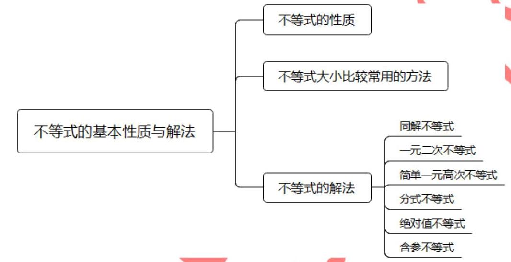
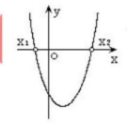
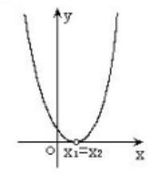
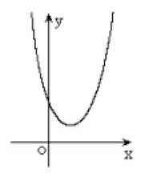
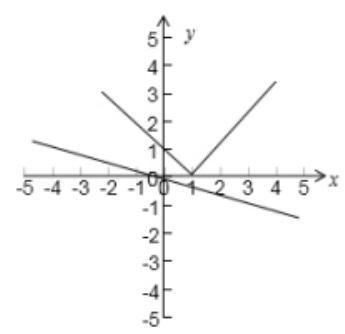

## 知识梳理

不等式的基本性质和解法

<table><tr><td>教学目标</td><td>1、理解不等式的性质和判断不等式关系，并能加以证明；   2、掌握比较法、综合法和分析法证明不等式的基本思路和表示;   3、理解一元二次不等式、一元二次方程和二次函数之间的关联;   4、掌握不等式的解法.</td></tr><tr><td>重点</td><td>1、理解并掌握不等式的基本性质，能够灵活运用不等式的基本性质判断命题的真假或证明命题;   2、对含参数不等式恒成立问题形成初步的思路，为后期的综合运用打好基础；   3、掌握解含参数的一元二次不等式，会进行分类.</td></tr><tr><td>难 点</td><td>含参不等式的求解.</td></tr></table>

(一)不等式的性质及应用

## 1、不等式性质的基础

任意 $a\text{ 、 }b \in  R, a < b, a = b, a > b$ 有且仅有一个成立,

并且 $a < b \Leftrightarrow  a - b < 0;\;a = b \Leftrightarrow  a - b = 0;\;a > b \Leftrightarrow  a - b > 0$

## 2、不等式的基本性质

(1) $a > b \Leftrightarrow  b < a$ ；(对称性)

(2) $a > b$ ， $b > c \Rightarrow  a > c$ ；(传递性)

(3) $a > b \Rightarrow  c \in  R$ ，都有 $a + c > b + c$ ；(可加性)

$\left. {\left( 4\right) \begin{array}{l} a > b \\  c > d \end{array}}\right\}   \Rightarrow  a + c > b + d\left( {a - d > b - c}\right)$ ; (同向可加性)

(5) $a > b \Rightarrow  \left\{  \begin{array}{l} c \in  {R}^{ + } \Rightarrow  {ac} > {bc} \\  c \in  {R}^{ - } \Rightarrow  {ac} < {bc} \end{array}\right.$ ；(可乘性)

(6) $\left. \begin{array}{l} a > b > 0 \\  c > d > 0 \end{array}\right\}   \Rightarrow  {ac} > {bd}\left( {\frac{a}{d} > \frac{b}{c}}\right)$ ; (同向可乘性)

(7) $\left. \begin{array}{r} a > b \\  {ab} > 0 \end{array}\right\}   \Rightarrow  \frac{1}{a} < \frac{1}{b}$ ; (可倒性)

(8) $a > b > 0 \Rightarrow  \left\{  \begin{matrix} {a}^{n} > {b}^{n} \\  \sqrt[n]{a} > \sqrt[n]{b}\left( {n \geq  2}\right)  \end{matrix}\right. \left( {n \in  {N}^{ * }}\right)$ . (开方乘方性)

## 3、不等式大小比较的常用方法:

1. 作差: 作差后通过分解因式、配方等手段判断差的符号得出结果;

2. 作商 (常用于分数指数幂的代数式);

3. 分析法;

4. 平方法;

5. 分子 (或分母) 有理化;

6. 利用函数的单调性;

7. 寻找中间量或放缩法;

8. 图象法.

## 例题精讲

【例 1 】对于实数 $a, b, c$ 中,给出下列命题:

①若 $a > b$ ，则 $a{c}^{2} > b{c}^{2}$ ②若 $a{c}^{2} > b{c}^{2}$ ，则 $a > b$ ；③若 $a < b < 0$ ，则 ${a}^{2} > {ab} > {b}^{2}$

④若 $a < b < 0$ ，则 $\frac{1}{a} < \frac{1}{b}$ ；⑤若 $a < b < 0$ ，则 $\frac{b}{a} > \frac{a}{b}$ ⑥若 $a < b < 0$ ，则 $\left| a\right|  > \left| b\right|$

⑦ 若 $c > a > b > 0$ ，则 $\frac{a}{c - a} > \frac{b}{c - b}\;$ ⑧ 若 $a > b$ ， $\frac{1}{a} > \frac{1}{b}$ ，则 $a > 0$ ， $b < 0$ .

其中正确的命题是___.

【难度】 $\star   \star$

【答案】②③⑥⑧⑦

【解析】解: ① 当 $c = 0$ 时, $a{c}^{2} = b{c}^{2} = 0$ ,所以①错误.

② $a{c}^{2} > b{c}^{2}$ ，则 $a > b$ ，由不等式的性质知成立，所以②正确.

③因为 $a < b < 0$ ，所以 ${a}^{2} > {ab} > 0$ ， ${ab} > {b}^{2} > 0$ ，所以 ${a}^{2} > {ab} > {b}^{2}$ ；成立，所以③正确.

④ 当 $a =  - 2, b =  - 1$ 时,则 $\frac{1}{a} > \frac{1}{b}$ ,所以④错误.

⑤ 当 $a =  - 2, b =  - 1$ 时，则 $\frac{b}{a} < \frac{a}{b}$ ，所以⑤错误.

⑥若 $a < b < 0$ ，则 $\left| a\right|  > \left| b\right|$ ，由不等式的性质知成立，所以⑥正确.

⑦由 $c > a > b > 0,\frac{a}{c - a} > \frac{b}{c - b} \Rightarrow  a\left( {c - b}\right)  > b\left( {c - a}\right)  \Rightarrow  {ac} - {ab} > {bc} - {ba} \Rightarrow  {ac} > {bc} \Rightarrow  a > b$ ，所以⑦正确. ⑧ $\frac{1}{a} > \frac{1}{b}$ ，得到 $\frac{1}{a} - \frac{1}{b} > 0$ ，即 $\frac{b - a}{ab} > 0$ ，而由 $a > b$ 得 $b - a < 0$ ，故 ${ab} < 0$ ，即 $a\text{ 、 }b$ 异号，又 $a > b$ ，故 $a > 0$ ， $b < 0$ ，所以⑧正确. 故答案为:②③⑥⑦⑧

【例 2】若 $a < b < 0$ ，则下列结论中正确的是( )

A. $\frac{1}{a} > \frac{1}{b}$ 和 $\frac{1}{\left| a\right| } > \frac{1}{\left| b\right| }$ 均不能成立

B. $\frac{1}{a - b} > \frac{1}{a}$ 和 $\frac{1}{\left| a\right| } > \frac{1}{\left| b\right| }$ 均不能成立

C. 不等式 $\frac{1}{a - b} > \frac{1}{a}$ 和 ${\left( a + \frac{1}{b}\right) }^{2} > {\left( b + \frac{1}{a}\right) }^{2}$ 均不能成立

D. 不等式 $\frac{1}{\left| a\right| } > \frac{1}{\left| b\right| }$ 和 ${\left( a + \frac{1}{b}\right) }^{2} > {\left( b + \frac{1}{a}\right) }^{2}$ 均不能成立

【难度】★★

【答案】 $B$

【解析】解: 不妨令 $a =  - 3, b =  - 1$ 代入检验各个选项, $A$ 不正确, $B$ 正确, $C$ 不正确,

$D$ 不正确,故选: $B$ .

【例 3】有以下不等式: $\left( 1\right) \frac{b}{a} > \frac{d}{c}\;\left( 2\right) {bc} > {ad}\;\left( 3\right) {ac} > 0$ . 若以其中的两个为条件,另一个为结论, 组成的真命题有哪些？证明你的结论.

【难度】 $\star   \star$

【答案】见解析

【解析】解: (1)若以 (1) (2) 为条件,(3) 为结论,则由 $\frac{b}{a} > \frac{d}{c}$ ,得 $\frac{{bc} - {ad}}{ac} > 0$ ,又 ${bc} - {ad} > 0$ ,得 ${ac} > 0$ (2)若以(1)(3)为条件，(2)为结论，则由 ${ac} > 0$ ，在不等式 $\frac{b}{a} > \frac{d}{c}$ 两边同乘 ${ac}$ ，得到 ${bc} > {ad}$ ，所以该命题成立

(3)若以(2)(3)为条件，(1)为结论，则在不等式两边同乘 $\frac{1}{ac}$ ，即得 $\frac{b}{a} > \frac{d}{c}$ ，所以该命题是真命题.

【例 4】( 1 )已知 $\pi  < \alpha  + \beta  < \frac{5\pi }{4}, - \pi  < \alpha  - \beta  <  - \frac{\pi }{3}$ ，则 ${2\alpha } - \beta$ 的取值范围是___.

【难度】 $\star   \star$

【答案】 $\left( {-\pi ,\frac{\pi }{8}}\right)$

【解析】解: 令 $x = \alpha  + \beta  \in  \left( {\pi ,\frac{5\pi }{4}}\right) , y = \alpha  - \beta  \in  \left( {-\pi , - \frac{\pi }{3}}\right)$ ,则 $\alpha  = \frac{x + y}{2},\beta  = \frac{x - y}{2}$ ,

$\therefore {2\alpha } - \beta  = x + y - \frac{x - y}{2} = \frac{x + {3y}}{2} \in  \left( {-\pi ,\frac{\pi }{8}}\right)$ ; 故答案为: $\left( {-\pi ,\frac{\pi }{8}}\right)$ .

(2)设实数 $x, y$ 满足 $3 \leq  x{y}^{2} \leq  8,4 \leq  \frac{{x}^{2}}{y} \leq  9$ ，则 $\frac{{x}^{3}}{{y}^{4}}$ 的取值范围是___.

【难度】 $\star   \star$

【答案】 $\left\lbrack  {2,{27}}\right\rbrack$

【解析】解: 因为实数 $x, y$ 满足 $3 \leq  x{y}^{2} \leq  8,4 \leq  \frac{{x}^{2}}{y} \leq  9$ ,

则有: ${\left( \frac{{x}^{2}}{y}\right) }^{2} \in  \left\lbrack  {{16},{81}}\right\rbrack  ,\frac{1}{x{y}^{2}} \in  \left\lbrack  {\frac{1}{8},\frac{1}{3}}\right\rbrack$ ,再根据 $\frac{{x}^{3}}{{y}^{4}} = {\left( \frac{{x}^{2}}{y}\right) }^{2} \cdot  \frac{1}{x{y}^{2}} \in  \left\lbrack  {2,{27}}\right\rbrack$ ,可当且仅当 $x = 3, y = 1$ 取得等号,即 $\frac{{x}^{3}}{{y}^{4}}$ 的最大值是 27. 故答案为: $\left\lbrack  {2,{27}}\right\rbrack$ .

【例 5】设 $a < b < 0 < c < d, n \in  {N}^{ * }$ ,比较 ${\left( \frac{c}{a}\right) }^{n}$ 与 ${\left( \frac{d}{b}\right) }^{n}$ 的大小.

【难度】 $\star   \star   \star$

【答案】见解析

【解析】因为 $\frac{1}{b} < \frac{1}{a} < 0 \Rightarrow   - \frac{1}{b} >  - \frac{1}{a} > 0, d > c$ ,所以 $- \frac{d}{b} >  - \frac{c}{a},\frac{d}{b} < \frac{c}{a} < 0$

当 $n$ 为偶数时, ${\left( \frac{d}{b}\right) }^{n} > {\left( \frac{c}{a}\right) }^{n}$ ; 当 $n$ 为奇数时, ${\left( \frac{d}{b}\right) }^{n} < {\left( \frac{c}{a}\right) }^{n}$ .

【例 6】( 1 )设 $x \in  R$ ，比较 ${x}^{3} + {8x}$ 与 $5{x}^{2} + 4$ 的大小；

(2)已知 $a, b$ 是互不相等的正数，求证: $\frac{a}{{b}^{2}} + \frac{b}{{a}^{2}} > \frac{1}{a} + \frac{1}{b}$ ；

(3)已知 $a > b > 0$ ，求证: ${a}^{a}{b}^{b} > {a}^{b}{b}^{a}$ .

【难度】 $\star   \star   \star$

【答案】(1)见解析; (2) 略; (3) 略

【解析】(1) 提示: 作差比较; ${x}^{3} + {8x} - 5{x}^{2} - 4 = \left( {x - 1}\right) {\left( x - 2\right) }^{2}$ ,当 $x = 1$ 或 2 时, ${x}^{3} + {8x} = 5{x}^{2} + 4$ ; 当 $x > 1$ 且 $x \neq  2$ 时， ${x}^{3} + {8x} > 5{x}^{2} + 4$ ；当 $x < 1$ 时， ${x}^{3} + {8x} < 5{x}^{2} + 4$ ；

(2)作差比较; (3) 作商比较.

【例 7】(1) $\bigtriangleup {ABC}$ 的三边 $a, b, c$ 的倒数成等差数列，求证: $B < \frac{\pi }{2}$ ；(提示:可以利用反证法证明) ( 2 )设 $x > 0, y > 0$ ，求证: ${\left( {x}^{2} + {y}^{2}\right) }^{\frac{1}{2}} > {\left( {x}^{3} + {y}^{3}\right) }^{\frac{1}{3}}$ .

【难度】 $\star   \star   \star$

【答案】见解析

【解析】证明: (1) 由题意得: $\frac{2}{b} = \frac{1}{a} + \frac{1}{c}$ . 假设 $B \geq  \frac{\pi }{2}$ ,故在 $\bigtriangleup {ABC}$ 中角 $B$ 是最大角,

从而 $b > a, b > c$ ,所以 $\frac{1}{b} < \frac{1}{a},\frac{1}{b} < \frac{1}{c}$ ,于是 $\frac{2}{b} < \frac{1}{a} + \frac{1}{c}$ ,与 $\frac{2}{b} = \frac{1}{a} + \frac{1}{c}$ 矛盾. 故 $B < \frac{\pi }{2}$ ;

(2) $\because x > 0, y > 0,\therefore$ 要证明: ${\left( {x}^{2} + {y}^{2}\right) }^{\frac{1}{2}} > {\left( {x}^{3} + {y}^{3}\right) }^{\frac{1}{3}}$ ,

只需证明: ${\left( {x}^{2} + {y}^{2}\right) }^{3} > {\left( {x}^{3} + {y}^{3}\right) }^{2}$ . 即证 ${x}^{2}{y}^{2}\left( {3{x}^{2} - {2xy} + 3{y}^{2}}\right)  > 0$

只需证明 $3{x}^{2} - {2xy} + 3{y}^{2} > 0,\because 3{x}^{2} - {2xy} + 3{y}^{2} = 2{x}^{2} + 2{y}^{2} + {\left( x - y\right) }^{2} > 0$ ,不等式成立.

## 巩固训练

1、已知 $a, b \in  {R}^{ + }$ ，则下列不等式一定成立的有( )

( 1 ) ${a}^{2} + {b}^{2} \geq  {2ab}$ ( 2 ) $\frac{{b}^{2}}{a} \geq  {2b} - a$ ( 3 ) $\frac{{b}^{2}}{a} + \frac{{a}^{2}}{b} \geq  a + b$ ( 4 ) $\frac{b}{{a}^{2}} + \frac{a}{{b}^{2}} \geq  \frac{1}{a} + \frac{1}{b}$ .

A. 1 个 B. 2 个 C. 3 个 D. 4 个

【答案】D

【解析】解: 对于 $A$ ,显然成立,

对于 $B$ ,得 ${b}^{2} \geq  {2ab} - {a}^{2}$ ,得 ${a}^{2} + {b}^{2} \geq  {2ab}$ ,成立,

对于 $C$ ,得: $\left( {a + b}\right) \left( {{a}^{2} - {ab} + {b}^{2}}\right)  \geq  {ab}\left( {a + b}\right)$ ,得: ${a}^{2} - {ab} + {b}^{2} \geq  {ab}$ ,显然成立,

对于 $D$ ,得 ${b}^{3} + {a}^{3} \geq  a{b}^{2} + {a}^{2}b$ ,得 $\left( {a + b}\right) \left( {{a}^{2} - {ab} + {b}^{2}}\right)  \geq  {ab}\left( {a + b}\right)$ ,

由 $C$ 判断,显然成立,故正确的是 4 个,故选: $D$ .

2、若 $- 1 < \alpha  < \beta  < 1$ ，则下面各式中恒成立的是( ).

A. $- 2 < \alpha  - \beta  < 0$ B. $- 2 < \alpha  - \beta  <  - 1$

C. $- 1 < \alpha  - \beta  < 0$ D. $- 1 < \alpha  - \beta  < 1$

【答案】A

3、若二次函数 $f\left( x\right)$ 图像关于 $y$ 轴对称,且 $1 \leq  f\left( 1\right)  \leq  2,3 \leq  f\left( 2\right)  \leq  4$ ,求 $f\left( 3\right)$ 的范围.

【答案】 $\frac{14}{3} \leq  f\left( 3\right)  \leq  9$

【解析】解: 设 $f\left( x\right)  = a{x}^{2} + c\;\left( {a \neq  0}\right) .\left\{  {\begin{array}{l} f\left( 1\right)  = a + c \\  f\left( 2\right)  = {4a} + c \end{array} \Rightarrow  \left\{  \begin{array}{l} a = \frac{f\left( 2\right)  - f\left( 1\right) }{3} \\  c = \frac{{4f}\left( 1\right)  - f\left( 2\right) }{3} \end{array}\right. }\right.$

$f\left( 3\right)  = {9a} + c = {3f}\left( 2\right)  - {3f}\left( 1\right)  + \frac{{4f}\left( 1\right)  - f\left( 2\right) }{3} = \frac{{8f}\left( 2\right)  - {5f}\left( 1\right) }{3}$

$\because 1 \leq  f\left( 1\right)  \leq  2,3 \leq  f\left( 2\right)  \leq  4$ ,

$\therefore 5 \leq  {5f}\left( 1\right)  \leq  {10},{24} \leq  {8f}\left( 2\right)  \leq  {32},{14} \leq  {8f}\left( 2\right)  - {5f}\left( 1\right)  \leq  {27}$ ,

$\therefore \frac{14}{3} \leq  \frac{{8f}\left( 2\right)  - {5f}\left( 1\right) }{3} \leq  9$ ,即 $\frac{14}{3} \leq  f\left( 3\right)  \leq  9$ .

4、设 $x, y$ 为实数，满足 $2 \leq  x{y}^{2} \leq  3$ ， $3 \leq  \frac{{x}^{2}}{y} \leq  4$ ，则 $\frac{{x}^{5}}{{y}^{5}}$ 的最大值为___.

【答案】 32

【解析】解: $\frac{{x}^{5}}{{y}^{5}} = {\left( \frac{{x}^{2}}{y}\right) }^{3}\frac{1}{x{y}^{2}}\because 3 \leq  \frac{{x}^{2}}{y} \leq  4,\therefore {27} \leq  {\left( \frac{{x}^{2}}{y}\right) }^{3} \leq  {64}$

$\because 2 \leq  x{y}^{2} \leq  3,\therefore \frac{1}{3} \leq  \frac{1}{x{y}^{2}} \leq  \frac{1}{2}$ ,不等式的性质 $9 \leq  {\left( \frac{{x}^{2}}{y}\right) }^{3}\frac{1}{x{y}^{2}} \leq  {32}$ ,

即 $\frac{{x}^{5}}{{y}^{5}} =$ 的最大值为 32,当且仅当 $\left\{  \begin{array}{l} \frac{{x}^{2}}{y} = 4 \\  x{y}^{2} = 2 \end{array}\right.$ 即 $\left\{  \begin{array}{l} x = 2 \\  y = 1 \end{array}\right.$ 时取到. 故答案为: 32 .

5、已知 ${a}_{1},{a}_{2} \in  \left( {0,1}\right)$ ， $M = {a}_{1}{a}_{2}$ ， $N = {a}_{1} + {a}_{2} + 1$ ，则 $M$ ， $N$ 的大小关系是( )

A. $M < N$ B. $M > N$ C. $M = N$ D. 不确定

【答案】 $A$

【解析】解: $M - N = {a}_{1}{a}_{2} - \left( {{a}_{1} + {a}_{2} + 1}\right)  = \left( {{a}_{2} - 1}\right) \left( {{a}_{1} - 1}\right)  - 2$

$\because {a}_{1},{a}_{2} \in  \left( {0,1}\right) \therefore {a}_{2} - 1,{a}_{1} - 1 \in  \left( {-1,0}\right) \therefore \left( {{a}_{2} - 1}\right) \left( {{a}_{1} - 1}\right)  \in  \left( {0,1}\right) \therefore \left( {{a}_{2} - 1}\right) \left( {{a}_{1} - 1}\right)  - 2 < 0\therefore M < N$ 故选: $A$ .

6、若 $0 < {2a} < 1, A = 1 - {a}^{2}, B = 1 + {a}^{2}, C = \frac{1}{1 - a}, D = \frac{1}{1 + a}$ ,则 $A\text{ 、 }B\text{ 、 }C\text{ 、 }D$ 之间的大小关系是___.

【答案】 $D < A < B < C$ (作差即可求得)

7、用反证法证明: 关于 $x$ 的方程 ${x}^{2} + {4ax} - {4a} + 3 = 0\text{ 、 }{x}^{2} + \left( {a - 1}\right) x + {a}^{2} = 0\text{ 、 }{x}^{2} + {2ax} - {2a} = 0$ ,当 $a \leq   - \frac{3}{2}$ 或 $a \geq   - 1$ 时,至少有一个方程有实数根.

【答案】见解析

【解析】解: 设三个方程都没有实根,

则有判别式都小于零得: $\left\{  \begin{array}{l}  - \frac{3}{2} < a < \frac{1}{2} \\  a > \frac{1}{3}\text{ 或 }a <  - 1 \Rightarrow   - \frac{3}{2} < a <  - 1 \\   - 2 < a < 0 \end{array}\right.$ ,与 $a \leq   - \frac{3}{2}$ 或 $a \geq   - 1$ 矛盾,

故原命题成立;

(二)一元二次不等式

知识梳理

<table><tr><td></td><td>$\Delta  > 0$</td><td>$\Delta  = 0$</td><td>$\Delta  < 0$</td></tr><tr><td>二次函数 $y = a{x}^{2} + {bx} + c$ ( $a > 0$ ) 的图象</td><td>$y = a{x}^{2} + {bx} + c$    </td><td>$y = a{x}^{2} + {bx} + c$    </td><td>$y = a{x}^{2} + {bx} + c$    </td></tr><tr><td>一元二次方程   $a{x}^{2} + {bx} + c = 0 \; \left( {a > 0}\right)$ 的根</td><td>有两相异实根 ${x}_{1},{x}_{2}\left( {{x}_{1} < {x}_{2}}\right)$</td><td>有两相等实根 ${x}_{1} = {x}_{2} =  - \frac{b}{2a}$</td><td>无实根</td></tr><tr><td>$a{x}^{2} + {bx} + c > 0 \; \left( {a > 0}\right)$ 的解集</td><td>$\left\{  {x \mid  x < {x}_{1}\text{ 或 }x > {x}_{2}}\right\}$</td><td>$\left\{  {x\left| {\;x \neq   - \frac{b}{2a}}\right. }\right\}$</td><td>$R$</td></tr><tr><td>$a{x}^{2} + {bx} + c < 0 \; \left( {a > 0}\right)$ 的解集</td><td>$\left\{  {x \mid  {x}_{1} < x < {x}_{2}}\right\}$</td><td>⌀</td><td>$\varnothing$</td></tr></table>

不等式的基本性质和解法一教师版

## 例题精讲

【例8】解下列一元二次不等式:

(1) $2{x}^{2} - {3x} - 2 > 0$ ； (2) $- 3{x}^{2} + {6x} - 2 > 0$ ； (3) $4{x}^{2} - {4x} + 1 \leq  0$ ； (4) $- {x}^{2} + {2x} - 3 > 0$ .

【难度】 $\star   \star$

【答案】见解析

【解析】解: (1) 方法一: 因为 $\Delta  = {\left( -3\right) }^{2} - 4 \times  2 \times  \left( {-2}\right)  = {25} > 02{x}^{2} - {3x} - 2 = 0$ ,所以方程 $2{x}^{2} - {3x} - 2 = 0$ 的两个实数根为: ${x}_{1} =  - \frac{1}{2},{x}_{2} = 2$

结合函数 $y = 2{x}^{2} - {3x} - 2$ 的简图,因而不等式 $2{x}^{2} - {3x} - 2 > 0$ 的解集是: $\left\{  {x\left| {\;x <  - \frac{1}{2}\text{ 或 }x > 2}\right. }\right\}$

(2)整理，原式可化为 $3{x}^{2} - {6x} + 2 < 0$ ，因为 $\Delta  > 0$ ，方程 $3{x}^{2} - {6x} + 2 = 0$ 的解 ${x}_{1} = 1 - \frac{\sqrt{3}}{3},{x}_{2} = 1 + \frac{\sqrt{3}}{3}$ ， 结合函数 $y = 3{x}^{2} - {6x} + 2$ 的简图为,所以不等式的解集是 $\left( {1 - \frac{\sqrt{3}}{3},1 + \frac{\sqrt{3}}{3}}\right)$ .

(3)因为 $\Delta  = 0$ 方程 $4{x}^{2} - {4x} + 1 = 0$ 有两个相等的实根: ${x}_{1} = {x}_{2} = \frac{1}{2}$ ，由函数 $y = 4{x}^{2} - {4x} + 1$ 的图象为； 原不等式的的解集是 $\left\{  \frac{1}{2}\right\}$ .

(4)因为 $\Delta  < 0$ ，方程 $- {x}^{2} + {2x} - 3 = 0$ 无实数解，结合由函数 $y =  - {x}^{2} + {2x} - 3$ 的简图为，所以原不等式的解集是 $\varnothing$ .

【例 9】解不等式: $- 6 \leq  {x}^{2} - x - 6 < 6$

【答案】 $\{ x \mid   - 3 < x \leq  0$ 或 $1 \leq  x < 4\}$

【解析】解: 原不等式可化为不等式组

$\left\{  {\begin{array}{l} {x}^{2} - x - 6 < 6 \\   - 6 \leq  {x}^{2} - x - 6 \end{array},\text{ 即 }\left\{  {\begin{array}{l} {x}^{2} - x - {12} < 0 \\  {x}^{2} - x \geq  0 \end{array},\text{ 即 }\left\{  \begin{array}{l} \left( {x - 4}\right) \left( {x + 3}\right)  < 0 \\  x\left( {x - 1}\right)  \geq  0 \end{array}\right. }\right. }\right.$

$\therefore$ 原不等式的解集为 $\{ x \mid   - 3 < x \leq  0$ 或 $1 \leq  x < 4\}$ .

【例 10】(1) 解不等式 ${x}^{2} - \left( {a + \frac{1}{a}}\right) x + 1 < 0\left( {a \neq  0}\right)$

【答案】见解析

【解析】解: 原不等式可化为: $\left( {x - a}\right) \left( {x - \frac{1}{a}}\right)  < 0$ ,令 $a = \frac{1}{a}$ ,可得: $a =  \pm  1$

$\therefore$ 当 $a <  - 1$ 或 $0 < a < 1$ 时, $a < \frac{1}{a}$ ,故原不等式的解集为 $\left\{  {x\left| {\;a < x < \frac{1}{a}}\right. }\right\}$ ;

当 $a = 1$ 或 $a =  - 1$ 时， $a = \frac{1}{a}$ ，可得其解集为 $\phi$ ；

当 $- 1 < a < 0$ 或 $a > 1$ 时， $a > \frac{1}{a}$ ，解集为 $\left\{  {x\left| {\;\frac{1}{a} < x < a}\right. }\right\}$ .

(2)解关于 $x$ 的不等式: $m{x}^{2} - \left( {m + 1}\right) x + 1 < 0$

【答案】当 $m = 0$ 时,不等式的解集为 $\left( {1, + \infty }\right)$ ;

当 $m \neq  0$ 时,原不等式化为 $\left( {{mx} - 1}\right) \left( {x - 1}\right)  < 0$

(1) $0 < m < 1$ 时， $x \in  \left( {1,\frac{1}{m}}\right)$ ；

(2) $m > 1$ 时， $x \in  \left( {\frac{1}{m},1}\right)$ ；

(3) $m < 0$ 时， $x \in  \left( {1, + \infty }\right)  \cup  \left( {-\infty ,\frac{1}{m}}\right)$ ；

(4) $m = 1$ 时，解集为 $\varnothing$

【例 11】已知一个一元二次不等式的解集为 $\left\{  {x\left| {\; - \frac{1}{2} < x < 3}\right. }\right\}$ .

(1)若关于 $x$ 的一元二次不等式为 $a{x}^{2} + {bx} + 3 > 0$ ，求 $a$ 、 $b$ 的值.

(2)若关于 $x$ 的一元二次不等式为 $a{x}^{2} + {bx} + e > 0$ ，求关于 $x$ 的一元二次不等式 $c{x}^{2} + {bx} + a < 0$ 的解集. 【答案】见解析

【解析】解:

(1)因为一元二次不等式为 $a{x}^{2} + {bx} + 3 > 0$ 的解集是 $\left\{  {x\left| {\; - \frac{1}{2} < x < 3}\right. }\right\}$ ，所以 $a < 0$ ，且方程 $a{x}^{2} + {bx} + 3 = 0$ 的两个实根是 $- \frac{1}{2}$ 和 3,所以 $\left\{  \begin{array}{l}  - \frac{b}{a} =  - \frac{1}{2} + 3 \\  \frac{3}{a} =  - \frac{1}{2} - 3 \end{array}\right.  \Leftrightarrow  \left\{  \begin{array}{l} a =  - 2 \\  b = 5 \end{array}\right.$

( 2 )因为一元二次不等式 $a{x}^{2} + {bx} + c > 0$ 的解集是 $\left\{  {x\left| {\; - \frac{1}{2} < x < 3}\right. }\right\}$ ，所以 $\left\{  \begin{array}{l}  - \frac{b}{a} =  - \frac{1}{2} + 3 \\  \frac{c}{a} =  - \frac{1}{2}{.3} \end{array}\right.$ ，且 $a < 0$ ，得

$\left\{  \begin{array}{l} b =  - \frac{5a}{2} \\  c =  - \frac{3a}{2} \end{array}\right.$ ,所以,不等式 $c{x}^{2} + {bx} + a < 0$ 可转换为 $- \frac{3a}{2}{x}^{2} - \frac{5a}{2}x + a < 0$ ,

因为 $a < 0$ ,所以 $\frac{3}{2}{x}^{2} + \frac{5}{2}x - 1 < 0$ ,使得不等式 $\mathrm{c}{x}^{2} + {bx} + a < 0$ 的解集为 $\left( {-2,\frac{1}{3}}\right)$ .

【例 12】若不等式 $\left( {{a}^{2} - 1}\right) {x}^{2} - \left( {a - 1}\right) x - 1 < 0$ 对于一切实数 $x$ 都成立,求实数 $a$ 的取值范围.

【答案】 $a \in  \left( {-\frac{3}{5},1}\right\rbrack$

【解析】解: 因为 $\left( {{a}^{2} - 1}\right)$ 的符号不确定,所以分以下三个情况讨论:

(1)当 ${a}^{2} - 1 = 0$ (即 $a =  \pm  1$ )时，得 $a = 1$ ；

(2)当 ${a}^{2} - 1 > 0$ (即 $a <  - 1$ 或 $a > 1$ )时，不成立；

(3)当 ${a}^{2} - 1 < 0$ (即 $- 1 < a < 1$ )时， $\Delta  = {\left( a - 1\right) }^{2} - 4\left( {{a}^{2} - 1}\right) \left( {-1}\right)  < 0$ . 解得 $a \in  \left( {-\frac{3}{5},1}\right)$

综上可得: $a \in  \left( {-\frac{3}{5},1}\right\rbrack$ .

## 巩固训练

1、不等式 $6 - x - 2{x}^{2} < 0$ 的解集是( )

A. $\left\{  {x\left| {\; - \frac{3}{2} < x < 2}\right. }\right\}  \;$ B. $\left\{  {x\left| {\; - 2 < x < \frac{3}{2}}\right. }\right\}$ C. $\{ x \mid  x <  - \frac{3}{2}$ 或 $x > 2\}$ D. $\{ x \mid  x <  - 2$ 或 $x > \frac{3}{2}\}$

【答案】D

2、不等式组 $\left\{  \begin{array}{l} {x}^{2} - 1 < 0 \\  {x}^{2} - {3x} < 0 \end{array}\right.$ 的解集是( )

A. $\{ x \mid   - 1 < x < 1\}$ B. $\{ x \mid  0 < x < 3\}$

C. $\{ x \mid  0 < x < 1\}$ D. $\{ x \mid   - 1 < x < 3\}$

【答案】C

3、(1)若 $a{x}^{2} + {bx} - 1 < 0$ 的解集为 $\{ x \mid   - 1 < x < 2\}$ ，则 $a =$ ___， $b =$ ___.

【答案】 $\frac{1}{2}, - \frac{1}{2}$

(2)若 $a{x}^{2} + {bx} + c < 0$ 的解集是 $\left\{  {x\left| {\;x <  - 2\text{ 或 }x >  - \frac{1}{2}}\right. }\right\}$ ，求关于 $x$ 的不等式 $a{x}^{2} - {bx} + c > 0$ 的解集.

【答案】由题意可知: $a < 0, - \frac{b}{a} =  - 2 + \left( {-\frac{1}{2}}\right)  =  - \frac{5}{2},\frac{c}{a} = 1$

所以 $b = \frac{5}{2}a, c = a$ ,代入所求不等式中: $a{x}^{2} - \frac{5}{2}{ax} + a > 0$ 即 $2{x}^{2} - {5x} + 2 < 0$ ,故 $\frac{1}{2} < x < 2$ .

4、已知关于 $\mathbf{x}$ 的不等式 $\left( {{ax} - 1}\right) \left( {x + 1}\right)  < 0$ 的解集是 $\left( {-\infty ,\frac{1}{a}}\right)  \cup  \left( {-1, + \infty }\right)$ ,则实数 $a$ 的取值范围是 ___.

【答案】 $- 1 < a < 0$

5、当 $k$ 为___时，关于 $x$ 的一元二次不等式 ${x}^{2} + \left( {k - 1}\right) x + 4 > 0$ 的解集为 $R$ ?

【答案】(-3,5)

6、对于任意实数 $x$ ，不等式 $a{x}^{2} + {2ax} - \left( {a + 2}\right)  < 0$ 恒成立，则实数 $a$ 的取值范围是( )

A. $- 1 \leq  a \leq  0$ B. $- 1 \leq  a < 0$ C. $- 1 \leq  a \leq  0$ D. $- 1 < a < 0$

【答案】C

7、不等式 ${x}^{2} - {mx} - {2m} \leq  0$ 有实数解，且对于任意的实数解 ${x}_{1},{x}_{2}$ 恒有 $\left| {{x}_{1} - {x}_{2}}\right|  \leq  3$ ，求实数 $\mathrm{m}$ 的取值范围. 【答案】 $\left\lbrack  {-9, - 8}\right\rbrack   \cup  \left\lbrack  {0,1}\right\rbrack$

8、解关于 $x$ 的一元二次不等式 ${x}^{2} - \left( {3 + a}\right) x + {3a} > 0$

【答案】见解析

【解析】解: $\because {x}^{2} - \left( {3 + a}\right) x + {3a} > 0,\therefore \left( {x - 3}\right) \left( {x - a}\right)  > 0$

(1)当 $a < 3$ 时， $x < a$ 或 $x > 3$ ，不等式解集为 $\left\{  {x \mid  x < a\text{ 或 }x > 3}\right\}$ ；

(2)当 $a = 3$ 时，不等式为 ${\left( x - 3\right) }^{2} > 0$ ，解集为 $\{ x \mid  x \in  R$ 且 $x \neq  3\}$ ；

(3)当 $a > 3$ 时， $x < 3$ 或 $x > a$ ，不等式解集为 $\{ x \mid  x < 3$ 或 $x > a\}$

9、解关于 $x$ 的不等式 $\left\lbrack  {\left( {m + 3}\right) x - 1}\right\rbrack  \left( {x + 1}\right)  > 0\left( {m \in  R}\right)$ .

【答案】见解析

【解析】解: 下面对参数 $m$ 进行分类讨论:

① 当 $m =  - 3$ 时，原不等式为 $x + 1 > 0$ ， $\therefore$ 不等式的解为 $x <  - 1$ .

② 当 $m >  - 3$ 时，原不等式可化为 $\left( {x - \frac{1}{m + 3}}\right) \left( {x + 1}\right)  > 0$ .

$\because \frac{1}{m + 3} > 0 >  - 1,\therefore$ 不等式的解为 $x <  - 1$ 或 $x > \frac{1}{m + 3}$ .

③ 当 $m <  - 3$ 时，原不等式可化为 $\left( {x - \frac{1}{m + 3}}\right) \left( {x + 1}\right)  < 0,\because \frac{1}{m + 3} + 1 = \frac{m + 4}{m + 3}$ ，

当 $- 4 < m <  - 3$ 时, $\frac{1}{m + 3} <  - 1$ 原不等式的解集为 $\frac{1}{m + 3} < x <  - 1$ ;

当 $m <  - 4$ 时, $\frac{1}{m + 3} >  - 1$ 原不等式的解集为 $- 1 < x < \frac{1}{m + 3}$ ;

当 $m =  - 4$ 时, $\frac{1}{m + 3} =  - 1$ 原不等式无解.

综上述, 原不等式的解集情况为:

① 当 $m <  - 4$ 时,解为 $- 1 < x < \frac{1}{m + 3}$ ;

② 当 $m =  - 4$ 时，无解；

③ 当 $- 4 < m <  - 3$ 时，解为 $\frac{1}{m + 3} < x <  - 1$ ；

④ 当 $m =  - 3$ 时，解为 $x <  - 1$ ；

⑤当 $m >  - 3$ 时，解为 $x <  - 1$ 或 $x > \frac{1}{m + 3}$

## (三)其它不等式的解法

## 知识梳理

1、分式不等式解法

$\frac{f\left( x\right) }{g\left( x\right) } \geq  0 \Leftrightarrow  \left\{  \begin{array}{l} f\left( x\right)  \cdot  g\left( x\right)  \geq  0 \\  g\left( x\right)  \neq  0 \end{array}\right.$ ; (在进行计算时,一定要注意等价变形)

2、简单的一元高次不等式的解法:

标根法: 其步骤是:

①分解成若干个一次因式的积, 并使每一个因式中最高次项的系数为正;

②将每一个一次因式的根标在数轴上，从最大根的右上方依次通过每一点画曲线；并注意奇穿过偶弹回；

③ 根据曲线显现 $f\left( x\right)$ 的符号变化规律，写出不等式的解集.

## 3、绝对值不等式的解法:

① 分段讨论法 (最后结果应取各段的并集): 如解不等式 $\left| {2 - \frac{3}{4}x}\right|  \geq  2 - \left| {x + \frac{1}{2}}\right|$ (答: $x \in  R$ );

②利用绝对值的定义；

③数形结合; 如解不等式 $\left| x\right|  + \left| {x - 1}\right|  > 3$ (答: $\left( {-\infty , - 1}\right)  \cup  \left( {2, + \infty }\right)$ )

④两边平方:如若不等式 $\left| {{3x} + 2}\right|  \geq  \left| {{2x} + a}\right|$ 对 $x \in  R$ 恒成立，则实数 $a$ 的取值范围为___. (答: $\left\{  \frac{4}{3}\right\}$

注意事项:(1)解不等式是求不等式的解集，最后务必有集合的形式表示；(2)不等式解集的端点值往往是不等式对应方程的根或不等式有意义范围的端点值.

4、同解不等式:

(1) $f\left( x\right)  \cdot  g\left( x\right)  > 0 \Leftrightarrow  \left\{  \begin{array}{l} f\left( x\right)  > 0 \\  g\left( x\right)  > 0 \end{array}\right.$ 或 $\left\{  \begin{array}{l} f\left( x\right)  < 0 \\  g\left( x\right)  < 0 \end{array}\right.$ ;

(2) $f\left( x\right)  \cdot  g\left( x\right)  < 0 \Leftrightarrow  \left\{  \begin{array}{l} f\left( x\right)  > 0 \\  g\left( x\right)  < 0 \end{array}\right.$ 或 $\left\{  \begin{array}{l} f\left( x\right)  < 0 \\  g\left( x\right)  > 0 \end{array}\right.$ ;

(3) $\frac{f\left( x\right) }{g\left( x\right) } > 0 \Leftrightarrow  \left\{  \begin{array}{l} f\left( x\right)  > 0 \\  g\left( x\right)  > 0 \end{array}\right.$ 或 $\left\{  \begin{array}{l} f\left( x\right)  < 0 \\  g\left( x\right)  < 0 \end{array}\right.$ ;

(4) $\frac{f\left( x\right) }{g\left( x\right) } < 0 \Leftrightarrow  \left\{  \begin{array}{l} f\left( x\right)  > 0 \\  g\left( x\right)  < 0 \end{array}\right.$ 或 $\left\{  \begin{array}{l} f\left( x\right)  < 0 \\  g\left( x\right)  > 0 \end{array}\right.$ ;

(5) $\left| {f\left( x\right) }\right|  < g\left( x\right)  \Leftrightarrow  \left\{  \begin{array}{l}  - g\left( x\right)  < f\left( x\right)  < g\left( x\right) \\  g\left( x\right)  > 0 \end{array}\right.$ ;

(6) $\left| {f\left( x\right) }\right|  > g\left( x\right)  \Leftrightarrow  \left\{  \begin{array}{l} f\left( x\right)  <  - g\left( x\right) \text{ 或 }f\left( x\right)  > g\left( x\right) \\  g\left( x\right)  \geq  0 \end{array}\right.$ 或 $g\left( x\right)  < 0$ ;

(7) $\sqrt{f\left( x\right) } > g\left( x\right)  \Leftrightarrow  \left\{  \begin{array}{l} f\left( x\right)  > {g}^{2}\left( x\right) \\  f\left( x\right)  \geq  0 \\  g\left( x\right)  \geq  0 \end{array}\right.$ 或 $\left\{  \begin{array}{l} g\left( x\right)  < 0 \\  f\left( x\right)  \geq  0 \end{array}\right.$ ;

(8) $\sqrt{f\left( x\right) } < g\left( x\right)  \Leftrightarrow  \left\{  {\begin{array}{l} f\left( x\right)  < {g}^{2}\left( x\right) \\  f\left( x\right)  \geq  0 \\  g\left( x\right)  > 0 \end{array};\text{ (9) }{a}^{f\left( x\right) } > {a}^{g\left( x\right) } \Leftrightarrow  \left\{  \begin{array}{l} f\left( x\right)  > g\left( x\right) , a > 1 \\  f\left( x\right)  < g\left( x\right) ,0 < a < 1 \end{array}\right. }\right.$ ;

(10) ${\log }_{a}f\left( x\right)  > {\log }_{a}g\left( x\right)  \Leftrightarrow  \left\{  \begin{array}{l} f\left( x\right)  > g\left( x\right)  > 0, a > 1 \\  g\left( x\right)  > f\left( x\right)  > 0,0 < a < 1 \end{array}\right.$

## 例题精讲

【例 13】解不等式 (1) $x - \frac{3}{x + 1} \geq  1$ ; (2) $\frac{x + 6}{{x}^{2} + x + 2} \leq  1$ .

【难度】 $\star   \star$

【答案】 $\lbrack  - 2, - 1) \cup  \lbrack 2, + \infty )$ ; $\left( {-\infty , - 2\rbrack \cup \lbrack 2, + \infty }\right)$

【解析】(1) 原不等式可化为 $\frac{{x}^{2} - 4}{x + 1} \geq  0$ ,此不等式与 $\left\{  \begin{array}{l} \left( {{x}^{2} - 4}\right) \left( {x + 1}\right)  \geq  0 \\  x + 1 \neq  0 \end{array}\right.$ 同解,

由 $\left\{  \begin{array}{l} \left( {{x}^{2} - 4}\right) \left( {x + 1}\right)  \geq  0 \\  x + 1 \neq  0 \end{array}\right.$ 得 $- 2 \leq  x <  - 1$ 或 $x \geq  2$ .

所以原不等式的解集是 $\lbrack  - 2, - 1) \cup  \lbrack 2, + \infty )$ .

( 2 )原不等式可化为 $\frac{x + 6 - {x}^{2} - x - 2}{{x}^{2} + x + 2} \leq  0$ ，即 $\frac{{x}^{2} - 4}{{x}^{2} + x + 2} \geq  0$ .

由于 ${x}^{2} + x + 2 = 0$ 的判别式 $\Delta  =  - 7 < 0$ ,故 ${x}^{2} + x + 2$ 的值恒大于 $0\left( {x \in  R}\right)$ ,于是原不等式与 ${x}^{2} - 4 \geq  0$ 的解集相同. 解 ${x}^{2} - 4 \geq  0$ 得 $x \leq   - 2$ 或 $x \geq  2$ .

所以，原不等式的解集为 $\left( {-\infty , - 2\rbrack \cup \lbrack 2, + \infty }\right)$ .

【例 14】解关于 $x$ 的不等式 $\frac{a\left( {x - 1}\right) }{x - 2} > 1\left( {a \neq  1\text{ 且 }a \neq  0}\right)$ .

【答案】见解析

【解析】解: 不等式 $\frac{a\left( {x - 1}\right) }{x - 2} > 1\left( {a \neq  1\text{ 且 }a \neq  0}\right)$ ,变形得: $\frac{\left( {a - 1}\right) x - \left( {a - 2}\right) }{x - 2} > 0$ ,

可化为 $\left\{  \begin{array}{l} \left( {a - 1}\right) x - \left( {a - 2}\right)  > 0 \\  x - 2 > 0 \end{array}\right.$ 或 $\left\{  \begin{array}{l} \left( {a - 1}\right) x - \left( {a - 2}\right)  < 0 \\  x - 2 < 0 \end{array}\right.$

当 $a - 1 > 0$ ,即 $a > 1$ 时,

(i) 当 $\frac{a - 2}{a - 1} > 2$ ,即 $a < 0$ 时,无解;

(ii) 当 $\frac{a - 2}{a - 1} < 2$ ,解得 $a > 0$ ,即 $a > 1$ 时,解得: $x < \frac{a - 2}{a - 1}$ 或 $x > 2$ ;

当 $a - 1 < 0$ ,即 $a < 1$ ,且 $a \neq  0$ 时,

(i) 当 $\frac{a - 2}{a - 1} > 2$ ,即 $1 < a < 2$ 时,无解;

(ii) 当 $\frac{a - 2}{a - 1} \leq  2$ ,即 $a < 1$ 时,解得: $\frac{a - 2}{a - 1} < x < 2$ ,

综上,当 $a > 1$ 时,原不等式的解集为 $\left\{  {x\left| {\;x < \frac{a - 2}{a - 1}}\right. \text{ 或 }x > 2}\right\}$ ;

当 $a < 1$ 且 $a \neq  0$ 时,原不等式的解集为 $\left\{  {x\left| {\;\frac{a - 2}{a - 1} < x < 2}\right. }\right\}$ .

【例 15】解下列不等式:

(1) $4\left| {{3x} - 1}\right|  - 1 \leq  0$ ； (2) $2\left| {{2x} - 1}\right|  > 1$ ； (3) $\left| {x - 1}\right|  + \left| {x - 3}\right|  \leq  4$ ； (4) $\left| {x + {10}}\right|  - \left| {x - 2}\right|  \geq  8$ .

【答案】见解析

【解析】解: (1) 不等式 $4\left| {{3x} - 1}\right|  - 1 \leq  0$ ,即 $\left| {{3x} - 1}\right|  \leq  \frac{1}{4}$ ,即 $- \frac{1}{4} \leq  {3x} - 1 \leq  \frac{1}{4}$ ,求得 $\frac{1}{4} \leq  x \leq  \frac{5}{12}$ ,故不等式的解集为 $\left\{  {x\left| {\;\frac{1}{4} \leq  x \leq  \frac{5}{12}}\right. }\right\}$ .

(2) $2\left| {{2x} - 1}\right|  > 1$ ，即 $\left| {{2x} - 1}\right|  > \frac{1}{2}$ ，即 ${2x} - 1 > \frac{1}{2}$ 或 ${2x} - 1 <  - \frac{1}{2}$ ，

求得 $x > \frac{3}{4}$ 或 $x < \frac{1}{4}$ ,故不等式的解集为 $\left\{  {x\left| {\;x > \frac{3}{4}}\right. }\right.$ 或 $\left. {x < \frac{1}{4}}\right\}$ .

(3) $\left| {x - 1}\right|  + \left| {x - 3}\right|$ 表示数轴上的 $x$ 对应点到 $1\text{ 、 }3$ 对应点的距离之和,

而 0 和 4 对应点到 1、3 对应点的距离之和正好等于 4 ，故不等式的解集为 $\{ x \mid  0 \leq  x \leq  4\}$

(4) $\left| {x + {10}}\right|  - \left| {x - 2}\right|$ 表示数轴上的 $x$ 对应点到 -10 对应点的距离减去它到 2 对应点的距离，

而 0 对应点到 -10 对应点的距离减去它到 2 对应点的距离正好等于 8 ,

故不等式的解集为 $\{ x \mid  x \geq  0\}$ .

【例 16】( 1 )若不等式 $\left| {x + 1}\right|  + \left| {x - 2}\right|  \geq  a$ 恒成立，则 $a$ 的取值范围是___.

【答案】 $a \leq  3$

【解析】解: 因为 $\left| {x + 1}\right|  + \left| {x - 2}\right|$ 的几何意义是数轴上的点到 -1,与到 2 的距离之和,显然最小值为 3,所以 $a$ 的取值范围是: $a \leq  3$ . 故答案为: $a \leq  3$ .

(2)设 $a > 0$ ，不等式 $\left| {{ax} + b}\right|  < c$ 的解集是 $\{ x \mid   - 2 < x < 1\}$ ，则 $a : b : c$ 等于( )

A. $1 : 2 : 3$ B. 2:1:3 C. 3:1:2 D. $3 : 2 : 1$

【答案】 $B$

【解析】解: $\because a > 0$ ,且 $\left| {{ax} + b}\right|  < c$ 的解是: $- 2 < x < 1,\therefore  - c < {ax} + b < c \Rightarrow   - \frac{c + b}{a} < x < \frac{c - b}{a}$ , 则 $\left\{  {\begin{array}{l}  - \frac{c + b}{a} =  - 2 \\  \frac{c - b}{a} = 1 \end{array} \Rightarrow  \left\{  {\begin{array}{l} c + b = {2a} \\  c - b = a \end{array} \Rightarrow  a : b : c = 2 : 1 : 3}\right. }\right.$ ,故选: $B$ .

(3)不等式 $\left| {x + 1}\right|  - \left| {x - 2}\right|  > k$ 的解集为 $R$ ，则实数 $k$ 的取值范围为___.

【答案】 $\left( {-\infty , - 3}\right)$

【解析】解: 根据绝对值不等式可以得到:

$\left| {x + 1}\right|  - \left| {x - 2}\right|  \leq  \left| {\left( {x + 1}\right)  - \left( {x - 2}\right) }\right|  = 3$ ,即: $- 3 \leq  \left| {x + 1}\right|  - \left| {x - 2}\right|  \leq  3$ ,

所以要满足 $\left| {x + 1}\right|  - \left| {x - 2}\right|  > k$ 解集是 $R$ ,只需要 $k <  - 3$ ,故答案为: $\left( {-\infty , - 3}\right)$ .

【例 17】解下列不等式

(1) $\left( {x - 2}\right) \sqrt{{2x} + 3} \geq  0$ ；(2) $\sqrt{{x}^{2} - {3x} + 2} > x - 3$ ；(3) $\sqrt{3 - x} < x - 1$

(4) ${\left( x - 3\right) }^{2} - 2\sqrt{{\left( x - 3\right) }^{2}} - 3 < 0$ ; (5) $\left( {x - 1}\right) {\left( x + 2\right) }^{2} \geq  0$ ; (6) $\left( {x - 2}\right) \sqrt{{x}^{2} - {2x} - 3} \geq  0$

【答案】( 1 ) $\left\{  {-\frac{3}{2}}\right\}   \cup  \lbrack 2, + \infty )$ ；( 2 ) $\left( {-\infty ,1\rbrack \cup \lbrack 2, + \infty }\right)$ ；( 3 )( 2 )3,( 4 )( 0 )( 6 ) $\left\{  {x\left| {\;x \geq  1\text{ 或 }x =  - 2}\right. }\right\}$

(6) $\{ x \mid  x \geq  3$ 或 $x =  - 1\}$

【解析】略

【例 18】( 1 )已知关于 $x$ 的不等式 $\frac{{ax} - a}{x + 1} > 1$ 在 $\left\lbrack  {2,5}\right\rbrack$ 有实数解，则实数 $a$ 的取值范围为___.

【答案】 $a > \frac{3}{2}$

(2)对任意实数 $x$ ，不等式 $\left| {x - 1}\right|  > {kx}$ 恒成立，则 $k$ 的取值范围是___.

【答案】 $- 1 \leq  k < 0$

【解析】解: $y = \left| {x - 1}\right|$ 函数图象是从点 $\left( {1,0}\right)$ 向 $x$ 轴上方引两条与 $x$ 轴成 ${45}^{ \circ  }$ 的斜线. $y = {kx}$ 的函数图象是过原点的直线.

那么满足题意的情况是直线处于 $x$ 轴和 $2 : 4$ 象限角分线之间，也就是 $- 1 \leq  k < 0$ 故答案为: $- 1 \leq  k < 0$

(3)不等式 $\sqrt{-{x}^{2} - {4x}} \leq  \frac{4}{3}x + 1 - a$ 的解集是 $\left\lbrack  {-4,0}\right\rbrack$ ，则 $a$ 的取值范围是___.

【答案】 $a \leq   - 5$

## 巩固训练

1、不等式 $\frac{2}{x + 1} > 2$ 的解集是___.

【答案】 $\left( {-1,0}\right)$

2、(1)已知不等式 $\left| {x - 2}\right|  < a\left( {a > 0}\right)$ 的解集为 $\{ x \in  R \mid   - 1 < x < c\}$ ，则 $a + {2c}$ 的值是___.

【答案】 13

(2)若不等式 $\left| {{3x} - b}\right|  < 4$ 的解集中的整数有且仅有 0，1，2，则实数 $b$ 的取值范围为___.

【答案】 $2 < b < 4$

【解析】解: 因为 $\left| {{3x} - b}\right|  < 4 \Rightarrow   - 4 < {3x} - b < 4 \Rightarrow  \frac{b - 4}{3} < x < \frac{b + 4}{3}$ ,

又由已知解集中的整数有且仅有0,1,2,故有 $\left\{  {\begin{array}{l}  - 1 \leq  \frac{b - 4}{3} < 0 \\  2 < \frac{b + 4}{3} \leq  3 \end{array} \Rightarrow  \left\{  {\begin{array}{l} 1 \leq  b < 4 \\  2 < b \leq  5 \end{array} \Rightarrow  2 < b < 4}\right. }\right.$ . 故答案为: $2 < b < 4$ .

3、不等式 $\left| {x + 3}\right|  > \left| {x - 5}\right|  + 7$ 的解集是___.

【答案】 $\left( {\frac{9}{2}, + \infty }\right)$

4、不等式 $\left| {{x}^{2} - {8x} + a}\right|  \leq  x - 4$ 的解集为 $\left\lbrack  {4,5}\right\rbrack$ ，则实数 $a$ 的值等于___.

【答案】16

5、若集合 $P = \{ x \mid  3 - x \geq  \sqrt{x - 1}\}$ 与 $M = \{ x\left| \right| x - a \mid   < 3\}$ 满足 $P \cup  M = M$ ,则实数 $a$ 的取值范围是___.

【答案】 $- 1 < a < 4$

6、不等式 $\left( {1 + x}\right) \left( {1 - \left| x\right| }\right)  > 0$ 的解集是

A. $\{ x \mid  0 \leq  x < 1\}$ B. $\{ x \mid  x < 0$ 且 $x \neq   - 1\}$

C. $\{ x \mid   - 1 < x < 1\}$ D. $\{ x \mid  x < 1$ 且 $x \neq   - 1\}$

【答案】D

7、已知关于 $\mathbf{x}$ 的不等式 $\left| {x - 2}\right|  + 3 - x < m$ 的解集为非空集合，则实数 $m$ 的取值范围是( )

A. $m < 1$ B. $m \leq  1$ C. $m > 1$ D. $m \geq  1$

【答案】C

8、集合 $A = \left\{  {x\left| {\;\frac{{2x} - 1}{{x}^{2} + {3x} + 2} \geq  0}\right. }\right\}  , B = \left\{  {x\left| {\;{x}^{2} + \left( {a - 5}\right) x - {5a} < 0}\right. }\right\}$ ,若 $A \cap  B = \left\{  {x\left| {\;\frac{1}{2} \leq  x < 5}\right. }\right\}$ ,求 $a$ 的取值范围.

【答案】 $- \frac{1}{2} < a \leq  1$

9、解关于 $x$ 的不等式: ${\log }_{2}\left( {x - 1}\right)  > {\log }_{4}\left\lbrack  {a\left( {x - 2}\right)  + 1}\right\rbrack  \left( {a > 1}\right)$ .

【答案】见解析

【解析】原不等式等价于 $\left\{  \begin{array}{l} x - 1 > 0 \\  a\left( {x - 2}\right)  + 1 > 0 \\  {\left( x - 1\right) }^{2} > a\left( {x - 2}\right)  + 1 \end{array}\right.$ ①,即 $\left\{  \begin{array}{l} x > 1 \\  x > 2 - \frac{1}{a} \\  \left( {x - a}\right) \left( {x - 2}\right)  > 0 \end{array}\right.$ .

由于 $a > 1$ ,所以 $1 < 2 - \frac{1}{a}$ ; 所以上述不等式等价于 $\left\{  \begin{array}{l} x > 2 - \frac{1}{a} \\  \left( {x - a}\right) \left( {x - 2}\right)  > 0 \end{array}\right.$ ②

(1)当 $1 < a < 2$ 时，不等式组②等价于 $\left\{  \begin{array}{l} x > 2 - \frac{1}{a} \\  x > 2\text{ 或 }x < a \end{array}\right.$ . 此时，由于 $\left( {2 - \frac{1}{a}}\right)  - a = \frac{-{\left( a - 1\right) }^{2}}{a} < 0$ , 所以 $2 - \frac{1}{a} < a$ . 从而 $2 - \frac{1}{a} < x < a$ 或 $x > 2$ .

( 2 )当 $a = 2$ 时，不等式组②等价于 $\left\{  \begin{array}{l} x > \frac{3}{2} \\  x \neq  2 \end{array}\right.$ . 所以 $x > \frac{3}{2}$ ，且 $x \neq  2$ .

(3)当 $a > 2$ 时，不等式组②等价于 $\left\{  \begin{array}{l} x > 2 - \frac{1}{a} \\  x < 2\text{ 或 }x > a \end{array}\right.$ ，此时，由于 $2 - \frac{1}{a} < 2$ ；所以， $2 - \frac{1}{a} < x < 2$ 或 $x > a$ .

综上可知: 当 $1 < a < 2$ 时,原不等式的解集为 $\left\{  {x\left| {\;2 - \frac{1}{a} < x < a\text{ 或 }x > 2}\right. }\right\}$ ;

当 $a = 2$ 时,原不等式的解集为 $\left\{  {x \mid  x > \frac{3}{2}\text{ ,且 }x \neq  2}\right\}$ ;

当 $a > 2$ 时,后不等式的解集为 $\left\{  {x\left| {\;2 - \frac{1}{a} < x < 2\text{ 或 }x > a}\right. }\right\}$ .

## 实战演练

## 一、填空题

1、不等式 $x\left| {x - 1}\right|  > 0$ 的解集为___.

【答案】 $\left( {0,1}\right)  \cup  \left( {1, + \infty }\right)$

2、若关于 $x$ 的不等式 $\frac{x - a}{x - b} > 0\left( {a, b \in  R}\right)$ 的解集为 $\left( {-\infty ,1}\right)  \cup  \left( {4, + \infty }\right)$ ,则 $a + b =$ ___.

【答案】 5

3、若 $6 < a < {10}$ ， $\frac{a}{2} \leq  b \leq  {2a}$ ， $c = a + b$ ，那么 $c$ 的取值范围是( )

A. $9 \leq  c \leq  {18}$ B. ${15} < c < {30}$ C. $9 \leq  c \leq  {30}$ D. $9 < c < {30}$

【答案】 $D$

【解析】解: $\because \frac{a}{2} \leq  b \leq  {2a},\therefore \frac{3a}{2} \leq  a + b \leq  {3a}$ 即 $\frac{3a}{2} \leq  c \leq  {3a}\because 6 < a < {10}$ , $\therefore 9 < c < {30}$ . 故选: $D$ .

4、设不等式 ${\log }_{a}\left( {1 - \frac{1}{x}}\right)  > 1$ 的解集为 $D$ ,若 $- 1 \in  D$ ,则 $D =$ ___.

【答案】 $\left( {\frac{1}{1 - a},0}\right)$

5、已知 $\{ x \mid  a{x}^{2} - {ax} + 1 < 0\}  = \varnothing$ ，则实数 $a$ 的取值范围为___.

【答案】 $\left\lbrack  {0,4}\right\rbrack$

6、已知关于 $x$ 的不等式 $0 \leq  {x}^{2} + {ax} + 5 \leq  4$ 恰好有一个解，则 $a$ 的值为___.

【答案】 $\pm  2$

## 二、选择题

7、对于实数 $a, b, c$ ,给出下列命题:

①若 $a > b$ ，则 $a{c}^{2} > b{c}^{2}$ ；②若 $a < b < 0$ ，则 ${a}^{2} > {ab} > {b}^{2}$ ；

③若 $a > b$ ，则 ${a}^{2} > {b}^{2}$ ；④若 $a < b < 0$ ，则 $\frac{a}{b} > \frac{b}{a}$ .

其中正确命题的个数是(

A. 0 B. 1 C. 2 D. 3

【答案】C

【解析】解: ①当 $c = 0$ 时, $a{c}^{2} = b{c}^{2} = 0$ ,所以①错误.

②因为 $a < b < 0$ ，所以 ${a}^{2} > {ab} > 0$ ， ${ab} > {b}^{2} > 0$ ，所以 ${a}^{2} > {ab} > {b}^{2}$ ；成立，所以②正确.

③ 当 $a = 0, b =  - 1$ 时， ${a}^{2} = 0,{b}^{2} = 1$ ，所以③错误.

④ $\frac{a}{b} - \frac{b}{a} = \frac{{a}^{2} - {b}^{2}}{ab} = \frac{\left( {a + b}\right) \left( {a - b}\right) }{ab}$ ，因为 $a < b < 0$ ，所以 $\frac{a}{b} - \frac{b}{a} = \frac{\left( {a + b}\right) \left( {a - b}\right) }{ab} > 0$ 即 $\frac{a}{b} > \frac{b}{a}$ 成立. 故选: $C$ . 8、若 $\frac{1}{a} < \frac{1}{b} < 0$ ，则下列结论不正确的是( )

A、 ${a}^{2} < {b}^{2}$ B、 ${ab} < {b}^{2}$

C、 $\frac{b}{a} + \frac{a}{b} > 2$ D、 $\left| a\right|  + \left| b\right|  > \left| {a + b}\right|$

【答案】D

9、已知 $1 < x < 3, M = 3{x}^{2} - x + 1, N = 4{x}^{2} - {5x} + 4$ ，则( ).

A $M < N$ B $M = N$

【答案】C

【解析】提示: 作差法比较大小.

10、已知不等式 $a{x}^{2} + x + c \geq  0$ 的解集为 $R$ ,且不等式 ${x}^{2} - \sqrt{2}\left( {a + c}\right) x + \left( {a + c}\right)  - \frac{1}{2} \geq  0$ 的解集为 $R$ ,则 $c{x}^{2} + \left( {a + c}\right) x + a \geq  0$ 的解集是( )

A、∅ B、 $R$ C、 \{0\} D、不能确定

【答案】 $B$

## 三、解答题

11、已知关于 $x$ 的不等式 $\frac{{mx} - 7}{{x}^{2} - m} < 0$ 的解集为 $S$ .

(1)当 $m = 9$ 时,求集合 $S$ ；

(2)若 $5 \in  S$ 且 $7 \notin  S$ ,求实数 $m$ 的取值范围.

【答案】(1) $\left( {-\infty , - 3}\right)  \cup  \left( {\frac{7}{9},3}\right) ;\left( 2\right) \left\lbrack  {1,\frac{7}{5}}\right\rbrack   \cup  ({25},{49}\rbrack$ .

【解析】(1) 因为 $m = 9$ ,所以 $\frac{{9x} - 7}{{x}^{2} - 9} < 0$ ,即 $\left( {{9x} - 7}\right) \left( {x - 3}\right) \left( {x + 3}\right)  < 0$ ,解得 $x <  - 3$ 或 $\frac{7}{9} < x < 3$ , 故集合 $S = \left( {-\infty , - 3}\right)  \cup  \left( {\frac{7}{9},3}\right)$ .

(2)因为 $5 \in  S = {17} \notin  S$ ,所以 $\left\{  \begin{array}{l} \frac{{5m} - 7}{{25} - m} < 0 \\  \frac{{7m} - 7}{{49} - m} \geq  0 \\  {49} - m \neq  0 \end{array}\right.$ 以 $\left\{  \begin{array}{l} \frac{{5m} - 7}{{25} - m} < 0 \\  {49} - m = 0 \end{array}\right.$ ， $\left\{  \begin{array}{l} \frac{{5m} - 7}{{25} - m} < 0 \\  \frac{{7m} - 7}{{49} - m} \geq  0 \\  {49} - m \neq  0 \end{array}\right.$ ，

即 $\left\{  \begin{array}{l} \left( {{5m} - 7}\right) \left( {{25} - m}\right)  < 0 \\  \left( {{7m} - 7}\right) \left( {{49} - m}\right)  \geq  0, \\  m \neq  {49} \end{array}\right.$ 解得 $1 \leq  m < \frac{7}{5}$ 或 ${25} < m < {49}$ ,

$\left\{  \begin{array}{l} \frac{{5m} - 7}{{25} - m} < 0 \\  {49} - m = 0 \end{array}\right.$ ,即 $\left\{  \begin{array}{l} \left( {{5m} - 7}\right) \left( {{25} - m}\right)  < 0 \\  {49} - m = 0 \end{array}\right.$ ,解得 $m = {49}$ ,

综上所述， $1 \leq  m < \frac{7}{5}$ 或 ${25} < m \leq  {49}$ ，实数 $m$ 的取值范围为 $\left\lbrack  {1,\frac{7}{5}}\right)  \cup  ({25},{49}\rbrack$ .

12、已知函数 $f\left( x\right)  = \frac{{x}^{2}}{{ax} + b}$ ( $a, b$ 为常数),且方程 $f\left( x\right)  - x + {12} = 0$ 有两个实根为 ${x}_{1} = 3,{x}_{2} = 4$ .

(1)求函数 $f\left( x\right)$ 的解析式；

(2)设 $k \in  \mathbf{R}$ ，解关于 $x$ 的不等式: $f\left( x\right)  < \frac{\left( {k + 1}\right) x - k}{2 - x}$ .

【答案】( 1 ) $f\left( x\right)  = \frac{{x}^{2}}{2 - x}$ ；( 2 )见解析

【解析】(1) $\frac{{x}^{2}}{{ax} + b} - x + {12} = 0$ ,可化为 $\left( {1 - a}\right) {x}^{2} + \left( {{12a} - b}\right) x + {12b} = 0$ ,(1)

由韦达定理,得 ${x}_{1} + {x}_{2} = \frac{b - {12a}}{1 - a} = 7,{x}_{1}{x}_{2} = \frac{12b}{1 - a} = {12}\therefore b = 2, a =  - 1$ ,

此时方程 (1) 为 ${x}^{2} - {7x} + {12} = 0$ ,两根为 3,4,故 $f\left( x\right)  = \frac{{x}^{2}}{2 - x}$ .

(2) $\frac{{x}^{2}}{2 - x} < \frac{\left( {k + 1}\right) x - k}{2 - x}$ 可化为 $\frac{{x}^{2} - \left( {k + 1}\right) x + k}{2 - x} < 0$ . 整理，得 $\frac{\left( {x - k}\right) \left( {x - 1}\right) }{x - 2} > 0$ ,

即 $\left( {x - k}\right) \left( {x - 1}\right) \left( {x - 2}\right)  > 0$ .

当 $k > 2$ 时, $x > k$ 或 $1 < x < 2$ ; 所以不等式的解集为 $\{ x \mid  x > k$ 或 $1 < x < 2\}$

当 $k = 2$ 时, $x > 1$ 且 $x \neq  2$ ; 所以不等式的解集为 $\{ x \mid  x > 1$ 且 $x \neq  2\}$

当 $1 < k < 2$ 时, $x > 2$ 或 $1 < x < k$ ; 所以不等式的解集为 $\{ x \mid  x > 2$ 或 $1 < x < k\}$

当 $k = 1$ 时， $x > 2$ ；所以不等式的解集为 $\{ x \mid  x > 2\}$

当 $k < 1$ 时， $x > 2$ 或 $k < x < 1$ ；所以不等式的解集为 $\{ x \mid  x > 2$ 或 $k < x < 1\}$
