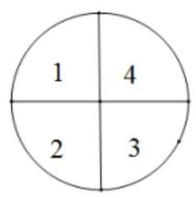
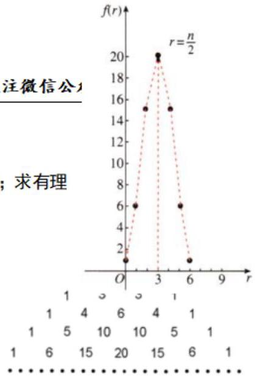

## 排列组合、二项式定理

<table><tr><td>教学目标</td><td>1、掌握排列与组合的概念以及公式;   2、理解两个计数原理，会区分排列与组合的问题；   3、会利用各种方法解决排列组合问题；   4、熟悉二项展开式通项公式，会区分项的系数与项的二项式系数，能够灵活地求二项式的指数、求满足条件的项或系数;</td></tr><tr><td>重点</td><td>1、利用各种方法解决排列组合问题；   2、二项式定理以及二项式定理和二项展开式的性质的常见应用；</td></tr><tr><td>难 点</td><td>1、捆绑法、插空法、间接法、分类讨论等；   2、排列与组合综合题;</td></tr></table>

## (一) 排列组合

## 知识梳理

1、排列:

一般地,从 $n$ 个不同元素中取出 $m\left( {m \leq  n}\right)$ 个元素,按照一定的顺序排成一列,叫做从 $n$ 个不同元素中取出 $m$ 个元素的一个排列。

【注释】(1)元素不能重复。 $n$ 个中不能重复， $m$ 个中也不能重复；(2)“按一定顺序”就是与位置有关，这是判断一个问题是否是排列问题的关键；(3)两个排列相同，当且仅当这两个排列中的元素完全相同，而且元素的排列顺序也完全相同。

2、排列数:

从 $n$ 个不同的元素中取出 $m\left( {m \leq  n}\right)$ 个元素的所有排列的个数,叫做从 $n$ 个不同的元素中取出 $m$ 个元素的排列数。用符号 ${P}_{n}^{m}$ 表示。

【注释】“排列”和“排列数”有什么区别和联系？

“一个排列” 是指: 从 $n$ 个不同元素中,任取 $m$ 个元素,按照一定的顺序排成一列,不是数;

“排列数” 是指从 $n$ 个不同元素中,任取 $m$ 个元素的所有排列的个数,是一个数; 所以符号只表示排列数, 而不表示具体的排列。

3、排列数公式:

$$
{P}_{n}^{m} = n\left( {n - 1}\right) \left( {n - 2}\right) \cdots \left( {n - m + 1}\right)  = \frac{n!}{\left( {n - m}\right) !}\left( {m, n \in  {N}^{ * }, m \leq  n}\right)
$$

当 $m = n$ 时, ${P}_{n}^{n} = n\left( {n - 1}\right) \left( {n - 2}\right) \cdots 3 \cdot  2 \cdot  1$ ,正整数 1 到 $n$ 的连乘积,叫做 $n$ 的阶乘,用 $n!$ 表示。

规定 $0! = 1$ 。

对于 $m \leq  n$ 这个条件要留意,往往是解方程时的隐含条件。

4、附有限制条件的排列

(1)对附有限制条件的排列，思考问题的原则是优先考虑受限制的元素或受限制的位置.

(2)对下列附有限制条件的排列，要掌握基本的思考方法:

元素在某一位置或元素不在某一位置，从该元素入手；

元素相邻——捆绑法，即把相邻元素看成一个元素；

元素不相邻——插空法；

比某一数大或比某一数小的问题主要考虑首位或前几位.

(3)对附有限制条件的排列要掌握正向思考问题的方法——直接法；同时要掌握一些问题的逆向思考问题的方向——间接法.

## 5、组合数:

从 $n$ 个不同元素中取出 $m\left( {m \leq  n}\right)$ 个元素的所有组合的个数,叫做从 $n$ 个不同元素中取出 $m$ 个元素的组合数,用符合 ${C}_{n}^{m}$ 表示.

## 6、组合数公式为

$$
{C}_{n}^{m} = \frac{{P}_{n}^{m}}{{P}_{m}^{m}} = \frac{n!}{m!\left( {n - m}\right) !} = \frac{n\left( {n - 1}\right) \left( {n - 2}\right) \cdots \left( {n - m + 1}\right) }{m!}\left( {m, n \in  {N}^{ * }, m \leq  n}\right) \text{ ,规定 }
$$

$$
{C}_{n}^{0} = {C}_{n}^{n} = 1
$$

【注释】组合数公式有两种形式, (1)乘积形式; (2)阶乘形式. 前者多用于数字计算, 后者多用于证明恒等式。

## 7、组合数的性质:

性质一: ${\mathrm{C}}_{n}^{m} = {\mathrm{C}}_{n}^{n - m}$

①等式特点:等式两边下标同，上标之和等于下标.

②此性质作用:当 $m > \frac{n}{2}$ 时，计算 ${C}_{n}^{m}$ 可变为计算 ${C}_{n}^{n - m}$ ，能够使运算简化.

例如 ${C}_{2016}^{2015} = {C}_{2016}^{{2016} - {2015}} = {C}_{2016}^{1} = {2016}$ .

③ ${C}_{n}^{x} = {C}_{n}^{y} \Rightarrow  x = y$ 或 $x + y = n$ .

性质二、 ${C}_{n + 1}^{m} = {C}_{n}^{m} + {C}_{n}^{m - 1}$

①等式特点:下标相同而上标差 1 的两个组合数之和，等于下标比原下标多 1 而上标与原组合数上标较大的相同的一个组合数.

②此性质作用:恒等变形，简化运算. 在今后学习“二项式定理”时，我们会看到它的主要应用.

③ 证明过程: ${C}_{n}^{m} + {C}_{n}^{m - 1} = \frac{n!}{m!\left( {n - m}\right) !} + \frac{n!}{\left( {m - 1}\right) !\left\lbrack  {n - \left( {m - 1}\right) }\right\rbrack  !}$

$$
= \frac{n!\left( {n - m + 1}\right)  + n!m}{m!\left( {n - m + 1}\right) !} = \frac{\left( {n - m + 1 + m}\right) n!}{m!\left( {n + 1 - m}\right) !}
$$

$$
= \frac{\left( {n + 1}\right) !}{m!\left\lbrack  {\left( {n + 1}\right)  - m}\right\rbrack  !} = {C}_{n + 1}^{m}.
$$

8、组合问题常见解题方法:

(1)注意“至少”、“最多”、“含”等词；

(2)区分“分配”与“分组”:“分组问题”的特征是组与组之间只要元素个数相同是不可区分的，即指把物件分成组，是无顺序可言的；而“分配”问题即使元素个数相同，但因人不同，仍然是可区分的，或者是指把物件分给不同的人(或团体)，是有顺序的，解分配问题必须先分组后排列，若平均分 $m$ 组,则分法 $=$ 取法 $/m$ !

(3)隔板分组法:常常用于解决一类相同元素分给不同对象的分配问题.

(4)分排问题直排处理；

(5)“小集团”排列问题中先集体后局部处理；

(6)定序问题除法处理:即先不考虑顺序限制，排列后在除以定序元素的全排列.

## 例题精讲

【例 1】(1)在一次球队淘汰锦标赛(一次失利，该队就淘汰)中，有 25 支队伍参赛，要产生唯一的锦标赛冠军，必须进行___场比赛.

【难度】★★

【答案】 24

【解析】由题意可得, 25 进 13 要赛 12 场, 13 进 7 要赛 6 场, 7 进 4 要赛 3 场, 4 进 2 要赛 2 场, 决赛要赛 1 场,所以一共要赛 ${12} + 6 + 3 + 2 + 1 = {24}$ 场,

故答案为: 24 .

(2)7 名旅客分别从 3 个不同的景区中选择一处游览，不同选法种数是( )

A. ${7}^{3}$ B. ${3}^{7}$ C. ${P}_{7}^{3}$ D. ${C}_{7}^{3}$

【难度】★★

【答案】B

【解析】由题意, 每名旅客可选择方案有 3 种,

因此 7 名旅客分别从 3 个不同的景区中选择一处游览，不同选法种数是 ${3}^{7}$ . 故选:B.

(3)如图，圆形花坛分为4部分，现在这4部分种植花卉，要求每部分种植1种，且相邻部分不能种植同一种花卉，现有5种不同的花卉供选择，则不同的种植方案共有___种(用数字作答)

【难度】 $\star   \star$

【答案】 260

【解析】根据题意: 当 1,3 相同时,2,4 相同或不同两类,有: $5 \times  4 \times  1 \times  \left( {1 + 3}\right)  = {80}$ 种,

当1,3不相同时,2,4相同或不同两类,有: $5 \times  4 \times  3 \times  \left( {1 + 2}\right)  = {180}$ 种,

所以不同的种植方案共有 ${80} + {180} = {260}$ 种,故答案为: 260

【例 2】已知 $3{P}_{8}^{n - 1} = 4{P}_{9}^{n - 2}$ ,则 $n =$ (   )

A. 5 B. 7 C. 10 D. 14

【难度】★★

【答案】B

【解析】 $3{P}_{8}^{n - 1} = 4{P}_{9}^{n - 2}$ ,可得 $3 \times  8 \times  7 \times  \cdots  \times  \left( {8 - n + 2}\right)  = 4 \times  9 \times  8 \times  7 \times  \cdots  \times  \left( {9 - n + 3}\right)$ , 即 $3\left( {{11} - n}\right) \left( {{10} - n}\right)  = {36}$ ,解得 $n = 7$ . 故选: $B$ .

【例 3】满足 ${P}_{8}^{x} < 6{P}_{8}^{x - 2}$ 的 $x =$ ___.

【难度】★★

【答案】8

【解析】 $\underline{{P}_{8}^{x - 2}} = \left( {{10} - x}\right) \left( {9 - x}\right)  < 6$ 得 $7 < x < {12}$ ,又 $2 \leq  x \leq  8, x \in  {N}^{ * }$ ,故 $x = 8$

【例 4】( 1 )若 ${C}_{n}{}^{2}{P}_{2}^{2} = {42}$ ，则 $\frac{n!}{3!\left( {n - 4}\right) !}$ 的值为( )

A. 60 B. 70 C. 120 D. 140

【难度】★★

【答案】D

【解析】 $\because {C}_{n}^{2}{P}_{2}^{2} = \frac{n\left( {n - 1}\right) }{2} \times  2 = {42}$ ,解得 $n = 7$ 或-6(舍去),

$\therefore \frac{n!}{3!\left( {n - 4}\right) !} = \frac{7!}{3!3!} = \frac{7 \times  6 \times  5 \times  4 \times  3 \times  2 \times  1}{3 \times  2 \times  1 \times  3 \times  2 \times  1} = {140}$ . 故选: D.

(2)下列等式不正确的是( )

A. $\left( {n + 1}\right) {P}_{n}^{m} = {P}_{n + 1}^{m + 1}$ B. $\frac{n!}{n\left( {n - 1}\right) } = \left( {n - 2}\right) !$ C. ${C}_{n}^{m} = \frac{{P}_{n}^{m}}{n!}$ D. $\frac{1}{n - m}{P}_{n}^{m + 1} = {P}_{n}^{m}$

【难度】★★

【答案】C

【解析】A. $\left( {n + 1}\right) {P}_{n}^{m} = \left( {n + 1}\right)  \cdot  \frac{n!}{\left( {n - m}\right) !} = \frac{\left( {n + 1}\right) !}{\left( {n - m}\right) !} = \frac{\left( {n + 1}\right) !}{\left\lbrack  {\left( {n + 1}\right)  - \left( {m + 1}\right) }\right\rbrack  !} = {P}_{n + 1}^{m + 1}$ ,故正确;

B. $\frac{n!}{n\left( {n - 1}\right) } = \frac{n\left( {n - 1}\right) \left( {n - 2}\right)  \times  \cdots  \times  3 \times  2 \times  1}{n\left( {n - 1}\right) } = \left( {n - 2}\right) !$ ,故正确; C. ${C}_{n}^{m} = \frac{{P}_{n}^{m}}{m!} \neq  \frac{{P}_{n}^{m}}{n!}$ ,故错误;

D. $\frac{1}{n - m}{P}_{n}^{m + 1} = \frac{1}{n - m} \cdot  \frac{n!}{\left( {n - m - 1}\right) !} = \frac{n!}{\left( {n - m}\right) !} = {P}_{n}^{m}$ ,故正确. 故选: C

【例 5】求值: (1) ${C}_{4}^{3} + {C}_{5}^{3} + {C}_{6}^{3} + \cdots  + {C}_{30}^{3}$ ;

(2) ${C}_{30}^{1} + 2{C}_{30}^{2} + 3{C}_{30}^{3} + \cdots  + {30}{C}_{30}^{30}$ .

【难度】 $\star   \star$

【答案】(1)31464; (2) ${30} \cdot  {2}^{29}$ .

【解析】(1) ${C}_{4}^{3} + {C}_{5}^{3} + {C}_{6}^{3} + \cdots  + {C}_{30}^{3} = {C}_{4}^{4} + {C}_{4}^{3} + {C}_{5}^{3} + {C}_{6}^{3} + \cdots  + {C}_{30}^{3} - 1 = {C}_{31}^{4} - 1 = {31464}$

(2) ${C}_{30}^{1} + 2{C}_{30}^{2} + 3{C}_{30}^{3} + \cdots  + {30}{C}_{30}^{30} = {30}\left( {{C}_{29}^{0} + {C}_{29}^{1} + {C}_{29}^{2} + \cdots  + {C}_{29}^{29}}\right)  = {30} \cdot  {2}^{29}$

【例 6】某班级 8 位同学分成 $A, B, C$ 三组参加暑假研学,且这三组分别由 3 人、3 人、2 人组成.若甲、乙两位同学一定要分在同一组, 则不同的分组种数为 ( )

A. 140 B. 160 C. 80 D. 100

【难度】 $\star   \star   \star$

【答案】A

【解析】甲、乙两位同学在 $A$ 组或 $B$ 组的情况有 ${C}_{6}^{1}{C}_{5}^{3} \times  2 = {120}$ 种,

甲、乙两位同学在 $C$ 组的情况有 ${C}_{6}^{3}{C}_{3}^{3} = {20}$ 种,共计 140 种. 故选: A.

【例 7】我国即将进入双航母时代，航母编队的要求是每艘航母配 2~3 艘驱逐舰，1~2 艘核潜艇. 船厂现有 5 艘驱逐舰和 3 艘核潜艇全部用来组建航母编队，则不同组建方法种数为( )

A. 30 B. 60 C. 90 D. 120

【难度】 $\star   \star   \star$

【答案】D

【解析】由题意得 2 艘驱逐舰和 1 艘核潜艇,3 艘驱逐舰和 2 艘核潜艇的组建方法种数为 ${C}_{5}^{2}{C}_{3}^{1} \cdot  {P}_{2}^{2} = {60}$ , 2 艘驱逐舰和 2 艘核潜艇, 3 艘驱逐舰和 1 艘核潜艇的组建方法种数为 ${C}_{5}^{2}{C}_{3}^{2} \cdot  {P}_{2}^{2} = {60}$

共 60+60=120 种，故选 D

【例 8】某学校组织劳动实习，其中两名男生和两名女生参加农场体验活动，体验活动结束后，农场主人与四名同学站一排合影留念. 已知农场主人站在中间，两名男生不相邻，则不同的站法共有___种.

【难度】★★

【答案】16

【解析】农场主在中间共有 ${P}_{4}^{4} = {24}$ 种站法,

农场主在中间,两名男生相邻共有 $2{P}_{2}^{2} \cdot  {P}_{2}^{2} = 8$ 种站法,故所求站法共有 ${24} - 8 = {16}$ 种. 故答案为: 16

【例 9】学校将从 4 名男生和 4 名女生中选出 4 人分别担任辩论赛中的一、二、三、四辩手，其中男生甲不适合担任一辩手，女生乙不适合担任四辩手. 现要求: 如果男生甲入选，则女生乙必须入选. 那么不同的组队形式有___种。

【难度】 $\star   \star   \star   \star$

【答案】 930

【解析】解: 若甲乙都入选,则从其余6 人中选出 2 人,有 ${C}_{6}^{2} = {15}$ 种,男生甲不适合担任一辩手,女生乙不适合担任四辩手，则有 ${P}_{4}^{4} - 2{P}_{3}^{3} + {P}_{2}^{2} = {14}$ 种，故共有 ${15} \times  {14} = {210}$ 种；

若甲不入选，乙入选，则从其余 6 人中选出 3 人，有 ${C}_{6}^{3} = {20}$ 种，女生乙不适合担任四辩手，则有 ${C}_{3}^{1}{P}_{3}^{3} = {18}$ 种,故共有 ${20} \times  {18} = {360}$ 种;

若甲乙都不入选，则从其余 66 人中选出 4 人，有 ${C}_{6}^{4} = {15}$ 种，再全排，有 ${P}_{4}^{4} = {24}$ 种，故共有 ${15} \times  {24} = {360}$ 种,综上所述,共有 ${210} + {360} + {360} = {930}$ ,故答案为 930 .

## 巩固训练

1、若 $A \cup  B = \{ 1,2,3\}$ ，则集合 $A, B$ 共有___种组合.

【难度】 $\star   \star   \star$

【答案】 27

【解析】当集合 $A$ 为空集时,集合 $B = \{ 1,2,3\rbrack$ 有 1 种,当集合 $A$ 包含 1 个元素时,例如 $A = \{ 1\}$ , 则集合 $B$ 可以为 $\{ 1,2,3\}$ 或 $\{ 2,3\}$ ,故有 $3 \times  2 = 6$ 种,

当集合 $A$ 包含 2 个元素时,例如 $A = \{ 1,2\}$ ,则集合 $B$ 可以为 $\{ 1,2,3\} ,\{ 1,3\} ,\{ 2,3\} ,\{ 3\}$ , 故有 $3 \times  4 = {12}$ 种,当集合 $A$ 包含 3 个元素时,例如 $A = \{ 1,2,3\}$ ,

则集合 $B$ 可以没有元素，1 个元素，2 个元素，3 个元素，故有 $1 + 3 + 3 + 1 = 8$ 种，

根据分类计数原理可得,共有 $1 + 6 + {12} + 8 = {27}$ 种,故答案为: 27.

2、(1)用排列数表示: $\left( {n - m}\right) \left( {n - m + 1}\right) \left( {n - m + 2}\right) \cdots \left( {n - m + {10}}\right)$ ；

(2)若 ${P}_{n}^{7} = {2n} \cdot  {P}_{n}^{5}$ ，求 $n$ 的值.

【难度】 $\star   \star   \star$

【答案】( 1 ) $\left( {n - m}\right) \left( {n - m + 1}\right) \cdots \left( {n - m + {10}}\right)  = {P}_{n - m + {10}}^{11}\left( 2\right) n = {10}$

【解析】(1) 由排列数计算公式, 知

$\left( {n - m}\right) \left( {n - m + 1}\right) \cdots \left( {n - m + {10}}\right)  = {P}_{n - m + {10}}^{11}.$

( 2 )由排列数计算公式，得 $n\left( {n - 1}\right) \left( {n - 2}\right) \cdots \left( {n - 6}\right)  = {2n} \cdot  n\left( {n - 1}\right) \cdots \left( {n - 4}\right)$ ，

即 $\left( {n - 5}\right) \left( {n - 6}\right)  = {2n}$ ,即 ${n}^{2} - {13n} + {30} = \left( {n - 3}\right) \left( {n - {10}}\right)  = 0$ ,

解得 $n = 3$ 或 $n = {10}$ ,又 $n \geq  7$ ,故 $n = {10}$ .

3、已知 $\frac{1}{{C}_{5}^{n}} - \frac{1}{{C}_{6}^{n}} = \frac{7}{{10}{C}_{7}^{n}}$ ,求 ${C}_{8}^{n}$ ;

【难度】 $\star   \star$

【答案】见解析

【解析】(1) 由题意得 $\frac{n!\left( {5 - n}\right) !}{5!} - \frac{n!\left( {6 - n}\right) !}{6!} = \frac{7 \cdot  n!\left( {7 - n}\right) !}{{10} \cdot  7!}$

化简,得 ${n}^{2} - {23n} + {42} = 0$ . 解得 $n = 2$ ,或 $n = {21}$ (不合题意,舍去). 所以 ${C}_{8}^{n} = {28}$ .

4、下列等式中不正确的是( )

A. ${C}_{7}^{3} = {C}_{7}^{4}$ B. $\frac{n!}{n\left( {n - 1}\right) } = \left( {n - 2}\right) !, n \geq  3$

C. ${C}_{n}^{0} + {C}_{n}^{1} + \cdots  + {C}_{n}^{n} = {2}^{n}, n \geq  1$ D. ${C}_{3}^{2} + {C}_{4}^{2} + \cdots  + {C}_{101}^{2} = {C}_{101}^{3}$

【难度】 $\star   \star   \star$

【答案】D

【解析】对于 $\mathrm{A}$ ,由 ${C}_{n}^{m} = {C}_{n}^{n - m}$ ,可得 ${C}_{7}^{3} = {C}_{7}^{4}$ ,故 $\mathrm{A}$ 正确;

对于 $\mathbf{B},\frac{n!}{n\left( {n - 1}\right) } = \frac{n \cdot  \left( {n - 1}\right)  \cdot  \left( {n - 2}\right) !}{n\left( {n - 1}\right) } = \left( {n - 2}\right) !, n \geq  3$ ,故 $\mathbf{B}$ 正确;

对于 $\mathbf{C}$ ,由 ${\left( a + b\right) }^{n} = {C}_{n}^{0}{a}^{n}{b}^{0} + {C}_{n}^{1}{a}^{n - 1}{b}^{1} + \cdots  + {C}_{n}^{n}{a}^{0}{b}^{n}$ ,

令 $a = b = 1$ ,可得 ${2}^{n} = {C}_{n}^{0} + {C}_{n}^{1} + \cdots  + {C}_{n}^{n}$ ,故 $\mathrm{C}$ 正确;

对于 $\mathrm{D}$ ,由 ${C}_{r}^{r} + {C}_{r + 1}^{r} + \cdots  + {C}_{n - 1}^{r} = {C}_{n}^{r}$ ,所以 ${C}_{3}^{2} + {C}_{4}^{2} + \cdots  + {C}_{101}^{2} = {C}_{102}^{2}$ ,故 $\mathrm{D}$ 错误. 故选: $\mathrm{D}$

5、将 9 个相同的小球放入 3 个不同的盒子，要求每个盒子中至少有一个小球，且每个盒子里的小球个数都不相同，则不同的放法有( )

A. 15 种 B. 18 种 C. 19 种 D. 21 种

【难度】 $\star   \star   \star$

【答案】B

【解析】每个盒子先放一个球,用去 3 个球,则不同放法就是剩余 6 个球的放法; 有两类:

第一，6 个球分成 1,5 或 2,4 两组，共有 $2{P}_{3}^{2} = {12}$ 种方法；第二，6 个球分成 1,2,3 三组，有 ${P}_{3}^{3} = 6$ 种方法. 所以不同放法共有 ${12} + 6 = {18}$ 种. 故选 B

6、一次国际会议，从某大学外语系选出 11 名学生做翻译，两人既会英语，又会日语， 5 人只会英语， 4 人只会日语。现从这 11 人中选出 4 名当英语翻译，4 名当日语翻译，求所有选法种数.

【难度】 $\star   \star   \star$

【答案】见解析

【解析】把选法分为三类:

(i)从 5 个只会英语的学生中选 4 人，则可从 2 名会两种语言和只会日语的 4 人中选口语翻译有 ${C}_{6}^{4}$ 种. 按乘法原理这种情况下的翻译选法可有 ${C}_{5}^{4}{C}_{6}^{4}$ 种.

(ii)从 5 个只会英语的学生中选 3 人，则英语翻译有 ${C}_{5}^{3}{C}_{2}^{1}$ 种，而这时日语翻译选法有 ${C}_{5}^{4}$ 种按乘法原理这种情况下的翻译选法可有 ${C}_{5}^{3}{C}_{2}^{1}{C}_{5}^{4}$ 种.

(iii) 从 5 个只会英语学生中选 2 人，则英语翻译有 ${C}_{5}^{2}{C}_{2}^{2}$ 种，而这时口语翻译选法有 ${C}_{4}^{4}$ 种，按乘法原理这种情况下的翻译选法可有 ${C}_{5}^{2}{C}_{2}^{2}{C}_{4}^{4}$ 种.

于是,所有选择总数为 ${C}_{5}^{4}{C}_{6}^{4} + {C}_{5}^{3}{C}_{2}^{1}{C}_{5}^{4} + {C}_{5}^{2}{C}_{2}^{2}{C}_{4}^{4} = {185}$ (种).

## (二)常用排列问题的解题策略

## 例题精讲

## 1、特殊元素特殊位置优先考虑

【例 10】(1)从 0,2,4,6 中任取 2 个数字，从 1,3,5 中任取 2 个数字，一共可以组成___个没有重复数字的四位偶数.

【难度】 $\star   \star   \star$

【答案】 198

【解析】当用 0 时, 0 只能在个位, 十位, 百位三个位置之一.

当个位为 0 时,从2,4,6中再取 1 个数字 (3 种方法),从1,3,5中任取 2 个数字 (即排除 1 个,有 3 种不同的方法),将这取得的 3 个数字在十百千位任意排列,其有 $3! = 6$ 中不同的排列方式,根据分步乘法计数原理,有 $3 \times  3 \times  6 = {54}$ 种方法;

当十位或百位为 0 时 (2 种不同方法),从2,4,6中再取 1 个数字放置在个位 (3 种方法),然后从1,3,5中任取 2 个数字 (即排除 1 个, 有 3 种不同的方法), 在其余两位上任意排列, 共有 2!=2 中不同的排列方式, 根据分步乘法计数原理,有 $2 \times  3 \times  3 \times  2 = {36}$ 种方法;

当没有用 0 时,从2,4,6中任取 1 个数字放置在个位 $\left( \text{ 有 3 种不同的方法 }\right)$ ; 在从其余的 2 个非零偶数字中任取一个数字 (2 种不同方法),从 1,3,5 中任取 2 个数字 (有 3 种不同方法),将这 3 个数字在除个位之外的十百千 3 个位置上任意排列 (有 3!=6 种不同的方法),由分步乘法计数原理方法数为 $3 \times  2 \times  3 \times  6 = {108}$ 种. 根据分类加法计数原理, 一共有没有重复数字的四位偶数 ${54} + {36} + {108} = {198}$ 个,

故答案为: 198 .

(2)从“舞蹈、相声、小品……”等 5 个候选节目中选出 4 个节目参加“艺术节”的汇演，其中第一出场节目不能是 “舞蹈”，也不能是 “相声”，则不同的演出方案种数是( )

A. 48 B. 72 C. 96 D. 108

【难度】 $\star   \star   \star$

【答案】B

【解析】第一步,先安排第一出场节目,第一出场节目不能是 “舞蹈” 也不能是 “相声” 则有 ${P}_{3}^{1} = 3$ 种选法; 第二步,在剩下的 4 个节目中选择 3 个节目并编排顺序,则有 ${P}_{4}^{3} = {24}$ 种方法;

所以,其有 $3 \times  {24} = {72}$ 种演出方案. 故选: B.

## 2、相邻元素捆绑策略

【例 11】( 1 )6 月, 也称毕业月, 高三的同学们都要与相处了三年的同窗进行合影留念.现有 4 名男生、2 名女生照相合影，若女生必须相邻，则有( )种排法.

A. 24 B. 120 C. 240 D. 140

【难度】 $\star   \star   \star$

【答案】C

【解析】将 2 名女生捆绑在一起,当作 1 个元素,与另4 名男生一起作全排列,有 ${P}_{5}^{5} = {120}$ 种排法,而 2 个女生可以交换位置,所以共有 ${P}_{5}^{5} \cdot  {P}_{2}^{2} = {120} \times  2 = {240}$ 排法,故选: C.

(2)已知 $A, B$ 两个小孩和甲、乙、丙三个大人排队， $A$ 不排两端，3 个大人有且只有两个相邻，则不同的排法种数有___.

【难度】 $\star   \star   \star$

【答案】 48

【解析】先考虑甲乙捆绑成一个的情形: (甲乙) $A$ 丙 $B;B$ 丙(甲乙) $A$ 丙; (乙甲) $A$ 丙; $B;B$ (乙甲) $A$ 丙；(甲乙) ${AB}$ 丙；(甲乙) $B$ 丙(乙甲) $A\bar{B}$ 丙 $B$ ；丙(乙甲) $B\bar{A}$ 丙某有 8 种可能；将三个大人全排列共 ${P}_{3}^{3} = 6$ 种可能，所以共有 $8 \times  6 = {48}$ 种可能.

## 3、不相邻问题插空策略

【例12】(1)7个人并排站成一行，如果甲、乙两人必须不相邻，那么不同的排法有___种。

【难度】 $\star   \star   \star$

【答案】3600

【解析】插空法; ${P}_{5}^{5} \cdot  {P}_{6}^{2} = {3600}$

(2)某学校贯彻“科学防疫”，实行“佩戴口罩，间隔而坐”. 一排 8 个座位，安排 4 名同学就坐，共有 ___种不同的安排方法. (用数字作答)

【难度】 $\star   \star   \star$

【答案】 120

【解析】因为四个互不相邻的空位可产生五个位置, 则这四个同学可以在这五个位置就坐,

因此共有 ${P}_{5}^{4} = {120}$ 种不同的安排方法. 故答案为: 120 .

4、定序问题

【例 13】7 个人站成一排, 甲在乙的左边的排法有多少种?

【难度】 $\star   \star   \star$

【答案】 2520

【解析】定序问题: 因为甲在乙的左边和甲在乙的右边一样多,所以所有的可能性为 $\frac{{P}_{7}^{7}}{2} = {2520}$ .

5、间接法

【例 14】(1)为抗击新冠病毒，某部门安排甲、乙、丙、丁、戊五名专家到三地指导防疫工作. 因工作需要， 每地至少需安排一名专家，其中甲、乙两名专家必须安排在同一地工作，丙、丁两名专家不能安排在同一地工作，则不同的分配方法总数为( )

A. 18 B. 24 C. 30 D. 36

【难度】★★★

【答案】C

【解析】因为甲、乙两名专家必须安排在同一地工作, 此时甲、乙两名专家

看成一个整体即相当于一个人，所以相当于只有四名专家，

先计算四名专家中有两名在同一地工作的排列数, 即从四个中选二个和

其余二个看成三个元素的全排列共有: ${C}_{4}^{2} \cdot  {P}_{3}^{3}$ 种;

又因为丙、丁两名专家不能安排在同一地工作，所以再去掉丙、丁两名专家在同一地工作的排列数有 ${P}_{3}^{3}$ 种, 所以不同的分配方法种数有: ${C}_{4}^{2} \cdot  {P}_{3}^{3} - {P}_{3}^{3} = {36} - 6 = {30}$ ,故选: C

(2)设有编号为1，2，3，4，5 的五个球和编号为1，2，3，4，5 的五个盒子，现将这五个球放入5 个盒子内，没有一个盒子空着，但球的编号与盒子编号不全相同，有多少种投放方法？

【难度】★★★

【答案】 119

【解析】 ${P}_{5}^{5} - 1 = {119}$

## 巩固训练

1、某班 5 位同学参加周一到周五的值日，每天安排一名学生，其中学生甲只能安排到周一或周二，学生乙不能安排在周五，则他们不同的值日安排有( )

A. 288 种 B. 72 种 C. 42 种 D. 36 种

【难度】★★★

【答案】D

【解析】甲有 2 种安排,甲排好后,乙有 3 种,然后剩下的 3 人有 ${P}_{3}^{3}$ 种,共 $2 \times  3 \times  {P}_{3}^{3} = {36}$ 种

2、2 位男生和 3 位女生共 5 位同学站成一排. 若男生甲不站两端, 3 位女生中有且只有两位女生相邻, 则不同排法的种数为( )

A. 36 B. 42 C. 48 D. 60

【难度】 $\star   \star   \star$

【答案】C

【解析】不妨将 5 个位置从左到右编号为 1,2,3,4,5. 于是甲只能位于 2,3,4 号位.

i) 当甲位于 2 号位时,3 位女生必须分别位于1,3,4位或者1,4,5位. 于是相应的排法总数为 $2{P}_{3}^{3} = {12}$ ;

ii) 当甲位于 3 号位时, 3 位女生必须分别位于 1, 2, 4 位或者 1, 2, 5 位或者 1, 4, 5 或者 2, 4, 5 位. 于是相应的排法总数为 $4{P}_{3}^{3} = {24}$ .

iii)当甲位于 4 号位时,情形与 i) 相同. 排法总数为 $2{P}_{3}^{3} = {12}$ .

综上,知本题所有的排法数为 ${12} + {24} + {12} = {48}$ .

3、2 位女生 3 位男生排成一排，则 2 位女生不相邻的排法共有___种.

【难度】★★

【答案】72

【解析】解: 根据题意, 分 2 步进行分析:

①、将 3 位男生排成一排，有 ${P}_{3}^{3} = 6$ 种情况，

②、3 名男生排好后有 4 个空位可选，在 4 个空位中，任选 2 个，安排两名女生，有 ${P}_{4}^{2} = {12}$ 种情况，

则 2 位女生不相邻的排法有 $6 \times  {12} = {72}$ 种；故答案为:72

4、停车站划出一排12个停车位置，今有 8 辆不同型号的车需要停放，若要求剩余的 4 个空车位连在一起， 则不同的停车方法共有___种。

【难度】 $\star   \star   \star$

【答案】362880

【解析】先将 8 辆车全排有 ${P}_{8}^{8}$ 种,

再将 4 个空车位看成整体插入 8 辆车形成的 9 个空档中,有 9 种方法,故所求的方法为 $9{P}_{8}^{8} = {362880}$ .

5、某会议室第一排共有 8 个座位，现有 3 人就座，若要求每人左右均有空位，那么不同的坐法种数为( )

A. 12 B. 16 C. 24 D. 32

【答案】 24

【解析】将三个人插入五个空位中间的四个空档中,有 ${P}_{4}^{3} = {24}$ 种排法.

6、某人连续射击8 次有四次命中，其中有三次连续命中，按 “中” 与 “不中” 报告结果，不同的结果有多少种.

【难度】 $\star   \star   \star$

【答案】 20

【解析】把问题转化为四个相同的黑球与四个相同白球,

其中只有三个黑球相邻的排列问题，将三黑球 “捆绑” 在一起看成一个 “黑球”，与另一个黑球插入四个白球的空档中,共有 ${P}_{5}^{2} = {20}$ 种不同的结果.

7、2020 年 3 月 31 日，某地援鄂医护人员 $A, B, C, D, E, F,6$ 人(其中 $A$ 是队长)圆满完成抗击新冠肺炎疫情任务返回本地，他们受到当地群众与领导的热烈欢迎. 当地媒体为了宣传他们的优秀事迹， 让这 6 名医护人员和接见他们的一位领导共 7 人站一排进行拍照，则领导和队长站在两端且 ${BC}$ 相邻，而 ${BD}$ 不相邻的排法种数为( )

A. 36 种 B. 48 种 C. 56 种 D. 72 种

【难度】 $\star   \star   \star$

【答案】D

【解析】: 让这 6 名医护人员和接见他们的一位领导共 7 人站一排进行拍照, 则领导和队长站在两端且 ${BC}$ 相邻, 分 2 步进行分析:

①领导和队长站在两端，有 ${P}_{2}^{2} = 2$ 种情况，

②中间5人分2种情况讨论:

若 ${BC}$ 相邻且与 $D$ 相邻,有 ${P}_{2}^{2}{P}_{3}^{3} = {12}$ 种安排方法,

若 ${BC}$ 相邻且不与 $D$ 相邻,有 ${P}_{2}^{2}{P}_{2}^{2}{P}_{3}^{2} = {24}$ 种安排方法,

则中间 5 人有 ${12} + {24} = {36}$ 种安排方法,则有 $2 \times  {36} = {72}$ 种不同的安排方法;

故选: D.

8、一天的课程表要排入语文，数学，物理，化学，英语，体育六节课，如果数学必须排在体育之前，那么该天的课程表有多少种排法?

【难度】 $\star   \star   \star$

【答案】360

【解析】在六节课的排列总数中, 体育课排在数学之前与数学课排在体育之前的概率

相等,均为 $\frac{1}{2}$ ,故本例所求的排法种数就是所有排法的 $\frac{1}{2}$ ,即 $\frac{1}{2}{P}_{6}^{6} = {360}$ 种. 或者由于数学和体育的次序固定,方法数为 $\frac{{P}_{6}^{6}}{{P}_{2}^{2}} = {360}$ .

9、1 名老师和 4 名获奖同学排成一排照相留念，若老师不排在两端，则共有___种排法。

【难度】 $\star   \star   \star$

【答案】 72

【解析】可考虑按照定序问题来解决 $\frac{3}{5}{P}_{5}^{5} = {72}$ ; 也可采用分类讨论、排除法等。

10、用1,2,3,4,5,6,7这七个数字组成没有重复数字的七位数中,

(1)若偶数2,4,6次序一定，有多少个?

(2)若偶数2,4,6次序一定，奇数1,3,5,7的次序也一定的有多少个?

【难度】 $\star   \star   \star$

【答案】(1)840；(2)35

【解析】(1) $\frac{{P}_{7}^{7}}{{P}_{3}^{3}} = {840};\;\left( 2\right) \frac{{P}_{7}^{7}}{{P}_{3}^{3} \cdot  {P}_{4}^{4}} = {35}$ .

11、在由数字0,1,2,3,4所组成的没有重复数字的四位数中，不能被 5 整除的数共有___个。

【难度】 $\star   \star   \star$

【答案】 72

【解析】用间接法,总的 4 位数有 $4 \times  {P}_{4}^{3}$ 个,被 5 整除即个位为 0 的 4 位数有 ${P}_{4}^{3}$ 个, 因此不能被 5 整除的数有 $4 \times  {P}_{4}^{3} - {P}_{4}^{3} = {72}$ 个.

12、从 5 名志愿者中选出 3 名，分别从事翻译、导游、保洁三项不同的工作，每人承担一项，其中甲不能从事翻译工作，则不同的选派方案共有( )

A. 24 种 B. 36 种 C. 48 种 D. 60 种

【难度】 $\star   \star   \star$

【答案】C

【解析】从中任选 3 人全排,除去甲从事翻译工作的情况,共有方案: ${P}_{5}^{3} - {P}_{4}^{2} = {48}$ (种).

13、从 2，4，6，8，10 这五个数中，每次取出两个不同的数分别为 $a, b$ ，共可得到 $\lg a - \lg b$ 的不同值的个数是( )

A. 20 B. 18 C. 10 D. 9

【难度】★★★

【答案】B

【解析】首先从2,4,6,8,10这五个数中任取两个不同的数排列,共 ${P}_{5}^{2} = {20}$ 有种排法,

又 $\frac{2}{4} = \frac{4}{8},\frac{4}{2} = \frac{8}{4}$ ,

$\therefore$ 从2,4,6,8,10这五个数中,每次取出两个不同的数分别记为 $a, b$ ,共可得到 $\lg a - \lg b = \lg \frac{a}{b}$ 的不同值的个数是: ${20} - 2 = {18}$ . 故选: $B$ .

## (三)常用组合问题的解题策略

## 例题精讲

1、组合的一般应用

【例 15】3 个一样的白色小球和 4 个一样的黑色小球排成一排, 有多少种不同的排法?

【难度】 $\star   \star   \star$

【答案】35

【解析】不妨先放置 7 个同样的白色小球, 再从中换取 4 个放入黑色小球, 所得的排列方式和题中所描述的问题一样,故排列的总数为 ${C}_{7}^{4} = {35}$ .

## 2、分组与分堆问题

【例 16】6 本不同的书, 按下列要求各有多少种不同的选法:

(1)分为三份，每份 2 本；

(2)分为三份，一份 1 本，一份 2 本，一份 3 本；

(3)分成 3 堆，有 2 堆各一本，另一堆 4 本，有多少种不同的分堆方法？

(4)摆在 3 层书架上，每层 2 本，有多少种不同的摆法?

【难度】★★★

【答案】(1) 6本书平均分成 3 份,用上述方法重复了 ${P}_{3}^{3}$ 倍,故共有 $\frac{{C}_{6}^{2}{C}_{4}^{2}{C}_{2}^{2}}{{P}_{3}^{3}} = {15}$ (种).

【解析】本题是分组中的“均匀分组”问题. 一般地: 将mn个元素均匀分成n组(每组m个元素)，共有 $\frac{{C}_{mn}^{m} \cdot  {C}_{{mn} - m}^{m} \cdot  \ldots \ldots  \cdot  {C}_{m}^{m}}{{P}_{n}^{n}}$ 种方法。

(2)这是“不均匀分组”问题，从6本书中，先取1本做1份，再在剩下的5本中取2本做一份，最后3本做一份,其有 ${C}_{6}^{1}{C}_{5}^{2}{C}_{3}^{3} = {60}$ 种方法.

(3)平均分堆要除以堆数的全排列数，不平均分堆则不除，故其有 $\frac{{C}_{6}^{1} \cdot  {C}_{5}^{1}}{{P}_{2}^{2}} = {15}$ (种).

(4)本题即为6本书放在6个位置上，共有 ${P}_{6}^{6} = {720}$ (种).

## 3、至多至少、含与不含问题

【例 17】( 1 )疫情期间，某村有 3 个路口，每个路口需要 2 个人负责检查体温. 现有 8 名志愿者，其中 4 名为党员，从中抽取 6 人安排到这 3 个路口，要求每个路口至少有一名党员，则不同的安排方法有( ) 种.

A. 432 B. 576 C. 1008 D. 1440

【难度】 $\star   \star   \star$

【答案】C

【解析】因为 3 个路口中每个路口至少有一名党员, 所以至少有三个党员,

若从中抽取 6 人恰有三个党员,则安排方法有 ${C}_{4}^{3}{C}_{4}^{3}{P}_{3}^{3}{P}_{3}^{3}$ 种,

若从中抽取 6 人恰有四个党员,则安排方法有 ${C}_{4}^{4}{C}_{4}^{2}\left( {{C}_{4}^{2}{P}_{3}^{3}}\right) {P}_{2}^{2}$ 种,

因此共 ${C}_{4}^{3}{C}_{4}^{3}{P}_{3}^{3}{P}_{3}^{3} + {C}_{4}^{4}{C}_{4}^{2}\left( {{C}_{4}^{2}{P}_{3}^{3}}\right) {P}_{2}^{2} = {576} + {432} = {1008}$ 种

故选: $\mathrm{C}$

(2)从集合 $\{ P, Q, R, S\}$ 与 $\{ 0,1,2,3,4,5,6,7,8,9\}$ 中各任取 2 个元素排成一排(字母和数字均不能重复). 每排中字母 $Q$ 和数字 0 至多只能出现一个的不同排法种数是___. (用数字作答)

【难度】 $\star   \star   \star$

【答案】5832

【解析】分三种情况: 情况 1. 不含 $Q\text{ 、 }0$ 的排列: ${C}_{3}^{2} \cdot  {C}_{9}^{2} \cdot  {P}_{4}^{4}$ ;

情况 2.0、 $Q$ 中只含一个元素 $Q$ 的排列: ${C}_{3}^{1} \cdot  {C}_{9}^{2} \cdot  {P}_{4}^{4}$ ; 情况 3. 只含元素 0 的排列: ${C}_{3}^{2} \cdot  {C}_{9}^{1} \cdot  {P}_{4}^{4}$ .

综上符合题意的排法种数为 ${C}_{3}^{2} \cdot  {C}_{9}^{2} \cdot  {P}_{4}^{4} + {C}_{3}^{1} \cdot  {C}_{9}^{2} \cdot  {P}_{4}^{4} + {C}_{3}^{2} \cdot  {C}_{9}^{1} \cdot  {P}_{4}^{4} = {5832}$ .

当然也可以用间接法, ${C}_{4}^{2} \cdot  {C}_{10}^{2} \cdot  {P}_{4}^{4} - {C}_{3}^{1} \cdot  {C}_{9}^{1} \cdot  {P}_{4}^{4} = {5832}$ .

4、挡板法

【例 18】把 12 个相同的小球放入编号为1,2,3,4的盒子中,问每个盒子中至少有 1 个小球的不同放法有多少种?

【难度】 $\star   \star   \star$

【答案】165

【解析】相当于在 12 个小球中间 11 个空位里面插入 3 个板,即 ${C}_{11}^{3} = {165}$

## 巩固训练

## 【课堂练习】

1、古代“五行”学说认为:“物质分金、木、土、水、火五种属性，金克木，木克土，土克水，水克火， 火克金." 将五种不同属性的物质任意排成一列, 但排列中属性相克的两种物质不相邻, 则这样的排列方法有___种(结果用数值表示).

【难度】★★★

【答案】 10

【解析】不妨设 5 个位置为1,2,3,4,5,3号位随意放入一个物质,有 ${\mathrm{C}}_{5}^{1}$ 种选法;

不妨设为火，则金，水都只能选择 1 号位或者 5 号位，共有 ${\mathrm{C}}_{2}^{1}$ 种选择，剩下的木，土都别无选择. 方法数共有 ${\mathrm{C}}_{5}^{1} \cdot  {\mathrm{C}}_{2}^{1} = {10}$ .

2、马路上有 12 盏灯，为了节约用电，可以熄灭其中 3 盏灯，但两端的灯不能熄灭，也不能熄灭相邻的两盖灯, 那么熄灯方法共有___种.

【难度】★★★

【答案】56

【解析】去掉两段的灯,中间有 10 盏灯,在 7 盏亮着的灯中有 8 个空位,插入 3 盏熄灭的灯即 ${C}_{8}^{3} = {56}$

3、在一次演唱会上共 10 名演员，其中 8 人能能唱歌， 5 人会跳舞，现要演出一个 2 人唱歌 2 人伴舞的节目， 有多少选派方法.

【难度】 $\star   \star   \star$

【答案】 199

【解析】10 演员中有 5 人只会唱歌, 2 人只会跳舞 3 人为全能演员。选上唱歌人员为标准进行研究 只会唱的 5 人中没有人选上唱歌人员共有 ${C}_{3}^{2}{C}_{3}^{2}$ 种,只会唱的 5 人中只有 1 人选上唱歌人员 ${C}_{5}^{1}{C}_{3}^{1}{C}_{4}^{2}$ 种,只会唱的 5 人中只有 2 人选上唱歌人员有 ${C}_{5}^{2}{C}_{5}^{2}$ 种，由分类计数原理共有 ${C}_{3}^{2}{C}_{3}^{2} + {C}_{5}^{1}{C}_{3}^{1}{C}_{4}^{2} + {C}_{5}^{2}{C}_{5}^{2}$ 种。

4、某校将 5 名插班生甲、乙、丙、丁、戊编入 3 个班级，每班至少 1 人，则不同的安排方案共有( )

A. 150 种 B. 120 种 C. 240 种 D. 540 种

【难度】 $\star   \star   \star$

【答案】A

【解析】由题意可知,可分以下两种情况讨论,①5 名插班生分成: 3,1,1 三组; ②5 名插班生分成: 2,

2,1 三组,

当 5 名插班生分成: 3，1，1 三组时，共有 $\frac{1}{2}{C}_{5}^{3}{C}_{2}^{1}{P}_{3}^{3} = {60}$ 种方案；

当 5 名插班生分成:2,2,1三组时，共有 ${C}_{5}^{1} \cdot  \frac{{C}_{4}^{2} \cdot  {C}_{2}^{2}}{{P}_{2}^{2}} \cdot  {C}_{3}^{1} \cdot  {P}_{2}^{2} = {90}$ 种方案；

所以,其有 ${60} + {90} = {150}$ 种不同的安排方案. 故选: A.

5、某医院拟派甲、乙、丙、丁四位专家到 3 所乡镇卫生院进行对口支援，若每所乡镇卫生院至少派 1 位专家，每位专家对口支援一所医院，则选派方案有( )

A. 18 种 B. 24 种 C. 36 种 D. 48 种

【难度】 $\star   \star   \star$

【答案】C

【解析】解: 根据题意,分 2 步进行分析:

①将甲、乙、丙、丁四位专家分为3 组，有 ${C}_{4}^{2} = 6$ 种分组分法;

②将分好的三组全排列，对应 3 所乡镇卫生院，有 ${P}_{3}^{3} = 6$ 种情况，则有 $6 \times  6 = {36}$ 种选派方案；故选: $C$ .

6、特岗教师是中央实施的一项对中西部地区农村义务教育的特殊政策.某教育行政部门为本地两所农村小学招聘了 6 名特岗教师，其中体育教师 2 名，数学教师 4 名.按每所学校 1 名体育教师，2 名数学教师进行分配，则不同的分配方案有( )

A. 24 B. 14 C. 12 D. 8

【难度】★★★

【答案】C

【解析】先把 4 名数学教师平分为 2 组,有 $\frac{{C}_{4}^{2}{C}_{2}^{2}}{{P}_{2}^{2}} = 3$ 种方法,

再把 2 名体育教师分别放入这两组,有 ${P}_{2}^{2} = 2$ 种方法,

## 最后把这两组教师分配到两所农村小学,共有 $3 \times  2 \times  {P}_{2}^{2} = {12}$ 种方法. 故选: C.

7、将 5 名志愿者分配到 3 个不同的奥运场馆参加接待工作，每个场馆至少分配一名志愿者的方案种数为 ( )

A. 540 B. 300 C. 180 D. 150

【难度】 $\star   \star   \star$

【答案】D

【解析】依题意,5 个人分成 3 部分只有两种可能:1,1,3或1,2,2.

这是部分均匀编号分组问题,分别有 $\frac{{C}_{5}^{1}{C}_{4}^{1}{C}_{3}^{3}{P}_{3}^{3}}{{P}_{2}^{2}} = {60}$ 和 $\frac{{C}_{5}^{1}{C}_{4}^{2}{C}_{2}^{2}{P}_{3}^{3}}{{P}_{2}^{2}} = {90}$ 种方案,因此总方案数为 ${60} + {90} = {150}$ 种,选 D.

8、一个口袋内装有大小相同的7 个白球和1 个黑球.

(1)从口袋内取出 3 个球，共有多少种取法？

(2)从口袋内取出 3 个球，使其中含有1个黑球，有多少种取法？

(3)从口袋内取出 3 个球，使其中不含黑球，有多少种取法？

【难度】 $\star   \star   \star$

【答案】(1)56；(2)21；(3)35

【解析】(1)从口袋内的 8 个球中取出 3 个球,取法种数是 ${\mathbf{C}}_{8}^{3} = \frac{8 \times  7 \times  6}{3 \times  2 \times  1} = {56}$ ;

(2)从口袋内取出 3 个球有 1 个是黑球，于是还要从 7 个白球中再取出 2 个，

取法种数是 ${\mathbf{C}}_{7}^{2} = \frac{7 \times  6}{2} = {21}$ ;

(3)由于所取出的 3 个球中不含黑球，也就是要从 7 个白球中取出 3 个球，

取法种数是 ${\mathbf{C}}_{7}^{3} = \frac{7 \times  6 \times  5}{3 \times  2 \times  1} = {35}$ .

9、不定方程 ${x}_{1} + {x}_{2} + {x}_{3} + \ldots  + {x}_{50} = {100}$ 中不同的正整数解有___组，非负整数解有___组.

【难度】 $\star   \star   \star$

【答案】 ${\mathrm{C}}_{99}^{49},{\mathrm{C}}_{149}^{49}$ ;

【解析】相当于把 100 个 1 分给 50 个未知数, 采用挡板法,

于是所有的方法数为 ${\mathrm{C}}_{99}^{49}$ ;

非负整数解的问题,等价于 $\left( {{x}_{1} + 1}\right)  + \left( {{x}_{2} + 1}\right)  + \left( {{x}_{3} + 1}\right)  + \ldots  + \left( {{x}_{50} + 1}\right)  = {150}$ 的非负整数解问题,等价于 ${y}_{i} = {x}_{i} + 1,{y}_{1} + {y}_{2} + {y}_{3} + \ldots  + {y}_{50} = {150}$ 的正整数解问题,一共有 ${\mathrm{C}}_{149}^{49}$ 组.

## (四)二项式定理

## 知识梳理

1、二项式定理:

公式 ${\left( a + b\right) }^{n} = {C}_{n}^{0}{a}^{n} + {C}_{n}^{1}{a}^{n}b + \cdots  + {C}_{n}^{r}{a}^{n - r}{b}^{r} + \cdots  + {C}_{n}^{n}{b}^{n}\left( {n \in  {N}^{ * }}\right)$ ,叫做二项式定理。其中 ${C}_{n}^{k}\left( {k = 0,1,2\cdots , n}\right)$ 叫做二项式系数; 公式右边的多项式叫做 ${\left( a + b\right) }^{n}$ 的二项展开式; ${T}_{r + 1} = {C}_{n}^{r}{a}^{n - r}{b}^{r}$ 叫做二项展开式的通项,它表示第 $r + 1$ 项; 二项式系数与数字系数的积叫做项的系数。

二项展开式的特性如下:

(1)系数规律: ${C}_{n}^{0}$ 、 ${C}_{n}^{1}$ 、 ${C}_{n}^{2}$ 、 $\cdots$ 、 ${C}_{n}^{n}$ ；

(2)项数规律:二项和的 $n$ 次幂的展开式共有 $n + 1$ 个项.

(3)指数规律:各项的次数均为 $n$ ；二项展开式中 $a$ 的次数由 $n$ 降到 $0, b$ 的次数由 0 升到 $n$ ， $a$ 与 $b$ 指数之和为 $n$ .

欢迎关注微信公力

(4)求常数项、项的系数或者有理项时，要根据通项公式讨论对 $r$ 的限制；求有理项时要注意到指数及项数的整数性.

2、二项式系数表 (杨辉三角)

${\left( a + b\right) }^{n}$ 展开式的二项式系数,当 $n$ 依次取 $1,2,3\cdots$ 时,二项式系数表, 表中每行两端都是 1 ，除 1 以外的每一个数都等于它肩上两个数的和.

3、二项式系数的性质:

${\left( a + b\right) }^{n}$ 展开式的二项式系数是 ${C}_{n}^{0},{C}_{n}^{1},{C}_{n}^{2},\cdots ,{C}_{n}^{n}$ . 其中 ${C}_{n}^{r}$ 可以看成以 $r$ 为自变量的函数 $f\left( r\right)$ , 定义域是 $\{ 0,1,2,\cdots , n\}$ ,例当 $n = 6$ 时,其图象是 7 个孤立的点 (如图)

(1)对称性:与首末两端 “等距离” 的两个二项式系数相等 (即 ${C}_{n}^{m} = {C}_{n}^{n - m}$ ). 直线 $r = \frac{n}{2}$ ( $n$ 为偶数) 是图象的对称轴.

(2)增减性与最大值: ${C}_{n}^{0} < {C}_{n}^{1} < {C}_{n}^{2} < \cdots \cdots  > {C}_{n}^{n - 2} > {C}_{n}^{n - 1} > {C}_{n}^{n}$ (中间一项或两项最大),若 $n$ 为偶数,中间一项 (第 $\frac{n}{2} + 1$ 项) 的二项式系数最大; 若 $n$ 为奇数,中间两项 (第 $\frac{n + 1}{2}$ 和 $\frac{n + 1}{2} + 1$ 项) 的二项式系数最大.

(3)系数的最大项:求 ${\left( a + bx\right) }^{n}$ 展开式中最大的项，一般采用待定系数法. 设展开式中各项系数分别为 ${A}_{1},{A}_{2},\cdots ,{A}_{n + 1}$ ,设第 $r + 1$ 项系数最大,应有 $\left\{  \begin{array}{l} {A}_{r + 1} \geq  {A}_{r} \\  {A}_{r + 1} \geq  {A}_{r + 2} \end{array}\right.$ ,从而解出 $r$ 来.

(4)各二项式系数和: ${C}_{n}^{0} + {C}_{n}^{1} + {C}_{n}^{2} + \cdots  + {C}_{n}^{n} = {2}^{n}$ ;

奇数项 (偶数项) 二项式系数和: ${C}_{n}^{0} + {C}_{n}^{2} + \cdots  = {C}_{n}^{1} + {C}_{n}^{3} + \cdots  = {2}^{n - 1}$ .

4、二项展开式的系数 ${a}_{0},{a}_{1},{a}_{2},{a}_{3},\cdots ,{a}_{n}$ 的性质: $f\left( x\right)  = {a}_{0} + {a}_{1}x + {a}_{2}{x}^{2} + {a}_{3}{x}^{3} + \cdots  + {a}_{n}{x}^{n}$ ,

(1) ${a}_{0} + {a}_{1} + {a}_{2} + {a}_{3} + \cdots  + {a}_{n} = f\left( 1\right)$ ; (2) ${a}_{0} - {a}_{1} + {a}_{2} - {a}_{3} + \cdots  + {\left( -1\right) }^{n}{a}_{n} = f\left( {-1}\right)$ ;

(3) ${a}_{0} + {a}_{2} + {a}_{4} + {a}_{6} + \cdots  = \frac{f\left( 1\right)  + f\left( {-1}\right) }{2}$ ; (4) ${a}_{1} + {a}_{3} + {a}_{5} + {a}_{7} + \cdots  = \frac{f\left( 1\right)  - f\left( {-1}\right) }{2}$ ;

(5) ${a}_{0} = f\left( 0\right)$ .

## 5、二项式定理中的常用思想方法:

(1)证明组合恒等式常用赋值法。

(2)求二项展开式的项(指定项，具有某种性质的项)一般用二项展开式的通项公式，通常是先根据已知条件求 $r$ ,再求 ${T}_{r + 1}$ ,有时需先求 $n$ ,再求 $r$ ,才能求出 ${T}_{r + 1}$ 。

(3)研究二项展开式的系数和、二项式系数和的问题，常通过赋值的方法整体处理，特别要注意区分二项展开式的系数和与二项展开式的二项式系数和的差别。

(4)二项式定理作为 “母体”，可以生成很多的组合恒等式，在进行组合数和式研究时要注意其与二项式定理的关系，能正向、逆向地运用二项式定理。关于组合恒等式的证明，常采用 “构造法” ——构造函数或构造同一问题的两种算法。

(5)有些三项式展开式的问题，可以通过变形转化成二项式问题，这种转化体现了数学化归的思想方法，要掌握化归的基本技能。

(6)近似计算要首先观察精确度，然后选取若干项逼近近似计算的要求。用二项式定理证明整除性问题或余数问题，一般将被除式变为有关除式的二项式的形式再展开，常采用 “配凑法” (蕴含目标意识)、“消除法” (配合整除的有关知识) 来解决, 还有不等式证明中目标导向与 “放缩法”, 这些问题的解法中体现的数学思想很重要, 并且有一般的思维价值。

## 例题精讲

【例 20】(1)若(3 $\sqrt{x} - \frac{1}{\sqrt{x}}{)}^{n}$ 的展开式中各项系数之和为 64，则展开式的常数项为( )

A. -540 B. -162 C. 162 D. 540

【难度】 $\star   \star   \star$

【答案】A

【解析】根据题意,由于 ${\left( 3\sqrt{x} - \frac{1}{\sqrt{x}}\right) }^{n}$ 展开式各项系数之和为 ${2}^{n} = {64}$ ,解得 $\mathrm{n} = 6$ ,则展开式的常数项为 ${C}_{6}^{3}{\left( 3\sqrt{x}\right) }^{3}{\left( -\frac{1}{\sqrt{x}}\right) }^{3} =  - {540}$ ,故答案为 A.

( 2 )若 ${\left( x - \frac{2}{x}\right) }^{n}$ 的展开式的二项式系数和为 32，则展开式中 ${x}^{3}$ 的系数为___.

【难度】 $\star   \star   \star$

【答案】 -10

【解析】依题意 ${\left( x - \frac{2}{x}\right) }^{n}$ 的展开式的二项式系数和为 32,所以 ${2}^{n} = {32}$ ,即 $n = 5$ .

二项式 ${\left( x - \frac{2}{x}\right) }^{5}$ 展开式的通项公式为 ${C}_{5}^{r} \cdot  {x}^{5 - r} \cdot  {\left( -2{x}^{-1}\right) }^{r} = {\left( -2\right) }^{r} \cdot  {C}_{5}^{r} \cdot  {x}^{5 - {2r}}$ .

令 $5 - {2r} = 3, r = 1$ ,所以 ${x}^{3}$ 的系数为 ${\left( -2\right) }^{1} \cdot  {C}_{5}^{1} =  - {10}$ . 故答案为: -10

(3)已知多项式 $\left( {{x}^{2} + 1}\right) {\left( x - 1\right) }^{5} = {a}_{0} + {a}_{1}\left( {x + 1}\right)  + {a}_{2}{\left( x + 1\right) }^{2} + \cdots  + {a}_{7}{\left( x + 1\right) }^{7}$ ，则 ${a}_{1} + {a}_{2} + \cdots  + {a}_{7} =$ ___， ${a}_{4} =$ ___.

【难度】 $\star   \star   \star$

【答案】 ${63}\; - {180}$

【解析】令 $x = 0$ ,则 $- 1 = {a}_{0} + {a}_{1} + {a}_{2} + \ldots  + {a}_{7}$ ; 令 $x =  - 1$ ,则 $- {2}^{6} =  - {64} = {a}_{0}$ ;

则 ${a}_{1} + {a}_{2} + \cdots  + {a}_{7} =  - 1 - \left( {-{64}}\right)  = {63}$

由 $\left( {{x}^{2} + 1}\right) {\left( x - 1\right) }^{5} = \left\lbrack  {{\left( x - 1\right) }^{2} + 2\left( {x - 1}\right)  + 2}\right\rbrack  {\left( x - 1\right) }^{5} = {\left( x - 1\right) }^{7} + 2{\left( x - 1\right) }^{6} + 2{\left( x - 1\right) }^{5} =$

${\left\lbrack  \left( x + 1\right)  - 2\right\rbrack  }^{7} + 2{\left\lbrack  \left( x + 1\right)  - 2\right\rbrack  }^{6} + 2{\left\lbrack  \left( x + 1\right)  - 2\right\rbrack  }^{5}$

$\therefore {a}_{4} = {C}_{7}^{3}{\left( -2\right) }^{3} + 2{C}_{6}^{2}{\left( -2\right) }^{2} + 2{C}_{5}^{1}\left( {-2}\right)  =  - {280} + {120} - {20} =  - {180}$

故答案为: ${63}; - {180}$

【例 21】求 9192 除以 100 的余数。

【难度】 $\star   \star   \star$

【答案】81

【解析】利用二项式定理展开式解决题型:

(1)证明某些整除问题或求余数；(2)证明有关不等式；(3)进行近似计算；

${91}^{92} = {\left( {90} + 1\right) }^{92} = {\mathrm{C}}_{92}^{0}{90}^{92} + {\mathrm{C}}_{92}^{1}{90}^{91} + {\mathrm{C}}_{92}^{2}{90}^{90} + \cdots  + {\mathrm{C}}_{92}^{90}{90}^{2} + {\mathrm{C}}_{92}^{91}{90} + {\mathrm{C}}_{92}^{92}$

$= \left( {{\mathrm{C}}_{92}^{0}{90}^{92} + {\mathrm{C}}_{92}^{1}{90}^{91} + {\mathrm{C}}_{92}^{2}{90}^{90} + \cdots  + {\mathrm{C}}_{92}^{90}{90}^{2}}\right)  + {\mathrm{C}}_{92}^{1}{90} + 1$

$= \left( {{\mathrm{C}}_{92}^{0}{90}^{92} + {\mathrm{C}}_{92}^{1}{90}^{91} + {\mathrm{C}}_{92}^{2}{90}^{90} + \cdots  + {\mathrm{C}}_{92}^{90}{90}^{2}}\right)  + {8281}$

$= \left( {{\mathrm{C}}_{92}^{0}{90}^{92} + {\mathrm{C}}_{92}^{1}{90}^{91} + {\mathrm{C}}_{92}^{2}{90}^{90} + \cdots  + {\mathrm{C}}_{92}^{90}{90}^{2}}\right)  + {8200} + {81}$

$\therefore {9192}$ 除以 100 的余数为 81 。

【例22】求证: 对于 $n \in  {N}_{ + },{\left( 1 + \frac{1}{n}\right) }^{n} < {\left( 1 + \frac{1}{n + 1}\right) }^{n + 1}$ .

【难度】 $\star   \star   \star$

【答案】 ${\left( 1 + \frac{1}{n}\right) }^{n}$ 展开式的通项: ${T}_{r + 1} = {C}_{n}^{r} \cdot  \frac{1}{{n}^{r}} = \frac{{p}_{n}^{r}}{r!{n}^{r}} = \frac{1}{r!}\frac{n\left( {n - 1}\right) \left( {n - 2}\right) \cdots \left( {n - r + 1}\right) }{{r}^{r}}$

$= \frac{1}{r!}\left( {1 - \frac{1}{n}}\right) \left( {1 - \frac{2}{n}}\right) \cdots \left( {1 - \frac{r - 1}{n}}\right) .$

${\left( 1 + \frac{1}{n + 1}\right) }^{n + 1}$ 展开式的通项: ${T}_{r + 1} = {C}_{n + 1}^{r} \cdot  \frac{1}{{\left( n + 1\right) }^{r}} = \frac{{A}_{n}^{r}}{r!{\left( n + 1\right) }^{r}} = \frac{1}{r!}\left( {1 - \frac{1}{n + 1}}\right) \left( {1 - \frac{2}{n + 1}}\right) \cdots \left( {1 - \frac{r - 1}{n + 1}}\right)$ .

由二项式展开式的通项明显看出 ${T}_{r + 1} < {T}_{r + 1}$ ,所以 ${\left( 1 + \frac{1}{n}\right) }^{n} < {\left( 1 + \frac{1}{n + 1}\right) }^{n + 1}$ .

## 巩固训练

1、已知 ${\left( x - 2\right) }^{5} = {a}_{0} + {a}_{1}x + {a}_{2}{x}^{2} + \cdots  + {a}_{5}{x}^{5}$ ，则 ${a}_{0} - {a}_{1} + {a}_{2} - {a}_{3} + {a}_{4} - {a}_{5}$ 的值为( )

A. 1 B. -32 C. -243 D. 81

【难度】 $\star   \star   \star$

【答案】C

【解析】由 ${\left( x - 2\right) }^{5} = {a}_{0} + {a}_{1}x + {a}_{2}{x}^{2} + \cdots  + {a}_{5}{x}^{5}$ ,

令 $x =  - 1$ ,可得 ${a}_{0} - {a}_{1} + {a}_{2} - {a}_{3} + {a}_{4} - {a}_{5} = {\left( -1 - 2\right) }^{5} =  - {243}$ . 故选: C.

2、在 ${\left( 2x - 1\right) }^{8}$ 的展开式中，下列说法不正确的有( )

A. 展开式中所有项的系数和为 ${2}^{8}$ B. 展开式中所有奇数项的二项式系数和为 128

C. 展开式中二项式系数的最大项为第五项 D. 展开式中含 ${\chi }^{3}$ 项的系数为 -448

【难度】★★★

【答案】A

【解析】对于 $\mathbf{A}$ ,令 $x = 1$ ,可知展开式中所有项的系数和为 1,错误;

对于 $\mathbf{B}$ ,展开式中奇数项的二项式系数和为 $\frac{{2}^{8}}{2} = {128},\mathbf{B}$ 正确;

对于 $\mathbf{C}$ ,易知展开式中二项式系数的最大项为第五项, $\mathbf{C}$ 正确;

对于 $\mathrm{D}$ ,展开式中含 ${x}^{3}$ 的项为 ${\mathrm{C}}_{8}^{5}{\left( 2x\right) }^{3}{\left( -1\right) }^{5} =  - {448}{x}^{3}, D$ 正确. 故选: $A$ .

3、已知 ${\left( 2x - 1\right) }^{10} = {a}_{0} + {a}_{1}x + {a}_{2}{x}^{2} + \cdots  + {a}_{10}{x}^{10}, x \in  \mathbf{R}$ .

① ${a}_{2} = {180}$ ② $\left| {a}_{0}\right|  + \left| {a}_{1}\right|  + \left| {a}_{2}\right|  + \cdots  + \left| {a}_{10}\right|  = 1$

③ ${a}_{1} + 2{a}_{2} + 3{a}_{3} + \cdots  + {10}{a}_{10} = {20}$ ④ $\frac{{a}_{1}}{2} + \frac{{a}_{2}}{{2}^{2}} + \frac{{a}_{3}}{{2}^{3}} + \cdots  + \frac{{a}_{10}}{{2}^{10}} =  - 1$ 其中正确的序号是___.

【难度】 $\bigstar \bigstar \bigstar$

【答案】①③④

【解析】① 由 ${T}_{r + 1} = {C}_{10}^{r} \cdot  {\left( 2x\right) }^{{10} - r} \cdot  {\left( -1\right) }^{r} = {\left( -1\right) }^{r} \cdot  {2}^{{10} - r} \cdot  {C}_{10}^{r} \cdot  {x}^{{10} - r}$ ,

取 ${10} - r = 2$ ,得 $r = 8$ ,则 ${a}_{2} = {2}^{2} \cdot  {C}_{10}^{2} = {180}$ ,故①正确；

② 令 $x = 1$ ，可得 ${a}_{0} + {a}_{1} + {a}_{6} + \cdots  + {a}_{10} = 1$ ，

令 $x =  - 1$ ,可得 ${a}_{0} - {a}_{1} + {a}_{2} - \cdots  + {a}_{10} = {3}^{10}$ ,

则 $\left| {a}_{0}\right|  + \left| {a}_{1}\right|  + \left| {a}_{2}\right|  + \cdots  + \left| {a}_{10}\right|  = {a}_{0} - {a}_{1} + {a}_{6} - \cdots  + {a}_{10} = {3}^{10}$ ,故②错误;

③ 由 ${\left( 2x - 1\right) }^{10} = {a}_{0} + {a}_{1}x + {a}_{7}{x}^{2} + \cdots  + {a}_{10}{x}^{10}$ ,

两边求导数,可得 ${20}{\left( 2x - 1\right) }^{9} = {a}_{1} + 2{a}_{2}x + \cdots  + {10}{a}_{10}{x}^{8}$ ,取 $x = 1$ 可知③正确,

④由①可知, ${a}_{0} = 1$ ,

取 $x = \frac{1}{2}$ ，可得 ${a}_{0} + \frac{{a}_{1}}{2} + \frac{{a}_{2}}{{3}^{2}} + \frac{{a}_{3}}{{2}^{3}} + \cdots  + \frac{{a}_{10}}{{2}^{10}} = 0$ ，故④正确

故答案为:①③④.

4、若 $n \in  {N}^{ + }$ ，求证明: ${3}^{{2n} + 3} - {24n} + {37}$ 能被 64 整除.

【难度】 $\star   \star   \star$

【答案】见解析

【解析】 ${3}^{{2n} + 3} - {24n} + {37} = 3 \cdot  {3}^{{2n} + 2} - {24n} + {37} = 3 \cdot  {9}^{n + 1} - {24n} + {37}$

$= 3 \cdot  {\left( 8 + 1\right) }^{n + 1} - {24n} + {37} = 3 \cdot  \left\lbrack  {{C}_{n + 1}^{0} \cdot  {8}^{n + 1} + {C}_{n + 1}^{1} \cdot  {8}^{n} + {C}_{n + 1}^{2} \cdot  {8}^{n - 1} + \cdots  + {C}_{n + 1}^{n} \cdot  8 + {C}_{n + 1}^{n + 1}}\right\rbrack   - {24n} + {37}$

$= 3 \cdot  \left\lbrack  {{8}^{n + 1} + {C}_{n + 1}^{1} \cdot  {8}^{n} + {C}_{n + 1}^{2} \cdot  {8}^{n - 1} + \cdots  + \left( {n + 1}\right)  \cdot  8 + 1}\right\rbrack   - {24n} + {37}$

$= 3 \cdot  \left\lbrack  {{8}^{n + 1} + {C}_{n + 1}^{1} \cdot  {8}^{n} + {C}_{n + 1}^{2} \cdot  {8}^{n - 1} + \cdots  + {C}_{n + 1}^{n - 1} \cdot  {8}^{2} + \left( {{8n} + 9}\right) }\right\rbrack   - {24n} + {37}$

$= 3 \cdot  {8}^{2}\left\lbrack  {{8}^{n - 1} + {C}_{n + 1}^{1} \cdot  {8}^{n - 2} + {C}_{n + 1}^{2} \cdot  {8}^{n - 3} + \cdots  + {C}_{n + 1}^{n - 1}}\right\rbrack   + 3 \cdot  \left( {{8n} + 9}\right)  - {24n} + {37}$

$= 3 \cdot  {64}\left\lbrack  {{8}^{n - 1} + {C}_{n + 1}^{1} \cdot  {8}^{n - 2} + {C}_{n + 1}^{2} \cdot  {8}^{n - 3} + \cdots }\right\rbrack   + {64}$ ,

$\because {8}^{n - 1},{C}_{n + 1}^{1} \cdot  {8}^{n - 2},{C}_{n + 1}^{2} \cdot  {8}^{n - 3},\cdots$ 均为自然数,

$\therefore$ 上式各项均为 64 的整数倍. $\therefore$ 原式能被 64 整除.

5、利用二项式定理证明: ${2}^{n} > {n}^{2} + n + 1\left( {n \geq  5, n \in  {N}^{ * }}\right)$ .

【难度】 $\star   \star   \star$

【答案】见解析

【解析】 ${2}^{n} = {\left( 1 + 1\right) }^{n} = {C}_{n}^{0} + {C}_{n}^{1} + {C}_{n}^{2} + \ldots  + {C}_{n}^{n - 1} + {C}_{n}^{n} = 2 + {2n} + n\left( {n - 1}\right)  + \ldots  > {n}^{2} + n + 2 > {n}^{2} + n + 1$

所以, ${2}^{n} > {n}^{2} + n + 1\left( {n \geq  5, n \in  {N}^{ * }}\right)$ .

6、已知 $y = f\left( x\right)$ 是 $\mathbf{R}$ 上的奇函数， $f\left( {-1}\right)  =  - 1$ ，且对任意 $x \in  \left( {-\infty ,0}\right)$ ， $f\left( x\right)  = \frac{1}{x}f\left( \frac{x}{x - 1}\right)$ 都成立.

(1) 求 $f\left( {-\frac{1}{2}}\right)$ 、 $f\left( {-\frac{1}{3}}\right)$ 的值；

(2)设 ${a}_{n} = f\left( \frac{1}{n}\right) \left( {n \in  {\mathbf{N}}^{ * }}\right)$ ，求数列 $\left\{  {a}_{n}\right\}$ 的递推公式和通项公式；

(3) 记 ${T}_{n} = {a}_{1}{a}_{n} + {a}_{2}{a}_{n - 1} + {a}_{3}{a}_{n - 2} + \cdots  + {a}_{n}{a}_{1}$ ，求 $\mathop{\lim }\limits_{{n \rightarrow  \infty }}\frac{{T}_{n + 1}}{{T}_{n}}$ 的值.

【难度】 $\star   \star   \star$

【答案】见解析

【解析】(1) 对等式 $f\left( x\right)  = \frac{1}{x}f\left( \frac{x}{x - 1}\right)$ ,

令 $x =  - 1 \Rightarrow  f\left( {-1}\right)  =  - f\left( \frac{1}{2}\right)  =  - 1$ ，所以 $f\left( {-\frac{1}{2}}\right)  =  - 1$

令 $x =  - \frac{1}{2} \Rightarrow  f\left( {-\frac{1}{2}}\right)  =  - {2f}\left( \frac{1}{3}\right)  = {2f}\left( {-\frac{1}{3}}\right)$ ，所以 $f\left( {-\frac{1}{3}}\right)  =  - \frac{1}{2}$

( 2 )取 $x =  - \frac{1}{n}$ ，可得 $f\left( \frac{1}{n + 1}\right)  =  - \frac{1}{n}f\left( {-\frac{1}{n}}\right)$ ，即 $f\left( \frac{1}{n + 1}\right)  = \frac{1}{n}f\left( \frac{1}{n}\right)$ ，所以 ${a}_{n + 1} = \frac{1}{n}{a}_{n}\left( {n \in  {\mathbf{N}}^{ * }}\right) \; {a}_{1} = f\left( 1\right)  =  - f\left( {-1}\right)  = 1$ ,所以数列 $\left\{  {a}_{n}\right\}$ 的递推公式为 ${a}_{1} = 1,{a}_{n + 1} = \frac{1}{n}{a}_{n}\left( {n \in  {\mathbf{N}}^{ * }}\right)$

故 $\frac{{a}_{n}}{{a}_{n - 1}} \cdot  \frac{{a}_{n - 1}}{{a}_{n - 2}} \cdot  \cdots  \cdot  \frac{{a}_{3}}{{a}_{2}} \cdot  \frac{{a}_{2}}{{a}_{1}} = \frac{{a}_{n}}{{a}_{1}} = \frac{1}{n - 1} \cdot  \frac{1}{n - 2} \cdot  \frac{1}{2} \cdot  1 = \frac{1}{\left( {n - 1}\right) !}$ 所以数列 $\left\{  {a}_{n}\right\}$ 的通项公式为 ${a}_{n} = \frac{1}{\left( {n - 1}\right) !}$ .

(3)由(2) ${a}_{n} = \frac{1}{\left( {n - 1}\right) !}$ 代入 ${T}_{n} = {a}_{1}{a}_{n} + {a}_{2}{a}_{n - 1} + {a}_{3}{a}_{n - 2} + \cdots  + {a}_{n}{a}_{1}$ 得

$$
{T}_{n} = \frac{1}{0! \cdot  \left( {n - 1}\right) !} + \frac{1}{1! \cdot  \left( {n - 2}\right) !} + \frac{1}{2! \cdot  \left( {n - 3}\right) !} + \frac{1}{3! \cdot  \left( {n - 3}\right) !} + \cdots  + \frac{1}{\left( {n - 1}\right) ! \cdot  0!}
$$

$\Rightarrow  {T}_{n} = \frac{1}{\left( {n - 1}\right) !}\left\lbrack  {1 + \frac{\left( {n - 1}\right) !}{1! \cdot  \left( {n - 2}\right) !} + \frac{\left( {n - 1}\right) !}{2! \cdot  \left( {n - 3}\right) !} + \frac{\left( {n - 1}\right) !}{3! \cdot  \left( {n - 3}\right) !} + \cdots  + \frac{\left( {n - 1}\right) !}{\left( {n - 2}\right) ! \cdot  1!} + 1}\right\rbrack$

$\Rightarrow  {T}_{n} = \frac{1}{\left( {n - 1}\right) !}\left\lbrack  {{C}_{n - 1}^{0} + {C}_{n - 1}^{1} + {C}_{n - 1}^{2} + {C}_{n - 1}^{3} + \cdots  + {C}_{n - 1}^{n - 2} + {C}_{n - 1}^{n - 1}}\right\rbrack   = \frac{{2}^{n - 1}}{\left( {n - 1}\right) !}$

$$
\Rightarrow  {T}_{n + 1} = \frac{{2}^{n}}{n!}\text{ 则 }\mathop{\lim }\limits_{{n \rightarrow  \infty }}\frac{{T}_{n + 1}}{{T}_{n}} = \mathop{\lim }\limits_{{n \rightarrow  \infty }}\frac{2}{n} = 0
$$

## 实战演练

一、填空题

1、 ${\left( 2{x}^{2} + \frac{1}{x}\right) }^{5}$ 的展开式中，含 ${x}^{4}$ 项的系数为___.

【难度】★★

【答案】80

【解析】 ${\left( 2{x}^{2} + \frac{1}{x}\right) }^{5}$ 的展开式通项为 ${T}_{k + 1} = {C}_{5}^{k} \cdot  {\left( 2{x}^{2}\right) }^{5 - k} \cdot  {\left( \frac{1}{x}\right) }^{k} = {C}_{5}^{k} \cdot  {2}^{5 - k} \cdot  {x}^{{10} - {3k}}$ ,

令 ${10} - {3k} = 4$ ,得 $k = 2$ ,因此, ${\left( 2{x}^{2} + \frac{1}{x}\right) }^{5}$ 的展开式中,含 ${x}^{4}$ 项的系数为 ${C}_{5}^{2} \cdot  {2}^{3} = {80}$ .

故答案为: 80 .

2、2020 年是我国脱贫攻坚决战决胜之年，某县农业局为支持该县的扶贫工作，决定派出 8 名农技人员(5 男 3 女)，并分成两组，分配到 2 个贫困村进行扶贫工作，若每组至少 3 人，且每组都有男农技人员，则不同的分配方案共有___种(用数字填写答案).

【难度】 $\star   \star$

【答案】 180

【解析】分配的方案有两类,

第一类: 一组 3 人,另一组 5 人,有 $\left( {{\mathrm{C}}_{8}^{3} - 1}\right)  \cdot  {\mathrm{P}}_{2}^{2} = {110}$ 种;

第二类: 两组均为 4 人,有 $\frac{{\mathrm{C}}_{8}^{4}{\mathrm{C}}_{4}^{4}}{{\mathrm{\;A}}_{2}^{5}} \cdot  {\mathrm{P}}_{2}^{2} = {70}$ 种,

所以共有 $N = {110} + {70} = {180}$ 种不同的分配方案. 故填: 180

3、在 ${\left( x - 2\right) }^{n}$ 的展开式中，只有第三项的二项式系数最大，则含 $x$ 项的系数等于___.

【难度】★★

【答案】 -32

【解析】由题意,在 ${\left( x - 2\right) }^{n}$ 的展开式中,只有第三项的二项式系数最大,

根据二项展开式的性质,可得 $\frac{n}{2} + 1 = 3$ ,解得 $n = 4$ ,

所以该二项式为 ${\left( x - 2\right) }^{4}$ ,则展开式的通项为 ${T}_{r + 1} = {C}_{4}^{r}{x}^{4 - r}{\left( -2\right) }^{r} = {\left( -2\right) }^{r}{C}_{4}^{r}{x}^{4 - r}$ ,

令 $4 - r = 1$ ，可得 $r = 3$ ，所以含 $x$ 项的系数为 ${\left( -2\right) }^{3}{C}_{4}^{3} =  - {32}$ . 故答案为: -32 .

4、5 人排成一排，其中甲、乙相邻，且甲、乙均不与丙相邻的排法共有___.

【难度】★★

【答案】 24

【解析】根据题意,假设 5 人中除甲乙丙之外的两人为 $A\text{ 、 }B$ ,分 3 步进行分析:

①，将甲乙看成一个整体，考虑 2 人的顺序，有 ${P}_{2}^{2} = 2$ 种情况，

②，将 $A$ 、 $B$ 全排列，有 ${P}_{2}^{2} = 2$ 种情况，排好后有 3 个空位，

③，在 3 个空位中任选 2 个，安排甲乙整体与丙，有 ${P}_{3}^{2} = 6$ 种情况，

则满足题意的排法有 $2 \times  2 \times  6 = {24}$ 种;

5、某市近几年大力改善城市环境，全面实现创建生态园林城市计划，现省专家组评审该市是否达到“省园林城市”的标准，从包含甲、乙两位专家在内的 8 人中选出 4 人组成评审委员会，若甲、乙两位专家至少一人被邀请，则组成该评审委员会的不同方式共有___种。

【难度】 $\star   \star$

【答案】55

【解析】若不考虑甲乙的限定,8 人中选出 4 人全部的排法有 ${\mathrm{C}}_{8}^{4}$ 中,若 8 人中选出 4 人,不选甲乙的排法有 ${\mathrm{C}}_{6}^{4}$ 种,故若甲、乙两位专家至少一人被邀请,则组成该评审委员会的不同方式共有 ${\mathrm{C}}_{8}^{4} - {\mathrm{C}}_{6}^{4} = {55}$ 种.

6、已知 ${a}_{1}{a}_{2}\ldots {a}_{10}$ 为数字 $0,1,2,\cdots ,9$ 的一个排列,满足 ${a}_{1} + {a}_{2} + {a}_{3} = {a}_{4} + {a}_{5} + {a}_{6} = {a}_{7} + {a}_{8} + {a}_{9} + {a}_{10}$ , 且 ${a}_{1} < {a}_{2} < {a}_{3}$ ，则这样排列的个数为___(用数字作答).

【难度】 $\star   \star$

【答案】 3456

【解析】 $0,1,2,\cdots ,9$ 所有数据之和为 45

${a}_{1} + {a}_{2} + {a}_{3} = {a}_{4} + {a}_{5} + {a}_{6} = {a}_{7} + {a}_{8} + {a}_{9} + {a}_{10} = {15}$

相加为 15 的 3 数组有:

$\{ 0,6,9\} ,\{ 0,7,8\} ,\{ 1,5,9\} ,\{ 1,6,8\} ,\{ 2,4,9\} ,\{ 2,5,8\} ,\{ 2,6,7\} ,\{ 3,4,8\} ,\{ 3,5,7\} ,\{ 4,5,6\}$ 当 ${a}_{1}{a}_{2}{a}_{3}$ 选择 $\{ 0,6,9\}$ 后, ${a}_{4}{a}_{5}{a}_{6}$ 可以选择 $\{ 2,5,8\} ,\{ 3,4,8\} ,\{ 3,5,7\} 3$ 种选择

同理可得:

分别有3,3,3,2,3,1,2,3,3,1共 24 种选择 ${a}_{1} < {a}_{2} < {a}_{3}$ 选定后只有一种排列

${a}_{4}{a}_{5}{a}_{6}$ 有 ${P}_{3}^{3}$ 种排列, ${a}_{7}{a}_{8}{a}_{9}{a}_{10}$ 有 ${P}_{4}^{4}$ 种排列,共有 ${24} \times  {P}_{3}^{3} \times  {P}_{4}^{4} = {3456}$ 中选择.

## 故答案为 3456

## 二、选择题

7、6 名同学到甲、乙、丙三个场馆做志愿者，每名同学只能去 1 个场馆，则不同的安排方法共有( )

A. 729 B. 726 C. 543 D. 540

【难度】 $\bigstar \bigstar  \star$

【答案】A

【解析】解: 首先从 6 名同学中选一名到甲、乙、丙三个场馆,方法有 ${C}_{3}^{1} = 3$ 种,

同理可得选第二名同学到甲、乙、丙三个场馆,方法有 ${C}_{3}^{1} = 3$ 种,依此类推,

由分步计数原理可得 6 名同学到甲、乙、丙三个场馆做志愿者共有 ${3}^{6} = {729}$ ,

故选: A.

8、甲，乙，丙，丁，戊 5 人站成一排，要求甲，乙均不与丙相邻，不同的排法种数有( )

A. 72 种 B. 54 种 C. 36 种 D. 24 种

【难度】 $\star   \star   \star$

【答案】 $C$

【解析】根据题意, 先排丁、戊两人, 有 2 种排法, 排好后, 丁、戊的两边和中间共有 3 个空位. 再排甲、乙、丙三人，

若甲乙相邻,则把甲乙视为一个元素,与丙一起放进三个空位中的两个空位中,有 $2{A}_{3}{}^{2} = {12}$ 种方法; 若甲乙不相邻，则甲、乙、丙一起放进三个空位中，有 ${A}_{3}{}^{3} = 6$ 种方法，

根据分步、分类计数原理,不同的排法数目有 $2 \times  \left( {{12} + 6}\right)  = {36}$ 种,

故选: $C$ .

9、设 ${\left( 3x + \sqrt{x}\right) }^{n}$ 的展开式的各项系数之和为 $M$ ，二项式系数之和为 $N$ ，若 $M - {17N} = {480}$ ，则展开式中含 ${x}^{3}$ 项的系数为( )

A. 40 B. 30 C. 20 D. 15

【难度】★★★

【答案】D

【解析】由 ${4}^{n} - {17} \times  {2}^{n} = {480}$ ,得 $n = 5$ .

${T}_{k + 1} = {C}_{5}^{k}{\left( 3x\right) }^{5 - k} \times  {\left( \sqrt{x}\right) }^{k} = {3}^{5 - k} \times  {C}_{5}^{k}{x}^{5 - \frac{k}{2}}$ ,令 $5 - \frac{k}{2} = 3$ ,得 $k = 4$ .

故展开式中含 ${x}^{3}$ 项的系数为 $3 \times  {C}_{5}^{4} = {15}$ ,选 D.

10、1. $A, B, C, D, E, F$ 六名同学参加一项比赛，决出第一到第六的名次 $A, B, C$ 三人去询问比赛结果,裁判对 $A$ 说: “你和 $B$ 都不是第一名”; 对 $B$ 说 “你不是最差的”; 对 $C$ 说: “你比 $A, B$ 的成绩都好”，据此回答分析:六人的名次有( )种不同情况.

A. 720 B. 240 C. 180 D. 128

【难度】 $\star   \star   \star$

【答案】C

【解析】 $C$ 比 ${AB}$ 成绩都好且 ${AB}$ 不是第一,所以 $\mathrm{C}$ 不可能是第六,第五,

当 $C$ 是第四名时, $\mathrm{B}$ 只能第五, $\mathrm{A}$ 只能第六,共 ${P}_{3}^{3} = 6$ 种;

当 $\mathrm{C}$ 是第三名时,其 ${C}_{2}^{1}{C}_{2}^{1}{P}_{3}^{3} = {24}$ 种,

当 $\mathrm{C}$ 是第二名时,其 ${C}_{3}^{1}{C}_{3}^{1}{P}_{3}^{3} = {54}$ 种,

当 $\mathrm{C}$ 是第一名时,其 ${C}_{4}^{1}{C}_{4}^{1}{P}_{3}^{3} = {96}$ 种,

综上: 总共 $6 + {24} + {54} + {96} = {180}$ 种,故选: C.

## 三、解答题

11、(1)在 ${\left( \frac{a}{x} - \sqrt{\frac{x}{2}}\right) }^{9}$ 的二项展开式中 ${x}^{3}$ 的系数为 $\frac{9}{4}$ ，求实数 $a$ 的值；

( 2 )若 ${\left( 3x - 1\right) }^{7} = {a}_{7}{x}^{7} + {a}_{6}{x}^{6} + \cdots  + {a}_{1}x + {a}_{0}$ ，求 ${a}_{1} + {a}_{3} + {a}_{5} + {a}_{7}$ .

【难度】 $\star   \star   \star$

【答案】( 1 ) $a = 4$ ；( 2 ) ${a}_{1} + {a}_{3} + {a}_{5} + {a}_{7} = {8256}$ .

【解析】(1) ${\left( \frac{a}{x} - \sqrt{\frac{x}{2}}\right) }^{9}$ 的二项展开式通项为: ${T}_{r + 1} = {C}_{9}^{r}{\left( \frac{a}{x}\right) }^{9 - r}{\left( -\sqrt{\frac{x}{2}}\right) }^{r} = {\left( -\frac{1}{\sqrt{2}}\right) }^{r}{a}^{9 - r}{C}_{9}^{r}{x}^{\frac{{3r} - {18}}{2}}$ 当 $\frac{{3r} - {18}}{2} = 3$ ,即 $r = 8$ 时, ${T}_{9} = {\left( -\frac{1}{\sqrt{2}}\right) }^{8}a{C}_{9}^{8}{x}^{3} = \frac{9a}{16}{x}^{3}$

又 ${x}^{3}$ 的系数为 $\frac{9}{4}\;\therefore \frac{9a}{16} = \frac{9}{4}$ ，解得: $a = 4$

(2)令 $x = 1$ 得: ${a}_{7} + {a}_{6} + {a}_{5} + {a}_{4} + {a}_{3} + {a}_{2} + {a}_{1} + {a}_{0} = {2}^{7}$

令 $x =  - 1$ 得: $- {a}_{7} + {a}_{6} - {a}_{5} + {a}_{4} - {a}_{3} + {a}_{2} - {a}_{1} + {a}_{0} =  - {4}^{7}$②

①-②得: $2{a}_{7} + 2{a}_{5} + 2{a}_{3} + 2{a}_{1} = {2}^{7} + {4}^{7} = {16512}$

$\therefore {a}_{1} + {a}_{3} + {a}_{5} + {a}_{7} = {8256}$

12、从 7 名男生和 5 名女生中选取 5 人，分别求符合下列条件的选法有多少种？

(1)其中的 $A, B$ 必须当选；

(2) $A, B$ 恰有一人当选；

(3)选取 3 名男生和 2 名女生分别担任班长、体育委员等 5 种不同职务，但体育委员必须由男生担任，班长必须由女生担任.

【难度】 $\star   \star   \star$

【答案】(1)120；(2)420；(3)12600.

【解析】(1) 根据题意,先选出 $A, B$ ,再从剩下的 10 人中选 3 人,共有 ${C}_{2}^{2}{C}_{10}^{3} = {120}$ 种选法;

(2)根据题意，先选出 $A, B$ 中 1 人，再从剩下的10 人中选 4 人，共有 ${C}_{2}^{1}{C}_{10}^{4} = {420}$ 种选法；

(3)选出一名男生担任体育委员共有 ${C}_{7}^{1}$ 种情况，选出一名女生担任班长共有 ${C}_{5}^{1}$ 种情况.

剩下 6 名男生再选 2 人，4 名女生再选1 人，担任其它 3 个班委，共有 ${C}_{6}^{2}{C}_{4}^{1}{A}_{3}^{3}$ 种情况，

所以共有 ${C}_{7}^{1}{C}_{5}^{1}{C}_{6}^{2}{C}_{4}^{1}{P}_{3}^{3} = {12600}$ 种选法.
