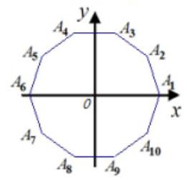
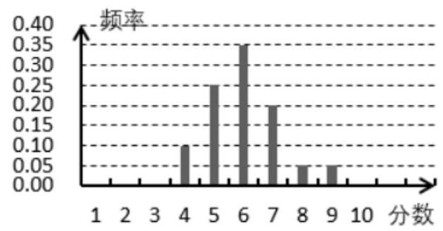

## (一) 概率

## 概率、统计

<table><tr><td>教学目标</td><td>1. 理解等概率模型及其概率计算公式, 会计算一些随机事件发生的概率.   2. 会用互斥事件的概率加法公式求互斥事件的概率, 区分对立事件与互斥事件.   3. 能够利用独立事件的概念去解决相互独立事件概率问题.   4. 掌握总体与样本的概念. 会用样本估计总体, 能对样本观测值进行整理和分析;   5. 掌握抽样技术中的随机抽样，系统抽样和分层抽样的方法，并能够很好的进行区分和利用.   6. 能够很好的把基本统计方法运用到日常生活中.</td></tr><tr><td>重点</td><td>1. 能够很好的利用独立事件的概念去解决题目.   2. 会用互斥事件的概率加法公式求互斥事件的概率, 区分对立事件与互斥事件.   3. 熟练各种抽样方法.   4. 总体均值, 总体方差, 总体标准差, 总体均值的点估计值, 总体标准差的点估计值.</td></tr><tr><td>难 点</td><td>1. 能够很好的把概率、基本统计方法运用到日常生活中.   2. 抽样方法的熟练掌握并精准利用.   3.991 计算器的熟练操作。</td></tr></table>

## 知识梳理

## 一、概率初步:

1. 随机事件的概率: 一般地,在大量重复进行同一试验时,事件 A 发生的频率 $\frac{m}{n}$ 总是接近于某个常数,在它附近摆动,这时就把这个常数叫做事件 $A$ 的概率,记作 $P\left( A\right)$ .

2. 等可能事件的概率: 如果一次试验由 $n$ 个基本事件组成,而且所有结果出现的可能性都相等,那么每一个基本事件的概率都是 $\frac{1}{n}$ ,如果某个事件 $A$ 包含的结果有 $m$ 个,那么事件 $A$ 的概率为 $P\left( A\right)  = \frac{m}{n}$ .

3. 如果事件 $A$ 、B 互斥，那么事件 $A$ +B 发生 (即 $A$ 、B 中有一个发生) 的概率，等于事件 $A$ 、B 分别发生的概率和,即 $\mathrm{P}\left( {A + \mathrm{B}}\right)  = \mathrm{P}\left( A\right)  + \mathrm{P}\left( \mathrm{B}\right)$ ,

对立事件的概率和等于 $1 : P\left( A\right)  + P\left( \bar{A}\right)  = P\left( {A + \bar{A}}\right)  = 1$ .

4. 相互独立事件:事件A(或B)是否发生对事件B(或A)发生的概率没有影响，这样的两个事件叫做相互独立事件.

两个相互独立事件同时发生的概率,等于每个事件发生的概率的积,即 $\mathrm{P}\left( {A \cdot  \mathrm{B}}\right)  = \mathrm{P}\left( A\right)  \cdot  \mathrm{P}\left( \mathrm{B}\right)$ .

## 考点一、基本事件数和古典概型的概率

## 例题精讲

【例 1】( 1 )在浙江省新高考选考科目报名中，甲、乙、丙、丁四位同学均已选择物理、化学作为选考科目， 现要从生物、政治、历史、地理、技术这五门课程中选择一门作为选考科目，则不同的选报方案有___ 种 (用数字作答); 若每位同学选报这五门学科中的任意一门是等可能的, 则这四位同学恰好同时选报了其中的两门课程的概率为___.

【难度】★★

【答案】625 $\frac{28}{125}$

【解析】从生物、政治、历史、地理、技术这五门课程中选择一门作为选考科目,则不同的选报方案有 ${5}^{4} = {625}$ 种; 若这四位同学恰好同时选报了其中的两门课程,

其中一人独自选一科,另外三人选一科,共有不同的选报方案 ${C}_{5}^{2}{C}_{4}^{1}{A}_{2}^{2} = {80}$ 种,

其中两人选一科，另外两人选另一科，共有不同的选报方案 $\frac{{C}_{5}^{2}{C}_{4}^{2}{A}_{2}^{2}}{{A}_{2}^{2}} = {60}$ 种,

则这四位同学恰好同时选报了其中的两门课程的概率为 $\frac{{80} + {60}}{625} = \frac{28}{125}$

故答案为: ${625},\frac{28}{125}$

(2)对数的发明是数学史上的重大事件，它可以改进数字的计算方法、提高计算速度和准确度. 已知 $M = \{ 1,3\} , N = \{ 1,3,5,7,9\}$ ,若从集合 $M, N$ 中各任取一个数 $x, y$ ,则 ${\log }_{3}\left( {xy}\right)$ 为整数的概率为( )

A. $\frac{1}{5}$ B. $\frac{2}{5}$ C. $\frac{3}{5}$ D. $\frac{4}{5}$

【难度】★★★

【答案】C

【解析】 $M = \{ 1,3\} , N = \{ 1,3,5,7,9\}$ ,

若从集合 $M, N$ 中各任取一个数 $x, y$ ,基本事件总数 $n = 2 \times  5 = {10}$ ,

${\log }_{3}\left( {xy}\right)$ 为整数包含的基本事件有 $\left( {1,1}\right) ,\left( {1,3}\right) ,\left( {1,9}\right) ,\left( {3,1}\right) ,\left( {3,3}\right) ,\left( {3,9}\right)$ ,共有 6 个,

$\therefore {\log }_{3}\left( {xy}\right)$ 为整数的概率为 $p = \frac{6}{10} = \frac{3}{5}$ . 故选: $\mathrm{C}$

【例 2】某校“凌云杯”篮球队的成员来自学校高一、高二共 10 个班的 12 位同学，其中高一(3)班、高二(3)各出 2 人，其余班级各出 1 人，这 12 人中要选 6 人为主力队员，则这 6 人来自不同的班级的概率为___.

【难度】 $\star   \star   \star$

【答案】 $\frac{10}{33}$

【解析】解: 某校 “凌云杯” 篮球队的成员来自学校高一、高二共 10 个班的 12 位同学,

其中高一(3)班、高二(3)各出2人，其余班级各出1人，这12人中要选 6 人为主力队员，基本事件总数 $n = {C}_{12}^{6}$ ,这 6 人来自不同的班级包含的基本事件个数 $m = {C}_{2}^{1}{C}_{2}^{1}{C}_{8}^{4},\therefore$ 这 6 人来自不同的班级的概率为 $p = \frac{m}{n} = \frac{{C}_{2}^{1}{C}_{2}^{1}{C}_{8}^{4}}{{C}_{12}^{6}} = \frac{10}{33}.$

故答案为: $\frac{10}{33}$ .

【例 3】给出四个函数: ① $y = \cos x$ ; ② $y = {x}^{2}$ ; ③ $y = {2}^{x}$ ; ④ $y = {\log }_{\frac{1}{2}}x$ ，从其中任选 2 个，则事件 $A$ : “所选 2 个函数图象有且仅有 2 个公共点” 的概率是___.

【难度】 $\star   \star   \star$

【答案】 $\frac{1}{6}$

【解析】给出四个函数: ① $y = \cos x$ ; ② $y = {x}^{2}$ ；③ $y = {2}^{x}$ ; ④ $y = {\log }_{\frac{1}{2}}x$ ，

从其中任选 2 个，基本事件总数为 ${C}_{4}^{2} = 6$ ,

由图象可知，①②中的两个函数图象有两个交点，①③中的两个函数图象有无数个交点，①④中的两个函数图象有只有一个交点, ②③中的两个函数图象有三个交点, ②④中的两个函数图象只有一个交点, ③④ 中的两个函数图象只有一个交点.事件 $A$ : “所选 2 个函数图象有且仅有 2 个公共点” 包含的基本事件是 ①②，因此，事件 $A :$ “所选 2 个函数图象有且仅有 2 个公共点” 的概率是 $\frac{1}{6}$ . 故答案为: $\frac{1}{6}$ .

【例 4】如图,在平面直角坐标系 ${xOy}$ 中, $O$ 为正十边形 ${A}_{1}{A}_{2}{A}_{3}\cdots {A}_{10}$ 的中心, ${A}_{1}$ 在 $x$ 轴正半轴上,任取不同的两点 ${A}_{i}\text{ 、 }{A}_{j}$ (其中, $1 \leq  i, j \leq  {10}$ ,且 $i \in  N, j \in  N$ ),点 $P$ 满足 $2\overrightarrow{OP} + \overrightarrow{O{A}_{i}} + \overrightarrow{O{A}_{j}} = \overrightarrow{0}$ ,则点 $P$ 落在第二象限的概率是( )

A. $\frac{7}{45}$ B. $\frac{8}{45}$

C. $\frac{1}{5}$ D. $\frac{2}{9}$

【难度】★★★

【答案】B

【解析】由题可知: 任取不同的两点的方法有 ${C}_{10}^{2} = {45}$ ; 其中满足题意的有如下 8 种:

${A}_{1}{A}_{10},{A}_{1}{A}_{9},{A}_{1}{A}_{8},{A}_{1}{A}_{7},{A}_{2}{A}_{9},{A}_{2}{A}_{8},{A}_{10}{A}_{8},{A}_{10}{A}_{9}$ . 故满足题意的概率 $P = \frac{8}{45}$ .

故选: B.

## 巩固训练

1、有 5 张卡片上分别写有数字 1，2，3，4，5 从这 5 张卡片中随机抽取 2 张，那么取出的 2 张卡片上的数字之积为偶数的概率为___.

【难度】 $\bigstar \bigstar \bigstar$

【答案】 $\frac{7}{10}$

【解析】从数字标为1,2,3,4,5的 5 卡片中随机抽取 2 张,

抽取的结果如下: $\left( {1,2}\right) ,\left( {1,3}\right) ,\left( {1,4}\right) ,\left( {1,5}\right) ,\left( {2,3}\right) ,\left( {2,4}\right) ,\left( {2,5}\right) ,\left( {3,4}\right) ,\left( {3,5}\right) ,\left( {4,5}\right)$ ,其有 10 种,

其中乘积为偶数的有 $\left( {1,2}\right) ,\left( {1,4}\right) ,\left( {2,3}\right) ,\left( {2,4}\right) ,\left( {2,5}\right) ,\left( {3,4}\right) ,\left( {4,5}\right)$ ,共有 7 种,

所以取出的 2 张卡片上的数字之积为偶数的概率为 $p = \frac{7}{10}$ . 故答案为: $\frac{7}{10}$

2、集合 $A = \{ 2,3\} , B = \{ 1,2,3\}$ ，从 $A$ ， $B$ 中各任意取一个数，则这两个数之和等于 4 的概率是___.

【难度】 $\star   \star   \star$

【答案】 $\frac{1}{3}$

【解析】集合 $A = \{ 2,3\} , B = \{ 1,2,3\}$ ,从 $A, B$ 中各任意取一个数有 $2 \times  3 = 6$ 种,其两数之和为 4 的情况有两种: $2 + 2,1 + 3,\therefore$ 这两数之和等于 4 的概率 $p = \frac{2}{6} = \frac{1}{3}$ . 故答案为 $\frac{1}{3}$ .

3、河南新高考方案即将实施，两名同学要从物理、化学、生物、政治、地理、历史六门功课中各选取三门功课作为自己的选考科目，假设每门功课被选到的概率相等，则这两名同学所选科目恰有一门相同的概率为( )

A. $\frac{3}{20}$ B. $\frac{3}{10}$ C. $\frac{9}{20}$ D. $\frac{9}{40}$

【难度】 $\star   \star   \star$

【答案】C

【解析】两名同学要从物理、化学、生物、政治、地理、历史六门功课中各选取三门功课作为自己的选考

科目，假设每门功课被选到的概率相等，基本事件总数 $n = {C}_{6}^{3} \cdot  {C}_{6}^{3} = {400}$ ,

这两名同学所选科目恰有一门相同包含的基本事件个数 $m = {C}_{6}^{3} \cdot  {C}_{3}^{1} \cdot  {C}_{3}^{2} = {180}$ ,

所以，这两名同学所选科目恰有一门相同的概率为 $p = \frac{m}{n} = \frac{180}{400} = \frac{9}{20}$ ，故选:C

4、某胸科医院感染科有3 名男医生和2 名女医生，现需要这 5 名医生中任意抽取 2 名医生成立一个临时新型冠状病毒诊治小组抽取的 2 名医生恰好都是男医生的概率___.

【难度】 $\star   \star   \star$

【答案】 $\frac{3}{10}$

【解析】记 3 名男医生分别为 $A\text{ 、 }B\text{ 、 }C,2$ 名女医生分别为 $d\text{ 、 }e$ ,

从这 5 名医生中任意抽取 2 名医生的所有可能结果为: ${AB}\text{ 、 }{AC}\text{ 、 }{Ad}\text{ 、 }{Ae}\text{ 、 }{BC}\text{ 、 }{Bd}\text{ 、 }{Be}\text{ 、 }{Cd}\text{ 、 }{Ce}$ 、 ${de}$ ,共 10 种,

其中抽取的 2 名医生恰好都是男医生的可能结果有 ${AB}\text{ 、 }{AC}\text{ 、 }{BC}$ ,共 3 种,

所以所求概率为 $\frac{3}{10}$ . 故答案为: $\frac{3}{10}$ .

5、某微信群中四人同时抢3 个红包(金额不同)，假设每人抢到的几率相同且每人最多抢一个，则其中甲、 乙都抢到红包的概率为___.

【难度】 $\star   \star   \star$

【答案】 $\frac{1}{2}$

【解析】某微信群中四人同时抢3 个红包 (金额不同),

假设每人抢到的几率相同且每人最多抢一个，则基本事件总数 $n = {A}_{4}^{3}$ ,

其中甲、乙都抢到红包包含的基本事件个数 $m = {C}_{3}^{2}{A}_{2}^{2}{A}_{2}^{1}$ ,

$\therefore$ 其中甲、乙都抢到红包的概率 $p = \frac{m}{n} = \frac{{C}_{3}^{2}{A}_{2}^{2}{A}_{2}^{1}}{{A}_{4}^{3}} = \frac{3 \times  2 \times  2}{4 \times  3 \times  2} = \frac{1}{2}$ . 故答案为: $\frac{1}{2}$ .

## 考点二、互斥事件、对立事件的概率

【例 5】从装有 2 个红球和 2 个白球的口袋内任取 2 个球，是瓦斥事件的序号为___.

(1)至少有 1 个白球; 都是白球; (2)至少有 1 个白球; 至少有 1 个红球;

(3)恰有 1 个白球; 恰有 2 个白球; (4)至少有 1 个白球; 都是红球

【难度】★★

【答案】(3)(4)

【解析】(1)至少有 1 个白球, 都是白球, 都是白球的情况两个都满足, 故不是互斥事件;

(2)至少有 1 个白球，至少有 1 个红球，一个白球一个红球都满足，故不是互斥事件；

(3)恰有 1 个白球，恰有 2 个白球，是互斥事件；

(4)至少有 1 个白球；都是红球，是互斥事件.

故答案为:(3)(4).

【例 6】根据某省的高考改革方案, 考生应在 3 门理科学科 (物理、化学、生物) 和 3 门文科学科 (历史、 政治、地理)的 6 门学科中选择 3 门学科参加考试.根据以往统计资料，1 位同学选择生物的概率为 0.5 ，选择物理但不选择生物的概率为 0.2 , 考生选择各门学科是相互独立的.

(1)求 1 位考生至少选择生物、物理两门学科中的 1 门的概率；

(2)某校高二段 400 名学生中，选择生物但不选择物理的人数为 140，求 1 位考生同时选择生物、物理两门学科的概率.

【难度】 $\star   \star   \star$

【答案】(1)0.7(2)0.15

【解析】记 $A$ 表示事件: 考生选择生物学科

$B$ 表示事件: 考生选择物理但不选择生物学科;

$C$ 表示事件: 考生至少选择生物、物理两门学科中的 1 门学科;

$D$ 表示事件:选择生物但不选择物理

$E$ 表示事件:同时选择生物、物理两门学科

(1) $P\left( A\right)  = {0.5}, P\left( B\right)  = {0.2}, C = A \cup  B, A \cap  B = \varnothing$

$P\left( C\right)  = P\left( {A \cup  B}\right)  = P\left( A\right)  + P\left( B\right)  = {0.7}$

(2)由某校高二段 400 名学生中，选择生物但不选择物理的人数为 140 ，

可知 $P\left( D\right)  = {0.35}$ 因为 $D \cup  E = A, P\left( E\right)  = P\left( A\right)  - P\left( D\right)  = {0.5} - {0.35} = {0.15}$

【例 7】甲、乙两人下棋,两人下成和棋的概率是 $\frac{1}{2}$ ,乙获胜的概率是 $\frac{1}{3}$ ,则甲获胜的概率是___

【难度】★★

【答案】 $\frac{1}{6}$

【解析】因为甲获胜与两个人和棋或乙获胜对立,所以甲获胜概 $1 - \frac{1}{2} - \frac{1}{3} = \frac{1}{6}$ ,应填 $\frac{1}{6}$ .

## 巩固训练

1、随机抽取 10 个同学中，至少有 2 个同学在同一月出生的概率是___(默认每月天数相同，结果精确到 0.001 ).

【难度】★★★

【答案】0.996

【解析】设 $E$ 表示事件 “10 个同学在不同月份出生”, $F$ 表示 “10 个同学中至少有 2 个同学在同一月份出生”,则 $F$ 是事件 $E$ 的对立事件, $F = \bar{E}$ .

$P\left( E\right)  = \frac{{P}_{12}^{10}}{{12}^{10}} \approx  {0.004}$ ,则 $P\left( F\right)  = 1 - P\left( E\right)  = {0.996}$

即 10 个同学中至少有 2 个同学在同一月份出生的概率为 0.996 .

2、设事件 $A, B$ ，已知 $P\left( A\right)  = \frac{1}{5}, P\left( B\right)  = \frac{1}{3}, P\left( {A \cup  B}\right)  = \frac{8}{15}$ ，则 $A, B$ 之间的关系一定为( )

A. 两个任意事件 B. 互斥事件 C. 非互斥事件 D. 对立事件

【难度】★★★

【答案】 $B$

【解析】解: $\because P\left( A\right)  = \frac{1}{5}, P\left( B\right)  = \frac{1}{3},\therefore P\left( A\right)  + P\left( B\right)  = \frac{1}{3} + \frac{1}{5} = \frac{8}{15}$

又 $P\left( {A \cup  B}\right)  = \frac{8}{15}\therefore P\left( {A \cup  B}\right)  = P\left( A\right)  + P\left( B\right) \therefore A$ . $B$ 为互相斥事件故选: $B$ .

3、某战士射击一次，击中环数大于 7 的概率是 0.6 ，击中环数是 6 或 7 或 8 的概率相等，且和为 0.3 ，则该战士射击一次击中环数大于 5 的概率为___.

【难度】 $\star   \star   \star$

【答案】0.8

【解析】记 “击中 6 环” 为事件 $A$ ， “击中 7 环” 为事件 $B$ ， “击中环数大于 7” 为事件 $C$ ，

事件 $A, B, C$ 彼此互斥,由 ${3P}\left( A\right)  = {0.3}$ ,则 $P\left( A\right)  = {0.1}$ ,所以 $P\left( B\right)  = {0.1},\therefore P\left( C\right)  = {0.6} - P\left( B\right)  = {0.5}$ , 记 “击中环数大于 5 ” 为事件 $D$ ,

则 $P\left( D\right)  = P\left( {A \cup  B \cup  C}\right)  = P\left( A\right)  + P\left( B\right)  + P\left( C\right)  = {0.1} + {0.1} + {0.6} = {0.8}$ .

## 考点三、相互独立事件的概率

【例 8】( 1 )甲、乙两人独立解答一道趣味题,已知他们答对的概率分别为 $\frac{2}{3},\frac{1}{2}$ ,则恰有一人答对的概率为( )

A. $\frac{1}{6}$ B. $\frac{1}{2}$ C. $\frac{5}{6}$ D. $\frac{2}{3}$

【难度】★★★

【答案】B

【解析】由题意知: 甲、乙两人答题是相互独立事件,记 “甲答对”为事件 $A,$ “乙答对”为事件 $B$ , “恰有一人答对”为事件 $C$ ,

则 $P\left( A\right)  = \frac{2}{3}, P\left( B\right)  = \frac{1}{2}$ ,

所以 $P\left( C\right)  = P\left( A\right)  \cdot  P\left( \bar{B}\right)  + P\left( \bar{A}\right)  \cdot  P\left( B\right)  = \frac{2}{3} \times  \frac{1}{2} + \frac{1}{3} \times  \frac{1}{2} = \frac{1}{2}$ ,故选: B

(2)若生产某种零件需要经过两道工序，在第一、二道工序中生产出废品的概率分别为0.01、0.02 工序生产废品相互独立，则经过两道工序后得到的零件不是废品的概率是___(结果用小数表示)

【难度】★★

【答案】0.9702

【解析】生产某种零件需要经过两道工序, 在第一、二道工序中生产出废品的概率分别 0.01 、 0.02 , 每道工序生产废品相互独立,

则经过两道工序后得到的零件不是废品的概率:

$p = \left( {1 - {0.01}}\right) \left( {1 - {0.02}}\right)  = {0.9702}$ . 故答案为 0.9702 .

【例 9】某学校选拔新生补进“篮球”、“电子竞技”、“国学”三个社团，根据资料统计，新生通过考核选拔进入这三个社团成功与否相互独立. 2019 年某新生入学，假设他通过考核选拔进入该校“篮球”、“电子竞技”、“国学”三个社团的概率依次为 $m,\frac{1}{3}, n$ ，已知这三个社团他都能进入得慨率为 $\frac{1}{24}$ ，至少进入一个社团的概率为 $\frac{3}{4}$ ，则 $m + n =$ ___.

【难度】 $\star   \star   \star$

【答案】 $\frac{3}{4}$

【解析】解: 因为通过考核选拔进入三个社团的概率依次为 $m,\frac{1}{3}, n$ ,且相互独立,所以 $0 \leq  m \leq  1,0 \leq  n \leq  1$ , 又因为三个社团他都能进入的概率为 $\frac{1}{24}$ ,所以 $\frac{1}{3}{mn} = \frac{1}{24}$ ①,

因为至少进入一个社团的概率为 $\frac{3}{4}$ ,所以一个社团都不能进入的概率为 $1 - \frac{3}{4} = \frac{1}{4}$ ,

所以 $\frac{2}{3}\left( {1 - m}\right) \left( {1 - n}\right)  = \frac{1}{4}$ ,即 $1 - m - n + {mn} = \frac{3}{8}$ ②,联立①②得: $m + n = \frac{3}{4}$ . 故答案为: $\frac{3}{4}$ .

【例 10】甲、乙、丙三名学生一起参加某高校组织的自主招生考试，考试分笔试和面试两部分，笔试和面试均合格者将成为该高校的预录取生 (可在高考中加分录取)，两次考试过程相互独立，根据甲、乙、丙三名学生的平均成绩分析,甲、乙、丙 3 名学生能通过笔试的概率分别是0.6,0.5,0.4,能通过面试的概率分别是0.6,0.6,0.75.

(1)求甲、乙、丙三名学生中恰有一人通过笔试的概率；

(2)求经过两次考试后，至少有一人被该高校预录取的概率.

【难度】★★★

【答案】(1)0.38；(2)0.6864.

【解析】(1)分别记“甲、乙、丙三名学生笔试合格”为事件 ${A}_{1},{A}_{2},{A}_{3}$ ，则 ${A}_{1},{A}_{2},{A}_{3}$ 为相互独立事件，E 表示事件“恰有一人通过笔试”，则

$P\left( E\right)  = P\left( {{A}_{1}\overline{{A}_{2}}\overline{{A}_{3}}}\right)  + P\left( {\overline{{A}_{1}}{A}_{2}\overline{{A}_{3}}}\right)  + P\left( {\overline{{A}_{1}}\overline{{A}_{2}}{A}_{3}}\right)  = {0.6} \times  {0.5} \times  {0.6} + {0.4} \times  {0.5} \times  {0.6} + {0.4} \times  {0.5} \times  {0.4} = {0.38}$ 即恰有一人通过笔试的概率是 0.38 .

(2)分别记“甲、乙、丙三名学生经过两次考试后合格”为事件 $\mathrm{A},\mathrm{B},\mathrm{C}$ ,

则 $P\left( A\right)  = {0.6} \times  {0.6} = {0.36}, P\left( B\right)  = {0.5} \times  {0.6} = {0.3}, P\left( C\right)  = {0.4} \times  {0.75} = {0.3}$ .

事件 F 表示“甲、乙、丙三人中至少有一人被该高校预录取”,

则 $\bar{F}$ 表示甲、乙、丙三人均没有被该高校预录取, $\bar{F} = \bar{A}\bar{B}\bar{C}$ ,

于是 $P\left( F\right)  = 1 - P\left( \bar{F}\right)  = 1 - P\left( \bar{A}\right) P\left( \bar{B}\right) P\left( \bar{C}\right)  = 1 - {0.64} \times  {0.7} \times  {0.7} = {0.6864}$ .

即经过两次考试后，至少有一人被该高校预录取的概率是 0.6864.

## 巩固训练

1、已知甲、乙、丙三人各自独立解决某一问题的概率分别是0.5,0.4,0.4，则甲、乙、丙至少有一人解决该问题的概率是___.

【难度】 $\star   \star   \star$

【答案】0.82

【解析】对立事件:甲、乙、丙没人解决该问题,其概率为 $\left( {1 - {0.5}}\right) \left( {1 - {0.4}}\right) \left( {1 - {0.4}}\right) \left( {1 - {0.4}}\right)  = {0.18}$

所以甲、乙、丙至少有一人解决该问题的概率是 $1 - {0.18} = {0.82}$

故答案为: 0.82

2、某学生在上学的路上要经过 2 个路口，假设在各路口是否遇到红灯是相互独立的，遇到红灯的概率都是 $\frac{1}{3}$ ，则这名学生在上学路上到第二个路口时第一次遇到红灯的概率是___.

【难度】★★★

【答案】 $\frac{2}{9}$

【解析】设 “这名学生在上学路上到第二个路口首次遇到红灯”为事件 $A$ ,则所求概率为 $p\left( A\right)  = \frac{2}{3} \times  \frac{1}{3} = \frac{2}{9}$ ,故答案为 $\frac{2}{9}$ .

3、某企业有甲、乙两个研发小组，他们研发新产品成功的概率分别为 $\frac{2}{3}$ 和 $\frac{3}{5}$ . 现安排甲组研发新产品 $A$ ,乙组研发新产品B，设甲、乙两组的研发相互独立，则至少有一种新产品研发成功的概率为___.

【难度】 $\star   \star   \star$

【答案】 $\frac{13}{15}$

【解析】解: 设至少有一种新产品研发成功的事件为事件 $m$ ,事件 $n$ 为事件 $m$ 的对立事件,则事件 $n$ 为一种新产品都没有成功,

因为甲乙研发新产品成功的概率分别为 $\frac{2}{3}$ 和 $\frac{3}{5}$ . 则 $p\left( n\right)  = \left( {1 - \frac{2}{3}}\right) \left( {1 - \frac{3}{5}}\right)  = \frac{2}{15}$ ,

再根据对立事件的概率之间的公式可得 $P\left( m\right)  = 1 - P\left( n\right)  = 1 - \frac{2}{15} = \frac{13}{15}$ ,故至少有一种新产品研发成功的概率 $\frac{13}{15}$ . 故答案为: $\frac{13}{15}$ .

4、高三某位同学参加物理、化学、政治科目的等级考，已知这位同学在物理、化学、政治科目考试中达 ${A}^{ + }$ 的概率分别为 $\frac{7}{8}\text{ 、 }\frac{3}{4}\text{ 、 }\frac{5}{12}$ ,这三门科目考试成绩的结果互不影响,则这位考生至少得 2 个 ${A}^{ + }$ 的概率是___.

【难度】★★★

【答案】 $\frac{151}{192}$

【解析】解: 设这位同学在物理、化学、政治科目考试中达 ${A}^{ + }$ 的事件分别为 $A, B, C$ ,

$\because$ 这位同学在物理、化学、政治科目考试中达 ${A}^{ + }$ 的概率分别为 $\frac{7}{8}\text{ 、 }\frac{3}{4}\text{ 、 }\frac{5}{12}$ ,

$\therefore P\left( A\right)  = \frac{7}{8}, P\left( B\right)  = \frac{3}{4}, P\left( C\right)  = \frac{5}{12}$ ,这三门科目考试成绩的结果互不影响,

则这位考生至少得 2 个 ${A}^{ + }$ 的概率: $P = P\left( {{AB}\bar{C}}\right)  + P\left( {A\bar{B}C}\right)  + P\left( {\bar{A}{BC}}\right)  + P\left( {ABC}\right)$

$= \frac{7}{8} \times  \frac{3}{4} \times  \frac{7}{12} + \frac{7}{8} \times  \frac{1}{4} \times  \frac{5}{12} + \frac{1}{8} \times  \frac{3}{4} \times  \frac{5}{12} + \frac{7}{8} \times  \frac{3}{4} \times  \frac{5}{12} = \frac{151}{192}$ . 故答案为: $\frac{151}{192}$ .

## (二)统计

## 知识梳理

1. 常用的抽样方法有: 简单随机抽样、系统抽样、分层抽样三种.

<table><tr><td>类 别</td><td>共同点</td><td>不同点</td><td>联 系</td><td>适用范围</td></tr><tr><td>简单随机抽样</td><td rowspan="3">抽样过程中每个个体被抽取的概率相等</td><td>从总体中逐个抽取</td><td>是后两种方法的基础</td><td>总体个数较少</td></tr><tr><td>系统抽样</td><td>将总体均分成几部分, 按事先确定的规则在各部分抽取</td><td>在超始部分抽样时用简单随机抽样</td><td>总体个数较多</td></tr><tr><td>分层抽样</td><td>将总体分成几层，分层进行抽取</td><td>各层抽样时采用简单随机抽样或系统抽样</td><td>总体由差异明显的几部分组成</td></tr></table>

2、总体和个体:在数理统计中，通常把被研究的对象的全体叫做总体. 总体中的每一个成员称为个体.

3、总体平均数:总体中所有个体的平均数叫做总体平均数. 如果总体有 $N$ 个个体，它们的值分别为 ${x}_{1}\text{ 、 }{x}_{2}\text{ 、 }\ldots \text{ 、 }{x}_{N}$ ,那么总体平均数 $\mu  = \frac{1}{N}\left( {{x}_{1} + {x}_{2} + \ldots  + {x}_{N}}\right)$ .

4、总体中位数: 设总体有 $N$ 个个体,将它们的值按由小到大的顺序排列,当 $N$ 为奇数时,位于该序列第 $\frac{N + 1}{2}$ 个的数,叫做总体中位数; 当 $N$ 为偶数时,位于该序列的第 $\frac{N}{2}$ 和 $\frac{N + 2}{2}$ 个的两个数的平均数叫做总体中位数.

5、众数:在所有观察值中出现最多(即频率最大)的数值.

6、总体方差: 设总体有 $N$ 个个体,值分别为 ${x}_{1}\text{ 、 }{x}_{2}\text{ 、 }\ldots \text{ 、 }{x}_{N}$ ,总体平均数 $\mu$ ,各个体与 $\mu$ 的差的平方为 ${\left( {x}_{1} - \mu \right) }^{2}\text{ 、 }{\left( {x}_{2} - \mu \right) }^{2}\text{ 、 }\ldots \text{ 、 }{\left( {x}_{N} - \mu \right) }^{2}$ ,称它们的平均数为总体方差,记为 ${\sigma }^{2}$ ,即 ${\sigma }^{2} = \frac{1}{N}\mathop{\sum }\limits_{{i = 1}}^{N}{\left( {x}_{i} - \mu \right) }^{2} = \frac{1}{N}\mathop{\sum }\limits_{{i = 1}}^{N}{x}_{i}^{2} - {\mu }^{2}.$

7、总体标准差: 总体方差的算术平方根 $\sigma$ 称为总体标准差.

注:(1)总体中位数表示总体的一般水平，是个体的中间值；总体平均数表示总体中各个体的平均大小, 对于同一个总体, 两者一般不相等.

(2)总体方差反映各个体关于平均数 $\mu$ 的离散程度，方差越大，总体中各个体之间的差别越大； 方差越小, 总体中各个体之间的差别越小.

8、样本和样本容量:从总体中按一定方式抽取的一部分个体叫做总体的一个样本，抽取的样本中所包含的个体的个数叫做样本容量.

9、样本平均数:一个容量为 $n$ 的样本中，所有个体的平均数叫做样本平均数. 样本平均数常用来估计总体平均数. 设样本中有 $n$ 个个体,每个个体所取的值分别为 ${x}_{1}\text{ 、 }{x}_{2}\text{ 、 }\ldots \text{ 、 }{x}_{n}$ ,则样本平均数 $\bar{x} = \frac{1}{n}\left( {{x}_{1} + {x}_{2} + \ldots  + {x}_{n}}\right)$ ,作为总体均值的点估计值

10、样本方差: 设一个容量为 $n$ 的样本 ${x}_{1}\text{ 、 }{x}_{2}\text{ 、 }\ldots \text{ 、 }{x}_{n}$ 中,样本平均数为 $\bar{x}$ ,那么可以用 ${S}^{2} = \frac{1}{n - 1}\mathop{\sum }\limits_{{i = 1}}^{n}{\left( x - \bar{x}\right) }^{2}$ 作为总体方差的估计值,称 ${S}^{2}$ 为样本方差.

11、样本标准差: 一个样本的样本方差的 ${S}^{2}$ 的算术平方根,称为这个样本的标准差,记为 $S$ , $S = \sqrt{\frac{1}{n - 1}\mathop{\sum }\limits_{{i = 1}}^{n}{\left( x - \bar{x}\right) }^{2}}$ ,作为总体标准差的点估计值.

12、频率分布:用样本估计总体，是研究统计问题的基本思想方法，样本中所有数据(或数据组)的频数和样本容量的比, 就是该数据的频率. 所有数据 (或数据组) 的频率的分布变化规律叫做样本的频率分布.

## 例题精讲

【例 11】已知一组数据为 20、30、40、50、60、60、70，则这组数据的众数、中位数、平均数的大小关系为( )

A. 中位数> 平均数> 众数 B. 众数> 中位数> 平均数

C. 众数> 平均数> 中位数 D. 平均数> 众数 $>$ 中位数

【难度】★★

【答案】B

【解析】众数为 60,中位数为为 50,平均数为 $\frac{{20} + {30} + {40} + {50} + {60} + {60} + {70}}{7} = \frac{330}{7}$ ,所以众数 $>$ 中位数 >平均数

【例 12】(1)若样本 ${x}_{1} + 1,{x}_{2} + 1,\cdots ,{x}_{n} + 1$ 的平均数为 10，则样本 $2{x}_{1} + 2,2{x}_{2} + 2,\cdots ,2{x}_{n} + 2$ 的平均数为___.

【难度】 $\star   \star$

【答案】 20

【解析】由已知得 $\frac{{x}_{1} + 1 + {x}_{2} + 1 + \cdots  + {x}_{n} + 1}{n} = {10}$ ,

所以 $\left( {2{x}_{1} + 2 + 2{x}_{2} + 2 + \ldots  + 2{x}_{n} + 2}\right)  \div  n = \frac{2\left( {{x}_{1} + 1 + {x}_{2} + 1 + \cdots  + {x}_{n} + 1}\right) }{n} = {20}$ . 故答案为:20

(2)已知样本 $7,8,9, x$ ， $y$ 的平均数为 8，且 ${xy} = {60}$ ，则此样本的方差为___.

【难度】 $\star   \star$

【答案】 2 ;

【解析】依题可得: $\frac{7 + 8 + 9 + x + y}{5} = 8$ ,则 $x + y = {16}$ ,不妨设 $x < y$ ,解得 $x = 6, y = {10}$ , 所以方差为 $\frac{{\left( 7 - 8\right) }^{2} + {\left( 8 - 8\right) }^{2} + {\left( 9 - 8\right) }^{2} + {\left( 6 - 8\right) }^{2} + {\left( {10} - 8\right) }^{2}}{5} = \frac{10}{5} = 2$ . 故答案为: 2 .

(3)若样本数据 ${x}_{1},{x}_{2},\cdots ,{x}_{10}$ 的标准差为 8，则数据 $2{x}_{1} - 1,2{x}_{2} - 1,\cdots ,2{x}_{10} - 1$ 的标准差为( )

A. 8 B. 15 C. 16 D. 32

【难度】 $\star   \star$

【答案】C

【解析】试题分析: 样本数据 ${x}_{1},{x}_{2},\cdots ,{x}_{10}$ 的标准差为 8,所以方差为 64,由 $D\left( {{2X} - 1}\right)  = {4D}\left( x\right)$ 可得数据 $2{x}_{1} - 1,2{x}_{2} - 1,\cdots ,2{x}_{10} - 1$ 的方差为 $4 \times  {64}$ ,所以标准差为 $\sqrt{4 \times  {64}} = {16}$

【例 13】某区有 200 名学生参加数学竞赛, 随机抽取 10 名学生成绩如下:

<table><tr><td>成绩</td><td>40</td><td>50</td><td>60</td><td>70</td><td>80</td><td>90</td></tr><tr><td>人数</td><td>1</td><td>1</td><td>2</td><td>2</td><td>1</td><td>3</td></tr></table>

则总体标准差的点估计值是___(精确到 0.01).

【难度】 $\star   \star$

【答案】17.64

【解析】总体均值的点估计值为 $\bar{x} = \frac{1}{10} \times  \left( {{40} + {50} + {60} \times  2 + {70} \times  2 + {80} + {90} \times  3}\right)  = {70}$ , 则总体标准差的点估计值为

$s = \sqrt{\frac{1}{{10} - 1}\left\lbrack  {{\left( {40} - {70}\right) }^{2} + {\left( {50} - {70}\right) }^{2} + 2 \times  {\left( {60} - {70}\right) }^{2} + 2 \times  {\left( {70} - {70}\right) }^{2} + {\left( {80} - {70}\right) }^{2} + 3 \times  {\left( {90} - {70}\right) }^{2}}\right\rbrack  } \; \approx  {17.64}$ .

【例 14】某城区有农民、工人、知识分子家庭共计 2000 家, 其中农民家庭 1800 户, 工人家庭 100 户. 现要从中抽取容量为 40 的样本，调查家庭收入情况，则在整个抽样过程中，用到的抽样方法有( )

①简单随机抽样 ②系统抽样 ③分层抽样

A. ②③ B. ①③ C. ③ D. ①②③

【难度】★★

【答案】D

【解析】由于各类家庭有明显差异, 所以首先应用分层抽样的方法分别从三类家庭中抽出若干户.

又由于农民家庭户数较多，那么在农民家庭这一层宜采用系统抽样；

而工人、知识分子家庭户数较少，宜采用简单随机抽样. 故整个抽样过程要用到①②③三种抽样方法. 故选: D.

【例 15】某工厂生产了 60 个零件, 现将所有零件随机编号, 用系统抽样方法, 抽取一个容量为 5 的样本. 已知 4 号、16 号、26 号、52 号零件中有 1 个零件没有抽到，则这个零件的编号是___。

【难度】★★

【答案】 26

【解析】因为样本容量为 5 , 所以样本分段间隔为 ${60} \div  5 = {12}$ ,

如果第一组抽取 4 号, 则所得的样本为 4 号、16 号、28 号、40 号、52 号,

所以 26 号不在样本中。

【例 16】某校为了解学生学习的情况，采用分层抽样的方法从高一 2400 人、高二 2000 人、高三 $n$ 人中, 抽取 90 人进行问卷调查. 已知高一被抽取的人数为 36 ，那么高三被抽取的人数为___。

【难度】★★

【答案】 24

【解析】由分层抽样的知识可得 $\frac{2400}{{2400} + {2000} + n} \times  {90} = {36}$ ,即 $n = {1600}$ ,所以高三被抽取的人数为 $\frac{1600}{{2400} + {2000} + {1600}} \times  {90} = {24}$ ,应填答案 24。

## 巩固训练

1、一组数据12，13， $x$ ，17，18，19 的众数是 13，则这组数据的中位数是( )

A. 13 B. 14 C. 15 D. 17

【难度】 $\star   \star$

【答案】C

【解析】因为数据 ${12},{13}, x,{17},{18},{19}$ 的众数是 13,所以 $x = {13}$ ,则这组数据的中位数是 $\frac{{13} + {17}}{2} = {15}$ , 故选: C。

2、设样本数据 ${x}_{1},{x}_{2},\cdots ,{x}_{10}$ 的均值和方差分别为 1 和 4，若 ${y}_{i} = {x}_{i} + a\left( {a\text{ 为非零常数， }i = 1,2,\cdots ,{10}}\right)$ ，则 ${y}_{1},{y}_{2},\cdots ,{y}_{10}$ 的均值和方差分别为___.

【难度】 $\star   \star$

【答案】 $1 + a,4$

【解析】因为样本数据 ${x}_{1},{x}_{2},\cdots ,{x}_{10}$ 的平均数是 1,所以 ${y}_{1},{y}_{2},\ldots {y}_{10}$ 的平均数是

$\frac{{y}_{1} + {y}_{2} + \ldots  + {y}_{10}}{10} = \frac{{x}_{1} + a + {x}_{2} + a + \ldots  + {x}_{10} + a}{10} = \frac{{x}_{1} + {x}_{2} + \ldots  + {x}_{10}}{10} + a = 1 + a$ ; 根据 ${y}_{i} = {x}_{i} + a$ ( $a$ 为非零常数, $i = 1,2,\cdots ,{10}$ ),以及数据 ${x}_{1},{x}_{2},\cdots ,{x}_{10}$ 的方差为 4 可知数据 ${y}_{1},{y}_{2},\cdots ,{y}_{10}$ 的方差为 ${1}^{2} \times  4 = 4$ 。

3、在发生公共卫生事件期间，有专业机构认为该事件在一段时间内没有发生大规模群体感染的标志为“连续 10 天，每天新增疑似病例不超过 7 人”. 过去 10 日， $A$ 、 $B$ 、 $C$ 、 $D$ 四地新增疑似病例数据信息如下:

$A$ 地: 中位数为 2,最大值与最小值的差为 5;

$C$ 地: 总体平均数为 1,总体方差大于 0; $\;D$ 地: 总体平均数为 2,总体方差为 3 .

则以上四地中，一定符合没有发生大规模群体感染标志的是___(填 $A\text{ 、 }B\text{ 、 }C\text{ 、 }D$

【难度】★★

【答案】 ${AD}$

【解析】对于 $A$ 地,因为中位数为 2,最大值与最小值的差为 5,所以最大值为 $2 + 5 = 7$ ,满足每天新增疑似病例不超过 7 人，故 $A$ 地符合；

对于 $B$ 地，若过去 10 日分别为0,0,0,2,2,2,2,2,2,8，满足总体平均数为 2，众数为 2，但不满足每天新增疑似病例不超过 7 人，故 $B$ 地不符合；

对于 $C$ 地,若过去 10 日分别为0,0,0,0,0,0,0,0,1,9,满足总体平均数为 1,总体方差大于 0,但不满足每天新增疑似病例不超过 7 人，故 $C$ 地不符合；

对于 $D$ 地,假设至少有一天疑似病例超过 7 人，设为 8 人，则方差为

$\frac{1}{10}\mathop{\sum }\limits_{{i = 1}}^{{10}}{\left( {x}_{i} - 2\right) }^{2} = \frac{1}{10}\left\lbrack  {{\left( 8 - 2\right) }^{2} + \cdots }\right\rbrack   > \frac{1}{10} \times  {\left( 8 - 2\right) }^{2} = {3.6} > 3$ ,与题中条件总体方差为 3 矛盾,故假设不成立. 故满足每天新增疑似病例不超过 7 人，故 $D$ 地符合.

故答案为: ${AD}$ 。

4、从总体中抽取 6 个样本:4，5，6，10，7，4，则总体方差的点估计值为___.

【难度】★★

【答案】 $\frac{26}{5}$

【解析】6 个样本的平均数 $\bar{x} = \frac{4 + 5 + 6 + {10} + 7 + 4}{6} = 6$ ,所以方差

${s}^{2} = \frac{1}{5}\left\lbrack  {{\left( 4 - 6\right) }^{2} + {\left( 5 - 6\right) }^{2} + {\left( 6 - 6\right) }^{2} + {\left( {10} - 6\right) }^{2} + {\left( 7 - 6\right) }^{2} + {\left( 4 - 6\right) }^{2}}\right\rbrack   = \frac{26}{5}$ . 故答案为: $\frac{26}{5}$

5、现要完成下列 3 项抽样调查:①从 20 罐奶粉中抽取 4 罐进行食品安全卫生检查；②从 2000 名学生中抽取 100 名进行课后阅读情况调查；③从某社区 100 户高收人家庭， 270 户中等收人家庭， 80 户低收人家庭中选出 45 户进行消费水平调查. 较为合理的抽样方法是( )

A. ①系统抽样，②简单随机抽样，③分层抽样 B. ①简单随机抽样，②分层抽样，③系统抽样

C. ①分层抽样，②系统抽样，③简单随机抽样 D. ①简单随机抽样，②系统抽样，③分层抽样 【难度】 $\star   \star$

【答案】D

【解析】在①中,由于总体个数较少,故采用简单随机抽样即可;

在②中，由于总体个数较多，故采用系统抽样较好；

在③中，由于高收入家庭、中等收入家庭和低收人家庭的消费水平差异明显，

故采用分层抽样较好. 故选: D.

6、某班有学生 50 人，现将所有学生按 1,2,3,...,50 随机编号，若采用系统抽样的方法抽取一个容量为 5 的样本 (等距抽样),已知编号为 $4, a,{24}, b,{44}$ 号学生在样本中,则 $a + b =$ (   )

A. 14 B. 34 C. 48 D. 50

【难度】 $\star   \star$

【答案】C

【解析】: 样本容量为 $5,\therefore$ 样本间隔为 ${50} \div  5 = {10}$ ,

$\because$ 编号为 $4, a,{24}, b,{44}$ 号学生在样本中, $\therefore a = {14}, b = {34},\therefore a + b = {48}$ . 故选: C

7、非典和新冠肺炎两场疫情告诉我们:应坚决杜绝食用野生动物，提倡文明健康，绿色环保的生活方式. 在我国抗击新冠肺炎期间，某校开展一次有关病毒的网络科普讲座.高三年级男生 60 人，女生 40 人参加. 按分层抽样的方法, 在 100 名同学中选出 5 人，则男生中选出___人. 再从此 5 人中选出两名同学作为联络人，则这两名联络人中男女都有的概率是___. (第 1 空 2 分，第 2 空 3 分)

【难度】★★

【答案】3 $\frac{3}{5}$

【解析】按分层抽样的方法,在 100 名同学中选出 5 人，则男生中选 ${60} \times  \frac{5}{100} = 3$ 人，女生中选 2 人； 从此 5 人中选出两名同学作为联络人，设这两名联络人中男女都有为事件 $\mathbf{A}$ ，

则 $P\left( A\right)  = \frac{{C}_{3}^{1}{C}_{2}^{1}}{{C}_{5}^{2}} = \frac{6}{10} = \frac{3}{5}$ . 故答案为: $3;\frac{3}{5}$

## 实战演练

一、填空题

1、某高中有三个年级，其中高一学生 900 人，高二学生 860 人，现采用分层抽样的方法调查学生的视力情况，在抽取的样本中有高二学生 43 人、高三学生 39 人，则该高中的学生总人数应为___.

【难度】 $\star   \star   \star$

【答案】 2540

【解析】设高三有 $n$ 人，高二学生 860 人，在抽取的样本中有高二学生 43 人、高三学生 39 人，根据分层抽样的特点可得: $\frac{860}{43} = \frac{n}{39}$ ,得 $n = {780}$ ,所以该高中的学生总人数应为 ${900} + {860} + {780} = {2540}$

2、将两颗质地均匀的骰子抛掷一次，记第一颗骰子出现的点数是 $m$ ，记第二颗骰子出现的点数是 $n$ ，向量 $\bar{a} = \left( {m - 2,2 - n}\right)$ ,向量 $\bar{b} = \left( {1,1}\right)$ ,则向量 $\bar{a} \bot  \bar{b}$ 的概率是___.

【难度】 $\star   \star   \star$

【答案】 $\frac{1}{6}$

【解析】由题意知, $m, n \in  \{ 1,2,3,4,5,6\}$ ,则 $\left( {m, n}\right)$ 共有 36 种,由 $\bar{a} \bot  \bar{b}$ ,得 $\left( {m - 2}\right)  + \left( {2 - n}\right)  = 0$ ,即 $m = n$ , 共有 6 种,根据古典概型的计算公式可得,所求概率为 $p = \frac{1}{6}$ .

3、某商场举行购物抽奖促销活动，规定每位顾客从装有 0、1、2、3 的四个相同小球的抽奖箱中，每次取出一球记下编号后放回(连续取两次)，若取出的两个小球的编号相加之和等于 6，则中一等奖，等于 5 中二等奖，等于 4 或 3 中三等奖，则顾客抽奖中三等奖的概率为___.

【难度】 $\star   \star   \star$

【答案】 $\frac{7}{16}$

【解析】解: 规定每位顾客从装有 $0\text{ 、 }1\text{ 、 }2\text{ 、 }3$ 的四个相同小球的抽奖箱中,

每次取出一球记下编号后放回 (连续取两次),

若取出的两个小球的编号相加之和等于 6 ，则中一等奖，

等于 5 中二等奖, 等于 4 或 3 中三等奖,

基本事件总数 $n = 4 \times  4 = {16}$ ,

顾客抽奖中三等奖包含的基本事件有:

$\left( {0,3}\right) ,\left( {3,0}\right) ,\left( {1,2}\right) ,\left( {2,1}\right) ,\left( {1,3}\right) ,\left( {3,1}\right) ,\left( {2,2}\right)$ ,共 7 种,

$\therefore$ 顾客抽奖中三等奖的概率为 $p = \frac{7}{16}$ . 故答案为 $\frac{7}{16}$ .

4、甲、乙两人玩猜数字游戏，先由甲心中任想一个数字，记为 $a$ ，再由乙猜甲刚才想的数字，把乙猜的数字记为 $b$ ,且 $a, b \in  \{ 0,1,2,\cdots ,9\}$ . 若 $\left| {a - b}\right|  \leq  1$ ,则称甲乙“心有灵犀”. 现任意找两人玩这个游戏,则这两人“心有灵犀”的概率为___.

【难度】 $\star   \star   \star$

【答案】 $\frac{7}{25}$

【解析】从 $0 \sim  9$ 中任意取两个数 (可重复) 共有 100 种取法,则 $\left| {a - b}\right|  \leq  1$ 的情况有: $\left( {0,0}\right) ,\left( {1,1}\right) ,\left( {2,2}\right)$ , $\left( {3,3}\right) ,\left( {4,4}\right) ,\left( {5,5}\right) ,\left( {6,6}\right) ,\left( {7,7}\right) ,\left( {8,8}\right) ,\left( {9,9}\right) ,\left( {0,1}\right) ,\left( {1,0}\right) ,\left( {1,2}\right) ,\left( {2,1}\right) ,\left( {2,3}\right) ,\left( {3,2}\right)$ , $\left( {3,4}\right) ,\left( {4,3}\right) ,\left( {4,5}\right) ,\left( {5,4}\right) ,\left( {5,6}\right) ,\left( {6,5}\right) ,\left( {6,7}\right) ,\left( {7,6}\right) ,\left( {7,8}\right) ,\left( {8,7}\right) ,\left( {8,9}\right) ,\left( {9,8}\right)$ 共有 28 种,所以 $P = \frac{28}{100} = \frac{7}{25}$ .

5、高三某位同学参加物理、化学、政治科目的等级考,已知这位同学在物理、化学、政治科目考试中达 $A$ 的概率分别为 $\frac{5}{6}\text{ 、 }\frac{7}{8}\text{ 、 }\frac{3}{4}$ ,这三门科目考试成绩的结果互不影响,则这位考生至少得 1 个 $A$ 的概率为 ___.

【难度】 $\star   \star   \star$

【答案】 $\frac{191}{192}$

【解析】这位考生三门科目考试成绩都不是 $\mathrm{A}$ 的概率为 $\left( {1 - \frac{5}{6}}\right) \left( {1 - \frac{7}{8}}\right) \left( {1 - \frac{3}{4}}\right)  = \frac{1}{192}$ ,

所以这位考生至少得 1 个 $A$ 的概率为 $1 - \frac{1}{192} = \frac{191}{192}$

故答案为: $\frac{191}{192}$

6、设 $a, b$ 是从集合 $\{ 1,2,3,4\}$ 中随机选取的数,则直线 ${ax} + {by} + 4 = 0$ 与圆 ${x}^{2} + {y}^{2} = 2$ 没有公共点的概率为___.

【难度】 $\star   \star   \star$

【答案】 $\frac{1}{4}$

【解析】当圆心到直线距离 $d = \frac{\left| 4\right| }{\sqrt{{a}^{2} + {b}^{2}}} > \sqrt{2}$ 时,没有公共点,即 $\sqrt{{a}^{2} + {b}^{2}} < 2\sqrt{2} \Rightarrow  {a}^{2} + {b}^{2} < 8$ ; 又 $\left( {a, b}\right)$ 共有如下结果:

$\left( {1,1}\right) ,\left( {1,2}\right) ,\left( {1,3}\right) ,\left( {1,4}\right) ,\left( {2,1}\right) ,\left( {2,2}\right) ,\left( {2,3}\right) ,\left( {2,4}\right) ,\left( {3,1}\right) ,\left( {3,2}\right) ,\left( {3,3}\right) ,\left( {3,4}\right) ,\left( {4,1}\right) ,\left( {4,2}\right) ,\left( {4,3}\right) ,\left( {4,4}\right)$ ,共 16 种, 使得 ${a}^{2} + {b}^{2} < 8$ 成立的有 $\left( {1,1}\right) ,\left( {1,2}\right) ,\left( {2,1}\right) ,\left( {2,2}\right)$ ,共 5 种,所以没有公共点的概率是 $P = \frac{4}{16} = \frac{1}{4}$ . 故答案为: $\frac{1}{4}$

二、选择题

7、下列说法错误的是( )

A. 方差可以衡量一组数据的波动大小

B. 抽样调查抽取的样本是否具有代表性, 直接关系对总体估计的准确程度

C. 一组数据的众数有且只有一个

D. 抛掷一枚图钉针尖朝上的概率, 不能用列举法求得

【难度】 $\star   \star   \star$

【答案】C

【解析】对于 $A$ ,方差可以衡量一组数据的波动大小,故选项 $A$ 正确;

对于 $B$ ,抽样调查抽取的样本是否具有代表性,直接关系对总体估计的准确程度,故选项 $B$ 正确;

对于 $C$ ,一组数据的众数有一个或者几个,故选项 $C$ 错误;

对于 $D$ ,抛掷一枚图钉,针尖朝上和针尖朝下的可能性不相等,所以针尖朝上不是一个基本事件,所以不能用列举法求得,故选项 $D$ 正确；故选:C.

8、用系统抽样方法从编号为 1，2，3，...，700 的学生中抽样 50 人，若第 2 段中编号为 20 的学生被抽中， 按照等间隔抽取的方法, 则第 5 段中被抽中的学生编号为 ( )

A. 48 B. 62 C. 76 D. 90

【难度】★★★

【答案】B

【解析】根据系统抽样等距性,所以各段中被抽中的学生编号依次构成公差为 $\frac{700}{50} = {14}$ 的等差数列,

因此第 5 段中被抽中的学生编号为 ${20} + \left( {5 - 2}\right)  \times  {14} = {62}$ ,

故选: B

9、把一颗骰子投掷两次，第一次出现的点数记为 $m$ ，第二次出现的点数记为 $n$ ，方程组 $\left\{  \begin{array}{l} {mx} + {ny} = 3 \\  {2x} + {3y} = 2 \end{array}\right.$ 只有一组解的概率是( )

A. $\frac{2}{3}$ B. $\frac{3}{4}$ C. $\frac{1}{5}$ D. $\frac{17}{18}$

【难度】 $\star   \star   \star$

【答案】D

【解析】解: 骰子投掷 2 次所有的结果有 $6 \times  6 = {36}$ 种,

方程组只有一组解,除了 $\left\{  {\begin{array}{l} m = 2 \\  n = 3 \end{array}\text{ 、 }\left\{  \begin{array}{l} m = 4 \\  n = 6 \end{array}\right. }\right.$ 这两种情况之外都可以,

故所求概率 $P = \frac{{36} - 2}{36} = \frac{17}{18}$ ,故选: D.

10、甲、乙两人玩猜数字游戏，先由甲心中想一个数字，记为 $a$ ，再由乙猜甲刚才所想的数字，把乙猜的数字记为 $b$ ,其中, $a, b \in  \{ 1,2,\cdots ,6\}$ . 若 $\left| {a - b}\right|  \leq  1$ ,则称甲乙 “心相近”。现任意找两人玩这个游戏,则它们心相近的概率为( )。

A. $\frac{4}{9}$ B. $\frac{2}{9}$ C. $\frac{7}{18}$ D. $\frac{5}{18}$

【难度】★★★

【答案】A

【解析】由古典概型,知共有 $6 \times  6 = {36}$ 种基本事件,符合 $\left| {a - b}\right|  \leq  1$ 的有

$\left( {1,1}\right) ,\left( {1,2}\right) ,\left( {2,1}\right) ,\left( {2,2}\right) ,\left( {2,3}\right) ,\left( {3,2}\right) ,\left( {3,3}\right) ,\left( {3,4}\right) ,\left( {4,3}\right) ,\left( {4,4}\right) ,\left( {4,5}\right) ,\left( {5,4}\right) ,\left( {5,5}\right)$ , $\left( {5,6}\right) ,\left( {6,5}\right) ,\left( {6,6}\right)$ ,

共有 16 种。于是,所求概率为 $\frac{16}{36} = \frac{4}{9}$ .

## 三、解答题

11、甲、乙两名运动员各投篮一次，甲投中的概率为 0.8 ，乙投中的概率为 0.9 ，求下列事件的概率:

(1)两人都投中；

(2)恰好有一人投中；

(3)至少有一人投中.

【难度】 $\star   \star   \star$

【答案】(1) ${0.72};\left( 2\right) {0.26};\left( 3\right) {0.98}$ .

【解析】

设 $A =$ “甲投中”, $B =$ “乙投中”,则 $\bar{A} =$ “甲没投中”, $\bar{B} =$ “乙没投中”,

由于两个人投篮的结果互不影响，

所以 $A$ 与 $B$ 相互独立, $A$ 与 $\bar{B}, A$ 与 $B,\bar{A}$ 与 $B$ 都相互独立,

由已知可得 $P\left( A\right)  = {0.8}, P\left( B\right)  = {0.9}$ ,则 $P\left( \bar{A}\right)  = {0.2}, P\left( \bar{B}\right)  = {0.1}$ ;

(1) ${AB} =$ “两人都投中”，则 $P\left( {AB}\right)  = P\left( A\right) P\left( B\right)  = {{0.8} \times  {0.9}} = {0.72}$ ；

(II) ${A\bar{B}} \cup  {\bar{A}B} =$ “恰好有一人投中”，且 $A\bar{B}$ 与 ${\bar{A}B}$ 互斥，

则 $P\left( {A\bar{B} \cup  \bar{A}B}\right)  = P\left( {A\bar{B}}\right)  + P\left( {\bar{A}B}\right)  = P\left( A\right) P\left( \bar{B}\right)  + P\left( \bar{A}\right) P\left( B\right)$

$= {0.8} \times  {0.1} + {0.2} \times  {0.9} = {0.26}$ ;

(III) ${AB} \cup  {A\overline{B}} \cup  {\overline{A}B} =$ “至少有一人投中”，且 ${AB}$ 、 ${A\overline{B}}$ 、 $\overline{A}B$ 两两互斥，

所以 $P\left( {{AB} \cup  A\bar{B} \cup  \bar{A}B}\right)  = P\left( {AB}\right)  + P\left( {A\bar{B}}\right)  + P\left( {\bar{A}B}\right)$

$= P\left( {AB}\right)  + P\left( {A\bar{B} \cup  \bar{A}B}\right)  = {0.72} + {0.26} = {0.98}.$

12、2020 年初，新冠肺炎疫情暴发，全国中小学生响应教育部关于“停课不停学”居家学习的号召.因此， 网上教学授课在全国范内展开，为了解线上教学效果，根据学情要对线上教学方法进行调整，从而使大幅度地提高教学效率. 近期某市组织高一年级全体学生参加了某项技能操作比赛，等级分为 1 至 10 分，随机调阅了 $A\text{ 、 }B$ 校 60 名学生的成绩,得到样本数据如下:

A校样本数据条形图

<table><tr><td>成绩 (分)</td><td>1</td><td>2</td><td>3</td><td>4</td><td>5</td><td>6</td><td>7</td><td>8</td><td>9</td><td>10</td></tr><tr><td>人数(个)</td><td>0</td><td>0</td><td>0</td><td>9</td><td>12</td><td>21</td><td>9</td><td>6</td><td>3</td><td>0</td></tr></table>

$B$ 校样本数据统计图

(1)计算两校样本数据的均值和方差，并根据所得数据进行比较;

(2)从 $A$ 校样本数据成绩分别为7分、8分和9分的学生中按分层抽样的方法抽取 6 人，从抽取的 6 人中任选 2 人参加更高一级的比赛，求这 2 人成绩之和不小于 15 的概率.

【难度】★★★

【答案】(1)答案见解析；(2) $\frac{3}{5}$ .

【解析】(1)从 $A$ 校样本数据的条形图可知:成绩分别为4分、5分、6分、7分、8分、9分的学生分别有:6人、15人、21人、12人、3人、3人、

$A$ 校样本的平均成绩为 $\overline{{x}_{A}} = \frac{4 \times  6 + 5 \times  {15} + 6 \times  {21} + 7 \times  {12} + 8 \times  3 + 9 \times  3}{60} = 6$ (分)，

A 校样本的方差为 ${s}_{A}^{2} = \frac{6 \times  4 + {15} \times  1 + {12} \times  1 + 3 \times  4 + 3 \times  9}{60} = {1.5}$ .

从 $B$ 校样本数据统计表可知:

$B$ 校样本的平均成绩为 $\overline{{x}_{B}} = \frac{4 \times  9 + 5 \times  {12} + 6 \times  {21} + 7 \times  9 + 8 \times  6 + 9 \times  3}{60} = 6$ (分)，

$B$ 校样本的方差为 ${s}_{B}^{2} = \frac{9 \times  4 + {12} \times  1 + 9 \times  1 + 6 \times  4 + 3 \times  9}{60} = {1.8}$ .

因为 $\overline{{x}_{A}} = \overline{{x}_{B}}$ ,所以两校学生的计算机成绩平均分相同,

又因为 ${s}_{A}^{2} < {s}_{B}^{2}$ ,所以 $A$ 校的学生的计算机成绩比较稳定,总体得分情况比 $B$ 校好;

(2)依题意， $A$ 校成绩为 7 分的学生应抽取的人数为 $\frac{6}{{12} + 3 + 3} \times  {12} = 4$ 人，设为 $a\text{ 、 }b\text{ 、 }c\text{ 、 }d$ ；

成绩为 8 分的学生应抽取的人数为: $\frac{6}{{12} + 3 + 3} \times  3 = 1$ 人，设为 $e$ ；

成绩为 9 分的学生应抽取的人数为: $\frac{6}{{12} + 3 + 3} \times  3 = 1$ 人，设为 $f$ .

所以, 所有基本事件有:

${ab}\text{ 、 }{ac}\text{ 、 }{ad}\text{ 、 }{ae}\text{ 、 }{af}\text{ 、 }{bc}\text{ 、 }{bd}\text{ 、 }{be}\text{ 、 }{bf}\text{ 、 }{cd}\text{ 、 }{ce}\text{ 、 }{cf}\text{ 、 }{de}\text{ 、 }{df}\text{ 、 }{ef}$ ,共 15 个,

其中,满足条件的基本事件有: ${ae}\text{ 、 }{af}\text{ 、 }{be}\text{ 、 }{bf}\text{ 、 }{ce}\text{ 、 }{cf}\text{ 、 }{de}\text{ 、 }{df}\text{ 、 }{ef}$ ,共 9 个,

所以从抽取的 6 人中任选 2 人参加更高一级的比赛,这 2 人成绩之和大于或等于 15 的概率为 $P = \frac{9}{15} = \frac{3}{5}$ .
