## 空间向量、三视图

<table><tr><td>教学目标</td><td>1、掌握与直线平行的方向向量和平面的法向量的概念，会把线面的平行及垂直关系转化为向量关系;   2、会用向量方法证明简单空间图形中直线和直线、直线和平面、平面和平面的垂直、平行, 以及解决一些简单的几何证明问题;   3、会在简单的空间图形中用向量方法进行有关距离、角(包括异面直线所成角)的度量的计算.   4、知道三视图的构成和画法; 会画简单物体的三视图;   5、通过观察、操作、联想等活动，初步具有读图能力和空间想象能力；</td></tr><tr><td>重点</td><td>1、会用空间向量证明空间中的位置关系   2、会用空间向量计算角度、距离   3、会根据三视图计算几何体的表面积、体积等</td></tr><tr><td>难 点</td><td>空间向量的应用</td></tr></table>

## (一) 空间向量及其应用

知识梳理

## 一、空间向量的有关概念

1、类似于平面向量，在空间，我们把既有大小又有方向的量叫做向量. 同向且大小相等的两个向量是同一向量或相等向量，大小相等方向相反的两个向量互为相反向量.

2、空间中任意向量都可以用在同一个平面上的两条不共线向量表示.

3、向量的大小称为向量的模,即为表示向量的有向线段的长度. 向量 $\overrightarrow{a}$ 的模记为 $\left| \overrightarrow{a}\right|$ .

大小为 0 的向量称为零向量，记作 $\overrightarrow{0}$ ；大小为 1 的向量称为单位向量.

## 4、直线的方向向量

与直线 $l$ 平行的非零向量 $\overrightarrow{d}$ 叫做直线 $l$ 的一个方向向量. (直线的方向向量有无数个)

5、平面的法向量

对于非零向量 $\overrightarrow{n}$ ，若它所在的直线 $l$ 与平面 $\alpha$ 垂直(即 $l \bot  \alpha$ )，则向量 $\overrightarrow{n}$ 叫做平面 $\alpha$ 的一个法向量. (平面的法向量要引导学生学会求解)

## 二、空间向量的运算

1、与平面向量运算一样，空间向量的加法、减法和实数与向量的积如下:

$\overrightarrow{AC} = \overrightarrow{AB} + \overrightarrow{BC};\overrightarrow{AB} = \overrightarrow{OB} - \overrightarrow{OC};$

$\overrightarrow{b} = \lambda \overrightarrow{a} :$ ①当 $\lambda  > 0$ 时， $\lambda \overrightarrow{a}$ 与 $\overrightarrow{a}$ 同向，大小为 $\lambda \left| \overrightarrow{a}\right| ;$ ②当 $\lambda  = 0$ 时， $\lambda \overrightarrow{a} = \overrightarrow{0}$ ；③当 $\lambda  < 0$ 时， $\lambda \overrightarrow{a}$ 与 $\overrightarrow{a}$ 反向,大小为 $- \lambda \left| \overrightarrow{a}\right|$ ;

## 2、空间向量的数量积

类似可以定义两个空间向量 $\overrightarrow{a},\overrightarrow{b}$ 的夹角 $\theta ,\theta  \in  \left\lbrack  {0,\pi }\right\rbrack$ (向量共起点共终点时所形成的角称为两向量之夹角)

当 $\theta  = \frac{\pi }{2}$ 时称 $\overrightarrow{a}$ 与 $\overrightarrow{b}$ 垂直,记为 $\overrightarrow{a} \bot  \overrightarrow{b}$ 两个空间向量 $\overrightarrow{a},\overrightarrow{b}$ 的数量积 $\overrightarrow{a} \cdot  \overrightarrow{b} = \left| \overrightarrow{a}\right| \left| \overrightarrow{b}\right| \cos \theta$

与平面向量类似有下列性质成立:

① $\overrightarrow{a} \bot  \overrightarrow{b} \Leftrightarrow  \overrightarrow{a} \cdot  \overrightarrow{b} = 0$ ; ② ${\left| \overrightarrow{a}\right| }^{2} = \overrightarrow{a} \cdot  \overrightarrow{a} = {\overrightarrow{a}}^{2}$ ; ③ $\left( {\lambda \overrightarrow{a}}\right)  \cdot  \overrightarrow{b} = \overrightarrow{a} \cdot  \left( {\lambda \overrightarrow{b}}\right)  = \lambda \left( {\overrightarrow{a} \cdot  \overrightarrow{b}}\right)$ ； ④ $\overrightarrow{a} \cdot  \overrightarrow{b} = \overrightarrow{b} \cdot  \overrightarrow{a}$ ； ⑤ $\overrightarrow{a} \cdot  \left( {\overrightarrow{b} + \overrightarrow{c}}\right)  = \overrightarrow{a} \cdot  \overrightarrow{b} + \overrightarrow{a} \cdot  \overrightarrow{c}$ .

## 三、空间向量基本定理

如果三个向量 $\overrightarrow{a}$ 、 $\overrightarrow{b}$ 、 $\overrightarrow{c}$ 不共面，那么对于空间任意向量 $\overrightarrow{p}$ ，存在唯一的实数对 $\left( {x, y, z}\right)$ 满足 $\overrightarrow{p} = x\overrightarrow{a} + y\overrightarrow{b} + z\overrightarrow{c}$ . 由此定理知,如果三个向量 $\overrightarrow{a}\text{ 、 }\overrightarrow{b}\text{ 、 }\overrightarrow{c}$ 不共面,那么所有空间向量均可以由 $\overrightarrow{a}\text{ 、 }\overrightarrow{b}\text{ 、 }\overrightarrow{c}$ 唯一表示,此时我们称 $\left( {\overrightarrow{a},\overrightarrow{b},\overrightarrow{c}}\right)$ 为空间的一个基底, $\overrightarrow{a}\text{ 、 }\overrightarrow{b}\text{ 、 }\overrightarrow{c}$ 都叫做基向量.

【补充】空间向量共面定理:

空间一点 $P$ 位于平面 ${ABC}$ 内的充要条件是存在有序实数对 $x, y$ ,使 $\overrightarrow{AP} = x\overrightarrow{AB} + y\overrightarrow{AC}$ ;

或对空间任一定点 $\mathrm{O}$ ,有 $\overrightarrow{OP} = \overrightarrow{OA} + x\overrightarrow{AB} + y\overrightarrow{AC}$ ; 或若四点 $P, A, B, C$ ,共面,

则 $\overrightarrow{OP} = x\overrightarrow{OA} + y\overrightarrow{OB} + z\overrightarrow{OC}\left( {x + y + z = 1}\right)$ .

## 四、空间向量坐标运算

1、空间直角坐标系:

在空间选定一点 $O$ 引三条互相垂直且有相同长度单位的数轴: $x$ 轴、 $y$ 轴、 $z$ 轴,它们都叫坐标轴. 我们称建立了一个空间直角坐标系 $O - {xyz}$ ,点 $O$ 叫原点,通过每两个坐标轴的平面叫坐标平面,分别称为 ${xOy}$ 平面， ${yOz}$ 平面， ${zOx}$ 平面。(课本要求建空间直角坐标系一定要运用右手定则，不可随意建系)

2、空间向量的坐标

给定空间直角坐标系和向量 $\overrightarrow{a}$ ,设 $\overrightarrow{i},\overrightarrow{j},\overrightarrow{k}$ 为坐标向量,则存在唯一的有序实数组 $\left( {{a}_{1},{a}_{2},{a}_{3}}\right)$ ,使 $\overrightarrow{a} = {a}_{1}\overrightarrow{i} + {a}_{2}\overrightarrow{j} + {a}_{3}\overrightarrow{k}$ ,有序实数组 $\left( {{a}_{1},{a}_{2},{a}_{3}}\right)$ 叫作向量 $\overrightarrow{a}$ 在空间直角坐标系 $O - {xyz}$ 中的坐标,记作 $\overrightarrow{a} = \left( {{a}_{1},{a}_{2},{a}_{3}}\right)$ .

3、已知空间两点 $A\left( {{x}_{1},{y}_{1},{z}_{1}}\right) , B\left( {{x}_{2},{y}_{2},{z}_{2}}\right)$ ，则 $\overrightarrow{AB} =$ ___； $\left| \overrightarrow{AB}\right|  =$ ___； $\overrightarrow{OA} \cdot  \overrightarrow{OB} =$ ___；若 $\overrightarrow{OA},\overrightarrow{OB}$ 的夹角为 $\theta$ ，则 $\cos \theta  =$ ___.

4、已知平面 $\alpha$ 外一点 $P,\overrightarrow{PQ}\bot$ 面 $\alpha , Q \in$ 面 $\alpha$ ，则点 $P$ 到平面 $\alpha$ 的距离___；若 ${PM}$ 与平面 $\alpha$ 斜交， $M \in$ 面 $\alpha$ ，且 $\overrightarrow{n}$ 是平面 $\alpha$ 的法向量，则 $\frac{\left| \overrightarrow{PM} \cdot  \overrightarrow{n}\right| }{\left| \overrightarrow{n}\right| }$ 的几何意义为___.

5、已知空间两异面直线，设两直线的方向向量的夹角为 $\varphi$ ，则两直线的夹角 $\theta  =$ ___， $\cos \theta  =$ ___.

6、已知直线与平面相交，设直线的方向向量与平面的法向量的夹角为 $\varphi$ ，则直线与平面的夹角 $\theta  =$ ___. $\sin \theta  =$ ___.

7、已知二面角 $\alpha  - l - \beta$ ，设 $\alpha ,\beta$ 的法向量夹角为 $\varphi$ ，则二面角的平面角 $\theta  =$ ___， $\cos \theta  =$ ___； 若 $\overrightarrow{a},\overrightarrow{b}$ 分别是在 $\alpha ,\beta$ 平面内与 $l$ 垂直的向量，设 $\overrightarrow{a},\overrightarrow{b}$ 的夹角为 $\gamma$ ，则二面角的平面角 $\theta  =$ ___， $\cos \theta  =$ ___.

【答案】

3. $\left( {{x}_{2} - {x}_{1},{y}_{2} - {y}_{1},{z}_{2} - {z}_{1}}\right) ;\sqrt{{\left( {x}_{2} - {x}_{1}\right) }^{2} + {\left( {y}_{2} - {y}_{1}\right) }^{2} + {\left( {z}_{2} - {z}_{1}\right) }^{2}};{x}_{1}{x}_{2} + {y}_{1}{y}_{2} + {z}_{1}{z}_{2}$ ;

$\frac{{x}_{1}{x}_{2} + {y}_{1}{y}_{2} + {z}_{1}{z}_{2}}{\sqrt{{x}_{1}^{2} + {y}_{1}^{2} + {z}_{1}^{2}}\sqrt{{x}_{2}^{2} + {y}_{2}^{2} + {z}_{2}^{2}}}$ 4. (1) $\left| \overrightarrow{PQ}\right|$ (2) $P$ 到平面 $\alpha$ 的距离

5. $\varphi$ 或 $\pi  - \varphi ,\left| {\cos \varphi }\right|$ 6. $\frac{\pi }{2} - \theta$ 或 $\theta  - \frac{\pi }{2},\left| {\cos \varphi }\right|$

7. $\varphi$ 或 $\pi  - \varphi ,\cos \varphi$ 或 $- \cos \varphi \;\gamma$ 或 $\pi  - \gamma ,\cos \gamma$ 或 $- \cos \gamma$

## 例题精讲

一、向量的基本概念及几何运算

【例 1】( 1 )如图，在平行六面体 ${ABCD} - {A}_{1}{B}_{1}{C}_{1}D$ 中， $M$ 为 ${AC}$ 与 ${BD}$ 的交点若 $\overrightarrow{{A}_{1}{B}_{1}} = \overrightarrow{a},\overrightarrow{{A}_{1}{D}_{1}} = \overrightarrow{b}$ ， $\overrightarrow{{A}_{1}A} = \overrightarrow{c}$ ，则下列向量中与 $\overrightarrow{{B}_{1}M}$ 相等的向量是( )

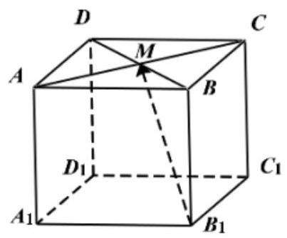

A. $- \frac{1}{2}\overrightarrow{a} + \frac{1}{2}\overrightarrow{b} + \overrightarrow{c}$ B. $\frac{1}{2}\overrightarrow{a} + \frac{1}{2}\overrightarrow{b} + \overrightarrow{c}$

C. $\frac{1}{2}\overrightarrow{a} - \frac{1}{2}\overrightarrow{b} + \overrightarrow{c}$ D. $- \frac{1}{2}\overrightarrow{a} - \frac{1}{2}\overrightarrow{b} + \overrightarrow{c}$

【难度】 $\star   \star$

【答案】A

【解析】如图所示, $\overrightarrow{{B}_{1}M} = \overrightarrow{{B}_{1}B} + \overrightarrow{BM},\overrightarrow{BM} = \frac{1}{2}\left( {\overrightarrow{BA} + \overrightarrow{BC}}\right)$ ,

$\therefore \overrightarrow{{B}_{1}M} = \overrightarrow{c} + \frac{1}{2}\left( {-\overrightarrow{a} + \overrightarrow{b}}\right)  =  - \frac{1}{2}\overrightarrow{a} + \frac{1}{2}\overrightarrow{b} + \overrightarrow{c}$ . 故选: A

(2)已知 $P$ 为空间中任意一点，A、B、C、D 四点满足任意三点均不共线，但四点共面，且 $\overline{PA} = \frac{4}{3}\overline{PB} - x\overline{PC} + \frac{1}{6}\overline{DB}$ ，则实数 $x$ 的值为( )

A. $\frac{1}{3}$ B. $- \frac{1}{3}$ C. $\frac{1}{2}$ D. $- \frac{1}{2}$

【难度】 $\star   \star   \star$

【答案】A

【解析】 $\overline{PA} = \frac{4}{3}\overline{PB} - x\overline{PC} + \frac{1}{6}\overline{DB} = \frac{4}{3}\overline{PB} - x\overline{PC} + \frac{1}{6}\left( {\overline{PB} - \overline{PD}}\right)  = \frac{3}{2}\overline{PB} - x\overline{PC} - \frac{1}{6}\overline{PD}$ , 又 $\because \mathrm{P}$ 是空间任意一点, $\mathrm{A}\text{ 、 }\mathrm{\;B}\text{ 、 }\mathrm{C}\text{ 、 }\mathrm{D}$ 四点满足任三点均不共线,但四点共面, $\therefore \frac{3}{2} - x - \frac{1}{6} = 1$ ,解得 $\mathrm{x} = \frac{1}{3}$ ,故选A.

【例 2】如图所示，二面角 $\alpha  - l - \beta$ 为 ${60}^{ \circ  }$ ， $A$ ， $B$ 是棱 $l$ 上的两点， ${AC},{BD}$ 分别在半平面内 $\alpha ,\beta$ ，且 ${AC}\bot l$ ， ${BD}\bot l$ ， ${AB} = 4$ ， ${AC} = 6$ ， ${BD} = 8$ ，则 ${CD}$ 的长___.

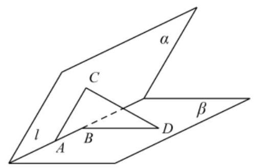

【难度】★★★

【答案】 $2\sqrt{17}$

【解析】 $\because$ 二面角 $\alpha  - l - \beta$ 为 ${60}^{ \circ  }, A, B$ 是棱 $l$ 上的两点, ${AC},{BD}$ 分别在半平面 $\alpha \text{ 、 }\beta$ 内,

且 ${AC} \bot  l,{BD} \bot  l,{AB} = 4,{AC} = 6,{BD} = 8$ ,所以 $\overrightarrow{AC} \cdot  \overrightarrow{AB} = 0,\overrightarrow{BD} \cdot  \overrightarrow{AB} = 0$ ,

所以 $\overrightarrow{CD} = \overrightarrow{CA} + \overrightarrow{AB} + \overrightarrow{BD}$ ,

${\overrightarrow{CD}}^{2} = {\left( \overrightarrow{CA} + \overrightarrow{AB} + \overrightarrow{BD}\right) }^{2} = {\overrightarrow{CA}}^{2} + {\overrightarrow{AB}}^{2} + {\overrightarrow{BD}}^{2} + 2\overrightarrow{CA} \cdot  \overrightarrow{BD} = {36} + {16} + {64} + 2 \times  6 \times  8 \times  \cos {120}^{ \circ  } = {68}$ ,

$\therefore {CD}$ 的长 $\left| \overline{CD}\right|  = \sqrt{68} = 2\sqrt{17}$ . 故答案为 $2\sqrt{17}$ .

【例 3】已知球 $O$ 的半径为 $1, A, B$ 是球面上的两点,且 ${AB} = \sqrt{3}$ ，若点 $P$ 是球面上任意一点，则 $\overrightarrow{PA} \cdot  \overrightarrow{PB}$ 的取值范围是( )

A. $\left\lbrack  {-\frac{3}{2},\frac{1}{2}}\right\rbrack$ B. $\left\lbrack  {-\frac{1}{2},\frac{3}{2}}\right\rbrack$ C. $\left\lbrack  {0,\frac{1}{2}}\right\rbrack$ D. $\left\lbrack  {0,\frac{3}{2}}\right\rbrack$

【难度】 $\star   \star   \star$

【答案】B

【解析】由球 $O$ 的半径为 $1, A, B$ 是球面上的两点,且 ${AB} = \sqrt{3}$ ,可得

$\angle {AOB} = \frac{2\pi }{3},\overrightarrow{OA}?\overrightarrow{OB} = 1 \times  1 \times  \left( {-\frac{1}{2}}\right)  =  - \frac{1}{2}$ , $\left| {\overrightarrow{OA} + \overrightarrow{OB}}\right|  = 1$ ,

$\overrightarrow{PA} \cdot  \overrightarrow{PB} = \left( {\overrightarrow{OA} - \overrightarrow{OP}}\right)  \cdot  \left( {\overrightarrow{OB} - \overrightarrow{OP}}\right)  = \overrightarrow{OA} \cdot  \overrightarrow{OB} - \left( {\overrightarrow{OA} + \overrightarrow{OB}}\right)  \cdot  \overrightarrow{OP} + {\overrightarrow{OP}}^{2}$

$= \frac{1}{2} - \left| {\overrightarrow{OA} + \overrightarrow{OB}}\right|  \cdot  \overrightarrow{OP}\cos \theta  = \frac{1}{2} - \cos \theta  \in  \left\lbrack  {-\frac{1}{2},\frac{3}{2}}\right\rbrack$ ,故选 B.

## 巩固训练

1、如图，已知 ${ABCD} - {A}_{1}{B}_{1}{C}_{1}{D}_{1}$ 是四棱柱，底面 ${ABCD}$ 是正方形， $A{A}_{1} = 3,{AB} = 2$ ，且

$\angle {C}_{1}{CB} = \angle {C}_{1}{CD} = {60}^{ \circ  }$ ,设 $\overrightarrow{CD} = \overrightarrow{a},\overrightarrow{CB} = \overrightarrow{b},\overrightarrow{C{C}_{1}} = \overrightarrow{c}$ .

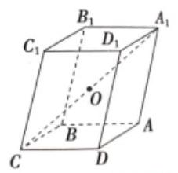

(1)试用 $\overrightarrow{a},\overrightarrow{b},\overrightarrow{c}$ 表示 $\overrightarrow{{A}_{1}C}$ ；

(2)已知 $O$ 为对角线 ${A}_{1}C$ 的中点，求 $\mathrm{{CO}}$ 的长.

【难度】 $\star   \star   \star$

【答案】(1) $\overrightarrow{{A}_{1}C} =  - \overrightarrow{a} - \overrightarrow{b} - \overrightarrow{c}$ ; (2) $\frac{\sqrt{29}}{2}$ .

【解析】(1) $\overrightarrow{{A}_{1}C} = \overrightarrow{{A}_{1}A} + \overrightarrow{AD} + \overrightarrow{DC} =  - \overrightarrow{A{A}_{1}} + \overrightarrow{BC} - \overrightarrow{CD}$

$=  - \overrightarrow{C{C}_{1}} - \overrightarrow{CB} - \overrightarrow{CD} =  - \overrightarrow{c} - \overrightarrow{b} - \overrightarrow{a} =  - \overrightarrow{a} - \overrightarrow{b} - \overrightarrow{c}$ ;

(2)由题意知 $\left| \overrightarrow{a}\right|  = 2,\left| \overrightarrow{b}\right|  = 2,\left| \overrightarrow{c}\right|  = 3$ ，

$\overrightarrow{a} \cdot  \overrightarrow{b} = 0,\overrightarrow{a} \cdot  \overrightarrow{c} = 2 \times  3 \times  \frac{1}{2} = 3,\overrightarrow{a} \cdot  \overrightarrow{b} = 2 \times  3 \times  \frac{1}{2} = 3$ ,

$\because \overrightarrow{CO} = \frac{1}{2}\overrightarrow{C{A}_{1}} = \frac{1}{2}\left( {\overrightarrow{a} + \overrightarrow{b} + \overrightarrow{c}}\right)$ ,

$\therefore \left| \overrightarrow{CO}\right|  = \sqrt{\frac{1}{4}{\left( \overrightarrow{a} + \overrightarrow{b} + \overrightarrow{c}\right) }^{2}} = \sqrt{\frac{1}{4}\left( {{\overrightarrow{a}}^{2} + {\overrightarrow{b}}^{2} + {\overrightarrow{c}}^{2} + 2\overrightarrow{a} \cdot  \overrightarrow{b} + 2\overrightarrow{a} \cdot  \overrightarrow{c} + 2\overrightarrow{b} \cdot  \overrightarrow{c}}\right) }$ ,

$= \sqrt{\frac{1}{4} \times  \left( {{2}^{2} + {2}^{2} + {3}^{2} + 0 + 2 \times  3 + 2 \times  3}\right) } = \sqrt{\frac{29}{4}} = \frac{\sqrt{29}}{2}$ .

2、在棱长为 2 的正四面体 ${ABCD}$ 中，点 $M$ 满足 $\overline{AM} = x\overline{AB} + y\overline{AC} - \left( {x + y - 1}\right) \overline{AD}$ ，点 $N$ 满足 $\overline{BN} = \lambda \overline{BA} + \left( {1 - \lambda }\right) \overline{BC}$ ,当 ${AM}\text{ 、 }{BN}$ 最短时, $\overline{AM} \cdot  \overline{MN} =$ ( )

A. $- \frac{4}{3}$ B. $\frac{4}{3}$ C. $- \frac{1}{3}$ D. $\frac{1}{3}$

【难度】 $\star   \star   \star$

【答案】A

【解析】由共面向量基本定理和共线向量基本定理可知, $M \in$ 平面 ${BCD}, N \in$ 直线 ${AC}$ ,

当 ${AM}$ 、 ${BN}$ 最短时， ${AM} \bot$ 平面 ${BCD}$ ， ${BN} \bot  {AC}$ ，

所以， $M$ 为 $\bigtriangleup  {BCD}$ 的中心， $N$ 为 ${AC}$ 的中点，

此时, $2\left| \overrightarrow{MC}\right|  = \frac{2}{\sin {60}^{ \circ  }} = \frac{4\sqrt{3}}{3},\therefore \left| \overrightarrow{MC}\right|  = \frac{2\sqrt{3}}{3}$ ,

$\because {AM} \bot$ 平面 ${BCD}$ ， ${MC} \subset$ 平面 ${BCD}$ ， $\therefore {AM} \bot  {MC}$ ，

$\therefore \left| \overrightarrow{MA}\right|  = \sqrt{{\left| \overrightarrow{AC}\right| }^{2} - {\left| \overrightarrow{MC}\right| }^{2}} = \sqrt{{2}^{2} - {\left( \frac{2\sqrt{3}}{3}\right) }^{2}} = \frac{2\sqrt{6}}{3}$ .

又 $\overrightarrow{MN} = \frac{1}{2}\left( {\overrightarrow{MC} + \overrightarrow{MA}}\right) ,\therefore \overrightarrow{AM} \cdot  \overrightarrow{MN} = \frac{1}{2}\left( {\overrightarrow{AM} \cdot  \overrightarrow{MC} + \overrightarrow{AM} \cdot  \overrightarrow{MA}}\right)  =  - \frac{1}{2}{\left| \overrightarrow{MA}\right| }^{2} =  - \frac{4}{3}$ . 故选: A.

## 二、向量的坐标运算

【例 4】在空间直角坐标系中,点 $A\left( {2, - 1,3}\right)$ 关于 ${Oxy}$ 平面的对称点为 $B$ ,则 $\overrightarrow{OA} \cdot  \overrightarrow{OB} =$ ( )

A. -4 B. -10 C. 4 D. 10

【难度】★★

【答案】A

【解析】解: 由题意,关于平面 ${Oxy}$ 对称的点横坐标、纵坐标保持不变,竖坐标变为它的相反数,

从而有点 $A\left( {2, - 1,3}\right)$ 关于 ${Oxy}$ 对称的点 $B$ 的坐标为 $\left( {2, - 1, - 3}\right)$ .

$\overline{OA} \cdot  \overline{OB} = \left( {2, - 1,3}\right)  \cdot  \left( {2, - 1, - 3}\right)  = 4 + 1 - 9 =  - 4$ . 故选: A.

【例 5】( 1 )下列各组两个向量中, 平行的一组向量是 ( )

A. $\overrightarrow{a} = \left( {1, - 2,3}\right) ,\overrightarrow{b} = \left( {1,2,1}\right)$ B. $\overrightarrow{a} = \left( {0, - 3,3}\right) ,\overrightarrow{b} = \left( {0,1, - 1}\right)$

C. $\overrightarrow{a} = \left( {0, - 3,2}\right) ,\overrightarrow{b} = \left( {0,1, - \frac{3}{2}}\right)$ D. $\overrightarrow{a} = \left( {1, - \frac{1}{2},3}\right) ,\overrightarrow{b} = \left( {2, - 1,\frac{3}{2}}\right)$

【难度】★★

【答案】 $B$

【解析】解: 在 $A$ 中, $\overrightarrow{a} = \left( {1, - 2,3}\right) ,\overrightarrow{b} = \left( {1,2,1}\right) ,\frac{1}{1} \neq  \frac{-2}{2} \neq  \frac{1}{3}$ ,故 $A$ 中两个向量不平行,故 $A$ 错误; 在 $B$ 中, $\overrightarrow{a} = \left( {0, - 3,3}\right) ,\overrightarrow{b} = \left( {0,1, - 1}\right) ,\overrightarrow{a} = 3\overrightarrow{b}$ ,故 $B$ 中两个向量平行,故 $B$ 正确;

在 $C$ 中, $\overrightarrow{a} = \left( {0, - 3,2}\right) ,\overrightarrow{b} = \left( {0,1, - \frac{3}{2}}\right) ,\frac{1}{-3} \neq  \frac{-\frac{3}{2}}{2}$ ,故 $C$ 中两个向量不平行,故 $C$ 错误;

在 $D$ 中, $\overrightarrow{a} = \left( {1, - \frac{1}{2},3}\right) ,\overrightarrow{b} = \left( {2, - 1,\frac{3}{2}}\right) ,\frac{2}{1} = \frac{-1}{-\frac{1}{2}} \neq  \frac{\frac{3}{2}}{3}$ ,故 $D$ 中两个向量不平行,故 $D$ 错误.

故选: $B$ .

(2)已知 $\bar{a} = \left( {-2,1,3}\right) ,\bar{b} = \left( {-1,2,1}\right)$ ，若 $\bar{a} \bot  \left( {\bar{a} - \lambda \bar{b}}\right)$ ，则实数 $\lambda$ 的值为( )

A. -2

B. $\frac{14}{5}$ C. $- \frac{14}{3}$ D. 2

【难度】★★

【答案】D

【解析】 $\bar{a} - \lambda \bar{b} = \left( {-2,1,3}\right)  - \left( {-\lambda ,{2\lambda },\lambda }\right)  = \left( {\lambda  - 2,1 - {2\lambda },3 - \lambda }\right) ,\bar{a} = \left( {-2,1,3}\right)$ ,

若 $\bar{a} \bot  \left( {\bar{a} - \lambda \bar{b}}\right)$ ,则 $- 2\left( {\lambda  - 2}\right)  + 1 - {2\lambda } + 3\left( {3 - \lambda }\right)  = 0$ ,解得 $\lambda  = 2$ ,故选 $\mathrm{D}$

【例 6】已知向量 $\overrightarrow{a} = \left( {\sqrt{2},0, - \sqrt{2}}\right)$ ,则下列向量中与 $\overrightarrow{a}$ 成 ${45}^{ \circ  }$ 的夹角的是( )

A. $\left( {0,0,2}\right)$ B. $\left( {2,0,0}\right)$ C. $\left( {0,\sqrt{2},\sqrt{2}}\right)$ D. $\left( {\sqrt{2}, - \sqrt{2},0}\right)$

【难度】 $\star   \star$

【答案】B

【解析】根据夹角余弦值 $\cos \theta  = \frac{\overrightarrow{a} \cdot  \overrightarrow{b}}{\left| \overrightarrow{a}\right| \left| \overrightarrow{b}\right| }$

对于 $\mathbf{A}$ 若 $\overrightarrow{\mathbf{b}} = \left( {0,0,2}\right)$ ,则 $\frac{\overrightarrow{a} \cdot  \overrightarrow{b}}{\left| \overrightarrow{a}\right| \left| \overrightarrow{b}\right| } = \frac{-2\sqrt{2}}{2 \times  2} =  - \frac{\sqrt{2}}{2}$ ,而 $\cos {45}^{ \circ  } = \frac{\sqrt{2}}{2}$ ,故不符合条件

对于 $B$ 若 $\overrightarrow{b} = \left( {2,0,0}\right)$ ,则 $\frac{\overrightarrow{a} \cdot  \overrightarrow{b}}{\left| \overrightarrow{a}\right| \left| \overrightarrow{b}\right| } = \frac{2\sqrt{2}}{2 \times  2} = \frac{\sqrt{2}}{2}$ ,而 $\cos {45}^{ \circ  } = \frac{\sqrt{2}}{2}$ ,故符合条件

对于 $C$ 若 $\overrightarrow{b} = \left( {0,\sqrt{2},\sqrt{2}}\right)$ ,则 $\frac{\overrightarrow{a} \cdot  \overrightarrow{b}}{\left| \overrightarrow{a}\right| \left| \overrightarrow{b}\right| } = \frac{-2}{2 \times  2} =  - \frac{1}{2} \neq  \cos {45}^{ \circ  }$ ,故不符合条件

对于 $D$ 若 $\overrightarrow{\mathbf{b}} = \left( {\sqrt{2}, - \sqrt{2},0}\right)$ 则 $\frac{\overrightarrow{a} \cdot  \overrightarrow{b}}{\left| \overrightarrow{a}\right| \left| \overrightarrow{b}\right| } = \frac{2}{2 \times  2} = \frac{1}{2} \neq  \cos {45}^{ \circ  }$ ,故不符合条件,故选 B

【例 7】平面 $\alpha$ 的一个法向量 $\overrightarrow{n} = \left( {0,1, - 1}\right)$ ，如果直线 $l\bot$ 平面 $\alpha$ ，则直线 $l$ 的单位方向向量是 $\overrightarrow{s} =$ ___

【难度】 $\star   \star   \star$

【答案】 $\overrightarrow{s} = \left( {0,\frac{\sqrt{2}}{2}, - \frac{\sqrt{2}}{2}}\right)$ 或 $\overrightarrow{s} = \left( {0, - \frac{\sqrt{2}}{2},\frac{\sqrt{2}}{2}}\right)$

【解析】因为平面 $\alpha$ 的一个法向量 $\overrightarrow{n} = \left( {0,1, - 1}\right)$ ,且直线 $l \bot$ 平面 $\alpha$ ,

所以 $\bar{s}//\bar{n}$ ,即 $\bar{s} = a\bar{n}$ ,故设直线 $l$ 的单位方向向量是 $\bar{s} = \left( {0, a, - a}\right)$ ,

所以 $\sqrt{0 + {a}^{2} + {\left( -a\right) }^{2}} = 1$ ,即 $\sqrt{2{a}^{2}} = 1$ ,解得 $a =  \pm  \frac{\sqrt{2}}{2}$ ,

故 $\overrightarrow{s} = \left( {0,\frac{\sqrt{2}}{2}, - \frac{\sqrt{2}}{2}}\right)$ 或 $\overrightarrow{s} = \left( {0, - \frac{\sqrt{2}}{2},\frac{\sqrt{2}}{2}}\right)$

故答案为: $\overrightarrow{s} = \left( {0,\frac{\sqrt{2}}{2}, - \frac{\sqrt{2}}{2}}\right)$ 或 $\overrightarrow{s} = \left( {0, - \frac{\sqrt{2}}{2},\frac{\sqrt{2}}{2}}\right)$

【例 8】如图,在四面体 $O - {ABC}$ 中, ${G}_{1}$ 是 $\bigtriangleup  {ABC}$ 的重心, $G$ 是 $O{G}_{1}$ 上的一点,且 ${OG} = {2G}{G}_{1}$ ,若 $\overrightarrow{OG} = x\overrightarrow{OA} + y\overrightarrow{OB} + z\overrightarrow{OC}$ ,则 $\left( {x, y, z}\right)$ 为( )

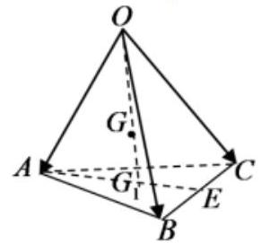

A. $\left( {\frac{1}{2},\frac{1}{2},\frac{1}{2}}\right)$ B. $\left( {\frac{2}{3},\frac{2}{3},\frac{2}{3}}\right)$

C. $\left( {\frac{1}{3},\frac{1}{3},\frac{1}{3}}\right)$ D. $\left( {\frac{2}{9},\frac{2}{9},\frac{2}{9}}\right)$

【难度】 $\star   \star   \star$

【答案】D

【解析】因为 $E$ 是 ${BC}$ 中点,所以 $\overrightarrow{OE} = \frac{1}{2}\left( {\overrightarrow{OB} + \overrightarrow{OC}}\right)$ ,

${G}_{1}$ 是 $\bigtriangleup  {ABC}$ 的重心，则 $A{G}_{1} = \frac{2}{3}{AE}$ ，所以 $\overrightarrow{A{G}_{1}} = \frac{2}{3}\overrightarrow{AE} = \frac{2}{3}\left( {\overrightarrow{OE} - \overrightarrow{OA}}\right)$ ，

因为 ${OG} = {2G}{G}_{1}$ ，所以

$\overrightarrow{OG} = \frac{2}{3}\overrightarrow{O{G}_{1}} = \frac{2}{3}\left( {\overrightarrow{OA} + \overrightarrow{A{G}_{1}}}\right)  = \frac{2}{3}\overrightarrow{OA} + \frac{4}{9}\left( {\overrightarrow{OE} - \overrightarrow{OA}}\right)$

$= \frac{2}{9}\overrightarrow{OA} + \frac{4}{9}\overrightarrow{OE} = \frac{2}{9}\overrightarrow{OA} + \frac{2}{9}\left( {\overrightarrow{OB} + \overrightarrow{OC}}\right)  = \frac{2}{9}\overrightarrow{OA} + \frac{2}{9}\overrightarrow{OB} + \frac{2}{9}\overrightarrow{OC}$ ,

若 $\overrightarrow{OG} = x\overrightarrow{OA} + y\overrightarrow{OB} + z\overrightarrow{OC}$ ,则 $x = y = z = \frac{2}{9}$ . 故选: D.

【例 9】如图,在棱长为 2 的正方体 ${ABCD} - {A}_{1}{B}_{1}{C}_{1}{D}_{1}$ 中, $E$ 为 ${BC}$ 的中点,点 $P$ 在底面 ${ABCD}$ 上 (包括边界)移动，且满足 ${B}_{1}P \bot  {D}_{1}E$ ，则线段 ${B}_{1}P$ 的长度的最大值为( )

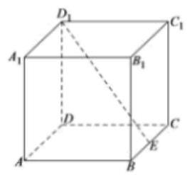

A. $\frac{6\sqrt{5}}{5}$ B. $2\sqrt{5}$ C. $2\sqrt{2}$ D. 3

【难度】 $\star   \star   \star$

【答案】D

【解析】解: 以 $D$ 为原点, ${DA}$ 为 $x$ 轴, ${DC}$ 为 $y$ 轴, $D{D}_{1}$ 为 $z$ 轴,建立空间直角坐标系,

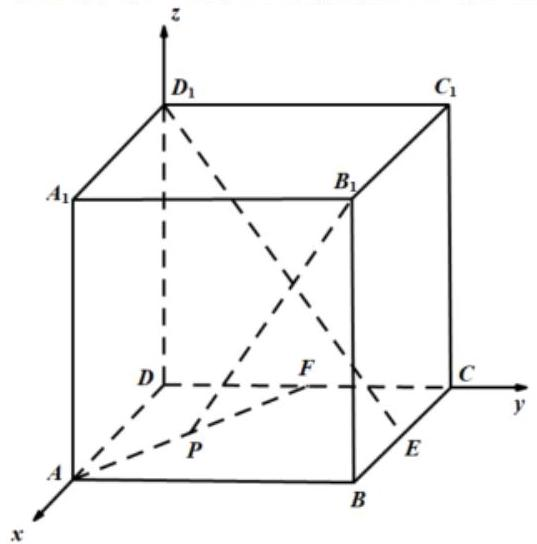

设 $P\left( {a, b,0}\right)$ ,则 ${D}_{1}\left( {0,0,2}\right) , E\left( {1,2,0}\right) ,{B}_{1}\left( {2,2,2}\right)$ ,

$\overrightarrow{{B}_{1}P} = \left( {a - 2, b - 2, - 2}\right) ,\overrightarrow{{D}_{1}E} = \left( {1,2, - 2}\right) ,$

$\because {B}_{1}P \bot  {D}_{1}E,\therefore \overrightarrow{{B}_{1}P} \cdot  \overrightarrow{{D}_{1}E} = a - 2 + 2\left( {b - 2}\right)  + 4 = 0$ ,

$\therefore a + {2b} - 2 = 0,0 \leq  b \leq  1\therefore$ 点 $P$ 的轨迹是一条线段,

${\left| \overline{{B}_{1}P}\right| }^{2} = {\left( a - 2\right) }^{2} + {\left( b - 2\right) }^{2} + 4 = {\left( 2b\right) }^{2} + {\left( b - 2\right) }^{2} + 4 = 5{b}^{2} - {4b} + 8$ ,

由二次函数的性质可得当 $b = 1$ 时, $5{b}^{2} - {4b} + 8$ 可取到最大值 9,

$\therefore$ 线段 ${B}_{1}P$ 的长度的最大值为 3 . 故选: D.

## 巩固训练

1、在以下命题中，正确的命题有( )

A. $\left| \overrightarrow{a}\right|  - \left| \overrightarrow{b}\right|  = \left| {\overrightarrow{a} + \overrightarrow{b}}\right|$ 是 $\overrightarrow{a},\overrightarrow{b}$ 共线的充要条件

B. 若 $\overrightarrow{a}//\overrightarrow{b}$ ,则存在唯一的实数 $\lambda$ ,使 $\overrightarrow{a} = \lambda \overrightarrow{b}$

C. 对空间任意一点 $O$ 和不共线的三点 $A, B, C$ ,若 $\overrightarrow{OP} = 2\overrightarrow{OA} - 2\overrightarrow{OB} - \overrightarrow{OC}$ ,则 $P, A, B, C$ 四点

共面

D. 若 $\left\{  {\overrightarrow{a},\overrightarrow{b},\overrightarrow{c}}\right\}$ 为空间的一个基底,则 $\left\{  {\overrightarrow{a} + \overrightarrow{b},\overrightarrow{b} + \overrightarrow{c},\overrightarrow{c} + \overrightarrow{a}}\right\}$ 构成空间的另一个基底

【难度】 $\star   \star   \star$

【答案】D

【解析】解: 对于 $\mathrm{A}$ ,当 $\left| \overrightarrow{a}\right|  - \left| \overrightarrow{b}\right|  = \left| {\overrightarrow{a} + \overrightarrow{b}}\right|$ ,则 $\overrightarrow{a},\overrightarrow{b}$ 共线成立,

但 $\overrightarrow{a},\overrightarrow{b}$ 同向共线时, $\left| \overrightarrow{a}\right|  - \left| \overrightarrow{b}\right|  \neq  \left| {\overrightarrow{a} + \overrightarrow{b}}\right|$ ,所以 $\left| \overrightarrow{a}\right|  - \left| \overrightarrow{b}\right|  = \left| {\overrightarrow{a} + \overrightarrow{b}}\right|$ 是 $\overrightarrow{a},\overrightarrow{b}$ 共线的充分不必要条件,故 $\mathbf{A}$ 不正确; 对于 $\mathbf{B}$ ,当 $\overrightarrow{b} = \overrightarrow{0}$ 时, $\overrightarrow{a}//\overrightarrow{b}$ ,不存在唯一的实数 $\lambda$ ,使 $\overrightarrow{a} = \lambda \overrightarrow{b}$ ,故 $\mathbf{B}$ 不正确;

对于 $\mathbf{C}$ ,由于 $\overrightarrow{OP} = 2\overrightarrow{OA} - 2\overrightarrow{OB} - \overrightarrow{OC}$ ,而 $2 - 2 - 1 \neq  1$ ,

根据共面向量定理知， $P$ ， $A$ ， $B$ ， $C$ 四点不共面，故 $\mathbf{C}$ 不正确；

对于 $\mathbf{D}$ ,若 $\left\{  {\overrightarrow{a},\overrightarrow{b},\overrightarrow{c}}\right\}$ 为空间的一个基底,则 $\overrightarrow{a},\overrightarrow{b},\overrightarrow{c}$ 不共面,

由基底的定义可知, $\overrightarrow{a} + \overrightarrow{b},\overrightarrow{b} + \overrightarrow{c},\overrightarrow{c} + \overrightarrow{a}$ 不共面,则 $\left\{  {\overrightarrow{a} + \overrightarrow{b},\overrightarrow{b} + \overrightarrow{c},\overrightarrow{c} + \overrightarrow{a}}\right\}$ 构成空间的另一个基底,故 $\mathrm{D}$ 正确. 故选: D.

2、已知向量 $\overrightarrow{{e}_{1}},\overrightarrow{{e}_{2}},\overrightarrow{{e}_{3}}$ 是三个不共面的非零向量,且 $\overrightarrow{a} = 2\overrightarrow{{e}_{1}} - \overrightarrow{{e}_{2}} + \overrightarrow{{e}_{3}},\overrightarrow{b} =  - \overrightarrow{{e}_{1}} + 4\overrightarrow{{e}_{2}} - 2\overrightarrow{{e}_{3}}$ , $\overrightarrow{c} = {11}\overrightarrow{{e}_{1}} + 5\overrightarrow{{e}_{2}} + \lambda \overrightarrow{{e}_{3}}$ ，若向量 $\overrightarrow{a}$ ， $\overrightarrow{b}$ ， $\overrightarrow{c}$ 共面，则 $\lambda  =$ ___.

【难度】 $\star   \star$

【答案】 1

【解析】因为向量 $\overrightarrow{a},\overrightarrow{b},\overrightarrow{c}$ 共面,所以存在实数 $m, n$ ,使得 $\overrightarrow{c} = m\overrightarrow{a} + n\overrightarrow{b}$ ,

则 ${11}\overrightarrow{{e}_{1}} + 5\overrightarrow{{e}_{2}} + \lambda \overrightarrow{{e}_{3}} = \left( {{2m} - n}\right) \overrightarrow{{e}_{1}} + \left( {-m + {4n}}\right) \overrightarrow{{e}_{2}} + \left( {m - {2n}}\right) \overrightarrow{{e}_{3}}$ ,

则 $\left\{  \begin{array}{l} {2m} - n = {11} \\   - m + {4n} = 5 \\  m - {2n} = \lambda  \end{array}\right.$ ,解得 $\left\{  \begin{array}{l} m = 7 \\  n = 3 \\  \lambda  = 1 \end{array}\right.$ . 故答案为: 1

3、已知 $M\left( {-1,1,3}\right) , N\left( {-2, - 1,4}\right)$ ，若 $M, N, O$ 三点共线，则 $O$ 点坐标可能为( )

A. $\left( {3,5, - 2}\right)$ B. $\left( {4, - 5,6}\right)$ C. $\left( {-\frac{5}{2},\frac{1}{2}, - 2}\right)$ D. $\left( {0,3,2}\right)$

【难度】★★

【答案】D

【解析】由 $M\left( {-1,1,3}\right) , N\left( {-2, - 1,4}\right)$ ,得 $\overrightarrow{MN} = \left( {-1, - 2,1}\right)$ ,

A. $\overrightarrow{NO} = \left( {5,6, - 6}\right)$ ,因为 $\overrightarrow{MN} \neq  \lambda \overrightarrow{NO}$ 所以 $M, N, O$ 三点不共线,故错误;

B. $\overrightarrow{NO} = \left( {2, - 4,2}\right)$ ，因为 $\overrightarrow{MN} \neq  \lambda \overrightarrow{NO}$ 所以 $M, N, O$ 三点不共线，故错误；

C. $\overrightarrow{NO} = \left( {\frac{1}{2},\frac{3}{2}, - 6}\right)$ ,因为 $\overrightarrow{MN} \neq  \lambda \overrightarrow{NO}$ 所以 $M, N, O$ 三点不共线,故错误;

D. $\overrightarrow{NO} = \left( {2,4, - 2}\right)$ ,因为 $\overrightarrow{MN} =  - \frac{1}{2}\overrightarrow{NO}$ 所以 $M, N, O$ 三点共线,故正确; 故选: D

4、设动点 $P$ 在正方体 ${ABCD} - {A}_{1}{B}_{1}{C}_{1}{D}_{1}$ 的对角线 $B{D}_{1}$ 上，记 $\overrightarrow{{D}_{1}P} = \lambda \overrightarrow{{D}_{1}B}$ 当 $\angle {APC}$ 为钝角时，则实数可能的取值是( )

A. $\frac{1}{2}$ B. $\frac{4}{3}$ C. $\frac{1}{3}$ D. 1

【难度】★★★

【答案】A

【解析】以 $D$ 为原点, ${DA},{DC}, D{D}_{1}$ 分别为 $x, y, z$ 轴建立空间直角坐标系,如图所示:

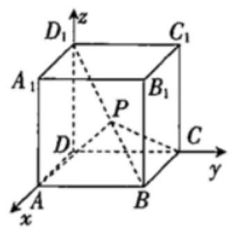

设正方体的边长为1,则 $A\left( {1,0,0}\right) , B\left( {1,1,0}\right) , C\left( {0,1,0}\right) ,{D}_{1}\left( {0,0,1}\right)$ ,

$\overrightarrow{{D}_{1}A} = \left( {1,0, - 1}\right) ,\overrightarrow{{D}_{1}C} = \left( {0,1, - 1}\right) ,\overrightarrow{{D}_{1}B} = \left( {1,1, - 1}\right)$ ,

所以 $\overrightarrow{{D}_{1}P} = \lambda \overrightarrow{{D}_{1}B} = \left( {\lambda ,\lambda , - \lambda }\right)$ .

又因为 $\overrightarrow{PA} = \overrightarrow{P{D}_{1}} + \overrightarrow{{D}_{1}A} = \left( {-\lambda , - \lambda ,\lambda }\right)  + \left( {1,0, - 1}\right)  = \left( {1 - \lambda , - \lambda ,\lambda  - 1}\right)$ ,

$\overrightarrow{PC} = \overrightarrow{P{D}_{1}} + \overrightarrow{{D}_{1}C} = \left( {-\lambda , - \lambda ,\lambda }\right)  + \left( {0,1, - 1}\right)  = \left( {-\lambda ,1 - \lambda ,\lambda  - 1}\right)$ ,

因为 $\angle {APC}$ 为钝角，所以 $\overrightarrow{PA} \cdot  \overrightarrow{PC} < 0$ ，

即 $\left( {-\lambda }\right) \left( {1 - \lambda }\right)  + \left( {-\lambda }\right) \left( {1 - \lambda }\right)  + {\left( \lambda  - 1\right) }^{2} = \left( {\lambda  - 1}\right) \left( {{3\lambda } - 1}\right)  < 0$ ,解得 $\frac{1}{3} < \lambda  < 1$ . 故选: A

5、已知向量 $\overrightarrow{a} = \left( {1,1,0}\right)$ ，则与 $\overrightarrow{a}$ 同向的单位向量 $\overrightarrow{e} =$ ( )

A. $\left( {-\frac{\sqrt{2}}{2}, - \frac{\sqrt{2}}{2},0}\right)$ C. $\left( {\frac{\sqrt{2}}{2},\frac{\sqrt{2}}{2},0}\right)$ D. $\left( {-1, - 1,0}\right)$

【难度】 $\star   \star   \star$

【答案】C

【解析】对 $\mathbf{A}$ ,存在实数 $\lambda  =  - \sqrt{2}$ ,故不同向;

对 $\mathbf{B}$ ,不存在实数 $\lambda$ ,使 $\left( {1,1,0}\right)  = \lambda \left( {0,1,0}\right)$ ,错误;

对 $\mathbf{C}$ ,存在实数 $\lambda  = \sqrt{2}$ ,使 $\left( {1,1,0}\right)  = \sqrt{2}\left( {\frac{\sqrt{2}}{2},\frac{\sqrt{2}}{2},0}\right)$ ,且 $\left| \left( {\frac{\sqrt{2}}{2},\frac{\sqrt{2}}{2},0}\right) \right|  = \sqrt{\frac{1}{2} + \frac{1}{2}} = 1$ ,正确;

对 $D,\left| \left( {-1, - 1,0}\right) \right|  = \sqrt{1 + 1} = \sqrt{2}$ ,不是单位向量,错误. 故选: C.

6、已知空间中三点 $A\left( {-2,0,2}\right)$ ， $B\left( {-1,1,2}\right)$ ， $C\left( {-3,0,4}\right)$ ，设 $\overrightarrow{a} = \overrightarrow{AB}$ ， $\overrightarrow{b} = \overrightarrow{AC}$ .

(1)求向量 $\overrightarrow{a}$ 与向量 $\overrightarrow{b}$ 的夹角的余弦值；

(2)若 $k\overrightarrow{a} + \overrightarrow{b}$ 与 $k\overrightarrow{a} - 2\overrightarrow{b}$ 互相垂直，求实数 $k$ 的值.

【难度】 $\star   \star   \star$

【答案】( 1 ) $- \frac{\sqrt{10}}{10}$ ；( 2 ) $k =  - \frac{5}{2}$ 或 $k = 2$ .

【解析】(1) $\because \overrightarrow{a} = \overrightarrow{AB} = \left( {1,1,0}\right) ,\overrightarrow{b} = \overrightarrow{AC} = \left( {-1,0,2}\right)$ ,

设 $\overrightarrow{a}$ 与 $\overrightarrow{b}$ 的夹角为 $\theta ,\therefore \cos \theta  = \frac{\overrightarrow{a} \cdot  \overrightarrow{b}}{\left| \overrightarrow{a}\right| \left| \overrightarrow{b}\right| } = \frac{-1}{\sqrt{10}} =  - \frac{\sqrt{10}}{10}$ ;

(2) $\because k\overrightarrow{a} + \overrightarrow{b} = \left( {k - 1, k,2}\right) , k\overrightarrow{a} - 2\overrightarrow{b} = \left( {k + 2, k, - 4}\right)$ 且 $\left( {k\overrightarrow{a} + \overrightarrow{b}}\right)  \bot  \left( {k\overrightarrow{a} - 2\overrightarrow{b}}\right)$ ，

$\therefore \left( {k - 1}\right) \left( {k + 2}\right)  + {k}^{2} - 8 = 0$ ,即: $k =  - \frac{5}{2}$ 或 $k = 2$ .

7、已知 $\overrightarrow{a} = \left( {{a}_{1},{a}_{2},{a}_{3}}\right) ,\overrightarrow{b} = \left( {{b}_{1},{b}_{2},{b}_{3}}\right)$ ，且 $\left| \overrightarrow{a}\right|  = 3$ ， $\left| \overrightarrow{b}\right|  = 4$ ， $\overrightarrow{a} \cdot  \overrightarrow{b} = {12}$ ，则 $\frac{{a}_{1} + {a}_{2} + {a}_{3}}{{b}_{1} + {b}_{2} + {b}_{3}} =$ ___1

【难度】 $\star   \star   \star$

【答案】 $\frac{3}{4}$

【解析】解: 由 $\left| \overrightarrow{a}\right|  = 3,\left| \overrightarrow{b}\right|  = 4$ ,得 $\overrightarrow{a} \cdot  \overrightarrow{b} = \left| \overrightarrow{a}\right|  \times  \left| \overrightarrow{b}\right|  \times  \cos \theta  = 3 \times  4 \times  \cos \theta  = {12},\therefore \cos \theta  = 1$ ; 又 $\theta  \in  \left\lbrack  {0\text{ ， }\pi }\right\rbrack  ,\therefore \theta  = 0$ ; $\therefore \overrightarrow{a} = \lambda \overrightarrow{b}$ ,且 $\lambda  > 0$ ; 则 $\left| \overrightarrow{a}\right|  = \lambda \left| \overrightarrow{b}\right| ,\therefore \lambda  = \frac{\left| \overrightarrow{a}\right| }{\left| \overrightarrow{b}\right| } = \frac{3}{4},\therefore \frac{{a}_{1}}{{b}_{1}} = \frac{{a}_{2}}{{b}_{2}} = \frac{{a}_{3}}{{b}_{3}} = \lambda  = \frac{3}{4},\therefore \frac{{a}_{1} + {a}_{2} + {a}_{3}}{{b}_{1} + {b}_{2} + {b}_{3}} = \lambda  = \frac{3}{4}$ . 故答案为: $\frac{3}{4}$ .

三、空间向量的应用

【例 10】在四面体 ${ABCD}$ 中， ${AB}\bot {BC},{BC}\bot {CD}$ ， ${AB} = {BC} = {CD} = 1$ ， ${AD} = \sqrt{3}$ ，点 $E$ 为线段 ${AB}$ 上动点 (包含端点),设直线 ${DE}$ 与 ${BC}$ 所成角为 $\theta$ ,则 $\cos \theta$ 的取值范围为 ( )

A. $\left\lbrack  {0,\frac{\sqrt{3}}{3}}\right\rbrack$ B. $\left\lbrack  {0,\frac{\sqrt{2}}{2}}\right\rbrack$

C. $\left\lbrack  {\frac{\sqrt{2}}{2},\frac{\sqrt{5}}{3}}\right\rbrack$ D. $\left\lbrack  {\frac{\sqrt{3}}{3},\frac{\sqrt{2}}{2}}\right\rbrack$

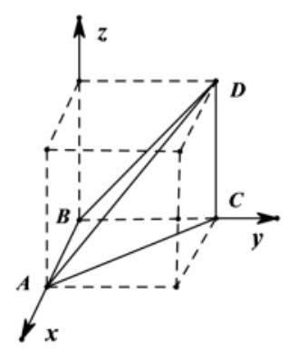

【难度】 $\star   \star   \star$

【答案】D

【解析】由 ${AB} \bot  {BC},{AB} = {BC} = 1$ ,所以 ${AC} = \sqrt{2}$ ,又 ${AD} = \sqrt{3},{CD} = 1$ ,

所以 $C{D}^{2} + A{C}^{2} = A{D}^{2}$ ,则 ${CD} \bot  {AC}$ ,因为 ${BC} \bot  {CD}$ ,所以 ${CD} \bot$ 平面 ${ABC}$ ,

如图所示建系,则 $B\left( {0,0,0}\right) , D\left( {0,1,1}\right) , C\left( {0,1,0}\right)$ ,设 $E\left( {x,0,0}\right) \left( {x \in  \left\lbrack  {0,1}\right\rbrack  }\right)$ ,

则 $\overrightarrow{BC} = \left( {0,1,0}\right) ,\overrightarrow{ED} = \left( {-x,1,1}\right)$ ,

所以 $\cos \theta  = \frac{\overrightarrow{BC} \cdot  \overrightarrow{ED}}{\left| \overrightarrow{BC}\right|  \cdot  \left| \overrightarrow{ED}\right| } = \frac{1}{\sqrt{{x}^{2} + 2}} \in  \left\lbrack  {\frac{\sqrt{3}}{3},\frac{\sqrt{2}}{2}}\right\rbrack$ ,故选:D

【例 11】如图, ${PD} \bot$ 平面 ${ABCD},{AD} \bot  {CD},{AB}//{CD},{PQ}//{CD}$ ,

${AD} = {CD} = {DP} = {2PQ} = {2AB} = 2$ ,点 $E, F, M$ 分别为 ${AP},{CD},{BQ}$ 的中点.

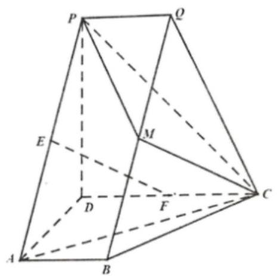

(1)求证: ${EF} \parallel$ 平面 ${MPC}$ ；

(2)求二面角 $Q - {PM} - C$ 的正弦值；

(3)若 $N$ 为线段 ${CQ}$ 上的点，且直线 ${DN}$ 与平面 ${PMQ}$ 所成的角为 $\frac{\pi }{6}$ ，求线段 ${QN}$ 的长.

【难度】 $\star   \star   \star$

【答案】(I) 证明见解析; (II) $\frac{\sqrt{3}}{2}$ ; (III) $\frac{\sqrt{5}}{3}$ .

【解析】(I) 连接 ${EM}$ ,因为 ${AB}//{CD},{PQ}//{CD}$ ,所以 ${AB}//{PQ}$ ,又因为 ${AB} = {PQ}$ ,所以 ${PABQ}$ 为平行四边形.

由点 $E$ 和 $M$ 分别为 ${AP}$ 和 ${BQ}$ 的中点，可得 ${EM}//{AB}$ 且 ${EM} = {AB}$ ，

因为 ${AB}//{CD}$ ， ${CD} = {2AB}$ ， $F$ 为 ${CD}$ 的中点，所以 ${CF}//{AB}$ 且 ${CF} = {AB}$ ，可得 ${EM}//{CF}$ 且

${EM} = {CF}$ ,即四边形 ${EFCM}$ 为平行四边形,所以 ${EF}\parallel {MC}$ ,又 ${EF} \text{ ⊄ }$ 平面 ${MPC},{CM} \subset$ 平面 ${MPC}$ , 所以 ${EF}//$ 平面 ${MPC}$ .

(II)因为 ${PD} \bot$ 平面 ${ABCD}$ ， ${AD} \bot  {CD}$ ，可以建立以 $D$ 为原点，分别以 $\overline{DA}$ ， $\overline{DC}$ ， $\overline{DP}$ 的方向为 $x$ 轴， $y$ 轴, $z$ 轴的正方向的空间直角坐标系.

依题意可得 $D\left( {0,0,0}\right) , A\left( {2,0,0}\right) , B\left( {2.1.0}\right) , C\left( \begin{array}{lll} 0 & 2 & 0 \end{array}\right)$ ,

$P\left( {0,0,2}\right) , Q\left( {0,1,2}\right) , M\left( {1,1,1}\right) .$

$\overline{PM} = \left( {1,1, - 1}\right) ,\overline{PQ} = \left( {0,1,0}\right) ,\overline{CM} = \left( {1, - 1,1}\right) ,\overline{PC} = \left( {{02} - 2}\right)$

设 $\overrightarrow{{n}_{1}} = \left( {x, y, z}\right)$ 为平面 ${PMQ}$ 的法向量,

则 $\left\{  \begin{array}{l} \overrightarrow{{n}_{1}} \cdot  \overrightarrow{PM} = 0 \\  \overrightarrow{{n}_{1}} \cdot  \overrightarrow{PQ} = 0 \end{array}\right.$ ,即 $\left\{  \begin{matrix} x + y - z = 0 \\  y = 0 \end{matrix}\right.$ ,不妨设 $z = 1$ ,可得 $\overrightarrow{{n}_{1}} = \left( {1,0,1}\right)$

设 $\overline{{n}_{2}} = \left( {x, y, z}\right)$ 为平面 ${MPC}$ 的法向量,

则 $\left\{  \begin{array}{l} \overline{{n}_{2}} \cdot  \overline{PC} = 0 \\  \overline{{n}_{2}} \cdot  \overline{CM} = 0 \end{array}\right.$ ,即 $\left\{  \begin{array}{l} {2y} - {2z} = 0 \\  x - y + z = 0 \end{array}\right.$ ,不妨设 $z = 1$ ,可得 $\overline{{n}_{2}} = \left( {0,1,1}\right)$ .

$\cos \overline{{n}_{1}},\overline{{n}_{2}} = \frac{\overline{{n}_{1}} \cdot  \overline{{n}_{2}}}{\left| \overline{{n}_{1}}\right|  \cdot  \left| \overline{{n}_{2}}\right| } = \frac{1}{2}$ ,于是 $\sin \overline{{n}_{1}},\overline{{n}_{2}} = \frac{\sqrt{3}}{2}$ .

所以,二面角 $Q - {PM} - C$ 的正弦值为 $\frac{\sqrt{3}}{2}$ .

(III) 设 $\overline{QN} = \lambda \overline{QC}\left( {0 \leq  \lambda  \leq  1}\right)$ ,即 $\overline{QN} = \lambda \overline{QC} = \left( {0,\lambda , - {2\lambda }}\right)$ ,则 $N\left( {0,\lambda  + 1,2 - {2\lambda }}\right)$ .

从而 $\overline{DN} = \left( {0,\lambda  + 1,2 - {2\lambda }}\right)$ .

由 (II) 知平面 ${PMQ}$ 的法向量为 $\overline{{n}_{1}} = \left( {1,0,1}\right)$ ,

由题意, $\sin \frac{\pi }{6} = \left| {\cos \overline{DN},\overline{{n}_{1}}}\right|  = \frac{\left| \overline{DN} \cdot  \overline{{n}_{1}}\right| }{\left| \overline{DN}\right|  \cdot  \left| \overline{{n}_{1}}\right| }$ ,即 $\frac{1}{2} = \frac{\left| 2 - 2\lambda \right| }{\sqrt{{\left( \lambda  + 1\right) }^{2} + {\left( 2 - 2\lambda \right) }^{2}}}$ . $\sqrt{2}$ ,

整理得 $3{\lambda }^{2} - {10\lambda } + 3 = 0$ ,解得 $\lambda  = \frac{1}{3}$ 或 $\lambda  = 3$ ,

因为 $0 \leq  \lambda  \leq  1$ 所以 $\lambda  = \frac{1}{3}$ ,所以 $\overline{QN} = \frac{1}{3}\overline{QC},{QN} = \frac{1}{3}\left| \overline{QC}\right|  = \frac{\sqrt{5}}{3}$ .

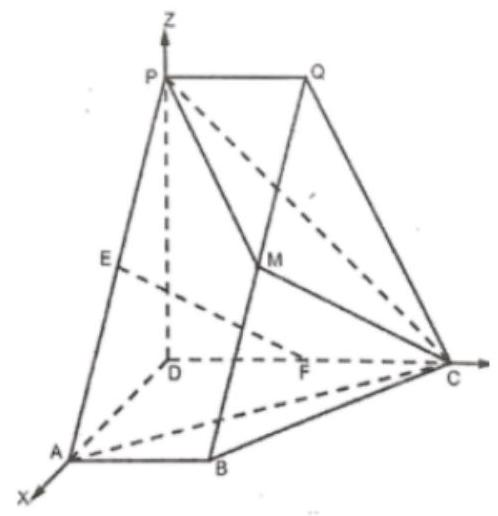

【例 12】如图,在平面多边形 ${ABFCDE}$ 中, ${ABFE}$ 是边长为 2 的正方形, ${DCFE}$ 为等腰梯形, $G$ 为 ${CD}$ 的中点,且 ${DC} = {2FE}$ ， ${DE} = {CF} = {EF}$ ，现将梯形 ${DCFE}$ 沿 ${EF}$ 折叠，使平面 ${DCFE} \bot$ 平面 ${ABFE}$ .

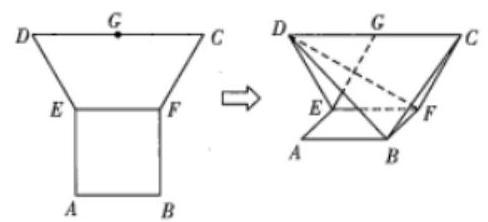

(1)求证: ${EG}\bot$ 平面 ${BDF}$ ；

(2)求直线 ${BD}$ 与平面 ${CBF}$ 所成角的大小.

【难度】 $\star   \star   \star$

【答案】(1)证明见解析; (2) ${60}^{ \circ  }$

【解析】解: (1) 连接 ${GF}$ ,由已知,得 ${DG}//{EF},{DG} = {EF},{DE} = {DG} = 2$ ,

则四边形 ${DEFG}$ 为菱形，故 ${EG}\bot {DF}$ .

因为平面 ${DCFE} \bot$ 平面 ${ABFE}$ ,平面 ${DCFE} \cap$ 平面 ${ABFE} = {EF},{BF} \bot  {EF}$ ,

所以 ${BF} \bot$ 平面 ${DCFE}$ . 又 ${EG} \subset$ 平面 ${DCFE}$ ,所以 ${BF} \bot  {EG}$

又 ${BF} \cap  {DF} = F$ ,所以 ${EG} \bot$ 平面 ${BDF}$ .

(2)取 ${EF}$ 的中点 $O$ ，连接 ${GO}$ ，则易知 ${GO} \bot$ 平面 ${ABFE}$ ，

过点 $O$ 在平面 ${ABFE}$ 内作 ${EF}$ 的垂线 ${OH}$ ，以 ${OH},{OF},{OG}$ 所在直线分别为 $x, y, z$ 轴建立如图所示的空间直角坐标系,则 $B\left( {2,1,0}\right) , F\left( {0,1,0}\right) , C\left( {0,2,\sqrt{3}}\right) , D\left( {0, - 2,\sqrt{3}}\right)$ ,

所以 $\overrightarrow{FB} = \left( {2,0,0}\right) ,\overrightarrow{FC} = \left( {0,1,\sqrt{3}}\right) ,\overrightarrow{DB} = \left( {2,3, - \sqrt{3}}\right)$ .

设平面 ${CBF}$ 的法向量为 $\overrightarrow{n} = \left( {x, y, z}\right)$ ,则 $\left\{  \begin{array}{l} \overrightarrow{n} \cdot  \overrightarrow{FB} = 0, \\  \overrightarrow{n} \cdot  \overrightarrow{FC} = 0, \end{array}\right.$ 即 $\left\{  \begin{array}{l} {2x} = 0, \\  y + \sqrt{3}z = 0, \end{array}\right.$ 则 $x = 0$ ,

取 $y =  - \sqrt{3}$ ，则 $z = 1$ ，故 $\overrightarrow{n} = \left( {0, - \sqrt{3},1}\right)$ 为平面 ${CBF}$ 的一个法向量.

设直线 ${BD}$ 与平面 ${CBF}$ 所成的角为 $\theta$ ,则 $\sin \theta  = \left| {\cos \langle \overrightarrow{DB},\overrightarrow{n}\rangle }\right|  = \frac{\left| \overrightarrow{DB} \cdot  \overrightarrow{n}\right| }{\left| \overrightarrow{DB}\right|  \cdot  \left| \overrightarrow{n}\right| } = \frac{4\sqrt{3}}{4 \times  2} = \frac{\sqrt{3}}{2}$ ,

从而直线 ${BD}$ 与平面 ${CBF}$ 所成的角为 ${60}^{ \circ  }$ .

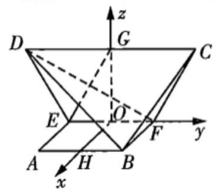

【例 13】在正三棱柱 ${ABC} - {A}_{1}{B}_{1}{C}_{1}$ 中,若 ${AB} = A{A}_{1} = 4$ ，点 $D$ 是 $A{A}_{1}$ 的中点，求点 ${A}_{1}$ 到平面 ${DB}{C}_{1}$ 的距离___.

【难度】 $\star   \star   \star$

【答案】 $\sqrt{2}$

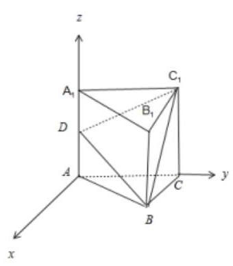

【解析】以 $\mathbf{A}$ 为原点,在平面 $\mathbf{{ABC}}$ 中过 $\mathbf{A}$ 作 $\mathbf{{AC}}$ 的垂线为 $\mathbf{x}$ 轴, $\mathbf{{AC}}$ 为 $\mathbf{y}$ 轴, $A{A}_{1}$ 为 $z$ 轴,建立空间直角坐标系, ${A}_{1}\left( {0,0,4}\right) , D\left( {0,0,2}\right) , B\left( {2\sqrt{3},2,0}\right) ,{C}_{1}\left( {0,4,4}\right)$ , $\overrightarrow{D{A}_{1}} = \left( {0,0,2}\right) ,\overrightarrow{DB} = \left( {2\sqrt{3},2, - 2}\right) ,\overrightarrow{D{C}_{1}} = \left( {0,4,2}\right)$ ,

设平面 ${DB}{C}_{1}$ 的法向量 $\overrightarrow{n} = \left( {x, y, z}\right)$ ,则 $\left\{  \begin{matrix} \overrightarrow{n} \cdot  \overrightarrow{DB} = 2\sqrt{3}x + {2y} - {2z} = 0 \\  \overrightarrow{n} \cdot  \overrightarrow{D{C}_{1}} = {4y} + {2z} = 0 \end{matrix}\right.$ ,取 $x = \sqrt{3}$ , 得 $\overrightarrow{n} = \left( {\sqrt{3}, - 1,2}\right) ,\therefore$ 点 ${A}_{1}$ 到平面 ${DB}{C}_{1}$ 的距离: $d = \frac{\left| \overrightarrow{D{A}_{1}} \cdot  \overrightarrow{n}\right| }{\left| \overrightarrow{n}\right| } = \frac{4}{\sqrt{8}} = \sqrt{2}$ . 故答案为 $\sqrt{2}$ .

## 巩固训练

1、如图，在直棱柱 ${ABC} - {A}_{1}{B}_{1}{C}_{1}$ 中， ${A{A}_{1}} = {AB} = {AC} = 2$ ， ${AB}\bot {AC}$ ， $D, E, F$ 分别是 ${A}_{1}{B}_{1}, C{C}_{1}$ ， ${BC}$ 的中点.

(1)求证: ${AE}\bot {DF}$ ；

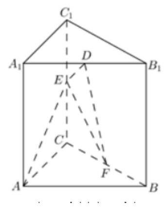

(2)求 ${AE}$ 与平面 ${DEF}$ 所成角的大小及点 $A$ 到平面 ${DEF}$ 的距离.

【难度】 $\star   \star   \star$

【答案】见解析

【解析】(1)以 $\mathbf{A}$ 为坐标原点、 $\mathbf{{AB}}$ 为 $\mathbf{x}$ 轴、 ${AC}$ 为 $\mathbf{y}$ 轴、 $A{A}_{1}$

为 $\mathrm{z}$ 轴建立如图的空间直角坐标系.

由题意可知 $A\left( {0,0,0}\right) , D\left( {0,1,2}\right) , E\left( {-2,0,1}\right) , F\left( {-1,1,0}\right)$ ,

故 $\overrightarrow{AE} = \left( {-2,0,1}\right) ,\overrightarrow{DF} = \left( {-1,0, - 2}\right)$ ,

由 $\overrightarrow{AE} \cdot  \overrightarrow{DF} =  - 2 \times  \left( {-1}\right)  + 1 \times  \left( {-2}\right)  = 0$ ,

可知 $\overrightarrow{AE} \bot  \overrightarrow{DF}$ ,即 ${AE} \bot  {DF}$ .

(2)设 $\overrightarrow{n} = \left( {x, y,1}\right)$ 是平面 ${DEF}$ 的一个法向量，

又 $\overrightarrow{DF} = \left( {-1,0, - 2}\right) ,\overrightarrow{EF} = \left( {1,1, - 1}\right)$ ,

故由 $\left\{  \begin{array}{l} \overrightarrow{n} \cdot  \overrightarrow{DF} =  - x - 2 = 0, \\  \overrightarrow{n} \cdot  \overrightarrow{EF} = x + y - 1 = 0, \end{array}\right.$ 解得 $\left\{  \begin{array}{l} x =  - 2, \\  y = 3, \end{array}\right.$ 故 $\overrightarrow{n} = \left( {-2,3,1}\right)$ .

设 ${AE}$ 与平面 ${DEF}$ 所成角为 $\theta$ ,则 $\sin \theta  = \frac{\left| \overrightarrow{n} \cdot  \overrightarrow{AE}\right| }{\left| \overrightarrow{n}\right|  \cdot  \left| \overrightarrow{AE}\right| } = \frac{5}{\sqrt{14} \cdot  \sqrt{5}} = \frac{\sqrt{70}}{14}$ ,

所以 ${AE}$ 与平面 ${DEF}$ 所成角为 $\arcsin \frac{\sqrt{70}}{14}$ ,点 $A$ 到平面 ${DEF}$ 的距离为 ${AE} \cdot  \sin \theta  = \frac{5}{14}\sqrt{14}$ .

2、如图,圆锥的底面圆心为 $O$ ,直径为 ${AB}\text{ ， }C$ 为半圆弧 ${AB}$ 的中点, $E$ 为劣弧 ${CB}$ 的中点,且 ${AB} = {2PO} = 2\sqrt{2}$ .

(1)求异面直线 ${PC}$ 与 ${OE}$ 所成的角的大小；

(2)求二面角 $P - {AC} - E$ 的大小.

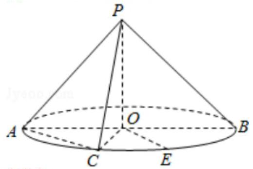

【难度】★★★

【答案】见解析

【解析】(1)证明: 方法(1) $\because {PO}$ 是圆锥的高， $\therefore {PO} \bot$ 底面圆 $O$ ，

根据中点条件可以证明 ${OE}//{AC}$ ，

$\angle {PCA}$ 或其补角是异面直线 ${PC}$ 与 ${OE}$ 所成的角;

${AC} = \sqrt{O{A}^{2} + O{C}^{2}} = \sqrt{2 + 2} = 2,{PC} = {PA} = \sqrt{O{P}^{2} + O{C}^{2}} = \sqrt{2 + 2} = 2$

所以 $\angle {PCA} = \frac{\pi }{3}$

异面直线 ${PC}$ 与 ${OE}$ 所成的角是 $\frac{\pi }{3}$

(1)方法(2)如图，建立空间直角坐标系，

$P\left( {0,0,\sqrt{2}}\right) , B\left( {0,\sqrt{2},0}\right) , A\left( {0, - \sqrt{2},0}\right) , C\left( {\sqrt{2},0,0}\right) ,$

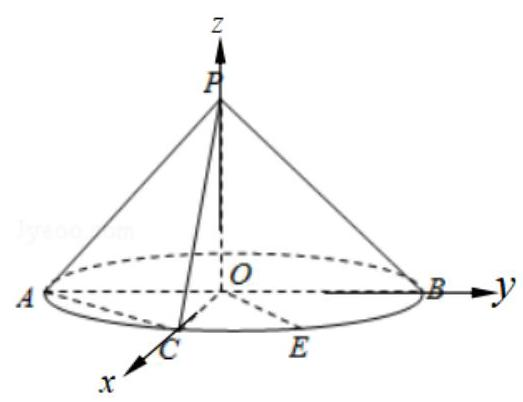

$E\left( {1,1,0}\right)$

$O\dot{E} = \left( {1,1,0}\right) , P\dot{C} = \left( {\sqrt{2},0, - \sqrt{2}}\right) , A\dot{C} = \left( {\sqrt{2},\sqrt{2},0}\right) ,$

设 $\overrightarrow{PC}$ 与 $\overrightarrow{OE}$ 夹角 $\theta$ ，

$\cos \theta  = \frac{\overline{PC} \cdot  \overline{OE}}{\left| \overline{PC}\right|  \cdot  \left| \overline{OE}\right| } = \frac{\sqrt{2}}{\sqrt{2} \times  2} = \frac{1}{2}$

异面直线 ${PC}$ 与 ${OE}$ 所成的角 $\frac{\pi }{3}$

(2)、方法(1)、设平面 ${APC}$ 的法向量 ${n}_{1} = \left( {{x}_{1},{y}_{1},{z}_{1}}\right)$

$\left\{  {\begin{array}{l} \overrightarrow{{n}_{1}} \cdot  \overrightarrow{PC} = 0 \\  \overrightarrow{{n}_{1}} \cdot  \overrightarrow{AC} = 0 \end{array}\;\left\{  {\begin{array}{l} \sqrt{2}{x}_{1} - \sqrt{2}{z}_{1} = 0 \\  \sqrt{2}{x}_{1} + \sqrt{2}{y}_{1} = 0 \end{array},\;\therefore \overrightarrow{{n}_{1}} = \left( {1, - 1,1}\right) }\right. }\right.$

平面 ${ACE}$ 的法向量 ${n}_{2} = \left( {0,0,1}\right)$

设两平面的夹角 $\alpha$ ,则 $\cos \alpha  = \frac{\overrightarrow{{n}_{1}} \cdot  \overrightarrow{{n}_{2}}}{\begin{Vmatrix}\overrightarrow{{n}_{1}}\end{Vmatrix} \cdot  \begin{Vmatrix}\overrightarrow{{n}_{2}}\end{Vmatrix}} = \frac{1}{\sqrt{3} \times  1} = \frac{\sqrt{3}}{3}$

所以二面角 $P - {AC} - E$ 的大小是 $\arccos \frac{\sqrt{3}}{3}$ .

3、如图,在正方体 ${ABCD} - {A}_{1}{B}_{1}{C}_{1}{D}_{1}$ 中, $E, F, G$ 分别是 ${AB}, C{C}_{1},{AD}$ 的中点.

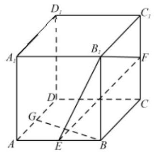

(1)求异面直线 ${B}_{1}E$ 与 ${BG}$ 所成角的余弦值；

(2)棱 ${CD}$ 上是否存在点 $T$ ，使得 ${AT}//$ 平面 ${B}_{1}{EF}$ ？请证明你的结论.

【难度】 $\star   \star   \star$

【答案】( 1 ) $\frac{2}{5}$ ；( 2 )存在点 $T$ ，满足 ${DT} = \frac{1}{4}{DC}$ ，使得 ${AT}//$ 平面 ${B}_{1}{EF}$ ；证明见解析 【解析】以 $D$ 为坐标原点,可建立如下图所示的空间直角坐标系:

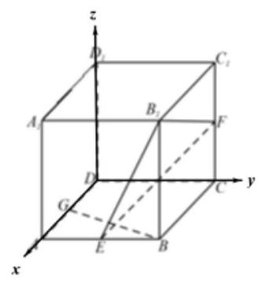

设正方体棱长为 ${2a}$ ,则 $B\left( {{2a},{2a},0}\right) ,{B}_{1}\left( {{2a},{2a},{2a}}\right) , E\left( {{2a}, a,0}\right) , G\left( {a,0,0}\right) , C\left( {0,{2a},0}\right) , D\left( {0,0,0}\right)$ , $F\left( {0,{2a}, a}\right) ,\;A\left( {{2a},0,0}\right)$

(1)设异面直线 ${B}_{1}E$ 与 ${BG}$ 所成角为 $\theta$

$\because \overrightarrow{{B}_{1}E} = \left( {0, - a, - {2a}}\right) ,\overrightarrow{BG} = \left( {-a, - {2a},0}\right)$

$\therefore \cos \theta  = \frac{\left| \overline{{B}_{1}E} \cdot  \overline{BG}\right| }{\left| \overline{{B}_{1}E}\right| \left| \overline{BG}\right| } = \frac{2{a}^{2}}{\sqrt{5}a \cdot  \sqrt{5}a} = \frac{2}{5}$ ,即异面直线 ${B}_{1}E$ 与 ${BG}$ 所成角的余弦值为: $\frac{2}{5}$

(2)假设在棱 ${CD}$ 上存在点 $T\left( {0, t,0}\right) , t \in  \left\lbrack  {0,{2a}}\right\rbrack$ ，使得 ${AT}//$ 平面 ${B}_{1}{EF}$

则 $\overrightarrow{{B}_{1}E} = \left( {0, - a, - {2a}}\right) ,\overrightarrow{EF} = \left( {-{2a}, a, a}\right) ,\overrightarrow{AT} = \left( {-{2a}, t,0}\right)$

设平面 ${B}_{1}{EF}$ 的法向量 $\overrightarrow{n} = \left( {x, y, z}\right) \; \therefore \left\{  \begin{array}{l} \overrightarrow{{B}_{1}E} \cdot  \overrightarrow{n} =  - {ay} - {2az} = 0 \\  \overrightarrow{EF} \cdot  \overrightarrow{n} =  - {2ax} + {ay} + {az} = 0 \end{array}\right.$ ,令 $z = 1$ ,则 $y =  - 2, x =  - \frac{1}{2}\;\therefore \overrightarrow{n} = \left( {-\frac{1}{2}, - 2,1}\right)$

$\therefore \overline{AT} \cdot  \bar{n} = a - {2t} = 0$ ,解得: $t = \frac{a}{2}\;\therefore {DT} = \frac{1}{4}{DC}$

$\therefore$ 棱 ${CD}$ 上存在点 $T$ ,满足 ${DT} = \frac{1}{4}{DC}$ ,使得 ${AT}//$ 平面 ${B}_{1}{EF}$

4、如图(1)所示，在 $R{t}_{ \bigtriangleup  }{ABC}$ 中， $\angle C = {90}^{ \circ  }$ ， ${BC} = 3$ ， ${AC} = 6$ ， $D$ ， $E$ 分别是 ${AC}$ ， ${AB}$ 上的点，且 ${DE}//{BC},{DE} = 2$ ，将 $\bigtriangleup  {ADE}$ 沿 ${DE}$ 折起到 $\bigtriangleup  {A}_{1}{DE}$ 的位置，使 ${A}_{1}C \bot  {CD}$ ，如图(2)所示.

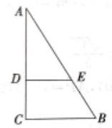

(1)

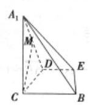

(2)

(1)若 $M$ 是 ${A}_{1}D$ 的中点，求 ${CM}$ 与平面 ${A}_{1}{BE}$ 所成角的大小；

(1)线段 ${BC}$ (不包括端点)上是否存在点 $P$ ，使平面 ${A}_{1}{DP}$ 与平面 ${A}_{1}{BE}$ 垂直？说明理由.

【难度】 $\star   \star   \star$

【答案】(1) $\frac{\pi }{4}$ ；(2)不存在，答案见解析.

【解析】(1) 如图建系 $C - {xyz}$ ,

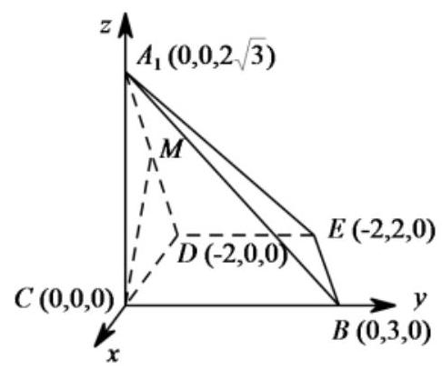

则 $D\left( {-2,0,0}\right) , A\left( {0,0,2\sqrt{3}}\right) , B\left( {0,3,0}\right) , E\left( {-2,2,0}\right)$ ,

$\therefore \overrightarrow{{A}_{1}B} = \left( {0,3, - 2\sqrt{3}}\right) ,\overrightarrow{BE} = \left( {-2, - 1,0}\right)$ ,

设平面 ${A}_{1}{BE}$ 的一个法向量为 $\overrightarrow{n} = \left( {x, y, z}\right)$

则 $\left\{  {\begin{array}{l} \overrightarrow{{A}_{1}B} \cdot  \overrightarrow{n} = 0 \\  \overrightarrow{BE} \cdot  \overrightarrow{n} = 0 \end{array}\therefore \left\{  {\begin{array}{l} {3y} - 2\sqrt{3}z = 0 \\   - {2x} - y = 0 \end{array}\therefore \left\{  {\begin{array}{l} z = \frac{\sqrt{3}}{2}y \\  x =  - \frac{y}{2} \end{array}\therefore \text{ 取 }y = 2,\text{ 得 }\overrightarrow{n} = \left( {-1,2,\sqrt{3}}\right) ,}\right. }\right. }\right.$

又 $\because M\left( {-1,0,\sqrt{3}}\right) ,\therefore \overrightarrow{CM} = \left( {-1,0,\sqrt{3}}\right)  < \overrightarrow{CM},\overrightarrow{n} >  = \theta ,{CM}$ 与平面 ${A}_{1}{BE}$ 所成角 $\alpha$

$\therefore \cos \theta  = \frac{\overrightarrow{CM} \cdot  \overrightarrow{n}}{\left| \overrightarrow{CM}\right|  \cdot  \left| \overrightarrow{n}\right| } = \frac{1 + 3}{\sqrt{1 + 4 + 3} \cdot  \sqrt{1 + 3}} = \frac{4}{2 \cdot  2\sqrt{2}} = \frac{\sqrt{2}}{2},\cos \alpha  = \left| {\cos \theta }\right|  = \frac{\sqrt{2}}{2}$ ,

$\therefore \mathrm{{CM}}$ 与平面 ${A}_{1}{BE}$ 所成角的大小 ${45}^{ \circ  }$ .

(2)设点 $P$ 的坐标为 $\left( {0, m,0}\right) \left( {0 < m < 3}\right)$ ，

$\overrightarrow{D{A}_{1}} = \left( {2,0,2\sqrt{3}}\right) ,\overrightarrow{DP} = \left( {2, m,0}\right)$ ,

设平面 ${A}_{1}{DP}$ 的法向量为 $\overrightarrow{{n}_{1}} = \left( {{x}_{1},{y}_{1},{z}_{1}}\right)$ ,

则 $\left\{  \begin{array}{l} \overline{D{A}_{1}} \cdot  \overline{{n}_{1}} = 0 \\  \overline{DP} \cdot  \overline{{n}_{1}} = 0 \end{array}\right.$ , $\left\{  \begin{array}{l} 2{x}_{1} + 2\sqrt{3}{z}_{1} = 0 \\  2{x}_{1} + m{y}_{1} = 0 \end{array}\right.$ , $\left\{  \begin{array}{l} {z}_{1} =  - \frac{1}{\sqrt{3}}{x}_{1} \\  {y}_{1} =  - \frac{2}{m}{x}_{1} \end{array}\right.$ ,令 ${x}_{1} = \sqrt{3}m$ ,则

$\overrightarrow{{n}_{1}} = \left( {\sqrt{3}m, - 2\sqrt{3}, - m}\right)$ . 要使平面 ${A}_{1}{DP}$ 与平面 ${A}_{1}{BE}$ 垂直,需

$\bar{n} \cdot  \overline{{n}_{1}} = \left( {-1}\right)  \times  \sqrt{3}m + 2 \times  \left( {-2\sqrt{3}}\right)  + \sqrt{3} \times  \left( {-m}\right)  = 0$ ,解得 $m =  - 2$ ,不满足条件.

所以不存在这样的点 $P$ .

5、已知圆锥的顶点为 $S, O$ 为底面中心， $A, B, C$ 为底面圆周上不重合的三点， ${AB}$ 为底面的直径， ${SA} = {AB}$ ， $M$ 为 ${SA}$ 的中点.设直线 ${MC}$ 与平面 ${SAB}$ 所成角为 $\alpha$ ，则 $\sin \alpha$ 的最大值为___.

【难度】 $\bigstar \bigstar \bigstar$

【答案】 $\sqrt{3} - 1$

【解析】以 ${AB}$ 的中点 $O$ 为坐标原点,建立如图所示的空间直角坐标系,不妨设 ${SA} = {AB} = 4$ ，则:

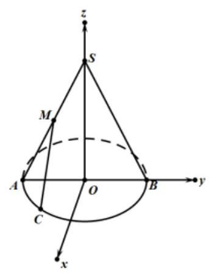

$M\left( {0, - 1,\sqrt{3}}\right) , C\left( {x, y,0}\right)$ ,如图所示,由对称性不妨设 $x > 0, y < 0$ 且 ${x}^{2} + {y}^{2} = 4$ ,

则 $\overline{MC} = \left( {x, y + 1, - \sqrt{3}}\right)$ ,易知平面 ${SAB}$ 的一个法向量为 $\overrightarrow{m} = \left( {1,0,0}\right)$ ,

据此有: $\sin \alpha  = \frac{\overrightarrow{MC} \cdot  \overrightarrow{m}}{\left| \overrightarrow{MC}\right|  \times  \left| \overrightarrow{m}\right| } = \frac{x}{\sqrt{{x}^{2} + {\left( y + 1\right) }^{2} + 3}}$

$= \sqrt{\frac{1}{2} \times  \left\lbrack  {-\left( {y + 4}\right)  - \frac{12}{y + 4} + 8}\right\rbrack  } \leq  \sqrt{4 - 2\sqrt{3}} = \sqrt{3} - 1$ ,

当且仅当 $y = 2\sqrt{3} - 4$ 时等号成立,

综上可得: $\sin \alpha$ 的最大值为 $\sqrt{3} - 1$ .

## (二) 三视图

## 知识梳理

1、光线从几何体的前面向后面正投影所得到的投影图叫做几何体的___正视图

2、光线从几何体的左面向右面正投影所得到的投影图叫做几何体___侧视图

3、光线从几何体的上面向下面正投影所得到的投影图叫做几何体的___俯视图___

4、三视图的概念:

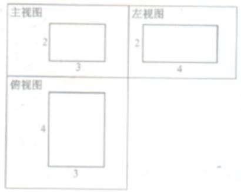

将三个视图展示在同一个平面上，使俯视图在主视图的下方，左视图在主视图的右方 (如图)，我们把整个构图叫做这个长方体的三视图。

问题: 根据长方体的模型，画出它们的三视图，并观察三种图形之间的关系.

答: 一个几何体的正视图和侧视图的高度一样, 俯视图和正视图的长度一样, 侧视图和俯视图的宽度一样.

【注:在画图中，三个视图的框可以不画，但是上下、左右的对齐要求必须遵循。】

## 例题精讲

【例 14】一个简单几何体的正视图、侧视图如图所示, 则其俯视图不可能为: ①长方形; ②正方形; ③圆. 其中正确的是( )

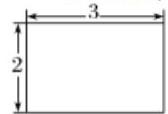

正视图

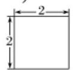

侧视图

A. ①② B. ②③ C. ①③ D. ①②③

【难度】★★

【答案】B

【解析】根据画三视图的规则“长对正,高平齐,宽相等”可知,几何体的俯视图不可能是圆和正方形. 故选 B.

【例 15】将一边长为 1 的正方形 ${ABCD}$ 沿对角线 ${BD}$ 折起,形成三棱椎 $C - {ABD}$ . 其正视图与俯视图如下图所示，则左视图的面积为( )

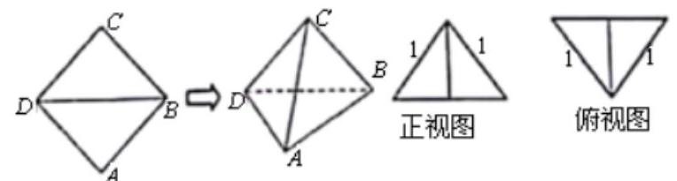

A. $\frac{1}{4}$ B. $\frac{\sqrt{2}}{4}$ C. $\frac{1}{2}$ D. $\frac{\sqrt{2}}{2}$

【难度】 $\star   \star   \star$

【答案】A

【解析】由题中正视图和俯视图,结合折叠前的图,则三棱椎 $C - {ABD}$ ,若 $O$ 为 ${BD}$ 的中点,

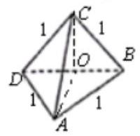

则 ${CO} \bot$ 面 ${ABD},{AO} = {OC} = \frac{\sqrt{2}}{2}$ ,则左视图为三角形 ${COA}$ ,

其面积 $S = \frac{1}{2} \times  \frac{\sqrt{2}}{2} \times  \frac{\sqrt{2}}{2} = \frac{1}{4}$ . 故选: A

【例 16】如图, 网格纸上小正方形的边长为 1 , 下图画出的是某几何体的三视图, 则该几何体的表面积为 ( )

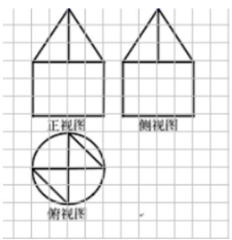

A. ${20\pi } + 8$ B. ${20\pi } + 8 + 2\sqrt{22}$

C. ${20\pi } + 8 + \sqrt{22}$ D. ${20\pi } + 8 + 4\sqrt{22}$

【难度】 $\star   \star   \star$

【答案】B

【解析】该几何体是由一个圆柱和两个三棱锥 $P - {ABC}, P - {CDE}$ 组成的,如下图所示:

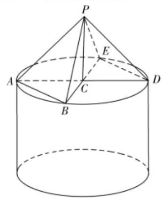

其中圆柱的底面半径为 2,高为 3,

两个三棱锥的底面均是直角边长为 2 的等腰直角三角形,高均为 3,

所以所求表面积:

$S = \pi  \times  {2}^{2} + 2 \times  \pi  \times  2 \times  3 + \pi  \times  {2}^{2} - 2 \times  \frac{1}{2} \times  2 \times  2 + 4 \times  \frac{1}{2} \times  2 \times  3 + 2 \times  \frac{1}{2} \times  2\sqrt{2} \times  \sqrt{11}$

$= {{20\pi } + 8 + 2\sqrt{22}}$ ，故选:B.

【例 17】某几何体的三视图如图所示, 其中正视图和侧视图为全等的等腰直角三角形, 则此几何体的最长棱的长度为( )

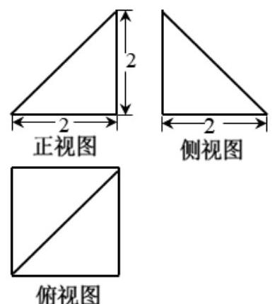

A. 2 B. $2\sqrt{2}$ C. $2\sqrt{3}$ D. 12

【难度】 $\star   \star   \star$

【答案】C

【解析】由三视图还原原几何体如图,

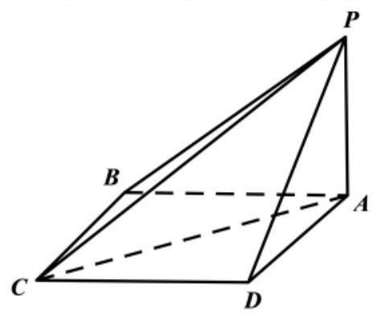

该几何体为四棱锥 $P - {ABCD}$ ,底面 ${ABCD}$ 为正方形边长为 2,侧棱 ${PA} \bot$ 底面 ${ABCD}$ .

且 ${PA} = 2$ . 则 ${PB} = {PD} = 2\sqrt{2},{PC} = \sqrt{{2}^{2} + {\left( 2\sqrt{2}\right) }^{2}} = 2\sqrt{3}$ .

## $\therefore$ 此几何体的最长棱的长度为 $2\sqrt{3}$ . 故选: $C$ .

【例 18】一个多面体的直观图和三视图如图所示,点 $M$ 是边 ${AB}$ 上的动点,记四面体 $E - {FMC}$ 的体积为 ${V}_{1}$ , 多面体 ${ADF} - {BCE}$ 的体积为 ${V}_{2}$ ,则 $\frac{{V}_{1}}{{V}_{2}} =$ (   )

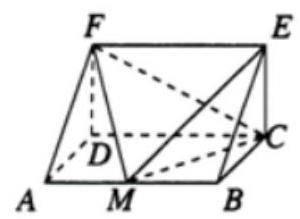

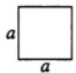

主(俯视图) 左视图

A. $\frac{1}{4}$ B. $\frac{1}{3}$ C. $\frac{1}{2}$ D. 不是定值，随点 $M$ 的变化而变化

【难度】 $\star   \star   \star$

【答案】B

【解析】由直观图和三视图可知,多面体 ${ADF} - {BCE}$ 是以等腰直角三角形 ${ADF}$ 为底面的直三棱柱,不妨设 ${AD} = {DF} = a = 2$ ,高 ${DC} = 2$ ,体积 ${V}_{2} = \left( {\frac{1}{2} \times  2 \times  2}\right)  \times  2 = 4;\because {AB}//$ 平面 ${EFC},\therefore$ 点 $M$ 到平面 ${EFC}$ 的距离就是点 $B$ 到平面 ${EFC}$ 的距离,又 ${BC} \bot$ 平面 ${EFC}$ ,且 ${BC} = 2$ , $\therefore$ 四面体 $E - {FMC}$ 的体积 ${V}_{1} = {V}_{M - {EFC}} = {V}_{B - {EFC}} = \frac{1}{3} \cdot  {S}_{\bigtriangleup {EFC}} \cdot  {BC} = \frac{1}{3} \times  \left( {\frac{1}{2} \times  2 \times  2}\right)  \times  2 = \frac{4}{3}$ ,故 $\frac{{V}_{1}}{{V}_{2}} = \frac{1}{3}$ . 故选 B.

## 巩固训练

1、已知正六棱柱的底面边长和侧棱长相等，体积为 ${12}{\mathrm{\;{cm}}}^{3}$ . 其三视图中的俯视图(如图所示)，则其侧视图的面积是( )

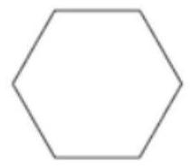

A. $4\sqrt{3}c{m}^{2}$ B. $2\sqrt{3}c{m}^{2}$ C. ${8c}{m}^{2}$ D. ${4c}{m}^{2}$

【难度】★★

【答案】A

【解析】设正六棱柱的底面边长是 $\mathrm{a}$ ,那么底面面积是 $\mathrm{S} = \frac{3}{2}\sqrt{3}{\mathrm{a}}^{2}\left( {\mathrm{\;{cm}}}^{2}\right)$ ,棱柱体积 $\mathrm{V} = \frac{3}{2}\sqrt{3}{\mathrm{a}}^{3} = {12}\sqrt{3}\left( {\mathrm{\;{cm}}}^{3}\right)$ , 所以 ${a}^{3} = 8$ ，解得 $a = 2$ ，那么侧视图是矩形，矩形的长就是俯视图的宽等于 $2\sqrt{3}\mathrm{\;{cm}}$ ， 所以侧视图的面积是 $\mathrm{S} = 2\sqrt{3} \times  2 = 4\sqrt{3}\left( {\mathrm{\;{cm}}}^{2}\right)$ . 故选 A.

2、已知几何体的三视图如图所示，则该几何体的体积为( )

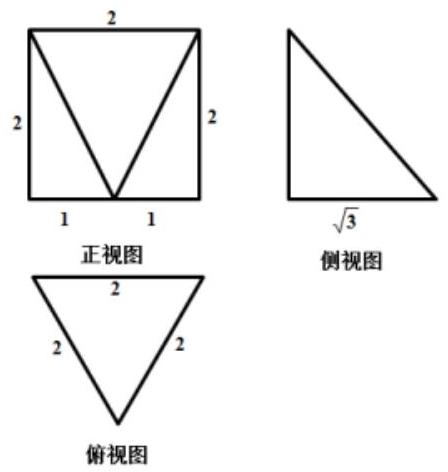

A. $\frac{\sqrt{3}}{3}$ B. $\frac{5\sqrt{3}}{3}$ C. $\frac{2\sqrt{3}}{3}$ D. $\frac{4\sqrt{3}}{3}$

【难度】★★

【答案】D

【解析】根据几何体的三视图, 可知该几何体是由一个底面边长为 2, 高为 2 的正三棱柱截去一个三棱锥后得到的, 如下图所示:

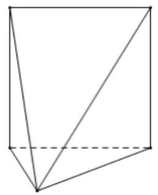

故剩余几何体的体积 $V = \frac{\sqrt{3}}{4} \times  {2}^{2} \times  2 - \frac{1}{3} \times  2 \times  \frac{\sqrt{3}}{4} \times  {2}^{2} = \frac{4\sqrt{3}}{3}$ . 故选: D.

3、某几何体的三视图如图所示，其中，俯视图由两个半径为 $a$ 的扇形组成，若该几何体的体积为 $3\sqrt{2}\pi$ ， 则 $a =$ (   )

俯视图

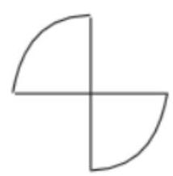

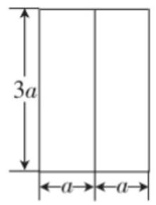

正视图

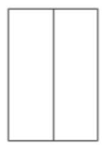

侧视图

A. $\sqrt{2}$ B. 2 C. $2\sqrt{2}$ D. 4

【难度】 $\star   \star   \star$

【答案】A

【解析】由三视图可知该几何体由两个 $\frac{1}{4}$ 的圆柱组成,

则其体积为 $2 \times  \frac{1}{4} \times  \pi  \times  {a}^{2} \times  {3a} = \frac{3\pi }{2}{a}^{3} = 3\sqrt{2}\pi$ ,解得: $a = \sqrt{2}$ . 故选: $A$ .

4、已知某几何体的三视图如图所示(正视图为等腰三角形，俯视图为正方形，侧视图为直角三角形)，则该几何体的最短棱长为 ___，最长棱长为___.

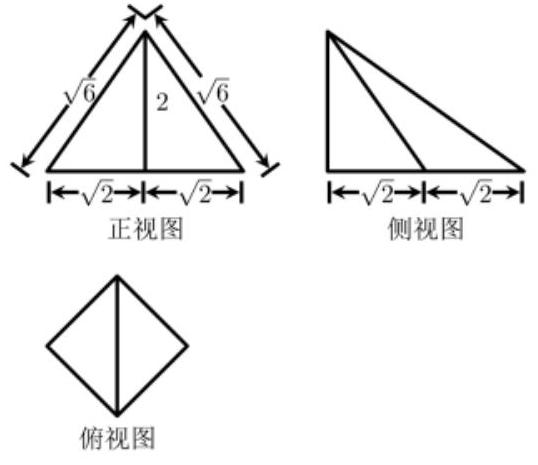

【难度】 $\star   \star   \star$

【答案】 2 $2\sqrt{3}$

【解析】此几何体的直观图如图所示,

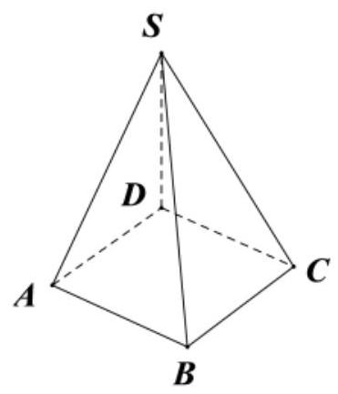

其中, ${SD} \bot$ 面 ${ABCD},{ABCD}$ 为正方形,

由图可知,此几何体最短棱长为 ${AB} = {SD} = 2$ ，最长棱长为 ${SB}$ ，由三视图得:

${SB} = \sqrt{{SD}^{2} + {BD}^{2}} = \sqrt{{2}^{2} + {\left( 2\sqrt{2}\right) }^{2}} = {2\sqrt{3}}$ ,故答案为:2;2 $\sqrt{3}$ .

## 实战演练

## 一、填空题

1、若直线 $l$ 的方向向量为 $\overrightarrow{a} = \left( {1,0,2}\right)$ ，平面 $\alpha$ 的法向量为 $\overrightarrow{\mu } = \left( {-2,0, - 4}\right)$ ，则直线 $l$ 与平面 $\alpha$ 的关系为 ___.

【难度】 $\star   \star$

【答案】 $l \bot  \alpha$

【解析】解: $\because \overrightarrow{\mu } =  - 2\overrightarrow{a},\therefore \overrightarrow{a}//\overrightarrow{\mu }$ ,因此 $l \bot  \alpha$ .

故答案为: $l \bot  \alpha$ .

2、 ${ABCD} - {{A}^{\prime }{B}^{\prime }{C}^{\prime }{D}^{\prime }}$ 为平行六面体，设 $\overline{AB} = \bar{a},\overline{AD} = \bar{b},\overline{A{A}^{\prime }} = \bar{c}, E\text{ 、 }F$ 分别是 ${A{D}^{\prime }},{BD}$ 的中点，则 $\overline{EF} \; =$ ___(用向量 $\overrightarrow{a},\overrightarrow{b},\overrightarrow{c}$ 表示)

【难度】 $\star   \star   \star$

【答案】 $\frac{1}{2}\left( {\bar{a} - \bar{c}}\right)$

【解析】如图,连结 ${AC}$ ,易知 ${AC},{BD}$ 交于点 $F$ ,且点 $F$ 为 ${AC}$ 中点,则

$\overrightarrow{EF} = \overrightarrow{EA} + \overrightarrow{AF} = \frac{1}{2}\overrightarrow{{D}^{\prime }A} + \frac{1}{2}\overrightarrow{AC} =  - \frac{1}{2}\left( {\overrightarrow{A{A}^{\prime }} + \overrightarrow{AD}}\right)  + \frac{1}{2}\left( {\overrightarrow{AD} + \overrightarrow{AB}}\right)  = \frac{1}{2}\left( {\overrightarrow{b} + \overrightarrow{a} - \overrightarrow{c} - \overrightarrow{b}}\right)$

$= \frac{1}{2}\left( {\overrightarrow{a} - \overrightarrow{c}}\right)$ .

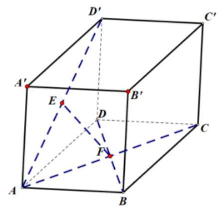

3、四棱柱 ${ABCD} - {A}_{1}{B}_{1}{C}_{1}{D}_{1}$ 中， $\angle {A}_{1}{AB} = \angle {A}_{1}{AD} = \angle {DAB} = {60}^{ \circ  },{A}_{1}A = {AB} = {AD} = 1$ ，则 $A{C}_{1} =$ ___.

【难度】 $\star   \star   \star$

【答案】 $\sqrt{6}$

【解析】 $\overrightarrow{A{C}_{1}} = \overrightarrow{AB} + \overrightarrow{AD} + \overrightarrow{A{A}_{1}}$ ,所以

$\left| \overrightarrow{A{C}_{1}}\right|  = \sqrt{{\left( \overrightarrow{AB} + \overrightarrow{AD} + \overrightarrow{A{A}_{1}}\right) }^{2}} = \sqrt{{\overrightarrow{AB}}^{2} + {\overrightarrow{AD}}^{2} + {\overrightarrow{A{A}_{1}}}^{2} + 2\left( {\overrightarrow{AB} \cdot  \overrightarrow{AD} + \overrightarrow{AD} \cdot  \overrightarrow{A{A}_{1}} + \overrightarrow{AB} \cdot  \overrightarrow{A{A}_{1}}}\right) }$

$= \sqrt{1 + 1 + 1 + 2\left( {1 \times  1 \times  \frac{1}{2} \times  3}\right) } = \sqrt{6}$ ,故填: $\sqrt{6}$ .

4、如图，在四棱柱 ${ABCD} - {A}_{1}{B}_{1}{C}_{1}{D}_{1}$ 中，底面 ${ABCD}$ 是平行四边形，点 $E$ 为 ${BD}$ 的中点，若 $\overline{{A}_{1}E} = x\overline{A{A}_{1}} + y\overline{AB} + z\overline{AD}$ ,则 $x + y + z =$ ___.

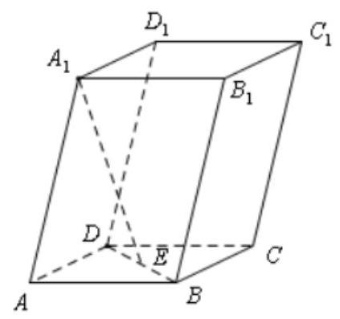

【难度】★★★

【答案】0

【解析】在四棱柱 ${ABCD} - {A}_{1}{B}_{1}{C}_{1}{D}_{1}$ 中，底面 ${ABCD}$ 是平行四边形，点 $E$ 为 ${BD}$ 的中点，

所以 $\overrightarrow{{A}_{1}E} = \overrightarrow{{A}_{1}A} + \overrightarrow{AB} + \overrightarrow{BE} = \overrightarrow{{A}_{1}A} + \overrightarrow{AB} + \frac{1}{2}\overrightarrow{BD} = \overrightarrow{{A}_{1}A} + \overrightarrow{AB} + \frac{1}{2}\left( {\overrightarrow{BA} + \overrightarrow{AD}}\right)$

$=  - \overrightarrow{A{A}_{1}} + \frac{1}{2}\overrightarrow{AB} + \frac{1}{2}\overrightarrow{AD}$

由题: $\overrightarrow{{A}_{1}E} = x\overrightarrow{A{A}_{1}} + y\overrightarrow{AB} + z\overrightarrow{AD}$ ,所以 $x =  - 1, y = \frac{1}{2}, z = \frac{1}{2}$ ,即 $x + y + z = 0$ .

故答案为: 0

5、如图，在正三棱柱 ${ABC} - {A}_{1}{B}_{1}{C}_{1}$ 中， ${AB} = {AC} = {A{A}_{1}} = 2, E, F$ 分别是 ${BA},{A}_{1}{C}_{1}$ 的中点. 设 $D$ 是线段 ${B}_{1}{C}_{1}$ 上的 (包括两个端点) 动点,当直线 ${BD}$ 与 ${EF}$ 所成角的余弦值为 $\frac{\sqrt{10}}{4}$ ,则线段 ${BD}$ 的长为___.

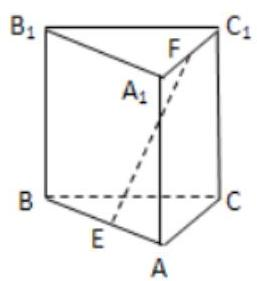

【难度】 $\star   \star   \star$

【答案】 $2\sqrt{2}$

【解析】以 $\mathrm{E}$ 为原点, EA, EC为 $\mathrm{x},\mathrm{y}$ 轴建立空间直角坐标系,如下图.

$E\left( {0,0,0}\right) , F\left( {\frac{\sqrt{3}}{2},\frac{1}{2},2}\right) , B\left( {0, - 1,0}\right) , D\left( {0, t,2}\right) \left( {-1 \leq  t \leq  1}\right)$

$\overline{EF} = \left( {\frac{\sqrt{3}}{2},\frac{1}{2},2}\right) ,\overline{BD} = \left( {0, t + 1,2}\right)$

$\cos \theta  = \frac{\overline{EF} \cdot  \overline{BD}}{\left| \overline{EF}\right| \left| \overline{BD}\right| } = \frac{\frac{\left( t + 1\right) }{2} + 4}{\sqrt{5} \cdot  \sqrt{{\left( t + 1\right) }^{2} + 4}} = \frac{\sqrt{10}}{4}$

解得 $\mathrm{t} = 1$ ,所以 ${BD} = 2\sqrt{2}$ ,填 $2\sqrt{2}$ .

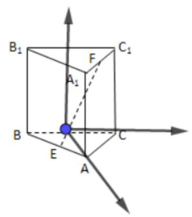

6、如图所示，直角 $\bigtriangleup  {AOB}$ 绕直角边 ${AO}$ 所在直线旋转一周形成一个圆锥，已知在空间直角坐标系 $O - {xyz}$ 中,点 $\left( {2,0,0}\right)$ 和 $\left( {0,2,1}\right)$ 均在圆锥的母线上,则圆锥的体积为___.

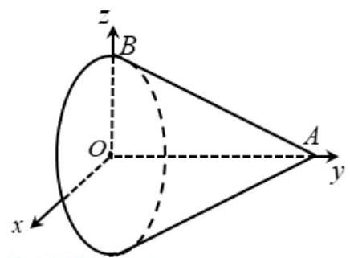

【难度】 $\star   \star   \star$

【答案】 $\frac{16\pi }{3}$

【解析】根据题意: ${OA}$ 为 $y$ 轴,则圆锥底面在 ${xoz}$ 平面上,

点 $\left( {2,0,0}\right)$ 在圆锥的母线上,圆锥底面圆半径为 2,

故点 $\left( {0,0, - 2}\right)$ 是底面圆周与 $z$ 轴负半轴的交点,又点 $\left( {0,2, - 1}\right)$ 在圆锥的母线上,

所以这条母线在 ${xoy}$ 平面内,必过 $\left( {0,0, - 2}\right)$ 和 $\left( {0,2, - 1}\right)$ 两点,其与 $y$ 轴交于点 $\left( {0,4,0}\right)$ ;

即圆锥的高为 4,由圆锥的体积公式可得体积为 $\frac{1}{3}\pi  \times  4 \times  {2}^{2} = \frac{16}{3}\pi$ ,故答案为: $\frac{16\pi }{3}$

## 二、选择题

7、一个水平放置的平面图形的斜二测直观图是直角梯形 $\mathrm{{ABCD}}$ (如图所示)，若 $\angle {ABC} = {45}^{ \circ  }$ ， ${AB} = {AD} = 1$ ， ${DC}\bot {BC}$ ，则这个平面图形的面积为( )

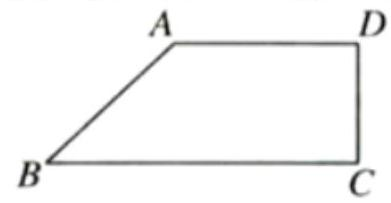

A. $\frac{1}{4} + \frac{\sqrt{2}}{4}$ B. $2 + \frac{\sqrt{2}}{2}$ C. $\frac{1}{4} + \frac{\sqrt{2}}{2}$ D. $\frac{1}{2} + \sqrt{2}$

【难度】 $\star   \star   \star$

【答案】B

【解析】在直观图中， $\because \angle \mathrm{{ABC}} = {45}^{ \circ  },\mathrm{{AB}} = \mathrm{{AD}} = 1,\mathrm{{DC}} \bot  \mathrm{{BC}}$

$\therefore \mathrm{{AD}} = 1,\mathrm{{BC}} = 1 + \frac{\sqrt{2}}{2}$ ,

$\therefore$ 原来的平面图形上底长为 1,下底为 $1 + \frac{\sqrt{2}}{2}$ ,高为 2,

$\therefore$ 平面图形的面积为 $\frac{1 + 1 + \frac{\sqrt{2}}{2}}{2} \times  2 = 2 + \frac{\sqrt{2}}{2}$ . 故选: B.

8、体积为 $\frac{4}{3}$ 的某三棱锥的三视图如下图所示(其三个视图均为直角三角形)，则该三棱锥四个面的面积中， 最大值为( )

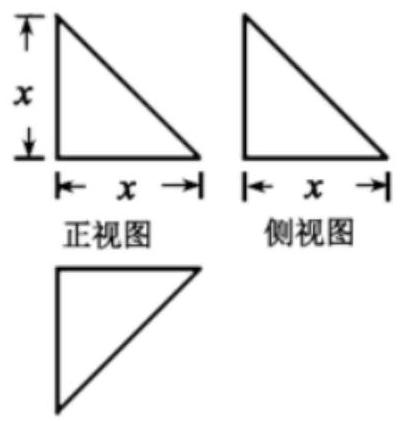

俯视图

A. $\sqrt{3}$ B. $2\sqrt{3}$ C. $3\sqrt{3}$ D. 6

【难度】★★★

【答案】B

【解析】

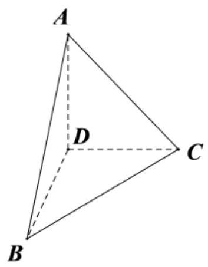

由三视图,作出三棱锥 $A - {BCD},{AD} \bot$ 平面 ${BCD},\therefore {\Delta BCD},{\Delta ABD},{\Delta ACD}$ 为等腰直角三角形, ${\Delta ABC}$ 是等边三角形, ${AD} = {BD} = {CD} = x,{AB} = \sqrt{A{D}^{2} + B{D}^{2}} = \sqrt{2}x$ ,

$\therefore {V}_{A - {BCD}} = \frac{1}{3} \times  \frac{1}{2}{x}^{2} = \frac{4}{3}$ 则 $x = 2$

${S}_{\varphi ABD} = {S}_{\varphi ACD} = {S}_{\varphi BCD} = \frac{1}{2} \times  2 \times  2 = 2,{S}_{\varphi ABC} = \frac{1}{2} \times  2\sqrt{2} \times  2\sqrt{2} \times  \frac{\sqrt{3}}{2} = 2\sqrt{3},$

故三角形 ${ABC}$ 的面积最大，为 $2\sqrt{3}$ ，选 B.

9、已知长方体切去一个角的几何体直观图如图 1 所示给出下列 4 个平面图如图 2: 则该几何体的主视图、 俯视图、左视图的序号依次是( )

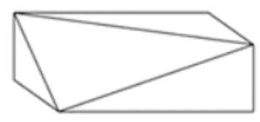

图 1

(1) (2) (3) (4)

图 2

A. (1) (3) (4) B. (2) (4) (3) C. (1) (3) (2) D. (2) (4) (1)

【难度】 $\star   \star   \star$

【答案】C

【解析】解: 由于几何体被切去一个角, 所以正视图、俯视图以及侧视图的矩形都有对角线;

关键放置的位置得到 $\mathbf{C}$ ;

## 故选: C.

10、如图， $P$ 为正方体 ${ABCD} - {A}_{1}{B}_{1}{C}_{1}{D}_{1}$ 中 $A{C}_{1}$ 与 $B{D}_{1}$ 的交点，则 $\bigtriangleup  {PAC}$ 在该正方体各个面上的射影可能是( )

①

②

③ ④。

A. ①②③④ B. ①③ C. ①④ D. ②④

【难度】★★★

【答案】C

【解析】由题意可知, ${\Delta PAC}$ 在上下底面的投影为图①, ${\Delta PAC}$ 在四个侧面的投的影为图④,所以选 C.

## 三、解答题

11、如图，已知点 $P$ 在圆柱 $O{O}_{1}$ 的底面圆 $O$ 上， ${AB}$ 为圆 $O$ 的直径， $A{A}_{1}$ 、 $B{B}_{1}$ 为圆柱的母线， ${OA} = 2$ ， 圆柱的体积为 ${12\pi },\angle {AOP} = {120}^{ \circ  }$ .

(1)求异面直线 ${A}_{1}B$ 与 ${AP}$ 所成角的大小(结果用反三角函数值表示);

(2)求点 $B$ 到平面 ${A}_{1}{AP}$ 的距离.

【难度】 $\star   \star   \star$

【答案】(1) $\arccos \frac{2\sqrt{3}}{5};$ (2) 2 .

【解析】解: (1) 由已知 $V = \pi {R}^{2}h = \pi  \times  4 \times  A{A}_{1} = {12\pi }$ ,得 $A{A}_{1} = 3$ ,

在圆 $O$ 中 ${AP} = {2OA}\sin {60}^{ \circ  } = 2 \times  2 \times  \frac{\sqrt{3}}{2} = {2\sqrt{3}}$ ，

又 ${A}_{1}B = \sqrt{A{A}_{1}^{2} + A{B}^{2}} = \sqrt{{3}^{2} + {4}^{2}} = 5$ ;

$\cos \left\langle  {\overrightarrow{{A}_{1}B},\overrightarrow{AP}}\right\rangle   = \frac{\overrightarrow{{A}_{1}B} \cdot  \overrightarrow{AP}}{\left| \overrightarrow{{A}_{1}B}\right|  \cdot  \left| \overrightarrow{AP}\right| } = \frac{\left( {\overrightarrow{{A}_{1}A} + \overrightarrow{AB}}\right)  \cdot  \overrightarrow{AP}}{\left| \overrightarrow{{A}_{1}B}\right|  \cdot  \left| \overrightarrow{AP}\right| } = \frac{\overrightarrow{{A}_{1}A} \cdot  \overrightarrow{AP} + \overrightarrow{AB} \cdot  \overrightarrow{AP}}{\left| \overrightarrow{{A}_{1}B}\right|  \cdot  \left| \overrightarrow{AP}\right| } = \frac{4 \times  2\sqrt{3} \times  \cos {30}^{ \circ  }}{5 \times  2\sqrt{3}} = \frac{2\sqrt{3}}{5}$

直线 ${A}_{1}B$ 与 ${AP}$ 所成角的大小为 $\arccos \frac{2\sqrt{3}}{5}$ ;

(2)连接 ${BP},{A}_{1}P,\because {AB}$ 为圆 $O$ 的直径，

$\therefore {AP} \bot  {BP}$ ，又 ${A{A}_{1}} \bot  {BP},{A{A}_{1}} \cap  {AP} = A$ ， $\therefore {BP} \bot$ 面 ${A}_{1}{AP}$ ，

则点 $B$ 到平面 ${A}_{1}{AP}$ 的距离即为线段 ${BP}$ 的长, $\therefore {BP} = 4\sin {30}^{ \circ  } = 2$ ,

即点 $B$ 到平面 ${A}_{1}{AP}$ 的距离 2 .

12、如图，三棱柱 ${ABC} - {A}_{1}{B}_{1}{C}_{1}$ 中， ${AB}\bot$ 侧面 $B{B}_{1}{C}_{1}C$ ，已知 $\angle {BC}{C}_{1} = \frac{\pi }{3}$ ， ${BC} = 1$ ， ${AB} = {C}_{1}C = 2$ ， 点 $E$ 是棱 ${C}_{1}C$ 的中点.

(1)求证: ${C}_{1}B \bot$ 平面 ${ABC}$ ；

(2)求二面角 $A - E{B}_{1} - {A}_{1}$ 的余弦值；

(3)在棱 ${CA}$ 上是否存在一点 $M$ ，使得 ${EM}$ 与平面 ${A}_{1}{B}_{1}$ 相同且的正弦值为 $\frac{2\sqrt{11}}{11}$ ，若存在，求出 $\frac{CM}{CA}$ 的值; 若不存在, 请说明理由.

【难度】 $\star   \star   \star$

【答案】(1)证明见解析(2) $\frac{2\sqrt{5}}{5}$ (3)存在， $\frac{CM}{CA} = \frac{1}{3}$ 或 $\frac{CM}{CA} = \frac{5}{23}$ .

【解析】(1) 由题意,因为 ${BC} = 1, C{C}_{1} = 2,\angle {BC}{C}_{1} = \frac{\pi }{3},\therefore B{C}_{1} = \sqrt{3}$ ,

又 $\therefore B{C}^{2} + B{C}_{1}^{2} = C{C}_{1}^{2},\therefore B{C}_{1} \bot  {BC}$ ,

$\because {AB} \bot$ 侧面 $B{B}_{1}{C}_{1}C,\therefore {AB} \bot  B{C}_{1}$ .

又 $\because {AB} \cap  {BC} = B,{AB},{BC} \subset$ 平面 ${ABC}$

$\therefore$ 直线 ${C}_{1}B \bot$ 平面 ${ABC}$ .

(2)以 $B$ 为原点，分别以 $\overrightarrow{BC}$ ， $\overrightarrow{B{C}_{1}}$ 和 $\overrightarrow{BA}$ 的方向为 $x$ ， $y$ 和 $z$ 轴的正方向建立如图所示的空间直角坐标系,则有 $A\left( {0,0,2}\right) ,{B}_{1}\left( {-1,\sqrt{3},0}\right) , E\left( {\frac{1}{2},\frac{\sqrt{3}}{2},0}\right) ,{A}_{1}\left( {-1,\sqrt{3},2}\right)$ ,

设平面 $A{B}_{1}E$ 的一个法向量为 $\overrightarrow{n} = \left( {{x}_{1},{y}_{1},{z}_{1}}\right) ,\overrightarrow{A{B}_{1}} = \left( {-1,\sqrt{3}, - 2}\right) ,\overrightarrow{AE} = \left( {\frac{1}{2},\frac{\sqrt{3}}{2}, - 2}\right)$

$\because \left\{  {\begin{array}{l} \overrightarrow{n} \cdot  \overrightarrow{A{B}_{1}} = 0 \\  \overrightarrow{n} \cdot  \overrightarrow{AE} = 0 \end{array},\therefore \left\{  \begin{array}{l}  - {x}_{1} + \sqrt{3}{y}_{1} - 2{z}_{1} = 0 \\  \frac{1}{2}{x}_{1} + \frac{\sqrt{3}}{2}{y}_{1} - 2{z}_{1} = 0 \end{array}\right. }\right.$ ,令 ${y}_{1} = \sqrt{3}$ ,则 ${x}_{1} = 1,\therefore \overrightarrow{n} = \left( {1,\sqrt{3},1}\right)$

设平面 ${A}_{1}{B}_{1}E$ 的一个法向量为 $\overrightarrow{m} = \left( {x, y, z}\right) ,\overrightarrow{{A}_{1}{B}_{1}} = \left( {0,0, - 2}\right) ,\overrightarrow{{A}_{1}E} = \left( {\frac{3}{2}, - \frac{\sqrt{3}}{2}, - 2}\right)$ ,

$\because \left\{  {\begin{array}{l} \overrightarrow{m} \cdot  \overrightarrow{{A}_{1}{B}_{1}} = 0 \\  \overrightarrow{m} \cdot  \overrightarrow{{A}_{1}E} = 0 \end{array},\therefore \left\{  {\begin{array}{l}  - {2z} = 0 \\  \frac{3}{2}x - \frac{\sqrt{3}}{2}y - {2z} = 0 \end{array},\text{ 令 }y = \sqrt{3}}\right. }\right.$ ,则 $x = 1,\therefore \overrightarrow{m} = \left( {1,\sqrt{3},0}\right)$ ,

$\left| \overrightarrow{m}\right|  = 2,\left| \overrightarrow{n}\right|  = \sqrt{5},\overrightarrow{m} \cdot  \overrightarrow{n} = 4,\therefore \cos \langle \overrightarrow{m},\overrightarrow{n}\rangle  = \frac{\overrightarrow{m} \cdot  \overrightarrow{n}}{\left| \overrightarrow{m}\right| \left| \overrightarrow{n}\right| } = \frac{4}{2\sqrt{5}} = \frac{2\sqrt{5}}{5}.$

设二面角 $A - E{B}_{1} - {A}_{1}$ 为 $\alpha$ ,则 $\cos \alpha  = \cos \langle \overrightarrow{m},\overrightarrow{n}\rangle  = \frac{2\sqrt{5}}{5}$ .

$\therefore$ 设二面角 $A - E{B}_{1} - {A}_{1}$ 的余弦值为 $\frac{2\sqrt{5}}{5}$ .

(3)假设存在点 $M$ ，设 $M\left( {x, y, z}\right)$ ， $\because \overrightarrow{CM} = \lambda \overrightarrow{CA}$ ， $\lambda  \in  \left\lbrack  {0,1}\right\rbrack$ ，

$\therefore \left( {x - 1, y, z}\right)  = \lambda \left( {-1,0,2}\right) ,\therefore M\left( {1 - \lambda ,0,{2\lambda }}\right) \therefore \overrightarrow{EM} = \left( {\frac{1}{2} - \lambda , - \frac{\sqrt{3}}{2},{2\lambda }}\right)$

设平面 ${A}_{1}{B}_{1}E$ 的一个法向量为 $\overrightarrow{m} = \left( {1,\sqrt{3},0}\right) ,\therefore \frac{2\sqrt{11}}{11} = \frac{\left| \frac{1}{2} - \lambda  - \frac{3}{2}\right| }{2\sqrt{{\left( \frac{1}{2} - \lambda \right) }^{2} + \frac{3}{4}} + 4{\lambda }^{2}}$ ,得 ${69}{\lambda }^{2} - {38\lambda } + 5 = 0$ .

即 $\left( {{3\lambda } - 1}\right) \left( {{23\lambda } - 5}\right)  = 0,\therefore \lambda  = \frac{1}{3}$ 或 $\lambda  = \frac{5}{23},\therefore \frac{CM}{CA} = \frac{1}{3}$ 或 $\frac{CM}{CA} = \frac{5}{23}$ .

