## (一) 线性规划

线性规划、参数方程

<table><tr><td>教学目标</td><td>1、会用二元一次不等式表示平面区域，解决简单的问题；   2、初步掌握简单的线性规划问题的解法;   3、理解参数方程的意义，领会建立曲线的参数方程的方法，懂得参数法的基本运用；   4、掌握参数方程与直角坐标方程的互化;   5、掌握圆与椭圆的参数方程，并能用于解决一些简单的几何问题.</td></tr><tr><td>重点</td><td>1、掌握简单的线性规划问题的解法   2、参数方程与直角坐标方程的互化</td></tr><tr><td>难 点</td><td>含参的线性规划问题</td></tr></table>

## 知识梳理

## 1. 线性规划的概念

线性规划是指在线性约束条件下求目标函数的最值，这里的线性约束条件是指___ $x, y$ 满足的条件

## 2. 可行解与最优解

①满足线性约束条件的解 $\left( {x, y}\right)$ 叫做可行解；

②使目标函数达到最大(或最小)值的可行解叫做最优解。

## 3. 可行域

所有可行解___表示的平面区域称为可行域，画可行域的方法是 “直线定界，特殊点定域”。

## 4. 简单线性规划的图解法

用图解法解简单的线性规划可分为三个步骤:

(1)画出可行域___；

(2)作出目标函数的等值线___；

(3)求出最值___；

## 例题精讲

一、点与平面区域间的关系

【例 1】已知点 $M\left( {a,{2a} - 1}\right)$ 在不等式组 $\left\{  \begin{matrix} x + y \geq  0 \\  x - y \geq  0 \\  x \leq  4 \end{matrix}\right.$ 所确定的平面区域之外,则 $a$ 的取值范围是___.

【答案】 $\left( {-\infty ,\frac{1}{3}}\right)  \cup  \left( {1, + \infty }\right)$

【难度】★★

【解析】不等式组所表示的平面区域如图:

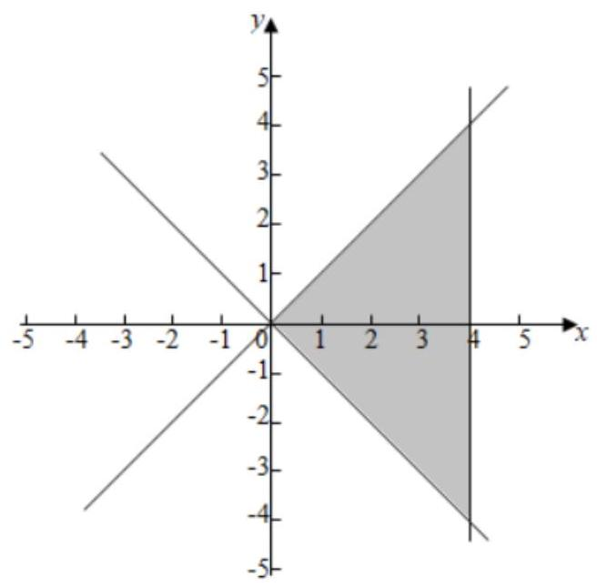

根据题意可得若点 $M\left( {a,{2a} - 1}\right)$ 在平面区域之内,

则 $\left\{  \begin{array}{l} 0 \leq  a \leq  4 \\   - a \leq  {2a} - 1 \leq  a \end{array}\right.$ ,解得 $\frac{1}{3} \leq  a \leq  1$ ,

$\therefore$ 若点 $\mathrm{M}$ 在平面区域之外,则 $a < \frac{1}{3}$ 或 $a > 1$ . 故答案为: $\left( {-\infty ,\frac{1}{3}}\right)  \cup  \left( {1, + \infty }\right)$ .

【例 2】设点 $P\left( {x, y}\right)$ 是圆 $C : {x}^{2} + {y}^{2} + {2x} - {2y} + 1 = 0$ 上任意一点,若 $- {2x} + y + 1 + \left| {{2x} - y - a}\right|$ 为定值,则 $a$ 的值可能为( )

A. -3 B. -4 C. -5 D. -6

【难度】 $\star   \star   \star$

【答案】D

【解析】圆 $C$ 标准方程为 ${\left( x + 1\right) }^{2} + {\left( y - 1\right) }^{2} = 1$ ,圆心为 $C\left( {-1,1}\right)$ ,半径为 $r = 1$ ,

直线 $l : {2x} - y - a = 0$ 与圆相切时， $\frac{\left| -2 - 1 - a\right| }{\sqrt{5}} = 1, a =  - 3 \pm  \sqrt{5}$ ，

当 $a =  - 3 + \sqrt{5}$ 时,圆 $C$ 在直线 $l$ 上方, ${2x} - y - a \leq  0$ ,当 $a =  - 3 - \sqrt{5}$ 时,圆 $C$ 在直线 $l$ 下方,

${2x} - y - a \geq  0$ ,

若 $- {2x} + y + 1 + \left| {{2x} - y - a}\right|$ 为定值，则 ${2x} - y - a \geq  0$ ，因此 $a \leq   - 3 - \sqrt{5}$ . 只有 $D$ 满足.

故选: D.

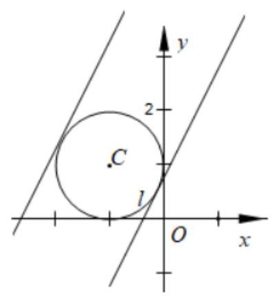

## 巩固训练

1、 ${x}^{2} + {y}^{2} \leq  1$ 是“ $\left| x\right|  + \left| y\right|  \leq  \sqrt{2}$ ”成立的( )

A. 充分不必要条件 B. 必要不充分条件

C. 充分且必要条件 D. 既不充分又不必要条件

【难度】 $\star   \star   \star$

【答案】A

【解析】“ ${x}^{2} + {y}^{2} \leq  1$ ”表示单位圆内以及圆周上的点,

“ $\left| x\right|  + \left| y\right|  \leq  \sqrt{2}$ ”表示以点 $\left( {\sqrt{2},0}\right) ,\left( {0,\sqrt{2}}\right) ,\left( {-\sqrt{2},0}\right) ,\left( {0, - \sqrt{2}}\right)$ 为正方形内及边界上的点， 由图象可知, 圆是正方形的内切圆,

所以 " ${x}^{2} + {y}^{2} \leq  1$ " 是 " $\left| x\right|  + \left| y\right|  \leq  \sqrt{2}$ "成立的充分不必要条件,故选: $A$ .

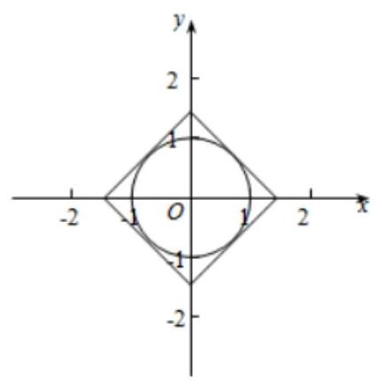

2、已知 $x \geq  1$ ， $y \geq  0$ ，集合 $A = \{ \left( {x, y}\right)  \mid  x + y \leq  4\}$ ， $B = \{ \left( {x, y}\right)  \mid  x - y + t = 0\}$ ，如果 $A \cap  B \neq  \varnothing$ ，则 $t$ 的取值范围是___.

【难度】 $\star   \star   \star$

【答案】 $\left\lbrack  {-4,2}\right\rbrack$

【解析】由 $\left\{  \begin{array}{l} x \geq  1 \\  y \geq  0 \\  x + y \leq  4 \end{array}\right.$ 作出可行域如图,

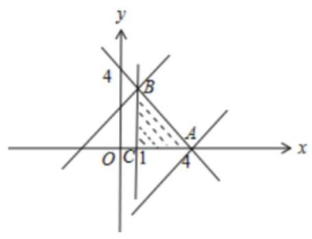

要使 $A \cap  B \neq  \varnothing$ ,则直线 $x - y + t = 0$ 与可行域有公共点,联立 $\left\{  \begin{array}{l} x = 1? \\  x + y = 4 \end{array}\right.$ ,得 $B\left( {1,3}\right)$ ,又 $A\left( {4,0}\right)$ ,把 $A, B$ 的坐标分别代入直线 $x - y + t = 0$ ，得 $t =  - 4, t = 2$ ， $\therefore  - 4 \leq  t \leq  2$ . 故答案为: $\left\lbrack  {-4,2}\right\rbrack$ .

## 二、求区域面积

【例 3】不等式组 $\left\{  \begin{array}{l} y \leq  x \\  x + y \leq  1 \\  y \geq   - 1 \end{array}\right.$ 表示的平面区域的面积是( )

A. $\frac{1}{4}$ B. $\frac{9}{4}$ C. $\frac{9}{2}$ D. $\frac{3}{2}$

【难度】★★

【答案】B

【解析】由题得不等式组对应的平面区域如图所示,联立 $\left\{  {\begin{array}{l} y = x \\  x + y = 1 \end{array},\therefore A\left( {\frac{1}{2},\frac{1}{2}}\right) }\right.$ ,

由题得 $B\left( {-1, - 1}\right) , C\left( {2, - 1}\right)$ ,所以 $\left| {BC}\right|  = 2 - \left( {-1}\right)  = 3$ . 所以 ${S}_{\bigtriangleup {ABC}} = \frac{1}{2} \times  3 \times  \frac{3}{2} = \frac{9}{4}$ .

故答案为: $\mathbf{B}$ .

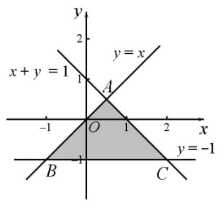

【例 4】已知 $\left| x\right|  \leq  2,\left| y\right|  \leq  2,\theta  \in  \mathbf{R}$ ，则 $\left\{  {\left( {x, y}\right)  \mid  x\cos \theta  + y\sin \theta  = 1}\right\}$ 围成的区域的面积为___.

【难度】 $\star   \star   \star$

【答案】 ${16} - \pi$

【解析】由已知 $\left| x\right|  \leq  2,\left| y\right|  \leq  2$ 点 $\left( {x, y}\right)$ 为边长为 4 的正方形及其内部,

直线方程 $x\cos \theta  + y\sin \theta  = 1$ 可知,此直线与圆心在原点半径为 1 的圆外切.

所以围成的区域是正方形内部、圆的外部,即阴影部分,面积为 ${16} - \pi$

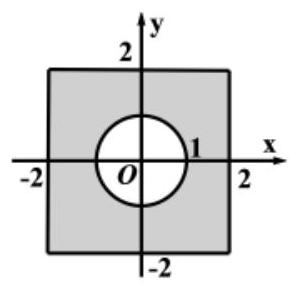

故答案为: ${16} - \pi$

【例 5】在平面直角坐标系 ${xOy}$ 中,点集 $K = \{ \left( {x, y}\right)  \mid  \left( {\left| x\right|  + \left| {2y}\right|  - 4}\right) \left( {\left| {2x}\right|  + \left| y\right|  - 4}\right)  \leq  0\}$ 所对应的平面区域的面积为___

【难度】 $\star   \star   \star$

【答案】 $\frac{32}{3}$

【解析】解: $\because \left( {\left| x\right|  + 2\left| y\right|  - 4}\right) \left( {2\left| x\right|  + \left| y\right|  - 4}\right)  \leq  0$ 对应的区域关于原点对称, $x$ 轴对称, $y$ 轴对称,

$\therefore$ 只要作出在第一象限的区域即可.

当 $x \geq  0, y \geq  0$ 时,不等式等价为 $\left( {x + {2y} - 4}\right) \left( {{2x} + y - 4}\right)  \leq  0$ ,

即 $\left\{  \begin{array}{l} x + {2y} - 4 \geq  0 \\  {2x} + y - 4 \leq  0 \end{array}\right.$ 或 $\left\{  \begin{array}{l} x + {2y} - 4 \leq  0 \\  {2x} + y - 4 \geq  0 \end{array}\right.$ ,

在第一象限内对应的图象为,则 $A\left( {2,0}\right) , B\left( {4,0}\right)$ ,

由 $\left\{  \begin{array}{l} x + {2y} - 4 = 0 \\  {2x} + y - 4 = 0 \end{array}\right.$ ,解得 $\left\{  \begin{array}{l} x = \frac{4}{3} \\  y = \frac{4}{3} \end{array}\right.$ ,即 $C\left( {\frac{4}{3},\frac{4}{3}}\right)$ ,

则三角形 ${ABC}$ 的面积 $S = \frac{1}{2} \times  2 \times  \frac{4}{3} = \frac{4}{3}$ ,则在第一象限的面积 $S = 2 \times  \frac{4}{3} = \frac{8}{3}$ ,

则点集 $K$ 对应的区域总面积 $S = 4 \times  \frac{8}{3} = \frac{32}{3}$ . 故答案为: $\frac{32}{3}$ .

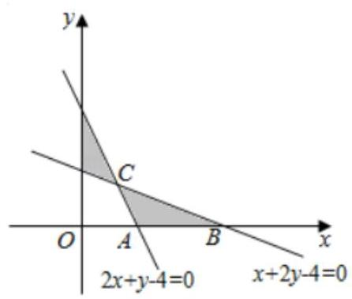

巩固训练

1、不等式组 $\left\{  \begin{matrix} \left( {x - y + 5}\right) \left( {x + y}\right)  \geq  0 \\  0 \leq  x \leq  3 \end{matrix}\right.$ 表示的平面区域的面积是( )

A. 12 B. 24 C. 36 D. 48

【难度】★★★

【答案】B

【解析】平面区域图形如图所示:

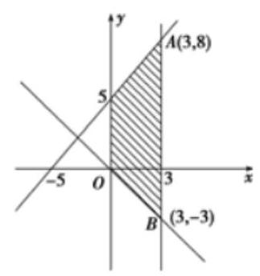

$S = \frac{\left( {5 + {11}}\right)  \times  3}{2} = {24}$ . 选 B.

2、不等式组 $\left\{  \begin{array}{l} \left| \mathbf{y}\right|  \leq  2 \\  {x}^{2} - {\mathbf{y}}^{2} \leq  0 \end{array}\right.$ 所表示的平面区域的面积为___.

【难度】 $\star   \star   \star$

【答案】 8

【解析】不等式组 $\left\{  \begin{array}{l} \left| y\right|  \leq  2 \\  {x}^{2} - {y}^{2} \leq  0 \end{array}\right.$ 即为 $\left\{  \begin{array}{l}  - 2 \leq  y \leq  2 \\  \left( {x - y}\right) \left( {x + y}\right)  \leq  0 \end{array}\right.$ ,则不等式组 $\left\{  \begin{array}{l} \left| y\right|  \leq  2 \\  {x}^{2} - {y}^{2} \leq  0 \end{array}\right.$ 所表示的平面区域由不

等式组 $\left\{  \begin{array}{l}  - 2 \leq  y \leq  2 \\  x - y \geq  0 \\  x + y \leq  0 \end{array}\right.$ 和 $\left\{  \begin{array}{l}  - 2 \leq  y \leq  2 \\  x - y \leq  0 \\  x + y \geq  0 \end{array}\right.$ 所表示的平面区域合并而成,如下图所示:

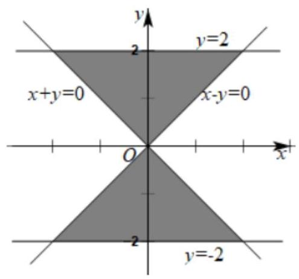

平面区域为两个全等的等腰直角三角形,且腰长为 $2\sqrt{2}$ ,

因此,所求平面区域的面积为 $S = 2 \times  \frac{1}{2} \times  {\left( 2\sqrt{2}\right) }^{2} = 8$ . 故答案为: 8 .

3、不等式组 $\left\{  \begin{array}{l} x + y \geq  0, \\  x - y + 4 \geq  0,\left( {m > 0}\right) \text{ 表示的平面区域的面积是 9,则 }m\text{ 的值是 ( ) } \\  x \leq  m \end{array}\right.$

A. 8 B. 6 C. 4 D. 1

【难度】★★★

【答案】D

【解析】画出不等式组 $\left\{  \begin{array}{l} x + y \geq  0, \\  x - y + 4 \geq  0,\left( {m > 0}\right) \text{ 表示的平面区域,如图所示, } \\  x \leq  m \end{array}\right.$

得到平面区域是以 $\left( {-2,2}\right) ,\left( {m, - m}\right) ,\left( {m, m + 4}\right)$ 为顶点的三角形区域(包含边界)，

则该区域的面积为 $\frac{1}{2}\left\lbrack  {m - \left( {-2}\right) }\right\rbrack  \left\lbrack  {m + 4 - \left( {-m}\right) }\right\rbrack   = 9$ ,解得 $m = 1$ (舍负).

故选: D.

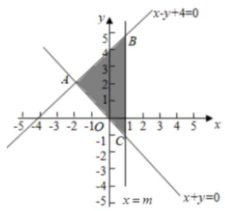

## 三、求目标函数最值 (或范围)

【例 6】( 1 )若实数 $x, y$ 满足 $\left\{  \begin{array}{l} {2x} - y \geq  0, \\  x - {2y} + 1 \leq  0, \\  x \leq  1, \end{array}\right.$ 则 $z = x + y$ 的最小值为___.

【难度】★★

【答案】 1

【解析】由约束条件作出可行域如图中阴影部分所示.

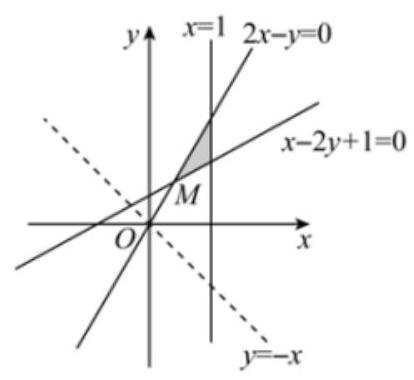

令 $z = x + y$ ,则 $y =  - x + z$ . 作出直线 $l : y =  - x$ ,将直线 $l$ 平移经过点 $M$ 时在 $y$ 轴上的截距最小,由 $\left\{  \begin{array}{l} {2x} - y = 0 \\  x - {2y} + 1 = 0 \end{array}\right.$ 得 $M\left( {\frac{1}{3},\frac{2}{3}}\right)$ ,所以 $x + y$ 的最小值为 1 . 故答案为: 1 .

(2)若变量 $x, y$ 满足条件 $\left\{  \begin{matrix} x + {2y} \leq  2 \\  {3x} - y \geq  1 \\  y \geq  0 \end{matrix}\right.$ ，则 $z = x - {2y}$ 的最大值为___.

【难度】 $\star   \star$

【答案】 2

【例 7】若 $x, y$ 满足约束条件 $\left\{  \begin{array}{l} x - y \leq  0 \\  x + y \geq  0 \\  y \leq  1 \end{array}\right.$ ,则 $z = \frac{y + 1}{x + 2}$ 的最大值为___.

【难度】★★★

【答案】 2

【解析】作出实数 $\mathrm{x},\mathrm{y}$ 满足约束条件 $\left\{  \begin{matrix} x - y \leq  0 \\  x + y \geq  0 \\  y \leq  1 \end{matrix}\right.$ ,对应的平面区域如图,

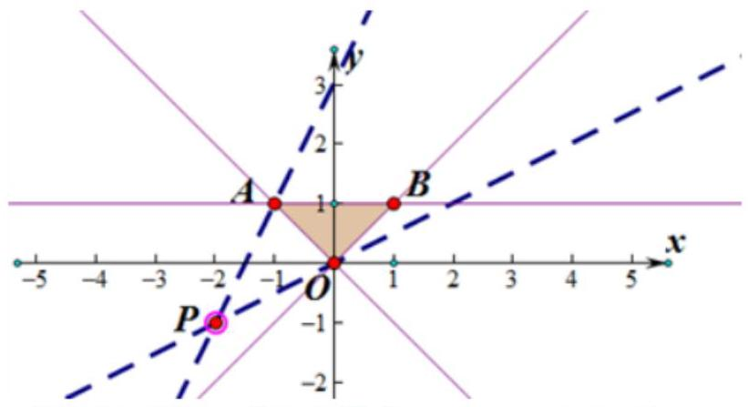

$z$ 的几何意义是区域内的点到定点 $\mathrm{D}\left( {-2, - 1}\right)$ 的斜率.

由图象知 AD 连线的斜率最大,由 $\left\{  \begin{matrix} y = 1 \\  x + y = 0 \end{matrix}\right.$ 解得 $\mathrm{A}\left( {-1,1}\right)$ ,直线过 $\mathrm{A}$ 时,直线斜率最大,

此时 ${PA}$ 的斜率 $\mathrm{k} = \frac{1 - \left( {-1}\right) }{-1 - \left( {-2}\right) } = 2, z = \frac{y + 1}{x + 2}$ 的最大值为 2 . 故答案为:2

【例 8】若变量 $x, y$ 满足 $\left\{  \begin{array}{l} x + y \leq  2, \\  {2x} - {3y} \leq  9,\text{ 则 }{x}^{2} + {y}^{2}\text{ 的最大值是 ( ) } \\  x \geq  0, \end{array}\right.$

(A) 4 (B) 9 (C) 10 (D) 12

【难度】★★

【答案】C

【例 9】已知变量 $x, y$ 满足 $\left\{  \begin{array}{l} x + {2y} - 4 \geq  0 \\  {2x} + y - 4 \leq  0 \\  x \geq  0 \end{array}\right.$ ，则 $\left| {x - {2y} - 4}\right|$ 的最小值为( )

A. $\frac{8\sqrt{5}}{5}$ B. 8

C. $\frac{{16}\sqrt{5}}{15}$ D. $\frac{16}{3}$

【难度】 $\star   \star   \star$

【答案】D

【解析】因为 $\left| {x - {2y} - 4}\right|  = \sqrt{5} \times  \frac{\left| x - 2y - 4\right| }{\sqrt{{1}^{2} + {2}^{2}}}$ ,所以 $\left| {x - {2y} - 4}\right|$ 可看作为可行域内的动点到直线 $x - {2y} - 4 = 0$ 的距离的 $\sqrt{5}$ 倍,如图所示,

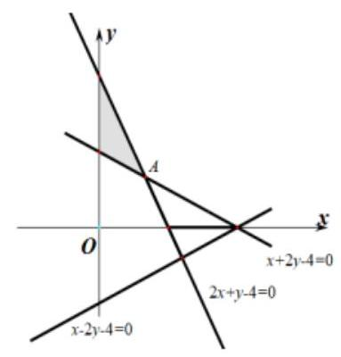

点 $A\left( {\frac{4}{3},\frac{4}{3}}\right)$ 到直线 $x - {2y} - 4 = 0$ 的距离 $d$ 最小,此时 $d = \frac{\left| \frac{4}{3} - 2 \times  \frac{4}{3} - 4\right| }{\sqrt{{1}^{2} + {2}^{2}}} = \frac{16}{3\sqrt{5}}$ ,

所以 $\left| {x - {2y} - 4}\right|$ 的最小值为 $\sqrt{5}d = \frac{16}{3}$ . 故选: D.

## 巩固训练

1、不等式 ${x}^{2} - \left| x\right|  + {y}^{2} - \left| y\right|  \leq  0$ 表示的平面区域为 $M$ ，若 $P\left( {x, y}\right)$ 是 $M$ 中的任一点，则 $z = x + y$ 的最大值是___.

【难度】 $\star   \star   \star$

【答案】 $2 + \pi \;2$

【解析】当 $x \geq  0, y \geq  0$ 时, ${x}^{2} - x + {y}^{2} - y \leq  0 \Rightarrow  {\left( x - \frac{1}{2}\right) }^{2} + {\left( y - \frac{1}{2}\right) }^{2} \leq  \frac{1}{2}$ ;

当 $x < 0, y \geq  0$ 时, ${x}^{2} + x + {y}^{2} - y \leq  0 \Rightarrow  {\left( x + \frac{1}{2}\right) }^{2} + {\left( y - \frac{1}{2}\right) }^{2} \leq  \frac{1}{2}$ ;

当 $x < 0, y < 0$ 时, ${x}^{2} + x + {y}^{2} + y \leq  0 \Rightarrow  {\left( x + \frac{1}{2}\right) }^{2} + {\left( y + \frac{1}{2}\right) }^{2} \leq  \frac{1}{2}$ ;

当 $x \geq  0, y < 0$ 时, ${x}^{2} - x + {y}^{2} + y \leq  0 \Rightarrow  {\left( x - \frac{1}{2}\right) }^{2} + {\left( y + \frac{1}{2}\right) }^{2} \leq  \frac{1}{2}$ ;

作出不等式表示的平面区域 $M$ ，

作出 $y =  - x$ ,平移此直线,

当直线 $x + y - z = 0$ 与平面区域 $M$ 相切于 $N$ 时, $z$ 取得最大值,

即 $\frac{\left| \frac{1}{2} + \frac{1}{2} - z\right| }{\sqrt{{1}^{2} + {1}^{2}}} = \frac{\sqrt{2}}{2}$ ,解得 ${z}_{\max } = 2$ .

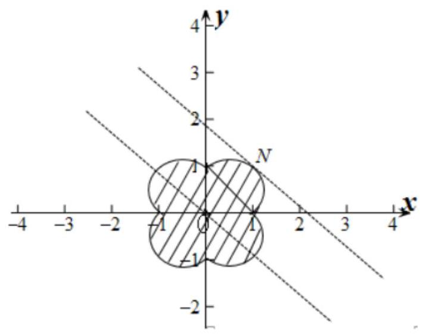

故答案为: $2 + \pi$ ； 2

2、已知 $x, y$ 满足约束条件 $\left\{  \begin{array}{l} {2x} - y + 4 \geq  0 \\  x + y - 3 \leq  0 \\  x + {2y} - 2 \geq  0 \end{array}\right.$ 则目标函数 $z = {2}^{x - {2y}}$ 的最大值为( ).

A. 128 B. 64

C. $\frac{1}{64}$ D. $\frac{1}{128}$

【难度】★★★

【答案】B

【解析】不等式组表示的平面区域如下图阴影部分所示. 设 $\mu  = x - {2y}$ ,因为函数 $y = {2}^{x}$ 是增函数,所以 $\mu$ 取最大值时, $z$ 取最大值. 易知 $\mu  = x - {2y}$ 在 $A$ 点处取得最大值. 联立 $\left\{  \begin{array}{l} x + {2y} - 2 = 0, \\  x + y - 3 = 0 \end{array}\right.$ 解得 $\left\{  \begin{array}{l} x = 4, \\  y =  - 1. \end{array}\right.$ 即

$A\left( {4, - 1}\right)$ . 所以 ${\mu }_{\max } = 4 - 2 \times  \left( {-1}\right)  = 6$ ,所以 ${z}_{\max } = {2}^{6} = {64}$ .

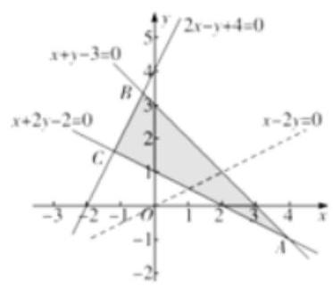

故选: B

3、已知 $x, y$ 满足约束条件 $\left\{  \begin{array}{l} x - y \geq  0 \\  x + y \leq  2 \\  y \geq  0 \end{array}\right.$ ，若 $z = {ax} + y$ 的最大值为4，则 $a =$ ( )

(A) 3 (B) 2 (C) -2 (D) -3

【难度】 $\star   \star   \star$

【答案】B

4、已知在平面直角坐标系中, $O\left( {0,0}\right) , M\left( {1,1}\right) , N\left( {0,1}\right) , Q\left( {2, - 3}\right)$ ,动点 $P\left( {x, y}\right)$ 满足不等式 $0 \leq  \overrightarrow{OP} \cdot  \overrightarrow{OM} \leq  1,0 \leq  \overrightarrow{OP} \cdot  \overrightarrow{ON} \leq  1$ ，则 $z = \overrightarrow{OP} \cdot  \overrightarrow{OQ}$ 的最大值等于( )

A. -1 B. 0 C. 2 D. 13

【难度】 $\star   \star   \star$

【答案】 $C$

5、在平面直角坐标系中， $M\left( {x, y}\right)$ 为不等式组 $\left\{  \begin{array}{l} {2x} - y - 2 \geq  0 \\  x + {2y} - 1 \geq  0 \\  {3x} + y - 8 \leq  0 \end{array}\right.$ 所表示的区域上一动点，则 $\frac{y}{x}$ 的最小值为 ( )

A. 2 B. 1

c. $- \frac{1}{3}$ D. $- \frac{1}{2}$

【难度】★★★

【答案】C

【解析】作出可行域如图:

线性规划、参数方程一教师版

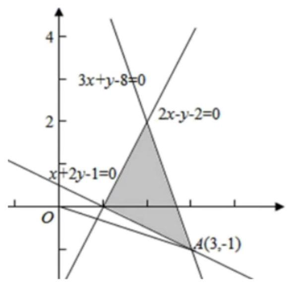

令 $z = \frac{y}{x}$ 几何意义是动点 $M\left( {x, y}\right)$ 与原点连线的斜率,由图像可知 ${OA}$ 斜率最小,

由 $\left\{  \begin{array}{l} {2x} + y - 2 = 0 \\  x + {2y} - 1 = 0 \end{array}\right.$ ,解得 $\left\{  \begin{array}{l} x = 3 \\  y =  - 1 \end{array}\right.$ ,即 $A\left( {3, - 1}\right)$ ,所以 $z = \frac{y}{x}$ 的最小值为 $\frac{-1}{3} =  - \frac{1}{3}$ . 故选: $C$

6、已知点 $\left( {m + n, m - n}\right)$ 在 $\left\{  \begin{array}{l} x - y \geq  0 \\  x + y \geq  0 \\  {2x} - y \geq  2 \end{array}\right.$ 表示的平面区域内,则 ${m}^{2} + {n}^{2}$ 的最小值为( )

A. $\frac{2}{5}$ B. $\frac{\sqrt{10}}{5}$ C. $\frac{4}{9}$ D. $\frac{2}{3}$

【难度】 $\star   \star   \star$

【答案】A

【解析】 $\left\{  \begin{array}{l} x - y \geq  0 \\  x + y \geq  0 \\  {2x} - y \geq  2 \end{array}\right.$ 表示的平面区域如图阴影部分,

点 $\left( {m + n, m - n}\right)$ 在 $\left\{  \begin{array}{l} x - y \geq  0 \\  x + y \geq  0 \\  {2x} - y \geq  2 \end{array}\right.$ 表示的平面区域内,

设 $\left\{  \begin{array}{l} x = m + n \\  y = m - n \end{array}\right.$ ,即 $\left( {x, y}\right)$ 在 $\left\{  \begin{array}{l} x - y \geq  0 \\  x + y \geq  0 \\  {2x} - y \geq  2 \end{array}\right.$ 表示的平面区域内,且 $m = \frac{x + y}{2}, n = \frac{x - y}{2}$ ,

所以 ${m}^{2} + {n}^{2} = {\left( \frac{x + y}{2}\right) }^{2} + {\left( \frac{x - y}{2}\right) }^{2} = \frac{1}{2}\left( {{x}^{2} + {y}^{2}}\right)$ ,

则 ${m}^{2} + {n}^{2}$ 的最小值为可行域内的点与原点距离的平方的一半.

由可行域可知,可行域内的点与坐标原点的距离的最小值为 $P$ 到原点的距离,

即原点到直线 ${2x} - y - 2 = 0$ 的距离,所以距离的最小值为: $\frac{2}{\sqrt{5}}$

所以 ${m}^{2} + {n}^{2}$ 的最小值为: $\frac{1}{2} \times  {\left( \frac{2}{\sqrt{5}}\right) }^{2} = \frac{2}{5}$ ,故选: A.

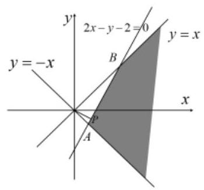

四、整点问题

【例 10】不等式 $\left| x\right|  + \left| y\right|  < 3$ 表示的平面区域内的整点个数为( )

A. 10 B. 13 C. 14 D. 17

【难度】 $\star   \star   \star$

【答案】B

【解析】 $\left| x\right|  + \left| y\right|  < 3$ 等价于:

当 $x > 0, y > 0$ 时, $x + y < 3$ ; 当 $x > 0, y \leq  0$ 时, $x - y < 3$ ;

当 $x \leq  0, y > 0$ 时, $- x + y < 3$ ; 当 $x \leq  0, y \leq  0$ 时, $- x - y < 3$ ,

故作图如下:

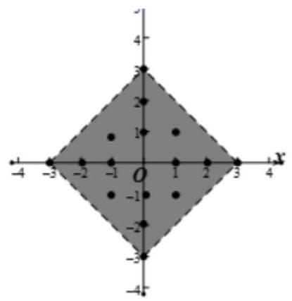

由图可知, 区域内共有 13 个整点.故选: B.

【例 11】某班举行晚会，布置会场要制作 “中国结”，班长购买了甲、乙两种颜色不同的彩绳，把它们截成 A、B、C 三种规格. 甲种彩绳每根 8 元，乙种彩绳每根 6 元，已知每根彩绳可同时截得三种规格彩绳的根数如下表所示:

<table><tr><td></td><td>$A$ 规格</td><td>$B$ 规格</td><td>$C$ 规格</td></tr><tr><td>甲种彩绳</td><td>2</td><td>1</td><td>1</td></tr><tr><td>乙种彩绳</td><td>1</td><td>2</td><td>3</td></tr></table>

今需要 $A\text{ 、 }B\text{ 、 }C$ 三种规格的彩绳各 15、18、27 根，问各截这两种彩绳多少根，可得所需三种规格彩绳且花费最少?

【难度】 $\star   \star   \star$

【答案】班长应购买 3 根甲种彩绳、 9 根乙种彩绳, 可使花费最少.

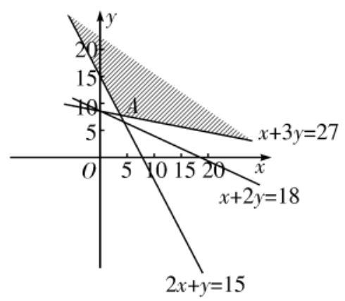

【解析】: 设需购买甲种彩绳 $x$ 根、乙种彩绳 $y$ 根,共花费 $z$ 元,

则 $\left\{  \begin{array}{l} {2x} + y \geq  {15} \\  x + {2y} \geq  {18} \\  x + {3y} \geq  {27} \\  x, y \in  N \end{array}\right.$ ,且 $z = {8x} + {6y}$ .

作可行域,

由图可知,直线 $l$ 经过可行域内的点 $A$ 时, $z$ 最小.

由 $\left\{  \begin{array}{l} {2x} + y = {15} \\  x + {3y} = {27} \end{array}\right.$ ,得 $\left\{  \begin{array}{l} x = {3.6} \\  y = {7.8} \end{array}\right.$ ,所以点 $A\left( {{3.6},{7.8}}\right)$ .

因为 $x, y \in  N$ ,在可行域内与点 $A$ 邻近的整点有 $\left( {3,9}\right) ,\left( {4,8}\right)$ .

显然 $\left( {3,9}\right)$ 是最优解,且 ${z}_{\min } = {78}$ .

答: 班长应购买 3 根甲种彩绳、 9 根乙种彩绳, 可使花费最少.

## 巩固训练

1、平面区域 $\left\{  \begin{array}{l} x > 0, \\  y > 0, \\  {3x} + {4y} < {12} \end{array}\right.$ ，内的整点是___.

【难度】 $\star   \star   \star$

【答案】 $\left( {1,1}\right) ,\left( {2,1}\right) ,\left( {1,2}\right)$

【解析】画出平面区域如下图所示,由图可知,区域内的整点为 $\left( {1,1}\right) ,\left( {2,1}\right) ,\left( {1,2}\right)$ .

故填: $\left( {1,1}\right) ,\left( {2,1}\right) ,\left( {1,2}\right)$ .

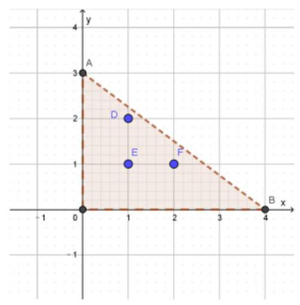

2、若点6， $a$ 在两条平行直线 ${6x} - {8y} + 1 = 0$ 和 ${3x} - {4y} + 5 = 0$ 之间，则整数 $a$ 的值为___.

【难度】★★★

【答案】 4

【解析】画出直线 ${6x} - {8y} + 1 = 0\text{ 、 }{3x} - {4y} + 5 = 0$ 和直线 $x = 5$ 如下图所示,由图可知,在直线 $x = 5$ 上, 且在两条直线 ${6x} - {8y} + 1 = 0\text{ 、 }{3x} - {4y} + 5 = 0$ 之间的整数点为 $A\left( {5,4}\right)$ ,故 $a = 4$ .

故填: 4 .

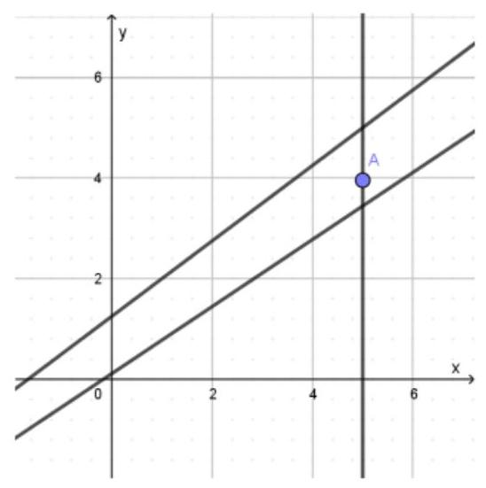

## (二)参数方程

## 知识梳理

## 1. 参数方程的定义

在直角坐标系中,如果曲线 $C$ 上任意一点 $M$ 的坐标 $x, y$ 都是某个变数 $t$ 的函数 $\left\{  \begin{array}{l} x = f\left( t\right) \\  y = g\left( t\right)  \end{array}\right.$ (1),并且对于 $t$ 的每一个允许值,由方程组 (1) 所确定的点 $M\left( {x, y}\right)$ 都在曲线 $C$ 上,那么,方程 (1) 就叫做曲线 $C$ 的参数方程. 联系 $x, y$ 之间关系的变数 $t$ 叫做参变数,简称参数.

相对于参数方程而言,直接给出点 $M\left( {x, y}\right)$ 的坐标间关系的方程叫做普通方程.

2. 通过 “消去参数” 可以把曲线 $C$ 的参数方程化为普通方程;

3. 通过 “选取参数”,可以把曲线 $C$ 的普通方程化为参数方程.

4. 常见曲线的参数方程

直线的参数方程: $\left\{  \begin{array}{l} x = {x}_{0} + t\cos \alpha \\  y = {y}_{0} + t\sin \alpha  \end{array}\right.$ ( $t$ 为参数, $- \infty  < t <  + \infty$ ); 圆心为原点,半径为 $R$ 的圆的参数方程 $\left\{  \begin{array}{l} x = R\cos \theta \\  y = R\sin \theta  \end{array}\right.$ ( $\theta$ 为参数, $\left. {0 \leq  \theta  < {2\pi }}\right)$ ; 圆心为 $C\left( {a, b}\right)$ 半径为 $R$ 的圆的参数方程 $\left\{  {\begin{array}{l} x = a + R\cos \theta \\  y = b + R\sin \theta  \end{array}\text{ ( }\theta }\right.$ 为参数, $\left. {0 \leq  \theta  < {2\pi }}\right)$ ; 椭圆 $\frac{{x}^{2}}{{a}^{2}} + \frac{{y}^{2}}{{b}^{2}} = 1$ 的参数方程为 $\left\{  {\begin{array}{l} x = a\cos \theta \\  y = b\sin \theta  \end{array}\text{ ( }\theta }\right.$ 为参数);

问题 1. 将曲线的参数方程化为普通方程时应注意什么问题?

答: 关键是注意 $x, y$ 的取值范围.

例如参数方程 $\left\{  \begin{array}{l} x = \sin \theta \\  y = \cos {2\theta }, \end{array}\right.$ ( $\theta$ 为参数) 化为普通方程 $y = 1 - 2{x}^{2}$ 时需要注明 $x \in  \left\lbrack  {-1,1}\right\rbrack$ 的限制条件.

但也有一些问题不需另写条件,例如把参数方程 $\left\{  \begin{array}{l} x = \sin \theta \\  y = \cos \theta , \end{array}\right.$ ( $\theta$ 为参数) 化为普通方程 ${x}^{2} + {y}^{2} = 1$ 时, $x, y$ 所需满足的条件 $x, y \in  \left\lbrack  {-1,1}\right\rbrack$ 则不必写出.

如果普通方程中的 $x, y$ 的取值范围与参数方程中的 $x, y$ 的取值范围相一致,则参数方程化为普通方程后,不必写出 $x, y$ 的取值范围,否则需写出 $x, y$ 的取值范围.

问题 2. 参数方程 $\left\{  {\begin{array}{l} x = \sqrt{2}\cos \theta , \\  y = \sqrt{2}\sin \theta , \end{array}\theta  \in  \lbrack 0,{2\pi })}\right.$ 与 $\left\{  {\begin{array}{l} x = \sqrt{2}\cos \theta , \\  y = \sqrt{2}\sin \theta , \end{array}\theta  \in  \left( {0,\frac{\pi }{2}}\right) }\right.$ 是否表示同一曲线? 为什么? 答: 不一样, $x$ 的取值范围不一致.

## 例题精讲

【例 12】(1)参数方程 $\left\{  \begin{array}{l} x = 1 + \frac{1}{t} \\  y = 1 - \frac{1}{t} \end{array}\right.$ ( $t$ 为参数)，化为一般方程为___.

【难度】★★

【答案】 $x + y - 2 = 0\left( {x \neq  1}\right)$

【解析】解: $\because$ 参数方程 $\left\{  \begin{array}{l} x = 1 + \frac{1}{t} \\  y = 1 - \frac{1}{t} \end{array}\right.$ (t 为参数), $\therefore$ 消去参数 $t$ ,得: $x = 1 + \left( {1 - y}\right)$ , 整理,得一般方程为: $x + y - 2 = 0$ . 故答案为: $x + y - 2 = 0\left( {x \neq  1}\right)$ .

(2)在直角坐标系 ${xoy}$ 中，已知曲线 $C$ 的参数方程是 $\left\{  \begin{array}{l} x = \sqrt{2}\cos \theta  + 1 \\  y = \sqrt{2}\sin \theta  + 1 \end{array}\right.$ ( $\theta$ 是参数)，则曲线 $C$ 的普通方程是 ___.

【难度】★★

【答案】 ${\left( x - 1\right) }^{2} + {\left( y - 1\right) }^{2} = 2$

【解析】由题: $\sqrt{2}\cos \theta  = x - 1,\sqrt{2}\sin \theta  = y - 1$

${\left( \sqrt{2}\cos \theta \right) }^{2} = {\left( x - 1\right) }^{2},{\left( \sqrt{2}\sin \theta \right) }^{2} = {\left( y - 1\right) }^{2}$ 所以 ${\left( x - 1\right) }^{2} + {\left( y - 1\right) }^{2} = 2{\cos }^{2}\theta  + 2{\sin }^{2}\theta  = 2$ .

故答案为: ${\left( x - 1\right) }^{2} + {\left( y - 1\right) }^{2} = 2$

(3)已知椭圆的参数方程为 $\left\{  {\begin{array}{l} x = 3\cos \theta \\  y = 2\sin \theta  \end{array}(\theta }\right.$ 为参数 $)$ ，则该椭圆的长轴长为___.

【难度】 $\star   \star$

【答案】6

【解析】因为椭圆的参数方程为 $\left\{  {\begin{array}{l} x = 3\cos \theta \\  y = 2\sin \theta  \end{array}\text{ ( }\theta }\right.$ 为参数),所以 $a = 3$ ,所以该椭圆的长轴长为 ${2a} = 6$ .

故答案为: 6

【例 13】已知点 $P\left( {x, y}\right)$ 在曲线 $\left\{  \begin{array}{l} x =  - 2 + \cos \theta \\  y = \sin \theta  \end{array}\right.$ ，( $\theta$ 为参数)上，则 $\frac{y}{x}$ 的取值范围为___.

【难度】 $\star   \star   \star$

【答案】 $\left\lbrack  {-\frac{\sqrt{3}}{3},\frac{\sqrt{3}}{3}}\right\rbrack$

【解析】: 曲线的参数方程为 $\left\{  \begin{array}{l} x =  - 2 + \cos \theta \\  y = \sin \theta  \end{array}\right.$ ( $\theta$ 为参数),

$\therefore x + 2 = \cos \theta , y = \sin \theta$ ,将两个方程平方相加,

$\therefore {\left( x + 2\right) }^{2} + {y}^{2} = 1$ ,它在直角坐标系中表示圆心在 $\left( {-2,0}\right)$ 半径为 1 的圆.

又 $\because \frac{y}{x}$ 的几何意义是表示原点与圆上一点 $P\left( {x, y}\right)$ 连线的斜率,

画出图象,如图:

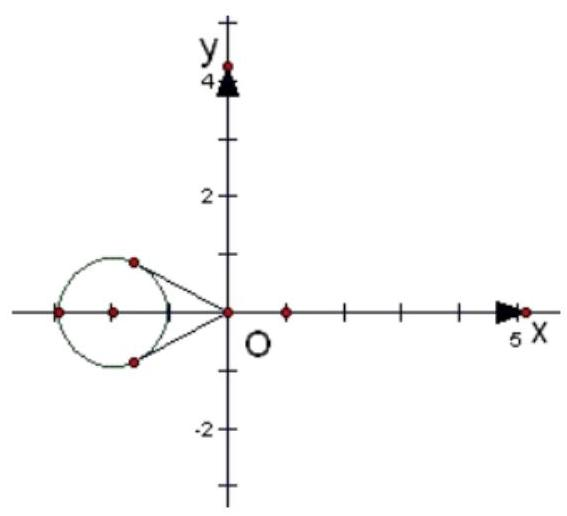

当过原点的直线与圆相切时,设切线的斜率为 $k$ ,切线方程 $l$ 为: $y = {kx}$ 联立 $l$ 与圆的方程: $\left\{  \begin{matrix} {\left( x + 2\right) }^{2} + {y}^{2} = 1 \\  y = {kx} \end{matrix}\right.$ ,消掉 $y$

可得 ${\left( x + 2\right) }^{2} + {\left( kx\right) }^{2} = 1$ ,直线与圆相切,可得 $\Delta  = 0$ ,解得 $k =  \pm  \frac{\sqrt{3}}{3}$

$\therefore$ 当过原点的直线与圆相切时,切线的斜率是 $\pm  \frac{\sqrt{3}}{3}$ ,

$\therefore \frac{y}{x}$ 的取值范围为 $\left\lbrack  {-\frac{\sqrt{3}}{3},\frac{\sqrt{3}}{3}}\right\rbrack$ . 故答案为: $\left\lbrack  {-\frac{\sqrt{3}}{3},\frac{\sqrt{3}}{3}}\right\rbrack$ .

【例 14】已知点 $P\left( {-4,4}\right)$ ,曲线 $C : \left\{  {\begin{array}{l} x = 8\cos \theta \\  y = 3\sin \theta  \end{array}\text{ ( }\theta }\right.$ 为参数),若 $Q$ 是曲线 $C$ 上的动点,则线段 ${PQ}$ 的中点 $M$ 到直线 $l : \left\{  \begin{array}{l} x = 3 + {2t} \\  y =  - 2 + t \end{array}\right.$ ( $t$ 为参数)距离的最小值为___.

【难度】 $\star   \star   \star$

【答案】 $\frac{8\sqrt{5}}{5}$

【解析】由题意可知曲线 $C : \left\{  {\begin{array}{l} x = 8\cos \theta \\  y = 3\sin \theta  \end{array}\text{ ( }\theta }\right.$ 为参数), $Q$ 是曲线 $C$ 上的动点,设 $Q\left( {8\cos \theta ,3\sin \theta }\right) \left( {0 \leq  \theta  < {2\pi }}\right)$ ,又点 $P\left( {-4,4}\right)$ ,则线段 ${PQ}$ 的中点 $M$ 为 $\left( {-2 + 4\cos \theta ,2 + \frac{3}{2}\sin \theta }\right)$ ,直线 $l : \left\{  \begin{array}{l} x = 3 + {2t} \\  y =  - 2 + t \end{array}\right.$ ( $t$ 为参数) 的普通方程为: $x - {2y} - 7 = 0$ ,则点 $M$ 到直线 $l$ 的距离为 $d = \frac{\left| -2 + 4\cos \theta  - 4 - 3\sin \theta  - 7\right| }{\sqrt{{1}^{2} + {\left( -2\right) }^{2}}} = \frac{\left| 3\sin \theta  - 4\cos \theta  + {13}\right| }{\sqrt{5}}$ ,令 $\cos \alpha  = \frac{3}{5}$ ,则 $\sin \alpha  = \frac{4}{5}$ 可化简为 $d = \frac{\left| 5\sin \left( \theta  - \alpha \right)  + {13}\right| }{\sqrt{5}}$ ,当 $\sin \left( {\theta  - \alpha }\right)  =  - 1$ 时取到最小值 $\frac{8\sqrt{5}}{5}$ ,所以点 $M$ 到直线 $l$ 的距离的最小值为 $\frac{8\sqrt{5}}{5}$ . 故答案为: $\frac{8\sqrt{5}}{5}$

## 巩固训练

1、已知直线 $l$ 的方程为 ${3x} - {4y} + 1 = 0$ ，则下列各式是 $l$ 的参数方程的是( )

A. $\left\{  \begin{array}{l} x = 4 + {3t} \\  y = 3 - {4t} \end{array}\right.$ B. $\left\{  \begin{array}{l} x = 4 + {3t} \\  y = 3 + {4t} \end{array}\right.$

C. $\left\{  \begin{array}{l} x = 1 - {4t} \\  y = 1 + {3t} \end{array}\right.$ D. $\left\{  \begin{array}{l} x = 1 + {4t} \\  y = 1 + {3t} \end{array}\right.$

【难度】 $\star   \star   \star$

【答案】D

【解析】A. 参数方程可化简为 ${4x} + {3y} - {25} = 0$ ,故 $\mathbf{A}$ 不正确;

B. 参数方程可化简为 ${4x} - {3y} - 7 = 0$ ,故 $\mathbf{B}$ 不正确;

C. 参数方程可化简为 ${3x} + {4y} - 7 = 0$ ,故 $\mathrm{C}$ 不正确；

D. 参数方程可化简为 ${3x} - {4y} + 1 = 0$ ，故 D 正确. 故选:D.

2、参数方程为 $\left\{  {\begin{array}{l} x = 3{t}^{2} + 2 \\  y = {t}^{2} - 1 \end{array}\left( {0 \leq  t \leq  5}\right) }\right.$ 的曲线为___. (填“线段” $\cdots$ 射线”“圆弧”或“双曲线的一支”)

【难度】 $\star   \star   \star$

【答案】线段.

【解析】解: 将方程 $\left\{  \begin{array}{l} x = 3{t}^{2} + 2 \\  y = {t}^{2} - 1 \end{array}\right.$ 化为普通方程为 $x = 3\left( {y + 1}\right)  + 2$ ,即 $x - {3y} - 5 = 0$ ,

又 $0 \leq  t \leq  5$ ,所以 $x = 3{t}^{2} + 2 \in  \left\lbrack  {2,{77}}\right\rbrack$ ,故曲线为线段. 故答案为: 线段.

3、实数 $x$ 、 $y$ 满足 $\frac{{x}^{2}}{9} + \frac{{y}^{2}}{4} = 1$ ，则 $x - {2y}$ 的取值范围是___.

【难度】 $\star   \star   \star$

【答案】 $\left\lbrack  {-5,5}\right\rbrack$

【解析】由于 $\frac{{x}^{2}}{9} + \frac{{y}^{2}}{4} = 1$ ,故可设 $\left\{  {\begin{array}{l} x = 3\cos \alpha \\  y = 2\sin \alpha  \end{array},\alpha  \in  \lbrack 0,{2\pi })}\right.$ ,所以

$x - {2y} = 3\cos \alpha  - 4\sin \alpha  = 5\sin \left( {\alpha  + \varphi }\right)  \in  \left\lbrack  {-5,5}\right\rbrack$ . 所以 $x - {2y}$ 的取值范围是 $\left\lbrack  {-5,5}\right\rbrack$ .

故答案为: $\left\lbrack  {-5,5}\right\rbrack$

4、已知曲线 $\left\{  {\begin{array}{l} x = 2\cos \theta \\  y = \sin \theta  \end{array},\theta  \in  \lbrack 0,{2\pi })}\right.$ 上一点 $P\left( {x, y}\right)$ 到定点 $M\left( {a,0}\right) ,\left( {a > 0}\right)$ 的最小距离为 $\frac{3}{4}$ ,则 $a =$

【难度】 $\star   \star   \star$

【答案】 $\frac{11}{4}$ 或 $\frac{\sqrt{21}}{4}$

【解析】 $\left| {MP}\right|  = \sqrt{{\left( a - 2\cos \theta \right) }^{2} + {\sin }^{2}\theta } = \sqrt{3{\cos }^{2}\theta  - {4a}\cos \theta  + {a}^{2} + 1}$ ,

令 $t = \cos \theta$ ,因为 $\theta  \in  \lbrack 0,{2\pi })$ ,故 $t \in  \left\lbrack  {-1,1}\right\rbrack$ ,

令 $g\left( t\right)  = 3{t}^{2} - {4at} + {a}^{2} + 1, t \in  \left\lbrack  {-1,1}\right\rbrack$

当 $0 < a < \frac{3}{2}$ 时, $g{\left( t\right) }_{\min } = g\left( {\frac{2}{3}a}\right)  = 1 - \frac{{a}^{2}}{3} = \frac{9}{16}$ ,故 $a = \frac{\sqrt{21}}{4}$ ;

当 $a \geq  \frac{3}{2}$ 时， $g{\left( t\right) }_{\min } = g\left( 1\right)  = {a}^{2} - {4a} + 4 = \frac{9}{16}$ ，故 $a = \frac{11}{4}$ ；

故答案为: $\frac{11}{4},\frac{\sqrt{21}}{4}$ .

5、记椭圆 $\frac{{x}^{2}}{4} + \frac{n{y}^{2}}{{4n} + 1} = 1$ 围成的区域 (含边界) 为 ${\Omega }_{n}\left( {n = 1,2\cdots }\right)$ ,当点 $\left( {x, y}\right)$ 分别在 ${\Omega }_{1},{\Omega }_{2},\cdots$ 上时 $x + y$ 的最大值分别是 ${M}_{1},{M}_{2},\ldots$ ,则 $\mathop{\lim }\limits_{{n \rightarrow  \infty }}{M}_{n} =$ (   )

A. $2 + \sqrt{5}$ B. 4 C. 3 D. $2\sqrt{2}$

【难度】★★★

【答案】D

【解析】椭圆 $\frac{{x}^{2}}{4} + \frac{n{y}^{2}}{{4n} + 1} = 1$ 的参数方程为:

$\left\{  \begin{array}{l} x = 2\cos \theta \\  y = \sqrt{4 + \frac{1}{n}}\sin \theta  \end{array}\right.$ ( $\theta$ 为参数),

所以: $x + y = 2\cos \theta  + \sqrt{4 + \frac{1}{n}}\sin \theta  = \sqrt{{2}^{2} + 4 + \frac{1}{n}}\sin \left( {\theta  + \varphi }\right)  = \sqrt{8 + \frac{1}{n}}\sin \left( {\theta  + \varphi }\right)$ ,

所以: ${\left( x + y\right) }_{\max } = \sqrt{8 + \frac{1}{n}}$ ,所以: $\mathop{\lim }\limits_{{n \rightarrow  \infty }}{M}_{n} = \mathop{\lim }\limits_{{n \rightarrow  \infty }}\sqrt{8 + \frac{1}{n}} = 2\sqrt{2}$ . 故选: D.

## 实战演练

一、填空题

1、曲线 $\left\{  \begin{array}{l} x = 4\cos \theta \\  y = 3\sin \theta  \end{array}\right.$ ( $\theta$ 为参数, $\theta  \in  \lbrack 0,{2\pi })$ ) 的焦距等于___.

【难度】 $\star   \star$

【答案】 $2\sqrt{7}$

【解析】因为 $\left\{  \begin{array}{l} x = 4\cos \theta \\  y = 3\sin \theta  \end{array}\right.$ ,所以 $\frac{{x}^{2}}{16} + \frac{{y}^{2}}{9} = 1$ ,

由方程可知曲线为椭圆,且 ${a}^{2} = {16},{b}^{2} = 9$ ,所以 ${c}^{2} = {a}^{2} - {b}^{2} = 7$ ,即 $c = \sqrt{7}$ ;

故焦距为 $2\sqrt{7}$ .

2、参数方程 $\left\{  {\begin{array}{l} x = \cos \theta , \\  y = 4 - {\sin }^{2}\theta . \end{array}\left( {\theta  \in  R}\right) }\right.$ 所表示的曲线与 $y$ 轴的交点坐标是___.

【难度】 $\star   \star$

【答案】 $\left( {0,3}\right)$

【解析】根据题意,曲线的参数方程 $\left\{  \begin{array}{l} x = \cos \theta , \\  y = 4 - {\sin }^{2}\theta  \end{array}\right.$ ,变形可得 ${x}^{2} + 4 - y = 1$ ,

即 $y = {x}^{2} + 3$ ,为二次函数,与 $y$ 轴的交点坐标为 $\left( {0,3}\right)$ ; 故答案为: $\left( {0,3}\right)$ .

3、已知定义在 $R$ 上的增函数 $y = f\left( x\right)$ 满足 $f\left( x\right)  + f\left( {4 - x}\right)  = 0$ ,若实数 $a, b$ 满足不等式 $f\left( a\right)  + f\left( b\right)  \geq  0$ ，则 ${a}^{2} + {b}^{2}$ 的最小值是___.

【难度】 $\star   \star   \star$

【答案】 8

【解析】由 $f\left( x\right)  + f\left( {4 - x}\right)  = 0$ 得: $f\left( {4 - b}\right)  =  - f\left( b\right)$

$\therefore f\left( a\right)  + f\left( b\right)  \geq  0$ 等价于 $f\left( a\right)  \geq   - f\left( b\right)  = f\left( {4 - b}\right)$

$\because f\left( x\right)$ 为 $R$ 上的增函数 $\;\therefore a \geq  4 - b$ ,即 $a + b - 4 \geq  0$

则可知可行域如下图所示:

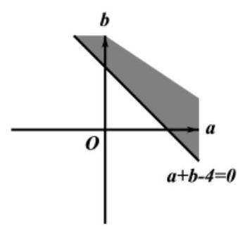

则 ${a}^{2} + {b}^{2}$ 的几何意义为原点 $O$ 与可行域中的点的距离的平方

可知 $O$ 到直线 $a + b - 4 = 0$ 的距离的平方为所求的最小值

$\therefore {\left( {a}^{2} + {b}^{2}\right) }_{\min } = {\left( \frac{\left| -4\right| }{\sqrt{2}}\right) }^{2} = 8$ ,本题正确结果; 8

4、已知 $P$ 为圆 ${x}^{2} + {\left( y - 4\right) }^{2} = 2$ 上一动点，点 $Q\left( {1,1}\right)$ ， $O$ 为坐标原点，那么 $\overrightarrow{OP} \cdot  \overrightarrow{OQ}$ 的取值范围为___.

【难度】 $\star   \star   \star$

【答案】 $\left\lbrack  {2,6}\right\rbrack$

【解析】因为圆的方程 ${x}^{2} + {\left( y - 4\right) }^{2} = 2$ ,所以其参数方程为: $\left\{  {\begin{array}{l} x = \sqrt{2}\cos \theta \\  y = 4 + \sqrt{2}\sin \theta  \end{array},\theta  \in  R}\right.$ ,

设 $P\left( {\sqrt{2}\cos \theta ,4 + \sqrt{2}\sin \theta }\right)$ ,所以 $\overrightarrow{OP} \cdot  \overrightarrow{OQ} = \sqrt{2}\cos \theta  + \left( {4 + \sqrt{2}\sin \theta }\right)  = 2\sin \left( {\theta  + \frac{\pi }{4}}\right)  + 4$ ,

因为 $\sin \left( {\theta  + \frac{\pi }{4}}\right)  \in  \left\lbrack  {-1,1}\right\rbrack$ ,所以 $\overrightarrow{OP} \cdot  \overrightarrow{OQ} \in  \left\lbrack  {2,6}\right\rbrack$ . 故答案为: $\left\lbrack  {2,6}\right\rbrack$

5、已知点 $A\left( {3,\sqrt{3}}\right) , O$ 是坐标原点,点 $P\left( {x, y}\right)$ 的坐标满足 $\left\{  \begin{array}{l} \sqrt{3}x - y \leq  0 \\  x - \sqrt{3}y + 2 \geq  0 \\  y \geq  0 \end{array}\right.$ ,设 $z$ 为 $\overrightarrow{OA}$ 在 $\overrightarrow{OP}$ 上的投影,则 $z$ 的取值范围是___.

【难度】 $\star   \star   \star$

【答案】 $\left\lbrack  {-3,3}\right\rbrack$

【解析】作出可行域, 如图所示

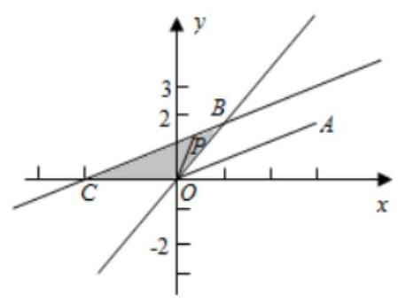

$z = \frac{\overrightarrow{OA} \cdot  \overrightarrow{OP}}{\left| \overrightarrow{OP}\right| } = \left| \overrightarrow{OA}\right|  \cdot  \cos \angle {AOP} = 2\sqrt{3}\cos \angle {AOP}.$

$\because \angle {AOP} \in  \left\lbrack  {\frac{\pi }{6},\frac{5\pi }{6}}\right\rbrack  ,\therefore$ 当 $\angle {AOP} = \frac{\pi }{6}$ 时, ${z}_{\max } = 2\sqrt{3}\cos \frac{\pi }{6} = 3$ ; 当 $\angle {AOP} = \frac{5\pi }{6}$ 时,

${z}_{\min } = 2\sqrt{3}\cos \frac{5\pi }{6} =  - 3,\therefore z$ 的取值范围是 $\left\lbrack  {-3,3}\right\rbrack$ . 故答案为: $\left\lbrack  {-3,3}\right\rbrack$ .

6、设实数 $x\text{ 、 }y$ 满足约束条件 $\left\{  \begin{array}{l} {3x} - y - 6 \leq  0 \\  x - y + 2 \geq  0 \\  x \geq  0, y \geq  0 \end{array}\right.$ ,若目标函数 $z = {ax} + {by}\left( {a > 0, b > 0}\right)$ 的最大值为 2,则 ${2a} + {3b}$ 的值为___

【难度】 $\star   \star   \star$

【答案】 1

【解析】由约束条件可得可行域如下图 (阴影部分) 所示:

线性规划、参数方程 - 教师版

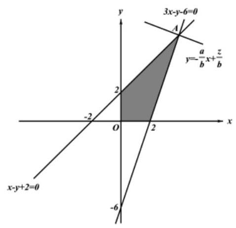

将 $z = {ax} + {by}$ 化为 $y =  - \frac{a}{b}x + \frac{z}{b}\;\because a > 0, b > 0\;\therefore  - \frac{a}{b} < 0$

当 $z$ 取最大值时, $y =  - \frac{a}{b}x + \frac{z}{b}$ 在 $y$ 轴截距最大

由图象可知,当 $y =  - \frac{a}{b}x + \frac{z}{b}$ 过 $A$ 时,在 $y$ 轴截距最大

由 $\left\{  \begin{array}{l} {3x} - y - 6 = 0 \\  x - y + 2 = 0 \end{array}\right.$ 得: $A\left( {4,6}\right) \;\therefore {z}_{\max } = {4a} + {6b} = 2$ ,即 ${2a} + {3b} = 1$

故答案为 1

二、选择题

7、直线 $l$ 的参数方程是 $\left\{  {\begin{array}{l} x = 1 + {2t} \\  y = 2 - t \end{array}\left( {t \in  R}\right) }\right.$ . 则 $l$ 的方向向量 $\overrightarrow{d}$ 可以是( ).

A. $\left( {1,2}\right)$ B. $\left( {2,1}\right)$ C. $\left( {-2,1}\right)$ D. $\left( {1, - 2}\right)$

【难度】 $\star   \star$

【答案】C

【解析】由 $\left\{  {\begin{array}{l} x = 1 + {2t} \\  y = 2 - t \end{array} \Rightarrow  x + {2y} - 5 = 0}\right.$ ,即直线方程为 $y =  - \frac{1}{2}x + \frac{5}{2}$ ,斜率为 $k =  - \frac{1}{2}$ ,

所以向量 $\left( {1, k}\right)  = \left( {1, - \frac{1}{2}}\right)$ 为直线 $l$ 的一个方向向量.

所以与向量 $\left( {1, - \frac{1}{2}}\right)$ 共线的向量(非零向量) 均为直线 $l$ 的方向向量.

经验证 $\left( {-2,1}\right)  =  - 2\left( {1, - \frac{1}{2}}\right)$ ,所以 $\left( {-2,1}\right)$ 与 $\left( {1, - \frac{1}{2}}\right)$ 共线

所以 $\left( {-2,1}\right)$ 也为直线 $l$ 的一个方向向量. 故选: $\mathrm{C}$

8、参数方程 $\left\{  \begin{array}{l} x = 3{t}^{2} + 4 \\  y = {t}^{2} - 2 \end{array}\right.$ ( $t$ 为参数,且 $0 \leq  t \leq  3$ ) 所表示的曲线是( )

A. 直线 B. 圆弧 C. 线段 D. 双曲线的一支

【难度】 $\star   \star   \star$

【答案】C

【解析】解: 根据题意,参数方程 $\left\{  \begin{array}{l} x = 3{t}^{2} + 4 \\  y = {t}^{2} - 2 \end{array}\right.$ ,若 $0 \leq  \mathrm{t} \leq  3$ ,

则有: $4 \leq  \mathrm{x} \leq  {31}, - 2 \leq  \mathrm{y} \leq  7$ ,

又由参数方程 $\left\{  \begin{array}{l} x = 3{t}^{2} + 4 \\  y = {t}^{2} - 2 \end{array}\right.$ ,则 $y + 2 = \frac{1}{3}\left( {x - 4}\right)$ ,即 $x - {3y} = {10}$ ,

又由 $4 \leq  \mathrm{x} \leq  {31}, - 2 \leq  \mathrm{y} \leq  7$ ,则参数方程表示的是线段; 故选 $C$ .

9、设变量 $x, y$ 满足约束条件 $\left\{  \begin{array}{l} x - y \geq  0 \\  {2x} + y \leq  2 \\  y \geq  0 \\  x + y \leq  a \end{array}\right.$ ,若满足条件的点 $P\left( {x, y}\right)$ 表示的平面区域为一个三角形,则 $a$ 的取值范围是( )

A. $\left\lbrack  {\frac{4}{3}, + \infty }\right)$ B. $(0,1\rbrack$ C. $\left\lbrack  {1,\frac{4}{3}}\right\rbrack$ D. $\left( {0,1}\right\rbrack   \cup  \left\lbrack  {\frac{4}{3}, + \infty }\right)$

【难度】 $\star   \star   \star$

【答案】D

【解析】解: 画出满足条件的平面区域, 如图示:,

显然当 $0 < a \leq  1$ 时,不等式组表示的区域为三角形;

直线 $x + y = a$ 经过可行域的 $B$ 时,可行域是三角形,

由 $\left\{  \begin{array}{l} x = y \\  {2x} + y = 2 \end{array}\right.$ 可得: $B\left( {\frac{2}{3},\frac{2}{3}}\right)$ . 则 $a = \frac{4}{3}$ ,

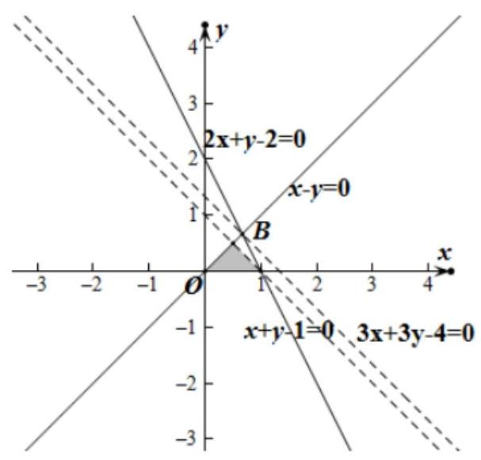

满足条件的点 $P\left( {x, y}\right)$ 表示的平面区域为一个三角形,则 $a$ 的取值范围是: $\left( {0,1\rbrack  \cup  \left\lbrack  {\frac{4}{3}, + \infty }\right. }\right)$ .

故选: $D$ .

10、已知点 $A\left( {-3,0}\right) , B\left( {0,3}\right)$ ,若点 $P$ 在曲线 $\left\{  \begin{array}{l} x = 1 + \cos \theta \\  y = \sin \theta  \end{array}\right.$ (参数 $\theta  \in  \left\lbrack  {0,{2\pi }}\right\rbrack$ ) 上运动,则 $\bigtriangleup {PAB}$ 面积的最小值为( )

A. $\frac{9}{2}$ B. $6\sqrt{2}$

C. $6 + \frac{3\sqrt{2}}{2}$ D. $6 - \frac{3\sqrt{2}}{2}$

【难度】 $\star   \star   \star$

【答案】D

【解析】由曲线 $\left\{  \begin{array}{l} x = 1 + \cos \theta \\  y = \sin \theta  \end{array}\right.$ (参数 $\theta  \in  \left\lbrack  {0,{2\pi }}\right\rbrack$ ) 知曲线是以 $\left( {1,0}\right)$ 为圆心, $\pi$ 为半径的圆. 故直角坐标方程为: ${\left( x - 1\right) }^{2} + {y}^{2} = 1$ .

又点 $A\left( {-3,0}\right) , B\left( {0,3}\right)$ 故直线 ${AB}$ 的方程为 $x - y + 3 = 0$ .

故当 $P$ 到直线 ${AB}$ 的距离最小时有 $\bigtriangleup {PAB}$ 面积取最小值.

又圆心 $\left( {1,0}\right)$ 到直线 ${AB}$ 的距离为 $d = \frac{\left| 1 - 0 + 3\right| }{\sqrt{{1}^{2} + {\left( -1\right) }^{2}}} = 2\sqrt{2}$ .

故 $P$ 到直线 ${AB}$ 的距离最小值为 $h = 2\sqrt{2} - 1$ . 故 $\bigtriangleup {PAB}$ 面积的最小值为

$S = \frac{1}{2}\left| {AB}\right|  \cdot  d = \frac{1}{2} \times  3\sqrt{2} \times  \left( {2\sqrt{2} - 1}\right)  = 6 - \frac{3\sqrt{2}}{2}$ . 故选: D

## 三、解答题

11、已知直线 $l : y = {ax} + 4$

(1)若直线 $l$ 与直线 $\sqrt{3}x + y = 0$ 的夹角为 $\frac{\pi }{3}$ ，求实数 $a$ 的值；

(2)若直线 $l$ 被圆 $\left\{  {\begin{array}{l} x = 2\cos \theta \\  y = 2\sin \theta  \end{array}\text{ ( }\theta }\right.$ 为参数)截得的线段长为 $2\sqrt{2}$ ，求实数 $a$ 的值.

【难度】 $\star   \star   \star$

【答案】(1) $a = 0$ 或 $a = \sqrt{3};\left( 2\right)  \pm  \sqrt{7}$

【解析】(1) 利用夹角公式可得: $\tan \frac{\pi }{3} = \left| \frac{a - \left( {-\sqrt{3}}\right) }{1 + a\left( {-\sqrt{3}}\right) }\right|$ ,解得 $a = 0$ 或 $a = \sqrt{3}$ ;

(2)由 $\left\{  \begin{array}{l} x = 2\cos \theta \\  y = 2\sin \theta  \end{array}\right.$ 消去 $\theta$ 得 ${x}^{2} + {y}^{2} = 4$ ，圆心 $\left( {0,0}\right)$ 到直线 ${ax} - y + 4 = 0$ 的距离 $d = \frac{4}{\sqrt{{a}^{2} + 1}}$ ，

$\therefore 2\sqrt{2} = 2\sqrt{4 - {d}^{2}},\therefore {d}^{2} = 2,\therefore \frac{16}{{a}^{2} + 1} = 2$ ,解得 $a =  \pm  \sqrt{7}$

12、某运输公司每天至少向某地运送 180t 物质,该公司有 8 辆载重为 6t 的 $A$ 型卡车与 4 辆载重为 10t 的 $B$ 型卡车，有 10 名驾驶员，每辆卡车每天往返的次数为 $A$ 型卡车 4 次， $B$ 型卡车 3 次；每辆卡车每天往返的成本为 A 型卡车 320 元，B 型卡车 504 元，你认为该公司怎样调配车辆，使运费成本最低，最低运费是多少?

【难度】★★★

【答案】 $A$ 型卡车 8 辆, $B$ 型卡车 0 辆,最低运费 2560 元

【解析】设调配 $A$ 型卡车 $x$ 辆, $B$ 型卡车 $y$ 辆,则 $x, y$ 满足 $\left\{  \begin{array}{l} 0 \leq  x \leq  8 \\  0 \leq  y \leq  4 \\  x + y \leq  {10} \\  4 \times  6 \times  x + 3 \times  {10} \times  y \geq  {180} \\  x, y \in  N \end{array}\right.$ ,

整理得到 $\left\{  \begin{array}{l} 0 \leq  x \leq  8 \\  0 \leq  y \leq  4 \\  x + y \leq  {10} \\  {4x} + {5y} \geq  {30} \\  x, y \in  N \end{array}\right.$ . 设费用为 $z$ ,则 $z = {320x} + {504y}$ ,

不等组对应的可行域如图所示:

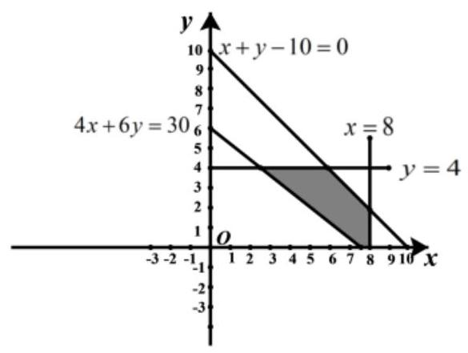

考虑动直线 ${320x} + {504y} - z = 0$ ,其斜率为 $k =  - \frac{40}{63} >  - \frac{2}{3}$ ,

因为 ${4x} + {6y} = {30}$ 与 $x$ 轴的交点为 $\left( {{7.5},0}\right)$ ,

故当动直线 ${320x} + {504y} - z = 0$ 过 $\left( {{7.5},0}\right)$ 附近的整点 $\left( {7,1}\right)$ 或 $\left( {8,0}\right)$ 时可取最小值.

当 $x = 7, y = 1$ 时, $z = {2744}$ ; 当 $x = 8, y = 0$ 时, $z = {2560}$ ,

故调配 $A$ 型卡车 8 辆, $B$ 型卡车 0 辆时,费用最低且最低费用为 2560 元.
