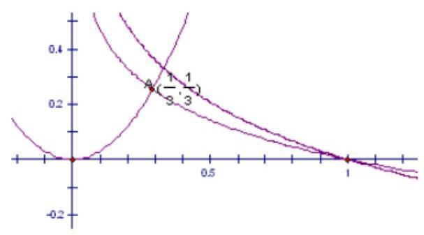
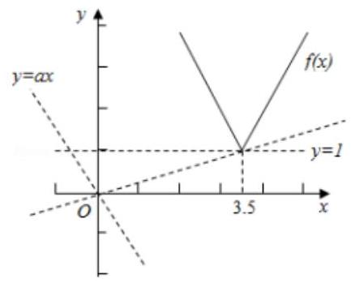
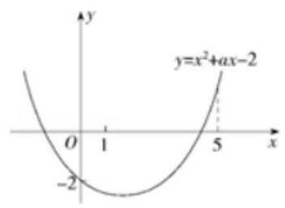
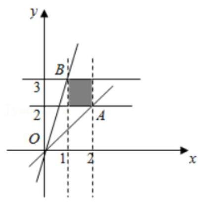
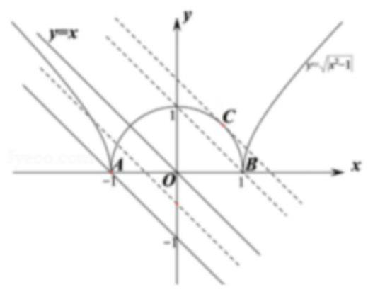

## 不等式、方程中恒成立问题与有解性问题

<table><tr><td>教学目标</td><td>1、掌握不等式的恒成立、能成立、恰成立的问题.   2、掌握不等式恒成立的的各种变形.   3、掌握方程中恒成立和存在性问题.</td></tr><tr><td>重点</td><td>1、掌握各种不同不等式恒成立问题中解答策略   2、参变分离是解答不等式恒成立问题的最常规思想方法   3、能将题目中隐性的恒成立存在问题转化为熟知解答恒成立题型</td></tr><tr><td>难 点</td><td>1、针对不同题型能选取恰当解答方法   2、能将题目中隐性的恒成立存在问题转化为熟知解答恒成立题型</td></tr></table>

## (一) 不等式中恒成立问题

## 知识梳理

不等式中恒成立问题和存在性问题解决方法和题型差不多, 知识梳理放在一起讲解

在不等式的综合题中, 经常会遇到当一个结论对于某一个字母的某一个取值范围内所有值都成立的恒成立

## 问题和存在性问题.

不等式恒成立、存在性问题的常规处理方式:常应用函数方程思想和分离变量法转化为最值问题，也可抓住所给不等式的结构特征, 利用数形结合法.

方程恒成立、存在性问题处理方法和不等式差不多, 区别在于方程是转化为自变量函数的值域问题

## 一、不等式中基本类型:

类型一:一次函数类型(或者是单调性函数)一用一次函数的性质(注意主副元的转化)

对于一次函数 $f\left( x\right)  = {kx} + b, x \in  \left\lbrack  {m, n}\right\rbrack$ 有:

$f\left( x\right)  > 0$ 恒成立 $\Leftrightarrow  \left\{  {\begin{array}{l} f\left( m\right)  > 0 \\  f\left( n\right)  > 0 \end{array}, f\left( x\right)  < 0}\right.$ 恒成立 $\Leftrightarrow  \left\{  \begin{array}{l} f\left( m\right)  < 0 \\  f\left( n\right)  < 0 \end{array}\right.$

$x \in  \left( {m, n}\right) , f\left( x\right)  > 0$ 有解 $\Leftrightarrow  f\left( m\right) f\left( n\right)  < 0, f\left( x\right)  < 0$ 有解 $\Leftrightarrow  f\left( m\right) f\left( n\right)  < 0$

类型二: 二次函数类型一用二次函数的图像

设 $f\left( x\right)  = a{x}^{2} + {bx} + c\left( {a \neq  0}\right)$ ,

(1) $f\left( x\right)  > 0$ 在 $x \in  R$ 上恒成立 $\Leftrightarrow  a > 0$ 且 $\Delta  < 0$ ；

(2) $f\left( x\right)  < 0$ 在 $x \in  R$ 上恒成立 $\Leftrightarrow  a < 0$ 且 $\Delta  < 0$ .

(3) $f\left( x\right)  > 0$ 在 $x \in  R$ 上有解 $\Leftrightarrow  a > 0$ 或 $a < 0$ 且 $\Delta  > 0$ ；

(4) $f\left( x\right)  < 0$ 在 $x \in  R$ 上有解 $\Leftrightarrow  a < 0$ 或 $a > 0$ 且 $\Delta  > 0$

## 类型三: 其他函数恒成立和存在性问题

单变量处理方法:(1)利用函数最值

第一步:确定自变量和参量

第二步:参变分离(有些不能分离，进行第三步或第四步)

第三步:转化成自变量函数的最值

(2)数形结合

多变量处理方法:(转化成单变量问题)

(1)多变量能分离开:

1) 对于任意的 ${x}_{1} \in  \left\lbrack  {m, n}\right\rbrack  ,{x}_{2} \in  \left\lbrack  {a, b}\right\rbrack$ ,都有 $f\left( {x}_{1}\right)  \geq  g\left( {x}_{2}\right)  \Rightarrow  f{\left( {x}_{1}\right) }_{\min } \geq  f{\left( {x}_{2}\right) }_{\max }$

2) 对于任意的 ${x}_{1} \in  \left\lbrack  {m, n}\right\rbrack$ ,存在 ${x}_{2} \in  \left\lbrack  {a, b}\right\rbrack$ ,使得 $f\left( {x}_{1}\right)  \geq  g\left( {x}_{2}\right)  \Rightarrow  f{\left( {x}_{1}\right) }_{\min } \geq  f{\left( {x}_{2}\right) }_{\min }$

3) 对于存在 ${x}_{1} \in  \left\lbrack  {m, n}\right\rbrack  ,{x}_{2} \in  \left\lbrack  {a, b}\right\rbrack$ ,使得 $f\left( {x}_{1}\right)  \geq  g\left( {x}_{2}\right)  \Rightarrow  f{\left( {x}_{1}\right) }_{\max } \geq  f{\left( {x}_{2}\right) }_{\min }$

(2)多变量不能分开

1)把多变量看作成整体(如把 $\frac{x}{y},{xy},{2x} + y$ 等看成一个变量)

2)把其中一个看作是自变量另外的看成常量，先去一个变量

(注意最值取不到时的变化，恒成立和存在性是由区别的)

## 例题精讲

题型一:不能参变分离题型

【例 1】( 1 )设常数 $a > 0$ ，若 ${9x} + \frac{{a}^{2}}{x} \geq  a + 1$ 对一切正实数 $x$ 成立，则 $a$ 的取值范围为___.

【难度】 $\star   \star   \star$

【答案】 $\left\lbrack  {\frac{1}{5}, + \infty }\right)$

【解析】解: $\because x > 0, a > 0,\therefore {9x} + \frac{{a}^{2}}{x} \geq  2\sqrt{{9x} \cdot  \frac{{a}^{2}}{x}} = {6a}$ ,当且仅当 $x = \frac{a}{3}$ 时取等号.

$\because {9x} + \frac{{a}^{2}}{x} \geq  a + 1$ 对一切正实数 $x$ 成立, $\therefore a + 1 \leq  {\left( 9x + \frac{{a}^{2}}{x}\right) }_{\text{ min }}$ .

$\therefore a + 1 \leq  {6a}$ ,解得 $a \geq  \frac{1}{5}$ .

$\therefore a$ 的取值范围为 $\left\lbrack  {\frac{1}{5}, + \infty }\right)$ .

故答案为: $\left\lbrack  {\frac{1}{5}, + \infty }\right)$ .

(2)已知函数 $f\left( x\right)  = {x}^{2} + {ax} + 3 - {a}^{2}$ ，若 $x \in  \left\lbrack  {-2,2}\right\rbrack$ 时， $f\left( x\right)  < 0$ 恒成立，求实数 $a$ 的取值范围.

【难度】★★

【答案】 $a <  - 1 - 2\sqrt{2}$ 或 $a > 1 + 2\sqrt{2}$

【解析】解: 方法一: 分类讨论求函数最值 (此题放在这里着重强调方法一)

方法二: 结合二次函数图像, $\left\{  {\begin{array}{l} f\left( {-2}\right)  < 0 \\  f\left( 2\right)  < 0 \end{array} \Rightarrow  a <  - 1 - 2\sqrt{2}}\right.$ 或 $a > 1 + 2\sqrt{2}$ 。

题型二:一次函数型在某区间上恒成立

【例 2】已知 $f\left( x\right)  = {2x} + 3$ ,若当 $- 2 \leq  x \leq  1$ 时,函数 $f\left( x\right)  + {3tx} + t > 0$ 恒成立,求实数 $t$ 的取值范围.

【难度】 $\star   \star$

【答案】 $- \frac{5}{4} < t <  - \frac{1}{5}$

【解析】由 $f\left( x\right)  + {3tx} + t > 0$ 在 $- 2 \leq  x \leq  1$ 上恒成立,得 $\left( {{3t} + 2}\right) x + t + 3 > 0$ 在 $- 2 \leq  x \leq  1$ 上恒成立

令 $g\left( x\right)  = \left( {{3t} + 2}\right) x + t + 3$ ,知 $g\left( x\right)$ 的图象在 $- 2 \leq  x \leq  1$ 上是一条线段,

只需线段的两端点在 $x$ 轴的上方因此要 $\left( {{3t} + 2}\right) x + t + 3 > 0$ 在 $- 2 \leq  x \leq  1$ 上恒成立,

只要: $\left\{  {\begin{array}{l} g\left( {-2}\right)  > 0 \\  g\left( 1\right)  > 0 \end{array} \Rightarrow  \left\{  {\begin{array}{l}  - {5t} - 1 > 0 \\  {4t} + 5 > 0 \end{array}\text{ 得: } - \frac{5}{4} < t <  - \frac{1}{5}}\right. }\right.$

题型三: 二次函数型在 $R$ 上恒成立

【例 3】已知函数 $f\left( x\right)$ 的定义域为 $R$ ,求实参数 $k$ 的取值范围:

(1) $f\left( x\right)  = \sqrt{2{x}^{2} - {4kx} + 1 - k}$ ； (2) $f\left( x\right)  = {\log }_{a}\left( {k{x}^{2} - {4kx} + 1 - k}\right)$ ；

【难度】★★

【答案】见解析

【解析】(1) $f\left( x\right)$ 的定义域为 $R \Leftrightarrow$ 关于 $x$ 的不等式 $2{x}^{2} - {4kx} + 1 - k \geq  0$ 的解集为

$R \Leftrightarrow  \Delta  = {16}{k}^{2} - 8\left( {1 - k}\right)  \leq  0 - 1 \leq  k \leq  \frac{1}{2},\therefore k \in  \left\lbrack  {-1,\frac{1}{2}}\right\rbrack$ .

(2) $f\left( x\right)$ 的定义域为 $R \Leftrightarrow$ 关于 $x$ 的不等式 $k{x}^{2} - {4kx} + 1 - k > 0$ 的解集为 $R$

$\Leftrightarrow  k = 0$ 或 $\left\{  {\begin{matrix} k > 0 \\  {16}{k}^{2} - {4k}\left( {1 - k}\right)  < 0 \end{matrix} \Leftrightarrow  k = 0}\right.$ 或 $0 < k < \frac{1}{5} \Leftrightarrow  0 \leq  k < \frac{1}{5},\therefore k \in  \left\lbrack  {0,\frac{1}{5}}\right)$

题型四: 参变分离

【例 4】( 1 )当 $x \in  \left( {1,3}\right)$ 时，不等式 ${x}^{2} + \left( {m - 2}\right) x + 4 < 0$ 恒成立，则 $m$ 的取值范围是___.

【难度】 $\star   \star   \star$

【答案】 $m \leq   - 3$

【解析】解: $\because x \in  \left( {1,3}\right)$ ,则不等式 ${x}^{2} + \left( {m - 2}\right) x + 4 < 0$ 可化为 $m < 2 - \left( {x + \frac{4}{x}}\right)$ , $\because g\left( x\right)  = x + \frac{4}{x}$ 在 $\left( {1,2}\right)$ 单调递减,在 $\left( {2,3}\right)$ 单调递增; 又 $\because g\left( 1\right)  = 5, g\left( 3\right)  = \frac{13}{3}$ ,则 $g\left( x\right)$ 在 $\left\lbrack  {1,3}\right\rbrack$ 上的最大值为 5 . 则若使 $m < 2 - \left( {x + \frac{4}{x}}\right)$ ,在 $\left( {1,3}\right)$ 上恒成立. 则 $m \leq   - 3$ . 故答案为 $m \leq   - 3$ .

(2)设函数 $f\left( x\right)  = \frac{{x}^{2} - x + 2}{{x}^{2}}$ ，若对 $x > 0$ 恒有 ${xf}\left( x\right)  + a > 0$ 成立，则实数 $a$ 的取值范围是( )

A. $\left( {-\infty ,1 - 2\sqrt{2}}\right)$ B. $\left( {-\infty ,2\sqrt{2} - 1}\right)$ C. $\left( {2\sqrt{2} - 1, + \infty }\right)$ D. $\left( {1 - 2\sqrt{2}, + \infty }\right)$

【难度】 $\star   \star   \star$

【答案】D

【解析】解: $\because f\left( x\right)  = \frac{{x}^{2} - x + 2}{{x}^{2}},\therefore$ 当 $x > 0$ 时, ${xf}\left( x\right)  = x \cdot  \frac{{x}^{2} - x + 2}{{x}^{2}} = \frac{{x}^{2} - x + 2}{x} = x + \frac{2}{x} - 1 \geq  2\sqrt{2} - 1$ (当且仅当 $x = \frac{2}{x}$ ,即 $x = \sqrt{2}$ 时,等号成立), $\therefore 2\sqrt{2} - 1 + a > 0,\therefore a > 1 - 2\sqrt{2}$ ,故选: $D$ .

【例 5】已知函数 $f\left( x\right)  = \frac{4{x}^{2} + \left( {a + 1}\right) x + b}{x}\left( {a, b \in  R}\right)$ 为奇函数.

(1)求 $a$ 的值；

(2)不等式 $f\left( x\right)  \leq  2$ 在 $\left\lbrack  {1,4}\right\rbrack$ 上恒成立，求实数 $b$ 的最大值.

【难度】 $\star   \star   \star$

【答案】见解析

【解析】解: (1) 函数 $f\left( x\right)  = \frac{4{x}^{2} + \left( {a + 1}\right) x + b}{x}\left( {a, b \in  R}\right)$ 为奇函数.

即 $f\left( x\right)  = {4x} + \frac{b}{x} + a + 1$ 为奇函数. 由 $f\left( {-x}\right)  =  - f\left( x\right)$ ,则 $a + 1 = 0$ ,可得 $a =  - 1$ .

(2)由(1)可知 $f\left( x\right)  = {4x} + \frac{b}{x}.f\left( x\right)  \leq  2 \Rightarrow  b \leq  {2x} - 4{x}^{2}$ 在 $\left\lbrack  {1,4}\right\rbrack$ 上恒成立 $b \leq  {\left( 2x - 4{x}^{2}\right) }_{\min } =  - {56}$

【例 6】一元二次不等式 $a{x}^{2} - {2ax} + 1 \geq  0$ 在 $\left\lbrack  {2.4}\right\rbrack$ 上恒成立,求实数 $a$ 的取值范围.

【难度】 $\star   \star   \star$

【答案】 $a \geq   - \frac{1}{8}$

【解析】解法一: 参变分离法 (1) 当 $x = 2$ 时, $a \in  R$ ; (2) 当 $x \in  (2,4\rbrack$ 时,由 $a{x}^{2} - {2ax} + 1 \geq  0$ 恒成立,得 $a \geq  {\left\{  \frac{1}{{2x} - {x}^{2}}\right\}  }_{\text{ max }}$ . 又因为 $- 8 \leq  {2x} - {x}^{2} < 0$ ,所以 $a \geq   - \frac{1}{8}$ ,综上得实数 $a$ 的取值范围是 $\left\lbrack  {-\frac{1}{8}, + \infty }\right)$ .

解法二: 当 $a = 0$ 时,符合题意; 当 $a \neq  0$ 时,设函数 $f\left( x\right)  = a{x}^{2} - {2ax} + 1$ ,对称轴为 $x = 1$ ,

当 $a > 0$ 时,开口向上,函数 $f\left( x\right)$ 在 $\left\lbrack  {2,4}\right\rbrack$ 上单调递增,只需 $f{\left( x\right) }_{\min } = f\left( 2\right)  \geq  0$ 即可,此时解得 $a > 0$ ; 当 $a < 0$ 时,开口向下,函数 $f\left( x\right)$ 在 $\left\lbrack  {2,4}\right\rbrack$ 上单调递减,只需 $f{\left( x\right) }_{\min } = f\left( 4\right)  \geq  0$ 即可,此时解得 $- \frac{1}{8} \leq  a < 0$ . 综上,实数 $a$ 的取值范围为 $a \geq   - \frac{1}{8}$ .

【例 7】如关于 $x$ 的不等式 $\left| {x + 1}\right|  - \left| {{ax} - 1}\right|  > 0$ 对任意 $x \in  \left( {0,1}\right)$ 恒成立，则 $a$ 的取值范围为___.

【难度】 $\star   \star   \star$

【答案】 $- 1 < a \leq  3$

【解析】解: 因为 $x \in  \left( {0,1}\right)$ ,所以原不等式可化为: $\left| {{ax} - 1}\right|  < x + 1$ ,

$\therefore  - x - 1 < {ax} - 1 < x + 1,\therefore \left\{  {\begin{array}{l} a < 1 + \frac{2}{x} \\  a >  - 1 \end{array}\text{ 对任意 }x \in  \left( {0,1}\right) }\right.$ 恒成立, $\because 1 + \frac{2}{x} > 1 + 2 = 3$

$\therefore  - 1 < a \leq  3$ ,故答案为: $- 1 < a \leq  3$ .

题型五: 数形结合

【例 8】已知函数 $f\left( x\right)  = {ax} - \sqrt{{4x} - {x}^{2}}, x \in  (0,4\rbrack$ 时 $f\left( x\right)  < 0$ 恒成立,求实数 $a$ 的取值范围.

【难度】 $\star   \star   \star$

【答案】 $\left( {-\infty ,0}\right)$

【解析】法一: 将问题转化为 $a < \frac{\sqrt{{4x} - {x}^{2}}}{x}$ 对 $x \in  (0,4\rbrack$ 恒成立. 令 $g\left( x\right)  = \frac{\sqrt{{4x} - {x}^{2}}}{x}$ ,则 $a < g{\left( x\right) }_{\min }$ 由 $g\left( x\right)  = \frac{\sqrt{{4x} - {x}^{2}}}{x} = \sqrt{\frac{4}{x} - 1}$ 可知 $g\left( x\right)$ 在 $(0,4\rbrack$ 上为减函数,故 $g{\left( x\right) }_{\min } = g\left( 4\right)  = 0 \; \therefore a < 0$ 即 $a$ 的取值范围为 $\left( {-\infty ,0}\right)$ .

法二: 数形结合

【例 9】若不等式 $3{x}^{2} - {\log }_{a}x < 0$ 在 $x \in  \left( {0,\frac{1}{3}}\right)$ 内恒成立,求实数 $a$ 的取值范围.

【难度】 $\star   \star   \star$

【答案】 $1 > a \geq  \frac{1}{27}$

【解析】由题意知: $3{x}^{2} < {\log }_{a}x$ 在 $x \in  \left( {0,\frac{1}{3}}\right)$ 内恒成立,

在同一坐标系内,分别作出函数 $y = 3{x}^{2}$ 和 $y = {\log }_{a}x$

观察两函数图象,当 $x \in  \left( {0,\frac{1}{3}}\right)$ 时,若 $a > 1$ 函数 $y = {\log }_{a}x$ 的图象显然在函数 $y = 3{x}^{2}$ 图象的下方,所以不成立;

当 $0 < a < 1$ 时,由图可知, $y = {\log }_{a}x$ 的图象必须过点 $\left( {\frac{1}{3},\frac{1}{3}}\right)$ 或在这个点的上方,则, ${\log }_{a}\frac{1}{3} \geq  \frac{1}{3} \; \therefore a \geq  \frac{1}{27}\;\therefore 1 > a \geq  \frac{1}{27}$ 综上得: $1 > a \geq  \frac{1}{27}$

## 题型六:多变量转化成单变量

【例 10】已知正实数 $x, y$ 满足 ${lnx} + {lny} = 0$ ,且 $k\left( {x + {2y}}\right)  \leq  {x}^{2} + 4{y}^{2}$ 恒成立,则 $k$ 的取值范围是___.

【难度】 $\star   \star   \star$

【答案】 $k \leq  \sqrt{2}$

【解析】解: 由 $\ln x + \ln y = 0$ 得, ${xy} = 1$ ,

$k\left( {x + {2y}}\right)  \leq  {x}^{2} + 4{y}^{2}$ ,即 $k \leq  \frac{{x}^{2} + 4{y}^{2}}{x + {2y}} = \frac{{\left( x + 2y\right) }^{2} - 4}{x + {2y}} = \left( {x + {2y}}\right)  - \frac{4}{x + {2y}}$ ,

令 $m = x + {2y}$ ,则 $k \leq  {\left( m - \frac{4}{m}\right) }_{\min }$ ,

因为 $m = x + {2y} \geq  2\sqrt{2xy} = 2\sqrt{2}$ ,且 $y = m - \frac{4}{m}$ 在 $\lbrack 2\sqrt{2}, + \infty )$ 上递增,

所以 $m = 2\sqrt{2}$ 时, ${\left( m - \frac{4}{m}\right) }_{min} = 2\sqrt{2} - \frac{4}{2\sqrt{2}} = \sqrt{2}$ ,所以 $k \leq  \sqrt{2}$ ,故答案为: $k \leq  \sqrt{2}$ .

【例 11】如果以一切正实数 $x, y$ ,不等式 $\frac{y}{4} - {\cos }^{2}x \geq  a\sin x - \frac{9}{y}$ 恒成立,则实数 $a$ 的取值范围是 ( )

A. $\left( {-\infty ,\frac{4}{3}}\right\rbrack$ B. $\lbrack 3, + \infty )$ C. $\left\lbrack  {-2\sqrt{2},2\sqrt{2}}\right\rbrack$ ; D. $\left\lbrack  {-3,3}\right\rbrack$

【难度】★★★

【答案】D

【解析】解: 任意实数 $x\text{ 、 }y$ ,不等式 $\frac{y}{4} - {\cos }^{2}x \geq  a\sin x - \frac{9}{y}$ 恒成立 $\Leftrightarrow  \frac{y}{4} + \frac{9}{y} \geq  a\sin x + 1 - {\sin }^{2}x$ 恒成立, 令 $f\left( y\right)  = \frac{y}{4} + \frac{9}{y}$ ,

则 $a\sin x + 1 - {\sin }^{2}x \leq  f{\left( y\right) }_{\min }$ ,

当 $y > 0$ 时, $f\left( y\right)  = \frac{y}{4} + \frac{9}{y} \geq  2\sqrt{\frac{y}{4} \cdot  \frac{9}{y}} = 3$ (当且仅当 $y = 6$ 时取 “ $=$ ”), $f{\left( y\right) }_{\min } = 3$ ;

当 $y < 0$ 时, $f\left( y\right)  = \frac{y}{4} + \frac{9}{y} \leq   - 2\sqrt{\left( {-\frac{y}{4}}\right)  \cdot  \left( {-\frac{9}{y}}\right) } =  - 3$ (当且仅当 $y =  - 6$ 时取 “ $=$ ”), $f{\left( y\right) }_{\max } =  - 3, f{\left( y\right) }_{\min }$ 不存在;

综上所述， $f{\left( y\right) }_{\min } = 3$ .

所以, $a\sin x + 1 - {\sin }^{2}x \leq  3$ ,即 $a\sin x - {\sin }^{2}x \leq  2$ 恒成立.

① 若 $\sin x > 0, a \leq  \sin x + \frac{2}{\sin x}$ 恒成立，令 $\sin x = t$ ，则 $0 < t \leq  1$ ，再令 $g\left( t\right)  = t + \frac{2}{t}\left( {0 < t \leq  1}\right)$ ，则 $a \leq  g{\left( t\right) }_{\min }$ . 由于 ${g}^{\prime }\left( t\right)  = 1 - \frac{2}{{t}^{2}} < 0$ ,

所以, $g\left( t\right)  = t + \frac{2}{t}$ 在区间 $(0,1\rbrack$ 上单调递减,

因此, $g{\left( t\right) }_{\min } = g\left( 1\right)  = 3$ ,

所以 $a \leq  3$ ；

② 若 $\sin x < 0$ ，则 $a \geq  \sin x + \frac{2}{\sin x}$ 恒成立，同理可得 $a \geq   - 3$ ；

③若 $\sin x = 0,0 \leq  2$ 恒成立,故 $a \in  R$ ；

综合①②③， $- 3 \leq  a \leq  3$ .

故选: $D$ .

## 巩固训练

1、已知一次函数 $f\left( x\right)  = {2x} + {3m} + 1$ ，若当 $x \in  \lbrack  - 1, + \infty )$ 时， $f\left( x\right)  \geq  0$ 恒成立，则实数 $m$ 的取值范围是___.

【难度】 $\star   \star$

【答案】 $\left\lbrack  {\frac{1}{3}, + \infty }\right)$

【解析】解: 一次函数 $f\left( x\right)  = {2x} + {3m} + 1$ 在 $x \in  \lbrack  - 1, + \infty )$ 上为增函数,

$\therefore f{\left( x\right) }_{\min } = f\left( {-1}\right)  = {3m} - 1$ ,要使当 $x \in  \lbrack  - 1, + \infty )$ 时, $f\left( x\right)  \geq  0$ 恒成立,

则 ${3m} - 1 \geq  0$ 恒成立,得 $m \geq  \frac{1}{3}$ . $\therefore$ 实数 $m$ 的取值范围是 $\lbrack \frac{1}{3}, + \infty )$ . 故答案为: $\lbrack \frac{1}{3}, + \infty )$ .

2、已知对任意 $x \in  R$ ，总有 $- 3 < \frac{{x}^{2} + {tx} - 2}{{x}^{2} - x + 1} < 2$ ，求实数 $t$ 的取值范围.

【难度】 $\star   \star   \star$

【答案】 $\left( {-1,2}\right)$

【解析】因为 ${x}^{2} - x + 1 > 0$ ,所以原不等式可化为 $\left\{  \begin{array}{l} 4{x}^{2} + \left( {t - 3}\right) x + 1 > 0 \\  {x}^{2} - \left( {2 + t}\right) x + 4 > 0 \end{array}\right.$ 在一切实数都成立, $\left\{  {\begin{array}{l} {\Delta }_{1} < 0 \\  {\Delta }_{2} < 0 \end{array} \Rightarrow   - 1 < t < 2}\right.$

3、已知关于 $x$ 的不等式 $a{x}^{2} + {4x} + a > 1 - 2{x}^{2}$ 对一切 $x \in  \mathrm{R}$ 恒成立，则实数 $a$ 的取值范围是___.

【难度】 $\star   \star$

【答案】 $\left( {2, + \infty }\right)$

【解析】不等式变为 $\left( {a + 2}\right) {x}^{2} + {4x} + a - 1 > 0$ ,当 $a =  - 2$ 时不符合题意; 当 $a \neq   - 2$ 时,有 $\left\{  \begin{array}{l} a + 2 > 0, \\  {4}^{2} - 4\left( {a + 2}\right) \left( {a - 1}\right)  < 0, \end{array}\right.$ 解得 $a > 2$ . 综上所述， $a$ 的范围是 $\left( {2, + \infty }\right)$ .

4、若不等式 ${x}^{2} - {2mx} + {2m} + 1 > 0$ 对 $0 \leq  x \leq  1$ 的所有实数 $x$ 都成立，求 $m$ 的取值范围.

【难度】★★

【答案】 $m >  - \frac{1}{2}$

【解析】方法一: 可以数形结合思想利用根的分布解答; 方法二: 可以令不等式左边为一个二次函数, 求二次函数最小值; 方法三: 参变分离求函数最值。

5、已知 $f\left( x\right)  = \left| \begin{matrix} {ax} & x \\   - 2 & {2x} \end{matrix}\right| \left( {a\text{ 为常数 }}\right) , g\left( x\right)  = \frac{2{x}^{2} + 1}{x}$ ,且当 ${x}_{1},{x}_{2} \in  \left\lbrack  {1,4}\right\rbrack$ 时,总有 $f\left( {x}_{1}\right)  \leq  g\left( {x}_{2}\right)$ ,则实数 $a$ 的取值范围是___.

【难度】 $\star   \star   \star$

【答案】 $\left( {-\infty , - \frac{1}{6}}\right\rbrack$

【解析】解: 法 ${1}^{ \circ  }$ : 依题意知,当 ${x}_{1},{x}_{2} \in  \left\lbrack  {1,4}\right\rbrack$ 时, $f{\left( {x}_{1}\right) }_{\max } \leq  g{\left( {x}_{2}\right) }_{\min }$ ,

由 “对勾” 函数单调性知, $g\left( x\right)  = \frac{2{x}^{2} + 1}{x} = {2x} + \frac{1}{x} = 2\left( {x + \frac{\frac{1}{2}}{x}}\right)$ 在区间 $\left\lbrack  {1,4}\right\rbrack$ 上单调递增,

$\therefore g{\left( {x}_{2}\right) }_{\min } = g\left( 1\right)  = 3$ ;

$\because f\left( x\right)  = \left| \begin{array}{ll} {ax} & x \\   - 2 & {2x} \end{array}\right|  = {2a}{x}^{2} + {2x}$ ,

当 $a = 0$ 时, $f\left( x\right)  = {2x}$ 在区间 $\left\lbrack  {1,4}\right\rbrack$ 上单调递增, $\therefore f{\left( x\right) }_{\max } = f\left( 4\right)  = 8 \leq  3$ 不成立,故 $a \neq  0$ ;

$\therefore f\left( x\right)  = {2a}{x}^{2} + {2x}$ 为二次函数,其对称轴方程为: $x =  - \frac{1}{2a}$ ,

当 $a > 0$ 时, $f\left( x\right)$ 在区间 $\left\lbrack  {1,4}\right\rbrack$ 上单调递增, $f{\left( x\right) }_{\max } = f\left( 4\right)  = 8 \leq  3$ 不成立,故 $a > 0$ 不成立;

当 $a < 0$ 时,

${1}^{ \circ  }$ 若 $- \frac{1}{2a} \leq  1$ ,即 $a \leq   - \frac{1}{2}$ 时, $f\left( x\right)$ 在区间 $\left\lbrack  {1,4}\right\rbrack$ 上单调递减, $f{\left( x\right) }_{\max } = f\left( 1\right)  = {2a} + 2 \leq  3$ 恒成立,即 $a \leq   - \frac{1}{2}$ 时满足题意;

${2}^{ \circ  }$ 若 $1 <  - \frac{1}{2a} < 4$ ,即 $- \frac{1}{2} < a <  - \frac{1}{8}$ 时, $f{\left( x\right) }_{\max } = f\left( {-\frac{1}{2a}}\right)  =  - \frac{1}{2a} \leq  3$ ,解得: $- \frac{1}{2} < a \leq   - \frac{1}{6}$ ;

${3}^{ \circ  }$ 若 $- \frac{1}{2a} \geq  4$ ,即 $- \frac{1}{8} \leq  a < 0$ 时, $f\left( x\right)$ 在区间 $\left\lbrack  {1,4}\right\rbrack$ 上单调递增,

$f{\left( x\right) }_{\max } = f\left( 4\right)  = {32a} + 8 \leq  3$ ,解得 $a \leq   - \frac{5}{32} \notin  \left( {-\frac{1}{8},0}\right)$ ,故不成立,

综合 ${1}^{ \circ  }{2}^{ \circ  }{3}^{ \circ  }$ 知,实数 $a$ 的取值范围是: $\left( {-\infty , - \frac{1}{6}}\right\rbrack$ .

法 ${2}^{ \circ  }$ : 由法 ${1}^{ \circ  }$ 知 $g{\left( {x}_{2}\right) }_{\min } = g\left( 1\right)  = 3$ ,

$\because f\left( x\right)  = \left| \begin{array}{ll} {ax} & x \\   - 2 & {2x} \end{array}\right|  = {2a}{x}^{2} + {2x}$ ,

$\therefore$ 当 ${x}_{1} \in  \left\lbrack  {1,4}\right\rbrack$ 时, $f\left( {x}_{1}\right)  = {2a}{x}^{2} + {2x} \leq  3$ 恒成立,

$\therefore a \leq  \frac{3 - {2x}}{2{x}^{2}} = \frac{3}{2}{\left( \frac{1}{x} - \frac{1}{3}\right) }^{2} - \frac{1}{6}$ ,

$\therefore$ 当 $\frac{1}{x} = \frac{1}{3}$ ,即 $x = 3$ 时, ${\left( \frac{3 - {2x}}{2{x}^{2}}\right) }_{\min } =  - \frac{1}{6}$ ,

$\therefore$ 实数 $a$ 的取值范围是: $\left( {-\infty , - \frac{1}{6}}\right\rbrack$ .

故答案为: $\left( {-\infty , - \frac{1}{6}}\right\rbrack$ .

## (二)不等式中存在性问题

## 例题精讲

【例 12】(1)若存在实数 $x \in  \left\lbrack  {2,4}\right\rbrack$ ,使得不等式 ${x}^{2} - {2x} + a \geq  0$ 成立,求实数 $a$ 的取值范围___.

(2)已知不等式 $\left| {x - 4}\right|  + \left| {x - 3}\right|  < a$ 在实数集 $R$ 上的解集不是空集，求实数 $a$ 的取值范围___.

(3)若存在 $x \in  \left\lbrack  {1,2}\right\rbrack$ ，使得 $\left| {x - a}\right|  \geq  1$ 成立，则实数 $a$ 的取值范围是___.

【难度】 $\star   \star   \star$

【答案】(1) $a \geq   - 8$ (2) $a > 1$ (3) $( - \infty ,1\rbrack \bigcup \lbrack 2, + \infty$

【解析】(1) 依题意得 $a \geq   - {x}^{2} + {2x}, x \in  \left\lbrack  {2,4}\right\rbrack$ 有解,设 $f\left( x\right)  =  - {x}^{2} + {2x}, x \in  \left\lbrack  {2,4}\right\rbrack$ ,且 $- 8 \leq  f\left( x\right)  \leq  0$ ,所以 $a \geq   - 8$

(2)即存在 $x \in  R$ 使得 $\left| {x - 4}\right|  + \left| {x - 3}\right|  < a,\therefore a > {\left( \left| x - 4\right|  + \left| x - 3\right|  < a\right) }_{\min },\therefore a > 1$

(3)即存在 $x \in  \left\lbrack  {1,2}\right\rbrack$ 使得 $a \geq  1 + x$ 或 $a \leq   - 1 + x$ ， $\therefore a \in  \left( {-\infty ,1}\right\rbrack   \cup  \lbrack 2, + \infty )$ .

【例 13】若存在正数 $x$ 使 ${2}^{x}\left( {x - a}\right)  < 1$ 成立,则 $a$ 的取值范围是(   )

A. $\left( {-\infty , + \infty }\right)$ B. $\left( {-2, + \infty }\right)$ C. $\left( {0, + \infty }\right)$ D. $\left( {-1, + \infty }\right)$

【难度】★★★

【答案】 $D$

【解析】解: 因为 ${2}^{x}\left( {x - a}\right)  < 1$ ,所以 $a > x - \frac{1}{{2}^{x}}$ ,函数 $y = x - \frac{1}{{2}^{x}}$ 是增函数, $x > 0$ ,所以 $y >  - 1$ ,即 $a >  - 1$ , 所以 $a$ 的取值范围是 $\left( {-1, + \infty }\right)$ . 故选: $D$ .

【例 14】 $f\left( x\right)  = \left| {{2x} - 7}\right|  + 1$ ，若存在 $x$ 使 $f\left( x\right)  \leq  {ax}$ 成立， $a \in$ ___.

【难度】 $\star   \star   \star$

【答案】 $\left( {-\infty , - 2}\right)  \cup  \left\lbrack  {\frac{2}{7}, + \infty }\right)$

【解析】解: 由函数 $y = f\left( x\right)$ 与函数 $y = {ax}$ 的图象可知,

当且仅当 $a \geq  \frac{2}{7}$ ,或 $a <  - 2$ 时,函数 $y = f\left( x\right)$ 与函数 $y = {ax}$ 的图象有交点,

故存在 $x$ 使不等式 $f\left( x\right)  \leq  {ax}$ 成立时, $a$ 的取值范围是 $\left( {-\infty , - 2}\right)  \cup  \left\lbrack  {\frac{2}{7}, + \infty }\right)$ . 故答案为: $\left( {-\infty , - 2}\right)  \cup  \left\lbrack  {\frac{2}{7}, + \infty }\right)$ .

【例 15】已知 $f\left( x\right)  = \ln \left( {{x}^{2} + 1}\right) , g\left( x\right)  = {\left( \frac{1}{2}\right) }^{x} - m$ ,若任意 ${x}_{1} \in  \left\lbrack  {0,3}\right\rbrack$ ,存在 ${x}_{2} \in  \left\lbrack  {1,2}\right\rbrack$ ,使得 $f\left( {x}_{1}\right)  \geq  g\left( {x}_{2}\right)$ , 则实数 $m$ 的取值范围是(   )

A. $\left\lbrack  {\frac{1}{4}, + \infty }\right)$ B. $\left( {-\infty ,\frac{1}{4}}\right\rbrack$ C. $\left\lbrack  {\frac{1}{2}, + \infty }\right)$ D. $\left( {-\infty , - \frac{1}{2}}\right\rbrack$

【难度】 $\star   \star   \star$

【答案】 $A$

【解析】解: 因为 ${x}_{1} \in  \left\lbrack  {0,3}\right\rbrack$ 时, $f\left( {x}_{1}\right)  \in  \left\lbrack  {0,\ln {10}}\right\rbrack  ;{x}_{2} \in  \left\lbrack  {1,2}\right\rbrack$ 时, $g\left( {x}_{2}\right)  \in  \left\lbrack  {\frac{1}{4} - m,\frac{1}{2} - m}\right\rbrack$ .

故只需 $0 \geq  \frac{1}{4} - m \Rightarrow  m \geq  \frac{1}{4}$ . 故选: $A$ .

## 巩固训练

1、已知 ${x}^{2} + {2x} \geq  a$ 在 $x \in  \left\lbrack  {0,3}\right\rbrack$ 上有解，则实数 $a$ 的取值范围是___

【难度】 $\star   \star$

【答案】 $( - \infty ,{15}\rbrack$

【解析】解: $\because y = {x}^{2} + {2x}$ 的增区间为 $\lbrack  - 1, + \infty )$ ,

$\therefore y = {x}^{2} + {2x}$ 在 $\left\lbrack  {0,3}\right\rbrack$ 上是增函数,

当 $x = 0$ 时， ${y}_{\min } = 0$ ；当 $x = 3$ 时， ${y}_{\max } = 9 + 6 = {15}$ ，

$\because {x}^{2} + {2x} \geq  a$ 在 $x \in  \left\lbrack  {0,3}\right\rbrack$ 上有解,

$\therefore$ 实数 $a$ 的取值范围是 $( - \infty ,{15}\rbrack$ .

故答案为: $( - \infty ,{15}\rbrack$ .

2、当 $x \in  \{ x \mid  1 \leq  x \leq  5\}$ 时，不等式 ${x}^{2} + {ax} - 2 > 0$ 有解，则实数 $a$ 的取值范围是 ___.

【难度】 $\star   \star$

【答案】 $a >  - \frac{23}{5}$

【解析】解: 由题意知 $\Delta  = {a}^{2} + 8 > 0$ ,且 $- 2 < 0$ ,

所以方程 ${x}^{2} + {ax} - 2 = 0$ 恒有一正一负两个根,

设 $y = {x}^{2} + {ax} - 2$ ,作出函数的大致图象,如图所示:

由图象知,不等式 ${x}^{2} + {ax} - 2 > 0$ 在 $1 \leq  x \leq  5$ 内有解的充要条件是当 $x = 5$ 时, $y > 0$ ,

即 ${25} + {5a} - 2 > 0$ ,解得 $a >  - \frac{23}{5}$ ,

所以实数 $a$ 的取值范围是 $\left\{  {a\left| {\;a >  - \frac{23}{5}}\right. }\right\}$ .

故答案为: $\left\{  {a\left| {\;a >  - \frac{23}{5}}\right. }\right\}$ .

3、已知函数 $y = f\left( x\right)$ ，其中 $f\left( x\right)  = {x}^{3} + x$ ，关于 $x$ 的不等式 $f\left( {m{x}^{2} + 2}\right)  + f\left( {-x}\right)  < 0$ 在区间 $\left\lbrack  {1,5}\right\rbrack$ 上有解，则实数 $m$ 的取值范围是___.

【难度】 $\star   \star   \star$

【答案】 $\left( {-\infty ,\frac{1}{8}}\right)$

【解析】解: $f\left( {-x}\right)  =  - {x}^{3} - x =  - f\left( x\right) ,\therefore f\left( x\right)$ 是奇函数,

又 ${f}^{\prime }\left( x\right)  = 3{x}^{2} + 1 > 0$ ,

$\therefore f\left( x\right)$ 在 $R$ 上是增函数,

$\because f\left( {m{x}^{2} + 2}\right)  + f\left( {-x}\right)  < 0$ 在 $\left\lbrack  {1,5}\right\rbrack$ 上有解,

$\therefore f\left( {m{x}^{2} + 2}\right)  <  - f\left( {-x}\right)  = f\left( x\right)$ 在 $\left\lbrack  {1,5}\right\rbrack$ 上有解

$\therefore m{x}^{2} + 2 < x$ 在 $\left\lbrack  {1,5}\right\rbrack$ 上有解,

即 $m < \frac{x - 2}{{x}^{2}}$ 在 $\left\lbrack  {1,5}\right\rbrack$ 上有解.

令 $g\left( x\right)  = \frac{x - 2}{{x}^{2}}, x \in  \left\lbrack  {1,5}\right\rbrack$ ,则只需 $m < {g}_{\max }\left( x\right)$ 即可.

$\because {g}^{\prime }\left( x\right)  = \frac{4 - x}{{x}^{3}}$ ,

$\therefore$ 当 $1 \leq  x < 4$ 时, ${g}^{\prime }\left( x\right)  > 0$ ,当 $4 < x \leq  5$ 时, ${g}^{\prime }\left( x\right)  < 0$ ,

$\therefore {g}_{\max }\left( x\right)  = g\left( 4\right)  = \frac{1}{8}$ ,

$\therefore m < \frac{1}{8}$ ,

故答案为 $\left( {-\infty ,\frac{1}{8}}\right)$ .

## (三)方程中恒成立问题、存在性问题

## 知识梳理

## 方程中基本类型:

单变量处理方法:(1)利用函数值域

第一步:确定自变量和参量

第二步:参变分离(有些不能分离，进行第三步或第四步)

第三步:转化成自变量函数的值域(当要求存在几个解问题时一般采用数形结合)

(2)数形结合

多变量处理方法: (转化成单变量问题)

(1)多变量能分离开:

1) 对于任意的 ${x}_{1} \in  \left\lbrack  {m, n}\right\rbrack  ,{x}_{2} \in  \left\lbrack  {a, b}\right\rbrack$ ,都有 $f\left( {x}_{1}\right)  = g\left( {x}_{2}\right)  \Rightarrow  f\left( {x}_{1}\right)  = g\left( {x}_{2}\right)  =$ 常值

2) 对于任意的 ${x}_{1} \in  \left\lbrack  {m, n}\right\rbrack$ ,存在 ${x}_{2} \in  \left\lbrack  {a, b}\right\rbrack$ ,使得 $f\left( {x}_{1}\right)  = g\left( {x}_{2}\right)$

$$
\Rightarrow  \left\{  {f\left( {x}_{1}\right)  \mid  {x}_{1} \in  \left\lbrack  {m, n}\right\rbrack  }\right\}   \subseteq  \left\{  {g\left( {x}_{2}\right)  \mid  {x}_{2} \in  \left\lbrack  {a, b}\right\rbrack  }\right\}
$$

3) 对于存在 ${x}_{1} \in  \left\lbrack  {m, n}\right\rbrack  ,{x}_{2} \in  \left\lbrack  {a, b}\right\rbrack$ ,使得 $f\left( {x}_{1}\right)  = g\left( {x}_{2}\right)$

$$
\Rightarrow  \left\{  {f\left( {x}_{1}\right)  \mid  {x}_{1} \in  \left\lbrack  {m, n}\right\rbrack  }\right\}   \cap  \left\{  {g\left( {x}_{2}\right)  \mid  {x}_{2} \in  \left\lbrack  {a, b}\right\rbrack  }\right\}   \neq  \phi
$$

(2)多变量不能分开

1)把多变量看作成整体(如把 $\frac{x}{y},{xy},{2x} + y$ 等看成一个变量)

2)把其中一个看作是自变量另外的看成常量，先去一个变量

## 例题精讲

【例 16】( 1 )如果关于 $x$ 的方程 ${\left( {2}^{-\left| x\right| } - 2\right) }^{2} - a - 2 = 0$ 有实数根，那么实数 $a$ 的取值范围是___.

【难度】 $\star   \star   \star$

【答案】 $\lbrack  - 1,2)$

【解析】参变分离, 求值域

(2)设 $f\left( x\right)  = {3ax} - {2a} + 1, a$ 为常数，若存在 ${x}_{0} \in  \left( {0,1}\right)$ ，使得 $f\left( {x}_{0}\right)  = 0$ ，则实数 $a$ 的取值范围是___.

【难度】 $\star   \star   \star$

【答案】 $\left( {-\infty , - 1}\right)  \cup  \left( {\frac{1}{2}, + \infty }\right)$

【解析】利用零点定理

(3)关于 $x$ 的方程 ${a}^{2x} + \left( {1 + \lg m}\right) {a}^{x} + 1 = 0\;\left( {a > 0,\text{ 且 }a \neq  1}\right)$ 有解，则 $m$ 的取值范围是___.

【难度】 $\star   \star   \star$

【答案】 $0 < m \leq  {10}^{-3}$

【解析】参变分离,求值域

【例 17】(1)已知关于 $x$ 的方程 ${9}^{x} + \left( {4 + a}\right)  \cdot  {3}^{x} + 4 = 0$ 有两个不等实数根,则实数 $a$ 的取值范围是

【难度】 $\star   \star   \star$

【答案】 $a <  - 8$

【解析】注意两个不同实数根, 转化为两个交点的问题.

(2)关于 $x$ 的方程 $\left| {{x}^{2} - {4x} + 3}\right|  - a = x$ 有三个不相等的实数根，则实数 $a$ 的值是___.

【难度】 $\star   \star   \star$

【答案】 $- 1, - \frac{3}{4}$

【解析】解: 由 $\left| {{x}^{2} - {4x} + 3}\right|  - a = x$ 得 $\left| {{x}^{2} - {4x} + 3}\right|  - x = a$ ,

设 $f\left( x\right)  = \left| {{x}^{2} - {4x} + 3}\right|  - x$ ,

由 ${x}^{2} - {4x} + 3 \geq  0$ 得 $x \geq  3$ 或 $x \leq  1$ 时, $f\left( x\right)  = {x}^{2} - {4x} + 3 - x = {x}^{2} - {5x} + 3$ ,

当 $1 < x < 3$ 时, $f\left( x\right)  =  - \left( {{x}^{2} - {4x} + 3}\right)  - x =  - {x}^{2} + {3x} - 3 =  - {\left( x - \frac{3}{2}\right) }^{2} - \frac{3}{4}$ ,

作出函数 $f\left( x\right)$ 的图象如图:

当 $x = 1$ 时, $y =  - 1$ ,

则要使方程 $\left| {{x}^{2} - {4x} + 3}\right|  - a = x$ 有三个不相等的实数根,

则满足 $a =  - 1, - \frac{3}{4}$ ,

【例 18】(1)已知函数 $f\left( x\right)$ 的值域 $\left\lbrack  {0,4}\right\rbrack  \left( {x \in  \left\lbrack  {-2,2}\right\rbrack  }\right)$ ,函数 $g\left( x\right)  = {ax} - 1, x \in  \left\lbrack  {-2,2}\right\rbrack$ ,

任意 ${x}_{1} \in  \left\lbrack  {-2,2}\right\rbrack$ ，存在 ${x}_{0} \in  \left\lbrack  {-2,2}\right\rbrack$ 使得 $g\left( {x}_{0}\right)  = f\left( {x}_{1}\right)$ 成立，则实数 $a$ 的取值范围是___.

【难度】 $\star   \star   \star$

【答案】 $\left( {-\infty , - \frac{5}{2}}\right\rbrack   \cup  \left\lbrack  {\frac{5}{2}, + \infty }\right)$

【解析】解: 根据题意, 分情况讨论可得:

① $a > 0$ 时， $\left\{  \begin{array}{l}  - {2a} - 1 \leq  0 \\  {2a} - 1 \geq  4 \end{array}\right.$ ，得 $a \geq  \frac{5}{2}$ ；

② $a < 0$ 时， $\left\{  \begin{array}{l}  - {2a} - 1 \geq  4 \\  {2a} - 1 \leq  0 \end{array}\right.$ ，得 $a \leq   - \frac{5}{2}$ ，

③ $a = 0$ 时， $g\left( x\right)  = {ax} - 1 =  - 1$ ， $\therefore a \in  \varnothing$

则实数 $a$ 的取值范围是 $\left( {-\infty , - \frac{5}{2}\rbrack \bigcup \left\lbrack  {\frac{5}{2}, + \infty }\right. }\right)$ .

故答案为: $\left( {-\infty , - \frac{5}{2}\rbrack \bigcup \left\lbrack  {\frac{5}{2}, + \infty }\right. }\right)$ .

(2)已知函数 $f\left( x\right)  = {x}^{2},\left( {x \in  \left\lbrack  {-2,2}\right\rbrack  }\right) , g\left( x\right)  = {a}^{2}\sin \left( {{2x} + \frac{\pi }{6}}\right)  + {3a}, x \in  \left\lbrack  {0,\frac{\pi }{2}}\right\rbrack$ ，任意 ${x}_{1} \in  \left\lbrack  {-2,2}\right\rbrack$ ， 总存在 ${x}_{0} \in  \left\lbrack  {0,\frac{\pi }{2}}\right\rbrack$ ,使得 $g\left( {x}_{0}\right)  = f\left( {x}_{1}\right)$ 成立，则实数 $a$ 的取值范围是___.

【难度】 $\star   \star   \star$

【答案】 $\left( {-\infty , - 4\rbrack \bigcup \lbrack 6, + \infty }\right)$

【解析】解: $\because x \in  \left\lbrack  {0,\frac{\pi }{2}}\right\rbrack$

$\therefore \sin \left( {{2x} + \frac{\pi }{6}}\right)  \in  \left\lbrack  {-\frac{1}{2},1}\right\rbrack$

则 $g\left( x\right)  = {a}^{2}\sin \left( {{2x} + \frac{\pi }{6}}\right)  + {3a}, x \in  \left\lbrack  {0,\frac{\pi }{2}}\right\rbrack$ 的值域为 $\left\lbrack  {{3a} - \frac{1}{2}{a}^{2},{a}^{2} + {3a}}\right\rbrack$

而 $f\left( x\right)  = {x}^{2},\;\left( {x \in  \left\lbrack  {-2,2}\right\rbrack  }\right)$ 的值域为 $\left\lbrack  {0,4}\right\rbrack$

$\because \forall {x}_{1} \in  \left\lbrack  {-2,2}\right\rbrack$ ,总 $\exists {x}_{0} \in  \left\lbrack  {0,\frac{\pi }{2}}\right\rbrack$ ,使得 $g\left( {x}_{0}\right)  = f\left( {x}_{1}\right)$ 成立

$\therefore \left\lbrack  {0,4}\right\rbrack   \subseteq  \left\lbrack  {{3a} - \frac{1}{2}{a}^{2},{a}^{2} + {3a}}\right\rbrack$

则 $\left\{  \begin{array}{l} {3a} - \frac{1}{2}{a}^{2} \leq  0 \\  {a}^{2} + {3a} \geq  4 \end{array}\right.$ ,解得 $a \in  \left( {-\infty , - 4\rbrack \bigcup \lbrack 6, + \infty }\right)$ ,

故答案为 $\left( {-\infty , - 4\rbrack \bigcup \lbrack 6, + \infty }\right)$

## 巩固训练

1、已知关于 $x$ 的方程 ${4}^{x} + \left( {4 + a}\right) {2}^{x} + 4 = 0$ 有实数根，那么实数 $a$ 的取值范围是___.

【难度】 $\star   \star   \star$

【答案】 $a \leq   - 8$

【解析】解: 关于 $x$ 的方程 ${4}^{x} + \left( {4 + a}\right) {2}^{x} + 4 = 0$ 有实数根,

令 $t = {2}^{x}$ ,则关于 $t$ 的一元二次方程, ${t}^{2} + \left( {4 + a}\right) t + 4 = 0$ 有正实根

$\therefore \left\{  \begin{array}{l} \Delta  = {\left( 4 + a\right) }^{2} - 4 \times  1 \times  4 \geq  0 \\   - \frac{4 + a}{2} > 0 \end{array}\right.$ 解得, $a \leq   - 8$ ;

故答案为: $a \leq   - 8$ .

2、已知函数 $f\left( x\right)  = \frac{-{4x} + 5}{x + 1}, g\left( x\right)  = a\sin \left( {\frac{\pi }{3}x}\right)  + {2a}\left( {a > 0}\right)$ ,若对任意 ${x}_{1} \in  \left\lbrack  {0,2}\right\rbrack$ ,总存在 ${x}_{2} \in  \left\lbrack  {0,2}\right\rbrack$ , 使 $g\left( {x}_{1}\right)  = f\left( {x}_{2}\right)$ 成立，则实数 $a$ 的取值范围是___.

【难度】 $\star   \star   \star$

【答案】 $\left( {0,\frac{5}{3}}\right\rbrack$

【解析】解: 函数 $f\left( x\right)  = \frac{-{4x} + 5}{x + 1} =  - 4 + \frac{9}{x + 1}$ ,

$g\left( x\right)  = a\sin \left( {\frac{\pi }{3}x}\right)  + {2a}\left( {a > 0}\right) ,$

${x}_{2} \in  \left\lbrack  {0,2}\right\rbrack  ,{x}_{2} + 1 \in  \left\lbrack  {1,3}\right\rbrack  ,$

$\therefore \frac{9}{{x}_{2} + 1} \in  \left\lbrack  {3,9}\right\rbrack$ ,

$\therefore  - 4 + \frac{9}{{x}_{2} + 1} \in  \left\lbrack  {-1,5}\right\rbrack$ ,

即 $f\left( {x}_{2}\right)  \in  \left\lbrack  {-1,5}\right\rbrack$ ;

又 ${x}_{1} \in  \left\lbrack  {0,2}\right\rbrack  ,\frac{\pi }{3}{x}_{1} \in  \left\lbrack  {0,\frac{2\pi }{3}}\right\rbrack$ , $\sin \left( {\frac{\pi }{3}{x}_{1}}\right)  \in  \left\lbrack  {0,1}\right\rbrack$ ,

$\therefore g\left( x\right)  = a\sin \left( {\frac{\pi }{3}{x}_{1}}\right)  + {2a} \in  \left\lbrack  {{2a},{3a}}\right\rbrack$ ;

对任意 ${x}_{1} \in  \left\lbrack  {0,2}\right\rbrack$ ,总存在 ${x}_{2} \in  \left\lbrack  {0,2}\right\rbrack$ ,使 $g\left( {x}_{1}\right)  = f\left( {x}_{2}\right)$ 成立,

等价于 $\left\{  \begin{array}{l} {2a} \geq   - 1 \\  {3a} \leq  5 \end{array}\right.$ ,

解得 $- \frac{1}{2} \leq  a \leq  \frac{5}{3}$ ;

又 $a > 0$ ,

$\therefore$ 实数 $a$ 的取值范围是 $0 < a \leq  \frac{5}{3}$ .

故答案为: $\left( {0,\frac{5}{3}}\right\rbrack$ .

3、已知 $a \in  \mathrm{R}$ ，函数 $f\left( x\right)  = a + \frac{1}{\left| x\right| }$

(1)当 $a = 1$ 时，解不等式 $f\left( x\right)  \leq  {2x}$ ；

(2)若关于 $x$ 的方程 $f\left( x\right)  - {2x} = 0$ 在区间 $\left\lbrack  {-2, - 1}\right\rbrack$ 上有解，求实数 $a$ 的取值范围.

【难度】 $\star   \star   \star$

【答案】见解析

【解析】(1) 当 $a = 1$ 时, $f\left( x\right)  = 1 + \frac{1}{\left| x\right| }$ ,所以 $f\left( x\right)  \leq  {2x} \Leftrightarrow  1 + \frac{1}{\left| x\right| } \leq  {2x}$(*)

① 若 $x > 0$ ，则 (*) 变为， $\frac{\left( {{2x} + 1}\right) \left( {x - 1}\right) }{x} \geq  0 \Leftrightarrow   - \frac{1}{2} \leq  x < 0$ 或 $x \geq  1$ ，所以 $x \geq  1$ ；

② 若 $x < 0$ ，则 (*) 变为， $\frac{2{x}^{2} - x + 1}{x} \geq  0 \Leftrightarrow  x > 0$ ，所以 $x \in  \phi$

由①②可得，(*) 的解集为 $\lbrack 1, + \infty )$ .

(2) $f\left( x\right)  - {2x} = 0 \Leftrightarrow  a + \frac{1}{\left| x\right| } - {2x} = 0$ ，即 $a = {2x} + \frac{1}{x}$ 其中 $x \in  \left\lbrack  {-2, - 1}\right\rbrack$

令 $g\left( x\right)  = {2x} + \frac{1}{x}$ ,其中 $x \in  \left\lbrack  {-2, - 1}\right\rbrack$ ,对于任意的 ${x}_{1}\text{ 、 }{x}_{2} \in  \left\lbrack  {-2, - 1}\right\rbrack$ 且 ${x}_{1} < {x}_{2}$

则 $g\left( {x}_{1}\right)  - g\left( {x}_{2}\right)  = \left( {2{x}_{1} + \frac{1}{{x}_{1}}}\right)  - \left( {2{x}_{2} + \frac{1}{{x}_{2}}}\right)  = \frac{\left( {{x}_{1} - {x}_{2}}\right) \left( {2{x}_{1}{x}_{2} - 1}\right) }{{x}_{1}{x}_{2}}$

由于 $- 2 \leq  {x}_{1} < {x}_{2} \leq   - 1$ ,所以 ${x}_{1} - {x}_{2} < 0,{x}_{1}{x}_{2} > 0,1 < {x}_{1}{x}_{2} < 4$ ,所以 $2{x}_{1}{x}_{2} - 1 > 0$

所以 $\frac{\left( {{x}_{1} - {x}_{2}}\right) \left( {2{x}_{1}{x}_{2} - 1}\right) }{{x}_{1}{x}_{2}} < 0$ ,故 $g\left( {x}_{1}\right)  < g\left( {x}_{2}\right)$ ,所以函数 $g\left( x\right)$ 在区间 $\left\lbrack  {-2, - 1}\right\rbrack$ 上是增函数

所以 $- \frac{9}{2} = g\left( {-2}\right)  \leq  g\left( x\right)  \leq  g\left( {-1}\right)  =  - 3$ ,即 $g\left( x\right)  \in  \left\lbrack  {-\frac{9}{2}, - 3}\right\rbrack$ ,故 $a \in  \left\lbrack  {-\frac{9}{2}, - 3}\right\rbrack$

## 实战演练

## 一、填空题

1、若不等式 $k{x}^{2} - {kx} - 1 < 0$ 对一切实数 $x$ 都成立，则实数 $k$ 的取值范围是___.

【难度】 $\star   \star$

【答案】 $- 4 < k \leq  0$

【解析】当 $k = 0$ 时,原不等式变为 $- 1 < 0$ ,显然对一切实数 $x$ 都成立;

当 $k \neq  0$ 时,要想不等式 $k{x}^{2} - {kx} - 1 < 0$ 对一切实数 $x$ 都成立,则满足:

$\mathrm{k} < 0$ 且 $\Delta  = {\left( -k\right) }^{2} + {4k} < 0$ ,解得 $- 4 < k < 0$ ,综上所述: 实数 $k$ 的取值范围是 $- 4 < k \leq  0$ .

2、已知不等式 $\frac{1}{x} + \frac{a}{y} \geq  \frac{16}{x + y}$ 对任意正实数 $x$ ， $y$ 恒成立，则正实数 $a$ 的最小值为___.

【难度】 $\star   \star   \star$

【答案】 9

【解析】解: $\because$ 不等式 $\frac{1}{x} + \frac{a}{y} \geq  \frac{16}{x + y}$ 对任意正实数 $x, y$ 恒成立,

$\therefore \left( {x + y}\right) {\left( \frac{1}{x} + \frac{a}{y}\right) }_{\text{ min }} \geq  {16}$ 对于任意正实数 $x, y$ 恒成立

$\because \left( {x + y}\right) \left( {\frac{1}{x} + \frac{a}{y}}\right)  = 1 + \frac{y}{x} + \frac{ax}{y} + a \geq  1 + a + 2\sqrt{a},\therefore 1 + a + \sqrt{a} \geq  {16}$

即 $\left( {\sqrt{a} + 5}\right) \left( {\sqrt{a} - 3}\right)  \geq  0$ ,又 $a > 0$ ,从而 $\sqrt{a} \geq  3\therefore {a}_{\min } = 9$ . 故答案为: 9

3、设函数 $f\left( x\right)  = {4}^{x} - m \cdot  {2}^{x} + {m}^{2} - 7$ ，若方程 $f\left( {-x}\right)  =  - f\left( x\right)$ 在定义域上有解，则实数 $m$ 取值范围是 ___.

【难度】 $\star   \star   \star$

【答案】 $- 2 \leq  m \leq  3$

【解析】解: 由 $f\left( {-x}\right)  =  - f\left( x\right)$ 得, ${4}^{x} - m \cdot  {2}^{x} + {m}^{2} - 7 + {4}^{-x} - m \cdot  {2}^{-x} + {m}^{2} - 7 = 0$ ,

即 ${\left( {2}^{x} + {2}^{-x}\right) }^{2} - m\left( {{2}^{x} + {2}^{-x}}\right)  + 2{m}^{2} - {16} = 0$ ,

令 $t = {2}^{x} + {2}^{-x}, t \geq  2$ ,则 ${t}^{2} - {mt} + 2{m}^{2} - {16} = 0$ ,故方程 ${t}^{2} - {mt} + 2{m}^{2} - {16} = 0$ 在 $\lbrack 2, + \infty )$ 上有解,

当 $\frac{m}{2} \geq  2$ ,即 $m \geq  4$ 时, $\Delta  = {m}^{2} - 4\left( {2{m}^{2} - {16}}\right)  =  - 7{m}^{2} + {64} \leq   - 7 \times  {16} + {64} < 0$ ,

故方程 ${t}^{2} - {mt} + 2{m}^{2} - {16} = 0$ 在 $\lbrack 2, + \infty )$ 上无解,

当 $\frac{m}{2} < 2$ ,即 $m < 4$ 时,只需使 ${2}^{2} - {2m} + 2{m}^{2} - {16} \leq  0$ ,

解得， $- 2 \leq  m \leq  3$ .

综上所述,实数 $m$ 取值范围是 $\left\lbrack  {-2,3}\right\rbrack$ .

故答案为: $\left\lbrack  {-2,3}\right\rbrack$ .

4、若不等式 $\left| {{2x} - a}\right|  \leq  x + 3$ 对任意 $x \in  \left\lbrack  {0,2}\right\rbrack$ 恒成立，则实数 $a$ 的取值范围是___.

【难度】 $\star   \star$

【答案】 $\left\lbrack  {-1,3}\right\rbrack$

【解析】不等式 $\left| {{2x} - a}\right|  \leq  x + 3$ 去掉绝对值符号得 $- x - 3 \leq  {2x} - a \leq  x + 3$ ,

即 $\left\{  \begin{matrix}  - x - 3 \leq  {2x} - a \\  {2x} - a \leq  x + 3 \end{matrix}\right.$ 对任意 $x \in  \left\lbrack  {0,2}\right\rbrack$ 恒成立,

变量分离得 $\left\{  \begin{matrix} a \leq  {3x} + 3 \\  a \geq  x - 3 \end{matrix}\right.$ ,只需 $\left\{  \begin{array}{l} a \leq  {\left( 3x + 3\right) }_{\min } \\  a \geq  {\left( x - 3\right) }_{\max } \end{array}\right.$ ,即 $\left\{  \begin{array}{l} a \leq  3 \\  a \geq   - 1 \end{array}\right.$ .

所以 $a$ 的取值范围是 $\left\lbrack  {-1,3}\right\rbrack$ .

故答案为: $\left\lbrack  {-1,3}\right\rbrack$

5、已知关于 $x$ 的方程 $\sin x + \sqrt{3}\cos x = a$ 在区间 $\left\lbrack  {0,\frac{2\pi }{3}}\right\rbrack$ 上有解，则实数 $a$ 的取值范围是 ___.

【难度】 $\star   \star   \star$

【答案】 $\left\lbrack  {0,2}\right\rbrack$

【解析】解: $\sin x + \sqrt{3}\cos x = a$ 化为: $\frac{1}{2}\sin x + \frac{\sqrt{3}}{2}\cos x = \frac{a}{2}$ ,

$\therefore \sin \left( {x + \frac{\pi }{3}}\right)  = \frac{a}{2}$ ,

$\because x \in  \left\lbrack  {0,\frac{2\pi }{3}}\right\rbrack  ,\therefore \left( {x + \frac{\pi }{3}}\right)  \in  \left\lbrack  {\frac{\pi }{3},\pi }\right\rbrack$ ,

$\therefore \sin \left( {x + \frac{\pi }{3}}\right)  \in  \left\lbrack  {0,1}\right\rbrack$ ,

$\because$ 关于 $x$ 的方程 $\sin x + \sqrt{3}\cos x = a$ 在区间 $\left\lbrack  {0,\frac{2\pi }{3}}\right\rbrack$ 上有解,

$\therefore 0 \leq  \frac{a}{2} \leq  1$ ,解得 $0 \leq  a \leq  2$ .

则实数 $a$ 的取值范围是 $\left\lbrack  {0,2}\right\rbrack$ ,

故答案为: $\left\lbrack  {0,2}\right\rbrack$ ,

6、已知函数 $f\left( x\right)  = \sin {\omega x}\left( {\omega  > 0}\right)$ ,将 $f\left( x\right)$ 的图象向左平移 $\frac{\pi }{2\omega }$ 个单位得到函数 $g\left( x\right)$ 的图象,令 $h\left( x\right)  = f\left( x\right)  + g\left( x\right)$ ,如果存在实数 $m$ ,使得对任意的实数 $x$ ,都有 $h\left( m\right)  \leq  h\left( x\right)  \leq  h\left( {m + 1}\right)$ 成立,则 $\omega$ 的最小值为___.

【难度】★★★

【答案】 $\pi$

【解析】解: 函数 $f\left( x\right)  = \sin {\omega x}\left( {\omega  > 0}\right)$ ,将 $f\left( x\right)$ 的图象向左平移 $\frac{\pi }{2\omega }$ 个单位得到函数

$g\left( x\right)  = \sin \left( {{\omega x} + \frac{\pi }{2}}\right)  = \cos {\omega x}$ 的图象,令 $h\left( x\right)  = f\left( x\right)  + g\left( x\right)  = \sin {\omega x} + \cos {\omega x} = \sqrt{2}\sin \left( {{\omega x} + \frac{\pi }{4}}\right)$ ,如果存在实数 $m$ ,使得对任意的实数 $x$ ,都有 $h\left( m\right)  \leq  h\left( x\right)  \leq  h\left( {m + 1}\right)$ 成立, $\therefore \frac{1}{2} \cdot  \frac{2\pi }{\omega } \leq  1,\therefore \omega  \geq  \pi$ ,则 $\omega$ 的最小值为 $\pi$ ,故答案为: $\pi$ .

## 二、选择题

7、已知函数 $f\left( x\right)  = \left( {{\log }_{2}\frac{x}{2}}\right)  \cdot  {\log }_{2}\left( {8x}\right)$ ，若 $f\left( x\right)  \leq  5$ 在区间 $\left( {m, n}\right)$ 上恒成立，则 $n - m$ 的最大值为 ( )

A. $\frac{15}{4}$ B. 6

C. $\frac{63}{16}$ D. 4

【难度】★★★

【答案】 $C$

【解析】解: 因为 $f\left( x\right)  = \left( {{\log }_{2}x - 1}\right) \left( {{\log }_{2}x + 3}\right)  \leq  5$ ,化简可得 $\left( {{\log }_{2}x + 4}\right) \left( {{\log }_{2}x - 2}\right)  \leq  0$ ,

即 $- 4 \leq  {\log }_{2}x \leq  2$ ,解得 $\frac{1}{16} \leq  x \leq  4$ ,因为 $f\left( x\right)  \leq  5$ 在区间 $\left( {m, n}\right)$ 上恒成立,

可得 $n - m$ 的最大值为 $4 - \frac{1}{16} = \frac{63}{64}$ .

故选: $C$ .

8、若两个正实数 $x, y$ 满足 ${4x} + y = {xy}$ 且存在这样的 $x, y$ 使不等式 $x + \frac{y}{4} < {m}^{2} + {3m}$ 有解,则实数 $m$ 的取值范围是( )

A. $\left( {-1,4}\right)$ B. $\left( {-4,1}\right)$

C. $\left( {-\infty , - 4}\right)  \cup  \left( {1, + \infty }\right)$ D. $\left( {-\infty , - 3}\right)  \cup  \left( {0, + \infty }\right)$

【难度】 $\star   \star   \star$

【答案】

【解析】解: 根据题意,若两个正实数 $x, y$ 满足 ${4x} + y = {xy}$ ,变形可得 $\frac{4x}{xy} + \frac{y}{xy} = 1$ ,即 $\frac{1}{x} + \frac{4}{y} = 1$ ,

则有 $x + \frac{y}{4} = \left( {x + \frac{y}{4}}\right) \left( {\frac{1}{x} + \frac{4}{y}}\right)  = 2 + \frac{y}{4x} + \frac{4x}{y} \geq  2 + 2 \times  \sqrt{\frac{y}{4x} \times  \frac{4x}{y}} = 4$ ,当且仅当 ${4x} = y$ 时等号成立,

即 $x + \frac{y}{4}$ 的最小值为 4,

若不等式 $x + \frac{y}{4} < {m}^{2} + {3m}$ 有解,必有 ${m}^{2} + {3m} > 4$ ,解可得 $m > 1$ 或 $m <  - 4$ ,

即 $m$ 的取值范围为 $\left( {-\infty , - 4}\right)  \cup  \left( {1, + \infty }\right)$ ;

故选: $C$ .

9、若关于 $x$ 的不等式 $\left( {2 - a}\right) {x}^{2} - 2\left( {2 - a}\right) x + 4 \leq  0$ 解集为 $\varnothing$ ，则实数 $a$ 的取值范围为( ).

A、(-2,1) B、(-2,1] C、(-2,2] D、(-2,2)

【难度】★★

【答案】C

【解析】解: 若关于 $x$ 的不等式 $\left( {2 - a}\right) {x}^{2} - 2\left( {2 - a}\right) x + 4 \leq  0$ 解集为 $\varnothing$ ,

当 $2 - a = 0$ ,即 $a = 2$ 时,不等式 $4 \leq  0$ 解集为 $\varnothing$ ,满足条件;

当 $2 - a \neq  0$ ,即 $a \neq  2$ 时,

若不等式 $\left( {2 - a}\right) {x}^{2} - 2\left( {2 - a}\right) x + 4 \leq  0$ 解集为 $\varnothing$ ,

则对应的二次函数 $y = \left( {2 - a}\right) {x}^{2} - 2\left( {2 - a}\right) x + 4$ 开口朝上，且与 $x$ 轴没有交点

则 $\left\{  \begin{array}{l} 2 - a > 0 \\  \Delta  = 4{\left( 2 - a\right) }^{2} - {16}\left( {2 - a}\right)  < 0 \end{array}\right.$ 解得 $- 2 < a < 2$ 综上所述 $- 2 < a \leq  2$ ,即实数 $a$ 的取值范围为 $( - 2,2\rbrack$

10、已知不等式 $a{x}^{2} + 2{y}^{2} \geq  {xy}$ ,若对于任意 $x \in  \left\lbrack  {1\text{ ， }2}\right\rbrack  , y \in  \left\lbrack  {2\text{ ， }3}\right\rbrack$ ，该不等式恒成立，则实数 $a$ 的取值范围是( )

A. $a \geq   - 3$ B. $a \geq   - 1$

C. $a \geq  \frac{1}{8}$ D. $- 1 \leq  a \leq  \frac{1}{8}$

【难度】★★★

【答案】 $B$

【解析】解: 依题意得,当 $x \in  \left( {1,2}\right)$ 时,且 $y \in  \left\lbrack  {2,3}\right\rbrack$ 时,不等式 $a{x}^{2} + 2{y}^{2} \geq  {xy}$ ,

即 $a \geq  \frac{{xy} - 2{y}^{2}}{{x}^{2}} = \frac{y}{x} - 2{\left( \frac{y}{x}\right) }^{2} =  - 2\left( {\frac{y}{x} - \frac{1}{4}}\right) 2 + \frac{1}{8}$ .

在坐标平面内画出不等式组 $\left\{  \begin{array}{l} 1 < x < 2 \\  2 \leq  y \leq  3 \end{array}\right.$ 表示的平面区域,

注意到 $\frac{y}{x}$ 可视为该区域内的点 $\left( {x, y}\right)$ 与原点连线的斜率,结合图形可知, $\frac{y}{x}$ 的取值范围是 $\left( {1,3}\right)$ ,

此时 $- 2\left( {\frac{y}{x} - \frac{1}{4}}\right) 2 + \frac{1}{8} <  - 1$ ,

因此满足题意的实数 $a$ 的取值范围是 $a \geq   - 1$ .

故选: $B$ .

## 三、解答题

11、已知关于 $x$ 的方程 $\sqrt{\left| {x}^{2} - 1\right| } =  - x + a$ .

(1)若 $x > 1$ 时，方程有解，则实数 $a$ 的取值范围是___.

(2)若方程有两解，则实数 $a$ 的取值范围是___.

【难度】★★★

【答案】见解析

【解析】解: 令 $y = \sqrt{\left| {x}^{2} - 1\right| }$ ,

当 ${x}^{2} - 1 \geq  0$ ,即 $x \leq   - 1$ 或 $x \geq  1$ 时, $y = \sqrt{{x}^{2} - 1}$ ,

整理可得 ${x}^{2} - {y}^{2} = 1\left( {y \geq  0}\right)$ ,

此时 $y = \sqrt{\left| {x}^{2} - 1\right| }$ 表示的图象是双曲线 $x$ 轴的上方部分,

当 ${x}^{2} - 1 < 0$ ,即 $- 1 < x < 1$ 时, $y = \sqrt{1 - {x}^{2}}$ ,

整理可得 ${x}^{2} + {y}^{2} = 1\left( {y \geq  0}\right)$ ,

此时 $y = \sqrt{\left| {x}^{2} - 1\right| }$ 表示的图象是以原点为圆心,1 为半径的圆的上半部分,

则可画出 $y = \sqrt{\left| {x}^{2} - 1\right| }$ 的图象如图所示,

(1)当 $x > 1$ 时,方程有解,即 $y = \sqrt{\left| {x}^{2} - 1\right| }$ 与 $y =  - x + a$ 在 $x > 1$ 的部分有交点,

当直线 $y =  - x + a$ 经过点 $B\left( {1,0}\right)$ 时, $a = 1$ ,

则观察图象可得 $a > 1$ ;

(2)若方程有两解，即 $y = \sqrt{\left| {x}^{2} - 1\right| }$ 与 $y =  - x + a$ 的图象有 2 个交点，

可知 $y =  - x + a$ 与双曲线的一条渐近线 $y =  - x$ 平行,且 $y =  - x$ 与函数只有 1 个交点,

当直线 $y =  - x + a$ 经过点 $A\left( {-1,0}\right)$ 时, $a =  - 1$ ,此时有 1 个交点,

则观察图象可得,当直线 $y =  - x + a$ 在 $y =  - x$ 和 $y =  - x + 1$ 之间时,有 2 个交点,满足题意,此时 $- 1 < a < 0$ ,

当直线 $y =  - x + a$ 过点 $B\left( {1,0}\right)$ 时,有 2 个交点,满足题意,此时 $a = 1$ ,

当直线 $y =  - x + a$ 与圆的一部分相切于点 $C$ 时,有 2 个交点,满足题意,

此时 $\frac{\left| a\right| }{\sqrt{2}} = 1$ ,解得 $a =  \pm  \sqrt{2}$ (舍负),

综上可得,实数 $a$ 的取值范围是 $\left( {-1,0}\right) \bigcup \{ 1\} \bigcup \{ \sqrt{2}\}$ .

故答案为:(1)(1，+∞)；(2)(-1，0) $\{ 1\} \bigcup \{ \sqrt{2}\}$ 。

12、已知函数 $f\left( x\right)  = {a}^{x} + {a}^{-x}\left( {a > 1}\right) , f\left( 1\right)  = \frac{5}{2}$ .

(1)判断 $f\left( x\right)$ 在 $\left( {0, + \infty }\right)$ 上的单调性，并利用单调性的定义加以证明；

(2)若不等式 $f\left( {2x}\right)  \leq  {mf}\left( x\right)  - m - 3$ 对任意实数 $x \in  \left\lbrack  {0,1}\right\rbrack$ 恒成立，求实数 $m$ 的取值范围；

(3)若存在 $x \in  \left( {0, + \infty }\right)$ ,使得 $f\left( x\right)  = t \cdot  {2}^{x} + 1$ ，求实数 $t$ 的取值范围.

【难度】 $\star   \star   \star   \star$

【答案】( 1 ) $f\left( x\right)$ 在 $\left( {0, + \infty }\right)$ 上单调递增，理由见解答；( 2 ) ${\lbrack {6.5}, + \infty )}$ ；( 3 ) $\left\lbrack  {\frac{3}{4},1}\right)$ .

【解析】解: (1) $f\left( x\right)  = {a}^{x} + {a}^{-x}\left( {a > 1}\right) , f\left( 1\right)  = \frac{5}{2}$ ,即有 $a + {a}^{-1} = \frac{5}{2}$ ,解得 $a = 2$ ,

所以 $f\left( x\right)  = {2}^{x} + {2}^{-x}$ ,可得 $f\left( x\right)$ 在 $\left( {0, + \infty }\right)$ 上单调递增.

理由: 设 $0 < {x}_{1} < {x}_{2}, f\left( {x}_{1}\right)  - f\left( {x}_{2}\right)  = {2}^{{x}_{1}} + {2}^{-{x}_{1}} - {2}^{{x}_{2}} - {2}^{-{x}_{2}} = \left( {{2}^{{x}_{1}} - {2}^{{x}_{2}}}\right) \left( {1 - {2}^{-{x}_{1} - {x}_{2}}}\right)$ ,

由 $0 < {x}_{1} < {x}_{2}$ ,可得 ${2}^{{x}_{1}} - {2}^{{x}_{2}} < 0,{2}^{{x}_{1} + {x}_{2}} > 1,1 - {2}^{-{x}_{1} - {x}_{2}} > 0$ ,

所以 $\left( {{2}^{{x}_{1}} - {2}^{{x}_{2}}}\right) \left( {1 - {2}^{-{x}_{1} - {x}_{2}}}\right)  < 0$ ,则 $f\left( {x}_{1}\right)  < f\left( {x}_{2}\right)$ ,

所以 $f\left( x\right)$ 在 $\left( {0, + \infty }\right)$ 上单调递增;

(2)不等式 $f\left( {2x}\right)  \leq  {mf}\left( x\right)  - m - 3$ 即 ${2}^{2x} + {2}^{-{2x}} \leq  m\left( {{2}^{x} + {2}^{-x}}\right)  - m - 3$ ，

由于 $x \in  \left\lbrack  {0,1}\right\rbrack$ ,可得 ${2}^{x} + {2}^{-x} \in  \left\lbrack  {2,{2.5}}\right\rbrack$ ,所以 $m \geq  \frac{{2}^{2x} + {2}^{-{2x}} + 3}{{2}^{x} + {2}^{-x} - 1}$ 对 $x \in  \left\lbrack  {0,1}\right\rbrack$ 恒成立,

设 $t = {2}^{x} + {2}^{-x}, t \in  \left\lbrack  {2,{2.5}}\right\rbrack$ ,可得 $m \geq  \frac{{t}^{2} + 1}{t - 1}$ 对 $t \in  \left\lbrack  {2,{2.5}}\right\rbrack$ 恒成立,

由 $\frac{{t}^{2} + 1}{t - 1} = \left( {t - 1}\right)  + \frac{2}{t - 1} + 2$ 在 $\lbrack 2,1 + \sqrt{2})$ 递减, $\left( {1 + \sqrt{2},{2.5}}\right)$ 递增,

可得 $t = {2.5}$ 时, $\frac{{t}^{2} + 1}{t - 1}$ 取得最大值 6.5,可得 $m \geq  {6.5}$ ;

(3) $f\left( x\right)  = t \cdot  {2}^{x} + 1$ 即 ${2}^{x} + {2}^{-x} = t \cdot  {2}^{x} + 1$ ，可得 $t = 1 - \frac{1}{{2}^{x}} + \frac{1}{{4}^{x}}$ ，

因为 $x > 0$ ,即有 ${2}^{x} > 1,0 < {2}^{-x} < 1,1 - \frac{1}{{2}^{x}} + \frac{1}{{4}^{x}} = {\left( \frac{1}{{2}^{x}} - \frac{1}{2}\right) }^{2} + \frac{3}{4}$ ,

当 $x = 1$ 时, $1 - \frac{1}{{2}^{x}} + \frac{1}{{4}^{x}}$ 取得最小值 $\frac{3}{4}$ ,当 $x = 0$ 时, $1 - \frac{1}{{2}^{x}} + \frac{1}{{4}^{x}} = 1$ ,

所以 $1 - \frac{1}{{2}^{x}} + \frac{1}{{4}^{x}} \in  \left\lbrack  {\frac{3}{4},1}\right)$ . 则实数 $t$ 的取值范围是 $\left\lbrack  {\frac{3}{4},1}\right)$ .
