## 函数的概念、定义域与值域

<table><tr><td>教学目标</td><td>1、掌握函数的概念，能根据定义判断函数是否是同一函数；   2、熟练掌握求函数定义域、值域和解析式的方法</td></tr><tr><td>重点</td><td>1、函数的值域的求解;   2、抽象函数定义域、值域的求法;</td></tr><tr><td>难 点</td><td>抽象函数定义域、值域的求法</td></tr></table>

## (一)函数的概念

## 知识梳理

1、函数的定义:设 $A$ 、 $B$ 是非空的数集，如果按照某个确定的对应关系 $f$ ，使对于集合 $A$ 中的任意一个数 $x$ ,在集合 $B$ 中都有唯一确定的数 $f\left( x\right)$ 和它对应,那么就称 $f : A \rightarrow  B$ 为从集合 $A$ 到集合 $B$ 的一个函数. 记作: $y = f\left( x\right) , x \in  A$ . 其中, $x$ 叫做自变量, $x$ 的取值范围 $A$ 叫做函数的定义域; 与 $x$ 的值相对应的 $y$ 值叫做函数值,函数值的集合 $\{ f\left( x\right)  \mid  x \in  A\}$ 叫做函数的值域.

2、函数的三要素分别指函数的___定义域___、___值域___、___对应法则___；

当两个函数的___定义域___、对应法则___分别相同时，那么这两个函数是同一函数.

3、函数的表示方法一般有___解析法___、___列表法___、___图像法___；

当图像满足和 $x = a, a \in  R$ 的图像最多只有一个交点时才可作为函数图像.

## 4、分段函数:

在用解析法表示函数的时候, 往往在其定义域的不同子集上, 因对应法则不同而用几个式子来表示的函数即分段函数. 分段函数是一个函数, 而不是几个函数. 在解决问题过程中, 要处理好整体与局部的关系.

## 5、函数的运算:

对于两个函数 $y = f\left( x\right) \left( {x \in  {D}_{1}}\right) , y = g\left( x\right) \left( {x \in  {D}_{2}}\right)$ ,设 $D = {D}_{1} \cap  {D}_{2} \neq  \phi$

把函数 $f\left( x\right)  + g\left( x\right) \left( {x \in  D}\right)$ 叫做函数 $y = f\left( x\right) \left( {x \in  {D}_{1}}\right)$ 与 $y = g\left( x\right) \left( {x \in  {D}_{2}}\right)$ 的和函数

把函数 $f\left( x\right) g\left( x\right) \left( {x \in  D}\right)$ 叫做函数 $y = f\left( x\right) \left( {x \in  {D}_{1}}\right)$ 与 $y = g\left( x\right) \left( {x \in  {D}_{2}}\right)$ 的积函数

## 6、复合函数:

对于两个函数 $y = f\left( x\right) \left( {x \in  {D}_{1}}\right) , y = g\left( x\right) \left( {x \in  {D}_{2}}\right)$ ,若满足 $g\left( x\right)  \in  {D}_{1}$ 的 $x$ 的取值范围为 $E$ ,设 $D = E \cap  {D}_{2} \neq  \phi$ ,把函数 $y = f\left( {g\left( x\right) }\right)$ 叫做函数 $y = f\left( x\right) \left( {x \in  {D}_{1}}\right) , y = g\left( x\right) \left( {x \in  {D}_{2}}\right)$ 的复合函数, $x$ 是复合函数 $y = f\left( {g\left( x\right) }\right)$ 的自变量,定义域为 $D, g\left( x\right)$ 叫做内函数, $f\left( x\right)$ 叫做外函数.

## 例题精讲

【例 1】中国清朝数学家李善兰在 1859 年翻译《代数学》中首次将“function”译做:“函数”，沿用至今，为什么这么翻译，书中解释说“凡此变数中函彼变数者，则此为彼之函数” .1930 年美国人给出了我们课本中所学的集合论的函数定义,已知集合 $M = \{  - 1,1,2,4\} , N = \{ 1,2,4,{16}\}$ ,给出下列四个对应法则:

① $y = \frac{1}{x}$ ，② $y = x + 1$ ，③ $y = \left| x\right|$ ，④ $y = {x}^{2}$ ，请由函数定义判断，其中能构成从 $M$ 到 $N$ 的函数的是 (   )

A. ①③ B. ①② C. ③④ D. ②④

【难度】★★

【答案】 $C$

【解析】解: 在①中, $y = \frac{1}{x}$ ,当 $y = {16}$ 时,满足条件的 $x$ 不存在,故①不能构成从 $M$ 到 $N$ 的函数;

在②中, $y = x + 1$ ,当 $y = {16}$ 时,满足条件的 $x$ 不存在,故②不能构成从 $M$ 到 $N$ 的函数;

在③中, $y = \left| x\right|$ ,在 $N$ 中任取一个 $y$ 值,在 $M$ 中总有唯一确定的一个 $x$ 值与之相对应,故③能构成从 $M$ 到 $N$ 的函数;

在④中, $y = {x}^{2}$ ,在 $N$ 中任取一个 $y$ 值,在 $M$ 中总有唯一确定的一个 $x$ 值与之相对应,故④能构成从 $M$ 到 $N$ 的函数.

故选: $C$ .

【例 2】2018 年 11 月 5 日至 10 日, 首届中国国际进口博览会将在国家会展中心 (上海) 举办, 很多外国车企都积极参与会展. 下列进口车的车标经过旋转后可以看成函数图象的是 ( )

A.

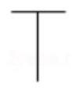

B.

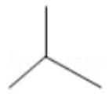

C.

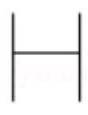

D.

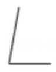

【难度】★★

【答案】 $D$

【解析】解: 对于 $A, B, C$ 车标,当旋转 ${90}^{ \circ  }$ 后,一个 $x$ 的值有多个 $y$ 值与之对应; $\therefore A, B, C$ 车标不可以看成函数图象;

故选: $D$ .

【例 3】下列各组函数中,表示同一函数的是( )

A. $f\left( x\right)  = x$ 与 $g\left( x\right)  = {\left( \sqrt{x}\right) }^{2}$

B. $f\left( x\right)  = \sqrt{\left( {x + 2}\right) \left( {x - 2}\right) }$ 与 $g\left( x\right)  = \sqrt{x + 2} \cdot  \sqrt{x - 2}$

C. $f\left( x\right)  = \left\{  \begin{array}{ll} x + 1 & \left( {x > 0}\right) \\  x - 1 & \left( {x \leq  0}\right)  \end{array}\right.$ 与 $g\left( x\right)  = \left\{  \begin{array}{ll} x + 1 & \left( {x \geq  0}\right) \\  x - 1 & \left( {x < 0}\right)  \end{array}\right.$

D. $f\left( x\right)  = {2x}\left( {x \in  \{ 1\} }\right)$ 与 $g\left( x\right)  = 2{x}^{2}\left( {x \in  \{ 1\} }\right)$

【难度】 $\star   \star   \star$

【答案】 $D$

【解析】解: $A.f\left( x\right)  = x$ 的定义域为 $R, g\left( x\right)  = {\left( \sqrt{x}\right) }^{2}$ 的定义域为 $\lbrack 0, + \infty )$ ,定义域不同,不是同一函数; B. $f\left( x\right)  = \sqrt{\left( {x + 2}\right) \left( {x - 2}\right) }$ 的定义域为 $\{ x \mid  x \leq   - 2$ ,或 $x \geq  2\} , g\left( x\right)  = \sqrt{x + 2} \cdot  \sqrt{x - 2}$ 的定义域为 $\{ x \mid  x \geq  2\}$ ,定义域

不同, 不是同一函数;

$C.f\left( x\right)  = \left\{  {\begin{array}{ll} x + 1 & \left( {x > 0}\right) \\  x - 1 & \left( {x \leq  0}\right)  \end{array},\;f\left( 0\right)  =  - 1,\;g\left( x\right)  = \left\{  {\begin{array}{ll} x + 1 & \left( {x \geq  0}\right) \\  x - 1 & \left( {x < 0}\right)  \end{array},\;g\left( 0\right)  = 1;}\right. }\right.$

$\left( {0, - 1}\right)$ 是 $f\left( x\right)$ 图象上的点,不在 $g\left( x\right)$ 的图象上,不是同一函数;

$D \cdot  f\left( x\right)  = {2x}\left( {x \in  \{ 1\} }\right)$ 表示点 $\left( {1,2}\right) , g\left( x\right)  = 2{x}^{2}\left( {x \in  \{ 1\} }\right)$ 表示点 $\left( {1,2}\right)$ ，函数图象相同，是同一函数.

故选: $D$ .

【例 4】(1)已知函数 $f\left( x\right)  = \left\{  \begin{array}{ll} \sin {\pi x}, & x \leq  0, \\  f\left( {x - 1}\right) , & x > 0, \end{array}\right.$ 那么 $f\left( \frac{5}{6}\right)$ 的值为___.

【难度】 $\star   \star$

【答案】 $- \frac{1}{2}$

【解析】解: 由 $x > 0$ 时, $f\left( x\right)  = f\left( {x - 1}\right) ;x \leq  0$ 时, $f\left( x\right)  = \sin {\pi x}$ ,

$\underset{\because }{\overline{6}} > 0,\; - \frac{1}{6} < 0,$

$\therefore f\left( \frac{5}{6}\right)  = f\left( {\frac{5}{6} - 1}\right)  = f\left( {-\frac{1}{6}}\right)  = \sin \left( {-\frac{\pi }{6}}\right)  =  - \sin \frac{\pi }{6} =  - \frac{1}{2}$ .

故答案为: $- \frac{1}{2}$

( 2 )函数 $f\left( x\right)$ 对于任意实数 $x$ 满足条件 $f\left( {x + 2}\right)  = \frac{1}{f\left( x\right) }$ ，若 $f\left( 1\right)  =  - 5$ ，则 $f\left( {f\left( 5\right) }\right)  =$ ___；

【难度】 $\star   \star$

【答案】 $- \frac{1}{5}$

【解析】解: $\because$ 任意实数 $x$ 满足条件 $f\left( {x + 2}\right)  = \frac{1}{f\left( x\right) }$ ,

$f\left( {x + 4}\right)  = \frac{1}{f\left( {x + 2}\right) },$

$\therefore f\left( {x + 4}\right)  = f\left( x\right)$ .

$\therefore$ 函数 $f\left( x\right)$ 的周期为 4 .

$\therefore f\left( 5\right)  = f\left( {5 - 4}\right)  = f\left( 1\right)  =  - 5$ .

$\therefore f\left\lbrack  {f\left( 5\right) }\right\rbrack   = f\left( {-5}\right)  = f\left( {-5 + 8}\right)  = f\left( 3\right)  = f\left( {2 + 1}\right)  = \frac{1}{f\left( 1\right) } =  - \frac{1}{5}$

故答案为: $- \frac{1}{5}$ .

【例 5】解析式为 $y = 2{x}^{2} + 1$ ,值域为 $\{ 5,{19}\}$ 的函数有(   )个.

A. 4 B. 6 C. 8 D. 9

【难度】★★★

【答案】D

【解析】解: 由 $2{x}^{2} + 1 = 5$ ,可得 $x =  \pm  \sqrt{2}$ ,

由 $2{x}^{2} + 1 = {19}$ ,可得 $x =  \pm  3$ ,

$\therefore$ 当 $x \in  \{  - \sqrt{2}, - 3\}$ 时,函数 $y = 2{x}^{2} + 1$ 的值域为 $\{ 5,{19}\}$ ;

当 $x \in  \{  - \sqrt{2},3\}$ 时,函数 $y = 2{x}^{2} + 1$ 的值域为 $\{ 5,{19}\}$ ;

当 $x \in  \{  - \sqrt{2}, - 3,3\}$ 时,函数 $y = 2{x}^{2} + 1$ 的值域为 $\{ 5,{19}\}$ ;

当 $x \in  \{ \sqrt{2}, - 3\}$ 时,函数 $y = 2{x}^{2} + 1$ 的值域为 $\{ 5,{19}\}$ ;

当 $x \in  \{ \sqrt{2},3\}$ 时,函数 $y = 2{x}^{2} + 1$ 的值域为 $\{ 5,{19}\}$ ;

当 $x \in  \{ \sqrt{2}$ ，-3，3 \}时，函数 $y = 2{x}^{2} + 1$ 的值域为 $\{ 5,{19}\}$ ；

当 $x \in  \{  - \sqrt{2},\sqrt{2}, - 3\}$ 时,函数 $y = 2{x}^{2} + 1$ 的值域为 $\{ 5,{19}\}$ ;

当 $x \in  \{  - \sqrt{2},\sqrt{2},3\}$ 时,函数 $y = 2{x}^{2} + 1$ 的值域为 $\{ 5,{19}\}$ ;

当 $x \in  \{  - \sqrt{2},\sqrt{2}, - 3,3\}$ 时,函数 $y = 2{x}^{2} + 1$ 的值域为 $\{ 5,{19}\}$ .

$\therefore$ 解析式为 $y = 2{x}^{2} + 1$ ,值域为 $\{ 5,{19}\}$ 的函数有 9 个.

故选: $D$ .

## 巩固训练

1、下列可以表示以 $M = \{ x \mid  0 \leq  x \leq  1\}$ 为定义域,以 $N = \{ y \mid  0 \leq  y \leq  1\}$ 为值域的函数图象是( )

A.

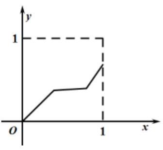

B.

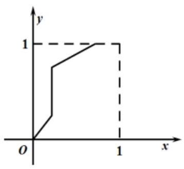

C.

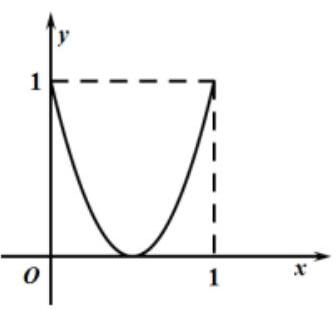

D.

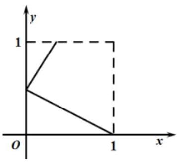

【难度】★★

【答案】C

【解析】解: 根据题意, 依次分析选项:

对于 $\mathrm{A}$ ,其对应函数的值域不是 $N = \{ y \mid  0 \leq  y \leq  1\} ,\mathrm{A}$ 错误;

对于 $B$ ,图象中存在一部分与 $x$ 轴垂直,该图象不是函数的图象, $B$ 错误;

对于 $C$ ,其对应函数的定义域为 $M = \{ x \mid  0 \leq  x \leq  1\}$ ,值域是 $N = \{ y \mid  0 \leq  y \leq  1\} , C$ 正确;

对于 $D$ ,图象不满足一个 $x$ 对应唯一的 $y$ ,该图象不是函数的图象, $D$ 错误; 故选: $C$ .

2、已知函数 $f\left( x\right)$ 的定义域为 $\left\lbrack  {-1,5}\right\rbrack$ ,在同一坐标系下，函数 $y = f\left( x\right)$ 的图象与直线 $x = 1$ 的交点个数为 ( )

A. 0 个 B. 1 个 C. 2 个 D. 0 个或者 2 个

【难度】★★

【答案】B

【解析】因为 $x = 1 \in  \left\lbrack  {-1,5}\right\rbrack$ ,所以当 $x = 1$ 时, $f\left( 1\right)$ 有且只有一个值,

故函数 $y = f\left( x\right)$ 的图象与直线 $x = 1$ 的交点个数为 1 个. 故选 B.

3、若 $f\left( {2}^{x}\right)  = \frac{x}{2}$ ，则 $f\left( 8\right)  =$ ___.

【难度】★★

【答案】 $\frac{3}{2}$

【解析】 $\because f\left( {2}^{x}\right)  = \frac{x}{2},\therefore f\left( 8\right)  = f\left( {2}^{3}\right)  = \frac{3}{2}$ ,故答案为: $\frac{3}{2}$ 。

4、以下一定是 $y$ 关于 $x$ 的函数的是( )

A. $y =  \pm  \sqrt{x}\left( {x > 0}\right)$ B. ${y}^{2} = x - 1\left( {x > 1}\right)$

C. $y = \sqrt{x} \pm  1\left( {x > 0}\right)$ D. $y = \frac{1}{x}\left( {x \neq  0}\right)$

【难度】 $\star   \star   \star$

【答案】D

【解析】对于 A, B, C 中的解析式,如当 $x = {16}$ 时,都有两个 $y$ 值与之对应,故不是函数关系,故选 D。

## (二) 函数的定义域

## 知识梳理

函数定义域的求法

求定义域时注意:

(1)分式的分母不为零;

(2)偶次根式的被开方数非负;

(3)对数的真数大于零;

(4)零次幂的底数不为零.

## 例题精讲

【例 6】求下述函数的定义域:

(1) $y = \sqrt{x + 1} + \frac{1}{1 - x}$ ; (2) $y = \frac{\sqrt{6 - x - {x}^{2}}}{{\log }_{2}\left| {x + 1}\right|  - 1}$ ;

(3) $y = {\log }_{4 - {x}^{2}}\left( \frac{1}{x - 1}\right) ;\left( 4\right) f\left( x\right)  = \frac{\sqrt{{2x} - {x}^{2}}}{\lg \left( {{2x} - 1}\right) } + {\left( 3 - 2x\right) }^{0}$

【难度】 $\star   \star$

【答案】见解析

【解析】(1) $\lbrack  - 1,1) \cup  \left( {1,\infty }\right)$ ; (2) $\left( {-3, - 1}\right)  \cup  \left( {-1,1}\right)  \cup  (1,2\rbrack ,\left( 3\right) \left( {1,\sqrt{3}}\right)  \cup  \left( {\sqrt{3},2}\right)$

(4) $\because \left\{  \begin{array}{l} {2x} - {x}^{2} \geq  0 \\  {2x} - 1 > 0 \\  {2x} - 1 \neq  1 \\  3 - {2x} \neq  0 \end{array}\right.$ ，解得函数定义域为 $\left( {\frac{1}{2},1}\right)  \cup  \left( {1,\frac{3}{2}}\right)  \cup  \left( {\frac{3}{2},2}\right\rbrack  .$

【例 7】(1)已知函数 $f\left( x\right)$ 的定义域为 $\left( {-1,4\rbrack \text{ ,则函数 }f\left( {\left| x\right|  - 1}\right) }\right)$ 的定义域为( )

A. $\left\lbrack  {-5,0)\bigcup (0,5}\right\rbrack$ B. $\left\lbrack  {-5,5}\right\rbrack$ C. $( - 1,4\rbrack$ D. $(0,3\rbrack$

【难度】 $\star   \star   \star$

【答案】A

【解析】因为函数 $f\left( x\right)$ 的定义域为 $( - 1,4\rbrack$ ,所以 $- 1 < \left| x\right|  - 1 \leq  4$ ,解得 $x \in  \lbrack  - 5,0) \cup  (0,5\rbrack$ ,故选: A。

(2)已知函数 $f\left( {{x}^{2} - {2x} + 2}\right)$ 的定义域为 $\left\lbrack  {0,3}\right\rbrack$ ，求函数 $f\left( x\right)$ 的定义域.

【难度】 $\star   \star   \star$

【答案】[1,5]

【解析】: 由 $0 \leq  x \leq  3$ ,得 $1 \leq  {x}^{2} - {2x} + 2 \leq  5$ . 令 $u = {x}^{2} - {2x} + 2$ ,则 $f\left( {{x}^{2} - {2x} + 2}\right)  = f\left( u\right) ,1 \leq  u \leq  5$ . 故 $f\left( x\right)$ 的定义域为 $\left\lbrack  {1.5}\right\rbrack$ .

【例 8】( 1 )已知函数 $f\left( x\right)  = \sqrt{a{x}^{2} + {ax} + 3}$ 的定义域为 $R$ ，则实数 $a$ 的取值范围为___。

【难度】 $\star   \star   \star$

【答案】 $\left\lbrack  {0,{12}}\right\rbrack$

【解析】当 $a = 0$ 时符合题意; 当 $a \neq  0$ 时,要使函数 $f\left( x\right)  = \sqrt{a{x}^{2} + {ax} + 3}$ 的定义域为 $R$ ,则 $a > 0$ 且 $\Delta  = {a}^{2} - {12a} \leq  0$ ,可得 $0 < a \leq  {12}$ . 综上，实数 $a$ 的取值范围为 $\left\lbrack  {0,{12}}\right\rbrack$ 。

(2)若函数 $f\left( x\right)  = {lg}\left\lbrack  {\left( {{a}^{2} - 1}\right) {x}^{2} + \left( {a + 1}\right) x + 1}\right\rbrack$ 的定义域为 $R$ ，则实数 $a$ 的取值范围是___.

【难度】 $\star   \star   \star$

【答案】 $a > \frac{5}{3}$ 或 $a \leq   - 1$

【解析】解: $\because f\left( x\right)$ 的定义域为 $R$ ,

$\therefore \left( {{a}^{2} - 1}\right) {x}^{2} + \left( {a + 1}\right) x + 1 > 0$ 恒成立,

当 ${a}^{2} - 1 = 0$ ,即 $a = 1$ 或 $a =  - 1$ ,

当 $a = 1$ 时,不等式等价为 ${2x} + 1 > 0$ ,此时 $x >  - \frac{1}{2}$ ,不恒成立,不满足条件.

当 $a =  - 1$ 时,不等式等价为 $1 > 0$ ,恒成立,满足条件.

当 $a \neq   \pm  1$ 时,要使不等式恒成立,则 $\left\{  \begin{array}{l} {a}^{2} - 1 > 0 \\  \Delta  = {\left( a + 1\right) }^{2} - 4\left( {{a}^{2} - 1}\right)  < 0 \end{array}\right.$ ,

即 $\left\{  \begin{array}{l} a > 1\text{ 或 }a <  - 1 \\  \left( {a + 1}\right) \left( {-{3a} + 5}\right)  < 0 \end{array}\right.$ ,得 $\left\{  \begin{array}{l} a > 1\text{ 或 }a <  - 1 \\  a > \frac{5}{3}\text{ 或 }a <  - 1 \end{array}\right.$ ,即 $a > \frac{5}{3}$ 或 $a <  - 1$ ,

综上 $a > \frac{5}{3}$ 或 $a \leq   - 1$ ,故答案为: $a > \frac{5}{3}$ 或 $a \leq   - 1$ .

## 巩固训练

1、求下列函数的定义域:

(1) $f\left( x\right)  = \sqrt{\frac{x}{x + 1} - 2} - {\left( 2x + 3\right) }^{0}$ ;

(2) $f\left( x\right)  = \frac{\sqrt{{x}^{2} - {5x} - 6}}{\left| {x + 1}\right|  - 2}$ .

(3) $f\left( x\right)  = {\log }_{3}\left( {1 + x}\right)  + \sqrt{3 - {4x}}$ .

【难度】 $\star   \star$

【答案】(1) $\left\{  \begin{array}{l}  - 2 \leq  x <  - 1 \end{array}\right.$ 且 $x \neq   - \frac{3}{2}\}$ (2) $\left\{  \left| {x \leq   - 1\text{ 或 }x \geq  6\text{ 且 }x \neq   - 3}\right| \right\}$ (3) $\left( {-1,\frac{3}{4}}\right\rbrack$

【解析】(1) 要使函数有意义,只需 $\left\{  {\begin{array}{l} \frac{x}{x + 1} - 2 \geq  0 \\  {2x} + 3 \neq  0 \end{array} \Leftrightarrow  \left\{  \begin{array}{l}  - 2 \leq  x <  - 1 \\  x \neq   - \frac{3}{2} \end{array}\right. }\right.$

所以定义域为 $\{ x \mid   - 2 \leq  x <  - 1$ 且 $x \neq   - \frac{3}{2}\}$

( 2 )要使函数有意义，只需 $\left\{  {\begin{array}{l} {x}^{2} - {5x} - 6 \geq  0 \\  \left| {x + 1}\right|  - 2 \neq  0 \end{array} \Leftrightarrow  \left\{  {\begin{array}{l} x \leq   - 1\text{ 或 }x \geq  6 \\  x \neq  1\text{ 且 }x \neq   - 3 \end{array} \Leftrightarrow  x \leq   - 1\text{ 或 }x \geq  6\text{ 且 }x \neq   - 3}\right. }\right.$

所以定义域为 $\{ x \mid  x \leq   - 1$ 或 $x \geq  6$ 且 $x \neq   - 3\}$ 。

(3)要使函数有意义,只需 $\left\{  {\begin{array}{l} 1 + x > 0, \\  3 - {4x} \geq  0 \end{array} \Rightarrow  \left\{  {\begin{array}{l} x >  - 1, \\  x \leq  \frac{3}{4} \end{array} \Rightarrow   - 1 < x \leq  \frac{3}{4}}\right. }\right.$ ,所以函数 $f\left( x\right)$ 的定义域为 $\left( {-1,\frac{3}{4}}\right\rbrack$ .

2、已知 $f\left( x\right)$ 的定义域为 $\left\lbrack  {1,4}\right\rbrack$ ，求 $f\left( {2 - {3x}}\right)$ 的定义域。

【难度】 $\star   \star   \star$

【答案】(1) $\left\lbrack  {-\frac{2}{3},\frac{1}{3}}\right\rbrack$

【解析】已知 $f\left( x\right)$ 的定义域为 $\left\lbrack  {1,4}\right\rbrack$ ,所以对 $f\left( {2 - {3x}}\right)$ 有 $1 \leq  2 - {3x} \leq  4$ ,解得 $- \frac{2}{3} \leq  x \leq  \frac{1}{3}$ ,所以函数 $f\left( {2 - {3x}}\right)$ 的定义域为 $\left\lbrack  {-\frac{2}{3},\frac{1}{3}}\right\rbrack$ 。

3、已知函数 $y = \ln \left( {-{x}^{2} + x - a}\right)$ ,在 $\left( {-2,3}\right)$ 上有意义,求实数 $a$ 的取值范围。

【难度】 $\star   \star   \star$

【答案】 $a \leq   - 6$

【解析】据题意,不等式 $- {x}^{2} + x - a > 0$ 的解集 $\left\{  {-{x}^{2} + x - a > 0}\right\}   \supseteq  \left( {-2,3}\right)$ ,

$\therefore$ 方程 $f\left( x\right)  =  - {x}^{2} + x - a = 0$ 的两根分别在 $\left( {-\infty , - 2\rbrack \text{ 和 }\lbrack 3, + \infty }\right)$ 内.

$\begin{array}{l} \Delta  > 0\;a < \frac{1}{4} \\  \therefore \left\{  {f\left( {-2}\right)  \geq  0 \Rightarrow  \left\{  {a \leq   - 6 \Rightarrow  a \leq   - 6.\therefore a\text{ 的取值范围为 }a \leq   - 6\text{ 。 }}\right. }\right. \\  f\left( 3\right)  \geq  0\;a \leq   - 6 \\   \end{array}$

## (三) 函数的解析式

## 知识梳理

## 求函数解析式的题型有:

(1)已知函数类型，求函数的解析式:待定系数法；

(2)已知 $f\left( x\right)$ 求 $f\left\lbrack  {g\left( x\right) }\right\rbrack$ 或已知 $f\left\lbrack  {g\left( x\right) }\right\rbrack$ 求 $f\left( x\right)$ :换元法、配凑法；

(3)已知函数图像，求函数解析式；

(4) $f\left( x\right)$ 满足某个等式，这个等式除 $f\left( x\right)$ 外还有其他未知量，需构造另个等式:解方程组法；

(5)应用题求函数解析式常用方法有待定系数法等.

## 例题精讲

【例 9】(1)已知 $f\left( {x + \frac{1}{x}}\right)  = {x}^{3} + \frac{1}{{x}^{3}}$ ,求 $f\left( x\right)$ ;

(2)已知 $f\left( {\frac{2}{x} + 1}\right)  = \lg x$ ,求 $f\left( x\right)$ ;

(3)已知 $f\left( x\right)$ 是一次函数，且满足 ${3f}\left( {x + 1}\right)  - {2f}\left( {x - 1}\right)  = {2x} + {17}$ ，求 $f\left( x\right)$ ；

(4)已知 $f\left( x\right)$ 满足 ${2f}\left( x\right)  + f\left( \frac{1}{x}\right)  = {3x}$ ，求 $f\left( x\right)$ .

(5) 任意 $x, y \in  R, f\left( {x - y}\right)  = f\left( x\right)  - y\left( {{2x} - y + 1}\right)$ 恒成立,且 $f\left( 0\right)  = 1$ ,求 $f\left( x\right)$ .

【难度】 $\star   \star   \star$

【答案】见解析

【解析】(1) $\because f\left( {x + \frac{1}{x}}\right)  = {x}^{3} + \frac{1}{{x}^{3}} = {\left( x + \frac{1}{x}\right) }^{3} - 3\left( {x + \frac{1}{x}}\right) ,\therefore f\left( x\right)  = {x}^{3} - {3x}\left( {x \geq  2\text{ 或 }x \leq   - 2}\right)$ .

(2)令 $\frac{2}{x} + 1 = t\;\left( {t > 1}\right)$ ，则 $x = \frac{2}{t - 1},\therefore f\left( t\right)  = \lg \frac{2}{t - 1}, f\left( x\right)  = \lg \frac{2}{x - 1}\;\left( {x > 1}\right)$ .

(3)设 $f\left( x\right)  = {ax} + b\left( {a \neq  0}\right)$ ，则

${3f}\left( {x + 1}\right)  - {2f}\left( {x - 1}\right)  = {3ax} + {3a} + {3b} - {2ax} + {2a} - {2b} = {ax} + b + {5a} = {2x} + {17}$ ,

$\therefore a = 2, b = 7,\therefore f\left( x\right)  = {2x} + 7$ .

(4) ${2f}\left( x\right)  + f\left( \frac{1}{x}\right)  = {3x}$ ①，把①中的 $x$ 换成 $\frac{1}{x}$ ，得 ${2f}\left( \frac{1}{x}\right)  + {f\left( x\right) } = \frac{3}{x}$ ②，

① $x \cdot  2 -$ ②得 ${3f}\left( x\right)  = {6x} - \frac{3}{x},\therefore f\left( x\right)  = {2x} - \frac{1}{x}$

(5) 法一:令 $x = 0$ 法二:令 $y = x,$ 答案: $f\left( x\right)  = {x}^{2} + x + 1$

## 巩固训练

1、一次函数 $g\left( x\right)$ 满足 $g\left\lbrack  {g\left( x\right) }\right\rbrack   = {9x} + 8$ ，则 $g\left( x\right)$ 的解析式是___.

【难度】 $\star   \star$

【答案】 $g\left( x\right)  =  - {3x} - 4$ 或 $g\left( x\right)  = {3x} + 2$

【解析】因为 $g\left( x\right)$ 是一次函数,所以设 $g\left( x\right)  = {kx} + b\left( {k \neq  0}\right)$ ,所以 $g\left\lbrack  {g\left( x\right) }\right\rbrack   = k\left( {{kx} + b}\right)  + b$ ,

又因为 $g\left\lbrack  {g\left( x\right) }\right\rbrack   = {9x} + 8$ ,所以 $\left\{  \begin{array}{l} {k}^{2} = 9, \\  {kb} + b = 8, \end{array}\right.$ 解得 $\left\{  \begin{array}{l} k = 3, \\  b = 2 \end{array}\right.$ 或 $\left\{  \begin{array}{l} k =  - 3, \\  b =  - 4, \end{array}\right.$

所以 $g\left( x\right)  = {3x} + 2$ 或 $g\left( x\right)  =  - {3x} - 4$ .

2、已知一次函数 $y = f\left( x\right)$ 满足 ${3f}\left( {1 + x}\right)  - {2f}\left( {1 - x}\right)  = {4x} + 3$ ，则 $f\left( x\right)  =$ ___.

【难度】 $\star   \star$

【答案】 $\frac{4}{5}x + \frac{11}{5}$

【解析】设 $f\left( x\right)  = {kx} + b\left( {k \neq  0}\right)$ ,则由 ${3f}\left( {1 + x}\right)  - {2f}\left( {1 - x}\right)  = {4x} + 3$ ,

得 $3\left\lbrack  {k\left( {x + 1}\right)  + b}\right\rbrack   - 2\left\lbrack  {k\left( {1 - x}\right)  + b}\right\rbrack   = {4x} + 3$ ,即 $\left( {{5k} - 4}\right) x + k + b - 3 = 0$ ,故 $\left\{  \begin{array}{l} {5k} = 4, \\  k + b = 3, \end{array}\right.$ 解得 $k = \frac{4}{5}, b = \frac{11}{5}$ ,

所以 $f\left( x\right)  = \frac{4}{5}x + \frac{11}{5}$ ,故答案为: $\frac{4}{5}x + \frac{11}{5}$ .

3、设函数 $f\left( x\right)  = 2{x}^{2}$ ，函数 $g\left( x\right)  = \frac{1}{x}$ ，则 $f\left( x\right)  \cdot  g\left( x\right)  =$ ___.

【难度】 $\star   \star$

【答案】 ${2x}\left( {x \neq  0}\right)$

【解析】 $\because f\left( x\right)  = 2{x}^{2}, g\left( x\right)  = \frac{1}{x}\left( {x \neq  0}\right)$ ,

$\therefore f\left( x\right)  \cdot  g\left( x\right)  = 2{x}^{2} \cdot  \frac{1}{x} = {2x}\left( {x \neq  0}\right)$ . 故答案为: ${2x}\left( {x \neq  0}\right)$ .

## (四)函数的值域

## 知识梳理

## 求函数值域的各种方法

函数的值域是由其对应法则和定义域共同决定的, 其类型依解析式的特点分可分三类:

(1)求常见函数值域；

(2)求由常见函数复合而成的函数的值域；

(3)求由常见函数作某些“运算”而得函数的值域.

## 以下为总结的常用函数值域的求解方法:

(1)直接法:利用常见函数的值域来求

一次函数 $y = {ax} + b\left( {a \neq  0}\right)$ 的定义域为 $R$ ,值域为 $R$ ；

反比例函数 $y = \frac{k}{x}\left( {k \neq  0}\right)$ 的定义域为 $\{ x \mid  x \neq  0\}$ ,值域为 $\{ y \mid  y \neq  0\}$ ;

二次函数 $f\left( x\right)  = a{x}^{2} + {bx} + c\left( {a \neq  0}\right)$ 的定义域为 $R$ ,

当 $a > 0$ 时,值域为 $\left\{  {y \mid  y \geq  \frac{\left( 4ac - {b}^{2}\right) }{4a}}\right\}$ ;

当 $a < 0$ 时,值域为 $\left\{  {y \mid  y \leq  \frac{\left( 4ac - {b}^{2}\right) }{4a}}\right\}$ .

(2)配方法:转化为二次函数，利用二次函数的特征来求值; 常转化为型如: $f\left( x\right)  = a{x}^{2} + {bx} + c, x \in  \left( {m, n}\right)$ 的形式;

(3)分式转化法(或改为“分离常数法”)

(4)换元法:通过变量代换转化为能求值域的函数，化归思想；

(5)三角有界法:转化为只含正弦、余弦的函数，运用三角函数有界性来求值域；

(6)基本不等式法: 转化成型如: $y = x + \frac{k}{x}\left( {k > 0}\right)$ ,利用平均值不等式公式来求值域;

(7)单调性法:函数为单调函数，可根据函数的单调性求值域.

(8)数形结合:根据函数的几何图形，利用数型结合的方法来求值域.

(9)根的判别式法:

(10)逆求法(反函数法):通过反解，用 $y$ 来表示 $x$ ，再由 $x$ 的取值范围，通过解不等式，得出 $y$ 的取值范围; 常用来解,型如: $y = \frac{{ax} + b}{{cx} + d}, x \in  \left( {m, n}\right)$

## 例题精讲

【例 10】求下列函数的值域:

(1) $y = 3{x}^{2} - x + 2, x \in  \left\lbrack  {1,3}\right\rbrack$ ； (2) $y = \sqrt{-{x}^{2} - {6x} - 5}$ ； (3) $y = \frac{{3x} + 1}{x - 2}$ ；

(4) $y = \frac{1 - \sin x}{2 - \cos x}$ ; (5) $y = \frac{2{x}^{2} - x + 2}{{x}^{2} + x + 1}$ ; (6) $y = \frac{2{x}^{2} - x + 1}{{2x} - 1}\left( {x > \frac{1}{2}}\right)$ ;

(7) $y = x + 4\sqrt{1 - x}$ ; (8) $y = x + \sqrt{1 - {x}^{2}}$ ; (9) $y =  - \frac{x}{\sqrt{{x}^{2} + {2x} + 2}}$ ;

(10) $y = \left| {x - 1}\right|  + \left| {x + 4}\right|$ ;

【难度】 $\star   \star   \star$

【答案】见解析

【解析】(1) 函数 $y = 3{x}^{2} - x + 2$ 在 $x \in  \left\lbrack  {1,3}\right\rbrack$ 上单调增, $\therefore$ 当 $x = 1$ 时,原函数有最小值为 4 ; 当 $x = 3$ 时, 原函数有最大值为26。 函数 $y = 3{x}^{2} - x + 2, x \in  \left\lbrack  {1,3}\right\rbrack$ 的值域为 $\left\lbrack  {4,{26}}\right\rbrack$ .

(2)求复合函数的值域:设 $\mu  =  - {x}^{2} - {6x} - 5\left( {\mu  \geq  0}\right)$ ，则原函数可化为 $y = \sqrt{\mu }$ .

又 $\because \mu  =  - {x}^{2} - {6x} - 5 =  - {\left( x + 3\right) }^{2} + 4 \leq  4,\therefore 0 \leq  \mu  \leq  4$ ,故 $\sqrt{\mu } \in  \left\lbrack  {0,2}\right\rbrack  ,\therefore y = \sqrt{-{x}^{2} - {6x} - 5}$ 的值域为 $\left\lbrack  {0,2}\right\rbrack$ 。

(3) (法一) 反函数法:

$y = \frac{{3x} + 1}{x - 2}$ 的反函数为 $y = \frac{{2x} + 1}{x - 3}$ ,其定义域为 $\{ x \in  R \mid  x \neq  3\} ,\therefore$ 原函数 $y = \frac{{3x} + 1}{x - 2}$ 的值域为 $\{ y \in  R \mid  y \neq  3\}$ 。

(法二) 分离变量法: $y = \frac{{3x} + 1}{x - 2} = \frac{3\left( {x - 2}\right)  + 7}{x - 2} = 3 + \frac{7}{x - 2},\because \frac{7}{x - 2} \neq  0,\therefore 3 + \frac{7}{x - 2} \neq  3$ ,

$\therefore$ 函数 $y = \frac{{3x} + 1}{x - 2}$ 的值域为 $\{ y \in  R \mid  y \neq  3\}$ .

(4)(法一)方程法:原函数可化为: $\sin x - y\cos x = 1 - {2y}$ ， $\therefore \sqrt{1 + {y}^{2}}\sin \left( {x - \varphi }\right)  = 1 - {2y}$ (其中 $\cos \varphi  = \frac{1}{\sqrt{1 + {y}^{2}}},\sin \varphi  = \frac{y}{\sqrt{1 + {y}^{2}}}$ ), $\therefore \sin \left( {x - \varphi }\right)  = \frac{1 - {2y}}{\sqrt{1 + {y}^{2}}} \in  \left\lbrack  {-1,1}\right\rbrack$ , $\therefore \left| {1 - {2y}}\right|  \leq  \sqrt{1 + {y}^{2}},\;\therefore 3{y}^{2} - {4y} \leq  0,\therefore 0 \leq  y \leq  \frac{4}{3},\;\therefore$ 原函数的值域为 $\left\lbrack  {0,\frac{4}{3}}\right\rbrack$ .

(5)判别式法: $\because {x}^{2} + x + 1 > 0$ 恒成立， $\therefore$ 函数的定义域为 $R$ .

由 $y = \frac{2{x}^{2} - x + 2}{{x}^{2} + x + 1}$ 得: $\left( {y - 2}\right) {x}^{2} + \left( {y + 1}\right) x + y - 2 = 0$

① 当 $y - 2 = 0$ 即 $y = 2$ 时，①即 ${3x} + 0 = 0$ ， $\therefore x = 0 \in  R$

② 当 $y - 2 \neq  0$ 即 $y \neq  2$ 时， $\because x \in  R$ 时方程 $\left( {y - 2}\right) {x}^{2} + \left( {y + 1}\right) x + y - 2 = 0$ 恒有实根，

$\therefore {\Delta \Delta } = {\left( y + 1\right) }^{2} - 4 \times  {\left( y - 2\right) }^{2} \geq  0,\therefore 1 \leq  y \leq  5$ 且 $y \neq  2,\therefore$ 原函数的值域为 $\left\lbrack  {1,5}\right\rbrack$ .

(6) $y = \frac{2{x}^{2} - x + 1}{{2x} - 1} = \frac{x\left( {{2x} - 1}\right)  + 1}{{2x} - 1} = x + \frac{1}{{2x} - 1} = x - \frac{1}{2} + \frac{\frac{1}{2}}{x - \frac{1}{2}} + \frac{1}{2},\because x > \frac{1}{2},\therefore x - \frac{1}{2} > 0$ ,

$\therefore x - \frac{1}{2} + \frac{\frac{1}{2}}{x - \frac{1}{2}} \geq  2\sqrt{\left( {x - \frac{1}{2}}\right) \frac{\frac{1}{2}}{\left( x - \frac{1}{2}\right) }}\sqrt{} = \sqrt{2}$ ,当且仅当 $x - \frac{1}{2} = \frac{\frac{1}{2}}{x - \frac{1}{2}}$ 时,即 $x = \frac{1 + \sqrt{2}}{2}$ 时等号成立.

$\therefore y \geq  \sqrt{2} + \frac{1}{2}$ , $\therefore$ 原函数的值域为 $\lbrack \sqrt{2} + \frac{1}{2}, + \infty )$ .

(7)换元法(代数换元法):设 $t = \sqrt{1 - x} \geq  0$ ，则 $x = 1 - {t}^{2}$ ，

$\therefore$ 原函数可化为 $y = 1 - {t}^{2} + {4t} =  - {\left( t - 2\right) }^{2} + 5\left( {t \geq  0}\right) ,\therefore y \leq  5$ ,

$\therefore$ 原函数值域为 $( - \infty ,5\rbrack$ 。

注: 总结 $y = {ax} + b + \sqrt{{cx} + d}$ 型值域,

变形: $y = a{x}^{2} + b + \sqrt{c{x}^{2} + d}$ 或 $y = a{x}^{2} + b + \sqrt{{cx} + d}$

(8)三角换元法:

$\because 1 - {x}^{2} \geq  0 \Rightarrow   - 1 \leq  x \leq  1,\therefore$ 设 $x = \cos \alpha ,\alpha  \in  \left\lbrack  {0,\pi }\right\rbrack$ ,则 $y = \cos \alpha  + \sin \alpha  = \sqrt{2}\sin \left( {\alpha  + \frac{\pi }{4}}\right) \; \because \alpha  \in  \left\lbrack  {0,\pi }\right\rbrack  ,\therefore \alpha  + \frac{\pi }{4} \in  \left\lbrack  {\frac{\pi }{4},\frac{5\pi }{4}}\right\rbrack  ,\therefore \sin \left( {\alpha  + \frac{\pi }{4}}\right)  \in  \left\lbrack  {-\frac{\sqrt{2}}{2},1}\right\rbrack  ,\therefore \sqrt{2}\sin \left( {\alpha  + \frac{\pi }{4}}\right)  \in  \left\lbrack  {-1,\sqrt{2}}\right\rbrack$ , $\therefore$ 原函数的值域为 $\left\lbrack  {-1,\sqrt{2}}\right\rbrack$ 。

(9) $\left( {-1,\sqrt{2}}\right\rbrack$

(10)数形结合法: $y = \left| {x - 1}\right|  + \left| {x + 4}\right|  = \left\{  \begin{array}{ll}  - {2x} - 3 & \left( {x \leq   - 4}\right) \\  5 & \left( {-4 < x < 1}\right) , \\  {2x} + 3 & \left( {x \geq  1}\right)  \end{array}\right.$ . $x > 5,\therefore$ 函数值域为 $\lbrack 5, + \infty )$ .

【例 11】(1)函数 $y = {2x} + \sqrt{{2x} - 1}$ 的值域为___.

【难度】★★

【答案】 $\lbrack 1, + \infty )$

【解析】解: 由题意, ${2x} - 1 \geq  0$ ,故 ${2x} + \sqrt{{2x} - 1} \geq  1$ ; 即函数 $y = {2x} + \sqrt{{2x} - 1}$ 的值域为 $\lbrack 1, + \infty )$ ; 故答案为: $\lbrack 1, + \infty )$ .

(2)函数 $y = {2}^{x} + \arcsin x$ 的值域为___.

【难度】 $\star   \star$

【答案】 $\left\lbrack  {\frac{1 - \pi }{2},2 + \frac{\pi }{2}}\right\rbrack$

【解析】解: $\because$ 函数 $y = {2}^{x} + \arcsin x$ 在 $\left\lbrack  {-1,1}\right\rbrack$ 上是增函数, $\therefore \frac{1}{2} + \arcsin \left( {-1}\right)  \leq  {2}^{x} + \arcsin x \leq  2 + \arcsin 1$ , $\therefore \frac{1 - \pi }{2} \leq  {2}^{x} + \arcsin x \leq  2 + \frac{\pi }{2}$ ,故答案为: $\left\lbrack  {\frac{1 - \pi }{2},2 + \frac{\pi }{2}}\right\rbrack$ .

(3)函数 $f\left( x\right)  = \sqrt{{2}^{x} - 8} + \sqrt{{\log }_{3}x} - \frac{1}{x}$ 的值域为___

【难度】 $\star   \star   \star$

【答案】 $\left\lbrack  {\frac{2}{3}, + \infty }\right)$

【解析】利用函数单调性

(4)设 ${f}^{-1}\left( x\right)$ 为 $f\left( x\right)  = {2}^{x - 2} + \frac{x}{2}, x \in  \left\lbrack  {0,2}\right\rbrack$ 的反函数，则 $y = f\left( x\right)  + {f}^{-1}\left( x\right)$ 的最大值为___；

【难度】 $\star   \star   \star$

【答案】 4

【解析】利用函数单调性

( 5 )已知 $f\left( x\right)  = {\log }_{3}x, x \in  \left\lbrack  {1,9}\right\rbrack$ ，则 $y = {\left\lbrack  f\left( x\right) \right\rbrack  }^{2} + f\left( {x}^{2}\right)$ 的值域为___

【难度】 $\star   \star   \star$

【答案】 $\left\lbrack  {0,3}\right\rbrack$

【解析】注意函数定义域

【例 12】求函数 $y = \sqrt{{x}^{2} - {6x} + {13}} + \sqrt{{x}^{2} + {4x} + 5}$ 的值域.

【难度】 $\star   \star   \star$

【答案】 $\lbrack \sqrt{34}, + \infty )$

【解析】解: 根据函数的组成,得 $f\left( x\right)  = \sqrt{{\left( x - 3\right) }^{2} + {\left( 0 - 2\right) }^{2}} + \sqrt{{\left( x + 2\right) }^{2} + {\left( 0 - 1\right) }^{2}}$ ,

上式的几何意义为 $x$ 轴上的点 $P\left( {x,0}\right)$ 到点 $A\left( {-2,1}\right)$ 和点 $B\left( {3,2}\right)$ 的距离之和,

设点 $A$ 关于 $X$ 轴的对称点为 ${A}_{1}\left( {-2, - 1}\right)$ ,则 $\left| {PA}\right|  + \left| {PB}\right|  = \left| {P{A}_{1}}\right|  + \left| {PB}\right|$

连接 ${A}_{1}B$ ,交于 $X$ 轴于点 $P$ ,此时, $\left| {P{A}_{1}}\right|  + \left| {PB}\right|$ 最小,

${\left( \left| PA\right|  + \left| PB\right| \right) }_{\min } = \left| {P{A}_{1}}\right|  + \left| {PB}\right|  = \left| {{A}_{1}B}\right|  = \sqrt{{\left\lbrack  3 - \left( -2\right) \right\rbrack  }^{2} + {\left\lbrack  2 - \left( -1\right) \right\rbrack  }^{2}},$

所以，该函数的值域为 $\lbrack \sqrt{34}, + \infty )$ .

【例 13】( 1 )已知函数 $f\left( x\right)  =  - {x}^{2} + {2ax} + a - 1$ 在区间 $\left\lbrack  {0,1}\right\rbrack$ 上的最大值为1，则 $a$ 的值为___.

【难度】 $\star   \star   \star$

【答案】 1

【解析】分类讨论求最值

(2)已知函数 $f\left( x\right)  = \left| {{\log }_{2}x}\right|$ ，正实数 $m$ ， $n$ 满足 $m < n$ ，且 $f\left( m\right)  = f\left( n\right)$ ，若 $f\left( x\right)$ 在区间 $\left\lbrack  {{m}^{2}, n}\right\rbrack$ 上的最大值为

2,则 $n + m =$ ___.

【难度】 $\star   \star   \star$

【答案】 $\frac{5}{2}$

【解析】解: $\because f\left( x\right)  = \left| {{\log }_{2}x}\right|$ ,且 $f\left( m\right)  = f\left( n\right)$ ,

$\therefore {mn} = 1\because$ 若 $f\left( x\right)$ 在区间 $\left\lbrack  {{m}^{2}, n}\right\rbrack$ 上的最大值为 2

$\therefore \left| {{\log }_{2}{m}^{2}}\right|  = 2\because m < n,\therefore m = \frac{1}{2}\therefore n = 2$

$\therefore n + m = \frac{5}{2}$

故答案为: $\frac{5}{2}$

(3)设 $f\left( x\right)  = \left\{  \begin{array}{ll} {\left( x - a\right) }^{2}, & x \leq  0, \\  x + \frac{1}{x} + a, & x > 0. \end{array}\right.$ 若 $f\left( 0\right)$ 是 $f\left( x\right)$ 的最小值，则 $a$ 的取值范围为( )

(A) $\left\lbrack  {-1,2}\right\rbrack$ . (B) $\left\lbrack  {-1,0}\right\rbrack$ . (C) $\left\lbrack  {1,2}\right\rbrack$ . (D) $\left\lbrack  {0,2}\right\rbrack$ .

【难度】 $\star   \star   \star$

【答案】D

【解析】解: 函数 $f\left( x\right)  = \left\{  \begin{array}{l} {\left( x - a\right) }^{2} + 1, x \leq  0 \\  {x}^{2} + \frac{2}{x} + a, x > 0 \end{array}\right.$ ,若 $f\left( 0\right)$ 是 $f\left( x\right)$ 的最小值,可得 $a \geq  0$ . 可得 $f\left( 0\right)  = {a}^{2} + 1$ ,

$\therefore {x}^{2} + \frac{2}{x} + a \geq  {a}^{2} + 1$ ,即 ${x}^{2} + \frac{2}{x} \geq  {a}^{2} - a + 1, x > 0$ 时恒成立.

${x}^{2} + \frac{2}{x} = {x}^{2} + \frac{1}{x} + \frac{1}{x} \geq  3\sqrt[3]{{x}^{2} \cdot  \frac{1}{x} \cdot  \frac{1}{x}} = 3$ ,当且仅当 $x = 1$ 时取等号.

可得 $3 \geq  {a}^{2} - a + 1,{a}^{2} - a - 2 \leq  0$ ,解得 $a \in  \left\lbrack  {-1,2}\right\rbrack$ .

综上 $a \in  \left\lbrack  {0,2}\right\rbrack$ .

故选: $D$ .

(4)平面直角坐标系 ${XOY}$ 中，设定点 $A\left( {a, a}\right) , P$ 是函数 $y = \frac{1}{x}\left( {x > 0}\right)$ 图像上一动点,若点 $P, A$ 之间最短距离为 $2\sqrt{2}$ ，则满足条件的实数 $a$ 的所有值为___

【难度】 $\star   \star   \star$

【答案】-1或 $\sqrt{10}$

【解析】解: 设 $P\left( {x,\frac{1}{x}}\right)$ ,

由 $x < 0$ ,则 $x + \frac{1}{x} \leq   - 2$ ,

$\left| {AP}\right|  = \sqrt{{\left( a - x\right) }^{2} + {\left( a - \frac{1}{x}\right) }^{2}} = \sqrt{2{a}^{2} + {x}^{2} + \frac{1}{{x}^{2}} - {2a}\left( {x + \frac{1}{x}}\right) } = \sqrt{2{a}^{2} + {\left( x + \frac{1}{x}\right) }^{2} - {2a}\left( {x + \frac{1}{x}}\right)  - 2}.$

令 $t = x + \frac{1}{x},\because x < 0,\therefore t \leq   - 2$ ,

令 $g\left( t\right)  = {t}^{2} - {2at} + 2{a}^{2} - 2 = {\left( t - a\right) }^{2} + {a}^{2} - 2$ ,

$\therefore \left| {AP}\right|  = \sqrt{{\left( t - a\right) }^{2} + {a}^{2} - 2}$ ,分两种情况:

(1)当 $a \leq   - 2$ 时， ${\left| AP\right| }_{\min } = \sqrt{{a}^{2} - 2} = 2\sqrt{2}$ ，则 $a =  - \sqrt{10}$ ；

(2)当 $a >  - 2$ 时， ${\left| AP\right| }_{\min } = \sqrt{2{a}^{2} + {4a} + 2} = 2\sqrt{2}$ ，则 $a = 1$ .

$\therefore$ 满足条件的实数 $a$ 的所有值为: $- \sqrt{10}$ 或 1 .

【例 14】已知函数 $f\left( x\right)  = \left\{  \begin{array}{l} x + \frac{1}{x}, x \in  \lbrack  - 2, - 1) \\   - 2, x \in  \lbrack  - 1,\frac{1}{2}) \\  x - \frac{1}{x}, x \in  \left\lbrack  {\frac{1}{2},2}\right\rbrack   \end{array}\right.$

(1)求 $f\left( x\right)$ 的值域；

(2)设函数 $g\left( x\right)  = {ax} - 2, x \in  \left\lbrack  {-2,2}\right\rbrack$ ，对于任意 ${x}_{1} \in  \left\lbrack  {-2,2}\right\rbrack$ ，总存在 ${x}_{0} \in  \left\lbrack  {-2,2}\right\rbrack$ ，使得 $g\left( {x}_{0}\right)  = f\left( {x}_{1}\right)$ 成立,求实数 $a$ 的取值范围.

【难度】 $\star   \star   \star$

【答案】见解析

【解析】解: (1) 当 $x \in  \left\lbrack  {-2,2}\right\rbrack$ 时, $f\left( x\right)  = x + \frac{1}{x}$ 在 $\lbrack  - 2, - 1)$ 上是增函数,此时 $f\left( x\right)  \in  \left\lbrack  {-\frac{5}{2}, - 2}\right)$

当 $x \in  \left\lbrack  {-1,\frac{1}{2}}\right)$ 时, $f\left( x\right)  =  - 2$

当 $x \in  \left\lbrack  {\frac{1}{2},2}\right\rbrack$ 时, $f\left( x\right)  = x - \frac{1}{x}$ 在 $\left\lbrack  {\frac{1}{2},2}\right\rbrack$ 上是增函数,此时 $f\left( x\right)  \in  \left\lbrack  {-\frac{3}{2},\frac{3}{2}}\right\rbrack  \therefore f\left( x\right)$ 的值域是 $\left\lbrack  {-\frac{5}{2}, - 2}\right\rbrack   \cup  \left\lbrack  {-\frac{3}{2},\frac{3}{2}}\right\rbrack$

(2)①若 $a = 0, g\left( x\right)  =  - 2$ ，对于任意

${x}_{1} \in  \left\lbrack  {-2,2}\right\rbrack  , f\left( {x}_{1}\right)  \in  \left\lbrack  {-\frac{5}{2}, - 2}\right\rbrack   \cup  \left\lbrack  {-\frac{3}{2},\frac{3}{2}}\right\rbrack$ ,不存在 ${x}_{0} \in  \left\lbrack  {-2,2}\right\rbrack$ ,使 $g\left( {x}_{0}\right)  = f\left( {x}_{1}\right)$

② 当 $a > 0$ 时， $g\left( x\right)  = {ax} - 2$ 在 $\left\lbrack  {-2,2}\right\rbrack$ 是增函数， $g\left( x\right)  \in  \left\lbrack  {-{2a} - 2,{2a} - 2}\right\rbrack$

任给 ${x}_{1} \in  \left\lbrack  {-2,2}\right\rbrack  , f\left( {x}_{1}\right)  \in  \left\lbrack  {-\frac{5}{2}, - 2}\right\rbrack  \bigcup \left\lbrack  {-\frac{3}{2},\frac{3}{2}}\right\rbrack$ 若存在 ${x}_{0} \in  \left\lbrack  {-2,2}\right\rbrack$ ,使得 $g\left( {x}_{0}\right)  = f\left( {x}_{1}\right)$ 成立

则 $\left\lbrack  {-\frac{5}{2}, - 2}\right\rbrack   \cup  \left\lbrack  {-\frac{3}{2},\frac{3}{2}}\right\rbrack   \subseteq  \left\lbrack  {-{2a} - 2,{2a} - 2}\right\rbrack  \therefore \left\{  {\begin{array}{l}  - {2a} - 2 \leq   - \frac{5}{2} \\  {2a} - 2 \geq  \frac{3}{2} \end{array},\therefore a \geq  \frac{7}{4}}\right.$

③ $a < 0$ ， $g\left( x\right)  = {ax} - 2$ 在 $\left\lbrack  {-2,2}\right\rbrack$ 是减函数， $g\left( x\right)  \in  \left\lbrack  {{2a} - 2, - {2a} - 2}\right\rbrack  \therefore \left\{  \begin{array}{l} {2a} - 2 \leq   - \frac{5}{2} \\   - {2a} - 2 \geq  \frac{3}{2} \end{array}\right. ,\therefore a \leq   - \frac{7}{4}$

综上,实数 $a \in  \left( {-\infty , - \frac{7}{4}}\right\rbrack  \bigcup \left\lbrack  {\frac{7}{4}, + \infty }\right)$

【例 15】已知函数 $f\left( x\right)  = k - \sqrt{x + 2}$ 的定义域和值域都是 $\left\lbrack  {a, b}\right\rbrack$ ,则实数 $k$ 的取值范围是___.

【难度】 $\star   \star   \star$

【答案】 $\left( {-\frac{5}{4}, - 1}\right\rbrack$

【解析】解: 由 $x + 2 \geq  0$ ,得 $x \geq   - 2$ . 而函数 $f\left( x\right)  = k - \sqrt{x + 2}$ 是减函数,

由函数 $f\left( x\right)  = k - \sqrt{x + 2}$ 的定义域和值域都是 $\left\lbrack  {a, b}\right\rbrack$ ,可得 $\left\{  \begin{array}{l} k - \sqrt{a + 2} = b \\  k - \sqrt{b + 2} = a \end{array}\right.$ ,

即 $\left\{  {\begin{array}{l} k - b = \sqrt{a + 2} \\  k - a = \sqrt{b + 2} \end{array},\therefore \left\{  \begin{array}{l} {k}^{2} - {2kb} + {b}^{2} = a + 2 \\  {k}^{2} - {2ka} + {a}^{2} = b + 2 \end{array}\right. }\right.$ ,两式作差可得 $a + b = {2k} - 1$ ,

于是 $a, b$ 可以看作是方程 ${x}^{2} - \left( {{2k} - 1}\right) x + {k}^{2} - {2k} - 1 = 0$ 在 $\left\lbrack  {-2, k}\right\rbrack$ 的两个不同根.

由根的分布可知, $\left\{  \begin{array}{l} \Delta  = {\left( 2k - 1\right) }^{2} - 4{k}^{2} + {8k} + 4 > 0 \\   - 2 < \frac{{2k} - 1}{2} < k \\  {\left( -2\right) }^{2} + 2\left( {{2k} - 1}\right)  + {k}^{2} - {2k} - 1 \geq  0 \\  {k}^{2} + k\left( {{2k} - 1}\right)  + {k}^{2} - {2k} - 1 \geq  0 \end{array}\right.$ ,解得: $- \frac{5}{4} < k \leq   - 1.\therefore$ 实数 $k$ 的取值范围是 $\left( {-\frac{5}{4}, - 1}\right\rbrack$ .

故答案为: $\left( {-\frac{5}{4}, - 1}\right\rbrack$ .

## 巩固训练

1、求下列函数的值域:

(1) $y = \frac{{2x} + 1}{x - 3}$ ;

(2) $y = \sqrt{-2{x}^{2} + x + 3}$ ；

(3) $y = x - \sqrt{1 - {2x}}$ .

【难度】 $\star   \star$

【答案】(1) $\left( {-\infty ,2}\right)  \cup  \left( {2, + \infty }\right)$ (2) $\left\lbrack  {0,\frac{5\sqrt{2}}{4}}\right\rbrack$ (3) $\left( {-\infty ,\frac{1}{2}}\right\rbrack$

【解析】(1) 由题意,函数 $y = \frac{{2x} + 1}{x - 3} = \frac{2\left( {x - 3}\right)  + 7}{x - 3} = 2 + \frac{7}{x - 3}$ ,且 $\frac{7}{x - 3} \neq  0$ ,所以 $y \neq  2$ , 所以原函数的值域为 $\left( {-\infty ,2}\right)  \cup  \left( {2, + \infty }\right)$ .

(2)因为 $y = \sqrt{-2{x}^{2} + x + 3} = \sqrt{-2{\left( x - \frac{1}{4}\right) }^{2} + \frac{25}{8}}$ ，

可得 $0 \leq  y \leq  \frac{5\sqrt{2}}{4}$ ,所以原函数的值域为 $\left\lbrack  {0,\frac{5\sqrt{2}}{4}}\right\rbrack$ .

(3)设 $t = \sqrt{1 - {2x}}$ ，则 $t \geq  0$ 且 $x =  - \frac{1}{2}{t}^{2} + \frac{1}{2}$ ，得 $y =  - \frac{1}{2}{t}^{2} - t + \frac{1}{2} =  - \frac{1}{2}{\left( t + 1\right) }^{2} + 1$ .

因为 $t \geq  0$ ,所以 $y \leq  \frac{1}{2}$ ,即该函数的值域为 $\left( {-\infty ,\frac{1}{2}}\right\rbrack$ 。

2、已知函数 $f\left( x\right)  = \frac{2{x}^{2} + {bx} + c}{{x}^{2} + 1}\left( {b < 0}\right)$ 的值域为 $\left\lbrack  {1,3}\right\rbrack$ ,求实数 $b\text{ 、 }c$ 的值.

【难度】 $\star   \star   \star$

【答案】 $b =  - 2, c = 2$

【解析】解: $\because f\left( x\right)  = \frac{2{x}^{2} + {bx} + c}{{x}^{2} + 1} = 2 + \frac{{bx} + c - 2}{{x}^{2} + 1};\therefore  - 1 \leq  \frac{{bx} + c - 2}{{x}^{2} + 1} \leq  1$ ;

$\therefore y = \frac{{bx} + c - 2}{{x}^{2} + 1}\left( {x \in  R}\right)$ 即为 $y{x}^{2} - {bx} + y - c + 2 = 0$ 有实根.

即有判别式 $\Delta  \geq  0$ ,即有 ${b2} - {4y}\left( {y - c + 2}\right)  \geq  0$ ,即有 $4{y}^{2} - 4\left( {c - 2}\right) y - {b}^{2} \leq  0$ ,

由-1,1是方程 $4{y}^{2} - 4\left( {c - 2}\right) y - {b}^{2} = 0$ 的两根. 即有 $c = 2, b =  - 2$ .

综上所述， $b =  - 2, c = 2$ .

3、已知函数 $g\left( x\right)  = \lg \left\lbrack  {a\left( {a + 1}\right) {x}^{2} - \left( {{3a} + 1}\right) x + 3}\right\rbrack$ 的值域是 $R$ ,求实数 $a$ 的取值范围.

【难度】 $\star   \star   \star$

【答案】见解析

【解析】由题意,即要使 $h\left( x\right)  = a\left( {a + 1}\right) {x}^{2} - \left( {{3a} + 1}\right) x + 3$ 能取到一切正实数

① $a = 0$ 时， $h\left( x\right)  =  - x + 3$ ，显然能取到一切正实数

② $a =  - 1$ 时， $h\left( x\right)  = {2x} + 3$ ，也能取到一切正实数

③ $a \neq  0,1$ 时， $\because h\left( x\right)  = a\left( {a + 1}\right) {\left\lbrack  x - \frac{{3a} + 1}{{2a}\left( {a + 1}\right) }\right\rbrack  }^{2} + 3 - \frac{{\left( 3a + 1\right) }^{2}}{{4a}\left( {a + 1}\right) }$ ，要使 $h\left( x\right)$ 能取到一切

正实数,必须 $a\left( {a + 1}\right)  > 0$ ,且 $3 - \frac{{\left( 3a + 1\right) }^{2}}{{4a}\left( {a + 1}\right) } \leq  0$ ,即 $\left\{  \begin{array}{l} a\left( {a + 1}\right)  > 0 \\  \frac{3{a}^{2} + {6a} - 1}{{4a}\left( {a + 1}\right) } \leq  0 \end{array}\right.$

$\therefore \frac{-3 - 2\sqrt{2}}{3} \leq  a \leq   - 1$ 或 $0 \leq  a \leq  \frac{-3 + 2\sqrt{3}}{3}$

4、已知函数 $f\left( x\right)  = \left\{  \begin{array}{l} {x}^{2} - {2ax} + 9, x \leq  1, \\  x + \frac{4}{x} + a, x > 1, \end{array}\right.$ ，若 $f\left( x\right)$ 的最小值为 $f\left( 1\right)$ ，则实数 $a$ 的取值范围是___。

【难度】★★★

【答案】 $a \geq  2$

【解析】当 $x > 1$ , $f\left( x\right)  = x + \frac{4}{x} + a \geq  4 + a$ ,当且仅当 $x = 2$ 时,等号成立

当 $x \leq  1$ 时, $f\left( x\right)  = {x}^{2} - {2ax} + 9$ 为二次函数,要想在 $x = 1$ 处取最小,则对称轴要满足 $x = a \geq  1$

并且 $f\left( 1\right)  \leq  4 + a$ ,即 $1 - {2a} + 9 \leq  a + 4$ ,解得 $a \geq  2$ 。

5、已知函数 $f\left( x\right)  = {x}^{2} - {2x}, g\left( x\right)  = {ax} + 2\left( {a > 0}\right)$ ,若对任意 ${x}_{1} \in  \left\lbrack  {-1,2}\right\rbrack$ ,总存在 ${x}_{2} \in  \left\lbrack  {-1,2}\right\rbrack$ ,使得 $f\left( {x}_{1}\right)  = g\left( {x}_{2}\right)$ ，则实数 $a$ 的取值范围是___。

【难度】★★★

【答案】 $\lbrack 3, + \infty )$

【解析】: 函数 $f\left( x\right)  = {x}^{2} - {2x}$ 的图象是开口向上的抛物线,且关于直线 $x = 1$ 对称,

$\therefore x \in  \left\lbrack  {-1,2}\right\rbrack$ 时, $f\left( x\right)$ 的最小值为 $f\left( 1\right)  =  - 1$ ,最大值为 $f\left( {-1}\right)  = 3$ ,可得 $f\left( {x}_{1}\right)  \in  \left\lbrack  {-1,3}\right\rbrack$ ,

又 $\because g\left( x\right)  = {ax} + 2\left( {a > 0}\right) ,\therefore g\left( x\right)$ 为单调增函数, $x \in  \left\lbrack  {-1,2}\right\rbrack$ 时 $g\left( x\right)$ 值域为 $\left\lbrack  {g\left( {-1}\right) , g\left( 2\right) }\right\rbrack$ ,

即 $g\left( {x}_{2}\right)  \in  \left\lbrack  {2 - a,{2a} + 2}\right\rbrack  ,\because$ 对任意的 ${x}_{1} \in  \left\lbrack  {-1,2}\right\rbrack$ 都存在 ${x}_{2} \in  \left\lbrack  {-1,2}\right\rbrack$ ,使得 $f\left( {x}_{1}\right)  = g\left( {x}_{2}\right)$ ,

所以 $\left\lbrack  {-1,3}\right\rbrack$ 是 $\left\lbrack  {2 - a,{2a} + 2}\right\rbrack$ 的子集, $\therefore \left\{  \begin{matrix} 2 - a \leq   - 1 \\  {2a} + 2 \geq  3 \\  a > 0 \end{matrix}\right. ,\therefore a \geq  3$ ,实数 $a$ 的取值范围是 $\lbrack 3, + \infty )$ 。

## 实战演练

一、填空题

1、若函数 $f\left( x\right)$ 满足 $f\left( {{3x} + 2}\right)  = {9x} + 8$ ，则 $f\left( x\right)$ 的解析式是___。

【难度】★★

【答案】 $f\left( x\right)  = {3x} + 2$

【解析】设 $t = {3x} + 2\therefore x = \frac{t - 2}{3}\therefore f\left( t\right)  = 3\left( {t - 2}\right)  + 8 = {3t} + 2$

$\therefore f\left( x\right)  = {3x} + 2$

2、已知 $f\left( x\right)  + {2f}\left( {-x}\right)  = {3x} + 1$ ，则 $f\left( x\right)  =$ ___。

【难度】★★

【答案】 $- {3x} + \frac{1}{3}$

【解析】由题意: $f\left( x\right)  + {2f}\left( {-x}\right)  = {3x} + 1$ ① 可得: $f\left( {-x}\right)  + {2f}\left( x\right)  =  - {3x} + 1$ ②,

② $\times  2 -$ ①，可得: ${3f}\left( x\right)  =  - {9x} + 1$ ，可得: $f\left( x\right)  =  - {3x} + \frac{1}{3}$ 。

3、已知函数 $f\left( x\right)$ 的定义域是 $\left\lbrack  {0,2}\right\rbrack$ ,求 $g\left( x\right)  = f\left( {x + \frac{1}{2}}\right)  + f\left( {x - \frac{1}{2}}\right)$ 的定义域。

【难度】 $\star   \star$

【答案】 $\left\lbrack  {\frac{1}{2},\frac{3}{2}}\right\rbrack$ .

【解析】 $\because f\left( x\right)$ 的定义域是 $\left\lbrack  {0,2}\right\rbrack$ ,且 $g\left( x\right)  = f\left( {x + \frac{1}{2}}\right)  + f\left( {x - \frac{1}{2}}\right)$ ,

$\therefore \left\{  \begin{array}{l} 0 \leq  x + \frac{1}{2} \leq  2, \\  0 \leq  x - \frac{1}{2} \leq  2, \end{array}\right.$ 则 $\left\{  \begin{array}{l}  - \frac{1}{2} \leq  x \leq  \frac{3}{2}, \\  \frac{1}{2} \leq  x \leq  \frac{5}{2}, \end{array}\right.$

即 $\frac{1}{2} \leq  x \leq  \frac{3}{2}\therefore g\left( x\right)$ 的定义域为 $\left\lbrack  {\frac{1}{2},\frac{3}{2}}\right\rbrack$ 。

4、函数 $f\left( x\right)  = \frac{\sqrt{-{x}^{2} + {5x} + 6}}{x + 1}$ 的定义域___.

【难度】 $\star   \star$

【答案】 $( - 1,6\rbrack$

【解析】对于函数 $f\left( x\right)  = \frac{\sqrt{-{x}^{2} + {5x} + 6}}{x + 1}$ ,有 $\left\{  \begin{array}{l}  - {x}^{2} + {5x} + 6 \geq  0 \\  x + 1 \neq  0 \end{array}\right.$ ,即 $\left\{  \begin{array}{l} {x}^{2} - {5x} - 6 \leq  0 \\  x + 1 \neq  0 \end{array}\right.$ ,

解得 $- 1 < x \leq  6$ ,因此,函数 $f\left( x\right)$ 的定义域为 $\left( {-1,6}\right\rbrack$ ,故选: C.

5、求函数 $y = \frac{{2x} + 1}{{x}^{2} - {2x} + 2}$ 的值域___.

【难度】 $\star   \star   \star$

【答案】 $\left\lbrack  {\frac{3 - \sqrt{13}}{2},\frac{3 + \sqrt{13}}{2}}\right\rbrack$

【解析】由解析式知: 函数的定义域为 $x \in  \mathbf{R}$ ,且 $y\left( {{x}^{2} - {2x} + 2}\right)  = {2x} + 1$ ,

$\therefore$ 整理可得: $y{x}^{2} - 2\left( {y + 1}\right) x + {2y} - 1 = 0$ ,即该方程在 $x \in  \mathbf{R}$ 上有解,

$\therefore$ 当 $y = 0$ 时, $x =  - \frac{1}{2}$ ,显然成立; 当 $y \neq  0$ 时,有 $\Delta  = 4{\left( y + 1\right) }^{2} - {4y}\left( {{2y} - 1}\right)  \geq  0$ ,

整理得 ${y}^{2} - {3y} - 1 \leq  0$ ,即 $\frac{3 - \sqrt{13}}{2} \leq  y \leq  \frac{3 + \sqrt{13}}{2}$ ,

$\therefore$ 综上,有函数值域为 $\left\lbrack  {\frac{3 - \sqrt{13}}{2},\frac{3 + \sqrt{13}}{2}}\right\rbrack$ . 故答案为: $\left\lbrack  {\frac{3 - \sqrt{13}}{2},\frac{3 + \sqrt{13}}{2}}\right\rbrack$ .

6、若函数 $f\left( x\right)  = \left\{  \begin{array}{ll} x - \frac{1}{x}, & 1 \leq  x \leq  4 \\  \sqrt{{12} - {4x} - {x}^{2}}, &  - 3 \leq  x < 1 \end{array}\right.$ ，则 $f\left( x\right)$ 的值域为___.

【难度】 $\star   \star   \star$

【答案】 $\left\lbrack  {0,4}\right\rbrack$

【解析】解: 函数 $f\left( x\right)  = \left\{  \begin{array}{l} x - \frac{1}{x},1 \leq  x \leq  4 \\  \sqrt{{12} - {4x} - {x}^{2}}, - 3 \leq  x < 1 \end{array}\right.$ ,

当 $1 \leq  x \leq  4$ 时, $f\left( x\right)  = x - \frac{1}{x}$ 递增,可得 $f\left( x\right)  \in  \left\lbrack  {0,\frac{15}{4}}\right\rbrack$ ;

当 $- 3 \leq  x < 1$ 时, $f\left( x\right)  = \sqrt{{12} - {4x} - {x}^{2}} = \sqrt{{16} - {\left( x + 2\right) }^{2}}$ ,

当 $x =  - 2$ 时, $f\left( x\right)$ 取得最大值 $4, x = 1$ 时, $f\left( 1\right)  = \sqrt{7}$ ,

即有 $f\left( x\right)  \in  \left( {\sqrt{7},4}\right\rbrack$ ,可得 $f\left( x\right)$ 的值域为 $\left\lbrack  {0,4}\right\rbrack$ .

## 二、选择题

7、在下列图象中，函数 $y = f\left( x\right)$ 的图象可能是( )

A.

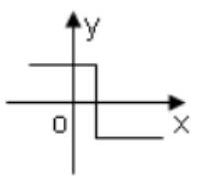

B.

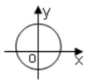

C.

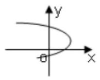

D.

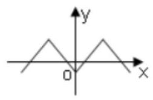

【难度】★★

【答案】D

【解析】对于 $\mathrm{A}$ ,存在一个自变量 $x$ 对应两个值,错误; 对于 $\mathrm{B}$ ,存在自变量 $x$ 对应两个值,错误; 对于 $\mathrm{C}$ , 存在自变量 $x$ 对应两个值,错误; 对于 $\mathrm{D}$ ,定义域内每个自变量都有唯一实数与之对应,正确,故选 D。

8、下列选项中， $y$ 可表示为 $x$ 的函数的是( )

A. ${3}^{y} + {x}^{2} = 0$ B. $x = {y}^{\frac{2}{3}}$

C. $\left| y\right|  = \left| x\right|$ D. ${\log }_{2}y = {x}^{3}$

【难度】 $\star   \star$

【答案】D

【解析】对于 $\mathrm{A}$ : 令 $x = 0$ ,找不到 $y$ 与之对应,故 $\mathrm{A}$ 错误;

对于 $\mathrm{B}$ : 令 $x = 4, y$ 可以取 $\pm  2$ ,故 $\mathrm{B}$ 错误;

对于 $\mathrm{C}$ : 令 $x = 2, y$ 可以取 $\pm  2$ ,故 $\mathrm{B}$ 错误;

对于 $\mathrm{D} : {\log }_{2}y = {x}^{3}$ 可转换为 $y = {2}^{{x}^{3}}$ ,是一一对应,符合函数的定义,故 $\mathrm{D}$ 正确.

9、已知定义在 $\mathrm{R}$ 上的函数 $f\left( x\right)$ 满足, $f\left( {1 - x}\right)  + {2f}\left( x\right)  = {x}^{2} + 1$ ,则 $f\left( 1\right)  =$ (   )

A. -1 B. 1

C. $- \frac{1}{3}$ D. $\frac{1}{3}$

【难度】★★★

【答案】B

【解析】 $\because$ 定义在 $R$ 上的函数 $f\left( x\right)$ 满足, $f\left( {1 - x}\right)  + {2f}\left( x\right)  = {x}^{2} + 1$ ,

$\therefore$ 当 $x = 0$ 时, $f\left( 1\right)  + {2f}\left( 0\right)  = 1$ ,①

当 $x = 1$ 时， $f\left( 0\right)  + {2f}\left( 1\right)  = 2$ ，②

② $\times  2 -$ ①，得 ${3f}\left( 1\right)  = 3$ ，解得 $f\left( 1\right)  = 1$ . 故选:B

10、函数 $f\left( x\right)  = \sqrt{1 - {2}^{x}} + \frac{1}{\sqrt{x + 2}}$ 的定义域是( )

A. $( - 2,0\rbrack$ B. $( - 2,1\rbrack$

C. $\left( {-\infty , - 2}\right)  \cup  ( - 2,0\rbrack$ D. $\left( {-\infty , - 2}\right)  \cup  ( - 2,1\rbrack$

【难度】 $\star   \star   \star$

【答案】A

【解析】解: 由题意, $\left\{  \begin{array}{l} 1 - {2}^{x} \geq  0 \\  x + 2 > 0 \end{array}\right.$ ,即 $\left\{  \begin{array}{l} x \leq  0 \\  x >  - 2 \end{array}\right.$ ,

所以 $- 2 < x \leq  0$ ,所以函数 $f\left( x\right)$ 的定义域为 $\left( {-2,0}\right\rbrack$ ,故选: A.

## 三、解答题

11、已知函数 $f\left( x\right)  = \frac{{x}^{2}}{1 + {x}^{2}}$ .

(1)求 $f\left( 2\right)  + f\left( \frac{1}{2}\right) , f\left( 3\right)  + f\left( \frac{1}{3}\right)$ 的值；

( 2 )求证 $f\left( x\right)  + f\left( \frac{1}{x}\right)$ 是定值；

(3) 求 $f\left( 1\right)  + f\left( 2\right)  + f\left( 3\right)  + \cdots f\left( {2020}\right)  + f\left( \frac{1}{2}\right)  + f\left( \frac{1}{3}\right)  + \cdots  + f\left( \frac{1}{2019}\right)  + f\left( \frac{1}{2020}\right)$ 的值.

【难度】 $\star   \star   \star$

【答案】(1) $1;1;\left( 2\right) 1;\left( 3\right) \frac{5039}{2}$ .

【解析】(1) 因为 $f\left( x\right)  = \frac{{x}^{2}}{1 + {x}^{2}}$ ,

所以 $f\left( 2\right)  + f\left( \frac{1}{2}\right)  = \frac{{2}^{2}}{1 + {2}^{2}} + \frac{{\left( \frac{1}{2}\right) }^{2}}{1 + {\left( \frac{1}{2}\right) }^{2}} = 1, f\left( 3\right)  + f\left( \frac{1}{3}\right)  = \frac{{3}^{2}}{1 + {3}^{2}} + \frac{{\left( \frac{1}{3}\right) }^{2}}{1 + {\left( \frac{1}{3}\right) }^{2}} = 1$ ;

(2) $f\left( x\right)  + f\left( \frac{1}{x}\right)  = \frac{{x}^{2}}{1 + {x}^{2}} + \frac{{\left( \frac{1}{x}\right) }^{2}}{1 + {\left( \frac{1}{x}\right) }^{2}} = 1$ ;

(3) 由 $f\left( x\right)  + f\left( \frac{1}{x}\right)  = 1$ ,

所以 $f\left( 1\right)  + \left\lbrack  {f\left( 2\right)  + f\left( \frac{1}{2}\right) }\right\rbrack   + \left\lbrack  {f\left( 3\right)  + f\left( \frac{1}{3}\right) }\right\rbrack   + \cdots  + \left\lbrack  {f\left( {2020}\right)  + f\left( \frac{1}{2020}\right) }\right\rbrack$ , $= \frac{1}{2} + {2019} = \frac{5039}{2}$ ,

12、如图，有一块半椭圆形钢板，其长半轴长为2r，短半轴长为 $r$ ，计划将此钢板切割成等腰梯形的形状， 下底 ${AB}$ 是半椭圆的短轴，上底 ${CD}$ 的端点在椭圆上，梯形面积为 $S$ .

(1)当 $r = 1$ ， ${CD} = \frac{3}{2}$ 时，求梯形 ${ABCD}$ 的周长(精确到 0.001)；

(2)记 ${CD} = {2x}$ ，求面积 $S$ 以 $x$ 为自变量的函数解析式 $S = f\left( x\right)$ ，并写出其定义域.

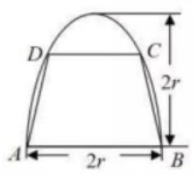

【难度】 $\star   \star   \star   \star$

【答案】(1) 周长是 $\frac{7 + \sqrt{29}}{2} \approx  {6.193}$ ; (2) $S = 2\left( {r + x}\right) \sqrt{{r}^{2} - {x}^{2}}$ ，定义域 $x \in  \left( {0, r}\right)$ .

【解析】(1)以下底 ${AB}$ 所在直线为 $x$ 轴，等腰梯形所在的对称轴为 $y$ 轴，建立直角坐标系，可得椭圆方程为 $\frac{{y}^{2}}{4{r}^{2}} + \frac{{x}^{2}}{{r}^{2}} = 1, r = 1,{CD} = \frac{3}{2}$ ,

$\therefore {x}_{c} = \frac{3}{4}$ 代入椭圆方程得 ${y}_{c} = \frac{\sqrt{7}}{2}$ ,

$\therefore {CB} = \sqrt{{\left( 1 - \frac{3}{4}\right) }^{2} + {\left( \frac{\sqrt{7}}{2}\right) }^{2}} = \frac{\sqrt{29}}{4}$ ，所以梯形 ${ABCD}$ 的周长是 $\frac{7 + \sqrt{29}}{2} \approx  {6.193}$ ；

(2)得 ${x}_{c} = x$ ， $\therefore {y}_{c} = {2r}\sqrt{1 - \frac{{x}^{2}}{{r}^{2}}}, S = \frac{1}{2}\left( {{2r} + {2x}}\right) {2r}\sqrt{1 - \frac{{x}^{2}}{{r}^{2}}} = 2\left( {r + x}\right) \sqrt{{r}^{2} - {x}^{2}}$ ，定义域 $x \in  \left( {0, r}\right)$ .
