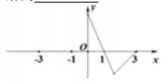

函数的奇偶性和单调性

<table><tr><td>教学目标</td><td>1、掌握奇偶性的判断方法及奇偶性的性质与应用;   2、掌握函数单调性的定义证明法;   3、掌握函数周期性的应用;</td></tr><tr><td>重点</td><td>1、会运用函数的奇偶性求有关函数的值和解析式；   2、会运用函数的奇偶性研究函数的其他性质.   3、会利用定义法证明函数单调性;   4、会利用单调性的定义去求解含参问题.</td></tr><tr><td>难 点</td><td>1、会运用函数的奇偶性求有关函数的值和解析式;   2、会运用函数的奇偶性研究函数的其他性质.   3、会利用定义法证明函数单调性;   4、会利用单调性的定义去求解含参问题.</td></tr></table>

## (一) 函数的奇偶性

## 知识梳理

1、偶函数:对于函数 $y = f\left( x\right)$ 的 定义域 $D$ 内的任意实数 $a$ ，都有 $f\left( {-x}\right)  = f\left( x\right)$ ；

2、奇函数:对于函数 $y = f\left( x\right)$ 的___定义域___ $D$ 内的任意实数 $a$ ，都有___ $f\left( {-x}\right)  =  - f\left( x\right)$ ；

3、定义域关于原点对称是函数具有奇偶性的必要非充分条件，；

4、偶函数的图像关于 $y$ 轴对称对称，奇函数的图像关于 坐标原点___对称；

5、分段函数的奇偶性一定要 分段 证明.

## 【问题反思】

问题一: 当奇函数 $f\left( x\right)$ 在 $x = 0$ 处有定义时, $f\left( 0\right)$ 的值等于多少? 为什么?

答: $f\left( 0\right)  = 0$ . 证明: $f\left( {-0}\right)  =  - f\left( 0\right)  \Rightarrow  f\left( 0\right)  = 0$ .

问题二: 若 $f\left( x\right)$ 既是奇函数又是偶函数,则 $f\left( x\right)$ 的解析式是什么? 为什么?

答: $f\left( x\right)  = 0$ ,定义域关于原点对称.

证明: $f\left( {-x}\right)  =  - f\left( x\right)$ ,又 $f\left( {-x}\right)  = f\left( x\right)$ ,故 $- f\left( x\right)  = f\left( x\right)  \Rightarrow  f\left( x\right)  = 0$

问题三:奇偶性的等价形式有哪些？答: $f\left( {-x}\right)  \pm  f\left( x\right)  = 0$ ；

## 6、判断函数的奇偶性的方法:

(1)定义法:首先判断其定义域是否关于原点中心对称. 若不对称，则为非奇非偶函数；若对称，则再判断 $f\left( {-x}\right)  =  - f\left( x\right)$ 或 $f\left( x\right)  = f\left( {-x}\right)$ 是否定义域上的恒等式；

(2)图象法；

(3)性质法:①设 $f\left( x\right) , g\left( x\right)$ 的定义域分别是 ${D}_{1},{D}_{2}$ ，那么在它们的公共定义域 $D = {D}_{1} \cap  {D}_{2}$ 上: 奇土奇=奇，偶±偶=偶，奇×奇=偶，偶×偶=偶，奇×偶=奇;

②若某奇函数若存在反函数，则其反函数必是奇函数；

(4)判断函数的奇偶性有时可以用定义的等价形式:

$$
f\left( x\right)  \pm  f\left( {-x}\right)  = 0,\;\frac{f\left( x\right) }{f\left( {-x}\right) } =  \pm  1
$$

## 例题精讲

【例 1】判断下列函数的奇偶性

(1) $f\left( x\right)  = x\lg \frac{1 - x}{1 + x}$ ； (2) $f\left( x\right)  = {x}^{2}\left( {\frac{1}{{3}^{x} - 1} + \frac{1}{2}}\right)$ ;

(3) $f\left( x\right)  = \sqrt{1 - {x}^{2}} + \sqrt{{x}^{2} - 1}$ ;

(4) $f\left( x\right)  = \frac{\sqrt{1 - {x}^{2}}}{\left| {x + 2}\right|  - 2}$ ;

(5) $f\left( x\right)  = \left\{  \begin{array}{l} {x}^{2} + \sin x,\text{ 当 }x \geq  0\text{ 时 } \\  {x}^{2} - \sin x,\text{ 当 }x < 0\text{ 时 } \end{array}\right.$ ; (6) $f\left( x\right)  = \left( {x - 1}\right) \sqrt{\frac{x + 1}{x - 1}}$

【难度】 $\star   \star   \star$

【答案】见解析

【解析】(1) $f\left( x\right)$ 的定义域 $\{ x \mid   - 1 < x < 1\}$ 而 $f\left( {-x}\right)  =  - x\lg \frac{1 + x}{1 - x} = x\lg \frac{1 - x}{1 + x}$ ,所以 $f\left( {-x}\right)  = f\left( x\right)$ 故 $f\left( x\right)$ 为偶函数;

(2) $f\left( x\right)$ 的定义域为 $x \neq  0$ 的一切实数，关于原点对称

$\frac{1}{{3}^{x} - 1} + \frac{1}{2} = \frac{{3}^{x} + 1}{2\left( {{3}^{x} - 1}\right) }, f\left( x\right)  = {x}^{2}\left( {\frac{1}{{3}^{x} - 1} + \frac{1}{2}}\right)  = \frac{{x}^{2}}{2}\left( \frac{{3}^{x} + 1}{{3}^{x} - 1}\right) , f\left( {-x}\right)  = \frac{{x}^{2}}{2}\left( \frac{{3}^{-x} + 1}{{3}^{-x} - 1}\right)  =  - \frac{{x}^{2}}{2}\left( \frac{{3}^{x} + 1}{{3}^{x} - 1}\right)$

$\therefore f\left( x\right)  =  - f\left( {-x}\right)$ ,所以 $f\left( x\right)$ 为奇函数;

(3)函数 $f\left( x\right)$ 的定义域为 $\left\{  {\begin{array}{l} 1 - {x}^{2} \geq  0 \\  {x}^{2} - 1 \geq  0 \end{array} \Rightarrow  {x}^{2} = 1 \Rightarrow  x =  \pm  1}\right.$ ， $f\left( x\right)$ 的定义域关于原点对称，当 $x =  \pm  1$ 时， $f\left( x\right)  = 0$ ,所以 $f\left( x\right)$ 既是奇函数又是偶函数;

(4)由 $1 - {x}^{2} \geq  0$ 得 $- 1 \leq  x \leq  1$ ,而当 $- 1 \leq  x \leq  1$ 时， $\left| {x + 2}\right|  = x + 2$

所以 $f\left( x\right)  = \frac{\sqrt{1 - {x}^{2}}}{x + 2 - 2} = \frac{\sqrt{1 - {x}^{2}}}{x}$ 此时 $x \neq  0$ ,所以 $f\left( {-x}\right)  =  - f\left( x\right)$ 故 $f\left( x\right)$ 为奇函数;

(5)定义域为 $R$ ,当 $x > 0$ 则 $- x < 0, f\left( {-x}\right)  = {\left( -x\right) }^{2} - \sin \left( {-x}\right)  = {x}^{2} + \sin x = f\left( x\right)$

当 $x = 0, f\left( 0\right)  = 0$ ; 当 $x < 0$ ,则 $- x > 0, f\left( {-x}\right)  = {\left( -x\right) }^{2} + \sin \left( {-x}\right)  = {x}^{2} - \sin x = f\left( x\right)$

综上可得, $f\left( {-x}\right)  = f\left( x\right) , f\left( x\right)$ 为偶函数;

(6)定义域为 $\left( {-\infty , - 1\rbrack \cup \lbrack 1, + \infty }\right)$ ，不关于原点对称，所以是非奇非偶函数。

【例 2】( 1 )已知 $f\left( x\right)  = a{x}^{2} + {bx} + {3a} + b$ 是偶函数，且其定义域为 $\left\lbrack  {a - 1,{2a}}\right\rbrack$ ，则 $a =$ ___， $b =$ ___.

【难度】★★

【答案】 $\frac{1}{3}$

【解析】 $f\left( x\right)  = a{x}^{2} + {bx} + {3a} + b$ 是偶函数,一次项系数为 $b$ ,则 $b = 0$ . 定义域 $\left\lbrack  {a - 1,{2a}}\right\rbrack$ 关于原点对称, 故 ${2a} + a - 1 = 0 \Rightarrow  a = \frac{1}{3}$ .

( 2 )已知函数 $f\left( x\right)  = \frac{1}{{2}^{x} - 1} + m$ 为奇函数，则实数 $m =$ ___.

【难度】 $\star   \star   \star$

【答案】 $\frac{1}{2}$

【解析】解: 因为函数 $f\left( x\right)  = \frac{1}{{2}^{x} - 1} + m$ 为奇函数,

所以 $f\left( {-x}\right)  + f\left( x\right)  = \frac{1}{{2}^{-x} - 1} + m + \frac{1}{{2}^{x} - 1} + m = 0$ 恒成立,即 $\frac{{2}^{x}}{1 - {2}^{x}} + \frac{1}{{2}^{x} - 1} + {2m} = 0$ ,所以 ${2m} = 1$ , 解得 $m = \frac{1}{2}$ . 故答案为: $\frac{1}{2}$ .

(3)若函数 $f\left( x\right)  = \frac{k - {2}^{x}}{1 + k \cdot  {2}^{x}}$ ( $k$ 为实常数)在其定义域上是奇函数，则 $k$ 的值为___.

【难度】★★★

【答案】 $\pm  1$

【解析】因为 $f\left( x\right)$ 是奇函数,所以 $f\left( x\right)  + f\left( {-x}\right)  = 0$ ,即 $\frac{k - {2}^{x}}{1 + k \cdot  {2}^{x}} + \frac{k - {2}^{-x}}{1 + k \cdot  {2}^{-x}} = 0$ , $\frac{k - {2}^{x}}{1 + k \cdot  {2}^{x}} + \frac{k \cdot  {2}^{x} - 1}{k + {2}^{x}} = 0,\frac{\left( {{k}^{2} - 1}\right) \left( {{2}^{2x} + 1}\right) }{\left( {1 + k \cdot  {2}^{x}}\right) \left( {k + {2}^{x}}\right) } = 0$ ,所以 ${k}^{2} = 1, k =  \pm  1$ .

【例 3】( 1 )函数 $f\left( x\right)  = {x}^{3} + \sin x + 1\left( {x \in  R}\right)$ ，若 $f\left( a\right)  = 2$ ，则 $f\left( {-a}\right)$ 的值为___( )

A. 3 B. 0 C. -1 D. -2

【难度】★★

【答案】B

【解析】解: $\because f\left( a\right)  = 2\therefore f\left( a\right)  = {a}^{3} + \sin a + 1 = 2,{a}^{3} + a = 1$ ,

则 $f\left( {-a}\right)  = {\left( -a\right) }^{3} + \sin \left( {-a}\right)  + 1 =  - \left( {{a}^{3} + a}\right)  + 1 =  - 1 + 1 = 0$ . 故选: $B$ .

( 2 )已知函数 $y = f\left( x\right)  + x$ 是偶函数，且 $f\left( 2\right)  = 1$ ，则 $f\left( {-2}\right)  =$ ___.

【难度】 $\star   \star$

【答案】 5

【解析】解: 设 $y = g\left( x\right)  = f\left( x\right)  + x,\because$ 函数 $y = f\left( x\right)  + x$ 是偶函数, $\therefore g\left( {-x}\right)  = g\left( x\right)$ ,即 $f\left( {-x}\right)  - x = f\left( x\right)  + x$ , 令 $x = 2$ ,则 $f\left( {-2}\right)  - 2 = f\left( 2\right)  + 2 = 1 + 2 = 3,\therefore f\left( {-2}\right)  = 3 + 2 = 5$ ,故答案为: 5

(3)若 $\varphi \left( x\right)$ 是奇函数， $f\left( x\right)  = {a\varphi }\left( x\right)  + 2$ 在(0，+∞)上有最大值 5，则 $f\left( x\right)$ 在(-∞，0)上( )

A. 最小值-5 B. 最大值-5 C. 最小值-1 D. 最大值-3

【难度】★★

【答案】C

【解析】 $\varphi \left( x\right)$ 为奇函数, $\therefore f\left( x\right)  - 2 = {a\varphi }\left( x\right)$ 为奇函数.

又 $f\left( x\right)$ 有最大值 5, $\therefore  - 2$ 在 $\left( {0, + \infty }\right)$ 上有最大值 3,

$\therefore f\left( x\right)  - 2$ 在 $\left( {-\infty ,0}\right)$ 上有最小值 $- 3,\therefore f\left( x\right)$ 在 $\left( {-\infty ,0}\right)$ 上有最小值 -1 . 答案为 C.

【例 4】设 $f\left( x\right)$ 是定义在 $R$ 上的函数,当 $x \geq  0$ 时, $f\left( x\right)  = {x}^{2} - {2x}$ ,

当 $f\left( x\right)$ 为奇函数时，函数 $f\left( x\right)$ 的解析式是___.

当 $f\left( x\right)$ 为偶函数时，函数 $f\left( x\right)$ 的解析式是___.

【难度】 $\star   \star   \star$

【答案】 $f\left( x\right)  = \left\{  {\begin{array}{ll} {x}^{2} - {2x}, & x \geq  0 \\   - {x}^{2} - {2x}, & x < 0 \end{array};f\left( x\right)  = \left\{  \begin{array}{ll} {x}^{2} - {2x}, & x \geq  0 \\  {x}^{2} + {2x}, & x < 0 \end{array}\right. }\right.$

【解析】解: 设 $f\left( x\right)$ 是定义在 $\mathbf{R}$ 上的函数,当 $x \geq  0$ 时, $f\left( x\right)  = {x}^{2} - {2x}$ .

设 $f\left( x\right)$ 是定义在 $\mathbf{R}$ 上的函数,当 $x \geq  0$ 时, $f\left( x\right)  = {x}^{2} - {2x}$ .

(1) $\because f\left( x\right)$ 为奇函数， $\therefore f\left( x\right)  =  - f\left( {-x}\right)$ ，当 $x < 0$ 时， $- x > 0$ ，

$f\left( x\right)  =  - f\left( {-x}\right)  =  - {x}^{2} - {2x}.$

函数 $f\left( x\right)$ 的解析式是 $f\left( x\right)  = \left\{  \begin{array}{ll} {x}^{2} - {2x}, & x \geq  0 \\   - {x}^{2} - {2x}, & x < 0 \end{array}\right.$ .

(2) $f\left( x\right)$ 为偶函数， $f\left( x\right)  = f\left( {-x}\right)$ ，

当 $x < 0$ 时， $- x > 0$ ，

$f\left( x\right)  = f\left( {-x}\right)  = {x}^{2} + {2x}.$

函数 $f\left( x\right)$ 的解析式是 $f\left( x\right)  = \left\{  \begin{array}{ll} {x}^{2} - {2x}, & x \geq  0 \\  {x}^{2} + {2x}, & x < 0 \end{array}\right.$

【例 5】已已知函数 $f\left( x\right)$ 和 $g\left( x\right)$ 的定义域都是 $R, f\left( x\right)$ 是奇函数, $g\left( x\right)$ 是偶函数.

(1)判断 $F\left( x\right)  = {\left\lbrack  f\left( x\right) \right\rbrack  }^{2} - g\left( x\right)$ 的奇偶性;

(2)如果 $f\left( x\right)  + g\left( x\right)  = {2}^{x} + x$ ，求函数 $f\left( x\right)$ 和 $g\left( x\right)$ 的解析式.

【难度】 $\star   \star   \star$

【答案】(1)偶；(2)见解析

【解析】解: (1) $F\left( x\right)  = {\left\lbrack  f\left( x\right) \right\rbrack  }^{2} - g\left( x\right)$ 的定义域为 $\mathbf{R}$ ,

又 $\because f\left( x\right)$ 是奇函数, $g\left( x\right)$ 是偶函数,

$\therefore f\left( {-x}\right)  =  - f\left( x\right) , g\left( {-x}\right)  = g\left( x\right)$ ,

$\therefore F\left( {-x}\right)  = {\left\lbrack  f\left( -x\right) \right\rbrack  }^{2} - g\left( {-x}\right)$

$= {\left\lbrack  -f\left( x\right) \right\rbrack  }^{2} - g\left( x\right)  = {\left\lbrack  f\left( x\right) \right\rbrack  }^{2} - g\left( x\right)  = F\left( x\right) ,$

则 $F\left( x\right)  = {\left\lbrack  f\left( x\right) \right\rbrack  }^{2} - g\left( x\right)$ 是偶函数;

(2) $\because f\left( x\right)  + g\left( x\right)  = {2}^{x} + x$ ①，

$\therefore f\left( {-x}\right)  + g\left( {-x}\right)  = {2}^{-x} - x$ ,

即 $- f\left( x\right)  + g\left( x\right)  = {2}^{-x} - x$ ②，

由①②联立解得，

$g\left( x\right)  = \frac{{2}^{x} + {2}^{-x}}{2}, f\left( x\right)  = \frac{{2}^{x} - {2}^{-x}}{2} + x.$

【例 6】设 $f\left( x\right)  = \frac{-{2}^{x} + a}{{2}^{x + 1} + b}$ ( $a, b$ 为实常数).

(1)当 $a = b = 1$ 时，证明: $f\left( x\right)$ 不是奇函数；

(2)设 $f\left( x\right)$ 是奇函数，求 $a$ 与 $b$ 的值；

【难度】 $\star   \star   \star$

【答案】见解析

【解析】(1) 举出反例即可. $f\left( x\right)  = \frac{-{2}^{x} + 1}{{2}^{x + 1} + 1}, f\left( 1\right)  = \frac{-2 + 1}{{2}^{2} + 1} =  - \frac{1}{5}, f\left( {-1}\right)  = \frac{-\frac{1}{2} + 1}{2} = \frac{1}{4}$ ,

所以 $f\left( {-1}\right)  \neq   - f\left( 1\right) , f\left( x\right)$ 不是奇函数;

(2) $f\left( x\right)$ 是奇函数时， $f\left( {-x}\right)  =  - f\left( x\right)$ ，即 $\frac{-{2}^{-x} + a}{{2}^{-x + 1} + b} =  - \frac{-{2}^{x} + a}{{2}^{x + 1} + b}$ 对定义域内任意实数 $x$ 成立.

化简整理得 $\left( {{2a} - b}\right)  \cdot  {2}^{2x} + \left( {{2ab} - 4}\right)  \cdot  {2}^{x} + \left( {{2a} - b}\right)  = 0$ ,这是关于 $x$ 的恒等式,

所以, $\left\{  \begin{array}{l} {2a} - b = 0, \\  {2ab} - 4 = 0 \end{array}\right.$ 所以 $\left\{  \begin{array}{l} a =  - 1 \\  b =  - 2 \end{array}\right.$ 或 $\left\{  \begin{array}{l} a = 1 \\  b = 2 \end{array}\right.$ . 经检验都符合题意.

## 巩固训练

1、判断下列函数的奇偶性

(1) $f\left( x\right)  = \left( {x - 1}\right) \sqrt{\frac{1 + x}{1 - x}}$ (2) $f\left( x\right)  = \frac{1 + {2}^{x}}{1 - {2}^{x}} + {\log }_{2}\frac{1 + x}{1 - x}$

(3) $f\left( x\right)  = \left\{  \begin{array}{l} \frac{1}{2}{x}^{2} + 1, x > 0 \\   - \frac{1}{2}{x}^{2} - 1, x < 0 \end{array}\right.$

【难度】 $\star   \star   \star$

【答案】见解析

【解析】(1) 定义域为 $\{ x \mid   - 1 \leq  x < 1\}$ 不关于点对称, $\therefore f\left( x\right)$ 为非奇非偶函数;

(2)定义域 $\left\{  \begin{array}{l} 1 - {2}^{x} \neq  0 \\  \frac{1 + x}{1 - x} > 0 \end{array}\right.$ ， $x \in  \left( {-1,0}\right)  \cup  \left( {0,1}\right)$ ， $f\left( {-x}\right)  = \frac{1 + {2}^{-x}}{1 - {2}^{-x}} + {\log }_{2}^{\frac{1 - x}{1 + x}} = \frac{{2}^{x} + 1}{{2}^{x} - 1} - {\log }_{2}^{\frac{1 + x}{1 - x}} =  - f\left( x\right)$ ，

所以 $f\left( x\right)$ 是奇函数

(3) $f\left( x\right)  = \left\{  \begin{array}{l} \frac{1}{2}{x}^{2} + 1, x > 0 \\   - \frac{1}{2}{x}^{2} - 1, x < 0 \end{array}\right.$ 的定义域 $\left( {-\infty ,0}\right)  \cup  \left( {0, + \infty }\right)$ 关于原点对称，

当 $x > 0$ 时, $- x < 0$ ,此时 $f\left( x\right)  = \frac{1}{2}{x}^{2} + 1, f\left( {-x}\right)  =  - \frac{1}{2}{x}^{2} - 1$ ,满足 $f\left( {-x}\right)  =  - f\left( x\right)$ ,

当 $x < 0$ 时, $- x > 0$ ,此时 $f\left( x\right)  =  - \frac{1}{2}{x}^{2} - 1, f\left( {-x}\right)  = \frac{1}{2}{x}^{2} + 1$ ,满足 $f\left( {-x}\right)  =  - f\left( x\right)$ ,

故函数 $f\left( x\right)  = \left\{  \begin{array}{l} \frac{1}{2}{x}^{2} + 1, x > 0 \\   - \frac{1}{2}{x}^{2} - 1, x < 0 \end{array}\right.$ 为奇函数.

2、已知函数 $f\left( x\right)$ 是定义在区间 $\left\lbrack  {-3,3}\right\rbrack$ 上的奇函数,当 $x \in  \left( {0,3}\right\rbrack$ 时, $f\left( x\right)$ 图象如图,则不等式 $f\left( x\right)  \leq  0$ 的解为___.

【难度】 $\star   \star$

【答案】 $\left\lbrack  {-1,0}\right\rbrack   \cup  \left\lbrack  {1,3}\right\rbrack$

【解析】解: 根据题意,由函数 $f\left( x\right)$ 的图象可得: 在区间 $\left\lbrack  {0,1}\right\rbrack$ 上, $f\left( x\right)  \geq  0$ ,在区间 $\left\lbrack  {1,3}\right\rbrack$ 上, $f\left( x\right)  \leq  0$ ,

又由 $f\left( x\right)$ 为奇函数，则在区间 $\left\lbrack  {-1,0}\right\rbrack$ 上， $f\left( x\right)  \leq  0$ ，在区间 $\left\lbrack  {-3, - 1}\right\rbrack$ 上， $f\left( x\right)  \geq  0$ ，

不等式 $f\left( x\right)  \leq  0$ 的解集为 $\left\lbrack  {-1,0}\right\rbrack   \cup  \left\lbrack  {1,3}\right\rbrack$ ; 故答案为: $\left\lbrack  {-1,0}\right\rbrack   \cup  \left\lbrack  {1,3}\right\rbrack$ .

3、已知 $f\left( x\right)  = a{x}^{2} + {bx}$ 是定义在 $\left\lbrack  {a - 1,{2a}}\right\rbrack$ 上的偶函数，那么 $a + b$ 的值是___.

【难度】 $\star   \star$

【答案】 $\frac{1}{3}$

【解析】解: $\because f\left( x\right)  = a{x}^{2} + {bx}$ 是定义在 $\left\lbrack  {a - 1,{2a}}\right\rbrack$ 上的偶函数,

$\therefore f\left( {-x}\right)  = f\left( x\right) ,\therefore b = 0$ ,又 $a - 1 =  - {2a},\therefore a = \frac{1}{3},\therefore a + b = \frac{1}{3}$ . 故答案为 $\frac{1}{3}$

4、函数 $f\left( x\right)  = {x}^{3} + \left( {{m}^{2} - 1}\right) {x}^{2} + x$ 为奇函数，则 $m =$ ___.

【难度】 $\star   \star   \star$

【答案】 $\pm  1$ .

【解析】解: 根据题意, $f\left( x\right)  = {x}^{3} + \left( {{m}^{2} - 1}\right) {x}^{2} + x$ 为奇函数,则 $f\left( {-x}\right)  =  - f\left( x\right)$ ,

则有 ${\left( -x\right) }^{3} + \left( {{m}^{2} - 1}\right) {\left( -x\right) }^{2} + \left( {-x}\right)  =  - \left( {{x}^{3} + \left( {{m}^{2} - 1}\right) {x}^{2} + x}\right)$ ,

则有 $\left( {{m}^{2} - 1}\right) x = 0$ ,解可得 $m =  \pm  1$ ,故答案为: $\pm  1$ .

5、已知函数 $f\left( x\right)  = {x}^{2} + \frac{a}{x}\left( {x \neq  0\text{ ,常数 }a \in  R}\right)$ . 讨论函数 $f\left( x\right)$ 的奇偶性,并说明理由;

【难度】 $\star   \star$

【答案】见解析

【解析】当 $a = 0$ 时, $f\left( x\right)  = {x}^{2}$ ,

对任意 $x \in  \left( {-\infty ,0}\right)  \cup  \left( {0, + \infty }\right) , f\left( {-x}\right)  = {\left( -x\right) }^{2} = {x}^{2} = f\left( x\right) ,\therefore f\left( x\right)$ 为偶函数.

当 $a \neq  0$ 时, $f\left( x\right)  = {x}^{2} + \frac{a}{x}\left( {a \neq  0, x \neq  0}\right)$ ,

取 $x =  \pm  1$ ,得 $f\left( {-1}\right)  + f\left( 1\right)  = 2 \neq  0, f\left( {-1}\right)  - f\left( 1\right)  =  - {2a} \neq  0,\therefore f\left( {-1}\right)  \neq   - f\left( 1\right) , f\left( {-1}\right)  \neq  f\left( 1\right)$ ,

$\therefore$ 函数 $f\left( x\right)$ 既不是奇函数,也不是偶函数.

6、已知 $f\left( x\right)$ 是定义在 $R$ 上的奇函数，则 $f\left( {-1}\right)  + f\left( 0\right)  + f\left( 1\right)  =$ ___.

【难度】 $\star   \star$

【答案】0

【解析】解: $\because f\left( x\right)$ 是定义在 $R$ 上的奇函数, $\therefore f\left( {-1}\right)  =  - f\left( 1\right) , f\left( 0\right)  = 0$ ,

即 $f\left( {-1}\right)  + f\left( 0\right)  + f\left( 1\right)  = 0$ ,故答案为: 0 .

7、已知 $y = f\left( x\right)  + {x}^{2}$ 是奇函数，且 $f\left( 1\right)  = 1$ ，若 $g\left( x\right)  = f\left( x\right)  + 2$ ，则 $g\left( {-1}\right)  =$ ___.

【难度】 $\star   \star$

【答案】-1

【解析】 $g\left( x\right)  = f\left( x\right)  + {x}^{2} + \left( {-{x}^{2} + 2}\right)$

8、已知 $f\left( x\right) , g\left( x\right)$ 分别是定义在 $R$ 上的偶函数和奇函数,且 $f\left( x\right)  - g\left( x\right)  = {x}^{3} + {x}^{2} + 1$ ,则 $f\left( 1\right)  + g\left( 1\right)  =$

【难度】 $\star   \star   \star$

【答案】 1

【解析】 $f\left( 1\right)  + g\left( 1\right)  = f\left( {-1}\right)  - g\left( {-1}\right)  = 1$

9、如果函数 $y = \left\{  \begin{array}{ll} {2x} - 3, & x > 0, \\  f\left( x\right) , & x < 0 \end{array}\right.$ 是奇函数，则 $f\left( x\right)  =$ ___.

【难度】 $\star   \star   \star$

【答案】 ${2x} + 3$

【解析】根据当 $x > 0$ 时的表达式,可得 $f\left( x\right)  = {2x} + 3$

10、已知函数 $f\left( x\right)$ 是定义在 $\left( {-\infty , + \infty }\right)$ 上的偶函数. 当 $x \in  \left( {-\infty ,0}\right)$ 时, $f\left( x\right)  = x - {x}^{4}$ ,则当 $x \in  \left( {0, + \infty }\right)$ 时， $f\left( x\right)  =$

【难度】 $\star   \star$

【答案】 $- x - {x}^{4}$

11、已知 $g\left( x\right)  =  - {x}^{2} - 3, f\left( x\right)$ 是二次函数,且 $f\left( x\right)  + g\left( x\right)$ 为奇函数,当 $x \in  \left\lbrack  {-1,2}\right\rbrack$ 时,得 $f\left( x\right)$ 最小值为 1,求 $f\left( x\right)$ 的表达式.

【难度】 $\star   \star   \star$

【答案】见解析

【解析】(1) 设 $f\left( x\right)  = a{x}^{2} + {bx} + c\left( {a \neq  0}\right)$ ,则 $f\left( x\right)  + g\left( x\right)  = \left( {a - 1}\right) {x}^{2} + {bx} + c - 3$ ,

又 $f\left( x\right)  + g\left( x\right)$ 为奇函数, $\therefore a = 1, c = 3,\therefore f\left( x\right)  = {x}^{2} + {bx} + 3$

① 当 $- \frac{b}{2} \geq  2$ ，即 $b \leq   - 4$ 时， $f\left( x\right)$ 在 $\left\lbrack  {-1,2}\right\rbrack$ 上为减函数，

$\therefore f\left( x\right)$ 的最小值为 $f\left( 2\right)  = 4 + {2b} + 3 = 1,\because b =  - 3$ ,又 $b \leq   - 4$ ,故此时无解

② 当 $- \frac{b}{2} \in  \left( {-1,2}\right)$ 时，即 $- 4 < b < 2$ 时， $f\left( x\right)$ 的最小值为 $3 - \frac{{b}^{2}}{4} = 1,\therefore b =  \pm  2\sqrt{2}$

$\because b \in  \left( {-4,2}\right) ,\therefore b =  - 2\sqrt{2}$ ,此时 $f\left( x\right)  = {x}^{2} - 2\sqrt{2}x + 3$

③ 当 $- \frac{b}{2} \leq   - 1$ 时，即 $b \geq  2$ 时， $f\left( x\right)$ 在 $\left\lbrack  {-1,2}\right\rbrack$ 为增函数

$\therefore f\left( x\right)$ 的最小值为 $f\left( {-1}\right)  = 4 - b = 1,\therefore b = 3$ ,满足 $b \geq  2$ ,故 $f\left( x\right)  = {x}^{2} + {3x} + 3$

综上得 $f\left( x\right)  = {x}^{2} - 2\sqrt{2}x + 3$ 或 $f\left( x\right)  = {x}^{2} + {3x} + 3$

## (二) 函数的单调性

## 知识梳理

1. 函数的单调性的定义

对于给定区间上的函数 $y = f\left( x\right)$ ,如果对于属于这个区间的自变量的任意两个值 ${x}_{1}\text{ 、 }{x}_{2}$ ,只要有 ${x}_{1} < {x}_{2}$ ,都有 $f\left( {x}_{1}\right)  < f\left( {x}_{2}\right)$ ,那么就说 $y = f\left( x\right)$ 在这个区间上是增函数;

对于给定区间上的函数 $y = f\left( x\right)$ ,如果对于属于这个区间的自变量的任意两个值 ${x}_{1}\text{ 、 }{x}_{2}$ ,只要有 ${x}_{1} < {x}_{2}$ ,都有 $f\left( {x}_{1}\right)  > f\left( {x}_{2}\right)$ ,那么就说 $y = f\left( x\right)$ 在这个区间上是减函数.

## 2. 函数的单调区间

如果函数 $y = f\left( x\right)$ 在某个区间 $I$ 上是增 (减) 函数,那么就说函数 $y = f\left( x\right)$ 在这个区间 $I$ 上是单调函数,区间 $I$ 叫做函数 $y = f\left( x\right)$ 的单调区间.

【注】多个单调区间用 “和” 连接

3. 用定义证明(判断)函数在指定区间上的单调性

证明 (判断) 函数 $y = f\left( x\right)$ 在指定区间 $A$ 上的单调性的一般步骤是:

① 设元:设 ${x}_{1},{x}_{2} \in  A$ ，且 ${x}_{1} < {x}_{2}$ . 目的是使 ${x}_{1},{x}_{2}$ 在区间 $A$ 内，并规定 ${x}_{1}$ 与 ${x}_{2}$ 的大小顺序.

② 作差: $f\left( {x}_{1}\right)  - f\left( {x}_{2}\right)$ . 目的是将 $f\left( {x}_{1}\right)  - f\left( {x}_{2}\right)$ 与 0 比较大小.

③ 变形:将 $f\left( {x}_{1}\right)  - f\left( {x}_{2}\right)$ 变形至可以与 0 比较大小为止. 常用因式分解或配方进行变形.

④ 判号:确定 $f\left( {x}_{1}\right)  - f\left( {x}_{2}\right) \left\{  \begin{array}{l}  > 0 \\   = 0 \\   < 0 \end{array}\right.$ 三种情况之一.

⑤ 定论:根据①和④作出结论.

## 【注】判断函数单调性的常用方法: (1) 复合函数法; (2) 图像法; (3) 定义法.

4. 单调性的常见等价命题形式

(1)对于任意的 $a > 0$ ，都有 $f\left( {x + a}\right)  > f\left( x\right)$ ，表示 $f\left( x\right)$ 单调递增； 对于任意的 $a > 0$ ，都有 $f\left( {x + a}\right)  < f\left( x\right)$ ，表示 $f\left( x\right)$ 单调递减；

(2)【斜率形式】对于任意的 ${x}_{1} \neq  {x}_{2}$ ，都有 $\frac{f\left( {x}_{1}\right)  - f\left( {x}_{2}\right) }{{x}_{1} - {x}_{2}} > 0$ ，表示 $f\left( x\right)$ 单调递增；

对于任意的 ${x}_{1} \neq  {x}_{2}$ ,都有 $\frac{f\left( {x}_{1}\right)  - f\left( {x}_{2}\right) }{{x}_{1} - {x}_{2}} < 0$ ,表示 $f\left( x\right)$ 单调递减.

## 5. 复合函数的单调性

遵循“同增异减”的规律，同时特别注意:讨论函数单调性必须在其定义域内进行，因此，要研究函数的单调性, 必须先求函数的定义域.

设 $y = f\left( u\right) , u = \varphi \left( x\right)$ 且当 $x \in  A$ 时, $u \in  B$ ,则复合函数 $y = f\left\lbrack  {\varphi \left( x\right) }\right\rbrack  \left( {x \in  A}\right)$ 的单调性与内、外层函数的单调性关系为下表所示.

<table><tr><td>函数</td><td>$y = f\left( u\right)$</td><td>$u = \varphi \left( x\right)$</td><td>$y = f\left\lbrack  {\varphi \left( x\right) }\right\rbrack$</td></tr><tr><td>单调区间</td><td>$u \in  B$</td><td>$x \in  A$</td><td>$x \in  A$</td></tr><tr><td rowspan="4">单调性</td><td>增</td><td>增</td><td>增</td></tr><tr><td>增</td><td>减</td><td>减</td></tr><tr><td>减</td><td>增</td><td>减</td></tr><tr><td>减</td><td>减</td><td>增</td></tr></table>

6. 在研究形如 $y = x + \frac{a}{x}$ 的函数的单调性时,需分两种情况讨论: (1) 当 $a \leq  0$ ,在 $\left( {-\infty ,0}\right)$ 和 $\left( {0, + \infty }\right)$ 上是增函数; (2) 当 $a > 0$ 时,在 $\left( {0,\sqrt{a}}\right)$ 和 $\left\lbrack  {-\sqrt{a},0}\right)$ 上是减函数,在 $\left\lbrack  {\sqrt{a}, + \infty }\right)$ 和 $\left( {-\infty , - \sqrt{a}}\right\rbrack$ 上是增函数.

7. 关于分段函数的单调性:

若函数 $f\left( x\right)  = \left\{  {\begin{array}{ll} g\left( x\right) , & x \in  \left\lbrack  {a, b}\right\rbrack  , \\  h\left( x\right) , & x \in  \left\lbrack  {c, d}\right\rbrack  , \end{array}\left( {a < b < c < d}\right) , g\left( x\right) }\right.$ 在区间 $x \in  \left\lbrack  {a, b}\right\rbrack$ 上是增函数, $h\left( x\right)$ 在区间 $x \in  \left\lbrack  {c, d}\right\rbrack$ 上是增函数,则 $f\left( x\right)$ 在区间 $\left\lbrack  {a, b}\right\rbrack   \cup  \left\lbrack  {c, d}\right\rbrack$ 上不一定是增函数,若使得 $f\left( x\right)$ 在区间 $\left\lbrack  {a, b}\right\rbrack   \cup  \left\lbrack  {c, d}\right\rbrack$ 上一定是增函数,需补充条件: $g\left( b\right)  < h\left( c\right)$ .

## 例题精讲

【例 7】判断函数 $f\left( x\right)  = \frac{1}{{x}^{2} + 1}$ 在区间 $\left( {0,1}\right)$ 上的单调性,并用定义证明.

【难度】 $\star   \star   \star$

【答案】见解析

【解析】解: $f\left( x\right)  = \frac{1}{{x}^{2} + 1}$ 在区间 $\left( {0,1}\right)$ 上是减函数.

证明: 设 $0 < {x}_{1} < {x}_{2} < 1$ ,则 $f\left( {x}_{1}\right)  - f\left( {x}_{2}\right)  = \frac{1}{{x}_{1}^{2} + 1} - \frac{1}{{x}_{2}^{2} + 1} = \frac{{x}_{2}^{2} - {x}_{1}^{2}}{\left( {{x}_{1}^{2} + 1}\right) \left( {{x}_{2}^{2} + 1}\right) }$ .

$\because 0 < {x}_{1} < {x}_{2} < 1,\;\therefore {x}_{2}^{2} - {x}_{1}^{2} > 0,\;\left( {{x}_{1}^{2} + 1}\right) \left( {{x}_{2}^{2} + 1}\right)  > 0$ ,

$\therefore f\left( {x}_{1}\right)  - f\left( {x}_{2}\right)  > 0$ ,即 $f\left( {x}_{1}\right)  > f\left( {x}_{2}\right) ,\therefore f\left( x\right)  = \frac{1}{{x}^{2} + 1}$ 在区间 $\left( {0,1}\right)$ 上是减函数.

【例 8】( 1 )函数 $y = \sqrt{-{x}^{2} - {2x} + 8}$ 的单调递减区间是___.

【难度】 $\star   \star$

【答案】 $\left\lbrack  {-1,2}\right\rbrack$

【解析】复合函数单调性,注意定义域

(2)函数 $y = {\left( \frac{1}{3}\right) }^{3 - {2x} - {x}^{2}}$ 的单调递增区间是___.

【难度】★★

【答案】 $\left( {-1, + \infty }\right)$

【解析】复合函数单调性

(3)设 $y = f\left( x\right)$ 是 $R$ 上的减函数，则 $y = f\left( \left| {x - 3}\right| \right)$ 的单调递减区间为___.

【难度】★★

【答案】 $\lbrack 3, + \infty )$

【解析】复合函数单调性

【例 9】根据函数的单调性填空:

(1)函数 $f\left( x\right)  = a{x}^{2} + 4\left( {a + 1}\right) x - 3$ 在 $\lbrack 2, + \infty )$ 上递减，则 $a$ 的取值范围是___.

【难度】 $\star   \star$

【答案】 $\left( {-\infty , - \frac{1}{2}}\right\rbrack$

( 2 )若函数 $f\left( x\right)  = \frac{m + 1}{x}\left( {x > 0}\right)$ 是减函数，则实数 $m$ 的取值范围是___.

【难度】 $\star   \star$

【答案】 $\left( {-1, + \infty }\right)$

【解析】解: 根据反比例函数的单调性,若 $f\left( x\right)$ 是减函数; 则 $m + 1 > 0, m >  - 1$ ;

$\therefore$ 实数 $m$ 的取值范围是 $\left( {-1, + \infty }\right)$ . 故答案为: $\left( {-1, + \infty }\right)$ .

(3)若函数 $f\left( x\right)  = \left| {x - a}\right|  + 2$ 在 $\lbrack 0, + \infty )$ 上为增函数，则实数 $a$ 的取值范围是___.

【难度】 $\star   \star$

【答案】 $a \leq  0$

【解析】根据绝对值函数图像

(4)若函数 $f\left( x\right)  = {2x} - \frac{a}{x}, x \in  (0,1\rbrack$ 上是减函数，则实数 $a$ 的取值范围是___.

【难度】★★★

【答案】 $a \leq   - 2$

【解析】法一; 分类讨论, 法二: 根据函数单调性定义

(5)已知函数 $f\left( x\right)  = \sqrt{2 - {ax}}$ 在区间 $\left\lbrack  {0,2}\right\rbrack$ 上单调递减，则 $a$ 的取值范围是___.

【难度】 $\star   \star   \star$

【答案】 $(0,1\rbrack$

【解析】解: 根据函数 $f\left( x\right)  = \sqrt{2 - {ax}}$ 在区间 $\left\lbrack  {0,2}\right\rbrack$ 上单调递减,可得 $\left\{  \begin{array}{l}  - a < 0 \\  2 - {2a} \geq  0 \end{array}\right.$ ,

求得 $0 < a \leq  1$ ,故答案为: $(0,1\rbrack$ .

( 6 )若函数 $f\left( x\right)  = \left\{  \begin{array}{ll} {x}^{2} + 1 & \left( {x \geq  1}\right) \\  {ax} - 1 & \left( {x < 1}\right)  \end{array}\right.$ 在 $R$ 上是单调递增函数，则 $a$ 的取值范围是___.

【难度】 $\star   \star   \star$

【答案】 $(0,3\rbrack$

【解析】分段函数单调性

【例 10】( 1 )已知 $f\left( x\right)$ 是 $R$ 上的增函数， $A\left( {0, - 1}\right)$ ， $B\left( {3,1}\right)$ 是其图像上的两点，则不等式 $\left| {f\left( {x + 1}\right) }\right|  < 1$ 的解集为___

【难度】 $\star   \star$

【答案】 $\{ x \mid   - 1 < x < 2\}$

【解析】 $f\left( 0\right)  =  - 1, f\left( 3\right)  = 1,\left| {f\left( {x + 1}\right) }\right|  < 1$ ,则 $- 1 < f\left( {x + 1}\right)  < 1\;f\left( x\right)$ 是 $R$ 上的增函数.

所以, $0 < x + 1 < 3$ ,得 $- 1 < x < 2$ .

( 2 )已知函数 $f\left( x\right)  = \left\{  \begin{array}{ll} {x}^{2} + {4x} & x \geq  0 \\  {4x} - {x}^{2} & x < 0 \end{array}\right.$ ，若 $f\left( {2 - {a}^{2}}\right)  > f\left( a\right)$ ，则实数 $a$ 的取值范围是___.

【难度】★★★

【答案】 $\left( {-2,1}\right)$

【解析】由 $f\left( x\right)$ 的解析式易知 $f\left( x\right)$ 为增函数

## 巩固训练

1、下列函数中，在区间 $\left( {-\infty ,0}\right)$ 上是增函数的是( )

A $y = {x}^{2} - {4x} + 8$ B $y = {\log }_{\frac{1}{2}}\left( {-x}\right)$ C $y =  - \frac{2}{x + 1}$ D $y = \sqrt{1 - x}$

【难度】★★

【答案】B

【解析】函数图像

2、已知函数 $f\left( x\right)$ 为定义在 $R$ 上的函数,则 “对于任意 $x \in  R$ ,恒有 $f\left( x\right)  < f\left( {x + 1}\right)$ ” 是 “ $f\left( x\right)$ 在 $R$ 上是增函数”的___条件.

【难度】 $\star   \star   \star$

【答案】必要非充分.

【解析】必要性: $f\left( x\right)$ 在 $R$ 上是增函数,又对任意 $x \in  R, x < x + 1$ ,故恒有 $f\left( x\right)  < f\left( {x + 1}\right)$ ; 是必要条

件.

充分性: 令 $f\left( x\right)  = \left\{  \begin{array}{ll} x, & x \in  \left( {-\infty ,0}\right)  \cup  \left( {\frac{1}{2}, + \infty }\right) \\  0, & x \in  \left\lbrack  {0,\frac{1}{2}}\right\rbrack   \end{array}\right.$ ,对任意 $x \in  R$ ,恒有 $f\left( x\right)  < f\left( {x + 1}\right)$ ,但是 $f\left( x\right)$ 在 $R$ 上不单调, 故是不充分的.

3、若函数 $f\left( x\right)  = \left\{  \begin{array}{l} \left( {3 - a}\right) x - 3, x \leq  7 \\  {a}^{x - 6}, x > 7 \end{array}\right.$ 单调递增,则实数 $a$ 的取值范围是(   )

A. $\left( {\frac{9}{4},3}\right)$ B. $\left\lbrack  {\frac{9}{4},3}\right)$ C. $\left( {1,3}\right)$ D. $\left( {2,3}\right)$

【难度】★★★

【答案】B

【解析】解: $\because$ 函数 $f\left( x\right)  = \left\{  \begin{array}{l} \left( {3 - a}\right) x - 3, x \leq  7 \\  {a}^{x - 6}, x > 7 \end{array}\right.$ 单调递增,

由指数函数以及一次函数的单调性的性质,可得 $3 - a > 0$ 且 $a > 1$ .

但应当注意两段函数在衔接点 $x = 7$ 处的函数值大小的比较,

即 $\left( {3 - a}\right)  \times  7 - 3 \leq  a$ ,可以解得 $a \geq  \frac{9}{4}$ ,综上,实数 $a$ 的取值范围是 $\left\lbrack  {\frac{9}{4},3}\right)$ . 故选: $B$ .

4、已知 $y = f\left( x\right)$ 在定义域 $\left( {-1,1}\right)$ 上是减函数,且 $f\left( {1 - a}\right)  < f\left( {{2a} - 1}\right)$ ,求 $a$ 的取值范围.

【难度】 $\star   \star$

【答案】 $a \in  \left( {0,\frac{2}{3}}\right)$

【答案】 $- 1 < {2a} - 1 < 1 - a < 1$ ,解得 $a \in  \left( {0,\frac{2}{3}}\right)$ .

5、已知函数 $f\left( x\right)  = \frac{{x}^{2} + a}{x + 1}\left( {a \in  R}\right)$ . 用定义证明: 当 $a = 3$ 时,函数 $y = f\left( x\right)$ 在 $\lbrack 1, + \infty )$ 上是增函数;

【难度】 $\star   \star   \star$

【答案】见解析

【解析】当 $a = 3$ 时, $f\left( x\right)  = \frac{{x}^{2} + 3}{x + 1}$

任取 ${x}_{1},{x}_{2} \in  \lbrack 1, + \infty ),{x}_{1} < {x}_{2}$ 时, $f\left( {x}_{1}\right)  - f\left( {x}_{2}\right)  = \frac{{x}_{1}^{2} + 3}{{x}_{1} + 1} - \frac{{x}_{2}^{2} + 3}{{x}_{2} + 1} = \frac{\left( {{x}_{1} - {x}_{2}}\right) \left( {{x}_{1} + {x}_{1} + {x}_{1}{x}_{2} - 3}\right) }{\left( {{x}_{1} + 1}\right) \left( {{x}_{2} + 1}\right) }$

因为 $1 \leq  {x}_{1} < {x}_{2}$ ,所以 ${x}_{1} + 1 > 0,{x}_{2} + 1 > 0,{x}_{1} - {x}_{2} < 0,{x}_{1}{x}_{2} > 1,{x}_{1} + {x}_{2} + {x}_{1}{x}_{2} - 3 > 0$

所以 $f\left( {x}_{1}\right)  - f\left( {x}_{2}\right)  < 0$ ,所以 $f\left( x\right)$ 在 $\lbrack 1, + \infty )$ 上为增函数.

6、已知函数 $f\left( x\right)  = {x}^{2} + \frac{a}{x}\left( {x \neq  0, a \in  R}\right)$ ，若 $f\left( x\right)$ 在区间 $\lbrack 2, + \infty )$ 是增函数，则实数 $a$ 的取值范围是___.

【难度】 $\star   \star   \star$

【答案】 $a \leq  {16}$

【解析】设 ${x}_{2} > {x}_{1} \geq  2, f\left( {x}_{1}\right)  - f\left( {x}_{2}\right)  = {x}_{1}^{2} + \frac{a}{{x}_{1}} - {x}_{2}^{2} - \frac{a}{{x}_{2}} = \frac{{x}_{1} - {x}_{2}}{{x}_{1}{x}_{2}}\left\lbrack  {{x}_{1}{x}_{2}\left( {{x}_{1} + {x}_{2}}\right)  - a}\right\rbrack$ , 由 ${x}_{2} > {x}_{1} \geq  2$ 得 ${x}_{1}{x}_{2}\left( {{x}_{1} + {x}_{2}}\right)  > {16},{x}_{1} - {x}_{2} < 0,{x}_{1}{x}_{2} > 0$ 要使 $f\left( x\right)$ 在区间 $\lbrack 2, + \infty )$ 是增函数只需 $f\left( {x}_{1}\right)  - f\left( {x}_{2}\right)  < 0$ ,即 ${x}_{1}{x}_{2}\left( {{x}_{1} + {x}_{2}}\right)  - a > 0$ 恒成立,则 $a \leq  {16}$ .

## (三)函数奇偶性、单调性的综合

## 知识梳理

奇偶性与单调性的联系:

1、若 $f\left( x\right)$ 是具有奇偶性的单调函数，则奇(偶)函数在正负对称区间上的单调性是相同(反)的.

2、若 $f\left( x\right)$ 是奇函数且有最值，则 “最大值+最小值=0.”

## 例题精讲

【例 11】( 1 )奇函数 $f\left( x\right)$ 在定义域 $\left( {-1,1}\right)$ 上是减函数，又 $f\left( {1 - a}\right)  + f\left( {1 - {a}^{2}}\right)  < 0$ ，求实数 $a$ 的取值范围.

【难度】 $\star   \star   \star$

【答案】 $0 < a < 1$

【解析】 $\left\{  \begin{array}{l}  - 1 < 1 - a < 1 \\   - 1 < 1 - {a}^{2} < 1 \\  1 - a < {a}^{2} - 1 \end{array}\right.$

( 2 )偶函数 $f\left( x\right) , x \in  R$ 满足，对任意 ${x}_{1},{x}_{2} \in  \lbrack 0, + \infty )\left( {{x}_{1} \neq  {x}_{2}}\right)$ ，有 $\frac{f\left( {x}_{1}\right)  - f\left( {x}_{2}\right) }{{x}_{1} - {x}_{2}} < 0$ ，则( )

A. $f\left( {-2}\right)  < f\left( 1\right)  < f\left( 3\right)$ B. $f\left( 1\right)  < f\left( {-2}\right)  < f\left( 3\right)$

C. $f\left( 3\right)  < f\left( {-2}\right)  < f\left( 1\right)$ D. $f\left( 3\right)  < f\left( 1\right)  < f\left( {-2}\right)$

【难度】 $\star   \star   \star$

【答案】C

【解析】偶函数,相当于比较 $f\left( 1\right) , f\left( 2\right) , f\left( 3\right)$ 的大小

【例 12】已知函数 $f\left( x\right)  = \left\{  \begin{array}{l} 1, x > 0 \\  0, x = 0 \\   - 1, x < 0 \end{array}\right.$ ,设 $F\left( x\right)  = {x}^{2} \cdot  f\left( x\right)$ ,则 $F\left( x\right)$ 是

A. 奇函数,在 $\left( {-\infty , + \infty }\right)$ 上单调递减 B. 奇函数,在 $\left( {-\infty , + \infty }\right)$ 上单调递增

C. 偶函数,在 $\left( {-\infty ,0}\right)$ 上递减,在 $\left( {0, + \infty }\right)$ 上递增 D. 偶函数,在 $\left( {-\infty ,0}\right)$ 上递增,在 $\left( {0, + \infty }\right)$ 上递减

【难度】 $\star   \star   \star$

【答案】B

【解析】求出 $F\left( x\right)$ 的解析式

【例 13】已知函数 $f\left( x\right)  = \frac{{2}^{x} - a}{{2}^{x} + 1}$ 为奇函数.

(1)求实数 $a$ 的值，并证明 $f\left( x\right)$ 的单调性；

( 2 )若实数 $t$ 满足不等式 $f\left( \frac{1}{t - 2}\right)  + f\left( {-1}\right)  > 0$ ，求 $t$ 的取值范围.

【难度】★★★

【答案】见解析

【解析】解: (1) 因为 $y = f\left( x\right)$ 是定义域为 $R$ 的奇函数,

所以 $f\left( {-x}\right)  =  - f\left( x\right)$ ,所以 $\frac{{2}^{-x} - a}{{2}^{-x} + 1} =  - \frac{{2}^{x} - a}{{2}^{x} + 1}$ ,

所以 ${2}^{x}\left( {a - 1}\right)  = 1 - a$ ,所以 $a = 1$ ,所以 $f\left( x\right)  = \frac{{2}^{x} - 1}{{2}^{x} + 1}$ .

证明: 任取 ${x}_{1} < {x}_{2},{x}_{1},{x}_{2} \in  R$ ,因为 $f\left( {x}_{1}\right)  - f\left( {x}_{2}\right)  = \frac{{2}^{{x}_{1}} - 1}{{2}^{{x}_{1}} + 1} - \frac{{2}^{{x}_{2}} - 1}{{2}^{{x}_{2}} + 1} = \frac{2\left( {{2}^{{x}_{1}} - {2}^{{x}_{2}}}\right) }{\left( {{2}^{{x}_{1}} + 1}\right) \left( {{2}^{{x}_{2}} + 1}\right) }$ ,

因为 ${x}_{1} < {x}_{2}$ ,所以 ${2}^{{x}_{1}} < {2}^{{x}_{2}}$ ,所以 $f\left( {x}_{1}\right)  - f\left( {x}_{2}\right)  < 0$ ,即 $f\left( {x}_{1}\right)  < f\left( {x}_{2}\right)$ ,

所以 $f\left( x\right)$ 在定义域上为增函数.

(2)由(1)得 $y = f\left( x\right)$ 是定义域为 $R$ 的奇函数且为增函数,

所以 $f\left( \frac{1}{t - 2}\right)  + f\left( {-1}\right)  > 0 \Rightarrow  f\left( \frac{1}{t - 2}\right)  >  - f\left( {-1}\right)  = f\left( 1\right)  \Rightarrow  \frac{1}{t - 2} > 1$ ,

即 $\frac{3 - t}{t - 2} > 0$ ,解得 $2 < t < 3$ ,即 $t$ 的取值范围是 $\left( {2,3}\right)$

## 巩固训练

1、(1)已知奇函数 $f\left( x\right)$ 在 $\left( {-\infty ,0}\right)$ 上是减函数，且 $f\left( 2\right)  = 0$ ，则不等式 $\left( {x - 1}\right) f\left( {x - 1}\right)  > 0$ 的解集为___.

【难度】 $\bigstar  \star   \star$

【答案】 $\left( {-1,1}\right)  \cup  \left( {1,3}\right)$

【解析】分类讨论

(2)已知 $f\left( x\right)$ 是偶函数， $x \in  R$ ，当 $x > 0$ 时， $f\left( x\right)$ 为增函数，若 ${x}_{1} < 0$ ， ${x}_{2} > 0$ ，且 $\left| {x}_{1}\right|  < \left| {x}_{2}\right|$ ，则()

$A \cdot  f\left( {-{x}_{1}}\right)  > f\left( {-{x}_{2}}\right) \; B \cdot  f\left( {-{x}_{1}}\right)  < f\left( {-{x}_{2}}\right)$

$C \cdot   - f\left( {x}_{1}\right)  > f\left( {-{x}_{2}}\right) \;D \cdot   - f\left( {x}_{1}\right)  < f\left( {-{x}_{2}}\right)$

【难度】★★★

【答案】 $B$

【解析】 $f\left( \left| {x}_{1}\right| \right)  < f\left( \left| {x}_{2}\right| \right)$

2、已知函数 $f\left( x\right)  = \sin x + \tan \frac{x}{2} + {x}^{3}, x \in  \left( {-1,1}\right)$ ,则满足不等式 $f\left( {a - 1}\right)  + f\left( {{2a} - 1}\right)  < 0$ 的实数 $a$ 的取值范围是___.

【难度】 $\star   \star   \star$

【答案】 $\left( {0,\frac{2}{3}}\right)$

【解析】 $f\left( x\right)$ 为单调递增的奇函数

3、已知函数 $f\left( x\right)  = {\log }_{3}\frac{m - x}{x + 2}$ 为奇函数.

( I ) 求实数 $m$ 的值;

(II) 判定函数 $f\left( x\right)$ 在定义域内的单调性,并用定义证明;

(III) 设 $t = \left| {{2}^{x} - 1}\right|  + 1,\left( {x < 1}\right) , n = f\left( t\right)$ ,求实数 $n$ 的取值范围.

【难度】 $\star   \star   \star$

【答案】见解析

【解析】解: (1) $\because$ 函数 $f\left( x\right)$ 是奇函数, $\therefore$ 函数 $f\left( x\right)$ 的定义域关于原点对称.

又 $\because$ 函数 $f\left( x\right)$ 的定义域为 $\{ x \mid  \left( {x + 2}\right) \left( {x - m}\right)  < 0\} .\therefore m > 0$ 且函数 $f\left( x\right)$ 的定义域为 $\left( {-2, m}\right) ,\therefore m = 2$ .

此时 $f\left( {-x}\right)  = {\log }_{3}\frac{2 + x}{2 - x} =  - {\log }_{3}\frac{2 - x}{2 + x} =  - f\left( x\right) ,\therefore m = 2$ 符合题意.

(II)函数 $f\left( x\right)$ 是定义域上的单调递减函数，

证明: 设 ${x}_{1} < {x}_{2}$ ,且 ${x}_{1},{x}_{2}$ 为 $\left( {-2,2}\right)$ 上的任意两个数,

$\therefore f\left( {x}_{1}\right)  - f\left( {x}_{2}\right)  = {\log }_{3}\frac{2 - {x}_{1}}{2 + {x}_{1}} - {\log }_{3}\frac{2 - {x}_{2}}{2 + {x}_{2}} = {\log }_{3}\frac{2 - {x}_{1}}{2 + {x}_{1}} \cdot  \frac{2 + {x}_{2}}{2 - {x}_{2}}$ ,

又 $\because \frac{2 - {x}_{1}}{2 + {x}_{1}} \cdot  \frac{2 + {x}_{2}}{2 - {x}_{2}} - 1 = \frac{\left( {2 - {x}_{1}}\right) \left( {2 + {x}_{2}}\right)  - \left( {2 + {x}_{1}}\right) \left( {2 - {x}_{2}}\right) }{\left( {2 + {x}_{1}}\right) \left( {2 - {x}_{2}}\right) } = \frac{4\left( {{x}_{2} - {x}_{1}}\right) }{\left( {2 + {x}_{1}}\right) \left( {2 - {x}_{2}}\right) }$ ,

$\because {x}_{1} < {x}_{2},\therefore {x}_{2} - {x}_{1} > 0$ ,又 $\because  - 2 < {x}_{1} < {x}_{2} < 2,\therefore 2 - {x}_{2} > 0,2 + {x}_{1} > 0$ ,

$\therefore \frac{2 - {x}_{1}}{2 + {x}_{1}} \cdot  \frac{2 + {x}_{2}}{2 - {x}_{2}} > 1,\therefore {\log }_{3}\frac{2 - {x}_{1}}{2 + {x}_{1}} \cdot  \frac{2 + {x}_{2}}{2 - {x}_{2}} > 0,\therefore f\left( {x}_{1}\right)  - f\left( {x}_{2}\right)  > 0$ ,即 $f\left( {x}_{1}\right)  > f\left( {x}_{2}\right)$ ,

$\therefore$ 函数 $f\left( x\right)$ 为 $\left( {-2,2}\right)$ 上的单调递减函数.

(III) $\because t = \left| {{2}^{x} - 1}\right|  + 1 = \left\{  \begin{array}{l} 2 - {2}^{x}, x \leq  0 \\  {2}^{x},0 < x < 1 \end{array}\right. ,\therefore t = \left| {{2}^{x} - 1}\right|  + 1$ 在 $\left( {-\infty \text{ ， }0}\right\rbrack$ 上单调递减,在 $\left( {0,1}\right)$ 上单调递增 $\therefore t = \left| {{2}^{x} - 1}\right|  + 1$ 在 $\left( {-\infty ,1}\right)$ 上的取值范围为 $\lbrack 1,2)$ ,又 $\because$ 函数 $f\left( x\right)$ 在 $\left( {-2,2}\right)$ 上单调递减. $\therefore n = f\left( t\right)$ 在 $\left\lbrack  {1,2}\right)$ 上的取值范围为 $\left( {-\infty , - 1}\right\rbrack$ ,即实数 $n$ 的取值范围为 $\left( {-\infty , - 1}\right\rbrack$ .

## 实战演练

一、填空题

1、已知 $f\left( x\right)  = {x}^{3} + a\sin x + b$ 为奇函数 $\left( {a, b}\right.$ 为常数 $)$ 且 $f\left( \frac{\pi }{2}\right)  = \frac{{\pi }^{3}}{8} + 1$ ，则 $a =$ ___.

【难度】 $\star   \star$

【答案】 1

【解析】解: 由题意, $f\left( 0\right)  = b = 0,\because f\left( \frac{\pi }{2}\right)  = \frac{{\pi }^{3}}{8} + 1$ ,

$\therefore \frac{{\pi }^{3}}{8} + a = \frac{{\pi }^{3}}{8} + 1,\therefore a = 1$ . 故答案为 1 .

2、设 $f\left( x\right)  = a{x}^{5} + b{x}^{3} + {cx} + 7$ (其中 $a\text{ 、 }b\text{ 、 }c$ 为常数, $x \in  R$ ),若 $f\left( {-{2021}}\right)  =  - {17}$ ,则 $f\left( {2021}\right)  =$

【难度】★

【答案】31

【解析】解: $\because f\left( x\right)  = a{x}^{3} + b{x}^{2} + {cx} + 7$ (其中 $a, b, c$ 为常数, $x \in  \mathbf{R}$ ), $f\left( {-{2021}}\right)  =  - {17}$ ,

$\therefore f\left( {2021}\right)  = {a}^{2}{2021}^{5} + {b}^{2}{2021}^{3} + {c}^{2}{2021} + 7$ ,

$f\left( {-{2021}}\right)  = a{\left( -{2021}\right) }^{5} + b{\left( -{2021}\right) }^{3} + c\left( {-{2021}}\right)  + 7,$

$\therefore f\left( {2021}\right)  + f\left( {-{2021}}\right)  = {14},\therefore f\left( {2021}\right)  - {17} = {14}$ ,

$\therefore f\left( {2021}\right)  = {14} + {17} = {31}$ .

故答案为: 31 .

3、函数 $f\left( x\right)  =  - {x}^{2} + 2\left| x\right|  + 3$ 的单调减区间为___.

【难度】★★

【答案】 $\left\lbrack  {-1,0}\right\rbrack  ,\lbrack 1, + \infty )$

【解析】解: (1) $x > 0$ 时, $f\left( x\right)  =  - {x}^{2} + {2x} + 3$ ;

$\therefore$ 此时 $f\left( x\right)$ 的对称轴为 $x = 1$ ; $\therefore$ 此时 $f\left( x\right)$ 的减区间为 $\lbrack 1, + \infty )$ ;

(2) $x < 0$ 时， $f\left( x\right)  =  - {x}^{2} - {2x} + 3$ ；

$\therefore f\left( x\right)$ 此时的对称轴为 $x =  - 1$ ; 二此时 $f\left( x\right)$ 的减区间为 $\left\lbrack  {-1,0}\right\rbrack$ ;

$\therefore$ 综上得, $f\left( x\right)$ 的单调减区间为 $\left\lbrack  {-1,0}\right\rbrack  ,\lbrack 1, + \infty )$ .

故答案为: $\left\lbrack  {-1,0}\right\rbrack  ,\lbrack 1, + \infty )$ .

4、函数 $f\left( x\right)  = {\log }_{2}\left( {3 - {2x} - {x}^{2}}\right)$ 的单调递增区间是___.

【难度】 $\star   \star   \star$

【答案】 $\left( {-3, - 1}\right)$

【解析】解: 由 $3 - {2x} - {x}^{2} > 0$ ,得 ${x}^{2} + {2x} - 3 < 0$ ,解得 $- 3 < x < 1$ .

令 $t =  - {x}^{2} - {2x} + 3$ ,其对称轴方程为 $x =  - 1$ ,

函数 $t =  - {x}^{2} - {2x} + 3$ 在 $\left( {-3, - 1}\right)$ 上为增函数,且外层函数 $y = {\log }_{2}t$ 是定义域内的增函数,

$\therefore$ 函数 $f\left( x\right)  = {\log }_{2}\left( {3 - {2x} - {x}^{2}}\right)$ 的单调递增区间是 $\left( {-3, - 1}\right)$ .

5、已知函数 $f\left( x\right)  = a{x}^{2} - {2x} - 2$ 在区间 $\lbrack 1, + \infty )$ 上不单调，则实数 $a$ 的取值范围是___.

【难度】 $\star   \star   \star$

【答案】 $\left( {0,1}\right)$

【解析】解: 根据题意,函数 $f\left( x\right)  = a{x}^{2} - {2x} - 2$ ,

当 $a = 0$ 时， $f\left( x\right)  =  - {2x} - 2$ ，在区间 $\lbrack 1, + \infty )$ 上是减函数，不符合题意；

当 $a \neq  0$ 时， $f\left( x\right)  = a{x}^{2} - {2x} - 2$ ，若 $f\left( x\right)$ 在区间 $\lbrack 1, + \infty )$ 上不单调，

必有 $\frac{1}{a} > 1$ ,解可得: $0 < a < 1$ ,即 $a$ 的取值范围为 $\left( {0,1}\right)$ ;

故答案为: $\left( {0,1}\right)$ .

6、点 $M\text{ 、 }N$ 分别是函数 $f\left( x\right) \text{ 、 }g\left( x\right)$ 图象上的点,若 $M\text{ 、 }N$ 关于原点对称,则称 $M\text{ 、 }N$ 是一对“关联点”. 已知 $f\left( x\right)  =  - {x}^{2} + {4x} - 2, g\left( x\right)  = \sqrt{-{x}^{2} - {4x}}$ ，则函数 $f\left( x\right)$ 、 $g\left( x\right)$ 图象上的 “关联点” 有___对.

【难度】 $\star   \star   \star$

【答案】 2

【解析】解: 根据题意,设 $P\left( {x, y}\right)$ 为函数 $f\left( x\right) \text{ 、 }g\left( x\right)$ 图象上的 “关联点”,

则 $f\left( {-x}\right)  + g\left( x\right)  = 0$ ,即 $- {x}^{2} - {4x} - 2 + \sqrt{-{x}^{2} - {4x}} = 0$ ,

设 $t = \sqrt{-{x}^{2} - {4x}} \geq  0$ ,则 $- {x}^{2} - {4x} \geq  0$ ,解可得 $- 4 \leq  x \leq  0$ ,

则有 ${t}^{2} + t - 2 = 0$ ,解可得: $t = 1$ 或-2,

又由 $t \geq  0$ ，则 $\sqrt{-{x}^{2} - {4x}} = 1$ ，则 $- {x}^{2} - {4x} = 1$ ，即 ${x}^{2} + {4x} + 1 = 0$ ，其 $\bigtriangleup  = {16} - 4 = {12} > 0$ ，则 ${x}^{2} + {4x} + 1 = 0$ 有 2 组解; 故函数 $f\left( x\right) \text{ 、 }g\left( x\right)$ 图象上的 “关联点” 有 2 对;

故答案为:2.

## 二、选择题

7、已知 $f\left( x\right)  = a{x}^{2} + {bx}$ 是定义在 $\left\lbrack  {a - 1,{2a}}\right\rbrack$ 上的偶函数，那么 $a + b$ 的值是 ( )

A. $- \frac{1}{3}$ B. $\frac{1}{3}$ C. $- \frac{1}{2}$ D. $\frac{1}{2}$

【难度】★★

【答案】 $B$

【解析】解: 对于函数知 $f\left( x\right)  = a{x}^{2} + {bx}$ ,

依题意得: $f\left( {-x}\right)  = f\left( x\right) ,\therefore b = 0$ . 又 $a - 1 =  - {2a},\therefore a = \frac{1}{3}$ ,

$\therefore a + b = \frac{1}{3}$ . 故选: $B$ .

8、已知一个奇函数的定义域为 $\{  - 1,2, a, b\}$ ，则 $a + b =$ (   )

A. -1 B. 1 C. 0 D. 2

【难度】★★

【答案】 $A$

【解析】解: 因为一个奇函数的定义域为 $\{  - 1,2, a, b\}$ ,

根据奇函数的定义域关于原点对称,所以 $a$ 与 $b$ 有一个等于 1,一个等于 -2,所以 $a + b = 1 + \left( {-2}\right)  =  - 1$ . 故选: $A$ .

9、已知函数 $f\left( x\right)  = {e}^{x} + {e}^{-x}$ ，则不等式 $f\left( {2m}\right)  > f\left( {m - 2}\right)$ 的解集为( )

A. $\left( {-\infty , - 2}\right)  \cup  \left( {\frac{2}{3}, + \infty }\right)$ B. $\left( {-\infty , - \frac{2}{3}}\right)  \cup  \left( {2, + \infty }\right)$

C. $\left( {-2,\frac{2}{3}}\right)$ D. $\left( {-\frac{2}{3},2}\right)$

【难度】 $\bigstar \bigstar  \star$

【答案】 $A$

【解析】解: 因为函数 $f\left( x\right)  = {e}^{x} + {e}^{-x}$ ,

所以 $f\left( {-x}\right)  = {e}^{-x} + {e}^{x} = f\left( x\right)$ ,所以函数为偶函数,

易知 $f\left( x\right)$ 在 $\left( {0, + \infty }\right)$ 上单调递增,

则不等式 $f\left( {2m}\right)  > f\left( {m - 2}\right)$ 等价于 $\left| {2m}\right|  > \left| {m - 2}\right|$ ,解得 $m > \frac{2}{3}$ 或 $m <  - 2$ ,

故选: $A$ .

10、已知函数 $f\left( x\right)  = \left\{  \begin{array}{l} {a}^{x - 1}, x < 1 \\  \left( {a - 2}\right) x + {4a}, x \geq  1 \end{array}\right.$ 满足对任意 ${x}_{1} \neq  {x}_{2}$ ,都有 $\frac{f\left( {x}_{1}\right)  - f\left( {x}_{2}\right) }{{x}_{1} - {x}_{2}} < 0$ 成立,则 $a$ 的取值范围是( )

A. $\left( {0,\frac{3}{5}}\right\rbrack$ B. $\left\lbrack  {\frac{3}{5},1}\right)$ C. $\left( {0,1}\right)$ D. $\left\lbrack  {\frac{3}{5},2}\right)$

【难度】★★★

【答案】 $A$

【解析】解: $\because f\left( x\right)$ 对任意的 ${x}_{1} \neq  {x}_{2}$ 都有 $\frac{f\left( {x}_{1}\right)  - f\left( {x}_{2}\right) }{{x}_{1} - {x}_{2}} < 0$ 成立,

$\therefore f\left( x\right)  = \left\{  \begin{array}{l} {a}^{x - 1}, x < 1 \\  \left( {a - 2}\right) x + {4a}, x \geq  1 \end{array}\right.$ 为 $R$ 上的减函数, $\therefore \left\{  \begin{array}{l} 0 < a < 1 \\  a - 2 < 0 \\  {a}^{1 - 2} \geq  \left( {a - 2}\right)  + {4a} \end{array}\right.$ 解得 $0 < a \leq  \frac{3}{5}$ .

故选: $A$ .

## 三、解答题

11、已知函数 $f\left( x\right)  = a{x}^{2} + \frac{1}{x}\left( {x \neq  0, a \in  R}\right)$ .

(1)讨论 $f\left( x\right)$ 的奇偶性,并说明理由;

(2)若函数 $f\left( x\right)$ 在 $\lbrack 2, + \infty )$ 上为增函数，求 $a$ 的取值范围.

【难度】 $\star   \star   \star$

【答案】见解析

【解析】解: (1) 当 $a = 0$ 时, $f\left( x\right)  = \frac{1}{x}$ ,定义域 $\{ x \mid  x \neq  0\}$ 关于原点对称, $f\left( {-x}\right)  = \frac{-1}{x} =  - \frac{1}{x} =  - f\left( x\right)$ ,

$\therefore f\left( x\right)$ 为奇函数.

当 $a \neq  0$ 时, $f\left( x\right)  = a{x}^{2} + \frac{1}{x}$ ,取 $x =  \pm  1, f\left( {-1}\right)  + f\left( 1\right)  = {2a} \neq  0, f\left( {-1}\right)  - f\left( 1\right)  =  - 2 \neq  0$ ,

$\therefore f\left( {-1}\right)  \neq   - f\left( 1\right) , f\left( {-1}\right)  \neq  f\left( 1\right) ,\therefore f\left( x\right)$ 既不是奇函数,也不是偶函数.

(2)设 $2 \leq  {x}_{1} < {x}_{2}$ ，

$f\left( {x}_{1}\right)  - f\left( {x}_{2}\right)  = a{x}_{1}^{2} + \frac{1}{{x}_{1}} - a{x}_{2}^{2} - \frac{1}{{x}_{2}} = \frac{\left( {x}_{1} - {x}_{2}\right) }{{x}_{1}{x}_{2}}\left\lbrack  {a{x}_{1}{x}_{2}\left( {{x}_{1} + {x}_{2}}\right)  - 1}\right\rbrack  ,$

要使 $f\left( x\right)$ 在 $x \in  \lbrack 2, + \infty )$ 上为增函数,必须 $f\left( {x}_{1}\right)  - f\left( {x}_{2}\right)  < 0$ 恒成立,

$\because {x}_{1} - {x}_{2} < 0,{x}_{1}{x}_{2} > 4$ ,即 $a{x}_{1}{x}_{2}\left( {{x}_{1} + {x}_{2}}\right)  > 1$ 恒成立,整理得 $a > \frac{1}{{x}_{1}{x}_{2}\left( {{x}_{1} + {x}_{2}}\right) }$ 恒成立

由 ${x}_{1} + {x}_{2} > 4,{x}_{1}{x}_{2} > 4$ ,可得 $0 < \frac{1}{{x}_{1} + {x}_{2}} < \frac{1}{4},\frac{1}{{x}_{1}{x}_{2}} < \frac{1}{4}$ ,

$\therefore \frac{1}{{x}_{1}{x}_{2}\left( {{x}_{1} + {x}_{2}}\right) } < \frac{1}{16}$ ,所以, $a \geq  \frac{1}{16}$ ,

即 $a$ 的取值范围是 $\left\lbrack  {\frac{1}{16}, + \infty }\right)$ .

12、已知奇函数 $f\left( x\right)  = {2}^{x} + \frac{a}{{2}^{x}}, x \in  \left( {-1,1}\right)$ .

(1)求实数 $a$ 的值；

(2)判断 $f\left( x\right)$ 在 $\left( {-1,1}\right)$ 上的单调性并进行证明;

(3)若函数 $f\left( x\right)$ 满足 $f\left( {1 - m}\right)  + f\left( {1 - {2m}}\right)  < 0$ ，求实数 $m$ 的取值范围.

【难度】 $\star   \star   \star$

【答案】见解析

【解析】解: (1) $\because$ 函数 $f\left( x\right)$ 是定义在 $\left( {-1,1}\right)$ 上的奇函数,

$\therefore f\left( 0\right)  = 0,1 + a = 0,\therefore a =  - 1,\therefore f\left( x\right)  = {2}^{x} - \frac{1}{{2}^{x}}, f\left( {-x}\right)  = {2}^{-x} - \frac{1}{{2}^{-x}} = \frac{1}{{2}^{x}} - {2}^{x} =  - f\left( x\right)$ ,

$\therefore$ 当 $a =  - 1$ 时,函数 $y = f\left( x\right)$ 是奇函数.

(2) $f\left( x\right)$ 在 $\left( {-1,1}\right)$ 上单调递增，证明如下:

由( 1 )可知, $f\left( x\right)  = {2}^{x} - \frac{1}{{2}^{x}}$ . 任取 $- 1 < {x}_{1} < {x}_{2} < 1$ ,则

$f\left( {x}_{1}\right)  - f\left( {x}_{2}\right)  = \left( {{2}^{{x}_{1}} - \frac{1}{{2}^{{x}_{1}}}}\right)  - \left( {{2}^{{x}_{2}} - \frac{1}{{2}^{{x}_{2}}}}\right)  = \left( {{2}^{{x}_{1}} - {2}^{{x}_{2}}}\right)  - \left( {\frac{1}{{2}^{{x}_{1}}} - \frac{1}{{2}^{{x}_{2}}}}\right)  = \left( {{2}^{{x}_{1}} - {2}^{{x}_{2}}}\right)  + \frac{{2}^{{x}_{1}} - {2}^{{x}_{2}}}{{2}^{{x}_{1} + {x}_{2}}} = \left( {{2}^{{x}_{1}} - {2}^{{x}_{2}}}\right) \left( {1 + \frac{1}{{2}^{{x}_{1} + {x}_{2}}}}\right)$ ,

$\because  - 1 < {x}_{1} < {x}_{2} < 1,{2}^{{x}_{1} + {x}_{2}} > 0,{2}^{{x}_{1}} - {2}^{{x}_{2}} < 0,\therefore f\left( {x}_{1}\right)  - f\left( {x}_{2}\right)  < 0$ ,即 $f\left( {x}_{1}\right)  < f\left( {x}_{2}\right)$ ,

$\therefore f\left( x\right)$ 在 $\left( {-1,1}\right)$ 上单调递增.

(3) $\because f\left( x\right)$ 为奇函数，

$\therefore f\left( {1 - m}\right)  + f\left( {1 - {2m}}\right)  < 0$ 可化为 $f\left( {1 - m}\right)  <  - f\left( {1 - {2m}}\right)  = f\left( {{2m} - 1}\right)$ ,又由(2)知 $f\left( x\right)$ 在 $\left( {-1,1}\right)$ 上单调递增, $\therefore  - 1 < 1 - m < {2m} - 1 < 1$ ,解得 $\frac{2}{3} < m < 1$ ,即实数 $m$ 的取值范围是 $\left( {\frac{2}{3},1}\right)$ .
