## 函数的周期性与对称性、函数图像和零点

<table><tr><td>教学目标</td><td>1、掌握函数的对称性、周期性等性质, 熟悉常考题型   2、掌握函数的图象变换的基本模型，能应用基本模型解决实际问题</td></tr><tr><td>重点</td><td>1、函数的周期、对称问题的综合   2、函数图像变换的基本模型的分析</td></tr><tr><td>难 点</td><td>1、函数的周期、对称问题的综合   2、函数图像变换的基本模型的分析</td></tr></table>

## (一) 函数的对称性、周期性

## 知识梳理

一、对称性

(一) 一个函数 $y = f\left( x\right)$ 图象本身的对称性 (自对称性)

1、轴对称

$f\left( {a + x}\right)  = f\left( {b - x}\right)  \Leftrightarrow  f\left( x\right)$ 的图象关于直线 $x = \frac{\left( {a + x}\right)  + \left( {b - x}\right) }{2} = \frac{a + b}{2}$ 对称

推论 1、 $f\left( {a + x}\right)  = f\left( {a - x}\right)  \Leftrightarrow  f\left( x\right)$ 的图象关于直线 $x = a$ 对称

推论 2、 $f\left( x\right)  = f\left( {{2a} - x}\right)  \Leftrightarrow  f\left( x\right)$ 的图象关于直线 $x = a$ 对称

推论 3、 $f\left( {-x}\right)  = f\left( {{2a} + x}\right)  \Leftrightarrow  f\left( x\right)$ 的图象关于直线 $x = a$ 对称

2、中心对称

$f\left( {a + x}\right)  + f\left( {b - x}\right)  = {2c} \Leftrightarrow  f\left( x\right)$ 的图象关于点 $\left( {\frac{a + b}{2}, c}\right)$ 对称

推论 1、 $f\left( {a + x}\right)  + f\left( {a - x}\right)  = {2b} \Leftrightarrow  f\left( x\right)$ 的图象关于点 $\left( {a, b}\right)$ 对称

推论 $2\text{ 、 }f\left( x\right)  + f\left( {{2a} - x}\right)  = {2b} \Leftrightarrow  f\left( x\right)$ 的图象关于点 $\left( {a, b}\right)$ 对称

推论 3、 $f\left( {-x}\right)  + f\left( {{2a} + x}\right)  = {2b} \Leftrightarrow  f\left( x\right)$ 的图象关于点 $\left( {a, b}\right)$ 对称

## (二)两个函数的图象对称性(互对称性)(利用解析几何中的对称曲线轨迹方程理解)

1、 $y = f\left( x\right)$ 与 $y = f\left( {-x}\right)$ 图象关于 $y$ 轴对称

2、 $y = f\left( x\right)$ 与 $y =  - f\left( {-x}\right)$ 图象关于原点对称

3、 $y = f\left( x\right)$ 与 $y =  - f\left( x\right)$ 图象关于 $x$ 轴对称

4、 $y = f\left( x\right)$ 与其反函数 $y = {f}^{-1}\left( x\right)$ 图象关于直线 $y = x$ 对称

※5、函数 $y = f\left( {a + x}\right)$ 与 $y = f\left( {b - x}\right)$ 图象关于直线 $x = \frac{b - a}{2}$ 对称

推论 1、函数 $y = f\left( {a + x}\right)$ 与 $y = f\left( {a - x}\right)$ 图象关于直线 $x = 0$ 对称

推论 2、函数 $y = f\left( x\right)$ 与 $y = f\left( {{2a} - x}\right)$ 图象关于直线 $x = a$ 对称

推论 3、函数 $y = f\left( {-x}\right)$ 与 $y = f\left( {{2a} + x}\right)$ 图象关于直线 $x =  - a$ 对称

## 二、函数的周期性

对于函数 $y = f\left( x\right)$ ,如果 存在一个常数 $T\left( {T \neq  0}\right)$ ,使得对于定义域内的任意一个 $x$ ,都有 $f\left( {x + T}\right)  = f\left( x\right)$ ,那么这个函数 $f\left( x\right)$ 叫做周期函数,非零常数 $T$ 叫做 $f\left( x\right)$ 的周期,对于一个周期函数来说, 如果在所有的周期中存在一个最小正数, 那么这个最小正数叫做这个函数的最小正周期.

※※补充常用性质:

①若 $f\left( {x + a}\right)  =  - f\left( x\right)$ ,则 $f\left( {x + {2a}}\right)  =  - f\left( {x + a}\right)  =  - \left\lbrack  {-f\left( x\right) }\right\rbrack   = f\left( x\right)$ ,即 $T = {2a}$ ;

② 若 $f\left( {x + a}\right)  = \frac{1}{f\left( x\right) }$ ，则 $f\left( {x + {2a}}\right)  = \frac{1}{f\left( {x + a}\right) } = \frac{1}{\frac{1}{f\left( x\right) }} = f\left( x\right)$ ，即 $T = {2a}$ ；

③若 $f\left( {x + a}\right)  =  - \frac{1}{f\left( x\right) }$ ，则 $f\left( {x + {2a}}\right)  =  - \frac{1}{f\left( {x + a}\right) } =  - \frac{1}{-\frac{1}{f\left( x\right) }} = f\left( x\right)$ ，即 $T = {2a}$ .

④ 若 $f\left( {x + \frac{a}{2}}\right)  = \frac{1 + f\left( x\right) }{1 - f\left( x\right) }T = {2a}$ 或 $f\left( {x + \frac{a}{2}}\right)  = \frac{1 - f\left( x\right) }{1 + f\left( x\right) }, T = a$

⑤ 如果奇函数满足 $f\left( {x + T}\right)  =  - f\left( x\right)$ 则可以推出其周期是 ${2T}$ ，且可以推出对称轴为 $x = \frac{T}{2} + {2kT}\left( {k \in  z}\right)$ ,根据 $f\left( x\right)  = f\left( {x + {2T}}\right)$ 可以找出其对称中心为 $\left( {{kT},0}\right) \left( {k \in  z}\right)$ (以上 $T \neq  0$ )

如果偶函数满足 $f\left( {x + T}\right)  =  - f\left( x\right)$ 则亦可以推出周期是 ${2T}$ ,且可以推出对称中心为 $\left( {\frac{T}{2} + {2kT},0}\right) \left( {k \in  z}\right)$ , 根据 $f\left( x\right)  = f\left( {x + {2T}}\right)$ 可以推出对称轴为 $x = T + {2kT}\left( {k \in  z}\right)$ (以上 $T \neq  0$ ).

⑥如果奇函数 $y = f\left( x\right)$ 满足 $f\left( {T + x}\right)  = f\left( {T - x}\right) \left( {T \neq  0}\right)$ ，则函数 $y = f\left( x\right)$ 是以 ${4T}$ 为周期的周期性函数. 如果偶函数 $y = f\left( x\right)$ 满足 $f\left( {T + x}\right)  = f\left( {T - x}\right) \left( {T \neq  0}\right)$ ,则函数 $y = f\left( x\right)$ 是以 ${2T}$ 为周期的周期性函

数.

## 例题精讲

【例1】(1)若函数 $y = {x}^{2} + \left( {a + 2}\right) x + 3, x \in  \left\lbrack  {a, b}\right\rbrack$ 的图像关于直线 $x = 1$ 对称,则 $b =$

【难度】★★

【答案】 6

【解析】由题意 $- \frac{a + 2}{2} = 1 \Rightarrow  a =  - 4$ ; 于是1是 $- 4, b$ 的中点,即 $b = 6$ .

( 2 )函数 $y = \frac{1 - {3x}}{2 + x}$ 的图象的对称中心是___.

【难度】 $\star   \star$

【答案】 $\left( {-2, - 3}\right)$

【解析】解: 因为 $y = \frac{1 - {3x}}{2 + x} = \frac{-3\left( {2 + x}\right)  + 7}{2 + x} =  - 3 + \frac{7}{2 + x}$ 即 $y + 3 = \frac{7}{x + 2}$ ,可设 ${y}^{\prime } = y + 3,{x}^{\prime } = x + 2$ 得到 ${y}^{\prime } = \frac{7}{{x}^{\prime }}$ 所以 ${y}^{\prime }$ 与 ${x}^{\prime }$ 成反比例函数关系且为奇函数,则对称中心为 $\left( {0,0}\right)$ 即 ${y}^{\prime } = 0,{x}^{\prime } = 0$ 得到 $y =  - 3, x =  - 2$ 所以函数 $y$ 的对称中心为 $\left( {-2, - 3}\right)$ ,故答案为 $\left( {-2, - 3}\right)$

(3)关于函数 $f\left( x\right)  = \frac{3}{{x}^{2} - 2}$ 的下列判断，其中正确的是( )

A. 函数的图像是轴对称图形 B. 函数的图像是中心对称图形

C. 函数有最大值 D. 当 $x > 0$ 时, $y = f\left( x\right)$ 是减函数

【难度】★★

【答案】A

【解析】 $f\left( x\right)  = \frac{3}{{x}^{2} - 2}$ 定义域为: $\left\{  {x\left| {\;x \neq   \pm  \sqrt{2}}\right. }\right\}  , f\left( {-x}\right)  = \frac{3}{{x}^{2} - 2} = f\left( x\right)$ ,函数为偶函数,故 $\mathrm{A}$ 正确, $\mathrm{B}$ 错误,当 $x \rightarrow  \sqrt{2}$ 且 $x > \sqrt{2}$ 时, $f\left( x\right)  \rightarrow   + \infty ,\mathrm{C}$ 错误; $f\left( 1\right)  =  - 3, f\left( 2\right)  = \frac{3}{2}$ ,不满足 $y = f\left( x\right)$ 是减函数, D 错误，故选: A

(4)函数 $f\left( x\right)  = 1 + \frac{2}{{e}^{2x} - 1}$ 的图象的对称中心为( )

A. $\left( {0,0}\right)$

B. $\left( {0,\frac{1}{2}}\right)$ C. $\left( {0,1}\right)$ D. $\left( {0,2}\right)$

【难度】 $\star   \star   \star$

【答案】A

【解析】解: 由题意知, $f\left( x\right)  = \frac{{e}^{2x} + 1}{{e}^{2x} - 1}$ ,易知 $f\left( x\right)$ 为奇函数,其图象的对称中心为 $\left( {0,0}\right)$ ,故选: A. 方法二: 极限法

【例 2】(1)若函数 $f\left( x\right)  = \left( {1 - {x}^{2}}\right) \left( {{x}^{2} + {ax} - 5}\right)$ 的图象关于直线 $x = 0$ 对称，则 $f\left( x\right)$ 的最大值是( )

A. -4 B. 4 C. 4 或 -4 D. 不存在

【难度】★★★

【答案】B

【解析】解: 由函数 $f\left( x\right)  = \left( {1 - {x}^{2}}\right) \left( {{x}^{2} + {ax} - 5}\right)$ 的图象关于直线 $x = 0$ 对称,知 $f\left( x\right)$ 是偶函数,

$\therefore f\left( {-x}\right)  = f\left( x\right)$ ,即 $\left( {1 - {x}^{2}}\right) \left( {{x}^{2} - {ax} - 5}\right)  = \left( {1 - {x}^{2}}\right) \left( {{x}^{2} + {ax} - 5}\right)$ ,

整理得, ${2ax}\left( {{x}^{2} - 1}\right)  = 0$ 总成立,得 $a = 0,\therefore f\left( x\right)  = \left( {1 - {x}^{2}}\right) \left( {{x}^{2} - 5}\right)$ ,

令 ${x}^{2} = t\left( {t \geq  0}\right)$ ,则 $y = \left( {1 - t}\right) \left( {t - 5}\right)  =  - {t}^{2} + {6t} - 5 =  - {\left( t - 3\right) }^{2} + 4$ ,

$\therefore$ 当 $t = 3$ 时, $y$ 有最大值 4,即 $f\left( x\right)$ 的最大值是 4 . 故选: $B$ .

(2)已知对于任意给定的正实数 $k$ ，函数 $f\left( x\right)  = {2}^{x} + k \cdot  {2}^{-x}$ 的图象都关于直线 $x = m$ 成轴对称图形，则 $m =$ ___.

【难度】 $\star   \star   \star$

【答案】 $m = \frac{1}{2}{\log }_{2}k$

【解析】解: 由题意可知, $k > 0$ ,函数 $f\left( x\right)  = {2}^{x} + k \cdot  {2}^{-x}$ 的图象都关于直线 $x = m$ 成轴对称图形,

则 $f\left( {m + x}\right)$ 为偶函数,关于 $y$ 轴对称,故 $f\left( {m - x}\right)  = f\left( {m + x}\right)$ 恒成立, $\therefore {2}^{m - x} + k \cdot  {2}^{-\left( {m - x}\right) } = {2}^{m + x} + k \cdot  {2}^{-\left( {m + x}\right) }$ , $\because$ 对于任意 $x \in  R$ 成立,故 ${2}^{m} - k \cdot  {2}^{-m} = 0,\therefore m = \frac{1}{2}{\log }_{2}k$ ,故答案为: $\frac{1}{2}{\log }_{2}k$

(3)用 $\min \{ a, b\}$ 表示 $a, b$ 两数中的最小值，若函数 $f\left( x\right)  = \min \{ \left| x\right| ,\left| {x + t}\right| \}$ 的图象关于 $x =  - \frac{1}{2}$ 对称, 则 $t$ 的值为___.

【难度】★★★

【答案】 1

【解析】解: $\because f\left( 0\right)  = \min \{ \left| 0\right| ,\left| {0 + t}\right| \}  = 0$

又 $\because f\left( x\right)$ 图象关于直线 $x =  - \frac{1}{2}$ 对称, $\therefore f\left( {-1}\right)  = 0 = \min \{ \left| {-1}\right| ,\left| {-1 + t}\right| \} ,\therefore \left| {-1 + t}\right|  = 0,\therefore t = 1$ ,故答案为: 1

【例3】(1)若 $f\left( {2 - x}\right)  =  - f\left( {2 + x}\right)$ 总成立，则函数 $f\left( {2 + x}\right)$ 的图象( )

A. 关于点 $\left( {2,0}\right)$ 对称 B. 关于 $x = 2$ 对称

C. 以 4 为周期 D. 关于原点对称

【难度】 $\star   \star   \star$

【答案】D

【解析】令 $g\left( x\right)  = f\left( {2 + x}\right)$ ,由已知, $g\left( {-x}\right)  = f\left( {2 - x}\right)  =  - f\left( {2 + x}\right)  =  - g\left( x\right)$ ,

所以 $g\left( x\right)$ 为奇函数,即函数 $f\left( {2 + x}\right)$ 的图象关于原点对称,故选: D

(2)已知函数 $f\left( x\right)  = {3}^{\left| x - a\right| }\left( {a \in  R}\right)$ 满足 $f\left( x\right)  = f\left( {4 - x}\right)$ ，则实数 $a$ 的值为___.

【难度】 $\star   \star   \star$

【答案】 2

【解析】解: $\because f\left( x\right)  = f\left( {4 - x}\right)$ , $\therefore$ 函数关于 $x = 2$ 对称,即 $f\left( \mathrm{a}\right)  = f\left( {4 - a}\right)$ ,即 ${3}^{\left| a - a\right| } = {3}^{\left| 4 - a - a\right| }$ ,

即 ${3}^{0} = {3}^{\left| 4 - 2a\right| }$ ,即 $\left| {4 - {2a}}\right|  = 0$ ,得 ${2a} - 4 = 0$ ,得 $a = 2$ ,故答案为: 2

【例 4】(1) 设偶函数 $f\left( x\right)$ 对任意 $x \in  R$ ,都有 $f\left( {x + 6}\right)  = f\left( x\right)$ ,且当 $x \in  \left\lbrack  {-3, - 2}\right\rbrack$ 时, $f\left( x\right)  = {4x}$ ,则 $f\left( {104.5}\right)  =$ (   )

A. 10

B. $\frac{1}{10}$ C. -10

D. $- \frac{1}{10}$

【难度】 $\star   \star   \star$

【答案】 $C$

【解析】解: $f\left( {x + 6}\right)  = f\left( x\right)$ ,函数 $f\left( x\right)$ 是以 6 为周期的函数.

$f\left( {104.5}\right)  = f\left( {6 \times  {17} + {2.5}}\right)  = f\left( {2.5}\right)  = f\left( {-{2.5}}\right)  =  - {10}$ . 故选: $C$ .

(2) 已知函数 $f\left( x\right)$ 满足 $f\left( x\right)  \cdot  f\left( {x + 2}\right)  = 1\left( {x \in  R}\right)$ ,当 $x \in  (0,2\rbrack$ 时, $f\left( x\right)  = {x}^{3}$ ,则 $f\left( {2019}\right)  =$ ___. 【难度】 $\star   \star   \star$

【答案】1

【解析】因为函数 $f\left( x\right)$ 满足 $f\left( x\right)  \cdot  f\left( {x + 2}\right)  = 1\left( {x \in  R}\right)$ ,所以 $f\left( {x + 2}\right)  = \frac{1}{f\left( x\right) }$ ,

所以 $f\left( {x + 4}\right)  = \frac{1}{f\left( {x + 2}\right) } = f\left( x\right)$ ,所以函数 $f\left( x\right)$ 的最小正周期为 4,

所以 $f\left( {2019}\right)  = f\left( {4 \times  {504} + 3}\right)  = f\left( 3\right)  = \frac{1}{f\left( 1\right) } = 1$ . 故答案为: 1

(3) $f\left( x\right)$ 是定义在 $R$ 上的偶函数, $f\left( {x + 3}\right)  =  - \frac{1}{f\left( x\right) }$ ,又当 $- 3 \leq  x \leq   - 2$ 时, $f\left( x\right)  = {2x}$ ,则 $f\left( {11.5}\right)  =$ ___.

【难度】 $\star   \star   \star$

【答案】 $\frac{1}{5}$ .

【解析】 $\because f\left( {x + 3}\right)  =  - \frac{1}{f\left( x\right) },\therefore f\left( {x + 6}\right)  =  - \frac{1}{f\left( {x + 3}\right) } = f\left( x\right)$ ,则函数是周期为 6 的周期函数,

$\therefore f\left( {11.5}\right)  = f\left( {2 \times  6 - {0.5}}\right)  = f\left( {-{0.5}}\right)  =  - \frac{1}{f\left( {2.5}\right) }$

$\because f\left( \mathrm{x}\right)$ 是定义在 $R$ 上的偶函数,当 $- 3 \leq  \mathrm{x} \leq   - 2$ 时, $f\left( x\right)  = {2x},\therefore f\left( {2.5}\right)  = f\left( {-{2.5}}\right)  =  - 5$ ,

$\therefore f\left( {11.5}\right)  = \frac{1}{5}$ . 故答案为: $\frac{1}{5}$ .

(4) 已知 $f\left( x\right)$ 是 $R$ 上的奇函数,对 $x \in  \mathbf{R}$ 都有 $f\left( {x + 4}\right)  = f\left( x\right)  + f\left( 2\right)$ 成立,若 $f\left( 1\right)  = 2$ ,则 $f\left( 3\right)  =$

【难度】★★★

【答案】 -2

【解析】令 $x =  - 2$ ,则 $f\left( {-2 + 4}\right)  = f\left( {-2}\right)  + f\left( 2\right)$ ,即 $f\left( 2\right)  = f\left( {-2}\right)  + f\left( 2\right)$

又 $f\left( x\right)$ 是 $R$ 上的奇函数, $\therefore f\left( {-2}\right)  =  - f\left( 2\right)$ ,则 $f\left( 2\right)  = 0$

$\therefore f\left( {x + 4}\right)  = f\left( x\right)$ ,故函数 $f\left( x\right)$ 的周期为 4,又 $f\left( 1\right)  = 2$ ,所以 $f\left( {-3}\right)  = f\left( 1\right)  = 2$ ,

$f\left( x\right)$ 为奇函数,所以 $f\left( 3\right)  =  - f\left( {-3}\right)  =  - 2$ ,故答案为:-2

【例 5】( 1 )已知函数 $f\left( x\right)$ 的周期为4，且当 $x \in  \left( {0,4}\right\rbrack$ 时， $f\left( x\right)  = \left\{  \begin{matrix} \cos \frac{\pi x}{2},0 < x \leq  2 \\  {\log }_{2}\left( {x - \frac{3}{2}}\right) ,2 < x \leq  4 \end{matrix}\right.$ ，则 $f\left( {f\left( {-\frac{1}{2}}\right) }\right)$

的值为___.

---

【难度】 $\star   \star   \star$

【答案】 0

---

【解析】 $\because$ 函数 $f\left( x\right)$ 的周期为4,且当 $x \in  (0,4\rbrack$ 时, $f\left( x\right)  = \left\{  \begin{matrix} \cos \frac{\pi x}{2},0 < x \leq  2, \\  {\log }_{2}\left( {x - \frac{3}{2}}\right) ,2 < x \leq  4. \end{matrix}\right.$

$\therefore f\left( {-\frac{1}{2}}\right)  = f\left( {4 - \frac{1}{2}}\right)  = f\left( \frac{7}{2}\right)  = {\log }_{2}\left( {\frac{7}{2} - \frac{3}{2}}\right)  = {\log }_{2}2 = 1,\therefore f\left( {f\left( {-\frac{1}{2}}\right) }\right)  = f\left( 1\right)  = \cos \frac{\pi }{2} = 0$

故答案为 0

( 2 )已知函数 $f\left( x\right)  = \left\{  \begin{array}{l} {\log }_{2}x,0 < x \leq  1 \\  f\left( {x - 1}\right) , x > 1 \end{array}\right.$ ，则 $f\left( \frac{2019}{2}\right)  =$ ___.

【难度】 $\star   \star   \star$

【答案】 -1

【解析】由函数 $f\left( x\right)  = \left\{  \begin{array}{l} {\log }_{2}x,0 < x \leq  1 \\  f\left( {x - 1}\right) , x > 1 \end{array}\right.$ ,可得当 $x > 1$ 时,满足 $f\left( x\right)  = f\left( {x - 1}\right)$ ,

所以函数 $f\left( x\right)$ 是周期为 1 的函数,所以 $f\left( \frac{2019}{2}\right)  = f\left( {{1009} + \frac{1}{2}}\right)  = f\left( \frac{1}{2}\right)  = {\log }_{2}^{\frac{1}{2}} =  - 1$ .

(3)已知 $f\left( x\right)$ 是以 $\pi$ 为周期的偶函数，且当 $x \in  \left\lbrack  {0,\frac{\pi }{2}}\right\rbrack$ 时， $f\left( x\right)  = 1 - \sin x$ ，则当 $x \in  \left\lbrack  {\frac{5}{2}\pi ,{3\pi }}\right\rbrack$ 时， $f\left( x\right)  =$

【难度】 $\star   \star   \star$

【答案】 $1 - \sin x$

【解析】当 $x \in  \left\lbrack  {\frac{5}{2}\pi ,{3\pi }}\right\rbrack$ 时, ${3\pi } - x \in  \left\lbrack  {0,\frac{\pi }{2}}\right\rbrack  ,\because$ 当 $x \in  \left\lbrack  {0,\frac{\pi }{2}}\right\rbrack$ 时, $f\left( x\right)  = 1 - \sin x$ ,

$\therefore f\left( {{3\pi } - x}\right)  = 1 - \sin \left( {{3\pi } - x}\right)  = 1 - \sin x$ .

又 $\because f\left( x\right)$ 是以 $\pi$ 为周期的偶函数, $\therefore f\left( {{3\pi } - x}\right)  = f\left( {-x}\right)  = f\left( x\right) ,\therefore$ 当 $x \in  \left\lbrack  {\frac{5\pi }{2},{3\pi }}\right\rbrack$ 时,

$f\left( x\right)  = 1 - \sin x.$

【例 6】(1) 若偶函数 $y = f\left( x\right) \left( {x \in  R}\right)$ 满足条件: $f\left( {-x}\right)  = f\left( {1 + x}\right)$ ，则函数 $f\left( x\right)$ 的一个周期为___.

【难度】 $\star   \star   \star$

【答案】 1

【解析】解: $\because$ 偶函数 $y = f\left( x\right) \left( {x \in  R}\right)$ 满足条件: $f\left( {-x}\right)  = f\left( {1 + x}\right)$ ,

$\therefore f\left( {-x}\right)  = f\left( x\right)  = f\left( {1 + x}\right) ,\therefore$ 函数 $f\left( x\right)$ 的一个周期为 1 . 故答案为: 1 .

(2)已知定义在 $R$ 上的函数 $f\left( x\right)$ 满足对任意 $x \in  R$ 都有 $f\left( {1 + x}\right)  + f\left( {1 - x}\right)  = 0$ 成立,且函数 $f\left( {x + 1}\right)$ 的图象关于直线 $x =  - 1$ 对称,则 $f\left( {2019}\right)  =$ (   )

A. 0 B. 2 C. -2 D. -1

【难度】★★★

【答案】A

【解析】解: 函数 $f\left( {x + 1}\right)$ 的图象关于直线 $x =  - 1$ 对称, $\therefore$ 函数 $f\left( x\right)$ 的图象关于 $y$ 轴对称, $\therefore f\left( x\right)  = f\left( {-x}\right)$ ,

又 $f\left( {1 + x}\right)  + f\left( {1 - x}\right)  = 0\;,\;\therefore f\left\lbrack  {1 + \left( {x + 1}\right) }\right\rbrack   + f\left\lbrack  {1 - \left( {x + 1}\right) }\right\rbrack   = 0\;$ 即 $f\left( {x + 2}\right)  + f\left( {-x}\right)  = 0\;,$

$\therefore f\left( {x + 2}\right)  =  - f\left( {-x}\right)  =  - f\left( x\right)$ ,

$\therefore f\left\lbrack  {\left( {x + 2}\right)  + 2}\right\rbrack   =  - f\left( {x + 2}\right)  = f\left( x\right)$ ,即 $f\left( {x + 4}\right)  = f\left( x\right)$ , $\therefore$ 函数 $f\left( x\right)$ 的一个周期 $T = 4$ ,

$\because f\left( {1 + x}\right)  + f\left( {1 - x}\right)  = 0$ ,当 $x = 0$ 时有 $f\left( 1\right)  = 0$ ,则 $f\left( {-1}\right)  = 0, f\left( 3\right)  = 0$ .

$\therefore f\left( {2019}\right)  = f\left( {4 \times  {504} + 3}\right)  = f\left( 3\right)  = 0$ . 故选: $A$ .

(3)设 $f\left( x\right)$ 是定义在 $R$ 上的奇函数，且 $y = f\left( x\right)$ 的图象关于直线 $x = \frac{1}{2}$ 对称，

则 $f\left( 1\right)  + f\left( 2\right)  + f\left( 3\right)  + f\left( 4\right)  + f\left( 5\right)  =$ ___.

【难度】 $\star   \star   \star$

【答案】 0

【解析】解: $f\left( x\right)$ 是定义在 $R$ 上的奇函数,且 $y = f\left( x\right)$ 的图象关于直线 $x = \frac{1}{2}$ 对称,

$\therefore f\left( {-x}\right)  =  - f\left( x\right) ,\;f\left( {\frac{1}{2} + x}\right)  = f\left( {\frac{1}{2} - x}\right)  \Rightarrow  f\left( x\right)  = f\left( {1 - x}\right)$ ,

$\therefore f\left( {-x}\right)  = f\left( {1 + x}\right)  =  - f\left( x\right) f\left( {2 + x}\right)  =  - f\left( {1 + x}\right)  = f\left( x\right)$ ,

$\therefore f\left( 0\right)  = f\left( 1\right)  = f\left( 3\right)  = f\left( 5\right)  = 0, f\left( 0\right)  = f\left( 2\right)  = f\left( 4\right)  = 0$ ,

所以 $f\left( 1\right)  + f\left( 2\right)  + f\left( 3\right)  + f\left( 4\right)  + f\left( 5\right)  = 0$ ,故答案为: 0

【例 7】( 1 )已知函数 $y = f\left( x\right)$ 的定义域为 $\mathbb{R}$ ，且对任意 $x \in  \mathbb{R}$ ，都有 $f\left( x\right)  = f\left( {x - 1}\right)  + f\left( {x + 1}\right)$ ，求证:函数 $f\left( x\right)$ 是周期函数.

【难度】

【答案】见解析

【解析】解: 在等式 $f\left( x\right)  = f\left( {x - 1}\right)  + f\left( {x + 1}\right)$ (记为(1))中,以 $x + 1$ 代替 $x$ ,

$f\left( {x + 1}\right)  = f\left( x\right)  + f\left( {x + 2}\right)  \Leftrightarrow  f\left( x\right)  = f\left( {x + 1}\right)  - f\left( {x + 2}\right) \cdots \cdots \left( 2\right) ,$

(1)-(2) 得: $f\left( {x - 1}\right)  + f\left( {x + 2}\right)  = 0 \Leftrightarrow  f\left( {x - 1}\right)  =  - f\left( {x + 2}\right)$ ,

$x + 1$ 代替 $x$ ,得 $f\left( x\right)  =  - f\left( {x + 3}\right) , f\left( {x + 3}\right)  =  - f\left( x\right)  =  - f\left( {x - 3 + 3}\right)  =  - \left\lbrack  {-f\left( {x - 3}\right) }\right\rbrack   = f\left( {x - 3}\right)$ ,

即 $f\left( x\right)$ 是以 6 为周期的周期函数.

(2)设定义域为 $\mathbb{R}$ 的偶函数 $y = f\left( x\right)$ 满足 $f\left( {x + 2}\right)  = f\left( x\right)$ . 当 $x \in  \left\lbrack  {2,3}\right\rbrack$ 时， $f\left( x\right)  = x$ .

① 求 $y = f\left( x\right)$ 在区间 $\left\lbrack  {-1,1}\right\rbrack$ 上的解析式；

② 求 $y = f\left( x\right)$ 在区间 $\left\lbrack  {{2k} - 1,{2k} + 1}\right\rbrack  \left( {k \in  \mathbb{Z}}\right)$ 上的解析式.

【难度】 $\star   \star   \star$

【答案】见解析

【解析】①解:当 $x \in  \left\lbrack  {0,2}\right\rbrack$ 时, $x + 2 \in  \left\lbrack  {2,3}\right\rbrack  , f\left( {x + 2}\right)  = x + 2$ ,

由 $f\left( {x + 2}\right)  = f\left( x\right)$ 可知 $f\left( x\right)  = f\left( {x + 2}\right)  = x + 2, x \in  \left\lbrack  {0,1}\right\rbrack$ ,

而当 $x \in  \left\lbrack  {-1,0}\right\rbrack$ 时， $- x \in  \left\lbrack  {0,1}\right\rbrack$ ， $f\left( {-x}\right)  =  - x + 2$ ，

由 $y = f\left( x\right)$ 是偶函数，故 $f\left( x\right)  = f\left( {-x}\right)  =  - x + 2, x \in  \left\lbrack  {-1,0}\right\rbrack$ ，

综上所述， $f\left( x\right)  = \left| x\right|  + 2, x \in  \left\lbrack  {-1,1}\right\rbrack$ .

② 解: 当 $x \in  \left\lbrack  {{2k} - 1,{2k} + 1}\right\rbrack  \left( {k \in  \mathbb{Z}}\right)$ 时, $x - {2k} \in  \left\lbrack  {-1,1}\right\rbrack  , f\left( {x - {2k}}\right)  = \left| {x - {2k}}\right|  + 2$ ,

由 $f\left( {x + 2}\right)  = f\left( x\right)$ 可知 $y = f\left( x\right)$ 是以 2 为周期的周期函数,

故 $f\left( x\right)  = f\left( {x - {2k}}\right)  = \left| {x - {2k}}\right|  + 2, x \in  \left\lbrack  {{2k} - 1,{2k} + 1}\right\rbrack$ ,因此 $f\left( x\right)  = \left| {x - {2k}}\right|  + 2, x \in  \left\lbrack  {{2k} - 1,{2k} + 1}\right\rbrack  \left( {k \in  \mathbb{Z}}\right)$ .

## 巩固训练

1、定义在R上的函数 $f\left( x\right)$ ，给出下列四个命题:

①若 $f\left( x\right)$ 是偶函数，则 $f\left( {x + 3}\right)$ 的图象关于直线 $x = 3$ 对称

②若 $f\left( {x + 3}\right)  =  - f\left( {3 - x}\right)$ ，则 $f\left( x\right)$ 的图象关于点 $\left( {3,0}\right)$ 对称

③若 $f\left( {x + 3}\right)  = f\left( {3 - x}\right)$ ，且 $f\left( {x + 4}\right)  = f\left( {4 - x}\right)$ ，则 $f\left( x\right)$ 的一个周期为2。

④ $y = f\left( {x + 3}\right)$ 与 $y = f\left( {3 - x}\right)$ 的图象关于直线 $x = 3$ 对称。

其中正确命题的序号为___。

【难度】 $\bigstar \bigstar \bigstar$

【答案】②③

【解析】略

2、函数 $y =  - {2}^{-x}$ 与 $y = {2}^{x}$ 的图象( )

A. 关于 $x$ 轴对称 B. 关于 $y$ 轴对称

C. 关于原点对称 D. 关于直线 $y = x$ 对称

【难度】 $\star   \star$

【答案】C

【解析】解: 令 $f\left( x\right)  = {2}^{x}$ ,则 $- f\left( {-x}\right)  =  - {2}^{-x}$

$\because y = f\left( x\right)$ 与 $y =  - f\left( {-x}\right)$ 的图象关于原点对称, $\therefore y =  - {2}^{-x}$ 与 $y = {2}^{x}$ 的图象关于原点对称. 故选: $C$

3、下列函数中，其图象与函数 $y = \lg x$ 的图象关于点 $\left( {1,0}\right)$ 对称的是( )

A. $y = \lg \left( {1 - x}\right)$ B. $y = \lg \left( {2 - x}\right)$ C. $y = {\log }_{0.1}\left( {1 - x}\right)$ D. $y = {\log }_{0.1}\left( {2 - x}\right)$

【难度】 $\star   \star   \star$

【答案】D

【解析】设 $M\left( {x, y}\right)$ 为所求函数图象上任意一点,则由已知可得点 $M$ 关于点 $\left( {1.0}\right)$ 的对称点 $N\left( {2 - x, - y}\right)$

必在函数 $y = \lg x$ 的图象上,所以 $- y = \lg \left( {2 - x}\right)$ ,即 $y =  - \lg \left( {2 - x}\right)  = {\log }_{0.1}\left( {2 - x}\right)$ ,故选:D.

4、定义在 $R$ 上的函数 $y = f\left( x\right)$ 满足 $f\left( x\right)  \cdot  f\left( {x + 5}\right)  = 3, f\left( 1\right)  = 2$ ,则 $f\left( {2016}\right)  =$ ___.

【难度】 $\star   \star$

【答案】 $\frac{3}{2}$

【解析】: 定义在 $R$ 上的函数 $y = f\left( x\right)$ 满足 $f\left( x\right)  \cdot  f\left( {x + 5}\right)  = 3$ , $\therefore f\left( {x + 5}\right)  \cdot  f\left( {x + {10}}\right)  = 3$ ,

$\therefore f\left( x\right)  = f\left( {x + {10}}\right)$ , $\therefore f\left( x\right)$ 是一个周期为 10 的周期函数, $\because f\left( 1\right)  = 2,\therefore$

$f\left( {2016}\right)  = f\left( {{201} \times  {10} + 6}\right)  = f\left( 6\right) ,$

$\because f\left( 1\right)  \cdot  f\left( 6\right)  = 3,\therefore f\left( 6\right)  = \frac{3}{f\left( 1\right) } = \frac{3}{2}.\therefore f\left( {2016}\right)  = \frac{3}{2}$ . 故答案为: $\frac{3}{2}$ .

5、已知函数 $f\left( x\right)$ 定义域为 $R$ ，且对于任意实数 $x$ 满足 $f\left( {x - 2}\right)  = f\left( {6 - x}\right)$ ，当 $0 \leq  x \leq  2$ 时， $f\left( x\right)  = {x}^{2} + {2x} + \left| {x + 3}\right|  + 5$ ，则 $f\left( 1\right) f\left( 3\right)  =$ ___.

【难度】 $\star   \star   \star$

【答案】 $f\left( 1\right) f\left( 3\right)  = {144}$

【解析】解: 由题意函数 $f\left( x\right)$ 的图像关于轴 $x = \frac{6 - 2}{2} = 2$ 对称,故有 $f\left( 3\right)  = f\left( 1\right)  = {1}^{2} + 2 \times  1 + \left| {1 + 3}\right|  + 5 = {12},$

则有 $f\left( 1\right) f\left( 3\right)  = {144}$ .

6、已知 $f\left( {x + 2}\right)$ 是偶函数， $f\left( x\right)$ 在 $\left( {-\infty ,2}\right\rbrack$ 上单调递减， $f\left( 0\right)  = 0$ ，则 $f\left( {2 - {3x}}\right)  > 0$ 的解集是( )

A. $\left( {-\infty ,\frac{2}{3}}\right)  \cup  \left( {2, + \infty }\right)$ B. $\left( {\frac{2}{3},2}\right)$

C. $\left( {-\frac{2}{3},\frac{2}{3}}\right)$ D. $\left( {-\infty , - \frac{2}{3}}\right)  \cup  \left( {\frac{2}{3}, + \infty }\right)$

【难度】 $\star   \star   \star$

【答案】D

【解析】因为 $f\left( {x + 2}\right)$ 是偶函数,所以 $f\left( x\right)$ 关于直线 $x = 2$ 对称; 因此,由 $f\left( 0\right)  = 0$ 得 $f\left( 4\right)  = 0$ ;

又 $f\left( x\right)$ 在 $\left( {-\infty ,2}\right\rbrack$ 上单调递减,则 $f\left( x\right)$ 在 $\lbrack 2, + \infty )$ 上单调递增;

所以,当 $2 - {3x} \geq  2$ 即 $x \leq  0$ 时,由 $f\left( {2 - {3x}}\right)  > 0$ 得 $f\left( {2 - {3x}}\right)  > f\left( 4\right)$ ,所以 $2 - {3x} > 4$ ,解得 $x <  - \frac{2}{3}$ ;

当 $2 - {3x} < 2$ 即 $x > 0$ 时,由 $f\left( {2 - {3x}}\right)  > 0$ 得 $f\left( {2 - {3x}}\right)  > f\left( 0\right)$ ,所以 $2 - {3x} < 0$ ,解得 $x > \frac{2}{3}$ ;

因此, $f\left( {2 - {3x}}\right)  > 0$ 的解集是 $\left( {-\infty , - \frac{2}{3}}\right)  \cup  \left( {\frac{2}{3}, + \infty }\right)$ .

7、已知函数 $f\left( x\right)$ 满足 $f\left( {x + 2}\right)  = \frac{1 + f\left( x\right) }{1 - f\left( x\right) }\left( {x \in  R}\right) , f\left( 2\right)  = \frac{1}{2}$ ，则 $f\left( {2004}\right)$ 等于( )

A. $\frac{1}{2}$ B. 1 C. 2 D. 3

【难度】 $\star   \star   \star$

【答案】 $D$

【解析】解: 根据题意, $f\left( {x + 2}\right)  = \frac{1 + f\left( x\right) }{1 - f\left( x\right) }$ ,则 $f\left( {x + 4}\right)  = \frac{1 + f\left( {x + 2}\right) }{1 - f\left( {x + 2}\right) } = \frac{1 + \frac{1 + f\left( x\right) }{1 - f\left( x\right) }}{1 - \frac{1 + f\left( x\right) }{1 - f\left( x\right) }} = \frac{1}{f\left( x\right) }$ ,

则有 $f\left( {x + 8}\right)  = \frac{1}{f\left( {x + 4}\right) } = f\left( x\right)$ ,即 $f\left( x\right)$ 是周期为 8 的周期函数,则有 $f\left( {2004}\right)  = f\left( {4 + {250} \times  8}\right)  = f\left( 4\right)$ ,

又由 $f\left( 2\right)  = \frac{1}{2}$ ,则 $f\left( 4\right)  = \frac{1 + f\left( 2\right) }{1 - f\left( 2\right) } = \frac{1 + \frac{1}{2}}{1 - \frac{1}{2}} = 3$ ,则 $f\left( {2004}\right)  = f\left( 4\right)  = 3$ ,故选: $D$ .

8、定义在 $R$ 上的函数 $f\left( x\right)$ 满足 $f\left( {x + 6}\right)  = f\left( x\right)$ ,当 $- 3 \leq  x <  - 1$ 时, $f\left( x\right)  =  - {\left( x + 2\right) }^{2}$ ,当 $- 1 \leq  x < 3$ 时, $f\left( x\right)  = x$ ，则 $f\left( 1\right)  + f\left( 2\right)  + \cdots  + f\left( {2015}\right)  =$ ( )

A. 333 B. 336 C. 1678 D. 2015

【难度】★★★

【答案】B

【解析】详解: 由已知函数周期为 6 , 并且 ${2015} = 6 \times  {335} + 5$ ,

并且 $f\left( 1\right)  = 1, f\left( 2\right)  = 2, f\left( 3\right)  = f\left( {-3 + 6}\right)  = f\left( {-3}\right)  =  - {\left( -3 + 2\right) }^{2} =  - 1$ ,

$f\left( 4\right)  = f\left( {-2 + 6}\right)  = f\left( {-2}\right)  = 0, f\left( 5\right)  = f\left( {-1 + 6}\right)  = f\left( {-1}\right)  =  - 1, f\left( 6\right)  = f\left( 0\right)  = 0$ ,

所以 $f\left( 1\right)  + f\left( 2\right)  + \ldots  + f\left( 6\right)  = 1$ ,

所以 $f\left( 1\right)  + f\left( 2\right)  + \ldots  + f\left( {2015}\right)  = 1 \times  {335} + f\left( 1\right)  + f\left( 2\right)  + f\left( 3\right)  + f\left( 4\right)  + f\left( 5\right)  = {335} + 1 = {336}$ ;

故选 B.

9、已知函数 $f\left( x\right)$ 是定义在 $R$ 上的周期为 2 的奇函数. 当 $0 < x \leq  1$ 时， $f\left( x\right)  = {x}^{3} - {ax} + 1$ ，则实数 $a$ 的值等于

___.

【难度】 $\star   \star   \star$

【答案】 2

【解析】 $\because$ 函数 $f\left( x\right)$ 是定义在 $R$ 上的周期为 2 的奇函数. 当 $0 < x \leq  1$ 时, $f\left( x\right)  = {x}^{3} - {ax} + 1$ ,

$\therefore f\left( {-1}\right)  =  - f\left( 1\right)$ 且 $f\left( {-1}\right)  = f\left( {-1 + 2}\right)  = f\left( 1\right)$ ,

$\therefore f\left( 1\right)  = 0$ ,即 $f\left( 1\right)  = 1 - a + 1 = 2 - a = 0,\therefore a = 2$ . 故答案为:2

10、设 $f\left( x\right)$ 的定义域是全体实数,且 $f\left( x\right)$ 的图像关于直线 $x = a$ 和 $x = b$ 对称,其中 $a < b$ ,则 $f\left( x\right)$ 是 ( )

A、一个以 $b - a$ 为周期的周期函数 B、一个以 ${2b} - {2a}$ 为周期的周期函数

C、一个非周期函数 D、以上均不对

【难度】★★★

【答案】B

【解析】由对称性写出函数满足的关系方程式, 然后迭代法求出函数的周期

11、若定义在 $R$ 上的偶函数 $f\left( x\right)$ 满足 $f\left( {x + 2}\right)  = f\left( x\right)$ 且 $x \in  \left\lbrack  {0,1}\right\rbrack$ 时， $f\left( x\right)  = x$ ，则方程 $f\left( x\right)  = {\log }_{3}\left| x\right|$ 的零点个数是( )

A. 2 个 B. 3 个 C. 4 个 D. 5 个

【难度】

【答案】C

【解析】因为数 $f\left( x\right)$ 满足 $f\left( {x + 2}\right)  = f\left( x\right)$ ,所以周期 $T = 2$

当 $x \in  \left\lbrack  {0,1}\right\rbrack$ 时, $f\left( x\right)  = x$ ,且 $f\left( x\right)$ 为偶函数,所以函数图像如下图所示

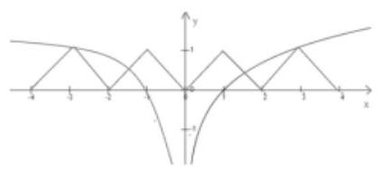

由图像可知,方程 $f\left( x\right)  = {\log }_{3}\left| x\right|$ 有四个零点

所以选 C

## (二)函数的图像和零点

## 知识梳理

## 图像变换问题

注意:一切变换针对于变量本身

(1)平移变换:

i. 函数 $y = f\left( x\right)$ 的图象

函数 $y = f\left( {x + a}\right)$ 的图象;

函数 $y = f\left( x\right)  + b$ 的图象;

沿x轴方向伸缩为原来的

函数 $y = f\left( {k \cdot  x}\right)$ 的图象;

沿y轴方向伸缩为原来的k倍， 函数 $y = k \cdot  f\left( x\right)$ 的图象;

ii. 函数 $y = f\left( x\right)$ 的图象

(2)伸缩变换:

i. 函数 $y = f\left( x\right)$ 的图象

ii. 函数 $y = f\left( x\right)$ 的图象

(3)对称变换:

i. 函数 $y = f\left( x\right)$ 的图象

关于y轴对称函数 $y = f\left( {-x}\right)$ 的图象;

关于x轴对称

函数 $y =  - f\left( x\right)$ 的图象;

关于原点对称函数 $y =  - f\left( {-x}\right)$ 的图象;

ii. 函数 $y = f\left( x\right)$ 的图象

iii. 函数 $y = f\left( x\right)$ 的图象

(4)翻折:自变量 $y$ 加绝对值即把 $x$ 轴下方部分翻折到上方即可，自变量 $x$ 加绝对值需把 $y$ 轴左侧部分清除，并画出与右侧部分图像对称的图像.

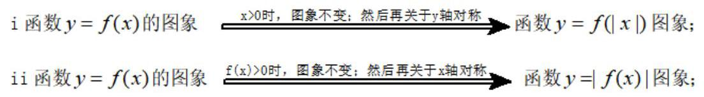

(5)顺序:针对于变量的运算，在变换过程中由外层运算向内层运算进行. 但注意，由于习惯把 $y$ 单独放在等式左边,所以针对于 $y$ 的变换如在右侧进行的话,规则相反.

如: $y = \left| {{2}^{\left| {{2x} - 1}\right|  + 3} - 2}\right|  + 3$ 可由函数

$y = {2}^{x}$ ___向左平移 3 $y = {2}^{x + 3}$ 将 $y$ 轴左侧图像换为与右侧对称图像 $\rightarrow$

$y = {2}^{\left| x\right|  + 3}$ ___向右平移 1 → $y = {2}^{\left| {x - 1}\right|  + 3}$ ___横坐标缩小一半 $\rightarrow  y = {2}^{\left| {{2x} - 1}\right|  + 3}$ (针对于 $x$ 的变换结束)

$y = {2}^{\left| {{2x} - 1}\right|  + 3}\xrightarrow[]{\text{ 向下平移 }2}y = {2}^{\left| {{2x} - 1}\right|  + 3} - 2\xrightarrow[]{\text{ 将 }x\text{ 轴下方图像翻上来 }}y = \left| {{2}^{\left| {{2x} - 1}\right|  + 3} - 2}\right| \xrightarrow[]{\text{ 向上平移 3 }}$

$y = \left| {{2}^{\left| {{2x} - 1}\right|  + 3} - 2}\right|  + 3$ (针对于 $y$ 的变换结束)

四、函数的零点: 对于函数 $y = f\left( x\right) \left( {x \in  D}\right)$ ,如果存在实数 $c\left( {c \in  D}\right)$ ,当 $x = c$ 时,

$f\left( c\right)  = 0$ ,那么就把 $x = c$ 叫做函数 $y = f\left( x\right) \left( {x \in  D}\right)$ 的零点. 注: 零点是数;

用二分法求零点的理论依据是:(零点定理)(请认真查阅课本学习求零点的精确度关于次数的问题)

①函数 $f\left( x\right)$ 在闭区间 $\left\lbrack  {a, b}\right\rbrack$ 上连续； ② $f\left( a\right)  \cdot  f\left( b\right)  < 0$

那么,一定存在 $c \in  \left( {a, b}\right)$ ,使得 $f\left( c\right)  = 0$ . (反之,未必)

## 例题精讲

【例 8】由 $y = \sqrt{x}$ 的图像,经过如何变换可得到下列函数的图像?

(1) $y = \sqrt{\left| x\right|  - 1}$ ; (2) $y = \sqrt{\left| x - 1\right| }$ .

【难度】

【答案】见解析

【解析】解: (1) $y = \sqrt{x}\xrightarrow[]{\text{ 向右 }1\text{ 个单位 }}y = \sqrt{x - 1}\xrightarrow[]{\text{ 对点 }}y = x$

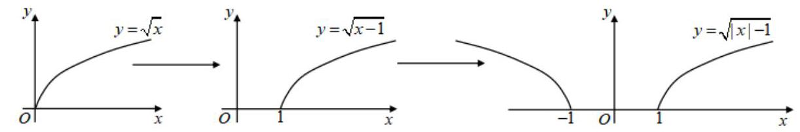

(2) $y = \sqrt{x}\xrightarrow[]{y\text{ 轴右边翻折 }}y = \sqrt{\left| x\right| }\xrightarrow[]{\text{ 向右 }}y = \sqrt{\left| x\right| }\xrightarrow[]{\text{ 向右 }}y = \sqrt{\left| x - 1\right| }$ .

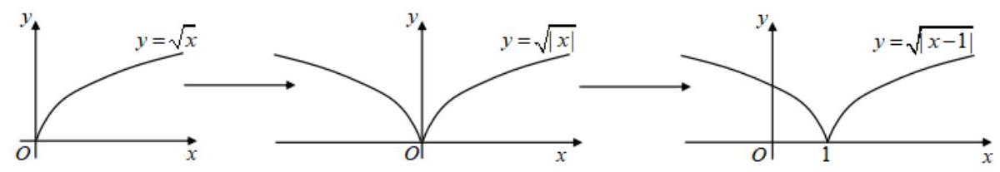

【例 9】( 1 )函数 $f\left( x\right)  = 3\left| x\right|  - {2}^{\left| x\right| } - 1$ 的大致象为( )

A.

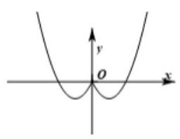

B.

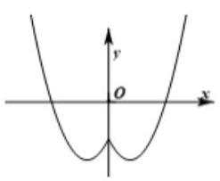

C.

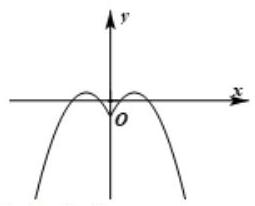

D.

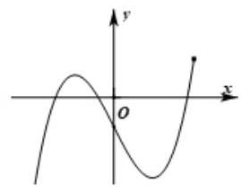

【难度】★★★

【答案】C

【解析】解: 根据题意可得函数 $f\left( x\right)  = 3\left| x\right|  - {2}^{\left| x\right| } - 1$ ,为偶函数,故排除 D; 又 $f\left( 0\right)  =  - {2}^{0} - 1 =  - 2$ ,故排除 A;

当 $x \geq  0$ 时, $f\left( x\right)  = {3x} - {2}^{x} - 1$ ,当 $x$ 趋于正无穷时,函数值趋于负无穷,故排除 B; 故选: $C$ .

(2)函数 $f\left( x\right)  = \lg \left( {\left| x\right|  - 1}\right)$ 的大致图像是( )

A.

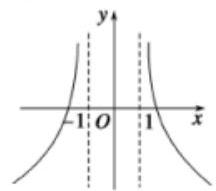

B.

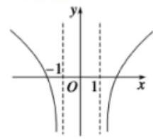

C.

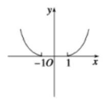

D.

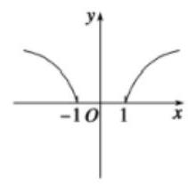

【难度】★★★

【答案】B

【解析】解: 由 $f\left( x\right)  = \lg \left( {\left| x\right|  - 1}\right)$ ,可得 $\left| x\right|  - 1 > 0$ ,可得 $x > 1$ 或 $x <  - 1$ ,排除 $C\text{ 、 }D$ , 同时可得 $f\left( {-x}\right)  = \lg \left( {\left| x\right|  - 1}\right)  = f\left( x\right)$ ， $f\left( x\right)$ 为偶函数，当 $x = {1.1}$ 时， $f\left( x\right)  < 0$ ，排除 A， 故选: B.

(3)函数 $f\left( x\right)  = \frac{1}{{2}^{x} - 1} + \frac{1}{2}$ 的大致图像为( )

A.

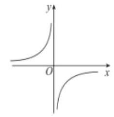

B.

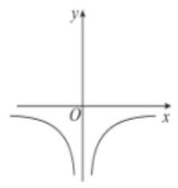

C.

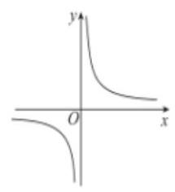

D.

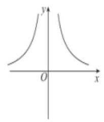

【难度】 $\star   \star   \star$

【答案】C

【解析】要使函数有意义,则 ${2}^{x} - 1 \neq  0$ 即 $x \neq  0$ . 函数定义域为 $\{ x \mid  x \neq  0\}$ ,所以定义域关于原点对称.

因为 $f\left( {-x}\right)  = \frac{1}{{2}^{-x} - 1} + \frac{1}{2} = \frac{{2}^{x}}{1 - {2}^{x}} + \frac{1}{2} =  - \frac{{2}^{x} - 1 + 1}{{2}^{x} - 1} + \frac{1}{2} =  - 1 - \frac{1}{{2}^{x} - 1} + \frac{1}{2}$

$=  - \frac{1}{{2}^{x} - 1} - \frac{1}{2} =  - f\left( x\right)$ ,所以 $f\left( x\right)  = \frac{1}{{2}^{x} - 1} + \frac{1}{2}$ 是奇函数,排除 $B, D$ ;

又 $f\left( 1\right)  = \frac{1}{{2}^{1} - 1} + \frac{1}{2} = \frac{3}{2} > 0$ 排除 $A$ . 故选:C.

【例 10】( 1 )要得到 $y = \lg \left( {3 - x}\right)$ 的图像，只需作 $y = \lg x$ 关于_________ 轴对称的图像，再向___平移 3 个单位而得到.

【难度】 $\star   \star$

【答案】 $y$ ; 右

(2)若函数 $f\left( x\right)  = \frac{{bx} - {ab} - 1}{x - a}$ 的图像(如右图)由 $y =  - \frac{1}{x}$ 图像平移所得，则 $a + b =$ ___.

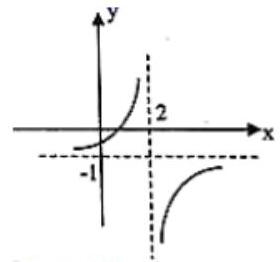

【难度】 $\star   \star$

【答案】 1

【解析】因为 $f\left( x\right)  = \frac{{bx} - {ab} - 1}{x - a} = b - \frac{1}{x - a}$ ,是由 $y =  - \frac{1}{x}$ 的图像向右平移 $a$ 个单位,向上平移 $b$ 个单位得到的,

又由图像可得: 函数 $f\left( x\right)  = \frac{{bx} - {ab} - 1}{x - a}$ 的图像是由 $y =  - \frac{1}{x}$ 的图像向右平移两个单位,向下平移一个单位得到,

因此 $\left\{  \begin{array}{l} a = 2 \\  b =  - 1 \end{array}\right.$ ,故 $a + b = 1$ . 故答案为: 1

(3)将曲线 $y = \lg x$ 向左平移 1 个单位，再向下平移两个单位得到曲线 $C$ ，如果曲线 ${C}_{1}$ 与 $C$ 关于原点对称， 曲线 ${C}_{2}$ 与 ${C}_{1}$ 关于直线 $y = x$ 对称，则曲线 ${C}_{2}$ 对应的函数解析式为___.

【难度】 $\star   \star   \star$

【答案】

【解析】解:由题意,曲线 $C$ 对应的函数解析式为 $y = \lg \left( {x + 1}\right)  - 2$ ;

${C}_{1}$ 与 $C$ 关于原点对称，因此 ${C}_{1}$ 对应的函数解析式为 $y =  - \lg \left( {-x + 1}\right)  + 2$ ;

由其存在反函数，因此曲线 ${C}_{2}$ 对应的函数是 $y =  - \lg \left( {-x + 1}\right)  + 2$ 的反函数，

$y =  - \lg \left( {x + 1}\right)  + 2$ 的值域为 $\mathbb{R},\lg \left( {-x + 1}\right)  = 2 - y \Leftrightarrow   - x + 1 = {10}^{2 - y} \Leftrightarrow  x = 1 - {10}^{2 - y}$ ,

因此 ${C}_{2}$ 对应的函数解析式为 $y = 1 - {10}^{2 - x}\left( {x \in  \mathbb{R}}\right)$ .

【例 11】关于函数 $f\left( x\right)  = \frac{\left| x\right| }{\parallel x\left| {-1}\right| }$ ,给出以下四个命题: (1) 当 $x > 0$ 时, $y = f\left( x\right)$ 单调递减且没有最值;

(2)方程 $f\left( x\right)  = {kx} + b\left( {k \neq  0}\right)$ 一定有实数解；(3)如果方程 $f\left( x\right)  = m$ ( $m$ 为常数)有解，则解得个数一定是偶数; (4) $y = f\left( x\right)$ 是偶函数且有最小值. 其中假命题的序号是___.

【难度】 $\star   \star   \star$

【答案】(1)、(3)

【解析】 $f\left( x\right)  = \frac{\left| x\right| }{\left| \right| x\left| {-1}\right| } = \left\{  \begin{array}{l} 1 + \frac{1}{x - 1}, x > 1 \\  \frac{1}{1 - x} - 1,0 \leq  x < 1 \\  \frac{1}{x + 1} - 1, - 1 < x < 0 \\  1 - \frac{1}{x + 1}, x <  - 1 \end{array}\right.$ ,它的图像如下图所示:

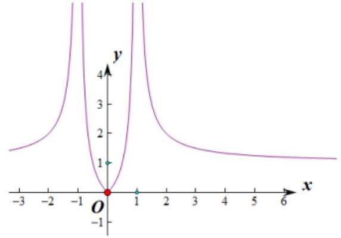

命题(1):当 $x > 0$ 时， $y = f\left( x\right)$ 在 $\left( {0,1}\right)$ 上单调递增，在 $\left( {1, + \infty }\right)$ 上单调递减且没有最值，故本命题是假命题；

命题(2):因为直线 $y = {kx} + b\left( {k \neq  0}\right)$ 存在斜率，所以 $f\left( x\right)  = {kx} + b\left( {k \neq  0}\right)$ 一定有实数解，故本命题是真命题;

命题(3): $f\left( {-x}\right)  = \frac{\left| -x\right| }{\left.\parallel  -x\left| -1\right| \right| } = \frac{\left| x\right| }{\left.\parallel  x\left| -1\right| \right| } = f\left( x\right) \left( {x \neq   \pm  1}\right)$ ，所以函数是偶函数，当 $f\left( x\right)  = m$ 有解时，若 $m \neq  0$ ， 该方程的解的个数为偶数; 若 $m = 0$ 时, $f\left( x\right)  = 0 \Rightarrow  x = 0$ ,只有一个解,故本命题是假命题;

命题(4):由(3)可知，函数 $y = f\left( x\right)$ 是偶函数，函数有最小值，最小值为零，故本命题是真命题. 故答案为:(1)、(3)

【例 12】(1) 根据表格中的数据,可以判定方程 ${e}^{x} - x - 2 = 0$ 的一个根所在的区间为( )

<table><tr><td>$x$</td><td>-1</td><td>0</td><td>1</td><td>2</td><td>3</td></tr><tr><td>${e}^{x}$</td><td>0.37</td><td>1</td><td>2.72</td><td>7.39</td><td>20.09</td></tr><tr><td>$x + 2$</td><td>1</td><td>2</td><td>3</td><td>4</td><td>5</td></tr></table>

A. $\left( {-1,0}\right)$ B. $\left( {0,1}\right)$ C. $\left( {1,2}\right)$ D. $\left( {2,3}\right)$

【难度】★★

【答案】C

【解析】解: 令 $f\left( x\right)  = {e}^{x} - x - 2$ ,由图表知, $f\left( 1\right)  = {2.72} - 3 =  - {0.28} < 0, f\left( 2\right)  = {7.39} - 4 = {3.39} > 0$ , 方程 ${e}^{x} - x - 2 = 0$ 的一个根所在的区间为 $\left( {1,2}\right)$ ,故选: $C$ .

(2)函数 $f\left( x\right)  = \frac{3}{x} - \ln x$ 的零点所在的大致区间是( )

A. $\left( {1,2}\right)$ B. $\left( {2,3}\right)$ C. $\left( {3,4}\right)$ D. $\left( {e, + \infty }\right)$

【难度】★★

【答案】B

【解析】解: :-函数 $f\left( x\right)  = \frac{3}{x} - \ln x$ 满足 $f\left( 2\right)  = \frac{3}{2} - \ln 2 > 0, f\left( 3\right)  = 1 - \ln 3 < 0,\therefore f\left( 2\right)  \cdot  f\left( 3\right)  < 0$ , 根据函数的零点的判定定理可得函数 $f\left( x\right)  = \frac{3}{x} - \ln x$ 的零点所在的大致区间是 $\left( {2,3}\right)$ ,

故选: $B$ .

【例13】(1) 已知函数 $f\left( x\right)  = \sin x - \sin {3x}, x \in  \left\lbrack  {0,{2\pi }}\right\rbrack$ ，则函数 $f\left( x\right)$ 的所有零点之和等于( )

A. 0 B. ${3\pi }$ C. ${5\pi }$ D. ${7\pi }$

【难度】★★★

【答案】D

【解析】

解: $f\left( x\right)  = \sin x - \sin {3x} = \sin x - \left( {\sin x\cos {2x} + \cos x\sin {2x}}\right)  = \sin x - \left( {\sin x\cos {2x} + 2\sin x\cos x\cos x}\right)$

$= \sin x - \sin x\left( {\cos {2x} + 2{\cos }^{2}x}\right)  = \sin x\left( {1 - \cos {2x} - 2{\cos }^{2}x}\right)  = \sin x\left( {-\cos {2x} - \cos {2x}}\right)  =  - 2\sin x\cos {2x}$ ,

由 $f\left( x\right)  = 0$ ,得 $\sin x = 0$ 或 $\cos {2x} = 0$ ,由 $\sin x = 0$ 得 $x = {k\pi }, k \in  Z$ ,

$\because x \in  \left\lbrack  {0,{2\pi }}\right\rbrack  ,\therefore x = 0$ 或 $x = \pi$ 或 $x = {2\pi }$ ,由 $\cos {2x} = 0$ 得 ${2x} = {k\pi } + \frac{\pi }{2} = \frac{{2k\pi } + \pi }{2}, k \in  Z$ ,即 $x = \frac{{2k\pi } + \pi }{4}$ , $\because x \in  \left\lbrack  {0,{2\pi }}\right\rbrack  ,\therefore x = \frac{\pi }{4}$ 或 $x = \frac{3\pi }{4}$ 或 $x = \frac{5\pi }{4}$ 或 $x = \frac{7\pi }{4}$ ,则所有零点之和为 $0 + \pi  + {2\pi } + \frac{\pi }{4} + \frac{3\pi }{4} + \frac{5\pi }{4} + \frac{7\pi }{4} = {7\pi }$ , 故选: $D$ .

(2) 已知定义在 $\mathbb{R}$ 上的函数 $y = f\left( x\right)$ 满足 $f\left( {3 + x}\right)  = f\left( {3 - x}\right)$ ,若函数 $y = f\left( x\right)$ 恰有四个零点,则这四个零点的和为___.

【难度】★★★

【答案】 12

【解析】解: 不妨设这四个零点自小到大分别为 ${x}_{1},{x}_{2},{x}_{3},{x}_{4}$ ,在数轴上 ${x}_{1},{x}_{4}$ 关于 3 对称,故 ${x}_{1} + {x}_{4} = 2 \times  3 = 6,$

同理， ${x}_{2} + {x}_{3} = 6$ ；故 ${x}_{1} + {x}_{2} + {x}_{3} + {x}_{4} = {12}$ .

【例 14】(1) 若函数 $f\left( x\right)  = {2}^{\left| x - 3\right| } - {\log }_{a}x + 1$ 无零点，则 $a$ 的取值范围为___.

【难度】

【答案】 $\left( {\sqrt{3}, + \infty }\right)$

【解析】略

(2)已知函数 $f\left( x\right)  = \min \left\{  {1 + \frac{4}{x},{\log }_{2}x}\right\}$ ,若函数 $g\left( x\right)  = f\left( x\right)  - k$ 恰有两个零点,则 $k$ 的取值范围为___.

【难度】 $\star   \star   \star$

【答案】 $\left( {1,2}\right)$

【解析】解设 $y = 1 + \frac{4}{x}, y = {\log }_{2}x$ ,则 $y = 1 + \frac{4}{x}$ 在 $\left( {0, + \infty }\right)$ 上为减函数, $y = {\log }_{2}x$ 在 $\left( {0, + \infty }\right)$ 上为增函数,

当 $x = 4$ 时, $y = 1 + \frac{4}{x} = 1 + 1 = 2, y = {\log }_{2}4 = 2$ ,此时两个函数值相等,

当 $0 < x \leq  4$ 时, ${\log }_{2}x \leq  1 + \frac{4}{x}$ ,此时 $f\left( x\right)  = {\log }_{2}x \in  ( - \infty ,2\rbrack$ ,

当 $x > 4$ 时, ${\log }_{2}x > 1 + \frac{4}{x}$ ,此时 $f\left( x\right)  = 1 + \frac{4}{x} \in  \left( {1,2}\right)$ ,即函数 $f\left( x\right)  = \min \left\{  {1 + \frac{4}{x},{\log }_{2}x}\right\}   = \left\{  \begin{array}{l} {\log }_{2}x, x \in  (0.4\rbrack \\  1 + \frac{4}{x}, x \in  \left( {4, + \infty }\right)  \end{array}\right.$ . 若函数 $g\left( x\right)  = f\left( x\right)  - k$ 恰有两个零点,则 $g\left( x\right)  = f\left( x\right)  - k = 0$ ,即 $f\left( x\right)  = k$ ,恰有两个根,

作出函数 $f\left( x\right)$ 与 $y = k$ 的图象,由图象知若两个图象有两个不同的交点,则 $1 < k < 2$ ,

故实数 $k$ 的取值范围是 $\left( {1,2}\right)$ ,

故答案为: $\left( {1,2}\right)$ .

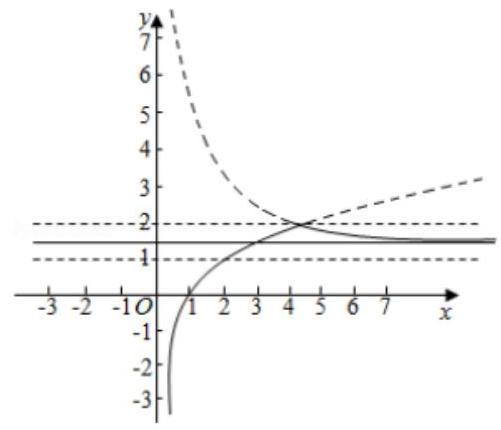

(3)已知函数 $f\left( x\right)  = {2x}\left| {x + a}\right|  - 1$ 有三个不同的零点，则实数 $a$ 的取值范围为___.

【难度】 $\star   \star   \star$

【答案】 $\left( {-\infty , - \sqrt{2}}\right)$

【解析】解: 由 $f\left( x\right)  = 0$ 可得 ${2x}\left| {x + a}\right|  - 1 = 0$ ,即 $\left| {x + a}\right|  = \frac{1}{2x}$ 有三个正根,可得 $a =  - x + \frac{1}{2x}$ 或 $a =  - x - \frac{1}{2x}$ , 由 $x > 0, y =  - x + \frac{1}{2x}$ 递减,可得方程 $a =  - x + \frac{1}{2x}$ 有一解;

由 $y =  - x - \frac{1}{2x} \leq   - 2\sqrt{x \cdot  \frac{1}{2x}} =  - \sqrt{2},\left( {x = \frac{\sqrt{2}}{2}}\right.$ 时取得等号),可得 $a <  - \sqrt{2}$ 时, $a =  - x - \frac{1}{2x}$ 有两个正根,

综上可得 $a$ 的范围是 $\left( {-\infty , - \sqrt{2}}\right)$ . 故答案为: $\left( {-\infty , - \sqrt{2}}\right)$ .

也可以用图像相切的临界点去做.

## 巩固训练

1、函数 $f\left( x\right)  = \left| x\right|  + \frac{a}{x}$ (其中 $a \in  R$ ) 的图像不可能是( )

A.

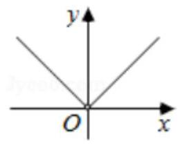

B.

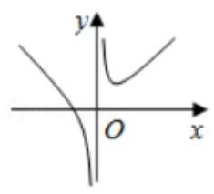

C.

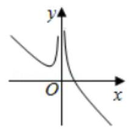

D.

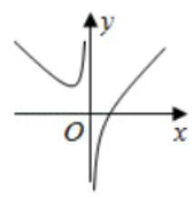

【难度】★★

【答案】 $C$

【解析】解: 当 $a = 0$ 时, $f\left( x\right)  = \left| x\right|$ ,且 $x \neq  0$ ,故 $A$ 符合,

当 $x > 0$ 时,且 $a > 0$ 时, $f\left( x\right)  = x + \frac{a}{x} \geq  2\sqrt{a}$ ,当 $x < 0$ 时,且 $a > 0$ 时, $f\left( x\right)  =  - x + \frac{a}{x}$ 在 $\left( {-\infty ,0}\right)$ 上为减函数,

故 $B$ 符合，

当 $x < 0$ 时，且 $a < 0$ 时， $f\left( x\right)  =  - x + \frac{a}{x} \geq  2\sqrt{-x \cdot  \frac{a}{x}} = 2\sqrt{-a}$ ，当 $x > 0$ 时，且 $a < 0$ 时， $f\left( x\right)  = x + \frac{a}{x}$ 在 $\left( {0, + \infty }\right)$ 上为增函数，故 $D$ 符合，

故选: $C$ .

2、已知函数 $y = f\left( x\right)$ 是偶函数， $y = g\left( x\right)$ 的奇函数，它们的定义域为 $\left\lbrack  {-\pi ,\pi }\right\rbrack$ ，且它们在 $x \in  \left\lbrack  {0,\pi }\right\rbrack$ 上的图像如图所示，则不等式 $\frac{f\left( x\right) }{g\left( x\right) } > 0$ 的解集为___.

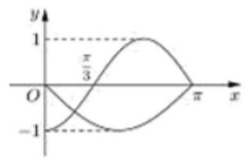

【难度】 $\star   \star$

【答案】 $\left( {-\pi , - \frac{\pi }{3}}\right)  \cup  \left( {0,\frac{\pi }{3}}\right)$ .

【解析】解: $x \in  \left\lbrack  {0,\pi }\right\rbrack$ ,由不等式 $\frac{f\left( x\right) }{g\left( x\right) } > 0$ ,可知 $f\left( x\right) , g\left( x\right)$ 的函数值同号,即 $f\left( x\right) g\left( x\right)  > 0$ . 根据图像可知,当 $x > 0$ 时,其解集为: $\left( {0,\frac{\pi }{3}}\right)$ ,

$\because y = f\left( x\right)$ 是偶函数, $y = g\left( x\right)$ 是奇函数, $\therefore f\left( x\right) g\left( x\right)$ 是奇函数,

$\therefore$ 当 $x < 0$ 时, $f\left( x\right) g\left( x\right)  > 0$ 的解集为: $\left( {-\pi , - \frac{\pi }{3}}\right)$ ,

综上: 不等式 $\frac{f\left( x\right) }{g\left( x\right) } > 0$ 的解集是 $\left( {-\pi , - \frac{\pi }{3}}\right)  \cup  \left( {0,\frac{\pi }{3}}\right)$ ,故答案为 $\left( {-\pi , - \frac{\pi }{3}}\right)  \cup  \left( {0,\frac{\pi }{3}}\right)$ .

3、若函数 $y = f\left( {{2x} - 1}\right)  + 1$ 的图像按向量 $\overrightarrow{a}$ 平移后的函数解析式为 $y = f\left( {{2x} + 1}\right)  - 1$ ，则向量 $\overrightarrow{a}$ 等于( ) A. $\left( {1,2}\right)$ B. $\left( {-1,2}\right)$ C. $\left( {-1, - 2}\right)$ D. $\left( {1, - 2}\right)$

【难度】 $\bigstar \bigstar \bigstar$

【答案】C

【解析】设向量 $\overrightarrow{a} = \left( {h, k}\right) ,\because y = f\left( {{2x} - 1}\right)  + 1$

$\therefore y = f\left\lbrack  {2\left( {x - h}\right)  - 1}\right\rbrack   + 1 + k = f\left( {{2x} + 1}\right)  - 1$ ,

$\therefore h =  - 1, k =  - 2.\therefore \overrightarrow{a} = \left( {-1, - 2}\right)$

故选 C.

4、设 $f\left( x\right)  =  - {\log }_{2}x, g\left( x\right)$ 的图像与 $f\left( x\right)$ 的图像关于直线 $y = x$ 对称, $h\left( x\right)$ 的图像由 $g\left( x\right)$ 的图像向左平移 1 个单位得到，则 $h\left( x\right)  =$ ___.

【难度】 $\star   \star   \star$

【答案】 ${\left( \frac{1}{2}\right) }^{x + 1}$

【解析】: $f\left( x\right)  =  - {\log }_{2}x = {\log }_{\frac{1}{2}}x$ ; 根据 $g\left( x\right)$ 的图像与 $f\left( x\right)$ 的图像关于直线 $y = x$ 对称

$\therefore g\left( x\right)  = {\left( \frac{1}{2}\right) }^{x},\because h\left( x\right)$ 的图像由 $g\left( x\right)$ 的图像向左平移 1 个单位得到

根据函数的左加右减可得: $h\left( x\right)  = {\left( \frac{1}{2}\right) }^{x + 1}$ ; 故答案为: $h\left( x\right)  = {\left( \frac{1}{2}\right) }^{x + 1}$ .

5、在平面直角坐标系中，若点 $M, N$ 满足:①点 $M, N$ 都在函数 $f\left( x\right)$ 的图像上；②点 $M, N$ 关于原点对称， 则称点 $M, N$ 是函数 $f\left( x\right)$ 的一对“靓点”. 已知函数 $f\left( x\right)  = \left\{  \begin{array}{l} {3}^{x}, x \leq  0 \\  x - 3, x > 0 \end{array}\right.$ ,则函数 $f\left( x\right)$ 有___对“靓点”.

【难度】★★★

【答案】1

【解析】解: 作出 $f\left( x\right)  = \left\{  \begin{array}{l} {3}^{x}, x \leq  0 \\  x - 3, x > 0 \end{array}\right.$ 的图像,然后作出 $y = x - 3\left( {x > 0}\right)$ 的图像关于原点的对称图像, 可以发现其与 $y = {3}^{x}\left( {x \leq  0}\right)$ 的图像只有 1 个交点.结合定义,可知函数 $f\left( x\right)$ 有 1 对 “靓点”

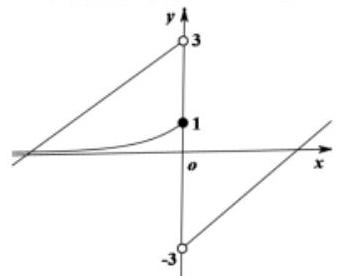

## 故答案为: 1

6、若函数 $y = f\left( x\right) \left( {x \in  R}\right)$ 满足 $f\left( {x + 2}\right)  = f\left( x\right)$ ,且 $x \in  \left( {-1,1}\right\rbrack$ 时, $f\left( x\right)  = \left| x\right|$ . 则函数 $y = f\left( x\right)$ 的图象与函数 $y = {\log }_{4}\left| x\right|$ 的图象的交点的个数为( )

A. 3 B. 4 C. 6 D. 8

【难度】★★★

【答案】 $C$

【解析】解: 由题意知,函数 $y = f\left( x\right)$ 是个周期为 2 的周期函数,且是个偶函数,在一个周期 $( - 1,1\rbrack$ 上, 图象是 2 条斜率分别为 1 和 -1 的线段,且 $0 \leq  f\left( x\right)  \leq  1$ ,同理得到在其他周期上的图象.

函数 $y = {\log }_{4}\left| x\right|$ 也是个偶函数,先看他们在 $\lbrack 0, + \infty )$ 上的交点个数,

则它们总的交点个数是在 $\lbrack 0, + \infty )$ 上的交点个数的 2 倍(若 $x = 0$ 处有交点,则另议),

在 $\left( {0, + \infty }\right)$ 上, $y = {\log }_{4}\left| x\right|  = {\log }_{4}x$ ,图象过 $\left( {1,0}\right)$ ,和 $\left( {4,1}\right)$ ,是单调增函数,与 $f\left( x\right)$ 交于 3 个不同点,

$\therefore$ 函数 $y = f\left( x\right)$ 的图象与函数 $y = {\log }_{4}\left| x\right|$ 的图象的交点个数是 6 个.

故选: $C$ .

7、已知 $m$ 是函数 $f\left( x\right)  = \sqrt{x} - {2}^{x} + 2$ 的零点,则实数 $m \in$ (   )

A. $\left( {0,1}\right)$ B. $\left( {1,2}\right)$ C. $\left( {2,3}\right)$ D. $\left( {3,4}\right)$

【难度】 $\star   \star   \star$

【答案】B

【解析】解: 由 $f\left( x\right)  = \sqrt{x} - {2}^{x} + 2 = 0$ 可得, $\sqrt{x} + 2 = {2}^{x}$ ,

结合幂函数及指数函数的性质可知,当 $x$ 无限增加时,指数函数爆炸式增加,当 $0 < x < 1$ 时, $f\left( x\right)  > 0$ 恒成立,没有零点,因为 $f\left( 1\right)  = 1 > 0, f\left( 2\right)  = \sqrt{2} - 2 < 0$ ,故在 $\left( {1,2}\right)$ 上有零点,

结合图象可知,当 $x > 2$ 时, $\sqrt{x} + 2 < {2}^{x}$ 即 $y = \sqrt{x} + 2$ 恒在 $y = {2}^{x}$ 的下方. 故 $m \in  \left( {1,2}\right)$ .

故选: $B$ .

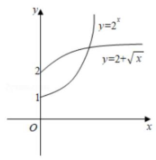

8、函数 $y = \frac{1}{1 - x}$ 的图像与函数 $y = 2\sin {\pi x}\left( {-2 \leq  x \leq  4}\right)$ 的图像所有交点的横坐标之和等于___

【难度】 $\star   \star   \star$

【答案】 8

【解析】略

9、函数 $f\left( x\right)  = \left\{  \begin{array}{l} \left| {{x}^{2} + {2x} - 1}\right| \left( {x \leq  0}\right) \\  {2}^{x - 1} + a\;\left( {x > 0}\right)  \end{array}\right.$ 有两个不同的零点,则实数 $a$ 的取值范围是为___

【难度】★★★

【答案】 $a <  - \frac{1}{2}$

【解析】略

10、已知偶函数 $f\left( x\right)$ 满足 $f\left( {1 + x}\right)  = f\left( {1 - x}\right)$ ,且当 $x \in  \left\lbrack  {0,1}\right\rbrack$ 时, $f\left( x\right)  = {2}^{x} - 1$ ,若函数 $y = f\left( x\right)  - {kx}\left( {k > 0}\right)$ 有六个零点，则( )

A. $k = \frac{1}{5}$ B. $k \in  \left( {\frac{1}{7},\frac{1}{5}}\right)$ C. $k \in  \left( {\frac{1}{5},\frac{1}{3}}\right)$ D. $k = \frac{1}{7}$

【难度】 $\star   \star   \star   \star$

【答案】B

【解析】解: 由题意: $f\left( x\right)$ 为偶函数,故 $f\left( x\right)  = f\left( {-x}\right)$ ,且 $f\left( {1 + x}\right)  = f\left( {1 - x}\right)$ ,

故可得: $f\left( {2 + x}\right)  = f\left\lbrack  {1 - \left( {1 + x}\right) }\right\rbrack   = f\left( {-x}\right)  = f\left( x\right) ,\;f\left( x\right)$ 为周期函数且 $T = 2$ ,

由 $x \in  \left\lbrack  {0,1}\right\rbrack$ 时, $f\left( x\right)  = {2}^{x} - 1$ ,作出函数 $y = f\left( x\right)$ 与 $y = {kx}$ 的图像,如图

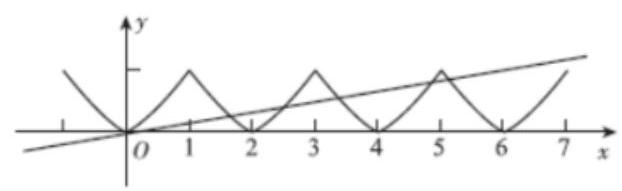

函数 $y = f\left( x\right)  - {kx}\left( {k > 0}\right)$ 有六个零点，当两图像在区间 $\left( {5,7}\right)$ 上有一个交点时满足条件，

故可得: $\left\{  \begin{array}{l} f\left( 5\right)  - {5k} > 0 \\  f\left( 7\right)  - {7k} < 0 \end{array}\right.$ ,可得 $\left\{  {\begin{array}{l} 1 - {5k} > 0 \\  1 - {7k} < 0 \end{array},\frac{1}{7} < k < \frac{1}{5}}\right.$ ,所以 $k \in  \left( {\frac{1}{7},\frac{1}{5}}\right)$ .

故选: B.

## 实战演练

一、填空题

1、已知 $x = 3$ 是函数 $f\left( x\right)  = {\log }_{2}\left( {{ax} + 1}\right)  - {2x}$ 的零点，则 $a =$ ___.

【难度】★★

【答案】 21

【解析】解: 根据题意, $x = 3$ 是函数 $f\left( x\right)  = {\log }_{2}\left( {{ax} + 1}\right)  - {2x}$ 的零点,

则 $f\left( 3\right)  = {\log }_{2}\left( {{3a} + 1}\right)  - 6 = 0$ ,解可得 $a = {21}$ ; 故答案为: 21 .

2、已知 $f\left( {x + 1}\right)$ 是偶函数，则函数 $y = f\left( {2x}\right)$ 的图象的对称轴方程是___.

【难度】 $\star   \star$

【答案】 $x = \frac{1}{2}$

3、已知函数 $f\left( x\right)$ 满足 $f\left( {x + 4}\right)  = f\left( x\right) \left( {x \in  R}\right)$ ，且在区间 $( - 2,2\rbrack$ 上， $f\left( x\right)  = \left\{  \begin{array}{l} \left| {x + 1}\right| , - 2 < x \leq  0 \\  \cos \frac{\pi x}{2},0 < x \leq  2 \end{array}\right.$ ，则 $f\left( {f\left( {2021}\right) }\right)$ 的值为___.

【难度】 $\star   \star   \star$

【答案】 1

【解析】解: 由 $f\left( {x + 4}\right)  = f\left( x\right)$ 得函数是周期为 4 的周期函数,则 $f\left( {2021}\right)  = f\left( {{505} \times  4 + 1}\right)  = f\left( 1\right)  = \cos \frac{\pi }{2} = 0$ , $f\left( 0\right)  = \left| {0 + 1}\right|  = 1$ ,即 $f\left( {f\left( {2021}\right) }\right)  = 1$ . 故答案为: 1 .

4、已知函数 $f\left( x\right)  = \left\{  \begin{array}{l} {x}^{2} + 1, x \geq  2 \\  f\left( {x + 3}\right) , x < 2 \end{array}\right.$ ,则 $f\left( x\right)$ 在区间 $\left( {-\infty ,2}\right)$ 上的最小值是___.

【难度】 $\star   \star   \star$

【答案】 5

【解析】当 $x \in  \lbrack  - 1,2)$ 时,有 $x + 3 \in  \lbrack 2,5)$ . 又 $x < 2$ 时, $f\left( x\right)  = f\left( {x + 3}\right)$ .

所以当 $x \in  \lbrack  - 1,2)$ 与 $x \in  \lbrack 2,5)$ 时有相同的最小值,而 $x \in  \lbrack 2,5)$ 时, $f\left( x\right)  = {x}^{2} + 1$ ,最小值为 5 .

当 $x < 2$ 时, $f\left( x\right)  = f\left( {x + 3}\right)$ ,所以在区间 $\left( {-\infty ,2}\right)$ 上的最小值是 5 .

故答案为: 5 .

5、 $f\left( x\right)$ 是定义域为 $R$ 的偶函数，对 $\forall x \in  R$ ，都有 $f\left( {x + 4}\right)  = f\left( {-x}\right)$ ，当 $0 \leq  x \leq  2$ 时， $f\left( x\right)  = \left\{  \begin{array}{l} {2}^{x} - 1,0 \leq  x < 1, \\  {\log }_{2}x + 1,1 \leq  x \leq  2 \end{array}\right.$ ， 则 $f\left( {-\frac{9}{2}}\right)  + f\left( {21}\right)  =$ ___.

【难度】 $\star   \star   \star$

【答案】 $\sqrt{2}$

【解析】解: 根据题意, $f\left( x\right)$ 是定义域为 $R$ 的偶函数,对 $\forall x \in  R$ ,都有 $f\left( {x + 4}\right)  = f\left( {-x}\right)$ ,

则有 $f\left( {x + 4}\right)  = f\left( x\right)$ ,即函数 $f\left( x\right)$ 是周期为 4 的周期函数,

则有 $f\left( {-\frac{9}{2}}\right)  = f\left( \frac{9}{2}\right)  = f\left( {4 + \frac{1}{2}}\right)  = f\left( \frac{1}{2}\right) , f\left( {21}\right)  = f\left( {1 + 4 \times  5}\right)  = f\left( 1\right)$ ,

又由当 $0 \leq  x \leq  2$ 时, $f\left( x\right)  = \left\{  \begin{array}{l} {2}^{x} - 1,0 \leq  x < 1 \\  {\log }_{2}x + 1,1 \leq  x \leq  2 \end{array}\right.$ ,

则 $f\left( \frac{1}{2}\right)  = \sqrt{2} - 1, f\left( 1\right)  = 1$ ,则 $f\left( {-\frac{9}{2}}\right)  + f\left( {21}\right)  = f\left( \frac{1}{2}\right)  + f\left( 1\right)  = \left( {\sqrt{2} - 1}\right)  + 1 = \sqrt{2}$ ; 故答案为: $\sqrt{2}$ .

6、已知 $f\left( x\right)$ 是最小正周期为 2 的函数,当 $x \in  ( - 1,1\rbrack$ 时, $f\left( x\right)  = \sqrt{1 - {x}^{2}}$ ,若在区间 $(3,5\rbrack$ 上 $y = f\left( x\right)  - {ax}$ 有两个零点，则实数 $a$ 的取值范围是___.

【难度】 $\star   \star   \star   \star$

【答案】 $0 < a < \frac{\sqrt{15}}{15}$

【解析】解: 因为 $f\left( x\right)$ 是最小正周期为 2 的函数,所以当 $x \in  (3,5\rbrack$ 时, $x - 4 \in  ( - 1,1\rbrack$ ,

所以 $f\left( x\right)  = f\left( {x - 4}\right)  = \sqrt{1 - {\left( x - 4\right) }^{2}}$ ,即 ${\left( x - 4\right) }^{2} + {y}^{2} = 1,\left( {y \geq  0}\right)$ ,表示以 $\left( {4,0}\right)$ 为圆心,半径为 1 的上半圆. 当直线 $y = {ax}\left( {a > 0}\right)$ 与圆相切时,得圆心到直线 ${ax} - y = 0$ 的距离 $d = \frac{\left| 4a\right| }{\sqrt{{a}^{2} + 1}} = 1$ ,即 ${a}^{2} = \frac{1}{15}$ ,解得 $a = \frac{\sqrt{15}}{15}$ , 所以要使在区间 $(3,5\rbrack$ 上 $f\left( x\right)  = {ax}$ 有两个不相等的实数根,则 $0 < a < \frac{\sqrt{15}}{15}$ .

故答案为: $0 < a < \frac{\sqrt{15}}{15}$ .

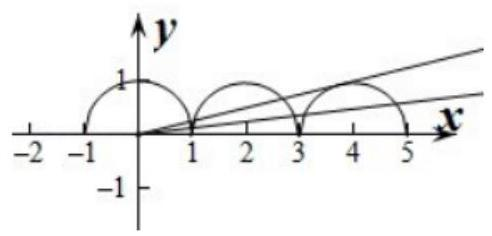

## 二、选择题

7、 $f\left( x\right)$ 对于任意实数 $x$ 满足条件 $f\left( {x + 2}\right)  = \frac{1}{f\left( x\right) }$ ，若 $f\left( 1\right)  =  - 5$ ，则 $f\left( {f\left( 5\right) }\right)  =$ (   )

A. -5

B. $- \frac{1}{5}$ C. $\frac{1}{5}$ D. 5

【难度】★★

【答案】B

【解析】解: $\because f\left( {x + 2}\right)  = \frac{1}{f\left( x\right) },\therefore f\left( {x + 2 + 2}\right)  = \frac{1}{f\left( {x + 2}\right) } = f\left( x\right) ,\therefore f\left( x\right)$ 是以 4 为周期的函数

$\therefore f\left( 5\right)  = f\left( {1 + 4}\right)  = f\left( 1\right)  =  - 5, f\left( {f\left( 5\right) }\right)  = f\left( {-5}\right)  = f\left( {-5 + 4}\right)  = f\left( {-1}\right)$

又 $\because f\left( {-1}\right)  = \frac{1}{f\left( {-1 + 2}\right) } = \frac{1}{f\left( 1\right) } =  - \frac{1}{5},\therefore f\left( {f\left( 5\right) }\right)  =  - \frac{1}{5}$ ,故选: $B$ .

8、函数 $f\left( x\right)  = \sqrt{x + 1} - {x}^{2}$ 的零点的个数是( )

A. 0 B. 1 C. 2 D. 3

【难度】★★★

【答案】 $C$

【解析】解: 函数 $f\left( x\right)  = \sqrt{x + 1} - {x}^{2}$ 的零点个数等价于函数 $y = \sqrt{x + 1}$ 与 $y = {x}^{2}$ 图像的交点个数, 作出这两个函数的图像如图:

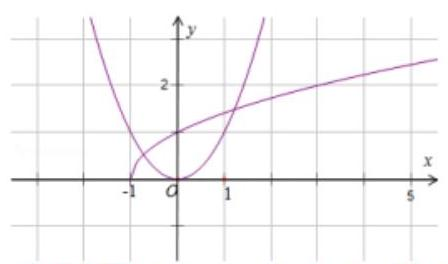

根据图像可知，共 2 个交点，故函数共 2 个根，故选: $C$ .

9、已知函数 $y = f\left( x\right)$ ，对任意 $x \in  R$ ，都有 $f\left( {x + 2}\right)  \cdot  f\left( x\right)  = k$ ( $k$ 为常数)，且当 $x \in  \left\lbrack  {0,2}\right\rbrack$ 时， $f\left( x\right)  = {x}^{2} + 1$ ， 则 $f\left( {2021}\right)  =$ (   )

A. 1 B. 2 C. 4 D. 5

【难度】 $\star   \star   \star$

【答案】B

【解析】解: 因为对任意 $x \in  R$ ,都有 $f\left( {x + 2}\right)  \cdot  f\left( x\right)  = k$ 为常数,

所以 $f\left( {x + 4}\right)  \cdot  f\left( {x + 2}\right)  = k$ ,从而 $f\left( {x + 4}\right)  = f\left( x\right)$ ,即 $f\left( x\right)$ 的周期为 4,

所以 $f\left( {2021}\right)  = f\left( 1\right)  = 2$ ,故答案为: $\mathbf{B}$ .

10、设奇函数 $f\left( x\right)$ 的定义域为实数集 $R$ ,且满足 $f\left( {x + 1}\right)  = f\left( {x - 1}\right)$ ,当 $x \in  \lbrack 0,1)$ 时, $f\left( x\right)  = {2}^{x} - 1$ . 则 $f\left( 0\right)  + f\left( \frac{1}{2}\right)  + f\left( 1\right)  + f\left( \frac{3}{2}\right)  + f\left( 2\right)  + f\left( \frac{5}{2}\right)$ 的值为 ( )

A. $\sqrt{2} + 1$ B. $\sqrt{2} - 1$ C. 0 D. $1 - \sqrt{2}$

【难度】 $\star   \star   \star   \star$

【答案】B

【解析】解: $\because f\left( {x + 1}\right)  = f\left( {x - 1}\right) ,\therefore f\left( {x + 2}\right)  = f\left( x\right)$ 则 $f\left( x\right)$ 是周期为 2 的周期函数

$\because f\left( 1\right)  = f\left( {-1}\right)  =  - f\left( 1\right) \therefore f\left( 1\right)  = 0$

$f\left( 0\right)  + f\left( \frac{1}{2}\right)  + f\left( 1\right)  + f\left( \frac{3}{2}\right)  + f\left( 2\right)  + f\left( \frac{5}{2}\right)  = f\left( 0\right)  + f\left( \frac{1}{2}\right)  + f\left( 1\right)  - f\left( \frac{1}{2}\right)  + f\left( 0\right)  + f\left( \frac{1}{2}\right)  = 0 + \sqrt{2} - 1 = \sqrt{2} - 1$ 故选: $B$ .

## 三、解答题

11、已知函数 $f\left( x\right)  = {x}^{2} - 2\left| {x - a}\right|  - 3\left( {x \in  R}\right)$ ,且 $f\left( x\right)$ 是偶函数.

(1) 求 $a$ 的值:

(2)画出 $y = f\left( x\right)$ 的图像，并指出其单调区间；

(3)若关于 $x$ 的方程 $f\left( x\right)  + {2m} = 0$ 有实数解，求 $m$ 的取值范围.

【难度】 $\star   \star   \star$

【答案】(1) $a = 0$ ；(2)见解析；(3) $m \leq  2$ .

【解析】(1) $\because f\left( x\right)$ 是偶函数, $\therefore f\left( {-1}\right)  = f\left( 1\right)  \Rightarrow  4 - 2\left| {-2 - a}\right|  - 3 = 4 - 2\left| {2 - a}\right|  - 3 \Rightarrow  a = 0$ .

此时 $f\left( x\right)  = {x}^{2} - 2\left| x\right|  - 3$ ,满足 $f\left( {-x}\right)  = f\left( x\right) ,\therefore a = 0$ .

(2) $\because f\left( x\right)  = {x}^{2} - 2\left| x\right|  - 3 = \left\{  \begin{array}{l} {x}^{2} - {2x} - 3, x \geq  0, \\  {x}^{2} + {2x} - 3, x < 0, \end{array}\right.$ ，图像如图所示:

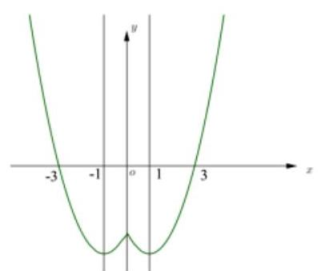

在 $\left( {-\infty , - 1}\right) ,\left( {0,1}\right)$ 单调递减; 在 $\left( {-1,0}\right) ,\left( {1, + \infty }\right)$ 单调递增;

(3)方程 $f\left( x\right)  + {2m} = 0$ 有实数解 $\Leftrightarrow  y = f\left( x\right)$ 与 $y =  - {2m}$ 有交点，

由(2)得 $y = f\left( x\right)  \in  \lbrack  - 4, + \infty ) \Rightarrow   - {2m} \geq   - 4 \Rightarrow  m \leq  2$ .

12、已知函数 $y = f\left( x\right)$ 是定义在 $R$ 上的周期函数,周期为 5,函数 $y = f\left( x\right) \left( {-1 \leq  x \leq  1}\right)$ 是奇函数,又知 $y = f\left( x\right)$ 在 $\left\lbrack  {0,1}\right\rbrack$ 上是一次函数,在 $\left\lbrack  {1,4}\right\rbrack$ 上是二次函数,且在 $x = 2$ 时函数取得最小值 -5,

(1)求 $f\left( 1\right)  + f\left( 4\right)$ 的值；

(2)求 $y = f\left( x\right) , x \in  \left\lbrack  {1,4}\right\rbrack$ 上的解析式；

(3)求 $y = f\left( x\right)$ 在 $\left\lbrack  {4,9}\right\rbrack$ 上的解析式，并求函数 $y = f\left( x\right)$ 的最大值与最小值.

【难度】 $\star   \star   \star   \star$

【答案】见解析

【解析】解: (1) 函数 $y = f\left( x\right)$ 是定义在 $R$ 上的周期函数, $T = 5$ ,所以 $f\left( 4\right)  = f\left( {-1}\right) ,\ldots$ (2 分)

而函数 $y = f\left( x\right)$ 在区间 $\left\lbrack  {-1,1}\right\rbrack$ 上是奇函数，所以 $f\left( {-1}\right)  =  - f\left( 1\right) ,\ldots$ (3 分)

所以 $f\left( 1\right)  + f\left( 4\right)  = 0;\ldots (4$ 分

(2)当 $x \in  \left\lbrack  {1,4}\right\rbrack$ 时，令 $f\left( x\right)  = a{\left( x - 2\right) }^{2} - 5,\ldots$ (5 分)，由 $f\left( 1\right)  + f\left( 4\right)  = 0$ 得 $a = 2,\ldots$ (7 分) 所以 $f\left( x\right)  = 2{x}^{2} - {8x} + 3\left( {1 \leq  x \leq  4}\right) ,\ldots$ (8 分)

(3)函数 $y = f\left( x\right) \left( {-1 \leq  x \leq  1}\right)$ 是奇函数，又知 $y = f\left( x\right)$ 在 $\left\lbrack  {0,1}\right\rbrack$ 上是一次函数，

令 $y = {kx},\left( {k \neq  0, - 1 \leq  x \leq  1}\right) ,\ldots$ (9 分),由 (2) 得: $f\left( 1\right)  =  - 3$ ,可知 $k =  - 3,\ldots$ (10 分)

由 $0 \leq  x \leq  1$ 时， $y =  - {3x}$ ，可推知 $y =  - {3x}$ ， $- 1 \leq  x \leq  1$ ， ....(11 分)

当 $4 \leq  x \leq  6$ 时， $- 1 \leq  x - 5 \leq  1$ ，所以 $f\left( x\right)  = f\left( {x - 5}\right)  =  - {3x} + {15}$ ；...... (13 分)

当 $6 < x \leq  9$ 时， $1 < x - 5 \leq  4$ ，所以 $f\left( x\right)  = f\left( {x - 5}\right)  = 2{\left( x - 7\right) }^{2} - 5\ldots$ (15 分)

所以 $f\left( x\right)  = \left\{  \begin{array}{l}  - {3x} + {15}, x \in  \left\lbrack  {4,6}\right\rbrack  \\  2{\left( x - 7\right) }^{2} - 5, x \in  \left\lbrack  {6,9}\right\rbrack   \end{array}\right.$ (13 分),得 $f{\left( x\right) }_{\max } = 3, f{\left( x\right) }_{\min } =  - 5$ (15 分)
