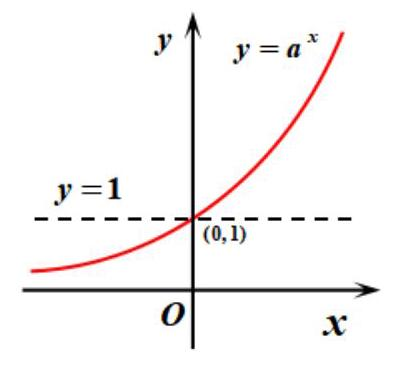
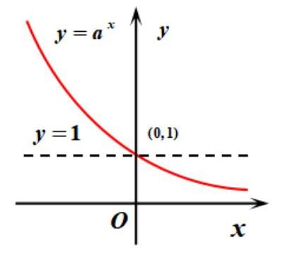
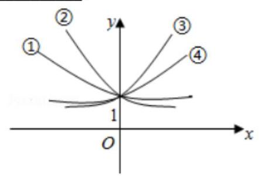

## 指、对函数的图像与性质

<table><tr><td>教学目标</td><td>1、掌握指数的书写形式以及指数幂的运算;   2、掌握指数函数的图像与性质;   3、掌握对数的运算;   4、掌握对数函数的图像与性质.</td></tr><tr><td>重点</td><td>指对数函数的图像与性质</td></tr><tr><td>难点</td><td>对数函数与指数函数之间的关系及性质的应用</td></tr></table>

## (一) 指数函数

## 知识梳理

## 指数与指数幂的运算

## (1)根式的概念

①如果 ${x}^{n} = a, a \in  R, x \in  R, n > 1$ ，且 $n \in  {N}_{ + }$ ，那么 $x$ 叫做 $a$ 的 $n$ 次方根.

当 $n$ 是奇数时， $a$ 的 $n$ 次方根用符号 $\sqrt[n]{a}$ 表示；

当 $n$ 是偶数时,正数 $a$ 的正的 $n$ 次方根用符号 $\sqrt[n]{a}$ 表示,

负的 $n$ 次方根用符号 $- \sqrt[n]{a}$ 表示；

0 的 $n$ 次方根是 0 ; 负数 $a$ 没有 $n$ 次方根.

②式子 $\sqrt[n]{a}$ 叫做根式，这里 $n$ 叫做根指数， $a$ 叫做被开方数. 当 $n$ 为奇数时， $a$ 为任意实数；当 $n$ 为偶数时， $a \geq  0$ .

③ 根式的性质: ${\left( \sqrt[n]{a}\right) }^{n} = a$ ；当 $n$ 为奇数时， $\sqrt[n]{{a}^{n}} = a$ ；

当 $n$ 为偶数时, $\sqrt[n]{{a}^{n}} = \left| a\right|  = \left\{  \begin{array}{ll} a & \left( {a \geq  0}\right) \\   - a & \left( {a < 0}\right)  \end{array}\right.$ .

## (2)分数指数幂的概念

①正数的正分数指数幂的意义是: ${a}^{\frac{m}{n}} = \sqrt[n]{{a}^{m}}\left( {a > 0, m, n \in  {N}_{ + }\text{ ，且 }n > 1}\right)$ . 0 的正分数指数幂等于 0 .

②正数的负分数指数幂的意义是: ${a}^{-\frac{m}{n}} = {\left( \frac{1}{a}\right) }^{\frac{m}{n}} = \sqrt[n]{{\left( \frac{1}{a}\right) }^{m}}\left( {a > 0, m, n \in  {N}_{ + }\text{ ,且 }n > 1}\right)$ . 0的负分数指数幂没有意义.

(3)分数指数幂的运算性质

③ ${\left( ab\right) }^{r} = {a}^{r}{b}^{r}\left( {a > 0, b > 0, r \in  R}\right)$

## 指数函数的图像与性质

<table><tr><td>函数名称</td><td colspan="2">指数函数</td></tr><tr><td>定义</td><td colspan="2">函数 $y = {a}^{x}\left( {a > 0\text{ 且 }a \neq  1}\right)$ 叫做指数函数</td></tr><tr><td rowspan="2">图   象</td><td>$a > 1$</td><td>$0 < a < 1$</td></tr><tr><td></td><td></td></tr><tr><td>定义域</td><td colspan="2">$R$</td></tr><tr><td>值域</td><td colspan="2">$\left( {0, + \infty }\right)$</td></tr><tr><td>过定点</td><td colspan="2">图象过定点 $\left( {0,1}\right)$ ,即当 $x = 0$ 时, $y = 1$ .</td></tr><tr><td>奇偶性</td><td colspan="2">非奇非偶</td></tr><tr><td>单调性</td><td>在 $R$ 上是增函数</td><td>在 $R$ 上是减函数</td></tr><tr><td>函数值的变化情况</td><td>${a}^{x} > 1\left( {x > 0}\right)$   ${a}^{x} = 1\;\left( {x = 0}\right)$   ${a}^{x} < 1\left( {x < 0}\right)$</td><td>${a}^{x} < 1\left( {x > 0}\right)$   ${a}^{x} = 1\;\left( {x = 0}\right)$   ${a}^{x} > 1\left( {x < 0}\right)$</td></tr><tr><td>$a$ 变化对图象的影响</td><td colspan="2">在第一象限内, $a$ 越大图象越高; 在第二象限内, $a$ 越大图象越低.</td></tr></table>

## 例题精讲

【例 1】( 1 )计算: ${0.125}^{-\frac{1}{3}} + {\left( 2\sqrt{2} - 3\right) }^{-1} - {\left\lbrack  {\left( -3\right) }^{2}\right\rbrack  }^{\frac{1}{2}} + {\left( \pi  - \sqrt{2}\right) }^{0}$ .

【难度】 $\star   \star$

【答案】 $- 2\sqrt{2} - 3$

【解析】解: ${0.125}^{-\frac{1}{3}} + {\left( 2\sqrt{2} - 3\right) }^{-1} - {\left\lbrack  {\left( -3\right) }^{2}\right\rbrack  }^{\frac{1}{2}} + {\left( \pi  - \sqrt{2}\right) }^{0} = {0.5}^{-1} + \frac{1}{2\sqrt{2} - 3} - 3 + 1 = 2 - 2\sqrt{2} - 3 - 2 =  - 2\sqrt{2} - 3$ .

(2) $\frac{{\left( {a}^{\frac{2}{3}}{b}^{-1}\right) }^{-\frac{1}{2}}{a}^{-\frac{1}{2}}{b}^{\frac{1}{3}}}{\sqrt[6]{a{b}^{5}}} =$ ___.

【难度】 $\star   \star$

【答案】 $\frac{1}{a}$

【解析】解: $\frac{{\left( {a}^{\frac{2}{3}}{b}^{-1}\right) }^{-\frac{1}{2}}{a}^{-\frac{1}{2}}{b}^{\frac{1}{3}}}{\sqrt[6]{a{b}^{5}}} = \frac{{a}^{\frac{2}{3} \times  \left( {-\frac{1}{2}}\right) } \cdot  {b}^{\frac{1}{2}} \cdot  {a}^{-\frac{1}{2}} \cdot  {b}^{\frac{1}{3}}}{{a}^{\frac{1}{6}} \cdot  {b}^{\frac{5}{6}}} = \frac{{a}^{-\frac{1}{3} - \frac{1}{2}} \cdot  {b}^{\frac{1}{2} + \frac{1}{3}}}{{a}^{\frac{1}{6}} \cdot  {b}^{\frac{5}{6}}} = \frac{{a}^{-\frac{1}{6}} \cdot  {b}^{\frac{5}{6}}}{{a}^{\frac{1}{6}} \cdot  {b}^{\frac{5}{6}}} = {a}^{-\frac{5}{6} - \frac{1}{6}} = {a}^{-1} = \frac{1}{a}$ . 故答案为: $\frac{1}{a}$ .

【例 2】下列函数不是指数函数的是( )

A. $y = {2}^{x + 1}$ B. $y = {3}^{-x}$ C. $y = {4}^{x}$ D. $y = {2}^{3x}$

【难度】★★

【答案】A

【解析】指数函数是形如 $y = {a}^{x}\left( {a > 0\text{ 且 }a \neq  1}\right)$ 的函数.

对于 A: $y = {2}^{x + 1} = 2 \times  {2}^{x}$ ,系数不是 1,所以不是指数函数;

对于 B: $y = {3}^{-x} = {\left( \frac{1}{3}\right) }^{x}$ ,符合指数函数的定义,所以是指数函数;

对于 $\mathrm{C} : y = {4}^{x}$ ,符合指数函数的定义,所以是指数函数;

对于 $\mathrm{D} : y = {2}^{3x} = {8}^{x}$ ,符合指数函数的定义,所以是指数函数.

故选: A。

【例 3】函数 $f\left( x\right)  = {a}^{x - 3} + 4\left( {a > 0\text{ ，且 }a \neq  1}\right)$ 的图像恒过定点___。

【难度】 $\star   \star$

【来源】甘肃省庆阳市宁县第二中学 2019-2020 高一下学期 4 月线上测试数学试题

【答案】 $\left( {3,5}\right)$

【解析】当 $x = 3$ 时, ${x}^{x - 3} = 1$ ,所以 $f\left( 3\right)  = 5$ ,所以函数图像恒过点 $\left( {3,5}\right)$ 。

【例 4】如图① $y = {a}^{x}$ ，② $y = {b}^{x}$ ，③ $y = {c}^{x}$ ，④ $y = {d}^{x}$ ，根据图像可得 $a$ 、 $b$ 、 $c$ 、 $d$ 与 1 的大小关系为

【难度】 $\star   \star$

【答案】 $\mathrm{b} < a < 1 < d < c$
