## (一) 解三角形

## 解三角形、反三角函数、最简三角方程

<table><tr><td>教学目标</td><td>1、掌握正弦定理、余弦定理、三角形面积公式，并能求解三角形未知角、未知边的值；   2、运用正弦定理，余弦定理，内角和，面积公式判断三角形形状；   3、应用正余弦定理解决应用题。   4、掌握反三角函数的图像与性质   5、会写出三角方程 $\sin x = a,\cos x = a,\tan x = a$ 的解集；会求三角方程 $A\sin \left( {{\omega x} + \varphi }\right)  = a$ ，   $A\cos \left( {{\omega x} + \varphi }\right)  = a,\;A\tan \left( {{\omega x} + \varphi }\right)  = a$ 的解集；</td></tr><tr><td>重点</td><td>1、三角形内角和定理的灵活应用、正弦定理、余弦定理、三角形面积公式；   2、正弦定理和余弦定理的应用条件、三角形角与边的灵活转换。</td></tr><tr><td>难 点</td><td>1、正余弦定理与其它知识的综合应用   2、三角方程的综合</td></tr></table>

## 知识梳理

一、三角形面积公式

(1) ${S}_{\bigtriangleup {ABC}} = \frac{1}{2}{ab}\sin C = \frac{1}{2}{ac}\sin B = \frac{1}{2}{bc}\sin A$

(2) $S = \frac{1}{2}a \cdot  {h}_{a}\left( {h}_{a}\right.$ 表示 $a$ 边上的高 $)$

(3) $S = \frac{1}{2}{ab}\sin C = \frac{1}{2}{ac}\sin B = \frac{1}{2}{bc}\sin A = \frac{abc}{4R}\left( {R\text{ 为外接圆半径 }}\right)  = 2{R}^{2}\sin A\sin B\sin C$

## 二、正余弦定理

(1)正弦定理: $\frac{a}{\sin A} = \frac{b}{\sin B} = \frac{c}{\sin C} = {2R}$

${a}^{2} = {b}^{2} + {c}^{2} - {2bc} \cdot  \cos A,$

(2)余弦定理: ${b}^{2} = {c}^{2} + {a}^{2} - {2ac}\cos B$ ；；

$$
{c}^{2} = {a}^{2} + {b}^{2} - {2ab}\cos C.
$$

(3)变形形式:

① $a = {2R}\sin A;b = {2R}\sin B;c = {2R}\sin C$ ;

② $\sin A = \frac{a}{2R};\sin B = \frac{b}{2R};\sin C = \frac{c}{2R}$ ;

③ $a : b : c = \sin A : \sin B : \sin C$

④ $\frac{a + b + c}{\sin A + \sin B + \sin C} = \frac{a}{\sin A}$

⑤ $\cos A = \frac{{b}^{2} + {c}^{2} - {a}^{2}}{2bc};\cos B = \frac{{a}^{2} + {c}^{2} - {b}^{2}}{2ac};\cos C = \frac{{b}^{2} + {a}^{2} - {c}^{2}}{2ab}$ ;

## 解决的问题类型:

①正弦定理已知两角和任一边，求另一角和其他两条边；已知两边和其中一边的对角，求另一边和其他两角

②余弦定理已知三边，求各角；已知两边和它们的夹角，求第三边和其他两个角。

## 三、三角形中常见的结论

(1)在 $\bigtriangleup {ABC}$ 中 $\sin A > \sin B$ 是 $A > B$ 的充要条件 $\sin A > \sin B \Leftrightarrow  \frac{a}{2R} > \frac{b}{2R} \Leftrightarrow  a > b \Leftrightarrow  A > B$

(2) $\sin {2A} = \sin {2B} \Leftrightarrow  A = B$ 或 $A + B = {90}^{ \circ  };\cos {2A} = \cos {2B} \Leftrightarrow  A = B$

(3) $A, B, C$ 成等差数列 $\Leftrightarrow  B = {60}^{ \circ  }$

(4) $A, B, C$ 成等差数列， $a, b, c$ 成等比数列 $\Leftrightarrow  \bigtriangleup {ABC}$ 为等边三角形

(5) $\sin \left( {A + B}\right)  = \sin C;\cos \left( {A + B}\right)  =  - \cos C;\tan \left( {A + B}\right)  =  - \tan C;\sin \frac{A + B}{2} = \cos \frac{C}{2};\cos \frac{A + B}{2} = \sin \frac{C}{2}$ .

(6)在 $\bigtriangleup  {ABC}$ 中， $\tan A + \tan B + \tan C = \tan A \cdot  \tan B \cdot  \tan C$

## 例题精讲

【例1】(1)在 $\bigtriangleup  {ABC}$ 中， ${\sin }^{2}A \leq  {\sin }^{2}B + {\sin }^{2}C - \sin B\sin C$ ，则 $A$ 的取值范围是( )

A. $\left( {0,\frac{\pi }{6}}\right\rbrack$ B. $\left( {0,\frac{\pi }{3}}\right\rbrack$ C. $\left\lbrack  {\frac{\pi }{6},\pi }\right)$ D. $\left\lbrack  {\frac{\pi }{3},\pi }\right)$

【难度】 $\star   \star   \star$

【答案】 $B$

【解析】解: 利用正弦定理化简 ${\sin }^{2}A \leq  {\sin }^{2}B + {\sin }^{2}C - \sin B\sin C$ 得: ${a}^{2} \leq  {b}^{2} + {c}^{2} - {bc}$ ,变形得: ${b}^{2} + {c}^{2} - {a}^{2} \geq  {bc},\therefore \cos A = \frac{{b}^{2} + {c}^{2} - {a}^{2}}{2bc} \geq  \frac{bc}{2bc} = \frac{1}{2}$ ,又 $\because A$ 为三角形的内角, $\therefore A$ 的取值范围是 $(0,\frac{\pi }{3}\rbrack$ . 故选: $B$ .

(2)在 $\bigtriangleup  {ABC}$ 中， $a, b, c$ ，分别是角 $\mathrm{A},\mathrm{B},\mathrm{C}$ 的对边. 已知 ${ab}\cos \left( {A - B}\right)  = {a}^{2} + {b}^{2} - {c}^{2},\tan A = 2, a = 2\sqrt{5}$ ， 则 $b =$

【难度】 $\star   \star   \star$

【答案】 $\frac{{15}\sqrt{13}}{13}$

【解析】由题得, $\cos \left( {A - B}\right)  = \frac{{a}^{2} + {b}^{2} - {c}^{2}}{ab} = 2\cos C,\because \cos C =  - \cos \left( {A + B}\right)$ ,

$\therefore \cos A\cos B + \sin A\sin B =  - 2\left( {\cos A\cos B - \sin A\sin B}\right)$ ,化简整理得 $3\cos A\cos B - \sin A\sin B = 0$ ,

$\therefore \tan A\tan B = 3$ ,又 $\because \tan A = 2,\therefore \tan B = \frac{3}{2},\sin A = \frac{2\sqrt{5}}{5},\sin B = \frac{3\sqrt{13}}{13}$ ,由正弦定理得, $b = \frac{a\sin B}{\sin A} = \frac{{15}\sqrt{13}}{13}.$

(3)若 $\bigtriangleup  {ABC}$ 的面积为 $\frac{\sqrt{3}}{4}\left( {{a}^{2} + {c}^{2} - {b}^{2}}\right)$ ，且 $C$ 为钝角，则 $\frac{c}{a}$ 的取值范围是___.

【难度】 $\star   \star   \star$

【答案】 $\left( {2, + \infty }\right)$

【解析】由三角形的面积公式和余弦定理得 $\frac{1}{2}{ac}\sin B = \frac{\sqrt{3}}{4} \times  {2ac}\cos B$ ,

化简得 $\sin B = \sqrt{3}\cos B$ ,则 $\tan B = \sqrt{3},\because 0 < B < \pi ,\therefore B = \frac{\pi }{3}$ ,

$\because C$ 为钝角，则 $\left\{  \begin{array}{l} 0 < A < \frac{\pi }{2} \\  A + \frac{\pi }{3} < \frac{\pi }{2} \end{array}\right.$ ，解得 $0 < A < \frac{\pi }{6}$ ，所以 $0 < \tan A < \frac{\sqrt{3}}{3}$ ，

所以, $\frac{c}{a} = \frac{\sin C}{\sin A} = \frac{\sin \left( {A + B}\right) }{\sin A} = \frac{\sin \left( {A + \frac{\pi }{3}}\right) }{\sin A} = \frac{\frac{1}{2}\sin A + \frac{\sqrt{3}}{2}\cos A}{\sin A} = \frac{1}{2} + \frac{\sqrt{3}}{2\tan A} > 2$ .

因此, $\frac{c}{a}$ 的取值范围是 $\left( {2, + \infty }\right)$ . 故答案为: $\left( {2, + \infty }\right)$ .

【例 2】(1) 在 $\bigtriangleup {ABC}$ 中,角 $\mathrm{A}, B, C$ 所对的边分别为 $a, b, c$ ,已知 $a = 2$ ,且 $b\left( {\cos A + 1}\right)  = 2\cos B$ , 则 $\bigtriangleup  {ABC}$ 周长的取值范围是___.

【难度】 $\star   \star   \star$

【答案】 $\left( {4,6}\right)$

【解析】因为 $a = 2, b\left( {\cos A + 1}\right)  = 2\cos B$ ,所以 $b\left( {\cos A + 1}\right)  = a\cos B$ ,

所以 $\sin B\left( {\cos A + 1}\right)  = \sin A\cos B$ ,

所以 $\sin B = \sin A\cos B - \cos A\sin B = \sin \left( {A - B}\right)$ ,则 $B = A - B$ ,即 $A = {2B}$ .

由正弦定理可得 $\frac{a}{\sin A} = \frac{b}{\sin B} = \frac{c}{\sin C}$ ,则 $b = \frac{a\sin B}{\sin A} = \frac{1}{\cos B}, c = \frac{a\sin C}{\sin A} = \frac{2\sin {3B}}{\sin {2B}} = 4\cos B - \frac{1}{\cos B}$ , 故 $\bigtriangleup {ABC}$ 的周长 $l = a + b + c = 2 + \frac{1}{\cos B} + 4\cos B - \frac{1}{\cos B} = 4\cos B + 2$ .

因为 $\left\{  \begin{array}{l} 0 < B < \pi , \\  0 < {2B} < \pi , \\  0 < \pi  - {3B} < \pi , \end{array}\right.$ 解得 $0 < B < \frac{\pi }{3}$ ,则 $\frac{1}{2} < \cos B < 1$ ,故 $\bigtriangleup {ABC}$ 的周长 $l \in  \left( {4,6}\right)$ . 故答案为: $\left( {4,6}\right)$

(2)在 $\bigtriangleup  {ABC}$ 中，内角 $A$ 、 $B$ 、 $C$ 的对边分别为 $a$ 、 $b$ 、 $c$ ，若 $b = 2$ ， $\frac{\sin A}{a} = \frac{\sqrt{3}\cos B}{b}$ 则 $\bigtriangleup  {ABC}$ 的面积的最大值等于___.

【难度】 $\star   \star   \star$

【答案】 $\sqrt{3}$

【解析】解: $\because \frac{\sin A}{a} = \frac{\sqrt{3}\cos B}{b}$ ,又由正弦定理可得 $\frac{\sin A}{a} = \frac{\sin B}{b}$ ,

$\therefore \sin B = \sqrt{3}\cos B$ ,即 $\tan B = \sqrt{3},\because B \in  \left( {0,\pi }\right) ,\therefore B = \frac{\pi }{3}$ ,又 $\because b = 2$ ,

$\therefore {b}^{2} = {a}^{2} + {c}^{2} - {ac} \geq  {2ac} - {ac} = {ac}$ ,可得 ${ac} \leq  4$ ,当且仅当 $a = c$ 时等号成立,

$\therefore {S}_{\bigtriangleup {ABC}} = \frac{1}{2}{ac}\sin B \leq  \frac{1}{2} \times  4 \times  \frac{\sqrt{3}}{2} = \sqrt{3}$ ，当且仅当 $a = c$ 时等处成立，即 $\bigtriangleup {ABC}$ 的面积的最大值等于 $\sqrt{3}$ . 故答案为: $\sqrt{3}$ .

【例 3】在 $\bigtriangleup {ABC}$ 中, $\cos A = \frac{12}{13},\sin B = m$ ,若角 $C$ 有唯一解,则实数 $m$ 的取值范围是___.

【难度】 $\star   \star   \star$

【答案】 $\left( {0,\frac{5}{13}}\right\rbrack  \bigcup \{ 1\}$ .

【解析】解: 在 $\bigtriangleup {ABC}$ 中, $\cos A = \frac{12}{13},\sin B = m$ ,若 $\angle C$ 有唯一解,则 $\bigtriangleup {ABC}$ 有唯一解,

在 $\bigtriangleup {ABC}$ 中,设内角 $A, B, C$ 所对应的边分别为 $a, b, c$ ,

由 $\cos A = \frac{12}{13}$ ,则 $\angle A$ 为一确定的锐角且 $\sin A = \frac{5}{13},\therefore \frac{a}{b} = \frac{\sin A}{\sin B} = \frac{5}{13m}$ ,

如图以 $C$ 为圆心, $a$ 为半径画圆弧,当圆弧与边 ${AB}$ 有 1 个交点时满足条件,

如图示:

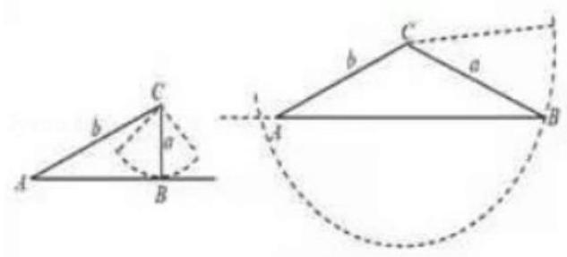

即圆弧与边 ${AB}$ 相切或与圆弧与边 ${AB}$ 相交有 2 个交点,

其中一个交点在线段 ${AB}$ 的反向延长线上 (或在点 $A$ 处),故 $a = b\sin A = \frac{5}{13}b$ 或 $a \geq  b$ ,

由 $\frac{a}{b} = \frac{5}{13m}$ ,即 $a = \frac{5}{13m}b$ ,得 $\frac{5}{13m}b = \frac{5}{13}b$ 或 $\frac{5}{13m}b \geq  b$ ,解得: $m = 1$ 或 $0 < m \leq  \frac{5}{13}$ ,

【例 4】凸四边形就是没有角度数大于 ${180}^{ \circ  }$ 的四边形,把四边形任何一边向两方延长,其它各边都在延长所得直线的同一旁,这样的四边形叫做凸四边形,如图,在凸四边形 ${ABCD}$ 中, ${AB} = 1,{BC} = \sqrt{3},{AC} \bot  {CD}$ , ${AC} = {CD}$ ，当 $\angle {ABC}$ 变化时，对角线 ${BD}$ 的最大值为___.

【难度】 $\star   \star   \star   \star$

【答案】 $1 + \sqrt{6}$

【解析】解: 设 $\angle {ABC} = \alpha ,\angle {ACB} = \beta$ ,则由余弦定理得,

$A{C}^{2} = 1 + 3 - 2 \times  1 \times  \sqrt{3} \times  \cos \alpha  = 4 - 2\sqrt{3}\cos \alpha$ ; 由正弦定理得 $\frac{AC}{\sin \alpha } = \frac{AB}{\sin \beta }$ ,则 $\sin \beta  = \frac{\sin \alpha }{\sqrt{4 - 2\sqrt{3}\cos \alpha }}$ ;

所以 $B{D}^{2} = 3 + \left( {4 - 2\sqrt{3}\cos \alpha }\right)  - 2 \times  \sqrt{3} \times  \sqrt{4 - 2\sqrt{3}\cos \alpha } \times  \cos \left( {{90}^{ \circ  } + \beta }\right)  = 7 - 2\sqrt{3}\cos \alpha  + 2\sqrt{3}\sin \alpha$

$= 7 + 2\sqrt{6}\sin \left( {\alpha  - {45}^{ \circ  }}\right)$ ,所以 $\alpha  = {135}^{ \circ  }$ 时, ${BD}$ 取得最大值为 $\sqrt{7 + 2\sqrt{6}} = 1 + \sqrt{6}$ . 故答案为: $1 + \sqrt{6}$ .

【例 5】我们知道,在 $\bigtriangleup {ABC}$ 中,若 ${c}^{2} = {a}^{2} + {b}^{2}$ ,则 $\bigtriangleup {ABC}$ 是直角三角形. 若 ${c}^{n} = {a}^{n} + {b}^{n}\left( {n > 2}\right)$ ,则 $\bigtriangleup {ABC}$ 是三角形. (填 “锐角”、“钝角”、“直角” )

【难度】 $\star   \star   \star   \star$

【答案】锐角

【解析】解: $\because {c}^{n} = {a}^{n} + {b}^{n},\therefore c > a, c > b$ ,即 $c$ 为最大边, $\therefore {c}^{n - 2} > {a}^{n - 2},{c}^{n - 2} > {b}^{n - 2}$ ,

即 ${c}^{n - 2} - {a}^{n - 2} > 0,{c}^{n - 2} - {b}^{n - 2} > 0$ ,

$\therefore \left( {{a}^{2} + {b}^{2}}\right) {c}^{n - 2} - {c}^{n} = \left( {{a}^{2} + {b}^{2}}\right) {c}^{n - 2} - {a}^{n} - {b}^{n} = {a}^{2}\left( {{c}^{n - 2} - {a}^{n - 2}}\right)  + {b}^{2}\left( {{c}^{n - 2} - {b}^{n - 2}}\right)  > 0$ ,

即 $\left( {{a}^{2} + {b}^{2}}\right) {c}^{n - 2} > {c}^{n},\therefore {a}^{2} + {b}^{2} > {c}^{2},\therefore \cos C = \frac{{a}^{2} + {b}^{2} - {c}^{2}}{2ab} > 0$ ,则 $\bigtriangleup {ABC}$ 也是锐角三角形,故答案为: 锐角

【例 6】如图所示,三个全等的三角形 $\bigtriangleup {ABF}\text{ 、 }\bigtriangleup {BCD}\text{ 、 }\bigtriangleup {CAE}$ 拼成一个等边三角形 ${ABC}$ ,且 $\bigtriangleup {DEF}$ 为等边三角形, ${EF} = {2AE}$ ,设 $\angle {ACE} = \theta$ ,则 $\sin {2\theta } =$ ___

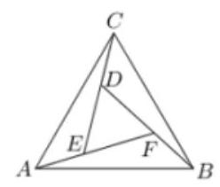

【难度】 $\star   \star   \star$

【答案】 $\frac{7\sqrt{3}}{26}$

【解析】设 ${AE} = k\left( {k > 0}\right)$ ,则 ${EF} = {2k}$ ,由 $\angle {ACE} = \theta$ ,由于三角形 $\bigtriangleup  {ABF}\text{ 、 } \bigtriangleup  {BCD}\text{ 、 } \bigtriangleup  {CAE}$ 全等,

$\therefore \angle {FAB} = \theta ,{CD} = k,{DE} = {2k}$ ，又 $\because  \bigtriangleup  {ABC}$ 为等边三角形， $\therefore \angle {CAE} = \frac{\pi }{3} - \theta$ ，

在 $\bigtriangleup  {CAE}$ 中，由正弦定理可得: $\frac{AE}{\sin \angle {ACE}} = \frac{CE}{\sin \angle {CAE}}$ ，

即 $\frac{k}{\sin \theta } = \frac{3k}{\sin \left( {\frac{\pi }{3} - \theta }\right) },3\sin \theta  = \frac{\sqrt{3}}{2}\cos \theta  - \frac{1}{2}\sin \theta$ ,化简得 $\tan \theta  = \frac{\sqrt{3}}{7}$ ,

$\therefore \sin {2\theta } = \frac{2\sin \theta \cos \theta }{{\sin }^{2}\theta  + {\cos }^{2}\theta } = \frac{2\tan \theta }{{\tan }^{2}\theta  + 1} = \frac{2 \times  \frac{\sqrt{3}}{7}}{\frac{3}{49} + 1} = \frac{7\sqrt{3}}{26}$ ,故答案为: $\frac{7\sqrt{3}}{26}$ .

【例 7】一根长为 $L$ 的铁棒 ${AB}$ 欲通过如图所示的直角走廊,已知走廊的宽 ${AC} = {BD} = {2m}$ .

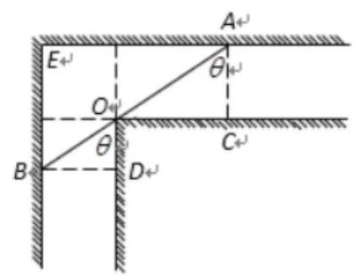

(1)设 $\angle {BOD} = \theta$ ，试将 $L$ 表示为 $\theta$ 的函数；

(2)求 $L$ 的最小值，并说明此最小值的实际意义.

【难度】 $\star   \star   \star   \star$

【答案】(1)见解析(2)见解析

【解析】(1) ${AO} = \frac{2}{\cos \theta },{BO} = \frac{2}{\sin \theta }$ .

$L = {AO} + {BO} = \frac{2}{\cos \theta } + \frac{2}{\sin \theta } = \frac{2\left( {\sin \theta  + \cos \theta }\right) }{\sin \theta \cos \theta },\;\theta  \in  \left( {0,\frac{\pi }{2}}\right) .$

(2)设 $x = \sin \theta  + \cos \theta  = \sqrt{2}\sin \left( {\theta  + \frac{\pi }{4}}\right) ,\theta  \in  \left( {0,\frac{\pi }{2}}\right)$ ，则 $x \in  \left( {1,\sqrt{2}}\right\rbrack$ ，

所以, $\sin \theta \cos \theta  = \frac{{x}^{2} - 1}{2}$ ,此时 $L\left( x\right)  = \frac{4x}{{x}^{2} - 1}$ .

任取 ${x}_{1}\text{ 、 }{x}_{2} \in  \left( {1,\sqrt{2}}\right\rbrack$ ,且 ${x}_{1} < {x}_{2}, L\left( {x}_{1}\right)  - L\left( {x}_{2}\right)  = \frac{4{x}_{1}}{{x}_{1}^{2} - 1} - \frac{4{x}_{2}}{{x}_{2}^{2} - 1} = \frac{4{x}_{1}{x}_{2}\left( {{x}_{1}{x}_{2} + 1}\right) }{\left( {{x}_{1}^{2} - 1}\right) \left( {{x}_{2}^{2} - 1}\right) }$ ,

因为 ${x}_{1}\text{ 、 }{x}_{2} \in  \left( {1,\sqrt{2}}\right\rbrack$ ,且 ${x}_{1} < {x}_{2}$ ,所以 $\left( {{x}_{1}^{2} - 1}\right) \left( {{x}_{2}^{2} - 1}\right)  > 0,4{x}_{1}{x}_{2}\left( {{x}_{1}{x}_{2} + 1}\right)  > 0$ ,

故 $L\left( {x}_{1}\right)  - L\left( {x}_{2}\right)  > 0$ ,即 $L\left( x\right)$ 在 $x \in  \left( {1,\sqrt{2}}\right\rbrack$ 时是减函数,所以 ${L}_{\min } = 4\sqrt{2}$

$L$ 最小值的实际意义是: 在拐弯时,铁棒的长度不能超过 $4\sqrt{2}m$ ,否则,铁棒无法通过. 也就说,能够通过这个直角走廊的铁棒的最大长度为 $4\sqrt{2}m$ .

【例 8 】在 $\bigtriangleup {ABC}$ 中, $\angle A = {150}^{ \circ  },{D}_{1},{D}_{2},\ldots ,{D}_{2020}$ 依次为边 ${BC}$ 上的点,且 $B{D}_{1} = {D}_{1}{D}_{2} = {D}_{2}{D}_{3} = \ldots  = {D}_{2019}{D}_{2020} = {D}_{2020}C$ ,设 $\angle {BA}{D}_{1} = {\alpha }_{1},\angle {D}_{1}A{D}_{2} = {\alpha }_{2},\ldots ,\angle {D}_{2019}A{D}_{2020} = {\alpha }_{2020}$ , $\angle {D}_{2020}{AC} = {\alpha }_{2021}$ ,则 $\frac{\sin {\alpha }_{1}\sin {\alpha }_{3}\sin {\alpha }_{2021}}{\sin {\alpha }_{2}\sin {\alpha }_{4}\sin {\alpha }_{2020}}$ 的值为___.

【难度】 $\star   \star   \star   \star$

【答案】 $\frac{1}{4042}$

【解析】解: 注意到 ${a}_{1} + {\alpha }_{2} + \ldots \ldots  + {\alpha }_{2020} = {150}^{ \circ  }$ ,

在 $\bigtriangleup {BA}{D}_{1}$ 中, $\frac{B{D}_{1}}{\sin {\alpha }_{1}} = \frac{AB}{\sin \angle B{D}_{1}A} = \frac{A{D}_{1}}{\sin B}$ ,

在 $\bigtriangleup {D}_{1}A{D}_{2}$ 中, $\frac{{D}_{1}{D}_{2}}{\sin {\alpha }_{2}} = \frac{A{D}_{1}}{\sin \angle A{D}_{2}B} = \frac{A{D}_{2}}{\sin \angle A{D}_{1}C}$ ,

$\therefore \frac{\sin {\alpha }_{1}}{\sin {\alpha }_{2}} = \frac{\sin B}{\sin \angle A{D}_{2}B}$ ,

同理可得 $\frac{\sin {\alpha }_{3}}{\sin {\alpha }_{4}} = \frac{\sin \angle A{D}_{2}B}{\sin \angle A{D}_{4}B},\frac{\sin {\alpha }_{5}}{\sin {\alpha }_{6}} = \frac{\sin \angle A{D}_{4}B}{\sin \angle A{D}_{6}B},\ldots \frac{\sin {\alpha }_{2019}}{\sin {\alpha }_{2020}} = \frac{\sin \angle A{D}_{2018}B}{\sin \angle A{D}_{2020}B}$ ,

又 $\frac{{D}_{2020}C}{\sin {\alpha }_{2021}} = \frac{AC}{\sin \angle A{D}_{2020}C}$ ,

$\therefore \sin {\alpha 2021} = \frac{{D}_{2021}C \cdot  \sin \angle A{D}_{2020}C}{AC}$ ,

$\therefore \frac{\sin {\alpha }_{1}\sin {\alpha }_{3}\sin {\alpha }_{2021}}{\sin {\alpha }_{2}\sin {\alpha }_{4}\sin {\alpha }_{2020}} = \frac{{D}_{2020}C \cdot  \sin B}{AC} = \frac{BC}{2021} \times  \frac{\sin B}{AC} = \frac{\sin {150}^{ \circ  }}{2021} = \frac{1}{4042}$ .

故答案为: $\frac{1}{4042}$ .

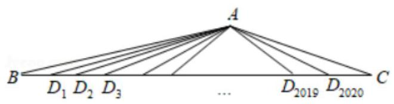

## 巩固训练

1、在 $\bigtriangleup {ABC}$ 中,角 $A, B, C$ 所对的边分别为 $a, b, c$ ,若 $a - c = b\cos C - b\cos A$ ,则 $\bigtriangleup {ABC}$ 的形状为( )

A. 等腰三角形 B. 直角三角形

C. 等腰三角形或直角三角形 D. 等腰直角三角形

【难度】 $\star   \star   \star$

【答案】 $C$

【解析】解: $\because a - c = b\cos C - b\cos A,\therefore$ 由正弦定理可得: $\sin A - \sin C = \sin B\cos C - \sin B\cos A$ ,

可得: $\sin A - \sin A\cos B - \cos A\sin B = \sin B\cos C - \sin B\cos A$ ,

$\therefore \sin A - \sin A\cos B = \sin B\cos C$ ,可得: $\sin A = \sin B\cos C + \sin A\cos B$ ,

$\therefore \sin B\cos C + \cos B\sin C = \sin B\cos C + \sin A\cos B$ ,可得: $\cos B\sin C = \sin A\cos B$ ,

$\therefore \cos B = 0$ ,或 $\sin A = \sin C,\therefore B$ 为直角,或 $A = C,\therefore \bigtriangleup {ABC}$ 的形状为等腰三角形或直角三角形. 故选: $C$ .

2、在 $\bigtriangleup {ABC}$ 中， ${BC} = a$ ， ${CA} = b$ ， ${AB} = c$ ，下列说法中正确的是( )

A. 用 $\sqrt{a}\text{ 、 }\sqrt{b}\text{ 、 }\sqrt{c}$ 为边长不可以作成一个三角形

B. 用 $\sqrt{a}\text{ 、 }\sqrt{b}\text{ 、 }\sqrt{c}$ 为边长一定可以作成一个锐角三角形

C. 用 $\sqrt{a}\text{ 、 }\sqrt{b}\text{ 、 }\sqrt{c}$ 为边长一定可以作成一个直角三角形

D. 用 $\sqrt{a}\text{ 、 }\sqrt{b}\text{ 、 }\sqrt{c}$ 为边长一定可以作成一个钝角三角形

【难度】 $\star   \star   \star$

【答案】 $B$

【解析】解: 对于 $A$ . 取 $\sqrt{3},\sqrt{4},\sqrt{5}$ ,可以作成三角形,因此不正确.

对于 $B$ ,不妨设 $a \leq  b \leq  c$ ,则 $a + b > c,\sqrt{a} \leq  \sqrt{b} \leq  \sqrt{c}$ . 则 $0 < A \leq  B \leq  C < \pi ,\cos C = \frac{a + b - c}{2\sqrt{ab}} > 0$ ,可得: $C$ 为锐角,因此 $\bigtriangleup {ABC}$ 必然为锐角三角形. 正确. 对于 $C$ . $D$ . 由 $B$ 可知 $C, D$ 不正确. 因此只有 $B$ 正确. 故选: $B$ .

3、设锐角 ${\Delta ABC}$ 的三内角 $A\text{ 、 }B\text{ 、 }C$ 所对边的边长分别为 $a\text{ 、 }b\text{ 、 }c$ ，且 $a = 1, B = {2A}$ ，则 $b$ 的取值范围为( )

A. $\left( {\sqrt{2},\sqrt{3}}\right)$ B. $\left( {1,\sqrt{3}}\right)$ C. $\left( {\sqrt{2},2}\right)$ D. $\left( {0,2}\right)$

【难度】 $\star   \star   \star   \star$

【答案】 $A$

【解析】解: 锐角 $\bigtriangleup {ABC}$ 中,角 $A\text{ 、 }B\text{ 、 }C$ 所对的边分别为 $a\text{ 、 }b\text{ 、 }c, B = {2A}$ ,

$\therefore 0 < {2A} < \frac{\pi }{2}$ ,且 $B + A = {3A},\therefore \frac{\pi }{2} < {3A} < \pi ,\therefore \frac{\pi }{6} < A < \frac{\pi }{4},\therefore \frac{\sqrt{2}}{2} < \cos A < \frac{\sqrt{3}}{2}$ ,

$\because a = 1, B = {2A},\therefore$ 由正弦定理可得: $\frac{b}{a} = b = \frac{\sin {2A}}{\sin A} = 2\cos A$ ,

$\therefore \sqrt{2} < 2\cos A < \sqrt{3}$ ，则 $b$ 的取值范围为 $\left( {\sqrt{2},\sqrt{3}}\right)$ . 故选: $A$ .

4、正方形 ${S}_{1}$ 和 ${S}_{2}$ 内接于同一个直角三角形 ${ABC}$ 中，如图所示，设 $\angle A = \alpha$ ，若 ${S}_{1} = {441},{S}_{2} = {440}$ ，则 $\sin {2\alpha }$ 的值为( )

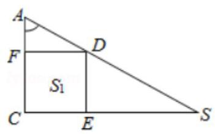

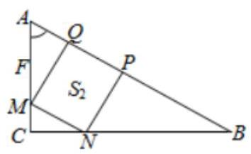

A. $\frac{1}{11}$ B. $\frac{1}{10}$ C. $\frac{1}{21}$ D. $\frac{1}{9}$

【难度】 $\bigstar \bigstar \bigstar$

【答案】 $B$

【解析】解: 因为 ${S}_{1} = {441},{S}_{2} = {440}$ ,

所以 ${FD} = \sqrt{441} = {21},{MQ} = {MN} = \sqrt{440}$ ,

因为 ${AC} = {AF} + {FC} = \frac{FD}{\tan \alpha } + {21} = \frac{21}{\tan \alpha } + {21}$ ,

${AC} = {AM} + {MC} = \frac{MQ}{\sin \alpha } + {MN}\cos \alpha  = \frac{\sqrt{440}}{\sin \alpha } + \sqrt{440}\cos \alpha$ ,所以: $\frac{21}{\tan \alpha } + {21} = \frac{\sqrt{440}}{\sin \alpha } + \sqrt{440}\cos \alpha$ ,

整理,可得: $\sqrt{440}\left( {\sin \alpha \cos \alpha  + 1}\right)  = {21}\left( {\sin \alpha  + \cos \alpha }\right)$ ,两边平方,可得 ${110}{\sin }^{2}{2\alpha } - \sin {2\alpha } - 1 = 0$ ,

解得 $\sin {2\alpha } = \frac{1}{10}$ 或 $\sin {2\alpha } =  - \frac{1}{11}$ (舍去),故 $\sin {2\alpha } = \frac{1}{10}$ . 故选: $B$ .

5、在 $\bigtriangleup  {ABC}$ 中，角 $A, B, C$ 所对的边分别为 $a, b, c$ ，若 ${b}^{2} = {ac}$ ，则角 $B$ 最大值为___

【难度】 $\star   \star   \star$

【答案】 $\frac{\pi }{3}$

【解析】解: 根据题意,在 $\bigtriangleup {ABC}$ 中, $\cos B = \frac{{a}^{2} + {c}^{2} - {b}^{2}}{2ac}$ ,

若 ${b}^{2} = {ac},\cos B = \frac{{a}^{2} + {c}^{2} - {ac}}{2ac} = \frac{{a}^{2} + {c}^{2}}{2ac} - \frac{1}{2}$ ,又由 ${a}^{2} + {c}^{2} \geq  {2ac}$ ,则 $\cos B \geq  \frac{1}{2}$ ,

则 $B \leq  \frac{\pi }{3}$ ，即 $B$ 的最大值为 $\frac{\pi }{3}$ ；故答案为: $\frac{\pi }{3}$ .

6、在 $\bigtriangleup {ABC}$ 中，已知 $2{\sin }^{2}\frac{A + B}{2} + \cos {2C} = 1$ ，外接圆半径 $R = 2$ .

(1)求角 $C$ ；

(2)求 $\bigtriangleup  {ABC}$ 面积的最大值.

【难度】 $\star   \star   \star$

【答案】见解析

【解析】解: (1) $\because$ 在 $\bigtriangleup {ABC}$ 中,已知 $2{\sin }^{2}\frac{A + B}{2} + \cos {2C} = 1\therefore$ 由三角函数公式可得 $1 - \cos \left( {A + B}\right)  + \cos {2C} = 1$ , $\because A + B + C = \pi ,\therefore \cos \left( {A + B}\right)  =  - \cos C,\therefore 2{\cos }^{2}C + \cos C - 1 = 0$ ,解得 $\cos C =  - 1$ (舍),或 $\cos C = \frac{1}{2}$ , $\therefore C = \frac{\pi }{3}$ ;

(2)由正弦定理可得 $\frac{c}{\sin C} = {2R} = 4$ ， $\therefore c = 4\sin C = 4 \times  \frac{\sqrt{3}}{2} = {2\sqrt{3}}$ ，

由余弦定理可得 ${12} = {c}^{2} = {a}^{2} + {b}^{2} - {2ab}\cos C \geq  {2ab} - {ab} = {ab}$ ,当且仅当 $a = b = 2\sqrt{3}$ 时取等号, $\therefore {ab} \leq  {12}$ , $\therefore {S}_{\bigtriangleup {ABC}} = \frac{1}{2}{ab}\sin C \leq  \frac{1}{2} \times  {12} \times  \frac{\sqrt{3}}{2} = 3\sqrt{3}$ ,故 $\bigtriangleup {ABC}$ 面积的最大值为 $3\sqrt{3}$ .

7、某植物园准备建一个五边形区域的盆栽馆，三角形 ${ABE}$ 为盆裁展示区，沿 ${AB}\text{ 、 }{AE}$ 修建观赏长廊，四边形 ${BCDE}$ 是盆栽养护区,若 ${BCD} = \angle {CDE} = {120}^{ \circ  },\angle {BAE} = {60}^{ \circ  },{DE} = {3BC} = {3CD} = 3\sqrt{3}$ 米.

(1)求两区域边界 ${BE}$ 的长度；

(2)若区域 ${ABE}$ 为锐角三角形，求观赏长廊总长度 ${AB} + {AE}$ 的取值范围.

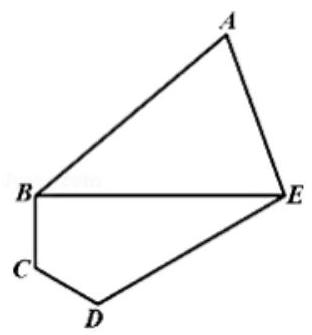

【难度】 $\star   \star   \star$

【答案】见解析

【解析】解: (1) 在 $\bigtriangleup {BCD}$ 中,由余弦定理可得 $B{D}^{2} = B{C}^{2} + C{D}^{2} - {2BC} \cdot  {CD}\cos \angle {BCD}$ ,

则 ${BD} = 3,\because \angle {BAE} = {60}^{ \circ  },{DE} = {3BC}$ ,且 ${BD} = {CD},\therefore \angle {CBD} = \angle C{D}^{ \circ  },\angle {BDE} = \angle {CDE} - \angle {CDB} = {90}^{ \circ  }$ , 从而 ${BE} = \sqrt{B{D}^{2} + D{E}^{2}} = 6$ 米.

(2)设 $\angle {ABE} = \alpha ,\because \angle {BAE} = {60}^{ \circ  },\therefore \angle {AEB} = {120}^{ \circ  } - \alpha ,\alpha  \in  \left( {{30}^{ \circ  },{90}^{ \circ  }}\right)$ ，

在 $\bigtriangleup {ABE}$ 中,由正弦定理,可得 $\frac{BE}{\sin {60}} = \frac{AB}{\sin \alpha } = \frac{AE}{\sin \left( {{120}^{ \circ  } - \alpha }\right) } = 4\sqrt{3}$ ,

$\therefore {AB} = 4\sqrt{3}\left\lbrack  {\sin \alpha  + \sin \left( {{120}^{ \circ  } - \alpha }\right) }\right\rbrack   = 4\sqrt{3}\left( {\frac{3}{2}\sin \alpha  + \frac{\sqrt{3}}{2}\cos \alpha }\right)  = {12}\sin \left( {\alpha  + {30}^{ \circ  }}\right)$ ,

$\because \alpha  \in  \left( {{30}^{ \circ  },{90}^{ \circ  }}\right) ,\therefore \alpha  + {30}^{ \circ  } \in  \left( {{60}^{ \circ  },{120}^{ \circ  }}\right) ,\therefore {AB} = {12}\sin \left( {\alpha  + {30}^{ \circ  }}\right)  \in  \left( {6\sqrt{3},{12}}\right\rbrack$ .

8、如图，在平面直角坐标系中锐角 $\alpha$ ， $\beta$ 的终边分别与单位圆交于 $A$ 、 $B$ 两点，角 $\alpha  + \beta$ 的终边与单位圆交于 $C$ 点，过点 $A$ 、 $B$ 、 $C$ 分别作 $x$ 轴的垂线，垂足分别为 $M$ 、 $N$ 、 $P$ .

(1)如果 $\left| {AM}\right|  = \frac{3}{5},\left| {ON}\right|  = \frac{5}{13}$ ,求 $\cos \left( {\alpha  - \beta }\right)$ 的值;

(2)求证:线段 ${MA}$ ， ${NB}$ ， ${PC}$ 能构成一个三角形；

(3)探究第(2)小题中的三角形的外接圆面积是否为定值？若是，求出该定值；若不是，请说明理由.

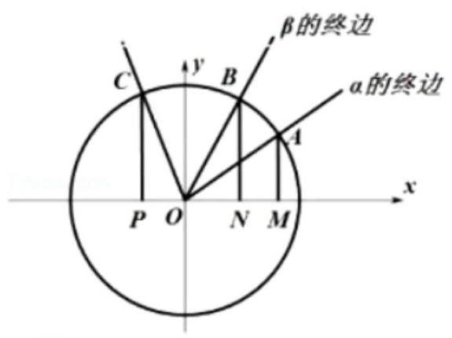

【难度】 $\bigstar \bigstar \bigstar$

【答案】见解析

【解析】解: (1) 由题意可得 $\sin \alpha  = \frac{3}{5},\cos \beta  = \frac{5}{13}$ ,

由于 $\alpha ,\beta$ 均为锐角,所以 $\sin \beta  = \frac{12}{13},\cos \alpha  = \frac{4}{5}$ ,

则 $\cos \left( {\alpha  - \beta }\right)  = \cos \alpha \cos \beta  + \sin \alpha \sin \beta  = \frac{4}{5} \times  \frac{5}{13} + \frac{3}{5} \times  \frac{12}{13} = \frac{56}{65}$ ;

(2)证明: ${MA} = \sin \alpha$ ， ${NB} = \sin \beta$ ，

${PC} = \sin \left( {\alpha  + \beta }\right)  = \sin \alpha \cos \beta  + \cos \alpha \sin \beta  < \sin \alpha  \cdot  1 + \sin \beta  \cdot  1 = \sin \alpha  + \sin \beta ,$

所以 ${MA} + {NB} > {PC}$ ，

${MA} = \sin \alpha  = \sin \left\lbrack  {\left( {\alpha  + \beta }\right)  - \beta }\right\rbrack   = \sin \left( {\alpha  + \beta }\right) \cos \beta  - \cos \left( {\alpha  + \beta }\right) \sin \beta  < \sin \left( {\alpha  + \beta }\right)  + \sin \beta$ ,

所以 ${NB} + {PC} > {MA}$ ，同理: ${MA} + {PC} > {NB}$ ，所以 ${MA},{NB}$ ， ${PC}$ 作为三边的长能构成一个三角形。

(3)三角形的外接圆的面积是定值，证明如下:

设(2)中的三角形为 $\bigtriangleup {A}^{\prime }{B}^{\prime }{C}^{\prime }$ 中，角 ${A}^{\prime },{B}^{\prime },{C}^{\prime }$ 所对的边长为 $\sin \alpha ,\sin \beta ,\sin \left( {\alpha  + \beta }\right)$ ，

由余弦定理可得, $\cos {C}^{\prime } = \frac{{\sin }^{2}\alpha  + {\sin }^{2}\beta  - {\sin }^{2}\left( {\alpha  + \beta }\right) }{2\sin \alpha \sin \beta }$

$= \frac{{\sin }^{2}\alpha  + {\sin }^{2}\beta  - {\left( \sin \alpha \cos \beta \right) }^{2} - {\left( \cos \alpha \sin \beta \right) }^{2}}{2\sin \alpha \sin \beta } - \cos \alpha \cos \beta  = \sin \alpha \sin \beta  - \cos \alpha \cos \beta  =  - \cos \left( {\alpha  + \beta }\right)$ ,

$\because \alpha ,\beta  \in  \left( {0,\frac{1}{2}\pi }\right) ,\therefore \alpha  + \beta  \in  \left( {0,\pi }\right) ,\therefore \sin {C}^{\prime } = \sin \left( {\alpha  + \beta }\right)$ ,

设外接圆的半径为 $r$ ,则由正弦定理可得 ${2R} = \frac{{A}^{\prime }{B}^{\prime }}{\sin {C}^{\prime }} = \frac{\sin \left( {\alpha  + \beta }\right) }{\sin \left( {\alpha  + \beta }\right) } = 1,\therefore R = \frac{1}{2}$ ,

$\therefore$ 外接圆的面积 $S = \frac{\pi }{4}$ .

## (二)反三角函数

## 知识梳理

一、反三角函数的定义

(1)反正弦函数:函数 $y = \sin x\left( {-\frac{\pi }{2} \leq  x \leq  \frac{\pi }{2}}\right)$ 的反函数叫做反正弦函数，记作 $y = \arcsin x$ ；

(2)反余弦函数:函数 $y = \cos x\left( {0 \leq  x \leq  \pi }\right)$ 的反函数叫做反余弦函数，记作 $y = \arccos x$ ；

(3)反正切函数:函数 $y = \tan x\left( {-\frac{\pi }{2} < x < \frac{\pi }{2}}\right)$ 的反函数叫做反正切函数，记作 $y = \arctan x$ ；

(4)反余切函数:函数 $y = \cot x\left( {0 < x < \pi }\right)$ 的反函数叫做反余切函数，记作 $y = \operatorname{arccot}x$ ；

反三角函数是比较难理解的概念, 由于三角函数在其整个定义域内并不存在反函数, 只有在某一特定区间才存在反函数, 因此, 反三角函数的值域也就被限制在某一区间内, 这个区间常称为反三角函数的主值区间;

## 二、反三角函数的图像与性质

<table><tr><td>函数</td><td>$y = \arcsin x$</td><td>$y = \arccos x$</td><td>$y = \arctan x$</td><td>$y = \operatorname{arccot}x$</td></tr><tr><td>定义域</td><td>$\left\lbrack  {-1,1}\right\rbrack$</td><td>$\left\lbrack  {-1,1}\right\rbrack$</td><td>$\left( {-\infty , + \infty }\right)$</td><td>$\left( {-\infty , + \infty }\right)$</td></tr><tr><td>值域 (主值区间)</td><td>$\left\lbrack  {-\frac{\pi }{2},\frac{\pi }{2}}\right\rbrack$</td><td>$\left\lbrack  {0,\pi }\right\rbrack$</td><td>$\left( {-\frac{\pi }{2},\frac{\pi }{2}}\right)$</td><td>$\left( {0,\pi }\right)$</td></tr><tr><td>最值</td><td>$x =  - 1,{y}_{\min } =  - \frac{\pi }{2} \; x = 1,{y}_{\max } = \frac{\pi }{2}$</td><td>$x = 1,{y}_{\min } = 0 \; x =  - 1,{y}_{\max } = \pi$</td><td colspan="2">无</td></tr><tr><td>有界性</td><td colspan="2">有界函数</td><td colspan="2">非有界函数</td></tr><tr><td>单调性</td><td>单调递增</td><td>单调递减</td><td>单调递增</td><td>单调递减</td></tr><tr><td>奇偶性</td><td>奇函数</td><td>非奇非偶函数</td><td>奇函数</td><td>非奇非偶函数</td></tr><tr><td>周期性</td><td colspan="4">非周期函数</td></tr><tr><td>恒等式 1</td><td>$\arcsin \left( {\sin x}\right)  = x$   $\left( {-\frac{\pi }{2} \leq  x \leq  \frac{\pi }{2}}\right)$</td><td>$\arccos \left( {\cos x}\right)  = x \; \left( {0 \leq  x \leq  \pi }\right)$</td><td>$\arctan \left( {\tan x}\right)  = x$   $\left( {-\frac{\pi }{2} < x < \frac{\pi }{2}}\right)$</td><td>$\operatorname{arccot}\left( {\cot x}\right)  = x \; \left( {0 < x < \pi }\right)$</td></tr><tr><td>恒等式 2</td><td>$\sin \left( {\arcsin x}\right)  = x$   $\left( {-1 \leq  x \leq  1}\right)$</td><td>$\cos \left( {\arccos x}\right)  = x$   $\left( {-1 \leq  x \leq  1}\right)$</td><td>$\tan \left( {\arctan x}\right)  = x$   $\left( {x \in  R}\right)$</td><td>$\cot \left( {\operatorname{arccot}x}\right)  = x$   $\left( {x \in  R}\right)$</td></tr><tr><td>恒等式 3</td><td>$\arcsin \left( {-x}\right)$   $=  - \arcsin x$   $\left( {-1 \leq  x \leq  1}\right)$</td><td>$\arccos \left( {-x}\right)$   $= \pi  - \arccos x$   $\left( {-1 \leq  x \leq  1}\right)$</td><td>$\arctan \left( {-x}\right)$   $=  - \arctan x$   $\left( {x \in  R}\right)$</td><td>$\operatorname{arccot}\left( {-x}\right)$   $= \pi  - \operatorname{arccot}x$   $\left( {x \in  R}\right)$</td></tr><tr><td>互余恒等式</td><td colspan="2">$\arcsin x + \arccos x = \frac{\pi }{2}\left( {-1 \leq  x \leq  1}\right)$</td><td colspan="2">$\arctan x + \operatorname{arccot}x = \frac{\pi }{2}\left( {x \in  R}\right)$</td></tr></table>

<table><tr><td>图像</td><td>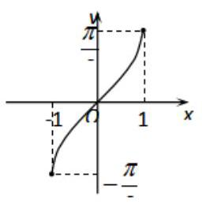</td><td>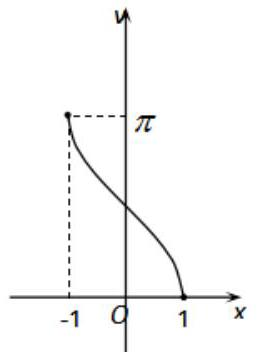</td><td>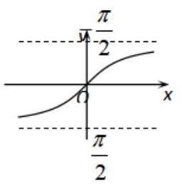</td><td>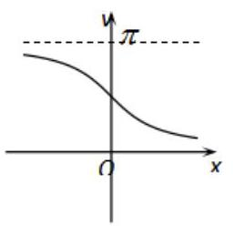</td></tr></table>

## 例题精讲

【例9】(1)求值 $\arctan \left( {-1}\right)  + \arcsin \left( {-\frac{1}{2}}\right)  + \arccos \left( {-\frac{\sqrt{3}}{2}}\right)  =$

【难度】 $\star   \star   \star$

【答案】 $\frac{5}{12}\pi$

【解析】: $\arctan \left( {-1}\right)  + \arcsin \left( {-\frac{1}{2}}\right)  + \arccos \left( {-\frac{\sqrt{3}}{2}}\right)  =  - \frac{\pi }{4} - \frac{\pi }{6} + \left( {\pi  - \frac{\pi }{6}}\right)  = \frac{5}{12}\pi$ ,故答案为: $\frac{5}{12}\pi$ . ( 2 ) $\cos \left( {2\arctan \sqrt{2} + \frac{\pi }{3}}\right)$ 的值为___.

【难度】 $\star   \star   \star$

【答案】 $- \frac{1 + 2\sqrt{6}}{6}$

【解析】令 $\arctan \sqrt{2} = \alpha$ ,则 $\alpha  \in  \left( {0,\frac{\pi }{2}}\right) ,\tan \alpha  = \sqrt{2}$ ,

所以 $\sin \alpha  = \sqrt{2}\cos \alpha$ ,所以 ${\sin }^{2}\alpha  = 2{\cos }^{2}\alpha$ ,所以 $3{\cos }^{2}\alpha  = 1,{\cos }^{2}\alpha  = \frac{1}{3}$ ,

因为 $\alpha  \in  \left( {0,\frac{\pi }{2}}\right)$ ,所以 $\cos \alpha  = \frac{\sqrt{3}}{3},\sin \alpha  = \frac{\sqrt{6}}{3}$ ,所以 $\cos \left( {2\arctan \sqrt{2} + \frac{\pi }{3}}\right)  = \cos \left( {{2\alpha } + \frac{\pi }{3}}\right)$

$= \cos {2\alpha } \cdot  \cos \frac{\pi }{3} - \sin {2\alpha } \cdot  \sin \frac{\pi }{3} = \left( {2{\cos }^{2}\alpha  - 1}\right)  \times  \frac{1}{2} - 2\sin \alpha  \cdot  \cos \alpha  \cdot  \frac{\sqrt{3}}{2}$

$= \left( {2 \times  \frac{1}{3} - 1}\right)  \times  \frac{1}{2} - 2 \times  \frac{\sqrt{6}}{3} \times  \frac{\sqrt{3}}{3} \times  \frac{\sqrt{3}}{2}$

$=  - \frac{1}{6} - \frac{\sqrt{6}}{3} =  - \frac{1 + 2\sqrt{6}}{6}$ ; 故答案为: $- \frac{1 + 2\sqrt{6}}{6}$ .

【例 10】方程 $\arcsin \left| x\right|  = \arccos y$ 表示的曲线是( )

A.

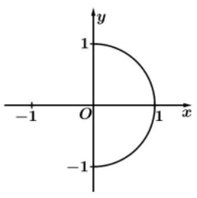

B.

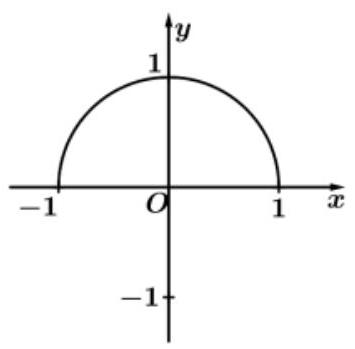

C.

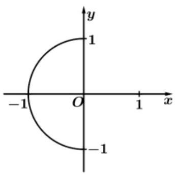

D.

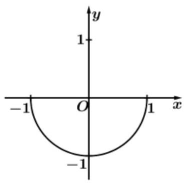

【难度】 $\star   \star   \star$

【答案】B

【解析】解: 方程 $\arcsin \left| x\right|  = \arccos y$ ,由反三角函数的定义,可得 $- 1 \leq  x \leq  1, - 1 \leq  y \leq  1,0 \leq  \left| x\right|  \leq  1$ , $y = \arcsin \left| x\right|$ 的值域为 $\left\lbrack  {0,\frac{\pi }{2}}\right\rbrack$ ,由 $y = \arccos x$ 的值域为 $\left\lbrack  {0,\pi }\right\rbrack$ ,可得方程 $\arcsin \left| x\right|  = \arccos y$ , $y$ 的范围为 $\left\lbrack  {0,1}\right\rbrack$ ,可得 $\left| x\right|  = \sqrt{1 - {y}^{2}}$ ,化为 ${x}^{2} + {y}^{2} = 1,\left( {-1 \leq  x \leq  1,0 \leq  y \leq  1}\right)$ ,即为上半圆. 故选: B.

【例 11】( 1 )函数 $y = \arccos x - \operatorname{arccot}x$ 是___函数. (填"奇"或"偶")

【难度】 $\star   \star   \star$

【答案】奇

【解析】令 $f\left( x\right)  = y = \arccos x - \operatorname{arccot}x, x \in  \left\lbrack  {-1,1}\right\rbrack$ ,则 $f\left( {-x}\right)  = y = \arccos \left( {-x}\right)  - \operatorname{arccot}\left( {-x}\right) \; = \pi  - \arccos x - \left( {\pi  - \operatorname{arccot}x}\right)  = \operatorname{arccot}x - \arccos x =  - f\left( x\right)$ ,

所以函数 $y = \arccos x - \operatorname{arccot}x$ 是奇函数,故答案为: 奇函数.

(2)函数 $y = \frac{\pi }{2} - \arccos x$ 是( ).

A. 递减奇函数 B. 递增奇函数 C. 递减偶函数 D. 递增偶函数

【难度】 $\star   \star   \star$

【答案】B

【解析】解: 由题可知, $f\left( x\right)  = \frac{\pi }{2} - \arccos x$ ,则 $f\left( x\right)$ 的定义域 $x \in  \left\lbrack  {-1,1}\right\rbrack$ ,所以定义域关于原点对称,

而 $f\left( {-x}\right)  = \frac{\pi }{2} - \arccos \left( {-x}\right)  = \frac{\pi }{2} - \left( {\pi  - \arccos x}\right)  =  - \frac{\pi }{2} + \arccos x =  - \left( {\frac{\pi }{2} - \arccos x}\right)  =  - f\left( x\right)$ ,

即 $f\left( {-x}\right)  =  - f\left( x\right)$ ,所以 $f\left( x\right)$ 为奇函数,

由于函数 $y = \arccos x$ 的定义域为 $\left\lbrack  {-1,1}\right\rbrack$ ,值域为 $\left\lbrack  {0,\pi }\right\rbrack$ ,是单调递减函数,

则 $y = \frac{\pi }{2} - \arccos x$ 是单调递增函数,所以 $y = \frac{\pi }{2} - \arccos x$ 是递增奇函数. 故选: B.

【例12】(1)解不等式: $\arccos {3x} < \arccos \left( {2 - {5x}}\right)$

【难度】 $\star   \star   \star$

【答案】 $\left\{  {x\left| {\;\frac{1}{4} < x \leq  \frac{3}{5}}\right. }\right\}$

【解析】由 $\arccos {3x} < \arccos \left( {2 - {5x}}\right)$ 得 $\left\{  \begin{array}{l} {3x} > 2 - {5x} \\   - 1 \leq  {3x} \leq  1 \\   - 1 \leq  2 - {5x} \leq  1 \end{array}\right.$ ,即 $\left\{  \begin{array}{l} x > \frac{1}{4} \\   - \frac{1}{3} \leq  x \leq  \frac{1}{3} \\  \frac{1}{5} \leq  x \leq  \frac{3}{5} \end{array}\right.$ ,

解得: $\frac{1}{4} < x \leq  \frac{3}{5}$ . 故,原不等式的解集为: $\left\{  {x\left| {\;\frac{1}{4} < x \leq  \frac{3}{5}}\right. }\right\}$ .

( 2 )使得 $\arcsin x > \arccos x$ 成立的 $x$ 的取值范围是

A. $\left( {0,\frac{\sqrt{2}}{2}}\right\rbrack$ B. $\left( {\frac{\sqrt{2}}{2},1}\right\rbrack$ c. $\left\lbrack  {-1,\frac{\sqrt{2}}{2}}\right)$ D. $\lbrack  - 1,0)$

【难度】 $\star   \star   \star$

【答案】B

【解析】因为 $\arcsin x > \arccos x$ ,所以 $\sin \left( {\arcsin x}\right)  > \sin \left( {\arccos x}\right)$ ,即 $x > \sqrt{1 - {x}^{2}}$ ,且 $x \in  \left\lbrack  {0,1}\right\rbrack$ , 解得: $\frac{\sqrt{2}}{2} < x \leq  1$ . 故选: B.

【例 13】(1)函数 $y = \arccos \left( {{ax} - 1}\right)$ 在 $x \in  \left\lbrack  {0,1}\right\rbrack$ 时是减函数，则实数 $a$ 的取值范围是( )

A. $\left( {1, + \infty }\right)$ B. $\left( {0, + \infty }\right)$ C. $(0,1\rbrack$ D. $(0,2\rbrack$

【难度】 $\star   \star   \star$

【答案】D

【解析】反三角单调性,注意定义域

(2)已知函数 $f\left( x\right)  = {x}^{\frac{1}{3}} + \arcsin x$ 的反函数为 ${f}^{-1}\left( x\right)$ ,若 ${f}^{-1}\left( {{4}^{m} + 1}\right)  + {f}^{-1}\left( {3 - 5 \cdot  {2}^{m}}\right)  = 0$ ,则 $m$ 的值为___.

【难度】 $\star   \star   \star$

【答案】0

【解析】利用反三角性质

## 巩固训练

1、函数 $y = \sqrt{\arccos \left( {1 - {4x}}\right) }\left( {\frac{1}{8} \leq  x \leq  \frac{3}{8}}\right)$ 的值域是___.

【难度】 $\star   \star   \star$

【答案】 $\left\lbrack  {\sqrt{\frac{\pi }{3}},\sqrt{\frac{2\pi }{3}}}\right\rbrack$

【解析】由于 $\frac{1}{8} \leq  x \leq  \frac{3}{8},\therefore  - \frac{1}{2} \leq  1 - {4x} \leq  \frac{1}{2},\therefore \frac{\pi }{3} \leq  \arccos \left( {1 - {4x}}\right)  \leq  \frac{2\pi }{3},\therefore y \in  \left\lbrack  {\sqrt{\frac{\pi }{3}},\sqrt{\frac{2\pi }{3}}}\right\rbrack$

故答案为: $\left\lbrack  {\sqrt{\frac{\pi }{3}},\sqrt{\frac{2\pi }{3}}}\right\rbrack$

2、计算: $\tan \left( {\arccos \frac{3}{5} + \arcsin \frac{5}{13}}\right)$ .

【难度】 $\star   \star   \star$

【答案】 $\frac{63}{16}$

【解析】设 $\alpha  = \arccos \frac{3}{5},\beta  = \arcsin \frac{5}{13}$ ,则 $\alpha \text{ 、 }\beta$ 均为锐角,且 $\cos \alpha  = \frac{3}{5},\sin \beta  = \frac{5}{13}$ ,

所以, $\sin \alpha  = \sqrt{1 - {\cos }^{2}\alpha } = \frac{4}{5},\cos \beta  = \sqrt{1 - {\sin }^{2}\beta } = \frac{12}{13}$ ,故 $\tan \alpha  = \frac{\sin \alpha }{\cos \alpha } = \frac{4}{3},\tan \beta  = \frac{\sin \beta }{\cos \beta } = \frac{5}{12}$ ,

因此, $\tan \left( {\arccos \frac{3}{5} + \arcsin \frac{5}{13}}\right)  = \tan \left( {\alpha  + \beta }\right)  = \frac{\tan \alpha  + \tan \beta }{1 - \tan \alpha \tan \beta } = \frac{63}{16}$ .

3、下列式子中正确的是___(填写序号).

① $\arcsin \left( {-\frac{\sqrt{3}}{2}}\right)  =  - \frac{\pi }{3}$ ; ② $\sin \left( {\arcsin \frac{2}{3}}\right)  = \frac{2}{3}$ ;

③ $\sin \left( {\arcsin \frac{\pi }{3}}\right)  = \frac{\pi }{3}$ ; ④ $\arcsin \left( {\sin \frac{\pi }{3}}\right)  = \frac{\pi }{3}$ .

【难度】 $\star   \star   \star$

【答案】①,②,④

【解析】正弦函数 $y = \sin x\left( {x \in  \left\lbrack  {-\frac{\pi }{2},\frac{\pi }{2}}\right\rbrack  }\right)$ 的反函数叫作反正弦函数为 $y = \arcsin x, x \in  \left\lbrack  {-1,1}\right\rbrack$ , $y \in  \left\lbrack  {-\frac{\pi }{2},\frac{\pi }{2}}\right\rbrack$ ,增函数,且为奇函数,

① $\because \arcsin \left( \frac{\sqrt{3}}{2}\right)  = \frac{\pi }{3},\therefore \arcsin \left( {-\frac{\sqrt{3}}{2}}\right)  =  - \frac{\pi }{3}$ ,故①正确；

② 令 $\arcsin \frac{2}{3} = x > 0$ ，且 $x \in  \left( {0,\frac{\pi }{2}}\right)$ 则 $\sin x = \frac{2}{3}$ ，所以 $\sin \left( {\arcsin \frac{2}{3}}\right)  = \frac{2}{3}$ ，故②正确；

③ 由反正弦函数定义可知 $y = \arcsin x, x \in  \left\lbrack  {-1,1}\right\rbrack$ ， $\sin \left( {\arcsin \frac{\pi }{3}}\right)  = \frac{\pi }{3}$ 中， $\frac{\pi }{3} > 1$ ，故③错误；

④ 由反正弦函数的定义和性质可知 $\arcsin \left( {\sin \frac{\pi }{3}}\right)  = \arcsin \frac{\sqrt{3}}{2} = \frac{\pi }{3}$ ，故④正确.

故答案为:①，②，④.

4、设直角三角形的直角边长为 $a\text{ 、 }b\left( {a > 1, b > 1}\right)$ ,斜边长为 $c$ ,且 $\arcsin \frac{1}{a} + \arcsin \frac{1}{b} = \frac{\pi }{2}$ . 求证: $\lg c = \lg a + \lg b$ .

【难度】 $\star   \star   \star$

【答案】证明见解析

【解析】证明: 设 $\arcsin \frac{1}{a} = \alpha ,\arcsin \frac{1}{b} = \beta$ ,则 $\alpha ,\beta  \in  \left( {0,\frac{\pi }{2}}\right)$ ,且 $\alpha  = \frac{\pi }{2} - \beta$ ,

$\therefore \sin \alpha  = \sin \left( {\frac{\pi }{2} - \beta }\right)$ ,即 $\frac{1}{a} = \sqrt{1 - \frac{1}{{b}^{2}}},\therefore \frac{1}{{a}^{2}} + \frac{1}{{b}^{2}} = 1,\therefore \frac{{c}^{2}}{{a}^{2}{b}^{2}} = 1$ ,即 ${c}^{2} = {a}^{2}{b}^{2}$ ,

$\therefore c = {ab},\therefore \lg c = \lg a + \lg b$ .

5、若 $0 < \alpha  < \frac{\pi }{2}$ ，则 $\arcsin \left\lbrack  {\cos \left( {\frac{\pi }{2} + \alpha }\right) }\right\rbrack   + \arccos \left\lbrack  {\sin \left( {\pi  + \alpha }\right) }\right\rbrack$ 等于( ).

A. $\frac{\pi }{2}$ B. $- \frac{\pi }{2}$ C. $\frac{\pi }{2} - {2\alpha }$ D. $- \frac{\pi }{2} - {2\alpha }$

【难度】 $\star   \star   \star$

【答案】A

【解析】解: 由题可知, $0 < \alpha  < \frac{\pi }{2}$ ,

$\because \arcsin \left\lbrack  {\cos \left( {\frac{\pi }{2} + \alpha }\right) }\right\rbrack   = \frac{\pi }{2} - \arccos \left\lbrack  {\cos \left( {\frac{\pi }{2} + \alpha }\right) }\right\rbrack   = \frac{\pi }{2} - \left( {\frac{\pi }{2} + \alpha }\right)  =  - \alpha$ ,

$\because \arccos \left\lbrack  {\sin \left( {\pi  + \alpha }\right) }\right\rbrack   = \arccos \left( {-\sin \alpha }\right)  = \pi  - \arccos \left( {\sin \alpha }\right)  = \pi  - \left\lbrack  {\frac{\pi }{2} - \arcsin \left( {\sin \alpha }\right) }\right\rbrack   = \frac{\pi }{2} + \alpha$ ,

$\therefore \arcsin \left\lbrack  {\cos \left( {\frac{\pi }{2} + \alpha }\right) }\right\rbrack   + \arccos \left\lbrack  {\sin \left( {\pi  + \alpha }\right) }\right\rbrack   = \left( {-\alpha }\right)  + \left( {\frac{\pi }{2} + \alpha }\right)  = \frac{\pi }{2}$ . 故选: A.

## (三)最简三角方程

## 知识梳理

(1) $\sin x = a,\left| a\right|  < 1$ 的解集是 $\left\{  {x\left| {\;x = {k\pi } + {\left( -1\right) }^{k} \cdot  \arcsin a}\right. , k \in  Z}\right\}$ ； 特殊的,当 $a = 1$ 时,解集是 $\left\{  {x\left| {\;x = {2k\pi } + \frac{\pi }{2}}\right. , k \in  Z}\right\}$ ; 当 $a =  - 1$ 时,解集是 $\left\{  {x\left| {\;x = {2k\pi } - \frac{\pi }{2}}\right. , k \in  Z}\right\}$ ;

(2) $\cos x = a,\left| a\right|  < 1$ 的解集是 $\{ x \mid  x = {2k\pi } \pm  \arccos a, k \in  Z\}$ ； 特殊的,当 $a = 1$ 时,解集是 $\{ x \mid  x = {2k\pi }, k \in  Z\}$ ; 当 $a =  - 1$ 时,解集是 $\{ x \mid  x = {2k\pi } + \pi , k \in  Z\}$ ;

(3) $\tan x = a$ 的解集是 $\{ x \mid  x = {k\pi } + \arctan a, k \in  Z\}$ ；

(4) $\cot x = a$ 的解集是 $\{ x \mid  x = {k\pi } + \operatorname{arccot}a, k \in  Z\}$ ;

## 例题精讲

【例 14】求下列方程的解集:

(1) $\sin x + \cos x = \cos {2x}, x \in  \left\lbrack  {-\pi ,\pi }\right\rbrack$ ; (2) $3{\sin }^{2}x - 7\sin x\cos x + 6{\cos }^{2}x = 1$

(3) $\frac{1 + \sin x}{1 + \cos x} = \frac{1}{2}$ .

【难度】 $\star   \star   \star$

【答案】(1) $\left\{  {-\frac{\pi }{2}, - \frac{\pi }{4},0,\frac{3}{4}\pi }\right\}$ ; (2) $\left\{  {x\left| {\;x = {k\pi } + \arctan \frac{5}{2}}\right. }\right.$ 或 $\left. {x = {k\pi } + \frac{\pi }{4}, k \in  Z}\right\}$ ;

(3) $\left\{  {x\left| {\;x = {2k\pi }}\right. }\right.$ 或 $\left. {x = \pi  + \arctan \frac{4}{3} + {2k\pi }, k \in  Z}\right\}$ .

【解析】(1) 由 $\cos {2x} = {\cos }^{2}x - {\sin }^{2}x = \left( {\cos x + \sin x}\right) \left( {\cos x - \sin x}\right)$ ,

则方程 $\sin x + \cos x = \cos {2x}$ ,可化为 $\sin x + \cos x = \left( {\cos x + \sin x}\right) \left( {\cos x - \sin x}\right)$ ,

即 $\left( {\cos x + \sin x}\right) \left( {\cos x - \sin x - 1}\right)  = 0$ ,解得 $\cos x + \sin x = 0$ 或 $\cos x - \sin x - 1 = 0$ ,

当 $\cos x + \sin x = 0$ 时,即 $\tan x =  - 1$ 且 $x \in  \left\lbrack  {-\pi ,\pi }\right\rbrack$ ,解得 $x =  - \frac{\pi }{4}$ 或 $x = \frac{3\pi }{4}$ ;

当 $\cos x - \sin x - 1 = 0$ 时,即 $\sqrt{2}\cos \left( {x + \frac{\pi }{4}}\right)  = 1$ ,即 $\cos \left( {x + \frac{\pi }{4}}\right)  = \frac{\sqrt{2}}{2}$ ,

因为 $x \in  \left\lbrack  {-\pi ,\pi }\right\rbrack$ ,可得 $x =  - \frac{\pi }{2}$ 或 $x = 0$ ,

所以方程的解集为 $\left\{  {-\frac{\pi }{2}, - \frac{\pi }{4},0,\frac{3}{4}\pi }\right\}$ .

( 2 )由方程 $3{\sin }^{2}x - 7\sin x\cos x + 6{\cos }^{2}x = 1$ ，可得 $2{\sin }^{2}x - 7\sin x\cos x + 5{\cos }^{2}x = 0$ ，

方程两边同除以 ${\cos }^{2}x$ ,可得 $2{\tan }^{2}x - 7\tan x + 5 = 0$ ,解得 $\tan x = 1$ 或 $\tan x = \frac{5}{2}$ ,

当 $\tan x = 1$ 时,可得 $x = {k\pi } + \frac{\pi }{4}, k \in  Z$ ; 当 $\tan x = \frac{5}{2}$ 时,可得 $x = {k\pi } + \arctan \frac{5}{2}, k \in  Z$ ,

综上可得,方程的解集为 $\left\{  {x\left| {\;x = {k\pi } + \arctan \frac{5}{2}}\right. }\right.$ 或 $\left. {x = {k\pi } + \frac{\pi }{4}, k \in  Z}\right\}$ ;

(3)由 $\frac{1 + \sin x}{1 + \cos x} = \frac{1}{2}$ ，可得 $2\sin x = \cos x - 1$ ，即 $4\sin \frac{x}{2}\cos \frac{x}{2} =  - 2{\sin }^{2}\frac{x}{2}$ ，

可得 $\sin \frac{x}{2}\left( {2\cos \frac{x}{2} + \sin \frac{x}{2}}\right)  = 0$ ,解得 $\sin \frac{x}{2} = 0$ 或 $2\cos \frac{x}{2} + \sin \frac{x}{2} = 0$ ,

当 $\sin \frac{x}{2} = 0$ 时,可得 $\frac{x}{2} = {k\pi }, k \in  Z$ ,即 $x = {2k\pi }, k \in  Z$ ;

当 $2\cos \frac{x}{2} + \sin \frac{x}{2} = 0$ ,即 $\tan \frac{x}{2} =  - \frac{1}{2}$ ,可得 $\tan x =  - \frac{4}{3}$ ,解得 $x = \pi  + \arctan \frac{4}{3} + {2k\pi }, k \in  Z$ ,

所以方程的解集为: $\left\{  {x \mid  x = {2k\pi }}\right.$ 或 $\left. {x = \pi  + \arctan \frac{4}{3} + {2k\pi }, k \in  Z}\right\}$ .

【例 15】已知函数 $f\left( x\right)  = \cos \left( {a\sin x}\right)  - \sin \left( {b\cos x}\right)$ 无零点,则 ${a}^{2} + {b}^{2}$ 的取值范围为___.

【难度】 $\star   \star   \star   \star$

【答案】 $\left\lbrack  {0,\frac{{\pi }^{2}}{4}}\right)$

【解析】解: 根据题意函数 $f\left( x\right)  = \cos \left( {a\sin x}\right)  - \sin \left( {b\cos x}\right)$ 无零点,

得出 $\cos \left( {a\sin x}\right)  = \sin \left( {b\cos x}\right)$ 无解,

若方程有解,则 $a\sin x + b\cos x = \frac{\pi }{2} + {2k\pi }\left( {k \in  z}\right)$

所以 $\sqrt{{a}^{2} + {b}^{2}}\sin \left( {x + \alpha }\right)  = \frac{\pi }{2} + {2k\pi }\left( {k \in  z}\right)$ ,

$\therefore \left| \frac{\frac{\pi }{2} + {2k\pi }}{\sqrt{{a}^{2} + {b}^{2}}}\right|  \leq  1$ ,即 $\frac{\frac{\pi }{2}}{\sqrt{{a}^{2} + {b}^{2}}} \leq  1$ ,即 ${a}^{2} + {b}^{2} \geq  \frac{{\pi }^{2}}{4}$ ,

因此要使函数 $f\left( x\right)  = \cos \left( {a\sin x}\right)  - \sin \left( {b\cos x}\right)$ 无零点,则 $0 \leq  {a}^{2} + {b}^{2} < \frac{{\pi }^{2}}{4}$

故答案为: $\left\lbrack  {0,\frac{{\pi }^{2}}{4}}\right)$

【例 16】(1)已知函数，若 $f\left( x\right)  = \sqrt{2}\cos x\left( {x \in  \left( {0,\pi }\right) }\right)$ 的图象与函数 $y = \tan x$ 的图象交于 $A, B$ 两点，则 $\bigtriangleup  {OAB}(O$ 为坐标原点)的面积为( )

A. $\frac{\sqrt{2}\pi }{2}$ B. $\frac{\pi }{2}$ C. $\frac{2\pi }{3}$ D. $\frac{\sqrt{2}\pi }{4}$

【难度】 $\star   \star   \star   \star$

【答案】B

【解析】由题意有 $\sqrt{2}\cos x = \tan x$ ,有 $\sqrt{2}\cos x = \frac{\sin x}{\cos x}$ ,有 $\sqrt{2}\left( {1 - {\sin }^{2}x}\right)  = \sin x$ ,解得 $\sin x = \frac{\sqrt{2}}{2}$ 或 $- \sqrt{2}$ (舍去),

由 $x \in  \left( {0,\pi }\right)$ 可得 $x = \frac{\pi }{4}$ 或 $\frac{3\pi }{4}$ ,则点 $A$ 的坐标为 $\left( {\frac{\pi }{4},1}\right)$ ,点 $B$ 的坐标为 $\left( {\frac{3\pi }{4}, - 1}\right)$ .

线段 ${AB}$ 中点的坐标为 $\left( {\frac{\pi }{2},0}\right)$ ，则 $\bigtriangleup  {OAB}$ 的面积为 $\frac{1}{2} \times  \frac{\pi }{2} \times  2 = \frac{\pi }{2}$ . 故选:B.

(2)如图，某景区内有一半圆形花圃，其直径 ${AB}$ 为 $6, O$ 是圆心，且 ${OC} \bot  {AB}$ . 在 ${OC}$ 上有一座观赏亭 $Q$ ， 其中 $\angle {AQC} = \frac{2}{3}\pi$ ，. 计划在 $\overset{\text{ ⏜ }}{BC}$ 上再建一座观赏亭 $P$ ，记 $\angle {POB} = \vartheta \left( {0 < \theta  < \frac{\pi }{2}}\right)$ . 当 $\vartheta  = \frac{\pi }{3}$ 时，求 $\angle {OPQ}$ 的大小；

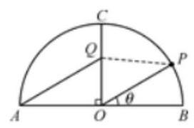

【难度】 $\bigstar \bigstar \bigstar$

【答案】 $\frac{\pi }{6}$ .

【解析】设 $\angle {OPQ} = \alpha$ ,在 $\bigtriangleup {POQ}$ 中,用正弦定理可得含 $\alpha ,\vartheta$ 的关系式.

因为 $\angle {AQC} = \frac{2\pi }{3}$ ,所以 $\angle {AQO} = \frac{\pi }{3}$ . 又 ${OA} = {OB} = 3$ ,所以 ${OQ} = \sqrt{3}$

在 $\bigtriangleup {OPQ}$ 中, ${OQ} = \sqrt{3},{OP} = 3,\angle {POQ} = \frac{\pi }{2} - \vartheta$ ,设 $\angle {OPQ} = \alpha$ ,则 $\angle {PQO} = \frac{\pi }{2} - \alpha  + \vartheta$ .

由正弦定理,得 $\frac{3}{\sin \left( {\frac{\pi }{2} - \alpha  + \theta }\right) } = \frac{\sqrt{3}}{\sin \alpha }$ ,即 $\sqrt{3}\sin \alpha  = \cos \left( {\alpha  - \vartheta }\right)$ .

展开并整理,得 $\tan \alpha  = \frac{\cos \theta }{\sqrt{3} - \sin \theta }$ ,其中 $\vartheta  \in  \left( {0,\frac{\pi }{2}}\right)$ . 此时当 $\vartheta  = \frac{\pi }{3}$ 时, $\tan \alpha  = \frac{\sqrt{3}}{3}$ . 因为 $\alpha  \in  \left( {0,\pi }\right)$ ,所以 $\alpha  = \frac{\pi }{6}$ .

故当 $\vartheta  = \frac{\pi }{3}$ 时, $\angle {OPQ} = \frac{\pi }{6}$ .

【例 16】设 $a, b \in  R, c \in  \lbrack 0,{2\pi })$ ,若对于任意实数 $x$ 都有 $2\sin \left( {{3x} - \frac{\pi }{3}}\right)  = a\sin \left( {{bx} + c}\right)$ ,则满足条件的有序实数组 $\left( {a, b, c}\right)$ 的组数为___.

【难度】 $\star   \star   \star   \star$

【答案】 4

【解析】解: $\because$ 对于任意实数 $x$ 都有 $2\sin \left( {{3x} - \frac{\pi }{3}}\right)  = a\sin \left( {{bx} + c}\right)$ ,

$\therefore$ 必有 $\left| a\right|  = 2$ ,

若 $a = 2$ ,则方程等价为 $\sin \left( {{3x} - \frac{\pi }{3}}\right)  = \sin \left( {{bx} + c}\right)$ ,

则函数的周期相同,若 $b = 3$ ,此时 $C = \frac{5\pi }{3}$ ,

若 $b =  - 3$ ,则 $C = \frac{4\pi }{3}$ ,

若 $a =  - 2$ ,则方程等价为 $\sin \left( {{3x} - \frac{\pi }{3}}\right)  =  - \sin \left( {{bx} + c}\right)  = \sin \left( {-{bx} - c}\right)$ ,

若 $b =  - 3$ ,则 $C = \frac{\pi }{3}$ ,若 $b = 3$ ,则 $C = \frac{2\pi }{3}$ ,

综上满足条件的有序实数组 $\left( {a, b, c}\right)$ 为 $\left( {2,3,\frac{5\pi }{3}}\right) ,\left( {2, - 3,\frac{4\pi }{3}}\right) ,\left( {-2, - 3,\frac{\pi }{3}}\right) ,\left( {-2,3,\frac{2\pi }{3}}\right)$ , 共有 4 组, 故答案为: 4.

【例 17】设 $\omega$ 为正实数，若存在 $a, b\left( {\pi  \leq  a < b \leq  {2\pi }}\right)$ ，使得 $\cos {\omega a} + \cos {\omega b} = 2$ ，则 $\omega$ 的取值范围是___.

【难度】 $\star   \star   \star   \star   \star$

【答案】 $\{ 2\}  \cup  \lbrack 3, + \infty )$

【解析】解: 要 $\cos {\omega a} + \cos {\omega b} = 2$ ,则有 $\cos {\omega a} = \cos {\omega b} = 1$ ;

余弦函数 $y = \cos x$ 图象如下:

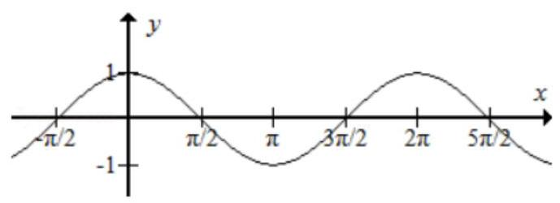

可知,当 $x = {2k\pi }$ 时, $\cos x = 1,\because \cos {\omega a} + \cos {\omega b} = 2,\pi  \leq  a < b \leq  {2\pi }$

$\therefore$ 必有 ${\omega a} = {2k\pi },{\omega b} = {2k\pi } + {n\pi },\left( {k, n \in  {N}_{ + }}\right) ,\therefore \left\{  {\begin{array}{l} {\omega \pi } \leq  {2k\pi } \\  \omega  \cdot  {2\pi } \geq  {2k\pi } + {2\pi } \end{array}, k \in  {N}_{ + }}\right.$

得到 $k + 1 \leq  \omega  \leq  {2k}\left( {k \in  {N}_{ + }}\right)$ ， $\text{ ① }k = 1$ 时， $\omega  = 2$ ， $\text{ ② }k = 2$ 时， $3 \leq  \omega  \leq  4$ ， $\text{ ③ }k = 3$ 时， $4 \leq  \omega  \leq  6$ ，

④ $k = 4$ 时， $5 \leq  \omega  \leq  8$ ， $\ldots$ 可得 $\omega$ 的取值范围为 $\{ 2\} \bigcup \lbrack 3$ ， $+ \infty )$ .

## 巩固训练

1、解下列方程:

(1) ${\left( \sin x + \cos x\right) }^{2} = \frac{1}{2}$ ;

(2) $\sqrt{5\cos x + \cos {2x}} + \sin x = 0, x \in  \left\lbrack  {0,{2\pi }}\right\rbrack$ ;

(3) $3{\sin }^{2}x - 4\sin x\cos x + 5{\cos }^{2}x = 2$ ;

【难度】 $\star   \star   \star$

【答案】见解析

【解析】(1) $\left\{  {x\left| {\;x = {k\pi } + {\left( -1\right) }^{k}\frac{\pi }{6} - \frac{\pi }{4}}\right. }\right.$ 或 $\left. {x = {k\pi } - {\left( -1\right) }^{k}\frac{\pi }{6} - \frac{\pi }{4}, k \in  Z}\right\}$

( 2 )由原方程可得， $\sqrt{5\cos x + \cos {2x}} =  - \sin x$

显然 $\sin x \leq  0, x \in  \left\lbrack  {\pi ,{2\pi }}\right\rbrack$ ,则 $5\cos x + \cos {2x} = {\sin }^{2}x$ .

$\therefore 5\cos x + 2{\cos }^{2}x - 1 = 1 - {\cos }^{2}x,\;3{\cos }^{2}x + 5\cos x - 2 = 0$ .

$\therefore \cos x = \frac{1}{3}$ 或 $\cos x =  - 2$ (舍去)

由 $\cos x = \frac{1}{3}$ ,得 $x = {2k\pi } \pm  \arccos \frac{1}{3}, k \in  Z$ .

又 $x \in  \left\lbrack  {\pi ,{2\pi }}\right\rbrack$ ,故 $x = {2\pi } - \arccos \frac{1}{3}$ .

(3) $\left\{  {x\left| {\;x = {k\pi } + \arctan 3\text{ 或 }x = {k\pi } + \frac{\pi }{4}}\right. , k \in  Z}\right\}$

2、已知方程 $\sin x + \sqrt{3}\cos x = m + 1$ 在 $\left\lbrack  {0,\pi }\right\rbrack$ 上有两个不等的实数的解，则实数 $m$ 的取值范围为___

【难度】 $\star   \star   \star$

【答案】 $\left\lbrack  {\sqrt{3} - 1,1}\right)$

【解析】化简根据三角函数图像

3、若 $- \frac{\pi }{2} \leq  \alpha  \leq  \frac{\pi }{2},0 \leq  \beta  \leq  \pi , m \in  R$ ,如果有 ${\alpha }^{3} + \sin \alpha  + m = 0,{\left( \frac{\pi }{2} - \beta \right) }^{3} + \cos \beta  + m = 0$ ,则 $\cos \left( {\alpha  + \beta }\right)$ 值为( )

A. -1 B. 0

C. $\frac{1}{2}$ D. 1

【难度】 $\star   \star   \star   \star$

【答案】 $B$

【解析】解: 考查函数 $f\left( x\right)  = {x}^{3} + \sin x$ ,显然 $f\left( x\right)$ 满足 $f\left( {-x}\right)  =  - f\left( x\right)$ ,故 $f\left( x\right)$ 是奇函数.

$\because {f}^{\prime }\left( x\right)  = 2{x}^{2} + \cos x,\therefore$ 若 $- \frac{\pi }{2} \leq  x \leq  \frac{\pi }{2}$ ,则 ${f}^{\prime }\left( x\right)  = 2{x}^{2} + \cos x \geq  0$ ,

故函数 $f\left( x\right)$ 在 $\left\lbrack  {-\frac{\pi }{2},\frac{\pi }{2}}\right\rbrack$ 上是增函数.

$\because {\alpha }^{3} + \sin \alpha  + m = 0,{\left( \frac{\pi }{2} - \beta \right) }^{3} + \cos \beta  + m = 0$ ,令 $\gamma  = \frac{\pi }{2} - \beta$ ,

则有 $\gamma  \in  \left\lbrack  {-\frac{\pi }{2},\frac{\pi }{2}}\right\rbrack  ,{\gamma }^{3} + \sin \gamma  + m = 0$ .

$\therefore f\left( \alpha \right)  =  - m, f\left( \gamma \right)  =  - m$ ,故有 $f\left( \alpha \right)  = f\left( \gamma \right)$ .

根据函数 $f\left( x\right)$ 在 $\left\lbrack  {-\frac{\pi }{2},\frac{\pi }{2}}\right\rbrack$ 上是增函数,可得 $\alpha  = \gamma  = \frac{\pi }{2} - \beta$ ,即 $\alpha  + \beta  = \frac{\pi }{2}$ ,

故 $\cos \left( {\alpha  + \beta }\right)  = 0$ ,

故选: $B$ .

4、设 ${a}_{1}\text{ 、 }{a}_{2} \in  R$ ，且 $\frac{1}{2 + \sin {a}_{1}} + \frac{1}{2 + \sin \left( {2{a}_{2}}\right) } = 2$ ，则 $\left| {{10\pi } - {a}_{1} - {a}_{2}}\right|$ 的最小值等于 ___.

【难度】 $\star   \star   \star   \star$

【答案】 $\frac{\pi }{4}$

【解析】解: 根据三角函数的性质,可知 $\sin {\alpha }_{1},\sin 2{\alpha }_{2}$ 的范围在 $\left\lbrack  {-1,1}\right\rbrack$ ,

要使 $\frac{1}{2 + \sin {\alpha }_{1}} + \frac{1}{2 + \sin 2{\alpha }_{2}} = 2,\therefore \sin {\alpha }_{1} =  - 1,\sin 2{\alpha }_{2} =  - 1$ .

则: ${\alpha }_{1} =  - \frac{\pi }{2} + 2{k}_{1}\pi ,{k}_{1} \in  Z.2{\alpha }_{2} =  - \frac{\pi }{2} + 2{k}_{2}\pi$ ,即 ${\alpha }_{2} =  - \frac{\pi }{4} + {k}_{2}\pi ,{k}_{2} \in  Z$ .

那么: ${\alpha }_{1} + {\alpha }_{2} = \left( {2{k}_{1} + {k}_{2}}\right) \pi  - \frac{3\pi }{4},{k}_{1}\text{ 、 }{k}_{2} \in  Z.\therefore \left| {{10\pi } - {\alpha }_{1} - {\alpha }_{2}}\right|  = \left| {{10\pi } + \frac{3\pi }{4} - \left( {2{k}_{1} + {k}_{2}}\right) \pi }\right|$ 的最小值为 $\frac{\pi }{4}$ . 故答案为: $\frac{\pi }{4}$ .

## 实战演练

一、填空题

1、在 $\bigtriangleup {ABC}$ 中， $a = 2$ ， $B = {60}^{ \circ  }$ ， ${S}_{\bigtriangleup {ABC}} = \frac{\sqrt{3}}{2}$ ，则 $b =$ ___.

【难度】 $\star   \star$

【答案】 $\sqrt{3}$

【解析】解: $\because a = 2, B = {60}^{ \circ  },{S}_{\bigtriangleup {ABC}} = \frac{\sqrt{3}}{2},\therefore \frac{1}{2}{ac}\sin B = \frac{1}{2} \times  {2c} \times  \frac{\sqrt{3}}{2} = \frac{\sqrt{3}}{2}$ ,

$\therefore c = 1$ ,则由余弦定理可得, $\cos B = \frac{{a}^{2} + {c}^{2} - {b}^{2}}{2ac},\therefore \frac{1}{2} = \frac{4 + 1 - {b}^{2}}{4}$ ,解可得, $b = \sqrt{3}$

2、方程 $6{\sin }^{2}x - 4\sin {2x} =  - 1, x \in  \left\lbrack  {0,\pi }\right\rbrack$ 的解集为___.

【难度】 $\star   \star   \star$

【答案】 $\left\{  {\frac{\pi }{4},\arctan \frac{1}{7}}\right\}$

【解析】方程 $6{\sin }^{2}x - 4\sin {2x} =  - 1$ 可化为 $6{\sin }^{2}x - 8\sin x\cos x + 1 = 0$ ,即 $7{\sin }^{2}x - 8\sin x\cos x + {\cos }^{2}x = 0$ , 即 $\left( {7\sin x - \cos x}\right) \left( {\sin x - \cos x}\right)  = 0$ ,解得 $7\sin x = \cos x$ 或 $\sin x = \cos x$ ,即 $\tan x = \frac{1}{7}$ 或 $\tan x = 1$ , 所以 $x = \arctan \frac{1}{7}$ 或 $x = \frac{\pi }{4}$ ,所以原方程的解集为 $\left\{  {\frac{\pi }{4},\arctan \frac{1}{7}}\right\}$ . 故答案为: $\left\{  {\frac{\pi }{4},\arctan \frac{1}{7}}\right\}$

3、若 $\arccos \left( {-x}\right)  = \arccos x$ ，则 $x =$ ___.

【难度】 $\star   \star   \star$

【答案】0

【解析】由 $\arccos \left( {-x}\right)  = \arccos x$ ,得 $\pi  - \arccos x = \arccos x$ ,得 $\arccos x = \frac{\pi }{2}$ ,则 $x = \cos \frac{\pi }{2} = 0$ . 故答案为: 0

4、已知函数 $f\left( x\right)  = 2\sin \left( {{\omega x} + \varphi }\right) \left( {\left| \varphi \right|  < \frac{\pi }{2}}\right.$ ) 的部分图象如图所示,若 $f\left( {x}_{0}\right)  = \frac{6}{5}\left( {-\frac{\pi }{9} < {x}_{0} < \frac{7\pi }{18}}\right)$ ,则 $\cos 3{x}_{0} =$ _____.

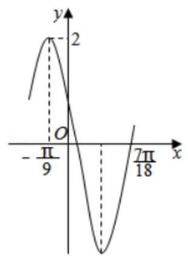

【难度】 $\star   \star   \star$

【答案】 $\frac{3 + 4\sqrt{3}}{10}$

【解答】解: 设 $f\left( x\right)$ 的最小正周期为 $T$ ,则有 $\frac{3}{4}T = \frac{7\pi }{18} - \left( {-\frac{\pi }{9}}\right)  = \frac{\pi }{2}$ ,故 $T = \frac{2\pi }{3} = \frac{2\pi }{\left| \omega \right| }$ ,所以 $\omega  =  \pm  3$ , 因为 $f\left( {-\frac{\pi }{9}}\right)  = 2\sin \left( {-\frac{\pi }{9}\omega  + \varphi }\right)  = 2$ ,所以 $- \frac{\pi }{9}\omega  + \varphi  = \frac{\pi }{2} + {2k\pi }, k \in  Z$ ,

当 $\omega  = 3$ 时,则 $\varphi  = \frac{5\pi }{6} + {2k\pi }, k \in  Z$ ,不符合题意;

当 $\omega  =  - 3$ 时,则 $\varphi  = \frac{\pi }{6} + {2k\pi }, k \in  Z$ ,又 $\left| \varphi \right|  < \frac{\pi }{2}$ ,所以 $\varphi  = \frac{\pi }{6}$ ,故 $f\left( x\right)  = 2\sin \left( {-{3x} + \frac{\pi }{6}}\right)$ ,

则 $f\left( {x}_{0}\right)  = 2\sin \left( {-3{x}_{0} + \frac{\pi }{6}}\right)  = \frac{6}{5}$ ，因为 $- \frac{\pi }{9} < {x}_{0} < \frac{7\pi }{18}$ ，所以 $- 3{x}_{0} + \frac{\pi }{6} \in  \left( {-\pi ,\frac{\pi }{2}}\right)$ ，

又因为 $\sin \left( {-3{x}_{0} + \frac{\pi }{6}}\right)  = \frac{3}{5} > 0$ ,所以 $- 3{x}_{0} + \frac{\pi }{6} \in  \left( {0,\frac{\pi }{2}}\right)$ ,故 $\cos \left( {-3{x}_{0} + \frac{\pi }{6}}\right)  = \sqrt{1 - {\sin }^{2}\left( {-3{x}_{0} + \frac{\pi }{6}}\right) } = \frac{4}{5}$ ,

所以 $\cos 3{x}_{0} = \cos \left\lbrack  {\frac{\pi }{6} - \left( {-3{x}_{0} + \frac{\pi }{6}}\right) }\right\rbrack   = \frac{\sqrt{3}}{2}\cos \left( {-3{x}_{0} + \frac{\pi }{6}}\right)  + \frac{1}{2}\sin \left( {-3{x}_{0} + \frac{\pi }{6}}\right)  = \frac{3 + 4\sqrt{3}}{10}$ .

故答案为: $\frac{3 + 4\sqrt{3}}{10}$ .

5、已知 $\arcsin \left( {{a}^{2} + 1}\right)  - \arcsin \left( {b - 1}\right)  \geq  \frac{\pi }{2}$ ，则 $\arccos \left( {{a}^{2} - {b}^{2}}\right)  =$ ___.

【难度】 $\star   \star   \star   \star$

【答案】 $\pi$

【解析】由题意, $\sin \alpha  = {a}^{2} + 1,\sin \beta  = b - 1,\alpha  - \beta  \geq  \frac{\pi }{2}$ ,

$\therefore a = 0, b = 1,\therefore {a}^{2} - {b}^{2} =  - 1,\therefore \arccos \left( {{a}^{2} - {b}^{2}}\right)  = \pi$ . 故答案为: $\pi$

6、在 $\bigtriangleup {ABC}$ 中，内角 $A < B < C$ ，记 $\min \{ a, b\}  = \left\{  \begin{array}{l} a, a \leq  b \\  b, a > b \end{array}\right.$ ，则 $\min \left\{  {\frac{\sin B}{\sin A},\frac{\sin C}{\sin B}}\right\}$ 的取值范围为___.

【难度】 $\star   \star   \star   \star$

【答案】 $\left( {1,\frac{1 + \sqrt{5}}{2}}\right)$

【解析】解: 内角 $A < B < C$ ,可得 $a < b < c$ ,则 $\frac{b}{a} > 1,\frac{c}{b} > 1$ ,

则 $\min \left\{  {\frac{\sin B}{\sin A},\frac{\sin C}{\sin B}}\right\}   = \min \left\{  {\frac{b}{a},\frac{c}{b}}\right\}$ ,当 $\frac{b}{a} \leq  \frac{c}{b}$ ,可得 $\min \left\{  {\frac{b}{a},\frac{c}{b}}\right\}   = \frac{b}{a}$ ,由 $\frac{a + b}{b} > \frac{c}{b} \geq  \frac{b}{a}$ ,

即 $1 + \frac{a}{b} > \frac{b}{a}$ ,即有 ${\left( \frac{b}{a}\right) }^{2} - \frac{b}{a} - 1 < 0$ ,解得 $1 < \frac{b}{a} < \frac{1 + \sqrt{5}}{2}$ ;

当 $\frac{b}{a} > \frac{c}{b}$ ,可得 $\min \left\{  {\frac{b}{a},\frac{c}{b}}\right\}   = \frac{c}{b}$ ,由 $\frac{c - b}{b} < \frac{a}{b} < \frac{b}{c}$ ,即 $\frac{c}{b} - 1 < \frac{b}{c}$ ,即有 ${\left( \frac{c}{b}\right) }^{2} - \frac{c}{b} - 1 < 0$ ,

解得 $1 < \frac{c}{b} < \frac{1 + \sqrt{5}}{2}$ ,综上可得 $\min \left\{  {\frac{\sin B}{\sin A},\frac{\sin C}{\sin B}}\right\}$ 的取值范围为 $\left( {1,\frac{1 + \sqrt{5}}{2}}\right)$ . 故答案为: $\left( {1,\frac{1 + \sqrt{5}}{2}}\right)$ .

## 二、选择题

7、在三角形 ${ABC}$ 中，分别根据下列条件解三角形，其中有两个解的是 ( )

A. $a = 8$ B. $a = {25}\;b = {30}\;A = {150}^{ \circ  }$

C. $a = {30}\;b = {40}\;A = {30}^{ \circ  }$ D. $a = {72}\;b = {60}\;A = {135}^{ \circ  }$

【难度】★★

【答案】 $C$

【解析】解: 由正弦定理可得 $\frac{a}{\sin A} = \frac{b}{\sin B}$ ,若 $A$ 成立, $a = 8, b = {16}, A = {30}^{ \circ  }$ ,有 $\frac{8}{\frac{1}{2}} = \frac{16}{\sin B},\therefore \sin B = 1$ , $\therefore B = {90}^{ \circ  }$ ,故 $\bigtriangleup {ABC}$ 有唯一解.

若 $B$ 成立, $a = {25}, b = {30}, A = {150}^{ \circ  }$ ,有 $\frac{25}{\frac{1}{2}} = \frac{30}{\sin B},\therefore \sin B = \frac{3}{5}$ ,又 $b > a$ ,故 $B > {150}^{ \circ  }$ ,故 $\bigtriangleup {ABC}$ 无解. 若 $C$ 成立, $a = {30}, b = {40}, A = {30}^{ \circ  }$ ,有 $\frac{30}{\frac{1}{2}} = \frac{40}{\sin B},\therefore \sin B = \frac{2}{3}$ ,又 $b > a$ ,故 $B > A$ ,故 $B$ 可以是锐角, 也可以是钝角,故 $\bigtriangleup {ABC}$ 有两个解.

若 $D$ 成立, $a = {72}, b = {60}, A = {135}^{ \circ  }$ ,有 $\frac{72}{\frac{\sqrt{2}}{2}} = \frac{60}{\sin B},\therefore \sin B = \frac{5\sqrt{2}}{12}$ ,由于 $B < A$ ,故 $B$ 为锐角,故 $\bigtriangleup {ABC}$ 有唯一解.

故选: $C$ .

8、要得到函数 $y = \sin x$ 的图象,只需将函数 $y = \sin \left( {{2x} - \frac{\pi }{3}}\right)$ 的图象上所有的点(   )

A. 横坐标伸长到原来的 2 倍 (纵坐标不变),再向左平移 $\frac{\pi }{6}$ 个单位长度

B. 横坐标伸长到原来的 2 倍 (纵坐标不变),向左平移 $\frac{\pi }{3}$ 个单位长度

C. 横坐标伸长到原来的 $\frac{1}{2}$ 倍 (纵坐标不变),再向左平移 $\frac{\pi }{3}$ 个单位长度

D. 横坐标伸长到原来的 $\frac{1}{2}$ 倍 (纵坐标不变),再向左平移 $\frac{\pi }{6}$ 个单位长度

【难度】 $\star   \star$

【答案】 $B$

【解答】解: 只需将函数 $y = \sin \left( {{2x} - \frac{\pi }{3}}\right)$ 的图象上所有的点,横坐标伸长到原来的 2 倍 (纵坐标不变), 可得 $y = \sin \left( {x - \frac{\pi }{3}}\right)$ 的图象;

再向左平移 $\frac{\pi }{3}$ 个单位长度,可得函数 $y = \sin x$ 的图象,

故选: $B$ .

9、关于 $x$ 的方程 ${x}^{2} + \arcsin \left( {\cos x}\right)  + a = 0$ 恰有3个实数根 ${x}_{1}\text{ 、 }{x}_{2}\text{ 、 }{x}_{3}$ ，则 ${x}_{1}^{2} + {x}_{2}^{2} + {x}_{3}^{2} =$ ( )

A. 1 B. 2

C. $a = \frac{{\pi }^{2}}{2}$ D. $a = 2{\pi }^{2}$

【难度】 $\star   \star   \star   \star$

【答案】B

【解析】设 ${x}_{1} < {x}_{2} < {x}_{3}$ ,因为 $y = {x}^{2} + \arcsin \left( {\cos x}\right)$ 为偶函数, $\therefore {x}_{1} + {x}_{3} = 0,{x}_{2} = 0$ ,

将 ${x}_{2} = 0$ 代入原方程可得 $a =  - \frac{\pi }{2},\therefore$ 原方程为 ${x}^{2} + \arcsin \left( {\cos x}\right)  = \frac{\pi }{2}$ ,

$\because \arcsin \left( {\cos x}\right)  \in  \left\lbrack  {-\frac{\pi }{2},\frac{\pi }{2}}\right\rbrack  ,\therefore {x}^{2} \in  \left\lbrack  {0,\pi }\right\rbrack   \Rightarrow  {x}_{1} \in  \left\lbrack  {-\sqrt{\pi },0}\right)$ 且 ${x}_{3} \in  (0,\sqrt{\pi }\rbrack$ ,

当 $x \in  \lbrack  - \sqrt{\pi },0),\arcsin \left( {\cos x}\right)  = \frac{\pi }{2} + x$ ,原方程化为 ${x}^{2} + \frac{\pi }{2} + x = \frac{\pi }{2},\therefore {x}_{1} =  - 1$ ,

同理推出 ${x}_{3} = 1,\therefore {x}_{1}^{2} + {x}_{2}^{2} + {x}_{3}^{2} = 2$ ,选B.

10、在 $\bigtriangleup  {ABC}$ 中，设 ${AD}$ 为 ${BC}$ 边上的高，且 ${AD} = {BC}$ ， $b$ ， $c$ 分别表示角 $B$ ， $C$ 所对的边长，则 $\frac{b}{c} + \frac{c}{b}$ 的取值范围是( )

A. $\left\lbrack  {2,\sqrt{5}}\right\rbrack$ B. $\left\lbrack  {2,\sqrt{6}}\right\rbrack$ C. $\left\lbrack  {3,\sqrt{5}}\right\rbrack$ D. $\left\lbrack  {3,\sqrt{6}}\right\rbrack$

【难度】 $\star   \star   \star   \star$

【答案】 $A$

【解析】解: $\because {BC}$ 边上的高 ${AD} = {BC} = a,\therefore {S}_{\bigtriangleup {ABC}} = \frac{1}{2}{a}^{2} = \frac{1}{2}{bc}\sin A,\therefore \sin A = \frac{{a}^{2}}{bc}$ , $\because \cos A = \frac{{b}^{2} + {c}^{2} - {a}^{2}}{2bc} = \frac{1}{2}\left( {\frac{b}{c} + \frac{c}{b} - \frac{{a}^{2}}{bc}}\right) ,\therefore \frac{b}{c} + \frac{c}{b} = 2\cos A + \sin A = \sqrt{5}\sin \left( {A + \alpha }\right)  \leq  \sqrt{5}$ ,其中 $\tan A = 2$ , 又由基本不等式可得 $\frac{b}{c} + \frac{c}{b} \geq  2\sqrt{\frac{b}{c} \cdot  \frac{c}{b}} = 2,\therefore \frac{b}{c} + \frac{c}{b}$ 的取值范围是 $\left\lbrack  {2,\sqrt{5}}\right\rbrack$ . 故选: $A$ .

## 三、解答题

11、如图， ${OA}$ ， ${OB}$ 是两条互相垂直的笔直公路，半径 ${OA} = {2km}$ 的扇形 ${AOB}$ 是某地的一名胜古迹区域. 当地政府为了缓解该古迹周围的交通压力，欲在圆弧 ${AB}$ 上新增一个入口 $P$ (点 $P$ 不与 $A$ ， $B$ 重合)，并新建两条都与圆弧 ${AB}$ 相切的笔直公路 ${MB}$ ， ${MN}$ ，切点分别是 $B$ ， $P$ . 当新建的两条公路总长最小时，投资费用最低. 设 $\angle {POA} = \theta$ ,公路 ${MB},{MN}$ 的总长为 $f\left( \theta \right)$ .

(1)求 $f\left( \theta \right)$ 关于 $\theta$ 的函数关系式，并写出函数的定义域；

(2)当 $\theta$ 为何值时,投资费用最低? 并求出 $f\left( \theta \right)$ 的最小值.

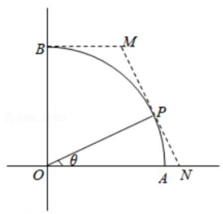

【难度】 $\bigstar \bigstar \bigstar$

【答案】见解析

【解析】解: (1) 连结 ${OM}$ . 在 Rt $\bigtriangleup \mathrm{{OPA}}$ 中, ${OP} = 2,\angle {POA} = \theta$ ,故 ${PN} = 2\tan \theta$ .

据平面几何知识可知, ${MB} = {MP},\angle {BOM} = \frac{1}{2}\angle {BOP} = \frac{\pi }{4} - \frac{\theta }{2}$ ,

在 Rt $\Delta$ BOM 中, ${OB} = 2,\angle {BOM} = \frac{\pi }{4} - \frac{\theta }{2}$ ,故 ${BM} = 2\tan \left( {\frac{\pi }{4} - \frac{\theta }{2}}\right)$ .

所以 $f\left( \theta \right)  = {AP} + {2BM} = 2\tan \theta  + 4\tan \left( {\frac{\pi }{4} - \frac{\theta }{2}}\right)$ .

显然 $\theta  \in  \left( {0,\frac{\pi }{2}}\right)$ ,所以函数 $f\left( \theta \right)$ 的定义域为 $\left( {0,\frac{\pi }{2}}\right)$ .

(2)令 $\alpha  = \frac{\pi }{4} - \frac{\theta }{2}$ ，则 $\theta  = \frac{\pi }{2} - {2\alpha }$ ，且 $\alpha  \in  \left( {0,\frac{\pi }{4}}\right)$ .

所以 $f\left( \theta \right)  = 2\tan \left( {\frac{\pi }{2} - {2\alpha }}\right)  + 4\tan \alpha  = \frac{2\sin \left( {\frac{\pi }{2} - {2\alpha }}\right) }{\cos \left( {\frac{\pi }{2} - {2\alpha }}\right) } + 4\tan \alpha$ ,

$= \frac{2\cos {2\alpha }}{\sin {2\alpha }} + 4\tan \alpha  = \frac{2}{\tan {2\alpha }} + 4\tan \alpha  = \frac{1 - {\tan }^{2}\alpha }{\tan \alpha } + 4\tan \alpha  = \frac{1}{\tan \alpha } + 3\tan \alpha  \geq  2\sqrt{3}$ ,

当且仅当 $\frac{1}{\tan \alpha } = 3\tan \alpha$ ,即: $\tan \alpha  = \frac{\sqrt{3}}{3}$ 等号成立.

故 $\theta  = \frac{\pi }{6}$ 时,投资最低 $f\left( \theta \right)  = 2\sqrt{3}$ .

12、在非直角三角形 ${ABC}$ 中,角 $A, B, C$ 的对边分别为 $a, b, c$ ,

(1)若 $a + c = {2b}$ ，求角 $B$ 的最大值；

(2)若 $a + c = {mb}\left( {m > 1}\right)$ ，

(i) 证明: $\tan \frac{A}{2}\tan \frac{C}{2} = \frac{m - 1}{m + 1}$ ;

(可能运用的公式有 $\sin \alpha  + \sin \beta  = 2\sin \frac{\alpha  + \beta }{2}\cos \frac{\alpha  - \beta }{2}$ )

(ii) 是否存在函数 $\varphi \left( m\right)$ ,使得对于一切满足条件的 $m$ ,代数式 $\frac{\cos A + \cos C + \varphi \left( m\right) }{\varphi \left( m\right) \cos A\cos C}$ 恒为定值? 若存在,请给出一个满足条件的 $\varphi \left( m\right)$ ,并证明之; 若不存在,请给出一个理由.

【难度】 $\star   \star   \star   \star   \star$

【答案】见解析

【解析】解: (1) 由 $a + c = {2b}$ ,

所以由余弦定理可得 $\cos B = \frac{{a}^{2} + {c}^{2} - {b}^{2}}{2ac} = \frac{{a}^{2} + {c}^{2} - {\left( \frac{a + c}{2}\right) }^{2}}{2ac} = \frac{\frac{3}{4}\left( {{a}^{2} + {c}^{2}}\right)  - \frac{1}{2}{ac}}{2ac} \geq  \frac{ac}{2ac} = \frac{1}{2}$ ,

当且仅当 $a = c$ 时 $\cos B$ 最小, $B \in  \left( {0,\pi }\right)$ ,所以 ${B}_{\max } = \frac{\pi }{3}$ ;

(2)(i):证明:因为 $a + c = {mb}\left( {m > 1}\right)$ ，由正弦定理可得 $\frac{a}{\sin A} = \frac{b}{\sin B} = \frac{c}{\sin C}$ ，

所以可得 $\sin A + \sin C = m\sin B$ ,所以 $2\sin \frac{A + C}{2} \cdot  \cos \frac{A - C}{2} = {2m}\sin \frac{B}{2} \cdot  \cos \frac{B}{2}$ ,

因为 $\frac{A + C}{2} = \frac{\pi  - B}{2}$ ,所以 $\cos \frac{A - C}{2} = m\cos \frac{A + C}{2}$ ,展开整理可得 $\left( {1 + m}\right) \sin \frac{A}{2}\sin \frac{C}{2} = \left( {m - 1}\right) \cos \frac{A}{2}\cos \frac{C}{2}$ , 故 $\tan \frac{A}{2} \cdot  \tan \frac{C}{2} = \frac{m - 1}{m + 1}$ ;

(ii) 由 (i) 可得 $\tan \frac{A}{2} \cdot  \tan \frac{C}{2} = \frac{m - 1}{m + 1}$ 及半角公式可得 $\tan \frac{\alpha }{2} = \frac{1 - \cos \alpha }{\sin \alpha } = \frac{\sin \alpha }{1 + \cos \alpha }$ 可得

${\left( \tan \frac{A}{2}\tan \frac{C}{2}\right) }^{2} = \frac{1 - \cos A}{\sin A} \cdot  \frac{\sin A}{1 + \cos A} \cdot  \frac{1 - \cos C}{\sin C} \cdot  \frac{\sin C}{1 + \cos C} = \frac{1 - \cos A}{1 + \cos A} \cdot  \frac{1 - \cos C}{1 + \cos C} = \frac{{\left( m - 1\right) }^{2}}{{\left( m + 1\right) }^{2}},$

对其展开整理可得 ${4m} - 2\left( {{m}^{2} + 1}\right) \left( {\cos A + \cos C}\right)  =  - {4m}\cos A\cos C$ ,

$\frac{{4m} - 2\left( {1 + {m}^{2}}\right) \left( {\cos A + \cos C}\right) }{\cos A\cos C} =  - {4m}$ ,即 $\frac{\cos A + \cos C - \frac{2m}{1 + {m}^{2}}}{\cos A\cos C} = \frac{2m}{1 + {m}^{2}}$ ,

即 $\frac{\cos A + \cos C - \frac{2m}{1 + {m}^{2}}}{-\frac{2m}{1 + {m}^{2}}\cos A\cos C} =  - 1$ ,与原三角式作比较可得 $\varphi \left( m\right)$ 存在,且 $\varphi \left( m\right)  =  - \frac{2m}{1 + {m}^{2}}$ .
