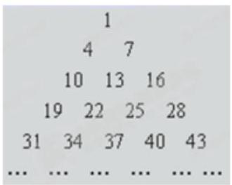
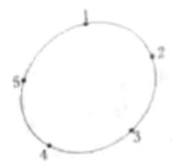
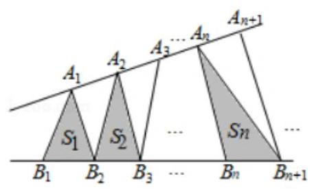
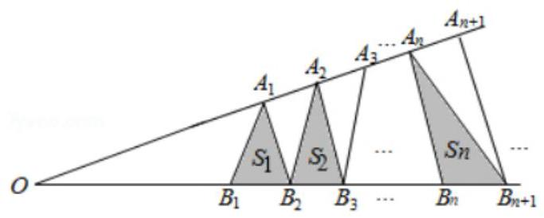
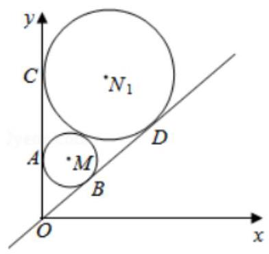

等差数列、等比数列

<table><tr><td>教学目标</td><td>1、理解数列的概念;   2、了解等差等比数列的通项和求和公式并会运用；   3、了解等差等比数列前 $n$ 项和的思想,对于等比数列前 $n$ 项和问题注意分类讨论;   4、能够准确求解等差等比数列综合问题.</td></tr><tr><td>重点</td><td>1、了解等差等比数列的通项和求和公式并会运用；   2、了解等差等比数列前 $n$ 项和的思想,对于等比数列前 $n$ 项和问题注意分类讨论;   3、能够准确求解等差等比数列综合问题.</td></tr><tr><td>难点</td><td>能够准确求解等差等比数列综合问题.</td></tr></table>

## 知识梳理

## 1、数列相关概念

## (1)数列定义:

在正整数集或其子集上的一个函数, 当自变量从 1 开始连续取值时, 相应函数值排成的一列数, 就是数列.

数列的特征: ①有次序; ②可重复 (与集合中的元素不同).

## (2)通项公式和递推公式

通项公式: 数列的第 $n$ 项 ${a}_{n}$ 与项数 $n$ 之间的关系,能用一个公式 ${a}_{n} = f\left( n\right)$ 表示时这个公式叫做数列的通项

公式.

递推公式: 数列中的项可用前一项或前相邻几项表示的一个公式, 叫做数列的递推公式.

## (3)数列分类:

有穷数列, 无穷数列; 递增数列, 递减数列, 摆动数列, 常数数列;

①有穷数列: 项数有限.

②无穷数列:项数无限.

③ 递增数列:对于任何 $n \in  {N}^{ * }$ ，均有 ${a}_{n + 1} > {a}_{n}$ .

④ 递减数列:对于任何 $n \in  {N}^{ * }$ ，均有 ${a}_{n + 1} < {a}_{n}$ .

⑤摆动数列:例如: - 1, 1, - 1, 1, - 1, 1, - 1, 1, ... .

⑥常数数列:例如:6，6，6，6，6， $\cdots$ .

(4)前 $n$ 项的和 ${S}_{n}$ 与通项 ${a}_{n}$ 的关系:

${a}_{n} = \left\{  \begin{array}{l} {S}_{1}\left( {n = 1}\right) \\  {S}_{n} - {S}_{n - 1}\left( {n \geq  2, n \in  {N}^{ * }}\right)  \end{array}\right.$ ,这个公式在求通项公式和证明时经常用到.

【注意】

①不是每一个数列都能写出通项公式的，如 $\sqrt{3}$ 的不足近似值: ${1.7},{1.73},{1.732},{1.7321},\cdots$ ;

②一个数列的通项公式可以有多种形式，如 $1, - 1,1, - 1,\cdots$ 可以写成 ${a}_{n} = {\left( -1\right) }^{n - 1}$ ，也可以写成 ${a}_{n} = \cos \left( {n + 1}\right) \pi$ 等;

③【分给出前几项，不能确定这个数列的通项公式. 如 $1,3,5,7,\cdots$ 可以写成 ${a}_{n} = {{2n} - 1}$ ，也可以写成

$$
{a}_{n} = \left( {{2n} - 1}\right)  + p\left( {n - 1}\right) \left( {n - 2}\right) \left( {n - 3}\right) \left( {n - 4}\right) ;
$$

④在判断数列递增、递减时,一定要满足对任意 $n \in  {N}^{ * }$ 成立;

⑤在利用 ${S}_{n}$ 求通项 ${a}_{n}$ 时,一定要注意 $n$ 的范围限制,而且还要注意带入检验.

## 2、常用数列:等差数列、等比数列

<table id="cross-table-1"><tr><td></td><td></td><td colspan="2">等差数列</td><td>等比数列</td></tr><tr><td>定义</td><td colspan="3">$\left\{  {a}_{n}\right\}$ 为 $A \cdot  P \Leftrightarrow  {a}_{n + 1} - {a}_{n} = d$ (常数)</td><td>$\left\{  {a}_{n}\right\}$ 为 $G \cdot  P \Leftrightarrow  \frac{{a}_{n + 1}}{{a}_{n}} = q$ (常数) $\left( {{a}_{1} \neq  0, q \neq  0}\right)$</td></tr><tr><td>递推公式</td><td colspan="3">${a}_{n} = {a}_{n - 1} + d{a}_{n} = {a}_{m} + \left( {n - m}\right) d$</td><td>${a}_{n} = {a}_{n - 1}q;{a}_{n} = {a}_{m}{q}^{n - m}$</td></tr><tr><td>通项公式</td><td colspan="3">${a}_{n} = {a}_{1} + \left( {n - 1}\right) d = {a}_{k} + \left( {n - k}\right) d \; = {dn} + {a}_{1} - d$</td><td>${a}_{n} = {a}_{1}{q}^{n - 1} = {a}_{k}{q}^{n - k}$</td></tr><tr><td>求和公式</td><td colspan="3">${s}_{n} = \frac{n\left( {{a}_{1} + {a}_{n}}\right) }{2} = n{a}_{1} + \frac{n\left( {n - 1}\right) }{2}d \; = \frac{d}{2}{n}^{2} + \left( {{a}_{1} - \frac{d}{2}}\right) n \; {S}_{n} = n{a}_{n} + \frac{n\left( {n - 1}\right) }{2}\left( {-d}\right)$</td><td>${s}_{n} = \left\{  \begin{array}{ll} n{a}_{1} & \left( {q = 1}\right) \\  \frac{{a}_{1}\left( {1 - {q}^{n}}\right) }{1 - q} = \frac{{a}_{1} - {a}_{n}q}{1 - q} & \left( {q \neq  1}\right)  \end{array}\right.$</td></tr><tr><td>中项公式</td><td colspan="3">$A = \frac{a + b}{2}$    推广: $2{a}_{n} = {a}_{n - m} + {a}_{n + m}$    $A = \frac{{a}_{n - k} + {a}_{n + k}}{2}\left( {n, k \in  {N}^{ * }, n > k > 0}\right)$</td><td>${G}^{2} = {ab}.$    推广: ${a}_{n}{}^{2} = {a}_{n - m} \times  {a}_{n + m} \; G =  \pm  \sqrt{{a}_{n - k}{a}_{n + k}}\left( {{a}_{n - k}{a}_{n + k} > 0}\right) \; \left( {n, k \in  {N}^{ * }, n > k > 0}\right)$</td></tr><tr><td rowspan="6">性质</td><td>1</td><td colspan="2">若 $m + n = p + q$ 则 ${a}_{m} + {a}_{n} = {a}_{p} + {a}_{q}$</td><td>若 $m + n = p + q$ ,则 ${a}_{m}{a}_{n} = {a}_{p}{a}_{q}$</td></tr><tr><td>2</td><td colspan="2">若 $\left\{  {k}_{n}\right\}$ 成等差数列(其中 ${k}_{n} \in  N$ )则 $\left\{  {a}_{n}\right\}$ 也为等差数列</td><td>若 $\left\{  {k}_{n}\right\}$ 成等差数列(其中 ${k}_{n} \in  N$ )，则 $\left\{  {a}_{n}\right\}$ 成等比数列</td></tr><tr><td colspan="2"></td><td></td><td>$\left\{  {a}_{n}\right\}  \text{ 、 }\left\{  {b}_{n}\right\}$ 是公比分别为 ${q}_{1},{q}_{2}$ 的等比数列,则 $\left\{  \left| {a}_{n}\right| \right\}  ,\left\{  \frac{1}{{a}_{n}}\right\}  ,\left\{  {a}_{n}^{2}\right\}  ,\left\{  {k{a}_{n}}\right\}$ , $\left\{  {k{a}_{n}{b}_{n}}\right\}  \left( {k \neq  0}\right) ,\left\{  \frac{{a}_{n}}{{b}_{n}}\right\}$ 也是等比数列</td></tr><tr><td colspan="2">4</td><td>$\left\{  {a}_{n}\right\}  \text{ 、 }\left\{  {b}_{n}\right\}$ 是公差分别为 ${d}_{1},{d}_{2}$ 的等差数列, 若它们的相同项也组成一个新的数列,则也是等差数列,公差为 ${d}_{1}$ , ${d}_{2}$ 的最小公倍数.</td><td>等比数列前 $n$ 项乘积记作 ${T}_{n}$ ,则 ${T}_{n},\frac{{T}_{2n}}{{T}_{n}},\frac{{T}_{3n}}{{T}_{2n}},\ldots$ 成等比数列.</td></tr><tr><td colspan="2">5</td><td>${S}_{n},{S}_{2n} - {S}_{n},{S}_{3n} - {S}_{2n}$ 成等差数列</td><td>${S}_{n},{S}_{2n} - {S}_{n},{S}_{3n} - {S}_{2n}$ (和不为零) 成等比数列</td></tr><tr><td colspan="2">6</td><td>$d = \frac{{a}_{n} - {a}_{1}}{n - 1} = \frac{{a}_{m} - {a}_{n}}{m - n}\left( {m \neq  n}\right)$</td><td>${q}^{n - 1} = \frac{{a}_{n}}{{a}_{1}},{q}^{n - m} = \frac{{a}_{n}}{{a}_{m}}\left( {m \neq  n}\right)$</td></tr></table>

## 等差数列:

①等差中项: 任意两数 $a, c$ 的等差中项是 $\frac{a + c}{2}$ ;

②通项公式法: ${a}_{n} = {a}_{1} + \left( {n - 1}\right) d = {nd} + \left( {{a}_{1} - d}\right)$ ( $d$ 可为零也可不为零一为等差数列充要条件(常数列也是等差数列) $\rightarrow$ 若 $d$ 不为 0,则是等差数列充分条件);

③ 前 $n$ 项和公式: ${S}_{n} = A{n}^{2} + {Bn} = \left( \frac{d}{2}\right) {n}^{2} + \left( {{a}_{1} - \frac{d}{2}}\right) n \rightarrow  \frac{d}{2}$ 可以为零也可不为零→为等差的充要条件→若 $d$ 为零,则是等差数列的充分条件; 若 $d$ 不为零,则是等差数列的充分条件;

④ 当 $d > 0$ 时, $\left\{  {a}_{n}\right\}$ 是单调递增的,当 $d < 0$ 时, $\left\{  {a}_{n}\right\}$ 是单调递减的;

⑤非零常数列既可为等比数列，也可为等差数列. (不是非零，即不可能是等比数列)

## 等比数列:

①等比中项: 任意两数 $a, c$ 不一定有等比中项,除非有 ${ac} > 0$ ,则等比中项一定有两个

②通项公式法:验证 ${a}_{n} = c{q}^{n}$ ( $c, q$ 为非零常数).

③ 前 $n$ 项和公式: ${S}_{n} = k{q}^{n} - k\left( {k \neq  0, k\text{ 为常数， }q \neq  0,1}\right)$

④ 等比数列 $\left\{  {a}_{n}\right\}$ 中,若 $\left\{  \begin{array}{l} {a}_{1} > 0 \\  q > 1 \end{array}\right.$ 或 $\left\{  \begin{array}{l} {a}_{1} < 0 \\  0 < q < 1 \end{array}\right.$ ,则数列 $\left\{  {a}_{n}\right\}$ 是单调递增的;

若 $\left\{  \begin{array}{l} {a}_{1} > 0 \\  0 < q < 1 \end{array}\right.$ 或 $\left\{  \begin{array}{l} {a}_{1} < 0 \\  q > 1 \end{array}\right.$ ,则数列 $\left\{  {a}_{n}\right\}$ 是单调递减的;

若 $q = 1$ ,则数列 $\left\{  {a}_{n}\right\}$ 是常数列;

若 $q < 0$ ,则数列 $\left\{  {a}_{n}\right\}$ 是摆动数列.

⑤ 正数列 $\left\{  {a}_{n}\right\}$ 成等比的充要条件是数列 $\left\{  {{\log }_{x}{a}_{n}}\right\}  \left( {x > 0\text{ 且 }x \neq  1}\right)$ 成等差数列. (类比思想)

## (一)数列的概念，等差、等比数列概念及基本量

## 例题精讲

【例 1】数列 $1,\frac{1}{2},\frac{2}{1},\frac{1}{3},\frac{1}{2},\frac{2}{1},\frac{3}{1},\frac{1}{4},\frac{2}{3},\frac{3}{2},\frac{4}{1},\ldots$ ，则 $\frac{8}{9}$ 是该数列的第___项.

【难度】 $\star   \star   \star$

【答案】 128

【解析】解: 观察数列 $1,\frac{1}{2},\frac{2}{1},\frac{1}{3},\frac{2}{2},\frac{3}{1},\frac{1}{4},\frac{2}{3},\frac{3}{2},\frac{4}{1},\ldots$ ,

该数列中: 分子、分母之和为 2 的有 1 项, 为 3 的有 2 项, 为 4 的有 3 项, 为 5 的有 4 项, ...,

$\therefore$ 分子、分母之和为 16 的有 15 项.

而分子、分母之和为 17 的有 16 项，排列顺序为:

$\frac{1}{16},\frac{2}{15},\frac{3}{14},\frac{4}{13},\ldots ,\frac{15}{2},\frac{16}{1}$ ; 其中 $\frac{8}{9}$ 是分子、分母之和为 17 的第 8 项;.

故共有 $\frac{{15} + 1}{2} \times  {15} + 8 = {128}$ 项.

故答案为 128 .

【例 2】将等差数列 $1,4,7\ldots \ldots$ ,按一定的规则排成了如图所示的三角形数阵.根据这个排列规则,数阵中第 20 行从左至右的第 3 个数是___.

【难度】 $\star   \star   \star$

【答案】 577

【解析】由题意可得等差数列的通项公式为 ${a}_{n} = {3n} - 2$ ,由三角形数阵的特点可知第 20 行 3 列的数为: $1 + 2 + 3 + 4 + \cdots  + {19} + 3 = {193}$ ,过数阵中第 20 行 3 列的数是数列的第 193 项,中 ${a}_{193} = 3 \times  {193} - 2 = {577}$ .

【例 3】( 1 )数列 $\left\{  {a}_{n}\right\}$ 为 1，1，2，1，1，2，3，1，1，2，1，1，2，3，4，...，首先给出 ${a}_{1} = 1$ ，接着复制该项后,再添加其后继数 2,于是 ${a}_{2} = 1,{a}_{3} = 2$ ,然后再复制前面所有的项1,1,2,再添加 2 的后继数 3,于是 ${a}_{4} = 1,{a}_{5} = 1,{a}_{6} = 2,{a}_{7} = 3$ ,接下来再复制前面所有的项1,1,2,1,1,2,3,再添加 $4,\ldots$ , 如此继续,则 ${a}_{2019} =$ ___.

【难度】 $\star   \star   \star   \star$

【答案】 1

【解析】由数列 $\left\{  {a}_{n}\right\}$ 的构造方法可知 ${a}_{1} = 1,{a}_{3} = 2,{a}_{7} = 3,{a}_{15} = 4$ ,可得: ${a}_{{2}^{n} - 1} = n$

即: ${a}_{{2}^{n} - 1 + k} = {a}_{k}\left( {1 \leq  k < {2}^{n} - 1}\right) \therefore {a}_{2019} = {a}_{996} = {a}_{485} = {a}_{230} = {a}_{103} = {a}_{40} = {a}_{9} = {a}_{2} = 1$

本题正确结果: 1

(2)如图，圆周上按顺时针方向标有1，2，3，4，5 五个点. 一只青蛙按顺时针方向绕圆从一个点跳到另一点. 若它停在奇数点上, 则下一次只能跳一个点; 若停在偶数点上, 则下一次跳两个点. 该青蛙从 5 这点跳起, 经 2018 次跳后它将停在的点是( )

A. 1 B. 2 C. 3 D. 4

【难度】 $\star   \star   \star   \star$

【答案】B

【解析】由 5 起跳, 5 是奇数, 沿顺时针下一次只能跳一个点, 落在 1 上由 1 起跳，1 是奇数，沿顺时针下一次只能跳一个点，落在 2 上

2 是偶数, 沿顺时针跳两个点, 落在 4 上

由 4 起跳, 是偶数, 沿顺时针跳两个点, 落在 1 上

$5 - 1 - 2 - 4 - 1 - 2$ ,周期为 $3\because {2018} = 3 \times  {672} + 2$

$\therefore$ 经 2018 次跳后它将停在的点对应的数为 2,故选 $B$

【例 4】在数列 $\left\{  {a}_{n}\right\}$ 中, $n \in  {N}^{ * }$ ,若 $\frac{{a}_{n + 2} - {a}_{n + 1}}{{a}_{n + 1} - {a}_{n}} = k$ ( $k$ 为常数),则称 $\left\{  {a}_{n}\right\}$ 为“等差比数列”. 下列是对“等差比数列”的判断:

① $k$ 不可能为 0 ；②等差数列一定是等差比数列；

③等比数列一定是等差比数列；④等差比数列中可以有无数项为0，

其中正确的判断是( ).

A. ①② B. ②③ C. ③④ D. ①④

【难度】★★★★

【答案】D

【解析】① 若 $k = 0$ ,则 $\frac{{a}_{n + 2} - {a}_{n + 1}}{{a}_{n + 1} - {a}_{n}} = 0$ ,即 ${a}_{n + 2} - {a}_{n + 1} = 0$ ,即数列 $\left\{  {a}_{n}\right\}$ 为常数列,所以 ${a}_{n + 1} - {a}_{n} = 0$ ,此时 $\frac{{a}_{n + 2} - {a}_{n + 1}}{{a}_{n + 1} - {a}_{n}}$ 无意义,所以 $k$ 不可能为 0 ; 故①正确；

②若等差数列 $\left\{  {a}_{n}\right\}$ 的公差为 0,则 ${a}_{n + 1} - {a}_{n} = 0$ ,此时 $\frac{{a}_{n + 2} - {a}_{n + 1}}{{a}_{n + 1} - {a}_{n}}$ 无意义,此时数列 $\left\{  {a}_{n}\right\}$ 不是等差比数列; 故②错；

③若等比数列 $\left\{  {a}_{n}\right\}$ 的公比为 1,则 ${a}_{n + 1} - {a}_{n} = 0$ ,此时 $\frac{{a}_{n + 2} - {a}_{n + 1}}{{a}_{n + 1} - {a}_{n}}$ 无意义,此时数列 $\left\{  {a}_{n}\right\}$ 不是等差比数列; 故③错；

④等差比数列中可以有无数项为0,如: $k =  - 1,\left\{  {a}_{n}\right\}   : 0,1,0,1,0,1,\ldots$ ; 故④正确. 故选: D.

【例 5】如图,点列 $\left\{  {A}_{n}\right\}  ,\left\{  {B}_{n}\right\}$ 分别在某个锐角的两边上,且 $\left| {{A}_{n}{A}_{n + 1}}\right|  = \left| {{A}_{n + 1}{A}_{n + 2}}\right| ,{A}_{n} \neq  {A}_{n + 2}, n \in  {N}^{ * }$ , $\left| {{B}_{n}{B}_{n + 1}}\right|  = \left| {{B}_{n + 1}{B}_{n + 2}}\right| ,\;{B}_{n} \neq  {B}_{n + 2},\;n \in  {N}^{ * }\left( {P \neq  Q\text{ 表示 }P\text{ 与 }Q\text{ 不重合). 若 }{d}_{n} = \left| {{A}_{n}{B}_{n}}\right| ,{S}_{n}\text{ 为 }\bigtriangleup {A}_{n}{B}_{n}{B}_{n + 1}}\right)$ 的面积, 则 ( )

A. $\left\{  {d}_{n}\right\}$ 是等差数列 B. $\left\{  {d}_{n}^{2}\right\}$ 是等差数列

C. $\left\{  {S}_{n}\right\}$ 是等差数列 D. $\left\{  {S}_{n}^{2}\right\}$ 是等差数列

【难度】 $\star   \star   \star   \star   \star$

【答案】C

【解析】解: 设锐角的顶点为 $O,\left| {O{A}_{1}}\right|  = a,\left| {O{B}_{1}}\right|  = c,\left| {{A}_{n}{A}_{n + 1}}\right|  = \left| {{A}_{n + 1}{A}_{n + 2}}\right|  = b,\left| {{B}_{n}{B}_{n + 1}}\right|  = \left| {{B}_{n + 1}{B}_{n + 2}}\right|  = d$ , 由于 $a, c$ 不确定,则 $\left\{  {d}_{n}\right\}$ 不一定是等差数列, $\left\{  {d}_{n}^{2}\right\}$ 不一定是等差数列,

设 $\bigtriangleup {A}_{n}{B}_{n}{B}_{n + 1}$ 的底边 ${B}_{n}{B}_{n + 1}$ 上的高为 ${h}_{n}$ ,由三角形的相似可得

$\frac{{h}_{n}}{{h}_{n + 1}} = \frac{O{A}_{n}}{O{A}_{n + 1}} = \frac{a + \left( {n - 1}\right) b}{a + {nb}},\frac{{h}_{n + 2}}{{h}_{n + 1}} = \frac{O{A}_{n + 2}}{O{A}_{n + 1}} = \frac{a + \left( {n + 1}\right) b}{a + {nb}}$ ,两式相加可得, $\frac{{h}_{n} + {h}_{n + 2}}{{h}_{n + 1}} = \frac{{2a} + {2nb}}{a + {nb}} = 2$ ,

即有 ${h}_{n} + {h}_{n + 2} = 2{h}_{n + 1}$ ,

由 ${S}_{n} = \frac{1}{2}d \cdot  {h}_{n}$ ,可得 ${S}_{n} + {S}_{n + 2} = 2{S}_{n + 1}$ ,即为 ${S}_{n + 2} - {S}_{n + 1} = {S}_{n + 1} - {S}_{n}$ ,则数列 $\left\{  {S}_{n}\right\}$ 为等差数列.

故选: $C$ .

【例 6】(1)设数列 $\left\{  {a}_{n}\right\}$ ，以下说法正确的是( )

A. 若 ${a}_{n}{}^{2} = {4}^{n}, n \in  {N}^{ * }$ ,则 $\left\{  {a}_{n}\right\}$ 为等比数列

B. 若 ${a}_{n} \cdot  {a}_{n + 2} = {a}_{n + 1}^{2}, n \in  {N}^{ * }$ ,则 $\left\{  {a}_{n}\right\}$ 为等比数列

C. 若 ${a}_{m} \cdot  {a}_{n} = {2}^{m + n}, m, n \in  {N}^{ * }$ ,则 $\left\{  {a}_{n}\right\}$ 为等比数列

D. 若 ${a}_{n} \cdot  {a}_{n + 3} = {a}_{n + 1} \cdot  {a}_{n + 2}, n \in  {N}^{ * }$ ,则 $\left\{  {a}_{n}\right\}$ 为等比数列

【难度】 $\star   \star   \star   \star$

【答案】C

【解析】等比数列定义

(2)已知数列 $\left\{  {a}_{n}\right\}$ 的通项公式是 ${a}_{n} = {b}^{n} + c, n \in  {\mathbf{N}}^{ * }$ ,其中 $b, c \in  \mathbf{R}$ ,那么 $\left\{  {a}_{n}\right\}$ 是等比数列的必要条件是( )

A. $c = 0$ B. $b \neq  0$ C. ${bc} = 0$ D. $b + c \neq  0$

【难度】 $\star   \star   \star   \star$

【答案】D

【解析】等比数列定义

(3)等比数列 $\left\{  {a}_{n}\right\}$ 的首项 ${a}_{1}$ ，公比 $q$ 是关于 $x$ 的方程 $\left( {t - 1}\right) {x}^{2} + {2x} + {2t} - 1 = 0$ 的实数解。若数列 $\left\{  {a}_{n}\right\}$ 有且只有一个，则实数 $t$ 的取值集合为___

【难度】 $\star   \star   \star   \star$

【答案】 $\left\{  {0,\frac{1}{2},1,\frac{3}{2}}\right\}$

【解析】: 等比数列 $\left\{  {a}_{n}\right\}$ 的首项 ${a}_{1}$ 、公比 $q$ 是关于 $x$ 的方程 $\left( {t - 1}\right) {x}^{2} + {2x} + \left( {{2t} - 1}\right)  = 0$ 的实数解,数列 $\left\{  {a}_{n}\right\}$ 有且只有一个,

$\therefore t - 1 = 0$ ,或 $\bigtriangleup  = 4 - 4\left( {t - 1}\right) \left( {{2t} - 1}\right)  = 0$ ,或一元二次方程有一个零根和一个非 0 实数根,

解得 $t = 0, t = \frac{3}{2}, t = 1, t = \frac{1}{2}$ .

经过验证满足条件. $\therefore$ 实数 $t$ 的取值集合为 $\left\{  {0,\frac{1}{2},1,\frac{3}{2}}\right\}$ . 故答案为: $\left\{  {0,\frac{1}{2},1,\frac{3}{2}}\right\}$ .

(4)已知等比数列 ${a}_{1},{a}_{2},{a}_{3},{a}_{4}$ 满足 ${a}_{1} \in  \left( {0,1}\right) ,{a}_{2} \in  \left( {1,2}\right) ,{a}_{3} \in  \left( {2,4}\right)$ ,则 ${a}_{4}$ 的取值范围是( )

A、 $\left( {3,8}\right)$ ； B、(2,16); C、 $\left( {4,8}\right)$ ； D、 $\left( {2\sqrt{2},{16}}\right)$

【难度】★★★★

【答案】D

【解析】解: 设公比为 $q$ ,则

$\because {a}_{1} \in  \left( {0,1}\right) ,{a}_{2} \in  \left( {1,2}\right) ,{a}_{3} \in  \left( {2,4}\right) ,\therefore \left\{  \begin{array}{l} 0 < {a}_{1} < 1\text{ ① } \\  1 < {a}_{1}q < 2\text{ ② } \\  2 < {a}_{1}{q}^{2} < 4\text{ ③ } \end{array}\right.$

$\therefore$ ③ $\div$ ②: $1 < q < 4$ ④

③ ÷ ①: $q <  - \sqrt{2}$ 或 $q > \sqrt{2}$ ⑤由④⑤可得: $\sqrt{2} < q < 4\therefore {a}_{4} = {a}_{3}q$ ，

$\therefore {a}_{4} \in  \left( {2\sqrt{2},{16}}\right)$ .

## 巩固训练

1、写出数列1， $- \frac{3}{4}$ ， $\frac{1}{2}$ ， $- \frac{5}{16}$ ， . . . . . . . . . . . . . . . . . .

【难度】 $\star   \star   \star$

【答案】 ${a}_{n} = {\left( -1\right) }^{n + 1} \cdot  \frac{n + 1}{{2}^{n}}$

【解析】解: 数列 $1, - \frac{3}{4},\frac{1}{2}, - \frac{5}{16},\ldots$ ; 可以化为 $\frac{2}{2}, - \frac{3}{4},\frac{4}{8}, - \frac{5}{16},\ldots$ ; $\therefore$ 该数列的一个通项公式为 ${a}_{n} = {\left( -1\right) }^{n + 1} \cdot  \frac{n + 1}{{2}^{n}}.$

2、数列 $\left\{  {a}_{n}\right\}$ 中， ${a}_{2} = 3$ ， ${a}_{5} = 1$ ，且数列 $\left\{  \frac{1}{{a}_{n} + 1}\right\}$ 是等差数列，则 ${a}_{8}$ 等于___.

【难度】 $\star   \star   \star$

【解答】 $\frac{1}{3}$

【解析】 $\because \left\{  \frac{1}{{a}_{n} + 1}\right\}$ 是等差数列, $\frac{1}{{a}_{8} + 1} + \frac{1}{{a}_{2} + 1} = \frac{2}{{a}_{5} + 1},\therefore$ 解得 ${a}_{8} = \frac{1}{3}$ .

3、已知数列 $\left\{  {a}_{n}\right\}$ 的前 $\mathrm{n}$ 项和 ${S}_{n} = {3}^{n} + k$ ( $k$ 为常数)，那么下述结论正确的是( )

A. $k$ 为任意实数时， $\left\{  {a}_{n}\right\}$ 是等比数列 B. $k =  - 1$ 时, $\left\{  {a}_{n}\right\}$ 是等比数列

C. $k = 0$ 时, $\left\{  {a}_{n}\right\}$ 是等比数列 D. $\left\{  {a}_{n}\right\}$ 不可能是等比数列

【难度】 $\star   \star   \star   \star$

【答案】B

【解析】 $n = 1$ 时, ${a}_{1} = {S}_{1} = 3 + k;n \geq  2$ 时, ${a}_{n} = {S}_{n} - {S}_{n - 1} = 2 \cdot  {3}^{n - 1}$ 所以 $\left\{  {a}_{n}\right\}$ 是等比数列的充要条件是 $3 + k = 2$ ,即 $k =  - 1$ ,选 B

4、已知等比数列 $\left\{  {a}_{n}\right\}$ 的公比 $q \neq  1$ ，则下面说法中不正确的是( )

A. $\left\{  {{a}_{n + 2} + {a}_{n}}\right\}$ 是等比数列.

B. 对于 $k \in  {N}^{ * }, k > 1,{a}_{k - 1} + {a}_{k + 1} \neq  2{a}_{k}$ .

C. 对于 $n \in  {N}^{ * }$ ,都有 ${a}_{n}{a}_{n + 2} > 0$ .

D. 若 ${a}_{2} > {a}_{1}$ ,则对于任意 $n \in  {N}^{ * }$ ,都有 ${a}_{n + 1} > {a}_{n}$ .

【难度】 $\star   \star   \star   \star$

【答案】D

【解析】解: 对于 $A,\left\{  {{a}_{n + 2} + {a}_{n}}\right\}$ 是公比为 ${q}^{2}$ 的等比数列,正确;

对于 $B$ ,对于 $k \in  {N}^{ * }, k > 1,{a}_{k - 1} + {a}_{k + 1} = \frac{{a}_{k}}{q} + {a}_{k}q,\because q \neq  1,\therefore {a}_{k - 1} + {a}_{k + 1} \neq  2{a}_{k}$ ,正确

对于 $C,{a}_{n}{a}_{n + 2} = {a}_{n}^{2}{q}^{2} > 0$ ,正确;

对于 $D$ ,若 ${a}_{2} > {a}_{1}, a > 1$ ,则对于任意 $n \in  {N}^{ * }$ ,都有 ${a}_{n + 1} > {a}_{n}$ ,故不正确,

故选: $D$

5、定义: 若数列 $\left\{  {a}_{n}\right\}$ 对任意的正整数 $n$ ,都有 $\left| {a}_{n + 1}\right|  + \left| {a}_{n}\right|  = d$ ( $d$ 为常数),则称 $\left\{  {a}_{n}\right\}$ 为 “绝对和数列”, $d$ 叫做 “绝对公和”,已知 “绝对和数列” $\left\{  {a}_{n}\right\}$ 中, ${a}_{1} = 2$ ,“绝对公和” $d = 2$ ,则其前 2010 项和 ${S}_{2010}$ 的最小值为___.

【难度】 $\star   \star   \star   \star$

【答案】 -2006

【解析】解: $\because \left| {a}_{n + 1}\right|  + \left| {a}_{n}\right|  = 2,{a}_{1} = 2,\therefore {a}_{2} = 0,\therefore {a}_{3} = 2,\therefore {a}_{4} = 0,\therefore {a}_{5} = 2\ldots$

$\therefore {a}_{1} = \left| {a}_{3}\right|  = \left| {a}_{5}\right|  = \ldots  = \left| {a}_{2009}\right|  = 2,\;{a}_{2} = {a}_{4} = \ldots  = {a}_{2010} = 0$

为使前 2010 项和 ${S}_{2010}$ 的最小值, $\therefore {a}_{3} = {a}_{5} = \ldots  = {a}_{2009} =  - 2$

$\therefore$ 前 2010 项和 ${S}_{2010}$ 的最小值为 $2 + \left( {-2}\right)  \times  {2004} =  - {2006}$ ,故答案为: -2006 .

6、给出数表:

1

3,5,7

9,11,13,15,17

19,21,23,25,27,29,31

33,35,37,39,41,43,45,47,49

...

求第 $n$ 行的所有数的和.

【难度】 $\star   \star   \star   \star$

【答案】 ${S}_{n} = \left( {{2n} - 1}\right) \left( {2{n}^{2} - {2n} + 1}\right)$

【解析】解: 第 1 行, 1 个数, 首个为 1 ,

第 2 行,3 个数,首个为 $2 \times  1 + 1$ ,

第 3 行,5 个数,首个为 $2 \times  {2}^{2} + 1$ ,

第 4 行,7 个数,首个为 $2 \times  {3}^{2} + 1$ ,

第 5 行,9 个数,首个为 $2 \times  {4}^{2} + 1$ ,

归纳得出: 第 $n$ 行, ${2n} - 1$ 个数,首个为 $2{\left( n - 1\right) }^{2} + 1$ ,

第 $n$ 行所有数之和为: $\left( {{2n} - 1}\right) \left\lbrack  {2{\left( n - 1\right) }^{2} + 1}\right\rbrack   + \frac{\left( 2n - 1\right) }{2} \times  \left( {{2n} - 1 - 1}\right)  \times  2 = \left( {{2n} - 1}\right) \left( {2{n}^{2} - {2n} + 1}\right)$ ,

故答案为: $\left( {{2n} - 1}\right) \left( {2{n}^{2} - {2n} + 1}\right)$

## (二) 等差、等比数列的性质

## 例题精讲

【例 7】(1)数列 $\left\{  {a}_{n}\right\}$ 是公差不为零的等差数列，其前 $n$ 项和为 ${S}_{n}$ ，若记数据 ${a}_{1},{a}_{2},\ldots ,{a}_{2021}$ 的方差为 ${\lambda }_{1}$ ， 数据 $\frac{{S}_{1}}{1},\frac{{S}_{2}}{2},\frac{{S}_{3}}{3},\ldots ,\frac{{S}_{2021}}{2021}$ 的方差为 ${\lambda }_{2}$ ,则 $\frac{{\lambda }_{1}}{{\lambda }_{2}} =$ ___.

【难度】 $\star   \star   \star$

【答案】 4

【解析】解: 由题设可得: $\frac{{S}_{n}}{n} = \frac{\frac{n\left( {{a}_{1} + {a}_{n}}\right) }{2}}{n} = \frac{1}{2}{a}_{n} + \frac{{a}_{1}}{2}$ ,

又 $\because$ 数据 ${a}_{1},{a}_{2},\ldots ,{a}_{2021}$ 的方差为 ${\lambda }_{1}$ ,数据 $\frac{{S}_{1}}{1},\frac{{S}_{2}}{2},\frac{{S}_{3}}{3},\ldots ,\frac{{S}_{2021}}{2021}$ 的方差为 ${\lambda }_{2}$ , $\therefore \frac{{\lambda }_{1}}{{\lambda }_{2}} = \frac{1}{{\left( \frac{1}{2}\right) }^{2}} = 4$ ,故答案为: 4 .

(2)已知数列 $\left\{  {a}_{n}\right\}$ ， $\left\{  {b}_{n}\right\}$ 均为正项等比数列， ${P}_{n}$ ， ${Q}_{n}$ 分别为数列 $\left\{  {a}_{n}\right\}$ ， $\left\{  {b}_{n}\right\}$ 的前 $n$ 项积，且 $\frac{\ln {P}_{n}}{\ln {Q}_{n}} = \frac{{5n} - 7}{2n}$ ， 则 $\frac{\ln {a}_{3}}{\ln {b}_{3}}$ 的值为___.

【难度】 $\star   \star   \star$

【答案】 $\frac{9}{5}$

【解析】解: 数列 $\left\{  {a}_{n}\right\}  ,\left\{  {b}_{n}\right\}$ 均为正项等比数列,它们的公比分别为 $q\text{ 、 }m$ ,

${P}_{n},{Q}_{n}$ 分别为数列 $\left\{  {a}_{n}\right\}  ,\left\{  {b}_{n}\right\}$ 的前 $n$ 项积,

$\because \frac{\ln {P}_{n}}{\ln {Q}_{n}} = \frac{\ln \left( {{a}_{1} \cdot  {a}_{2}\cdots {a}_{n}}\right) }{\ln \left( {{b}_{1} \cdot  {b}_{2}\cdots {b}_{n}}\right) } = \frac{\ln \left\lbrack  {{a}_{1}^{n} \cdot  {q}^{\frac{n\left( {n - 1}\right) }{2}}}\right\rbrack  }{\ln \left\lbrack  {{b}_{1}^{n} \cdot  {m}^{\frac{n\left( {n - 1}\right) }{2}}}\right\rbrack  } = \frac{n\ln {a}_{1} + \frac{n\left( {n - 1}\right) }{2}\ln q}{n\ln {b}_{1} + \frac{n\left( {n - 1}\right) }{2}\ln m} = \frac{\ln {a}_{1} + \frac{n - 1}{2} \cdot  \ln q}{\ln {b}_{1} + \frac{n - 1}{2} \cdot  \ln m} = \frac{{5n} - 7}{2n},$

$\therefore {ln}{b}_{1} - \frac{1}{2}{lnm} = 0,\frac{1}{2}{lnm} = 2$ ,解得 $m = {e}^{4},{b}_{1} = {e}^{2}$ ;

由 $\ln {a}_{1} - \frac{1}{2}\ln q =  - 7,\frac{1}{2}\ln q = 5$ ,解得 ${a}_{1} = {e}^{-2}, q = {e}^{10};\therefore {a}_{3} = {e}^{-2} \cdot  {\left( {e}^{10}\right) }^{2} = {e}^{18},{b}_{3} = {e}^{2} \cdot  {e}^{8} = {e}^{10}$

则 $\frac{{ln}{a}_{3}}{{ln}{b}_{3}} = \frac{18}{10} = \frac{9}{5}$ ，故答案为: $\frac{9}{5}$

【例 8】( 1 )已知数列 $\left\{  {a}_{n}\right\}$ 是公差为 $d$ 的等差数列， ${S}_{n}$ 是其前 $n$ 项和，且有 ${S}_{9} < {S}_{8} = {S}_{7}$ ，则下列说法不正确的是( )

$A\text{ 、 }{S}_{9} < {S}_{10} \; B\text{ 、 }d < 0$

$C\text{ 、 }{S}_{7}$ 与 ${S}_{8}$ 均为 ${S}_{n}$ 的最大值 $D\text{ 、 }{a}_{8} = 0$

【难度】 $\star   \star   \star$

【答案】 $A$

【解析】由题意知 $d < 0,{a}_{8} = 0$ ,所以 ${a}_{10} < {a}_{9} < {a}_{8} = 0\ldots {S}_{10} = {S}_{9} + {a}_{10} < {S}_{9}$ .

(2)在等差数列 $\left\{  {a}_{n}\right\}$ 中， ${a}_{10} < 0$ ， ${a}_{11} > 0$ ，且 $\left\{  {{a}_{10} \mid   < {a}_{11}\text{ ， }{S}_{n}\text{ 为 }\{ {a}_{n}\} \text{ 的前 }n\text{ 项的和，则下列结论正确的是( ) }}\right\}$

A. ${S}_{1},{S}_{2},\ldots ,{S}_{10}$ 都小于零, ${S}_{11},{S}_{12},\ldots$ 都大于零

B. ${S}_{1},{S}_{2},\ldots ,{S}_{5}$ 都小于零, ${S}_{6},{S}_{7},\ldots$ 都大于零

C. ${S}_{1},{S}_{2},\ldots ,{S}_{20}$ 都小于零, ${S}_{21},{S}_{22},\ldots$ 都大于零

D. ${S}_{1},{S}_{2},\ldots ,{S}_{19}$ 都小于零, ${S}_{20},{S}_{21},\ldots$ 都大于零

【难度】 $\star   \star   \star$

【答案】D

【解析】解: 在等差数列 $\left\{  {a}_{n}\right\}$ 中, $\because {a}_{10} < 0,{a}_{11} > 0$ ,且 $\left| {a}_{10}\right|  < {a}_{11}$ ,

$\therefore$ 公差 $d > 0,{a}_{10} + {a}_{11} > 0,\therefore {S}_{19} = {19}{a}_{10} < 0,{S}_{20} = \frac{{20}\left( {{a}_{1} + {a}_{20}}\right) }{2} = {10}\left( {{a}_{10} + {a}_{11}}\right)  > 0$ ,

由等差数列的性质知, ${S}_{1},{S}_{2},\ldots ,{S}_{19}$ 都小于零, ${S}_{20},{S}_{21},\ldots$ 都大于零,

故选: $D$ .

(3)若数列 $\left\{  {a}_{n}\right\}$ 是等差数列，首项 ${a}_{1} > 0,{a}_{2020} + {a}_{2021} > 0,{a}_{2020} \cdot  {a}_{2021} < 0$ ，则使前 $n$ 项和 ${S}_{n} > 0$ 成立的最大自然数 $n$ 是( )

A. 4040 B. 4041 C. 4042 D. 4043

【难度】 $\star   \star   \star$

【答案】 $A$

【解析】解: $\because {a}_{1} > 0,{a}_{2020} + {a}_{2021} > 0,{a}_{2020} \cdot  {a}_{2021} < 0,\therefore$ 公差 $d < 0,{a}_{2020} > 0,{a}_{2021} < 0$ , $\therefore {S}_{4040} = \frac{{4040}\left( {{a}_{1} + {a}_{4040}}\right) }{2} = {2020}\left( {{a}_{2020} + {a}_{2021}}\right)  > 0,\;{S}_{4041} = \frac{{4041}\left( {{a}_{1} + {a}_{4041}}\right) }{2} = {4041}{a}_{2021} < 0$ ,

$\therefore$ 使前 $n$ 项和 ${S}_{n} > 0$ 成立的最大自然数 $n$ 是 4040. 故选: $A$ .

【例题9】(1)已知数列 $\left\{  {a}_{n}\right\}$ 的通项公式为 ${a}_{n} = 2{q}^{n} + q$ ( $q < 0$ ， $n \in  {N}^{ * }$ )，若对任意 $m, n \in  {N}^{ * }$ 都有 $\frac{{a}_{m}}{{a}_{n}} \in  \left( {\frac{1}{6},6}\right)$ ，则实数 $q$ 的取值范围为___

【难度】 $\star   \star   \star   \star$

【答案】 $\left( {-\frac{1}{4},0}\right)$

【解答】 $q < 0,{a}_{1} = {3q} < 0,\frac{{a}_{n}}{{a}_{1}} \in  \left( {\frac{1}{6},6}\right) ,\therefore {a}_{n} < 0,{a}_{2} = 2{q}^{2} + q < 0, q \in  \left( {-\frac{1}{2},0}\right)$ .

$\therefore {a}_{1}$ 最小, ${a}_{2}$ 最大, $\frac{{a}_{1}}{{a}_{2}} \in  \left( {\frac{1}{6},6}\right) ,\frac{1}{6} < \frac{3q}{2{q}^{2} + q} < 6$ ,解得 $q >  - \frac{1}{4}$ ,即 $q \in  \left( {-\frac{1}{4},0}\right)$ .

(2)已知等比数列 $\left\{  {a}_{n}\right\}$ 的首项为 2，公比为 $- \frac{1}{3}$ ，其前 $n$ 项和记为 ${S}_{n}$ ，若对任意的 $n \in  {N}^{ * }$ ，均有 $A \leq  3{S}_{n} - \frac{1}{{S}_{n}} \leq  B$ 恒成立,则 $B - A$ 的最小值为( )

A. $\frac{7}{2}$ B. $\frac{9}{4}$ C. $\frac{11}{4}$ D. $\frac{13}{6}$

【难度】 $\star   \star   \star   \star$

【答案】B

【解析】解: ${S}_{n} = \frac{2\left\lbrack  {1 - {\left( -\frac{1}{3}\right) }^{n}}\right\rbrack  }{1 - \left( {-\frac{1}{3}}\right) } = \frac{3}{2} - \frac{3}{2} \cdot  {\left( -\frac{1}{3}\right) }^{n}$ ,

① $n$ 为奇数时， ${S}_{n} = \frac{3}{2} + \frac{3}{2} \cdot  {\left( \frac{1}{3}\right) }^{n}$ ，可知: ${S}_{n}$ 单调递减， $\therefore \frac{3}{2} < {S}_{n} \leq  {S}_{1} = 2$ ；

② $n$ 为偶数时， ${S}_{n} = \frac{3}{2} - \frac{3}{2} \cdot  {\left( \frac{1}{3}\right) }^{n}$ ，可知: ${S}_{n}$ 单调递增， $\therefore \frac{4}{3} = {S}_{2} \leq  {S}_{n} < \frac{3}{2}$ .

$\therefore {S}_{n}$ 的最大值与最小值分别为: $2,\frac{4}{3}$ .

考虑到函数 $y = {3t} - \frac{1}{t}$ 在 $\left( {0, + \infty }\right)$ 上单调递增, $\therefore A \leq  {\left( 3{S}_{n} - \frac{1}{{S}_{n}}\right) }_{\min } = 3 \times  \frac{4}{3} - \frac{1}{\frac{4}{3}} = \frac{13}{4}$ .

$B \geq  {\left( 3{S}_{n} - \frac{1}{{S}_{n}}\right) }_{\max } = 3 \times  2 - \frac{1}{2} = \frac{11}{2}.\therefore B - A$ 的最小值 $= \frac{11}{2} - \frac{13}{4} = \frac{9}{4}$ .

故选: $B$ .

【例题10】已知正项数列 $\left\{  {a}_{n}\right\}$ ,其前 $n$ 项和为 ${S}_{n}$ ,满足 $2{S}_{n} = {a}_{n}^{2} + {a}_{n}, n \in  {N}^{ * }$ .

(1)求数列 $\left\{  {a}_{n}\right\}$ 的通项公式 ${a}_{n}$ ；

(2)如果对任意正整数 $n$ ，不等式 $\sqrt{{a}_{n + 2}} - \sqrt{{a}_{n}} > \frac{c}{\sqrt{{a}_{n + 2}}}$ 都成立，求实数 $c$ 的最大值.

【难度】 $\star   \star   \star   \star$

【答案】( 1 ) ${a}_{n} = n$ ；( 2 )最大值为 1 .

【解析】(1) 当 $n = 1$ 时, $2{S}_{1} = {a}_{1}^{2} + {a}_{1}$ ,解得 ${a}_{1} = 1$ ,或 ${a}_{1} = 0$ (舍)

由 $2{S}_{n} = {a}_{n}^{2} + {a}_{n}$ 得, $2{S}_{n + 1} = {a}_{n + 1}^{2} + {a}_{n + 1},2{S}_{n + 1} - 2{S}_{n} = \left( {{a}_{n + 1}^{2} + {a}_{n + 1}}\right)  - \left( {{a}_{n}^{2} + {a}_{n}}\right)$ ,

即 $2{a}_{n + 1} = \left( {{a}_{n + 1}^{2} - {a}_{n}^{2}}\right)  + \left( {{a}_{n + 1} - {a}_{n}}\right)$ ,

也就是 $\left( {{a}_{n + 1}^{2} - {a}_{n}^{2}}\right)  - \left( {{a}_{n + 1} + {a}_{n}}\right)  = 0,\left( {{a}_{n + 1} + {a}_{n}}\right) \left( {{a}_{n + 1} - {a}_{n} - 1}\right)  = 0$ ,

由于数列 $\left\{  {a}_{n}\right\}$ 各项均为正数,所以 ${a}_{n + 1} - {a}_{n} - 1 = 0$ ,

即 ${a}_{n + 1} - {a}_{n} = 1$ . 所以数列 $\left\{  {a}_{n}\right\}$ 是首项为 1,公差为 1 的等差数列,

所以数列 $\left\{  {a}_{n}\right\}$ 的通项公式为 ${a}_{n} = n$ .

(2)由(1)得 $\sqrt{{a}_{n + 2}} - \sqrt{{a}_{n}} > \frac{c}{\sqrt{{a}_{n + 2}}}$ ，即 $\sqrt{n + 2} - \sqrt{n} > \frac{c}{\sqrt{n + 2}}$ ，

$\because n \in  {N}^{ * },\therefore c < \sqrt{n + 2}\left( {\sqrt{n + 2} - \sqrt{n}}\right)  = \frac{\sqrt{n + 2}\left( {\sqrt{n + 2} - \sqrt{n}}\right) \left( {\sqrt{n + 2} + \sqrt{n}}\right) }{\sqrt{n + 2} + \sqrt{n}}$

$= \frac{2\sqrt{n + 2}}{\sqrt{n + 2} + \sqrt{n}} = \frac{2}{1 + \sqrt{\frac{n}{n + 2}}} = \frac{2}{1 + \sqrt{1 - \frac{2}{n + 2}}}$ ,因为 $n \geq  1$ ,所以 $0 < \frac{2}{n + 2} \leq  \frac{2}{3}$ ,

所以 $\frac{\sqrt{3}}{3} \leq  \sqrt{1 - \frac{2}{n + 2}} < 1$ ,所以 $\frac{2}{1 + \sqrt{1 - \frac{2}{n + 2}}} > 1$ ,所有 $c \leq  1$ ,即 $c$ 的最大值为 1 .

## 巩固训练

1、已知数列 $\left\{  {a}_{n}\right\}$ 是等差数列,若 ${a}_{9} + 3{a}_{11} < 0,{a}_{10} \cdot  {a}_{11} < 0$ ,且数列 $\left\{  {a}_{n}\right\}$ 的前 $n$ 项和 ${S}_{n}$ 有最大值,那么 ${S}_{n}$ 取得最小正值时间等于( )

A. 20 B. 17 C. 19 D. 21

【难度】★★★

【答案】C

【解析】由等差数列的性质和求和公式可得 ${a}_{10} > 0,{a}_{11} < 0$ 又可得: ${S}_{19} = {19}{a}_{10} > 0$ 而 ${S}_{20} = {10}\left( {{a}_{10} + {a}_{11}}\right)  < 0$ , 进而可得 ${S}_{n}$ 取得最小正值时 $n = {19}$ .

2、在数列 $\left\{  {a}_{n}\right\}$ 中, ${a}_{1} = 1,{a}_{2} = {64}$ ,且数列 $\left\{  \frac{{a}_{n + 1}}{{a}_{n}}\right\}$ 是等比数列,其公比 $q =  - \frac{1}{2}$ ,则数列 $\left\{  {a}_{n}\right\}$ 的最大项等于 ( )

A. ${a}_{7}$ B. ${a}_{8}$ C. ${a}_{6}$ 或 ${a}_{9}$ D. ${a}_{10}$

【难度】 $\star   \star   \star$

【答案】C

【解析】解: $\because$ 在数列 $\left\{  {a}_{n}\right\}$ 中, ${a}_{1} = 1,{a}_{2} = {64}$ ,且数列 $\left\{  \frac{{a}_{n + 1}}{{a}_{n}}\right\}$ 是等比数列,其公比 $q =  - \frac{1}{2}$ ,

$\therefore \frac{{a}_{n + 1}}{{a}_{n}} = \frac{64}{1} \times  {\left( -\frac{1}{2}\right) }^{n - 1} = {\left( -1\right) }^{n - 1} \cdot  {2}^{7 - n}$ .

$\therefore {a}_{n} = {a}_{1} \times  \frac{{a}_{2}}{{a}_{1}} \times  \frac{{a}_{3}}{{a}_{2}} \times  \ldots  \times  \frac{{a}_{n}}{{a}_{n - 1}} = 1 \times  {\left( -1\right) }^{0 + 1 + \ldots \ldots  + \left( {n - 2}\right) } \times  {2}^{6 + 5 + \ldots \ldots  + \left( {8 - n}\right) }$

$= {\left( -1\right) }^{\frac{\left( {n - 2}\right) \left( {n - 1}\right) }{2}}{2}^{\frac{\left( {n - 1}\right) \left( {6 + 8 - n}\right) }{2}},$

$\because \frac{\left( {n - 1}\right) \left( {{14} - n}\right) }{2} =  - \frac{1}{2}{\left( n - \frac{15}{2}\right) }^{2} + \frac{169}{8}$ . 由 $n = 7$ 或 8 时, ${\left( -1\right) }^{\frac{\left( {n - 2}\right) \left( {n - 1}\right) }{2}} =  - 1$ ,

$n = 6$ 或 9 时, ${a}_{6} = {2}^{20} = {a}_{9},\therefore$ 数列 $\left\{  {a}_{n}\right\}$ 的最大项等于 ${a}_{6}$ 或 ${a}_{9}$ .

故选: $C$ .

3、已知等差数列 $\left\{  {a}_{n}\right\}$ 中， ${S}_{n}$ 为其前 $n$ 项和，若 ${a}_{1} =  - 3$ ， ${S}_{5} = {S}_{10}$ ，则当 ${S}_{n} < 0$ 时， $n$ 的值最大为___.

【难度】 $\star   \star   \star$

【答案】 14

【解析】解: 设等差数列 $\left\{  {a}_{n}\right\}$ 的公差为 $d$ ,

$\because {a}_{1} =  - 3,{S}_{5} = {S}_{10},\therefore 5 \times  \left( {-3}\right)  + \frac{5 \times  4}{2}d = {10} \times  \left( {-3}\right)  + \frac{{10} \times  9}{2}d$ ,

解得 $d = \frac{3}{7} \cdot  \therefore {a}_{n} =  - 3 + \frac{3}{7}\left( {n - 1}\right)  = \frac{{3n} - {24}}{7}$ ,令 ${a}_{n} \geq  0$ ,解得 $n \geq  8$ .

故数列的前 7 项为负数,第 8 项为 0 , 从第 9 项开始为正数,

$\therefore {S}_{15} = {15}{a}_{8} = 0,{S}_{14} = {14} \times  \frac{{a}_{7} + {a}_{8}}{2} < 0$ ,所以当 ${S}_{n} < 0$ 时, $n$ 最大为 14 .

4、设函数 $f\left( x\right)  = \left\{  \begin{array}{l} \left( {4 - a}\right) x - 5, x \leq  8 \\  {a}^{x - 8}, x > 8 \end{array}\right.$ ，数列 $\left\{  {a}_{n}\right\}$ 满足 ${a}_{n} = f\left( n\right)$ ， $n \in  {N}^{ * }$ ，且数列 $\left\{  {a}_{n}\right\}$ 是递增数列，则实数 $a$ 的取值范围是( )

A. $\left( {\frac{13}{4},4}\right)$ B. $\left\lbrack  {\frac{13}{4},4}\right)$ C. $\left( {1,4}\right)$ D. $\left( {3,4}\right)$

【难度】 $\star   \star   \star$

【答案】D

【解析】解: 设函数 $f\left( x\right)  = \left\{  \begin{array}{l} \left( {4 - a}\right) x - 5, x \leq  8 \\  {a}^{x - 8}, x > 8 \end{array}\right.$ ,

数列 $\left\{  {a}_{n}\right\}$ 满足 ${a}_{n} = f\left( n\right) \left( {n \in  {N}^{ * }}\right)$ ,且 $\left\{  {a}_{n}\right\}$ 是递增数列,

$\therefore \left\{  \begin{array}{l} 4 - a > 0 \\  a > 1 \\  8\left( {4 - a}\right)  - 5 < a \end{array}\right.$ ,解得 $3 < a < 4$ . 故选: $D$ .

5、已知数列 $\left\{  {a}_{n}\right\}$ 的首项 ${a}_{1} = m$ ，其前 $n$ 项和为 ${S}_{n}$ ，且满足 ${S}_{n} + {S}_{n + 1} = 2{n}^{2} + {3n}$ ，若数列 $\left\{  {a}_{n}\right\}$ 是递增数列， 则实数 $m$ 的取值范围是___.

【难度】 $\star   \star   \star$

【答案】 $\left( {\frac{1}{4},\frac{5}{4}}\right)$

【解析】解: 由 ${S}_{n} + {S}_{n + 1} = 2{n}^{2} + {3n}$ 可得: ${S}_{n - 1} + {S}_{n} = 2{\left( n - 1\right) }^{2} + 3\left( {n - 1}\right) \left( {n \geq  2}\right)$

两式相减得: ${a}_{n} + {a}_{n + 1} = {4n} + 1\left( {n \geq  2}\right) ,\therefore {a}_{n - 1} + {a}_{n} = {4n} - 3\left( {n \geq  3}\right)$

两式相减可得: ${a}_{n + 1} - {a}_{n - 1} = 4\left( {n \geq  3}\right)$

$\therefore$ 数列 ${a}_{2},{a}_{4},{a}_{6}\ldots$ 是以 4 为公差的等差数列,数列 ${a}_{3},{a}_{5},{a}_{7}\ldots$ 是以 4 为公差的等差数列

将 $n = 1$ 代入 ${S}_{n} + {S}_{n + 1} = 2{n}^{2} + {3n}$ 及 ${a}_{1} = m$ 可得: ${a}_{2} = 5 - {2m}$

将 $n = 2$ 代入 ${a}_{n} + {a}_{n + 1} = {4n} + 1\left( {n \geq  2}\right)$ 可得 ${a}_{3} = 4 + {2m}$

$\because {a}_{4} = {a}_{2} + 4 = 9 - {2m}$

要使得 $\forall n \in  {N}^{ * },{a}_{n} < {a}_{n + 1}$ 恒成立,只需要 ${a}_{1} < {a}_{2} < {a}_{3} < {a}_{4}$ 即可

$\therefore m < 5 - {2m} < 4 + {2m} < 9 - {2m}$ ,解得 $\frac{1}{4} < m < \frac{5}{4}$

则 $m$ 的取值范围是 $\left( {\frac{1}{4},\frac{5}{4}}\right)$ . 故答案为: $\left( {\frac{1}{4},\frac{5}{4}}\right)$ .

## (三) 等差、等比数列的综合

## 例题精讲

【例11】设 $\left\{  {a}_{n}\right\}$ 是等差数列,其首项 ${a}_{1} = 2$ ,公差 $d < 0,\left\{  {a}_{n}\right\}$ 的前 $n$ 项和为 ${S}_{n}$ ,若对任意正整数 $n$ ,总存在正整数 $m$ ,使得 ${S}_{n} = {a}_{m}$ ,则 $d =$ ___.

【难度】 $\star   \star   \star$

【答案】-2

【解析】解: 依题意, ${a}_{n} = 2 + \left( {n - 1}\right) d,{S}_{n} = {2n} + \frac{n\left( {n - 1}\right) }{2}d$ ,

$\because$ 对任意正整数 $n$ ,总存在正整数 $m$ ,使得 ${S}_{n} = {a}_{m}$ ,

$\therefore 2 + \left( {m - 1}\right) d = {2n} + \frac{n\left( {n - 1}\right) }{2}d$ ,

取 $n = 2$ ,得 $2 + \left( {m - 1}\right) d = 4 + d$ ,解得 $d = \frac{2}{m - 2}$ ,

$\because d < 0, m$ 是正整数, $\therefore m = 1, d =  - 2$ . 故答案为:-2.

【例12】若数列 $\left\{  {a}_{n}\right\}$ 满足 $\frac{1}{{a}_{n + 1}} - \frac{1}{{a}_{n}} = d\left( {n \in  {N}^{ * }, d\text{ 为常数 }}\right)$ ,则称数列 $\left\{  {a}_{n}\right\}$ 为 “调和数列”. 已知正项数列 $\left\{  \frac{1}{{b}_{n}}\right\}$ 为 “调和数列”，且 ${b}_{1} + {b}_{2} + \ldots  + {b}_{9} = {90}$ ，则 ${b}_{4} \cdot  {b}_{6}$ 的最大值是( )

A. 10 B. 100 C. 200 D. 400

【难度】 $\star   \star   \star$

【答案】B

【解析】解: 由已知数列 $\left\{  \frac{1}{{b}_{n}}\right\}$ 为调和数列可得 ${b}_{n + 1} - {b}_{n} = d$ ( $d$ 为常数), $\therefore \left\{  {b}_{n}\right\}$ 为等差数列,

由等差数列的性质可得, ${b}_{1} + {b}_{2} + \ldots  + {b}_{9} = 9{b}_{5} = {90}$ ,

$\therefore {b}_{4} + {b}_{6} = 2{b}_{5} = {20}$ ,又 ${b}_{n} > 0$ ,

$\therefore {b}_{4} \cdot  {b}_{6} \leq  {\left( \frac{{b}_{4} + {b}_{6}}{2}\right) }^{2} = {100}$ . 故选: $B$ .

【例 13】已知数列 $\left\{  {a}_{n}\right\}  ,{S}_{n}$ 是它的前 $n$ 项和,且 ${S}_{n + 1} = 4{a}_{n} + 2\left( {n \in  {N}^{ * }}\right) ,{a}_{1} = 1$

(1)设 ${b}_{n} = {a}_{n + 1} - 2{a}_{n}\left( {n \in  {N}^{ * }}\right)$ ，求证:数列 $\left\{  {b}_{n}\right\}$ 是等比数列

(2)设 ${C}_{n} = \frac{{a}_{n}}{{2}^{n}}$ ， $n$ ，求证:数列 $\left\{  {c}_{n}\right\}$ 是等差数列

【难度】 $\star   \star   \star$

【答案】见解析

【解析】(1) ${S}_{n + 1} = 4{a}_{n} + 2,{S}_{n + 2} = 4{a}_{n + 1} + 2 \Rightarrow  {S}_{n + 2} - {S}_{n + 1} = 4{a}_{n + 1} - 4{a}_{n}$ 即 ${a}_{n + 2} = 4{a}_{n + 1} - 4{a}_{n}$

$\Rightarrow  {a}_{n + 2} - 2{a}_{n + 1} = 2\left( {{a}_{n + 1} - 2{a}_{n}}\right)$ ,而 ${b}_{n} = {a}_{n + 1} - 2{a}_{n}\therefore {b}_{n + 1} = 2{b}_{n}$ ,(特别计算一下 ${b}_{1} \neq  0$ ) 由此可得 $\left\{  {b}_{n}\right\}$ 是

等比数列,且首项 ${b}_{1} = {a}_{2} - 2{a}_{1} = 3$ ,公比 $q = 2,\therefore {b}_{n} = 3 \cdot  {2}^{n - 1}$

(2) ${c}_{n} = \frac{{b}_{n}}{{2}^{n}},\therefore {c}_{n + 1} - {c}_{n} = \frac{{a}_{n + 1}}{{2}^{n + 1}} - \frac{{a}_{n}}{{2}^{n}} = \frac{{b}_{n}}{{2}^{n + 1}} = \frac{3 \cdot  {2}^{n - 1}}{{2}^{n + 1}} = \frac{3}{4}$

可知 $\left\{  {c}_{n}\right\}$ 是首项 ${c}_{1} = \frac{{a}_{1}}{2} = \frac{1}{2}$ ,公差 $d = \frac{3}{4}$ 的等差数列, $\therefore {c}_{n} = \frac{3}{4}n - \frac{1}{4}$

【例14】已知无穷数列 $\left\{  {a}_{n}\right\}  ,{a}_{1} = 1,{a}_{2} = 2$ ,对任意 $n \in  {N}^{ * }$ ,有 ${a}_{n + 2} = {a}_{n}$ ,数列 $\left\{  {b}_{n}\right\}$ 满足 ${b}_{n + 1} - {b}_{n} = {a}_{n}\left( {n \in  {N}^{ * }}\right)$ , 若数列 $\left\{  \frac{{b}_{2n}}{n}\right\}$ 中的任意一项都在该数列中重复出现无数次，则满足要求的 ${b}_{1}$ 的值为___.

【难度】 $\star   \star   \star   \star$

【答案】 2

【解析】解: ${a}_{1} = 1,{a}_{2} = 2$ ,对任意 $n \in  {N}^{ * }$ ,有 ${a}_{n + 2} = {a}_{n}$ ,

$\therefore {a}_{n} = \left\{  {\begin{array}{l} 1, n\text{ 为奇数 } \\  2, n\text{ 为偶数 } \end{array},\therefore {b}_{n + 1} - {b}_{n} = {a}_{n} = \left\{  {\begin{array}{l} 1, n\text{ 为奇数 } \\  2, n\text{ 为偶数 } \end{array},}\right. }\right.$

${b}_{1} = {b}_{2},\;{b}_{2} = {b}_{1} + 1,\;{b}_{3} = {b}_{1} + 3,\;{b}_{4} = {b}_{1} + 4,\;{b}_{5} = {b}_{1} + 6,\;{b}_{6} = {b}_{1} + 7,\;\ldots ,$

$\therefore$ 数列 $\left\{  {b}_{2n}\right\}$ 是以 ${b}_{1} + 1$ 为首项,公差为 3 的等差数列,

$\therefore {b}_{2n} = {b}_{1} + {3n} - 2,\frac{{b}_{2n}}{n} = \frac{{b}_{1} + {3n} - 2}{n}$ ,

$\because$ 数列 $\left\{  \frac{{b}_{2n}}{n}\right\}$ 中的任意一项都在该数列中重复出现无数次, $\therefore \frac{{b}_{1} - 2}{n} + 3$ 应该为常数,

$\therefore {b}_{1} = 2$ . 故答案为: 2

【例15】如果一个数列由有限个连续的正整数组成 (数列的项数大于 2),且所有项之和为 $N$ ,那么称该数列为 $N$ 型标准数列，例如，数列2,3,4,5,6为 20 型标准数列，则2668型标准数列的个数为___.

【难度】

【答案】 6

【解析】解: 由题意,公差 $d = 1, n{a}_{1} + \frac{n\left( {n - 1}\right) }{2} = {2668},\therefore n\left( {2{a}_{1} + n - 1}\right)  = {5336} = {2}^{3} \times  {23} \times  {29}$ ,

$\because n < 2{a}_{1} + n - 1$ ,且二者一奇一偶,

$\therefore \left( {n,2{a}_{1} + n - 1}\right)  = \left( {8,{667}}\right) ,\left( {{23},{232}}\right) ,\left( {{29},{184}}\right)$ 共三组;

同理 $d =  - 1$ 时,也有三组. 综上所述,共 6 组. 故答案为 6 .

【例 16】若数列 $\left\{  {a}_{n}\right\}$ 满足: 对任意 $n \in  {N}^{ * }$ ,只有有限个正整数 $m$ ,使得 ${a}_{m} < n$ 成立,记这样的 $m$ 的个数为 ${\left( {a}_{m}\right) }^{ * }$ ,则得到一悠闲的数列 $\left\{  {\left( {a}_{m}\right) }^{ * }\right\}$ ,例如,若数列 $\left\{  {a}_{n}\right\}$ 是 $1,2,3,\ldots , n,\ldots$ ,则得数列 $\left\{  {\left( {a}_{m}\right) }^{ * }\right\}$ 是 0, $1,2,\ldots , n - 1,\ldots$ ,已知对任意的 $n \in  {N}^{ * },{a}_{n} = {n}^{2}$ ,则 ${\left( {\left( {a}_{2015}\right) }^{ * }\right) }^{ * } =$ (   )

A. ${2014}^{2}$ B. 2014 C. 2015 D. 2015

【难度】 $\star   \star   \star   \star$

【答案】C

【解析】解: $\because {\left( {a}_{1}\right) }^{ * } = 0,{\left( {a}_{2}\right) }^{ * } = 1,{\left( {a}_{3}\right) }^{ * } = 1,{\left( {a}_{4}\right) }^{ * } = 1$ ,

${\left( {a}_{5}\right) }^{ * } = 2,{\left( {a}_{6}\right) }^{ * } = 2,{\left( {a}_{7}\right) }^{ * } = 2,{\left( {a}_{8}\right) }^{ * } = 2,{\left( {a}_{9}\right) }^{ * } = 2,$

${\left( {a}_{10}\right) }^{ * } = 3,\;{\left( {a}_{11}\right) }^{ * } = 3,\;{\left( {a}_{12}\right) }^{ * } = 3,\;{\left( {a}_{13}\right) }^{ * } = 3,\;{\left( {a}_{14}\right) }^{ * } = 3,\;{\left( {a}_{15}\right) }^{ * } = 3,\;{\left( {a}_{16}\right) }^{ * } = 3,$

$\therefore {\left( {\left( {a}_{1}\right) }^{ * }\right) }^{ * } = 1,\;{\left( {\left( {a}_{2}\right) }^{ * }\right) }^{ * } = 4,\;{\left( {\left( {a}_{3}\right) }^{ * }\right) }^{ * } = 9,\;{\left( {\left( {a}_{4}\right) }^{ * }\right) }^{ * } = {16}$ ,

由此猜想: ${\left( {\left( {a}_{n}\right) }^{ * }\right) }^{ * } = {n}^{2}$ .

$\therefore {\left( {\left( {a}_{2015}\right) }^{ * }\right) }^{ * } = {2015}^{2}$ .

故选: $C$ .

【例 17】已知 $f\left( x\right)$ 是定义在实数集 $R$ 上的不恒为零的函数,且对于任意 $a, b \in  R$ ,满足 $f\left( 2\right)  = 2, f\left( {ab}\right)  = {af}$ (b) $+ {bf}$ (a),记 ${a}_{n} = \frac{f\left( {2}^{n}\right) }{2n},{b}_{n} = \frac{f\left( {2}^{n}\right) }{{2}^{n}}$ ,其中 $n \in  {N}^{ * }$ .

考察下列结论: ① $f\left( 0\right)  = f\left( 1\right)$ ; ② $f\left( x\right)$ 是 $R$ 上的偶函数；③数列 $\left\{  {a}_{n}\right\}$ 为等比数列；④数列 $\left\{  {b}_{n}\right\}$ 为等差数列. 其中正确结论的序号有___.

【难度】 $\bigstar \bigstar \bigstar \bigstar$

【答案】①③④

【解答】解: 令 $a = b = 0$ ,则 $f\left( 0\right)  = 0$ ,

令 $a = b = 1$ ,则 $f\left( 1\right)  = {2f}\left( 1\right)$ ,所以 $f\left( 1\right)  = 0.\therefore f\left( 0\right)  = f\left( 1\right)$ . 故①正确.

$\because f\left( 1\right)  =  - f\left( {-1}\right)  - f\left( {-1}\right)  = 0,\therefore f\left( {-1}\right)  = 0,\therefore f\left( {-x}\right)  =  - f\left( x\right)  + {xf}\left( {-1}\right)  =  - f\left( x\right)$ ,

$\therefore f\left( x\right)$ 是 $R$ 上的奇函数. 故②不正确.

$\because \frac{f\left( {ab}\right) }{ab} = \frac{f\left( a\right) }{a} + \frac{f\left( b\right) }{b},$

$\therefore \frac{f\left( {abc}\right) }{abc} = \frac{f\left( {ab}\right) }{ab} + \frac{f\left( c\right) }{c} = \frac{f\left( a\right) }{a} + \frac{f\left( b\right) }{b} + \frac{f\left( c\right) }{c}$ ,

以此类推 $\frac{f\left( {2}^{n}\right) }{{2}^{n}} = \frac{f\left( 2\right) }{2} + \frac{f\left( 2\right) }{2} + \ldots  + \frac{f\left( 2\right) }{2}$ (其 $n$ 个) $= n,\therefore f\left( {2}^{n}\right)  = n \times  {2}^{n}$ .

$\therefore {a}_{n} = \frac{f\left( {2}^{n}\right) }{2n} = \frac{n \times  {2}^{n}}{2n} = {2}^{n - 1}$ ,故③正确. ${b}_{n} = \frac{f\left( {2}^{n}\right) }{{2}^{n}} = \frac{n \times  {2}^{n}}{{2}^{n}} = n$ ,故④正确.

故答案为:①③④.

## 巩固训练

1、已知 $\left| x\right|  > y > 0$ . 将四个数 $x, x - y, x + y,\sqrt{{x}^{2} - {y}^{2}}$ 按照一定顺序排列成一个数列,则())

A. 当 $x > 0$ 时,存在满足已知条件的 $x, y$ ,四个数构成等比数列

B. 当 $x > 0$ 时,存在满足已知条件的 $x, y$ ,四个数构成等差数列

C. 当 $x < 0$ 时,存在满足已知条件的 $x, y$ ,四个数构成等比数列

D. 当 $x < 0$ 时,存在满足已知条件的 $x, y$ ,四个数构成等差数列

【难度】 $\star   \star   \star   \star$

【答案】D

【解析】解: 当 $x > 0$ 时, $x > y > 0$ ,此时四个数的大小关系为 $x - y < \sqrt{{x}^{2} - {y}^{2}} < x < x + y$ ,

若 $x - y,\sqrt{{x}^{2} - {y}^{2}}, x, x + y$ 成等比,则满足 ${\left( \sqrt{{x}^{2} - {y}^{2}}\right) }^{2} = \left( {x - y}\right) x$ ,即 ${x}^{2} - {y}^{2} = {x}^{2} - {xy}$ ,此时 $- {y}^{2} =  - {xy}$ , 则 $x = y$ ,不满足条件. 故 $A$ 错误,

若 $x - y,\sqrt{{x}^{2} - {y}^{2}}, x, x + y$ 成等差,则满足 ${2x} = \sqrt{{x}^{2} - {y}^{2}} + x + y$ ,即 $\sqrt{{x}^{2} - {y}^{2}} = x - y$ ,平方得 $\left( {{x}^{2} - {y}^{2}}\right)  = {\left( x - y\right) }^{2}$ ,即 $\left( {x - y}\right) \left( {x + y}\right)  = {\left( x - y\right) }^{2}$ ,

则 $x + y = x - y$ ,即 $y = 0$ ,不满足条件. 故 $B$ 错误,

当 $x < 0$ 时, $- x > y > 0$ ,则 $y > 0, x < 0, x + y < 0, x - y < 0$ ,此时四个数 $x - y,\sqrt{{x}^{2} - {y}^{2}}, x, x + y$ , 中三个为负数,一个为正数,不可能为等比数列,故 $C$ 错误,

当 $x < 0$ 时,四个数的大小为 $x - y < x < x + y < \sqrt{{x}^{2} - {y}^{2}}$ ,

若 $x - y, x, x + y,\sqrt{{x}^{2} - {y}^{2}}$ ,成等差,

${2x} = x - y + x + y$ ,此时恒成立,同时 $2\left( {x + y}\right)  = x + \sqrt{{x}^{2} - {y}^{2}}$ ,即 $\sqrt{{x}^{2} - {y}^{2}} = x + {2y}$ ,

平方得 ${x}^{2} - {y}^{2} = {x}^{2} + 4{y}^{2} + {4xy}$ ,

即 $5{y}^{2} =  - {4xy}$ ,即 $x =  - \frac{5}{4}y$ 时,满足等差数列,故 $D$ 正确.

故选: $D$ .

2、已知 $\left\{  {a}_{n}\right\}$ 是公差为 $d\left( {d > 0}\right)$ 的等差数列,若存在实数 ${x}_{1},{x}_{2},{x}_{3},\cdots ,{x}_{9}$ 满足方程组 $\left\{  \begin{array}{l} \sin {x}_{1} + \sin {x}_{2} + \sin {x}_{3} + \ldots  + \sin {x}_{9} = 0 \\  {a}_{1}\sin {x}_{1} + {a}_{2}\sin {x}_{2} + {a}_{3}\sin {x}_{3} + \ldots  + {a}_{9}\sin {x}_{9} = {25} \end{array}\right.$ ,则 $d$ 的最小值为 ( )

A. $\frac{9}{8}$ B. $\frac{8}{9}$ C. $\frac{5}{4}$ D. $\frac{4}{5}$

【难度】★★★★

【答案】C

【解析】解: 把方程组中的 ${a}_{n}$ 都用 ${a}_{1}$ 和 $d$ 表示得:

${a}_{1}\sin {x}_{1} + \left( {{a}_{1} + d}\right) \sin {x}_{2} + \left( {{a}_{1} + {2d}}\right) \sin {x}_{3} + \ldots  + \left( {{a}_{1} + {8d}}\right) \sin {x}_{9} = {25}$ ,把 $\sin {x}_{1} + \sin {x}_{2} + \ldots  + \sin {x}_{9} = 0$ 代入得: $d = \frac{25}{\sin {x}_{2} + 2\sin {x}_{3} + \ldots  + 8\sin {x}_{9}}$ ,根据分母结构特点及 $\sin {x}_{1} + \sin {x}_{2} + \ldots  + \sin {x}_{9} = 0$ 可知: 当 $\sin {x}_{1} = \sin {x}_{2} = \sin {x}_{3} = \sin {x}_{4} =  - 1,\;\sin {x}_{5} = 0,\;\sin {x}_{6} = \sin {x}_{7} = \sin {x}_{8} = \sin {x}_{9} = 1$ 时, $d$ 取最小值 $\frac{25}{20} = \frac{5}{4}$ .

故选: $C$ .

3、在各项均为正数的数列 $\left\{  {a}_{n}\right\}$ 中, ${S}_{n}$ 是其前 $n$ 项和, $n{a}_{n + 1}^{2} = \left( {n + 1}\right) {a}_{n}^{2} + {a}_{n}{a}_{n + 1}$ 且 ${a}_{3} = \pi$ ,则 $\tan {S}_{4}$ 的值等于( )

A. $- \sqrt{3}$ B. $- \frac{\sqrt{3}}{3}$ C. $\frac{\sqrt{3}}{3}$ D. $\sqrt{3}$

【难度】★★★★

【答案】D

【解析】解: $n{a}_{n + 1}^{2} = \left( {n + 1}\right) {a}_{n}^{2} + {a}_{n}{a}_{n + 1}$ ,化为: $\left\lbrack  {n{a}_{n + 1} - \left( {n + 1}\right) {a}_{n}}\right\rbrack  \left( {{a}_{n + 1} + {a}_{n}}\right)  = 0$ ,

$\because$ 数列 $\left\{  {a}_{n}\right\}$ 中各项均为正数, $\therefore n{a}_{n + 1} - \left( {n + 1}\right) {a}_{n} = 0,\therefore \frac{{a}_{n + 1}}{n + 1} = \frac{{a}_{n}}{n} = \ldots \ldots  = \frac{{a}_{3}}{3} = \frac{\pi }{3}$ ,

解得 ${a}_{n} = \frac{n\pi }{3}$ ,

$\therefore {S}_{4} = \frac{\pi }{3} \times  \left( {1 + 2 + 3 + 4}\right)  = \frac{10\pi }{3} \cdot  \therefore \tan {S}_{4} = \tan \frac{10\pi }{3} = \tan \frac{\pi }{3} = \sqrt{3}$ .

故选: $D$ .

4、数列 $\left\{  {a}_{n}\right\}$ 满足 ${a}_{n}{a}_{n + 1}{a}_{n + 2} = {a}_{n} + {a}_{n + 1} + {a}_{n + 2}\left( {{a}_{n}{a}_{n + 1} \neq  1,\;n \in  {N}^{ * }}\right)$ ,且 ${a}_{1} = 1,{a}_{2} = 2$ . 若 ${a}_{n} = A\sin \left( {{\omega n} + \varphi }\right)  + c\left( {\omega  > 0,0 < \varphi  < \pi }\right)$ ，则实数 $A =$

【难度】 $\star   \star   \star   \star$

【答案】 $\frac{2\sqrt{3}}{3}$

【解析】解: 数列 $\left\{  {a}_{n}\right\}$ 满足 ${a}_{n}{a}_{n + 1}{a}_{n + 2} = {a}_{n} + {a}_{n + 1} + {a}_{n + 2}\left( {{a}_{n}{a}_{n + 1} \neq  1, n \in  {N}^{ * }}\right)$ ,且 ${a}_{1} = 1,{a}_{2} = 2$ .

令 $n = 1$ ,得: $2{a}_{3} = 1 + 2 + {a}_{3}$ ,解得 ${a}_{3} = 3$ . 令 $n = 2$ ,得: $6{a}_{4} = 2 + 3 + {a}_{4}$ ,解得 ${a}_{4} = 1$ .

令 $n = 3$ ,得: $3{a}_{5} = 1 + 3 + {a}_{5}$ ,解得 ${a}_{5} = 2.\ldots \ldots$ ,

可得 ${a}_{n + 3} = {a}_{n},{a}_{1} = 1,{a}_{2} = 2,{a}_{3} = 3.\because {a}_{n} = A\sin \left( {{\omega n} + \varphi }\right)  + c\left( {\omega  > 0,0 < \varphi  < \pi }\right)$ ,

$\therefore \frac{2\pi }{\omega } = 3$ ,解得 $\omega  = \frac{2\pi }{3}.\therefore {a}_{n} = A\sin \left( {\frac{2\pi }{3}n + \varphi }\right)  + c\left( {0 < \varphi  < \pi }\right)$ ,

$\therefore 1 = A\sin \left( {\frac{2\pi }{3} + \varphi }\right)  + c,2 = A\sin \left( {\frac{2\pi }{3} \times  2 + \varphi }\right)  + c,3 = A\sin \left( {\frac{2\pi }{3} \times  3 + \varphi }\right)  + c$ .

化为: $1 = A\sin \left( {\frac{2\pi }{3} + \varphi }\right)  + c,2 =  - A\sin \left( {\frac{\pi }{3} + \varphi }\right)  + c,3 = A\sin \varphi  + c$ .

$\therefore A\sin \varphi  + A\sin \left( {\frac{\pi }{3} + \varphi }\right)  = 1, A\sin \varphi  - A\sin \left( {\frac{2\pi }{3} + \varphi }\right)  = 2$ . 即 $\frac{3A}{2}\sin \varphi  + \frac{\sqrt{3}}{2}A\cos \varphi  = 1$ ①

$\frac{3A}{2}\sin \varphi  - \frac{\sqrt{3}}{2}A\cos \varphi  = 2$ ②

① + ②得: ${3A}\sin \varphi  = 3$ ，即 $A\sin \varphi  = 1$ ；

①-②得: $\sqrt{3}A\cos \varphi  =  - 1$ ，即 $A\cos \varphi  =  - \frac{\sqrt{3}}{3}$ ；

联立解得: $\tan \varphi  =  - \sqrt{3},0 < \varphi  < \pi ,\therefore \varphi  = \frac{2\pi }{3},\therefore A = \frac{2\sqrt{3}}{3}$ 故答案为: $\frac{2\sqrt{3}}{3}$ .

## 实战演练

一、填空题

1、已知数列 $\left\{  {a}_{n}\right\}$ 是等比数列,其前 $n$ 项和为 ${S}_{n}$ ,若 ${S}_{10} = {20},{S}_{20} = {60}$ ,则 $\frac{{S}_{30}}{{S}_{10}} =$ ___

【难度】 $\star   \star   \star$

【答案】 7

【解析】 ${S}_{10},{S}_{20} - {S}_{10},{S}_{30} - {S}_{20}$ 也成等比数列,即 ${S}_{10} \cdot  \left( {{S}_{30} - {S}_{20}}\right)  = {\left( {S}_{20} - {S}_{10}\right) }^{2}$ ,解得 ${S}_{30} = {140},\therefore \frac{{S}_{30}}{{S}_{10}} = 7$ .

2、已知数列 $\left\{  {a}_{n}\right\}$ 满足 ${a}_{1} = {16},{a}_{n + 1} - {a}_{n} = 2$ ，则 $\frac{{S}_{n} + {a}_{1}}{n}$ 的最小值为___.

【难度】 $\star   \star   \star$

【答案】 23

【解答】解: $\frac{{S}_{n} + {a}_{1}}{n} = \frac{{16n} + n\left( {n - 1}\right)  + {16}}{n} = n + \frac{16}{n} + {15} \geq  {23}$ ,当且仅当 $n = 4$ 时等号成立.

3、设等差数列 $\left\{  {a}_{n}\right\}$ 的前 $n$ 项和为 ${S}_{n}$ ，首项 ${a}_{1} > 0$ ，公差 $d < 0$ ， ${a}_{10} \cdot  {S}_{21} < 0$ ，则 ${S}_{n}$ 最大时， $n$ 的值为___. 【难度】 $\star   \star   \star$

【答案】 10

【解析】解: ${S}_{21} = \frac{{21} \times  \left( {{a}_{1} + {a}_{21}}\right) }{2} = {21}{a}_{11}.\because$ 首项 ${a}_{1} > 0$ ,公差 $d < 0,{a}_{10} \cdot  {S}_{21} < 0,\therefore {a}_{10} > 0,{a}_{11} < 0$ . 则 ${S}_{n}$ 最大时, $n$ 的值为 10 .

4、已知圆 $O$ 的半径 5， ${OP} = 4$ ，过点 $P$ 的 $n$ 条弦的长度组成一个等差数列，最短弦长为 ${a}_{n}$ ，最长弦长为 ${a}_{n}$ ， 且公差 $d \in  \left( {\frac{2}{3},1}\right\rbrack$ ,则 $n$ 的取值集合为___.

【难度】 $\star   \star   \star$

【答案】 $\{ 5,6\}$

【解析】解: 圆 $O$ 的半径 5, ${OP} = 4$ ,过点 $P$ 的 $n$ 条弦的最短弦长 $= 2\sqrt{{5}^{2} - {4}^{2}} = 6$ ,最长弦长为直径 10 . 则过点 $P$ 的 $n$ 条弦的长度组成一个等差数列,最短弦长为 ${a}_{1} = 6$ ,最长弦长为 ${a}_{n} = {10}$ , $\therefore {10} = 6 + \left( {n - 1}\right) d$ ,解得 $d = \frac{4}{n - 1} \in  \left( {\frac{2}{3},1}\right\rbrack$ ,解得: $5 \leq  n < 7$ ,则 $n$ 的取值集合为 $\{ 5,6\}$

5、已知 $\left\{  {a}_{n}\right\}$ 是等比数列，给出以下四个命题:① $\left\{  {2{a}_{{3n} - 1}}\right\}$ 是等比数列；② $\left\{  {{a}_{n} + {a}_{n + 1}}\right\}$ 是等比数列；③ $\left\{  {{a}_{n}{a}_{n + 1}}\right\}$ 是等比数列; ④ $\left\{  {{lg}\left| {a}_{n}\right| }\right\}$ 是等比数列,下列命题中正确的是___.

【难度】 $\star   \star   \star$

【答案】①③

【解答】解: $\left\{  {a}_{n}\right\}$ 是等比数列可得 $\frac{{a}_{n}}{{a}_{n - 1}} = q(q$ 是定值)

① $\frac{2{a}_{{3n} - 1}}{2{a}_{{3n} - 4}} = {q}^{3}$ 是定值，故①正确；②比如 ${a}_{n} = {\left( -1\right) }^{n}$ ，故②不正确；

③ $\frac{{a}_{n}{a}_{n + 1}}{{a}_{n - 1}{a}_{n}} = {q}^{2}$ 是定值，故③正确；④ $\frac{{lg}\left| {a}_{n}\right| }{{lg}\left| {a}_{n - 1}\right| }$ 不一定为常数，故④错误。

故为①③

6、已知等差数列 $\left\{  {a}_{n}\right\}$ 满足:

$\left| {a}_{1}\right|  + \left| {a}_{2}\right|  + \cdots  + \left| {a}_{n}\right|  = \left| {{a}_{1} + 1}\right|  + \left| {{a}_{2} + 1}\right|  + \cdots  + \left| {{a}_{n} + 1}\right|  = \left| {{a}_{1} - 1}\right|  + \left| {{a}_{2} - 1}\right|  + \cdots  + \left| {{a}_{n} - 1}\right|  = {2021}$ ,则正整数 $n$ 的最大值为___

【难度】

【答案】 62

【解析】解: 设等差数列 $\left\{  {a}_{n}\right\}$ 的公差为 $d$ (不妨设 $d > 0$ ),首项为 $a$ ,

可得 $\left| a\right|  + \left| {a + d}\right|  + \ldots  + \left| {a + \left( {n - 1}\right) d}\right|  = \left| {a + 1}\right|  + \left| {a + 1 + d}\right|  + \ldots  + \left| {a + 1 + \left( {n - 1}\right) d}\right|  = \left| {a - 1}\right|  + \left| {a - 1 + d}\right|  + \ldots  + \left| {a - 1 + \left( {n - 1}\right) d}\right|  = {2021}$ ,

记函数 $f\left( x\right)  = \left| x\right|  + \left| {x + d}\right|  + \cdots  + \left| {x + \left( {n - 1}\right) d}\right|$ ,

可得函数 $f\left( x\right)  = {2021}$ 至少有三个根 $a - 1, a, a + 1$ . 可知绝对值和 $f\left( x\right)  = \left| x\right|  + \left| {x + d}\right|  + \ldots  + \left| {x + \left( {n - 1}\right) d}\right|$ 为平底型图像,如下图所示,故 $n$ 为偶数,

记 $n = {2k}$ ,要使 $f\left( x\right)  = {2021}$ ,所以 $a - 1, a, a + 1$ 对的点都在平底上即 $a - 1, a, a + 1 \in  \left\lbrack  {-{kd}, - \left( {k - 1}\right) d}\right\rbrack$ , 所以 $f\left( {-{kd}}\right)  = f\left( {-\left( {k - 1}\right) d}\right)  = {2021}$ ,即 $\left| {-{kd}}\right|  + \left| {-{kd} + d}\right|  + \left| {-{kd} + {2d}}\right|  + \ldots  + \left| {-{kd} + \left( {n - 1}\right) d}\right|  = {2021}$ ,

所以 $\left\lbrack  {k + \left( {k - 1}\right)  + \left( {k - 2}\right)  + \ldots  + 1 + 0 + 1 + \ldots  + \left( {k - 1}\right) }\right\rbrack  d = {2021}$ ,所以 ${k}^{2}d = {2021}$ ,

而 $\left( {a + 1}\right)  - \left( {a - 1}\right)  \leq  d$ ,所以 $d \geq  2$ . 故 ${k}^{2} \leq  \frac{2021}{2}$ ,即 $k \leq  \sqrt{\frac{2021}{2}} \approx  {31.7}$ ,

所以正整数 $n$ 的最大值为 62 , 故答案为 62 .

## 二、选择题

7、 $\left\{  {a}_{n}\right\}$ 是等比数列， ${a}_{2} = 2,{a}_{5} = \frac{1}{4}$ ，则 ${a}_{1}{a}_{2} + {a}_{2}{a}_{3} + \ldots  + {a}_{n}{a}_{n + 1} =$ ( )

A. ${16}\left( {1 - {4}^{-n}}\right)$ B. ${16}\left( {1 - {2}^{-n}}\right)$ C. $\frac{32}{3}\left( {1 - {4}^{-n}}\right)$ D. $\frac{32}{3}\left( {1 - {2}^{-n}}\right)$ .

【难度】 $\star   \star   \star$

【答案】C

【解析】依题意可知等比数列公比为 ${q}^{3} = \frac{{a}_{5}}{{a}_{2}} \Rightarrow  q = \frac{1}{2}$ . 所以 ${a}_{n}{a}_{n + 1} = {a}_{1}{}^{2} \cdot  {\left( \frac{1}{2}\right) }^{{2n} - 1}$ ,新数列 $\left\{  {{a}_{n}{a}_{n + 1}}\right\}$ 的首项为 ${a}_{1}{a}_{2} = 8$ ,公比 ${q}^{\prime } = \frac{1}{4}$ 的等比数列,故其前 $n$ 项和为 ${S}_{n} = \frac{8\left( {1 - \frac{1}{{4}^{n}}}\right) }{1 - \frac{1}{4}} = \frac{{32}\left( {1 - \frac{1}{{4}^{n}}}\right) }{3}$ . 故答案选C.

8、等差数列 $\left\{  {a}_{n}\right\}$ 的前 $n$ 项和为 ${S}_{n}$ ,若公差 $d > 0,\left( {{S}_{8} - {S}_{5}}\right) \left( {{S}_{9} - {S}_{5}}\right)  < 0$ ,则(   )

A. $\left| {a}_{7}\right|  > \left| {a}_{8}\right|$ B. $\left| {a}_{7}\right|  < \left| {a}_{8}\right|$ C. $\left| {a}_{7}\right|  = \left| {a}_{8}\right|$ D. $\left| {a}_{7}\right|  = 0$

【难度】 $\star   \star   \star$

【答案】B

【解析】解: 根据题意,等差数列 $\left\{  {a}_{n}\right\}$ 中,有 $\left( {{S}_{8} - {S}_{5}}\right) \left( {{S}_{9} - {S}_{5}}\right)  < 0$ ,即 $\left( {{a}_{6} + {a}_{7} + {a}_{8}}\right) \left( {{a}_{6} + {a}_{7} + {a}_{8} + {a}_{9}}\right)  < 0$ , 又由 $\left\{  {a}_{n}\right\}$ 为等差数列,则有 $\left( {{a}_{6} + {a}_{7} + {a}_{8}}\right)  = 3{a}_{7},\left( {{a}_{6} + {a}_{7} + {a}_{8} + {a}_{9}}\right)  = 2\left( {{a}_{7} + {a}_{8}}\right)$ ,

$\left( {{a}_{6} + {a}_{7} + {a}_{8}}\right) \left( {{a}_{6} + {a}_{7} + {a}_{8} + {a}_{9}}\right)  < 0 \Leftrightarrow  {a}_{7} \times  \left( {{a}_{7} + {a}_{8}}\right)  < 0,\;{a}_{7}$ 与 $\left( {{a}_{7} + {a}_{8}}\right)$ 异号,

又由公差 $d > 0$ ,必有 ${a}_{7} < 0,{a}_{8} > 0$ ,且 $\left| {a}_{7}\right|  < \left| {a}_{8}\right|$ ;

故选: $B$ .

9、设 $\left\{  {a}_{n}\right\}$ 是以 2 为首项，1为公差的等差数列， $\left\{  {b}_{n}\right\}$ 是 1 为首项，2 为公比的等比数列，记 ${M}_{n} = {a}_{{b}_{1}} + {a}_{{b}_{2}} + \cdots  + {a}_{{b}_{n}}$ ,则 $\left\{  {M}_{n}\right\}$ 中不超过 2009 的项的个数为( )

A. 8 B. 9 C. 10 D. 11

【难度】 $\star   \star   \star$

【答案】C

【解析】由题意可得 ${a}_{n} = 2 + \left( {n - 1}\right)  \times  1 = n + 1,{b}_{n} = 1 \times  {2}^{n - 1} = {2}^{n - 1}$ ,所以, ${a}_{{b}_{n}} = {b}_{n} + 1 = {2}^{n - 1} + 1$ ,

则 ${M}_{n} = {a}_{{b}_{1}} + {a}_{{b}_{2}} + \cdots  + {a}_{{b}_{n}} = \left( {{2}^{0} + {2}^{1} + \cdots  + {2}^{n - 1}}\right)  + n = \frac{1 - {2}^{n}}{1 - 2} + n = {2}^{n} + n - 1$ ,

所以,数列 $\left\{  {M}_{n}\right\}$ 单调递增,

因为 ${M}_{10} = {2}^{10} + 9 = {1033},{M}_{11} = {2}^{11} + {10} = {2058}$ ,则 ${M}_{10} < {2009} < {M}_{11}$ ,

则使得不等式 ${M}_{n} \leq  {2009}$ 成立的最大正整数 $n$ 的值为 10 .

因此,数列 $\left\{  {M}_{n}\right\}$ 中不超过 2009 的项的个数为 10 .

故选: C.

10、已知 $a\text{ 、 }b\text{ 、 }c$ 为实常数，数列 $\left\{  {x}_{n}\right\}$ 的通项 ${x}_{n} = a{n}^{2} + {bn} + c, n \in  {N}^{ * }$ ，则 “存在 $k \in  {N}^{ * }$ ，使得 ${x}_{{100} + k}$ 、 ${x}_{{200} + k}$ 、 ${x}_{{300} + k}$ 成等差数列” 的一个必要条件是( )

A. $a \geq  0$ B. $b \leq  0$ C. $c = 0$ D. $a - {2b} + c = 0$

【难度】 $\star   \star   \star   \star$

【答案】A

【解析】解: 存在 $k \in  {N}^{ * }$ ,使得 ${x}_{{100} + k} \times  {x}_{{200} + k} \times  {x}_{{300} + k}$ 成等差数列,可得: $2\left\lbrack  {a{\left( {200} + k\right) }^{2} + b\left( {{200} + k}\right)  + c}\right\rbrack   = a{\left( {100} + k\right) }^{2} + b\left( {{100} + k}\right)  + c + a{\left( {300} + k\right) }^{2} + b\left( {{300} + k}\right)  + c$ ,化为: $a = 0$ .

$\therefore$ 使得 ${x}_{{100} + k},{x}_{{200} + k},{x}_{{300} + k}$ 成等差数列的必要条件是 $a \geq  0$ .

故选: $A$ .

## 三、解答题

11、从社会效益和经济效益出发，某地投入资金进行生态环境建设，并以此发展旅游产业，根据规划，本年度投入 800 万元，以后每年投入将比上年减少 $\frac{1}{5}$ ，本年度当地旅游业收入估计为 400 万元，由于该项建设对旅游业的促进作用，预计今后的旅游业收入每年会比上年增加 $\frac{1}{4}$ ；

(1)设 $n$ 年内(本年度为第一年)总投入为 ${a}_{n}$ 万元，旅游业总收入为 ${b}_{n}$ 万元，写出 ${a}_{n}$ ， ${b}_{n}$ 的表达式； (2)至少经过几年，旅游业的总收入才能超过总投入？

【难度】

【答案】见解析

【解析】(1) 第 1 年投入为 800 万元,第 2 年投入为 ${{800} \times  }\left( {1 - \frac{1}{5}}\right)$ 万元, $\ldots$ 第 $n$ 年投入为 ${{800} \times  }{\left( 1 - \frac{1}{5}\right) }^{n - 1}$ 万元, 所以, $n$ 年内的总投入为

$$
{a}_{n} = {800} + {800} \times  {\left( 1 - \frac{1}{5}\right) }^{1} + \ldots  + {800} \times  {\left( 1 - \frac{1}{5}\right) }^{n - 1} = \mathop{\sum }\limits_{{k = 1}}^{n}{800} \times  {\left( 1 - \frac{1}{5}\right) }^{k - 1}
$$

$$
= {4000} \times  \left\lbrack  {1 - {\left( \frac{4}{5}\right) }^{n}}\right\rbrack
$$

第 1 年旅游业收入为 400 万元，第 2 年旅游业收入为 ${400} \times  \left( {1 + \frac{1}{4}}\right) ,\ldots$ ，第 $n$ 年旅游业收入 ${400} \times  {\left( 1 + \frac{1}{4}\right) }^{n}$ -1万元. 所以, $n$ 年内的旅游业总收入为

$$
{b}_{n} = {400} + {400} \times  {\left( 1 + \frac{1}{4}\right) }^{ + }\ldots  + {400} \times  {\left( 1 + \frac{1}{4}\right) }^{k - 1} = \mathop{\sum }\limits_{{k = 1}}^{n}{400} \times  {\left( \frac{5}{4}\right) }^{k - 1}.
$$

$$
= {1600} \times  \left\lbrack  {{\left( \frac{5}{4}\right) }^{n} - 1}\right\rbrack
$$

(2)设至少经过 $n$ 年旅游业的总收入才能超过总投入，由此 ${b}_{n} - {a}_{n} > 0$ ，即:

${1600} \times  \left\lbrack  {{\left( \frac{5}{4}\right) }^{n} - 1}\right\rbrack   - {4000} \times  \left\lbrack  {1 - {\left( \frac{4}{5}\right) }^{n}}\right\rbrack   > 0$ ,令 $x = {\left( \frac{4}{5}\right) }^{n}$ ,代入上式得: $5{x}^{2} - {7x} + 2 > 0$ . 解此不等式,得 $x \; < \frac{2}{5}$ ,或 $x > 1$ (舍去). 即 ${\left( \frac{4}{5}\right) }^{n} < \frac{2}{5}$ ,由此得 $n \geq  5$ .

$\therefore$ 至少经过5年，旅游业的总收入才能超过总投入

12、已知圆心坐标为 $\left( {1,\sqrt{3}}\right)$ 的圆 $M$ 与 $y$ 轴及直线 $y = \frac{\sqrt{3}}{3}x$ 相切于 $A\text{ 、 }B$ 两点，另一圆 ${N}_{1}$ 与圆 $M$ 外切(圆 ${N}_{1}$ 在圆 $M$ 的斜上方),且与 $y$ 轴及直线 $y = \frac{\sqrt{3}}{3}x$ 分别切于 $C\text{ 、 }D$ 两点. (如图)

(1)求圆 ${N}_{1}$ 的方程.

(2)求线段 ${AC}$ 的长.

(3)仿 ${N}_{1}$ 作一系列圆 ${N}_{k}\left( {k \geq  2}\right)$ 圆 ${N}_{k}$ 与圆 ${N}_{k - 1}$ 外切，(圆 ${N}_{k}$ 在圆 ${N}_{k - 1}$ 的斜上方)与 $y$ 轴及 $y = \frac{\sqrt{3}}{3}x$ 相切， 圆 ${N}_{k}$ 的圆心坐标为 $\left( {{x}_{k},{y}_{k}}\right)$ ,求数列 $\left\{  {x}_{k}\right\}$ 的通项公式.

【难度】 $\star   \star   \star   \star$

【答案】见解析

【解析】解: (1) 设图 ${N}_{1}$ 的圆心 ${N}_{1}\left( {a, b}\right) \left( {b > \frac{\sqrt{3}a}{3}}\right) \because$ 圆 ${N}_{1}$ 与 $y$ 轴相切 $\therefore r = a$ ① $\because$ 圆 ${N}_{1}$ 与 $y = \frac{\sqrt{3}}{3}x$ 相切 $\therefore \frac{\left| \sqrt{3}a - 3b\right| }{{\sqrt{3}}^{2} + {3}^{2}} = a$ ②

又圆 $m$ 的半径 ${r}_{1} = 1$ ,圆心 $m\left( {1,\sqrt{3}}\right) \left| {{N}_{1}m}\right|  = {r}_{1} + r = 1 + r$ ,即 $\sqrt{{\left( a - 1\right) }^{2} + {\left( b - \sqrt{3}\right) }^{2} = 1 + a}$ ③ 由①②③ $a = 3, b = 3\sqrt{3}\therefore$ 圆 ${N}_{1}$ 的方程为: ${\left( x - 3\right) }^{2} + {\left( y - 3\sqrt{3}\right) }^{2} = 3\ldots$ (4 分)

(2)由已知可得 $A\left( {0,\sqrt{3}}\right) , C\left( {0,3\sqrt{3}}\right) \therefore \left| {AC}\right|  = 3\sqrt{3} - \sqrt{3} + 2\sqrt{3}\ldots$ (6 分)

(3)圆 ${N}_{k}$ ， ${N}_{k - 1}$ 与 $y = \frac{\sqrt{3}}{3}x$ 相切。 $\therefore$ 可证 ${y}_{k} = \sqrt{3}{x}_{k}$ ， ${N}_{k}\left( {{x}_{k},{y}_{k}}\right)$ 即 $\left( {{x}_{k},\sqrt{3}{x}_{k}}\right)$ ， ${N}_{k - 1}\left( {{x}_{k - 1},{y}_{k - 1}}\right)$ 即 $\left( {{x}_{k - 1},\sqrt{3}{x}_{k - 1}}\right)$ ， 又圆 ${N}_{k}$ 与圆 ${N}_{k - 1}$ 外切 $\therefore \left| {{N}_{k}{N}_{k - 1}}\right|  = {r}_{k}{r}_{k - 1}$ ,又圆 ${N}_{k}$ 与 $y$ 轴相切 $\therefore {r}_{k} = {x}_{k}$

即 $\sqrt{\left( {{x}_{k} - {x}_{k - 1}}\right) 2 + \left( {\sqrt{3}{x}_{k} - \sqrt{3}{x}_{k - 1}}\right) 2} = {x}_{k} + {x}_{k - 1}$

化简证 $2\left| {{x}_{k} - {x}_{k - 1}}\right|  = {x}_{k} + {x}_{k - 1}$

又 ${x}_{k} > {x}_{k - 1}\therefore \frac{{x}_{k}}{{x}_{k - 1}} = 3\therefore \left\{  {x}_{k}\right\}$ 是以 ${x}_{1} = 3$ 为首项,公比为 3 的等比数列 $\therefore {x}_{k} = 3 \times  {3}^{k - 1} = {3}^{k}\ldots$
