## (一) 数列的极限

## 数列的极限、数学归纳法

<table><tr><td>教学目标</td><td>1、知道用数学归纳法的基本原理，掌握数学归纳法的一般步骤;   2、会用数学归纳法解决整除问题及证明某些与正整数有关的等式;   3、理解数列极限的概念, 掌握数列极限的运算法则和常用的数列极限;   4、掌握公比 $\left| \mathbf{q}\right|  < 1$ 时，无穷等比数列前 $n$ 项和的极限公式即无穷等比数列各项和公式，并能用于解决简单问题</td></tr><tr><td>重点</td><td>1、用数学归纳法证明命题的步骤，数学归纳法的应用   2、极数列极限的运算法则，常用的数列极限，无穷等比数列各项和公式；   3、无穷等比数列各项和公式的应用，突破难点的关键在于由实际问题出发建立起等比数列模型.</td></tr><tr><td>难 点</td><td>数列极限的综合问题</td></tr></table>

## 知识梳理

## 一、数列的极限

在 $n$ 无限增大的变化过程中，如果数列 $\left\{  {a}_{n}\right\}$ 中的项 ${a}_{n}$ 无限趋向于某个常数 $A$ ，那么称 $A$ 为数列 $\left\{  {a}_{n}\right\}$ 的极限,记作 $\mathop{\lim }\limits_{{n \rightarrow  \infty }}{a}_{n} = A$ . 换句话说,即: 对于数列 $\left\{  {a}_{n}\right\}$ ,如果存在一个常数 $A$ ,对于任意给定的 $\varepsilon  > 0$ , 总存在自然数 $N$ ,当 $n > N$ 时,不等式 $\left| {{a}_{n} - A}\right|  < \varepsilon$ 恒成立,把 $A$ 叫做数列 $\left\{  {a}_{n}\right\}$ 的极限,记为 $\mathop{\lim }\limits_{{n \rightarrow  \infty }}{a}_{n} = A$ . 注意:①理解数列极限的关键在于弄清什么是无限增大，什么是无限趋近；

②有限项的数列不存在极限问题，只有无穷项数列才存在极限问题；

③这里的常数 $A$ 是唯一的，每个无穷数列不一定都有极限，例如: $\left\{  {\left( -1\right) }^{n}\right\}$ ；

④研究一个数列的极限，关注的是数列后面无限项的问题，改变该数列前面任何有限多个项，都不能改变这个数列的极限;

⑤ “无限趋近于 $A$ ” 是指数列 $\left\{  {a}_{n}\right\}$ 后面的项与 $A$ 的“距离”可以无限小到“零”.

2、几个常见的极限:

(1) $\mathop{\lim }\limits_{{n \rightarrow  \infty }}c = c$ (C为常数)； (2) $\mathop{\lim }\limits_{{n \rightarrow  \infty }}\frac{1}{n} = 0$ ； (3) $\mathop{\lim }\limits_{{n \rightarrow  \infty }}{q}^{n} = 0\left( {\left| q\right|  < 1}\right)$ ；

(4) $\mathop{\lim }\limits_{{n \rightarrow  \infty }}\frac{a{n}^{k} + b}{c{n}^{k} + d} = \frac{a}{c}\;\left( {k \in  N, a\text{ 、 }b\text{ 、 }c\text{ 、 }d \in  R\text{ 且 }c \neq  0}\right)$ ;

(5) $\mathop{\lim }\limits_{{n \rightarrow  \infty }}\frac{{a}^{n} - {b}^{n}}{{a}^{n} + {b}^{n}} = \left\{  \begin{array}{l} 1,\left| a\right|  > \left| b\right| \\   - 1,\left| a\right|  < \left| b\right| \\  0, a = b \\  \text{ 不存在, }a =  - b \end{array}\right.$ .

3、数列极限的四则运算法则:设数列 $\left\{  {a}_{n}\right\}$ 、 $\left\{  {b}_{n}\right\}$ ，当 $\mathop{\lim }\limits_{{n \rightarrow  \infty }}{a}_{n} = A,\mathop{\lim }\limits_{{n \rightarrow  \infty }}{b}_{n} = B$ 时，

$\mathop{\lim }\limits_{{n \rightarrow  \infty }}\left( {{a}_{n} \pm  {b}_{n}}\right)  = A \pm  B;\;\mathop{\lim }\limits_{{n \rightarrow  \infty }}\left( {{a}_{n} \cdot  {b}_{n}}\right)  = A \cdot  B;\;\mathop{\lim }\limits_{{n \rightarrow  \infty }}\frac{{a}_{n}}{{b}_{n}} = \frac{A}{B}\left( {B \neq  0}\right) ;$

特别地。如果 $\mathrm{c}$ 是常数,那么 $\mathop{\lim }\limits_{{n \rightarrow  \infty }}\left( {c \cdot  {a}_{n}}\right)  = c \cdot  \mathop{\lim }\limits_{{n \rightarrow  \infty }}\left( {a}_{n}\right)  = c \cdot  A$ .

注意:(1)公式成立的条件:公式成立的前提是 $\left\{  {a}_{n}\right\}$ 与 $\left\{  {b}_{n}\right\}$ 都存在极限；

(2)公式的实质:是四则运算与取极限这两种运算可以变换顺序；

(3)公式的推广:公式中的两项的和，差，积可以推广到有限个项，但是它们都不能推广到无限个.

二、无穷等比数列各项的和

把公比 $q$ 满足 $\left| q\right|  < 1$ 的无穷等比数列 $\left\{  {a}_{n}\right\}$ 的前 $n$ 项和 ${S}_{n} = \frac{{a}_{1}\left( {1 - {q}^{n}}\right) }{1 - q}$ ,当 $n \rightarrow  \infty$ 时的极限叫做无穷等比数列各项的和,并用符号 $S$ 表示,即 $S = \mathop{\lim }\limits_{{n \rightarrow  \infty }}{S}_{n} = \frac{{a}_{1}}{1 - q}\left( {0 < \left| q\right|  < 1}\right)$ .

## 例题精讲

【例 1】判断下列结论正确与否:

(1)若 $\mathop{\lim }\limits_{{n \rightarrow  \infty }}{a}_{n} = 0$ ，则 ${a}_{n}$ 越来越小；

( 2 )若 $\mathop{\lim }\limits_{{n \rightarrow  \infty }}{a}_{n} = A$ ，且 $\left\{  {a}_{n}\right\}$ 不是常数数列，则 ${a}_{n}$ 无限接近 $A$ ，但总不能达到 $A$ ；

(3)在数列 $\left\{  {a}_{n}\right\}$ 中，如果对一切 $n \in  {N}^{ * }$ 总有 ${a}_{n + 1} > {a}_{n}$ ，则 $\left\{  {a}_{n}\right\}$ 没有极限；

(4)若 $\mathop{\lim }\limits_{{n \rightarrow  \infty }}{a}_{n} = A$ ，则 $\mathop{\lim }\limits_{{n \rightarrow  \infty }}\left| {{a}_{n} - A}\right|  = 0$ 。

【难度】 $\star   \star   \star$

【答案】见解析

【解析】(1)不正确,例如 ${a}_{n} =  - \frac{1}{n}\;$ (2)不正确,例如 ${a}_{n} = \left\{  \begin{array}{l} 2\left( {n\text{ 为偶数 }}\right) \\  \frac{2n}{n + 1}\left( {n\text{ 为奇数 }}\right)  \end{array}\right.$ , $\mathop{\lim }\limits_{{n \rightarrow  \infty }}{a}_{n} = 2$

(3)不正确，例如 ${a}_{n} = 1 - \frac{1}{n}\;\left( 4\right)$ 正确

【例题 2】已知 ${a}_{n} = \left\{  \begin{array}{ll} {2n} - 1 & , n < {2012} \\  {\left( -\frac{1}{2}\right) }^{n - 1} & , n \geq  {2012} \end{array}\right.$ ， ${S}_{n}$ 是数列 $\left\{  {a}_{n}\right\}$ 的前 $\mathrm{n}$ 项和. ( )

(A) $\mathop{\lim }\limits_{{n \rightarrow  \infty }}{a}_{n}$ 和 $\mathop{\lim }\limits_{{n \rightarrow  \infty }}{S}_{n}$ 都存在 (B) $\mathop{\lim }\limits_{{n \rightarrow  \infty }}{a}_{n}$ 和 $\mathop{\lim }\limits_{{n \rightarrow  \infty }}{S}_{n}$ 都不存在

(C) $\mathop{\lim }\limits_{{n \rightarrow  \infty }}{a}_{n}$ 存在, $\mathop{\lim }\limits_{{n \rightarrow  \infty }}{S}_{n}$ 不存在 $\;\left( \mathrm{D}\right) \mathop{\lim }\limits_{{n \rightarrow  \infty }}{a}_{n}$ 不存在, $\mathop{\lim }\limits_{{n \rightarrow  \infty }}{S}_{n}$ 存在

【难度】 $\star   \star   \star$

【答案】A

【解析】根据定义

【例题3】求下列极限:

(1) $\mathop{\lim }\limits_{{n \rightarrow  \infty }}\left( {\sqrt{{n}^{2} + n} - n}\right)$ ; (2) $\mathop{\lim }\limits_{{n \rightarrow  \infty }}\left( {\frac{2 + 3}{6} + \frac{{2}^{2} + {3}^{2}}{{6}^{2}} + \cdots  + \frac{{2}^{n} + {3}^{n}}{{6}^{n}}}\right)$

【难度】 $\star   \star   \star$

【答案】(1) $\frac{1}{2}\;\left( 2\right) \frac{3}{2}$

【解析】(1) $\mathop{\lim }\limits_{{n \rightarrow  \infty }}\left( {\sqrt{{n}^{2} + n} - n}\right)  = \mathop{\lim }\limits_{{n \rightarrow  \infty }}\frac{n}{\sqrt{{n}^{2} + n} + n} = \mathop{\lim }\limits_{{n \rightarrow  \infty }}\frac{1}{\sqrt{1 + \frac{1}{n}} + 1} = \frac{1}{2}$ .

(2) $\mathop{\lim }\limits_{{n \rightarrow  \infty }}\left\lbrack  {\frac{1}{3} + {\left( \frac{1}{3}\right) }^{2} + \cdots  + {\left( \frac{1}{3}\right) }^{n} + \frac{1}{2} + {\left( \frac{1}{2}\right) }^{2} + \cdots  + {\left( \frac{1}{2}\right) }^{n}}\right\rbrack   = \frac{\frac{1}{3}}{1 - \frac{1}{3}} + \frac{\frac{1}{2}}{1 - \frac{1}{2}} = \frac{3}{2}$

【例题 4】( 1 )等差数列 $\left\{  {a}_{n}\right\}$ 、 $\left\{  {b}_{n}\right\}$ 的公差都不为零，若 $\mathop{\lim }\limits_{{n \rightarrow  \infty }}\frac{{a}_{n}}{{b}_{n}} = 3$ ，则 $\mathop{\lim }\limits_{{n \rightarrow  \infty }}\frac{{b}_{1} + {b}_{2} + \ldots {b}_{n}}{n{a}_{4n}} =$ ___.

【难度】 $\star   \star   \star$

【答案】 $\frac{1}{24}$

【解析】解: 设 $\left\{  {a}_{n}\right\}  \text{ 、 }\left\{  {b}_{n}\right\}$ 的公差分别为 ${d}_{1}$ 和 ${d}_{2}$ ,

则由 $\mathop{\lim }\limits_{{n \rightarrow  \infty }}\frac{{a}_{n}}{{b}_{n}} = \mathop{\lim }\limits_{{n \rightarrow  \infty }}\frac{{a}_{1} + \left( {n - 1}\right) {d}_{1}}{{b}_{1} + \left( {n - 1}\right) {d}_{2}} = 3,\therefore \frac{{d}_{1}}{{d}_{2}} = 3,{d}_{1} = 3{d}_{2}$ .

$\therefore \mathop{\lim }\limits_{{n \rightarrow  \infty }}\frac{{b}_{1} + {b}_{2} + \ldots {b}_{n}}{n{a}_{4n}} = \mathop{\lim }\limits_{{n \rightarrow  \infty }}\frac{n{b}_{1} + \frac{n\left( {n - 1}\right) }{2} \cdot  {d}_{2}}{n\left\lbrack  {{a}_{1} + \left( {{4n} - 1}\right)  \cdot  3{d}_{2}}\right\rbrack  } = \mathop{\lim }\limits_{{n \rightarrow  \infty }}\frac{{b}_{1} + \frac{n - 1}{2} \cdot  {d}_{2}}{{a}_{1} + \left( {{4n} - 1}\right)  \cdot  3{d}_{2}}$

$= \mathop{\lim }\limits_{{n \rightarrow  \infty }}\frac{\frac{{b}_{1}}{n - 1} + \frac{{d}_{2}}{2}}{\frac{{a}_{1}}{n - 1} + \left( \frac{{4n} - 1}{n - 1}\right)  \cdot  3{d}_{2}} = \frac{\frac{1}{2}{d}_{2}}{{12}{d}_{2}} = \frac{1}{24}$ .

(2)等差数列 $\left\{  {a}_{n}\right\}$ 、 $\left\{  {b}_{n}\right\}$ ，若 $\mathop{\lim }\limits_{{n \rightarrow  \infty }}\frac{{a}_{n}}{{b}_{n}} = 3$ ，则 $\mathop{\lim }\limits_{{n \rightarrow  \infty }}\frac{{b}_{1} + {b}_{2} + \ldots {b}_{n}}{n{a}_{4n}} =$ ___.

【难度】 $\star   \star   \star   \star$

【答案】 $\frac{1}{24}$ 或 $\frac{1}{3}$

【解析】考虑公差为零和不为零

【例 5】( 1 )若 $\mathop{\lim }\limits_{{n \rightarrow  \infty }}\frac{{2}^{n}}{{2}^{n + 1} + {a}^{n}} = 0$ ，则实数 $a$ 的取值范围是___

( 2 )若等比数列 $\left\{  {a}_{n}\right\}$ 的前 $n$ 项和为 ${S}_{n}$ ，公比为 $q$ ，集合 $M = \left\{  {x\left| {\;x = \mathop{\lim }\limits_{{n \rightarrow  \infty }}\frac{{S}_{n}}{{S}_{2n}}}\right. , q \neq   - 1, q \in  \mathbf{R}}\right\}$ ，则用列举法表示 $M =$ ___.

(3) $a, b$ 是不等的两正数，若 $\mathop{\lim }\limits_{{n \rightarrow  \infty }}\frac{{a}^{n + 1} - {b}^{n + 1}}{{a}^{n} + {b}^{n}} = 2$ ，则 $b$ 的取值范围是___.

(4)若 $\mathop{\lim }\limits_{{n \rightarrow  \infty }}{\left( \frac{r}{1 + {2r}}\right) }^{{2n} + 1}$ 存在，则 $r$ 的取值范围是 ( )

(A) $r \geq   - \frac{1}{3}$ 或 $r \leq   - 1$ (B) $r >  - \frac{1}{3}$ 或 $r <  - 1$ (C) $r >  - \frac{1}{3}$ 或 $r \leq   - 1$ (D) $- 1 \leq  r \leq   - \frac{1}{3}$

【难度】 $\star   \star   \star   \star$

【答案】( 1 ) $\left( {-\infty , - 2}\right)  \cup  \left( {2, + \infty }\right)$ (2) $\left\{  {\frac{1}{2},1,0}\right\}$ (3) $\left( {0,2}\right)$ (4) $A$

【解析】(1) 分 $\left| a\right|  > 2,\left| a\right|  < 2, a = 2, a =  - 2$ 四种情况讨论

(2)当 $q = 1$ 时， ${S}_{n} = n$ ， ${S}_{2n} = {2n}$ ， $\therefore \mathop{\lim }\limits_{{n \rightarrow  \infty }}\frac{{S}_{n}}{{S}_{2n}} = \frac{1}{2}$

当 $q \neq  1$ 时， ${S}_{n} = \frac{{a}_{1}\left( {1 - {q}^{n}}\right) }{1 - q}$ ， ${S}_{2n} = \frac{{a}_{1}\left( {1 - {q}^{2n}}\right) }{1 - q}$ ， $\therefore \mathop{\lim }\limits_{{n \rightarrow  \infty }}\frac{{S}_{n}}{{S}_{2n}} = \mathop{\lim }\limits_{{n \rightarrow  \infty }}\frac{1}{1 + {q}^{n}}$

当 $q > 1$ 时, $\mathop{\lim }\limits_{{n \rightarrow  \infty }}\frac{{S}_{n}}{{S}_{2n}} = \mathop{\lim }\limits_{{n \rightarrow  \infty }}\frac{1}{1 + {q}^{n}} = 0$

当 $0 < q < 1$ 时, $\therefore \mathop{\lim }\limits_{{n \rightarrow  \infty }}\frac{{S}_{n}}{{S}_{2n}} = \mathop{\lim }\limits_{{n \rightarrow  \infty }}\frac{1}{1 + {q}^{n}} = 1$

故答案为 $\left\{  {0,\frac{1}{2},1}\right\}$

(3)分 $a > b, a < b$ 两种情况讨论

(4) $- 1 < {\left( \frac{r}{1 + {2r}}\right) }^{2} \leq  1$

【例 6】( 1 )已知无穷等比数列 $\left\{  {a}_{n}\right\}$ 的前 $n$ 项和 ${S}_{n} = \frac{1}{{3}^{n}} + a\left( {n \in  {N}^{ * }}\right)$ ，且 $a$ 是常数，则此无穷等比数列各 A. $\frac{1}{3}$ . B. $- \frac{1}{3}$ . C. 1 . D. -1 .

【难度】 $\star   \star   \star   \star$

【答案】D

【解析】解: ${a}_{1} = {S}_{1} = \frac{1}{3} + a,{a}_{2} = {S}_{2} - {S}_{1} = \left( {\frac{1}{{3}^{2}} + a}\right)  - \left( {\frac{1}{3} - a}\right)  =  - \frac{2}{9},{a}_{3} = {S}_{3} - {S}_{2} = \left( {\frac{1}{{3}^{3}} + a}\right)  - \left( {\frac{1}{{3}^{2}} + a}\right)  =  - \frac{2}{27}$ , $\because {a}_{1},{a}_{2},{a}_{3}$ 成等比数列, $\therefore {\left( -\frac{2}{9}\right) }^{2} = \left( {\frac{1}{3} + a}\right)  \cdot  \left( {-\frac{2}{27}}\right) ,\therefore a =  - 1,\therefore {a}_{1} =  - \frac{2}{3}, q = \frac{-\frac{2}{9}}{-\frac{2}{3}} =  - \frac{1}{3}$ . $\therefore S = \frac{-\frac{2}{3}}{1 - \frac{1}{3}} =  - 1$ .

(2)已知无穷等比数列中的每一项都等于它后面所有各项的和，则公 $q =$ ___.

【难度】 $\star   \star   \star   \star$

【答案】 $q = \frac{1}{2}$

【解析】根据题意 ${a}_{n} = {a}_{n + 1} + {a}_{n = 2} + \cdots$ ,所以 ${a}_{n} = \frac{{a}_{n + 1}}{1 - q}$ ,两边约掉 ${a}_{n}$ ,得到 $1 = \frac{q}{1 - q}$ ,所以 $q = \frac{1}{2}$

(3)若无穷等比数列 $\left\{  {a}_{n}\right\}$ 的各项和等于 ${a}_{1}^{2}$ ，则 ${a}_{1}$ 的取值范围是___.

【难度】 $\star   \star   \star   \star$

【答案】 $\left( {\frac{1}{2},1}\right)  \cup  \left( {1, + \infty }\right)$

【解析】 ${a}^{2}{}_{1} = \frac{{a}_{1}}{1 - q},0 < \left| q\right|  < 1$

【例 7】如图,在等腰直角三角形 ${ABC}$ 中,已知 $\angle A = {90}^{ \circ  }$ ,斜边 ${BC}$ 长为 $a$ ,途中排列着的内接正方形的面积分别为 ${S}_{1},{S}_{2},{S}_{3}\ldots$ 求:

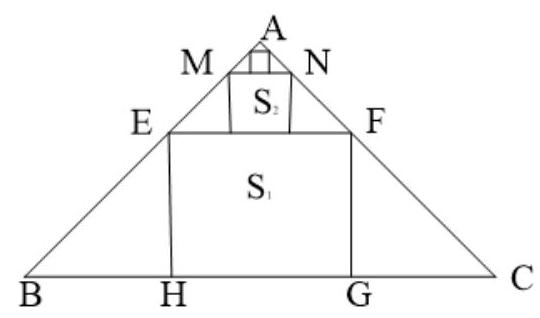

(1)无穷个正方形的周长之和；

(2)无穷个正方形的面积之积

【难度】 $\star   \star   \star   \star$

【答案】(1) ${2a}\;\left( 2\right) \frac{1}{8}{a}^{2}$

【解析】找到边长和面积的公比

【例 8】( 1 )已知 ${AC}\text{ 、 }{BD}$ 为圆 $O : {\left( x - 1\right) }^{2} + {\left( y - 2\right) }^{2} = {16}$ 的两条相互垂直的弦,重足为 $M\left( {1 + \frac{1}{n},2 - \frac{2}{n}}\right)$ 则四边形 ${ABCD}$ 的面积 ${S}_{n}$ 的极限值为 ___.

【难度】 $\star   \star   \star$

【答案】 32

【解析】解: 由题意 ${AC}\text{ 、 }{BD}$ 为圆 $O : {\left( x - 1\right) }^{2} + {\left( y - 2\right) }^{2} = {16}$ 的两条相互垂直的弦,垂足为 $M\left( {1 + \frac{1}{n},2 - \frac{2}{n}}\right)$ , 由于 ${S}_{n} = \frac{{AC} \times  {BD}}{2}$

由于点 $M\left( {1 + \frac{1}{n},2 - \frac{2}{n}}\right)$ 的极限位置是 $\left( {1,2}\right)$ ,此时 ${AC}\text{ 、 }{BD}$ 都是直径,

所以四边形 ${ABCD}$ 的面积 ${S}_{n}$ 的极限值是 $2{r}^{2}$

又圆的半径为 4，所以四边形 ${ABCD}$ 的面积 ${S}_{n}$ 的极限值为 32，此时四边形 ${ABCD}$ 是圆内接正方形故答案为 32

( 2 )已知 $n \in  N$ ， $n \geq  2$ ，函数 $y = \frac{n}{{n}^{2} + 3}x + \frac{3n}{n + 3}$ 的图象与 $y$ 轴相交于点 ${A}_{n}$ 、与函数 $y = {\log }_{\frac{1}{n}}\left( {x - 4}\right)$ 的图象相交于点 ${B}_{n},\bigtriangleup O{A}_{n}{B}_{n}$ 的面积为 ${S}_{n}\left( O\right.$ 为坐标原点 $)$ ,则 $\mathop{\lim }\limits_{{n \rightarrow  \infty }}{S}_{n} =$ ___.

【难度】 $\star   \star   \star$

【答案】 6

【解析】解: 由 $y = \frac{n}{{n}^{2} + 3}x + \frac{3n}{n + 3}$ ,取 $x = 0$ ,得 ${A}_{n}\left( {0,\frac{3n}{n + 3}}\right)$ ,

$\because \mathop{\lim }\limits_{{n \rightarrow  \infty }}\frac{n}{{n}^{2} + 3} = 0,\mathop{\lim }\limits_{{n \rightarrow  \infty }}\frac{3n}{n + 3} = \mathop{\lim }\limits_{{n \rightarrow  \infty }}\frac{3}{1 + \frac{3}{n}} = 3$ ,

点 ${A}_{n}$ 趋近于 $A\left( {0,3}\right)$ ;

可得函数 $y = \frac{n}{{n}^{2} + 3}x + \frac{3n}{n + 3}$ 的图象趋近于直线 $y = 3$ ,

此时点 ${B}_{n}$ 趋近于函数 $y = {\log }_{\frac{1}{n}}\left( {x - 4}\right)$ 的渐近线与 $y = 3$ 的交点,即 $B\left( {4,3}\right)$ ,

$\therefore \mathop{\lim }\limits_{{n \rightarrow  \infty }}{S}_{n} = {S}_{\Delta OAB} = \frac{1}{2} \times  4 \times  3 = 6$ .

故答案为:6.

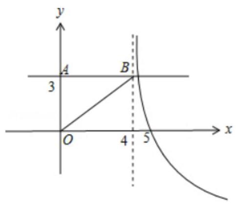

(3)设 ${\mathrm{P}}_{n}\left( {{x}_{n},{y}_{n}}\right)$ 是直线 ${2x} - y = \frac{n}{n + 1}\left( {n \in  {\mathbf{N}}^{ * }}\right)$ 与圆 ${x}^{2} + {y}^{2} = 2$ 在第一象限的交点，则极限 $\mathop{\lim }\limits_{{n \rightarrow  \infty }}\frac{{y}_{n} - 1}{{x}_{n} - 1} =$ ( )

A. -1

B. $- \frac{1}{2}$ C. 1 D. 2

【难度】 $\star   \star   \star   \star$

【答案】A

【解析】解: 当 $n \rightarrow   + \infty$ 时, $\frac{n}{n + 1} \rightarrow  1$ ,与圆 ${x}^{2} + {y}^{2} = 2$ 在第四象限的交点无限靠近 $A\left( {1,1}\right)$ , 而 $\frac{{y}_{n} - 1}{{x}_{n} - 1}$ 可看作点 ${P}_{n}\left( {{x}_{n},{y}_{n}}\right)$ 与 $A\left( {1,1}\right)$ 连线的斜率,

其值会无限接近圆 ${x}^{2} + {y}^{2} = 2$ 在点 $A\left( {1,1}\right)$ 处的切线的斜率,

其斜率为 $- {k}_{OA} =  - \left( 1\right)  =  - 1,\therefore \mathop{\lim }\limits_{{n \rightarrow  \infty }}\frac{{y}_{n} - 1}{{x}_{n} - 1} =  - 1$ .

(4)已知数列 $\left\{  {a}_{n}\right\}$ 满足 ${a}_{n} < {a}_{n + 1}\left( {n \in  {N}^{ * }}\right)$ ， ${P}_{n}\left( {n,{a}_{n}}\right)$ ( $n \geq  3$ )均在双曲线 $\frac{{x}^{2}}{6} - \frac{{y}^{2}}{2} = 1$ 上，则 $\mathop{\lim }\limits_{{n \rightarrow  \infty }}\left| {{P}_{n}{P}_{n + 1}}\right|  =$ ___.

【难度】 $\star   \star   \star   \star$

【答案】 $\frac{2\sqrt{3}}{3}$

【解析】解: 法一: 由 $\frac{{n}^{2}}{6} - \frac{{a}_{n}^{2}}{2} = 1$ ,可得 ${a}_{n} = \sqrt{2\left( {\frac{{n}^{2}}{6} - 1}\right) }$ ,

$\therefore {P}_{n}\left( {n,\sqrt{2\left( {\frac{{n}^{2}}{6} - 1}\right) }}\right)$ ,

$\therefore {P}_{n + 1}\left( {n + 1,\sqrt{\left. 2\left( \frac{{\left( n + 1\right) }^{2}}{6} - 1\right) \right) }}\right)$ ,

$\therefore \left| {{P}_{n}{P}_{n + 1}}\right|  = ,\sqrt{{\left( n + 1 - n\right) }^{2} + {\left\lbrack  \sqrt{2{\left( \frac{n + 1}{6}\right) }^{2} - 1} - \sqrt{2\left( {\frac{{n}^{2}}{6} - 1}\right) }\right\rbrack  }^{2}} = \sqrt{\frac{2{n}^{2} + {2n} - {11}}{3} - 4\sqrt{\left( {\frac{{\left( n + 1\right) }^{2}}{6} - 1}\right) \left( {\frac{{n}^{2}}{6} - 1}\right) }}$

$\therefore$ 求解极限可得 $\mathop{\lim }\limits_{{n \rightarrow  \infty }}\left| {{P}_{n}{P}_{n + 1}}\right|  = \frac{2\sqrt{3}}{3}$ ,

方法二: 当 $n \rightarrow   + \infty$ 时, ${P}_{n}{P}_{n + 1}$ 与渐近线平行, ${P}_{n}{P}_{n + 1}$ 在 $x$ 轴的投影为 1,渐近线倾斜角为 $\theta$ ,则 $\tan \theta  = \frac{\sqrt{3}}{3}$ , 故 ${P}_{n}{P}_{n + 1} = \frac{1}{\cos \frac{\pi }{6}} = \frac{2\sqrt{3}}{3}$

故答案为: $\frac{2\sqrt{3}}{3}$ .

【例 9】由 “无穷等比数列各项的和 “可知,当 $0 < \left| x\right|  < 1$ 时,有 $1 + x + {x}^{2} + \ldots  + {x}^{n - 1} + \ldots  = \frac{1}{1 - x}$ ,若对于任意的 $0 < \left| x\right|  < \frac{1}{2}$ ,都有 $\frac{{x}^{2}}{\left( {1 - {x}^{2}}\right) \left( {1 + {2x}}\right) } = {a}_{0} + {a}_{1}x + {a}_{2}{x}^{2} + \ldots  + {a}_{n}{x}^{n} + \ldots$ ,则 ${a}_{11} =$

【难度】 $\star   \star   \star   \star$

【答案】-682

【解析】解: 由题意可知,当 $0 < \left| x\right|  < \frac{1}{2}$ 时,满足 $\frac{1}{1 + {2x}} = 1 - {2x} + 4{x}^{2} - \ldots  + {\left( -2x\right) }^{n} + \ldots$ ,

又 $\frac{1}{1 - {x}^{2}} = 1 + {x}^{2} + {x}^{4} + \ldots  + {x}^{{2n} - 2} + \ldots$ ,

故 $\frac{{x}^{2}}{\left( {1 - {x}^{2}}\right) \left( {1 + {2x}}\right) } = {x}^{2}\left( {1 + {x}^{2} + {x}^{4} + \ldots  + {x}^{{2n} - 2} + \ldots }\right) \left( {1 - {2x} + 4{x}^{2} - \ldots  + {\left( -2x\right) }^{n} + \ldots }\right)$ ,

由题意,即求 ${x}^{11}$ 的系数 ${a}_{11}$ ,即 ${x}^{2}\left( {1 + {x}^{2} + {x}^{4} + \ldots  + {x}^{{2n} - 2} + \ldots }\right) \left( {1 - {2x} + 4{x}^{2} - \ldots  + {\left( -2x\right) }^{n} + \ldots }\right)$ 中 ${x}^{9}$ 的系数,

故只需考虑 $\left( {1 + {x}^{2} + {x}^{4} + {x}^{6} + {x}^{8}}\right)$ 五项分别对应的情况即可,

故含 ${x}^{9}$ 的各项为 $1 \times  {\left( -2x\right) }^{9} + {x}^{2} \times  {\left( -2x\right) }^{7} + {x}^{4} \times  {\left( -2x\right) }^{5} + {x}^{6} \times  {\left( -2x\right) }^{3} + {x}^{8} \times  {\left( -2x\right) }^{1} = \left( {-{2}^{9} - {2}^{7} - {2}^{5} - {2}^{3} - {2}^{1}}\right) {x}^{9} \; =  - {682}{x}^{9}$ ,所以 ${a}_{11} =  - {682}$ . 故答案为: -682 .

【例 10】已知数列 $\left\{  {a}_{n}\right\}$ 满足: $n{a}_{n + 2} = {1007}\left( {n - 1}\right) {a}_{n + 1} + {2018}\left( {n + 1}\right) {a}_{n}\left( {n \in  {N}^{ * }}\right)$ ,且 ${a}_{1} = 1,{a}_{2} = 2$ ,若 $\mathop{\lim }\limits_{{n \rightarrow  \infty }}\frac{{a}_{n + 1}}{{a}_{n}} = A$ , 则 $A =$ ___.

【难度】 $\star   \star   \star   \star$

【答案】 1009

【解析】解: $n{a}_{n + 2} = {1007}\left( {n - 1}\right) {a}_{n + 1} + {2018}\left( {n + 1}\right) {a}_{n},{a}_{1} = 1,{a}_{2} = 2$ ,

$\therefore {a}_{n} > 0, n > 1$ 时, $\frac{n{a}_{n + 2}}{\left( {n - 1}\right) {a}_{n + 1}} = {1007} + \frac{{2018}\left( {n + 1}\right) {a}_{n}}{\left( {n - 1}\right) {a}_{n + 1}}$ ,

$\because \mathop{\lim }\limits_{{n \rightarrow  \infty }}\frac{{a}_{n + 1}}{{a}_{n}} = A > 0$ ,对于上式两边取极限可得: $A = {1007} + \frac{2018}{A}$ ,

化为: $\left( {A - {1009}}\right) \left( {A + 2}\right)  = 0$ ,解得 $A = {1009}$ .

故答案为: 1009 .

【例11】已知 $f\left( x\right)  = \left| {\frac{2}{x - 1} - a}\right| \left( {x > 1, a > 0}\right) , f\left( x\right)$ 与 $x$ 轴交点为 $A$ ,若对于 $f\left( x\right)$ 图象上任意一点 $P$ ,在其图象上总存在另一点 $Q\left( {P\text{ 、 }Q\text{ 异于 }A}\right)$ ,满足 ${AP}\bot {AQ}$ ，且 $\left| {AP}\right|  = \left| {AQ}\right|$ ，则 $a =$ ___.

【难度】 $\star   \star   \star   \star$

【答案】 $\sqrt{2}$

【解析】令 $y = 0$ 可得 $A\left( {1 + \frac{2}{a},0}\right)$ ,根据分析作出 $\mathrm{M},\mathrm{N}$ ,因为 ${AP} \bot  {AQ}$ ,所 $\angle {APM} = \angle {QAN}$ ,又 $\left| {AP}\right|  = \left| {AQ}\right|$ ,所以 ${\Delta APM} \cong  {\Delta AQN}$ ,所以 $\left| {AM}\right|  = \left| {QN}\right|$ 。

当 $\mathrm{P}$ 无限接近渐近线时, $\mathrm{Q}$ 也无限接近渐近线,此时 $\left| {AM}\right|$ 无限趋近于 $1 + \frac{2}{a} - 1 = \frac{2}{a},\left| {QN}\right|$ 无限趋近于 $a$ , 则 $\frac{2}{a} = a$ ,所以 $a = \sqrt{2}$ 。

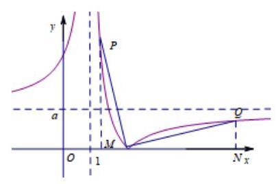

## 巩固训练

1、已知等比数列 $\left\{  {a}_{n}\right\}$ 的首项为 ${a}_{1}$ ，公比为 $q$ ，且有 $\mathop{\lim }\limits_{{n \rightarrow  \infty }}\left( {\frac{{a}_{1}}{1 + q} - {q}^{n}}\right)  = \frac{1}{2}$ ，求首项 ${a}_{1}$ 的取值范围是___.

【难度】 $\star   \star   \star$

【答案】 ${a}_{1} \in  \left( {0,\frac{1}{2}}\right)  \cup  \left( {\frac{1}{2},1}\right)  \cup  \{ 3\}$

【提示】注意分两种情况 $q = 1$ 和 $q \in  \left( {-1,0}\right)  \cup  \left( {0,1}\right)$

2、已知点 $A\left( {1 + \frac{1}{n},0}\right)$ ， $B\left( {0,2 + \frac{2}{n}}\right)$ ， $C\left( {2 + \frac{1}{n},3 + \frac{2}{n}}\right)$ ，其中 $n$ 为正整数，设 ${S}_{n}$ 表示 $\bigtriangleup  {ABC}$ 的面积，则 $\mathop{\lim }\limits_{{n \rightarrow  \infty }}{S}_{n} =$ ___.

【难度】 $\star   \star   \star$

【答案】 $\frac{5}{2}$

【解析】解: 由题意可知 ${S}_{n}$ 表示 $\bigtriangleup {ABC}$ 的面积,

${S}_{n} = {S}_{OBCD} - {S}_{\Delta OAB} - {S}_{\Delta ADC} = \frac{2 + \frac{2}{n} + 3 + \frac{2}{n}}{2} \times  \left( {2 + \frac{1}{n}}\right)  - \frac{1}{2} \times  \left( {1 + \frac{1}{n}}\right)  \times  \left( {2 + \frac{1}{n}}\right)  - \frac{1}{2} \times  \left( {2 + \frac{1}{n} - 1 - \frac{1}{n}}\right) \left( {3 + \frac{2}{n}}\right)$

$= \left( {\frac{5}{2} + \frac{2}{n}}\right) \left( {2 + \frac{1}{n}}\right)  - \frac{1}{2} \times  \left( {1 + \frac{1}{n}}\right)  \times  \left( {2 + \frac{1}{n}}\right)  - \left( {\frac{3}{2} + \frac{1}{n}}\right)$

所以 $\mathop{\lim }\limits_{{n \rightarrow  \infty }}{S}_{n} = \mathop{\lim }\limits_{{n \rightarrow  \infty }}\left\lbrack  {\left( {\frac{5}{2} + \frac{2}{n}}\right) \left( {2 + \frac{1}{n}}\right)  - \frac{1}{2} \times  \left( {1 + \frac{1}{n}}\right)  \times  \left( {2 + \frac{1}{n}}\right)  - \left( {\frac{3}{2} + \frac{1}{n}}\right) }\right\rbrack   = 5 - 1 - \frac{3}{2} = \frac{5}{2}$

故答案为: $\frac{5}{2}$ .

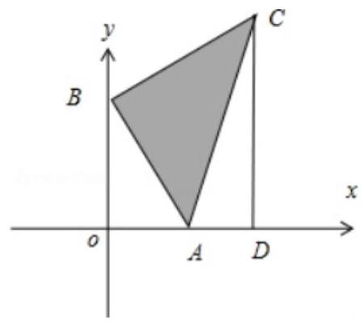

3、已知等差数列 $\left\{  {a}_{n}\right\}$ 的公差不为 0,其前 $n$ 项和为 ${S}_{n}$ ,等比数列 $\left\{  {b}_{n}\right\}$ 的前 $n$ 项和为 ${B}_{n}$ ,公比为 $q$ ,且 $q \neq   - 1$ , 求 $\mathop{\lim }\limits_{{n \rightarrow  \infty }}\left( {\frac{{S}_{n}}{n{a}_{n}} + \frac{{B}_{n}}{{b}_{n}}}\right)$ 的值.

【难度】 $\star   \star   \star   \star$

【答案】见解析

【解析】解: $\frac{{S}_{n}}{{a}_{n}} = \frac{\frac{n\left( {{a}_{1} + {a}_{n}}\right) }{2}}{n{a}_{n}} = \frac{{a}_{1} + {a}_{n}}{2{a}_{n}} = \frac{2{a}_{1} + \left( {n - 1}\right) d}{2{a}_{1} + 2\left( {n - 1}\right) d},\therefore \mathop{\lim }\limits_{{n \rightarrow  \infty }}\frac{{S}_{n}}{{a}_{n}} = \frac{1}{2}$ .

若 $q = 1$ 时 $\frac{{B}_{n}}{{b}_{n}} = \frac{n{a}_{1}}{{a}_{1}} = n,\mathop{\lim }\limits_{{n \rightarrow  \infty }}\frac{{B}_{n}}{{b}_{n}} = \frac{n{a}_{1}}{{a}_{1}} = n,\mathop{\lim }\limits_{{n \rightarrow  \infty }}\frac{{B}_{n}}{{b}_{n}}$ 不存在.

若 $q \neq   \pm  1$ 时 $\frac{{B}_{n}}{{b}_{n}} = \frac{\frac{{b}_{1}\left( {1 - {q}^{n}}\right) }{1 - q}}{{b}_{1}{q}^{n - 1}} = \frac{1 - {q}^{n}}{{q}^{n - 1} - {q}^{n}} \rightarrow  \left\{  {\begin{array}{l} \text{ 无意义 }\left| q\right|  < 1 \\  \frac{q}{q - 1}\;\left| q\right|  > 1 \end{array}\left( {n \rightarrow  \infty }\right) }\right.$ ,

故当 $\left| q\right|  > 1$ 时, $\mathop{\lim }\limits_{{n \rightarrow  \infty }}\left( {\frac{{S}_{n}}{n{a}_{n}} + \frac{{B}_{n}}{{b}_{n}}}\right)  = \frac{1}{2} + \frac{q}{q - 1}$ ,其他情形极限无意义.

4、在半径为 $r$ 的圆内作内接正六边形,再作正六边形的内切圆,又在此内切圆内作内接正六边形,如此无限继续下去,设 ${S}_{n}$ 为前 $n$ 个圆的面积之和,则 $\mathop{\lim }\limits_{{n \rightarrow  \infty }}{s}_{n} =$ ___.

【难度】 $\star   \star   \star   \star$

【答案】 ${4\pi }{r}^{2}$

【解析】解: 依题意可知,图形中内切圆半径分别为: $r, r \cdot  \cos {30}^{ \circ  },\left( {r \cdot  \cos {30}^{ \circ  }}\right) \cos {30}^{ \circ  }$ , $\left( {r \cdot  \cos {30}^{ \circ  }\cos {30}^{ \circ  }}\right) \cos {30}^{ \circ  },\ldots$ ,即内切圆半径组成以 $r$ 为首项, $\frac{\sqrt{3}}{2}$ 为公比的等比数列

$\therefore$ 圆的面积组成以 $\pi {r}^{2}$ 为首项, $\frac{3}{4}$ 为公比的等比数列

$\therefore \mathop{\lim }\limits_{{n \rightarrow  \infty }}{S}_{n} = \frac{\pi {r}^{2}}{1 - \frac{3}{4}} = {4\pi }{r}^{2}$ 故答案为: ${4\pi }{r}^{2}$ .

5、已知 $\bigtriangleup  \mathrm{{ABC}}$ 的顶点分别是 $A\left( {0,\frac{2}{n}}\right) , B\left( {0, - \frac{2}{n}}\right) , C\left( {4 + \frac{2}{n},0}\right) \left( {n \in  N}\right)$ ,记 $\bigtriangleup  \mathrm{{ABC}}$ 的外接圆面积为 ${S}_{n}$ ,则 $\mathop{\lim }\limits_{{n \rightarrow  \infty }}{S}_{n} =$

【难度】★★★★

【答案】 ${4\pi }$

【解析】本题若要先求出三角形 $\mathrm{{ABC}}$ 的面积后再求极限则是“漫长”的工作,注意到当 $n \rightarrow  \infty$ 时 $\mathrm{A}\text{ 、 }\mathrm{\;B}\text{ 、 }\mathrm{C}$ 点的变化，不难看出 $\bigtriangleup  \mathrm{{ABC}}$ 被“压扁”成一条长为 4 的线段，而此线段就是此三角形外接圆的直径.从而有 $\mathop{\lim }\limits_{{n \rightarrow  \infty }}{S}_{n} = {4\pi }$ .

6、如图所示: 矩形 ${A}_{n}{B}_{n}{P}_{n}{Q}_{n}$ 的一边 ${A}_{n}{B}_{n}$ 在 $x$ 轴上,另两个顶点 ${P}_{n},{Q}_{n}$ 在函数 $f\left( x\right)  = \frac{2x}{1 + {x}^{2}}\left( {x > 0}\right)$ 的图象上 (其中点 ${B}_{n}$ 的坐标为 $\left( {n,0}\right) \left( {n \geq  2, n \in  {N}^{ * }}\right)$ ,矩形 ${A}_{n}{B}_{n}{P}_{n}{Q}_{n}$ 的面积记为 ${S}_{n}$ ,则 $\mathop{\lim }\limits_{{n \rightarrow  \infty }}{S}_{n} =$ ___.

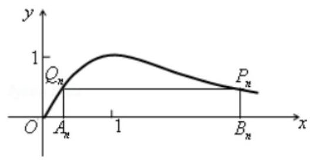

【难度】 $\star   \star   \star   \star$

【答案】 2

【解析】解: 设 ${Q}_{n}\left( {{x}_{1}, y}\right) ,{P}_{n}\left( {n, y}\right)$ ,则 ${S}_{n} = y\left( {n - {x}_{1}}\right)  = \frac{2n}{1 + {n}^{2}}\left( {n - {x}_{1}}\right)  = \frac{2{n}^{2}}{1 + {n}^{2}} - \frac{{2n}{x}_{1}}{1 + {n}^{2}}$

$\therefore \mathop{\lim }\limits_{{n \rightarrow  \infty }}{S}_{n} = \mathop{\lim }\limits_{{n \rightarrow  \infty }}\left( {\frac{2{n}^{2}}{1 + {n}^{2}} - \frac{{2n}{x}_{1}}{1 + {n}^{2}}}\right)  = \mathop{\lim }\limits_{{n \rightarrow  \infty }}\frac{2{n}^{2}}{1 + {n}^{2}} - \mathop{\lim }\limits_{{n \rightarrow  \infty }}\frac{{2n}{x}_{1}}{1 + {n}^{2}} = 2 - 0 = 2$

故答案为: 2

7、设 ${T}_{1},{T}_{2},{T}_{3},\cdots$ 为一组多边形,其作法如下:

${T}_{1}$ 是边长为 1 的三角形以 ${T}_{n}$ 的每一边中间 $\frac{1}{3}$ 的线段为一边向外作正三角形,然后将该 $\frac{1}{3}$ 线段抹去所得的多边形为 ${T}_{n + 1}$ ，如图所示。令 ${a}_{n}$ 表示 ${T}_{n}$ 的周长， $A\left( {T}_{n}\right)$ 表示 ${T}_{n}$ 的面积。

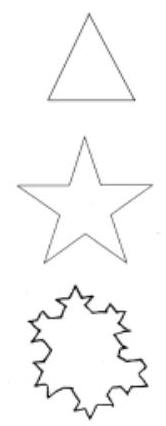

(1)计算 ${T}_{1},{T}_{2},{T}_{3}$ 的面积 $A\left( {T}_{1}\right) , A\left( {T}_{2}\right) , A\left( {T}_{3}\right)$ ;

(2)求 $\mathop{\lim }\limits_{{n \rightarrow  \infty }}\left( {\frac{1}{{a}_{1}} + \frac{1}{{a}_{2}}\ldots  + \frac{1}{{a}_{n}}}\right)$ 的值

【难度】 $\star   \star   \star   \star$

【解析】(1) $A\left( {T}_{1}\right)  = \frac{1}{2} \cdot  1 \cdot  1 \cdot  \sin {60}^{ \circ  } = \frac{\sqrt{3}}{4}$ ,

$A\left( {T}_{2}\right)  = 3 \cdot  \frac{1}{2} \cdot  \frac{1}{3} \cdot  \frac{1}{3} \cdot  \sin {60}^{ \circ  } + A\left( {T}_{1}\right)  = \frac{\sqrt{3}}{3}$

$A\left( {T}_{3}\right)  = {12} \cdot  \frac{1}{2} \cdot  \frac{1}{9} \cdot  \frac{1}{9} \cdot  \sin {60}^{ \circ  } + A\left( {T}_{2}\right)  = \frac{10}{27}\sqrt{3}$ (2)由分析知: ${a}_{n} = \frac{4}{3}{a}_{n - 1}$ ( ${T}_{n}$ 的边数是 ${T}_{n - 1}$ 边数的 4 倍且每边是原来的 $\frac{1}{4}$ )

故 ${a}_{n} = 3 \cdot  {\left( \frac{4}{3}\right) }^{n - 1},\because \frac{1}{{a}_{n}} = \frac{1}{3} \cdot  {\left( \frac{3}{4}\right) }^{n - 1}$

$\mathop{\lim }\limits_{{n \rightarrow  \infty }}\left( {\frac{1}{{a}_{1}} + \frac{1}{{a}_{2}} + \cdots  + \frac{1}{{a}_{n}}}\right)  = \frac{\frac{1}{3}}{1 - \frac{3}{4}} = \frac{4}{3}$

8、已知 $n \in  {\mathrm{N}}^{ * }$ ，在坐标平面中有斜率为 $n$ 的直线 ${l}_{n}$ 与圆 ${x}^{2} + {y}^{2} = {n}^{2}$ 相切，且 ${l}_{n}$ 交 $y$ 轴的正半轴于点 ${P}_{n}$ ， 交 $x$ 轴于点 ${Q}_{n}$ ，则 $\mathop{\lim }\limits_{{n \rightarrow  \infty }}\frac{\left| \overline{{P}_{n}{Q}_{n}}\right| }{2{n}^{2}}$ 的值为___.

【难度】 $\star   \star   \star   \star$

【答案】 $\frac{1}{2}$

9、如图，一质点 $A$ 从原点 $O$ 出发沿向量 $\overrightarrow{O{A}_{1}} = \left( {\sqrt{3},1}\right)$ 到达点 ${A}_{1}$ ,再沿 $y$ 轴正方向从点 ${A}_{1}$ 前进 $\frac{1}{2}\left| \overrightarrow{O{A}_{1}}\right|$ 到达点 ${A}_{2}$ ,再沿 $\overrightarrow{O{A}_{1}}$ 的方向从点 ${A}_{2}$ 前进 $\frac{1}{2}\left| \overrightarrow{{A}_{1}{A}_{2}}\right|$ 到达点 ${A}_{3}$ , 再沿 $y$ 轴正方向从点 ${A}_{3}$ 前进 $\frac{1}{2}\left| \overrightarrow{{A}_{2}{A}_{3}}\right|$ 到达点 ${A}_{4},\cdots$ , 这样无限前进下去,则质点 $A$ 最终到达的点的坐标是___

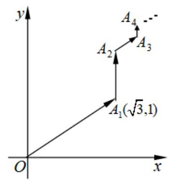

【难度】 $\star   \star   \star   \star$

【答案】 $\left( {\frac{4\sqrt{3}}{3},\frac{8}{3}}\right)$

10、定义函数 $f\left( x\right)  = \{ x \cdot  \{ x\} \}$ ,其中 $\{ x\}$ 表示不小于 $x$ 的最小整数,如 $\{ {1.4}\}  = 2,\{  - {2.3}\}  =  - 2$ . 当 $x \in  (0, n\rbrack \;\left( {n \in  {\mathbf{N}}^{ * }}\right)$ 时,函数 $f\left( x\right)$ 的值域为 ${A}_{n}$ ,记集合 ${A}_{n}$ 中元素的个数为 ${a}_{n}$ ,则 $\mathop{\lim }\limits_{{n \rightarrow  \infty }}\left( {\frac{1}{{a}_{1}} + \frac{1}{{a}_{2}} + \cdots  + \frac{1}{{a}_{n}}}\right)  =$ ___.

【难度】 $\star   \star   \star   \star$

【答案】 2

【解析】 $x \in  (0,1\rbrack ,\{ x\}  = 1, x \cdot  \{ x\}  = (0,1\rbrack ,\{ x \cdot  \{ x\} \}  = 1$

$x \in  (1,2\rbrack ,\{ x\}  = 2, x \cdot  \{ x\}  = (2,4\rbrack ,\{ x \cdot  \{ x\} \}  = 3$ 或 4

$x \in  (2,3\rbrack ,\{ x\}  = 3, x \cdot  \{ x\}  = (6,9\rbrack ,\{ x \cdot  \{ x\} \}  = 7$ 或 8 或 9

$\therefore {a}_{n} = 1 + 2 + \cdots  + n = \frac{n\left( {n + 1}\right) }{2},\therefore \frac{1}{{a}_{n}} = 2\left( {\frac{1}{n} - \frac{1}{n + 1}}\right)$

$\therefore \mathop{\lim }\limits_{{n \rightarrow  \infty }}\left( {\frac{1}{{a}_{1}} + \frac{1}{{a}_{2}} + \cdots  + \frac{1}{{a}_{n}}}\right)  = \mathop{\lim }\limits_{{n \rightarrow  \infty }}\left( {2 - \frac{2}{n + 1}}\right)  = 2$

11、已知数列 $\left\{  {a}_{n}\right\}$ 满足 ${a}_{1} = 1,{a}_{2} = 3$ ,若 $\left| {{a}_{n + 1} - {a}_{n}}\right|  = {2}^{n}\left( {n \in  {N}^{ * }}\right)$ ,且 $\left\{  {a}_{{2n} - 1}\right\}$ 是递增数列、 $\left\{  {a}_{2n}\right\}$ 是递减数列,则 $\mathop{\lim }\limits_{{n \rightarrow   + \infty }}\frac{{a}_{{2n} - 1}}{{a}_{2n}} =$

【难度】 $\star   \star   \star   \star$

【答案】 $- \frac{1}{2}$

## (二) 数学归纳法

## 知识梳理

## 数学归纳法

一般地,证明一个与正整数 $n$ 有关的命题,可按下列步骤进行:

(1)(归纳奠基)证明当 $n$ 取第一个值 ${n}_{0}\left( {{n}_{0} \in  {\mathbf{N}}^{ * }}\right)$ 时命题成立；

(2)(归纳递推)假设 $n = k\left( {k \geq  {n}_{0}, k \in  {\mathbf{N}}^{ * }}\right)$ 时命题成立，证明当 $n = k + 1$ 时命题也成立.

只要完成这两个步骤,就可以断定命题对从 ${n}_{0}$ 开始的所有正整数 $n$ 都成立.

注意:①应用数学归纳法要运用“归纳假设”，没有运用“归纳假设”的证明不是数学归纳法。

②由 $k$ 到 $k + 1$ 的证明,实际问题中由 $k$ 到 $k + 1$ 的变化规律是数学归纳法的难点,突破难点的关键是掌握由 $k$ 到 $k + 1$ 的推论方法,在运用归纳假设时,应分析 $P\left( k\right)$ 与 $P\left( {k + 1}\right)$ 的差异及联系。利用拆、添、并、放、 缩等手段，或从归纳假设出发；或从 $P\left( {k + 1}\right)$ 从分离出 $P\left( k\right)$ ，再进行局部调整；也可考虑寻求二者的“结合点”，以便顺利过渡。

3、用数学归纳法证明与正整数有关的等式，常采用从一边开始并以另一边为目标进行推证的办法；用数学归纳法证明整除性问题，常采用配凑的办法；用数学归纳法证明与正整数有关的不等式时，常常需要运用不等式的性质以及比较法、放缩法、分析法、综合法等基本方法; 用数学归纳法证明与正整数有关的几何问题, 常常要运用几何图形的性质。

## 四、归纳 一猜想一一论证

“归纳、猜想、证明”就是运用 “检验有限个 $n$ 的值,寻找一定规律,猜想一个结论,然后用数学归纳法证明所猜想的结论正确”的解题方法.

理解一个完整的思维过程, 往往是既要发现结论, 又要证明结论的正确性. 这就需要掌握运用由特殊到一般的思维方法, 也就是通过观察、归纳, 提出猜想, 探求结论, 且运用严密的逻辑推理, 即数学归纳法证明结论(猜想)的正确. 领会 “归纳、猜想、证明” 的思想方法，非常有助于提高观察分析能力.

## 例题精讲

【例 12】设 $f\left( x\right)$ 是定义在正整数集上的函数,且 $f\left( x\right)$ 满足: “当 $f\left( k\right)  \geq  {k}^{2}$ 成立时,总可推出 $f\left( {k + 1}\right)  \geq  {\left( k + 1\right) }^{2}$ 成立”. 那么，下列命题总成立的是( )

$A$ . 若 $f\left( 1\right)  < 1$ 成立,则 $f\left( {10}\right)  < {100}$ 成立;

$B$ . 若 $f\left( 2\right)  < 4$ 成立,则 $f\left( 1\right)  < 1$ 成立;

$C$ . 若 $f\left( 3\right)  \geq  9$ 成立,则当 $k \geq  1$ 时,均有 $f\left( k\right)  \geq  {k}^{2}$ 成立;

$D$ . 若 $f\left( 4\right)  \geq  {25}$ 成立,则当 $k \geq  4$ 时,均有 $f\left( k\right)  \geq  {k}^{2}$ 成立.

【难度】 $\star   \star   \star$

【答案】BD

【例 13】用数学归纳法证明命题:若 $n$ 是大于 1 的自然数，求证: $1 + \frac{1}{2} + \frac{1}{3} + \cdots  + \frac{1}{{2}^{n} - 1} < n$ ，从 $k$ 到 $k + 1$ ， 不等式左边添加的项的项数为___.

【难度】 $\star   \star   \star$

【解析】当 $n = k$ 时,左边为 $1 + \frac{1}{2} + \frac{1}{3} + \frac{1}{4} + \cdots  + \frac{1}{{2}^{k} - 1}$ .

当 $n = k + 1$ 时,左边为 $1 + \frac{1}{2} + \frac{1}{3} + \frac{1}{4} + \cdots  + \frac{1}{{2}^{k} - 1} + \frac{1}{{2}^{k}} + \frac{1}{{2}^{k} + 1} + \frac{1}{{2}^{k} + 2} + \cdots  + \frac{1}{{2}^{k + 1} - 1}$ .

左边需要添的项为 $\frac{1}{{2}^{k}} + \frac{1}{{2}^{k} + 1} + \frac{1}{{2}^{k} + 2} + \cdots  + \frac{1}{{2}^{k + 1} - 1}$ ,项数为 ${2}^{k + 1} - 1 - {2}^{k} + 1 = {2}^{k}$ .

【例 14】试证: $n$ 为正整数时, $f\left( n\right)  = {3}^{2{n}^{ + }2} - {8n} - 9$ 能被 64 整除.

【难度】 $\star   \star   \star$

【解析】证明: (1)当 $n = 1$ 时, $f\left( 1\right)  = {3}^{4} - 8 - 9 = {64}$ 能被 64 整除.

(2)假设当 $n = k\left( {k \in  {N}^{ * }}\right)$ 时， $f\left( k\right)  = {3}^{{2k} + 2} - {8k} - 9$ 能被 64 整除，

则当 $n = k + 1$ 时， $f\left( {k + 1}\right)  = {3}^{2{\left( {k}^{ + }1\right) }^{ + }2} - 8\left( {k + 1}\right)  - 9 = 9 \cdot  {3}^{2{k}^{ + }2} - {8k} - {17} = 9\left( {{3}^{2{k}^{ + }2} - {8k} - 9}\right)  + {64k} + {64}$ .

由归纳假设知 $f\left( {k + 1}\right)$ 也能被 64 整除.

综合 (1)(2)知,当 $n$ 为正整数时, $f\left( n\right)  = {3}^{2{n}^{ + }2} - {8n} - 9$ 能被 64 整除.

【例 15】是否存在常数 $a\text{ 、 }b\text{ 、 }c$ 使等式 $1 \cdot  \left( {{n}^{2} - {1}^{2}}\right)  + 2\left( {{n}^{2} - {2}^{2}}\right)  + \ldots  + n\left( {{n}^{2} - {n}^{2}}\right)  = a{n}^{4} + b{n}^{2} + c$ 对一切正整数 $n$ 成立? 证明你的结论.

【难度】 $\star   \star   \star$

【解析】解: 分别用 $n = 1,2,3$ 代入解方程组 $\left\{  {\begin{array}{l} a + b + c = 0 \\  {16a} + {4b} + c = 3 \\  {81a} + {9b} + c = {18} \end{array} \Rightarrow  \left\{  \begin{array}{l} a = \frac{1}{4} \\  b =  - \frac{1}{4} \\  c = 0. \end{array}\right. }\right.$

下面用数学归纳法证明.

(1)当 $n = 1$ 时,由上可知等式成立;

(2)假设当 $n = k$ 时，等式成立，

则当 $n = k + 1$ 时,左边 $= 1 \cdot  \left\lbrack  {{\left( k + 1\right) }^{2} - {1}^{2}}\right\rbrack   + 2\left\lbrack  {{\left( k + 1\right) }^{2} - {2}^{2}}\right\rbrack   + \ldots  + k\left\lbrack  {{\left( k + 1\right) }^{2} - {k}^{2}}\right\rbrack   + \left( {k + 1}\right) \left\lbrack  {{\left( k + 1\right) }^{2} - {\left( k + 1\right) }^{2}}\right\rbrack$

$= 1 \cdot  \left( {{k}^{2} - {1}^{2}}\right)  + 2\left( {{k}^{2} - {2}^{2}}\right)  +  + k\left( {{k}^{2} - {k}^{2}}\right)  + 1 \cdot  \left( {{2k} + 1}\right)  + 2\left( {{2k} + 1}\right)  + \ldots  + k\left( {{2k} + 1}\right)$

$= \frac{1}{4}{k}^{4} + \left( {-\frac{1}{4}}\right) {k}^{2} + \left( {{2k} + 1}\right)  + 2\left( {{2k} + 1}\right)  +  + k\left( {{2k} + 1}\right)$

$= \frac{1}{4}{\left( k + 1\right) }^{4} - \frac{1}{4}{\left( k + 1\right) }^{2}$ .

$\therefore$ 当 $n = k + 1$ 时,等式成立.

由(1)(2)得等式对一切的 $n \in  {N}^{ * }$ 均成立.

【例 16】已知数列 $\left\{  {a}_{n}\right\}$ 的前 $n$ 项和为 ${S}_{n}$ ,通项公式为 ${a}_{n} = {3}^{n - 1}$ ,数列 $\left\{  {b}_{n}\right\}$ 的通项公式为 ${b}_{n} = {2n} - 6$

(1)若 ${c}_{n} = \frac{1}{{a}_{n}}$ ，求数列 $\left\{  {c}_{n}\right\}$ 的前 $n$ 项和 ${T}_{n}$ 及 $\mathop{\lim }\limits_{{n \rightarrow  \infty }}{T}_{n}$ 的值；

(2)若 ${e}_{n} = \frac{1}{\left( {{b}_{n} + 5}\right) \left( {{b}_{n} + 7}\right) }$ ，数列 $\left\{  {e}_{n}\right\}$ 的前 $n$ 项和为 ${E}_{n}$ ，求 ${E}_{1},{E}_{2},{E}_{3}$ 的值，根据计算结果猜测 ${E}_{n}$ 关于 $n$ 的表达式, 并用数学归纳法加以证明;

(3)对任意正整数 $n$ ，若 $\left( {{S}_{n} + \frac{1}{2}}\right) t > {b}_{n} + n$ 恒成立，求 $t$ 的取值范围.

【难度】 $\star   \star   \star   \star$

【解答】解: (1) $\because {a}_{n} = {3}^{n - 1},\therefore {c}_{n} = \frac{1}{{a}_{n}} = {\left( \frac{1}{3}\right) }^{n - 1}$ ,

$\therefore {T}_{n} = \frac{1 - {\left( \frac{1}{3}\right) }^{n}}{1 - \frac{1}{3}} = \frac{3}{2}\left( {1 - \frac{1}{{3}^{n}}}\right)  = \frac{3}{2} - \frac{1}{2} \times  {\left( \frac{1}{3}\right) }^{n - 1},\therefore \mathop{\lim }\limits_{{n \rightarrow  \infty }}{T}_{n} = \mathop{\lim }\limits_{{n \rightarrow  \infty }}\frac{3}{2}\left( {1 - \frac{1}{{3}^{n}}}\right)  = \frac{3}{2}$ ;

(2) $\because {b}_{n} = {2n} - 6$ ,

$\therefore {e}_{n} = \frac{1}{\left( {{b}_{n} + 5}\right) \left( {{b}_{n} + 7}\right) } = \frac{1}{\left( {{2n} - 1}\right) \left( {{2n} + 1}\right) }$

$\therefore {E}_{1} = {e}_{1} = \frac{1}{3},\;{E}_{2} = {e}_{1} + {e}_{2} = \frac{1}{3} + \frac{1}{15} = \frac{2}{5},\;{E}_{2} = {e}_{1} + {e}_{2} + {e}_{3} = \frac{1}{3} + \frac{1}{15} + \frac{1}{35} = \frac{3}{7}$ ,

猜想 ${E}_{n} = \frac{n}{{2n} + 1}$ ,理由如下,①当 $n = 1$ 时,成立,

② 假设 $n = k$ 时成立,则 ${E}_{k} = \frac{k}{{2k} + 1}$ ,

那么当 $n = k + 1$ 时, ${E}_{k + 1} = {E}_{k} + {e}_{k + 1} = \frac{k}{{2k} + 1} + \frac{1}{\left( {{2k} + 1}\right) \left( {{2k} + 3}\right) } = \frac{k\left( {{2k} + 3}\right)  + 1}{\left( {{2k} + 1}\right) \left( {{2k} + 3}\right) } = \frac{\left( {{2k} + 1}\right) \left( {k + 1}\right) }{\left( {{2k} + 1}\right) \left( {{2k} + 3}\right) } = \frac{k + 1}{2\left( {k + 1}\right)  + 1}$ , 即 $n = k + 1$ 时,猜想也成立. 故由①和②，可知猜想成立；

(3) $\because {S}_{n} = \frac{1 - {3}^{n}}{1 - 3} = \frac{1}{2}\left( {{3}^{n} - 1}\right)$ ,若 $\left( {{S}_{n} + \frac{1}{2}}\right) t > {b}_{n} + n$ 恒成立,则 $\left( {\frac{1}{2} \times  {3}^{n}}\right) t > n - 6$ ,

即 $t > \frac{2\left( {n - 6}\right) }{{3}^{n}}$ ,对于任意正整数 $n$ 恒成立,

设 $f\left( n\right)  = \frac{2\left( {n - 6}\right) }{{3}^{n}}$

当 $1 < n \leq  6$ 时,函数 $f\left( n\right)$ 单调递增,

当 $n > 6$ 时, ${f}^{\prime }\left( n\right)  < 0$ ,函数 $f\left( n\right)$ 单调递减,

$\therefore f{\left( n\right) }_{\max } = f\left( 7\right)  = \frac{2}{{3}^{7}},\therefore t > \frac{2}{{3}^{7}}$ .

## 巩固训练

1、用数学归纳法证明: $f\left( n\right)  = 1 + \frac{1}{2} + \frac{1}{3} + \cdots  + \frac{1}{{2}^{n}}\left( {n \in  {N}^{ * }}\right)$ 的过程中，从 $n = k$ 到 $n = k + 1$ 时， $f\left( {k + 1}\right)$ 比 $f\left( k\right)$ 共增加了( )

A. 1 项 B. ${2}^{k} - 1$ 项 C. ${2}^{k + 1}$ 项 D. ${2}^{k}$ 项

【难度】 $\star   \star   \star$

【解答】解: $\because f\left( n\right)  = 1 + \frac{1}{2} + \frac{1}{3} + \cdots  + \frac{1}{{2}^{n}}\left( {n \in  {N}^{ * }}\right)$ ,

$\therefore f\left( k\right)  = 1 + \frac{1}{2} + \frac{1}{3} + \cdots  + \frac{1}{{2}^{k}}$ 其 ${2}^{k}$ 项,

$f\left( {k + 1}\right)  = 1 + \frac{1}{2} + \frac{1}{3} + \cdots  + \frac{1}{{2}^{k}} + \frac{1}{{2}^{k} + 1} + \frac{1}{{2}^{k + 1}}$ 共 ${2}^{k + 1}$ 项,

$\therefore f\left( {k + 1}\right)$ 比 $f\left( k\right)$ 共增加了 ${2}^{k + 1} - {2}^{k} = {2}^{k}$ 项,

故选: $D$ .

2、设数列 $\left\{  {x}_{n}\right\}$ 各项均为正数,且满足 ${x}_{1}^{2} + {x}_{2}^{2} + \ldots  + {x}_{n}^{2} = 2{n}^{2} + {2n},\left( {n \in  {N}^{ + }}\right)$ .

(1)求数列 $\left\{  {x}_{n}\right\}$ 的通项公式 ${x}_{n}$ ；

(2)已知 $\frac{1}{{x}_{1} + {x}_{2}} + \frac{1}{{x}_{2} + {x}_{3}} + \ldots  + \frac{1}{{x}_{n} + {x}_{n + 1}} = 3$ ，求 $n$ ；

(3)试用数学归纳法证明: ${x}_{1}{x}_{2} + {x}_{2}{x}_{3} + \ldots  + {x}_{n}{x}_{n + 1} < 2\left\lbrack  {{\left( n + 1\right) }^{2} - 1}\right\rbrack$ .

【难度】 $\star   \star   \star   \star$

【答案】见解析

【解析】解: (1) 解: 数列 $\left\{  {x}_{n}\right\}$ 各项均为正数,且满足 ${x}_{1}^{2} + {x}_{2}^{2} + \ldots  + {x}_{n}^{2} = 2{n}^{2} + {2n}$ ,①

$\therefore$ 当 $n \geq  2$ 时,有 ${x}_{1}^{2} + {x}_{2}^{2} + \ldots  + {x}_{n - 1}^{2} = 2{\left( n - 1\right) }^{2} + 2\left( {n - 1}\right)$ ,②

① - ② 得， ${x}_{n}^{2} = 2{n}^{2} + {2n} - \left\lbrack  {2{\left( n - 1\right) }^{2} + 2\left( {n - 1}\right) }\right\rbrack   = {4n}$ ，

$\because$ 数列 $\left\{  {x}_{n}\right\}$ 各项均为正数, $\therefore {x}_{n} = 2\sqrt{n}\left( {n \geq  2}\right)$ ,

当 $n = 1$ 时,求得 ${x}_{1} = 2$ 适合上式,

$\therefore {x}_{n} = 2\sqrt{n}$ ;

(2) $\because {x}_{n} = 2\sqrt{n},\therefore \frac{1}{{x}_{n} + {x}_{n + 1}} = \frac{1}{2\sqrt{n} + 2\sqrt{n + 1}} = \frac{1}{2}\left( {\sqrt{n + 1} - \sqrt{n}}\right)$ ,

$\frac{1}{{x}_{1} + {x}_{2}} + \frac{1}{{x}_{2} + {x}_{3}} + \ldots  + \frac{1}{{x}_{n} + {x}_{n + 1}} = \frac{1}{2}\left( {\sqrt{2} - 1 + \sqrt{3} - \sqrt{2} + \ldots  + \sqrt{n + 1} - \sqrt{n}}\right)$

$= \frac{1}{2} \times  \left( {\sqrt{n + 1} - 1}\right)  = 3$ ,

解得 $n = {48}$ ;

(3)证明: $1 >$ 当 $n = 1$ 时，不等式左边 $= {x}_{1}{x}_{2} = 2 \times  2\sqrt{2} = 4\sqrt{2}$ ，右边 $= 2 \times  \left( {{2}^{2} - 1}\right)  = 6$ ，

左边 $<$ 右边,不等式成立;

$< 2 >$ 假设当 $n = k\left( {k \in  {N}^{ * }}\right)$ 时原不等式成立,即 ${x}_{1}{x}_{2} + {x}_{2}{x}_{3} + \ldots  + {x}_{k}{x}_{k + 1} < 2\left\lbrack  {{\left( k + 1\right) }^{2} - 1}\right\rbrack$ ,

那么,当 $n = k + 1$ 时, ${x}_{1}{x}_{2} + {x}_{2}{x}_{3} + \ldots  + {x}_{k}{x}_{k + 1} + {x}_{k + 1}{x}_{k + 2}$

$< 2\left\lbrack  {{\left( k + 1\right) }^{2} - 1}\right\rbrack   + 2\sqrt{k + 1} \times  2\sqrt{k + 2} < 2{\left( k + 1\right) }^{2} - 2 + 2\left( {k + 1 + k + 2}\right)$

$= 2{k}^{2} + {8k} + 8 - 2 = 2\left\lbrack  {{\left( k + 1 + 1\right) }^{2} - 1}\right\rbrack$ .

综 $< 1 > , < 2 >$ 所述,不等式对于任意 $n \in  {N}^{ * }$ 都成立.

故 ${x}_{1}{x}_{2} + {x}_{2}{x}_{3} + \ldots  + {x}_{n}{x}_{n + 1} < 2\left\lbrack  {{\left( n + 1\right) }^{2} - 1}\right\rbrack$ .

## 实战演练

## 一、填空题

1、记直线 ${l}_{n} : {nx} + \left( {n + 1}\right) y - 1 = 0\left( {n \in  {N}^{ * }}\right)$ 与坐标轴所围成的直角三角形的面积为 ${S}_{n}$ ,则 $\mathop{\lim }\limits_{{n \rightarrow  \infty }}\left( {{S}_{1} + {S}_{2} + {S}_{3} + \ldots  + {S}_{n}}\right)  =$

【难度】★★★

【答案】 $\frac{1}{2}$

【解析】解: 设直线 ${l}_{n} : {nx} + \left( {n + 1}\right) y - 1 = 0$ 与 $x$ 轴 $y$ 轴的交点分别为 ${A}_{n},{B}_{n}$ ,

则 ${A}_{n}\left( {\frac{1}{n},0}\right) ,{B}_{n}\left( {0,\frac{1}{n + 1}}\right)$ ,

所以直线 ${l}_{n} : {nx} + \left( {n + 1}\right) y - 1 = 0\left( {n \in  {N}^{ * }}\right)$ 与坐标轴所围成的直角三角形的面积为:

${S}_{n} = \frac{1}{2}\left| {O{A}_{n}}\right| \left| {O{B}_{n}}\right|  = \frac{1}{2} \cdot  \frac{1}{n} \cdot  \frac{1}{n + 1} = \frac{1}{2}\left( {\frac{1}{n} - \frac{1}{n + 1}}\right) .$

$\therefore {S}_{1} + {S}_{2} + \ldots  + {S}_{n} = \frac{1}{2}\left( {1 - \frac{1}{2} + \frac{1}{2} - \frac{1}{3} + \ldots  + \frac{1}{n} - \frac{1}{n + 1}}\right)  = \frac{n}{2\left( {n + 1}\right) }$ .

所以 $\mathop{\lim }\limits_{{n \rightarrow  \infty }}\left( {{S}_{1} + {S}_{2} + {S}_{3} + \ldots  + {S}_{n}}\right)  = \mathop{\lim }\limits_{{n \rightarrow  \infty }}\frac{n}{2\left( {n + 1}\right) } = \mathop{\lim }\limits_{{n \rightarrow  \infty }}\frac{1}{2\left( {1 + \frac{1}{n}}\right) } = \frac{1}{2}$ .

故答案为 $\frac{1}{2}$ .

2、已知一个圆心位于坐标原点的单位圆与 $x$ 轴正半轴交点为 $A$ . 若一个粒子从 $A$ 点出发沿单位圆逆时针旋转 $\pi$ 弧度到达 ${A}_{1}$ 点,接着顺时针旋转 $\frac{\pi }{2}$ 弧度到达 ${A}_{2}$ 点,再逆时针旋转 $\frac{\pi }{4}$ 弧度到达 ${A}_{3}$ 点,再顺时针旋转 $\frac{\pi }{8}$ 弧度到达 ${A}_{4}$ 点. 以后按照逆时针、顺时针交替旋转，每次旋转的角度大小都是上一次的一半. 这样无限进行下去，则粒子到达极限位置时其横纵坐标之和为___.

【难度】 $\star   \star   \star$

【答案】 $\frac{\sqrt{3} - 1}{2}$

【解析】解: 由题意可得 $A\left( {1,0}\right) ,{A}_{1}\left( {\cos \pi ,\sin \pi }\right)$ ,

${A}_{2}\left( {\cos \left( {\pi  - \frac{\pi }{2}}\right) ,\sin \left( {\pi  - \frac{\pi }{2}}\right) }\right) ,$

${A}_{3}\left( {\cos \left( {\pi  - \frac{\pi }{2} + \frac{\pi }{4}}\right) ,\sin \left( {\pi  - \frac{\pi }{2} + \frac{\pi }{4}}\right) }\right) ,$

${A}_{4}\left( {\cos \left( {\pi  - \frac{\pi }{2} + \frac{\pi }{4} - \frac{\pi }{8}}\right) ,\sin \left( {\pi  - \frac{\pi }{2} + \frac{\pi }{4} - \frac{\pi }{8}}\right. }\right) ,$

......

${A}_{n}\left( {\cos \left( {\pi  - \frac{\pi }{2} + \frac{\pi }{4} - \ldots  + \pi  \cdot  {\left( -\frac{1}{2}\right) }^{n - 1}}\right) ,\sin \left( {\pi  - \frac{\pi }{2} + \frac{\pi }{4} - \ldots  + \pi  \cdot  {\left( -\frac{1}{2}\right) }^{n - 1}}\right) }\right.$ ,

$\mathop{\lim }\limits_{{n \rightarrow  \infty }}\left( {\pi  - \frac{\pi }{2} + \frac{\pi }{4} - \ldots  + \pi  \cdot  {\left( -\frac{1}{2}\right) }^{n - 1}}\right) ) = \mathop{\lim }\limits_{{n \rightarrow  \infty }}\frac{1 - {\left( -\frac{1}{2}\right) }^{n}}{1 - \left( {-\frac{1}{2}}\right) }\pi  = \frac{1}{1 + \frac{1}{2}}\pi  = \frac{2\pi }{3}$ ,

可得 $\mathop{\lim }\limits_{{n \rightarrow  \infty }}\left\lbrack  {\cos \left( {\pi  - \frac{\pi }{2} + \frac{\pi }{4} - \ldots  + \pi  \cdot  {\left( -\frac{1}{2}\right) }^{n - 1}}\right)  + \sin \left( {\pi  - \frac{\pi }{2} + \frac{\pi }{4} - \ldots  + \pi  \cdot  {\left( -\frac{1}{2}\right) }^{n - 1}}\right) }\right\rbrack   = \cos \frac{2\pi }{3} + \sin \frac{2\pi }{3} = \frac{\sqrt{3} - 1}{2}$ .

故答案为: $\frac{\sqrt{3} - 1}{2}$ .

3、一个无穷等比数列的首项是一个非零的自然数, 公比是另一个自然数的倒数, 此数列的各项和为 3 , 那么这个数列的前两项之和等于___.

【难度】★★★★

【答案】 $\frac{8}{3}$

【解析】解: 一个无穷等比数列的首项是一个非零的自然数, 公比是另一个自然数的倒数, 此数列的各项和为 3 ,

所以设数列的首项为 $a$ ,公比为 $q$ ,所以 $\frac{a}{1 - q} = 3, a = 3 - {3q}$ ,所以 $a = 2, q = \frac{1}{3}$ .

所以 $a + {aq} = 2 + \frac{2}{3} = \frac{8}{3}$ . 故答案为: $\frac{8}{3}$ .

4、如图，记棱长为 1 的正方体 ${C}_{1}$ ，以 ${C}_{1}$ 各个面的中心为顶点的正八面体为 ${C}_{2}$ ，以 ${C}_{2}$ 各面的中心为顶点的正方体为 ${C}_{3}$ ,以 ${C}_{3}$ 各个面的中心为顶点的正八面体为 ${C}_{4},\ldots$ ,以此类推得一系列的多面体 ${C}_{n}$ ,设 ${C}_{n}$ 的棱长为 ${a}_{n}$ ，则数列 $\left\{  {a}_{n}\right\}$ 的各项和为___.

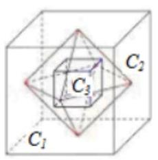

【难度】

【答案】 $\frac{6 + 3\sqrt{2}}{4}$

【解析】解: 正方体 ${C}_{1}$ 各面中心为顶点的凸多面体 ${C}_{2}$ 为正八面体,

它的中截面 (垂直平分相对顶点连线的界面) 是正方形,

该正方形对角线长等于正方体的棱长,

所以它的棱长 ${a}_{2} = \frac{{a}_{1}}{\sqrt{2}} = \frac{1}{\sqrt{2}} = \frac{\sqrt{2}}{2}$ ;

以 ${C}_{2}$ 各个面的中心为顶点的正方体为图形 ${C}_{3}$ 是正方体,

正方体 ${C}_{3}$ 面对角线长等于 ${C}_{2}$ 棱长的 $\frac{2}{3}$ ，(正三角形中心到对边的距离等于高的 $\frac{2}{3}$ )，

因此对角线为 $\frac{2}{3} \times  \frac{\sqrt{2}}{2} = \frac{\sqrt{2}}{3}$ ,所以 ${a}_{3} = \frac{\sqrt{2}}{3\sqrt{2}} = \frac{1}{3}$ ,

以上方式类推,得 ${a}_{4} = \frac{{a}_{3}}{\sqrt{2}} = \frac{\sqrt{2}}{6},{a}_{5} = \frac{\frac{2}{3}{a}_{4}}{\sqrt{2}} = \frac{1}{9},\ldots$ ,

$\left\{  {a}_{n}\right\}$ 各项依次为: $1,\frac{\sqrt{2}}{2},\frac{1}{3},\frac{\sqrt{2}}{6},\frac{1}{9},\ldots$ 奇数项是首项为: 1,公比为 $\frac{1}{3}$ 的等比数列,偶数项是首项为: $\frac{\sqrt{2}}{2}$ ,公比为 $\frac{1}{3}$ 的等比数列,

数列 $\left\{  {a}_{n}\right\}$ 的各项和为: $\frac{1}{1 - \frac{1}{3}} + \frac{\frac{\sqrt{2}}{2}}{1 - \frac{1}{3}} = \frac{3}{2} + \frac{3\sqrt{2}}{4} = \frac{6 + 3\sqrt{2}}{4}$ .

故答案为: $\frac{6 + 3\sqrt{2}}{4}$ .

5、如图，现将一张正方形纸片进行如下操作:第一步，将纸片以 $D$ 为顶点，任意向上翻折，折痕与 ${BC}$ 交于点 ${E}_{1}$ ，然后复原，记 $\angle {CD}{E}_{1} = {\alpha }_{1}$ ；第二步，将纸片以 $D$ 为顶点向下翻折，使 ${AD}$ 与 ${E}_{1}D$ 重合，得到折痕 ${E}_{2}D$ ， 然后复原,记 $\angle {AD}{E}_{2} = {\alpha }_{2}$ ; 第三步,将纸片以 $D$ 为顶点向上翻折,使 ${CD}$ 与 ${E}_{2}D$ 重合,得到折痕 ${E}_{3}D$ ,然后复原,记 $\angle {CD}{E}_{3} = {\alpha }_{3}$ ; 按此折法从第二步起重复以上步骤...,得到 ${\alpha }_{1},{\alpha }_{2},\ldots ,{\alpha }_{n},\ldots$ ,则 $\mathop{\lim }\limits_{{n \rightarrow  \infty }}{\alpha }_{n} =$ ___.

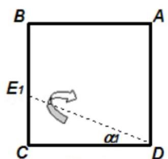

第一步

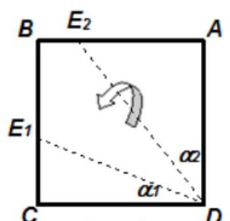

第二步

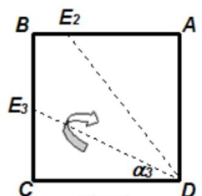

第三步

【难度】 $\star   \star   \star   \star$

【答案】 $\frac{\pi }{6}$

【解析】解: 由第二步可知: ${\alpha }_{2} = \frac{1}{2}\left( {\frac{\pi }{2} - {\alpha }_{1}}\right)$ ; 由第三步可知: ${\alpha }_{3} = \frac{1}{2}\left( {\frac{\pi }{2} - {\alpha }_{2}}\right) ,\ldots$ 依此类推: ${\alpha }_{n} = \frac{1}{2}\left( {\frac{\pi }{2} - {\alpha }_{n - 1}}\right) \left( {n \geq  2}\right) .$

$\therefore {\alpha }_{n} =  - \frac{1}{2}{\alpha }_{n - 1} - \frac{\pi }{4}$ ,

$\therefore {\alpha }_{n} - \frac{\pi }{6} =  - \frac{1}{2}\left( {{\alpha }_{n - 1} - \frac{\pi }{6}}\right)$ ,

① 若 ${\alpha }_{1} = \frac{\pi }{6}$ ，则 ${\alpha }_{n} = \frac{\pi }{6}$ ，此时 $\mathop{\lim }\limits_{{n \rightarrow  \infty }}{\alpha }_{n} = \frac{\pi }{6}$ ；

②若 ${\alpha }_{1} \neq  \frac{\pi }{6}$ ，则数列 $\left\{  {{\alpha }_{n} - \frac{\pi }{6}}\right\}$ 是以 ${\alpha }_{1} - \frac{\pi }{6}$ 为首项， $- \frac{1}{2}$ 为公比的等比数列，

$\therefore {\alpha }_{n} - \frac{\pi }{6} = \left( {{\alpha }_{1} - \frac{\pi }{6}}\right) {\left( -\frac{1}{2}\right) }^{n - 1}$ ,即 ${\alpha }_{n} = \left( {{\alpha }_{1} - \frac{\pi }{6}}\right) {\left( -\frac{1}{2}\right) }^{n - 1} + \frac{\pi }{6}$ .

$\therefore \mathop{\lim }\limits_{{n \rightarrow  \infty }}{\alpha }_{n} = \mathop{\lim }\limits_{{n \rightarrow  \infty }}\left\lbrack  {\left( {{\alpha }_{1} - \frac{\pi }{6}}\right) {\left( -\frac{1}{2}\right) }^{n - 1} + \frac{\pi }{6}}\right\rbrack   = \frac{\pi }{6}$ .

综上可知: $\mathop{\lim }\limits_{{n \rightarrow  \infty }}{\alpha }_{n} = \frac{\pi }{6}$ .

故答案为 $\frac{\pi }{6}$ .

6、如果等差数列 $\left\{  {a}_{n}\right\}  ,\left\{  {b}_{n}\right\}$ 的公差都为 $d\left( {d \neq  0}\right)$ ,若满足对于任意 $n \in  {N}^{ * }$ ,都有 ${b}_{n} - {a}_{n} = {kd}$ ,其中 $k$ 为常数, $k \in  {N}^{ * }$ ,则称它们互为同宗”数列. 已知等差数列 $\left\{  {a}_{n}\right\}$ 中,首项 ${a}_{1} = 1$ ,公差 $d = 2$ ,数列 $\left\{  {b}_{n}\right\}$ 为数列 $\left\{  {a}_{n}\right\}$ 的 “同宗” 数列,若 $\mathop{\lim }\limits_{{n \rightarrow  \infty }}\left( {\frac{1}{{a}_{1}{b}_{1}} + \frac{1}{{a}_{2}{b}_{2}} + \ldots  + \frac{1}{{a}_{n}{b}_{n}}}\right)  = \frac{1}{3}$ ,则 $k =$ ___.

【难度】 $\star   \star   \star   \star$

【答案】 2

【解析】解: 由等差数列 $\left\{  {a}_{n}\right\}$ 中,首项 ${a}_{1} = 1$ ,公差 $d = 2$ ,

可得 ${a}_{n} = 1 + 2\left( {n - 1}\right)  = {2n} - 1$ ,

数列 $\left\{  {b}_{n}\right\}$ 为数列 $\left\{  {a}_{n}\right\}$ 的 “同宗” 数列,

可得 ${b}_{n} = {a}_{n} + {2k} = {2n} - 1 + {2k}$ ,

由 $\frac{1}{{a}_{n}{b}_{n}} = \frac{1}{\left( {{2n} - 1}\right) \left( {{2n} - 1 + {2k}}\right) } = \frac{1}{2k}\left( {\frac{1}{{2n} - 1} - \frac{1}{{2n} - 1 + {2k}}}\right)$ ,

则 $\frac{1}{{a}_{1}{b}_{1}} + \frac{1}{{a}_{2}{b}_{2}} + \ldots  + \frac{1}{{a}_{n}{b}_{n}} = \frac{1}{2k}\left( {1 - \frac{1}{1 + {2k}} + \frac{1}{3} - \frac{1}{3 + {2k}} + \ldots  + \frac{1}{{2n} - 1} - \frac{1}{{2n} - 1 + {2k}}}\right)$ ,

当 $k = 1$ 时,若 $\mathop{\lim }\limits_{{n \rightarrow  \infty }}\left( {\frac{1}{{a}_{1}{b}_{1}} + \frac{1}{{a}_{2}{b}_{2}} + \ldots  + \frac{1}{{a}_{n}{b}_{n}}}\right)  = \mathop{\lim }\limits_{{n \rightarrow  \infty }}\frac{1}{2}\left( {1 - \frac{1}{3} + \frac{1}{3} - \frac{1}{5} + \ldots  + \frac{1}{{2n} - 1} - \frac{1}{{2n} + 1}}\right)$

$= \mathop{\lim }\limits_{{n \rightarrow  \infty }}\frac{1}{2}\left( {1 - \frac{1}{{2n} + 1}}\right)  = \frac{1}{2}$ ,不成立;

当 $k = 2$ 时, $\mathop{\lim }\limits_{{n \rightarrow  \infty }}\left( {\frac{1}{{a}_{1}{b}_{1}} + \frac{1}{{a}_{2}{b}_{2}} + \ldots  + \frac{1}{{a}_{n}{b}_{n}}}\right)  = \mathop{\lim }\limits_{{n \rightarrow  \infty }}\frac{1}{4}\left( {1 - \frac{1}{5} + \frac{1}{3} - \frac{1}{7} + \frac{1}{5} - \frac{1}{9} + \ldots  + \frac{1}{{2n} - 1} - \frac{1}{{2n} + 3}}\right)$

$= \mathop{\lim }\limits_{{n \rightarrow  \infty }}\frac{1}{4}\left( {1 + \frac{1}{3} - \frac{1}{{2n} + 1} - \frac{1}{{2n} + 3}}\right)  = \frac{1}{4} \times  \frac{4}{3} = \frac{1}{3}$ ，成立；

当 $k = 3$ 时, $\mathop{\lim }\limits_{{n \rightarrow  \infty }}\left( {\frac{1}{{a}_{1}{b}_{1}} + \frac{1}{{a}_{2}{b}_{2}} + \ldots  + \frac{1}{{a}_{n}{b}_{n}}}\right)  = \mathop{\lim }\limits_{{n \rightarrow  \infty }}\frac{1}{6}\left( {1 - \frac{1}{7} + \frac{1}{3} - \frac{1}{9} + \frac{1}{5} - \frac{1}{11} + \ldots  + \frac{1}{{2n} - 1} - \frac{1}{{2n} + 5}}\right)$

$= \mathop{\lim }\limits_{{n \rightarrow  \infty }}\frac{1}{6}\left( {1 + \frac{1}{3} + \frac{1}{5} - \frac{1}{{2n} + 1} - \frac{1}{{2n} + 3} - \frac{1}{{2n} + 5}}\right)  = \frac{1}{6} \times  \frac{23}{15} = \frac{23}{90}$ ,不成立;

同理可得 $k = m$ 时, $\mathop{\lim }\limits_{{n \rightarrow  \infty }}\left( {\frac{1}{{a}_{1}{b}_{1}} + \frac{1}{{a}_{2}{b}_{2}} + \ldots  + \frac{1}{{a}_{n}{b}_{n}}}\right)  = \frac{1}{2m}\left( {1 + \frac{1}{3} + \ldots  + \frac{1}{{2m} - 1}}\right)$ ,

由 $\frac{1}{2m}\left( {1 + \frac{1}{3} + \ldots  + \frac{1}{{2m} - 1}}\right)  = \frac{1}{3}$ ,

即 $1 + \frac{1}{3} + \ldots  + \frac{1}{{2m} - 1} = \frac{2m}{3}$ ,可设 ${c}_{m} = 1 + \frac{1}{3} + \ldots  + \frac{1}{{2m} - 1} - \frac{2m}{3}$ ,

${c}_{m + 1} - {c}_{m} = \frac{1}{{2m} + 1} - \frac{2}{3} < 0$ ,可得 ${c}_{m}$ 递减, ${c}_{2} = 0$ ,

可得仅有 $k = 2$ 时, $\mathop{\lim }\limits_{{n \rightarrow  \infty }}\left( {\frac{1}{{a}_{1}{b}_{1}} + \frac{1}{{a}_{2}{b}_{2}} + \ldots  + \frac{1}{{a}_{n}{b}_{n}}}\right)  = \frac{1}{3}$ ,

故答案为: 2 .

二、选择题

7、设 $f\left( k\right)  = \frac{1}{k + 1} + \frac{1}{k + 2} + \frac{1}{k + 3} + \ldots  + \frac{1}{2k}\left( {k \in  {N}^{ * }}\right)$ ，则 $f\left( {k + 1}\right)$ 可表示为( )

A. $f\left( k\right)  + \frac{1}{{2k} + 2}$ B. $f\left( k\right)  + \frac{1}{{2k} + 1} + \frac{1}{{2k} + 2}$

C. $f\left( k\right)  + \frac{1}{{2k} + 1} - \frac{1}{{2k} + 2}$ D. $f\left( k\right)  - \frac{1}{{2k} + 1} + \frac{1}{{2k} + 2}$

【难度】 $\star   \star   \star$

【答案】 $C$

【解析】解: $\because f\left( k\right)  = \frac{1}{k + 1} + \frac{1}{k + 2} + \frac{1}{k + 3} + \ldots  + \frac{1}{2k}\left( {k \in  {N}^{ * }}\right)$ ,

$\therefore f\left( {k + 1}\right)  = \frac{1}{k + 1 + 1} + \frac{1}{k + 1 + 2} + \frac{1}{k + 1 + 3} + \ldots  + \frac{1}{2\left( {k + 1}\right) }$

$= \frac{1}{k + 2} + \frac{1}{k + 3} + \ldots  + \frac{1}{2k} + \frac{1}{{2k} + 1} + \frac{1}{{2k} + 2}$

$= \frac{1}{k + 1} + \frac{1}{k + 2} + \frac{1}{k + 3} + \ldots  + \frac{1}{2k} + \frac{1}{{2k} + 1} - \frac{1}{{2k} + 2}$

$= f\left( k\right)  + \frac{1}{{2k} + 1} - \frac{1}{{2k} + 2}.$

故选: $C$ .

8、数列 $\left\{  {a}_{n}\right\}$ 中， ${a}_{n} = \left\{  {\begin{array}{ll} {\left( \frac{1}{2}\right) }^{n} & n = {2k} - 1 \\  \frac{2{n}^{2} - 1}{{n}^{2} + 1} & n = {2k} \end{array}\left( {k \in  {N}^{ * }}\right) }\right.$ ，则数列 $\left\{  {a}_{n}\right\}$ 的极限为( )

A. 0 B. 2 C. 0 或 2 D. 不存在

【难度】 $\star   \star   \star$

【答案】 $D$

【解析】解: ① 当 $n = {2k} - 1$ 时, $\mathop{\lim }\limits_{{n \rightarrow  \infty }}{\left( \frac{1}{2}\right) }^{n} = 0$ ,

② 当 $n = {2k}$ 时 $\mathop{\lim }\limits_{{n \rightarrow  \infty }}\frac{2{n}^{2} - 1}{{n}^{2} + 1} = 2$ . 所以数列 $\left\{  {a}_{n}\right\}$ 的极限不存在.

故选: $D$ .

9、已知数列 $\left\{  {a}_{n}\right\}  ,\left\{  {b}_{n}\right\}  \left( {n \in  {N}^{ * }}\right)$ ,如果数列 $\left\{  {{a}_{n} + {b}_{n}}\right\}$ 和 $\left\{  {{a}_{n} - {b}_{n}}\right\}$ 的极限均存在,那么在下列数列中,其极限不一定存在的数列是( )

A. $\left\{  {a}_{n}\right\}$ B. $\left\{  {3{a}_{n} - 2{b}_{n}}\right\}$ C. $\left\{  {{a}_{n} \cdot  {b}_{n}}\right\}$

D. $\left\{  \frac{{a}_{n}}{{b}_{n}}\right\}$

【难度】 $\star   \star   \star$

【答案】 $D$

【解析】解: 由题意,数列 $\left\{  {{a}_{n} + {b}_{n}}\right\}$ 和 $\left\{  {{a}_{n} - {b}_{n}}\right\}$ 的极限均存在,

设 $\mathop{\lim }\limits_{{n \rightarrow  \infty }}\left( {{a}_{n} + {b}_{n}}\right)  = M,\mathop{\lim }\limits_{{n \rightarrow  \infty }}\left( {{a}_{n} - {b}_{n}}\right)  = N$ .

则 $\mathop{\lim }\limits_{{n \rightarrow  \infty }}{a}_{n} = \frac{1}{2}\mathop{\lim }\limits_{{n \rightarrow  \infty }}2{a}_{n} = \frac{1}{2}\mathop{\lim }\limits_{{n \rightarrow  \infty }}\left\lbrack  {\left( {{a}_{n} + {b}_{n}}\right)  + \left( {{a}_{n} - {b}_{n}}\right) }\right\rbrack$

$= \frac{1}{2}\left\lbrack  {\mathop{\lim }\limits_{{n \rightarrow  \infty }}\left( {{a}_{n} + {b}_{n}}\right)  + \mathop{\lim }\limits_{{n \rightarrow  \infty }}\left( {{a}_{n} - {b}_{n}}\right) }\right\rbrack   = \frac{M + N}{2}$ ,故选项 $A$ 正确;

同理求得 $\mathop{\lim }\limits_{{n \rightarrow  \infty }}{b}_{n} = \frac{M - N}{2}$ .

则 $\mathop{\lim }\limits_{{n \rightarrow  \infty }}\left( {3{a}_{n} - 2{b}_{n}}\right)  = \mathop{\lim }\limits_{{n \rightarrow  \infty }}3{a}_{n} - \mathop{\lim }\limits_{{n \rightarrow  \infty }}2{b}_{n} = 3 \times  \frac{M + N}{2} - 2 \times  \frac{M - N}{2} = \frac{M + {5N}}{2}$ ,故 $B$ 正确;

$\mathop{\lim }\limits_{{n \rightarrow  \infty }}{a}_{n} \cdot  {b}_{n} = \mathop{\lim }\limits_{{n \rightarrow  \infty }}{a}_{n} \cdot  \mathop{\lim }\limits_{{n \rightarrow  \infty }}{b}_{n} = \frac{M + N}{2} \times  \frac{M - N}{2} = \frac{{M}^{2} - {N}^{2}}{4}$ ,故 $C$ 正确;

对于 $D$ ,如 ${a}_{n} = \frac{1}{n},{b}_{n} = \frac{1}{{n}^{2}}$ ,满足数列 $\left\{  {{a}_{n} + {b}_{n}}\right\}$ 和 $\left\{  {{a}_{n} - {b}_{n}}\right\}$ 的极限均存在,此时 $\left\{  \frac{{a}_{n}}{{b}_{n}}\right\}$ 的极限不存在.

故选: $D$ .

10、在数列的极限一节，课本中给出了计算由抛物线 $y = {x}^{2}\text{ 、 }x$ 轴以及直线 $x = 1$ 所围成的曲边区域面积 $S$ 的一种方法: 把区间 $\left\lbrack  {0,1}\right\rbrack$ 平均分成 $n$ 份,在每一个小区间上作一个小矩形,使得每个矩形的左上端点都在抛物线 $y = {x}^{2}$ 上 (如图),则当 $n \rightarrow  \infty$ 时,这些小矩形面积之和的极限就是 $S$ . 已知 ${1}^{2} + {2}^{2} + {3}^{2} + \ldots  + {n}^{2} = \frac{1}{6}n\left( {n + 1}\right) \left( {{2n} + 1}\right)$ . 利用此方法计算出的由曲线 $y = \sqrt{x}\text{ 、 }x$ 轴以及直线 $x = 1$ 所围成的曲边区域的面积为( )

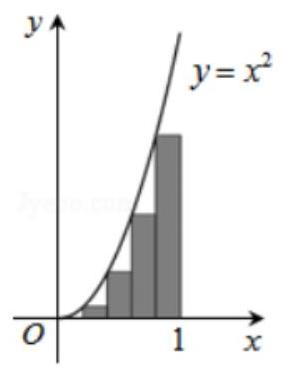

A. $\frac{\sqrt{6}}{3}$ B. $\frac{\sqrt{3}}{2}$ C. $\frac{3}{4}$ D. $\frac{2}{3}$

【难度】 $\star   \star   \star   \star$

【答案】 $D$

【解析】解: 如图,

把纵轴区间 $\left\lbrack  {0,1}\right\rbrack  , n$ 等分,得到 $n$ 个矩形,每一个矩形的底边长都是 $\frac{1}{n}$ ,

高分别为 $\frac{{1}^{2}}{{n}^{2}},\frac{{2}^{2}}{{n}^{2}},\frac{{3}^{2}}{{n}^{2}},\ldots ,\frac{{n}^{2}}{{n}^{2}}$ .

$\therefore n$ 个矩形的面积和为 $\frac{1}{n}\left( {\frac{{1}^{2}}{{n}^{2}} + \frac{{2}^{2}}{{n}^{2}} + \frac{{3}^{2}}{{n}^{2}} + \ldots  + \frac{{n}^{2}}{{n}^{2}}}\right)  = \frac{1}{{n}^{3}}\left( {{1}^{2} + {2}^{2} + {3}^{2} + \ldots  + {n}^{2}}\right) \; = \frac{n\left( {n + 1}\right) \left( {{2n} + 1}\right) }{6{n}^{3}}$ .

$\therefore$ 曲线 $y = \sqrt{x}\text{ 、 }y$ 轴、 $y = 1$ 围成的曲边梯形的面积为 $\mathop{\lim }\limits_{{n \rightarrow  \infty }}\frac{n\left( {n + 1}\right) \left( {{2n} + 1}\right) }{6{n}^{3}} \; = \mathop{\lim }\limits_{{n \rightarrow  \infty }}\frac{2{n}^{3} + 3{n}^{2} + n}{6{n}^{3}} = \mathop{\lim }\limits_{{n \rightarrow  \infty }}\frac{2 + \frac{3}{n} + \frac{1}{{n}^{2}}}{6} = \frac{1}{3}.$

$\therefore$ 由曲线 $y = \sqrt{x}\text{ 、 }x$ 轴以及直线 $x = 1$ 所围成的曲边区域的面积为 $1 - \frac{1}{3} = \frac{2}{3}$ . 故选: $D$ .

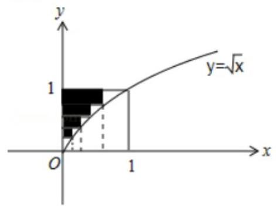

## 三、解答题

11、设数列 $\left\{  {a}_{n}\right\}$ 的前 $n$ 项和是 ${S}_{n}$ ,且 $2{S}_{n} - n{a}_{n} = n$ .

(1)求证:数列 $\left\{  {a}_{n}\right\}$ 为等差数列；

(2)若 ${a}_{n} > 0$ 且数列 $\left\{  \sqrt{{S}_{n}}\right\}$ 也为等差数列，试求 $\mathop{\lim }\limits_{{n \rightarrow  \infty }}\frac{{S}_{n + {10}}}{{a}_{n}^{2}}$ 的值；

(3)设 ${b}_{n} = \frac{{S}_{n + 1}}{n}$ ，且 ${a}_{n + 1} > {a}_{n}$ 恒成立，求证:存在唯一的正整数 $n$ ，使得不等式 ${a}_{n + 1} \leq  {b}_{n} < {a}_{n + 2}$ 成立.

【难度】 $\star   \star   \star   \star$

【解析】解: (1) 证明: 当 $n = 1$ 时, $2{S}_{1} - {a}_{1} = 1$ ,即 $2{a}_{1} - {a}_{1} = 1$ ,即 ${a}_{1} = 1$ ,

当 $n \geq  2$ 时, $2{S}_{n - 1} - \left( {n - 1}\right) {a}_{n - 1} = n - 1$ ,又 $2{S}_{n} - n{a}_{n} = n$ ,

两式相减可得 $\left( {2 - n}\right) {a}_{n} + \left( {n - 1}\right) {a}_{n - 1} = 1$ ,①

将上式中的 $n$ 换为 $n + 1$ ，可得 $\left( {1 - n}\right) {a}_{n + 1} + n{a}_{n} = 1$ ，②

① - ② 可得 $2{a}_{n} = {a}_{n - 1} + {a}_{n + 1},\;\left( {n \geq  2}\right)$ ，

所以数列 $\left\{  {a}_{n}\right\}$ 为首项为 1 的等差数列;

(2)设数列 $\left\{  {a}_{n}\right\}$ 的公差为 $d$ ，则 ${a}_{n} = {a}_{1} + \left( {n - 1}\right) d$ ， ${S}_{n} = n{a}_{1} + \frac{1}{2}n\left( {n - 1}\right) d$ ，

由于数列 $\left\{  \sqrt{{S}_{n}}\right\}$ 也为等差数列,可得 $2\sqrt{{S}_{2}} = \sqrt{{S}_{1}} + \sqrt{{S}_{3}}$ ,

即 $2\sqrt{2 + d} = 1 + \sqrt{3 + {3d}}$ ,解得 $d = 2$ ,

则 ${a}_{n} = {2n} - 1,{S}_{n} = {n}^{2}$ ,

则 $\mathop{\lim }\limits_{{n \rightarrow  \infty }}\frac{{S}_{n + {10}}}{{a}_{n}^{2}} = \mathop{\lim }\limits_{{n \rightarrow  \infty }}\frac{{\left( n + {10}\right) }^{2}}{{\left( 2n - 1\right) }^{2}} = \mathop{\lim }\limits_{{n \rightarrow  \infty }}\frac{{n}^{2} + {20n} + {100}}{4{n}^{2} - {4n} + 1} = \frac{1}{4}$ ;

(3)证明:由 ${b}_{n} = \frac{{S}_{n + 1}}{n}$ ，且 ${a}_{n + 1} > {a}_{n}$ 恒成立，

又 ${a}_{n + 1} \leq  {b}_{n} < {a}_{n + 2}$ ,可得 ${2n} + 1 \leq  \frac{{\left( n + 1\right) }^{2}}{n} \leq  {2n} + 3$ ,

整理可得 $\left\{  \begin{array}{l} {n}^{2} - n - 1 \leq  0 \\  {n}^{2} + n - 1 > 0 \end{array}\right.$ ,解得 $\frac{\sqrt{5} - 1}{2} < n \leq  \frac{\sqrt{5} + 1}{2}$ ,

由于 $\frac{\sqrt{5} + 1}{2} - \frac{\sqrt{5} - 1}{2} = 1$ ,且 $\frac{\sqrt{5} - 1}{2} > 0$ ,

因此存在唯一的正整数 $n$ ,使得不等式 ${a}_{n + 1} \leq  {b}_{n} < {a}_{n + 2}$ 成立.

12、我们要计算由抛物线 $y = {x}^{2}\text{ 、 }x$ 轴以及直线 $x = 1$ 所围成的曲边区域的面积 $S$ ,可用 $x$ 轴上的分点 $0\text{ 、 }\frac{1}{n}$ 、 $\frac{2}{n}\text{ 、 }\ldots \text{ 、 }\frac{n - 1}{n}\text{ 、 }1$ 将区间 $\left\lbrack  {0,1}\right\rbrack$ 分成 $n$ 个小区间,从第二个小区间起,在每一个小区间上作一个小矩形, 使得每个矩形的左上端点都在抛物线 $y = {x}^{2}$ 上,这么矩形的高分别为 ${\left( \frac{1}{n}\right) }^{2}\text{ 、 }{\left( \frac{2}{n}\right) }^{2}\text{ 、 }\ldots \text{ 、 }{\left( \frac{n - 1}{n}\right) }^{2}$ ,矩形的底边长都是 $\frac{1}{n}$ ,设所有这些矩形面积的总和为 ${S}_{n}$ ,就有 $S = \mathop{\lim }\limits_{{n \rightarrow  \infty }}{S}_{n}$ .

(1)求 ${S}_{n}$ 的表达式，并求出面积 $S$ ；

(可以利用公式 ${1}^{2} + {2}^{2} + {3}^{2} + \cdots  + {n}^{2} = \frac{n\left( {n + 1}\right) \left( {{2n} + 1}\right) }{6}$ )

( 2 )利用上述方法，探求由函数 $y = {e}^{x}$ 、 $x$ 轴、 $y$ 轴以及直线 $x = 1$ 和所围成的区域的面积 $T$ . (可以利用公式: $\mathop{\lim }\limits_{{n \rightarrow  \infty }}n\left( {{e}^{\frac{1}{n}} - 1}\right)  = 1)$

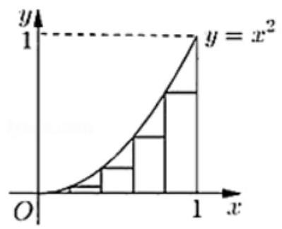

【难度】 $\star   \star   \star   \star$

【答案】见解析

【解析】解: (1) 由题意可知, ${S}_{n} = \frac{1}{n} \cdot  {\left( \frac{1}{n}\right) }^{2} + \frac{1}{n} \cdot  {\left( \frac{2}{n}\right) }^{2} + \ldots  + \frac{1}{n} \cdot  {\left( \frac{n - 1}{n}\right) }^{2}$

$= \frac{1}{n}\left\lbrack  {{\left( \frac{1}{n}\right) }^{2} + {\left( \frac{2}{n}\right) }^{2} + \ldots  + {\left( \frac{n - 1}{n}\right) }^{2}}\right\rbrack   = \frac{{1}^{2} + {2}^{2} + \ldots  + {\left( n - 1\right) }^{2}}{{n}^{3}}$ ,

因为 ${1}^{2} + {2}^{2} + {3}^{2} + \cdots  + {n}^{2} = \frac{n\left( {n + 1}\right) \left( {{2n} + 1}\right) }{6}$ ,所以 ${S}_{n} = \frac{{1}^{2} + {2}^{2} + \ldots  + {\left( n - 1\right) }^{2}}{{n}^{3}} = \frac{\frac{\left( {n - 1}\right) n\left( {{2n} - 1}\right) }{6}}{{n}^{3}} = \frac{\left( {n - 1}\right) \left( {{2n} - 1}\right) }{6{n}^{2}}$ , 因此 $S = \mathop{\lim }\limits_{{n \rightarrow  \infty }}{S}_{n} = \mathop{\lim }\limits_{{n \rightarrow  \infty }}\frac{\left( {n - 1}\right) \left( {{2n} - 1}\right) }{6{n}^{2}} = \mathop{\lim }\limits_{{n \rightarrow  \infty }}\frac{2{n}^{2} - {3n} + 1}{6{n}^{2}} = \mathop{\lim }\limits_{{n \rightarrow  \infty }}\frac{2 - \frac{3}{n} + \frac{1}{{n}^{2}}}{6} = \frac{2}{6} = \frac{1}{3}$ ; (6 分)

(2)根据题中方法，探求由函数 $y = {e}^{x}$ 、 $x$ 轴、 $y$ 轴以及直线 $x = 1$ 和所围成的区域的面积 $T$ ，可将区间 $\lbrack 0$ ， 1] 分成 $n$ 个小区间,每一个小区间对应一个小矩形,使得每个矩形的左上端点都在抛物线 $y = {e}^{x}$ 上,这么矩形的高分别为 ${e}^{0}\text{ 、 }{e}^{\frac{1}{n}}\text{ 、 }{e}^{\frac{2}{n}}\text{ 、 }\ldots \text{ 、 }{e}^{\frac{n - 1}{n}}$ ,矩形的底边长都是 $\frac{1}{n}$ ,

则 ${T}_{n} = \frac{1}{n} \cdot  {e}^{0} + \frac{1}{n} \cdot  {e}^{\frac{1}{n}} + \frac{1}{n} \cdot  {e}^{\frac{2}{n}} + \ldots  + \frac{1}{n} \cdot  {e}^{\frac{n - 1}{n}} = \frac{1}{n} \cdot  \left( {{e}^{0} + {e}^{\frac{1}{n}} + {e}^{\frac{2}{n}} + \ldots  + {e}^{\frac{n - 1}{n}}}\right)  = \frac{1}{n} \cdot  \frac{\left\lbrack  1 - {\left( {e}^{\frac{1}{n}}\right) }^{n}\right\rbrack  }{1 - {e}^{\frac{1}{n}}} = \frac{1}{n} \cdot  \frac{e - 1}{{e}^{\frac{1}{n}} - 1} = \frac{e - 1}{n\left( {{e}^{\frac{1}{n}} - 1}\right) }$ ,因此

$T = \mathop{\lim }\limits_{{n \rightarrow  \infty }}{T}_{n} = \mathop{\lim }\limits_{{n \rightarrow  \infty }}\frac{e - 1}{n\left( {{e}^{\frac{1}{n}} - 1}\right) },$

因为 $\mathop{\lim }\limits_{{n \rightarrow  \infty }}n\left( {{e}^{\frac{1}{n}} - 1}\right)  = 1$ ,所以 $T = \mathop{\lim }\limits_{{n \rightarrow  \infty }}\frac{e - 1}{n\left( {{e}^{\frac{1}{n}} - 1}\right) } = \frac{e - 1}{1} = e - 1$ . (12 分)
