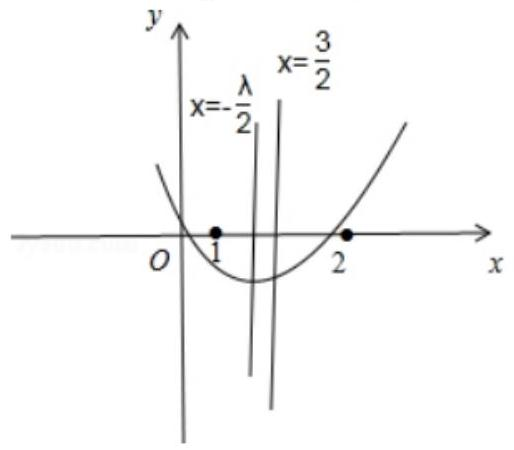
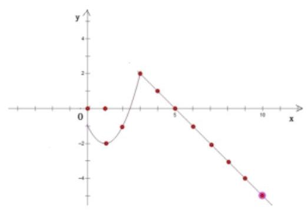
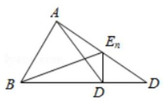
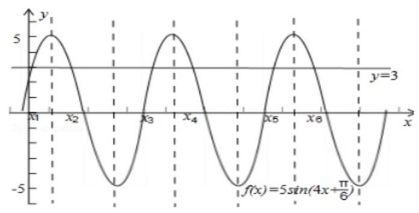
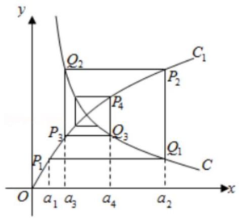
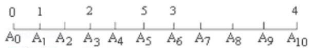
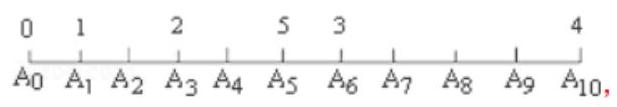
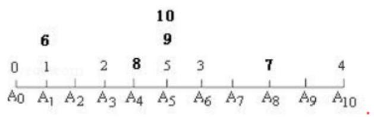
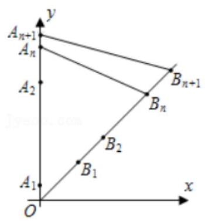

## 数列的综合

<table><tr><td>教学目标</td><td>1、熟悉等差等比数列的基本性质并能利用其解决实际问题;   2、数列的单调性及数列的最值问题;   3、了解等差等比数列前 $\mathrm{n}$ 项和的思想,对于等比数列前 $\mathrm{n}$ 项和问题注意分类讨论.</td></tr><tr><td>重点</td><td>1、数列的单调性与最值；   2、等差等比数列的性质及其应用.   3、数列与其他知识点的灵活运用</td></tr><tr><td>难 点</td><td>1、数列的单调性，周期性   2、利用周期进行有关计算.   3、数列与其他知识点的灵活运用</td></tr></table>

## (一) 数列的函数性质

## 知识梳理

## 一、数列的单调性

数列单调性是数列最重要的性质之一, 也是解决数列问题的最重要的方法之一, 判断数列单调性的方法常用的有两个, 一个是利用数列对应的函数的单调性, 另一个是对数列的前后项作差 (或作商) 比较法判断, 而数列单调性的应用更为重要。

## 1 判断数列单调性:

${a}_{n + 1} - {a}_{n} > 0 \Leftrightarrow$ 数列 $\left\{  {a}_{n}\right\}$ 是递增数列

${a}_{n + 1} - {a}_{n} = 0 \Leftrightarrow$ 数列 $\left\{  {a}_{n}\right\}$ 是常数列

${a}_{n + 1} - {a}_{n} < 0 \Leftrightarrow$ 数列 $\left\{  {a}_{n}\right\}$ 是递减数列

<table><tr><td></td><td>$\frac{{a}_{n + 1}}{{a}_{n}} > 1$</td><td>$\frac{{a}_{n + 1}}{{a}_{n}} < 1$</td><td>$\frac{{a}_{n + 1}}{{a}_{n}} = 1$</td></tr><tr><td>${a}_{n} > 0$</td><td>递增数列</td><td>递减数列</td><td>常数列</td></tr><tr><td>${a}_{n} < 0$</td><td>递减数列</td><td>递增数列</td><td>常数列</td></tr></table>

## 2 数列单调性的应用: 求数列最大项和最小项

方法一:利用判断函数增减性的方法，先判断数列的增减情况，再求数列的最大项或最小项。

方法二: 设 ${a}_{n}$ 是最大项,则有 $\left\{  \begin{array}{l} {a}_{n} \geq  {a}_{n - 1} \\  {a}_{n} \geq  {a}_{n + 1} \end{array}\right.$ 对任意的 $n \in  {N}^{ * }$ 且 $n \geq  2$ 均成立,解不等式组即可。

## 二、数列的周期性

## 1 常见结论:

在数列 $\left\{  {a}_{n}\right\}$ 中,关于数列的周期性有以下常见结论;

1、若 ${a}_{n} = {a}_{n - k} + {a}_{n + k}\left( {n > k}\right)$ 恒成立，则 $T = {6k}$ 是 $\left\{  {a}_{n}\right\}$ 的一个周期；

2、若 ${a}_{n} \neq  0,{a}_{n} = {a}_{n - k} \cdot  {a}_{n + k}\left( {n > k}\right)$ 恒成立,则 $T = {6k}$ 是 $\left\{  {a}_{n}\right\}$ 的一个周期;

3、若 ${a}_{n + k} = \frac{{a}_{n} - 1}{{a}_{n} + 1}$ 恒成立,则 $T = {4k}$ 是 $\left\{  {a}_{n}\right\}$ 的一个周期;

4、若 ${a}_{n + p} = {a}_{p - n}$ 且 ${a}_{n + q} = {a}_{q - n}\left( {p > q > n, p, q \in  {N}^{ * }}\right)$ 恒成立,则 $T = 2\left( {p - q}\right)$ 是 $\left\{  {a}_{n}\right\}$ 的一个周期;

5、若 ${a}_{n + p} + {a}_{p - n} = m$ 且 ${a}_{n + q} + {a}_{q - n} = m\left( {p > q > n, p, q \in  {N}^{ * }}\right)$ 恒成立,则 $T = 2\left( {p - q}\right)$ 是 $\left\{  {a}_{n}\right\}$ 的一个周期;

6、若 ${a}_{n + p} = {a}_{p - n}$ 且 ${a}_{n + q} =  - {a}_{q - n}\left( {p > q > n, p, q \in  {N}^{ * }}\right)$ 恒成立,则 $T = 4\left( {p - q}\right)$ 是 $\left\{  {a}_{n}\right\}$ 的一个周期;

## 2 周期数列:

①某个数列与周期数列相乘，这样的数列求和，用 “并项法”

② ${\left( -1\right) }^{n}$ 是最常见的周期因子，此外 $\cos \frac{n\pi }{2}$ ， $\cos \frac{2n\pi }{3}$ ， ${\cos }^{2}\frac{n\pi }{3} - {\sin }^{2}\frac{n\pi }{3}$ 都是

③我们一般只 $\mathrm{n}$ 为周期整数倍的前 $\mathrm{n}$ 项和 ${S}_{n}$ ，其余的用 ${S}_{n} + {a}_{n + 1}$ 这样的方法计算

## 例题精讲

【例 1】已知数列 $\left\{  {a}_{n}\right\}$ 的通项公式为 ${a}_{n} = {\left( \frac{4}{9}\right) }^{n - 1} - {\left( \frac{2}{3}\right) }^{n - 1}$ ,则数列 $\left\{  {a}_{n}\right\}$ (   )

A. 有最大项，没有最小项 B. 有最小项，没有最大项

C. 既有最大项又有最小项 D. 既没有最大项也没有最小项

【难度】 $\star   \star   \star$

【答案】C

【解析】解: ${a}_{n} = {\left( \frac{4}{9}\right) }^{n - 1} - {\left( \frac{2}{3}\right) }^{n - 1} = {\left\lbrack  {\left( \frac{2}{3}\right) }^{n - 1}\right\rbrack  }^{2} - {\left( \frac{2}{3}\right) }^{n - 1}$

令 ${\left( \frac{2}{3}\right) }^{n - 1} = t$ ,则 $t$ 是区间 $(0,1\rbrack$ 内的值,而 ${a}_{n} = {t}^{2} - t = {\left( t - \frac{1}{2}\right) }^{2} - \frac{1}{4}$ ,

所以当 $n = 1$ ,即 $t = 1$ 时, ${a}_{n}$ 取最大值,使 ${\left( \frac{2}{3}\right) }^{n - 1}$ 最接近 $\frac{1}{2}$ 的 $n$ 的值为数列 $\left\{  {a}_{n}\right\}$ 中的最小项,

所以该数列既有最大项又有最小项.

故选: $C$ .

【例 2】(1)数列 $\left\{  {a}_{n}\right\}$ 满足: ${a}_{n} = \left\{  \begin{array}{l} \left( {3 - a}\right) n - 3\left( {n \leq  7}\right) \\  {a}^{n - 6}\left( {n > 7}\right)  \end{array}\right.$ 且 $\left\{  {a}_{n}\right\}$ 是递增数列，则实数 $a$ 的范围是( )

A. $\left( {\frac{9}{4},3}\right)$ B. $\left\lbrack  {\frac{9}{4},3}\right)$ C. $\left( {1,3}\right)$ D. $\left( {2,3}\right)$

【难度】 $\star   \star   \star$

【答案】D

【解析】解: 根据题意, ${a}_{n} = f\left( n\right)  = \left\{  \begin{array}{l} \left( {3 - a}\right) n - 3, n \leq  7 \\  {a}^{x - 6}, n > 7 \end{array}\right.$ ;

要使 $\left\{  {a}_{n}\right\}$ 是递增数列,必有 $\left\{  \begin{array}{l} 3 - a > 0 \\  a > 1 \\  \left( {3 - a}\right)  \times  7 - 3 < {a}^{8 - 6} \end{array}\right.$ ;

解可得, $2 < a < 3$ ;

(2)已知数列 $\left\{  {a}_{n}\right\}$ 的通项公式 ${a}_{n} = {n}^{2} + {\lambda n} + 2$ ，若数列 $\left\{  {a}_{n}\right\}$ 为单调递增数列，则实数 $\lambda$ 的取值范围是___.

【难度】 $\star   \star   \star$

【答案】 $\lbrack  - 2, + \infty )$

【解析】解解: 方法一: $\because {a}_{n} = {n}^{2} + {\lambda n} + 2,\therefore {a}_{n + 1} = {\left( n + 1\right) }^{2} + \lambda \left( {n + 1}\right)  + 2$ ,

$\because$ 数列 $\left\{  {a}_{n}\right\}$ 为单调递增数列, $\therefore {a}_{n + 1} - {a}_{n} = {2n} + \lambda  + 1 > 0\left( {n \in  {N}^{ * }}\right)$ 恒成立, $\therefore \lambda  >  - {2n} - 1\left( {n \in  {N}^{ * }}\right)$ 恒成立,

令 $f\left( n\right)  =  - {2n} - 1\left( {n \in  {N}^{ * }}\right)$ ,则 $\lambda  > f{\left( x\right) }_{\max } =  - 2 \times  1 - 1 =  - 3$

$\therefore \lambda  >  - 3$ . $\therefore$ 实数 $\lambda$ 的取值范围是 $\left( {-3, + \infty }\right)$ .

方法二: $\because {a}_{n} = {n}^{2} + {\lambda n} + 2$ ,故 ${a}_{n}$ 是 $n$ 的二次函数,又数列 $\left\{  {a}_{n}\right\}$ 为单调递增数列,

$\therefore$ 对称轴 $n =  - \frac{\lambda }{2} < \frac{1 + 2}{2} = \frac{3}{2}$ ,如图: $\therefore \lambda  >  - 3$ . 故答案为: $\left( {-3, + \infty }\right)$ .

【例 3】已知数列 $\left\{  {a}_{n}\right\}$ 满足 ${a}_{n + 1} = 2{a}_{n} + \frac{2}{{a}_{n}} - 3$ ，且数列是单调递增的，则首项的取值范围是( )

A. $\left( {-\infty ,0}\right)  \cup  \left( {2, + \infty }\right)$ B. $\left( {0,1}\right)  \cup  \left( {2, + \infty }\right)$

C. $\left( {2, + \infty }\right)$

D. $\left( {0,\frac{1}{2}}\right)  \cup  \left( {2, + \infty }\right)$

【难度】 $\star   \star   \star   \star   \star$

【答案】D

【解析】解: 数列 $\left\{  {a}_{n}\right\}$ 满足 ${a}_{n + 1} = 2{a}_{n} + \frac{2}{{a}_{n}} - 3$ ,首项 ${a}_{1} = a$ ,数列 $\left\{  {a}_{n}\right\}$ 是单调递增的,

所以 ${a}_{n + 1} - {a}_{n} = {a}_{n} + \frac{2}{{a}_{n}} - 3 > 0$ ,则 ${a}_{1} + \frac{2}{{a}_{1}} - 3 > 0$ ,即 $a + \frac{2}{a} - 3 > 0$ ,

当 $a > 0$ 时,解得 $a \in  \left( {0,1}\right)  \cup  \left( {2, + \infty }\right)$ .

当 $a < 0$ 时,不等式不成立. 当 $a = \frac{1}{2}$ 时, ${a}_{1} = \frac{1}{2},{a}_{2} = {a}_{3} = \ldots  = 2$ ,不满足题意,

当 $a \in  \left( {0,\frac{1}{2}}\right)$ 时,取 $a = \frac{1}{3}$ 关系式成立. 当 $a \in  \left( {\frac{1}{2},1}\right)$ 时,取 $a = \frac{2}{3}$ 时,关系式不成立.

故实数 $a$ 的取值范围是 $a \in  \left( {0,\frac{1}{2}}\right) \bigcup \left( {2, + \infty }\right)$ . 故选: $D$ .

【例 4】( 1 )已知 ${a}_{n} = \frac{n - \sqrt{2018}}{n - \sqrt{2019}}\left( {n \in  {N}^{ * }}\right)$ ，则数列 $\left\{  {a}_{n}\right\}$ 的前 50 项中最小项和最大项分别是()

A. ${a}_{1},{a}_{50}$ B. ${a}_{1},{a}_{44}$ C. ${a}_{45},{a}_{50}$ D. ${a}_{44},{a}_{45}$

【难度】★★★

【解析】解: ${a}_{n} = \frac{n - \sqrt{2018}}{n - \sqrt{2019}} = 1 + \frac{\sqrt{2019} - \sqrt{2018}}{n - \sqrt{2019}}$

$\because {44}^{2} = {1936},{45}^{2} = {2025}$ ,

$\therefore n \leq  {44}$ 时,数列 $\left\{  {a}_{n}\right\}$ 单调递增,且 ${a}_{n} > 0;n \geq  {45}$ 时,数列 $\left\{  {a}_{n}\right\}$ 单调递增,且 ${a}_{n} < 1$ .

$\therefore$ 在数列 $\left\{  {a}_{n}\right\}$ 的前 50 项中最小项和最大项分别是 ${a}_{44},{a}_{45}$ .

故选: $D$ .

(2)数列 $\left\{  {\left( {n + 3}\right) {\left( \frac{8}{9}\right) }^{n}}\right\}$ 的最大项为第 $k$ 项，则 $k =$ (   )

A. 4 或 5 B. 5 C. 5 或 6 D. 6

【难度】 $\star   \star   \star$

【解析】解: ${a}_{n + 1} - {a}_{n} = \left( {n + 4}\right) {\left( \frac{8}{9}\right) }^{n + 1} - \left( {n + 3}\right)  \cdot  {\left( \frac{8}{9}\right) }^{n} = {\left( \frac{8}{9}\right) }^{n} \cdot  \frac{5 - n}{9},{a}_{5} = {a}_{6}$ .

可得: $n \leq  5$ 时,数列 $\left\{  {\left( {n + 3}\right) {\left( \frac{8}{9}\right) }^{n}}\right\}$ 单调递增; $n \geq  6$ 数列 $\left\{  {\left( {n + 3}\right) {\left( \frac{8}{9}\right) }^{n}}\right\}$ 单调递减.

$\therefore n = 5,6$ 时,此数列取得最大值,

故选: $C$ .

【例 5】已知数列 ${b}_{n} = n{\left( \frac{1}{2}\right) }^{n - 1} + {n}^{2}{\left( \frac{1}{2}\right) }^{n}$ ,若集合 $M = \left\{  {n \mid  {b}_{n} \geq  \lambda , n \in  {N}^{ * }}\right\}$ 恰有 4 个元素,则实数 $\lambda$ 的取值范围

【难度】 $\star   \star   \star   \star$

【答案】 $\left( {\frac{35}{32},\frac{3}{2}}\right\rbrack$

【解析】用 ${b}_{n + 1} - {b}_{n} > 0$ ,求出增减区间,找到数列前五个最大值

【例 6】函数 $f\left( x\right)  = 3\left| {x + 5}\right|  - 2\left| {x + 2}\right|$ ,数列 ${a}_{1},{a}_{2},\cdots ,{a}_{n},\cdots$ ,满足 ${a}_{n + 1} = f\left( {a}_{n}\right) , n \in  {N}^{ * }$ 若要使 ${a}_{1}$ ， ${a}_{2}$ ， $\cdots$ ， ${a}_{n}$ ， $\cdots$ 成等差数列，且公差 $d > 0$ ，则 ${a}_{1}$ 的取值范围为___

【难度】 $\star   \star   \star   \star$

【答案】 $\lbrack  - 2, + \infty ) \cup  \{  - {11}\}$

【解析】画出函数图像

【例 7】 $\left\{  {a}_{n}\right\}$ 为等差数列,则使等式

$\left| {a}_{1}\right|  + \left| {a}_{2}\right|  + \cdots  + \left| {a}_{n}\right|  = \left| {{a}_{1} + 1}\right|  + \left| {{a}_{2} + 1}\right|  + \cdots  + \left| {{a}_{n} + 1}\right|  = \left| {{a}_{1} + 3}\right|  + \left| {{a}_{2} + 3}\right|  + \cdots  +$

$\left| {{a}_{n} + 3}\right|  = \left| {{a}_{1} + 5}\right|  + \left| {{a}_{2} + 5}\right|  + \cdots  + \left| {{a}_{n} + 5}\right|  = {2019}$ 能成立的数列 $\left\{  {a}_{n}\right\}$ 的项数 $n$ 的最大值是___.

【难度】 $\star   \star   \star   \star   \star$

【答案】 40

【解析】易得 $\left\{  {a}_{n}\right\}$ 中有正有负,则数列 $\left\{  {a}_{n}\right\}$ 中的项一定满足 $\left\{  \begin{array}{l} {a}_{k} > 0 \\  {a}_{k + 1} < 0 \end{array}\right.$ 或 $\left\{  \begin{array}{l} {a}_{k + 1} > 0 \\  {a}_{k} < 0 \end{array}\right.$ ,且项数为偶数. 不妨设 $\left\{  \begin{array}{l} {a}_{k + 1} > 0 \\  {a}_{k} < 0 \end{array}\right.$ ,设公差为 $d$ ,则此时 ${a}_{1} < 0, d > 0$ ,且 $n = {2k}.k \in  Z$

又 $\left| {a}_{1}\right|  + \left| {a}_{2}\right|  + \cdots  + \left| {a}_{n}\right|  = \left| {{a}_{1} + 1}\right|  + \left| {{a}_{2} + 1}\right|  + \cdots  + \left| {{a}_{n} + 1}\right|$

$= \left| {{a}_{1} + 3}\right|  + \left| {{a}_{2} + 3}\right|  + \cdots  + \left| {{a}_{n} + 3}\right|  = \left| {{a}_{1} + 5}\right|  + \left| {{a}_{2} + 5}\right|  + \cdots  + \left| {{a}_{n} + 5}\right|  = {2019}$ . 故 $d > 5$ .

故 $\left| {a}_{1}\right|  + \left| {a}_{2}\right|  + \cdots  + \left| {a}_{n}\right|  = {2019}$ 有 $- {a}_{1} - {a}_{2} - {a}_{3} - \ldots  - {a}_{k} + {a}_{k + 1} + {a}_{k + 2} + \ldots  + {a}_{2k}$

$=  - 2\left( {{a}_{1} + {a}_{2} + {a}_{3}\ldots  + {a}_{k}}\right)  + \left( {{a}_{1} + {a}_{2} + {a}_{3}\ldots  + {a}_{{2k} - 1} + {a}_{2k}}\right)$

$=  - 2\left( {k{a}_{1} + \frac{k\left( {k - 1}\right) }{2}d}\right)  + \left( {{2k}{a}_{1} + \frac{{2k}\left( {{2k} - 1}\right) }{2}d}\right)  = {k}^{2}d = {2019}$ .

因为 $d > 5$ ,故 ${k}^{2}d = {2019} > 5{k}^{2} \Rightarrow  {k}^{2} < \frac{2019}{5} = {403.8}$ . 因为 $k \in  Z$ ,故 $k \leq  {20}, n \leq  {40}$

故答案为: 40

【例 8】对于数列 $\left\{  {a}_{n}\right\}$ ,若存在正整数 $T$ ,对于任意正整数 $n$ 都有 ${a}_{n + T} = {a}_{n}$ 成立,则称数列 $\left\{  {a}_{n}\right\}$ 是以 $T$ 为周期的周期数列. 设 ${b}_{1} = m\left( {0 < m < 1}\right)$ ,对任意正整数 $n$ 都有 ${b}_{n + 1} = \left\{  \begin{array}{ll} {b}_{n} - 1 & \left( {{b}_{n} > 1}\right) , \\  \frac{1}{{b}_{n}} & \left( {0 < {b}_{n} \leq  1}\right) , \end{array}\right.$ 若数列 $\left\{  {b}_{n}\right\}$ 是以 5 为周期的周期数列，则 $m$ 的值可以是___. (只要求填写满足条件的一个 $m$ 值即可)

【难度】 $\star   \star   \star$

【答案】 $\sqrt{5} - 2$ (或 $\frac{\sqrt{3} - 1}{2}$ ,或 $\sqrt{3} - 1$ ).

【解析】由题意可得,当 $0 < {b}_{n} \leq  1$ 时, ${b}_{n + 1} \geq  1$ ,所以要使 ${b}_{6} = {b}_{1} = m \in  \left( {0,1}\right)$ ,必有 ${b}_{5} > 1$ 。

且 $0 < {b}_{1} < 1$ ，所以 ${b}_{2} > 1$ ，所以情况有 3 种:

① $0 < {b}_{1} < 1,{b}_{2} > 1,{b}_{3} > 1,{b}_{4} > 1,{b}_{5} > 1$ ，则 ${b}_{6} = \frac{1}{m} - 4 = m$ ，解得 $m = \sqrt{5} - 2$

② $0 < {b}_{1} < 1,{b}_{2} > 1,{b}_{3} > 1,0 < {b}_{4} < 1,{b}_{5} > 1$ ，则 ${b}_{5} = \frac{1}{\frac{1}{m} - 2}$ ， ${b}_{6} = \frac{1}{\frac{1}{m} - 2} - 1 = m$ ，解得 $m = \frac{\sqrt{3} - 1}{2}$

③ $0 < {b}_{1} < 1,{b}_{2} > 1,0 < {b}_{3} < 1,{b}_{4} > 1,{b}_{5} > 1$ ，则 ${b}_{4} = \frac{1}{\frac{1}{m} - 1},{b}_{6} = \frac{1}{\frac{1}{m} - 1} - 2 = m$ ，解得 $m = \sqrt{3} - 1$

【例 9】设定义在 $R$ 上的函数 $f\left( x\right) , f\left( 0\right)  = {2008}$ ,且对任意 $x \in  \mathbf{R}$ ,满足 $f\left( {x + 2}\right)  - f\left( x\right)  \geq  3 \times  {2}^{x}$ , $f\left( {x + 6}\right)  - f\left( x\right)  \leq  {63} \times  {2}^{x}$ ,则 $f\left( {2008}\right)  =$ (   )

A. ${2}^{2005} + {2004}$ B. ${2}^{2007} + {2006}$ C. ${2}^{2009} + {2008}$ D. ${2}^{2008} + {2007}$

【难度】 $\star   \star   \star   \star$

【答案】D

【解析】: $f\left( {x + 2}\right)  - f\left( x\right)  \geq  3 \cdot  {2}^{x},\therefore  - f\left( {x + 2}\right)  + f\left( x\right)  \leq   - 3 \cdot  {2}^{x}$ (1)

$\because f\left( {x + 6}\right)  - f\left( x\right)  \leq  {63} \cdot  {2}^{x}$ (2)

$\therefore \left( 1\right)  + \left( 2\right)$ 得 $f\left( {x + 6}\right)  - f\left( {x + 2}\right)  \leq  {60} \cdot  {2}^{x} = {15} \cdot  {2}^{x + 2}$ ,

即 $f\left( {x + 4}\right)  - f\left( x\right)  \leq  {15} \cdot  {2}^{x}$ (3)

$\therefore \left( 1\right)  + \left( 3\right)$ 得 $f\left( {x + 4}\right)  - f\left( {x + 2}\right)  \leq  {12} \cdot  {2}^{x} = 3 \cdot  {2}^{x + 2}$ ,即 $f\left( {x + 2}\right)  - f\left( x\right)  \leq  3 \cdot  {2}^{x}$ ,

$\because f\left( {x + 2}\right)  - f\left( x\right)  \geq  3 \cdot  {2}^{x},\therefore f\left( {x + 2}\right)  - f\left( x\right)  = 3 \cdot  {2}^{x}$

$\therefore f\left( {2008}\right)  = f\left( {2006}\right)  + 3 \cdot  {2}^{2006} = f\left( {2004}\right)  + 3 \cdot  {2}^{2006} + 3 \cdot  {2}^{2004}$

$= f\left( 0\right)  + 3 \cdot  {2}^{2006} + 3 \cdot  {2}^{2004} + 3 \cdot  {2}^{2002} +  + 3 \cdot  {2}^{2} + 3 \cdot  {2}^{0} = {2008} + 3 \cdot  {2}^{2006} + 3 \cdot  {2}^{2004} + 3 \cdot  {2}^{2002} +$

$+ 3 \cdot  {2}^{2} + 3 \cdot  {2}^{0} = {2008} + \frac{3\left( {1 - {4}^{1004}}\right) }{1 - 4} = {2007} + {2}^{2008}$ .

【例 10】(1)已知数列 $\left\{  {a}_{n}\right\}  ,\left\{  {b}_{n}\right\}$ 的前 $n$ 项和分别为 ${S}_{n}$ ， ${T}_{n}$ ，且 ${a}_{n} > 0$ ， $2{S}_{n} = {a}_{n}^{2} + {a}_{n}$ ， ${b}_{n} = \frac{{2}^{{a}_{n}}}{\left( {{2}^{{a}_{n}} - 1}\right) \left( {{2}^{{a}_{n + 1}} - 1}\right) }$ ,若 $k > {T}_{n}$ 恒成立,则 $k$ 的最小值为( )

A. $\frac{2}{3}$ B. $\frac{1}{49}$ C. 1

D. $\frac{8}{441}$

【难度】 $\star   \star   \star$

【答案】C

【解析】因为 $2{S}_{n} = {a}_{n}^{2} + {a}_{n}$ ①,且 ${a}_{n} > 0$ ,当 $n = 1$ 时, $2{S}_{1} = {a}_{1}^{2} + {a}_{1}$ 解得 ${a}_{1} = 1$ 或 ${a}_{1} = 0$ (舍去) 当 $n > 2$ ， $2{S}_{n - 1} = {a}_{n - 1}^{2} + {a}_{n - 1}$ ②，①减②得 $2{a}_{n} = {a}_{n}^{2} + {a}_{n} - \left( {{a}_{n - 1}^{2} + {a}_{n - 1}}\right)$ ， ${a}_{n}^{2} - {a}_{n - 1}^{2} - {a}_{n} - {a}_{n - 1} = 0$ ， 即 $\left( {{a}_{n} + {a}_{n - 1}}\right) \left( {{a}_{n} - {a}_{n - 1} - 1}\right)  = 0,\because {a}_{n} > 0,\therefore {a}_{n} - {a}_{n - 1} = 1$ ,所以 $\left\{  {a}_{n}\right\}$ 是以 1 为首项，1 为公差的等差数列， $\therefore {a}_{n} = n,\therefore {b}_{n} = \frac{{2}^{{a}_{n}}}{\left( {{2}^{{a}_{n}} - 1}\right) \left( {{2}^{{a}_{n + 1}} - 1}\right) } = \frac{{2}^{n}}{\left( {{2}^{n} - 1}\right) \left( {{2}^{n + 1} - 1}\right) } = \frac{1}{{2}^{n} - 1} - \frac{1}{{2}^{n + 1} - 1} \; \therefore {T}_{n} = \frac{1}{{2}^{1} - 1} - \frac{1}{{2}^{2} - 1} + \frac{1}{{2}^{2} - 1} - \frac{1}{{2}^{3} - 1} + \cdots  + \frac{1}{{2}^{n} - 1} - \frac{1}{{2}^{n + 1} - 1} = \frac{1}{{2}^{1} - 1} - \frac{1}{{2}^{n + 1} - 1} = 1 - \frac{1}{{2}^{n + 1} - 1} < 1,\because k > {T}_{n}$

$\therefore k \geq  1$ ,则 $k$ 的最小值为 1,故选 $C$

( 2 )已知定义在 $\left( {0, + \infty }\right)$ 上的函数 $y = f\left( x\right)$ 对任意的正数 $x, y$ 恒有 $f\left( {xy}\right)  = f\left( x\right)  + f\left( y\right)$ ，若 $f\left( 2\right)  = 1$ ，且 $x > 1$ 时, $f\left( x\right)  > 0$ .

(1)判断并证明 $f\left( x\right)$ 在 $\left( {0, + \infty }\right)$ 上的单调性;

(2)数列 $\left\{  {a}_{n}\right\}$ 中， ${a}_{n} > 0$ ，其前 $n$ 项和为 ${S}_{n}$ ，且当 $n \in  {N}^{ * }$ 时， $f\left( {S}_{n}\right)  = f\left( {a}_{n}\right)  + f\left( {{a}_{n} + 1}\right)  - 1$ ，试求数列 $\left\{  {a}_{n}\right\}$ 的通项公式;

(3)在(2)题的前提下，问是否存在正数 $M$ ，使得不等式

${2}^{n}{a}_{1}{a}_{2}\cdots {a}_{n} \geq  M\sqrt{{2n} + 1}\left( {2{a}_{1} - 1}\right) \left( {2{a}_{2} - 1}\right) \cdots \left( {2{a}_{n} - 1}\right) \left( {n \in  {N}^{ * }}\right)$ 恒成立？若存在，求 $M$ 的范围，否则请说明理由。

【难度】 $\star   \star   \star   \star$

【答案】见解析

【解析】(1) $f\left( x\right)$ 在 $\left( {0, + \infty }\right)$ 单调递增。

任取 $0 < {x}_{1} < {x}_{2}$ ,则 $\frac{{x}_{2}}{{x}_{1}} > 1, f\left( \frac{{x}_{2}}{{x}_{1}}\right)  > 0$ ,令 $x = {x}_{1}, y = \frac{{x}_{2}}{{x}_{1}}$ 得 $f\left( {x}_{2}\right)  - f\left( {x}_{1}\right)  = f\left( \frac{{x}_{2}}{{x}_{1}}\right)  > 0$ ,得证。

(2) $n \geq  2$ 时， $f\left( {S}_{n}\right)  = f\left( {a}_{n}\right)  + f\left( {{a}_{n} + 1}\right)  - 1 \Rightarrow  f\left( {S}_{n}\right)  + 1 = f\left( {a}_{n}\right)  + f\left( {{a}_{n} + 1}\right)$

$f\left( {2{S}_{n}}\right)  = f\left( {{a}_{n}\left( {{a}_{n} + 1}\right) }\right)$

$\because f\left( x\right)$ 在 $\left( {0, + \infty }\right)$ 单调递增 $\therefore 2{S}_{n} = {a}_{n}\left( {{a}_{n} + 1}\right)$

$2{S}_{n + 1} = {a}_{n + 1}\left( {{a}_{n + 1} + 1}\right)$

两式相减得: $2{a}_{n + 1} = {a}^{2}{}_{n + 1} + {a}_{n + 1} - {a}^{2}{}_{n} - {a}_{n}$ ,即 $\left( {{a}_{n + 1} + {a}_{n}}\right) \left( {{a}_{n + 1} - {a}_{n} - 1}\right)  = 0\because {a}_{n} > 0$

$\therefore {a}_{n + 1} - {a}_{n} = 1\therefore 2{S}_{n} = {a}_{n}\left( {{a}_{n} + 1}\right) )\therefore {a}_{n} = n$

(3) ${2}^{n} \cdot  1 \cdot  2 \cdot  3\cdots n \geq  M\sqrt{{2n} + 1} \times  1 \times  3 \times  5\cdots \left( {{2n} - 1}\right)  \Rightarrow  M \leq  \frac{2 \cdot  4\cdots \left( {2n}\right) }{\sqrt{{2n} + 1} \times  1 \times  3 \times  5\cdots \left( {{2n} - 1}\right) }$

${b}_{n} = \frac{2 \cdot  4\cdots \left( {2n}\right) }{\sqrt{{2n} + 1} \times  1 \times  3 \times  5\cdots \left( {{2n} - 1}\right) }$

$\frac{{b}_{n + 1}}{{b}_{n}} = \frac{{2n} + 2}{\sqrt{\left( {{2n} + 1}\right) \left( {{2n} + 3}\right) }} > 1\therefore {b}_{n}$ 单调递增 $\therefore {b}_{n\min } = b\left( 1\right)  = \frac{2\sqrt{3}}{3}$

$\therefore M$ 的取值范围是 $\left( {0,\frac{2\sqrt{3}}{3}}\right\rbrack$

【例 11】(1) 已知数列 $\left\{  {a}_{n}\right\}$ 的前 $n$ 项和 ${S}_{n} = {\left( -1\right) }^{n + 1}\frac{1}{{2}^{n}}$ ,如果存在正整数 $n$ ,使得 $\left( {p - {a}_{n}}\right) \left( {p - {a}_{n + 1}}\right)  < 0$ 成立, 则实数 $p$ 的取值范围是___.

【难度】 $\bigstar \bigstar \bigstar$

【答案】 $\left( {-\frac{3}{4},\frac{1}{2}}\right)$

【解析】解: $\because$ 数列 $\left\{  {a}_{n}\right\}$ 的前 $n$ 项和 ${S}_{n} = {\left( -1\right) }^{n + 1}\frac{1}{{2}^{n}}$ ,

$\therefore {a}_{1} = {S}_{1} = {\left( -1\right) }^{2} \cdot  \frac{1}{2} = \frac{1}{2},{a}_{2} = {S}_{2} - {S}_{1} = {\left( -1\right) }^{3}\frac{1}{{2}^{2}} - \frac{1}{2} =  - \frac{3}{4}$ ,又 ${a}_{2k} = {S}_{2k} - {S}_{{2k} - 1} =  - \frac{1}{{2}^{2k}} - \frac{1}{{2}^{{2k} - 1}} =  - \frac{3}{{2}^{2k}} < 0$ ,

${a}_{{2k} + 1} = {S}_{{2k} + 1} - {S}_{2k} = \frac{1}{{2}^{{2k} + 1}} + \frac{1}{{2}^{2k}} = \frac{3}{{2}^{{2k} + 1}} > 0,$

由题意知数列 $\left\{  {a}_{n}\right\}$ 的奇数项为递减的等比数列且各项为正,

偶数项为递增的等比数列且各项为负,

$\therefore$ 不等式 $\left( {p - {a}_{n}}\right) \left( {p - {a}_{n + 1}}\right)  < 0$ 成立即存在正整数 $k$ 使得 ${a}_{2k} < p < {a}_{{2k} - 1}$ 成立,

只需要 ${a}_{2} < {a}_{4} < \ldots  < {a}_{2k} < p < {a}_{{2k} - 1} < \ldots  < {a}_{3} < {a}_{1}$ ,即 $- \frac{3}{4} = {a}_{2} < P < {a}_{1} = \frac{1}{2}$ 即可,

故 $- \frac{3}{4} < p < \frac{1}{2}$ . 即实数 $p$ 的取值范围是 $\left( {-\frac{3}{4},\frac{1}{2}}\right)$ . 故答案为: $\left( {-\frac{3}{4},\frac{1}{2}}\right)$ .

(2)已知数列 $\left\{  {a}_{n}\right\}$ 的通项公式为 ${a}_{n} = 2{q}^{n} + q\left( {q < 0, n \in  {N}^{ * }}\right)$ ，若对任意 $m, n \in  {N}^{ * }$ 都有 $\frac{{a}_{m}}{{a}_{n}} \in  \left( {\frac{1}{6},6}\right)$ ，则实数 $q$ 的取值范围为___

【难度】 $\star   \star   \star   \star$

【答案】 $q \in  \left( {-\frac{1}{4},0}\right)$

【解析】 $q < 0,{a}_{1} = {3q} < 0,\frac{{a}_{n}}{{a}_{1}} \in  \left( {\frac{1}{6},6}\right) ,\therefore {a}_{n} < 0,{a}_{2} = 2{q}^{2} + q < 0, q \in  \left( {-\frac{1}{2},0}\right)$ .

$\therefore {a}_{1}$ 最小, ${a}_{2}$ 最大, $\frac{{a}_{1}}{{a}_{2}} \in  \left( {\frac{1}{6},6}\right) ,\frac{1}{6} < \frac{3q}{2{q}^{2} + q} < 6$ ,解得 $q >  - \frac{1}{4}$ ,即 $q \in  \left( {-\frac{1}{4},0}\right)$ .

## 巩固训练

1、已知 $\left\{  {a}_{n}\right\}$ 是首项为 $a$ ，公差为 1 的等差数列， ${b}_{n} = \frac{1 + {a}_{n}}{{a}_{n}}$ . 若对任意的 $n \in  {N}^{ * }$ ，都有 ${b}_{n} \geq  {b}_{10}$ 成立，则实数 $a$ 的取值范围是___.

【难度】 $\star   \star   \star$

【答案】 $\left( {-{10}, - 9}\right)$

【解析】解: ${b}_{n} = \frac{1 + {a}_{n}}{{a}_{n}} = 1 + \frac{1}{{a}_{n}},{b}_{n} \geq  {b}_{10}$ 成立,即 $\frac{1}{{a}_{n}} \geq  \frac{1}{{a}_{10}}$ 为对任意的 $n \in  {N}^{ * }$ ,恒成立, $\because {a}_{n}$ 是递增数列,公差为 $1,\therefore$ 需要 ${a}_{10} < 0$ ,且 ${a}_{11} > 0,\therefore a$ 的范围是 $\left( {-{10}, - 9}\right)$

2、设 ${S}_{n}$ 是公差为 $d\left( {d \neq  0}\right)$ 的无穷等差数列 $\left\{  {a}_{n}\right\}$ 的前 $\mathrm{n}$ 项和，则下列命题错误的是:( )

A 若 $d < 0$ ，则数列 $\left\{  {S}_{n}\right\}$ 有最大项 B 若数列 $\left\{  {S}_{n}\right\}$ 有最大项,则 $d < 0$

$\mathrm{C}$ 若数列 $\left\{  {S}_{n}\right\}$ 是递增数列,则对任意的 $n \in  {N}^{ * }$ ,均有 ${S}_{n} > 0$

D 若对任意的 $n \in  {N}^{ * }$ ,均有 ${S}_{n} > 0$ ,则数列 $\left\{  {S}_{n}\right\}$ 是递增数列

【难度】 $\star   \star   \star$

【答案】C

【解析】解: 由等差数列的求和公式可得 ${S}_{n} = n{a}_{1} + \frac{n\left( {n - 1}\right) }{2}d = \frac{d}{2}{n}^{2} + \left( {{a}_{1} - \frac{d}{2}}\right) n$ ,

选项 $A$ ,若 $d < 0$ ,由二次函数的性质可得数列 $\left\{  {S}_{n}\right\}$ 有最大项,故正确;

选项 $B$ ,若数列 $\left\{  {S}_{n}\right\}$ 有最大项,则对应抛物线开口向下,则有 $d < 0$ ,故正确;

选项 $C$ ,若数列 $\left\{  {S}_{n}\right\}$ 是递增数列,则对应抛物线开口向上,但不一定有任意 $n \in  {N}^{ * }$ ,均有 ${S}_{n} > 0$ ,故错误. 选项 $D$ ,若对任意 $n \in  {N}^{ * }$ ,均有 ${S}_{n} > 0$ ,对应抛物线开口向上, $d > 0$ ,可得数列 $\left\{  {S}_{n}\right\}$ 是递增数列,故正确. 故选: $C$ .

3、设 $\left\{  {a}_{n}\right\}$ 是等比数列，则“ ${a}_{1} < {a}_{2}$ ”是“数列 $\left\{  {a}_{n}\right\}$ 是递增数列”的( )

A. 充分而不必要条件 B. 必要而不充分条件

C. 充分必要条件 D. 既不充分也不必要条件

【难度】 $\star   \star   \star$

【答案】B

【解析】设等比数列 $\left\{  {a}_{n}\right\}$ 的公比为 $q$ ,则 ${a}_{1} < {a}_{2}$ ,可得 ${a}_{1}\left( {q - 1}\right)  > 0$ ,解得 $\left\{  \begin{array}{l} {a}_{1} > 0 \\  q > 1 \end{array}\right.$ 或 $\left\{  \begin{array}{l} {a}_{1} < 0 \\  q < 1\left( {q \neq  0}\right)  \end{array}\right.$ ,

此时数列 $\left\{  {a}_{n}\right\}$ 不一定是递增数列;

若数列 $\left\{  {a}_{n}\right\}$ 为递增数列,可得 $\left\{  \begin{array}{l} {a}_{1} > 0 \\  q > 1 \end{array}\right.$ 或 $\left\{  \begin{array}{l} {a}_{1} < 0 \\  0 < q < 1 \end{array}\right.$ ,

所以 “ ${a}_{1} < {a}_{2}$ ” 是 “数列 $\left\{  {a}_{n}\right\}$ 为递增数列” 的必要不充分条件. 故选: B.

4、数列 $\left\{  {a}_{n}\right\}$ 的前 $n$ 项和为 ${S}_{n}$ ,若 ${a}_{n} = 1 + n\cos \frac{n\pi }{2}\left( {n \in  {N}^{ * }}\right)$ ,则 ${S}_{2014} =$ ___.

【难度】 $\star   \star   \star$

【答案】 1006

【解析】: $\cos \frac{n\pi }{2} = 0, - 1,0,1\cdots$ ,故当 $n = {4k}$ 时,考虑连续的 4 项:

${a}_{n - 3} + {a}_{n - 2} + {a}_{n - 1} + {a}_{n} = 0 \times  \left( {n - 3}\right)  + \left( {-1}\right)  \times  \left( {n - 2}\right)  + 0 \times  \left( {n - 1}\right)  + 1 \times  n + 4 = 6$

当 $\mathbf{n}$ 是 4 的倍数时,连续 4 个并为 1 组,每组和为 6,共 $\frac{n}{4}$ 组, ${S}_{n} = \frac{3}{2}n$

${S}_{2014} = {S}_{2012} + {a}_{2013} + {a}_{2014} = \frac{3}{2} \times  {2012} + \left( {1 + 0 \times  {2013}}\right)  + \left( {1 + \left( {-1}\right)  \times  {2014}}\right)  = {1006}$

5、函数 $y = f\left( x\right)$ 是最小正周期为 4 的偶函数,且在 $x \in  \left\lbrack  {-2,0}\right\rbrack$ 时, $f\left( x\right)  = {2x} + 1$ ,若存在 ${x}_{1},{x}_{2},\cdots ,{x}_{n}$ 满足 $0 \leq  {x}_{1} < {x}_{2} < \cdots  < {x}_{n}$ ,且 $\left| {f\left( {x}_{1}\right)  - f\left( {x}_{2}\right) }\right|  + \left| {f\left( {x}_{2}\right)  - f\left( {x}_{3}\right) }\right|  + \cdots  + \left| {f\left( {x}_{n - 1}\right)  - f\left( {x}_{n}\right) }\right|  = {2016}$ ,则 $n + {x}_{n}$ 最小值为___。

【难度】 $\star   \star   \star   \star$

【答案】: 1513

【解析】 $f\left( x\right)  = \frac{1 - x}{1 + x} =  - 1 + \frac{2}{x + 1}$ ,所以 ${a}_{n + 2} =  - 1 + \frac{2}{{a}_{n} + 1}$

所以 $\left( {{a}_{n + 2} + 1}\right) \left( {{a}_{n} + 1}\right)  = 2$ .

$\left( {{a}_{n + 4} + 1}\right) \left( {{a}_{n + 2} + 1}\right)  = 2$ ..②

由①和②可知， ${a}_{n + 4} = {a}_{n}$ ，即 $T = 4$ ，所以 ${a}_{2016} = {a}_{4}$ ， ${a}_{2017} = {a}_{1} = \frac{1}{2}$

因为 ${a}_{20} = f\left( {a}_{18}\right)  =  - 1 + \frac{2}{{a}_{18} + 1} = {a}_{18}$ ,所以 ${a}_{20} = {a}_{18} = \sqrt{2} - 1$ ,所以 ${a}_{4} = \sqrt{2} - 1$ 。

所以 ${a}_{2016} + {a}_{2017} = {a}_{4} + {a}_{1} = \sqrt{2} - 1 + \frac{1}{2} = \sqrt{2} - \frac{1}{2}$

6、已知 $F\left( x\right)  = f\left( {x + \frac{1}{2}}\right)  - 1$ 是 $R$ 上的奇函数, ${a}_{n} = f\left( 0\right)  + f\left( \frac{1}{n}\right)  + f\left( \frac{2}{n}\right)  + \cdots  + f\left( \frac{n - 1}{n}\right)  + f\left( 1\right) \left( {n \in  {N}^{ * }}\right)$ ，则数列 $\left\{  {a}_{n}\right\}$ 的通项公式为___

【难度】 $\star   \star   \star   \star$

【答案】 ${a}_{n} = n + 1$

【解析】 $\because F\left( x\right)  = f\left( {x + \frac{1}{2}}\right)  - 1$ 是奇函数, $\therefore F\left( \frac{1}{2}\right)  + F\left( {-\frac{1}{2}}\right)  = 0$ ,令 $x = \frac{1}{2},\;F\left( \frac{1}{2}\right)  = f\left( 1\right)  - 1$ , 令 $x =  - \frac{1}{2},\;F\left( {-\frac{1}{2}}\right)  = f\left( 0\right)  - 1,\therefore f\left( 0\right)  + f\left( 1\right)  = 2,\therefore {a}_{1} = f\left( 0\right)  + f\left( 1\right)  = 2$ ,学科&网令 $x = \frac{1}{n} - \frac{1}{2},\therefore F\left( {\frac{1}{n} - \frac{1}{2}}\right)  = f\left( \frac{1}{n}\right)  - 1$ ,令 $x = \frac{1}{2} - \frac{1}{n},\therefore F\left( {\frac{1}{2} - \frac{1}{n}}\right)  = f\left( \frac{n - 1}{n}\right)  - 1$ , $\because F\left( {\frac{1}{n} - \frac{1}{2}}\right)  + F\left( {\frac{1}{2} - \frac{1}{n}}\right)  = 0,\therefore f\left( \frac{1}{n}\right)  + f\left( \frac{n - 1}{n}\right)  = 2$ ,同理可得 $f\left( \frac{2}{n}\right)  + f\left( \frac{n - 2}{n}\right)  = 2$ , $f\left( \frac{3}{n}\right)  + f\left( \frac{n - 3}{n}\right)  = 2,\therefore {a}_{n} = 2 + 2 \times  \frac{n - 1}{n} = n + 1\left( {n \in  {N}^{ + }}\right) ,$

7、定义 $\min \left\{  {{a}_{1},{a}_{2},\cdots ,{a}_{n}}\right\}$ 为 ${a}_{1},{a}_{2},\cdots ,{a}_{n}$ 的最小值,若 $f\left( x\right)  = \min \left\{  {x,5 - x,{x}^{2} - {2x} - 1}\right\}$ ,对于任意的 $n \in  {N}^{ * }$ ,均有 $f\left( 1\right)  + f\left( 2\right)  + \cdots  + f\left( {{2n} - 1}\right)  + f\left( {2n}\right)  \leq  {kf}\left( n\right)$ 成立，则实数 $k$ 的取值范围是___

【难度】 $\star   \star   \star   \star$

【答案】 $\left\lbrack  {-\frac{1}{2},0}\right\rbrack$

【解析】作 $f\left( x\right) , x \geq  0$ 的图象如图所示:

所以 $f\left( n\right)  = \left\{  \begin{array}{l}  - 2, n = 1 \\   - 1, n = 2 \\  5 - n, n \geq  3, n \in  N \end{array}\right.$ ,

由题: 对于任意的 $n \in  {N}^{ * }$ ,均有 $f\left( 1\right)  + f\left( 2\right)  + \cdots  + f\left( {{2n} - 1}\right)  + f\left( {2n}\right)  \leq  {kf}\left( n\right)$ 成立,

当 $n = 1$ 时， $f\left( 1\right)  + f\left( 2\right)  \leq  {kf}\left( 1\right) , - 3 \leq   - {2k}, k \leq  \frac{3}{2}$ ；

当 $n = 2$ 时, $f\left( 1\right)  + f\left( 2\right)  + f\left( 3\right)  + f\left( 4\right)  \leq  {kf}\left( 2\right) ,0 \leq   - k, k \leq  0$ ;

当 $n = 3$ 时, $f\left( 1\right)  + f\left( 2\right)  + f\left( 3\right)  + f\left( 4\right)  + f\left( 5\right)  + f\left( 6\right)  \leq  {kf}\left( 3\right) , - 1 \leq  {2k}, k \geq   - \frac{1}{2}$ ;

所以必有 $k \in  \left\lbrack  {-\frac{1}{2},0}\right\rbrack$ ,下面证明其充分性:

当 $k \in  \left\lbrack  {-\frac{1}{2},0}\right\rbrack$ 时,显然当 $n = 1$ 时,当 $n = 2$ 时,满足题意,

当 $n \geq  3$ 时,要使: $f\left( 1\right)  + f\left( 2\right)  + \cdots  + f\left( {{2n} - 1}\right)  + f\left( {2n}\right)  \leq  {kf}\left( n\right)$ 成立,

即: $- 2 - 1 + \left( {2 + 1 + 0 + \cdots  + \left( {5 - {2n}}\right) }\right)  \leq  k\left( {5 - n}\right)$

即: $2{n}^{2} - {9n} + {10} \geq  k\left( {n - 5}\right)$ ,只需, $2{n}^{2} - \left( {9 + k}\right) n + {10} + {5k} \geq  0$ 成立

记 $g\left( x\right)  = 2{x}^{2} - \left( {9 + k}\right) x + {10} + {5k}$ ,其对称轴 $x = \frac{9 + k}{4} < 3$ ,

所以 $g\left( x\right)  = 2{x}^{2} - \left( {9 + k}\right) x + {10} + {5k}$ 在 $\lbrack 3, + \infty )$ 单调递增,

当 $n \geq  3$ 时， $2{n}^{2} - \left( {9 + k}\right) n + {10} + {5k} \geq  0$ 只需: $g\left( 3\right)  \geq  0$

因为 $k \in  \left\lbrack  {-\frac{1}{2},0}\right\rbrack$ ,计算: $g\left( 3\right)  = {18} - 3\left( {9 + k}\right)  + {10} + {5k} = 1 + {2k} \geq  0$ ,即当 $k \in  \left\lbrack  {-\frac{1}{2},0}\right\rbrack$ 时,原不等式恒成立,综上所述 $k \in  \left\lbrack  {-\frac{1}{2},0}\right\rbrack$ . 故答案为: $\left\lbrack  {-\frac{1}{2},0}\right\rbrack$

8、已知定义在 $R$ 上的函数 $f\left( x\right)$ ,对任意实数 ${x}_{1},{x}_{2}$ 都有 $f\left( {{x}_{1} + {x}_{2}}\right)  = 1 + f\left( {x}_{1}\right)  + f\left( {x}_{2}\right)$ ,且 $f\left( 1\right)  = 1$ .

(1)若对任意正整数 $n$ ，有 ${a}_{n} = f\left( \frac{1}{{2}^{n}}\right)  + 1$ ，求 ${a}_{1}\text{ 、 }{a}_{2}$ 的值，并证明 $\left\{  {a}_{n}\right\}$ 为等比数列；

( 2 )设对任意正整数 $n$ ，有 ${b}_{n} = \frac{1}{f\left( n\right) }$ . 若不等式

${b}_{n + 1} + {b}_{n + 2} + \cdots  + {b}_{2n} > \frac{6}{35}{\log }_{2}\left( {x + 1}\right)$ 对任意不小于 2 的正整数 $n$ 都成立,求实数 $x$ 的取值范围.

【难度】 $\star   \star   \star   \star$

【答案】见解析

【解析】(1) 令 ${x}_{1} = {x}_{2} = \frac{1}{2}$ ,得 $f\left( 1\right)  = 1 + f\left( \frac{1}{2}\right)  + f\left( \frac{1}{2}\right)$ ,

则 $f\left( \frac{1}{2}\right)  = 0,{a}_{1} = f\left( \frac{1}{2}\right)  + 1 = 1$

令 ${x}_{1} = {x}_{2} = \frac{1}{4}$ ,得 $f\left( \frac{1}{2}\right)  = 1 + f\left( \frac{1}{4}\right)  + f\left( \frac{1}{4}\right)$ ,

则 $f\left( \frac{1}{4}\right)  =  - \frac{1}{2},{a}_{2} = f\left( \frac{1}{4}\right)  + 1 = \frac{1}{2}$

令 ${x}_{1} = {x}_{2} = \frac{1}{{2}^{n + 1}}$ ,得 $f\left( {\frac{1}{{2}^{n + 1}} + \frac{1}{{2}^{n + 1}}}\right)  = 1 + f\left( \frac{1}{{2}^{n + 1}}\right)  + f\left( \frac{1}{{2}^{n + 1}}\right)$ ,

即 $f\left( \frac{1}{{2}^{n}}\right)  = 1 + {2f}\left( \frac{1}{{2}^{n + 1}}\right)$ ;

则 $f\left( \frac{1}{{2}^{n}}\right)  + 1 = 2\left\lbrack  {1 + f\left( \frac{1}{{2}^{n + 1}}\right) }\right\rbrack  ,{a}_{n} = 2{a}_{n + 1}$

所以，数列 $\left\{  {a}_{n}\right\}$ 是等比数列，公比 $q = \frac{1}{2}$ ，首项 ${a}_{1} = 1$ .

(2)令 ${x}_{1} = n,{x}_{2} = 1$ ，得 $f\left( {n + 1}\right)  = 1 + f\left( 1\right)  + f\left( n\right)$ ，即 $f\left( {n + 1}\right)  = f\left( n\right)  + 2$

则 $\{ f\left( n\right) \}$ 是等差数列,公差为 2,首项 $f\left( 1\right)  = 1$ ,

故 $f\left( n\right)  = 1 + \left( {n - 1}\right)  \cdot  2 = {2n} - 1$ ,

${b}_{n} = \frac{1}{f\left( n\right) } = \frac{1}{{2n} - 1}.$

设 $g\left( n\right)  = {b}_{n + 1} + {b}_{n + 2} + \cdots  + {b}_{2n} = \frac{1}{{2n} + 1} + \frac{1}{{2n} + 3} + \cdots  + \frac{1}{{4n} - 1}$ ,则

$g\left( {n + 1}\right)  - g\left( n\right)  = \frac{1}{{4n} + 1} + \frac{1}{{4n} + 3} - \frac{1}{{2n} + 1} = \frac{1}{\left( {{4n} + 1}\right) \left( {{4n} + 3}\right) \left( {{2n} + 1}\right) } > 0,$

所以 $\{ g\left( n\right) \}$ 是递增数列, ${g}_{\min } = g\left( 2\right)  = \frac{1}{5} + \frac{1}{7} = \frac{12}{35}$ ,

从而 $\frac{6}{35}{\log }_{2}\left( {x + 1}\right)  < \frac{12}{35}$ ,即 ${\log }_{2}\left( {x + 1}\right)  < 2$

则 $\left\{  \begin{array}{l} x + 1 > 0 \\  x + 1 < 4 \end{array}\right.$ ,解得 $x \in  \left( {-1,3}\right)$ .

## (二)数列与其他知识的综合

## 例题精讲

【例 12】设等差数列 $\left\{  {a}_{n}\right\}$ 满足: $\frac{{\sin }^{2}{a}_{3} - {\cos }^{2}{a}_{3} + {\cos }^{2}{a}_{3}{\cos }^{2}{a}_{6} - {\sin }^{2}{a}_{3}{\sin }^{2}{a}_{6}}{\sin \left( {{a}_{4} + {a}_{5}}\right) } = 1$ ,公差 $d \in  \left( {-1,0}\right)$ , 若当且仅当 $\mathbf{n} = \mathbf{9}$ 时， $\left\{  {a}_{n}\right\}$ 的前 $n$ 项和取得最大值，则 $\cos {a}_{1}$ 的取值范围是( )

A. $\left( {-\frac{1}{2},0}\right)$ B. $\left\lbrack  {\frac{\sqrt{6} + \sqrt{2}}{4},1}\right)$ c. $\left( {\frac{\sqrt{3}}{2},1}\right)$ D. $\left\lbrack  {-\frac{1}{2},1}\right)$

【难度】 $\star   \star   \star   \star$

【答案】A

【解析】因为 $\frac{{\sin }^{2}{a}_{3} - {\cos }^{2}{a}_{3} + {\cos }^{2}{a}_{3}{\cos }^{2}{a}_{6} - {\sin }^{2}{a}_{3}{\sin }^{2}{a}_{6}}{\sin \left( {{a}_{4} + {a}_{5}}\right) } = 1$ ,

所以 $\frac{\left\lbrack  {{\sin }^{2}{a}_{3}\left( {1 - {\sin }^{2}{a}_{6}}\right) }\right\rbrack   - \left\lbrack  {{\cos }^{2}{a}_{3}\left( {1 - {\cos }^{2}{a}_{6}}\right) }\right\rbrack  }{\sin \left( {{a}_{4} + {a}_{5}}\right) } = 1$ ,所以 $\frac{{\sin }^{2}{a}_{3}{\cos }^{2}{a}_{6} - {\cos }^{2}{a}_{3}{\sin }^{2}{a}_{6}}{\sin \left( {{a}_{4} + {a}_{5}}\right) } = 1$ ,

所以 $\frac{\left( {\sin {a}_{3}\cos {a}_{6} - \cos {a}_{3}\sin {a}_{6}}\right) \left( {\sin {a}_{3}\cos {a}_{6} + \cos {a}_{3}\sin {a}_{6}}\right) }{\sin \left( {{a}_{4} + {a}_{5}}\right) } = 1$ ,所以 $\frac{\sin \left( {{a}_{3} - {a}_{6}}\right) \sin \left( {{a}_{3} + {a}_{6}}\right) }{\sin \left( {{a}_{4} + {a}_{5}}\right) } = 1$ ,

因为 $\left\{  {a}_{n}\right\}$ 为等差数列,所以 ${a}_{3} + {a}_{6} = {a}_{4} + {a}_{5}$ ,所以 $\sin \left( {{a}_{3} - {a}_{6}}\right)  = 1$ ,所以 $\sin \left( {-{3d}}\right)  = 1$ ,

所以 $- {3d} = {2k\pi } + \frac{\pi }{2}, k \in  Z$ ,所以 $d =  - \frac{2k\pi }{3} - \frac{\pi }{6}, k \in  Z$ ,

因为 $d \in  \left( {-1,0}\right)$ ,所以 $k = 0, d =  - \frac{\pi }{6}$ ,因为当且仅当 $n = 9$ 时, $\left\{  {a}_{n}\right\}$ 的前 $n$ 项和取得最大值,

所以 ${a}_{9} > 0,{a}_{10} < 0$ ,所以 ${a}_{1} + {8d} > 0,{a}_{1} + {9d} < 0$ ,所以 ${a}_{1} - \frac{4\pi }{3} > 0,{a}_{1} - \frac{3\pi }{2} < 0$ ,即 $\frac{4\pi }{3} < {a}_{1} < \frac{3\pi }{2}$ , 因为 $y = \cos x$ 在 $\left( {\frac{4\pi }{3},\frac{3\pi }{2}}\right)$ 上是增函数,所以 $- \frac{1}{2} < \cos {a}_{1} < 0$ ,故选: A.

【例 13】如图,已知点 $D$ 为三角形 ${ABC}$ 边 ${BC}$ 上一点, $\overrightarrow{BD} = 3\overrightarrow{DC},{E}_{n}\left( {n \in  {N}^{ * }}\right)$ 为 ${AC}$ 边上的一列点,满足 $\overrightarrow{{E}_{n}A} = \frac{1}{4}{a}_{n + 1}\overrightarrow{{E}_{n}B} - \left( {3{a}_{n} + 2}\right) \overrightarrow{{E}_{n}D}$ ,其中实数列 $\left\{  {a}_{n}\right\}$ 中, ${a}_{n} > 0,{a}_{1} = 1,$ 则 $\left\{  {a}_{n}\right\}$ 的通项公式为 ( )

A. $3 \cdot  {2}^{n - 1} - 1$ B. ${2}^{n} - 1$ C. ${3}^{n} - 2$ D. $2 \cdot  {3}^{n - 1} - 1$

【难度】 $\star   \star   \star   \star$

【答案】 $D$

【解析】解: $\because \overrightarrow{{E}_{n}A} = \frac{1}{4}{a}_{n + 1}\overrightarrow{{E}_{n}B} - \left( {3{a}_{n} + 2}\right) \overrightarrow{{E}_{n}D},\overrightarrow{{E}_{n}D} = \overrightarrow{BD} - \overrightarrow{B{E}_{n}} = \frac{3}{4}\overrightarrow{BC} - \overrightarrow{B{E}_{n}}$ , $\overrightarrow{EnA} = \overrightarrow{BA} - \overrightarrow{B{E}_{n}}$ ,

$\therefore \left( {-\frac{1}{4}{a}_{n + 1} + 3{a}_{n} + 3}\right) \overline{B{E}_{n}} = \overline{BA} + \left( {\frac{9}{4}{a}_{n} + \frac{3}{2}}\right) \overline{BC}$

$\because {E}_{n}\left( {n \in  {N}_{ + }}\right)$ 为边 ${AC}$ 的一列点, $\therefore  - \frac{1}{4}{a}_{n + 1} + 3{a}_{n} + 3 = 1 + \frac{9}{4}{a}_{n} + \frac{3}{2}$ ,

化为: ${a}_{n + 1} = 3{a}_{n} + 2$ ,即 ${a}_{n + 1} + 1 = 3\left( {{a}_{n} + 1}\right) ,\therefore$ 数列 $\left\{  {{a}_{n} + 1}\right\}$ 是等比数列,首项为 2,公比为 3 . $\therefore {a}_{n} + 1 = 2 \times  {3}^{n - 1}$ ,即 ${a}_{n} = 2 \times  {3}^{n - 1} - 1$ ,故选: $D$ .

【例 14】已知非零向量列 $\left\{  \overrightarrow{{a}_{n}}\right\}$ 满足: $\overrightarrow{{a}_{1}} = \left( {{x}_{1},{y}_{1}}\right) ,\overrightarrow{{a}_{n}} = \left( {{x}_{n},{y}_{n}}\right)  = \frac{1}{2}\left( {{x}_{n - 1} - {y}_{n - 1},{x}_{n + 1} + {y}_{n + 1}}\right) \left( {n \geq  2, n \in  {N}^{ * }}\right)$ ,

(1)证明:数列 $\left\{  \left| \overrightarrow{{a}_{n}}\right| \right\}$ 是等比数列；

(2)向量 $\overline{{a}_{n - 1}}$ 与 $\overline{{a}_{n}}$ 的夹角；

(3)设 $\overrightarrow{{a}_{1}} = \left( {1,2}\right)$ ，将 $\overrightarrow{{a}_{1}},\overrightarrow{{a}_{2}},\overrightarrow{{a}_{3}}\ldots \overrightarrow{{a}_{n}},\ldots$ 中所有与 $\overrightarrow{{a}_{1}}$ 共线的向量按原来的顺序排成一列，记作 $\overrightarrow{{b}_{1}}$ ， $\overrightarrow{{b}_{2}}$ ， $\overrightarrow{{b}_{3}}\ldots \overrightarrow{{b}_{n}},\ldots$ ,令 $\overrightarrow{O{B}_{n}} = \overrightarrow{{b}_{1}} + \overrightarrow{{b}_{2}} + \overrightarrow{{b}_{3}} + \ldots  + \overrightarrow{{b}_{n}}, O$ 为坐标原点,求点 ${B}_{n}$ 的坐标.

【难度】 $\star   \star   \star   \star$

【答案】见解析

【解析】(1) 证明: $\because \overrightarrow{{a}_{1}} \neq  \overrightarrow{0},\therefore \left| \overrightarrow{a}\right|  = \sqrt{{x}^{2} + {y}^{2}} \neq  0$ , $\because \left| \overrightarrow{{a}_{n}}\right|  = \sqrt{{x}_{n}^{2} + {y}_{n}^{2}} = \sqrt{{\left( \frac{{x}_{n - 1} + {y}_{n - 1}}{2}\right) }^{2} + {\left( \frac{{x}_{n - 1} - {y}_{n - 1}}{2}\right) }^{2}} = \sqrt{\frac{2{x}_{n - 1}{}^{2} + 2{y}_{n - 1}{}^{2}}{4}} = \frac{\sqrt{2}}{2}\sqrt{{x}_{n - 1}{}^{2} + {y}_{n - 1}{}^{2}} = \frac{\sqrt{2}}{2}\left| \overrightarrow{{a}_{n - 1}}\right| , \; \therefore \frac{\left| \overrightarrow{{a}_{n}}\right| }{\left| \overrightarrow{{a}_{n - 1}}\right| } = \frac{\sqrt{2}}{2},\therefore \left\{  \left| \overrightarrow{{a}_{n}}\right| \right\}$ 是以 $\left| \overrightarrow{{a}_{1}}\right|$ 为首项, $\frac{\sqrt{2}}{2}$ 为公比的等比数列.

(2)解:设 $\overline{{a}_{n}}$ 与 $\overline{{a}_{n - 1}}$ 的夹角为 $\theta$ ，

$\therefore \overrightarrow{{a}_{n}} \cdot  \overrightarrow{{a}_{n - 1}} = {x}_{n}{x}_{n - 1} + {y}_{n}{y}_{n - 1} = \frac{{x}_{n - 1} - {y}_{n - 1}}{2}{x}_{n - 1} + \frac{{x}_{n - 1} + {y}_{n - 1}}{2}{y}_{n - 1} = \frac{{x}_{n - 1}^{2} + {y}_{n - 1}^{2}}{2} = \frac{{\left| \overrightarrow{{a}_{n - 1}}\right| }^{2}}{2}$ ,

$\therefore \cos \theta  = \frac{\frac{{\left| \overline{{a}_{n - 1}}\right| }^{2}}{2}}{\frac{\sqrt{2}}{2}{\left| \overline{{a}_{n - 1}}\right| }^{2}} = \frac{\sqrt{2}}{2},\therefore \theta  = \frac{\pi }{4}$ ,即向量 $\overline{{a}_{n - 1}}$ 与 $\overline{{a}_{n}}$ 的夹角为 $\frac{\pi }{4}$ .

(3)解:由(2)知相邻两向量夹角为 $\frac{\pi }{4}$ ，

$\therefore$ 每相隔 3 个向量的两向量必共线并方向相反,即 $\overline{{b}_{n}} = \overline{{a}_{{4n} - 3}}$ ,

设 $\overrightarrow{{b}_{2}} = \lambda \overrightarrow{{b}_{1}}$ ,由 (1) 知 $\lambda  =  - \frac{\left| \overrightarrow{{a}_{5}}\right| }{\left| \overrightarrow{{a}_{1}}\right| } =  - {\left( \frac{\sqrt{2}}{2}\right) }^{4} =  - \frac{1}{4}$ .

$\therefore \overrightarrow{{b}_{n}} = \overrightarrow{{a}_{1}}{\left( -\frac{1}{4}\right) }^{n - 1} = {\left( -\frac{1}{4}\right) }^{n - 1}\left( {1,2}\right) ,\therefore \overrightarrow{O{B}_{n}} = \overrightarrow{{b}_{1}} + \overrightarrow{{b}_{2}} + \overrightarrow{{b}_{3}} + \ldots  + \overrightarrow{{b}_{n}} = \left( {\frac{4}{5}\left\lbrack  {1 - {\left( -\frac{1}{4}\right) }^{n}}\right\rbrack  ,\frac{8}{5}\left\lbrack  {1 - {\left( -\frac{1}{4}\right) }^{n}}\right\rbrack  }\right)$ .

【例 15】对于非零的自然数 $n$ ,抛物线 $y = \left( {{n}^{2} + n}\right) {x}^{2} - \left( {{2n} + 1}\right) x + 1$ 与 $x$ 轴相交于 ${A}_{n},{B}_{n}$ 两点,若以 $\left| {{A}_{n}{B}_{n}}\right|$ 表示这两点间的距离，则 $\left| {{A}_{1}{B}_{1}}\right|  + \left| {{A}_{2}{B}_{2}}\right|  + \left| {{A}_{3}{B}_{3}}\right|  + \ldots  + \left| {{A}_{2009}{B}_{2009}}\right|$ 的值等于___.

【难度】

【答案】 $\frac{2009}{2010}$

【解析】解: 令 $\left( {{n}^{2} + n}\right) {x}^{2} - \left( {{2n} + 1}\right) x + 1 = 0$ ,得 ${x}_{1} = \frac{1}{n},{x}_{2} = \frac{1}{n + 1}$

所以 ${A}_{n}\left( {\frac{1}{n},0}\right) ,{B}_{n}\left( {\frac{1}{n + 1},0}\right)$ ,所以 $\left| {{A}_{n}{B}_{n}}\right|  = \frac{1}{n} - \frac{1}{n + 1}$ ,

所以 $\left| {{A}_{1}{B}_{1}}\right|  + \left| {{A}_{2}{B}_{2}}\right|  + \left| {{A}_{3}{B}_{3}}\right|  + \ldots  + \left| {{A}_{2009}{B}_{2009}}\right|  = \left( {\frac{1}{1} - \frac{1}{2}}\right)  + \left( {\frac{1}{2} - \frac{1}{3}}\right)  + \ldots  + \left( {\frac{1}{2009} - \frac{1}{2010}}\right)  = 1 - \frac{1}{2010} = \frac{2009}{2010}$ . 故答案为: $\frac{2009}{2010}$ .

## 巩固训练

1、设函数 $f\left( x\right)  = 5\sin \left( {{\omega x} + \varphi }\right)$ ,其中 $\omega  > 0,\varphi  \in  \left( {0,\frac{\pi }{2}}\right)$ .

(1)设 $\omega  = 2$ ，若函数 $f\left( x\right)$ 的图象的一条对称轴为直线 $x = \frac{3\pi }{5}$ ，求 $\varphi$ 的值；

(2)若将 $f\left( x\right)$ 的图象向左平移 $\frac{\pi }{2}$ 个单位，或者向右平移 $\pi$ 个单位得到的图象都过坐标原点，求所有满足条件的 $\omega$ 和 $\varphi$ 的值;

(3)设 $\omega  = 4,\varphi  = \frac{\pi }{6}$ ，已知函数 $F\left( x\right)  = f\left( x\right)  - 3$ 在区间 $\left\lbrack  {0,{6\pi }}\right\rbrack$ 上的所有零点依次为 ${x}_{1},{x}_{2},{x}_{3},\ldots ,{x}_{n}$ ， 且 ${x}_{1} < {x}_{2} < {x}_{3} < \ldots  < {x}_{n - 1} < {x}_{n}, n \in  {N}^{ * }$ . 求 ${x}_{1} + 2{x}_{2} + 2{x}_{3} + \ldots 2{x}_{n - 1} + 2{x}_{n - 1} + {x}_{n}$ 的值.

【难度】 $\star   \star   \star   \star$

【答案】见解析

【解析】解: (1) 若 $\omega  = 2$ ,则 $f\left( x\right)  = 5\sin \left( {{2x} + \varphi }\right)$ ,

$\because$ 此时函数 $f\left( x\right)$ 的图象的一条对称轴为直线 $x = \frac{3\pi }{5}$ ,

$\therefore 2 \times  \frac{3\pi }{5} + \varphi  = \frac{\pi }{2} + {k\pi }, k \in  Z,\therefore \varphi  =  - \frac{7\pi }{10} + {k\pi }, k \in  Z$ ,

$\because \varphi  \in  \left( {0,\frac{\pi }{2}}\right) ,\therefore$ 当 $k = 1$ 时, $\varphi  = \frac{3\pi }{10}$ .

(2)将 $f\left( x\right)$ 的图象向左平移 $\frac{\pi }{2}$ 个单位得 $y = 5\sin \left\lbrack  {\omega \left( {x + \frac{\pi }{2}}\right)  + \varphi }\right\rbrack$ 过原点，

$\therefore 0 = 5\sin \left( {\omega  \times  0 + \omega  \times  \frac{\pi }{2} + \varphi }\right)$ ,将 $f\left( x\right)$ 的图象向右平移 $\pi$ 个单位得

$y = 5\sin \left\lbrack  {\omega \left( {x - \pi }\right)  + \varphi }\right\rbrack$ 过原点. $\therefore 0 = 5\sin \left( {\omega  \times  0 - \omega  \times  \pi  + \varphi }\right)$ ,

$\therefore \left\{  {\begin{array}{l} \frac{\pi }{2}\omega  + \varphi  = {i\pi } \\   - {\pi \omega } + \varphi  = {j\pi } \end{array}i, j \in  Z\because \varphi  \in  \left( {0,\frac{\pi }{2}}\right) ,\therefore \varphi  = \frac{\pi }{3}}\right.$ , $\therefore \left\{  {\begin{array}{l} \frac{\pi }{2}\omega  + \frac{\pi }{3} = {i\pi } \\   - {\pi \omega } + \frac{\pi }{3} = {j\pi } \end{array}i, j \in  Z,\therefore \left\{  {\begin{array}{l} \omega  = {2i} - \frac{2}{3} \\  \omega  = \frac{1}{3} - j \end{array}i, j \in  Z,\because \omega  > 0,\therefore \omega  = \frac{{6n} + 4}{3}, n \in  N}\right. }\right.$

(3) $\because \omega  = 4,\varphi  = \frac{\pi }{6},\therefore f\left( x\right)  = 5\sin \left( {{4x} + \frac{\pi }{6}}\right)$ ,

$\because F\left( x\right)  = 5\sin \left( {{4x} + \frac{\pi }{6}}\right)  - 3$ 在区间 $\left\lbrack  {0,{6\pi }}\right\rbrack$ 上的所有零点依次为 ${x}_{1},{x}_{2},{x}_{3},\ldots ,{x}_{n}$ ,

如图,等价于 $f\left( x\right)  = 5\sin \left( {{4x} + \frac{\pi }{6}}\right)$ 与 $y = 3$ 在区间 $\left\lbrack  {0,{6\pi }}\right\rbrack$ 上的所有交点的横标依次为 ${x}_{1},{x}_{2},{x}_{3},\ldots ,{x}_{n}$ , $\therefore {x}_{1} + 2{x}_{2} + 2{x}_{3} + \ldots 2{x}_{n - 1} + 2{x}_{n - 1} + {x}_{n} = \left( {{x}_{1} + {x}_{2}}\right)  + \left( {{x}_{2} + {x}_{3}}\right)  + \ldots  + \left( {{x}_{n - 1} + {x}_{n - 1}}\right)  + \left( {{x}_{n - 1} + {x}_{n}}\right) \; \because {x}_{n - 1} + {x}_{n}$ 是 $f\left( x\right)  = 5\sin \left( {{4x} + \frac{\pi }{6}}\right)$ 对应对称轴 $x$ 的 2 倍,

又 $\because f\left( x\right)  = 5\sin \left( {{4x} + \frac{\pi }{6}}\right)  =  \pm  5,\therefore {4x} + \frac{\pi }{6} = {k\pi } + \frac{\pi }{2}, k \in  Z,\therefore x = \frac{k\pi }{4} + \frac{\pi }{12}$ ,

$\because x \in  \left\lbrack  {0,{6\pi }}\right\rbrack  ,\therefore k \in  \left\lbrack  {0,{23}}\right\rbrack  ,\because$ 当 $k = {23}$ 时, $f\left( x\right)  = f\left( {\frac{23\pi }{4} + \frac{\pi }{12}}\right)  =  - 5$ ,此时不符题意, $\therefore k \in  \left\lbrack  {0,{22}}\right\rbrack$ , $\therefore \left( {{x}_{1} + {x}_{2}}\right)  + \left( {{x}_{2} + {x}_{3}}\right)  + \ldots  + \left( {{x}_{n - 1} + {x}_{n - 1}}\right)  + \left( {{x}_{n - 1} + {x}_{n}}\right)  = 2 \times  \left\lbrack  {\frac{\pi }{12} + \left( {\frac{\pi }{4} \times  1 + \frac{\pi }{12}}\right)  + \left( {\frac{\pi }{2} \times  2 + \frac{\pi }{12}}\right)  +  + \ldots  + \left( {\frac{\pi }{4} \times  {22} + \frac{\pi }{12}}\right) }\right\rbrack \; = 2 \times  \frac{{23}\left\lbrack  {\frac{\pi }{12} + \left( {\frac{\pi }{4} \times  {22} + \frac{\pi }{12}}\right) }\right\rbrack  }{2} = \frac{391\pi }{3}$

$\therefore {x}_{1} + 2{x}_{2} + 2{x}_{3} + \ldots 2{x}_{n - 1} + 2{x}_{n - 1} + {x}_{n} = \frac{391\pi }{3}$

2、在数 1 和 2 之间插入 $n$ 个实数，使得这 $n + 2$ 个数构成递增的等比数列，将这 $n + 2$ 个数的乘积记为 ${A}_{n}$ ， 令 ${a}_{n} = {\log }_{2}{A}_{n}, n \in  N$ .

(1)求数列 $\left\{  {A}_{n}\right\}$ 的前 $n$ 项和 ${S}_{n}$ ；

(2)求 ${T}_{n} = \tan {a}_{2} \cdot  \tan {a}_{4} + \tan {a}_{4} \cdot  \tan {a}_{6} + \ldots  + \tan {a}_{2n} \cdot  \tan {a}_{{2n} + 2}$ .

【难度】

【答案】见解析

【解析】解: (1) 根据题意, $n + 2$ 个数构成递增的等比数列,

设为 ${b}_{1},{b}_{2},{b}_{3},\ldots ,{b}_{n + 2}$ ,其中 ${b}_{1} = 1,{b}_{n + 2} = 2$ ,

可得 ${A}_{n} = {b}_{1} \cdot  {b}_{2} \cdot  \ldots  \cdot  {b}_{n + 1} \cdot  {b}_{n + 2},\ldots$ ①; ${A}_{n} = {b}_{n + 2} \cdot  {b}_{n + 1} \cdot  \ldots {b}_{2} \cdot  {b}_{1},\ldots$ ②

由等比数列的性质,得 ${b}_{1} \cdot  {b}_{n + 2} = {b}_{2} \cdot  {b}_{n + 1} = {b}_{3} \cdot  {b}_{n} = \ldots  = {b}_{n + 2} \cdot  {b}_{1} = 2$ ,

$\therefore$ ① $\times$ ②，得 ${A}_{n}^{2} = \left( {{b}_{1}{b}_{n + 2}}\right)  \cdot  \left( {{b}_{2}{b}_{n + 1}}\right)  \cdot  \ldots  \cdot  \left( {{b}_{n + 1}{b}_{2}}\right)  \cdot  \left( {{b}_{n + 2}{b}_{1}}\right)  = {2}^{n + 2}$ .

$\because {A}_{n} > 0,\therefore {A}_{n} = {2}^{\frac{n + 2}{2}}$ .

因此,可得 $\frac{{A}_{n + 1}}{{A}_{n}} = \frac{{2}^{\frac{n + 3}{2}}}{{2}^{\frac{n + 2}{2}}} = \sqrt{2}$ (常数),

$\therefore$ 数列 $\left\{  {A}_{n}\right\}$ 是首项为 ${A}_{1} = 2\sqrt{2}$ ,公比为 $\sqrt{2}$ 的等比数列.

$\therefore$ 数列 $\left\{  {A}_{n}\right\}$ 的前 $n$ 项和 ${S}_{n} = \frac{2\sqrt{2}\left\lbrack  {1 - {\left( \sqrt{2}\right) }^{n}}\right\rbrack  }{1 - \sqrt{2}} = \left( {4 + 2\sqrt{2}}\right) \left\lbrack  {{\left( \sqrt{2}\right) }^{n} - 1}\right\rbrack$ .

(2)由(1)得 ${a}_{n} = {\log }_{2}{A}_{n} = {\log }_{2}{2}^{\frac{n + 2}{2}} = \frac{n + 2}{2}$ ,

$\because \tan 1 = \tan \left\lbrack  {\left( {n + 1}\right)  - n}\right\rbrack   = \frac{\tan \left( {n + 1}\right)  - \tan n}{1 + \tan \left( {n + 1}\right) \tan n}$ ,

$\therefore \tan \left( {n + 1}\right) \tan n = \frac{\tan \left( {n + 1}\right)  - \tan n}{\tan 1} - 1, n \in  {N}^{ * }$ .

从而 $\tan {a}_{2n} \cdot  \tan {a}_{{2n} + 2} = \tan \left( {n + 1}\right) \tan \left( {n + 2}\right)  = \frac{\tan \left( {n + 2}\right)  - \tan \left( {n + 1}\right) }{\tan 1} - 1, n \in  {N}^{ * }$

$\therefore {T}_{n} = \tan {a}_{2} \cdot  \tan {a}_{4} + \tan {a}_{4} \cdot  \tan {a}_{6} + \ldots  + \tan {a}_{2n} \cdot  \tan {a}_{{2n} + 2}$

$= \tan 2 \cdot  \tan 3 + \tan 3 \cdot  \tan 4 + \ldots  + \tan \left( {n + 1}\right) \tan \left( {n + 2}\right)$

$= \left( {\frac{\tan 3 - \tan 2}{\tan 1} - 1}\right)  + \left( {\frac{\tan 4 - \tan 3}{\tan 1} - 1}\right)  + \ldots  + \left( {\frac{\tan \left( {n + 2}\right)  - \tan \left( {n + 1}\right) }{\tan 1} - 1}\right)$

$= \frac{\tan \left( {n + 2}\right)  - \tan 2}{\tan 1} - n$

即 ${T}_{n} = \tan {a}_{2} \cdot  \tan {a}_{4} + \tan {a}_{4} \cdot  \tan {a}_{6} + \ldots  + \tan {a}_{2n} \cdot  \tan {a}_{{2n} + 2} = \frac{\tan \left( {n + 2}\right)  - \tan 2}{\tan 1} - n$ .

3、如图,已知曲线 ${C}_{1} : y = \frac{2x}{x + 1}\left( {x > 0}\right)$ 及曲线 ${C}_{2} : y = \frac{1}{3x}\left( {x > 0}\right) ,{C}_{1}$ 上的点 ${P}_{1}$ 的横坐标为 ${a}_{1}\left( {0 < {a}_{1} < \frac{1}{2}}\right)$ . 从 ${C}_{1}$ 上的点 ${P}_{n}\left( {n \in  {N}^{ * }}\right)$ 作直线平行于 $x$ 轴,交曲线 ${C}_{2}$ 于 ${Q}_{n}$ 点,再从 ${C}_{2}$ 上的点 ${Q}_{n}\left( {n \in  {N}^{ * }}\right)$ 作直线平行于 $y$ 轴,交曲线 ${C}_{1}$ 于 ${P}_{n + 1}$ 点,点 ${P}_{n}\left( {n = 1,2,3\ldots }\right)$ 的横坐标构成数列 $\left\{  {a}_{n}\right\}$ .

数列的综合一教师版

(1)求曲线 ${C}_{1}$ 和曲线 ${C}_{2}$ 的交点坐标；

(2)试求 ${a}_{n + 1}$ 与 ${a}_{n}$ 之间的关系；

(3)证明: ${a}_{{2n} - 1} < \frac{1}{2} < {a}_{2n}$ .

【难度】 $\star   \star   \star   \star   \star$

【答案】见解析

【解析】解: (1) $\because$ 曲线 ${C}_{1} : y = \frac{2x}{x + 1}\left( {x > 0}\right)$ 及曲线 ${C}_{2} : y = \frac{1}{3x}\left( {x > 0}\right)$ ,

取立 $\left\{  \begin{array}{l} y = \frac{2x}{x + 1}, x > 0 \\  y = \frac{1}{3x}, x > 0 \end{array}\right.$ ,得 $x = \frac{1}{2}, y = \frac{2}{3}$ ,

$\therefore$ 曲线 ${C}_{1}$ 和曲线 ${C}_{2}$ 的交点坐标是 $\left( {\frac{1}{2},\frac{2}{3}}\right)$ .

(2)设 ${P}_{n}\left( {{a}_{n},{y}_{{p}_{n}}}\right)$ ， ${Q}_{n}\left( {{x}_{{Q}_{n}},{y}_{{Q}_{n}}}\right)$ ，由已知 ${y}_{{P}_{n}} = \frac{2{a}_{n}}{{a}_{n} + 1}$ ，

又 ${y}_{{\varrho }_{n}} = {y}_{{P}_{n}},{x}_{{\varrho }_{n}} = \frac{1}{3{y}_{{\varrho }_{n}}} = \frac{1}{3 - \frac{2{a}_{n}}{{a}_{n} + 1}} = \frac{{a}_{n} + 1}{6{a}_{n}} = {x}_{{p}_{n + 1}} = {a}_{n + 1}$ ,

${a}_{n + 1} = \frac{{a}_{n} + 1}{6{a}_{n}}.$

证明: (3) ${a}_{n} > 0$ ,由 ${a}_{n + 1} = \frac{{a}_{n} + 1}{6{a}_{n}},{a}_{n + 1} - \frac{1}{2} = \frac{-2\left( {{a}_{n} - \frac{1}{2}}\right) }{6{a}_{n}}$ ,

得 ${a}_{n + 1} - \frac{1}{2}$ 与 ${a}_{n} - \frac{1}{2}$ 异号,

$\because 0 < {a}_{1} < \frac{1}{2},{a}_{1} - \frac{1}{2} < 0,{a}_{{2n} - 1} - \frac{1}{2} < 0,{a}_{2n} - \frac{1}{2} > 0$ ,

$\therefore {a}_{{2n} - 1} < \frac{1}{2} < {a}_{2n}$ .

## 实战演练

一、填空题

1、已知函数 $f\left( x\right)  = {x}^{2} + \left( {a + 8}\right) x + {a}^{2} + a - {12}$ ,且 $f\left( {{a}^{2} - 4}\right)  = f\left( {{2a} - 8}\right)$ ,设等差数列 $\left\{  {a}_{n}\right\}$ 的前 $n$ 项和为 ${S}_{n}$ , 若 ${S}_{n} = f\left( n\right)$ ,则 $\frac{{S}_{n} - {4a}}{{a}_{n} - 1}$ 的最小值为___.

【难度】 $\star   \star   \star$

【答案】 $\frac{37}{8}$

【解析】解: 由题意可得 ${a}^{2} - 4 = {2a} - 8$ 或 ${a}^{2} - 4 + {2a} - 8 = 2 \times  \left( {-\frac{a + 8}{2}}\right)$ ,

解得 $a = 1$ 或 $a =  - 4$ ,

当 $a =  - 1$ 时, $f\left( x\right)  = {x}^{2} + {7x} - {12}$ ,数列 $\left\{  {a}_{n}\right\}$ 不是等差数列;

当 $a =  - 4$ 时, $f\left( x\right)  = {x}^{2} + {4x},{S}_{n} = f\left( n\right)  = {n}^{2} + {4n}$ ,

$\therefore {a}_{1} = 5,\;{a}_{2} = 7,\;{a}_{n} = 5 + \left( {7 - 5}\right) \left( {n - 1}\right)  = {2n} + 3$ ,

$\therefore \frac{{S}_{n} - {4a}}{{a}_{n} - 1} = \frac{{n}^{2} + {4n} + {16}}{{2n} + 2} = \frac{1}{2} \cdot  \frac{{\left( n + 1\right) }^{2} + 2\left( {n + 1}\right)  + {13}}{n + 1}$

$= \frac{1}{2} \cdot  \left\lbrack  {\left( {n + 1}\right)  + \frac{13}{n + 1} + 2}\right\rbrack   \geq  \frac{1}{2}\left( {2\sqrt{\left( {n + 1}\right)  \cdot  \frac{13}{n + 1}} + 2}\right)  = \sqrt{13} + 1$ ,

当且仅当 $n + 1 = \frac{13}{n + 1}$ 即 $n = \sqrt{13} - 1$ 时取等号,

$\because n$ 为正数,故当 $n = 3$ 时原式取最小值 $\frac{37}{8}$ .

2、已知数列 $\left\{  {a}_{n}\right\}  ,{a}_{1} = 1, n{a}_{n + 1} = \left( {n + 1}\right) {a}_{n} + 1$ ,若对于任意的 $a \in  \left\lbrack  {-2,2}\right\rbrack  , n \in  {N}^{ * }$ ,不等式 $\frac{{a}_{n + 1}}{n + 1} < 3 - a \cdot  {2}^{t}$ 恒成立,则实数 $t$ 的取值范围为___.

【难度】 $\star   \star   \star$

【答案】 $\left( {-\infty , - 1}\right\rbrack$

【解答】解: 数列 $\left\{  {a}_{n}\right\}  ,{a}_{1} = 1, n{a}_{n + 1} = \left( {n + 1}\right) {a}_{n} + 1$ ,

$\frac{{a}_{n + 1}}{n + 1} = \frac{{a}_{n}}{n} + \frac{1}{n\left( {n + 1}\right) },\frac{{a}_{n + 1}}{n + 1} - \frac{{a}_{n}}{n} = \frac{1}{n\left( {n + 1}\right) } = \frac{1}{n} - \frac{1}{\left( n + 1\right) }$ ,

$\therefore \frac{{a}_{2}}{2} - \frac{{a}_{1}}{1} = 1 - \frac{1}{2},\frac{{a}_{3}}{3} - \frac{{a}_{2}}{2} = \frac{1}{2} - \frac{1}{3},\frac{{a}_{4}}{4} - \frac{{a}_{3}}{3} = \frac{1}{3} - \frac{1}{4}$ ,

$\ldots \frac{{a}_{n}}{n} - \frac{{a}_{n - 1}}{n - 1} = \frac{1}{n - 1} - \frac{1}{n},\frac{{a}_{n + 1}}{n + 1} - \frac{{a}_{n}}{n} = \frac{1}{n} - \frac{1}{\left( n + 1\right) }$ ,

累加可得 $\frac{{a}_{n + 1}}{n + 1} = 2 - \frac{1}{n + 1},\therefore 3 - a \cdot  {2}^{t} \geq  2$ ,即 $a \cdot  {2}^{t} \leq  1$ ,

$\because a \in  \left\lbrack  {-2,2}\right\rbrack  ,\therefore 2 \cdot  {2}^{t} \leq  1 \Rightarrow  t \leq   - 1$ .

故答案为: $( - \infty , - 1\rbrack$ .

3、数列 $\left\{  {a}_{n}\right\}$ 中， ${a}_{1} = 3$ ， ${a}_{2} = 7$ ，当 $n \geq  2$ 时， ${a}_{n + 1}$ 是积 ${a}_{n}{a}_{n - 1}$ 的个位数，则 ${a}_{2010} =$ ___.

【难度】 $\star   \star   \star$

【答案】 9

【解析】解: 由题意知

$\because {a}_{1} = 3,{a}_{2} = 7$ ,当 $n \geq  2$ 时, ${a}_{n + 1}$ 是积 ${a}_{n}{a}_{n - 1}$ 的个位数

$\therefore$ 根据递推公式可以递推出前几项: ${a}_{1} = 3,{a}_{2} = 7,{a}_{3} = 1,{a}_{4} = 7,{a}_{5} = 7,{a}_{6} = 9,{a}_{7} = 3,{a}_{8} = 7,{a}_{9} = 1$ , ${a}_{10} = 7,{a}_{11} = 7,{a}_{12} = 9,{a}_{13} = 3\ldots$

$\therefore$ 不难发现数列 $\left\{  {a}_{n}\right\}$ 是以周期 $T = 6$ 的周期数列,又 $\because {2010}$ 能被 6 整除

$\therefore {a}_{2010} = {a}_{6} = 9$ ,故答案为 9.

4、设数列 $\left\{  {a}_{n}\right\}$ 是首项为 0 的递增数列, ${f}_{n}\left( x\right)  = \left| {\sin \frac{1}{n}\left( {x - {a}_{n}}\right) }\right| , x \in  \left\lbrack  {{a}_{n},{a}_{n + 1}}\right\rbrack  , n \in  {N}^{ * }$ ,满足: 对于任意的 $b \in  \lbrack 0,1)$ ， ${f}_{n}\left( x\right)  = b$ 总有两个不同的根，则 $\left\{  {a}_{n}\right\}$ 的通项公式为___.

【难度】 $\star   \star   \star   \star$

【答案】 ${a}_{n} = \frac{n\left( {n - 1}\right) }{2}\pi$

【解析】解: $\because {a}_{1} = 0$ ,当 $n = 1$ 时, ${f}_{1}\left( x\right)  = \left| {\sin \left( {x - {a}_{1}}\right) }\right|  = \left| {\sin x}\right| , x \in  \left\lbrack  {0,{a}_{2}}\right\rbrack$ ,

又 $\because$ 对任意的 $b \in  \lbrack 0,1),{f}_{1}\left( x\right)  = b$ 总有两个不同的根, $\therefore {a}_{2} = \pi$

$\therefore {f}_{1}\left( x\right)  = \sin x,\;x \in  \left\lbrack  {0,\pi }\right\rbrack  ,\;{a}_{2} = \pi$

又 ${f}_{2}\left( x\right)  = \left| {\sin \frac{1}{2}\left( {x - {a}_{2}}\right) }\right|  = \left| {\sin \frac{1}{2}\left( {x - \pi }\right) }\right|  = \left| {\cos \frac{x}{2}}\right| ,\;x \in  \left\lbrack  {\pi ,{a}_{3}}\right\rbrack$

$\because$ 对任意的 $b \in  \lbrack 0,1),{f}_{2}\left( x\right)  = b$ 总有两个不同的根, $\therefore {a}_{3} = {3\pi }\ldots \left( {5\text{ 分 }}\right)$

又 ${f}_{3}\left( x\right)  = \left| {\sin \frac{1}{3}\left( {x - {a}_{3}}\right) }\right|  = \left| {\sin \frac{1}{3}\left( {x - {3\pi }}\right) }\right|  = \left| {\sin \frac{1}{3}\pi }\right| , x \in  \left\lbrack  {{3\pi },{a}_{4}}\right\rbrack$

$\because$ 对任意的 $b \in  \lbrack 0,1),{f}_{3}\left( x\right)  = b$ 总有两个不同的根, $\therefore {a}_{4} = {6\pi }\ldots \left( {6\text{ 分 }}\right)$

由此可得 ${a}_{n + 1} - {a}_{n} = {n\pi }$ ,

$\therefore {a}_{n} = {a}_{1} + \left( {{a}_{2} - {a}_{1}}\right)  + \ldots  + \left( {{a}_{n} - {a}_{n - 1}}\right)  = 0 + \pi  + \ldots  + \left( {n - 1}\right) \pi  = \frac{n\left( {n - 1}\right) }{2}\pi$

$\therefore {a}_{n} = \frac{n\left( {n - 1}\right) }{2}\pi$

故答案为: ${a}_{n} = \frac{n\left( {n - 1}\right) }{2}\pi$

5、在数列 $\left\{  {a}_{n}\right\}$ 中,对任意 $n \in  {N}^{ * },{a}_{n} = k$ ,当且仅当 ${2}^{k} \leq  n < {2}^{k + 1}, k \in  N$ ,若满足 ${a}_{m} + {a}_{2m} + {a}_{4m} + {a}_{8m} + {a}_{16m} \geq  {52}$ , 则 $m$ 的最小值为 ___.

【难度】 $\star   \star   \star   \star$

【答案】 512

【解析】解: 不妨设 ${2}^{k} \leq  m < {2}^{k + 1}, k \in  {N}^{ * }, m \in  {N}^{ * }$ ,

由题意可得, ${a}_{m} = k$ ,因为 ${2}^{k + 1} \leq  {2m} < {2}^{k + 2}$ ,所以 ${a}_{2m} = k + 1$ ,

同理可得, ${a}_{4m} = k + 2,{a}_{8m} = k + 3,{a}_{16m} = k + 4,\ldots$

所以 ${a}_{m} + {a}_{2m} + {a}_{4m} + {a}_{8m} + {a}_{16m} = k + \left( {k + 1}\right)  + \left( {k + 2}\right)  + \left( {k + 3}\right)  + \left( {k + 4}\right)  = {5k} + {10}$ ,

因为 ${a}_{m} + {a}_{2m} + {a}_{4m} + {a}_{8m} + {a}_{16m} \geq  {52}$ ,所以 ${5k} + {10} \geq  {52}$ ,解得 $k \geq  \frac{42}{5}$ ,又 $k \in  {N}^{ * }$ ,所以 $k$ 的最小值整数解为 9, 故 $m$ 的最小值为 ${2}^{9} = {512}$ . 故答案为: 512 .

6、已知线段 ${A}_{0}{A}_{10}$ 的长度为 10，点 ${A}_{1},{A}_{2},\ldots {A}_{9}$ 依次将线段 ${A}_{0}{A}_{10}$ 十等分在 ${A}_{0}$ 处标 0，往右数 1 点标 1， 再往右数 2 点标 2,再往右数 3 点标 3 ... (如图),遇到最右端或最左端返回,按照 ${A}_{0} \rightarrow  {A}_{10} \rightarrow  {A}_{0} \rightarrow  {A}_{10} \rightarrow  \ldots$ 的方向顺序，不断标下去，那么标到 10 这个数时，所在点上的最小数为___.

【难度】 $\star   \star   \star   \star$

【答案】 5

【解析】解: 按照 ${A}_{0} \rightarrow  {A}_{10} \rightarrow  {A}_{0} \rightarrow  {A}_{10} \rightarrow  \ldots$ 的方向顺序,不断标下去:

那么标到 10 这个数时,所在点上有三个数:5,9,10,点上的最小数为 5 .

## 故答案为: 5 .

## 二、选择题

7、若数列 $\left\{  {a}_{n}\right\}$ 的通项公式为 ${a}_{n} = \frac{n!}{{10}^{n}}$ ,则 $\left\{  {a}_{n}\right\}$ 为(   )

A. 递增数列 B. 递减数列

C. 从某项后为递减 D. 从某项后为递增

【难度】 $\bigstar \bigstar \bigstar$

【答案】 $D$

【解析】解: $\because {a}_{n} = \frac{n!}{{10}^{n}},\therefore$ 当 $n! < {10}^{n}$ 时,数列 $\left\{  {a}_{n}\right\}$ 为递减数列,

当 $n! > {10}^{n}$ 时,数列 $\left\{  {a}_{n}\right\}$ 为递递数列,故选: $D$ .

8、已知函数 $f\left( x\right)$ 是定义在 $R$ 上的奇函数,且满足 $f\left( x\right)  =  - f\left( {x + 1}\right)$ ,数列 $\left\{  {a}_{n}\right\}$ 是首项为 1、公差为 1 的等差数列,则 $f\left( {a}_{1}\right)  + f\left( {a}_{2}\right)  + f\left( {a}_{3}\right)  + \cdots  + f\left( {a}_{51}\right)$ 的值为 $($ (   )

A. -1 B. 0 C. 1 D. 2

【难度】 $\star   \star   \star$

【答案】 $B$

【解答】解: $\because$ 函数 $f\left( x\right)$ 是定义在 $R$ 上的奇函数,

$\therefore f\left( x\right)  =  - f\left( {-x}\right)$ ,且 $f\left( 0\right)  = 0$ ,又 $\because f\left( x\right)  =  - f\left( {x + 1}\right)$ ,

$\therefore f\left( x\right)  =  - f\left( {x + 1}\right)  = f\left( {x + 2}\right)$ ,故周期为 2 .

令 $x = 0$ ,可得 $f\left( 0\right)  =  - f\left( 1\right)  = 0$ ,

$\therefore f\left( 1\right)  = 0.\therefore f\left( 1\right)  = f\left( 2\right)  = f\left( 3\right)  = \cdots  = f\left( {51}\right)  = 0$ .

$\because$ 数列 $\left\{  {a}_{n}\right\}$ 是首项为 1 、公差为 1 的等差数列, $\therefore {a}_{n} = n$ ,

$\therefore$ 则 $f\left( {a}_{1}\right)  + f\left( {a}_{2}\right)  + f\left( {a}_{3}\right)  + \cdots  + f\left( {a}_{51}\right)  = 0$ ,故选: $B$ .

9、已知数列 $\left\{  {a}_{n}\right\}$ 的通项公式是 ${a}_{n} = {n}^{2}\sin \left( {\frac{{2n} + 1}{2}\pi }\right)$ ，则 ${a}_{1} + {a}_{2} + {a}_{3} + \cdots  + {a}_{2020} =$ (   )

A. $\frac{{2019} \times  {2020}}{2}$ B. $\frac{{2021} \times  {2020}}{2}$ C. $\frac{{2019} \times  {2019}}{2}$ D. $\frac{{2020} \times  {2020}}{2}$

【难度】 $\star   \star   \star$

【答案】B

【解析】解: 由 ${a}_{n} = {n}^{2}\sin \left( {\frac{{2n} + 1}{2}\pi }\right)$ 得: 当 $n$ 为奇数时, ${a}_{n} =  - {n}^{2}, n$ 为偶数时, ${a}_{n} = {n}^{2}$ ,

故 ${S}_{n} =  - {1}^{2} + {2}^{2} - {3}^{2} + {4}^{2} + \ldots \ldots  - {2019}^{2} + {2020}^{2} = \left( {{2}^{2} - {1}^{2}}\right)  + \left( {{4}^{2} - {3}^{2}}\right)  + \ldots \ldots  + \left( {{2020}^{2} - {2019}^{2}}\right)$

$= 1 + 2 + 3 + \ldots \ldots  + {2019} + {2020} = \frac{\left( {1 + {2020}}\right) {2020}}{2} = \frac{{2020} \times  {2021}}{2}$ .

故选: $B$ .

10、已知函数 $f\left( x\right)  = 3{\left( x - 5\right) }^{3} + {2x} - 8$ ， $\left\{  {a}_{n}\right\}$ 是公差不为 0 的等差数列， $f\left( {a}_{1}\right)  + f\left( {a}_{2}\right)  + \ldots  + f\left( {a}_{2017}\right)  = {4034}$ ， 则 $f\left( {a}_{1009}\right)$ 的值为( )

A. 0 B. 1 C. 2 D. 5

【难度】 $\star   \star   \star   \star$

【答案】C

【解析】解: $\because f\left( x\right)  = 3{\left( x - 5\right) }^{3} + {2x} - 8$ ,可得 $f\left( x\right)  - 2 = 3{\left( x - 5\right) }^{3} + 2\left( {x - 5}\right)$ ,

令 $g\left( x\right)  = f\left( x\right)  - 2,\therefore g\left( x\right)$ 关于 $\left( {5,0}\right)$ 对称,

$\because f\left( {a}_{1}\right)  + f\left( {a}_{2}\right)  + \ldots  + f\left( {a}_{2017}\right)  = {4034},\therefore f\left( {a}_{1}\right)  - 2 + f\left( {a}_{2}\right)  - 2 + \ldots  + f\left( {a}_{2017}\right)  - 2 = 0$ ,

$\therefore g\left( {a}_{1}\right)  + g\left( {a}_{2}\right)  + \ldots  + g\left( {a}_{2017}\right)  = 0,\therefore g\left( {a}_{1009}\right)$ 为 $g\left( x\right)$ 与 $x$ 轴的交点

因为 $g\left( x\right)$ 关于 $\left( {5,0}\right)$ 对称,所以 ${a}_{1009} = 5,\therefore f\left( {a}_{1009}\right)  = 3{\left( 5 - 5\right) }^{3} + 2 \times  5 - 8 = 2$ .

故选: $C$ .

## 三、解答题

11、设 $\left\{  {a}_{n}\right\}$ 是公差为 1 的等差数列,且 ${a}_{3} = 3,\left\{  {b}_{n}\right\}$ 是等比数列,其前 $n$ 项和为 ${S}_{n} = 1 - {\left( \frac{1}{2}\right) }^{n}, O$ 为坐标原点, 向量 $\overrightarrow{OA} = \left( {-1,1}\right) ,\overrightarrow{OB} = \left( {1,1}\right)$ ,点列 ${P}_{n}\left( {{x}_{n},{y}_{n}}\right)$ 列满足 $\overrightarrow{O{P}_{n}} = {a}_{n} \cdot  \overrightarrow{OA} + {b}_{n} \cdot  \overrightarrow{OB}$ ,其中 $n \in  {N}^{ * }$ .

(1)求 ${x}_{n}$ 与 ${y}_{n}$ 的通项公式；

(2)求 $\mathop{\lim }\limits_{{n \rightarrow  \infty }}\left| \overline{{P}_{n}{P}_{n + 1}}\right|$ .

【难度】 $\star   \star   \star   \star$

【答案】见解析

【解析】解: (1) ${a}_{n} = 3 + \left( {n - 3}\right)  = n$ ,

当 $n = 1$ 时, ${b}_{1} = \frac{1}{2}$ ,

当 $n \geq  2$ 时, ${b}_{n} = {S}_{n} - {S}_{n - 1} = {\left( \frac{1}{2}\right) }^{n},\therefore {b}_{n} = {\left( \frac{1}{2}\right) }^{n}$ ,

$\because \overrightarrow{O{P}_{n}} = {a}_{n} \cdot  \overrightarrow{OA} + {b}_{n} \cdot  \overrightarrow{OB} = \left( {-{a}_{n} + {b}_{n},{a}_{n} + {b}_{n}}\right)  = \left( {{x}_{n},{y}_{n}}\right)$ ,

$\therefore \left\{  \begin{array}{l} {x}_{n} = {\left( \frac{1}{2}\right) }^{n} - n \\  {y}_{n} = {\left( \frac{1}{2}\right) }^{n} + n \end{array}\right.$

(2) $\overline{{P}_{n}{P}_{n + 1}} = \left( {{x}_{n + 1} - {x}_{n},{y}_{n + 1} - {y}_{n}}\right)  = \left( {-1 - {\left( \frac{1}{2}\right) }^{n + 1},1 - {\left( \frac{1}{2}\right) }^{n + 1}}\right)$ ,

$\therefore \left| \overline{{P}_{n}{P}_{n + 1}}\right|  = \sqrt{2 \cdot  {\left( \frac{1}{4}\right) }^{n + 1} + 2}$ ,

$\therefore \mathop{\lim }\limits_{{n \rightarrow  \infty }}\left| \overline{{P}_{n}{P}_{n + 1}}\right|  = \sqrt{2}$ .

12、如图，在 $y$ 轴的正半轴上依次有点 ${A}_{1}$ 、 ${A}_{2}$ 、 $\ldots {A}_{n}\ldots$ ，其中点 ${A}_{1}\left( {0,1}\right)$ 、 ${A}_{2}\left( {0,{10}}\right)$ ，且 $\left| {{A}_{n - 1}{A}_{n}}\right|  = 3\left| {{A}_{n}{A}_{n + 1}}\right| (n = 2$ ， $3,4\ldots )$ ,在射线 $y = x\left( {x \geq  0}\right)$ 上依次有点 ${B}_{1}\text{ 、 }{B}_{2}\ldots \text{ 、 }{B}_{n}\ldots$ ,点 ${B}_{1}$ 的坐标为 $\left( {3,3}\right)$ ,且 $\left| {O{B}_{n}}\right|  = \left| {O{B}_{n - 1}}\right|  + 2\sqrt{2}(n = 2$ , $3,4\ldots )$ .

(1)求 $\left| {{A}_{n}{A}_{n + 1}}\right|$ (用含字母的式子表示);

(2)求点 ${A}_{n}$ 、 ${B}_{n}$ 的坐标(用含 $n$ 的式子表示);

(3)设四边形 ${A}_{n}{B}_{n}{B}_{n + 1}{A}_{n + 1}$ 面积为 ${S}_{n}$ ，问 $\left\{  {S}_{n}\right\}$ 中是否存在不同的三项 ${S}_{1}$ ， ${Sn}$ ， ${S}_{k}\left( {1 < n < k\text{ ， }n\text{ 、 }k \in  N}\right)$ 恰好成等差数列? 若存在, 求出所有这样的三项, 若不存在, 请说明理由.

【难度】 $\star   \star   \star   \star$

【答案】见解析

【解析】解: (1) $\left| {{A}_{n - 1}{A}_{n}}\right|  = 3\left| {{A}_{n}{A}_{n + 1}}\right|$ ,且 $\left| {{A}_{1}{A}_{2}}\right|  = {10} - 1 = 9$ , $\therefore \left| {{A}_{n}{A}_{n + 1}}\right|  = \left| {{A}_{1}{A}_{2}}\right| {\left( \frac{1}{3}\right) }^{n - 1} = 9 \times  {\left( \frac{1}{3}\right) }^{n - 1} = {\left( \frac{1}{3}\right) }^{n - 3}$ .

(2)由(1)的结论可得

$\left| {{A}_{1}{A}_{2}}\right|  + \left| {{A}_{2}{A}_{3}}\right|  + \ldots  + \left| {{A}_{n - 1}{A}_{n}}\right|  = 9 + 3 + 1 + \ldots  + {\left( \frac{1}{3}\right) }^{n - 1} = \frac{27}{2} - \frac{1}{2}{\left( \frac{1}{3}\right) }^{n - 1}$

$\therefore {A}_{n}$ 的坐标 $\left( {0,\frac{29}{2} - \frac{1}{2}{\left( \frac{1}{3}\right) }^{n - 1}}\right) ,\because \left| {O{B}_{n}}\right|  - \left| {O{B}_{n - 1}}\right|  = 2\sqrt{2}\left( {n = 2,3,\ldots }\right)$ 且 $\left| {O{B}_{1}}\right|  = 3\sqrt{2}$

$\therefore \left\{  \left| {O{B}_{n}}\right| \right\}$ 是以 $3\sqrt{2}$ 为首项, $2\sqrt{2}$ 为公差的等差数列, $\therefore \left| {O{B}_{n}}\right|  = 3\sqrt{2} + \left( {n - 1}\right)  \times  2\sqrt{2} = \left( {{2n} + 1}\right) \sqrt{2}$ ,

$\therefore {B}_{n}$ 的坐标为 $\left( {{2n} + 1,{2n} + 1}\right)$ .

(3)连接 ${A}_{n}{B}_{n + 1}$ ，设四边形 ${A}_{n}{B}_{n}{B}_{n + 1}{A}_{n + 1}$ 的面积为 ${S}_{n}$ ，

则 ${S}_{n} = {S}_{\bigtriangleup {A}_{n}{A}_{n + 1}{B}_{n + 1}} + {S}_{\bigtriangleup {B}_{n}{B}_{n + 1}{A}_{n}} = \frac{1}{2}{\left( \frac{1}{3}\right) }^{n - 3} \times  \left( {{2n} + 3}\right)  + \frac{1}{2} \cdot  2\sqrt{2} \cdot  \left\lbrack  {\frac{29}{2} - \frac{1}{2}{\left( \frac{1}{3}\right) }^{n - 4}}\right\rbrack  \frac{\sqrt{2}}{2} = \frac{29}{2} + \frac{n}{{3}^{n - 3}}$

由 ${S}_{1},{S}_{n},{S}_{k}\left( {1 < n < k, n, k \in  N}\right)$ 成等差数列,

$\therefore 2\left( {\frac{29}{2} + \frac{n}{{3}^{n - 3}}}\right)  = \frac{29}{2} + 9 + \left( {\frac{29}{2} + \frac{k}{{3}^{k - 3}}}\right)$

即 $k = 2 \cdot  {3}^{k}\left( {\frac{n}{{3}^{n}} - \frac{1}{6}}\right)$ ,① (4 分) $\because \frac{n + 1}{{3}^{n + 1}} - \frac{n}{{3}^{n}} = \frac{1 - {2n}}{{3}^{n + 1}} < 0,\therefore \left\{  \frac{n}{{3}^{n}}\right\}$ 是单调递减数列.

当 $n \geq  3$ 时, $\frac{n}{{3}^{n}} \leq  \frac{1}{9}$ ,①式右边小于 0,矛盾,

当 $n = 2$ 时,得 $k = {3}^{k - 2}$ ,易知 $k = 3$ 是唯一解,

$\therefore {S}_{1},{S}_{2},{S}_{3}$ 成等差数列.

即当 $n \geq  3$ 时, $\left\{  {S}_{n}\right\}$ 中不存在 ${S}_{1},{S}_{n},{S}_{k}$ 三项成等差数列.

综上所述,在数列 $\left\{  {S}_{n}\right\}$ 中,有且仅有 ${S}_{1},{S}_{2},{S}_{3}$ 成等差数列.
