## 平面向量的坐标表示及运算、向量数量积

<table><tr><td>教学目标</td><td>1、理解向量的概念，掌握向量的几何表示，了解共线向量的概念；   2、掌握向量的加法和减法;   3、掌握实数与向量的积, 理解两个向量共线的充要条件;   4、理解平面向量的坐标的概念，掌握平面向量的坐标运算；   5、掌握平面向量的数量积及其几何意义，了解用平面向量的数量积可以处理有关长度、角度和垂直的问题, 掌握向量垂直的条件。</td></tr><tr><td>重点</td><td>向量的数量积</td></tr><tr><td>难 点</td><td>向量的模运算、向量的数量积</td></tr></table>

## (一) 平面向量的坐标表示及其运算

## 知识梳理

## 一、向量的概念与线性运算

1、平面向量的有关概念:

(1)向量的定义:既有大小又有方向的量叫做向量。

(2)表示方法:用有向线段来表示向量。有向线段的长度表示向量的大小，用箭头所指的方向表示向量的方向. 用字母 $\overrightarrow{a},\overrightarrow{b},\cdots$ 或用 $\overrightarrow{AB}, B\overrightarrow{C},\cdots$ 表示。

*向量常用有向线段来表示，注意不能说向量就是有向线段，为什么？(向量可以平移)

(3)模:向量的长度叫向量的模，记作 $\left| \overrightarrow{a}\right|$ 或 $\left| \overrightarrow{AB}\right|$ 。

(4)零向量:长度为零的向量叫做零向量，记作 $\overrightarrow{0}$ ；零向量的方向是任意的。

(5)单位向量:长度为 1 个长度单位的向量叫做单位向量(与 $\overrightarrow{AB}$ 共线的单位向量是 $\pm  \frac{\overrightarrow{AB}}{\left| \overrightarrow{AB}\right| }$ )

(6)共线(平行)向量:方向相同或相反的向量叫共线(平行)向量，规定零向量与任何向量共线。

(7)相等向量:长度相等且方向相同的两个向量叫相等向量，相等向量有传递性。

(8)相反向量:长度相等方向相反的向量叫做相反向量， $\overrightarrow{a}$ 的相反向量是 $- \overrightarrow{a}$ 。

提醒:①相等向量一定是共线向量，但共线向量不一定相等；

②两个向量平行与与两条直线平行是不同的两个概念:两个向量平行包含两个向量共线，但两条直线平行不包含两条直线重合;

③平行向量无传递性(因有 $\overrightarrow{0}$ )；

④三点 $A\text{ 、 }B\text{ 、 }C$ 共线 $\Leftrightarrow  \overrightarrow{AB}\text{ 、 }\overrightarrow{AC}$ 共线;

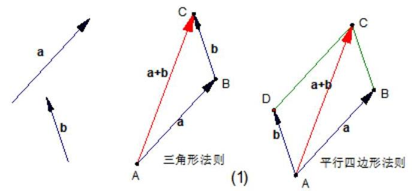

## 2、向量的线性运算

1、向量的加法:

(1)对于零向量与任一向量 $\overrightarrow{a}$ ,有 $\overrightarrow{a} + \overrightarrow{0} = \overrightarrow{0} + \overrightarrow{a} = \overrightarrow{a}$

(2)法则:三角形法则，平行四边形法则

(3)运算律: $\overrightarrow{a} + \overrightarrow{b} = \overrightarrow{b} + \overrightarrow{a};\left( {\overrightarrow{a} + \overrightarrow{b}}\right)  + \overrightarrow{c} = \overrightarrow{a} + \left( {\overrightarrow{b} + \overrightarrow{c}}\right)$ .

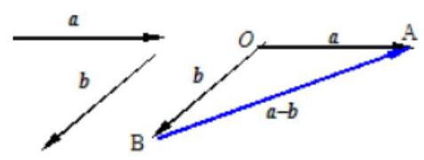

2、向量的减法:

(1) $\overset{ - }{a} - \overline{b}$ 可以表示为从向量 $\overline{b}$ 的终点指向向量 $\overset{ - }{a}$ 的终点的向量。

3、实数与向量的积:

(1)定义:实数 $\lambda$ 与向量 $\overrightarrow{a}$ 的积是一个向量，记作 $\lambda \overrightarrow{a}$ ，规定: $\left| {\lambda \overrightarrow{a}}\right|  = \left| \lambda \right| \left| \overrightarrow{a}\right|$ . 当 $\lambda  > 0$ 时， $\lambda \overrightarrow{a}$ 的方向与 $\overrightarrow{a}$ 的方向相同; 当 $\lambda  < 0$ 时, $\lambda \overrightarrow{a}$ 的方向与 $\overrightarrow{a}$ 的方向相反; 当 $\lambda  = 0$ 时, $\lambda \overrightarrow{a}$ 与 $\overrightarrow{a}$ 平行。

(2)运算律: $\lambda \left( {\mu \bar{a}}\right)  = \left( {\lambda \mu }\right) \bar{a},\left( {\lambda  + \mu }\right) \bar{a} = \lambda \bar{a} + \mu \bar{a},\lambda \left( {\bar{a} + \bar{b}}\right)  = \lambda \bar{a} + \lambda \bar{b}$ 。

重要定理:

向量共线定理: 向量 $\overrightarrow{b}$ 与非零向量 $\overrightarrow{a}$ 共线的充要条件是有且仅有一个实数 $\lambda$ ,使得 $\overrightarrow{b} = \lambda \overrightarrow{a}$ ,即 $\overrightarrow{b}//\overrightarrow{a} \Leftrightarrow  \overrightarrow{b} = \; \lambda \overrightarrow{a}\left( {\overrightarrow{a} \neq  \overrightarrow{0}}\right)$ 。

推论: 如果 $l$ 为经过已知点 $A$ 且平行于已知非零向量 $\overrightarrow{a}$ 的直线,那么对于任意一点 $O$ ,点 $P$ 在直线 $l$ 上的充要条件是存在实数 $t$ 满足等式 $\overrightarrow{OP} = \overrightarrow{OA} + t\overrightarrow{a}$ 。

$\overrightarrow{OP} = \overrightarrow{OA} + t\left( {\overrightarrow{OB} - \overrightarrow{OA}}\right)  = \left( {1 - t}\right) \overrightarrow{OA} + t\overrightarrow{OB}$ . 注: 中点公式 $\overrightarrow{OP} = \frac{1}{2}\left( {\overrightarrow{OA} + \overrightarrow{OB}}\right)$

## 二、平面向量分解定理与坐标表示

1、平面向量分解定理: 如果 $\overrightarrow{{e}_{1}},\overrightarrow{{e}_{2}}$ 是同一平面内的两个不共线向量,那么对于这一平面内的任一向量 $\overrightarrow{a}$ , 有且只有一对实数 ${\lambda }_{1},{\lambda }_{2}$ 使 $\overrightarrow{a} = {\lambda }_{1}\overrightarrow{{e}_{1}} + {\lambda }_{2}\overrightarrow{{e}_{2}}$ 。

特别提醒:

(1)我们把不共线向量 $\overrightarrow{{e}_{1}}\text{ 、 }\overrightarrow{{e}_{2}}$ 叫做表示这一平面内所有向量的一组基底；

(2)基底不惟一, 关键是不共线;

(3)由定理可将任一向量 $\overrightarrow{a}$ 在给出基底 $\overrightarrow{{e}_{1}}\text{ 、 }\overrightarrow{{e}_{2}}$ 的条件下进行分解；

(4)基底给定时,分解形式惟一. ${\lambda }_{1},{\lambda }_{2}$ 是被 $\overrightarrow{a},\overrightarrow{{e}_{1}},\overrightarrow{{e}_{2}}$ 唯一确定的数量;

2、平面向量的坐标表示

如图，在直角坐标系内，我们分别取与 $x$ 轴、 $y$ 轴个单位向量 $\overrightarrow{i}$ 、 $\overrightarrow{j}$ 作为基底，。任作一个向量 $\overrightarrow{a}$ ，由定理知,有且只有一对实数 $x\text{ 、 }y$ ,使得 $\bar{a} = {xi} + {yj}\cdots \cdots \cdots \cdots \cdots \left( 1\right)$

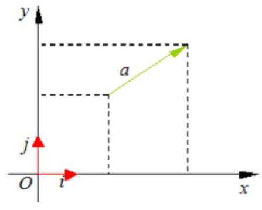

方向相同的两

平面向量基本

我们把 $\left( {x, y}\right)$ 叫做向量 $\overrightarrow{a}$ 的 (直角) 坐标,记作 $\bar{a} = \left( {x, y}\right) \cdots \cdots \cdots \cdots \cdots \left( 2\right)$

其中 $x$ 叫做 $\bar{a}$ 在 $x$ 轴上的坐标， $y$ 叫做 $\bar{a}$ 在 $y$ 轴上的坐标，②式叫做向量的坐标表示。

与 $\overrightarrow{a}$ 相等的向量的坐标也为 $\left( {x, y}\right)$ 。

特别地, $\overrightarrow{i} = \left( {1,0}\right) ,\overrightarrow{j} = \left( {0,1}\right) ,\overrightarrow{0} = \left( {0,0}\right)$ 。

特别提醒: 设 $\overrightarrow{OA} = {xi} + {yj}$ ,则向量 $\overrightarrow{OA}$ 的坐标 $\left( {x, y}\right)$ 就是点 $A$ 的坐标; 反过来,点 $A$ 的坐标 $\left( {x, y}\right)$ 也就是向量 $\overrightarrow{OA}$ 的坐标. 因此，在平面直角坐标系内，每一个平面向量都是可以用一对实数唯一表示。

3、平面向量的坐标运算

(1) 若 $\overrightarrow{a} = \left( {{x}_{1},{y}_{1}}\right) ,\overrightarrow{b} = \left( {{x}_{2},{y}_{2}}\right)$ ,则 $\overrightarrow{a} + \overrightarrow{b} = \left( {{x}_{1} + {x}_{2},{y}_{1} + {y}_{2}}\right)$ , $\overrightarrow{a} - \overrightarrow{b} = \underline{\left( {x}_{1} - {x}_{2},{y}_{1} - {y}_{2}\right) }$ 。

两个向量和与差的坐标分别等于这两个向量相应坐标的和与差。

(2)若 $A\left( {{x}_{1},{y}_{1}}\right) , B\left( {{x}_{2},{y}_{2}}\right)$ ，则 $\overrightarrow{AB} = \left( {{x}_{2} - {x}_{1},{y}_{2} - {y}_{1}}\right)$ 。

一个向量的坐标等于表示此向量的有向线段的终点坐标减去始点的坐标。

(3)若 $\overrightarrow{a} = \left( {x, y}\right)$ 和实数 $\lambda$ ，则 $\lambda \overrightarrow{a} = \left( {{\lambda x},{\lambda y}}\right)$ 。

实数与向量的积的坐标等于用这个实数乘原来向量的相应坐标。

4、向量平行的充要条件的坐标表示:设 $\overrightarrow{a} = \left( {{x}_{1},{y}_{1}}\right) ,\overrightarrow{b} = \left( {{x}_{2},{y}_{2}}\right)$ 其中 $\overrightarrow{b} \neq  \overrightarrow{a}$

$\overrightarrow{a}//\overrightarrow{b}\;\left( {\overrightarrow{b} \neq  \overrightarrow{0}}\right)$ 的充要条件是 $\underline{{x}_{1}{y}_{2} - {x}_{2}{y}_{1} = 0}$ 。

## 例题精讲

【例 1】( 1 )如图，在 $\bigtriangleup  {ABC}$ 中，点 $O$ 是 ${BC}$ 的中点，过点 $O$ 的直线分别交直线 ${AB}$ ， ${AC}$ 于不同的两点 $M, N$ ，若 $\overrightarrow{AB} = m\overrightarrow{AM}$ ， $\overrightarrow{AC} = n\overrightarrow{AN}$ ，则 $m + n$ 的值为___.

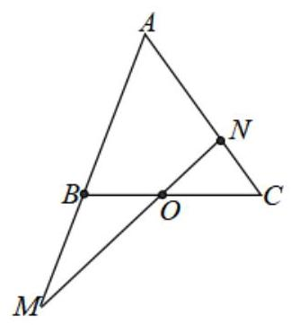

【难度】 $\star   \star   \star$

【答案】 2

【解析】解: 由已知得 $\overrightarrow{AO} = \frac{1}{2}\left( {\overrightarrow{AB} + \overrightarrow{AC}}\right)$ ,结合 $\overrightarrow{AB} = m\overrightarrow{AM},\overrightarrow{AC} = n\overrightarrow{AN}$ ,所以 $\overrightarrow{AO} = \frac{1}{2}m\overrightarrow{AM} + \frac{1}{2}n\overrightarrow{AN}$ . 又因为 $O, M, N$ 三点共线,所以 $\frac{1}{2}m + \frac{1}{2}n = 1$ ,所以 $m + n = 2$ .

( 2 )平面直角坐标系中， $O$ 为原点， $A, B, C$ 三点满足 $\overline{OC} = \frac{3}{4}\overrightarrow{OA} + \frac{1}{4}\overrightarrow{OB}$ ，则 $\frac{\left| \overrightarrow{BC}\right| }{\left| \overrightarrow{AC}\right| } =$ ___.

【难度】 $\star   \star   \star$

【答案】3

【解析】解: 因为 $\frac{\left| \overrightarrow{BC}\right| }{\left| \overrightarrow{AC}\right| } = \frac{\left| \overrightarrow{OC} - \overrightarrow{OB}\right| }{\left| \overrightarrow{OC} - \overrightarrow{OA}\right| } = \frac{\left| \frac{3}{4}\overrightarrow{OA} + \frac{1}{4}\overrightarrow{OB} - \overrightarrow{OB}\right| }{\left| \frac{3}{4}\overrightarrow{OA} + \frac{1}{4}\overrightarrow{OB} - \overrightarrow{OA}\right| }$

$= \frac{\left| \frac{3}{4}\overrightarrow{OA} - \frac{3}{4}\overrightarrow{OB}\right| }{\left| -\frac{1}{4}\overrightarrow{OA} + \frac{1}{4}\overrightarrow{OB}\right| } = \frac{\frac{3}{4}}{\frac{1}{4}} = 3$ ,故答案为: 3

(3)已知点 $G$ 为 $\bigtriangleup  {ABC}$ 的重心，过 $G$ 作直线与 ${AB}$ 、 ${AC}$ 两边分别交于 $M$ 、 $N$ 两点，且 $\overrightarrow{AM} = x\overrightarrow{AB}$ ， ${AN} = y\overrightarrow{AC}$ ， 则 $\frac{xy}{x + y}$ 的值为___.

【难度】 $\star   \star   \star$

【答案】 $\frac{1}{3}$

【解析】解: 根据题意 $G$ 为三角形的重心,

$\therefore \overrightarrow{AG} = \frac{1}{3}\left( {\overrightarrow{AB} + \overrightarrow{AC}}\right)$ ,

$\overrightarrow{MG} = \overrightarrow{AG} - \overrightarrow{AM} = \frac{1}{3}\left( {\overrightarrow{AB} + \overrightarrow{AC}}\right)  - x\overrightarrow{AB} = \left( {\frac{1}{3} - x}\right) \overrightarrow{AB} + \frac{1}{3}\overrightarrow{AC},$

$\overrightarrow{GN} = \overrightarrow{AN} - \overrightarrow{AG} = y\overrightarrow{AC} - \overrightarrow{AG} = y\overrightarrow{AC} - \frac{1}{3}\left( {\overrightarrow{AB} + \overrightarrow{AC}}\right)  = \left( {y - \frac{1}{3}}\right) \overrightarrow{AC} - \frac{1}{3}\overrightarrow{AB}$ ,

由于 $\overrightarrow{MG}$ 与 $\overrightarrow{GN}$ 共线,根据共线向量基本定理知,存在实数 $\lambda$ ,使得 $\overrightarrow{MG} = \lambda \overrightarrow{GN}$ ,

即 $\left( {\frac{1}{3} - x}\right) \overline{AB} + \frac{1}{3}\overline{AC} = \lambda \left\lbrack  {\left( {y - \frac{1}{3}}\right) \overline{AC} - \frac{1}{3}\overline{AB}}\right\rbrack$ ,

$\therefore \left\{  \begin{array}{l} \frac{1}{3} - x =  - \frac{1}{3}\lambda \\  \frac{1}{3} = \lambda \left( {y - \frac{1}{3}}\right)  \end{array}\right.$ ,消去 $\lambda$ 得 $x + y - {3xy} = 0,\therefore x + y = {3xy}$ ,即 $\frac{xy}{x + y} = \frac{1}{3}$ .

【例 2】(1)设 $\angle {POQ} = {60}^{ \circ  }$ 在 ${OP}$ 、 ${OQ}$ 上分别有动点 $A, B$ ，若 $\overrightarrow{OA} \cdot  \overrightarrow{OB} = 6$ ， $\bigtriangleup  {OAB}$ 的重心是角，则 $\left| \overrightarrow{OG}\right|$ 的最小值是___.

【难度】★★★

【答案】 2

【解析】解: $\because G$ 是 ${\Delta OAB}$ 的重心, $\therefore \overrightarrow{OG} = \frac{1}{3}\left( {\overrightarrow{OA} + \overrightarrow{OB} + \overrightarrow{OC}}\right)$ ,

设 $\left| \overrightarrow{OA}\right|  = a,\left| \overrightarrow{OB}\right|  = b$ ,由 $\overrightarrow{OA} \cdot  \overrightarrow{OB} = 6,\angle {POQ} = {60}^{ \circ  }$ ,得

${ab} \cdot  \cos {60}^{ \circ  } = 6$ ,即 ${ab} = {12}$ ,

从而 ${\overrightarrow{OG}}^{2} = \frac{1}{9}\left( {{a}^{2} + {b}^{2} + {12}}\right)  \geq  \frac{1}{9}\left( {{2ab} + {12}}\right)  = 4$ (当且仅当 $a = b = 2\sqrt{3}$ 时,取等号),

$\therefore$ 当 $a = b = 2\sqrt{3}$ 时, $\left| \overrightarrow{OG}\right|$ 的最小值是 2 .

( 2 )已知向量 $\overrightarrow{a},\overrightarrow{b},\overrightarrow{c}$ 的模分别是3,4,5，则 $\left| {\overrightarrow{a} - \overrightarrow{b} + \overrightarrow{c}}\right|$ 的最大值为___，最小值为___.

【难度】 $\star   \star   \star$

【答案】0,12

【解析】 $0 \leq  \left| {\overrightarrow{a} - \overrightarrow{b} + \overrightarrow{c}}\right|  \leq  \left| \overrightarrow{a}\right|  + \left| \overrightarrow{b}\right|  + \left| \overrightarrow{c}\right|  = {12}$

(3)已知平面向量 $\overrightarrow{a}$ 、 $\overrightarrow{b}$ 、 $\overrightarrow{c}$ 满足 $\overrightarrow{a}\bot \overrightarrow{b}$ ，且 $\{ \left| \overrightarrow{a}\right| ,\left| \overrightarrow{b}\right| ,\left| \overrightarrow{c}\right| \}  = \{ 1,2,3\}$ ，则 $\overrightarrow{a} + \overrightarrow{b} + \overrightarrow{c} \mid$ 的最大值是___.

【难度】 $\star   \star   \star$

【答案】 $3 + \sqrt{5}$

【解析】三种情况讨论

(4) 已知向量 $\overrightarrow{a},\overrightarrow{b},\overrightarrow{c}$ 的模分别是3,4,5，若 $\left| {\overrightarrow{a} - 2\overrightarrow{b} + x\overrightarrow{c}}\right|$ 的最小值为 0，则 $x$ 的取值范围为___

【难度】

【答案】 $\left\lbrack  {1,\frac{11}{5}}\right\rbrack   \cup  \left\lbrack  {-\frac{11}{5}, - 1}\right\rbrack$

【解析】 $\left| {\overrightarrow{a} - 2\overrightarrow{b}}\right|  \in  \left\lbrack  {5,{11}}\right\rbrack$ ,所以 $\left| x\right|  \in  \left\lbrack  {1,\frac{11}{5}}\right\rbrack$

【例 3】( 1 )已知两个不相等的平面向量 $\dot{\alpha },\dot{\beta }\left( {\overrightarrow{\alpha } \neq  \overrightarrow{0}}\right)$ ，满足 $\left| \dot{\beta }\right|  = 2$ ，且 $\overrightarrow{\alpha }$ 与 $\dot{\beta } - \overrightarrow{\alpha }$ 的夹角为 ${120}^{ \circ  }$ ， 则 $\left| \dot{\alpha }\right|$ 的最大值是___.

【难度】 $\star   \star   \star$

【答案】 $\frac{4\sqrt{3}}{3}$

【解析】解: 如图所示: 设 $\overrightarrow{\alpha } = \overrightarrow{OA},\overrightarrow{\beta } = \overrightarrow{OB}$ ,则 $\overrightarrow{AB} = \overrightarrow{\beta } - \overrightarrow{\alpha },\angle {BAO} = {60}^{ \circ  },\angle {BAC} = {120}^{ \circ  }$ ,

且 ${OB} = 2,{0}^{ \circ  } < \angle B < {120}^{ \circ  }$ .

$\bigtriangleup {AOB}$ 中,由正弦定理可得 $\frac{OB}{\sin \angle {OAB}} = \frac{OA}{\sin \angle B}$ ,即 $\frac{2}{\sin {60}^{ \circ  }} = \frac{\left| \overrightarrow{\alpha }\right| }{\sin \angle B}$ ,

解得 $\left| \overrightarrow{\alpha }\right|  = \frac{4\sqrt{3}}{3}\sin \angle B$ .

由于当 $\angle B = {90}^{ \circ  }$ 时, $\sin \angle B$ 最大为 1,故 $\left| \overrightarrow{\alpha }\right|$ 的最大值是 $\frac{4\sqrt{3}}{3}$ ,

故答案为 $\frac{4\sqrt{3}}{3}$ .

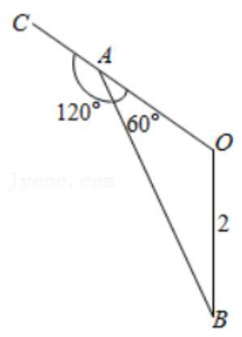

(2)已知向量 $\overrightarrow{a},\overrightarrow{b}$ ，满足 $\left| \overrightarrow{a}\right|  = \left| \overrightarrow{b}\right|  = \overrightarrow{a} \cdot  \overrightarrow{b} = 2$ ，且 $\left( {\overrightarrow{a} - \overrightarrow{c}}\right)  \cdot  \left( {\overrightarrow{b} - \overrightarrow{c}}\right)  = 0$ ，则 $\left| {2\overrightarrow{b} - \overrightarrow{c}}\right|$ 的最小值为___.

【难度】 $\star   \star   \star   \star$

【答案】 $\sqrt{7} - 1$

【解析】数形结合

(3)已知 ${AB}$ 为单位圆 $O$ 的一条弦， $P$ 为单位圆 $O$ 上的点. 若 $f\left( \lambda \right)  = \left| {\overrightarrow{AP} - \lambda \overrightarrow{AB}}\right| \left( {\lambda  \in  R}\right)$ 的最小值为 $m$ ，当点 $P$ 在单位圆上运动时， $m$ 的最大值为 $\frac{4}{3}$ ，则线段 ${AB}$ 的长度为___.

【难度】 $\star   \star   \star   \star$

【答案】 $\frac{4\sqrt{2}}{3}$

【解析】解: 设 $\lambda \overrightarrow{AB} = \overrightarrow{AC}$ ,则 $f\left( \lambda \right)  = \left| {\overrightarrow{AP} - \lambda \overrightarrow{AB}}\right|  = \left| {\overrightarrow{AP} - \overrightarrow{AC}}\right|  = \left| \overrightarrow{CP}\right|$ ,

$\because \lambda \overrightarrow{AB} = \overrightarrow{AC}$ ， $\therefore$ 点 $C$ 在直线 ${AB}$ 上， $\therefore f\left( \lambda \right)$ 的最小值 $m$ 为点 $P$ 到 ${AB}$ 的距离，

$\therefore {m}_{\max } = \frac{4}{3},\therefore \left| \overrightarrow{AB}\right|  = 2\sqrt{1 - {\left( \frac{4}{3} - 1\right) }^{2}} = \frac{4\sqrt{2}}{3}$ ,

故答案为: $\frac{4\sqrt{2}}{3}$ ,

【例 4】若 ${\overrightarrow{a}}_{1},{\overrightarrow{a}}_{2},{\overrightarrow{a}}_{3}$ 均为单位向量,则 $\overrightarrow{{a}_{1}} = \left( {\frac{\sqrt{3}}{3},\frac{\sqrt{6}}{3}}\right)$ 是 $\overrightarrow{{a}_{1}} + \overrightarrow{{a}_{2}} + \overrightarrow{{a}_{3}} = \left( {\sqrt{3},\sqrt{6}}\right)$ 的( )

(A) 充分非必要条件 (B) 必要非充分条件

(C) 充要条件 (D)既非充分又非必要条件

【难度】 $\star   \star   \star   \star$

【答案】B

【解析】注意到 $\left| {\overrightarrow{{a}_{1}} + \overrightarrow{{a}_{2}} + \overrightarrow{{a}_{3}}}\right|  = 3$ ,所以三个向量必须同向

【例 5】已知向量 $\overrightarrow{a}$ 与向量 $\overrightarrow{b},\overrightarrow{\left| a\right| } = 2,\overrightarrow{\left| b\right| } = 3,\overrightarrow{a}\text{ 、 }\overrightarrow{b}$ 的夹角为 ${60}^{ \circ  }$ ,当 $1 \leq  m \leq  2,0 \leq  n \leq  2$ 时, $\left| {m\overrightarrow{a} + n\overrightarrow{b}}\right|$ 的最大值为___.

【难度】 $\star   \star   \star$

【答案】 $2\sqrt{19}$

【解析】解: $\because \left| \overrightarrow{a}\right|  = 2,\left| \overrightarrow{b}\right|  = 3,\overrightarrow{a}\text{ 、 }\overrightarrow{b}$ 的夹角为 ${60}^{ \circ  }$ ,

$\therefore {\left| m\overrightarrow{a} + n\overrightarrow{b}\right| }^{2} = {m}^{2}{\overrightarrow{a}}^{2} + {2mn}\overrightarrow{a} \cdot  \overrightarrow{b} + {n}^{2}{\overrightarrow{b}}^{2} = 4{m}^{2} + {2mn} \times  2 \times  3 \times  \cos {60}^{ \circ  } + 9{n}^{2} = 4{m}^{2} + {6mn} + 9{n}^{2}$ ,

$\because 1 \leq  m \leq  2,0 \leq  n \leq  2$ ,

$\therefore$ 当 $m = 2$ 且 $n = 2$ 时, ${\left| m\overrightarrow{a} + n\overrightarrow{b}\right| }^{2}$ 取到最大值,即 ${\left| m\overrightarrow{a} + n\overrightarrow{b}\right| }_{\max }^{2} = {76}$ ,

$\therefore \left| {m\overrightarrow{a} + n\overrightarrow{b}}\right|$ 的最大值为 $2\sqrt{19}$ .

故答案为: $2\sqrt{19}$ .

【例 6】如图,在 $\bigtriangleup {ABC}$ 中, $\angle {BAC} = \frac{\pi }{3}, D$ 为 ${AB}$ 的中点, $P$ 为 ${CD}$ 上一点,且满足 $\overrightarrow{AP} = t\overrightarrow{AC} + \frac{1}{3}\overrightarrow{AB}$ , 若 $\bigtriangleup {ABC}$ 的面积为 $\frac{3\sqrt{3}}{2}$ ，则 $\left| \overrightarrow{AP}\right|$ 的最小值为 ___.

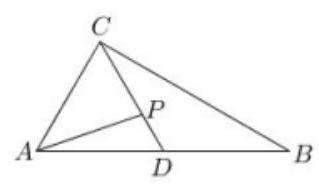

【难度】 $\star   \star   \star$

【答案】 $\sqrt{2}$

【解析】作 $\overrightarrow{AN} = \frac{1}{3}\overrightarrow{AB},\therefore \overrightarrow{AP} = t\overrightarrow{AC} + \overrightarrow{AN}$ ,

即 $\overrightarrow{NP} = t\overrightarrow{AC}$ ,即 ${NP}//{AC},\because D$ 为 ${AB}$ 的中点, $\therefore N$ 为 ${AD}$ 的三等分点, $P$ 为 ${CD}$ 的三等分点,

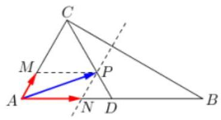

作 ${PM}//{AB},\therefore M$ 为 ${AC}$ 的三等分点,即 $\overrightarrow{NP} = \overrightarrow{AM} = \frac{1}{3}\overrightarrow{AC},\therefore t = \frac{1}{3}$ ,设 ${AM} = a$ , ${AN} = b,\therefore {S}_{ABC} = \frac{1}{2}{AB} \cdot  {AC} \cdot  \sin A = \frac{9\sqrt{3}}{4}{ab} = \frac{3\sqrt{3}}{2} \Rightarrow  {ab} = \frac{2}{3}$ ,

$\therefore {\overrightarrow{AP}}^{2} = {\left( \overrightarrow{AM} + \overrightarrow{AN}\right) }^{2} = {a}^{2} + {b}^{2} + {ab} \geq  {3ab} = 2$ ,即 $\left| \overrightarrow{AP}\right|$ 的最小值为 $\sqrt{2}$

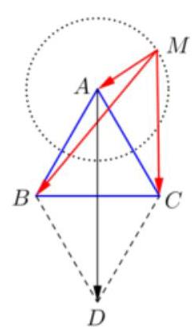

【例 7】已知正三角形 ${ABC}$ 的边长为 $\sqrt{3}$ ，点 $M$ 是 $\bigtriangleup  {ABC}$ 所在平面内的任一动点， 若 $\left| \overrightarrow{MA}\right|  = 1$ ，则 $\left| {\overrightarrow{MA} + \overrightarrow{MB} + \overrightarrow{MC}}\right|$ 的取值范围为___

【难度】 $\star   \star   \star   \star$

【答案】 $\left\lbrack  {0,6}\right\rbrack$

【解析】根据题意, 作出示意图

$\left| {\overrightarrow{MA} + \overrightarrow{MB} + \overrightarrow{MC}}\right|  = \left| {\overrightarrow{MA} + \overrightarrow{MA} + \overrightarrow{AB} + \overrightarrow{MA} + \overrightarrow{AC}}\right|$

$= \left| {3\overrightarrow{MA} + \overrightarrow{AB} + \overrightarrow{AC}}\right|  = \left| {3\overrightarrow{MA} + \overrightarrow{AD}}\right| ,\left| \overrightarrow{MA}\right|  = 1,\left| \overrightarrow{AD}\right|  = 3$

当 $\overrightarrow{MA}$ 与 $\overrightarrow{AD}$ 反向时,有最小值 0,当 $\overrightarrow{MA}$ 与 $\overrightarrow{AD}$ 同向时,

有最大值 6,所以 $\left| {\overrightarrow{MA} + \overrightarrow{MB} + \overrightarrow{MC}}\right|$ 的取值范围为 $\left\lbrack  {0,6}\right\rbrack$ .

【例 8】已知平面向量 $\overrightarrow{a}$ 、 $\overrightarrow{b}$ 满足 ${\overrightarrow{b}}^{2} - 6\overrightarrow{b} \cdot  \overrightarrow{a} + 6 = 0$ ，且 $\overrightarrow{a} = \left( {-1,\sqrt{3}}\right)$ ，则 $\left| \overrightarrow{b}\right|$ 的最大值与最小值之和为___.

【难度】 $\star   \star   \star$

【答案】 12

【解析】解: 设 $\overrightarrow{b} = \left( {x, y}\right)$ ,将 $\overrightarrow{a} = \left( {-1,\sqrt{3}}\right) ,\overrightarrow{b} = \left( {x, y}\right)$ ,代入 ${\overrightarrow{b}}^{2} - 6\overrightarrow{b} \cdot  \overrightarrow{a} + 6 = 0$ 得 ${x2} + {y2} - 6\left( {-x + \sqrt{3}y}\right)  + 6 = 0$ , 即 $\left( {x + 3}\right) 2 + \left( {y - 3\sqrt{3}}\right) 2 = {30}$ ,

所以 $\left| \overrightarrow{b}\right|$ 的最大值为圆心 $\left( {-3,\sqrt{3}}\right)$ 到原点的距离加上半径,即 $6 + r = 6 + \sqrt{30}$ ,

$\left| \overrightarrow{b}\right|$ 的最小值为圆心 $\left( {-3,\sqrt{3}}\right)$ 到原点的距离减去半径,即 $6 - r = 6 - \sqrt{30}$ ,

所以 $\left| \overrightarrow{b}\right|$ 的最大值与最小值之和为 12 ,

故答案为: 12 .

【例 9】( 1 )已知向量 $\overrightarrow{a},\overrightarrow{b}$ 满足 $\left| \overrightarrow{a}\right|  = \sqrt{2},\left| \overrightarrow{b}\right|  = 1$ ，且对一切实数 $x,\left| {\overrightarrow{a} + x\overrightarrow{b}}\right|  \geq  \left| {\overrightarrow{a} + \overrightarrow{b}}\right|$ 恒成立，则 $\overrightarrow{a}$ 与 $\overrightarrow{b}$ 的夹角大小为___.

【难度】 $\star   \star   \star$

【答案】 $\frac{3\pi }{4}$

【解析】解: 由 $\left| {\overrightarrow{a} + x\overrightarrow{b}}\right|  \geq  \left| {\overrightarrow{a} + \overrightarrow{b}}\right|$ 得 $\sqrt{{\overrightarrow{a}}^{2} + {2x}\overrightarrow{a} \cdot  \overrightarrow{b} + {x}^{2}{\overrightarrow{b}}^{2}} \geq  \sqrt{{\overrightarrow{a}}^{2} + 2\overrightarrow{a} \cdot  \overrightarrow{b} + {\overrightarrow{b}}^{2}}$ ,化为 ${x}^{2}{\overrightarrow{b}}^{2} + {2x}\overrightarrow{a} \cdot  \overrightarrow{b} - 2\overrightarrow{a} \cdot  \overrightarrow{b} - {\overrightarrow{b}}^{2} \geq  0$ , $\because \left| \overrightarrow{b}\right|  = 1,\left| \overrightarrow{a}\right|  = \sqrt{2}$ .

$\therefore {x}^{2} + 2\sqrt{2}x\cos  < \overrightarrow{a},\overrightarrow{b} >  - 2\sqrt{2}\cos  < \overrightarrow{a},\overrightarrow{b} >  - 1 \geq  0$ ,

$\because$ 对一切实数 $x,\left| {\overrightarrow{a} + x\overrightarrow{b}}\right|  \geq  \left| {\overrightarrow{a} + \overrightarrow{b}}\right|$ (即上式) 恒成立,

$\therefore \Delta  = {\left( 2\sqrt{2}\cos  < \overrightarrow{a},\overrightarrow{b} > \right) }^{2} + 4\left( {2\sqrt{2}\cos  < \overrightarrow{a},\overrightarrow{b} >  + 1}\right)  \leq  0$ ,化为 ${\left( 2\sqrt{2}\cos  < \overrightarrow{a},\overrightarrow{b} >  + 2\right) }^{2} \leq  0$ ,

得 $\cos  < \overrightarrow{a},\overrightarrow{b} >  =  - \frac{\sqrt{2}}{2}$ ,

$\because  < \overrightarrow{a},\overrightarrow{b} >  \in  \left\lbrack  {0,\pi }\right\rbrack  ,\therefore  < \overrightarrow{a},\overrightarrow{b} >  = \frac{3\pi }{4}$ .

故答案为 $\frac{3\pi }{4}$ .

(2)已知向量 $\overrightarrow{OB} = \left( {2,0}\right) ,\left| \overrightarrow{CA}\right|  = \sqrt{2},\overrightarrow{OC} = \left( {2,2}\right)$ ，则 $\overrightarrow{OA}$ 与 $\overrightarrow{OB}$ 夹角的最小值和最大值依次是 ( )

A. $0,\frac{\pi }{4}$ B. $\frac{\pi }{4},\frac{5\pi }{12}$ C. $\frac{\pi }{12},\frac{5\pi }{12}$ D. $\frac{5\pi }{12},\frac{\pi }{2}$

【难度】 $\star   \star   \star$

【答案】C

【解析】解: 由题意知,点 $A$ 在以 $C\left( {2,2}\right)$ 为圆心,以 $\sqrt{2}$ 为半径的圆上,如图所示, ${OD},{OE}$ 为圆的切线, 在 $\bigtriangleup {COD}$ 中, ${OC} = 2\sqrt{2},{CD} = \sqrt{2},\angle {CDO} = \frac{\pi }{2}$ ,所以 $\angle {COD} = \frac{\pi }{6}$ .

又因为 $\angle {COB} = \frac{\pi }{4}$ ,所以当 $A$ 在 $D$ 处时,则 $\overrightarrow{OA}$ 与 $\overrightarrow{OB}$ 夹角的最小值为 $\frac{\pi }{4} - \frac{\pi }{6} = \frac{\pi }{12},\overrightarrow{OA}$ 与 $\overrightarrow{OB}$ 夹角的最大值 $\frac{\pi }{4} + \frac{\pi }{6} = \frac{5\pi }{12}$

故选: $C$ .

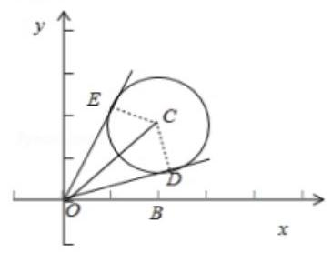

## 巩固训练

1、设两个向量 $\left| {\overrightarrow{e}}_{1}\right|  = 2,\left| {\overrightarrow{e}}_{2}\right|  = 1,{\overrightarrow{e}}_{1} \cdot  {\overrightarrow{e}}_{2}$ 的夹角为 ${60}{}^{ \circ  }$ ,若向量 ${2t}{\overrightarrow{e}}_{1} + 7{\overrightarrow{e}}_{2}$ 与向量 ${\overrightarrow{e}}_{1} + t{\overrightarrow{e}}_{2}$ 的夹角为钝角，则实数 t 的取值范围是___。

【难度】 $\star   \star   \star$

【答案】 $\left( {-7, - \frac{\sqrt{14}}{2}}\right)  \cup  \left( {-\frac{\sqrt{14}}{2}, - \frac{1}{2}}\right)$

【解析】解: 若向量 ${2t}\overrightarrow{a} + 7\overrightarrow{b}$ 与 $\overrightarrow{a} + t\overrightarrow{b}$ 的夹角为钝角,

则有 $\left( {{2t}\overrightarrow{a} + 7\overrightarrow{b}}\right)  \cdot  \left( {\overrightarrow{a} + t\overrightarrow{b}}\right)  < 0$ 且向量 ${2t}\overrightarrow{a} + 7\overrightarrow{b}$ 与 $\overrightarrow{a} + t\overrightarrow{b}$ 不共线,

若 $\left( {{2t}\overrightarrow{a} + 7\overrightarrow{b}}\right)  \cdot  \left( {\overrightarrow{a} + t\overrightarrow{b}}\right)  < 0$ ,则有 ${2t}{\overrightarrow{a}}^{2} + {7t}{\overrightarrow{b}}^{2} + 2{t}^{2}\overrightarrow{a} \cdot  \overrightarrow{b} + 7\overrightarrow{a} \cdot  \overrightarrow{b} < 0$ ,即 $2{t}^{2} + {15t} + 7 < 0$ ,解可得 $- 7 < t <  - \frac{1}{2}$ ; ①

若向量 ${2t}\overrightarrow{a} + 7\overrightarrow{b}$ 与 $\overrightarrow{a} + t\overrightarrow{b}$ 共线，设 ${2t}\overrightarrow{a} + 7\overrightarrow{b} = \lambda \left( {\overrightarrow{a} + t\overrightarrow{b}}\right)$ ，分析可得: $\left\{  \begin{array}{l} {2t} = \lambda \\  7 = {\lambda t} \end{array}\right.$ ，解可得 $t =  \pm  \frac{\sqrt{14}}{2}$ ，

又由向量 ${2t}\overrightarrow{a} + 7\overrightarrow{b}$ 与 $\overrightarrow{a} + t\overrightarrow{b}$ 不共线，则 $t \neq   \pm  \frac{\sqrt{14}}{2}$ ，②

综合①②可得: $t$ 的取值范围为 $\left( {-7, - \frac{\sqrt{14}}{2}}\right)  \cup  \left( {-\frac{\sqrt{14}}{2}, - \frac{1}{2}}\right)$ ；

故答案为: $\left( {-7, - \frac{\sqrt{14}}{2}}\right)  \cup  \left( {-\frac{\sqrt{14}}{2}, - \frac{1}{2}}\right)$ .

2、已知 $O$ 为 $\bigtriangleup {ABC}$ 的外心，若 $5\overrightarrow{OA} + {12}\overrightarrow{OB} - {13}\overrightarrow{OC} = 0$ ，则 $\angle C$ 等于___.

【难度】 $\star   \star   \star$

【答案】 $\frac{3\pi }{4}$

【解析】解: 设外接圆的半径为 $R,\because 5\overrightarrow{OA} + {12}\overrightarrow{OB} - {13}\overrightarrow{OC} = 0$ ,所以 $5\overrightarrow{OA} + {12}\overrightarrow{OB} = {13}\overrightarrow{OC}$ ,

$\therefore {\left( 5\overrightarrow{OA} + {12}\overrightarrow{OB}\right) }^{2} = {\left( {13}\overrightarrow{OC}\right) }^{2},\therefore {169}{R}^{2} + {120}\overrightarrow{OA} \cdot  \overrightarrow{OB} = {169}{R}^{2},\therefore \overrightarrow{OA} \cdot  \overrightarrow{OB} = 0,\therefore \angle {AOB} = \frac{\pi }{2}$ ,

根据圆心角等于同弧所对的圆周的关系如图: 所以 $\bigtriangleup {ABC}$ 中的内角 $C$ 值为 $\frac{3\pi }{4}$

故答案为: $\frac{3\pi }{4}$ .

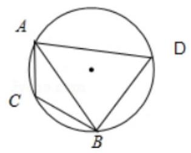

3、已知在 $\bigtriangleup {OAB}$ 中， ${OA} = {OB} = 1$ ， ${AB} = \sqrt{3}$ ，动点 $P$ 位于线段 ${AB}$ 上，当 $\overrightarrow{PA} \cdot  \overrightarrow{PO}$ 取最小值时，向量 $\overrightarrow{PA}$ 与 $\overline{PO}$ 的夹角的余弦值为 ( )

A. $- \frac{2\sqrt{7}}{7}$ B. $- \frac{\sqrt{21}}{7}$ C. $\frac{2\sqrt{7}}{7}$ D. $\frac{\sqrt{21}}{7}$

【难度】 $\star   \star   \star$

【答案】 $B$

【解析】解: 如图,取边 ${AB}$ 的中点 ${O}^{\prime }$ 为原点,边 ${AB}$ 所在的直线为 $x$ 轴,建立平面直角坐标系,则: $A\left( {-\frac{\sqrt{3}}{2},0}\right) ,\;O\left( {0,\frac{1}{2}}\right) ,$

设 $P\left( {x,0}\right) , - \frac{\sqrt{3}}{2} \leq  x \leq  \frac{\sqrt{3}}{2}$ ,则 $\overrightarrow{PA} = \left( {-\frac{\sqrt{3}}{2} - x,0}\right) ,\overrightarrow{PO} = \left( {-x,\frac{1}{2}}\right)$ ,

$\therefore \overrightarrow{PA} \cdot  \overrightarrow{PO} = \left( {-\frac{\sqrt{3}}{2} - x}\right)  \cdot  \left( {-x}\right)  = {x}^{2} + \frac{\sqrt{3}}{2}x = {\left( x + \frac{\sqrt{3}}{4}\right) }^{2} - \frac{3}{16}$ ,

$\therefore x =  - \frac{\sqrt{3}}{4}$ 时, $\overrightarrow{PA} \cdot  \overrightarrow{PO}$ 取最小值 $- \frac{3}{16}$ ,此时, $\overrightarrow{PA} = \left( {-\frac{\sqrt{3}}{4},0}\right) ,\overrightarrow{PO} = \left( {\frac{\sqrt{3}}{4},\frac{1}{2}}\right)$ ,

$\therefore \left| \overrightarrow{PA}\right|  = \frac{\sqrt{3}}{4},\left| \overrightarrow{PO}\right|  = \frac{\sqrt{7}}{4}$ ,

$\therefore \cos  < \overrightarrow{PA},\overrightarrow{PO} >  = \frac{\overrightarrow{PA} \cdot  \overrightarrow{PO}}{\left| \overrightarrow{PA}\right| \left| \overrightarrow{PO}\right| } = \frac{-\frac{3}{16}}{\frac{\sqrt{21}}{16}} =  - \frac{\sqrt{21}}{7}$ .

故选: $B$ .

4、设 $\theta$ 为两个非零向量 $\overrightarrow{a},\overrightarrow{b}$ 的夹角，已知对任意实数 $t$ ， $\left| {\overrightarrow{b} - t\overrightarrow{a}}\right|$ 的最小值是 2，则( )

A. 若 $\theta$ 确定,则 $\left| \overrightarrow{a}\right|$ 唯一确定 B. 若 $\theta$ 确定,则 $\left| \overrightarrow{b}\right|$ 唯一确定

C. 若 $\left| \overrightarrow{a}\right|$ 确定,则 $\theta$ 唯一确定 D. 若 $\left| \overrightarrow{b}\right|$ 确定,则 $\theta$ 唯一确定

【难度】 $\star   \star   \star$

【答案】B

【解析】解: 由题意可得 ${\left| \overrightarrow{b} - t \bullet  \overrightarrow{a}\right| }^{2} = {\overrightarrow{a}}^{2} \bullet  {t}^{2} - 2\overrightarrow{a} \bullet  \overrightarrow{b} \bullet  t + {\overrightarrow{b}}^{2}$ ,它是关于变量 $t$ 的一个二次函数, 故当 $t = \frac{\overrightarrow{a} \cdot  \overrightarrow{b}}{{\overrightarrow{a}}^{2}} = \frac{\left| \overrightarrow{a}\right|  \cdot  \left| \overrightarrow{b}\right| \cos \theta }{\left| \overrightarrow{a}\right|  \cdot  \left| \overrightarrow{a}\right| } = \frac{\left| \overrightarrow{b}\right| }{\left| \overrightarrow{a}\right| }\cos \theta$ (其中, $\theta$ 为 $\overrightarrow{a}\text{ 、 }\overrightarrow{b}$ 的夹角), $\left| {\overrightarrow{b} - t\overrightarrow{a}}\right|$ 取得最小值 2, 即 ${\left| \overrightarrow{b}\right| }^{2}{\sin }^{2}\theta  = 2$ ,故当 $\theta$ 唯一确定时, $\left| \overrightarrow{b}\right|$ 唯一确定,故选: $B$ .

5、如图，在等腰 $\bigtriangleup {ABC}$ 中，已知 $\left| \overrightarrow{AB}\right|  = \left| \overrightarrow{AC}\right|  = 1$ ， $\angle A = {120}^{ \circ  }$ ， $E$ ， $F$ 分别是边 ${AB}$ ， ${AC}$ 的点，且 $\overrightarrow{AE} = \lambda \overrightarrow{AB}$ ，

$\overrightarrow{AF} = \mu \overrightarrow{AC}$ ,其中 $\lambda ,\mu  \in  \left( {0,1}\right)$ 且 $\lambda  + {2\mu } = 1$ ,若线段 ${EF},{BC}$ 的中点分别为 $M, N$ ,则 $\left| \overrightarrow{MN}\right|$ 的最小值是 ( )

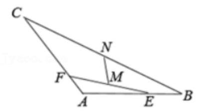

A. $\frac{\sqrt{7}}{7}$ B. $\sqrt{7}$

C. $\frac{\sqrt{21}}{14}$ D. $\sqrt{21}$

【难度】 $\star   \star   \star$

【答案】C

【解析】解: 在等腰 $\bigtriangleup {ABC}$ 中,已知 $\left| \overrightarrow{AB}\right|  = \left| \overrightarrow{AC}\right|  = 1,\angle A = {120}^{ \circ  }$ ,

所以: $\overrightarrow{AB} \cdot  \overrightarrow{AC} = \left| \overrightarrow{AB}\right| \left| \overrightarrow{AC}\right| \cos A =  - \frac{1}{2}$ ;

$E, F$ 分别是边 ${AB},{AC}$ 的点,

所以: $\overrightarrow{AM} = \frac{1}{2}\left( {\overrightarrow{AE} + \overrightarrow{AF}}\right)  = \frac{1}{2}\left( {\mu \overrightarrow{AC} + \lambda \overrightarrow{AB}}\right) ,\overrightarrow{AN} = \frac{1}{2}\left( {\overrightarrow{AB} + \overrightarrow{AC}}\right)$ ,

而 $\overrightarrow{MN} = \overrightarrow{AN} - \overrightarrow{AM} = \frac{1}{2}\left\lbrack  {\left( {1 - \lambda }\right) \overrightarrow{AB} + \left( {1 - \mu }\right) \overrightarrow{AC}}\right\rbrack$ ,

两边平方得: $\overrightarrow{MN}{}^{2} = \frac{1}{4}\left\lbrack  {{\left( 1 - \lambda \right) }^{2}\overrightarrow{AB}{}^{2} + 2\left( {1 - \lambda }\right) \left( {1 - \mu }\right) \overrightarrow{AB} \cdot  \overrightarrow{AC} + {\left( 1 - \mu \right) }^{2}\overrightarrow{AC}}\right\rbrack   = \frac{{\lambda }^{2} + {\mu }^{2} - {\lambda \mu } - \lambda  - \mu  + 1}{4}$ ,

且 $\lambda  + {2\mu } = 1$ ,所以 ${\overrightarrow{MN}}^{2} = \frac{{\lambda }^{2} + {\mu }^{2} - {\lambda \mu } - \lambda  - \mu  + 1}{4} = \frac{7{\left( \mu  - \frac{2}{7}\right) }^{2} + \frac{3}{7}}{4}$ ,

其中 $\lambda ,\mu  \in  \left( {0,1}\right)$ ,即 $\mu  \in  \left( {0,\frac{1}{2}}\right)$ ,当 $\mu  = \frac{2}{7}$ 时, ${\overrightarrow{MN}}^{2}$ 的最小值为 $\frac{3}{28}$ ,所以: $\left| \overrightarrow{MN}\right|$ 的最小值是 $\frac{\sqrt{21}}{14}$ . 故选: $C$ .

6、一副三角板有两种规格，一种是等腰直角三角形，另一种是有一个锐角是 ${30}^{ \circ  }$ 的直角三角形，如图两个三角板斜边之比为 $\sqrt{3} : 2$ . 四边形 ${ABCD}$ 就是由三角板拼成的, $\left| {AB}\right|  = 2,\angle {ABC} = {60}^{ \circ  }$ ,则 $\overrightarrow{AB} \cdot  \overrightarrow{CD} + \overrightarrow{AC} \cdot  \overrightarrow{DB}$ 的值为( )

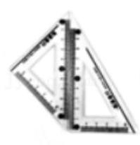

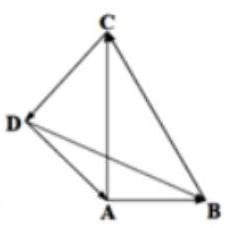

A. $2\sqrt{3}$ B. -6 C. $- 6 - 2\sqrt{3}$ D. $- 2\sqrt{3}$

【难度】 $\star   \star   \star$

【答案】 $C$

【解析】解: 在 Rt $\Delta \mathrm{{ABC}}$ 中, $\left| {AB}\right|  = 2$ ,则 $\left| {AC}\right|  = 2\sqrt{3},\left| {BC}\right|  = 4$ ,在 Rt $\Delta \mathrm{{ADC}}$ 中, $\left| {AD}\right|  = \left| {CD}\right|  = \sqrt{6}$ ; 由图可知, $\overrightarrow{AB} \cdot  \overrightarrow{CD} + \overrightarrow{AC} \cdot  \overrightarrow{DB} = \overrightarrow{AB} \cdot  \left( {\overrightarrow{AD} - \overrightarrow{AC}}\right)  + \overrightarrow{AC} \cdot  \left( {\overrightarrow{AB} - \overrightarrow{AD}}\right)  = \overrightarrow{AB} \cdot  \overrightarrow{AD} - \overrightarrow{AB} \cdot  \overrightarrow{AC} + \overrightarrow{AC} \cdot  \overrightarrow{AB} - \overrightarrow{AC} \cdot  \overrightarrow{AD} \; = \overrightarrow{AB} \cdot  \overrightarrow{AD} - \overrightarrow{AC} \cdot  \overrightarrow{AD} =  \mid  \overrightarrow{AB} \mid   \cdot   \mid  \overrightarrow{AD} \mid  \cos \frac{3\pi }{4} -  \mid  \overrightarrow{AC} \mid   \cdot   \mid  \overrightarrow{AD} \mid  \cos \frac{\pi }{4} = 2 \times  \sqrt{6} \times  \left( {-\frac{\sqrt{2}}{2}}\right)  - 2\sqrt{3} \times  \sqrt{6} \times  \frac{\sqrt{2}}{2} \; =  - 2\sqrt{3} - 6$ ,故选: $C$ .

## (二)平面向量的数量积

## 知识梳理

1、两个非零向量夹角的概念

已知非零向量 $\overrightarrow{a}$ 与 $\overrightarrow{b}$ ，作 $O\dot{A} = \overrightarrow{a}$ ， $\overrightarrow{OB} = \overrightarrow{b}$ ，则 $\angle {AOB} = \theta$ ( $0 \leq  \theta  \leq  \pi$ ) 叫 $\overrightarrow{a}$ 与 $\overrightarrow{b}$ 的夹角。

2、平面向量数量积(内积)的定义:已知两个非零向量 $\overrightarrow{a}$ 与 $\overrightarrow{b}$ ，它们的夹角是 $\theta$ ，则数量 $\left| \overrightarrow{a}\right| \left| \overrightarrow{b}\right| \cos \theta$ 叫 $\bar{a}$ 与 $\overrightarrow{b}$ 的数量积,记作 $\bar{a} \cdot  \overrightarrow{b}$ ,即有 $\bar{a} \cdot  \overrightarrow{b} = \left| \bar{a}\right| \left| \overrightarrow{b}\right| \cos \theta$ 。

提醒:

1、 $\left( {0 \leq  \theta  \leq  \pi }\right)$ ，并规定 0 与任何向量的数量积为 0；

2、两个向量的数量积的性质:

设 $\overrightarrow{a}\text{ 、 }\overrightarrow{b}$ 为两个非零向量， $\overrightarrow{e}$ 是与 $\overrightarrow{b}$ 同向的单位向量；

1) $\overrightarrow{e} \cdot  \overrightarrow{a} = \overrightarrow{a} \cdot  \overrightarrow{e} = \left| \overrightarrow{a}\right| \cos \theta$ ; 2) $\bar{a} \bot  \bar{b} \Leftrightarrow  \bar{a} \cdot  \bar{b} = 0$ ;

3) 当 $\bar{a}$ 与 $\overrightarrow{b}$ 同向时, $\bar{a} \cdot  \overrightarrow{b} = \left| \bar{a}\right| \left| \overrightarrow{b}\right|$ ; 当 $\bar{a}$ 与 $\overrightarrow{b}$ 反向时, $\bar{a} \cdot  \overrightarrow{b} =  - \left| \bar{a}\right|  \mid  \overrightarrow{b}$ ;

特别的 $\bar{a} \cdot  \bar{a} = {\left| \bar{a}\right| }^{2}$ 或 $\left| \overrightarrow{a}\right|  = \sqrt{\overrightarrow{a} \cdot  \bar{a}}$ ;

4) 当 $\theta$ 为锐角时, $\overrightarrow{a} \cdot  \overrightarrow{b} > 0$ ,且 $\overrightarrow{a}\text{ 、 }\overrightarrow{b}$ 不同向, $\overrightarrow{a} \cdot  \overrightarrow{b} > 0$ 是 $\theta$ 为锐角的必要非充分条件; 当 $\theta$ 为钝角时, $\overrightarrow{a} \cdot  \overrightarrow{b} < 0$ ，且 $\overrightarrow{a}$ 、 $\overrightarrow{b}$ 不反向， $\overrightarrow{a} \cdot  \overrightarrow{b} < 0$ 是 $\theta$ 为钝角的必要非充分条件；

5) $\cos \theta  = \frac{\overrightarrow{a} \cdot  \overrightarrow{b}}{\left| \overrightarrow{a}\right| \left| \overrightarrow{b}\right| };\;$ 6) $\left| {\overrightarrow{a} \cdot  \overrightarrow{b}}\right|  \leq  \left| \overrightarrow{a}\right| \left| \overrightarrow{b}\right|$ 。

3、“投影”的概念:如图

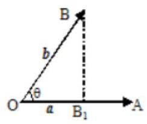

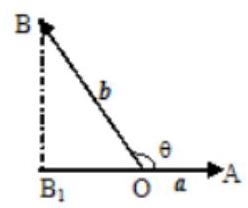

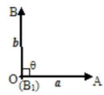

定义: $\left| b\right| \cos \theta$ 叫做向量 $b$ 在 $a$ 方向上的投影。

提醒:

投影也是一个数量，不是向量; 当θ为锐角时投影为正值; 当θ为钝角时投影为负值; 当θ为直角时投影为0; 当 $\theta  = {0}^{ \circ  }$ 时投影为 $\left| b\right|$ ; 当 $\theta  = {180}^{ \circ  }$ 时投影为 $- \left| b\right|$ 。

4、平面向量数量积的运算律

交换律: $\overrightarrow{a} \cdot  \overrightarrow{b} = \overrightarrow{b} \cdot  \overrightarrow{a}$ ;

数乘结合律: $\left( {\lambda \overrightarrow{a}}\right)  \cdot  \overrightarrow{b} = \lambda \left( {\overrightarrow{a} \cdot  \overrightarrow{b}}\right)  = \overrightarrow{a} \cdot  \left( {\lambda \overrightarrow{b}}\right)$ ;

分配律: $\left( {\overrightarrow{a} + \overrightarrow{b}}\right)  \cdot  \overrightarrow{c} = \overrightarrow{a} \cdot  \overrightarrow{c} + \overrightarrow{b} \cdot  \overrightarrow{c}$ 。

## 5、平面两向量数量积的坐标表示

已知两个非零向量 $\overrightarrow{a} = \left( {{x}_{1},{y}_{1}}\right) ,\overrightarrow{b} = \left( {{x}_{2},{y}_{2}}\right)$ ,设 $\overrightarrow{i}$ 是 $x$ 轴上的单位向量, $\overrightarrow{j}$ 是 $y$ 轴上的单位向量,那么 $\overrightarrow{a} = \overrightarrow{{x}_{1}i} + {y}_{1}\overrightarrow{j},\;\overrightarrow{b} = \underline{{x}_{2}i} + {y}_{2}\overrightarrow{j}$ 所以 $\overrightarrow{a} \cdot  \overrightarrow{b} = \underline{{x}_{1}{x}_{2} + {y}_{1}{y}_{2}}$ 。

## 6、平面内两点间的距离公式

如果表示向量 $\bar{a}$ 的有向线段的起点和终点的坐标分别为 $\left( {{x}_{1},{y}_{1}}\right) \text{ 、 }\left( {{x}_{2},{y}_{2}}\right)$ ,

那么: $\left| \overrightarrow{a}\right|  = \sqrt{{\left( {x}_{1} - {x}_{2}\right) }^{2} + {\left( {y}_{1} - {y}_{2}\right) }^{2}}$ 。

7、向量垂直的判定: 设 $\overrightarrow{a} = \left( {{x}_{1},{y}_{1}}\right) ,\overrightarrow{b} = \left( {{x}_{2},{y}_{2}}\right)$ ,则 $\overrightarrow{a} \bot  \overrightarrow{b} \Leftrightarrow  \underline{{x}_{1}{x}_{2} + {y}_{1}{y}_{2} = 0}$ 。

8、两向量夹角的余弦 $\left( {0 \leq  \theta  \leq  \pi }\right) \;\frac{\cos \theta  = \frac{\overrightarrow{a} \cdot  \overrightarrow{b}}{\left| \overrightarrow{a}\right|  \cdot  \left| \overrightarrow{b}\right| } = \frac{{x}_{1}{x}_{2} + {y}_{1}{y}_{2}}{\sqrt{{x}_{1}{}^{2} + {y}_{1}{}^{2}}\sqrt{{x}_{2}{}^{2} + {y}_{2}{}^{2}}}}{\sqrt{{x}_{1}{}^{2} + {y}_{1}{}^{2}}\sqrt{{x}_{2}{}^{2} + {y}_{2}{}^{2}}}$ 。

## 例题精讲

【例 10】( 1 )在锐角三角形 ${ABC}$ 中， $\tan A = \frac{1}{2}$ ， $D$ 为边 ${BC}$ 上的点， $\bigtriangleup  {ABD}$ 与 $\bigtriangleup  {ACD}$ 的面积分别为 2 和 4，过 $D$ 作 ${DE} \bot  {AB}$ 于 $E$ ， ${DF} \bot  {AC}$ 于 $F$ ，则 $\overline{DE} \cdot  \overline{DF} =$ ___；

【难度】★★★★

【答案】 $- \frac{16}{15}$

【解析】解: 如图,

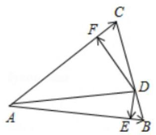

$\because \bigtriangleup {ABD}$ 与 $\bigtriangleup {ACD}$ 的面积分别为 2 和 $4,\therefore \frac{1}{2}\left| \overrightarrow{AB}\right|  \cdot  \left| \overrightarrow{DE}\right|  = 2,\frac{1}{2}\left| \overrightarrow{AC}\right|  \cdot  \left| \overrightarrow{DF}\right|  = 4$ ,

可得 $\left| \overrightarrow{DE}\right|  = \frac{4}{\left| \overrightarrow{AB}\right| },\left| \overrightarrow{DF}\right|  = \frac{8}{\left| \overrightarrow{AC}\right| },\therefore \left| \overrightarrow{DE}\right|  \cdot  \left| \overrightarrow{DF}\right|  = \frac{32}{\left| \overrightarrow{AB}\right|  \cdot  \left| \overrightarrow{AC}\right| }$ .

又 $\tan A = \frac{1}{2},\therefore \frac{\sin A}{\cos A} = \frac{1}{2}$ ,联立 ${\sin }^{2}A + {\cos }^{2}A = 1$ ,得 $\sin A = \frac{\sqrt{5}}{5},\cos A = \frac{2\sqrt{5}}{5}$ .

由 $\frac{1}{2}\left| \overrightarrow{AB}\right|  \cdot  \left| \overrightarrow{AC}\right| \sin A = 6$ ,得 $\left| \overrightarrow{AB}\right|  \cdot  \left| \overrightarrow{AC}\right|  = {12}\sqrt{5}$ . 则 $\left| \overrightarrow{DE}\right|  \cdot  \left| \overrightarrow{DF}\right|  = \frac{8\sqrt{5}}{15}$ .

$\therefore \overrightarrow{DE} \cdot  \overrightarrow{DF} = \left| \overrightarrow{DE}\right|  \cdot  \left| \overrightarrow{DF}\right| \cos  < \overrightarrow{DE},\overrightarrow{DF} >  = \frac{8\sqrt{5}}{15} \times  \left( {-\frac{2\sqrt{5}}{5}}\right)  =  - \frac{16}{15}$ . 故答案为: $- \frac{16}{15}$ .

(2)设 $\overrightarrow{a}$ 、 $\overrightarrow{b}$ 、 $\overrightarrow{c}$ 是同一平面上的三个两两不同的单位向量，若 $\left( {\overrightarrow{a} \cdot  \overrightarrow{b}}\right)  : \left( {\overrightarrow{b} \cdot  \overrightarrow{c}}\right)  : \left( {\overrightarrow{c} \cdot  \overrightarrow{a}}\right)  = 1 : 1 : 2$ ， 则 $\overrightarrow{a} \cdot  \overrightarrow{b}$ 的值为___

【难度】 $\star   \star   \star   \star$

【答案】 $\frac{1 - \sqrt{3}}{2}$

【解析】 $\overrightarrow{a}\text{ 、 }\overrightarrow{b}\text{ 、 }\overrightarrow{c}$ 均为单位向量， $\overrightarrow{a} \cdot  \overrightarrow{b} = \overrightarrow{b} \cdot  \overrightarrow{c}$ ，说明 $\overrightarrow{a}$ 与 $\overrightarrow{b}$ 夹角等于 $\overrightarrow{b}$ 与 $\overrightarrow{c}$ 夹角，

设其为 $\theta$ ,则 $\overrightarrow{a}$ 与 $\overrightarrow{c}$ 夹角为 ${2\theta }$ 或 ${2\pi } - {2\theta }$ , $\therefore \overrightarrow{a} \cdot  \overrightarrow{b} = \overrightarrow{b} \cdot  \overrightarrow{c} = \cos \theta ,\overrightarrow{c} \cdot  \overrightarrow{a} = \cos {2\theta }$ ,即

$\cos \theta  : \cos {2\theta } = 1 : 2,\therefore \frac{\cos \theta }{2{\cos }^{2}\theta  - 1} = \frac{1}{2}$ ,解得 $\cos \theta  = \frac{1 - \sqrt{3}}{2}$ 或 $\frac{1 + \sqrt{3}}{2}$ (大于 1 舍去)

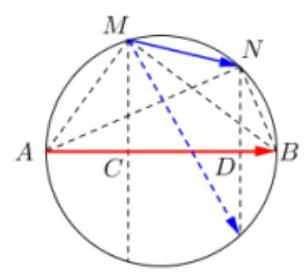

【例11】(1)已知 $M$ 、 $N$ 在以 ${AB}$ 为直径的圆上，若 ${AB} = 5$ ， ${AM} = 3$ ， ${BN} = 2$ ，则 $\overrightarrow{AB} \cdot  \overrightarrow{MN} =$ ___

【难度】★★★★

【答案】 12

【解析】由题意如图所示, $\overrightarrow{MN}$ 在 $\overrightarrow{AB}$ 方向上投影为 $\left| \overrightarrow{CD}\right|$ ,

易知 $\frac{AC}{AM} = \frac{AM}{AB} \Rightarrow  {AC} = \frac{9}{5}$ ,同理 $\frac{BD}{BN} = \frac{BN}{AB} \Rightarrow  {BD} = \frac{4}{5}$ ,

$\therefore {CD} = 5 - \frac{9}{5} - \frac{4}{5} = \frac{12}{5},\therefore \overrightarrow{AB} \cdot  \overrightarrow{MN} = \left| \overrightarrow{AB}\right|  \cdot  \left| \overrightarrow{CD}\right|  = 5 \times  \frac{12}{5} = {12}$

(2)在平面直角坐标系中，已知向量 $\overrightarrow{a} = \left( {1,2}\right)$ ， $O$ 是坐标原点， $M$ 是曲线 $\left| x\right|  + 2\left| y\right|  = 2$ 上的动点,则 $\overrightarrow{a} \cdot  \overrightarrow{OM}$ 的取值范围为 ( )

A. $\left\lbrack  {-2,2}\right\rbrack$ B. $\left\lbrack  {-\sqrt{5},\sqrt{5}}\right\rbrack$ C. $\left\lbrack  {-\frac{2\sqrt{5}}{5},\frac{2\sqrt{5}}{5}}\right\rbrack$ D. $\left\lbrack  {-\frac{2\sqrt{5}}{5},\sqrt{5}}\right\rbrack$

【难度】 $\bigstar \bigstar \bigstar \bigstar$

【答案】A

【解析】画出曲线 $\left| x\right|  + 2\left| y\right|  = 2$ ,即图中菱形 ${PQSR},\overrightarrow{a} = \overrightarrow{OA}$ ,由题意, ${OA} \bot  {PR}$ ,

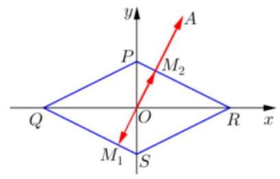

${OA} \bot  {QS},\therefore$ 结合向量数量积的几何意义, $\overrightarrow{OA} \cdot  \overrightarrow{O{M}_{1}} \leq  \overrightarrow{OA} \cdot  \overrightarrow{OM} \leq  \overrightarrow{OA} \cdot  \overrightarrow{O{M}_{2}}$ ,

可求出 $O{M}_{1} = O{M}_{2} = \frac{2\sqrt{5}}{5}$ ,

$\therefore  - \sqrt{5} \cdot  \frac{2\sqrt{5}}{5} \leq  \overrightarrow{OA} \cdot  \overrightarrow{OM} \leq  \sqrt{5} \cdot  \frac{2\sqrt{5}}{5}$ ,即 $\overrightarrow{a} \cdot  \overrightarrow{OM} \in  \left\lbrack  {-2,2}\right\rbrack$ ,故选A.

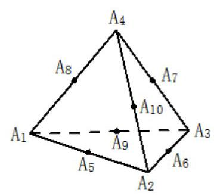

(3)已知正四面体 ${A}_{1}{A}_{2}{A}_{3}{A}_{4}$ ，点 ${A}_{5}$ 、 ${A}_{6}$ 、 ${A}_{7}$ 、 ${A}_{8}$ 、 ${A}_{9}$ 、 ${A}_{10}$ 分别是所在棱的中点,如图. 则当 $1 \leq  i \leq  {10},1 \leq  j \leq  {10}$ , 且 $i \neq  j$ 时，数量积 $\overrightarrow{{A}_{1}{A}_{2}} \cdot  \overrightarrow{{A}_{i}{A}_{j}}$ 的不同数值的个数为___.

【难度】 $\star   \star   \star   \star$

【答案】 9

【解析】解: $\because$ 四面体 ${A}_{1}{A}_{2}{A}_{3}{A}_{4}$ 是正四面体,

$\therefore$ 四面体的所有棱长相等,设为 $a$ ,四个面上的每一个顶点与对边中点的连线长均为 $\frac{\sqrt{3}}{2}a$ ,

每一对相对棱的中点连线相等均为 $\sqrt{{\left( \frac{\sqrt{3}}{2}a\right) }^{2} - {\left( \frac{1}{2}a\right) }^{2}} = \frac{\sqrt{2}}{2}a$ .

当 $i = 1, j$ 自 1 取到 10,所得数量积 $\overrightarrow{{A}_{1}{A}_{2}} \cdot  \overrightarrow{{A}_{1}{A}_{j}}$ 的不同数值有:

$\overrightarrow{{A}_{1}{A}_{2}} \cdot  \overrightarrow{{A}_{1}{A}_{2}} = {a}^{2},\overrightarrow{{A}_{1}{A}_{2}} \cdot  \overrightarrow{{A}_{1}{A}_{3}} = \frac{1}{2}{a}^{2},\overrightarrow{{A}_{1}{A}_{2}} \cdot  \overrightarrow{{A}_{1}{A}_{4}} = \frac{1}{2}{a}^{2},\overrightarrow{{A}_{1}{A}_{2}} \cdot  \overrightarrow{{A}_{1}{A}_{5}} = \frac{3}{4}{a}^{2},\overrightarrow{{A}_{1}{A}_{2}} \cdot  \overrightarrow{{A}_{1}{A}_{6}} = \frac{1}{2}{a}^{2}$ ,

$\overline{{A}_{1}{A}_{2}} \cdot  \overline{{A}_{1}{A}_{7}} = \frac{1}{4}{a}^{2},\overline{{A}_{1}{A}_{2}} \cdot  \overline{{A}_{1}{A}_{8}} = \frac{1}{2}{a}^{2},\overline{{A}_{1}{A}_{2}} \cdot  \overline{{A}_{1}{A}_{9}} = \frac{3}{4}{a}^{2},\overline{{A}_{1}{A}_{2}} \cdot  \overline{{A}_{1}{A}_{10}} = \frac{1}{4}{a}^{2}.$

当 $i = 2, j$ 自 1 取到 10 时,依次求得数量积 $\overrightarrow{{A}_{1}{A}_{2}} \cdot  \overrightarrow{{A}_{i}{A}_{j}}$ 的不同数值,

...

$i = {10}, j$ 自 1 取到 10,依次求得数量积 $\overrightarrow{{A}_{1}{A}_{2}} \cdot  \overrightarrow{{A}_{i}{A}_{j}}$ 的不同数值,

比较结果后得数量积 $\overrightarrow{{A}_{1}{A}_{2}} \cdot  \overrightarrow{{A}_{i}{A}_{j}}$ 的不同数值有 $- {a}^{2}, - \frac{3}{4}{a}^{2}, - \frac{1}{2}{a}^{2}, - \frac{1}{4}{a}^{2},0,\frac{1}{4}{a}^{2},\frac{1}{2}{a}^{2},\frac{3}{4}{a}^{2},{a}^{2}$ 共 9 个.

## 故答案为:9.

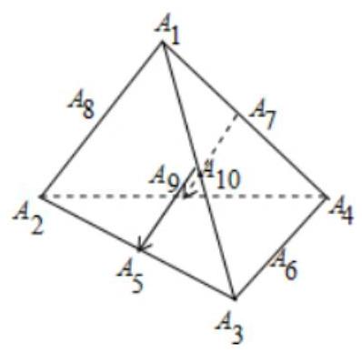

(4)已知 $O$ 为 $\bigtriangleup {ABC}$ 的外心， ${AB} = 4,{AC} = 2$ ， $\angle {BAC}$ 为钝角， $M$ 是边 ${BC}$ 的中点，则 $\overrightarrow{AM} \cdot  \overrightarrow{AO}$ 的值等于___.

【难度】 $\star   \star   \star   \star$

【答案】 5

【解析】解: 过点 $O$ 分别作 ${OE} \bot  {AB}$ 于 $E,{OF} \bot  {AC}$ 于 $F$ ,则 $E\text{ 、 }F$ 分别是 ${AB}\text{ 、 }{AC}$ 的中点

可得 Rt $\bigtriangleup \mathrm{{AEO}}$ 中, $\cos \angle {OAE} = \frac{\left| \overline{AE}\right| }{\left| \overline{AO}\right| } = \frac{\left| \overline{AB}\right| }{2\left| \overline{AO}\right| }$

$\therefore \overrightarrow{AB} \cdot  \overrightarrow{AO} = \overrightarrow{\left| {AB}\right|  \cdot  \left| {AO}\right| } \cdot  \frac{\overrightarrow{\left| AB\right| }}{2\left| \overrightarrow{AO}\right| } = \frac{1}{2}{\overrightarrow{\left| AB\right| }}^{2} = 8$ ,

同理可得 $\overrightarrow{AC} \cdot  \overrightarrow{AO} = \frac{1}{2}{\overrightarrow{\left| AC\right| }}^{2} = 2$

$\because M$ 是 ${BC}$ 边的中点,可得 $\overrightarrow{AM} = \frac{1}{2}\left( {\overrightarrow{AB} + \overrightarrow{AC}}\right)$ ,

$\therefore \overrightarrow{AM} \cdot  \overrightarrow{AO} = \frac{1}{2}\left( {\overrightarrow{AB} + \overrightarrow{AC}}\right)  \cdot  \overrightarrow{AO} = \frac{1}{2}\left( {\overrightarrow{AB} \cdot  \overrightarrow{AO} + \overrightarrow{AC} \cdot  \overrightarrow{AO}}\right)  = \frac{1}{2} \times  {10} = 5$

故答案为: 5

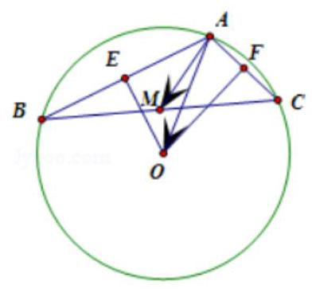

【例12】(1)在 $\bigtriangleup {ABC}$ 中，若 $\left| {\overrightarrow{AB} + \overrightarrow{AC}}\right|  = \left| {\overrightarrow{AB} - \overrightarrow{AC}}\right|$ ， ${AB} = 2$ ， ${AC} = 1$ ， $E$ 、 $F$ 为 ${BC}$ 边的三等分点， 则 $\overrightarrow{AE} \cdot  \overrightarrow{AF} =$ ___

【难度】 $\star   \star   \star   \star$

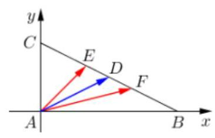

【答案】 $\frac{10}{9}$

【解析】由 ${\left| \overrightarrow{AB} + \overrightarrow{AC}\right| }^{2} = {\left| \overrightarrow{AB} - \overrightarrow{AC}\right| }^{2} \Rightarrow  \overrightarrow{AB} \cdot  \overrightarrow{AC} = 0,\angle A$ 为直角, 法一: 建系, $\overrightarrow{AE} \cdot  \overrightarrow{AF} = \left( {\frac{2}{3},\frac{2}{3}}\right)  \cdot  \left( {\frac{4}{3},\frac{1}{3}}\right)  = \frac{10}{9}$

法二: $\overrightarrow{AE} \cdot  \overrightarrow{AF} = \left( {\overrightarrow{AD} + \overrightarrow{DE}}\right)  \cdot  \left( {\overrightarrow{AD} + \overrightarrow{DF}}\right)  = {\overrightarrow{AD}}^{2} - {\overrightarrow{DE}}^{2} = {\left( \frac{1}{2}BC\right) }^{2} - {\left( \frac{1}{6}BC\right) }^{2} = \frac{2}{9}B{C}^{2} = \frac{10}{9}$

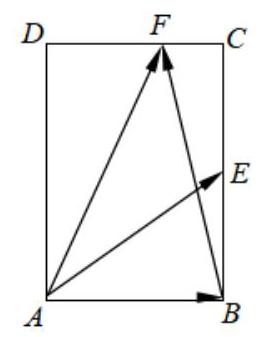

(2)如图，在矩形 ${ABCD}$ 中， ${AB} = \sqrt{2}\text{ ， }{BC} = 2$ ，点 $E$ 为 ${BC}$ 的中点， 点 $F$ 在边 ${CD}$ 上，若 $\overrightarrow{AB} \cdot  \overrightarrow{AF} = \sqrt{2}$ ，则 $\overrightarrow{AE} \cdot  \overrightarrow{BF}$ 的值是___.

【难度】 $\star   \star   \star   \star$

【答案】 $\sqrt{2}$

【解析】解: $\because \overrightarrow{AF} = \overrightarrow{AD} + \overrightarrow{DF}$ ,

$\overrightarrow{AB} \cdot  \overrightarrow{AF} = \overrightarrow{AB} \cdot  \left( {\overrightarrow{AD} + \overrightarrow{DF}}\right)  = \overrightarrow{AB} \cdot  \overrightarrow{AD} + \overrightarrow{AB} \cdot  \overrightarrow{DF} = \overrightarrow{AB} \cdot  \overrightarrow{DF} = \sqrt{2}\left| \overrightarrow{DF}\right|  = \sqrt{2}$ ,

$\therefore \left| \overrightarrow{DF}\right|  = 1,\left| \overrightarrow{CF}\right|  = \sqrt{2} - 1$ ,

$\therefore \overrightarrow{AE} \cdot  \overrightarrow{BF} = \left( {\overrightarrow{AB} + \overrightarrow{BE}}\right) \left( {\overrightarrow{BC} + \overrightarrow{CF}}\right)  = \overrightarrow{AB} \cdot  \overrightarrow{CF} + \overrightarrow{BE} \cdot  \overrightarrow{BC} =  - \sqrt{2}\left( {\sqrt{2} - 1}\right)  + 1 \times  2 =  - 2 + \sqrt{2} + 2 = \sqrt{2}$ ,

故答案为: $\sqrt{2}$

(3)如图，已知 $O$ 为矩形 ${P}_{1}{P}_{2}{P}_{3}{P}_{4}$ 内的一点，满足 $O{P}_{1} = 4, O{P}_{3} = 5,{P}_{1}{P}_{3} = 7$ ，则 $\overrightarrow{O{P}_{2}} \cdot  \overrightarrow{O{P}_{4}}$ 的值为___

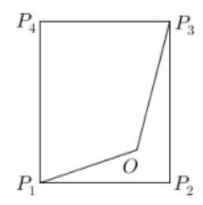

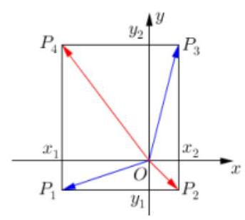

【难度】 $\star   \star   \star   \star$

【解析】 $\overrightarrow{O{P}_{2}} \cdot  \overrightarrow{O{P}_{4}} = \overrightarrow{O{P}_{1}} \cdot  \overrightarrow{O{P}_{3}}$ 在矩形中可以看作一个性质,证法如下,以点 $O$ 为原点建立

平面直角坐标系,设 ${P}_{1}\left( {{x}_{1},{y}_{1}}\right) \text{ 、 }{P}_{2}\left( {{x}_{2},{y}_{1}}\right) \text{ 、 }{P}_{3}\left( {{x}_{2},{y}_{2}}\right) \text{ 、 }{P}_{4}\left( {{x}_{1},{y}_{2}}\right) ,\overrightarrow{O{P}_{2}} \cdot  \overrightarrow{O{P}_{4}} = {x}_{1}{x}_{2} + {y}_{1}{y}_{2}$ ,

$\overrightarrow{O{P}_{1}} \cdot  \overrightarrow{O{P}_{3}} = {x}_{1}{x}_{2} + {y}_{1}{y}_{2},\therefore \overrightarrow{O{P}_{2}} \cdot  \overrightarrow{O{P}_{4}} = \overrightarrow{O{P}_{1}} \cdot  \overrightarrow{O{P}_{3}} = 4 \times  5 \times  \cos \angle O = \frac{{4}^{2} + {5}^{5} - {7}^{2}}{2} =  - 4$

【另解】通过向量的分解和运算得到 $\overrightarrow{O{P}_{2}} \cdot  \overrightarrow{O{P}_{4}} = \overrightarrow{O{P}_{1}} \cdot  \overrightarrow{O{P}_{3}}$

【例 13】(1)已知 $\bigtriangleup  {ABC}$ 的重心为 $O$ ， ${AC} = 6,{BC} = 7,{AB} = 8$ ，则 $\overrightarrow{AO} \cdot  \overrightarrow{BC} =$ ___.

【难度】 $\star   \star   \star   \star$

【答案】 $- \frac{28}{3}$

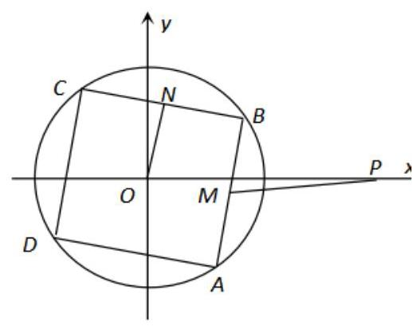

【解析】向量的分解

(2)如图，已知点 $P\left( {2,0}\right)$ ，且正方形 ${ABCD}$ 内接于 $\odot  O : {x}^{2} + {y}^{2} = 1$ ， $M\text{ 、 }N$ 分别为边 ${AB}\text{ 、 }{BC}$ 的中点. 当正方形 ${ABCD}$ 绕圆心 $O$ 旋转时, $\overrightarrow{PM} \cdot  \overrightarrow{ON}$ 的取值范围为___.

【难度】 $\star   \star   \star   \star$

【答案】 $\left\lbrack  {-\sqrt{2},\sqrt{2}}\right\rbrack$

【解析】解: 设 $M\left( {\frac{\sqrt{2}}{2}\cos \alpha ,\frac{\sqrt{2}}{2}\sin \alpha }\right) ,\because \overrightarrow{OM} \bot  \overrightarrow{ON},\therefore \overrightarrow{OM} \cdot  \overrightarrow{ON} = 0$ ,

$\therefore N\left( {-\frac{\sqrt{2}}{2}\sin \alpha ,\frac{\sqrt{2}}{2}\cos \alpha }\right) \therefore \overrightarrow{ON} = \left( {-\frac{\sqrt{2}}{2}\sin \alpha ,\frac{\sqrt{2}}{2}\cos \alpha }\right) ,\overrightarrow{OM} = \left( {\frac{\sqrt{2}}{2}\cos \alpha ,\frac{\sqrt{2}}{2}\sin \alpha }\right)$ ,

$\therefore \overrightarrow{PM} = \left( {\frac{\sqrt{2}}{2}\cos \alpha  - 2,\frac{\sqrt{2}}{2}\sin \alpha }\right) ,\therefore \overrightarrow{PM} \cdot  \overrightarrow{ON} =  - \frac{\sqrt{2}}{2}\sin \alpha \left( {\frac{\sqrt{2}}{2}\cos \alpha  - 2}\right)  + \frac{1}{2}\sin \alpha \cos \alpha  = \sqrt{2}\sin \alpha$ ,

$\because \sin \alpha  \in  \left\lbrack  {-1,1}\right\rbrack  ,\therefore \sqrt{2}\sin \alpha  \in  \left\lbrack  {-\sqrt{2},\sqrt{2}}\right\rbrack  ,\therefore \overrightarrow{PM} \cdot  \overrightarrow{ON}$ 的取值范围是 $\left\lbrack  {-\sqrt{2},\sqrt{2}}\right\rbrack$ .

故答案为: $\left\lbrack  {-\sqrt{2},\sqrt{2}}\right\rbrack$ .

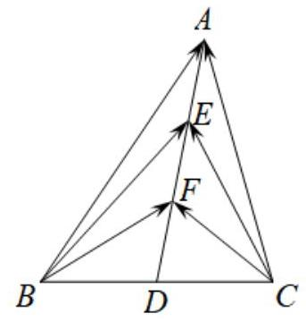

(3)如图，在 $\bigtriangleup  {ABC}$ 中， $D$ 是 ${BC}$ 的中点， $E$ ， $F$ 是 ${AD}$ 上的两个三等分点， $\overrightarrow{BA} \cdot  \overrightarrow{CA} = 5$ ， $\overrightarrow{BE} \cdot  \overrightarrow{CE} =  - 2$ ， 则 $\overrightarrow{BF} \cdot  \overrightarrow{CF}$ 的值是___.

【难度】 $\star   \star   \star   \star$

【答案】 $- \frac{31}{5}$

【解析】解: 由题意知, $\overrightarrow{BA} \cdot  \overrightarrow{CA} = \left( {\overrightarrow{BE} + \overrightarrow{EA}}\right)  \cdot  \left( {\overrightarrow{CE} + \overrightarrow{EA}}\right)$

$= \overrightarrow{BE} \cdot  \overrightarrow{CE} + \overrightarrow{EA} \cdot  \left( {\overrightarrow{BE} + \overrightarrow{CE}}\right)  + {\overrightarrow{EA}}^{2} = \overrightarrow{BE} \cdot  \overrightarrow{CE} + \overrightarrow{EA} \cdot  2\overrightarrow{DE} + {\overrightarrow{EA}}^{2}$

$= \overrightarrow{BE} \cdot  \overrightarrow{CE} + \overrightarrow{EA} \cdot  2 \cdot  2\overrightarrow{EA} + {\overrightarrow{EA}}^{2} = \overrightarrow{BE} \cdot  \overrightarrow{CE} + 5{\overrightarrow{EA}}^{2}$ ，

$\because \overrightarrow{BA} \cdot  \overrightarrow{CA} = 5,\overrightarrow{BE} \cdot  \overrightarrow{CE} =  - 2,\therefore 5 =  - 2 + 5{\overrightarrow{EA}}^{2}$ ,解得 ${\overrightarrow{EA}}^{2} = \frac{7}{5}$ .

同理可得, $\overrightarrow{BE} \cdot  \overrightarrow{CE} = \left( {\overrightarrow{BF} + \overrightarrow{FE}}\right)  \cdot  \left( {\overrightarrow{CF} + \overrightarrow{FE}}\right)  = \overrightarrow{BF} \cdot  \overrightarrow{CF} + 3{\overrightarrow{FE}}^{2} = \overrightarrow{BF} \cdot  \overrightarrow{CF} + 3{\overrightarrow{EA}}^{2}$ ,

$\therefore  - 2 = \overline{BF} \cdot  \overline{CF} + 3 \times  \frac{7}{5},\therefore \overline{BF} \cdot  \overline{CF} =  - \frac{31}{5}$ . 故答案为: $- \frac{31}{5}$ .

【例 14】(1) 在平面四边形 ${ABCD}$ 中, $\overrightarrow{AB} \cdot  \overrightarrow{BC} = \overrightarrow{AD} \cdot  \overrightarrow{DC} = 0,\left| \overrightarrow{AB}\right|  = \left| \overrightarrow{AD}\right|  = 1,\overrightarrow{AB} \cdot  \overrightarrow{AD} =  - \frac{1}{2}$ , 若点 $M$ 是边 ${BC}$ 上的任一动点，则 $\overrightarrow{AM} \cdot  \overrightarrow{DM}$ 的最小值为___

【难度】 $\star   \star   \star   \star$

【答案】 $\frac{21}{16}$

【解析】由题意 ${AD} \bot  {DC},{AB} \bot  {BC},{AB} = {AD} = 1,\angle {BAD} = \frac{2\pi }{3},\angle C = \frac{\pi }{3}$ ,

$\therefore {DC} = {BC} = \sqrt{3}$ ,取 ${AD}$ 中点 $E$ ,作 ${DF} \bot  {BC}$ 交于 $F$ 点, $\therefore {DF} = {DC} \cdot  \sin \frac{\pi }{3} = \frac{3}{2}$ ,

$\overrightarrow{AM} \cdot  \overrightarrow{DM} = \overrightarrow{MA} \cdot  \overrightarrow{MD} = \left( {\overrightarrow{ME} + \overrightarrow{EA}}\right)  \cdot  \left( {\overrightarrow{ME} + \overrightarrow{ED}}\right)  = {\overrightarrow{ME}}^{2} - {\overrightarrow{EA}}^{2} = {\overrightarrow{ME}}^{2} - \frac{1}{4}$ ，即求 ${\left| \overrightarrow{ME}\right| }_{\min }$ ，

易知当 ${ME}\bot {BC}$ 时， ${ME}$ 最小，此时 ${AB}//{EM}//{DF}$ ， $\therefore {\left| \overline{ME}\right| }_{\min } = \frac{{AB} + {DF}}{2} = \frac{5}{4}$ ，

$\therefore {\left( \overrightarrow{AM} \cdot  \overrightarrow{DM}\right) }_{\min } = {\left( \frac{5}{4}\right) }^{2} - \frac{1}{4} = \frac{21}{16}$ . (或者以 $D$ 为原点建系,表示 $\overrightarrow{AM} \cdot  \overrightarrow{DM}$ ,求最小值)

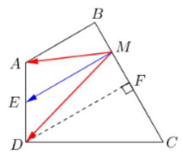

(2)已知平面向量 $\overrightarrow{a}$ 、 $\overrightarrow{b}$ ， $\overrightarrow{e}$ 满足 $\left| \overrightarrow{e}\right|  = 1$ ， $\overrightarrow{a} \cdot  \overrightarrow{e} = 1$ ， $\overrightarrow{b} \cdot  \overrightarrow{e} =  - 1$ ， $\left| {\overrightarrow{a} - \overrightarrow{b}}\right|  = 4$ ，则 $\overrightarrow{a} \cdot  \overrightarrow{b}$ 的最小值是___. 【难度】

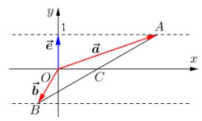

【答案】-4

【解析】由题意,构造右图,设 $\overrightarrow{e} = \left( {0,1}\right) ,\overrightarrow{a} = \left( {a,1}\right)$ ,

$\overrightarrow{b} = \left( {b, - 1}\right) ,\therefore \left| {\overrightarrow{a} - \overrightarrow{b}}\right|  = {AB} = 4,\therefore {AC} = {BC} = 2$ ,

$\therefore \overrightarrow{a} \cdot  \overrightarrow{b} = \overrightarrow{OA} \cdot  \overrightarrow{OB} = \left( {\overrightarrow{OC} + \overrightarrow{CA}}\right)  \cdot  \left( {\overrightarrow{OC} + \overrightarrow{CB}}\right)  =$

$\left( {\overrightarrow{OC} + \overrightarrow{CA}}\right)  \cdot  \left( {\overrightarrow{OC} - \overrightarrow{CA}}\right)  = {\overrightarrow{OC}}^{2} - {\overrightarrow{CA}}^{2} = {\overrightarrow{OC}}^{2} - 4 \geq   - 4$

(3)设 $P$ 为椭圆 $\frac{{x}^{2}}{4} + \frac{{y}^{2}}{3} = 1$ 上一动点， ${EF}$ 为圆 $N : {\left( x - 1\right) }^{2} + {y}^{2} = 1$ 的任意一条直径，则 $\overline{PE} \cdot  \overline{PF}$ 的取值范围是___.

【难度】 $\star   \star   \star   \star$

【答案】 $\left\lbrack  {0,8}\right\rbrack$

【解析】解: 因为: $\overrightarrow{PE} \cdot  \overrightarrow{PF} = \left( {\overrightarrow{NE} - \overrightarrow{NP}}\right)  \cdot  \left( {\overrightarrow{NF} - \overrightarrow{NP}}\right)  = \overrightarrow{NE} \cdot  \overrightarrow{NF} - \overrightarrow{NP} \cdot  \left( {\overrightarrow{NE} + \overrightarrow{NF}}\right)  + {\overrightarrow{NP}}^{2}$

$=  - \left| {NE}\right|  \cdot  \left| {NF}\right|  \cdot  \cos \pi  - 0 + {\left| NP\right| }^{2} =  - 1 + {\left| NP\right| }^{2}$ .

又因为 $N$ 为椭圆的右焦点 $\therefore \left| {NP}\right|  \in  \left\lbrack  {a - c, a + c}\right\rbrack   = \left\lbrack  {1,3}\right\rbrack  \therefore \overrightarrow{PE} \cdot  \overrightarrow{PF} \in  \left\lbrack  {0,8}\right\rbrack$ .

故答案为: $\left\lbrack  {0,8}\right\rbrack$ .

## 巩固训练

1、记边长为 1 的正六边形的六个顶点分别为 ${A}_{1}\text{ 、 }{A}_{2}\text{ 、 }{A}_{3}\text{ 、 }{A}_{4}\text{ 、 }{A}_{5}\text{ 、 }{A}_{6}$ ,集合

$M = \left\{  {\overrightarrow{a} \mid  \overrightarrow{a} = \overrightarrow{{A}_{i}{A}_{j}}\left( {i, j = 1,2,3,4,5,6, i \neq  j}\right) }\right\}$ ,在 $M$ 中任取两个元素 $\overrightarrow{m}\text{ 、 }\overrightarrow{n}$ ,则 $\overrightarrow{m} \cdot  \overrightarrow{n} = 0$ 的概率为

【难度】 $\star   \star   \star   \star$

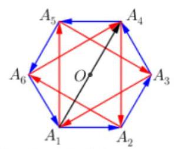

【答案】 $\frac{8}{51}$

【解析】如右图所示,集合 $M$ 中的向量包含三类: 六条

边有 6 个向量 (如 $\overrightarrow{{A}_{1}{A}_{2}}$ ),过中心 $O$ 有 6 个向量 (如 $\overrightarrow{{A}_{1}{A}_{4}}$ ),

剩余 6 个向量 (如 $\overrightarrow{{A}_{1}{A}_{5}}$ ),即集合 $M$ 中有 18 个元素.

其中每条边上的向量 (如 $\overrightarrow{{A}_{1}{A}_{2}}$ ) 都和两个向量 (如 $\overrightarrow{{A}_{1}{A}_{5}}$ 和 $\overrightarrow{{A}_{4}{A}_{2}}$ ) 垂直，然后每条过中心

的向量 (如 $\overrightarrow{{A}_{1}{A}_{4}}$ ) 都和两个向量 (如 $\overrightarrow{{A}_{2}{A}_{6}}$ 和 $\overrightarrow{{A}_{5}{A}_{3}}$ ) 垂直,即概率 $\frac{6 \times  2 + 6 \times  2}{{C}_{18}^{2}} = \frac{8}{51}$ .

2、已知 $O$ 是坐标原点,点 $A\left( {-1,1}\right)$ ,若点 $M\left( {x, y}\right)$ 为平面区域 $\left\{  \begin{array}{l} x + y \geq  2 \\  x \leq  1 \\  y \leq  2 \end{array}\right.$ 上的一个动点, 则 $\overrightarrow{OA} \cdot  \overrightarrow{OM}$ 的取值范围是___

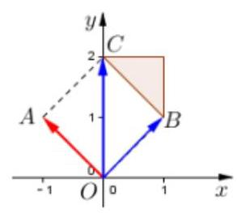

【难度】 $\star   \star   \star   \star$

【答案】 $\left\lbrack  {0,2}\right\rbrack$

【解析】平面区域如图阴影部分所示, 由向量数量积的几

何意义可知, $\overrightarrow{OA} \cdot  \overrightarrow{OB} \leq  \overrightarrow{OA} \cdot  \overrightarrow{OM} \leq  \overrightarrow{OA} \cdot  \overrightarrow{OC}$ ,即 $\overrightarrow{OA} \cdot  \overrightarrow{OM} \in  \left\lbrack  {0,2}\right\rbrack$

3、已知 $O, A, B$ 是平面上不共线三点，设 $P$ 为线段 ${AB}$ 垂直平分线上任意一点，若 $\left| \overrightarrow{OA}\right|  = 7$ ， $\left| \overrightarrow{OB}\right|  = 5$ ， 则 $\overrightarrow{OP} \cdot  \left( {\overrightarrow{OA} - \overrightarrow{OB}}\right)$ 的值为___.

【难度】 $\star   \star   \star   \star$

【答案】 12

【解析】解: 根据题意,设 $M$ 是线段 ${AB}$ 的中点,得 $\overrightarrow{OP} = \overrightarrow{OM} + \overrightarrow{MP},\overrightarrow{OA} - \overrightarrow{OB} = \overrightarrow{BA}$

$\therefore \overrightarrow{OP} \cdot  \left( {\overrightarrow{OA} - \overrightarrow{OB}}\right)  = \left( {\overrightarrow{OM} + \overrightarrow{MP}}\right)  \cdot  \overrightarrow{BA} = \overrightarrow{OM} \cdot  \overrightarrow{BA} + \overrightarrow{MP} \cdot  \overrightarrow{BA}$

$\because \overrightarrow{MP}$ 与 $\overrightarrow{BA}$ 互相垂直 $\therefore \overrightarrow{MP} \cdot  \overrightarrow{BA} = 0$ 因此 $\overrightarrow{OP} \cdot  \left( {\overrightarrow{OA} - \overrightarrow{OB}}\right)  = \overrightarrow{OM} \cdot  \overrightarrow{BA}$

又 $\because \bigtriangleup {OAB}$ 中, ${OM}$ 是 ${AB}$ 边上的中线, $\square \overrightarrow{OM} = \frac{1}{2}\left( {\overrightarrow{OA} + \overrightarrow{OB}}\right)$

$\therefore \overrightarrow{OM} \cdot  \overrightarrow{BA} = \frac{1}{2}\left( {\overrightarrow{OA} + \overrightarrow{OB}}\right)  \cdot  \overrightarrow{BA} = \frac{1}{2}\left( {\overrightarrow{OA} + \overrightarrow{OB}}\right) \left( {\overrightarrow{OA} - \overrightarrow{OB}}\right)$ 即 $\overrightarrow{OM} \cdot  \overrightarrow{BA} = \frac{1}{2}\left( {{\left| \overrightarrow{OA}\right| }^{2} - {\left| \overrightarrow{OB}\right| }^{2}}\right)$

$\because \left| \overrightarrow{OA}\right|  = 7,\left| \overrightarrow{OB}\right|  = 5,\therefore \overrightarrow{OP} \cdot  \left( {\overrightarrow{OA} - \overrightarrow{OB}}\right)  = \overrightarrow{OM} \cdot  \overrightarrow{BA} = \frac{1}{2}\left( {{7}^{2} - {5}^{2}}\right)  = {12}$

故答案为:12

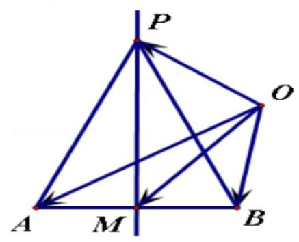

4、在 $\bigtriangleup {ABC}$ 中， $\angle A = {60}^{ \circ  }$ ， $M$ 是 ${AB}$ 的中点，若 $\left| {AB}\right|  = 2$ ， $\left| {BC}\right|  = 2\sqrt{3}$ ， $D$ 在线段 ${AC}$ 上运动，则 $\overrightarrow{DB} \cdot  \overrightarrow{DM}$ 的最小值为___.

【难度】 $\star   \star   \star   \star$

【答案】 $\frac{23}{16}$

【解析】解: $\because \overrightarrow{DB} = \overrightarrow{DA} + \overrightarrow{AB},\overrightarrow{DM} = \overrightarrow{DA} + \overrightarrow{AM} = \overrightarrow{DA} + \frac{1}{2}\overrightarrow{AB}$ ,

$\overrightarrow{DB} \cdot  \overrightarrow{DM} = \left( {\overrightarrow{DA} + \overrightarrow{AB}}\right)  \cdot  \left( {\overrightarrow{DA} + \frac{1}{2}\overrightarrow{AB}}\right)  = {\overrightarrow{DA}}^{2} + \frac{1}{2}{\overrightarrow{AB}}^{2} + \frac{3}{2}\overrightarrow{AB} \cdot  \overrightarrow{DA} = {\left| \overrightarrow{DA}\right| }^{2} + 2 + \frac{3}{2} \times  2 \times  \left| \overrightarrow{DA}\right| \cos {60}^{ \circ  }$

$= {\left| \overrightarrow{DA}\right| }^{2} - \frac{3}{2}\left| \overrightarrow{DA}\right|  + 2 = {\left( \left| \overrightarrow{DA}\right|  - \frac{3}{4}\right) }^{2} + \frac{23}{16},$

设 ${AC} = x$ ,由余弦定理可得 ${\left( 2\sqrt{3}\right) }^{2} = {x}^{2} + {2}^{2} - 2 \cdot  2 \cdot  x\cos {60}^{ \circ  }$ ,整理得 ${x}^{2} - {2x} - 8 = 0$ ,解得 $x = 4$ 或 $x =  - 2$ (舍去),故有 $\left| \overrightarrow{DA}\right|  \in  \left\lbrack  {0,4}\right\rbrack$ ,由二次函数的知识可知当 $\left| \overrightarrow{DA}\right|  = \frac{3}{4}$ 时,

${\left( \left| \overrightarrow{DA}\right|  - \frac{3}{4}\right) }^{2} + \frac{23}{16}$ 取最小值 $\frac{23}{16}$ 故答案为: $\frac{23}{16}$

5、在矩形 ${ABCD}$ 中，边 ${AB}$ 、 ${AD}$ 的长分别为2、1，若 $M$ 、 $N$ 分别是边 ${BC}$ 、 ${CD}$ 上的点，且满足 $\frac{\left| \overrightarrow{BM}\right| }{\left| \overrightarrow{BC}\right| } = \frac{\left| \overrightarrow{CN}\right| }{\left| \overrightarrow{CD}\right| }$ ,则 $\overrightarrow{AM} \cdot  \overrightarrow{AN}$ 的取值范围是___

【难度】 $\star   \star   \star$

【答案】 $\left\lbrack  {1,4}\right\rbrack$

【解析】如图所示,以 $A$ 为原点,向量 $\overrightarrow{AB}$ 所在直线为 $x$ 轴,过 ${AD}$ 所在直线为 $y$ 轴建立平面直角坐标系.

$\because$ 在矩形 ${ABCD}$ 中, ${AB} = 2,{AD} = 1,\therefore A\left( {0,0}\right) , B\left( {2,0}\right) , C\left( {2,1}\right) , D\left( {0,1}\right)$ .

设 $N\left( {x,1}\right) \left( {0 \leq  x \leq  2}\right)$ ,则 $\left| \overrightarrow{BC}\right|  = 1,\left| \overrightarrow{CN}\right|  = 2 - x,\left| \overrightarrow{CD}\right|  = 2$ .

$\therefore$ 由 $\frac{\left| \overrightarrow{BM}\right| }{\left| \overrightarrow{BC}\right| } = \frac{\left| \overrightarrow{CN}\right| }{\left| \overrightarrow{CD}\right| }$ 得, $\left| \overrightarrow{BM}\right|  = 1 - \frac{1}{2}x.\therefore M$ 的坐标为 $\left( {2,1 - \frac{1}{2}x}\right) .\therefore \overrightarrow{AN} = \left( {x,1}\right) ,\overrightarrow{AM} = \left( {2,1 - \frac{1}{2}x}\right)$ .

$\therefore \overrightarrow{AN} \cdot  \overrightarrow{AM} = {2x} + 1 - \frac{1}{2}x = \frac{3}{2}x + 1.\because 0 \leq  x \leq  2,\therefore 1 \leq  \frac{3}{2}x + 1 \leq  4.\therefore \overrightarrow{AN} \cdot  \overrightarrow{AM}$ 的取值范围是 $\left\lbrack  {1,4}\right\rbrack$ .

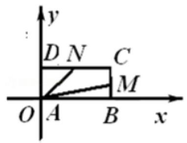

6、已知点 $P$ 在双曲线 $\frac{{x}^{2}}{9} - \frac{{y}^{2}}{16} = 1$ 上，点 $A$ 满足 $\overrightarrow{PA} = \left( {t - 1}\right) \overrightarrow{OP}\;\left( {t \in  \mathbf{R}}\right)$ ，且 $\overrightarrow{OA} \cdot  \overrightarrow{OP} = {60}$ ， $\overrightarrow{OB} = \left( {0,1}\right)$ ， 则 $\left| {\overrightarrow{OB} \cdot  \overrightarrow{OA}}\right|$ 的最大值为___

【难度】 $\star   \star   \star   \star$

【答案】 8

【解析】 $\overrightarrow{PA} = \overrightarrow{PO} + \overrightarrow{OA} = \left( {t - 1}\right) \overrightarrow{OP} \Rightarrow  \overrightarrow{OA} = t\overrightarrow{OP},\therefore$ 设 $P\left( {x, y}\right) ,\therefore A\left( {{tx},{ty}}\right)$ ,

$\therefore \overrightarrow{OA} \cdot  \overrightarrow{OP} = t\left( {{x}^{2} + {y}^{2}}\right)  = {60},\therefore t = \frac{60}{{x}^{2} + {y}^{2}},\because \frac{{x}^{2}}{9} - \frac{{y}^{2}}{16} = 1,\therefore t = \frac{960}{{144} + {25}{y}^{2}}$ ,

$\therefore \left| {\overrightarrow{OB} \cdot  \overrightarrow{OA}}\right|  = t\left| y\right|  = \frac{960}{\frac{144}{\left| y\right| } + {25}\left| y\right| } \leq  \frac{960}{2\sqrt{{144} \times  {25}}} = 8$ .

7、设 $P$ 是边长为 $2\sqrt{2}$ 的正六边形 ${A}_{1}{A}_{2}{A}_{3}{A}_{4}{A}_{5}{A}_{6}$ 的边上的任意一点,长度为 4 的线段 ${MN}$ 是该正六边形外接圆的一条动弦， $\overrightarrow{PM} \cdot  \overrightarrow{PN}$ 的取值范围为___

【难度】 $\star   \star   \star   \star$

【答案】 $\overrightarrow{PM} \cdot  \overrightarrow{PN} \in  \left\lbrack  {6 - 4\sqrt{6},8 + 8\sqrt{2}}\right\rbrack$

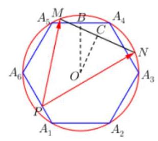

【解析】取 ${MN}$ 中点 $C,\therefore \overrightarrow{PM} \cdot  \overrightarrow{PN} = \left( {\overrightarrow{PC} + \overrightarrow{CM}}\right)  \cdot  \left( {\overrightarrow{PC} + \overrightarrow{CN}}\right)$

$= {\overrightarrow{PC}}^{2} - {\overrightarrow{CM}}^{2} = {\overrightarrow{PC}}^{2} - 4,{\left| \overrightarrow{PC}\right| }_{\max } = 2\sqrt{2} + {OC} = 2\sqrt{2} + 2$ ,

${\left| \overrightarrow{PC}\right| }_{\min } = {OB} - {OC} = \sqrt{6} - 2,\therefore {\overrightarrow{PC}}^{2} \in  \left\lbrack  {{10} - 4\sqrt{6},{12} + 8\sqrt{2}}\right\rbrack$ ,

即 $\overrightarrow{PM} \cdot  \overrightarrow{PN} \in  \left\lbrack  {6 - 4\sqrt{6},8 + 8\sqrt{2}}\right\rbrack$ .

8、设 $P$ 是函数 $y = x + \frac{2}{x}\left( {x > 0}\right)$ 的图像上任意一点,过点 $P$ 分别向直线 $y = x$ 和 $y$ 轴作垂线,垂足分别为 $A$ 、 $B$ ，则 $\overrightarrow{PA} \cdot  \overrightarrow{PB}$ 的值是___.

【难度】 $\star   \star   \star   \star$

【答案】 -1

【解析】解: 设 $P\left( {{x}_{0},{x}_{0} + \frac{2}{{x}_{0}}}\right) \left( {{x}_{0} > 0}\right)$ ,则点 $P$ 到直线 $y = x$ 和 $y$ 轴的距离分别为

$\left| {PA}\right|  = \frac{\left| {x}_{0} - \left( {x}_{0} + \frac{2}{{x}_{0}}\right) \right| }{\sqrt{2}} = \frac{\sqrt{2}}{{x}_{0}},\left| {PB}\right|  = {x}_{0}.$

$\because O\text{ 、 }A\text{ 、 }P\text{ 、 }B$ 四点共圆,所以 $\angle {APB} = \pi  - \angle {AOB} = \frac{3\pi }{4}$

$\therefore \overrightarrow{PA} \cdot  \overrightarrow{PB} = \frac{\sqrt{2}}{{x}_{0}} \cdot  {x}_{0} \cdot  \cos \frac{3\pi }{4} =  - 1$ 故答案为: -1

9、已知圆 0 的半径为 $1,{PA},{PB}$ 为该圆的两条切线， $A\text{ 、 }B$ 为两切点，那么 $\overrightarrow{PA} \cdot  \overrightarrow{PB}$ 的最小值等于. ( )

A. $- 4 + \sqrt{2}$ B. $- 3 + \sqrt{2}$ C. $- 4 + 2\sqrt{2}$ D. $- 3 + 2\sqrt{2}$

【难度】 $\star   \star   \star   \star$

【答案】 $D$

【解析】解: 如图所示: 设 ${OP} = x\left( {x > 0}\right)$ ,则 ${PA} = {PB} = \sqrt{{x}^{2} - 1}$ ,

$\angle {APO} = \alpha$ ,则 $\angle {APB} = {2\alpha },\sin \alpha  = \frac{1}{x}$ ,

$\overrightarrow{PA} \cdot  \overrightarrow{PB} = \overrightarrow{|{PA}}\left| \cdot \right| \overrightarrow{PB}\left| {\;\cos {2\alpha } = \sqrt{{x}^{2} - 1} \times  \sqrt{{x}^{2} - 1}\left( {1 - 2{\sin }^{2}\alpha }\right)  = \left( {{x}^{2} - 1}\right) \left( {1 - \frac{2}{{x}^{2}}}\right)  = \frac{{x}^{4} - 3{x}^{2} + 2}{{x}^{2}}}\right. \; = {x}^{2} + \frac{2}{{x}^{2}} - 3 \geq  2\sqrt{2} - 3$ ,

$\therefore$ 当且仅当 ${x}^{2} = \sqrt{2}$ 时取 “ $=$ ”,故 $\overrightarrow{PA} \cdot  \overrightarrow{PB}$ 的最小值为 $2\sqrt{2} - 3$ . 故选: $D$ .

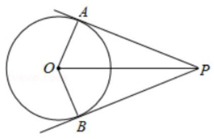

10、如图，四个棱长为 1 的正方体排成一个正四棱柱， ${AB}$ 是一条侧棱， ${P}_{i}\left( {i = 1,2,\ldots 8}\right)$ 是上底面上其余的八个点,则 $\overrightarrow{AB} \cdot  \overrightarrow{A{P}_{i}}\left( {i = 1,2,\ldots ,8}\right)$ 的不同值的个数为( )

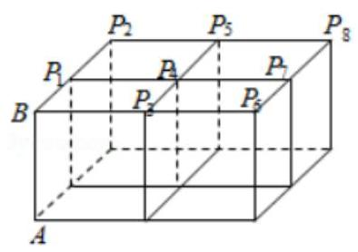

A. 1 B. 2 C. 3 D. 4

【难度】 $\star   \star   \star   \star$

【答案】 $A$

【解析】解: $\overrightarrow{A{P}_{i}} = \overrightarrow{AB} + \overrightarrow{B{P}_{i}}$ ,则 $\overrightarrow{AB} \cdot  \overrightarrow{A{P}_{i}} = \overrightarrow{AB}\left( {\overrightarrow{AB} + \overrightarrow{B{P}_{i}}}\right)  = {\left| \overrightarrow{AB}\right| }^{2} + \overrightarrow{AB} \cdot  \overrightarrow{B{P}_{i}}$ ,

$\because \overrightarrow{AB} \bot  \overrightarrow{B{P}_{i}},\therefore \overrightarrow{AB} \cdot  \overrightarrow{A{P}_{i}} = {\left| \overrightarrow{AB}\right| }^{2} = 1,\therefore \overrightarrow{AB} \cdot  \overrightarrow{A{P}_{i}}\left( {i = 1,2,\ldots ,8}\right)$ 的不同值的个数为 1,

故选: $A$ .

11、如图所示，正八边形 ${A}_{1}{A}_{2}{A}_{3}{A}_{4}{A}_{5}{A}_{6}{A}_{7}{A}_{8}$ 的边长为 2，若 $P$ 为该正八边形边上的动点，则 $\overrightarrow{{A}_{1}{A}_{3}} \cdot  \overrightarrow{{A}_{1}P}$ 的取值范围为( )

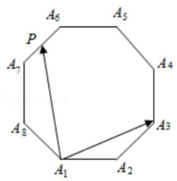

A. $\left\lbrack  {0,8 + 6\sqrt{2}}\right\rbrack$ B. $\left\lbrack  {-2\sqrt{2},8 + 6\sqrt{2}}\right\rbrack$ C. $\left\lbrack  {-8 - 6\sqrt{2},2\sqrt{2}}\right\rbrack$ D. $\left\lbrack  {-8 - 6\sqrt{2},8 + 6\sqrt{2}}\right\rbrack$

【难度】 $\star   \star   \star   \star$

【答案】 $B$

【解析】解: 由题意,正八边形 ${A}_{1}{A}_{2}{A}_{3}{A}_{4}{A}_{5}{A}_{6}{A}_{7}{A}_{8}$ 的每一个内角为 ${135}^{ \circ  }$ ,

且 $\left| \overrightarrow{{A}_{1}{A}_{2}}\right|  = \left| \overrightarrow{{A}_{1}{A}_{3}}\right|  = 2,\left| \overrightarrow{{A}_{1}{A}_{3}}\right|  = \left| \overrightarrow{{A}_{1}{A}_{7}}\right|  = 2\sqrt{2 + \sqrt{2}},\left| \overrightarrow{{A}_{1}{A}_{4}}\right|  = \left| \overrightarrow{{A}_{1}{A}_{6}}\right|  = 2 + 2\sqrt{2},\left| \overrightarrow{{A}_{1}{A}_{5}}\right|  = \sqrt{4 + 2\sqrt{2}}$ .

再由正弦函数的单调性及值域可得,

当 $P$ 与 ${A}_{8}$ 重合时, $\overrightarrow{{A}_{1}{A}_{3}} \cdot  \overrightarrow{{A}_{1}P}$ 最小为 $2 \times  2\sqrt{2 + \sqrt{2}} \times  \cos {112.5}^{ \circ  } = 2 \times  2\sqrt{2 + \sqrt{2}} \times  \left( {-\frac{\sqrt{2 - \sqrt{2}}}{2}}\right)  =  - 2\sqrt{2}$ .

结合选项可得 $\overrightarrow{{A}_{1}{A}_{3}} \cdot  \overrightarrow{{A}_{1}P}$ 的取值范围为 $\left\lbrack  {-2\sqrt{2},8 + 6\sqrt{2}}\right\rbrack$ .

故选: $B$ .

## 实战演练

一、填空题

1、已知平面向量 $\overrightarrow{a},\overrightarrow{b}$ . 满足 $\overrightarrow{a} = \left( {1,3}\right) ,\left| \overrightarrow{b}\right|  = 1$ ，则 $\left| {\overrightarrow{a} - \overrightarrow{b}}\right|$ 的取值范围是___.

【难度】 $\star   \star   \star$

【答案】 $\left\lbrack  {\sqrt{10} - 1,\sqrt{10} + 1}\right\rbrack$

【解答】解: $\overrightarrow{a} = \left( {1,3}\right)$ ,可得 $\left| \overrightarrow{a}\right|  = \sqrt{10},{\left| \overrightarrow{a} - \overrightarrow{b}\right| }^{2} = {\left| \overrightarrow{a}\right| }^{2} - 2\left| \overrightarrow{a}\right| \left| \overrightarrow{b}\right| \cos \theta  + {\left| \overrightarrow{b}\right| }^{2} = {11} - 2\sqrt{10}\cos \theta \left( {0 \leq  \theta  \leq  \pi }\right)$ ,

故 $\sqrt{{11} - 2\sqrt{10}} \leq  \left| {\overrightarrow{a} - \overrightarrow{b}}\right|  \leq  \sqrt{{11} + 2\sqrt{10}}$ ,故 $\sqrt{10} - 1 \leq  \left| {\overrightarrow{a} - \overrightarrow{b}}\right|  \leq  \sqrt{10} + 1$ ,

故答案为: $\left\lbrack  {\sqrt{10} - 1,\sqrt{10} + 1}\right\rbrack$ .

2、设 $P$ 为直线 $l : x + {2y} - 5 = 0$ 的一个动点，过 $P$ 作圆 $O : {x}^{2} + {y}^{2} = 1$ 的两条切线，切点为 $A, B$ ，则 $\overrightarrow{PA} \cdot  \overrightarrow{PB}$ 的最小值是___.

【难度】 $\star   \star   \star$

【答案】 $\frac{12}{5}$

【解析】解: 由切线长定理知, $\left| {PA}\right|  = \left| {PB}\right|  = \sqrt{{\left| OP\right| }^{2} - 1}$ ,

在 Rt $\bigtriangleup \mathrm{A}\mathrm{{PO}}$ 中, $\sin \angle {APO} = \frac{1}{\left| OP\right| }$ ,

$\therefore \cos \angle {APB} = \cos 2\angle {APO} = 1 - 2{\sin }^{2}\angle {APO} = 1 - \frac{2}{{\left| OP\right| }^{2}}$ ,

$\therefore \overrightarrow{PA} \cdot  \overrightarrow{PB} = \left| {PA}\right| \left| {PB}\right| \cos \angle {APB} = \sqrt{{\left| OP\right| }^{2} - 1} \cdot  \sqrt{{\left| OP\right| }^{2} - 1} \cdot  \left( {1 - \frac{2}{{\left| OP\right| }^{2}}}\right)  = {\left| OP\right| }^{2} + \frac{2}{{\left| OP\right| }^{2}} - 3$ ,

$\because$ 点 $O$ 到直线 $l$ 的距离 $d = \frac{5}{\sqrt{{1}^{2} + {2}^{2}}} = \sqrt{5}$ ,

$\therefore {\left| OP\right| }^{2} \geq  {d}^{2} = 5 > \sqrt{2}$ ,

$\therefore \overrightarrow{PA} \cdot  \overrightarrow{PB} = {\left| OP\right| }^{2} + \frac{2}{{\left| OP\right| }^{2}} - 3$ 在 $\lbrack 5, + \infty )$ 上单调递增,

当 $\left| {OP}\right|  = \sqrt{5}$ 时, $\overrightarrow{PA} \cdot  \overrightarrow{PB}$ 取到最小值,为 $\frac{12}{5}$ .

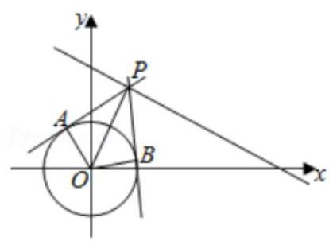

3、如图，在平面直角坐标系 ${xOy}$ 中，一单位圆的圆心的初始位置在 $\left( {0,1}\right)$ ，此时圆上一点 $P$ 的位置在 $\left( {0,0}\right)$ ， 圆在 $x$ 轴上沿正向滚动. 当圆滚动到圆心位于 $\left( {2,1}\right)$ 时， $\overrightarrow{OP}$ 的坐标为___.

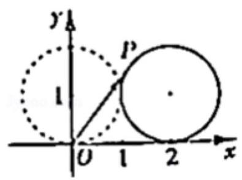

【难度】 $\star   \star   \star$

【答案】 $\left( {2 - \sin 2,1 - \cos 2}\right)$

【解析】解: (1) 根据题意可知圆滚动了 2 单位个弧长,点 $P$ 旋转了 $\frac{2}{1} = 2$ 弧度,

此时点 $P$ 的坐标为: ${x}_{P} = 2 - \cos \left( {2 - \frac{\pi }{2}}\right)  = 2 - \sin 2,{y}_{P} = 1 + \sin \left( {2 - \frac{\pi }{2}}\right)  = 1 - \cos 2$ .

$\therefore \overrightarrow{OP} = \left( {2 - \sin 2,1 - \cos 2}\right)$ .

故答案为: $\left( {2 - \sin 2,1 - \cos 2}\right)$

4、已知点 $P$ 是半径为 1 的 $\odot  O$ 上的动点,线段 ${AB}$ 是 $\odot  O$ 的直径. 则 $\overrightarrow{AB} \cdot  \overrightarrow{PA} + \overrightarrow{AB} \cdot  \overrightarrow{PB}$ 的取值范围为___.

【难度】 $\star   \star   \star$

【答案】 $\left\lbrack  {-4,4}\right\rbrack$

【解析】解: 以 ${AB}$ 所在直线为 $x$ 轴,圆心 $O$ 为原点,建立如图所示的直角坐标系 ${xOy}$ .

设 $A\left( {-1,0}\right) , B\left( {1,0}\right) , P\left( {m, n}\right)$ ,则 $\overrightarrow{PA} = \left( {m + 1, n}\right) ,\overrightarrow{PB} = \left( {m - 1, n}\right) ,\overrightarrow{AB} = \left( {2,0}\right)$ ,

即有 $\overrightarrow{AB} \cdot  \overrightarrow{PA} + \overrightarrow{AB} \cdot  \overrightarrow{PB} = 2\left( {m + 1}\right)  + 2\left( {m - 1}\right)  = {4m}$ ,

由 $- 1 \leq  m \leq  1$ ，可得 $- 4 \leq  {4m} \leq  4$ . 即有 $\overrightarrow{AB} \cdot  \overrightarrow{PA} + \overrightarrow{AB} \cdot  \overrightarrow{PB}$ 的取值范围是 $\left\lbrack  {-4,4}\right\rbrack$ .

故答案为: $\left\lbrack  {-4,4}\right\rbrack$ .

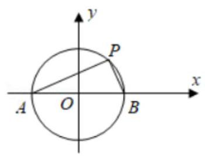

5、如图所示，三个边长为 2 的等边三角形有一条边在同一直线上，边 ${B}_{3}{C}_{3}$ 上有 10 个不同的点

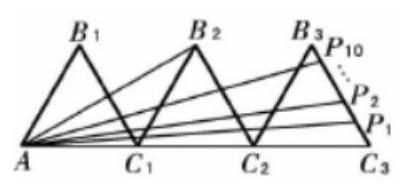

${P}_{1},{P}_{2},\cdots ,{P}_{10}$ ,记 ${M}_{i} = \overline{A{B}_{2}} \cdot  \overline{A{P}_{i}}\left( {i = 1,2,\cdots ,{10}}\right)$ ,则 ${M}_{1} + {M}_{2} + \cdots  + {M}_{10} =$ ___.

【难度】 $\star   \star   \star   \star$

【答案】180

【解析】解: 以 $A$ 为坐标原点, $A{C}_{1}$ 所在直线为 $x$ 轴建立

直角坐标系,可得 ${B}_{2}\left( {3,\sqrt{3}}\right) ,{B}_{3}\left( {5,\sqrt{3}}\right) ,{C}_{3}\left( {6,0}\right)$ ,直线 ${B}_{3}{C}_{3}$ 的方程为 $y =  - \sqrt{3}\left( {x - 6}\right)$ ,

可设 ${P}_{i}\left( {{x}_{i},{y}_{i}}\right)$ ,可得 $\sqrt{3}{x}_{i} + {y}_{i} = 6\sqrt{3}$ ,即有 ${m}_{i} = \overline{A{B}_{2}} \cdot  \overline{A{P}_{i}} = 3{x}_{i} + \sqrt{3}{y}_{i} = \sqrt{3}\left( {\sqrt{3}{x}_{i} + {y}_{i}}\right)  = {18}$ ,

则 ${m}_{1} + {m}_{2} + \ldots  + {m}_{10} = {18} \times  {10} = {180}$ . 故答案为: 180 .

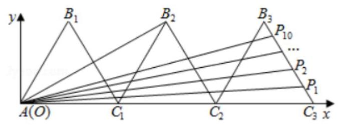

6、婆罗摩芨多是公元 7 世纪的古印度伟大数学家，曾研究过对角线互相垂直的圆内接四边形，我们把这类四边形称为婆罗摩芨四边形. 如图,已知圆 $O$ 内接四边形 ${ABCD}$ 中,对角线 ${AC} \bot  {BD}$ 于点 $P$ ,过点 $P$ 的直线 ${EF}$ 分别交一组对边 ${AB},{CD}$ 于点 $E, F$ ,且 $\overline{CF} = \overline{FD}$ ,则

① $\overrightarrow{PE} \cdot  \overrightarrow{AB} = 0$ ； ② $\left| \overrightarrow{AB}\right|  = 2\left| \overrightarrow{OF}\right|$ ；

③ ${\overrightarrow{PA}}^{2} + {\overrightarrow{PB}}^{2} + {\overrightarrow{PC}}^{2} + {\overrightarrow{PD}}^{2}$ 为定值； ④ $\overrightarrow{AB} \cdot  \overrightarrow{CD} + \overrightarrow{AD} \cdot  \overrightarrow{BC} = 0$ .

以上结论正确的是___.

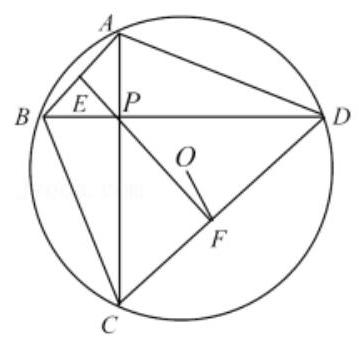

【难度】 $\star   \star   \star   \star$

【答案】①②③④

【解析】解: $\because \angle {ABP} = \angle {PCD},\angle {BAP} = \angle {PDC},\therefore \mathrm{{Rt}}\Delta \mathrm{{ABP}} \sim  \mathrm{{Rt}}\Delta \mathrm{{DCP}}$ ,

以 ${BD}$ 为 $x$ 轴, ${CA}$ 为 $y$ 轴,建立平面直角坐标系,

设 $A\left( {0, a}\right) , B\left( {b,0}\right)$ ,则 $C\left( {0,{\lambda b}}\right) , D\left( {{\lambda a},0}\right) , P\left( {0,0}\right)$ ,

$F\left( {\frac{\lambda a}{2},\frac{\lambda b}{2}}\right) , O\left( {\frac{b + {\lambda a}}{2},\frac{a + {\lambda b}}{2}}\right) ,\left( {\text{ 其中 }\lambda  > 0}\right)$

设 $\overrightarrow{PE} = \mu \overrightarrow{PF} = \mu \left( {\frac{\lambda a}{2},\frac{\lambda b}{2}}\right) ,\overrightarrow{AB} = \left( {b, - a}\right)$ ;

则 $\overrightarrow{PE} \cdot  \overrightarrow{AB} = \mu \left( {\frac{\lambda a}{2},\frac{\lambda b}{2}}\right)  \cdot  \left( {b, - a}\right)  = \mu  \cdot  \left( {\frac{\lambda a}{2}b - \frac{\lambda b}{2}a}\right)  = 0$ (其中 $\mu  < 0$ ),故①正确；

$\left| \overrightarrow{AB}\right|  = \sqrt{{a}^{2} + {b}^{2}},\left| \overrightarrow{OF}\right|  = \sqrt{{\left( \frac{\lambda a}{2} - \frac{b + {\lambda a}}{2}\right) }^{2} + {\left( \frac{\lambda b}{2} - \frac{a + {\lambda b}}{2}\right) }^{2}} = \frac{1}{2}\sqrt{{a}^{2} + {b}^{2}},$

故 $\left| \overrightarrow{AB}\right|  = 2\left| \overrightarrow{OF}\right|$ ,故②正确；

${\overrightarrow{PA}}^{2} + {\overrightarrow{PB}}^{2} + {\overrightarrow{PC}}^{2} + {\overrightarrow{PD}}^{2} = {\left| \overrightarrow{AB}\right| }^{2} + {\left| \overrightarrow{CD}\right| }^{2} = 4{\left| \overrightarrow{OF}\right| }^{2} + 4\left( {{\left| \overrightarrow{OC}\right| }^{2} - {\left| \overrightarrow{OF}\right| }^{2}}\right)$

$= 4{\left| \overrightarrow{OC}\right| }^{2} = 4{R}^{2}$ (其中 $R$ 为外接圆的半径),故定值,故③正确；

$\overrightarrow{AB} = \left( {b, - a}\right) ,\overrightarrow{CD} = \left( {{\lambda a}, - {\lambda b}}\right)$ ,则 $\overrightarrow{AB} \cdot  \overrightarrow{CD} = {2\lambda ab}$ ,

$\overrightarrow{AD} = \left( {{\lambda a}, - a}\right) ,\overrightarrow{BC} = \left( {-b,{\lambda b}}\right) ,\overrightarrow{AD} \cdot  \overrightarrow{BC} =  - {2\lambda ab}$ ,

故 $\overrightarrow{AB} \cdot  \overrightarrow{CD} + \overrightarrow{AD} \cdot  \overrightarrow{BC} = 0$ ,故④正确；

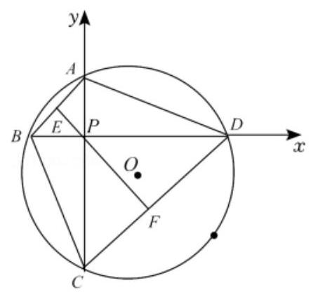

## 二、选择题

7、对于向量 $\overrightarrow{a},\overrightarrow{b},\overrightarrow{c}$ 和实数 $\lambda$ ,下列命题中正确的是( )

A. 若 $\overrightarrow{a} \cdot  \overrightarrow{b} = 0$ ，则 $\overrightarrow{a} = \overrightarrow{0}$ 或 $\overrightarrow{b} = \overrightarrow{0}$ B. 若 $\lambda \overrightarrow{a} = \overrightarrow{0}$ ,则 $\lambda  = 0$ 或 $\overrightarrow{a} = \overrightarrow{0}$

C. 若 ${\bar{a}}^{2} = {\bar{b}}^{2}$ ,则 $\bar{a} = \bar{b}$ 或 $\bar{a} =  - \bar{b}$ D. 若 $\overrightarrow{a} \cdot  \overrightarrow{b} = \overrightarrow{a} \cdot  \overrightarrow{c}$ ,则 $\overrightarrow{b} = \overrightarrow{c}$

【难度】 $\star   \star   \star$

【答案】B

【解析】对于 $\mathrm{A}$ 中,若 $\overrightarrow{a} \cdot  \overrightarrow{b} = 0$ ,则 $\overrightarrow{a} = \overrightarrow{0}$ 或 $\overrightarrow{b} = \overrightarrow{0}$ 或 $\overrightarrow{a} \bot  \overrightarrow{b}$ ,所以不正确;

对于 $\mathrm{B}$ 中,若 $\lambda \overrightarrow{a} = \overrightarrow{0}$ ,则 $\lambda  = 0$ 或 $\overrightarrow{a} = \overrightarrow{0}$ 是正确的;

对于 $\mathrm{C}$ 中,若 ${\overrightarrow{a}}^{2} = {\overrightarrow{b}}^{2}$ ,则 $\left| \overrightarrow{a}\right|  = \left| \overrightarrow{b}\right|$ ,不能得到 $\overrightarrow{a} = \overrightarrow{b}$ 或 $\overrightarrow{a} =  - \overrightarrow{b}$ ,所以不正确;

对于 $\mathrm{D}$ 中,若 $\overrightarrow{a} \cdot  \overrightarrow{b} = \overrightarrow{a} \cdot  \overrightarrow{c}$ ,则 $\overrightarrow{a}\left( {\overrightarrow{b} - \overrightarrow{c}}\right)  = 0$ ,不一定得到 $\overrightarrow{b} = \overrightarrow{c}$ ,可能是 $\overrightarrow{a} \bot  \left( {\overrightarrow{b} - \overrightarrow{c}}\right)$ ,所以不正确, 综上可知,故选 B

8、下列命题:(1) $m\left( {\overrightarrow{a} + \overrightarrow{b}}\right)  = m\overrightarrow{a} + m\overrightarrow{b}\left( {m \in  R}\right)$ ；(2) $\left( {\overrightarrow{a} \cdot  \overrightarrow{b}}\right)  \cdot  \overrightarrow{c} = \overrightarrow{a} \cdot  \left( {\overrightarrow{b} \cdot  \overrightarrow{c}}\right)$ ；(3)

${\left( \overrightarrow{a} - \overrightarrow{b}\right) }^{2} = {\overrightarrow{a}}^{2} - 2 \cdot  \overrightarrow{a} \cdot  \overrightarrow{b} + {\overrightarrow{b}}^{2};\left( 4\right) \left| {\overrightarrow{a} + \overrightarrow{b}}\right|  \cdot  \left| {\overrightarrow{a} - \overrightarrow{b}}\right|  = \left| {\overrightarrow{a} - \overrightarrow{b}}\right|$ . 其中真命题的个数为( ).

A. 1 B. 2 C. 3 D. 4

【难度】 $\star   \star   \star$

【答案】B

【解析】解: (1) 根据平面向量的乘法分配律,可知 $m\left( {\overrightarrow{a} + \overrightarrow{b}}\right)  = m\overrightarrow{a} + m\overrightarrow{b}\left( {m \in  R}\right)$ ,则 (1) 正确;

(2)由于平面向量不满足结合律，则 $\left( {\overrightarrow{a} \cdot  \overrightarrow{b}}\right)  \cdot  \overrightarrow{c} \neq  \overrightarrow{a} \cdot  \left( {\overrightarrow{b} \cdot  \overrightarrow{c}}\right)$ ，故(2)错误；

(3)根据平面向量的乘法运算，可知 ${\left( \overrightarrow{a} - \overrightarrow{b}\right) }^{2} = {\overrightarrow{a}}^{2} - 2 \cdot  \overrightarrow{a} \cdot  \overrightarrow{b} + {\overrightarrow{b}}^{2}$ ，则(3)正确；

(4)设 $\left| \overrightarrow{a}\right|  = \left| \overrightarrow{b}\right|  = 1$ ，且 $\overrightarrow{a} \bot  \overrightarrow{b}$ ，则 $\left| {\overrightarrow{a} + \overrightarrow{b}}\right|  = \left| {\overrightarrow{a} - \overrightarrow{b}}\right|  = \sqrt{2}$ ，而 $\left| {\overrightarrow{a} - \overrightarrow{b}}\right|  = 0$ ，

此时 $\left| {\overrightarrow{a} + \overrightarrow{b}}\right|  \cdot  \left| {\overrightarrow{a} - \overrightarrow{b}}\right|  \neq  \left| {\overrightarrow{a} - \overrightarrow{b}}\right|$ ,故 (4) 错误; 综上得,真命题的个数为 2 . 故选: B.

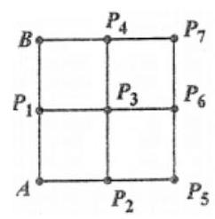

9、如图，四个边长为1的小正方体排成一个大正方形， ${AB}$ 是大正方形的一条边, ${P}_{i}\left( {i = 1,2,\cdots ,7}\right)$ 是小正方形的其余顶点, 则 $\overrightarrow{AB} \cdot  \overrightarrow{A{P}_{i}}\left( {i = 1,2,\cdots ,7}\right)$ 的不同值的个数为( )

(A) 7 (B) 5 (C) 3 (D) 1

【难度】 $\star   \star   \star   \star$

【答案】C

【解析】解: 如图建立平面直角坐标系,

则 $A\left( {0,0}\right) , B\left( {0,2}\right) ,{P}_{1}\left( {0,1}\right) ,{P}_{2}\left( {1,0}\right) ,{P}_{3}\left( {1,1}\right) ,{P}_{4}\left( {1,2}\right) ,{P}_{5}\left( {2,0}\right) ,{P}_{6}\left( {2,1}\right) ,{P}_{7}\left( {2,2}\right)$ ,

$\therefore \overrightarrow{AB} = \left( {0,2}\right) ,\overrightarrow{A{P}_{1}} = \left( {0,1}\right) ,\overrightarrow{A{P}_{2}} = \left( {1,0}\right) ,\overrightarrow{A{P}_{3}} = \left( {1,1}\right) ,\overrightarrow{A{P}_{4}} = \left( {1,2}\right) ,\overrightarrow{A{P}_{5}} = \left( {2,0}\right) ,\overrightarrow{A{P}_{6}} = \left( {2,1}\right) ,\overrightarrow{A{P}_{7}} = \left( {2,2}\right)$ ,

$\therefore \overrightarrow{AB} \cdot  \overrightarrow{A{P}_{1}} = 2,\overrightarrow{AB} \cdot  \overrightarrow{A{P}_{2}} = 0,\overrightarrow{AB} \cdot  \overrightarrow{A{P}_{3}} = 2,\overrightarrow{AB} \cdot  \overrightarrow{A{P}_{4}} = 4,\overrightarrow{AB} \cdot  \overrightarrow{A{P}_{5}} = 0,\overrightarrow{AB} \cdot  \overrightarrow{A{P}_{6}} = 2,\overrightarrow{AB} \cdot  \overrightarrow{A{P}_{7}} = 4$ ,

$\therefore \overrightarrow{AB} \cdot  \overrightarrow{A{P}_{i}}\left( {i = 1,2,\ldots ,7}\right)$ 的不同值的个数为 3,

故选: $C$ .

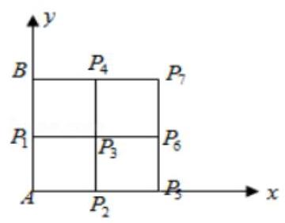

10、在 $\bigtriangleup {ABC}$ 中, $D$ 为 ${BC}$ 边上的中点, ${P}_{0}$ 是边 ${AB}$ 上的一个定点, ${P}_{0}B = \frac{1}{4}{AB}$ ,且对于 ${AB}$ 上任一点 $P$ , 恒有 $\overrightarrow{PB} \cdot  \overrightarrow{PC} \geq  \overrightarrow{{P}_{0}B} \cdot  \overrightarrow{{P}_{0}C}$ ,则下列结论中正确的是(   )

A. $\overrightarrow{PB} \cdot  \overrightarrow{PC} \neq  {\overrightarrow{PD}}^{2} - {\overrightarrow{DB}}^{2}$ B. 存在点 $P$ ,使 $\left| \overrightarrow{PD}\right|  < \left| \overrightarrow{{P}_{0}D}\right|$

C. $\overrightarrow{{P}_{0}C} \cdot  \overrightarrow{AB} = 0$ D. ${AC} = {BC}$

【难度】 $\star   \star   \star   \star$

【答案】D

【解析】解: $A : \because \overrightarrow{PB} \cdot  {PC} = \left( {\overrightarrow{PD} + \overrightarrow{DB}}\right)  \cdot  \left( {\overrightarrow{PD} + \overrightarrow{DC}}\right)  = {\overrightarrow{PD}}^{2} - {\overrightarrow{DB}}^{2}$ ,故 $A$ 不正确.

$B$ : 由 $A$ 知, $\overrightarrow{{P}_{0}B} \cdot  \overrightarrow{{P}_{0}C} = {\overrightarrow{{P}_{0}D}}^{2} - {\overrightarrow{DB}}^{2}$ ,又 $\because \overrightarrow{PB} \cdot  {PC} \geq  \overrightarrow{{P}_{0}B} \cdot  \overrightarrow{{P}_{0}C}$ 恒成立,

$\therefore {\overrightarrow{PD}}^{2} \geq  {\overrightarrow{{P}_{0}D}}^{2}$ ,即 $\left| \overrightarrow{PD}\right|  \geq  \left| \overrightarrow{{P}_{0}D}\right|$ 恒成立, $\therefore B$ 不正确.

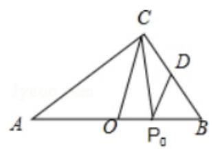

$C$ : 由 $\left| \overrightarrow{PD}\right|  \geq  \left| \overrightarrow{{P}_{0}D}\right|$ 恒成立, $\therefore \left| \overrightarrow{{P}_{0}D}\right|$ 是点 $D$ 与直线 ${AB}$ 上各点距离的最小值, $\therefore \overrightarrow{{P}_{0}D} \bot  \overrightarrow{AB},\therefore \overrightarrow{{P}_{0}D} \cdot  \overrightarrow{AB} = 0,\therefore \overrightarrow{{P}_{0}C} \cdot  \overrightarrow{AB} \neq  0\therefore C$ 错误.

$D :$ 取 ${AB}$ 的中点为 $O,\because {P}_{0}B = \frac{1}{4}{AB},\therefore {P}_{0}$ 为 ${OB}$ 中点, $\therefore {CO}//{P}_{0}D$ , $\therefore {CO} \bot  {AB},\therefore \bigtriangleup {ABC}$ 为等腰三角形, $\therefore {AC} = {BC},\therefore D$ 正确.

## 三、解答题

11、如图,在矩形 ${ABCD}$ 中,点 $E$ 在边 ${AB}$ 上,且 $\overrightarrow{AE} = \frac{1}{2}\overrightarrow{EB}, M$ 是线段 ${CE}$ 上一动点.

( I ) 若 $M$ 是线段 ${CE}$ 的中点, $\overrightarrow{AM} = m\overrightarrow{AB} + n\overrightarrow{AD}$ ,求 $m + n$ 的值;

(II) 若 ${AD} = 2,\overrightarrow{CA} \cdot  \overrightarrow{CE} = {10}$ ,求 $\left( {2\overrightarrow{MA} + \overrightarrow{MB}}\right)  \cdot  \overrightarrow{MC}$ 的最小值.

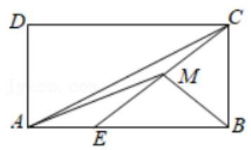

【难度】 $\star   \star   \star$

【答案】见解析

【解析】解: (1) 因为 $M$ 是线段 ${CE}$ 的中点,所以 $\overrightarrow{AM} = \frac{1}{2}\overrightarrow{AC} + \frac{1}{2}\overrightarrow{AE} = \frac{1}{2}\left( {\overrightarrow{AB} + \overrightarrow{AD}}\right)  + \frac{1}{6}\overrightarrow{AB} = \frac{2}{3}\overrightarrow{AB} + \frac{1}{2}\overrightarrow{AD}$ , 则 $m + n = \frac{2}{3} + \frac{1}{2} = \frac{7}{6}$ ;

(II) $\overrightarrow{CA} =  - \overrightarrow{AB} - \overrightarrow{AD},\overrightarrow{CE} = \overrightarrow{CA} + \overrightarrow{AE} =  - \frac{2}{3}\overrightarrow{AB} - \overrightarrow{AD}$ ,

因为 ${AB} \bot  {AD}$ ,即 $\overrightarrow{AB} \cdot  \overrightarrow{AD} = 0$ ,

所以 ${10} = \overrightarrow{CA} \cdot  \overrightarrow{CE} = \frac{2}{3}\overrightarrow{AB}{}^{2} + \overrightarrow{AD}{}^{2}$ ,则 $A{B}^{2} = \frac{3}{2}\left( {{10} - {AD2}}\right)  = 9$ ,故 ${AB} = 3$ ,

则 ${\overrightarrow{CE}}^{2} = \frac{4}{9}{\overrightarrow{AB}}^{2} + {\overrightarrow{AD}}^{2} = 8$ ,故 ${CE} = 2\sqrt{2}$ ,

因为 $\overrightarrow{AE} = \frac{1}{2}\overrightarrow{EB}$ ,所以 $\overrightarrow{ME} - \overrightarrow{MA} = \frac{1}{2}\left( {\overrightarrow{MB} - \overrightarrow{ME}}\right)$ ,故 $\overrightarrow{ME} = \frac{2}{3}\overrightarrow{MA} + \frac{1}{3}\overrightarrow{MB}$ ,

因此 $2\overrightarrow{MA} + \overrightarrow{MB} = 3\overrightarrow{ME}$ ,

则 $\left( {2\overrightarrow{MA} + \overrightarrow{MB}}\right)  \cdot  \overrightarrow{MC} = 3\overrightarrow{ME} \cdot  \overrightarrow{MC} =  - {3ME} \cdot  {MC} \geq   - 3\left( \frac{{ME} + {MC}}{2}\right) 2 =  - 6$ ,当仅当 $M$ 为 ${EC}$ 中点时取等号,

即 $\left( {2\overrightarrow{MA} + \overrightarrow{MB}}\right)  \cdot  \overrightarrow{MC}$ 的最小值为 -6 .

12、如图所示， ${AD}$ 是 $\bigtriangleup  {ABC}$ 的一条中线，点 $O$ 满足 $\overrightarrow{AO} = 2\overrightarrow{OD}$ ，过点 $O$ 的直线分别与射线 ${AB}$ 、射线 ${AC}$ 交于 $M\text{ 、 }N$ 两点.

(1)求证: $\overrightarrow{AD} = \frac{1}{2}\overrightarrow{AB} + \frac{1}{2}\overrightarrow{AC}$ ；

(2)设 $\overrightarrow{AM} = m\overrightarrow{AB}$ ， $\overrightarrow{AN} = n\overrightarrow{AC}$ ， $m > 0$ ，求 $\frac{1}{m} + \frac{1}{n}$ 的值；

(3)如果 $\bigtriangleup {ABC}$ 是边长为 2 的等边三角形，求 $O{M}^{2} + O{N}^{2}$ 的取值范围.

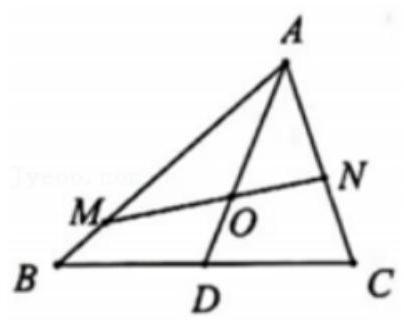

【难度】 $\star   \star   \star   \star$

【答案】见解析

【解答】解: (1) 证明: 因为 $D$ 是 ${BC}$ 的中点,

所以 $\overrightarrow{AD} = \overrightarrow{AB} + \overrightarrow{BD} = \overrightarrow{AB} + \frac{1}{2}\overrightarrow{BC} = \overrightarrow{AB} + \frac{1}{2}\left( {\overrightarrow{AC} - \overrightarrow{AB}}\right)  = \frac{1}{2}\overrightarrow{AB} + \frac{1}{2}\overrightarrow{AC}$ ;

(2)因为 $M$ ， $N$ ， $O$ 三点共线，故存在实数 $\lambda$ 使得: $\overrightarrow{MO} = \lambda \overrightarrow{ON}$ ，

即 $\overrightarrow{AO} - \overrightarrow{AM} = \lambda \left( {\overrightarrow{AN} - \overrightarrow{AO}}\right)$ ,整理可得: $\overrightarrow{AO} = \frac{1}{1 + \lambda }\overrightarrow{AM} + \frac{\lambda }{1 + \lambda }\overrightarrow{AN} = \frac{m}{1 + \lambda }\overrightarrow{AB} + \frac{n\lambda }{1 + \lambda }\overrightarrow{AC}$ ,

由(1)可知 $\overrightarrow{AD} = \frac{1}{2}\overrightarrow{AB} + \frac{1}{2}\overrightarrow{AC},\overrightarrow{AO} = \frac{2}{3}\overrightarrow{AD} = \frac{1}{3}\overrightarrow{AB} + \frac{1}{3}\overrightarrow{AC}$ ,

由平面向量基本定理, $\left\{  \begin{array}{l} \frac{m}{1 + \lambda } = \frac{1}{3} \\  \frac{n\lambda }{1 + \lambda } = \frac{1}{3} \end{array}\right.$ ,所以 $\frac{1}{m} + \frac{1}{n} = \frac{3}{1 + \lambda } + \frac{3\lambda }{1 + \lambda } = 3$ ;

(3)因为三角形 ${ABC}$ 为边长为 2 的等边三角形,故 ${AM} = {2m},{AO} = \frac{2\sqrt{3}}{3}$ ，

在 $\bigtriangleup {AOM}$ 中,由余弦定理可得: $O{M}^{2} = A{M}^{2} + A{O}^{2} - {2AM} \cdot  {AO} \times  \cos {30}^{ \circ  } = 4\left( {{m}^{2} - m + \frac{1}{3}}\right)$ ,

在 $\bigtriangleup {AON}$ 中,同理可得: $O{N}^{2} = 4\left( {{n}^{2} - n + \frac{1}{3}}\right)$ ,

故 $O{M}^{2} + O{N}^{2} = 4\left( {{m}^{2} + {n}^{2} - m - n + \frac{2}{3}}\right)  = 4\left\lbrack  {{\left( m + n\right) }^{2} - \left( {m + n}\right)  - {2mn} + \frac{2}{3}}\right\rbrack$ ,

由(2)知 $\frac{1}{m} + \frac{1}{n} = 3$ ，则 ${mn} = \frac{m + n}{3}$ ，

故 $O{M}^{2} + O{N}^{2} = 4\left\lbrack  {{\left( m + n\right) }^{2} - \left( {m + n}\right)  - \frac{2}{3}\left( {m + n}\right)  + \frac{2}{3}}\right\rbrack$

$= 4\left\lbrack  {{\left( m + n - \frac{5}{6}\right) }^{2} - \frac{1}{36}}\right\rbrack  ,$

由基本不等式, $\frac{m + n}{3} = {mn} \leq  {\left( \frac{m + n}{2}\right) }^{2}$ 可得: $m + n \geq  \frac{4}{3}$ ,

当且仅当 $m + n = \frac{4}{3}$ ,即 $m = n = \frac{2}{3}$ 时, $O{M}^{2} + O{N}^{2}$ 取得最小值为 $\frac{4}{9}$ ,

故 $O{M}^{2} + O{N}^{2}$ 的取值范围为 $\left\lbrack  {\frac{4}{9}, + \infty }\right)$ .
