## 平面向量的分解定理与应用

<table><tr><td>教学目标</td><td>1. 理解和掌握平面向量的分解定理, 能写出任一向量关于给定两不平行的向量的分解式;   2. 利用平面向量分解定理去解决一些复杂问题。   3、理解平面向量与三角形“四心”的关系   4、掌握向量的综合应用</td></tr><tr><td>重点</td><td>向量的分解定理</td></tr><tr><td>难 点</td><td>平面向量与三角形 “四心”</td></tr></table>

## (一) 向量的分解定理

## 知识梳理

## 一、平面向量分解定理

平面向量分解定理: 如果 $\overrightarrow{{e}_{1}},\overrightarrow{{e}_{2}}$ 是同一平面内的两个不共线向量,那么对于这一平面内的任一向量 $\overrightarrow{a}$ ,有且只有一对实数 ${\lambda }_{1},{\lambda }_{2}$ 使 $\overrightarrow{a} = {\lambda }_{1}\overrightarrow{{e}_{1}} + {\lambda }_{2}\overrightarrow{{e}_{2}}$ 。

特别提醒:

(1)我们把不共线向量 $\overrightarrow{{e}_{1}}\text{ 、 }\overrightarrow{{e}_{2}}$ 叫做表示这一平面内所有向量的一组基底；

(2)基底不惟一,关键是不共线;

(3)由定理可将任一向量 $\overrightarrow{a}$ 在给出基底 $\overrightarrow{{e}_{1}}$ 、

## 例题精讲

【例 1】( 1 )若已知 $\overrightarrow{{e}_{1}}\text{ 、 }\overrightarrow{{e}_{2}}$ 是平面上的一组基底，则下列各组向量中不能作为基底的一组是( )

A、 $\overrightarrow{{e}_{1}}$ 与 $- \overrightarrow{{e}_{2}}$ B、 $3\overrightarrow{{e}_{1}}$ 与 $2\overrightarrow{{e}_{2}}$ C、 $\overrightarrow{{e}_{1}} + \overrightarrow{{e}_{2}}$ 与 $\overrightarrow{{e}_{1}} - \overrightarrow{{e}_{2}}$ D、 $\overrightarrow{{e}_{1}}$ 与 $2\overrightarrow{{e}_{1}}$

【难度】 $\star   \star   \star$

【答案】D

【解析】满足基底的条件是不共线

(2)在 $\bigtriangleup  {ABC}$ 中，已知 ${AM} : {AB} = 1 : 3,{AN} : {AC} = 1 : 4,{BN}$ 与 ${CM}$ 交于点 $P$ ，且

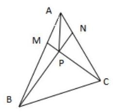

$\overrightarrow{AB} = \overrightarrow{a},\overrightarrow{\mathrm{{AC}}} = \overrightarrow{b}$ ,试用 $\overrightarrow{a},\overrightarrow{b}$ 表示 $\overrightarrow{AP}$ 。

【难度】 $\star   \star   \star$

【答案】 $\overrightarrow{AP} = \frac{3}{11}\overrightarrow{a} + \frac{2}{11}\overrightarrow{b}$

【解析】 $\because {AM} : {AB} = 1 : 3,\;{AN} : {AC} = 1 : 4,$ ，

$\therefore \overrightarrow{AM} = \frac{1}{3}\overrightarrow{AB} = \frac{1}{3}\overrightarrow{a},\overrightarrow{AN} = \frac{1}{4}\overrightarrow{AC} = \frac{1}{4}\overrightarrow{b}$ ,

$\because M.P.C$ 三点共线,故可设 $\overrightarrow{MP} = t\overrightarrow{MC}, t \in  \mathbb{R}$ ,于是,

$\overrightarrow{AP} = \overrightarrow{AM} + \overrightarrow{MP} = \frac{1}{3}\overrightarrow{a} + t\overrightarrow{MC} = \frac{1}{3}\overrightarrow{a} + t\left( {\overrightarrow{b} - \frac{1}{3}\overrightarrow{a}}\right)  = \left( {\frac{1}{3} - \frac{t}{3}}\right) \overrightarrow{a} + t\overrightarrow{b}$①

同理可设设 $\overrightarrow{NP} = s\overrightarrow{NB}, s \in  \mathrm{R},\overrightarrow{AP} = \overrightarrow{AN} + \overrightarrow{NP} = \left( {\frac{1}{4} - \frac{s}{4}}\right) \overrightarrow{b} + s\overrightarrow{a}$ .②

由①②得 $\left( {\frac{1}{3} - \frac{t}{3} - s}\right) \overrightarrow{a} + \left( {t - \frac{1}{4} + \frac{s}{4}}\right) \overrightarrow{b} = \overrightarrow{0}$ ，

由此解得 $s = \frac{3}{11}, t = \frac{2}{11},\therefore \overrightarrow{AP} = \frac{3}{11}\overrightarrow{a} + \frac{2}{11}\overrightarrow{b}$ .

【例 2】( 1 )在平面直角坐标系中， $O$ 为坐标原点，设向量 $\overrightarrow{OA} = \overrightarrow{a}$ ， $\overrightarrow{OB} = \overrightarrow{b}$ ，其中 $\overrightarrow{a} = \left( {3,1}\right)$ ， $\overrightarrow{b} = \left( {1,3}\right)$ ，若 $\overrightarrow{OC} = \lambda \overrightarrow{a} + \mu \overrightarrow{b}$ ，且 $0 \leq  \lambda  \leq  \mu  \leq  1$ ， $C$ 点所有可能的位置区域用阴影表示正确的是( )

A.

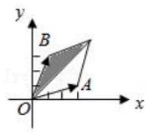

B.

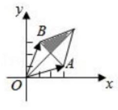

C.

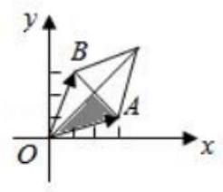

D.

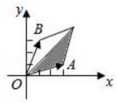

【难度】 $\star   \star   \star$

【答案】 $A$

【解析】解: $\because$ 向量 $\overrightarrow{OA} = \overrightarrow{a},\overrightarrow{OB} = \overrightarrow{b},\overrightarrow{a} = \left( {3,1}\right) ,\overrightarrow{b} = \left( {1,3}\right)$ ,

$\overrightarrow{OC} = \lambda \overrightarrow{a} + \mu \overrightarrow{b},\;\therefore \overrightarrow{OC} = \left( {{3\lambda },\lambda }\right)  + \left( {\mu ,{3\mu }}\right)  = \left( {{3\lambda } + \mu ,\lambda  + {3\mu }}\right)$ ,

$\because 0 \leq  \lambda  \leq  \mu  \leq  1,\therefore 0 \leq  {3\lambda } + \mu  \leq  4,0 \leq  \lambda  + {3\mu } \leq  4$ ,且 ${3\lambda } + \mu  \leq  \lambda  + {3\mu }$ .

故选: $A$ .

( 2 )在 $\bigtriangleup  {ABC}$ 中，若 $\overline{AD} = \frac{1}{3}\overline{AB} + \frac{1}{2}\overline{AC}$ ，记 ${S}_{1} = {S}_{\bigtriangleup {ABD}}$ ， ${S}_{2} = {S}_{\bigtriangleup {ACD}}$ ， ${S}_{3} = {S}_{\bigtriangleup {BCD}}$ ，则下列结论正确的是 ( )

A. $\frac{{S}_{3}}{{S}_{1}} = \frac{2}{3}$ B. $\frac{{S}_{2}}{{S}_{3}} = \frac{1}{2}$

C. $\frac{{S}_{2}}{{S}_{1}} = \frac{2}{3}$ D. $\frac{{S}_{1} + {S}_{2}}{{S}_{3}} = \frac{16}{3}$

【难度】 $\star   \star   \star$

【答案】 $C$

【解析】解: 如图,作 $\overrightarrow{AE} = \frac{1}{3}\overrightarrow{AB},\overrightarrow{AF} = \frac{1}{2}\overrightarrow{AC}$ ,则 $\overrightarrow{AD} = \overrightarrow{AE} + \overrightarrow{AF}$ ,

$\therefore$ 四边形 ${AEDF}$ 是平行四边形,

$\therefore {S}_{\bigtriangleup {ADE}} = {S}_{\bigtriangleup {ADF}}$ ,设 $\bigtriangleup {ABD}$ 的边 ${AB}$ 上的高为 ${h}_{1},\bigtriangleup {ACD}$ 的边 ${AC}$ 上的高为 ${h}_{2}$ ,则: $\frac{1}{2}\left| \overrightarrow{AE}\right| {h}_{1} = \frac{1}{2}\left| \overrightarrow{AF}\right| {h}_{2}$ , $\therefore \frac{1}{3} \cdot  \left( {\frac{1}{2}\left| \overrightarrow{AB}\right| {h}_{1}}\right)  = \frac{1}{2} \cdot  \left( {\frac{1}{2}\left| \overrightarrow{AC}\right| {h}_{2}}\right) ,\therefore \frac{1}{3}{S}_{1} = \frac{1}{2}{S}_{2},\therefore \frac{{S}_{2}}{{S}_{1}} = \frac{\frac{1}{3}}{\frac{1}{2}} = \frac{2}{3}$ . 故选: $C$ .

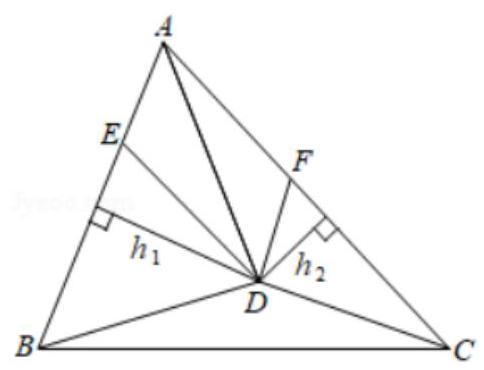

【例 3】设 $\overrightarrow{a},\overrightarrow{b},\overrightarrow{c}$ 是平面内互不平行的三个向量, $x \in  R$ ,有下列命题:

① 方程 $\overrightarrow{a}{x}^{2} + \overrightarrow{b}x + \overrightarrow{c} = \overrightarrow{0}\left( {\overrightarrow{a} \neq  \overrightarrow{0}}\right)$ 不可能有两个不同的实数解；

②方程 $\overrightarrow{a}{x}^{2} + \overrightarrow{b}x + \overrightarrow{c} = \overrightarrow{0}\left( {\overrightarrow{a} \neq  \overrightarrow{0}}\right)$ 有实数解的充要条件是 ${\overrightarrow{b}}^{2} - 4\overrightarrow{a} \cdot  \overrightarrow{c} \geq  0$ ;

③ 方程 ${\overrightarrow{a}}^{2}{x}^{2} + 2\overrightarrow{a} \cdot  \overrightarrow{b}x + {\overrightarrow{b}}^{2} = 0$ 有唯一的实数解 $x =  - \frac{\overrightarrow{b}}{\overrightarrow{a}}$ ;

④ 方程 ${\overrightarrow{a}}^{2}{x}^{2} + 2\overrightarrow{a} \cdot  \overrightarrow{b}x + {\overrightarrow{b}}^{2} = 0$ 没有实数解.

其中真命题有___. (写出所有真命题的序号)

【难度】 $\star   \star   \star   \star$

【答案】①④

【解析】解: 对于①:

对方程 $\overrightarrow{a}{x}^{2} + \overrightarrow{b}x + \overrightarrow{c} = \overrightarrow{0}\left( {\overrightarrow{a} \neq  \overrightarrow{0}}\right)$ 变形可得 $\overrightarrow{C} =  - {x}^{2}\overrightarrow{a} - x\overrightarrow{b}$ ,

由平面向量基本定理分析可得 $\overrightarrow{a}{x}^{2} + \overrightarrow{b}x + \overrightarrow{c} = \overrightarrow{0}\left( {\overrightarrow{a} \neq  \overrightarrow{0}}\right)$ 最多有一解,故①正确；

对于②:方程 $\overrightarrow{a}{x}^{2} + \overrightarrow{b}x + \overrightarrow{c} = \overrightarrow{0}\left( {\overrightarrow{a} \neq  \overrightarrow{0}}\right)$ 是关于向量的方程，不能按实数方程有解的条件来判断，故②正确；

对于③、④，方程 ${\overrightarrow{a}}^{2}{x}^{2} + 2\overrightarrow{a} \cdot  \overrightarrow{b}x + {\overrightarrow{b}}^{2} = 0$ 中， $\bigtriangleup  = 4\overrightarrow{a} \cdot  {\overrightarrow{b}}^{2} - 4{\overrightarrow{a}}^{2} \cdot  {\overrightarrow{b}}^{2}$ ，

又由 $\overrightarrow{a}\text{ 、 }\overrightarrow{b}$ 不平行,必有 $\bigtriangleup  < 0$ ,则方程 ${\overrightarrow{a}}^{2}{x}^{2} + 2\overrightarrow{a} \cdot  \overrightarrow{b}x + {\overrightarrow{b}}^{2} = 0$ 没有实数解,

故③不正确而④正确故答案为:①④.

【例 4】设 $\overrightarrow{a}$ 是已知的平面向量且 $\overrightarrow{a} \neq  0$ . 关于向量 $\overrightarrow{a}$ 的分解,有如下四个命题:

①给定向量 $\overrightarrow{b}$ ，总存在向量 $\overrightarrow{c}$ ，使 $\overrightarrow{a} = \overrightarrow{b} + \overrightarrow{c}$ ；

②给定向量 $\overrightarrow{b}$ 和 $\overrightarrow{c}$ ，总存在实数 $\lambda$ 和 $\mu$ ，使 $\overrightarrow{a} = \lambda \overrightarrow{b} + \mu \overrightarrow{c}$ ；

③ 给定单位向量 $\overrightarrow{b}$ 和正数 $\mu$ ，总存在单位向量 $\overrightarrow{c}$ 和实数 $\lambda$ ，使 $\overrightarrow{a} = \lambda \overrightarrow{b} + \mu \overrightarrow{c}$ ；

④ 给定正数 $\lambda$ 和 $\mu$ ，总存在单位向量 $\overrightarrow{b}$ 和单位向量 $\overrightarrow{c}$ ，使 $\overrightarrow{a} = \lambda \overrightarrow{b} + \mu \overrightarrow{c}$ .

上述命题中的向量 $\overrightarrow{b},\overrightarrow{c}$ 和 $\overrightarrow{a}$ 在同一平面内且两两不共线,则真命题的个数是( )

A. 1 B. 2 C. 3 D. 4

【难度】★★★★

【答案】 $B$

【解析】解: $\because$ 向量 $\overrightarrow{b},\overrightarrow{c}$ 和 $\overrightarrow{a}$ 在同一平面内且两两不共线,

①给定向量 $\overrightarrow{b}$ ，总存在向量 $\overrightarrow{c} = \overrightarrow{a} - \overrightarrow{b}$ ，使 $\overrightarrow{a} = \overrightarrow{b} + \overrightarrow{c}$ ，故①正确；

②由向量 $\overrightarrow{b}$ ， $\overrightarrow{c}$ 和 $\overrightarrow{a}$ 在同一平面内且两两不共线，故给定向量 $\overrightarrow{b}$ 和 $\overrightarrow{c}$ ，总存在实数 $\lambda$ 和 $\mu$ ，使 $\overrightarrow{a} = \lambda \overrightarrow{b} + \mu \overrightarrow{cc}$ ， 故②正确；

③给定单位向量 $\overrightarrow{b}$ 和正数 $\mu$ ，不一定存在单位向量 $\overrightarrow{c}$ 和实数 $\lambda$ ，使 $\overrightarrow{a} = \lambda \overrightarrow{b} + \mu \overrightarrow{c}$ ，故③错误；

④当 $\lambda  = \mu  = 1,\left| \overrightarrow{a}\right|  > 2$ 时,不总存在单位向量 $\overrightarrow{b}$ 和单位向量 $\overrightarrow{c}$ ,使 $\overrightarrow{a} = \lambda \overrightarrow{b} + \mu \overrightarrow{c}$ ,故④错误.

故真命题的个数是 2 个,

故选: $B$ .

【例 5】( 1 )给定两个长度为 1 的平面向量 $\overrightarrow{OA}$ 和 $\overrightarrow{OB}$ ，它们的夹角为 ${120}^{ \circ  }$ 如图所示，点 $C$ 在以 $O$ 为圆心的圆弧 $\overset{\text{ ⏜ }}{AB}$ 上变动. 若 $\overrightarrow{OC} = x\overrightarrow{OA} + y\overrightarrow{OB}$ ,其中 $x, y \in  R$ ,则 $x + y$ 的最大值是(   )

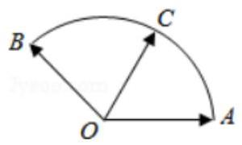

A. $\sqrt{2}$ B. 2 C. $\sqrt{3}$ D. 3

【难度】 $\star   \star   \star   \star$

【答案】 $B$

【解析】解: 如图,以 $O$ 为坐标原点,直线 ${OA}$ 为 $x$ 轴,建立平面直角坐标系,则: $A\left( {1,0}\right) ,\;B\left( {-\frac{1}{2},\frac{\sqrt{3}}{2}}\right)$ ,设 $\angle {AOC} = \theta ,{0}^{ \circ  } \leq  \theta  \leq  {120}^{ \circ  },\therefore C\left( {\cos \theta ,\sin \theta }\right)$ ;

$\therefore \overrightarrow{OC} = x\overrightarrow{OA} + y\overrightarrow{OB} = \left( {x,0}\right)  + \left( {-\frac{y}{2},\frac{\sqrt{3}y}{2}}\right)  = \left( {x - \frac{y}{2},\frac{\sqrt{3}y}{2}}\right)  = \left( {\cos \theta ,\sin \theta }\right)$ ;

$\therefore \left\{  {\begin{array}{l} x - \frac{y}{2} = \cos \theta \\  \frac{\sqrt{3}y}{2} = \sin \theta  \end{array};\therefore \left\{  {\begin{array}{l} x = \frac{\sqrt{3}}{3}\sin \theta  + \cos \theta \\  y = \frac{2\sqrt{3}}{3}\sin \theta  \end{array};\therefore x + y = \sqrt{3}\sin \theta  + \cos \theta  = 2\sin \left( {\theta  + {30}^{ \circ  }}\right) ;}\right. }\right.$

$\because {0}^{ \circ  } \leq  \theta  \leq  {120}^{ \circ  };\therefore {30}^{ \circ  } \leq  \theta  + {30}^{ \circ  } \leq  {150}^{ \circ  };\therefore \theta  + {30}^{ \circ  } = {90}^{ \circ  }$ ,即 $\theta  = {60}^{ \circ  }$ 时 $x + y$ 取最大值 2 .

故选: $B$ .

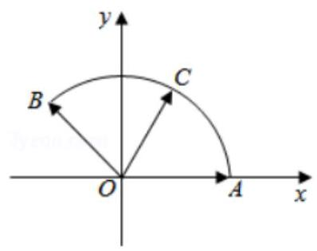

(2)在直角 $\bigtriangleup {ABC}$ 中， $\angle A = \frac{\pi }{2}$ ， ${AB} = 2$ ， ${AC} = 4$ ， $M$ 是 $\bigtriangleup {ABC}$ 内一点，且 ${AM} = \frac{1}{2}$ ，若 $\overrightarrow{AM} = \lambda \overrightarrow{AB} + \mu \overrightarrow{AC}\left( {\lambda ,\mu  \in  R}\right)$ ，则 $\lambda  + {2\mu }$ 的最大值为 ___.

【难度】 $\star   \star   \star   \star$

【答案】 $\frac{\sqrt{2}}{4}$

【解析】解: 建立如图平面直角坐标系,则 $A\left( {0,0}\right) , B\left( {0,2}\right) , C\left( {4,0}\right)$ ,

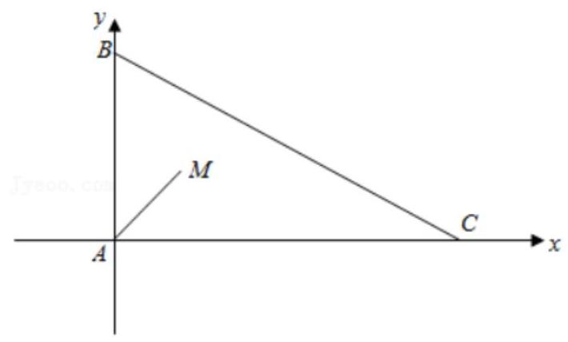

$M\left( {\frac{1}{2}\cos \theta ,\frac{1}{2}\sin \theta }\right) ,\;\left( {0 < \theta  < \frac{\pi }{2}}\right) ,$

$\because \overrightarrow{AM} = \lambda \overrightarrow{AB} + \mu \overrightarrow{AC}\left( {\lambda ,\mu  \in  R}\right) ,\therefore \left( {\frac{1}{2}\cos \theta ,\frac{1}{2}\sin \theta }\right)  = \lambda \left( {0,2}\right)  + \mu \left( {4,0}\right)$ ,

$\therefore \frac{1}{2}\cos \theta  = {4\mu },\frac{1}{2}\sin \theta  = {2\lambda },\therefore \lambda  + {2\mu } = \frac{1}{4}\left( {\sin \theta  + \cos \theta }\right)  = \frac{\sqrt{2}}{4}\sin \left( {\theta  + \frac{\pi }{4}}\right)$ ,

由 $0 < \theta  < \frac{\pi }{2}$ 得 $\frac{\pi }{4} < \theta  + \frac{\pi }{4} < \frac{3\pi }{4},\therefore \frac{\sqrt{2}}{2} < \sin \left( {\theta  + \frac{\pi }{4}}\right)  \leq  1,\therefore \frac{1}{4} < \lambda  + {2\mu } \leq  \frac{\sqrt{2}}{4}$ , 则 $\lambda  + {2\mu }$ 的最大值为 $\frac{\sqrt{2}}{4}$ ，故答案为: $\frac{\sqrt{2}}{4}$ .

(3)如图所示，在边长为 2 的正六边形 ${ABCDEF}$ 中，动圆 $Q$ 的半径为 1，圆心在线段 ${CD}$ (含端点)上运动， $P$ 是圆 $Q$ 上及内部的动点，设向量 $\overrightarrow{AP} = m\overrightarrow{AB} + n\overrightarrow{AF}$ ( $m$ 、 $n$ 为实数)，则 $m + n$ 的最大值为___.

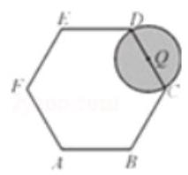

【难度】★★★★

【答案】 5

【解析】解: 如图所示, $\overrightarrow{AP} = m\overrightarrow{AB} + n\overrightarrow{AF}$ .

$\therefore \overrightarrow{AP} \cdot  \overrightarrow{AE} = m\overrightarrow{AB} \cdot  \overrightarrow{AE} + n\overrightarrow{AF} \cdot  \overrightarrow{AE} = n\overrightarrow{AF} \cdot  \overrightarrow{AE} = n\left| \overrightarrow{AF}\right| \left| \overrightarrow{AE}\right| \cos \angle {FAE} = {6n}$ ①

同理, $\overrightarrow{AP} \cdot  \overrightarrow{AC} = {6m}$ ②

① + ②得: $\overrightarrow{AP} \cdot  \left( {\overrightarrow{AE} + \overrightarrow{AC}}\right)  = 6\left( {m + n}\right)$ ；

$\because \overrightarrow{AE} + \overrightarrow{AC} = 2\overrightarrow{AO},\therefore 2\overrightarrow{AP} \cdot  \overrightarrow{AO} = 6\left( {m + n}\right)$ .

$\because \overrightarrow{AP} \cdot  \overrightarrow{AO} = \left| \overrightarrow{AP}\right| \left| \overrightarrow{AO}\right| \cos \angle {PAO} = 3\left| \overrightarrow{AP}\right| \cos \angle {PAO}$ .

$\therefore m + n = \left| \overrightarrow{AP}\right| \cos \angle {PAO}$ ,其几何意义就是 $\overrightarrow{AP}$ 在 $\overrightarrow{AO}$ 上的投影.

$\therefore m + n$ 的最大值就转化为求 $\overrightarrow{AP}$ 在 $\overrightarrow{AO}$ 上投影最大值.

从图形上可以看出: 当点 $Q$ 和 $D$ 点重合时, $\overrightarrow{AP}$ 在 $\overrightarrow{AO}$ 上的投影取到最大值 5 .

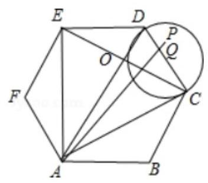

## 巩固训练

1、如图，在 $\bigtriangleup {ABC}$ 中，已知 ${AB} = 2,{BC} = 3,\angle {ABC} = {60}^{ \circ  }$ ，

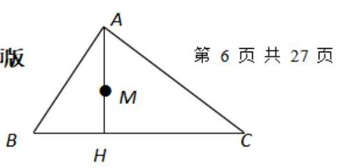

${AH} \bot  {BC}$ 于 $H$ ， $M$ 为 ${AH}$ 的中点，若 $\overrightarrow{AM} = \lambda \overrightarrow{AB} + \mu \overrightarrow{BC}$ ，

平面向量的分解定理与应用一教师版则 $\lambda  + \mu  =$ ___。

【难度】 $\star   \star   \star   \star$

【答案】 $\frac{2}{3}$

【解析】 ${AB} = 2,{BC} = 3,\angle {ABC} = {60}^{ \circ  }$

所以 $\mathrm{{BH}} = 1, M$ 为 ${AH}$ 的中点,所以

$\overrightarrow{AM} = \frac{1}{2}\overrightarrow{AH} = \frac{1}{2}\left( {\overrightarrow{AB} + \overrightarrow{BH}}\right)  = \frac{1}{2}\left( {\overrightarrow{AB} + \frac{1}{3}\overrightarrow{BC}}\right)  = \frac{1}{2}\overrightarrow{AB} + \frac{1}{6}\overrightarrow{BC}\;\lambda  + \mu  = \frac{2}{3}$

2、如图,设 $\mathrm{P}\text{ 、 }\mathrm{Q}$ 为 $\Delta \mathrm{{ABC}}$ 内的两点,且 $\overrightarrow{AP} = \frac{2}{5}\overrightarrow{AB} + \frac{1}{5}\overrightarrow{AC},\overrightarrow{AQ} = \frac{2}{3}\overrightarrow{AB} + \frac{1}{4}\overrightarrow{AC}$ ,则 $\Delta {ABP}$ 的面积与 ${\Delta ABQ}$ 的面积之比为 ( )

$A\text{ 、 }\frac{1}{5} \; B\text{ 、 }\frac{4}{5}$ C. $\frac{1}{4}$ D. $\frac{1}{3}$

【难度】

【答案】B

【解析】如图,设 $\overrightarrow{AM} = \frac{2}{5}\overrightarrow{AB},\overrightarrow{AN} = \frac{1}{5}\overrightarrow{AC}$ 则 $\overrightarrow{AP} = \overrightarrow{AM} + \overrightarrow{AN}$ 由平行四边形法则知 $\mathrm{{NP}}//\mathrm{{AB}}$ ,所以 $\frac{\Delta ABP}{\Delta ABC} = \frac{\left| \overline{AN}\right| }{\left| \overline{AC}\right| } = \frac{1}{5}$ ,同理可得 $\frac{\Delta ABQ}{\Delta ABC} = \frac{1}{4}$ 。

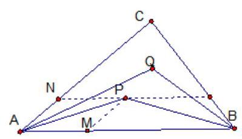

故 $\frac{\bigtriangleup {ABP}}{\bigtriangleup {ABQ}} = \frac{4}{5}$ ,即选 B.

3、在平面直角坐标系 ${xOy}$ 中,点 $A\left( {5,0}\right)$ ,对于某个正实数 $k$ ,存在函数 $f\left( x\right)  = a{x}^{2}\left( {a > 0}\right)$ ,使得 $\overrightarrow{OP} = \lambda  \cdot  \left( {\frac{\overrightarrow{OA}}{\left| \overrightarrow{OA}\right| } + \frac{\overrightarrow{OQ}}{\left| \overrightarrow{OQ}\right| }}\right) \left( {\lambda \text{ 为常数 }}\right)$ ,这里点 $P\text{ 、 }Q$ 的坐标分别为 $P\left( {1, f\left( 1\right) }\right) , Q\left( {k, f\left( k\right) }\right)$ ,则 $k$ 的取值范围为( )

A. $\left( {2, + \infty }\right)$ B. $\left( {3, + \infty }\right)$ C. $\lbrack 4, + \infty )$ D. $\lbrack 8, + \infty )$

【难度】 $\star   \star   \star   \star$

【答案】 $A$

【解析】解: 由题设知,点 $P\left( {1, a}\right) , Q\left( {k, a{k}^{2}}\right) , A\left( {5,0}\right)$ ,

$\therefore$ 向量 $\overrightarrow{OP} = \left( {1, a}\right) ,\overrightarrow{OA} = \left( {5,0}\right) ,\overrightarrow{OQ} = \left( {k, a{k}^{2}}\right)$ ,

$\therefore \frac{\overrightarrow{OA}}{\left| \overrightarrow{OA}\right| } = \left( {1,0}\right) ,\frac{\overrightarrow{OQ}}{\left| \overrightarrow{OQ}\right| } = \left( {\frac{1}{\sqrt{1 + {a}^{2}{k}^{2}}},\frac{ak}{\sqrt{1 + {a}^{2}{k}^{2}}}}\right)$ ,

$\because \overrightarrow{OP} = \lambda  \cdot  \left( {\frac{\overrightarrow{OA}}{\left| \overrightarrow{OA}\right| } + \frac{\overrightarrow{OQ}}{\left| \overrightarrow{OQ}\right| }}\right) \left( {\lambda \text{ 为常数 }}\right) ,\therefore 1 = \lambda \left( {1 + \frac{1}{\sqrt{1 + {a}^{2}{k}^{2}}}}\right) , a = \frac{ak\lambda }{\sqrt{1 + {a}^{2}{k}^{2}}}$ ,

两式相除得, $\frac{1}{a} = \left( {1 + \frac{1}{\sqrt{1 + {a}^{2}{k}^{2}}}}\right)  \times  \frac{\sqrt{1 + {a}^{2}{k}^{2}}}{ak}$ ,整理,得: $k - 1 = \sqrt{1 + {a}^{2}{k}^{2}}, k - 2 = {a}^{2}k > 0$

$\therefore k\left( {1 - {a}^{2}}\right)  = 2$ ,且 $k > 2.\therefore k = \frac{2}{1 - {a}^{2}}$ ,且 $0 < 1 - {a}^{2} < 1.\therefore k = \frac{2}{1 - {a}^{2}} > 2$ .

故选: $A$ .

4、已知棱长为 1 的正方体 ${ABCD} - {A}_{1}{B}_{1}{C}_{1}{D}_{1}$ 中，点 $E$ 为侧面 $B{B}_{1}{C}_{1}C$ 的中心，点 $F$ 在棱 ${AD}$ 上运动，正方体表面上的点 $P$ 满足 $\overrightarrow{{D}_{1}P} = \lambda \overrightarrow{{D}_{1}F} + \mu \overrightarrow{{D}_{1}E}\left( {\lambda  \geq  0,\mu  \geq  0}\right)$ ，则所有满足条件的点 $P$ 构成图形的面积为___.

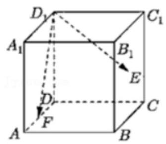

【难度】 $\star   \star   \star   \star$

【答案】 $\frac{11}{8}$

【解析】解: $\because \overrightarrow{{D}_{1}P} = \lambda \overrightarrow{{D}_{1}F} + \mu \overrightarrow{{D}_{1}E}\left( {\lambda  \geq  0,\mu  \geq  0}\right)$ ,

$\therefore {D}_{1}, E, F,{P\Omega }$ 点共面,

设 ${D}_{1}, E, F, P$ 四点确定的平面为 $\alpha$ ,则 $\alpha$ 与面 $B{B}_{1}{C}_{1}C$ 的交线与 ${D}_{1}F$ 平行.

① 当 $F$ 与 $D$ 重合时,取 ${BC}$ 的中点 $M$ ,连接 ${EM},{DM}$ ,则 ${EM}//{D}_{1}F$ ,

则此时 $P$ 的轨迹为折线 ${D}_{1} - D - M - E$ .

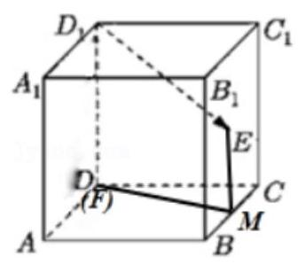

② 当 $F$ 与 $A$ 重合时，连接 ${EB}$ ，则 ${EB}//{{D}_{1}F}$ ，

则此时 $P$ 的轨迹为折线 ${D}_{1} - A - B - E$ .

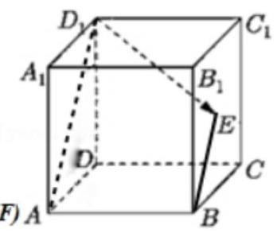

$\therefore$ 当 $F$ 在棱 ${AD}$ 上运动时,符合条件的 $P$ 点在正方体表面围成的图形为 ${Rt} \bigtriangleup  {D}_{1}{AD}$ ,直角梯形 ${ABMD}$ , Rt $\Delta$ BME. $\therefore S = \frac{1}{2} \times  1 \times  1 + \frac{1}{2} \times  \left( {\frac{1}{2} + 1}\right)  \times  1 + \frac{1}{2} \times  \frac{1}{2} \times  \frac{1}{2} = \frac{11}{8}$ . 故答案为: $\frac{11}{8}$ .

## (二)平面向量与三角形 “四心”

## 知识梳理

## 二、平面向量与三角形 “四心”

1、三角形的四 “心”

1. 重心: 三角形三条中线交点.

2. 外心: 三角形三边垂直平分线相交于一点. 这一点为三角形外接圆的圆心, 称外心。

3. 内心: 三角形三内角的平分线相交于一点. 是三角形的内切圆的圆心, 称内心。

4. 垂心:三角形三边上的高相交于一点.

2、重心的性质:

(1)在 $\bigtriangleup  \mathrm{{ABC}}$ 中，中线 $\mathrm{{AD}}$ 交 $\mathrm{{BC}}$ 于 $\mathrm{D}$ ， $\mathrm{G}$ 是重心，则 $\mathrm{{AG}} = 2\mathrm{{GD}}$

(2)在 $\bigtriangleup {ABC}$ 中， $A\left( {{x}_{1},{y}_{1}}\right) B\left( {{x}_{2},{y}_{2}}\right) C\left( {{x}_{3},{y}_{3}}\right)$ 的重心 $G$ 坐标公式 $\left\{  \begin{array}{l} x = \frac{{x}_{1} + {x}_{2} + {x}_{3}}{3} \\  y = \frac{{y}_{1} + {y}_{2} + {y}_{3}}{3} \end{array}\right.$

(3)若0是三角形ABC的重心，则 ${S}_{\Delta BOC} = {S}_{\Delta AOC} = {S}_{\Delta AOB} = \frac{1}{3}{S}_{\Delta ABC}$

(4)内角平分线定理:: 在 $\bigtriangleup  \mathrm{{ABC}}$ 中， $\mathrm{{AD}}$ 是交 $\mathrm{A}$ 的平分线 $\mathrm{{BC}}$ 于 $\mathrm{D}$ ,则 $\frac{BD}{CD} = \frac{AB}{AC}$

3、三角形五 “心” 向量形式的充要条件

设 $O$ 为 $\bigtriangleup {ABC}$ 所在平面上一点,角 $A, B, C$ 所对边长分别为 $a, b, c$ ,则

(1) $O$ 为 $\bigtriangleup {ABC}$ 的外心 $\Leftrightarrow  {\overrightarrow{OA}}^{2} = {\overrightarrow{OB}}^{2} = {\overrightarrow{OC}}^{2}$ .

(2) $O$ 为 $\bigtriangleup {ABC}$ 的重心 $\Leftrightarrow  \overrightarrow{OA} + \overrightarrow{OB} + \overrightarrow{OC} = \overrightarrow{0}$ .

(3) $O$ 为 $\bigtriangleup {ABC}$ 的垂心 $\Leftrightarrow  \overrightarrow{OA} \cdot  \overrightarrow{OB} = \overrightarrow{OB} \cdot  \overrightarrow{OC} = \overrightarrow{OC} \cdot  \overrightarrow{OA}$ .

(4) $O$ 为 $\bigtriangleup {ABC}$ 的内心

$\Leftrightarrow  \overrightarrow{OA} \bullet  \left( {\frac{\overrightarrow{AB}}{\left| \overrightarrow{AB}\right| } - \frac{\overrightarrow{AC}}{\left| \overrightarrow{AC}\right| }}\right)  = \overrightarrow{OB} \bullet  \left( {\frac{\overrightarrow{BA}}{\left| \overrightarrow{BA}\right| } - \frac{\overrightarrow{BC}}{\left| \overrightarrow{BC}\right| }}\right)  = \overrightarrow{OC} \bullet  \left( {\frac{\overrightarrow{CA}}{\left| \overrightarrow{CA}\right| } - \frac{\overrightarrow{CB}}{\left| \overrightarrow{CB}\right| }}\right)  = \overrightarrow{0}$

$\Leftrightarrow  a\overrightarrow{OA} + b\overrightarrow{OB} + c\overrightarrow{OC} = \overrightarrow{0}$ .

## 例题精讲

【例 6】( 1 )已知 $\mathrm{O}$ 是 $\bigtriangleup \mathrm{{ABC}}$ 所在平面上的一点,若 $\overrightarrow{OA} + \overrightarrow{OB} + \overrightarrow{OC} = \mathbf{0}$ ,则 $\mathrm{O}$ 点是 $\bigtriangleup \mathrm{{ABC}}$ 的 ( $\mathrm{C}$ )

A. 外心 B. 内心 C. 重心 D. 垂心

【难度】★★★

【答案】C

【解析】用坐标运算或者分解

(2)已知 $\mathrm{O}$ 是 $\bigtriangleup  \mathrm{{ABC}}$ 所在平面上的一点，若 $\overrightarrow{OA} \cdot  \overrightarrow{OB} = \overrightarrow{OB} \cdot  \overrightarrow{OC} = \overrightarrow{OC} \cdot  \overrightarrow{OA}$ ，则 $\mathrm{O}$ 点是 $\bigtriangleup  \mathrm{{ABC}}$ 的( )

A. 外心 B. 内心 C. 重心 D. 垂心

【难度】 $\star   \star   \star$

【答案】D

【解析】由 $\overrightarrow{OA} \cdot  \overrightarrow{OB} = \overrightarrow{OB} \cdot  \overrightarrow{OC}$ ,则 $\overrightarrow{OA} \cdot  \overrightarrow{OB} - \overrightarrow{OB} \cdot  \overrightarrow{OC} = 0$ ,即 $\overrightarrow{OB} \cdot  \left( {\overrightarrow{OA} - \overrightarrow{OC}}\right)  = 0$ ,

得 $\overrightarrow{OB} \cdot  \overrightarrow{CA} = 0$ ,所以 $\overrightarrow{OB} \bot  \overrightarrow{CA}$ . 同理可证 $\overrightarrow{OC} \bot  \overrightarrow{AB},\overrightarrow{OA} \bot  \overrightarrow{BC}$ .

$\therefore \mathrm{O}$ 是 $\bigtriangleup  \mathrm{{ABC}}$ 的垂心. 选 D.

(3)已知 $\mathrm{O}$ 是 $\bigtriangleup  \mathrm{{ABC}}$ 所在平面上的一点，若 $\left( {\overrightarrow{OA} + \overrightarrow{OB}}\right)  \cdot  \overrightarrow{AB} = \left( {\overrightarrow{OB} + \overrightarrow{OC}}\right)  \cdot  \overrightarrow{BC} = \left( {\overrightarrow{OC} + \overrightarrow{OA}}\right)  \cdot  \overrightarrow{CA} = 0$ ，则 $\mathrm{O}$ 点是 $\bigtriangleup  \mathrm{{ABC}}$ 的( )

A. 外心 B. 内心 C. 重心 D. 垂心

【难度】 $\star   \star   \star$

【答案】A

【解析】由已知得:

$\left( {\overrightarrow{OA} + \overrightarrow{OB}}\right)  \cdot  \left( {\overrightarrow{OB} - \overrightarrow{OA}}\right)  = \left( {\overrightarrow{OB} + \overrightarrow{OC}}\right)  \cdot  \left( {\overrightarrow{OC} - \overrightarrow{OB}}\right)  = \left( {\overrightarrow{OC} + \overrightarrow{OA}}\right)  \cdot  \left( {\overrightarrow{OA} - \overrightarrow{OC}}\right)  = 0$

$\Leftrightarrow  {\overrightarrow{OB}}^{2} - {\overrightarrow{OA}}^{2} = {\overrightarrow{OC}}^{2} - {\overrightarrow{OB}}^{2} = {\overrightarrow{OA}}^{2} - {\overrightarrow{OC}}^{2} = 0$

$\Leftrightarrow  \overrightarrow{OA} \mid   =  \mid  \overrightarrow{OB} \mid   = \left| \overrightarrow{OC}\right|$ . 所以 O 点是 $\bigtriangleup  \mathrm{{ABC}}$ 的外心. 选 A.

(4)已知 $\mathrm{O}$ 是平面上一定点， $\mathrm{A}$ 、 $\mathrm{B}$ 、 $\mathrm{C}$ 是平面上不共线的三个点，动点 $\mathrm{P}$ 满足 $\overrightarrow{OP} = \overrightarrow{OA} + \lambda \left( {\frac{\overrightarrow{AB}}{\left| \overrightarrow{AB}\right| } + \frac{\overrightarrow{AC}}{\left| \overrightarrow{AC}\right| }}\right)$ ， $\lambda  \in  \lbrack 0, + \infty )$ . 则 $\mathrm{P}$ 点的轨迹一定通过 $\bigtriangleup \mathrm{{ABC}}$ 的

A. 外心 B. 内心 C. 重心 D. 垂心

【难度】

【答案】B

【解析】由已知得 $\overrightarrow{AP} = \lambda \left( {\frac{\overrightarrow{AB}}{\left| \overrightarrow{AB}\right| } + \frac{\overrightarrow{AC}}{\left| \overrightarrow{AC}\right| }}\right) ,\frac{\overrightarrow{AB}}{\left| \overrightarrow{AB}\right| }$ 是 $\overrightarrow{AB}$ 方向上的单位向量, $\frac{\overrightarrow{AC}}{\left| \overrightarrow{AC}\right| }$ 是 $\overrightarrow{AC}$ 方向上的单位向量,根据平行四边形法则知构成菱形,点 $\mathrm{P}$ 在 $\angle \mathrm{{BAC}}$ 的角平分线上,故点 $\mathrm{P}$ 的轨迹过 $\bigtriangleup \mathrm{{ABC}}$ 的内心,选B.

【例 7】(1)已知 $\mathrm{O}$ 是平面上的一定点， $\mathrm{A}$ 、 $\mathrm{B}$ 、 $\mathrm{C}$ 是平面上不共线的三个点，动点 $\mathrm{P}$ 满足 $\overrightarrow{OP} = \overrightarrow{OA} + \lambda \left( {\frac{\overrightarrow{AB}}{\left| \overrightarrow{AB}\right| \sin B} + \frac{\overrightarrow{AC}}{\left| \overrightarrow{AC}\right| \sin C}}\right) ,\lambda  \in  \lbrack 0, + \infty )$ ，则动点 $\mathrm{P}$ 的轨迹一定通过 $\bigtriangleup \mathrm{{ABC}}$ 的 ( )

A. 重心 B. 垂心 C. 外心 D. 内心

【难度】 $\star   \star   \star   \star$

【答案】A

【解析】由已知得 $\overrightarrow{AP} = \lambda \left( {\frac{\overrightarrow{AB}}{\left| \overrightarrow{AB}\right| \sin B} + \frac{\overrightarrow{AC}}{\left| \overrightarrow{AC}\right| \sin C}}\right)$ ,

由正弦定理知 $\left| \overrightarrow{AB}\right| \sin B = \left| \overrightarrow{AC}\right| \sin C,\therefore \overrightarrow{AP} = \frac{\lambda }{\left| \overrightarrow{AB}\right| \sin B}\left( {\overrightarrow{AB} + \overrightarrow{AC}}\right)$ ,

设 ${BC}$ 的中点为 $D$ ,则由平行四边形法则可知点 $P$ 在 ${BC}$ 的中线 ${AD}$ 所在的射线上,所以动点 $P$ 的轨迹一定通过 $\bigtriangleup  \mathrm{{ABC}}$ 的重心,故选 A.

(2)已知 $\mathrm{O}$ 是平面上的一定点， $\mathrm{A}$ 、 $\mathrm{B}$ 、 $\mathrm{C}$ 是平面上不共线的三个点，动点 $\mathrm{P}$ 满足 $\overrightarrow{OP} = \overrightarrow{OA} + \lambda \left( {\frac{\overrightarrow{AB}}{\left| \overrightarrow{AB}\right| \cos B} + \frac{\overrightarrow{AC}}{\left| \overrightarrow{AC}\right| \cos C}}\right) ,\lambda  \in  \lbrack 0, + \infty )$ ，则动点 $\mathrm{P}$ 的轨迹一定通过 $\bigtriangleup \mathrm{{ABC}}$ 的 ( )

A. 重心 B. 垂心 C. 外心 D. 内心

【难度】★★★★

【答案】B

【解析】由已知得 $\overrightarrow{AP} = \lambda \left( {\frac{\overrightarrow{AB}}{\left| \overrightarrow{AB}\right| \cos B} + \frac{\overrightarrow{AC}}{\left| \overrightarrow{AC}\right| \cos C}}\right)$ ,

$\therefore \overrightarrow{AP} \cdot  \overrightarrow{BC} = \lambda \left( {\frac{\overrightarrow{AB} \cdot  \overrightarrow{BC}}{\left| \overrightarrow{AB}\right| \cos B} + \frac{\overrightarrow{AC} \cdot  \overrightarrow{BC}}{\left| \overrightarrow{AC}\right| \cos C}}\right)  = \lambda \left( {\frac{\left| \overrightarrow{AB}\right|  \cdot  \left| \overrightarrow{BC}\right| \cos \left( {\pi  - B}\right) }{\left| \overrightarrow{AB}\right| \cos B} + \frac{\left| \overrightarrow{AC}\right|  \cdot  \left| \overrightarrow{BC}\right| \cos C}{\left| \overrightarrow{AC}\right| \cos C}}\right)  = \; \lambda \left( {-\left| \overrightarrow{BC}\right|  + \left| \overrightarrow{BC}\right| }\right)  = 0,$

$\therefore \overrightarrow{AP} \bot  \overrightarrow{BC}$ ,即 $\mathrm{{AP}} \bot  \mathrm{{BC}}$ ,所以动点 $\mathrm{P}$ 的轨迹通过 $\bigtriangleup  \mathrm{{ABC}}$ 的垂心,选 B.

(3)已知 $\mathrm{O}$ 是平面上的一定点， $\mathrm{A}$ 、 $\mathrm{B}$ 、 $\mathrm{C}$ 是平面上不共线的三个点，动点 $\mathrm{P}$ 满足 $\overrightarrow{OP} = \frac{\overrightarrow{OB} + \overrightarrow{OC}}{2} + \lambda \left( {\frac{\overrightarrow{AB}}{\left| \overrightarrow{AB}\right| \cos B} + \frac{\overrightarrow{AC}}{\left| \overrightarrow{AC}\right| \cos C}}\right) ,\lambda  \in  \lbrack 0, + \infty )$ ，则动点 $\mathrm{P}$ 的轨迹一定通过 $\bigtriangleup  \mathrm{{ABC}}$ 的 ( )

A. 重心 B. 垂心 C. 外心 D. 内心

【难度】 $\star   \star   \star   \star$

【答案】C

【解析】设 $\mathrm{{BC}}$ 的中点为 $\mathrm{D}$ ,则 $\frac{\overrightarrow{OB} + \overrightarrow{OC}}{2} = \overrightarrow{OD}$ ,

则由已知得 $\overrightarrow{DP} = \lambda \left( {\frac{\overrightarrow{AB}}{\left| \overrightarrow{AB}\right| \cos B} + \frac{\overrightarrow{AC}}{\left| \overrightarrow{AC}\right| \cos C}}\right)$ ,

$\therefore \overrightarrow{DP} \cdot  \overrightarrow{BC} = \lambda \left( {\frac{\overrightarrow{AB} \cdot  \overrightarrow{BC}}{\left| \overrightarrow{AB}\right| \cos B} + \frac{\overrightarrow{AC} \cdot  \overrightarrow{BC}}{\left| \overrightarrow{AC}\right|  \cdot  \cos C}}\right)$

$= \lambda \left( {\frac{\left| \overrightarrow{AB}\right|  \cdot  \left| \overrightarrow{BC}\right| \cos \left( {\pi  - B}\right) }{\left| \overrightarrow{AB}\right| \cos B} + \frac{\left| \overrightarrow{AC}\right|  \cdot  \left| \overrightarrow{BC}\right| \cos C}{\left| \overrightarrow{AC}\right| \cos C}}\right)  = \lambda \left( {-\left| \overrightarrow{BC}\right|  + \left| \overrightarrow{BC}\right| }\right)  = 0.$

$\therefore$ DP $\bot$ BC, P点在 BC 的垂直平分线上,故动点 P 的轨迹通过 $\bigtriangleup  \mathrm{{ABC}}$ 的外心. 选 C.

(4)三个不共线的向量 $\overrightarrow{OA},\overrightarrow{OB},\overrightarrow{OC}$ 满足 $\overrightarrow{OA} \cdot  \left( {\frac{\overrightarrow{AB}}{\left| \overrightarrow{AB}\right| } + \frac{\overrightarrow{CA}}{\left| \overrightarrow{CA}\right| }}\right)  = \overrightarrow{OB} \cdot  \left( {\frac{\overrightarrow{BA}}{\left| \overrightarrow{BA}\right| } + \frac{\overrightarrow{CB}}{\left| \overrightarrow{CB}\right| }}\right)  = \overrightarrow{OC} \cdot  \left( {\frac{\overrightarrow{BC}}{\left| \overrightarrow{BC}\right| } + \frac{\overrightarrow{CA}}{\left| \overrightarrow{CA}\right| }}\right)  = 0$ , 则 0 点是 $\bigtriangleup  \mathrm{{ABC}}$ 的( )

A. 垂心 B. 重心 C. 内心 D. 外心

【难度】★★★★

【答案】C

【解析】 $\frac{\overrightarrow{AB}}{\left| \overrightarrow{AB}\right| } + \frac{\overrightarrow{CA}}{\left| \overrightarrow{CA}\right| }$ 表示与 $\bigtriangleup \mathrm{{ABC}}$ 中 $\angle \mathrm{A}$ 的外角平分线共线的向量,由 $\overrightarrow{OA} \cdot  \left( {\frac{\overrightarrow{AB}}{\left| \overrightarrow{AB}\right| } + \frac{\overrightarrow{CA}}{\left| \overrightarrow{CA}\right| }}\right)  = 0$ 知 $\mathrm{{OA}}$ 垂直 $\angle \mathrm{A}$ 的外角平分线,因而OA是 $\angle \mathrm{A}$ 的平分线,同理, $\mathrm{{OB}}$ 和 $\mathrm{{OC}}$ 分别是 $\angle \mathrm{B}$ 和 $\angle \mathrm{C}$ 的平分线,故选C.

## 巩固训练

1、已知 0 是 $\bigtriangleup  \mathrm{{ABC}}$ 所在平面上的一点，若 $\overrightarrow{PO} = \frac{1}{3}\left( {\overrightarrow{PA} + \overrightarrow{PB} + \overrightarrow{PC}}\right)$ (其中 P 为平面上任意一点)，则 0 点是 $\bigtriangleup  \mathrm{{ABC}}$ 的( )

A. 外心 B. 内心 C. 重心 D. 垂心

【难度】 $\star   \star   \star$

【答案】C

【解析】由已知得 $3\overrightarrow{PO} = \overrightarrow{OA} - \overrightarrow{OP} + \overrightarrow{OB} - \overrightarrow{OP} + \overrightarrow{OC} - \overrightarrow{OP}$ ,

$\therefore 3\overrightarrow{PO} + 3\overrightarrow{OP} = \overrightarrow{OA} + \overrightarrow{OB} + \overrightarrow{OC}$ ,即 $\overrightarrow{OA} + \overrightarrow{OB} + \overrightarrow{OC} = 0$ ,由上题的结论知 0 点是 $\bigtriangleup  \mathrm{{ABC}}$ 的重心. 故选 C .

2、已知 0 为 $\bigtriangleup {ABC}$ 所在平面内一点,满足 ${\left| \overrightarrow{OA}\right| }^{2} + {\left| \overrightarrow{BC}\right| }^{2} = {\left| \overrightarrow{OB}\right| }^{2} + {\left| \overrightarrow{CA}\right| }^{2} = {\left| \overrightarrow{OC}\right| }^{2} + {\left| \overrightarrow{AB}\right| }^{2}$ ,则 0 点是 $\bigtriangleup$ ABC 的( )

A. 垂心 B. 重心 C. 内心 D. 外心

【难度】

【答案】A

【解析】由已知得 ${\left| \overrightarrow{OA}\right| }^{2} - {\left| \overrightarrow{OB}\right| }^{2} = {\left| \overrightarrow{CA}\right| }^{2} - {\left| \overrightarrow{BC}\right| }^{2}$

$\Rightarrow  \left( {\overrightarrow{OA} - \overrightarrow{OB}}\right)  \cdot  \left( {\overrightarrow{OA} + \overrightarrow{OB}}\right)  = \left( {\overrightarrow{CA} - \overrightarrow{BC}}\right)  \cdot  \left( {\overrightarrow{CA} + \overrightarrow{BC}}\right)$

$\Rightarrow  \overrightarrow{BA} \cdot  \left( {\overrightarrow{OA} + \overrightarrow{OB}}\right)  = \left( {\overrightarrow{CA} + \overrightarrow{CB}}\right)  \cdot  \overrightarrow{BA} \Rightarrow  \overrightarrow{BA} \cdot  \left( {\overrightarrow{OA} + \overrightarrow{OB} + \overrightarrow{AC} + \overrightarrow{BC}}\right)  = 0$

$\Rightarrow  \overrightarrow{BA} \cdot  2\overrightarrow{OC} = 0,\therefore \overrightarrow{OC} \bot  \overrightarrow{BA}$ .

同理 $\overrightarrow{OA} \bot  \overrightarrow{CB},\overrightarrow{OB} \bot  \overrightarrow{AC}$ . 故选 A .

3、已知 0 是平面上一定点，A、B、C 是平面上不共线的三个点，动点 P 满足 $\overrightarrow{OP} = \overrightarrow{OA} + \lambda \left( {\overrightarrow{AB} + \overrightarrow{AC}}\right)$ ， $\lambda  \in  \lbrack 0, + \infty )$ . 则 $\mathrm{P}$ 点的轨迹一定通过 $\bigtriangleup \mathrm{{ABC}}$ 的 ()

A. 外心 B. 内心 C. 重心 D. 垂心

【难度】★★★★

【答案】C

【解析】由已知得 $\overrightarrow{AP} = \lambda \left( {\overrightarrow{AB} + \overrightarrow{AC}}\right)$ ,设 $\mathrm{{BC}}$ 的中点为 $\mathrm{D}$ ,则根据平行四边形法则知点 $\mathrm{P}$ 在 $\mathrm{{BC}}$ 的中线 $\mathrm{{AD}}$ 所在的射线上,故 $\mathrm{P}$ 的轨迹过 $\bigtriangleup \mathrm{{ABC}}$ 的重心,选 C.

4、已知 0 是 $\bigtriangleup  \mathrm{{ABC}}$ 所在平面上的一点，若 $a\overrightarrow{OA} + b\overrightarrow{OB} + c\overrightarrow{OC} = 0$ ，则 0 点是 $\bigtriangleup  \mathrm{{ABC}}$ 的( )

A. 外心 B. 内心 C. 重心 D. 垂心

【难度】

【答案】B

【解析】: $\overrightarrow{OB} = \overrightarrow{OA} + \overrightarrow{AB},\;\overrightarrow{OC} = \overrightarrow{OA} + \overrightarrow{AC}$ ,则 $\left( {a + b + c}\right) \overrightarrow{OA} + b\overrightarrow{AB} + c\overrightarrow{AC} = 0$ ,得 $\overrightarrow{AO} = \frac{bc}{a + b + c}\left( {\frac{\overrightarrow{AB}}{\left| \overrightarrow{AB}\right| } + \frac{\overrightarrow{AC}}{\left| \overrightarrow{AC}\right| }}\right)$ . 因为 $\frac{\overrightarrow{AB}}{\left| \overrightarrow{AB}\right| }$ 与 $\frac{\overrightarrow{AC}}{\left| \overrightarrow{AC}\right| }$ 分别为 $\overrightarrow{AB}$ 和 $\overrightarrow{AC}$ 方向上的单位向量,设 $\overrightarrow{AP} = \frac{\overrightarrow{AB}}{\left| \overrightarrow{AB}\right| } + \frac{\overrightarrow{AC}}{\left| \overrightarrow{AC}\right| }$ ,则 $\overrightarrow{AP}$ 平分 $\angle {BAC}$ . 又 $\overrightarrow{AO}\text{ 、 }\overrightarrow{AP}$ 共线,知 $\mathrm{A}0$ 平分 $\angle \mathrm{{BAC}}$ . 同理可证 $\mathrm{{BO}}$ 平分 $\angle \mathrm{{ABC}}$ , $\mathrm{{CO}}$ 平分 $\angle \mathrm{{ACB}}$ ,所以 0 点是 $\bigtriangleup  \mathrm{{ABC}}$ 的内心.

5、已知 0 是 $\bigtriangleup  \mathrm{{ABC}}$ 所在平面上的一点,若 $\overrightarrow{PO} = \frac{a\overrightarrow{PA} + b\overrightarrow{PB} + c\overrightarrow{PC}}{a + b + c}$ (其中 $\mathrm{P}$ 是 $\bigtriangleup  \mathrm{{ABC}}$ 所在平面内任意一点), 则 0 点是 $\bigtriangleup  \mathrm{{ABC}}$ 的 ( )

A. 外心 B. 内心 C. 重心 D. 垂心

【难度】★★★★

【答案】B

【解析】由已知得 $\overrightarrow{PO} = \overrightarrow{PA} + \frac{b\overrightarrow{PB} + c\overrightarrow{PC} - c\overrightarrow{PA} - b\overrightarrow{PA}}{a + b + c} = \overrightarrow{PA} + \frac{b\overrightarrow{AB} + c\overrightarrow{AC}}{a + b + c}$ ,

$\therefore \overrightarrow{AO} = \frac{b\overrightarrow{AB} + c\overrightarrow{AC}}{a + b + c} = \frac{bc}{a + b + c}\left( {\frac{\overrightarrow{AB}}{c} + \frac{\overrightarrow{AC}}{b}}\right)  = \frac{bc}{a + b + c}\left( {\frac{\overrightarrow{AB}}{\left| \overrightarrow{AB}\right| } + \frac{\overrightarrow{AC}}{\left| \overrightarrow{AC}\right| }}\right)$ ,

由上题结论知0点是 $\bigtriangleup  \mathrm{{ABC}}$ 的内心. 故选 B.

6 、已知 $O$ 为 $\bigtriangleup {ABC}$ 的外心， ${AB} = {2a},{AC} = \frac{2}{a}\left( {a > 0, a \in  R}\right) ,\angle {BAC} = {120}^{ \circ  }$ 。若 $\overrightarrow{AO} = \alpha \overrightarrow{AB} + \beta \overrightarrow{AC}\left( {\alpha ,\beta  \in  R}\right)$ ，则 $\alpha  + \beta$ 的最小值为 ( )

A、1 B、 $\sqrt{2}$ C、 $\sqrt{3}$ D、 2

【难度】 $\star   \star   \star   \star$

【答案】D

【解析】等和线法

## (三)综合应用

## 例题精讲

【例 8】已知点 0 是 $\bigtriangleup  \mathrm{{ABC}}$ 内一点， $\overrightarrow{OA} + 2\overrightarrow{OB} + 3\overrightarrow{OC} = \mathbf{0}$ ，则:

(1)△A0B 与△A0C 的面积之比为___；

(2) $\bigtriangleup  \mathrm{{ABC}}$ 与 $\bigtriangleup  \mathrm{{AOC}}$ 的面积之比为___；

【难度】★★★★

【答案】见解析

【解析】(1)将 ${OB}$ 延长至 $E$ ,使 ${OE} = {20B}$ ,将 ${OC}$ 延长至 $F$ ,使 ${OF} = {30C}$ ,则 $\overrightarrow{OA} + \overrightarrow{OE} + \overrightarrow{OF} = \mathbf{0}$ ,所以 0 是 $\bigtriangleup  \mathrm{{AEF}}$ 的重心.

$\therefore {S}_{\bigtriangleup {AOC}} = \frac{1}{3}{S}_{\bigtriangleup {AOF}} = \frac{1}{9}{S}_{\bigtriangleup {AEF}},{S}_{\bigtriangleup {AOB}} = \frac{1}{2}{S}_{\bigtriangleup {AOE}} = \frac{1}{6}{S}_{\bigtriangleup {AEF}},\therefore {S}_{\bigtriangleup {AOB}} : {S}_{\bigtriangleup {AOC}} = 3 : 2$ .

(2) $\because {S}_{\bigtriangleup {BOC}} = \frac{1}{6}{S}_{\bigtriangleup {EOF}} = \frac{1}{18}{S}_{\bigtriangleup {AEF}}$ ,

$\therefore {S}_{\bigtriangleup {ABC}} = {S}_{\bigtriangleup {AOB}} + {S}_{\bigtriangleup {AOC}} + {S}_{\bigtriangleup {BOC}} = \left( {\frac{1}{6} + \frac{1}{9} + \frac{1}{18}}\right) {S}_{\bigtriangleup {AEF}} = \frac{1}{3}{S}_{\bigtriangleup {AEF}}$ ,又 ${S}_{\bigtriangleup {AOC}} = \frac{1}{9}{S}_{\bigtriangleup {AEF}}$ ,

$\therefore {S}_{\bigtriangleup {ABC}} : {S}_{\bigtriangleup {AOC}} = 3 : 1$ .

【例 9】如图,在直角梯形 ${ABCD}$ 中, ${AB}//{CD},{AB} \bot  {BC},{AB} = 2,{CD} = 1,{BC} = a\left( {a > 0}\right) , P$ 为

线段 ${AD}$ (含端点) 上一个动点,设 $\overrightarrow{AP} = x\overrightarrow{AD},\overrightarrow{PB} \cdot  \overrightarrow{PC} = y$ ,对于函数 $y = f\left( x\right)$ ,给出以下三个结论: ① 当 $a = 2$ 时，函数 $f\left( x\right)$ 的值域为 $\left\lbrack  {1,4}\right\rbrack$ ；② 对任意 $a > 0$ ，都有 $f\left( 1\right)  = 1$ 成立；③ 对任意 $a > 0$ ， 函数 $f\left( x\right)$ 的最大值都等于 4 . ④存在实数 $a > 0$ ，使得函数 $f\left( x\right)$ 最小值为 0 。其中所有正确结论的序号是 ___.

【难度】 $\star   \star   \star   \star$

【答案】②③④

【解析】解: 如图所示,建立直角坐标系. 则 $B\left( {0,0}\right) , A\left( {2,0}\right) , C\left( {0, a}\right) , D\left( {1, a}\right)$ .

$\because \overrightarrow{AP} = x\overrightarrow{AD},\therefore \overrightarrow{BP} = \overrightarrow{BA} + x\overrightarrow{AD} = \left( {2,0}\right)  + x\left( {-1, a}\right)  = \left( {2 - x,{xa}}\right) .\therefore \overrightarrow{PB} = \left( {x - 2, - {xa}}\right)$ ,

$\overrightarrow{PC} = \left( {0, a}\right)  - \left( {2 - x,{xa}}\right)  = \left( {x - 2, a - {ax}}\right) .$

$\therefore y = \overrightarrow{PB} \cdot  \overrightarrow{PC} = {\left( x - 2\right) }^{2} - {ax}\left( {a - {ax}}\right)  = \left( {1 + {a}^{2}}\right) {x}^{2} - \left( {4 + {a}^{2}}\right) x + 4.\;x \in  \left\lbrack  {0,1}\right\rbrack  .$

① 当 $a = 2$ 时， $y = f\left( x\right)  = 5{x}^{2} - {8x} + 4 = 5{\left( x - \frac{4}{5}\right) }^{2} + \frac{4}{5}$ .

当 $x = \frac{4}{5}$ 时,函数 $y$ 取得最小值 $\frac{4}{5}$ ; 又 $f\left( 0\right)  = 4, f\left( 1\right)  = 1,\therefore$ 函数 $f\left( x\right)$ 的最大值为 4 .

因此函数 $f\left( x\right)$ 的值域为: $\left\lbrack  {\frac{4}{5},1}\right\rbrack$ .

②对任意 $a > 0$ ，都有 $f\left( 1\right)  = 1 + {a}^{2} - \left( {4 + {a}^{2}}\right)  + 4 = 1$ 成立，正确；

③ 对任意 $a > 0$ ，函数 $f\left( x\right)  = \left( {1 + {a}^{2}}\right) {\left\lbrack  x - \frac{4 + {a}^{2}}{2\left( {1 + {a}^{2}}\right) }\right\rbrack  }^{2} + \frac{8{a}^{2} - {a}^{4}}{4\left( {1 + {a}^{2}}\right) }$ .

当 $a \geq  \sqrt{2}$ 时, $0 < \frac{4 + {a}^{2}}{2\left( {1 + {a}^{2}}\right) } \leq  1$ ,而 $f\left( 0\right)  = 4, f\left( 1\right)  = 1$ ,因此函数 $f\left( x\right)$ 的最大值等于 4 ;

当 $0 < a < \sqrt{2}$ 时, $\frac{4 + {a}^{2}}{2\left( {1 + {a}^{2}}\right) } > 1,\therefore$ 函数 $f\left( x\right)$ 在 $\left\lbrack  {0,1}\right\rbrack$ 内单调递减,而 $f\left( 0\right)  = 4$ 取得最大值.

综上可知: 对任意 $a > 0$ ,函数 $f\left( x\right)$ 的最大值都等于 4 .

④由③可知:当 $a \geq  \sqrt{2}$ 时，当 $x = \frac{4 + {a}^{2}}{2\left( {1 + {a}^{2}}\right) }$ 时，函数 $f\left( x\right)$ 取得最小值 $\frac{8{a}^{2} - {a}^{4}}{4\left( {1 + {a}^{2}}\right) }$ ，令 $\frac{8{a}^{2} - {a}^{4}}{4\left( {1 + {a}^{2}}\right) } = 0$ ，

解得 $a = 2\sqrt{2}$ ,当 $a = 2\sqrt{2}$ 时,使得函数 $f\left( x\right)$ 最小值为 0 .

当 $0 < a < \sqrt{2}$ 时, $\frac{4 + {a}^{2}}{2\left( {1 + {a}^{2}}\right) } > 1,\therefore$ 函数 $f\left( x\right)$ 在 $\left\lbrack  {0,1}\right\rbrack$ 内单调递减,而 $f\left( 1\right)  = 1$ 取得最小值.

综上可知: 存在实数 $a = 2\sqrt{2} > 0$ ,使得函数 $f\left( x\right)$ 最小值为 0 .

综上可知:只有②③④正确. 故答案为:②③④.

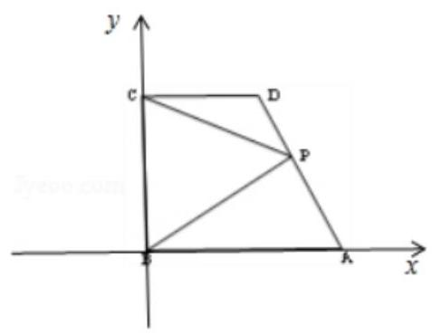

【例 10】已知平面单位向量 $\overrightarrow{{e}_{1}},\overrightarrow{{e}_{2}}$ 的夹角为 ${60}^{ \circ  }$ ,向量 $\overrightarrow{c}$ 满足 ${\overrightarrow{c}}^{2} - \left( {2\overrightarrow{{e}_{1}} + \overrightarrow{{e}_{2}}}\right)  \cdot  \overrightarrow{c} + \frac{3}{2} = 0$ ,若对任意的 $t \in  R$ ,记 $\left| {\overrightarrow{c} - t{\overrightarrow{e}}_{1}}\right|$ 的最小值为 $M$ ，则 $M$ 的最大值为 ( )

A. $\frac{1}{2} + \frac{\sqrt{3}}{4}$ B. $\frac{1 + \sqrt{3}}{2}$ C. $1 + \frac{3\sqrt{3}}{4}$ D. $1 + \sqrt{3}$

【难度】 $\star   \star   \star   \star$

【答案】A

【解析】解: $\because$ 平面单位向量 $\overrightarrow{{e}_{1}},\overrightarrow{{e}_{2}}$ 的夹角为 ${60}^{ \circ  }$ ,

设 $\overrightarrow{{e}_{1}} = \left( {1,0}\right) ,\overrightarrow{{e}_{2}} = \left( {\frac{1}{2},\frac{\sqrt{3}}{2}}\right) ,\overrightarrow{c} = \left( {x, y}\right)$ ,

由 ${\overrightarrow{c}}^{2} - \left( {2\overrightarrow{{e}_{1}} + \overrightarrow{{e}_{2}}}\right)  \cdot  \overrightarrow{c} + \frac{3}{2} = 0$ 得 ${x}^{2} + {y}^{2} - \left( {\frac{5}{2}x + \frac{\sqrt{3}}{2}y}\right)  + \frac{3}{2} = 0$ ,

化简得 ${\left( x - \frac{5}{4}\right) }^{2} + {\left( y - \frac{\sqrt{3}}{4}\right) }^{2} = \frac{1}{4}$ ，它表示以点 $\left( {\frac{5}{4},\frac{\sqrt{3}}{4}}\right)$ 为圆心，以 $\frac{1}{2}$ 为半径的圆；

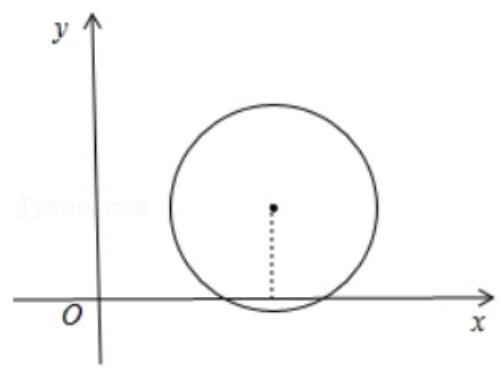

又 $\left| {\overrightarrow{c} - t{\overrightarrow{e}}_{1}}\right|  = \sqrt{{\left( x - t\right) }^{2} + {y}^{2}}$ 表示圆上的点 $M\left( {x, y}\right)$ 到点 $\left( {t,0}\right) t \in  R$ 的距离,即到直线 $y = 0$ 的距离;

距离的最小值为 $M$ ,由圆心 $\left( {\frac{5}{4},\frac{\sqrt{3}}{4}}\right)$ 到直线 $y = 0$ 的距离为 $d = \frac{\sqrt{3}}{4}$ ,

则 $M$ 的最大值为 $d + r = \frac{2 + \sqrt{3}}{4} = \frac{1}{2} + \frac{\sqrt{3}}{4}$ .

## 巩固训练

1、如图，在等腰 $\bigtriangleup {ABC}$ 中，已知 $\left| \overrightarrow{AB}\right|  = \left| \overrightarrow{AC}\right|  = 1$ ， $\angle A = {120}^{ \circ  }$ ， $E$ ， $F$ 分别是边 ${AB}$ ， ${AC}$ 的点，且 $\overrightarrow{AE} = \lambda \overrightarrow{AB}$ ， $\overrightarrow{AF} = \mu \overrightarrow{AC}$ ,其中 $\lambda ,\mu  \in  \left( {0,1}\right)$ 且 $\lambda  + {2\mu } = 1$ ,若线段 ${EF},{BC}$ 的中点分别为 $M, N$ ,则 $\left| \overrightarrow{MN}\right|$ 的最小值是 ( )

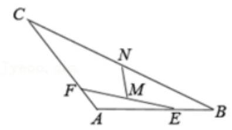

A. $\frac{\sqrt{7}}{7}$ B. $\sqrt{7}$

C. $\frac{\sqrt{21}}{14}$ D. $\sqrt{21}$

【难度】 $\star   \star   \star$

【答案】C

【解析】解: 在等腰 $\bigtriangleup {ABC}$ 中,已知 $\left| \overrightarrow{AB}\right|  = \left| \overrightarrow{AC}\right|  = 1,\angle A = {120}^{ \circ  }$ ,

所以: $\overrightarrow{AB} \cdot  \overrightarrow{AC} = \left| \overrightarrow{AB}\right| \left| \overrightarrow{AC}\right| \cos A =  - \frac{1}{2}$ ;

$E, F$ 分别是边 ${AB},{AC}$ 的点,所以: $\overrightarrow{AM} = \frac{1}{2}\left( {\overrightarrow{AE} + \overrightarrow{AF}}\right)  = \frac{1}{2}\left( {\mu \overrightarrow{AC} + \lambda \overrightarrow{AB}}\right) ,\overrightarrow{AN} = \frac{1}{2}\left( {\overrightarrow{AB} + \overrightarrow{AC}}\right)$ ,

而 $\overrightarrow{MN} = \overrightarrow{AN} - \overrightarrow{AM} = \frac{1}{2}\left\lbrack  {\left( {1 - \lambda }\right) \overrightarrow{AB} + \left( {1 - \mu }\right) \overrightarrow{AC}}\right\rbrack$ ,

两边平方得: $\overrightarrow{MN}{}^{2} = \frac{1}{4}\left\lbrack  {{\left( 1 - \lambda \right) }^{2}\overrightarrow{AB}{}^{2} + 2\left( {1 - \lambda }\right) \left( {1 - \mu }\right) \overrightarrow{AB} \cdot  \overrightarrow{AC} + {\left( 1 - \mu \right) }^{2}\overrightarrow{AC}{}^{2}}\right\rbrack   = \frac{{\lambda }^{2} + {\mu }^{2} - {\lambda \mu } - \lambda  - \mu  + 1}{4}$ ,

且 $\lambda  + {2\mu } = 1$ ,所以 ${\overline{MN}}^{2} = \frac{{\lambda }^{2} + {\mu }^{2} - {\lambda \mu } - \lambda  - \mu  + 1}{4} = \frac{7{\left( \mu  - \frac{2}{7}\right) }^{2} + \frac{3}{7}}{4}$ ,其中 $\lambda ,\mu  \in  \left( {0,1}\right)$ ,即 $\mu  \in  \left( {0,\frac{1}{2}}\right)$ ,

当 $\mu  = \frac{2}{7}$ 时, $\overrightarrow{MN}{}^{2}$ 的最小值为 $\frac{3}{28}$ ,所以: $\left| \overrightarrow{MN}\right|$ 的最小值是 $\frac{\sqrt{21}}{14}$ . 故选: $C$ .

2、已知向量 $\overrightarrow{a},\overrightarrow{b}$ 满足 $\left| \overrightarrow{a}\right|  = \sqrt{3},\left| \overrightarrow{b}\right|  = 1$ ，且对任意实数 $x$ ，不等式 $\left| {\overrightarrow{a} + x\overrightarrow{b}}\right|  \geq  \left| {\overrightarrow{a} + \overrightarrow{b}}\right|$ 恒成立，设 $\overrightarrow{a}$ 与 $\overrightarrow{b}$ 的夹角为 $\theta$ ,则 $\tan {2\theta } =$ (   )

A. $\sqrt{2}$ B. $- \sqrt{2}$ C. $- 2\sqrt{2}$ D. $2\sqrt{2}$

【难度】 $\star   \star   \star   \star$

【答案】D

【解析】解: 当 $\overrightarrow{a},\overrightarrow{b}$ 如图所示 $\left( {\overrightarrow{a} + \overrightarrow{b}}\right)  \bot  \overrightarrow{b}$ 时,对于任意实数 $x,\overrightarrow{a} + x\overrightarrow{b} = \overrightarrow{OA}$ 或 $\overrightarrow{a} + x\overrightarrow{b} = \overrightarrow{OB}$ ,

斜边大于直角边恒成立,不等式 $\left| {\overrightarrow{a} + x\overrightarrow{b}}\right|  \geq  \left| {\overrightarrow{a} + \overrightarrow{b}}\right|$ 恒成立,

$\because \left( {\overrightarrow{a} + \overrightarrow{b}}\right)  \bot  \overrightarrow{b}$ ,向量 $\overrightarrow{a},\overrightarrow{b}$ 满足 $\left| \overrightarrow{a}\right|  = \sqrt{3},\left| \overrightarrow{b}\right|  = 1\therefore \tan \alpha  = \sqrt{2},\tan \theta  =  - \sqrt{2}$ , $\therefore \tan {2\theta } = \frac{2 \times  \left( {-\sqrt{2}}\right) }{1 - {\left( -\sqrt{2}\right) }^{2}} = 2\sqrt{2}$ . 故选: $D$ .

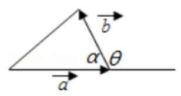

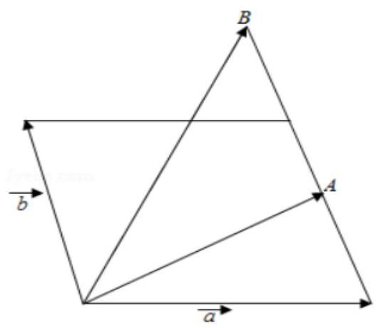

3、设函数 $f\left( x\right)  = \frac{1}{x + 1}$ ，点 ${A}_{0}$ 表示坐标原点，点 ${A}_{n}\left( {n, f\left( n\right) }\right) \left( {n \in  {N}^{ * }}\right)$ . 若向量 ${a}_{n} = \overrightarrow{{A}_{0}{A}_{1}} + \overrightarrow{{A}_{1}{A}_{2}} + \ldots  + \overrightarrow{{A}_{N - 1}{A}_{n}}$ ， ${\theta }_{n}$ 是 ${a}_{n}$ 与 $i$ 的夹角 (其中 $i = \left( {1,0}\right)$ ),则 $\tan {\theta }_{n} =$ ___.

【难度】 $\star   \star   \star   \star$

【答案】 $\frac{1}{n\left( {n + 1}\right) }$

【解析】解: $\because$ 向量 ${a}_{n} = \overrightarrow{{A}_{0}{A}_{1}} + \overrightarrow{{A}_{1}{A}_{2}} + \ldots  + \overrightarrow{{A}_{n - 1}{A}_{n}} = \overrightarrow{{A}_{0}{A}_{n}}$ ,点 ${A}_{0}$ 表示坐标原点,点 ${A}_{n}\left( {n, f\left( n\right) }\right) \left( {n \in  {N}^{ * }}\right)$ . $\therefore \tan {\theta }_{n} = \frac{\frac{1}{n + 1}}{n} = \frac{1}{n\left( {n + 1}\right) }$ . 故答案为: $\frac{1}{n\left( {n + 1}\right) }$ .

4、已知向量 $\overrightarrow{a},\overrightarrow{b}$ 满足 $\left| \overrightarrow{a}\right|  = 1,\left| \overrightarrow{b}\right|  = 2$ ，若存在单位向量 $\overrightarrow{e}$ ，使得 $\left| {\overrightarrow{a} \cdot  \overrightarrow{e}}\right|  + \left| {\overrightarrow{b} \cdot  \overrightarrow{e}}\right|  = \sqrt{6}$ ，则 $\overrightarrow{a} \cdot  \overrightarrow{b}$ 的最小值为___.

【难度】 $\star   \star   \star   \star$

【答案】 -2

【解析】解: 当 $\left( {\overrightarrow{a} \cdot  \overrightarrow{e}}\right)  \cdot  \left( {\overrightarrow{b} \cdot  \overrightarrow{e}}\right)  \geq  0$ 时, $\left| {\overrightarrow{a} \cdot  \overrightarrow{e}}\right|  + \left| {\overrightarrow{b} \cdot  \overrightarrow{e}}\right|  = \sqrt{6} \Leftrightarrow  \left| {\overrightarrow{a} \cdot  \overrightarrow{e} + \overrightarrow{b} \cdot  \overrightarrow{e}}\right|  = \sqrt{6}$ ,

即存在 $\overrightarrow{e}$ 使得 $\left| {\left( {\overrightarrow{a} + \overrightarrow{b}}\right)  \cdot  \overrightarrow{e}}\right|  = \sqrt{6}$ 即可,则只需 $\left| {\overrightarrow{a} + \overrightarrow{b}}\right|  \geq  \sqrt{6}$ 即可,平方可得 $\overrightarrow{a} \cdot  \overrightarrow{b} \geq  \frac{1}{2}$ ,

又 $\overrightarrow{a} \cdot  \overrightarrow{b} \leq  \left| \overrightarrow{a}\right| \left| \overrightarrow{b}\right|  = 2$ ,所以 $\overrightarrow{a} \cdot  \overrightarrow{b} \in  \left\lbrack  {\frac{1}{2},2}\right\rbrack$ ;

当 $\left( {\overrightarrow{a} \cdot  \overrightarrow{e}}\right)  \cdot  \left( {\overrightarrow{b} \cdot  \overrightarrow{e}}\right)  < 0$ 时, $\left| {\overrightarrow{a} \cdot  \overrightarrow{e}}\right|  + \left| {\overrightarrow{b} \cdot  \overrightarrow{e}}\right|  = \sqrt{6} \Leftrightarrow  \left| {\overrightarrow{a} \cdot  \overrightarrow{e} - \overrightarrow{b} \cdot  \overrightarrow{e}}\right|  = \sqrt{6}$ ,

即存在 $\overrightarrow{e}$ 使得 $\left| {\left( {\overrightarrow{a} - \overrightarrow{b}}\right)  \cdot  \overrightarrow{e}}\right|  = \sqrt{6}$ 即可,则只需 $\left| {\overrightarrow{a} - \overrightarrow{b}}\right|  \geq  \sqrt{6}$ 即可,平方可得 $\overrightarrow{a} \cdot  \overrightarrow{b} \leq   - \frac{1}{2}$ ,

又 $\overrightarrow{a} \cdot  \overrightarrow{b} \geq   - \left| \overrightarrow{a}\right| \left| \overrightarrow{b}\right|  =  - 2$ ,所以 $\overrightarrow{a} \cdot  \overrightarrow{b} \in  \left\lbrack  {-2, - \frac{1}{2}}\right\rbrack$ ;

综上所述， $\overrightarrow{a} \cdot  \overrightarrow{b} \in  \left\lbrack  {-2, - \frac{1}{2}}\right\rbrack   \cup  \left\lbrack  {\frac{1}{2},2}\right\rbrack$ ,故 $\overrightarrow{a} \cdot  \overrightarrow{b}$ 的最小值为 -2 .

故答案为: -2 .

## 实战演练

一、填空题

1、如图，在直角梯形 ${ABCD}$ 中， ${AB}//{DC}$ ， ${AD} \bot  {DC}$ ， ${AD} = {DC} = {2AB}$ ， $E$ 为 ${AD}$ 的中点，若 $\overrightarrow{CA} = \lambda \overrightarrow{CE} + \mu \overrightarrow{DB}$ ，则 $\lambda  + \mu$ 的值为 ___.

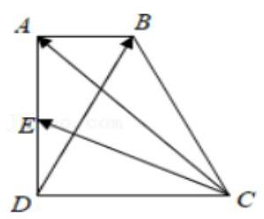

【难度】 $\star   \star   \star$

【答案】 $\frac{8}{5}$

【解析】解: 如图所示,建立直角坐标系. 不妨设 ${AB} = 1$ ,则 $D\left( {0,0}\right) , C\left( {2,0}\right) , A\left( {0,2}\right)$ ,

$B\left( {1,2}\right) , E\left( {0,1}\right) .\overrightarrow{CA} = \left( {-2,2}\right) ,\overrightarrow{CE} = \left( {-2,1}\right) ,\overrightarrow{DB} = \left( {1,2}\right)$ ,

$\because$ 若 $\overrightarrow{CA} = \lambda \overrightarrow{CE} + \mu \overrightarrow{DB},\therefore \left( {-2,2}\right)  = \lambda \left( {-2,1}\right)  + \mu \left( {1,2}\right) ,\therefore \left\{  \begin{array}{l}  - {2\lambda } + \mu  =  - 2 \\  \lambda  + {2\mu } = 2 \end{array}\right.$ ,

解得 $\lambda  = \frac{6}{5},\mu  = \frac{2}{5}$ . 则 $\lambda  + \mu  = \frac{8}{5}$ . 故答案为: $\frac{8}{5}$ .

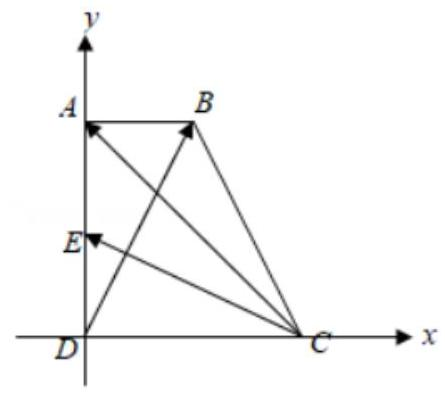

2、设 $P$ 为 $\bigtriangleup {ABC}$ 所在平面上一点，且满足 $\overrightarrow{PA} + 2\overrightarrow{PC} = m\overrightarrow{AB}\left( {m > 0}\right)$ ，若 $\bigtriangleup {ABP}$ 的面积为 2，则 $\bigtriangleup {ABC}$ 面积为___.

【难度】 $\star   \star   \star$

【答案】 3

【解析】解: 根据题意, $P$ 为 $\bigtriangleup {ABC}$ 所在平面上一点,且满足 $\overrightarrow{PA} + 2\overrightarrow{PC} = m\overrightarrow{AB}\left( {m > 0}\right)$ ,

变形可得 $\frac{1}{3}\overline{PA} + \frac{2}{3}\overline{PC} = \frac{m}{3}\overline{AB}$ ,

设点 $D$ 在边 ${AC}$ 上，且 ${AD} = {2CD}$ ，则 $\overrightarrow{PD} = \overrightarrow{PA} + \overrightarrow{AD} = \overrightarrow{PA} + \frac{2}{3}\overrightarrow{AC} = \overrightarrow{PA} + \frac{2}{3}\left( {\overrightarrow{PC} - \overrightarrow{PA}}\right)  = \frac{1}{3}\overrightarrow{PA} + \frac{2}{3}\overrightarrow{PC}$ ，

则有 $\overrightarrow{PD} = \frac{m}{3}\overrightarrow{AB}$ ,故 ${PD}//{AB}$ ,点 $P$ 到 ${AB}$ 的距离等于点 $D$ 到 ${AB}$ 的距离,

又由 ${AD} = {2CD}$ ，则 $D$ 到 ${AB}$ 的距离为 $C$ 到 ${AB}$ 距离的 $\frac{2}{3}$ ，则有 $\frac{{S}_{\bigtriangleup {ABP}}}{{S}_{\bigtriangleup {ABC}}} = \frac{2}{3}$ ，

若 $\bigtriangleup {ABP}$ 的面积为 2,则 $\bigtriangleup {ABC}$ 面积为 $\frac{3}{2} \times  2 = 3$ ; 故答案为: 3 .

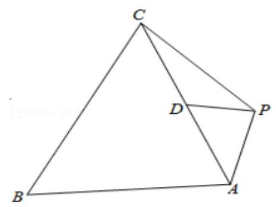

3、给定两个长度为 1 的平面向量 $\overline{OA}$ 和 $\overline{OB}$ ，它们的夹角 $\theta  = {60}^{ \circ  }$ ，如图所示，点 $C$ 在以 $O$ 为圆心的圆弧 $\overset{\text{ ⏜ }}{AB}$ 上变动. 若 $\overrightarrow{OC} = x\overrightarrow{OA} + y\overrightarrow{OB}$ ,其中 $x, y \in  R$ ,则 $x + y$ 的最大值是___.

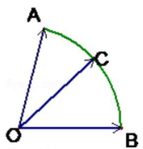

【难度】 $\star   \star   \star   \star$

【答案】 $\frac{2\sqrt{3}}{3}$

【解析】解: 建立如图所示的坐标系,则 $B\left( {1,0}\right) , A\left( {\cos {60}^{ \circ  },\sin {60}^{ \circ  }}\right)$ ,即 $A\left( {\frac{1}{2},\frac{\sqrt{3}}{2}}\right)$

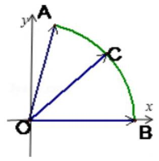

设 $\angle {BOC} = \alpha$ ，则 $\overrightarrow{OC} = \left( {\cos \alpha ,\sin \alpha }\right) \because \overrightarrow{OC} = x\overrightarrow{OA} + y\overrightarrow{OB} = \left( {\frac{1}{2}x + y,\frac{\sqrt{3}}{2}x}\right) \; \therefore \left\{  {\begin{array}{l} \cos \alpha  = \frac{1}{2}x + y \\  \sin \alpha  = \frac{\sqrt{3}}{2}x \end{array}\therefore x = \frac{2}{\sqrt{3}}\sin \alpha , y = \cos \alpha  - \frac{1}{\sqrt{3}}\sin \alpha \therefore x + y = \cos \alpha  + \frac{1}{\sqrt{3}}\sin \alpha  = \frac{2\sqrt{3}}{3}\sin \left( {\alpha  + {60}^{ \circ  }}\right) }\right. \; \because {0}^{ \circ  } \leq  \alpha  \leq  {60}^{ \circ  },\therefore {60}^{ \circ  } \leq  \alpha  + {60}^{ \circ  } \leq  {120}^{ \circ  }\therefore \frac{\sqrt{3}}{2} \leq  \sin \left( {\alpha  + {60}^{ \circ  }}\right)  \leq  1,\therefore x + y$ 有最大值 $\frac{2\sqrt{3}}{3}$ ,当 $\alpha  = {30}^{ \circ  }$ 时取最大值. 故答案为 $\frac{2\sqrt{3}}{3}$ .

4、如图，在同一平面内，点 $P$ 位于两平行直线 ${l}_{1},{l}_{2}$ 同侧，且 $P$ 到 ${l}_{1},{l}_{2}$ 的距离分别为1,2. 点 $M, N$ 分别在 ${l}_{1},{l}_{2}$ 上, $\left| {\overrightarrow{PM} + \overrightarrow{PN}}\right|  = 5$ ,则 $\overrightarrow{PM} \cdot  \overrightarrow{PN}$ 的最大值为___.

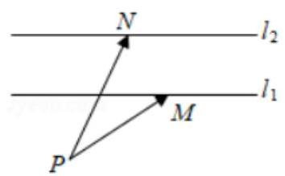

【难度】 $\star   \star   \star   \star$

【答案】 6

【解析】解: 过点 $P$ 作 ${l}_{1}$ 的垂线为 $y$ 轴,以 ${l}_{1}$ 为 $x$ 轴,建立平面直角坐标系, ${l}_{1} : y = 0,{l}_{2} : y = 1, P\left( {0, - 1}\right)$ , 设 $M\left( {a,0}\right) , N\left( {b,1}\right)$ ,所以 $\overrightarrow{PM} = \left( {a,1}\right) ,\overrightarrow{PN} = \left( {b,2}\right) ,\overrightarrow{PM} + \overrightarrow{PN} = \left( {a + b,3}\right)$ ,

由 $\left| {\overrightarrow{PM} + \overrightarrow{PN}}\right|  = 5$ ,可知 ${\left( a + b\right) }^{2} + 9 = {25},\therefore a + b = 4$ 或 $a + b =  - 4,\overrightarrow{PM} \cdot  \overrightarrow{PN} = {ab} + 2 \leq  \frac{{\left( a + b\right) }^{2}}{4} + 2 = 6$ .

故答案为: 6 .

5、如图，在平面直角坐标系 ${xOy}$ 中， $O$ 为正八边形 ${A}_{1}{A}_{2}\ldots {A}_{8}$ 的中心， ${A}_{1}\left( {1,0}\right)$ 任取不同的两点 ${A}_{i}$ ， ${A}_{j}$ ，点 $P$ 满足 $\overrightarrow{OP} + \overrightarrow{O{A}_{i}} + \overrightarrow{O{A}_{j}} = \overrightarrow{0}$ ,则点 $P$ 落在第一象限的概率是___.

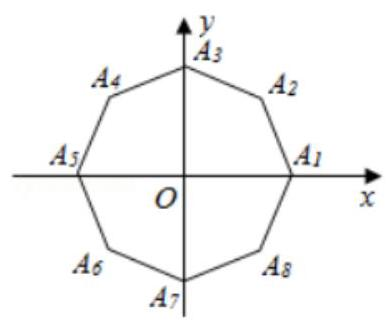

【难度】 $\star   \star   \star   \star$

【答案】 $\frac{5}{28}$

【解析】解: 从正八边形 ${A}_{1}{A}_{2}\ldots {A}_{8}$ 的八个顶点中任取两个,基本事件总数为 ${C}_{8}^{2} = {28}$ .

满足 $\overrightarrow{OP} + \overrightarrow{O{A}_{i}} + \overrightarrow{O{A}_{j}} = \overrightarrow{0}$ ，且点 $P$ 落在第一象限，对应的 ${A}_{i},{A}_{j}$ ，为:

$\left( {{A}_{4},{A}_{7}}\right) ,\left( {{A}_{5},{A}_{8}}\right) ,\left( {{A}_{5},{A}_{6}}\right) ,\left( {{A}_{6},{A}_{7}}\right) ,\left( {{A}_{5},{A}_{7}}\right)$ 共 5 种取法.

$\therefore$ 点 $P$ 落在第一象限的概率是 $P = \frac{5}{28}$ ,故答案为: $\frac{5}{28}$ .

6、如图，在直角梯形 ${ABCD}$ 中， ${AB}\bot {AD},{AD} = {DC} = 1$ ， ${AB} = 3$ ，动点 $P$ 在以点 $C$ 为圆心，且与直线 ${BD}$ 相切的圆内运动,设 $\overrightarrow{AP} = \alpha \overrightarrow{AD} + \beta \overrightarrow{AB}\left( {\alpha ,\beta  \in  R}\right)$ ,则 $\alpha  + \beta$ 的取值范围是___.

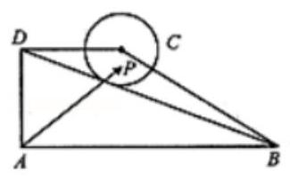

【难度】 $\star   \star   \star   \star$

【答案】 $\left( {1,\frac{5}{3}}\right)$

【解析】解: 以 ${AB}$ 为 $x$ 轴,以 ${AD}$ 为 $y$ 轴,建立坐标系,

$\because$ 在直角梯形 ${ABCD}$ 中, ${AB} \bot  {AD},{AD} = {DC} = 1,{AB} = 3$

$\therefore A\left( {0,0}\right) , D\left( {0,1}\right) , B\left( {3,0}\right) , C\left( {1,1}\right)$

$\therefore$ 直线 ${BD}$ 的方程为: $y =  - \frac{1}{3}x + 1$ ,即 $x + {3y} - 3 = 0, C\left( {1,1}\right)$ 点到直线的距离为: $\frac{\sqrt{10}}{10}$

$\therefore$ 以点 $C$ 为圆心,且与直线 ${BD}$ 相切的圆的方程为:

${\left( x - 1\right) }^{2} + {\left( y - 1\right) }^{2} = \frac{1}{10},\;x = 1 + \frac{1}{\sqrt{10}}\cos \theta ,\;y = 1 + \frac{1}{\sqrt{10}}\sin \theta$

设 $P\left( {x, y}\right)$ 则: ${\left( x - 1\right) }^{2} + {\left( y - 1\right) }^{2} \leq  \frac{1}{10},\because \overrightarrow{AP} = \alpha \overrightarrow{AD} + \beta \overrightarrow{AB},\left( {\alpha ,\beta  \in  R}\right)$ ,

$\therefore \left( {x, y}\right)  = \left( {{3\beta },\alpha }\right)$

$\therefore \alpha  + \beta  = y + \frac{x}{3} = 1 + \frac{1}{\sqrt{10}}\sin \theta  + \frac{1}{3} + \frac{1}{3}\left( {1 + \frac{1}{\sqrt{10}}\cos \theta }\right)  = \frac{4}{3} + \frac{1}{3\sqrt{10}}\cos \theta  + \frac{1}{\sqrt{10}}\sin \theta  = \frac{4}{3} + \frac{1}{3}\sin \left( {\theta  + \lambda }\right)$

$\because  - \frac{1}{3} < \frac{1}{3}\sin \left( {\theta  + \lambda }\right)  < \frac{1}{3},1 < \frac{4}{3} + \frac{1}{3}\sin \left( {\theta  + \lambda }\right)  < \frac{5}{3},\therefore \alpha  + \beta$ 的取值范围是 $\left( {1,\frac{5}{3}}\right)$ 故答案为: $\left( {1,\frac{5}{3}}\right)$

## 二、选择题

7、已知关于 $x$ 的方程 $\overrightarrow{a}{x}^{2} + \overrightarrow{b}x + \overrightarrow{c} = \overrightarrow{0}$ ，其中 $\overrightarrow{a}$ 、 $\overrightarrow{b}$ 、 $\overrightarrow{c}$ 都是非零向量，且 $\overrightarrow{a}$ 、 $\overrightarrow{b}$ 不共线，则该方程的解的情况是( )

A. 至少有一个解 B. 至多有一个解

C. 至多有两个解 D. 可能有无数个解

【难度】★★★

【答案】 $B$

【解析】解: $\overrightarrow{c} = \left( {-{x}^{2}}\right) \overrightarrow{a} - x\overrightarrow{b}\because \overrightarrow{a}\text{ 、 }\overrightarrow{b}$ 这不共线向量,故存在唯一一对实数 $\lambda ,\mu$ 使, $\overrightarrow{c} = \lambda \overrightarrow{a} + \mu \overrightarrow{b}$ 若 $\lambda$ 满足 $\lambda  =  - {\mu }^{2}$ ,则方程有一个解, $\lambda$ 不满足 $\lambda  =  - {\mu }^{2}$ ,则方程无解所以至多一个解. 故选: $B$ .

8、在 $\bigtriangleup {ABC}$ 内使 $A{P}^{2} + B{P}^{2} + C{P}^{2}$ 的值最小的点 $P$ 是 $\bigtriangleup {ABC}$ 的 ( )

A. 外心 B. 内心 C. 垂心 D. 重心

【难度】 $\star   \star   \star   \star$

【答案】 $D$

【解析】解: 令 $\overrightarrow{CA} = \overrightarrow{a},\overrightarrow{CB} = \overrightarrow{b}$ ,设 $\overrightarrow{CP} = \overrightarrow{m}$ ,则 $\overrightarrow{AP} = \overrightarrow{m} - \overrightarrow{a},\overrightarrow{BP} = \overrightarrow{m} - \overrightarrow{b}$ ,

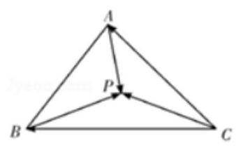

于是 $A{P}^{2} + B{P}^{2} + C{P}^{2} = 3{\overrightarrow{m}}^{2} - 2\left( {\overrightarrow{a} + \overrightarrow{b}}\right)  \cdot  \overrightarrow{m} + {\overrightarrow{a}}^{2} + {\overrightarrow{b}}^{2} = 3{\left\lbrack  \overrightarrow{m} - \frac{1}{3}\left( \overrightarrow{a} + \overrightarrow{b}\right) \right\rbrack  }^{2} - \frac{1}{3}{\left( \overrightarrow{a} + \overrightarrow{b}\right) }^{2} + {\overrightarrow{a}}^{2} + {\overrightarrow{b}}^{2}$ .

所以当 $\overrightarrow{m} = \frac{1}{3}\left( {\overrightarrow{a} + \overrightarrow{b}}\right)$ 时, $A{P}^{2} + B{P}^{2} + C{P}^{2}$ 最小,

此时 $\overrightarrow{OP} = \overrightarrow{OC} + \overrightarrow{CP} = \overrightarrow{OC} + \frac{1}{3}\overrightarrow{CA} + \frac{1}{3}\overrightarrow{CB} = \frac{1}{3}\left( {\overrightarrow{OA} + \overrightarrow{OB} + \overrightarrow{OC}}\right)$ ,则点 $P$ 为 $\bigtriangleup {ABC}$ 的重心. 故选: $D$ .

9、如图，扇形的半径为2，圆心角 $\angle {BAC} = {150}^{ \circ  }$ ，点 $P$ 在弧 $\overset{\text{ ⏜ }}{BC}$ 上运动， $\overrightarrow{AP} = x\overrightarrow{AB} + y\overrightarrow{AC}$ ，则 $\sqrt{3}x - y$ 的取值范围是( )

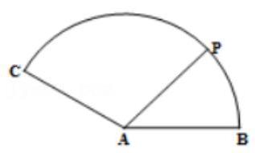

A. $\left\lbrack  {-\sqrt{3},2}\right\rbrack$ B. $\left\lbrack  {-1,2}\right\rbrack$ C. $\left\lbrack  {-2,4}\right\rbrack$ D. $\left\lbrack  {-2\sqrt{3},4}\right\rbrack$

【难度】 $\star   \star   \star   \star$

【答案】 $B$

【解析】解: 根据题意,以 ${AB}$ 为 $x$ 轴,以 $A$ 为原点,建立坐标系,

如图: $P\left( {2\cos \theta ,2\sin \theta }\right) ,{0}^{ \circ  } \leq  \theta  \leq  {150}^{ \circ  }$ ,则 $A\left( {0,0}\right) , B\left( {2,0}\right) , C\left( {-\sqrt{3},1}\right)$ ,

$\overrightarrow{AP} = x\overrightarrow{AB} + y\overrightarrow{AC}$ ,则有 $\left( {2\cos \theta ,2\sin \theta }\right)  = x\left( {2,0}\right)  + y\left( {-\sqrt{3},1}\right)  = \left( {x - \sqrt{3}y, y}\right)$

变形可得: $\cos \theta  = x - \frac{\sqrt{3}}{2}y,\sin \theta  = \frac{y}{2}$ ; 则有 $x = \cos \theta  + \sqrt{3}\sin \theta , y = 2\sin \theta$ ,

$\sqrt{3}x - y = \sqrt{3}\cos \theta  + 3\sin \theta  - 2\sin \theta  = \sqrt{3}\cos \theta  + \sin \theta  = 2\sin \left( {\theta  + {60}^{ \circ  }}\right) ,$

又由 ${0}^{ \circ  } \leq  \theta  \leq  {150}^{ \circ  }$ ,则 ${60}^{ \circ  } \leq  \theta  + {60}^{ \circ  } \leq  {210}^{ \circ  }$ ,则有 $- 1 \leq  \sqrt{3}x - y = 2\sin \left( {\theta  + {60}^{ \circ  }}\right)  \leq  2$ ,

故 $\sqrt{3}x - y$ 的取值范围是 $\left\lbrack  {-1,2}\right\rbrack$ ; 故选: $B$ .

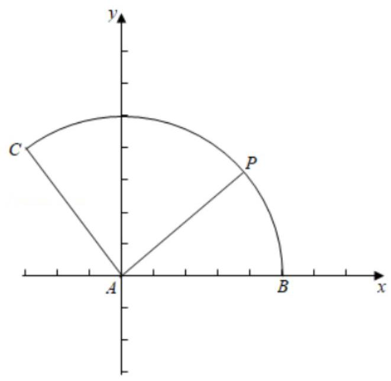

10、已知 $D, E, F$ 分别是 $\bigtriangleup {ABC}$ 的三边 ${BC},{CA},{AB}$ 上的点,且满足 $\overrightarrow{AF} = \frac{2}{3}\overrightarrow{AB},\overrightarrow{AE} = \frac{3}{4}\overrightarrow{AC}$ , $\overrightarrow{AD} = \lambda \left( {\frac{\overrightarrow{AB}}{\left| \overrightarrow{AB}\right| \cos B} + \frac{\overrightarrow{AC}}{\left| \overrightarrow{AC}\right| \cos C}}\right) \left( {\lambda  \in  R}\right) ,\;\overrightarrow{DE} \cdot  \overrightarrow{DA} = \overrightarrow{DE} \cdot  \overrightarrow{DC},\;\overrightarrow{DF} = \mu \left( {\frac{\overrightarrow{BD}\sin B}{\left| \overrightarrow{BD}\right| } + \frac{\overrightarrow{AD}\cos B}{\left| \overrightarrow{AD}\right| }}\right) \left( {\mu  \in  R}\right)$ . 则 $\frac{\left| \overrightarrow{EF}\right| }{\left| \overrightarrow{BC}\right| } =$ (   )

A. $\frac{1}{3}$ B. $\frac{1}{2}$ C. $\frac{\sqrt{3}}{3}$ D. $\frac{\sqrt{2}}{2}$

【难度】 $\star   \star   \star   \star$

【答案】 $D$

【解析】解: 如图所示,

$\because \overrightarrow{AD} = \lambda \left( {\frac{\overrightarrow{AB}}{\left| \overrightarrow{AB}\right| \cos B} + \frac{\overrightarrow{AC}}{\left| \overrightarrow{AC}\right| \cos C}}\right)$ ,

$\therefore \overrightarrow{BC} \cdot  \overrightarrow{AD} = \lambda \left( {\frac{\overrightarrow{AB}}{\left| \overrightarrow{AB}\right| \cos B} + \frac{\overrightarrow{AC}}{\left| \overrightarrow{AC}\right| \cos C}}\right)  \cdot  \overrightarrow{BC} = \lambda \left( {\frac{-\left| \overrightarrow{AB}\right| \left| \overrightarrow{BC}\right| \cos B}{\left| \overrightarrow{AB}\right| \cos B} + \frac{\left| \overrightarrow{AC}\right| \left| \overrightarrow{BC}\right| \cos C}{\left| \overrightarrow{AC}\right| \cos C}}\right)  = 0$ ,

$\therefore \overrightarrow{BC} \bot  \overrightarrow{AD}$ ,即 ${BC} \bot  {AD}$ .

$\because \overrightarrow{DE} \cdot  \overrightarrow{DA} = \overrightarrow{DE} \cdot  \overrightarrow{DC},\therefore \overrightarrow{DE} \cdot  \left( {\overrightarrow{DA} - \overrightarrow{DC}}\right)  = \overrightarrow{DE} \cdot  \overrightarrow{CA} = 0,\therefore \overrightarrow{DE} \bot  \overrightarrow{CA}$ ,即 ${DE} \bot  {CA}$ .

$\because \overrightarrow{DF} = \mu \left( {\frac{\overrightarrow{BD}\sin B}{\left| \overrightarrow{BD}\right| } + \frac{\overrightarrow{AD}\cos B}{\left| \overrightarrow{AD}\right| }}\right)$ ,

$\therefore \overrightarrow{BA} \cdot  \overrightarrow{DF} = \mu \left( {\frac{\overrightarrow{BD}\sin B}{\left| \overrightarrow{BD}\right| } + \frac{\overrightarrow{AD}\cos B}{\left| \overrightarrow{AD}\right| }}\right)  \cdot  \overrightarrow{BA} = \mu \left( {\frac{\left| \overrightarrow{BD}\right| \left| \overrightarrow{BA}\right| \cos B\sin B}{\left| \overrightarrow{BD}\right| } + \frac{-\left| \overrightarrow{AD}\right| \left| \overrightarrow{BA}\right| \sin B\cos B}{\left| \overrightarrow{AD}\right| }}\right)  = 0$ ,

$\therefore \overrightarrow{BA} \bot  \overrightarrow{DF}$ ,即 ${BA} \bot  {DF}$ ,连接 ${EF}.\because {DE} \bot  {AC},{DF} \bot  {AB}$ ,

$\therefore A, E, D, F$ 四点共圆， $\therefore \angle {AEF} = \angle {ADF}$ . 又 ${AD} \bot  {BC}$ ， $\therefore \angle B = \angle {ADF}$ ，

$\therefore \angle B = \angle {AEF}.\therefore \bigtriangleup {AE}{F}^{\left| C\right| }\bigtriangleup {ABC}.\therefore \frac{EF}{BC} = \frac{AE}{AB} = \frac{AF}{AC}.\because \overline{AF} = \frac{2}{3}\overrightarrow{AB},\overrightarrow{AE} = \frac{3}{4}\overrightarrow{AC}$ ,

$\therefore \frac{\frac{3}{4}{AC}}{AB} = \frac{\frac{2}{3}{AB}}{AC}$ ,解得 ${AC} = \frac{2\sqrt{2}}{3}{AB}.\therefore \frac{EF}{BC} = \frac{\frac{3}{4} \times  \frac{2\sqrt{2}}{3}{AB}}{AB} = \frac{\sqrt{2}}{2}.\therefore \frac{\left| \overrightarrow{EF}\right| }{\left| \overrightarrow{BC}\right| } = \frac{\sqrt{2}}{2}$ . 故选: $D$ .

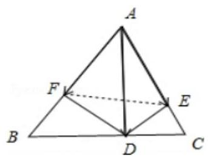

## 三、解答题

11、在 $\bigtriangleup  {ABC}$ 中， ${AC} = 2,{BC} = 6,\angle {ACB} = {60}^{ \circ  }$ ，点 $O$ 为 $\Delta {ABC}$ 所在平面上一点，满足 $\overrightarrow{OC} = m\overrightarrow{OA} + n\overrightarrow{OB}$ ( $m$ , $n \in  R$ 且 $m + n \neq  1)$ .

(1)证明: $\overline{CO} = \frac{m}{m + n - 1}\overline{CA} + \frac{n}{m + n - 1}\overline{CB}$ ;

(2)若点 $O$ 为 $\bigtriangleup {ABC}$ 的重心，求 $m\text{ 、 }n$ 的值；

(3)若点 $O$ 为 $\bigtriangleup  {ABC}$ 的外心，求 $m\text{ 、 }n$ 的值.

【难度】 $\star   \star   \star   \star$

【答案】见解析

【解析】解: (1) $\overrightarrow{OC} = m\overrightarrow{OA} + n\overrightarrow{OB} = m\left( {\overrightarrow{OC} + \overrightarrow{CA}}\right)  + n\left( {\overrightarrow{OC} + \overrightarrow{CB}}\right)$ ,

$\therefore \overrightarrow{CO} = \frac{m}{m + n - 1}\overrightarrow{CA} + \frac{n}{n + m - 1}\overrightarrow{CB}$ ,

(2)点 $O$ 为 $\bigtriangleup {ABC}$ 的重心， $\therefore \overrightarrow{OA} + \overrightarrow{OB} + \overrightarrow{OC} = \overrightarrow{0}$ ， $\therefore m =  - 1$ ， $n =  - 1$ ；

(3)点 $O$ 为 ${\Delta ABC}$ 的外心，

$\therefore \overrightarrow{CO} \cdot  \overrightarrow{CB} = \frac{1}{2}{\left| \overrightarrow{CB}\right| }^{2} = {18},\overrightarrow{CO} \cdot  \overrightarrow{CA} = \frac{1}{2}{\left| \overrightarrow{CA}\right| }^{2} = 2,\overrightarrow{CA} \cdot  \overrightarrow{CB} = 2 \times  6 \times  \frac{1}{2} = 6$ ,

$\because \overrightarrow{CO} \cdot  \overrightarrow{CB} = \frac{m}{m + n - 1}\overrightarrow{CA} \cdot  \overrightarrow{CB} + \frac{n}{n + m - 1}\overrightarrow{CB} \cdot  \overrightarrow{CB},\overrightarrow{CO} \cdot  \overrightarrow{CA} = \frac{m}{m + n - 1}\overrightarrow{CA} \cdot  \overrightarrow{CA} + \frac{n}{n + m - 1}\overrightarrow{CA} \cdot  \overrightarrow{CB}$ ,

$\therefore \left\{  {\begin{array}{l} {2m} - {3n} = 3 \\  m + {2n} =  - 1 \end{array},\therefore \left\{  \begin{array}{l} m = \frac{3}{7} \\  n =  - \frac{5}{7} \end{array}\right. }\right.$ .

12、对于一组向量 ${\overrightarrow{a}}_{1},{\overrightarrow{a}}_{2},{\overrightarrow{a}}_{3},\ldots ,{\overrightarrow{a}}_{n}\left( {n \in  {N}^{ * }, n \geq  3}\right)$ ,令 $\overrightarrow{{S}_{n}} = \overrightarrow{{a}_{1}} + \overrightarrow{{a}_{2}} + \overrightarrow{{a}_{3}} + \ldots  + \overrightarrow{{a}_{n}}$ ,如果存在 $\overrightarrow{{a}_{p}}\left( {p \in  \{ 1,2,3\ldots , n\} }\right)$ , 使得 $\left| \overrightarrow{{a}_{p}}\right|  \geq  \left| {\overrightarrow{{S}_{n}} - \overrightarrow{{a}_{p}}}\right|$ ,那么称 $\overrightarrow{{a}_{p}}$ 是该向量组的 “ $h$ 向量”.

(1)设 $\overrightarrow{{a}_{n}} = \left( {n, x + n}\right) \left( {n \in  {N}^{ * }}\right)$ ，若 $\overrightarrow{{a}_{3}}$ 是向量组 $\overrightarrow{{a}_{1}},\overrightarrow{{a}_{2}},\overrightarrow{{a}_{3}}$ 的“ $h$ 向量”，求实数 $x$ 的取值范围；

(2)若 $\overline{{a}_{n}} = \left( {{\left( \frac{1}{3}\right) }^{n - 1} \cdot  {\left( -1\right) }^{n}}\right) \left( {n \in  {N}^{ * }, n \geq  3}\right)$ ，向量组 $\overrightarrow{{a}_{1}},\overrightarrow{{a}_{2}},\overrightarrow{{a}_{3}},\ldots ,\overrightarrow{{a}_{n}}$ 是否存在 “ $h$ 向量”? 给出你的结论并说明理由;

(3)已知 $\overrightarrow{{a}_{1}}\text{ 、 }\overrightarrow{{a}_{2}}\text{ 、 }\overrightarrow{{a}_{3}}$ 均是向量组 $\overrightarrow{{a}_{1}},\overrightarrow{{a}_{2}},\overrightarrow{{a}_{3}}$ 的“ $h$ 向量”，其中 ${\overrightarrow{a}}_{1} = \left( {\sin x,\cos x}\right) ,\overrightarrow{{a}_{2}} = \left( {2\cos x,2\sin x}\right)$ . 设在平面直角坐标系中有一点列 ${Q}_{1},{Q}_{2},{Q}_{3},\ldots ,{Q}_{n}$ 满足: ${Q}_{1}$ 为坐标原点, ${Q}_{2}$ 为 $\overrightarrow{{a}_{3}}$ 的位置向量的终点,且 ${Q}_{{2k} + 1}$ 与 ${Q}_{2k}$ 关于点 ${Q}_{1}$ 对称, ${Q}_{{2k} + 2}$ 与 ${Q}_{{2k} + 1}\left( {k \in  {N}^{ * }}\right)$ 关于点 ${Q}_{2}$ 对称,求 $\left| \overrightarrow{{Q}_{2021}{Q}_{2022}}\right|$ 的最小值.

【难度】

【答案】见解析

【解析】解: (1) 由题意,得 $\left| \overrightarrow{{a}_{3}}\right|  \geq  \left| {\overrightarrow{{a}_{1}} + \overrightarrow{{a}_{2}}}\right|$ ,则 $\sqrt{9 + {\left( x + 3\right) }^{2}} \geq  \sqrt{9 + {\left( 2x + 3\right) }^{2}}$ ,

解得 $- 2 \leq  x \leq  0$ ,即实数 $x$ 的取值范围是 $\left\lbrack  {-2,0}\right\rbrack$ .

(2) $\overrightarrow{{a}_{1}}$ 是向量组 $\overrightarrow{{a}_{1}},\overrightarrow{{a}_{2}},\overrightarrow{{a}_{3}},\ldots ,\overrightarrow{{a}_{n}}$ 的“ $h$ 向量”，理由如下: $\overrightarrow{{a}_{1}} = \left( {1, - 1}\right) ,\left| \overrightarrow{{a}_{1}}\right|  = \sqrt{2}$ ，

当 $n$ 为奇数时, $\overrightarrow{{a}_{2}} + \overrightarrow{{a}_{3}} + \ldots  + \overrightarrow{{a}_{n}} = \left( {\frac{\frac{1}{3}\left\lbrack  {1 - {\left( \frac{1}{3}\right) }^{n - 1}}\right\rbrack  }{1 - \frac{1}{3}},0}\right)  = \left( {\frac{1}{2} - \frac{1}{2} \cdot  {\left( \frac{1}{3}\right) }^{n - 1},0}\right)$ ,

$0 \leq  \frac{1}{2} - \frac{1}{2} \cdot  {\left( \frac{1}{3}\right) }^{n - 1} < \frac{1}{2}$ ,故 $\left| {\overline{{a}_{2}} + \overline{{a}_{3}} + \ldots  + \overline{{a}_{n}}}\right|  = \sqrt{{\left\lbrack  \frac{1}{2} - \frac{1}{2} \cdot  {\left( \frac{1}{3}\right) }^{n - 1}\right\rbrack  }^{2} + {0}^{2}} < \frac{1}{2} < \sqrt{2}$ ,

即 $\left| \overrightarrow{{a}_{1}}\right|  > \left| {\overrightarrow{{a}_{2}} + \overrightarrow{{a}_{3}} + \ldots  + \overrightarrow{{a}_{n}}}\right|$ ,

当 $n$ 为偶数时, $\overline{{a}_{2}} + \overline{{a}_{3}} + \ldots  + \overline{{a}_{n}} = \left( {\frac{1}{2} - \frac{1}{2} \cdot  {\left( \frac{1}{3}\right) }^{n - 1},1}\right)$ ,

故 $\left| {\overrightarrow{{a}_{2}} + \overrightarrow{{a}_{3}} + \ldots  + \overrightarrow{{a}_{n}}}\right|  = \sqrt{{\left\lbrack  \frac{1}{2} - \frac{1}{2} \cdot  {\left( \frac{1}{3}\right) }^{n - 1}\right\rbrack  }^{2} + {1}^{2}} < \sqrt{\frac{5}{4}} < \sqrt{2}$ ,

即 $\left| \overrightarrow{{a}_{1}}\right|  > \left| {\overrightarrow{{a}_{2}} + \overrightarrow{{a}_{3}} + \ldots  + \overrightarrow{{a}_{n}}}\right|$ ,综上得, $\overrightarrow{{a}_{1}}$ 是向量组 $\overrightarrow{{a}_{1}},\overrightarrow{{a}_{2}},\overrightarrow{{a}_{3}},\ldots ,\overrightarrow{{a}_{n}}$ 的 “ $h$ 向量”.

(3)由题意，得 $\left| \overrightarrow{{a}_{1}}\right|  \geq  \left| {\overrightarrow{{a}_{2}} + \overrightarrow{{a}_{3}}}\right| ,{\left| \overrightarrow{{a}_{1}}\right| }^{2} \geq  {\left| \overrightarrow{{a}_{2}} + \overrightarrow{{a}_{3}}\right| }^{2}$ ，即 ${\overrightarrow{a}}_{1}^{2} \geq  {\left( \overrightarrow{{a}_{2}} + \overrightarrow{{a}_{3}}\right) }^{2}$ ，

即 ${\overrightarrow{a}}_{1}^{2} \geq  {\overrightarrow{a}}_{2}^{2} + {\overrightarrow{a}}_{3}^{2} + 2{\overrightarrow{a}}_{2}{\overrightarrow{a}}_{3}$ ,同理 ${\overrightarrow{a}}_{2}^{2} \geq  {\overrightarrow{a}}_{1}^{2} + {\overrightarrow{a}}_{3}^{2} + 2{\overrightarrow{a}}_{1}{\overrightarrow{a}}_{3},{\overrightarrow{a}}_{3}^{2} \geq  {\overrightarrow{a}}_{1}^{2} + {\overrightarrow{a}}_{2}^{2} + 2{\overrightarrow{a}}_{1}{\overrightarrow{a}}_{2}$ ,

三式相加并化简,得 $0 \geq  {\bar{a}}_{1}^{-2} + {\bar{a}}_{2}^{-2} + {\bar{a}}_{3}^{-2} + 2{\bar{a}}_{1}\overline{{a}_{2}} + 2\overline{{a}_{1}}\overline{{a}_{3}} + 2\overline{{a}_{2}}\overline{{a}_{3}}$ ,

即 ${\left( \overrightarrow{{a}_{1}} + \overrightarrow{{a}_{2}} + \overrightarrow{{a}_{3}}\right) }^{2} \leq  0,{\left| \overrightarrow{{a}_{1}} + \overrightarrow{{a}_{2}} + \overrightarrow{{a}_{3}}\right| }^{2} \leq  0$ ,所以 $\overrightarrow{{a}_{1}} + \overrightarrow{{a}_{2}} + \overrightarrow{{a}_{3}} = \overrightarrow{0}$ ,

设 $\overrightarrow{{a}_{3}} = \left( {u, v}\right)$ ,则 $\left\{  \begin{array}{l} u =  - \sin x - 2\cos x \\  v =  - \cos x - 2\sin x \end{array}\right.$ ,

设 ${Q}_{n}\left( {{x}_{n},{y}_{n}}\right)$ ,则依题意得 $\left\{  \begin{array}{l} \left( {{x}_{{2k} + 1},{y}_{{2k} + 1}}\right)  = 2\left( {{x}_{1},{y}_{1}}\right)  - \left( {{x}_{2k},{y}_{2k}}\right) \\  \left( {{x}_{{2k} + 2},{y}_{{2k} + 2}}\right)  = 2\left( {{x}_{2},{y}_{2}}\right)  - \left( {{x}_{{2k} + 1},{y}_{{2k} + 1}}\right)  \end{array}\right.$ ,

得 $\left( {{x}_{{2k} + 2},{y}_{{2k} + 2}}\right)  = 2\left\lbrack  {\left( {{x}_{2},{y}_{2}}\right)  - \left( {{x}_{1},{y}_{1}}\right) }\right\rbrack   + \left( {{x}_{2k},{y}_{2k}}\right)$ ,

故 $\left( {{x}_{{2k} + 2},{y}_{{2k} + 2}}\right)  = {2k}\left\lbrack  {\left( {{x}_{2},{y}_{2}}\right)  - \left( {{x}_{1},{y}_{1}}\right) }\right\rbrack   + \left( {{x}_{2},{y}_{2}}\right) \left( {{x}_{{2k} + 1},{y}_{{2k} + 1}}\right)  =  - {2k}\left\lbrack  {\left( {{x}_{2},{y}_{2}}\right)  - \left( {{x}_{1},{y}_{1}}\right) }\right\rbrack   + \left( {{x}_{2},{y}_{2}}\right)$ ,

所以 $\overline{{Q}_{{2k} + 1}{Q}_{{2k} + 2}} = \left( {{x}_{{2k} + 2} - {x}_{{2k} + 1},{y}_{{2k} + 2} - {y}_{{2k} + 1}}\right)  = {4k}\left\lbrack  {\left( {{x}_{2},{y}_{2}}\right)  - \left( {{x}_{1},{y}_{1}}\right) }\right\rbrack   = {4k}\overline{{Q}_{1}{Q}_{2}}$ ,

${\left| \overrightarrow{{Q}_{1}{Q}_{2}}\right| }^{2} = {\left| \overrightarrow{{a}_{3}}\right| }^{2} = {\left( -\sin x - 2\cos x\right) }^{2} + {\left( -\cos x - 2\sin x\right) }^{2} = 5 + 8\sin x\cos x = 5 + 4\sin {2x} \geq  1$ ,

当且仅当 $x = {t\pi } - \frac{\pi }{4}\left( {t \in  Z}\right)$ 时等号成立,

故 $\left| \overline{{Q}_{2021}{Q}_{2022}}\right|$ 的最小值为 4040 .
