直线与圆

<table><tr><td>教学目标</td><td>1、掌握直线方程的几种形式   2、掌握两条直线平行与垂直的条件, 能够根据方程判定两条直线的位置关系;   3、会求两直线交点坐标与夹角掌握两直线夹角、点到直线间的距离公式及其应用   4、掌握对称问题的基本处理方法，能运用两条直线位置关系理论解决实际问题   5、掌握圆的方程及其性质   6、直线与圆的位置关系</td></tr><tr><td>重点</td><td>1、两条直线平行与垂直的条件求解及位置关系的判断；   2、对称问题   3、掌握代数法、几何法，并理解他们之间的联系与不同；   4、直线与圆的关系</td></tr><tr><td>难 点</td><td>1、对称问题   2、圆的综合问题</td></tr></table>

## (一) 直线方程

## 知识梳理

## 一、直线方程的几种形式

<table><tr><td>名称</td><td>方程</td><td>说明</td><td>适用范围</td></tr><tr><td>点方向式</td><td>$\frac{x - {x}_{0}}{u} = \frac{y - {y}_{0}}{v}$</td><td>$\left( {{x}_{0},{y}_{0}}\right)$ ——直线上已知点， $\overrightarrow{d} = \left( {u, v}\right)$ ——直线方向向量</td><td>$u \neq  0, v \neq  0$</td></tr><tr><td>斜截式</td><td>$y = {kx} + b$</td><td>$k\text{ 、 }b$ 分别表示直线的斜率和在纵轴上的截距</td><td>直线斜率存在</td></tr><tr><td>点法向式</td><td>$a\left( {x - {x}_{0}}\right)  + b\left( {y - {y}_{0}}\right)  = 0$</td><td>$\left( {{x}_{0},{y}_{0}}\right)$ ——直线上已知点，   $\overrightarrow{n} = \left( {a, b}\right)$ ——直线的法向量</td><td>平面直角坐标系内的直线都适用</td></tr><tr><td>点斜式</td><td>$y - {y}_{0} = k\left( {x - {x}_{0}}\right)$</td><td>$\left( {{x}_{0},{y}_{0}}\right)$ ——直线上已知点， $k$ ——斜率</td><td>斜率存在, 即不含直线 $x = {x}_{0}$</td></tr><tr><td>一般式</td><td>${ax} + {by} + c = 0$   $\left( {{a}^{2} + {b}^{2} \neq  0}\right)$</td><td>$\overrightarrow{n} = \left( {a, b}\right)$ 为直线的法向量   $\overrightarrow{d} = \left( {b, - a}\right)$ 为直线方向向量</td><td>平面直角坐标系内的直线都适用</td></tr><tr><td>截距式</td><td>$\frac{x}{a} + \frac{y}{b} = 1$</td><td>$a$ 为 $x$ 轴上截距   $b$ 为 $y$ 轴上截距</td><td>不过原点</td></tr></table>

## 二、倾斜角与斜率

(1)倾斜角:在平面直角坐标系中，把 x 轴绕直线 L 与 x 轴的交点按逆时针方向旋转到和直线重合时所转的最小正角。当直线和 $\mathrm{x}$ 轴平行或重合时,我们规定直线的倾斜角为 ${0}^{ \circ  }$ ,故倾斜角的范围是 $\lbrack 0,\pi )$ .

(2)斜率:不是 ${90}^{ \circ  }$ 的倾斜角的正切值叫做直线的斜率，即 $k = \tan \alpha$ 。( ${90}^{ \circ  }$ 的倾斜角的斜率不存在)

(3)求直线斜率的方法

①定义法:已知直线的倾斜角为 $\alpha$ ，且，则斜率 $k = \tan \alpha$ .

②公式法:已知直线过两点 ${P}_{1}\left( {{x}_{1},{y}_{1}}\right)$ 、 ${P}_{2}\left( {{x}_{2},{y}_{2}}\right)$ ，且 ${x}_{1} \neq  {x}_{2}$ ，则斜率 $k = \frac{{y}_{2} - {y}_{1}}{{x}_{2} - {x}_{1}}$ .

③方向向量法:若 $\alpha  = \left( {m, n}\right)$ 为直线的方向向量，则直线的斜率 $k = \frac{n}{m}$ .

(4)求直线倾斜角的方法

直线斜率 $k$ 不存在,倾斜角 $\alpha  = {90}^{ \circ  }$ ; 当 ${x}_{1} \neq  {x}_{2}$ 时,直线斜率存在,是一实数,并且 $k \geq  0$ 时, $\alpha  = \arctan k$ , $k < 0$ 时, $\alpha  = \pi  + \arctan k$ .

## 例题精讲

【例 1】已知 $A\left( {-1,0}\right) , B\left( {0,2}\right)$ ,直线 $l : {2x} - {2ay} + 3 + a = 0$ 上存在点 $P$ ,满足 $\left| {PA}\right|  + \left| {PB}\right|  = \sqrt{5}$ ,则 $l$ 的倾斜角的取值范围是( )

A. $\left\lbrack  {\frac{\pi }{3},\frac{2\pi }{3}}\right\rbrack$ B. $\left\lbrack  {0,\frac{\pi }{3}}\right\rbrack   \cup  \left\lbrack  {\frac{2\pi }{3},\pi }\right)$ C. $\left\lbrack  {\frac{\pi }{4},\frac{3\pi }{4}}\right\rbrack$ D. $\left( {0,\frac{\pi }{4}\rbrack \cup \lbrack \frac{3\pi }{4},\pi }\right)$

【难度】 $\star   \star   \star$

【答案】 $D$

【解析】解: 设 $P\left( {x, y}\right)$ ,则 $x = {ay} - \frac{3 + a}{2}$ ,又 $\left| {AB}\right|  = \sqrt{{1}^{2} + {2}^{2}} = \sqrt{5}$ ,且 $\left| {PA}\right|  + \left| {PB}\right|  = \sqrt{5}$ ,

所以点 $P$ 的轨迹为线段 ${AB}$ ,

因为线段 ${AB}$ 的方程为 $y - 2 = \frac{2 - 0}{0 - \left( {-1}\right) } \cdot  \left( {x - 0}\right)$ ,即 $y = {2x} + 2, x \in  \left\lbrack  {-1,0}\right\rbrack$ ,

联立方程组 $\left\{  \begin{array}{l} y = {2x} + 2 \\  {2x} - {2ay} + 3 + a = 0 \\   - 1 \leq  x \leq  0 \end{array}\right.$ ,解得 $a = \frac{{2x} + 3}{{2y} - 1} = \frac{{2x} + 3}{{4x} + 3}$ ,直线 $l$ 的斜率为 $k = \frac{1}{a} = \frac{{4x} + 3}{{2x} + 3}$ ,

设 $l$ 的倾斜角为 $\alpha$ ,则 $\tan \alpha  = \frac{{4x} + 3}{{2x} + 3} = 2 - \frac{3}{{2x} + 3}$ ,

因为 $- 1 \leq  x \leq  0$ ,所以 $- 1 \leq  2 - \frac{3}{{2x} + 3} \leq  1$ ,即 $- 1 \leq  \tan \alpha  \leq  1,\alpha  \in  \left( {0,\pi }\right)$ ,解得 $\alpha  \in  \left( {0,\frac{\pi }{4}}\right\rbrack   \cup  \left\lbrack  {\frac{3\pi }{4},\pi }\right)$ .

故选: $D$ .

【例 2】已知点 $P$ 在直线 $x - {2y} + 1 = 0$ 上,点 $Q$ 在直线 $x - {2y} + 3 = 0$ 上,线段 ${PQ}$ 的中点为 $M\left( {{x}_{0},{y}_{0}}\right)$ ,且 $- 1 \leq  {x}_{0} + {y}_{0} \leq  2$ ，则 $\frac{{y}_{0}}{{x}_{0}}$ 的取值范围是___.

【难度】 $\star   \star   \star$

【答案】 $\left\lbrack  {2, + \infty }\right)  \cup  \left( {-\infty , - \frac{1}{4}}\right\rbrack$

【解析】解: 点 $P$ 在直线 $x - {2y} + 1 = 0$ 上,点 $Q$ 在直线 $x - {2y} + 3 = 0$ 上,线段 ${PQ}$ 的中点为 $M\left( {{x}_{0},{y}_{0}}\right)$ , $\because$ 直线 $x - {2y} + 1 = 0$ 与 $x - {2y} + 3 = 0$ 平行,

$\therefore$ 点 $M$ 的轨迹为与两直线距离相等且平行于两直线的直线,

其方程为 $x - {2y} + 2 = 0$ ,图中直线 ${AB}$ .

即点 $M\left( {{x}_{0},{y}_{0}}\right)$ 满足 ${x}_{0} - 2{y}_{0} + 2 = 0$ ,而且满足不等式 $- 1 \leq  {y}_{0} + {x}_{0} \leq  2$ ,

故 $M$ 的轨迹是一条线段 ${AB}$ ，如图:

则 $\frac{{y}_{0}}{{x}_{0}}$ ，即线段 ${AB}$ 上的点 $M$ 与原点连线的斜率.

由 $\left\{  \begin{array}{l} x - {2y} + 2 = 0 \\  x + y = 2 \end{array}\right.$ ,可得 $A\left( {\frac{2}{3},\frac{4}{3}}\right)$ ;

由 $\left\{  \begin{array}{l} x - {2y} + 2 = 0 \\  x + y =  - 1 \end{array}\right.$ ,可得 $B\left( {-\frac{4}{3},\frac{1}{3}}\right)$ ,

$\therefore {OA}$ 的斜率为 $2,{OB}$ 的斜率为 $- \frac{1}{4}$ ,故则 $\frac{{y}_{0}}{{x}_{0}}$ 的范围为 $\left\lbrack  {2, + \infty }\right)  \cup  \left( {-\infty , - \frac{1}{4}}\right\rbrack$ ,

故答案为: $\left\lbrack  {2, + \infty )\cup ( - \infty , - \frac{1}{4}}\right\rbrack$ .

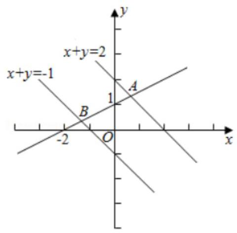

【例 3】过点 $P\left( {2,1}\right)$ 作直线 $l$ 分别交 $x, y$ 轴的正半轴于 $A, B$ 两点.

( I ) 当 $\left| {OA}\right|  \cdot  \left| {OB}\right|$ 取最小值时，求出最小值及直线 $l$ 的方程；

(II) 当 $\left| {OA}\right|  + \left| {OB}\right|$ 取最小值时,求出最小值及直线 $l$ 的方程;

(III) 当 $\left| {PA}\right|  \cdot  \left| {PB}\right|$ 取最小值时,求出最小值及直线 $l$ 的方程.

【难度】★★★

【答案】见解析

【解析】解: 设 $A\left( {a,0}\right) , B\left( {0, b}\right) \left( {a, b > 0}\right)$ .

( I ) 设直线方程为 $\frac{x}{a} + \frac{y}{b} = 1$ ,代入 $P\left( {2,1}\right)$ 得 $\frac{2}{a} + \frac{1}{b} = 1 \geq  2\sqrt{\frac{2}{ab}}$ ,

得 ${ab} \geq  8$ ,从而 ${S}_{\bigtriangleup {AOB}} = \frac{1}{2}{ab} \geq  4$ ，此时 $\frac{2}{a} = \frac{1}{b}, k =  - \frac{b}{a} =  - \frac{1}{2}$ . $\therefore$ 方程为 $x + {2y} - 4 = 0$ .

(II) 由 (I) $\frac{2}{a} + \frac{1}{b} = 1$ ,故 $a + b = \left( {a + b}\right) \left( {\frac{2}{a} + \frac{1}{b}}\right)  = 3 + \frac{a}{b} + \frac{2b}{a} \geq  3 + 2\sqrt{2}$ ,

此时 $\frac{a}{b} = \frac{2b}{a}, k =  - \frac{b}{a} =  - \frac{\sqrt{2}}{2}.\therefore$ 方程为 $x + \sqrt{2}y - 2 - \sqrt{2} = 0$ .

(III) 设直线 $l : y - 1 = k\left( {x - 2}\right)$ ,分别令 $y = 0, x = 0$ ,得 $A\left( {2 - \frac{1}{k},0}\right) , B\left( {0,1 - {2k}}\right)$ ,

则 $\left| {PA}\right|  \cdot  \left| {PB}\right|  = \sqrt{\left( {4 + 4{k}^{2}}\right) \left( {1 + \frac{1}{{k}^{2}}}\right) } = \sqrt{8 + 4\left( {{k}^{2} + \frac{1}{{k}^{2}}}\right) } \geq  4$ ,

当且仅当 ${k}^{2} = 1$ ,即 $k =  \pm  1$ 时, $\left| {PA}\right|  \cdot  \left| {PB}\right|$ 取最小值,又 $\because k < 0$ ,

$\therefore k =  - 1$ ,这时 $l$ 的方程为 $x + y - 3 = 0$ .

## 巩固训练

1、已知点 $A\left( {2, - 3}\right)$ ， $B\left( {-3, - 2}\right)$ 直线 $L$ 过点 $P\left( {1,1}\right)$ 且与线段 ${AB}$ 相交，直线 $L$ 的倾斜角 $\alpha$ 的取值范围是___.

【难度】 $\star   \star   \star$

【答案】 $\left\lbrack  {\arctan \frac{3}{4},\pi  - \arctan 4}\right\rbrack$

【解析】解: 根据题意,如图所示,所求直线 $l$ 的斜率 $k$ 满足 $k \geq  {k}_{PB}$ 或 $k \leq  {k}_{PA}$ ,

即有 $k \geq  \frac{1 + 2}{1 + 3} = \frac{3}{4}$ 或 $k \leq  \frac{1 + 3}{1 - 2} =  - 4$ ,则有 $k \geq  \frac{3}{4}$ 或 $k \leq   - 4$ ; 则有 $\tan \alpha  \geq  \frac{3}{4}$ 或 $\tan \alpha  \leq   - 4$ ;

当 $\alpha  = {90}^{ \circ  }$ 时,直线 $l$ 与线段 ${AB}$ 也相交,则有 $\alpha  \in  \left\lbrack  {\arctan \frac{3}{4},\pi  - \arctan 4}\right\rbrack$ ; 故答案为: $\left\lbrack  {\arctan \frac{3}{4},\pi  - \arctan 4}\right\rbrack$ .

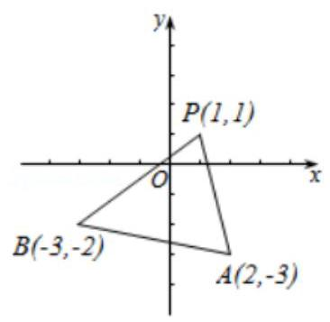

2、直线 $l$ 过点 $P\left( {-2,1}\right)$ 且斜率为 $k\left( {k > 1}\right)$ ，将直线 $l$ 绕 $P$ 点按逆时针方向旋转 ${45}^{ \circ  }$ 得直线 $m$ ，若直线 $l$ 和 $m$ 分别与 $y$ 轴交于 $Q, R$ 两点.

(1)用 $k$ 表示直线 $m$ 的斜率；

(2)当 $k$ 为何值时， $\bigtriangleup  {PQR}$ 的面积最小？并求出面积最小时直线 $l$ 的方程.

【难度】 $\star   \star   \star   \star$

【答案】见解析

【解析】解: (1) 设直线 $l$ 的倾斜角为 $\alpha$ ,则直线 $m$ 的倾斜角为 $\alpha  + {45}^{ \circ  }$ ,

${k}_{m} = \tan \left( {{45}^{ \circ  } + \alpha }\right)  = \frac{1 + \tan \alpha }{1 - \tan \alpha } = \frac{1 + k}{1 - k},\therefore$ 直线 $l$ 的方程为 $y - 1 = k\left( {x + 2}\right)$ ,

(2)直线 $m$ 的方程为 $y - 1 = \frac{1 + k}{1 - k}\left( {x + 2}\right)$ ，令 $x = 0$ ，得 ${y}_{Q} = {2k} + 1$ ， ${y}_{R} = \frac{3 + k}{1 - k}$ ，

$\therefore {S}_{\bigtriangleup {PQR}} = \frac{1}{2}\left| {{y}_{Q} - {y}_{R}}\right|  \cdot  \left| {x}_{P}\right|  = \frac{2\left( {{k}^{2} + 1}\right) }{k - 1}\left| {\;\because k > 1}\right. ,\therefore {S}_{\bigtriangleup {PQR}} = \frac{2\left( {{k}^{2} + 1}\right) }{k - 1} = 2 \cdot  \frac{{k}^{2} + 1}{k - 1} = 2\left\lbrack  {\left( {k - 1}\right)  + \frac{2}{k - 1} + 2}\right\rbrack   \geq  4\left( {\sqrt{2} + 1}\right)$ 由 $k - 1 = \frac{2}{k - 1}$ 得 $k = \sqrt{2} + 1\left( {k = 1 - \sqrt{2}\text{ 舍去 }}\right) ,\therefore$ 当 $k = \sqrt{2} + 1$ 时,

${\Delta PQR}$ 的面积最小,最小值为 $4\left( {\sqrt{2} + 1}\right)$ ,此时直线 $l$ 的方程是 $\left( {\sqrt{2} + 1}\right) x - y + 2\sqrt{2} + 3 = 0$ .

3、已知点 $A\left( {-2,0}\right) , B\left( {2,0}\right) , C\left( {1,1}\right) , D\left( {-1,1}\right)$ ,直线 $y = {kx} + m\left( {k > 0}\right)$ 将四边形 ${ABCD}$ 分割为面积相等的两部分,则 $m$ 的取值范围是(   )

A. $\left( {0,1}\right)$ B. $\left( {\frac{1}{3},\frac{1}{2}}\right\rbrack$ C. $\left( {\frac{1}{3},\frac{4 - \sqrt{10}}{2}}\right\rbrack$ D. $\left( {\frac{4 - \sqrt{10}}{2},\frac{1}{2}}\right\rbrack$

【难度】★★★★

【答案】D

【解析】解: $\because$ 点 $A\left( {-2,0}\right) , B\left( {2,0}\right) , C\left( {1,1}\right) , D\left( {-1,1}\right)$ ,如图,四边形的面积为 $\frac{1}{2} \times  \left( {4 + 2}\right)  \times  1 = 3$ ,

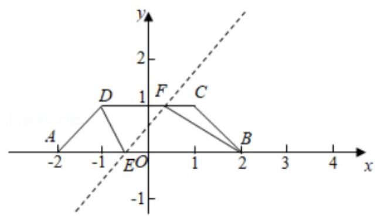

① 若直线在第一象限与 ${CD}$ 相交，设交点为 $F$ ，则直线必与 ${OA}$ 交于一点，设为 $E$ ，

连接 ${BF},{DE}$ ,要使直线平分梯形,只须 ${CF} + {BE} = {DF} + {AE} = 3$ ,设 ${BE} = t$ ,则 $E$ 点坐标为 $\left( {2 - t,0}\right) , F$ 点坐标为 $\left( {t - 2,1}\right) ,{EF}$ 关于 $\left( {0,\frac{1}{2}}\right)$ 对称,此时 $m = \frac{1}{2}$

②若直线与梯形在第一象限的交点在 ${BC}$ 上，设交点为 $F$ ， ${BC}$ 所在直线的方程为 $x + y = 2$ . 此时直线与 ${AB}$

相交,或者与 ${AD}$ 相交,

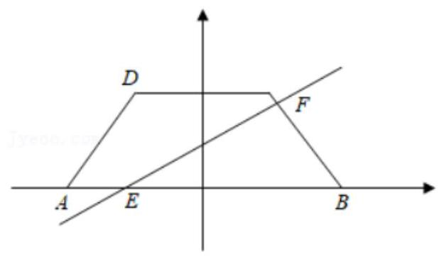

( 1 )若与 ${AB}$ 相交，设交点为 $E$ 点坐标为 $\left( {t,0}\right)$ ，则 ${BE} = 2 - t$ ，

$\therefore$ 三角形 ${BEF}$ 在 ${BE}$ 边上的高为 $\frac{3}{2 - t} \leq  1, F$ 点横坐标为 $\left( {2 - \frac{3}{2 - t},\frac{3}{2 - t}}\right)$ ,

其中 $- 2 \leq  t < 1$ ,经计算, $m = \frac{3}{\left( {-t - \frac{1}{t}}\right)  + 4}\left( {-2 \leq  t < 1}\right)$ ,

当 $t =  - 1$ 时, $m$ 有最大值 $\frac{1}{2}, t =  - 2$ ,时有最小值 $\frac{6}{13}$ ,若两交点分别在 ${AD}$ 和 ${BF}$ 上,如图,此时,

过 $A$ 点时, $m$ 最大为 $\frac{6}{13}$ ,当斜率 $k \rightarrow  0$ 时,有最小值 (取不到) $\frac{4 - \sqrt{10}}{2}$

综上, $m \in  \left( {\frac{4 - \sqrt{10}}{2},\frac{1}{2}}\right\rbrack$ ,故选: $D$ .

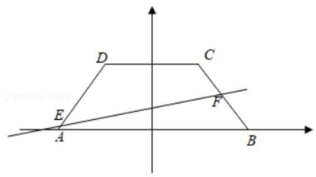

## (二)直线的位置关系

## 知识梳理

## 1、直线与直线的位置关系

平面内两条直线的位置关系有三种:重合、平行、相交。

判别方法:

方法一:系数行列式

设直角坐标系平面上两条直线方程为:

${l}_{1} : {a}_{1}x + {b}_{1}y + {c}_{1} = 0\;{l}_{2} : {a}_{2}x + {b}_{2}y + {c}_{2} = 0$

联立方程组为: $\left\{  \begin{array}{l} {a}_{1}x + {b}_{1}y + {c}_{1} = 0 \\  {a}_{2}x + {b}_{2}y + {c}_{2} = 0 \end{array}\right.$

对于方程组的解情况取决于系数构成的行列式的值:

$$
D = \left| \begin{array}{ll} {a}_{1} & {b}_{1} \\  {a}_{2} & {b}_{2} \end{array}\right| \;{D}_{x} = \left| \begin{array}{ll}  - {c}_{1} & {b}_{1} \\   - {c}_{2} & {b}_{2} \end{array}\right| \;{D}_{y} = \left| \begin{array}{ll} {a}_{1} &  - {c}_{1} \\  {a}_{2} &  - {c}_{2} \end{array}\right|
$$

当 $D \neq  0$ ,方程组有唯一解为 $\left\{  \begin{array}{l} x = \frac{{D}_{x}}{D} \\  y = \frac{{D}_{y}}{D} \end{array}\right.$

此时直线 ${l}_{1},{l}_{2}$ 相交于一点,坐标为 $\left( {\frac{{D}_{x}}{D},\frac{{D}_{y}}{D}}\right)$ 。

当 $D = 0$ ,方程组的解情况要根据 ${D}_{x},{D}_{y}$ 的情况分类讨论

(i) 当 ${D}_{x} \neq  0$ 或 ${D}_{y} \neq  0$ 时,方程组无解,此时直线 ${l}_{1},{l}_{2}$ 没有公共点,即两直线平行。

(ii) 当 ${D}_{x} = {D}_{y} = 0$ 时,方程组无穷解,此时直线 ${l}_{1},{l}_{2}$ 重合

方法二: 当直线不平行于坐标轴时, 直线与直线的位置关系可根据下表判定

<table><tr><td>条方   程   件   关</td><td>${l}_{1} : y = {k}_{1}x + {b}_{1}$   ${l}_{2} : y = {k}_{2}x + {b}_{2}$</td><td>${l}_{1} : {a}_{1}x + {b}_{1}y + {c}_{1} = 0$   ${l}_{2} : {a}_{2}x + {b}_{2}y + {c}_{2} = 0$</td></tr><tr><td>平 行</td><td>${k}_{1} = {k}_{2}$ 且 ${b}_{1} \neq  {b}_{2}$</td><td>$\frac{{a}_{1}}{{a}_{2}} = \frac{{b}_{1}}{{b}_{2}} \neq  \frac{{c}_{1}}{{c}_{2}}$</td></tr><tr><td>重 合</td><td>${k}_{1} = {k}_{2}$ 且 ${b}_{1} = {b}_{2}$</td><td>$\frac{{a}_{1}}{{a}_{2}} = \frac{{b}_{1}}{{b}_{2}} = \frac{{c}_{1}}{{c}_{2}}$</td></tr><tr><td>相 交</td><td>${k}_{1} \neq  {k}_{2}$</td><td>$\frac{{a}_{1}}{{a}_{2}} \neq  \frac{{b}_{1}}{{b}_{2}}$</td></tr><tr><td>垂直</td><td>${k}_{1} \cdot  {k}_{2} =  - 1$</td><td>${a}_{1}{a}_{2} + {b}_{1}{b}_{2} = 0$</td></tr></table>

注:当直线平行于坐标轴时可结合图形进行考虑其位置关系。

## 2、相交直线的夹角

设直角坐标系平面上两条直线方程为: ${l}_{1} : {a}_{1}x + {b}_{1}y + {c}_{1} = 0\;{l}_{2} : {a}_{2}x + {b}_{2}y + {c}_{2} = 0$

其夹角为 $\alpha$ ,因为 $\alpha  \in  \left\lbrack  {0,\frac{\pi }{2}}\right\rbrack$ ,所以有

向量表示: $\cos \alpha  = \left| {\cos \theta }\right|  = \left| \frac{{\overrightarrow{d}}_{1} \cdot  {\overrightarrow{d}}_{2}}{\left| {\overrightarrow{d}}_{1}\right|  \cdot  \left| {\overrightarrow{d}}_{2}\right| }\right|  = \frac{\left| {a}_{1}{a}_{2} + {b}_{1}{b}_{2}\right| }{\sqrt{{a}_{1}^{2} + {b}_{1}^{2}} \cdot  \sqrt{{a}_{2}^{2} + {b}_{2}^{2}}}$

因为 $\alpha  \in  \left\lbrack  {0,\frac{\pi }{2}}\right\rbrack$ ,余弦函数在 $\left\lbrack  {0,\frac{\pi }{2}}\right\rbrack$ 上单调递减,所以此时 $\alpha$ 是唯一确定的

特别地,当 $\cos \alpha  = 0$ 时,即 $\alpha  = \frac{\pi }{2}$ ,此时直线 ${l}_{1},{l}_{2}$ 垂直。

斜率表示:

同样地，由于不是所有的直线都有斜率，因此需要按 “斜率存在、斜率不存在” 分类讨论。

(1)若两直线的斜率都存在，当 $\alpha  \neq  \frac{\pi }{2}$ 时，有公式 $\tan \alpha  = \left| \frac{{k}_{2} - {k}_{1}}{1 + {k}_{1}{k}_{2}}\right|$

(2)如果直线 ${l}_{1}$ 和 ${l}_{2}$ 中有一条斜率不存在，"夹角" 可借助于图形，通过直线的倾斜角求出。

## 3、点到直线的距离公式及两条平行线间的距离公式

1、 ${p}_{ \circ  }\left( {{x}_{ \circ  }{y}_{ \circ  }}\right)$ 到 ${l}_{1} : {Ax} + {By} + C = 0$ 的距离: $d = \frac{1{Ax}_{ \circ  } + {By}_{ \circ  } + {C1}}{\sqrt{{A}^{2} + {B}^{2}}}$

2、 ${l}_{1} : {Ax} + {By} + {C}_{1} = 0\;{l}_{2} : {Ax} + {By} + {C}_{2} = 0 : \;d = \frac{\left| {C}_{1} - {C}_{2}\right| }{\sqrt{{A}^{2} + {B}^{2}}}$

3、点与直线的位置关系:

设直线 ${Ax} + {By} + C = 0$ ,点 ${p}_{ \circ  }\left( {{x}_{ \circ  }{y}_{ \circ  }}\right)$ ,则 $\delta  = \frac{A{x}_{0} + B{y}_{0} + C}{\sqrt{{A}^{2} + {B}^{2}}}$ ,有:

(1)在直线同侧的所有点， $\delta$ 的符号是相同的；(2)在直线异侧的所有点， $\delta$ 的符号是相反的。

## 4、直线系方程

直线系方程: ${l}_{1} : {A}_{1}x + {B}_{1}y + {C}_{1} = 0,{l}_{2} : {A}_{2}x + {B}_{2}y + {C}_{2} = 0,\left( {{A}_{i}{}^{2} + {B}_{i}{}^{2} \neq  0}\right) , i = 1,2$

直线 $l : \left( {{A}_{1}x + {B}_{1}y + {C}_{1}}\right)  + \lambda \left( {{A}_{2}x + {B}_{2}y + {C}_{2}}\right)  = 0$ 表示过 ${l}_{1}\text{ 、 }{l}_{2}$ 交点 $\left( {l}_{2}\right.$ 除外) 的一切直线, ${l}_{1}\text{ 、 }{l}_{2}$ 的交点为定点。

## 例题精讲

【例题 4】已知直线 ${l}_{1} : \left( {1 + m}\right) x + \left( {1 - {4m}}\right) y - 6 - m = 0$ 过定点 $P$ ，直线 ${l}_{2}$ 过点 $Q\left( {2, - 1}\right)$ ，且 ${l}_{1},{l}_{2}$ 分别绕 $P$ 、 $Q$ 旋转，但始终保持平行，则 ${l}_{1}$ ， ${l}_{2}$ 之间的距离的取值范围是 ___.

【难度】 $\star   \star   \star$

【答案】 $(0,\sqrt{13}\rbrack$

【解析】解: 直线 ${l}_{1} : \left( {1 + m}\right) x + \left( {1 - {4m}}\right) y - 6 - m = 0$ 可变形为 $\left( {1 + m}\right) \left( {x - 5}\right)  + \left( {1 - {4m}}\right) \left( {y - 1}\right)  = 0$ ,

令 $a = 1 + m, b = 1 - {4m}$ ,因为 ${l}_{1}//{l}_{2}$ ,且点 $Q$ 在直线 ${l}_{2}$ 上,

则 ${l}_{1},{l}_{2}$ 之间的距离 $d$ 等于点 $Q$ 到直线 ${l}_{1}$ 的距离,

所以 $d = \frac{\left| -3a - 2b\right| }{\sqrt{{a}^{2} + {b}^{2}}} = \sqrt{\frac{{\left( -3a - 2b\right) }^{2}}{{a}^{2} + {b}^{2}}} = \sqrt{\frac{9{a}^{2} + 4{b}^{2} + 2 \cdot  {2a} \cdot  {3b}}{{a}^{2} + {b}^{2}}} \leq  \sqrt{\frac{9{a}^{2} + 4{b}^{2} + 4{a}^{2} + 9{b}^{2}}{{a}^{2} + {b}^{2}}} = \sqrt{13}$ ,

当且仅当 ${2a} = {3b}$ ，即 $m = \frac{1}{14}$ 时取等号，所以 ${l}_{1}\text{ ， }{l}_{2}$ 之间的距离的最大值为 $\sqrt{13}$ ，

又直线 ${l}_{1},{l}_{2}$ 不重合,所以 ${l}_{1},{l}_{2}$ 之间的距离的取值范围是 $(0,\sqrt{13}\rbrack$ .

故答案为: $(0,\sqrt{13}\rbrack$ .

【例题 5】已知 $m \in  R$ ,过定点 $A$ 的动直线 ${mx} + y = 0$ 和过定点 $B$ 的动直线 $x - {my} - m + 3 = 0$ 交于点 $P$ ,则 $\left| {PA}\right|  + \sqrt{3}\left| {PB}\right|$ 的取值范围是( )

A. $\left( {\sqrt{10},2\sqrt{10}}\right\rbrack$ B. $\left( {\sqrt{10},\sqrt{30}}\right)$ C. $\lbrack \sqrt{10},\sqrt{30})$ D. $\left\lbrack  {\sqrt{10},2\sqrt{10}}\right\rbrack$

【难度】★★★★

【答案】 $D$

【解析】解: 由题意可知,动直线 ${mx} + y = 0$ 经过定点 $A\left( {0,0}\right)$ ,

动直线 $x - {my} - m + 3 = 0$ 即 $- m\left( {y + 1}\right) x + 3 = 0$ ,经过点定点 $B\left( {-3, - 1}\right)$ ,

$\because$ 动直线 ${mx} + y = 0$ 和过定点 $B$ 的动直线 $x - {my} - m + 3 = 0$ 满足 $m \times  1 + 1 \times  \left( {-m}\right)  = 0,\therefore$ 两直线始终垂直,

$P$ 又是两条直线的交点, $\therefore {PA} \bot  {PB},\therefore {\left| PA\right| }^{2} + {\left| PB\right| }^{2} = {\left| AB\right| }^{2} = {10}$ .

设 $\angle {ABP} = \theta$ ,则 $\left| {PA}\right|  = \sqrt{10}\sin \theta ,\left| {PB}\right|  = \sqrt{10}\cos \theta$ ,由 $\left| {PA}\right|  \geq  0$ 且 $\left| {PB}\right|  \geq  0$ ,可得 $\theta  \in  \left\lbrack  {0,\frac{\pi }{2}}\right\rbrack$

则 $\left| {PA}\right|  + \sqrt{3}\left| {PB}\right|  = \sqrt{10}\sin \theta  + \sqrt{3} \cdot  \sqrt{10}\cos \theta  = 2\sqrt{10}\sin \left( {\theta  + \frac{\pi }{3}}\right)$ ,

$\because \theta  + \frac{\pi }{3} \in  \left\lbrack  {\frac{\pi }{3},\frac{5\pi }{6}}\right\rbrack  ,\therefore \sin \left( {\theta  + \frac{\pi }{3}}\right)  \in  \left\lbrack  {\frac{1}{2},1}\right\rbrack  ,\therefore 2\sqrt{10}\sin \left( {\theta  + \frac{\pi }{3}}\right)  \in  \left\lbrack  {\sqrt{10},2\sqrt{10}}\right\rbrack$ ,

故选: $D$ .

【例题 6】在直角坐标系 ${xOy}$ 中,已知直线 $l : x \cdot  \cos \theta  + y \cdot  \sin \theta  = 1$ ，当 $\theta$ 变化时，动直线始终没有经过点 $P$ . 定点 $Q$ 的坐标 $\left( {-2,0}\right)$ ,则 $\left| {PQ}\right|$ 的取值范围为(   )

A. $\left\lbrack  {0,2}\right\rbrack$ B. $\left( {0,2}\right)$ C. $\left\lbrack  {1,3}\right\rbrack$ D. $\left( {1,3}\right)$

【难度】 $\star   \star   \star   \star$

【答案】 $D$

【解析】解: 解法 1 、由原点 $O\left( {0,0}\right)$ 到直线 $l : x \cdot  \cos \theta  + y \cdot  \sin \theta  = 1$ 的距离为 $d = \frac{\left| 0 + 0 - 1\right| }{\sqrt{{\cos }^{2}\theta  + {\sin }^{2}\theta }} = 1$ ,

所以直线是单位圆的切线,点 $P$ 在单位圆内;

所以点 $Q$ 到点 $P$ 的距离 $\left| {PQ}\right|$ 的取值范围是 $\left( {1,3}\right)$ .

解法 2、由题意知,点 $P$ 坐标不确定,

当 $\theta  = 0$ 时,直线 $l : x \cdot  \cos \theta  + y \cdot  \sin \theta  = 1$ 化为 $x = 1$ ,直线 $l$ 上的点 $A\left( {1,0}\right)$ 到点 $Q$ 的距离为 3,可以排除选项 $C$ ; 当 $\theta  = \pi$ 时,直线 $l : x \cdot  \cos \theta  + y \cdot  \sin \theta  = 1$ 化为 $x =  - 1$ ,直线 $l$ 上的点 $B\left( {-1,0}\right)$ 点 $Q$ 的距离为 1,可以排除选项 $A$ 、 $B\text{ 、 }C$ ; 所以 $\left| {PQ}\right|$ 的取值范围是 $\left( {1,3}\right)$ . 故选: $D$ .

【例题 7】在直线 $l : {3x} - y - 1 = 0$ 上求一点 $P$ ,使得:

(1) $P$ 到 $A\left( {4,1}\right)$ 和 $B\left( {0,4}\right)$ 的距离之差最大；

(2) $P$ 到 $A\left( {4,1}\right)$ 和 $C\left( {3,4}\right)$ 的距离之和最小.

【难度】 $\star   \star   \star$

【答案】见解析

【解析】解: (1) $P$ 到 $A\left( {4,1}\right)$ 和 $B\left( {0,4}\right)$ 的距离之差最大,显然 $A$ 、 $B$ 位于直线 $L$ 两侧,

作 $B$ 关于直线 $L$ 的对称点 ${B}^{\prime }$ ,连接 ${B}^{\prime }A$ ,则 ${B}^{\prime }A$ 所在直线与直线 $L$ 交点即为 $P$ ,

此时, $\left| {{PA} - {PB}}\right|$ 的差值最大,最大值就是 ${B}^{\prime }A$ ,

设 $B$ 点关于 $L$ 对称点 ${B}^{\prime }\;\left( {a.b}\right)$ ,则 $\left( {b - 4}\right)  \times  3 =  - \left( {a - 0}\right) ,{3a} - \left( {b + 4}\right)  - 2 = 0$ ,

得 $a = 3, b = 3$

$A{B}^{\prime }$ 的直线方程为 ${2X} + Y - 9 = 0$ 解方程 ${2X} + Y - 9 = 0$ 与 ${3x} - y - 1 = 0$ 可得 $\left( {2\text{ 、 }5}\right)$ 是距离之差最大的点.

(2) $P$ 到 $A\left( {4,1}\right)$ 和 $C\left( {3,4}\right)$ 的距离之和最小，显然， $A\text{ 、 }C$ 位于直线 $L$ 同侧

作点 $C$ 关于直线 $L$ 对称点 ${C}^{\prime }$ ,连接 ${C}^{\prime }A$ 则 ${C}^{\prime }A$ 与直线 $L$ 的交点就是点 $P$

此时, ${PA} + {PB}$ 之和最小,最小值为 ${C}^{\prime }A$ ,设 $C$ 关于 $l$ 的对称点为 ${C}^{\prime }\left( {m, n}\right)$ ,

可得 $\frac{n - 4}{m - 3} =  - \frac{1}{3},\frac{3\left( {m + 3}\right) }{2} - \frac{n + 4}{2} - 1 = 0$ ,求出 ${C}^{\prime }$ 的坐标为 $\left( {\frac{3}{5},\frac{24}{5}}\right)$ .

$\therefore A{C}^{\prime }$ 所在直线的方程为 ${19x} + {17y} - {93} = 0.A{C}^{\prime }$ 和 $l$ 交点的坐标为 $P\left( {\frac{11}{7},\frac{26}{7}}\right)$ .

$\therefore$ 点 $P$ 的坐标为 $P\left( {\frac{11}{7},\frac{26}{7}}\right)$

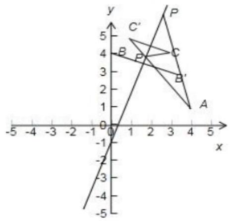

【例题 8】(1)在等腰直角三角形 ${ABC}$ 中， ${AB} = {AC} = 4$ ，点 $P$ 是边 ${AB}$ 边上异于 ${AB}$ 的一点，光线从点 $P$ 出发，经 ${BC},{CA}$ 反射后又回到点 $P$ (如图)，若光线 ${QR}$ 经过 $\bigtriangleup  {ABC}$ 的重心，则三角形 ${PQR}$ 周长等于()

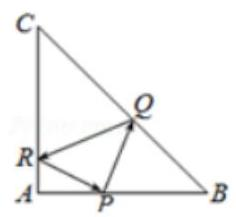

A. $\frac{8\sqrt{5}}{3}$ B. $\frac{2\sqrt{37}}{3}$ C. $4\sqrt{5}$

D. $\frac{5\sqrt{3}}{3}$

【难度】 $\star   \star   \star   \star$

【答案】 $A$

【解析】解: 以 ${AB}$ 所在直线为 $x$ 轴, ${AC}$ 所在直线为 $y$ 轴,建立如图所示的平面直角坐标系,

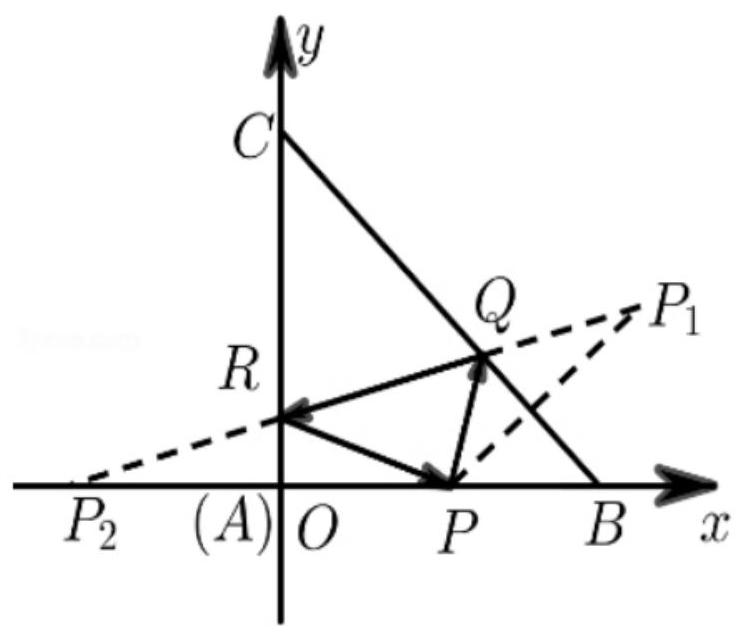

由题意知 $B\left( {4,0}\right) , C\left( {0,4}\right) , A\left( {0,0}\right)$ ,

则直线 ${BC}$ 的方程为 $x + y - 4 = 0$ ,设 $P\left( {t,0}\right) \left( {0 < t < 4}\right)$ ,

由对称知识可得点 $P$ 关于直线 ${BC}$ 的对称点 ${P}_{1}$ 的坐标为 $\left( {4,4 - t}\right)$ ,

点 $P$ 关于 $y$ 轴的对称点 ${P}_{2}$ 的坐标为 $\left( {-t,0}\right)$ ,根据反射定理可知 ${P}_{1}{P}_{2}$ 就是光线 ${RQ}$ 所在的直线.

由 ${P}_{1}{P}_{2}$ 两点坐标可得直线 ${P}_{1}{P}_{2}$ 的方程为 $y = \frac{4 - t}{4 + t} \cdot  \left( {x + t}\right)$ ,

设 $\bigtriangleup  {ABC}$ 的重心为 $G$ ，易知 $G\left( {\frac{4}{3},\frac{4}{3}}\right)$ . 因为重心 $G\left( {\frac{4}{3},\frac{4}{3}}\right)$ 在光线 ${RQ}$ 上，所以 $\frac{4}{3} = \frac{4 - t}{4 + t}\left( {\frac{4}{3} + t}\right)$ ，

即 $3{t}^{2} - {4t} = 0$ ,所以 $t = 0$ 或 $t = \frac{4}{3}$ ,因为 $0 < t < 4$ ,所以 $t = \frac{4}{3}$ ,即 ${AP} = \frac{4}{3}$ .

所以 ${P}_{1}\left( {4,\frac{8}{3}}\right) ,{P}_{2}\left( {-\frac{4}{3},0}\right)$ ,结合对称关系可知 ${QP} = Q{P}_{1},{RP} = R{P}_{2}$ ,

所以 $\bigtriangleup  {PQR}$ 的周长即线段 ${P}_{1}{P}_{2}$ 的长度，即 ${P}_{1}{P}_{2} = \sqrt{{\left( 4 + \frac{4}{3}\right) }^{2} + {\left( \frac{8}{3} - 0\right) }^{2}} = \frac{8\sqrt{5}}{3}$ .

故选: $A$ .

(2)已知点 $A$ 为 $y = \frac{\sqrt{3}}{x} + \frac{\sqrt{3}}{3}x\left( {x \in  R, x > 0}\right)$ 上一点， $B$ 为 $y$ 轴上动点， $C$ 为 $y = \frac{\sqrt{3}}{3}x$ 上动点 $(A, B, C$ 三点不共线),则 ${\Delta ABC}$ 周长的最小值为___.

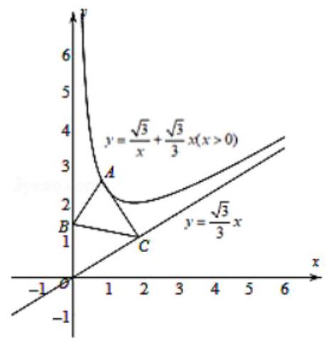

【答案】 $3\sqrt{2}$

【解析】解: 如图示:

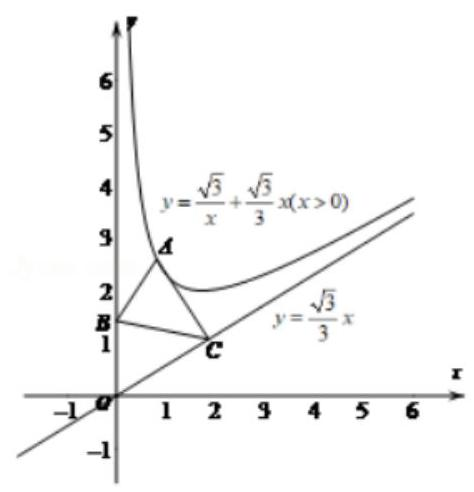

不妨先固定点 $A\left( {m, n}\right)$ ,作点 $A$ 关于 $y$ 轴的对称点 ${A}^{\prime }\left( {-m, n}\right)$ ,

作点 $A$ 关于 $y = \frac{\sqrt{3}}{3}x$ 的对称点 ${A}^{\prime \prime }\left( {p, q}\right)$ ,

则 $\left\{  \begin{array}{l} \frac{q - n}{p - m} =  - \sqrt{3} \\  \frac{n + q}{2} = \frac{\sqrt{3}}{3} \cdot  \frac{m + p}{2} \end{array}\right.$ ,解得 $\left\{  \begin{array}{l} p = \frac{1}{2}m + \frac{\sqrt{3}}{2}n \\  q = \frac{\sqrt{3}}{2}m - \frac{1}{2}n \end{array}\right.$ ,即 ${A}^{\prime \prime }\left( {\frac{1}{2}m + \frac{\sqrt{3}}{2}n,\frac{\sqrt{3}}{2}m - \frac{1}{2}n}\right)$ ,

由垂直平分线的性质得 $\bigtriangleup {ABC}$ 的周长 $= {A}^{\prime }B + {BC} + C{A}^{\prime \prime } \geq  {A}^{\prime }{A}^{\prime \prime }$ ,

当且仅当 ${A}^{\prime }, B, C,{A}^{\prime \prime }$ 四点共线时取等号,

而 ${A}^{\prime }{A}^{\prime \prime } = \sqrt{{\left( \frac{1}{2}m + \frac{\sqrt{3}}{2}n + m\right) }^{2} + {\left( \frac{\sqrt{3}}{2}m - \frac{1}{2}n - n\right) }^{2}} = \sqrt{{\left( \frac{3}{2}m + \frac{\sqrt{3}}{2}n\right) }^{2} + {\left( \frac{\sqrt{3}}{2}m - \frac{3}{2}n\right) }^{2}} = \sqrt{3{m}^{2} + 3{n}^{2}}$

$= \sqrt{3} \cdot  \sqrt{{m}^{2} + {\left( \frac{\sqrt{3}}{m} + \frac{\sqrt{3}}{3}m\right) }^{2}} = \sqrt{3} \cdot  \sqrt{\frac{4{m}^{2}}{3} + \frac{3}{{m}^{2}} + 2} \geq  \sqrt{3} \cdot  \sqrt{2\sqrt{4} + 2} = 3\sqrt{2}$ ,当且仅当 ${m}^{2} = \frac{3}{2}$ 时取等号,

所以 $\bigtriangleup  {ABC}$ 的周长的最小值为 $3\sqrt{2}$ .

## 巩固训练

1、已知点 $A\left( {-2,0}\right) , B\left( {2,0}\right)$ ，如果直线 ${3x} - {4y} + m = 0$ 上有且只有一个点 $P$ 使得 ${PA} \bot  {PB}$ ，那么实数 $m$ 等于( )

A. $\pm  4$ B. ±5 C. ±8 D. ±10

【难度】★★★

【答案】 $D$

【解析】解: 直线 ${3x} - {4y} + m = 0$ 上有且只有一个点 $P$ 使得 ${PA} \bot  {PB}$ ,则此直线与圆: ${x}^{2} + {y}^{2} = 4$ 相切. $\therefore \frac{\left| 0 + 0 + m\right| }{\sqrt{{3}^{2} + {\left( -4\right) }^{2}}} = 2$ ,解得 $m =  \pm  {10}$ . 故选: $D$ .

2、设已知三条直线 ${l}_{1} : {mx} - y + m = 0,{l}_{2} : x + {my} - m\left( {m + 1}\right)  = 0,{l}_{3} : \left( {m + 1}\right) x - y + \left( {m + 1}\right)  = 0$ ,它们围成 $\bigtriangleup {ABC}$ .

(1)求证:不论 $m$ 为何值， ${\Delta ABC}$ 有一个顶点为定点；

(2)当 $m$ 为何值时， ${\Delta ABC}$ 面积有最大值和最小值，并求此最大值与最小值.

【难度】 $\star   \star   \star   \star$

【答案】见解析

【解析】解: (1) 证明: 根据题意得 ${l}_{1},{l}_{3}$ 交于 $A\left( {-1,0}\right) {l}_{2},{l}_{3}$ 交于 $B\left( {0, m + 1}\right)$ ,

$\therefore$ 不论 $m$ 取何值时, $\bigtriangleup {ABC}$ 中总有一个顶点为定点 $\left( {-1,0}\right)$ .

(2)从条件中可以看出 ${l}_{1}\text{ 、 }{l}_{2}$ 垂直， $\therefore$ 角 $C$ 为直角， $\therefore S = \frac{1}{2}\left| {AC}\right|  \cdot  \left| {BC}\right|$ ，

$\left| {BC}\right|$ 等于点 $\left( {0, m + 1}\right)$ 到 ${l}_{1}$ 的距离 $d = \frac{\left| -m - 1 + m\right| }{\sqrt{{m}^{2} + 1}} = \frac{1}{\sqrt{{m}^{2} + 1}}$ ,

$\left| {AC}\right|$ 等于 $\left( {-1,0}\right)$ 到 ${l}_{2}$ 的距离 $d = \frac{{m}^{2} + m + 1}{\sqrt{{m}^{2} + 1}}, S = \frac{1}{2} \times  \frac{{m}^{2} + m + 1}{{m}^{2} + 1} = \frac{1}{2}\left( {1 + \frac{1}{m + \frac{1}{m}}}\right)$ ,

当 $m > 0$ 时, $\frac{1}{m + \frac{1}{m}}$ 有最大值 $\frac{1}{2}$ ,同理,当 $m < 0$ 时, $\frac{1}{m + \frac{1}{m}}$ 有最小- $\frac{1}{2}$ ,

$\therefore m = 1$ 时 $S$ 取最大值为 $\frac{3}{4}, m =  - 1$ 时 $S$ 取最小值 $\frac{1}{4}$ .

## (三) 圆

## 知识梳理

1、确定圆方程的条件

圆的标准方程 ${\left( x - a\right) }^{2} + {\left( y - b\right) }^{2} = {r}^{2}$ 中,有三个参数 $a, b, r$ ,只要求出 $a, b, r$ 这时圆的方程就被确定. 因此确定圆方程, 需三个独立条件, 其中圆心是圆的定位条件, 半径是圆的定形条件.

确定圆的方程的主要方法有两种: 一是定义法, 二是待定系数法。定义法是指用定义求出圆心坐标和半径长,从而得到圆的标准方程; 待定系数法即列出关于 $D, E, F$ 的方程组,求 $D, E, F$ 而得到圆的一般方程, 一般步骤为:

(1)根据题意，没所求的圆的标准方程为 ${x}^{2} + {y}^{2} + {Dx} + {Ey} + F = 0$

(2)根据已知条件，建立关于 $D, E, F$ 的方程组；

(3)解方程组。求出 $D, E, F$ 的值，并把它们代入所设的方程中去，就得到所求圆的一般方程.

2、点 $P\left( {{x}_{0},{y}_{0}}\right)$ 与圆的位置关系:

若 ${\left( {x}_{0} - a\right) }^{2} + {\left( {y}_{0} - b\right) }^{2} = {r}^{2}$ ,则点 $\mathrm{P}$ 在圆上;

若 ${\left( {x}_{0} - a\right) }^{2} + {\left( {y}_{0} - b\right) }^{2} > {r}^{2}$ ,则点 $\mathrm{P}$ 在圆外;

若 ${\left( {x}_{0} - a\right) }^{2} + {\left( {y}_{0} - b\right) }^{2} < {r}^{2}$ ,则点 $\mathrm{P}$ 在圆内;

3、二元二次方程 ${x}^{2} + {y}^{2} + {Dx} + {Ey} + F = 0$ 是否表示圆的条件:

先将二元二次方程配方得 ${\left( x + \frac{D}{2}\right) }^{2} + {\left( y + \frac{E}{2}\right) }^{2} = \frac{{D}^{2} + {E}^{2} - {4F}}{4}$ ①,(1)当 ${D}^{2} + {E}^{2} - {4F} > 0$ 时，方程①表示以 $\left( {-\frac{D}{2},\frac{E}{2}}\right)$ 为圆心， $\frac{1}{2}\sqrt{{D}^{2} + {E}^{2} - {4F}}$ 为半径的圆；(2)当 ${D}^{2} + {E}^{2} - {4F} = 0$ 时，方程①表示点 $\left( {-\frac{D}{2},\frac{E}{2}}\right)$ ; (3) 当 ${D}^{2} + {E}^{2} - {4F} < 0$ 时,方程①没有实根,因此它不表示任何图形. 当方程①表示圆时, 我们把它叫做圆的一般方程,确定它需三个独立条件 $D, E, F$ ,且 ${D}^{2} + {E}^{2} - {4F} > 0$ ,这就确定了求它的方程的方法——待定系数法，注意用待定系数法求圆的方程，用一般形式比用标准形式在运算上简单，前者解的是三元一次方程组, 后者解的是三元二次方程组.

4、线段 AB 为直径的圆的方程: 若 $A\left( {{x}_{1},{y}_{1}}\right) , B\left( {{x}_{2},{y}_{2}}\right)$ ,则以线段 $\mathrm{{AB}}$ 为直径的圆的方程是

$$
\left( {x - {x}_{1}}\right) \left( {x - {x}_{2}}\right)  + \left( {y - {y}_{1}}\right) \left( {y - {y}_{2}}\right)  = 0.
$$

5、直线与圆的位置关系有三种，即相交、相切和相离，判定的方法有两种:

(1)代数法:通过直线方程与圆的方程所组成的方程组，根据解的个数来研究。若有两组不同的实数解,即 $\Delta  > 0$ ,则相交; 若有两组相同的实数解,即 $\Delta  = 0$ ,则相切; 若无实数解,即 $\Delta  < 0$ ,则相离.

(2)几何法:由圆心到直线的距离 $d$ 与半径 $r$ 的大小来判断:

当 $d < r$ 时,直线与圆相交; 当 $d = r$ 时,直线与圆相切; 当 $d > r$ 时,直线与圆相离.

以上两种方法比较: 为避免运算量过大, 一般不用代数法, 而是用几何法.

6、直线与圆相切，切线的求法

(1)当点 $P\left( {{x}_{0},{y}_{0}}\right)$ 在圆 ${x}^{2} + {y}^{2} = {r}^{2}$ 上时，切线方程为 ${x}_{0}x + {y}_{0}y = {r}^{2}$ ；

(2) 若点 $P\left( {{x}_{0},{y}_{0}}\right)$ 在圆 ${\left( x - a\right) }^{2} + {\left( y - b\right) }^{2} = {r}^{2}$ 上，则切线方程为 $\left( {{x}_{0} - a}\right) \left( {x - a}\right)  + \left( {{y}_{0} - b}\right) \left( {y - b}\right)  = {r}^{2};$

(3)斜率为 $k$ 且与圆 ${x}^{2} + {y}^{2} = {r}^{2}$ 相切的切线方程为: $y = {kx} \pm  r\sqrt{1 + {k}^{2}}$ ；斜率为 $k$ 且与圆 ${\left( x - a\right) }^{2} + {\left( y - b\right) }^{2} = {r}^{2}$ 相切的切线方程的求法,可以设切线为 $y = {kx} + m$ ,然后变成一般式 ${kx} - y + m = 0$ ,利用圆心到切线的距离等于半径列出方程求 $m$ .

(4) 点 $P\left( {{x}_{0},{y}_{0}}\right)$ 在圆外面,则设切线方程为 $y - {y}_{0} = k\left( {x - {x}_{0}}\right)$ ,变成一般式后,利用圆心到直线距离等于半径,解出 $k$ ,注意若此方程只有一个实根,则还有一条斜率不存在的直线,务必要补上.

7、经过两个圆交点的圆系方程:

经过 ${x}^{2} + {y}^{2} + {D}_{1}x + {E}_{1}y + {F}_{1} = 0,{x}^{2} + {y}^{2} + {D}_{2}x + {E}_{2}y + {F}_{2} = 0$ 的交点的圆系方程是:

$$
{x}^{2} + {y}^{2} + {D}_{1}x + {E}_{1}y + {F}_{1} + \lambda \left( {{x}^{2} + {y}^{2} + {D}_{2}x + {E}_{2}y + {F}_{2}}\right)  = 0.
$$

在过两圆公共点的图象方程中,若 $\lambda  =  - 1$ ,可得两圆公共弦所在的直线方程.

8、经过直线与圆交点的圆系方程:

经过直线 $l : {Ax} + {By} + C = 0$ 与圆 ${x}^{2} + {y}^{2} + {Dx} + {Ey} + F = 0$ 的交点的圆系方程是:

$$
{x}^{2} + {y}^{2} + {Dx} + {Ey} + F + \lambda \left( {{Ax} + {By} + C}\right)  = 0
$$

## 思维误区警示

(1)、本章节易犯的错误是圆的性质掌握不够熟练，从而导致在求方程时，方程列不出来或列不全. 因此, 建议同学们复习一下初中圆的有关性质.

(2)、本章节的题目，其方法一般不止一种，因此方法的选取尤为重要，方法得当，则思路清晰，解法简明。方法不好, 计算量大, 且易出错, 建议同学们多注意总结.

## 例题精讲

【例题 9】已知点 $P\left( {-1,0}\right)$ ,圆 ${\left( x - 1\right) }^{2} + {y}^{2} = 9$ 上的两个点 $A\left( {{x}_{1},{y}_{1}}\right) \text{ 、 }B\left( {{x}_{2},{y}_{2}}\right)$ 满足 $\overrightarrow{AP} = \lambda \overrightarrow{PB}\left( {\lambda  \in  R}\right)$ ,则 $\frac{\left| 3{x}_{1} + 4{y}_{1} - {25}\right| }{5} + \frac{\left| 3{x}_{2} + 4{y}_{2} - {25}\right| }{5}$ 的最大值为___.

【难度】 $\star   \star   \star   \star$

【答案】 12

【解析】解: 圆 ${\left( x - 1\right) }^{2} + {y}^{2} = 9$ 的圆心坐标为 $\left( {1,0}\right)$ ,半径为 3,

$A\left( {{x}_{1},{y}_{1}}\right) \text{ 、 }B\left( {{x}_{2},{y}_{2}}\right)$ 为圆上的两点,

又 $P\left( {-1,0}\right)$ ,且 $\overrightarrow{AP} = \lambda \overrightarrow{PB}\left( {\lambda  \in  R}\right)$ ,可得 $P, A, B$ 共线,

即 $A, B$ 是过 $P\left( {-1,0}\right)$ 的直线与圆 ${\left( x - 1\right) }^{2} + {y}^{2} = 9$ 的两交点.

设 ${AB}$ 的中点为 $\left( {{x}_{0},{y}_{0}}\right)$ ，

$\frac{\left| 3{x}_{1} + 4{y}_{1} - {25}\right| }{5} + \frac{\left| 3{x}_{2} + 4{y}_{2} - {25}\right| }{5}$ 的几何意义为 $A, B$ 两点到直线 ${3x} + {4y} - {25} = 0$ 的距离和,

则 $\frac{\left| 3{x}_{1} + 4{y}_{1} - {25}\right| }{5} + \frac{\left| 3{x}_{2} + 4{y}_{2} - {25}\right| }{5} = 2 \cdot  \frac{\left| 3{x}_{0} + 4{y}_{0} - {25}\right| }{5}$ .

由 $A, B$ 在圆 ${\left( x - 1\right) }^{2} + {y}^{2} = 9$ 上,得 ${\left( {x}_{1} - 1\right) }^{2} + {y}_{1}^{2} = 9,{\left( {x}_{2} - 1\right) }^{2} + {y}_{2}^{2} = 9$ ,

两式作差可得 $\frac{{y}_{1} - {y}_{2}}{{x}_{1} - {x}_{2}} =  - \frac{{x}_{1} + {x}_{2} - 2}{{y}_{1} + {y}_{2}}$ ,即 $\frac{{y}_{1} - {y}_{2}}{{x}_{1} - {x}_{2}} =  - \frac{{x}_{0} - 1}{{y}_{0}}$ ,

又 $\frac{{y}_{1} - {y}_{2}}{{x}_{1} - {x}_{2}} = \frac{{y}_{0} - 0}{{x}_{0} + 1},\therefore \frac{{y}_{0}}{{x}_{0} + 1} =  - \frac{{x}_{0} - 1}{{y}_{0}}$ ,即 ${x}_{0}^{2} + {y}_{0}^{2} = 1$ .

则 ${AB}$ 的中点的轨迹为以原点为圆心,以 1 为半径的圆,

则 $\left( {{x}_{0},{y}_{0}}\right)$ 到直线 ${3x} + {4y} - {25} = 0$ 的距离的最大值为 $\frac{\left| -{25}\right| }{5} + 1 = 6$ .

$\therefore \frac{\left| 3{x}_{1} + 4{y}_{1} - {25}\right| }{5} + \frac{\left| 3{x}_{2} + 4{y}_{2} - {25}\right| }{5}$ 的最大值为 $2 \times  6 = {12}$ . 故答案为: 12 .

【例题 10】若函数 $f\left( x\right)  = {x}^{2} - m\left| x\right|  + \frac{\cos x}{{x}^{2} + 1} + m$ 有且只有一个零点, $A, B$ 是 $\odot  O : {x}^{2} + {y}^{2} =  - {2m}$ 上两个动点 ( $O$ 为坐标原点),且 $\overrightarrow{OA} \cdot  \overrightarrow{OB} =  - 1$ ,若 $A, B$ 两点到直线 $l : {3x} + {4y} - {10} = 0$ 的距离分别为 ${d}_{1},{d}_{2}$ ,则 ${d}_{1} + {d}_{2}$ 的最大值为___

【难度】 $\bigstar \bigstar \bigstar$

【答案】 $4 + \sqrt{2}$

【解析】解: 函数 $f\left( x\right)  = {x}^{2} - m\left| x\right|  + \frac{\cos x}{{x}^{2} + 1} + m, f\left( {-x}\right)  = f\left( x\right)$ ,可得 $f\left( x\right)$ 为偶函数,

$f\left( x\right)$ 有且只有一个零点,可得 $f\left( 0\right)  = 0$ ,即为 $1 + m = 0$ ,即 $m =  - 1$ ,

则 $\odot  O : {x}^{2} + {y}^{2} = 2$ ,可设 $A\left( {\sqrt{2}\cos \alpha ,\sqrt{2}\sin \alpha }\right) , B\left( {\sqrt{2}\cos \beta ,\sqrt{2}\sin \beta }\right)$ ,

由 $\overrightarrow{OA} \cdot  \overrightarrow{OB} = 2\cos \alpha \cos \beta  + 2\sin \alpha \sin \beta  = 2\cos \left( {\alpha  - \beta }\right)  =  - 1$ ,

即 $\cos \left( {\alpha  - \beta }\right)  =  - \frac{1}{2}$ ,即 $2{\cos }^{2}\frac{\alpha  - \beta }{2} - 1 =  - \frac{1}{2}$ ,可取 $\cos \frac{\alpha  - \beta }{2} = \frac{1}{2}$ ,

可得 ${d}_{1} + {d}_{2} = \frac{\left| 3\sqrt{2}\cos \alpha  + 4\sqrt{2}\sin \alpha  - {10}\right| }{5} + \frac{\left| 3\sqrt{2}\cos \beta  + 4\sqrt{2}\sin \beta  - {10}\right| }{5}$

$=  - \frac{3\sqrt{2}\left( {\cos \alpha  + \cos \beta }\right)  + 4\sqrt{2}\left( {\sin \alpha  + \sin \beta }\right) }{5} + 4 = 4 - \frac{6\sqrt{2}\cos \frac{\alpha  + \beta }{2}\cos \frac{\alpha  - \beta }{2} + 8\sqrt{2}\sin \frac{\alpha  + \beta }{2}\cos \frac{\alpha  - \beta }{2}}{5}$

$= 4 - \frac{3\sqrt{2}\cos \frac{\alpha  + \beta }{2} + 4\sqrt{2}\sin \frac{\alpha  + \beta }{2}}{5} = 4 - \sqrt{2}\sin \left( {\frac{\alpha  + \beta }{2} + \frac{\pi }{4}}\right)$ ,

当 $\sin \left( {\frac{\alpha  + \beta }{2} + \frac{\pi }{4}}\right)  =  - 1$ 时, ${d}_{1} + {d}_{2}$ 取得最大值 $4 + \sqrt{2}$ . 故答案为: $4 + \sqrt{2}$ .

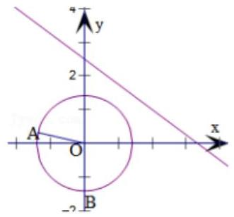

【例题 11】已知圆 ${C}_{1} : {\left( x + 3\right) }^{2} + {y}^{2} = {a}^{2}\left( {a > 7}\right)$ 和 ${C}_{2} : {\left( x - 3\right) }^{2} + {y}^{2} = 1$ ,动圆 $M$ 与圆 ${C}_{1}$ ,圆 ${C}_{2}$ 均相切, $P$ 是 $\bigtriangleup M{C}_{1}{C}_{2}$ 的内心,且 ${S}_{\bot {PM}{C}_{1}} + {S}_{\bot {PM}{C}_{2}} = 3{S}_{\bot P{C}_{1}{C}_{2}}$ ,则 $a$ 的值为(   )

A. 9 B. 11 C. 17 D. 19

【难度】 $\star   \star   \star   \star$

【答案】 $C$

【解析】解: 根据题意: 圆 ${C}_{1} : {\left( x + 3\right) }^{2} + {y}^{2} = {a}^{2}\left( {a > 7}\right)$ ,其圆心 ${C}_{1}\left( {-3,0}\right)$ ,半径 ${R}_{1} = a$ ,

圆 ${C}_{2} : {\left( x - 3\right) }^{2} + {y}^{2} = 1$ ,其圆心 ${C}_{2}\left( {-3,0}\right)$ ,半径 ${R}_{2} = 1$ ,

又因为 $a > 7$ ,所以圆心距 $\left| {{C}_{1}{C}_{2}}\right|  = 6 < {R}_{1} + {R}_{2} = a + 1$ ,所以圆 ${C}_{2}$ 内含于圆 ${C}_{1}$ ,如图 1,

因为动圆 $M$ 与圆 ${C}_{1}$ ,圆 ${C}_{2}$ 均相切,设圆 $M$ 的半径为 $r$ ,所以动圆 $M$ 与圆 ${C}_{1}$ 内切,与圆 ${C}_{2}$ 外切 $\left( {r < a}\right)$ ,

则有 ${C}_{1}M = {R}_{1} - r = a - r,{C}_{2}M = {R}_{2} + r = 1 + r$ ,所以 ${C}_{1}M + {C}_{2}M = a + 1$ ,

即 $M$ 的轨迹为以 ${C}_{1},{C}_{2}$ 为焦点,长轴长为 $a + 1$ 的椭圆,

因为 $P$ 为 $\bigtriangleup M{C}_{1}{C}_{2}$ 的内心,设内切圆的半径为 ${r}_{0}$ ,又由 ${S}_{\bigtriangleup {PM}{C}_{1}} + {S}_{\bigtriangleup {PM}{C}_{2}} = 3{S}_{\bigtriangleup P{C}_{1}{C}_{2}}$ ,

则有所以 $\frac{1}{2} \times  {C}_{1}M \times  {r}_{0} + \frac{1}{2} \times  {C}_{2}M \times  {r}_{0} = 3 \times  \frac{1}{2} \times  {C}_{1}{C}_{2} \times  {r}_{0}$ ,所以 ${C}_{1}M + {C}_{2}M = 3{C}_{1}{C}_{2}$ ,

所以 $3{C}_{1}{C}_{2} = {18} = a + 1$ ,所以 $a = {17}$ ,故选: $C$ .

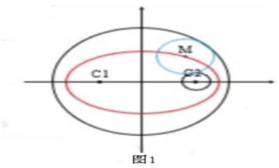

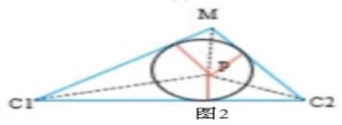

【例题 12】(1) $\sqrt{-{x}^{2} + {4x}} \leq  \frac{3}{4}x + 1 - a$ 的解集为 $\left\lbrack  {-4,0}\right\rbrack$ ,求 $a$ 的取值范围.

【难度】 $\star   \star   \star   \star$

【答案】 $a \leq   - 3$

【解析】函数 $y = \sqrt{-{x}^{2} - {4x}}$ 可化为 ${\left( x + 2\right) }^{2} + {y}^{2} = 4$ ,所以 $y = \sqrt{-{x}^{2} + {4x}}$ 表示圆心为 $C\left( {-2,0}\right)$ ,半径为 2 的圆在 $x$ 轴上方的部分,于是 $- 4 \leq  x \leq  0$ . $y = \frac{3}{4}x + 1 - a$ 表示斜率为 $\frac{3}{4}$ ，截距为 $1 - a$ 的直线.

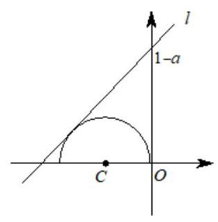

如图， $l$ 为极限位置，此时 $1 - a = 4$ ，所以 $a$ 的取值需要满足为 $1 - a \geq  4$ ，解之得 $a$ 的取值范围是 $a \leq   - 3$ .

(2)方程 $\left| {x - \sqrt{4 - {y}^{2}}}\right|  + \left| {y + \sqrt{4 - {x}^{2}}}\right|  = 0$ 所表示的曲线与直线 $y = x + b$ 有交点，则实数 $b$ 的取值范围是___.

【难度】 $\star   \star   \star   \star$

【答案】 $\left\lbrack  {-2\sqrt{2}, - 2}\right\rbrack$

【解析】解: $\because$ 由 方程 $\left| {x - \sqrt{4 - {y}^{2}}}\right|  + \left| {y + \sqrt{4 - {x}^{2}}}\right|  = 0$ ,

可得 $\left| {x - \sqrt{4 - {y}^{2}}}\right|  = 0$ 且 $\left| {y + \sqrt{4 - {x}^{2}}}\right|  = 0$ ,

$\therefore {x}^{2} + {y}^{2} = 4$ 且 $x \geq  0, y \leq  0$ ,表示以原点为圆心,以 2 为半径的圆位于第四象限内的部分,

包括与轴的交点，如图所示:当直线与 ${AB}$ 重合时，曲线与直线有两个交点，

当直线与 $l$ 重合时,曲线与直线相切,仅有一个交点,

${AB}$ 在 $y$ 轴上的截距为 -2,易知直线 $l$ 在 $y$ 轴上的截距为 $- 2\sqrt{2}$ ,且 ${AB}//$ 直线 $l$ ,故实数 $b$ 的取值范围是 $\left\lbrack  {-2\sqrt{2}, - 2}\right\rbrack$ ,故答案为 $\left\lbrack  {-2\sqrt{2}, - 2}\right\rbrack$ .

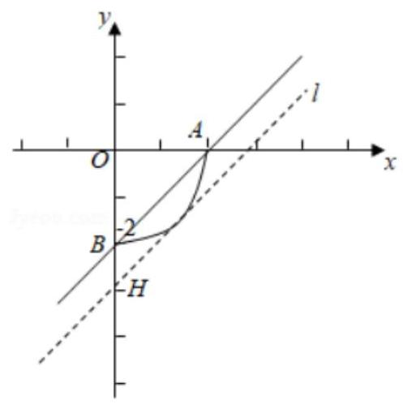

【例题 13】若圆 ${\left( x - 3\right) }^{2} + {\left( y - 5\right) }^{2} = {r}^{2}\left( { > 0}\right)$ 有且只有四个点到直线 ${5x} + {12y} = {10}$ 的距离等于 1,则半径 $r$ 的取值范围是( )

A. $\left( {4,6}\right)$ B. $\left( {6, + \infty }\right)$ C. $\left( {0,4}\right)$ D. $\left\lbrack  {4,6}\right\rbrack$

【难度】 $\star   \star   \star   \star$

【答案】 $B$

【解析】解: 圆心 $\left( {3,5}\right)$ 到直线 ${5x} + {12y} - {10} = 0$ 的距离 $d = \frac{\left| {15} + {60} - {10}\right| }{\sqrt{{25} + {144}}} = 5$ ,

当 $r = 5$ 时,圆上有且只有 2 个点到直线 ${5x} + {12y} - {10} = 0$ 的距离为 1,不符合题意,排除 $A, D$

当 $r = 3$ 时,圆上没有点到直线 ${5x} + {12y} - {10} = 0$ 的距离为 1,故排除 $C$ ,故选: $B$ .

【例题 14】已知 $A\left( {a,{a}^{2}}\right) \text{ 、 }B\left( {b,{b}^{2}}\right) \left( {a \neq  b}\right)$ 两点的坐标,满足 ${a}^{2}\sin \theta  + a\cos \theta  = 1,{b}^{2}\sin \theta  + b\cos \theta  = 1$ , 记原点到直线 ${AB}$ 的距离为 $d$ ，则 $d$ 与 1 的大小关系是( ).

A. $d > 1$ B. $d = 1$

C. $d < 1$ D. 不能确定，与 $a$ 、 $b$ 的取值有关

【难度】 $\star   \star   \star   \star$

【答案】B

【解析】由关系式可得,直线方程为 $x\cos \theta  + y\sin \theta  = 1$ ,则设远点到直线的距离为 $d = \frac{\left| -1\right| }{\sqrt{{\sin }^{2}\theta  + {\cos }^{2}\theta }} = 1$ 。所以选 B.

解法二: 直线方程为 $x\cos \theta  + y\sin \theta  = 1$ 为单位圆的切线方程

【例题 15】如图,在折线 ${ABCD}$ 中, ${AB} = {BC} = {CD} = 4,\angle {ABC} = \angle {BCD} = {120}^{ \circ  }, E\text{ 、 }F$ 分别是 ${AB}\text{ 、 }{CD}$ 的中点,若折线上满足条件 $\overline{PE} \cdot  \overline{PF} = k$ 的点 $P$ 至少有 4 个,则实数 $k$ 的取值范围是___.

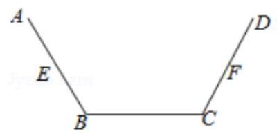

【难度】 $\star   \star   \star   \star$

【答案】 $\left\lbrack  {-\frac{9}{4}, - 2}\right\rbrack$

【解析】解: 以 ${BC}$ 的垂直平分线为 $y$ 轴,以 ${BC}$ 为 $x$ 轴,建立如图所示的平面直角坐标系,

$\because {AB} = {BC} = {CD} = 4,\;\angle {ABC} = \angle {BCD} = {120}^{ \circ  },\;\therefore B\left( {-{2.0}}\right) , C\left( {2,0}\right) , A\left( {-4,2\sqrt{3}}\right) , D\left( {4,2\sqrt{3}}\right)$ ,

$\because E\text{ 、 }F$ 分别是 ${AB}\text{ 、 }{CD}$ 的中点, $\therefore E\left( {-3,\sqrt{3}}\right) , F\left( {3,\sqrt{3}}\right)$ ,

设 $P\left( {x, y}\right) , - 4 \leq  x \leq  4,0 \leq  y \leq  2\sqrt{3},\because \overline{PE} \cdot  \overline{PF} = k$ ,

$\therefore \left( {-3 - x,\sqrt{3} - y}\right) \left( {3 - x,\sqrt{3} - y}\right)  = {x}^{2} + {\left( y - \sqrt{3}\right) }^{2} - 9 = k$ ,即 ${x}^{2} + {\left( y - \sqrt{3}\right) }^{2} = k + 9$ ,

当 $k + 9 > 0$ 时,点 $P$ 的轨迹为以 $\left( {0,\sqrt{3}}\right)$ 为圆心,以 $\sqrt{k + 9}$ 为半径的圆,

当圆与直线 ${DC}$ 相切时,此时圆的半径 $r = \frac{3\sqrt{3}}{2}$ ,此时点有 2 个,

当圆经过点 $C$ 时,此时圆的半径为 $r = \sqrt{{2}^{2} + 3} = \sqrt{7}$ ,此时点 $P$ 有 4 个,

$\because$ 满足条件 $\overrightarrow{PE} \cdot  \overrightarrow{PF} = k$ 的点 $P$ 至少有 4 个,结合图象可得, $\therefore \frac{27}{4} \leq  k + 9 \leq  7$ , 解得 $- \frac{9}{4} \leq  k \leq   - 2$ ,故实数 $k$ 的取值范围为 $\left\lbrack  {-\frac{9}{4}, - 2}\right\rbrack$ ,故答案为: $\left\lbrack  {-\frac{9}{4}, - 2}\right\rbrack$

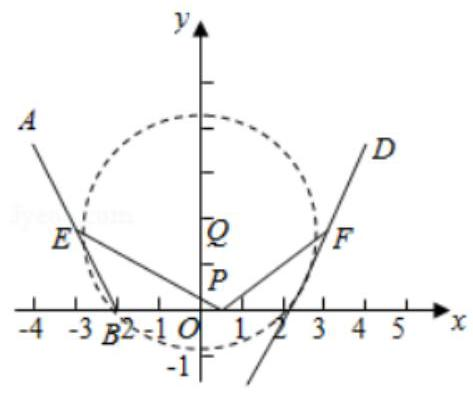

【例题 16】已知 $M$ 为圆 $O : {x}^{2} + {y}^{2} = 1$ 上任意一点,若存在不同于点 $E\left( {2,0}\right)$ 的点 $F\left( {m, n}\right)$ ,使 $\frac{\left| ME\right| }{\left| MF\right| }$ 为不等于 1 的常数,则点 $F$ 的坐标为(   )

A. $\left( {\frac{1}{2},0}\right)$ B. $\left( {0, - \frac{1}{2}}\right)$ C. $\left( {\frac{1}{2}, - 1}\right)$ D. $\left( {-\frac{1}{2},1}\right)$

【难度】 $\star   \star   \star   \star$

【答案】 $A$

【解析】解: 由题意设 $M\left( {x, y}\right) ,\frac{\left| ME\right| }{\left| MF\right| } = t\left( {t > 0\text{ 且 }t \neq  1}\right)$ ,

则 $\left| {ME}\right|  = t\left| {MF}\right| ,{\left| ME\right| }^{2} = {t}^{2}{\left| MF\right| }^{2}$ ,即 ${\left( x - 2\right) }^{2} + {y}^{2} = {t}^{2}{\left( x - m\right) }^{2} + {t}^{2}{\left( y - n\right) }^{2}$ ,

$\therefore {x}^{2} + {y}^{2} - \frac{2{t}^{2}m - 4}{{t}^{2} - 1}x - \frac{2{t}^{2}n}{{t}^{2} - 1}y = \frac{4 - {t}^{2}{m}^{2} - {t}^{2}{n}^{2}}{{t}^{2} - 1}.\because M$ 在圆 ${x}^{2} + {y}^{2} = 1$ 上,

$\therefore \left\{  \begin{array}{l} 2{t}^{2}m - 4 = 0 \\  2{t}^{2}n = 0 \\  \frac{4 - {t}^{2}{m}^{2} - {t}^{2}{n}^{2}}{{t}^{2} - 1} = 1 \end{array}\right.$ ,解得 $t = 2, m = \frac{1}{2}, n = 0.\therefore F\left( {\frac{1}{2},0}\right)$ .

故选: $A$ .

【例题 17】已知正方体 ${ABCD} - {A}_{1}{B}_{1}{C}_{1}{D}_{1}$ 棱长为 $2, M, N$ 为体对角线 $B{D}_{1}$ 上的两动点，且 ${MN} = \frac{1}{3}B{D}_{1}$ ， 动点 $P$ 在三角形 ${AC}{B}_{1}$ 内,且三角形 ${PMN}$ 的面积 ${S}_{\bigtriangleup {PMN}} = \frac{2\sqrt{6}}{9}$ ,则点 $P$ 的轨迹长度为___.

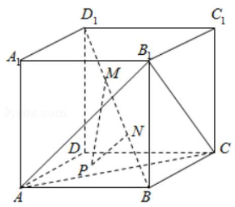

【难度】★★★★

【答案】 $\frac{2\sqrt{2}\pi }{3}$

【解答】解: $\because$ 正方体 ${ABCD} - {A}_{1}{B}_{1}{C}_{1}{D}_{1}$ 棱长为 $2,\therefore B{D}_{1} = 2\sqrt{3}\therefore {MN} = \frac{1}{3}B{D}_{1} = \frac{2\sqrt{3}}{3}$ ,

设 $P$ 到 ${MN}$ 的距离为 $d$ ,由 ${S}_{\bigtriangleup {PMN}} = \frac{1}{2}{MN} \cdot  d = \frac{2\sqrt{6}}{9}$ ,得 $d = \frac{2\sqrt{2}}{3}$ .

$\therefore P$ 点在以 $B{D}_{1}$ 为中心轴, $\frac{2\sqrt{2}}{3}$ 为底面半径的圆柱侧面上,又在 $\bigtriangleup A{B}_{1}C$ 上,

$\because B{D}_{1} \bot  A{B}_{1}, B{D}_{1} \bot  {AC}$ ,且 $A{B}_{1}\bigcap {AC} = A,\therefore B{D}_{1} \bot$ 面 $A{B}_{1}C$ ,

$\therefore P$ 点在 $\bigtriangleup A{B}_{1}C$ 内的轨迹是以 $\frac{2\sqrt{2}}{3}$ 为半径的圆,

$\because \bigtriangleup A{B}_{1}C$ 内切圆的半径为 $\frac{\sqrt{6}}{3},\therefore$ 该圆一部分位于三角形外

如图, ${OH} = \frac{\sqrt{6}}{3},{OK} = \frac{2\sqrt{2}}{3}$ ,得 $\cos \angle {HOK} = \frac{\frac{\sqrt{6}}{3}}{\frac{2\sqrt{2}}{3}} = \frac{\sqrt{3}}{2},\angle {HOK} = \frac{\pi }{6}$ ,

$\therefore$ 圆位于三角形内的圆弧为圆周长的一半, $\therefore$ 点 $P$ 的轨迹长度为: $\frac{1}{2} \cdot  {2\pi } \cdot  \frac{2\sqrt{2}}{3} = \frac{2\sqrt{2}}{3}\pi$ . 故答案为: $\frac{2\sqrt{2}}{3}\pi$ .

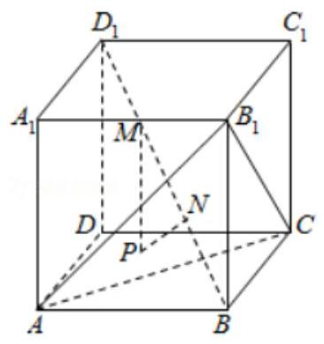

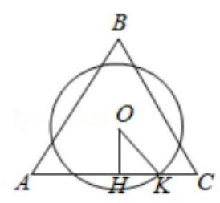

## 巩固训练

1、已知 ${EF}$ 是圆 $C : {x}^{2} + {y}^{2} - {2x} - {4y} + 3 = 0$ 的一条弦，且 ${CE}\bot {CF}, P$ 是 ${EF}$ 的中点，当弦 ${EF}$ 在圆 $C$ 上运动时,直线 $l : x - y - 3 = 0$ 上存在两点 $A, B$ ,使得 $\angle {APB} \geq  \frac{\pi }{2}$ 恒成立,则线段 ${AB}$ 长度的最小值是 ( )

A. $3\sqrt{2} + 1$ B. $4\sqrt{2} + 2$ C. $4\sqrt{3} + 1$ D. $4\sqrt{3} + 2$

【难度】 $\star   \star   \star$

【答案】 $B$

【解析】解: 由题可知: 圆 $C : {x}^{2} + {y}^{2} - {2x} - {4y} + 3 = 0$ ,即 ${\left( x - 1\right) }^{2} + {\left( y - 2\right) }^{2} = 2$ ,圆心 $C\left( {1,2}\right)$ ,半径 $r = \sqrt{2}$ , 又 ${CE} \bot  {CF}, P$ 是 ${EF}$ 的中点,所以 ${CP} = \frac{1}{2}{EF} = 1$ ，所以点 $P$ 的轨迹方程 ${\left( x - 1\right) }^{2} + {\left( y - 2\right) }^{2} = 1$ ， 圆心为点 $C\left( {1,2}\right)$ ,半径为 $R = 1$ ,若直线 $l : x - y - 3 = 0$ 上存在两点 $A, B$ ,使得 $\angle {APB} \geq  \frac{\pi }{2}$ 恒成立,

则以 ${AB}$ 为直径的圆要包括圆 ${\left( x - 1\right) }^{2} + {\left( y - 2\right) }^{2} = 1$ ,点 $C\left( {1,2}\right)$ ,到直线 $l$ 的距离为 $d = \frac{\left| 1 - 2 - 3\right| }{\sqrt{{1}^{2} + {\left( -1\right) }^{2}}} = 2\sqrt{2}$ , 所以 ${AB}$ 长度的最小值为 $2\left( {d + 1}\right)  = 4\sqrt{2} + 2$ ,

故选: $B$ .

2、对于每个确定的实数 $\theta$ ,方程 $x\cos \theta  + \left( {y - 2}\right) \sin \theta  = 1$ 表示一条直线,从中选出 $n$ 条直线围成一个正 $n$ 边形,记这个正 $n$ 边形的面积是 ${S}_{n}$ ,则 $\mathop{\lim }\limits_{{n \rightarrow  \infty }}{S}_{n} =$ (   )

A. $2\sqrt{3}$ B. $\pi$ C. 4

D. $\frac{4}{3}\pi$

【难度】 $\star   \star   \star   \star$

【答案】 $B$

【解析】解: 由直线系: $x\cos \theta  + \left( {y - 2}\right) \sin \theta  = 1$ ,

可令 $\left\{  \begin{array}{l} x = \cos \theta \\  y = 2 + \sin \theta  \end{array}\right.$ ,消去 $\theta$ 可得 ${x}^{2} + {\left( y - 2\right) }^{2} = 1$ ,故方程 $x\cos \theta  + \left( {y - 2}\right) \sin \theta  = 1$ 表示圆 ${x}^{2} + {\left( y - 2\right) }^{2} = 1$ 的切线的集合,

因为 $x\cos \theta  + \left( {y - 2}\right) \sin \theta  = 1$ 所以点 $P\left( {0,2}\right)$ 到每条直线的距离 $d = \frac{1}{\sqrt{{\cos }^{2}\theta  + {\sin }^{2}\theta }} = 1$ ,

从中选出 $n$ 条直线围成一个正 $n$ 边形,是圆的内接 $n$ 边形,这个正 $n$ 边形的面积是 ${S}_{n}$ ,

则 $\mathop{\lim }\limits_{{n \rightarrow  \infty }}{S}_{n} = \pi  \cdot  {1}^{2} = \pi$ . 故选: $B$ .

3、如图，圆 $C$ 与 $x$ 轴相切于点 $T\left( {1,0}\right)$ ，与 $y$ 轴正半轴交于两点 $A$ ， $B\left( B\right.$ 在 $A$ 的上方 $)$ ，且 $\left| {AB}\right|  = 2$ . 过点 $A$ 任作一条直线与圆 $O : {x}^{2} + {y}^{2} = 1$ 相交于 $M, N$ 两点， $\frac{\left| NB\right| }{\left| NA\right| } + \frac{\left| MA\right| }{\left| MB\right| }$ 的值为( )

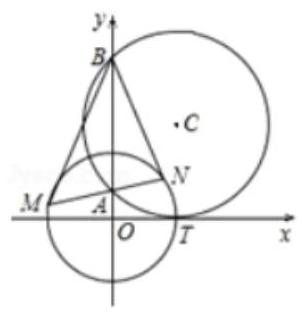

A. 2 B. 3 C. $2\sqrt{2}$ D. $\sqrt{2} - 1$

【难度】★★★★

【答案】 $C$

【解析】解: $\because$ 圆 $C$ 与 $x$ 轴相切于点 $T\left( {1,0}\right)$ ,二圆心的横坐标 $x = 1$ ,取 ${AB}$ 的中点 $E$ ,

$\because \left| {AB}\right|  = 2$ ， $\therefore \left| {BE}\right|  = 1$ ，则 $\left| {BC}\right|  = \sqrt{2}$ ，即圆的半径 $r = \left| {BC}\right|  = \sqrt{2}$ ，

$\therefore$ 圆心 $C\left( {1,\sqrt{2}}\right)$ ， $\therefore E\left( {0,\sqrt{2}}\right)$ ，又 $\because \left| {AB}\right|  = 2$ ，且 $E$ 为 ${AB}$ 中点，

$\therefore A\left( {0,\sqrt{2} - 1}\right) , B\left( {0,\sqrt{2} + 1}\right) ,\because M\text{ 、 }N$ 在圆 $O : {x}^{2} + {y}^{2} = 1$ 上,

$\therefore$ 可设 $M\left( {\cos \alpha ,\sin \alpha }\right) , N\left( {\cos \beta ,\sin \beta }\right)$ ,

$\therefore \left| {NA}\right|  = \sqrt{{\left( \cos \beta  - 0\right) }^{2} + {\left\lbrack  \sin \beta  - \left( \sqrt{2} - 1\right) \right\rbrack  }^{2}} = \sqrt{2\left( {\sqrt{2} - 1}\right) \left( {\sqrt{2} - \sin \beta }\right) }$ ,

$\left| {NB}\right|  = \sqrt{{\left( \cos \beta  - 0\right) }^{2} + {\left\lbrack  \sin \beta  - \left( \sqrt{2} + 1\right) \right\rbrack  }^{2}} = \sqrt{2\left( {\sqrt{2} + 1}\right) \left( {\sqrt{2} - \sin \beta }\right) },$

$\therefore \frac{\left| NB\right| }{\left| NA\right| } = \sqrt{2} + 1$ ,同理可得 $\frac{\left| MA\right| }{\left| MB\right| } = \sqrt{2} - 1\therefore \frac{\left| NB\right| }{\left| NA\right| } + \frac{\left| MA\right| }{\left| MB\right| } = 2\sqrt{2}$ ,

故选: $C$ .

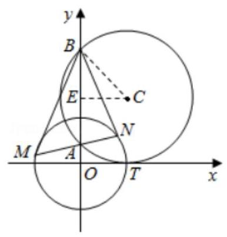

4、已知实数 $x$ 、 $y$ 满足 ${x}^{2} + {\left( y - 2\right) }^{2} = 1$ ，则 $\omega  = \frac{\left| \sqrt{3}x + y\right| }{\sqrt{{x}^{2} + {y}^{2}}}$ 的取值范围是___.

【难度】 $\star   \star   \star   \star$

【答案】 $\left\lbrack  {0,\sqrt{3}}\right\rbrack$

【解析】解: $P\left( {x, y}\right)$ 为圆 ${x}^{2} + {\left( y - 2\right) }^{2} = 1$ 上任意一点,

则 $P$ 到直线 $\sqrt{3}x + y = 0$ 的距离 ${PM} = \frac{\left| \sqrt{3}x + y\right| }{\sqrt{3 + 1}} = \frac{\left| \sqrt{3}x + y\right| }{2}$ ,即 $\left| {\sqrt{3}x + y}\right|  = {2PM}$ ,

$\therefore \omega  = \frac{\left| \sqrt{3}x + y\right| }{\sqrt{{x}^{2} + {y}^{2}}} = \frac{2PM}{OP} = 2\sin \angle {POM}$ ,

设圆 ${x}^{2} + {\left( y - 2\right) }^{2} = 1$ 与直线 $y = {kx}$ 相切,则 $\frac{2}{\sqrt{{k}^{2} + 1}} = 1$ ,解得 $k =  \pm  \sqrt{3}$ .

$\therefore \angle {POM}$ 的最小值为 ${0}^{ \circ  }$ ，最大值为 ${60}^{ \circ  }$ ，

$\therefore 0 \leq  \sin \angle {POM} \leq  \frac{\sqrt{3}}{2}$ ，则 $\omega  = \frac{\left| \sqrt{3}x + y\right| }{\sqrt{{x}^{2} + {y}^{2}}} \in  \left\lbrack  {0,\sqrt{3}}\right\rbrack$ .

故答案为: $\left\lbrack  {0,\sqrt{3}}\right\rbrack$ .

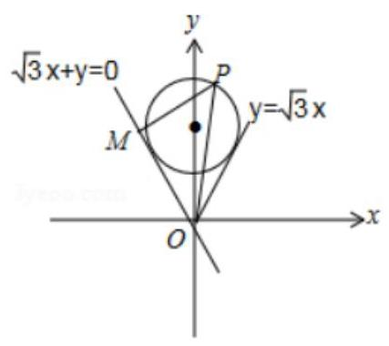

5、设 $a, b$ 是两个实数， $0 \leq  a < b$ ，直线 $l : y = {kx} + m$ 和圆 ${x}^{2} + {y}^{2} = 1$ 交于两点 $A, B$ ，若对于任意的 $k \in  \lbrack a$ ， $b\rbrack$ ,均存在正数 $m$ ,使得 $\bigtriangleup {OAB}$ 的面积均不小于 $\frac{\sqrt{3}}{4}$ ,则 $b - {2a}$ 的最大值为

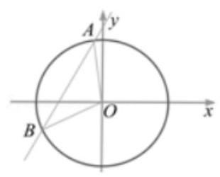

【难度】 $\star   \star   \star   \star$

【答案】 $\sqrt{2}$

【解答】解: 设 $O$ 到直线 $l$ 的距离为 $d$ ,则 ${S}_{\bigtriangleup {AOB}} = \frac{1}{2} \times  2\sqrt{1 - {d}^{2}} \cdot  d \geq  \frac{\sqrt{3}}{4}$ ,解得 $\frac{1}{2} \leq  d \leq  \frac{\sqrt{3}}{2}$ ,

即 $\frac{1}{2} \leq  \frac{m}{\sqrt{{k}^{2} + 1}} \leq  \frac{\sqrt{3}}{2}$ ,所以 $\frac{1}{2}\sqrt{{k}^{2} + 1} \leq  m \leq  \frac{\sqrt{3}}{2}\sqrt{{k}^{2} + 1}$ ,

因为 $k \in  \left\lbrack  {a, b}\right\rbrack  , m > 0$ 时, ${\left( \frac{1}{2}\sqrt{{k}^{2} + 1}\right) }_{\max } = \frac{1}{2}\sqrt{{b}^{2} + 1},{\left( \frac{\sqrt{3}}{2}\sqrt{{k}^{2} + 1}\right) }_{\min } = \frac{\sqrt{3}}{2}\sqrt{{a}^{2} + 1}$ ,

所以 $\frac{1}{2}\sqrt{{b}^{2} + 1} \leq  m \leq  \frac{\sqrt{3}}{2}\sqrt{{a}^{2} + 1}$ ,

因为存在 $m > 0$ 满足条件,所以 $\frac{1}{2}\sqrt{{b}^{2} + 1} \leq  \frac{\sqrt{3}}{2}\sqrt{{a}^{2} + 1}$ ,化简得 $\frac{{b}^{2}}{2} - \frac{3{a}^{2}}{2} \leq  1$ ,且 $0 \leq  a < b$ ,

设 $b - {2a} = t$ ,即 $b = {2a} + t$ ,

在平面直角坐标系 $a - O - b$ 中,直线 $b = {2a} + t$ 和由 $\frac{{b}^{2}}{2} - \frac{3{a}^{2}}{2} \leq  1$ ,

且 $0 \leq  a < b$ 表示的平面区域有公共点,

如右图当直线 $b = {2a} + t$ 经过点 $A\left( {0,\sqrt{2}}\right)$ 时, $t$ 最大, ${t}_{\max } = \sqrt{2}$ .

故答案为: $\sqrt{2}$ .

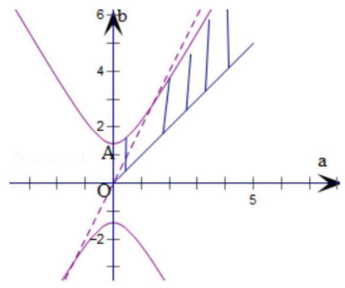

## 实战演练

一、填空题

1、不论 $m$ 为何值，直线 $\left( {{2m} - 1}\right) x + \left( {m + 2}\right) y + 5 = 0$ 恒过定点___.

【难度】 $\star   \star   \star$

【答案】(1,-2)

【解析】解: 由 $\left( {{2m}?1}\right) x + \left( {m + 2}\right) y + 5 = 0$ ,可得 ${2mx}?x + {my} + {2y} + 5 = 0$ ,

整理得 $m\left( {{2x} + y}\right)  + \left( {-x + {2y} + 5}\right)  = 0$ ,令 $\left\{  \begin{array}{l} {2x} + y = 0 \\   - x + {2y} + 5 = 0 \end{array}\right.$ ,

解得 $\left\{  \begin{array}{l} x = 1 \\  y =  - 2 \end{array}\right.$ ,所以直线 $\left( {{2m}?1}\right) x + \left( {m + 2}\right) y + 5 = 0$ 过定点 $\left( {1, - 2}\right)$ .

故答案为: $\left( {1, - 2}\right)$ .

2、若斜率为 2 的直线 $m$ 被直线 ${l}_{1} : x + {2y} - 3 = 0$ 与 ${l}_{2} : x + {2y} + 1 = 0$ 所截得的线段为 ${AB}$ ,则线段 ${AB}$ 的长为___.

【难度】 $\star   \star   \star$

【答案】 $\frac{4\sqrt{5}}{5}$

【解析】解: 直线 ${l}_{1} : x + {2y} - 3 = 0$ 与 ${l}_{2} : x + {2y} + 1 = 0$ 得斜率为 $- \frac{1}{2}$ ,直线 $m$ 的斜率为 2,

故直线 $m$ 与直线 ${l}_{1},{l}_{2}$ 垂直,由两条平行直线的距离公式可得 $\left| {AB}\right|  = \frac{\left| 1 + 3\right| }{\sqrt{1 + 4}} = \frac{4\sqrt{5}}{5}$ .

故答案为: $\frac{4\sqrt{5}}{5}$ .

3、 $\bigtriangleup {ABC}$ 中， ${BC}$ 边上的高所在直线的方程为 $x - {2y} + 1 = 0$ ， $\angle A$ 的平分线所在直线的方程为 $y = 0$ ，若点 $B$ 的坐标为 $\left( {1,2}\right)$ ，则点 $C$ 的坐标为___.

【难度】★★★

【答案】 $\left( {5, - 6}\right)$

【解析】解: 点 $A$ 为 $y = 0$ 与 $x - {2y} + 1 = 0$ 两直线的交点, $\therefore$ 点 $A$ 的坐标为 $\left( {-1,0}\right)$ .

$\therefore {k}_{AB} = \frac{2 - 0}{1 - \left( {-1}\right) } = 1$ . 又 $\because \angle A$ 的平分线所在直线的方程是 $y = 0$ ,

$\therefore {k}_{AC} =  - 1.\therefore$ 直线 ${AC}$ 的方程是 $y =  - x - 1$ . 而 ${BC}$ 与 $x - {2y} + 1 = 0$ 垂直, $\therefore {k}_{BC} =  - 2$ .

$\therefore$ 直线 ${BC}$ 的方程是 $y - 2 =  - 2\left( {x - 1}\right)$ . 由 $y =  - x - 1, y =  - {2x} + 4$ 联立,

直线与圆一教师版

解得 $C\left( {5, - 6}\right)$ . 故答案为: $\left( {5, - 6}\right)$

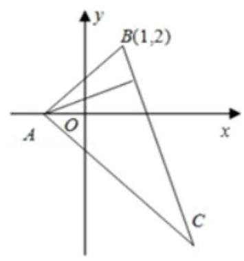

4、已知直线 $y = {kx} - 2$ 与曲线 $\sqrt{1 - {\left( y - 1\right) }^{2}} = \left| x\right|  - 1$ 有两个不同的交点，则实数 $k$ 的取值范围是 ___.

【难度】 $\star   \star   \star   \star$

【答案】 $\left\lbrack  {-2, - \frac{4}{3}}\right)  \cup  \left( {\frac{4}{3},2}\right\rbrack$

【解析】解: 当 $x \geq  0$ 时,曲线 $\sqrt{1 - {\left( y - 1\right) }^{2}} = \left| x\right|  - 1$ 即 $\sqrt{1 - {\left( y - 1\right) }^{2}} = x - 1$ ,

两边平方,整理得 ${\left( x - 1\right) }^{2} + {\left( y - 1\right) }^{2} = 1,\left( {x \geq  1}\right)$ ,

表示以 ${C}_{1}\left( {1,1}\right)$ 为圆心,半径 ${r}_{1} = 1$ 的圆的右半圆;

当 $x < 0$ 时,曲线 $\sqrt{1 - {\left( y - 1\right) }^{2}} = \left| x\right|  - 1$ 即 $\sqrt{1 - {\left( y - 1\right) }^{2}} =  - x - 1$ ,

两边平方,整理得 ${\left( x + 1\right) }^{2} + {\left( y - 1\right) }^{2} = 1,\left( {x \leq   - 1}\right)$ .

表示以 ${C}_{2}\left( {-1,1}\right)$ 为圆心,半径 ${r}_{2} = 1$ 的圆的左半圆.

直线 ${kx} - y - 2 = 0$ 即 $y = {kx} - 2$ ,表示经过定点 $A\left( {0, - 2}\right)$ 、斜率为 $k$ 的直线.

因此,直线 ${kx} - y - 2 = 0$ 与曲线 $\sqrt{1 - {\left( y - 1\right) }^{2}} = \left| x\right|  - 1$ 有两个不同的交点,

就是直线 ${kx} - y - 2 = 0$ 与两个半圆组成的图形有两个交点,

当直线 ${kx} - y - 2 = 0$ 与右半圆 ${C}_{1}$ 有两个交点时,记点 $B\left( {1,0}\right)$ ,

可得直线到圆心的距离小于半径,且直线的斜率小于或等于 ${AB}$ 的斜率,

$\therefore \frac{\left| k - 2\right| }{\sqrt{{k}^{2} + 1}} < 1$ 且 $k \leq  {k}_{AB} = \frac{-2 - 0}{0 - 1} = 2$ ,解得 $\frac{4}{3} < k \leq  2$ ;

当直线 ${kx} - y - 2 = 0$ 与左半圆 ${C}_{2}$ 有两个交点时,同理解得 $- 2 \leq  k <  - \frac{4}{3}$ .

综上所述,实数 $k$ 的取值范围是 $\frac{4}{3} < k \leq  2$ 或 $- 2 \leq  k <  - \frac{4}{3}$ ,即 $k \in  \left\lbrack  {-2, - \frac{4}{3}) \cup  \left( {\frac{4}{3},2}\right) }\right\rbrack$ .

故答案为: $\left\lbrack  {-2, - \frac{4}{3}}\right)  \cup  \left( {\frac{4}{3},2}\right\rbrack$ .

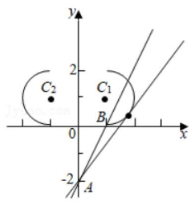

5、 $C$ 为圆: ${\left( x - 1\right) }^{2} + {y}^{2} = 1$ 上一动点，点 $B$ 坐标为 $\left( {1,\sqrt{3}}\right)$ ，点 $A$ 坐标为 $\left( {4,0}\right)$ ，则 $\left| {AC}\right|  + 3\left| {BC}\right|$ 的最小值为___.

【难度】 $\star   \star   \star   \star$

【答案】 $2\sqrt{7}$

【解答】解: 由圆: ${\left( x - 1\right) }^{2} + {y}^{2} = 1$ 的方程知圆心 $M\left( {1,0}\right)$ ,半径 $r = 1$ ,

在 $x$ 轴上取 ${MD} = \frac{1}{3}, D$ 在 $M$ 右侧,因为 $\frac{\left| MD\right| }{\left| MC\right| } = \frac{\left| MC\right| }{\left| MA\right| } = \frac{1}{3}$ ,且 $\angle {CMD} = \angle {AMC}$ ,

$\therefore \bigtriangleup {CM}{D}^{\left( r\right) }\bigtriangleup {AMC}$ , $\therefore \left| {AC}\right|  = 3\left| {CD}\right|$ , $\therefore \left| {AC}\right|  + 3\left| {BC}\right|  = 3\left| {CD}\right|  + 3\left| {BC}\right|  \geq  3\left| {BD}\right|$ ,

又 $B$ 坐标为 $\left( {1,\sqrt{3}}\right) , D$ 的坐标为 $\left( {\frac{4}{3},0}\right)$

所以 $\left| {BD}\right|  = \sqrt{{\left( \frac{4}{3} - 1\right) }^{2} + {\left( 0 - \sqrt{3}\right) }^{2}} = \frac{2\sqrt{7}}{3}$ ,所以 $3\left| {BD}\right|  = 2\sqrt{7}$ ,所以 $\left| {AC}\right|  + 3\left| {BC}\right|  \geq  2\sqrt{7}$ .

所以 $\left| {AC}\right|  + 3\left| {BC}\right|$ 的最小值为 $2\sqrt{7}$ . 故答案为: $2\sqrt{7}$ .

6、在平面直角坐标系 ${xOy}$ 中，已知 $A, B$ 为圆 $C : {\left( x - m\right) }^{2} + {\left( y - 2\right) }^{2} = 4$ 上两个动点，且 $\left| {AB}\right|  = 2\sqrt{3}$ ，若直线 $l : y =  - {2x}$ 上存在点 $P$ ，使得 $\overrightarrow{OC} = \overrightarrow{PA} + \overrightarrow{PB}$ ，则实数 $m$ 的取值范围为___.

【难度】 $\star   \star   \star   \star$

【答案】 $\left\lbrack  {-1 - \sqrt{5}, - 1 + \sqrt{5}}\right\rbrack$

【解答】解: 设 $A\left( {{x}_{1},{y}_{1}}\right) , B\left( {{x}_{2},{y}_{2}}\right) ,{AB}$ 的中点 $M\left( {\frac{{x}_{1} + {x}_{2}}{2},\frac{{y}_{1} + {y}_{2}}{2}}\right)$ ,

圆 $C : {\left( x - m\right) }^{2} + {\left( y - 2\right) }^{2} = 4$ 的圆心 $C\left( {m,2}\right)$ ,半径 $r = 2$ ,

圆心 $C$ 到 ${AB}$ 的距离 $\left| {CM}\right|  = \sqrt{{2}^{2} - {\left( \sqrt{3}\right) }^{2}} = 1$ ,直线 $l : y =  - {2x}$ 上存在点 $P$ ,使得 $\overrightarrow{OC} = \overrightarrow{PA} + \overrightarrow{PB}$ ,

设 $P\left( {x, - {2x}}\right)$ ,则 $\left( {m,2}\right)  = \left( {{x}_{1} - x,{y}_{1} + {2x}}\right)  + \left( {{x}_{2} - x,{y}_{2} + {2x}}\right)$ ,

$\therefore {x}_{1} + {x}_{2} - {2x} = m,{y}_{1} + {y}_{2} + {4x} = 2;\therefore \frac{{x}_{1} + {x}_{2}}{2} = x + \frac{m}{2},\frac{{y}_{1} + {y}_{2}}{2} = 1 - {2x}$ ,

$\therefore M\left( {x + \frac{m}{2},1 - {2x}}\right)$ ,则 $\left| {CM}\right|  = \sqrt{{\left( x + \frac{m}{2} - m\right) }^{2} + {\left( 1 - 2x - 2\right) }^{2}} = 1$ ,整理,得 $5{x}^{2} - \left( {m - 4}\right) x + \frac{{m}^{2}}{4} = 0$ ,

$\because$ 直线 $l : y =  - {2x}$ 上存在点 $P$ ,使得 $\overrightarrow{OC} = \overrightarrow{PA} + \overrightarrow{PB},\therefore \bigtriangleup  = {\left\lbrack  -\left( m - 4\right) \right\rbrack  }^{2} - 4 \times  5 \times  \frac{{m}^{2}}{4} \geq  0$ . 整理,得 ${m}^{2} + {2m} - 4 \leq  0$ , 解得 $- 1 - \sqrt{5} \leq  m \leq   - 1 + \sqrt{5}$ . 故答案为: $\left\lbrack  {-1 - \sqrt{5}, - 1 + \sqrt{5}}\right\rbrack$ .

## 二、选择题

7、过直线 $y = {2x} + 1$ 上的一点作圆 ${\left( x - 2\right) }^{2} + {\left( y + 5\right) }^{2} = 5$ 的两条切线 ${l}_{1},{l}_{2}$ ,当直线 ${l}_{1},{l}_{2}$ 关于 $y = {2x} + 1$ 对称时,则直线 ${l}_{1},{l}_{2}$ 之间的夹角为(   )

A. ${30}^{ \circ  }$ B. ${45}^{ \circ  }$ C. ${60}^{ \circ  }$ D. ${90}^{ \circ  }$

【难度】★★★

【答案】 $C$

【解析】解: 设直线 $y = {2x} + 1$ 上的一点 $P\left( {a,{2a} + 1}\right)$ ,

圆心 $A\left( {2, - 5}\right)$ ,过点 $P$ 作圆的两条切线分别为 ${PM}$ , ${PN}$ ,

则由 ${PM},{PN}$ 关于 $y = {2x} + 1$ 对称,可得 ${PA}$ 垂直于直线 $y = {2x} + 1,\therefore \frac{{2a} + 1 + 5}{a - 2} \times  2 =  - 1$ ,

$\therefore a =  - 2,\therefore$ 点 $P\left( {-2, - 3}\right) ,{PA} = \sqrt{{16} + 4} = 2\sqrt{5}$ .

直角三角形 ${PAM}$ 中, $\sin \angle {MPA} = \frac{AM}{PA} = \frac{1}{2},\therefore \angle {MPA} = {30}^{ \circ  },\therefore \angle {MPN} = {60}^{ \circ  }$ ,

即直线 ${l}_{1},{l}_{2}$ 之间的夹角为 ${60}^{ \circ  }$ ,故选: $C$ .

8、在平面直角坐标系 ${xOy}$ 中,已知点 $A\left( {0,1}\right) , B\left( {0,4}\right)$ . 若直线 ${2x} - y + c = 0$ 上存在点 $P$ ,使得 ${PB} = {2PA}$ , 则实数 $c$ 的取值范围是( )

A. $\left( {-\sqrt{5},\sqrt{5}}\right)$ B. $\left\lbrack  {-{\sqrt{5},\sqrt{5}1}}\right\rbrack$ C. $\left( {-2\sqrt{5},2\sqrt{5}}\right)$ D. $\left\lbrack  {-2\sqrt{5},2\sqrt{5}}\right\rbrack$

【难度】 $\star   \star   \star$

【答案】 $D$

【解析】解: 设点 $P\left( {x, y}\right)$ ,因为点 $A\left( {0,1}\right) , B\left( {0,4}\right)$ 且 ${PB} = {2PA}$ ,

则 $\sqrt{{\left( x - 0\right) }^{2} + {\left( y - 4\right) }^{2}} = 2\sqrt{{\left( x - 0\right) }^{2} + {\left( y - 1\right) }^{2}}$ ,化简整理可得 ${x}^{2} + {y}^{2} = 4$ ,

所以点 $P$ 的轨迹是以 $\left( {0,0}\right)$ 为圆心,2 为半径的圆,又点 $P$ 在直线 ${2x} - y + c = 0$ 上,

所以直线与圆 ${x}^{2} + {y}^{2} = 4$ 有公共点,故 $\frac{\left| c\right| }{\sqrt{4 + 1}} \leq  2$ ,解得 $- 2\sqrt{5} \leq  c \leq  2\sqrt{5}$ ,

所以实数 $c$ 的取值范围是 $\left\lbrack  {-2\sqrt{5},2\sqrt{5}}\right\rbrack$ . 故选: $D$ .

9、已知圆 $O : {x}^{2} + {y}^{2} = 1$ ，直线 $l : x + y + 2 = 0$ ，点 $P$ 为 $l$ 上一动点，过点 $P$ 作圆 $O$ 的切线 ${PA}$ ， ${PB}$ (切点为 $A, B)$ ，当四边形 ${PAOB}$ 的面积最小时，直线 ${AB}$ 的方程为( )

A. $x - y + 1 = 0$ B. $x - y + \sqrt{2} = 0$ C. $x + y + 1 = 0$ D. $x + y - \sqrt{2} = 0$

【难度】 $\star   \star   \star   \star$

【答案】 $C$

【解析】解: $\because$ 圆 ${x}^{2} + {y}^{2} = 1$ 的圆心为 $C\left( {0,0}\right)$ ,半径 $r = 1$ ,

当点 $P$ 与圆心的距离最小时,切线长 ${PA}\text{ 、 }{PB}$ 最小,此时四边形 ${PAOB}$ 的面积最小,

$\therefore {PO} \bot$ 直线 $l$ ,则 ${PO}$ 的方程为 $x - y = 0$ ,联立 $\left\{  \begin{array}{l} x - y = 0 \\  x + y + 2 = 0 \end{array}\right.$ ,解得 $x = y =  - 1,\therefore P\left( {-1, - 1}\right)$ ,

$\therefore$ 以 ${OP}$ 为直径的圆的方程为 ${\left( x + \frac{1}{2}\right) }^{2} + {\left( y + \frac{1}{2}\right) }^{2} = \frac{1}{2}$ ,即 ${x}^{2} + {y}^{2} + x + y = 0$ ,两圆方程相减可得 $x + y + 1 = 0$ . 故选: $C$ .

10、若对圆 ${\left( x - 1\right) }^{2} + {\left( y - 1\right) }^{2} = 1$ 上任意一点 $P\left( {x, y}\right)$ ， $\left| {{3x} - {4y} + a}\right|  + \left| {{3x} - {4y} - 9}\right|$ 的取值与 $x$ ， $y$ 无关，则实数 $a$ 的取值范围是( )

A. $a \leq  4$ B. $- 4 \leq  a \leq  6$ C. $a \leq   - 4$ 或 $a \geq  6$ D. $a \geq  6$

【难度】 $\star   \star   \star   \star$

【答案】 $D$

【解析】解: 设 $z = \left| {{3x} - {4y} + a}\right|  + \left| {{3x} - {4y} - 9}\right|  = 5\left( {\frac{\left| 3x - 4y + a\right| }{\sqrt{{3}^{2} + {4}^{2}}} + \frac{\left| 3x - 4y - 9\right| }{\sqrt{{3}^{2} + {4}^{2}}}}\right)$ ,

故 $\left| {{3x} - {4y} + a}\right|  + \left| {{3x} - {4y} - 9}\right|$ 可以看作点 $P\left( {x, y}\right)$ 到直线

$m : {3x} - {4y} + a = 0$ 与直线 $l : {3x} - {4y} - 9 = 0$ 距离之和的 5 倍,

$\because \left| {{3x} - {4y} + a}\right|  + \left| {{3x} - {4y} - 9}\right|$ 的取值与 $x, y$ 无关,

$\therefore$ 这个距离之和与点 $P$ 在圆上的位置无关,如图所示: 可知直线 $m$ 平移时,

$P$ 点与直线 $m, l$ 的距离之和均为 $m, l$ 的距离,即此时圆在两直线内部,

当直线 $m$ 与圆相切时, $\frac{\left| 3x - 4y + a\right| }{\sqrt{{3}^{2} + {4}^{2}}} = 1$ ,化简得 $\left| {a - 1}\right|  = 5$ ,解得 $a = 6$ 或 $a =  - 4$ (舍去), $\therefore a \geq  6$ . 故选: $D$ .

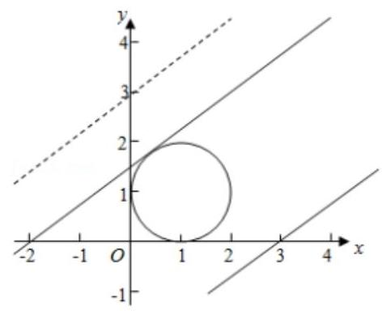

## 三、解答题

11、如图,已知圆 $C : {x}^{2} + {y}^{2} = 9$ 与 $x$ 轴的左、右交点分别为 $A, B$ ,与 $y$ 轴正半轴的交点为 $D$ .

(1)若直线 $l$ 过点 $\left( {3,4}\right)$ 并且与圆 $C$ 相切，求直线 $l$ 的方程；

(2)若点 $M, N$ 是圆 $C$ 上第一象限内的点，直线 ${AM},{AN}$ 分别与 $y$ 轴交于点 $P, Q$ ，点 $P$ 是线段 ${OQ}$ 的中点,直线 ${MN}//{BD}$ ,求直线 ${AM}$ 的斜率.

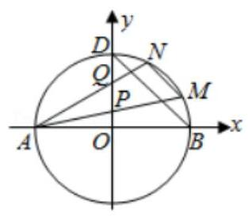

【难度】 $\star   \star   \star   \star$

【答案】见解析

【解析】解: (1) 由圆的方程可得: 圆心 $C\left( {0,0}\right)$ ,半径 $r = 3$ ,由题意可得 $A\left( {-3,0}\right) , B\left( {3,0}\right) , D\left( {0,3}\right)$ , 当直线 $l$ 的斜率不存在时,则为 $x = 3$ ,显然与圆 $C$ 相切;

当直线 $l$ 的斜率存在时,设 $l$ 的方程为: $y - 4 = k\left( {x - 3}\right)$ ,整理可得: ${kx} - y - {3k} + 4 = 0$ ,

可得圆心 $C$ 到直线的距离 $d = \frac{\left| -3k + 4\right| }{\sqrt{1 + {k}^{2}}}$ ,由直线与圆相切可得 $d = r$ ,即 $3 = \frac{\left| -3k + 4\right| }{\sqrt{1 + {k}^{2}}}$ ,解得: $k = \frac{7}{24}$ ,

所以圆的方程为: $y - 4 = \frac{7}{24}\left( {x - 3}\right)$ ,整理可得: ${7x} - {24y} + {75} = 0$ ,

综上所述: 过 $\left( {3,4}\right)$ 的切线的方程为: $x = 3$ 或 ${7x} - {24y} + {75} = 0$ ;

(2)由题意可得 ${k}_{BD} =  - 1$ ，设 $P\left( {0, a}\right)$ ，则由题意可得 $Q\left( {0,{2a}}\right)$ ，

所以直线 ${AP}$ 的方程为: $y = \frac{a}{3}\left( {x + 3}\right)$ ,代入圆的方程可得 ${x}^{2} + {\left\lbrack  \frac{a}{3}\left( x + 3\right) \right\rbrack  }^{2} = 9$ ,

整理可得: $\left( {1 + \frac{{a}^{2}}{9}}\right) {x}^{2} + \frac{2}{3}{a}^{2}x + {a}^{2} - 9 = 0$ ,

可得 ${x}_{A}{x}_{M} = \frac{{a}^{2} - 9}{1 + \frac{{a}^{2}}{9}}$ ,而 ${x}_{A} =  - 3$ ,所以 ${x}_{M} = \frac{-3\left( {{a}^{2} - 9}\right) }{9 + {a}^{2}},{y}_{M} = \frac{a}{3}\left( {x + 3}\right)  = \frac{a}{3} \cdot  \frac{54}{9 + {a}^{2}} = \frac{18a}{9 + {a}^{2}}$ ,

所以 $M\left( {\frac{-3\left( {{a}^{2} - 9}\right) }{9 + {a}^{2}},\frac{18a}{9 + {a}^{2}}}\right) ,{AQ}$ 的方程为: $y = \frac{2}{3}a\left( {x + 3}\right)$ ,代入圆的方程: $\left( {1 + \frac{4{a}^{2}}{9}}\right) {x}^{2} + \frac{8{a}^{2}}{3}x + 4{a}^{2} - 9 = 0$ ,

同理可得 ${x}_{N} = \frac{-3\left( {4{a}^{2} - 9}\right) }{9 + 4{a}^{2}},{y}_{N} = \frac{36a}{9 + 4{a}^{2}}$ ,所以 $N\left( {\frac{-3\left( {4{a}^{2} - 9}\right) }{9 + 4{a}^{2}},\frac{36a}{9 + 4{a}^{2}}}\right)$

所以 ${k}_{MN} = \frac{\frac{18a}{9 + {a}^{2}} - \frac{36a}{9 + 4{a}^{2}}}{\frac{-3\left( {{a}^{2} - 9}\right) }{9 + {a}^{2}} - \frac{-3\left( {4{a}^{2} - 9}\right) }{9 + 4{a}^{2}}} =  - 1$ ,整理可得: $2{a}^{2} + {9a} - 9 = 0, a > 0$ 解得: $a = \frac{-9 + \sqrt{153}}{4}$ ,

所以直线 ${AM}$ 的斜率为 $\frac{a}{3} = \frac{-9 + \sqrt{153}}{12} = \frac{\sqrt{17} - 3}{4}$ .

12、如图，Rt $\Delta \mathrm{{OAB}}$ 的直角边 ${OA}$ 在 $x$ 轴上，顶点 $B$ 的坐标为 $\left( {6,8}\right)$ ，直线 ${CD}$ 交 ${AB}$ 于点 $D\left( {6,3}\right)$ ，交 $x$ 轴于点 $C\left( {{12},0}\right)$ .

(1)求直线 ${CD}$ 的方程；

(2)动点 $P$ 在 $x$ 轴上从点 $\left( {-{10},0}\right)$ 出发，以每秒 1 个单位的速度向 $x$ 轴正方向运动，过点 $P$ 作直线 $l$ 垂直于 $x$ 轴,设运动时间为 $t$ .

①点 $P$ 在运动过程中，是否存在某个位置，使得 $\angle {PDA} = \angle B$ ？若存在，请求出点 $P$ 的坐标；若不存在，请说明理由;

②清探索当 $t$ 为何值时，在直线 $l$ 上存在点 $M$ ，在直线 ${CD}$ 上存在点 $Q$ ，使得以 ${OB}$ 为一边， $O$ ， $B$ ， $M$ ， $Q$ 为顶点的四边形为菱形,并求出此时 $t$ 的值.

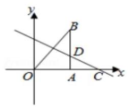

【难度】 $\star   \star   \star   \star$

【答案】见解析

【解析】解: (1) 直线 ${CD}$ 过点 $C\left( {{12},0}\right) , D\left( {6,3}\right)$ ,直线方程为 $\frac{y - 0}{3 - 0} = \frac{x - {12}}{6 - {12}}$ ,化为一般形式是 $x + {2y} - {12} = 0$ ; (2)①如图 1 中，作 ${DP}//{OB}$ ，则 $\angle {PDA} = \angle B$ ，

由 ${DP}//{OB}$ 得, $\frac{PA}{AO} = \frac{AD}{AB}$ ,即 $\frac{PA}{6} = \frac{3}{8},\therefore {PA} = \frac{9}{4};\therefore {OP} = 6 - \frac{9}{4} = \frac{15}{4},\therefore$ 点 $P\left( {\frac{15}{4},0}\right)$ ;

根据对称性知,当 ${AP} = A{P}^{\prime }$ 时, ${P}^{\prime }\left( {\frac{33}{4},0}\right) ,\therefore$ 满足条件的点 $P$ 坐标为 $\left( {\frac{15}{4},0}\right)$ 或 $\left( {\frac{33}{4},0}\right)$ ;

②如图 2 中,当 ${OP} = {OB} = {10}$ 时,作 ${PQ}//{OB}$ 交 ${CD}$ 于 $Q$ ,则直线 ${OB}$ 的解析式为 $y = \frac{4}{3}x$ ,

直线 ${PQ}$ 的解析式为 $y = \frac{4}{3}x + \frac{40}{3}$ ,由 $\left\{  \begin{array}{l} y = \frac{4}{3}x + \frac{40}{3} \\  x + {2y} - {12} = 0 \end{array}\right.$ ,解得 $\left\{  {\begin{array}{l} x =  - 4 \\  y = 8 \end{array},\therefore Q\left( {-4,8}\right) }\right.$ ;

$\therefore {PQ} = \sqrt{{\left( -{10} + 4\right) }^{2} + {\left( 0 - 8\right) }^{2}} = {10}$ ， $\therefore {PQ} = {OB}$ ， $\therefore$ 四边形 ${OPQB}$ 是平行四边形，

又 ${OP} = {OB}$ ， $\therefore$ 平行四边形 ${OPQB}$ 是菱形；此时点 $M$ 与点 $P$ 重合，且 $t = 0$ ；

如图 3,当 ${OQ} = {OB}$ 时,设 $Q\left( {m, - \frac{1}{2}m + 6}\right)$ ,则有 ${m}^{2} + {\left( -\frac{1}{2}m + 6\right) }^{2} = {10}^{2}$ ,解得 $m = \frac{{12} \pm  4\sqrt{89}}{5}$ ;

$\therefore$ 点 $Q$ 的横坐标为 $\frac{{12} + 4\sqrt{89}}{5}$ 或 $\frac{{12} - 4\sqrt{89}}{5}$ ; 设 $M$ 的横坐标为 $a$ ,

则 $\frac{a + 6}{2} = \frac{\frac{{12} + 4\sqrt{89}}{5} + 6}{2}$ 或 $\frac{a + 6}{2} = \frac{\frac{{12} - 4\sqrt{89}}{5} + 6}{2}$ ,解得 $a = \frac{{42} + 4\sqrt{89}}{5}$ 或 $a = \frac{{42} - 4\sqrt{89}}{5}$ ;

又点 $P$ 是从点 $\left( {-{10},0}\right)$ 开始运动,则满足条件的 $t$ 的值为 $\frac{{92} + 4\sqrt{89}}{5}$ 或 $\frac{{92} - 4\sqrt{89}}{5}$ ;

如图 4,当 $Q$ 点与 $C$ 点重合时, $M$ 点的横坐标为 6,此时 $t = {16}$ ;

综上,满足条件的 $t$ 值为 0,或 16,或 $\frac{{92} + 4\sqrt{89}}{5}$ 或 $\frac{{92} - 4\sqrt{89}}{5}$ .

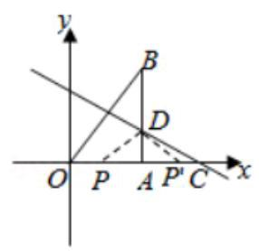

图1

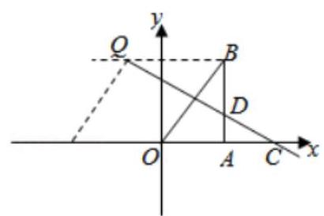

图2

图3

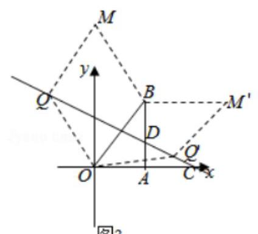

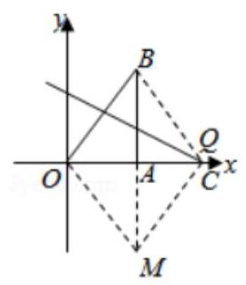

图4
