## 椭圆、双曲线、抛物线

<table><tr><td>教学目标</td><td>1. 理解椭圆、双曲线、抛物线的定义, 会推导椭圆、双曲线、抛物线的标准方程;   2. 掌握椭圆、双曲线、抛物线标准方程 (焦点位于 $x$ 轴或 $y$ 轴);   3. 掌握椭圆、双曲线、抛物线标准方程中 $a\text{ 、 }b\text{ 、 }c$ 之间的关系: ${c}^{2} = {a}^{2} - {b}^{2}$   4. 掌握椭圆、双曲线、抛物线的几何性质和应用</td></tr><tr><td>重点</td><td>1. 椭圆、双曲线、抛物线的定义以及标准方程中字母的含义及彼此等量关系;   2. 椭圆、双曲线、抛物线的几何性质和应用   3、直线与椭圆、双曲线、抛物线综合</td></tr><tr><td>难 点</td><td>直线与椭圆、双曲线、抛物线综合</td></tr></table>

## (一) 三大圆锥曲线的定义及应用

## 知识梳理

## 1. 椭圆定义

平面内到两个定点 ${F}_{1},{F}_{2}\left( {\mid {F}_{1}{F}_{2} \mid   = {2c}}\right.$ ) 的距离的和等于常数 ${2a}\left( {a > c > 0}\right)$ 的点的轨迹叫做椭圆. 这两个定点 ${F}_{1},{F}_{2}$ 叫做椭圆的焦点,两个焦点的距离 $\left| {{F}_{1}{F}_{2}}\right|  = {2c}$ 叫做焦距.

注意: 若设动点为 $P$ ,则

(1)当 $\left| {P{F}_{1}}\right|  + \left| {P{F}_{2}}\right|  > \left| {{F}_{1}{F}_{2}}\right|$ 时,动点 $P$ 的轨迹是椭圆.

(2)当 $\left| {P{F}_{1}}\right|  + \left| {P{F}_{2}}\right|  = \left| {{F}_{1}{F}_{2}}\right|$ 时，动点 $P$ 的轨迹是线段.

(3)当 $\left| {P{F}_{1}}\right|  + \left| {P{F}_{2}}\right|  < \left| {{F}_{1}{F}_{2}}\right|$ 时，动点 $P$ 的轨迹不存在.

## 2. 双曲线的定义

到两个定点 ${F}_{1}$ 与 ${F}_{2}$ 的距离之差的绝对值等于定长 $\left( { < \left| {{F}_{1}{F}_{2}}\right| }\right)$ 的点的轨迹.

当 $\begin{Vmatrix}{P{F}_{1}\left| -\right| P{F}_{2}}\end{Vmatrix} = {2a} < \left| {{F}_{1}{F}_{2}}\right|$ 时, $P$ 的轨迹为双曲线;

当 $\begin{Vmatrix}{P{F}_{1}}\end{Vmatrix} - \left| {P{F}_{2}}\right|  = {2a} > \left| {{F}_{1}{F}_{2}}\right|$ 时, $P$ 的轨迹不存在;

当 $\left| \right| P{F}_{1}\left| -\right| P{F}_{2}\left| \right|  = {2a} = \left| {{F}_{1}{F}_{2}}\right|$ 时, $P$ 的轨迹为以 ${F}_{1}\text{ 、 }{F}_{2}$ 为端点的两条射线

3. 定义: 平面内到一个定点 $F$ 和一条定直线 $l$ 的距离相等的点的轨迹叫抛物线, $\left| {PF}\right|  = \left| {PL}\right| , F \notin  l$

## 例题精讲

【例 1】设定点 ${F}_{1}\left( {0, - 2}\right) ,{F}_{2}\left( {0,2}\right)$ ,动点 $P$ 满足条件 $\left| {P{F}_{1}}\right|  + \left| {P{F}_{2}}\right|  = m + \frac{4}{m}\left( {m\text{ 为常数,且 }m > 0}\right)$ ,则点 $P$ 的轨迹是( )

A. 椭圆 B. 线段 C. 不存在 D. 椭圆或线段

【难度】 $\star   \star   \star$

【答案】 $D$

【解析】解: $\because m > 0, m + \frac{4}{m} \geq  2\sqrt{4} = 4$ .

故当 $m + \frac{4}{m} = 4$ 时,满足条件 $\left| {P{F}_{1}}\right|  + \left| {P{F}_{2}}\right|  = m + \frac{4}{m} = \left| {{F}_{1}{F}_{2}}\right|$ 的点 $P$ 的轨迹是线段 ${F}_{1}{F}_{2}$ .

当 $m + \frac{4}{m} > 4$ 时,满足条件 $\left| {P{F}_{1}}\right|  + \left| {P{F}_{2}}\right|  = m + \frac{4}{m}\left( {m > 0}\right)$ 的点 $P$ 的轨迹是以 ${F}_{1}\text{ 、 }{F}_{2}$ 为焦点的椭圆.

故选: $D$ .

【例 2】椭圆有这样的光学性质: 从椭圆的一个焦点出发的光线, 经椭圆反射后, 反射光线经过椭圆的另一个焦点,今有一个水平放置的椭圆形台球盘,点 $\mathrm{A}\text{ 、 }\mathrm{\;B}$ 是它的焦点,长轴长为 ${2a}$ ,焦距为 ${2c}$ ,静放在点 $\mathrm{A}$ 的小球(小球的半径不计)，从点 $\mathrm{A}$ 沿直线出发，经椭圆壁反弹后第一次回到点 $\mathrm{A}$ 时，小球经过的路程是 ( )

A. ${4a}$ B. $2\left( {a - c}\right)$ C. $2\left( {a + c}\right)$ D. 以上答案均有可能

【难度】★★

【答案】 $D$

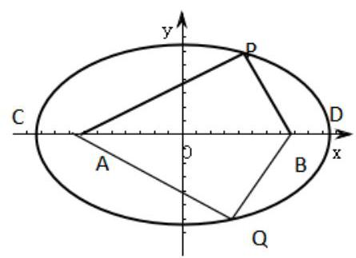

【解析】按小球的运行路径分三种情况:

(1) $A - C - A$ ，此时小球经过的路程为 $2\left( {a - c}\right)$ ；

(2) $A - B - D - B - A$ ，此时小球经过的路程为 $2\left( {a + c}\right)$ ；

(3) $A - P - B - Q - A$ ，此时小球经过的路程为 ${4a}$ ，故选 D

【例 3】( 1 )已知平面上的定点 ${F}_{1},{F}_{2}$ 及动点 $M$ ，甲: $\begin{Vmatrix}{M{F}_{1}}\end{Vmatrix} - \left| {M{F}_{2}}\right|  = m$ ( $m$ 为常数)， ${Z}_{1}$ :点 $M$ 的轨迹是以 ${F}_{1}$ ， ${F}_{2}$ 为焦点的双曲线，则甲是乙的( )

A. 充分不必要条件 B. 必要不充分条件 C. 充要条件 D. 既不充分也不必要条件

【难度】 $\star   \star   \star$

【答案】B

【解析】根据双曲线的定义,乙 $\Rightarrow$ 甲,但甲 $\nRightarrow$ 乙,只有当 $0 < m < \left| {{F}_{1}{F}_{2}}\right|$ 时,点 $M$ 的轨迹才是双曲线。 故选: B.

(2)点 $A$ 到图形 $C$ 上每一个点的距离的最小值称为点 $A$ 到图形 $C$ 的距离. $i$ 只知 $A\left( {1,0}\right)$ ，圆 $C : {x}^{2} + {2x} + {y}^{2} = 0$ ， 那么平面内到圆 $C$ 的距离与到点 $A$ 的距离之差为 1 的点的轨迹是( )

A. 双曲线的一支 B. 椭圆 C. 抛物线 D. 射线

【难度】 $\star   \star   \star$

【答案】D

【解析】圆的标准方程为 ${\left( x + 1\right) }^{2} + {y}^{2} = 1$ ,

如图所示,设圆心坐标为 ${A}^{\prime }$ ,满足题意的点为点 $P$ ,由题意有:

$\left| {P{A}^{\prime }}\right|  - 1 - \left| {PA}\right|  = 1$ ,则 $\left| {P{A}^{\prime }}\right|  - \left| {PA}\right|  = 2 = \left| {A{A}^{\prime }}\right|$ ,

设 $B\left( {2,0}\right)$ ,结合几何关系可知满足题意的轨迹为射线 ${AB}$ ; 本题选择 $D$ 选项

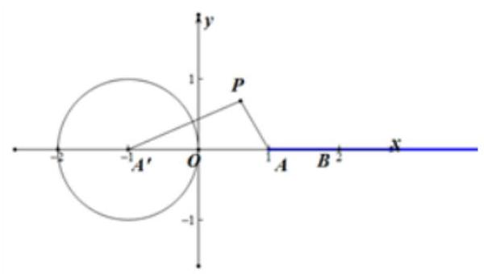

【例 4】已知动圆 $C$ 与圆 ${F}_{1} : {\left( x + 2\right) }^{2} + {y}^{2} = 1$ 内切,与圆 ${F}_{2} : {\left( x - 2\right) }^{2} + {y}^{2} = 1$ 外切,则动圆圆心 $C$ 的轨迹方程为( )

A. ${x}^{2} - \frac{{y}^{2}}{3} = 1$ B. ${x}^{2} - \frac{{y}^{2}}{3} = 1\left( {x \leq   - 1}\right)$ C. $\frac{{x}^{2}}{5} + {y}^{2} = 1\left( {x < 0}\right)$ D. $\frac{{x}^{2}}{5} + {y}^{2} = 1$

【难度】 $\star   \star   \star$

【答案】B

【解析】设圆 $C$ 的半径为 $R$ ,由题意可知 $\left| {C{F}_{1}}\right|  = R - 1,\left| {C{F}_{2}}\right|  = R + 1$ ,

两圆的圆心为: ${F}_{1}\left( {-2,0}\right) ,{F}_{2}\left( {2,0}\right)$ ， $\therefore \left| {C{F}_{2}}\right|  - \left| {C{F}_{1}}\right|  = 2 < \left| {{F}_{1}{F}_{2}}\right|  = 4$ ，

可知点 $C$ 的轨迹为以 ${F}_{1},{F}_{2}$ 为焦点,实轴长为 2 的双曲线的左支,

$\therefore a = 1, c = 2,{b}^{2} = {c}^{2} - {a}^{2} = 3$ ,则动圆圆心 $C$ 的轨迹方程为 ${x}^{2} - \frac{{y}^{2}}{3} = 1\left( {x \leq   - 1}\right)$ . 故选: B

【例 5】设点 $M\text{ 、 }N$ 均在双曲线 $C : \frac{{x}^{2}}{4} - \frac{{y}^{2}}{3} = 1$ 上运动, ${F}_{1}\text{ 、 }{F}_{2}$ 是双曲线 $C$ 的左、右焦点,则 $\left| {\overline{M{F}_{1}} + \overline{M{F}_{2}} - 2\overline{MN}}\right|$ 的最小值为( )

A. $2\sqrt{3}$ B. 4 C. $2\sqrt{7}$ D. 以上都不对

【难度】 $\star   \star   \star$

【答案】B

【解析】由题意,设 $O$ 为 ${F}_{1},{F}_{2}$ 的中点,根据向量的运算,可得 $\left| {\overrightarrow{M{F}_{1}} + \overrightarrow{M{F}_{2}} - 2\overrightarrow{MN}}\right|  = \left| {2\overrightarrow{MO} - 2\overrightarrow{MN}}\right|  = 2\left| \overrightarrow{NO}\right|$ , 又由 $N$ 为双曲线 $C : \frac{{x}^{2}}{4} - \frac{{y}^{2}}{3} = 1$ 上的动点,可得 $\left| \overrightarrow{NO}\right|  \geq  a$ ,

所以 $\left| {\overrightarrow{M{F}_{1}} + \overrightarrow{M{F}_{2}} - 2\overrightarrow{MN}}\right|  = 2\left| \overrightarrow{NO}\right|  \geq  {2a} = 4$ ,即 $\left| {\overrightarrow{M{F}_{1}} + \overrightarrow{M{F}_{2}} - 2\overrightarrow{MN}}\right|$ 的最小值为 4 . 故选: B.

【例 6】给出下列 3 个命题:

①在平面内，若动点 $M$ 到 ${F}_{1}\left( {-1,0}\right)$ 、 ${F}_{2}\left( {1,0}\right)$ 两点的距离之和等于 2，则动点 $M$ 的轨迹是椭圆；

②在平面内，给出点 ${F}_{1}\left( {-5,0}\right)$ 、 ${F}_{2}\left( {5,0}\right)$ ，若动点 $P$ 满足 $\left| {P{F}_{1}}\right|  - \left| {P{F}_{2}}\right|  = 8$ ，则动点 $P$ 的轨迹是双曲线； ③在平面内，若动点 $Q$ 到点 $A\left( {1,0}\right)$ 和到直线 ${2x} - y - 2 = 0$ 的距离相等，则动点 $Q$ 的轨迹是抛物线. 其中正确的命题有( )

A. 0 个 B. 1 个 C. 2 个 D. 3 个

【难度】 $\star   \star   \star$

【答案】A

【解析】解: 对于①在平面内,若动点 $M$ 到 ${F}_{1}\left( {-1,0}\right) \text{ 、 }{F}_{2}\left( {1,0}\right)$ 两点的距离之和等于 2,而 2 正好等于两定点 ${F}_{1}\left( {-1,0}\right) \text{ 、 }{F}_{2}\left( {1,0}\right)$ 的距离,则动点 $M$ 的轨迹是以 ${F}_{1},{F}_{2}$ 为端点的线段. 故错;

②在平面内，已知 ${F}_{1}\left( {-5,0}\right)$ ， ${F}_{2}\left( {5,0}\right)$ ，若动点 $M$ 满足条件: $\left| {M{F}_{1}}\right|  - \left| {M{F}_{2}}\right|  = 8$ ，则动点 $M$ 的轨迹是双曲线的一支，故错；

对于③在平面内，若动点 $M$ 到点 $P\left( {1,0}\right)$ 和到直线 ${2x} - y - 2 = 0$ 的距离相等，而此点正好在直线上，根据抛物线的定义知,动点 $M$ 的轨迹是抛物线. 不正确.

上述三个命题中,正确的个数为 0 ,

故选: $A$ .

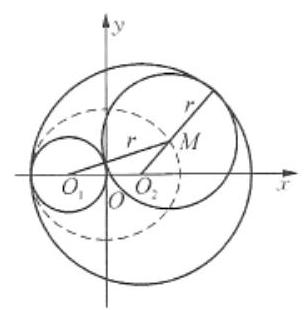

巩固训练

椭圆、双曲线、抛物线一教师版

1、(1)已知动圆 $M$ 与圆 ${O}_{1} : {\left( x + 1\right) }^{2} + {y}^{2} = 1$ 外切，与圆 ${O}_{2} : {\left( x - 1\right) }^{2} + {y}^{2} = 9$ 内切,求动圆圆心 $M$ 所在的曲线方程。

【难度】 $\star   \star   \star$

【答案】 $\frac{{x}^{2}}{4} + \frac{{y}^{2}}{3} = 1\left( {x \neq   - 2}\right)$

【解析】解: 设 $M\left( {x, y}\right)$ ,动圆 $M$ 的半径为 $r\left( {r > 0}\right)$ ,

则由题意知 $\left| {M{O}_{1}}\right|  = 1 + r,\left| {M{O}_{2}}\right|  = 3 - r$ ,

于是 $\left| {M{O}_{1}}\right|  + \left| {M{O}_{2}}\right|  = 4$ ,即动点 $M$ 到两个定点 ${O}_{1}\left( {-1,0}\right) \text{ 、 }{O}_{2}\left( {1,0}\right)$ 的距离之和为 $4\ldots$ (3 分)

又因为 $4 = \left| {M{O}_{1}}\right|  + \left| {M{O}_{2}}\right|  > \left| {{O}_{1}{O}_{2}}\right|  = 2$ ,

所以点 $M$ 在以两定点 ${O}_{1}\left( {-1,0}\right) \text{ 、 }{O}_{2}\left( {1,0}\right)$ 为焦点,4 为长轴长的椭圆上. 设此椭圆的标准方程为 $\frac{{x}^{2}}{{a}^{2}} + \frac{{y}^{2}}{{b}^{2}} = 1\;\left( {a > b > 0}\right)$ ,这里 $a = 2, c = 1,\ldots$ (6 分)

则 ${b}^{2} = {a}^{2} - {c}^{2} = 3$ .

因此动圆圆心 $M$ 所在的曲线方程为 $\frac{{x}^{2}}{4} + \frac{{y}^{2}}{3} = 1, x \neq   - 2$

( 2 )动圆 $P$ 与定圆 $A : {\left( x + 2\right) }^{2} + {y}^{2} = 1$ 外切，且与直线 $l : x = 1$ 相切，求动圆圆心 $P$ 的轨迹方程.

【难度】 $\star   \star   \star$

【答案】 ${y}^{2} =  - {8x}$ .

【解析】如图,设动圆圆心 $P\left( {x, y}\right)$ ,过点 $P$ 作 ${PD} \bot  l$ 于点 $D$ ,作直线 $l : x = 2$ ,过点 $P$ 作 $P{D}^{\prime } \bot  {l}^{\prime }$ 于点 ${D}^{\prime }$ , 连接 ${PA}$ . 设动圆 $P$ 的半径为 $R$ ,由题知圆 $A$ 的半径为 1 .

$\because$ 圆 $P$ 与圆 $A$ 外切, $\therefore \left| {PA}\right|  = R + 1$ . 又 $\because$ 圆 $P$ 与直线 $l : x = 1$ 相切, $\therefore \left| {P{D}^{\prime }}\right|  = \left| {PD}\right|  + \left| {D{D}^{\prime }}\right|  = R + 1$ .

$\because \left| {PA}\right|  = \left| {P{D}^{\prime }}\right|$ ,即动点 $P$ 到定点 $A$ 与到定直线 ${l}^{\prime }$ 的距离相等,

$\therefore$ 点 $P$ 的轨迹是以 $A$ 为焦点,以 ${l}^{\prime }$ 为准线的抛物线.

设抛物线的方程为 ${y}^{2} =  - {2px}\left( {p > 0}\right)$ ,可知 $p = 4,\therefore$ 所求动圆圆心 $P$ 的轨迹方程为 ${y}^{2} =  - {8x}$ .

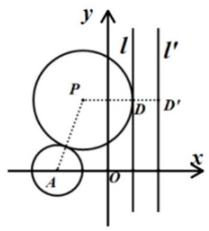

2、已知 $a\text{ 、 }b\text{ 、 }c$ 分别是 $\bigtriangleup  {ABC}$ 内角 $A\text{ 、 }B\text{ 、 }C$ 的对边， $\sin A + \sin B = 3\sin C$ ， $a\cos B + b\cos A = 2$ ，则 $\bigtriangleup  {ABC}$ 面积的最大值是( )

A. 2 B. $2\sqrt{2}$ C. 3 D. $2\sqrt{3}$

【难度】★★★

【答案】B

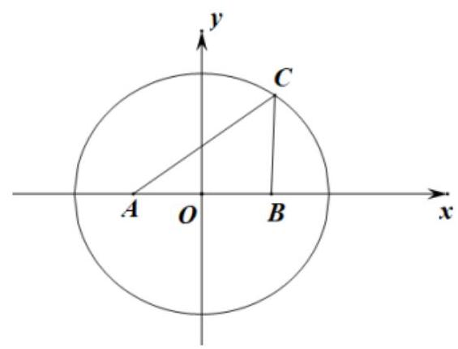

【解析】 $\because a\cos B + b\cos A = 2$ ,

$\therefore a \cdot  \frac{{a}^{2} + {c}^{2} - {b}^{2}}{2ac} + b \cdot  \frac{{b}^{2} + {c}^{2} - {a}^{2}}{2bc} = 2,\therefore c = 2$ ,

$\because \sin A + \sin B = 3\sin C;\therefore a + b = {3c} = 6$ ,即

$\left| {CA}\right|  + \left| {CB}\right|  = 6 > \left| {AB}\right|  = 2,$

$\therefore$ 点 $C$ 的轨迹是以 $A, B$ 为焦点的椭圆,其中长半轴长 3,短半轴长 $2\sqrt{2}$ ,以 ${AB}$ 为 $x$ 轴,以线段 ${AB}$ 的中点为原点,建立平面直角坐标

系，其方程为 $\frac{{x}^{2}}{9} + \frac{{y}^{2}}{8} = 1$ ，如图所示:则问题转化为点 $C$ 在椭圆 $\frac{{x}^{2}}{9} + \frac{{y}^{2}}{8} = 1$ 上运动求焦点三角形的面积问题. 当点 $C$ 在短轴端点时, $\bigtriangleup {ABC}$ 的面积取得最大值,最大值为 $2\sqrt{2}$ .

故选: B.

3、(1)如图所示，F 为双曲线 $C : \frac{{x}^{2}}{9} - \frac{{y}^{2}}{16} = 1$ 的左焦点，双曲线 $\mathrm{C}$ 上的点 ${P}_{i}$ 与 ${P}_{7 - i}\left( {\mathrm{i} = 1,2,3}\right)$ 关于 $\mathrm{y}$ 轴对称，则 $\left| {{P}_{1}F}\right|  + \left| {{P}_{2}F}\right|  + \left| {{P}_{3}F}\right|  - \left| {{P}_{4}F}\right|  - \left| {{P}_{5}F}\right|  - \left| {{P}_{6}F}\right|$ 的值是___.

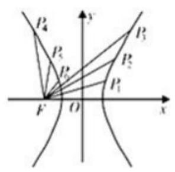

【难度】 $\star   \star   \star$

【答案】 18

【解析】设右焦点为 $M$ ,

$\because$ 双曲线 $C$ 上的点 ${P}_{i}$ 与 ${P}_{7 - i}\left( {i = 1,2,3}\right)$ 关于 $y$ 轴对称,即 ${P}_{1}$ 和 ${P}_{6},{P}_{2}$ 和 ${P}_{5},{P}_{3}$ 和 ${P}_{4}$ 分别关于 $y$ 轴对称 $\therefore \left| {F{P}_{1}}\right|  = \left| {M{P}_{6}}\right| ,\;\left| {F{P}_{2}}\right|  = \left| {M{P}_{5}}\right| ,\;\left| {F{P}_{3}}\right|  = \left| {M{P}_{4}}\right|$

$\therefore \left| {{P}_{1}F}\right|  + \left| {{P}_{2}F}\right|  + \left| {{P}_{3}F}\right|  - \left| {{P}_{4}F}\right|  - \left| {{P}_{5}F}\right|  - \left| {{P}_{6}F}\right|  = \left( {\left| {M{P}_{6}}\right|  - \left| {{P}_{6}F}\right| }\right)  + \left( {\left| {M{P}_{5}}\right|  - \left| {{P}_{5}F}\right| }\right)  + \left( {\left| {M{P}_{4}}\right|  - \left| {{P}_{4}F}\right| }\right)$

根据双曲线的第二定义可知

$\left| {M{P}_{6}}\right|  - \left| {{P}_{6}F}\right|  = {2a} = 6,\left| {M{P}_{5}}\right|  - \left| {{P}_{5}F}\right|  = {2a} = 6,\left| {M{P}_{4}}\right|  - \left| {{P}_{4}F}\right|  = {2a} = 6$

$\therefore \left| {{P}_{1}F}\right|  + \left| {{P}_{2}F}\right|  + \left| {{P}_{3}F}\right|  - \left| {{P}_{4}F}\right|  - \left| {{P}_{5}F}\right|  - \left| {{P}_{6}F}\right|  = {18}$

故答案为 18 .

(2)设 ${F}_{1},{F}_{2}$ 是双曲线 $\frac{{x}^{2}}{5} - \frac{{y}^{2}}{4} = 1$ 的两个焦点， $P$ 是该双曲线上一点，且 $\left| {P{F}_{1}}\right|  : \left| {P{F}_{2}}\right|  = 2 : 1$ ，则 ${\Delta P}{F}_{1}{F}_{2}$ 的面积等于___.

【难度】 $\star   \star   \star$

【答案】 12

【解析】由于 $\frac{{x}^{2}}{5} - \frac{{y}^{2}}{4} = 1$ ,因此 $a = \sqrt{5}, c = 3$ ,故 $\left| {{F}_{1}{F}_{2}}\right|  = {2c} = 6$ ,由于 $\left| {P{F}_{1}}\right|  : \left| {P{F}_{2}}\right|  = 2 : 1$ 即 $\left| {P{F}_{1}}\right|  = 2\left| {P{F}_{2}}\right|$ , 而 $\left| {P{F}_{1}}\right|  - \left| {P{F}_{2}}\right|  = {2a} = 2\sqrt{5}$ ,所以 $\left| {P{F}_{1}}\right|  = 4\sqrt{5}$ , $\left| {P{F}_{2}}\right|  = 2\sqrt{5},\cos \angle {F}_{1}P{F}_{2} = \frac{P{F}_{1}^{2} + P{F}_{2}^{2} - {F}_{1}{F}_{2}^{2}}{{2P}{F}_{1} \cdot  P{F}_{2}} = \frac{4}{5}$ , 所以 $\sin \angle {F}_{1}P{F}_{2} = \frac{3}{5}$ ,因此 ${S}_{\bigtriangleup P{F}_{1}{F}_{2}} = \frac{1}{2}\left| {P{F}_{1}}\right| \left| {P{F}_{2}}\right| \sin \angle {F}_{1}P{F}_{2} = {12}$ .

4、双曲线定位法是通过测定待定点到至少三个已知点的两个距离差所进行的一种无线电定位. 通过船 (待定点)接收到三个发射台的电磁波的时间差计算出距离差，两个距离差即可形成两条位置双曲线，两者相交便可确定船位. 我们来看一种简单的“特殊”状况；如图所示，已知三个发射台分别为 $A, B, C$ 且刚好三点共线,已知 ${AB} = {34}$ 海里, ${AC} = {20}$ 海里,现以 ${AB}$ 的中点为原点, ${AB}$ 所在直线为 $x$ 轴建系. 现根据船 $P$

接收到 $C$ 点与 $A$ 点发出的电磁波的时间差计算出距离差,得知船 $P$ 在双曲线 $\frac{{\left( x - {27}\right) }^{2}}{36} - \frac{{y}^{2}}{64} = 1$ 的左支上, 根据船 $P$ 接收到 $A$ 台和 $B$ 台电磁波的时间差,计算出船 $P$ 到 $B$ 发射台的距离比到 $A$ 发射台的距离远 30 海里,则点 $P$ 的坐标 (单位: 海里) 为 ( )

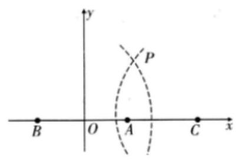

A. $\left( {\frac{90}{7}, \pm  \frac{{32}\sqrt{11}}{7}}\right)$ B. $\left( {\frac{135}{7}, \pm  \frac{{32}\sqrt{12}}{7}}\right)$

C. $\left( {{17}, \pm  \frac{32}{3}}\right)$ D. $\left( {{45}, \pm  {16}\sqrt{2}}\right)$

【难度】 $\star   \star   \star$

【答案】B

【解析】设由船 $P$ 到 $B$ 台和到 $A$ 台的距离差确定的双曲线方程为 $\frac{{x}^{2}}{{a}^{2}} - \frac{{y}^{2}}{{b}^{2}} = 1\left( {x \geq  a}\right)$

由于船 $P$ 到 $B$ 台和到 $A$ 台的距离差为 30 海里，故 $a = {15}$ ，又 $c = {17}$ ，故 $b = 8$

故由船 $P$ 到 $B$ 台和到 $A$ 台的距离差所确定的双曲线为 $\frac{{x}^{2}}{225} - \frac{{y}^{2}}{64} = 1\left( {x > {15}}\right)$

联立 $\left\{  \begin{array}{l} \frac{{\left( x - {27}\right) }^{2}}{36} - \frac{{y}^{2}}{64} = 1\left( {x < {21}}\right) \\  \frac{{x}^{2}}{225} - \frac{{y}^{2}}{64} = 1\left( {x > {15}}\right)  \end{array}\right.$ ,解得 $P\left( {\frac{135}{7}, \pm  \frac{{32}\sqrt{2}}{7}}\right)$ ; 故选: B

5、如图，点 $A$ 是平面 $\alpha$ 外一定点，过 $A$ 作平面 $\alpha$ 的斜线 $l$ ，斜线 $l$ 与平面 $\alpha$ 所成角为 ${50}^{ \circ  }$ . 若点 $P$ 在平面 $\alpha$ 内运动,并使直线 ${AP}$ 与 $l$ 所成角为 ${35}^{ \circ  }$ ,则动点 $P$ 的轨迹是 ( )

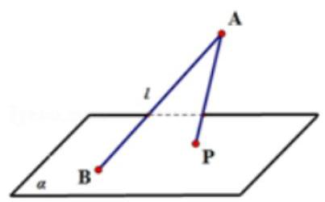

A. 圆 B. 椭圆 C. 抛物线 D. 双曲线的一支

【难度】 $\star   \star   \star   \star$

【答案】 $B$

【解析】解: 用垂直于锥轴的平面去截圆锥, 得到的是圆; 把平面渐渐倾斜, 得到椭圆; 当平面和圆锥的一条母线平行时,得到抛物线; 当平面再倾斜一些就可以得到双曲线.

故可知动点 $P$ 的轨迹是椭圆的一部分. 故选: $B$ .

## (二)圆锥曲线的标准方程和几何性质

## 知识梳理

## 一、椭圆

## 1、椭圆的标准方程及几何性质

椭圆的标准方程及性质见下表.

<table><tr><td></td><td>焦点在 $x$ 轴上</td><td>焦点在 $y$ 轴上</td></tr><tr><td>标准方程</td><td>$\frac{{x}^{2}}{{a}^{2}} + \frac{{y}^{2}}{{b}^{2}} = 1\left( \begin{array}{l} a > b > 0 \\  {b}^{2} + {c}^{2} = {a}^{2} \end{array}\right)$</td><td>$\frac{{y}^{2}}{{a}^{2}} + \frac{{x}^{2}}{{b}^{2}} = 1\left( \begin{array}{l} a > b > 0 \\  {b}^{2} + {c}^{2} = {a}^{2} \end{array}\right)$</td></tr><tr><td>图形</td><td>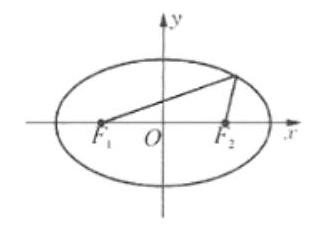</td><td>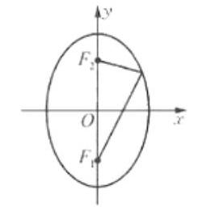</td></tr><tr><td>焦点坐标</td><td>${F}_{1}\left( {-c,0}\right) ,{F}_{2}\left( {c,0}\right)$</td><td>${F}_{1}\left( {0, c}\right) ,{F}_{2}\left( {0, - c}\right)$</td></tr><tr><td>焦距</td><td>${2c}$</td><td>${2c}$</td></tr><tr><td>范围</td><td>$- a \leq  x \leq  a,\; - b \leq  y \leq  b$</td><td>$- b \leq  x \leq  b, - a \leq  y \leq  a$</td></tr><tr><td>对称性</td><td colspan="2">$x$ 轴、 $y$ 轴和原点对称</td></tr><tr><td>顶点坐标</td><td>$\left( {a,0}\right) ,\left( {-a,0}\right) ,\left( {0, b}\right) ,\left( {0, - b}\right)$</td><td>$\left( {b,0}\right) ,\left( {-b,0}\right) ,\left( {0, a}\right) ,\left( {0, - a}\right)$</td></tr><tr><td>两轴</td><td colspan="2">长轴长 ${2a}$ ，短轴长 ${2b}$</td></tr></table>

## 2、椭圆的其他性质

① 椭圆上到中心的距离最小的点是短轴的两个端点，到中心距离最大的点是长轴的两个端点.

② 椭圆上到焦点距离最大、最小的点是长轴的两个端点，最大距离是 $a + c$ ，最小距离是 $a - c$ .

③ 设椭圆的两个焦点为 ${F}_{1},{F}_{2}, P$ 是椭圆上的点，当点 $P$ 在短轴的端点时 $\angle {F}_{1}P{F}_{2}$ 最大.

④ 椭圆的焦点的光学性质:从任一焦点发出的光线通过椭圆面反射后，反射光线经过另一焦点.

## 3、椭圆的参数方程

$\left\{  {\begin{array}{l} x = a\cos \varphi , \\  y = b\sin \varphi . \end{array}\left( {0 \leq  \varphi  < {2\pi }}\right) }\right.$

## 4、点与椭圆的位置关系

已知点 $P\left( {{x}_{0},{y}_{0}}\right)$ 与椭圆 $\frac{{x}^{2}}{{a}^{2}} + \frac{{y}^{2}}{{b}^{2}} = 1\left( {a > b > 0}\right)$ ( ${F}_{1}$ ， ${F}_{2}$ 为椭圆的焦点)，则

(1)点 $P$ 在椭圆上 $\Leftrightarrow  \frac{{x}_{0}^{2}}{{a}^{2}} + \frac{{y}_{0}^{2}}{{b}^{2}} = 1 \Leftrightarrow  \left| {P{F}_{1}}\right|  + \left| {P{F}_{2}}\right|  = {2a}$ ;

(2)点 $P$ 在椭圆外 $\Leftrightarrow  \frac{{x}_{0}^{2}}{{a}^{2}} + \frac{{y}_{0}^{2}}{{b}^{2}} > 1 \Leftrightarrow  \left| {P{F}_{1}}\right|  + \left| {P{F}_{2}}\right|  > {2a}$ ；

(3)点 $P$ 在椭圆内 $\Leftrightarrow  \frac{{x}_{0}^{2}}{{a}^{2}} + \frac{{y}_{0}^{2}}{{b}^{2}} < 1 \Leftrightarrow  \left| {P{F}_{1}}\right|  + \left| {P{F}_{2}}\right|  < {2a}$ .

## 二、双曲线

## 双曲线的标准方程与几何性质

<table><tr><td colspan="2">标准方程</td><td>$\frac{{x}^{2}}{{a}^{2}} - \frac{{y}^{2}}{{b}^{2}} = 1\left( {a, b > 0}\right)$</td><td>$\frac{{y}^{2}}{{a}^{2}} - \frac{{x}^{2}}{{b}^{2}} = 1\left( {a, b > 0}\right)$</td></tr><tr><td rowspan="6">性质</td><td>焦点</td><td>$\left( {c,0}\right) ,\left( {-c,0}\right)$ ,</td><td>$\left( {0, c}\right) ,\left( {0, - c}\right)$</td></tr><tr><td>焦距</td><td colspan="2">${2c}$</td></tr><tr><td>范围</td><td>$\left| x\right|  \geq  a, y \in  R$</td><td>$\left| y\right|  \geq  a, x \in  R$</td></tr><tr><td>顶点</td><td>$\left( {a,0}\right) ,\left( {-a,0}\right)$</td><td>$\left( {0, - a}\right) ,\left( {0, a}\right)$</td></tr><tr><td>对称性</td><td colspan="2">关于 x 轴、y 轴和原点对称</td></tr><tr><td>渐近线</td><td>$y =  \pm  \frac{b}{a}x$</td><td>$y =  \pm  \frac{a}{b}x$</td></tr></table>

特别: 与双曲线 $\frac{{x}^{2}}{\lambda } - \frac{{y}^{2}}{u} = m\left( {\lambda , u < 0, m \neq  0}\right)$ 共渐近线的双曲线的方程为: $\frac{{x}^{2}}{\lambda } - \frac{{y}^{2}}{u} = n$ (左边相同,区别仅在于右边的常数)

## 三、抛物线

1、抛物线的标准方程、类型及其几何性质:

<table id="cross-table-1"><tr><td></td><td>${y}^{2} = {2px}$</td><td>${y}^{2} =  - {2px}$</td><td>${x}^{2} = {2py}$</td><td>${x}^{2} =  - {2py}$</td></tr><tr><td>图形</td><td>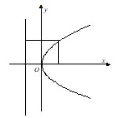</td><td>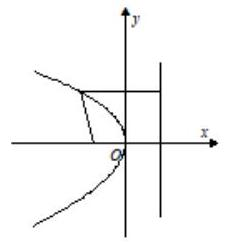</td><td>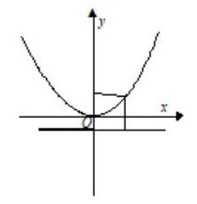</td><td>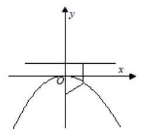</td></tr><tr><td>焦点</td><td>$F\left( {\frac{p}{2},0}\right)$</td><td>$F\left( {-\frac{p}{2},0}\right)$</td><td>$F\left( {0,\frac{p}{2}}\right)$</td><td>$F\left( {0, - \frac{p}{2}}\right)$</td></tr><tr><td>准线</td><td>$x =  - \frac{p}{2}$</td><td>$x = \frac{p}{2}$</td><td>$y =  - \frac{p}{2}$</td><td>$y = \frac{p}{2}$</td></tr><tr><td>范围</td><td>$x \geq  0, y \in  R$</td><td>$x \leq  0, y \in  R$</td><td>$x \in  R, y \geq  0$</td><td>$x \in  R, y \leq  0$</td></tr><tr><td>对称轴</td><td>$x$ 轴</td><td>$x$ 轴</td><td>$y$ 轴</td><td>$y$ 轴</td></tr><tr><td>顶点</td><td>(0,0)</td><td>(0,0)</td><td>$\left( {0,0}\right)$</td><td>(0,0)</td></tr><tr><td>焦点</td><td>$\left| {PF}\right|  = \frac{p}{2} + {x}_{1}$</td><td>$\left| {PF}\right|  = \frac{p}{2} + \left| {x}_{1}\right|$</td><td>$\left| {PF}\right|  = \frac{p}{2} + {y}_{1}$</td><td>$\left| {PF}\right|  = \frac{p}{2} + \left| {y}_{1}\right|$</td></tr></table>

【常见结论】

1. $P\left( {p > 0}\right)$ 的几何意义是抛物线的焦准距 (焦点到准线的距离); ${2p}$ 表示通径 (通过焦点且垂直于对称轴的直线与抛物线交于两点,连接这两点的线段) 长, $\frac{p}{2}$ 表示焦点到顶点的距离.

2. 抛物线的通径: 通过焦点并且垂直于对称轴的直线与抛物线两交点之间的线段叫做抛物线的通径. 通径的长为 ${2p}$ ,通径是过焦点最短的弦.

3. 若抛物线 ${y}^{2} = {2px}\left( {p > 0}\right)$ 的焦点弦为 $\mathrm{{AB}}, A\left( {{x}_{1},{y}_{1}}\right) , B\left( {{x}_{2},{y}_{2}}\right)$ ,则

(1) $\left| {AB}\right|  = {x}_{1} + {x}_{2} + p,{x}_{1}{x}_{2} = \frac{{p}^{2}}{4},{y}_{1}{y}_{2} =  - {p}^{2}$ ；若 ${OA}$ 、 ${OB}$ 是过抛物线 ${y}^{2} = {2px}\left( {p > 0}\right)$ 顶点 $O$ 的两条互相垂直的弦，则直线 ${AB}$ 恒经过定点 $\left( {{2p},0}\right)$ .

(2) $\left| {AB}\right|  = \frac{2p}{{\sin }^{2}\theta }$ ；

(3)以 ${AB}$ 为直径的圆与准线相切；

证明: 设 ${AB}$ 为抛物线的焦点弦, $F$ 为抛物线的焦点,点 ${A}^{\prime },{B}^{\prime }$ 分别是点 $A, B$ 在准线上的射影,弦 ${AB}$ 的中点为 $\mathrm{M}$ ,则 ${AB} = {AF} + {BF} = {A{A}^{\prime }} + B{B}^{\prime }$ ，点 $\mathrm{M}$ 到准线的距离为 $\frac{1}{2}\left( {A{A}^{\prime } + B{B}^{\prime }}\right)  = \frac{1}{2}{AB}$ ， $\therefore$ 以抛物线焦点弦为直径的圆总与抛物线的准线相切.

(4) $\frac{1}{\left| FA\right| } + \frac{1}{\left| FB\right| } = \frac{2}{p}$ .

## 例题精讲

【例 7】学习了圆锥曲线及其方程后,对于一个一般的二元二次方程: $A{x}^{2} + C{y}^{2} + {Dx} + {Ey} + F = 0(A, C$ , $D, E, F$ 为常数),请你写出 $A, C, D, E, F$ 满足条件使得方程它分别表示

①直线；②圆；③椭圆；④双曲线；⑤抛物线的必要条件.

【难度】 $\star   \star   \star$

【答案】见解析

【解析】解: ① 方程表示直线, 其二次项系数必为 0 或可分解成两个一次因式的积的形式, 故其必要条件: $A = C = 0, D, E$ 不全为零; 或 $A \cdot  C < 0, D, E, F$ 全为零;

② 方程表示圆,其二次项系数必须相等且不为 0,故其必要条件: $A = C,{D}^{2} + {E}^{2} - {4AF} > 0$ ;

③ 方程表示椭圆其二次项系数必须同号,故必要条件: $A \cdot  C > 0, A \neq  C,\frac{{D}^{2}}{4{A}^{2}} + \frac{{E}^{2}}{4{C}^{2}} - F > 0$ ;

④ 方程表示双曲线其二次项系数必须异号,故必要条件: $A \cdot  C < 0,\frac{{D}^{2}}{4{A}^{2}} + \frac{{E}^{2}}{4{C}^{2}} - F \neq  0$ ;

⑤ 方程表示抛物线其二次项系数必须有一个为 0，另一个不为 0，故必要条件: $A = 0$ 且 ${CD} \neq  0$ ；或 $C = 0$ 且 ${AE} \neq  0$ .

【例 8】若复数 $z$ 满足 $\left| {z - {z}_{0}}\right|  + \left| {z - {3i}}\right|  = 4$ ,且复数 $z$ 对应的点的轨迹是椭圆,则复数 ${z}_{0}$ 的模的取值范围是 ___.

【难度】 $\star   \star   \star   \star$

【答案】 $\lbrack 0,7)$

【解析】如图: 满足 $\left| {z - {3i}}\right|  + \left| {z - {z}_{0}}\right|  = 4$ 的复数 $z$ 对应的点的轨迹是椭圆,

由椭圆的定义可知, ${z}_{0}$ 到 $\left( {0,3}\right)$ 的距离小于 4,则 ${z}_{0}$ 的轨迹是以 $\left( {0,3}\right)$ 为圆心,4 为半径的圆的内部部分, $\therefore \left| {z}_{0}\right|$ 的取值范围是 $\lbrack 0,7)$ . 故答案为: $\lbrack 0,7)$ .

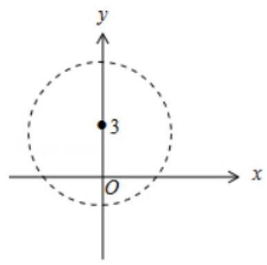

【例 9】( 1 )若椭圆 $\frac{{x}^{2}}{m} + {y}^{2} = 1\left( {m > 1}\right)$ 与双曲线 $\frac{{x}^{2}}{n} - {y}^{2} = 1\left( {n > 0}\right)$ 有相同的焦点 ${F}_{1}\text{ 、 }{F}_{2}, P$ 是两曲线的一个交点，则 $\Delta {F}_{1}P{F}_{2}$ 的面积是___.

【难度】 $\star   \star   \star$

【答案】 1

【解析】因为两曲线的焦点相同,所以 ${c}^{2} = m - 1 = n + 1$ ,即 $m - n = 2$ . 设 $P$ 是两曲线在第一象限内的交点,则由椭圆与双曲线的定义,有 $\left\{  \begin{array}{l} \left| {P{F}_{1}}\right|  + \left| {P{F}_{2}}\right|  = 2\sqrt{m} \\  \left| {P{F}_{1}}\right|  - \left| {P{F}_{2}}\right|  = 2\sqrt{n} \end{array}\right.$ ,解得 $\left\{  \begin{array}{l} \left| {P{F}_{1}}\right|  = \sqrt{m} + \sqrt{n} \\  \left| {P{F}_{2}}\right|  = \sqrt{m} - \sqrt{n} \end{array}\right.$ ,所以 $\left| {P{F}_{1}}\right|  \cdot  \left| {P{F}_{2}}\right|  = 2$ . 在 $\Delta {F}_{1}P{F}_{2}$ 中,由余弦定理,得 $\cos \angle {F}_{1}P{F}_{2} = \frac{{\left| P{F}_{1}\right| }^{2} + {\left| P{F}_{2}\right| }^{2} - {\left| {F}_{1}{F}_{2}\right| }^{2}}{2\left| {P{F}_{1}}\right|  \cdot  \left| {P{F}_{2}}\right| } = \; \frac{{\left( \sqrt{m} + \sqrt{n}\right) }^{2} + {\left( \sqrt{m} - \sqrt{n}\right) }^{2} - 4\left( {m - 1}\right) }{2 \times  2} = \frac{2\left( {n - m}\right)  + 4}{4} = 0$ ,所以 $\angle {F}_{1}P{F}_{2} = \frac{\pi }{2}$ ,所以 ${S}_{\Delta {F}_{1}P{F}_{2}} = \; \frac{1}{2}\left| {P{F}_{1}}\right|  \cdot  \left| {P{F}_{2}}\right|  = 1.$

(2)设 $A$ 是双曲线 $\frac{{x}^{2}}{{a}^{2}} - {y}^{2} = 1\left( {a > 0}\right)$ 上在第一象限内的点， $F$ 为其右焦点，点 $A$ 关于原点 $O$ 的对称点为 $B$ ,若 ${AF}\bot {BF}$ ,设 $\angle {ABF} = \theta$ ，且 $\theta  \in  \left\lbrack  {\frac{\pi }{12},\frac{\pi }{6}}\right\rbrack$ ，则 ${a}^{2}$ 的取值范围是___.

【难度】 $\star   \star   \star$

【答案】 $\left\lbrack  {\frac{2\sqrt{3}}{3} - 1,1}\right\rbrack$

【解析】设双曲线的左焦点为 ${F}^{\prime }$ ,设 $\left| {AF}\right|  = m,\left| {A{F}^{\prime }}\right|  = n$ ,则 $n - m = {2a}$ ,

因为点 $A$ 关于原点 $O$ 的对称点为 $B$ ,且 ${AF} \bot  {BF},\angle {ABF} = \theta$

所以 $\left| {OA}\right|  = \left| {OB}\right|  = \left| {OF}\right|  = \left| {O{F}^{\prime }}\right|  = c = \sqrt{{a}^{2} + 1},\angle {AOF} = {2\theta }$ ,所以 ${m}^{2} + {n}^{2} = 4{c}^{2}$ ,

所以 ${\left( m - n\right) }^{2} + {2mn} = 4{c}^{2}$ ,即 ${mn} = 2\left( {{c}^{2} - {a}^{2}}\right)  = 2{b}^{2} = 1$ ,所以 ${S}_{\bigtriangleup {AOF}} = \frac{1}{2}$ ,

因为 ${S}_{\bigtriangleup {AOF}} = \frac{1}{2}{c}^{2}\sin {2\theta }$ ,所以 ${c}^{2} = \frac{1}{\sin {2\theta }}$ ,所以 ${a}^{2} = \frac{1}{\sin {2\theta }} - 1$ ,

因为 $\theta  \in  \left\lbrack  {\frac{\pi }{12},\frac{\pi }{6}}\right\rbrack$ ,所以 ${2\theta } \in  \left\lbrack  {\frac{\pi }{6},\frac{\pi }{3}}\right\rbrack$ ,所以 $\frac{1}{2} \leq  \sin {2\theta } \leq  \frac{\sqrt{3}}{2}$ ,所以 $\frac{2\sqrt{3}}{3} \leq  \frac{1}{\sin {2\theta }} \leq  2$ ,

所以 $\frac{2\sqrt{3}}{3} - 1 \leq  \frac{1}{\sin {2\theta }} - 1 \leq  1$ ,所以 $\frac{2\sqrt{3}}{3} - 1 \leq  {a}^{2} \leq  1$ ,故答案为: $\left\lbrack  {\frac{2\sqrt{3}}{3} - 1,1}\right\rbrack$

【例 10】已知椭圆 $\frac{{x}^{2}}{25} + \frac{{y}^{2}}{16} = 1,{F}_{1},{F}_{2}$ 为焦点， $M$ 为椭圆上的点，若 ${\Delta M}{F}_{1}{F}_{2}$ 的内切圆的面积为 $\frac{9}{4}\pi$ ，则这样的点 $M$ 的个数为( )

A. 0 B. 1 C. 2 D. 4

【难度】 $\star   \star   \star$

【答案】C

【解析】由已知得 $\bigtriangleup  M{F}_{1}{F}_{2}$ 的内切圆的半径为 $r = \frac{3}{2}$ ,又因为 $a = 5, c = \sqrt{{25} - {16}} = 3$ ,所以 $\bigtriangleup  M{F}_{1}{F}_{2}$ 的周长为 ${2a} \; + {2c} = {16}$ ,所以 $\bigtriangleup  M{F}_{1}{F}_{2}$ 的面积 $S = \frac{1}{2}\left( {{2a} + {2c}}\right) r = \frac{1}{2} \times  {16} \times  \frac{3}{2} = {12}$ ,设 $M\left( {{x}_{0},{y}_{0}}\right)$ ,则 $S = \frac{1}{2} \cdot  {2c} \cdot  \left| {y}_{0}\right|  = \frac{1}{2} \times  6 \times \; \left| {y}_{0}\right|  = {12}$ ,解得 ${y}_{0} =  \pm  4$ ,由于 $M$ 为椭圆上的点,所以 $- 4 \leq  {y}_{0} \leq  4$ ,故 $M$ 应恰好为短轴的两个端点,即这样的点 $M$ 有 2

【例 11】(1) 已知 $P$ 为椭圆 $\frac{{x}^{2}}{4} + {y}^{2} = 1$ 上任意一点， $M\left( {m,0}\right) \left( {m \in  \mathbf{R}}\right)$ ，求 ${PM}$ 的最小值。

【难度】 $\star   \star   \star$

【答案】见解析

【解析】 ${PM} = \sqrt{\frac{3}{4}{\left( x - \frac{4m}{3}\right) }^{2} + 1 - \frac{{m}^{2}}{3}}, x \in  \left\lbrack  {-2,2}\right\rbrack  , P{M}_{\min } = \left\{  \begin{array}{ll} \left| {m + 2}\right| & m <  - \frac{3}{2} \\  \frac{\sqrt{9 - 3{m}^{2}}}{3} &  - \frac{3}{2} \leq  m \leq  \frac{3}{2}\text{ 。 } \\  \left| {m - 2}\right| & m > \frac{3}{2} \end{array}\right.$

(2)设双曲线 $C : {x}^{2} - \frac{{y}^{2}}{3} = 1$ 的左焦点为 $F$ ，右顶点为 $A$ . 若在双曲线 $C$ 上，有且只有 3 个不同的点 $P$ 使得 $\overrightarrow{PF} \cdot  \overrightarrow{PA} = \lambda$ 成立，则 $\lambda  =$ ( )

A. -2 B. -1

C. $\frac{1}{2}$ D. 0

【难度】 $\star   \star   \star$

【答案】D

【解析】解: 双曲线 $C : {x}^{2} - \frac{{y}^{2}}{3} = 1$ 的左焦点为 $F\left( {-2,0}\right)$ ,右顶点为 $A\left( {1,0}\right)$ . 设 $P\left( {m, n}\right)$ ,可得: ${m}^{2} - \frac{{n}^{2}}{3} = 1$ , 推出 ${n}^{2} = 3{m}^{2} - 3$ ,

$\overrightarrow{PF} = \left( {-2 - m, - n}\right) ,\overrightarrow{PA} = \left( {1 - m, - n}\right) ,\overrightarrow{PF} \cdot  \overrightarrow{PA} = \lambda ,$

可得 $\lambda  = \left( {m + 2}\right) \left( {m - 1}\right)  + {n}^{2} = 4{m}^{2} + m - 5, m \in  \left( {-\infty , - 1}\right\rbrack   \cup  \lbrack 1, + \infty )$ ,

如图:

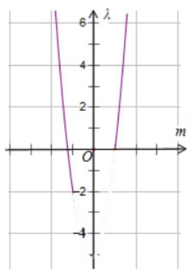

当 $\lambda  = 0$ 时,有且只有 3 个不同的点 $P$ 使得 $\overrightarrow{PF} \cdot  \overrightarrow{PA} = \lambda$ 成立,故选 $D$ .

【例 12】(1)点 $M\left( {{20},{40}}\right)$ ，抛物线 ${y}^{2} = {2px}\left( {p > 0}\right)$ 的焦点为 $F$ ,若对于抛物线上的任意点 $P$ ， $\left| {PM}\right|  + \left| {PF}\right|$ 的最小值为 41 ，则 $p$ 的值等于___.

【难度】 $\star   \star   \star   \star$

【答案】 42 或 22

【解析】由抛物线的定义可知: 抛物线上的点到焦点距离 $=$ 到准线的距离,

过 $P$ 做抛物线的准线的垂线,垂足为 $D$ ,则 $\left| {PF}\right|  = \left| {PD}\right|$ ,当 $M\left( {{20},{40}}\right)$ 位于抛物线内,

$\therefore \left| {PM}\right|  + \left| {PF}\right|  = \left| {PM}\right|  + \left| {PD}\right|$ ,

当 $M, P, D$ 共线时, $\left| {PM}\right|  + \left| {PF}\right|$ 的距离最小,由最小值为 41,即 ${20} + \frac{p}{2} = {41}$ ,解得: $p = {42}$ ,

当 $M\left( {{20},{40}}\right)$ 位于抛物线外,当 $P, M, F$ 共线时, $\left| {PM}\right|  + \left| {PF}\right|$ 取最小值,

即 $\sqrt{{40}^{2} + {\left( {20} - \frac{p}{2}\right) }^{2}} = {41}$ ,解得: $p = {22}$ 或 58,

由当 $p = {58}$ 时, ${y}^{2} = {116x}$ ,则点 $M\left( {{20},{40}}\right)$ 在抛物线内,舍去,故答案为: 42 或 22 .

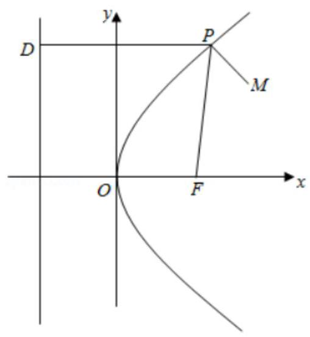

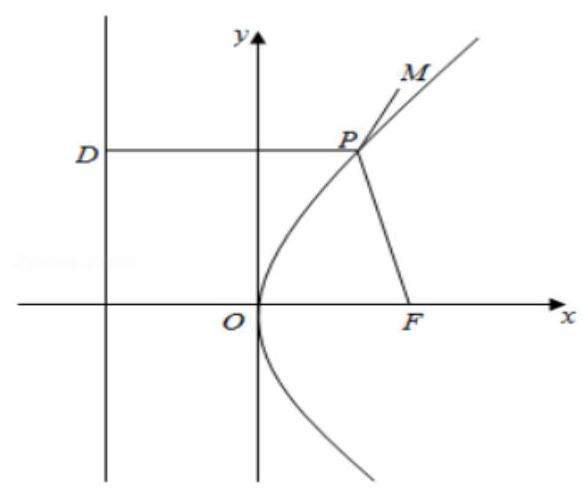

( 2 )已知点 $E$ 是抛物线 $C : {y}^{2} = {2px}\left( {p > 0}\right)$ 的对称轴与准线的交点，点 $F$ 是抛物线的焦点，点 $P$ 在抛物线上， 在 $\bigtriangleup  {EFP}$ 中， $\frac{\sin \angle {EFP}}{\sin \angle {FEP}}$ 的最大值为___.

【难度】 $\star   \star   \star   \star$

【答案】 $\sqrt{2}$

【解析】解: 设 ${PQ}$ 垂直于准线于 $Q$ 点,由抛物线的性质可得 ${PF} = {PQ}$ ,

在 ${\Delta EFP}$ 中,由正弦定理可得, $\frac{\sin \angle {EFP}}{\sin \angle {FEP}} = \frac{PE}{PF} = \frac{PE}{PQ}$ ,

在 Rt $\Delta$ PQE 中, $\frac{PQ}{PE} = \cos \angle {QPE} = \cos \angle {PEF}$ ,

要使 $\frac{PE}{PQ}$ 最大,需使 $\cos \angle {PEF}$ 最小,即 $\angle {PEF}$ 最大,当且仅当 ${PE}$ 与抛物线相切时, $\angle {PEF}$ 最大.

由题意可得 $E\left( {-\frac{p}{2},0}\right)$ ,设切线 ${PE}$ 的方程为: $x = {my} - \frac{p}{2}$ ,

联立直线 ${PE}$ 与抛物线的方程可得 $\left\{  \begin{array}{l} x = {my} - \frac{p}{2}, \\  {y}^{2} = {2px} \end{array}\right.$ 整理可得: ${y}^{2} - {2mpy} + {p}^{2} = 0$ ,

可得 $\Delta  = 4{m}^{2}{p}^{2} - 4{p}^{2} = 0$ ,因为 $p > 0$ ,所以可得 $m =  \pm  1$ ,即直线 ${PE}$ 的斜率为 $\pm  1$ ,所以 $\angle {PEF} = {45}^{ \circ  }$ . 所以 $\cos \angle {PEF} = \frac{\sqrt{2}}{2}$ ,所以 $\frac{\sin \angle {EFP}}{\sin \angle {FEP}} = \frac{PE}{PF} = \frac{PE}{PQ} = \frac{1}{\frac{\sqrt{2}}{2}} = \sqrt{2}$ ,故答案为: $\sqrt{2}$ .

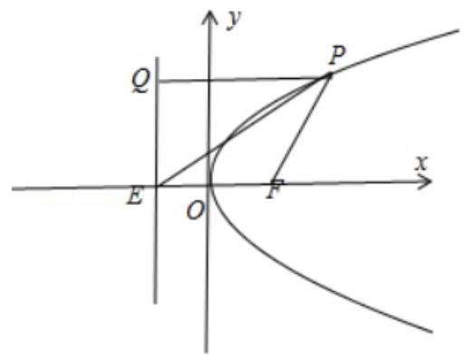

(3)若 $F$ 是抛物线 ${y}^{2} = {4x}$ 的焦点，点 ${P}_{i}\left( {i = 1,2,3,\ldots ,{10}}\right)$ 在抛物线上，且 $\overrightarrow{{P}_{1}F} + \overrightarrow{{P}_{2}F} + \ldots  + \overrightarrow{{P}_{100}F} = \overrightarrow{0}$ ， 则 $\left| \overrightarrow{{P}_{1}F}\right|  + \left| \overrightarrow{{P}_{2}F}\right|  + \ldots  + \left| \overrightarrow{{P}_{100}F}\right|  =$ ___.

【难度】 $\star   \star   \star   \star$

【答案】 200

【解析】解: $\because$ 抛物线 ${y}^{2} = {4x}$ 的焦点为 $F\left( {1,0}\right)$ ,准线为 $x =  - 1$ ,

$\therefore$ 根据抛物线的定义, ${P}_{i}\left( {i = 1,2,3,\ldots ,{2015}}\right)$ 到焦点的距离等于 ${P}_{i}$ 到准线的距离,即 $\left| {{P}_{i}F}\right|  = {x}_{i} + 1$ , $\overrightarrow{{P}_{1}F} + \overrightarrow{{P}_{2}F} + \ldots  + \overrightarrow{{P}_{100}F} = \overrightarrow{0}$ ,可得 $1 - {x}_{1} + 1 - {x}_{2} + \ldots  + 1 - {x}_{100} = 0$ ,

$\therefore {x}_{1} + {x}_{2} + \ldots  + {x}_{100} = {100}$

$\therefore \left| {{P}_{1}F}\right|  + \left| {{P}_{2}F}\right|  + \ldots \left| {{P}_{100}F}\right|  = \left( {{x}_{1} + 1}\right)  + \left( {{x}_{2} + 1}\right)  + \ldots  + \left( {{x}_{100} + 1}\right)  = \left( {{x}_{1} + {x}_{2} + \ldots  + {x}_{100}}\right)  + {100} = {100} + {100} = {200}$ .

故答案为:200.

## 巩固训练

1、已知曲线 $C : m{x}^{2} + n{y}^{2} = 1$ . 则下列命题不正确的是( )

A. 若 $m > n > 0$ ,则 $C$ 是椭圆,其焦点在 $y$ 轴上

B. 若 $m = n > 0$ ,则 $C$ 是圆,其半径为 $\sqrt{m}$

C. 若 ${mn} < 0$ ,则 $C$ 是双曲线,其渐近线方程为 $y =  \pm  \sqrt{-\frac{m}{n}}x$

D. 若 $m = 0, n > 0$ ,则 $C$ 是两条直线

【难度】 $\star   \star   \star$

【答案】B

【解析】解: 曲线 $C : m{x}^{2} + n{y}^{2} = 1.m > n > 0$ ,则 $C$ 是椭圆,其焦点在 $y$ 轴上, $A$ 正确;

若 $m = n > 0$ ,则 $C$ 是圆,其半径为 $\frac{1}{\sqrt{m}}$ ,所以 $B$ 不正确;

若 ${mn} < 0$ ,则 $C$ 是双曲线,其渐近线方程为 $y =  \pm  \sqrt{-\frac{m}{n}}x, C$ 正确;

若 $m = 0, n > 0$ ,则 $C$ 是 $n{y}^{2} = 1$ ,是两条直线,所以 $D$ 正确; 故选: $B$ .

2、若双曲线的渐近线方程为 $y =  \pm  \frac{3}{4}x$ ,且过点 $\left( {-3,2\sqrt{3}}\right)$ ;

【难度】 $\star   \star$

【答案】 $\frac{{x}^{2}}{9} - \frac{{y}^{2}}{16} = \frac{1}{4}$

【解析】: 设所求双曲线方程为 $\frac{{x}^{2}}{9} - \frac{{y}^{2}}{16} = \lambda \left( {\lambda  \neq  0}\right)$ ,将点 $\left( {-3,2\sqrt{3}}\right)$ 代入得 $\lambda  = \frac{1}{4}$ ,

所以双曲线方程为 $\frac{{x}^{2}}{9} - \frac{{y}^{2}}{16} = \frac{1}{4}$ 。

3、已知椭圆的方程为 $\frac{{x}^{2}}{25} + \frac{{y}^{2}}{16} = 1,{F}_{1}\text{ 、 }{F}_{2}$ 分别为椭圆的左、右焦点, $A$ 点的坐标为 $\left( {2,1}\right) , P$ 为椭圆上一点，则 $\left| {PA}\right|  + \left| {P{F}_{2}}\right|$ 的最大值与最小值分别是___。

【难度】★★★

【答案】 ${10} + \sqrt{26}$ 和 ${10} - \sqrt{26}$

【解析】解: 将 $A$ 代入可得 $\frac{4}{25} + \frac{1}{16} < 1$ ,所以可得 $A$ 在椭圆内部,由椭圆的方程可得 ${a}^{2} = {25}$ ,所以可得 ${2a} = {10},{b}^{2} = {16}$ ,所以 ${c}^{2} = {a}^{2} - {b}^{2} = {25} - {16} = 9$ ,解得 $c = 3$ ,所以左焦点 ${F}_{1}\left( {-3,0}\right)$ ,

由椭圆的定义可得: $\left| {P{F}_{2}}\right|  = {2a} - \left| {P{F}_{1}}\right|$ ,

所以 $\left| {PA}\right|  + \left| {P{F}_{2}}\right|  = \left| {PA}\right|  + {2a} - \left| {P{F}_{1}}\right|  \leq  {2a} + \left| {A{F}_{1}}\right|  = {10} + \sqrt{{\left( 2 + 3\right) }^{2} + {1}^{2}} = {10} + \sqrt{26}$

$\left| {PA}\right|  + \left| {P{F}_{2}}\right|$ 最大值为 ${10} + \sqrt{26}$ ,

同理 $\left| {PA}\right|  + \left| {P{F}_{2}}\right|  = \left| {PA}\right|  + {2a} - \left| {P{F}_{1}}\right|  \geq  {2a} - \left| {A{F}_{1}}\right|  = {10} - \sqrt{{\left( 2 + 3\right) }^{2} + {1}^{2}} = {10} - \sqrt{26}$

4、如图，在底面半径和高均为 1 的圆锥中， ${AB}$ 、 ${CD}$ 是底面圆 $O$ 的两条互相垂直的直径， $E$ 是母线 ${PB}$ 的

中点,已知过 ${CD}$ 与 $E$ 的平面与圆锥侧面的交线是以 $E$ 为顶点的抛物线的一部分,则该抛物线的焦点到其准线的距离为___.

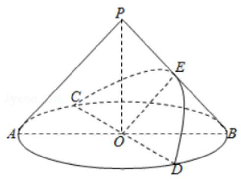

【难度】★★★★

【答案】 $\frac{\sqrt{2}}{2}$

【解析】解: 如图所示过点 $E$ 作 ${EG} \bot  {AB}$ ,垂足为 $F$ .

$\because E$ 是母线 ${PB}$ 的中点,圆锥的底面半径和高均为 $1,\therefore {OF} = {EF} = \frac{1}{2},\therefore {OE} = \frac{\sqrt{2}}{2}$ .

在平面 ${CED}$ 内建立直角坐标系,设抛物线的方程为 ${y}^{2} = {2px}\left( {p > 0}\right) , C\left( {\frac{\sqrt{2}}{2},1}\right)$ ,

$\therefore 1 = 2 \times  \frac{\sqrt{2}}{2}p$ ,解得 $p = \frac{\sqrt{2}}{2}$ . $\therefore$ 该抛物线的焦点到其准线的距离为 $\frac{\sqrt{2}}{2}$ . 故答案为: $\frac{\sqrt{2}}{2}$ .

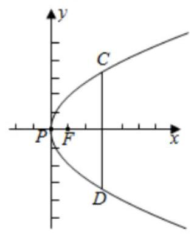

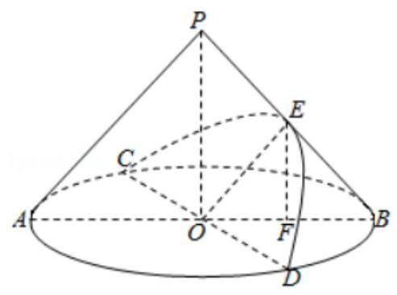

5、设双曲线 $C : \frac{{x}^{2}}{4} - \frac{{y}^{2}}{3} = 1$ 的左、右焦点分别为 ${F}_{1},{F}_{2}, P$ 为双曲线 $C$ 上一点， $P$ 关于原点的对称点为 $Q$ ， 若四边形 $P{F}_{1}Q{F}_{2}$ 面积为 $6\sqrt{3}$ ，则这个四边形的周长为___.

【难度】 $\star   \star   \star$

【答案】 16

【解析】如图,设点 $P\left( {x, y}\right)$ 在第一象限,由 ${S}_{P{F}_{1}Q{F}_{2}} = \left| {{F}_{1}{F}_{2}}\right|  \cdot  y = 6\sqrt{3} \Rightarrow  y = \frac{6\sqrt{3}}{\left| {F}_{1}{F}_{2}\right| } = \frac{6\sqrt{3}}{2\sqrt{7}} = \frac{3\sqrt{3}}{\sqrt{7}}$ ,

将 $y = \frac{3\sqrt{3}}{\sqrt{7}}$ 代入 $\frac{{x}^{2}}{4} - \frac{{y}^{2}}{3} = 1$ 得 $x = \frac{8}{\sqrt{7}}$ ，则 $P\left( {\frac{8}{\sqrt{7}},\frac{3\sqrt{3}}{\sqrt{7}}}\right)$ ，

$\left| {P{F}_{1}}\right|  = \sqrt{{\left( \frac{8}{\sqrt{7}} + \sqrt{7}\right) }^{2} + {\left( \frac{3\sqrt{3}}{\sqrt{7}}\right) }^{2}} = 6,\left| {P{F}_{2}}\right|  = \sqrt{{\left( \frac{8}{\sqrt{7}} - \sqrt{7}\right) }^{2} + {\left( \frac{3\sqrt{3}}{\sqrt{7}}\right) }^{2}} = 2$

则四边形 $P{F}_{1}Q{F}_{2}$ 的周长为: $2 \times  \left( {6 + 2}\right)  = {16}$

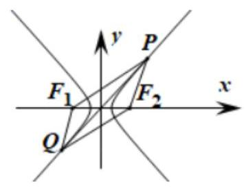

6、抛物线 $C$ 的顶点在坐标原点,对称轴为 $y$ 轴, $C$ 上动点 $P$ 到直线 $l : {3x} + {4y} - {12} = 0$ 的最短距离为 1,求抛物线 $C$ 的方程.

【难度】 $\star   \star   \star$

【答案】 ${x}^{2} =  - \frac{112}{9}y$

【解析】显然, 过抛物线开口向上, 最小距离就可以为 0 了, 所以抛物线一定开口向下, 设为 ${x}^{2} =  - {2py}\left( {p > 0}\right)$ ,

设点 $P\left( {{x}_{0},{y}_{0}}\right)$ ,则 ${x}_{0}^{2} =  - {2p}{y}_{0}$ ,所以 $d = \frac{\left| 3{x}_{0} + 4{y}_{0} - {12}\right| }{5} = \frac{\left| -\frac{2}{p}{x}_{0}^{2} + 3{x}_{0} - {12}\right| }{5}$ ,

所以 $d = \frac{\frac{2}{p}{x}_{0}^{2} - 3{x}_{0} + {12}}{5}$ ,当 ${x}_{0} = \frac{3}{4}p$ 时, ${d}_{\min } = \frac{1}{5}\left( {\frac{9}{8}p - \frac{9}{4}p + {12}}\right)  = 1 \Rightarrow  p = \frac{56}{9}$ ,

所以抛物线方程为 ${x}^{2} =  - \frac{112}{9}y$ .

7、已知抛物线 ${y}^{2} = {4x}$ 的焦点为 $F$ ,过 $F$ 的直线与抛物线交于 $A, B$ 两点， $A$ 位于第一象限，则 $\left| {AF}\right|  + 3\left| {BF}\right|$ 的最小值是( )

A. $2\sqrt{3}$ B. $2\sqrt{3} + 1$ C. $2\sqrt{3} + 2$ D. $2\sqrt{3} + 4$

【难度】★★★

【答案】D

【解析】抛物线的焦点 $F\left( {1,0}\right)$ ,设直线 ${AB}$ 的方程为: $x = {my} + 1$

联立方程组 $\left\{  \begin{array}{l} x = {my} + 1 \\  {y}^{2} = {4x} \end{array}\right.$ ,得 ${x}^{2} - \left( {4{m}^{2} + 2}\right) x + 1 = 0$

设 $A\left( {\frac{{y}_{1}^{2}}{4},{y}_{1}}\right) , B\left( {\frac{{y}_{2}^{2}}{4},{y}_{2}}\right)$ ,则有 $\frac{{y}_{1}^{2}{y}_{2}^{2}}{16} = 1$ ,即 ${y}_{2}^{2} = \frac{16}{{y}_{1}^{2}}$

由抛物线的定义可得 $\left| {AF}\right|  = \frac{{y}_{1}^{2}}{4} + 1,\left| {BF}\right|  = \frac{{y}_{2}^{2}}{4} + 1 = \frac{4}{{y}_{1}^{2}} + 1$

所以 $\left| {AF}\right|  + 3\left| {BF}\right|  = \frac{{y}_{1}^{2}}{4} + \frac{12}{{y}_{1}^{2}} + 4 \geq  4 + 2\sqrt{3}$ ,当且仅当 ${y}_{1}{}^{2} = 4\sqrt{3}$ 时等号成立

所以 $\left| {AF}\right|  + 3\left| {BF}\right|$ 的最小值是 $2\sqrt{3} + 4$ 故选:D

$S\text{ 、 }A, B$ 是抛物线 ${y}^{2} = x$ 上两点 $\Omega$ 是过 $A, B$ 两点,半径为 1 的圆 $l$ 是抛物线的准线, $M$ 为 $\Omega$ 的圆心, $O$ 为坐标原点.

(I) 若 $M$ 在 $x$ 轴上且 $\Omega$ 与 $l$ 相切,求 $\bigtriangleup {OAB}$ 的面积;

(II) 求 $\overrightarrow{MA} \cdot  \overrightarrow{MB}$ 的取值范围.

【难度】 $\star   \star   \star   \star$

【答案】( I ) $\frac{1}{8}{\left( 1 + 2\sqrt{2}\right) }^{\frac{3}{2}};\left( {II}\right) \lbrack  - 1,1)$

【解析】(1) 抛物线 ${y}^{2} = x$ 的准线方程为 $x =  - \frac{1}{4}$ ,

半径为 1 的圆的圆心在 $x$ 轴上且圆与准线相切,可得圆心 $M\left( {\frac{3}{4},0}\right)$ ,圆的方程为 ${\left( x - \frac{3}{4}\right) }^{2} + {y}^{2} = 1$ ,

将圆的方程与抛物线方程联立得,

$\left\{  \begin{matrix} {\left( x - \frac{3}{4}\right) }^{2} + {y}^{2} = 1 \\  {y}^{2} = x \end{matrix}\right.$ ,消 $y$ 得 ${16}{x}^{2} - {8x} - 7 = 0$ , 设交点 $A\left( {{x}_{0},{y}_{0}}\right)$ ,解得 ${x}_{0} = \frac{1 + 2\sqrt{2}}{4}$ ,由题意得点 $A, B$ 关于 $\mathbf{x}$ 轴对称,

${x}_{0} = {y}_{0}^{2} = \frac{1 + 2\sqrt{2}}{4},{y}_{0} = \frac{1}{2}{\left( 1 + 2\sqrt{2}\right) }^{\frac{1}{2}}$ ,则 ${S}_{\bigtriangleup {OAB}} = \frac{1}{2} \times  2{y}_{0} \times  {x}_{0} = {y}_{0}^{3} = \frac{1}{8}{\left( 1 + 2\sqrt{2}\right) }^{\frac{3}{2}}$ .

(II) $\overrightarrow{MA} \cdot  \overrightarrow{MB} = \left| \overrightarrow{MA}\right| \left| \overrightarrow{MB}\right| \cos \angle {AMB} = \cos \angle {AMB}$

$= \frac{{\left| MA\right| }^{2} + {\left| MB\right| }^{2} - {\left| AB\right| }^{2}}{2\left| {MA}\right| \left| {MB}\right| } = \frac{2 - {\left| AB\right| }^{2}}{2} = 1 - \frac{1}{2}{\left| AB\right| }^{2},$

又 $\because 0 < \left| {AB}\right|  \leq  2$ ,所以 $- 1 \leq  1 - \frac{1}{2}{\left| AB\right| }^{2} < 1$ ,所以 $\overrightarrow{MA} \cdot  \overrightarrow{MB}$ 的取值范围为 $\lbrack  - 1,1)$

## (三) 直线与圆锥曲线

## 知识梳理

## 1、直线与椭圆的位置关系

联立方程,看 $\Delta$ .

$\Delta  > 0$ ,直线与椭圆相交,有两个交点,弦长为 $\sqrt{1 + {k}^{2}}\frac{\sqrt{\Delta }}{\left| a\right| }$ (其中 $a$ 为二次项系数);

$\Delta  = 0$ ，直线与椭圆相切，也即直线与椭圆只有一个公共点；

$\Delta  < 0$ ,直线与椭圆相离,无交点.

2、直线与双曲线的位置关系:

(1)若得到关于 $x$ (或 $y$ )的一元二次方程， $\left\{  \begin{array}{l} \Delta  > 0 \Leftrightarrow  \text{ 有两个公共点 } \\  \Delta  = 0 \Leftrightarrow  \text{ 有一个公共点 } \\  \Delta  < 0 \Leftrightarrow  \text{ 没有公共点 } \end{array}\right.$

(2)若得到关于 $x$ (或 $y$ )的一元一次方程，则直线与双曲线相交于一点，此时直线平行于双曲线的一条渐近线。

注意: 一解不一定相切, 相交不一定两解, 两解不一定同支。

3、直线与抛物线的位置关系:

方法一是方程的观点,即把曲线方程和直线的方程联立成方程组,利用判别式 $\Delta$ 来讨论位置关系.

(1)相交: $\Delta  > 0 \Rightarrow$ 直线与抛物线相交，但直线与抛物线相交不一定有 $\Delta  > 0$ ，当直线与抛物线的对称轴平行时，直线与抛物线相交且只有一个交点，故 $\Delta  > 0$ 也仅是直线与抛物线相交的充分条件，但不是必要条件 (2)相切: $\Delta  = 0 \Leftrightarrow$ 直线与抛物线相切；

(3)相离: $\Delta  < 0 \Leftrightarrow$ 直线与抛物线相离。

【注:a. 直线与抛物线只有一个公共点时的位置关系有两种情形:相切和相交。如果直线与抛物线的轴平行时, 直线与抛物线相交, 也只有一个交点; b. 过抛物线外一点总有三条直线和抛物线有且只有一个公共点: 两条切线和一条平行于对称轴的直线。】

## 4、椭圆的切线或切点弦, 直线和椭圆相切的条件

(1)若 ${P}_{0}\left( {{x}_{0},{y}_{0}}\right)$ 在椭圆 $\frac{{x}^{2}}{{a}^{2}} + \frac{{y}^{2}}{{b}^{2}} = 1$ 上，则过 ${P}_{0}$ 的椭圆的切线方程是 $\frac{{x}_{0}x}{{a}^{2}} + \frac{{y}_{0}y}{{b}^{2}} = 1$ ；

(2)若 ${P}_{0}\left( {{x}_{0},{y}_{0}}\right)$ 在椭圆 $\frac{{x}^{2}}{{a}^{2}} + \frac{{y}^{2}}{{b}^{2}} = 1$ 外，则过 ${P}_{0}$ 作椭圆的两条切线切点为 ${P}_{1}$ 、 ${P}_{2}$ ，则切点弦 ${P}_{1}{P}_{2}$ 的直线方程是 $\frac{{x}_{0}x}{{a}^{2}} + \frac{{y}_{0}y}{{b}^{2}} = 1$ ;

(3)直线 ${Ax} + {By} + C = 0$ 与椭圆 $\frac{{x}^{2}}{{a}^{2}} + \frac{{y}^{2}}{{b}^{2}} = 1$ 相切的条件为 ${A}^{2}{a}^{2} + {B}^{2}{b}^{2} = {C}^{2}$ 。

## 5、焦点三角形(椭圆或双曲线上的一点与两焦点所构成的三角形)问题

常利用定义和正弦、余弦定理求解。

设椭圆或双曲线上的一点 $P\left( {{x}_{0},{y}_{0}}\right)$ 到两焦点 ${F}_{1},{F}_{2}$ 的距离分别为 ${r}_{1},{r}_{2}$ ,焦点 $\Delta {F}_{1}P{F}_{2}$ 的面积为 $S$ ,则在椭圆 $\frac{{x}^{2}}{{a}^{2}} + \frac{{y}^{2}}{{b}^{2}} = 1$ 中，① $\theta  = \arccos \left( {\frac{2{b}^{2}}{{r}_{1}{r}_{2}} - 1}\right)$ ，且当 ${r}_{1} = {r}_{2}$ 即 $P$ 为短轴端点时， $\theta$ 最大为 ${\theta }_{\max } = \; \arccos \frac{{b}^{2} - {c}^{2}}{{a}^{2}};\text{ ② }S = {b}^{2}\tan \frac{\theta }{2} = c\left| {y}_{0}\right|$ ,当 $\left| {y}_{0}\right|  = b$ 即 $P$ 为短轴端点时, ${S}_{\max }$ 的最大值为 $\mathrm{{bc}}$ ;

对于双曲线 $\frac{{x}^{2}}{{a}^{2}} - \frac{{y}^{2}}{{b}^{2}} = 1$ 的焦点三角形有: $\left( 1\right) \theta  = \arccos \left( {1 - \frac{2{b}^{2}}{{r}_{1}{r}_{2}}}\right) ;\text{ ② }S = \frac{1}{2}{r}_{1}{r}_{2}\sin \theta  = {b}^{2}\cot \frac{\theta }{2}$ 。

## 6、弦长公式

若直线 $y = {kx} + b$ 与圆锥曲线相交于两点 $\mathrm{A}\text{ 、 }\mathrm{\;B}$ ,且 ${x}_{1},{x}_{2}$ 分别为 $\mathrm{A}\text{ 、 }\mathrm{\;B}$ 的横坐标,

则 $\left| {AB}\right|  = \sqrt{1 + {k}^{2}}\left| {{x}_{1} - {x}_{2}}\right|  = \sqrt{1 + {k}^{2}}\frac{\sqrt{\Delta }}{\left| a\right| }$ ,

若 ${y}_{1},{y}_{2}$ 分别为 $\mathrm{A}\text{ 、 }\mathrm{\;B}$ 的纵坐标,则 $\left| {AB}\right|  = \sqrt{1 + \frac{1}{{k}^{2}}}\left| {{y}_{1} - {y}_{2}}\right|  = \sqrt{1 + \frac{1}{{k}^{2}}}\frac{\sqrt{\Delta }}{\left| a\right| }$ ,

若弦 ${AB}$ 所在直线方程设为 $x = {my} + b$ ,则 $\left| {AB}\right|  = \sqrt{1 + {m}^{2}}\left| {{y}_{1} - {y}_{2}}\right|  = \sqrt{1 + {m}^{2}}\frac{\sqrt{\Delta }}{\left| a\right| }$

## 例题精讲

【例 13】已知直线 $y = {kx} - 1$ 与双曲线 ${x}^{2} - {y}^{2} = 4$ ,试讨论实数 $k$ 的取值范围,使直线与双曲线

(1)没有公共点

(2)有两个公共点

(3)只有一个公共点

(4)交于异支两点

(5)交于右支两点.

【难度】 $\star   \star   \star$

【答案】见解析

【解析】法一: 由题意,直线 $y = {kx} - 1$ 代入双曲线 ${x}^{2} - {y}^{2} = 4$ ,可得 ${x}^{2} - {\left( kx - 1\right) }^{2} = 4$ ,整理得 $\left( {1 - {k}^{2}}\right) {x}^{2} + {2kx} - 5 = 0.$

(1)没有公共点， $\Delta  = {20} - {16}{k}^{2} < 0$ ，解得 $k > \frac{\sqrt{5}}{2}$ 或 $k <  - \frac{\sqrt{5}}{2}$ ；

(2)有两个公共点， $1 - {k}^{2} \neq  0$ ， $\bigtriangleup  = {20} - {16}{k}^{2} > 0$ ，解得 $- \frac{\sqrt{5}}{2} < k < \frac{\sqrt{5}}{2}\left( {k \neq   \pm  1}\right)$

(3)只有一个公共点，当 $1 - {k}^{2} = 0, k =  \pm  1$ 时，符合条件; 当 $1 - {k}^{2} \neq  0$ 时，由 $\bigtriangleup  = {20} - {16}{k}^{2} = 0$ ，解得 $k =  \pm  \frac{\sqrt{5}}{2}$ ；

(4)交于异支两点， $\frac{-5}{1 - {k}^{2}} < 0$ ，解得 $- 1 < k < 1$ ；

(5)交于右支两点， $\Delta  = {20} - {16}{k}^{2} > 0$ 且 $\frac{-5}{1 - {k}^{2}} > 0$ ， $\frac{-{2k}}{1 - {k}^{2}} > 0$ ，解得 $1 < k < \frac{\sqrt{5}}{2}$ .

法二: 数形结合

【例 14】已知椭圆 $M : \frac{{x}^{2}}{{a}^{2}} + \frac{{y}^{2}}{{b}^{2}} = 1\left( {a > b > 0}\right)$ 的一个焦点与短轴的两端点组成一个正三角形的三个顶点, 且椭圆经过点 $N\left( {\sqrt{2},\frac{\sqrt{2}}{2}}\right)$ .

(1)求椭圆 $M$ 的方程；

(2)若斜率为 $- \frac{1}{2}$ 的直线 ${l}_{1}$ 与椭圆 $M$ 交于 $P, Q$ 两点(点 $P, Q$ 不在坐标轴上)；证明:直线 ${OP},{PQ}$ ，

${OQ}$ 的斜率依次成等比数列.

(3)设直线 ${l}_{2}$ 与椭圆 $M$ 交于 $A, B$ 两点，且以线段 ${AB}$ 为直径的圆过椭圆的右顶点 $C$ ，求 $\bigtriangleup  {ABC}$ 面积的最大值.

【难度】 $\star   \star   \star   \star$

【答案】(1) $\frac{{x}^{2}}{4} + {y}^{2} = 1$ ; (2) 证明见解析; (3) $\frac{16}{25}$ .

【解析】(1) 根据题意,设椭圆的上下顶点为 ${B}_{1}\left( {0, b}\right) ,{B}_{2}\left( {0, - b}\right)$ ,左焦点为 ${F}_{1}\left( {-c,0}\right)$ ,

则 $\bigtriangleup {B}_{1}{B}_{2}{F}_{1}$ 是正三角形,所以 ${2b} = \sqrt{{c}^{2} + {b}^{2}} = a$ ,则椭圆方程为 $\frac{{x}^{2}}{4{b}^{2}} + \frac{{y}^{2}}{{b}^{2}} = 1$ .

将 $\left( {\sqrt{2},\frac{\sqrt{2}}{2}}\right)$ 代入椭圆方程，可得 $\frac{2}{4{b}^{2}} + \frac{1}{2{b}^{2}} = 1$ ，解得 $a = 2, b = 1$ .

故椭圆的方程为 $\frac{{x}^{2}}{4} + {y}^{2} = 1$ .

(2)证明:设直线 ${l}_{1}$ 的方程为 $y =  - \frac{1}{2}x + m, P\left( {{x}_{1},{y}_{1}}\right) , Q\left( {{x}_{2},{y}_{2}}\right)$ ，

由 $\left\{  \begin{array}{l} y =  - \frac{1}{2}x + m \\  \frac{{x}^{2}}{4} + {y}^{2} = 1 \end{array}\right.$ ,消去 $y$ ,得 ${x}^{2} - {2mx} + 2\left( {{m}^{2} - 1}\right)  = 0$ ,

则 $\Delta  = 4{m}^{2} - 8\left( {{m}^{2} - 1}\right)  = 4\left( {2 - {m}^{2}}\right)$ ,且 ${x}_{1} + {x}_{2} = {2m},{x}_{1}{x}_{2} = 2\left( {{m}^{2} - 1}\right)  > 0$ ;

故 ${y}_{1}{y}_{2} = \left( {-\frac{1}{2}{x}_{1} + m}\right) \left( {-\frac{1}{2}{x}_{2} + m}\right)  = \frac{1}{4}{x}_{1}{x}_{2} - \frac{1}{2}m\left( {{x}_{1} + {x}_{2}}\right)  + {m}^{2} = \frac{{m}^{2} - 1}{2}$ ,

所以 ${k}_{OP}{k}_{OQ} = \frac{{y}_{1}{y}_{2}}{{x}_{1}{x}_{2}} = \frac{\frac{{m}^{2} - 1}{2}}{2\left( {{m}^{2} - 1}\right) } = \frac{1}{4} = {k}_{PQ}^{2}$ .

即直线 ${OP}\text{ 、 }{PQ}\text{ 、 }{OQ}$ 的斜率依次成等比数列.

(3)由题意，设直线 ${l}_{2}$ 的方程为 $x = {ky} + n$ ，联立 $\left\{  \begin{array}{l} \frac{{x}^{2}}{4} + {y}^{2} = 1 \\  x = {ky} + n \end{array}\right.$ ，

消去 $x$ 得 $\left( {{k}^{2} + 4}\right) {y}^{2} + {2kny} + {n}^{2} - 4 = 0$ . 设 $A\left( {{x}_{1},{y}_{1}}\right) , B\left( {{x}_{2},{y}_{2}}\right)$ ,

则有 ${y}_{1} + {y}_{2} = \frac{-{2kn}}{{k}^{2} + 4},{y}_{1}{y}_{2} = \frac{{n}^{2} - 4}{{k}^{2} + 4}$ ,

因为以线段 ${AB}$ 为直径的圆过椭圆的右顶点 $C\left( {2,0}\right)$ ,所以 $\overrightarrow{CA} \cdot  \overrightarrow{CB} = 0$ ,

由 $\overrightarrow{CA} = \left( {{x}_{1} - 2,{y}_{1}}\right) ,\overrightarrow{CB} = \left( {{x}_{2} - 2,{y}_{2}}\right)$ ,则 $\left( {{x}_{1} - 2}\right) \left( {{x}_{2} - 2}\right)  + {y}_{1}{y}_{2} = 0$ ,

将 ${x}_{1} = k{y}_{1} + n,{x}_{2} = k{y}_{2} + n$ 代入上式并整理得 $\left( {{k}^{2} + 1}\right) {y}_{1}{y}_{2} + k\left( {n - 2}\right) \left( {{y}_{1} + {y}_{2}}\right)  + {\left( n - 2\right) }^{2} = 0$ ,

则 $\frac{\left( {{k}^{2} + 1}\right) \left( {{n}^{2} - 4}\right) }{{k}^{2} + 4} + \frac{-2{k}^{2}n\left( {n - 2}\right) }{{k}^{2} + 4} + {\left( n - 2\right) }^{2} = 0$ ,化简得 $\left( {{5n} - 6}\right) \left( {n - 2}\right)  = 0$ ,

解得 $n = \frac{6}{5}$ 或 $n = 2$ ,因为直线 $x = {ky} + n$ 不过点 $C\left( {2,0}\right)$ ,所以 $n \neq  2$ ,故 $n = \frac{6}{5}$ .

所以直线 $l$ 恒过点 $D\left( {\frac{6}{5},0}\right)$ . 故

${S}_{\varphi ABC} = \frac{1}{2}\left| {DC}\right| \left| {{y}_{1} - {y}_{2}}\right|  =$

$\frac{1}{2} \times  \left( {2 - \frac{6}{5}}\right) \sqrt{{\left( {y}_{1} + {y}_{2}\right) }^{2} - 4{y}_{1}{y}_{2}} = \frac{2}{5}\sqrt{{\left( \frac{-\frac{12}{5}k}{{k}^{2} + 4}\right) }^{2} - \frac{4\left( {\frac{36}{25} - 4}\right) }{{k}^{2} + 4}} = \frac{8}{25}\sqrt{\frac{{25}\left( {{k}^{2} + 4}\right)  - {36}}{{\left( {k}^{2} + 4\right) }^{2}}}$ 设

$t = \frac{1}{{k}^{2} + 4}\left( {0 < t \leq  \frac{1}{4}}\right)$ ,则 ${S}_{\bigtriangleup {ABC}} = \frac{8}{25}\sqrt{-{36}{t}^{2} + {25t}}$ 在 $t \in  \left( {0,\frac{1}{4}}\right\rbrack$ 上单调递增,

当 $t = \frac{1}{4}$ 时, ${S}_{\bigtriangleup {ABC}} = \frac{8}{25}\sqrt{-{36} \times  \frac{1}{16} + {25} \times  \frac{1}{4}} = \frac{16}{25}$ ,所以 ${ABC}$ 面积的最大值为 $\frac{16}{25}$ .

【例 15】已知椭圆 $C$ 的中心在坐标原点焦点在 $x$ 轴上,椭圆 $C$ 上一点 $A\left( {2\sqrt{3}, - 1}\right)$ 到两焦点距离之和为 8. 若点 $B$ 是椭圆 $C$ 的上顶点，点 $P, Q$ 是椭圆 $C$ 上异于点 $B$ 的任意两点.

(1)求椭圆 $C$ 的方程；

(2)若 ${BP}\bot {BQ}$ ，且满足 $3\overrightarrow{PD} = 2\overrightarrow{DQ}$ 的点 $D$ 在 $y$ 轴上，求直线 ${BP}$ 的方程；

(3)若直线 ${BP}$ 与 ${BQ}$ 的斜率乘积为常数 $\lambda \left( {\lambda  < 0}\right)$ ，试判断直线 ${PQ}$ 是否经过定点. 若经过定点，请求出定点坐标; 若不经过定点, 请说明理由.

【难度】 $\star   \star   \star   \star$

【答案】(1) $\frac{{x}^{2}}{16} + \frac{{y}^{2}}{4} = 1$ (2) $y =  \pm  \sqrt{2}x + 2$ (3)经过定点；定点(0， $\frac{2 + {8\lambda }}{1 - {4\lambda }}$ )

【解析】(1) 由题意设椭圆的方程为: $\frac{{x}^{2}}{{a}^{2}} + \frac{{y}^{2}}{{b}^{2}} = 1$

由题意知: ${2a} = 8,\frac{12}{{a}^{2}} + \frac{1}{{b}^{2}} = 1$ ,解得: ${a}^{2} = {16},{b}^{2} = 4$ ,

所以椭圆的方程为: $\frac{{x}^{2}}{16} + \frac{{y}^{2}}{4} = 1$ .

(2)由(1)得 $B\left( {0,2}\right)$ 显然直线 ${BP}$ 的斜率存在且不为零，

设直线 ${BP}$ 为: $y = {kx} + 2$ ,与椭圆联立整理得: $\left( {1 + 4{k}^{2}}\right) {x}^{2} + {16kx} = 0, x = \frac{-{16k}}{1 + 4{k}^{2}}$ ,所以 $P\left( {-\frac{16k}{1 + 4{k}^{2}},\frac{2 - 8{k}^{2}}{1 + 4{k}^{2}}}\right)$ ;

直线 ${BQ} : y =  - \frac{1}{k}x + 2$ ，代入椭圆中: $\left( {4 + {k}^{2}}\right) {x}^{2} - {16kx} = 0$ ，

同理可得 $Q\left( {\frac{16k}{4 + {k}^{2}},\frac{2{k}^{2} - 8}{4 + {k}^{2}}}\right)$ ，由 $3\overrightarrow{PD} = 2\overrightarrow{DQ}$ 得，

$\therefore 3\left( {{x}_{D} - {x}_{P}}\right)  = 2\left( {{x}_{Q} - {x}_{D}}\right) ,\therefore 5{x}_{D} = 2{x}_{Q} + 3{x}_{P} = \frac{32k}{4 + {k}^{2}} - \frac{48k}{1 + 4{k}^{2}}$ ,

由于 $D$ 在 $y$ 轴上,所以 ${x}_{D} = 0,\therefore \frac{32k}{4 + {k}^{2}} = \frac{48k}{1 + 4{k}^{2}}$ ,解得: ${k}^{2} = 2$ ,所以 $k =  \pm  \sqrt{2}$ ,

所以直线 ${BP}$ 的方程为: $y =  \pm  \sqrt{2}x + 2$ .

(3)当直线 ${PQ}$ 的斜率不存在时，

设直线 ${PQ}$ 的方程: $x = t, P\left( {x, y}\right) , Q\left( {{x}^{\prime },{y}^{\prime }}\right)$ ,

与椭圆联立得: $4{y}^{2} = {16} - {t}^{2}, y{y}^{\prime } = \frac{{t}^{2} - {16}}{4}, x{x}^{\prime } = {t}^{2},{k}_{B{P}^{ * }}{k}_{BQ} = \frac{y - 2}{x} \cdot  \frac{{y}^{\prime } - 2}{{x}^{\prime }} = \frac{y{y}^{\prime } - 2\left( {y + {y}^{\prime }}\right)  + 4}{x{x}^{\prime }} = \frac{1}{4}$ ,

要使是一个常数 $\lambda ,\lambda  < 0$ ,所以不成立.

当直线 ${PQ}$ 斜率存在时,设直线 ${PQ}$ 的方程为: $y = {kx} + t$ ,设 $P\left( {x, y}\right) , Q\left( {{x}^{\prime },{y}^{\prime }}\right)$ ,

与椭圆联立整理得: $\left( {1 + 4{k}^{2}}\right) {x}^{2} + {8ktx} + 4{t}^{2} - {16} = 0, x + {x}^{\prime } = \frac{-{8kt}}{1 + 4{k}^{2}}, x{x}^{\prime } = \frac{4{t}^{2} - {16}}{1 + 4{k}^{2}}$ ,

$\therefore y + {y}^{\prime } = k\left( {x + {x}^{\prime }}\right)  + {2t} = \frac{2t}{1 + 4{k}^{2}},\;y{y}^{\prime } = {k}^{2}x{x}^{\prime } + {kt}\left( {x + {x}^{\prime }}\right)  + {t}^{2} = \frac{{t}^{2} - {16}{k}^{2}}{1 + 4{k}^{2}}$ ,

$\therefore {k}_{BP} \cdot  {k}_{BQ} = \frac{y - 2}{x} \cdot  \frac{{y}^{\prime } - 2}{{x}^{\prime }} = \frac{y{y}^{\prime } - 2\left( {y + {y}^{\prime }}\right)  + 4}{x{x}^{\prime }} = \frac{t - 2}{4\left( {t + 2}\right) }$ ,

所以由题意得: $\frac{t - 2}{4\left( {t + 2}\right) } = \lambda$ ，解得: $t = \frac{2 + {8\lambda }}{1 - {4\lambda }}$ ，所以不论 $k$ 为何值， $x = 0$ 时， $y = \frac{2 + {8\lambda }}{1 - {4\lambda }}$ ， 综上可知直线恒过定点 $\left( {0,\frac{2 + {8\lambda }}{1 - {4\lambda }}}\right)$ .

【例 16】已知双曲线 $C : \frac{{x}^{2}}{{a}^{2}} - \frac{{y}^{2}}{{b}^{2}} = 1$ 经过点 $\left( {2,3}\right)$ ,两条渐近线的夹角为 ${60}^{ \circ  }$ ,直线 $l$ 交双曲线于 $A\text{ 、 }B$ 两点;

(1)求双曲线 $C$ 的方程；

(2)若 $l$ 过原点， $P$ 为双曲线上异于 $A$ 、 $B$ 的一点，且直线 ${PA}$ 、 ${PB}$ 的斜率 ${k}_{PA}$ 、 ${k}_{PB}$ 均存在,求证: ${k}_{PA} \cdot  {k}_{PB}$ 为定值;

(3)若 $l$ 过双曲线的右焦点 ${F}_{1}$ ，是否存在 $x$ 轴上的点 $M\left( {m,0}\right)$ ，使得直线 $l$ 绕点 ${F}_{1}$ 无论怎样转动,都有 $\overrightarrow{MA} \cdot  \overrightarrow{MB} = 0$ 成立? 若存在,求出 $M$ 的坐标; 若不存在,请说明理由;

【难度】 $\star   \star   \star   \star$

【答案】见解析

【解析】(1) 由题意得 $\left\{  \begin{matrix} \frac{4}{{a}^{2}} - \frac{9}{{b}^{2}} = 1 \\  \frac{b}{a} = \sqrt{3} \end{matrix}\right.$ ,解得 $\left\{  {\begin{array}{l} {a}^{2} = 1 \\  {b}^{2} = 3 \end{array};\therefore \text{ 双曲线 }C}\right.$ 的方程为 ${x}^{2} - \frac{{y}^{2}}{3} = 1$ .

(2)证明:设 $A$ 点坐标为 $A\left( {{x}_{0},{y}_{0}}\right)$ ，则由对称性知 $B$ 点坐标为 $B\left( {-{x}_{0}, - {y}_{0}}\right)$

设 $P\left( {x, y}\right)$ ,则 ${k}_{PA} \cdot  {k}_{PB} = \frac{y - {y}_{0}}{x - {x}_{0}} \cdot  \frac{y + {y}_{0}}{x + {x}_{0}} = \frac{{y}^{2} - {y}_{0}^{2}}{{x}^{2} - {x}_{0}^{2}}$

$\left\{  {\begin{array}{l} {x}_{0}^{2} - \frac{{y}_{0}^{2}}{3} = 1 \\  {x}^{2} - \frac{{y}^{2}}{3} = 1 \end{array}\;\text{ 得 }{y}^{2} - {y}_{0}^{2} = 3\left( {{x}^{2} - {x}_{0}^{2}}\right) ,\text{ 所以 }{k}_{PA} \cdot  {k}_{PB} = \frac{{y}^{2} - {y}_{0}^{2}}{{x}^{2} - {x}_{0}^{2}} = 3}\right.$

(3)当直线 $l$ 的斜率存在时,设直线 $l$ 方程为 $y = k\left( {x - 2}\right)$ ，

与双曲线方程联立消 $y$ 得 $\left( {{k}^{2} - 3}\right) {x}^{2} - 4{k}^{2}x + 4{k}^{2} + 3 = 0$ ,

$\therefore \left\{  {\begin{matrix} {k}^{2} - 3 \neq  0 \\  \Delta  > 0 \end{matrix}\;\text{ 得 }\;{k}^{2} \neq  3}\right.$ 且 $\left\{  \begin{array}{l} {x}_{1} + {x}_{2} = \frac{4{k}^{2}}{{k}^{2} - 3} \\  {x}_{1} \cdot  {x}_{2} = \frac{4{k}^{2} + 3}{{k}^{2} - 3} \end{array}\right.$

设 $A\left( {{x}_{1},{y}_{1}}\right) \text{ 、 }B\left( {{x}_{2},{y}_{2}}\right)$

$\because \overrightarrow{MA} \cdot  \overrightarrow{MB} = \left( {{x}_{1} - m}\right) \left( {{x}_{2} - m}\right)  + {y}_{1}{y}_{2}$

$= \left( {{x}_{1} - m}\right) \left( {{x}_{2} - m}\right)  + {k}^{2}\left( {{x}_{1} - 2}\right) \left( {{x}_{2} - 2}\right)$

$= \left( {{k}^{2} + 1}\right) {x}_{1}{x}_{2} - \left( {2{k}^{2} + m}\right) \left( {{x}_{1} + {x}_{2}}\right)  + {m}^{2} + 4{k}^{2}$

$= \frac{\left( {{k}^{2} + 1}\right) \left( {4{k}^{2} + 3}\right) }{{k}^{2} - 3} - \frac{4{k}^{2}\left( {2{k}^{2} + m}\right) }{{k}^{2} - 3} + {m}^{2} + 4{k}^{2} \; = \frac{3 - \left( {{4m} + 5}\right) {k}^{2}}{{k}^{2} - 3} + {m}^{2}$

假设存在实数 $m$ ,使得 $\overrightarrow{MA} \cdot  \overrightarrow{MB} = 0$ ,

故得 $3\left( {1 - {m}^{2}}\right)  + {k}^{2}\left( {{m}^{2} - {4m} - 5}\right)  = 0$ 对任意的 ${k}^{2} \neq  3$ 恒成立,

$\therefore \left\{  \begin{array}{l} 1 - {m}^{2} = 0 \\  {m}^{2} - {4m} - 5 = 0 \end{array}\right.$ ,解得 $m =  - 1$ .

$\therefore$ 当 $m =  - 1$ 时, $\overrightarrow{MP} \cdot  \overrightarrow{MQ} = 0$ .

当直线 $l$ 的斜率不存在时,由 $P\left( {2,3}\right) , Q\left( {2, - 3}\right)$ 及 $M\left( {-1,0}\right)$ 知结论也成立

综上,存在 $m =  - 1$ ,使得 $\overrightarrow{MA} \cdot  \overrightarrow{MB} = 0$ .

## 巩固训练

1、已知斜率为 $k$ 的直线 $l$ 与椭圆 $C : \frac{{x}^{2}}{4} + \frac{{y}^{2}}{3} = 1$ 交于 $A, B$ 两点,线段 ${AB}$ 的中点为 $M\left( {1, m}\right) \left( {m > 0}\right)$ , 那么 $k$ 的取值范围是( )

A. $k <  - \frac{1}{2}$ B. $- \frac{1}{2} < k < \frac{1}{2}$ C. $k > \frac{1}{2}$ D. $k <  - \frac{1}{2}$ ,或 $k > \frac{1}{2}$

【难度】 $\star   \star   \star$

【答案】A

【解析】解: 设 $A\left( {{x}_{1},{y}_{1}}\right) , B\left( {{x}_{2},{y}_{2}}\right)$ ,又点 $A, B$ 在椭圆 $C : \frac{{x}^{2}}{4} + \frac{{y}^{2}}{3} = 1$ 上,则 $\frac{{x}_{1}^{2}}{4} + \frac{{y}_{1}^{2}}{3} = 1,\frac{{x}_{2}^{2}}{4} + \frac{{y}_{2}^{2}}{3} = 1$ , 两式相减可得: $\frac{\left( {{x}_{1} - {x}_{2}}\right) \left( {{x}_{1} + {x}_{2}}\right) }{4} + \frac{\left( {{y}_{1} - {y}_{2}}\right) \left( {{y}_{1} + {y}_{2}}\right) }{3} = 0$ ,

又 $k = \frac{{y}_{1} - {y}_{2}}{{x}_{1} - {x}_{2}},{x}_{1} + {x}_{2} = 2,{y}_{1} + {y}_{2} = {2m}$ ,则 $k =  - \frac{3}{4} \cdot  \frac{{x}_{1} + {x}_{2}}{{y}_{1} + {y}_{2}} =  - \frac{3}{4m}$ ,

又点 $M\left( {1, m}\right) , m > 0$ 在椭圆内，则 $\frac{1}{4} + \frac{{m}^{2}}{3} < 1$ ，则 $0 < m < \frac{3}{2}$ ，所以 $k <  - \frac{1}{2}$ ，故选:A.

2、过抛物线 ${y}^{2} = {4x}$ 的焦点作一条直线与抛物线相交于 $A, B$ 两点，它们的横坐标之和等于 5，则这样的直线( )

A. 有且仅有一条 B. 有且仅有两条

C. 有无穷多条 D. 不存在

【难度】 $\star   \star   \star$

【答案】B

【解析】过抛物线 ${y}^{2} = {4x}$ 的焦点作一条直线与抛物线相交于 $A\text{ 、 }B$ 两点,

若直线 ${AB}$ 的斜率不存在,则横坐标之和等于 2,不适合.

故设直线 ${AB}$ 的斜率为 $k$ ,则直线 ${AB}$ 为 $y = k\left( {x - 1}\right)$

代入抛物线 ${y}^{2} = {4x}$ 得, ${k}^{2}{x}^{2} - 2\left( {{k}^{2} + 2}\right) x + {k}^{2} = 0$

$\because \mathrm{A}\text{ 、 }\mathrm{\;B}$ 两点的横坐标之和等于 5,

$\therefore \frac{2\left( {{\mathrm{k}}^{2} + 2}\right) }{{\mathrm{k}}^{2}} = 5,{\mathrm{k}}^{2} = \frac{4}{3}$ ,则这样的直线有且仅有两条,故选 B.

3、已知直线 $l : {2x} - y + 2 = 0$ 与抛物线 $C : {y}^{2} = {2px}\left( {p > 0}\right)$ 有一个公共点.

(1)求抛物线方程；

(2)斜率不为 0 的直线 ${l}^{\prime }$ 经过抛物线 $C$ 的焦点 $F$ ，交抛物线于两点 $A, B$ . 抛物线 $C$ 上是否存在两点 $D$ ， $E$ 关于直线 ${l}^{\prime }$ 对称? 若存在,求出 ${l}^{\prime }$ 的斜率的取值范围; 若不存在,请说明理由.

【难度】 $\star   \star   \star   \star$

【答案】(1) ${y}^{2} = {16x}$ (2)抛物线 $C$ 上不存在两点 $D, E$ 关于过焦点的直线 ${l}^{\prime }$ 对称；详见解析

【解析】(1) 由题联立方程组 $\left\{  \begin{array}{l} {y}^{2} = {2px} \\  {2x} - y + 2 = 0 \end{array}\right.$ 消去 $x$ 得 ${y}^{2} - {py} + {2p} = 0$

因为直线 $l$ 与抛物 $C$ 相切,所以 $\Delta  = {p}^{2} - {8p} = 0$ 解得 $p = 8$ 或 0 (舍)

所以抛物线 $C$ 的方程为 ${y}^{2} = {16x}$ .

(2)由(1)可知 $F\left( {4,0}\right)$ ，所以可设直线 ${l}^{\prime }$ 的方程为 $y = k\left( {x - 4}\right) \left( {k \neq  0}\right)$ .

假设抛物线 $C$ 上存在两点 $D, E$ 关于直线 ${l}^{\prime }$ 对称,

可设直线 ${DE}$ 的方程为 $y =  - \frac{1}{k}x + m$ ,

联立方程组 $\left\{  \begin{array}{l} {y}^{2} = {16x} \\  y =  - \frac{1}{k}x + m \end{array}\right.$ 消去 $y$ 得 ${x}^{2} - \left( {{2mk} + {16}{k}^{2}}\right) x + {m}^{2}{k}^{2} = 0$

由 $\Delta  = {\left( 2mk + {16}{k}^{2}\right) }^{2} - 4{m}^{2}{k}^{2} > 0$ ,得 $4{k}^{2} + {mk} > 0$ ,

设 $D\left( {{x}_{1},{y}_{1}}\right) , E\left( {{x}_{2},{y}_{2}}\right) ,{DE}$ 中点为 $G\left( {{x}_{0},{y}_{0}}\right)$ .

则 ${x}_{0} = \frac{{x}_{1} + {x}_{2}}{2} = {km} + 8{k}^{2} > 0,{y}_{0} =  - \frac{1}{k}{x}_{0} + m =  - {8k}$ ,

因为 $G\left( {{x}_{0},{y}_{0}}\right)$ 在直线上 ${l}^{\prime }$ ,所以将其代入方程 $y = k\left( {x - 4}\right)$ ,

得 $8{k}^{2} + {km} + 4 = 0$ ,即 $m =  - \frac{4}{k} - {8k}$ ,代入 $4{k}^{2} + {mk} > 0$ ,得 ${k}^{2} <  - 1$ ,

所以 $k$ 无解,故不存在.

即抛物线 $C$ 上不存在两点 $D, E$ 关于过焦点的直线 ${l}^{\prime }$ 对称.

4、已知椭圆 ${C}_{1} : \frac{{x}^{2}}{6} + \frac{{y}^{2}}{3} = 1$ 的焦点与抛物线 ${C}_{2} : {x}^{2} = {2py}\left( {p > 0}\right)$ 的焦点之间的距离为 2 .

(1)求抛物线 ${C}_{2}$ 的方程；

(2)设 ${C}_{1}$ 与 ${C}_{2}$ 在第一象限的交点为 $A$ ，过点 $A$ 斜率为 $k\left( {k > 0}\right)$ 的直线 ${l}_{1}$ 与 ${C}_{1}$ 的另一个交点为 $B$ ，过点 $A$ 与 ${l}_{1}$ 垂直的直线 ${l}_{2}$ 与 ${C}_{2}$ 的另一个交点为 $C$ . 设 $m = \frac{\left| \overrightarrow{AB}\right| }{\left| \overrightarrow{AC}\right| }$ ,试求 $m$ 的取值范围.

【难度】 $\star   \star   \star   \star$

【答案】(1) ${x}^{2} = {4y};\left( 2\right) \left( {0,\frac{1}{2}}\right)$ .

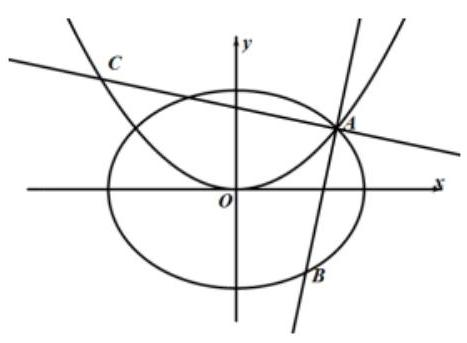

【解析】(1) 由椭圆 ${C}_{1} : \frac{{x}^{2}}{6} + \frac{{y}^{2}}{3} = 1$ ,得 ${a}^{2} = 6,{b}^{2} = 3,\therefore c = \sqrt{3}$ ,

所以,椭圆 ${C}_{1}$ 的右焦点为 $F\left( {\sqrt{3},0}\right)$ ,

抛物线 ${C}_{2} : {x}^{2} = {2py}\left( {p > 0}\right)$ 的焦点为 ${F}^{\prime }\left( {0,\frac{p}{2}}\right)$ ,

由题意可得 $\left| {F{F}^{\prime }}\right|  = \sqrt{{\left( \sqrt{3} - 0\right) }^{2} + {\left( 0 - \frac{p}{2}\right) }^{2}} = 2,\because p > 0$ ,

$\therefore p = 2$ ,因此,抛物线 ${C}_{2}$ 的方程为 ${x}^{2} = {4y}$ ;

( 2 )联立椭圆 ${C}_{1}$ 和抛物线 ${C}_{2}$ 的方程 $\left\{  \begin{array}{l} \frac{{x}^{2}}{6} + \frac{{y}^{2}}{3} = 1 \\  {x}^{2} = {4y} \\  x > 0 \end{array}\right.$ ，解得 $\left\{  \begin{array}{l} x = 2 \\  y = 1 \end{array}\right.$ ，可得点 $A\left( {2,1}\right)$ ，

设点 $B\left( {{x}_{1},{y}_{1}}\right) \text{ 、 }C\left( {{x}_{2},{y}_{2}}\right)$ ,联立直线 ${l}_{1}$ 与椭圆 ${C}_{1}$ 的方程 $\left\{  \begin{array}{l} \frac{{x}^{2}}{6} + \frac{{y}^{2}}{3} = 1 \\  y - 1 = k\left( {x - 2}\right)  \end{array}\right.$ ,

消去 $y$ 得, $\left( {2{k}^{2} + 1}\right) x - {4k}\left( {{2k} - 1}\right) x + 8{k}^{2} - {8k} - 4 = 0$ ,

由题意可知,2 是关于 $x$ 的二次方程 $\left( {2{k}^{2} + 1}\right) x - {4k}\left( {{2k} - 1}\right) x + 8{k}^{2} - {8k} - 4 = 0$ 的一个根,

由韦达定理得 $2{x}_{1} = \frac{8{k}^{2} - {8k} - 4}{2{k}^{2} + 1},\therefore {x}_{1} = \frac{4{k}^{2} - {4k} - 2}{2{k}^{2} + 1}$ ,

$\therefore \left| \overrightarrow{AB}\right|  = \sqrt{1 + {k}^{2}} \cdot  \left| {{x}_{1} - 2}\right|  = \frac{4\left| {k + 1}\right| \sqrt{1 + {k}^{2}}}{2{k}^{2} + 1}$ ,直线 ${l}_{2}$ 的方程为 $y - 1 =  - \frac{1}{k}\left( {x - 2}\right)$ ,

联立直线 ${l}_{2}$ 与抛物线 ${C}_{2}$ 的方程 $\left\{  \begin{array}{l} y - 1 =  - \frac{1}{k}\left( {x - 2}\right) \\  {x}^{2} = {4y} \end{array}\right.$ ,消去 $y$ 得 ${x}^{2} + \frac{4}{k}x - 4 - \frac{8}{k} = 0$ ,

由题意可知,2 是关于 $x$ 的二次方程 ${x}^{2} + \frac{4}{k}x - 4 - \frac{8}{k} = 0$ 的一个根,

由韦达定理得 $2{x}_{2} =  - 4 - \frac{8}{k},\therefore {x}_{2} =  - 2 - \frac{4}{k}$ ,

$\therefore \left| \overrightarrow{AC}\right|  = \sqrt{1 + \frac{1}{{k}^{2}}} \cdot  \left| {{x}_{2} - 2}\right|  = \frac{\sqrt{1 + {k}^{2}}}{k} \cdot  \left| {4 + \frac{4}{k}}\right|  = \frac{4\left| {k + 1}\right| \sqrt{{k}^{2} + 1}}{{k}^{2}}$ ,

所以, $m = \frac{\left| \overrightarrow{AB}\right| }{\left| \overrightarrow{AC}\right| } = \frac{{k}^{2}}{1 + 2{k}^{2}} = \frac{1}{\frac{1}{{k}^{2}} + 2} \in  \left( {0,\frac{1}{2}}\right)$ ,因此, $m$ 的取值范围是 $\left( {0,\frac{1}{2}}\right)$ .

## 实战演练

一、填空题

1、抛物线的焦点为椭圆 $\frac{{x}^{2}}{5} + \frac{{y}^{2}}{4} = 1$ 的右焦点，顶点在椭圆的中心，则抛物线方程为___

【难度】 $\star   \star$

【答案】 ${y}^{2} = {4x}$

【解析】

由椭圆方程知,椭圆右焦点为 $\left( {1,0}\right)$

设抛物线方程为: ${y}^{2} = {2px}$ ,则 $\frac{p}{2} = 1\;\therefore p = 2\;\therefore$ 抛物线方程为: ${y}^{2} = {4x}$

故答案为 ${y}^{2} = {4x}$

2、点 $P$ 是双曲线 $\frac{{x}^{2}}{16} - \frac{{y}^{2}}{9} = 1$ 左支上的一点，其右焦点为 $F$ ，若 $M$ 为线段 ${FP}$ 的中点，且 $M$ 到坐标原点的距离为 7,则 $\left| {PF}\right|  =$ ___.

【难度】★★

【答案】 22

【解析】设双曲线的左焦点为 ${F}^{\prime }$ ,连接 $P{F}^{\prime }$ ,则 ${OM}$ 是 $\Delta {F}^{\prime }{PF}$ 的中位线,

$\therefore {OM}//{PF},\left| {OM}\right|  = \frac{1}{2}\left| {P{F}^{\prime }}\right|$

$\because M$ 到坐标原点的距离为 $7,\therefore \left| {P{F}^{\prime }}\right|  = {14}$

又由双曲线的定义 $\left| {PF}\right|  - \left| {P{F}^{\prime }}\right|  = {2a} = 8$ ,得 $\left| {PF}\right|  = 8 + \left| {P{F}^{\prime }}\right|  = {22}$

故答案为 22 .

3、若方程 $a{x}^{2} + b{y}^{2} = c$ 的系数 $a$ 、 $b$ 、 $c$ 可以从 -1、0、1、2、3、4 这 6 个数中任取 3 个不同的数而得到, 则这样的方程表示焦点在 $x$ 轴上的椭圆的概率是___. (结果用数值表示)

【难度】 $\star   \star   \star$

【答案】0.1

【解析】解: $\because$ 方程 $\frac{{x}^{2}}{\frac{c}{a}} + \frac{{y}^{2}}{\frac{c}{b}} = 1$ 表示椭圆, $\therefore \frac{c}{a} > \frac{c}{b} > 0, b > a > 0$ ,

$a$ 、 $b$ 、 $c$ 从1,2,3,4中任意选取 3 个，所有的选法 ${A}_{6}^{3} = 6 \times  5 \times  4 = {120}$ ，

满足条件的选法 ${C}_{4}^{1} \cdot  {C}_{3}^{2} = {12}$ ，方程表示焦点在 $x$ 轴上的椭圆的概率是 $\frac{12}{120} = {0.1}$ ；

故答案为 0.1 .

4、已知点 $A$ 、 $B$ 关于坐标原点 $O$ 对称， $\left| {AB}\right|  = 2$ ，以 $M$ 为圆心的圆过 $A$ 、 $B$ 两点，且与直线 $y = 1$ 相切. 若存在定点 $P$ ，使得当 $A$ 运动时， $\left| {MA}\right|  - \left| {MP}\right|$ 为定值，则点 $P$ 的坐标为___.

【难度】 $\star   \star   \star   \star$

【答案】 $\left( {0, - \frac{1}{2}}\right)$

【解析】 $\because {AB}$ 为圆 $M$ 的一条直径, $O$ 是弦 ${AB}$ 的中点,所以,圆心 $M$ 在线段 ${AB}$ 的中垂线上,

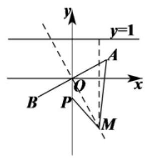

设点 $M$ 的坐标为 $\left( {x, y}\right)$ ,则 ${\left| OM\right| }^{2} + {\left| OA\right| }^{2} = {\left| MA\right| }^{2}$ ,

$\because$ 圆 $M$ 与直线 $y = 1$ 相切,则 $\left| {MA}\right|  = \left| {y - 1}\right| ,\therefore {\left( y - 1\right) }^{2} = {x}^{2} + {y}^{2} + 1$ ,整理得 ${x}^{2} =  - {2y}$ ,

所以,点 $M$ 的轨迹是以 $F\left( {0, - \frac{1}{2}}\right)$ 为焦点,以直线 $y = 1$ 为准线的抛物线,

$\because \left| {MA}\right|  - \left| {MP}\right|  = \left| {y - 1}\right|  - \left| {MP}\right|  = \left| {y - \frac{1}{2}}\right|  - \left| {MP}\right|  + \frac{1}{2} = \left| {MF}\right|  - \left| {MP}\right|  + \frac{1}{2},$

当 $\left| {MA}\right|  - \left| {MP}\right|$ 为定值时,则点 $P$ 与点 $F$ 重合,即点 $P$ 的坐标为 $\left( {0, - \frac{1}{2}}\right)$ .

因此,存在定点 $P\left( {0, - \frac{1}{2}}\right)$ ,使得当点 $A$ 运动时, $\left| {MA}\right|  - \left| {MP}\right|$ 为定值.

故答案为: $\left( {0, - \frac{1}{2}}\right)$ .

5、如图,两个椭圆 $\frac{{x}^{2}}{25} + \frac{{y}^{2}}{9} = 1,\frac{{x}^{2}}{9} + \frac{{y}^{2}}{25} = 1$ 内部重叠区域的边界记为曲线 $C, P$ 是曲线 $C$ 上任意一点,给出下列三个判断:

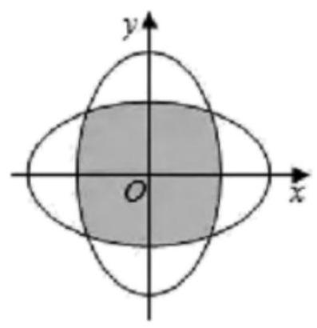

① $P$ 到 ${F}_{1}\left( {-4,0}\right) ,{F}_{2}\left( {4,0}\right) ,{E}_{1}\left( {0, - 4}\right) ,{E}_{2}\left( {0,4}\right)$ 四点的距离之和为定值;

②曲线 $C$ 关于直线 $y = x, y =  - x$ 均对称;

③曲线 $C$ 所围成区域面积必小于 36.

上述判断中所有正确命题的序号为___.

【难度】★★★★

【答案】 ②③

【解析】① 不考虑交点的情况,当 $P$ 在 $\frac{{x}^{2}}{25} + \frac{{y}^{2}}{9} = 1$ 上时, $P{F}_{1} + P{F}_{2} = {10}, P{E}_{1} + P{E}_{2}$ 不为定值,错误;

②两个椭圆均关于 $y = x, y =  - x$ 对称，故曲线 $C$ 关于直线 $y = x, y =  - x$ 均对称，正确；

③曲线 $C$ 在边长为 6 的正方形内部,故面积小于 36,正确；

故答案为②③

6、记 $d\left( {A, B}\right)  = \left| {{x}_{1} - {x}_{2}}\right|  + 2\left| {{y}_{1} - {y}_{2}}\right|$ ,其中 $A\left( {{x}_{1},{y}_{1}}\right) \text{ 、 }B\left( {{x}_{2},{y}_{2}}\right)$ ,已知 $A\text{ 、 }B$ 是椭圆 $\frac{{x}^{2}}{4} + {y}^{2} = 1$ 上的任意两点, $C$ 是椭圆右顶点,则 $d\left( {A, C}\right)  + d\left( {B, C}\right)$ 的最大值是___.

【难度】 $\star   \star   \star   \star$

【答案】 $4 + 4\sqrt{2}$

【解析】设点 $A\left( {2\cos \alpha ,\sin \alpha }\right)$ ,其中 $0 \leq  \alpha  < {2\pi }$ ,易知点 $C\left( {2,0}\right)$ ,

则 $d\left( {A, C}\right)  = \left| {2\cos \alpha  - 2}\right|  + 2\left| {\sin \alpha }\right|  = 2\left( {1 - \cos \alpha }\right)  + 2\left| {\sin \alpha }\right|$ .

① 当 $0 \leq  \alpha  < \pi$ 时， $d\left( {A, C}\right)  = 2\left( {1 - \cos \alpha }\right)  + 2\sin \alpha  = 2\sqrt{2}\sin \left( {\alpha  - \frac{\pi }{4}}\right)  + 2$ ，

$\because 0 \leq  \alpha  < \pi$ ,则 $- \frac{\pi }{4} \leq  \alpha  - \frac{\pi }{4} < \frac{3\pi }{4}$ ,当 $\alpha  - \frac{\pi }{4} = \frac{\pi }{2}$ 时, $d\left( {A, C}\right)$ 取最大值 $2\sqrt{2} + 2$ ;

② 当 $\pi  \leq  \alpha  < {2\pi }$ 时， $d\left( {A, C}\right)  = 2\left( {1 - \cos \alpha }\right)  - 2\sin \alpha  = 2 - 2\sqrt{2}\sin \left( {\alpha  + \frac{\pi }{4}}\right)$ ，

$\because \pi  \leq  \alpha  < {2\pi }$ ,则 $\frac{5\pi }{4} \leq  \alpha  + \frac{\pi }{4} < \frac{9\pi }{4}$ ,当 $\alpha  + \frac{\pi }{4} = \frac{3\pi }{2}$ 时, $d\left( {A, C}\right)$ 取最大值 $2\sqrt{2} + 2$ .

综上所述， $d\left( {A, C}\right)$ 的最大值 $2\sqrt{2} + 2$ ，同理可知， $d\left( {B, C}\right)$ 的最大值也为 $2\sqrt{2} + 2$ .

因此, $d\left( {A, C}\right)  + d\left( {B, C}\right)$ 的最大值是 $4 + 4\sqrt{2}$ .

故答案为: $4 + 4\sqrt{2}$ .

二、选择题

7、方程 $\sqrt{{\left( x - 1\right) }^{2} + {y}^{2}} + \sqrt{{\left( x + 1\right) }^{2} + {y}^{2}} = 2$ 表示的轨迹是( )

A. 线段 B. 圆 C. 椭圆 D. 双曲线

【难度】 $\bigstar \bigstar \bigstar$

【答案】A

【解析】解: $\because \sqrt{{\left( x - 1\right) }^{2} + {y}^{2}} + \sqrt{{\left( x + 1\right) }^{2} + {y}^{2}} = 2$ ,

$\therefore$ 方程可表示平面内点 $P\left( {x, y}\right)$ 到点 $A\left( {-1,0}\right)$ 与点 $B\left( {1,0}\right)$ 的距离之和为 2 的图形,

此时 $\left| {PA}\right|  + \left| {PB}\right|  = \left| {AB}\right|$ ,

$\therefore$ 方程 $\sqrt{{\left( x - 1\right) }^{2} + {y}^{2}} + \sqrt{{\left( x + 1\right) }^{2} + {y}^{2}} = 2$ 表示的轨迹是线段 ${AB}$ ,

故选: $A$ .

8、抛物线 $y = 2{x}^{2}$ 上有一动弦 ${AB}$ ，中点为 $M$ ，且弦 ${AB}$ 的长度为 3，则点 $M$ 的纵坐标的最小值为( )

A. $\frac{11}{8}$ B. $\frac{5}{4}$ C. $\frac{3}{2}$ D. 1

【难度】 $\star   \star   \star$

【答案】A

【解析】由题意设 $A\left( {{x}_{1},{y}_{1}}\right) , B\left( {{x}_{2},{y}_{2}}\right) , M\left( {{x}_{0},{y}_{0}}\right)$ ,直线 ${AB}$ 的方程为 $y = {kx} + b$ ,

联立方程 $\left\{  \begin{array}{l} y = {kx} + b \\  y = 2{x}^{2} \end{array}\right.$ ，整理得 $2{x}^{2} - {kx} - b = 0$

$\therefore \Delta  = {k}^{2} + {8b} > 0,{x}_{1} + {x}_{2} = \frac{k}{2},{x}_{1}{x}_{2} =  - \frac{b}{2},\left| {AB}\right|  = \sqrt{1 + {k}^{2}} \cdot  \sqrt{\frac{{k}^{2}}{4} + {2b}}$

点 $\mathbf{M}$ 的纵坐标 ${y}_{0} = \frac{{y}_{1} + {y}_{2}}{2} = {x}_{1}^{2} + {x}_{2}^{2} = \frac{{k}^{2}}{4} + b,\left( {{y}_{0} > 0}\right)$

$\because$ 弦 ${AB}$ 的长度为 $3\therefore \sqrt{1 + {k}^{2}} \cdot  \sqrt{\frac{{k}^{2}}{4} + {2b}} = 3$ ,即 $\left( {1 + {k}^{2}}\right)  \cdot  \left( {\frac{{k}^{2}}{4} + {2b}}\right)  = 9$

$\therefore \left( {1 + 4{y}_{0} - {4b}}\right)  \cdot  \left( {{y}_{0} + b}\right)  = 9$ ,整理得 $\left( {1 + 4{y}_{0} - {4b}}\right)  \cdot  \left( {{y}_{0} + b}\right)  = 9$ ,即 $\left( {1 + 4{y}_{0} - {4b}}\right)  \cdot  \left( {4{y}_{0} + {4b}}\right)  = {36}$ 根据基本不等式, $\left( {1 + 4{y}_{0} - {4b}}\right)  + \left( {4{y}_{0} + {4b}}\right)  \geq  2\sqrt{\left( {1 + 4{y}_{0} - {4b}}\right)  \cdot  \left( {4{y}_{0} + {4b}}\right) } = {12}$ ,当且仅当 $b = \frac{1}{8},{y}_{0} = \frac{11}{8}$ 时取等,即 $1 + 8{y}_{0} \geq  {12},\therefore {y}_{0} \geq  \frac{11}{8}$ ,点 $M$ 的纵坐标的最小值为 $\frac{11}{8}$ .

故选 A.

9、已知双曲线的一条渐近线方程为 $y = \sqrt{3}x$ ，且双曲线经过点 $\left( {2,3}\right)$ ，若 ${F}_{1}$ ， ${F}_{2}$ 为其左、右焦点， $P$ 为双曲线右支上一点,若点 $A\left( {6,8}\right)$ ,则当 $\left| {PA}\right|  + \left| {P{F}_{2}}\right|$ 取最小值时,点 $P$ 的坐标为( )

A. $\left( {1 + \frac{\sqrt{2}}{2},3 + \frac{3\sqrt{2}}{2}}\right)$ B. $\left( {1 + \frac{3\sqrt{2}}{2},3 + \frac{\sqrt{2}}{2}}\right)$

C. $\left( {1 + \frac{3\sqrt{2}}{2},3 + \frac{3\sqrt{2}}{2}}\right)$ D. $\left( {1 + \frac{\sqrt{2}}{2},3 + \frac{\sqrt{2}}{2}}\right)$

【难度】 $\star   \star   \star   \star$

【答案】C

【解析】由条件可知 $\frac{b}{a} = \sqrt{3} \Leftrightarrow  {b}^{2} = 3{a}^{2}$ ,即 $\frac{4}{{a}^{2}} - \frac{9}{3{a}^{2}} = 1$ ,解得: ${a}^{2} = 1,{b}^{2} = 3$ ,

$\therefore {x}^{2} - \frac{{y}^{2}}{3} = 1,{F}_{1}\left( {-2,0}\right) ,{F}_{2}\left( {2,0}\right)$

$\left| {PA}\right|  + \left| {P{F}_{2}}\right|  = \left| {PA}\right|  + \left| {P{F}_{1}}\right|  - {2a} = \left| {PA}\right|  + \left| {P{F}_{1}}\right|  - 2 \geq  \left| {A{F}_{1}}\right|  - 2,$

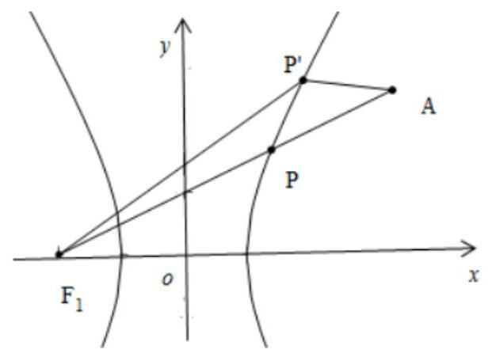

当 $P,{F}_{1}, A$ 三点共线时取等号, $\left| {A{F}_{1}}\right|  = \sqrt{{\left( 6 + 2\right) }^{2} + {\left( 8 - 0\right) }^{2}} = 8\sqrt{2}$ ,

此时直线 $A{F}_{1}$ 的斜率 $k = \frac{8 - 0}{6 - \left( {-2}\right) } = 1$ ,直线 $A{F}_{1}$ 的方程为 $y = x + 2$ ,

联立 $\left\{  \begin{array}{l} y = x + 2 \\  {x}^{2} - \frac{{y}^{2}}{3} = 1 \\  x > 0 \end{array}\right.$ ,解得: $x = 1 + \frac{3}{2}\sqrt{2}, y = 3 + \frac{3}{2}\sqrt{2}$ ,即点 $P$ 的坐标为 $\left( {1 + \frac{3}{2}\sqrt{2},3 + \frac{3}{2}\sqrt{2}}\right)$ .

故选: $\mathrm{C}$

10、如果方程 $\frac{{x}^{2}}{4} + y\left| y\right|  = 1$ 所对应的曲线与函数 $y = f\left( x\right)$ 的图象完全重合,那么对于函数 $y = f\left( x\right)$ 有如下结论:

①函数 $f\left( x\right)$ 在 $R$ 上单调递减；

② $y = f\left( x\right)$ 的图象上的点到坐标原点距离的最小值为 1 ;

③函数 $f\left( x\right)$ 的值域为 $( - \infty ,2\rbrack$ ；

④函数 $F\left( x\right)  = f\left( x\right)  + x$ 有且只有一个零点.

其中正确结论的序号是

A. ①③ B②④ c①④ D②③

【难度】 $\star   \star   \star   \star$

【答案】B

【解析】当 $y \geq  0$ 时,方程 $\frac{{x}^{2}}{4} + y\left| y\right|  = 1$ 化为 $\frac{{x}^{2}}{4} + {y}^{2} = 1\left( {y \geq  0}\right)$ ,

当 $y < 0$ 时,方程 $\frac{{x}^{2}}{4} + y\left| y\right|  = 1$ 化为 $\frac{{x}^{2}}{4} - {y}^{2} = 1\left( {y < 0}\right)$ .

作出函数 $f\left( x\right)$ 的图象如图:

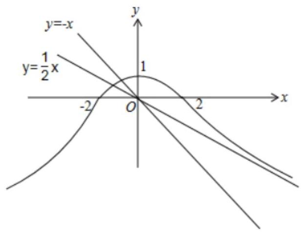

由图可知,函数 $f\left( x\right)$ 在 $R$ 上不是单调函数,故①错误;

$y = f\left( x\right)$ 的图象上的点到坐标原点距离的最小值为 1，故②正确；

函数 $f\left( x\right)$ 的值域为 $( - \infty ,1\rbrack$ ,故③错误;

双曲线 $\frac{{x}^{2}}{4} - {y}^{2} = 1$ 的渐近线方程为 $y =  \pm  \frac{1}{2}$ ,故函数 $y = f\left( x\right)$ 与 $y =  - x$ 的图象只有 1 个交点,

即函数 $F\left( x\right)  = f\left( x\right)  + x$ 有且只有一个零点,故④正确.

故答案为:②④.

## 三、解答题

11、已知椭圆 $\frac{{x}^{2}}{{a}^{2}} + \frac{{y}^{2}}{{b}^{2}} = 1\left( {a > b > 0}\right)$ 的左、右焦点分别为 ${F}_{1}\text{ 、 }{F}_{2}$ ,短轴两个端点为 $A\text{ 、 }B$ ,且四边形 ${F}_{1}A{F}_{2}B$ 是边长为 2 的正方形.

(1)求椭圆的方程；

(2)若 $C$ 、 $D$ 分别是椭圆长的左、右端点，动点 $M$ 满足 ${MD} \bot  {CD}$ ，连接 ${CM}$ ，交椭圆于点 $P$ . 证明: $\overrightarrow{OM} \cdot  \overrightarrow{OP}$ 为定值.

(3)在(2)的条件下，试问 $x$ 轴上是否存异于点 $C$ 的定点 $Q$ ，使得以 ${MP}$ 为直径的圆恒过直线 ${DP}\text{ 、 }{MQ}$ 的交点,若存在,求出点 $Q$ 的坐标; 若不存在,请说明理由.

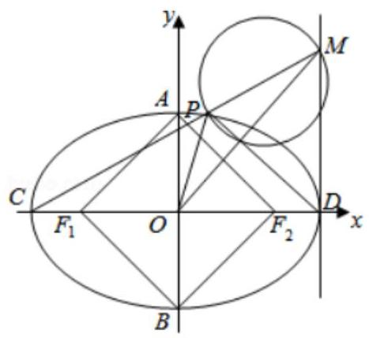

【难度】 $\star   \star   \star   \star$

【答案】见解析

【解析】解: (1) $a = 2, b = c,{a}^{2} = {b}^{2} + {c}^{2},\therefore {b}^{2} = 2$ ;

$\therefore$ 椭圆方程为 $\frac{{x}^{2}}{4} + \frac{{y}^{2}}{2} = 1$ (4 分)

(2) $C\left( {-2,0}\right) , D\left( {2,0}\right)$ ，设 $M\left( {2,{y}_{0}}\right) , P\left( {{x}_{1},{y}_{1}}\right)$ ，

则 $\overrightarrow{OP} = \left( {{x}_{1},{y}_{1}}\right) ,\overrightarrow{OM} = \left( {2,{y}_{0}}\right)$

直线 ${CM} : y = \frac{{y}_{0}}{4}\left( {x + 2}\right)$ ,即 $y = \frac{{y}_{0}}{4}x + \frac{1}{2}{y}_{0}$ ,代入椭圆方程 ${x}^{2} + 2{y}^{2} = 4$ ,

得 $\left( {1 + \frac{{y}_{0}^{2}}{8}}\right) {x}^{2} + \frac{1}{2}{y}_{0}^{2}x + \frac{1}{2}{y}_{0}^{2} - 4 = 0$ (6 分)

$\because {x}_{1} =  - \frac{1}{2}\frac{4\left( {{y}_{0}^{2} - 8}\right) }{{y}_{0}^{2} + 8},\therefore {x}_{1} =  - \frac{2\left( {{y}_{0}^{2} - 8}\right) }{{y}_{0}^{2} + 8},\therefore {y}_{1} = \frac{8{y}_{0}}{{y}_{0}^{2} + 8},\therefore \overrightarrow{OP} = \left( {-\frac{2\left( {{y}_{0}^{2} - 8}\right) }{{y}_{0}^{2} + 8},\frac{8{y}_{0}}{{y}_{0}^{2} + 8}}\right)$ (8 分)

$\therefore \overrightarrow{OP} \cdot  \overrightarrow{OM} =  - \frac{4\left( {{y}_{0}^{2} - 8}\right) }{{y}_{0}^{2} + 8} + \frac{8{y}_{0}^{2}}{{y}_{0}^{2} + 8} = \frac{4{y}_{0}^{2} + {32}}{{y}_{0}^{2} + 8} = 4$ (定值) (10 分)

(3)设存在 $Q\left( {m,0}\right)$ 满足条件,则 ${MQ} \bot  {DP}$ (11 分)

$\overrightarrow{MQ} = \left( {m - 2, - {y}_{0}}\right) ,\overrightarrow{DP} = \left( {-\frac{4{y}_{0}^{2}}{{y}_{0}^{2} + 8},\frac{8{y}_{0}}{{y}_{0}^{2} + 8}}\right) \left( {{12}\text{ 分 }}\right)$

则由 $\overrightarrow{MQ} \cdot  \overrightarrow{DP} = 0$ 得 $- \frac{4{y}_{0}^{2}}{{y}_{0}^{2} + 8}\left( {m - 2}\right)  - \frac{8{y}_{0}^{2}}{{y}_{0}^{2} + 8} = 0$ ,从而得 $m = 0$

$\therefore$ 存在 $Q\left( {0,0}\right)$ 满足条件(14 分)

12、已知抛物线 $C : {y}^{2} = {4x}$ ,点 $P\left( {4,4}\right)$

(1)求点 $P$ 与抛物线 $C$ 的焦点 $F$ 的距离；

(2)设斜率为 1 的直线 $l$ 与抛物线 $C$ 交于 $A, B$ 两点，若 $\bigtriangleup  {PAB}$ 的面积为 $2\sqrt{2}$ ，求直线 $l$ 的方程；

(3)是否存在定圆 $M : {\left( x - m\right) }^{2} + {y}^{2} = 4$ ，使得过曲线 $C$ 上任意一点 $Q$ 作圆 $M$ 的两条切线，与曲线 $C$ 交于另外两点 $A, B$ 时,总有直线 ${AB}$ 也与圆 $M$ 相切? 若存在,求出 $m$ 的值,若不存在,请说明理由.

【难度】 $\star   \star   \star   \star   \star$

【答案】(1)5 ; (2) $y = x - 1$ ；(3)存在实数 $m = 3$

【解析】(1) 抛物线 $C : {y}^{2} = {4x}$ 的焦点坐标为 $\left( {1,0}\right)$ ,

则点 $P$ 与抛物线 $C$ 的焦点 $F$ 的距离为 $\sqrt{{\left( 4 - 1\right) }^{2} + {4}^{2}} = 5$ .

(2)设直线 $l$ 的方程为 $y = x + a$ ，

把 $y = x + a$ 方程代入抛物线 ${y}^{2} = {4x}$ ,可得 ${x}^{2} + 2\left( {a - 2}\right) x + {a}^{2} = 0$ ,

$\therefore {x}_{1} + {x}_{1} = 4 - {2a},{x}_{1} \cdot  {x}_{2} = {a}^{2}$ ,

$\therefore \left| {AB}\right|  = \sqrt{1 + {k}^{2}}\left| {{x}_{2} - {x}_{1}}\right|  = \sqrt{2}\sqrt{{\left( {x}_{1} + {x}_{1}\right) }^{2} - 4{x}_{1}{x}_{1}} = 4\sqrt{2\left( {1 - a}\right) }$ ,

点 $P$ 到直线的距离 $d = \frac{\left| a\right| }{\sqrt{2}}$ ,

$\therefore {S}_{\bigtriangleup {PAB}} = \frac{1}{2}\left| {AB}\right| d = \frac{1}{2} \times  4\sqrt{2\left( {1 - a}\right) } \times  \frac{\left| a\right| }{\sqrt{2}} = 2\sqrt{2}$ ,

解得 $a =  - 1$ ,所以直线 $l$ 的方程 $y = x - 1$ .

(3)假设存在. 取 $Q\left( {0,0}\right)$ ，圆 $M : {\left( x - m\right) }^{2} + {y}^{2} = 4$ ，设切线为 $y = {kx}$ ，

由 $\frac{\left| mk\right| }{\sqrt{1 + {k}^{2}}} = 2$ ,解得 ${k}^{2} = \frac{4}{{m}^{2} - 4}$ ,①

将直线 $y = {kx}$ 代入抛物线方程 ${y}^{2} = {4x}$ ,

解得 $A\left( {\frac{4}{{k}^{2}},\frac{4}{k}}\right) , B\left( {\frac{4}{{k}^{2}}, - \frac{4}{k}}\right)$ ,

直线 ${AB}$ 的方程为 $x = \frac{4}{{k}^{2}}$ ,

若直线 ${AB}$ 和圆相切,可得 $\left| {\frac{4}{{k}^{2}} - m}\right|  = 2$ ②

由①②解得， $m = 3$ .

下证 $m = 3$ 时,对任意的动点 $Q$ ,直线 ${AB}$ 和圆 $M$ 相切.

理由如下: 设 $Q\left( {\frac{1}{4}{a}^{2}, a}\right) , x = t\left( {y - a}\right)  + \frac{1}{4}{a}^{2}, A\left( {\frac{1}{4}{y}_{1}^{2},{y}_{1}}\right) , B\left( {\frac{1}{4}{y}_{2}^{2},{y}_{2}}\right)$

由 $\frac{\left| 3 - \frac{1}{4}{a}^{2} + ta\right| }{\sqrt{1 + {t}^{2}}} = 2$ ,可得 $\left( {{a}^{2} - 4}\right) {t}^{2} - \left( {\frac{1}{2}{a}^{2} - 6}\right) {at} + {\left( \frac{1}{4}{a}^{2} - 3\right) }^{2} - 4 = 0$ ,

$\therefore {t}_{1} + {t}_{2} = \frac{a\left( {\frac{1}{2}{a}^{2} - 6}\right) }{{a}^{2} - 4},{t}_{1}{t}_{2} = \frac{{\left( \frac{1}{4}{a}^{2} - 3\right) }^{2} - 4}{{a}^{2} - 4}$ ,

又直线与曲线相交于 $A, B$ ,

由 $x = t\left( {y - a}\right)  + \frac{1}{4}{a}^{2}$ ,代入抛物线方程可得 ${y}^{2} - {4ty} + {4ta} - {a}^{2} = 0$ ,

可得 ${y}_{1}^{2} = 4{t}_{1}\left( {{y}_{1} - a}\right)  + {a}^{2},{y}_{2}^{2} = 4{t}_{2}\left( {{y}_{2} - a}\right)  + {a}^{2}$ ,

则 $a,{y}_{1}$ 是方程 ${y}^{2} = {4t}\left( {y - a}\right)  + {a}^{2}$ 的两根,

即有 $a{y}_{1} = 4{t}_{1}a - {a}^{2}$ ,即 ${y}_{1} = 4{t}_{1} - a$ ,同理 ${y}_{2} = 4{t}_{2} - a$ .

则有 $A\left( {\frac{1}{4}{\left( 4{t}_{1} - a\right) }^{2},4{t}_{1} - a}\right) , B\left( {\frac{1}{4}{\left( 4{t}_{2} - a\right) }^{2},4{t}_{2} - a}\right)$ ,

直线 ${AB} : y - \left( {4{t}_{1} - a}\right)  = \frac{2}{2\left( {{t}_{2} + {t}_{1}}\right)  - a}\left\lbrack  {x - \frac{1}{4}{\left( 4{t}_{1} - a\right) }^{2}}\right\rbrack$ ,

即为 $y - \left( {4{t}_{1} - a}\right)  = \frac{4 - {a}^{2}}{4a}\left\lbrack  {x - \frac{1}{4}{\left( 4{t}_{1} - a\right) }^{2}}\right\rbrack$ ,

则圆心 $\left( {3,0}\right)$ 到直线 ${AB}$ 的距离为

$d = \frac{\left| \frac{4 - {a}^{2}}{4a}\left\lbrack  3 - \frac{1}{4}{\left( 4{t}_{1} - a\right) }^{2}\right\rbrack   + 4{t}_{1} - a\right| }{\sqrt{1 + {\left( \frac{4 - {a}^{2}}{4a}\right) }^{2}}},$

由 $\left( {{a}^{2} - 4}\right) {t}_{1}^{2} - \left( {\frac{1}{2}{a}^{2} - 6}\right) a{t}_{1} + {\left( \frac{1}{4}{a}^{2} - 3\right) }^{2} - 4 = 0$ ,

代入上式,化简可得 $d = \frac{2\left| {4 + {a}^{2}}\right| }{4 + {a}^{2}} = 2$ ,

则有对任意的动点 $Q$ ,存在实数 $m = 3$ ,使得直线 ${AB}$ 与圆 $M$ 相切.

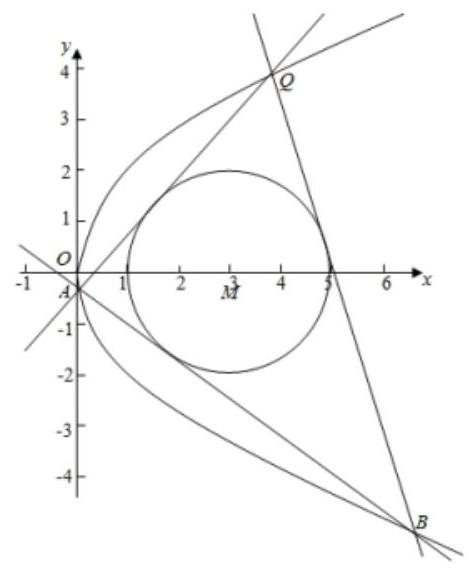
