## (一) 认识平面及平面的基本性质

空间直线与平面

<table><tr><td>教学目标</td><td>1、理解并掌握斜线在平面内的射影、直线和平面所成角的概念，根据概念先找直线射影后确定线面夹角从而熟练求解直线和平面所成角;   2、空间直线和平面平行的判定定理、性质定理; 空间平面和平面平行的性质定理; 空间直线和平面垂直的定义、定理及其表示法;   3、掌握空间距离的确定与计算;   4、培养化归能力、分析能力、观察思考能力和空间想象能力等;   5、理解几何推理证明的思考方法，基本规则和严谨性。</td></tr><tr><td>重点</td><td>1. 掌握求角的计算题步骤是 “一作、二证、三计算”，思想方法是将空间图形转化为平面图形即“降维”的思想方法；   2. 空间距离向平面距离的转化过程中, 重点是确定垂足, 作出辅助图形解三角形.</td></tr><tr><td>难 点</td><td>1. 掌握求角的计算题步骤是 “一作、二证、三计算”，思想方法是将空间图形转化为平面图形即“降维”的思想方法；   2. 空间距离向平面距离的转化过程中, 重点是确定垂足, 作出辅助图形解三角形.</td></tr></table>

## 知识梳理

(1)点、线、面的符号表示:

点: $A, B, C\ldots$ .

线: $l, m, n\ldots \ldots$

面: $\alpha ,\beta ,\gamma$ ......

(2)点、线、面之间关系的符号表示:

点 $\mathrm{A}$ 在直线 $l$ 上: $A \in  l$ 点 $\mathrm{A}$ 不在直线 $l$ 上: $A \notin  l$

点 $\mathrm{A}$ 在平面 $\alpha$ 上: $A \in  \alpha$ 点 $\mathrm{A}$ 不在平面 $\alpha$ 上: $A \notin  \alpha$

直线 $m$ 与直线 $n$ 平行: $m//n$ 直线 $m$ 与直线 $n$ 相交于点 $A : m \cap  n = A$

直线 $m$ 与平面 $\alpha$ 平行: $m//\alpha$ 直线 $m$ 在平面 $\alpha$ 内 (平面 $\alpha$ 经过直线 $m$ ): $m \subsetneqq  \alpha$

直线 $m$ 与平面 $\alpha$ 垂直: $m \bot  \alpha$ 直线 $m$ 在平面 $\alpha$ 内 (平面 $\alpha$ 经过直线 $m$ ): $m \subsetneqq  \alpha$

平面 $\alpha$ 与平面 $\beta$ 平行: $\alpha //\beta$ 平面 $\alpha$ 与平面 $\beta$ 相交于直线 $l : \alpha  \cap  \beta  = l$

平面 $\alpha$ 与平面 $\beta$ 垂直: $\alpha  \bot  \beta$

【注意】平面的特征: 无限延展, 无厚度.

(3)三个公理、三个推论:

公理1:若一条直线上有两个点在一个平面内，则该直线上所有的点都在这个平面内.

即: $\left. \begin{array}{ll} A \in  l, & B \in  l \\  A \in  \alpha , & \mathrm{B} \in  \alpha  \end{array}\right\}   \Rightarrow  l \subsetneqq  \alpha$

公理2:如果两个平面有一个公共点，那么它们有且只有一条通过这个点的公共直线.

即: $\mathrm{A} \in  \alpha  \cap  \beta  \Rightarrow  \alpha  \cap  \beta  = l$ 且 $\mathrm{A} \in  l$

公理3:经过不在同一条直线上的三点，有且只有一个平面.

推论1: 经过一条直线和这条直线外一点有且只有一个平面.

推论2: 两条相交直线确定一个平面.

推论3: 两条平行直线确定一个平面.

【注意】搞清楚公理及其推论的基本应用:

公理 1 是判定直线在平面内的依据;

公理 2 是判定两个平面相交的依据，同时应注意其内容的完整性，即当两个平面有一个公共点时, 首先可得到这两个平面相交, 其次是这两个平面有且只有一条公共直线 (即交线), 还有就是这个公共点在公共直线上或称公共直线经过公共点;

公理 3 以及三个推论都是确定平面的依据, 应注意由于三点共线时, 经过他们可以作无数个平面, 因此公理 3 中 “三点不共线” 的条件必不可少.

## 例题精讲

【例 1 】空间 5 点，其中有 4 点共面，它们没有任何 3 点共线，这 5 个点最多可以确定___个平面.

【难度】 $\star   \star   \star$

【答案】 7

【解析】: 空间中有五个点, 其中有四个点在同一平面内, 但没有任何三点共线,

$\therefore$ 同一平面的四个点一定能两两连线,最多可连 6 条线,

$\because$ 由三点确定一平面知任意一条线加上第五个点都会形成一个面,因此有 6 个面,

再加上 4 点确定的面总共是 7 个面.

故答案为: 7

【例 2】在棱长为 10 的正方体 ${ABCD} - {A}_{1}{B}_{1}{C}_{1}{D}_{1}$ 中， $P$ 为左侧面 ${AD}{D}_{1}{A}_{1}$ 上一点，已知点 $P$ 到 ${A}_{1}{D}_{1}$ 的距离为 3, $P$ 到 $A{A}_{1}$ 的距离为 2,则过点 $P$ 且与 ${A}_{1}C$ 平行的直线交正方体于 $P\text{ 、 }Q$ 两点,则 $Q$ 点所在的平面是 ( )

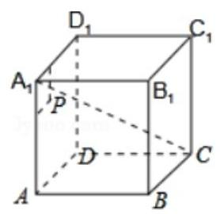

A. $A{A}_{1}{B}_{1}B$ B. $B{B}_{1}{C}_{1}C$ C. $C{C}_{1}{D}_{1}D$ D. ABCD

【难度】 $\star   \star   \star   \star$

【答案】 $D$

【解析】解: 如图,

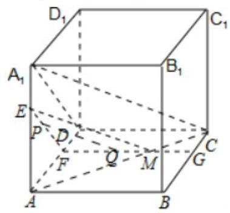

由点 $P$ 到 ${A}_{1}{D}_{1}$ 的距离为 $3, P$ 到 $A{A}_{1}$ 的距离为 2,

可得 $P$ 在 $\bigtriangleup A{A}_{1}D$ 内,过 $P$ 作 ${EF}//{A}_{1}D$ ,且 ${EF}\bigcap A{A}_{1}$ 于 $E,{EF}\bigcap {AD}$ 于 $F$ ,

在平面 ${ABCD}$ 中,过 $F$ 作 ${FG}//{CD}$ ,交 ${BC}$ 于 $G$ ,则平面 ${EFG}//$ 平面 ${A}_{1}{DC}$ .

连接 ${AC}$ ,交 ${FG}$ 于 $M$ ,连接 ${EM}$ ,

$\because$ 平面 ${EFG}//$ 平面 ${A}_{1}{DC}$ ,平面 ${A}_{1}{AC} \cap$ 平面 ${A}_{1}{DC} = {A}_{1}C$ ,平面 ${A}_{1}{AC} \cap$ 平面 ${EFM} = {EM}$ ,

$\therefore {EM}//{A}_{1}C$ .

在 ${\Delta EFM}$ 中,过 $P$ 作 ${PQ}//{EM}$ ,且 ${PQ}\bigcap {FM}$ 于 $Q$ ,则 ${PQ}//{A}_{1}C$ .

$\because$ 线段 ${FM}$ 在四边形 ${ABCD}$ 内, $Q$ 在线段 ${FM}$ 上, $\therefore Q$ 在四边形 ${ABCD}$ 内.

$\therefore$ 则 $Q$ 点所在的平面是平面 ${ABCD}$ . 故选: $D$ .

【例 3】如图正方体 ${ABCD} - {A}_{1}{B}_{1}{C}_{1}{D}_{1}$ ,棱长为 $1, P$ 为 ${BC}$ 中点, $Q$ 为线段 $C{C}_{1}$ 上的动点,过 $A\text{ 、 }P\text{ 、 }Q$ 的平面截该正方体所得的截面记为 $S$ ,则下列命题正确的是( )

① 当 $0 < {CQ} < \frac{1}{2}$ 时， $S$ 为四边形；

② 当 ${CQ} = \frac{1}{2}$ 时， $S$ 为等腰梯形；

③ 当 ${CQ} = \frac{3}{4}$ 时， $S$ 与 ${C}_{1}{D}_{1}$ 交点 $R$ 满足 ${C}_{1}{R}_{1} = \frac{1}{3}$ ；

④ 当 $\frac{3}{4} < {CQ} < 1$ 时， $S$ 为六边形；

⑤ 当 ${CQ} = 1$ 时， $S$ 的面积为 $\frac{\sqrt{6}}{2}$ .

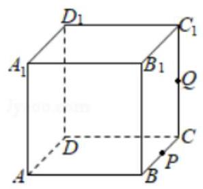

A. ①③④ B. ②④⑤ C. ①②④ D. ①②⑧⑤

【难度】 $\star   \star   \star   \star$

【答案】 $D$

【解析】解: 当 ${CQ} = \frac{1}{2}$ 时, $S$ 为等腰梯形,② 正确,图如下:

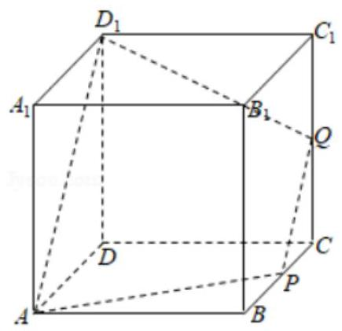

当 ${CQ} = 1$ 时， $S$ 是菱形，面积为 $\sqrt{2} \cdot  \frac{\sqrt{3}}{2} = \frac{\sqrt{6}}{2}$ ，⑤正确，图如下:

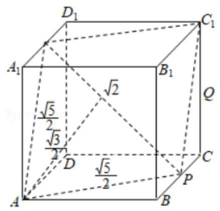

当 ${CQ} = \frac{3}{4}$ 时，画图如下: ${C}_{1}R = \frac{1}{3}$ ，③正确

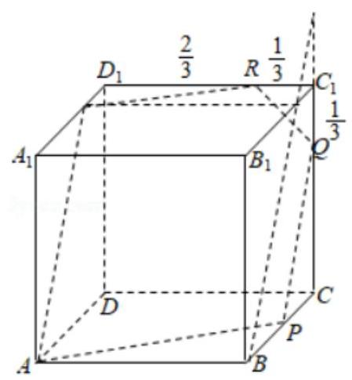

当 $\frac{3}{4} < {CQ} < 1$ 时，如图是五边形，④不正确；

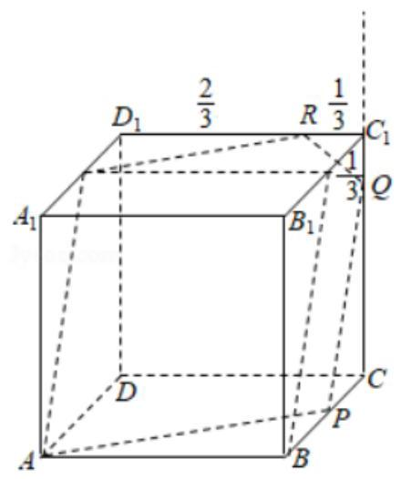

当 $0 < {CQ} < \frac{1}{2}$ 时，如下图，是四边形，故①正确

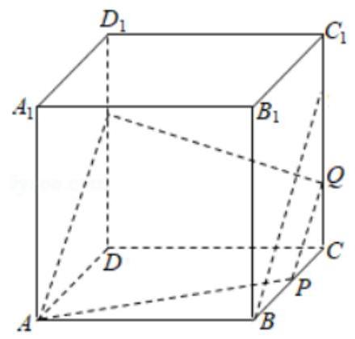

故选: $D$ .

## 巩固训练

1、下面四个说法中，正确说法的个数为( )

(1)如果两个平面有三个公共点，那么这两个平面重合；

(2)两条直线可以确定一个平面；

(3)若 $M \in  \alpha , M \in  \beta ,\alpha  \cap  \beta  = l$ ，则 $M \in  l$ ；

(4)空间中，两两相交的三条直线在同一平面内.

A. 1 B. 2 C. 3 D. 4

【难度】 $\star   \star   \star$

【答案】A

【解析】如果两个平面有三个公共点, 那么这两个平面重合或者是相交, 故 (1) 不正确;

两条异面直线不能确定一个平面, 故 (2) 不正确;

利用平面的基本性质中的公理 3 判断 (3) 正确;

空间中, 若两两相交的三条直线相交于同一点, 则相交于同一点的三直线不一定在同一平面内 (如棱锥的 3 条侧棱), 故 (4) 不正确,

综上所述只有一个说法是正确的,

故选: A.

2、如图，直四棱柱 ${ABCD} - {A}_{1}{B}_{1}{C}_{1}{D}_{1}$ 的底面是菱形， $A{A}_{1} = 4$ ， ${AB} = 2$ ， $\angle {BAD} = \frac{\pi }{3}$ ， $E$ ， $M$ 分别是 ${BC}$ ， $B{B}_{1}$ 的中点.

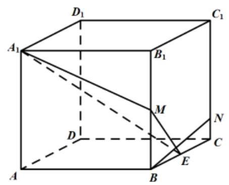

证明: 点 $D$ 在平面 ${A}_{1}{ME}$ 内;

【难度】 $\star   \star   \star$

【答案】证明见解析;

【解析】连接 ${A}_{1}D,{B}_{1}C$ .

$\because {A}_{1}{B}_{1}//{DC}$ 且 ${A}_{1}{B}_{1} = {DC}$ ， $\therefore$ 四边形 ${A}_{1}{B}_{1}{CD}$ 是平行四边形， $\therefore {A}_{1}D//{B}_{1}C$

又因为 $E, M$ 分别为 ${BC}, B{B}_{1}$ 中点, $\therefore {ME}//{B}_{1}C,\therefore {ME}//{A}_{1}D$

$\therefore M, E,{A}_{1}, D$ 四点共面, $\therefore$ 点 $D$ 在平面 ${A}_{1}{ME}$ 内

3、在如图所示的棱长为 20 的正方体 ${ABCD} - {A}_{1}{B}_{1}{C}_{1}{D}_{1}$ 中，点 $M$ 为 ${CD}$ 的中点，点 $P$ 在侧面 ${AD}{D}_{1}{A}_{1}$ 上，且到 ${A}_{1}{D}_{1}$ 的距离为 6，到 $A{A}_{1}$ 的距离为 5，则过点 $P$ 且与 ${A}_{1}M$ 垂直的正方体截面的形状是( )

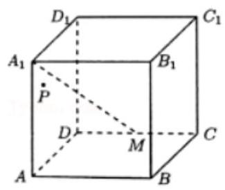

A. 三角形 B. 四边形 C. 五边形 D. 六边形

【难度】 $\star   \star   \star$

【答案】 $B$

【解析】解: 截面形状草图, 如图所示:

由图可知,截面为四边形 ${KNFE}$ ,故选: $B$ .

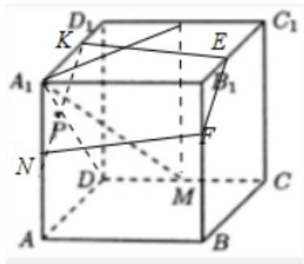

4、如图，在正方体 ${ABCD} - {A}_{1}{B}_{1}{C}_{1}{D}_{1}$ 中， ${AB} = 1$ ， ${D{D}_{1}}$ 中点为 $Q$ ，过 $A$ 、 $Q$ 、 ${B}_{1}$ 三点的截面面积为 ___.

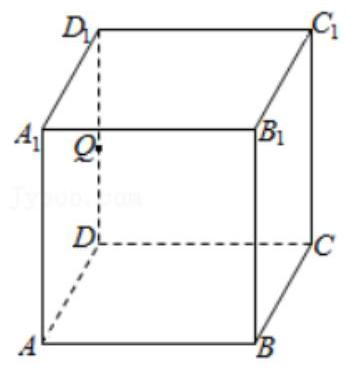

【难度】 $\star   \star   \star$

【答案】 $\frac{9}{8}$

【解析】解: 如图所示,

取 ${C}_{1}{D}_{1}$ 的中点 $P$ ，连接 ${PQ}\text{ 、 }P{B}_{1}\text{ 、 }A{B}_{1}$ 和 ${AQ}$ ，则四边形 $A{B}_{1}{PQ}$ 是过 $A\text{ 、 }Q\text{ 、 }{B}_{1}$ 三点的截面； $\because {PQ}//{C}_{1}D$ ，且 ${PQ} = \frac{1}{2}{C}_{1}D$ ， $\therefore {PQ}//A{B}_{1}$ ，二四边形 $A{B}_{1}{PQ}$ 是梯形；

$\because {AB} = 1,\therefore A{B}_{1} = \sqrt{2},{PQ} = \frac{\sqrt{2}}{2}$ ; 且梯形的高为 $\sqrt{{1}^{2} + {\left( \frac{1}{2}\right) }^{2} - {\left( \frac{1}{2} \times  \frac{1}{2}\sqrt{2}\right) }^{2}} = \frac{3}{2\sqrt{2}}$ ,

$\therefore$ 截面面积为 $\frac{1}{2} \times  \left( {\frac{\sqrt{2}}{2} + \sqrt{2}}\right)  \times  \frac{3}{2\sqrt{2}} = \frac{9}{8}$ . 故答案为: $\frac{9}{8}$ .

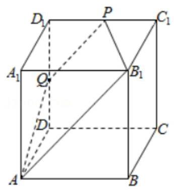

## (二)空间中的点、直线、平面的位置关系

## 知识梳理

## 1. 空间直线与直线的位置关系

## (1)两条直线的位置关系

$\left\{  \begin{array}{l} \text{ 共面直线 }\left\{  \begin{array}{l} \text{ 平行直线: 在同一平面内,没有公共点; } \\  \text{ 相交直线: 有且只有一个公共点; } \end{array}\right. \\  \text{ 异面直线: 不能同在任何平面内的两条直线,没有公共点. } \end{array}\right.$

空间两条异面直线的画法:

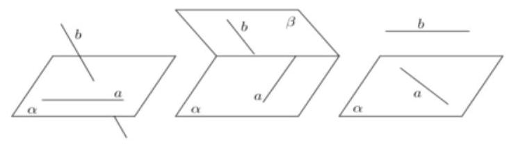

异面直线的判定:不平行、不相交的直线.

【注意】证明两条直线异面一般采用反证法.

(2)公理4:平行于同一直线的两条直线相互平行.

(3)等角定理: 如果一个角的两边与另一个角的两边分别平行, 那么这两个角相等或互补. 推论: 如果两条相交直线和另两条相交直线分别平行，那么这两组直线所成的锐角(或直角)

相等.

(4)异面直线定理:

连结平面内一点与平面外一点的直线，和这个平面内不经过此点的直线是异面直线.

(5)异面直线垂直:如果两条异面直线所成的角是直角，则叫两条异面直线垂直. 两条异面直线 $a, b$ 垂直， 记作 $a \bot  b$ .

【注意】空间直线与直线垂直, 是不平行的两条直线的特殊位置情况, 这时这两条直线所成的角等于 $\frac{\pi }{2}$ ,而它们可能是相交直线,也可能是异面直线.

## 2. 空间直线与平面的位置关系

直线和平面 $\left\{  \begin{array}{l} \text{ 直线在平面内一一有无数个公共点 } \\  \text{ 直线在平面外 }\left\{  \begin{array}{l} \text{ 直线与平面平行 } \\  \text{ 直线与平面相交 }\cdots \text{ 有且只有一 } \end{array}\right.  \end{array}\right.$

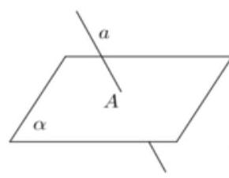

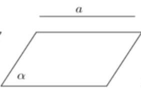

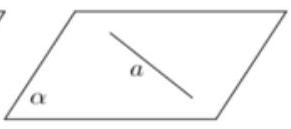

$a \cap  \alpha  = A$ a // α $a \subseteq  \alpha$

(1)直线与平面平行:

直线和平面平行的判定定理: 如果平面外一条直线和这个平面内一条直线平行, 那么这条直线和这个平面平行，即 $a \text{ ⊄ } \alpha$ ， $b \subseteq  \alpha$ ， $a//b \Rightarrow  a//\alpha$ .

*直线和平面平行的性质定理: 如果一条直线和一个平面平行，经过这条直线的平面和这个平面相交, 那么这条直线和交线平行. ,即 $a//\alpha ,\alpha  \text{ ⊄ } \beta ,\beta  \cap  \alpha  = b \Rightarrow  a//b$ .

(2)直线与平面垂直:

定义:一般地，如果一条直线 $l$ 与平面 $\alpha$ 上的任何直线都垂直，那么我们就说直线 $l$ 与平面 $\alpha$ 垂直， 记作: $l \bot  \alpha$ ,直线 $l$ 叫做平面 $\alpha$ 的垂线,平面 $\alpha$ 叫做直线 $l$ 的垂面, $l$ 与面 $\alpha$ 的交点叫做垂足.

直线和平面垂直的判定定理: 如果一条直线和一个平面内的两条相交直线都垂直, 那么这条直线垂直于这个平面,即 $m, n \subsetneqq  \alpha , m \cap  n = O, l \bot  m, l \bot  n \Rightarrow  l \bot  \alpha$ .

直线和平面垂直的性质定理: 如果两条直线同垂直于一个平面, 那么这两条直线平行.

即 $m \bot  \alpha , n \bot  \alpha  \Rightarrow  m//n$ .

3. 空间平面和平面的位置关系两平面平行——没有公共点

两平面相交___有一条公共直线

* (1)平面与平面平行:

平面和平面平行的判定定理: 如果一个平面内有两条相交直线都平行于另一个平面, 那么这两个平面平行,若 $a \subsetneqq  \alpha , b \subsetneqq  \alpha , a \cap  b = A$ ,且 $a//\alpha , b//\alpha$ ,则 $\alpha //\beta$ .

平面和平面平行的性质定理: 如果两个平行平面同时和第三个平面相交,那么它们的交线平行,若 $\alpha \; //\beta ,\;\gamma  \cap  \beta  = b,\;\gamma  \cap  \alpha  = a$ ,则 $a//b$ .

* (2)平面与平面垂直:

平面和平面垂直的判定定理: 如果一个平面经过另一个平面的一条垂线, 那么这两个平面互相垂直, 若 $l \bot  \alpha , l \subsetneqq  \beta$ ,则 $\alpha  \bot  \beta$ .

平面和平面垂直的性质定理: 如果两个平面垂直, 那么在一个平面内垂直于它们交线的直线垂直于另一平面,若 $\alpha  \bot  \beta ,\alpha  \cap  \beta  = l, m \subsetneqq  \alpha$ ,且 $m \bot  l$ ,则 $m \bot  \beta$ .

## 例题精讲

【例 4】已知 $\alpha ,\beta$ 是两个不重合的平面, $m, n$ 是两条不重合的直线,则下列命题不正确的是 ( )

A. 若 $m \bot  n, m \bot  \alpha , n//\beta$ ,则 $\alpha  \bot  \beta$ B. 若 $m \bot  \alpha , n//\alpha$ ,则 $m \bot  n$

C. 若 $\alpha //\beta , m \subset  \alpha$ ,则 $m//\beta$ D. 若 $m//n,\alpha //\beta$ ，则 $m$ 与 $\alpha$ 所成的角和 $n$ 与 $\beta$ 所成的角

相等

【难度】 $\star   \star   \star$

【答案】A

【解析】选项A:若 $m\bot n, m\bot \alpha$ ,则 $n \subset  \alpha$ 或 $n//\alpha$ ,

又 $n//\beta$ ，并不能得到 $\alpha  \bot  \beta$ 这一结论，故选项 A 错误；

选项B: 若 $m \bot  \alpha , n//\alpha$ ,则由线面垂直的性质定理和线面平行的

性质定理可得 $m \bot  n$ ,故选项B正确；

选项 C:若 $\alpha //\beta , m \subset  \alpha$ ，则有面面平行的性质定理可知 $m//\beta$ ，故选项 C 正确；

选项D:若 $m//n$ ， $\alpha //\beta$ ，则由线面角的定义和等角定理知， $m$ 与 $\alpha$

所成的角和 $n$ 与 $\beta$ 所成的角相等,故选项 $\mathrm{D}$ 正确.

故选: A.

【例 5】( 1 )立方体 8 个顶点任意两个顶点所在的直线中，异面直线共有___对。

【难度】★★★★

【答案】174

【解析】解: 立方体中有 8 个顶点,任意两个顶点所构成的直线有: ${C}_{8}^{2} = {28}$ ,

其中不在同一个平面上的 4 个点的个数有 ${C}_{8}^{4} - {12} = {58},4$ 个点中异面直线的对数是: 3,

所以过正方体任意两个顶点的直线共有 28 条,其中异面直线有: ${58} \times  3 = {174}$ 对. 故答案为: 174 .

(2)如图， ${ABCD} - {A}_{1}{B}_{1}{C}_{1}{D}_{1}$ 是棱长为 1 的正方体，一个质点从 $A$ 出发沿正方体的面对角线运动，每走完一条面对角线称为 “走完一段”，质点的运动规则如下:运动第 $i$ 段与第 $i + 2$ 段所在直线必须是异面直线(其中 $i$ 是正整数)，质点走完的第 99 段与第 1 段所在的直线所成的角是 ___.

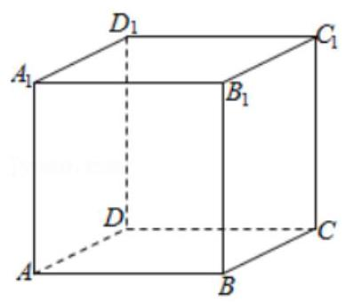

【难度】★★★★

【答案】 ${90}^{ \circ  }$

【解析】解: 不妨设质点运行路线为 $A{B}_{1} \rightarrow  {B}_{1}C \rightarrow  {CD} \rightarrow  {D}_{1}A$ ,

走过 4 段后又回到起点 $A$ ,可以看作以 4 为周期,

$\because {99} = 4 \times  {24} + 3$ ， $\therefore$ 质点走完的第 99 段与第 1 段所在的直线分别为 $A{B}_{1}$ 与 $C{D}_{1}$ ，

$\because A{B}_{1} \bot  C{D}_{1},\therefore$ 质点走完的第 99 段与第 1 段所在的直线所成的角是 ${90}^{ \circ  }$ . 故答案为: ${90}^{ \circ  }$ .

(3)若两异面直线成 ${50}^{ \circ  }$ ，且过空间一点 $P$ 与这两条异面直线成 $\theta$ 角的直线有四条，则 $\theta$ 的取值范围是 (答案用角度制表示).

【难度】 $\star   \star   \star   \star$

【答案】 $\left( {{65}^{ \circ  },{90}^{ \circ  }}\right)$

【解析】解: 如图,

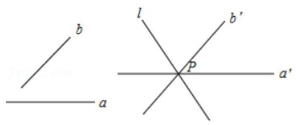

过 $P$ 分别作 $a, b$ 的平行线 ${a}^{\prime },{b}^{\prime }$ ,则 ${a}^{\prime },{b}^{\prime }$ 所成锐角为 ${50}^{ \circ  }$ ,钝角为 ${130}^{ \circ  }$ ,

则钝角的角平分线为 ${65}^{ \circ  }$ ,当钝角角分线 $l$ 上下旋转时与 ${a}^{\prime },{b}^{\prime }$ 成角大于 ${65}^{ \circ  }$ ,

同理锐角角分线上下旋转能得到与 ${a}^{\prime },{b}^{\prime }$ 成等角的两条直线.

$\therefore$ 过空间一点 $P$ 与这两条异面直线成 $\theta$ 角的直线有四条, $\theta$ 的取值范围是 $\left( {{65}^{ \circ  },{90}^{ \circ  }}\right)$ .

故答案为: $\left( {{65}^{ \circ  },{90}^{ \circ  }}\right)$ .

【例 6】设矩形 ${P}_{1}{P}_{2}{P}_{3}{P}_{4}$ 的两边长分别为 ${P}_{1}{P}_{2} = 2,{P}_{2}{P}_{3} = 4\sin \theta \left( {\frac{\pi }{12} < \theta  < \frac{5\pi }{6}}\right)$ ,若将 $\bigtriangleup {P}_{1}{P}_{2}{P}_{4}$ 沿矩形对角线 ${P}_{2}{P}_{4}$ 所在的直线翻折, 则在翻折过程中 ( )

A. 对任意 $\theta  \in  \left( {\frac{\pi }{12},\frac{\pi }{4}}\right)$ ,都不存在某个位置,使得 ${P}_{1}{P}_{2} \bot  {P}_{3}{P}_{4}$

B. 对任意 $\theta  \in  \left( {\frac{\pi }{12},\frac{\pi }{4}}\right)$ ,都存在某个位置,使得 ${P}_{1}{P}_{2} \bot  {P}_{3}{P}_{4}$

C. 对任意 $\theta  \in  \left( {\frac{5\pi }{12},\frac{5\pi }{6}}\right)$ ,都不存在某个位置,使得 ${P}_{1}{P}_{2} \bot  {P}_{3}{P}_{4}$

D. 对任意 $\theta  \in  \left( {\frac{5\pi }{12},\frac{5\pi }{6}}\right)$ ,都存在某个位置,使得 ${P}_{1}{P}_{2} \bot  {P}_{3}{P}_{4}$

【难度】 $\star   \star   \star   \star$

【答案】 $D$

【解析】解: 如图所示, ${P}_{1}{P}_{2} = 2,{P}_{2}{P}_{3} = 4\sin \theta \left( {\frac{\pi }{12} < \theta  < \frac{5\pi }{6}}\right)$ ,

$\because \frac{\pi }{12} < \theta  < \frac{\pi }{4},\frac{5\pi }{12} < \theta  < \frac{5\pi }{6}\therefore \frac{\sqrt{6} - 2}{4} < \sin \theta  < \frac{\sqrt{2}}{2},\frac{1}{2} < \sin \theta  \leq  1\therefore \sqrt{6} - \sqrt{2} \leq  4\sin \theta  < 2\sqrt{2},2 < 4\sin \theta  \leq  4$ ,

假设: ${P}_{1}{P}_{2} \bot  {P}_{3}{P}_{4},\because {P}_{2}{P}_{1} \bot  {P}_{1}{P}_{4},\therefore {P}_{3}{P}_{4} \subset$ 平面 ${P}_{1}{P}_{3}{P}_{4},{P}_{1}{P}_{4} \subset$ 平面 ${P}_{1}{P}_{3}{P}_{4},{P}_{1}{P}_{4}\bigcap {P}_{3}{P}_{4} = {P}_{4}$ ,

$\therefore {P}_{2}{P}_{1} \bot$ 平面 ${P}_{1}{P}_{3}{P}_{4}$ ,

$\because {P}_{1}{P}_{3} \subset$ 平面 ${P}_{1}{P}_{3}{P}_{4},\therefore {P}_{2}{P}_{1} \bot  {P}_{1}{P}_{3},\therefore \angle {P}_{2}{P}_{1}{P}_{3} = {90}^{ \circ  },\therefore {P}_{2}{P}_{3} > {P}_{1}{P}_{2} = 2$

由于 $\frac{5\pi }{12} < \theta  < \frac{5\pi }{6}$ 时, ${P}_{2}{P}_{3} > {P}_{1}{P}_{2} = 2$ 恒成立,

$\therefore$ 对任意 $\theta  \in  \left( {\frac{5\pi }{12},\frac{5\pi }{6}}\right)$ ,都存在某个位置,使得 ${P}_{1}{P}_{2} \bot  {P}_{3}{P}_{4}$

故选: $D$ .

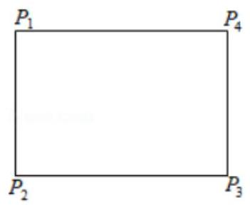

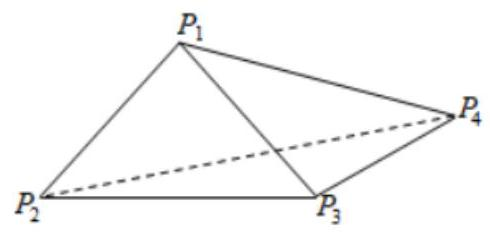

【例 7】(1)已知点 $E\text{ 、 }F$ 分别是正方体 ${ABCD} - {A}_{1}{B}_{1}{C}_{1}{D}_{1}$ 的棱 ${AB}\text{ 、 }A{A}_{1}$ 的中点，点 $M\text{ 、 }N$ 分别是线段 ${D}_{1}E$ 与 ${C}_{1}F$ 上的点，则满足与平面 ${ABCD}$ 平行的直线 ${MN}$ 有(   )

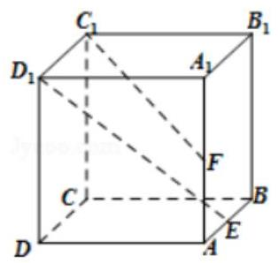

A. 0 条 B. 1 条 C. 2 条 D. 无数条

【难度】★★★

【答案】 $D$

【解析】解: 取 $B{B}_{1}$ 的中点 $H$ ,连接 ${FH}$ ,则 ${FH}//{C}_{1}D$ ,连接 ${HE}$ ,在 ${D}_{1}E$ 上任取一点 $M$ ,

过 $M$ 在面 ${D}_{1}{HE}$ 中,作 ${MG}$ 平行于 ${HO}$ ,其中 $O$ 为线段 ${D}_{1}E$ 的中点,交 ${D}_{1}H$ 于 $G$ ,

再过 $G$ 作 ${GN}//{FH}$ ,交 ${C}_{1}F$ 于 $N$ ,连接 ${MN}, O$ 在平面 ${ABCD}$ 的正投影为 $K$ ,连接 ${KB}$ ,则 ${OH}//{KB}$ , 由于 ${GM}//{HO}$ ， ${HO}//{KB}$ ， ${KB} \subset$ 平面 ${ABCD}$ ， ${GM} \text{ ⊄ }$ 平面 ${ABCD}$ ，所以 ${GM}//$ 平面 ${ABCD}$ ， 同理由 ${NG}//{FH}$ ,可推得 ${NG}//$ 平面 ${ABCD}$ ,由面面平行的判定定理得,平面 ${MNG}//$ 平面 ${ABCD}$ , 则 ${MN}//$ 平面 ${ABCD}$ . 由于 $M$ 为 ${D}_{1}E$ 上任一点,故这样的直线 ${MN}$ 有无数条. 故选: $D$ .

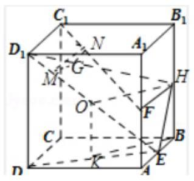

(2)已知点 $E, F$ 分别是正方体 ${ABCD} - {A}_{1}{B}_{1}{C}_{1}{D}_{1}$ 的棱 ${AB}, A{A}_{1}$ 的中点，点 $M, N$ 分别是线段 ${D}_{1}E$ 与 ${C}_{1}F$ 上的点,则与平面 ${ABCD}$ 垂直的直线 ${MN}$ 有(   )

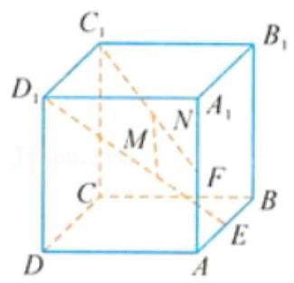

A. 0 条 B. 1 条 C. 2 条 D. 无数条

【难度】★★★

【答案】 $B$

【解析】解: 设正方体 ${ABCD} - {A}_{1}{B}_{1}{C}_{1}{D}_{1}$ 的棱长为 2,

以 $C$ 为原点建立空间直角坐标系,则 ${D}_{1}\left( {2,0,2}\right) , E\left( {1,2,0}\right) ,\overrightarrow{{D}_{1}E} = \left( {-1,2, - 2}\right)$ ,

${C}_{1}\left( {0,0,2}\right) , F\left( {2,2,1}\right) ,\overrightarrow{{C}_{1}F} = \left( {2,2, - 1}\right)$ ,设 $\overrightarrow{{D}_{1}M} = \lambda \overrightarrow{{D}_{1}E}$ ,则 $M\left( {2 - \lambda ,{2\lambda },2 - {2\lambda }}\right)$ ,

设 $\overrightarrow{{C}_{1}N} = t\overrightarrow{{C}_{1}F}$ ,则 $N\left( {{2t},{2t},2 - t}\right) ,\therefore \overrightarrow{MN} = \left( {{2t} - 2 + \lambda ,{2t} - {2\lambda },{2\lambda } - t}\right)$ ,

$\because$ 直线 ${MN}$ 与平面 ${ABCD}$ 垂直， $\therefore \left\{  \begin{array}{l} {2t} - 2 + \lambda  = 0 \\  {2t} - {2\lambda } = 0 \\  {2\lambda } - t \neq  0 \end{array}\right.$ ，解得 $\lambda  = t = \frac{2}{3}$ ，

$\because$ 方程组只有唯一的一组解, $\therefore$ 与平面 ${ABCD}$ 垂直的直线 ${MN}$ 有 1 条.

故选: $B$ .

【例 8】在空间中,过点 $A$ 作平面 $\pi$ 的垂线,垂足为 $B$ ,记 $B = {f}_{\pi }\left( \mathrm{A}\right)$ . 设 $\alpha ,\beta$ 是两个不同的平面,对空间任意一点 $P,{Q}_{1} = {f}_{\beta }\left\lbrack  {{f}_{\alpha }\left( P\right) }\right\rbrack  ,{Q}_{2} = {f}_{\alpha }\left\lbrack  {{f}_{\beta }\left( P\right) }\right\rbrack$ ，恒有 $P{Q}_{1} = P{Q}_{2}$ ，则( )

A. 平面 $\alpha$ 与平面 $\beta$ 垂直

B. 平面 $\alpha$ 与平面 $\beta$ 所成的 (锐) 二面角为 ${45}^{ \circ  }$

C. 平面 $\alpha$ 与平面 $\beta$ 平行

D. 平面 $\alpha$ 与平面 $\beta$ 所成的 (锐) 二面角为 ${60}^{ \circ  }$

【难度】 $\star   \star   \star   \star$

【答案】 $A$

【解析】解: 设 ${P}_{1} = {f}_{\alpha }\left( P\right)$ ,则根据题意,得点 ${P}_{1}$ 是过点 $P$ 作平面 $\alpha$ 垂线的垂足 $\because {Q}_{1} = {f}_{\beta }\left\lbrack  {{f}_{\alpha }\left( P\right) }\right\rbrack   = {f}_{\beta }\left( {P}_{1}\right) ,\therefore$ 点 ${Q}_{1}$ 是过点 ${P}_{1}$ 作平面 $\beta$ 垂线的垂足

同理,若 ${P}_{2} = {f}_{\beta }\left( P\right)$ ,得点 ${P}_{2}$ 是过点 $P$ 作平面 $\beta$ 垂线的垂足,

因此 ${Q}_{2} = {f}_{\alpha }\left\lbrack  {{f}_{\beta }\left( P\right) }\right\rbrack$ 表示点 ${Q}_{2}$ 是过点 ${P}_{2}$ 作平面 $\alpha$ 垂线的垂足

$\because$ 对任意的点 $P$ ,恒有 $P{Q}_{1} = P{Q}_{2},\therefore$ 点 ${Q}_{1}$ 与 ${Q}_{2}$ 重合于同一点,

由此可得,四边形 $P{P}_{1}{Q}_{1}{P}_{2}$ 为矩形,且 $\angle {P}_{1}{Q}_{1}{P}_{2}$ 是二面角 $\alpha  - l - \beta$ 的平面角

$\because \angle {P}_{1}{Q}_{1}{P}_{2}$ 是直角, $\therefore$ 平面 $\alpha$ 与平面 $\beta$ 垂直,故选: $A$ .

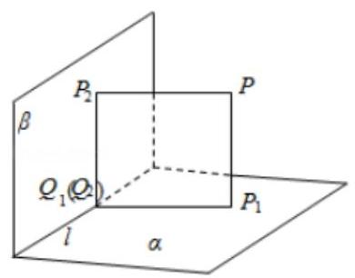

【例 9】已知异面直线 $a, b$ 所成角为 ${60}^{ \circ  }$ ,直线 ${AB}$ 与 $a, b$ 均垂直,且垂足分别是点 $A, B$ 若动点 $P \in  a$ , $Q \in  b$ ， $\left| {PA}\right|  + \left| {QB}\right|  = m$ ，则线段 ${PQ}$ 中点 $M$ 的轨迹围成的区域的面积是___.

【难度】★★★★

【答案】 $\frac{\sqrt{3}{m}^{2}}{4}$

【解析】解: 设线段 ${AB}$ 的中垂面为 $\alpha$ ,则 $M$ 的轨迹在平面 $\alpha$ 内,在平面 $\alpha$ 内分别作直线 $a, b$ 的投影 ${a}^{\prime }$ , ${b}^{\prime }$ ,则两直线的夹角为 ${60}^{ \circ  }$

设 $A, B$ 在平面 $\alpha$ 的投影为 $O, P, Q$ 在平面 $\alpha$ 内的投影分别为 ${P}^{\prime },{Q}^{\prime }$ ,则 $M$ 为 ${P}^{\prime }{Q}^{\prime }$ 的中点,

$\therefore O{P}^{\prime } = {PA}, O{Q}^{\prime } = {BQ}$ .

$\because \left| {PA}\right|  + \left| {QB}\right|  = m,\therefore O{P}^{\prime } + O{Q}^{\prime } = m$ .

在直线 ${a}^{\prime },{b}^{\prime }$ 上分别取点 $E, F, G, H$ 四点,使得 ${OE} = {OF} = {OG} = {OH} = \frac{m}{2}$ .

$\because {OE} + {OH} = {O{P}^{\prime }} + {O{Q}^{\prime }} = m$ ， $\therefore {{P}^{\prime }E} = {H{Q}^{\prime }}$ ，过 ${P}^{\prime }$ 作 ${P}^{\prime }R//{EH}$ 交 ${O{Q}^{\prime }}$ 于 $R$ ，则 ${HR} = {P}^{\prime }E = H{Q}^{\prime }$ ，

$\therefore {P}^{\prime }{Q}^{\prime }$ 的中点 $M$ 在 ${EH}$ 上,

同理可得 $M$ 在 ${EF},{FG},{GH}$ 上, $\therefore M$ 的轨迹为矩形 ${EHGH}$ .

$\because \angle {EOH} = {60}^{ \circ  },{OE} = {OF} = {OG} = {OH} = \frac{m}{2}$ ,

$\therefore {S}_{\text{ 矩形 EFGH }} = \frac{1}{2} \times  \frac{m}{2} \times  \frac{m}{2} \times  \sin {60}^{ \circ  } \times  2 + \frac{1}{2} \times  \frac{m}{2} \times  \frac{m}{2} \times  \sin {120}^{ \circ  } \times  2 = \frac{\sqrt{3}{m}^{2}}{4}$ .

故答案为: $\frac{\sqrt{3}{m}^{2}}{4}$ .

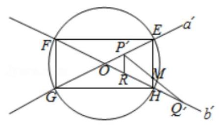

## 巩固训练

1、已知 $m, n$ 是两条不同的直线， $\alpha ,\beta$ 为两个不同的平面，

有下列四个命题:

①若 $m\bot \alpha , n\bot \beta , m\bot n$ ，则 $\alpha \bot \beta$ ；

②若 $m//\alpha , n//\beta , m\bot n$ ，则 $\alpha //\beta$ ；

③若 $m\bot \alpha , n//\beta , m\bot n$ ，则 $\alpha //\beta$ ；

④若 $m\bot \alpha , n//\beta ,\alpha //\beta$ ，则 $m\bot n$ .

其中正确的命题是(填上所有正确命题的序号)___.

【难度】★★

【答案】①④

【解析】解: ① $\because$ 若 $m\bot \alpha , m\bot n,\therefore n \subset  \alpha$ 或 $n//\alpha$ 又 $\because n\bot \beta ,\therefore \alpha \bot \beta$ ; 故正确.

②若 $m//\alpha , n//\beta$ ，由面面平行的判定定理可知，若 $m$ 与 $n$ 相交才平行，故不正确.

③若 $m \bot  \alpha$ ， $m \bot  n$ ，则 $n \subset  \alpha$ 或 $n//\alpha$ ，由面面平行的判定定理可知，只有 $n//\beta$ ，两平面不一定平行，故不正确.

④若 $m \bot  \alpha ,\alpha //\beta$ ，则 $m \bot  \beta$ ，又 $\because n//\beta$ ，则 $m \bot  n$ . 故正确.

故答案为:①④

2、在正六棱柱的所有棱中任取两条，则它们所在的直线是互相垂直的异面直线的概率为___(结果用数字表示).

【难度】 $\star   \star   \star$

【答案】 $\frac{16}{51}$

【解析】解: 由正六棱柱的 18 条棱中任取两条,共有 ${C}_{18}^{2} = {153}$ 种,考虑侧棱与底面垂直,与底面的直线都垂直, 6 条侧棱, 每一条侧棱与一个底面中的 4 条直线是互相垂直的异面直线, 有上下两个底面,

则其中是互相垂直的异面直线共有 $2 \times  6 \times  4 = {48}$ 种,所以它们所在的直线是互相垂直的异面直线的概率为

$\frac{48}{153} = \frac{16}{51}$ . 故答案为: $\frac{16}{51}$ .

3、如果 ${PA}\text{ 、 }{PB}\text{ 、 }{PC}$ 两两垂直，那么点 $P$ 在平面 ${ABC}$ 内的投影一定是 $\bigtriangleup  {ABC}$ (   )

A. 重心 B. 内心 C. 外心 D. 垂心

【难度】 $\star   \star   \star$

【答案】 $D$

【解析】解: 若 ${PA}\text{ 、 }{PB}\text{ 、 }{PC}$ 两两互相垂直,

可得 ${AP} \bot$ 平面 ${PBC},{BP} \bot$ 平面 ${PAC},{CP} \bot$ 平面 ${PAB}$ ,

由此可证得 ${BC} \bot  {OA},{AB} \bot  {OC},{AC} \bot  {OB}$ ,即此时点 $O$ 是三角形三边高的交点,

故此时点 $O$ 是三角形的垂心,故选: $D$ .

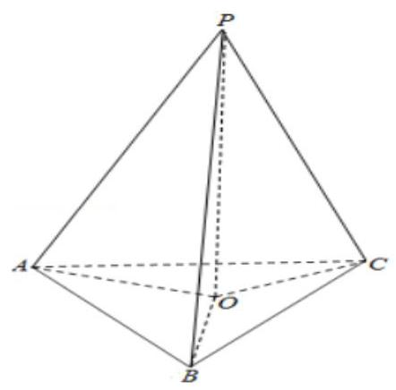

4、如图，在正方体 ${ABCD} - {A}_{1}{B}_{1}{C}_{1}{D}_{1}$ 中， $P$ 为线段 ${A}_{1}B$ 上的动点(不含端点)，则下列结论不正确的为( )

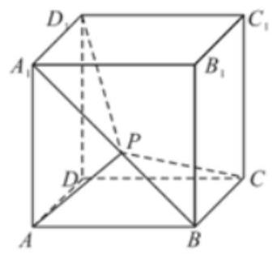

A. 平面 ${CBP} \bot$ 平面 $B{B}_{1}P$ B. ${AP} \bot$ 平面 ${CP}{D}_{1}$

C. ${AP} \bot  {BC}$ D. ${AP}//$ 平面 $D{D}_{1}{C}_{1}C$

【难度】 $\star   \star   \star$

【答案】B

【解析】因为在正方体 ${ABCD} - {A}_{1}{B}_{1}{C}_{1}{D}_{1}$ 中,易知 ${BC} \bot  B{B}_{1},{BC} \bot  {BP}, B{B}_{1} \subset$ 平面 $B{B}_{1}P,{BP} \subset$ 平

面 $B{B}_{1}P, B{B}_{1} \cap  {BP} = B$ ,所以 ${BC} \bot$ 平面 $B{B}_{1}P$ ,又 ${BC} \subset$ 平面 ${CBP}$ ,从而平面 ${CBP} \bot$ 平面 $B{B}_{1}P$ , A 正确;

因为平面 ${CP}{D}_{1}$ 即为平面 ${A}_{1}{BC}{D}_{1}$ ,而点 $P$ 为线段 ${A}_{1}B$ 上的动点,所以不能满足 ${AP} \bot  {A}_{1}B$ 恒成立,因此 ${AP}$ 不一定垂直平面 ${A}_{1}{BC}{D}_{1}$ ,即 ${AP} \bot$ 平面 ${CP}{D}_{1}$ 不一定成立; 故 $\mathbf{B}$ 错;

因为正方体 ${ABCD} - {A}_{1}{B}_{1}{C}_{1}{D}_{1}$ 中, ${BC} \bot$ 平面 ${AB}{B}_{1}{A}_{1}$ ,所以 ${BC} \bot  {A}_{1}B$ ,所以当点 $P$ 在线段 ${A}_{1}B$ 上运动时,始终有 ${AP} \bot  {BC}$ ,所以 $\mathrm{C}$ 正确;

因为在正方体 ${ABCD} - {A}_{1}{B}_{1}{C}_{1}{D}_{1}$ 中,平面 ${AB}{B}_{1}{A}_{1}//$ 平面 $D{D}_{1}{C}_{1}C$ ,而 ${AP} \subset$ 平面 ${AB}{B}_{1}{A}_{1}$ ,所以 ${AP}//$ 平面 $D{D}_{1}{C}_{1}C$ , D 选项正确;

故选: B.

5、给出以下四个命题:

①如果一条直线和一个平面平行，经过这条直线的平面和这个平面相交，那么这条直线和交线平行；

②如果一条直线和一个平面内的两条相交直线都垂直，那么这条直线垂直于这个平面；

③如果两条直线都平行于一个平面，那么这两条直线互相平行；

④如果一个平面经过另一个平面的一条垂线，那么这两个平面互相垂直；

其中真命题的个数是___.

【难度】 $\star   \star   \star$

【答案】 3

【解析】解: ①是线面平行的性质定理, 成立; ②是线面垂直的判定定理, 成立;

③两直线可以平行，相交，异面，不成立；④面面垂直的判定定理，成立.

故真命题有:①②④. 故答案为:3.

6、如图所示，在正方体 ${ABCD} - {A}_{1}{B}_{1}{C}_{1}{D}_{1}$ 中， $M$ 、 $N$ 分别是棱 ${AB}$ 、 $C{C}_{1}$ 的中点， $\bigtriangleup  M{B}_{1}P$ 的顶点 $P$ 在棱 $C{C}_{1}$ 与棱 ${C}_{1}{D}_{1}$ 上运动,有以下四个命题:

① 平面 $M{B}_{1}P \bot  N{D}_{1}$ ；② 平面 $M{B}_{1}P \bot$ 平面 $N{D}_{1}{A}_{1}$ ；③ $\bigtriangleup M{B}_{1}P$ 在底面 ${ABCD}$ 上的射影图形的面积为定值；④ $\bigtriangleup M{B}_{1}P$ 在侧面 ${D}_{1}{C}_{1}{CD}$ 上的射影图形是三角形.

其中正确命题的序号是___.

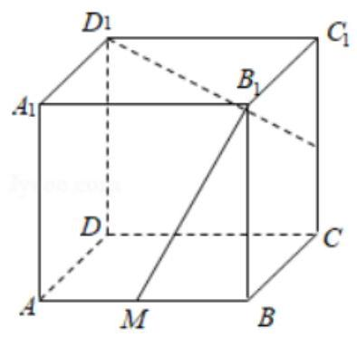

【难度】★★★★

【答案】②③

【解析】解: ① 平面 $M{B}_{1}P \bot  N{D}_{1}$ ; 可用极限位置判断,当 $P$ 与 $N$ 重合时, $M{B}_{1}P \bot  N{D}_{1}$ 垂直不成立,故线面不可能垂直, 此命题是错误命题;

② 平面 $M{B}_{1}P \bot$ 平面 $N{D}_{1}{A}_{1}$ ；可以证明 $M{B}_{1} \bot$ 平面 $N{D}_{1}{A}_{1}$ ，由图形知 $M{B}_{1}$ 与 $N{D}_{1}$ 和 ${D}_{1}{A}_{1}$ 都垂直，故可证得 $M{B}_{1} \bot$ 平面 $N{D}_{1}{A}_{1}$ ,进而可得平面 $M{B}_{1}P \bot$ 平面 $N{D}_{1}{A}_{1}$ ,故是正确命题;

③ $\bigtriangleup M{B}_{1}P$ 在底面 ${ABCD}$ 上的射影图形的面积为定值，可以看到其投影三角形底边是 ${MB}$ ，再由点 $P$ 在底面上的投影在 ${DC}$ 上,故其到 ${MB}$ 的距离不变即可证得;

④ $\bigtriangleup M{B}_{1}P$ 在侧面 ${D}_{1}{C}_{1}{CD}$ 上的射影图形是三角形,由于 $P$ 与 ${C}_{1}$ 重合时, $P\text{ 、 }{B}_{1}$ 两点的投影重合,不能构成三角形，故命题错误. 综上②③正确，故答案为:②③.

7、如图，在四棱锥 $P - {ABCD}$ 中，平面 ${PAD} \bot$ 平面 ${ABCD}$ ， ${PA} \bot  {PD}$ ， ${PA} = {PD}$ ， ${AB} \bot  {AD}$ ， ${AB} = 1$ ， ${AD} = 2$ ， ${AC} = {CD} = \sqrt{5}$ .

( I ) 求证: ${PD} \bot$ 平面 ${PAB}$ ;

(II) 求直线 ${PB}$ 与平面 ${PCD}$ 所成角的正弦值;

(III) 在棱 ${PA}$ 上是否存在点 $M$ ,使得 ${BM}//$ 平面 ${PCD}$ ? 若存在,求 $\frac{AM}{AP}$ 的值,若不存在,说明理由.

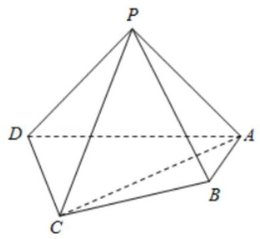

【难度】★★★★

【答案】见解析

【解析】(1) 证明: $\because$ 平面 ${PAD} \bot$ 平面 ${ABCD}$ ,且平面 ${PAD} \cap$ 平面 ${ABCD} = {AD}$ ,

且 ${AB} \bot  {AD},{AB} \subset$ 平面 ${ABCD},\therefore {AB} \bot$ 平面 ${PAD}$ ,

$\because {PD} \subset$ 平面 ${PAD},\therefore {AB} \bot  {PD}$ ,又 ${PD} \bot  {PA}$ ,且 ${PA}\bigcap {AB} = A,\therefore {PD} \bot$ 平面 ${PAB}$ ;

(II) 解: 取 ${AD}$ 中点为 $O$ ,连接 ${CO},{PO}$ ,

$\because {CD} = {AC} = \sqrt{5},\therefore {CO} \bot  {AD}$ ,又 $\because {PA} = {PD},\therefore {PO} \bot  {AD}$ .

以 $O$ 为坐标原点,建立空间直角坐标系如图:

则 $P\left( {0,0,1}\right) , B\left( {1,1,0}\right) , D\left( {0, - 1,0}\right) , C\left( {2,0,0}\right)$ ,

则 $\overrightarrow{PB} = \left( {1,1, - 1}\right) ,\overrightarrow{PD} = \left( {0, - 1, - 1}\right) ,\overrightarrow{PC} = \left( {2,0, - 1}\right) ,\overrightarrow{CD} = \left( {-2, - 1,0}\right)$ ,

设 $\overrightarrow{n} = \left( {{x}_{0},{y}_{0},1}\right)$ 为平面 ${PCD}$ 的法向量,

则由 $\left\{  \begin{array}{l} \overrightarrow{n} \cdot  \overrightarrow{PD} = 0 \\  \overrightarrow{n} \cdot  \overrightarrow{PC} = 0 \end{array}\right.$ ,得 $\left\{  \begin{array}{l}  - {y}_{0} - 1 = 0 \\  2{x}_{0} - 1 = 0 \end{array}\right.$ ,则 $\overrightarrow{n} = \left( {\frac{1}{2}, - 1,1}\right)$ .

设 ${PB}$ 与平面 ${PCD}$ 的夹角为 $\theta$ ,则 $\sin \theta  = \left| {\cos  < \overrightarrow{n},\overrightarrow{PB} > }\right|  = \left| \frac{\overrightarrow{n} \cdot  \overrightarrow{PB}}{\left| \overrightarrow{n}\right| \left| \overrightarrow{PB}\right| }\right|  = \left| \frac{\frac{1}{2} - 1 - 1}{\sqrt{\frac{1}{4} + 1 + 1} \times  \sqrt{3}}\right|  = \frac{\sqrt{3}}{3}$ ;

(III) 解: 假设存在 $M$ 点使得 ${BM}//$ 平面 ${PCD}$ ,设 $\frac{AM}{AP} = \lambda , M\left( {0,{y}_{1},{z}_{1}}\right)$ ,

由 (II) 知, $A\left( {0,1,0}\right) , P\left( {0,0,1}\right) ,\overrightarrow{AP} = \left( {0, - 1,1}\right) , B\left( {1,1,0}\right) ,\overrightarrow{AM} = \left( {0,{y}_{1} - 1,{z}_{1}}\right)$ ,

则有 $\overrightarrow{AM} = \lambda \overrightarrow{AP}$ ,可得 $M\left( {0,1 - \lambda ,\lambda }\right) ,\therefore \overrightarrow{BM} = \left( {-1, - \lambda ,\lambda }\right)$ ,

$\because {BM}//$ 平面 ${PCD},\overrightarrow{n} = \left( {\frac{1}{2}, - 1,1}\right)$ 为平面 ${PCD}$ 的法向量,

$\therefore \overrightarrow{BM} \cdot  \overrightarrow{n} = 0$ ,即 $- \frac{1}{2} + \lambda  + \lambda  = 0$ ,解得 $\lambda  = \frac{1}{4}$ . 综上,存在点 $M$ ,即当 $\frac{AM}{AP} = \frac{1}{4}$ 时, $M$ 点即为所求.

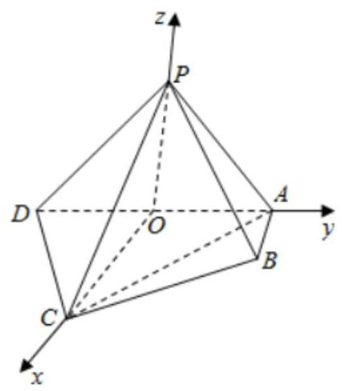

## (三)空间中角度的计算

## 知识梳理

① 异面直线所成的角:已知两条异面直线 $a, b$ ，经过空间任一点 $O$ 作直线 ${a}^{\prime }//a,{b}^{\prime }//b,{a}^{\prime },{b}^{\prime }$ 所成的角的大小与点 $O$ 的选择无关，把 ${a}^{\prime },{b}^{\prime }$ 所成的锐角(或直角)叫异面直线 $a, b$ 所成的角(或夹角). 为了简便， 点 $O$ 通常取在异面直线的一条上.

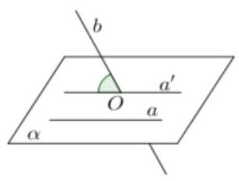

异面直线所成的角的范围: $\left( {0,\frac{\pi }{2}}\right\rbrack$ .

② 求异面直线所成的角的方法:

(1)范围: $\theta  \in  \left( {0,\frac{\pi }{2}}\right\rbrack$ ；

(2)求法:计算异面直线所成角的关键是平移(中点平移，顶点平移以及补形法:把空间图形补成熟悉的或完整的几何体, 如正方体、平行六面体、长方体等, 以便易于发现两条异面直线间的关系) 转化为相交两直线的夹角。

③直线与平面所成的角:

如图， $l$ 是平面 $\alpha$ 的一条斜线，点 $O$ 是斜足， $A$ 是 $l$ 上任意一点， ${AB}$ 是 $\alpha$ 的垂线，点 $B$ 是垂足，所以直线 ${OB}$ (记作 $l$ ) 是 $l$ 在 $\alpha$ 内的射影, $\angle {AOB}$ (记作 $\theta$ ) 是 $l$ 与 $\alpha$ 所成的角.

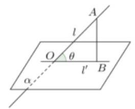

【注意】

(1)直线 $l$ 与平面 $\alpha$ 所成的角的大小与点 $A$ 在 $l$ 上的取法无关;

(2)直线和平面所成角的范围是 $\left\lbrack  {0,\frac{\pi }{2}}\right\rbrack$ ；

(3)斜线和平面所成角的范围是 $\left( {0,\frac{\pi }{2}}\right)$ .

④直线与平面所成角求解方法:

第一步:作出斜线在平面上的射影，找到斜线与射影所成的角 $\theta$ ；

第二步:解含 $\theta$ 的三角形，求出其大小.

二面角:平面内的一条直线把平面分为两个部分，其中的每一部分叫做半平面；从一条直线出发的两个半平面所组成的图形叫做二面角，这条直线叫做二面角的棱，每个半平面叫做二面角的面

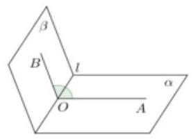

.若棱为 $l$ ,两个面分别为 $\alpha ,\beta$ 的二面角记为 $\alpha  - l - \beta$ ;

## ⑤二面角的平面角:

(1)过二面角的棱上的一点 $O$ 分别在两个半平面内作棱的两条垂线 ${OA},{OB}$ ,则 $\angle {AOB}$ 叫做二面角 $\alpha  - l - \beta$ 的平面角.

(2)一个平面垂直于二面角 $\alpha  - l - \beta$ 的棱 $l$ ，且与两半平面交线分别为 ${OA},{OB}, O$ 为垂足，则 $\angle {AOB}$ 也是 $\alpha  - l - \beta$ 的平面角.

【说明】

(1)二面角的平面角范围是 $\left\lbrack  {{0}^{ \circ  },{180}^{ \circ  }}\right\rbrack$ ;

(2)二面角平面角为直角时，则称为直二面角，组成直二面角的两个平面互相垂直；

(3)二面角的求法:① 几何法；② 向量法.

## 例题精讲

【例 10】(1)如图,两正方形 ${ABCD}$ , ${CDFE}$ 所在的平面垂直,将 ${\Delta EFC}$ 沿着直线 ${FC}$ 旋转一周,则直线 ${EC}$ 与 ${AC}$ 所成角的取值范围是(   )

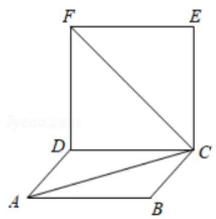

A. $\left\lbrack  {\frac{\pi }{12},\frac{5\pi }{12}}\right\rbrack$ B. $\left\lbrack  {\frac{\pi }{12},\frac{7\pi }{12}}\right\rbrack$ C. $\left\lbrack  {\frac{\pi }{12},\frac{\pi }{2}}\right\rbrack$ D. $\left\lbrack  {\frac{\pi }{6},\frac{\pi }{2}}\right\rbrack$

【难度】 $\star   \star   \star$

【答案】 $C$

【解析】解: 如图所示,两正方形 ${ABCD},{CDFE}$ 所在的平面垂直,将 ${\Delta EFC}$ 沿着直线 ${FC}$ 旋转一周,

则直线 ${EC}$ 与 ${AC}$ 所成角的最大值为 $\angle {ACE} = \frac{\pi }{2}$ . 由于 $\angle {ACF} = \frac{\pi }{3}.\angle {ECF} = \frac{\pi }{4}$ .

$\therefore$ 直线 ${EC}$ 与 ${AC}$ 所成角的最小值 $= \frac{\pi }{3} - \frac{\pi }{4} = \frac{\pi }{12}.\therefore$ 直线 ${EC}$ 与 ${AC}$ 所成角的取值范围是 $\left\lbrack  {\frac{\pi }{12},\frac{\pi }{2}}\right\rbrack$ . 故选: $C$ .

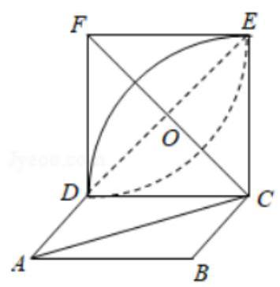

(2)如图， ${\Delta ABC}\bot$ 平面 $\alpha$ ， $D$ 为 ${AB}$ 中点， $\left| {AB}\right|  = 2$ ， $\angle {CDB} = {60}^{ \circ  }$ ，点 $P$ 为平面 $\alpha$ 内动点，且 $P$ 到直线 ${CD}$ 的距离为 $\sqrt{3}$ ，则 $\angle {APB}$ 的最大值为___.

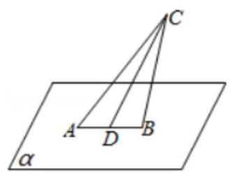

【难度】 $\star   \star   \star   \star$

【答案】 ${60}^{ \circ  }$

【解析】解: 空间中到直线 ${CD}$ 的距离为 $\sqrt{3}$ 的点构成一个圆柱面,

它和面 $\alpha$ 相交得一椭圆,所以 $P$ 在 $\alpha$ 内的轨迹为一个椭圆, $D$ 为椭圆的中心,

$b = \sqrt{3}, a = \frac{\sqrt{3}}{\sin {60}^{ \circ  }} = 2$ ,则 $c = 1$ ,

于是 $A, B$ 为椭圆的焦点,椭圆上点关于两焦点的张角在短轴的端点取得最大,且为 ${60}^{ \circ  }$ . 故答案为: ${60}^{ \circ  }$ .

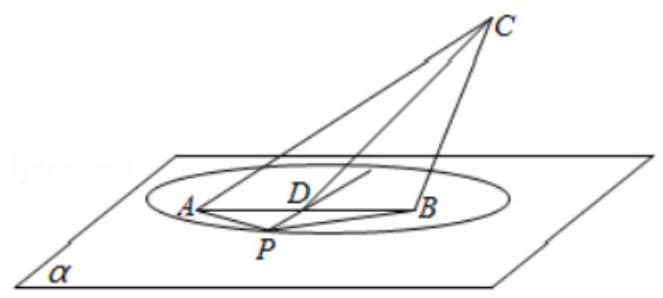

【例 11】已知菱形 ${ABCD}$ , $\angle {DAB} = {60}^{ \circ  }, E$ 为边 ${AB}$ 上的点 (不包括 $A, B$ )，将 ${\Delta ABD}$ 沿对角线 ${BD}$ 翻折， 在翻折过程中，记直线 ${BD}$ 与 ${CE}$ 所成角的最小值为 $\alpha$ ，最大值为 $\beta$ ，()

A. $\alpha ,\beta$ 均与 $E$ 位置有关

B. $\alpha$ 与 $E$ 位置有关, $\beta$ 与 $E$ 位置无关

C. $\alpha$ 与 $E$ 位置无关, $\beta$ 与 $E$ 位置有关

D. $\alpha ,\beta$ 均与 $E$ 位置无关

【难度】 $\star   \star   \star   \star$

【答案】 $C$

【解析】解: 作 ${EF}//{BD}$ 交 ${AD}$ 于点 $F$ ,分别取 ${EF},{BD}$ 的中点 $P, Q$ ,连接 ${CQ},{CP},{AQ},{CE}$ ,如图所示,由翻折前该四边形为菱形,且 $\angle {DAB} = {60}^{ \circ  }$ ,

所以 $\bigtriangleup {ABD},{\Delta BDC}$ 为等边三角形,同时点 $P$ 在 ${AQ}$ 上,

由 ${BD} \bot  {CQ},{BD} \bot  {AQ}$ ,且 ${CQ}\bigcap {AQ} = Q,{CQ},{AQ} \subset$ 平面 ${CPQ}$ ,故 ${BD} \bot$ 平面 ${CPQ}$ ,

又 ${EF}//{BD}$ ,则 ${EF} \bot$ 平面 ${CPQ}$ ,又 ${CP} \subset$ 平面 ${CPQ}$ ,所以 ${EF} \bot  {CP}$ ,

直线 ${BD}$ 与 ${CE}$ 所成的角即直线 ${EF}$ 与 ${CE}$ 所成的角,即 $\angle {CEP}$ ,所以 $\tan \angle {CEP} = \frac{CP}{PE}$ ,

由点 $E$ 不与 $A, B$ 重合,则当点 $C$ 翻折到与点 $A$ 重合时, ${CP}$ 最小, $\angle {CEP} = {60}^{ \circ  }$ 为最小值,与点 $E$ 位置无关,当没有翻折时, ${CP}$ 最大, $\tan \angle {CEP}$ 最大,则 $\angle {CEP}$ 最大,与点 $E$ 位置有关,

所以 $\alpha$ 与 $E$ 位置无关, $\beta$ 与 $E$ 位置有关. 故选: $C$ .

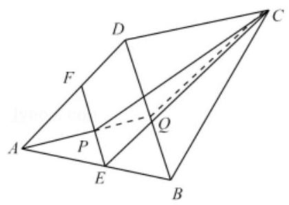

【例 12】如图,四棱锥 $P - {ABCD}$ 中, ${PC} \bot$ 平面 ${ABCD},{AB} \bot  {AD},{AB}//{CD}$ , ${PD} = {AB} = {2AD} = {2CD} = 2, E$ 为 ${PB}$ 的中点.

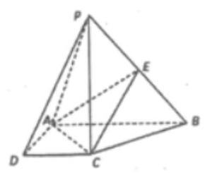

(1)证明:平面 ${EAC} \bot$ 平面 ${PBC}$ ；

(2)求直线 ${PA}$ 与平面 ${AEC}$ 所成角的正弦值.

【难度】 $\star   \star   \star$

【答案】(1)证明见解析；(2) $\frac{\sqrt{6}}{5}$ .

【解析】(1) $\because {PC} \bot$ 平面 ${ABCD},{AC} \subset$ 平面 ${ABCD},\therefore {AC} \bot  {PC}$ ,

$\because {AB} = 2,{AD} = {CD} = 1,\therefore {AC} = {BC} = \sqrt{2},\therefore A{C}^{2} + B{C}^{2} = A{B}^{2},\therefore {AC} \bot  {BC}$ ,

又 ${BC} \cap  {PC} = C\ldots {AC} \bot$ 平面 ${PBC}$ ,

$\because {AC} \subset$ 平面 ${EAC},\therefore$ 平面 ${EAC} \bot$ 平面 ${PBC}$ ;

(2)

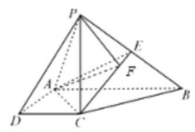

作 ${PF} \bot  {CE}, F$ 为垂足. 由 (1) 知平面 ${EAC} \bot$ 平面 ${PBC}$ ,

$\because$ 平面 ${EAC} \cap$ 平面 ${PBC} = {CE},\therefore {PF} \bot$ 平面 ${EAC}$ ,连接 ${AF}$ ,则 $\angle {PAF}$ 就是直线 ${PA}$ 与平面 ${EAC}$ 所成角,

在 ${\Delta PCE}$ 中, ${PC} = \sqrt{3},{PE} = {CE} = \frac{\sqrt{5}}{2},\therefore {PF} = \frac{\sqrt{30}}{5},\therefore \sin \angle {PAF} = \frac{PF}{PA} = \frac{\sqrt{6}}{5}$ ,

即直线 ${PA}$ 与平面 ${EAC}$ 所成角的正弦值为 $\frac{\sqrt{6}}{5}$ .

【例 13】如图,在四棱锥 $P - {ABCD}$ 中,底面 ${ABCD}$ 为直角梯形, ${AD}//{BC},\angle {ADC} = {90}^{ \circ  }$ ,平面 ${PAD} \bot$ 底面 ${ABCD}, Q$ 为 ${AD}$ 的中点, $M$ 是棱 ${PC}$ 上的点, ${PA} = {PD} = 2,{BC} = \frac{1}{2}{AD} = 1,{CD} = \sqrt{3}$ .

(1)求证:平面 ${PQB} \bot$ 平面 ${PAD}$ ；

(2)若二面角 $M - {BQ} - C$ 为 ${30}^{ \circ  }$ ，设 ${PM} = {tMC}$ ，试确定 $t$ 的值.

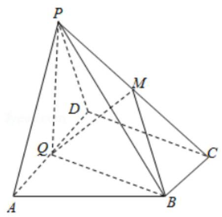

【难度】 $\star   \star   \star   \star$

【答案】见解析

【解析】解: (1) 证法一: $\because {AD}//{BC},{BC} = \frac{1}{2}{AD}, Q$ 为 ${AD}$ 的中点,

$\therefore$ 四边形 ${BCDQ}$ 为平行四边形, $\therefore {CD}//{BQ}$ .

$\because \angle {ADC} = {90}^{ \circ  }\therefore \angle {AQB} = {90}^{ \circ  }$ ,即 ${QB} \bot  {AD}$ . 又 $\because$ 平面 ${PAD} \bot$ 平面 ${ABCD}$ ,且平面 ${PAD} \cap$ 平面 ${ABCD} = {AD}$ ,

$\therefore {BQ} \bot$ 平面 ${PAD}$ .

$\because {BQ} \subset$ 平面 ${PQB}$ ， $\therefore$ 平面 ${PQB} \bot$ 平面 ${PAD}$ . ... (9 分)

证法二: ${AD}//{BC},{BC} = \frac{1}{2}{AD}, Q$ 为 ${AD}$ 的中点,

$\therefore$ 四边形 ${BCDQ}$ 为平行四边形, $\therefore {CD}//{BQ}.\because \angle {ADC} = {90}^{ \circ  }\therefore \angle {AQB} = {90}^{ \circ  }$ .

$\because {PA} = {PD},\therefore {PQ} \bot  {AD}.\because {PQ} \cap  {BQ} = Q,\therefore {AD} \bot$ 平面 ${PBQ}$ .

$\because {AD} \subset$ 平面 ${PAD}$ ，二平面 ${PQB} \bot$ 平面 ${PAD}$ . ...(9分)

(II) $\because {PA} = {PD}, Q$ 为 ${AD}$ 的中点, $\therefore {PQ} \bot  {AD}$ .

$\because$ 平面 ${PAD} \bot$ 平面 ${ABCD}$ ,且平面 ${PAD} \cap$ 平面 ${ABCD} = {AD}$ ,

$\therefore {PQ} \bot$ 平面 ${ABCD}$ .

如图,以 $Q$ 为原点建立空间直角坐标系.

则平面 ${BQC}$ 的法向量为 $\overrightarrow{n} = \left( {0,0,1}\right)$ ;

$Q\left( {0,0,0}\right) , P\left( {0,0,\sqrt{3}}\right) , B\left( {0,\sqrt{3},0}\right) , C\left( {-1,\sqrt{3},0}\right)$ .

设 $M\left( {x, y, z}\right)$ ,则 $\overrightarrow{PM} = \left( {x, y, z - \sqrt{3}}\right) ,\overrightarrow{MC} = \left( {-1 - x,\sqrt{3} - y, - z}\right)$ ,

$\because \overrightarrow{PM} = t\overrightarrow{MC}$ ,

$\therefore \left\{  {\begin{array}{l} x = t\left( {-1 - x}\right) \\  y = t\left( {\sqrt{3} - y}\right) \\  z - \sqrt{3} = t\left( {-z}\right)  \end{array},\therefore \left\{  \begin{array}{l} x =  - \frac{t}{1 + t} \\  y = \frac{\sqrt{3}t}{1 + t} \\  z = \frac{\sqrt{3}}{1 + t} \end{array}\right. }\right. \ldots \left( {{12}\text{ 分 }}\right)$

在平面 ${MBQ}$ 中, $\overrightarrow{QB} = \left( {0,\sqrt{3},0}\right) ,\overrightarrow{QM} = \left( {-\frac{t}{1 + t},\frac{\sqrt{3}t}{1 + t},\frac{\sqrt{3}}{1 + t}}\right)$ ,

$\therefore$ 平面 ${MBQ}$ 法向量为 $\overrightarrow{m} = \left( {\sqrt{3},0, t}\right) .\ldots \left( {{13}\text{ 分 }}\right)$

$\because$ 二面角 $M - {BQ} - C$ 为 ${30}^{ \circ  },\therefore \cos {30}^{ \circ  } = \frac{\overrightarrow{n} \cdot  \overrightarrow{m}}{\left| \overrightarrow{n}\right| \left| \overrightarrow{m}\right| } = \frac{t}{\sqrt{3 + 0 + {t}^{2}}} = \frac{\sqrt{3}}{2},\therefore t = 3\ldots \left( {{15}\text{ 分 }}\right)$

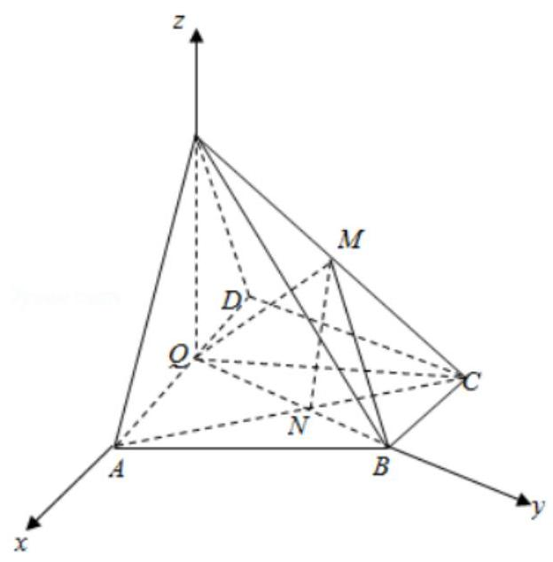

## 巩固训练

1、已知四面体 ${ABCD}$ 中， ${AB} = {CD} = 2, E, F$ 分别为 ${BC},{AD}$ 的中点，且异面直线 ${AB}$ 与 ${CD}$ 所成的角为 $\frac{\pi }{3}$ ，则 ${EF} =$ ___.

【难度】 $\star   \star   \star$

【答案】1 或 $\sqrt{3}$

【解析】取 BD 中点 0,连结 $\mathrm{E}0$ 、 $\mathrm{F}0$ ,

$\because$ 四面体 $\mathrm{{ABCD}}$ 中， $\mathrm{{AB}} = \mathrm{{CD}} = 2,\mathrm{E}\text{ 、 }\mathrm{\;F}$ 分别为 $\mathrm{{BC}}\text{ 、 }\mathrm{{AD}}$ 的中点，且异面直线 $\mathrm{{AB}}$ 与 $\mathrm{{CD}}$ 所成的角为 $\frac{\pi }{3}$ ，

$\therefore \mathrm{E}0//\mathrm{{CD}}$ ,且 $\mathrm{E}0 = \frac{1}{2}\mathrm{{CD}} = 1,\mathrm{F}0//\mathrm{{AB}}$ ,且 $\mathrm{F}0 = \frac{1}{2}\mathrm{{AB}} = 1$ ,

$\therefore \angle {EOF}$ 是异面直线 ${AB}$ 与 ${CD}$ 所成的角或其补角, $\therefore \angle {EOF} = \frac{\pi }{3}$ ,或 $\angle {EOF} = \frac{2\pi }{3}$ ,

当 $\angle \mathrm{{EOF}} = \frac{\pi }{3}$ 时, $\bigtriangleup \mathrm{{EOF}}$ 是等边三角形, $\therefore \mathrm{{EF}} = 1$ .

当 $\angle \mathrm{{EOF}} = \frac{2\pi }{3}$ 时, $\mathrm{{EF}} = \sqrt{{1}^{2} + {1}^{2} - \frac{1}{2} \times  1 \times  1 \times  \cos \frac{2\pi }{3}} = \sqrt{3}$ . 故答案为 1 或 $\sqrt{3}$ .

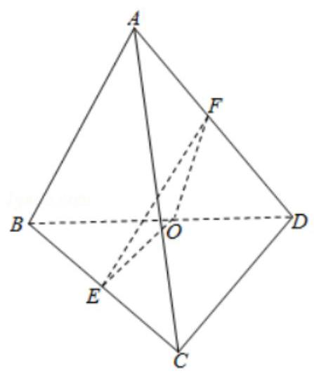

2、如图,等高的正三棱锥 $P - {ABC}$ 与圆锥 ${SO}$ 的底面都在平面 $M$ 上,且圆 $O$ 过点 $A$ ,又圆 $O$ 的直径 ${AD} \bot  {BC}$ ,垂足为 $E$ ,设圆锥 ${SO}$ 的底面半径为 1,圆锥高为 $\sqrt{3}$ .

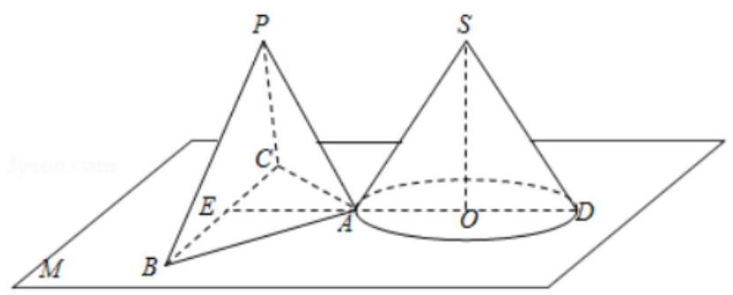

(1)求圆锥的侧面积；

(2)若平行于平面 $M$ 的一个平面 $N$ 截得三棱锥与圆锥的截面面积之比为 $\frac{\sqrt{3}}{\pi }$ ，求三棱锥的侧棱 ${PA}$ 与底面 ${ABC}$ 所成角的大小.

(3)求异面直线 ${AB}$ 与 ${SD}$ 所成角的大小.

【难度】 $\star   \star   \star$

【答案】见解析

【解析】解: (1) $\because$ 等高的正三棱锥 $P - {ABC}$ 与圆锥 ${SO}$ 的底面都在平面 $M$ 上,且圆 $O$ 过点 $A$ ,

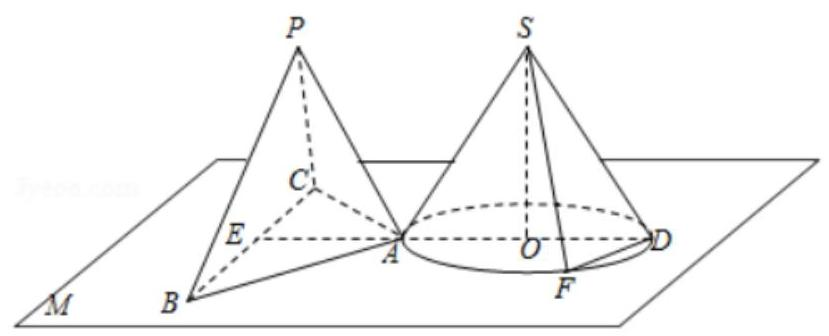

又圆 $O$ 的直径 ${AD} \bot  {BC}$ ,垂足为 $E$ ,设圆锥 ${SO}$ 的底面半径为 1,圆锥高为 $\sqrt{3}$ ,

$\therefore {SO} = \sqrt{3},{SD} = \sqrt{3 + 1} = 2$ ,

$\therefore$ 圆锥的侧面积 $S = \frac{1}{2} \times  {2\pi } \times  2 = {2\pi }$ .

(2)由题意知， $\frac{{S}_{\bigtriangleup {ABC}}}{{S}_{\odot O}} = \frac{\sqrt{3}}{\pi }$ ， $\therefore {S}_{\bigtriangleup {ABC}} = \frac{\sqrt{3}}{\pi }{S}_{\odot O} = \frac{\sqrt{3}}{\pi } \cdot  \pi  = \sqrt{3}$ ，

则正三棱锥的底面 ${\Delta ABC}$ 的边长为 $2,{AE} = \sqrt{3}$ ，

设点 $Q$ 是正 $\bigtriangleup {ABC}$ 的中心，则 $Q$ 在 ${AE}$ 上， ${PQ} \bot$ 平面 ${ABC}$ ，

$\angle {PAQ}$ 三棱锥的侧棱 ${PA}$ 与底面 ${ABC}$ 所成角,

Rt $\Delta$ PQA 中, ${PQ} = h = \sqrt{3},{AQ} = \frac{2}{3}{AE} = \frac{2\sqrt{3}}{3},\tan \angle {PAQ} = \frac{PQ}{AQ} = \frac{3}{2}$ ,

$\therefore$ 三棱锥的侧棱 ${PA}$ 与底面 ${ABC}$ 所成角的大小为 $\arctan \frac{3}{2}$ .

(3)作 ${DF}//{AB}$ 交圆 $O$ 于 $F$ ，

连结 ${AF}\text{ 、 }{SF}$ ，则 $\angle {SDF}$ (或其补角)就是异面直线 ${AB}$ 与 ${SD}$ 所成角，

$\mathrm{{Rt}}\Delta \mathrm{{ADF}}$ 中, ${AD} = 2,\angle {ADF} = \angle {EAB} = {30}^{ \circ  },\therefore {DF} = \sqrt{3}$ ,

等腰 $\bigtriangleup {SDF}$ 中, $\cos \angle {SDF} = \frac{\frac{\sqrt{3}}{2}}{2} = \frac{\sqrt{3}}{4}$ ,

$\therefore$ 异面直线 ${AB}$ 与 ${SD}$ 所成角大小为 $\arccos \frac{\sqrt{3}}{4}$ .

3、已知长方体 ${ABCD} - {A}_{1}{B}_{1}{C}_{1}{D}_{1}$ 中， ${AB} = 2$ ， ${BC} = 4$ ， $A{A}_{1} = 4$ ，点 $M$ 是棱 ${D}_{1}{C}_{1}$ 的中点.

(1)试用反证法证明直线 $A{B}_{1}$ 与 $B{C}_{1}$ 是异面直线；

(2)求直线 $A{B}_{1}$ 与平面 $D{A}_{1}M$ 所成的角(结果用反三角函数值表示).

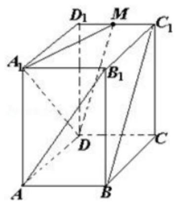

【难度】★★★★

【答案】见解析

【解析】证明: (1) (反证法) 假设直线 $A{B}_{1}$ 与 $B{C}_{1}$ 不是异面直线. (1 分)

设直线 $A{B}_{1}$ 与 $B{C}_{1}$ 都在平面 $\alpha$ 上,则 $A\text{ 、 }B\text{ 、 }{B}_{1}\text{ 、 }{C}_{1} \in  \alpha$ . (3 分)

因此，平面 ${AB}{B}_{1}{A}_{1}$ 、平面 ${BC}{C}_{1}{B}_{1}$ 都与平面 $\alpha$ 有不共线的三个公共点，

即平面 ${AB}{B}_{1}{A}_{1}$ 和平面 ${BC}{C}_{1}{B}_{1}$ 重合 (都与平面 $\alpha$ 重合). 又长方体的相邻两个面不重合,这是矛盾,

于是, 假设不成立. (6 分)

所以直线 $A{B}_{1}$ 与 $B{C}_{1}$ 是异面直线. (7 分)

解:(2)按如图所示建立空间直角坐标系，

可得有关点的坐标为 $D\left( {0,0,0}\right)$ 、

$A\left( {4,0,0}\right) \text{ 、 }B\left( {4,2,0}\right) , C\left( {0,2,0}\right) ,{A}_{1}\left( {4,0,4}\right) ,{B}_{1}\left( {4,2,4}\right) ,{C}_{1}\left( {0,2,4}\right) ,{D}_{1}\left( {0,0,4}\right)$ . 于

是, $M\left( {0,1,4}\right) ,\overrightarrow{DM} = \left( {0,1,4}\right) ,\overrightarrow{D{A}_{1}} = \left( {4,0,4}\right) ,\overrightarrow{A{B}_{1}} = \left( {0,2,4}\right)$ . (9 分)

设平面 $D{A}_{1}M$ 的法向量为 $\overrightarrow{n} = \left( {x, y, z}\right)$ ,则 $\left\{  \begin{array}{l} \overrightarrow{n} \cdot  \overrightarrow{DM} = 0 \\  \overrightarrow{n} \cdot  \overrightarrow{D{A}_{1}} = 0 \end{array}\right.$ ,即 $\left\{  \begin{array}{l} y + {4z} = 0 \\  {4x} + {4z} = 0 \end{array}\right.$ .

取 $z =  - 1$ ,得 $x = 1, y = 4.\left( {11}\right)$ 分

所以平面 $D{A}_{1}M$ 的一个法向量为 $\overrightarrow{n} = \left( {1,4, - 1}\right)$ .

记直线 $A{B}_{1}$ 与平面 $D{A}_{1}M$ 所成角为 $\theta$ ,于是, $\sin \theta  = \left| \frac{\overrightarrow{n} \cdot  \overrightarrow{A{B}_{1}}}{\left| \overrightarrow{n}\right|  \cdot  \left| \overrightarrow{A{B}_{1}}\right| }\right|  = \frac{\sqrt{10}}{15},\theta  = \arcsin \frac{\sqrt{10}}{15}$ . (13 分)

所以,直线 $A{B}_{1}$ 与平面 $D{A}_{1}M$ 所成角为 $\theta  = \arcsin \frac{\sqrt{10}}{15}$ . (14 分)

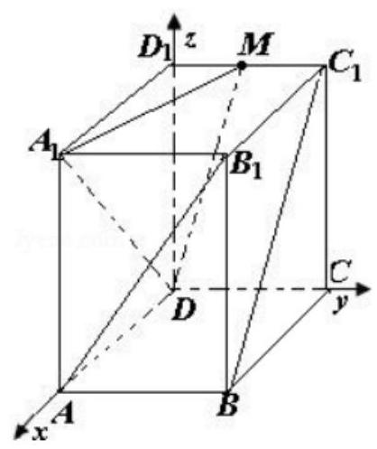

4、如图，长方体 ${ABCD} - {A}_{1}{B}_{1}{C}_{1}{D}_{1}$ 中， ${AB} = {AD} = 2, A{A}_{1} = 4$ ，点 $P$ 为面 ${AD}{D}_{1}{A}_{1}$ 的对角线 $A{D}_{1}$ 上的动点(不包括端点). ${PM} \bot$ 平面 ${ABCD}$ 交 ${AD}$ 于点 $M,{MN} \bot  {BD}$ 于点 $N$ .

(1)设 ${AP} = x$ ，将 ${PN}$ 长表示为 $x$ 的函数；

(2)当 ${PN}$ 最小时，求异面直线 ${PN}$ 与 ${A}_{1}{C}_{1}$ 所成角的大小.(结果用反三角函数值表示)

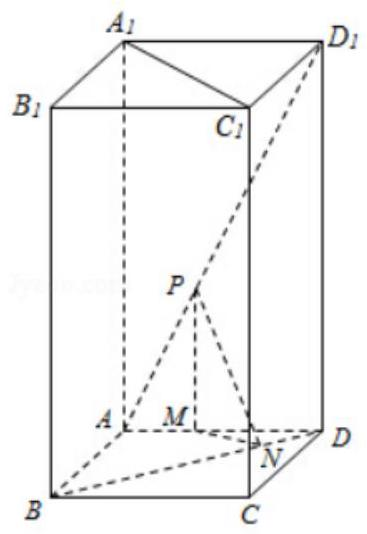

【难度】 $\star   \star   \star   \star$

【答案】见解析

【解析】解: (1) 在 $\bigtriangleup {APM}$ 中, ${PM} = \frac{2\sqrt{5}x}{5},{AM} = \frac{\sqrt{5}x}{5}$ ; 其中 $0 < x < 2\sqrt{5}$ ;

在 ${\Delta MND}$ 中, ${MN} = \frac{\sqrt{2}}{2}\left( {2 - \frac{\sqrt{5}}{5}x}\right)$ ,在 ${\Delta PMN}$ 中, ${PN} = \sqrt{\frac{9}{10}{x}^{2} - \frac{2\sqrt{5}}{5}x + 2}, x \in  \left( {0,2\sqrt{5}}\right)$ ;

(2)当 $x = \frac{2\sqrt{5}}{9} \in  \left( {0,2\sqrt{5}}\right)$ 时， ${PN}$ 最小，此时 ${PN} = \frac{4}{3}$ .

因为在底面 ${ABCD}$ 中， ${MN}\bot {BD}$ ， ${AC}\bot {BD}$ ，所以 ${MN}//{AC}$ ，又 ${A}_{1}{C}_{1}//{AC}$ ，

$\angle {PNM}$ 为异面直线 ${PN}$ 与 ${A}_{1}{C}_{1}$ 所成角的平面角,

在 ${\Delta PMN}$ 中, $\angle {PMN}$ 为直角, $\tan \angle {PNM} = \frac{\sqrt{2}}{4}$ ,所以 $\angle {PNM} = \arctan \frac{\sqrt{2}}{4}$ ,

异面直线 ${PN}$ 与 ${A}_{1}{C}_{1}$ 所成角的大小 $\arctan \frac{\sqrt{2}}{4}$ .

5、如图，在五面体 ${ABCDEF}$ 中， ${AB} \bot$ 平面 ${ADE}$ ， ${EF} \bot$ 平面 ${ADE}$ ， ${AB} = {CD} = 2$ .

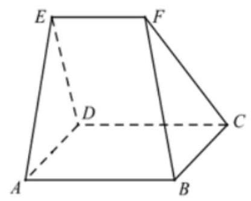

(1)求证: ${AB}//{CD}$ ；

( 2 )若 ${AD} = {AE} = 2$ ， ${EF} = 1$ ，且二面角 $E - {DC} - A$ 的大小为60°，求二面角 $F - {BC} - D$ 的大小.

【难度】 $\star   \star   \star   \star$

【答案】(1)证明见详解；(2) ${60}^{ \circ  }$ .

【解析】(1) $\because {AB} \bot$ 面 ${ADE}$ ， ${EF} \bot$ 面 ${ADE}$ ， $\therefore {AB}//{EF}$

又 ${EB} \subset$ 面 ${ABCD}$ ,面 ${ABCD} \cap$ 面 ${CDEF} = {CD},\therefore {AB}//{CD}$

又 ${AB} \subset$ 面 ${ABCD}$ ,面 ${ABCD} \cap$ 面 ${CDEF} = {CD},\therefore {AB}//{CD}$

(2)设 ${AD}$ 的中点为 $G$ ，连接 ${EG},{AC},{BD}$ ，

设 ${AC}$ 与 ${BD}$ 的交点为 $O$ ,连接 ${OF},{OG}$ ,

$\because {AB} \bot$ 面 ${ADE}$ ， ${DA},{DE} \subset$ 面 ${ADE}$ ， $\therefore {{AB} \bot  {DA}}$ ， ${{AB} \bot  {DE}}$ .

$\because {AB}//{CD}$ ， $\therefore {CD} \bot  {DA}$ ， ${CD} \bot  {DE}$ .

又 ${DA} \subset$ 面 ${ABCD}$ ， ${DE} \subset$ 面 ${CDEF}$ ，且面 ${ABCD} \cap$ 面 ${CDEF} = {CD}$ .

$\therefore$ 二面角 $A - {DC} - E$ 的平面角 $\angle {ADE} = {60}^{ \circ  }$ .

又在 $\bigtriangleup {ADE}$ 中, ${AD} = {AE} = 2$ , $\therefore \bigtriangleup {ADE}$ 是边长为 2 的正三角形, $\therefore {EG} \bot  {AD}$ ,

$\because {AB} \bot$ 平面 ${ADE},\therefore {AB} \bot  {EG}$ ,

$\because {AD} \cap  {AB} = A,\therefore {EG} \bot$ 面 ${ABCD}$ ,

由(1)知 ${AB}//{CD}$ ，又 ${CD}\bot {DA}$ ， ${AB} = {CD} = {AD}$ ， $\therefore$ 四边形 ${ABCD}$ 为正方形，

$\therefore {OG} = \frac{1}{2}{AB} = 1 = {EF}$ ，又 $\mathrm{{OG}}//\mathrm{{AB}}$ ， $\therefore \mathrm{{OG}}//\mathrm{{EF}}$ ， $\therefore$ 四边形 ${OGEF}$ 为平行四边形， $\therefore \mathrm{{OF}}//\mathrm{{EG}}$ ，

$\therefore {OF} \bot$ 面 ${ABCD},\therefore {OF} \bot  {BC}$ ,

取 ${BC}$ 的中点为 $H$ ,连接 ${OH},{FH},\therefore {OH} \bot  {BC}$ ,

$\because {OF} \cap  {OH} = O$ ， $\therefore {BC} \bot$ 面 ${OFH}$ ， $\therefore {BC} \bot  {FH}$ ， $\therefore \angle {OHF}$ 即为二面角 $F - {BC} - D$ 所成的平面角，

$\because \bigtriangleup {ADE}$ 是边长为 2 的正三角形,四边形 ${ABCD}$ 为正方形, $\therefore {OF} = \sqrt{3},{OH} = 1$ ,

$\therefore \tan \angle {OHF} = \frac{\sqrt{3}}{1} = \sqrt{3},\therefore \angle {OHF} = {60}^{ \circ  },\therefore \square$ 面角 $F - {BC} - D$ 的平面角大小为 ${60}^{ \circ  }$ .

## (四)空间中距离的计算

## 知识梳理

1. 空间中的距离主要指以下七种:

(1)两点之间的距离；

(2)点到直线的距离；

(3)点到平面的距离；

(4)两条平行线间的距离；

(5)两条异面直线间的距离；

(6)平面的平行直线与平面之间的距离；

(7)两个平行平面之间的距离。

七种距离都是指它们所在的两个点集之间所含两点的距离中最小的距离, 七种距离之间有密切联系, 有些可以相互转化, 如两条平行线的距离可转化为求点到直线的距离, 平行线面间的距离或平行平面间的距离都可转化成点到平面的距离。

在七种距离中, 求点到平面的距离是重点, 求两条异面直线间的距离是难点;

求点到平面的距离: (1) 直接法, 即直接由点作垂线, 求垂线段的长; (2) 转移法, 转化成求另一点到该平面的距离；(3)体积法；(3)向量法；

2、求异面直线的距离:(1)定义法，即求公垂线段的长. (2)转化成求直线与平面的距离. (3)函数最值法， 依据是两条异面直线的距离是分别在两条异面直线上两点间距离中最小的。

## 例题精讲

【例 14】 $\bigtriangleup {ABC}$ 的三边长分别 3、4、5, $P$ 为 $\bigtriangleup {ABC}$ 所在平面外一点,令集合 $Q = \left\{  {P \mid  P\text{ 为 }\bigtriangleup {ABC}}\right.$ 所在平面外一点，且到三边所在直线的距离都是 3 \},则集合 $Q$ 的子集个数为( )

A. 2 B. 4 C. 8 D. 16

【难度】 $\star   \star   \star$

【答案】 $D$

【解析】解: 若 $P$ 在平面 ${ABC}$ 上的射影在 $\bigtriangleup {ABC}$ 的内部,可得射影为 $\bigtriangleup {ABC}$ 的内心,

可得内切圆的半径为 $\frac{1}{2}\left( {3 + 4 - 5}\right)  = 1 < 3$ ,存在两个点 $P$ (平面 ${ABC}$ 的上下两侧);

若 $P$ 在平面 ${ABC}$ 上的射影在 $\bigtriangleup {ABC}$ 的外部,可得射影为 $\bigtriangleup {ABC}$ 的旁心 (三角形的外角平分线的交点).

若与斜边相切, 则旁切圆的半径大于 3, 不成立;

若与边长为 3 的边相切,可得旁切圆的半径小于 3,成立,且有两个点 $P$ ;

若与边长为 4 的边相切,可得旁切圆的半径为 $\frac{4 - 3 + 5}{2} = 3$ ,不成立.

综上可得,这样的点 $P$ 共有 4 个,则 $Q$ 的子集个数为 ${2}^{4} = {16}$ . 故选: $D$ .

【例 15】空间不共面的四点 $A\text{ 、 }B\text{ 、 }C\text{ 、 }D$ 依次到平面 $\alpha$ 的距离之比是 $2 : 2 : 2 : 3$ ,则满足条件的平面 $\alpha$ 的个数为___个.

【难度】 $\star   \star   \star   \star$

【答案】 8

【解析】解: 因为空间四点不共面, 所以四点构成一个三棱锥,

当三棱锥的四个顶点均在平面 $\alpha$ 的同侧时, $\alpha$ 只有一个;

当三棱锥的四个顶点分别处在平面 $\alpha$ 的两侧时,由两种情况:

①当平面 $\alpha$ 一侧有一点，另一侧有三点时，使截面与三棱锥的四个面之一平行，第四个顶点到这个截面的距离与其相对的面到此截面的距离之比为2:3,这样的平面 $\alpha$ 有 4 个;

②当平面一侧有两点，另一侧有两点时，

举例说明: $A\text{ 、 }B$ 与 $C\text{ 、 }D$ 分别在平面 $\alpha$ 的两侧时,取 ${CA}\text{ 、 }{CB}$ 的中点 $P\text{ 、 }Q$ ,在 ${DA}\text{ 、 }{DB}$ 上取点 $S\text{ 、 }R$ , 使 $\frac{DS}{AS} = \frac{DR}{BR} = \frac{3}{2}$ ,则确定平面 ${PQRS}$ 就是 $\alpha$ ,

则满足条件的平面共有 3 个.

所以由以上可得满足条件的平面共有 8 个.

故答案为 8 .

【例 16】如图,正四棱柱 ${ABCD} - {A}_{1}{B}_{1}{C}_{1}{D}_{1}$ 中,底面边长为 $2\sqrt{2}$ ,侧棱长为 $4.E, F$ 分别为棱 ${AB},{BC}$ 的中点, ${EF}\bigcap {BD} = G$ .

( I ) 求证: 平面 ${B}_{1}{EF} \bot$ 平面 ${BD}{D}_{1}{B}_{1}$ ;

( II ) 求点 ${D}_{1}$ 到平面 ${B}_{1}{EF}$ 的距离 $d$ ;

(III) 求三棱锥 ${B}_{1} - {EF}{D}_{1}$ 的体积 $V$ .

【难度】 $\star   \star   \star   \star$

【答案】见解析

【解析】解: (1) 证法一:

连接 ${AC}$ . $\because$ 正四棱柱 ${ABCD} - {A}_{1}{B}_{1}{C}_{1}{D}_{1}$ 的底面是正方形, $\therefore {AC} \bot  {BD}$ ,又 ${AC} \bot  {D}_{1}D$ ,故 ${AC} \bot$ 平面 ${BD}{D}_{1}{B}_{1}$ . $\because E, F$ 分别为 ${AB},{BC}$ 的中点,故 ${EF}//{AC},\therefore {EF} \bot$ 平面 ${BD}{D}_{1}{B}_{1},\therefore$ 平面 ${B}_{1}{EF} \bot$ 平面 ${BD}{D}_{1}{B}_{1}$ .

证法二:

$\because {BE} = {BF},\angle {EBD} = \angle {FBD} = {45}^{ \circ  },\therefore {EF} \bot  {BD}$ . 又 ${EF} \bot  {D}_{1}D$

$\therefore {EF} \bot$ 平面 ${BD}{D}_{1}{B}_{1},\therefore$ 平面 ${B}_{1}{EF} \bot$ 平面 ${BD}{D}_{1}{B}_{1}$ .

(II) 在对角面 ${BD}{D}_{1}{B}_{1}$ 中,作 ${D}_{1}H \bot  {B}_{1}G$ ,垂足为 $H$ .

$\because$ 平面 ${B}_{1}{EF} \bot$ 平面 ${BD}{D}_{1}{B}_{1}$ ,且平面 ${B}_{1}{EF} \cap$ 平面 ${BD}{D}_{1}{B}_{1} = {B}_{1}G$ ,

$\therefore {D}_{1}H \bot$ 平面 ${B}_{1}{EF}$ ,且垂足为 $H,\therefore$ 点 ${D}_{1}$ 到平面 ${B}_{1}{EF}$ 的距离 $d = {D}_{1}H$ .

解法一:

在 ${Rt}\bigtriangleup {D}_{1}H{B}_{1}$ 中, ${D}_{1}H = {D}_{1}{B}_{1} \cdot  \sin \angle {D}_{1}{B}_{1}H.\because {D}_{1}{B}_{1} = \sqrt{2}{A}_{1}{B}_{1} = \sqrt{2} \cdot  2\sqrt{2} = 4$ ,

$\sin \angle {D}_{1}{B}_{1}H = \sin \angle {B}_{1}{GB} = \frac{{B}_{1}B}{G{B}_{1}} = \frac{4}{\sqrt{{4}^{2} + {1}^{2}}} = \frac{4}{\sqrt{17}},\therefore d = {D}_{1}H = 4 \cdot  \frac{4}{\sqrt{17}} = \frac{{16}\sqrt{17}}{17}$ .

解法二:

$\because \bigtriangleup {D}_{1}H{B}_{1} \sim  \bigtriangleup {B}_{1}{BG},\therefore \frac{{D}_{1}H}{{B}_{1}B} = \frac{{D}_{1}{B}_{1}}{{B}_{1}G},\therefore d = {D}_{1}H = \frac{{B}_{1}{B}^{2}}{{B}_{1}G} = \frac{{4}^{2}}{\sqrt{{4}^{2} + {1}^{2}}} = \frac{{16}\sqrt{17}}{17}$ .

解法三:

连接 ${D}_{1}G$ ,则三角形 ${D}_{1}G{B}_{1}$ 的面积等于正方形 ${DB}{B}_{1}{D}_{1}$ 面积的一半,即 $\frac{1}{2} \cdot  {B}_{1}G \cdot  {D}_{1}H = \frac{1}{2}{B}_{1}{B}^{2}$ ,

$\therefore d = {D}_{1}H = \frac{{B}_{1}{B}^{2}}{{B}_{1}G} = \frac{{16}\sqrt{17}}{17}$ .

(III) $V = {V}_{{B}_{1} - {EF}{D}_{1}} = {V}_{{D}_{1} - {B}_{1}{EF}} = \frac{1}{3} \cdot  d \cdot  {S}_{\bigtriangleup {B}_{1}{EF}} = \frac{1}{3} \cdot  \frac{16}{\sqrt{17}} \cdot  \frac{1}{2} \cdot  2 \cdot  \sqrt{17} = \frac{16}{3}$ .

## 巩固训练

1、在长方体 ${ABCD} - {A}_{1}{B}_{1}{C}_{1}{D}_{1}$ 中， ${AB} = {12}, B{B}_{1} = 5$ ，则直线 ${B}_{1}{C}_{1}$ 到平面 ${A}_{1}{BC}{D}_{1}$ 的距离___。

【难度】 $\star   \star$

【答案】 $\frac{60}{13}$

【解析】直线 ${B}_{1}{C}_{1}$ 到平面 ${A}_{1}{BC}{D}_{1}$ 的距离可以转化成 ${B}_{1}$ 点到平面 ${A}_{1}{BC}{D}_{1}$ 的距离,过 ${B}_{1}$ 作 ${B}_{1}E \bot  {A}_{1}B$ ,可证 ${B}_{1}E \bot$ 平面 ${A}_{1}{BC}{D}_{1}$ ,所以 ${B}_{1}E$ 的长度即为直线 ${B}_{1}{C}_{1}$ 到平面 ${A}_{1}{BC}{D}_{1}$ 的距离,利用等面积法可求出 ${B}_{1}E$ 的长度为 $\frac{60}{13}$ .

2、在三棱锥 $D - {ABC}$ 中， ${AB} = {DC} = 4,{BC} = {AD} = 3,{AD}\bot {DC},{AD}\bot {BC}$ ， ${AB}\bot {BC}$ ，则异面直线 ${AD}$ 和 ${BC}$ 的距离为___.

【难度】 $\star   \star   \star$

【答案】 $\sqrt{7}$ .

【解析】画出草图,

$\because {AD} \bot  {DC},{AD} \bot  {BC}$

$\therefore {AD} \bot$ 平面 ${BCD},\therefore {AD} \bot  {BD}$

又 ${AB} \bot  {BC},{AD} \bot  {BC},\therefore {BC} \bot$ 平面 ${ABD},\therefore {BC} \bot  {BD}$

所以BD是异面直线 ${AD}$ 和 ${BC}$ 的公垂线,所以异面直线 ${AD}$ 和 ${BC}$ 的距离为 BD

3、如图，在直角梯形 ${ABCD}$ 中， ${AD}//{BC},\angle {ADC} = {90}^{ \circ  }$ ，平面 ${ABCD}$ 外一点 $P$ 在平 ${ABCD}$ 内的射影 $Q$ 恰在边 ${AD}$ 的中点 $Q$ 上， ${PA} = {AD} = {2BC} = {2CD} = \sqrt{3}$ .

(1)求证:平面 ${PQB} \bot$ 平面 ${PAD}$ ；

(2)若 $M$ 在线段 ${PC}$ 上，且 ${PA}//$ 平面 ${BMQ}$ ，求点 $M$ 到平面 ${PAB}$ 的距离.

【难度】 $\star   \star   \star$

【答案】(1)证明见解析; (2) $\frac{\sqrt{15}}{10}$ .

【解析】

(1) $\because P$ 在平面 ${ABCD}$ 内的射影 $Q$ 恰在边 ${AD}$ 上， $\therefore {PQ}\bot$ 平面 ${ABCD}$ ，

$\because {AD} \subset$ 平面 ${ABCD},\therefore {PQ}\bot {AD}$ ,

$\because Q$ 为线段 ${AD}$ 中点， $\therefore {CD}//{BQ},\therefore {BQ}\bot {AD},\therefore {AD}\bot$ 平面 ${PBQ},{AD} \subset$ 平面 ${PAD}$ ，

$\therefore$ 平面 ${PQB} \bot$ 平面 ${PAD}$ .

(2)连接 ${AC}$ 与 ${BQ}$ 交于点 $N$ ，则 $N$ 为 ${AC}$ 中点，

$\therefore$ 点 $M$ 到平面 ${PAB}$ 的距离是点 $C$ 到平面 ${PAB}$ 的距离的 $\frac{1}{2}$ ，

在三棱锥 $P - {ABC}$ 中,高 ${PQ} = \sqrt{3}$ ,底面积为 $\frac{\sqrt{3}}{2},\therefore$ 三棱锥 $P - {ABC}$ 的体积 $V = \frac{1}{3} \times  \frac{\sqrt{3}}{2} \times  \sqrt{3} = \frac{1}{2}$ ,

又 $\bigtriangleup  {PAB}$ 中， ${PA} = {AB} = 2,{PB} = \sqrt{6},\therefore  \bigtriangleup  {PAB}$ 的面积为 $\frac{\sqrt{15}}{2}$ ，

设点 $M$ 到平面 ${PAB}$ 的距离为 $d$ ,由 ${V}_{CBAB} = {V}_{PABC}$ ,得 $\frac{1}{3} \times  {2d} \times  \frac{\sqrt{15}}{2} = \frac{1}{2}$ ,解得 $d = \frac{\sqrt{15}}{10}$ ,

$\therefore$ 点 $M$ 到平面 ${PAB}$ 的距离为 $\frac{\sqrt{15}}{10}$ .

## 实战演练

## 一、填空题

1、如图，将正方体沿交于一顶点的三条棱的中点截去一小块，八个顶点共截去八小块，得到八个面为正三角形、六个面为正方形的“阿基米德多面体”，则异面直线 ${AB}$ 与 ${CD}$ 所成角的大小是___.

【难度】 $\star   \star   \star$

【答案】 ${60}^{ \circ  }$

【解析】解: 如图所示,由题可知,四边形 ${ABEG}$ 和 ${CDFE}$ 均为正方形, ${\Delta EFG}$ 为正三角形,

$\because {AB}//{EG}$ ， ${CD}//{EF}$ ， $\therefore \angle {GEF}$ 或其补角为异面直线 ${AB}$ 与 ${CD}$ 所成角，

$\because \bigtriangleup {EFG}$ 为正三角形, $\therefore \angle {GEF} = {60}^{ \circ  }$ .

2、在长方体 ${ABCD} - {A}_{1}{B}_{1}{C}_{1}{D}_{1}$ 的所有棱中，既与 ${AB}$ 共面，又与 ${C{C}_{1}}$ 共面的棱有 ___条。

【难度】 $\star   \star   \star$

【答案】 5

【解析】解: 如图,

在长方体 ${ABCD} - {A}_{1}{B}_{1}{C}_{1}{D}_{1}$ 的所有棱中,既与 ${AB}$ 共面,又与 $C{C}_{1}$ 共面的棱有:

${BC}\text{ 、 }{DC}\text{ 、 }B{B}_{1}\text{ 、 }A{A}_{1}\text{ 、 }{D}_{1}{C}_{1}$ 共 5 条.

故答案为: 5 .

3、正方形 ${ABCD}$ 在平面 $M$ 的同一侧，若 $A\text{ 、 }B\text{ 、 }C$ 三点到 $M$ 的距离分别是 $2\text{ 、 }3\text{ 、 }4$ ，则直线 ${BD}$ 与平面 $M$ 的位置关系是___.

【难度】 $\star   \star   \star$

【答案】 ${BD}//$ 平面 $M$

【解析】解: 因为 ${AB}//{CD},{AB} = {CD}$ ,并且 $B$ 比 $A$ 高 1,所以 $C$ 比 $D$ 高 1,所以点 $D$ 到平面的距离为 3, 因为正方形 ${ABCD}$ 在平面 $M$ 的同一侧,并且 $B$ 点到 $M$ 的距离是 3,所以直线 ${BD}//$ 平面 $M$ .

故答案为: ${BD}//$ 平面 $M$

4、如图，正方体 ${ABCD} - {A}_{1}{B}_{1}{C}_{1}{D}_{1}$ 的棱长为 $1, E\text{ 、 }F$ 分别是 $A{A}_{1}\text{ 、 }C{C}_{1}$ 的中点，那么正方体过 ${D}_{1}\text{ 、 }E\text{ 、 }F$ 的截面图形的面积是 ___.

【难度】 $\star   \star   \star$

【答案】 $\frac{\sqrt{6}}{2}$

【解析】解: 如图,连接 ${BE},{BF}$ ,可得 $\mathrm{{Rt}}\Delta \mathrm{{BAE}} \cong  \mathrm{{Rt}}\Delta {D}_{1}{C}_{1}F$ ,则 $\angle {EBA} = \angle F{D}_{1}{C}_{1}$ ,

由等角定理可得, ${BE}//{D}_{1}F$ ,则四边形 ${BF}{D}_{1}E$ 为过 ${D}_{1}\text{ 、 }E\text{ 、 }F$ 的截面截正方体所得图形,

$\because$ 正方体 ${ABCD} - {A}_{1}{B}_{1}{C}_{1}{D}_{1}$ 的棱长为 $1,\therefore {EF} = \sqrt{2},{BE} = {BF} = \sqrt{{1}^{2} + {\left( \frac{1}{2}\right) }^{2}} = \frac{\sqrt{5}}{2}$ ,

$\therefore B$ 到 ${EF}$ 的距离 $d = \sqrt{{\left( \frac{\sqrt{5}}{2}\right) }^{2} - {\left( \frac{\sqrt{2}}{2}\right) }^{2}} = \frac{\sqrt{3}}{2}$ .

$\therefore$ 截面面积 $S = 2 \times  \frac{1}{2} \times  \sqrt{2} \times  \frac{\sqrt{3}}{2} = \frac{\sqrt{6}}{2}$ .

故答案为: $\frac{\sqrt{6}}{2}$ .

5、如图所示，在四边形 ${ABCD}$ 中， ${AB} = {AD} = {CD} = 1$ ， ${BD} = \sqrt{2}$ ， ${BD}\bot {CD}$ ，将四边形尺 ${ABCD}$ 沿对角线 ${BD}$ 折成四面体 ${A}^{\prime } - {BCD}$ ，使平面 ${A}^{\prime }{BD} \bot$ 平面 ${BCD}$ ，则下列结论正确的是 ___.

(1) ${A}^{\prime }C \bot  {BD}$ ；

(2) $\angle B{A}^{\prime }C = {90}^{ \circ  }$ ；

(3) $C{A}^{\prime }$ 与平面 ${A}^{\prime }{BD}$ 所成的角为 ${30}^{ \circ  }$ ；

(4)四面体 ${A}^{\prime } - {BCD}$ 的体积为 $\frac{1}{6}$ .

【难度】★★★

【答案】(2)(4)

【解析】解: $\because$ 四边形 ${ABCD}$ 中, ${AB} = {AD} = {CD} = 1,{BD} = \sqrt{2},{BD} \bot  {CD}$ ,平面 ${A}^{\prime }{BD} \bot$ 平面 ${BCD}$ ,则由 ${A}^{\prime }D$ 与 ${BD}$ 不垂直, ${BD} \bot  {CD}$ ,故 ${BD}$ 与平面 ${A}^{\prime }{CD}$ 不垂直,则 ${BD}$ 仅于平面 ${A}^{\prime }{CD}$ 与 ${CD}$ 平行的直线垂直, 故 (1) 不正确;

由题设知: $\bigtriangleup  B{A}^{\prime }D$ 为等腰 ${Rt} \bigtriangleup$ ， ${CD} \bot$ 平面 ${A}^{\prime }{BD}$ ，得 $B{A}^{\prime } \bot$ 平面 ${A}^{\prime }{CD}$ ，于是( 2 )正确；

由 ${BD} \bot  {CD}$ ,平面 ${A}^{\prime }{BD} \bot$ 平面 ${BCD}$ ,易得 ${CD} \bot$ 平面 ${A}^{\prime }{BD},\therefore {CD} \bot  {A}^{\prime }B,{CD} \bot  {A}^{\prime }D,\because {A}^{\prime }D = {CD},\therefore  \bigtriangleup \; {A}^{\prime }{CD}$ 为等腰直角三角形, $\therefore \angle {A}^{\prime }{DC} = {45}^{ \circ  }$ ,则 $C{A}^{\prime }$ 与平面 ${A}^{\prime }{BD}$ 所成的角为 ${45}^{ \circ  }$ ,知 (3) 不正确; ${V}_{{A}^{\prime }} - {BCD} = {V}_{C - {A}^{\prime }{BD}} = \frac{1}{6}$ ，故 (4) 正确.

故答案为:(2)(4).

6、四面体 ${ABCD}$ 中， ${\Delta BCD}$ 为等腰直角三角形， $\angle {BDC} = {90}^{ \circ  }$ ， ${BD} = 6$ ，且 $\angle {ADB} = \angle {ADC} = {60}^{ \circ  }$ ， 则异面直线 ${AD}$ 与 ${BC}$ 的距离为___

【难度】 $\star   \star   \star$

【答案】 3

【解析】根据题意,取 ${BC}$ 中点 $\mathrm{M}$ ,连接 ${AM}\text{ 、 }{DM}$ ,作 ${MN} \bot  {AD}$ 交 ${AD}$ 于 $\mathrm{N}$ ,空间几何图形如下图所示:

${BD} = {CD} = 6,\angle {BDC} = {90}^{ \circ  }$ 所以 ${BC} = 6\sqrt{2}$

因为 $M$ 为 ${BC}$ 中点,所以 ${AM} \bot  {BC},{DM} \bot  {BC}$ ,且 ${DM} \cap  {AM} = M$

则 ${BC} \bot$ 平面 ${ADM}$ ,所以 ${BC} \bot  {MN}$ 且 ${BM} = {DM} = {CM} = 3\sqrt{2}$ ,设 ${AD} = x$

因为 $\angle {ADB} = \angle {ADC} = {60}^{ \circ  }$

所以由余弦定理可得 $A{B}^{2} = A{D}^{2} + B{D}^{2} - 2 \times  {AD} \times  {BD} \times  \cos \angle {ADB}$

$A{C}^{2} = A{D}^{2} + C{D}^{2} - 2 \times  {AD} \times  {CD} \times  \cos \angle {ADC}$

代入可解得 $A{B}^{2} = A{C}^{2} = {x}^{2} - {6x} + {36}$

在 Rt $\bigtriangleup {AMB}$ 中,可得 $A{M}^{2} = A{B}^{2} - B{M}^{2} = {x}^{2} - {6x} + {18}$

在 $\bigtriangleup {ADM}$ 中,由余弦定理可得 $\cos \angle {ADM} = \frac{A{D}^{2} - D{M}^{2} - A{M}^{2}}{2 \times  {AD} \times  {DM}}$

代入可得 $\cos \angle {ADM} = \frac{{x}^{2} + {18} - \left( {{x}^{2} - {6x} + {18}}\right) }{2 \times  x \times  3\sqrt{2}} = \frac{\sqrt{2}}{2}$

所以 $\sin \angle {ADM} = \sqrt{1 - {\left( \frac{\sqrt{2}}{2}\right) }^{2}} = \frac{\sqrt{2}}{2}$ ,而 ${MN} \bot  {AD}$

所以 ${MN}$ 即为异面直线 ${AD}$ 与 ${BC}$ 的距离

则 ${MN} = {DM} \times  \sin \angle {ADM} = 3\sqrt{2} \times  \frac{\sqrt{2}}{2} = 3$ ,故答案为: 3

## 二、选择题

7、如图，正方体 ${ABCD} - {A}_{1}{B}_{1}{C}_{1}{D}_{1}$ 中， $M$ 、 $N$ 分别是 $A{A}_{1}$ 、 ${AB}$ 上的点，若 $\angle {{NM}{C}_{1}} = {90}^{ \circ  }$ ，那么 $\angle {{NM}{B}_{1}}$ ( )

A. 大于 90 度 B. 小于 90 度 C. 等于 90 度 D. 不能确定

【难度】 $\star   \star   \star$

【答案】C

【解析】解: $\because$ 正方体 ${ABCD} - {A}_{1}{B}_{1}{C}_{1}{D}_{1}$ 中, $M\text{ 、 }N$ 分别是 $A{A}_{1}\text{ 、 }{AB}$ 上的点,

$\therefore {MN}\text{ 、 }M{B}_{1} \subset$ 平面 ${AB}{B}_{1}{A}_{1}$ ,

$\because {B}_{1}{C}_{1} \bot$ 平面 ${AB}{B}_{1}{A}_{1},\therefore {MN} \bot  {B}_{1}{C}_{1},\because \angle {NM}{C}_{1} = {90}^{ \circ  },\therefore {MN} \bot  M{C}_{1}$ ,

$\because M{C}_{1}\bigcap {B}_{1}{C}_{1} = {C}_{1}, M{C}_{1}\text{ 、 }{B}_{1}{C}_{1} \subset$ 平面 $M{B}_{1}{C}_{1},\therefore {MN} \bot$ 平面 $M{B}_{1}{C}_{1}$ ,

$\because M{B}_{1} \subset$ 平面 $M{B}_{1}{C}_{1},\therefore {MN} \bot  M{B}_{1},\therefore \angle {NM}{B}_{1} = {90}^{ \circ  }$ .

故选: $C$ .

8、已知 $a, b, c$ 是两两不同的三条直线，下列说法正确的是( )

A. 若直线 $a, b$ 异面， $b, c$ 异面，则 $a, c$ 异面

B. 若直线 $a, b$ 相交, $b, c$ 相交,则 $a, c$ 相交

C. 若 $a//b$ ,则 $a, b$ 与 $c$ 所成的角相等

D. 若 $a \bot  b, b \bot  c$ ,则 $a//c$

【难度】★★

【答案】C

【解析】对 $A$ ,若直线 $a, b$ 异面, $b, c$ 异面,则 $a, c$ 相交、平行或异面; 错误

对 $B$ ,若 $a, b$ 相交, $b, c$ 相交,则 $a, c$ 相交、平行或异面; 错误

对 $C$ ,若 $a//b$ ,则 $a, b$ 与 $c$ 所成的角相等; 正确;

对 $D$ ,若 $a \bot  b, b \bot  c$ ,则 $a//c$ 或异面或相交,错误

故选C

9、如果点 $M$ 是两条异面直线 $a\text{ 、 }b$ 外一点，则过点 $M$ 且与 $a\text{ 、 }b$ 都平行的平面个数的所有可能值是 ( )

A. 1 B. 2 C. 0 或 1 D. 无数

【难度】 $\star   \star   \star$

【答案】 $C$

【解析】解: 当点 $M$ 在过且与 $b$ 平行的平面或过 $b$ 且与 $a$ 平行的平面时,这样满足条件的平面没有, 当 $M$ 不在上述两个平面内时,满足条件的平面只有一个.

故选: $C$ .

10、已知正方体 ${ABCD} - {A}_{1}{B}_{1}{C}_{1}{D}_{1}$ ，点 $P$ ， $Q$ ， $R$ 分别是线段 ${B}_{1}B$ ， ${AB}$ 和 ${A}_{1}C$ 上的动点，观察直线 ${CP}$ 与 ${D}_{1}Q$ ， ${CP}$ 与 ${D}_{1}R$ 给出下列结论:

①对于任意给定的点 $Q$ ,存在点 $P$ ,使得 ${CP} \bot  {D}_{1}Q$ ;

②对于任意给定的点 $P$ ,存在点 $Q$ ,使得 ${D}_{1}Q \bot  {CP}$ ;

③对于任意给定的点 $R$ ,存在点 $P$ ,使得 ${CP} \bot  {D}_{1}R$ ;

④对于任意给定的点 $P$ ,存在点 $R$ ,使得 ${D}_{1}R \bot  {CP}$ .

其中正确的结论是( )

A. ① B. ②③ C. ①④ D. ②④

【难度】★★★★

【答案】 $A$

【解析】解: ①当点 $P$ 与 ${B}_{1}$ 重合时, ${CP} \bot  {AB}$ ,且 ${CP} \bot  A{D}_{1}$ ,所以 ${CP} \bot$ 平面 ${AB}{D}_{1}$ , 因为对于任意给定的点 $Q$ ,都有 ${D}_{1}Q \subset$ 平面 ${AB}{D}_{1}$ ,

所以对于任意给定的点 $Q$ ,存在点 $P$ ,使得 ${CP} \bot  {D}_{1}Q$ ,所以①正确;

②只有 ${D}_{1}Q \bot$ 平面 ${BC}{C}_{1}{B}_{1}$ ，即 ${D}_{1}Q \bot$ 平面 ${AD}{D}_{1}{A}_{1}$ 时，

才能满足对于任意给定的点 $P$ ,存在点 $Q$ ,使得 ${D}_{1}Q \bot  {CP}$ ,

因为过 ${D}_{1}$ 点与平面 $D{D}_{1}{A}_{1}A$ 垂直的直线只有一条 ${D}_{1}{C}_{1}$ ，而 ${D}_{1}{C}_{1}//{AB}$ ，所以②错误；

③ 当 $R$ 与 ${A}_{1}$ ，重合时，在线段 ${B}_{1}B$ 上找不到点 $P$ ，使 ${CP}\bot {D}_{1}R$ ，所以③不正确；

④只有当 ${CP}\bot$ 平面 ${A}_{1}C{D}_{1}$ 时，④才正确，

所以对于任意给定的点 $P$ 不存在点 $R$ ,使 ${D}_{1}R \bot  {CP}$ ,故④不正确.

故选: $A$ .

## 三、解答题

11、如图，立方体 ${ABCD} - {A}_{1}{B}_{1}{C}_{1}{D}_{1}$ 的棱长为 $a, E$ ， $F$ ， $G$ 分别是 $B{B}_{1}$ ， $C{C}_{1}$ ， $D{D}_{1}$ 的中点，求:

(1) ${A}_{1}{D}_{1}$ 到截面 ${AEFD}$ 的距离；

(2)点 ${B}_{1}$ 到截面 ${AE}{C}_{1}G$ 的距离.

【难度】 $\star   \star   \star$

【答案】(1) $\frac{2\sqrt{5}}{5}a$ (2) $\frac{\sqrt{6}}{6}a$

【解析】(1) ${A}_{1}{D}_{1}$ 到平面 ${AEFD}$ 的距离即为 ${A}_{1}$ 到平面 ${AEFD}$ 的距离在平面 ${AB}{B}_{1}{A}_{1}$ 中, 作 ${A}_{1}H \bot  {AE}$ ,如图所示,连接 ${A}_{1}E$ ,

又 ${DA} \bot$ 面 ${AB}{B}_{1}{A}_{1},{A}_{1}H \subset$ 面 ${AB}{B}_{1}{A}_{1}$ ,则 ${DA} \bot  {A}_{1}H$ ,

又 ${DA} \cap  {AE} = A$ ,得 ${A}_{1}H \bot$ 面 ${AEFD}$ ,即 ${A}_{1}H$ 的长度即为所求的距离,

则 ${S}_{\bigtriangleup {A}_{1}{AE}} = \frac{1}{2}{a}^{2} = \frac{1}{2}{AE} \cdot  {A}_{1}H$ ,又 ${AE} = \frac{\sqrt{5}a}{2}$ ,得 ${A}_{1}H = \frac{2\sqrt{5}}{5}a$

即 ${A}_{1}{D}_{1}$ 到平面 ${AEFD}$ 的距离为 $\frac{2\sqrt{5}}{5}a$ .

( 2 )连接 ${EG}$ ， ${B}_{1}G$ ，设 ${B}_{1}$ 到平面 ${AE}{C}_{1}G$ 的距离为 $h$ ，

则 ${S}_{\bigtriangleup {B}_{1}E{C}_{1}} = \frac{1}{2}a \cdot  \frac{a}{2} = \frac{{a}^{2}}{4}$ ,则 ${V}_{G - E{B}_{1}{C}_{1}} = \frac{1}{3}{S}_{\bigtriangleup {B}_{1}E{C}_{1}} \cdot  {C}_{1}{D}_{1} = \frac{{a}^{3}}{12}$ ,

又 $E{C}_{1} = {C}_{1}G = \frac{\sqrt{5}}{2}a,{GE} = \sqrt{2}a$ ,则 ${S}_{{\Delta E}{C}_{1}G} = \frac{\sqrt{6}}{4}{a}^{2}$ ,故 ${V}_{{B}_{1} - E{C}_{1}G} = \frac{\sqrt{6}}{12}{a}^{2}h$

由 ${V}_{{B}_{1} - E{C}_{1}G} = {V}_{G - E{B}_{1}{C}_{1}}$ ,得 $h = \frac{\sqrt{6}}{6}a$ .

即点 ${B}_{1}$ 到截面 ${AE}{C}_{1}G$ 的距离为 $\frac{\sqrt{6}}{6}a$ .

12、如图甲，在 $\bigtriangleup  {ABC}$ 中， ${AB}\bot {BC},{AB} = 6,{BC} = 3, D, E$ 分别在 ${AC},{AB}$ 上，且满足 $\frac{AE}{BE} = \frac{AD}{DC} = 2$ ， 将 $\bigtriangleup  {ADE}$ 沿 ${DE}$ 折到 $\bigtriangleup  {PDE}$ 位置，得到四棱锥 $P - {BCDE}$ ，如图乙.

甲

乙

(1)已知 $M$ ， $N$ 为 ${PB}$ ， ${PE}$ 上的动点，求证: ${MN}\bot {DE}$ ；

(2)在翻折过程中，当二面角 $P - {ED} - B$ 为 ${60}^{ \circ  }$ 时，求直线 ${CE}$ 与平面 ${PCD}$ 所成角的正弦值.

【难度】 $\star   \star   \star   \star$

【答案】(1) 证明见解析; (2) $\frac{\sqrt{26}}{13}$ .

【解析】(1) 证明: 在图甲中,

$\because \frac{AE}{BE} = \frac{AD}{DC} = 2,\therefore {DE}//{BC}$ ,

又 $\because {AB} \bot  {BC},\therefore {DE} \bot  {BE}$ 且 ${DE} \bot  {AE}$ ,

即在图乙中, ${DE} \bot  {BE},{DE} \bot  {PE}$ ,又 ${BE} \cap  {PE} = E$ ,

故有 ${DE} \bot$ 平面 ${PBE}$ ,

而 ${MN} \subset$ 平面 ${PBE}$ ,故有 ${MN} \bot  {DE}$ ;

(2)解: $\because {DE} \bot  {BE}$ ， ${DE} \bot  {PE}$ ，

所以 $\angle {PEB}$ 为二面角 $P - {ED} - B$ 的平面角，则 $\angle {PEB} = {60}^{ \circ  }$ ，

在 $\bigtriangleup {PBE}$ 中, ${BE} = 2,{PE} = 4,\angle {PEB} = {60}^{ \circ  }$ ,

由余弦定理,可知 ${PB} = 2\sqrt{3}$ ,满足 $P{B}^{2} + B{E}^{2} = P{E}^{2}$ ,则有 ${PB} \bot  {BE}$ ,

由( 1 )知， ${BC} \bot$ 平面 ${PBE}$ ，则 ${PB} \bot  {BC}$ ，

如图,以点 $B$ 为坐标原点,分别以 ${BE},{BC},{BP}$ 为 $x, y, z$ 轴正方向建立坐标系,

则 $E\left( {2,0,0}\right) , P\left( {0,0,2\sqrt{3}}\right) , C\left( {0,3,0}\right) , D\left( {2,2,0}\right)$ ,

则 $\overrightarrow{PC} = \left( {0,3, - 2\sqrt{3}}\right) ,\overrightarrow{CD} = \left( {2, - 1,0}\right) ,\overrightarrow{CE} = \left( {2, - 3,0}\right)$ ,

设平面 ${PCD}$ 的法向量为 $\overrightarrow{n} = \left( {x, y, z}\right)$ ,

则 $\left\{  \begin{array}{l} \overrightarrow{PC} \cdot  \overrightarrow{n} = {3y} - 2\sqrt{3}z = 0 \\  \overrightarrow{CD} \cdot  \overrightarrow{n} = {2x} - y = 0 \end{array}\right.$ ,取 $\overrightarrow{n} = \left( {1,2,\sqrt{3}}\right)$ ,

所以直线 ${CE}$ 与平面 ${PCD}$ 所成角 $\theta$ 满足 $\sin \theta  = \frac{\left| \overrightarrow{CE} \cdot  \overrightarrow{n}\right| }{\left| \overrightarrow{CE}\right|  \cdot  \left| \overrightarrow{n}\right| } = \frac{4}{\sqrt{13} \cdot  2\sqrt{2}} = \frac{\sqrt{26}}{13}$ .
