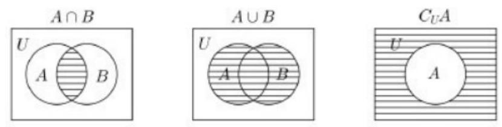
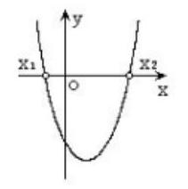
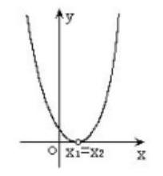
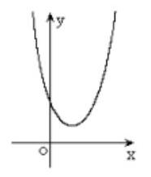
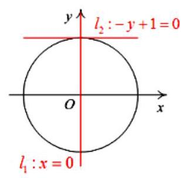
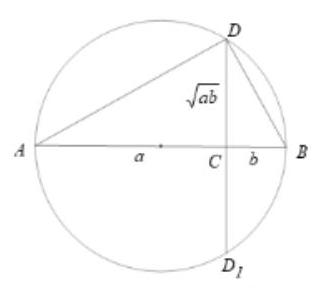
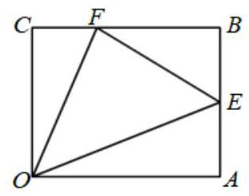
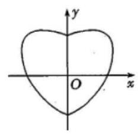
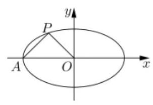

## (一)集合

## 集合、命题、不等式

<table><tr><td>教学目标</td><td>1、理解集合及其表示法，掌握子集、全集、补集，交集及并集的概念；   2、理解逻辑连接词的含义，会熟练转化四种命题；   3、理解充分条件、必要条件及充要条件的意义，会判断两个命题的关系；   4、会用定义解题, 理解数形结合, 分类讨论及等价变换等数学思想.   5、理解不等式的性质和判断不等式关系，并能加以证明；   6、掌握比较法、综合法和分析法证明不等式的基本思路和表示；   7、理解一元二次不等式、一元二次方程和二次函数之间的关联；   8、掌握不等式的解法   9、掌握基本不等式的推导与证明，尤其注意一正二定三相等的理解和运用；   10、熟练掌握基本不等式的应用；   11、灵活解决基本不等式的综合问题.</td></tr><tr><td>重点</td><td>1、集合之间的关系及集合的运算   2、掌握解含参数的一元二次不等式, 会进行分类.   3、基本不等式的应用；   4、基本不等式的综合问题.</td></tr><tr><td>难 点</td><td>1、集合与其它知识点的结合   2、含参不等式的求解.   3、基本不等式的应用；   4、基本不等式的综合问题</td></tr></table>

## 知识梳理

## 1、集合及其表示法

能够确切指定的一些对象组成的整体叫做集合，简称集.

集合中的各个对象叫做这个集合的元素. 对于一个给定的集合, 集合中的元素具有确定性、互异性、无序性.

集合常用大写字母 $A\text{ 、 }B\text{ 、 }C$ ...来表示，集合中的元素用 $a\text{ 、 }b\text{ 、 }c$ ...表示，如果 $a$ 是集合 $A$ 的元素， 就记作 $a \in  A$ ,读作 “ $a$ 属于 $A$ ” ; 如果 $a$ 不是集合 $A$ 的元素,就记作 $a \notin  A$ ,读作 “ $a$ 不属于 $A$ ”

数的集合简称数集: 全体自然数组成的集合,即自然数集,记作 $\mathrm{N}$ ,不包含零的自然数组成的集合, 记作 ${\mathrm{N}}^{ * }$ ; 全体整数组成的集合,即整数集,记作 $\mathrm{Z}$ ; 全体有理数组成的集合,即有理数集,记作 $\mathrm{Q}$ ,全体

实数组成的集合，即实数集，记作 $\mathbf{R}$ ；常用的集合的特殊表示法:实数集 $\mathbf{R}$ (正实数集 ${\mathbf{R}}^{ + }$ )、有理数集 $\mathbf{Q}$

(负有理数集 ${\mathbf{Q}}^{ - }$ )、整数集 $\mathbf{Z}$ (正整数集 ${\mathbf{Z}}^{ + }$ )、自然数集 $\mathbf{N}$ (包含零)、不包含零的自然数集 ${\mathbf{N}}^{ * }$ ；

点的集合简称点集, 即以直角坐标平面内的点作为元素构成的集合

含有有限个元素的集合叫做有限集，含有无限个元素的集合叫做无限集

规定空集不含元素，记作 $\varnothing$

集合的表示方法常用列举法和描述法

将集合中的元素一一列举出来(不考虑元素的顺序)，并且写在大括号内，这种表示集合的方法叫做列举法

在大括号内先写出这个集合的元素的一般形式, 再划一条竖线, 在竖线后面写上集合中元素所共同具有的特性,即: $A = \{ x \mid  x$ 满足性质 $p\}$ (集合 $A$ 中的元素都具有性质 $p$ ,而且凡具有性质 $p$ 的元素都在集合 $A$ 中)，这种表示集合的方法叫做描述法

## 2、集合之间的关系

对于两个集合 $A$ 和 $B$ ,如果集合 $A$ 中任何一个元素都属于集合 $B$ ,那么集合 $A$ 叫做集合 $B$ 的子集,记作: $A \subseteq  B$ 或 $B \supseteq  A$ ,读作 “ $A$ 包含于 $B$ 或 $B$ 包含 $A$ ”.

空集是任何集合的子集,是任何非空集合的真子集,所以 $A \subseteq  B$ 不要忘记 $A = \Phi$

若集合 $A$ 中有 $n$ 个元素，则有 ${2}^{n}$ 个子集， ${2}^{n} - 1$ 个非空子集， ${2}^{n} - 1$ 个真子集， ${2}^{n} - 2$ 个非空真子集

用封闭曲线(平面区域)直观地表示集合及其关系的图形成为文氏图

对于两个集合 $A$ 和 $B$ ,若 $A \subseteq  B$ 且 $B \subseteq  A$ 则称集合 $A$ 与集合 $B$ 相等,记作 $A = B$ . 也就是说,集合 $A$ 和集合 $B$ 含有完全相同的元素

对于两个集合 $A$ 和 $B$ ,如果集合 $A \subseteq  B$ ,并且 $B$ 中至少有一个元素不属于 $A$ ,那么集合 $A$ 叫做集合 $B$ 的真子集,记作 $\mathrm{A} \subseteq  B$ 或 $\mathrm{B} \supset  A$ ,读作 “ $A$ 真包含于 $B$ 或 $B$ 真包含 $A$ ”

## 3、集合的运算

由集合 $A$ 与集合 $B$ 的所有公共元素组成的集合叫做 $A$ 与 $B$ 的交集，记作 “ $A \cap  B$ ”，读作 “ $A$ 交 $B$ ”， 即 $A \cap  B = \{ x \mid  x \in  A$ 且 $x \in  B\}$

由所有属于集合 $A$ 或者属于集合 $B$ 的元素组成的集合叫做集合 $A$ 与 $B$ 的并集，记作 “ $A \cup  B$ ”，读作 “ $\mathrm{A}$ 并 $\mathrm{B}$ ”,即 $A \cup  B = \{ x \mid  x \in  A$ 或 $x \in  B\}$

在研究集合之间关系的时候,这些集合往往是某个给定的集合的子集,这个确定的集合称为全集 $U$ , 即全集含有我们所要研究的各个集合的全部元素,设 $U$ 为全集, $A$ 是 $U$ 的子集,则由 $U$ 中所有不属于集合 $A$ 的元素组成的集合叫做集合 $A$ 在全集 $U$ 中的补集,记作 “ ${\mathrm{C}}_{U}A$ ”,读作 “ $\mathrm{A}$ 补”,即 ${\mathrm{C}}_{U}A = \{ x \mid  x \in  U$ 且 $x \notin  A\}$ ,

## 4、集合运算的性质

(1) $A \cap  A = A, A \cap  \varnothing  = \varnothing , A \cap  B = B \cap  A$ ；

(2) $A \cup  \varnothing  = A, A \cup  B = B \cup  A$ ；

(3) $A \cap  B \subseteq  \left( {A \cup  B}\right)$ ；

(4) $A \cap  B = A \Leftrightarrow  A \subseteq  B;A \cup  B = A \Leftrightarrow  B \subseteq  A$ ；

(5)德摩根定律:已知全集 $U$ ，若 $A \subseteq  U$ 、 $B \subseteq  U$ ，则

$$
{C}_{U}\left( {A \cup  B}\right)  = {C}_{U}A \cap  {C}_{U}B\;{C}_{U}\left( {A \cap  B}\right)  = {C}_{U}A \cup  {C}_{U}B
$$

## 5、有限集的并集中元素个数的计算公式(容斥原理)

(以下用 $n\left( A\right)$ 表示有限集 $A$ 中元素的个数)

(1)两个集合的情形

若 $A\text{ 、 }B$ 均为有限集,则 $n\left( {A \cup  B}\right)  = n\left( A\right)  + n\left( B\right)  - n\left( {A \cap  B}\right)$ .

特别,若 $A \cap  B = \varnothing$ ,则 $n\left( {A \cup  B}\right)  = n\left( A\right)  + n\left( B\right)$ .

(2)三个集合的情形

若 $A\text{ 、 }B\text{ 、 }C$ 均为有限集,则

$n\left( {A \cup  B \cup  C}\right)$

$= n\left( A\right)  + n\left( B\right)  + n\left( C\right)  - n\left( {A \cap  B}\right)  - n\left( {A \cap  C}\right)  - n\left( {B \cap  C}\right)  + n\left( {A \cap  B \cap  C}\right)$

## 例题精讲

【例 1】已知集合 $M = \left\{  {x \mid  \left( {x - a}\right) \left( {{x}^{2} - {ax} + a - 1}\right)  = 0}\right\}$ 中各元素之和为 3,则实数 $a$ 的值为___.

【难度】 $\star   \star   \star$

【答案】 2 或 $\frac{3}{2}$

【解析】 $\left( {x - a}\right) \left( {{x}^{2} - {ax} + a - 1}\right)  = 0 \Rightarrow  \left( {x - a}\right) \left( {x - 1}\right) \left( {x - a + 1}\right)  = 0 \Rightarrow  {x}_{1} = 1,{x}_{2} = a,{x}_{3} = a - 1$ 三个根写成集合要考虑互异性①当 $a = 1$ 时,不合题意②当 $a = 2$ 时, $M = \{ 1,2\}$ ,符合题意③当 $a \neq  1, a \neq  2$ 时, $M = \{ 1, a, a - 1\} , a = \frac{3}{2}$

【例 2】(1) 若非空集合 $X = \{ x\left| {a + 1 \leq  x \leq  {3a} - 5\} , Y = \{ x}\right| 1 \leq  x \leq  {16}\}$ ,则使得 $X \subseteq  X \cap  Y$ 成立的 $a$ 的集合是( )

(A) $\{ a \mid  0 \leq  a \leq  7\}$ (B) $\{ a \mid  3 \leq  a \leq  7\}$ (C) $\{ a \mid  a \leq  7\}$ (D) 空集

【难度】 $\star   \star   \star$

【答案】B

【解析】 $X \subseteq  X \cap  Y \Rightarrow  X \subseteq  Y \Rightarrow  \left\{  \begin{matrix} a + 1 \leq  {3a} - 5 \\  a + 1 \geq  1 \\  {3a} - 5 \leq  {16} \end{matrix}\right.$

(2)已知集合 $M = \left\{  {x\left| {\;x = m + \frac{1}{6}}\right. , m \in  \mathbf{Z}}\right\}  , N = \left\{  {x\left| {\;x = \frac{n}{2} - \frac{1}{3}}\right. , n \in  \mathbf{Z}}\right\}  , P = \left\{  {x\left| {\;x = \frac{p}{2} + \frac{1}{6}}\right. , p \in  \mathbf{Z}}\right\}$ ，则 $M\text{ 、 }N$ 、 $P$ 的关系是(   )

A. $M = N \subsetneqq  P$ B. $M \subsetneqq  N = P$ C. $M \subsetneqq  N \subsetneqq  P$ D. $N \subsetneqq  P \subsetneqq  M$

【难度】★★★

【答案】B

【解析】三个集合分别化简为 $x = \frac{{6m} + 1}{6};x = \frac{{3n} - 2}{6};x = \frac{{3p} + 1}{6},{6m} + 1$ 表示被6整除余 1 的整数, ${3n} - 1$ 和 ${3p} + 1$ 都表示被3除余 1 的整数

【例 3】( 1 )平面点集 $M = \left\{  {\left( {x, y}\right)  \mid  {x}^{2} - {2x} + 2 \leq  y \leq  {6x} - {x}^{2} - 3\text{ ,且 }x, y \in  \mathbf{Z}}\right\}$ ，求 $M$ 中元素的个数.

【难度】 $\star   \star   \star$

【答案】 8

【解析】首先 ${x}^{2} - {2x} + 2 \leq  {6x} - {x}^{2} - 3 \Rightarrow  1 \leq  x \leq  3$ ,

进而得 $M = \{ \left( {1,1}\right) ,\left( {1,2}\right) ,\left( {2,2}\right) ,\left( {2,3}\right) ,\left( {2,4}\right) ,\left( \begin{array}{ll} 2 & 5 \end{array}\right) \left( \begin{array}{ll} 3 & 5 \end{array}\right) \left( \begin{array}{ll} 3 & 6 \end{array}\right) \}$ ,则 $M$ 中元素的个数为 8 .

(2)当集合 $A = \left\{  {x\left| {\;\left( {{mx} - {m}^{2} - 8}\right) \left( {x - 1}\right)  > 0}\right. , x \in  Z}\right\}$ 中的元素个数最少时，实数 $m$ 的取值范围是___.

【难度】 $\star   \star   \star$

【答案】 $\left\lbrack  \begin{array}{lll}  - 4 & , &  - 2 \end{array}\right\rbrack$

【解析】【解答】集合 $A = \left\{  {x \mid   = \left( {{mx} - {m}^{2} - 8}\right)  \cdot  \left( {x - 1}\right)  > 0, x \in  Z}\right\}$ 因为不等式 $\left( {{mx} - {m}^{2} - 8}\right)  \cdot  \left( {x - 1}\right)  > 0$ ,

① 当 $m = 0$ 时不等式变为 $- 8 \cdot  \left( {x - 1}\right)  > 0$ ,不等式解集 $\left( {-\infty ,1}\right)$ ,区间内有无限多个整数. 不符合集合元素个数有最值问题;

② 当 $m > 0$ 时，不等式变为 $\left\lbrack  {x - \left( {m + \frac{8}{m}}\right) }\right\rbrack   \cdot  \left( {x - 1}\right)  > 0$ ，因为 $m > 0$ ， $m + \frac{8}{m} \geq  2\sqrt{8}$ ，显然 $m + \frac{8}{m} > 1$ 所以原不等式解集 $\left( {-\infty ,1}\right)  \cup  \left( {m + \frac{8}{m}, + \infty }\right)$ . 区间内有无限多个整数. 不符合集合元素个数有最值问题;

③ 当 $m < 0$ 时，不等式变为 $\left\lbrack  {x - \left( {m + \frac{8}{m}}\right) }\right\rbrack   \cdot  \left( {x - 1}\right)  < 0$ ，因为 $m < 0$ ， $m + \frac{8}{m} \leq   - 2\sqrt{8}$ ，显然 $m + \frac{8}{m} < 1$ ，所以原不

等式解集 $\left( {m + \frac{8}{m},1}\right)$ ,区间内有有限个整数符合集合元素个数有最值问题又因为 $- 2\sqrt{8} \in  \left( {-6, - 5}\right)$ ,

即 $- 6 \leq  m + \frac{8}{m} \leq   - 5$ 即 $- 6 \leq  m + \frac{8}{m} \Rightarrow  {m}^{2} + {6m} + 8 \leq  0 \Rightarrow   - 4 \leq  m \leq   - 2$ ,且 $m + \frac{8}{m} \leq   - 5 \Rightarrow  {m}^{2} + {5m} + 8 \geq  0 \Rightarrow  m \in  R$

所以解得 $m \in  \left\lbrack  {-4, - 2}\right\rbrack$ .

故, $m$ 的范围 $\left\lbrack  {-4, - 2}\right\rbrack$ .

【例 4】( 1 )已知集合 $A, B, C$ (不必相异)的并集 $A \cup  B = \{ 1,2,\cdots , n\}$ ，则满足条件的有序二元组 $\left( {A, B}\right)$ 个数是___.

【难度】★★★

【答案】 ${3}^{n}$

【解析】由集合的文氏图可知,对于 $\{ 1,2,\cdots , n\}$ 中的每一个元素,都有 3 种可能的放置方法,故满足条件的有序三元组 $\left( {A, B, C}\right)$ 个数是 ${3}^{n}$ .

(2)已知集合 $A, B, C$ (不必相异)的并集 $A \cup  B \cup  C = \{ 1,2,\cdots , n\}$ ，则满足条件的有序三元组 $\left( {A, B, C}\right)$ 个数是___.

【难度】 $\star   \star   \star   \star$

【答案】 ${7}^{n}$

【解析】由集合的文氏图可知,对于 $\{ 1,2,\cdots , n\}$ 中的每一个元素,都有 7 种可能的放置方法,故满足条件的有序三元组 $\left( {A, B, C}\right)$ 个数是 ${7}^{n}$ .

【例 5】设 $A = \{ 1,2,3,4,5,6,7,8\} , B = \{ 1,2\}$ ,则满足 $B \subseteq  C \subseteq  A$ 的集合 $C$ 有___个

【难度】 $\star   \star   \star$

【答案】 ${2}^{6}$

【解析】考察集合 $\{ 3,4,5,6,7,8\}$ 子集的个数,所有的子集并上 $\{ 1,2\}$ 就是 $\mathrm{C}$ 集合,所以个数是 ${2}^{6}$

【例 6】( 1 )求集合 $M = \{ 1,2,3,\cdots ,{100}\}$ 的所有子集的元素之和的和(规定空集的元素和为零)那么当集合 $M = \{ 1,2,3,\cdots , n\}$ 的所有子集的元素之和的和呢?

【难度】★★★

【答案】 ${2}^{98} \times  {100} \times  {101},{2}^{n - 2} \cdot  n\left( {n + 1}\right)$

【解析】每个元素加了 ${2}^{99}$ 次

(2)集合 $M = \{ {6666}, - {11135},{2333},{10},{99111}, - 1, - {198},{1000},0,\pi \}$ 有 10 个元素,设 $M$ 的所有非空子集为 ${M}_{i}\left( {i = 1,2,\ldots ,{1023}}\right)$ ,每一个 ${M}_{i}$ 中所有元素乘积为 ${m}_{i}\left( {i = 1,2,\ldots ,{1023}}\right)$ ,则 ${m}_{1} + {m}_{2} + {m}_{3} + \ldots  + {m}_{1023} =$ ___.

【难度】★★★★

【答案】-1

【解析】 $\because M$ 的所有非空子集为 ${M}_{i}\left( {i = 1,2,\ldots ,{1023}}\right)$ ,

这 1023 个子集分成以下几种情况:

① 含 0 的子集有 512 个，这些子集均满足 ${m}_{i} = 0$ ；

②不含 0，含 -1 且还含有其它元素的子集有 255 个，

③不含 0，不含 -1 但含有其它元素的子集有 255 个，

④只含 -1 的子集一个 $\{  - 1\}$ ，满足 ${m}_{i} =  - 1$ ；

其中②③中的集合是一对应的，且满足 ${m}_{i}$ 对应成相反数，

故 ${m}_{1} + {m}_{2} + {m}_{3} + \ldots  + {m}_{1023} = {512} \times  0 + {255} \times  0 - 1 =  - 1$ ,

## 故答案为: -1

【例 7】(1) 设集合 $A$ 是整数集的一个非空子集，对于 $k \in  A$ ，如果 $k - 1 \notin  A$ 且 $k + 1 \notin  A$ ，那么 $k$ 是 $A$ 的一个 “孤立元”,给定 $S = \{ 1,2,3,4,5,6,7,8\}$ ,由 $S$ 的 3 个元素构成的所有集合中,不含 “孤立元” 的集合共有 ___个.

【难度】 $\star   \star   \star$

【答案】 6

【解析】枚举

(2)用 $C\left( A\right)$ 表示非空集合 $A$ 中元素的个数:定义 $A * B = \left\{  \begin{array}{l} C\left( A\right)  - C\left( B\right) , C\left( A\right)  \geq  C\left( B\right) \\  C\left( B\right)  - C\left( A\right) , C\left( B\right)  > C\left( A\right)  \end{array}\right.$ ，

若 $A = \{ 1,2\} , B = \left\{  {x \mid  \left( {{x}^{2} + {ax}}\right) \left( {{x}^{2} + {ax} + 2}\right)  = 0}\right\}$ ,且 $A * B = 1$ ,设实数 $a$ 的所有可能取值构成集合 $S$ , 则 $C\left( S\right)  =$ (   )

A. 4 B. 1 C. 2 D. 3

【难度】 $\star   \star   \star   \star$

【答案】D

【解析】B集合元素个数只能是3个, 考虑互异性

【例 8】已知 $A = \{ x \mid  x = f\left( x\right) , x \in  R\} , B = \{ x \mid  x = f\left\lbrack  {f\left( x\right) }\right\rbrack  , x \in  R\}$ .

(1)写出集合 $A$ 与 $B$ 之间的关系，并证明；

(2)若 $f\left( x\right)  = {x}^{2} + {px} + q$ ，当 $A = \{  - 1,3\}$ 时，用列举法表示集合 $B$ ，并求出集合 $B$ 的真子集个数；

(3)若 $f\left( x\right)  = a{x}^{2} - 1\;\left( {a \in  R, x \in  R}\right)$ ，且 $A = B \neq  \varnothing$ ，求实数 $a$ 的取值范围.

【难度】 $\star   \star   \star   \star$

【答案】(1) $A \subseteq  B$ ；(2) $B = \{  - 1,3, \pm  \sqrt{3}\}$ ；15(3) $\left\lbrack  {-\frac{1}{4},\frac{3}{4}}\right\rbrack$

【解析】

## 巩固训练

1、设 $M = \left\{  {x\left| {\;m \leq  x \leq  m + \frac{1}{3}}\right. }\right\}  , N = \left\{  {x\left| {\;n - \frac{3}{4} \leq  x \leq  n}\right. }\right\}$ 都是 $\{ x \mid  0 \leq  x \leq  1\}$ 的子集,如果 $b - a$ 叫做集合 $\{ x \mid  a \leq  x \leq  b\}$ 的长度,则集合 $M\bigcap N$ 的长度的最小值是(   )

A. $\frac{1}{3}$ B. $\frac{1}{4}$ C. $\frac{1}{6}$ D. $\frac{1}{12}$

【难度】 $\star   \star   \star   \star$

【答案】D

【解析】由 $m \geq  0$ ,且 $m + \frac{1}{3} \leq  1$ ,求出 $m \in  \left\lbrack  {0,\frac{2}{3}}\right\rbrack$ ,

由 $n - \frac{3}{4} \geq  0$ ，且 $n \leq  1$ ，求出 $n \in  \left\lbrack  {\frac{3}{4},1}\right\rbrack$ ，

分别把 $m, n$ 的两端值代入求出:

$M = \left\{  {x\left| {\;0 \leq  x \leq  \frac{1}{3}}\right. }\right\}  ,\;N = \left\{  {x\left| {\;\frac{1}{4} \leq  x \leq  1}\right. }\right\}  ,$

或 $M = \left\{  {x\left| {\;\frac{2}{3} \leq  x \leq  1}\right. }\right\}  , N = \left\{  {x\left| {\;0 \leq  x \leq  \frac{3}{4}}\right. }\right\}$ ,

所以 $M \cap  N = \left\{  {x\left| {\;\frac{1}{4} \leq  x \leq  \frac{1}{3}}\right. }\right\}$ ,

或 $\left\{  {x\left| {\;\frac{2}{3} \leq  x \leq  \frac{3}{4}}\right. }\right\}$ .

所以 $b - a = \frac{1}{3} - \frac{1}{4} = \frac{1}{12}$ ,或 $\frac{3}{4} - \frac{2}{3} = \frac{1}{12}$ ,

综上所述,集合 $M \cap  N$ 的长度的最小值是 $\frac{1}{12}$ .

故选: $D$ .

2、设集合 $A = \left\{  {{a}_{1},{a}_{2},{a}_{3},{a}_{4}}\right\}$ ,若 $A$ 中所有三元子集的三个元素之和组成的集合为 $B = \{  - 1,3,5,8\}$ , 则集合 $A =$ ___.

【难度】 $\star   \star   \star   \star$

【答案】 $\{  - 3,0,2,6\}$

【解析】解: 在 $A$ 的所有三元子集中,每个元素均出现了 3 次,所以 $3\left( {{a}_{1} + {a}_{2} + {a}_{3} + {a}_{4}}\right)  = \left( {-1}\right)  + 3 + 5 + 8 = {15}$ , 故 ${a}_{1} + {a}_{2} + {a}_{3} + {a}_{4} = 5$ ，于是集合 $A$ 的四个元素分别为 $5 - \left( {-1}\right)  = 6,5 - 3 = 2,5 - 5 = 0,5 - 8 =  - 3$ ，

因此,集合 $A = \{  - 3,0,2,6\}$ .

故答案为 $\{  - 3,0,2,6\}$ .

3、设 $f\left( x\right)  = {x}^{2} + {ax} + b\cos x,\{ x \mid  f\left( x\right)  = 0, x \in  R\}  = \{ x \mid  f\left( {f\left( x\right) }\right)  = 0, x \in  R\}  \neq  \varnothing$ ,则满足条件的所有实数 $a$ , $b$ 的值分别为___.

【难度】 $\star   \star   \star   \star$

【答案】 $0 \leq  a < 4, b = 0$ .

【解析】 $\because f\left( x\right)  = {x}^{2} + {ax} + b\cos x$ ,

$\left\{  {x \mid  f\left( x\right)  = 0,\;x \in  R}\right\}$ 可以得出 $f\left( 0\right)  = 0$ ,可以得出 $b = 0$ ;

$\therefore f\left( x\right)  = {x}^{2} + {ax}$ ,

$\therefore f\left( {f\left( x\right) }\right)  = f{\left( x\right) }^{2} + {af}\left( x\right)  = {\left( {x}^{2} + ax\right) }^{2} + a \cdot  \left( {{x}^{2} + {ax}}\right)  = {x}^{4} + {2a}{x}^{3} + \left( {{a}^{2} + a}\right) {x}^{2} + {a}^{2}x$

当 $a = 0$ 时, $\left\{  {x \mid  f\left( x\right)  = 0, x \in  R}\right\}   = \left\{  {x \mid  f\left( {f\left( x\right) }\right)  = 0, x \in  R}\right\}   = \{ 0\}  \neq  \varnothing$

当 $a \neq  0$ 时, $\{ x \mid  f\left( x\right)  = 0, x \in  R\}  = \{ 0, - a\}$ .

若 $\{ x \mid  f\left( {f\left( x\right) }\right)  = 0, x \in  R\}  = \{ 0, - a\}$ ,

则 $f\left( {f\left( {-a}\right) }\right)  = 0$ 且除 $0, - a$ 外 $f\left( {f\left( x\right) }\right)  = 0$ 无实根,

即 ${x}^{2} + {ax} + a = 0$ 无实根

即 ${a}^{2} - {4a} < 0$ ,即 $0 < a < 4$

综上满足条件的所有实数 $a$ 的取值范围为 $0 \leq  a < 4$

故答案为: $0 \leq  a < 4, b = 0$ .

4、设 $U = \{ 0,1,2,3,4,5,6,7,8,9\}$ ,若 $A \subseteq  C \subseteq  U, B \subseteq  C \subseteq  U$ ,则不同的有序集合组 $(A, B$ , $C)$ 的总数是___.

【难度】 $\star   \star   \star   \star$

【答案】 ${5}^{10}$

【解析】当集合 $C$ 中有 10 个元素时,不同的有序集合组 $\left( {A, B, C}\right)$ 有 ${C}_{10}^{10} \cdot  {2}^{10} \cdot  {2}^{10}$ 个;

当集合 $C$ 中有 9 个元素时,不同的有序集合组 $\left( {A, B, C}\right)$ 有 ${C}_{10}^{9} \cdot  {2}^{9} \cdot  {2}^{9}$ 个;

...

当集合 $C$ 中有 0 个元素时,不同的有序集合组 $\left( {A, B, C}\right)$ 有 ${C}_{10}^{0} \cdot  {2}^{0} \cdot  {2}^{0}$ 个;

$\therefore$ 总数为:

${C}_{10}^{10} \cdot  {2}^{10} \cdot  {2}^{10} + {C}_{10}^{9} \cdot  {2}^{9} \cdot  {2}^{9} + \cdots  + {C}_{10}^{0} \cdot  {2}^{0} \cdot  {2}^{0} = {C}_{10}^{10} \cdot  {4}^{10} + {C}_{10}^{9} \cdot  {4}^{9} + \cdots  + {C}_{10}^{0} = {\left( 1 + 4\right) }^{10} = {5}^{10}$ .

5、对于任意两个正实数 $a\text{ 、 }b$ ，定义 $a * b = \lambda  \times  \frac{a}{b}$ . 其中常数 $\lambda  \in  \left( {\frac{\sqrt{2}}{2},1}\right)$ ，“ $\times$ ”是通常的实数乘法运算， 若 $a \geq  b > 0, a * b$ 与 $b * a$ 都是集合 $\{ x \mid  x = \frac{n}{2}, n \in  Z\}$ 中的元素,则 $a * b =$ ___.

【难度】 $\star   \star   \star   \star$

【答案】 $\frac{3}{2}$

## (二)命题

## 知识梳理

## 一、不等式的性质

1、不等式性质的基础

任意 $a\text{ 、 }b \in  R, a < b, a = b, a > b$ 有且仅有一个成立,

并且 $a < b \Leftrightarrow  a - b < 0;\;a = b \Leftrightarrow  a - b = 0;\;a > b \Leftrightarrow  a - b > 0$

2、不等式的基本性质

(1) $a > b \Leftrightarrow  b < a$ ；(对称性)

(2) $a > b, b > c \Rightarrow  a > c$ ；(传递性)

(3) $a > b \Rightarrow  c \in  R$ ，都有 $a + c > b + c$ ；(可加性)

$\left. {\left( 4\right) \begin{array}{l} a > b \\  c > d \end{array}}\right\}   \Rightarrow  a + c > b + d\left( {a - d > b - c}\right)$ ; (同向可加性)

(5) $a > b \Rightarrow  \left\{  \begin{array}{l} c \in  {R}^{ + } \Rightarrow  {ac} > {bc} \\  c \in  {R}^{ - } \Rightarrow  {ac} < {bc} \end{array}\right.$ ; (可乘性)

(6) $\left. \begin{array}{l} a > b > 0 \\  c > d > 0 \end{array}\right\}   \Rightarrow  {ac} > {bd}\left( {\frac{a}{d} > \frac{b}{c}}\right)$ ; (同向可乘性)

(7) $\left. \begin{array}{r} a > b \\  {ab} > 0 \end{array}\right\}   \Rightarrow  \frac{1}{a} < \frac{1}{b}$ ; (可倒性)

(8) $a > b > 0 \Rightarrow  \left\{  {\begin{matrix} {a}^{n} > {b}^{n} \\  \sqrt[n]{a} > \sqrt[n]{b}\left( {n \geq  2}\right)  \end{matrix}\left( {n \in  {N}^{ * }}\right) }\right.$ . (开方乘方性)

## 二. 不等式大小比较的常用方法:

1. 作差: 作差后通过分解因式、配方等手段判断差的符号得出结果;

2. 作商 (常用于分数指数幂的代数式);

3. 分析法;

4. 平方法;

5. 分子 (或分母) 有理化;

6. 利用函数的单调性;

7. 寻找中间量或放缩法;

8. 图象法.

## 三、不等式的解法

1、同解不等式:

(1) $f\left( x\right)  \cdot  g\left( x\right)  > 0 \Leftrightarrow  \left\{  \begin{array}{l} f\left( x\right)  > 0 \\  g\left( x\right)  > 0 \end{array}\right.$ 或 $\left\{  \begin{array}{l} f\left( x\right)  < 0 \\  g\left( x\right)  < 0 \end{array}\right.$ ; (2) $f\left( x\right)  \cdot  g\left( x\right)  < 0 \Leftrightarrow  \left\{  \begin{array}{l} f\left( x\right)  > 0 \\  g\left( x\right)  < 0 \end{array}\right.$ 或 $\left\{  \begin{array}{l} f\left( x\right)  < 0 \\  g\left( x\right)  > 0 \end{array}\right.$ ;

(3) $\frac{f\left( x\right) }{g\left( x\right) } > 0 \Leftrightarrow  \left\{  \begin{array}{l} f\left( x\right)  > 0 \\  g\left( x\right)  > 0 \end{array}\right.$ 或 $\left\{  \begin{array}{l} f\left( x\right)  < 0 \\  g\left( x\right)  < 0 \end{array}\right.$ ; (4) $\frac{f\left( x\right) }{g\left( x\right) } < 0 \Leftrightarrow  \left\{  \begin{array}{l} f\left( x\right)  > 0 \\  g\left( x\right)  < 0 \end{array}\right.$ 或 $\left\{  \begin{array}{l} f\left( x\right)  < 0 \\  g\left( x\right)  > 0 \end{array}\right.$ ;

(5) $\left| {f\left( x\right) }\right|  < g\left( x\right)  \Leftrightarrow  \left\{  \begin{array}{l}  - g\left( x\right)  < f\left( x\right)  < g\left( x\right) \\  g\left( x\right)  > 0 \end{array}\right.$ ;

(6) $\left| {f\left( x\right) }\right|  > g\left( x\right)  \Leftrightarrow  \left\{  \begin{array}{l} f\left( x\right)  <  - g\left( x\right) \text{ 或 }f\left( x\right)  > g\left( x\right) \\  g\left( x\right)  \geq  0 \end{array}\right.$ 或 $g\left( x\right)  < 0$ ;

(7) $\sqrt{f\left( x\right) } > g\left( x\right)  \Leftrightarrow  \left\{  \begin{array}{l} f\left( x\right)  > {g}^{2}\left( x\right) \\  f\left( x\right)  \geq  0 \\  g\left( x\right)  \geq  0 \end{array}\right.$ 或 $\left\{  \begin{array}{l} g\left( x\right)  < 0 \\  f\left( x\right)  \geq  0 \end{array}\right.$ ; (8) $\sqrt{f\left( x\right) } < g\left( x\right)  \Leftrightarrow  \left\{  \begin{array}{l} f\left( x\right)  < {g}^{2}\left( x\right) \\  f\left( x\right)  \geq  0 \\  g\left( x\right)  > 0 \end{array}\right.$ ;

(9) ${a}^{f\left( x\right) } > {a}^{g\left( x\right) } \Leftrightarrow  \left\{  \begin{array}{l} f\left( x\right)  > g\left( x\right) , a > 1 \\  f\left( x\right)  < g\left( x\right) ,0 < a < 1 \end{array}\right.$ ;

(10) ${\log }_{a}f\left( x\right)  > {\log }_{a}g\left( x\right)  \Leftrightarrow  \left\{  \begin{array}{l} f\left( x\right)  > g\left( x\right)  > 0, a > 1 \\  g\left( x\right)  > f\left( x\right)  > 0,0 < a < 1 \end{array}\right.$

## 2、一元二次不等式的解法

<table id="cross-table-1"><tr><td></td><td>$\Delta  > 0$</td><td>$\Delta  = 0$</td><td>$\Delta  < 0$</td></tr><tr><td>二次函数 $y = a{x}^{2} + {bx} + c$ ( $a > 0$ ) 的图象</td><td>$y = a{x}^{2} + {bx} + c$     </td><td>$y = a{x}^{2} + {bx} + c$     </td><td>$y = a{x}^{2} + {bx} + c$     </td></tr><tr><td>一元二次方程 $a{x}^{2} + {bx} + c = 0 \; \left( {a > 0}\right)$ 的根</td><td>有两相异实根 ${x}_{1},{x}_{2}\left( {{x}_{1} < {x}_{2}}\right)$</td><td>有两相等实根 ${x}_{1} = {x}_{2} =  - \frac{b}{2a}$</td><td>无实根</td></tr><tr><td>$a{x}^{2} + {bx} + c > 0 \; \left( {a > 0}\right)$ 的解集</td><td>$\left\{  {x \mid  x < {x}_{1}\text{ 或 }x > {x}_{2}}\right\}$</td><td>$\left\{  {x \mid  x \neq   - \frac{b}{2a}}\right\}$</td><td>$R$</td></tr><tr><td>$a{x}^{2} + {bx} + c < 0 \; \left( {a > 0}\right)$ 的解集</td><td>$\left\{  {x \mid  {x}_{1} < x < {x}_{2}}\right\}$</td><td>$\varnothing$</td><td>$\varnothing$</td></tr></table>

## 3、简单的一元高次不等式的解法:

标根法: 其步骤是:

①分解成若干个一次因式的积, 并使每一个因式中最高次项的系数为正;

②将每一个一次因式的根标在数轴上，从最大根的右上方依次通过每一点画曲线；并注意奇穿过偶弹回； ③根据曲线显现 $f\left( x\right)$ 的符号变化规律，写出不等式的解集.

## 4、分式不等式

$\frac{f\left( x\right) }{g\left( x\right) } \geq  0 \Leftrightarrow  \left\{  \begin{array}{l} f\left( x\right)  \cdot  g\left( x\right)  \geq  0 \\  g\left( x\right)  \neq  0 \end{array}\right.$ ; (在进行计算时,一定要注意等价变形)

## 5、绝对值不等式的解法:

① 分段讨论法 (最后结果应取各段的并集): 如解不等式 $\left| {2 - \frac{3}{4}x}\right|  \geq  2 - \left| {x + \frac{1}{2}}\right|$ (答: $x \in  R$ );

②利用绝对值的定义；

③数形结合; 如解不等式 $\left| x\right|  + \left| {x - 1}\right|  > 3$ (答: $\left( {-\infty , - 1}\right)  \cup  \left( {2, + \infty }\right)$ )

④两边平方:如若不等式 $\left| {{{3x} + 2}\rangle  \geq  }\right| {{2x} + a} \mid$ 对 $x \in  R$ 恒成立，则实数 $a$ 的取值范围为___. (答: $\{ \frac{4}{3}\}$ )

## 6、含参不等式的解法:

求解的通法是 “定义域为前提, 函数性质为基础, 分类讨论是关键.” 注意解完之后要写上: “综上, 原不等式的解集是...”. 注意: 按参数讨论, 最后应按参数取值分别说明其解集; 但若按未知数讨论, 最后应求

并集.

注意事项:(1)解不等式是求不等式的解集，最后务必有集合的形式表示；(2)不等式解集的端点值往往是不等式对应方程的根或不等式有意义范围的端点值.

## 例题精讲

【例 9】( 1 ) $\left\{  \begin{array}{l} x > 3 \\  y > 3 \end{array}\right.$ 是 $\left\{  \begin{array}{l} x + y > 6 \\  x \cdot  y > 9 \end{array}\right.$ 成立的( )

A. 充分不必要条件 B. 必要不充分条件

C. 充要条件 D. 既不充分也不必要条件

【难度】★★

【答案】 $A$

【解析】

(2)设命题 $P$ :关于 $x$ 的不等式 ${a}_{1}x + {b}_{1} > 0$ 与 ${a}_{2}x + {b}_{2} > 0$ 的解集相同；命题 $Q : \frac{{a}_{1}}{{a}_{2}} = \frac{{b}_{1}}{{b}_{2}}$ ,则 $P$ 是 $Q$ 的 ( )

A、充分不必要条件 B、必要不充分条件

C、充要条件 D、既不充分又不必要条件

【难度】 $\star   \star   \star$

【答案】 $D$

【解析】

(3)设 ${a}_{1},{a}_{2},{b}_{1},{b}_{2},{c}_{1},{c}_{2}$ 均为非零实数，不等式 ${a}_{1}{x}^{2} + {b}_{1}x + {c}_{1} > 0$ 和 ${a}_{2}{x}^{2} + {b}_{2}x + {c}_{2} > 0$ 解集分别为 $M, N$ ，那么 $\frac{{a}_{1}}{{a}_{2}} = \frac{{b}_{1}}{{b}_{2}} = \frac{{c}_{1}}{{c}_{2}}$ 是 $M = N$ 的___条件.

【难度】 $\star   \star   \star   \star$

【答案】既不充分也不必要

【解析】

(4)已知 $a > 0$ ，条件甲: $\sqrt{1 + \sin \theta } = a$ ，条件乙: $\sin \frac{\theta }{2} + \cos \frac{\theta }{2} = a$ ，则()

(A) 甲是乙的充分必要条件 (B) 甲是乙的必要条件

(C) 甲是乙的充分条件 (D) 甲不是乙的必要条件, 也不是充分条件

【难度】 $\star   \star   \star$

【答案】B

【解析】

(5)已知曲线 ${C}_{1} : {x}^{2} + {y}^{2} = 1$ ，曲线 ${C}_{2} : a{x}^{2} + {bxy} + x = 0$ ( $a$ 、 $b$ 不同时为零). 则“ ${a}^{2} + {b}^{2} < 1$ ”是“ ${C}_{1}$ 与 ${C}_{2}$ 有且仅有两个不同交点”的___条件.

【难度】 $\star   \star   \star   \star$

【答案】“充分非必要”.

【解析】证明如下:

①由于 $a{x}^{2} + {bxy} + x = 0 \Leftrightarrow  x = 0$ 或 ${ax} + {by} + 1 = 0$ ( $a\text{ 、 }b$ 不同时为零)

曲线 ${C}_{2}$ 的图形是二相异直线 ${l}_{1} : x = 0$

和 ${l}_{2} : {ax} + {by} + 1 = 0$

显然, ${l}_{1}$ 与 ${C}_{1}$ 有二相异交点,若 ${a}^{2} + {b}^{2} < 1$ ,则 ${l}_{2}$ 与 ${C}_{1}$ 无交点. 此时, ${C}_{1}$ 与 ${C}_{2}$ 有且仅有两个不同交点; ②若取 $\left\{  \begin{array}{l} a = 0 \\  b =  - 1 \end{array}\right.$ ，则 ${C}_{1}$ 与 ${C}_{2}$ 恰有两个不同交点 (如图)，但 ${a}^{2} + {b}^{2} = 1$ .

【例10】求证: 平面上不同的三条直线 ${ax} + {by} + c = 0,{bx} + {cy} + a = 0,{cx} + {ay} + b = 0$ 相交于一点的充要条件是 $a + b + c = 0$ .

【难度】★★★★

【答案】见解析

【解析】证明: 必要性: 三条直线 ${ax} + {by} + c = 0,{bx} + {cy} + a = 0,{cx} + {ay} + b = 0$ 相加可得:

$\left( {a + b + c}\right) \left( {x + y + 1}\right)  = 0,$

若 $a + b + c \neq  0$ ,则 $x + y + 1 = 0$ ,代入上述三个方程,可得方程式为同一式,与已知为不同的三条直线矛盾. 因此 $x + y + 1 \neq  0$ ,可得 $a + b + c = 0$ .

充分性: $a + b + c = 0$ ,则三个方程有同一解.

三条直线方程 ${ax} + {by} + c = 0,{bx} + {cy} + a = 0,{cx} + {ay} + b = 0$ 相加可得: $\left( {a + b + c}\right) \left( {x + y + 1}\right)  = 0$ ,

综上1，2:平面上不同的三条直线 ${ax} + {by} + c = 0$ ， ${bx} + {cy} + a = 0$ ， ${cx} + {ay} + b = 0$ 相交于一点的充要条件是 $a + b + c = 0.$

【例11】用反证法证明: 不存在整数 $m, n$ ,使得 ${m}^{2} = {n}^{2} + {1998}$ .

【难度】 $\star   \star   \star   \star   \star$

【答案】见解析

【解析】解: 假设存在整数 $m\text{ 、 }n$ 使得 ${m}^{2} = {n}^{2} + {1998}$ ,则 ${m}^{2} - {n}^{2} = {1998}$ ,即 $\left( {m + n}\right) \left( {m - n}\right)  = {1998}$ .

当 $m$ 与 $n$ 同奇同偶时, $m + n, m - n$ 都是偶数, $\therefore \left( {m + n}\right) \left( {m - n}\right)$ 能被 4 整除,但4 不能整除1998,此时 $\left( {m + n}\right) \left( {m - n}\right)  \neq  {1998};$

当 $m, n$ 为一奇一偶时, $m + n$ 与 $m - n$ 都是奇数,所以 $\left( {m + n}\right) \left( {m - n}\right)$ 是奇数,此时 $\left( {m + n}\right) \left( {m - n}\right)  \neq  {1998}$ . $\therefore$ 假设不成立则原命题成立.

巩固训练

1、若关于 $x$ 的不等式 $\left| {x - m}\right|  < 1$ 成立的充分不必要条件是 $\frac{1}{3} < x < \frac{1}{2}$ ，则实数 $m$ 的取值范围是 ___.

【难度】 $\star   \star   \star$

【答案】 $\left\lbrack  {-\frac{1}{2},\frac{4}{3}}\right\rbrack$

【解析】 $\because \left| {x - m}\right|  < 1$ 的解集为 $\left( {m - 1, m + 1}\right)$ ,

由题意 $\Leftrightarrow  \left( {\frac{1}{3},\frac{1}{2}}\right)  \equiv  \left( {m - 1, m + 1}\right)$

$\Leftrightarrow  \left\{  {\begin{array}{l} m - 1 \leq  \frac{1}{3} \\  m + 1 \geq  \frac{1}{2} \\  m - 1 = \frac{1}{3}\text{ 和 }m + 1 = \frac{1}{2}\text{ 不同时成立 } \end{array} \Leftrightarrow   - \frac{1}{2} \leq  m \leq  \frac{4}{3}}\right.$

2、已知 ${p}^{3} + {q}^{3} = 2$ ，用反证法证明: $p + q \leq  2$ .

【难度】★★★★

【答案】见解析

【解析】证明: 假设 $p + q > 2$ ,则 $p > 2 - q$ ,可得 ${p}^{3} > {\left( 2 - q\right) }^{3}$

${p}^{3} + {q}^{3} > 8 - {12q} + 6{q}^{2}$ 又 ${p}^{3} + {q}^{3} = 2$ ,

$\therefore 2 > 8 - {12q} + 6{q}^{2}$ ,即 ${q}^{2} - {2q} + 1 < 0 \Rightarrow  {\left( q - 1\right) }^{2} < 0$ ,矛盾,

故假设不真,

所以 $p + q \leq  2$

3、已知 $a \geq  \frac{1}{2},\;f\left( x\right)  =  - {a}^{2}{x}^{2} + {ax} + c$ .

(1)证明对任意 $x \in  \left\lbrack  {0,1}\right\rbrack  , f\left( x\right)  \leq  1$ 的充要条件是 $c \leq  \frac{3}{4}$ ;

(2)已知关于 $x$ 的二次方程 $f\left( x\right)  = 0$ 有两个实根 $\alpha \text{ 、 }\beta$ ，证明: $\left| \alpha \right|  \leq  1$ 且 $\left| \beta \right|  \leq  1$ 的充要条件是: $c \leq  {a}^{2} - a$ . 【难度】

【答案】见解析

【解析】解: (1) $f\left( x\right)  =  - {a}^{2}{\left( x - \frac{1}{2a}\right) }^{2} + c + \frac{1}{4},\because a \geq  \frac{1}{2},\therefore \frac{1}{2a} \in  (0,1\rbrack ,\therefore x \in  (0,1\rbrack$ 时, ${\left\lbrack  f\left( x\right) \right\rbrack  }_{max} = c + \frac{1}{4}$ , 若 $c \leq  \frac{3}{4}$ ,则 $f\left( x\right)  \leq  {\left\lbrack  f\left( x\right) \right\rbrack  }_{max} = c + \frac{1}{4} \leq  1$ ,若 $f\left( x\right)  \leq  1$ ,则 ${\left\lbrack  f\left( x\right) \right\rbrack  }_{max} = c + \frac{1}{4} \leq  1$ ,即 $c \leq  \frac{3}{4}$ ,

$\therefore$ 对任意 $x \in  \left\lbrack  {0,1}\right\rbrack  , f\left( x\right)  \leq  1$ 的充要条件是 $c \leq  \frac{3}{4}$ .

(2)方程 $- {a}^{2}{x}^{2} + {ax} + c = 0$ 的两根为 ${x}_{1} = \frac{1 + \sqrt{1 + {4c}}}{2a},{x}_{2} = \frac{1 - \sqrt{1 + {4c}}}{2a}$ ，

不妨设 $\alpha  = \frac{1 + \sqrt{1 + {4c}}}{2a},\beta  = \frac{1 - \sqrt{1 + {4c}}}{2a}$ ,其中 $1 + {4c} \geq  0$ ,若 $c \leq  {a}^{2} - a$ ,则 $1 + {4c} \leq  4{a}^{2} - {4a} + 1 = {\left( 2a - 1\right) }^{2}$ ,

$\because {2a} - 1 \geq  0,\therefore \sqrt{1 + {4c}} \leq  {2a} - 1$ ,即 $0 < \frac{1 + \sqrt{1 + {4c}}}{2a} \leq  1$ ,即 $\left| \alpha \right|  \leq  1$ ,

又 $1 - \sqrt{1 + {4c}} \geq  1 - \left( {{2a} - 1}\right)  = 2 - {2a} >  - {2a},\therefore \frac{1 - \sqrt{1 + {4c}}}{2a} >  - 1$ , 又 $\because \frac{1 - \sqrt{1 + {4c}}}{2a} \leq  \frac{1 + \sqrt{1 + {4c}}}{2a} \leq  1,\therefore \left| \beta \right|  \leq  1$ .

若 $\left| \alpha \right|  \leq  1$ ,且 $\left| \beta \right|  \leq  1,\therefore \frac{1 + \sqrt{1 + {4c}}}{2a} \leq  1$ ,且 $\frac{1 - \sqrt{1 + {4c}}}{2a} \geq   - 1,\because {2a} \geq  1$ ,

$\therefore \sqrt{1 + {4c}} \leq  {2a} - 1$ ,且 $\sqrt{1 + {4c}} \leq  {2a} + 1,\therefore \sqrt{1 + {4c}} \leq  {2a} - 1$ ,即 $c \leq  {a}^{2} - a$ ,

$\therefore \left| \alpha \right|  \leq  1$ 且 $\left| \beta \right|  \leq  1$ 的充要条件是 $c \leq  {a}^{2} - a$ .

## (三) 不等式

## 知识梳理

## 1、基本不等式的形式

1. 基本不等式 1:

如果 $a, b \in  \mathrm{R}$ ,那么 ${a}^{2} + {b}^{2} \geq  {2ab}$ (当且仅当 $a = b$ 时取等号 “=”) .

2. 基本不等式 2:

如果 $a, b$ 是正数,那么 $\frac{a + b}{2} \geq  \sqrt{ab}$ (当且仅当 $a = b$ 时取等号 “=”) .

【要点注释】 ${a}^{2} + {b}^{2} \geq  {2ab}$ 和 $\frac{a + b}{2} \geq  \sqrt{ab}$ 两者的异同:

(1)成立的条件是不同的:前者只要求 $a, b$ 都是实数，而后者要求 $a, b$ 都是正数；

(2)取等号 “=” 的条件在形式上是相同的，都是 “当且仅当 $a = b$ 时取等号”.

(3) ${a}^{2} + {b}^{2} \geq  {2ab}$ 可以变形为: ${ab} \leq  \frac{{a}^{2} + {b}^{2}}{2},\frac{a + b}{2} \geq  \sqrt{ab}$ 可以变形为: ${ab} \leq  {\left( \frac{a + b}{2}\right) }^{2}$ .

3. 如图, ${AB}$ 是圆的直径,点 $C$ 是 ${AB}$ 上的一点, ${AC} = a,{BC} = b$ ,过点 $C$ 作 ${DC} \bot  {AB}$ 交圆于点 $\mathrm{D}$ ,连接 ${AD}\text{ 、 }{BD}$ .

易证 ${Rt\Delta ACD} \sim  {Rt\Delta DCB}$ ,那么 $C{D}^{2} = {CA} \cdot  {CB}$ ,即 ${CD} = \sqrt{ab}$ .

这个圆的半径为 $\frac{a + b}{2}$ ,它大于或等于 ${CD}$ ,即 $\frac{a + b}{2} \geq  \sqrt{ab}$ ,其中当且仅当点 $C$ 与圆心重合,即 $a = b$ 时,等号成立.

【知识补充】1. 在数学中,我们称 $\frac{a + b}{2}$ 为 $a, b$ 的算术平均数,称 $\sqrt{ab}$ 为 $a, b$ 的几何平均数. 因此基本不等式可叙述为: 两个正数的算术平均数不小于它们的几何平均数.

2. 如果把 $\frac{a + b}{2}$ 看作是正数 $a, b$ 的等差中项, $\sqrt{ab}$ 看作是正数 $a, b$ 的等比中项,那么基本不等式可以象述为: 两个正数的等差中项不小于它们的等比中项.

【知识拓展】当 $0 < a \leq  b$ 时, $a \leq  \frac{2}{\frac{1}{a} + \frac{1}{b}} \leq  \sqrt{ab} \leq  \frac{a + b}{2} \leq  \sqrt{\frac{{a}^{2} + {b}^{2}}{2}} \leq  b$

推广: ${a}_{1},{a}_{2},{a}_{3},\cdots ,{a}_{n}$ 是 $n$ 个正数,则 $\frac{{a}_{1} + {a}_{2} + \cdots  + {a}_{n}}{}$ 称为这 $n$ 个正数的算术平均数, $\sqrt[n]{{a}_{1} \cdot  {a}_{2}\cdots  \cdot  {a}_{n}}$ 称集合、命题 ${}^{n}$ 不等式一教师版为这 $n$ 个正数的几何平均数,它们的关系是: $\frac{{a}_{1} + {a}_{2} + \cdots  + {a}_{n}}{n} \geq  \sqrt[n]{{a}_{1} \cdot  {a}_{2} \cdot  \cdots  \cdot  {a}_{n}}$ ,当且仅当 ${a}_{1} = {a}_{2} = \cdots  = {a}_{n}$ 时等号成立.

## 2、利用基本不等式证明不等式

利用基本不等式证明不等式是综合法证明不等式的一种情况，综合法是指从已证不等式和问题的已知条件出发, 借助不等式的性质和有关定理, 经过逐步的逻辑推理, 最后转化为所求问题, 其特征是以“已知” 看“可知”，逐步推向“未知”.

## 3、利用基本不等式求最值问题

(1)“积定和最小”: $a + b \geq  2\sqrt{ab} \Leftrightarrow$ 如果积 ${ab}$ 是定值 $\mathrm{P}$ ，那么当 $a = b$ 时，和 $a + b$ 有最小值 $2\sqrt{P}$ ；

(2)“和定积最大”: ${ab} \leq  {\left( \frac{a + b}{2}\right) }^{2} \Leftrightarrow$ 如果和 $a + b$ 是定值 $\mathrm{S}$ ，那么当 $a = b$ 时，积 ${ab}$ 有最大值 $\frac{1}{4}{S}^{2}$ .

【要点注释】基本不等式求最值需注意的问题:

(1)各数(或式)均为正；

(2)和或积为定值;

(3)等号能否成立，即 “一正、二定、三相等” 这三个条件缺一不可.

若无明显 “定值”，则用配凑的方法，使和为定值或积为定值.

当多次使用基本不等式时，一定要注意每次是否能保证等号成立，并且要注意取等号的条件的一致性，否则就会出错, 因此在利用基本不等式处理问题时, 列出等号成立的条件不仅是解题的必要步骤, 而且也是检验转换是否有误的一种方法.

## 4、应用基本不等式解决实际问题

在应用基本不等式解决实际问题时，要注意以下四点:

(1)设变量时一般把要求最值的变量定为函数；

(2)建立相应的函数关系式，确定函数的定义域；

(3)在定义域内, 求出函数的最值;

(4)回到实际问题中去，写出实际问题的答案.

## 例题精讲

【例 12】(1)(x - 2) $\sqrt{{2x} + 3} \geq  0$ (2) $\sqrt{{x}^{2} - {3x} + 2} > x - 3$

【难度】 $\star   \star   \star$

【答案】(1) $\left\{  {-\frac{3}{2}}\right\}   \cup  \lbrack 2, + \infty )$ ; (2) $\left( {-\infty ,1\rbrack \cup \lbrack 2, + \infty }\right)$ ;

【例 13】( 1 )已知不等式 $a{x}^{2} + {bx} + c > 0$ 的解集是 $\{ x \mid  \alpha  < x < \beta \} ,\alpha  > 0$ ,则不等式 $c{x}^{2} + {bx} + a > 0$ 的解集是( )

A. $\left( {\frac{1}{\beta },\frac{1}{\alpha }}\right)$ B. $\left( {-\infty ,\frac{1}{\beta }}\right)  \cup  \left( {\frac{1}{\alpha }, + \infty }\right)$ C. $\left( {\alpha ,\beta }\right)$ D. $( - \infty ,\alpha \rbrack  \cup  \left( {\beta , + \infty }\right)$

【难度】 $\star   \star   \star$

【答案】A

【解析】不等式 $a{x}^{2} + {bx} + c > 0$ 的解集是 $\{ x \mid  \alpha  < x < \beta \}$ ,所以 $a{x}^{2} + {bx} + c = 0$ 的两个根分别为 ${x}_{1} = \alpha ,{x}_{2} = \beta$

因为 $\alpha  > 0$ ,所以 $\beta  > 0$ ,所以 $a < 0$ ,由韦达定理可知 ${x}_{1} + {x}_{2} = \alpha  + \beta  =  - \frac{b}{a} > 0,{x}_{1} \cdot  {x}_{2} = \alpha  \cdot  \beta  = \frac{c}{a} > 0$ 由 $a < 0$ ，可知 $b > 0, c < 0$ ，因为 $c < 0$ ，所以可设 $c{x}^{2} + {bx} + a > 0$ 的解集为 $\left( {m, n}\right)$ . 由于 $m < n$ ，所以 $\frac{1}{n} < \frac{1}{m}$ 则 $m + n =  - \frac{b}{c}, m \cdot  n = \frac{a}{c}$ ,因为 $\frac{\alpha  + \beta }{\alpha  \cdot  \beta } =  - \frac{b}{c},\alpha  \cdot  \beta  = \frac{c}{a}$ ,所以 $\left\{  \begin{array}{l} m + n = \frac{\alpha  + \beta }{\alpha  \cdot  \beta } = \frac{1}{\alpha } + \frac{1}{\beta } \\  m \cdot  n = \frac{1}{\alpha  \cdot  \beta } \\  m < n \end{array}\right.$ 解方程组可得 $\left\{  \begin{array}{l} m = \frac{1}{\beta } \\  n = \frac{1}{\alpha } \end{array}\right.$ ,所以不等式 $c{x}^{2} + {bx} + a > 0$ 的解集为 $\left( {\frac{1}{\beta },\frac{1}{\alpha }}\right)$ ,故选:A

(2)若关于 $x$ 的不等式 $\frac{k}{x + a} + \frac{x + b}{x + c} < 0$ 的解集为 $\left( {-2, - 1}\right)  \cup  \left( {2,3}\right)$ ，关于 $x$ 的不等式 $\frac{kx}{{ax} - 1} + \frac{{bx} - 1}{{cx} - 1} < 0$ 的解集为___.

【难度】 $\star   \star   \star   \star$

【答案】 $\left( {-\frac{1}{2}, - \frac{1}{3}}\right)  \cup  \left( {\frac{1}{2},1}\right)$

【例 14】( 1 )不等式 $\sqrt{-{x}^{2} - {4x}} \leq  \frac{4}{3}x + 1 - a$ 的解集是 $\left\lbrack  {-4,0}\right\rbrack$ ，则 $a$ 的取值范围是___.

【难度】 $\star   \star   \star   \star$

【答案】 $a \leq   - 5$

( 2 )若不等式: $\sqrt{x} > {ax} + \frac{3}{2}$ 的解集是非空集合 $\{ x \mid  4 < x < m\}$ ，则 $a + m =$ ___.

【难度】 $\star   \star   \star   \star$

【答案】 $\frac{289}{8}$

【例 15】( 1 )已知关于 $x$ 的不等式组 $1 \leq  k{x}^{2} + {2x} + k \leq  2$ 有唯一实数解，则实数 $k$ 的取值集合是___.

【难度】★★★★

【答案】 $k = 1 + \sqrt{2}$ 或 $k = \frac{1 - \sqrt{5}}{2}$

( 2 )关于 $x$ 的不等式组 $\left\{  \begin{matrix} {x}^{2} - x - 2 > 0 \\  2{x}^{2} + \left( {{2k} + 5}\right) x + {5k} < 0 \end{matrix}\right.$ 的整数解的集合为 $\{  - 2\}$ ，求实数 $k$ 的取值范围.

【难度】 $\star   \star   \star   \star$

【答案】 $k \in  \lbrack  - 3,2)$

【解析】原不等式组 $\Leftrightarrow  \left\{  \begin{matrix} x <  - 1\text{ 或 }x > 2 \\  \left( {x + k}\right) \left( {x + \frac{5}{2}}\right)  < 0 \end{matrix}\right.$ ,

记原不等式组的解集为 $M$ ,则 $M \cap  Z = \{  - 2\}$ .

${1}^{0}$ 当 $- k <  - \frac{5}{2}$ 时， $M = \left( {-k, - \frac{5}{2}}\right)$ ， $- 2 \notin  M$ ，不合题意；

${2}^{0}$ 当 $- k =  - \frac{5}{2}$ 时， $M = \phi$ ，不合题意；

${3}^{0}$ 当 $- k >  - \frac{5}{2}$ ,即 $k < \frac{5}{2}$ 时,则 $M \cap  Z = \{  - 2\}$

$\Leftrightarrow  \left\{  {\begin{array}{l}  - 2 <  - k \leq   - 1 \\  M = \left( {-\frac{5}{2}, - k}\right)  \end{array}\text{ 或 }\left\{  {\begin{array}{l}  - 1 <  - k \leq  2 \\  M = \left( {-\frac{5}{2}, - 1}\right)  \end{array}\text{ 或 }\left\{  {\begin{matrix} 2 <  - k \leq  3 \\  M = \left( {-\frac{5}{2}, - 1}\right)  \cup  \left( {2, - k}\right)  \end{matrix},}\right. }\right. }\right.$

$\therefore  - 2 <  - k \leq  3 \Rightarrow   - 3 \leq  k < 2$ ,又, $k < \frac{5}{2}$ ,因而, $k \in  \lbrack  - 3,2)$ .

【例 16】函数 $f\left( {x + \frac{1}{2}}\right)  = {x}^{3} + {2019}^{x} - {2019}^{-x} + 1$ ,若 $f\left( {\sin \theta  + \cos \theta }\right)  + f\left( {\sin {2\theta } - t}\right)  < 2$ 对任意的 $\theta  \in  R$ 恒成立，则实数 $t$ 的取值范围是___.

【难度】 $\star   \star   \star   \star$

【答案】 $t > \sqrt{2}$

【解析】 $f\left( {x + \frac{1}{2}}\right)  = {x}^{3} + {2019}^{x} - {2019}^{-x} + 1$ ,

可得 $f\left( {\frac{1}{2} - x}\right)  =  - {x}^{3} + {2019}^{-x} - {2019}^{x} + 1$ ,则 $f\left( {\frac{1}{2} + x}\right)  + f\left( {\frac{1}{2} - x}\right)  = 2$ ,

$f\left( {\sin \theta  + \cos \theta }\right)  + f\left( {\sin {2\theta } - t}\right)  < 2$ ,即为 $f\left( {\sin \theta  + \cos \theta }\right)  + f\left( {\sin {2\theta } - t}\right)  < 2 = f\left( {\frac{1}{2} + x}\right)  + f\left( {\frac{1}{2} - x}\right)$ ,

$f\left( {\sin \theta  + \cos \theta }\right)  + f\left( {\sin {2\theta } - t}\right)  < 2$ 对 $\forall \theta  \in  R$ 恒成立,

可令 $x = \sin \theta  + \cos \theta  - \frac{1}{2}$ ，则 $f\left( {\sin \theta  + \cos \theta }\right)  + f\left( {\sin {2\theta } - t}\right)  < f\left( {\sin \theta  + \cos \theta }\right)  + f\left( {1 - \sin \theta  - \cos \theta }\right)$ ，

可得 $f\left( {\sin {2\theta } - t}\right)  < f\left( {1 - \sin \theta  - \cos \theta }\right)$ 恒成立,

由于 $f\left( {x + \frac{1}{2}}\right)$ 在 $\mathrm{R}$ 上递增, $f\left( {x + \frac{1}{2}}\right)$ 的图象向右平移 $\frac{1}{2}$ 个单位可得 $f\left( x\right)$ 的图象,则 $f\left( x\right)$ 在 $\mathrm{R}$ 上递增,

可得 $\sin {2\theta } - t < 1 - \sin \theta  - \cos \theta$ 恒成立,即有 $t > \sin {2\theta } + \sin \theta  + \cos \theta  - 1$ ,

设 $g\left( \theta \right)  = \sin {2\theta } + \sin \theta  + \cos \theta  - 1 = {\left( \sin \theta  + \cos \theta \right) }^{2} + \left( {\sin \theta  + \cos \theta }\right)  - 2$

再令 $\sin \theta  + \cos \theta  = m$ ,则 $m = \sqrt{2}\sin \left( {\theta  + \frac{\pi }{4}}\right)$ ,

则 $- \sqrt{2} \leq  m \leq  \sqrt{2}$ ,则 $g\left( m\right)  = {m}^{2} + m - 2$ ,其对称轴 $m =  - \frac{1}{2}$ ,

故当 $m = \sqrt{2}$ 时, $g\left( m\right)$ 取的最大值,最大值为 $2 + \sqrt{2} - 2 = \sqrt{2}$ ,则 $t > \sqrt{2}$ ,

【例 17】(1)已知函数 $f\left( x\right)  = {x}^{2} + {ax} + b\left( {a, b \in  R}\right)$ 的值域为 $\lbrack 0, + \infty )$ ,若关于 $x$ 的不等式 $f\left( x\right)  < c$ 的解集为 $\left( {m, m + 2\sqrt{3}}\right)$ ，则实数 $c$ 的值是 ( )

A. 3 B. 6 C. 9 D. 12

【难度】★★★

【答案】 $A$

【解析】解: $\because$ 函数 $f\left( x\right)  = {x}^{2} + {ax} + b\left( {a, b \in  R}\right)$ 的值域为 $\lbrack 0, + \infty )$ ,

$\therefore f\left( x\right)  = {x}^{2} + {ax} + b = 0$ 只有一个根,即 $\bigtriangleup  = {a}^{2} - {4b} = 0,\therefore b = \frac{1}{4}{a}^{2}$ ;

又不等式 $f\left( x\right)  < c$ 的解集为 $\left( {m, m + 2\sqrt{3}}\right)$ ,即为 ${x}^{2} + {ax} + \frac{1}{4}{a}^{2} < c$ 解集为 $\left( {m, m + 2\sqrt{3}}\right)$ ,

则 ${x}^{2} + {ax} + \frac{1}{4}{a}^{2} - c = 0$ 的两个根为 $m, m + 2\sqrt{3}$ ,由根与系数的关系,得 $m + m + 2\sqrt{3} =  - a$ ①,

$m\left( {m + 2\sqrt{3}}\right)  = \frac{1}{4}{a}^{2} - c$ ②，把①代入②，化简得 $c = 3$ . 故选: $A$ .

( 2 )如果关于 $x$ 的不等式 $f\left( x\right)  < 0$ 和 $g\left( x\right)  < 0$ 的解集分别为 $\left( {a, b}\right)$ 和 $\left( {\frac{1}{b},\frac{1}{a}}\right)$ ，那么称这两个不等式为对偶不等式. 如果不等式 ${x}^{2} - 4\sqrt{3}x \cdot  \cos {2\theta } + 2 < 0$ 与不等式 $2{x}^{2} + {4x} \cdot  \sin {2\theta } + 1 < 0$ 为对偶不等式，且 $\theta  \in  \left( {\frac{\pi }{2},\pi }\right)$ ,那么 $\theta  =$

【难度】 $\star   \star   \star$

【答案】 $\frac{5\pi }{6}$ .

(3)若关于 $x$ 的不等式 $\frac{{x}^{2} - {8x} + {20}}{m{x}^{2} + 2\left( {m + 1}\right) x + {9m} + 4} < 0$ 的解集为 $R$ ，则实数 $m$ 的取值范围是___.

【难度】 $\star   \star   \star   \star$

【答案】 $m <  - \frac{1}{2}$

【例 18】已知方程 ${2k}{x}^{2} - {2x} - {3k} - 2 = 0$ 有两个不相等的实根 ${x}_{1}\text{ 、 }{x}_{2}$ ,若 $- 2 < {x}_{1} < {x}_{2} < 0$ ,则 $k$ 的取值范围为 ___

【难度】 $\star   \star   \star$

【答案】 $- \frac{2}{3} < k <  - \frac{2}{5}$

【解析】由题意可知, $k \neq  0$ ,且 $\bigtriangleup  = {\left( -2\right) }^{2} - {8k}\left( {-{3k} - 2}\right)  = 4\left( {6{k}^{2} + {4k} + 1}\right)  > 0$ ,

即 $k \neq  0$ . (1) 若 $- 2 < {x}_{1}\text{ 、 }{x}_{2} < 0$ ,则 $\left\{  \begin{array}{l} k > 0 \\   - 2 < \frac{1}{2k} < 0 \\  f\left( {-2}\right)  = {8k} + 4 - {3k} - 2 > 0 \\  f\left( 0\right)  =  - {3k} - 2 > 0 \end{array}\right.$ 或 $\left\{  \begin{array}{l} k < 0 \\   - 2 < \frac{1}{2k} < 0 \\  f\left( {-2}\right)  = {8k} + 4 - {3k} - 2 < 0 \\  f\left( 0\right)  =  - {3k} - 2 < 0 \end{array}\right.$ ,

解得: $- \frac{2}{3} < k <  - \frac{2}{5}$ ;

【例 19】( 1 )已知 $x, y \in  {R}^{ + }$ ，且 $\frac{1}{x} + {2y} = 3$ ，则 $\frac{y}{x}$ 的最大值为___.

【难度】 $\star   \star$

【答案】 $\frac{9}{8}$

(2)已知正数 $x$ 、 $y$ 满足 ${xy} = x + y + 3$ ，则 ${xy}$ 、 $x + y$ 的范围分别为___，___

【难度】★★★

【答案】 ${xy}$ 的取值范围是 $\lbrack 9, + \infty )$ ; $x + y$ 的取值范围是 $\lbrack 6, + \infty )$ .

(3)已知 $x > 0, y > 0,\frac{1}{x} + \frac{2}{y + 1} = 1$ ，则 $x + y$ 的最小值为___.

【难度】 $\star   \star   \star$

【答案】 $2 + 2\sqrt{2}$

(4)已知 $a, b > 0$ ，且 ${a}^{2} + \frac{1}{4}{b}^{2} = 1$ ，求 $y = a\sqrt{1 + {b}^{2}}$ 的最大值.

【难度】 $\star   \star   \star$

【答案】 $\frac{5}{4}$

(5)设 $x, y$ 为正实数，则 $M = \frac{4x}{x + {3y}} + \frac{3y}{x}$ 的最小值是___.

【难度】 $\bigstar \bigstar \bigstar$

【答案】 3

【例 20】( 1 )已知 $M$ 是 $\bigtriangleup {ABC}$ 内的一点(不含边界)，且 $\overrightarrow{AB} \cdot  \overrightarrow{AC} = 2\sqrt{3}$ ， $\angle {BAC} = {30}^{ \circ  }$ 若 ${\Delta MBC}\text{ 、 }{\Delta MAB}$ 、 ${\Delta MAC}$ 的面积分别是 $x, y, z$ ，则 $\frac{1}{x + y} + \frac{4}{z}$ 的最小值为___.

【难度】 $\star   \star   \star   \star$

【答案】 9

【解析】解: 由题意可得 $\overrightarrow{AB} \cdot  \overrightarrow{AC} = {bc}\cos {30}^{ \circ  } = 2\sqrt{3}$ ,

解得 ${bc} = 4$ ,故 $\bigtriangleup {ABC}$ 的面积 $S = \frac{1}{2}{bc}\sin {30}^{ \circ  } = 1$ , $\therefore$ 正数 $x, y, z$ 满足 $x + y + z = 1$ ,

$\therefore \frac{1}{x + y} + \frac{4}{z} = \left( {\frac{1}{x + y} + \frac{4}{z}}\right) \left( {x + y + z}\right)  = 5 + \frac{z}{x + y} + \frac{4\left( {x + y}\right) }{z} \geq  5 + 2\sqrt{\frac{z}{x + y} \cdot  \frac{4\left( {x + y}\right) }{z}} = 9$

当且仅当 $\frac{z}{x + y} = \frac{4\left( {x + y}\right) }{z}$ 即 $z = 2\left( {x + y}\right)$ 时取等号,结合 $x + y + z = 1$ 可得 $x + y = \frac{1}{3}$ 且 $z = \frac{2}{3}$ .

故选答案为: 9

( 2 )已知正实数 $x$ ， $y$ 满足 $x + y = 1$ ，则 $\frac{1}{x} - \frac{4y}{y + 1}$ 的最小值是___.

【难度】 $\star   \star   \star   \star$

【答案】 $\frac{1}{2}$

【解析】解: 正实数 $x, y$ 满足 $x + y = 1$ ,则 $\frac{1}{x} - \frac{4y}{y + 1} = \frac{1}{x} - \frac{{4y} + 4 - 4}{y + 1} = \frac{1}{x} + \frac{4}{y + 1} - 4$

$= \frac{1}{2}\left( {\frac{1}{x} + \frac{4}{y + 1}}\right) \left\lbrack  {x + \left( {y + 1}\right) }\right\rbrack   - 4 = \frac{1}{2}\left( {5 + \frac{y + 1}{x} + \frac{4x}{y + 1}}\right)  - 4 \geq  \frac{1}{2}\left( {5 + 4}\right)  - 4 = \frac{1}{2}$

当且仅当 $\frac{y + 1}{x} = \frac{4x}{y + 1}$ 且 $x + y = 1$ 即 $y = \frac{1}{3}, x = \frac{2}{3}$ 时取得最小值是 $\frac{1}{2}$

故答案为: $\frac{1}{2}$

(3)设 $a + b = {2019}, b > 0$ ，则当 $a =$ ___时， $\frac{1}{{2019}\left| a\right| } + \frac{\left| a\right| }{b}$ 取得最小值.

【难度】 $\star   \star   \star   \star   \star$

【答案】 $- \frac{2019}{2018}$

【解析】解: $\because a + b = {2019}, b > 0,\therefore \frac{1}{{2019}\left| a\right| } + \frac{\left| a\right| }{b} = \frac{a + b}{{2019}^{2}\left| a\right| } + \frac{\left| a\right| }{b} = \frac{a}{{2019}^{2}\left| a\right| } + \frac{b}{{2019}^{2}\left| a\right| } + \frac{\left| a\right| }{b} \; \geq   - \frac{1}{{2019}^{2}} + 2\sqrt{\frac{2}{{2019}^{2}}}$ ,当且仅当 $a < 0$ 且 $\frac{b}{{2019}^{2}\left| a\right| } = \frac{\left| a\right| }{b}$ 且 $a + b = {2019}$ 即 $a =  - \frac{2019}{2018}$ 时取等号,

故答案为: $- \frac{2019}{2018}$ .

【例 21】(1) 已知 $a > 0, b > 0$ ,当 ${\left( a + 4b\right) }^{2} + \frac{1}{ab}$ 取到最小值时, $b =$ ___.

【难度】 $\star   \star   \star   \star$

【答案】 $\frac{1}{4}$

【解析】解: $\because a > 0, b > 0;\therefore a + {4b} \geq  4\sqrt{ab}$ ,当 $a = {4b}$ 时取 “ $=$ ”;

$\therefore {\left( a + 4b\right) }^{2} \geq  {16ab};\therefore {\left( a + 4b\right) }^{2} + \frac{1}{ab} \geq  {16ab} + \frac{1}{ab} = 4\left\lbrack  {a\left( {4b}\right) }\right\rbrack   + \frac{4}{a\left( {4b}\right) }$

8,当 $a\left( {4b}\right)  = \frac{1}{a\left( {4b}\right) }$ ,即 ${a}^{2} = \frac{1}{{a}^{2}}, a = 1$ 时取 “ $=$ ”; 此时, $b = \frac{1}{4}$ . 故答案为: $\frac{1}{4}$ .

(2)若 $a > b > 0$ ，求 ${a}^{2} + \frac{16}{b\left( {a - b}\right) }$ 的最小值.

【难度】 $\star   \star   \star   \star$

【答案】 16

【解析】分析: ${a}^{2} + \frac{16}{b\left( {a - b}\right) }$ 的结构不对称,关键是 $\frac{16}{b\left( {a - b}\right) }$ 的分母 $\left( {a - b}\right) b$ ,而 $\left( {a - b}\right)  + b = a$ ,故问题突破口已显

然! 也可以逐步进行: 先对 $b$ 求最小值 $f\left( a\right)$ ,然后在对 $a$ 求最小值

解法 $\because {a}^{2} + \frac{16}{b\left( {a - b}\right) } = {\left\lbrack  \left( a - b\right)  + b\right\rbrack  }^{2} + \frac{16}{b\left( {a - b}\right) }$

$\geq  {\left\lbrack  2\sqrt{b\left( {a - b}\right) }\right\rbrack  }^{2} + \frac{16}{b\left( {a - b}\right) } = 4\left( {a - b}\right) b + \frac{16}{b\left( {a - b}\right) } \geq  {16}$

当且仅当 $b = \left( {a - b}\right)$ 且 $\left( {a - b}\right) b = 2$ ,即 $a = {2b} = 2\sqrt{2}$ 时取等号,故 ${a}^{2} + \frac{16}{b\left( {a - b}\right) }$ 的最小值为 16

解法二: ${a}^{2} + \frac{16}{b\left( {a - b}\right) } = {a}^{2} + \frac{16}{{\left\lbrack  \frac{b + \left( {a - b}\right) }{2}\right\rbrack  }^{2}} = {a}^{2} + \frac{64}{{a}^{2}} \geq  {2a} \cdot  \frac{8}{a} = {16}$

当且仅当 $\mathrm{b} = \left( {a - \mathrm{b}}\right)$ 且 $a = \frac{8}{a}$ ,即 $a = 2\mathrm{\;b} = 2\sqrt{2}$ 时取等号,故 ${a}^{2} + \frac{16}{b\left( {a - b}\right) }$ 的最小值为 16

(3)设 $a > b > c > 0$ ，求 $2{a}^{2} + \frac{1}{ab} + \frac{1}{a\left( {a - b}\right) } - {10ac} + {25}{c}^{2}$ 的最小值.

【难度】 $\star   \star   \star   \star$

【答案】 4

【解析】 $2{a}^{2} + \frac{1}{ab} + \frac{1}{a\left( {a - b}\right) } - {10ac} + {25}{c}^{2} = {\left( a - 5c\right) }^{2} + {a}^{2} - {ab} + {ab} + \frac{1}{ab} + \frac{1}{a\left( {a - b}\right) } \; = {\left( a - 5c\right) }^{2} + {ab} + \frac{1}{ab} + a\left( {a - b}\right)  + \frac{1}{a\left( {a - b}\right) } \geq  0 + 2 + 2 = 4$

当且仅当 $a - {5c} = 0,{ab} = 1, a\left( {a - b}\right)  = 1$ 时等号成立

如取 $a = \sqrt{2}, b = \frac{\sqrt{2}}{2}, c = \frac{\sqrt{2}}{5}$ 满足条件.

【例 22】如图,某地要在矩形区域 ${OABC}$ 内建造三角形池塘 ${OEF}, E\text{ 、 }F$ 分别在 ${AB}$ 、

${BC}$ 边上. ${OA} = 5$ 米, ${OC} = 4$ 米, $\angle {EOF} = \frac{\pi }{4}$ ,设 ${CF} = x,{AE} = y$ .

(1)试用解析式将 $y$ 表示成 $x$ 的函数;

(2)求三角形池塘 ${OEF}$ 面积 $S$ 的最小值及此时 $x$ 的值.

【难度】★★★

【答案】见解析

【解析】(1) 直角三角形 ${AOE}$ 中， $\tan \angle {AOE} = \frac{y}{5}$ ，直角三角形 ${COF}$ 中， $\tan \angle {COF} = \frac{x}{4}$ .

正方形 ${OABC}$ 中,由 $\angle {EOF} = \frac{\pi }{4}$ ,得 $\angle {AOE} + \angle {COF} = \frac{\pi }{4}$ ,于是 $\tan \left( {\angle {AOE} + \angle {COF}}\right)  = 1$ ,

代入并整理得 $y = \frac{5\left( {4 - x}\right) }{4 + x}$ .

因为 $0 \leq  x \leq  5,0 \leq  y \leq  4$ ,所以 $0 \leq  \frac{5\left( {4 - x}\right) }{4 + x} \leq  4$ ,从而 $\frac{4}{9} \leq  x \leq  4$ .

因此, $y = \frac{5\left( {4 - x}\right) }{4 + x}\;\left( {\frac{4}{9} \leq  x \leq  4}\right)$ .

(2) $S = {S}_{OABC} - \left( {{S}_{\Delta OAE} + {S}_{\Delta OCF} + {S}_{\Delta EBF}}\right)  = 5 \times  4 - \frac{1}{2}\left\lbrack  {{5y} + {4x} + \left( {4 - y}\right) \left( {5 - x}\right) }\right\rbrack   = \frac{1}{2}\left( {{20} - {xy}}\right)$ ,

将 $y = \frac{5\left( {4 - x}\right) }{4 + x}$ 代入上式,得 $S = \frac{5\left( {{x}^{2} + {16}}\right) }{2\left( {x + 4}\right) } = \frac{5}{2}\left\lbrack  {\left( {x + 4}\right)  + \frac{32}{x + 4} - 8}\right\rbrack$ ,

当 $\frac{4}{9} \leq  x \leq  4$ 时, $x + 4 + \frac{32}{x + 4} \geq  8\sqrt{2}$ ,当且仅当 $x = 4\left( {\sqrt{2} - 1}\right)$ 时,上式等号成立.

因此,三角形池塘 ${OEF}$ 面积的最小值为 ${20}\left( {\sqrt{2} - 1}\right)$ 平方米,此时 $x = 4\left( {\sqrt{2} - 1}\right)$ 米.

【例 23】已知实数 $a, b, c$ 满足 $a > b > c$ .

(1)求证: $\frac{1}{a - b} + \frac{1}{b - c} + \frac{1}{c - a} > 0$ ；

(2)现推广如下:把 $\frac{1}{c - a}$ 的分子改为一个大于 1 的正整数 $p$ ，使得 $\frac{1}{a - b} + \frac{1}{b - c} + \frac{p}{c - a} > 0$ 对任意 $a > b > c$ 都成立,试写出一个 $p$ 并证明之;

(3)现换个角度推广如下:正整数 $m, n, p$ 满足什么条件时， $\frac{m}{a - b} + \frac{n}{b - c} + \frac{p}{c - a} > 0$ 对任意 $a > b > c$ 都成立， 请写出条件并证明之.

【难度】 $\star   \star   \star   \star$

【答案】见解析

【解析】(1) 由于 $a > b > c$ ,所以 $a - b > 0, b - c > 0, a - c > 0$ ,要证 $\frac{1}{a - b} + \frac{1}{b - c} + \frac{1}{c - a} > 0$ ,只需证明 $\left( {a - c}\right) \left( {\frac{1}{a - b} + \frac{1}{b - c} + \frac{1}{c - a}}\right)  > 0.$

左边 $= \left\lbrack  {\left( {a - b}\right)  + \left( {b - c}\right) }\right\rbrack  \left( {\frac{1}{a - b} + \frac{1}{b - c} + \frac{1}{c - a}}\right)  = 1 + \frac{b - c}{a - b} + \frac{a - b}{b - c} \geq  3 > 0$ ,证毕.

( 2 )欲使 $\frac{1}{a - b} + \frac{1}{b - c} + \frac{p}{c - a} > 0$ ，只需 $\left( {a - c}\right) \left( {\frac{1}{a - b} + \frac{1}{b - c} + \frac{p}{c - a}}\right)  > 0$ ，

左边 $= \left\lbrack  {\left( {a - b}\right)  + \left( {b - c}\right) }\right\rbrack  \left( {\frac{1}{a - b} + \frac{1}{b - c} + \frac{p}{c - a}}\right)  = 2 - p + \frac{b - c}{a - b} + \frac{a - b}{b - c} \geq  4 - p$ ,所以只需 $4 - p > 0$ 即可,即 $p < 4$ ,所以可以取 $p = 2,3$ 代入上面过程即可.

(3)欲使 $\frac{m}{a - b} + \frac{n}{b - c} + \frac{p}{c - a} > 0$ ，只需 $\left( {a - c}\right) \left( {\frac{m}{a - b} + \frac{n}{b - c} + \frac{p}{c - a}}\right)  > 0$ ，

左边 $= \left\lbrack  {\left( {a - b}\right)  + \left( {b - c}\right) }\right\rbrack  \left( {\frac{m}{a - b} + \frac{n}{b - c} + \frac{p}{c - a}}\right)  = m + n - p + \frac{m\left( {b - c}\right) }{a - b} + \frac{n\left( {a - b}\right) }{b - c} \geq  m + n + 2\sqrt{mn} - p$ ,只需 $m + n + 2\sqrt{mn} - p > 0$ ,即 $\sqrt{m} + \sqrt{n} > \sqrt{p}\;\left( {m, n, p \in  {Z}^{ + }}\right)$

## 巩固训练

1、已知关于 $x$ 的一元二次不等式 $a{x}^{2} + {bx} + c > 0$ 的解集为 $\left( {-2,3}\right)$ . 则关于 $x$ 的不等式 ${cx} + b\sqrt{x} + a < 0$ 的解集为___.

【难度】 $\star   \star   \star$

【答案】 $\left\lbrack  {0,\frac{1}{9}}\right)$

【详解】 $\because \left( {x + 2}\right) \left( {x - 3}\right)  < 0$ 的解集为 $\left( {-2,3}\right)$ ,则 $- {x}^{2} + x + 6 > 0$ 与 $a{x}^{2} + {bx} + c > 0$ 是同解不等式, $\therefore a =  - 1, b = 1, c = 6$ ,则关于 $x$ 的不等式 ${cx} + b\sqrt{x} + a < 0$ 的解集即为 ${6x} + \sqrt{x} - 1 < 0$ 的解集,

$\therefore 6{\left( \sqrt{x}\right) }^{2} + \sqrt{x} - 1 < 0$ ,即 $\left( {2\sqrt{x} + 1}\right) \left( {3\sqrt{x} - 1}\right)  < 0$ ,

解得 $0 \leq  x < \frac{1}{9}$ ,故关于 $x$ 的不等式 ${cx} + b\sqrt{x} + a < 0$ 的解集为 $\left\lbrack  {0,\frac{1}{9}}\right)$ ,故答案为 $\left\lbrack  {0,\frac{1}{9}}\right)$ .

2、设关于 $x$ 的不等式 $\frac{{ax} - 4}{{x}^{2} - a} < 0$ 的解集为 $M$ ，若 $2 \in  M$ 且 $4 \notin  M$ ，求实数 $a$ 的取值范围.

【难度】 $\star   \star   \star$

【答案】 $\left\lbrack  {1,2)\bigcup (4,{16}}\right\rbrack$

3、已知适合不等式 $\left| {{x}^{2} - {4x} + a}\right|  + \left| {x - 3}\right|  \leq  5$ 的 $x$ 的最大值为 3,求实数 $a$ 的值,并解该不等式.

【难度】 $\star   \star   \star$

【答案】 $a = 8$ ,不等式解集为 $\{ x \mid  2 \leq  x \leq  3\}$

4、解关于 $x$ 的不等式: ${\log }_{2}\left( {x - 1}\right)  > {\log }_{4}\left\lbrack  {a\left( {x - 2}\right)  + 1}\right\rbrack  \left( {a > 1}\right)$ .

【难度】 $\star   \star   \star$

【答案】见解析

【解析】原不等式等价于 $\left\{  \begin{array}{l} x - 1 > 0 \\  a\left( {x - 2}\right)  + 1 > 0 \\  {\left( x - 1\right) }^{2} > a\left( {x - 2}\right)  + 1 \end{array}\right.$ ①，即 $\left\{  \begin{array}{l} x > 1 \\  x > 2 - \frac{1}{a} \\  \left( {x - a}\right) \left( {x - 2}\right)  > 0 \end{array}\right.$ .

由于 $a > 1$ ,所以 $1 < 2 - \frac{1}{a}$ ; 所以上述不等式等价于 $\left\{  \begin{array}{l} x > 2 - \frac{1}{a} \\  \left( {x - a}\right) \left( {x - 2}\right)  > 0 \end{array}\right.$ ②.

(1)当 $1 < a < 2$ 时，不等式组②等价于 $\left\{  \begin{array}{l} x > 2 - \frac{1}{a} \\  x > 2\text{ 或 }x < a \end{array}\right.$ . 此时，由于 $\left( {2 - \frac{1}{a}}\right)  - a = \frac{-{\left( a - 1\right) }^{2}}{a} < 0$ ， 所以 $2 - \frac{1}{a} < a$ . 从而 $2 - \frac{1}{a} < x < a$ 或 $x > 2$ .

(2)当 $a = 2$ 时,不等式组②等价于 $\left\{  \begin{array}{l} x > \frac{3}{2} \\  x \neq  2 \end{array}\right.$ . 所以 $x > \frac{3}{2}$ ,且 $x \neq  2$ .

(3)当 $a > 2$ 时，不等式组②等价于 $\left\{  \begin{array}{l} x > 2 - \frac{1}{a} \\  x < 2\text{ 或 }x > a \end{array}\right.$ ，此时，由于 $2 - \frac{1}{a} < 2$ ；所以， $2 - \frac{1}{a} < x < 2$ 或 $x > a$ .

综上可知: 当 $1 < a < 2$ 时,原不等式的解集为 $\{ x \mid  2 - \frac{1}{a} < x < a$ 或 $x > 2\}$ ;

当 $a = 2$ 时,原不等式的解集为 $\left\{  {x\left| {\;x > \frac{3}{2}}\right. \text{ ,且 }x \neq  2}\right\}$ ;

当 $a > 2$ 时,原不等式的解集为 $\left\{  {x\left| {\;2 - \frac{1}{a} < x < 2\text{ 或 }x > a}\right. }\right\}$ .

5、已知关于 $x$ 的方程 $a{x}^{2} - {2x} + 1 = 0$ 的一个根在 $\left( {0,1}\right)$ 上,另一个根在 $\left( {1,2}\right)$ 上,求实数 $a$ 的取值范围.

【难度】 $\star   \star   \star$

【答案】 $a \in  \left( {\frac{3}{4},1}\right)$ 【解析】解: 令 $f\left( x\right)  = a{x}^{2} - {2x} + 1$ ,

$\because$ 关于 $x$ 的方程 $a{x}^{2} - {2x} + 1 = 0$ 的一个根在 $\left( {0,1}\right)$ 上,另一个根在 $\left( {1,2}\right)$ 上,

$\therefore \left\{  \begin{array}{l} f\left( 0\right) f\left( 1\right)  < 0 \\  f\left( 1\right) f\left( 2\right)  < 0 \end{array}\right.$ ,即 $\left\{  \begin{array}{l} a - 1 < 0 \\  \left( {a - 1}\right) \left( {{4a} - 3}\right)  < 0 \end{array}\right.$ ,解得: $a \in  \left( {\frac{3}{4},1}\right)$

6、已知正实数 $x, y$ 满足 ${xy} + {2x} + y = 4$ ，则 $x + y$ 的最小值为___

【难度】 $\star   \star   \star$

【答案】 $2\sqrt{6} - 3$

7、若实数 $x\text{ 、 }y$ 满足 ${4}^{x} + {4}^{y} = {2}^{x + 1} + {2}^{y + 1}$ ，则 $S = {2}^{x} + {2}^{y}$ 的取值范围是___.

【难度】 $\star   \star   \star   \star$

【答案】 $(2,4\rbrack$

【解析】解: $\because {4}^{x} + {4}^{y} = {\left( {2}^{x} + {2}^{y}\right) }^{2} - 2 \cdot  {2}^{x}{2}^{y} = {s}^{2} - 2 \cdot  {2}^{x}{2}^{y},{2}^{x + 1} + {2}^{y + 1} = 2\left( {{2}^{x} + {2}^{y}}\right)  = {2s}$ ,

故原式变形为 ${s}^{2} - 2 \cdot  {2}^{x}{2}^{y} = {2s}$ ,即 $2 \cdot  {2}^{x}{2}^{y} = {s}^{2} - {2s}$ ,

$\because 0 < 2 \cdot  {2}^{x}{2}^{y} \leq  2 \cdot  {\left( \frac{{2}^{x} + {2}^{y}}{2}\right) }^{2}$ ,即 $0 < {s}^{2} - {2s} \leq  \frac{{s}^{2}}{2}$ ,当且仅当 ${2}^{x} = {2}^{y}$ ,即 $x = y$ 时取等号;

解得 $2 < s \leq  4$ ,故答案为 $(2,4\rbrack$ .

8、已知正数 $a, b$ 满足 $a + b = 2$ ，则 $\frac{a}{a + 1} + \frac{4b}{b + 1}$ 的最大值为___.

【难度】 $\star   \star   \star   \star$

【答案】

【解答】【答案】 $\frac{11}{4}$

9、已知正数 $x\text{ 、 }y$ 满足 $x + y = 2$ ,若 $a \leq  \frac{{x}^{2}}{x + 1} + \frac{{y}^{2}}{y + 2}$ 恒成立,则实数 $a$ 的取值范围是___

【难度】 $\star   \star   \star   \star$

【答案】 $\left( {-\infty ,\frac{4}{5}}\right\rbrack$

10、已知 $a > 1, b > 1$ ，求 $\frac{{b}^{2}}{a - 1} + \frac{{a}^{2}}{b - 1}$ 的最小值.

【难度】 $\star   \star   \star   \star$

【答案】 8

【解析】解: $\because a > 1, b > 1;\therefore a - 1 > 0, b - 1 > 0;\therefore \frac{{b}^{2}}{a - 1} + 4\left( {a - 1}\right)  \geq  {4b},\frac{{a}^{2}}{b - 1} + 4\left( {b - 1}\right)  \geq  {4a}$ ;

两式相加: $\frac{{b}^{2}}{a - 1} + 4\left( {a - 1}\right)  + \frac{{a}^{2}}{b - 1} + 4\left( {b - 1}\right)  \geq  {4b} + {4a};\therefore \frac{{b}^{2}}{a - 1} + \frac{{a}^{2}}{b - 1} \geq  8$ ;

当且仅当 $\frac{{b}^{2}}{a - 1} = 4\left( {a - 1}\right)$ ,且 $\frac{{a}^{2}}{b - 1} = 4\left( {b - 1}\right)$ 时 “ $=$ ” 成立; 即 $a = b = 2$ 时, $\frac{{b}^{2}}{a - 1} + \frac{{a}^{2}}{b - 1}$ 取得最小值8 .

11、已知两正实数 $a, b$ ，满足 $a + b = 4$ ，则 $\frac{a}{{a}^{2} + 1} + \frac{b}{{b}^{2} + 1}$ 的最大值为___.

【难度】 $\star   \star   \star   \star$

【答案】 $\frac{1 + \sqrt{5}}{4}$

【解析】解: $a, b > 0$ 且 $a + b = 4$ ,由 $a + b \geq  2\sqrt{ab}$ ,可得 $0 < {ab} \leq  4$ ,

则 $\frac{a}{{a}^{2} + 1} + \frac{b}{{b}^{2} + 1} = \frac{a{b}^{2} + {a}^{2}b + a + b}{\left( {{a}^{2} + 1}\right) \left( {{b}^{2} + 1}\right) } = \frac{\left( {{ab} + 1}\right) \left( {a + b}\right) }{{\left( ab\right) }^{2} + 1 + {a}^{2} + {b}^{2}} = \frac{4\left( {1 + {ab}}\right) }{{\left( ab\right) }^{2} + 1 + {\left( a + b\right) }^{2} - {2ab}}$

$= \frac{4\left( {1 + {ab}}\right) }{{\left( ab\right) }^{2} + {17} - {2ab}}$ ,令 $1 + {ab} = t\left( {1 < t \leq  5}\right)$ ,则 ${ab} = t - 1$ ,

可得 $\frac{a}{{a}^{2} + 1} + \frac{b}{{b}^{2} + 1} = \frac{4t}{{\left( t - 1\right) }^{2} + {17} - 2\left( {t - 1}\right) } = \frac{4t}{{t}^{2} - {4t} + {20}} = \frac{4}{t + \frac{20}{t} - 4}$ ,

由 $t + \frac{20}{t} \geq  2\sqrt{t \cdot  \frac{20}{t}} = 4\sqrt{5}$ (当且仅当 $t = 2\sqrt{5} \in  (1,5\rbrack$ 时取得等号),

则 $\frac{4}{t + \frac{20}{t} - 4} \leq  \frac{4}{4\sqrt{5} - 4} = \frac{1 + \sqrt{5}}{4}$ ,当且仅当 ${ab} = 2\sqrt{5} - 1$ 时, $\frac{a}{{a}^{2} + 1} + \frac{b}{{b}^{2} + 1}$ 取得最大值 $\frac{1 + \sqrt{5}}{4}$ ,

故答案为: $= \frac{1 + \sqrt{5}}{4}$ .

12、若正数 $a, b$ 满足 $\frac{1}{a} + \frac{1}{b} = 1$ ，则 $\frac{4}{a - 1} + \frac{9}{b - 1}$ 的最小值为 ( )

A. 6 B. 9 C. 12 D. 24

【难度】★★★★

【答案】 $C$

【解析】解: $\because$ 正数 $a, b$ 满足 $\frac{1}{a} + \frac{1}{b} = 1,\therefore b = \frac{a}{a - 1} > 0$ ,解得 $a > 1$ ,同理 $b > 1$ ,

则 $\frac{4}{a - 1} + \frac{9}{b - 1} = \frac{1}{a - 1} + \frac{9}{\frac{a}{a - 1} - 1} = \frac{1}{a - 1} + 9\left( {a - 1}\right)  \geq  2\sqrt{9\left( {a - 1}\right)  \cdot  \frac{1}{a - 1}} = 6$ ,

当且仅当 $a = \frac{4}{3}$ 时取等号 (此时 $b = 4$ ), $\therefore \frac{4}{a - 1} + \frac{9}{b - 1}$ 的最小值为 6,故选: $C$ .

13、对任意的 $\theta  \in  \left( {0,\frac{\pi }{2}}\right)$ ，不等式 $\frac{1}{{\sin }^{2}\theta } + \frac{4}{{\cos }^{2}\theta } \geq  \left| {{2x} - 1}\right|$ 恒成立，则实数 $x$ 的取值范围是___.

【难度】 $\star   \star   \star   \star$

【答案】 $\left\lbrack  {-4,5}\right\rbrack$

【解析】解: $\because \theta  \in  \left( {0,\frac{\pi }{2}}\right)$

$\therefore \frac{1}{{\sin }^{2}\theta } + \frac{4}{{\cos }^{2}\theta } = \left( {{\sin }^{2}\theta  + {\cos }^{2}\theta }\right) \left( {\frac{1}{{\sin }^{2}\theta } + \frac{4}{{\cos }^{2}\theta }}\right)  = 5 + \left( {4{\tan }^{2}\theta  + \frac{1}{{\tan }^{2}\theta }}\right)  \geq  5 + 2\sqrt{4{\tan }^{2}\theta  \times  \frac{1}{{\tan }^{2}\theta }} = 9$ ,当且仅当 $\tan \theta  = \frac{\sqrt{2}}{2}$ 时取等号.

$\because$ 对任意的 $\theta  \in  \left( {0,\frac{\pi }{2}}\right)$ ,不等式 $\frac{1}{{\sin }^{2}\theta } + \frac{4}{{\cos }^{2}\theta } \geq  \left| {{2x} - 1}\right|$ 恒成立, $\therefore \left| {{2x} - 1}\right|  \leq  {\left( \frac{1}{{\sin }^{2}\theta } + \frac{4}{{\cos }^{2}\theta }\right) }_{\min } = 9$ .

$\therefore  - 9 \leq  {2x} - 1 \leq  9$ ,解得 $- 4 \leq  x \leq  5.\therefore$ 实数 $x$ 的取值范围是 $\left\lbrack  {-4,5}\right\rbrack$ .

故答案为: $\left\lbrack  {-4,5}\right\rbrack$ .

14、解不等式 ${\left( \frac{1}{2}\right) }^{x} - x + \frac{1}{2} > 0$ 时,可构造函数 $f\left( x\right)  = {\left( \frac{1}{2}\right) }^{x} - x$ ,由 $f\left( x\right)$ 在 $x \in  R$ 是减函数及 $f\left( x\right)  > f\left( 1\right)$ , 可得 $x < 1$ ，用类似的方法可求得不等式 $\arcsin {x}^{2} + \arcsin x + {x}^{6} + {x}^{3} > 0$ 的解集为( )

A. $(0,1\rbrack$ B. $\left( {-1,1}\right)$ C. $( - 1,1\rbrack$ D. $\left( {-1,0}\right)$

【难度】 $\star   \star   \star   \star$

【答案】A

15、当 $0 < x < a$ 时，不等式 $\frac{1}{{x}^{2}} + \frac{1}{{\left( a - x\right) }^{2}} \geq  2$ 恒成立，则实数 $a$ 的最大值为___

【难度】 $\star   \star   \star   \star$

【答案】 2

## 实战演练

一. 填空题

1. 设复数 $z = \frac{2}{1 + \mathrm{i}}$ ， $\mathrm{i}$ 为虚数单位，则复数 $z$ 的虚部为___

2. 已知全集 $U = \mathbf{R}$ ，集合 $M = \left\{  {x\left| {\;\frac{x - 3}{x - 1} \geq  0}\right. }\right\}$ ，则 ${\complement }_{U}M =$ ___

3. 若行列式 $\left| \begin{matrix} 1 & 2 & 4 \\  a & 0 & 5 \\   - 1 & 6 & 1 \end{matrix}\right|$ 中的元素 2 的代数余子式的值等于 2,则实数 $a$ 的值为___

4. 正实数 $x\text{ 、 }y$ 满足 ${2x} + {3y} = 1$ ,则 ${xy}$ 的最大值为___

5. 已知函数 $f\left( x\right)  = 1 + {\log }_{a}x, y = {f}^{-1}\left( x\right)$ 是函数 $y = f\left( x\right)$ 的反函数,若 $y = {f}^{-1}\left( x\right)$ 的图像过点 $\left( {2,3}\right)$ ,则 $a$ 的值为___

6. 某人 5 次上班途中所花的时间(单位:分钟)分别为 $x$ 、 $y$ 、10、11、9，已知这组数据的平均数为 10， 方差为 2,则 $\left| {x - y}\right|$ 的值为___

7. 设 ${S}_{n}$ 是等差数列 $\left\{  {a}_{n}\right\}$ 的前 $n$ 项和,若 ${S}_{2} = 4,{S}_{4} = 2$ ,则 ${S}_{6} =$ ___

8. 不等式组 $\left\{  \begin{array}{l} x \leq  3 \\  x + y \geq  0 \\  x - y + 2 \geq  0 \end{array}\right.$ 所表示的区域的面积为___

9. 将函数 $f\left( x\right)  = 2\sin \left( {{2x} + \frac{\pi }{6}}\right)$ 的图像向右平移 $a\left( {a > 0}\right)$ 个单位得到函数 $g\left( x\right)$ 的图像,

若存在 ${x}_{0} \in  \mathbf{R}$ 使得 $f\left( {x}_{0}\right)  - g\left( {x}_{0}\right)  =  - 4$ ，则 $a$ 的最小值为___

10. 在 ${\left( x + 1\right) }^{9}$ 的展开式中任取两项，其系数的乘积是偶数的概率为___

11. 设 $A\text{ 、 }B$ 分别是抛物线 ${y}^{2} = {4x}$ 和圆 $C : {\left( x - 3\right) }^{2} + {y}^{2} = 1$ 上的点,若存在实数 $\lambda$ 使得 $\overrightarrow{AB} = \lambda \overrightarrow{BC}$ ，则 $\left| \lambda \right|$ 的最小值为___

12. 若函数 $f\left( x\right)  = \left\{  \begin{matrix} {x}^{2} + \left( {{4a} - 3}\right) x + {3a} & x < 0 \\  {\log }_{a}\left( {x + 1}\right)  + 1 & x \geq  0 \end{matrix}\right.$ ( $a > 0$ 且 $a \neq  1$ ) 在 $\mathbf{R}$ 上单调递减,且关于 $x$ 的方程 $\left| {f\left( x\right) }\right|  = 2 - x$ 恰有两个不相等的实数解,则 $a$ 的取值范围是___

## 二. 选择题

13. 直线 $x - {2y} + 3 = 0$ 的一个法向量为( )

A. $\left( {1, - 2}\right)$ B. $\left( {1,2}\right)$ C. $\left( {2,1}\right)$ D. $\left( {2, - 1}\right)$

14. 已知 $\alpha \text{ 、 }\beta$ 是空间两个不同的平面,则 “平面 $\alpha$ 上存在不共线的三点到平面 $\beta$ 的距离相等” 是 “ $\alpha //\beta$ ” 的( )

A. 充分非必要条件 B. 必要非充分条件

C. 充要条件 D. 非充分非必要条件

15. 设数列 $\left\{  {a}_{n}\right\}$ ,以下命题正确的是 ( )

A. 若 ${a}_{n}^{2} = {4}^{n}, n \in  {\mathbf{N}}^{ * }$ ,则 $\left\{  {a}_{n}\right\}$ 为等比数列

B. 若 ${a}_{n} \cdot  {a}_{n + 2} = {a}_{n + 1}^{2}, n \in  {\mathbf{N}}^{ * }$ ,则 $\left\{  {a}_{n}\right\}$ 为等比数列

C. 若 ${a}_{m} \cdot  {a}_{n} = {2}^{m + n}, m, n \in  {\mathbf{N}}^{ * }$ ,则 $\left\{  {a}_{n}\right\}$ 为等比数列

D. 若 ${a}_{n} \cdot  {a}_{n + 3} = {a}_{n + 1} \cdot  {a}_{n + 2}, n \in  {\mathbf{N}}^{ * }$ ,则 $\left\{  {a}_{n}\right\}$ 为等比数列

16. 数学中有许多形状优美、寓意美好的曲线,曲线 $C : {x}^{2} + {y}^{2} = 1 + \left| x\right| y$ 就是其中之一 (如图),给出下列三个结论:

① 曲线 $C$ 恰好经过 6 个整点 (即横、纵坐标均为整数的点)；

② 曲线 $C$ 上任意一点到原点的距离都不超过 $\sqrt{2}$ ；

③ 曲线 $C$ 所围成的 “心形” 区域的面积小于 3 ;

其中，所有正确结论的序号是( )

A. ① B. ② C. ①② D. ①②③

## 三. 解答题

17. 设函数 $f\left( x\right)  = \lg \left( {\left| {1 - {2x}}\right|  - 3}\right)$ 定义域为集合 $A$ ,函数 $g\left( x\right)  = \sqrt{\frac{3}{x} - 1}$ 定义域为集合 $B$ .

(1)求集合 $A$ 和 $B$ ；

(2)已知 $\alpha  : x \in  {C}_{R}A \cap  B$ ， $\beta  : x$ 满足 ${2x} + p < 0$ ，且 $\alpha$ 是 $\beta$ 的充分条件，

求实数 $p$ 的取值范围.

18. 已知 $f\left( x\right)  = 2\sqrt{3}\sin x\cos x + 2{\cos }^{2}x - 1$ .

(1)求 $f\left( x\right)$ 的最大值及该函数取得最大值时 $x$ 的值；

(2)在 $\bigtriangleup {ABC}$ 中， $a\text{ 、 }b\text{ 、 }c$ 分别是角 $A\text{ 、 }B\text{ 、 }C$ 所对的边，若 $a = \sqrt{7}, b = \sqrt{3}$ ， 且 $f\left( \frac{A}{2}\right)  = \sqrt{3}$ ,求边 $c$ 的值.

19. 经过多年的运作，“双十一”抢购活动已经演变成为整个电商行业的大型集体促销盛宴， 为迎接今年 “双十一” 网购狂欢节，某厂家拟投入适当的广告费，对网上所售产品进行促销，

经调查测算，该促销产品在 “双十一” 的销售量 $p$ (万件) 与促销费用 $x$ (万元)满足 $p = 3 - \frac{2}{x + 1}$ (其中 $0 \leq  x \leq  a$ ， $a$ 为正常数)，已知生产该产品还需投入成本 ${10} + {2p}$ 万元

(不含促销费用),每一件产品的销售价格定为 $\left( {4 + \frac{20}{p}}\right)$ 元,假定厂家的生产能力完全能满足市场的销售需求.

(1)将该产品的利润 $y$ (万元)表示为促销费用 $x$ (万元)的函数；

(2)促销费用投入多少万元时，厂家的利润最大？并求出最大利润的值.

20. 设椭圆 $M : \frac{{x}^{2}}{{a}^{2}} + \frac{{y}^{2}}{{b}^{2}} = 1\left( {a > b > 0}\right)$ 的左顶点为 $A$ ,中心为 $O$ ,若椭圆 $M$ 过点 $P\left( {-\frac{1}{2},\frac{1}{2}}\right)$ ,且 ${AP} \bot  {PO}$ .

(1)求椭圆 $M$ 的方程；

(2)若 $\bigtriangleup {APQ}$ 的顶点 $Q$ 也在椭圆 $M$ 上，试求 $\bigtriangleup {APQ}$ 面积的最大值；

(3)过点 $A$ 作两条斜率分别为 ${k}_{1}$ 、 ${k}_{2}$ 的直线交椭圆 $M$ 于

$D\text{ 、 }E$ 两点,且 ${k}_{1}{k}_{2} = 1$ ,求证: 直线 ${DE}$ 恒过一个定点.

21. 已知常数 $p > 0$ ,数列 $\left\{  {a}_{n}\right\}$ 满足 ${a}_{n + 1} = \left| {p - {a}_{n}}\right|  + 2{a}_{n} + p, n \in  {\mathbf{N}}^{ * }$ .

(1)若 ${a}_{1} =  - 1, p = 1$ ，求 ${a}_{4}$ 的值；

(2)在(1)的条件下，求数列 $\left\{  {a}_{n}\right\}$ 的前 $n$ 项和 ${S}_{n}$ ；

(3)若数列 $\left\{  {a}_{n}\right\}$ 中存在三项 ${a}_{r}\text{ 、 }{a}_{s}\text{ 、 }{a}_{t}\left( {r, s, t \in  {\mathbf{N}}^{ * }}\right.$ 且 $r < s < t$ )依次成等差数列，求 $\frac{{a}_{1}}{p}$ 的取值范围.

## 参考答案

## 一. 填空题

1. -1 2. $\lbrack 1,3)$ 3. -7

4. $\frac{1}{24}$

5.3 6.4 7. -6 8.16

9. $\frac{\pi }{2}$ 10. $\frac{13}{15}$ 11. $2\sqrt{2} - 1$ 12. $\left\lbrack  {\frac{1}{3},\frac{2}{3}}\right\rbrack   \cup  \left\{  \frac{3}{4}\right\}$

## 二. 选择题

13. A 14. B 15. C 16. C

## 三. 解答题

17. (1) $A = \left( {-\infty , - 1}\right)  \cup  \left( {2, + \infty }\right) , B = (0,3\rbrack$ ; (2) $p <  - 4$ .

18.(1)当 $x = {k\pi } + \frac{\pi }{6}, k \in  \mathbf{Z}$ 时， $f\left( x\right)$ 取得最大值，最大值为 2 ；(2) $c = 4$ 或 $c = 2$ .

19. (1) $y = {{16} - \frac{4}{x + 1}} - x\left( {0 \leq  x \leq  a}\right)$ ；(2)当 $a \geq  1$ 时，促销费用投入 1 万元，厂家的利润最大，最大利润为 13 万元; 当 $a < 1$ 时,促销费用投入 $a$ 万元时,厂家的利润最大,最大利润为 ${16} - \frac{4}{a + 1} - a$ 万元.

20. (1) ${x}^{2} + \frac{{y}^{2}}{\frac{1}{3}} = 1$ ；(2) $\frac{\sqrt{3}}{6} + \frac{1}{4}$ ；(3)过定点 $\left( {-2,0}\right)$ ，证明略.

21. (1) ${a}_{4} = 9$ ；(2) ${S}_{n} = \frac{{3}^{n - 1} - 3}{2}, n \in  {\mathbf{N}}^{ * }$ ；(3) $\frac{{a}_{1}}{p} \leq   - 1$ .
