简单几何体

<table><tr><td>教学目标</td><td>1、掌握柱、锥、球的体积与面积的计算;   2、理解三视图的关系与画法; 会画平面图形的斜二侧直观图;   3、能进行简单几何体中的线面关系证明；   4、掌握正三、四、五棱柱、锥的特征量之间的关系;   5、掌握与直线平行的方向向量和平面的法向量的概念，会把线面的平行及垂直关系转化为向量关系;</td></tr><tr><td>重点</td><td>1、柱、锥、球的体积与面积的计算</td></tr><tr><td>难点</td><td>1、柱、锥、球的体积与面积的计算</td></tr></table>

## (一)简单几何体的概念与体积、表面积

## 知识梳理

## 1、多面体的概念

(1)由平面多边形(或三角形)围成的封闭体叫做多面体;

构成多面体的各平面多边形(或三角形)叫做多面体的面；

其相邻多边形(或三角形)的公共边叫做多面体的棱；

棱与棱的交点叫做多面体的顶点.

(2)棱柱:如果一个多面体有两个全等的多边形的面互相平行，且不在这两个面上的棱都相互平行，那么这个多面体叫做棱柱;

棱柱的两个相互平行的面叫做棱柱的底面, 其他的面叫做棱柱的侧面;

棱柱的侧面都是平行四边形;

不在底面上的棱叫做棱柱的侧棱;

两个底面间的距离叫做棱柱的高.

(3)特殊的棱柱

平行六面体: 底面是平行四边形的棱柱有六个面, 且六个面都是平行四边形

直棱柱: 侧棱与底面垂直的棱柱叫做直棱柱

<table id="cross-table-1"><tr><td>名称</td><td>定义</td><td>图形</td><td>性质</td></tr><tr><td>平行六面体</td><td>底面是平行四边形的四棱柱</td><td>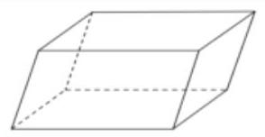</td><td>(1)相对的面是全等的平行四边形    (2)对角面是平行四边形</td></tr><tr><td>直平行六面体</td><td>侧棱垂直于底的平行六面体</td><td>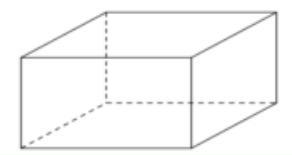</td><td>(1)侧面、对角面都是矩形    (2)底面是平行四边形</td></tr><tr><td>长方体</td><td>底面是矩形的直平行六面体</td><td>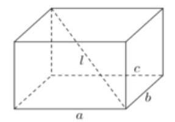</td><td>(1)六个面、对角面都是矩形    (2) ${l}^{2} = {a}^{2} + {b}^{2} + {c}^{2}$    (3) ${S}_{\text{ 全 }} = 2\left( {{ab} + {bc} + {ca}}\right)$</td></tr><tr><td>正四棱柱</td><td>底面是正方形的长方体</td><td>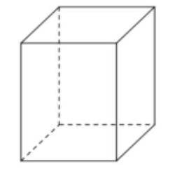</td><td>(1)侧面、对角面都是矩形    (2)底面是正方形</td></tr><tr><td>正方体</td><td>长、宽、高相等的长方体</td><td>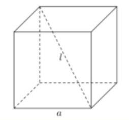</td><td>(1)六个面都是全等的正方形    (2) $l = \sqrt{3}a$ ； ${S}_{\text{ 全 }} = 6{a}^{2}$</td></tr></table>

(4)棱锥:如果一个多面体有一个多边形的面，且不在这个面上的棱都有一个公共点，那么这个多面体叫做棱锥;

棱锥的多边形的面叫做棱锥的底面, 其他的面叫做棱锥的侧面, 棱锥侧面都是三角形;

不在底面上的棱叫做棱锥的侧棱; 侧棱的公共点叫做棱锥的顶点;

顶点与底面之间的距离叫做棱锥的高.

(5)特殊的棱锥

正棱锥: 棱锥的底面是正多边形, 且底面中心与顶点的连线垂直于底面

【注意】区分正棱锥中的角:

① 侧棱与底边所成的角

② 侧棱与底面所成的角

③ 侧面与底面所成的角

④ 相邻侧面所成的角

在解正棱锥问题时,如果能够记住正多边形的边长 $a$ 与外接圆半径 $R$ 、内切圆半径 $r$ 和面积 $S$ 之间的关系, 将会给计算带来很大的便利, 如下表:

<table><tr><td></td><td>图形</td><td>$R$</td><td>$r$</td><td>$S$</td></tr><tr><td>正三角形</td><td>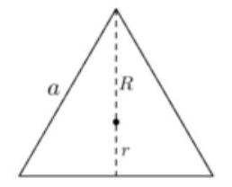</td><td>$\frac{\sqrt{3}}{3}a$</td><td>$\frac{\sqrt{3}}{6}a$</td><td>$\frac{\sqrt{3}}{4}{a}^{2}$</td></tr></table>

<table><tr><td>正方形</td><td>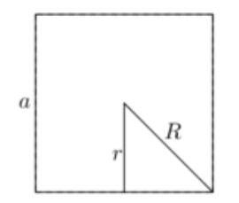</td><td>$\frac{\sqrt{2}}{2}a$</td><td>$\frac{a}{2}$</td><td>${a}^{2}$</td></tr><tr><td>正六边形</td><td></td><td>$a$</td><td>$\frac{\sqrt{3}}{2}a$</td><td>$\frac{3\sqrt{3}}{2}{a}^{2}$</td></tr></table>

【补充】三棱锥顶点在底面上射影的位置

已知在三棱锥 $P - {ABC}$ 中，顶点 $P$ 在底面上的射影为 $O$ ( $O$ 在 $\bigtriangleup  {ABC}$ 内部)

②_x0001_ 若 ${PA} = {PB} = {PC}$ ，或 ${PA},{PB},{PC}$ 与底面成等角，则 $O$ 是 $\bigtriangleup \; {ABC}$ 的外心；

② 若三棱锥的三个侧面与底面成等角,或 $P$ 到底面三边等距离,则 $O$ 是 $\bigtriangleup \; {ABC}$ 的内心;

## 2、旋转体的概念

(1)平面上一条封闭曲线所围成的区域绕着它所在平面上的一条定直线旋转而形成的几何体叫做旋转体, 该定直线叫做旋转体的轴；

(2)圆柱:将矩形 ${ABCD}$ 绕其一边 ${AB}$ 所在直线旋转一周，所形成的的几何体叫做圆柱； ${AB}$ 所在直线叫做圆柱的轴;

线段 ${AD}$ 和 ${BC}$ 旋转而成的圆面叫做圆柱的底面；

线段 ${CD}$ 旋转而成的曲面叫做圆柱的侧面； ${CD}$ 叫做圆柱侧面的一条母线；

圆柱的两个底面间的距离 (即 ${AB}$ 的长度) 叫做圆柱的高

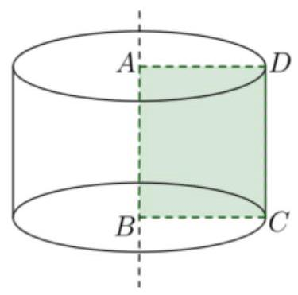

【性质】根据圆柱的形成过程易知:

① 圆柱有无穷多条母线，且所有母线都与轴平行;

② 圆柱有两个相互平行的底面.

(3)圆锥:将直角三角形 ${ABC}$ (及其内部)绕其一条直角边 ${AB}$ 所在直线旋转一周，所形成的几何体叫做圆锥; ${AB}$ 所在直线叫做圆锥的轴; 点 $A$ 叫做圆锥的顶点;

直角边 ${BC}$ 旋转而成的圆面叫做圆锥的底面；

斜边 ${AC}$ 旋转而成的曲面叫做圆锥的侧面；

斜边 ${AC}$ 叫做圆锥侧面的一条母线;

圆锥的顶点到底面间的距离叫做圆锥的高.

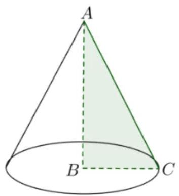

【性质】根据圆锥的形成过程易知:

① 圆锥有无穷多条母线，且所有母线相交于圆锥的顶点;

② 每条母线与轴的夹角都相等.

(4)球:将圆心为 $O$ 的半圆绕其直径 ${AB}$ 所在直线旋转一周,所形成的几何体叫做球; 半圆的圆弧所形成的曲面叫做球面，把点 $O$ 称为球心，把原半圆的半径和直径分别称为球的半径和球的直径.

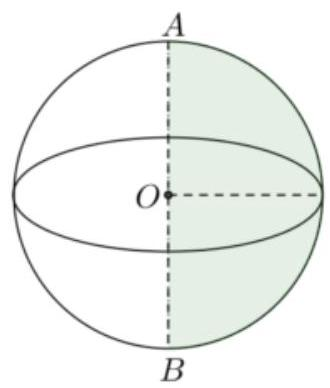

## 【补充】

① 球心到球面上任意点的距离都相等;

② 任意平面与球面的交线都是圆；当平面通过球心时, 所得交线是大圆; 当平面不通过球心时,所得交线是小圆.

## 3、几何体的表面积

(1)直柱体的表面积: ${S}_{\text{ 全 }} = {S}_{\text{ 侧 }} + 2{S}_{\text{ 底 }} = {ch} + {2{S}_{\text{ 底 }}}$ ( $h, c$ 分别为直棱柱的高和底面周长) 圆柱的表面积: ${S}_{\text{ 全 }} = {S}_{\text{ 侧 }} + 2{S}_{\text{ 底 }} = {2\pi rh} + {2\pi }{r}^{2}$ ( $h, r$ 分别为圆柱的高和底面半径)

(2)锥体的表面积: ${S}_{\text{ 全 }} = {S}_{\text{ 侧 }} + {S}_{\text{ 底 }}$

正锥体的表面积: ${S}_{\text{ 全 }} = {S}_{\text{ 侧 }} + {S}_{\text{ 底 }} = \frac{1}{2}c{h}^{\prime } + {S}_{\text{ 底 }}\left( {{h}^{\prime }, c}\right.$ 分别为斜高和底面周长) 圆锥的表面积: ${S}_{\text{ 全 }} = {S}_{\text{ 侧 }} + {S}_{\text{ 底 }} = {\pi r}{h}^{\prime } + \pi {r}^{2}\;\left( {{h}^{\prime }, r}\right.$ 分别为母线长和底面半径 $)$

(3)球的表面积: $S = {4\pi }{r}^{2}$ ( $r$ 是球的半径)

## 4、几何体的体积

(1)柱体的体积: ${V}_{\text{ 柱 }} = {S}_{\text{ 底 }} \times  h$ ( $h$ 为柱体的高)

圆柱的体积: ${V}_{\text{ 圆柱 }} = {S}_{\text{ 底 }} \times  h = \pi {r}^{2}h$ ( $h, r$ 分别为圆柱的高和底面半径)

(2)锥体的体积: ${V}_{\text{ 锥 }} = \frac{1}{3} \times  {S}_{\text{ 底 }} \times  h$ ( $h$ 为锥体的高)

圆锥的体积: ${V}_{\text{ 圆锥 }} = \frac{1}{3} \times  {S}_{\text{ 底 }} \times  h = \frac{1}{3}\pi {r}^{2}h$ ( $h, r$ 分别为圆锥的高和底面半径)

(3)球的体积: ${V}_{\text{ 球 }} = \frac{4}{3}\pi {r}^{3}$ (r是球的半径)

【补充】求体积的常见方法有:①直接法(公式法)；②割补法；③转化法(等体积法); 割补思想和转化思想是解决体积问题的常用技巧. 其中, 等体积法还经常用来求点到平面的距离或几何体的高.

## 例题精讲

【例 1】有下列命题:①底面是正多边形，侧面都是正三角形的棱锥是正棱锥

②各个侧面都是正方形的棱柱一定是正棱柱③对角面是全等的矩形的直棱柱是长方体

④在圆柱的上、下底面的圆周上各取一点, 则这两点连线的长度是母线的长度; ⑤圆锥顶点与底面圆周上任意一点连线的长度是母线的长度; ⑥圆柱的任意两条母线所在直线互相平行; ⑦过球上任意两点有且只有一个大圆; 其中正确命题的序号是___.

【难度】 $\star   \star   \star$

【答案】①⑤⑥

【解析】① 由正棱锥的定义可知①正确②不正确，例如各个侧面都是正方形的四棱柱的底面一定是菱形， 但不一定是正方形, 所以此时的四棱柱不一定是正四棱柱③不正确, 对角面是全等的矩形的直棱柱的底面可能是等腰梯形; ④若上下顶面两点连线不垂直于底面，则两点连线长度不是母线的长度，④错误；

⑤由圆锥的特点可知，圆锥顶点到底面圆周上任意一点长度相等，均为母线长度，⑤正确；

⑥圆柱的母线均垂直于底面，所以任意两条母线所在直线互相平行，⑥正确；

⑦若两点连线为球的直径，则过两点有两个大圆，⑦错误.

故答案为①⑤⑥

【例 2】(1)正三棱锥的一个侧面与底面的面积之比为 2:3, 则这个三棱锥的侧面和底面所成二面角的大小为___.

【难度】 $\star   \star   \star$

【答案】 ${60}^{ \circ  }$

【解析】如图在正三棱锥 $S - {ABC}$ 中,设 $O$ 为底面 $\bigtriangleup  {ABC}$ 的中心,连接 ${SO}$ ,则 ${SO} \bot$ 平面 ${ABC}$ .

过 $S$ 作 ${SE}\bot {AB}$ 交 ${AB}$ 于点 $E$ ,连接 ${EO}$

则 ${SO} \bot  {AB}$ ,又 ${SE} \bot  {AB}$ ,且 ${SE} \cap  {SO} = S$ ,所以 ${AB} \bot$ 平面 ${SEO}$

则 ${OE}\bot {AB}$ ，所以 $\angle {SEO}$ 为侧面和底面所成二面角的平面角.

在正三角形 $\bigtriangleup  {ABC}$ 中， $O$ 为中心， ${S}_{\bigtriangleup {ABC}} = {S}_{\bigtriangleup {OBC}} + {S}_{\bigtriangleup {OAB}} + {S}_{\bigtriangleup {OAC}} = 3{S}_{\bigtriangleup {OAB}} = \frac{3}{2}\left| {AB}\right| \left| {OE}\right|$

由条件有 $\frac{{S}_{\bigtriangleup {SAB}}}{{S}_{\bigtriangleup {ABC}}} = \frac{\frac{1}{2}\left| {AB}\right|  \cdot  \left| {SE}\right| }{\frac{3}{2}\left| {AB}\right|  \cdot  \left| {OE}\right| } = \frac{2}{3}$ ,可得 $\frac{\left| SE\right| }{\left| OE\right| } = 2$

在直角三角形 ${SOE}$ 中, $\cos \angle {SEO} = \frac{\left| EO\right| }{\left| ES\right| } = \frac{1}{2}$ ,所以 $\angle {SEO} = {60}^{ \circ  }$ ,故答案为: ${60}^{ \circ  }$

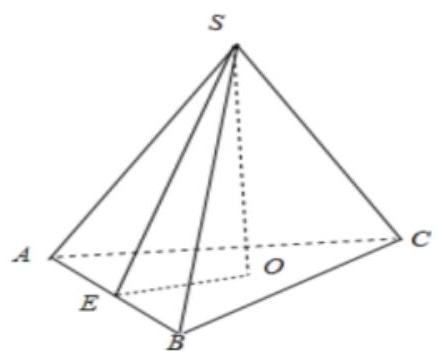

(2)用长度分别是2,3,5,6,9(单位: $\mathrm{{cm}}$ )的五根木棒连接(只允许连接，不允许折断)，组成共顶点的长方体的三条棱，则能够得到的长方体的最大表面积为( )

A. ${258}{\mathrm{\;{cm}}}^{2}$ B. ${414}{\mathrm{\;{cm}}}^{2}$ C. ${416}{\mathrm{\;{cm}}}^{2}$ D. ${418}{\mathrm{\;{cm}}}^{2}$

【难度】★★★

【答案】C

【解析】设长方体的三条棱的长度为 $a, b, c$ ,

所以长方体表面积 $S = 2\left( {{ab} + {bc} + {ac}}\right)  \leq  {\left( a + b\right) }^{2} + {\left( b + c\right) }^{2} + {\left( a + c\right) }^{2}$ ,

取等号时有 $a = b = c$ ,又由题意可知 $a = b = c$ 不可能成立,

所以考虑当 $a, b, c$ 的长度最接近时,此时对应的表面积最大,此时三边长:8,8,9,

用 2 和 6 连接在一起形成 8 ，用 3 和 5 连接在一起形成 8 ，剩余一条棱长为 9 ，

所以最大表面积为: $2\left( {8 \times  8 + 8 \times  9 + 8 \times  9}\right)  = {416}{\mathrm{\;{cm}}}^{2}$ . 故选 C.

【例 3】斜三棱柱 ${ABC} - {A}_{1}{B}_{1}{C}_{1}$ 中，每条棱长都为 $a,\angle {C}_{1}{CB} = \angle {C}_{1}{CA} = \angle {ACB} = {60}^{ \circ  }$ .

(1)求证: ${AB}{B}_{1}{A}_{1}$ 是矩形；

(2)求棱柱的侧面积与体积.

【难度】 $\star   \star   \star$

【答案】(1)证明见解析; (2) 侧面积为 $\left( {\sqrt{3} + 1}\right) {a}^{2}$ ,体积为 $\frac{\sqrt{2}}{4}{a}^{3}$ .

【解析】(1) 设 $\overrightarrow{CB} = \overrightarrow{x},\overrightarrow{CA} = \overrightarrow{y},{\overrightarrow{CC}}_{1} = \overrightarrow{z}$ ,

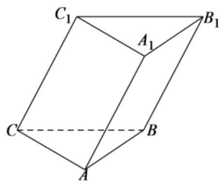

$\overrightarrow{A{A}_{1}} \cdot  \overrightarrow{AB} = \overrightarrow{C{C}_{1}} \cdot  \overrightarrow{AB} = \overrightarrow{C{C}_{1}} \cdot  \left( {\overrightarrow{CB} - \overrightarrow{CA}}\right)  = \overrightarrow{C{C}_{1}} \cdot  \overrightarrow{CB} - \overrightarrow{C{C}_{1}} \cdot  \overrightarrow{CA} = {a}^{2}\cos {60}^{ \circ  } - {a}^{2}\cos {60}^{ \circ  } = 0$ ,

$\therefore A{A}_{1} \bot  {AB}$ ,

在斜三棱柱 ${ABC} - {A}_{1}{B}_{1}{C}_{1}$ 中，四边形 ${AB}{B}_{1}{A}_{1}$ 为平行四边形，

$\because A{A}_{1} \bot  {AB}$ ,所以,四边形 ${AB}{B}_{1}{A}_{1}$ 为矩形;

(2)由题意可知，四边形 ${CB}{B}_{1}{C}_{1}$ 与 ${CA}{A}_{1}{C}_{1}$ 均为一锐角为 ${60}^{ \circ  }$ 的菱形，

${S}_{\text{ 菱形 }{CA}{A}_{1}{C}_{1}} = {S}_{\text{ 菱形 }{CB}{B}_{1}{C}_{1}} = {a}^{2}\sin {60}^{ \circ  } = \frac{\sqrt{3}}{2}{a}^{2},{S}_{\text{ 矩形 }{AB}{B}_{1}{A}_{1}} = {a}^{2}$ ,

所以,该棱柱的侧面积为 $2 \times  \frac{\sqrt{3}}{2}{a}^{2} + {a}^{2} = \left( {\sqrt{3} + 1}\right) {a}^{2}$ .

易知 ${C}_{1} - {ABC}$ 为正四面体，可知点 ${C}_{1}$ 在底面 ${ABC}$ 的射影点为正 $\bigtriangleup  {ABC}$ 的中心，

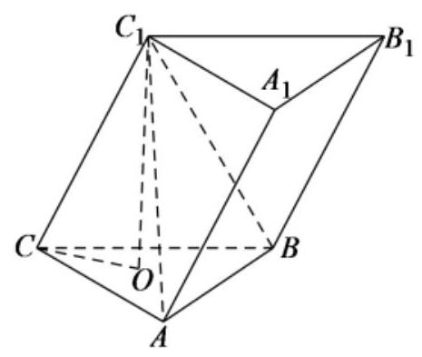

$\because O{C}_{1} \bot$ 平面 ${ABC},{OC} \subset$ 平面 ${ABC},\therefore O{C}_{1} \bot  {OC}$ ,

$\because {OC} = \frac{2}{3} \times  \frac{\sqrt{3}}{2}a = \frac{\sqrt{3}}{3}a,\therefore O{C}_{1} = \sqrt{C{C}_{1}^{2} - O{C}^{2}} = \frac{\sqrt{6}}{3}a,{S}_{\bigtriangleup {ABC}} = \frac{1}{2}{a}^{2}\sin {60}^{ \circ  } = \frac{\sqrt{3}}{4}{a}^{2}$ ,故

${V}_{{C}_{1} - {ABC}} = \frac{1}{3}{S}_{\bigtriangleup {ABC}} \cdot  O{C}_{1} = \frac{1}{3} \times  \frac{\sqrt{3}}{4}{a}^{2} \times  \frac{\sqrt{6}}{3}a = \frac{\sqrt{2}}{12}{a}^{3}$ ,

因此,该棱柱的体积为 ${V}_{{ABC} - {A}_{1}{B}_{1}{C}_{1}} = 3{V}_{{C}_{1} - {ABC}} = 3 \times  \frac{\sqrt{2}}{12}{a}^{3} = \frac{\sqrt{2}}{4}{a}^{3}$ .

【例 4】已知等边圆锥 (轴截面为等边三角形的圆锥) 的内接正三棱柱的侧面是边长为 $\sqrt{3}$ 的正方形,求此圆锥的全面积.

【难度】 $\star   \star   \star$

【答案】 ${12\pi }$

【解析】如图所示,由对称性,圆锥顶点 $S$ 在正三棱柱上、下底面上的射影 ${O}_{1}\text{ 、 }O$ 分别为 $\bigtriangleup {A}_{1}{B}_{1}{C}_{1}\text{ 、 }\bigtriangleup {ABC}$ 的中心.

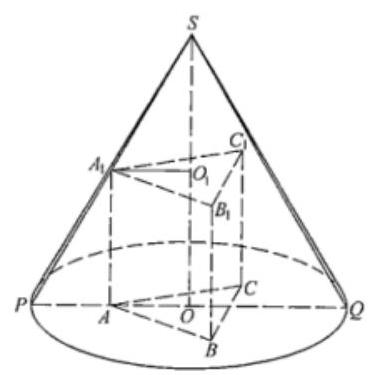

设此等边圆锥底面半径为 $R$ ,则 ${SO} = \sqrt{3}R$ ,圆锥的母线长为 ${2R}$ ,

又正三棱柱的底面边长及高均为 $\sqrt{3}$ ,由正弦定理得 ${A}_{1}{O}_{1} = \frac{\sqrt{3}}{2\sin {60}^{ \circ  }} = \frac{\sqrt{3}}{2 \times  \frac{\sqrt{3}}{2}} = 1$ .

在轴截面 ${SPQ}$ 中,有 $\frac{{A}_{1}{O}_{1}}{PO} = \frac{S{O}_{1}}{SO}$ ,即 $\frac{1}{R} = \frac{\sqrt{3}R - \sqrt{3}}{\sqrt{3}R}$ ,解方程,得 $R = 2$ .

所以,该圆锥的表面积为 $S = {\pi R} \cdot  {2R} + \pi {R}^{2} = {3\pi }{R}^{2} = {12\pi }$

【例 5】如图①，有一个圆柱形状的玻璃水杯，底面圆的直径为 ${20}\mathrm{\;{cm}}$ ，高为 ${30}\mathrm{\;{cm}}$ ，杯内有 ${20}\mathrm{\;{cm}}$ 深的溶液，现将水杯倾斜，且倾斜时点 $B$ 始终在桌面上，设直径 ${AB}$ 所在直线与桌面所成的角为 $\alpha$ (图②).

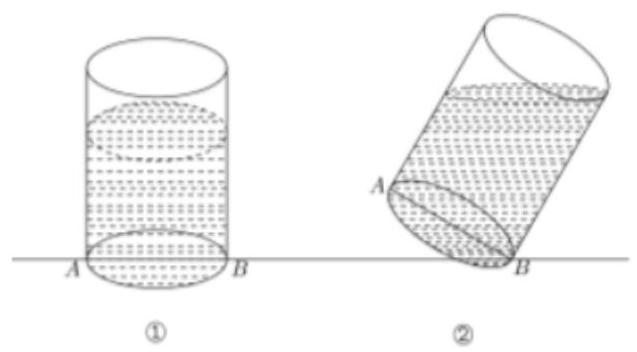

(1)求图②圆柱的母线与液面所在平面所成的角(用 $\alpha$ 表示)；

(2)要使倾斜后容器内的溶液不会溢出，求角 $\alpha$ 的最大值；

(3)现需要倒出的溶液体积不少于 ${3000}{\mathrm{\;{cm}}}^{3}$ ，当 $\alpha  = {60}^{ \circ  }$ 时，能实现要求吗？请说明理由.

【难度】 $\star   \star   \star$

【答案】(1) $\frac{\pi }{2} - \alpha ;\left( 2\right) \alpha  = \frac{\pi }{4};\left( 3\right)$ 不能实现.

【解析】(1) 在图 (1) 中,过点 $F$ 作 ${FQ} \bot  {BC}$ ,交 ${BC}$ 于 $Q$ ,

过点 $C$ 作 ${CM}\bot {PB}$ ，交 ${PQ}$ 延长线于点 $M$ ，

过点 $M$ 作 ${MN}//{PB}$ ，交 ${BC}$ 于 $N$ ，则 $\angle {CFQ} = \alpha$ ，

所以图②圆柱的母线与液面所在平面所成的角 $\angle {DFC} = \angle {FCQ} = \frac{\pi }{2} - \alpha$ .

(2)根据题意，画出图形，如图①所示，过 $C$ 作 ${CF}//{BP}$ ，交 ${AD}$ 所在的直线于 $F$ ，

在直角 ${\Delta CDF}$ 中, $\angle {FCD} = \alpha ,{CD} = {20}\mathrm{\;{cm}},{DF} = {20}\tan \alpha$ ,

且点 $F$ 在线段 ${AD}$ 上， ${AF} = {{30} - {20}\tan \alpha }$ ，

此时容器内能容纳的溶液量为:

${S}_{ABCD} \cdot  {20} = \frac{\left( {{AF} + {BC}}\right)  \cdot  {AB}}{2} \cdot  {20} = \left( {{30} - {20}\tan \alpha  + {30}}\right)  \times  {10} \times  {20} = {2000}\left( {6 - 2\tan \alpha }\right) {\mathrm{{cm}}}^{3}$ ,

而容器内原有溶液量为 ${20} \times  {20} \times  {20} = {8000}{\mathrm{\;{cm}}}^{3}$ ,

令 ${2000}\left( {6 - 2\tan \alpha }\right)  \geq  {8000}$ ,解得 $\tan \alpha  \leq  1$ ,所以 $\alpha  \leq  {45}^{ \circ  }$ ,即 $\alpha$ 的最大角为 ${45}^{ \circ  }$ 时,溶液不会溢出.

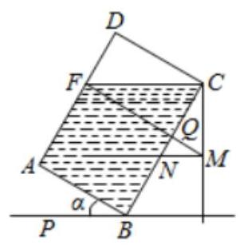

(3)如图②，当 $\alpha  = {60}^{ \circ  }$ 时，

过 $C$ 作 ${CF}//{BP}$ ,交 ${AB}$ 于 $F$ ,在直角 ${\Delta CBF}$ 中, ${BC} = {30}\mathrm{\;{cm}},\angle {BCF} = {30}^{ \circ  },{BF} = {10}\sqrt{3}$ ,所以点 $F$ 在线段 ${AB}$ 上,故溶液纵截面为直角 ${\Delta CBF}$ ,因为 ${S}_{\bigtriangleup {ABF}} = \frac{1}{2} \times  {BC} \times  {BF} = {150}\sqrt{3}c{m}^{2}$ ,容器内溶液量为 ${150}\sqrt{3} \times  {20} = {3000}\sqrt{3}c{m}^{3}$ ,

倒出的溶液量为 $\left( {{8000} - {3000}\sqrt{3}}\right)  < {3000}$ ,所以不能实现要求.

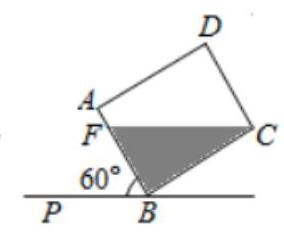

【例 6】如图,实心铁制几何体 ${AEFCBD}$ 由一个直三棱柱与一个三棱锥构成,已知 ${BC} = {EF} = {\pi \mathrm{{cm}}}$ ， ${AE} = {2\mathrm{\;{cm}}}$ ， ${BE} = {CF} = {4\mathrm{\;{cm}}}$ ， ${AD} = {7\mathrm{\;{cm}}}$ ，且 ${AE}\bot {EF}$ ， ${AD}\bot$ 底面 ${AEF}$ . 某工厂要将其铸成一个实心铁球，假设在铸球过程中原材料将损耗 20%，则铸得的铁球的半径为___ $\mathrm{{cm}}$ .

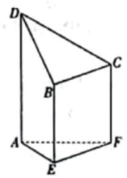

【难度】 $\star   \star   \star$

【答案】 $\sqrt[3]{3}$

【解析】设铸得的铁球的半径为 $r\mathrm{\;{cm}}$ ,

依题意,可得该几何体的体积为 $\frac{1}{2} \times  2 \times  \pi  \times  4 + \frac{1}{3} \times  \frac{1}{2} \times  2 \times  \pi  \times  \left( {7 - 4}\right)  = {5\pi }$ ,

则 ${5\pi } \times  \left( {1 - {20}\% }\right)  = \frac{4}{3}\pi {r}^{3}$ ，解得 $r = \sqrt[3]{3}$ . 故答案为: $\sqrt[3]{3}$

【例 7】某工艺品厂要生产如图所示的一种工艺品, 该工艺品由: 一个实心圆柱体和一个实心半球体组成, 要求半球的半径和圆柱的底面半径之比为3 : 2,工艺品的体积为 ${34\pi }{\mathrm{{cm}}}^{3}$ . 现设圆柱的底面半径为 ${2x}\mathrm{\;{cm}}$ , 工艺品的表面积为 $S{\mathrm{\;{cm}}}^{2}$ ,半球与圆柱的接触面积忽略不计. 试写出 $S$ 关于 $x$ 的函数关系式及 $x$ 的取值范围 ___.

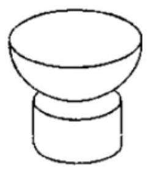

【难度】★★★

【答案】 $S = {17\pi }\left( {{x}^{2} + \frac{2}{x}}\right) , x \in  \left( {0,\frac{\sqrt[3]{51}}{3}}\right)$

【解析】解: 设圆柱的高为 $h$ ,因为圆柱的底面半径为 ${2x}$ ,

而半球的半径和圆柱的底面半径之比为 $3 : 2$ ,

所以半球的半径为 ${3x}$ ,设球的体积为 ${V}_{1}$ ,圆柱的体积为 ${V}_{2}$ ,则由题意可得

$V = \frac{1}{2}{V}_{1} + {V}_{2} = \frac{1}{2} \times  \frac{4}{3}\pi  \cdot  {\left( 3x\right) }^{3} + \pi  \cdot  {\left( 2x\right) }^{2} \cdot  h = {34\pi },$

解得 $h = \frac{{17} - 9{x}^{3}}{2{x}^{2}} > 0$ ,得 $x \in  \left( {0,\frac{\sqrt[3]{51}}{3}}\right)$ ,

所以表面积为

$2 \cdot  \pi  \cdot  {\left( 2x\right) }^{2} + {2\pi } \cdot  {2x} \cdot  h + \frac{1}{2} \cdot  {4\pi } \cdot  {\left( 3x\right) }^{2} + \pi  \cdot  {\left( 3x\right) }^{2} = {35\pi }{x}^{2} + {4\pi x}\left( {\frac{17}{2{x}^{2}} - \frac{9x}{2}}\right)  = {17\pi }\left( {{x}^{2} + \frac{2}{x}}\right)$ ,

$x \in  \left( {0,\frac{\sqrt[3]{51}}{3}}\right)$ ,故答案为: $S = {17\pi }\left( {{x}^{2} + \frac{2}{x}}\right) , x \in  \left( {0,\frac{\sqrt[3]{51}}{3}}\right)$

【例 8】某艺术品公司欲生产一款迎新春工艺礼品, 该礼品是由玻璃球面和该球的内接圆锥组成, 圆锥的侧面用于艺术装饰，如图 1. 为了便于设计，可将该礼品看成是由圆 $O$ 及其内接等腰三角形 ${ABC}$ 绕底边 ${BC}$ 上的高所在直线 ${AO}$ 旋转 ${180}^{ \circ  }$ 而成,如图 2. 已知圆 $O$ 的半径为 ${10}\mathrm{\;{cm}}$ ,设 $\angle {BAO} = \theta ,0 < \theta  < \frac{\pi }{2}$ 圆锥的侧面积为 $S{\mathrm{\;{cm}}}^{2}$ .

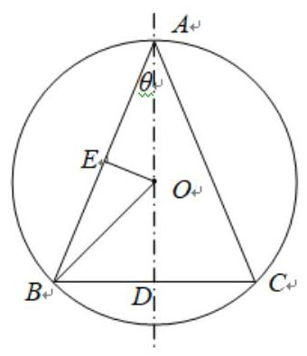

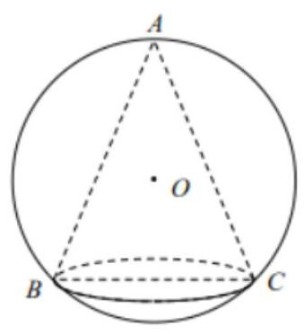

图 1

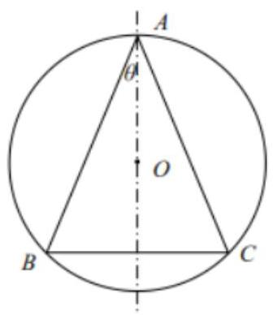

图 2

(1)求 $S$ 关于 $\theta$ 的函数关系式;

(2)为了达到最佳观赏效果，要求 $k = \frac{S}{{\sin }^{2}\left( {\frac{\theta }{2} + \frac{\pi }{4}}\right) }$ 最大，求 $k$ 的最大值并求此时腰 ${AB}$ 的长度.

【难度】 $\star   \star   \star   \star$

【答案】(1) $S = {400\pi }\sin \theta {\cos }^{2}\theta ,\left( {0 < \theta  < \frac{\pi }{2}}\right)$ ; (2) $k$ 的最大值为 ${200\pi },{AB}$ 的长度为 ${10}\sqrt{3}\mathrm{\;{cm}}$ 。

【解析】解: 设 ${AO}$ 交 ${BC}$ 于点 $D$ ,过 $O$ 作 ${OE} \bot  {AB}$ ,垂足为 $E$ ,

在 $\bigtriangleup {AOE}$ 中, ${AE} = {10}\cos \theta ,{AB} = {2AE} = {20}\cos \theta$ ,

在 $\bigtriangleup {ABD}$ 中, ${BD} = {AB} \cdot  \sin \theta  = {20}\cos \theta  \cdot  \sin \theta$ ,

所以 $S = \frac{1}{2} \cdot  {2\pi } \cdot  {20}\sin \theta \cos \theta  \cdot  {20}\cos \theta  = {400\pi }\sin \theta {\cos }^{2}\theta ,\left( {0 < \theta  < \frac{\pi }{2}}\right)$

(2)由(1)得:

$k = \frac{S}{{\sin }^{2}\left( {\frac{\theta }{2} + \frac{\pi }{4}}\right) } = \frac{{400\pi }\sin \theta {\cos }^{2}\theta }{\frac{1 + \sin \theta }{2}} = \frac{{800\pi }\sin \theta \left( {1 + \sin \theta }\right) \left( {1 - \sin \theta }\right) }{1 + \sin \theta }$

$= {800\pi }\sin \theta \left( {1 - \sin \theta }\right)  = {800\pi }\left\lbrack  {-{\left( \sin \theta  - \frac{1}{2}\right) }^{2} + \frac{1}{4}}\right\rbrack$

当 $\sin \theta  = \frac{1}{2}$ 时, $k$ 的最大值为 ${200\pi }$ .

此时, $\theta  = \frac{\pi }{6},\bigtriangleup {ABC}$ 为正三角形. 此时 $\cos \theta  = \frac{\sqrt{3}}{2},{AB} = {10}\sqrt{3}$ .

答: $k$ 的最大值为 ${200\pi }$ ,此时 ${AB}$ 的长度为 ${10}\sqrt{3}\mathrm{\;{cm}}$ .

【例 9】美丽的广州塔, 以其窈窕的身姿被广州人民亲昵地称为 “小蛮腰”, 它的整体轮廓可以看成是双曲线的一部分绕虚轴旋转得到的,以下是研究广州塔的一个数学题型: 将曲线 $\frac{{x}^{2}}{4} - \frac{{y}^{2}}{225} = 1\left( {0 \leq  y \leq  {60}, x > 0}\right)$ 与 $x$ 轴、 $y = {60}$ 围成的部分绕 $y$ 轴旋转一周,得到一旋转体,直线 $y = h$ 绕 $y$ 轴旋转一周形成的平面截此旋转体所得截面圆的面积为 ___. 根据祖暅原理，构造适当的一个或多个几何体，求出此旋转体的体积为 ___. (提示: 祖暅原理; 夹在两个平行平面之间的两个几何体, 被平行于这两个平面的任意平面所截, 如果截得的两个截面的面积总相等, 那么这两个几何体的体积相等)

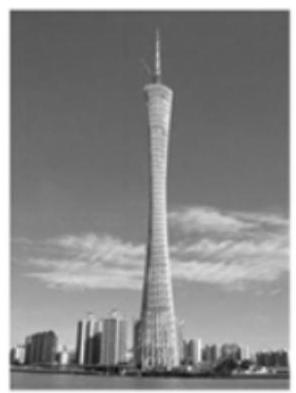

【难度】 $\star   \star   \star   \star$

【答案】 $\pi \left( {4 + \frac{4{h}^{2}}{225}}\right) ,{1520\pi }$ .

【解析】解: 将 $y = h$ 代入曲线方程得 ${x}^{2} = 4 + \frac{4{h}^{2}}{225}$ ,所以截面圆的面积为 $S = \pi {x}^{2} = \pi \left( {4 + \frac{4{h}^{2}}{225}}\right)$ ,

利用①中所截面圆的面积, 结合祖暅原理,

即构造几何体,使之在任意高度 $h$ 处,截面面积等于①中得到的面积 $S$ ,

由于 $\left( {4 + \frac{4{h}^{2}}{225}}\right) \pi  = {4\pi } + \frac{{4\pi }{h}^{2}}{225}$ ,构造两个几何体,先构造一个底面半径为 2,高为 60 的圆柱,

底面与所求旋转体的底面在同一个平面内; 再构造一个底面半径为 8,高为 60 的倒立圆锥,顶点在所求旋转体的底面,圆锥底面与所求旋转体底面平行,与底面距离为 $h$ 的平面截圆柱面积为 ${4\pi } = {S}_{1}$ ,

截圆锥得圆,半径设为 $r,\frac{r}{h} = \frac{8}{60} = \frac{2}{15}$ ,面积为 $\pi {r}^{2} = \frac{{4\pi }{h}^{2}}{225} = {S}_{2}$ ,故 ${S}_{1} + {S}_{2} = S$ ,满足祖暅原理,

所以所求旋转体的体积为 ${V}_{\text{ 柱 }} + {V}_{\text{ 锥 }} = {4\pi } \times  {60} + \frac{1}{3} \times  \pi  \times  {8}^{2} \times  {60} = {1520\pi }$ ,故答案为: $\pi \left( {4 + \frac{4{h}^{2}}{225}}\right) ,{1520\pi }$ .

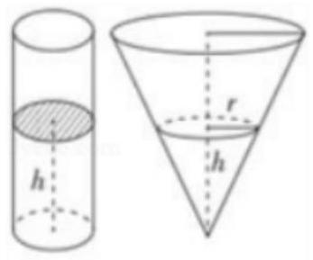

## 巩固训练

1、三棱锥 V-ABC 中，AB=AC=10，BC=12，各侧面与底面成的二面角都是 ${45}^{ \circ  }$ ， 求三棱锥的侧面积和高。

【难度】 $\star   \star   \star$

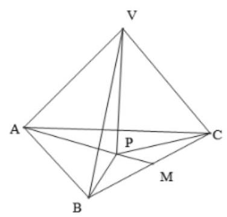

【答案】见解析

【解析】取 ${BC}$ 中点 $M$ ,连接 ${AM},\because {AB} = {AC} = {10},\therefore {AM} \bot  {BC},{AM} = 8$ , ${S}_{\bigtriangleup {ABC}} = \frac{1}{2}{BC} \cdot  {AM} = {48}$ ,各侧面与底面成的二面角都是 ${45}^{ \circ  }$ ,设二面角 $\theta ,\cos \theta  = \frac{{S}_{\bigtriangleup {ABC}}}{{S}_{QQ}},\therefore {S}_{QQ} = {48}\sqrt{2}$ ; 设 ${VP} \bot$ 面 ${ABC}$ 于 $P$ ,各侧面与底面成的二面角都是 ${45}^{ \circ  }$ ,即 $P$ 是 $\bigtriangleup {ABC}$ 的内心,设半径为 $R$ ,则 ${S}_{\bigtriangleup {ABC}} = \frac{1}{2}\left( {{BC} + {AB} + {AC}}\right) R = {16R} = {48},\therefore R = 3,\therefore {VP} = R\tan {45}^{ \circ  } = 3$

2、斜三棱柱 ${ABC} - {A}_{1}{B}_{1}{C}_{1}$ 的底面是正三角形，侧棱 $A{A}_{1}$ 和棱 ${AB},{AC}$ 所成的角都是 ${60}^{ \circ  }$ ，若 ${AB} = \sqrt{3}, A{A}_{1} = 3$ ，则此三棱柱的全面积为___.

【难度】★★★

【答案】 $\frac{{27} + 3\sqrt{3}}{2}$

【解析】 ${S}_{\text{ 全 }} = 3 \times  3 \times  \sqrt{3} \times  \sin {60}^{ \circ  } + 2 \times  \frac{1}{2} \times  \sqrt{3} \times  \sqrt{3} \times  \sin {60}^{ \circ  } = \frac{{27} + 3\sqrt{3}}{2}$

3、一个正三棱柱形容器 ${ABC} - {A}_{1}{B}_{1}{C}_{1}$ ，以 $\bigtriangleup  {ABC}$ 为底面成水平放置，其高为 ${2a}$ ，内盛水若干，水面高度为 $x$ . 若将此容器放倒,使它的一个侧面为底面成水平放置,这时水面恰为中截面,则 $x =$ ___.

【难度】 $\star   \star   \star$

【答案】 $\frac{3}{2}a$

【解析】如图

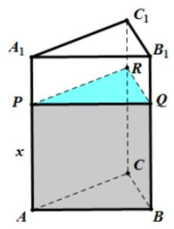

放倒前

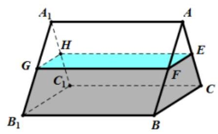

放倒后

记 $\bigtriangleup  {ABC}$ 的面积为 $S$ ，

由将此容器放倒, 使它的一个侧面为底面成水平放置, 这时水面恰为中截面

所以 $E, F$ 分别为 ${AC},{AB}$ 的中点,则 ${\mathrm{S}}_{\bigtriangleup {AEF}} = \frac{1}{4}S$ ，故 ${\mathrm{S}}_{EFBC} = \frac{3}{4}S$

所以 $S \cdot  x = {\mathrm{S}}_{EFBC} \cdot  {2a} = \frac{3}{4}S \cdot  {2a} \Rightarrow  x = \frac{3}{2}a$

故答案为: $\frac{3}{2}a$

4、若 $y = \left| x\right|$ 和 $y = 3$ 围成的封闭平面图形绕 $y$ 轴旋转一周,则所得体积与绕 $x$ 轴旋转一周所得体积之比是 ( ).

A. 1:4 B. 4:1

C. $\left( {1 + \sqrt{2}}\right)  : \left( {4 + 2\sqrt{2}}\right)$ D. $\left( {4 + 2\sqrt{2}}\right)  : \left( {1 + \sqrt{2}}\right)$

【难度】 $\star   \star   \star$

【答案】A

【解析】由 $\left\{  \begin{array}{l} y = \left| x\right| \\  y = 3 \end{array}\right.$ 解得 $\left\{  \begin{array}{l} x = 3 \\  y = 3 \end{array}\right.$ 或 $\left\{  \begin{array}{l} x =  - 3 \\  y = 3 \end{array}\right.$ .

$y = \left| x\right|$ 和 $y = 3$ 围成的封闭平面图形绕 $y$ 轴旋转一周所得几何体为圆锥,图形如下图所示,

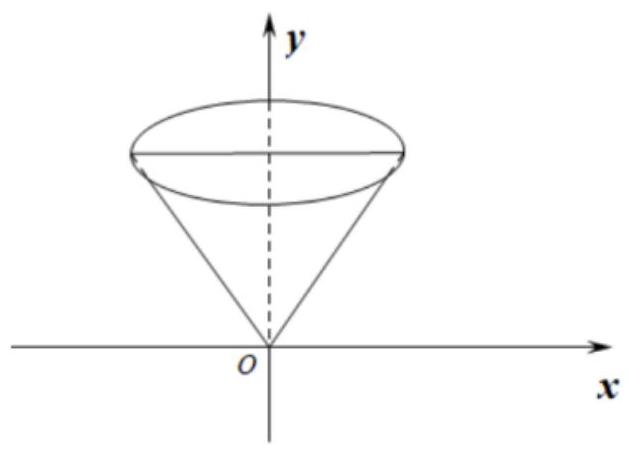

故体积为 $\frac{1}{3} \times  \pi  \times  {3}^{2} \times  3 = {9\pi }$ .

$y = \left| x\right|$ 和 $y = 3$ 围成的封闭平面图形绕 $x$ 轴旋转一周所得几何体为圆柱挖掉两个圆锥,图形如下图所示,

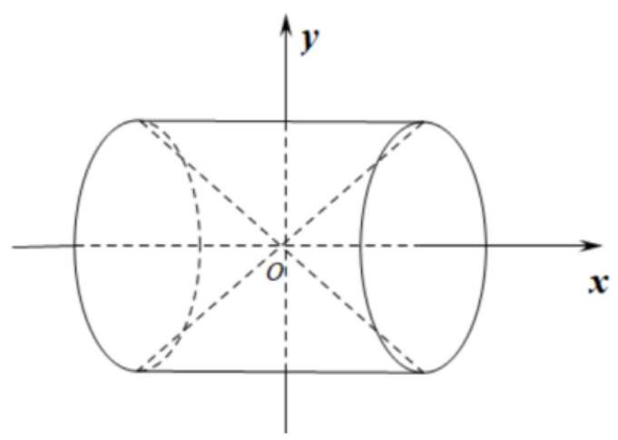

故体积为 $\pi  \times  {3}^{2} \times  6 - \frac{1}{3} \times  \pi  \times  {3}^{2} \times  3 - \frac{1}{3} \times  \pi  \times  {3}^{2} \times  3 = {36\pi }$ .

所以两个图形的体积比为 ${9\pi } : {36\pi } = 1 : 4$ . 故选: A

5、如果球、正方体与等边圆柱 (轴截面为正方形的圆柱) 的体积相等，那么它们的表面积 ${S}_{\text{ 球 }}$ ， ${S}_{\text{ 正方体 }}$ ， ${S}_{\text{ 柱 }}$ 的大小关系为( ).

A. ${S}_{\text{ 球 }} < {S}_{\text{ 正方体 }} < {S}_{\text{ 柱 }}$ B. ${S}_{\text{ 球 }} < {S}_{\text{ 柱 }} < {S}_{\text{ 正方体 }}$

C. ${S}_{\text{ 柱 }} < {S}_{\text{ 球 }} < {S}_{\text{ 正方体 }}$ D. ${S}_{\text{ 正方体 }} < {S}_{\text{ 柱 }} < {S}_{\text{ 球 }}$

【难度】 $\star   \star   \star$

【答案】B

【解析】设球的半径为 $r$ ,正方体的棱长为 $a$ ,等边圆柱的底面半径为 $R$ 、母线长为 ${2R}$ ,

则它们的体积分别为 ${V}_{\text{ 球 }} = \frac{4\pi }{3} \times  {r}^{3},{V}_{\text{ 正方体 }} = {a}^{3},{V}_{\text{ 柱 }} = \pi  \times  {R}^{2} \times  {2R} = {2\pi }{R}^{3}$ ,

依题意可知 $\frac{4\pi }{3}{r}^{3} = {a}^{3} = {2\pi }{R}^{3}$ ①.

它们的表面积分别为 ${S}_{\text{ 球 }} = {4\pi }{r}^{2},{S}_{\text{ 正方体 }} = 6{a}^{2},{S}_{\text{ 柱 }} = {2\pi }{R}^{2} + {2\pi R} \times  {2R} = {6\pi }{R}^{2}$ ②.

由①得 ${r}^{3} = \frac{3{a}^{3}}{4\pi } \Rightarrow  r = \sqrt[3]{\frac{3}{4\pi }}a,{R}^{3} = \frac{{a}^{3}}{2\pi } \Rightarrow  R = \sqrt[3]{\frac{1}{2\pi }}a$ ,代入②得

${S}_{\text{ 球 }} = {4\pi }{r}^{2} = {4\pi } \times  {\left( \sqrt[3]{\frac{3}{4\pi }}a\right) }^{2} = {4\pi } \times  {\left( \frac{3}{4\pi }\right) }^{\frac{2}{3}} \times  {a}^{2} = {\left( 4\pi \right) }^{\frac{1}{3}} \times  {3}^{\frac{2}{3}} \times  {a}^{2} = {\left( {36}\pi \right) }^{\frac{1}{3}} \times  {a}^{2}$ ,

${S}_{\text{ 正方体 }} = 6{a}^{2} = {\left( {216}\right) }^{\frac{1}{3}} \times  {a}^{2},$

${S}_{\text{ 柱 }} = {6\pi }{R}^{2} = {6\pi } \times  {\left( \sqrt[3]{\frac{1}{2\pi }}a\right) }^{2} = {6\pi } \times  {\left( \frac{1}{2\pi }\right) }^{\frac{2}{3}} \times  {a}^{2} = 3 \times  {\left( 2\pi \right) }^{\frac{1}{3}} \times  {a}^{2} = {\left( {54}\pi \right) }^{\frac{1}{3}} \times  {a}^{2}$ ,

由于 ${36\pi } < {54\pi } < {216}$ ,所以 ${S}_{\text{ 球 }} < {S}_{\text{ 柱 }} < {S}_{\text{ 正方体 }}$ .

故选: B

6、某小区楼顶成一种“楔体”形状，该“楔体”两端成对称结构，其内部为钢架结构(未画出全部钢架， 如图 1 所示，俯视图如图 2 所示)，底面 ${ABCD}$ 是矩形， ${AB} = {10}$ 米， ${AD} = {50}$ 米，屋脊 ${EF}$ 到底面 ${ABCD}$ 的距离即楔体的高为 1.5 米，钢架所在的平面 ${FGH}$ 与 ${EF}$ 垂直且与底面的交线为 ${GH}\text{ ， }{AG} = 5$ 米， ${FO}$ 为立柱且 $O$ 是 ${GH}$ 的中点.

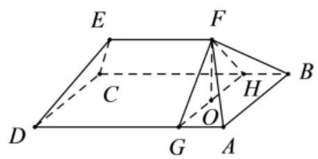

图1

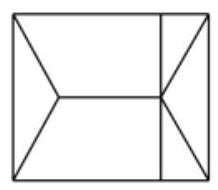

图2

(1)求斜梁 ${FB}$ 与底面 ${ABCD}$ 所成角的大小 (结果用反三角函数值表示)；

(2)求此模体 ${ABCDEF}$ 的体积.

【难度】 $\star   \star   \star$

【答案】(1) $\arctan \frac{3\sqrt{2}}{20};\left( 2\right) {350}$ (立方米).

【解析】(1)如下图,连接 ${BO}$ ,依题意 ${FO}$ 为立柱,即 ${FO} \bot$ 平面 ${ABCD}$ ,

则 $\angle {FBO}$ 是直线 ${FB}$ 与底面 ${ABCD}$ 所成角,

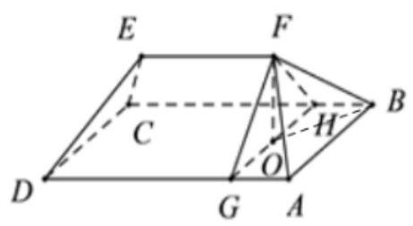

由俯视图可知， ${GH} \bot  {BC}$ ，则 ${BO} = \sqrt{{OH}^{2} + {HB}^{2}} = {5\sqrt{2}}$ ，

在 Rt $\bigtriangleup {FOB}$ 中, $\tan \angle {FOB} = \frac{FO}{BO} = \frac{1.5}{5\sqrt{2}} = \frac{3\sqrt{2}}{20}$ ,

即 $\angle {FBO} = \arctan \frac{3\sqrt{2}}{20}$ ，则斜梁 ${FB}$ 与底面 ${ABCD}$ 所成角的大小为 $\arctan \frac{3\sqrt{2}}{20}$ ；

(2)依题意，该“楔体”两端成对称结构，钢架所在的平面 ${FGH}$ 与 ${EF}$ 垂直，结合俯视图可知，可将该 “楔体” 分割成一个直三棱柱和两个相同的四棱锥,

则直三棱柱的体积

${V}_{1} = {S}_{\bigtriangleup {FGH}} \cdot  {EF} = \frac{1}{2}{GH} \cdot  {FO} \cdot  \left( {{AD} - {2AG}}\right)  = \frac{1}{2} \times  {10} \times  \frac{3}{2} \times  {40} = {300}$ (立方米),

两个四棱锥的体积

${V}_{2} = 2{V}_{F - {GABH}} = \frac{2}{3}{S}_{GABH} \cdot  {FO} = \frac{2}{3}{AG} \cdot  {AB} \cdot  {FO} = \frac{2}{3} \times  5 \times  {10} \times  \frac{3}{2} = {50}$ (立方米),

则所求的楔体 ${ABCDEF}$ 的体积 $V = {V}_{1} + {V}_{2} = {350}$ (立方米).

7、我国南北朝时期的数学家祖暅提出了计算体积的祖暅原理:“幂势既同，则积不容异。”意思是:两个等高的几何体若在所有等高处的水平截面的面积相等,则这两个几何体的体积相等. 已知曲线 $C : y = {x}^{2}$ ,直线 $l$ 为曲线 $C$ 在点 $\left( {1,1}\right)$ 处的切线. 如图 1 所示,阴影部分为曲线 $C$ 、直线 $l$ 以及 $x$ 轴所围成的平面图形,记该平面图形绕 $y$ 轴旋转一周所得的几何体为 $T$ . 给出以下四个几何体:

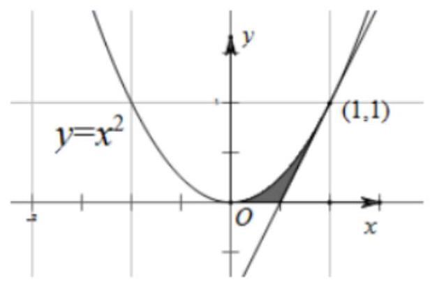

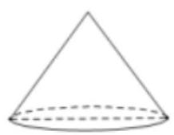

①

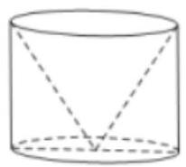

②

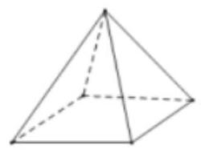

③

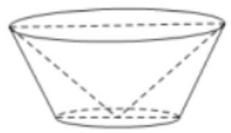

④

图①是底面直径和高均为 1 的圆锥；

图②是将底面直径和高均为 1 的圆柱挖掉一个与圆柱同底等高的倒置圆锥得到的几何体；

图③是底面边长和高均为 1 的正四棱锥；

图④是将上底面直径为 2，下底面直径为 1，高为 1 的圆台挖掉一个底面直径为 2，高为 1 的倒置圆锥得到的几何体.

根据祖暅原理，以上四个几何体中与 $T$ 的体积相等的是( )

A. ① B. ② C. ③ D. ④

【难度】 $\star   \star   \star$

【答案】 $A$

【解析】解: 设直线 $y = t$ ,与 $y = {x}^{2}$ 交于点 $\left( {\sqrt{t}, t}\right)$ ,其中 $0 \leq  t \leq  1$ ,

切线的斜率为 2,切线的方程为 $y = {2x} - 1, y = t$ 与 $y = {2x} - 1$ 交于点 $\left( {\frac{t + 1}{2}, t}\right)$ ,

用平行于底面的平面截几何体 $T$ 所得的截面为圆环,

截面面积为 $\pi \left( {\frac{{t}^{2} + {2t} + 1}{4} - t}\right)  = \pi  \cdot  \frac{{\left( t - 1\right) }^{2}}{4}$ ,对于①,用一个平行于底面的截面截该几何体,

得到的截面为圆,且圆的半径为 $\frac{1}{2}\left( {t - 1}\right)$ ,可得截面面积为 $\pi  \cdot  \frac{{\left( t - 1\right) }^{2}}{4}$ ,符合题意;

对于②，用一个平行于底面的截面截该几何体，

得到的截面为一个圆环,截面的面积为大圆面积去掉一个小圆面积,面积为 $\frac{1}{4}\pi  - \frac{1}{4}\pi {t}^{2}$ ,不符合题意;

对于③，用一个平行于底面的截面截该几何体，得到的截面为正方形，不符合题意；

对于④, 用一个平行于底面的截面截该几何体, 得到的截面为一个圆环,

圆环的面积为 $\pi  \cdot  {\left( \frac{t + 1}{2}\right) }^{2} - \pi {t}^{2} = \frac{\pi \left( {1 - t}\right) \left( {1 + {3t}}\right) }{4}$ ,不符合题意.

综上所述,四个几何体中与 $T$ 体积相等的是图①.

故选: $A$ .

8、在平面 ${xOy}$ 上，将曲线 ${x}^{2} + \frac{{y}^{2}}{4} = 1\left( {x \geq  0}\right)$ 与 $y$ 轴围成的封闭图形记为 $D$ ，记 $D$ 绕 $y$ 轴旋转一周而成的几何体为 $\Omega$ ,试构造圆柱与倒立的圆锥,利用祖暅原理得出 $\Omega$ 的体积值为___.

【难度】 $\star   \star   \star   \star$

【答案】 $\frac{8\pi }{3}$

【解答】解: 根据题意知,曲线 ${x}^{2} + \frac{{y}^{2}}{4} = 1\left( {x \geq  0}\right)$ 与 $y$ 轴围成的封闭图形为半椭圆,

如图所示:

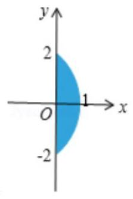

该平面图形绕 $y$ 轴旋转一周而成的几何体为 $\Omega$ ,构造圆柱与倒立的圆锥,利用祖暅原理,

可知 $\Omega$ 的体积 $V = 2\left( {\pi  \cdot  {1}^{2} \cdot  2 - \frac{1}{3}\pi  \cdot  {1}^{2} \cdot  2}\right)  = \frac{8\pi }{3}$ . 故答案为: $\frac{8\pi }{3}$ .

## (二)直观图与三视图

## 知识梳理

## 1、多面体的直观图

斜二测画图法: 画直观图时, 规定在铅垂方向和左右方向上线段的长度与其表示的真实长度相等, 而在前后方向上, 线段的长度是其表示的真实长度的二分之一, 根据这样的规定, 我们可以画出空间图形的直观图, 这样的画图方法简称 “斜二测” 画图法.

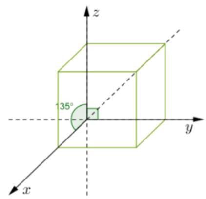

如左图, 是一个用斜二测方法画的正方体的直观图, $y$ 轴与 $z$ 轴方向上的长度等于正方体边长, $x$ 轴方向上的长度等于边长一半 【注意】“斜二测” 画图法有两条重要性质:

① 平行直线的直观图仍是平行直线;

② 线段及其线段上定比分点的直观图保持原比例不变.

## 2、三视图

1、光线从几何体的前面向后面正投影所得到的投影图叫做几何体的 正视图

2、光线从几何体的左面向右面正投影所得到的投影图叫做几何体 侧视图

3、光线从几何体的上面向下面正投影所得到的投影图叫做几何体的 俯视图

## 4、三视图的概念:

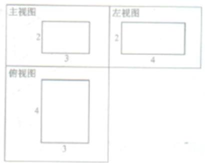

将三个视图展示在同一个平面上，使俯视图在主视图的下方，左视图在主视图的右方(如图)，我们把整个构图叫做这个长方体的三视图。

问题: 根据长方体的模型，画出它们的三视图，并观察三种图形之间的关系.

答: 一个几何体的正视图和侧视图的高度一样, 俯视图和正视图的长度一样, 侧视图和俯视图的宽度一样.

【注:在画图中，三个视图的框可以不画，但是上下、左右的对齐要求必须遵循。】

## 例题精讲

【例 10】( 1 )如果正三角形 ${ABC}$ 的边长为 $a$ ，那么 $\bigtriangleup  {ABC}$ 的水平放置的直观图 $\bigtriangleup  {{A}^{\prime }{B}^{\prime }{C}^{\prime }}$ 的面积为___.

【难度】 $\star   \star   \star$

【答案】 $\frac{\sqrt{6}}{16}{a}^{2}$

【解析】

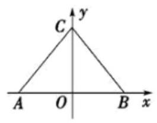

①

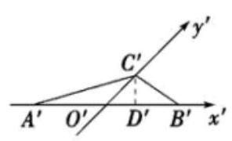

②

如图所示分别为正三角形 ${ABC}$ 平面图和直观图 $\Delta {A}^{\prime }{B}^{\prime }{C}^{\prime }$ ,

过 ${C}^{\prime }$ 作 ${C}^{\prime }{D}^{\prime } \bot  {A}^{\prime }{B}^{\prime }$ ,垂足为 ${D}^{\prime }$ ,

根据斜二测法可得 $\left| {{A}^{\prime }{B}^{\prime }}\right|  = \left| {AB}\right|  = a,\left| {{O}^{\prime }{C}^{\prime }}\right|  = \frac{1}{2}\left| {OC}\right|  = \frac{1}{2} \times  \frac{\sqrt{3}}{2}a = \frac{\sqrt{3}}{4}a$ ,

$\left| {{C}^{\prime }{D}^{\prime }}\right|  = \left| {{O}^{\prime }{C}^{\prime }}\right| \sin \frac{\pi }{4} = \frac{\sqrt{3}}{4}a \times  \frac{\sqrt{2}}{2} = \frac{\sqrt{6}}{8}a,$

直观图 $\Delta {A}^{\prime }{B}^{\prime }{C}^{\prime }$ 的面积为 ${S}^{\prime } = \frac{1}{2}\left| {{A}^{\prime }{B}^{\prime }}\right| \left| {{C}^{\prime }{D}^{\prime }}\right|  = \frac{1}{2} \times  a \times  \frac{\sqrt{6}}{8}a = \frac{\sqrt{6}}{16}{a}^{2}$ .

故答案为: $\frac{\sqrt{6}}{16}{a}^{2}$

(2)有一多边形 ${ABCD}$ 水平放置的斜二测直观图 ${A}^{\prime }{B}^{\prime }{C}^{\prime }{D}^{\prime }$ 是直角梯形(如图所示)，其中 ${A}^{\prime }{B}^{\prime }{C}^{\prime } = {45}^{ \circ  }$ ， ${B}^{\prime }{C}^{\prime } \bot  {C}^{\prime }{D}^{\prime },{A}^{\prime }{D}^{\prime } = {D}^{\prime }{C}^{\prime } = 1$ ，则原四边形 ${ABCD}$ 的面积为___.

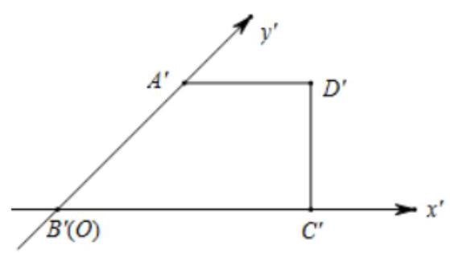

【难度】 $\star   \star   \star$

【答案】 $3\sqrt{2}$

【解析】四边形 ${ABCD}$ 水平放置的直观图是直角梯形,且 ${A}^{\prime }{B}^{\prime }{C}^{\prime } = {45}^{ \circ  },{B}^{\prime }{C}^{\prime } \bot  {C}^{\prime }{D}^{\prime },{A}^{\prime }{D}^{\prime } = {D}^{\prime }{C}^{\prime } = 1$ , $\therefore {B}^{\prime }{C}^{\prime } = 2{A}^{\prime }{D}^{\prime } = 2,{A}^{\prime }{B}^{\prime } = \sqrt{2}$

$\therefore$ 四边形 ${ABCD}$ 中, ${AB} = 2{A}^{\prime }{B}^{\prime } = 2\sqrt{2},{AD} = {A}^{\prime }{D}^{\prime } = 1,{BC} = {B}^{\prime }{C}^{\prime } = 2$ ,且 ${AB} \bot  {BC},{AD}//{BC}$ , 所以四边形 ${ABCD}$ 的面积为 $S = \frac{1}{2} \times  \left( {1 + 2}\right)  \times  2\sqrt{2} = 3\sqrt{2}$ ,

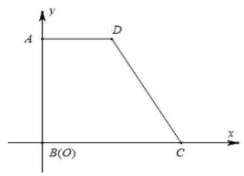

故答案为: $3\sqrt{2}$

【例 11】( 1 )某几何体的三视图如图所示(单位: ${cm})$ ，则该几何体的表面积(单位: ${cm})$ 为( )

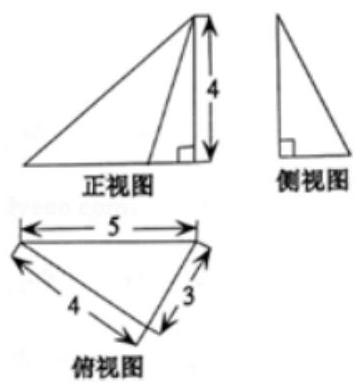

A. 32 B. 36 C. 40 D. 48

【难度】 $\star   \star   \star$

【答案】 $A$

【解析】解: 由三视图还原原几何体如图,

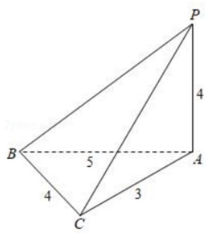

该几何体为三棱锥,底面是直角三角形, ${PA} \bot$ 底面 ${ABC}$ . 则 ${BC} \bot  {PC}$ .

$\therefore$ 该几何体的表面积 $S = \frac{1}{2}\left( {3 \times  4 + 5 \times  4 + 3 \times  4 + 4 \times  5}\right)  = {32}$ . 故选: $A$ .

( 2 )已知某几何体的三视图(单位: ${cm}\text{ ) }$ 如图所示，则该几何体的体积为___ $c{m}^{3}$ ，表面积为___， $c{m}^{2}$ .

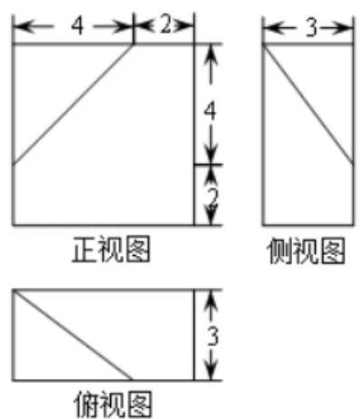

【难度】 $\star   \star   \star   \star$

【答案】 100 ${124} + 2\sqrt{34}$

【解答】解: 由三视图知几何体为一正四棱柱消去一个三棱锥,

且四棱柱的底面为边长为 $6\mathrm{\;{cm}}$ ; $3\mathrm{\;{cm}}$ 的长方形,侧棱长为 $6\mathrm{\;{cm}}$ ,

消去棱锥的高为 4 ，底面为直角三角形，直角边长分别为 $3\mathrm{\;{cm}}$ ， $4\mathrm{\;{cm}}$ ，

$\therefore$ 几何体的体积 $V = {6}^{2} \times  3 - \frac{1}{3} \times  \frac{1}{2} \times  4 \times  4 \times  3 = {100}\left( {\mathrm{\;{cm}}}^{3}\right)$ .

几何体的表面积为:

$6 \times  6 + 6 \times  3 + 6 \times  3 + 6 \times  6 - \frac{1}{2} \times  4 \times  4 + 6 \times  3 - \frac{1}{2} \times  3 \times  4 + \frac{1}{2} \times  4\sqrt{2} \times  \sqrt{{25} - 8} = {124} + 2\sqrt{34}\left( {\mathrm{\;{cm}}}^{2}\right) .$

故答案为:100 $;{124} + 2\sqrt{34}$ .

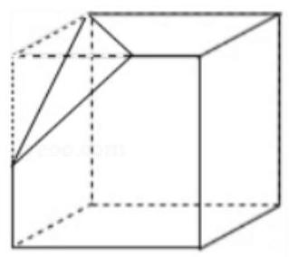

## 巩固训练

1、若用 “斜二测法” 作出边长为 2 的正三角形 $\bigtriangleup {ABC}$ 的直观图是 $\bigtriangleup {A}_{1}{B}_{1}{C}_{1}$ ,则 $\bigtriangleup {A}_{1}{B}_{1}{C}_{1}$ 的重心 ${G}_{1}$ 到底边 ${A}_{1}{B}_{1}$ 的距离是___.

【难度】 $\star   \star   \star$

【答案】 $\frac{\sqrt{6}}{12}$

【解析】取 ${BC}$ 边所在的直线为 $x$ 轴,过 ${BC}$ 边中点且垂直于 $x$ 轴的直线为 $y$ 轴,

又 ${BC} = 2$ ,则 ${OA} = \sqrt{3}$ ,

如图,在 ${x}^{\prime }$ 轴上取 ${O}^{\prime }{C}^{\prime } = {OC},{O}^{\prime }B = {OB}$ ,在 ${y}^{\prime }$ 轴的上方取 ${O}^{\prime }{A}^{\prime } = \frac{1}{2}{OA} = \frac{\sqrt{3}}{2}$ ,

由点 ${A}^{\prime }$ 向 ${Ox}$ 作垂线,垂足为 $M$ ,则在 Rt $\bigtriangleup \mathrm{{AMO}}$ 中, ${OA} = \frac{\sqrt{3}}{2},\angle {AOC} = {45}^{ \circ  }$ ,所以 ${AM} = \frac{\sqrt{6}}{4}$ ,

又因为重心 ${G}_{1}$ 到底边的距离是 ${AM}$ 的 $\frac{1}{3}$ ，所以距离为 $\frac{\sqrt{6}}{12}$ ，故答案为: $\frac{\sqrt{6}}{12}$ .

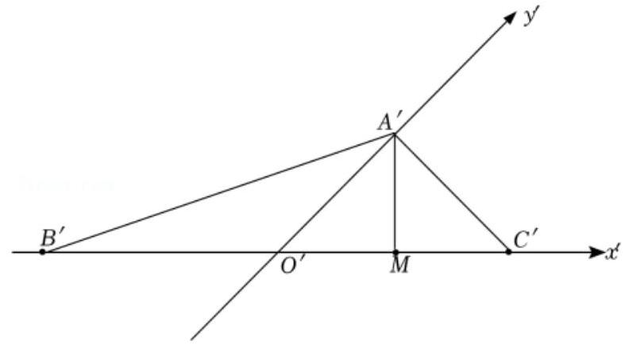

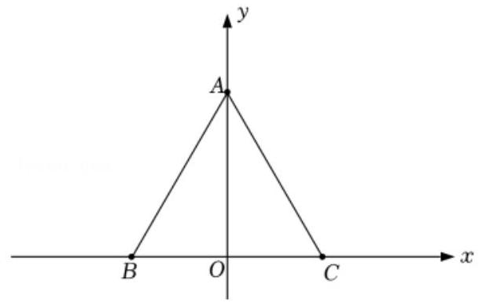

2、如图,矩形 ${O}^{\prime }{A}^{\prime }{B}^{\prime }{C}^{\prime }$ 是水平放置的平面图形 ${OABC}$ 的直观图,其中 ${O}^{\prime }{A}^{\prime } = 6,{O}^{\prime }{C}^{\prime } = 3$ ,则原图形 ${OABC}$ 的面积为___.

【难度】 $\star   \star   \star$

【答案】 ${36}\sqrt{2}$

【解答】解: 矩形 ${O}^{\prime }{A}^{\prime }{B}^{\prime }{C}^{\prime }$ 中, ${O}^{\prime }{A}^{\prime } = 6,{O}^{\prime }{C}^{\prime } = 3$ ,所以矩形 ${O}^{\prime }{A}^{\prime }{B}^{\prime }{C}^{\prime }$ 的面积为 ${S}^{\prime } = {O}^{\prime }{A}^{\prime } \cdot  {O}^{\prime }{C}^{\prime } = 6 \times  3 = {18}$ , 所以原平面图形 ${OABC}$ 的面积为 $S = 2\sqrt{2}{S}^{\prime } = 2\sqrt{2} \times  {18} = {36}\sqrt{2}$ . 故答案为: ${36}\sqrt{2}$ .

3、在三棱锥 $D - {ABC}$ 中， ${AC} = {BC} = \sqrt{2}$ ， ${CD} = \sqrt{3}$ ， ${CD}\bot$ 平面 ${ABC}$ ， $\angle {ACB} = {90}^{ \circ  }$ . 若其主视图、俯视图如图所示，则其左视图的面积为___.

【难度】 $\star   \star   \star$

【答案】 $\frac{\sqrt{3}}{2}$

【解答】解: 由题意可知几何体是三棱锥, ${PC} \bot$ 底面 ${ABC}$ ,底面是等腰直角三角形,所以左视图是直角三角形, ${AC} = {BC} = \sqrt{2},{CD} = \sqrt{3}$ ,底面三角形的高为: 1,

所以左视图的面积为: $\frac{1}{2} \times  1 \times  \sqrt{3} = \frac{\sqrt{3}}{2}$ .

故答案为: $\frac{\sqrt{3}}{2}$ .

$B$

俯视图

## (三) 球相关问题

## 知识梳理

1、经度、纬度:

经线: 球面上从北极到南极的半个大圆.

纬线: 与赤道平面平行的平面截球面所得的小圆.

经度: 某地的经度就是经过这点的经线与地轴确定的半平面与 ${0}^{ \circ  }$ 经线及轴确定的半平面所成的二面角的度数.

纬度: 某地的纬度就是指过这点的球半径与赤道平面所成角的度数.

## 2、球面距离:球面上两点之间的最短距离，也是过两点的大圆的圆弧(劣弧)长度.

(1)两点的球面距离:球面上两点之间的最短距离，就是经过两点的大圆在这两点间的一段劣弧的长度,我们把这个弧长叫做两点的球面距离. 即: $l = {R\varphi }$ ( $\varphi$ 为球心角的弧度数).

(2)半球的底面:已知半径为 $R$ 的球 $O$ ，用过球心的平面去截球 $O$ ，球被截面分成大小相等的两个半球,截面圆 $O$ (包含它内部的点),叫做所得半球的底面.

## 3、内切球与外接球

## 例题精讲

【例 12】(1)在北纬 ${45}^{ \circ  }$ 圈上有 $A$ 、 $B$ 两点，若该纬度圈上 $A$ 、 $B$ 两点间的劣弧长为 $\frac{\sqrt{2}}{4}{\pi R}$ ( $R$ 为地球的半径),则 $A\text{ 、 }B$ 两点间的球面距离是___.

【难度】 $\star   \star   \star$

【答案】 $\frac{\pi }{3}R$

【解析】北纬 ${45}^{ \circ  }$ 圈所在圆的半径为 $\frac{\sqrt{2}}{2}R$ ,它们在纬度圈上所对应的劣弧长等于 $\frac{\sqrt{2}}{4}{\pi R}$ ( $R$ 为地球半径), $\therefore \frac{\sqrt{2}}{4}{\pi R} = \theta  \times  \frac{\sqrt{2}}{2}R\left( {\theta \text{ 是 }A\text{ 、 }B}\right.$ 两地在北纬 ${45}^{ \circ  }$ 圈上对应的圆心角),故 $\theta  = \frac{\pi }{2},\therefore$ 线段 ${AB} = R$ ,

$\therefore \angle {AOB} = \frac{\pi }{3}$ ， $\therefore A$ 、 $B$ 这两地的球面距离是 $\frac{\pi R}{3}$ ，故答案为: $\frac{\pi R}{3}$ .

(2)设球 $O$ 的表面积为 ${16\pi }$ ，圆 ${O}_{1}$ 是球 $O$ 的一小圆， $O{O}_{1} = \sqrt{2}$ ， $A$ 、 $B$ 是圆 ${O}_{1}$ 上的两点，若 $A$ 、 $B$ 两点间的球面距离为 $\frac{2\pi }{3}$ ，则 $\angle A{O}_{1}B =$ ___.

【难度】 $\star   \star   \star$

【答案】 $\frac{\pi }{2}$

【解析】解: 设球的半径为 $R$ ,由题意可得 ${4\pi }{R}^{2} = {16\pi }$ ,解得 $R = 2$ ,

由 $A\text{ 、 }B$ 两点间的球面距离为 $\frac{2\pi }{3}$ ,设 $\angle {AOB} = \alpha$ ,则 $\frac{2}{3}\pi  = R \cdot  \alpha$ ,所以可得 $\alpha  = \frac{\pi }{3}$ ,

在 $\bigtriangleup  {AOB}$ 中由等腰三角形的性质可得 ${AB} = {2R} \cdot  \sin \frac{\angle {AOB}}{2} = 2 \times  2 \cdot  \frac{1}{2} = 2$ ，由球的性质可得 $O{O}_{1}\bot$ 圆 ${O}_{1}$ ，所以

$O{O}_{1} \bot  {O}_{1}A$

因为 ${OA} = R = 2, O{O}_{1} = \sqrt{2}$ ,所以可得 ${O}_{1}A = {O}_{1}B = \sqrt{2},{AB} = 2$

在 $\bigtriangleup A{O}_{1}B$ 中,因为 ${O}_{1}{A}^{2} + {O}_{1}{B}^{2} = {\left( \sqrt{2}\right) }^{2} + {\left( \sqrt{2}\right) }^{2} = 4 = A{B}^{2}$ ,所以 $\angle A{O}_{1}B = \frac{\pi }{2}$ ,故答案为: $\frac{\pi }{2}$ .

【例13】(1)若在母线长为5，高为4的圆锥中挖去一个小球，则剩余部分体积的最小值为___

【难度】 $\star   \star   \star$

【答案】 $\frac{15}{2}\pi$ .

【解析】如图是圆锥的轴截面,它的内切圆是圆锥的内切球的大圆. 设半径为 $R$ ,

易知母线长为5,高为4时,底面半径为 $r = \sqrt{{5}^{2} - {4}^{2}} = 3$ ,因此 $\frac{1}{2} \times  6 \times  4 = \frac{1}{2}R\left( {5 + 5 + 6}\right) , R = \frac{3}{2}$ ,

所以剩余部分体积的最小值为 $V = \frac{1}{3}\pi {r}^{2}h - \frac{4}{3}\pi {R}^{3} = \frac{1}{3}\pi  \times  {3}^{2} \times  4 - \frac{4}{3}\pi  \times  {\left( \frac{3}{2}\right) }^{3} = \frac{15}{2}\pi$ . 故答案为: $\frac{15}{2}\pi$ .

(2)如图，在四棱锥 $P - {ABCD}$ 中， $O$ 是正方形 ${ABCD}$ 的中心， ${PO} \bot$ 底面 ${ABCD}$ ， ${PA} = \sqrt{5}$ ， ${AB} = 2$ ， 则四棱锥 $P - {ABCD}$ 内切球的体积为( )

A. $\frac{\sqrt{3}}{54}\pi$ B. $\frac{4\sqrt{3}}{27}\pi$ C. $\frac{{11}\sqrt{3}}{27}\pi$ D. $\frac{{125}\sqrt{3}}{54}\pi$

【难度】★★★

【答案】 $B$

【解析】解: 由 ${PO} \bot$ 底面 ${ABCD}$ , ${PA} = \sqrt{5},{AB} = 2, O$ 是正方形 ${ABCD}$ 的中心,那么 ${AO} = \sqrt{2}$ . 则 ${OP} = \sqrt{A{B}^{2} - A{O}^{2}} = \sqrt{3}$ . 那么,四棱锥 $P - {ABCD}$ 的体积 $V = \frac{1}{3}{S}_{ABCD} \times  {OP} = \frac{4\sqrt{3}}{3}$ . 设四棱锥 $P - {ABCD}$ 内切球半径为 $r$ ,那么,四棱锥 $P - {ABCD}$ 的体积 $V = \frac{1}{3} \times  \left( {{S}_{ABCD} + {S}_{ABP} + {S}_{ADP} + {S}_{BCP} + {S}_{CDP}}\right)  \times  r \; \therefore \frac{1}{3} \times  \left( {4 + 4 \times  2}\right) r = \frac{4\sqrt{3}}{3}$ . 解得 $r = \frac{\sqrt{3}}{3}$ ; 则四棱锥 $P - {ABCD}$ 内切球的体积 $V = \frac{4}{3}\pi {r}^{3} = \frac{4\sqrt{3}}{27}\pi$ ; 故选: $B$ .

【例 14】( 1 )已知 $S\text{ 、 }A\text{ 、 }B\text{ 、 }C$ 是球 $O$ 表面上的点， ${SA} \bot$ 平面 ${ABC}$ ， ${AB} \bot  {BC}$ ， ${SA} = 1$ ， ${AB} = {BC} = 2$ ， 则球 $O$ 的表面积为___.

【难度】 $\bigstar \bigstar \bigstar \bigstar$

【答案】 ${9\pi }$

【解析】解: $\because {SA} \bot$ 平面 ${ABC}$ , ${AB} \bot  {BC}$ ,

$\therefore$ 四面体 $S - {ABC}$ 的外接球半径等于以长宽高分别 ${SA},{AB},{BC}$ 三边长的长方体的外接球的半径 $\because {SA} = 1,{AB} = 2,{BC} = 2\therefore {2R} = \sqrt{{1}^{2} + {2}^{2} + {2}^{2}} = 3\therefore$ 球 $O$ 的表面积 $S = 4 \cdot  \pi {R}^{2} = {9\pi }$ 故答案为: ${9\pi }$ .

(2)半径为 2 的球面上有 $A, B, C, D$ 四点，且 ${AB},{AC},{AD}$ 两两垂直，则 $\bigtriangleup  {ABC},{\Delta ACD}$ 与 $\bigtriangleup  {ADB}$ 面积之和的最大值为___.

【难度】 $\star   \star   \star   \star$

【答案】 8

【解析】解: 半径为 2 的球面上有 $A, B, C, D$ 四点,且 ${AB},{AC},{AD}$ 两两垂直,

如图所示

则设四面体 ${ABCD}$ 置于长方体模型中,外接球的半径为 2,故 ${x}^{2} + {y}^{2} + {z}^{2} = {16}$ ,

$S = {S}_{\bigtriangleup {ABC}} + {S}_{\bigtriangleup {ACD}} + {S}_{\bigtriangleup {ABD}} = \frac{1}{2}{yz} + \frac{1}{2}{xy} + \frac{1}{2}{xz}$ ,由于 $2\left( {{x}^{2} + {y}^{2} + {z}^{2}}\right)  - {4S} = {\left( x - y\right) }^{2} + {\left( y - z\right) }^{2} + {\left( x - z\right) }^{2} \geq  0$ , 所以 ${4S} \leq  2 \cdot  {16} = {32}$ ,故 $S \leq  8$ ,故答案为: 8 .

## 巩固训练

1、在北纬 ${45}^{ \circ  }$ 圈上有甲、乙两地，经度相差 ${90}^{ \circ  }$ ，那么甲、乙两地的球面距离与地球半径的比值是( )

A. 1

B. $\frac{1}{3}$ C. $\frac{\sqrt{2}}{4}\pi$ D. $\frac{\pi }{3}$

【难度】★★★

【答案】D

【解析】如下图所示,设球心为 $O$ ,北纬 ${45}^{ \circ  }$ 圈所在圆的圆心为点 ${O}_{1}$ ,设球 $O$ 的半径为 $R$ ,

$O{O}_{1} = {OA} \cdot  \cos {45}^{ \circ  } = \frac{\sqrt{2}}{2}R$ ,所以,圆 ${O}_{1}$ 的半径为 ${O}_{1}A = \sqrt{{R}^{2} - O{O}_{1}^{2}} = \frac{\sqrt{2}}{2}R$ ,

$\because \angle A{O}_{1}B = {90}^{ \circ  },\therefore {AB} = \sqrt{2}{O}_{1}A = R$ ,

又 ${OA} = {OB} = R$ ,则 $\bigtriangleup  {AOB}$ 为等边三角形， $\therefore \angle {AOB} = {60}^{ \circ  }$ ，所以，甲、乙两地的球面距离为 $\frac{\pi }{3}R$ ，

因此,甲、乙两地的球面距离与地球半径的比值是 $\frac{\pi R}{R} = \frac{\pi }{3}$ . 故选: D.

2、 $A$ 、 $B$ 、 $C$ 三点在体积为 ${36\pi }$ 的球面上， ${BA} = {BC} = \frac{\sqrt{2}}{2}{AC}$ ，若 $A$ 、 $C$ 两点间的球面距离是 $\frac{3\pi }{2}$ ， 则球心 $O$ 的到平面 ${ABC}$ 的距离是___.

【难度】 $\star   \star   \star$

【答案】 $\frac{3\sqrt{2}}{2}$

【解析】

因为球的体积为 ${36\pi }$ ,所以 $\frac{4}{3}\pi {R}^{3} = {36\pi }$ ,解得球的半径 $\mathrm{R} = 3$ 。因为 ${BA} = {BC} = \frac{\sqrt{2}}{2}{AC}$ ,所以

$B{A}^{2} + B{C}^{2} = A{C}^{2}$ ,所以 $\angle {ABC} = {90}^{ \circ  }$ ，所以 ${AC}$ 为截面圆的直径，设截面圆圆心为 $M$ ,因为 $A$ 、

$C$ 两点间的球面距离是 $\frac{3\pi }{2}$ ，所以 $\angle {AOC} = \frac{\frac{3\pi }{2}}{R} = \frac{\frac{3\pi }{2}}{3} = \frac{\pi }{2}$ 。在 $\operatorname{Rt}\Delta \mathrm{{OMC}}$ 中，

${OM} = \frac{\sqrt{2}}{2}{OC} = \frac{\sqrt{2}}{2} \times  3 = \frac{3\sqrt{2}}{2}$ ,因为 ${OM} \bot$ 平面 ${ABC}$ ,所以球心 $O$ 的到平面 ${ABC}$ 的距离是 $\frac{3\sqrt{2}}{2}$ 。

3、正方体的内切球与其外接球的体积之比为___.

【难度】 $\star   \star   \star$

【答案】1: $3\sqrt{3}$

【解答】解: 设正方体的棱长为 $a$ ,则它的内切球的半径为 $\frac{1}{2}a$ ,它的外接球的半径为 $\frac{\sqrt{3}}{2}a$ ,

故所求的比为: $1 : 3\sqrt{3}$ ,故答案为: $1 : 3\sqrt{3}$

4、棱长为 2 的正四面体的四个顶点都在同一个球面上, 若过该球球心的一个截面如图, 则图中三角形 (正四面体的截面) 的面积是.

A. $\frac{\sqrt{2}}{2}$ B. $\frac{\sqrt{3}}{2}$ C. $\sqrt{2}$ D. $\sqrt{3}$

【难度】 $\star   \star   \star   \star$

【答案】 $C$

【解析】解: 如图球的截面图就是正四面体中的 $\bigtriangleup {ABD}$ ,已知正四面体棱长为 2 所以 ${AD} = \sqrt{3}$ ， ${AC} = 1$ ，所以 ${CD} = \sqrt{2}$ ，截面面积是: $\sqrt{2}$ ，故选: $C$ .

## (四)几何体的展开、折叠与翻转

## 例题精讲

【例 15】(1)已知圆柱的底面半径为 1,母线长为 $4,{AB}$ 为母线，则 $A$ 绕圆柱侧面两周到达 $B$ 点经过的最短路程为___.

【难度】 $\star   \star   \star$

【答案】 $4\sqrt{1 + {\pi }^{2}}$

【解析】解: 从 $A$ 点绕圆柱体的侧面旋转到达 $B$ 点,沿 ${AB}$ 将侧面展开后,最短路程如下图所示: 其中矩形的高等于圆柱的高 4,矩形的宽等于圆柱的周长 $2 \times  {2\pi r} = {4\pi }$ ,故 ${AB} = \sqrt{{\left( 4\pi \right) }^{2} + {4}^{2}} = 4\sqrt{1 + {\pi }^{2}}$ 故答案为: $4\sqrt{1 + {\pi }^{2}}$ .

(2)如图是一座山的示意图，山呈圆锥形，圆锥的底面半径为 10 公里，母线长为 40 公里， $B$ 是母线 ${SA}$ 上一点,且 ${AB} = {10}$ 公里. 为了发展旅游业,要建设一条最短的从 $A$ 绕山一周到 $B$ 的观光铁路. 这条铁路从 $A$ 出发后首先上坡，随后下坡，则下坡段铁路的长度为___公里.

【难度】 $\star   \star   \star   \star$

【答案】 18

【解析】解: 如图,展开圆锥的侧面,过点 $S$ 作 ${A}^{\prime }B$ 的垂线,垂足为 $H$ ,

记点 $P$ 为 ${A}^{\prime }B$ 上任意一点,联结 ${PS},\overset{\text{ ⏜ }}{{A}^{\prime }A} = \angle {A}^{\prime }{OA} \cdot  {SA} = {2\pi } \cdot  {10} \Rightarrow  \angle {A}^{\prime }{OA} = \frac{\pi }{2}$ ,

由两点之间线段最短,知观光铁路为图中的 ${A}^{\prime }B,{A}^{\prime }B = \sqrt{S{A}^{\prime 2} + S{B}^{2}} = {50}$ ,

上坡即 $P$ 到山顶 $S$ 的距离 ${PS}$ 越来越小,下坡即 $P$ 到山顶 $S$ 的

距离 ${PS}$ 越来越大,二下坡段的铁路,即图中的 ${HB}$ ,

由 ${Rt}\bigtriangleup S{A}^{\prime }{B}^{C \supset  }{Rt\Delta HSB}$ ,

可得: $\frac{SB}{HB} = \frac{{A}^{\prime }B}{SB}$ ,可求出 ${HB} = \frac{S{B}^{2}}{{A}^{\prime }B} = \frac{{30} \times  {30}}{50} = {18}$ .

即下坡段铁路的长度为 18 公里.

故答案为:18.

(3)如图，有一圆柱形的开口容器(下表面密封)，其轴截面是边长为 2 的正方形， $P$ 是 ${BC}$ 中点，现有一只蚂蚁位于外壁 $A$ 处，内壁 $P$ 处有一米粒，则这只蚂蚁取得米粒所需经过的最短路程为___.

【难度】 $\star   \star   \star   \star$

【答案】 $\sqrt{{\pi }^{2} + 9}$

【解析】解: 侧面展开后得矩形 ${ABCD}$ ,其中 ${AB} = \pi ,{AD} = 2$ 问题转化为在 ${CD}$ 上找一点 $Q$ ,

使 ${AQ} + {PQ}$ 最短作 $P$ 关于 ${CD}$ 的对称点 $E$ ,连接 ${AE}$ ,

令 ${AE}$ 与 ${CD}$ 交于点 $Q$ ,则得 ${AQ} + {PQ}$ 的最小值就是 ${AE}$ 为 $\sqrt{{\pi }^{2} + 9}$ .

故答案为: $\sqrt{{\pi }^{2} + 9}$ .

【例 16】用一张正方形的纸把一个棱长为 1 的正方体礼品盒完全包住, 不将纸撕开, 求所需纸的最小面积.

【难度】 $\star   \star   \star   \star$

【答案】 8

【解析】如图①为棱长为 1 的正方体礼品盒, 先把正方体的表面按图所示方式展成平面图形, 再把平面图形尽可能拼成面积较小的正方形,如图②所示,由图知正方形的边长为 $2\sqrt{2}$ ,其面积为 8 .

图①

图②

【例17】(1)如图所示的几何体中，四边形 ${ABCD}$ 是矩形，平面 ${ABCD} \bot$ 平面 ${ABE}$ ，已知 ${AB} = 2$ ， ${AE} = {BE} = \sqrt{3}$ ，且当规定正视图方向垂直平面 ${ABCD}$ 时，该几何体的侧视图的面积为 $\frac{\sqrt{2}}{2}$ . 若 $M$ 、 $N$ 分别是线段 ${DE}$ 、 ${CE}$ 上的动点，则 ${AM} + {MN} + {NB}$ 的最小值为___.

【难度】★★★★

【答案】3

【解答】解: 取 ${AB}$ 中点 $F,\because {AE} = {BE} = \sqrt{3},\therefore {EF} \bot  {AB}$ ,

$\because$ 平面 ${ABCD} \bot$ 平面 ${ABE},\therefore {EF} \bot$ 平面 ${ABCD}$ ,

易求 ${EF} = \sqrt{2}$ ,左视图的面积 $S = \frac{1}{2}{AD} \cdot  {EF} = \frac{1}{2} \times  \sqrt{2}{AD} = \frac{\sqrt{2}}{2}$ ,

$\therefore {AD} = 1,\therefore \angle {AED} = \angle {BEC} = {30}^{ \circ  },\angle {DEC} = {60}^{ \circ  }$ ,

将四棱锥 $E - {ABCD}$ 的侧面 ${AED}\text{ 、 }{DEC}\text{ 、 }{CEB}$ 展开铺平如图,

则 $A{B}^{2} = A{E}^{2} + B{E}^{2} - {2AE} \cdot  {BE} \cdot  \cos {120}^{ \circ  } = 3 + 3 - 2 \times  3 \times  \left( {-\frac{1}{2}}\right)  = 9$ ,

$\therefore {AB} = 3$ ， $\therefore {AM} + {MN} + {BN}$ 的最小值为3. 故答案为:3.

(2)如图，边长为 $a$ 的正 $\bigtriangleup  {ABC}$ 的中线， ${AF}$ 与中位线 ${DE}$ 相交于 $G$ ，已知 $\bigtriangleup  {A}^{\prime }{ED}$ 是 $\bigtriangleup  {AED}$ 绕 ${DE}$ 旋转过程中的一个图形，现给出下列命题，其中正确的命题有___. (填上所有正确命题的序号)

(1)动点 ${A}^{\prime }$ 在平面 ${ABC}$ 上的射影在线段 ${AF}$ 上；

(2)三棱锥 ${A}^{\prime } - {FED}$ 的体积有最大值；

(3)恒有平面 ${A}^{\prime }{GF} \bot$ 平面 ${BCED}$ ；

(4)异面直线 ${A}^{\prime }E$ 与 ${BD}$ 不可能互相垂直.

【难度】 $\star   \star   \star   \star$

【答案】(1)(2)(3)

【解析】解: 过 ${A}^{\prime }$ 作 ${A}^{\prime }H \bot$ 面 ${ABC}$ ,垂足为 $H,\because \bigtriangleup {ABC}$ 为正三角形且中线 ${AF}$ 与中位线 ${DE}$ 相交 $\therefore {AG} \bot  {DE}{A}^{\prime }G \bot  {DE}$ ,又 $\because {AG} \cap  {A}^{\prime }G = G\therefore {DE} \bot$ 面 ${A}^{\prime }{GA},\because {DE} \subset$ 面 ${ABC}$ ,

$\therefore$ 面 ${A}^{\prime }{GF} \bot$ 面 ${ABC}$ 且面 ${A}^{\prime }{GA} \cap$ 面 ${ABC} = {AF}\therefore H$ 在 ${AF}$ 上,故恒有平面 ${A}^{\prime }{GF} \bot$ 平面 ${BCED}$ ,故①对③ 对。 ${S}_{ \equiv  \text{ 棱锥 }{A}^{\prime } - {FED}} = \frac{1}{3}{S}_{\Delta EFD} \cdot  {A}^{\prime }H,\because$ 底面面积是个定值， $\therefore$ 当 ${A}^{\prime }H$ 为 ${A}^{\prime }G$ 时，三棱锥的面积最大，故②对； 在 $\bigtriangleup {A}^{\prime }{ED}$ 是 $\bigtriangleup {AED}$ 绕 ${DE}$ 旋转的过程中异面直线 ${A}^{\prime }E$ 与 ${BD}$ 可能互相垂直，故④不对故答案为:(1)(2)(3).

## 巩固训练

1、已知圆锥的轴截面是边长为 ${20}\mathrm{\;{cm}}$ 的等边三角形 ${PAB}$ ，若一甲壳虫由圆锥底面圆周上一点 $A$ 出发，贴着圆锥侧面爬行到母线 ${PB}$ 的中点 $C$ ,其经过的最短路线长度是___ ${cm}$ .

【难度】 $\star   \star   \star$

【答案】 ${10}\sqrt{5}$

【解析】解: 如图所示,圆锥的底面半径为 $r = \frac{1}{2} \times  {20} = {10}$ ,母线长为 20,

则圆锥底面圆周长为 ${2\pi r} = {20\pi }$ ,圆锥的侧面展开图的圆心角为 $\alpha  = \frac{20\pi }{20} = \pi$ ,

由点 $A$ 出发，贴着圆锥侧面到母线 ${PB}$ 的中点 $C$ ，经过的最短路线长度是

${AC} = \sqrt{{20}^{2} + {10}^{2}} = {10}\sqrt{5}\mathrm{\;{cm}}$ . 故答案为: ${10}\sqrt{5}\mathrm{\;{cm}}$ .

2、如图所示，正方体 ${ABCD} - {A}_{1}{B}_{1}{C}_{1}{D}_{1}$ 的棱长为 2， $M$ 是 $C{B}_{1}$ 上的一个动点，则 ${BM} + {D}_{1}M$ 的最小值是___.

【难度】 $\star   \star   \star$

【答案】 $\sqrt{2} + \sqrt{6}$

【解析】解: 如图所示:

将 $\bigtriangleup C{B}_{1}{D}_{1}$ 沿直线 $C{B}_{1}$ 折起,当点 $B\text{ 、 }M\text{ 、 }{D}_{1}$ 在同一条直线上时, ${BM} + {D}_{1}M$ 最小, 此时 ${BM} = \sqrt{2},\bigtriangleup C{B}_{1}{D}_{1}$ 是边长为 $2\sqrt{2}$ 的等边三角形,所以 ${D}_{1}M = \sqrt{{2}^{2} + {\left( \sqrt{2}\right) }^{2}} = \sqrt{6}$ 所以 ${BM} + {D}_{1}M$ 的最小值是 $\sqrt{2} + \sqrt{6}$ . 故答案为: $\sqrt{2} + \sqrt{6}$

3、棱长为 6 的正方体 ${ABCD} - {A}_{1}{B}_{1}{C}_{1}{D}_{1}$ ，在 ${AD}{D}_{1}{A}_{1}$ 装上一块玻璃(不计玻璃厚度)， $E$ 为线段 $A{D}_{1}$ 上一点， ${AE} = {2E}{D}_{1}$ ，从 ${B}_{1}$ 处射出一光线经玻璃反射(反射点为 $E$ )到达平面 ${CD}{D}_{1}{C}_{1}$ 上某点 $P$ ，则 ${PE}$ 的长为()

A. $\sqrt{15}$ B. $\sqrt{14}$ C. $\sqrt{13}$ D. $2\sqrt{3}$

【难度】 $\star   \star   \star   \star$

【答案】 $B$

【解答】解: 如图, $E{E}^{\prime }$ 是侧面的法线,则反射光线与 ${B}_{1}E$ 对称,

$\therefore {C}_{1}{E}^{\prime } = 2\sqrt{2},\therefore {B}_{1}{E}^{\prime } = \sqrt{{36} + 8 - 2 \cdot  6 \cdot  2\sqrt{2} \cdot  \sin \frac{\pi }{4}} = 2\sqrt{5}$ ,

$\therefore {C}_{1}F = 3,{E}^{\prime }F = \sqrt{5},\therefore {B}_{1}E = {EG} = \sqrt{{36} + {20}} = 2\sqrt{14},\therefore {PE}$ 的长为 $\sqrt{14}$ ,故选: $B$ .

## (五)轨迹问题

## 例题精讲

【例18】如图,正方体 ${ABCD} - {A}_{1}{B}_{1}{C}_{1}{D}_{1}$ 的棱长为 $\sqrt{3}$ ,以顶点 $A$ 为球心,2为半径作一个球,则图中球面与正方体的表面相交所得到的两段弧长之和等于( )

A. $\frac{5\pi }{6}$ B. $\frac{2\pi }{3}$ C. $\pi$

D. $\frac{7\pi }{6}$

【难度】★★★

【答案】 $A$

【解析】解: 如图,球面与正方体的六个面都相交,

所得的交线分为两类: 一类在顶点 $A$ 所在的三个面上,即面 $A{A}_{1}{B}_{1}B$ 、面 ${ABCD}$ 和面 $A{A}_{1}{D}_{1}D$ 上; 另一类在不过顶点 $A$ 的三个面上,即面 $B{B}_{1}{C}_{1}C$ 、面 $C{C}_{1}{D}_{1}D$ 和面 ${A}_{1}{B}_{1}{C}_{1}{D}_{1}$ 上.

在面 $A{A}_{1}{B}_{1}B$ 上,交线为弧 ${EF}$ 且在过球心 $A$ 的大圆上,因为 ${AE} = 2, A{A}_{1} = \sqrt{3}$ ,

则 $\angle {A}_{1}{AE} = \frac{\pi }{6}$ . 同理 $\angle {BAF} = \frac{\pi }{6}$ ,所以 $\angle {EAF} = \frac{\pi }{6}$ ,

故弧 ${EF}$ 的长为: $2 \times  \frac{\pi }{6} = \frac{\pi }{3}$ ,

而这样的弧共有三条.

在面 $B{B}_{1}{C}_{1}C$ 上,交线为弧 ${FG}$ 且在距球心为 1 的平面与球面相交所得的小圆上,

此时,小圆的圆心为 $B$ ,半径为 $1,\angle {FBG} = \frac{\pi }{2}$ ,

所以弧 ${FG}$ 的长为: $1 \times  \frac{\pi }{2} = \frac{\pi }{2}$ .

于是,所得的曲线长为: $\frac{\pi }{3} + \frac{\pi }{2} = \frac{5\pi }{6}$ .

故选: $A$ .

【例 19】( 1 )如图,已知正方体 ${ABCD} - {A}_{1}{B}_{1}{C}_{1}{D}_{1}$ 棱长为 4，点 $H$ 在棱 $A{A}_{1}$ 上，且 $H{A}_{1} = 1$ ，在侧面 ${BC}{C}_{1}{B}_{1}$ 内作边长为 1 的正方形 ${EFG}{C}_{1}, P$ 是侧面 ${BC}{C}_{1}{B}_{1}$ 内一动点,且点 $P$ 到平面 ${CD}{D}_{1}{C}_{1}$ 距离等于线段 ${PF}$ 的长, 则当点 $P$ 运动时， ${\left| HP\right| }^{2}$ 的范围是___.

【难度】 $\star   \star   \star   \star$

【答案】 $\left\lbrack  {{22},\frac{113}{4}}\right\rbrack$

【解析】解: 建立空间直角坐标系如图所示,过点 $H$ 作 ${HM} \bot  B{B}^{\prime }$ ,垂足为 $M$ ,连接 ${MP}$ ,

则 ${HM} \bot  {PM},\therefore H{P}^{2} = H{M}^{2} + M{P}^{2}$ . 过 $P$ 作 ${PN} \bot  C{C}^{\prime }$ ,垂足为 $N$ ,

设 $P\left( {x,4, z}\right)$ ,则 $F\left( {1,4,3}\right) , M\left( {4,4,3}\right) , N\left( {0,4, z}\right)$ ,且 $0 \leq  x \leq  4,0 \leq  z \leq  4$ .

$\because {PN} = {PF},\therefore \sqrt{{\left( x - 1\right) }^{2} + {\left( z - 3\right) }^{2}} = x$ ,化简得 ${2x} - 1 = {\left( z - 3\right) }^{2}$ ,则 ${2x} - 1 \geq  0$ ,即 $\frac{1}{2} \leq  x \leq  4$ .

$\therefore M{P}^{2} = {\left( x - 4\right) }^{2} + {\left( z - 3\right) }^{2} = {\left( x - 4\right) }^{2} + {2x} - 1 = {x}^{2} - {6x} + {15} \in  \left\lbrack  {6,\frac{49}{4}}\right\rbrack$ ,

此时 $H{P}^{2} = H{M}^{2} + M{P}^{2} = {16} + M{P}^{2} \in  \left\lbrack  {{22},\frac{113}{4}}\right\rbrack$ . 故答案为: $\left\lbrack  {{22},\frac{113}{4}}\right\rbrack$ .

(2)给定正三棱锥 $P - {ABC}$ ， $M$ 点为底面正三角形 ${ABC}$ 内(含边界)一点，且 $M$ 到三个侧面 ${PAB}$ 、 ${PBC}$ 、 ${PAC}$ 的距离依次成等差数列，则点 $M$ 的轨迹为( )

A. 双曲线的一部分 B. 圆的一部分 C. 一条线段 D. 抛物线的一部分

【难度】 $\star   \star   \star$

【答案】C

【解析】设点 $M$ 到三个侧面 ${PAB}\text{ 、 }{PBC}\text{ 、 }{PCA}$ 的距离为 $d - a, d, d + a$

正三棱锥 $P - {ABC}$ 中各侧面的面积为 $S$ ,体积为 $V$ ,

则 $\frac{1}{3}S\left( {d - a}\right)  + \frac{1}{3}{Sd} + \frac{1}{3}S\left( {d + a}\right)  = V$ ,即 ${Sd} = V$ ,所以 $d$ 为常数.

作平面 $\alpha$ 使 $\alpha //$ 面 ${PBC}$ 且它们的距离为 $d$ ，则 $\alpha$ 与面 ${ABC}$ 的交线即为点 $M$ 的轨迹.

又 $M$ 点为底面正三角形 ${ABC}$ 内(含边界)一点，所以 $M$ 的轨迹为一条线段.

故选 C.

(3)如图所示，已知正方体 ${ABCD} - {A}_{1}{B}_{1}{C}_{1}{D}_{1}$ 的棱长为 2，长为 2 的线段 ${MN}$ 的一个端点 $M$ 在棱 $D{D}_{1}$ 上运动，另一端点 $N$ 在正方形 ${ABCD}$ 内运动，则 ${MN}$ 的中点的轨迹的面积为( )

A. ${4\pi }$ B. ${2\pi }$ C. $\pi$

D. $\frac{\pi }{2}$

【难度】★★★

【答案】D

【解析】

如图可得，端点 $N$ 在正方形 ${ABCD}$ 内运动，连接 ${ND}$ ，由 ${ND}$ ， ${DM}$ ， ${MN}$ 构成一个直角三角形，

设 $P$ 为 ${MN}$ 的中点，根据直角三角形斜边上的中线长度为斜边的一半可得，

不论 $\bigtriangleup  {MDN}$ 如何变化， $P$ 点到 $D$ 点的距离始终等于 1 . 故 $P$ 点的轨迹是一个以 $D$ 为中心，半径为 1 的球的 $\frac{1}{8}$ 球面积,所以答案为 $\frac{\pi }{2}$ . 故选 D.

【例 20】如图为正方体 ${ABCD} - {A}_{1}{B}_{1}{C}_{1}{D}_{1}$ ，动点 $M$ 从 ${B}_{1}$ 点出发，在正方体表面沿逆时针方向运动一周后， 再回到 ${B}_{1}$ 的运动过程中,点 $M$ 与平面 ${A}_{1}D{C}_{1}$ 的距离保持不变,运动的路程 $x$ 与 $l = M{A}_{1} + M{C}_{1} + {MD}$ 之间满足函数关系 $l = f\left( x\right)$ ,则此函数图象大致是 ( )

A.

【难度】★★★

【答案】C

B.

C.

D.

【解析】由题意可知: 点 $M$ 在 $\Delta {B}_{1}{AC}$ 的边上沿逆时针方向运动,

设正方体 ${ABCD} - {A}_{1}{B}_{1}{C}_{1}{D}_{1}$ 的棱长为 1,取线段 ${B}_{1}A$ 的中点为 $N$ ，则当动点 $M$ 运动到点 $N$ 时，

${l}_{N} = N{A}_{1} + N{C}_{1} + {ND} = \sqrt{6} + \frac{\sqrt{2}}{2} < 2 + \sqrt{3} = {l}_{A} = {l}_{{B}_{1}} = {l}_{C},$

同理,当动点 $M$ 运动到线段 ${AC}$ 或 $C{B}_{1}$ 的中点时,

计算得 $l = M{A}_{1} + M{C}_{1} + {MD} = \sqrt{6} + \frac{\sqrt{2}}{2} < 2 + \sqrt{3} = {l}_{A} = {l}_{{B}_{1}} = {l}_{C}$ . 符合 $\mathbf{C}$ 选项的图像特征. 故选 $\mathbf{C}$

## 巩固训练

1、正方体 ${ABCD} - {A}_{1}{B}_{1}{C}_{1}{D}_{1}$ 中， $P$ 是面 $A{A}_{1}{B}_{1}B$ 上点， $P$ 到平面 ${A}_{1}{B}_{1}{C}_{1}{D}_{1}$ 距离是 $P$ 到 ${BC}$ 距离的 2 倍，则 $P$ 轨迹所在曲线是( )

A. 直线 B. 双曲线 C. 抛物线 D. 椭圆

【难度】

【答案】D

【解析】解: 根据条件可知, $P$ 到平面 ${A}_{1}{B}_{1}{C}_{1}{D}_{1}$ 距离就是 $P$ 到直线 ${A}^{\prime }{B}^{\prime }$ 距离, $P$ 到 ${BC}$ 距离就是 ${PB}$ 所以 $P$ 到定点 $B$ 的距离和 $P$ 到直线 ${A}^{\prime }{B}^{\prime }$ 距离的比值为 $\frac{1}{2}$ 根据椭圆定义可知: $P$ 的轨迹曲线是椭圆,故选: $D$ .

2、如图，正方体 ${ABCD} - {A}_{1}{B}_{1}{C}_{1}{D}_{1}$ 中， $P$ 为底面 ${ABCD}$ 上的动点， ${PE}\bot {A}_{1}C$ 于 $E$ ，且 ${PA} = {PE}$ ，则点 $P$ 的轨迹是( )

A. 线段 B. 圆弧

C. 椭圆的一部分 D. 抛物线的一部分

【难度】 $\star   \star   \star   \star$

【答案】 $A$

【解析】解: 连接 ${A}_{1}P$ ,由题意知 ${A}_{1}A \bot  {AP}$ ,

因为 ${PE} \bot  {A}_{1}C$ ,且 ${PA} = {PE}$ ,所以 $\bigtriangleup {A}_{1}{AP} \cong  \bigtriangleup {A}_{1}{EP}$ ,所以 ${A}_{1}A = {A}_{1}E$ ,即 $E$ 为定点.

因为 ${PA} = {PE}$ ,所以点 $P$ 位于线段 ${AE}$ 的中垂面上,又点 $P$ 在底面上,

所以点 $P$ 的轨迹为两平面的交线,即点 $P$ 的轨迹是线段. 故选: $A$ .

3、已知正方体 ${ABCD} - {A}_{1}{B}_{1}{C}_{1}{D}_{1}$ 的棱长为 3，长为 2 的线段 ${MN}$ 点一个端点 $M$ 在 $D{D}_{1}$ 上运动，另一个端点 $N$ 在底面 ${ABCD}$ 上运动，则 ${MN}$ 的中点 $P$ 的轨迹与正方体的面所围成的几何体的体积为___.

【难度】 $\star   \star   \star   \star$

【答案】 $\frac{\pi }{6}$

【解析】解: 如图可得,端点 $N$ 在正方形 ${ABCD}$ 内运动,连接 $N$ 点与 $D$ 点,

由 ${ND},{DM},{MN}$ 构成一个直角三角形,设 $P$ 为 ${MN}$ 的中点,

根据直角三角形斜边上的中线长度为斜边的一半,

得不论 ${\Delta MDN}$ 如何变化, $P$ 点到 $D$ 点的距离始终等于 1 .

故 $P$ 点的轨迹是一个以 $D$ 为中心,半径为 1 的球的 $\frac{1}{8}$ . 其体积 $V = \frac{1}{8} \times  \frac{4}{3} \times  \pi  \times  {1}^{3} = \frac{\pi }{6}$ . 故答案为: $\frac{\pi }{6}$ .

4、正方体 ${ABCD} - {A}_{1}{B}_{1}{C}_{1}{D}_{1}$ 的棱长为 $1, P$ 是正方体(包括表面)中的动点，且满足 $\frac{1}{3} \leq  \overline{AB} \cdot  \overline{{A}_{1}P} \leq  \frac{1}{2}$ ，则点 $P$ 所形成的几何体的体积等于___.

【难度】 $\star   \star   \star   \star$

【答案】 $\frac{1}{6}$

【解析】解: 如图所示, $B\left( {0,0,0}\right) , A\left( {0,1,0}\right) ,{A}_{1}\left( {0,1,1}\right)$ .

设 $P\left( {x, y, z}\right) ,\left( {x, y, z \in  \left\lbrack  {0,1}\right\rbrack  }\right)$ . 则 $\overrightarrow{AB} \cdot  \overrightarrow{{A}_{1}P} = 1 - y$ .

$\because \frac{1}{3} \leq  \overrightarrow{AB} \cdot  \overrightarrow{{A}_{1}P} \leq  \frac{1}{2},\therefore \frac{1}{3} \leq  1 - y \leq  \frac{1}{2}$ ,解得 $\frac{1}{2} \leq  y \leq  \frac{2}{3}, x, z \in  \left\lbrack  {0,1}\right\rbrack$ .

$\therefore$ 点 $P$ 所形成的几何体的体积 $= \left( {\frac{2}{3} - \frac{1}{2}}\right)  \times  {V}_{\text{ 正方体 }} = \frac{1}{6}$ . 故答案为: $\frac{1}{6}$ .

5、如图，在正方体 ${ABCD} - {A}_{1}{B}_{1}{C}_{1}{D}_{1}$ 中， $P$ 是底面 ${ABCD}$ 内一动点.

(1)若 $P$ 到直线 $A{A}_{1}$ 与直线 ${BC}$ 的距离相等，则动点 $P$ 的轨迹所有在的曲线是 ___.

(2)若 $P$ 到直线 $A{A}_{1}$ 与与平面 ${A}_{1}{B}_{1}{C}_{1}{D}_{1}$ 的距离相等，则动点 $P$ 的轨迹所在的曲线是 ___.

【难度】★★★★

【答案】抛物线 ${lA}$ 为圆心 ${AB}$ 为半径的四分之一个圆

【解析】解: (1) 连接 ${AP}$ ,点 $P$ 到直线 $A{A}_{1}$ 的距离等于 $A, P$ 两点的距离,

若 $P$ 到直线 $A{A}_{1}$ 与直线 ${BC}$ 的距离相等,则点 $P$ 到点 $A$ 的距离与点 $P$ 到直线 ${BC}$ 的距离相等,

所以点 $P$ 的轨迹为以 $A$ 为焦点,以 ${BC}$ 为准线的抛物线.

(2)连接 ${AP}$ ，点 $P$ 到直线 $A{A}_{1}$ 的距离等于 $A$ ， $P$ 两点的距离，点 $P$ 到平面 ${A}_{1}{B}_{1}{C}_{1}{D}_{1}$ 的距离为正方体的棱长,若 $P$ 到直线 $A{A}_{1}$ 与与平面 ${A}_{1}{B}_{1}{C}_{1}{D}_{1}$ 的距离相等,则点 $P$ 的轨迹为以 $A$ 为圆心 ${AB}$ 为半径的四分之一个圆.

6、如图，已知正方体 ${ABCD} - {A}_{1}{B}_{1}{C}_{1}{D}_{1}$ 的棱长为 4，点 $E$ 、 $F$ 分别是线段 ${AB}$ ， ${C}_{1}{D}_{1}$ 上的动点，点 $P$ 是上底面 ${A}_{1}{B}_{1}{C}_{1}{D}_{1}$ 内一动点,且满足点 $P$ 到点 $F$ 的距离等于点 $P$ 到平面 ${AB}{B}_{1}{A}_{1}$ 的距离,则当点 $P$ 运动时, ${PE}$ 的最小值是___.

【难度】 $\star   \star   \star   \star$

【答案】 $2\sqrt{5}$

【解析】解: $\because$ 点 $P$ 是上底面 ${A}_{1}{B}_{1}{C}_{1}{D}_{1}$ 内一动点,且满足点 $P$ 到点 $F$ 的距离等于点 $P$ 到平面 ${AB}{B}_{1}{A}_{1}$ 的距离, $\therefore$ 当 ${PF}\bot {D}_{1}{C}_{1}$ 时,能满足 $P$ 到点 $F$ 的距离等于点 $P$ 到平面 ${AB}{B}_{1}{A}_{1}$ 的距离最小等于正方体棱长的一半,此

时 ${PE}$ 取得最小值为 $\sqrt{{4}^{2} + {2}^{2}} = 2\sqrt{5}$ . 故答案为: $2\sqrt{5}$ .

## 实战演练

一、填空题

1、有一列正方体，棱长组成以 1 为首项、 $\frac{1}{2}$ 为公比的等比数列,体积分别记为 ${V}_{1},{V}_{2},\ldots ,{V}_{n},\ldots$ ,则 $\mathop{\lim }\limits_{{n \rightarrow  \infty }}\left( {{V}_{1} + {V}_{2} + \ldots  + {V}_{n}}\right)  =$ ___.

【难度】 $\star   \star   \star$

【答案】 $\frac{8}{7}$

【解析】解: 由题意可得,正方体的棱长满足的通项记为 ${a}_{n}$ ,则 ${a}_{n} = {\left( \frac{1}{2}\right) }^{n - 1}$

$\therefore {v}_{n} = {a}_{n}{}^{3} = {\left( \frac{1}{8}\right) }^{n - 1}$ 是以 1 为首项,以 $\frac{1}{8}$ 为公比的等比数列

则 $\mathop{\lim }\limits_{{n \rightarrow  \infty }}\left( {{V}_{1} + {V}_{2} + \ldots  + {v}_{n}}\right)  = \mathop{\lim }\limits_{{n \rightarrow  \infty }}\frac{1 - {\left( \frac{1}{8}\right) }^{n}}{1 - \frac{1}{8}} = \frac{8}{7}$ 故答案为: $\frac{8}{7}$

2、如图是一个正方体的平面展开图, 在这个正方体中, 下列说法中, 正确的序号

是 ___.

① 直线 ${AF}$ 与直线 ${DE}$ 相交； ②直线 ${CH}$ 与直线 ${DE}$ 平行；

③ 直线 ${BG}$ 与直线 ${DE}$ 是异面直线；④ 直线 ${CH}$ 与直线 ${BG}$ 成 ${60}^{ \circ  }$ 角.

【难度】 $\star   \star   \star$

【答案】③④

【解析】解: 如图所示, 原正方体为:

在这个正方体中:

① 直线 ${AF}$ 与直线 ${DE}$ 异面直线，因此不正确；

② 直线 ${CH}$ 与直线 ${DE}$ 异面直线,因此不正确;

③ 直线 ${BG}$ 与直线 ${DE}$ 是异面直线,因此正确;

④连接 ${BE}$ ， ${EG}$ ，则 ${BE}//{CH}$ ， ${\Delta BEG}$ 为等边三角形， $\therefore {BE}$ 与 ${BG}$ 成 ${60}^{ \circ  }$ 角，因此 ${CH}$ 与 ${BG}$ 成 ${60}^{ \circ  }$ 角， 因此正确；以上四个命题中，正确的是③④. 故答案为:③④.

3、已知一个圆锥的侧面展开图恰好是一个半圆，任取圆锥的两条母线 $a, b$ ，则 $a, b$ 所成角的最大值为___.

【难度】 $\star   \star   \star$

【答案】 ${60}^{ \circ  }$

【解析】解: 设圆锥的底面半径为 $r$ ,母线长为 $l$ ,

因为一个圆锥的侧面展开图恰好是一个半圆,则 ${2\pi r} = {\pi l}$ ,解得 $l = {2r}$ ,

当两条母线 $a, b$ 为轴截面的两条母线时, $a, b$ 所成角的最大,最大值为 ${60}^{ \circ  }$ . 故答案为: ${60}^{ \circ  }$ .

4、如图，在棱长为 1 的正方体 ${ABCD} - {A}_{1}{B}_{1}{C}_{1}{D}_{1}$ 中，若点 $P$ 是棱上一点，则满足 ${PA} + {P{C}_{1}} = \frac{\sqrt{22}}{2}$ 的点 $P$ 有个.

【难度】 $\star   \star   \star   \star$

【答案】 6

【解析】解: 在棱长为 $a$ 的正方体 ${ABCD} - {A}_{1}{B}_{1}{C}_{1}{D}_{1}$ 中,

$\because {PA} + P{C}_{1} = \frac{\sqrt{22}}{2} > \sqrt{3} = A{C}_{1}$ ,

所以空间中点 $P$ 的全体构成一个椭球面,该椭球面的焦点即为 $A$ 和 ${C}_{1}$ ,

椭球的长半轴为 $\frac{\sqrt{22}}{4}$ ,焦距为正方体的对角线的一半,即 $\frac{\sqrt{3}}{2}$ ,所以短半轴为 $\sqrt{\frac{22}{16} - \frac{3}{4}} = \frac{\sqrt{10}}{4}$ ,

所以该椭球面和正方体的棱有 6 个交点: $A$ 点的三条棱和 ${C}_{1}$ 点的三条棱,所以 $P$ 的个数为 6 . 故答案为: 6 个

5、如图，在棱长为 2 的正方体 ${ABCD} - {A}_{1}{B}_{1}{C}_{1}{D}_{1}$ 中，点 $P$ 为平面 ${AC}{C}_{1}A$ 上一动点，且满足 ${D}_{1}P \bot  {CP}$ ，则满足条件的所有点 $P$ 围成的平面区域的面积为 ___.

【难度】 $\star   \star   \star   \star$

【答案】 $\frac{3}{2}\pi$

【解析】解: 如图: 连接 $C{D}_{1}$ 交 ${C}_{1}D$ 于 $O$ ,

因为 ${D}_{1}P \bot  {CP}$ ,所以 $P$ 点的轨迹是以 $O$ 为球心, ${OC}$ 为半径的球面被平面 ${AC}{C}_{1}{A}_{1}$ 所截的圆,

设 ${O}_{1}$ 是 ${CD}$ 中点,连接 $O{O}_{1}$ ,过 ${O}_{1}$ 作 ${O}_{1}E \bot  {AC}$ ,交 ${AC}$ 于 $E$ ,

又因为 $A{A}_{1} \bot  {O}_{1}E, A{A}_{1}\bigcap {AC} = A$ ,所以 ${O}_{1}E \bot$ 平面 ${AC}{C}_{1}{A}_{1}$ ,

由于 $O{O}_{1}//C{C}_{1}, O{O}_{1} \text{ ⊄ }$ 平面 ${AC}{C}_{1}{A}_{1}, C{C}_{1} \subset$ 平面 ${AC}{C}_{1}{A}_{1}$ ,所以 $O{O}_{1}//$ 平面 ${AC}{C}_{1}{A}_{1}$ ,

所以 $O$ 到平面 ${AC}{C}_{1}{A}_{1}$ 的距离为 ${O}_{1}E$ ,正方体的棱长为 2,则

${OC} = \frac{1}{2}C{D}_{1} = \sqrt{2},{O}_{1}E = \frac{\sqrt{2}}{2}{O}_{1}C = \frac{\sqrt{2}}{2},$

所截得的圆的半径为 $r = \sqrt{{\left( \sqrt{2}\right) }^{2} - {\left( \frac{\sqrt{2}}{2}\right) }^{2}} = \sqrt{2 - \frac{1}{2}} = \sqrt{\frac{3}{2}}$ ,截得圆的面积为 $\pi {r}^{2} = \pi  \times  \frac{3}{2} = \frac{3}{2}\pi$ ,

故答案为: $\frac{3}{2}\pi$ .

6、如图， ${AD}$ 与 ${BC}$ 是四面体 ${ABCD}$ 中互相垂直的棱， ${BC} = 2$ ，若 ${AD} = {2c}$ ，且 ${AB} + {BD} = {AC} + {CD} = {2a}$ ， 其中 $a\text{ 、 }c$ 为常数，则四面体 ${ABCD}$ 的体积的最大值是 ___.

【难度】 $\star   \star   \star   \star$

【答案】 $\frac{2}{3}c\sqrt{{a}^{2} - {c}^{2} - 1}$

【解析】解: 作 ${BE} \bot  {AD}$ 于 $E$ ,连接 ${CE}$ ,则 ${AD} \bot$ 平面 ${BEC}$ ,所以 ${CE} \bot  {AD}$ ,

由题设, $B$ 与 $C$ 都是在以 ${AD}$ 为焦点的椭球上,且 ${BE}\text{ 、 }{CE}$ 都垂直于焦距 ${AD}$ ,

${AB} + {BD} = {AC} + {CD} = {2a}$ ,显然 $\bigtriangleup {ABD} \cong  \bigtriangleup {ACD}$ ,所以 ${BE} = {CE}$ .

取 ${BC}$ 中点 $F$ ， $\therefore {EF}\bot {BC}$ ， ${EF}\bot {AD}$ ，要求四面体 ${ABCD}$ 的体积的最大值，因为 ${AD}$ 是定值，只需三角形 ${EBC}$ 的面积最大,因为 ${BC}$ 是定值,所以只需 ${EF}$ 最大即可,

当 $\bigtriangleup {ABD}$ 是等腰三角形时几何体的体积最大, $\because {AB} + {BD} = {AC} + {CD} = {2a}$ ,

$\therefore {AB} = a$ ,所以 ${EB} = \sqrt{{a}^{2} - {c}^{2}},{EF} = \sqrt{{a}^{2} - {c}^{2} - 1}$ ,

所以几何体的体积为: $\frac{1}{3} \times  2 \times  \sqrt{{a}^{2} - {c}^{2} - 1} \times  {2c} \times  \frac{1}{2} = \frac{2}{3}c\sqrt{{a}^{2} - {c}^{2} - 1}$ .

故答案为: $\frac{2}{3}c\sqrt{{a}^{2} - {c}^{2} - 1}$ .

## 二、选择题

7、如图，用斜二测画法作 $\bigtriangleup  {ABC}$ 的直观图得 $\bigtriangleup  {A}_{1}{B}_{1}{C}_{1}$ ，其中 ${A}_{1}{B}_{1} = {B}_{1}{C}_{1}$ ， ${A}_{1}{D}_{1}$ 是 ${B}_{1}{C}_{1}$ 边上的中线，由图形可知，在 $\bigtriangleup  {ABC}$ ( $D$ 是 ${BC}$ 的中点)中，下列结论中正确的是( )

A. ${AB} = {BC} = {AC}$ D. ${AC} > {AD} > {AB} = {BC}$

【难度】 $\star   \star   \star$

【答案】 $C$

【解析】解: 根据斜二测画法的规则可知, $\bigtriangleup {ABC}$ 为直角三角形且 ${AB} = {2BC},{AB} \bot  {BC}$ ,

则 ${AC} > {AD} > {AB} > {BC}$ . 故选: $C$ .

8、如图， $P$ 是正方体 ${ABCD} - {A}_{1}{B}_{1}{C}_{1}{D}_{1}$ 对角线 $A{C}_{1}$ 上一动点，设 ${AP}$ 的长度为 $x$ ，若 $\bigtriangleup  {PBD}$ 的面积为 $f\left( x\right)$ ， 则 $f\left( x\right)$ 的图象大致是( )

A.

B.

C.

D.

【难度】★★★

【答案】 $A$

【解析】解: 设正方体的棱长为 1,连接 ${AC}$ 交 ${BD}$ 于 $O$ ,连 ${PO}$ ,则 ${PO}$ 是等腰 $\bigtriangleup {PBD}$ 的高,

故 $\bigtriangleup {PBD}$ 的面积为 $f\left( x\right)  = \frac{1}{2}{BD} \times  {PO}$ ,

在三角形 ${PAO}$ 中, ${PO} = \sqrt{P{A}^{2} + A{O}^{2} - {2PA} \times  {AO}\cos \angle {PAO}} = \sqrt{{x}^{2} + \frac{1}{2} - {2x} \times  \frac{\sqrt{2}}{2} \times  \frac{\sqrt{2}}{\sqrt{3}}}$ ,

$\therefore f\left( x\right)  = \frac{1}{2} \times  \sqrt{2} \times  \sqrt{{x}^{2} + \frac{1}{2} - {2x} \times  \frac{\sqrt{2}}{2} \times  \frac{\sqrt{2}}{\sqrt{3}}} = \frac{\sqrt{2}}{2}\sqrt{{x}^{2} - \frac{2}{\sqrt{3}}x + \frac{1}{2}}$ ,

画出其图象,如图所示,对照选项, $A$ 正确.

9、已知正方体 ${ABCD} - {A}_{1}{B}_{1}{C}_{1}{D}_{1}$ 中，线段 ${B}_{1}{A}_{1},{B}_{1}{C}_{1}$ 上(不包括端点)各有一点 $P, Q$ ，且 ${B}_{1}P = {B}_{1}Q$ ，下列说法中,不正确的是( )

A. $A, C, P, Q$ 四点共面

B. 直线 ${PQ}$ 与平面 ${BC}{C}_{1}{B}_{1}$ 所成的角为定值

C. $\frac{\pi }{3} < \angle {PAC} < \frac{\pi }{2}$

D. 设二面角 $P - {AC} - B$ 的大小为 $\theta$ ,则 $\tan \theta$ 的最小值为 $\sqrt{2}$

【难度】 $\bigstar \bigstar \bigstar$

【答案】 $\therefore D$

【解析】解: 正方体 ${ABCD} - {A}_{1}{B}_{1}{C}_{1}{D}_{1}$ 中,线段 ${B}_{1}{A}_{1},{B}_{1}{C}_{1}$ 上 (不包括端点) 各有一点 $P, Q$ ,且 ${B}_{1}P = {B}_{1}Q$ , 如图:

当 ${PQ}$ 连线与 ${AC}$ 平行时, $A, C, P, Q$ 四点共面, $\therefore A$ 正确;

直线 ${PQ}$ 与平面 ${BC}{C}_{1}{B}_{1}$ 所成的角为定值,显然正确, $P$ 在平面 ${BC}{C}_{1}{B}_{1}$ 的射影是 ${B}_{1}$ ,线段 ${B}_{1}{A}_{1},{B}_{1}{C}_{1}$ 上 (不包括端点) 各有一点 $P, Q$ ,且 ${B}_{1}P = {B}_{1}Q$ ,直线 ${PQ}$ 是一组平行线与平面 ${BC}{C}_{1}{B}_{1}$ 所成的角为定值, $\therefore B$ 正确;

对于 $C$ ,当 $P$ 在 ${A}_{1}{B}_{1}$ 的中点时,不妨设作法的棱长为 2,

$\cos \angle {PAC} = \frac{5 + 8 - {3}^{2}}{2 \cdot  \sqrt{5} \cdot  2\sqrt{2}} = \frac{\sqrt{10}}{10} \in  \left( {0,\frac{1}{2}}\right)$ ， $\angle {PAC}$ 是锐角， $\therefore \frac{\pi }{3} < \angle {PAC} < \frac{\pi }{2}$ ，正确；

对于 $D$ ,作 ${PE} \bot  {AB}$ 于 $E$ ,过 $E$ 作 ${EF} \bot  {AC}$ 于 $F,\theta  = \angle {PFE}$ ,则 $\tan \theta$ 的最小值时 ${EF}$ 最大,此时 $P$ 在 ${B}_{1}$ , $\tan \theta  = \sqrt{2}$ ， $\therefore D$ 不正确. 故选: $D$ .

10、如图，在正方体 ${ABCD} - {A}_{1}{B}_{1}{C}_{1}{D}_{1}$ 中，若点 $F$ 是线段 $B{C}_{1}$ 上的动点，则下列说法错误的是( )

A. 当点 $F$ 移动至 $B{C}_{1}$ 中点时,才有 ${A}_{1}F$ 与 ${B}_{1}D$ 相交于一点,记为点 $E$ ,且 $\frac{{A}_{1}E}{EF} = 2$

B. 无论点 $F$ 在 $B{C}_{1}$ 上怎么移动，都有 ${A}_{1}F \bot  {B}_{1}D$

C. 当点 $F$ 移动至 $B{C}_{1}$ 中点时,直线 ${A}_{1}F$ 与平面 ${BD}{C}_{1}$ 成成角最大且为 ${60}^{ \circ  }$

D. 无论点 $F$ 在 $B{C}_{1}$ 上怎么移动，异面直线 ${A}_{1}F$ 与 ${CD}$ 所成角都不可能是 ${30}^{ \circ  }$

【难度】 $\star   \star   \star   \star$

【答案】 $C$

【解析】解: 对于 $A, F$ 为 $B{C}_{1}$ 的中点时,也是 ${B}_{1}C$ 的中点,它们共面于平面 ${A}_{1}{B}_{1}{CD}$ ,且必相交,设交点为 $E$ ,连 ${A}_{1}D$ 和 ${B}_{1}F$ ,如图,

根据 $\bigtriangleup {A}_{1}{DE} \backsim  \bigtriangleup F{B}_{1}E$ ,可得 $\frac{{A}_{1}E}{EF} = \frac{D{A}_{1}}{{B}_{1}F} = 2$ ,故 $A$ 正确;

对于 $B$ ,在正方体中, $D{B}_{1} \bot$ 面 ${A}_{1}B{C}_{1}$ ,又 ${A}_{1}F \subset$ 面 ${A}_{1}B{C}_{1}$ ,所以 ${A}_{1}F \bot  {B}_{1}D$ ,故 $B$ 正确;

对于 $C$ ,当点 $F$ 在 ${B}_{1}C$ 上移动时,直线 ${A}_{1}F$ 与平面 ${BD}{C}_{1}$ 所成角由小到大再到小,

当 $F$ 为 $B{C}_{1}$ 中点时,直线 ${A}_{1}F$ 与平面 ${BD}{C}_{1}$ 所成角最大,如图,

且 $F$ 为 ${B}_{1}C$ 的中点时最大角的余弦值为 $\frac{OF}{{A}_{1}F} = \frac{\frac{\sqrt{6}}{6}}{\frac{\sqrt{6}}{2}} = \frac{1}{3} < \frac{1}{2}$ ,所以最大角大于 ${60}^{ \circ  }$ ,故 $C$ 错误. 故选: $C$ .

## 三、解答题

11、如图所示，为了制作一个圆柱形灯笼，先要制作 4 个全等的矩形骨架，总计耗用 9.6 米铁丝，骨架把圆

柱底面 8 等份，再用 $S$ 平方米塑料片制成圆柱的侧面和下底面 (不安装上底面).

(1)当圆柱底面半径 $r$ 取何值时， $S$ 取得最大值？并求出该最大值(结果精确到 0.01 平方米)；

(2)在灯笼内，以矩形骨架的顶点为点，安装一些霓虹灯，当灯笼的底面半径为 0.3 米时，求图中两根直线 ${A}_{1}{B}_{3}$ 与 ${A}_{3}{B}_{5}$ 所在异面直线所成角的大小 (结果用反三角函数表示)

【难度】 $\star   \star   \star   \star$

【答案】见解析

【解析】解: (1) 设圆柱的高为 $h$ ,由题意可知, $4\left( {{4r} + {2h}}\right)  = {9.6}$ ,

即 ${2r} + h = {1.2}, s = {2\pi rh} + \pi {r}^{2} = {\pi r}\left( {{2.4} - {3r}}\right)  = {3\pi }\left\lbrack  {-{\left( r - {0.4}\right) }^{2} + {0.16}}\right\rbrack$ ,其中 $0 < r < {0.6}$

$\therefore$ 当半径 $r = {0.4m}$ 时, ${S}_{\max } = {0.48\pi } \approx  {1.51}\left( {m}^{2}\right)$

(2)当 $r = {0.3}$ 时，由 ${2r} + h = {1.2}$ ，解得圆柱的高 $h = {0.6}$ (米)，

如图以直线 ${A}_{3}{A}_{7}\text{ 、 }{A}_{1}{A}_{5}$ 及圆柱的轴为 $x\text{ 、 }y\text{ 、 }z$ 轴,建立空间直角坐标系,则有,

${A}_{1}\left( {0, - {0.3},0}\right) {B}_{3}\left( {{0.3},0,{0.6}}\right) {A}_{3}\left( {{0.3},0,0}\right) {B}_{5}\left( {0,{0.3},{0.6}}\right) ,$

$\therefore \overrightarrow{{A}_{1}{B}_{3}} = \left( {{0.3},{0.3},{0.6}}\right) ,\overrightarrow{{A}_{3}{B}_{5}} = \left( {-{0.3},{0.3},{0.6}}\right)$ ,

两根直线 ${A}_{1}{B}_{3}$ 与 ${A}_{3}{B}_{5}$ 所在异面直线所成角 $\alpha$ 有,

$\cos \alpha  = \frac{0.36}{{\left( \sqrt{{0.09} + {0.09} + {0.36}}\right) }^{2}} = \frac{2}{3}\therefore$ 两线 ${A}_{1}{B}_{3}$ 与 ${A}_{3}{B}_{5}$ 所在异面直线所成角的大小 $\arccos \frac{2}{3}$ .

12、在四面体 ${ABCD}$ 中， ${AB} = {BD} = {CD} = 1$ ， ${AB}\bot$ 平面 ${BCD}$ ， ${CD}\bot {BD}$ ，点 $M$ 为 ${AD}$ 上动点，连结 ${BM}$ ， ${CM}$ ,如图.

(1)求证: ${BM}\bot {CD}$ ；

(2)若 ${AM} = {2MD}$ ，求二面角 $M - {BC} - D$ 的余弦值；

(3)是否存在一个球，使得四面体 ${ABCD}$ 的顶点都在此球的球面上？若存在，确定球心的位置并证明；若不存在, 请说明理由.

【难度】

【答案】见解析

【解析】(1)证明:因为 ${AB} \bot$ 平面 ${BCD}$ ， ${CD} \subset$ 平面 ${BCD}$ ，所以 ${AB} \bot  {CD}$ ，

又因为 ${CD} \bot  {BD}$ ， ${AB} \cap  {BD} = B$ ，所以 ${CD} \bot$ 平面 ${ABD}$ ，

又因为 ${BM} \subset$ 平面 ${ABD}$ ,所以 ${BM} \bot  {CD}$ .

(2)解:取 ${BC}$ 中点 $N$ ，连接 ${DN}$ ，

过 $M$ 作 ${MH}\bot {BD}$ 于 $H$ ，过 $H$ 作 ${HE}\bot {BC}$ 于 $E$ ，连接 ${ME}$ ，所以 ${MH}//{AB}$ ，

因为 ${AB} \bot$ 平面 ${BCD}$ ,所以 ${MH} \bot$ 平面 ${BCD}$ ,所以 ${HE}$ 是 ${ME}$ 在平面 ${BCD}$ 内投影,

所以 ${BC} \bot  {ME}$ ,所以二面角 $M - {BC} - D$ 的平面角为 $\angle {MEH}$ ,

因为 ${AM} = {2MD},{AB} = {BD} = {CD} = 1$ ,所以 ${MH} = \frac{1}{3} \cdot  {AB} = \frac{1}{3},{HE} = \frac{2}{3} \cdot  {DN} = \frac{2}{3} \cdot  \frac{\sqrt{2}}{2} = \frac{\sqrt{2}}{3}$ ,

所以求二面角 $M - {BC} - D$ 的余弦值 $\cos \angle {MEH} = \frac{HE}{ME} = \frac{\frac{\sqrt{2}}{3}}{\sqrt{{\left( \frac{1}{3}\right) }^{2} + {\left( \frac{\sqrt{2}}{3}\right) }^{2}}} = \frac{\sqrt{6}}{3}$ .

(3)解:存在一个球，使得四面体 ${ABCD}$ 的顶点都在此球的球面上，理由如下: 取 ${AC}$ 中点 $O$ ， $O$ 为四面体 ${ABCD}$ 外接球的球心，因为 ${AC}$ 为 $\mathrm{{Rt}}\Delta \mathrm{{ABC}}$ 和 $\mathrm{{Rt}}\Delta \mathrm{{ABD}}$ 公用斜边, 所以 ${OA} = {OB} = {OC} = {OD}$ ，所以存在，球心为 ${AC}$ 中点.

