## 复数、矩阵、线性规划、参数方程、空间向量

<table><tr><td>教学目标</td><td>掌握相关概念及基本应用</td></tr><tr><td>重点</td><td>基本概念的理解和简单运算</td></tr><tr><td>难 点</td><td>相关知识的应用</td></tr></table>

## (一) 复数

## 知识梳理

## 一、复数的概念与运算

1、理解复数的有关概念

(1)虚数单位 $i$ : 它的平方等于-1，即 ${i}^{2} =  - 1$ .

(2)复数的定义与表示:

形如 $z = a + {bi}\left( {a, b \in  R}\right)$ 的数叫复数， $a$ 叫复数的实部，记作 $\operatorname{Rez}$ ； $b$ 叫复数的虚部，

记作 $\operatorname{Im}z$ ; 全体复数所成的集合叫做复数集,用字母 $C$ 表示.

复数的代数形式: 复数通常用字母 $\mathrm{z}$ 表示,即 $z = a + {bi}\left( {a, b \in  R}\right)$ ,把复数表示成 $a + {bi}$ 的形式,叫做复数的代数形式.

(3)复数的分类以及复数与实数、虚数、纯虚数及 0 的关系:

对于复数 $a + {bi}\left( {a, b \in  R}\right)$ ,当且仅当 $b = 0$ 时,复数 $a + {bi}\left( {a, b \in  R}\right)$ 是实数 $a,$ ;

当 $b \neq  0$ 时，复数 $z = a + {bi}$ 叫做虚数；当 $a = 0$ 且 $b \neq  0$ 时， $z = {bi}$ 叫做纯虚数；

当且仅当 $a = b = 0$ 时, $z$ 就是实数 0 .

(4)两个复数相等的定义:

如果两个复数的实部和虚部分别相等, 那么我们就说这两个复数相等.

这就是说,如果 $a\text{ 、 }b\text{ 、 }c\text{ 、 }d \in  R$ ,那么 $a + {bi} = c + {di} \Leftrightarrow  a = c, b = d$

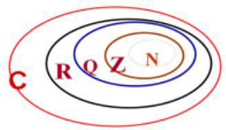

(5)复数集与其它数集之间的关系: $N \subseteq  Z \subseteq  Q \subseteq  R \subseteq  C$ .

(6)共轭复数:

实部相等而虚部互为相反数的两个复数,叫做共轭复数,也称这两个复数互相共轭. 复数 $z$ 的共轭复数用 $\bar{z}$ 表示,也就是当 $z = a + {bi}$ 时, $\bar{z} = a - {bi}$ . 虚部不等于 0 的两个共轭复数也叫做共轭虚数.

(7) 复数的模:

复数 $z = a + {bi}$ 在复平面内所对应的点 $Z\left( {a, b}\right)$ 到坐标原点的距离叫做复数 $z$ 的模,记作 $\left| z\right|$ . 由模的定义，可知 $\left| z\right|  = \left| {a + {bi}}\right|  = \sqrt{{a}^{2} + {b}^{2}}$ .

## 2、理解复数的有关运算及性质

(1)复数的四则运算:设 ${z}_{1} = a + {bi},{z}_{2} = c + {di}\left( {a, b, c, d \in  R}\right)$ ，则

①加减: ${z}_{1} \pm  {z}_{2} = \left( {a \pm  c}\right)  + \left( {b \pm  d}\right) i$ ；②乘法: ${z}_{1} \cdot  {z}_{2} = \left( {{ac} - {bd}}\right)  + \left( {{ad} + {bc}}\right) i$ ；

③除法: $\frac{{z}_{1}}{{z}_{2}} = \frac{{z}_{1} \cdot  \overline{{z}_{2}}}{{z}_{2} \cdot  \overline{{z}_{2}}} = \frac{{ac} + {bd}}{{c}^{2} + {d}^{2}} + \frac{{bc} - {ad}}{{c}^{2} + {d}^{2}} \cdot  i$ .

(2)共轭复数的运算:

① $\overline{{z}_{1} \pm  {z}_{2}} = \overline{{z}_{1}} \pm  \overline{{z}_{2}}$ ; ② $\overline{{z}_{1} \cdot  {z}_{2}} = \overline{{z}_{1}} \cdot  \overline{{z}_{2}}$ ; ③ $\overline{\left( \frac{{z}_{1}}{{z}_{2}}\right) } = \frac{\overline{{z}_{1}}}{{z}_{2}}$ ; ④ $\overline{{z}^{n}} = {\left( \bar{z}\right) }^{n}\left( {n \in  \mathrm{Z}}\right)$ ；

⑤ $\bar{z} = z$ ； ⑥ $z \in  \mathrm{R} \Leftrightarrow  \bar{z} = z$ ； ⑦ 若 $\mathrm{z}$ 为纯虚数 $\Leftrightarrow  \bar{z} =  - z$ ； ⑧ $z \cdot  \bar{z} = {\left| z\right| }^{2} = {\left| \bar{z}\right| }^{2}$ .

(3)模的运算:

① $\left| z\right|  = \left| \bar{z}\right|$ ；② $z \cdot  \bar{z} = {\left| z\right| }^{2} = {\left| \bar{z}\right| }^{2}$ ；③ $\left| {{z}_{1}{z}_{2}}\right|  = \left| {z}_{1}\right|  \cdot  \left| {z}_{2}\right|$ ； ④ $\left| \frac{{z}_{1}}{{z}_{2}}\right|  = \frac{\left| {z}_{1}\right| }{\left| {z}_{2}\right| }\left( {{z}_{2} \neq  0}\right)$ ；

⑤ $\left| {z}^{n}\right|  = {\left| z\right| }^{n}$ (当 $z \neq  0$ 时， $n \in  Z$ )； $\; * \left( 6\right) \left| {z}_{1}\right|  - \left| {z}_{2}\right|  \leq  \left| {{z}_{1} \pm  {z}_{2}}\right|  \leq  \left| {z}_{1}\right|  + \left| {z}_{2}\right|$ ；

⑦ ${\left| {z}_{1} + {z}_{2}\right| }^{2} + {\left| {z}_{1} - {z}_{2}\right| }^{2} = 2\left( {{\left| {z}_{1}\right| }^{2} + {\left| {z}_{2}\right| }^{2}}\right)$ ;

⑧非零复数 ${z}_{1} = a + b\mathrm{i},{z}_{2} = c + d\mathrm{i}\left( {a\text{ 、 }b\text{ 、 }c\text{ 、 }d \in  \mathrm{R}}\right)$ ,

对应向量 $\overline{O{Z}_{1}} \bot  \overline{O{Z}_{2}} \Leftrightarrow  {ac} + {bd} = 0 \Leftrightarrow  \left| {{z}_{1} - {z}_{2}}\right|  = \left| {{z}_{1} + {z}_{2}}\right|$ (矩形的对角线相等).

(4)重要结论:

①对复数 ${z}_{1},{z}_{2}$ 和自然数 $m\text{ 、 }n$ 有 ${z}^{m} \cdot  {z}^{n} = {z}^{m + n},{\left( {z}^{m}\right) }^{n} = {z}^{mn},{\left( {z}_{1} \cdot  {z}_{2}\right) }^{n} = {z}_{1}^{n} \cdot  {z}_{2}^{n}$ ;

② ${i}^{1} = i,{i}^{2} =  - 1,{i}^{3} =  - i,{i}^{4} = 1;{i}^{{4n} + 1} = 1,{i}^{{4n} + 2} =  - 1,{i}^{{4n} + 3} =  - i,{i}^{4n} = 1$ ;

③ ${\left( 1 \pm  i\right) }^{2} =  \pm  {2i},\frac{1 \pm  i}{1 \mp  i} =  \pm  i$ ; ④ $\left( {a + b\mathrm{i}}\right) \left( {a - b\mathrm{i}}\right)  = \left( {{a}^{2} + {b}^{2}}\right) , a + b\mathrm{i} = \mathrm{i}\left( {b - a\mathrm{i}}\right)$ ;

3、理解复数的几何意义

(1)复平面的有关概念:实轴是 $x$ 轴,虚轴是 $y$ 轴；与复数 $z = a + {bi}\left( {a, b \in  R}\right)$ 一一对应的点是 $\left( {a, b}\right)$ ；非零复数 $z = a + {bi}\left( {a, b \in  R,{a}^{2} + {b}^{2} \neq  0}\right)$ 与复平面上自原点出发以点 $Z\left( {a, b}\right)$ 为终点的向量 $\overrightarrow{OZ}$ 一一对应; 复数模的几何意义是: 复数对应复平面上的点到原点的距离.

(2)另外，要熟悉如下复数式的几何意义:

①两点间的距离公式: $d = \left| {{z}_{1} - {z}_{2}}\right|$ ；

② 线段的中垂线: $\left| {z - {z}_{1}}\right|  = \left| {z - {z}_{2}}\right|$ ；

③圆的方程: $\left| {z - p}\right|  = r$ (以点 $p$ 为圆心， $r$ 为半径)；

④圆的内部: $\left| {z - p}\right|  < r$ (以点 $p$ 为圆心， $r$ 为半径)；

⑤闭圆环: ${r}_{1} \leq  \left| {z - p}\right|  \leq  {r}_{2}$ (以点 $p$ 为圆心， ${r}_{1}$ ， ${r}_{2}$ 为半径)；

⑥ 椭圆: $\left| {z - {z}_{1}}\right|  + \left| {z - {z}_{2}}\right|  = {2a}$ (2a为正常数， ${2a} > \left| {{z}_{1} - {z}_{2}}\right|$ )；

线段: $\left| {z - {z}_{1}}\right|  + \left| {z - {z}_{2}}\right|  = {2a}$ (2a为正常数, ${2a} = \left| {{z}_{1} - {z}_{2}}\right|$ );

无轨迹: $\left| {z - {z}_{1}}\right|  + \left| {z - {z}_{2}}\right|  = {2a}$ (2a为正常数, ${2a} < \left| {{z}_{1} - {z}_{2}}\right|$ );

⑦ 双曲线: $\begin{Vmatrix}{z - {z}_{1}}\end{Vmatrix} - \left| {z - {z}_{2}}\right|  = {2a}$ (2a为正常数， ${2a} < \left| {{z}_{1} - {z}_{2}}\right|$ )；

射线: $\left\{  {\left| {z - {z}_{1}}\right|  - \left| {z - {z}_{2}}\right| }\right\}   = {2a}$ (2a为正常数, ${2a} = \left| {{z}_{1} - {z}_{2}}\right|$ );

无轨迹: $\begin{Vmatrix}{z - {z}_{1}\left| -\right| z - {z}_{2}}\end{Vmatrix} = {2a}$ (2a 为正常数, ${2a} > \left| {{z}_{1} - {z}_{2}}\right|$ ).

## 二、复数的平方根与立方根

## 1、复数的平方根的定义

若复数 ${z}_{1},{z}_{2}$ 满足 ${z}_{1}^{2} = {z}_{2}$ ,则称 ${z}_{1}$ 是 ${z}_{2}$ 的平方根.

2、复数的平方根的求法

${\left( a + bi\right) }^{2} = c + {di}\left( {a, b, c, c \in  R}\right)$ ，即利用复数相等，把复数平方根问题转化为实数方程组来求.

3、复数的平方根的性质

复数 $z\left( {z \neq  0}\right)$ 总有两个平方根 ${z}_{1},{z}_{2}$ ,且 ${z}_{1} + {z}_{2} = 0$

4、复数的立方根的定义

类似的,若复数 ${z}_{1},{z}_{2}$ 满足 ${z}_{1}^{3} = {z}_{2}$ ,则称 ${z}_{1}$ 是 ${z}_{2}$ 的立方根.

5、1 的立方根

设复数 $\omega  =  - \frac{1}{2} + \frac{\sqrt{3}}{2}i$ ,则 $1,\omega ,{\omega }^{2}$ 都是 1 的立方根.

6、 $\omega$ 的性质

① $1 + \omega  + {\omega }^{2} = 0$ ，② ${\omega }^{3} = 1$ ，③ ${\omega }^{2} = \overline{\omega } =  - \frac{1}{2} - \frac{\sqrt{3}}{2}i$ .

## 可运用这些性质化简相关问题

## 7、其他有用结论

${\left( 1 - i\right) }^{2} =  - {2i},\;{\left( 1 + i\right) }^{2} = {2i}$

三、实系数一元二次方程

实系数一元二次方程 $a{x}^{2} + {bx} + c = 0\left( {a, b, c \in  R, a \neq  0}\right)$ 中的 $\Delta  = {b}^{2} - {4ac}$ 为根的判别式,那么

(1) $\Delta  > 0 \Leftrightarrow$ 方程有两个不相等的实根 $\frac{-b \pm  \sqrt{{b}^{2} - {4ac}}}{2a}$ ；

(2) $\Delta  = 0 \Leftrightarrow$ 方程有两个相等的实根 $- \frac{b}{2a}$ ；

(3) $\Delta  < 0 \Leftrightarrow$ 方程有两个共轭虚根 $\frac{-b \pm  \sqrt{{4ac} - {b}^{2}}i}{2a}$ ，

在(3)的情况下，方程的根与系数关系(韦达定理)仍然成立.

【注意】

(1)在复数集 $C$ 中的一元二次方程的求根公式和韦达定理仍适用，但根的判别式仅在实数集上有效；

(2)实系数一元二次方程在复数集中一定有根，若是虚根则一定成对出现；

(3)齐二次实系数二次方程 $a{z}_{1}{}^{2} + b{z}_{1}{z}_{2} + c{z}_{2}{}^{2} = 0\left( {a, b, c \in  R}\right)$ ，将等式两端除以 ${z}_{2}$ 后，将得到一个关于 $\frac{{z}_{1}}{{z}_{2}}$ 得实系数一元二次方程; (不作要求)

(4)虚系数一元二次方程 $a{x}^{2} + {bx} + c = 0\left( {a \neq  0, a, b, c}\right)$ 至少有一个为虚数

①判别式判断实根情况失效；

如 ${x}^{2} - {ix} - 2 = 0$ ,虽然 $\Delta  = 7 > 0$ ,但该方程并无实根,不过韦达定理仍适用.

## 例题精讲

【例 1】已知 ${z}_{1},{z}_{2},{z}_{3} \in  C$ ,下列结论正确的是( )

A. 若 ${z}_{1}^{2} + {z}_{2}^{2} + {z}_{3}^{2} = 0$ ,则 ${z}_{1} = {z}_{2} = {z}_{3} = 0$

B. 若 ${z}_{1}^{2} + {z}_{2}^{2} + {z}_{3}^{2} > 0$ ,则 ${z}_{1}^{2} + {z}_{2}^{2} >  - {z}_{3}^{2}$

C. 若 ${z}_{1}^{2} + {z}_{2}^{2} >  - {z}_{3}^{2}$ ,则 ${z}_{1}^{2} + {z}_{2}^{2} + {z}_{3}^{2} > 0$

D. 若 $\overline{{z}_{1}} =  - {z}_{1}\left( \bar{z}\right)$ 为复数 $z$ 的共轭复数),则 ${z}_{1}$ 纯虚数

【难度】 $\star   \star   \star$

【答案】 $C$

【解析】解: $A$ ,当 ${z}_{1} = 1,{z}_{2} = i,{z}_{3} = 0$ 时,显然满足 ${z}_{1}^{2} + {z}_{2}^{2} + {z}_{3}^{2} = 0$ ,但不满足 ${z}_{1} = {z}_{2} = {z}_{3} = 0$ ,故错误;

$B$ ,当 ${z}_{1} = 1 + i,{z}_{2} = 1,{z}_{3} = 1 - i$ 时, ${z}_{1}^{2} + {z}_{2}^{2} + {z}_{3}^{2} = {\left( 1 + i\right) }^{2} + 1 + {\left( 1 - i\right) }^{2} = {2i} + 1 - {2i} = 1$ ,

显然满足 ${z}_{1}^{2} + {z}_{2}^{2} + {z}_{3}^{2} > 0$ ,而 ${2i} + 1 > {2i}$ 错误,故不满足 ${z}_{1}^{2} + {z}_{2}^{2} >  - {z}_{3}^{2}$ ,故错误;

$C$ ,复数满足 ${z}_{1}^{2} + {z}_{2}^{2} >  - {z}_{3}^{2}$ ,移项可得 ${z}_{1}^{2} + {z}_{2}^{2} + {z}_{3}^{2} > 0$ ,故正确.

$D$ ,当 ${z}_{1} = 0$ 时,显然满足 $\overline{{z}_{1}} =  - {z}_{1} = 0$ ,但 0 不是纯虚数,故错误;

故选: $C$ .

【例 2】已知 ${z}_{n} = \left( {1 + i}\right) \left( {1 + \frac{i}{\sqrt{2}}}\right) \left( {1 + \frac{i}{\sqrt{3}}}\right) \ldots \left( {1 + \frac{i}{\sqrt{n}}}\right) \left( {n \in  {Z}^{ + }}\right)$ ,则 $\left| {{z}_{2017} - {z}_{2018}}\right|$ 的值是___.

【难度】 $\star   \star   \star$

【答案】 1

【解析】解: $\because {z}_{n} \cdot  \overline{{z}_{n}} = \left( {1 + 1}\right)  \cdot  \left( {1 + \frac{1}{2}}\right)  \cdot  \ldots \ldots  \cdot  \left( {1 + \frac{1}{n}}\right)  = 2 \times  \frac{3}{2} \times  \frac{4}{3} \times  \ldots \ldots  \times  \frac{n}{n - 1} \cdot  \frac{n + 1}{n} = n + 1$ .

$\therefore \left| {z}_{n}\right|  = \sqrt{n + 1} \cdot  \therefore \left| {{z}_{2017} - {z}_{2018}}\right|  = \left| {z}_{2017}\right|  \cdot  \left| {1 - 1 - \frac{i}{\sqrt{2018}}}\right|  = \sqrt{2018} \times  \frac{1}{\sqrt{2018}} = 1$ . 故答案为:1.

【例 3】已知 $k + 2$ 个两两互不相等的复数 ${z}_{1}\text{ 、 }{z}_{2}\text{ 、 }\ldots \text{ 、 }{z}_{k}\text{ 、 }{w}_{1}\text{ 、 }{w}_{2}$ ,满足 $\overline{{w}_{1}} - \overline{{w}_{2}} = \frac{4}{{w}_{1} - {w}_{2}}$ ,且 $\left| {{w}_{j} - {z}_{a}}\right|  \in  \{ 1$ , 3\}(其中 $j = 1\text{ 、 }2;a = 0\text{ 、 }1\text{ 、 }2\text{ 、 }\ldots \text{ 、 }k)$ ，则 $k$ 的最大值为 ___.

【难度】 $\star   \star   \star   \star$

【答案】 5

【解析】解: 设 ${w}_{1} = a + {bi},{w}_{2} = c + {di}\left( {a, b, c, d \in  R}\right)$ ,

$\because \overrightarrow{{w}_{1}} - \overrightarrow{{w}_{2}} = \frac{4}{{w}_{1} - {w}_{2}},\therefore \left( {\overrightarrow{{w}_{1}} - \overrightarrow{{w}_{2}}}\right)  \cdot  \left( {{w}_{1} - {w}_{2}}\right)  = 4$ ,即 $\left( {\left( {a - b}\right)  - \left( {c - d}\right) i}\right) \left( {\left( {a - b}\right)  + \left( {c - d}\right) i}\right)  = 4$ ,

即 ${\left( a - b\right) }^{2} + {\left( c - d\right) }^{2} = 4$ ，故 ${w}_{1}$ 、 ${w}_{2}$ 对应平面内距离为 2 的点，如图 $F$ 、 $G$ ，

$\because \left| {{w}_{j} - {z}_{a}}\right|  \in  \{ 1,3\} ,\therefore {z}_{a}$ 与 ${w}_{1}\text{ 、 }{w}_{2}$ 对应的点的距离为 13 ,

构成了点 $A\text{ 、 }B\text{ 、 }C\text{ 、 }D\text{ 、 }E$ 共 5 个点,

故 $k$ 的最大值为 5,

故答案为: 5 .

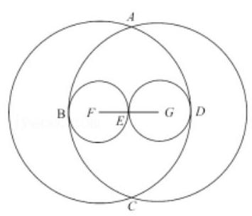

【例 4】已知实系数一元二次方程 ${x}^{2} + {px} + q = 0$ 的两根分别为 ${x}_{1},{x}_{2}$ .

(1)若上述方程的一个根 ${x}_{1} = 4 - i$ ( $i$ 为虚数单位)，求实数 $p, q$ 的值；

(2)若方程的两根满足 $\left| {x}_{1}\right|  + \left| {x}_{2}\right|  = 2$ ，求实数 $p$ 的取值范围.

【难度】 $\star   \star   \star$

【答案】见解析

【解析】解: (1) 根据 “实系数方程虚根共轭成对出现”,知 ${x}_{2} = 4 + i,\ldots 2$ 分

根据韦达定理,知 $p =  - \left( {{x}_{1} + {x}_{2}}\right)  =  - 8;q = {x}_{1} \cdot  {x}_{2} = {17},\ldots 2$ 分

(2)①当 ${\bigtriangleup  = {p}^{2} - {4q} < 0}$ 时，方程的两根为虚数，且 ${x}_{1} = \overline{{x}_{2}}$ ，

$\therefore \left| {x}_{1}\right|  = \left| {x}_{2}\right|  = 1,\therefore q = 1.\therefore p =  - \left( {{x}_{1} + {x}_{2}}\right)  =  - 2\operatorname{Re}\left( {x}_{1}\right)  \in  \left\lbrack  {-2,2}\right\rbrack$ ,

又根据 $\Delta  = {p}^{2} - {4q} < 0,\therefore p \in  \left( {-2,2}\right) .\ldots 3$ 分

②(法一)当 $\Delta  = {p}^{2} - {4q} \geq  0$ 时，方程的两根为实数，

$\left( {2 - 1}\right)$ 当 $q > 0$ 时,方程的两根同号,

$\therefore \left| {x}_{1}\right|  + \left| {x}_{2}\right|  = \left| {{x}_{1} + {x}_{2}}\right|  = \left| p\right|  = 2,\therefore p =  \pm  2$ ; (2-2) 当 $q = 0$ 时,方程的一根为 0,

$\therefore \left| {x}_{1}\right|  + \left| {x}_{2}\right|  = \left| {{x}_{1} + {x}_{2}}\right|  = \left| p\right|  = 2,\therefore p =  \pm  2;\left( {2 - 2}\right)$ 当 $q < 0$ 时,方程的两根异号,

$\therefore \left| {x}_{1}\right|  + \left| {x}_{2}\right|  = \left| {{x}_{1} - {x}_{2}}\right|  = 2,\therefore 4 = {\left( {x}_{1} + {x}_{2}\right) }^{2} - 4{x}_{1}{x}_{2} = {p}^{2} - {4q}$ ,

$\therefore {p}^{2} = 4 + {4q} \in  \lbrack 0,4),\therefore p \in  \left( {-2,2}\right) .\therefore$ 当 $\bigtriangleup  \geq  0$ 时, $p \in  \left\lbrack  {-2,2}\right\rbrack  .\ldots 3$ 分

综上, $p$ 的取值范围是 $\left\lbrack  {-2,2}\right\rbrack$ .

(法二) 当 $\Delta  = {p}^{2} - {4q} \geq  0$ 时,方程的两根为实数,

$\therefore \left| p\right|  = \left| {{x}_{1} + {x}_{2}}\right|  \leq  \left| {x}_{1}\right|  + \left| {x}_{2}\right|  = 2$ ,当 ${x}_{1}$ 与 ${x}_{2}$ 同号或有一个为 0 时等号取到.

特别的,取 ${x}_{1} = 2,{x}_{2} = 0$ 时 $p =  - 2$ ; 取 ${x}_{1} =  - 2,{x}_{2} = 0$ 时 $p = 2$ .

$\therefore p \in  \left\lbrack  {-2,2}\right\rbrack  .\ldots 3$ 分综上, $p$ 的取值范围是 $\left\lbrack  {-2,2}\right\rbrack$ .

## 巩固训练

1、已知复数 $z$ 满 $\left| {z - 1 - {2i}}\right|  - \left| {z + 2 + i}\right|  = 2\sqrt{2}$ ( $i$ 是虚数单位),若在复平面内复数 $z$ 对应的点为 $Z$ ,则点 $Z$ 的轨迹为( )

A. 双曲线 B. 双曲线的一支 C. 两条射线 D. 一条射线

【难度】 $\star   \star   \star$

【答案】B

【解析】因为复数 $z$ 满 $\left| {z - 1 - {2i}}\right|  - \left| {z + 2 + i}\right|  = 2\sqrt{2}$ ( $i$ 是虚数单位),在复平面内复数 $z$ 对应的点为 $Z$ , 则点 $Z$ 到点 $\left( {1,2}\right)$ 的距离减去到点 $\left( {-2, - 1}\right)$ 的距离之差等于 $2\sqrt{2}$ ,而点 $\left( {1,2}\right)$ 与点 $\left( {-2, - 1}\right)$ 之间的距离为 $3\sqrt{2}$ ，根据双曲线的定义，可得点 $Z$ 表示 $\left( {1,2}\right)$ 和 $\left( {-2, - 1}\right)$ 为焦点的双曲线的一支. 故选:B.

2、若 $z \in  C, i$ 为虚数单位,且 $\left| {z + 2 - {2i}}\right|  = 1$ ,求 $\left| {z - 2 - {2i}}\right|$ 的最小值.

【难度】 $\star   \star   \star$

【答案】 3

【解析】由 $\left| {z + 2 - {2i}}\right|  = 1$ 得 $\left| {z - \left( {-2 + {2i}}\right) }\right|  = 1$ ,因此复数 $z$ 对应的点 $Z$ 在以 ${z}_{0} =  - 2 + {2i}$ 对应的点 ${Z}_{0}$ 为圆心, 1 为半径的圆上, 如图所示.

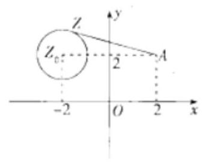

3、设 $y = \left| {z - 2 - {2i}}\right|$ ，则 $y$ 是 $Z$ 点到 $2 + {2i}$ 对应的点 $A$ 的距离. 又 $\left| {A{Z}_{0}}\right|  = 4$ ， $\therefore$ 由图知 ${y}_{\min } = \left| {A{Z}_{0}}\right|  - 1 = 3$ . 已知 ${x}_{1},{x}_{2}$ 是实系数方程 ${x}^{2} + x + p = 0$ 的两个根,且满足 $\left| {{x}_{1} - {x}_{2}}\right|  = 3$ ,求实数 $p$ 的值.

【难度】 $\star   \star   \star$

【答案】 $- 2,\frac{5}{2}$

【解析】 $\Delta  = 1 - {4p}$ ,

(1)当 $\Delta  \geq  0$ 时，即 $p \leq  \frac{1}{4}$ 时， ${x}_{1},{x}_{2}$ 是实根， $\therefore \left| {{x}_{1} - {x}_{2}}\right|  = \sqrt{{\left( {x}_{1} + {x}_{2}\right) }^{2} - 4{x}_{1}{x}_{2}} = 3$ ，即 $\sqrt{1 - {4p}} = 3 \Rightarrow  p =  - 2$ ;

(2)当 $\Delta  < 0$ 时，即 $p > \frac{1}{4}$ 时， ${x}_{1},{x}_{2}$ 是共轭虚根，设 ${x}_{1} = a + {bi}\left( {a, b \in  \mathbf{R}}\right)$ ，则 ${x}_{2} = a - {bi}$ ， $\therefore \left| {{x}_{1} - {x}_{2}}\right|  = \left| {2bi}\right|  = 2\left| b\right|  = 3 \Rightarrow  b =  \pm  \frac{3}{2}$ ,由 ${x}_{1} + {x}_{2} = {2a} =  - 1$ ,得 $a =  - \frac{1}{2}$ . 从而 $p = {x}_{1}{x}_{2} = {\left| {x}_{1}\right| }^{2} = \frac{5}{2}$ . 综上， $p =  - 2$ 或 $\frac{5}{2}$ .

4、在复平面内,三点 $A, B, C$ 分别对应复数 ${z}_{A},{z}_{B},{z}_{C}$ ,若 $\frac{{z}_{B} - {z}_{A}}{{z}_{C} - {z}_{A}} = 1 + \frac{4}{3}i$ ,则 $\bigtriangleup {ABC}$ 的三边长之比为___.

【难度】 $\star   \star   \star   \star$

【答案】3:4:5

【解析】解: 设 $\overrightarrow{AB}$ 表示的复数为 $a + {bi},\overrightarrow{AC}$ 表示的复数为 $c + {di}$ ,则 $a + {bi} = \left( {c + {di}}\right) \left( {1 + \frac{4}{3}i}\right)  = \left( {c - \frac{4}{3}d}\right)  + \left( {d + \frac{4}{3}c}\right) i,$

$\therefore a = c - \frac{4}{3}d, b = d + \frac{4}{3}c$ ,

$\therefore \overrightarrow{BC}$ 表示的复数为 $\overrightarrow{AC} - \overrightarrow{AB} = \left( {c - a}\right)  + \left( {d - b}\right) i = \frac{4}{3}d - \frac{4}{3}{ci}$ ,

$\therefore \overrightarrow{AC} \cdot  \overrightarrow{BC} = \left( {c, d}\right)  \cdot  \left( {\frac{4}{3}d, - \frac{4}{3}c}\right)  = 0$ ,

$\therefore {AC} \bot  {BC}$ , 又 $\frac{AB}{AC} = \frac{\left| {z}_{B} - {z}_{A}\right| }{\left| {z}_{C} - {z}_{A}\right| } = \left| {1 + \frac{4}{3}i = \sqrt{1 + \frac{16}{9}}}\right|  = \frac{5}{3},\therefore \frac{AB}{BC} = \frac{5}{\sqrt{{5}^{2} - {3}^{2}}} = \frac{5}{4}$ .

$\therefore \bigtriangleup {ABC}$ 的三边长之比为3:4:5. 故答案为:3:4:5.

5、已知复数集 $U = \left\{  {z \mid  0 \leq  \operatorname{Re}z \leq  2,\text{ 且 }\left| {\operatorname{Im}z}\right|  \leq  1}\right\}$ ,集合 $M = \{ z \mid  0 \leq  \operatorname{Re}z < \operatorname{Re}w$ ,且 $\left| {\operatorname{Im}z}\right|  \leq  \left| {\operatorname{Im}w}\right| ,\left| {w - 1}\right|  = 1\}$ , 则集合 ${\complement }_{U}M$ 在复平面上表示区域面积是___.

【难度】

【答案】 $2 - \frac{\pi }{2}$

【解析】解: 设 $z = x + {yi}, x \in  R, y \in  R$ ,

由题意可得, $\left\{  \begin{array}{l} 0 \leq  x \leq  2 \\   - 1 \leq  y \leq  1 \end{array}\right.$ ,则 $U$ 表示的区域如左图;

集合 $M = \left\{  {z \mid  0 \leq  {Rez} < {Rew}}\right.$ ,且 $\left| {Imz}\right|  \leq  \left| {Imw}\right| ,\left| {w - 1}\right|  = 1\}$ ,则 $M$ 表示的区域如中图;

$\therefore$ 集合 ${\complement }_{U}M$ 在复平面上表示区域如右图. $\therefore$ 集合 ${\complement }_{U}M$ 在复平面上表示区域面积是 $2 - \frac{\pi }{2}$ .

故答案为: $2 - \frac{\pi }{2}$ .

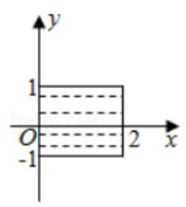

y

## (二)矩阵

## 知识梳理

## 一、矩阵

1、矩阵的相关定义:

(1)由 $m$ 个行向量与 $n$ 个列向量组成的矩阵称为 $m \times  n$ 阶矩阵记做 ${A}_{m \times  n}$ ，如矩阵 $\left( \begin{array}{l} 1 \\  3 \end{array}\right)$ 为 $2 \times  1$ 阶矩阵，可记做 ${A}_{2 \times  1}$ ; 矩阵 $\left( \begin{matrix} {51} & {21} & {28} \\  {36} & {38} & {36} \\  {23} & {21} & {28} \end{matrix}\right)$ 为 $3 \times  3$ 阶矩阵;

(2)矩阵中的每一个数字叫做矩阵的元素；

(3)零矩阵:当一个矩阵中所有元素均为 0 时，我们称这个矩阵为零矩阵；

(4)方阵:当一个矩阵的行数与列数相等时，这个矩阵称为方矩阵，简称方阵；特别的，若一个 $n$ 阶方阵从左上角到右下角的对角线上的所有元素均为 1,其余均为 0,这样的方阵叫做单位矩阵;

(5)相等的矩阵:如果矩阵 $A$ 与矩阵 $B$ 是同阶矩阵，当且仅当它们对应位置的元素都相等时，那么矩阵 $A$ 与矩阵 $B$ 叫做相等的矩阵,记为 $A = B$ ;

(6)系数矩阵和增广矩阵

注:增广矩阵中最后一列数字一定是线性方程中等于号右边的常数，同时注意有系数为 0 以及系数颠倒的情形.

2、矩阵的运算

(1)矩阵的加减法:两个同阶的矩阵相加减就是把两个矩阵的对应元素相加减得到的一个新矩阵。

(2)矩阵的数乘:一个数乘以一个矩阵等于这个矩阵的所有元素都乘以这个数字从而得到的一个新矩阵。

(3)矩阵的乘积:一般，设 $A$ 是 $m \times  k$ 阶矩阵， $B$ 是 $k \times  n$ 阶矩阵，设 $C$ 为 $m \times  n$ 矩阵如果矩阵 $C$ 中第 $i$ 行第 $j$ 列元素 ${C}_{ij}$ 是矩阵 $A$ 第 $i$ 个行向量与矩阵 $B$ 的第 $j$ 个列向量的数量积，那么 $C$ 矩阵叫做 $A$ 与 $B$ 的乘积. 记作: $C = {AB}$ .

分配律: $A\left( {B + C}\right)  = {AB} + {AC},\left( {B + C}\right) A = {BA} + {CA}$

结合律: $\gamma \left( {AB}\right)  = \left( {\gamma A}\right) B = A\left( {\gamma B}\right) ,\left( {AB}\right) C = A\left( {BC}\right)$

注: 交换律不成立,即 ${AB} \neq  {BA}$

(4)用矩阵初等行变换求解方程组的解:①互换两行；②某一行乘以一个非零常数；③将某一行乘以一个非零常数加到另一行上。最终的目的在于将增广矩阵前面的系数矩阵变成单位矩阵，最后一列数即为方程组的解。

(5) 点 $P\left( {x, y}\right)$ 经过矩阵 $A = \left( \begin{array}{ll} a & b \\  c & d \end{array}\right)$ 变换后得到新的点 $Q$ 的坐标为 $\left( {{ax} + {by},{cx} + {dy}}\right)$ 即

$$
\left( \begin{array}{ll} a & b \\  c & d \end{array}\right)  \times  \left( \begin{array}{l} x \\  y \end{array}\right)  = \left( \begin{array}{l} {ax} + {by} \\  {cx} + {dy} \end{array}\right)
$$

二、行列式

1、二阶行列式: $\left| \begin{array}{ll} {a}_{1} & {b}_{1} \\  {a}_{2} & {b}_{2} \end{array}\right|  = {a}_{1}{b}_{2} - {a}_{2}{b}_{1}$ ;

## 2、二元一次方程组的行列式解法

二元一次方程组: $\left\{  \begin{array}{l} {a}_{1}x + {b}_{1}y = {c}_{1} \\  {a}_{2}x + {b}_{2}y = {c}_{2} \end{array}\right.$ 其中 $x, y$ 是未知数, ${a}_{1},{a}_{2},{b}_{1},{b}_{2}$ 不全为零

系数行列式: $D = \left| \begin{array}{ll} {a}_{1} & {b}_{1} \\  {a}_{2} & {b}_{2} \end{array}\right| ,{D}_{x} = \left| \begin{array}{ll} {c}_{1} & {b}_{1} \\  {c}_{2} & {b}_{2} \end{array}\right| ,{D}_{y} = \left| \begin{array}{ll} {a}_{1} & {c}_{1} \\  {a}_{2} & {c}_{2} \end{array}\right|$ .

(1)当 $D \neq  0$ 时,方程组有唯一解 $\left\{  \begin{array}{l} x = \frac{{D}_{x}}{D} \\  y = \frac{{D}_{y}}{D} \end{array}\right.$

(2)当 $D = 0,{D}_{x} = {D}_{y} = 0$ 时,方程组有无穷多解;

(3)当 $D = 0,{D}_{x},{D}_{y}$ 中至少有一个不为零，方程组无解.

3、三阶行列式的几种算法

(1)对角线法则:如图，也可在行列式后面补上两列来解决；

$\left| \begin{array}{lll} {a}_{1} & {b}_{1} & {c}_{1} \\  {a}_{2} & {b}_{2} & {c}_{2} \\  {a}_{3} & {b}_{3} & {c}_{3} \end{array}\right|  = {a}_{1}{b}_{2}{c}_{3} + {a}_{2}{b}_{3}{c}_{1} + {a}_{3}{b}_{1}{c}_{2} - {a}_{3}{b}_{2}{c}_{1} - {a}_{2}{b}_{1}{c}_{3} - {a}_{1}{b}_{3}{c}_{2}$

(2)按照某一行或者某一列展开:三阶行列式的值等于某一行(列)的所有元素乘以它们的代数余子式相加。注意区分余子式和代数余子式的概念.

(3)计算器

5、已知 ${xOy}$ 平面上三点 $A\left( {{x}_{1},{y}_{1}}\right) , B\left( {{x}_{2},{y}_{2}}\right) , C\left( {{x}_{3},{y}_{3}}\right)$ ,以 $A, B, C$ 为顶点的三角形 ${ABC}$ 的面积为 $\frac{1}{2}\begin{Vmatrix} {x}_{1} & {y}_{1} & 1 \\  {x}_{2} & {y}_{2} & 1 \\  {x}_{3} & {y}_{3} & 1 \end{Vmatrix}$

6、一类特殊的行列式: 三阶范德蒙德行列式

$$
\left| \begin{matrix} 1 & 1 & 1 \\  a & b & c \\  {a}^{2} & {b}^{2} & {c}^{2} \end{matrix}\right|  = \left| \begin{matrix} 1 & a & {a}^{2} \\  1 & b & {b}^{2} \\  1 & c & {c}^{2} \end{matrix}\right|  = \left( {b - a}\right) \left( {c - b}\right) \left( {c - a}\right)
$$

## 例题精讲

【例 5】已知 $A = \left( \begin{array}{llll} 1 & 2 & 3 & 4 \end{array}\right) , B = \left( \begin{array}{l} 1 \\  2 \\  3 \\  4 \end{array}\right)$ ，则 ${AB} =$ ___； ${BA} =$ ___.

【难度】 $\star   \star   \star$

【答案】(30) $\left( \begin{array}{llll} 1 & 2 & 3 & 4 \\  2 & 4 & 6 & 8 \\  3 & 6 & 9 & {12} \\  4 & 8 & {12} & {16} \end{array}\right)$

【解析】解: 因为 $A = \left( \begin{array}{llll} 1 & 2 & 3 & 4 \end{array}\right) , B = \left( \begin{array}{l} 1 \\  2 \\  3 \\  4 \end{array}\right)$

所以 ${AB} = \left( \begin{array}{llll} 1 & 2 & 3 & 4 \end{array}\right) \left( \begin{array}{l} 1 \\  2 \\  3 \\  4 \end{array}\right)  = \left( {1 \times  1 + 2 \times  2 + 3 \times  3 + 4 \times  4}\right)  = \left( {30}\right)$

${BA} = \left( \begin{array}{l} 1 \\  2 \\  3 \\  4 \end{array}\right) \left( \begin{array}{llll} 1 & 2 & 3 & 4 \end{array}\right)  = \left( \begin{array}{llll} 1 \times  1 & 2 \times  1 & 3 \times  1 & 4 \times  1 \\  2 \times  1 & 2 \times  2 & 2 \times  3 & 2 \times  4 \\  3 \times  1 & 3 \times  2 & 3 \times  3 & 3 \times  4 \\  4 \times  1 & 4 \times  2 & 4 \times  3 & 4 \times  4 \end{array}\right)  = \left( \begin{array}{llll} 1 & 2 & 3 & 4 \\  2 & 4 & 6 & 8 \\  3 & 6 & 9 & {12} \\  4 & 8 & {12} & {16} \end{array}\right)$

故答案为: $\left( \begin{matrix} {30} \\  2 \end{matrix}\right) ;\left( \begin{matrix} 1 & 2 & 3 & 4 \\  2 & 4 & 6 & 8 \\  3 & 6 & 9 & {12} \\  4 & 8 & {12} & {16} \end{matrix}\right)$

【例 6】若关于 $x\text{ 、 }y$ 的二元一次线性方程组 $\left\{  \begin{array}{l} {a}_{1}x + {b}_{1}y = {c}_{1}, \\  {a}_{2}x + {b}_{2}y = {c}_{2} \end{array}\right.$ 的增广矩阵是 $\left( \begin{matrix} m & 1 & 3 \\  0 & 2 & n \end{matrix}\right)$ ,且 $\left\{  \begin{array}{l} x = 1, \\  y =  - 1 \end{array}\right.$ 是该线性方程组的解,则三阶行列式 $\left| \begin{matrix}  - 1 & 0 & 1 \\  0 & 3 & m \\  2 & n & 1 \end{matrix}\right|$ 中第 3 行第 2 列元素的代数余子式的值是___.

【难度】 $\star   \star   \star$

【答案】 4

【解析】解: 把二元一次线性方程组 $\left\{  \begin{array}{l} {a}_{1}x + {b}_{1}y = {c}_{1}, \\  {a}_{2}x + {b}_{2}y = {c}_{2} \end{array}\right.$ 的增广矩阵是 $\left( \begin{matrix} m & 1 & 3 \\  0 & 2 & n \end{matrix}\right)$ 还原为方程组如下:

$\left\{  {\begin{array}{l} {mx} + y = 3 \\  {2y} = n \end{array},\text{ 且 }\left\{  \begin{array}{l} x = 1, \\  y =  - 1 \end{array}\right. }\right.$ 是该线性方程组的解,所以 $\left\{  \begin{array}{l} m = 4 \\  n =  - 2 \end{array}\right.$ ; 所以三阶行列式为 $\left| \begin{matrix}  - 1 & 0 & 1 \\  0 & 3 & m \\  2 & n & 1 \end{matrix}\right|$ ,

其中第 3 行第 2 列元素的代数余子式为 ${M}_{32} =  - \left| \begin{matrix}  - 1 & 1 \\  0 & 4 \end{matrix}\right|  =  - \left( {-1}\right)  \times  4 + 1 \times  0 = 4$ . 故答案为: 4 .

【例 7】把 $2\left| \begin{array}{ll} {x}_{2} & {y}_{2} \\  {x}_{3} & {y}_{3} \end{array}\right|  + \left| \begin{array}{ll} {x}_{1} & {y}_{1} \\  {x}_{3} & {y}_{3} \end{array}\right|  + 3\left| \begin{array}{ll} {x}_{1} & {y}_{1} \\  {x}_{2} & {y}_{2} \end{array}\right|$ 表示成一个三阶行列式是___

【难度】 $\star   \star   \star$

【答案】 $\left| \begin{array}{lll} 2 & {x}_{1} & {y}_{1} \\   - 1 & {x}_{2} & {y}_{2} \\  3 & {x}_{3} & {y}_{3} \end{array}\right|$

【解析】解: 根据行列式按第一列展开式,可知:

$2\left| \begin{array}{ll} {x}_{2} & {y}_{2} \\  {x}_{3} & {y}_{3} \end{array}\right|  + \left| \begin{array}{ll} {x}_{1} & {y}_{1} \\  {x}_{3} & {y}_{3} \end{array}\right|  + 3\left| \begin{array}{ll} {x}_{1} & {y}_{1} \\  {x}_{2} & {y}_{2} \end{array}\right|  = 2 \cdot  {\left( -1\right) }^{1 + 1}\left| \begin{array}{ll} {x}_{2} & {y}_{2} \\  {x}_{3} & {y}_{3} \end{array}\right|  + \left( {-1}\right)  \cdot  {\left( -1\right) }^{2 + 1}\left| \begin{array}{ll} {x}_{1} & {y}_{1} \\  {x}_{3} & {y}_{3} \end{array}\right|  + 3 \cdot  {\left( -1\right) }^{3 + 1}\left| \begin{array}{ll} {x}_{1} & {y}_{1} \\  {x}_{2} & {y}_{2} \end{array}\right|  = \left| \begin{array}{lll} 2 & {x}_{1} & {y}_{1} \\   - 1 & {x}_{2} & {y}_{2} \\  3 & {x}_{3} & {y}_{3} \end{array}\right| .$

故答案为: $\left| \begin{array}{lll} 2 & {x}_{1} & {y}_{1} \\   - 1 & {x}_{2} & {y}_{2} \\  3 & {x}_{3} & {y}_{3} \end{array}\right|$ .

## 巩固训练

1、关于 $x$ 、 $y$ 的方程组 $\left\{  \begin{array}{l} {a}_{1}x + {b}_{1}y = {c}_{1} \\  {a}_{2}x + {b}_{2}y = {c}_{2} \end{array}\right.$ 有无穷多组解,则下列说法错误的是( )

A. $\left| \begin{array}{ll} {a}_{1} + {a}_{2} & {c}_{1} + {c}_{2} \\  {a}_{2} & {c}_{2} \end{array}\right|  = 0$ B. $\left| \begin{array}{ll} {a}_{1} + {a}_{2} & {b}_{1} + {b}_{2} \\  {a}_{2} - {a}_{1} & {b}_{2} - {b}_{1} \end{array}\right|  = 0$

C. $\left| \begin{array}{lll} {a}_{1} & {b}_{1} & {c}_{1} \\  {a}_{2} & {b}_{2} & {c}_{2} \\  1 & 1 & 1 \end{array}\right|  = 0$ D. ${a}_{1}\left| \begin{array}{ll} {c}_{1} & {b}_{1} \\  {c}_{2} & {b}_{2} \\  {a}_{1} & {b}_{1} \end{array}\right|  + {b}_{1}\left| \begin{array}{ll} {c}_{1} & {b}_{1} \\  {c}_{2} & {b}_{2} \\  {a}_{1} & {b}_{1} \end{array}\right|  = {c}_{1}$

【难度】 $\star   \star   \star$

【答案】 $D$

【解析】解: 根据关于 $x\text{ 、 }y$ 的方程组 $\left\{  \begin{array}{l} {a}_{1}x + {b}_{1}y = {c}_{1} \\  {a}_{2}x + {b}_{2}y = {c}_{2} \end{array}\right.$ 有无穷多组解,得到 ${a}_{1}{b}_{2} = {a}_{2}{b}_{1},{a}_{1}{c}_{2} = {a}_{2}{c}_{1},{b}_{1}{c}_{2} = {b}_{2}{c}_{1}$ . $A$ 中等式计算可得 ${a}_{1}{c}_{2} = {a}_{2}{c}_{1}$ ,故不选 $A$ ;

$B$ 中等式计算可得 $\left( {{a}_{1}{b}_{2} - {a}_{2}{b}_{1} - {a}_{1}{b}_{1} + {a}_{2}{b}_{2}}\right)  - \left( {{a}_{1}{b}_{2} - {a}_{2}{b}_{1} - {a}_{1}{b}_{1} + {a}_{2}{b}_{2}}\right)  = 0$ ,等式成立,故不选 $B$ ;

$C$ 中等式计算可得 ${a}_{1}{b}_{2} + {b}_{1}{c}_{2} + {a}_{2}{c}_{1} - \left( {{a}_{2}{b}_{1} + {b}_{2}{c}_{1} + {a}_{1}{c}_{2}}\right)  = 0$ ,成立,故不选 $C$ ;

$D$ 中等式算式中分母为 0,错误,故选 $D$ . 故选: $D$ .

2、关于 $x\text{ 、 }y$ 的二元一次方程组 $\left\{  \begin{array}{l} {3x} + {4y} = 1 \\  x - {3y} = {10} \end{array}\right.$ 的增广矩阵为(   )

A. $\left( \begin{matrix} 3 & 4 &  - 1 \\  1 &  - 3 & {10} \end{matrix}\right)$ B. $\left( \begin{matrix} 3 & 4 & 1 \\  1 &  - 3 &  - {10} \end{matrix}\right)$

C. $\left( \begin{matrix} 3 & 4 & 1 \\  1 &  - 3 & {10} \end{matrix}\right)$ D. $\left( \begin{array}{lll} 3 & 4 & 1 \\  1 & 3 & {10} \end{array}\right)$

【难度】 $\star   \star   \star$

【答案】 $C$

【解析】解: $\left\{  \begin{array}{l} {3x} + {4y} = 1 \\  x - {3y} = {10} \end{array}\right.$ 的增广矩阵 $\left( \begin{array}{lll} 3 & 4 & 1 \\  1 &  - 3 & {10} \end{array}\right)$ ,故选: $C$ .

3、已知行列式 $\left| \begin{array}{lll} 1 & 2 & 2 \\  1 & x & 4 \\  1 &  - 3 & 9 \end{array}\right|  = 0$ ,则 $x =$ ___.

【难度】 $\star   \star   \star$

【答案】 $\frac{4}{7}$

【解析】解: 已知行列式 $\left| \begin{array}{lll} 1 & 2 & 2 \\  1 & x & 4 \\  1 &  - 3 & 9 \end{array}\right|  = 0$ ,即: ${9x} + 8 + \left( {-6}\right)  - {2x} - \left( {-{12}}\right)  - {18} = 0$ ,

解得 $x = \frac{4}{7}$ ,故答案为: $\frac{4}{7}$ .

4、若行列式 $\left| \begin{array}{lll} 0 & 1 & \pi \\  \sin \left( {\pi  + x}\right) & 2 & \sqrt{2} \\  \cos \left( {\frac{\pi }{4} - x}\right) & 3 &  - 1 \end{array}\right|$ 的第 1 行第 2 列的元素 1 的代数余子式 -1,则实数 $x$ 的取值集合为___.

【难度】 $\star   \star   \star$

【答案】 $\{ x \mid  x = \pi  + {2k\pi }, k \in  Z\}$

【解析】解: 由题意,

第 1 行第 2 列的元素 1 的代数余子式为: ${\left( -1\right) }^{1 + 2} \cdot  \left| \begin{matrix} \sin \left( {\pi  + x}\right) & \sqrt{2} \\  \cos \left( {\frac{\pi }{4} - x}\right) &  - 1 \end{matrix}\right|$ .

${\left( -1\right) }^{1 + 2}\left| \begin{matrix} \sin \left( {\pi  + x}\right) & \sqrt{2} \\  \cos \left( {\frac{\pi }{4} - x}\right) &  - 1 \end{matrix}\right|  =  - 1$ ,则 $\left| \begin{matrix} \sin \left( {\pi  + x}\right) & \sqrt{2} \\  \cos \left( {\frac{\pi }{4} - x}\right) &  - 1 \end{matrix}\right|  = 1$ ,

即 $- \sin \left( {\pi  + x}\right)  - \sqrt{2}\cos \left( {\frac{\pi }{4} - x}\right)  = 1.\sin x - \sqrt{2}\left( {\cos \frac{\pi }{4}\cos x + \sin \frac{\pi }{4}\sin x}\right)  = 1$ ,

整理,得: $\cos x =  - 1.\therefore x = \pi  + {2k\pi }, k \in  Z$ . 故答案为: $\{ x \mid  x = \pi  + {2k\pi }, k \in  Z\}$ .

## (三) 线性规划

## 知识梳理

## 1、线性规划的概念

线性规划是指在线性约束条件下求目标函数的最值,这里的线性约束条件是指___ $x, y$ 满足的条件

## 2、可行解与最优解

①满足线性约束条件的解 $\left( {x, y}\right)$ 叫做可行解；

②使目标函数达到最大(或最小)值的可行解叫做最优解。

## 3、可行域

所有可行解___表示的平面区域称为可行域，画可行域的方法是 “直线定界，特殊点定域”。

## 4、简单线性规划的图解法

用图解法解简单的线性规划可分为三个步骤:

(1)___画出可行域___；

(2)___作出目标函数的等值线___；

(3)求出最值___；

## 例题精讲

【例 8】设点 $P\left( {x, y}\right)$ 是圆 $C : {x}^{2} + {y}^{2} + {2x} - {2y} + 1 = 0$ 上任意一点，若 $- {2x} + y + 1 + \left| {{2x} - y - a}\right|$ 为定值，则 $a$

的值可能为( )

A. -3 B. -4 C. -5 D. -6

【难度】 $\star   \star   \star$

【答案】D

【解析】圆 $C$ 标准方程为 ${\left( x + 1\right) }^{2} + {\left( y - 1\right) }^{2} = 1$ ,圆心为 $C\left( {-1,1}\right)$ ,半径为 $r = 1$ ,

直线 $l : {2x} - y - a = 0$ 与圆相切时， $\frac{\left| -2 - 1 - a\right| }{\sqrt{5}} = 1, a =  - 3 \pm  \sqrt{5}$ ，

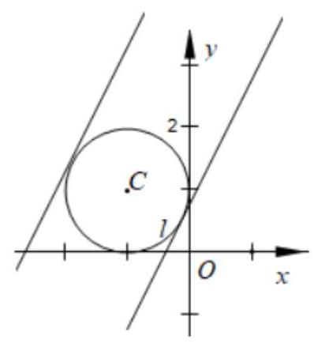

当 $a =  - 3 + \sqrt{5}$ 时,圆 $C$ 在直线 $l$ 上方, ${2x} - y - a \leq  0$ ,当

$a =  - 3 - \sqrt{5}$ 时,圆 $C$ 在直线 $l$ 下方, ${2x} - y - a \geq  0$ ,

若 $- {2x} + y + 1 + \left| {{2x} - y - a}\right|$ 为定值,则 ${2x} - y - a \geq  0$ ,因此 $a \leq   - 3 - \sqrt{5}$ . 只有 $\mathrm{D}$ 满足.

故选: D.

【例 9】在平面直角坐标系 ${xOy}$ 中,点集 $K = \{ \left( {x, y}\right)  \mid  \left( {\left| x\right|  + \left| {2y}\right|  - 4}\right) \left( {\left| {2x}\right|  + \left| y\right|  - 4}\right)  \leq  0\}$ 所对应的平面区域的面积为___

【难度】 $\star   \star   \star$

【答案】 $\frac{32}{3}$

【解析】解: $\because \left( {\left| x\right|  + 2\left| y\right|  - 4}\right) \left( {2\left| x\right|  + \left| y\right|  - 4}\right)  \leq  0$ 对应的区域关于原点对称, $x$ 轴对称, $y$ 轴对称,

$\therefore$ 只要作出在第一象限的区域即可.

当 $x \geq  0, y \geq  0$ 时,不等式等价为 $\left( {x + {2y} - 4}\right) \left( {{2x} + y - 4}\right)  \leq  0$ ,

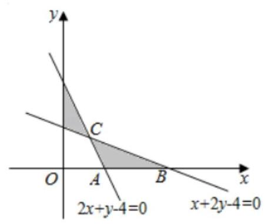

即 $\left\{  \begin{array}{l} x + {2y} - 4 \geq  0 \\  {2x} + y - 4 \leq  0 \end{array}\right.$ 或 $\left\{  \begin{array}{l} x + {2y} - 4 \leq  0 \\  {2x} + y - 4 \geq  0 \end{array}\right.$ ,

在第一象限内对应的图象为,则 $A\left( {2,0}\right) , B\left( {4,0}\right)$ ,

由 $\left\{  \begin{array}{l} x + {2y} - 4 = 0 \\  {2x} + y - 4 = 0 \end{array}\right.$ ,解得 $\left\{  \begin{array}{l} x = \frac{4}{3} \\  y = \frac{4}{3} \end{array}\right.$ ,即 $C\left( {\frac{4}{3},\frac{4}{3}}\right)$ ,

则三角形 ${ABC}$ 的面积 $S = \frac{1}{2} \times  2 \times  \frac{4}{3} = \frac{4}{3}$ ，则在第一象限的面积 $S = 2 \times  \frac{4}{3} = \frac{8}{3}$ ，

则点集 $K$ 对应的区域总面积 $S = 4 \times  \frac{8}{3} = \frac{32}{3}$ . 故答案为: $\frac{32}{3}$ .

【例 10】已知点 $\left( {m + n, m - n}\right)$ 在 $\left\{  \begin{array}{l} x - y \geq  0 \\  x + y \geq  0 \\  {2x} - y \geq  2 \end{array}\right.$ 表示的平面区域内,则 ${m}^{2} + {n}^{2}$ 的最小值为( )

A. $\frac{2}{5}$ B. $\frac{\sqrt{10}}{5}$ C. $\frac{4}{9}$ D. $\frac{2}{3}$

【难度】

【答案】A

【解析】 $\left\{  \begin{array}{l} x - y \geq  0 \\  x + y \geq  0 \\  {2x} - y \geq  2 \end{array}\right.$ 表示的平面区域如图阴影部分,点 $\left( {m + n, m - n}\right)$ 在 $\left\{  \begin{array}{l} x - y \geq  0 \\  x + y \geq  0 \\  {2x} - y \geq  2 \end{array}\right.$ 表示的平面区域内,

设 $\left\{  \begin{array}{l} x = m + n \\  y = m - n \end{array}\right.$ ,即 $\left( {x, y}\right)$ 在 $\left\{  \begin{array}{l} x - y \geq  0 \\  x + y \geq  0 \\  {2x} - y \geq  2 \end{array}\right.$ 表示的平面区域内,且 $m = \frac{x + y}{2}, n = \frac{x - y}{2}$ ,

所以 ${m}^{2} + {n}^{2} = {\left( \frac{x + y}{2}\right) }^{2} + {\left( \frac{x - y}{2}\right) }^{2} = \frac{1}{2}\left( {{x}^{2} + {y}^{2}}\right)$ ,

则 ${m}^{2} + {n}^{2}$ 的最小值为可行域内的点与原点距离的平方的一半.

由可行域可知,可行域内的点与坐标原点的距离的最小值为 $P$ 到原点的距离,

即原点到直线 ${2x} - y - 2 = 0$ 的距离,所以距离的最小值为: $\frac{2}{\sqrt{5}}$ 所以 ${m}^{2} + {n}^{2}$ 的最小值为: $\frac{1}{2} \times  {\left( \frac{2}{\sqrt{5}}\right) }^{2} = \frac{2}{5}$ ,

故选: A.

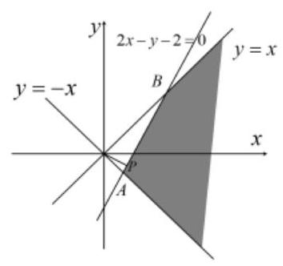

【例 11】(1) 设 $x, y$ 满足约束条件 $\left\{  \begin{array}{l} x - 5 \leq  0 \\  x - y + 1 \geq  0 \\  x + {5y} - 5 \geq  0 \end{array}\right.$ ,且 $z = {ax} + {by}\left( {a > 0, b > 0}\right)$ 的最大值为 1,则 $\frac{5}{a} + \frac{6}{b}$ 的最小值为( )

A. 64 B. 81 C. 100 D. 121

【难度】★★★★

【答案】 $D$

【解析】解: 作出约束条件表示的可行域如图,

$\because a > 0, b > 0$ ,联立 $\left\{  \begin{array}{l} x - y + 1 = 0 \\  x = 5 \end{array}\right.$ ,得 $x = 5, y = 6$ ,

$\therefore$ 当直线 $z = {ax} + {by}$ 经过点 $\left( {5,6}\right)$ 时, $z$ 取得最大值,则 ${5a} + {6b} = 1$ ,

$\therefore \frac{5}{a} + \frac{6}{b} = \left( {\frac{5}{a} + \frac{6}{b}}\right) \left( {{5a} + {5b}}\right)  = {61} + {30}\left( {\frac{b}{a} + \frac{a}{b}}\right)  \geq  {61} + {60} = {121}$ ,当且仅当 $a = b = \frac{1}{11}$ 时,等号成立, $\therefore \frac{5}{a} + \frac{6}{b}$ 的最小值为 121 . 故选: $D$ .

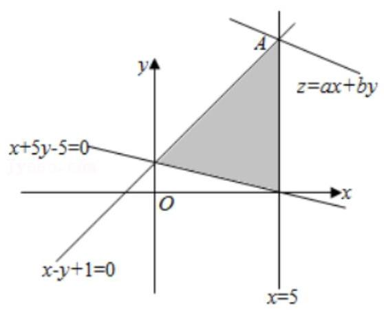

( 2 )已知实数 $m > 1$ ，实数 $x$ 、 $y$ 满足不等式组 $\left\{  \begin{matrix} x - y \leq  0 \\  {9x} - {2y} \geq  0 \\  x + y \leq  6 \\  x, y \in  N \end{matrix}\right.$ ，若目标函数 $z = x + {my}$ 的最大值等于 10，则 $m =$

【难度】 $\star   \star   \star   \star$

【答案】 2

【解析】解: 由约束条件 $\left\{  \begin{matrix} x - y \leq  0 \\  {9x} - {2y} \geq  0 \\  x + y \leq  6 \\  x, y \in  N \end{matrix}\right.$ 作出可行域如图内的整数点 (含边界线上的整数点),

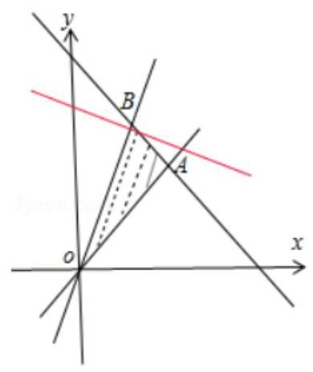

联立 $\left\{  \begin{array}{l} x - y = 0 \\  x + y = 6 \end{array}\right.$ ，解得 $A\left( {3,3}\right)$ ， $\left\{  {\begin{array}{l} x + y = 6 \\  {9x} - {2y} = 0 \end{array} \Rightarrow  B\left( {\frac{12}{11},\frac{54}{11}}\right) }\right.$ ，

化目标函数 $z = x + {my}$ 为 $y =  - \frac{1}{m}x + \frac{1}{m}z$ ,

由图可知,当直线 $y =  - \frac{1}{m}x + \frac{1}{m}z$ 过 $B$ 时,直线在 $y$ 轴上的截距最大,但 $B$ 不是整数点,

因为: $0 \leq  x \leq  3,0 \leq  y \leq  \frac{54}{11}$ ,故当 $y = 4, x = 2$ 时, $z$ 有最大值为 $2 + {4m} = {10}$ ,

即 $m = 2$ . 故答案为: 2 .

## 巩固训练

1、 ${x}^{2} + {y}^{2} \leq  1$ 是“ $\left| x\right|  + \left| y\right|  \leq  \sqrt{2}$ ”成立的( )

A. 充分不必要条件 B. 必要不充分条件

C. 充分且必要条件 D. 既不充分又不必要条件

【难度】 $\star   \star   \star$

【答案】A

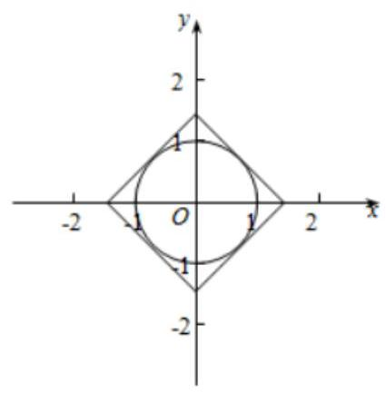

【解析】“ ${x}^{2} + {y}^{2} \leq  1$ ”表示单位圆内以及圆周上的点,

“ $\left| x\right|  + \left| y\right|  \leq  \sqrt{2}$ ”表示以点 $\left( {\sqrt{2},0}\right) ,\left( {0,\sqrt{2}}\right) ,\left( {-\sqrt{2},0}\right) ,\left( {0, - \sqrt{2}}\right)$

为正方形内及边界上的点,

由图象可知,圆是正方形的内切圆,

所以 $\sqrt[{C + x}]{{x}^{2} + {y}^{2}} \leq  1$ ” 是 “ $\left| x\right|  + \left| y\right|  \leq  \sqrt{2}$ ” 成立的充分不必要条件,

故选: $A$ .

2、已知变量 $x, y$ 满足 $\left\{  \begin{array}{l} x + {2y} - 4 \geq  0 \\  {2x} + y - 4 \leq  0 \\  x \geq  0 \end{array}\right.$ ，则 $\left| {x - {2y} - 4}\right|$ 的最小值为( )

A. $\frac{8\sqrt{5}}{5}$ B. 8

C. $\frac{{16}\sqrt{5}}{15}$ D. $\frac{16}{3}$

【难度】 $\star   \star   \star$

【答案】D

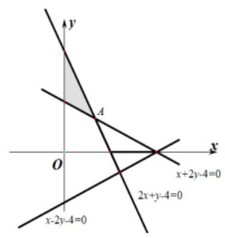

【解析】因为 $\left| {x - {2y} - 4}\right|  = \sqrt{5} \times  \frac{\left| x - 2y - 4\right| }{\sqrt{{1}^{2} + {2}^{2}}}$ ,所以 $\left| {x - {2y} - 4}\right|$ 可看作为可行域内的动点到直线 $x - {2y} - 4 = 0$ 的距离的 $\sqrt{5}$ 倍,如图所示,

点 $A\left( {\frac{4}{3},\frac{4}{3}}\right)$ 到直线 $x - {2y} - 4 = 0$ 的距离 $d$ 最小,此时

$d = \frac{\left| \frac{4}{3} - 2 \times  \frac{4}{3} - 4\right| }{\sqrt{{1}^{2} + {2}^{2}}} = \frac{16}{3\sqrt{5}},$

所以 $\left| {x - {2y} - 4}\right|$ 的最小值为 $\sqrt{5}d = \frac{16}{3}$ .

故选: D.

3、已知 $\left| x\right|  \leq  2,\left| y\right|  \leq  2,\theta  \in  \mathbf{R}$ ，则 $\{ \left( {x, y}\right)  \mid  x\cos \theta  + y\sin \theta  = 1\}$ 围成的区域的面积为___.

【难度】 $\star   \star   \star$

【答案】 ${16} - \pi$

【解析】由已知 $\left| x\right|  \leq  2,\left| y\right|  \leq  2$ 点 $\left( {x, y}\right)$ 为边长为 4 的正方形及其内部,

直线方程 $x\cos \theta  + y\sin \theta  = 1$ 可知,此直线与圆心在原点半径为 1 的圆外切.

所以围成的区域是正方形内部、圆的外部,即阴影部分,面积为 ${16} - \pi$

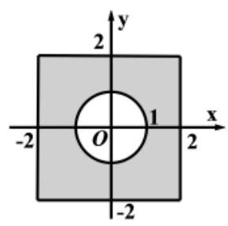

故答案为: ${16} - \pi$

4、已知 ${MN}$ 为圆 ${x}^{2} + {y}^{2} = 1$ 的一条直径,点 $P\left( {x, y}\right)$ 的坐标满足不等式组 $\left\{  \begin{matrix} x - y + 2 \leq  0 \\  {3x} + y + {10} \geq  0 \\  y \leq  2 \end{matrix}\right.$ ,则 $\overline{PM} \cdot  \overline{PN}$ 的取值范围是___.

【难度】 $\star   \star   \star$

【答案】[1,19]

【解析】解: 由不等式组 $\left\{  \begin{matrix} x - y + 2 \leq  0 \\  {3x} + y + {10} \geq  0 \\  y \leq  2 \end{matrix}\right.$ 作出可行域如图,

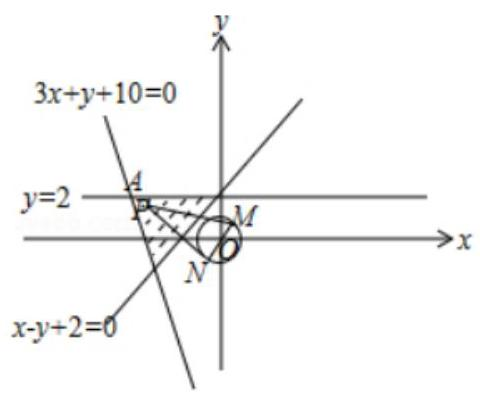

$O\left( {0,0}\right) , M\left( {x, y}\right) ,\overrightarrow{OM} =  - \overrightarrow{ON},\therefore \overrightarrow{PM} \cdot  \overrightarrow{PN} = \left( {\overrightarrow{OM} - \overrightarrow{OP}}\right)  \cdot  \left( {\overrightarrow{ON} - \overrightarrow{OP}}\right)  = {\overrightarrow{OP}}^{2} - 1 = {x}^{2} + {y}^{2} - 1$ ,

$\therefore$ 当 $x =  - 4, y = 2$ 时, $\overrightarrow{PM} \cdot  \overrightarrow{PN}$ 取最大值 19,当 $x =  - 1, y = 1$ 时, $\overrightarrow{PM} \cdot  \overrightarrow{PN}$ 取最小值为 1,

$\therefore \overrightarrow{PM} \cdot  \overrightarrow{PN}$ 的取值范围是 $\left\lbrack  {1,{19}}\right\rbrack$ . 故答案为: $\left\lbrack  {1,{19}}\right\rbrack$ .

## (四) 参数方程

## 知识梳理

## 1、参数方程的定义

在直角坐标系中,如果曲线 $C$ 上任意一点 $M$ 的坐标 $x, y$ 都是某个变数 $t$ 的函数 $\left\{  \begin{array}{l} x = f\left( t\right) \\  y = g\left( t\right)  \end{array}\right.$ (1),并且对于 $t$ 的每一个允许值,由方程组 (1) 所确定的点 $M\left( {x, y}\right)$ 都在曲线 $C$ 上,那么,方程 (1) 就叫做曲线 $C$ 的参数方程. 联系 $x, y$ 之间关系的变数 $t$ 叫做参变数,简称参数.

相对于参数方程而言,直接给出点 $M\left( {x, y}\right)$ 的坐标间关系的方程叫做普通方程.

## 2、通过 “消去参数” 可以把曲线 $C$ 的参数方程化为普通方程;

## 3、通过 “选取参数”，可以把曲线 $C$ 的普通方程化为参数方程.

## 4、常见曲线的参数方程

直线的参数方程: $\left\{  \begin{array}{l} x = {x}_{0} + t\cos \alpha \\  y = {y}_{0} + t\sin \alpha  \end{array}\right.$ ( $t$ 为参数, $- \infty  < t <  + \infty$ );

圆心为原点,半径为 $R$ 的圆的参数方程 $\left\{  \begin{array}{l} x = R\cos \theta \\  y = R\sin \theta  \end{array}\right.$ ( $\theta$ 为参数, $0 \leq  \theta  < {2\pi }$ );

圆心为 $C\left( {a, b}\right)$ 半径为 $R$ 的圆的参数方程 $\left\{  \begin{array}{l} x = a + R\cos \theta \\  y = b + R\sin \theta  \end{array}\right.$ ( $\theta$ 为参数, $\left. {0 \leq  \theta  < {2\pi }}\right)$ ;

椭圆 $\frac{{x}^{2}}{{a}^{2}} + \frac{{y}^{2}}{{b}^{2}} = 1$ 的参数方程为 $\left\{  \begin{array}{l} x = a\cos \theta \\  y = b\sin \theta  \end{array}\right.$ ( $\theta$ 为参数);

问题 1. 将曲线的参数方程化为普通方程时应注意什么问题? 答: 关键是注意 $x, y$ 的取值范围.

例如参数方程 $\left\{  \begin{array}{l} x = \sin \theta \\  y = \cos {2\theta }, \end{array}\right.$ ( $\theta$ 为参数) 化为普通方程 $y = 1 - 2{x}^{2}$ 时需要注明 $x \in  \left\lbrack  {-1,1}\right\rbrack$ 的限制条件.

但也有一些问题不需另写条件,例如把参数方程 $\left\{  \begin{array}{l} x = \sin \theta \\  y = \cos \theta , \end{array}\right.$ ( $\theta$ 为参数) 化为普通方程 ${x}^{2} + {y}^{2} = 1$ 时, $x, y$ 所需满足的条件 $x, y \in  \left\lbrack  {-1,1}\right\rbrack$ 则不必写出.

如果普通方程中的 $x, y$ 的取值范围与参数方程中的 $x, y$ 的取值范围相一致，则参数方程化为普通方程后,不必写出 $x, y$ 的取值范围,否则需写出 $x, y$ 的取值范围.

问题 2. 参数方程 $\left\{  {\begin{array}{l} x = \sqrt{2}\cos \theta , \\  y = \sqrt{2}\sin \theta , \end{array}\theta  \in  \lbrack 0,{2\pi })}\right.$ 与 $\left\{  {\begin{array}{l} x = \sqrt{2}\cos \theta , \\  y = \sqrt{2}\sin \theta , \end{array}\theta  \in  \left( {0,\frac{\pi }{2}}\right) }\right.$ 是否表示同一曲线? 为什么? 答: 不一样, $x$ 的取值范围不一致.

## 例题精讲

【例 12】参数方程 $\left\{  \begin{array}{l} x = {e}^{t} - {e}^{-t} \\  y = {e}^{t} + {e}^{-t} \end{array}\right.$ ( $t$ 为参数) 表示的曲线是 ( )

A. 双曲线 B. 双曲线的下支 C. 双曲线的上支

【难度】 $\star   \star   \star$

【答案】 $C$

【解析】解: 由 $\left\{  \begin{array}{l} x = {e}^{t} - {e}^{-t} \\  y = {e}^{t} + {e}^{-t} \end{array}\right.$ ( $t$ 为参数),两式平方作差可得, ${y}^{2} - {x}^{2} = 4$ ,

又 $\because y = {e}^{t} + {e}^{-t} > 0,\therefore$ 参数方程 $\left\{  \begin{array}{l} x = {e}^{t} - {e}^{-t} \\  y = {e}^{t} + {e}^{-t} \end{array}\right.$ ( $t$ 为参数) 表示的曲线是双曲线 ${y}^{2} - {x}^{2} = 4$ 的上支. 故选: $C$ .

【例 13】已知参数方程 $\left\{  \begin{array}{l} x = {3t} - 4{t}^{3} \\  y = {2t}\sqrt{1 - {t}^{2}} \end{array}\right.$ , $t \in  \left\lbrack  {-1,1}\right\rbrack$ ,以下哪个图符合该方程(   )

A.

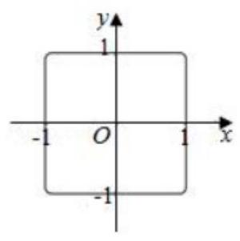

B.

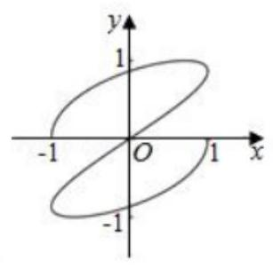

C.

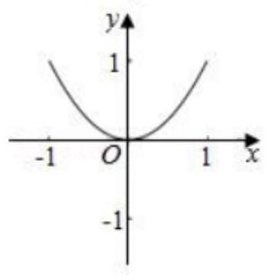

D.

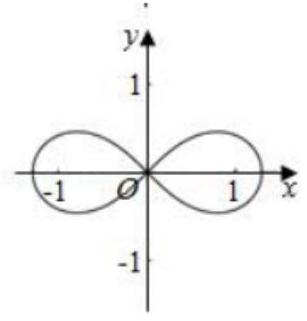

【难度】 $\star   \star   \star$

【答案】 $B$

【解析】解: 利用特殊值法进行排除,

当 $y = 0$ 时, $t = 0,1, - 1$ ,当 $t = 0$ 时, $x = 0$ ,

当 $t = 1$ 时, $x =  - 1$ ,当 $t =  - 1$ 时, $x = 1$ ,

故当 $y = 0$ 时, $x = 0$ 或 1 或 -1,即图象经过 $\left( {-1,0}\right) ,\left( {0,0}\right) ,\left( {1,0}\right)$ 三个点,

对照四个选项中的图象,只有选项 $B$ 符合要求. 故选: $B$ .

【例 14】已知曲线 $\Gamma$ 的参数方程为 $\left\{  \begin{array}{l} x = {t}^{3} - t\cos t \\  y = \ln \left( {t + \sqrt{{t}^{2} - 1}}\right)  \end{array}\right.$ ,其中参数 $t \in  R$ ,则曲线 $\Gamma$ (   )

A. 关于 $x$ 轴对称 B. 关于 $y$ 轴对称 C. 关于原点对称 D. 没有对称性

【难度】 $\star   \star   \star   \star$

【答案】 $C$

【解析】解: 由于 $x = f\left( t\right)  = {t}^{3} - t\cos t$ 为奇函数, $y = g\left( t\right)  = \ln \left( {t + \sqrt{{t}^{2} - 1}}\right)$ 为奇函数,

故曲线 $\Gamma$ 关于原点对称. 故选: $C$ .

【例 15】在平面直角坐标系 ${xOy}$ 中,已知椭圆 ${C}_{1} : \frac{{x}^{2}}{36} + \frac{{y}^{2}}{4} = 1$ 和 ${C}_{2} : {x}^{2} + \frac{{y}^{2}}{9} = 1.P$ 为 ${C}_{1}$ 上的动点, $Q$ 为 ${C}_{2}$ 上的动点, $w$ 是 $\overrightarrow{OP} \cdot  \overrightarrow{OQ}$ 的最大值. 记 $\Omega  = \{ \left( {P, Q}\right)  \mid  P$ 在 ${C}_{1}$ 上, $Q$ 在 ${C}_{2}$ 上,且 $\overrightarrow{OP} \cdot  \overrightarrow{OQ} = w\}$ ,则 $\Omega$ 中元素个数为( )

A. 2 个 B. 4 个 C. 8 个 D. 无穷个

【难度】 $\star   \star   \star   \star$

【答案】 $D$

【解析】解: 椭圆 ${C}_{1} : \frac{{x}^{2}}{36} + \frac{{y}^{2}}{4} = 1$ 和 ${C}_{2} : {x}^{2} + \frac{{y}^{2}}{9} = 1.P$ 为 ${C}_{1}$ 上的动点, $Q$ 为 ${C}_{2}$ 上的动点,

可设 $P\left( {6\cos \alpha ,2\sin \alpha }\right) , Q\left( {\cos \beta ,3\sin \beta }\right) ,0 \leq  \alpha ,\beta  < {2\pi }$ ,

则 $\overrightarrow{OP} \cdot  \overrightarrow{OQ} = 6\cos \alpha \cos \beta  + 6\sin \alpha \sin \beta  = 6\cos \left( {\alpha  - \beta }\right)$ ,

当 $\alpha  = \beta$ 时, $w$ 取得最大值 6 ,

则 $\Omega  = \left\{  {\left( {P, Q}\right)  \mid  P\text{ 在 }{C}_{1}}\right.$ 上, $Q$ 在 ${C}_{2}$ 上,且 $\left. {\overrightarrow{OP} \cdot  \overrightarrow{OQ} = w}\right\}$ 中的元素有无穷多对.

另解: 令 $P\left( {m, n}\right) , Q\left( {u, v}\right)$ ,则 ${m}^{2} + 9{n}^{2} = {36},9{u}^{2} + {v}^{2} = 9$ ,

由柯西不等式 $\left( {{m}^{2} + 9{n}^{2}}\right) \left( {9{u}^{2} + {v}^{2}}\right)  = {324} \geq  {\left( 3mu + 3nv\right) }^{2}$ ,

当且仅当 ${mv} = {9nu}$ ,取得最大值 6 ,

显然,满足条件的 $P\text{ 、 }Q$ 有无穷多对, $D$ 项正确.

故选: $D$ .

## 巩固训练

1、若曲线的参数方程为 $\left\{  {\begin{array}{l} x = \left| {\cos \frac{\theta }{2} + \sin \frac{\theta }{2}}\right| \\  y = \frac{1}{2}\left( {1 + \sin \theta }\right)  \end{array}(\theta }\right.$ 为参数, $\left. {0 \leq  \theta  \leq  \pi }\right)$ ,则该曲线的普通方程为___.

【难度】 $\star   \star   \star$

【答案】 ${x}^{2} = {2y}\left( {1 \leq  x \leq  \sqrt{2},\frac{1}{2} \leq  y \leq  1}\right)$

【解析】解: $\because \left\{  {\begin{array}{l} x = \left| {\cos \frac{\theta }{2} + \sin \frac{\theta }{2}}\right| \\  y = \frac{1}{2}\left( {1 + \sin \theta }\right)  \end{array}\therefore 0 \leq  \theta  \leq  \pi }\right.$ , $\therefore \cos \frac{\theta }{2} + \sin \frac{\theta }{2} = \sqrt{2}\sin \left( {\theta  + \frac{\pi }{4}}\right)  \in  \left\lbrack  {1,\sqrt{2}}\right\rbrack \; \frac{1}{2}\left( {1 + \sin \theta }\right)  \in  \left\lbrack  {\frac{1}{2},1}\right\rbrack$ ,故答案为: ${x}^{2} = {2y}\left( {1 \leq  x \leq  \sqrt{2},\frac{1}{2} \leq  y \leq  1}\right)$

2、圆 $C : \left\{  {\begin{array}{l} x = 1 + \cos \theta \\  y = \sin \theta  \end{array}(\theta }\right.$ 为参数 $)$ 的圆心到直线 $l : \left\{  \begin{array}{l} x =  - 2\sqrt{2} + {3t} \\  y = 1 - {3t} \end{array}\right.$ ( $t$ 为参数) 的距离为___.

【难度】 $\star   \star   \star$

【答案】 2

【解析】解: 圆 $C : \left\{  {\begin{array}{l} x = 1 + \cos \theta \\  y = \sin \theta  \end{array}(\theta }\right.$ 为参数 $)$ 即 ${\left( x - 1\right) }^{2} + {y}^{2} = 1$ ,表示以 $\left( {1,0}\right)$ 为圆心、以 1 为半径的圆. 直线 $l : \left\{  {\begin{array}{l} x =  - 2\sqrt{2} + {3t} \\  y = 1 - {3t} \end{array}(t}\right.$ 为参数 $)$ 化为普通方程为 $x + 2\sqrt{2} = 1 - y$ ,即 $x + y + 2\sqrt{2} - 1 = 0$ . 圆心到直线 $l$ 的距离为 $\frac{\left| 1 + 0 + 2\sqrt{2} - 1\right| }{\sqrt{2}} = 2$ ,故答案为 2 .

3、记椭圆 $\frac{{x}^{2}}{4} + \frac{n{y}^{2}}{{4n} + 1} = 1$ 围成的区域(含边界)为 ${\Omega }_{n}\left( {n = 1,2\cdots }\right)$ ，当点 $\left( {x, y}\right)$ 分别在 ${\Omega }_{1},{\Omega }_{2},\cdots$ 上时 $x + y$ 的最大值分别是 ${M}_{1},{M}_{2},\ldots$ ,则 $\mathop{\lim }\limits_{{n \rightarrow  \infty }}{M}_{n} =$ (   )

A. $2 + \sqrt{5}$ B. 4 C. 3 D. $2\sqrt{2}$

【难度】 $\star   \star   \star$

【答案】D

【解析】法一: 椭圆 $\frac{{x}^{2}}{4} + \frac{n{y}^{2}}{{4n} + 1} = 1$ 的参数方程为:

$\left\{  \begin{array}{l} x = 2\cos \theta \\  y = \sqrt{4 + \frac{1}{n}}\sin \theta  \end{array}\right.$ ( $\theta$ 为参数),

所以: $x + y = 2\cos \theta  + \sqrt{4 + \frac{1}{n}}\sin \theta  = \sqrt{{2}^{2} + 4 + \frac{1}{n}}\sin \left( {\theta  + \varphi }\right)  = \sqrt{8 + \frac{1}{n}}\sin \left( {\theta  + \varphi }\right)$ ,

所以: ${\left( x + y\right) }_{\max } = \sqrt{8 + \frac{1}{n}}$ ,所以: $\mathop{\lim }\limits_{{n \rightarrow  \infty }}{M}_{n} = \mathop{\lim }\limits_{{n \rightarrow  \infty }}\sqrt{8 + \frac{1}{n}} = 2\sqrt{2}$ .

故选: D.

法二: $\frac{{x}^{2}}{4} + \frac{n{y}^{2}}{{4n} + 1} = 1$ 的极限是半径为 2 的圆

## (五)空间向量

## 知识梳理

## 一、空间向量的有关概念

1、类似于平面向量，在空间，我们把既有大小又有方向的量叫做向量. 同向且大小相等的两个向量是同一向量或相等向量，大小相等方向相反的两个向量互为相反向量.

2、空间中任意向量都可以用在同一个平面上的两条不共线向量表示.

3、向量的大小称为向量的模,即为表示向量的有向线段的长度. 向量 $\overrightarrow{a}$ 的模记为 $\left| \overrightarrow{a}\right|$ .

大小为 0 的向量称为零向量，记作 0 ；大小为 1 的向量称为单位向量.

## 4、直线的方向向量

与直线 $l$ 平行的非零向量 $\overrightarrow{d}$ 叫做直线 $l$ 的一个方向向量. (直线的方向向量有无数个)

5、平面的法向量

对于非零向量 $\overrightarrow{n}$ ，若它所在的直线 $l$ 与平面 $\alpha$ 垂直(即 $l \bot  \alpha$ )，则向量 $\overrightarrow{n}$ 叫做平面 $\alpha$ 的一个法向量. (平面的法向量要引导学生学会求解)

## 二、空间向量的运算

1、与平面向量运算一样，空间向量的加法、减法和实数与向量的积如下:

$\overrightarrow{AC} = \overrightarrow{AB} + \overrightarrow{BC};\overrightarrow{AB} = \overrightarrow{OB} - \overrightarrow{OC};$

$\overrightarrow{b} = \lambda \overrightarrow{a}$ : ①当 $\lambda  > 0$ 时， $\lambda \overrightarrow{a}$ 与 $\overrightarrow{a}$ 同向，大小为 $\lambda \left| \overrightarrow{a}\right|$ ; ②当 $\lambda  = 0$ 时， $\lambda \overrightarrow{a} = \overrightarrow{0}$ ; ③当 $\lambda  < 0$ 时， $\lambda \overrightarrow{a}$ 与 $\overrightarrow{a}$ 反向,大小为 $- \lambda \left| \overrightarrow{a}\right|$ ;

## 2、空间向量的数量积

类似可以定义两个空间向量 $\overrightarrow{a},\overrightarrow{b}$ 的夹角 $\theta ,\theta  \in  \left\lbrack  {0,\pi }\right\rbrack$ (向量共起点共终点时所形成的角称为两向量之夹角)

当 $\theta  = \frac{\pi }{2}$ 时称 $\overrightarrow{a}$ 与 $\overrightarrow{b}$ 垂直,记为 $\overrightarrow{a} \bot  \overrightarrow{b}$

两个空间向量 $\overrightarrow{a},\overrightarrow{b}$ 的数量积 $\overrightarrow{a} \cdot  \overrightarrow{b} = \left| \overrightarrow{a}\right| \left| \overrightarrow{b}\right| \cos \theta$

与平面向量类似有下列性质成立:

① $\overrightarrow{a} \bot  \overrightarrow{b} \Leftrightarrow  \overrightarrow{a} \cdot  \overrightarrow{b} = 0$ ; ② ${\left| \overrightarrow{a}\right| }^{2} = \overrightarrow{a} \cdot  \overrightarrow{a} = {\overrightarrow{a}}^{2}$ ; ③ $\left( {\lambda \overrightarrow{a}}\right)  \cdot  \overrightarrow{b} = \overrightarrow{a} \cdot  \left( {\lambda \overrightarrow{b}}\right)  = \lambda \left( {\overrightarrow{a} \cdot  \overrightarrow{b}}\right)$ ； ④ $\overrightarrow{a} \cdot  \overrightarrow{b} = \overrightarrow{b} \cdot  \overrightarrow{a}$ ； ⑤ $\overrightarrow{a} \cdot  \left( {\overrightarrow{b} + \overrightarrow{c}}\right)  = \overrightarrow{a} \cdot  \overrightarrow{b} + \overrightarrow{a} \cdot  \overrightarrow{c}$ .

## 三、空间向量基本定理

如果三个向量 $\overrightarrow{a}\text{ 、 }\overrightarrow{b}\text{ 、 }\overrightarrow{c}$ 不共面，那么对于空间任意向量 $\overrightarrow{p}$ ，存在唯一的实数对 $\left( {x, y, z}\right)$ 满足 $\overrightarrow{p} = x\overrightarrow{a} + y\overrightarrow{b} + z\overrightarrow{c}$ . 由此定理知,如果三个向量 $\overrightarrow{a}\text{ 、 }\overrightarrow{b}\text{ 、 }\overrightarrow{c}$ 不共面,那么所有空间向量均可以由 $\overrightarrow{a}\text{ 、 }\overrightarrow{b}\text{ 、 }\overrightarrow{c}$ 唯一表示,此时我们称 $\left( {\overrightarrow{a},\overrightarrow{b},\overrightarrow{c}}\right)$ 为空间的一个基底, $\overrightarrow{a}\text{ 、 }\overrightarrow{b}\text{ 、 }\overrightarrow{c}$ 都叫做基向量.

## 【补充】空间向量共面定理:

空间一点 $P$ 位于平面 ${ABC}$ 内的充要条件是存在有序实数对 $x, y$ ,使 $\overrightarrow{AP} = x\overrightarrow{AB} + y\overrightarrow{AC}$ ; 或对空间任一定点 $\mathrm{O}$ ,有 $\overrightarrow{OP} = \overrightarrow{OA} + x\overrightarrow{AB} + y\overrightarrow{AC}$ ; 或若四点 $P, A, B, C$ ,共面, 则 $\overrightarrow{OP} = x\overrightarrow{OA} + y\overrightarrow{OB} + z\overrightarrow{OC}\left( {x + y + z = 1}\right)$ .

## 四、空间向量坐标运算

1、空间直角坐标系:

在空间选定一点 $O$ 引三条互相垂直且有相同长度单位的数轴: $x$ 轴、 $y$ 轴、 $z$ 轴,它们都叫坐标轴. 我们称建立了一个空间直角坐标系 $O - {xyz}$ ,点 $O$ 叫原点,通过每两个坐标轴的平面叫坐标平面,分别称为 ${xOy}$ 平面， ${yOz}$ 平面， ${zOx}$ 平面。(课本要求建空间直角坐标系一定要运用右手定则，不可随意建系)

2、空间向量的坐标

给定空间直角坐标系和向量 $\overrightarrow{a}$ ，设 $\overrightarrow{i},\overrightarrow{j},\overrightarrow{k}$ 为坐标向量，则存在唯一的有序实数组 $\left( {{a}_{1},{a}_{2},{a}_{3}}\right)$ ，使 $\overrightarrow{a} = {a}_{1}\overrightarrow{i} + {a}_{2}\overrightarrow{j} + {a}_{3}\overrightarrow{k}$ ,有序实数组 $\left( {{a}_{1},{a}_{2},{a}_{3}}\right)$ 叫作向量 $\overrightarrow{a}$ 在空间直角坐标系 $O - {xyz}$ 中的坐标,记作 $\overrightarrow{a} = \left( {{a}_{1},{a}_{2},{a}_{3}}\right)$ .

3、已知空间两点 $A\left( {{x}_{1},{y}_{1},{z}_{1}}\right)$ ， $B\left( {{x}_{2},{y}_{2},{z}_{2}}\right)$ ，则 $\overrightarrow{AB} =$ ___； $\left| \overrightarrow{AB}\right|  =$ ___； $\overrightarrow{OA} \cdot  \overrightarrow{OB} =$ ___；若 $\overrightarrow{OA},\overrightarrow{OB}$ 的夹角为 $\theta$ ，则 $\cos \theta  =$ ___.

4、已知平面 $\alpha$ 外一点 $P$ ， $\overrightarrow{PQ}\bot$ 面 $\alpha$ ， $Q \in$ 面 $\alpha$ ，则点 $P$ 到平面 $\alpha$ 的距离___；若 ${PM}$ 与平面 $\alpha$ 斜交， $M \in$ 面 $\alpha$ ，且 $\bar{n}$ 是平面 $\alpha$ 的法向量，则

5、已知空间两异面直线，设两直线的方向向量的夹角为 $\varphi$ ，则两直线的夹角 $\theta  =$ ___， $\cos \theta  =$ ___. 6、已知直线与平面相交，设直线的方向向量与平面的法向量的夹角为 $\varphi$ ，则直线与平面的夹角 $\theta  =$ ___. $\sin \theta  =$ ___.

7、已知二面角 $\alpha  - l - \beta$ ，设 $\alpha$ ， $\beta$ 的法向量夹角为 $\varphi$ ，则二面角的平面角 $\theta  =$ ___， $\cos \theta  =$ ___； 若 $\overrightarrow{a},\overrightarrow{b}$ 分别是在 $\alpha ,\beta$ 平面内与 $l$ 垂直的向量，设 $\overrightarrow{a},\overrightarrow{b}$ 的夹角为 $\gamma$ ，则二面角的平面角 $\theta  =$ ___， $\cos \theta  =$ ___

【答案】

3. $\left( {{x}_{2} - {x}_{1},{y}_{2} - {y}_{1},{z}_{2} - {z}_{1}}\right) ;\sqrt{{\left( {x}_{2} - {x}_{1}\right) }^{2} + {\left( {y}_{2} - {y}_{1}\right) }^{2} + {\left( {z}_{2} - {z}_{1}\right) }^{2}};{x}_{1}{x}_{2} + {y}_{1}{y}_{2} + {z}_{1}{z}_{2}$ ; $\frac{{x}_{1}{x}_{2} + {y}_{1}{y}_{2} + {z}_{1}{z}_{2}}{\sqrt{{x}_{1}^{2} + {y}_{1}^{2} + {z}_{1}^{2}}\sqrt{{x}_{2}^{2} + {y}_{2}^{2} + {z}_{2}^{2}}}$ 4. (1) $\left| \overline{PQ}\right|$ (2) $P$ 到平面 $\alpha$ 的距离

5. $\varphi$ 或 $\pi  - \varphi ,\left| {\cos \varphi }\right|$ 6. $\frac{\pi }{2} - \theta$ 或 $\theta  - \frac{\pi }{2},\left| {\cos \varphi }\right|$

7. $\varphi$ 或 $\pi  - \varphi ,\cos \varphi$ 或 $- \cos \varphi \;\gamma$ 或 $\pi  - \gamma ,\cos \gamma$ 或 $- \cos \gamma$

## 例题精讲

【例 16】如图,以长方体 ${ABCD} - {A}_{1}{B}_{1}{C}_{1}{D}_{1}$ 的顶点 $D$ 为坐标原点,过 $D$ 的三条棱所在的直线为坐标轴,建立空间直角坐标系，若 $\overline{D{B}_{1}}$ 的坐标为 $\left( {4,3,2}\right)$ ，则 $\overline{A{C}_{1}}$ 的坐标是 ___.

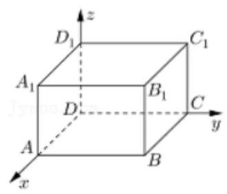

【难度】 $\star   \star   \star$

【答案】 $\left( {-4,3,2}\right)$

【解析】解: 如图,以长方体 ${ABCD} - {A}_{1}{B}_{1}{C}_{1}{D}_{1}$ 的顶点 $D$ 为坐标原点,

过 $D$ 的三条棱所在的直线为坐标轴,建立空间直角坐标系,

$\because \overrightarrow{D{B}_{1}}$ 的坐标为 $\left( {4,3,2}\right) ,\therefore A\left( {4,0,0}\right) ,{C}_{1}\left( {0,3,2}\right) ,\therefore \overrightarrow{A{C}_{1}} = \left( {-4,3,2}\right)$ .

故答案为: $\left( {-4,3,2}\right)$ .

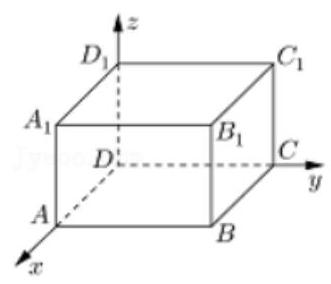

【例 17】如图,四个棱长为 1 的正方体排成一个正四棱柱, ${AB}$ 是一条侧棱, ${P}_{i}\left( {i = 1,2,\ldots ,{16}}\right)$ 是上、 下底面上其余十六个点，则 $\overrightarrow{AB} \cdot  \overrightarrow{A{P}_{i}}\left( {i = 1,2\ldots ,{16}}\right)$ 的不同值的个数为___.

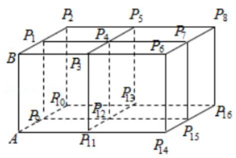

【难度】 $\star   \star   \star   \star$

【答案】 2

【解析】解: 当 $\left( {i = 1,2\ldots ,8}\right)$ 时, $\overrightarrow{A{P}_{i}} = \overrightarrow{AB} + \overrightarrow{B{P}_{i}}$ ,则 $\overrightarrow{AB} \cdot  \overrightarrow{A{P}_{i}} = \overrightarrow{AB} \cdot  \left( {\overrightarrow{AB} + \overrightarrow{B{P}_{i}}}\right)  = {\left| \overrightarrow{AB}\right| }^{2} + \overrightarrow{AB} \cdot  \overrightarrow{B{P}_{i}}$ ,

$\because \overrightarrow{AB} \bot  \overrightarrow{B{P}_{i}}$ ,即 $\overrightarrow{AB} \cdot  \overrightarrow{B{P}_{i}} = 0,\therefore \overrightarrow{AB} \bot  \overrightarrow{A{P}_{i}} = {\left| \overrightarrow{AB}\right| }^{2} = 1,\therefore$ 当 $\left( {i = 9,{10},\ldots ,{16}}\right)$ 时,

$\overrightarrow{AB} \bot  \overrightarrow{A{P}_{i}}$ ,即 $\overrightarrow{AB} \cdot  \overrightarrow{A{P}_{i}} = 0$ ,故 $\overrightarrow{AB} \cdot  \overrightarrow{A{P}_{i}}$ 的值为 0 或 1,故答案为: 2 .

【例 18】设向量 $\overrightarrow{u} = \left( {a, b,0}\right) ,\overrightarrow{v} = \left( {c, d,1}\right)$ ,其中 ${a}^{2} + {b}^{2} = {c}^{2} + {d}^{2} = 1$ ,则下列判断错误的是 ( )

A. 向量 $\overrightarrow{v}$ 与 $z$ 轴正方向的夹角为定值 (与 $c, d$ 之值无关)

B. $\overrightarrow{u} \cdot  \overrightarrow{v}$ 的最大值为 $\sqrt{2}$

C. $\overrightarrow{u}$ 与 $\overrightarrow{v}$ 的夹角的最大值为 $\frac{3\pi }{4}$

D. ${ad} + {bc}$ 的最大值为 1

【难度】 $\star   \star   \star   \star$

【答案】 $B$

【解析】解: 由向量 $\overrightarrow{u} = \left( {a, b,0}\right) ,\overrightarrow{v} = \left( {c, d,1}\right)$ ,其中 ${a}^{2} + {b}^{2} = {c}^{2} + {d}^{2} = 1$ ,知:

在 $A$ 中,设 $z$ 轴正方向的方向向量 $\overrightarrow{z} = \left( {0,0, t}\right)$ ,

向量 $\overrightarrow{v}$ 与 $z$ 轴正方向的夹角的余弦值:

$\cos \alpha  = \frac{\bar{z} \cdot  \overrightarrow{v}}{\left| \bar{z}\right|  \cdot  \left| \overrightarrow{v}\right| } = \frac{t}{t \cdot  \sqrt{{c}^{2} + {d}^{2} + 1}} = \frac{\sqrt{2}}{2},\therefore \alpha  = {45}^{ \circ  }$ ,

$\therefore$ 向量 $\overrightarrow{v}$ 与 $z$ 轴正方向的夹角为定值 ${45}^{ \circ  }$ (与 $c, d$ 之值无关),故 $A$ 正确;

在 $B$ 中, $\overrightarrow{u} \cdot  \overrightarrow{v} = {ac} + {bd} \leq  \frac{{a}^{2} + {c}^{2}}{2} + \frac{{b}^{2} + {d}^{2}}{2} = \frac{{a}^{2} + {b}^{2} + {c}^{2} + {d}^{2}}{2} = 1$ ,

且仅当 $a = c, b = d$ 时取等号,因此 $\overrightarrow{u} \cdot  \overrightarrow{v}$ 的最大值为 1,故 $B$ 错误;

在 $C$ 中,由 $B$ 可得: $\left| {\overrightarrow{u} \cdot  \overrightarrow{v}}\right|  \leq  1,\therefore  - 1 \leq  \overrightarrow{u} \cdot  \overrightarrow{v} \leq  1$ ,

$\therefore \cos  < \overrightarrow{u} \cdot  \overrightarrow{v} >  = \frac{\overrightarrow{u} \cdot  \overrightarrow{v}}{\left| \overrightarrow{u}\right|  \cdot  \left| \overrightarrow{v}\right| } = \frac{{ac} + {bd}}{\sqrt{{a}^{2} + {b}^{2}} \cdot  \sqrt{{c}^{2} + {d}^{2} + 1}} \geq   - \frac{1}{1 \times  \sqrt{2}} =  - \frac{\sqrt{2}}{2}$ ,

$\therefore \overrightarrow{u}$ 与 $\overrightarrow{v}$ 的夹角的最大值为 $\frac{3\pi }{4}$ ,故 $C$ 正确;

在 $D$ 中, ${ad} + {bc} \leq  \frac{{a}^{2} + {d}^{2}}{2} + \frac{{b}^{2} + {c}^{2}}{2} = \frac{{a}^{2} + {b}^{2} + {c}^{2} + {d}^{2}}{2} = 1$ ,

$\therefore {ad} + {bc}$ 的最大值为 1 . 故 $D$ 正确. 故选: $B$ .

【例 19】在各棱长都等于 1 的正四面体 $O - {ABC}$ 中,若点 $P$ 满足 $\overrightarrow{OP} = x\overrightarrow{OA} + y\overrightarrow{OB} + z\overrightarrow{OC}\left( {x + y + z = 1}\right)$ ,则 $\left| \overrightarrow{OP}\right|$ 的最小值为___.

【难度】 $\star   \star   \star   \star$

【答案】 $\frac{\sqrt{6}}{3}$

【解析】解: 根据题意,可得 $\because$ 点 $P$ 满足 $\overrightarrow{OP} = x\overrightarrow{OA} + y\overrightarrow{OB} + z\overrightarrow{OC}\left( {x + y + z = 1}\right)$ ,

$\therefore \overrightarrow{AP} = \overrightarrow{OP} - \overrightarrow{OA} =  - y\left( {\overrightarrow{OA} - \overrightarrow{OB}}\right)  - z\left( {\overrightarrow{OA} - \overrightarrow{OC}}\right)$ ,可得 $\overrightarrow{AP} =  - y\overrightarrow{BA} - z\overrightarrow{CA} = y\overrightarrow{AB} + z\overrightarrow{AC}$ ,

$\therefore$ 点 $P$ 是平面 ${ABC}$ 内的一点. 又 $\because$ 正四面体 $O - {ABC}$ 是各棱长都等于 1,

$\therefore$ 当点 $P$ 与 $O$ 在 ${ABC}$ 上的射影重合时, $\left| \overline{OP}\right|$ 等于正四面体的高,此时 $\left| \overline{OP}\right|  = \frac{\sqrt{6}}{3}$ 且 $\left| \overline{OP}\right|$ 达到最小值. 故答案为: $\frac{\sqrt{6}}{3}$

## 巩固训练

1、已知 $M\left( {-1,1,3}\right) , N\left( {-2, - 1,4}\right)$ ,若 $M, N, O$ 三点共线,则 $O$ 点坐标可能为( )

A. $\left( {3,5, - 2}\right)$ B. $\left( {4, - 5,6}\right)$ C. $\left( {-\frac{5}{2},\frac{1}{2}, - 2}\right)$ D. $\left( {0,3,2}\right)$

【难度】★★

【答案】D

【解析】由 $M\left( {-1,1,3}\right) , N\left( {-2, - 1,4}\right)$ ,得 $\overrightarrow{MN} = \left( {-1, - 2,1}\right)$ ,

A. $\overrightarrow{NO} = \left( {5,6, - 6}\right)$ ,因为 $\overrightarrow{MN} \neq  \lambda \overrightarrow{NO}$ 所以 $M, N, O$ 三点不共线,故错误;

B. $\overrightarrow{NO} = \left( {2, - 4,2}\right)$ ，因为 $\overrightarrow{MN} \neq  \lambda \overrightarrow{NO}$ 所以 $M$ ， $N$ ， $O$ 三点不共线，故错误；

C. $\overrightarrow{NO} = \left( {\frac{1}{2},\frac{3}{2}, - 6}\right)$ ,因为 $\overrightarrow{MN} \neq  \lambda \overrightarrow{NO}$ 所以 $M, N, O$ 三点不共线,故错误;

D. $\overrightarrow{NO} = \left( {2,4, - 2}\right)$ ,因为 $\overrightarrow{MN} =  - \frac{1}{2}\overrightarrow{NO}$ 所以 $M, N, O$ 三点共线,故正确;

故选: D

2、已知 $\overrightarrow{a} = \left( {{a}_{1},{a}_{2},{a}_{3}}\right) ,\overrightarrow{b} = \left( {{b}_{1},{b}_{2},{b}_{3}}\right)$ ，且 $\left| \overrightarrow{a}\right|  = 3,\left| \overrightarrow{b}\right|  = 4,\overrightarrow{a} \cdot  \overrightarrow{b} = {12}$ ，则 $\frac{{a}_{1} + {a}_{2} + {a}_{3}}{{b}_{1} + {b}_{2} + {b}_{3}} =$ ___.

【难度】 $\star   \star   \star$

【答案】 $\frac{3}{4}$

【解析】解: 由 $\left| \overrightarrow{a}\right|  = 3,\left| \overrightarrow{b}\right|  = 4$ ,得 $\overrightarrow{a} \cdot  \overrightarrow{b} = \left| \overrightarrow{a}\right|  \times  \left| \overrightarrow{b}\right|  \times  \cos \theta  = 3 \times  4 \times  \cos \theta  = {12},\therefore \cos \theta  = 1$ ; 又 $\theta  \in  \left\lbrack  {0,\pi }\right\rbrack  ,\therefore \theta  = 0$ ; $\therefore \overrightarrow{a} = \lambda \overrightarrow{b}$ ,且 $\lambda  > 0$ ; 则 $\left| \overrightarrow{a}\right|  = \lambda \left| \overrightarrow{b}\right| ,\therefore \lambda  = \frac{\left| \overrightarrow{a}\right| }{\left| \overrightarrow{b}\right| } = \frac{3}{4},\therefore \frac{{a}_{1}}{{b}_{1}} = \frac{{a}_{2}}{{b}_{2}} = \frac{{a}_{3}}{{b}_{3}} = \lambda  = \frac{3}{4},\therefore \frac{{a}_{1} + {a}_{2} + {a}_{3}}{{b}_{1} + {b}_{2} + {b}_{3}} = \lambda  = \frac{3}{4}$ . 故答案为: $\frac{3}{4}$ .

3、如图所示，二面角 $\alpha  - l - \beta$ 为 ${60}^{ \circ  }$ ， $A, B$ 是棱 $l$ 上的两点， ${AC},{BD}$ 分别在半平面内 $\alpha ,\beta$ ，且 ${AC} \bot  l$ ， ${BD}\bot l$ ， ${AB} = 4$ ， ${AC} = 6$ ， ${BD} = 8$ ，则 ${CD}$ 的长___.

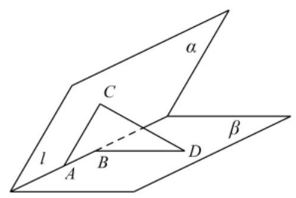

【难度】 $\star   \star   \star$

【答案】 $2\sqrt{17}$

【解析】: 二面角 $\alpha  - l - \beta$ 为 ${60}^{ \circ  }, A, B$ 是棱 $l$ 上的两点, ${AC},{BD}$ 分别在半平面 $\alpha \text{ 、 }\beta$ 内,

且 ${AC} \bot  l,{BD} \bot  l,{AB} = 4,{AC} = 6,{BD} = 8$ 所以 $\overrightarrow{AC} \cdot  \overrightarrow{AB} = 0,\overrightarrow{BD} \cdot  \overrightarrow{AB} = 0$ ,所以 $\overrightarrow{CD} = \overrightarrow{CA} + \overrightarrow{AB} + \overrightarrow{BD}$ , ${\overrightarrow{CD}}^{2} = {\left( \overrightarrow{CA} + \overrightarrow{AB} + \overrightarrow{BD}\right) }^{2} = {\overrightarrow{CA}}^{2} + {\overrightarrow{AB}}^{2} + {\overrightarrow{BD}}^{2} + 2\overrightarrow{CA} \cdot  \overrightarrow{BD} = {36} + {16} + {64} + 2 \times  6 \times  8 \times  \cos {120}^{ \circ  } = {68}$ , $\therefore {CD}$ 的长 $\left| \overline{CD}\right|  = \sqrt{68} = 2\sqrt{17}$ . 故答案为 $2\sqrt{17}$ .

4、在四面体 ${ABCD}$ 中， ${AB}\bot {BC},{BC}\bot {CD}$ ， ${AB} = {BC} = {CD} = 1$ ， ${AD} = \sqrt{3}$ ，点 $E$ 为线段 ${AB}$ 上动点 (包含端点),设直线 ${DE}$ 与 ${BC}$ 所成角为 $\theta$ ,则 $\cos \theta$ 的取值范围为 ( )

A. $\left\lbrack  {0,\frac{\sqrt{3}}{3}}\right\rbrack$ B. $\left\lbrack  {0,\frac{\sqrt{2}}{2}}\right\rbrack$

c. $\left\lbrack  {\frac{\sqrt{2}}{2},\frac{\sqrt{5}}{3}}\right\rbrack$ D. $\left\lbrack  {\frac{\sqrt{3}}{3},\frac{\sqrt{2}}{2}}\right\rbrack$

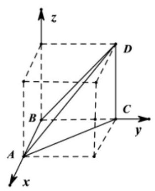

【难度】 $\star   \star   \star$

【答案】D

【解析】由 ${AB} \bot  {BC},{AB} = {BC} = 1$ ,所以 ${AC} = \sqrt{2}$ ,又 ${AD} = \sqrt{3},{CD} = 1$ ,

所以 $C{D}^{2} + A{C}^{2} = A{D}^{2}$ ,则 ${CD} \bot  {AC}$ ,因为 ${BC} \bot  {CD}$ ,所以 ${CD} \bot$ 平面 ${ABC}$ ,

如图所示建系,则 $B\left( {0,0,0}\right) , D\left( {0,1,1}\right) , C\left( {0,1,0}\right)$ ,设 $E\left( {x,0,0}\right) \left( {x \in  \left\lbrack  {0,1}\right\rbrack  }\right)$ ,

则 $\overrightarrow{BC} = \left( {0,1,0}\right) ,\overrightarrow{ED} = \left( {-x,1,1}\right)$ ,

所以 $\cos \theta  = \frac{\overrightarrow{BC} \cdot  \overrightarrow{ED}}{\left| \overrightarrow{BC}\right|  \cdot  \left| \overrightarrow{ED}\right| } = \frac{1}{\sqrt{{x}^{2} + 2}} \in  \left\lbrack  {\frac{\sqrt{3}}{3},\frac{\sqrt{2}}{2}}\right\rbrack$ ,故选:D

5、如图,圆锥的底面圆心为 $O$ ,直径为 ${AB}\text{ ， }C$ 为半圆弧 ${AB}$ 的中点, $E$ 为劣弧 ${CB}$ 的中点,且 ${AB} = {2PO} = 2\sqrt{2}$ .

(1)求异面直线 ${PC}$ 与 ${OE}$ 所成的角的大小；

(2)求二面角 $P - {AC} - E$ 的大小.

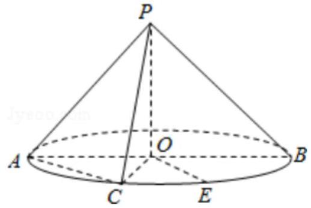

【难度】 $\star   \star   \star$

【答案】见解析

【解析】(1)证明: 方法(1) $\because {PO}$ 是圆锥的高， $\therefore {PO} \bot$ 底面圆 $O$ ，

根据中点条件可以证明 ${OE}//{AC}$ ，

$\angle {PCA}$ 或其补角是异面直线 ${PC}$ 与 ${OE}$ 所成的角;

${AC} = \sqrt{O{A}^{2} + O{C}^{2}} = \sqrt{2 + 2} = 2,{PC} = {PA} = \sqrt{O{P}^{2} + O{C}^{2}} = \sqrt{2 + 2} = 2$

所以 $\angle {PCA} = \frac{\pi }{3}$

异面直线 ${PC}$ 与 ${OE}$ 所成的角是 $\frac{\pi }{3}$

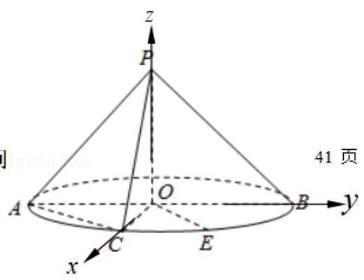

(1)方法(2)如图，建立空间直角坐标系，

$P\left( {0,0,\sqrt{2}}\right) , B\left( {0,\sqrt{2},0}\right) , A\left( {0, - \sqrt{2},0}\right) , C\left( {\sqrt{2},0,0}\right)$ ,

$E\left( {1,1,0}\right)$

$O\dot{E} = \left( {1,1,0}\right) , P\dot{C} = \left( {\sqrt{2},0, - \sqrt{2}}\right) , A\dot{C} = \left( {\sqrt{2},\sqrt{2},0}\right) ,$

设 $\overrightarrow{PC}$ 与 $\overrightarrow{OE}$ 夹角 $\theta$ ，

$\cos \theta  = \frac{\overrightarrow{PC} \cdot  \overrightarrow{OE}}{\left| \overrightarrow{PC}\right|  \cdot  \left| \overrightarrow{OE}\right| } = \frac{\sqrt{2}}{\sqrt{2} \times  2} = \frac{1}{2}$

异面直线 ${PC}$ 与 ${OE}$ 所成的角 $\frac{\pi }{3}$

(2)、方法(1)、设平面 ${APC}$ 的法向量 ${n}_{1} = \left( {{x}_{1},{y}_{1},{z}_{1}}\right)$

$\left\{  {\begin{array}{l} \overrightarrow{{n}_{1}} \cdot  \overrightarrow{PC} = 0 \\  \overrightarrow{{n}_{1}} \cdot  \overrightarrow{AC} = 0 \end{array}\;\left\{  {\begin{array}{l} \sqrt{2}{x}_{1} - \sqrt{2}{z}_{1} = 0 \\  \sqrt{2}{x}_{1} + \sqrt{2}{y}_{1} = 0 \end{array},\therefore \overrightarrow{{n}_{1}} = \left( {1, - 1,1}\right) }\right. }\right.$

平面 ${ACE}$ 的法向量 ${n}_{2} = \left( {0,0,1}\right)$

设两平面的夹角 $\alpha$ ,则 $\cos \alpha  = \frac{\left| \overrightarrow{{n}_{1}} \cdot  \overrightarrow{{n}_{2}}\right| }{\left| \overrightarrow{{n}_{1}}\right|  \cdot  \left| \overrightarrow{{n}_{2}}\right| } = \frac{1}{\sqrt{3} \times  1} = \frac{\sqrt{3}}{3}$

所以二面角 $P - {AC} - E$ 的大小是 $\arccos \frac{\sqrt{3}}{3}$ .

## 实战演练

一、填空题

1、已知复数 $z = \frac{\left( {1 + {3i}}\right) \left( {1 - i}\right) }{\left( 1 - 2i\right) }$ ，则 $\left| \bar{z}\right|  =$ ___.

【难度】★★

【答案】 2

【解答】解: $\because z = \frac{\left( {1 + {3i}}\right) \left( {1 - i}\right) }{\left( 1 - 2i\right) } = \frac{4 + {2i}}{1 - {2i}} = \frac{\left( {4 + {2i}}\right) \left( {1 + {2i}}\right) }{\left( {1 - {2i}}\right) \left( {1 + {2i}}\right) } = {2i}$ ,

$\therefore \bar{z} =  - {2i},\therefore \left| \bar{z}\right|  = 2$ . 故答案为: 2 .

2、在行列式 $D = \left| \begin{array}{lll} 1 & 3 & 7 \\  2 & 5 &  - 2 \\  1 & 2 & 4 \end{array}\right|$ 中,元素 3 的代数余子式的值为___.

【难度】★★

【答案】 -10

【解析】解: 在行列式 $D = \left| \begin{matrix} 1 & 3 & 7 \\  2 & 5 &  - 2 \\  1 & 2 & 4 \end{matrix}\right|$ 中,元素 3 的代数余子式的值为: ${\left( -1\right) }^{1 + 2}\left\lbrack  {2 \times  4 - \left( {-2}\right)  \times  1}\right\rbrack   =  - {10}$

3、若直线 $l$ 的参数方程为 $\left\{  {\begin{array}{l} x = 1 + t \\  y = 1 + \sqrt{3}t \end{array}\left( {t \in  R}\right) }\right.$ ,则直线 $l$ 的倾斜角为___.

【难度】 $\star   \star   \star$

【答案】 $\frac{\pi }{3}$

【解析】解: 直线 $l$ 的参数方程为 $\left\{  {\begin{array}{l} x = 1 + t \\  y = 1 + \sqrt{3}t \end{array}\left( {t \in  R}\right) }\right.$ ,消去参数得到: $y = 1 + \sqrt{3}\left( {x - 1}\right)$ ,整理得 $y = \sqrt{3}x + 1 - \sqrt{3}$ , 所以直线的斜率 $k = \tan \theta  = \sqrt{3}$ ,由于 $\theta  \in  \lbrack 0,\pi )$ ,故 $\theta  = \frac{\pi }{3}$ .

故答案为: $\frac{\pi }{3}$ .

4、设 $x, y$ 满足约束条件 $\left\{  \begin{array}{l} x + y \geq  1 \\  x - y \leq  1 \\  y \leq  1 \end{array}\right.$ ，则 $z = \frac{y}{x + 1}$ 的最大值是___.

【难度】 $\star   \star   \star$

【答案】 1

【解析】解: 作出 $x, y$ 满足约束条件 $\left\{  \begin{array}{l} x + y \geq  1 \\  x - y \leq  1 \\  y \leq  1 \end{array}\right.$ 对应的平面区域如图:

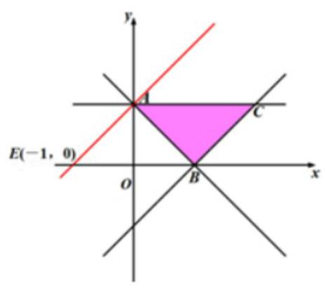

$z = \frac{y}{{xx} + 1}$ 的几何意义为平面区域内的点到定点 $D\left( {-1,0}\right)$ 的斜率,

由图象知 ${AE}$ 的斜率最大,其中 $A\left( {0,1}\right)$ ,则 $z = \frac{1}{0 + 1} = 1$ ,故答案为: 1 .

5、已知 $x \geq  1, y \geq  0$ ,集合 $A = \{ \left( {x, y}\right)  \mid  x + y \leq  4\} , B = \{ \left( {x, y}\right)  \mid  x - y + t = 0\}$ ,如果 $A \cap  B \neq  \varnothing$ ,则 $t$ 的取值范围是___.

【难度】 $\star   \star   \star$

【答案】 $\left\lbrack  {-4,2}\right\rbrack$

【解析】由 $\left\{  \begin{array}{l} x \geq  1 \\  y \geq  0 \\  x + y \leq  4 \end{array}\right.$ 作出可行域如图,

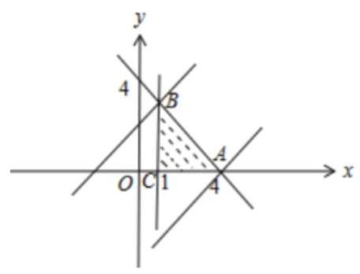

要使 $A \cap  B \neq  \varnothing$ ,则直线 $x - y + t = 0$ 与可行域有公共点,联立 $\left\{  \begin{array}{l} x = 1? \\  x + y = 4 \end{array}\right.$ ,得 $B\left( {1,3}\right)$ ,又 $A\left( {4,0}\right)$ ,把 $A, B$ 的坐标分别代入直线 $x - y + t = 0$ ，得 $t =  - 4, t = 2$ ， $\therefore  - 4 \leq  t \leq  2$ ，故答案为: $\left\lbrack  {-4,2}\right\rbrack  .$

6、定义 $\left( \begin{array}{l} {x}_{n + 1} \\  {y}_{n + 1} \end{array}\right)  = \left( \begin{array}{ll} 1 & 0 \\  1 & 1 \end{array}\right) \left( \begin{array}{l} {x}_{n} \\  {y}_{n} \end{array}\right)$ 为向量 $\overrightarrow{O{P}_{n}} = \left( {{x}_{n},{y}_{n}}\right)$ 到向量 $\overrightarrow{O{P}_{n + 1}} = \left( {{x}_{n + 1},{y}_{n + 1}}\right)$ 的一个矩阵变换,其中 $O$ 是坐标原点， $n \in  {N}^{ * }$ ，已知 $\overrightarrow{O{P}_{1}} = \left( {2,0}\right)$ ，则 $\overrightarrow{O{P}_{2016}}$ 的坐标为___.

【难度】 $\star   \star   \star$

【答案】 $\left( {2,{4030}}\right)$

【解答】解: 由题意可知: $\left\{  {\begin{array}{l} {x}_{n + 1} = {x}_{n} \\  {y}_{n + 1} = {x}_{n} + {y}_{n} \end{array},\therefore {y}_{n + 1} - {y}_{n} = {x}_{n},{x}_{n} = {x}_{1}}\right.$ ,

由 $\overrightarrow{O{P}_{1}} = \left( {2,0}\right) ,{y}_{n + 1} - {y}_{n} = 2$ ,

向量的横坐标不变，纵坐标构成以 0 为首项，2 为公差的等差数列，

${y}_{n} = 2\left( {n - 1}\right) ,\therefore {y}_{2016} = 2 \times  {2015} = {4030},\overrightarrow{O{P}_{2016}}$ 的坐标 $\left( {2,{4030}}\right)$ ,故答案为: $\left( {2,{4030}}\right)$ .

二、选择题

7、已知向量 $\overrightarrow{a} = \left( {\sqrt{2},0, - \sqrt{2}}\right)$ ，则下列向量中与 $\overrightarrow{a}$ 成 ${45}^{ \circ  }$ 的夹角的是( )

A. $\left( {0,0,2}\right)$ B. $\left( {2,0,0}\right)$ C. $\left( {0,\sqrt{2},\sqrt{2}}\right)$ D. $\left( {\sqrt{2}, - \sqrt{2},0}\right)$

【难度】 $\star   \star$

【答案】B

【解析】根据夹角余弦值 $\cos \theta  = \frac{\overrightarrow{a} \cdot  \overrightarrow{b}}{\left| \overrightarrow{a}\right| \left| \overrightarrow{b}\right| }$

对于 $\mathrm{A}$ 若 $\overrightarrow{\mathrm{b}} = \left( {0,0,2}\right)$ ,则 $\frac{\overrightarrow{a} \cdot  \overrightarrow{b}}{\left| \overrightarrow{a}\right| \left| \overrightarrow{b}\right| } = \frac{-2\sqrt{2}}{2 \times  2} =  - \frac{\sqrt{2}}{2}$ ,而 $\cos {45}^{ \circ  } = \frac{\sqrt{2}}{2}$ ,故不符合条件

对于 $B$ 若 $\overrightarrow{\mathbf{b}} = \left( {2,0,0}\right)$ ,则 $\frac{\overrightarrow{a} \cdot  \overrightarrow{b}}{\left| \overrightarrow{a}\right| \left| \overrightarrow{b}\right| } = \frac{2\sqrt{2}}{2 \times  2} = \frac{\sqrt{2}}{2}$ ,而 $\cos {45}^{ \circ  } = \frac{\sqrt{2}}{2}$ ,故符合条件

对于 $C$ 若 $\overrightarrow{\mathbf{b}} = \left( {0,\sqrt{2},\sqrt{2}}\right)$ ,则 $\frac{\overrightarrow{a} \cdot  \overrightarrow{b}}{\left| \overrightarrow{a}\right| \left| \overrightarrow{b}\right| } = \frac{-2}{2 \times  2} =  - \frac{1}{2} \neq  \cos {45}^{ \circ  }$ ,故不符合条件

对于 $D$ 若 $\overrightarrow{b} = \left( {\sqrt{2}, - \sqrt{2},0}\right)$ 则 $\frac{\overrightarrow{a} \cdot  \overrightarrow{b}}{\left| \overrightarrow{a}\right| \left| \overrightarrow{b}\right| } = \frac{2}{2 \times  2} = \frac{1}{2} \neq  \cos {45}^{ \circ  }$ ,故不符合条件

故选 B

8、如图，在棱长为2的正方体 ${ABCD} - {A}_{1}{B}_{1}{C}_{1}{D}_{1}$ 中， $E$ 为 ${BC}$ 的中点，点 $P$ 在底面 ${ABCD}$ 上(包括边界) 移动，且满足 ${B}_{1}P \bot  {D}_{1}E$ ，则线段 ${B}_{1}P$ 的长度的最大值为( )

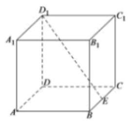

A. $\frac{6\sqrt{5}}{5}$ B. $2\sqrt{5}$ C. $2\sqrt{2}$ D. 3

【难度】 $\star   \star   \star$

【答案】D

【解析】解: 以 $D$ 为原点, ${DA}$ 为 $x$ 轴, ${DC}$ 为 $y$ 轴, $D{D}_{1}$ 为 $z$ 轴,建立空间直角坐标系,

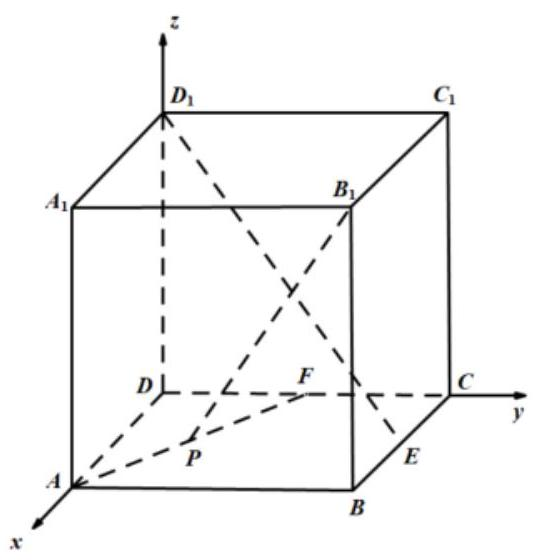

设 $P\left( {a, b,0}\right)$ ,则 ${D}_{1}\left( {0,0,2}\right) , E\left( {1,2,0}\right) ,{B}_{1}\left( {2,2,2}\right)$ ,

$\overrightarrow{{B}_{1}P} = \left( {a - 2, b - 2, - 2}\right) ,\overrightarrow{{D}_{1}E} = \left( {1,2, - 2}\right) ,$

$\because {B}_{1}P \bot  {D}_{1}E,\;\therefore \overrightarrow{{B}_{1}P} \cdot  \overrightarrow{{D}_{1}E} = a - 2 + 2\left( {b - 2}\right)  + 4 = 0$ ,

$\therefore a + {2b} - 2 = 0,0 \leq  b \leq  1,\therefore$ 点 $P$ 的轨迹是一条线段,

${\left| \overrightarrow{{B}_{1}P}\right| }^{2} = {\left( a - 2\right) }^{2} + {\left( b - 2\right) }^{2} + 4 = {\left( 2b\right) }^{2} + {\left( b - 2\right) }^{2} + 4 = 5{b}^{2} - {4b} + 8$ ,

由二次函数的性质可得当 $b = 1$ 时, $5{b}^{2} - {4b} + 8$ 可取到最大值 9,

$\therefore$ 线段 ${B}_{1}P$ 的长度的最大值为 3 . 故选: D.

9、如图，在四面体 $O - {ABC}$ 中， ${G}_{1}$ 是 $\bigtriangleup  {ABC}$ 的重心， $G$ 是 $O{G}_{1}$ 上的一点，且 ${OG} = {2G}{G}_{1}$ ，若 $\overrightarrow{OG} = x\overrightarrow{OA} + y\overrightarrow{OB} + z\overrightarrow{OC}$ ,则 $\left( {x, y, z}\right)$ 为( )

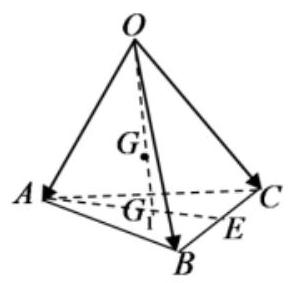

A. $\left( {\frac{1}{2},\frac{1}{2},\frac{1}{2}}\right)$ B. $\left( {\frac{2}{3},\frac{2}{3},\frac{2}{3}}\right)$

C. $\left( {\frac{1}{3},\frac{1}{3},\frac{1}{3}}\right)$ D. $\left( {\frac{2}{9},\frac{2}{9},\frac{2}{9}}\right)$

【难度】★★★

【答案】D

【解析】因为 $E$ 是 ${BC}$ 中点,所以 $\overrightarrow{OE} = \frac{1}{2}\left( {\overrightarrow{OB} + \overrightarrow{OC}}\right)$ ,

${G}_{1}$ 是 $\bigtriangleup  {ABC}$ 的重心，则 $A{G}_{1} = \frac{2}{3}{AE}$ ，所以 $\overline{A{G}_{1}} = \frac{2}{3}\overrightarrow{AE} = \frac{2}{3}\left( {\overrightarrow{OE} - \overrightarrow{OA}}\right)$ ，

因为 ${OG} = {2G}{G}_{1}$ ，所以

$\overrightarrow{OG} = \frac{2}{3}\overrightarrow{O{G}_{1}} = \frac{2}{3}\left( {\overrightarrow{OA} + \overrightarrow{A{G}_{1}}}\right)  = \frac{2}{3}\overrightarrow{OA} + \frac{4}{9}\left( {\overrightarrow{OE} - \overrightarrow{OA}}\right)$

$= \frac{2}{9}\overrightarrow{OA} + \frac{4}{9}\overrightarrow{OE} = \frac{2}{9}\overrightarrow{OA} + \frac{2}{9}\left( {\overrightarrow{OB} + \overrightarrow{OC}}\right)  = \frac{2}{9}\overrightarrow{OA} + \frac{2}{9}\overrightarrow{OB} + \frac{2}{9}\overrightarrow{OC}$ ,

若 $\overrightarrow{OG} = x\overrightarrow{OA} + y\overrightarrow{OB} + z\overrightarrow{OC}$ ,则 $x = y = z = \frac{2}{9}$ . 故选: D.

10、在平面直角坐标系中，不等式组 $\left\{  \begin{array}{l} \sqrt{3}x + y \geq  0 \\  \sqrt{3}x - y + 2\sqrt{3} \geq  0 \\  x \leq  a \end{array}\right.$ ，所表示的平面区域的周长是 $8 + 4\sqrt{3}$ ，那么实数 $a$ 的值为( )

A. $- \frac{1}{2}$ B. $\frac{1}{2}$ C. $\frac{3}{4}$ D. 1

【难度】 $\star   \star   \star   \star$

【答案】D

【解析】由 $\left\{  \begin{array}{l} \sqrt{3}x + y = 0 \\  \sqrt{3}x - y + 2\sqrt{3} = 0 \end{array}\right.$ ,解得 $\left\{  \begin{array}{l} x =  - 1 \\  y = \sqrt{3} \end{array}\right.$ ,

不等式组所表示的区域及各点坐标如图所示,显然有 $a >  - 1$ ,

易得 $B\left( {a,\sqrt{3}a + 2\sqrt{3}}\right) , C\left( {a, - \sqrt{3}a}\right)$

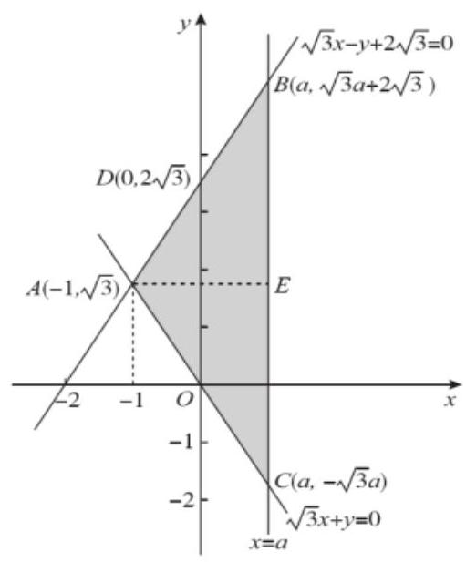

取 ${BC}$ 中点 $E$ ,则 ${AE} \bot  {BE}$ ,

因为 ${k}_{AB} = \sqrt{3},{k}_{AC} =  - \sqrt{3}$ ,所以 $\angle {BAE} = {60}^{ \circ  },\angle {ACB} = {30}^{ \circ  }$ ,

所以 $\angle {ADO} = \angle {ABC} = {30}^{ \circ  }$ ， $\angle {AOD} = \angle {ACB} = {30}^{ \circ  }$ ，

$\left| {BC}\right|  = \sqrt{3}a + 2\sqrt{3} - \left( {-\sqrt{3}a}\right)  = 2\sqrt{3}a + 2\sqrt{3} = 2\sqrt{3}\left( {a + 1}\right) ,$

在 Rt $\bigtriangleup {ABE}$ 中, ${AB} = \frac{BE}{\sin {60}^{ \circ  }} = \frac{\sqrt{3}\left( {a + 1}\right) }{\frac{\sqrt{3}}{2}} = 2\left( {a + 1}\right)$ ,

由 ${AB} = {AC}$ ，有 ${AC} = 2\left( {a + 1}\right)$ ，

则 $\bigtriangleup  {ABC}$ 的周长为: ${AB} + {AC} + {BC} = 4\left( {a + 1}\right)  + 2\sqrt{3}\left( {a + 1}\right)  = \left( {4 + 2\sqrt{3}}\right) \left( {a + 1}\right)  = 8 + 4\sqrt{3}$ ，得 $a = 1$ . 故选: D

## 三、解答题

11、如图( 1 )所示，在 $R{t}_{ \bigtriangleup  }{ABC}$ 中， $\angle C = {90}^{ \circ  }$ ， ${BC} = 3$ ， ${AC} = 6$ ， $D$ ， $E$ 分别是 ${AC},{AB}$ 上的点，且 ${DE}//{BC},{DE} = 2$ ，将 $\bigtriangleup  {ADE}$ 沿 ${DE}$ 折起到 $\bigtriangleup  {A}_{1}{DE}$ 的位置，使 ${A}_{1}C \bot  {CD}$ ，如图(2)所示.

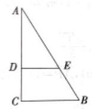

(1)

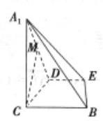

(2)

(1)若 $M$ 是 ${A}_{1}D$ 的中点，求 ${CM}$ 与平面 ${A}_{1}{BE}$ 所成角的大小；

(1)线段 ${BC}$ (不包括端点)上是否存在点 $P$ ，使平面 ${A}_{1}{DP}$ 与平面 ${A}_{1}{BE}$ 垂直？说明理由.

【难度】 $\star   \star   \star$

【答案】(1) $\frac{\pi }{4}$ ；(2)不存在，答案见解析.

【解析】(1) 如图建系 $C - {xyz}$ ,

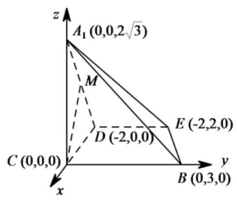

则 $D\left( {-2,0,0}\right) , A\left( {0,0,2\sqrt{3}}\right) , B\left( {0,3,0}\right) , E\left( {-2,2,0}\right)$ ,

$\therefore \overrightarrow{{A}_{1}B} = \left( {0,3, - 2\sqrt{3}}\right) ,\overrightarrow{BE} = \left( {-2, - 1,0}\right)$ ,

设平面 ${A}_{1}{BE}$ 的一个法向量为 $\overrightarrow{n} = \left( {x, y, z}\right)$

则 $\left\{  {\begin{array}{l} \overrightarrow{{A}_{1}B} \cdot  \overrightarrow{n} = 0 \\  \overrightarrow{BE} \cdot  \overrightarrow{n} = 0 \end{array}\therefore \left\{  {\begin{array}{l} {3y} - 2\sqrt{3}z = 0 \\   - {2x} - y = 0 \end{array}\therefore \left\{  \begin{array}{l} z = \frac{\sqrt{3}}{2}y \\  x =  - \frac{y}{2} \end{array}\right. }\right. }\right.$

$\therefore$ 取 $y = 2$ ,得 $\overrightarrow{n} = \left( {-1,2,\sqrt{3}}\right)$ ,

又 $\because M\left( {-1,0,\sqrt{3}}\right)$ ,

$\therefore \overrightarrow{CM} = \left( {-1,0,\sqrt{3}}\right)  < \overrightarrow{CM},\overrightarrow{n} >  = \theta ,{CM}$ 与平面 ${A}_{1}{BE}$ 所成角 $\alpha$

$\therefore \cos \theta  = \frac{\overrightarrow{CM} \cdot  \overrightarrow{n}}{\left| \overrightarrow{CM}\right|  \cdot  \left| \overrightarrow{n}\right| } = \frac{1 + 3}{\sqrt{1 + 4 + 3} \cdot  \sqrt{1 + 3}} = \frac{4}{2 \cdot  2\sqrt{2}} = \frac{\sqrt{2}}{2},\cos \alpha  = \left| {\cos \theta }\right|  = \frac{\sqrt{2}}{2}$ ,

$\therefore \mathrm{{CM}}$ 与平面 ${A}_{1}{BE}$ 所成角的大小 ${45}^{ \circ  }$ .

(2)设点 $P$ 的坐标为 $\left( {0, m,0}\right) \left( {0 < m < 3}\right)$ ，

$\overrightarrow{D{A}_{1}} = \left( {2,0,2\sqrt{3}}\right) ,\overrightarrow{DP} = \left( {2, m,0}\right)$ ,

设平面 ${A}_{1}{DP}$ 的法向量为 $\overrightarrow{{n}_{1}} = \left( {{x}_{1},{y}_{1},{z}_{1}}\right)$ ,

则 $\left\{  {\begin{array}{l} \overrightarrow{D{A}_{1}} \cdot  \overrightarrow{{n}_{1}} = 0 \\  \overrightarrow{DP} \cdot  \overrightarrow{{n}_{1}} = 0 \end{array},\left\{  {\begin{array}{l} 2{x}_{1} + 2\sqrt{3}{z}_{1} = 0 \\  2{x}_{1} + m{y}_{1} = 0 \end{array},\left\{  {\begin{array}{l} {z}_{1} =  - \frac{1}{\sqrt{3}}{x}_{1} \\  {y}_{1} =  - \frac{2}{m}{x}_{1} \end{array},\text{ 令 }{x}_{1} = \sqrt{3}m}\right. }\right. }\right.$ ,则

$\overrightarrow{{n}_{1}} = \left( {\sqrt{3}m, - 2\sqrt{3}, - m}\right)$ .

要使平面 ${A}_{1}{DP}$ 与平面 ${A}_{1}{BE}$ 垂直,需

$\bar{n} \cdot  \overrightarrow{{n}_{1}} = \left( {-1}\right)  \times  \sqrt{3}m + 2 \times  \left( {-2\sqrt{3}}\right)  + \sqrt{3} \times  \left( {-m}\right)  = 0$ ,解得 $m =  - 2$ ,不满足条件.

所以不存在这样的点 $P$ .

12、如图， ${PD} \bot$ 平面 ${ABCD}$ , ${AD} \bot  {CD}$ , ${AB}//{CD}$ , ${PQ}//{CD}$ , ${AD} = {CD} = {DP} = {2PQ} = {2AB} = 2$ , 点 $E, F, M$ 分别为 ${AP},{CD},{BQ}$ 的中点.

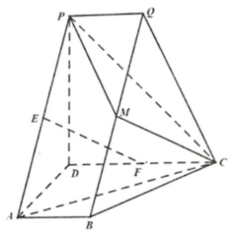

(1)求证: ${EF} \parallel$ 平面 ${MPC}$ ；

(2)求二面角 $Q - {PM} - C$ 的正弦值；

(3)若 $N$ 为线段 ${CQ}$ 上的点，且直线 ${DN}$ 与平面 ${PMQ}$ 所成的角为 $\frac{\pi }{6}$ ，求线段 ${QN}$ 的长.

【难度】 $\star   \star   \star   \star$

【答案】( I ) 证明见解析; (II) $\frac{\sqrt{3}}{2}$ ; (III) $\frac{\sqrt{5}}{3}$ .

【解析】(1) 连接 ${EM}$ ,因为 ${AB}//{CD},{PQ}//{CD}$ ,所以 ${AB}//{PQ}$ ,又因为 ${AB} = {PQ}$ ,所以 ${PABQ}$ 为平行四边形.

由点 $E$ 和 $M$ 分别为 ${AP}$ 和 ${BQ}$ 的中点，可得 ${EM}//{AB}$ 且 ${EM} = {AB}$ ，

因为 ${AB}//{CD}$ ， ${CD} = {2AB}$ ， $F$ 为 ${CD}$ 的中点，所以 ${CF}//{AB}$ 且 ${CF} = {AB}$ ，可得 ${EM}//{CF}$ 且 ${EM} = {CF}$ ,即四边形 ${EFCM}$ 为平行四边形,所以 ${EF}\parallel {MC}$ ,又 ${EF} \text{ ⊄ }$ 平面 ${MPC},{CM} \subset$ 平面 ${MPC}$ , 所以 ${EF}//$ 平面 ${MPC}$ .

(II)因为 ${PD} \bot$ 平面 ${ABCD}$ ， ${AD} \bot  {CD}$ ，可以建立以 $D$ 为原点，分别以 $\overline{DA}$ ， $\overline{DC}$ ， $\overline{DP}$ 的方向为 $x$ 轴， $y$ 轴, $z$ 轴的正方向的空间直角坐标系.

依题意可得 $D\left( {0,0,0}\right) , A\left( {2,0,0}\right) , B\left( {2,1,0}\right) , C\left( \begin{array}{lll} 0 & 2 & 0 \end{array}\right)$ ,

$P\left( {0,0,2}\right) , Q\left( {0,1,2}\right) , M\left( {1,1,1}\right) .$

$\overline{PM} = \left( {1,1, - 1}\right) ,\overline{PQ} = \left( {0,1,0}\right) ,\overline{CM} = \left( {1, - 1,1}\right) ,\overline{PC} = \left( {{02}, - 2}\right)$

设 $\overrightarrow{{n}_{1}} = \left( {x, y, z}\right)$ 为平面 ${PMQ}$ 的法向量,

则 $\left\{  \begin{array}{l} \overrightarrow{{n}_{1}} \cdot  \overrightarrow{PM} = 0 \\  \overrightarrow{{n}_{1}} \cdot  \overrightarrow{PQ} = 0 \end{array}\right.$ ,即 $\left\{  \begin{matrix} x + y - z = 0 \\  y = 0 \end{matrix}\right.$ ,不妨设 $z = 1$ ,可得 $\overrightarrow{{n}_{1}} = \left( {1,0,1}\right)$

设 $\overline{{n}_{2}} = \left( {x, y, z}\right)$ 为平面 ${MPC}$ 的法向量,

则 $\left\{  \begin{array}{l} \overline{{n}_{2}} \cdot  \overline{PC} = 0 \\  \overline{{n}_{2}} \cdot  \overline{CM} = 0 \end{array}\right.$ ,即 $\left\{  \begin{array}{l} {2y} - {2z} = 0 \\  x - y + z = 0 \end{array}\right.$ ,不妨设 $z = 1$ ,可得 $\overline{{n}_{2}} = \left( {0,1,1}\right)$ .

$\cos \overline{{n}_{1}},\overline{{n}_{2}} = \frac{\overline{{n}_{1}} \cdot  \overline{{n}_{2}}}{\left| \overline{{n}_{1}}\right|  \cdot  \left| \overline{{n}_{2}}\right| } = \frac{1}{2}$ ,于是 $\sin \overline{{n}_{1}},\overline{{n}_{2}} = \frac{\sqrt{3}}{2}$ .

所以,二面角 $Q - {PM} - C$ 的正弦值为 $\frac{\sqrt{3}}{2}$ .

(III) 设 $\overline{QN} = \lambda \overline{QC}\left( {0 \leq  \lambda  \leq  1}\right)$ ,即 $\overline{QN} = \lambda \overline{QC} = \left( {0,\lambda , - {2\lambda }}\right)$ ,则 $N\left( {0,\lambda  + 1,2 - {2\lambda }}\right)$ .

从而 $\overline{DN} = \left( {0,\lambda  + 1,2 - {2\lambda }}\right)$ .

由( 1 )知平面 ${PMQ}$ 的法向量为 $\overline{{n}_{1}} = \left( {1,0,1}\right)$ ，

由题意， $\sin \frac{\pi }{6} = \left| {\cos \overline{DN},\overline{{n}_{1}}}\right|  = \frac{\left| \overline{DN} \cdot  \overline{{n}_{1}}\right| }{\left| \overline{DN}\right|  \cdot  \left| \overline{{n}_{1}}\right| }$ ,即 $\frac{1}{2} = \frac{\left| 2 - 2\lambda \right| }{\sqrt{{\left( \lambda  + 1\right) }^{2} + {\left( 2 - 2\lambda \right) }^{2}}}$ . $\sqrt{2}$ ,

整理得 $3{\lambda }^{2} - {10\lambda } + 3 = 0$ ,解得 $\lambda  = \frac{1}{3}$ 或 $\lambda  = 3$ ,

因为 $0 \leq  \lambda  \leq  1$ 所以 $\lambda  = \frac{1}{3}$ ,所以 $\overline{QN} = \frac{1}{3}\overline{QC},{QN} = \frac{1}{3}\left| \overline{QC}\right|  = \frac{\sqrt{5}}{3}$ .

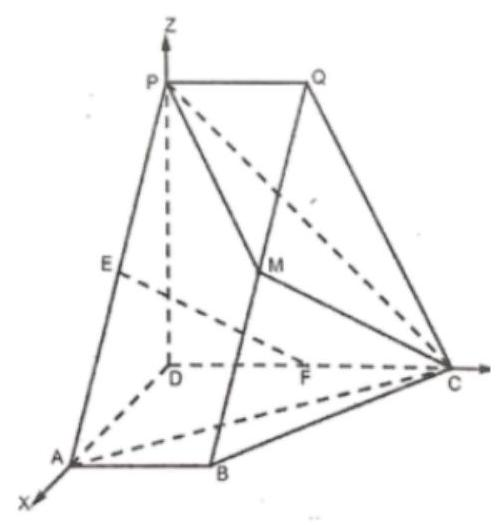
