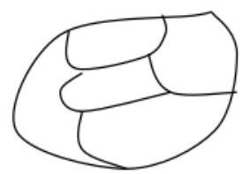
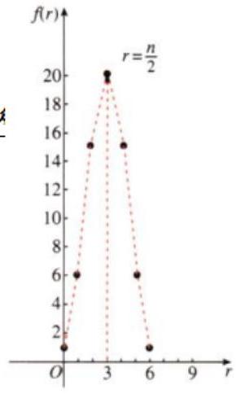
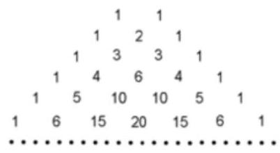
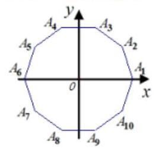

## (一)排列、组合

## 排列、组合、二项式定理、概率与统计

<table><tr><td>教学目标</td><td>1、掌握排列与组合的概念以及公式; 理解两个计数原理, 会区分排列与组合的问题;   2、熟悉二项展开式通项公式，会区分项的系数与项的二项式系数，能够灵活地求二项式的指数、求满足条件的项或系数;   3、理解等概率模型及其概率计算公式, 会计算一些随机事件发生的概率.   4、掌握总体与样本的概念. 会用样本估计总体, 能对样本观测值进行整理和分析;   5、掌握抽样技术中的随机抽样，系统抽样和分层抽样的方法，并能够很好的进行区分和利用.</td></tr><tr><td>重点</td><td>1、利用各种方法解决排列组合问题；   2、二项式定理以及二项式定理和二项展开式的性质的常见应用;   3、能够很好的利用独立事件的概念去解决题目. 会用互斥事件的概率加法公式求互斥事件的概率, 区分对立事件与互斥事件.   4、总体均值，总体方差，总体标准差，总体均值的点估计值，总体标准差的点估计值.</td></tr><tr><td>难点</td><td>1、捆绑法、插空法、间接法、分类讨论等；排列与组合综合题；   2、能够很好的把概率、基本统计方法运用到日常生活中.   3、抽样方法的熟练掌握并精准利用.</td></tr></table>

## 知识梳理

1、排列:

一般地,从 $n$ 个不同元素中取出 $m\left( {m \leq  n}\right)$ 个元素,按照一定的顺序排成一列,叫做从 $n$ 个不同元素中取出 $m$ 个元素的一个排列。

【注释】(1)元素不能重复。 $n$ 个中不能重复， $m$ 个中也不能重复；(2)“按一定顺序”就是与位置有关，这是判断一个问题是否是排列问题的关键；(3)两个排列相同，当且仅当这两个排列中的元素完全相同，而且元素的排列顺序也完全相同。

2、排列数:

从 $n$ 个不同的元素中取出 $m\left( {m \leq  n}\right)$ 个元素的所有排列的个数,叫做从 $n$ 个不同的元素中取出 $m$ 个元素的排列数。用符号 ${P}_{n}^{m}$ 表示。

【注释】“排列”和“排列数”有什么区别和联系？

“一个排列” 是指: 从 $n$ 个不同元素中,任取 $m$ 个元素,按照一定的顺序排成一列,不是数;

“排列数”是指从 $n$ 个不同元素中,任取 $m$ 个元素的所有排列的个数,是一个数; 所以符号只表示排列数, 而不表示具体的排列。

3、排列数公式:

$$
{P}_{n}^{m} = n\left( {n - 1}\right) \left( {n - 2}\right) \cdots \left( {n - m + 1}\right)  = \frac{n!}{\left( {n - m}\right) !}\left( {m, n \in  {N}^{ * }, m \leq  n}\right)
$$

当 $m = n$ 时, ${P}_{n}^{n} = n\left( {n - 1}\right) \left( {n - 2}\right) \cdots 3 \cdot  2 \cdot  1$ ,正整数 1 到 $n$ 的连乘积,叫做 $n$ 的阶乘,用 $n!$ 表示。

规定 $0! = 1$ 。

对于 $m \leq  n$ 这个条件要留意,往往是解方程时的隐含条件。

4、附有限制条件的排列

(1)对附有限制条件的排列，思考问题的原则是优先考虑受限制的元素或受限制的位置.

(2)对下列附有限制条件的排列，要掌握基本的思考方法:

元素在某一位置或元素不在某一位置，从该元素入手;

元素相邻——捆绑法，即把相邻元素看成一个元素；

元素不相邻——插空法；

比某一数大或比某一数小的问题主要考虑首位或前几位.

(3)对附有限制条件的排列要掌握正向思考问题的方法——直接法；同时要掌握一些问题的逆向思考问题的方向——间接法.

## 5、组合数:

从 $n$ 个不同元素中取出 $m\left( {m \leq  n}\right)$ 个元素的所有组合的个数,叫做从 $n$ 个不同元素中取出 $m$ 个元素的组合数,用符合 ${C}_{n}^{m}$ 表示.

6、组合数公式为

$$
{C}_{n}^{m} = \frac{{P}_{n}^{m}}{{P}_{m}^{m}} = \frac{n!}{m!\left( {n - m}\right) !} = \frac{n\left( {n - 1}\right) \left( {n - 2}\right) \cdots \left( {n - m + 1}\right) }{m!}\left( {m, n \in  {N}^{ * }, m \leq  n}\right) \text{ ,规定 }
$$

$$
{C}_{n}^{0} = {C}_{n}^{n} = 1
$$

【注释】组合数公式有两种形式, (1)乘积形式; (2)阶乘形式. 前者多用于数字计算, 后者多用于证明恒等式。

## 7、组合数的性质:

性质一: ${\mathrm{C}}_{n}^{m} = {\mathrm{C}}_{n}^{n - m}$

①等式特点:等式两边下标同，上标之和等于下标.

②此性质作用:当 $m > \frac{n}{2}$ 时，计算 ${C}_{n}^{m}$ 可变为计算 ${C}_{n}^{n - m}$ ，能够使运算简化.

例如 ${C}_{2016}^{2015} = {C}_{2016}^{{2016} - {2015}} = {C}_{2016}^{1} = {2016}$ .

③ ${C}_{n}^{x} = {C}_{n}^{y} \Rightarrow  x = y$ 或 $x + y = n$ .

性质二、 ${C}_{n + 1}^{m} = {C}_{n}^{m} + {C}_{n}^{m - 1}$

①等式特点:下标相同而上标差 1 的两个组合数之和，等于下标比原下标多 1 而上标与原组合数上标较大的相同的一个组合数.

②此性质作用:恒等变形，简化运算. 在今后学习“二项式定理”时，我们会看到它的主要应用.

③ 证明过程: ${C}_{n}^{m} + {C}_{n}^{m - 1} = \frac{n!}{m!\left( {n - m}\right) !} + \frac{n!}{\left( {m - 1}\right) !\left\lbrack  {n - \left( {m - 1}\right) }\right\rbrack  !}$

$$
= \frac{n!\left( {n - m + 1}\right)  + n!m}{m!\left( {n - m + 1}\right) !} = \frac{\left( {n - m + 1 + m}\right) n!}{m!\left( {n + 1 - m}\right) !}
$$

$$
= \frac{\left( {n + 1}\right) !}{m!\left\lbrack  {\left( {n + 1}\right)  - m}\right\rbrack  !} = {C}_{n + 1}^{m}.
$$

8、组合问题常见解题方法:

(1)注意“至少”、“最多”、“含”等词；

(2)区分“分配”与“分组”:“分组问题”的特征是组与组之间只要元素个数相同是不可区分的，即指把物件分成组，是无顺序可言的；而“分配”问题即使元素个数相同，但因人不同，仍然是可区分的，或者是指把物件分给不同的人(或团体)，是有顺序的，解分配问题必须先分组后排列，若平均分 $m$ 组,则分法 $=$ 取法 $/m$ !

(3)隔板分组法:常常用于解决一类相同元素分给不同对象的分配问题.

(4)分排问题直排处理；

(5)“小集团”排列问题中先集体后局部处理；

(6)定序问题除法处理:即先不考虑顺序限制，排列后在除以定序元素的全排列.

## 例题精讲

【例1】(1)满足 ${P}_{8}^{x} < 6{P}_{8}^{x - 2}$ 的 $x =$ ___.

(2)已知 $\frac{1}{{C}_{5}^{n}} - \frac{1}{{C}_{6}^{n}} = \frac{7}{{10}{C}_{7}^{n}}$ ，求 ${C}_{8}^{n}$ ；

(3)已知 ${C}_{12}^{2n} = {C}_{12}^{n + 6}$ ，求 ${C}_{12}^{n}$ .

【难度】 $\star   \star   \star$

【答案】(1)8 (2)28 (3)924 或 66

【解析】(1) $\frac{{P}_{8}^{x}}{{P}_{8}^{x - 2}} = \left( {{10} - x}\right) \left( {9 - x}\right)  < 6$ 得 $7 < x < {12}$ ,又 $2 \leq  x \leq  8, x \in  {N}^{ * }$ ,故 $x = 8$

(2)由题意得 $\frac{n!\left( {5 - n}\right) !}{5!} - \frac{n!\left( {6 - n}\right) !}{6!} = \frac{7 \cdot  n!\left( {7 - n}\right) !}{{10} \cdot  7!}$

化简,得 ${n}^{2} - {23n} + {42} = 0$ ,解得 $n = 2$ ,或 $n = {21}$ (不合题意,舍去). 所以 ${C}_{8}^{n} = {28}$ .

(3)由组合数性质得( i ) ${2n} = n + 6$ ，解得 $n = 6$ ，所以 ${C}_{12}^{6} = {924}$ .

(ii) ${12} - {2n} = n + 6$ ,解得 $n = 2,{C}_{12}^{2} = {66}$ .

【例 2】一次国际会议, 从某大学外语系选出 11 名学生做翻译, 两人既会英语, 又会日语, 5 人只会英语, 4 人只会日语。现从这 11 人中选出 4 名当英语翻译, 4 名当日语翻译, 求所有选法种数.

【难度】 $\bigstar \bigstar \bigstar$

【答案】见解析

【解析】把选法分为三类:

(i)从 5 个只会英语的学生中选 4 人，则可从 2 名会两种语言和只会日语的 4 人中选口语翻译有 ${C}_{6}^{4}$ 种. 按乘法原理这种情况下的翻译选法可有 ${C}_{5}^{4}{C}_{6}^{4}$ 种.

(ii) 从 5 个只会英语的学生中选 3 人，则英语翻译有 ${C}_{5}^{3}{C}_{2}^{1}$ 种，而这时日语翻译选法有 ${C}_{5}^{4}$ 种按乘法原理这种情况下的翻译选法可有 ${C}_{5}^{3}{C}_{2}^{1}{C}_{5}^{4}$ 种.

(iii) 从 5 个只会英语学生中选 2 人，则英语翻译有 ${C}_{5}^{2}{C}_{2}^{2}$ 种，而这时口语翻译选法有 ${C}_{4}^{4}$ 种，按乘法原理这种情况下的翻译选法可有 ${C}_{5}^{2}{C}_{2}^{2}{C}_{4}^{4}$ 种.

于是,所有选择总数为 ${C}_{5}^{4}{C}_{6}^{4} + {C}_{5}^{3}{C}_{2}^{1}{C}_{5}^{4} + {C}_{5}^{2}{C}_{2}^{2}{C}_{4}^{4} = {185}$ (种).

【例 3】2020 年 3 月 31 日,某地援鄂医护人员 $A, B, C, D, E, F,6$ 人(其中 $A$ 是队长)圆满完成抗击新冠肺炎疫情任务返回本地，他们受到当地群众与领导的热烈欢迎. 当地媒体为了宣传他们的优秀事迹，让这 6 名医护人员和接见他们的一位领导共 7 人站一排进行拍照，则领导和队长站在两端且 ${BC}$ 相邻， 而 ${BD}$ 不相邻的排法种数为( )

A. 36 种 B. 48 种 C. 56 种 D. 72 种

【难度】 $\star   \star   \star$

【答案】D

【解析】: 让这 6 名医护人员和接见他们的一位领导共 7 人站一排进行拍照,则领导和队长站在两端且 ${BC}$ 相邻; 分 2 步进行分析:

① 领导和队长站在两端，有 ${P}_{2}^{2} = 2$ 种情况，

②中间5人分2种情况讨论:

若 ${BC}$ 相邻且与 $D$ 相邻,有 ${P}_{2}^{2}{P}_{3}^{3} = {12}$ 种安排方法,

若 ${BC}$ 相邻且不与 $D$ 相邻,有 ${P}_{2}^{2}{P}_{2}^{2}{P}_{3}^{2} = {24}$ 种安排方法,

则中间 5 人有 ${12} + {24} = {36}$ 种安排方法,

则有 $2 \times  {36} = {72}$ 种不同的安排方法;

故选: D.

【例 4】一天的课程表要排入语文，数学，物理，化学，英语，体育六节课，如果数学必须排在体育之前，

那么该天的课程表有多少种排法?

【难度】 $\star   \star   \star$

【答案】360

【解析】在六节课的排列总数中, 体育课排在数学之前与数学课排在体育之前的概率

相等,均为 $\frac{1}{2}$ ,故本例所求的排法种数就是所有排法的 $\frac{1}{2}$ ,即 $\frac{1}{2}{P}_{6}^{6} = {360}$ 种. 或者由于数学和体育的次序固定,方法数为 $\frac{{P}_{6}^{6}}{{P}_{2}^{2}} = {360}$ .

【例 5】(1)为抗击新冠病毒，某部门安排甲、乙、丙、丁、戊五名专家到三地指导防疫工作.因工作需要， 每地至少需安排一名专家，其中甲、乙两名专家必须安排在同一地工作，丙、丁两名专家不能安排在同一地工作，则不同的分配方法总数为( )

A. 18 B. 24 C. 30 D. 36

【难度】 $\star   \star   \star$

【答案】C

【解析】因为甲、乙两名专家必须安排在同一地工作, 此时甲、乙两名专家

看成一个整体即相当于一个人，所以相当于只有四名专家，

先计算四名专家中有两名在同一地工作的排列数, 即从四个中选二个和

其余二个看成三个元素的全排列共有: ${C}_{4}^{2} \cdot  {P}_{3}^{3}$ 种;

又因为丙、丁两名专家不能安排在同一地工作，所以再去掉丙、丁两名专家在同一地工作的排列数有 ${P}_{3}^{3}$ 种， 所以不同的分配方法种数有: ${C}_{4}^{2} \cdot  {P}_{3}^{3} - {P}_{3}^{3} = {36} - 6 = {30}$ ,故选: C

(2)设有编号为1,2,3,4,5的五个球和编号为1,2,3,4,5的五个盒子,现将这五个球放入 5 个盒子内，没有一个盒子空着，但球的编号与盒子编号不全相同，有多少种投放方法？

【难度】 $\star   \star   \star$

【答案】 119

【解析】 ${P}_{5}^{5} - 1 = {119}$

【例 6】6 本不同的书, 按下列要求各有多少种不同的选法:

(1)分为三份，每份 2 本；

(2)分为三份，一份 1 本，一份 2 本，一份 3 本；

(3)分成 3 堆，有 2 堆各一本，另一堆 4 本，有多少种不同的分堆方法?

(4)摆在 3 层书架上，每层 2 本，有多少种不同的摆法?

【难度】★★★

【答案】(1)6本书平均分成3份,用上述方法重复了 ${P}_{3}^{3}$ 倍,故共有 $\frac{{C}_{6}^{2}{C}_{4}^{2}{C}_{2}^{2}}{{P}_{3}^{3}} = {15}$ (种).

【解析】本题是分组中的 “均匀分组” 问题. 一般地: 将 ${mn}$ 个元素均匀分成 $n$ 组(每组m个元素),共有 $\frac{{C}_{mn}^{m} \cdot  {C}_{{mn} - m}^{m} \cdot  \ldots \ldots  \cdot  {C}_{m}^{m}}{{P}_{n}^{n}}$ 种方法。

(2)这是 “不均匀分组” 问题，从6本书中，先取1本做1份，再在剩下的5本中取2本做一份，最后3本做一份,其有 ${C}_{6}^{1}{C}_{5}^{2}{C}_{3}^{3} = {60}$ 种方法.

(3)平均分堆要除以堆数的全排列数，不平均分堆则不除，故共有 $\frac{{C}_{6}^{1} \cdot  {C}_{5}^{1}}{{P}_{2}^{2}} = {15}$ (种).

(4)本题即为6本书放在6个位置上，共有 ${P}_{6}^{6} = {720}$ (种).

【例 7】疫情期间，某村有 3 个路口，每个路口需要 2 个人负责检查体温. 现有 8 名志愿者，其中 4 名为党员，从中抽取 6 人安排到这 3 个路口，要求每个路口至少有一名党员，则不同的安排方法有( )种.

A. 432 B. 576 C. 1008 D. 1440

【难度】 $\star   \star   \star$

【答案】C

【解析】因为 3 个路口中每个路口至少有一名党员, 所以至少有三个党员,

若从中抽取 6 人恰有三个党员,则安排方法有 ${C}_{4}^{3}{C}_{4}^{3}{P}_{3}^{3}{P}_{3}^{3}$ 种,

若从中抽取 6 人恰有四个党员,则安排方法有 ${C}_{4}^{4}{C}_{4}^{2}\left( {{C}_{4}^{2}{P}_{3}^{3}}\right) {P}_{2}^{2}$ 种,

因此共 ${C}_{4}^{3}{C}_{4}^{3}{P}_{3}^{3}{P}_{3}^{3} + {C}_{4}^{4}{C}_{4}^{2}\left( {{C}_{4}^{2}{P}_{3}^{3}}\right) {P}_{2}^{2} = {576} + {432} = {1008}$ 种,故选: C

【例 8】不定方程 ${x}_{1} + {x}_{2} + {x}_{3} + \ldots  + {x}_{50} = {100}$ 中不同的正整数解有___组，非负整数解有___组.

【难度】 $\star   \star   \star$

【答案】 ${\mathrm{C}}_{99}^{49},{\mathrm{C}}_{149}^{49}$ ;

【解析】相当于把 100 个 1 分给 50 个未知数, 采用挡板法,

于是所有的方法数为 ${\mathrm{C}}_{99}^{49}$ ;

非负整数解的问题,等价于 $\left( {{x}_{1} + 1}\right)  + \left( {{x}_{2} + 1}\right)  + \left( {{x}_{3} + 1}\right)  + \ldots  + \left( {{x}_{50} + 1}\right)  = {150}$ 的非负整数解问题,等价于 ${y}_{i} = {x}_{i} + 1,\;{y}_{1} + {y}_{2} + {y}_{3} + \ldots  + {y}_{50} = {150}$ 的正整数解问题,一共有 ${\mathrm{C}}_{149}^{49}$ 组.

【例9】如图, 一个地区分为5 个行政区域, 现给它们着色, 要求相邻区域不得使用同一种颜色.若有4种颜色可供选择, 则不同的着色方法共有___(用数字作答)

【难度】 $\star   \star   \star$

【答案】 72

【解析】当4中颜色都是用时共有48种方法,当仅适用3种颜色时颜色可有 ${C}_{4}^{3}$ 种选法,先涂第一区域,有 3 种,剩下两种颜色涂四个区域,只能是一种颜色涂2,4另外一种颜色涂3,5共2种,故有 ${C}_{4}^{3} \times  3 \times  2 = {24}$ ,从而一共有48+24=72种

【例10】四面体的顶点和各棱中点共有10个点, 在其中取四个不共面的点, 不同的取法共有___

【难度】★★★

【答案】 141

【解析】间接法; 一共有 ${C}_{10}^{4}$ 种,四点共面有三种情况,① 四点均在侧面上共有 $4 \times  {C}_{6}^{4}$ 种; ②三点在一条棱上,第四个点在其对棱的中点,共有6种情况; ③四点均为中点,有3种情况; 故共有 ${C}_{10}^{4} - 4{C}_{6}^{4} - 6 - 3 = {141}$

## 巩固训练

1、计算 ${C}_{3n}^{{38} - n} + {C}_{{21} + n}^{3n}$ 的值 $=$ ___.

【难度】 $\star   \star   \star$

【答案】 466

【解析】注意到 ${C}_{n}^{m}$ 中的隐含条件: $n \geq  m, m \in  \mathbf{N}, n \in  \mathbf{N}$ ,有

$\left\{  {\begin{array}{l} {3n} \geq  {38} - n, \\  {3n} > 0, \\  {38} - n \geq  0, \\  {21} + n \geq  {3n}, \end{array}\text{ 解得 }\frac{19}{2} \leq  n \leq  \frac{21}{2},\text{ 所以 }n = {10}.}\right.$

所以, ${C}_{30}^{28} + {C}_{31}^{30} = {C}_{30}^{2} + {C}_{31}^{1} = {466}$

2、下列等式中不正确的是( )

A. ${C}_{7}^{3} = {C}_{7}^{4}$ B. $\frac{n!}{n\left( {n - 1}\right) } = \left( {n - 2}\right) !, n \geq  3$

C. ${C}_{n}^{0} + {C}_{n}^{1} + \cdots  + {C}_{n}^{n} = {2}^{n}, n \geq  1$ D. ${C}_{3}^{2} + {C}_{4}^{2} + \cdots  + {C}_{101}^{2} = {C}_{101}^{3}$

【难度】 $\star   \star   \star$

【答案】D

【解析】对于 $\mathrm{A}$ ,由 ${C}_{n}^{m} = {C}_{n}^{n - m}$ ,可得 ${C}_{7}^{3} = {C}_{7}^{4}$ ,故 $\mathrm{A}$ 正确;

对于 $\mathrm{B},\frac{n!}{n\left( {n - 1}\right) } = \frac{n \cdot  \left( {n - 1}\right)  \cdot  \left( {n - 2}\right) !}{n\left( {n - 1}\right) } = \left( {n - 2}\right) !, n \geq  3$ ,故 $\mathrm{B}$ 正确;

对于 $\mathbf{C}$ ,由 ${\left( a + b\right) }^{n} = {C}_{n}^{0}{a}^{n}{b}^{0} + {C}_{n}^{1}{a}^{n - 1}{b}^{1} + \cdots  + {C}_{n}^{n}{a}^{0}{b}^{n}$ ,

令 $a = b = 1$ ,可得 ${2}^{n} = {C}_{n}^{0} + {C}_{n}^{1} + \cdots  + {C}_{n}^{n}$ ,故 $\mathrm{C}$ 正确;

对于 $\mathrm{D}$ ,由 ${C}_{r}^{r} + {C}_{r + 1}^{r} + \cdots  + {C}_{n - 1}^{r} = {C}_{n}^{r}$ ,

所以 ${C}_{3}^{2} + {C}_{4}^{2} + \cdots  + {C}_{101}^{2} = {C}_{102}^{2}$ ,故 $\mathrm{D}$ 错误. 故选: $\mathrm{D}$

3、3 个一样的白色小球和 4 个一样的黑色小球排成一排, 有多少种不同的排法?

【难度】 $\star   \star   \star$

【答案】35

【解析】不妨先放置 7 个同样的白色小球, 再从中换取 4 个放入黑色小球, 所得的排列方式和题中所描述的问题一样,故排列的总数为 ${C}_{7}^{4} = {35}$ .

4、某校将 5 名插班生甲、乙、丙、丁、戊编入 3 个班级，每班至少 1 人，则不同的安排方案共有( )

A. 150 种 B. 120 种 C. 240 种 D. 540 种

【难度】★★★

【答案】A

【解析】由题意可知,可分以下两种情况讨论,①5 名插班生分成: 3,1,1 三组; ②5 名插班生分成: 2, 2,1 三组,

当 5 名插班生分成:3,1,1三组时,共有 $\frac{1}{2}{C}_{5}^{3}{C}_{2}^{1}{P}_{3}^{3} = {60}$ 种方案;

当 5 名插班生分成: 2 ， 2 ， 1 三组时，共有 ${C}_{5}^{1} \cdot  \frac{{C}_{4}^{2} \cdot  {C}_{2}^{2}}{{P}_{2}^{2}} \cdot  {C}_{3}^{1} \cdot  {P}_{2}^{2} = {90}$ 种方案；

所以,共有 ${60} + {90} = {150}$ 种不同的安排方案. 故选: A.

5、特岗教师是中央实施的一项对中西部地区农村义务教育的特殊政策. 某教育行政部门为本地两所农村小学招聘了 6 名特岗教师，其中体育教师 2 名，数学教师 4 名.按每所学校 1 名体育教师，2 名数学教师进行分配，则不同的分配方案有( )

A. 24 B. 14 C. 12 D. 8

【难度】 $\star   \star   \star$

【答案】C

【解析】先把 4 名数学教师平分为 2 组,有 $\frac{{C}_{4}^{2}{C}_{2}^{2}}{{P}_{2}^{2}} = 3$ 种方法,

再把 2 名体育教师分别放入这两组,有 ${P}_{2}^{2} = 2$ 种方法,

最后把这两组教师分配到两所农村小学,共有 $3 \times  2 \times  {P}_{2}^{2} = {12}$ 种方法. 故选: C

6、从集合 $\{ P, Q, R, S\}$ 与 $\{ 0,1,2,3,4,5,6,7,8,9\}$ 中各任取 2 个元素排成一排(字母和数字均不能重复). 每排中字母 $Q$ 和数字 0 至多只能出现一个的不同排法种数是___. (用数字作答)

【难度】★★★

【答案】5832

【解析】分三种情况: 情况 1. 不含 $Q$ 、 0 的排列: ${C}_{3}^{2} \cdot  {C}_{9}^{2} \cdot  {P}_{4}^{4}$ ;

情况 2.0、 $Q$ 中只含一个元素 $Q$ 的排列: ${C}_{3}^{1} \cdot  {C}_{9}^{2} \cdot  {P}_{4}^{4}$ ; 情况 3. 只含元素 0 的排列: ${C}_{3}^{2} \cdot  {C}_{9}^{1} \cdot  {P}_{4}^{4}$ .

综上符合题意的排法种数为 ${C}_{3}^{2} \cdot  {C}_{9}^{2} \cdot  {P}_{4}^{4} + {C}_{3}^{1} \cdot  {C}_{9}^{2} \cdot  {P}_{4}^{4} + {C}_{3}^{2} \cdot  {C}_{9}^{1} \cdot  {P}_{4}^{4} = {5832}$ .

当然也可以用间接法, ${C}_{4}^{2} \cdot  {C}_{10}^{2} \cdot  {P}_{4}^{4} - {C}_{3}^{1} \cdot  {C}_{9}^{1} \cdot  {P}_{4}^{4} = {5832}$ .

7、把 12 个相同的小球放入编号为 1, 2, 3, 4 的盒子中，问每个盒子中至少有 1 个小球的不同放法有多少种？ 【难度】 $\star   \star   \star$

【答案】 165

【解析】相当于在 12 个小球中间 11 个空位里面插入 3 个板,即 ${C}_{11}^{3} = {165}$

8、以正方体的顶点为顶点的四面体共有( )

A. 70种 B. 64种 C. 58种 D. 52种

【难度】 $\star   \star   \star$

【答案】 58

【解析】从正方体8个顶点中每次取四点,理论上可构成 ${C}_{8}^{4}$ 个四面体,但6个表面和6个对角面的四个顶点共面都不能构成四面体,所以四面体实际共有 ${C}_{8}^{4} - {12} = {58}$ 个.

9、四棱锥的8条棱代表8种不同的化工产品, 有公共点的两条棱代表的化工产品放在同一仓库是危险的, 没有公共顶点的两条棱多代表的化工产品放在同一仓库是安全的, 现打算用编号为①、②、③、④的4个仓库存放这8种化工产品，那么有___种不同的安全存放的方法.

【难度】 $\star   \star   \star$

【答案】48

【解析】相交两棱所代表的物品不在同一仓库,设棱为1,2,3,4,底边为5,6,7,8,显然不可能有 3 中物品放在同一仓库,故每个仓库放2种,不妨先将编号1,2,3,4的物品入仓,共有 ${P}_{4}^{4}$ 种,然后分两种情况讨论可知如果编号为 1 的仓库确定,则其它都唯一,而编号为 1 的仓库只有两种放法,故共有 $2{P}_{4}^{4} = {48}$ 种

## (二)二项式定理

## 知识梳理

1、二项式定理:

公式 ${\left( a + b\right) }^{n} = {C}_{n}^{0}{a}^{n} + {C}_{n}^{1}{a}^{n}b + \cdots  + {C}_{n}^{r}{a}^{n - r}{b}^{r} + \cdots  + {C}_{n}^{n}{b}^{n}\left( {n \in  {N}^{ * }}\right)$ ,叫做二项式定理。其中 ${C}_{n}^{k}\left( {k = 0,1,2\cdots , n}\right)$ 叫做二项式系数; 公式右边的多项式叫做 ${\left( a + b\right) }^{n}$ 的二项展开式; ${T}_{r + 1} = {C}_{n}^{r}{a}^{n - r}{b}^{r}$ 叫做二项展开式的通项,它表示第 $r + 1$ 项; 二项式系数与数字系数的积叫做项的系数。

二项展开式的特性如下:

(1)系数规律: ${C}_{n}^{0}$ 、 ${C}_{n}^{1}$ 、 ${C}_{n}^{2}$ 、 $\cdots$ 、 ${C}_{n}^{n}$ ；

(2)项数规律:二项和的 $n$ 次幂的展开式共有 $n + 1$ 个项.

(3)指数规律:各项的次数均为 $n$ ；二项展开式中 $a$ 的次数由 $n$ 降到 0， $b$ 的次数由 0 升到 $n$ ， $a$ 与 $b$ 指数之和为 $n$ .

(4)求常数项、项的系数或者有理项时，要根据通项公式讨论对 $r$ 的限制；求有理项时要注意到指数及项数的整数性 .

2、二项式系数表 (杨辉三角)

${\left( a + b\right) }^{n}$ 展开式的二项式系数,当 $n$ 依次取 $1,2,3\cdots$ 时,二项式系数表, 表中每行两端都是 1 ，除 1 以外的每一个数都等于它肩上两个数的和.

3、二项式系数的性质:

${\left( a + b\right) }^{n}$ 展开式的二项式系数是 ${C}_{n}^{0},{C}_{n}^{1},{C}_{n}^{2},\cdots ,{C}_{n}^{n}$ . 其中 ${C}_{n}^{r}$ 可以看成以 $r$ 为自变量的函数 $f\left( r\right)$ , 定义域是 $\{ 0,1,2,\cdots , n\}$ ,例当 $n = 6$ 时,其图象是 7 个孤立的点 (如图)

(1)对称性:与首末两端 “等距离” 的两个二项式系数相等 (即 ${C}_{n}^{m} = {C}_{n}^{n - m}$ ). 直线 $r = \frac{n}{2}$ ( $n$ 为偶数) 是图象的对称轴.

(2)增减性与最大值: ${C}_{n}^{0} < {C}_{n}^{1} < {C}_{n}^{2} < \cdots \cdots  > {C}_{n}^{n - 2} > {C}_{n}^{n - 1} > {C}_{n}^{n}$ (中间一项或两项最大)，若 $n$ 为偶数，中间一项(第 $\frac{n}{2} + 1$ 项)的二项式系数最大；若 $n$ 为奇数，中间两项(第 $\frac{n + 1}{2}$ 和 $\frac{n + 1}{2} + 1$ 项)的二项式系数最大.

(3)系数的最大项:求 ${\left( a + bx\right) }^{n}$ 展开式中最大的项，一般采用待定系数法. 设展开式中各项系数分别为 ${A}_{1},{A}_{2},\cdots ,{A}_{n + 1}$ ,设第 $r + 1$ 项系数最大,应有 $\left\{  \begin{array}{l} {A}_{r + 1} \geq  {A}_{r} \\  {A}_{r + 1} \geq  {A}_{r + 2} \end{array}\right.$ ,从而解出 $r$ 来.

(4)各二项式系数和: ${C}_{n}^{0} + {C}_{n}^{1} + {C}_{n}^{2} + \cdots  + {C}_{n}^{n} = {2}^{n}$ ;

奇数项 (偶数项) 二项式系数和: ${C}_{n}^{0} + {C}_{n}^{2} + \cdots  = {C}_{n}^{1} + {C}_{n}^{3} + \cdots  = {2}^{n - 1}$ .

4、二项展开式的系数 ${a}_{0},{a}_{1},{a}_{2},{a}_{3},\cdots ,{a}_{n}$ 的性质: $f\left( x\right)  = {a}_{0} + {a}_{1}x + {a}_{2}{x}^{2} + {a}_{3}{x}^{3} + \cdots  + {a}_{n}{x}^{n}$ ,

(1) ${a}_{0} + {a}_{1} + {a}_{2} + {a}_{3} + \cdots  + {a}_{n} = f\left( 1\right)$ ;

(3) ${a}_{0} + {a}_{2} + {a}_{4} + {a}_{6} + \cdots  = \frac{f\left( 1\right)  + f\left( {-1}\right) }{2};\;\left( 4\right) \;{a}_{1} + {a}_{3} + {a}_{5} + {a}_{7} + \cdots  = \frac{f\left( 1\right)  - f\left( {-1}\right) }{2}$ ;

(5) ${a}_{0} = f\left( 0\right)$ .

5、二项式定理中的常用思想方法:

(1)证明组合恒等式常用赋值法。

(2)求二项展开式的项(指定项，具有某种性质的项)一般用二项展开式的通项公式，通常是先根据已知条件求 $r$ ,再求 ${T}_{r + 1}$ ,有时需先求 $n$ ,再求 $r$ ,才能求出 ${T}_{r + 1}$ 。

(3)研究二项展开式的系数和、二项式系数和的问题，常通过赋值的方法整体处理，特别要注意区分二项展开式的系数和与二项展开式的二项式系数和的差别。

(4)二项式定理作为 “母体”，可以生成很多的组合恒等式，在进行组合数和式研究时要注意其与二项式定理的关系，能正向、逆向地运用二项式定理。关于组合恒等式的证明，常采用 “构造法” ——构造函数或构造同一问题的两种算法。

(5)有些三项式展开式的问题，可以通过变形转化成二项式问题，这种转化体现了数学化归的思想方法，要掌握化归的基本技能。

(6)近似计算要首先观察精确度，然后选取若干项逼近近似计算的要求。用二项式定理证明整除性问题或余数问题, 一般将被除式变为有关除式的二项式的形式再展开, 常采用 “配凑法” (蕴含目标意识)、“消除法” (配合整除的有关知识) 来解决, 还有不等式证明中目标导向与 “放缩法”, 这些问题的解法中体现的数学思想很重要, 并且有一般的思维价值。

## 例题精讲

【例11】计算下列各式的值:

(1) ${C}_{5}^{0} + {C}_{5}^{1} + {C}_{5}^{2} + {C}_{5}^{3} + {C}_{5}^{4} + {C}_{5}^{5};$ (2) ${C}_{2}^{2} + {C}_{3}^{2} + {C}_{4}^{2} + {C}_{5}^{2} + {C}_{6}^{2} + {C}_{7}^{5}$ ;

(3) ${C}_{n}^{1} + 2{C}_{n}^{2} + 3{C}_{n}^{3} + \cdots  + n{C}_{n}^{n};$ (4) ${C}_{n}^{1} + {C}_{n}^{2} \cdot  6 + {C}_{n}^{3} \cdot  {6}^{2} + \cdots  + {C}_{n}^{n} \cdot  {6}^{n - 1}$

【难度】 $\star   \star   \star$

【答案】(1)32; (2)56(3) $n \cdot  {2}^{n - 1}$ (4) $\frac{1}{6}\left( {{7}^{n} - 1}\right)$

【解析】(1)略(2)略

(3)法一:利用组合数性质 $r{C}_{n}^{r} = n{C}_{n - 1}^{r - 1}$ ，原式可化为:

$n\left( {{C}_{n - 1}^{0} + {C}_{n - 1}^{1} + {C}_{n - 1}^{2} + \cdots  + {C}_{n - 1}^{n - 1}}\right)  = n \cdot  {2}^{n - 1}$

法二: 将原式第一项补上一个 $0{C}_{n}^{0}$ ,然后利用倒序相加法也可得到结果。

(4) ${\left( 1 + 6\right) }^{n} = {C}_{n}^{0} + {C}_{n}^{1} \cdot  6 + {C}_{n}^{2} \cdot  {6}^{2} + {C}_{n}^{3} \cdot  {6}^{3} + \cdots  + {C}_{n}^{n} \cdot  {6}^{n}$ 与已知的有一些差距,

$\therefore {C}_{n}^{1} + {C}_{n}^{2} \cdot  6 + {C}_{n}^{3} \cdot  {6}^{2} + \cdots  + {C}_{n}^{n} \cdot  {6}^{n - 1} = \frac{1}{6}\left( {{C}_{n}^{1} \cdot  6 + {C}_{n}^{2} \cdot  {6}^{2} + \cdots  + {C}_{n}^{n} \cdot  {6}^{n}}\right)$

$= \frac{1}{6}\left( {{C}_{n}^{0} + {C}_{n}^{1} \cdot  6 + {C}_{n}^{2} \cdot  {6}^{2} + \cdots  + {C}_{n}^{n} \cdot  {6}^{n} - 1}\right)  = \frac{1}{6}\left\lbrack  {{\left( 1 + 6\right) }^{n} - 1}\right\rbrack   = \frac{1}{6}\left( {{7}^{n} - 1}\right)$

【例 12】( 1 )若 ${\left( x + m\right) }^{{2n} + 1}$ 与 ${\left( mx + 1\right) }^{2n}\left( {n \in  {N}^{ * }, m \neq  0}\right)$ 的展开式中含 ${x}^{n}$ 的系数相等，则实数 $m$ 的取值范围是( )

A. $\left( {\frac{1}{2},\frac{2}{3}}\right\rbrack$ B. $\left\lbrack  {\frac{2}{3},1}\right)$ C. $\left( {-\infty ,0}\right)$ D. $\left( {0, + \infty }\right)$

【难度】★★★

【答案】 $A$

【解析】解: ${\left( x + m\right) }^{{2n} + 1}$ 的展开式的通项公式为 ${T}_{r + 1} = {C}_{{2n} + 1}^{r}{m}^{r}{x}^{{2n} + 1 - r}$

由 ${2n} + 1 - r = n$ 得 $n = r - 1$ 得 $r = n + 1$

$\therefore$ 展开式中当 ${x}^{n}$ 的项的系数为 ${C}_{{2n} + 1}^{n + 1}{m}^{n + 1}$ ①

又 ${\left( mx + 1\right) }^{2n}$ 展开式的通项公式 ${T}_{k + 1} = {C}_{2n}^{k}{\left( mx\right) }^{{2n} - k} = {m}^{{2n} - k}{C}_{2n}^{k}{x}^{{2n} - k}$

由 ${2n} - k = n$ 得 $n = k\therefore$ 这一展开式中含 ${x}^{n}$ 的项的系数为 ${m}^{n}{C}_{2n}^{n}$ ②

$\therefore$ 由①,②得 ${C}_{{2n} + 1}^{n + 1}{m}^{n + 1} = {m}^{n}{C}_{2n}^{n}, m{C}_{{2n} + 1}^{n} = {C}_{2n}^{n}, m\frac{\left( {{2n} + 1}\right) !}{\left( {n + 1}\right) !n!} = \frac{\left( {2n}\right) !}{n!n!}$

$\therefore m = \frac{n + 1}{{2n} + 1} = \frac{1}{2} + \frac{1}{2\left( {{2n} + 1}\right) }\;\therefore m > \frac{1}{2}$ ③

又 $m \leq  \frac{1}{2} + \frac{1}{2 \times  3}\therefore m \leq  \frac{2}{3}$ ④于是由③，④得 $\frac{1}{2} < m \leq  \frac{2}{3}$ ，故选: $A$ .

(2)在(1+2x-3×2) ${}^{6}$ 的展开式中， ${x}^{5}$ 的系数为___.

【难度】 $\star   \star   \star$

【答案】 -168

【解析】原式 $= {\left( 1 + 3x\right) }^{6}{\left( 1 - x\right) }^{6}$ ,其中 ${\left( 1 + 3x\right) }^{6}$ 展开式通项 ${T}_{k + 1} = {C}_{6}^{k}{3}^{k}{x}^{k},{\left( 1 - x\right) }^{6}$ 展开式通项为 ${T}_{r + 1} = {C}_{6}^{r}{\left( -x\right) }^{r}$ . 原式 $= {\left( 1 + 3x\right) }^{6}{\left( 1 - x\right) }^{6}$ 展开式的通项为 ${C}_{6}^{k}{C}_{6}^{r}{\left( -1\right) }^{r}{3}^{k}{x}^{k + r}$ .

现要使 $k + r = 5$ ,又 $\because k \in  \{ 0,1,2,3,4,5,6\} , r \in  \{ 0,1,2,3,4,5,6\}$ ,

必须 $\left\{  \begin{array}{l} k = 0, \\  r = 5 \end{array}\right.$ 或 $\left\{  \begin{array}{l} k = 1, \\  r = 4 \end{array}\right.$ 或 $\left\{  \begin{array}{l} k = 2, \\  r = 3 \end{array}\right.$ 或 $\left\{  \begin{array}{l} k = 3, \\  r = 2 \end{array}\right.$ 或 $\left\{  \begin{array}{l} k = 4, \\  r = 1 \end{array}\right.$ 或 $\left\{  \begin{array}{l} k = 5, \\  r = 0. \end{array}\right.$

故 ${x}^{5}$ 项系数为 ${C}_{6}^{0}{3}^{0}{C}_{6}^{5}{\left( -1\right) }^{5 + }{C}_{6}^{1}{3}^{1}{C}_{6}^{4}{\left( -1\right) }^{4 + }{C}_{6}^{2}{3}^{2}{C}_{6}^{3}{\left( -1\right) }^{3 + }{C}_{6}^{3}{3}^{3}{C}_{6}^{2}{\left( -1\right) }^{4 + }{C}_{6}^{4}{3}^{4}{C}_{6}^{1}\left( {-1}\right)  + {C}_{6}^{5}{3}^{5}{C}_{6}^{0}( - \; 1{)}^{0} =  - {168}$ .

(3)在 ${\left( \sqrt[3]{x} - \frac{2}{x}\right) }^{n}$ 的二项展开式中，若所有项的二项式系数之和为256，则常数项等于___

【难度】 $\star   \star   \star$

【答案】 112

【解析】解: 由题意可得: ${2}^{n} = {256}$ ,解得 $n = 8$ .

${\left( \sqrt[3]{x} - \frac{2}{x}\right) }^{8}$ 的通项公式为: ${T}_{r + 1} = {\mathrm{C}}_{8}^{r}{\left( \sqrt[3]{x}\right) }^{8 - r}{\left( -\frac{2}{x}\right) }^{r} = {\left( -2\right) }^{r}{\mathrm{C}}_{8}^{r}{x}^{\frac{8 - {4r}}{3}}$ .

令 $\frac{8 - {4r}}{3} = 0$ ,解得 $r = 2.\therefore$ 常数项 $= {\left( -2\right) }^{2}{\mathrm{C}}_{8}^{2} = {112}$ . 故答案为:112.

【例13】(1)已知 ${\left( 2x - {x}^{igx}\right) }^{8}$ 的展开式中，二项式系数最大的项的值等于1120，则实数 $x$ 的值为___.

(2) ${\left( 2 + 3x\right) }^{20}$ 展开式中系数最大的项是第几项？

【难度】 $\star   \star   \star$

【答案】( 1 ) $x = 1$ 或 $x = \frac{1}{10}\;\left( 2\right) {13}$

【解析】(1) ${\left( 2x - {x}^{lex}\right) }^{8}$ 的展开式中,二项式系数最大的项是第 5 项,

所以 ${C}_{8}^{4}{\left( 2x\right) }^{4}{\left( {x}^{lgx}\right) }^{4} = {1120}$ . 即 ${x}^{\left( 4 + 4lgx\right) } = 1$ ,所以 $4 + {4lgx} = 0$ ,或 $x = 1$ ,所以 $x = \frac{1}{10}$ ,或 $x = 1$ ,

故答案为: $x = 1$ 或 $x = \frac{1}{10}$ .

(2)假设 ${T}_{r + 1}$ 项最大， $\therefore \left\{  {\begin{array}{l} {A}_{r + 1} \geq  {A}_{r} \\  {A}_{r + 1} \geq  {A}_{r + 2} \end{array} = \left\{  \begin{array}{l} {C}_{20}^{r} \cdot  {2}^{{20} - r} \cdot  {3}^{r} \geq  {C}_{20}^{r - 1} \cdot  {2}^{{21} - r} \cdot  {3}^{r - 1} \\  {C}_{20}^{r} \cdot  {2}^{{20} - r} \cdot  {3}^{r} \geq  {C}_{20}^{r + 1} \cdot  {2}^{{19} - r} \cdot  {3}^{r + 1} \end{array}\right. }\right.$ ，化简得到 ${11.6} \leq  r \leq  {12.6}$ ， 又 $\because 0 \leq  r \leq  {20}$ , $\therefore r = {12}$ ,展开式中系数最大的项为 ${T}_{13}$ ,有 ${T}_{13} = {C}_{20}^{12}{2}^{8}{3}^{12}{x}^{12}$ .

【例 14】(1) 已知多项式 $\left( {{x}^{2} + 1}\right) {\left( x - 1\right) }^{5} = {a}_{0} + {a}_{1}\left( {x + 1}\right)  + {a}_{2}{\left( x + 1\right) }^{2} + \cdots  + {a}_{7}{\left( x + 1\right) }^{7}$ ,则 ${a}_{1} + {a}_{2} + \cdots  + {a}_{7} =$ ___， ${a}_{4} =$ ___.

【难度】 $\star   \star   \star$

【答案】 63 -180

【解析】令 $x = 0$ ,则 $- 1 = {a}_{0} + {a}_{1} + {a}_{2} + \ldots  + {a}_{7}$ ; 令 $x =  - 1$ ,则 $- {2}^{6} =  - {64} = {a}_{0}$ ;

则 ${a}_{1} + {a}_{2} + \cdots  + {a}_{7} =  - 1 - \left( {-{64}}\right)  = {63}$

由 $\left( {{x}^{2} + 1}\right) {\left( x - 1\right) }^{5} = \left\lbrack  {{\left( x - 1\right) }^{2} + 2\left( {x - 1}\right)  + 2}\right\rbrack  {\left( x - 1\right) }^{5} = {\left( x - 1\right) }^{7} + 2{\left( x - 1\right) }^{6} + 2{\left( x - 1\right) }^{5} =$

${\left\lbrack  \left( x + 1\right)  - 2\right\rbrack  }^{7} + 2{\left\lbrack  \left( x + 1\right)  - 2\right\rbrack  }^{6} + 2{\left\lbrack  \left( x + 1\right)  - 2\right\rbrack  }^{5}$

$\therefore {a}_{4} = {C}_{7}^{3}{\left( -2\right) }^{3} + 2{C}_{6}^{2}{\left( -2\right) }^{2} + 2{C}_{5}^{1}\left( {-2}\right)  =  - {280} + {120} - {20} =  - {180}$

(2)已知 ${\left( 2x - 1\right) }^{10} = {a}_{0} + {a}_{1}x + {a}_{2}{x}^{2} + \cdots  + {a}_{10}{x}^{10}$ ， $x \in  \mathbf{R}$ .

① ${a}_{2} = {180}$ ② $\left| {a}_{0}\right|  + \left| {a}_{1}\right|  + \left| {a}_{2}\right|  + \cdots  + \left| {a}_{10}\right|  = 1$

③ ${a}_{1} + 2{a}_{2} + 3{a}_{3} + \cdots  + {10}{a}_{10} = {20}$ ④ $\frac{{a}_{1}}{2} + \frac{{a}_{2}}{{2}^{2}} + \frac{{a}_{3}}{{2}^{3}} + \cdots  + \frac{{a}_{10}}{{2}^{10}} =  - 1$

其中正确的序号是___.

【难度】★★★

【答案】①③④

【解析】① 由 ${T}_{r + 1} = {C}_{10}^{r} \cdot  {\left( 2x\right) }^{{10} - r} \cdot  {\left( -1\right) }^{r} = {\left( -1\right) }^{r} \cdot  {2}^{{10} - r} \cdot  {C}_{10}^{r} \cdot  {x}^{{10} - r}$ ,

取 ${10} - r = 2$ ,得 $r = 8$ ,则 ${a}_{2} = {2}^{2} \cdot  {C}_{10}^{2} = {180}$ ,故①正确；

② 令 $x = 1$ ，可得 ${a}_{0} + {a}_{1} + {a}_{6} + \cdots  + {a}_{10} = 1$ ，

令 $x =  - 1$ ,可得 ${a}_{0} - {a}_{1} + {a}_{2} - \cdots  + {a}_{10} = {3}^{10}$ ,

则 $\left| {a}_{0}\right|  + \left| {a}_{1}\right|  + \left| {a}_{2}\right|  + \cdots  + \left| {a}_{10}\right|  = {a}_{0} - {a}_{1} + {a}_{6} - \cdots  + {a}_{10} = {3}^{10}$ ,故②错误;

③由 ${\left( 2x - 1\right) }^{10} = {a}_{0} + {a}_{1}x + {a}_{7}{x}^{2} + \cdots  + {a}_{10}{x}^{10}$ ，

两边求导数,可得 ${20}{\left( 2x - 1\right) }^{9} = {a}_{1} + 2{a}_{2}x + \cdots  + {10}{a}_{10}{x}^{8}$ ,取 $x = 1$ 可知③正确,

④由①可知, ${a}_{0} = 1$ ,

取 $x = \frac{1}{2}$ ,可得 ${a}_{0} + \frac{{a}_{1}}{2} + \frac{{a}_{2}}{{3}^{2}} + \frac{{a}_{3}}{{2}^{3}} + \cdots  + \frac{{a}_{10}}{{2}^{10}} = 0$ ,故④正确

故答案为:①③④.

【例 15】求 9192 除以 100 的余数。

【难度】 $\star   \star   \star$

【答案】 81

【解析】利用二项式定理展开式解决题型:

(1)证明某些整除问题或求余数；(2)证明有关不等式；(3)进行近似计算；

${91}^{92} = {\left( {90} + 1\right) }^{92} = {\mathrm{C}}_{92}^{0}{90}^{92} + {\mathrm{C}}_{92}^{1}{90}^{91} + {\mathrm{C}}_{92}^{2}{90}^{90} + \cdots  + {\mathrm{C}}_{92}^{90}{90}^{2} + {\mathrm{C}}_{92}^{91}{90} + {\mathrm{C}}_{92}^{92}$

$= \left( {{\mathrm{C}}_{92}^{0}{90}^{92} + {\mathrm{C}}_{92}^{1}{90}^{91} + {\mathrm{C}}_{92}^{2}{90}^{90} + \cdots  + {\mathrm{C}}_{92}^{90}{90}^{2}}\right)  + {\mathrm{C}}_{92}^{1}{90} + 1$

$= \left( {{\mathrm{C}}_{92}^{0}{90}^{92} + {\mathrm{C}}_{92}^{1}{90}^{91} + {\mathrm{C}}_{92}^{2}{90}^{90} + \cdots  + {\mathrm{C}}_{92}^{90}{90}^{2}}\right)  + {8281}$

$= \left( {{\mathrm{C}}_{92}^{0}{90}^{92} + {\mathrm{C}}_{92}^{1}{90}^{91} + {\mathrm{C}}_{92}^{2}{90}^{90} + \cdots  + {\mathrm{C}}_{92}^{90}{90}^{2}}\right)  + {8200} + {81}$

$\therefore {9192}$ 除以 100 的余数为 81 。

【例 16】求证: 对于 $n \in  {N}_{ + },{\left( 1 + \frac{1}{n}\right) }^{n} < {\left( 1 + \frac{1}{n + 1}\right) }^{n + 1}$ .

【难度】 $\star   \star   \star$

【答案】见解析

【解析】 ${\left( 1 + \frac{1}{n}\right) }^{n}$ 展开式的通项: ${T}_{r + 1} = {C}_{n}^{r} \cdot  \frac{1}{{n}^{r}} = \frac{{p}_{n}^{r}}{r!{n}^{r}} = \frac{1}{r!}\frac{n\left( {n - 1}\right) \left( {n - 2}\right) \cdots \left( {n - r + 1}\right) }{{r}^{r}}$

$= \frac{1}{r!}\left( {1 - \frac{1}{n}}\right) \left( {1 - \frac{2}{n}}\right) \cdots \left( {1 - \frac{r - 1}{n}}\right) .$

${\left( 1 + \frac{1}{n + 1}\right) }^{n + 1}$ 展开式的通项: ${T}_{r + 1} = {C}_{n + 1}^{r} \cdot  \frac{1}{{\left( n + 1\right) }^{r}} = \frac{{A}_{n}^{r}}{r!{\left( n + 1\right) }^{r}} = \frac{1}{r!}\left( {1 - \frac{1}{n + 1}}\right) \left( {1 - \frac{2}{n + 1}}\right) \cdots \left( {1 - \frac{r - 1}{n + 1}}\right)$ .

由二项式展开式的通项明显看出 ${T}_{r + 1} < {T}_{r + 1}$ ,所以 ${\left( 1 + \frac{1}{n}\right) }^{n} < {\left( 1 + \frac{1}{n + 1}\right) }^{n + 1}$ .

## 巩固训练

1、 ${\left( \sqrt{2} + \sqrt[3]{3}\right) }^{100}$ 的展开式中共有___项是有理项.

【难度】 $\star   \star   \star$

【答案】 26

【解析】 ${T}_{r + 1} = {C}_{100}^{r} \cdot  {2}^{{100} - r} \cdot  {3}^{\frac{r}{4}}, r = 0,1,2,\cdots {100},\frac{r}{4}$ 是有理数,共 26 个.

2、求 ${\left( \sqrt{x} - \frac{1}{2\sqrt[3]{x}}\right) }^{10}$ 的展开式中，系数绝对值最大的项以及系数最大的项.

【难度】 $\star   \star   \star$

【答案】见解析

【解析】假设系数绝对值最大的项是 $r + 1,\therefore \left\{  {\begin{array}{l} {A}_{r + 1} \geq  {A}_{r} \\  {A}_{r + 1} \geq  {A}_{r + 2} \end{array} = \left\{  \begin{array}{l} {C}_{10}^{r} \cdot  {2}^{-r} \geq  {C}_{10}^{r - 1} \cdot  {2}^{-r + 1} \\  {C}_{1 + 1}^{r} \geq  {A}_{r + 2} = \left\{  \begin{array}{l} {C}_{10}^{r} \cdot  {2}^{-r} \geq  {C}_{10}^{r - 1} \cdot  {2}^{-r - 1} \\  {C}_{10}^{r} \cdot  {2}^{-r} \geq  {C}_{10}^{r + 1} \cdot  {2}^{-r - 1} \end{array}\right.  \end{array}\right. }\right.$ ,化简得到

$\frac{8}{3} \leq  r \leq  \frac{11}{3}$ ,又 $\because 0 \leq  r \leq  {10},\therefore r = 3$ ,展开式中系数最大的项为 ${T}_{4}$ ,有

${T}_{4} = {C}_{10}^{3}{\left( \sqrt{x}\right) }^{7} \cdot  {\left( \frac{1}{2}\right) }^{3} \cdot  {\left( \frac{1}{\sqrt[3]{x}}\right) }^{3} =  - {15}{x}^{\frac{5}{2}}.$

系数最大项应该为项数为奇数的项内,即 $r$ 取偶数0,2,4,6,8,10各项时,系数最大的项是第5项,即 $\frac{105}{8}{x}^{\frac{5}{3}}$ .

3、若 ${\left( 3\sqrt{x} - \frac{1}{\sqrt{x}}\right) }^{n}$ 的展开式中各项系数之和为 64,则展开式的常数项为( )

A. -540 B. -162 C. 162 D. 540

【难度】 $\star   \star   \star$

【答案】A

【解析】根据题意,由于 ${\left( 3\sqrt{x} - \frac{1}{\sqrt{x}}\right) }^{n}$ 展开式各项系数之和为 ${2}^{n} = {64}$ ,解得 $n = 6$ ,则展开式的常数项为 ${C}_{6}^{3}{\left( 3\sqrt{x}\right) }^{3}{\left( -\frac{1}{\sqrt{x}}\right) }^{3} =  - {540}$ ，故答案为A.

4、若 ${\left( x - \frac{2}{x}\right) }^{n}$ 的展开式的二项式系数和为 32，则展开式中 ${x}^{3}$ 的系数为___.

【难度】 $\star   \star   \star$

【答案】-10

【解析】依题意 ${\left( x - \frac{2}{x}\right) }^{n}$ 的展开式的二项式系数和为 32,所以 ${2}^{n} = {32}$ ,即 $n = 5$ . 二项式 ${\left( x - \frac{2}{x}\right) }^{5}$ 展开式的通项公式为 ${C}_{5}^{r} \cdot  {x}^{5 - r} \cdot  {\left( -2{x}^{-1}\right) }^{r} = {\left( -2\right) }^{r} \cdot  {C}_{5}^{r} \cdot  {x}^{5 - {2r}}$ .

令 $5 - {2r} = 3, r = 1$ ,所以 ${x}^{3}$ 的系数为 ${\left( -2\right) }^{1} \cdot  {C}_{5}^{1} =  - {10}$ .

故答案为: -10

5、若 $n \in  {N}^{ + }$ ,求证明: ${3}^{{2n} + 3} - {24n} + {37}$ 能被 64 整除.

【难度】 $\star   \star   \star$

【答案】见解析

【解析】 ${3}^{{2n} + 3} - {24n} + {37} = 3 \cdot  {3}^{{2n} + 2} - {24n} + {37} = 3 \cdot  {9}^{n + 1} - {24n} + {37}$

$= 3 \cdot  {\left( 8 + 1\right) }^{n + 1} - {24n} + {37} = 3 \cdot  \left\lbrack  {{C}_{n + 1}^{0} \cdot  {8}^{n + 1} + {C}_{n + 1}^{1} \cdot  {8}^{n} + {C}_{n + 1}^{2} \cdot  {8}^{n - 1} + \cdots  + {C}_{n + 1}^{n} \cdot  8 + {C}_{n + 1}^{n + 1}}\right\rbrack   - {24n} + {37}$

$= 3 \cdot  \left\lbrack  {{8}^{n + 1} + {C}_{n + 1}^{1} \cdot  {8}^{n} + {C}_{n + 1}^{2} \cdot  {8}^{n - 1} + \cdots  + \left( {n + 1}\right)  \cdot  8 + 1}\right\rbrack   - {24n} + {37}$

$= 3 \cdot  \left\lbrack  {{8}^{n + 1} + {C}_{n + 1}^{1} \cdot  {8}^{n} + {C}_{n + 1}^{2} \cdot  {8}^{n - 1} + \cdots  + {C}_{n + 1}^{n - 1} \cdot  {8}^{2} + \left( {{8n} + 9}\right) }\right\rbrack   - {24n} + {37}$

$= 3 \cdot  {8}^{2}\left\lbrack  {{8}^{n - 1} + {C}_{n + 1}^{1} \cdot  {8}^{n - 2} + {C}_{n + 1}^{2} \cdot  {8}^{n - 3} + \cdots  + {C}_{n + 1}^{n - 1}}\right\rbrack   + 3 \cdot  \left( {{8n} + 9}\right)  - {24n} + {37}$

$= 3 \cdot  {64}\left\lbrack  {{8}^{n - 1} + {C}_{n + 1}^{1} \cdot  {8}^{n - 2} + {C}_{n + 1}^{2} \cdot  {8}^{n - 3} + \cdots }\right\rbrack   + {64}$ ,

$\because {8}^{n - 1},{C}_{n + 1}^{1} \cdot  {8}^{n - 2},{C}_{n + 1}^{2} \cdot  {8}^{n - 3},\cdots$ 均为自然数,

$\therefore$ 上式各项均为 64 的整数倍. $\therefore$ 原式能被 64 整除.

6、利用二项式定理证明: ${2}^{n} > {n}^{2} + n + 1\left( {n \geq  5, n \in  {N}^{ * }}\right)$ .

【难度】 $\star   \star   \star$

【答案】见解析

【解析】 ${2}^{n} = {\left( 1 + 1\right) }^{n} = {C}_{n}^{0} + {C}_{n}^{1} + {C}_{n}^{2} + \ldots  + {C}_{n}^{n - 1} + {C}_{n}^{n} = 2 + {2n} + n\left( {n - 1}\right)  + \ldots  > {n}^{2} + n + 2 > {n}^{2} + n + 1$ 所以, ${2}^{n} > {n}^{2} + n + 1\left( {n \geq  5, n \in  {N}^{ * }}\right)$ .

7、已知 $y = f\left( x\right)$ 是 $\mathbf{R}$ 上的奇函数, $f\left( {-1}\right)  =  - 1$ ,且对任意 $x \in  \left( {-\infty ,0}\right) , f\left( x\right)  = \frac{1}{x}f\left( \frac{x}{x - 1}\right)$ 都成立.

(1)求 $f\left( {-\frac{1}{2}}\right)$ 、 $f\left( {-\frac{1}{3}}\right)$ 的值；

(2)设 ${a}_{n} = f\left( \frac{1}{n}\right) \left( {n \in  {\mathbf{N}}^{ * }}\right)$ ，求数列 $\left\{  {a}_{n}\right\}$ 的递推公式和通项公式；

(3) 记 ${T}_{n} = {a}_{1}{a}_{n} + {a}_{2}{a}_{n - 1} + {a}_{3}{a}_{n - 2} + \cdots  + {a}_{n}{a}_{1}$ ，求 $\mathop{\lim }\limits_{{n \rightarrow  \infty }}\frac{{T}_{n + 1}}{{T}_{n}}$ 的值.

【难度】 $\star   \star   \star$

【答案】见解析

【解析】(1) 对等式 $f\left( x\right)  = \frac{1}{x}f\left( \frac{x}{x - 1}\right)$ ,

令 $x =  - 1 \Rightarrow  f\left( {-1}\right)  =  - f\left( \frac{1}{2}\right)  =  - 1$ ,所以 $f\left( {-\frac{1}{2}}\right)  =  - 1$

令 $x =  - \frac{1}{2} \Rightarrow  f\left( {-\frac{1}{2}}\right)  =  - {2f}\left( \frac{1}{3}\right)  = {2f}\left( {-\frac{1}{3}}\right)$ ,所以 $f\left( {-\frac{1}{3}}\right)  =  - \frac{1}{2}$

( 2 )取 $x =  - \frac{1}{n}$ ，可得 $f\left( \frac{1}{n + 1}\right)  =  - \frac{1}{n}f\left( {-\frac{1}{n}}\right)$ ，即 $f\left( \frac{1}{n + 1}\right)  = \frac{1}{n}f\left( \frac{1}{n}\right)$ ，所以 ${a}_{n + 1} = \frac{1}{n}{a}_{n}\left( {n \in  {\mathbf{N}}^{ * }}\right) \; {a}_{1} = f\left( 1\right)  =  - f\left( {-1}\right)  = 1$ ,所以数列 $\left\{  {a}_{n}\right\}$ 的递推公式为 ${a}_{1} = 1,{a}_{n + 1} = \frac{1}{n}{a}_{n}\left( {n \in  {\mathbf{N}}^{ * }}\right)$

故 $\frac{{a}_{n}}{{a}_{n - 1}} \cdot  \frac{{a}_{n - 1}}{{a}_{n - 2}} \cdot  \cdots  \cdot  \frac{{a}_{3}}{{a}_{2}} \cdot  \frac{{a}_{2}}{{a}_{1}} = \frac{{a}_{n}}{{a}_{1}} = \frac{1}{n - 1} \cdot  \frac{1}{n - 2} \cdot  \frac{1}{2} \cdot  1 = \frac{1}{\left( {n - 1}\right) !}$ 所以数列 $\left\{  {a}_{n}\right\}$ 的通项公式为 ${a}_{n} = \frac{1}{\left( {n - 1}\right) !}$ .

(3)由(2) ${a}_{n} = \frac{1}{\left( {n - 1}\right) !}$ 代入 ${T}_{n} = {a}_{1}{a}_{n} + {a}_{2}{a}_{n - 1} + {a}_{3}{a}_{n - 2} + \cdots  + {a}_{n}{a}_{1}$ 得

$$
{T}_{n} = \frac{1}{0! \cdot  \left( {n - 1}\right) !} + \frac{1}{1! \cdot  \left( {n - 2}\right) !} + \frac{1}{2! \cdot  \left( {n - 3}\right) !} + \frac{1}{3! \cdot  \left( {n - 3}\right) !} + \cdots  + \frac{1}{\left( {n - 1}\right) ! \cdot  0!}
$$

$\Rightarrow  {T}_{n} = \frac{1}{\left( {n - 1}\right) !}\left\lbrack  {1 + \frac{\left( {n - 1}\right) !}{1! \cdot  \left( {n - 2}\right) !} + \frac{\left( {n - 1}\right) !}{2! \cdot  \left( {n - 3}\right) !} + \frac{\left( {n - 1}\right) !}{3! \cdot  \left( {n - 3}\right) !} + \cdots  + \frac{\left( {n - 1}\right) !}{\left( {n - 2}\right) !1!} + 1}\right\rbrack$

$\Rightarrow  {T}_{n} = \frac{1}{\left( {n - 1}\right) !}\left\lbrack  {{C}_{n - 1}^{0} + {C}_{n - 1}^{1} + {C}_{n - 1}^{2} + {C}_{n - 1}^{3} + \cdots  + {C}_{n - 1}^{n - 2} + {C}_{n - 1}^{n - 1}}\right\rbrack   = \frac{{2}^{n - 1}}{\left( {n - 1}\right) !}$

$$
\Rightarrow  {T}_{n + 1} = \frac{{2}^{n}}{n!}\text{ 则 }\mathop{\lim }\limits_{{n \rightarrow  \infty }}\frac{{T}_{n + 1}}{{T}_{n}} = \mathop{\lim }\limits_{{n \rightarrow  \infty }}\frac{2}{n} = 0
$$

## (三)概率、统计

知识梳理

## 一、概率初步:

1. 随机事件的概率: 一般地,在大量重复进行同一试验时,事件 A 发生的频率 $\frac{m}{n}$ 总是接近于某个常数,在它附近摆动,这时就把这个常数叫做事件 $A$ 的概率,记作 $P\left( A\right)$ .

2. 等可能事件的概率: 如果一次试验由 $n$ 个基本事件组成,而且所有结果出现的可能性都相等,那么每一个基本事件的概率都是 $\frac{1}{n}$ ,如果某个事件 $A$ 包含的结果有 $m$ 个,那么事件 $A$ 的概率为 $P\left( A\right)  = \frac{m}{n}$ .

3. 如果事件 $A\text{ 、 }B$ 互斥，那么事件 $A + B$ 发生 (即 $A\text{ 、 }B$ 中有一个发生) 的概率，等于事件 $A\text{ 、 }B$ 分别发生的概率和,即 $\mathrm{P}\left( {A + \mathrm{B}}\right)  = \mathrm{P}\left( A\right)  + \mathrm{P}\left( \mathrm{B}\right)$ ,

对立事件的概率和等于 $1 : \mathrm{P}\left( \mathrm{A}\right)  + \mathrm{P}\left( \overline{\mathrm{A}}\right)  = \mathrm{P}\left( {\mathrm{A} + \overline{\mathrm{A}}}\right)  = 1$ .

4. 相互独立事件:事件A(或B)是否发生对事件B(或A)发生的概率没有影响，这样的两个事件叫做相互独立事件.

两个相互独立事件同时发生的概率,等于每个事件发生的概率的积,即 $\mathrm{P}\left( {A \cdot  \mathrm{B}}\right)  = \mathrm{P}\left( A\right)  \cdot  \mathrm{P}\left( \mathrm{B}\right)$ .

## 二、统计初步:

1. 常用的抽样方法有:简单随机抽样、系统抽样、分层抽样三种.

<table><tr><td>类 别</td><td>共同点</td><td>不同点</td><td>联 系</td><td>适用范围</td></tr><tr><td>简单随机抽样</td><td rowspan="3">抽样过程中每个个体被抽取的概率相等</td><td>从总体中逐个抽取</td><td>是后两种方法的基础</td><td>总体个数较少</td></tr><tr><td>系统抽样</td><td>将总体均分成几部分, 按事先确定的规则在各部分抽取</td><td>在超始部分抽样时用简单随机抽样</td><td>总体个数较多</td></tr><tr><td>分层抽样</td><td>将总体分成几层, 分层进行抽取</td><td>各层抽样时采用简单随机抽样或系统抽样</td><td>总体由差异明显的几部分组成</td></tr></table>

2、总体和个体:

在数理统计中, 通常把被研究的对象的全体叫做总体. 总体中的每一个成员称为个体.

3、总体平均数:总体中所有个体的平均数叫做总体平均数. 如果总体有 $N$ 个个体，它们的值分别为 ${x}_{1}\text{ 、 }{x}_{2}\text{ 、 }\ldots \text{ 、 }{x}_{N}$ ,那么总体平均数 $\mu  = \frac{1}{N}\left( {{x}_{1} + {x}_{2} + \ldots  + {x}_{N}}\right)$ .

4、总体中位数: 设总体有 $N$ 个个体,将它们的值按由小到大的顺序排列,当 $N$ 为奇数时,位于该序列第 $\frac{N + 1}{2}$ 个的数,叫做总体中位数; 当 $N$ 为偶数时,位于该序列的第 $\frac{N}{2}$ 和 $\frac{N + 2}{2}$ 个的两个数的平均数叫做总体中位数.

5、众数:在所有观察值中出现最多(即频率最大)的数值.

6、总体方差: 设总体有 $N$ 个个体,值分别为 ${x}_{1}\text{ 、 }{x}_{2}\text{ 、 }\ldots \text{ 、 }{x}_{N}$ ,总体平均数 $\mu$ ,各个体与 $\mu$ 的差的平方为 ${\left( {x}_{1} - \mu \right) }^{2}\text{ 、 }{\left( {x}_{2} - \mu \right) }^{2}\text{ 、 }\ldots \text{ 、 }{\left( {x}_{N} - \mu \right) }^{2}$ ,称它们的平均数为总体方差,记为 ${\sigma }^{2}$ ,即 ${\sigma }^{2} = \frac{1}{N}\mathop{\sum }\limits_{{i = 1}}^{N}{\left( {x}_{i} - \mu \right) }^{2} = \frac{1}{N}\mathop{\sum }\limits_{{i = 1}}^{N}{x}_{i}^{2} - {\mu }^{2}.$

7、总体标准差:总体方差的算术平方根 $\sigma$ 称为总体标准差.

注:(1)总体中位数表示总体的一般水平，是个体的中间值；总体平均数表示总体中各个体的平均大小, 对于同一个总体, 两者一般不相等.

(2)总体方差反映各个体关于平均数 $\mu$ 的离散程度，方差越大，总体中各个体之间的差别越大； 方差越小, 总体中各个体之间的差别越小.

8、样本和样本容量:从总体中按一定方式抽取的一部分个体叫做总体的一个样本，抽取的样本中所包含的个体的个数叫做样本容量.

9、样本平均数:一个容量为 $n$ 的样本中，所有个体的平均数叫做样本平均数. 样本平均数常用来估计总体平均数. 设样本中有 $n$ 个个体,每个个体所取的值分别为 ${x}_{1}\text{ 、 }{x}_{2}\text{ 、、 }\text{ 、 }{x}_{n}$ ,则样本平均数 $\bar{x} = \frac{1}{n}\left( {{x}_{1} + {x}_{2} + \ldots  + {x}_{n}}\right)$ ,作为总体均值的点估计值

10、样本方差: 设一个容量为 $n$ 的样本 ${x}_{1}\text{ 、 }{x}_{2}\text{ 、 }\ldots \text{ 、 }{x}_{n}$ 中,样本平均数为 $\bar{x}$ ,那么可以用 ${S}^{2} = \frac{1}{n - 1}\mathop{\sum }\limits_{{i = 1}}^{n}{\left( x - \bar{x}\right) }^{2}$ 作为总体方差的估计值,称 ${S}^{2}$ 为样本方差.

11、样本标准差: 一个样本的样本方差的 ${S}^{2}$ 的算术平方根,称为这个样本的标准差,记为 $S$ , $S = \sqrt{\frac{1}{n - 1}\mathop{\sum }\limits_{{i = 1}}^{n}{\left( x - \bar{x}\right) }^{2}}$ ,作为总体标准差的点估计值.

12、频率分布:用样本估计总体，是研究统计问题的基本思想方法，样本中所有数据(或数据组)的频数和样本容量的比, 就是该数据的频率. 所有数据 (或数据组) 的频率的分布变化规律叫做样本的频率分布.

## 例题精讲

【例 17】(1)对数的发明是数学史上的重大事件，它可以改进数字的计算方法、提高计算速度和准确度. 已知 $M = \{ 1,3\} , N = \{ 1,3,5,7,9\}$ ,若从集合 $M, N$ 中各任取一个数 $x, y$ ,则 ${\log }_{3}\left( {xy}\right)$ 为整数的概率为 ( )

A. $\frac{1}{5}$ B. $\frac{2}{5}$ C. $\frac{3}{5}$ D. $\frac{4}{5}$

【难度】 $\star   \star   \star$

【答案】C

【解析】 $M = \{ 1,3\} , N = \{ 1,3,5,7,9\}$ ,

若从集合 $M$ ， $N$ 中各任取一个数 $x$ ， $y$ ，基本事件总数 $n = 2 \times  5 = {10}$ ，

${\log }_{3}\left( {xy}\right)$ 为整数包含的基本事件有 $\left( {1,1}\right) ,\left( {1,3}\right) ,\left( {1,9}\right) ,\left( {3,1}\right) ,\left( {3,3}\right) ,\left( {3,9}\right)$ ,共有 6 个,

$\therefore {\log }_{3}\left( {xy}\right)$ 为整数的概率为 $p = \frac{6}{10} = \frac{3}{5}$ . 故选: $\mathrm{C}$

(2)给出四个函数:① $y = \cos x$ ; ② $y = {x}^{2}$ ; ③ $y = {2}^{x}$ ; ④ $y = {\log }_{\frac{1}{2}}x$ ，从其中任选 2 个，则事件 $A$ : “所选2个函数图象有且仅有2个公共点”的概率是___.

【难度】 $\star   \star   \star$

【答案】 $\frac{1}{6}$

【解析】给出四个函数: ① $y = \cos x$ ; ② $y = {x}^{2}$ ; ③ $y = {2}^{x}$ ; ④ $y = {\log }_{\frac{1}{2}}x$ ,

从其中任选 2 个,基本事件总数为 ${C}_{4}^{2} = 6$ ,

由图象可知，①②中的两个函数图象有两个交点，①③中的两个函数图象有无数个交点，①④中的两个函数图象有只有一个交点, ②③中的两个函数图象有三个交点, ②④中的两个函数图象只有一个交点, ③④ 中的两个函数图象只有一个交点. 事件 $A$ :“所选 2 个函数图象有且仅有 2 个公共点” 包含的基本事件是 ①②，

因此，事件 $A :$ “所选 2 个函数图象有且仅有 2 个公共点” 的概率是 $\frac{1}{6}$ .

故答案为: $\frac{1}{6}$ .

(3)如图，在平面直角坐标系 ${xOy}$ 中， $O$ 为正十边形 ${A}_{1}{A}_{2}{A}_{3}\cdots {A}_{10}$ 的中心， ${A}_{1}$ 在 $x$ 轴正半轴上，任取不同的两点 ${A}_{i}\text{ 、 }{A}_{j}$ (其中, $1 \leq  i, j \leq  {10}$ ,且 $i \in  N, j \in  N$ ),点 $P$ 满足 $2\overrightarrow{OP} + \overrightarrow{O{A}_{i}} + \overrightarrow{O{A}_{j}} = \overrightarrow{0}$ ,则点 $P$ 落在第二象限的概率是( )

A. $\frac{7}{45}$ B. $\frac{8}{45}$

C. $\frac{1}{5}$ D. $\frac{2}{9}$

【难度】★★★

【答案】B

【解析】由题可知: 任取不同的两点的方法有 ${C}_{10}^{2} = {45}$ ; 其中满足题意的有如下 8 种:

${A}_{1}{A}_{10},{A}_{1}{A}_{9},{A}_{1}{A}_{8},{A}_{1}{A}_{7},{A}_{2}{A}_{9},{A}_{2}{A}_{8},{A}_{10}{A}_{8},{A}_{10}{A}_{9}$ . 故满足题意的概率 $P = \frac{8}{45}$ .

故选: B.

【例 18】(1) 甲、乙两人下棋,两人下成和棋的概率是 $\frac{1}{2}$ ,乙获胜的概率是 $\frac{1}{3}$ ,则甲获胜的概率是___

【难度】★★

【答案】 $\frac{1}{6}$

【解析】因为甲获胜与两个人和棋或乙获胜对立,所以甲获胜概 $1 - \frac{1}{2} - \frac{1}{3} = \frac{1}{6}$ ,应填 $\frac{1}{6}$ .

(2)某学校选拔新生补进“篮球”、“电子竞技”、“国学”三个社团，根据资料统计，新生通过考核选拔进入这三个社团成功与否相互独立.2019 年某新生入学, 假设他通过考核选拔进入该校 “篮球”、 “电子竞技”、“国学”三个社团的概率依次为 $m,\frac{1}{3}, n$ ，已知这三个社团他都能进入得慨率为 $\frac{1}{24}$ ，至少进入一个社团的概率为 $\frac{3}{4}$ ,则 $m + n =$ ___.

【难度】★★★

【答案】 $\frac{3}{4}$

【解析】解: 因为通过考核选拔进入三个社团的概率依次为 $m,\frac{1}{3}, n$ ,且相互独立,所以 $0 \leq  m \leq  1,0 \leq  n \leq  1$ , 又因为三个社团他都能进入的概率为 $\frac{1}{24}$ ,所以 $\frac{1}{3}{mn} = \frac{1}{24}$ ①,

因为至少进入一个社团的概率为 $\frac{3}{4}$ ,所以一个社团都不能进入的概率为 $1 - \frac{3}{4} = \frac{1}{4}$ ,

所以 $\frac{2}{3}\left( {1 - m}\right) \left( {1 - n}\right)  = \frac{1}{4}$ ,即 $1 - m - n + {mn} = \frac{3}{8}$ ②,联立①②得: $m + n = \frac{3}{4}$ . 故答案为: $\frac{3}{4}$ .

【例 19】( 1 )若样本 ${x}_{1} + 1,{x}_{2} + 1,\cdots ,{x}_{n} + 1$ 的平均数为 10，则样本 $2{x}_{1} + 2,2{x}_{2} + 2,\cdots ,2{x}_{n} + 2$ 的平均数为___.

【难度】 $\star   \star$

【答案】 20

【解析】由已知得 $\frac{{x}_{1} + 1 + {x}_{2} + 1 + \cdots  + {x}_{n} + 1}{n} = {10}$ ,

所以 $\left( {2{x}_{1} + 2 + 2{x}_{2} + 2 + \ldots  + 2{x}_{n} + 2}\right)  \div  n = \frac{2\left( {{x}_{1} + 1 + {x}_{2} + 1 + \cdots  + {x}_{n} + 1}\right) }{n} = {20}$ .

故答案为: 20

(2)已知样本 $7,8,9, x$ ， $y$ 的平均数为 8，且 ${xy} = {60}$ ，则此样本的方差为___.

【难度】★★

【答案】 2 ;

【解析】依题可得: $\frac{7 + 8 + 9 + x + y}{5} = 8$ ,则 $x + y = {16}$ ,不妨设 $x < y$ ,解得 $x = 6, y = {10}$ , 所以方差为 $\frac{{\left( 7 - 8\right) }^{2} + {\left( 8 - 8\right) }^{2} + {\left( 9 - 8\right) }^{2} + {\left( 6 - 8\right) }^{2} + {\left( {10} - 8\right) }^{2}}{5} = \frac{10}{5} = 2$ .

故答案为: 2 .

(3)若样本数据 ${x}_{1},{x}_{2},\cdots ,{x}_{10}$ 的标准差为 8，则数据 $2{x}_{1} - 1,2{x}_{2} - 1,\cdots ,2{x}_{10} - 1$ 的标准差为( )

A. 8 B. 15 C. 16 D. 32

【难度】★★

【答案】C

【解析】试题分析: 样本数据 ${x}_{1},{x}_{2},\cdots ,{x}_{10}$ 的标准差为 8,所以方差为 64,由 $D\left( {{2X} - 1}\right)  = {4D}\left( x\right)$ 可得数据 $2{x}_{1} - 1,2{x}_{2} - 1,\cdots ,2{x}_{10} - 1$ 的方差为 $4 \times  {64}$ ,所以标准差为 $\sqrt{4 \times  {64}} = {16}$

(4)已知 $x$ 是 $1,2, x,4,5$ 这五个数据的中位数,又知 $- 1,5, - \frac{1}{x}, y$ 这四个数据的平均数为 3,则 $x + y$ 的最小值为___.

【难度】 $\star   \star   \star$

【答案】10.5

【解析】由题意可知 $2 \leq  x \leq  4, - 1 + 5 + \left( {-\frac{1}{x}}\right)  + y = 3 \times  4$ ,即 $y = \frac{1}{x} + 8$ .

$x + y = x + \frac{1}{x} + 8, x \in  \left\lbrack  {2,4}\right\rbrack$

故当 $x = 2$ 时, $x + y$ 取最小值,即 $x + y = 2 + 8 + \frac{1}{2} = {10}\frac{1}{2}$ .

【例 20】某城区有农民、工人、知识分子家庭共计 2000 家, 其中农民家庭 1800 户, 工人家庭 100 户. 现要从中抽取容量为 40 的样本，调查家庭收入情况，则在整个抽样过程中，用到的抽样方法有( )

①简单随机抽样 ②系统抽样 ③分层抽样

A. ②③ B. ①③ C. ③ D. ①②③

【难度】★★

【答案】D

【解析】由于各类家庭有明显差异, 所以首先应用分层抽样的方法分别从三类家庭中抽出若干户.

又由于农民家庭户数较多，那么在农民家庭这一层宜采用系统抽样；

而工人、知识分子家庭户数较少，宜采用简单随机抽样. 故整个抽样过程要用到①②③三种抽样方法， 故选: D.

【例 21】(1)某工厂生产了 60 个零件, 现将所有零件随机编号, 用系统抽样方法, 抽取一个容量为 5 的样本. 已知 4 号、16 号、26 号、52 号零件中有 1 个零件没有抽到，则这个零件的编号是___。

【难度】 $\star   \star$

【答案】 26

【解析】因为样本容量为 5 , 所以样本分段间隔为 ${60} \div  5 = {12}$ ,

如果第一组抽取 4 号, 则所得的样本为 4 号、 16 号、 28 号、 40 号、 52 号,

所以 26 号不在样本中。

(2)某校为了解学生学习的情况，采用分层抽样的方法从高一 2400 人、高二 2000 人、高三 $n$ 人中，抽取 90 人进行问卷调查. 已知高一被抽取的人数为36 ，那么高三被抽取的人数为___。

【难度】★★

【答案】 24

【解析】由分层抽样的知识可得 $\frac{2400}{{2400} + {2000} + n} \times  {90} = {36}$ ,即 $n = {1600}$ ,所以高三被抽取的人数为 $\frac{1600}{{2400} + {2000} + {1600}} \times  {90} = {24}$ ,应填答案 24 。

## 巩固训练

1、河南新高考方案即将实施，两名同学要从物理、化学、生物、政治、地理、历史六门功课中各选取三门功课作为自己的选考科目，假设每门功课被选到的概率相等，则这两名同学所选科目恰有一门相同的概率为( )

A. $\frac{3}{20}$ B. $\frac{3}{10}$ C. $\frac{9}{20}$ D. $\frac{9}{40}$

【难度】 $\star   \star   \star$

【答案】C

【解析】两名同学要从物理、化学、生物、政治、地理、历史六门功课中各选取三门功课作为自己的选考科目,假设每门功课被选到的概率相等,基本事件总数 $n = {C}_{6}^{3} \cdot  {C}_{6}^{3} = {400}$ ,

这两名同学所选科目恰有一门相同包含的基本事件个数 $m = {C}_{6}^{3} \cdot  {C}_{3}^{1} \cdot  {C}_{3}^{2} = {180}$ ,

所以,这两名同学所选科目恰有一门相同的概率为 $p = \frac{m}{n} = \frac{180}{400} = \frac{9}{20}$

故选: $\mathrm{C}$

2、某胸科医院感染科有 3 名男医生和 2 名女医生，现需要这 5 名医生中任意抽取 2 名医生成立一个临时新型冠状病毒诊治小组抽取的 2 名医生恰好都是男医生的概率___.

【难度】 $\star   \star   \star$

【答案】 $\frac{3}{10}$

【解析】记 3 名男医生分别为 $A\text{ 、 }B\text{ 、 }C,2$ 名女医生分别为 $d\text{ 、 }e$ ,

从这 5 名医生中任意抽取 2 名医生的所有可能结果为: ${AB}\text{ 、 }{AC}\text{ 、 }{Ad}\text{ 、 }{Ae}\text{ 、 }{BC}\text{ 、 }{Bd}\text{ 、 }{Be}\text{ 、 }{Cd}\text{ 、 }{Ce}$ 、 ${de}$ ,共10种,

其中抽取的 2 名医生恰好都是男医生的可能结果有 ${AB}\text{ 、 }{AC}\text{ 、 }{BC}$ ,共 3 种,

所以所求概率为 $\frac{3}{10}$ .

故答案为: $\frac{3}{10}$ .

3、某微信群中四人同时抢3 个红包(金额不同)，假设每人抢到的几率相同且每人最多抢一个，则其中甲、 乙都抢到红包的概率为___.

【难度】★★★

【答案】 $\frac{1}{2}$

【解析】某微信群中四人同时抢3 个红包 (金额不同),

假设每人抢到的几率相同且每人最多抢一个，则基本事件总数 $n = {A}_{4}^{3}$ ,

其中甲、乙都抢到红包包含的基本事件个数 $m = {C}_{3}^{2}{A}_{2}^{2}{A}_{2}^{1}$ ,

$\therefore$ 其中甲、乙都抢到红包的概率 $p = \frac{m}{n} = \frac{{C}_{3}^{2}{A}_{2}^{2}{A}_{2}^{1}}{{A}_{4}^{3}} = \frac{3 \times  2 \times  2}{4 \times  3 \times  2} = \frac{1}{2}$ .

故答案为: $\frac{1}{2}$ .

4、随机抽取 10 个同学中，至少有 2 个同学在同一月出生的概率是___(默认每月天数相同，结果精确到 0.001 ).

【难度】★★★

【答案】0.996

【解析】设 $E$ 表示事件 “10 个同学在不同月份出生”, $F$ 表示 “10 个同学中至少有 2 个同学在同一月份出生”,则 $F$ 是事件 $E$ 的对立事件, $F = \bar{E}$ .

$P\left( E\right)  = \frac{{P}_{12}^{10}}{{12}^{10}} \approx  {0.004}$ ,则 $P\left( F\right)  = 1 - P\left( E\right)  = {0.996}$

5、若生产某种零件需要经过两道工序, 在第一、二道工序中生产出废品的概率分别为 0.01、0.02 , 每道工序生产废品相互独立，则经过两道工序后得到的零件不是废品的概率是___(结果用小数表示)

【难度】★★

【答案】0.9702

【解析】生产某种零件需要经过两道工序, 在第一、二道工序中生产出废品的概率分别 0.01 、 0.02 ,

每道工序生产废品相互独立,

则经过两道工序后得到的零件不是废品的概率:

$$
p = \left( {1 - {0.01}}\right) \left( {1 - {0.02}}\right)  = {0.9702}.
$$

故答案为 0.9702 .

6、甲、乙、丙三名学生一起参加某高校组织的自主招生考试，考试分笔试和面试两部分，笔试和面试均合格者将成为该高校的预录取生 (可在高考中加分录取)，两次考试过程相互独立，根据甲、乙、丙三名学生的平均成绩分析,甲、乙、丙 3 名学生能通过笔试的概率分别是0.6,0.5,0.4,能通过面试的概率分别是 0.6, 0.6, 0.75 .

(1)求甲、乙、丙三名学生中恰有一人通过笔试的概率；

(2)求经过两次考试后，至少有一人被该高校预录取的概率.

【难度】 $\star   \star   \star$

【答案】(1)0.38；(2)0.6864.

【解析】(1)分别记“甲、乙、丙三名学生笔试合格”为事件 ${A}_{1},{A}_{2},{A}_{3}$ ，则 ${A}_{1},{A}_{2},{A}_{3}$ 为相互独立事件，E 表示事件“恰有一人通过笔试”，则

$P\left( E\right)  = P\left( {{A}_{1}\overline{{A}_{2}{A}_{3}}}\right)  + P\left( {\overline{{A}_{1}}{A}_{2}\overline{{A}_{3}}}\right)  + P\left( {\overline{{A}_{1}}\overline{{A}_{2}}{A}_{3}}\right)  = {0.6} \times  {0.5} \times  {0.6} + {0.4} \times  {0.5} \times  {0.6} + {0.4} \times  {0.5} \times  {0.4} = {0.38}$ 即恰有一人通过笔试的概率是 0.38 .

(2)分别记“甲、乙、丙三名学生经过两次考试后合格”为事件 A，B，C，

则 $P\left( A\right)  = {0.6} \times  {0.6} = {0.36}, P\left( B\right)  = {0.5} \times  {0.6} = {0.3}, P\left( C\right)  = {0.4} \times  {0.75} = {0.3}$ .

事件 $\mathrm{F}$ 表示“甲、乙、丙三人中至少有一人被该高校预录取”,

则 $\bar{F}$ 表示甲、乙、丙三人均没有被该高校预录取, $\bar{F} = \overline{ABC}$ ,

于是 $P\left( F\right)  = 1 - P\left( \bar{F}\right)  = 1 - P\left( \bar{A}\right) P\left( \bar{B}\right) P\left( \bar{C}\right)  = 1 - {0.64} \times  {0.7} \times  {0.7} = {0.6864}$ .

即经过两次考试后, 至少有一人被该高校预录取的概率是 0.6864.

7、现要完成下列 3 项抽样调查:①从 20 罐奶粉中抽取 4 罐进行食品安全卫生检查；②从 2000 名学生中抽取 100 名进行课后阅读情况调查；③从某社区 100 户高收人家庭， 270 户中等收人家庭， 80 户低收人家庭中选出 45 户进行消费水平调查.较为合理的抽样方法是( )

A. ①系统抽样，②简单随机抽样，③分层抽样 B. ①简单随机抽样，②分层抽样，③系统抽样

C. ①分层抽样，②系统抽样，③简单随机抽样 D. ①简单随机抽样，②系统抽样，③分层抽样 【难度】★★★

【答案】D

【解析】在①中，由于总体个数较少，故采用简单随机抽样即可;

在②中，由于总体个数较多，故采用系统抽样较好；

在③中，由于高收入家庭、中等收入家庭和低收人家庭的消费水平差异明显，

故采用分层抽样较好. 故选: D.

8、某班有学生 50 人，现将所有学生按 $1,2,3,\ldots ,{50}$ 随机编号，若采用系统抽样的方法抽取一个容量为 5 的样本 (等距抽样),已知编号为 $4, a,{24}, b,{44}$ 号学生在样本中,则 $a + b =$ (   )

A. 14 B. 34 C. 48 D. 50

【难度】★★★

【答案】C

【解析】: 样本容量为 $5,\therefore$ 样本间隔为 ${50} \div  5 = {10}$ ,

$\because$ 编号为 $4, a,{24}, b,{44}$ 号学生在样本中, $\therefore a = {14}, b = {34},\therefore a + b = {48}$ .

故选: $\mathrm{C}$

9、非典和新冠肺炎两场疫情告诉我们:应坚决杜绝食用野生动物，提倡文明健康，绿色环保的生活方式. 在我国抗击新冠肺炎期间，某校开展一次有关病毒的网络科普讲座.高三年级男生 60 人，女生 40 人参加.按分层抽样的方法，在 100 名同学中选出 5 人，则男生中选出___人. 再从此 5 人中选出两名同学作为联络人，则这两名联络人中男女都有的概率是___. (第 1 空 2 分，第 2 空 3 分)

【难度】 $\star   \star   \star$

【答案】 $3\;\frac{3}{5}$

【解析】按分层抽样的方法,在 100 名同学中选出 5 人,则男生中选 ${60} \times  \frac{5}{100} = 3$ 人,女生中选 2 人; 从此 5 人中选出两名同学作为联络人，设这两名联络人中男女都有为事件 $A$ ，

则 $P\left( A\right)  = \frac{{C}_{3}^{1}{C}_{2}^{1}}{{C}_{5}^{2}} = \frac{6}{10} = \frac{3}{5}$ . 故答案为: $3;\frac{3}{5}$

## 实战演练

一、填空题

1、从 $\left\{  {\frac{1}{3},\frac{1}{2},2,3}\right\}$ 中随机抽取一个数记为 $a$ ，从 $\{  - 2, - 1,1,2\}$ 中随机抽取一个数记为 $b$ ，则函数 $y = {a}^{x} + b$ 的图象经过第三象限的概率是___.

【难度】 $\star   \star   \star$

【答案】 $\frac{3}{8}$

【解析】解: 根据题意,从集合 $\left\{  {\frac{1}{3},\frac{1}{2},2,3}\right\}$ 中随机抽取一个数记为 $a$ ,有 4 种情况.

从 $\{  - 1,1, - 2,2\}$ 中随机抽取一个数记为 $b$ ,有 4 种情况,则 $f\left( x\right)  = {a}^{x} + b$ 的情况有 $4 \times  4 = {16}$ .

函数 $f\left( x\right)  = {a}^{x} + b$ 的图象经过第三象限，有①当 $a = 3$ 、 $b =  - 1$ 时，②当 $a = 3$ 、 $b =  - 2$ 时，③当 $a = 2$ 、 $b =  - 1$ 时,

④ 当 $a = 2$ 、 $b =  - 2$ 时,⑤当 $a = \frac{1}{3}, b =  - 2$ 时,⑥当 $a = \frac{1}{2}, b =  - 2$ 时,其 6 种情况,

则函数的图象经过第三象限的概率为: $\frac{6}{16} = \frac{3}{8}$ ,

故答案为: $\frac{3}{8}$ .

2、对任意一个非零复数 $z$ ，定义集合 ${A}_{z} = \left\{  {\omega  \mid  \omega  = {z}^{n}, n \in  {N}^{ * }}\right\}$ ，设 $a$ 是方程 ${x}^{2} + 1 = 0$ 的一个根，若在 ${A}_{a}$ 中任取两个不同的数,则其和为零的概率为 $P =$ ___ (结果用分数表示).

【难度】 $\star   \star   \star$

【答案】 $\frac{1}{3}$

【解析】解: $\because a$ 是方程 ${x}^{2} + 1 = 0$ 的一个根, $\therefore a = i$ 或 $- i$

化简得: 集合 ${A}_{a} = \left\{  {\omega  \mid  \omega  = {a}^{n}, n \in  {N}^{ * }}\right\}   = \left\{  {1, - 1, i, - i}\right\}$ ,

在 ${A}_{a}$ 中任取两个不同的数,当取到 “ 1 和 -1 ” 或 “ $i$ 和 $- i$ ” 时,满足其和为零,有 2 种情况,又 $\because$ 从 $A$ 中四个元素任取两个的方法有 ${C}_{4}{}^{2} = 6$ 种 $\therefore$ 和为零的概率为: $P = \frac{2}{6} = \frac{1}{3}$

故答案为: $\frac{1}{3}$

3、抛掷一枚均匀的骰子(刻有 1,2,3,4,5,6)三次，得到的数字依次记作 $a, b, c$ ，则 $a + {bi}\left( i\right.$ 为虚数单位)是方程 ${x}^{2} - {2x} + c = 0$ 的根的概率是___.

【难度】 $\star   \star   \star$

【答案】 $\frac{1}{108}$

【解析】解: 抛掷一枚均匀的骰子 (刻有1,2,3,4,5,6) 三次,得到的数字依次记作 $a, b, c$ ,基本事件总数 $n = 6 \times  6 \times  6 = {216}$ ,

$\because a + {bi}\left( {i\text{ 为虚数单位 }}\right)$ 是方程 ${x}^{2} - {2x} + c = 0$ 的根,

$\therefore {\left( a + bi\right) }^{2} - 2\left( {a + {bi}}\right)  + c = 0,\therefore \left( {{a}^{2} - {b}^{2} - {2a} + c}\right)  + \left( {{2ab} - {2b}}\right) i = 0$ ,

实部与实部相等, 虚部与虚部相等,

$\therefore \left\{  {\begin{array}{l} {a}^{2} - {b}^{2} + c - {2a} = 0 \\  {2ab} = {2b} \end{array},\therefore a = 1, c = {b}^{2} + 1}\right.$ ,

$\therefore a + {bi}\left( {i\text{ 为虚数单位 }}\right)$ 是方程 ${x}^{2} - {2x} + c = 0$ 的根包含的基本事件为:

$\left( {1,1,2}\right) ,\left( {1,2,5}\right)$ ,

$\therefore a + {bi}\left( {i\text{ 为虚数单位 }}\right)$ 是方程 ${x}^{2} - {2x} + c = 0$ 的根的概率是 $p = \frac{2}{216} = \frac{1}{108}$ .

故答案为: $\frac{1}{108}$ .

4、有一个公用电话亭，里面有一部电话，在观察使用这部电话的人的流量时，设在某一时刻，有 $n$ 个人正在使用电话或等待使用的概率为 $P\left( n\right)$ ,且 $P\left( n\right)$ 与时刻 $t$ 无关,统计得到 $P\left( n\right)  = \left\{  \begin{array}{l} {\left( \frac{1}{2}\right) }^{n} \cdot  P\left( 0\right) ,1 \leq  n \leq  6 \\  0, n \geq  7 \end{array}\right.$ ,那么在某一时刻，这个公用电话亭里一个人也没有的概率 $P\left( 0\right)$ 的值是___.

【难度】 $\star   \star   \star$

【答案】 $\frac{64}{127}$

【解析】解: 由题意知: 本公用电话亭每次不超过 7 人正在使用电话或等待使用,

$\therefore$ “有 $0\text{ 、 }1\text{ 、 }2\text{ 、 }3\text{ 、 }4\text{ 、 }5\text{ 、 }6$ 个人正在使用电话或等待使用” 是必然事件,

$\therefore$ 随机变量 $n$ 的值可取 0,1,2,3,4,5,6,

即 $p\left( 0\right)  + p\left( 1\right)  + p\left( 2\right)  + p\left( 3\right)  + p\left( 4\right)  + p\left( 5\right)  + p\left( 6\right)  = 1$

$\therefore p\left( 0\right)  + \frac{1}{2}p\left( 0\right)  + \frac{1}{4}p\left( 0\right)  + \frac{1}{8}p\left( 0\right)  + \frac{1}{16}p\left( 0\right)  + \frac{1}{32}p\left( 0\right)  + \frac{1}{64}p\left( 0\right)  = 1,\therefore p\left( 0\right)  = \frac{64}{127}$

故答案为: $\frac{64}{127}$ .

5、设集合 $A = \{ 1,2,3,\cdots ,{2020}\}$ ,选择 $A$ 的两个非空子集 $B$ 和 $C$ ,要使 $C$ 中最小的数大于 $B$ 中的最大数，则不同的选择方法有___.

【难度】 $\star   \star   \star$

【答案】 ${2018} \times  {2}^{2019} + 1$

【解析】解: 当集合 $B$ 中的最大元素为 1 时,满足题意的集合 $B$ 共有 1 个,对应的集合 $C$ 共有 ${2}^{2019} - 1$ ,即满足题意的共有 $1 \times  \left( {{2}^{2019} - 1}\right)$ 个;

当集合 $B$ 中的最大元素为 2 时,满足题意的集合 $B$ 共有 2 个,对应的集合 $C$ 共有 ${2}^{2018} - 1$ ,即满足题意的共有 $2 \times  \left( {{2}^{2018} - 1}\right)$ 个;

当集合 $B$ 中的最大元素为 3 时,满足题意的集合 $B$ 共有 ${2}^{2}$ 个,对应的集合 $C$ 共有 ${2}^{2017} - 1$ ,即满足题意的共有 ${2}^{2} \times  \left( {{2}^{2017} - 1}\right)$ 个;

当集合 $B$ 中的最大元素为 4 时,满足题意的集合 $B$ 共有 ${2}^{3}$ 个,对应的集合 $C$ 共有 ${2}^{2016} - 1$ ,即满足题意的共有 ${2}^{3} \times  \left( {{2}^{2016} - 1}\right)$ 个;

...

当集合 $B$ 中的最大元素为 2019 时,满足题意的集合 $B$ 共有 ${2}^{2018}$ 个,对应的集合 $C$ 共有 ${2}^{1} - 1$ ,即满足题意的共有 ${2}^{2019} \times  \left( {{2}^{1} - 1}\right)$ 个;

综上所述, 满足题意的不同的选择方法有:

$1 \times  \left( {{2}^{2019} - 1}\right)  + 2 \times  \left( {{2}^{2018} - 1}\right)  + {2}^{2} \times  \left( {{2}^{2017} - 1}\right)  + \ldots  + {2}^{2019} \times  \left( {{2}^{1} - 1}\right)$

$= {2019} \times  {2}^{2019} - \left( {1 + 2 + {2}^{2} + \ldots {2}^{2018}}\right)  = {2019} \times  {2}^{2019} - \frac{1 \times  \left( {1 - {2}^{2019}}\right) }{1 - 2}$

$= {2019} \times  {2}^{2019} - \left( {{2}^{2019} - 1}\right)  = {2018} \times  {2}^{2019} + 1$ . 故答案为: ${2018} \times  {2}^{2019} + 1$ .

6、若实数 $a$ 、 $b$ 、 $c$ 满足 $\frac{1}{a} + \frac{1}{b} = \frac{2}{c}$ ，则 $a$ ， $b$ ， $c$ 是调和的. 设含有三个元素的集合 $P$ 是集合 $M = \{ x\parallel x\parallel  \leq  {2020}$ ， $x \in  Z\}$ 的子集,当集合 $P$ 中的元素 $a\text{ 、 }b\text{ 、 }c$ 既是等差的又是调和的时,称集合 $P$ 为 “好集”. 则三元子集中“好集”的概率是___.

【难度】 $\bigstar \bigstar \bigstar \bigstar$

【答案】 $\frac{1010}{{C}_{4041}^{3}}$

【解析】解: 因为 $P$ 为三元素集合,

所以实数 $a, b, c$ 互不相等,且均不为 0,

根据题意可得 $\left\{  \begin{array}{l} \frac{1}{a} + \frac{1}{b} = \frac{2}{c} \\  {2b} = a + c \end{array}\right.$ ,得 $2{b}^{2} - {ab} - {a}^{2} = 0$ ,解得 $a = b$ (舍),或 $a =  - {2b}$ ,则 $c = {4b}$

所以集合 $P = \{ b, - {2b},{4b}\}$ ,

又因为含有三个元素的集合 $P$ 是集合 $M = \{ x\parallel x \mid   \leq  {2020}, x \in  Z\}$ 的子集,

所以 $- {2020} \leq  {4b} \leq  {2020}$ ,即 $- {505} \leq  b \leq  {505}$ ,且 $b \neq  0$ 所以集合 $P$ 的个数为: $2 \times  {505} = {1010}$ ,

集合 $M$ 中共由 4041 个元素,所以三元子集中 “好集” 的概率是 $\frac{1010}{{C}_{4041}^{3}}$ ,故答案为: $\frac{1010}{{C}_{4041}^{3}}$ .

## 二、选择题

7、设 $M\text{ 、 }N$ 为两个随机事件，给出以下命题:

(1)若 $M\text{ 、 }N$ 为互斥事件,且 $P\left( M\right)  = \frac{1}{5}, P\left( N\right)  = \frac{1}{4}$ ,则 $P\left( {M \cup  N}\right)  = \frac{9}{20}$ ;

( 2 )若 $P\left( M\right)  = \frac{1}{2}, P\left( N\right)  = \frac{1}{3}, P\left( {MN}\right)  = \frac{1}{6}$ ，则 $M\text{ 、 }N$ 为相互独立事件；

(3)若 $P\left( \bar{M}\right)  = \frac{1}{2}, P\left( N\right)  = \frac{1}{3}, P\left( {MN}\right)  = \frac{1}{6}$ ，则 $M\text{ 、 }N$ 为相互独立事件；

(4)若 $P\left( M\right)  = \frac{1}{2}, P\left( \bar{N}\right)  = \frac{1}{3}, P\left( {MN}\right)  = \frac{1}{6}$ ，则 $M\text{ 、 }N$ 为相互独立事件；

(5) 若 $P\left( M\right)  = \frac{1}{2}, P\left( N\right)  = \frac{1}{3}, P\left( \overline{MN}\right)  = \frac{5}{6}$ ，则 $M\text{ 、 }N$ 为相互独立事件； 其中正确命题的个数为( )

A. 1 B. 2 C. 3 D. 4

【难度】★★★

【答案】 $D$

【解析】解: 在 (1) 中,若 $M\text{ 、 }N$ 为互斥事件,且 $P\left( M\right)  = \frac{1}{5}, P\left( N\right)  = \frac{1}{4}$ ,

则 $P\left( {M \cup  N}\right)  = \frac{1}{5} + \frac{1}{4} = \frac{9}{20}$ ,故 (1) 正确;

在(2)中，若 $P\left( M\right)  = \frac{1}{2}, P\left( N\right)  = \frac{1}{3}, P\left( {MN}\right)  = \frac{1}{6}$ ，

则由相互独立事件乘法公式知 $M\text{ 、 }N$ 为相互独立事件，故(2)正确；

在(3)中,若 $P\left( \bar{M}\right)  = \frac{1}{2}, P\left( N\right)  = \frac{1}{3}, P\left( {MN}\right)  = \frac{1}{6}$ ,

则由对立事件概率计算公式和相互独立事件乘法公式知 $M\text{ 、 }N$ 为相互独立事件，故(3)正确；在(4)中， 若 $P\left( M\right)  = \frac{1}{2}, P\left( \bar{N}\right)  = \frac{1}{3}, P\left( {MN}\right)  = \frac{1}{6}$ ,

当 $M\text{ 、 }N$ 为相互独立事件时, $P\left( {MN}\right)  = \frac{1}{2} \times  \frac{2}{3} = \frac{1}{3}$ ,故 (4) 错误;

(5) 若 $P\left( M\right)  = \frac{1}{2}, P\left( N\right)  = \frac{1}{3}, P\left( \overline{MN}\right)  = \frac{5}{6}$ ,

则由对立事件概率计算公式和相互独立事件乘法公式知 $M\text{ 、 }N$ 为相互独立事件，故 (5) 正确. 故选: $D$ . 8、已知 $n, m \in  {N}^{ * }, n \geq  m$ ，下面哪一个等式是恒成立的 ( )

A. ${C}_{n}^{m} = \frac{n!}{m!}$ B. ${C}_{n}^{m} = \frac{n!}{m!\left( {n - m}\right) !}$

C. ${C}_{n}^{m} + {C}_{n}^{m - 1} = {C}_{n + 1}^{m - 1}$ D. ${C}_{n}^{m} + {C}_{n}^{m - 1} = {C}_{n + 1}^{m + 1}$

【难度】 $\star   \star   \star$

【答案】 $B$

【解析】解: 由组合数的性质 ${C}_{n}^{r} + {C}_{n}^{r + 1} = {C}_{n + 1}^{r + 1}$ 知, ${C}_{n}^{m} + {C}_{n}^{m - 1} = {C}_{n + 1}^{m}$ ,

所以 $C$ 和 $D$ 选项错误; 又组合数公式知 ${C}_{n}^{m} = \frac{n!}{\left( {n - m}\right) !m!}$ ,所以 $A$ 选项错误;

故选: $B$ .

9、已知 ${\left( 1 + x + {x}^{2}\right) }^{n} = {T}_{n}^{0} + {T}_{n}^{1}x + {T}_{n}^{2}{x}^{2} + \ldots  + {T}_{n}^{2n}{x}^{2n}, n \in  {N}^{ * }$ ，其中 ${T}_{n}^{i}$ 为 ${\left( 1 + x + {x}^{2}\right) }^{n}$ 展开式中 ${x}^{i}$ 项的系数， $i = 0$ ， $1,2,\ldots ,{2n}$ ,则下列说法不正确的有(   )

A. ${T}_{8}^{i} = {T}_{8}^{{16} - i},\;i = 0,1,2,\ldots ,{16}$

B. ${T}_{8}^{2} + {T}_{8}^{3} + {T}_{8}^{4} = {T}_{9}^{4}$

C. ${T}_{8}^{0} + {T}_{8}^{2} + \ldots  + {T}_{8}^{16} = {T}_{8}^{1} + {T}_{8}^{3} + \ldots  + {T}_{8}^{15}$

D. ${T}_{8}^{8}$ 是 ${T}_{8}^{0},{T}_{8}^{1},{T}_{8}^{2},\ldots {T}_{8}^{16}$ 中的最大项

【难度】 $\star   \star   \star$

【答案】 $C$

【解析】解: ${\left( 1 + x + {x}^{2}\right) }^{8} = {\left\lbrack  \left( 1 + x\right)  + {x}^{2}\right\rbrack  }^{8}$

$= {C}_{8}^{0}{\left( 1 + x\right) }^{8} + {C}_{8}^{1}{\left( 1 + x\right) }^{7}{x}^{2} + {C}_{8}^{2}{\left( 1 + x\right) }^{6}{x}^{4} + {C}_{8}^{3}{\left( 1 + x\right) }^{5}{x}^{6} + {C}_{8}^{4}{\left( 1 + x\right) }^{4}{x}^{8} + {C}_{8}^{5}{\left( 1 + x\right) }^{3}{x}^{10} + {C}_{8}^{6}{\left( 1 + x\right) }^{2}{x}^{12} + {C}_{8}^{7}\left( {1 + x}\right) {x}^{14} + {C}_{8}^{8}{x}^{16}$

$= 1 + {8x} + {36}{x}^{2} + {112}{x}^{3} + {266}{x}^{4} + {504}{x}^{5} + {784}{x}^{6} + {1016}{x}^{7} + {1107}{x}^{8} + {1016}{x}^{9} + {784}{x}^{10} + {504}{x}^{11} + {266}{x}^{12} + {112}{x}^{13} + {36}{x}^{14} + 8{x}^{15} + {x}^{16},$

由上式可知,选项 $A, D$ 正确;

${\left( 1 + x + {x}^{2}\right) }^{9} = {\left\lbrack  \left( 1 + x\right)  + {x}^{2}\right\rbrack  }^{9}$ 展开式中 ${C}_{9}^{0}{\left( 1 + x\right) }^{9},{C}_{9}^{1}{\left( 1 + x\right) }^{8}{x}^{2},{C}_{9}^{2}{\left( 1 + x\right) }^{7}{x}^{4}$ 的 ${x}^{4}$ 的系数和为:

${T}_{9}^{4} = {C}_{9}^{0}{C}_{9}^{4} + {C}_{9}^{1}{C}_{8}^{2} + {C}_{9}^{2}{C}_{7}^{0} = {414}$ ,而 ${T}_{8}^{2} + {T}_{8}^{3} + {T}_{8}^{4} = {36} + {112} + {266} = {414}$ ,

故 ${T}_{8}^{2} + {T}_{8}^{3} + {T}_{8}^{4} = {T}_{9}^{4}$ ,故 $B$ 正确;

由式子可得, ${T}_{8}^{0} + {T}_{8}^{2} + \ldots  + {T}_{8}^{16} > {T}_{8}^{1} + {T}_{8}^{3} + \ldots  + {T}_{8}^{15}$ ,故选项 $C$ 不正确. 故选: $C$ .

10、若对任意 $x \in  \left( {-\frac{1}{2},1}\right)$ ，都有 $\frac{x}{1 + x - 2{x}^{2}} = {a}_{0} + {a}_{1}x + {a}_{2}{x}^{2} + \ldots  + {a}_{n}{x}^{n} + \ldots$ ，则 ${a}_{2} + {a}_{3}$ 的值等于( )

A. 3 B. 2 C. 1 D. -1

【难度】 $\star   \star   \star   \star$

【答案】 $B$

【解析】解: 对任意 $x\left( {-\frac{1}{2},1}\right)$ ,都有 $\frac{x}{1 + x - 2{x}^{2}} = {a}_{0} + {a}_{1}x + {a}_{2}{x}^{2} + \ldots  + {a}_{n}{x}^{n} + \ldots$ ,

即 $x = \left( {1 + x - 2{x}^{2}}\right) \left( {{a}_{0} + {a}_{1}x + {a}_{2}{x}^{2} + \ldots  + {a}_{n}{x}^{n} + \ldots }\right)$

$= {a}_{0} + \left( {{a}_{0} + {a}_{1}}\right) x + \left( {{a}_{2} + {a}_{1} - 2{a}_{0}}\right) {x}^{2} + \left( {{a}_{3} + {a}_{2} - 2{a}_{1}}\right) {x}^{3} + \left( {{a}_{4} + {a}_{3} - 2{a}_{2}}\right) {x}^{4} + \ldots ;$

$\therefore \left\{  \begin{array}{l} {a}_{0} = 0 \\  {a}_{0} + {a}_{1} = 1 \\  {a}_{2} + {a}_{1} - 2{a}_{0} = 0 \\  {a}_{3} + {a}_{2} - 2{a}_{1} = 0 \end{array}\right.$ ,解得 ${a}_{0} = 0,{a}_{1} = 1,{a}_{2} =  - 1,{a}_{3} = 3$ ;

$\therefore {a}_{2} + {a}_{3} =  - 1 + 3 = 2$ . 故选: $B$ .

## 三、解答题

11、甲、乙、丙三台机床各自独立地加工同一种零件，已知甲机床加工的零件是一等品而乙机床加工的零件不是一等品的概率为 $\frac{1}{4}$ ,乙机床加工的零件是一等品而丙机床加工的零件不是一等品的概率为 $\frac{1}{12}$ ,甲、丙两台机床加工的零件都是一等品的概率为 $\frac{2}{9}$ .

(1)分别求甲、乙、丙三台机床各自加工零件是一等品的概率;

(2)从甲、乙、丙加工的零件中各取一个检验，求至少有一个一等品的概率.

【难度】 $\star   \star   \star$

【答案】见解析

【解析】本题考查相互独立事件、互斥事件概率的计算及分析和解决实际问题的能力. 这是一个逆向思考题, 还是以正向思维解决为佳. 可先设甲、乙、丙三台机床各自加工零件是一等品的概率, 再由题意列出方程组并解之可解决此类问题.

(1)设 $\mathrm{A}\text{ 、 }\mathrm{\;B}\text{ 、 }\mathrm{C}$ 分别为甲、乙、丙三台机床各自加工的零件是一等品的事件.

由题设条件有 $\left\{  \begin{array}{l} P\left( {A \cdot  \bar{B}}\right)  = \frac{1}{4}, \\  P\left( {B \cdot  \bar{C}}\right)  = \frac{1}{12}, \\  P\left( {A \cdot  C}\right)  = \frac{2}{9}. \end{array}\right.$ 即 $\left\{  \begin{array}{l} P\left( A\right)  \cdot  \left( {1 - P\left( B\right) }\right)  = \frac{1}{4}, \\  P\left( B\right)  \cdot  \left( {1 - P\left( C\right) }\right)  = \frac{1}{12}, \\  P\left( A\right)  \cdot  P\left( C\right)  = \frac{2}{9}. \end{array}\right.$① ② ③

由①、③得 $P\left( B\right)  = 1 - \frac{9}{8}P\left( C\right)$ 代入②得 ${27}{\left\lbrack  P\left( C\right) \right\rbrack  }^{2} - {51P}\left( C\right)  + {22} = 0$ . 解得 $P\left( C\right)  = \frac{2}{3}$ 或 $\frac{11}{9}$ (舍去).

将 $P\left( C\right)  = \frac{2}{3}$ 分别代入 $\text{ ③ }\text{ 、 }\text{ ② }$ 可得 $P\left( A\right)  = \frac{1}{3}, P\left( B\right)  = \frac{1}{4}$ . 即甲、乙、丙三台机床各加工的零件是一等品的概率分别是 $\frac{1}{3},\frac{1}{4},\frac{2}{3}$ .

(2)记 D 为从甲、乙、丙加工的零件中各取一个检验，至少有一个一等品的事件，则

$P\left( D\right)  = 1 - P\left( \bar{D}\right)  = 1 - \left( {1 - P\left( A\right) }\right) \left( {1 - P\left( B\right) }\right) \left( {1 - P\left( C\right) }\right)  = 1 - \frac{2}{3} \cdot  \frac{3}{4} \cdot  \frac{1}{3} = \frac{5}{6}$ . 故从甲、乙、丙加工的零件中各取一个检验,至少有一个一等品的概率为 $\frac{5}{6}$ .

12、(1)已知二项式 ${\left( m + x\right) }^{n} = {a}_{0} + {a}_{1}x + {a}_{2}{x}^{2} + \ldots  + {a}_{n}{x}^{n}, n \in  {N}^{ * }$ ；

①写出该二项展开式中二项式系数最大的值；

②若当 $m = 2$ 时,该二项展开式中系数最大的只有 ${a}_{4}$ ,求 $n$ 的值.

(2)在 ${\left( {x}^{2} + x + 1\right) }^{n} = {D}_{n}^{0}{x}^{2n} + {D}_{n}^{1}{x}^{{2n} - 1} + {D}_{n}^{2}{x}^{{2n} - 2} + \ldots  + {D}_{n}^{{2n} - 1}x + {D}_{n}^{2n}$ 的展开式中，把 ${D}_{n}^{0}$ 、 ${D}_{n}^{1}$ 、 ${D}_{n}^{2}$ 、 $\ldots$ 、 ${D}_{n}^{2n}$ 叫做三项式系数,根据二项式定理,将等式 ${\left( 1 + x\right) }^{2n} = {\left( 1 + x\right) }^{n}{\left( 1 + x\right) }^{n}$ 的两边分别展开可得,左右两边 ${x}^{n}$ 的系数相等,如 ${C}_{2n}^{n} = {\left( {C}_{n}^{0}\right) }^{2} + {\left( {C}_{n}^{1}\right) }^{2} + {\left( {C}_{n}^{2}\right) }^{2} + \ldots  + {\left( {C}_{n}^{n}\right) }^{2}$ ,利用上述思想方法计算: ${D}_{214}^{0}{C}_{214}^{0} - {D}_{214}^{1}{C}_{214}^{1} + {D}_{214}^{2}{C}_{214}^{2} + \ldots  + {\left( -1\right) }^{r}{D}_{214}^{r}{C}_{214}^{r} + \ldots  - {D}_{213}^{213}{C}_{214}^{213} + {D}_{214}^{214}{C}_{214}^{214}$ 的值.

【难度】 $\star   \star   \star   \star$

【答案】见解析

【解析】解: (1) ①当 $n$ 为偶数时,二项式系数最大的值是中间一项,

故最大的值为 ${C}_{n}^{\frac{n}{2}}$ ;

当 $n$ 为奇数时,二项式系数最大的值是中间两项,

故最大的值为 ${C}_{n}^{\frac{n - 1}{2}}$ 或 ${C}_{n}^{\frac{n + 1}{2}}$ .

② 把 $m = 2$ 代入得 ${\left( 2 + x\right) }^{n} = {a}_{0} + {a}_{1}x + {a}_{2}{x}^{2} + \ldots  + {a}_{n}{x}^{n}$ ，

通项公式为 ${T}_{r + 1} = {C}_{n}^{r} \cdot  {2}^{n - r} \cdot  {x}^{r}$ ,因为展开式中系数最大的只有 ${a}_{4}$ ,

则 $\left\{  \begin{array}{l} {C}_{n}^{4} \cdot  {2}^{n - 4} > {C}_{n}^{3} \cdot  {2}^{n - 3} \\  {C}_{n}^{4} \cdot  {2}^{n - 4} > {C}_{n}^{5} \cdot  {2}^{n - 5} \end{array}\right.$ ,解得 ${11} < n < {14}$ ,因为 $n \in  {N}^{ * }$ ,所以 $n = {12}$ 或 13 .

(2)因为 $1 - {x}^{3} = \left( {1 - x}\right) \left( {1 + x + {x}^{2}}\right)$ ，所以 ${\left( 1 - {x}^{3}\right) }^{214} = {\left( 1 - x\right) }^{214}{\left( 1 + x + {x}^{2}\right) }^{214}$ ，

因为 ${D}_{214}^{0}{C}_{214}^{0} - {D}_{214}^{1}{C}_{214}^{1} + {D}_{214}^{2}{C}_{214}^{2} + \ldots  + {\left( -1\right) }^{r}{D}_{214}^{r}{C}_{214}^{r} + \ldots  - {D}_{213}^{213}{C}_{214}^{213} + {D}_{214}^{214}{C}_{214}^{214}$ 是 ${x}^{428}$ 的系数,

又因为 ${\left( 1 - {x}^{3}\right) }^{214}$ 的通项公式为 ${C}_{214}^{r}{\left( -1\right) }^{r}{x}^{3r}$ ,所以展开式中不含 ${x}^{428}$ 项,

所以 ${D}_{214}^{0}{C}_{214}^{0} - {D}_{214}^{1}{C}_{214}^{1} + {D}_{214}^{2}{C}_{214}^{2} + \ldots  + {\left( -1\right) }^{r}{D}_{214}^{r}{C}_{214}^{r} + \ldots  - {D}_{213}^{213}{C}_{214}^{213} + {D}_{214}^{214}{C}_{214}^{214} = 0$ .
