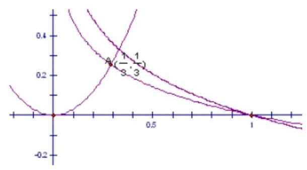
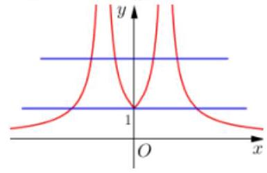
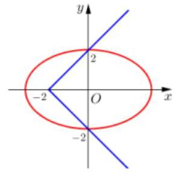
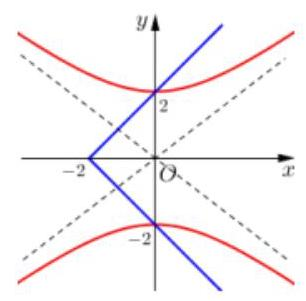
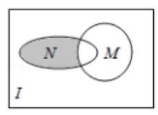
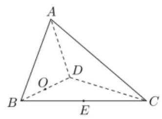
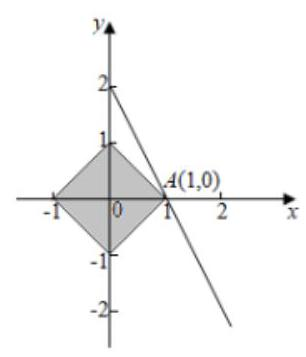
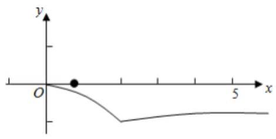

## 方程、不等式中恒成立问题和有解性问题

<table><tr><td>教学目标</td><td>1、掌握不等式的恒成立、能成立、恰成立的问题.   2、掌握不等式恒成立的的各种变形.   3、掌握方程中恒成立和存在性问题</td></tr><tr><td>重点</td><td>不等式恒成立问题</td></tr><tr><td>难 点</td><td>恒成立与存在性问题综合</td></tr></table>

## (一) 不等式中恒成立问题和存在性问题

## 知识梳理

在不等式的综合题中, 经常会遇到当一个结论对于某一个字母的某一个取值范围内所有值都成立的恒成立

## 问题和存在性问题.

不等式恒成立、存在性问题的常规处理方式:常应用函数方程思想和分离变量法转化为最值问题，也可抓住所给不等式的结构特征, 利用数形结合法.

方程恒成立、存在性问题处理方法和不等式差不多, 区别在于方程是转化为自变量函数的值域问题

## 一、不等式中基本类型:

类型一:一次函数类型(或者是单调性函数)一用一次函数的性质(注意主副元的转化)

对于一次函数 $f\left( x\right)  = {kx} + b, x \in  \left\lbrack  {m, n}\right\rbrack$ 有:

$f\left( x\right)  > 0$ 恒成立 $\Leftrightarrow  \left\{  {\begin{array}{l} f\left( m\right)  > 0 \\  f\left( n\right)  > 0 \end{array}, f\left( x\right)  < 0}\right.$ 恒成立 $\Leftrightarrow  \left\{  \begin{array}{l} f\left( m\right)  < 0 \\  f\left( n\right)  < 0 \end{array}\right.$

$x \in  \left( {m, n}\right) , f\left( x\right)  > 0$ 有解 $\Leftrightarrow  f\left( m\right) f\left( n\right)  < 0, f\left( x\right)  < 0$ 有解 $\Leftrightarrow  f\left( m\right) f\left( n\right)  < 0$

类型二: 二次函数类型一用二次函数的图像

设 $f\left( x\right)  = a{x}^{2} + {bx} + c\left( {a \neq  0}\right)$ ,

(1) $f\left( x\right)  > 0$ 在 $x \in  R$ 上恒成立 $\Leftrightarrow  a > 0$ 且 $\Delta  < 0$ ；

(2) $f\left( x\right)  < 0$ 在 $x \in  R$ 上恒成立 $\Leftrightarrow  a < 0$ 且 $\Delta  < 0$ .

(3) $f\left( x\right)  > 0$ 在 $x \in  R$ 上有解 $\Leftrightarrow  a > 0$ 或 $a < 0$ 且 $\Delta  > 0$ ；

(4) $f\left( x\right)  < 0$ 在 $x \in  R$ 上有解 $\Leftrightarrow  a < 0$ 或 $a > 0$ 且 $\Delta  > 0$

## 类型三: 其他函数恒成立和存在性问题

单变量处理方法:(1)利用函数最值

第一步:确定自变量和参量

第二步:参变分离(有些不能分离，进行第三步或第四步)

第三步:转化成自变量函数的最值

(2)数形结合

多变量处理方法:(转化成单变量问题)

(1)多变量能分离开:

1) 对于任意的 ${x}_{1} \in  \left\lbrack  {m, n}\right\rbrack  ,{x}_{2} \in  \left\lbrack  {a, b}\right\rbrack$ ,都有 $f\left( {x}_{1}\right)  \geq  g\left( {x}_{2}\right)  \Rightarrow  f{\left( {x}_{1}\right) }_{\min } \geq  f{\left( {x}_{2}\right) }_{\max }$

2) 对于任意的 ${x}_{1} \in  \left\lbrack  {m, n}\right\rbrack$ ,存在 ${x}_{2} \in  \left\lbrack  {a, b}\right\rbrack$ ,使得 $f\left( {x}_{1}\right)  \geq  g\left( {x}_{2}\right)  \Rightarrow  f{\left( {x}_{1}\right) }_{\min } \geq  f{\left( {x}_{2}\right) }_{\min }$

3) 对于存在 ${x}_{1} \in  \left\lbrack  {m, n}\right\rbrack  ,{x}_{2} \in  \left\lbrack  {a, b}\right\rbrack$ ,使得 $f\left( {x}_{1}\right)  \geq  g\left( {x}_{2}\right)  \Rightarrow  f{\left( {x}_{1}\right) }_{\max } \geq  f{\left( {x}_{2}\right) }_{\min }$

(2)多变量不能分开

1)把多变量看作成整体(如把 $\frac{x}{y},{xy},{2x} + y$ 等看成一个变量)

2)把其中一个看作是自变量另外的看成常量, 先去一个变量

## 例题精讲

【例 1】已知 $f\left( t\right)  = {\log }_{2}t, t \in  \left\lbrack  {\sqrt{2},8}\right\rbrack$ ,对于 $f\left( t\right)$ 值域内的所有实数 $m$ ,不等式 ${x}^{2} + {mx} + 4 > {2m} + {4x}$ 恒成立,求 $x$ 的范围.

【难度】 $\star   \star   \star   \star$

【答案】 $\left( {-\infty , - 1}\right)  \cup  \left( {2, + \infty }\right)$

【解析】解法一: 因为 $t \in  \left\lbrack  {\sqrt{2},8}\right\rbrack$ ,所以 $f\left( t\right)  \in  \left\lbrack  {\frac{1}{2},3}\right\rbrack$ ,即 $m \in  \left\lbrack  {\frac{1}{2},3}\right\rbrack$ ,

原不等式可化为 $m\left( {x - 2}\right)  + {\left( x - 2\right) }^{2} > 0$ 对任意的 $m \in  \left\lbrack  {\frac{1}{2},3}\right\rbrack$ 恒成立,

令 $g\left( m\right)  = \left( {x - 2}\right) m + {\left( x - 2\right) }^{2}$ ,则 $\left\{  \begin{array}{l} g\left( \frac{1}{2}\right)  > 0 \\  g\left( 3\right)  > 0 \end{array}\right.$ ,解得 $x > 2$ 或 $x <  - 1$ ,

即 $x \in  \left( {-\infty , - 1}\right)  \cup  \left( {2 + \infty }\right)$ .

【例 2】若关于 $x$ 的不等式 $\left| {{2}^{x} - m}\right|  - \frac{1}{{2}^{x}} < 0$ 在区间 $\lbrack 0,1)$ 内恒成立，则实数 $m$ 的范围___.

【难度】 $\star   \star   \star   \star$

【答案】 $\left\lbrack  {\frac{3}{2},2}\right)$

【例 3】若关于 $x$ 的不等式 $a\cos {2x} + \cos x \geq   - 1$ 恒成立，则实数 $a$ 的取值范围是___.

【难度】 $\star   \star   \star   \star$

【答案】 $\left\lbrack  {0,\frac{2 + \sqrt{2}}{4}}\right\rbrack$

【解析】解: 由 $a\cos {2x} + \cos x \geq   - 1$ 得 $a\left( {2{\cos }^{2}x - 1}\right)  + \cos x + 1 \geq  0$ ,

令 $\cos x = t, t \in  \left\lbrack  {-1,1}\right\rbrack$ ,

则原命题可转换为 $\left( {2{t}^{2} - 1}\right) a + t + 1 \geq  0$ 恒成立

则 ${2a}{t}^{2} + t + 1 - a \geq  0$ 恒成立,令 $f\left( t\right)  = {2a}{t}^{2} + t + 1 - a$

首先 $f\left( {-1}\right)  = {2a} - 1 + 1 - a = a \geq  0, f\left( 1\right)  = {2a} + 2 - a = a + 2 \geq  0$ ,得 $a \geq   - 2$ .

此时 $a \geq  0$ ,若 $\bigtriangleup  \leq  0$ ,得 $1 - 4 \times  {2a} \times  \left( {1 - a}\right)  \leq  0$ ,即 $8{a}^{2} - {8a} + 1 \leq  0$ 解得 $\frac{2 - \sqrt{2}}{4} \leq  a \leq  \frac{2 + \sqrt{2}}{4}$ ,

$\because a \geq  0,\frac{2 - \sqrt{2}}{4} \leq  a \leq  \frac{2 + \sqrt{2}}{4},\therefore \frac{2 - \sqrt{2}}{4} \leq  a \leq  \frac{2 + \sqrt{2}}{4}$ ,若判别式 $\Delta  > 0$ ,即 $a > \frac{2 + \sqrt{2}}{4}$ ,

此时函数的最小值为 $\frac{-4 \times  2{a}^{2} - 1}{4 \times  {2a}} = \frac{-1 - 8{a}^{2}}{8a} > 0$ 恒成立,此时不等式无解,

综上 $a$ 的范围是 $\left\lbrack  {\frac{2 - \sqrt{2}}{4},\frac{2 + \sqrt{2}}{4}}\right\rbrack$ ,故答案为: $\left\lbrack  {\frac{2 - \sqrt{2}}{4},\frac{2 + \sqrt{2}}{4}}\right\rbrack$

【例 4】( 1 )已知 $\left\{  {a}_{n}\right\}$ 是递增数列，对于任意的正整数 $n$ 均有 ${a}_{n} = {n}^{2} + {\lambda n}$ 恒成立，则实数 $\lambda$ 的取值范围是( )

A. $\lbrack  - 2, + \infty )$ B. $\left( {-3, + \infty }\right)$ C. $R$ D. $\varnothing$

【难度】★★★★

【答案】 $B$

【解析】解: $\because \left\{  {a}_{n}\right\}$ 是递增数列,对于任意的正整数 $n$ 均有 ${a}_{n} = {n}^{2} + {\lambda n}$ 恒成立,

$\therefore {a}_{n + 1} > {a}_{n},\therefore {\left( n + 1\right) }^{2} + \lambda \left( {n + 1}\right)  > {n}^{2} + {\lambda n}$ ,化为 $\lambda  >  - \left( {{2n} + 1}\right) ,\therefore \lambda  >  - 3$ .

则实数 $\lambda$ 的取值范围是 $\left( {-3, + \infty }\right)$ . 故选: $B$ .

(2)若不等式 ${\left( -2\right) }^{n}a - {3}^{n - 1} - {\left( -2\right) }^{n} < 0$ 对任意正整数 $n$ 恒成立，则实数 $a$ 的取值范围是( )

A. $\left( {1,\frac{4}{3}}\right)$ B. $\left( {\frac{1}{2},\frac{4}{3}}\right)$ C. $\left( {1,\frac{7}{4}}\right)$ D. $\left( {\frac{1}{2},\frac{7}{4}}\right)$

【难度】 $\bigstar \bigstar \bigstar$

【答案】 $D$

【解析】解: $n$ 为偶数时,不等式 ${\left( -2\right) }^{n}a - {3}^{n - 1} - {\left( -2\right) }^{n} < 0$ 可化为 $a > \frac{1}{3} \cdot  {\left( \frac{3}{2}\right) }^{n} + 1,\therefore a < \frac{7}{4}$ ;

$n$ 为奇数时,不等式 ${\left( -2\right) }^{n}a - {3}^{n - 1} - {\left( -2\right) }^{n} < 0$ 可化为 $a >  - \frac{1}{3} \cdot  {\left( \frac{3}{2}\right) }^{n} + 1,\therefore a > \frac{1}{2},\therefore \frac{1}{2} < a < \frac{7}{4}$ .

故选: $D$ .

(3)不等式 ${\left( -1\right) }^{n}a < 5 + \frac{{\left( -1\right) }^{n + 1}}{2n}$ 对于任意正整数 $n$ 恒成立，则实数 $a$ 的取值范围是___.

【难度】 $\star   \star   \star   \star$

【答案】 $- 5 \leq  a < \frac{19}{4}$

【解析】解: 当 $n$ 是奇数时,由题设 ${\left( -1\right) }^{n}a < 5 + \frac{{\left( -1\right) }^{n + 1}}{2n}$ 对于任意正整数 $n$ 恒成立,得对于任意正整数 $n$ 恒成立 $- a < 5 + \frac{1}{2n}$ 于任意正整数 $n$ 恒成立,解得 $- a \leq  5$ ,即 $a \geq   - 5$

当 $n$ 是偶数时, $a < 5 - \frac{1}{2n}$ 对于任意正整数 $n$ 恒成立,故 $a < 5 - \frac{1}{4} = \frac{19}{4}$

实数 $a$ 的取值范围是 $- 5 \leq  a < \frac{19}{4}$

故答案为 $- 5 \leq  a < \frac{19}{4}$

【例 5】( 1 )已知函数 $f\left( x\right)  = {ax} - \sqrt{{4x} - {x}^{2}}, x \in  (0,4\rbrack$ 时 $f\left( x\right)  < 0$ 恒成立,求实数 $a$ 的取值范围。

【难度】 $\star   \star   \star   \star$

【答案】 $\left( {-\infty ,0}\right)$

【解析】将问题转化为 $a < \frac{\sqrt{{4x} - {x}^{2}}}{x}$ 对 $x \in  (0,4\rbrack$ 恒成立。

令 $g\left( x\right)  = \frac{\sqrt{{4x} - {x}^{2}}}{x}$ ,则 $a < g{\left( x\right) }_{\min }$

由 $g\left( x\right)  = \frac{\sqrt{{4x} - {x}^{2}}}{x} = \sqrt{\frac{4}{x} - 1}$ 可知 $g\left( x\right)$ 在 $(0,4\rbrack$ 上为减函数,故 $g{\left( x\right) }_{\min } = g\left( 4\right)  = 0$

$\therefore a < 0$ 即 $a$ 的取值范围为 $\left( {-\infty ,0}\right)$ 。

注:分离参数后，方向明确，思路清晰能使问题顺利得到解决。

(2)若不等式 $3{x}^{2} - {\log }_{a}x < 0$ 在 $x \in  \left( {0,\frac{1}{3}}\right)$ 内恒成立，求实数 $a$ 的取值范围.

【难度】 $\star   \star   \star   \star$

【答案】 $\frac{1}{27} \leq  a < 1$

【例 6】已知函数 $f\left( x\right)  = a{x}^{2} + {4x} + 1$ ,若对此任意 $x \in  R$ ,都有 $f\left( {f\left( x\right) }\right)  \geq  0$ 恒成立,则实数 $a$ 的取值范围为___.

【难度】 $\star   \star   \star   \star   \star$

【答案】 $\lbrack 3, + \infty )$

【解析】解: 当 $a = 0$ 时,函数 $f\left( x\right)  = {4x} + 1, f\left\lbrack  {f\left( x\right) }\right\rbrack   = {16x} + 5$ ,

不满足对任意 $x \in  R, f\left\lbrack  {f\left( x\right) }\right\rbrack   \geq  0$ 恒成立,当 $a > 0$ 时, $f\left( x\right)  \geq  f\left( {-\frac{2}{a}}\right)  = 1 - \frac{4}{a} > 0$

$f\left\lbrack  {f\left( x\right) }\right\rbrack   \geq  f\left( {1 - \frac{4}{a}}\right)  = a{\left( 1 - \frac{4}{a}\right) }^{2} + 4\left( {1 - \frac{4}{a}}\right)  + 1 = a - 3 \geq  0$ ,解得 $a \geq  3$ ,

当 $a < 0$ 时, $f\left( x\right)  \leq  1 - \frac{4}{a}$ ,不满足对任意 $x \in  R, f\left\lbrack  {f\left( x\right) }\right\rbrack   \geq  0$ 恒成立,综上可得: $a \geq  3$ . 故答案为: $\lbrack 3, + \infty )$ .

【例 7】已知定义在 $R$ 上的奇函数 $f\left( x\right)$ 满足 $f\left( {x + 2}\right)  =  - f\left( x\right)$ ,且当 $0 \leq  x \leq  1$ 时, $f\left( x\right)  = {\log }_{2}\left( {x + a}\right)$ ; 若对于任意 $x \in  \left\lbrack  {0,1}\right\rbrack$ ，都有 $f\left( {-{x}^{2} + {tx} + \frac{1}{2}}\right)  \geq  1 - {\log }_{2}3$ ，则实数 $t$ 的取值范围是___

【难度】

【答案】 $\left\lbrack  {0,3}\right\rbrack$

【解析】由题意, $f\left( x\right)$ 为周期为 4 的函数,且是奇函数. 0 在函数定义域内,故 $f\left( 0\right)  = 0$ ,得 $a = 1$ ,

所以当 $0 \leq  x \leq  1$ 时, $f\left( x\right)  = {\log }_{2}\left( {x + 1}\right)$ ,

当 $x \in  \left\lbrack  {-1,0}\right\rbrack$ 时, $- x \in  \left\lbrack  {0,1}\right\rbrack$ ,此时 $f\left( x\right)  =  - f\left( {-x}\right)  =  - {\log }_{2}\left( {-x + 1}\right)$ ,

又知道 $f\left( {x + 2}\right)  =  - f\left( x\right)  = f\left( {-x}\right)$ ,

所以 $f\left( x\right)$ 以 $x = 1$ 为对称轴. 且当 $x \in  \left\lbrack  {-1,1}\right\rbrack$ 时 $f\left( x\right)$ 单调递增,

当 $x \in  \left\lbrack  {1,3}\right\rbrack$ 时 $f\left( x\right)$ 单调递减.

当 $x \in  \left\lbrack  {-1,3}\right\rbrack$ 时,令 $f\left( x\right)  = 1 - {\log }_{2}3$ ,得 $x =  - \frac{1}{2}$ ,或 $x = \frac{5}{2}$ ,

所以在 $\left\lbrack  {-1,3}\right\rbrack$ 内当 $f\left( x\right)  > 1 - {\log }_{2}3$ 时, $x \in  \left\lbrack  {-\frac{1}{2},\frac{5}{2}}\right\rbrack$ .

设 $g\left( x\right)  =  - {x}^{2} + {tx} + \frac{1}{2}$ ,若对于 $x$ 属于 $\left\lbrack  {0,1}\right\rbrack$ 都有 $f\left( {-{x}^{2} + {tx} + \frac{1}{2}}\right)  \geq  1 - {\log }_{2}3$ ,

因为 $g\left( 0\right)  = \frac{1}{2} \in  \left\lbrack  {-\frac{1}{2},\frac{5}{2}}\right\rbrack$ . 故 $g\left( x\right)  \in  \left\lbrack  {-\frac{1}{2},\frac{5}{2}}\right\rbrack$ .

① 当 $\frac{t}{2} < 0$ 时， $g\left( x\right)$ 在 $\left\lbrack  {0,1}\right\rbrack$ 上单调递减，

故 $g\left( x\right)  \in  \left\lbrack  {t - \frac{1}{2},\frac{1}{2}}\right\rbrack   \subseteq  \left\lbrack  {-\frac{1}{2},\frac{5}{2}}\right\rbrack$ . 得 $t \geq  0$ ,无解.

② $0 \leq  t \leq  1$ 时， $0 \leq  \frac{t}{2} \leq  \frac{1}{2}$ ，此时 $g\left( t\right)$ 最大， $g\left( 1\right)$ 最小，

即 $g\left( x\right)  \in  \left\lbrack  {t - 1,\frac{{t}^{2}}{4} + \frac{1}{2}}\right\rbrack   \subseteq  \left\lbrack  {-\frac{1}{2},\frac{5}{2}}\right\rbrack$ . 得 $t \in  \left\lbrack  {0,1}\right\rbrack$ .

③ 当 $1 < t \leq  2$ 时，即 $\frac{1}{2} < \frac{t}{2} \leq  2$ ，此时 $g\left( 0\right)$ 最小， $g\left( t\right)$ 最大，

即 $g\left( x\right)  \in  \left\lbrack  {\frac{1}{2},\frac{{t}^{2}}{4} + \frac{1}{2}}\right\rbrack   \subseteq  \left\lbrack  {-\frac{1}{2},\frac{5}{2}}\right\rbrack$ . 得 $t \in  (1,2\rbrack$ ,

④ 当 $t > 2$ 时， $g\left( x\right)$ 在 $\left\lbrack  {0,1}\right\rbrack$ 上单调递增，

故 $g\left( x\right)  \in  \left\lbrack  {\frac{1}{2}, t - \frac{1}{2}}\right\rbrack   \subseteq  \left\lbrack  {-\frac{1}{2},\frac{5}{2}}\right\rbrack$ . 解得， $t \in  (2,3\rbrack$ ，

综上 $t \in  \left\lbrack  {0,3}\right\rbrack$ .

【例 8】( 1 )已知二次函数 $f\left( x\right)  = a{x}^{2} + {2x} + a$ ，对于满足 ${x}_{1} < {x}_{2}$ 且 ${x}_{1} + {x}_{2} = 1 - a$ 的任意实数 ${x}_{1}$ 与 ${x}_{2}$ ，总有 $f\left( {x}_{1}\right)  < f\left( {x}_{2}\right)$ 成立，则实数 $a$ 的取值范围为___.

【难度】 $\star   \star   \star   \star$

【答案】 $\left( {-1,0}\right)  \cup  \left( {0,2}\right)$

(2)已知 $f\left( x\right)  = \left| \begin{matrix} {ax} & x \\   - 2 & {2x} \end{matrix}\right| \left( {a\text{ 为常数 }}\right)$ ， $g\left( x\right)  = \frac{2{x}^{2} + 1}{x}$ ，且当 ${x}_{1},{x}_{2} \in  \left\lbrack  {1,4}\right\rbrack$ 时，总有 $f\left( {x}_{1}\right)  \leq  g\left( {x}_{2}\right)$ ，则实数 $a$ 的取值范围是___.

【难度】 $\star   \star   \star   \star$

【答案】 $\left( {-\infty , - \frac{1}{6}}\right\rbrack$

(3)若不等式 ${x}^{2} - 2{y}^{2} \leq  {cx}\left( {y - x}\right)$ 对满足 $x > y > 0$ 的任意实数 $x\text{ 、 }y$ 恒成立，则实数 $c$ 的最大值为___.

【难度】 $\star   \star   \star   \star$

【答案】 $2\sqrt{2} - 4$

( 4 ) 已知函数 $f\left( x\right)  = x\left| {x - a}\right|$ ,若对于任意的, ${x}_{1} \in  \left\lbrack  {2,3}\right\rbrack  ,{x}_{2} \in  \left\lbrack  {2,3}\right\rbrack  ,{x}_{1} \neq  {x}_{2}$ 恒有 $f\left( \frac{{x}_{1} + {x}_{2}}{2}\right)  > \frac{f\left( {x}_{1}\right)  + f\left( {x}_{2}\right) }{2}$ ，则实数 $a$ 的取值范围是___.

【难度】 $\star   \star   \star   \star$

【答案】 $\lbrack 3, + \infty )$

(5)已知对任意的 $x \in  \left( {-\infty ,0}\right)  \cup  \left( {0, + \infty }\right) , y \in  \left\lbrack  {-1,1}\right\rbrack$ ，不等式 ${x}^{2} + \frac{16}{{x}^{2}} - {2xy} - \frac{8}{x}\sqrt{1 - {y}^{2}} - a \geq  0$ 恒成立，则实数 $a$ 的取值范围为___.

【难度】

【答案】 $\left( {-\infty ,8 - 4\sqrt{2}}\right\rbrack$

【例 9】( 1 )若存在正数 $x$ 使 ${2}^{x}\left( {x - a}\right)  < 1$ 成立，则 $a$ 的取值范围是( )

A. $\left( {-\infty , + \infty }\right)$ B. $\left( {-2, + \infty }\right)$ C. $\left( {0, + \infty }\right)$ D. $\left( {-1, + \infty }\right)$

【难度】 $\star   \star   \star   \star$

【答案】 $D$

【解析】解: 因为 ${2}^{x}\left( {x - a}\right)  < 1$ ,所以 $a > x - \frac{1}{{2}^{x}}$ ,函数 $y = x - \frac{1}{{2}^{x}}$ 是增函数, $x > 0$ ,所以 $y >  - 1$ ,即 $a >  - 1$ , 所以 $a$ 的取值范围是 $\left( {-1, + \infty }\right)$ . 故选: $D$ .

(2)已知 $f\left( x\right)  = m\left( {x - {2m}}\right) \left( {x + m + 3}\right) , g\left( x\right)  = {2}^{x} - 2$ ，若同时满足条件:

①对于任意 $x \in  R$ ， $f\left( x\right)  < 0$ 或 $g\left( x\right)  < 0$ 成立；

②存在 $x \in  \left( {-\infty , - 4}\right)$ ,使得 $f\left( x\right)  \cdot  g\left( x\right)  < 0$ 成立。

则 $m$ 的取值范围是___.

【难度】 $\star   \star   \star   \star$

【答案】(-4,-2)

【例 10】已知函数 $f\left( x\right)  = {x}^{2} - {5x} + 7$ . 若对于任意的正整数 $n$ ,在区间 $\left\lbrack  {1, n + \frac{5}{n}}\right\rbrack$ 上存在 $m + 1$ 个实数 ${a}_{0},{a}_{1},{a}_{2},\cdots ,{a}_{m}$ 使得 $f\left( {a}_{0}\right)  > f\left( {a}_{1}\right)  + f\left( {a}_{2}\right)  + \cdots  + f\left( {a}_{m}\right)$ 成立，则 $m$ 的最大值为___.

【难度】

【答案】 6

【解析】因为 ${\left( n + \frac{5}{n}\right) }_{\min } = \frac{9}{2},\therefore$ 在区间 $\left\lbrack  {1,\frac{9}{2}}\right\rbrack$ 上最大值为 $f\left( \frac{9}{2}\right)  = \frac{19}{4}$ ,最小值为 $f\left( \frac{5}{2}\right)  = \frac{3}{4}$ , $\frac{19}{4} \div  \frac{3}{4} = 6\cdots \cdots \frac{1}{4}$ ,即 $m$ 的最大值为 6 .

## 巩固训练

1、已知等比数列 $\left\{  {a}_{n}\right\}$ 的首项为 2,公比为 $- \frac{1}{3}$ ,其前 $n$ 项和记为 ${S}_{n}$ ,若对任意的 $n \in  {\mathbf{N}}^{ * }$ ,均有 $A \leq  3{S}_{n} - \frac{1}{{S}_{n}} \leq  B$ 恒成立，则 $B - A$ 的最小值为( )

A. $\frac{7}{2}$ B. $\frac{9}{4}$ C. $\frac{11}{4}$ D. $\frac{13}{6}$

【难度】★★★★

【答案】 $B$

2、如果以一切正实数 $x, y$ ，不等式 $\frac{y}{4} - {\cos }^{2}x \geq  a\sin x - \frac{9}{y}$ 恒成立，则实数 $a$ 的取值范围是( )

A. $\left( {-\infty ,\frac{4}{3}}\right\rbrack$ B. $\lbrack 3, + \infty )$ C. $\left\lbrack  {-2\sqrt{2},2\sqrt{2}}\right\rbrack$ ; D. $\left\lbrack  {-3,3}\right\rbrack$

【难度】 $\star   \star   \star   \star$

【答案】D

3、(1)若存在 $b \in  \left\lbrack  {1,2}\right\rbrack$ ，使得 ${2}^{b}\left( {b + a}\right)  \geq  4$ ，则实数 $a$ 的取值范围是___.

(2)若存在 $x \in  R$ ，使得 $\left| {x - a}\right|  + \left| {x + 1}\right|  < 2$ 成立，则 $a$ 的取值范围是___.

(3)已知不等式 $\left| {x - 4}\right|  + \left| {x - 3}\right|  < a$ 在实数集 $R$ 上的解集不是空集，求实数 $a$ 的取值范围___.

(4)若存在 $x \in  \left\lbrack  {1,2}\right\rbrack$ ，使得 $\left| {x - a}\right|  \geq  1$ 成立，则实数 $a$ 的取值范围是___.

【难度】 $\star   \star   \star   \star$

(4) $\left( {-\infty ,1\rbrack \cup \lbrack 2, + \infty }\right)$

4、设定义在 $D$ 上的两个函数 $f\left( x\right) \text{ 、 }g\left( x\right)$ ，其值域依次是 $\left\lbrack  {a, b}\right\rbrack$ 和 $\left\lbrack  {c, d}\right\rbrack$ ，有下列4个命题:

① “ $a > d$ ” 是 “ $f\left( {x}_{1}\right)  > g\left( {x}_{2}\right)$ 对任意 ${x}_{1}$ 、 ${x}_{2} \in  D$ 恒成立”的充要条件；

② “ $a > d$ ” 是 “ $f\left( {x}_{1}\right)  > g\left( {x}_{2}\right)$ 对任意 ${x}_{1}$ 、 ${x}_{2} \in  D$ 恒成立”的充分不必要条件；

③ “ $a > d$ ” 是 “ $f\left( x\right)  > g\left( x\right)$ 对任意 $x \in  D$ 恒成立”的充要条件;

④ “ $a > d$ ” 是 “ $f\left( x\right)  > g\left( x\right)$ 对任意 $x \in  D$ 恒成立”的充分不必要条件.

其中正确的命题是___(请写出所有正确命题的序号).

【难度】 $\star   \star   \star   \star$

【答案】①④

5、(1)不等式 $\left( {x + 1}\right) \left( {{x}^{2} - {4x} + 3}\right)  > 0$ 有多种解法，其中有一种方法如下，在同一直角坐标系中作出 ${y}_{1} = x + 1$ 和 ${y}_{2} = {x}^{2} - {4x} + 3$ 的图像然后进行求解,请类比求解以下问题:

设 $a, b \in  Z$ ,若对任意 $x \leq  0$ ，都有 $\left( {{ax} + 2}\right) \left( {{x}^{2} + {2b}}\right)  \leq  0$ ，则 $a + b =$ ___.

【难度】 $\star   \star   \star   \star$

【答案】-1

(2)已知:当 $x > 0$ 时，不等式 $\frac{1}{1 + x} \geq  {kx} + b$ 恒成立，当且仅当 $x = \frac{1}{3}$ 时取等号，则 $k =$ ___.

【难度】 $\star   \star   \star   \star$

【答案】 $- \frac{9}{16}$

(3)若函数 $f\left( x\right)$ 是定义在 $R$ 上的奇函数，当 $x \geq  0$ 时 $f\left( x\right)  = \frac{1}{2}\left( {\left| {x - {a}^{2}}\right|  + \left| {x - 2{a}^{2}}\right|  - 3{a}^{2}}\right)$ ，若对任意的 $x \in  R$ ， $f\left( {x - 1}\right)  \leq  f\left( x\right)$ ，则实数 $a$ 的取值范围是___.

【难度】 $\star   \star   \star   \star$

【答案】 $- \frac{\sqrt{6}}{6} \leq  a \leq  \frac{\sqrt{6}}{6}$

6、数列 $\left\{  {a}_{n}\right\}$ 与 $\left\{  {b}_{n}\right\}$ 满足 ${a}_{1} = a,{b}_{n} = {a}_{n + 1} - {a}_{n},{S}_{n}$ 是数列 $\left\{  {a}_{n}\right\}$ 的前 $n$ 项和 $\left( {n \in  {\mathrm{N}}^{ * }}\right)$ .

(1)设数列 $\left\{  {b}_{n}\right\}$ 是首项和公比都为 $- \frac{1}{3}$ 的等比数列，且数列 $\left\{  {a}_{n}\right\}$ 也是等比数列，求 $a$ 的值；

(2)设 ${b}_{n + 1} - {b}_{n} = {2}^{n} - 1$ ，若 $a = 3$ 且 ${a}_{n} \geq  {a}_{4}$ 对 $n \in  {\mathrm{N}}^{ * }$ 恒成立，求 ${a}_{2}$ 的取值范围；

(3)设 $a = 4$ ， ${b}_{n} = 2$ ， ${C}_{n} = \frac{{S}_{n} + {2\lambda }}{{2}^{n}}\left( {n \in  {\mathrm{N}}^{ * }\text{ ， }\lambda  \geq   - 2}\right)$ ，若存在整数 $k$ ， $l$ ，且 $k > l > 1$ ，使得 ${C}_{k} = {C}_{l}$ 成立,求 $\lambda$ 的所有可能值.

【难度】 $\star   \star   \star   \star   \star$

【答案】见解析

【解析】(1) 由条件得 ${b}_{n} = {\left( -\frac{1}{3}\right) }^{n}, n \in  {\mathrm{N}}^{ * }$ ,即 ${a}_{n + 1} - {a}_{n} = {\left( -\frac{1}{3}\right) }^{n}$ ,

则 ${a}_{2} - {a}_{1} =  - \frac{1}{3},{a}_{3} - {a}_{2} = {\left( -\frac{1}{3}\right) }^{2} = \frac{1}{9}$ ,设等比数列 $\left\{  {a}_{n}\right\}$ 的公比为 $q$ ,

则 $q = \frac{{a}_{3} - {a}_{2}}{{a}_{2} - {a}_{1}} =  - \frac{1}{3}$ ,又 $a\left( {q - 1}\right)  =  - \frac{1}{3}$ ,则 $a = \frac{1}{4}$ .

当 $a = \frac{1}{4}, q =  - \frac{1}{3}$ 时, ${a}_{n} = \frac{1}{4}{\left( -\frac{1}{3}\right) }^{n - 1}, n \in  {\mathrm{N}}^{ * }$ ,

则 ${a}_{n + 1} - {a}_{n} = \frac{1}{4}{\left( -\frac{1}{3}\right) }^{n} - \frac{1}{4}{\left( -\frac{1}{3}\right) }^{n - 1} = {\left( -\frac{1}{3}\right) }^{n}\left\lbrack  {\frac{1}{4} - \frac{1}{4} \times  {\left( -\frac{1}{3}\right) }^{-1}}\right\rbrack   = {\left( -\frac{1}{3}\right) }^{n}$ 满足题意,

故所求的 $a$ 的值为 $\frac{1}{4}$ .

(2)当 $n \geq  2$ 时， ${b}_{n} - {b}_{n - 1} = {2}^{n - 1} - 1$ ， ${b}_{n - 1} - {b}_{n - 2} = {2}^{n - 2} - 1$ ， $\cdots$ ， ${b}_{2} - {b}_{1} = 2 - 1$ ，

以上 $n - 1$ 个式子相加得, ${b}_{n} - {b}_{1} = {2}^{n - 1} + {2}^{n - 2} + {2}^{n - 3} + \cdots  + 2 - \left( {n - 1}\right)$ ,

又 ${b}_{1} = {a}_{2} - {a}_{1} = {a}_{2} - 3$ ,则 ${b}_{n} = \frac{2\left( {1 - {2}^{n - 1}}\right) }{1 - 2} - \left( {n - 1}\right)  + {a}_{2} - 3 = {2}^{n} - n + {a}_{2} - 4$ ,

即 ${b}_{n} = {2}^{n} - n + {a}_{2} - 4$ . 由 ${b}_{n + 1} - {b}_{n} = {2}^{n} - 1 > 0$ 知数列 $\left\{  {b}_{n}\right\}$ 是递增数列,

又 ${b}_{n} = {a}_{n + 1} - {a}_{n}$ ,要使得 ${a}_{n} \geq  {a}_{4}$ 对 $n \in  {\mathrm{N}}^{ * }$ 恒成立,

则只需 $\left\{  \begin{array}{l} {b}_{3} = {a}_{4} - {a}_{3} \leq  0 \\  {b}_{4} = {a}_{5} - {a}_{4} \geq  0 \end{array}\right.$ ,即 $\left\{  \begin{array}{l} {b}_{3} = 1 + {a}_{2} \leq  0 \\  {b}_{4} = 8 + {a}_{2} \geq  0 \end{array}\right.$ ,则 $- 8 \leq  {a}_{2} \leq   - 1$ .

(3)由条件得数列 $\left\{  {a}_{n}\right\}$ 是以 4 为首项，2 为公差的等差数列，

则 ${a}_{n} = 4 + 2\left( {n - 1}\right)  = {2n} + 2,{S}_{n} = \frac{n\left( {4 + {2n} + 2}\right) }{2} = {n}^{2} + {3n}$ ,

则 ${C}_{n} = \frac{{S}_{n} + {2\lambda }}{{2}^{n}} = \frac{{n}^{2} + {3n} + {2\lambda }}{{2}^{n}}$ .

则 ${C}_{n + 1} - {C}_{n} = \frac{{\left( n + 1\right) }^{2} + 3\left( {n + 1}\right)  + {2\lambda }}{{2}^{n + 1}} - \frac{{n}^{2} + {3n} + {2\lambda }}{{2}^{n}} = \frac{-{n}^{2} - n + 4 - {2\lambda }}{{2}^{n - 1}}$ ,

当 $n \geq  3$ 时, $- {n}^{2} - n + 4 - {2\lambda } \leq   - {3}^{2} - 3 + 4 - {2\lambda } =  - 8 - {2\lambda } \leq   - 8 - 2 \times  \left( {-2}\right)  =  - 4 < 0$ ,

即 $n \geq  3$ 时, ${C}_{n + 1} < {C}_{n}$ ,

则当 $k > l \geq  3$ 时, ${C}_{k} < {C}_{l}$ 与 ${C}_{k} = {C}_{l}$ 矛盾.

又 $l > 1$ ,即 $l = 2$ 时, $\frac{{k}^{2} + {3k} + {2\lambda }}{{2}^{k}} = \frac{5 + \lambda }{2}$ .

当 $k \geq  5$ 时, $\frac{{k}^{2} + {3k} + {2\lambda }}{{2}^{k}} \leq  \frac{{5}^{2} + 3 \times  5 + {2\lambda }}{{2}^{5}} = \frac{{20} + \lambda }{16}$ ,

又 $\frac{{20} + \lambda }{16} - \frac{5 + \lambda }{2} = \frac{-{20} - {7\lambda }}{16} \leq  \frac{-{20} - 7 \times  \left( {-2}\right) }{16} =  - \frac{3}{8} < 0$ ,

即当 $k \geq  5, l = 2$ 时, $\frac{{k}^{2} + {3k} + {2\lambda }}{{2}^{k}} < \frac{5 + \lambda }{2}$ ,与 $\frac{{k}^{2} + {3k} + {2\lambda }}{{2}^{k}} = \frac{5 + \lambda }{2}$ 矛盾.

又 $k > l \geq  2$ ,则 $k = 3$ 或 4,

当 $k = 3$ 时, $\frac{{k}^{2} + {3k} + {2\lambda }}{{2}^{k}} = \frac{{3}^{2} + 3 \times  3 + {2\lambda }}{{2}^{3}} = \frac{5 + \lambda }{2}$ ,解得 $\lambda  =  - 1$ ;

当 $k = 4$ 时, $\frac{{k}^{2} + {3k} + {2\lambda }}{{2}^{k}} = \frac{{4}^{2} + 3 \times  4 + {2\lambda }}{{2}^{4}} = \frac{5 + \lambda }{2}$ ,解得 $\lambda  =  - 2$ .

综上得 $\lambda$ 的所有可能值为 -1 和 -2 .

(二) 方程中恒成立问题和存在性问题

## 知识梳理

## 方程中基本类型:

单变量处理方法:(1)利用函数值域

第一步:确定自变量和参量

第二步:参变分离(有些不能分离，进行第三步或第四步)

第三步:转化成自变量函数的值域(当要求存在几个解问题时一般采用数形结合)

(2)数形结合

多变量处理方法:(转化成单变量问题)

(1)多变量能分离开:

1) 对于任意的 ${x}_{1} \in  \left\lbrack  {m, n}\right\rbrack  ,{x}_{2} \in  \left\lbrack  {a, b}\right\rbrack$ ,都有 $f\left( {x}_{1}\right)  = g\left( {x}_{2}\right)  \Rightarrow  f\left( {x}_{1}\right)  = f\left( {x}_{2}\right)  =$ 常值

2) 对于任意的 ${x}_{1} \in  \left\lbrack  {m, n}\right\rbrack$ ,存在 ${x}_{2} \in  \left\lbrack  {a, b}\right\rbrack$ ,使得 $f\left( {x}_{1}\right)  = g\left( {x}_{2}\right)$

$$
\Rightarrow  \left\{  {f\left( {x}_{1}\right)  \mid  {x}_{1} \in  \left\lbrack  {m, n}\right\rbrack  }\right\}   \subseteq  \left\{  {f\left( {x}_{2}\right)  \mid  {x}_{2} \in  \left\lbrack  {a, b}\right\rbrack  }\right\}
$$

3) 对于存在 ${x}_{1} \in  \left\lbrack  {m, n}\right\rbrack  ,{x}_{2} \in  \left\lbrack  {a, b}\right\rbrack$ ,使得 $f\left( {x}_{1}\right)  = g\left( {x}_{2}\right)$

$$
\Rightarrow  \left\{  {f\left( {x}_{1}\right)  \mid  {x}_{1} \in  \left\lbrack  {m, n}\right\rbrack  }\right\}   \cap  \left\{  {f\left( {x}_{2}\right)  \mid  {x}_{2} \in  \left\lbrack  {a, b}\right\rbrack  }\right\}   \neq  \phi
$$

(2)多变量不能分开

1)把多变量看作成整体(如把 $\frac{x}{y},{xy},{2x} + y$ 等看成一个变量)

2)把其中一个看作是自变量另外的看成常量, 先去一个变量

## 例题精讲

【例11】(1) 对于函数 $y = {f}_{1}\left( x\right) , y = {f}_{2}\left( x\right) , y = h\left( x\right)$ ,如果存在实数 $a, b$ 使得 $h\left( x\right)  = a \cdot  {f}_{1}\left( x\right)  + b \cdot  {f}_{2}\left( x\right)$ , 那么称 $y = h\left( x\right)$ 为 $y = {f}_{1}\left( x\right) , y = {f}_{2}\left( x\right)$ 的生成函数.

若 ${f}_{1}\left( x\right)  = {x}^{2} - x,{f}_{2}\left( x\right)  = {x}^{2} + x + 1, h\left( x\right)  = {x}^{2} - x + 1, y = h\left( x\right)$ 是否为 $y = {f}_{1}\left( x\right) , y = {f}_{2}\left( x\right)$ 的生成函数? 说明理由;

【难度】 $\star   \star   \star   \star$

【解析】根据生成函数的定义,设存在 $a, b$ 使得 $h\left( x\right)  = a \cdot  {f}_{1}\left( x\right)  + b \cdot  {f}_{2}\left( x\right)$ ,则 ${x}^{2} - x + 1 = a\left( {{x}^{2} - x}\right)  + b\left( {{x}^{2} + x + 1}\right) \; = \left( {a + b}\right) {x}^{2} + \left( {b - a}\right) x + b$ ,

对比两边的系数可知, $\left\{  \begin{array}{l} a + b = 1 \\  b - a =  - 1 \\  b = 1 \end{array}\right.$ ,方程无解,

所以, $y = h\left( x\right)$ 不是 $y = {f}_{1}\left( x\right) , y = {f}_{2}\left( x\right)$ 的生成函数

(2)当 $m$ 在变化时求直线 $y =  - \frac{m + 1}{2}x + m$ 的恒过点为___.

【难度】 $\star   \star   \star   \star$

【答案】 $\left( {2, - 1}\right)$

(3)当实数 $x\text{ 、 }y$ 满足 ${x}^{2} + {y}^{2} = 1$ 时, $\left| {x + {2y} + a}\right|  + \left| {3 - x - {2y}}\right|$ 的取值与 $x\text{ 、 }y$ 均无关，则实数 $a$ 的取值范围是___

【难度】 $\star   \star   \star   \star$

【答案】 $\lbrack \sqrt{5}, + \infty )$

(4)已知椭圆 $C : 9{x}^{2} + {y}^{2} = {m}^{2}\left( {m > 0}\right)$ ，直线 $l$ 不过原点 $O$ 且不平行于坐标轴， $l$ 与 $C$ 有两个交点 $A$ ， $B$ ， 线段 ${AB}$ 的中点为 $M$ . 证明: 直线 ${OM}$ 的斜率与 $l$ 的斜率的乘积为定值;

【难度】 $\star   \star   \star   \star$

【答案】 -9

【例 12】( 1 )如果关于 $x$ 的方程 ${\left( {2}^{-\left| x\right| } - 2\right) }^{2} - a - 2 = 0$ 有实数根，那么实数 $a$ 的取值范围是___. 【难度】 $\star   \star   \star   \star$

【答案】 $\lbrack  - 1,2)$

(2)设 $f\left( x\right)  = {3ax} - {2a} + 1, a$ 为常数，若存在 ${x}_{0} \in  \left( {0,1}\right)$ ，使得 $f\left( {x}_{0}\right)  = 0$ ，则实数 $a$ 的取值范围是___.

【难度】 $\star   \star   \star   \star$

【答案】 $\left( {-\infty , - 1}\right)  \cup  \left( {\frac{1}{2}, + \infty }\right)$

(3)关于 $x$ 的方程 ${a}^{2x} + \left( {1 + \lg m}\right) {a}^{x} + 1 = 0$ ( $a > 0$ ，且 $a \neq  1$ )有解，则 $m$ 的取值范围是___.

【难度】 $\star   \star   \star   \star$

【答案】 $0 < m \leq  {10}^{-3}$

【例 13】已知函数 $f\left( x\right)  = {x}^{2},\left( {x \in  \left\lbrack  {-2,2}\right\rbrack  }\right) , g\left( x\right)  = {a}^{2}\sin \left( {{2x} + \frac{\pi }{6}}\right)  + {3a}, x \in  \left\lbrack  {0,\frac{\pi }{2}}\right\rbrack$ ,任意 ${x}_{1} \in  \left\lbrack  {-2,2}\right\rbrack$ , 总存在 ${x}_{0} \in  \left\lbrack  {0,\frac{\pi }{2}}\right\rbrack$ ,使得 $g\left( {x}_{0}\right)  = f\left( {x}_{1}\right)$ 成立,则实数 $a$ 的取值范围是___.

【难度】 $\star   \star   \star   \star$

【答案】 $\left( {-\infty , - 4\rbrack \cup \lbrack 6, + \infty }\right)$

【例 14】(1)已知数列 $\left\{  {a}_{n}\right\}$ 满足:① ${a}_{1} = 0$ ；②对任意的 $n \in  {\mathbf{N}}^{ * }$ ，都有 ${a}_{n + 1} > {a}_{n}$ 成立. 函数

${f}_{n}\left( x\right)  = \left| {\sin \frac{1}{n}\left( {x - {a}_{n}}\right) }\right| , x \in  \left\lbrack  {{a}_{n},{a}_{n + 1}}\right\rbrack$ 满足: 对于任意的实数 $m \in  \lbrack 0,1),{f}_{n}\left( x\right)  = m$ 总有两个不同的根，则 $\left\{  {a}_{n}\right\}$ 的通项公式是___

【难度】 $\star   \star   \star   \star$

【答案】 ${a}_{n} = \frac{n\left( {n - 1}\right) }{2}\pi$

( 2 )已知函数 $f\left( x\right)  = \left| \frac{1}{\left| x\right|  - 1}\right|$ ，关于 $x$ 的方程 ${f}^{2}\left( x\right)  + {bf}\left( x\right)  + c = 0$ 有 7 个不同实数根，则实数 $b\text{ 、 }c$ 满足的关系式是___

【难度】★★★★

【答案】 $\left\{  \begin{array}{l} b + c =  - 1 \\  c > 1 \end{array}\right.$ 或 $\left\{  \begin{array}{l} b + c =  - 1 \\  b <  - 2 \end{array}\right.$

【解析】数形结合,函数 $f\left( x\right)  = \left| \frac{1}{\left| x\right|  - 1}\right|$ 图像如图,根据题意,要有 7 个不同实数根,需满足 $f\left( x\right)  = 1$ 或

$f\left( x\right)  > 1$ ,设 $f\left( x\right)  = t$ ,即方程 ${t}^{2} + {bt} + c = 0$ 有两个不同解 ${t}_{1} = 1$ 和 ${t}_{2} > 1$ , 将 ${t}_{1} = 1$ 代入可得 $b + c =  - 1$ ,两根之积 $c > 1$ ,两根之和 $- b > 2 \Rightarrow  b <  - 2$ ,

$\therefore$ 实数 $b\text{ 、 }c$ 满足的关系式为 $\left\{  \begin{array}{l} b + c =  - 1 \\  c > 1 \end{array}\right.$ 或 $\left\{  \begin{array}{l} b + c =  - 1 \\  b <  - 2 \end{array}\right.$

【例 15】已知 $\tan \alpha  \cdot  \tan \beta  = \tan \left( {\alpha  + \beta }\right)$ ,有下列两个结论: ① 存在 $\alpha$ 在第一象限， $\beta$ 在第三象限；② 存在 $\alpha$ 在第二象限， $\beta$ 在第四象限；则( )

A. ①②均正确 B. ①②均错误 C. ①对②错 D. ①错②对

【难度】

【答案】D

【解析】利用两角和的正切公式展开,化简得 $\tan \alpha  \cdot  \tan \beta \left( {1 - \tan \alpha  \cdot  \tan \beta }\right)  = \tan \alpha  + \tan \beta$ 。令 $a = \tan \alpha$ , $b = \tan \beta$ ,则 ${ab}\left( {1 - {ab}}\right)  = a + b\;\left( *\right)$ 。

令 $a =  - 1$ ,则 $b =  - 1 \pm  \sqrt{2}$ ,即②对，下面用几种方法证明①错。显然，“存在 $\alpha$ 在第一象限， $\beta$ 在第三象限”等价于 “存在 $a > 0$ 且 $b > 0$ ”。

解 1 (利用不等式的基本性质) 假设 $a > 0$ 且 $b > 0$ 。由 (*),可得 ${ab} + \frac{1}{a} + \frac{1}{b} = 1$ 。若 $a \geq  1$ 且 $b \geq  1$ , 则 ${ab} \geq  1$ ，矛盾；若 $a, b$ 中至少有一个小于 1，则其倒数大于 1，矛盾。故①错。

解 2 (利用基本不等式) 假设 $a > 0$ 且 $b > 0$ 。由 (*),可得 ${ab}\left( {1 - {ab}}\right)  = a + b \geq  2\sqrt{ab}$ ,即 $\sqrt{ab}\left( {1 - {ab}}\right)  \geq  2$ 。所以 $0 < {ab} < 1$ ,所以 $\sqrt{ab} \in  \left( {0,1}\right)$ 且 $1 - {ab} \in  \left( {0,1}\right)$ ,即 $\sqrt{ab}\left( {1 - {ab}}\right)  \in  \left( {0,1}\right)$ ,矛盾。故 ①错。

解 3 (利用求根公式) 假设 $b > 0$ 。由 (*),可得关于 $a$ 的方程: ${b}^{2}{a}^{2} + \left( {1 - b}\right) a + b = 0$ 。利用计算器 (上海学生高考可以使用计算器) 可得 $\Delta  =  - 4{b}^{3} + {b}^{2} - {2b} + 1 \geq  0 \Leftrightarrow  b \leq  {x}_{0}$ (其中 ${x}_{0} \approx  {0.432}$ )。当 $b > {x}_{0}$ 时, $a$ 无解; 当 $0 < b \leq  {x}_{0}$ 时,因为 $a = \frac{b - 1 \pm  \sqrt{-4{b}^{3} + {b}^{2} - {2b} + 1}}{2{b}^{2}}$ 且 ${\left( b - 1\right) }^{2} >  - 4{b}^{3} + {b}^{2} - {2b} + 1$ ,所以 $1 - b > \sqrt{-4{b}^{3} + {b}^{2} - {2b} + 1}$ ,即 $a < 0$ 。故①错。

解 4 (利用变更主元) 假设 $a > 0$ 且 $b > 0$ 。令 $m = a + b, n = {ab}$ ,则 $n\left( {1 - n}\right)  = m$ ,且 $a, b$ 是方程 ${x}^{2} - {mx} + n = 0$ 的根,所以 $\Delta  = {m}^{2} - {4n} = {n}^{2}{\left( 1 - n\right) }^{2} - {4n} \geq  0$ ,解得 $n \leq  0$ 或 $n \geq  {x}_{0}$ (其中 ${x}_{0} \approx  {2.315}$ )。 因为 $m > 0, n > 0$ ,所以 $n \geq  {x}_{0}$ ,但此时 $m = n\left( {1 - n}\right)  < 0$ ,矛盾。故①错。

解 5 (利用正切函数的单调性) 根据诱导公式,“存在 $\alpha$ 在第一象限, $\beta$ 在第三象限,使得 $\tan \alpha  \cdot  \tan \beta  = \tan \left( {\alpha  + \beta }\right)$ ”等价于“存在 $\alpha ,\beta  \in  \left( {0,\frac{\pi }{2}}\right)$ ,使得 $\tan \alpha  \cdot  \tan \beta  = \tan \left( {\alpha  + \beta }\right)$ ”。假设 $\alpha ,\beta  \in  \left( {0,\frac{\pi }{2}}\right)$ 。 若 $\alpha  + \beta  \in  \left( {\frac{\pi }{2},\pi }\right)$ ,则 $\tan \left( {\alpha  + \beta }\right)  < 0$ ,而 $\tan \alpha  \cdot  \tan \beta  > 0$ ,矛盾; 若 $\alpha  + \beta  \in  \left( {0,\frac{\pi }{2}}\right)$ ,因为 $\alpha  + \beta  > \alpha$ , $\alpha  + \beta  > \beta$ ,所以 $\tan \alpha  \cdot  \tan \beta  = \tan \left( {\alpha  + \beta }\right)  > \tan \alpha ,\tan \alpha  \cdot  \tan \beta  = \tan \left( {\alpha  + \beta }\right)  > \tan \beta$ ,于是 $\tan \beta  > 1$ 且 $\tan \alpha  > 1$ ,即 $\alpha  > \frac{\pi }{4},\beta  > \frac{\pi }{4}$ ,从而 $\alpha  + \beta  > \frac{\pi }{2}$ ,矛盾。故①错。

解 6 (排除法) 令 $m = a + b, n = {ab}$ ,则 $n\left( {1 - n}\right)  = m$ ,且 $a, b$ 是方程的 ${x}^{2} - {mx} + n = 0$ 根, $\Delta  = {m}^{2} - {4n} = {n}^{2}{\left( 1 - n\right) }^{2} - {4n} \geq  0, n \leq  0$ 或 $n \geq  3,4,\cdots$ ,由此可知当 $n < 0$ 或 $n \geq  3,4,\cdots$ 时 $m < 0$ ,从而可知 $\mathrm{a} < 0,\mathrm{\;b} < 0$ 满足条件,故选 D。

## 巩固训练

1、已知函数 $f\left( x\right)  = \left( {{x}^{2} + {8x} + {15}}\right) \left( {a{x}^{2} + {bx} + c}\right) \left( {a, b, c \in  R}\right)$ 是偶函数,若方程 $a{x}^{2} + {bx} + c = 1$ 在区间 $\left\lbrack  {1,2}\right\rbrack$ 上有解,则实数 $a$ 的取值范围是___.

【难度】★★★★

【答案】 $\left\lbrack  {\frac{1}{8},\frac{1}{3}}\right\rbrack$

2、已知函数 $f\left( x\right)$ 的值域 $\left\lbrack  {0,4}\right\rbrack  \left( {x \in  \left\lbrack  {-2,2}\right\rbrack  }\right)$ ,函数 $g\left( x\right)  = {ax} - 1, x \in  \left\lbrack  {-2,2}\right\rbrack$ ,

任意 ${x}_{1} \in  \left\lbrack  {-2,2}\right\rbrack$ ，存在 ${x}_{0} \in  \left\lbrack  {-2,2}\right\rbrack$ 使得 $g\left( {x}_{0}\right)  = f\left( {x}_{1}\right)$ 成立，则实数 $a$ 的取值范围是___.

【难度】 $\star   \star   \star   \star$

【答案】 $\left( {-\infty , - \frac{5}{2}}\right\rbrack   \cup  \left\lbrack  {\frac{5}{2}, + \infty }\right)$

3、若曲线 $\left| y\right|  = x + 2$ 与 $C : \frac{{x}^{2}}{4\lambda } + \frac{{y}^{2}}{4} = 1$ 恰有两个不同交点，则实数 $\lambda$ 取值范围为( )

A. $( - \infty , - 1\rbrack  \cup  \left( {1, + \infty }\right)$ B. $( - \infty , - 1\rbrack$

C. $\left( {1, + \infty }\right)$ D. $\lbrack  - 1,0) \cup  \left( {1, + \infty }\right)$

【难度】 $\star   \star   \star   \star   \star$

【答案】A

【解析】数形结合,分类讨论,① 当 $\lambda  > 0$ ,曲线 $C$ 为椭圆,根据题意如图所示,需满足 ${4\lambda } > 4$ ,即 $\lambda  > 1$ ; ② 当 $\lambda  < 0$ ,曲线 $C$ 为双曲线,根据题意如图所示,双曲线渐近线的斜率 $\frac{1}{\sqrt{-\lambda }} \leq  1$ ,即 $\lambda  \leq   - 1$ . 综上所述,选 A.

4、已知 $f\left( x\right)  = \left| {\frac{2}{x - 1} - a}\right| \left( {x > 1, a > 0}\right)$ ， $f\left( x\right)$ 与 $x$ 轴交点为 $A$ ，若对于 $f\left( x\right)$ 图象上任意一点 $P$ ，在其图象上总存在另一点 $Q\left( {P\text{ 、 }Q\text{ 异于 }A}\right.$ ),满足 ${AP}\bot {AQ}$ ,且 $\left| {AP}\right|  = \left| {AQ}\right|$ ,则 $a =$ ___

【难度】 $\star   \star   \star   \star   \star$

【答案】 $\sqrt{2}$

## 实战演练

## 一. 填空题

1. 已知集合 $M = \left\{  {x\left| {\;y = \sqrt{3 - {x}^{2}}}\right. }\right\}  , N = \{ x \mid   - 3 \leq  x \leq  1\}$ , 全集 $I = \mathbf{R}$ ，则图中阴影部分表示的集合为___

2. 设实数 $x\text{ 、 }y$ 满足 $\left| x\right|  + \left| y\right|  \leq  1$ ，则 ${2x} + y$ 的最大值为___

3. 已知 $A = \left\{  {x\left| {\;\frac{{ax} - 3}{x + a} > 0}\right. }\right\}$ ，若 $1 \in  A$ ， $3 \notin  A$ ，则实数 $a$ 的取值范围为___

4. 设 $f\left( x\right)  = \left\{  \begin{matrix} 2{e}^{x - 1} & x < 2 \\  {\log }_{3}\left( {{x}^{2} - 1}\right) & x \geq  2 \end{matrix}\right.$ ,则 $f\left( {f\left( 2\right) }\right)$ 的值为___

5. 若不等式 ${x}^{2} - {kx} + k - 1 > 0$ 对 $x \in  \left( {1,2}\right)$ 恒成立,则实数 $k$ 的取值范围是___

6. 已知 $x > 0, y > 0,\lg {2}^{x} + \lg {8}^{y} = \lg 2$ ,则 $\frac{1}{x} + \frac{2}{y}$ 的最小值是___

7. 已知函数 $y = {\log }_{a}\left( {3 - {ax}}\right)$ 在 $\left\lbrack  {0,2}\right\rbrack$ 上是 $x$ 的减函数，则实数 $a$ 的取值范围是___

8. 已知关于 $x$ 的方程 $\left| {{5x} - 4}\right|  + a = 0$ 无解, $\left| {{4x} - 3}\right|  + b = 0$ 有两个解, $\left| {{3x} - 2}\right|  + c = 0$ 只有一个解,则化简 $\left| {a - c}\right|  + \left| {c - b}\right|  - \left| {a - b}\right|$ 的结果是___

9. 已知定义在 $\mathbf{R}$ 上且周期为 4 的函数 $f\left( x\right)$ 满足 $f\left( {x + 1}\right)$ 是偶函数,且当 $x \in  \left\lbrack  {0,1}\right\rbrack$ 时, $f\left( x\right)  = 1 - {x}^{2}$ ，则 $f\left( \frac{2021}{3}\right)  =$ ___

10. 现有下列四个结论中，其中正确结论是___(请填写序号)

① 幂函数 $y = {x}^{k}\left( {k \in  \mathbf{Q}}\right)$ 的图像与函数 $y = \frac{1}{x}$ 的图像至少有两个交点;

② 函数 $y = k \cdot  {3}^{x}\left( {k > 0}\right)$ ( $k$ 为常数) 的图像可由函数 $y = {3}^{x}$ 的图像经过平移得到;

③ 函数 $y = x\left( {\frac{1}{{3}^{x} - 1} + \frac{1}{2}}\right) \left( {x \neq  0}\right)$ 是偶函数;

④ 函数 $y = \lg \frac{{x}^{2} + 1}{\left| x\right| }$ 无最大值,也无最小值;

11. 已知集合 $X = \{ 1,2,5,7,{11},{13},{16},{17}\}$ ,设 ${x}_{i},{x}_{j} \in  X$ ,若方程 ${x}_{i} - {x}_{j} = k\left( {k > 0}\right)$ 至少有三组不同的解,写出 $k$ 的所有可能取值为___

12. 已知函数 $y = f\left( x\right)$ 是定义域为 $\mathbf{R}$ 的偶函数,当 $x \geq  0$ 时,

$f\left( x\right)  = \left\{  {\begin{matrix}  - \frac{1}{4}{x}^{2} & 0 \leq  x \leq  2 \\   - {\left( \frac{1}{2}\right) }^{x} - \frac{3}{4} & x > 2 \end{matrix},\text{ 若关于 }x}\right.$ 的方程 ${\left\lbrack  f\left( x\right) \right\rbrack  }^{2} + {af}\left( x\right)  + \frac{7a}{16} = 0, a \in  \mathbf{R}$ ,

有且仅有 8 个不同实数根,则实数 $a$ 的取值范围是___

## 二. 选择题

13. 已知 $x$ 为实数，则 “ $\frac{2}{x} < 1$ ” 是 “ $x > 2$ ” 的( )

A. 充分不必要条件 B. 必要不充分条件

C. 充要条件 D. 既不充分也不必要条件

14. 集合 $A = \left\{  {y \mid  y =  - {x}^{2} + 6}\right\}$ ,当 $x =  - 1,0,1,2$ 时,集合 $A$ 的真子集的个数是( )

A. 15 B. 14 C. 7 D. 6

15. 已知函数 $f\left( x\right)  = {2020}^{x} + \ln \left( {\sqrt{{x}^{2} + 1} + x}\right)  - {2020}^{-x} + 1$ ,则关于 $x$ 的不等式 $f\left( {{2x} - 1}\right)  + \; f\left( {2x}\right)  > 2$ 的解集为( )

A. $\left( {-\infty ,\frac{1}{4}}\right)$ B. $\left( {-\infty ,\frac{1}{2}}\right)$ C. $\left( {\frac{1}{4}, + \infty }\right)$ D. $\left( {\frac{1}{2}, + \infty }\right)$

16. 设集合 ${P}_{1} = \left\{  {x \mid  {x}^{2} + {ax} + 1 > 0}\right\}  ,{P}_{2} = \left\{  {x \mid  {x}^{2} + {ax} + 2 > 0}\right\}  ,{Q}_{1} = \left\{  {x \mid  {x}^{2} + x + b > 0}\right\}$ , ${Q}_{2} = \left\{  {x \mid  {x}^{2} + {2x} + b > 0}\right\}$ ，其中 $a, b \in  \mathbf{R}$ ，下列说法正确的是( )

A. 对任意 $a,{P}_{1}$ 是 ${P}_{2}$ 的子集，对任意 $b,{Q}_{1}$ 不是 ${Q}_{2}$ 的子集

B. 对任意 $a,{P}_{1}$ 是 ${P}_{2}$ 的子集，存在 $b$ ，使得 ${Q}_{1}$ 是 ${Q}_{2}$ 的子集

C. 存在 $a,{P}_{1}$ 不是 ${P}_{2}$ 的子集,对任意 $b,{Q}_{1}$ 不是 ${Q}_{2}$ 的子集

D. 存在 $a,{P}_{1}$ 不是 ${P}_{2}$ 的子集,存在 $b$ ,使得 ${Q}_{1}$ 是 ${Q}_{2}$ 的子集

## 三. 解答题

17. 如图,四面体 ${ABCD}$ 中, ${CA} = {CB} = {CD} = {BD} = 2,{AB} = {AD} = \sqrt{2}, O$ 是 ${BD}$ 的中点, $E$ 是 ${BC}$ 的中点.

(1)求证: ${AO}\bot$ 平面 ${BCD}$ ；

(2)求异面直线 ${AB}$ 与 ${OE}$ 所成角的大小.

18. 设全集 $U$ 为 $\mathbf{R}$ ,集合 $A = \{ x\parallel x - 1 \mid   < 1\} ,\;B = \left\{  {x \mid  3 - {2x} - {x}^{2} \geq  0}\right\}$ .

(1)求 $\left( {{C}_{U}A}\right)  \cup  \left( {{C}_{U}B}\right)$ ；

(2)若 $C = \left\{  {x \mid  {x}^{2} - {4ax} + 3{a}^{2} \geq  0}\right\}   \supseteq  {C}_{U}\left( {A \cup  B}\right)$ ，求 $a$ 的取值范围.

19. 松江有轨电车项目正在如火如荼的进行中, 通车后将给市民出行带来便利, 已知某条线路通车后, 电车的发车时间间隔 $t$ (单位:分钟) 满足 $2 \leq  t \leq  {20}$ ，经市场调研测算，电车载客量与发车时间间隔 $t$ 相关，当 ${10} \leq  t \leq  {20}$ 时电车为满载状态,载客量为 400 人,当 $2 \leq  t < {10}$ 时,载客量会减少,减少的人数与 $\left( {{10} - t}\right)$ 的平方成正比,且发车时间间隔为 2 分钟时的载客量为 272 人，记电车载客量为 $p\left( t\right)$ .

(1)求 $p\left( t\right)$ 的表达式，并求当发车时间间隔为 6 分钟时，电车的载客量；

(2)若该线路每分钟的净收益为 $Q = \frac{{6p}\left( t\right)  - {1500}}{t} - {60}$ (元)，问当发车时间间隔为多少时, 该线路每分钟的净收益最大?

20. 设函数 $f\left( x\right)  =  - {x}^{3} + {3mx} + 1 + m\;\left( {m \in  \mathbf{R}}\right)$ ,且 $f\left( x\right)  + f\left( {-x}\right)  = 4$ 对任意 $x \in  \mathbf{R}$ 恒成立.

(1)求 $m$ 的值；

( 2 )求函数 $f\left( x\right)$ 在 $\left\lbrack  {1,3}\right\rbrack$ 上的最值；

(3)设实数 $a, b, c \in  \lbrack 0, + \infty )$ 且 $a + b + c = 3$ ，证明: $\frac{1}{{\left( 1 + a\right) }^{2}} + \frac{1}{{\left( 1 + b\right) }^{2}} + \frac{1}{{\left( 1 + c\right) }^{2}} \geq  \frac{3}{4}$ .

21. 已知 $a \in  \mathbf{R}$ ,函数 $f\left( x\right)  = {\log }_{2}\left( {\frac{1}{x} + a}\right)$ .

(1)当 $a = 3$ 时，解不等式 $f\left( x\right)  > 0$ ；

(2)若关于 $x$ 的方程 $f\left( x\right)  - {\log }_{2}\left\lbrack  {\left( {a - 4}\right) x + {2a} - 5}\right\rbrack   = 0$ 的解集中恰有一个元素，求 $a$ 的取值范围;

(3)设 $a > 0$ ，若对任意 $t \in  \left\lbrack  {\frac{1}{2},1}\right\rbrack$ ，函数 $f\left( x\right)$ 在区间 $\left\lbrack  {t, t + 1}\right\rbrack$ 上的最大值与最小值的差不超过 1,求 $a$ 的取值范围.

## 参考答案

## 一. 填空题

1. $N \cap  \left( {{C}_{U}M}\right)  = \{ x \mid   - 3 \leq  x <  - \sqrt{3}\}$ 2.2 3. $- 3 \leq  a <  - 1$ 4.2

5. $k \leq  2$ 6. $7 + 2\sqrt{6}$ 7. $\left( {1,\frac{3}{2}}\right)$ 8.0

9. $\frac{8}{9}$ 10. ②③ 11.4,6

12. $\left( {\frac{7}{4},\frac{16}{9}}\right)$

## 【以下为详细解析】

1. 由图可知,阴影部分的元素为属于 $\mathrm{N}$ 但不属于 $\mathrm{M}$ 的元素构成,

$\therefore$ 用集合表示为 $\mathbf{N} \cap  \left( {{\mathrm{C}}_{\mathrm{U}}M}\right)$ ,则 $M = \left\{  {x\left| {\;y = \sqrt{3 - {\mathrm{x}}^{2}}}\right. }\right\}   = \left\{  {x\left| {\;3 - {x}^{2} \geq  0}\right. }\right\}   = \left\{  {x\left| {\; - \sqrt{3} \leq  x \leq  \sqrt{3}}\right. }\right\}$ ,

则 ${C}_{U}M = \{ x \mid  x > \sqrt{3}$ 或 $x <  - \sqrt{3}\} , N = \{ x\parallel x + 1 \mid   \leq  2\}  = \{ x \mid   - 3 \leq  x \leq  1\}$ ,

则 $\mathbf{N} \cap  \left( {{\mathrm{C}}_{\mathrm{U}}M}\right)  = \{ x \mid   - 3 \leq  x <  - \sqrt{3}\}$ .

2. 先根据约束条件画出可行域,设 $z = {2x} + y$ ,将 $z$ 的值转化为直线 $z = {2x} + y$ 在 $y$ 轴上的截距,当直线 $z = {2x} + y$ 经过点 $\left( {1,0}\right)$ 时, $z$ 最大,最大值为 2 .

3. $\because 1 \in  A,\;3 \notin  A,\therefore \left\{  \begin{array}{l} \frac{a - 3}{1 + a} > 0 \\  \frac{{3a} - 3}{3 + a} \leq  0\text{ 或 }3 + a = 0 \end{array}\right.$ ,解得 $- 3 \leq  a <  - 1$ .

4. $f\left( {f\left( 2\right) }\right)  = f\left( {{\log }_{3}\left( {{2}^{2} - 1}\right) }\right)  = f\left( 1\right)  = 2{e}^{1 - 1} = 2$ .

5. 不等式 ${x}^{2} - {kx} + k - 1 > 0$ 可化为 $\left( {1 - x}\right) k > 1 - {x}^{2}$ ,由于 $x \in  \left( {1,2}\right)$ ,

$\therefore k \leq  \frac{1 - {x}^{2}}{1 - x} = 1 + x,\therefore k \leq  2$ .

6. 由题意得 ${2}^{x + {3y}} = 2, x + {3y} = 1$ ,

则 $\frac{1}{x} + \frac{2}{y} = \left( {\frac{1}{x} + \frac{2}{y}}\right) \left( {x + {3y}}\right)  = 7 + \frac{3y}{x} + \frac{2x}{y} \geq  7 + 2\sqrt{\frac{3y}{x} \cdot  \frac{2x}{y}} = 7 + 2\sqrt{6}$ ,

当且仅当 $\sqrt{2}x = \sqrt{3}y,\;x + {3y} = 1$ 时取等号.

8. 由于关于 $x$ 的方程 $\left| {{5x} - 4}\right|  + a = 0$ 无解,则 $a > 0$ .

方程 $\left| {{4x} - 3}\right|  + b = 0$ 变为 $\left| {{4x} - 3}\right|  =  - b,\therefore  - b > 0$ ,解得 $b < 0$ ,

方程 $\left| {{3x} - 2}\right|  + c = 0$ 变为 $\left| \right| {3x} - 2 \mid   =  - c,\therefore  - \mathrm{c} = 0$ ,解得 $c = 0$ ,

$\therefore \left| {a - c}\right|  + \left| {c - b}\right|  - \left| {a - b}\right|  = a - b - \left( {a - b}\right)  = 0$ .

9. 由题意得: $T = 4, f\left( {x + 1}\right)  = f\left( {-x + 1}\right)$ ， $\therefore$ 对称轴为 $x = 1$ ，

$\because \frac{2021}{3} = {672} + 1\frac{2}{3},\therefore f\left( \frac{2021}{3}\right)  = f\left( {1\frac{2}{3}}\right)  = f\left( \frac{1}{3}\right)  = 1 - {\left( \frac{1}{3}\right) }^{2} = \frac{8}{9}$ .

10. ①取幂函数 $y = {x}^{2}$ ，显然与 $y = \frac{1}{x}$ 仅有一个交点， $\therefore$ ①不正确；

② $\because k > 0$ ， $\therefore$ 存在 $t \in  R$ ，使得 $k = {3}^{t}$ ， $y = k \cdot  {3}^{x} = {3}^{x + t}\left( {k > 0}\right)$ ， $\therefore$ 正确；

③ 设 $y = f\left( x\right)$ ，由 $f\left( x\right)  = x\left( {\frac{1}{{3}^{x} - 1} + \frac{1}{2}}\right)  = \frac{x \cdot  \left( {{3}^{x} + 1}\right) }{{3}^{x} - 1}, x \neq  0$ ，

得 $f\left( {-x}\right)  = \frac{-x\left( {{3}^{-x} + 1}\right) }{{3}^{x} - 1} = \frac{x\left( {{3}^{x} + 1}\right) }{{3}^{x} - 1} = f\left( x\right)$ ， $\therefore$ 函数 $y = f\left( x\right)$ 为偶函数，即③正确；

④函数 $y = \lg \frac{{x}^{2} + 1}{\left| x\right| } = \lg \left( {\left| x\right|  + \frac{1}{\left| x\right| }}\right)  \geq  \lg 2$ ,有最小值, $\therefore$ ④不正确.

11. 列出集合 $X$ 的从小到大 8 个数中相邻两数的差:1,3,2,4,2,3,1;

中间隔一数的两数差 (即上一列差数中相邻两数和):4,5,6,6,5,4;

中间相隔二数的两数差:6,9,8,9,6;

中间相隔三数的两数差: 10, 11, 11, 10;

中间相隔四数的两数差: 12, 14, 12;

中间相隔五数的两数差: 15, 15;

中间相隔六数的两数差: 16.

这 28 个差数中, 只有 4 出现 3 次、6 出现 4 次, 其余都不超过 2 次,

$\therefore k$ 的可能取值有 4,6 .

12. 当 $0 \leq  x \leq  2$ 时, $y =  - \frac{1}{4}{x}^{2}$ 递减,当 $x > 2$ 时, $y =  - {\left( \frac{1}{2}\right) }^{x} - \frac{3}{4}$ 递增,

由于函数 $y = f\left( x\right)$ 是定义域为 $\mathbf{R}$ 的偶函数,

则 $y = f\left( x\right)$ 在 $\left( {-\infty , - 2}\right)$ 和 $\left( {0,2}\right)$ 上递减,在 $\left( {-2,0}\right)$ 和 $\left( {2, + \infty }\right)$ 上递增,

当 $x = 0$ 时,函数取得极大值 0 ; 当 $x =  \pm  2$ 时,取得极小值 -1 .

当 $0 \leq  x \leq  2$ 时, $y =  - \frac{1}{4}{x}^{2} \in  \left\lbrack  {-1,0}\right\rbrack$ . 当 $x > 2$ 时, $y =  - {\left( \frac{1}{2}\right) }^{x} - \frac{3}{4} \in  \left\lbrack  {-1, - \frac{3}{4}}\right)$ .

要使关于 $x$ 的方程 ${\left\lbrack  f\left( x\right) \right\rbrack  }^{2} + {af}\left( x\right)  + \frac{7a}{16} = 0, a \in  \mathrm{R}$ 有且仅有 8 个不同实数根,

设 $t = f\left( x\right)$ ,则 ${t}^{2} + {at} + \frac{7a}{16} = 0$ 的两根均在 $\left( {-1, - \frac{3}{4}}\right)$ ,

则有 $\left\{  \begin{array}{l} {a}^{2} - \frac{7a}{4} > 0 \\   - 1 <  - \frac{a}{2} <  - \frac{3}{4} \\  1 - a + \frac{7a}{16} > 0 \\  \frac{9}{16} - \frac{3a}{4} + \frac{7a}{16} > 0 \end{array}\right.$ ,即为 $\left\{  \begin{array}{l} a > \frac{7}{4}\text{ 或 }a < 0 \\  \frac{3}{2} < a < 2 \\  a < \frac{16}{9} \\  a < \frac{9}{5} \end{array}\right.$

解得: $\frac{7}{4} < a < \frac{16}{9}$ ,即实数 $a$ 的取值范围是 $\left( {\frac{7}{4},\frac{16}{9}}\right)$ .

二. 选择题

13. B 14. C 15. C 16. B

【以下为详细解析】

14. $A = \{ 6,5,2\} ,\therefore$ 集合 $A$ 的真子集的个数是 ${2}^{3} - 1 = 7$ 个.

15. 可证明

$f\left( x\right)  + f\left( {-x}\right)  = {2019}^{x} + \ln \left( {\sqrt{{x}^{2} + 1} + x}\right)  - {2019}^{-x} + 1 + {2019}^{-x} + \ln \left( {\sqrt{{x}^{2} + 1} - x}\right)  - {2019}^{x} + 1$

$= 2$ ,且 $f\left( x\right)$ 在 $\mathbf{R}$ 上递增,

原不等式等价于 $f\left( {{2x} - 1}\right)  > 2 - f\left( {2x}\right)  = f\left( {-{2x}}\right)$ ,则 ${2x} - 1 >  - {2x}$ ,解得 $x > \frac{1}{4}$ , $\therefore$ 选 C.

16. 对于集合 ${P}_{1} = \left\{  {x \mid  {x}^{2} + {ax} + 1 > 0}\right\}  ,{P}_{2} = \left\{  {x \mid  {x}^{2} + {ax} + 2 > 0}\right\}$ ,

可得当 $m \in  {P}_{1}$ ,即 ${m}^{2} + {am} + 1 > 0$ ,可得 ${m}^{2} + {am} + 2 > 0$ ,

即有 $m \in  {P}_{2}$ ,可得对任意 $a,{P}_{1}$ 是 ${P}_{2}$ 的子集;

当 $b = 5$ 时, ${Q}_{1} = \left\{  {x \mid  {x}^{2} + x + 5 > 0}\right\}   = R,{Q}_{2} = \left\{  {x \mid  {x}^{2} + {2x} + 5 > 0}\right\}   = R$ ,

可得 ${Q}_{1}$ 是 ${Q}_{2}$ 的子集.

## 三. 解答题

17.(1)证明:连结 ${OC}$ ， $\because {BO} = {DO},{AB} = {AD}$ ， $\therefore {AO} \bot  {BD}$ ，

$\because {BO} = {DO},{BC} = {CD},\therefore {CO} \bot  {BD}$ ,

在 $\bigtriangleup {ABC}$ 中,由已知可得 ${AO} = 1,{CO} = \sqrt{3}$ ,

而 ${AC} = 2,\therefore A{O}^{2} + C{O}^{2} = A{C}^{2},\therefore \angle {AOC} = {90}^{ \circ  }$ ,即 ${AO} \bot  {OC}$ ,

$\because {BD} \cap  {OC} = O,\therefore {AO} \bot$ 平面 ${BCD}$ .

(2)取 ${AC}$ 的中点 $M$ ，连结 ${OM},{ME},{OE}$ ，

由 $E$ 为 ${BC}$ 的中点知 ${ME}//{AB},{OE}//{DC}$ ,

$\therefore$ 直线 ${OE}$ 与 ${EM}$ 所成的锐角就是异面直线 ${AB}$ 与 ${CD}$ 所成的角,

在 $\bigtriangleup {OME}$ 中, ${EM} = \frac{1}{2}{AB} = \frac{\sqrt{2}}{2},{OE} = \frac{1}{2}{DC} = 1$ ,

$\because {OM}$ 是直角 $\bigtriangleup {AOC}$ 斜边 $\mathrm{{AC}}$ 上的中线， $\therefore {OM} = \frac{1}{2}{AC} = 1,\;\therefore \cos \angle {OEM} = \frac{\sqrt{2}}{4}$ ，

$\therefore$ 异面直线 ${AB}$ 与 ${OE}$ 所成角的大小为 $\arccos \frac{\sqrt{2}}{4}$ .

18.(1) $A = \{ x\parallel x - 1 \mid   < 1\}  = \{ x \mid  0 < x < 2\} ,\;B = \left\{  {x \mid  3 - {2x} - {x}^{2} \geq  0}\right\}   = \{ x \mid   - 3 \leq  x \leq  1\}$ ，

$\therefore {C}_{U}A = \{ x \mid  x \leq  0$ 或 $x \geq  2\} ,{C}_{U}B = \{ x \mid  x <  - 3$ 或 $x > 1\}$ ,

$\therefore \left( {{C}_{U}A}\right)  \cup  \left( {{C}_{U}B}\right)  = \left\{  {x \mid  x \leq  0\text{ 或 }x > 1}\right\}$ ;

(2) $C = \left\{  {x \mid  {x}^{2} - {4ax} + 3{a}^{2} \geq  0}\right\}   = \left\{  {x \mid  \left( {x - a}\right) \left( {x - {3a}}\right)  \geq  0}\right\}$ ，

$\therefore a \geq  0$ 时, $C = \{ x \mid  x \leq  a$ 或 $x \geq  {3a}\}$ ,

$a < 0$ 时, $C = \{ x \mid  x \leq  {3a}$ 或 $x \geq  a\}$ ;

又 $A \cup  B = \{ x \mid   - 3 \leq  x < 2\} ,\therefore {C}_{U}\left( {A \cup  B}\right)  = \{ x \mid  x <  - 3$ 或 $x \geq  2\}$ ,

当 $C = \left\{  {x \mid  {x}^{2} - {4ax} + 3{a}^{2} \geq  0}\right\}   \supseteq  {C}_{u}\left( {A \cup  B}\right)$ 时,

若 $a \geq  0$ ,则 $\left\{  \begin{array}{l}  - 3 \leq  a \\  2 \geq  {3a} \end{array}\right.$ ,解得 $- 3 \leq  a \leq  \frac{2}{3}$ ,即 $0 \leq  a \leq  \frac{2}{3}$ ;

若 $a < 0$ ，则 $\left\{  \begin{array}{l}  - 3 \leq  {3a} \\  2 \geq  a \end{array}\right.$ ，解得 $- 1 \leq  a \leq  2$ ，即 $- 1 \leq  a < 0$ ；

综上: $a$ 的取值范围是 $\left\{  {\left| a\right|  - 1 \leq  a \leq  \frac{2}{3}}\right\}$ .

19.(1)由题意知: $p\left( t\right)  = \left\{  {\begin{array}{ll} {400} - k{\left( {10} - 2\right) }^{2}, & 2 \leq  t < {10} \\  {400}, & {10} \leq  t \leq  {20} \end{array}\text{ ( }k}\right.$ 为常数),

$\because p\left( 2\right)  = {400} - k{\left( {10} - 2\right) }^{2} = {272},\therefore k = 2$ ,

$\therefore p\left( t\right)  = \left\{  \begin{array}{l} {400} - 2{\left( {10} - 2\right) }^{2},\;2 \leq  t < {10} \\  {400},\;{10} \leq  t \leq  {20} \end{array}\right.$

$\therefore p\left( 6\right)  = {400} - 2{\left( {10} - 6\right) }^{2} = {368}$ ;

(2)由 $Q = \frac{{6p}\left( t\right)  - {1500}}{t} - {60}$ 得 $Q = \left\{  \begin{array}{ll} \frac{1}{t}\left( {-{12}{t}^{2} + {180t} - {300}}\right) , & 2 \leq  t < {10} \\  \frac{1}{t}\left( {-{60t} + {900}}\right) , & {10} \leq  t \leq  {20} \end{array}\right.$ ，

当 $2 \leq  t < {10}$ 时, $Q = {180} - \left( {{12t} + \frac{300}{t}}\right)  \leq  {180} - 2\sqrt{{12t} \cdot  \frac{300}{t}} = {60}$ ,

当且仅当 $t = 5$ 时等号成立;

当 ${10} \leq  t \leq  {20}$ 时, $Q =  - {60} + \frac{900}{t} \leq   - {60} + {90} = {30}$ ,当 $t = {10}$ 时等号成立.

$\therefore$ 当发车时间间隔为 5 分钟时,该线路每分钟的净收益最大,最大为 60 元.

20. ( 1 ) $\because f\left( x\right)  + f\left( {-x}\right)  = 4$ 对任意 $x \in  R$ 恒成立,

$\therefore f\left( 0\right)  = 2$ ,即 $m = 1$ ;

(2) $f\left( x\right)  =  - {x}^{3} + {3x} + 2$ ，任取 $1 \leq  {x}_{1} < {x}_{2} \leq  3$ ，

则 $f\left( {x}_{1}\right)  - f\left( {x}_{2}\right)  =  - {x}_{1}^{3} + 3{x}_{1} + {x}_{2}^{3} - 3{x}_{2} = \left( {{x}_{2} - {x}_{1}}\right) \left( {{x}_{2}^{2} + {x}_{1}^{2} + {x}_{2}{x}_{1} - 3}\right)$ ,

$\because {x}_{2} - {x}_{1} \geq  0,{x}_{2}^{2} + {x}_{1}^{2} + {x}_{2}{x}_{1} - 3 \geq  0,\therefore f\left( {x}_{1}\right)  - f\left( {x}_{2}\right)  \geq  0$

$\therefore f\left( x\right)  =  - {x}^{3} + {3x} + 2$ 在 $\left\lbrack  {1,3}\right\rbrack$ 上单调递减;

$\therefore f{\left( x\right) }_{\max } = f\left( 1\right)  = 4, f{\left( x\right) }_{\min } = f\left( 3\right)  =  - {16}$ ;

(3) $f\left( x\right)  =  - {x}^{3} + {3x} + 2$ ，由(2)知，当 $x \in  \left\lbrack  {1,3}\right\rbrack$ 时， ${\left( 1 + x\right) }^{2}\left( {2 - x}\right)  \leq  4$ ， $\therefore \frac{1}{{\left( 1 + x\right) }^{2}} \geq  \frac{1}{4}\left( {2 - x}\right)$ ,

当实数 $a, b, c \in  \lbrack 0, + \infty )$ 且 $a + b + c = 3$ 时, $0 \leq  a \leq  3,0 \leq  b \leq  3,0 \leq  c \leq  3$ ,

$\therefore \frac{1}{{\left( 1 + a\right) }^{2}} \geq  \frac{1}{4}\left( {2 - a}\right) ,\frac{1}{{\left( 1 + b\right) }^{2}} \geq  \frac{1}{4}\left( {2 - b}\right) ,\frac{1}{{\left( 1 + c\right) }^{2}} \geq  \frac{1}{4}\left( {2 - c}\right)$ ,

$\therefore \frac{1}{{\left( 1 + a\right) }^{2}} + \frac{1}{{\left( 1 + b\right) }^{2}} + \frac{1}{{\left( 1 + c\right) }^{2}} \geq  \frac{1}{4}\left( {2 - a}\right)  + \frac{1}{4}\left( {2 - b}\right)  + \frac{1}{4}\left( {2 - c}\right)  = \frac{1}{4}\left\lbrack  {6 - \left( {a + b + c}\right) }\right\rbrack   = \frac{3}{4}$ .

21. (1) 当 $a = 3$ 时, $f\left( x\right)  = {\log }_{2}\left( {\frac{1}{x} + 3}\right)$ ,由 $f\left( x\right)  > 0$ ,得 ${\log }_{2}\left( {\frac{1}{x} + 3}\right)  > 0$ ,

即 $\frac{1}{x} + 3 > 1$ ,解得: $x <  - \frac{1}{2}$ 或 $x > 0$ ,

即不等式的解集为 $\left\{  {x \mid  x > 0}\right.$ 或 $\left. {x <  - \frac{1}{2}}\right\}$ ;

( 2 )由 $f\left( x\right)  - {\log }_{2}\left\lbrack  {\left( {a - 4}\right) x + {2a} - 5}\right\rbrack   = 0$ 得: ${\log }_{2}\left( {\frac{1}{x} + a}\right)  - {\log }_{2}\left\lbrack  {\left( {a - 4}\right) x + {2a} - 5}\right\rbrack   = 0$ ，即 ${\log }_{2}\left( {\frac{1}{x} + a}\right)  = {\log }_{2}\left\lbrack  {\left( {a - 4}\right) x + {2a} - 5}\right\rbrack  ,$

即 $\frac{1}{x} + a = \left( {a - 4}\right) x + {2a} - 5 > 0$ ,①

则 $\left( {a - 4}\right) {x}^{2} + \left( {a - 5}\right) x - 1 = 0$ ,

即 $\left( {x + 1}\right) \left\lbrack  {\left( {a - 4}\right) x - 1}\right\rbrack   = 0$ ,②

当 $a = 4$ 时,方程②的解为 $x =  - 1$ ,代入①,成立,

当 $a = 3$ 时,方程②的解为 $x =  - 1$ ,代入①,成立,

当 $a \neq  4$ 且 $a \neq  3$ 时,方程②的解为 $x =  - 1$ 或 $x = \frac{1}{a - 4}$ ,

若 $x =  - 1$ 是方程①的解,则 $\frac{1}{x} + a = a - 1 > 0$ ,即 $a > 1$ ,

若 $x = \frac{1}{a - 4}$ 是方程①的解，则 $\frac{1}{x} + a = {2a} - 4 > 0$ ，即 $a > 2$ ，

则要使方程①有且仅有一个解，则 $1 < a \leq  2$ ，

综上: 若方程 $f\left( x\right)  - {\log }_{2}\left\lbrack  {\left( {a - 4}\right) x + {2a} - 5}\right\rbrack   = 0$ 的解集中恰好有一个元素,则 $a$ 的取值范围是 $1 < a \leq  2$ 或 $a = 3$ 或 $a = 4$ .

(3)函数 $f\left( x\right)$ 在区间 $\left\lbrack  {t, t + 1}\right\rbrack$ 上单调递减，

由题意得: $f\left( t\right)  - f\left( {t + 1}\right)  \leq  1$ ，

即 ${\log }_{2}\left( {\frac{1}{t} + a}\right)  - {\log }_{2}\left( {\frac{1}{t + 1} + a}\right)  \leq  1$ ,即 $\frac{1}{t} + a \leq  2\left( {\frac{1}{t + 1} + a}\right)$ ,即 $a \geq  \frac{1}{t} - \frac{2}{t + 1} = \frac{1 - t}{t\left( {t + 1}\right) }$ ,

设 $1 - t = r$ ,则 $0 \leq  r \leq  \frac{1}{2},\frac{1 - t}{t\left( {t + 1}\right) } = \frac{r}{\left( {1 - r}\right) \left( {2 - r}\right) } = \frac{r}{{r}^{2} - {3r} + 2}$ ,

当 $r = 0$ 时, $\frac{r}{{r}^{2} - {3r} + 2} = 0$ ,

当 $0 < r \leq  \frac{1}{2}$ 时, $\frac{r}{{r}^{2} - {3r} + 2} = \frac{1}{r + \frac{2}{r} - 3}$ ,

$\because y = r + \frac{2}{r}$ 在 $\left( {0,\sqrt{2}}\right)$ 上递减, $\therefore r + \frac{2}{r} \geq  \frac{1}{2} + 4 = \frac{9}{2}$ ,

$\therefore \frac{r}{{r}^{2} - {3r} + 2} = \frac{1}{r + \frac{2}{r} - 3} \leq  \frac{1}{\frac{9}{2} - 3} = \frac{2}{3}$ ,

$\therefore$ 实数 $a$ 的取值范围是 $a \geq  \frac{2}{3}$ .
