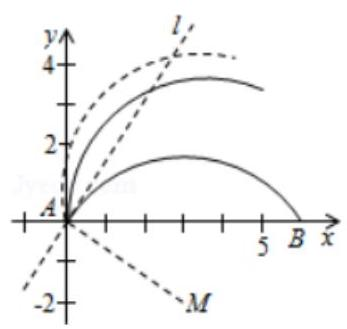
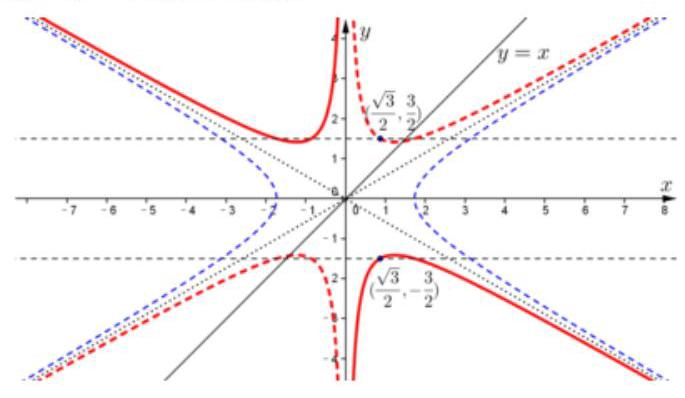
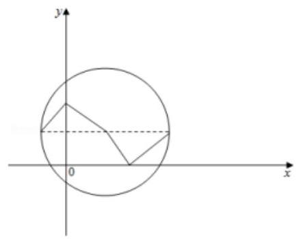
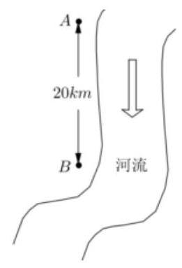
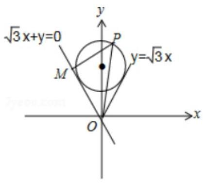
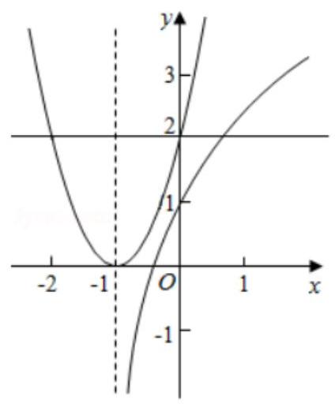
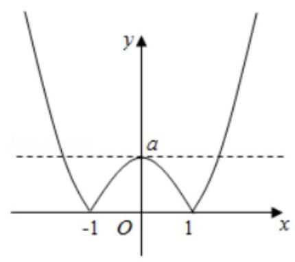
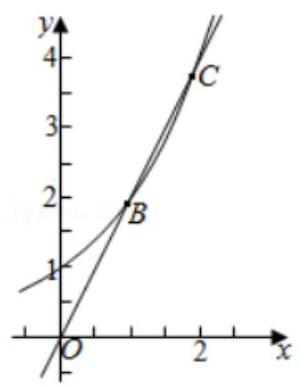

## 函数的概念及函数三要素

<table><tr><td>教学目标</td><td>1、掌握函数的概念，能根据定义判断函数是否是同一函数；   2、熟练掌握求函数定义域、值域和解析式的方法;</td></tr><tr><td>重点</td><td>1、函数的值域的求解；   2、抽象函数定义域、值域的求法;</td></tr><tr><td>难 点</td><td>抽象函数定义域、值域的求法</td></tr></table>

## (一)函数的基本概念

## 知识梳理

1、函数的定义: 设 $A\text{ 、 }B$ 是非空的数集,如果按照某个确定的对应关系 $f$ ,使对于集合 $A$ 中的任意一个数 $x$ ,在集合 $B$ 中都有唯一确定的数 $f\left( x\right)$ 和它对应,那么就称 $f : A \rightarrow  B$ 为从集合 $A$ 到集合 $B$ 的一个函数. 记作: $y = f\left( x\right) , x \in  A$ . 其中, $x$ 叫做自变量, $x$ 的取值范围 $A$ 叫做函数的定义域; 与 $x$ 的值相对应的 $y$ 值叫做函数值,函数值的集合 $\{ f\left( x\right)  \mid  x \in  A\}$ 叫做函数的值域.

2、函数的三要素分别指函数的_定义域___、___值域___、_对应法则___；

当两个函数的___ 定义域___、对应法则___分别相同时，那么这两个函数是同一函数.

3、函数的表示方法一般有___ 解析法___、___列表法___ 图像法

当图像满足和 $x = a, a \in  R$ 的图像最多只有一个交点时才可作为函数图像.

## 4、分段函数:

在用解析法表示函数的时候, 往往在其定义域的不同子集上, 因对应法则不同而用几个式子来表示的函数即分段函数. 分段函数是一个函数, 而不是几个函数. 在解决问题过程中, 要处理好整体与局部的关系.

## 5、函数的运算:

对于两个函数 $y = f\left( x\right) \left( {x \in  {D}_{1}}\right) ,\;y = g\left( x\right) \left( {x \in  {D}_{2}}\right)$ ,设 $D = {D}_{1} \cap  {D}_{2} \neq  \phi$

把函数 $f\left( x\right)  + g\left( x\right) \left( {x \in  D}\right)$ 叫做函数 $y = f\left( x\right) \left( {x \in  {D}_{1}}\right)$ 与 $y = g\left( x\right) \left( {x \in  {D}_{2}}\right)$ 的和函数

把函数 $f\left( x\right) g\left( x\right) \left( {x \in  D}\right)$ 叫做函数 $y = f\left( x\right) \left( {x \in  {D}_{1}}\right)$ 与 $y = g\left( x\right) \left( {x \in  {D}_{2}}\right)$ 的积函数

## 6、复合函数:

对于两个函数 $y = f\left( x\right) \left( {x \in  {D}_{1}}\right) , y = g\left( x\right) \left( {x \in  {D}_{2}}\right)$ ,若满足 $g\left( x\right)  \in  {D}_{1}$ 的 $x$ 的取值范围为 $E$ ,设 $D = E \cap  {D}_{2} \neq  \phi$ ,把函数 $y = f\left( {g\left( x\right) }\right)$ 叫做函数 $y = f\left( x\right) \left( {x \in  {D}_{1}}\right) , y = g\left( x\right) \left( {x \in  {D}_{2}}\right)$ 的复合函数, $x$ 是复合函数 $y = f\left( {g\left( x\right) }\right)$ 的自变量,定义域为 $D, g\left( x\right)$ 叫做内函数, $f\left( x\right)$ 叫做外函数.

## 例题精讲

【例 1】将函数 $y = \sqrt{4 + {6x} - {x}^{2}} - 2\left( {x \in  \left\lbrack  {0,6}\right\rbrack  }\right)$ 的图象绕坐标原点逆时针方向旋转角 $\theta \left( {0 \leq  \theta  \leq  \alpha }\right)$ ,得到曲线 $C$ . 若对于每一个旋转角 $\theta$ ，曲线 $C$ 都是一个函数的图象，则 $\alpha$ 的最大值为___.

【难度】 $\star   \star   \star$

【答案】 $\arctan \frac{2}{3}$

【解析】解: 先画出函数 $y = \sqrt{4 + {6x} - {x}^{2}} - 2\left( {x \in  \left\lbrack  {0,6}\right\rbrack  }\right)$ 的图象

这是一个圆弧,圆心为 $M\left( {3, - 2}\right)$

由图可知当此圆弧绕坐标原点逆时针方向旋转角大于 $\angle {MAB}$ 时，

曲线 $C$ 都不是一个函数的图象

$\therefore \angle {MAB} = \arctan \frac{2}{3}$

故答案为: $\arctan \frac{2}{3}$

【例 2】设 $D$ 是含数 1 的有限实数集, $f\left( x\right)$ 是定义在 $D$ 上的函数,若 $f\left( x\right)$ 的图象绕原点逆时针旋转 $\frac{\pi }{6}$ 后与原图象重合,则在以下各项中, $f$ (1) 的可能取值只能是 ( )

A. $\sqrt{3}$ B. $\frac{\sqrt{3}}{2}$ C. $\frac{\sqrt{3}}{3}$ D. 0

【难度】★★★

【答案】 $B$

【解析】由题意得到: 问题相当于圆上由 12 个点为一组,每次绕原点逆时针旋转 $\frac{\pi }{6}$ 个单位后与下一个点会重合. 我们可以通过代入和赋值的方法当 $f\left( 1\right)  = \sqrt{3},\frac{\sqrt{3}}{3},0$ 时,此时得到的圆心角为 $\frac{\pi }{3},\frac{\pi }{6},0$ ,

然而此时 $x = 0$ 或者 $x = 1$ 时,都有 2 个 $y$ 与之对应,而我们知道函数的定义就是要求一个 $x$ 只能对应一个 $y$ , 因此只有当 $x = \frac{\sqrt{3}}{2}$ ,此时旋转 $\frac{\pi }{6}$ ,此时满足一个 $x$ 只会对应一个 $y$ ,因此答案就选: $B$ .

故选: $B$ .

【例 3】存在函数 $f\left( x\right)$ 满足,对任意 $x \in  R$ 都有(   )

A. $f\left( {\sin x}\right)  = \cos x$ B. $f\left( {\sin x}\right)  = {x}^{2} - {\pi x}$

C. $f\left( {{x}^{2} + 1}\right)  = {\log }_{2}\left| x\right|$ D. $f\left( {{x}^{2} + 1}\right)  = {2}^{\left| x\right| }$

【难度】 $\star   \star   \star   \star$

【答案】 $D$

【解析】解: $A$ . 取 $x = 0,\sin 0 = 0,\cos 0 = 1,\therefore f\left( 0\right)  = 1$ ; 取 $x = \pi ,\sin \pi  = 0,\cos \pi  =  - 1,\therefore f\left( 0\right)  =  - 1$ ; $\therefore f\left( 0\right)  = 1$ 和 -1,不符合函数的定义; 二不存在函数 $f\left( x\right)$ 满足,对任意的 $x \in  R$ 都有 $f\left( {\sin x}\right)  = \cos x$ ;

$B$ . 取 $x = 0$ ,则 $f\left( 0\right)  = 0$ ; 取 $x = {2\pi }$ ,则 $f\left( 0\right)  = 2{\pi }^{2};\therefore f\left( 0\right)$ 有两个值,不符合函数的定义;

$\therefore$ 不存在函数 $f\left( x\right)$ 满足,对任意的 $x \in  R$ 都有 $f\left( {\sin x}\right)  = {x}^{2} - {\pi x}$ ;

$C.x = 0$ 时,该函数无意义;

$\therefore$ 不存在函数 $f\left( x\right)$ 满足,对任意的 $x \in  R$ 都有 $f\left( {{x}^{2} + 1}\right)  = {\log }_{2}\left| x\right|$ ;

$D$ . 令 ${x}^{2} + 1 = t, t \geq  1$ ,则 $x =  \pm  \sqrt{t - 1},\therefore \left| x\right|  = \sqrt{t - 1};\therefore f\left( t\right)  = {2}^{\sqrt{t - 1}}$ ;

$\therefore$ 存在函数 $f\left( x\right)  = {2}^{\sqrt{x - 1}}$ 满足,对任意的 $x \in  R$ 都有 $f\left( {{x}^{2} + 1}\right)  = {2}^{\left| x\right| }$ . 故选: $D$ .

## 巩固训练

1、函数 $y = f\left( x\right) , x \in  R$ 的图象与直线 $x = {2018}$ 的交点个数是( )

A. 0 B. 0 或 1 C. 1 D. 1 或 2018

【难度】★★★

【答案】 $C$

【解析】解: 当 $x = {2018}$ 属于定义域 $D$ ,此时函数 $y = f\left( x\right)$ 的图象与直线 $x = {2018}$ 的交点个数为 1 个,若 $x = {2018}$ 不属于定义域 $D$ ,此时函数 $y = f\left( x\right)$ 的图象与直线 $x = {2018}$ 的交点个数为 0 个,

$\because {2018} \in  R$ ,

故选: $C$ .

2、存在函数 $f\left( x\right)$ ，对于任意 $x \in  R$ 都成立的下列等式的序号是 ___.

① $f\left( {\sin {3x}}\right)  = \sin x$ ; ② $f\left( {\sin {3x}}\right)  = {x}^{3} + {x}^{2} + x$ ; ③ $f\left( {{x}^{2} + 2}\right)  = \left| {x + 2}\right|$ ；④ $f\left( {{x}^{2} + {4x}}\right)  = \left| {x + 2}\right|$ .

【难度】 $\star   \star   \star   \star$

【答案】④

【解析】解: ① 令 $x = 0$ 时, $f\left( 0\right)  = 0$ ; 当 $x = \frac{\pi }{3}$ 时, $f\left( 0\right)  = \frac{\sqrt{3}}{2}$ ,与函数定义矛盾,不符合;

② 令 $x = 0$ 时， $f\left( 0\right)  = 0$ ；当 $x = \frac{\pi }{3}$ 时， $f\left( 0\right)  = {\left( \frac{\pi }{3}\right) }^{3} + {\left( \frac{\pi }{3}\right) }^{2} + \frac{\pi }{3}$ ，与函数定义矛盾，不符合；

③ 当 $x =  - 2$ 时， $f\left( 6\right)  = 0$ ，当 $x = 2$ 时， $f\left( 6\right)  = 4$ ，与函数定义矛盾，不符合；

④ 令 $x + 2 = t$ ，则 $f\left( {{t}^{2} - 4}\right)  = \left| t\right|$ ，令 ${t}^{2} - 4 = m \in  \lbrack  - 4$ ， $+ \infty )$ ， $\therefore t =  \pm  \sqrt{m + 4}$ ， $\therefore f\left( m\right)  = \sqrt{m + 4}\left( {m \geq   - 4}\right)$ ， $\therefore f\left( x\right)  = \sqrt{x + 4}\left( {x \geq   - 4}\right)$ ,符合.

故答案为:④.

3、双曲线 $\frac{{x}^{2}}{3} - {y}^{2} = 1$ 绕坐标原点 $O$ 旋转适当角度可以成为函数 $f\left( x\right)$ 的图像. 关于此函数 $f\left( x\right)$ 有如下四个命题:

① $f\left( x\right)$ 是奇函数；② $f\left( x\right)$ 的图像过点 $\left( {\frac{\sqrt{3}}{2},\frac{3}{2}}\right)$ 或 $\left( {\frac{\sqrt{3}}{2}, - \frac{3}{2}}\right)$ ；

③ $f\left( x\right)$ 的值域是 $\left( {-\infty , - \frac{3}{2}}\right\rbrack   \cup  \left\lbrack  {\frac{3}{2}, + \infty }\right)$ ；④函数 $y = f\left( x\right)  - x$ 有两个零点.

则其中所有真命题的序号为___.

【难度】 $\star   \star   \star   \star$

【答案】①②

【解析】作出双曲线图像,旋转适当角度,使得其中一条渐近线垂直于 $x$ 轴,如图中红色实线或红色虚线所示, 结合图像, 可知①②正确.

## (二)求函数的定义域

## 知识梳理

求定义域时注意:

(1)分式的分母不为零;

(2)偶次根式的被开方数非负；

(3)对数的真数大于零；

(4)零次幂的底数不为零.

## 例题精讲

【例 4】已知函数 $y = f\left( \frac{{x}^{2} + {2x} - 1}{{x}^{2} + x - 1}\right)$ 的定义域是 $\lbrack 1, + \infty )$ ,则函数 $y = f\left( x\right)$ 的定义域是___.

【难度】 $\star   \star   \star$

【答案】 $(1,2\rbrack$

【解析】设 $t = \frac{{x}^{2} + {2x} - 1}{{x}^{2} + x - 1}, x \in  \lbrack 1, + \infty )$ ,

则 $t = 1 + \frac{x}{{x}^{2} + x - 1} = 1 + \frac{1}{x - \frac{1}{x} + 1}$ ,

再设 $g\left( x\right)  = x - \frac{1}{x} + 1, x \in  \lbrack 1, + \infty )$ ,则 $g\left( x\right)$ 是定义域上的单调增函数,且 $g{\left( x\right) }_{\min } = g\left( 1\right)  = 1$ ,

所以 $\frac{1}{g\left( x\right) } \in  (0,1\rbrack$ ,所以 $t \in  (1,2\rbrack$ ;

所以函数 $y = f\left( \frac{{x}^{2} + {2x} - 1}{{x}^{2} + x - 1}\right)$ 的定义域是 $\left\lbrack  {1, + \infty }\right)$ 时,函数 $y = f\left( x\right)$ 的定义域是 $(1,2\rbrack$ .

故答案为: $(1,2\rbrack$ .

【例 5】函数 $y = f\left( x\right)$ 的定义域为 $\lbrack  - 2, + \infty )$ ,函数 $y = g\left( x\right)$ 为 $R$ 上的奇函数,则函数 $F\left( x\right)  = \frac{f\left( x\right) }{\sqrt{g\left( x\right) }}$ 的定义域可能为( )

A. $\lbrack  - 2,0) \cup  \left( {0, + \infty }\right)$ B. $\left\lbrack  {-2, - 1}\right)  \cup  \left( {-1,0}\right)$

C. $\lbrack  - 2, - 1) \cup  \left( {1, + \infty }\right)$ D. $\left\lbrack  {-2, - 1}\right\rbrack   \cup  (0,1\rbrack$

【难度】 $\star   \star   \star   \star$

【答案】 $B$

【解析】解: $\because$ 函数 $y = g\left( x\right)$ 为 $R$ 上的奇函数,则 $g\left( x\right)$ 的定义域关于原点对称,

由 $g\left( x\right)  > 0$ ,可知函数 $F\left( x\right)  = \frac{f\left( x\right) }{\sqrt{g\left( x\right) }}$ 的定义域内必不存在符号相异的数,

又函数 $y = f\left( x\right)$ 的定义域为 $\lbrack  - 2, + \infty ),\therefore$ 函数 $F\left( x\right)  = \frac{f\left( x\right) }{\sqrt{g\left( x\right) }}$ 的定义域可能为 $\lbrack  - 2, - 1) \cup  \left( {-1,0}\right)$ . 故选: $B$ .

## 巩固训练

1、已知函数 $y = f\left( {2}^{x}\right)$ 的定义域是 $\left\lbrack  {-1,1}\right\rbrack$ ，则函数 $f\left( {{\log }_{3}x}\right)$ 的定义域是( )

A. $\left\lbrack  {-1,1}\right\rbrack$ B. $\left\lbrack  {\frac{1}{3},3}\right\rbrack$ C. $\left\lbrack  {1,3}\right\rbrack$ D. $\left\lbrack  {\sqrt{3},9}\right\rbrack$

【难度】 $\star   \star   \star$

【答案】 $D$

【解析】由题意可得, $\frac{1}{2} \leq  {2}^{x} \leq  2$ ,所以 $\frac{1}{2} \leq  {\log }_{3}x \leq  2$ ,

解可得, $\sqrt{3} \leq  x \leq  9$ . 故选: $D$ .

2、函数 $f\left( x\right)  = {x}^{2} - 1$ 的定义域为 $\left\lbrack  {0,4}\right\rbrack$ ，则函数 $y = f\left( {x}^{2}\right)  + {\left\lbrack  f\left( x\right) \right\rbrack  }^{2}$ 的值域为( )

A. $\left\lbrack  {-\frac{1}{2},{992}}\right\rbrack$ B. $\left\lbrack  {-\frac{1}{2},{24}}\right\rbrack$ C. $\left\lbrack  {-\frac{1}{2},4}\right\rbrack$ D. $\left\lbrack  {-\frac{1}{2},4 - 2\sqrt{2}}\right\rbrack$

【难度】 $\star   \star   \star$

【答案】 $B$

【解析】解: $\because f\left( x\right)  = {x}^{2} - 1$ 的定义域为 $\left\lbrack  {0,4}\right\rbrack  ,\therefore y = f\left( {x}^{2}\right)  + {\left\lbrack  f\left( x\right) \right\rbrack  }^{2}$ 中, $\left\{  \begin{array}{l} 0 \leq  {x}^{2} \leq  4 \\  0 \leq  x \leq  4 \end{array}\right.$ ,解得 $0 \leq  x \leq  2$ ,

即 $y = f\left( {x}^{2}\right)  + {\left\lbrack  f\left( x\right) \right\rbrack  }^{2}$ 的定义域为 $\left\lbrack  {0,2}\right\rbrack$ ,令 $t = {x}^{2}$ ,则 $t \in  \left\lbrack  {0,4}\right\rbrack$ ,

则 $y = f\left( {x}^{2}\right)  + {\left\lbrack  f\left( x\right) \right\rbrack  }^{2} = {x}^{4} - 1 + {\left( {x}^{2} - 1\right) }^{2} = 2{x}^{4} - 2{x}^{2} = 2{t}^{2} - {2t} = 2{\left( t - \frac{1}{2}\right) }^{2} - \frac{1}{2}$ ,

$\therefore$ 当 $t = \frac{1}{2}$ 时, ${y}_{\min } =  - \frac{1}{2}$ ; 当 $t = 4$ 时, ${y}_{\max } = {24}$ ,

$\therefore y = f\left( {x}^{2}\right)  + {\left\lbrack  f\left( x\right) \right\rbrack  }^{2}$ 的值域为 $\left\lbrack  {-\frac{1}{2},{24}}\right\rbrack$ .

故选: $B$ .

3、已知函数 $f\left( x\right)  = \lg \left( {\sqrt{{x}^{2} + 1} + {ax}}\right)$ 的定义域为 $R$ ，则实数 $a$ 的取值范围是___.

【难度】 $\star   \star   \star   \star$

【答案】 $\left\lbrack  {-1,1}\right\rbrack$

【解析】解: 函数 $f\left( x\right)  = \lg \left( {\sqrt{{x}^{2} + 1} + {ax}}\right)$ 的定义域为 $R,\therefore \sqrt{{x}^{2} + 1} + {ax} > 0$ 恒成立, $\therefore \sqrt{{x}^{2} + 1} >  - {ax}$ 恒成立, 即 $\left( {1 - {a}^{2}}\right) {x}^{2} + 1 > 0$ 恒成立; $\therefore 1 - {a}^{2} \geq  0$ ,解得 $- 1 \leq  a \leq  1$ ; 二实数 $a$ 的取值范围是 $\left\lbrack  {-1,1}\right\rbrack$ .

故答案为: $\left\lbrack  {-1,1}\right\rbrack$ .

## (三)求函数的解析式

## 知识梳理

常见函数解析式求法:

(1)已知函数类型，求函数的解析式:待定系数法；

(2)已知 $f\left( x\right)$ 求 $f\left\lbrack  {g\left( x\right) }\right\rbrack$ 或已知 $f\left\lbrack  {g\left( x\right) }\right\rbrack$ 求 $f\left( x\right)$ :换元法、配凑法；

(3)已知函数图像，求函数解析式；

(4) $f\left( x\right)$ 满足某个等式，这个等式除 $f\left( x\right)$ 外还有其他未知量，需构造另个等式:解方程组法；

(5)应用题求函数解析式常用方法有待定系数法等.

## 例题精讲

【例 6】(1)已知 $f\left( {x + \frac{1}{x}}\right)  = {x}^{3} + \frac{1}{{x}^{3}}$ ,求 $f\left( x\right)$ ;

( 2 )已知 $f\left( {\frac{2}{x} + 1}\right)  = \lg x$ ，求 $f\left( x\right)$ ；

(3)已知 $f\left( x\right)$ 是一次函数，且满足 ${3f}\left( {x + 1}\right)  - {2f}\left( {x - 1}\right)  = {2x} + {17}$ ，求 $f\left( x\right)$ ；

(4)已知 $f\left( x\right)$ 满足 ${2f}\left( x\right)  + f\left( \frac{1}{x}\right)  = {3x}$ ，求 $f\left( x\right)$ .

(5)任意 $x, y \in  R$ ， $f\left( {x - y}\right)  = f\left( x\right)  - y\left( {{2x} - y + 1}\right)$ 恒成立，且 $f\left( 0\right)  = 1$ ，求 $f\left( x\right)$ .

【难度】 $\star   \star   \star$

【答案】见解析

【解析】(1) $\because f\left( {x + \frac{1}{x}}\right)  = {x}^{3} + \frac{1}{{x}^{3}} = {\left( x + \frac{1}{x}\right) }^{3} - 3\left( {x + \frac{1}{x}}\right) ,\therefore f\left( x\right)  = {x}^{3} - {3x}\;\left( {x \geq  2\text{ 或 }x \leq   - 2}\right)$ .

( 2 )令 $\frac{2}{x} + 1 = t\left( {t > 1}\right)$ ，则 $x = \frac{2}{t - 1}$ ， $\therefore f\left( t\right)  = \lg \frac{2}{t - 1}$ ， $f\left( x\right)  = \lg \frac{2}{x - 1}\;\left( {x > 1}\right)$ .

(3)设 $f\left( x\right)  = {ax} + b\left( {a \neq  0}\right)$ ，则

${3f}\left( {x + 1}\right)  - {2f}\left( {x - 1}\right)  = {3ax} + {3a} + {3b} - {2ax} + {2a} - {2b} = {ax} + b + {5a} = {2x} + {17}$ ,

$\therefore a = 2, b = 7,\therefore f\left( x\right)  = {2x} + 7$ .

(4) ${2f}\left( x\right)  + f\left( \frac{1}{x}\right)  = {3x}\;$ ①，把①中的 $x$ 换成 $\frac{1}{x}$ ，得 ${2f}\left( \frac{1}{x}\right)  + {f\left( x\right) } = \frac{3}{x}\;$ ②，

① $x \cdot  2 -$ ②得 ${3f}\left( x\right)  = {6x} - \frac{3}{x},\therefore f\left( x\right)  = {2x} - \frac{1}{x}$

(5) 法一:令 $x = 0$ 法二:令 $y = x$ ，答案: $f\left( x\right)  = {x}^{2} + x + 1$

【例 7】数学的对称美在中国传统文化中多有体现, 譬如如图所示的太极图是由黑白两个鱼形纹组成的圆形图案, 充分展现了相互转化、对称统一的和谐美. 如果能够将圆的周长和面积同时平分的函数称为这个圆的 “优美函数 “, 下列说法错误的是( )

A. 对于任意一个圆, 其 “优美函数 “有无数个

B. $f\left( x\right)  = {x}^{3}$ 可以是某个圆的 “优美函数”

C. 正弦函数 $y = \sin x$ 可以同时是无数个圆的 “优美函数”

D. 函数 $y = f\left( x\right)$ 是 “优美函数” 的充要条件为函数 $y = f\left( x\right)$ 的图象是中心对称图形

【难度】 $\star   \star   \star$

【答案】 $D$

【解析】解: 对于 $A$ : 过圆心的直线都可以将圆的周长和面积同时平分,所以对于任意一个圆,其 “优美函数”有无数个,故选项 $A$ 正确;

对于 $B$ : 因为函数 $f\left( x\right)  = {x}^{3}$ 图象关于原点成中心对称,所以将圆的圆心放在原点,则函数 $f\left( x\right)  = {x}^{3}$ 是该圆的 “优美函数”,故选项 $B$ 正确;

对于 $C$ : 将圆的圆心放在正弦函数 $y = \sin x$ 的对称中心上,则正弦函数 $y = \sin x$ 是该圆的 “优美函数”,故选项 $C$ 正确;

对于 $D$ : 函数 $y = f\left( x\right)$ 的图象是中心对称图形,则函数 $y = f\left( x\right)$ 是 “优美函数”,但是函数 $y = f\left( x\right)$ 是 “优美函数”时, 图象不一定是中心对称图形, 如图所示,

所以函数 $y = f\left( x\right)$ 的图象是中心对称图形是函数 $y = f\left( x\right)$ 是 “优美函数” 的充分不必要条件,故选项 $D$ 错误，故选: $D$ .

## 巩固训练

1、已知 $f\left( {\sin \theta  + \cos \theta }\right)  = \frac{\sin \theta  + \cos \theta }{\sin \theta  \cdot  \cos \theta }$ ,求 $f\left( x\right)$ .

【难度】 $\star   \star   \star$

【答案】 $f\left( x\right)  = \frac{2x}{{x}^{2} - 1}\left( {x \in  \left\lbrack  {-\sqrt{2},\sqrt{2}}\right\rbrack  \text{ 且 }x \neq   \pm  1}\right)$

【解析】换元法求解析式,注意定义域

2、已知函数 $f\left( x\right)$ 满足 ${2f}\left( \frac{x - 1}{x}\right)  + f\left( \frac{x + 1}{x}\right)  = 1 + x$ ，其中 $x \in  R$ 且 $x \neq  0$ ，则函数 $f\left( x\right)$ 的解析式为___.

【难度】 $\star   \star   \star$

【答案】 $f\left( x\right)  = \frac{1}{3} - \frac{1}{x - 1}\left( {x \neq  1}\right)$

【解析】解: 以 $- x$ 代入可得 ${2f}\left( \frac{x + 1}{x}\right)  + f\left( \frac{x - 1}{x}\right)  = 1 - x$ ,与已知方程联立可得 $f\left( \frac{x + 1}{x}\right)  = \frac{1}{3} - x$ ,

令 $t = \frac{x + 1}{x}, t \neq  1, x = \frac{1}{t - 1},\therefore f\left( t\right)  = \frac{1}{3} - \frac{1}{t - 1},\therefore f\left( x\right)  = \frac{1}{3} - \frac{1}{x - 1}\left( {x \neq  1}\right)$ . 故答案为 $f\left( x\right)  = \frac{1}{3} - \frac{1}{x - 1}\left( {x \neq  1}\right)$ .

3、已知定义在 $R$ 上的函数 $y = f\left( x\right)$ 对任意的 $x$ 都满足 $f\left( {x + 2}\right)  =  - f\left( x\right)$ ,当 $- 1 \leq  x < 1$ 时, $f\left( x\right)  = {x}^{3}$ ,则 $x \in  \lbrack 2$ , 4] 时 $y = f\left( x\right)$ 的解析式是___.

【难度】 $\star   \star   \star$

【答案】 $f\left( x\right)  = \left\{  \begin{array}{l}  - {\left( x - 2\right) }^{3}, x \in  \lbrack 2,3) \\  {\left( x - 4\right) }^{3}, x \in  \left\lbrack  {3,4}\right\rbrack   \end{array}\right.$

【解析】解: $\because f\left( {x + 2}\right)  =  - f\left( x\right)$ ,

$\therefore f\left\lbrack  {\left( {x + 2}\right)  + 2}\right\rbrack   =  - f\left( {x + 2}\right)  =  - \left\lbrack  {-f\left( x\right) }\right\rbrack   = f\left( x\right)$ ,

$\therefore y = f\left( x\right)$ 是以 4 为周期的函数;

又当 $- 1 \leq  x < 1$ 时, $f\left( x\right)  = {x}^{3}$ ,

$\therefore$ 当 $1 \leq  x < 3$ 时, $- 1 \leq  x - 2 < 1$ ,

$\therefore f\left( x\right)  =  - f\left( {x - 2}\right)  =  - {\left( x - 2\right) }^{3}$ ;

当 $3 \leq  x < 5$ 时, $- 1 \leq  x - 4 < 1$ ,又 $y = f\left( x\right)$ 是以 4 为周期的函数,

$\therefore f\left( x\right)  = f\left( {x - 4}\right)  = {\left( x - 4\right) }^{3}$ ,

$\therefore$ 当 $x \in  \left\lbrack  {2,4}\right\rbrack$ 时 $y = f\left( x\right)$ 的解析式是:

$f\left( x\right)  = \left\{  \begin{array}{l}  - {\left( x - 2\right) }^{3}, x \in  \lbrack 2,3) \\  {\left( x - 4\right) }^{3}, x \in  \left\lbrack  {3,4}\right\rbrack   \end{array}\right.$ .

故答案为: $f\left( x\right)  = \left\{  \begin{array}{l}  - {\left( x - 2\right) }^{3}, x \in  \lbrack 2,3) \\  {\left( x - 4\right) }^{3}, x \in  \left\lbrack  {3,4}\right\rbrack   \end{array}\right.$ .

4、若二次函数 $y = f\left( x\right)$ 对一切 $x \in  \mathrm{R}$ 恒有 ${x}^{2} - {2x} + 4 \leq  f\left( x\right)  \leq  2{x}^{2} - {4x} + 5$ 成立,且 $f\left( 5\right)  = {27}$ ,则 $f\left( {11}\right)  =$

【难度】 $\star   \star   \star   \star$

【答案】 153

【解析】解: 二次函数 $y = f\left( x\right)$ 对一切 $x \in  R$ 恒有 ${x}^{2} - {2x} + 4 \leq  f\left( x\right)  \leq  2{x}^{2} - {4x} + 5$ 成立,

可得 ${x}^{2} - {2x} + 4 = 2{x}^{2} - {4x} + 5$ ,解得 $x = 1, f\left( 1\right)  = 3$ ,

函数的对称轴为 $x = 1$ ,

设函数 $f\left( x\right)  = a\left( {{x}^{2} - {2x}}\right)  + b$ ,

由 $f\left( 1\right)  = 3, f\left( 5\right)  = {27}$ ,

可得 $- a + b = 3,{15a} + b = {27}$ ,

解得 $a = \frac{3}{2}, b = \frac{9}{2}$ .

$f\left( x\right)  = \frac{3}{2}\left( {{x}^{2} - {2x}}\right)  + \frac{9}{2},$

$f\left( {11}\right)  = \frac{3}{2}\left( {{11}^{2} - 2 \times  {11}}\right)  + \frac{9}{2} = {153}.$

## 故答案为: 153 ;

5、(闵行 2017 一模 19)如图所示，沿河有 $A$ 、 $B$ 两城镇，它们相距 20 千米，以前，两城镇的污水直接排入河里，现为保护环境，污水需经处理才能排放，两城镇可以单独建污水处理厂，或者联合建污水处理厂 (在两城镇之间或其中一城镇建厂, 用管道将污水从各城镇向污水处理厂输送), 依据经验公式, 建厂的费用为 $f\left( m\right)  = {25} \cdot  {m}^{0.7}$ (万元), $m$ 表示污水流量,铺设管道的费用(包括管道费) $g\left( x\right)  = {3.2}\sqrt{x}$ (万元), $x$ 表示输送污水管道的长度 (千米); 已知城镇 $A$ 和城镇 $B$ 的污水流量分别为 ${m}_{1} = 3\text{ 、 }{m}_{2} = 5, A\text{ 、 }B$ 两城镇连接污水处理厂的管道总长为 20 千米；假定:经管道运输的污水流量不发生改变，污水经处理后直接排入河中；请解答下列问题(结果精确到 0.1)

(1)若在城镇 $A$ 和城镇 $B$ 单独建厂，共需多少总费用？

(2)考虑联合建厂可能节约总投资，设城镇 $A$ 到拟建厂的距离为 $x$ 千米,求联合建厂的总费用 $y$ 与 $x$ 的函数关系式,并求 $y$ 的取值范围;

【难度】 $\star   \star   \star   \star$

【答案】见解析

【解析】(1)分别单独建厂, 共需总费用 ${y}_{1} = {25} \times  {3}^{0.7} + {25} \times  {5}^{0.7} \approx  {131.1}$ 万元 4 分

(2)联合建厂，共需总费用

$y = {25} \times  {\left( 3 + 5\right) }^{0.7} + {3.2} \cdot  \sqrt{x} + {3.2}\sqrt{{20} - x}\;\left( {0 \leq  x \leq  {20}}\right)$

所以 $y$ 与 $x$ 的函数关系式为 $y = {25} \times  {8}^{0.7} + {3.2}\left( {\sqrt{x} + \sqrt{{20} - x}}\right) \;\left( {0 \leq  x \leq  {20}}\right)$ 8 分

令 $h\left( x\right)  = \sqrt{x} + \sqrt{{20} - x}\;\left( {0 \leq  x \leq  {20}}\right)$

${h}^{2}\left( x\right)  = {20} + 2\sqrt{x\left( {{20} - x}\right) } = {20} + 2\sqrt{-{\left( x - {10}\right) }^{2} + {100}} \in  \left\lbrack  {{20},{40}}\right\rbrack$ 10 分

${121.5} \approx  {25} \times  {8}^{0.7} + {3.2} \times  \sqrt{20} \leq  y \leq  {25} \times  {8}^{0.7} + {3.2} \times  \sqrt{40} \approx  {127.4}$

$y$ 的取值范围为 $\left\lbrack  {{121.5},{127.4}}\right\rbrack$ . 14 分

6、已知定义在实数集 $\mathbf{R}$ 上的偶函数 $f\left( x\right)$ 和奇函数 $g\left( x\right)$ 满足 $f\left( x\right)  + g\left( x\right)  = {2}^{x + 1}$ .

(1)求 $f\left( x\right)$ 与 $g\left( x\right)$ 的解析式；

(2)若定义在实数集 $\mathbf{R}$ 上的以 2 为最小正周期的周期函数 $\varphi \left( x\right)$ ，当 $- 1 \leq  x \leq  1$ 时， $\varphi \left( x\right)  = f\left( x\right)$ ，试求 $\varphi \left( x\right)$ 在闭区间 $\left\lbrack  {{2015},{2016}}\right\rbrack$ 上的表达式,并证明 $\varphi \left( x\right)$ 在闭区间 $\left\lbrack  {{2015},{2016}}\right\rbrack$ 上单调递减;

(3) 设 $h\left( x\right)  = {x}^{2} + {2mx} + {m}^{2} - m + 1$ (其中 $m$ 为常数),若 $h\left( {g\left( x\right) }\right)  \geq  {m}^{2} - m - 1$ 对于 $x \in  \left\lbrack  {1,2}\right\rbrack$ 恒成立,求 $m$ 的取值范围

【难度】 $\star   \star   \star   \star$

【答案】见解析

【解析】(1) 假设 $f\left( x\right)  + g\left( x\right)  = {2}^{x + 1}$ ①,因为 $f\left( x\right)$ 是偶函数， $g\left( x\right)$ 是奇函数

所以有 $f\left( {-x}\right)  + g\left( {-x}\right)  = {2}^{-x + 1}$ ,即 $f\left( x\right)  - g\left( x\right)  = {2}^{-x + 1}$ ②

$\because f\left( x\right) , g\left( x\right)$ 定义在实数集 $\mathrm{R}$ 上,

由①和②解得，

$f\left( x\right)  = \frac{{2}^{x + 1} + {2}^{-x + 1}}{2} = {2}^{x} + \frac{1}{{2}^{x}}, g\left( x\right)  = \frac{{2}^{x + 1} - {2}^{-x + 1}}{2} = {2}^{x} - \frac{1}{{2}^{x}}.$

(2) $\varphi \left( x\right)$ 是 $\mathbf{R}$ 上以 2 为正周期的周期函数，所以当 $x \in  \left\lbrack  {{2015},{2016}}\right\rbrack$ 时， $x - {2016} \in  \left\lbrack  {-1,0}\right\rbrack  ,\varphi \left( x\right)  = \varphi \left( {x - {2016}}\right)  = f\left( {x - {2016}}\right)  = {2}^{x - {2016}} + \frac{1}{{2}^{x - {2016}}}$ ,即 $\varphi \left( x\right)$ 在闭区间 $\left\lbrack  {{2015},{2016}}\right\rbrack$ 上的表达式为 $\varphi \left( x\right)  = {2}^{x - {2016}} + \frac{1}{{2}^{x - {2016}}}$ .

下面证明 $\varphi \left( x\right)$ 在闭区间 $\left\lbrack  {{2015},{2016}}\right\rbrack$ 上递减:

$\varphi \left( x\right)  = {2}^{x - {2016}} + \frac{1}{{2}^{x - {2016}}} \geq  2$ ,当且仅当 ${2}^{x - {2016}} = 1$ ,即 $x = {2016}$ 时等号成立. 对于任意 ${2015} \leq  {x}_{1} < {x}_{2} \leq  {2016}$

$f\left( {x}_{1}\right)  - f\left( {x}_{2}\right)  = {2}^{{x}_{1} - {2016}} + \frac{1}{{2}^{{x}_{1} - {2016}}} - {2}^{{x}_{2} - {2016}} - \frac{1}{{2}^{{x}_{2} - {2016}}} = \left( {{2}^{{x}_{1} - {x}_{2}} - 1}\right) \left( {{2}^{{x}_{2} - {2016}} - \frac{1}{{2}^{{x}_{1} - {2016}}}}\right)$ ,

因为 ${2015} \leq  {x}_{1} < {x}_{2} \leq  {2016}$ ,所以 ${2}^{{x}_{1} - {x}_{2}} < 1,{2}^{{x}_{1} - {x}_{2}} - 1 < 0,{2}^{{x}_{2} - {2016}} \leq  {2}^{0} = 1,{2}^{{x}_{1} - {2016}} < {2}^{0} = 1$ , $\frac{1}{{2}^{{x}_{1} - {2016}}} > 1,{2}^{{x}_{2} - {2016}} - {2}^{{2016} - {x}_{1}} < 0$ ,

从而 $\varphi \left( {x}_{1}\right)  - \varphi \left( {x}_{2}\right)  > 0$ ,所以当 ${2015} \leq  {x}_{1} < {x}_{2} \leq  {2016}$ 时, $\varphi \left( x\right)$ 递减.

(证明 $f\left( x\right)  = {2}^{x} + \frac{1}{{2}^{x}}$ 在 $\left\lbrack  {-1,0}\right\rbrack$ 上递减,再根据周期性或者复合函数单调性得到也可)

(3) $\because t = g\left( x\right)$ 在 $x \in  \left\lbrack  {1,2}\right\rbrack$ 单调递增， $\therefore \frac{3}{2} \leq  t \leq  \frac{15}{4}$ .

$\therefore h\left( t\right)  = {t}^{2} + {2mt} + {m}^{2} - m + 1 \geq  {m}^{2} - m - 1$ 对于 $t \in  \left\lbrack  {\frac{3}{2},\frac{15}{4}}\right\rbrack$ 恒成立,

$\therefore m \geq   - \frac{{t}^{2} + 2}{2t}$ 对于 $t \in  \left\lbrack  {\frac{3}{2},\frac{15}{4}}\right\rbrack$ 恒成立,

令 $k\left( t\right)  =  - \frac{{t}^{2} + 2}{2t}$ ,则 $\frac{{t}^{2} + 2}{2t} = \frac{t}{2} + \frac{1}{t} \geq  \sqrt{2}$ ,当且仅当 $t = \sqrt{2}$ 时,等号成立,且 $\sqrt{2} < \frac{3}{2}$ 所以在区间 $t \in  \left\lbrack  {\frac{3}{2},\frac{15}{4}}\right\rbrack$ 上 $k\left( t\right)  =  - \frac{{t}^{2} + 2}{2t}$ 单调递减,

$\therefore k{\left( t\right) }_{\max } = k\left( \frac{3}{2}\right)  =  - \frac{17}{12},\therefore m \geq   - \frac{17}{12}$ 为 $m$ 的取值范围.

## (四)函数值域的解法

## 知识梳理

函数的值域是由其对应法则和定义域共同决定的, 其类型依解析式的特点分可分三类:

(1)求常见函数值域；

(2)求由常见函数复合而成的函数的值域；

(3)求由常见函数作某些“运算”而得函数的值域.

## 以下为总结的常用函数值域的求解方法:

(1)直接法:利用常见函数的值域来求

一次函数 $y = {ax} + b\left( {a \neq  0}\right)$ 的定义域为 $R$ ,值域为 $R$ ;

反比例函数 $y = \frac{k}{x}\left( {k \neq  0}\right)$ 的定义域为 $\{ x \mid  x \neq  0\}$ ,值域为 $\{ y \mid  y \neq  0\}$ ;

二次函数 $f\left( x\right)  = a{x}^{2} + {bx} + c\left( {a \neq  0}\right)$ 的定义域为 $R$ ,

当 $a > 0$ 时,值域为 $\left\{  {y \mid  y \geq  \frac{\left( 4ac - {b}^{2}\right) }{4a}}\right\}$ ;

当 $a < 0$ 时,值域为 $\left\{  {y \mid  y \leq  \frac{\left( 4ac - {b}^{2}\right) }{4a}}\right\}$ .

(2)配方法:转化为二次函数，利用二次函数的特征来求值；常转化为型如: $f\left( x\right)  = a{x}^{2} + {bx} + c, x \in  \left( {m, n}\right)$ 的形式;

(3)分式转化法(或改为“分离常数法”)

(4)换元法:通过变量代换转化为能求值域的函数，化归思想；

(5)三角有界法:转化为只含正弦、余弦的函数，运用三角函数有界性来求值域；

(6)基本不等式法: 转化成型如: $y = x + \frac{k}{x}\left( {k > 0}\right)$ ,利用平均值不等式公式来求值域;

(7)单调性法:函数为单调函数，可根据函数的单调性求值域。

(8)数形结合:根据函数的几何图形，利用数型结合的方法来求值域.

(9)根的判别式法:

(10)逆求法(反函数法):通过反解，用 $y$ 来表示 $x$ ，再由 $x$ 的取值范围，通过解不等式，得出 $y$ 的取值范围; 常用来解,型如: $y = \frac{{ax} + b}{{cx} + d}, x \in  \left( {m, n}\right)$

## 例题精讲

【例 8】求下列函数的值域:

(1) $y = 3{x}^{2} - x + 2, x \in  \left\lbrack  {1,3}\right\rbrack$ ； (2) $y = \sqrt{-{x}^{2} - {6x} - 5}$ ； (3) $y = \frac{{3x} + 1}{x - 2}$ ；

(4) $y = \frac{1 - \sin x}{2 - \cos x}$ ； (5) $y = \frac{2{x}^{2} - x + 2}{{x}^{2} + x + 1}$ (6) $y = \frac{2{x}^{2} - x + 1}{{2x} - 1}\left( {x > \frac{1}{2}}\right)$ ;

(7) $y = x + 4\sqrt{1 - x}$ (8) $y = x + \sqrt{1 - {x}^{2}}$ (9) $y =  - \frac{x}{\sqrt{{x}^{2} + {2x} + 2}}$ ;

(10) $y = \left| {x - 1}\right|  + \left| {x + 4}\right|$ ;

【难度】★★★

【答案】见解析

【解析】(1) 函数 $y = 3{x}^{2} - x + 2$ 在 $x \in  \left\lbrack  {1,3}\right\rbrack$ 上单调增, $\therefore$ 当 $x = 1$ 时,原函数有最小值为 4 ; 当 $x = 3$ 时, 原函数有最大值为 ${26} \circ  \therefore$ 函数 $y = 3{x}^{2} - x + 2, x \in  \left\lbrack  {1,3}\right\rbrack$ 的值域为 $\left\lbrack  {4,{26}}\right\rbrack$ .

(2)求复合函数的值域:设 $\mu  =  - {x}^{2} - {6x} - 5\left( {\mu  \geq  0}\right)$ ，则原函数可化为 $y = \sqrt{\mu }$ .

又 $\because \mu  =  - {x}^{2} - {6x} - 5 =  - {\left( x + 3\right) }^{2} + 4 \leq  4,\therefore 0 \leq  \mu  \leq  4$ ,故 $\sqrt{\mu } \in  \left\lbrack  {0,2}\right\rbrack  ,\therefore y = \sqrt{-{x}^{2} - {6x} - 5}$ 的值域为 $\left\lbrack  {0,2}\right\rbrack$ 。

(3)(法一)反函数法:

$y = \frac{{3x} + 1}{x - 2}$ 的反函数为 $y = \frac{{2x} + 1}{x - 3}$ ,其定义域为 $\{ x \in  R \mid  x \neq  3\} ,\therefore$ 原函数 $y = \frac{{3x} + 1}{x - 2}$ 的值域为 $\{ y \in  R \mid  y \neq  3\}$ 。

(法二) 分离变量法: $y = \frac{{3x} + 1}{x - 2} = \frac{3\left( {x - 2}\right)  + 7}{x - 2} = 3 + \frac{7}{x - 2},\because \frac{7}{x - 2} \neq  0,\therefore 3 + \frac{7}{x - 2} \neq  3$ ,

$\therefore$ 函数 $y = \frac{{3x} + 1}{x - 2}$ 的值域为 $\{ y \in  R \mid  y \neq  3\}$ .

(4)(法一)方程法:原函数可化为: $\sin x - y\cos x = 1 - {2y}$ ， $\therefore \sqrt{1 + {y}^{2}}\sin \left( {x - \varphi }\right)  = 1 - {2y}$ (其中 $\cos \varphi  = \frac{1}{\sqrt{1 + {y}^{2}}},\sin \varphi  = \frac{y}{\sqrt{1 + {y}^{2}}}$ ), $\therefore \sin \left( {x - \varphi }\right)  = \frac{1 - {2y}}{\sqrt{1 + {y}^{2}}} \in  \left\lbrack  {-1,1}\right\rbrack$ , $\therefore \left| {1 - {2y}}\right|  \leq  \sqrt{1 + {y}^{2}},\;\therefore 3{y}^{2} - {4y} \leq  0,\therefore 0 \leq  y \leq  \frac{4}{3},\;\therefore$ 原函数的值域为 $\left\lbrack  {0,\frac{4}{3}}\right\rbrack$ .

(5)判别式法: $\because {x}^{2} + x + 1 > 0$ 恒成立， $\therefore$ 函数的定义域为 $R$ .

由 $y = \frac{2{x}^{2} - x + 2}{{x}^{2} + x + 1}$ 得: $\left( {y - 2}\right) {x}^{2} + \left( {y + 1}\right) x + y - 2 = 0$

① 当 $y - 2 = 0$ 即 $y = 2$ 时，① 即 ${3x} + 0 = 0$ ， $\therefore x = 0 \in  R$

② 当 $y - 2 \neq  0$ 即 $y \neq  2$ 时， $\because x \in  R$ 时方程 $\left( {y - 2}\right) {x}^{2} + \left( {y + 1}\right) x + y - 2 = 0$ 恒有实根，

$\therefore \bigtriangleup \Delta  = {\left( y + 1\right) }^{2} - 4 \times  {\left( y - 2\right) }^{2} \geq  0,\therefore 1 \leq  y \leq  5$ 且 $y \neq  2,\therefore$ 原函数的值域为 $\left\lbrack  {1,5}\right\rbrack$ .

(6) $y = \frac{2{x}^{2} - x + 1}{{2x} - 1} = \frac{x\left( {{2x} - 1}\right)  + 1}{{2x} - 1} = x + \frac{1}{{2x} - 1} = x - \frac{1}{2} + \frac{\frac{1}{2}}{x - \frac{1}{2}} + \frac{1}{2},\because x > \frac{1}{2},\therefore x - \frac{1}{2} > 0$ ,

$\therefore x - \frac{1}{2} + \frac{\frac{1}{2}}{x - \frac{1}{2}} \geq  2\sqrt{\left( {x - \frac{1}{2}}\right) \frac{\frac{1}{2}}{\left( x - \frac{1}{2}\right) }}\sqrt{1} = \sqrt{2}$ ,当且仅当 $x - \frac{1}{2} = \frac{\frac{1}{2}}{x - \frac{1}{2}}$ 时,即 $x = \frac{1 + \sqrt{2}}{2}$ 时等号成立.

$\therefore y \geq  \sqrt{2} + \frac{1}{2}$ , $\therefore$ 原函数的值域为 $\left\lbrack  {\sqrt{2} + \frac{1}{2}, + \infty }\right)$ .

(7)换元法(代数换元法):设 $t = \sqrt{1 - x} \geq  0$ ，则 $x = 1 - {t}^{2}$ ，

$\therefore$ 原函数可化为 $y = 1 - {t}^{2} + {4t} =  - {\left( t - 2\right) }^{2} + 5\left( {t \geq  0}\right) ,\therefore y \leq  5$ ,

$\therefore$ 原函数值域为 $( - \infty ,5\rbrack$ 。

注: 总结 $y = {ax} + b + \sqrt{{cx} + d}$ 型值域,

变形: $y = a{x}^{2} + b + \sqrt{c{x}^{2} + d}$ 或 $y = a{x}^{2} + b + \sqrt{{cx} + d}$

(8)三角换元法:

$\because 1 - {x}^{2} \geq  0 \Rightarrow   - 1 \leq  x \leq  1,\therefore$ 设 $x = \cos \alpha ,\alpha  \in  \left\lbrack  {0,\pi }\right\rbrack$ ,则 $y = \cos \alpha  + \sin \alpha  = \sqrt{2}\sin \left( {\alpha  + \frac{\pi }{4}}\right)$

$\because \alpha  \in  \left\lbrack  {0,\pi }\right\rbrack  ,\therefore \alpha  + \frac{\pi }{4} \in  \left\lbrack  {\frac{\pi }{4},\frac{5\pi }{4}}\right\rbrack  ,\therefore \sin \left( {\alpha  + \frac{\pi }{4}}\right)  \in  \left\lbrack  {-\frac{\sqrt{2}}{2},1}\right\rbrack  ,\therefore \sqrt{2}\sin \left( {\alpha  + \frac{\pi }{4}}\right)  \in  \left\lbrack  {-1,\sqrt{2}}\right\rbrack$ ,

$\therefore$ 原函数的值域为 $\left\lbrack  {-1,\sqrt{2}}\right\rbrack$ 。

(9) $\left( {-1,\sqrt{2}}\right\rbrack$

(10)数形结合法: $y = \left| {x - 1}\right|  + \left| {x + 4}\right|  = \left\{  \begin{array}{ll}  - {2x} - 3 & \left( {x \leq   - 4}\right) \\  5 & \left( {-4 < x < 1}\right) , \\  {2x} + 3 & \left( {x \geq  1}\right)  \end{array}\right.$ ， $x > 5$ ， $\therefore$ 函数值域为 $\lbrack 5, + \infty )$ .

【例 9】求下列函数的值域:

(1) $y = \sqrt{x + 1} + \sqrt{x - 1}$ (2) $y = \sqrt{x + 1} - \sqrt{x - 1}$

(3) $y = \sqrt{x + 1} + \sqrt{1 - x}$ (4) $y = \sqrt{x + 1} - \sqrt{1 - x}$

(5) $y = \sqrt{x + 1} + \sqrt{1 - {2x}}$

【难度】 $\star   \star   \star   \star$

【答案】 $\left( 1\right) \left\lbrack  {\sqrt{2}, + \infty }\right\rbrack  \left( 2\right) \left( {0,\sqrt{2}\left| \left( 3\right) \right| \sqrt{2},2\left| \left( 4\right) \right|  - \sqrt{2},\sqrt{2}\left| \left( 5\right) \right| \sqrt{3},\frac{3\sqrt{2}}{2}}\right)$

【解析】(1)(4)求定义域然后利用函数的单调性，(2)分子有理化(3)平方法(5)利用双换元 $a = \sqrt{x + 1} \geq  0, b = \sqrt{1 - {2x}} \geq  0;\frac{2{a}^{2}}{3} + \frac{{b}^{2}}{3} = 1$ 表示半个椭圆,利用线性规划求 $y = a + b$ 的范围

【例 10】( 1 )函数 $y = {2}^{x} + \arcsin x$ 的值域为___.

【难度】 $\star   \star   \star$

【答案】 $\left\lbrack  {\frac{1 - \pi }{2},2 + \frac{\pi }{2}}\right\rbrack$

【解析】解: $\because$ 函数 $y = {2}^{x} + \arcsin x$ 在 $\left\lbrack  {-1,1}\right\rbrack$ 上是增函数, $\therefore \frac{1}{2} + \arcsin \left( {-1}\right)  \leq  {2}^{x} + \arcsin x \leq  2 + \arcsin 1$ , $\therefore \frac{1 - \pi }{2} \leq  {2}^{x} + \arcsin x \leq  2 + \frac{\pi }{2}$ ,故答案为: $\left\lbrack  {\frac{1 - \pi }{2},2 + \frac{\pi }{2}}\right\rbrack$ .

( 2 )函数 $f\left( x\right)  = \sqrt{{2}^{x} - 8} + \sqrt{{\log }_{3}x} - \frac{1}{x}$ 的值域为___

【难度】 $\star   \star   \star$

【答案】 $\left\lbrack  {\frac{2}{3}, + \infty }\right)$

【解析】利用函数的单调性求值域, 注意定义域

(3)设 ${f}^{-1}\left( x\right)$ 为 $f\left( x\right)  = {2}^{x - 2} + \frac{x}{2}, x \in  \left\lbrack  {0,2}\right\rbrack$ 的反函数，则 $y = f\left( x\right)  + {f}^{-1}\left( x\right)$ 的最大值为___；

【难度】 $\star   \star   \star$

【答案】 4

【解析】利用函数的单调性求值域,注意定义域,此题要是求最小值就有陷阱了: 设 ${f}^{-1}\left( x\right)$ 为 $f\left( x\right)  = {2}^{x - 2} + \frac{x}{2}, x \in  \left\lbrack  {0,2}\right\rbrack$ 的反函数，则 $y = f\left( x\right)  + {f}^{-1}\left( x\right)$ 的最小值为___

【例 11】(1)求函数 $y = \sqrt{{x}^{2} - {6x} + {13}} + \sqrt{{x}^{2} + {4x} + 5}$ 的值域.

【难度】 $\star   \star   \star   \star$

【答案】 $\left\lbrack  {\sqrt{34}, + \infty }\right)$

【解析】 $y = \sqrt{{x}^{2} - {6x} + {13}} + \sqrt{{x}^{2} + {4x} + 5} = \sqrt{{\left( x - 3\right) }^{2} + {2}^{2}} + \sqrt{{\left( x + 2\right) }^{2} + {1}^{2}}$ ,设 $A\left( {x,0}\right) , B\left( {3,2}\right) , C\left( {-2,1}\right) \; y = \left| {AB}\right|  + \left| {AC}\right|$ ,数形结合

(2)函数 $y = \frac{\sqrt{1 - {x}^{2}}}{2 + x}$ 的最大值为___

【难度】 $\star   \star   \star   \star$

【答案】 $\left\lbrack  {-\frac{\sqrt{3}}{3},\frac{\sqrt{3}}{3}}\right\rbrack$

【解析】设 $A\left( {x,\sqrt{1 - {x}^{2}}}\right) , B\left( {-2,0}\right) , y = {k}_{AB}$ ,数形结合

(3)函数 $f\left( x\right)  = {x}^{2} + \sqrt{{\left( x - \sqrt{2}\right) }^{2} + {\left( {x}^{2} - \sqrt{17}\right) }^{2}}$ 的最小值为___.

【难度】 $\star   \star   \star   \star$

【答案】 $\sqrt{17}$

【解析】设 $A\left( {x,{x}^{2}}\right) , B\left( {\sqrt{2},\sqrt{17}}\right)$ ,点 $\mathrm{A}$ 在 $y = {x}^{2}$ 上运动,所求值为 $\mathrm{A}$ 点的纵坐标加函数图像上的点到 $\mathrm{B}$ 的距离, 数形结合

(4)已知实数 ${x}_{1}\text{ 、 }{x}_{2}\text{ 、 }{y}_{1}\text{ 、 }{y}_{2}$ 满足: ${x}_{1}^{2} + {y}_{1}^{2} = 1,{x}_{2}^{2} + {y}_{2}^{2} = 1,{x}_{1}{x}_{2} + {y}_{1}{y}_{2} = \frac{1}{2}$ ,则 $\frac{\left| {x}_{1} + {y}_{1} - 1\right| }{\sqrt{2}} + \frac{\left| {x}_{2} + {y}_{2} - 1\right| }{\sqrt{2}}$ 的最大值为___.

【难度】 $\star   \star   \star   \star$

【答案】 $\sqrt{2} + \sqrt{3}$

【解析】解: 设 $A\left( {{x}_{1},{y}_{1}}\right) , B\left( {{x}_{2},{y}_{2}}\right)$ ,

$\overrightarrow{OA} = \left( {{x}_{1},{y}_{1}}\right) ,\overrightarrow{OB} = \left( {{x}_{2},{y}_{2}}\right)$ ,

由 ${x}_{1}^{2} + {y}_{1}^{2} = 1,{x}_{2}^{2} + {y}_{2}^{2} = 1,{x}_{1}{x}_{2} + {y}_{1}{y}_{2} = \frac{1}{2}$ ,

可得 $A, B$ 两点在圆 ${x}^{2} + {y}^{2} = 1$ 上,

且 $\overrightarrow{OA} \cdot  \overrightarrow{OB} = 1 \times  1 \times  \cos \angle {AOB} = \frac{1}{2}$ ,

即有 $\angle {AOB} = {60}^{ \circ  }$ ,

即三角形 ${OAB}$ 为等边三角形,

${AB} = 1$ ,

$\frac{\left| {x}_{1} + {y}_{1} - 1\right| }{\sqrt{2}} + \frac{\left| {x}_{2} + {y}_{2} - 1\right| }{\sqrt{2}}$ 的几何意义为点 $A, B$ 两点

到直线 $x + y - 1 = 0$ 的距离 ${d}_{1}$ 与 ${d}_{2}$ 之和,

要求之和的最大值,此最大值是中点 $M$ 到直线 $x + y = 1$ 的距离的两倍,

而中点 $M$ 的轨迹是以原点 $O$ 为圆心, $\frac{\sqrt{3}}{2}$ 为半径的圆,

所以 $A, B$ 点在第三象限, ${AB}$ 所在直线与直线 $x + y = 1$ 平行,

可设 ${AB} : x + y + t = 0,\left( {t > 0}\right)$ ,

由圆心 $O$ 到直线 ${AB}$ 的距离 $d = \frac{\left| t\right| }{\sqrt{2}}$ ,

可得 $2\sqrt{1 - \frac{{t}^{2}}{2}} = 1$ ,解得 $t = \frac{\sqrt{6}}{2}$ ,

即有两平行线的距离为 $\frac{1 + \frac{\sqrt{6}}{2}}{\sqrt{2}} = \frac{\sqrt{2} + \sqrt{3}}{2}$ ,

即 $\frac{\left| {x}_{1} + {y}_{1} - 1\right| }{\sqrt{2}} + \frac{\left| {x}_{2} + {y}_{2} - 1\right| }{\sqrt{2}}$ 的最大值为 $\sqrt{2} + \sqrt{3}$ ,

故答案为: $\sqrt{2} + \sqrt{3}$ .

(5)已知实数 $x$ 、 $y$ 满足 ${x}^{2} + {\left( y - 2\right) }^{2} = 1$ ，则 $\varpi  = \frac{\left| \sqrt{3}x + y\right| }{\sqrt{{x}^{2} + {y}^{2}}}$ 的取值范围___.

【难度】 $\star   \star   \star   \star$

【答案】 $\left\lbrack  {0,\sqrt{3}}\right\rbrack$

【解析】解: $P\left( {x, y}\right)$ 为圆 ${x}^{2} + {\left( y - 2\right) }^{2} = 1$ 上任意一点,

则 $P$ 到直线 $\sqrt{3}x + y = 0$ 的距离 ${PM} = \frac{\left| \sqrt{3}x + y\right| }{\sqrt{3 + 1}} = \frac{\left| \sqrt{3}x + y\right| }{2}$ ,即 $\left| {\sqrt{3}x + y}\right|  = {2PM}$ , $\therefore \omega  = \frac{\left| \sqrt{3}x + y\right| }{\sqrt{{x}^{2} + {y}^{2}}} = \frac{2PM}{OP} = 2\sin \angle {POM}$ ,

设圆 ${x}^{2} + {\left( y - 2\right) }^{2} = 1$ 与直线 $y = {kx}$ 相切,则 $\frac{2}{\sqrt{{k}^{2} + 1}} = 1$ ,解得 $k =  \pm  \sqrt{3}$ .

$\therefore \angle {POM}$ 的最小值为 ${0}^{ \circ  }$ ,最大值为 ${60}^{ \circ  }$ ,

$\therefore 0 \leq  \sin \angle {POM} \leq  \frac{\sqrt{3}}{2}$ ,则 $\omega  = \frac{\left| \sqrt{3}x + y\right| }{\sqrt{{x}^{2} + {y}^{2}}} \in  \left\lbrack  {0,\sqrt{3}}\right\rbrack$ .

故答案为: $\left\lbrack  {0,\sqrt{3}}\right\rbrack$ .

【例 12】(1)已知函数 $f\left( x\right)  = \frac{{e}^{x} + m}{{e}^{x} + 1}$ ，若对任意 ${x}_{1}\text{ 、 }{x}_{2}\text{ 、 }{x}_{3} \in  R$ ，总有 $f\left( {x}_{1}\right)$ 、 $f\left( {x}_{2}\right)$ 、 $f\left( {x}_{3}\right)$ 为某一个三角形的边长,则实数 $m$ 的取值范围是 ( )

A、 $\left\lbrack  {\frac{1}{2},1}\right\rbrack$ B、 $\left\lbrack  {0,1}\right\rbrack$ C、 $\left\lbrack  {1,2}\right\rbrack$

D、 $\left\lbrack  {\frac{1}{2},2}\right\rbrack$

【难度】 $\star   \star   \star   \star$

【答案】D

【解析】解: 由题意可得, $f\left( a\right)  + f\left( b\right)  > f\left( c\right)$ 对任意的 $a\text{ 、 }b\text{ 、 }c \in  R$ 恒成立,

$\because$ 函数 $f\left( x\right)  = \frac{{e}^{x} + m}{{e}^{x} + 1} = \frac{{e}^{x} + 1 + m - 1}{{e}^{x} + 1} = 1 + \frac{m - 1}{{e}^{x} + 1}$ ,

$\therefore$ 当 $m \geq  1$ 时,函数 $f\left( x\right)$ 在 $R$ 上是减函数,函数的值域为 $\left( {1, m}\right)$ ;

故 $f\left( a\right)  + f\left( b\right)  > 2, f\left( c\right)  < m,\therefore m \leq  2$ ①.

当 $m < 1$ 时,函数 $f\left( x\right)$ 在 $R$ 上是增函数,函数的值域为 $\left( {m,1}\right)$ ;

故 $f\left( a\right)  + f\left( b\right)  > {2m}, f\left( c\right)  < 1$ ,

$\therefore {2m} \geq  1, m \geq  \frac{1}{2}$ ②.

由①②可得 $\frac{1}{2} \leq  m \leq  2$ ，

故选: $D$ .

(2)已知函数 $f\left( x\right)  = {x}^{2} - {5x} + 7$ . 若对于任意的正整数 $n$ ，在区间 $\left\lbrack  {1, n + \frac{5}{n}}\right\rbrack$ 上存在 $m + 1$ 个实数 ${a}_{0},{a}_{1},{a}_{2},\cdots ,{a}_{m}$ 使得 $f\left( {a}_{0}\right)  > f\left( {a}_{1}\right)  + f\left( {a}_{2}\right)  + \cdots  + f\left( {a}_{m}\right)$ 成立，则 $m$ 的最大值为___.

【难度】 $\star   \star   \star   \star$

【答案】 6

【解析】解: $\because n$ 为正整数, $\therefore n + \frac{5}{n} \geq  \frac{9}{2}$ ,

$\therefore f\left( x\right)$ 在区间 $\left\lbrack  {1,\frac{9}{2}}\right\rbrack$ 上最大值为 $f\left( \frac{9}{2}\right)  = \frac{19}{4}$ ,最小值为 $f\left( \frac{5}{2}\right)  = \frac{3}{4}$ ,

$\because \frac{19}{4} = \frac{3}{4} \times  6 + \frac{1}{4},$

$\therefore m$ 的最大值为 6 .

故最大值为 6 .

【例 13】设函数 $f\left( x\right)  = \sqrt{a{x}^{2} + {bx} + c}\left( {a < 0}\right)$ 的定义域为 $D$ ,若所有点 $\left( {s, f\left( t\right) }\right) \left( {s, t \in  D}\right)$ 构成一个正方形区域，则 $a$ 的值为___.

【难度】 $\star   \star   \star   \star$

【答案】-4

【解析】解: 设定义域 $D = \left\lbrack  \begin{array}{ll} {x}_{1}, & {x}_{2} \end{array}\right\rbrack$ ,

由题意可知, $f{\left( x\right) }_{\min } = 0, f{\left( x\right) }_{\max } = \sqrt{\frac{{4ac} - {b}^{2}}{4a}}$ ,

由已知 $\left| {{x}_{1} - {x}_{2}}\right|  = \sqrt{\frac{{4ac} - {b}^{2}}{4a}}$ ,

$\therefore {\left( {x}_{1} - {x}_{2}\right) }^{2} = {\left( \sqrt{\frac{{4ac} - {b}^{2}}{4a}}\right) }^{2} = \frac{{4ac} - {b}^{2}}{4a}$ ,

而 ${\left( {x}_{1} - {x}_{2}\right) }^{2} = {\left( {x}_{1} + {x}_{2}\right) }^{2} - 4{x}_{1}{x}_{2} = \frac{{b}^{2} - {4ac}}{{a}^{2}}$ ,

$\therefore \frac{{b}^{2} - {4ac}}{{a}^{2}} = \frac{{4ac} - {b}^{2}}{4a}$ ,即 ${a}^{2} + {4a} = 0$ ,

$\because a < 0,\therefore a =  - 4$ .

## 巩固训练

1、已知 $x \in  R$ ，则 $\sqrt{x\left( {x + 1}\right) } + \arccos \sqrt{{x}^{2} + x + 1}$ 的值为___.

【难度】 $\star   \star   \star$

【答案】0

【解析】解: 要使函数有意义,则 $\left\{  \begin{array}{l} x\left( {x + 1}\right)  \geq  0 \\  \sqrt{{x}^{2} + x + 1} \leq  1 \end{array}\right.$ ,即 $\left\{  \begin{array}{l} x\left( {x + 1}\right)  \geq  0 \\  x\left( {x + 1}\right)  \leq  0 \end{array}\right.$ ,

$\therefore x\left( {x + 1}\right)  = 0$ ,

$\therefore$ 原式 $= 0 + \arccos 1 = 0$ ,

故答案为: 0 .

2、记函数 $f\left( \theta \right)  = \left| {\cos \theta  + \frac{2}{3 + \cos \theta } + m}\right| \left( {\theta  \in  R, m \in  R}\right)$ 的最大值为 $g\left( m\right)$ ，则: $\text{ ① }g\left( 1\right)  =$ _____ ② $g\left( m\right)$ 的最小值为

【难度】 $\star   \star   \star   \star$

【答案】 $\frac{5}{2}\;\frac{3}{4}$

【解析】解: $\because$ 函数 $f\left( \theta \right)  = \left| {\cos \theta  + \frac{2}{3 + \cos \theta } + m}\right|  = \left| {3 + \cos \theta  + \frac{2}{3 + \cos \theta } - 3 + m}\right|$

$\because \cos \theta  \in  \left\lbrack  {-1,1}\right\rbrack  ,\therefore 3 + \cos \theta  \in  \left\lbrack  {2,4}\right\rbrack$ .

令 $t = 3 + \cos \theta$ ,则 $3 + \cos \theta  + \frac{2}{3 + \cos \theta } = t + \frac{2}{t}$ 在 $\left\lbrack  {2,4}\right\rbrack$ 上单调递增, $\therefore t + \frac{2}{t} \in  \left\lbrack  {3,\frac{9}{2}}\right\rbrack$ ,

$\therefore 3 + \cos \theta  + \frac{2}{3 + \cos \theta } - 3 = t + \frac{2}{t} - 3 \in  \left\lbrack  {0,\frac{3}{2}}\right\rbrack  ,\therefore 3 + \cos \theta  + \frac{2}{3 + \cos \theta } - 3 + m = t + \frac{2}{t} - 3 + m \in  \left\lbrack  {m, m + \frac{3}{2}}\right\rbrack$ .

故函数 $f\left( \theta \right)  = \left| {t + \frac{2}{t} - 3 + m}\right|$ 的最大值为 $g\left( m\right)$ 只能在 $\left| m\right|$ 和 $\left| {m + \frac{3}{2}}\right|$ 中取得.

而区间 $\left\lbrack  {0,\frac{3}{2}}\right\rbrack$ 的中间值为 $\frac{3}{4}$ ,

故函数 $f\left( \theta \right)$ 的最大值为 $g\left( m\right)  = \left\{  \begin{array}{l} \left| m\right| , m \leq   - \frac{3}{4} \\  \left| {m + \frac{3}{2}}\right| , m >  - \frac{3}{4} \end{array}\right.$ ,

故 $g\left( 1\right)  = \frac{5}{2}$ ,当 $m = \frac{3}{4}$ 时, $g\left( m\right)$ 的最小值为 $\frac{3}{4}$ .

故答案为: $\frac{5}{2},\frac{3}{4}$ .

3、若函数 $f\left( x\right)  = \sqrt{a - x} + \sqrt{x}$ ( $a$ 为常数),对于定义域内的任意两个实数 ${x}_{1}\text{ 、 }{x}_{2}$ ,恒有 $\left| {f\left( {x}_{1}\right)  - f\left( {x}_{2}\right) }\right|  < 1$ 成立，用 $S\left( a\right)$ 表示满足条件的所有正整数 $a$ 的和，则 $S\left( a\right)  =$ ___.

【难度】 $\star   \star   \star   \star$

【答案】 15

【解析】解: 设 $\sqrt{x} = \sqrt{a}\cos \theta$ ,则 $\sqrt{a - x} = \sqrt{a}\sin \theta ,\theta  \in  \left\lbrack  {0,\frac{\pi }{2}}\right\rbrack$ ,

则 $f\left( x\right)  = \sqrt{a - x} + \sqrt{x} = \sqrt{a}\sin \theta  + \sqrt{a}\cos \theta  = \sqrt{2a}\sin \left( {\theta  + \frac{\pi }{4}}\right)$ ,

$\because 0 \leq  \theta  \leq  \frac{\pi }{2}$ ,

$\therefore \frac{\pi }{4} \leq  \theta  + \frac{\pi }{4} \leq  \frac{3\pi }{4}$ ,

$\therefore {f}_{\max }\left( x\right)  = \sqrt{2a},{f}_{\min }\left( x\right)  = \sqrt{a}$ ,

要使对于定义域内的任意两个实数 ${x}_{1}\text{ 、 }{x}_{2}$ ,恒有 $\left| {f\left( {x}_{1}\right)  - f\left( {x}_{2}\right) }\right|  < 1$ ,

则 $\sqrt{2a} - \sqrt{a} = \left( {\sqrt{2} - 1}\right)  \cdot  \sqrt{a} < 1$ ,

即 $\sqrt{a} < \frac{1}{\sqrt{2} - 1}$ ,

$\therefore a < 3 + 2\sqrt{2}$ ,

$\because a$ 为正整数,

$\therefore a = 1,2,3,4,5$ ,

则 $s\left( \mathrm{a}\right)  = 1 + 2 + 3 + 4 + 5 = {15}$ ,

故答案为: 15

4、(1)设 $f\left( x\right)$ 是定义域为 R 的奇函数， $g\left( x\right)$ 是定义域为 R 的偶函数，若函数 $f\left( x\right)  + g\left( x\right)$ 的值域为[1,3)， 则函数 $f\left( x\right)  - g\left( x\right)$ 的值域为___.

【难度】 $\star   \star   \star$

【答案】 $( - 3, - 1\rbrack$

【解析】解: $\because f\left( x\right)$ 是定义域为 $R$ 的奇函数, $g\left( x\right)$ 是定义域为 $R$ 的偶函数,

$\therefore  - \left\lbrack  {f\left( x\right)  - g\left( x\right) }\right\rbrack   =  - f\left( x\right)  + g\left( x\right)  = f\left( {-x}\right)  + g\left( {-x}\right)$ ,

$\because$ 函数 $f\left( x\right)  + g\left( x\right)$ 的值域为 $\lbrack 1,3)$ ,

$\therefore 1 \leq  f\left( {-x}\right)  + g\left( {-x}\right)  < 3$ ,

即 $1 \leq   - \left\lbrack  {f\left( x\right)  - g\left( x\right) }\right\rbrack   < 3$ ,

则 $- 3 < f\left( x\right)  - g\left( x\right)  \leq   - 1$ ,

即函数 $f\left( x\right)  - g\left( x\right)$ 的值域为 $( - 3, - 1\rbrack$ ,

故答案为: $( - 3, - 1\rbrack$

(2)设函数 $y = f\left( x\right)$ 是定义在 $\mathbf{R}$ 上以 1 为周期的函数，若函数 $g\left( x\right)  = f\left( x\right)  - {2x}$ 在区间 $\left\lbrack  {2,3}\right\rbrack$ 上的值域为 $\left\lbrack  {-2,6}\right\rbrack$ ，则 $g\left( x\right)$ 在区间 $\left\lbrack  {-{12},{12}}\right\rbrack$ 上的值域为( )

A. $\left\lbrack  {-2,6}\right\rbrack$ ; B. $\left\lbrack  {-{24},{28}}\right\rbrack$ ; C. $\left\lbrack  {-{22},{32}}\right\rbrack$ ; D. $\left\lbrack  {-{20},{34}}\right\rbrack$ .

【难度】 $\star   \star   \star$

【答案】D

【解析】解: 由 $g\left( x\right)$ 在区间 $\left\lbrack  {2,3}\right\rbrack$ 上的值域为 $\left\lbrack  {-2,6}\right\rbrack$ ,可设 $g\left( {x}_{0}\right)  =  - 2, g\left( {x}_{1}\right)  = 6,{x}_{0},{x}_{1} \in  \left\lbrack  {2,3}\right\rbrack$ , $g\left( {x}_{0}\right)  = f\left( {x}_{0}\right)  - 2{x}_{0} =  - 2,$

$\because y = f\left( x\right)$ 是定义在 $R$ 上以 1 为周期的函数, $\therefore g\left( {{x}_{0} + n}\right)  = f\left( {{x}_{0} + n}\right)  - 2\left( {{x}_{0} + n}\right)  = f\left( {x}_{0}\right)  - 2{x}_{0} - {2n} =  - 2 - {2n}$ . 同理 $g\left( {{x}_{1} + n}\right)  = 6 - {2n}$ ,

${12} - 3 = 9$ ,于是 $g\left( x\right)$ 在 $\left\lbrack  {-{12},{12}}\right\rbrack$ 上的最小值是 $- 2 - 2 \times  9 =  - {20}; - {12} - 2 =  - {14}$ ,于是 $g\left( x\right)$ 在 $\left\lbrack  {-{12},{12}}\right\rbrack$ 上的最大值是 $6 - 2\left( {-{14}}\right)  = {34}$ .

$\therefore$ 函数 $g\left( x\right)$ 在 $\left\lbrack  {-{12},{12}}\right\rbrack$ 上的值域为 $\left\lbrack  {-{20},{34}}\right\rbrack$ .

故选: D.

5、(1)已知函数 $f\left( x\right)  = \left\{  \begin{array}{l} 2{\left( x + 1\right) }^{2}, a \leq  x < k \\  {\log }_{2}\left( {x + 1}\right)  + 1, k \leq  x \leq  1, \end{array}\right.$ 若存在实数 $k$ 使得该函数值域为 $\left\lbrack  {0,2}\right\rbrack$ ,则实数 $a$ 的取值范围是( )

A. $( - \infty , - 2\rbrack$ B. $\left\lbrack  {-2, - 1}\right\rbrack$ C. $\left\lbrack  {-2, - \frac{1}{2}}\right)$ D. $\left\lbrack  {-2,0}\right\rbrack$

【难度】 $\star   \star   \star   \star$

【答案】 C

【解析】解: 由分段函数的表达式得 $- 1 < k \leq  1$ ,

此时函数 $f\left( x\right)$ 在 $\left\lbrack  {k,1}\right\rbrack$ 上为增函数,此时 $f\left( 1\right)  = {\log }_{2}2 + 1 = 1 + 1 = 2, f\left( k\right)  = {\log }_{2}\left( {k + 1}\right)  + 1$ ,

此时 ${\log }_{2}\left( {k + 1}\right)  + 1 \leq  f\left( x\right)  \leq  2$ ,

当 $a \leq  x < k$ 时, $f\left( x\right)  = 2{\left( x + 1\right) }^{2}$ 在 $\lbrack a, k)$ 上不是增函数

若 $f\left( x\right)  = 2{\left( x + 1\right) }^{2} = 2$ 得 ${\left( x + 1\right) }^{2} = 1$ ,即 $x = 0$ 或-2,

若 $f\left( x\right)  = 2{\left( x + 1\right) }^{2} = 0$ 得 $x =  - 1$ ,

若 ${\log }_{2}\left( {x + 1}\right)  + 1 = 0$ ,则 ${\log }_{2}\left( {x + 1}\right)  =  - 1$ ,

则 $x + 1 = \frac{1}{2}$ ,即 $x =  - \frac{1}{2}$ ,

若存在实数 $k$ 使得该函数值域为 $\left\lbrack  {0,2}\right\rbrack$ ,

则 $- \frac{1}{2} \leq  k \leq  1$ ,

若 $a <  - 2$ ,则此时函数 $f\left( x\right)  > 2$ ,不满足条件. 排除 $A$ .

当 $a =  - 2$ 时, $f\left( {-2}\right)  = 2$ ,此时当 $- \frac{1}{2} \leq  k \leq  1$ 满足条件,

当 $a = 0$ 时, $f\left( 0\right)  = 2$ ,当 $0 \leq  x < k$ 时, $f\left( x\right)  \geq  2$ ,不存在实数 $k$ 使得该函数值域为 $\left\lbrack  {0,2}\right\rbrack$ ,排除 $D$ .

若存在实数 $k$ 使得该函数值域为 $\left\lbrack  {0,2}\right\rbrack$ ,

则 $- 2 \leq  a <  - \frac{1}{2}$ ,

故选: $C$ .

(2)函数 $f\left( x\right)  = \left| {{x}^{2} - a}\right|$ 在区间 $\left\lbrack  {-1,1}\right\rbrack$ 上的最大值是 $a$ ，那么实数 $a$ 的取值范围是( )

A. $\lbrack 0, + \infty )$ B. $\left\lbrack  {\frac{1}{2},1}\right\rbrack$ C. $\left\lbrack  {\frac{1}{2}, + \infty }\right)$ D. $\lbrack 1, + \infty )$

【难度】 $\star   \star   \star   \star$

【答案】C

【解析】解: 若 $a \leq  0$ ,则 $f\left( x\right)  = {x}^{2} - a$ ,

$f\left( x\right)$ 在 $\left\lbrack  {-1,1}\right\rbrack$ 的最大值为 $1 - a$ ,

即有 $1 - a = a$ ,可得 $a = \frac{1}{2}$ ,不成立;

则 $a > 0$ ,由 $\left| {{x}^{2} - a}\right|  = a$ ,可得 $x = 0$ 或 $\pm  \sqrt{2a}$ ,

由图象结合在区间 $\left\lbrack  {-1,1}\right\rbrack$ 上的最大值是 $a$ ,

可得 $\sqrt{2a} \geq  1$ ,解得 $a \geq  \frac{1}{2}$ .

故选: $C$ .

6、已知函数 $f\left( x\right)  = k - \sqrt{x + 2}$ 的定义域和值域都是 $\left\lbrack  {a, b}\right\rbrack$ ，则实数 $k$ 的取值范围是___.

【难度】 $\star   \star   \star   \star$

【答案】 $\left( {-\frac{5}{4}, - 1}\right\rbrack$

【解析】解: 由 $x + 2 \geq  0$ ,得 $x \geq   - 2$ .

而函数 $f\left( x\right)  = k - \sqrt{x + 2}$ 是减函数,

由函数 $f\left( x\right)  = k - \sqrt{x + 2}$ 的定义域和值域都是 $\left\lbrack  {a, b}\right\rbrack$ ,

可得 $\left\{  \begin{array}{l} k - \sqrt{a + 2} = b \\  k - \sqrt{b + 2} = a \end{array}\right.$ ,

即 $\left\{  {\begin{array}{l} k - b = \sqrt{a + 2} \\  k - a = \sqrt{b + 2} \end{array},\therefore \left\{  \begin{array}{l} {k}^{2} - {2kb} + {b}^{2} = a + 2 \\  {k}^{2} - {2ka} + {a}^{2} = b + 2 \end{array}\right. }\right.$ ,

两式作差可得 $a + b = {2k} - 1$ ,

于是 $a, b$ 可以看作是方程 ${x}^{2} - \left( {{2k} - 1}\right) x + {k}^{2} - {2k} - 1 = 0$ 在 $\left\lbrack  {-2, k}\right\rbrack$ 的两个不同根.

由根的分布可知, $\left\{  \begin{array}{l} \Delta  = {\left( 2k - 1\right) }^{2} - 4{k}^{2} + {8k} + 4 > 0 \\   - 2 < \frac{{2k} - 1}{2} < k \\  {\left( -2\right) }^{2} + 2\left( {{2k} - 1}\right)  + {k}^{2} - {2k} - 1 \geq  0 \\  {k}^{2} + k\left( {{2k} - 1}\right)  + {k}^{2} - {2k} - 1 \geq  0 \end{array}\right.$ ,

解得: $- \frac{5}{4} < k \leq   - 1$ .

$\therefore$ 实数 $k$ 的取值范围是 $\left( {-\frac{5}{4}, - 1}\right\rbrack$ .

故答案为: $\left( {-\frac{5}{4}, - 1}\right\rbrack$ .

7、已知函数 $g\left( x\right)  = \lg \left\lbrack  {a\left( {a + 1}\right) {x}^{2} - \left( {{3a} + 1}\right) x + 3}\right\rbrack$ 的值域是 $R$ ,求实数 $a$ 的取值范围.

【难度】 $\star   \star   \star   \star$

【答案】见解析

【解析】由题意,即要使 $h\left( x\right)  = a\left( {a + 1}\right) {x}^{2} - \left( {{3a} + 1}\right) x + 3$ 能取到一切正实数

① $a = 0$ 时， $h\left( x\right)  =  - x + 3$ ，显然能取到一切正实数

② $a =  - 1$ 时， $h\left( x\right)  = {2x} + 3$ ，也能取到一切正实数

③ $a \neq  0,1$ 时， $\because h\left( x\right)  = a\left( {a + 1}\right) {\left\lbrack  x - \frac{{3a} + 1}{{2a}\left( {a + 1}\right) }\right\rbrack  }^{2} + 3 - \frac{{\left( 3a + 1\right) }^{2}}{{4a}\left( {a + 1}\right) }$ ，要使 $h\left( x\right)$ 能取到一切

正实数,必须 $a\left( {a + 1}\right)  > 0$ ,且 $3 - \frac{{\left( 3a + 1\right) }^{2}}{{4a}\left( {a + 1}\right) } \leq  0$ ,即 $\left\{  \begin{array}{l} a\left( {a + 1}\right)  > 0 \\  \frac{3{a}^{2} + {6a} - 1}{{4a}\left( {a + 1}\right) } \leq  0 \end{array}\right.$

$\therefore \frac{-3 - 2\sqrt{2}}{3} \leq  a \leq   - 1$ 或 $0 \leq  a \leq  \frac{-3 + 2\sqrt{3}}{3}$

8、(1)已知函数 $f\left( x\right)  = \left| {{\log }_{2}x}\right|$ ，正实数 $m$ ， $n$ 满足 $m < n$ ，且 $f\left( m\right)  = f\left( n\right)$ ，若 $f\left( x\right)$ 在区间 $\left\lbrack  {{m}^{2}, n}\right\rbrack$ 上的最大值为 2,则 $n + m =$ ___.

【难度】 $\star   \star   \star   \star$

【答案】 $\frac{17}{4}$

【解析】(1) 解: 由对数函数的性质知

$\because f\left( x\right)  = \left| {{\log }_{2}x}\right|$ 正实数 $m\text{ 、 }n$ 满足 $m < n$ ,且 $f\left( m\right)  = f\left( n\right)$ ,

$\therefore 0 < m < 1 < n$ ,以及 ${mn} = 1$ ,

又函数在区间 $\left\lbrack  {m, n}\right\rbrack$ 上的最大值为 2,由于 $f\left( m\right)  = f\left( n\right)$ ,

故可得 $f\left( m\right)  = 2$ ,即 $\left| {{\log }_{2}m}\right|  = 2$ ,即 ${\log }_{2}m =  - 2$ ,即 $m = \frac{1}{4}$ ,

可得 $n = 4$ ,则 $m + n = \frac{17}{4}$ .

(2)设 $f\left( x\right)  = \left\{  \begin{array}{l} {\left( x - a\right) }^{2}, x \leq  0 \\  x + \frac{1}{x} - a, x > 0 \end{array}\right.$ 若 $f\left( 0\right)$ 是 $f\left( x\right)$ 的最小值，则 $a$ 的取值范围为( )

A. $\left\lbrack  {-2,1}\right\rbrack$ B. $\left\lbrack  {0,1}\right\rbrack$ C. $\left\lbrack  {1,2}\right\rbrack$ D. $\left\lbrack  {0,2}\right\rbrack$

【难度】 $m$

【答案】B

【解析】解: 由 $f\left( 0\right)$ 是 $f\left( x\right)$ 的最小值,可知二次函数 $y = {\left( x - a\right) }^{2}, x \leq  0$ 的对称轴为 $x = a$ , 对勾函数 $y = x + \frac{1}{x} - a, x > 0$ 的最小值为 $2 - a$ ,

根据题意可知, $\left\{  \begin{array}{l} a \geq  0, \\  2 - a \geq  {a}^{2} \end{array}\right.$ 解之得 $0 \leq  a \leq  1$ .

故选: $B$ .

(3)平面直角坐标系 ${XOY}$ 中，设定点 $A\left( {a, a}\right) , P$ 是函数 $y = \frac{1}{x}\left( {x > 0}\right)$ 图像上一动点，若点 $P, A$ 之间最短距离为 $2\sqrt{2}$ ，则满足条件的实数 $a$ 的所有值为___

【难度】 $\star   \star   \star   \star$

【答案】-1或 $\sqrt{10}$

【解析】解: 设点 $P\left( {x,\frac{1}{x}}\right) \left( {x > 0}\right)$ ,则

$\left| {PA}\right|  = \sqrt{{\left( x - a\right) }^{2} + {\left( \frac{1}{x} - a\right) }^{2}} = \sqrt{{x}^{2} + \frac{1}{{x}^{2}} - {2a}\left( {x + \frac{1}{x}}\right)  + 2{a}^{2}} = \sqrt{{\left( x + \frac{1}{x}\right) }^{2} - {2a}\left( {x + \frac{1}{x}}\right)  + 2{a}^{2} - 2},$

令 $t = x + \frac{1}{x},\because x > 0,\therefore t \geq  2$ ,

令 $g\left( t\right)  = {t}^{2} - {2at} + 2{a}^{2} - 2 = {\left( t - a\right) }^{2} + {a}^{2} - 2$ ,

① 当 $a \leq  2$ 时， $t = 2$ 时 $g\left( t\right)$ 取得最小值 $g\left( 2\right)  = 2 - {4a} + 2{a}^{2} = {\left( 2\sqrt{2}\right) }^{2}$ ，解得 $a =  - 1$ ；

② 当 $a > 2$ 时， $g\left( t\right)$ 在区间 $\lbrack 2, a)$ 上单调递减，在 $\left( {a, + \infty }\right)$ 单调递增， $\therefore t = a$ ， $g\left( t\right)$ 取得最小值 $g$ (a)= ${a}^{2} - 2,\therefore {a}^{2} - 2 = {\left( 2\sqrt{2}\right) }^{2}$ ,解得 $a = \sqrt{10}$ .

综上可知: $a =  - 1$ 或 $\sqrt{10}$ .

故答案为 -1 或 $\sqrt{10}$ .

9、已知函数 $f\left( x\right)  = \left\{  \begin{array}{l} x + \frac{1}{x}, x \in  \lbrack  - 2, - 1) \\   - 2, x \in  \lbrack  - 1,\frac{1}{2}) \\  x - \frac{1}{x}, x \in  \left\lbrack  {\frac{1}{2},2}\right\rbrack   \end{array}\right.$

(1)求 $f\left( x\right)$ 的值域；

( 2 )设函数 $g\left( x\right)  = {ax} - 2, x \in  \left\lbrack  {-2,2}\right\rbrack$ ，对于任意 ${x}_{1} \in  \left\lbrack  {-2,2}\right\rbrack$ ，总存在 ${x}_{0} \in  \left\lbrack  {-2,2}\right\rbrack$ ，使得 $g\left( {x}_{0}\right)  = f\left( {x}_{1}\right)$ 成立,求实数 $a$ 的取值范围.

【难度】 $\star   \star   \star   \star$

【答案】见解析

【解析】解: (1) 当 $x \in  \left\lbrack  {-2,2}\right\rbrack$ 时, $f\left( x\right)  = x + \frac{1}{x}$ 在 $\lbrack  - 2, - 1)$ 上是增函数,此时 $f\left( x\right)  \in  \left\lbrack  {-\frac{5}{2}, - 2}\right)$

当 $x \in  \left\lbrack  {-1,\frac{1}{2}}\right)$ 时， $f\left( x\right)  =  - 2$

当 $x \in  \left\lbrack  {\frac{1}{2},2}\right\rbrack$ 时, $f\left( x\right)  = x - \frac{1}{x}$ 在 $\left\lbrack  {\frac{1}{2},2}\right\rbrack$ 上是增函数,此时 $f\left( x\right)  \in  \left\lbrack  {-\frac{3}{2},\frac{3}{2}}\right\rbrack  \therefore f\left( x\right)$ 的值域是 $\left\lbrack  {-\frac{5}{2}, - 2}\right\rbrack   \cup  \left\lbrack  {-\frac{3}{2},\frac{3}{2}}\right\rbrack$

(2)① 若 $a = 0, g\left( x\right)  =  - 2$ ，对于任意

${x}_{1} \in  \left\lbrack  {-2,2}\right\rbrack  , f\left( {x}_{1}\right)  \in  \left\lbrack  {-\frac{5}{2}, - 2}\right\rbrack   \cup  \left\lbrack  {-\frac{3}{2},\frac{3}{2}}\right\rbrack$ ,不存在 ${x}_{0} \in  \left\lbrack  {-2,2}\right\rbrack$ ,使 $g\left( {x}_{0}\right)  = f\left( {x}_{1}\right)$

② 当 $a > 0$ 时， $g\left( x\right)  = {ax} - 2$ 在 $\left\lbrack  {-2,2}\right\rbrack$ 是增函数， $g\left( x\right)  \in  \left\lbrack  {-{2a} - 2,{2a} - 2}\right\rbrack$

任给 ${x}_{1} \in  \left\lbrack  {-2,2}\right\rbrack  , f\left( {x}_{1}\right)  \in  \left\lbrack  {-\frac{5}{2}, - 2}\right\rbrack  \bigcup \left\lbrack  {-\frac{3}{2},\frac{3}{2}}\right\rbrack$ 若存在 ${x}_{0} \in  \left\lbrack  {-2,2}\right\rbrack$ ,使得 $g\left( {x}_{0}\right)  = f\left( {x}_{1}\right)$ 成立

则 $\left\lbrack  {-\frac{5}{2}, - 2}\right\rbrack   \cup  \left\lbrack  {-\frac{3}{2},\frac{3}{2}}\right\rbrack   \subseteq  \left\lbrack  {-{2a} - 2,{2a} - 2}\right\rbrack  \therefore \left\{  {\begin{array}{l}  - {2a} - 2 \leq   - \frac{5}{2} \\  {2a} - 2 \geq  \frac{3}{2} \end{array},\therefore a \geq  \frac{7}{4}}\right.$

③ $a < 0$ ， $g\left( x\right)  = {ax} - 2$ 在 $\left\lbrack  {-2,2}\right\rbrack$ 是减函数， $g\left( x\right)  \in  \left\lbrack  {{2a} - 2, - {2a} - 2}\right\rbrack  \therefore \left\{  \begin{array}{l} {2a} - 2 \leq   - \frac{5}{2} \\   - {2a} - 2 \geq  \frac{3}{2} \end{array}\right. ,\therefore a \leq   - \frac{7}{4}$

综上,实数 $a \in  \left( {-\infty , - \frac{7}{4}}\right\rbrack  \bigcup \left\lbrack  {\frac{7}{4}, + \infty }\right)$

实战演练

一、填空题

1、函数 $f\left( x\right)  = \frac{\sqrt{-{x}^{2} + {5x} + 6}}{x + 1}$ 的定义域___.

【难度】★★

【答案】 $( - 1,6\rbrack$

【解析】对于函数 $f\left( x\right)  = \frac{\sqrt{-{x}^{2} + {5x} + 6}}{x + 1}$ ,有 $\left\{  \begin{array}{l}  - {x}^{2} + {5x} + 6 \geq  0 \\  x + 1 \neq  0 \end{array}\right.$ ,即 $\left\{  \begin{array}{l} {x}^{2} - {5x} - 6 \leq  0 \\  x + 1 \neq  0 \end{array}\right.$ ,

解得 $- 1 < x \leq  6$ ,因此,函数 $f\left( x\right)$ 的定义域为 $\left( {-1,6}\right\rbrack$

2、已知函数 $f\left( x\right)  =  - {x}^{2} + {2x} + 5$ 在区间 $\left\lbrack  {0, m}\right\rbrack$ 上有最大值 6，最小值 5，则实数 $m$ 的取值范围是 ___.

【难度】 $\star   \star   \star$

【答案】 $\left\lbrack  {1,2}\right\rbrack$

【解析】解: 因为函数 $f\left( x\right)  =  - {x}^{2} + {2x} + 5 =  - {\left( x - 1\right) }^{2} + 4$ ,

所以函数 $f\left( x\right)$ 在 $\left\lbrack  {0,1}\right\rbrack$ 上单调递增,在 $\lbrack 1, + \infty )$ 上单调递减,

所以当 $x = 1$ 时, $f\left( x\right)$ 取得最大值 6 ,

又 $f\left( 0\right)  = 5$ ,

所以 $1 \leq  m \leq  2$ . 则实数 $m$ 的取值范围是 $\left\lbrack  {1,2}\right\rbrack$ .

3、若对任意 $x \in  \left( {0, + \infty }\right)$ ，不等式 $\frac{a}{x} \geq  \frac{2}{{x}^{2} - x + 4}$ 恒成立，则 $a$ 的最小值是 ___.

【难度】 $\star   \star   \star$

【答案】 $\frac{2}{3}$

【解析】解: 因为 $x > 0$ ,

所以 $a \geq  \frac{2x}{{x}^{2} - x + 4} = \frac{2}{x - 1 + \frac{4}{x}}$ 恒成立. 又因为 $\frac{2}{x - 1 + \frac{4}{x}} \leq  \frac{2}{2\sqrt{x \cdot  \frac{4}{x}} - 1} = \frac{2}{3}$ ,当且仅当 $x = 2$ 时,取得等号, 所以 $a \geq  \frac{2}{3}$ ,即 $a$ 的最小值为 $\frac{2}{3}$ . 故答案为: $\frac{2}{3}$ .

4、已知二次函数 $f\left( x\right)$ 满足 $f\left( {x + 1}\right)  - f\left( x\right)  = {2x}$ ,且 $f\left( 0\right)  = 1$ ,若不等式 $f\left( x\right)  > {2x} + m$ 在区间 $\left\lbrack  {-1,1}\right\rbrack$ 上恒成立,则实数 $m$ 的取值范围为 ___.

【难度】 $\star   \star   \star$

【答案】 $\left( {-\infty , - 1}\right)$

【解析】解: 因为 $f\left( x\right)$ 为二次函数,设 $f\left( x\right)  = a{x}^{2} + {bx} + c\left( {a \neq  0}\right)$ ,

由 $f\left( 0\right)  = 1$ ,可得 $c = 1$ ,又 $f\left( {x + 1}\right)  - f\left( x\right)  = {2x}$ ,则 ${2ax} + a + b = {2x}$ ,

所以 ${2a} = 2, a + b = 0$ ,解得 $a = 1, b =  - 1$ ,则 $f\left( x\right)  = {x}^{2} - x + 1$ ,

因为不等式 $f\left( x\right)  > {2x} + m$ 在区间 $\left\lbrack  {-1,1}\right\rbrack$ 上恒成立,

所以 ${x}^{2} - {3x} + 1 - m > 0$ 在区间 $\left\lbrack  {-1,1}\right\rbrack$ 上恒成立,

令 $g\left( x\right)  = {x}^{2} - {3x} + 1 - m = {\left( x - \frac{3}{2}\right) }^{2} - \frac{5}{4} - m, x \in  \left\lbrack  {-1,1}\right\rbrack$ ,

则 $g\left( x\right)$ 在 $\left\lbrack  {-1,1}\right\rbrack$ 上单调递减,

所以当 $x = 1$ 时, $g\left( x\right)$ 取得最小值 $g\left( 1\right)  = 1 - 3 + 1 - m =  - 1 - m$ ,

故 $- 1 - m > 0$ ,解得 $m <  - 1$ ,所以实数 $m$ 的取值范围为 $\left( {-\infty , - 1}\right)$ .

5、已知 $f\left( x\right)  = \left\{  \begin{array}{l} x - 3, x \geq  {100} \\  f\left( {f\left( {x + 5}\right) }\right) , x < {100} \end{array}\right.$ ，则 $f\left( {97}\right)$ 的值为__， $f$ (2)的值为__.

【难度】 $\star   \star   \star   \star$

【答案】 98,97

【解析】解: $\because f\left( x\right)  = \left\{  \begin{array}{l} x - 3, x \geq  {100} \\  f\left( {f\left( {x + 5}\right) }\right) , x < {100} \end{array}\right.$ ,

$\therefore f\left( {97}\right)  = f\left( {f\left( {102}\right) }\right)  = f\left( {99}\right)  = f\left( {f\left( {104}\right) }\right)  = f\left( {101}\right)  = {101} - 3 = {98}$ ,

$\because f\left( {97}\right)  = {98}$ ,

$\therefore f\left( {f\left( {97}\right) }\right)  = f\left( {98}\right)  = f\left( {f\left( {103}\right) }\right)  = f\left( {100}\right)  = {97}$ ,

$\therefore f\left( {f\left( {f\left( {97}\right) }\right) }\right)  = f\left( {97}\right)  = {98}$ ,

$\therefore f\left( {f\left( {f\left( {f\left( {97}\right) }\right) }\right) }\right)  = f\left( {98}\right)  = {97}$ ,

$\because {97} = 2 + {95} = 2 + {19} \times  5$ ,

$\therefore f\left( 2\right)  = f\left( {f\left( 7\right) }\right)  = \ldots \ldots  = f\left( {f\left( {\ldots \ldots f\left( {97}\right) }\right) }\right)  = {97}$ ,

故答案为:98,97.

6、若函数 $f\left( x\right)  = {2}^{x - 2}, g\left( x\right)  = \left\{  {\begin{array}{l} a\sin x + 2, x \geq  0 \\  {x}^{2} + {2a}, x < 0 \end{array}\left( {a \in  R}\right) }\right.$ ,对任意 ${x}_{1} \in  \lbrack 1, + \infty )$ ,总存在 ${x}_{2} \in  R$ ,使 $f\left( {x}_{1}\right)  = g\left( {x}_{2}\right)$ , 则实数 $a$ 的取值范围___.

【难度】 $\star   \star   \star   \star$

【答案】 $\left( {-\infty ,\frac{1}{4}}\right)  \cup  \left\lbrack  {\frac{3}{2},2}\right\rbrack$

【解析】解: 由 $f\left( x\right)  = {2}^{x - 2}$ 为增函数,可得对任意 $x \in  \lbrack 1, + \infty ), f\left( x\right)  \geq  \frac{1}{2}$ ,即 $f\left( x\right)$ 的值域为 $\left\lbrack  {\frac{1}{2}, + \infty }\right)$ ; 对任意 ${x}_{1} \in  \lbrack 1, + \infty )$ ,总存在 ${x}_{2} \in  R$ ,使 $f\left( {x}_{1}\right)  = g\left( {x}_{2}\right)$ ,

设 $g\left( x\right)$ 的值域为 $A$ ,只需 $\left\lbrack  {\frac{1}{2}, + \infty }\right)  \subseteq  A$ .

当 $x < 0$ 时, $g\left( x\right)  = {x}^{2} + {2a}$ 递减,此时 $g\left( x\right)  > {2a}$ ;

当 $x \geq  0$ 时, $g\left( x\right)  = 2 + a\sin x \in  \left\lbrack  {2 - \left| a\right| ,2 + \left| a\right| }\right\rbrack$ ,

① 当 ${2a} < \frac{1}{2}$ ，即 $a < \frac{1}{4}$ 时，满足 $\left\lbrack  {\frac{1}{2}, + \infty }\right)  \subseteq  A$ ；

② 当 ${2a} \geq  \frac{1}{2}$ ，即 $a \geq  \frac{1}{4}$ 时，要使 $\left\lbrack  {\frac{1}{2}, + \infty }\right)  \subseteq  A$ ，

此时 $x \geq  0$ 时, $g\left( x\right)  \in  \left\lbrack  {2 - a,2 + a}\right\rbrack$ ,

此时满足 $\left\{  \begin{array}{l} 2 - a \leq  \frac{1}{2}, \\  {2a} \leq  2 + a \end{array}\right.$ 即 $\left\{  \begin{array}{l} a \geq  \frac{3}{2} \\  a \leq  2 \end{array}\right.$ ,

即 $\frac{3}{2} \leq  a \leq  2$ ;

综上可得, $a$ 的取值范围是 $a < \frac{1}{4}$ 或 $\frac{3}{2} \leq  a \leq  2$ .

故答案为: $\left( {-\infty ,\frac{1}{4}}\right)  \cup  \left\lbrack  {\frac{3}{2},2}\right\rbrack$ .

## 二、选择题

7、已知函数 $f\left( x\right)  = {2}^{x} + \sqrt{x - a} - a$ 的定义域为 $A$ ，值域为 $B$ ，若 $A \subseteq  B$ ，则实数 $a$ 的取值范围为( )

A. $\lbrack 1, + \infty )$ B. $\left\lbrack  {1,2}\right\rbrack$ C. $\left\lbrack  {2, + \infty }\right)$ D. $\left\lbrack  {0,2}\right\rbrack$

【难度】 $\star   \star   \star$

【答案】 $B$

【解析】解: 易知函数 $f\left( x\right)  = {2}^{x} + \sqrt{x - a} - a$ 上其定义域上单调递增,

则 $A = \lbrack a, + \infty ), B = \left\lbrack  {{2}^{a} - a, + \infty }\right)$ ,

$\because A \subseteq  B,\therefore {2}^{a} - a \leq  a$ ,即 ${2}^{a} \leq  {2a}$ ,

作函数 $y = {2}^{x}$ 与 $y = {2x}$ 的图象如右图,

结合图可知,

当 $a \in  \left\lbrack  {1,2}\right\rbrack$ 时, ${2}^{a} \leq  {2a}$ ,

故选: $B$ .

8、已知 $a \oplus  b = \left\{  \begin{array}{l} b, b \leq  a \\  a, b > a \end{array}\right.$ ,函数 $f\left( x\right)  = {\left( \frac{1}{2}\right) }^{{x}^{2} - {2x}}\left( {0 \leq  x < 3}\right)$ ,对定义域内的任意的 $x$ ,恒有 $M \oplus  f\left( x\right)  = f\left( x\right)$ , 则正数 $M$ 的取值范围为( )

A. $\left\lbrack  {\frac{1}{8}, + \infty }\right)$ B. $\left( {0,\frac{1}{8}}\right\rbrack$ C. $\left\lbrack  {2, + \infty }\right)$ D. $(0,2\rbrack$

【难度】 $\star   \star   \star$

【答案】 $C$

【解析】解: 令 $t = {x}^{2} - {2x}\left( {0 \leq  x < 3}\right)$ ,则 $t \in  \lbrack  - 1,3)$ ,

可得 $f\left( t\right)  = {\left( \frac{1}{2}\right) }^{t} \in  \left( {\frac{1}{8},2}\right\rbrack$ ,

$\because a \oplus  b = \left\{  {\begin{array}{l} b, b \leq  a \\  a, b > a \end{array},}\right.$ 对定义域内的任意的 $x$ ,恒有 $M \oplus  f\left( x\right)  = f\left( x\right)$ ,

$\therefore M \geq  2$ ,

故正数 $M$ 的取值范围是 $\lbrack 2, + \infty )$ .

故选: $C$ .

9、设 $f\left( x\right)  = \frac{1 + x}{1 - x}$ ，又记 ${f}_{1}\left( x\right)  = f\left( x\right)$ ， ${f}_{k + 1}\left( x\right)  = f\left( {{f}_{k}\left( x\right) }\right)$ ， $k = 1,2,3,\cdots$ ，则 ${f}_{2021}\left( x\right)  =$ ( )

A. $- \frac{1}{x}$ B. $x$

C. $\frac{x - 1}{x + 1}$ D. $\frac{1 + x}{1 - x}$

【难度】 $\bigstar \bigstar \bigstar$

【答案】 $D$

【解析】解: 根据题意, $f\left( x\right)  = \frac{1 + x}{1 - x}$ ,

则 ${f}_{2}\left( x\right)  = f\left\lbrack  {f\left( x\right) }\right\rbrack   = \frac{1 + \frac{1 + x}{1 - x}}{1 - \frac{1 + x}{1 - x}} =  - \frac{1}{x}$ ,

${f}_{3}\left( x\right)  = f\left\lbrack  {{f}_{2}\left( x\right) }\right\rbrack   = \frac{1 - \frac{1}{x}}{1 + \frac{1}{x}} =  - \frac{1 - x}{1 + x},$

${f}_{4}\left( x\right)  = f\left\lbrack  {{f}_{3}\left( x\right) }\right\rbrack   = x,$

则 ${f}_{n + 4}\left( x\right)  = {f}_{n}\left( x\right)$ ,

故 ${f}_{2021}\left( x\right)  = {f}_{1}\left( x\right)  = f\left( x\right)  = \frac{1 + x}{1 - x}$ ,

故选: $D$ .

10、高斯是德国著名的数学家，近代数学奠基者之一，享有数学王子的美誉，他和阿基米德，牛顿并列为

世界三大数学家，用其名字命名的“高斯函数”为:设 $x \in  R$ ，用 $\left\lbrack  x\right\rbrack$ 表示不超过 $x$ 的最大整数，则 $y = \left\lbrack  x\right\rbrack$ 称为高斯函数，例如 $\left\lbrack  {-{3.7}}\right\rbrack   =  - 4$ ， $\left\lbrack  {2.3}\right\rbrack   = 2$ . 已知 $f\left( x\right)  = \frac{{e}^{x}}{{e}^{x} + 1} - \frac{1}{2}$ ，则函数 $y = 2\left\lbrack  {f\left( x\right) }\right\rbrack   + \left\lbrack  {f\left( {-x}\right) }\right\rbrack$ 的值域为( )

A. $\{  - 2, - 1,0\}$ B. $\{  - 1,1\}$ C. $\{  - 2,0\}$ D. $\{  - 2,1,0\}$

【难度】 $\star   \star   \star   \star$

【答案】 $A$

【解析】解: $\because f\left( x\right)  = \frac{{e}^{x}}{{e}^{x} + 1} - \frac{1}{2} = 1 - \frac{1}{{e}^{x} + 1} - \frac{1}{2} = \frac{1}{2} - \frac{1}{{e}^{x} + 1}$ 是 $R$ 上的增函数,

$\because {e}^{x} + 1 > 1,\therefore {21} < ?\frac{1}{{e}^{x} + 1} < 0,?\frac{1}{2} < \frac{1}{2} - \frac{1}{{e}^{x} + 1} < \frac{1}{2}$ ,

$\therefore$ 当 $f\left( x\right)  \in  \left( {-\frac{1}{2},0}\right)$ 时, $\left\lbrack  {f\left( x\right) }\right\rbrack   =  - 1,\left\lbrack  {f\left( {-x}\right) }\right\rbrack   = 0$ ;

当 $f\left( x\right)  \in  \left( {0,\frac{1}{2}}\right)$ 时， $\left\lbrack  {f\left( x\right) }\right\rbrack   = 0,\left\lbrack  {f\left( {-x}\right) }\right\rbrack   =  - 1$ ；

当 $f\left( x\right)  = 0$ 时， $\left\lbrack  {f\left( x\right) }\right\rbrack   = \left\lbrack  {f\left( {-x}\right) }\right\rbrack   = 0$ .

$\therefore$ 函数 $y = 2\left\lbrack  {f\left( x\right) }\right\rbrack   + \left\lbrack  {f\left( {-x}\right) }\right\rbrack$ 的值域是 $\{  - 1,0\}$ .

$\therefore$ 函数 $y = 2\left\lbrack  {f\left( x\right) }\right\rbrack   + \left\lbrack  {f\left( {-x}\right) }\right\rbrack$ 的值域为 $\{  - 2, - 1,0\}$ .

故选: $A$ .

## 三、解答题

11、已知函数 $f\left( x\right)  = 3 - 2{\log }_{2}x, g\left( x\right)  = {\log }_{2}x$ .

(1)当 $x \in  \left\lbrack  {1,4}\right\rbrack$ 时，求函数 $h\left( x\right)  = \left\lbrack  {f\left( x\right)  + 1}\right\rbrack   \cdot  g\left( x\right)$ 的值域；

(2)给定 $n \in  N$ ，如果对任意的 $x \in  \left\lbrack  {{2}^{n},{2}^{n + 1}}\right\rbrack$ ，不等式 $f\left( {x}^{2}\right)  \cdot  f\left( \sqrt{x}\right)  > k \cdot  g\left( x\right)$ 恒成立，求实数 $k$ 的取值范围.

【难度】 $\star   \star   \star   \star$

【答案】见解析

【解析】解: (1) $h\left( x\right)  = \left( {4 - 2{\log }_{2}x}\right)  \cdot  {\log }_{2}x =  - 2{\left( {\log }_{2}x - 1\right) }^{2} + 2$ ,

$\because x \in  \left\lbrack  {1,4}\right\rbrack  ,\therefore {\log }_{2}x \in  \left\lbrack  {0,2}\right\rbrack$ ,

$\therefore$ 函数 $h\left( x\right)$ 的值域为 $\left\lbrack  {0,2}\right\rbrack$ .

(2)由 $f\left( {x}^{2}\right)  \cdot  f\left( \sqrt{x}\right)  > k \cdot  g\left( x\right)$ 得 $\left( {3 - 4{\log }_{2}x}\right) \left( {3 - {\log }_{2}x}\right)  > k \cdot  {\log }_{2}x$ ,

令 $t = {\log }_{2}x,\because x \in  \left\lbrack  {{2}^{n},{2}^{n + 1}}\right\rbrack  ,\therefore t = {\log }_{2}x \in  \left\lbrack  {n, n + 1}\right\rbrack$ ,

$\therefore \left( {3 - {4t}}\right) \left( {3 - t}\right)  > k \cdot  t$ 对一切的 $t \in  \left\lbrack  {n, n + 1}\right\rbrack$ 恒成立,

① 当 $n = 0$ 时，若 $t = 0$ 时， $k \in  R$ ；

当 $t \in  (0,1\rbrack$ 时, $k < \frac{\left( {3 - {4t}}\right) \left( {3 - t}\right) }{t}$ 恒成立,即 $k < {4t} + \frac{9}{t} - {15}$ ,

函数 ${4t} + \frac{9}{t} - {15}$ 在 $t \in  (0,1\rbrack$ 单调递减,于是 $t = 1$ 时取最小值-2,此时 $x = 2$ ,

于是 $k \in  \left( {-\infty , - 2}\right)$ ;

② 当 $n = 1$ 时，此时 $t \in  \left\lbrack  {1,2}\right\rbrack$ 时， $k < \frac{\left( {3 - {4t}}\right) \left( {3 - t}\right) }{t}$ 恒成立，即 $k < {4t} + \frac{9}{t} - {15}$ ，

$\because {4t} + \frac{9}{t} \geq  {12}$ ,当且仅当 ${4t} = \frac{9}{t}$ ,即 $t = \frac{3}{2}$ 时取等号,

即 ${4t} + \frac{9}{t} - {15}$ 的最小值为 $- 3, k \in  \left( {-\infty , - 3}\right)$ ;

③ 当 $n \geq  2$ 时,此时 $t \in  \left\lbrack  {n, n + 1}\right\rbrack$ 时, $k < \frac{\left( {3 - {4t}}\right) \left( {3 - t}\right) }{t}$ 恒成立,

即 $k < {4t} + \frac{9}{t} - {15}$ ,

函数 ${4t} + \frac{9}{t} - {15}$ 在 $t \in  \left\lbrack  {n, n + 1}\right\rbrack$ 单调递增,

于是 $t = n$ 时取最小值 ${4n} - {15} + \frac{9}{n}$ ,此时 $x = {2}^{n}$ ,

于是 $k \in  \left( {-\infty ,{4n} - {15} + \frac{9}{n}}\right)$ .

由于 ${4n} - {15} + \frac{9}{n}$ 在 $n \geq  2$ 递增,可得 ${4n} - {15} + \frac{9}{n} \geq   - \frac{5}{2} >  - 3$ ,

综上可得, $k$ 的范围是 $\left( {-\infty , - 3}\right)$ .

12、设 $a$ 为实数，函数 $f\left( x\right)  = \sqrt{\left| {x + a}\right|  - a} - x$ .

(1)若 $a = 1$ ，求 $f\left( x\right)$ 的定义域；

( 2 )若 $a \neq  0$ ，且 $f\left( x\right)  = a$ 有两个不同的实数根，求 $a$ 的取值范围.

【难度】 $\bigstar \bigstar \bigstar$

【答案】见解析

【解析】解: (1) 当 $a = 1$ 时,对任意的 $x$ ,函数 $f\left( x\right)  = \sqrt{\left| {x + 1}\right|  - 1} - x$ 成立,

所以 $\left| {x + 1}\right|  - 1 \geq  0$ ,即 $\left| {x + 1}\right|  \geq  1$ ,

所以 $x + 1 \leq   - 1$ 或 $x + 1 \geq  1$ ,

解得 $x \leq   - 2$ 或 $x \geq  0$ ,

所以 $f\left( x\right)$ 的定义域为 $\left( {-\infty , - 2\rbrack \bigcup \lbrack 0, + \infty }\right)$ .

(2)由 $f\left( x\right)  = a$ ，得 $\sqrt{\left| {x + a}\right|  - a} = x + a$ ，

设 $x + a = t, t > 0$ ,所以 $\sqrt{t - a} = t$ 有 2 个不同的实数根.

整理得 $a = t - {t}^{2}$ ,

设 $f\left( t\right)  = t - {t}^{2}, t > 0$ ,则 $0 < f\left( t\right)  \leq  \frac{1}{4}$ ,

由题意知, $a$ 的取值范围是 $\left( {0,\frac{1}{4}}\right)$ .
