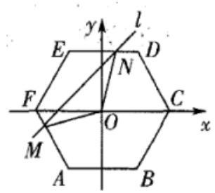
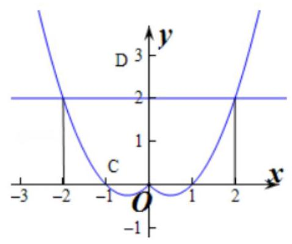
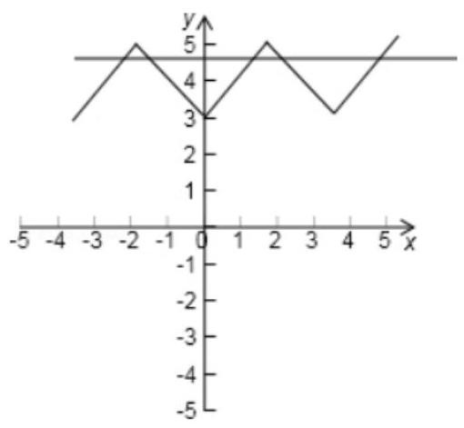
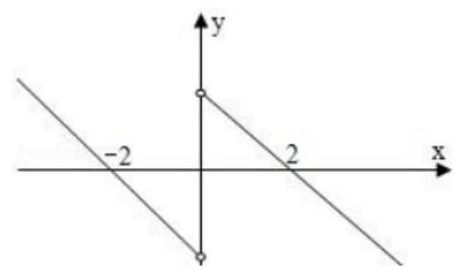
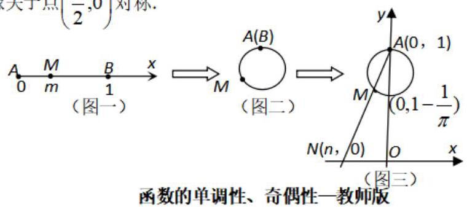
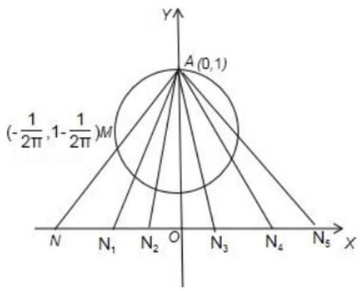
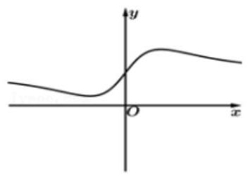
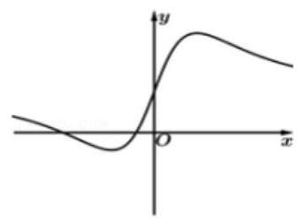
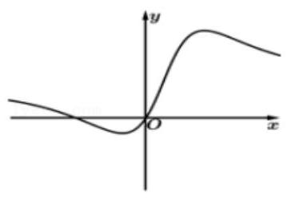
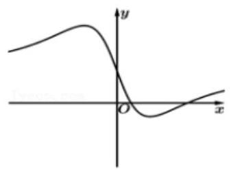

函数的单调性、奇偶性

<table><tr><td>教学目标</td><td>1、掌握奇偶性的判断方法及奇偶性的性质与应用;   2、掌握函数单调性的定义证明法;   3、掌握函数周期性的应用;</td></tr><tr><td>重点</td><td>1、会运用函数的奇偶性求有关函数的值和解析式;   2、会运用函数的奇偶性研究函数的其他性质.   3、会利用定义法证明函数单调性;   4、会利用单调性的定义去求解含参问题.</td></tr><tr><td>难 点</td><td>1、会运用函数的奇偶性求有关函数的值和解析式;   2、会运用函数的奇偶性研究函数的其他性质.   3、会利用定义法证明函数单调性;   4、会利用单调性的定义去求解含参问题.</td></tr></table>

## (一) 函数的奇偶性

## 知识梳理

1、偶函数:对于函数 $y = f\left( x\right)$ 的___定义域___ $D$ 内的任意实数 $a$ ，都有___ $f\left( {-x}\right)  = f\left( x\right)$ ；

2、奇函数:对于函数 $y = f\left( x\right)$ 的___定义域___ $D$ 内的任意实数 $a$ ，都有___ $f\left( {-x}\right)  =  - f\left( x\right)$ ；

3、定义域关于原点对称是函数具有奇偶性的必要非充分条件,；

4、偶函数的图像关于 $y$ 轴对称对称，奇函数的图像关于___坐标原点___对称；

5、分段函数的奇偶性一定要___分段___证明.

【问题反思】

问题一:当奇函数 $f\left( x\right)$ 在 $x = 0$ 处有定义时， $f\left( 0\right)$ 的值等于多少？为什么？

答: $f\left( 0\right)  = 0$ . 证明: $f\left( {-0}\right)  =  - f\left( 0\right)  \Rightarrow  f\left( 0\right)  = 0$ .

问题二:若 $f\left( x\right)$ 既是奇函数又是偶函数，则 $f\left( x\right)$ 的解析式是什么？为什么？

答: $f\left( x\right)  = 0$ ,定义域关于原点对称.

证明: $f\left( {-x}\right)  =  - f\left( x\right)$ ,又 $f\left( {-x}\right)  = f\left( x\right)$ ,故 $- f\left( x\right)  = f\left( x\right)  \Rightarrow  f\left( x\right)  = 0$

问题三: 奇偶性的等价形式有哪些? 答: $f\left( {-x}\right)  \pm  f\left( x\right)  = 0$ ;

## 6、判断函数的奇偶性的方法:

(1)定义法:首先判断其定义域是否关于原点中心对称. 若不对称，则为非奇非偶函数；若对称，则再判断 $f\left( {-x}\right)  =  - f\left( x\right)$ 或 $f\left( x\right)  = f\left( {-x}\right)$ 是否定义域上的恒等式;

(2)图象法；

(3)性质法:①设 $f\left( x\right)$ ， $g\left( x\right)$ 的定义域分别是 ${D}_{1}$ ， ${D}_{2}$ ，那么在它们的公共定义域 $D = {D}_{1} \cap  {D}_{2}$ 上: 奇 $\pm$ 奇 $=$ 奇,偶 $\pm$ 偶 $=$ 偶,奇 $\times$ 奇 $=$ 偶,偶 $\times$ 偶 $=$ 偶,奇 $\times$ 偶 $=$ 奇;

②若某奇函数若存在反函数，则其反函数必是奇函数；

(4)判断函数的奇偶性有时可以用定义的等价形式:

$$
f\left( x\right)  \pm  f\left( {-x}\right)  = 0,\;\frac{f\left( x\right) }{f\left( {-x}\right) } =  \pm  1
$$

## 例题精讲

【例 1】判断下列函数的奇偶性

(1) $f\left( x\right)  = \frac{\sqrt{1 - {x}^{2}}}{\left| {x + 2}\right|  - 2}$ ; (2) $f\left( x\right)  = x\lg \frac{1 - x}{1 + x}$ ；

(3) $f\left( x\right)  = \sqrt{1 - {x}^{2}} + \sqrt{{x}^{2} - 1}$ ； (4) $f\left( x\right)  = x\left( {\frac{1}{{3}^{x} - 1} + \frac{1}{2}}\right)$ ；

(5) $f\left( x\right)  = \left\{  \begin{array}{l} {x}^{2} + \sin x,\text{ 当 }x \geq  0\text{ 时 } \\  {x}^{2} - \sin x,\text{ 当 }x < 0\text{ 时 } \end{array}\right.$ ; (6) $f\left( x\right)  = {x}^{2} + \left| {x - a}\right|  + 1\left( {a \in  R}\right)$ .

【难度】★★★

【答案】见解析

【解析】(1) 由 $1 - {x}^{2} \geq  0$ 得 $- 1 \leq  x \leq  1$ ,而当 $- 1 \leq  x \leq  1$ 时, $\left| {x + 2}\right|  = x + 2$

所以 $f\left( x\right)  = \frac{\sqrt{1 - {x}^{2}}}{x + 2 - 2} = \frac{\sqrt{1 - {x}^{2}}}{x}$ 此时 $x \neq  0$ ,所以 $f\left( {-x}\right)  =  - f\left( x\right)$ 故 $f\left( x\right)$ 为奇函数;

(2) $f\left( x\right)$ 的定义域 $\{ x \mid   - 1 < x < 1\}$ 而 $f\left( {-x}\right)  =  - x\lg \frac{1 + x}{1 - x} = x\lg \frac{1 - x}{1 + x}$ 所以 $f\left( {-x}\right)  = f\left( x\right)$ 故 $f\left( x\right)$ 为偶函数;

(3)函数 $f\left( x\right)$ 的定义域为 $\left\{  {\begin{array}{l} 1 - {x}^{2} \geq  0 \\  {x}^{2} - 1 \geq  0 \end{array} \Rightarrow  {x}^{2} = 1 \Rightarrow  x =  \pm  1}\right.$ ， $f\left( x\right)$ 的定义域关于原点对称，当 $x =  \pm  1$ 时， $f\left( x\right)  = 0$ ,所以 $f\left( x\right)$ 既是奇函数又是偶函数;

(4) $f\left( x\right)$ 的定义域为 $x \neq  0$ 的一切实数，关于原点对称

$\frac{1}{{3}^{x} - 1} + \frac{1}{2} = \frac{{3}^{x} + 1}{2\left( {{3}^{x} - 1}\right) }f\left( x\right)  = x\left( {\frac{1}{{3}^{x} - 1} + \frac{1}{2}}\right)  = \frac{x}{2}\left( \frac{{3}^{x} + 1}{{3}^{x} - 1}\right) , f\left( {-x}\right)  = \frac{-x}{2}\left( \frac{{3}^{-x} + 1}{{3}^{-x} - 1}\right)  = \frac{x}{2}\left( \frac{{3}^{x} + 1}{{3}^{x} - 1}\right)$

$\therefore f\left( x\right)  = f\left( {-x}\right)$ ,所以 $f\left( x\right)$ 为偶函数;

(5)定义域为 $R$ ,当 $x > 0$ 则 $- x < 0, f\left( {-x}\right)  = {\left( -x\right) }^{2} - \sin \left( {-x}\right)  = {x}^{2} + \sin x = f\left( x\right)$

当 $x = 0, f\left( 0\right)  = 0$ ; 当 $x < 0$ ,则 $- x > 0, f\left( {-x}\right)  = {\left( -x\right) }^{2} + \sin \left( {-x}\right)  = {x}^{2} - \sin x = f\left( x\right)$

综上可得, $f\left( {-x}\right)  = f\left( x\right) , f\left( x\right)$ 为偶函数;

(6) 定义域 $R$ 当 $a = 0$ 时, $f\left( x\right)  = {x}^{2} + \left| x\right|  + 1$ ,显然是偶函数

当 $a \neq  0$ 时,因 $f\left( {-1}\right)  = 2 + \left| {a + 1}\right| , f\left( 1\right)  = 2 + \left| {a - 1}\right|$ 又 $a \neq  0$ 故 $\begin{array}{l} f\left( {-1}\right)  \neq  f\left( 1\right) , \\  f\left( {-1}\right)  \neq   - f\left( 1\right)  \end{array}$

所以 $f\left( x\right)$ 是非奇非偶函数;

【例 2】( 1 )若 $f\left( x\right)  = \frac{1}{{2}^{x} - 1} + a$ 是奇函数，则 $a =$ ___.

【难度】 $\star   \star   \star$

【答案】 $a = \frac{1}{2}$

【解析】解: $\because f\left( x\right)$ 是奇函数,

$\therefore f\left( x\right)  =  - f\left( {-x}\right)$

$\therefore \frac{1}{{2}^{-x} - 1} + a =  - \frac{1}{{2}^{x} - 1} - a$

$\therefore \frac{{2}^{x}}{1 - {2}^{x}} + a = \frac{-1}{{2}^{x} - 1} - a$

整理可得, ${2a}\left( {1 - {2}^{x}}\right)  = 1 - {2}^{x}$

$\therefore {2a} = 1$

$\therefore a = \frac{1}{2}$

( 2 )若函数 $f\left( x\right)  = \frac{k - {2}^{x}}{1 + k \cdot  {2}^{x}}$ ( $k$ 为实常数)在其定义域上是奇函数，则 $k$ 的值为___.

【难度】 $\star   \star   \star   \star$

【答案】 $\pm  1$

【解析】因为 $f\left( x\right)$ 是奇函数,所以 $f\left( x\right)  + f\left( {-x}\right)  = 0$ ,即 $\frac{k - {2}^{x}}{1 + k \cdot  {2}^{x}} + \frac{k - {2}^{-x}}{1 + k \cdot  {2}^{-x}} = 0$ ,

$\frac{k - {2}^{x}}{1 + k \cdot  {2}^{x}} + \frac{k \cdot  {2}^{x} - 1}{k + {2}^{x}} = 0,\frac{\left( {{k}^{2} - 1}\right) \left( {{2}^{2x} + 1}\right) }{\left( {1 + k \cdot  {2}^{x}}\right) \left( {k + {2}^{x}}\right) } = 0$ ,所以 ${k}^{2} = 1, k =  \pm  1$ .

(3)已知 $f\left( x\right)  = a{x}^{2} + {bx} + {3a} + b$ 是偶函数，且其定义域为 $\left\lbrack  {a - 1,{2a}}\right\rbrack$ ，则 $a =$ ___， $b =$ ___.

【难度】 $\star   \star   \star$

【答案】 $\frac{1}{3},0$

【解析】 $f\left( x\right)  = a{x}^{2} + {bx} + {3a} + b$ 是偶函数,一次项系数为 $b$ ,则 $b = 0$ . 定义域 $\left\lbrack  {a - 1,{2a}}\right\rbrack$ 关于原点对称, 故 ${2a} + a - 1 = 0 \Rightarrow  a = \frac{1}{3}$ .

(4)已知函数 $f\left( x\right)  = \left\{  \begin{array}{l} {x}^{2} + \sin x, x \geq  0 \\   - {x}^{2} + \cos \left( {x + \alpha }\right) , x < 0 \end{array}\right.$ 是奇函数，则 $\sin \alpha  =$

【难度】 $\star   \star   \star   \star$

【答案】-1

【解析】分段函数的奇偶性判断

(5)若函数 $f\left( x\right) \left( {x \in  R}\right)$ 满足 $f\left( {-1 + x}\right)$ 、 $f\left( {1 + x}\right)$ 均为奇函数，则下列四个结论正确的是( )

A. $f\left( {-x}\right)$ 为奇函数 B. $f\left( {-x}\right)$ 为偶函数

C. $f\left( {x + 3}\right)$ 为奇函数 D. $f\left( {x + 3}\right)$ 为偶函数

【难度】 $\star   \star   \star$

【答案】 $C$ .

【解析】解: $\because f\left( {x + 1}\right)$ 与 $f\left( {x - 1}\right)$ 都是奇函数,

$\therefore$ 函数 $f\left( x\right)$ 关于点 $\left( {1,0}\right)$ 及点 $\left( {-1,0}\right)$ 对称,

$\therefore f\left( x\right)  + f\left( {2 - x}\right)  = 0, f\left( x\right)  + f\left( {-2 - x}\right)  = 0$ ,

故有 $f\left( {2 - x}\right)  = f\left( {-2 - x}\right)$ ,

函数 $f\left( x\right)$ 是周期 $T = \left\lbrack  {2 - \left( {-2}\right) }\right\rbrack   = 4$ 的周期函数.

$\therefore f\left( {-x - 1 + 4}\right)  =  - f\left( {x - 1 + 4}\right)$ ,

$f\left( {-x + 3}\right)  =  - f\left( {x + 3}\right) ,$

$f\left( {x + 3}\right)$ 是奇函数.

故选: $C$ .

【例 3】( 1 )已知 $y = f\left( x\right)  + {x}^{2}$ 是奇函数，且 $f\left( 1\right)  = 1$ ，若 $g\left( x\right)  = f\left( x\right)  + 2$ ，则 $g\left( {-1}\right)  =$ ___.

【难度】 $\star   \star   \star$

【答案】-1

【解析】解: $\because y = f\left( x\right)  + {x}^{2}$ 是奇函数,

$\therefore$ 设 $y = F\left( x\right)  = f\left( x\right)  + {x}^{2}$ ,

$\because F\left( 1\right)  = f\left( 1\right)  + 1 = 1 + 1 = 2$ ,

$\therefore F\left( {-1}\right)  = f\left( {-1}\right)  + 1 =  - F\left( 1\right)  =  - 2$ ,

$\therefore f\left( {-1}\right)  =  - 2 - 1 =  - 3$ ,

则 $\because g\left( x\right)  = f\left( x\right)  + 2$ ,

$\therefore g\left( {-1}\right)  = f\left( {-1}\right)  + 2 =  - 3 + 2 =  - 1$ ,

( 2 )已知定义在 $R$ 上的函数 $y = f\left( x\right)$ 为奇函数，且 $y = f\left( {x + 1}\right)$ 为偶函数， $f\left( 1\right)  = 1$ ，则 $f\left( 3\right)  + f\left( 4\right)  =$

【难度】 $\star   \star   \star$

【答案】-1

【解析】解: $\because y = f\left( {x + 1}\right)$ 为偶函数

$\therefore f\left( {-x + 1}\right)  = f\left( {x + 1}\right)$

令 $x = 2$ 得 $f\left( 3\right)  = f\left( {-2 + 1}\right)  = f\left( {-1}\right)  =  - f\left( 1\right)  =  - 1$

$\because$ 定义在 $R$ 上的函数 $y = f\left( x\right)$ 为奇函数

$\therefore f\left( 0\right)  = 0$

令 $x = 1$ 得 $f\left( 2\right)  = f\left( {-1 + 1}\right)  = f\left( 0\right)  = 0$

令 $x = 3$ 得 $f\left( 4\right)  = f\left( {-3 + 1}\right)  = f\left( {-2}\right)  =  - f\left( 2\right)  = 0$

$\therefore f\left( 3\right)  + f\left( 4\right)  =  - 1 + 0 =  - 1$

故答案为: -1

(3)设函数 $f\left( x\right)$ 是定义在 $R$ 上的以 3 为周期的奇函数，若 $f\left( 2\right)  > 1, f\left( {2020}\right)  = \frac{{2a} - 3}{a + 1}$ ，则 $a$ 的取值范围是___

【难度】 $\star   \star   \star$

【答案】 $- 1 < a < \frac{2}{3}$

【解析】解: 由 $f\left( x\right)$ 是定义在 $R$ 上的以 3 为周期的奇函数,

则 $f\left( {x + 3}\right)  = f\left( x\right) , f\left( {-x}\right)  =  - f\left( x\right)$ ,

$\therefore f\left( {2020}\right)  = f\left( {3 \times  {674} - 2}\right)  = f\left( {-2}\right)  =  - f\left( 2\right)$ ,

又 $f\left( 2\right)  > 1$ ,

$\therefore f\left( {2020}\right)  <  - 1$ ,

即 $\frac{{2a} - 3}{a + 1} <  - 1$ ,即为 $\frac{{3a} - 2}{a + 1} < 0$ ,

即有 $\left( {{3a} - 2}\right) \left( {a + 1}\right)  < 0$ ,解得, $- 1 < a < \frac{2}{3}$ ,

故答案为: $- 1 < a < \frac{2}{3}$ .

【例 4】定义 $F\left( {a, b}\right)  = \left\{  \begin{array}{ll} a & a \leq  b \\  b & a > b \end{array}\right.$ ,已知函数 $f\left( x\right) \text{ 、 }g\left( x\right)$ 的定义域都是 $R$ ,则下列四个命题中为真命题的是 (写出所有真命题的序号)

①若 $f\left( x\right)$ 、 $g\left( x\right)$ 都是奇函数，则函数 $F\left( {f\left( x\right) , g\left( x\right) }\right)$ 为奇函数；

②若 $f\left( x\right)$ 、 $g\left( x\right)$ 都是偶函数，则函数 $F\left( {f\left( x\right) \text{ ， }g\left( x\right) }\right)$ 为偶函数；

③若 $f\left( x\right) \text{ 、 }g\left( x\right)$ 都是增函数，则函数 $F\left( {f\left( x\right) , g\left( x\right) }\right)$ 为增函数；

④若 $f\left( x\right) \text{ 、 }g\left( x\right)$ 都是减函数，则函数 $F\left( {f\left( x\right) , g\left( x\right) }\right)$ 为减函数.

【难度】 $\star   \star   \star   \star$

【答案】②③④.

【解析】解: $F\left( {a, b}\right)  = \left\{  \begin{array}{ll} a & a \leq  b \\  b & a > b \end{array}\right.$ ,

若 $f\left( x\right) \text{ 、 }g\left( x\right)$ 都是奇函数,则函数 $F\left( {f\left( x\right) , g\left( x\right) }\right)$ 不一定是奇函数,如 $y = x$ 与 $y = {x}^{3}$ ,故①是假命题;

若 $f\left( x\right) \text{ 、 }g\left( x\right)$ 都是偶函数,则函数 $F\left( {f\left( x\right) , g\left( x\right) }\right)$ 为偶函数,故②是真命题;

若 $f\left( x\right) \text{ 、 }g\left( x\right)$ 都是增函数,则函数 $F\left( {f\left( x\right) , g\left( x\right) }\right)$ 为增函数,故③是真命题;

若 $f\left( x\right) \text{ 、 }g\left( x\right)$ 都是减函数,则函数 $F\left( {f\left( x\right) , g\left( x\right) }\right)$ 为减函数,故④是真命题.

故答案为:②③④.

【例 5】如图,在直角坐标平面的正六边形 ${ABCDEF}$ ,中心在原点,边长为 $a,{AB}$ 平行于 $x$ 轴,直线 $l : y = {kx} + t\left( {k\text{ 为常数 }}\right)$ 与正六边形交于 $M, N$ 两点,记 $\bigtriangleup {OMN}$ 的面积为 $S$ ,则关于函数 $S = f\left( t\right)$ 的奇偶性的判断正确的是 ( )

A. 一定是奇函数 B. 一定是偶函数

D. 奇偶性与 $k$ 有关

【难度】 $\star   \star   \star   \star$

【答案】B

【解析】设 $M$ 点关于原点的对称点 ${M}^{\prime }, N$ 点关于原点对称的点为 ${N}^{\prime }$ ，知 ${M}^{\prime }\text{ 、 }{N}^{\prime }$ 在正六边形上。当

直线 $l$ 在某一个确定的位置时,对应有一个 $t$ 值,那么易得直线 ${M}^{\prime }{N}^{\prime }$ 的斜率仍为 $k$ ,对应的截距为 $- t$ , 显然 $\bigtriangleup {OMN}$ 的面积与 $\bigtriangleup O{M}^{\prime }{N}^{\prime }$ 的面积相等。选B。

【例 6】设函数 $f\left( x\right)  = {a}_{1}\sin \left( {x + {a}_{1}}\right)  + {a}_{2}\sin \left( {x + {a}_{2}}\right)  + \ldots  + {a}_{n}\sin \left( {x + {a}_{n}}\right)$ ,其中 ${a}_{i},{a}_{j}\left( {i = 1,2,\ldots , n, n \in  {N}^{ * }}\right.$ , $n \geq  2)$ 为已知实常数, $x \in  R$ ,下列关于函数 $f\left( x\right)$ 的性质判断正确的个数是(   )

① 若 $f\left( 0\right)  = f\left( \frac{\pi }{2}\right)  = 0$ ,则 $f\left( x\right)  = 0$ 对任意实数 $x$ 恒成立;

②若 $f\left( 0\right)  = 0$ ，则函数 $f\left( x\right)$ 为奇函数；

③ 若 $f\left( \frac{\pi }{2}\right)  = 0$ ，则函数 $f\left( x\right)$ 为偶函数；

④ 当 ${f}^{2}\left( 0\right)  + {f}^{2}\left( \frac{\pi }{2}\right)  \neq  0$ 时,若 $f\left( {x}_{1}\right)  = f\left( {x}_{2}\right)  = 0$ ,则 ${x}_{1} - {x}_{2} = {k\pi }\left( {k \in  Z}\right)$

A. 4 B. 3 C. 2 D. 1

【难度】 $\star   \star   \star   \star   \star$

【答案】A

【解析】解: $\because$ 函数 $f\left( x\right)  = {a}_{1}\sin \left( {x + {a}_{1}}\right)  + {a}_{2}\sin \left( {x + {a}_{2}}\right)  + \ldots  + {a}_{n}\sin \left( {x + {a}_{n}}\right)$ ,

其中 ${a}_{i},{a}_{j}\left( {i = 1,2,\ldots , n, n \in  {N}^{ * }, n \geq  2}\right)$ 为已知实常数, $x \in  R$ ,

对于②:若 $f\left( 0\right)  = 0$ ，则 $f\left( 0\right)  = {a}_{1} \cdot  \sin \left( {\alpha }_{1}\right)  + {a}_{2} \cdot  \sin \left( {\alpha }_{2}\right)  + \ldots  + {a}_{n} \cdot  \sin \left( {\alpha }_{n}\right)  = 0$ ，

$f\left( {-x}\right)  + f\left( x\right)  = {a}_{1} \cdot  \sin \left( {-x + {\alpha }_{1}}\right)  + {a}_{2} \cdot  \sin \left( {-x + {\alpha }_{2}}\right)  + \ldots  + {a}_{n} \cdot  \sin \left( {-x + {\alpha }_{n}}\right)  + {a}_{1} \cdot  \sin \left( {x + {\alpha }_{1}}\right)  + {a}_{2} \cdot  \sin \left( {x + {\alpha }_{2}}\right)  + \ldots  + {a}_{n} \cdot  \sin \left( {x + {\alpha }_{n}}\right) \; = 2\cos x\left\lbrack  {{a}_{1} \cdot  \sin {\alpha }_{1} + {a}_{2} \cdot  \sin {\alpha }_{2} + \ldots  + {a}_{n} \cdot  \sin {\alpha }_{n}}\right\rbrack   = 0,$

$\therefore$ 函数 $f\left( x\right)$ 为奇函数,故②正确.

对于③:若 $f\left( \frac{\pi }{2}\right)  = 0$ ，则 $f\left( \frac{\pi }{2}\right)  = {a}_{1} \cdot  \sin \left( {\frac{\pi }{2} + {\alpha }_{1}}\right)  + {a}_{2} \cdot  \sin \left( {\frac{\pi }{2} + {\alpha }_{2}}\right)  + \ldots  + {a}_{n} \cdot  \sin \left( {\frac{\pi }{2} + {\alpha }_{n}}\right)$

$=  - {a}_{1} \cdot  \cos \left( {\alpha }_{1}\right)  - {a}_{2} \cdot  \cos \left( {\alpha }_{2}\right)  - \ldots  - {a}_{n} \cdot  \cos \left( {\alpha }_{n}\right)  = 0$ ,

$\therefore f\left( {-x}\right)  - f\left( x\right)  = {a}_{1} \cdot  \sin \left( {-x + {\alpha }_{1}}\right)  + {a}_{2} \cdot  \sin \left( {-x + {\alpha }_{2}}\right)  + \ldots  + {a}_{n} \cdot  \sin \left( {-x + {\alpha }_{n}}\right)$

$- {a}_{1} \cdot  \sin \left( {x + {\alpha }_{1}}\right)  - {a}_{2} \cdot  \sin \left( {x + {\alpha }_{2}}\right)  - \ldots  - {a}_{n} \cdot  \sin \left( {x + {\alpha }_{n}}\right)  = 2\sin x\left\lbrack  {{a}_{1} \cdot  \cos {\alpha }_{1} + {a}_{2} \cdot  \cos {\alpha }_{2} + \ldots  + {a}_{n} \cdot  \cos {\alpha }_{n}}\right\rbrack   = 0,$

$\therefore$ 函数 $f\left( x\right)$ 为偶函数,故③正确.

对于①:若 $f\left( 0\right)  = f\left( \frac{\pi }{2}\right)  = 0$ ，则函数 $f\left( x\right)$ 为奇函数，也为偶函数，

$\therefore f\left( x\right)  = 0$ 对任意实数 $x$ 恒成立,故①正确.

对于④: 当 ${f}^{2}\left( 0\right)  + {f}^{2}\left( \frac{\pi }{2}\right)  \neq  0$ 时,若 $f\left( {x}_{1}\right)  = f\left( {x}_{2}\right)  = 0$ ,

则 $f\left( {x}_{1}\right)  = {a}_{1} \cdot  \sin \left( {{x}_{1} + {\alpha }_{1}}\right)  + {a}_{2} \cdot  \sin \left( {{x}_{1} + {\alpha }_{2}}\right)  + \ldots  + {a}_{n} \cdot  \sin \left( {{x}_{1} + {\alpha }_{n}}\right)$

$= f\left( {x}_{2}\right)  = {a}_{1} \cdot  \sin \left( {{x}_{2} + {\alpha }_{1}}\right)  + {a}_{2} \cdot  \sin \left( {{x}_{2} + {\alpha }_{2}}\right)  + \ldots  + {a}_{n} \cdot  \sin \left( {{x}_{2} + {\alpha }_{n}}\right)  = 0$ ,

$\therefore \left( {\sin {x}_{1} - \sin {x}_{2}}\right) \left( {{a}_{1}\cos {\alpha }_{1} + \ldots  + {a}_{n}\cos {\alpha }_{n}}\right)  + \left( {\cos {x}_{1} - \cos {x}_{2}}\right) \left( {{a}_{1}\sin {\alpha }_{1} + \ldots  + {a}_{n}\sin {\alpha }_{n}}\right)  = 0$ ,

$\therefore \sin {x}_{1} - \sin {x}_{2} = 0$ ,可得 ${x}_{1} - {x}_{2} = {k\pi }\left( {k \in  Z}\right)$ ,故④正确.

故选: $A$ .

## 巩固训练

1、判断下列函数的奇偶性:

(1) $f\left( x\right)  = \lg \left( {x + \sqrt{1 + {x}^{2}}}\right)$ (2) $f\left( x\right)  = \frac{1 + {2}^{x}}{1 - {2}^{x}} + {\log }_{2}\frac{1 + x}{1 - x}$

【难度】 $\star   \star   \star$

【答案】见解析

【解析】(1) $x \in  R, f\left( {-x}\right)  = \lg \left( {-x + \sqrt{1 + {\left( -x\right) }^{2}}}\right)  = \lg \left( \frac{1}{x + \sqrt{1 + {x}^{2}}}\right)  =  - \lg \left( {x + \sqrt{1 + {x}^{2}}}\right)  =  - f\left( x\right)$ ; 故 $f\left( x\right)$ 在 $R$ 上是奇函数.

( 2 )定义域 $\left\{  {\begin{array}{l} 1 - {2}^{x} \neq  0 \\  \frac{1 + x}{1 - x} > 0 \end{array}, x \in  \left( {-1,0}\right)  \cup  \left( {0,1}\right) }\right.$ ， $f\left( {-x}\right)  = \frac{1 + {2}^{-x}}{1 - {2}^{-x}} + {\log }_{2}\frac{\frac{1 - x}{1 + x}}{} = \frac{{2}^{x} + 1}{{2}^{x} - 1} - {\log }_{2}^{\frac{1 + x}{1 - x}} =  - f\left( x\right)$ ，所以 $f\left( x\right)$ 是奇函数

2、若 $f\left( x\right)  = \frac{1}{{2}^{x} + 1} + a$ 是奇函数，则实数 $a =$ ___.

【难度】 $\star   \star   \star$

【答案】 $- \frac{1}{2}$

【解析】解: $\because$ 函数 $f\left( x\right)$ 为奇函数,且函数 $f\left( x\right)  = \frac{1}{{2}^{x} + 1} + a$ 的定义域为 $R$ ,

$\therefore f\left( 0\right)  = \frac{1}{{2}^{0} + 1} + a = \frac{1}{2} + a = 0$ ,解得 $a =  - \frac{1}{2}$ ;

3、(1)已知 $f\left( x\right) , g\left( x\right)$ 分别是定义在 $R$ 上的偶函数和奇函数,且 $f\left( x\right)  - g\left( x\right)  = {x}^{3} + {x}^{2} + x$ 则 $f\left( 1\right)  + g\left( 1\right)  =$

【难度】 $\star   \star   \star$

【答案】-1

【解析】解: 根据题意,由 $f\left( x\right)  - g\left( x\right)  = {x}^{3} + {x}^{2} + x$ ,则有 $f\left( {-x}\right)  - g\left( {-x}\right)  =  - {x}^{3} + {x}^{2} - x$ ,

又由 $f\left( x\right) , g\left( x\right)$ 分别是定义在 $R$ 上的偶函数和奇函数,即 $f\left( x\right)  = f\left( {-x}\right) , g\left( {-x}\right)  =  - g\left( x\right)$ ,

则有 $f\left( x\right)  + g\left( x\right)  =  - {x}^{3} + {x}^{2} - x$ ,

令 $x = 1$ ,得 $f\left( 1\right)  + g\left( 1\right)  =  - 1 + 1 - 1 =  - 1$ .

(2)设 $f\left( x\right)$ 是 $\mathbf{R}$ 上的奇函数， $g\left( x\right)$ 是 $\mathbf{R}$ 上的偶函数，若函数 $f\left( x\right)  + g\left( x\right)$ 的值域为 $\lbrack 1,3)$ ，则 $f\left( x\right)  - g\left( x\right)$ 的值域为___.

【难度】 $\star   \star   \star$

【答案】 $( - 3, - 1\rbrack$

【解析】解: 由 $f\left( x\right)$ 是 $R$ 上的奇函数, $g\left( x\right)$ 是 $R$ 上的偶函数,

得到 $f\left( {-x}\right)  =  - f\left( x\right) , g\left( {-x}\right)  = g\left( x\right)$ ,

$\because 1 \leq  f\left( x\right)  + g\left( x\right)  < 3$ ,且 $f\left( x\right)$ 和 $g\left( x\right)$ 的定义域都为 $R$ ,

把 $x$ 换为 $- x$ 得: $1 \leq  f\left( {-x}\right)  + g\left( {-x}\right)  < 3$ ,

变形得: $1 \leq   - f\left( x\right)  + g\left( x\right)  < 3$ ,即 $- 3 < f\left( x\right)  - g\left( x\right)  \leq   - 1$ ,

则 $f\left( x\right)  - g\left( x\right)$ 的值域为 $( - 3, - 1\rbrack$ .

故答案为: $( - 3, - 1\rbrack$

4、函数 $f\left( x\right)  = {x}^{3} + \sin x + 1\left( {x \in  R}\right)$ ，若 $f\left( a\right)  = 2$ ，则 $f\left( {-a}\right)$ 的值为( )

A. 3 B. 0 C. -1 D. -2

【难度】★★★

【答案】B

【解析】解: $\because$ 由 $f\left( \mathbf{a}\right)  = 2$

$\therefore f\left( \mathbf{a}\right)  = {a}^{3} + \sin a + 1 = 2,{a}^{3} + \sin a = 1$ ,

则 $f\left( {-a}\right)  = {\left( -a\right) }^{3} + \sin \left( {-a}\right)  + 1 =  - \left( {{a}^{3} + \sin a}\right)  + 1 =  - 1 + 1 = 0$ .

故选: $B$ .

5、(1)如果函数 $y = \left\{  \begin{array}{ll} {2x} - 3, & x > 0, \\  f\left( x\right) , & x < 0 \end{array}\right.$ 是奇函数，则 $f\left( x\right)  =$ ___.

【难度】 $\star   \star   \star$

【答案】 ${2x} + 3$

【解析】解: 设 $x < 0$ ,得 $- x > 0$

根据当 $x > 0$ 时的表达式,可得

$f\left( {-x}\right)  =  - {2x} - 3$

$\because f\left( x\right)$ 是奇函数

$\therefore f\left( x\right)  =  - f\left( {-x}\right)  = {2x} + 3$

故答案为: ${2x} + 3$

(2)已知函数 $f\left( x\right)$ 是定义在 $\left( {-\infty , + \infty }\right)$ 上的偶函数. 当 $x \in  \left( {-\infty ,0}\right)$ 时， $f\left( x\right)  = x - {x}^{4}$ ，则当 $x \in  \left( {0, + \infty }\right)$ 时, $f\left( x\right)  =$

【难度】 $\star   \star   \star$

【答案】 $- x - {x}^{4}$

【解析】解: 设 $x \in  \left( {0, + \infty }\right)$ ,则 $- x \in  \left( {-\infty ,0}\right)$ ,

$\because$ 当 $x \in  \left( {-\infty ,0}\right)$ 时, $f\left( x\right)  = x - {x}^{4}$ ,

$\therefore f\left( {-x}\right)  =  - x - {x}^{4}$ ,

又 $\because f\left( x\right)$ 是定义在 $\left( {-\infty , + \infty }\right)$ 上的偶函数,

$\therefore f\left( x\right)  = f\left( {-x}\right)  =  - x - {x}^{4}$ ,

故选: $A$ .

6、函数 $f\left( x\right)  = {3x} + \sin \left( {{2x} - 1}\right)$ 图像的对称中心是___.

【难度】 $\star   \star   \star   \star$

【答案】 $\left( {\frac{1}{2},\frac{3}{2}}\right)$

【解析】 $f\left( x\right)  = {3x} + \sin \left( {{2x} - 1}\right)  = \frac{3}{2}\left( {{2x} - 1}\right)  + \sin \left( {{2x} - 1}\right)  + \frac{3}{2}$ ,因为 $y = x + \sin x$ 为奇函数,得出此题中心对称点

7、已知椭圆 $\frac{{x}^{2}}{16} + \frac{{y}^{2}}{9} = 1$ 及以下 3 个函数: ① $f\left( x\right)  = x$ ; ② $f\left( x\right)  = \sin x$ ; ③ $f\left( x\right)  = x\sin x$ ，其中函数图像能等分该椭圆面积的函数个数有 ( )

A. 0 个 B. 1 个 ${C.2}$ 个 D. 3 个

【难度】 $\star   \star   \star   \star$

【答案】C

【解析】奇函数关于原点对称, 能等分椭圆, 偶函数不能, 故①②满足, 选 C。

8、设 $f\left( x\right)  = \frac{-{2}^{x} + a}{{2}^{x + 1} + b}$ ( $a, b$ 为实常数).

(1)当 $a = b = 1$ 时，证明: $f\left( x\right)$ 不是奇函数；

(2)设 $f\left( x\right)$ 是奇函数，求 $a$ 与 $b$ 的值；

【难度】 $\star   \star   \star   \star$

【答案】见解析

【解析】(1) 举出反例即可. $f\left( x\right)  = \frac{-{2}^{x} + 1}{{2}^{x + 1} + 1}, f\left( 1\right)  = \frac{-2 + 1}{{2}^{2} + 1} =  - \frac{1}{5}, f\left( {-1}\right)  = \frac{-\frac{1}{2} + 1}{2} = \frac{1}{4}$ ,

所以 $f\left( {-1}\right)  \neq   - f\left( 1\right) , f\left( x\right)$ 不是奇函数;

(2) $f\left( x\right)$ 是奇函数时， $f\left( {-x}\right)  =  - f\left( x\right)$ ，即 $\frac{-{2}^{-x} + a}{{2}^{-x + 1} + b} =  - \frac{-{2}^{x} + a}{{2}^{x + 1} + b}$ 对定义域内任意实数 $x$ 成立.

化简整理得 $\left( {{2a} - b}\right)  \cdot  {2}^{2x} + \left( {{2ab} - 4}\right)  \cdot  {2}^{x} + \left( {{2a} - b}\right)  = 0$ ,这是关于 $x$ 的恒等式,

所以, $\left\{  \begin{array}{l} {2a} - b = 0, \\  {2ab} - 4 = 0 \end{array}\right.$ 所以 $\left\{  \begin{array}{l} a =  - 1 \\  b =  - 2 \end{array}\right.$ 或 $\left\{  \begin{array}{l} a = 1 \\  b = 2 \end{array}\right.$ . 经检验都符合题意.

9、已知函数 $f\left( x\right)  = {x}^{2} + \frac{a}{x}\left( {x \neq  0\text{ ,常数 }a \in  R}\right)$ . 讨论函数 $f\left( x\right)$ 的奇偶性,并说明理由;

【难度】 $\star   \star   \star   \star$

【答案】见解析

【解析】当 $a = 0$ 时, $f\left( x\right)  = {x}^{2}$ ,

对任意 $x \in  \left( {-\infty ,0}\right)  \cup  \left( {0, + \infty }\right) , f\left( {-x}\right)  = {\left( -x\right) }^{2} = {x}^{2} = f\left( x\right) ,\therefore f\left( x\right)$ 为偶函数.

当 $a \neq  0$ 时, $f\left( x\right)  = {x}^{2} + \frac{a}{x}\left( {a \neq  0, x \neq  0}\right)$ ,

取 $x =  \pm  1$ ,得 $f\left( {-1}\right)  + f\left( 1\right)  = 2 \neq  0, f\left( {-1}\right)  - f\left( 1\right)  =  - {2a} \neq  0,\therefore f\left( {-1}\right)  \neq   - f\left( 1\right) , f\left( {-1}\right)  \neq  f\left( 1\right)$ ,

$\therefore$ 函数 $f\left( x\right)$ 既不是奇函数,也不是偶函数.

## (二)函数的单调性

## 知识梳理

1、函数的单调性的定义

对于给定区间上的函数 $y = f\left( x\right)$ ,如果对于属于这个区间的自变量的任意两个值 ${x}_{1}\text{ 、 }{x}_{2}$ ,只要有 ${x}_{1} < {x}_{2}$ ,都有 $f\left( {x}_{1}\right)  < f\left( {x}_{2}\right)$ ,那么就说 $y = f\left( x\right)$ 在这个区间上是增函数;

对于给定区间上的函数 $y = f\left( x\right)$ ,如果对于属于这个区间的自变量的任意两个值 ${x}_{1}\text{ 、 }{x}_{2}$ ,只要有 ${x}_{1} < {x}_{2}$ ,都有 $f\left( {x}_{1}\right)  > f\left( {x}_{2}\right)$ ,那么就说 $y = f\left( x\right)$ 在这个区间上是减函数.

2、函数的单调区间

如果函数 $y = f\left( x\right)$ 在某个区间 $I$ 上是增 (减) 函数,那么就说函数 $y = f\left( x\right)$ 在这个区间 $I$ 上是单调函数,区间 $I$ 叫做函数 $y = f\left( x\right)$ 的单调区间.

【注】多个单调区间用“和”连接

3、用定义证明(判断)函数在指定区间上的单调性

证明 (判断) 函数 $y = f\left( x\right)$ 在指定区间 $A$ 上的单调性的一般步骤是:

① 设元:设 ${x}_{1},{x}_{2} \in  A$ ，且 ${x}_{1} < {x}_{2}$ . 目的是使 ${x}_{1},{x}_{2}$ 在区间 $A$ 内，并规定 ${x}_{1}$ 与 ${x}_{2}$ 的大小顺序.

② 作差: $f\left( {x}_{1}\right)  - f\left( {x}_{2}\right)$ . 目的是将 $f\left( {x}_{1}\right)  - f\left( {x}_{2}\right)$ 与 0 比较大小.

③ 变形:将 $f\left( {x}_{1}\right)  - f\left( {x}_{2}\right)$ 变形至可以与 0 比较大小为止. 常用因式分解或配方进行变形.

④ 判号:确定 $f\left( {x}_{1}\right)  - f\left( {x}_{2}\right) \left\{  \begin{array}{l}  > 0 \\   = 0 \\   < 0 \end{array}\right.$ 三种情况之一.

⑤ 定论:根据①和④作出结论.

## 【注】判断函数单调性的常用方法: (1) 复合函数法; (2) 图像法; (3) 定义法.

4、单调性的常见等价命题形式

(1)对于任意的 $a > 0$ ,都有 $f\left( {x + a}\right)  > f\left( x\right)$ ,表示 $f\left( x\right)$ 单调递增;

对于任意的 $a > 0$ ,都有 $f\left( {x + a}\right)  < f\left( x\right)$ ,表示 $f\left( x\right)$ 单调递减;

函数的单调性、奇偶性一教师版

(2)【斜率形式】对于任意的 ${x}_{1} \neq  {x}_{2}$ ，都有 $\frac{f\left( {x}_{1}\right)  - f\left( {x}_{2}\right) }{{x}_{1} - {x}_{2}} > 0$ ，表示 $f\left( x\right)$ 单调递增；

对于任意的 ${x}_{1} \neq  {x}_{2}$ ,都有 $\frac{f\left( {x}_{1}\right)  - f\left( {x}_{2}\right) }{{x}_{1} - {x}_{2}} < 0$ ,表示 $f\left( x\right)$ 单调递减.

5、复合函数的单调性

遵循“同增异减”的规律，同时特别注意:讨论函数单调性必须在其定义域内进行，因此，要研究函数的单调性, 必须先求函数的定义域.

设 $y = f\left( u\right) , u = \varphi \left( x\right)$ 且当 $x \in  A$ 时, $u \in  B$ ,则复合函数 $y = f\left\lbrack  {\varphi \left( x\right) }\right\rbrack  \left( {x \in  A}\right)$ 的单调性与内、外层函数的单调性关系为下表所示.

<table><tr><td>函数</td><td>$y = f\left( u\right)$</td><td>$u = \varphi \left( x\right)$</td><td>$y = f\left\lbrack  {\varphi \left( x\right) }\right\rbrack$</td></tr><tr><td>单调区间</td><td>$u \in  B$</td><td>$x \in  A$</td><td>$x \in  A$</td></tr><tr><td rowspan="4">单调性</td><td>增</td><td>增</td><td>增</td></tr><tr><td>增</td><td>减</td><td>减</td></tr><tr><td>减</td><td>增</td><td>减</td></tr><tr><td>减</td><td>减</td><td>增</td></tr></table>

6、在研究形如 $y = x + \frac{a}{x}$ 的函数的单调性时,需分两种情况讨论: (1) 当 $a \leq  0$ ,在 $\left( {-\infty ,0}\right)$ 和 $\left( {0, + \infty }\right)$ 上是增函数; (2) 当 $a > 0$ 时,在 $\left( {0,\sqrt{a}}\right)$ 和 $\lbrack  - \sqrt{a},0)$ 上是减函数,在 $\left\lbrack  {\sqrt{a}, + \infty }\right)$ 和 $\left( {-\infty , - \sqrt{a}}\right\rbrack$ 上是增函数.

7、关于分段函数的单调性:

若函数 $f\left( x\right)  = \left\{  {\begin{array}{ll} g\left( x\right) , & x \in  \left\lbrack  {a, b}\right\rbrack  , \\  h\left( x\right) , & x \in  \left\lbrack  {c, d}\right\rbrack  , \end{array}\left( {a < b < c < d}\right) , g\left( x\right) }\right.$ 在区间 $x \in  \left\lbrack  {a, b}\right\rbrack$ 上是增函数, $h\left( x\right)$ 在区间 $x \in  \left\lbrack  {c, d}\right\rbrack$ 上是增函数,则 $f\left( x\right)$ 在区间 $\left\lbrack  {a, b}\right\rbrack   \cup  \left\lbrack  {c, d}\right\rbrack$ 上不一定是增函数,若使得 $f\left( x\right)$ 在区间 $\left\lbrack  {a, b}\right\rbrack   \cup  \left\lbrack  {c, d}\right\rbrack$ 上一定是增函数,需补充条件: $g\left( b\right)  < h\left( c\right)$ .

8、奇偶性与单调性的联系:

1、若 $f\left( x\right)$ 是具有奇偶性的单调函数，则奇(偶)函数在正负对称区间上的单调性是相同(反)的.

2、若 $f\left( x\right)$ 是奇函数且有最值，则 “最大值+最小值=0.”

## 例题精讲

【例 7】求证: 函数 $f\left( x\right)  = x + \frac{4}{x}$ 在区间 $\left( {-\infty , - 2}\right)$ 上是增函数.

【难度】 $\bigstar \bigstar  \star$

【答案】见解析

【解析】证明: 任取 ${x}_{1},{x}_{2} \in  \left( {-\infty , - 2}\right)$ ,假设 ${x}_{1} < {x}_{2}$ ,则

$f\left( {x}_{1}\right)  - f\left( {x}_{2}\right)  = {x}_{1} + \frac{4}{{x}_{1}} - {x}_{2} - \frac{4}{{x}_{2}} = \left( {{x}_{1} - {x}_{2}}\right) \frac{{x}_{1}{x}_{2} - 4}{{x}_{1}{x}_{2}}$

${x}_{1} - {x}_{2} < 0,{x}_{1} \cdot  {x}_{2} > 4$ ,所以, $f\left( {x}_{1}\right)  - f\left( {x}_{2}\right)  < 0$ 故 $f\left( x\right)  = x + \frac{4}{x}$ 在区间 $\left( {-\infty , - 2}\right)$ 上是增函数.

【例 8】( 1 )函数 $y = {\left( \frac{1}{3}\right) }^{{2x} - {x}^{2}}$ 的单调递增区间是___.

【难度】★★

【答案】 $\lbrack 1, + \infty )$

【解析】解: 令 $t = {2x} - {x}^{2} =  - {\left( x - 1\right) }^{2} + 1$ ,则 $y = {\left( \frac{1}{3}\right) }^{t}$ ,故本题即求函数 $t$ 的减区间.

再利用二次函数的性质可得 $t = {2x} - {x}^{2}$ 的减区间为 $\lbrack 1, + \infty )$ ,

故答案为: $\lbrack 1, + \infty )$ .

( 2 )函数 $y = {lg}\left( {8 + {2x} - {x}^{2}}\right)$ 的单调递增区间是___

【难度】 $\star   \star$

【答案】 $( - 2,1\rbrack$

【解析】解: 由 $8 + {2x} - {x}^{2} > 0$ ,得 $x \in  \left( {-2,4}\right)$ ,

$y = \lg \left( {8 + {2x} - {x}^{2}}\right)$ 由 $y = \lg u, u = 8 + {2x} - {x}^{2}$ 复合而成,

且 $y = \lg u$ 递增, $u = 8 + {2x} - {x}^{2}$ 在 $\left( {-2,1}\right)$ 上递增,在 $\left( {1,4}\right)$ 上递减,

$\therefore y = \lg \left( {8 + {2x} - {x}^{2}}\right)$ 单调递增区间是 $( - 2,1\rbrack$ .

故答案为: $( - 2,1\rbrack$ .

(3)函数 $y = \sqrt{{x}^{2} + 2\left| x\right|  - 3}$ 的单调递减区间是( )

A. $\left( {-\infty , - 3}\right)$ B. $\left\lbrack  {-3, + \infty }\right)$ C. $( - \infty , - 1\rbrack$ D. $( - \infty ,0\rbrack$

【难度】 $\star   \star   \star$

【答案】 $C$

【解析】解: $\because$ 函数 $y = \sqrt{{x}^{2} + 2\left| x\right|  - 3} = \sqrt{\left( {\left| x\right|  + 3}\right) \left( {\left| x\right|  - 1}\right) }$ ,

$\therefore \left| x\right|  \geq  1$ ,

解得 $x \geq  1$ ,或 $x \leq   - 1$ ,

故函数的定义域为 $\left\lbrack  {1, + \infty )\cup ( - \infty , - 1}\right\rbrack$ .

再根据此函数为偶函数,图象关于 $y$ 轴对称,

当 $x \geq  1$ 时,函数为 $y = \sqrt{\left( {x + 3}\right) \left( {x - 1}\right) }$ ,显然函数在 $\lbrack 1, + \infty )$ 上是增函数,

故函数在 $\left( {-\infty , - 1}\right\rbrack$ 上是减函数.

综上,函数 $y = \sqrt{{x}^{2} + 2\left| x\right|  - 3}$ 的单调递减区间是 $( - \infty , - 1\rbrack$ ,

故选: $C$ .

(4)设 $y = f\left( x\right)$ 是 $R$ 上的减函数，则 $y = f\left( \left| {x - 3}\right| \right)$ 的单调递减区间为___.

【难度】 $\star   \star   \star$

【答案】 $\lbrack 3, + \infty )$

【解析】解: 可令 $t = \left| {x - 3}\right|$ ,则 $y = f\left( t\right)$ ,

由 $t = \left| {x - 3}\right|$ 的增区间为 $\left( {3, + \infty }\right)$ ,

而奇函数 $y = f\left( x\right)$ 是 $R$ 上的减函数,

则函数 $y = f\left( \left| {x - 3}\right| \right)$ 的单调递减区间是 $\left( {3, + \infty }\right)$ ,

故答案为 $\left( {3, + \infty }\right)$ .

【例 9】根据函数的单调性填空:

(1)函数 $f\left( x\right)  = a{x}^{2} + 4\left( {a + 1}\right) x - 3$ 在 $\lbrack 2, + \infty )$ 上递减，则 $a$ 的取值范围是___.

【难度】 $\star   \star   \star$

【答案】 $\left( {-\infty , - \frac{1}{2}}\right\rbrack$

【解析】解: 当 $a = 0$ 时, $f\left( x\right)  = {4x} - 3$ ,由一次函数性质,在区间 $\lbrack 2, + \infty )$ 上递增. 不符合题意;

当 $a < 0$ 时,函数 $f\left( x\right)$ 的图象是开口向下的抛物线,且对称轴为 $x =  - \frac{{2a} + 2}{a} \leq  2$ ,解得 $a \leq   - \frac{1}{2}$ ;

当 $a > 0$ 时,函数 $f\left( x\right)$ 的图象是开口向上的抛物线,易知不合题意.

综上可知 $a$ 的取值范围是 $a \leq   - \frac{1}{2}$ .

( 2 )若函数 $f\left( x\right)  = \left| {x - a}\right|  + 2$ 在 $\lbrack 0, + \infty )$ 上为增函数，则实数 $a$ 的取值范围是___.

【难度】 $\star   \star   \star$

【答案】 $a \leq  0$

【解析】利用绝对值函数图像

(3)若函数 $f\left( x\right)  = \frac{{ax} + 1}{x + 2}$ 在 $\left( {-\infty , - 2}\right)$ 为增函数，则实数 $a$ 的取值范围是___.

【难度】 $\star   \star   \star$

【答案】 $a > \frac{1}{2}$

【解析】解: $\because f\left( x\right)  = \frac{{ax} + 1}{x + 2} = \frac{a\left( {x + 2}\right)  + 1 - {2a}}{x + 2} = a + \frac{1 - {2a}}{x + 2}$

$\because f\left( x\right)$ 在 $\left( {-\infty ,2}\right)$ 内为增函数,

$\therefore  - {2a} + 1 < 0$

解得: $a > \frac{1}{2}$ 故答案为: $a > \frac{1}{2}$

(4)若函数 $f\left( x\right)  = {2x} - \frac{a}{x}, x \in  (0,1\rbrack$ 上是减函数，则实数 $a$ 的取值范围是___.

【答案】 $a \leq   - 2$

【解析】分类讨论或者用单调性定义

(5)若函数 $f\left( x\right)  = \left\{  \begin{array}{ll} {x}^{2} + 1 & \left( {x \geq  1}\right) \\  {ax} - 1 & \left( {x < 1}\right)  \end{array}\right.$ 在 $R$ 上是单调递增函数，则 $a$ 的取值范围是___.

【难度】★★★

【答案】 $(0,3\rbrack$

【解析】解: 函数 $f\left( x\right)  = \left\{  \begin{array}{l} {x}^{2} + 1, x \geq  1 \\  {ax} - 1, x < 1 \end{array}\right.$ 在 $R$ 上是单调递增函数

则: $a > 0$

当 $x = 1$ 时, ${1}^{2} + 1 \geq  a - 1$

解不等式得: $a \leq  3$

综上所述: $0 < a \leq  3$

故答案为: $0 < a \leq  3$

(6)已知函数 $f\left( x\right)  = {x}^{2} + \frac{a}{x}\left( {x \neq  0, a \in  R}\right)$ ，若 $f\left( x\right)$ 在区间 $\lbrack 2, + \infty )$ 是增函数，则实数 $a$ 的取值范围是___.

【难度】 $\star   \star   \star   \star$

【答案】 $a \leq  {16}$

【解析】设 ${x}_{2} > {x}_{1} \geq  2, f\left( {x}_{1}\right)  - f\left( {x}_{2}\right)  = {x}_{1}^{2} + \frac{a}{{x}_{1}} - {x}_{2}^{2} - \frac{a}{{x}_{2}} = \frac{{x}_{1} - {x}_{2}}{{x}_{1}{x}_{2}}\left\lbrack  {{x}_{1}{x}_{2}\left( {{x}_{1} + {x}_{2}}\right)  - a}\right\rbrack$ ,

由 ${x}_{2} > {x}_{1} \geq  2$ 得 ${x}_{1}{x}_{2}\left( {{x}_{1} + {x}_{2}}\right)  > {16},{x}_{1} - {x}_{2} < 0,{x}_{1}{x}_{2} > 0$

要使 $f\left( x\right)$ 在区间 $\lbrack 2, + \infty )$ 是增函数只需 $f\left( {x}_{1}\right)  - f\left( {x}_{2}\right)  < 0$ ,即 ${x}_{1}{x}_{2}\left( {{x}_{1} + {x}_{2}}\right)  - a > 0$ 恒成立,则 $a \leq  {16}$ .

【例 10】( 1 )已知 $f\left( x\right)$ 是 $R$ 上的增函数， $A\left( {0, - 1}\right)$ ， $B\left( {3,1}\right)$ 是其图像上的两点，则不等式 $\left| {f\left( {x + 1}\right) }\right|  < 1$ 的解集为___

【难度】 $\star   \star$

【答案】 $- 1 < x < 2$

【解析】 $f\left( 0\right)  =  - 1, f\left( 3\right)  = 1,\left| {f\left( {x + 1}\right) }\right|  < 1$ ,则 $- 1 < f\left( {x + 1}\right)  < 1\;f\left( x\right)$ 是 $R$ 上的增函数.

所以, $0 < x + 1 < 3$ ,得 $- 1 < x < 2$ .

( 2 )已知函数 $f\left( x\right)  = \left\{  \begin{array}{ll} {x}^{2} + {4x} & x \geq  0 \\  {4x} - {x}^{2} & x < 0 \end{array}\right.$ ，若 $f\left( {2 - {a}^{2}}\right)  > f\left( a\right)$ ，则实数 $a$ 的取值范围是___.

【难度】 $\star   \star   \star$

【答案】 $\left( {-2,1}\right)$

【解析】由题意可得函数 $f\left( x\right)  = \left\{  \begin{array}{ll} {x}^{2} + {4x}, & x \geq  0 \\  {4x} - {x}^{2}, & x < 0 \end{array}\right.$ 在 $R$ 上是增函数,

要使 $f\left( {2 - {a}^{2}}\right)  > f\left( \mathrm{a}\right)$ ,

只要 $2 - {a}^{2} > a$ 即可,

解得 $- 2 < a < 1$ ,即 $a$ 的范围为 $\left( {-2,1}\right)$ .

【例 11】已知函数 $y = f\left( x\right) \left( {x \in  {\mathbf{N}}^{ * }, y \in  {\mathbf{N}}^{ * }}\right)$ ,对任意 $n \in  {\mathbf{N}}^{ * }$ 都有 $f\left\lbrack  {f\left( n\right) }\right\rbrack   = {3n}$ ,且 $f\left( x\right)$ 是增函数，则 $f\left( 3\right)  =$ ___.

【难度】 $\star   \star   \star   \star$

【答案】 6

【解析】解: 令 $f\left( 1\right)  = a$ ,

$\because$ 对任意 $n \in  {N}^{ * }$ 都有 $f\left\lbrack  {f\left( n\right) }\right\rbrack   = {3n}$ ,故有 $a \neq  1$ ,否则,可得 $f\left\lbrack  {f\left( 1\right) }\right\rbrack   = f\left( 1\right)  = 1$ ,

这与 $f\left\lbrack  {f\left( 1\right) }\right\rbrack   = 3 \times  1 = 3$ 矛盾.

从而 $a > 1$ ,而由 $f\left( {f\left( 1\right) }\right)  = 3$ ,即得 $f\left( a\right)  = 3$ .

$\because f\left( x\right)$ 是增函数,

$\therefore f\left( a\right)  > f\left( 1\right)  = a$ ,即 $a < 3$ ,于是得到 $1 < a < 3$ .

又 $a \in  {N}^{ * }$ ,从而 $a = 2$ ,即 $f\left( 1\right)  = 2$ .

而由 $f\left( \mathrm{a}\right)  = 3$ 知， $f\left( 2\right)  = 3$ .

于是 $f\left( 3\right)  = f\left( {f\left( 2\right) }\right)  = 3 \times  2 = 6$ ,

故答案为: 6 .

## 巩固训练

1、已知函数 $f\left( x\right)$ 为定义在 $R$ 上的函数,则 “对于任意 $x \in  R$ ,恒有 $f\left( x\right)  < f\left( {x + 1}\right)$ ”是“ $f\left( x\right)$ 在 $R$ 上是增函数”的___条件

【难度】 $\star   \star   \star$

【答案】必要非充分.

【解析】必要性: $f\left( x\right)$ 在 $R$ 上是增函数,又对任意 $x \in  R, x < x + 1$ ,故恒有 $f\left( x\right)  < f\left( {x + 1}\right)$ ; 是必要条件.

充分性: 令 $f\left( x\right)  = \left\{  \begin{array}{ll} x, & x \in  \left( {-\infty ,0}\right)  \cup  \left( {\frac{1}{2}, + \infty }\right) \\  0, & x \in  \left\lbrack  {0,\frac{1}{2}}\right\rbrack   \end{array}\right.$ ,对任意 $x \in  R$ ,恒有 $f\left( x\right)  < f\left( {x + 1}\right)$ ,但是 $f\left( x\right)$ 在 $R$ 上不单调, 故是不充分的.

2、(1)已知函数 $f\left( x\right)  = k{x}^{2} - {4x} - 8$ 在区间 $\left\lbrack  {4,{16}}\right\rbrack$ 上单调递减，则实数 $k$ 的取值范围是___；

【难度】 $\star   \star   \star$

【答案】 $k \leq  \frac{1}{8}$

【解析】解: 因为 $y = k{x}^{2} - {4x} - 8$ 在区间 $\left\lbrack  {4,{16}}\right\rbrack$ 上是减函数,所以 $\left\lbrack  {4,{16}}\right\rbrack$ 为函数减区间的子集.

① 当 $k = 0$ 时， $y =  - {4x} - 8$ 在区间 $\left\lbrack  {4,{16}}\right\rbrack$ 上是减函数， $\therefore k = 0$ 满足题意；

② 当 $k > 0$ 时， $y = k{x}^{2} - {4x} - 8$ 的减区间为 $\left( {-\infty ,\frac{2}{k}}\right\rbrack$ ，则有 $\frac{2}{k} \geq  {16}$ ，解得 $0 < k \leq  \frac{1}{8}$ ；

③ 当 $k < 0$ 时， $y = k{x}^{2} - {4x} - 8$ 的减区间为 $\left\lbrack  {\frac{2}{k}, + \infty }\right)$ ，则有 $\frac{2}{k} \leq  4$ ，解得 $k < 0$ ；

$\therefore k$ 的取值范围为 $\left( {-\infty ,\frac{1}{8}}\right\rbrack$

故答案为: $\left( {-\infty ,\frac{1}{8}}\right\rbrack$ .

( 2 )若函数 $f\left( x\right)  = {4x} + \frac{a}{x}$ 在区间 $(0,2\rbrack$ 上是减函数，则实数 $a$ 的取值范围是___；

【难度】★★★

【答案】 $a \geq  {16}$

【解析】解: $\because f\left( x\right)  = {4x} + \frac{a}{x}$

$\therefore {f}^{\prime }\left( x\right)  = 4 - \frac{a}{{x}^{2}}$

$\because$ 函数 $f\left( x\right)  = {4x} + \frac{a}{x}$ 在区间 $(0,2\rbrack$ 上是减函数,

$\therefore {f}^{\prime }\left( x\right)  = 4 - \frac{a}{{x}^{2}} \leq  0$ 在区间 $(0,2\rbrack$ 上恒成立

即 $a \geq  4{x}^{2}$ 在 $(0,2\rbrack$ 上恒成立

$\because 4{x}^{2} \leq  {16}$

$\therefore a \geq  {16}$

故答案为: $a \geq  {16}$

(3)若函数 $f\left( x\right)  = a\left| {x - b}\right|  + 2$ 在 $\lbrack 0, + \infty )$ 上为增函数，则实数 $a, b$ 的取值范围是___.

【难度】 $\star   \star   \star$

【答案】 $a > 0, b \leq  0$ .

【解析】解: 当 $x \geq  b$ 时, $f\left( x\right)  = a\left( {x - b}\right)  + 2 = {ax} - {ab} + 2$ ,

在区间 $\lbrack 0, + \infty )$ 上是增函数,

$\therefore a > 0$ ,且 $b \leq  0$ ;

当 $x < b$ 时, $f\left( x\right)  =  - a\left( {x - b}\right)  + 2 =  - {ax} + {ab} + 2$ ,

在 $\lbrack 0, + \infty )$ 上是增函数不成立;

综上, $a, b$ 的取值范围是 $a > 0$ ,且 $b \leq  0$

(4)已知函数 $f\left( x\right)  = \left\{  \begin{array}{l} \left( {{3a} - 1}\right) x + 2 - {2a}, x \geq  1 \\  {2}^{ax}, x < 1 \end{array}\right.$ 满足对于任意 ${x}_{1} \neq  {x}_{2}$ ，都有 $\frac{f\left( {x}_{1}\right)  - f\left( {x}_{2}\right) }{{x}_{1} - {x}_{2}} > 0$ 成立，则 $a$ 的取值范围为___.

【难度】 $\star   \star   \star$

【答案】 $\left( {\frac{1}{3},1}\right\rbrack$

【解析】解: $\because$ 对于任意 ${x}_{1} \neq  {x}_{2}$ ,都有 $\frac{f\left( {x}_{1}\right)  - f\left( {x}_{2}\right) }{{x}_{1} - {x}_{2}} > 0$ 成立,故函数 $f\left( x\right)$ 在 $R$ 上为增函数,故 $\left\{  {\begin{array}{l} {3a} - 1 > 0 \\  a > 0 \\  {3a} - 1 + 2 - {2a} \geq  {2}^{a} \end{array}\text{ ,解得: }a \in  \left( {\frac{1}{3},1}\right\rbrack  }\right.$ ,故答案为: $\left( {\frac{1}{3},1}\right\rbrack$

3、已知 $y = f\left( x\right)$ 在定义域 $\left( {-1,1}\right)$ 上是减函数,且 $f\left( {1 - a}\right)  < f\left( {{2a} - 1}\right)$ ,求 $a$ 的取值范围.

【难度】 $\star   \star   \star$

【答案】 $- 1 < {2a} - 1 < 1 - a < 1$ ,解得 $a \in  \left( {0,\frac{2}{3}}\right)$ .

【解析】解: $\because f\left( x\right)$ 在定义域 $\left( {-1,1}\right)$ 上是减函数,且 $f\left( {1 - a}\right)  < f\left( {{2a} - 1}\right)$

$\therefore \left\{  \begin{array}{l}  - 1 < 1 - a < 1 \\   - 1 < {2a} - 1 < 1 \\  1 - a > {2a} - 1 \end{array}\right. ,\therefore 0 < a < \frac{2}{3}$ ,

故选: $C$ .

4、已知函数 $f\left( x\right)  = \frac{{x}^{2} + a}{x + 1}\left( {a \in  R}\right)$ . 用定义证明: 当 $a = 3$ 时,函数 $y = f\left( x\right)$ 在 $\lbrack 1, + \infty )$ 上是增函数;

【难度】 $\star   \star   \star$

【答案】见解析

【解析】当 $a = 3$ 时, $f\left( x\right)  = \frac{{x}^{2} + 3}{x + 1}$

任取 ${x}_{1},{x}_{2} \in  \lbrack 1, + \infty ),{x}_{1} < {x}_{2}$ 时, $f\left( {x}_{1}\right)  - f\left( {x}_{2}\right)  = \frac{{x}_{1}^{2} + 3}{{x}_{1} + 1} - \frac{{x}_{2}^{2} + 3}{{x}_{2} + 1} = \frac{\left( {{x}_{1} - {x}_{2}}\right) \left( {{x}_{1} + {x}_{1} + {x}_{1}{x}_{2} - 3}\right) }{\left( {{x}_{1} + 1}\right) \left( {{x}_{2} + 1}\right) }$

因为 $1 \leq  {x}_{1} < {x}_{2}$ ,所以 ${x}_{1} + 1 > 0,{x}_{2} + 1 > 0,{x}_{1} - {x}_{2} < 0,{x}_{1}{x}_{2} > 1,{x}_{1} + {x}_{2} + {x}_{1}{x}_{2} - 3 > 0$

所以 $f\left( {x}_{1}\right)  - f\left( {x}_{2}\right)  < 0$ ,所以 $f\left( x\right)$ 在 $\lbrack 1, + \infty )$ 上为增函数.

5、已知二次函数 $f\left( x\right)  = a{x}^{2} + \left( {a - 1}\right) x + a$ .

(1)函数 $f\left( x\right)$ 在 $\left( {-\infty , - 1}\right)$ 上单调递增，求实数 $a$ 的取值范围；

(2)关于 $x$ 的不等式 $\frac{f\left( x\right) }{x} \geq  2$ 在 $x \in  \left\lbrack  {1,2}\right\rbrack$ 上恒成立，求实数 $a$ 的取值范围；

(3)函数 $g\left( x\right)  = f\left( x\right)  + \frac{1 - \left( {a - 1}\right) {x}^{2}}{x}$ 在(2.3)上是增函数，求实数 $a$ 的取值范围.

【难度】 $\star   \star   \star   \star$

【答案】见解析

【解析】(1) 当 $a > 0$ 时, $f\left( x\right)$ 在 $\left( {-\infty , - 1}\right)$ 上不可能单调递增;

当 $a < 0$ 时,图像对称轴为 $x =  - \frac{a - 1}{2a}$ ,由条件得 $- \frac{a - 1}{2a} \geq   - 1$ ,得 $a \leq   - 1$ .

(2)设 $h\left( x\right)  = \frac{f\left( x\right) }{x} = a\left( {x + \frac{1}{x}}\right)  + a - 1$ ，当 $x \in  \left\lbrack  {1,2}\right\rbrack$ 时， $x + \frac{1}{x} \in  \left\lbrack  {2,\frac{5}{2}}\right\rbrack$ ，

因为不等式 $\frac{f\left( x\right) }{x} \geq  2$ 在 $x \in  \left\lbrack  {1,2}\right\rbrack$ 上恒成立,所以 $h\left( x\right)$ 在 $x \in  \left\lbrack  {1,2}\right\rbrack$ 时的最小值大于或等于 2,

所以, $\left\{  \begin{matrix} a > 0 \\  {2a} + a - 1 \geq  2 \end{matrix}\right.$ 或 $\left\{  \begin{matrix} a < 0 \\  \frac{5}{2}a + a - 1 \geq  2 \end{matrix}\right.$ ,解得 $a \geq  1$ .

(3) $g\left( x\right)  = a{x}^{2} + \frac{1}{x} + a$ 在 $\left( {2.3}\right)$ 上是增函数，设 $2 < {x}_{1} < {x}_{2} < 3$ ，则 $g\left( {x}_{1}\right)  < g\left( {x}_{2}\right)$ ，

$a{x}_{1}^{2} + \frac{1}{{x}_{1}} + a < a{x}_{2}^{2} + \frac{1}{{x}_{2}} + a, a\left( {{x}_{1} + {x}_{2}}\right) \left( {{x}_{1} - {x}_{2}}\right)  < \frac{{x}_{1} - {x}_{2}}{{x}_{1}{x}_{2}},$

因为 $2 < {x}_{1} < {x}_{2} < 3$ ,所以 $a > \frac{1}{{x}_{1}{x}_{2}\left( {{x}_{1} + {x}_{2}}\right) }$ ,而 $\frac{1}{{x}_{1}{x}_{2}\left( {{x}_{1} + {x}_{2}}\right) } \in  \left( {\frac{1}{54},\frac{1}{16}}\right)$ ,所以 $a \geq  \frac{1}{16}$ .

## (三)函数奇偶性和单调性的综合

## 例题精讲

【例 12】( 1 )奇函数 $f\left( x\right)$ 在定义域 $\left( {-1,1}\right)$ 上是减函数，又 $f\left( {1 - a}\right)  + f\left( {1 - {a}^{2}}\right)  < 0$ ，求实数 $a$ 的取值范围.

【难度】 $\star   \star   \star$

【答案】 $0 < a < 1$

【解析】解: $\because f\left( x\right)$ 是奇函数,

$\therefore f\left( {1 - a}\right)  + f\left( {1 - {a}^{2}}\right)  < 0 \Leftrightarrow  f\left( {1 - a}\right)  < f\left( {{a}^{2} - 1}\right)$ ,

$\because$ 函数 $f\left( x\right)$ 在定义域 $\left( {-1,1}\right)$ 上是减函数,

$\therefore \left\{  \begin{array}{l} 1 - a > {a}^{2} - 1 \\  1 - a < 1 \\  {a}^{2} - 1 >  - 1 \end{array}\right.$

$\therefore$ 所求 $a$ 的取值范围是 $0 < a < 1$ .

(2)偶函数 $f\left( x\right) , x \in  R$ 满足，对任意 ${x}_{1},{x}_{2} \in  \lbrack 0, + \infty )\left( {{x}_{1} \neq  {x}_{2}}\right)$ ，有 $\frac{f\left( {x}_{1}\right)  - f\left( {x}_{2}\right) }{{x}_{1} - {x}_{2}} < 0$ ，则()

A. $f\left( {-2}\right)  < f\left( 1\right)  < f\left( 3\right)$ B. $f\left( 1\right)  < f\left( {-2}\right)  < f\left( 3\right)$

C. $f\left( 3\right)  < f\left( {-2}\right)  < f\left( 1\right)$ D. $f\left( 3\right)  < f\left( 1\right)  < f\left( {-2}\right)$

【难度】 $\star   \star   \star$

【答案】C

【解析】比较 $f\left( 3\right) \text{ 、 }f\left( 2\right) \text{ 、 }f\left( 1\right)$ 即可

【例 13】( 1 )已知函数 $f\left( x\right)  = {x}^{2} - \left| x\right|$ ,若 $f\left( {{\log }_{2}\frac{1}{m + 1}}\right)  < f\left( 2\right)$ ,则实数 $m$ 的取值范围是___.

【难度】 $\star   \star   \star   \star$

【答案】 $\left( {-\frac{3}{4},3}\right)$

【解析】解: $\because f\left( x\right)  = {x}^{2} - \left| x\right|$ ,

$\therefore f\left( {-x}\right)  = f\left( x\right)$ ,即函数 $f\left( x\right)$ 是偶函数,

作出函数 $f\left( x\right)$ 的图象如图,

若 $f\left( {{\log }_{2}\frac{1}{m + 1}}\right)  < f\left( 2\right)$ ,

则 $- 2 < {\log }_{2}\frac{1}{m + 1} < 2$ ,

即 $\frac{1}{4} < \frac{1}{m + 1} < 4$ ,

即 $\frac{1}{4} < m + 1 < 4$ ,

解得 $- \frac{3}{4} < m < 3$ ,

故答案为: $\left( {-\frac{3}{4},3}\right)$

(2)已知函数 $f\left( x\right)  = \sin x + \tan \frac{x}{2} + {x}^{3}, x \in  \left( {-1,1}\right)$ ，则满足不等式 $f\left( {a - 1}\right)  + f\left( {{2a} - 1}\right)  < 0$ 的实数 $a$ 的取值范围是___.

【难度】 $\star   \star   \star   \star$

【答案】 $\left( {0,\frac{2}{3}}\right)$

【解析】解: $\because$ 函数 $f\left( x\right)  = \sin x + \tan \frac{x}{2} + {x}^{3}, x \in  \left( {-1,1}\right)$ ,

$\therefore f\left( {-x}\right)  = \sin \left( {-x}\right)  + \tan \frac{-x}{2} + {\left( -x\right) }^{3} =  - \left( {\sin x + \tan \frac{x}{2} + {x}^{3}}\right)  =  - f\left( x\right)$ ,

$\therefore f\left( x\right)$ 为奇函数,

$\therefore$ 不等式 $f\left( {a - 1}\right)  + f\left( {{2a} - 1}\right)  < 0$ ,即 $f\left( {a - 1}\right)  <  - f\left( {{2a} - 1}\right)$ ,即 $f\left( {a - 1}\right)  < f\left( {1 - {2a}}\right)$ ,

$\because y = \sin x$ 在 $\left( {-\frac{\pi }{2},\frac{\pi }{2}}\right)$ 上单调递增,则 $y = \sin x$ 在 $\left( {-1,1}\right)$ 上单调递增,

$y = \tan \frac{x}{2}$ 在 $\left( {-\pi ,\pi }\right)$ 上单调递增,则 $y = \tan \frac{x}{2}$ 在 $\left( {-1,1}\right)$ 上单调递增,

$y = {x}^{3}$ 在 $R$ 上单调递增,则 $y = {x}^{3}$ 在 $\left( {-1,1}\right)$ 上单调递增,

$\therefore$ 函数 $f\left( x\right)  = \sin x + \tan \frac{x}{2} + {x}^{3}$ 在 $\left( {-1,1}\right)$ 上单调递增,

$\therefore$ 不等式 $f\left( {a - 1}\right)  < f\left( {1 - {2a}}\right)$ ,转化为 $\left\{  \begin{array}{l}  - 1 < a - 1 < 1 \\   - 1 < {2a} - 1 < 1 \\  a - 1 < 1 - {2a} \end{array}\right.$ ,解得 $0 < a < \frac{2}{3}$ ,

$\therefore$ 满足不等式 $f\left( {a - 1}\right)  + f\left( {{2a} - 1}\right)  < 0$ 的实数 $a$ 的取值范围是 $\left( {0,\frac{2}{3}}\right)$ .

故答案为: $\left( {0,\frac{2}{3}}\right)$ .

【例 14】已知函数 $f\left( x\right)$ 的定义域是 $x \neq  0$ 的一切实数,对定义域内的任意 ${x}_{1},{x}_{2}$ 都有 $f\left( {{x}_{1} \cdot  {x}_{2}}\right)  = f\left( {x}_{1}\right)  + f\left( {x}_{2}\right)$ ,且当 $x > 1$ 时 $f\left( x\right)  > 0, f\left( 2\right)  = 1$ ,

(1)求证: $f\left( x\right)$ 是偶函数；

(2) $f\left( x\right)$ 在 $\left( {0, + \infty }\right)$ 上是增函数；

【难度】 $\star   \star   \star   \star$

【答案】见解析

【解析】(1) 令 ${x}_{1} = {x}_{2} = 1$ ,得 $f\left( 1\right)  = {2f}\left( 1\right) ,\therefore f\left( 1\right)  = 0$ ,令 ${x}_{1} = {x}_{2} =  - 1$ ,得 $f\left( {-1}\right)  = 0$ ,

$\therefore f\left( {-x}\right)  = f\left( {-1 \cdot  x}\right)  = f\left( {-1}\right)  + f\left( x\right)  = f\left( x\right) ,\therefore f\left( x\right)$ 是偶函数.

(2)设 ${x}_{2} > {x}_{1} > 0$ ，则 $f\left( {x}_{2}\right)  - f\left( {x}_{1}\right)  = f\left( {{x}_{1} \cdot  \frac{{x}_{2}}{{x}_{1}}}\right)  - f\left( {x}_{1}\right)  = f\left( {x}_{1}\right)  + f\left( \frac{{x}_{2}}{{x}_{1}}\right)  - f\left( {x}_{1}\right)  = f\left( \frac{{x}_{2}}{{x}_{1}}\right)$

$\because {x}_{2} > {x}_{1} > 0,\therefore \frac{{x}_{2}}{{x}_{1}} > 1,\therefore f\left( \frac{{x}_{2}}{{x}_{1}}\right)  > 0$ ,即 $f\left( {x}_{2}\right)  - f\left( {x}_{1}\right)  > 0,\therefore f\left( {x}_{2}\right)  > f\left( {x}_{1}\right)$

$\therefore f\left( x\right)$ 在 $\left( {0, + \infty }\right)$ 上是增函数.

【例 15】已知函数 $f\left( x\right)  = {x}^{2} + a$ .

(1)若 $F\left( x\right)  = f\left( x\right)  + \frac{2}{{bx} + 1}$ 是偶函数，在定义域上 $F\left( x\right)  \geq  {ax}$ 恒成立，求实数 $a$ 的取值范围；

( 2 )当 $a = 1$ 时，令 $\varphi \left( x\right)  = f\left( {f\left( x\right) }\right)  - {\lambda f}\left( x\right)$ ，问是否存在实数 $\lambda$ ，使 $\varphi \left( x\right)$ 在 $\left( {-\infty , - 1}\right)$ 上是减函数，在 $\left( {-1,0}\right)$ 上是增函数?如果存在,求出 $\lambda$ 的值; 如果不存在,请说明理由.

【难度】 $\star   \star   \star   \star$

【答案】 $\left( 1\right) F\left( x\right)  = {x}^{2} + a + \frac{2}{{bx} + 1}$ 是偶函数, $\therefore b = 0$ 即 $F\left( x\right)  = {x}^{2} + a + 2, x \in  R$

又 $F\left( x\right)  \geq  {ax}$ 恒成立即 ${x}^{2} + a + 2 \geq  {ax} \Rightarrow  a\left( {x - 1}\right)  \leq  {x}^{2} + 2$

当 $x = 1$ 时 $\Rightarrow  a \in  R$

当 $x > 1$ 时, $a \leq  \frac{{x}^{2} + 2}{x - 1} = \left( {x - 1}\right)  + \frac{3}{x - 1} + 2, a \leq  2\sqrt{3} + 2$

当 $x < 1$ 时, $a \geq  \frac{{x}^{2} + 2}{x - 1} = \left( {x - 1}\right)  + \frac{3}{x - 1} + 2,\;a \geq   - 2\sqrt{3} + 2$

综上: $- 2\sqrt{3} + 2 \leq  a \leq  2\sqrt{3} + 2$

(2) $\varphi \left( x\right)  = f\left( {f\left( x\right) }\right)  - {\lambda f}\left( x\right)  = {x}^{4} + \left( {2 - \lambda }\right) {x}^{2} + \left( {2 - \lambda }\right)$

$\therefore \varphi \left( x\right)$ 是偶函数,要使 $\varphi \left( x\right)$ 在 $\left( {-\infty , - 1}\right)$ 上是减函数在 $\left( {-1,0}\right)$ 上是增函数,即 $\varphi \left( x\right)$ 只要满足在区间 $\left( {1, + \infty }\right)$ 上是增函数在 $\left( {0,1}\right)$ 上是减函数.

令 $t = {x}^{2}$ ,当 $x \in  \left( {0,1}\right)$ 时 $t \in  \left( {0,1}\right) ;x \in  \left( {1, + \infty }\right)$ 时 $t \in  \left( {1, + \infty }\right)$ ,由于 $x \in  \left( {0, + \infty }\right)$ 时,

$t = {x}^{2}$ 是增函数记 $\varphi \left( x\right)  = H\left( t\right)  = {t}^{2} + \left( {2 - \lambda }\right) t + \left( {2 - \lambda }\right)$ ,故 $\varphi \left( x\right)$ 与 $H\left( t\right)$ 在区间 $\left( {0, + \infty }\right)$ 上有相同的增减性,当二次函数 $H\left( t\right)  = {t}^{2} + \left( {2 - \lambda }\right) t + \left( {2 - \lambda }\right)$ 在区间 $\left( {1, + \infty }\right)$ 上是增函数在 $\left( {0,1}\right)$ 上是减函数,其对称轴方程为 $t = 1 \Rightarrow   - \frac{2 - \lambda }{2} = 1 \Rightarrow  \lambda  = 4$ .

【例 16】定义在 $R$ 上的偶函数 $f\left( x\right)$ ,对任意的 $x \in  R$ 均有 $f\left( {x + 4}\right)  = f\left( x\right)$ 成立,当 $x \in  \left\lbrack  {0,2}\right\rbrack$ 时, $f\left( x\right)  = x + 3$ ，则直线 $y = \frac{9}{2}$ 与函数 $y = f\left( x\right)$ 的图像交点中最近两点的距离等于___.

【难度】 $\star   \star   \star   \star$

【答案】 1

【解析】解: $\because$ 对任意的 $x \in  R$ 均有 $f\left( {x + 4}\right)  = f\left( x\right)$ 成立

$\therefore y = f\left( x\right)$ 的周期为 4,

而 $y = f\left( x\right)$ 为偶函数,图象关于 $y$ 轴对称

画出函数的图象,

将 $y = \frac{9}{2}$ 代入 $f\left( x\right)  = x + 3$ 解得 $x = \frac{3}{2}$

根据图形可知图象关于 $x = 2$ 对称,则在 $\left\lbrack  {2,4}\right\rbrack$ 上的交点横坐标为 $\frac{5}{2}$

$\therefore$ 直线 $y = \frac{9}{2}$ 与函数 $y = f\left( x\right)$ 的图象交点中最近两点的距离等于 1 .

故答案为: 1

【例 17】(1)已知 $f\left( x\right)  = \frac{{2}^{1 + x} + {2}^{1 - x} + \arcsin x}{{2}^{x} + {2}^{-x}}$ 的最大值和最小值分别是 $M$ 和 $m$ ,则 $M + m =$ ___.

【难度】

【答案】 4

【解析】解: $f\left( x\right)  = \frac{{2}^{1 + x} + {2}^{1 - x} + \arcsin x}{{2}^{x} + {2}^{-x}}$

$= \frac{2\left( {{2}^{x} + {2}^{-x}}\right)  + \arcsin x}{{2}^{x} + {2}^{-x}} = 2 + \frac{\arcsin x}{{2}^{x} + {2}^{-x}}$ ,

设 $g\left( x\right)  = \frac{\arcsin x}{{2}^{x} + {2}^{-x}},\left( {-1 \leq  x \leq  1}\right)$ ,

$g\left( {-x}\right)  = \frac{\arcsin \left( {-x}\right) }{{2}^{-x} + {2}^{x}} =  - \frac{\arcsin x}{{2}^{x} + {2}^{-x}} =  - g\left( x\right) ,$

即 $g\left( x\right)$ 为奇函数,

可设 $g\left( x\right)$ 的最大值为 $t$ ,则最小值为 $- t$ ,

可得 $M = t + 2, m =  - t + 2$ ,

即有 $M + m = 4$ .

故答案为: 4.

(2)函数 $f\left( x\right)  = \frac{{2}^{\left| 3x\right| } + {9x} + \lg \left( {\sqrt{{900}{x}^{2} + {100}} - {30x}}\right) }{{8}^{\left| x\right| } + 1}$ 的最大值与最小值的和为___.

【难度】 $\star   \star   \star   \star   \star$

【答案】 2 .

【解析】解: 由 $\lg \left( {\sqrt{{900}{x}^{2} + {100}} - {30x}}\right)  = 1 + \lg \left( {\sqrt{9{x}^{2} + 1} - {3x}}\right)$ ,

$\therefore f\left( x\right)  = \frac{{2}^{\left| 3x\right| } + {9x} + \lg \left( {\sqrt{{900}{x}^{2} + {100}} - {30x}}\right) }{{8}^{\left| x\right| } + 1} = 1 + \frac{9x}{{8}^{\left| x\right| } + 1}\left( {\lg \left( {\sqrt{9{x}^{2} + 1} - {3x}}\right) }\right.$ ,

设 $g\left( x\right)  = \lg \left( {\sqrt{9{x}^{2} + 1} - {3x}}\right)$ ,

$\therefore g\left( {-x}\right)  = \lg \left( {\sqrt{9{x}^{2} + 1} + {3x}}\right)  =  - \lg \left( {\sqrt{9{x}^{2} + 1} - {3x}}\right)  =  - g\left( x\right)$ ,

再设 $h\left( x\right)  = \frac{1}{{8}^{\left| x\right| } + 1} \cdot  \lg \left( {\sqrt{9{x}^{2} + 1} - {3x}}\right)$ ,

$\therefore h\left( {-x}\right)  =  - h\left( x\right)$ ,

$\therefore h\left( x\right)$ 为奇函数,

$\therefore h{\left( x\right) }_{\max } + h{\left( x\right) }_{\min } = 0,!$

$\because f{\left( x\right) }_{\max } + f{\left( x\right) }_{\min } = h{\left( x\right) }_{\max } + 1 + h{\left( x\right) }_{\min } + 1 = 2$ ,

故答案为: 2 .

【例 18】已知函数 $f\left( x\right)  = \sin x + \tan x$ . 项数为 27 的等差数列 $\left\{  {a}_{n}\right\}$ 满足 ${a}_{n} \in  \left( {-\frac{\pi }{2},\frac{\pi }{2}}\right)$ ,且公差 $d \neq  0$ . 若 $f\left( {a}_{1}\right)  + f\left( {a}_{2}\right)  + \ldots  + f\left( {a}_{27}\right)  = 0$ ,则当 $k =$ ___时, $f\left( {a}_{k}\right)  = 0$ .

【难度】

【答案】 14

【解析】解: 因为函数 $f\left( x\right)  = \sin x + \tan x$ 是奇函数,

所以图象关于原点对称, 图象过原点.

而等差数列 $\left\{  {a}_{n}\right\}$ 有 27 项, ${a}_{n} \in  \left( {-\frac{\pi }{2},\frac{\pi }{2}}\right)$ .

若 $f\left( {a}_{1}\right)  + f\left( {a}_{2}\right)  + f\left( {a}_{3}\right)  + \ldots  + f\left( {a}_{27}\right)  = 0$ ,

则必有 $f\left( {a}_{14}\right)  = 0$ ,

所以 $k = {14}$ .

故答案为: 14

【例 19】设 $x, y \in  R$ ,且满足 $\left\{  \begin{array}{l} {\left( x + 4\right) }^{5} + {2013}{\left( x + 4\right) }^{\frac{1}{3}} =  - 4 \\  {\left( y - 1\right) }^{5} + {2013}{\left( y - 1\right) }^{\frac{1}{3}} = 4 \end{array}\right.$ ,则 $x + y =$ ___.

【难度】

【答案】-3

【解析】解: 由题意设函数 $f\left( x\right)  = {x}^{5} + {2013}{x}^{\frac{1}{5}}$ ,则函数 $f\left( x\right)$ 为奇函数,

$\because \left\{  \begin{array}{l} {\left( x + 4\right) }^{5} + {2013}{\left( x + 4\right) }^{\frac{1}{3}} =  - 4, \\  {\left( y - 1\right) }^{5} + {2013}{\left( y - 1\right) }^{\frac{1}{3}} = 4 \end{array}\right.$

$\therefore f\left( {x + 4}\right)  + f\left( {y - 1}\right)  = 0$ ,

故 $x + 4 + y - 1 = 0$ ,得 $x + y =  - 3$ ,

故答案为 -3 .

【例 20】对于函数 $f\left( x\right)$ ,若在定义域存在实数 $x$ ,满足 $f\left( {-x}\right)  =  - f\left( x\right)$ ,则称 $f\left( x\right)$ 为“局部奇函数”.

(1)已知二次函数 $f\left( x\right)  = a{x}^{2} + {2bx} - {4a}\left( {a, b \in  R}\right)$ ，试判断 $f\left( x\right)$ 是否为“局部奇函数”？并说明理由；

(2)设 $f\left( x\right)  = {2}^{x} + m$ 是定义在 $\left\lbrack  {-1,1}\right\rbrack$ 上的“局部奇函数”，求实数 $m$ 的取值范围.

【难度】

【答案】见解析

【解析】解: (1) $f\left( x\right)$ 为“局部奇函数”等价于关于 $x$ 的方程 $f\left( {-x}\right)  + f\left( x\right)  = 0$ 有解.

即 $f\left( x\right)  + f\left( {-x}\right)  = 0 \Rightarrow  {2a}\left( {{x}^{2} - 4}\right)  = 0$ ,有解 $x =  \pm  2,\therefore f\left( x\right)$ 为“局部奇函数”.

(2)当 $f\left( x\right)  = {2}^{x} + m$ 时， $f\left( x\right)  + f\left( {-x}\right)  = 0$ 可转化为 ${2}^{x} + {2}^{-x} + {2m} = 0$ ，

$\because f\left( x\right)$ 的定义域为 $\left\lbrack  {-1,1}\right\rbrack  ,\therefore$ 方程 ${2}^{x} + {2}^{-x} + {2m} = 0$ 在 $\left\lbrack  {-1,1}\right\rbrack$ 上有解,

令 $t = {2}^{x} \in  \left\lbrack  {\frac{1}{2},2}\right\rbrack$ ,则 $- {2m} = t + \frac{1}{t}.\because g\left( t\right)  = t + \frac{1}{t}$ 在 $\left( {0,1}\right)$ 上递减,在 $\left( {1, + \infty }\right)$ 上递增,

$\therefore g\left( t\right)  \in  \left\lbrack  {2,\frac{5}{2}}\right\rbrack  ,\therefore  - {2m} \in  \left\lbrack  {2,\frac{5}{2}}\right\rbrack$ ,即 $m \in  \left\lbrack  {-\frac{5}{4}, - 1}\right\rbrack$

## 巩固训练

1、已知奇函数 $f\left( x\right)$ 在 $\left( {-\infty ,0}\right)$ 上是减函数，且 $f\left( 2\right)  = 0$ ，则不等式 $\left( {x - 1}\right) f\left( {x - 1}\right)  > 0$ 的解集为___.

【难度】 $\star   \star   \star$

【答案】 $\left( {-1,1}\right)  \cup  \left( {1,3}\right)$

【解析】解: 由题意画出 $f\left( x\right)$ 的草图如下,

因为 $\left( {x - 1}\right) f\left( {x - 1}\right)  > 0$ ,所以 $\left( {x - 1}\right)$ 与 $f\left( {x - 1}\right)$ 同号,

由图象可得 $- 2 < x - 1 < 0$ 或 $0 < x - 1 < 2$ ,

解得 $- 1 < x < 1$ 或 $1 < x < 3$ ,

2、设定文在 $\left\lbrack  {-2,2}\right\rbrack$ 上的偶函数 $f\left( x\right)$ 在区间 $\left\lbrack  {0,2}\right\rbrack$ 上单调递减，若 $f\left( {1 - m}\right)  < f\left( m\right)$ ，则实数 $m$ 的取值范围是___.

【难度】 $\star   \star   \star$

【答案】 $m \in  \lbrack  - 1,\frac{1}{2})$

【解析】解: $\because$ 函数是偶函数,

$\therefore f\left( {1 - m}\right)  = f\left( \left| {1 - m}\right| \right)$ ,

$f\left( m\right)  = f\left( \left| m\right| \right) ,$

$\because$ 定义在 $\left\lbrack  {-2,2}\right\rbrack$ 上的偶函数

$f\left( x\right)$ 在区间 $\left\lbrack  {0,2}\right\rbrack$ 上单调递减,

$f\left( {1 - m}\right)  < f\left( m\right) ,$

$\therefore 0 \leq  \left| m\right|  < \left| {1 - m}\right|  \leq  2$ ,

得 $- 1 \leq  m < \frac{1}{2}$ .

故答案为: $- 1 \leq  m < \frac{1}{2}$ .

3、已知 $f\left( x\right)$ 是偶函数， $x \in  R$ ，当 $x > 0$ 时， $f\left( x\right)$ 为增函数，若 ${x}_{1} < 0$ ， ${x}_{2} > 0$ ，且 $\left| {x}_{1}\right|  < \left| {x}_{2}\right|$ ，则()

$A \cdot  f\left( {-{x}_{1}}\right)  > f\left( {-{x}_{2}}\right) \; B \cdot  f\left( {-{x}_{1}}\right)  < f\left( {-{x}_{2}}\right)$

C. $- f\left( {x}_{1}\right)  > f\left( {-{x}_{2}}\right) \; D \cdot   - f\left( {x}_{1}\right)  < f\left( {-{x}_{2}}\right)$

【难度】★★★

【答案】 $B$

【解析】解: $\because f\left( x\right)$ 是偶函数, $x \in  R$ ,当 $x > 0$ 时, $f\left( x\right)$ 为增函数,且 $\left| {{x}_{1}\left|  < \right| {x}_{2}}\right|$ ,

$\therefore f\left( \left| {x}_{1}\right| \right)  < f\left( \left| {x}_{2}\right| \right)$ ,

则 $f\left( {-{x}_{1}}\right)  < f\left( {-{x}_{2}}\right)$ 成立，

故选: $B$

4、关于函数 $f\left( x\right)  = \left( {{2}^{x} - \frac{1}{{2}^{x}}}\right)  \cdot  {x}^{\frac{1}{3}}$ 和实数 $m\text{ 、 }n$ 的下列结论中正确的是( )

A. 若 $- 3 < m < n$ ,则 $f\left( m\right)  < f\left( n\right)$ B. 若 $m < n < 0$ ,则 $f\left( m\right)  < f\left( n\right)$

C. 若 $f\left( m\right)  < f\left( n\right)$ ,则 ${m}^{2} < {n}^{2}$ D. 若 $f\left( m\right)  < f\left( n\right)$ ,则 ${m}^{3} < {n}^{3}$

【难度】 $\star   \star   \star$

【答案】C

【解析】解: $\because$ 函数 $f\left( x\right)  = \left( {{2}^{x} - \frac{1}{{2}^{x}}}\right)  \cdot  {x}^{3},\therefore f\left( {-x}\right)  = \left( {{2}^{-x} - \frac{1}{{2}^{-x}}}\right)  \cdot  {\left( -x\right) }^{3} = \left( {{2}^{x} - \frac{1}{{2}^{x}}}\right)  \cdot  {x}^{3} = f\left( x\right)$ ,

$\therefore$ 函数是一个偶函数.

又 $x > 0$ 时, $f\left( x\right)  = \left( {{2}^{x} - \frac{1}{{2}^{x}}}\right)  \cdot  {x}^{3}$ 是增函数,且 $f\left( x\right)  > 0$ ,故 $f\left( x\right)$ 在 $\left( {0, + \infty }\right)$ 上是增函数,在 $\left( {-\infty ,0}\right)$ 上是减函数. 由偶函数的性质知, 此类函数的规律是: 自变量离原点越近, 函数值越小, 即自变量的绝对值小, 函数值就小, 反之也成立.

考查四个选项, $A$ 选项无法判断 $m, n$ 离原点的远近,故 $A$ 不能判定是否正确;

$B$ 选项 $m$ 的绝对值大，其函数值也大，故不对；

$C$ 选项是正确的,由 $f\left( m\right)  < f\left( n\right)$ ,一定可得出 $\left| m\right|  < \left| n\right|$ ,即 ${m}^{2} < {n}^{2}$ ;

$D$ 选项,由 $f\left( m\right)  < f\left( n\right)$ ,可得出 $\left| m\right|  < \left| n\right|$ ,但不能得出 ${m}^{3} < {n}^{3}$ ,故 $D$ 不成立,

故选: $C$ .

5、已知函数 $f\left( x\right)  = \frac{{e}^{x} - {e}^{-x}}{2},{x}_{1}\text{ 、 }{x}_{2}\text{ 、 }{x}_{3} \in  R$ ,且 ${x}_{1} + {x}_{2} > 0,{x}_{2} + {x}_{3} > 0,{x}_{3} + {x}_{1} > 0$ ,则 $f\left( {x}_{1}\right)  + f\left( {x}_{2}\right)  + f\left( {x}_{3}\right)$ 的值 ( )

A. 一定等于零. B. 一定大于零. C. 一定小于零. D. 正负都有可能.

【难度】 $\star   \star   \star   \star$

【答案】B

【解析】解: 函数 $f\left( x\right)  = \frac{{e}^{x} - {e}^{-x}}{2}, f\left( {-x}\right)  =  - f\left( x\right)$ ,函数 $f\left( x\right)$ 是奇函数,根据同增为增,可得函数 $f\left( x\right)$ 是增函数,

$\because {x}_{1} + {x}_{2} > 0,{x}_{2} + {x}_{3} > 0,{x}_{3} + {x}_{1} > 0$ ,

$\therefore {x}_{1} >  - {x}_{2},\;{x}_{2} >  - {x}_{3}{x}_{3} >  - {x}_{1}$ ,

$\therefore f\left( {x}_{1}\right)  > f\left( {-{x}_{2}, f\left( {x}_{2}\right)  > f\left( {-{x}_{3}}\right) ,\;f\left( {x}_{3}\right)  > f\left( {-{x}_{1}}\right) }\right.$

$\therefore f\left( {x}_{1}\right)  + f\left( {x}_{2}\right)  > 0, f\left( {x}_{2}\right)  + f\left( {x}_{3}\right)  > 0, f\left( {x}_{3}\right)  + f\left( {x}_{1}\right)  > 0$ ,

三式相加得:

$f\left( {x}_{1}\right)  + f\left( {x}_{2}\right)  + f\left( {x}_{3}\right)  > 0,$

故选: $B$ .

6、下图揭示了一个由区间 $\left( {0,1}\right)$ 到实数集 $\mathbf{R}$ 上的对应过程:区间 $\left( {0,1}\right)$ 内的任意实数 $m$ 与数轴上的线段 ${AB}$ (不包括端点) 上的点 $M$ 一一对应 (图一),将线段 ${AB}$ 围成一个圆,使两端 $A, B$ 恰好重合 (图二),再将这个圆放在平面直角坐标系中,使其圆心在 $y$ 轴上,点 $A$ 的坐标为 $\left( {0,1}\right)$ (图三). 图三中直线 ${AM}$ 与 $x$ 轴交于点 $N\left( {n,0}\right)$ ，由此得到一个函数 $n = f\left( m\right)$ ，则下列命题中正确的序号是___.

(1) $f\left( \frac{1}{2}\right)  = 0$ ; (2) $f\left( x\right)$ 是偶函数； (3) $f\left( x\right)$ 在其定义域上是增函数；

(4) $y = f\left( x\right)$ 的图像关于点 $\left( {\frac{1}{2},0}\right)$ 对称.

【难度】★★★★

【答案】(1)(3)(4)

【解析】解: 如图,①当实数 $m = \frac{1}{2}$ 时,对应的点在点 $A$ 的正下方,此时点 $N\left( {0,0}\right)$ ,所以 $f\left( \frac{1}{2}\right)  = 0$ ,即 (1) 对；

对于(2)，因为实数 $m$ 所在区间 $\left( {0,1}\right)$ 不关于原点对称，所以 $f\left( x\right)$ 不存在奇偶性. 故(2)错.

对于(3)，当实数 $m$ 越来越大时，如图直线 ${AM}$ 与 $x$ 轴的交点 $N\left( {n,0}\right)$ 也越来越往右，即 $n$ 也越来越大，所以 $f\left( x\right)$ 在定义域上单调递增,即(3)对.

对于(4)，因 $f\left( \frac{1}{2}\right)  = 0$ ，再由图形可知 $f\left( x\right)$ 的图象关于点 $\left( {\frac{1}{2},0}\right)$ 对称，即(4)对.

故选: $A$ .

7、已知函数 $f\left( x\right)  = \frac{{ax} + b}{1 + {x}^{2}}$ 是定义在 $\left( {-1,1}\right)$ 上的奇函数,其中 $a\text{ 、 }b \in  \mathbf{R}$ 且 $f\left( \frac{1}{2}\right)  = \frac{2}{5}$ .

(1)求函数 $f\left( x\right)$ 的解析式;

(2)判断函数 $f\left( x\right)$ 在区间 $\left( {-1,1}\right)$ 上的单调性，并用单调性定义证明你的结论；

(3)解关于 $t$ 的不等式 $f\left( {t - 1}\right)  + f\left( {t}^{2}\right)  < 0$ .

【难度】 $\star   \star   \star   \star$

【答案】(1) $f\left( x\right)  = \frac{x}{{x}^{2} + 1}\;x \in  \left( {-{1.1}}\right)$

(2) $\left( {-1,1}\right)$ 上是单调递增的

(3) $0 < t < \frac{\sqrt{5} - 1}{2}$

【解析】解: (1) $\because f\left( x\right)  = \frac{{ax} + b}{1 + {x}^{2}}$ 为奇函数,且 $f\left( \frac{1}{2}\right)  = \frac{a \cdot  \frac{1}{2} + b}{1 + {\left( \frac{1}{2}\right) }^{2}} = \frac{2}{5}$ ,

$\therefore f\left( {-\frac{1}{2}}\right)  = \frac{a \cdot  \left( {-\frac{1}{2}}\right)  + b}{1 + {\left( -\frac{1}{2}\right) }^{2}} =  - f\left( \frac{1}{2}\right)  =  - \frac{2}{5}$ ,解得: $a = 1, b = 0$ .

$\therefore f\left( x\right)  = \frac{x}{1 + {x}^{2}}$ .

(2)证明:在区间 $\left( {-1,1}\right)$ 上任取 ${x}_{1},{x}_{2}$ ，令 $- 1 < {x}_{1} < {x}_{2} < 1$ ，

$\therefore f\left( {x}_{1}\right)  - f\left( {x}_{2}\right)  = \frac{{x}_{1}}{1 + {x}_{1}{}^{2}} - \frac{{x}_{2}}{1 + {x}_{2}{}^{2}} = \frac{\left( {{x}_{1} - {x}_{2}}\right) \left( {1 - {x}_{1}{x}_{2}}\right) }{\left( {1 + {x}_{1}{}^{2}}\right) \left( {1 + {x}_{2}{}^{2}}\right) }$ ;

$\because  - 1 < {x}_{1} < {x}_{2} < 1$

$\therefore {x}_{1} - {x}_{2} < 0,1 - {x}_{1}{x}_{2} > 0,1 + {x}_{1}^{2} > 0,1 + {x}_{2}^{2} > 0$

$\therefore f\left( {x}_{1}\right)  - f\left( {x}_{2}\right)  < 0$ 即 $f\left( {x}_{1}\right)  < f\left( {x}_{2}\right)$

故函数 $f\left( x\right)$ 在区间 $\left( {-1,1}\right)$ 上是增函数.

(3) $\because f\left( {t - 1}\right)  + f\left( {t}^{2}\right)  < 0$

$\therefore f\left( {t}^{2}\right)  <  - f\left( {t - 1}\right)  = f\left( {1 - t}\right)$

$\because$ 函数 $f\left( x\right)$ 在区间 $\left( {-1,1}\right)$ 上是增函数

$\therefore \left\{  \begin{array}{l} {t}^{2} < 1 - t \\   - 1 < {t}^{2} < 1 \\   - 1 < 1 - t < 1 \end{array}\right.$

$\therefore 0 < t < \frac{\sqrt{5} - 1}{2}$

故关于 $t$ 的不等式的解集为 $\left( {0,\frac{\sqrt{5} - 1}{2}}\right)$ .

## 实战演练

## 一、填空题

1、已知函数 $y = f\left( x\right) , y = g\left( x\right)$ 的定义域为 $R$ ，且 $y = f\left( x\right)  + g\left( x\right)$ 为偶函数， $y = f\left( x\right)  - g\left( x\right)$ 为奇函数，若 $f\left( 2\right)  = 2$ ,则 $g\left( {-2}\right)  =$ ___.

【难度】★★

【答案】 2

【解析】解: 因为 $y = f\left( x\right)  + g\left( x\right)$ 为偶函数, $y = f\left( x\right)  - g\left( x\right)$ 为奇函数,

所以 $f\left( {-2}\right)  + g\left( {-2}\right)  = f\left( 2\right)  + g\left( 2\right) , f\left( {-2}\right)  - g\left( {-2}\right)  = g\left( 2\right)  - f\left( 2\right)$ ,

两式相减可得, $f\left( 2\right)  = g\left( {-2}\right)$ ,若 $f\left( 2\right)  = 2$ ,则 $g\left( {-2}\right)  = 2$ . 故答案为: 2 .

2、已知函数 $f\left( x\right)  = \frac{{a}^{x}}{{3}^{x} + 1}\left( {a > 0, a \neq  1}\right)$ 是偶函数，则 $f\left( x\right)$ 的最大值为 ___.

【难度】 $\star   \star   \star$

【答案】 $\frac{1}{2}$

【解析】解: $\because f\left( x\right)$ 是偶函数,

$\therefore f\left( {-x}\right)  = f\left( x\right)$ ,

则 $\frac{{a}^{-x}}{{3}^{-x} + 1} = \frac{{a}^{-x}}{\frac{1}{{3}^{x}} + {3}^{x}} = \frac{{3}^{x}{a}^{-x}}{1 + {3}^{x}} = \frac{{a}^{x}}{1 + {3}^{x}}$ ,

则 ${3}^{x}{a}^{-x} = {a}^{x}$ ,

即 ${3}^{x} = {a}^{2x}$ ,

则 ${a}^{2} = 3$ ，则 $a = \sqrt{3}$ ，

则 $f\left( x\right)  = \frac{{\left( \sqrt{3}\right) }^{x}}{{3}^{x} + 1} = \frac{1}{{\left( \sqrt{3}\right) }^{x} + \frac{1}{{\left( \sqrt{3}\right) }^{x}}} \leq  \frac{1}{2\sqrt{{\left( \sqrt{3}\right) }^{x} \cdot  \frac{1}{{\left( \sqrt{3}\right) }^{x}}}} = \frac{1}{2}$ ,

当且仅当 ${\left( \sqrt{3}\right) }^{x} = \frac{1}{{\left( \sqrt{3}\right) }^{x}}$ ,即 ${3}^{x} = 1$ ,则 $x = 0$ 时取等号,

即 $f\left( x\right)$ 的最大值为 $\frac{1}{2}$ ,

故答案为: $\frac{1}{2}$ .

3、已知函数 $f\left( x\right)  = x\left| {x - a}\right|  + {2x}$ ， $a \in  R$ ，当 $a =$ ___时，函数 $f\left( x\right)$ 为奇函数；当 $x \in  \left\lbrack  {0,2}\right\rbrack$ 时， $f\left( x\right)$ 的最大值为 6 ，则 $a =$ ___.

【难度】 $\star   \star   \star$

【答案】0 ; 1 或 3

【解析】解: 函数 $f\left( x\right)  = x\left| {x - a}\right|  + 2 = \left\{  \begin{array}{l} {x}^{2} + \left( {2 - a}\right) x, x \geq  a \\   - {x}^{2} + \left( {2 + a}\right) x, x < a \end{array}\right.$ ,

因为函数 $f\left( x\right)$ 为奇函数,

当 $x > a$ 时, $- x <  - a$ ,则 $f\left( {-x}\right)  =  - {x}^{2} - \left( {2 + a}\right) x =  - f\left( x\right)  =  - {x}^{2} - \left( {2 - a}\right) x$ ,

则 $2 + a = 2 - a$ ,所以 $a = 0$ ,

同理可得当 $x < a$ 时,求得 $a = 0$ ,

所以当 $a = 0$ 时, $f\left( x\right)$ 为奇函数;

① 当 $a < 0$ 时，若 $x \in  \left\lbrack  {0,2}\right\rbrack$ 时，则 $f\left( x\right)  = {x}^{2} + \left( {2 - a}\right) x$ ，

其对称轴为 $x = \frac{a - 2}{2} < 0$ ,

故函数 $f\left( x\right)$ 在 $\left\lbrack  {0,2}\right\rbrack$ 上单调递增,

又 $f\left( x\right)$ 的最大值为 6 ,

所以 $f\left( x\right)$ 的最大值为 $f\left( 2\right)  = 4 + 2\left( {2 - a}\right)  = 6$ ,解得 $a = 1$ (舍);

② 当 $0 \leq  a \leq  2$ 时，当 $x \in  \left\lbrack  {0, a}\right\rbrack$ 时， $f\left( x\right)  =  - {x}^{2} + \left( {2 + a}\right) x$ ，

其对称轴为 $x = \frac{2 + a}{2} > a$ ,

故 $f\left( x\right)$ 在 $\left\lbrack  {0, a}\right\rbrack$ 上单调递增,

当 $x \in  (a,2\rbrack$ 时, $f\left( x\right)  = {x}^{2} + \left( {2 - a}\right) x$ ,

其对称轴为 $x = \frac{a - 2}{2} < a$ ,

故 $f\left( x\right)$ 在 $\left( {a,2}\right\rbrack$ 上单调递增,

又 $f\left( x\right)$ 的最大值为 6 ,

所以 $f\left( x\right)$ 的最大值为 $f\left( 2\right)  = 4 + 2\left( {2 - a}\right)  = 6$ ,解得 $a = 1$ ;

③ 当 $a > 2$ 时,当 $x \in  \left\lbrack  {0,2}\right\rbrack$ 时,则 $f\left( x\right)  =  - {x}^{2} + \left( {2 + a}\right) x$ ,

其对称轴为 $x = \frac{2 + a}{2} > 2$ ,

故 $f\left( x\right)$ 在 $\left\lbrack  {0,2}\right\rbrack$ 上单调递增,

所以 $f\left( x\right)$ 的最大值为 $f\left( 2\right)  =  - 4 + 2\left( {2 + a}\right)  = 6$ ,解得 $a = 3$ .

综上所述， $a$ 的值为 1 或 3 .

故答案为: $0;1$ 或 3 .

4、已知函数 $f\left( x\right)  = \frac{\sqrt{{a}^{2} - {x}^{2}}}{\left| {x + a}\right|  + a}$ 为奇函数，则实数 $a$ 的取值范围是___.

【难度】 $\star   \star   \star$

【答案】 $\left( {-\infty ,0}\right)$

【解析】解: 显然函数的定义域中不含 0,否则 $f\left( 0\right)  = \frac{\sqrt{{a}^{2}}}{\left| a\right|  + a} = 0$ ,

则 $a = 0$ ,没有意义,也即 $a \neq  0$ ,

由奇函数的性质得 $f\left( {-x}\right)  =  - f\left( x\right)$ ,

即 $\frac{\sqrt{{a}^{2} - {\left( -x\right) }^{2}}}{\left| {-x + a}\right|  + a} =  - \frac{\sqrt{{a}^{2} - {x}^{2}}}{\left| {x + a}\right|  + a}$ ,所以有 $\left| {-x + a}\right|  + a =  - \left| {x + a}\right|  - a$ ,

化简得: ${2a} =  - \left( {\left| {x - a}\right|  + \left| {x + a}\right| }\right)  < 0$ ;

故答案为: $\left( {-\infty ,0}\right)$

5、函数 $f\left( x\right)  = {\log }_{\frac{1}{2}}\left( {-{x}^{2} + {4x} + 5}\right)$ 在区间 $\left( {{3m} - 1,{3m} + 1}\right)$ 内单调递增，则实数 $m$ 的取值范围是 ___.

【难度】 $\star   \star   \star   \star$

【答案】 $\left\lbrack  {1,\frac{4}{3}}\right\rbrack$

【解析】解: 由 $- {x}^{2} + {4x} + 5 > 0$ ,解得 $- 1 < x < 5$ ,

又可得二次函数 $y =  - {x}^{2} + {4x} + 5$ 的对称轴为 $x = 2$ ,

由复合函数单调性可得函数 $f\left( x\right)  = {\log }_{\frac{1}{2}}\left( {-{x}^{2} + {4x} + 5}\right)$ 的单调递增区间为 $\left( {2,5}\right)$ ,

要使函数 $f\left( x\right)  = {\log }_{\frac{1}{2}}\left( {-{x}^{2} + {4x} + 5}\right)$ 在区间 $\left( {{3m} - 1,{3m} + 1}\right)$ 内单调递增,

只需 $\left\{  \begin{array}{l} {3m} - 1 \geq  2 \\  {3m} + 1 \leq  5 \\  {3m} - 1 \leq  {3m} + 1 \end{array}\right.$ ,即 $1 \leq  m \leq  \frac{4}{3}$ .

故答案为: $\left\lbrack  {1,\frac{4}{3}}\right\rbrack$ .

6、设 $f\left( x\right)$ 是定义在 $x \neq  0$ 上的奇函数,对任意的 ${x}_{1},{x}_{2} \in  \left( {0, + \infty }\right) ,{x}_{1} \neq  {x}_{2}$ ,满足: $\frac{{x}_{1}f\left( {x}_{1}\right)  - {x}_{2}f\left( {x}_{2}\right) }{{x}_{1} - {x}_{2}} > 0$ , 若 $f\left( 2\right)  = 4$ ，则不等式 $f\left( x\right)  - \frac{8}{x} > 0$ 的解集为___.

【难度】 $\star   \star   \star   \star$

【答案】 $\left( {-2,0}\right)  \cup  \left( {2, + \infty }\right)$

【解析】解: 令 $g\left( x\right)  = {xf}\left( x\right)$ ,

因为 $f\left( x\right)$ 是定义在 $\{ x \mid  x \neq  0\}$ 上的奇函数,

则 $g\left( {-x}\right)  =  - {xf}\left( {-x}\right)  = {xf}\left( x\right)$ ,

故函数 $g\left( x\right)$ 为偶函数,

因为对任意的 ${x}_{1},{x}_{2} \in  \left( {0, + \infty }\right) ,{x}_{1} \neq  {x}_{2}$ ,满足 $\frac{{x}_{1}f\left( {x}_{1}\right)  - {x}_{2}f\left( {x}_{2}\right) }{{x}_{1} - {x}_{2}} > 0$ ,

则 $g\left( x\right)$ 在 $\left( {0, + \infty }\right)$ 上为单调递增函数,

故在 $\left( {-\infty ,0}\right)$ 上为单调递减函数,

因为 $f\left( 2\right)  = 4$ ,

则 $g\left( 2\right)  = {2f}\left( 2\right)  = 8$ ,

所以 $f\left( x\right)  - \frac{8}{x} = \frac{{xf}\left( x\right)  - 8}{x} = \frac{g\left( x\right)  - g\left( 2\right) }{x} > 0$ ,

当 $x > 0$ 时, $g\left( x\right)  - g\left( 2\right)  > 0$ ,即 $g\left( x\right)  > g\left( 2\right)$ ,所以 $x > 2$ ,故 $x > 2$ ;

当 $x < 0$ 时, $g\left( x\right)  - g\left( 2\right)  < 0$ ,即 $g\left( x\right)  < g\left( {-2}\right)$ ,所以 $x >  - 2$ ,故 $- 2 < x < 0$ .

综上所述,不等式 $f\left( x\right)  - \frac{8}{x} > 0$ 的解集为 $\left( {-2,0}\right)  \cup  \left( {2, + \infty }\right)$ .

故答案为: $\left( {-2,0}\right)  \cup  \left( {2, + \infty }\right)$ .

## 二、选择题

7、函数 $f\left( x\right)  = \frac{{x}^{2} + {2x} + 1 + \sin x}{{\left( x - 1\right) }^{2} + {2x}}$ 的图象大致是 ( )

A.

B.

C.

D.

【难度】 $\star   \star   \star$

【答案】 $B$

【解析】解: $f\left( x\right)  = \frac{{x}^{2} + {2x} + 1 + \sin x}{{\left( x - 1\right) }^{2} + {2x}} = \frac{{x}^{2} + {2x} + 1 + \sin x}{{x}^{2} + 1} = 1 + \frac{{2x} + \sin x}{{x}^{2} + 1}$ , 令 $g\left( x\right)  = \frac{{2x} + \sin x}{{x}^{2} + 1}$ ,则 $g\left( {-x}\right)  = \frac{-{2x} - \sin x}{{x}^{2} + 1} =  - g\left( x\right)$ ,

故 $g\left( x\right)$ 为 $R$ 上的奇函数,

故 $f\left( x\right)$ 的图象关于 $\left( {0,1}\right)$ 对称,故排除 $C$ ;

又当 $x > 0$ 时,令 $h\left( x\right)  = {2x} + \sin x$ ,则 ${h}^{\prime }\left( x\right)  = 2 + \cos x > 0$ ,

故 $h\left( x\right)  > h\left( 0\right)  = 0$ ,故当 $x > 0$ 时, $f\left( x\right)  > 1$ ,故排除 $D$ ;

而 $f\left( {-1}\right)  =  - \frac{\sin 1}{2} < 0$ ,故排除 $A$ ,

故选: $B$ .

8、已知函数 $f\left( x\right)  = {e}^{x} + {e}^{-x}$ ，则不等式 $f\left( {2m}\right)  > f\left( {m - 2}\right)$ 的解集为 ( )

A. $\left( {-\infty , - 2}\right)  \cup  \left( {\frac{2}{3}, + \infty }\right)$ B. $\left( {-\infty , - \frac{2}{3}}\right)  \cup  \left( {2, + \infty }\right)$

C. $\left( {-2,\frac{2}{3}}\right)$ D. $\left( {-\frac{2}{3},2}\right)$

【难度】 $\star   \star   \star$

【答案】 $A$

【解析】解: 因为函数 $f\left( x\right)  = {e}^{x} + {e}^{-x}$ ,

所以 $f\left( {-x}\right)  = {e}^{-x} + {e}^{x} = f\left( x\right)$ ,

所以函数为偶函数,且在 $\left( {0, + \infty }\right)$ 上单调递增,

则不等式 $f\left( {2m}\right)  > f\left( {m - 2}\right)$ 等价于 $\left| {2m}\right|  > \left| {m - 2}\right|$ ,

解得 $m > \frac{2}{3}$ 或 $m <  - 2$ ,

故选: $A$ .

9、已知函数 $f\left( x\right)$ 是定义在实数集 $R$ 上的不恒为零的偶函数,且对任意实数 $x$ 都有 ${xf}\left( {x + 1}\right)  = \left( {x + 1}\right) f\left( x\right)$ , 则 $f\left( \frac{2015}{2}\right)$ 的值是 ( )

A. 0

B. $\frac{1}{2}$ C. 1

D. $\frac{5}{2}$

【难度】★★★★

【答案】 $A$

【解析】解: 当 $x \neq   - 1$ 且 $x \neq  0$ 时,由 ${xf}\left( {x + 1}\right)  = \left( {x + 1}\right) f\left( x\right)$ ,得 $\frac{f\left( {x + 1}\right) }{x + 1} = \frac{f\left( x\right) }{x}$ ,

令 $g\left( x\right)  = \frac{f\left( x\right) }{x}$ ,则 $g\left( {x + 1}\right)  = g\left( x\right)$ ,所以 $g\left( x\right)$ 是周期为 1 的函数,

所以 $g\left( \frac{2015}{2}\right)  = g\left( \frac{1}{2}\right)  = {2f}\left( \frac{1}{2}\right)$ ,

当 $x =  - \frac{1}{2}$ 时,由 ${xf}\left( {x + 1}\right)  = \left( {x + 1}\right) f\left( x\right)$ 得, $- \frac{1}{2}f\left( \frac{1}{2}\right)  = \frac{1}{2}f\left( {-\frac{1}{2}}\right)$ ,

又 $f\left( x\right)$ 是偶函数，所以 $f\left( \frac{1}{2}\right)  = f\left( {-\frac{1}{2}}\right)$ ，

所以 $f\left( \frac{1}{2}\right)  = 0$ ,

所以 $g\left( \frac{2015}{2}\right)  = g\left( \frac{1}{2}\right)  = {2f}\left( \frac{1}{2}\right)  = 0$ ,所以 $f\left( \frac{2015}{2}\right)  = \frac{2015}{2}g\left( \frac{2015}{2}\right)  = 0$ .

故选: $A$ .

10、已知函数 $f\left( x\right)$ 满足对任意实数 $m, n$ ,恒有 $f\left( {m + n}\right)  = f\left( m\right)  + f\left( n\right)  - 1, g\left( x\right)  = f\left( x\right)  + \frac{{2}^{x + 1}}{{2}^{x} + 1}$ ,则 $g\left( {-{2020}}\right)  + g\left( {-{2019}}\right)  + \cdots  + g\left( {-1}\right)  + g\left( 0\right)  + g\left( 1\right)  + \cdots  + g\left( {2019}\right)  + g\left( {2020}\right)  =$ (   )

A. 8080 B. 8082 C. 4040 D. 4041

【难度】 $\star   \star   \star   \star$

【答案】 $B$

【解析】解: 因为函数 $f\left( x\right)$ 满足对任意实数 $m, n$ ,恒有 $f\left( {m + n}\right)  = f\left( m\right)  + f\left( n\right)  - 1$ ,

令 $m = n = 0$ ,可得 $f\left( 0\right)  = 1$ ,

$m - x, n =  - x$ ,可得 $f\left( x\right)  + f\left( {-x}\right)  = 2$ ,

所以函数 $f\left( x\right)$ 的图象关于点 $\left( {0,1}\right)$ 对称,

又 $y = \frac{{2}^{x + 1}}{{2}^{x} + 1} = \frac{{2}^{x} - 1}{{2}^{x} + 1} + 1$ ,其图象也关于点 $\left( {0,1}\right)$ 对称,

因为 $g\left( x\right)  = f\left( x\right)  + \frac{{2}^{x + 1}}{{2}^{x} + 1}$ ,

所以 $g\left( {-x}\right)  + g\left( x\right)  = 4$ ,

则 $g\left( {-{2020}}\right)  + g\left( {-{2019}}\right)  + \cdots  + g\left( {-1}\right)  + g\left( 0\right)  + g\left( 1\right)  + \cdots  + g\left( {2019}\right)  + g\left( {2020}\right)  = 4 \times  {2020} + 2 = {8082}$ .

故选: $B$ .

## 三、解答题

11、已知函数 $f\left( x\right)  = \frac{1 - m \cdot  {a}^{x}}{1 + {a}^{x}},\left( {a > 0}\right.$ 且 $a \neq  1, m$ 为常数 $)$ ,若 $f\left( x\right)$ 为 $R$ 上的奇函数,且满足 $f\left( \frac{1}{2}\right)  > \frac{1}{2}$ .

(1)求实数 $m$ 的值，并判断函数 $f\left( x\right)$ 的单调性(不用证明);

(2)对任意 $x \in  \left( {0, + \infty }\right)$ 不等式 $f\left( {x}^{2}\right)  + f\left( {1 - {kx}}\right)  \geq  0$ 恒成立，求实数 $k$ 的取值范围.

【难度】 $\star   \star   \star   \star$

【答案】见解析

【解析】解: (1) 因为 $f\left( x\right)  = \frac{1 - m \cdot  {a}^{x}}{1 + {a}^{x}}$ 为 $R$ 上的奇函数,

所以 $f\left( 0\right)  = 0$ ,解得 $m = 1$ ,

此时 $f\left( x\right)  = \frac{1 - {a}^{x}}{1 + {a}^{x}}$ ,

则 $f\left( {-x}\right)  = \frac{1 - {a}^{-x}}{1 + {a}^{-x}} = \frac{{a}^{x} - 1}{1 + {a}^{x}} =  - f\left( x\right)$ ,

故 $f\left( x\right)$ 为 $R$ 上的奇函数,

因为 $f\left( \frac{1}{2}\right)  > \frac{1}{2}$ ,

则 $\frac{1 - {a}^{\frac{1}{2}}}{1 + {a}^{\frac{1}{2}}} > \frac{1}{2}$ ,解得 $0 < a < \frac{1}{9}$ ,

所以函数 $y = {a}^{x}$ 在 $R$ 上为单调递减函数,

故 $f\left( x\right)  =  - 1 + \frac{2}{1 + {a}^{x}}$ 在 $R$ 上单调递增;

(2)因为 $f\left( x\right)$ 为 $R$ 上的奇函数，

则不等式 $f\left( {x}^{2}\right)  + f\left( {1 - {kx}}\right)  \geq  0$ 等价于 $f\left( {x}^{2}\right)  \geq  f\left( {{kx} - 1}\right)$ ,

又 $f\left( x\right)$ 为 $R$ 上的单调递增函数,

则不等式等价于 ${x}^{2} \geq  {kx} - 1$ 对任意 $x \in  \left( {0, + \infty }\right)$ 恒成立,

因为 $x > 0$ ,则 $k \leq  x + \frac{1}{x}$ 对任意 $x \in  \left( {0, + \infty }\right)$ 恒成立,

又当 $x > 0$ 时, $y = x + \frac{1}{x} \geq  2\sqrt{x \cdot  \frac{1}{x}} = 2$ ,当且仅当 $x = 1$ 时取等号,

所以 $x + \frac{1}{x}$ 的最小值为 2,

则 $k \leq  2$ ,

故实数 $k$ 的取值范围为 $\left( {-\infty ,2}\right)$ .

12、设函数 $f\left( x\right)  = \lg \left( {1 - \cos {2x}}\right)  + \cos \left( {x + \theta }\right) ,\theta  \in  \left\lbrack  {0,\frac{\pi }{2}}\right)$ .

(1)讨论函数 $y = f\left( x\right)$ 的奇偶性,并说明理由;

(2)设 $\theta  > 0$ ，解关于 $x$ 的不等式 $f\left( {\frac{\pi }{4} + x}\right)  - f\left( {\frac{3\pi }{4} - x}\right)  < 0$ .

【难度】 $\star   \star   \star   \star$

【答案】见解析

【解析】解: (1) $f\left( x\right)  = \lg \left( {1 - \cos {2x}}\right)  + \cos \left( {x + \theta }\right)  = \lg \left( {2{\sin }^{2}x}\right)  + \cos \left( {x + \theta }\right)$ ,

由 $\sin x \neq  0$ 可得 $x \neq  {k\pi }\left( {k \in  Z}\right)$ ,关于原点对称,

因为 $f\left( {-x}\right)  = \lg \left( {2{\sin }^{2}x}\right)  + \cos \left( {-x + \theta }\right)$ ,

当 $\theta  = 0$ 时, $f\left( x\right)  = \lg \left( {2{\sin }^{2}x}\right)  + \cos x, f\left( {-x}\right)  = \lg \left( {2{\sin }^{2}x}\right)  + \cos \left( {-x}\right)  = \lg \left( {2{\sin }^{2}x}\right)  + \cos x = f\left( x\right)$ ,

所以函数 $y = f\left( x\right)$ 是偶函数;

当 $\theta  \in  \left( {0,\frac{\pi }{2}}\right)$ 时, $f\left( x\right)  = \lg \left( {2{\sin }^{2}x}\right)  + \cos \left( {x + \theta }\right) , f\left( {-x}\right)  = \lg \left( {2{\sin }^{2}x}\right)  + \cos \left( {-x + \theta }\right)$ ,

$- f\left( {-x}\right)  =  - \lg \left( {2{\sin }^{2}x}\right)  - \cos \left( {-x + \theta }\right) ,$

所以 $f\left( {-x}\right)  \pm  f\left( x\right)  \neq  0$ ,

函数 $y = f\left( x\right)$ 是非奇非偶函数.

(2)因为 $f\left( {\frac{\pi }{4} + x}\right)  = \lg 2 + \lg {\sin }^{2}\left( {x + \frac{\pi }{4}}\right)  + \cos \left( {x + \frac{\pi }{4} + \theta }\right)  = \lg \left( {1 + \sin {2x}}\right)  + \cos \left( {x + \frac{\pi }{4} + \theta }\right)$ ，

$f\left( {\frac{3\pi }{4} - x}\right)  = \lg \left\lbrack  {1 - \cos \left( {\frac{3\pi }{2} - {2x}}\right) }\right\rbrack   + \operatorname{xos}\left( {\frac{3\pi }{4} - x + \theta }\right)  = \lg \left( {1 + \sin {2x}}\right)  + \cos \left( {\frac{3\pi }{4} - x + \theta }\right)$ ,

因为 $f\left( {\frac{\pi }{4} + x}\right)  - f\left( {\frac{3\pi }{4} - x}\right)  < 0$ ,

所以 $\lg \left( {1 + \sin {2x}}\right)  + \cos \left( {x + \frac{\pi }{4} + \theta }\right)  < \lg \left( {1 + \sin {2x}}\right)  + \cos \left( {\frac{3\pi }{4} - x + \theta }\right)$ ,

即 $\cos \left( {x + \frac{\pi }{4} + \theta }\right)  < \cos \left( {\frac{3\pi }{4} - x + \theta }\right)$ ,

整理得 $\cos \theta \cos \left( {\frac{\pi }{4} + x}\right)  < 0$ ,

所以 $\cos \left( {\frac{\pi }{4} + x}\right)  < 0$ ,且 $1 + \sin {2x} > 0$ ,

所以 $\frac{\pi }{2} + {2k\pi } < \frac{\pi }{4} + x < \frac{3\pi }{2} + {2k\pi }$ ,且 $x \neq  \frac{3\pi }{4} + {2k\pi }, k \in  Z$ ,

解得 $\frac{\pi }{4} + {2k\pi } < x < \frac{5\pi }{4} + {2k\pi }$ ,且 $x \neq  \frac{3\pi }{4} + {2k\pi }, k \in  Z$ ,

故不等式的解集 $\left\{  {x\left| {\;\frac{\pi }{4} + {2k\pi } < x < \frac{5\pi }{4} + {2k\pi }}\right. }\right.$ ,且 $\left. {x \neq  \frac{3\pi }{4} + {2k\pi }, k \in  Z}\right\}$ .
