## 函数的对称性、周期性、图像和零点

<table><tr><td>教学目标</td><td>1、掌握函数的对称性、周期性等性质，熟悉常考题型   2、掌握函数的图象变换的基本模型，能应用基本模型解决实际问题</td></tr><tr><td>重点</td><td>1、函数的周期、对称问题的综合   2、函数图像变换的基本模型的分析</td></tr><tr><td>难 点</td><td>1、函数的周期、对称问题的综合   2、函数图像变换的基本模型的分析</td></tr></table>

## (一) 函数的对称性和周期性

## 知识梳理

一、对称性

(一)一个函数 $y = f\left( x\right)$ 图象本身的对称性(自对称性)

1、轴对称

$f\left( {a + x}\right)  = f\left( {b - x}\right)  \Leftrightarrow  f\left( x\right)$ 的图象关于直线 $x = \frac{\left( {a + x}\right)  + \left( {b - x}\right) }{2} = \frac{a + b}{2}$ 对称

推论 1、 $f\left( {a + x}\right)  = f\left( {a - x}\right)  \Leftrightarrow  f\left( x\right)$ 的图象关于直线 $x = a$ 对称

推论 2、 $f\left( x\right)  = f\left( {{2a} - x}\right)  \Leftrightarrow  f\left( x\right)$ 的图象关于直线 $x = a$ 对称

推论 3、 $f\left( {-x}\right)  = f\left( {{2a} + x}\right)  \Leftrightarrow  f\left( x\right)$ 的图象关于直线 $x = a$ 对称

2、中心对称

$f\left( {a + x}\right)  + f\left( {b - x}\right)  = {2c} \Leftrightarrow  f\left( x\right)$ 的图象关于点 $\left( {\frac{a + b}{2}, c}\right)$ 对称

推论 1、 $f\left( {a + x}\right)  + f\left( {a - x}\right)  = {2b} \Leftrightarrow  f\left( x\right)$ 的图象关于点 $\left( {a, b}\right)$ 对称

推论 $2\text{ 、 }f\left( x\right)  + f\left( {{2a} - x}\right)  = {2b} \Leftrightarrow  f\left( x\right)$ 的图象关于点 $\left( {a, b}\right)$ 对称

推论 3、 $f\left( {-x}\right)  + f\left( {{2a} + x}\right)  = {2b} \Leftrightarrow  f\left( x\right)$ 的图象关于点 $\left( {a, b}\right)$ 对称

## (二)两个函数的图象对称性(互对称性)和用解析几何中的对称曲线轨迹方程理解)

1、 $y = f\left( x\right)$ 与 $y = f\left( {-x}\right)$ 图象关于 $y$ 轴对称

2、 $y = f\left( x\right)$ 与 $y =  - f\left( {-x}\right)$ 图象关于原点对称

3、 $y = f\left( x\right)$ 与 $y =  - f\left( x\right)$ 图象关于 $x$ 轴对称

4、 $y = f\left( x\right)$ 与其反函数 $y = {f}^{-1}\left( x\right)$ 图象关于直线 $y = x$ 对称

※5、函数 $y = f\left( {a + x}\right)$ 与 $y = f\left( {b - x}\right)$ 图象关于直线 $x = \frac{b - a}{2}$ 对称

推论 1、函数 $y = f\left( {a + x}\right)$ 与 $y = f\left( {a - x}\right)$ 图象关于直线 $x = 0$ 对称

推论 2、函数 $y = f\left( x\right)$ 与 $y = f\left( {{2a} - x}\right)$ 图象关于直线 $x = a$ 对称

推论 3、函数 $y = f\left( {-x}\right)$ 与 $y = f\left( {{2a} + x}\right)$ 图象关于直线 $x =  - a$ 对称

## 二、函数的周期性

对于函数 $y = f\left( x\right)$ ,如果_存在一个常数 $T\left( {T \neq  0}\right)$ ,使得对于定义域内的任意一个 $x$ ,都有 $f\left( {x + T}\right)  = f\left( x\right)$ ,那么这个函数 $f\left( x\right)$ 叫做周期函数,非零常数 $T$ 叫做 $f\left( x\right)$ 的周期,对于一个周期函数来说, 如果在所有的周期中存在一个最小正数, 那么这个最小正数叫做这个函数的最小正周期.

※※补充常用性质:

①若 $f\left( {x + a}\right)  =  - f\left( x\right)$ ,则 $f\left( {x + {2a}}\right)  =  - f\left( {x + a}\right)  =  - \left\lbrack  {-f\left( x\right) }\right\rbrack   = f\left( x\right)$ ,即 $T = {2a}$ ;

② 若 $f\left( {x + a}\right)  = \frac{1}{f\left( x\right) }$ ，则 $f\left( {x + {2a}}\right)  = \frac{1}{f\left( {x + a}\right) } = \frac{1}{\frac{1}{f\left( x\right) }} = f\left( x\right)$ ，即 $T = {2a}$ ；

③若 $f\left( {x + a}\right)  =  - \frac{1}{f\left( x\right) }$ ，则 $f\left( {x + {2a}}\right)  =  - \frac{1}{f\left( {x + a}\right) } =  - \frac{1}{-\frac{1}{f\left( x\right) }} = f\left( x\right)$ ，即 $T = {2a}$ .

④ 若 $f\left( {x + \frac{a}{2}}\right)  = \frac{1 + f\left( x\right) }{1 - f\left( x\right) }T = {2a}$ 或 $f\left( {x + \frac{a}{2}}\right)  = \frac{1 - f\left( x\right) }{1 + f\left( x\right) }, T = a$

⑤如果奇函数满足 $f\left( {x + T}\right)  =  - f\left( x\right)$ 则可以推出其周期是 ${2T}$ ，且可以推出对称轴为 $x = \frac{T}{2} + {2kT}\left( {k \in  z}\right)$ ,根据 $f\left( x\right)  = f\left( {x + {2T}}\right)$ 可以找出其对称中心为 $\left( {{kT},0}\right) \left( {k \in  z}\right)$ (以上 $T \neq  0$ )

如果偶函数满足 $f\left( {x + T}\right)  =  - f\left( x\right)$ 则亦可以推出周期是 ${2T}$ ,且可以推出对称中心为 $\left( {\frac{T}{2} + {2kT},0}\right) \left( {k \in  z}\right)$ , 根据 $f\left( x\right)  = f\left( {x + {2T}}\right)$ 可以推出对称轴为 $x = T + {2kT}\left( {k \in  z}\right)$ (以上 $T \neq  0$ ).

⑥如果奇函数 $y = f\left( x\right)$ 满足 $f\left( {T + x}\right)  = f\left( {T - x}\right) \left( {T \neq  0}\right)$ ，则函数 $y = f\left( x\right)$ 是以 ${4T}$ 为周期的周期性函数. 如果偶函数 $y = f\left( x\right)$ 满足 $f\left( {T + x}\right)  = f\left( {T - x}\right) \left( {T \neq  0}\right)$ ,则函数 $y = f\left( x\right)$ 是以 ${2T}$ 为周期的周期性函数.

## 例题精讲

【例 1】关于 $y = f\left( x\right)$ 给出下列五个命题:

①若 $f\left( {-1 + x}\right)  = f\left( {1 + x}\right)$ ，则 $y = f\left( x\right)$ 是周期函数；

②若 $f\left( {1 - x}\right)  =  - f\left( {1 + x}\right)$ ，则 $y = f\left( x\right)$ 为奇函数；

③若函数 $y = f\left( {x - 1}\right)$ 的图像关于 $x = 1$ 对称，则 $y = f\left( x\right)$ 为偶函数；

④函数 $y = f\left( {1 + x}\right)$ 与函数 $y = f\left( {1 - x}\right)$ 关于直线 $x = 1$ 对称；

⑤若 $f\left( {1 - x}\right)  = f\left( {1 + x}\right)$ ，则 $y = f\left( x\right)$ 的图像关于点 $\left( {1,0}\right)$ 对称

填写所有正确命题的序号___

【难度】 $\star   \star   \star   \star$

【答案】①③

【解析】由 $f\left( {-1 + x}\right)  = f\left( {1 + x}\right)$ 可知函数周期为 2,①正确；

由 $f\left( {1 - x}\right)  =  - f\left( {1 + x}\right)$ 可知, $y = f\left( x\right)$ 的对称中心为 $\left( {1,0}\right)$ ,②错;

$y = f\left( {x - 1}\right)$ 的图像向左平移一个单位得到 $y = f\left( x\right)$ 的图像,而 $y = f\left( {x - 1}\right)$ 的图像关于直线 $x = 1$ 对称,

故 $y = f\left( x\right)$ 的图像关于 $y$ 轴对称,③ 正确; 两个函数的图像对称时,令 $1 + x = 1 - x, x = 0$ ,故应关于 $y$ 轴

对称,④错; 由 $f\left( {1 - x}\right)  = f\left( {1 + x}\right)$ 得 $y = f\left( x\right)$ 的图像关于直线 $x = 1$ 对称⑤错,正确命题的序号是①③

【例 2】已知定义在 $\mathrm{R}$ 上的函数 $f\left( x\right)$ 的图象关于点 $\left( {-\frac{3}{4},0}\right)$ 对称,且满足 $f\left( x\right)  =  - f\left( {x + \frac{3}{2}}\right)$ ,

$f\left( {-1}\right)  = 1, f\left( 0\right)  =  - 2$ ，则 $f\left( 1\right)  + f\left( 2\right)  + f\left( 3\right)  + \cdots  + f\left( {2019}\right)$ 的值为 ( )

A. -2 B. -1 C. 0 D. 1

【难度】★★★★

【答案】C

【解析】由 $f\left( x\right)$ 的图象关于点 $\left( {-\frac{3}{4},0}\right)$ 对称,则说明函数 $f\left( {x - \frac{3}{4}}\right)$ 是奇函数,也就是有

$f\left( {-x - \frac{3}{4}}\right)  =  - f\left( {x - \frac{3}{4}}\right)$ ,即 $f\left( x\right)  =  - f\left( {-x - \frac{3}{2}}\right)$ ,又 $f\left( x\right)  =  - f\left( {x + \frac{3}{2}}\right)$ ,所以 $f\left( {-x - \frac{3}{2}}\right)  = f\left( {x + \frac{3}{2}}\right)$ ,

即 $f\left( {-x}\right)  = f\left( x\right)$ ,函数 $f\left( x\right)$ 是偶函数. 所以 $f\left( {-1}\right)  = f\left( 1\right)  = 1$ ,又

$f\left( {x + 3}\right)  = f\left( {x + \frac{3}{2} + \frac{3}{2}}\right)  =  - f\left( {x + \frac{3}{2}}\right)  = f\left( x\right) ,$

$\therefore f\left( x\right)$ 是以 3 为周期的函数, $\therefore f\left( 2\right)  = f\left( {-1}\right)  = 1, f\left( 3\right)  = f\left( 0\right)  =  - 2$

所以 $f\left( 1\right)  + f\left( 2\right)  + f\left( 3\right)  + \cdots  + f\left( {2019}\right)  = {673}\left\lbrack  {f\left( 1\right)  + f\left( 2\right)  + f\left( 3\right) }\right\rbrack   = 0$ 选 C.

【例 3】( 1 )设 $f\left( x\right)$ 的定义域是全体实数，且 $f\left( x\right)$ 的图像关于直线 $x = a$ 和 $x = b$ 对称，其中 $a < b$ ，则 $f\left( x\right)$ 是( )

A、一个以 $b - a$ 为周期的周期函数 B、一个以 ${2b} - {2a}$ 为周期的周期函数

C、一个非周期函数 D、以上均不对

【难度】 $\star   \star   \star$

【答案】B

【解析】利用对称性与周期性

(2)已知函数 $f\left( x\right)$ 满足 $f\left( {x + 1}\right)  = \frac{1 + f\left( x\right) }{1 - f\left( x\right) }$ ,当 $f\left( 1\right)  = 3$ 时, $f\left( {1001}\right)  + f\left( {1002}\right)$ 的值为___

【难度】 $\star   \star   \star$

【答案】 1

【解析】解: 根据题意,函数 $f\left( x\right)$ 满足 $f\left( {x + 1}\right)  = \frac{1 + f\left( x\right) }{1 - f\left( x\right) }$ ,则 $f\left( {x + 2}\right)  = \frac{1 + f\left( {x + 1}\right) }{1 - f\left( {x + 1}\right) } = \frac{1 + \frac{1 + f\left( x\right) }{1 - f\left( x\right) }}{1 - \frac{1 + f\left( x\right) }{1 - f\left( x\right) }} =  - \frac{1}{f\left( x\right) }$ ,

则有 $f\left( {x + 4}\right)  =  - \frac{1}{f\left( {x + 2}\right) } = f\left( x\right)$ ,即函数 $f\left( x\right)$ 是周期为 4 的周期函数,

$f\left( {1001}\right)  + f\left( {1002}\right)  = f\left( {1 + {1000}}\right)  + f\left( {2 + {1000}}\right)  = f\left( 1\right)  + f\left( 2\right)  = 3 + \frac{1 + 3}{1 - 3} = 1,$

故答案为:1

(3)若函数 $y = f\left( x\right)$ 的最小正周期为 $T$ ，则函数 $y = f\left( {2x}\right)$ 的最小正周期是___.

【难度】 $\star   \star   \star$

【答案】 $\frac{T}{2}$

【解析】解; $\because$ 函数 $f\left( x\right)$ 的最小正周期为 $T$ ,

$\therefore f\left( x\right)  = f\left( {x + T}\right)$ ,

$\therefore f\left( {{2x} + T}\right)  = f\left( {2x}\right)$

即 $f\left( {2\left( {x + \frac{T}{2}}\right) }\right)  = f\left( {2x}\right)$

故答案为: $\frac{T}{2}$

【例 4】已知函数 $y = f\left( x\right)$ 既为偶函数,又是以 6 为周期的周期函数,若当 $x \in  \left\lbrack  {0,3}\right\rbrack$ 时, $f\left( x\right)  =  - {x}^{2} + {2x} + 4$ ，则当 $x \in  \left\lbrack  {3,6}\right\rbrack$ 时， $f\left( x\right)  =$ ___

【难度】 $\star   \star   \star$

【答案】 $- {x}^{2} + {10x} - {20}$

【解析】解: 当 $x \in  \left\lbrack  {-3,0}\right\rbrack$ 时, $- x \in  \left\lbrack  {0,3}\right\rbrack$

则 $f\left( {-x}\right)  =  - {\left( -x\right) }^{2} + 2\left( {-x}\right)  + 4 =  - {x}^{2} - {2x} + 4$

当 $x \in  \left\lbrack  {3,6}\right\rbrack$ 时, $x - 6 \in  \left\lbrack  {-3,0}\right\rbrack$

由 $y = f\left( x\right)$ 是以 6 为周期的周期函数,

则 $f\left( {x - 6}\right)  =  - {\left( x - 6\right) }^{2} - 2\left( {x - 6}\right)  + 4 =  - {x}^{2} + {10x} - {20} = f\left( x\right)$

即: $f\left( x\right)  =  - {x}^{2} + {10x} - {20}$

故答案为: $- {x}^{2} + {10x} - {20}$

【例 5】已知函数 $f\left( x\right)  = \frac{1}{4 - {2}^{x}}$ 的图像关于点 $P$ 对称,则点 $P$ 的坐标是( )

A. $\left( {2,\frac{1}{2}}\right)$ B. $\left( {2,\frac{1}{4}}\right)$ C. $\left( {2,\frac{1}{8}}\right)$ D. $\left( {0,0}\right)$

【难度】 $\star   \star   \star   \star$

【答案】C

【解析】解: 设 $P\left( {m, n}\right)$ ,任意给点 $M\left( {x, y}\right)$ 关于 $P\left( {m, n}\right)$ 的对称点为 $N\left( {{2m} - x,{2n} - y}\right)$ , 由 $y = f\left( x\right)  = \frac{1}{4 - {2}^{x}},{2n} - y = f\left( {{2m} - x}\right)  = \frac{1}{4 - {2}^{{2m} - x}}$ 联立方程组:

$\left\{  \begin{array}{l} y = \frac{1}{4 - {2}^{x}} \\  {2n} - y = \frac{1}{4 - {2}^{{2m} - x}} \end{array}\right.$

解这个方程组得到 $m = 2, n = \frac{1}{8}$ ,

故选: $C$ .

【例 6】已知定义在 $\mathbf{R}$ 上的函数 $f\left( x\right)$ 满足: $f\left( x\right)  = \left\{  \begin{array}{ll} {x}^{2} + 2, & x \in  \lbrack 0,1), \\  2 - {x}^{2}, & x \in  \lbrack  - 1,0). \end{array}\right.$ 且 $f\left( {x + 2}\right)  = f\left( x\right)$ , $g\left( x\right)  = \frac{{2x} + 5}{x + 2}$ ，则方程 $f\left( x\right)  = g\left( x\right)$ 在区间 $\left\lbrack  {-8,3}\right\rbrack$ 上的所有实根之和为___.

【难度】 $\star   \star   \star   \star$

【答案】 $- 2 \times  6 - \left( {-1}\right)  =  - {11}$

【解析】解: 由 $f\left( {x + 2}\right)  = f\left( x\right)$ ,知 $f\left( x\right)$ 是周期为 2 的周期函数.

分别作出函数 $y = f\left( x\right)$ 与 $y = g\left( x\right)$ 的图象,如图所示.

这两个函数的图象关于点 $P\left( {-2,2}\right)$ 中心对称,故它们的交点也关于点 $P\left( {-2,2}\right)$ 中心对称,

从而方程 $f\left( x\right)  = g\left( x\right)$ 在区间 $\left\lbrack  {-8,3}\right\rbrack$ 上的所有 6 个实根也是两两成对地关于点 $P\left( {-2,2}\right)$ 中心对称,

则方程 $f\left( x\right)  = g\left( x\right)$ 在区间 $\left\lbrack  {-8,3}\right\rbrack$ 上的所有实根之和为 $3 \times  \left( {-4}\right)  - \left( {-1}\right)  =  - {11}$ .

故答案为: -11 .

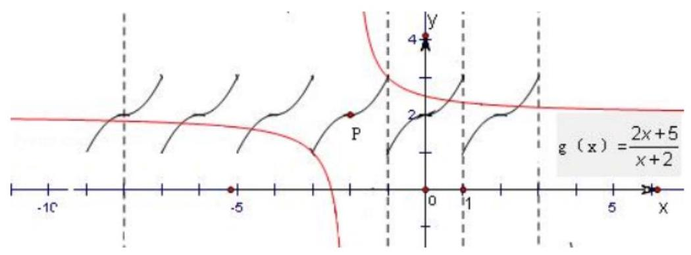

【例 7】已知定义在 $\mathbf{R}$ 上的奇函数 $f\left( x\right)$ 满足 $f\left( {x - 4}\right)  =  - f\left( x\right)$ ,且在区间 $\left\lbrack  {0,2}\right\rbrack$ 上是增函数. 若方程 $f\left( x\right)  = m\left( {m > 0}\right)$ 在区间 $\left\lbrack  {-8,8}\right\rbrack$ 上有四个不同的根 ${x}_{1},{x}_{2},{x}_{3},{x}_{4}$ ，则 ${x}_{1} + {x}_{2} + {x}_{3} + {x}_{4} =$ ___.

【难度】 $\star   \star   \star   \star$

【答案】-8

【解析】解: 定义在 $R$ 上的奇函数 $f\left( x\right) , f\left( 0\right)  = 0$ ,在区间 $\left\lbrack  {0,2}\right\rbrack$ 上是增函数,

$f\left( {x - 4}\right)  =  - f\left( x\right)$ ,可得周期 $T = 8$ ,且关于直线 $x = 2$ 对称,

作出满足题意的图象,

根据图象,可得 ${x}_{1} + {x}_{2} +  =  - {12}$ ,

${x}_{3} + {x}_{4} = 4,$

$\therefore {x}_{1} + {x}_{2} + {x}_{3} + {x}_{4} =  - 8$ ,

故答案为: -8 .

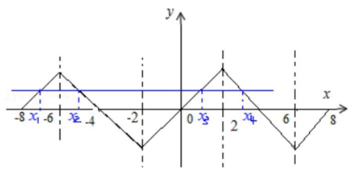

【例 8】设 $g\left( x\right)$ 是定义在 $\mathbf{R}$ 上，以 1 为周期的函数，若函数 $f\left( x\right)  = x + g\left( x\right)$ 在区间 $\left\lbrack  {3,4}\right\rbrack$ 上的值域为 $\left\lbrack  {-2,5}\right\rbrack$ ， 则 $f\left( x\right)$ 在区间 $\left\lbrack  {-{10},{10}}\right\rbrack$ 上的值域为___.

【难度】 $\star   \star   \star   \star$

【答案】 $\left\lbrack  {-{15},{11}}\right\rbrack$

【解析】若 $x \in  \left\lbrack  {4,5}\right\rbrack$ ,则 $x - 1 \in  \left\lbrack  {3,4}\right\rbrack$ 则 $f\left( x\right)  = x + g\left( x\right)  = x + g\left( {x - 1}\right)  = x - 1 + g\left( {x - 1}\right)  + 1 \in  \left\lbrack  {-1,6}\right\rbrack$

$\therefore$ 值域为 $\left\lbrack  {-{15}, - 8}\right\rbrack   \cup  \cdots  \cup  \left\lbrack  {-1,6}\right\rbrack   \cup  \cdots \left\lbrack  {4,{11}}\right\rbrack   = \left\lbrack  {-{15},{11}}\right\rbrack$

【例 9】设 $a > 1$ ，函数 $f\left( x\right)$ 的图象与函数 $y = 4 - {a}^{\left| x - 2\right| } - 2 \cdot  {a}^{x - 2}$ 的图象关于点 $A\left( {1,2}\right)$ 对称.

(1)求函数 $f\left( x\right)$ 的解析式；

(2)若关于 $x$ 的方程 $f\left( x\right)  = m$ 有两个不同的正数解,求实数 $m$ 的取值范围;

(3)设函数 $g\left( x\right)  = f\left( {-x}\right) , x \in  \lbrack  - 2, + \infty ), g\left( x\right)$ 满足如下性质: 若存在最大(小)值，则最大(小)值与 $a$ 无关. 试求 $a$ 的取值范围. .

【难度】 $\star   \star   \star   \star$

【答案】( 1 ) $f\left( x\right)  = {a}^{\left| x\right| } + 2 \cdot  {a}^{-x}$ . ( 2 ) $\left( {2\sqrt{2},3}\right)$ . ( 3 ) $\lbrack \sqrt[4]{2}, + \infty )$

【解析】解: (1) 设点 $P\left( {x, y}\right)$ 是函数 $f\left( x\right)$ 图象上任意一点, $P$ 关于点 $A$ 对称的点为 ${P}^{\prime }\left( {{x}^{\prime },{y}^{\prime }}\right)$ ,则 $\frac{x + {x}^{\prime }}{2} = 1$ , $\frac{y + {y}^{\prime }}{2} = 2$ ,于是 ${x}^{\prime } = 2 - x,{y}^{\prime } = 4 - y,\left( {2\text{ 分 }}\right)$

因为 ${P}^{\prime }\left( {{x}^{\prime },{y}^{\prime }}\right)$ 在函数 $g\left( x\right)$ 的图象上,所以 ${y}^{\prime } = 4 - {a}^{\left| {x}^{\prime } - 2\right| } - 2 \cdot  {a}^{{x}^{\prime } - 2}$ ,(3 分)

即 $4 - y = 4 - {a}^{\left| -x\right| } - 2 \cdot  {a}^{-x}, y = {a}^{\left| x\right| } + 2 \cdot  {a}^{-x}$ ,所以 $f\left( x\right)  = {a}^{\left| x\right| } + 2 \cdot  {a}^{-x}$ (或 $f\left( x\right)  = {a}^{\left| x\right| } + \frac{2}{{a}^{x}}$ ). (5 分)

( 2 )令 ${a}^{x} = t$ ，因为 $a > 1$ ， $x > 0$ ，所以 $t > 1$ ，所以方程 $f\left( x\right)  = m$ 可化为 $t + \frac{2}{t} = m$ ，

即关于 $t$ 的方程 ${t}^{2} - {mt} + 2 = 0$ 有大于 1 的相异两实数解. (8 分)

作 $h\left( t\right)  = {t}^{2} - {mt} + 2$ ,则 $\left\{  \begin{array}{l} h\left( 1\right)  > 0 \\  \frac{m}{2} > 1 \\  {m}^{2} - 8 > 0 \end{array}\right.$ ,(11 分)

解得 $2\sqrt{2} < m < 3$ . 所以 $m$ 的取值范围是 $\left( {2\sqrt{2},3}\right)$ . (12 分)

(3) $g\left( x\right)  = {a}^{\left| x\right| } + 2{a}^{x}, x \in  \lbrack  - 2, + \infty )$ .

当 $x \geq  0$ 时,因为 $a > 1$ ,所以 ${a}^{x} \geq  1, g\left( x\right)  = 3{a}^{x} \in  \lbrack 3, + \infty )$ ,所以函数 $g\left( x\right)$ 不存在最大值. (13 分)

当 $- 2 \leq  x < 0$ 时, $g\left( x\right)  = 2{a}^{x} + \frac{1}{{a}^{x}}$ ,令 $t = {a}^{x}$ ,则 $g\left( x\right)  = h\left( t\right)  = {2t} + \frac{1}{t}, t \in  \left\lbrack  {\frac{1}{{a}^{2}},1}\right)$ ,

当 $\frac{1}{{a}^{2}} > \frac{\sqrt{2}}{2}$ ,即 $1 < a < \sqrt[4]{2}$ 时, $h\left( t\right)$ 在 $\left\lbrack  {\frac{1}{{a}^{2}},1}\right)$ 上是增函数,存在最小值 ${a}^{2} + \frac{2}{{a}^{2}}$ ,

与 $a$ 有关，不符合题意. (15 分)

当 $0 < \frac{1}{{a}^{2}} \leq  \frac{\sqrt{2}}{2}$ ,即 $a \geq  \sqrt[4]{2}$ 时, $h\left( t\right)$ 在 $\left\lbrack  {\frac{1}{{a}^{2}},\frac{\sqrt{2}}{2}}\right\rbrack$ 上是减函数,在 $\left\lbrack  {\frac{\sqrt{2}}{2},1}\right)$ 上是增函数,当 $t = \frac{\sqrt{2}}{2}$ 即 $x =  - \frac{1}{2}{\log }_{a}2$ 时, $h\left( t\right)$ 取最小值 $2\sqrt{2}$ ,与 $a$ 无关. (17 分)

综上所述， $a$ 的取值范围是 $\lbrack \sqrt[4]{2}, + \infty )$ . (18 分)

【例 10 】将奇函数的图像关于原点 (即 $\left( {0,0}\right)$ ) 对称这一性质进行拓广,有下面的结论:

① 函数 $y = f\left( x\right)$ 满足 $f\left( {a + x}\right)  + f\left( {a - x}\right)  = {2b}$ 的充要条件是 $y = f\left( x\right)$ 的图像关于点 $\left( {a, b}\right)$ 成中心对称.

② 函数 $y = f\left( x\right)$ 满足 $F\left( x\right)  = f\left( {x + a}\right)  - f\left( a\right)$ 为奇函数的充要条件是 $y = f\left( x\right)$ 的图像关于点 $\left( {a, f\left( a\right) }\right)$ 成中心对称 (注: 若 $a$ 不属于 $x$ 的定义域时,则 $f\left( a\right)$ 不存在).

利用上述结论完成下列各题:

(1)已知 $m\left( {m \neq   - 1}\right)$ 为实数，试问函数 $f\left( x\right)  = \frac{x + m}{x - 1}$ 的图像是否关于某一点成中心对称？若是，求出对称中心的坐标并说明理由; 若不是, 请说明理由.

( 2 )若函数 $f\left( x\right)  = \left( {x - \frac{2}{3}}\right) \left( {\left| {x + t}\right|  + \left| {x - 3}\right| }\right)  - 4$ 的图像关于点 $\left( {\frac{2}{3}, f\left( \frac{2}{3}\right) }\right)$ 成中心对称，求 $t$ 的值.

【难度】 $\star   \star   \star   \star$

【答案】见解析

【解析】(1) 由 $f\left( x\right)  = \frac{x + m}{x - 1} = 1 + \frac{m + 1}{x - 1}$ ,得 $f\left( x\right)$ 的图像的对称中心的坐标为 $\left( {1,1}\right)$ . $f\left( {x + 1}\right)  + f\left( {1 - x}\right)  = \frac{x + 1 + m}{x + 1 - 1} + \frac{1 - x + m}{1 - x - 1} = \frac{x + 1 + m}{x} + \frac{-x + 1 + m}{-x} = 2$ ,由结论①得,对实数 $m\left( {m \neq   - 1}\right)$ ,函

数 $f\left( x\right)  = \frac{x + m}{x - 1}$ 的图像关于点 $\left( {1,1}\right)$ 成中心对称.

( 2 )由结论② $F\left( x\right)  = f\left( {x + \frac{2}{3}}\right)  - f\left( \frac{2}{3}\right)  = x\left( {\left| {x + \frac{2}{3} + t}\right|  + \left| {x - \frac{7}{3}}\right| }\right)$ 为奇函数，

其中 $g\left( x\right)  = x$ 为奇函数,故 $h\left( x\right)  = \left| {x + \frac{2}{3} + t}\right|  + \left| {x - \frac{7}{3}}\right|$ 为偶函数 (证明略),

于是,由 $h\left( x\right)  = h\left( {-x}\right)$ 可得 $\left| {x + \frac{2}{3} + t}\right|  + \left| {x - \frac{7}{3}}\right|  = \left| {x - \left( {\frac{2}{3} + t}\right) }\right|  + \left| {x + \frac{7}{3}}\right|$ ,因此, $\frac{2}{3} + t = \frac{7}{3}$ ,解得 $t = \frac{5}{3}$ 为所求

## 巩固训练

1、已知函数 $f\left( x\right)$ 是定义在 $R$ 上的奇函数,且满足 $f\left( x\right)  =  - f\left( {x + 1}\right)$ ,数列 $\left\{  {a}_{n}\right\}$ 是首项为 1、公差为 1 的等差数列,则 $f\left( {a}_{1}\right)  + f\left( {a}_{2}\right)  + f\left( {a}_{3}\right)  + \cdots  + f\left( {a}_{51}\right)$ 的值为(( )

A. -1 B. 0 C. 1 D. 2

【难度】 $\star   \star   \star   \star$

【答案】B

【解析】解: $\because$ 函数 $f\left( x\right)$ 是定义在 $R$ 上的奇函数,

$\therefore f\left( x\right)  =  - f\left( {-x}\right)$ ,且 $f\left( 0\right)  = 0$ ,

又 $\because f\left( x\right)  =  - f\left( {x + 1}\right)$ ,

$\therefore f\left( x\right)  =  - f\left( {x + 1}\right)  = f\left( {x + 2}\right)$ ,故周期为 2 .

令 $x = 0$ ,可得 $f\left( 0\right)  =  - f\left( 1\right)  = 0$ ,

$\therefore f\left( 1\right)  = 0$ .

$\therefore f\left( 1\right)  = f\left( 2\right)  = f\left( 3\right)  = \cdots  = f\left( {51}\right)  = 0$ .

$\because$ 数列 $\left\{  {a}_{n}\right\}$ 是首项为 1 、公差为 1 的等差数列,

$\therefore {a}_{n} = n$ ,

$\therefore$ 则 $f\left( {a}_{1}\right)  + f\left( {a}_{2}\right)  + f\left( {a}_{3}\right)  + \cdots  + f\left( {a}_{51}\right)  = 0$ ,

故选: $B$ .

2、若对正常数 $m$ 和任意实数 $x$ ，等式 $f\left( {x + m}\right)  = \frac{1 + f\left( x\right) }{1 - f\left( x\right) }$ 成立，则下列说法正确的是( )

A. 函数 $f\left( x\right)$ 是周期函数，最小正周期为 ${2m}$

B. 函数 $f\left( x\right)$ 是奇函数，但不是周期函数

C. 函数 $f\left( x\right)$ 是周期函数，最小正周期为 ${4m}$

D. 函数 $f\left( x\right)$ 是偶函数，但不是周期函数

【难度】 $\star   \star   \star$

【答案】C

【解析】解: ① 证明: $f\left( {x + {2m}}\right)  = \frac{1 + f\left( {x + m}\right) }{1 - f\left( {x + m}\right) } = \frac{1 + \frac{1 + f\left( x\right) }{1 - f\left( x\right) }}{1 - \frac{1 + f\left( x\right) }{1 - f\left( x\right) }} =  - \frac{1}{f\left( x\right) }, \Rightarrow  f\left( {x + {4m}}\right)  = f\left( x\right)$

$\therefore f\left( x\right)$ 是以 ${4m}$ 为周期的函数;

3、设函数 $f\left( x\right)$ 定义域为 $R, f\left( {2 + x}\right)  = f\left( {2 - x}\right)$ ,且当 $x \geq  2$ 时, $f\left( x\right)  = {\left( \frac{1}{2}\right) }^{x}$ ,则有(   )

A. $f\left( \frac{1}{2}\right)  < f\left( \frac{3}{2}\right)  < f\left( \frac{8}{3}\right)$ B. $f\left( \frac{1}{2}\right)  < f\left( \frac{8}{3}\right)  < f\left( \frac{3}{2}\right)$

C. $f\left( \frac{3}{2}\right)  < f\left( \frac{1}{2}\right)  < f\left( \frac{8}{3}\right)$ D. $f\left( \frac{8}{3}\right)  < f\left( \frac{3}{2}\right)  < f\left( \frac{1}{2}\right)$

【难度】 $\star   \star   \star$

【答案】B

【解析】解: $f\left( {2 + x}\right)  = f\left( {2 - x}\right)$ ,知对称轴方程 $x = 2$ ,

又 $f\left( x\right)  = {\left( \frac{1}{2}\right) }^{x}$ ,在 $x \geq  2$ 时,单调递减,

所以当 $x < 2$ 时， $f\left( x\right)$ 单调递增，

$\therefore f\left( \frac{8}{3}\right)  = f\left( {2 + \frac{2}{3}}\right)  = f\left( {2 - \frac{2}{3}}\right)  = f\left( \frac{4}{3}\right)$ ,

$\because \frac{1}{2} < \frac{4}{3} < \frac{3}{2} < 2$ ,

$\therefore f\left( \frac{1}{2}\right)  < f\left( \frac{4}{3}\right)  < f\left( \frac{3}{2}\right)$ ,

$\therefore f\left( \frac{1}{2}\right)  < f\left( \frac{8}{3}\right)  < f\left( \frac{3}{2}\right)$ ,

故选: $B$ .

4、(1)若函数 $y = f\left( {{2x} + 1}\right)$ 是偶函数，则函数 $y = f\left( {2x}\right)$ 的图象的对称轴方程是( )

A. $x =  - 1$

B. $x =  - \frac{1}{2}$ C. $x = \frac{1}{2}$ D. $x = 1$

【难度】 $\star   \star   \star$

【答案】 $C$

【解析】解: $\because$ 函数 $y = f\left( {{2x} + 1}\right)$ 是偶函数,

$\therefore f\left( {-{2x} + 1}\right)  = f\left( {{2x} + 1}\right)$ ,

$\therefore$ 函数 $y = f\left( {2x}\right)$ 的图象的对称轴方程是 ${2x} = 1$ ,解得 $x = \frac{1}{2}$ .

故选: $C$ .

(2)已知函数 $f\left( x\right)  = \frac{m{x}^{2} - {2mx} + m - 1}{{x}^{2} - {2x} + 1}\left( {m \in  \mathbf{R}}\right)$ ，则该函数的对称轴方程为___.

【难度】 $\star   \star   \star   \star$

【答案】 $x = 1$

【解析】分子和分母的二次函数对称轴都是 $x = 1$

5、设函数 $f\left( x\right)$ 满足对任意 $x \in  Z$ ,都有 $f\left( x\right)  = f\left( {x - 1}\right)  + f\left( {x + 1}\right)$ 成立, $f\left( {-1}\right)  = a, f\left( 1\right)  = b$ ,则 $f\left( {2019}\right)  + f\left( {2020}\right)  =$

【难度】

【答案】 $- a - {2b}$

【解析】解: 因为 $f\left( x\right)  = f\left( {x - 1}\right)  + f\left( {x + 1}\right) , f\left( {-1}\right)  = a, f\left( 1\right)  = b$ ,

所以 $f\left( {x + 1}\right)  = f\left( x\right)  + f\left( {x + 2}\right)$ ,

两式相加得 $0 = f\left( {x - 1}\right)  + f\left( {x + 2}\right)$ ,

即: $f\left( {x + 3}\right)  =  - f\left( x\right)$ ,

故 $f\left( {x + 6}\right)  = f\left( x\right)$ ,

即 $f\left( x\right)$ 是以 6 为周期的周期函数,

${2019} = 6 \times  {336} + 3,{2020} = 6 \times  {336} + 4,$

$\therefore f\left( {2019}\right)  + f\left( {2020}\right)  = f\left( 3\right)  + f\left( 4\right)  =  - f\left( 0\right)  - f\left( 1\right)  =  - \left\lbrack  {f\left( {-1}\right)  + f\left( 1\right) }\right\rbrack   - f\left( 1\right)  =  - f\left( {-1}\right)  - {2f}\left( 1\right) \; =  - a - {2b}$ .

故答案为: $- a - {2b}$ .

6、已知定义域为 $R$ 的函数 $f\left( x\right)$ 满足 $f\left( {-x}\right)  =  - f\left( {x + 4}\right)$ ，且当 $x > 2$ 时， $f\left( x\right)$ 单调递增，如果 ${x}_{1} + {x}_{2} < 4$ ，且 $\left( {{x}_{1} - 2}\right) \left( {{x}_{2} - 2}\right)  < 0$ ，则下列说法正确的是 ( )

A. $f\left( {x}_{1}\right)  + f\left( {x}_{2}\right)$ 的值为正数 B. $f\left( {x}_{1}\right)  + f\left( {x}_{2}\right)$ 的值为负数

C. $f\left( {x}_{1}\right)  + f\left( {x}_{2}\right)$ 的值正负不能确定 D. $f\left( {x}_{1}\right)  + f\left( {x}_{2}\right)$ 的值一定为零

【难度】 $\star   \star   \star$

【答案】B

【解析】解: $\because f\left( {-x}\right)  =  - f\left( {x + 4}\right)$ ,

$\therefore f\left( x\right)  =  - f\left( {4 - x}\right)$ ,

$\because {x}_{1} + {x}_{2} < 4$ ,且 $\left( {{x}_{1} - 2}\right) \left( {{x}_{2} - 2}\right)  < 0$ ,

$\therefore$ 令 ${x}_{1} < 2 < {x}_{2}$ ,

${x}_{2} < 4 - {x}_{1},$

$\because$ 当 $x > 2$ 时, $f\left( x\right)$ 单调递增,

$\therefore f\left( {x}_{2}\right)  < f\left( {4 - {x}_{1}}\right)  =  - f\left( {x}_{1}\right)$ ,

即 $f\left( {x}_{2}\right)  + f\left( {x}_{1}\right)  < 0$ ,

故选: $B$ .

7、定义在 $R$ 上的函数 $f\left( x\right)$ 既是奇函数,又是周期函数, $T$ 是它的一个正周期. 若将方程 $f\left( x\right)  = 0$ 在闭区间 $\left\lbrack  \begin{array}{ll}  - T, & T \end{array}\right\rbrack$ 上的根的个数记为 $n$ ,则 $n$ 可能为(   )

A. 0 B. 1 C. 3 D. 5

【难度】 $\star   \star   \star   \star$

【答案】 $D$

【解析】解: 因为函数是奇函数,所以在闭区间 $\left\lbrack  {-T, T}\right\rbrack$ ,一定有 $f\left( 0\right)  = 0$ ,

$\because T$ 是 $f\left( x\right)$ 的一个正周期,所以 $f\left( {0 + T}\right)  = f\left( 0\right)  = 0$ ,即 $f\left( T\right)  = 0$ ,所以 $f\left( {-T}\right)  =  - f\left( T\right)  = 0$ ,

$\therefore  - T\text{ 、 }0\text{ 、 }T$ 是 $f\left( x\right)  = 0$ 的根,若在 $\left( {0, T}\right)$ 上没有根,则恒有 $f\left( x\right)  > 0$ 或 $f\left( x\right)  < 0$ ;

不妨设 $f\left( x\right)  > 0$ ,则 $x \in  \left( {-T,0}\right)$ 时, $f\left( x\right)  < 0$ ,但又有 $f\left( x\right)  = f\left( {x + T}\right)  > 0$ ,矛盾.

$\therefore f\left( x\right)  = 0$ 在 $\left( {0, T}\right)$ 上至少还有一个根.

同理,在 $\left( {-T,0}\right)$ 上也至少还有一个根,

$\therefore$ 至少有 5 个根.

故选: $D$ .

8、已知函数 $f\left( x\right)  = m\left( {x + \frac{1}{x}}\right)$ 的图象与函数 $h\left( x\right)  = \frac{1}{4}\left( {x + \frac{1}{x}}\right)  + 2$ 的图象关于点 $A\left( {0,1}\right)$ 对称.

(1)求 $m$ 的值；

(2)若 $g\left( x\right)  = f\left( x\right)  + \frac{a}{4x}$ 在 $\left( {0,2}\right\rbrack$ 上为减函数，求 $a$ 的取值范围.

【难度】 $\star   \star   \star   \star$

【答案】(1) $m = \frac{1}{4};\left( 2\right) a \geq  3$

【解析】解: (1) 由 $h\left( 1\right)  = \frac{5}{2}$ 得, $\left( {1,\frac{5}{2}}\right)$ 关于 $\left( {0,1}\right)$ 的对称点 $\left( {-1, - \frac{1}{2}}\right)$ 在函数 $f\left( x\right)  = m\left( {x + \frac{1}{x}}\right)$ 的图象上, 故 $- \frac{1}{2} =  - {2m}$ ,

解得, $m = \frac{1}{4}$ ;

(2) $g\left( x\right)  = \frac{1}{4}\left( {x + \frac{1}{x}}\right)  + \frac{a}{4x} = \frac{{x}^{2} + 1 + a}{4x} = \frac{x}{4} + \frac{1 + a}{4x}$ ,

故 $1 + a > 0$ ,

$\sqrt{1 + a} \geq  2$ ,

解得 $a \geq  3$ .

## (二) 函数的图像和零点

## 知识梳理

注意:一切变换针对于变量本身

(1)平移变换:

i. 函数 $y = f\left( x\right)$ 的图象 左加右减 ) 函数 $y = f$ ( 函数 $y = f\left( {x + a}\right)$ 的图象;

函数 $y = f\left( x\right)  + b$ 的图象;

(2)伸缩变换:

i. 函数 $y = f\left( x\right)$ 的图象函数 $y = f\left( {k \cdot  x}\right)$ 的图象;

ii. 函数 $y = f\left( x\right)$ 的图象沿y轴方向伸缩为原来的k倍， 函数 $y = k \cdot  f\left( x\right)$ 的图象;

(3)对称变换:

i. 函数 $y = f\left( x\right)$ 的图象 类于 $y$ 轴对称 函数函数 $y = f\left( {-x}\right)$ 的图象;

ii. 函数 $y = f\left( x\right)$ 的图象关于x轴对称函数 $y =  - f\left( x\right)$ 的图象;

iii. 函数 $y = f\left( x\right)$ 的图象关于原点对称函数 $y =  - f\left( {-x}\right)$ 的图象;

(4)翻折:自变量 $y$ 加绝对值即把 $x$ 轴下方部分翻折到上方即可，自变量 $x$ 加绝对值需把 $y$ 轴左侧部分清除，并画出与右侧部分图像对称的图像.

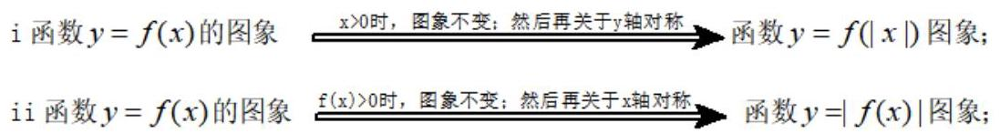

(5)顺序:针对于变量的运算，在变换过程中由外层运算向内层运算进行. 但注意，由于习惯把 $y$ 单独放在等式左边,所以针对于 $y$ 的变换如在右侧进行的话,规则相反.

如: $y = \left| {{2}^{\left| {{2x} - 1}\right|  + 3} - 2}\right|  + 3$ 可由函数

$$
y = {2}^{x}\text{ \_\_\_向左平移 }{}^{3} \rightarrow  y = {2}^{x + 3}\text{ \_\_\_将 }y\text{ 轴左侧图像换为与右侧对称图像 } \rightarrow
$$

$y = {2}^{\left| x\right|  + 3}$ ___向右平移 1 $\rightarrow  y = {2}^{\left| {x - 1}\right|  + 3}$ ___横坐标缩小一半 $\rightarrow  y = {2}^{\left| {{2x} - 1}\right|  + 3}$ (针对于 $x$ 的变换结束)

$y = {2}^{\left| {{2x} - 1}\right|  + 3}$ ___向下平移 2 $\rightarrow  y = {2}^{\left| {{2x} - 1}\right|  + 3} - 2\xrightarrow[]{\text{ 构 }.{\text{ 轴 }\text{ 下 }\text{ 方 }\text{ 图 }\text{ 像 }}}y = \left| {{2}^{\left| {{2x} - 1}\right|  + 3} - 2}\right| \xrightarrow[]{{\text{ 向 }\text{ 上 }} - {\text{ 平 }\text{ 移 }3}}$

$y = \left| {{2}^{\left| {{2x} - 1}\right|  + 3} - 2}\right|  + 3$ (针对于 $y$ 的变换结束)

四、函数的零点: 对于函数 $y = f\left( x\right) \left( {x \in  D}\right)$ ,如果存在实数 $c\left( {c \in  D}\right)$ ,当 $x = c$ 时,

$f\left( c\right)  = 0$ ,那么就把 $x = c$ 叫做函数 $y = f\left( x\right) \left( {x \in  D}\right)$ 的零点. 注: 零点是数;

用二分法求零点的理论依据是:(零点定理)(请认真查阅课本学习求零点的精确度关于次数的问题)

①函数 $f\left( x\right)$ 在闭区间 $\left\lbrack  {a, b}\right\rbrack$ 上连续； ② $f\left( a\right)  \cdot  f\left( b\right)  < 0$

那么,一定存在 $c \in  \left( {a, b}\right)$ ,使得 $f\left( c\right)  = 0$ . (反之,未必)

## 例题精讲

【例 11】分别画出以下函数的图像:

(1) $y = \left| {x - {x}^{2}}\right|$ ； (2) $y = {x}^{2} - \left| x\right|$ ； (3) $y = {x}^{2} + {2x} - 3$ ；

(4) $y = \left| {\lg  \mid  x - 1}\right|$ ； (5) $y = {\left( x - 1\right) }^{-2} + 3$ (6) $y = \lg {\left( \left| x\right|  - 2\right) }^{2}$ .

【难度】 $\star   \star   \star   \star$

【答案】略

【例 12】函数 $f\left( x\right)  = \left| x\right|  + \frac{a}{x}$ (其中 $a \in  R$ ) 的图象不可能是 ( )

A.

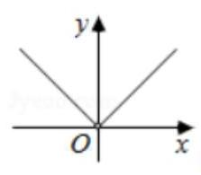

B.

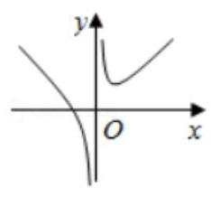

C.

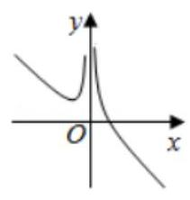

D.

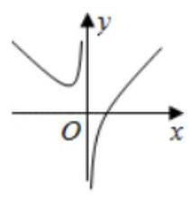

【难度】 $\star   \star   \star$

【答案】 $C$

【解析】解: 当 $a = 0$ 时, $f\left( x\right)  = \left| x\right|$ ,且 $x \neq  0$ ,故 $A$ 符合,

当 $x > 0$ 时,且 $a > 0$ 时, $f\left( x\right)  = x + \frac{a}{x} \geq  2\sqrt{a}$ ,当 $x < 0$ 时,且 $a > 0$ 时, $f\left( x\right)  =  - x + \frac{a}{x}$ 在 $\left( {-\infty ,0}\right)$ 上为减函数, 故 $B$ 符合,

当 $x < 0$ 时,且 $a < 0$ 时, $f\left( x\right)  =  - x + \frac{a}{x} \geq  2\sqrt{-x \cdot  \frac{a}{x}} = 2\sqrt{-a}$ ,当 $x > 0$ 时,且 $a < 0$ 时, $f\left( x\right)  = x + \frac{a}{x}$ 在 $\left( {0, + \infty }\right)$ 上为增函数,故 $D$ 符合,

故选: $C$ .

【例 13】设函数 $f\left( x\right)  = x\left| x\right|$ ,将 $f\left( x\right)$ 向左平移 $a\left( {a > 0}\right)$ 个单位得到函数 $g\left( x\right)$ ,将 $f\left( x\right)$ 向上平移 $a\left( {a > 0}\right)$ 个单位得到函数 $h\left( x\right)$ ,若 $g\left( x\right)$ 的图像恒在 $h\left( x\right)$ 的图像的上方,则正数 $a$ 的取值范围为 ___.

【难度】 $\star   \star   \star   \star$

【答案】 $a > 2$

【解析】解: 函数 $f\left( x\right)  = x\left| x\right|  = \left\{  \begin{array}{ll}  - {x}^{2} & x < 0 \\  {x}^{2} & x \geq  0 \end{array}\right.$ ,

将 $f\left( x\right)$ 向左平移 $a\left( {a > 0}\right)$ 个单位得到函数 $g\left( x\right)$ ,

$g\left( x\right)  = \left\{  {\begin{array}{ll}  - {\left( x + a\right) }^{2} & x <  - a \\  {\left( x + a\right) }^{2} & x \geq   - a \end{array},}\right.$

将 $f\left( x\right)$ 向上平移 $a\left( {a > 0}\right)$ 个单位得到函数 $h\left( x\right)$ ,

$h\left( x\right)  = \left\{  {\begin{array}{ll}  - {x}^{2} + a & x < 0 \\  {x}^{2} + a & x \geq  0 \end{array},}\right.$

分别作出它们的图象,由图象可知,当 $g\left( x\right)$ 的图象恒在 $h\left( x\right)$ 的图象的上方时, $a > 2$ .

则正数 $a$ 的取值范围为 $a > 2$ .

故答案为: $a > 2$ .

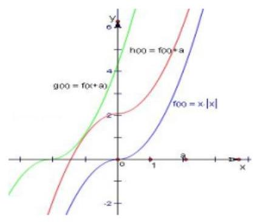

【例 14】( 1 )记 $\min \{ a, b\}  = \left\{  \begin{array}{ll} a, & \text{ 当 }a \leq  b\text{ 时,已知函数 }f\left( x\right)  = \min \left\{  {{x}^{2} + {2tx} + {t}^{2} - 1,{x}^{2} - {4x} + 3}\right\}  \text{ 是偶函 } \\  b, & \text{ 当 } \end{array}\right.$ 数 ( $t$ 为实常数),则函数 $y = f\left( x\right)$ 的零点为___. (写出所有零点)

【难度】★★★★

【答案】 $\pm  1, \pm  3$

【解析】解: $\because f\left( x\right)  = \min \left\{  {{x}^{2} + {2tx} + {t}^{2} - 1,{x}^{2} - {4x} + 3}\right\}$ 是偶函数 $\left( {t\text{ 为实常数 }}\right)$ ,

$\therefore f\left( {-x}\right)  = \min \left\{  {{x}^{2} - {2tx} + {t}^{2} - 1,{x}^{2} + {4x} + 3}\right\}   = \min \left\{  {{x}^{2} + {2tx} + {t}^{2} - 1,{x}^{2} - {4x} + 3}\right\}   = f\left( x\right) ,$ ( $t$ 为实常数), $\therefore t = 2$ ,

$\therefore f\left( x\right)  = \min \left\{  {{x}^{2} + {4x} + 3,{x}^{2} - {4x} + 3}\right\}   = {x}^{2} - 4\left| x\right|  + 3 = \left( {\left| x\right|  - 3}\right) \left( {\left| x\right|  - 1}\right)$ ,

$\therefore$ 由 $f\left( x\right)  = 0$ 得: $\left| x\right|  = 3$ 或 $\left| x\right|  = 1$ ,

$\therefore x =  \pm  3$ 或 $x =  \pm  1$ .

故答案为: $x =  \pm  3$ 或 $x =  \pm  1$ .

(2)设定义域为 $R$ 的函数 $f\left( x\right)  = \left\{  \begin{array}{l} \frac{1}{\left| x + 1\right| }, x \neq   - 1 \\  1, x =  - 1 \end{array}\right.$ ，若关于 $x$ 的方程 ${\left\lbrack  f\left( x\right) \right\rbrack  }^{2} + {af}\left( x\right)  + b = 0$ 有且仅有三个不同的实数解 ${x}_{1},{x}_{2},{x}_{3}$ ，且 ${x}_{1} < {x}_{2} < {x}_{3}$ . 下列说法不正确的是 ( )

A. ${x}_{1}^{2} + {x}_{2}^{2} + {x}_{3}^{2} = 5$ B. $1 + a + b = 0$

C. ${x}_{1} + {x}_{3} > 2{x}_{2}$ D. ${x}_{1} + {x}_{3} =  - 2$

【难度】★★★★

【答案】 5

【解析】解: 因为函数 $f\left( x\right)  = \left\{  \begin{array}{l} \frac{1}{\left| x + 1\right| }, x \neq   - 1 \\  1, x =  - 1 \end{array}\right.$ ,作出函数图象如图所示,

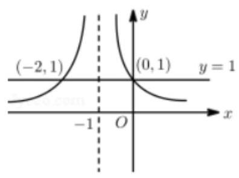

关于 $x$ 的方程 ${\left\lbrack  f\left( x\right) \right\rbrack  }^{2} + {af}\left( x\right)  + b = 0$ 有且仅有三个不同的实数解,

由图象可知,只有当 $f\left( x\right)  = 1$ 时,方程有三个根 ${x}_{1},{x}_{2},{x}_{3}$ ,且 ${x}_{1} < {x}_{2} < {x}_{3}$ ,

故 ${x}_{1} =  - 2,{x}_{2} =  - 1,{x}_{3} = 0$ ,

所以 ${x}_{1}^{2} + {x}_{2}^{2} + {x}_{3}^{2} = 5$ ,

故选项 $A$ 正确；

当 $f\left( x\right)  = 1$ 时,由 ${\left\lbrack  f\left( x\right) \right\rbrack  }^{2} + {af}\left( x\right)  + b = 0$ ,可得 $1 + a + b = 0$ ,

故选项 $B$ 正确；

因为 ${x}_{1} + {x}_{3} =  - 2 + 0 =  - 2 = 2{x}_{2}$ ,

故选项 $C$ 错误;

因为 ${x}_{1} + {x}_{3} =  - 2 + 0 =  - 2$ ,

故选项 $D$ 正确；

故选: C.

【例 15】(1)已知偶函数 $y = f\left( x\right) \left( {x \in  R}\right)$ 满足: $f\left( {x + 2}\right)  = f\left( x\right)$ ,并且当 $x \in  \left\lbrack  {0,1}\right\rbrack$ 时, $f\left( x\right)  = x$ ,函数 $y = f\left( x\right) \left( {x \in  R}\right)$ 与函数 $y = \left| {\log }_{3}\right| x\parallel$ 的交点个数是___.

【难度】

【答案】 6

【解析】解: $\because f\left( {x + 2}\right)  = f\left( x\right)$ ,

故函数是周期为 2 的周期函数.

$\because$ 当 $x \in  \left\lbrack  {0,1}\right\rbrack$ 时, $f\left( x\right)  = x$ ,

$\therefore$ 当 $x \in  \left\lbrack  {-1,0}\right\rbrack$ 时, $f\left( x\right)  =  - x$ .

在同一个坐标系中画出函数 $y = f\left( x\right)$ (蓝色部分)

和函数 $y = {\log }_{3}\left| x\right|$ 的图象 (红色部分),如图所示:

数形结合可得,数 $y = f\left( x\right)$ 的图象和函数 $y = \left| {{\log }_{3}\left| x\right| }\right|$ 的图象

只有 6 个交点,

故答案为: 6 .

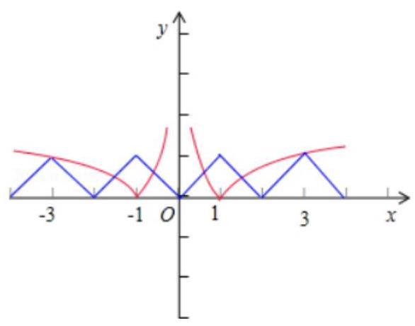

( 2 )已知函数 $f\left( x\right)$ 是定义在 $\lbrack 1, + \infty )$ 上的函数,且 $f\left( x\right)  = \left\{  \begin{array}{ll} 1 - \left| {{2x} - 3}\right| , & 1 \leq  x < 2 \\  \frac{1}{2}f\left( {\frac{1}{2}x}\right) , & x \geq  2 \end{array}\right.$ ，则函数 $y = {2xf}\left( x\right)  - 3$ 在区间 $\left( {1,{2016}}\right)$ 上的零点个数为___.

【难度】 $\star   \star   \star   \star$

【答案】 11

【解析】解: 令函数 $y = {2xf}\left( x\right)  - 3 = 0$ ,得到方程 $f\left( x\right)  = \frac{3}{2x}$ ,

当 $x \in  \lbrack 1,2)$ 时,函数 $f\left( x\right)$ 先增后减,在 $x = \frac{3}{2}$ 时取得最大值 1,

而 $y = \frac{3}{2x}$ 在 $x = \frac{3}{2}$ 时也有 $y = 1$ ;

当 $x \in  \left\lbrack  {2,{2}^{2}}\right)$ 时, $f\left( x\right)  = \frac{1}{2}f\left( {\frac{1}{2}x}\right)$ ,在 $x = 3$ 处函数 $f\left( x\right)$ 取得最大值 $\frac{1}{2}$ ,

而 $y = \frac{3}{2x}$ 在 $x = 3$ 时也有 $y = \frac{1}{2}$ ;

当 $x \in  \left\lbrack  {{2}^{2},{2}^{3}}\right)$ 时, $f\left( x\right)  = \frac{1}{2}f\left( {\frac{1}{2}x}\right)$ ,在 $x = 6$ 处函数 $f\left( x\right)$ 取得最大值 $\frac{1}{4}$ ,

而 $y = \frac{3}{2x}$ 在 $x = 6$ 时也有 $y = \frac{1}{4}$ ;

$\ldots ;$

当 $x \in  \left\lbrack  {{2}^{10},{2}^{11}}\right)$ 时, $f\left( x\right)  = \frac{1}{2}f\left( {\frac{1}{2}x}\right)$ ,在 $x = {1536}$ 处函数 $f\left( x\right)$ 取得最大值 $\frac{1}{210}$ ,

而 $y = \frac{3}{2x}$ 在 $x = {1536}$ 时也有 $y = \frac{1}{210}$ .

$\therefore$ 函数 $y = {2xf}\left( x\right)  - 3$ 在区间 $\left( {1,{2016}}\right)$ 上的零点个数为 11 .

故答案为: 11 .

【例 16】( 1 )若函数 $f\left( x\right)  = {2}^{\left| x - 3\right| } - {\log }_{a}x + 1$ 无零点，则 $a$ 的取值范围为___.

【难度】 $\star   \star   \star$

【答案】 $\left( {\sqrt{3}, + \infty }\right)$

【解析】利用两个函数图像没有交点

(2)函数 $f\left( x\right)  = \left\{  \begin{array}{l} \left| {{x}^{2} + {2x} - 1}\right| \left( {x \leq  0}\right) \\  {2}^{x - 1} + a\;\left( {x > 0}\right)  \end{array}\right.$ 有两个不同的零点，则实数 $a$ 的取值范围是为___

【难度】 $\star   \star   \star$

【答案】 $a <  - \frac{1}{2}$

【解析】解: 画出 $g\left( x\right)  = \left\{  \begin{array}{l} \left| {{x}^{2} + {2x} - 1}\right| \left( {x \leq  0}\right) \\  {2}^{x - 1}\left( {x > 0}\right)  \end{array}\right.$ 图象如图所示,

则当 $x \leq  0$ 时, $g\left( x\right)$ 的图象与 $x$ 轴只有一个交点,

要使函数 $f\left( x\right)  = \left\{  \begin{array}{l} \left| {{x}^{2} + {2x} - 1}\right| \left( {x \leq  0}\right) \\  {2}^{x - 1} + a\left( {x > 0}\right)  \end{array}\right.$ 有两个不同零点,

只有当 $x > 0$ 时,函数的图象与 $x$ 轴有 1 个交点即可,

而 $y = {2}^{x - 1} + a$ 是由 $y = {2}^{x - 1}$ 上下平移而得到,

因此 $a <  - \frac{1}{2}$ .

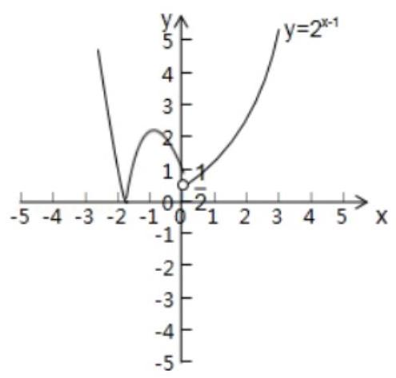

(3)设 $a$ 为非零实数，偶函数 $f\left( x\right)  = {x}^{2} + a\left| {x - m}\right|  + 1\left( {x \in  R}\right)$ 在区间 $\left( {2,3}\right)$ 上存在唯一零点，则实数 $a$ 的取值范围是___.

【难度】 $\star   \star   \star$

【答案】 $\left( {-\frac{10}{3}, - \frac{5}{2}}\right)$

【解析】解: $\because f\left( x\right)  = {x}^{2} + a\left| {x - m}\right|  + 1$ 是偶函数,

$f\left( {-x}\right)  =  - {\left( x\right) }^{2} + a\left| {-x - m}\right|  + 1,$

$f\left( x\right)  = {x}^{2} + a\left| {x - m}\right|  + 1,$

若 $f\left( x\right)  = f\left( {-x}\right)$ ,

则 $\left| {x + m}\right|  = \left| {x - m}\right|$

${2xm} =  - {2xm}$

$\therefore m = 0$

$f\left( x\right)  = {x}^{2} + a\left| x\right|  + 1,$

$x \in  \left( {2,3}\right) , f\left( x\right)  = {x}^{2} + {ax} + 1$ ,若其在区间 $\left( {2,3}\right)$ 上存在唯一零点

$f\left( 2\right)  \times  f\left( 3\right)  < 0$ 且在 $\left( {2,3}\right)$ 上为单调函数

$\therefore \left( {5 + {2a}}\right) \left( {{10} + {3a}}\right)  < 0$

$\therefore  - \frac{10}{3} < a <  - \frac{5}{2}$

故答案为: $\left( {-\frac{10}{3}, - \frac{5}{2}}\right)$

(4)设定义域为 $\mathbf{R}$ 的函数 $f\left( x\right)  = \left\{  \begin{array}{l} \left| \lg \right| x - 1\parallel , x \neq  1, \\  0, x = 1, \end{array}\right.$ 关于 $x$ 的方程 ${f}^{2}\left( x\right)  + {bf}\left( x\right)  + c = 0$ 有 7 个不同实数解,求实数 $b\text{ 、 }c$ 需要满足的条件为___.

【难度】 $\star   \star   \star   \star$

【答案】 $b < 0$ 且 $c = 0$

【解析】解: 由 $f\left( x\right)$ 图象知要使方程 ${f}^{2}\left( x\right)  + {bf}\left( x\right)  + c = 0$ 有 7 解,

应有 $f\left( x\right)  = 0$ 有 3 解,

$f\left( x\right)  \neq  0$ 有 4 解.

则 $c = 0, b < 0$ ,

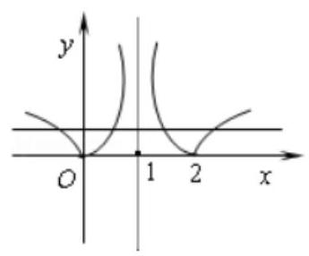

【例 17】已知函数 $f\left( x\right)  = \left| x\right|  - 1$ ,关于 $x$ 的方程 ${f}^{2}\left( x\right)  - \left| {f\left( x\right) }\right|  + k = 0$ ,给出下列四个命题:

① 存在实数 $k$ ，使得方程恰有 2 个不同的实根；

② 存在实数 $k$ ，使得方程恰有 4 个不同的实根；

③ 存在实数 $k$ ，使得方程恰有 5 个不同的实根；

④ 存在实数 $k$ ，使得方程恰有 8 个不同的实根.

其中真命题的序号为___.

【难度】 $\star   \star   \star   \star$

【答案】①②③④

【解析】解: 关于 $x$ 的方程 ${f}^{2}\left( x\right)  - \left| {f\left( x\right) }\right|  + k = 0$ ,可化为 ${f}^{2}\left( x\right)  - \left| {f\left( x\right) }\right|  =  - k$ ,

分别画出函数 $y = {f}^{2}\left( x\right)  - \left| {f\left( x\right) }\right|$ 和 $y =  - k$ 的图象,如图.

由图可知, 它们的交点情况是:

恰有 2,4,5,8 个不同的交点

故答案为:①②③④.

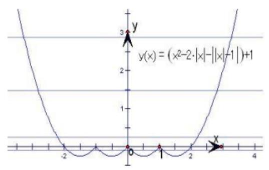

【例 18】( 1 )函数 $y = \frac{1}{1 - x}$ 的图像与函数 $y = 2\sin {\pi x}\left( {-2 \leq  x \leq  4}\right)$ 的图像所有交点的横坐标之和等于 ___

【难度】

【答案】4

【解析】解: 函数 ${y}_{1} = \frac{1}{x - 1}$ 与 ${y}_{2} = 2\sin {\pi x}$ 的图象有公共的对称中心 $\left( {1,0}\right)$ ,作出两个函数的图象, 当 $1 < x \leq  4$ 时， ${y}_{1} \geq  \frac{1}{3}$ ，

而函数 ${y}_{2}$ 在 $\left( {1,4}\right)$ 上出现 1.5 个周期的图象，在 $\left( {2,\frac{5}{2}}\right)$ 上是单调增且为正数函数,

${y}_{2}$ 在 $\left( {1,4}\right)$ 上出现 1.5 个周期的图象,在 $\left( {\frac{5}{2},3}\right)$ 上是单调减且为正数,

$\therefore$ 函数 ${y}_{2}$ 在 $x = \frac{5}{2}$ 处取最大值为 $2 \geq  \frac{2}{3}$ ,

而函数 ${y}_{2}$ 在 $\left( {1,2}\right) \text{ 、 }\left( {3,4}\right)$ 上为负数与 ${y}_{1}$ 的图象没有交点,

所以两个函数图象在 $\left( {1,4}\right)$ 上有两个交点 $\left( {\text{ 图中 }C\text{ 、 }D}\right)$ ,

根据它们有公共的对称中心 $\left( {1,0}\right)$ ,可得在区间 $\left( {-2,1}\right)$ 上也有两个交点 (图中 $A$ 、 $B$ ),

并且: ${x}_{A} + {x}_{D} = {x}_{B} + {x}_{C} = 2$ ,故所求的横坐标之和为 4,

故答案为: 4 .

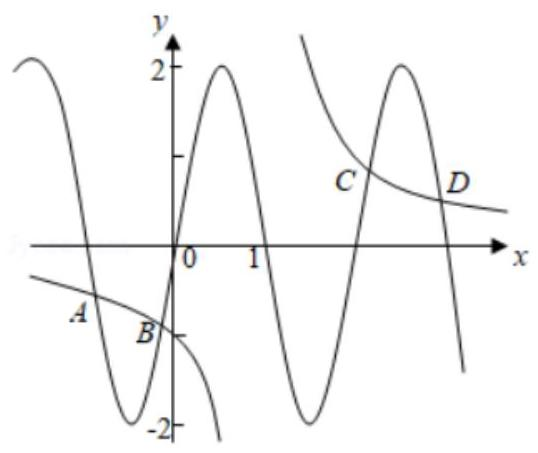

(2)定义在 $\left( {0, + \infty }\right)$ 上的函数 $f\left( x\right)$ 满足:①当 $x \in  \lbrack 1,3)$ 时， $f\left( x\right)  = 1 - \left| {x - 2}\right|$ ，② $f\left( {3x}\right)  = {3f}\left( x\right)$ ，设关于 $x$ 的函数 $F\left( x\right)  = f\left( x\right)  - 1$ 的零点从小到大依次记为 ${x}_{1},{x}_{2},{x}_{3},{x}_{4},{x}_{5},\cdots$ ，则

${x}_{1} + {x}_{2} + {x}_{3} + {x}_{4} + {x}_{5} =$ ___.

【难度】 $\star   \star   \star   \star$

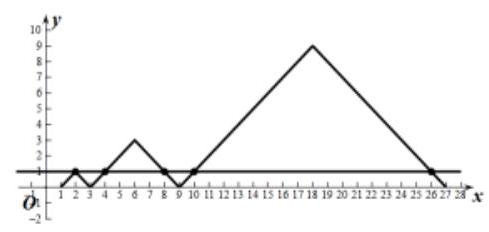

【答案】 50

【解析】在同一直角坐标平面内作出 $y = f\left( x\right)$ 与 $y = 1$ 的图象

${x}_{1} = 2,{x}_{2} + {x}_{3} = 2 \times  6 = {12},{x}_{4} + {x}_{5} = 2 \times  {18} = {36}$

$\therefore {x}_{1} + {x}_{2} + {x}_{3} + {x}_{4} + {x}_{5} = {50}$

【例 19】( 1 )已知函数 $f\left( x\right)  = \left| {{\log }_{a}\left| {1 - x}\right| \left( {a > 0, a \neq  1}\right) \text{ ,若 }{x}_{1} < {x}_{2} < {x}_{3} < {x}_{4}}\right|$ ,

且 $f\left( {x}_{1}\right)  = f\left( {x}_{2}\right)  = f\left( {x}_{3}\right)  = f\left( {x}_{4}\right)$ ,则 $\frac{1}{{x}_{1}} + \frac{1}{{x}_{2}} + \frac{1}{{x}_{3}} + \frac{1}{{x}_{4}} =$

【难度】 $\star   \star   \star   \star$

【答案】 2

【解析】画出函数图像, $\left( {1 - {x}_{1}}\right) \left( {1 - {x}_{2}}\right)  = 1,\left( {{x}_{3} - 1}\right) \left( {{x}_{4} - 1}\right)  = 1$

(2) $f\left( x\right)  = \left\{  \begin{matrix} \left| {{\log }_{2}x}\right| \left( {0 < x \leq  4}\right) \\  \frac{2}{3}{x}^{2} - {8x} + \frac{70}{3}\left( {x > 4}\right)  \end{matrix}\right.$ ，若 $a, b, c, d$ 互不相同，且 $f\left( a\right)  = f\left( b\right)  = f\left( c\right)  = f\left( d\right)$ ，则 ${abcd}$ 的取值范围是___.

【难度】 $\star   \star   \star   \star$

【答案】(32,35)

【解析】由题意,

$\because a, b, c, d$ 互不相同,

$\therefore$ 可不妨设 $a < b < c < d$ .

$\because f\left( a\right)  = f\left( b\right)$ ,由图象,可知

$- {\log }_{2}a = {\log }_{2}b$ . 即: ${\log }_{2}a + {\log }_{2}b = 0$ .

$\therefore {\log }_{2}{ab} = 0$ ,

$\therefore {ab} = 1$ .

又 $\because f\left( a\right)  = f\left( b\right)  = f\left( c\right)  = f\left( d\right)$ ,

$\therefore$ 依据图象, 它们的函数值只能在 0 到 2 之间,

$\therefore 4 < c < 5,7 < d < 8$ .

根据二次函数的对称性,可知: $c + d = 2 \times  6 = {12}$ .

$\therefore {abcd} = {cd} = c \cdot  \left( {{12} - c}\right)  =  - {c}^{2} + {12c},\left( {4 < c < 5}\right)$

则可以将 ${abcd}$ 看成一个关于 $c$ 的二次函数.

由二次函数的知识, 可知:

$- {c}^{2} + {12c}$ 在 $4 < c < 5$ 上的值域为 $\left( {{32},{35}}\right)$ .

$\therefore {abcd}$ 的取值范围即为 $\left( {{32},{35}}\right)$ .

故选: $C$ .

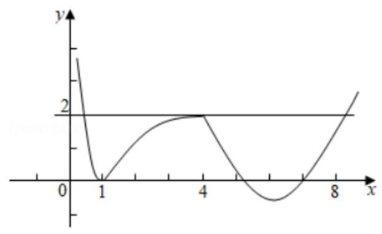

【例 20】( 1 )定义在 $\mathbf{R}$ 上的函数 $f\left( x\right)$ ,当 $x \in  ( - 1,1\rbrack$ 时, $f\left( x\right)  = {x}^{2} - x$ ,且对任意的 $x$ 满足 $f\left( {x - 2}\right)  = {af}\left( x\right)$ (常数 $a > 0$ )，则函数 $f\left( x\right)$ 在区间 $(5,7\rbrack$ 上的最小值是___.

【难度】 $\star   \star   \star   \star$

【答案】 $- \frac{1}{4{a}^{3}}$

【解析】 $f\left( x\right)  = \frac{1}{a}f\left( {x - 2}\right)$ ,可以看成平移 2 个单位后,再将纵坐标变为原来的 $\frac{1}{a}$ 倍,易得 $- \frac{1}{4{a}^{3}}$

(2)已知函数 $f\left( x\right)$ 满足:①对任意 $x \in  \left( {0, + \infty }\right)$ ，恒有 $f\left( {2x}\right)  = {2f}\left( x\right)$ 成立；②当 $x \in  (1,2\rbrack$ 时， $f\left( x\right)  = 2 - x$ . 若 $f\left( a\right)  = f\left( {2020}\right)$ ，则满足条件的最小的正实数 $a$ 是___.

【难度】 $\star   \star   \star   \star$

【答案】36

【解析】解: 取 $x \in  \left( {{2}^{m},{2}^{m + 1}}\right)$ ,则 $\frac{x}{{2}^{m}} \in  (1,2\rbrack ;f\left( \frac{x}{{2}^{m}}\right)  = 2 - \frac{x}{{2}^{m}}$ ,从而

$f\left( x\right)  = {2f}\left( \frac{x}{2}\right)  = \ldots  = {2}^{m}f\left( \frac{x}{{2}^{m}}\right)  = {2}^{m + 1} - x$ ,其中, $m = 0,1,2,\ldots$ ,

$f\left( {2020}\right)  = {2}^{10}f\left( \frac{2020}{1024}\right)  = {2}^{11} - {2020} = {28} = f\left( \mathrm{a}\right) ,$

设 $a \in  \left( {{2}^{m},{2}^{m + 1}}\right)$ 则 $f\left( \mathbf{a}\right)  = {2}^{m + 1} - a = {28}$ ,

$\therefore a = {2}^{m + 1} - {28} \in  \left( {{2}^{m},{2}^{m + 1}}\right)$ ,

即 $m \geq  5, a \geq  {36}$ ,

$\therefore$ 满足条件的最小的正实数 $a$ 是 36 .

故选: $C$ .

【例 21】关于函数 $f\left( x\right)  = \frac{\left| x\right| }{\parallel x\left| {-1}\right| }$ 给出下列四个命题:

①当 $\mathrm{x} > 0$ 时， $y = f\left( x\right)$ 单调递减且没有最值;

② 方程 $f\left( x\right)  = {kx} + b\left( {k \neq  0}\right)$ 一定有解；

③如果方程 $f\left( x\right)  = k$ 有解,则解的个数一定是偶数;

④ $y = f\left( x\right)$ 是偶函数且有最小值. 则其中真命题是___. (只要写标题号)

【难度】★★★★

【答案】 ②④

【解析】解: ① 当 $x > 1$ 时, $y = f\left( x\right)  = \frac{x}{x - 1} = 1 + \frac{1}{x - 1}$ 在区间 $\left( {1, + \infty }\right)$ 上是单调递减的函数,

$0 < x < 1$ 时, $y = f\left( x\right)  =  - \frac{x}{x - 1} =  - 1 - \frac{1}{x - 1}$ 在区间 $\left( {0,1}\right)$ 上是单调递增的函数

且无最值;

$\therefore$ 命题①错误；

②函数 $f\left( x\right)  = f\left( x\right)  = \frac{\left| x\right| }{\parallel x\left| {-1}\right| }$ 是偶函数，当 $x > 0$ 时， $y = f\left( x\right)$ 在区间 $\left( {0,1}\right)$ 上是单调递增的函数， $\left( {1, + \infty }\right)$ 上是单调递减的函数;

当 $k > 0$ 时,函数 $y = f\left( x\right)$ 与 $y = {kx}$ 在第一象限内一定有交点;

由对称性知,当 $x < 0$ 且 $k > 0$ 时,函数 $y = f\left( x\right)$ 与 $y = {kx}$ 在第二象限内一定有交点;

$\therefore$ 方程 $f\left( x\right)  = {kx} + b\left( {k \neq  0}\right)$ 一定有解;

$\therefore$ 命题②正确；

③ $\because$ 函数 $f\left( x\right)  = \frac{\left| x\right| }{\parallel x\left| {-1}\right| }$ 是偶函数，且 $f\left( x\right)  = 0$ ，当 $k = 0$ 时，函数 $y = f\left( x\right)$ 与 $y = k$ 的图象只有一个交点， $\therefore$

方程 $f\left( x\right)  = k$ 的解的个数是奇数; $\therefore$ 命题③错误;

④ $\because$ 函数 $f\left( x\right)  = \frac{\left| x\right| }{\parallel x\left| {-1}\right| }$ 是偶函数, $x \neq   \pm  1$ ,最小值为 0

故答案为:②④.

【例 22】已知函数 $y = f\left( x\right) , x \in  D$ ,如果对于定义域 $D$ 内的任意实数 $x$ ,对于给定的非零常数 $m$ ,总存在非零常数 $T$ ,恒有 $f\left( {x + T}\right)  = m \cdot  f\left( x\right)$ 成立,则称函数 $f\left( x\right)$ 是 $D$ 上的 $m$ 级类周期函数,周期为 $T$ .

(1)已知 $T = 1$ ， $y = f\left( x\right)$ 是 $\lbrack 0, + \infty )$ 上 $m$ 级类周期函数，且 $y = f\left( x\right)$ 是 $\lbrack 0, + \infty )$ 上的单调递增函数， 当 $x \in  \lbrack 0,1)$ 时, $f\left( x\right)  = {2}^{x}$ ,求实数 $m$ 的取值范围;

(2)已知当 $x \in  \left\lbrack  {0,4}\right\rbrack$ 时，函数 $f\left( x\right)  = {x}^{2} - {4x}$ ，若 $f\left( x\right)$ 是 $\lbrack 0, + \infty )$ 上周期为 4 的 $m$ 级类周期函数，且 $y = f\left( x\right)$ 的值域为一个闭区间,求实数 $m$ 的取值范围.

【难度】 $\star   \star   \star   \star$

【答案】见解析

【解析】(1) $\because x \in  \lbrack 0,1)$ 时, $f\left( x\right)  = {2}^{x}$ ,

$\therefore$ 当 $x \in  \lbrack 1,2)$ 时, $f\left( x\right)  = {mf}\left( {x - 1}\right)  = m \cdot  {2}^{x - 1}$ ,

当 $x \in  \lbrack n, n + 1)$ 时, $f\left( x\right)  = {mf}\left( {x - 1}\right)  = {m}^{2}f\left( {x - 2}\right)  = \cdots  = {m}^{n}f\left( {x - n}\right)  = {m}^{n} \cdot  {2}^{x - n}$ ,

即 $x \in  \lbrack n, n + 1)$ 时, $f\left( x\right)  = {m}^{n} \cdot  {2}^{x - n}, n \in  {\mathbf{N}}^{ * }$ ,

$\because f\left( x\right)$ 在 $\lbrack 0, + \infty )$ 上单调递增,

$\therefore m > 0$ 且 ${m}^{n} \cdot  {2}^{n - n} \geq  {m}^{n - 1} \cdot  {2}^{n - \left( {n - 1}\right) }$ ,即 $m \geq  2$ .

(2) $\because$ 当 $x \in  \left\lbrack  {0,4}\right\rbrack$ 时, $y \in  \left\lbrack  {-4,0}\right\rbrack$ ,且有 $f\left( {x + 4}\right)  = {mf}\left( x\right)$ ,

$\therefore$ 当 $x \in  \left\lbrack  {{4n},{4n} + 4}\right\rbrack  , n \in  \mathbf{Z}$ 时,

$f\left( x\right)  = {mf}\left( {x - 4}\right)  = \cdots  = {m}^{n}f\left( {x - {4n}}\right)  = {m}^{n}\left\lbrack  {{\left( x - 4n\right) }^{2} - 4\left( {x - {4n}}\right) }\right\rbrack  ,$

当 $0 < m \leq  1$ 时, $f\left( x\right)  \in  \left\lbrack  {-4,0}\right\rbrack$ ;

当 $- 1 < m < 0$ 时, $f\left( x\right)  \in  \left\lbrack  {-4, - {4m}}\right\rbrack$ ;

当 $m =  - 1$ 时, $f\left( x\right)  \in  \left\lbrack  {-4,4}\right\rbrack$ ;

当 $m > 1$ 时, $f\left( x\right)  \in  ( - \infty ,0\rbrack$ ;

当 $m <  - 1$ 时, $f\left( x\right)  \in  \left( {-\infty , + \infty }\right)$ ;

综上可知: $- 1 \leq  m < 0$ 或 $0 < m \leq  1$ .

## 巩固训练

1、函数 $y = {a}^{\left| x + b\right| },\left( {0 < a < 1, - 1 < b < 0}\right)$ 的图象为( ).

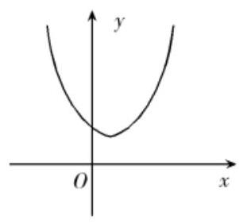

A.

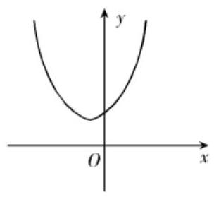

B.

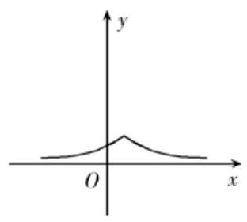

C.

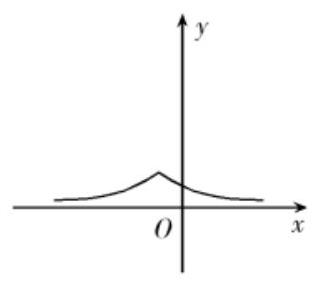

D.

【难度】 $\star   \star   \star$

【答案】C

【解析】解: $\because 0 < a < 1$ ,

$\therefore y = {a}^{x}$ 的图象过第一、第二象限,且是单调减函数,经过 $\left( {0,1}\right)$ ,

$y = {a}^{\left| x\right| }$ 的图象可看成把 $y = {a}^{x}$ 的图象在 $y$ 轴的右侧的不变,再将右侧的图象作关于 $y$ 轴的图象得到的, $y = {a}^{\left| x + b\right| }$ 的图象可看成把 $y = {a}^{x}$ 的图象向右平移 $- b\left( {0 <  - b < 1}\right)$ 个单位得到的,

故选: $C$ .

2、设 $0 < a < b$ ，则函数 $y = \left| {x - a}\right| \left( {x - b}\right)$ 的图像大致形状是( )

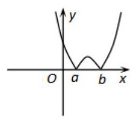

(A)

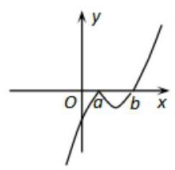

(B)

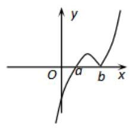

(C)

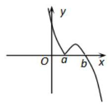

(D)

【难度】 $\star   \star   \star$

【答案】B

【解析】解: 函数 $y = \left| {x - a}\right| \left( {x - b}\right)  = \left\{  \begin{array}{l} \left( {x - a}\right) \left( {x - b}\right) , x \geq  a \\   - \left( {x - a}\right) \left( {x - b}\right) , x < a \end{array}\right.$

$\therefore x \geq  a$ ,函数 $y = \left( {x - a}\right) \left( {x - b}\right) \left( {x \geq  a}\right)$ 的图象为开口向上的抛物线的一部分,与 $x$ 轴的交点坐标为 $\left( {a,0}\right) ,\left( {b,0}\right)$ 当 $x < a$ 时,图象为 $y = \left( {x - a}\right) \left( {x - b}\right) \left( {x < a}\right)$ 的图象关于 $x$ 轴对称的一部分

故选: $B$ .

3、已知函数 $f\left( x\right)  = \left| {\lg x}\right|$ ，若 $0 < a < b$ ，且 $f\left( a\right)  = f\left( b\right)$ ，则 $a + {2b}$ 的取值范围是( )

A. $\left( {2\sqrt{2}, + \infty }\right)$ B. $\left\lbrack  {2\sqrt{2}, + \infty }\right)$ C. $\left( {3, + \infty }\right)$ D. $\lbrack 3, + \infty )$

【难度】★★★

【答案】C

【解析】解: 因为 $f\left( a\right)  = f\left( b\right)$ ,所以 $\left| {\lg a}\right|  = \left| {\lg b}\right|$ ,所以 $a = b$ (舍去),或 $b = \frac{1}{a}$ ,所以 $a + {2b} = a + \frac{2}{a}$ 又 $0 < a < b$ ,所以 $0 < a < 1 < b$ ,令 $f\left( a\right)  = a + \frac{2}{a}$ ,由“对勾”函数的性质知函数 $f\left( a\right)$ 在 $a \in  \left( {0,1}\right)$ 上为减函数, 所以 $f\left( a\right)  > f\left( 1\right)  = 1 + \frac{2}{1} = 3$ ,即 $a + {2b}$ 的取值范围是 $\left( {3, + \infty }\right)$ .

故选: $C$ .

4、若直线 $y = {kx} + 1$ 与曲线 $y = \left| {x + \frac{1}{x}}\right|  - \left| {x - \frac{1}{x}}\right|$ 有四个不同交点,则实数 $k$ 的取值范围是 ( ).

A. $\left\{  {-\frac{1}{8},0,\frac{1}{8}}\right\}$ B. $\left\{  {-\frac{1}{8},\frac{1}{8}}\right\}$ C. $\left\lbrack  {-\frac{1}{8},\frac{1}{8}}\right\rbrack$ D. $\left( {-\frac{1}{8},\frac{1}{8}}\right)$

【难度】 $\star   \star   \star   \star$

【答案】A

【解析】解: $t = x - \frac{1}{x} = \frac{{x}^{2} - 1}{x} = \frac{\left( {x - 1}\right) \left( {x + 1}\right) }{x}$ ,

① 若 $x \leq   - 1, t \leq  0, y = \left| {x + \frac{1}{x}}\right|  - \left| {x - \frac{1}{x}}\right|  = \left( {-x - \frac{1}{x}}\right)  - \left( {\frac{1}{x} - x}\right)  =  - \frac{2}{x}$ ;

② 若 $- 1 < x < 0, t > 0, y = \left| {x + \frac{1}{x}}\right|  - \left| {x - \frac{1}{x}}\right|  = \left( {-x - \frac{1}{x}}\right)  - \left( {x - \frac{1}{x}}\right)  =  - {2x}$ ;

③ 若 $0 < x < 1, t < 0$ ，则 $y = \left| {x + \frac{1}{x}}\right|  - \left| {x - \frac{1}{x}}\right|  = \left( {x + \frac{1}{x}}\right)  - \left( {\frac{1}{x} - x}\right)  = {2x}$ ；

④若 $x \geq  1, t \geq  0$ ，则曲线 $y = \left| {x + \frac{1}{x}}\right|  - \left| {x - \frac{1}{x}}\right|  = \left( {x + \frac{1}{x}}\right)  - \left( {x - \frac{1}{x}}\right)  = \frac{2}{x}$ .

$\therefore y = \left\{  \begin{array}{l}  - \frac{2}{x}, x \leq   - 1 \\   - {2x}, - 1 < x < 0 \\  {2x},0 < x < 1 \\  \frac{2}{x}, x \geq  1 \end{array}\right.$ ,作图如右:

由于直线 $y = {kx} + 1$ 经过定点 $A\left( {0,1}\right)$ ,当过 $A$ 点的直线 $m$ 与曲线 $y =  - \frac{2}{x}$ 相切时,直线 $m$ 与曲线 $y = \left| {x + \frac{1}{x}}\right|  - \left| {x - \frac{1}{x}}\right|$ 有四个公共点,

设切点坐标为: $\left( {{x}_{0},{y}_{0}}\right)$ ,则 $k = {\left( -\frac{2}{x}\right) }^{\prime }\left| {\;x = {x}_{0} = \frac{2}{{x}_{0}^{2}}}\right.$ ,

$\therefore {y}_{0} =  - \frac{2}{{x}_{0}} = k{x}_{0} + 1 = \frac{2}{{x}_{0}^{2}} \cdot  {x}_{0} + 1$ ,解得, ${x}_{0} =  - 4$ ,

$\therefore k = \frac{2}{{x}_{0}^{2}} = \frac{1}{8}$ ;

同理,可得当直线 $n$ 与曲线 $y = \frac{2}{x}$ 相切时,直线 $n$ 与曲线 $y = \left| {x + \frac{1}{x}}\right|  - \left| {x - \frac{1}{x}}\right|$ 有四个公共点,可求得直线 $n$ 的斜率为 ${k}^{\prime } =  - \frac{1}{8}$ ;

当过 $A$ 点的直线 $l//x$ 轴,即其斜率为 0 时,直线 $l$ 与曲线 $y = \left| {x + \frac{1}{x}}\right|  - \left| {x - \frac{1}{x}}\right|$ 有四个公共点;

综上所述，实数 $k$ 的取值范围是 $\left\{  {\frac{1}{8},0, - \frac{1}{8}}\right\}$ .

故选: $A$ .

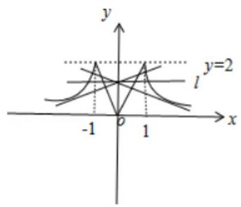

5、已知 $y = g\left( x\right)$ 与 $y = h\left( x\right)$ 都是定义在 $\left( {-\infty ,0}\right)  \cup  \left( {0, + \infty }\right)$ 上的奇函数,且当 $x > 0$ 时, $g\left( x\right)  = \left\{  {\begin{array}{l} {x}^{2},0 < x \leq  1 \\  g\left( {x - 1}\right) , x > 1 \end{array}, h\left( x\right)  = k{\log }_{2}x\left( {x > 0}\right) }\right.$ ,若 $y = g\left( x\right)  - h\left( x\right)$ 恰好有 4 个零点,则正实数 $k$ 的取值范围是

A. $\left\lbrack  {\frac{1}{2},1}\right\rbrack \; B\left( {\frac{1}{2},1}\right\rbrack$ . C. $\left( {\frac{1}{2},{\log }_{3}2}\right\rbrack$ D. $\left\lbrack  {\frac{1}{2},{\log }_{3}2}\right\rbrack$

【难度】 $\star   \star   \star   \star$

【答案】C

【解析】解: 若 $y = g\left( x\right)  - h\left( x\right)$ 恰有 4 个零点,

即 $g\left( x\right)$ 和 $h\left( x\right)$ 有 4 个交点,

画出函数 $g\left( x\right) , h\left( x\right)$ 的图象,如图示:

结合图象得: $\left\{  \begin{array}{l} k{\log }_{2}4 > 1 \\  k{\log }_{2}3 < 1 \end{array}\right.$ ,

解得: $\frac{1}{2} < k < {\log }_{3}2$ , 故选: $C$ .

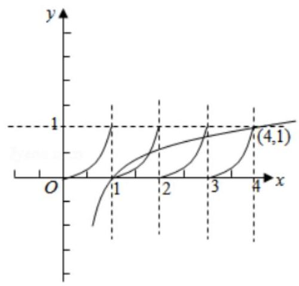

6、已知 $m\text{ 、 }n\text{ 、 }\alpha \text{ 、 }\beta  \in  \mathbf{R}, m < n,\alpha  < \beta$ ，若 $\alpha \text{ 、 }\beta$ 是函数 $f\left( x\right)  = 2\left( {x - m}\right) \left( {x - n}\right)  - 7$ 的零点，则 $m$ 、 $n$ 、 $\alpha$ 、 $\beta$ 四个数按从小到大的顺序是___(用符号“<”连接起来).

【难度】 $\star   \star   \star$

【答案】 $\alpha  < m < n < \beta$

【解析】解: $\because \alpha \text{ 、 }\beta$ 是函数 $f\left( x\right)  = 2\left( {x - m}\right) \left( {x - n}\right)  - 7$ 的零点,

$\therefore \alpha \text{ 、 }\beta$ 是函数 $y = 2\left( {x - m}\right) \left( {x - n}\right)$ 与函数 $y = 7$ 的交点的横坐标,

且 $m\text{ 、 }n$ 是函数 $y = 2\left( {x - m}\right) \left( {x - n}\right)$ 与 $x$ 轴的交点的横坐标,

故由二次函数的图象可知,

$\alpha  < m < n < \beta$

故答案为: $\alpha  < m < n < \beta$ .

7、若曲线 $\left| y\right|  = {2}^{x} + 1$ 与直线 $y = b$ 没有公共点，则实数 $b$ 的取值范围是___.

【难度】 $\bigstar \bigstar \bigstar$

【答案】 $\left\lbrack  {-1,1}\right\rbrack$

【解析】解: 由于曲线 $\left| y\right|  = {2}^{x} + 1$ 的图象关于 $x$ 轴对称, $\left| y\right|  > 1$ ,

且图象过定点 $\left( {0,2}\right) ,\left( {0, - 2}\right)$ ,如图所示:

故当 $- 1 \leq  b \leq  1$ 时,曲线 $\left| y\right|  = {2}^{x} + 1$ 与直线 $y = b$ 没有公共点,

故答案为 $\left\lbrack  {-1,1}\right\rbrack$ .

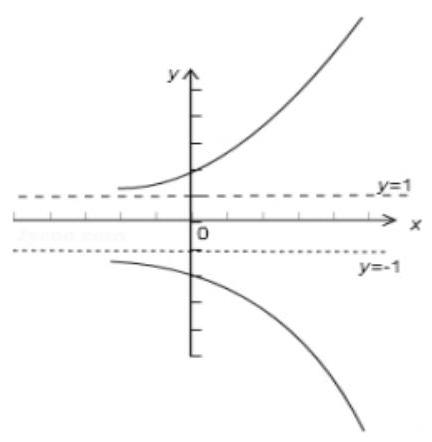

8、关于 $x$ 的方程 $\left| {{x}^{2} - {4x} + 3}\right|  - a = x$ 至少有三个不相等的实数根，则实数 $a$ 的取值范围是___.

【难度】 $\star   \star   \star   \star$

【答案】 $a \in  \left\lbrack  {-1, - \frac{3}{4}}\right\rbrack$ ,

【解析】解: 由 $\left| {{x}^{2} - {4x} + 3}\right|  - a = x$ 得 $\left| {{x}^{2} - {4x} + 3}\right|  - x = a$ ,

设 $f\left( x\right)  = \left| {{x}^{2} - {4x} + 3}\right|  - x$ ,

由 ${x}^{2} - {4x} + 3 \geq  0$ 得 $x \geq  3$ 或 $x \leq  1$ 时, $f\left( x\right)  = {x}^{2} - {4x} + 3 - x = {x}^{2} - {5x} + 3$ ,

当 $1 < x < 3$ 时, $f\left( x\right)  =  - \left( {{x}^{2} - {4x} + 3}\right)  - x =  - {x}^{2} + {3x} - 3 =  - {\left( x - \frac{3}{2}\right) }^{2} - \frac{3}{4}$ ,

作出函数 $f\left( x\right)$ 的图象如图:

当 $x = 1$ 时, $y =  - 1$ ,

则要使方程 $\left| {{x}^{2} - {4x} + 3}\right|  - a = x$ 至少有三个不相等的实数根,

则满足 $a \in  \left\lbrack  {-1, - \frac{3}{4}}\right\rbrack$ ,

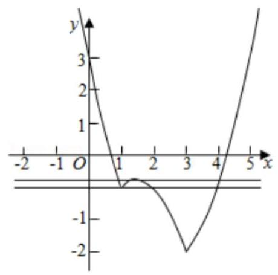

9、在平面直角坐标系中，对于函数 $y = f\left( x\right)$ 的图像上不重合的两点 $A, B$ ，若 $A, B$ 关于原点对称，则称点

对 $\left( {A, B}\right)$ 是函数 $y = f\left( x\right)$ 的一组 “奇点对” (规定 $\left( {A, B}\right)$ 与 $\left( {B, A}\right)$ 是相同的 “奇点对”). 函数

$f\left( x\right)  = \left\{  \begin{array}{ll} \lg \frac{1}{x} & \left( {x > 0}\right) \\  \sin \frac{1}{2}x & \left( {x < 0}\right)  \end{array}\right.$ 的 “奇点对” 的组数是___.

【难度】 $\star   \star   \star   \star$

【答案】 3

【解析】解: 由题意知函数 $f\left( x\right)  = \sin \frac{1}{2}x, x < 0$ 关于原点对称的图象为 $- y =  - \sin \frac{1}{2}x$ ,

即 $y = \sin \frac{1}{2}x, x > 0$

在 $x > 0$ 上作出两个函数的图象如图,

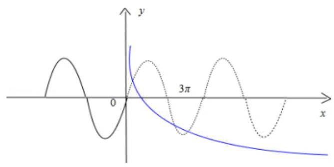

由图象可知两个函数在 $x > 0$ 上的交点个数有 3 个,

$\therefore$ 函数 $f\left( x\right)$ 的“奇点对”有 3 组,

故答案为:3.

10、定义函数 $f\left( x\right)  = \left\{  \begin{matrix} 4 - 8\left| {x - \frac{3}{2}}\right| & 1 \leq  x \leq  2 \\  \frac{1}{2}f\left( \frac{x}{2}\right) & x > 2 \end{matrix}\right.$ ,则函数 $g\left( x\right)  = {xf}\left( x\right)  - 6$ 在区间 $\left\lbrack  {1,8}\right\rbrack$ 内的所有零点的和为___.

【难度】 $\star   \star   \star   \star$

【答案】 $\frac{21}{2}$

【解析】转化为 $f\left( x\right)  = \frac{6}{x}$ ,作出两个函数的图象,可得交点的横坐标分别为 $\frac{3}{2} - 3 - 6,\therefore$ 和为 $\frac{21}{2}$

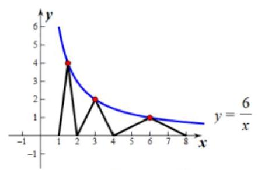

第 32 页 共 41 页

11、已知 $f\left( x\right)  = \left| {\frac{2}{x - 1} - a}\right| \left( {x > 1, a > 0}\right)$ ,若 $a = {a}_{0}, f\left( x\right)$ 与 $x$ 轴交点为 $A, f\left( x\right)$ 为曲线 $L$ ,在 $L$ 上任意一点 $P$ , 总存在一点 $Q\left( {P\text{ 异于 }A}\right)$ 使得 ${AP}\bot {AQ}$ 且 $\left| {AP}\right|  = \left| {AQ}\right|$ ，则 ${a}_{0} =$ ___.

【难度】 $\star   \star   \star   \star   \star$

【答案】 $\sqrt{2}$

【解析】如图,

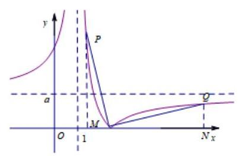

作出函数图象的两条渐近线 $x = 1, y = a\left( {a > 0}\right)$ 。

令 $f\left( x\right)  = \left| {\frac{2}{x - 1} - a}\right|  = 0$ ,解得 $A$ 点横坐标为 $x = \frac{2}{a} + 1, A$ 点坐标为 $\left( {\frac{2}{a} + 1,0}\right)$ .

假设点 $P$ 是曲线上 $\mathrm{A}$ 点左侧一点， $\because {AP} \bot  {AQ}$ ，且 $\left| {AP}\right|  = \left| {AQ}\right|$ ， $\therefore Q$ 点是曲线上 $A$ 点右侧一点。

当点 $P$ 无限接近于渐近线 $x = 1$ 时,点 $Q$ 必无限接近于渐近线 $y = a$ .

因此点 $P$ 与点 $Q$ 可以分别看作是渐近线上的点.

如图,分别过 $P\text{ 、 }Q$ 两点作 $x$ 轴的垂线,垂点分别为 $M\text{ 、 }N$ 。

在 $\bigtriangleup {PAM}$ 与 $\bigtriangleup {QAN}$ 中, $\angle {PAM} = \angle {AQN},\angle {PMA} = \angle {QNA} = {90}^{ \circ  },\left| {AP}\right|  = \left| {AQ}\right|$ ,

$\therefore \bigtriangleup {PAM} \cong  \bigtriangleup {AQN}\therefore {AM} = {QN}$ .

即此时 ${AM} = \frac{2}{a} + 1 - 1 = \frac{2}{a},{QN} = a$ ,根据全等关系有 $\frac{2}{a} = a,\left( {a > 0}\right)$

解得 $a = \sqrt{2}$ .

## 实战演练

一、填空题

1、函数 $y = \frac{3}{{4}^{x} - 1} - {4}^{x - 1} - \frac{5}{2}$ 的零点为___.

【难度】★★

【答案】 $\frac{1}{2}$

【解析】解: 函数 $y = \frac{3}{{4}^{x} - 1} - {4}^{x - 1} - \frac{5}{2}$ 的零点即为方程 $\frac{3}{{4}^{x} - 1} - {4}^{x - 1} - \frac{5}{2} = 0$ 的根,

方程 $\frac{3}{{4}^{x} - 1} - {4}^{x - 1} - \frac{5}{2} = 0$ 可变形为 ${12} - {4}^{x}\left( {{4}^{x} - 1}\right)  - {10}\left( {{4}^{x} - 1}\right)  = 0$ ,

令 $t = {4}^{x}$ ,则 $t > 0$ ,所以 ${12} - t\left( {t - 1}\right)  - {10}\left( {t - 1}\right)  = 0$ ,即 ${t}^{2} + {9t} - {22} = 0$ ,解得 $t = 2$ 或 $t =  - {11}$ (舍),

故 ${4}^{x} = 2$ ,解得 $x = \frac{1}{2}$ ,所以函数 $y = \frac{3}{{4}^{x} - 1} - {4}^{x - 1} - \frac{5}{2}$ 的零点为 $\frac{1}{2}$ .

故答案为: $\frac{1}{2}$ .

2、定义在 $R$ 上的函数 $f\left( x\right)$ 满足: $f\left( {x + 2}\right)  \cdot  f\left( x\right)  = 1$ ,当 $x \in  \lbrack  - 2,0)$ 时, $f\left( x\right)  = {\log }_{2}\left( {-x + 3}\right)$ ,则 $f\left( {2017}\right)  =$ ___. 【难度】 $\star   \star   \star$

【答案】 $\frac{1}{2}$

【解析】解: $\because f\left( {x + 2}\right)  \cdot  f\left( x\right)  = 1$ ,

$\therefore f\left( {x + 2}\right)  = \frac{1}{f\left( x\right) }$ ,

将 $x$ 代换为 $x + 2$ ,则有 $f\left( {x + 4}\right)  = \frac{1}{f\left( {x + 2}\right) } = f\left( x\right)$ ,

$\therefore f\left( x\right)$ 为周期函数,周期为 4,

$\therefore f\left( {2017}\right)  = f\left( {{504} \times  4 + 1}\right)  = f\left( 1\right)$ ,

$\because f\left( {x + 2}\right)  = \frac{1}{f\left( x\right) }$ ,

令 $x =  - 1$ ,则 $f\left( 1\right)  = \frac{1}{f\left( {-1}\right) }$ ,

$\because$ 当 $x \in  \lbrack  - 2,0)$ 时, $f\left( x\right)  = {\log }_{2}\left( {-x + 3}\right)$ ,

$\therefore f\left( {-1}\right)  = {\log }_{2}\left( {1 + 3}\right)  = {\log }_{2}4 = 2$ ,

$\therefore f\left( 1\right)  = \frac{1}{f\left( {-1}\right) } = \frac{1}{2}$ ,

$\therefore f\left( 1\right)  = \frac{1}{2}$ .

即 $f\left( {2017}\right)  = \frac{1}{2}$

故答案为: $\frac{1}{2}$ .

3、定义在 $R$ 上的函数 $f\left( x\right)$ 满足 $f\left( {x + 2}\right)  = {2f}\left( x\right)$ ,当 $x \in  \left\lbrack  {0,2}\right\rbrack$ 时, $f\left( x\right)  = {x}^{2} - {2x}$ ,则当 $x \in  \left\lbrack  {-4, - 2}\right\rbrack$ 时, 函数 $f\left( x\right)$ 的最小值为

【难度】 $\star   \star   \star$

【答案】 $- \frac{1}{4}$

【解析】解: 由题意定义在 $R$ 上的函数 $f\left( x\right)$ 满足 $f\left( {x + 2}\right)  = {2f}\left( x\right)$ ,

任取 $x \in  \left\lbrack  {-4, - 2}\right\rbrack$ ,则 $f\left( x\right)  = \frac{1}{2}f\left( {x + 2}\right)  = \frac{1}{4}f\left( {x + 4}\right)$ ,

由于 $x + 4 \in  \left\lbrack  {0,2}\right\rbrack$ ,当 $x \in  \left\lbrack  {0,2}\right\rbrack$ 时, $f\left( x\right)  = {x}^{2} - {2x}$ ,

故 $f\left( x\right)  = \frac{1}{2}f\left( {x + 2}\right)  = \frac{1}{4}f\left( {x + 4}\right)  = \frac{1}{4}\left\lbrack  {{\left( x + 4\right) }^{2} - 2\left( {x + 4}\right) }\right\rbrack   = \frac{1}{4}\left( {{x}^{2} + {6x} + 8}\right)  = \frac{1}{4}\left\lbrack  {{\left( x + 3\right) }^{2} - 1}\right\rbrack  , x \in  \left\lbrack  {-4, - 2}\right\rbrack$ 当 $x =  - 3$ 时, $f\left( x\right)$ 的最小值是 $- \frac{1}{4}$ .

故答案为: $- \frac{1}{4}$ .

4、已知函数 $y = f\left( x\right)$ 对于 $x \in  R$ 恒有 $f\left( {2 - x}\right)  + f\left( x\right)  = 2$ ,若 $f\left( x\right)$ 与函数 $g\left( x\right)  = \frac{x}{x - 1}$ 的图像的点交为 $\left( {{x}_{1},{y}_{1}}\right)$ , $\left( {{x}_{2},{y}_{3}}\right) ,\ldots ,\left( {{x}_{n},{y}_{n}}\right)$ ,则 $\left( {{x}_{1} + {y}_{1}}\right)  + \left( {{x}_{2} + {y}_{3}}\right)  + \ldots  + \left( {{x}_{n} + {y}_{n}}\right)  =$

【难度】 $\star   \star   \star   \star$

【答案】 ${2n}$

【解析】解: 因为 $f\left( {2 - x}\right)  + f\left( x\right)  = 2$ ,

所以 $f\left( {2 - \left( {1 - x}\right) }\right)  + f\left( {1 - x}\right)  = 2$ ,

即 $f\left( {1 + x}\right)  + f\left( {1 - x}\right)  = 2$ ,

所以 $f\left( x\right)$ 关于 $\left( {1,1}\right)$ 对称,

又 $g\left( x\right)  = \frac{x}{x - 1} = 1 + \frac{1}{x - 1}$ ,

所以 $g\left( x\right)$ 也关于 $\left( {1,1}\right)$ 对称,

因为 $f\left( x\right)$ 与函数 $g\left( x\right)  = \frac{x}{x - 1}$ 的图像的交点为 $\left( {{x}_{1},{y}_{1}}\right) ,\left( {{x}_{2},{y}_{3}}\right) ,\ldots ,\left( {{x}_{n},{y}_{n}}\right)$ ,

所以交点坐标关于 $\left( {1,1}\right)$ 对称,

所以 $\left( {{x}_{1} + {y}_{1}}\right)  + \left( {{x}_{2} + {y}_{3}}\right)  + \ldots  + \left( {{x}_{n} + {y}_{n}}\right)  = \frac{n}{2} \times  2 + \frac{n}{2} \times  2 = {2n}$ .

故答案为: ${2n}$ .

5、函数 $f\left( x\right)$ 为定义在 $R$ 上的奇函数,且满足 $f\left( x\right)  = f\left( {2 - x}\right)$ ,若 $f\left( 1\right)  = 3$ ,则 $f\left( 1\right)  + f\left( 2\right) \; + \cdots  + f\left( {2021}\right)  =$

【难度】 $\star   \star   \star   \star$

【答案】3

【解析】解: $\because$ 函数 $f\left( x\right)$ 为定义在 $R$ 上的奇函数, $f\left( 0\right)  = 0$ 且满足 $f\left( x\right)  = f\left( {2 - x}\right)$ ,

$\therefore f\left( x\right)  = f\left( {2 - x}\right)  =  - f\left( {x - 2}\right)$ ,

即 $f\left( {x + 2}\right)  =  - f\left( x\right)$ ,则 $f\left( {x + 4}\right)  = f\left( x\right)$

则函数 $f\left( x\right)$ 的周期为 4 ,

$\because f\left( 1\right)  = 3,\therefore f\left( 0\right)  = 0, f\left( 2\right)  = f\left( 0\right)  = 0, f\left( 3\right)  = f\left( {-1}\right)  =  - f\left( 1\right)  =  - 3, f\left( 4\right)  = f\left( 0\right)  = 0$ ,

则 $f\left( 1\right)  + f\left( 2\right)  + f\left( 3\right)  + f\left( 4\right)  = 3 + 0 - 3 + 0 = 0$ ,

则 $f\left( 1\right)  + f\left( 2\right)  + \cdots  + f\left( {2021}\right)  = f\left( 1\right)  + {505}\left\lbrack  {f\left( 1\right)  + f\left( 2\right)  + f\left( 3\right)  + f\left( 4\right) }\right\rbrack   = 3 + 0 = 3$ ,

故答案为: 3 .

6、已知函数 $f\left( x\right)  = \left\{  \begin{array}{l} {\log }_{a}x, x > 0 \\  \left| {x + 3}\right| , - 4 \leq  x < 0 \end{array}\right.$ ，其中 $a > 0$ 且 $a \neq  1$ ，若函数 $f\left( x\right)$ 的图象上有且只有一对点关于 $y$ 轴对称，则 $a$ 的取值范围是___.

【难度】 $\star   \star   \star   \star$

【答案】 $\left( {0,1}\right)  \cup  \left( {1,4}\right)$

【解析】解: 将 $f\left( x\right)$ 在 $y$ 轴左侧的图象关于 $y$ 轴对称到右边,

与 $f\left( x\right)$ 在 $y$ 轴右侧的图象有且只有一个交点.

当 $0 < a < 1$ 时一定满足,

当 $a > 1$ 时必须 ${\log }_{a}4 > 1$ ,解得 $a < 4$

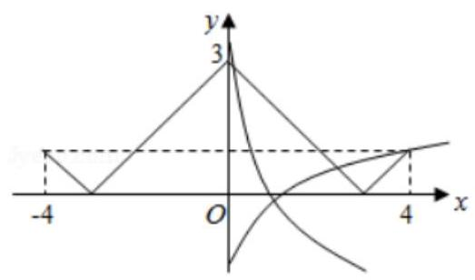

故答案为: $\left( {0,1}\right)  \cup  \left( {1,4}\right)$ .

## 二、选择题

7、为了得到函数 $y = \lg \frac{x - 3}{10}$ 的图象,只需把函数 $y = \lg x$ 的图象上所有的点(   )

A. 向左平移 3 个单位长度,再向上平移 $I$ 个单位长度

B. 向右平移 3 个单位长度,再向上平移 1 个单位长度

C. 向左平移 3 个单位长度,再向下平移 1 个单位长度

D. 向右平移 3 个单位长度,再向下平移 1 个单位长度

【难度】 $\star   \star$

【答案】 $D$

【解析】解: $y = \lg \frac{x - 3}{10} = \lg \left( {x - 3}\right)  - 1$ .

所以要得到函数 $y = \lg \frac{x - 3}{10}$ 的图象,只需将函数 $\lg x$ 的图象向右平移 3 个单位,在将函数的图象向下平移 1 个单位即可.

故选: $D$ .

8、已知函数 $f\left( x\right)  = \ln \frac{x}{4 - x}$ ，则()

A. $y = f\left( x\right)$ 的图象关于点 $\left( {2,0}\right)$ 对称

B. $y = f\left( x\right)$ 的图象关于直线 $x = 2$ 对称

C. $f\left( x\right)$ 在 $\left( {0,4}\right)$ 上单调递减

D. $f\left( x\right)$ 在 $\left( {0,2}\right)$ 上单调递减，在 $\left( {2,4}\right)$ 上单调递增

【难度】 $\star   \star   \star$

【答案】 $A$

【解析】解: $\frac{x}{4 - x} > 0$ ,则函数定义域为 $\left( {0,4}\right) , f\left( 1\right)  = \ln \frac{1}{3}, f\left( 3\right)  = \ln 3$ ,

即 $f\left( 3\right)  =  - f\left( 1\right)$ ,有关于点 $\left( {2,0}\right)$ 对称的可能,进而推测 $f\left( {x + 2}\right)$ 为奇函数,关于原点对称, $f\left( {x + 2}\right)  = \ln \frac{x + 2}{2 - x}$ ,定义域为 $\left( {-2,2}\right)$ ,奇函数且单调递增, $\therefore f\left( x\right)$ 为 $f\left( {x + 2}\right)$ 向右平移两个单位得到, 则函数在 $\left( {0,4}\right)$ 单调递增,关于点 $\left( {2,0}\right)$ 对称,

9、已知 $f\left( x\right)$ 是定义在 $R$ 上的偶函数， $f\left( {1 - x}\right)  =  - f\left( {1 + x}\right)$ ，且当 $x \in  \left\lbrack  {0,1}\right\rbrack$ 时， $f\left( x\right)  = {x}^{2} - 1$ ，则下列说法不正确的是( )

A. $f\left( x\right)$ 是以 4 为周期的周期函数

B. 当 $x \in  \left\lbrack  {9,{10}}\right\rbrack$ 时, $f\left( x\right)  =  - {x}^{2} + {20x} - {99}$

C. 函数 $f\left( x\right)$ 的图像关于点 $\left( {3,0}\right)$ 对称

D. 函数 $y = \lg \left| x\right|$ 的图象与函数 $f\left( x\right)$ 的图象有且仅有 11 个交点

【难度】 $\star   \star   \star$

【答案】D

【解析】解: 已知 $f\left( x\right)$ 是定义在 $R$ 上的偶函数, $f\left( {1 - x}\right)  =  - f\left( {1 + x}\right)$ ,

整理得: $f\left( {-x}\right)  =  - f\left( {x + 2}\right)$ ,转换为 $f\left( {x + 4}\right)  = f\left( x\right)$ ,

故函数的最小正周期为 4 ，故 $A$ 正确；

由于 $x \in  \left\lbrack  {0,1}\right\rbrack$ 时, $f\left( x\right)  = {x}^{2} - 1$ ,

由于函数为偶函数,

当 $- 1 \leq  x < 0$ ,故 $0 <  - x \leq  1$ ,

$f\left( {-x}\right)  = {\left( -x\right) }^{2} - 1 = {x}^{2} - 1,$

故 $f\left( x\right)  = {x}^{2} - 1$ ;

当 $1 \leq  x \leq  3$ 时, $f\left( x\right)  =  - {\left( x - 2\right) }^{2} + 1$ ,

当 $9 \leq  x \leq  {10}$ 时, $f\left( x\right)  =  - {\left( x - 2 - 8\right) }^{2} + 1 =  - {x}^{2} + {20x} - {99}$ ,故 $B$ 正确;

由于当 $1 \leq  x \leq  3$ 时, $f\left( x\right)  =  - {\left( x - 2\right) }^{2} + 1$ ,故 $f\left( 3\right)  = 0$ ,故 $C$ 正确;

对于 $D$ : 根据函数 $y = {lg}\left| y\right|$ 与函数 $f\left( x\right)$ 的图象,

由于 $y = g\left( {10}\right)  = \lg {10} = 1$ ,故在 $x = {10}$ 时与函数 $f\left( x\right)$ 的图象相切.

如图所示:

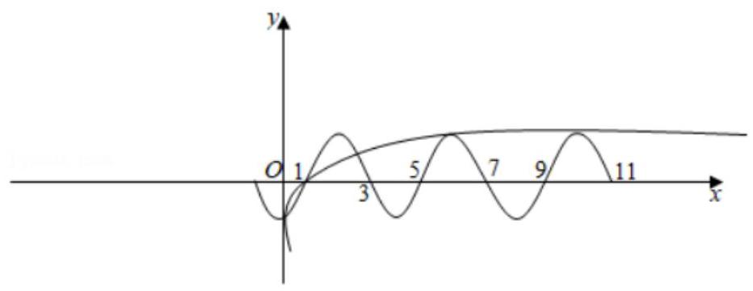

由于函数的图象关于 $y$ 轴对称,在 $x$ 轴的正半轴上有 6 个交点,

故在 $x$ 轴的负半轴上也有 6 个交点,故 $D$ 错误.

故选: D.

10、定义在自然数集上的函数 $f\left( x\right)$ 满足 $f\left( 0\right)  = 0, f\left( x\right)  = x - f\left( {f\left( {x - 1}\right) }\right)$ ，则 $f\left( {2021}\right)  =$ (   )

A. 1248 B. 1263 C. 1250 D. 1251

【难度】 $\star   \star   \star   \star$

【答案】 $B$

【解析】解: 根据题意,函数 $f\left( x\right)$ 满足 $f\left( 0\right)  = 0, f\left( x\right)  = x - f\left( {f\left( {x - 1}\right) }\right)$ ,

令 $x = 1$ ,有 $f\left( 1\right)  = 1 - f\left( {f\left( 0\right) }\right)  = 1 - f\left( 0\right)  = 1 - 0 = 1$ ,

令 $x = 2$ ,有 $f\left( 2\right)  = 2 - f\left( {f\left( 1\right) }\right)  = 2 - f\left( 1\right)  = 2 - 1 = 1$ ,

令 $x = 3$ ,有 $f\left( 3\right)  = 3 - f\left( {f\left( 2\right) }\right)  = 3 - f\left( 1\right)  = 3 - 1 = 2$ ,

令 $x = 4$ ,有 $f\left( 4\right)  = 4 - f\left( {f\left( 3\right) }\right)  = 4 - f\left( 2\right)  = 4 - 1 = 3$ ,

令 $x = 5$ ,有 $f\left( 5\right)  = 5 - f\left( {f\left( 4\right) }\right)  = 5 - f\left( 3\right)  = 5 - 2 = 3$ ,

令 $x = 6$ ,有 $f\left( 6\right)  = 6 - f\left( {f\left( 5\right) }\right)  = 6 - f\left( 3\right)  = 6 - 2 = 4$ ,

令 $x = 7$ ,有 $f\left( 7\right)  = 7 - f\left( {f\left( 6\right) }\right)  = 7 - f\left( 4\right)  = 7 - 3 = 4$ ,

令 $x = 8$ ,有 $f\left( 8\right)  = 8 - f\left( {f\left( 7\right) }\right)  = 8 - f\left( 4\right)  = 8 - 3 = 5$ ,

同理:

$f\left( 9\right)  = 6, f\left( {10}\right)  = 6, f\left( {11}\right)  = 7, f\left( {12}\right)  = 8, f\left( {13}\right)  = 8, f\left( {14}\right)  = 9, f\left( {15}\right)  = 9, f\left( {16}\right)  = {10}$ ,

$f\left( {17}\right)  = {11}, f\left( {18}\right)  = {11}, f\left( {19}\right)  = {12}, f\left( {20}\right)  = {12}, f\left( {21}\right)  = {13}, f\left( {22}\right)  = {14}, f\left( {23}\right)  = {14}, f\left( {24}\right)  = {15},$ ......

归纳可得 $f\left( x\right)  = f\left( {x - 8}\right)  + 5, x \geq  8$ ,

$\therefore f\left( {2021}\right)  = f\left( {{2021} - 8}\right)  + 5 = f\left( {{2021} - 2 \times  8}\right)  + 2 \times  5 = \ldots  = f\left( {{2021} - {252} \times  8}\right)  + {252} \times  5 = f\left( 5\right)  + {1260} = {1263}$ . 故选: $B$ .

## 三、解答题

11、对于函数 $f\left( x\right)$ ,若在定义域内存在实数 $x$ ,满足 $f\left( {-x}\right)  = 2 - f\left( x\right)$ ,则称 “局部中心函数”.

(1)已知二次函数 $f\left( x\right)  = a{x}^{2} + {2x} - {4a} + 1\left( {a \in  R}\right)$ ，试判断 $f\left( x\right)$ 是否为“局部中心函数”，并说明理由；

(2)若 $f\left( x\right)  = {4}^{x} - m \cdot  {2}^{x + 1} + {m}^{2} - 3$ 是定义域为 $R$ 上的“局部中心函数”，求实数 $m$ 的取值范围.

【难度】 $\star   \star   \star   \star$

【答案】见解析

【解析】解: (1) 由 $f\left( {-x}\right)  + f\left( x\right)  = 2$ 可得 ${2a}{x}^{2} - {8a} = {2a}\left( {{x}^{2} - 4}\right)  = 0$ 显然有解 $x = 2$ 或 $x =  - 2$ ,

故 $f\left( x\right)$ 为“局部中心函数,

( 2 )若 $f\left( x\right)$ 为局部中心函数，则 $f\left( {-x}\right)  + f\left( x\right)  = 2$ 有解，

得 ${4}^{x} - m \cdot  {2}^{x + 1} + {m}^{2} - 3 + {4}^{-x} - m \cdot  {2}^{-x + 1} + {m}^{2} - 3 = 2$ ,

即 ${4}^{-x} + {4}^{x} - {2m}\left( {{2}^{x} + {2}^{-x}}\right)  + 2{m}^{2} - 8 = 0$ ,

令 ${2}^{x} + {2}^{-x} = t \geq  2$ ,

从而 $g\left( t\right)  = {t}^{2} - {2mt} + 2{m}^{2} - {10} = 0$ 在 $\lbrack 2, + \infty )$ 有解.

① 当 $g\left( 2\right)  \leq  0$ 时， ${t}^{2} - {2mt} + 2{m}^{2} - {10} = 0$ 在 $\lbrack 2, + \infty )$ 有解，

由 $g\left( 2\right)  \leq  0$ ,即 $2{m}^{2} - {4m} - 6 \leq  0$ ,解得 $- 1 \leq  m \leq  3$ ;

② 当 $g\left( 2\right)  > 0$ 时， ${t}^{2} - {2mt} + 2{m}^{2} - {10} = 0$ 在 $\lbrack 2, + \infty )$ 有解等价于 $\left\{  \begin{array}{l} m > 2 \\  \Delta  = {40} - 4{m}^{2} \geq  0 \\  g\left( 2\right)  = 2\left( {{m}^{2} - {2m} - 3}\right)  > 0 \end{array}\right.$ ，

解得 $3 < m \leq  \sqrt{10}$ ,

综上,所求实数 $m$ 的取值范围为 $- 1 \leq  m \leq  \sqrt{10}$ .

12、已知 $f\left( x\right)$ 是定义在 $R$ 上的函数,满足 $f\left( {x + 1}\right)  = \frac{1 - f\left( x\right) }{1 + f\left( x\right) }$ .

(1)证明:2 是函数 $f\left( x\right)$ 的周期；

(2)当 $x \in  \lbrack 0,1)$ 时， $f\left( x\right)  = x$ ，求 $f\left( x\right)$ 在 $x \in  \lbrack  - 1,0)$ 时的解析式，并写出 $f\left( x\right)$ 在 $x \in  \lbrack {2k} - 1,{2k} + 1)\left( {k \in  Z}\right)$ 时的解析式;

(3)对于(2)中的函数 $f\left( x\right)$ ，若关于 $x$ 的方程 $f\left( x\right)  = {ax}$ 恰好有 20 个解，求实数 $a$ 的取值范围.

【难度】 $\star   \star   \star   \star$

【答案】见解析

【解析】证明: (1) 因为 $f\left( {x + 1}\right)  = \frac{1 - f\left( x\right) }{1 + f\left( x\right) }$ ,令 $x$ 取 $x + 1$ 得,

所以 $f\left( {x + 2}\right)  = \frac{1 - f\left( {x + 1}\right) }{1 + f\left( {x + 1}\right) } = \frac{1 - \frac{1 - f\left( x\right) }{1 + f\left( x\right) }}{1 + \frac{1 - f\left( x\right) }{1 + f\left( x\right) }} = f\left( x\right)$ ,

所以，2 是函数 $f\left( x\right)$ 的周期.

解: (2) 当 $x \in  \lbrack  - 1,0)$ 时, $x + 1 \in  \lbrack 0,1)$ ,则 $f\left( {x + 1}\right)  = x + 1$ ,

又 $f\left( {x + 1}\right)  = \frac{1 - f\left( x\right) }{1 + f\left( x\right) }$ ,即 $\frac{1 - f\left( x\right) }{1 + f\left( x\right) } = x + 1$ ,解得 $f\left( x\right)  =  - \frac{x}{x + 2}$ .

所以,当 $x \in  \lbrack  - 1,0)$ 时, $f\left( x\right)  =  - \frac{x}{x + 2}$ .

所以, $f\left( x\right)  = \left\{  \begin{array}{l}  - \frac{x}{x + 2}, x \in  \lbrack  - 1,0) \\  x, x \in  \lbrack 0,1). \end{array}\right.$

因为 $f\left( x\right)$ 的周期为 2,所以当 $x \in  \lbrack {2k} - 1,{2k} + 1)\left( {k \in  Z}\right)$ 时,

$f\left( x\right)  = f\left( {x - {2k}}\right)  = \left\{  {\begin{array}{l}  - \frac{x - {2k}}{x - {2k} + 2}, x \in  \lbrack {2k} - 1,{2k}) \\  x - {2k},\lbrack {2k},{2k} + 1) \end{array},}\right.$

(3)由(2)作出函数的图象，则方程 $f\left( x\right)  = {ax}$ 解的个数:

就是函数 $f\left( x\right)$ 的图象与直线 $y = {ax}$ 的交点个数.

若 $a = 0$ ,则 $x = {2k}\left( {k \in  Z}\right)$ 都是方程的解,

不合题意.

若 $a > 0$ ,则 $x = 0$ 是方程的解.

要使方程恰好有 20 个解,在区间 $\lbrack 1,{19})$ 上, $f\left( x\right)$ 有 9 个周期,每个周期有 2 个解,

在区间 $\lbrack {19},{21})$ 上有且仅有一个解.

则 $\left\{  \begin{array}{l} {19a} < 1 \\  {21a} > 1 \end{array}\right.$ 解得, $\frac{1}{21} < a < \frac{1}{19}$ .

若 $a < 0$ ,同理可得 $- \frac{1}{19} < a <  - \frac{1}{21}$ .

综上, $a \in  \left( {-\frac{1}{19}, - \frac{1}{21}}\right)  \cup  \left( {\frac{1}{21},\frac{1}{19}}\right)$ .

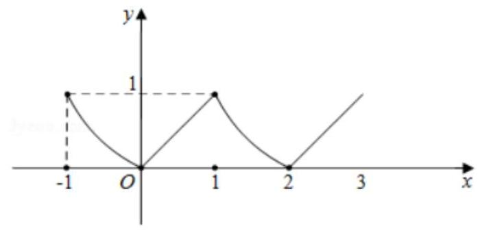
